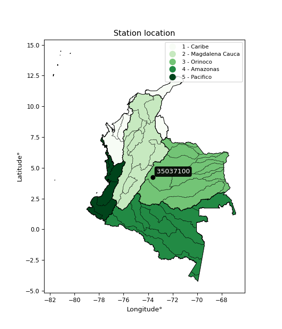

<div align="center">


</div>

# PMP Station (rain, Pmax24h): 35037100

Probable Maximum Precipitation (PMP) is the greatest amount of rainfall for a specific duration that is meteorologically possible for a given location, acting as a "worst-case" scenario for extreme storms, crucial for designing safety-critical infrastructure like bridges, river deviations, dams, spillways, and nuclear plants to prevent catastrophic failure. PMP is calculated by hydrologists using meteorological data to determine the upper limit of extreme rainfall, often leading to the Probable Maximum Flood (PMF) for flood control design, and is increasingly being studied for climate change impacts.

<div align="center">

</img>

</div>


## A. General information


### 1. General running parameters

• app_version: _v20251228_. • runtime: _2025-12-28 08:43:48.795225_. • Python version: _3.14.0_. • SciPy version: _1.16.3_. • Pandas version: _2.3.3_. • NumPy version: _2.3.5_. • Stations dataset (station_dataset_file): _dataset/pmax24h_in/automatic_colombia_2003_2024.csv_. • Stations catalog (station_catalog_file): _dataset/CNE_IDEAM.xls_. • Minimum year to eval til year_max (date_min): _1900_. • Maximum year to eval since year_min (date_max): _2024_. • Creates, save and include plots into reports (create_plot): _False_. • Plot only fit distributions with Δo > Δ (plot_only_fit): _True_. • Eval low extreme values, if False, evaluates high extreme values (low_extreme): _False_. • Eval every SciPy distribution as logarithmic (pdist_logarithmic_on): _True_. • Standard deviation normalized (ddof): _1.0_. • Return periods to eval in years (Tr): _[2, 2.33, 5, 10, 15, 20, 25, 50, 75, 100, 200, 250, 500, 750, 1000]_. • Minimum data sample per station, 0 means any (minimum_sample): _5_. • Z-Score maximum threshold to adjust a value, 0 means disable (zscore_max): _3.5_. • Z-Score minimum threshold to adjust a value, 0 means disable (zscore_min): _-2.5_. • Avoid zeros, e.g. rain = 0 (avoid_zeros): _True_. • Avoid null values (avoid_nans): _True_. [:file_folder:Dataset file.](../../dataset/pmax24h_in/automatic_colombia_2003_2024.csv)

> Delta Degrees of Freedom (DDOF): is a parameter used in the formulas for calculating variance and standard deviation. When ddof=0, the divisor is $N$ (the total number of observations) and this is used when your data set is the entire population. When ddof=1, the divisor is $N-1$ and this is used when your data set is a sample drawn from a larger population. Using $N-1$ provides an unbiased estimate of the population variance (known as Bessel´s correction).


### 2. Station info and location

|   id |   CODIGO | NOMBRE                         | CATEGORIA    | TECNOLOGIA                              | ESTADO           | FECHA_INSTALACION   |   FECHA_SUSPENSION |   ALTITUD |   LATITUD |   LONGITUD | DEPARTAMENTO   | MUNICIPIO     | AREA_OPERATIVA                            | ENTIDAD                                                     | AREA_HIDROGRAFICA   | ZONA_HIDROGRAFICA   | SUBZONA_HIDROGRAFICA   | CORRIENTE   | Catalogo   |
|-----:|---------:|:-------------------------------|:-------------|:----------------------------------------|:-----------------|:--------------------|-------------------:|----------:|----------:|-----------:|:---------------|:--------------|:------------------------------------------|:------------------------------------------------------------|:--------------------|:--------------------|:-----------------------|:------------|:-----------|
|    0 | 35037100 | PUENTE ABADIA - AUT [35037100] | Limnigráfica | Automática con Telemetría, Convencional | En Mantenimiento | 15/04/1968          |                nan |       548 |   4.23533 |   -73.6354 | Meta           | Villavicencio | Area Operativa 03 - Meta-Guaviare-Guainía | INSTITUTO DE HIDROLOGIA METEOROLOGIA Y ESTUDIOS AMBIENTALES | Orinoco             | Meta                | Río Guatiquía          | Guatiquia   | CNE_IDEAM  |

<div align="center">

Map location in: [:earth_americas:Google](http://maps.google.com/maps?q=4.235333333,-73.63536111) [:earth_americas:OSM](https://www.openstreetmap.org/#map=18/4.235333333/-73.63536111&layers=P) [:earth_americas:Bing](https://www.bing.com/maps?cp=4.235333333~-73.63536111&lvl=18) [:earth_americas:Apple](https://maps.apple.com/frame?center=4.235333333%2C-73.63536111&span=0.003%2C0.006)

</div>


<div align="center">

```geojson
{
  "type": "Feature",
  "geometry": {
    "type": "Point", 
    "coordinates": [-73.63536111, 4.235333333]
  }, 
  "properties": {
    "Name": "35037100"
  }
}
```

</div>


### 3. Discrete values table and plot

|               |           0 |            1 |          2 |           3 |           4 |           5 |           6 |
|:--------------|------------:|-------------:|-----------:|------------:|------------:|------------:|------------:|
| Date          | 2016        | 2017         | 2019       | 2020        | 2021        | 2022        | 2023        |
| Value         |    0.1      |  102         |  315.6     |   26.3      |   74.4      |   57.2      |  156.1      |
| Value_initial |    0.1      |  102         |  315.6     |   26.3      |   74.4      |   57.2      |  156.1      |
| count         |    7        |    7         |    7       |    7        |    7        |    7        |    7        |
| mean          |  104.529    |  104.529     |  104.529   |  104.529    |  104.529    |  104.529    |  104.529    |
| std           |  105.979    |  105.979     |  105.979   |  105.979    |  105.979    |  105.979    |  105.979    |
| zscore        |   -0.985366 |   -0.0238591 |    1.99163 |   -0.738148 |   -0.284287 |   -0.446582 |    0.486617 |

> The initial value (value_initial) correspond to the initial obtained or null completed value, and value (value) is adjusted only when the initial value is outside the valid range definite through the Z-Score value. If Z-Score is active, values out of range or outliers are replaced with the station mean value


### 4. Active continuous probability distributions from SciPy (44 of 104 available)

[scipy.stats](https://docs.scipy.org/doc/scipy/reference/stats.html) is a Python´s powerful submodule within the SciPy library for comprehensive statistical analysis, offering over 130 probability distributions (like Normal, Poisson), functions for descriptive stats (mean, variance), hypothesis testing (t-tests, chi-square), random variable generation, and statistical tests, making it essential for data science, modeling, and research. It provides tools to explore, model, and draw conclusions from data efficiently, working seamlessly with NumPy.

<div align="center">

|   id | p_dist             |   n_parameter | fit_method   | label                                                                       | active   | ref                                                                                                        |
|-----:|:-------------------|--------------:|:-------------|:----------------------------------------------------------------------------|:---------|:-----------------------------------------------------------------------------------------------------------|
|    0 | alpha              |             3 | MLE          | Alpha                                                                       | True     | [:mortar_board:](https://docs.scipy.org/doc/scipy/reference/generated/scipy.stats.alpha.html)              |
|    1 | betaprime          |             4 | MLE          | Beta prime                                                                  | True     | [:mortar_board:](https://docs.scipy.org/doc/scipy/reference/generated/scipy.stats.betaprime.html)          |
|    2 | chi2               |             3 | MLE          | Chi²                                                                        | True     | [:mortar_board:](https://docs.scipy.org/doc/scipy/reference/generated/scipy.stats.chi2.html)               |
|    3 | crystalball        |             4 | MLE          | Crystalball                                                                 | True     | [:mortar_board:](https://docs.scipy.org/doc/scipy/reference/generated/scipy.stats.crystalball.html)        |
|    4 | erlang             |             3 | MLE          | Erlang                                                                      | True     | [:mortar_board:](https://docs.scipy.org/doc/scipy/reference/generated/scipy.stats.erlang.html)             |
|    5 | expon              |             2 | MLE          | Exponential                                                                 | True     | [:mortar_board:](https://docs.scipy.org/doc/scipy/reference/generated/scipy.stats.expon.html)              |
|    6 | exponnorm          |             3 | MLE          | Exponentially modified Normal                                               | True     | [:mortar_board:](https://docs.scipy.org/doc/scipy/reference/generated/scipy.stats.exponnorm.html)          |
|    7 | f                  |             4 | MLE          | F                                                                           | True     | [:mortar_board:](https://docs.scipy.org/doc/scipy/reference/generated/scipy.stats.f.html)                  |
|    8 | fatiguelife        |             3 | MLE          | Fatigue-life (Birnbaum-Saunders)                                            | True     | [:mortar_board:](https://docs.scipy.org/doc/scipy/reference/generated/scipy.stats.fatiguelife.html)        |
|    9 | fisk               |             3 | MLE          | Fisk                                                                        | True     | [:mortar_board:](https://docs.scipy.org/doc/scipy/reference/generated/scipy.stats.fisk.html)               |
|   10 | gamma              |             3 | MLE          | Gamma                                                                       | True     | [:mortar_board:](https://docs.scipy.org/doc/scipy/reference/generated/scipy.stats.gamma.html)              |
|   11 | genexpon           |             5 | MLE          | Generalized exponential                                                     | True     | [:mortar_board:](https://docs.scipy.org/doc/scipy/reference/generated/scipy.stats.genexpon.html)           |
|   12 | genlogistic        |             3 | MLE          | Generalized logistic                                                        | True     | [:mortar_board:](https://docs.scipy.org/doc/scipy/reference/generated/scipy.stats.genlogistic.html)        |
|   13 | gibrat             |             2 | MM           | Gibrat                                                                      | True     | [:mortar_board:](https://docs.scipy.org/doc/scipy/reference/generated/scipy.stats.gibrat.html)             |
|   14 | gompertz           |             3 | MLE          | Gompertz (or truncated Gumbel)                                              | True     | [:mortar_board:](https://docs.scipy.org/doc/scipy/reference/generated/scipy.stats.gompertz.html)           |
|   15 | gumbel_l           |             2 | MM           | Gumbel Left Skew                                                            | True     | [:mortar_board:](https://docs.scipy.org/doc/scipy/reference/generated/scipy.stats.gumbel_l.html)           |
|   16 | gumbel_r           |             2 | MM           | Gumbel Right Skew                                                           | True     | [:mortar_board:](https://docs.scipy.org/doc/scipy/reference/generated/scipy.stats.gumbel_r.html)           |
|   17 | halflogistic       |             2 | MM           | Half-logistic                                                               | True     | [:mortar_board:](https://docs.scipy.org/doc/scipy/reference/generated/scipy.stats.halflogistic.html)       |
|   18 | halfnorm           |             2 | MM           | Half Normal                                                                 | True     | [:mortar_board:](https://docs.scipy.org/doc/scipy/reference/generated/scipy.stats.halfnorm.html)           |
|   19 | hypsecant          |             2 | MM           | hyperbolic secant                                                           | True     | [:mortar_board:](https://docs.scipy.org/doc/scipy/reference/generated/scipy.stats.hypsecant.html)          |
|   20 | invgamma           |             3 | MLE          | Inverted gamma                                                              | True     | [:mortar_board:](https://docs.scipy.org/doc/scipy/reference/generated/scipy.stats.invgamma.html)           |
|   21 | invgauss           |             3 | MLE          | Inverse Gaussian                                                            | True     | [:mortar_board:](https://docs.scipy.org/doc/scipy/reference/generated/scipy.stats.invgauss.html)           |
|   22 | invweibull         |             3 | MLE          | Inverted Weibull                                                            | True     | [:mortar_board:](https://docs.scipy.org/doc/scipy/reference/generated/scipy.stats.invweibull.html)         |
|   23 | johnsonsu          |             4 | MLE          | Johnson Su                                                                  | True     | [:mortar_board:](https://docs.scipy.org/doc/scipy/reference/generated/scipy.stats.johnsonsu.html)          |
|   24 | kstwobign          |             2 | MLE          | Limiting distribution of scaled Kolmogorov-Smirnov two-sided test statistic | True     | [:mortar_board:](https://docs.scipy.org/doc/scipy/reference/generated/scipy.stats.kstwobign.html)          |
|   25 | laplace            |             2 | MM           | Laplace                                                                     | True     | [:mortar_board:](https://docs.scipy.org/doc/scipy/reference/generated/scipy.stats.laplace.html)            |
|   26 | laplace_asymmetric |             3 | MLE          | Asymmetric Laplace                                                          | True     | [:mortar_board:](https://docs.scipy.org/doc/scipy/reference/generated/scipy.stats.laplace_asymmetric.html) |
|   27 | loggamma           |             3 | MLE          | Log gamma                                                                   | True     | [:mortar_board:](https://docs.scipy.org/doc/scipy/reference/generated/scipy.stats.loggamma.html)           |
|   28 | logistic           |             2 | MM           | Logistic (or Sech-squared)                                                  | True     | [:mortar_board:](https://docs.scipy.org/doc/scipy/reference/generated/scipy.stats.logistic.html)           |
|   29 | lognorm            |             3 | MLE          | Log Normal                                                                  | True     | [:mortar_board:](https://docs.scipy.org/doc/scipy/reference/generated/scipy.stats.lognorm.html)            |
|   30 | maxwell            |             2 | MM           | Maxwell                                                                     | True     | [:mortar_board:](https://docs.scipy.org/doc/scipy/reference/generated/scipy.stats.maxwell.html)            |
|   31 | mielke             |             4 | MLE          | Mielke Beta-Kappa / Dagum                                                   | True     | [:mortar_board:](https://docs.scipy.org/doc/scipy/reference/generated/scipy.stats.mielke.html)             |
|   32 | moyal              |             2 | MM           | Moyal                                                                       | True     | [:mortar_board:](https://docs.scipy.org/doc/scipy/reference/generated/scipy.stats.moyal.html)              |
|   33 | nakagami           |             3 | MLE          | Nakagami                                                                    | True     | [:mortar_board:](https://docs.scipy.org/doc/scipy/reference/generated/scipy.stats.nakagami.html)           |
|   34 | ncf                |             5 | MLE          | Non-central F distribution                                                  | True     | [:mortar_board:](https://docs.scipy.org/doc/scipy/reference/generated/scipy.stats.ncf.html)                |
|   35 | nct                |             4 | MLE          | Non-central Student’s t                                                     | True     | [:mortar_board:](https://docs.scipy.org/doc/scipy/reference/generated/scipy.stats.nct.html)                |
|   36 | norm               |             2 | MM           | Normal                                                                      | True     | [:mortar_board:](https://docs.scipy.org/doc/scipy/reference/generated/scipy.stats.norm.html)               |
|   37 | pearson3           |             3 | MM           | Pearson type III                                                            | True     | [:mortar_board:](https://docs.scipy.org/doc/scipy/reference/generated/scipy.stats.pearson3.html)           |
|   38 | rayleigh           |             2 | MM           | Rayleigh                                                                    | True     | [:mortar_board:](https://docs.scipy.org/doc/scipy/reference/generated/scipy.stats.rayleigh.html)           |
|   39 | rice               |             3 | MLE          | Rice                                                                        | True     | [:mortar_board:](https://docs.scipy.org/doc/scipy/reference/generated/scipy.stats.rice.html)               |
|   40 | t                  |             3 | MLE          | Student’s t                                                                 | True     | [:mortar_board:](https://docs.scipy.org/doc/scipy/reference/generated/scipy.stats.t.html)                  |
|   41 | truncnorm          |             4 | MLE          | Truncated normal                                                            | True     | [:mortar_board:](https://docs.scipy.org/doc/scipy/reference/generated/scipy.stats.truncnorm.html)          |
|   42 | wald               |             2 | MM           | Wald                                                                        | True     | [:mortar_board:](https://docs.scipy.org/doc/scipy/reference/generated/scipy.stats.wald.html)               |
|   43 | weibull_min        |             3 | MLE          | Weibull minimum                                                             | True     | [:mortar_board:](https://docs.scipy.org/doc/scipy/reference/generated/scipy.stats.weibull_min.html)        |

</div>

> **n_parameter:** # arguments & localization & scale.
>
> **Fit methods:** (MLE) maximum likelihood, (MM) L-moments.
>
>**Inactive:** foldnorm, gennorm, norminvgauss, powernorm, powerlognorm, skewnorm, genextreme, anglit, arcsine, argus, beta, bradford, burr, burr12, cauchy, cosine, halfcauchy, foldcauchy, skewcauchy, wrapcauchy, dgamma, gengamma, exponweib, exponpow, truncexpon, gausshyper, genhalflogistic, genhyperbolic, geninvgauss, halfgennorm, johnsonsb, kappa4, kappa3, ksone, kstwo, loglaplace, levy, levy_l, levy_stable, ncx2, pareto, genpareto, truncpareto, lomax, powerlaw, rdist, rel_breitwigner, recipinvgauss, semicircular, studentized_range, trapezoid, triang, truncweibull_min, tukeylambda, uniform, loguniform, vonmises, vonmises_line, weibull_max, dweibull, 


## B. Probability distributions vs. Empirical distributions

A continuous probability distribution (CPD) describes probabilities for variables that can take any value within a range (like rain any time), unlike discrete variables with specific outcomes (like temperature). It uses a Probability Density Function (PDF), a curve where the total area under it equals 1, and the probability of the variable falling within an interval (a to b) is found by calculating the area under the curve between those points. A key feature is that the probability of hitting any single exact value is zero, so probabilities are always expressed for ranges, e.g., $P(a ≤ X ≤ b)$.

<div align="center">

Distributions parameters from station values
|    |   station | p_dist                |   n |              loc |           scale | shape                  | shape1             | shape2                | shape3   |
|---:|----------:|:----------------------|----:|-----------------:|----------------:|:-----------------------|:-------------------|:----------------------|:---------|
|  0 |  35037100 | alpha                 |   7 |   -139.247       |   649.934       | 3.0337388824515372     |                    |                       |          |
|  1 |  35037100 | betaprime             |   7 |      0.1         |   427.474       | 0.64538630390542       | 4.137139692779261  |                       |          |
|  2 |  35037100 | chi2                  |   7 |      0.0989993   |    70.37        | 1.136211417589411      |                    |                       |          |
|  3 |  35037100 | crystalball           |   7 |    104.529       |    98.1179      | 8688.800005448875      | 5191.7741451035245 |                       |          |
|  4 |  35037100 | erlang                |   7 |      0.1         |    99.2763      | 0.7715146510293374     |                    |                       |          |
|  5 |  35037100 | expon                 |   7 |      0.1         |   104.429       |                        |                    |                       |          |
|  6 |  35037100 | exponnorm             |   7 |     -0.0271246   |     0.0394539   | 2622.492948096411      |                    |                       |          |
|  7 |  35037100 | f                     |   7 |      0.1         |   112.41        | 1.4312355127139569     | 5.963109458502856  |                       |          |
|  8 |  35037100 | fatiguelife           |   7 |      0.0999912   |     0.0330034   | 47.59697737411119      |                    |                       |          |
|  9 |  35037100 | fisk                  |   7 |      0.1         |    67.9945      | 0.8744047712775069     |                    |                       |          |
| 10 |  35037100 | gamma                 |   7 |      0.1         |    86.6018      | 0.439440319765227      |                    |                       |          |
| 11 |  35037100 | genexpon              |   7 |      0.09494     |  1508.27        | 13.862786208061424     | 1.8114346888865287 | 6.730492263846809     |          |
| 12 |  35037100 | genlogistic           |   7 |   -410.56        |    65.9531      | 1294.730997986373      |                    |                       |          |
| 13 |  35037100 | gibrat                |   7 |     29.677       |    45.3998      |                        |                    |                       |          |
| 14 |  35037100 | gompertz              |   7 |      0.1         |  1207.55        | 10.632590070360372     |                    |                       |          |
| 15 |  35037100 | gumbel_l              |   7 |    148.687       |    76.5022      |                        |                    |                       |          |
| 16 |  35037100 | gumbel_r              |   7 |     60.3703      |    76.5022      |                        |                    |                       |          |
| 17 |  35037100 | halflogistic          |   7 |    -11.764       |    83.8874      |                        |                    |                       |          |
| 18 |  35037100 | halfnorm              |   7 |    -25.3411      |   162.768       |                        |                    |                       |          |
| 19 |  35037100 | hypsecant             |   7 |    104.529       |    62.4638      |                        |                    |                       |          |
| 20 |  35037100 | invgamma              |   7 |    -57.5292      |   409.907       | 3.467046587278052      |                    |                       |          |
| 21 |  35037100 | invgauss              |   7 |    -30.0827      |   195.921       | 0.6870702101561287     |                    |                       |          |
| 22 |  35037100 | invweibull            |   7 |      0.1         |     4.04831     | 0.06417849166053008    |                    |                       |          |
| 23 |  35037100 | johnsonsu             |   7 |    -21.7528      |     1.30136     | -6.0360591695122405    | 1.216884503613274  |                       |          |
| 24 |  35037100 | kstwobign             |   7 |   -178.475       |   327.386       |                        |                    |                       |          |
| 25 |  35037100 | laplace               |   7 |    104.529       |    69.3799      |                        |                    |                       |          |
| 26 |  35037100 | laplace_asymmetric    |   7 |     57.2         |    59.1165      | 0.6768462899966365     |                    |                       |          |
| 27 |  35037100 | loggamma              |   7 | -37673.7         |  4870.71        | 2336.3319499780155     |                    |                       |          |
| 28 |  35037100 | logistic              |   7 |    104.529       |    54.0953      |                        |                    |                       |          |
| 29 |  35037100 | lognorm               |   7 |      0.1         |     0.18612     | 15.177473193413533     |                    |                       |          |
| 30 |  35037100 | maxwell               |   7 |   -127.97        |   145.697       |                        |                    |                       |          |
| 31 |  35037100 | mielke                |   7 |      0.1         |   134.672       | 0.5454217472554719     | 2.345291111847701  |                       |          |
| 32 |  35037100 | moyal                 |   7 |     48.4184      |    44.1686      |                        |                    |                       |          |
| 33 |  35037100 | nakagami              |   7 |      0.1         |   127.079       | 0.18958525124918738    |                    |                       |          |
| 34 |  35037100 | ncf                   |   7 |      0.0999998   |     2.03023     | 0.08169889484273542    | 18.52136813130827  | 4.077122647940379     |          |
| 35 |  35037100 | nct                   |   7 |    -86.5813      |    13.3034      | 3.0506740587650167     | 10.740976496837632 |                       |          |
| 36 |  35037100 | norm                  |   7 |    104.529       |    98.1179      |                        |                    |                       |          |
| 37 |  35037100 | pearson3              |   7 |    104.529       |    98.118       | 1.17808131193796       |                    |                       |          |
| 38 |  35037100 | rayleigh              |   7 |    -83.1768      |   149.767       |                        |                    |                       |          |
| 39 |  35037100 | rice                  |   7 |    -50.0522      |   129.465       | 0.0008451956570545245  |                    |                       |          |
| 40 |  35037100 | t                     |   7 |     73.7204      |    56.4606      | 2.143194580853998      |                    |                       |          |
| 41 |  35037100 | truncnorm             |   7 |    -31.3155      |   153.559       | 0.20458209455181214    | 2.259163910442629  |                       |          |
| 42 |  35037100 | wald                  |   7 |      6.41059     |    98.118       |                        |                    |                       |          |
| 43 |  35037100 | weibull_min           |   7 |      0.1         |   109.785       | 0.5461026800037916     |                    |                       |          |
| 44 |  35037100 | logalpha              |   7 |    -81.6111      |  2730.5         | 32.10412957289718      |                    |                       |          |
| 45 |  35037100 | logbetaprime          |   7 |     -2.30259     |     1.57294     | 0.9824097766697117     | 0.6753040386429514 |                       |          |
| 46 |  35037100 | logchi2               |   7 |     -2.30259     |     1.28771     | 1.0175952910590351     |                    |                       |          |
| 47 |  35037100 | logcrystalball        |   7 |      3.53613     |     2.49056     | 186.2013030285453      | 850.9486451878699  |                       |          |
| 48 |  35037100 | logerlang             |   7 |    -40.6775      |     0.157264    | 280.7809161690194      |                    |                       |          |
| 49 |  35037100 | logexpon              |   7 |     -2.30259     |     5.83872     |                        |                    |                       |          |
| 50 |  35037100 | logexponnorm          |   7 |      3.53433     |     2.49056     | 0.0007186571051571822  |                    |                       |          |
| 51 |  35037100 | logf                  |   7 |     -2.30259     |     1.1902      | 1.0414064428759655     | 1.0434102881399037 |                       |          |
| 52 |  35037100 | logfatiguelife        |   7 |  -1139.51        |  1143.03        | 0.0021714468186171962  |                    |                       |          |
| 53 |  35037100 | logfisk               |   7 |     -2.30259     |     2.85628     | 0.19072637315957947    |                    |                       |          |
| 54 |  35037100 | loggamma              |   7 |    -36.833       |     0.176569    | 228.76378892589355     |                    |                       |          |
| 55 |  35037100 | loggenexpon           |   7 |     -2.30259     |     1.0014      | 0.05057511352537622    | 12.947597871859216 | 0.0027191744885217313 |          |
| 56 |  35037100 | loggenlogistic        |   7 |      5.75455     |     2.49478e-06 | 1.1207085388843502e-06 |                    |                       |          |
| 57 |  35037100 | loggibrat             |   7 |      1.63613     |     1.15241     |                        |                    |                       |          |
| 58 |  35037100 | loggompertz           |   7 |     -2.31141     |     1.43773     | 0.008849990906466015   |                    |                       |          |
| 59 |  35037100 | loggumbel_l           |   7 |      4.65702     |     1.94188     |                        |                    |                       |          |
| 60 |  35037100 | loggumbel_r           |   7 |      2.41525     |     1.94188     |                        |                    |                       |          |
| 61 |  35037100 | loghalflogistic       |   7 |      0.584312    |     2.1293      |                        |                    |                       |          |
| 62 |  35037100 | loghalfnorm           |   7 |      0.2396      |     4.13158     |                        |                    |                       |          |
| 63 |  35037100 | loghypsecant          |   7 |      3.53613     |     1.58554     |                        |                    |                       |          |
| 64 |  35037100 | loginvgamma           |   7 |    -55.8229      | 30235.5         | 510.6576236197684      |                    |                       |          |
| 65 |  35037100 | loginvgauss           |   7 |    -21.767       |  2044.99        | 0.012312916104089758   |                    |                       |          |
| 66 |  35037100 | loginvweibull         |   7 |     -2.91087e+08 |     2.91087e+08 | 92951883.3686856       |                    |                       |          |
| 67 |  35037100 | logjohnsonsu          |   7 |      6.07168     |     0.0110579   | 6.218062014788579      | 1.0867768656253753 |                       |          |
| 68 |  35037100 | logkstwobign          |   7 |     -9.14524     |    14.5107      |                        |                    |                       |          |
| 69 |  35037100 | loglaplace            |   7 |      3.53613     |     1.76109     |                        |                    |                       |          |
| 70 |  35037100 | loglaplace_asymmetric |   7 |      5.0505      |     1.00974     | 2.001882374453144      |                    |                       |          |
| 71 |  35037100 | logloggamma           |   7 |      5.76047     |     1.46099e-05 | 6.590725665363861e-06  |                    |                       |          |
| 72 |  35037100 | loglogistic           |   7 |      3.53613     |     1.37312     |                        |                    |                       |          |
| 73 |  35037100 | loglognorm            |   7 |     -2.30259     |     1.91573     | 13.623552195770447     |                    |                       |          |
| 74 |  35037100 | logmaxwell            |   7 |     -2.36544     |     3.69826     |                        |                    |                       |          |
| 75 |  35037100 | logmielke             |   7 |     -2.30259     |     1.80759     | 0.7680340496503936     | 0.6560217697736744 |                       |          |
| 76 |  35037100 | logmoyal              |   7 |      2.11187     |     1.12115     |                        |                    |                       |          |
| 77 |  35037100 | lognakagami           |   7 |  -2145.01        |  2148.55        | 184940.20256302465     |                    |                       |          |
| 78 |  35037100 | logncf                |   7 |     -2.30259     |     1.04183     | 1.0474333905912783     | 1.1747913421617602 | 1.0804153860421095    |          |
| 79 |  35037100 | lognct                |   7 |    140.995       |     2.47057     | 103670.66631067806     | -55.63793785423891 |                       |          |
| 80 |  35037100 | lognorm               |   7 |      3.53613     |     2.49056     |                        |                    |                       |          |
| 81 |  35037100 | logpearson3           |   7 |      3.53612     |     2.49056     | -1.6902582280602578    |                    |                       |          |
| 82 |  35037100 | lograyleigh           |   7 |     -1.22845     |     3.80159     |                        |                    |                       |          |
| 83 |  35037100 | logrice               |   7 |   -881.37        |     2.49052     | 355.307537665165       |                    |                       |          |
| 84 |  35037100 | logt                  |   7 |      4.44245     |     0.657327    | 1.1397466841982271     |                    |                       |          |
| 85 |  35037100 | logtruncnorm          |   7 |      3.44608     |     2.59399     | -2.2161447044961036    | 5.836344712816395  |                       |          |
| 86 |  35037100 | logwald               |   7 |      1.04556     |     2.49056     |                        |                    |                       |          |
| 87 |  35037100 | logweibull_min        |   7 |     -2.30259     |     1.7923      | 0.5102683405215139     |                    |                       |          |

</div>

> **loc** (Location parameter): This shifts the distribution along the x-axis. For many common distributions, like the normal (Gaussian) distribution, loc represents the mean $μ$. For others, like the uniform distribution, it might represent the minimum value, or for the beta distribution, the left end of the support interval.
>
> **scale** (Scale parameter): This determines the width or spread of the distribution. For the normal distribution, scale represents the standard deviation $σ$. For a uniform distribution, it defines the length of the interval (from $loc$ to $loc + scale$).
>
> **shape** (Shape parameters): Refers to parameters that define the specific form of a probability distribution, distinct from its location (loc) and scale (scale). These parameters are required arguments for most distribution functions. For example, a normal (Gaussian) distribution is fully defined by its location (mean) and scale (standard deviation), so it has no specific shape parameters beyond loc and scale. However, other distributions have intrinsic properties that need specification, as Gamma distribution that takes a shape parameter, often named $a$ or $alpha$.


### 0. Cumulative distribution values - CDF (88 evaluated)

Cumulative Distribution Function (CDF), denoted as $F$<sub>$X$</sub>$(x)$, is a function that gives the probability that a random variable $X$ will take a value less than or equal to a specific value, $x$ (i.e., $(P(X≥x)$. It essentially "accumulates" probabilities from a given point up to the far right (positive infinity), providing a complete picture of the distribution´s probabilities for both discrete (like rain) and continuous (like temperature) variables, helping to find probabilities over ranges or above certain values.

<div align="center">

CDF ordered by x ascending and calculating $log(f(x))$ separately
|   id |   Station |   date |     x |   count |    mean |     std |     zscore |   Value_initial |   station |   m |     alpha |   alpha_pdf |   betaprime |   betaprime_pdf |       chi2 |   chi2_pdf |   crystalball |   crystalball_pdf |      erlang |    erlang_pdf |    expon |   expon_pdf |   exponnorm |   exponnorm_pdf |           f |         f_pdf |   fatiguelife |   fatiguelife_pdf |        fisk |    fisk_pdf |       gamma |   gamma_pdf |    genexpon |   genexpon_pdf |   genlogistic |   genlogistic_pdf |   gibrat |   gibrat_pdf |    gompertz |   gompertz_pdf |   gumbel_l |   gumbel_l_pdf |   gumbel_r |   gumbel_r_pdf |   halflogistic |   halflogistic_pdf |   halfnorm |   halfnorm_pdf |   hypsecant |   hypsecant_pdf |   invgamma |   invgamma_pdf |   invgauss |   invgauss_pdf |   invweibull |   invweibull_pdf |   johnsonsu |   johnsonsu_pdf |   kstwobign |   kstwobign_pdf |   laplace |   laplace_pdf |   laplace_asymmetric |   laplace_asymmetric_pdf |   loggamma |   loggamma_pdf |   logistic |   logistic_pdf |    lognorm |   lognorm_pdf |   maxwell |   maxwell_pdf |      mielke |   mielke_pdf |     moyal |   moyal_pdf |    nakagami |   nakagami_pdf |       ncf |         ncf_pdf |      nct |     nct_pdf |     norm |    norm_pdf |   pearson3 |   pearson3_pdf |   rayleigh |   rayleigh_pdf |     rice |    rice_pdf |        t |       t_pdf |   truncnorm |   truncnorm_pdf |      wald |    wald_pdf |   weibull_min |   weibull_min_pdf |   logalpha |   logalpha_pdf |   logbetaprime |   logbetaprime_pdf |     logchi2 |   logchi2_pdf |   logcrystalball |   logcrystalball_pdf |   logerlang |   logerlang_pdf |   logexpon |   logexpon_pdf |   logexponnorm |   logexponnorm_pdf |        logf |    logf_pdf |   logfatiguelife |   logfatiguelife_pdf |     logfisk |   logfisk_pdf |   loggenexpon |   loggenexpon_pdf |   loggenlogistic |   loggenlogistic_pdf |   loggibrat |   loggibrat_pdf |   loggompertz |   loggompertz_pdf |   loggumbel_l |   loggumbel_l_pdf |   loggumbel_r |   loggumbel_r_pdf |   loghalflogistic |   loghalflogistic_pdf |   loghalfnorm |   loghalfnorm_pdf |   loghypsecant |   loghypsecant_pdf |   loginvgamma |   loginvgamma_pdf |   loginvgauss |   loginvgauss_pdf |   loginvweibull |   loginvweibull_pdf |   logjohnsonsu |   logjohnsonsu_pdf |   logkstwobign |   logkstwobign_pdf |   loglaplace |   loglaplace_pdf |   loglaplace_asymmetric |   loglaplace_asymmetric_pdf |   logloggamma |   logloggamma_pdf |   loglogistic |   loglogistic_pdf |   loglognorm |   loglognorm_pdf |   logmaxwell |   logmaxwell_pdf |   logmielke |   logmielke_pdf |    logmoyal |   logmoyal_pdf |   lognakagami |   lognakagami_pdf |      logncf |   logncf_pdf |     lognct |   lognct_pdf |   logpearson3 |   logpearson3_pdf |   lograyleigh |   lograyleigh_pdf |    logrice |   logrice_pdf |      logt |   logt_pdf |   logtruncnorm |   logtruncnorm_pdf |   logwald |   logwald_pdf |   logweibull_min |   logweibull_min_pdf |
|-----:|----------:|-------:|------:|--------:|--------:|--------:|-----------:|----------------:|----------:|----:|----------:|------------:|------------:|----------------:|-----------:|-----------:|--------------:|------------------:|------------:|--------------:|---------:|------------:|------------:|----------------:|------------:|--------------:|--------------:|------------------:|------------:|------------:|------------:|------------:|------------:|---------------:|--------------:|------------------:|---------:|-------------:|------------:|---------------:|-----------:|---------------:|-----------:|---------------:|---------------:|-------------------:|-----------:|---------------:|------------:|----------------:|-----------:|---------------:|-----------:|---------------:|-------------:|-----------------:|------------:|----------------:|------------:|----------------:|----------:|--------------:|---------------------:|-------------------------:|-----------:|---------------:|-----------:|---------------:|-----------:|--------------:|----------:|--------------:|------------:|-------------:|----------:|------------:|------------:|---------------:|----------:|----------------:|---------:|------------:|---------:|------------:|-----------:|---------------:|-----------:|---------------:|---------:|------------:|---------:|------------:|------------:|----------------:|----------:|------------:|--------------:|------------------:|-----------:|---------------:|---------------:|-------------------:|------------:|--------------:|-----------------:|---------------------:|------------:|----------------:|-----------:|---------------:|---------------:|-------------------:|------------:|------------:|-----------------:|---------------------:|------------:|--------------:|--------------:|------------------:|-----------------:|---------------------:|------------:|----------------:|--------------:|------------------:|--------------:|------------------:|--------------:|------------------:|------------------:|----------------------:|--------------:|------------------:|---------------:|-------------------:|--------------:|------------------:|--------------:|------------------:|----------------:|--------------------:|---------------:|-------------------:|---------------:|-------------------:|-------------:|-----------------:|------------------------:|----------------------------:|--------------:|------------------:|--------------:|------------------:|-------------:|-----------------:|-------------:|-----------------:|------------:|----------------:|------------:|---------------:|--------------:|------------------:|------------:|-------------:|-----------:|-------------:|--------------:|------------------:|--------------:|------------------:|-----------:|--------------:|----------:|-----------:|---------------:|-------------------:|----------:|--------------:|-----------------:|---------------------:|
|    0 |  35037100 |   2016 |   0.1 |       7 | 104.529 | 105.979 | -0.985366  |             0.1 |  35037100 |   1 | 0.0515698 |  0.00353901 | 4.05199e-10 |  1021.62        | 0.00133591 | 0.758406   |      0.143593 |       0.00230772  | 3.07414e-15 | 170.902       | 0        | 0.00957592  |  0.00122788 |     0.00964685  | 1.04244e-11 | 114.468       |     0.0992234 |   12751           | 4.54193e-17 | 2.86176     | 6.21277e-09 | 1.96727e+08 | 4.65065e-05 |    0.00919081  |      0.077599 |       0.00300461  | 0        |  0           | 3.48991e-16 |     0.00880512 |   0.133575 |    0.00162385  |   0.110958 |    0.00318883  |      0.0705962 |         0.00593067 |   0.124206 |    0.00484247  |    0.118245 |     0.00184977  |  0.0457333 |    0.0039673   |  0.0407172 |    0.00477538  |  1.83377e-06 |      1.12018e+11 |    0.039308 |     0.00472265  |    0.072695 |     0.0029689   |  0.11099  |   0.00159974  |             0.07541  |              0.00188465  |  0.0110405 |      0.0120845 |   0.1267   |    0.00204541  | 0.00953035 |     0.0102609 |  0.144008 |   0.00287542  | 4.40658e-11 |  1.73186e+06 | 0.0839843 |  0.00350696 | 5.11782e-08 |    1.3983e+09  | 0.0596464 | 16019.6         | 0.050594 | 0.00382757  | 0.143593 | 0.00230772  |   0.109604 |    0.00376218  |   0.143235 |    0.00318092  | 0.072286 | 0.00277587  | 0.157345 | 0.00251989  | 1.32027e-08 |     0.00625083  | 0         | 0           |   4.78223e-11 |       1.88185e+06 |  0.0100434 |      0.0116138 |    3.59393e-16 |          0.795046  | 1.07629e-08 |   1.23312e+07 |       0.00953035 |            0.0102609 |   0.0113684 |       0.0124239 |   0        |      0.17127   |     0.00953062 |          0.0102611 | 5.99182e-09 | 7.02552e+06 |       0.00927074 |            0.0101019 | 0.000964973 |   4.14034e+11 |   5.89377e-09 |         0.0505044 |         0        |            0.0120381 |    0        |       0         |   5.44878e-05 |         0.0061931 |     0.0273839 |         0.0139069 |   1.17293e-05 |       6.85764e-05 |          0        |             0         |      0        |         0         |      0.0160142 |          0.0100959 |    0.00973733 |         0.0113738 |      0.011455 |         0.0140274 |       0.0163977 |           0.0215241 |      0.0409019 |          0.0113876 |      0.0207059 |          0.0305504 |    0.0181598 |        0.0103117 |               0.0210594 |                   0.0104183 |      0.026322 |         0.0118742 |     0.0140336 |         0.0100768 |    0.0041145 |      2.00827e+12 |  1.30576e-06 |      6.23161e-05 |  1.0263e-12 |    1774.94      | 7.97653e-13 |    1.85878e-11 |    0.00972036 |         0.0104177 | 3.43862e-09 |  4.05518e+06 | 0.00951986 |    0.0102445 |     0.0333499 |         0.0145965 |      0        |         0         | 0.00953017 |     0.0102609 | 0.0230667 | 0.00386922 |     4.7571e-10 |          0.0133752 |  0        |     0         |      1.08838e-08 |          1.25058e+07 |
|    1 |  35037100 |   2020 |  26.3 |       7 | 104.529 | 105.979 | -0.738148  |            26.3 |  35037100 |   2 | 0.186356  |  0.00636197 | 0.400095    |     0.00827108  | 0.40463    | 0.00777928 |      0.212641 |       0.00295888  | 0.3462      |   0.00875667  | 0.221891 | 0.00745111  |  0.224656   |     0.0074936   | 0.271068    |   0.00657799  |     0.722812  |       0.00378894  | 0.302823    | 0.00704601  | 0.611033    | 0.00827366  | 0.215436    |    0.00731509  |      0.179291 |       0.00466925  | 0        |  0           | 0.208017    |     0.00712646 |   0.182857 |    0.00215699  |   0.209918 |    0.00428341  |      0.223062  |         0.00566381 |   0.248961 |    0.00466138  |    0.177235 |     0.00269305  |  0.196572  |    0.00686958  |  0.214411  |    0.00733496  |  0.411868    |      0.000894943 |    0.211636 |     0.00732899  |    0.171152 |     0.00443539  |  0.161914 |   0.00233374  |             0.145145 |              0.00362746  |  0.46541   |      0.14952   |   0.190598 |    0.00285183  | 0.457382   |     0.159267  |  0.228028 |   0.00350509  | 0.407446    |  0.00830348  | 0.198959  |  0.00508447 | 0.434752    |    0.00624931  | 0.258252  |     0.00514454  | 0.194783 | 0.00663947  | 0.212641 | 0.00295888  |   0.221359 |    0.00463562  |   0.234454 |    0.00373646  | 0.159622 | 0.00382817  | 0.242113 | 0.00403481  | 0.160176    |     0.00594918  | 0.0662079 | 0.00928758  |   0.367004    |       0.00603347  |  0.474256  |      0.150879  |    0.644411    |          0.0336983 | 0.961482    |   0.0175275   |       0.457382   |            0.159267  |   0.47614   |       0.151584  |   0.614936 |      0.0659501 |     0.457385   |          0.159267  | 0.73031     | 0.0221277   |       0.458732   |            0.159907  | 0.531821    |   0.00852246  |   0.561203    |         0.107357  |         0        |            0.147114  |    0.636392 |       0.229817  |   0.343267    |         0.19611   |     0.387032  |         0.154496  |   0.525149    |       0.174179    |          0.55843  |             0.161592  |      0.536666 |         0.147583  |      0.446735  |          0.197954  |    0.476379   |         0.152385  |      0.501535 |         0.14382   |       0.499741  |           0.110696  |      0.29098   |          0.132969  |      0.543095  |          0.103714  |    0.429768  |        0.244035  |               0.331605  |                   0.164048  |      0.325083 |         0.146649  |     0.451619  |         0.180363  |    0.531233  |      0.00523917  |  0.491611    |      0.156891    |  0.633023   |       0.0282107 | 0.550692    |    0.177705    |    0.458068   |         0.158826  | 0.658006    |  0.0286431   | 0.457202   |    0.159353  |     0.349405  |         0.137785  |      0.503402 |         0.154559  | 0.457393   |     0.15927   | 0.150701  | 0.119145   |     0.465747   |          0.155514  |  0.621741 |     0.188612  |      0.832014    |          0.0274418   |
|    2 |  35037100 |   2022 |  57.2 |       7 | 104.529 | 105.979 | -0.446582  |            57.2 |  35037100 |   3 | 0.392243  |  0.0064778  | 0.589284    |     0.00457853  | 0.58505    | 0.00446136 |      0.314774 |       0.0036194   | 0.557732    |   0.00536858  | 0.421192 | 0.00554262  |  0.424832   |     0.00555893  | 0.432562    |   0.00421271  |     0.808775  |       0.00208599  | 0.461901    | 0.00380616  | 0.782589    | 0.00374181  | 0.413103    |    0.00555285  |      0.340929 |       0.00556024  | 0.308367 |  0.0127886   | 0.402409    |     0.00551665 |   0.260987 |    0.00292158  |   0.352639 |    0.00480456  |      0.389365  |         0.00505675 |   0.387923 |    0.00431053  |    0.279051 |     0.00391677  |  0.406758  |    0.0063113   |  0.423415  |    0.00596078  |  0.430076    |      0.000407882 |    0.422049 |     0.00603025  |    0.322046 |     0.00513984  |  0.25276  |   0.00364314  |             0.314186 |              0.00785214  |  0.580677  |      0.145137  |   0.294233 |    0.00383879  | 0.581191   |     0.156853  |  0.344064 |   0.00394442  | 0.60825     |  0.00512495  | 0.365268  |  0.00542786 | 0.581373    |    0.00373818  | 0.407565  |     0.00448489  | 0.402055 | 0.00632799  | 0.314774 | 0.0036194   |   0.368825 |    0.00477613  |   0.35549  |    0.00403359  | 0.290465 | 0.00454021  | 0.397874 | 0.00593322  | 0.336072    |     0.00540599  | 0.380269  | 0.00872003  |   0.503303    |       0.00332421  |  0.589874  |      0.14468   |    0.668414    |          0.0283331 | 0.97288     |   0.0121576   |       0.581191   |            0.156853  |   0.59258   |       0.146033  |   0.662915 |      0.0577327 |     0.581194   |          0.156853  | 0.746049    | 0.0185584   |       0.582924   |            0.157176  | 0.538015    |   0.00746652  |   0.640934    |         0.0974873 |         0        |            0.208564  |    0.769727 |       0.126056  |   0.517219    |         0.247495  |     0.518212  |         0.181178  |   0.649415    |       0.144366    |          0.671241 |             0.129018  |      0.643173 |         0.126316  |      0.600746  |          0.190787  |    0.593084   |         0.145915  |      0.610146 |         0.134149  |       0.582021  |           0.100594  |      0.421676  |          0.209949  |      0.619724  |          0.0932788 |    0.625805  |        0.212479  |               0.487031  |                   0.240939  |      0.461549 |         0.208211  |     0.591875  |         0.17592   |    0.535043  |      0.00459436  |  0.609301    |      0.144273    |  0.653272   |       0.0240927 | 0.673045    |    0.137362    |    0.581499   |         0.156346  | 0.678471    |  0.0242339   | 0.581095   |    0.156979  |     0.471879  |         0.178412  |      0.618134 |         0.139381  | 0.581204   |     0.156854  | 0.322306  | 0.36913    |     0.586009   |          0.151753  |  0.738717 |     0.119012  |      0.851436    |          0.0227661   |
|    3 |  35037100 |   2021 |  74.4 |       7 | 104.529 | 105.979 | -0.284287  |            74.4 |  35037100 |   4 | 0.497267  |  0.00568717 | 0.658448    |     0.00352963  | 0.653234   | 0.00352374 |      0.379397 |       0.00387871  | 0.639978    |   0.00425097  | 0.509088 | 0.00470093  |  0.512921   |     0.00470756  | 0.498298    |   0.00346995  |     0.840477  |       0.00162976  | 0.519377    | 0.00293772  | 0.836813    | 0.00264683  | 0.501544    |    0.00475036  |      0.436426 |       0.00548482  | 0.494009 |  0.00891928  | 0.490725    |     0.00476881 |   0.315241 |    0.00338958  |   0.434985 |    0.0047332   |      0.472722  |         0.00462843 |   0.45998  |    0.00406287  |    0.352096 |     0.00455562  |  0.507521  |    0.0053878   |  0.517473  |    0.00498868  |  0.4362      |      0.000312596 |    0.51721  |     0.00504375  |    0.410385 |     0.00508883  |  0.323873 |   0.00466812  |             0.436776 |              0.00644856  |  0.618318  |      0.141009  |   0.364253 |    0.00428083  | 0.62191    |     0.152643  |  0.412783 |   0.00402668  | 0.686686    |  0.00403952  | 0.456158  |  0.00509894 | 0.639755    |    0.00309132  | 0.481046  |     0.00405639  | 0.503617 | 0.00545415  | 0.379397 | 0.00387871  |   0.449422 |    0.00457053  |   0.425068 |    0.00403901  | 0.369997 | 0.00467779  | 0.504288 | 0.00630927  | 0.425932    |     0.00503629  | 0.5112    | 0.00658529  |   0.554247    |       0.0026472   |  0.627318  |      0.139977  |    0.675661    |          0.0268213 | 0.975888    |   0.0107612   |       0.62191    |            0.152643  |   0.630397  |       0.141449  |   0.677756 |      0.0551908 |     0.621913   |          0.152643  | 0.750795    | 0.0175624   |       0.623711   |            0.152836  | 0.539937    |   0.00716532  |   0.666068    |         0.0936916 |         0        |            0.234709  |    0.799957 |       0.104738  |   0.583586    |         0.256304  |     0.566612  |         0.186605  |   0.6859      |       0.13317     |          0.703771 |             0.118514  |      0.675406 |         0.118882  |      0.649438  |          0.179038  |    0.630832   |         0.14105   |      0.644744 |         0.128911  |       0.607949  |           0.0966138 |      0.481461  |          0.24576   |      0.64375   |          0.0894781 |    0.677697  |        0.183013  |               0.554678  |                   0.274405  |      0.519666 |         0.234429  |     0.63719   |         0.168361  |    0.536226  |      0.00441051  |  0.646408    |      0.137868    |  0.65945    |       0.0229237 | 0.707446    |    0.12446     |    0.622086   |         0.152146  | 0.684676    |  0.0229882   | 0.621848   |    0.152775  |     0.520713  |         0.193122  |      0.653903 |         0.132621  | 0.621923   |     0.152644  | 0.434851  | 0.477717   |     0.625373   |          0.147475  |  0.767826 |     0.102915  |      0.857246    |          0.0214455   |
|    4 |  35037100 |   2017 | 102   |       7 | 104.529 | 105.979 | -0.0238591 |           102   |  35037100 |   5 | 0.633715  |  0.00421043 | 0.739616    |     0.00244268  | 0.735676   | 0.0025269  |      0.48972  |       0.0040646   | 0.738776    |   0.00299505  | 0.623104 | 0.00360913  |  0.626963   |     0.00360535  | 0.581837    |   0.00264029  |     0.878404  |       0.00115697  | 0.587528    | 0.00207951  | 0.894145    | 0.00161219  | 0.617367    |    0.00368477  |      0.579453 |       0.00479317  | 0.679262 |  0.0049494   | 0.60788     |     0.00375667 |   0.419117 |    0.00412457  |   0.559715 |    0.00424586  |      0.590267  |         0.00388369 |   0.565991 |    0.00360963  |    0.487118 |     0.00509174  |  0.635782  |    0.00394762  |  0.636244  |    0.00367763  |  0.443524    |      0.000227104 |    0.636909 |     0.00368934  |    0.544819 |     0.00458782  |  0.482105 |   0.00694878  |             0.589377 |              0.00470137  |  0.66183   |      0.134548  |   0.488316 |    0.00461895  | 0.669012   |     0.145583  |  0.523151 |   0.00392585  | 0.779221    |  0.00274399  | 0.585599  |  0.00424444 | 0.714854    |    0.00239983  | 0.583432  |     0.00336839  | 0.63383  | 0.00401309  | 0.48972  | 0.0040646   |   0.568297 |    0.00401006  |   0.534378 |    0.00384403  | 0.498266 | 0.00455158  | 0.6684   | 0.00530238  | 0.555999    |     0.00437883  | 0.657619  | 0.0042269   |   0.617152    |       0.00196993  |  0.670405  |      0.132904  |    0.683859    |          0.0251706 | 0.979048    |   0.00930487  |       0.669012   |            0.145583  |   0.673959  |       0.134432  |   0.694708 |      0.0522875 |     0.669014   |          0.145582  | 0.756162    | 0.0164793   |       0.670848   |            0.145617  | 0.542145    |   0.00683398  |   0.694883    |         0.0889254 |         0        |            0.270449  |    0.829713 |       0.0847576 |   0.66487     |         0.256893  |     0.62605   |         0.189419  |   0.725799    |       0.119784    |          0.73925  |             0.106493  |      0.711504 |         0.109946  |      0.703196  |          0.161224  |    0.674222   |         0.133749  |      0.684294 |         0.121634  |       0.637649  |           0.0916215 |      0.566674  |          0.295485  |      0.67125   |          0.0848323 |    0.730563  |        0.152994  |               0.64838   |                   0.32076   |      0.599155 |         0.270287  |     0.688468  |         0.156199  |    0.537585  |      0.0042083   |  0.688559    |      0.129159    |  0.666477   |       0.0216419 | 0.744404    |    0.110007    |    0.669035   |         0.145118  | 0.69171     |  0.021626    | 0.668992   |    0.145714  |     0.584433  |         0.210708  |      0.694371 |         0.123787  | 0.669025   |     0.145583  | 0.588453  | 0.46254    |     0.670864   |          0.14058   |  0.797698 |     0.0869887 |      0.86378     |          0.0200019   |
|    5 |  35037100 |   2023 | 156.1 |       7 | 104.529 | 105.979 |  0.486617  |           156.1 |  35037100 |   6 | 0.798587  |  0.00210332 | 0.837366    |     0.00131879  | 0.839279   | 0.00143142 |      0.700419 |       0.00354138  | 0.857922    |   0.00157572  | 0.775492 | 0.00214987  |  0.778858   |     0.00213731  | 0.695753    |   0.0016731   |     0.925651  |       0.000651143 | 0.673956    | 0.00123167  | 0.95207     | 0.000679886 | 0.773784    |    0.00221545  |      0.786398 |       0.00286488  | 0.847112 |  0.00186781  | 0.769216    |     0.00231231 |   0.667711 |    0.00478547  |   0.75117  |    0.00280942  |      0.761818  |         0.00250118 |   0.735032 |    0.00263355  |    0.737204 |     0.00374526  |  0.792555  |    0.00205314  |  0.786046  |    0.00203471  |  0.453353    |      0.000147545 |    0.785679 |     0.00199546  |    0.7528   |     0.003069    |  0.762234 |   0.00342702  |             0.778978 |              0.00253057  |  0.71685   |      0.123694  |   0.721787 |    0.00371216  | 0.72842    |     0.133147  |  0.716284 |   0.00311146  | 0.882899    |  0.00127996  | 0.767589  |  0.00255525 | 0.820078    |    0.00156394  | 0.733053  |     0.00221892  | 0.792756 | 0.00206986  | 0.700419 | 0.00354138  |   0.74943  |    0.00268904  |   0.72092  |    0.00297712  | 0.718542 | 0.00346176  | 0.862993 | 0.00213409  | 0.756259    |     0.0030309   | 0.815801  | 0.00197095  |   0.702252    |       0.00126277  |  0.72458   |      0.121405  |    0.694138    |          0.0231884 | 0.982646    |   0.00766014  |       0.72842    |            0.133147  |   0.728774  |       0.122851  |   0.716166 |      0.0486124 |     0.728422   |          0.133146  | 0.762893    | 0.0151847   |       0.730228   |            0.132982  | 0.544966    |   0.00643213  |   0.731309    |         0.082246  |         0        |            0.327418  |    0.861291 |       0.0647788 |   0.770723    |         0.236285  |     0.70613   |         0.185325  |   0.773046    |       0.102475    |          0.781318 |             0.091472  |      0.755746 |         0.0980391 |      0.766164  |          0.134569  |    0.728685   |         0.121906  |      0.733738 |         0.110556  |       0.675166  |           0.0846864 |      0.707623  |          0.365662  |      0.706005  |          0.0785184 |    0.788398  |        0.120154  |               0.800301  |                   0.395917  |      0.72595  |         0.327486  |     0.750797  |         0.13626   |    0.539323  |      0.00396309  |  0.740797    |      0.116178    |  0.67535    |       0.0200943 | 0.787412    |    0.0925324   |    0.72826    |         0.132756  | 0.700557    |  0.019987    | 0.728454   |    0.133267  |     0.678853  |         0.232429  |      0.744362 |         0.111066  | 0.728433   |     0.133146  | 0.74548   | 0.272484   |     0.728256   |          0.128737  |  0.830945 |     0.0700228 |      0.871914    |          0.0182664   |
|    6 |  35037100 |   2019 | 315.6 |       7 | 104.529 | 105.979 |  1.99163   |           315.6 |  35037100 |   7 | 0.946878  |  0.00034619 | 0.946201    |     0.000323425 | 0.95826    | 0.00034    |      0.98427  |       0.000402047 | 0.974744    |   0.000269056 | 0.951257 | 0.000466754 |  0.952665   |     0.000457491 | 0.857069    |   0.000590522 |     0.980011  |       0.000157565 | 0.792815    | 0.000455243 | 0.99442     | 7.26285e-05 | 0.953834    |    0.000466205 |      0.978824 |       0.000317651 | 0.967132 |  0.000256635 | 0.958194    |     0.00047802 |   0.999858 |    1.64067e-05 |   0.965055 |    0.000448712 |      0.960414  |         0.00046256 |   0.963798 |    0.000546544 |    0.978314 |     0.000346915 |  0.945765  |    0.000386118 |  0.947497  |    0.000432858 |  0.469484    |      7.22108e-05 |    0.941853 |     0.000419246 |    0.978973 |     0.000387717 |  0.976136 |   0.000343954 |             0.964409 |              0.000407493 |  0.796554  |      0.102234  |   0.980196 |    0.000358852 | 0.813455   |     0.107731  |  0.974078 |   0.000492966 | 0.970821    |  0.000200661 | 0.961255  |  0.00043826 | 0.96178     |    0.000417729 | 0.92805   |     0.000574807 | 0.94555  | 0.000380524 | 0.98427  | 0.000402047 |   0.963341 |    0.000478234 |   0.971127 |    0.000513326 | 0.981471 | 0.000404213 | 0.977733 | 0.000181509 | 1           |     0.000497446 | 0.958745  | 0.000348785 |   0.831324    |       0.000519629 |  0.802445  |      0.0994124 |    0.709453    |          0.0204137 | 0.987263    |   0.00557211  |       0.813455   |            0.107731  |   0.80751   |       0.10038   |   0.748405 |      0.0430907 |     0.813457   |          0.10773   | 0.772926    | 0.0133825   |       0.815052   |            0.107317  | 0.549287    |   0.00586049  |   0.785234    |         0.070938  |         0.999965 |            0.449205  |    0.898596 |       0.0430491 |   0.910082    |         0.151207  |     0.827906  |         0.15595   |   0.835988    |       0.0771209   |          0.837891 |             0.0699617 |      0.818062 |         0.0792371 |      0.84595   |          0.0934105 |    0.806697   |         0.0993344 |      0.804607 |         0.0906154 |       0.730725  |           0.0732029 |      0.965375  |          0.262246  |      0.757639  |          0.0682315 |    0.858122  |        0.0805626 |               0.950542  |                   0.0980541 |      0.997304 |         0.449897  |     0.834181  |         0.100737  |    0.541986  |      0.00361434  |  0.81459     |      0.0933801   |  0.688702   |       0.0179094 | 0.84382     |    0.0687556   |    0.813077   |         0.107506  | 0.71379     |  0.0176858   | 0.813561   |    0.107813  |     0.850406  |         0.24778   |      0.814925 |         0.0894239 | 0.813467   |     0.107728  | 0.864446  | 0.0993506  |     0.810715   |          0.104908  |  0.872693 |     0.049953  |      0.883888    |          0.0158337   |


</div>

An Empirical Distribution Function (EDF) is a step-function estimate of a true cumulative distribution function (CDF) based on observed sample data, representing the proportion of data points less than or equal to a given value. It is calculated by ordering your data and jumping up by $1/n$ (where $n$ is sample size) at each unique data point, allowing analysis without assuming an underlying population distribution, and it gets closer to the true CDF as the sample size grows.


### 1. Empirical - EDF California (1923)

California´s estimates the true probability distribution of water-related data (like rainfall, streamflow) using observed samples, crucial for risk assessment.

<div align="center">


$P=m/n$


</div>


**1.1. Empirical values**

<div align="center">

|                | 0                   | 1                  | 2                   | 3                  | 4                  | 5                  | 6              |
|:---------------|:--------------------|:-------------------|:--------------------|:-------------------|:-------------------|:-------------------|:---------------|
| date           | 2016                | 2020               | 2022                | 2021               | 2017               | 2023               | 2019           |
| x              | 0.1                 | 26.3               | 57.2                | 74.4               | 102.0              | 156.1              | 315.6          |
| m              | 1                   | 2                  | 3                   | 4                  | 5                  | 6                  | 7              |
| empirical_dist | edf_california      | edf_california     | edf_california      | edf_california     | edf_california     | edf_california     | edf_california |
| empirical      | 0.14285714285714285 | 0.2857142857142857 | 0.42857142857142855 | 0.5714285714285714 | 0.7142857142857143 | 0.8571428571428571 | 1.0            |
| empirical_tr   | 1.1666666666666665  | 1.4                | 1.75                | 2.333333333333333  | 3.5                | 6.999999999999997  | inf            |

</div>


**1.2. Kolmogorov-Smirnov fit test (sorted by Δ)**


<div align="center">

|                | 0                   | 1                   | 2                   | 3                   | 4                   | 5                   | 6                     | 7                   | 8                   | 9                   | 10                  | 11                  | 12                  | 13                  | 14                  | 15                  | 16                  | 17                  | 18                  | 19                  | 20                  | 21                  | 22                  | 23                  | 24                  | 25                  | 26                  | 27                  | 28                  | 29                  | 30                  | 31                  | 32                  | 33                  | 34                  | 35                  | 36                  | 37                  | 38                  | 39                  | 40                  | 41                  | 42                  | 43                  | 44                  | 45                  | 46                  | 47                  | 48                  | 49                  | 50                  | 51                  | 52                  | 53                  | 54                  | 55                  | 56                  | 57                  | 58                  | 59                  | 60                  | 61                  | 62                  | 63                  | 64                  | 65                  | 66                  | 67                  | 68                  | 69                  | 70                  | 71                  | 72                  | 73                  | 74                  | 75                  | 76                  | 77                  | 78                  | 79                  | 80                  | 81                  | 82                  | 83                  | 84                  | 85                  | 86                  | 87                  |
|:---------------|:--------------------|:--------------------|:--------------------|:--------------------|:--------------------|:--------------------|:----------------------|:--------------------|:--------------------|:--------------------|:--------------------|:--------------------|:--------------------|:--------------------|:--------------------|:--------------------|:--------------------|:--------------------|:--------------------|:--------------------|:--------------------|:--------------------|:--------------------|:--------------------|:--------------------|:--------------------|:--------------------|:--------------------|:--------------------|:--------------------|:--------------------|:--------------------|:--------------------|:--------------------|:--------------------|:--------------------|:--------------------|:--------------------|:--------------------|:--------------------|:--------------------|:--------------------|:--------------------|:--------------------|:--------------------|:--------------------|:--------------------|:--------------------|:--------------------|:--------------------|:--------------------|:--------------------|:--------------------|:--------------------|:--------------------|:--------------------|:--------------------|:--------------------|:--------------------|:--------------------|:--------------------|:--------------------|:--------------------|:--------------------|:--------------------|:--------------------|:--------------------|:--------------------|:--------------------|:--------------------|:--------------------|:--------------------|:--------------------|:--------------------|:--------------------|:--------------------|:--------------------|:--------------------|:--------------------|:--------------------|:--------------------|:--------------------|:--------------------|:--------------------|:--------------------|:--------------------|:--------------------|:--------------------|
| station        | 35037100            | 35037100            | 35037100            | 35037100            | 35037100            | 35037100            | 35037100              | 35037100            | 35037100            | 35037100            | 35037100            | 35037100            | 35037100            | 35037100            | 35037100            | 35037100            | 35037100            | 35037100            | 35037100            | 35037100            | 35037100            | 35037100            | 35037100            | 35037100            | 35037100            | 35037100            | 35037100            | 35037100            | 35037100            | 35037100            | 35037100            | 35037100            | 35037100            | 35037100            | 35037100            | 35037100            | 35037100            | 35037100            | 35037100            | 35037100            | 35037100            | 35037100            | 35037100            | 35037100            | 35037100            | 35037100            | 35037100            | 35037100            | 35037100            | 35037100            | 35037100            | 35037100            | 35037100            | 35037100            | 35037100            | 35037100            | 35037100            | 35037100            | 35037100            | 35037100            | 35037100            | 35037100            | 35037100            | 35037100            | 35037100            | 35037100            | 35037100            | 35037100            | 35037100            | 35037100            | 35037100            | 35037100            | 35037100            | 35037100            | 35037100            | 35037100            | 35037100            | 35037100            | 35037100            | 35037100            | 35037100            | 35037100            | 35037100            | 35037100            | 35037100            | 35037100            | 35037100            | 35037100            |
| empirical_dist | edf_california      | edf_california      | edf_california      | edf_california      | edf_california      | edf_california      | edf_california        | edf_california      | edf_california      | edf_california      | edf_california      | edf_california      | edf_california      | edf_california      | edf_california      | edf_california      | edf_california      | edf_california      | edf_california      | edf_california      | edf_california      | edf_california      | edf_california      | edf_california      | edf_california      | edf_california      | edf_california      | edf_california      | edf_california      | edf_california      | edf_california      | edf_california      | edf_california      | edf_california      | edf_california      | edf_california      | edf_california      | edf_california      | edf_california      | edf_california      | edf_california      | edf_california      | edf_california      | edf_california      | edf_california      | edf_california      | edf_california      | edf_california      | edf_california      | edf_california      | edf_california      | edf_california      | edf_california      | edf_california      | edf_california      | edf_california      | edf_california      | edf_california      | edf_california      | edf_california      | edf_california      | edf_california      | edf_california      | edf_california      | edf_california      | edf_california      | edf_california      | edf_california      | edf_california      | edf_california      | edf_california      | edf_california      | edf_california      | edf_california      | edf_california      | edf_california      | edf_california      | edf_california      | edf_california      | edf_california      | edf_california      | edf_california      | edf_california      | edf_california      | edf_california      | edf_california      | edf_california      | edf_california      |
| p_dist         | t                   | nct                 | invgamma            | alpha               | invgauss            | johnsonsu           | loglaplace_asymmetric | halflogistic        | moyal               | ncf                 | logloggamma         | genlogistic         | logt                | laplace_asymmetric  | exponnorm           | loggompertz         | genexpon            | erlang              | gompertz            | expon               | pearson3            | halfnorm            | logjohnsonsu        | nakagami            | gumbel_r            | chi2                | truncnorm           | betaprime           | f                   | loglogistic         | weibull_min         | kstwobign           | loggumbel_l         | loghypsecant        | logpearson3         | mielke              | rayleigh            | logfatiguelife      | lognct              | logrice             | logexponnorm        | logcrystalball      | lognorm             | lognorm             | lognakagami         | logtruncnorm        | maxwell             | logerlang           | loginvgamma         | loglaplace          | logalpha            | loggamma            | loggamma            | logmaxwell          | fisk                | loginvgauss         | rice                | lograyleigh         | wald                | crystalball         | norm                | logistic            | hypsecant           | loggumbel_r         | laplace             | loghalfnorm         | logkstwobign        | logmoyal            | loginvweibull       | loghalflogistic     | loggenexpon         | gibrat              | gumbel_l            | logexpon            | logwald             | logmielke           | loggibrat           | gamma               | logbetaprime        | logncf              | fatiguelife         | logf                | logfisk             | loglognorm          | invweibull          | logweibull_min      | logchi2             | loggenlogistic      |
| delta          | 0.06714024357778903 | 0.09226311745601423 | 0.09712379639193575 | 0.09935846998279341 | 0.10213990393979153 | 0.10354917736381823 | 0.12179774628671063   | 0.12401857745889322 | 0.1286867069033153  | 0.13085362684921398 | 0.1311930506805815  | 0.13500298098408287 | 0.13657787899001694 | 0.14056963548704304 | 0.1416292625276932  | 0.14280265504365025 | 0.1428106363961401  | 0.14285714285713977 | 0.1428571428571425  | 0.14285714285714285 | 0.14598850053429602 | 0.1482948018725161  | 0.14952010567705531 | 0.1528017252372738  | 0.15457044589982616 | 0.1564781686948032  | 0.15828691456020272 | 0.16071283100982153 | 0.16138992691655651 | 0.16590468889303145 | 0.1686762153763952  | 0.16946635989428838 | 0.17209380935308705 | 0.17217414358574873 | 0.17829035016964723 | 0.17967843221510832 | 0.17990798500658312 | 0.18494817995348845 | 0.18643896253231906 | 0.18653331618623115 | 0.18654338881339816 | 0.18654490833455306 | 0.18654491960036734 | 0.18654491960036734 | 0.18692345504969654 | 0.18928485547096208 | 0.19113463986089074 | 0.19248954615891534 | 0.19330334546518557 | 0.1972337970350158  | 0.19755527487275382 | 0.20344612439557364 | 0.20344612439557364 | 0.20589649457808573 | 0.20718512507029618 | 0.21582063196952506 | 0.21601960312460922 | 0.21768732160647908 | 0.21950639118824128 | 0.22456561133844655 | 0.22456561194093155 | 0.22596932246792012 | 0.22716756374849972 | 0.23943510112609967 | 0.24755513198530238 | 0.25095171370022906 | 0.25738026525929814 | 0.2649774043552139  | 0.2692746719509215  | 0.2727155969973547  | 0.2754887552080727  | 0.2857142857142857  | 0.2951690646155348  | 0.3292215364111851  | 0.33602622039062224 | 0.3473087821717348  | 0.3506782058700586  | 0.35401742665218233 | 0.3586968285768434  | 0.3722920415301013  | 0.43709724367740965 | 0.4445955611616892  | 0.45071339207464234 | 0.45801380738560704 | 0.5305164493637224  | 0.5462994177893205  | 0.6757677717193558  | 0.8571428571428571  |
| deltao         | 0.48442053926100004 | 0.48442053926100004 | 0.48442053926100004 | 0.48442053926100004 | 0.48442053926100004 | 0.48442053926100004 | 0.48442053926100004   | 0.48442053926100004 | 0.48442053926100004 | 0.48442053926100004 | 0.48442053926100004 | 0.48442053926100004 | 0.48442053926100004 | 0.48442053926100004 | 0.48442053926100004 | 0.48442053926100004 | 0.48442053926100004 | 0.48442053926100004 | 0.48442053926100004 | 0.48442053926100004 | 0.48442053926100004 | 0.48442053926100004 | 0.48442053926100004 | 0.48442053926100004 | 0.48442053926100004 | 0.48442053926100004 | 0.48442053926100004 | 0.48442053926100004 | 0.48442053926100004 | 0.48442053926100004 | 0.48442053926100004 | 0.48442053926100004 | 0.48442053926100004 | 0.48442053926100004 | 0.48442053926100004 | 0.48442053926100004 | 0.48442053926100004 | 0.48442053926100004 | 0.48442053926100004 | 0.48442053926100004 | 0.48442053926100004 | 0.48442053926100004 | 0.48442053926100004 | 0.48442053926100004 | 0.48442053926100004 | 0.48442053926100004 | 0.48442053926100004 | 0.48442053926100004 | 0.48442053926100004 | 0.48442053926100004 | 0.48442053926100004 | 0.48442053926100004 | 0.48442053926100004 | 0.48442053926100004 | 0.48442053926100004 | 0.48442053926100004 | 0.48442053926100004 | 0.48442053926100004 | 0.48442053926100004 | 0.48442053926100004 | 0.48442053926100004 | 0.48442053926100004 | 0.48442053926100004 | 0.48442053926100004 | 0.48442053926100004 | 0.48442053926100004 | 0.48442053926100004 | 0.48442053926100004 | 0.48442053926100004 | 0.48442053926100004 | 0.48442053926100004 | 0.48442053926100004 | 0.48442053926100004 | 0.48442053926100004 | 0.48442053926100004 | 0.48442053926100004 | 0.48442053926100004 | 0.48442053926100004 | 0.48442053926100004 | 0.48442053926100004 | 0.48442053926100004 | 0.48442053926100004 | 0.48442053926100004 | 0.48442053926100004 | 0.48442053926100004 | 0.48442053926100004 | 0.48442053926100004 | 0.48442053926100004 |
| eval           | Δo > Δ              | Δo > Δ              | Δo > Δ              | Δo > Δ              | Δo > Δ              | Δo > Δ              | Δo > Δ                | Δo > Δ              | Δo > Δ              | Δo > Δ              | Δo > Δ              | Δo > Δ              | Δo > Δ              | Δo > Δ              | Δo > Δ              | Δo > Δ              | Δo > Δ              | Δo > Δ              | Δo > Δ              | Δo > Δ              | Δo > Δ              | Δo > Δ              | Δo > Δ              | Δo > Δ              | Δo > Δ              | Δo > Δ              | Δo > Δ              | Δo > Δ              | Δo > Δ              | Δo > Δ              | Δo > Δ              | Δo > Δ              | Δo > Δ              | Δo > Δ              | Δo > Δ              | Δo > Δ              | Δo > Δ              | Δo > Δ              | Δo > Δ              | Δo > Δ              | Δo > Δ              | Δo > Δ              | Δo > Δ              | Δo > Δ              | Δo > Δ              | Δo > Δ              | Δo > Δ              | Δo > Δ              | Δo > Δ              | Δo > Δ              | Δo > Δ              | Δo > Δ              | Δo > Δ              | Δo > Δ              | Δo > Δ              | Δo > Δ              | Δo > Δ              | Δo > Δ              | Δo > Δ              | Δo > Δ              | Δo > Δ              | Δo > Δ              | Δo > Δ              | Δo > Δ              | Δo > Δ              | Δo > Δ              | Δo > Δ              | Δo > Δ              | Δo > Δ              | Δo > Δ              | Δo > Δ              | Δo > Δ              | Δo > Δ              | Δo > Δ              | Δo > Δ              | Δo > Δ              | Δo > Δ              | Δo > Δ              | Δo > Δ              | Δo > Δ              | Δo > Δ              | Δo > Δ              | Δo > Δ              | Δo > Δ              | Δo <= Δ             | Δo <= Δ             | Δo <= Δ             | Δo <= Δ             |
| fit            | 1                   | 1                   | 1                   | 1                   | 1                   | 1                   | 1                     | 1                   | 1                   | 1                   | 1                   | 1                   | 1                   | 1                   | 1                   | 1                   | 1                   | 1                   | 1                   | 1                   | 1                   | 1                   | 1                   | 1                   | 1                   | 1                   | 1                   | 1                   | 1                   | 1                   | 1                   | 1                   | 1                   | 1                   | 1                   | 1                   | 1                   | 1                   | 1                   | 1                   | 1                   | 1                   | 1                   | 1                   | 1                   | 1                   | 1                   | 1                   | 1                   | 1                   | 1                   | 1                   | 1                   | 1                   | 1                   | 1                   | 1                   | 1                   | 1                   | 1                   | 1                   | 1                   | 1                   | 1                   | 1                   | 1                   | 1                   | 1                   | 1                   | 1                   | 1                   | 1                   | 1                   | 1                   | 1                   | 1                   | 1                   | 1                   | 1                   | 1                   | 1                   | 1                   | 1                   | 1                   | 0                   | 0                   | 0                   | 0                   |
| n              | 7                   | 7                   | 7                   | 7                   | 7                   | 7                   | 7                     | 7                   | 7                   | 7                   | 7                   | 7                   | 7                   | 7                   | 7                   | 7                   | 7                   | 7                   | 7                   | 7                   | 7                   | 7                   | 7                   | 7                   | 7                   | 7                   | 7                   | 7                   | 7                   | 7                   | 7                   | 7                   | 7                   | 7                   | 7                   | 7                   | 7                   | 7                   | 7                   | 7                   | 7                   | 7                   | 7                   | 7                   | 7                   | 7                   | 7                   | 7                   | 7                   | 7                   | 7                   | 7                   | 7                   | 7                   | 7                   | 7                   | 7                   | 7                   | 7                   | 7                   | 7                   | 7                   | 7                   | 7                   | 7                   | 7                   | 7                   | 7                   | 7                   | 7                   | 7                   | 7                   | 7                   | 7                   | 7                   | 7                   | 7                   | 7                   | 7                   | 7                   | 7                   | 7                   | 7                   | 7                   | 7                   | 7                   | 7                   | 7                   |
| best_fit       | 1                   | 0                   | 0                   | 0                   | 0                   | 0                   | 0                     | 0                   | 0                   | 0                   | 0                   | 0                   | 0                   | 0                   | 0                   | 0                   | 0                   | 0                   | 0                   | 0                   | 0                   | 0                   | 0                   | 0                   | 0                   | 0                   | 0                   | 0                   | 0                   | 0                   | 0                   | 0                   | 0                   | 0                   | 0                   | 0                   | 0                   | 0                   | 0                   | 0                   | 0                   | 0                   | 0                   | 0                   | 0                   | 0                   | 0                   | 0                   | 0                   | 0                   | 0                   | 0                   | 0                   | 0                   | 0                   | 0                   | 0                   | 0                   | 0                   | 0                   | 0                   | 0                   | 0                   | 0                   | 0                   | 0                   | 0                   | 0                   | 0                   | 0                   | 0                   | 0                   | 0                   | 0                   | 0                   | 0                   | 0                   | 0                   | 0                   | 0                   | 0                   | 0                   | 0                   | 0                   | 0                   | 0                   | 0                   | 0                   |
| best_fit_sort  | 1                   | 2                   | 3                   | 4                   | 5                   | 6                   | 7                     | 8                   | 9                   | 10                  | 11                  | 12                  | 13                  | 14                  | 15                  | 16                  | 17                  | 18                  | 19                  | 20                  | 21                  | 22                  | 23                  | 24                  | 25                  | 26                  | 27                  | 28                  | 29                  | 30                  | 31                  | 32                  | 33                  | 34                  | 35                  | 36                  | 37                  | 38                  | 39                  | 40                  | 41                  | 42                  | 43                  | 44                  | 45                  | 46                  | 47                  | 48                  | 49                  | 50                  | 51                  | 52                  | 53                  | 54                  | 55                  | 56                  | 57                  | 58                  | 59                  | 60                  | 61                  | 62                  | 63                  | 64                  | 65                  | 66                  | 67                  | 68                  | 69                  | 70                  | 71                  | 72                  | 73                  | 74                  | 75                  | 76                  | 77                  | 78                  | 79                  | 80                  | 81                  | 82                  | 83                  | 84                  | 85                  | 86                  | 87                  | 88                  |

</div>


**1.3. Best fit**

<div align="center">

|   id |   station | empirical_dist   | p_dist   |     delta |   deltao | eval   |   fit |   n |   best_fit |   best_fit_sort |
|-----:|----------:|:-----------------|:---------|----------:|---------:|:-------|------:|----:|-----------:|----------------:|
|    0 |  35037100 | edf_california   | t        | 0.0671402 | 0.484421 | Δo > Δ |     1 |   7 |          1 |               1 |

</div>


### 2. Empirical - EDF Hazen (1930)

Hazen method for plotting positions is a formula used to estimate the empirical cumulative probability distribution of flood events or other hydrological data. This formula often results in biased estimations, particularly when extrapolating to extreme events (high return periods).

<div align="center">


$P=(m-0.5)/n$


</div>


**2.1. Empirical values**

<div align="center">

|                | 0                   | 1                   | 2                   | 3         | 4                  | 5                  | 6                  |
|:---------------|:--------------------|:--------------------|:--------------------|:----------|:-------------------|:-------------------|:-------------------|
| date           | 2016                | 2020                | 2022                | 2021      | 2017               | 2023               | 2019               |
| x              | 0.1                 | 26.3                | 57.2                | 74.4      | 102.0              | 156.1              | 315.6              |
| m              | 1                   | 2                   | 3                   | 4         | 5                  | 6                  | 7                  |
| empirical_dist | edf_hazen           | edf_hazen           | edf_hazen           | edf_hazen | edf_hazen          | edf_hazen          | edf_hazen          |
| empirical      | 0.07142857142857142 | 0.21428571428571427 | 0.35714285714285715 | 0.5       | 0.6428571428571429 | 0.7857142857142857 | 0.9285714285714286 |
| empirical_tr   | 1.0769230769230769  | 1.2727272727272727  | 1.5555555555555558  | 2.0       | 2.8000000000000003 | 4.666666666666666  | 14.000000000000007 |

</div>


**2.2. Kolmogorov-Smirnov fit test (sorted by Δ)**


<div align="center">

|                | 0                   | 1                   | 2                   | 3                   | 4                   | 5                   | 6                   | 7                   | 8                   | 9                   | 10                  | 11                  | 12                  | 13                  | 14                  | 15                  | 16                  | 17                  | 18                  | 19                  | 20                  | 21                  | 22                  | 23                  | 24                  | 25                  | 26                    | 27                  | 28                  | 29                  | 30                  | 31                  | 32                  | 33                  | 34                  | 35                  | 36                  | 37                  | 38                  | 39                  | 40                  | 41                  | 42                  | 43                  | 44                  | 45                  | 46                  | 47                  | 48                  | 49                  | 50                  | 51                  | 52                  | 53                  | 54                  | 55                  | 56                  | 57                  | 58                  | 59                  | 60                  | 61                  | 62                  | 63                  | 64                  | 65                  | 66                  | 67                  | 68                  | 69                  | 70                  | 71                  | 72                  | 73                  | 74                  | 75                  | 76                  | 77                  | 78                  | 79                  | 80                  | 81                  | 82                  | 83                  | 84                  | 85                  | 86                  | 87                  |
|:---------------|:--------------------|:--------------------|:--------------------|:--------------------|:--------------------|:--------------------|:--------------------|:--------------------|:--------------------|:--------------------|:--------------------|:--------------------|:--------------------|:--------------------|:--------------------|:--------------------|:--------------------|:--------------------|:--------------------|:--------------------|:--------------------|:--------------------|:--------------------|:--------------------|:--------------------|:--------------------|:----------------------|:--------------------|:--------------------|:--------------------|:--------------------|:--------------------|:--------------------|:--------------------|:--------------------|:--------------------|:--------------------|:--------------------|:--------------------|:--------------------|:--------------------|:--------------------|:--------------------|:--------------------|:--------------------|:--------------------|:--------------------|:--------------------|:--------------------|:--------------------|:--------------------|:--------------------|:--------------------|:--------------------|:--------------------|:--------------------|:--------------------|:--------------------|:--------------------|:--------------------|:--------------------|:--------------------|:--------------------|:--------------------|:--------------------|:--------------------|:--------------------|:--------------------|:--------------------|:--------------------|:--------------------|:--------------------|:--------------------|:--------------------|:--------------------|:--------------------|:--------------------|:--------------------|:--------------------|:--------------------|:--------------------|:--------------------|:--------------------|:--------------------|:--------------------|:--------------------|:--------------------|:--------------------|
| station        | 35037100            | 35037100            | 35037100            | 35037100            | 35037100            | 35037100            | 35037100            | 35037100            | 35037100            | 35037100            | 35037100            | 35037100            | 35037100            | 35037100            | 35037100            | 35037100            | 35037100            | 35037100            | 35037100            | 35037100            | 35037100            | 35037100            | 35037100            | 35037100            | 35037100            | 35037100            | 35037100              | 35037100            | 35037100            | 35037100            | 35037100            | 35037100            | 35037100            | 35037100            | 35037100            | 35037100            | 35037100            | 35037100            | 35037100            | 35037100            | 35037100            | 35037100            | 35037100            | 35037100            | 35037100            | 35037100            | 35037100            | 35037100            | 35037100            | 35037100            | 35037100            | 35037100            | 35037100            | 35037100            | 35037100            | 35037100            | 35037100            | 35037100            | 35037100            | 35037100            | 35037100            | 35037100            | 35037100            | 35037100            | 35037100            | 35037100            | 35037100            | 35037100            | 35037100            | 35037100            | 35037100            | 35037100            | 35037100            | 35037100            | 35037100            | 35037100            | 35037100            | 35037100            | 35037100            | 35037100            | 35037100            | 35037100            | 35037100            | 35037100            | 35037100            | 35037100            | 35037100            | 35037100            |
| empirical_dist | edf_hazen           | edf_hazen           | edf_hazen           | edf_hazen           | edf_hazen           | edf_hazen           | edf_hazen           | edf_hazen           | edf_hazen           | edf_hazen           | edf_hazen           | edf_hazen           | edf_hazen           | edf_hazen           | edf_hazen           | edf_hazen           | edf_hazen           | edf_hazen           | edf_hazen           | edf_hazen           | edf_hazen           | edf_hazen           | edf_hazen           | edf_hazen           | edf_hazen           | edf_hazen           | edf_hazen             | edf_hazen           | edf_hazen           | edf_hazen           | edf_hazen           | edf_hazen           | edf_hazen           | edf_hazen           | edf_hazen           | edf_hazen           | edf_hazen           | edf_hazen           | edf_hazen           | edf_hazen           | edf_hazen           | edf_hazen           | edf_hazen           | edf_hazen           | edf_hazen           | edf_hazen           | edf_hazen           | edf_hazen           | edf_hazen           | edf_hazen           | edf_hazen           | edf_hazen           | edf_hazen           | edf_hazen           | edf_hazen           | edf_hazen           | edf_hazen           | edf_hazen           | edf_hazen           | edf_hazen           | edf_hazen           | edf_hazen           | edf_hazen           | edf_hazen           | edf_hazen           | edf_hazen           | edf_hazen           | edf_hazen           | edf_hazen           | edf_hazen           | edf_hazen           | edf_hazen           | edf_hazen           | edf_hazen           | edf_hazen           | edf_hazen           | edf_hazen           | edf_hazen           | edf_hazen           | edf_hazen           | edf_hazen           | edf_hazen           | edf_hazen           | edf_hazen           | edf_hazen           | edf_hazen           | edf_hazen           | edf_hazen           |
| p_dist         | alpha               | nct                 | invgamma            | halflogistic        | moyal               | ncf                 | genlogistic         | johnsonsu           | logt                | invgauss            | laplace_asymmetric  | exponnorm           | genexpon            | gompertz            | expon               | pearson3            | halfnorm            | logjohnsonsu        | gumbel_r            | t                   | truncnorm           | f                   | kstwobign           | rayleigh            | logloggamma         | maxwell             | loglaplace_asymmetric | logpearson3         | fisk                | rice                | wald                | weibull_min         | crystalball         | norm                | logistic            | hypsecant           | loggompertz         | loggumbel_l         | laplace             | erlang              | gibrat              | gumbel_l            | nakagami            | chi2                | betaprime           | loglogistic         | lognct              | logcrystalball      | lognorm             | lognorm             | logexponnorm        | logrice             | loghypsecant        | lognakagami         | logfatiguelife      | mielke              | loggamma            | loggamma            | logtruncnorm        | logalpha            | logerlang           | loginvgamma         | loglaplace          | logmaxwell          | loginvweibull       | loginvgauss         | lograyleigh         | loggumbel_r         | loghalfnorm         | logkstwobign        | logmoyal            | loghalflogistic     | loggenexpon         | logfisk             | loglognorm          | logexpon            | logwald             | logmielke           | loggibrat           | gamma               | logbetaprime        | logncf              | invweibull          | fatiguelife         | logf                | logweibull_min      | logchi2             | loggenlogistic      |
| delta          | 0.03510059933798937 | 0.04491240954695869 | 0.04961537414208933 | 0.05259000603032182 | 0.0572581354747439  | 0.05942505542064258 | 0.06357440955551147 | 0.06490621166149912 | 0.06514930756144555 | 0.06627236399373798 | 0.06914106405847162 | 0.07020069109912178 | 0.07138206496756869 | 0.07142857142857108 | 0.07142857142857142 | 0.07455992910572462 | 0.0768662304439447  | 0.07809153424848392 | 0.08314187447125476 | 0.08591616995376347 | 0.08685834313163132 | 0.08996135548798512 | 0.09803778846571698 | 0.10847941357801172 | 0.11079706408303189 | 0.11970606843231935 | 0.12988798721238126   | 0.13511943764820197 | 0.1357565536417248  | 0.14459103169603782 | 0.14807781975966983 | 0.15271828129774243 | 0.15313703990987515 | 0.15313704051236016 | 0.15454075103934872 | 0.15573899231992833 | 0.16007611540059014 | 0.17274653495837597 | 0.17612656055673098 | 0.2005890130637396  | 0.21428571428571427 | 0.22374049318696343 | 0.2242302966658452  | 0.22790674012337458 | 0.23214140243839293 | 0.23733326032160287 | 0.24291614092028738 | 0.2430967464498444  | 0.243096754635213   | 0.243096754635213   | 0.2430996302319474  | 0.2431077821943967  | 0.24360271501432013 | 0.24378255616721348 | 0.2444464729317987  | 0.2511070036436797  | 0.25112450050769286 | 0.25112450050769286 | 0.2514614844187698  | 0.2599698632275804  | 0.2618540981766355  | 0.26209301776873084 | 0.2686623684635872  | 0.2773250660066572  | 0.28545507121954805 | 0.28724920339809645 | 0.2891158930350505  | 0.31086367255467107 | 0.32238028512880046 | 0.32880883668786953 | 0.3364059757837853  | 0.3441441684259261  | 0.3469173266366441  | 0.37928482064607094 | 0.38658523595703564 | 0.4006501078397565  | 0.40745479181919364 | 0.4187373536003062  | 0.42210677729863    | 0.42544599808075373 | 0.43012540000541477 | 0.4437206129586727  | 0.45908787793515105 | 0.508525815105981   | 0.5160241325902606  | 0.6177279892178918  | 0.7471963431479272  | 0.7857142857142857  |
| deltao         | 0.48442053926100004 | 0.48442053926100004 | 0.48442053926100004 | 0.48442053926100004 | 0.48442053926100004 | 0.48442053926100004 | 0.48442053926100004 | 0.48442053926100004 | 0.48442053926100004 | 0.48442053926100004 | 0.48442053926100004 | 0.48442053926100004 | 0.48442053926100004 | 0.48442053926100004 | 0.48442053926100004 | 0.48442053926100004 | 0.48442053926100004 | 0.48442053926100004 | 0.48442053926100004 | 0.48442053926100004 | 0.48442053926100004 | 0.48442053926100004 | 0.48442053926100004 | 0.48442053926100004 | 0.48442053926100004 | 0.48442053926100004 | 0.48442053926100004   | 0.48442053926100004 | 0.48442053926100004 | 0.48442053926100004 | 0.48442053926100004 | 0.48442053926100004 | 0.48442053926100004 | 0.48442053926100004 | 0.48442053926100004 | 0.48442053926100004 | 0.48442053926100004 | 0.48442053926100004 | 0.48442053926100004 | 0.48442053926100004 | 0.48442053926100004 | 0.48442053926100004 | 0.48442053926100004 | 0.48442053926100004 | 0.48442053926100004 | 0.48442053926100004 | 0.48442053926100004 | 0.48442053926100004 | 0.48442053926100004 | 0.48442053926100004 | 0.48442053926100004 | 0.48442053926100004 | 0.48442053926100004 | 0.48442053926100004 | 0.48442053926100004 | 0.48442053926100004 | 0.48442053926100004 | 0.48442053926100004 | 0.48442053926100004 | 0.48442053926100004 | 0.48442053926100004 | 0.48442053926100004 | 0.48442053926100004 | 0.48442053926100004 | 0.48442053926100004 | 0.48442053926100004 | 0.48442053926100004 | 0.48442053926100004 | 0.48442053926100004 | 0.48442053926100004 | 0.48442053926100004 | 0.48442053926100004 | 0.48442053926100004 | 0.48442053926100004 | 0.48442053926100004 | 0.48442053926100004 | 0.48442053926100004 | 0.48442053926100004 | 0.48442053926100004 | 0.48442053926100004 | 0.48442053926100004 | 0.48442053926100004 | 0.48442053926100004 | 0.48442053926100004 | 0.48442053926100004 | 0.48442053926100004 | 0.48442053926100004 | 0.48442053926100004 |
| eval           | Δo > Δ              | Δo > Δ              | Δo > Δ              | Δo > Δ              | Δo > Δ              | Δo > Δ              | Δo > Δ              | Δo > Δ              | Δo > Δ              | Δo > Δ              | Δo > Δ              | Δo > Δ              | Δo > Δ              | Δo > Δ              | Δo > Δ              | Δo > Δ              | Δo > Δ              | Δo > Δ              | Δo > Δ              | Δo > Δ              | Δo > Δ              | Δo > Δ              | Δo > Δ              | Δo > Δ              | Δo > Δ              | Δo > Δ              | Δo > Δ                | Δo > Δ              | Δo > Δ              | Δo > Δ              | Δo > Δ              | Δo > Δ              | Δo > Δ              | Δo > Δ              | Δo > Δ              | Δo > Δ              | Δo > Δ              | Δo > Δ              | Δo > Δ              | Δo > Δ              | Δo > Δ              | Δo > Δ              | Δo > Δ              | Δo > Δ              | Δo > Δ              | Δo > Δ              | Δo > Δ              | Δo > Δ              | Δo > Δ              | Δo > Δ              | Δo > Δ              | Δo > Δ              | Δo > Δ              | Δo > Δ              | Δo > Δ              | Δo > Δ              | Δo > Δ              | Δo > Δ              | Δo > Δ              | Δo > Δ              | Δo > Δ              | Δo > Δ              | Δo > Δ              | Δo > Δ              | Δo > Δ              | Δo > Δ              | Δo > Δ              | Δo > Δ              | Δo > Δ              | Δo > Δ              | Δo > Δ              | Δo > Δ              | Δo > Δ              | Δo > Δ              | Δo > Δ              | Δo > Δ              | Δo > Δ              | Δo > Δ              | Δo > Δ              | Δo > Δ              | Δo > Δ              | Δo > Δ              | Δo > Δ              | Δo <= Δ             | Δo <= Δ             | Δo <= Δ             | Δo <= Δ             | Δo <= Δ             |
| fit            | 1                   | 1                   | 1                   | 1                   | 1                   | 1                   | 1                   | 1                   | 1                   | 1                   | 1                   | 1                   | 1                   | 1                   | 1                   | 1                   | 1                   | 1                   | 1                   | 1                   | 1                   | 1                   | 1                   | 1                   | 1                   | 1                   | 1                     | 1                   | 1                   | 1                   | 1                   | 1                   | 1                   | 1                   | 1                   | 1                   | 1                   | 1                   | 1                   | 1                   | 1                   | 1                   | 1                   | 1                   | 1                   | 1                   | 1                   | 1                   | 1                   | 1                   | 1                   | 1                   | 1                   | 1                   | 1                   | 1                   | 1                   | 1                   | 1                   | 1                   | 1                   | 1                   | 1                   | 1                   | 1                   | 1                   | 1                   | 1                   | 1                   | 1                   | 1                   | 1                   | 1                   | 1                   | 1                   | 1                   | 1                   | 1                   | 1                   | 1                   | 1                   | 1                   | 1                   | 0                   | 0                   | 0                   | 0                   | 0                   |
| n              | 7                   | 7                   | 7                   | 7                   | 7                   | 7                   | 7                   | 7                   | 7                   | 7                   | 7                   | 7                   | 7                   | 7                   | 7                   | 7                   | 7                   | 7                   | 7                   | 7                   | 7                   | 7                   | 7                   | 7                   | 7                   | 7                   | 7                     | 7                   | 7                   | 7                   | 7                   | 7                   | 7                   | 7                   | 7                   | 7                   | 7                   | 7                   | 7                   | 7                   | 7                   | 7                   | 7                   | 7                   | 7                   | 7                   | 7                   | 7                   | 7                   | 7                   | 7                   | 7                   | 7                   | 7                   | 7                   | 7                   | 7                   | 7                   | 7                   | 7                   | 7                   | 7                   | 7                   | 7                   | 7                   | 7                   | 7                   | 7                   | 7                   | 7                   | 7                   | 7                   | 7                   | 7                   | 7                   | 7                   | 7                   | 7                   | 7                   | 7                   | 7                   | 7                   | 7                   | 7                   | 7                   | 7                   | 7                   | 7                   |
| best_fit       | 1                   | 0                   | 0                   | 0                   | 0                   | 0                   | 0                   | 0                   | 0                   | 0                   | 0                   | 0                   | 0                   | 0                   | 0                   | 0                   | 0                   | 0                   | 0                   | 0                   | 0                   | 0                   | 0                   | 0                   | 0                   | 0                   | 0                     | 0                   | 0                   | 0                   | 0                   | 0                   | 0                   | 0                   | 0                   | 0                   | 0                   | 0                   | 0                   | 0                   | 0                   | 0                   | 0                   | 0                   | 0                   | 0                   | 0                   | 0                   | 0                   | 0                   | 0                   | 0                   | 0                   | 0                   | 0                   | 0                   | 0                   | 0                   | 0                   | 0                   | 0                   | 0                   | 0                   | 0                   | 0                   | 0                   | 0                   | 0                   | 0                   | 0                   | 0                   | 0                   | 0                   | 0                   | 0                   | 0                   | 0                   | 0                   | 0                   | 0                   | 0                   | 0                   | 0                   | 0                   | 0                   | 0                   | 0                   | 0                   |
| best_fit_sort  | 1                   | 2                   | 3                   | 4                   | 5                   | 6                   | 7                   | 8                   | 9                   | 10                  | 11                  | 12                  | 13                  | 14                  | 15                  | 16                  | 17                  | 18                  | 19                  | 20                  | 21                  | 22                  | 23                  | 24                  | 25                  | 26                  | 27                    | 28                  | 29                  | 30                  | 31                  | 32                  | 33                  | 34                  | 35                  | 36                  | 37                  | 38                  | 39                  | 40                  | 41                  | 42                  | 43                  | 44                  | 45                  | 46                  | 47                  | 48                  | 49                  | 50                  | 51                  | 52                  | 53                  | 54                  | 55                  | 56                  | 57                  | 58                  | 59                  | 60                  | 61                  | 62                  | 63                  | 64                  | 65                  | 66                  | 67                  | 68                  | 69                  | 70                  | 71                  | 72                  | 73                  | 74                  | 75                  | 76                  | 77                  | 78                  | 79                  | 80                  | 81                  | 82                  | 83                  | 84                  | 85                  | 86                  | 87                  | 88                  |

</div>


**2.3. Best fit**

<div align="center">

|   id |   station | empirical_dist   | p_dist   |     delta |   deltao | eval   |   fit |   n |   best_fit |   best_fit_sort |
|-----:|----------:|:-----------------|:---------|----------:|---------:|:-------|------:|----:|-----------:|----------------:|
|    0 |  35037100 | edf_hazen        | alpha    | 0.0351006 | 0.484421 | Δo > Δ |     1 |   7 |          1 |               1 |

</div>


### 3. Empirical - EDF Weibull (1939)

Weibull plotting position formula is an empirical method used to estimate the non-exceedance probability or plotting position for a set of observed data, is often recommended or widely used in practice, particularly in flood frequency analysis.

<div align="center">


$P=m/(n+1)$


</div>


**3.1. Empirical values**

<div align="center">

|                | 0                  | 1                  | 2           | 3           | 4                  | 5           | 6           |
|:---------------|:-------------------|:-------------------|:------------|:------------|:-------------------|:------------|:------------|
| date           | 2016               | 2020               | 2022        | 2021        | 2017               | 2023        | 2019        |
| x              | 0.1                | 26.3               | 57.2        | 74.4        | 102.0              | 156.1       | 315.6       |
| m              | 1                  | 2                  | 3           | 4           | 5                  | 6           | 7           |
| empirical_dist | edf_weibull        | edf_weibull        | edf_weibull | edf_weibull | edf_weibull        | edf_weibull | edf_weibull |
| empirical      | 0.125              | 0.25               | 0.375       | 0.5         | 0.625              | 0.75        | 0.875       |
| empirical_tr   | 1.1428571428571428 | 1.3333333333333333 | 1.6         | 2.0         | 2.6666666666666665 | 4.0         | 8.0         |

</div>


**3.2. Kolmogorov-Smirnov fit test (sorted by Δ)**


<div align="center">

|                | 0                   | 1                   | 2                   | 3                   | 4                   | 5                   | 6                   | 7                   | 8                   | 9                   | 10                  | 11                  | 12                  | 13                  | 14                  | 15                  | 16                  | 17                  | 18                  | 19                    | 20                  | 21                  | 22                  | 23                  | 24                  | 25                  | 26                  | 27                  | 28                  | 29                  | 30                  | 31                  | 32                  | 33                  | 34                  | 35                  | 36                  | 37                  | 38                  | 39                  | 40                  | 41                  | 42                  | 43                  | 44                  | 45                  | 46                  | 47                  | 48                  | 49                  | 50                  | 51                  | 52                  | 53                  | 54                  | 55                  | 56                  | 57                  | 58                  | 59                  | 60                  | 61                  | 62                  | 63                  | 64                  | 65                  | 66                  | 67                  | 68                  | 69                  | 70                  | 71                  | 72                  | 73                  | 74                  | 75                  | 76                  | 77                  | 78                  | 79                  | 80                  | 81                  | 82                  | 83                  | 84                  | 85                  | 86                  | 87                  |
|:---------------|:--------------------|:--------------------|:--------------------|:--------------------|:--------------------|:--------------------|:--------------------|:--------------------|:--------------------|:--------------------|:--------------------|:--------------------|:--------------------|:--------------------|:--------------------|:--------------------|:--------------------|:--------------------|:--------------------|:----------------------|:--------------------|:--------------------|:--------------------|:--------------------|:--------------------|:--------------------|:--------------------|:--------------------|:--------------------|:--------------------|:--------------------|:--------------------|:--------------------|:--------------------|:--------------------|:--------------------|:--------------------|:--------------------|:--------------------|:--------------------|:--------------------|:--------------------|:--------------------|:--------------------|:--------------------|:--------------------|:--------------------|:--------------------|:--------------------|:--------------------|:--------------------|:--------------------|:--------------------|:--------------------|:--------------------|:--------------------|:--------------------|:--------------------|:--------------------|:--------------------|:--------------------|:--------------------|:--------------------|:--------------------|:--------------------|:--------------------|:--------------------|:--------------------|:--------------------|:--------------------|:--------------------|:--------------------|:--------------------|:--------------------|:--------------------|:--------------------|:--------------------|:--------------------|:--------------------|:--------------------|:--------------------|:--------------------|:--------------------|:--------------------|:--------------------|:--------------------|:--------------------|:--------------------|
| station        | 35037100            | 35037100            | 35037100            | 35037100            | 35037100            | 35037100            | 35037100            | 35037100            | 35037100            | 35037100            | 35037100            | 35037100            | 35037100            | 35037100            | 35037100            | 35037100            | 35037100            | 35037100            | 35037100            | 35037100              | 35037100            | 35037100            | 35037100            | 35037100            | 35037100            | 35037100            | 35037100            | 35037100            | 35037100            | 35037100            | 35037100            | 35037100            | 35037100            | 35037100            | 35037100            | 35037100            | 35037100            | 35037100            | 35037100            | 35037100            | 35037100            | 35037100            | 35037100            | 35037100            | 35037100            | 35037100            | 35037100            | 35037100            | 35037100            | 35037100            | 35037100            | 35037100            | 35037100            | 35037100            | 35037100            | 35037100            | 35037100            | 35037100            | 35037100            | 35037100            | 35037100            | 35037100            | 35037100            | 35037100            | 35037100            | 35037100            | 35037100            | 35037100            | 35037100            | 35037100            | 35037100            | 35037100            | 35037100            | 35037100            | 35037100            | 35037100            | 35037100            | 35037100            | 35037100            | 35037100            | 35037100            | 35037100            | 35037100            | 35037100            | 35037100            | 35037100            | 35037100            | 35037100            |
| empirical_dist | edf_weibull         | edf_weibull         | edf_weibull         | edf_weibull         | edf_weibull         | edf_weibull         | edf_weibull         | edf_weibull         | edf_weibull         | edf_weibull         | edf_weibull         | edf_weibull         | edf_weibull         | edf_weibull         | edf_weibull         | edf_weibull         | edf_weibull         | edf_weibull         | edf_weibull         | edf_weibull           | edf_weibull         | edf_weibull         | edf_weibull         | edf_weibull         | edf_weibull         | edf_weibull         | edf_weibull         | edf_weibull         | edf_weibull         | edf_weibull         | edf_weibull         | edf_weibull         | edf_weibull         | edf_weibull         | edf_weibull         | edf_weibull         | edf_weibull         | edf_weibull         | edf_weibull         | edf_weibull         | edf_weibull         | edf_weibull         | edf_weibull         | edf_weibull         | edf_weibull         | edf_weibull         | edf_weibull         | edf_weibull         | edf_weibull         | edf_weibull         | edf_weibull         | edf_weibull         | edf_weibull         | edf_weibull         | edf_weibull         | edf_weibull         | edf_weibull         | edf_weibull         | edf_weibull         | edf_weibull         | edf_weibull         | edf_weibull         | edf_weibull         | edf_weibull         | edf_weibull         | edf_weibull         | edf_weibull         | edf_weibull         | edf_weibull         | edf_weibull         | edf_weibull         | edf_weibull         | edf_weibull         | edf_weibull         | edf_weibull         | edf_weibull         | edf_weibull         | edf_weibull         | edf_weibull         | edf_weibull         | edf_weibull         | edf_weibull         | edf_weibull         | edf_weibull         | edf_weibull         | edf_weibull         | edf_weibull         | edf_weibull         |
| p_dist         | ncf                 | alpha               | nct                 | invgamma            | invgauss            | halflogistic        | johnsonsu           | moyal               | pearson3            | halfnorm            | gumbel_r            | logjohnsonsu        | rayleigh            | logpearson3         | maxwell             | logt                | genlogistic         | kstwobign           | laplace_asymmetric  | loglaplace_asymmetric | t                   | logloggamma         | exponnorm           | genexpon            | truncnorm           | f                   | gompertz            | fisk                | expon               | weibull_min         | rice                | crystalball         | norm                | logistic            | loggompertz         | loggumbel_l         | hypsecant           | laplace             | erlang              | wald                | gumbel_l            | nakagami            | lognct              | logcrystalball      | lognorm             | lognorm             | logexponnorm        | logrice             | lognakagami         | logfatiguelife      | chi2                | betaprime           | loggamma            | loggamma            | logtruncnorm        | loglogistic         | logalpha            | loghypsecant        | logerlang           | loginvgamma         | mielke              | logmaxwell          | loginvweibull       | gibrat              | loglaplace          | loginvgauss         | lograyleigh         | loggumbel_r         | loghalfnorm         | logkstwobign        | logmoyal            | loghalflogistic     | loggenexpon         | logfisk             | loglognorm          | logexpon            | logwald             | logmielke           | logbetaprime        | loggibrat           | invweibull          | gamma               | logncf              | fatiguelife         | logf                | logweibull_min      | logchi2             | loggenlogistic      |
| delta          | 0.06535363864626817 | 0.07343021432101923 | 0.07440597459887138 | 0.0792666535347929  | 0.08428276108264868 | 0.08541354597817319 | 0.08569203450667538 | 0.08625485157064827 | 0.08834090345589618 | 0.08879794581929201 | 0.09005468427863361 | 0.09037514258843726 | 0.09612667761065208 | 0.09940515193391625 | 0.10184892557517644 | 0.1019333479100911  | 0.1038239829382589  | 0.10397272483864006 | 0.10485534977275734 | 0.11203084435523841   | 0.11299309282840575 | 0.122303722844331   | 0.12377211967055035 | 0.12495349353899726 | 0.1249999867973358  | 0.12499999998957559 | 0.12499999999999965 | 0.12499999999999996 | 0.125               | 0.12830290544707745 | 0.13000304905511184 | 0.13527989705273225 | 0.13527989765521725 | 0.13668360818220582 | 0.1422189725434473  | 0.14321178998815154 | 0.1479036925214558  | 0.17612656055673098 | 0.18273187020659676 | 0.18379210547395558 | 0.20588335032982052 | 0.20637315380870236 | 0.20720185520600165 | 0.20738246073555866 | 0.20738246892092727 | 0.20738246892092727 | 0.20738534451766166 | 0.20739349648011096 | 0.20806827045292775 | 0.20873218721751297 | 0.21004959726623174 | 0.21428425958125008 | 0.2154102147934071  | 0.2154102147934071  | 0.21574719870448406 | 0.2168753789653276  | 0.22425557751329472 | 0.22574557215717728 | 0.22613981246234977 | 0.2263787320544451  | 0.23324986078653687 | 0.24161078029237143 | 0.2497407855052623  | 0.25                | 0.25080522560644436 | 0.25153491768381075 | 0.2534016073207648  | 0.27514938684038537 | 0.28666599941451476 | 0.29309455097358383 | 0.3006916900694996  | 0.3084298827116404  | 0.3112030409223584  | 0.32571339207464234 | 0.33301380738560704 | 0.3649358221254708  | 0.37174050610490794 | 0.3830230678860205  | 0.3944111142911291  | 0.3947266048026832  | 0.40551644936372244 | 0.4075888552236109  | 0.408006327244387   | 0.47281152939169535 | 0.4803098468759749  | 0.5820137035036062  | 0.7114820574336415  | 0.75                |
| deltao         | 0.48442053926100004 | 0.48442053926100004 | 0.48442053926100004 | 0.48442053926100004 | 0.48442053926100004 | 0.48442053926100004 | 0.48442053926100004 | 0.48442053926100004 | 0.48442053926100004 | 0.48442053926100004 | 0.48442053926100004 | 0.48442053926100004 | 0.48442053926100004 | 0.48442053926100004 | 0.48442053926100004 | 0.48442053926100004 | 0.48442053926100004 | 0.48442053926100004 | 0.48442053926100004 | 0.48442053926100004   | 0.48442053926100004 | 0.48442053926100004 | 0.48442053926100004 | 0.48442053926100004 | 0.48442053926100004 | 0.48442053926100004 | 0.48442053926100004 | 0.48442053926100004 | 0.48442053926100004 | 0.48442053926100004 | 0.48442053926100004 | 0.48442053926100004 | 0.48442053926100004 | 0.48442053926100004 | 0.48442053926100004 | 0.48442053926100004 | 0.48442053926100004 | 0.48442053926100004 | 0.48442053926100004 | 0.48442053926100004 | 0.48442053926100004 | 0.48442053926100004 | 0.48442053926100004 | 0.48442053926100004 | 0.48442053926100004 | 0.48442053926100004 | 0.48442053926100004 | 0.48442053926100004 | 0.48442053926100004 | 0.48442053926100004 | 0.48442053926100004 | 0.48442053926100004 | 0.48442053926100004 | 0.48442053926100004 | 0.48442053926100004 | 0.48442053926100004 | 0.48442053926100004 | 0.48442053926100004 | 0.48442053926100004 | 0.48442053926100004 | 0.48442053926100004 | 0.48442053926100004 | 0.48442053926100004 | 0.48442053926100004 | 0.48442053926100004 | 0.48442053926100004 | 0.48442053926100004 | 0.48442053926100004 | 0.48442053926100004 | 0.48442053926100004 | 0.48442053926100004 | 0.48442053926100004 | 0.48442053926100004 | 0.48442053926100004 | 0.48442053926100004 | 0.48442053926100004 | 0.48442053926100004 | 0.48442053926100004 | 0.48442053926100004 | 0.48442053926100004 | 0.48442053926100004 | 0.48442053926100004 | 0.48442053926100004 | 0.48442053926100004 | 0.48442053926100004 | 0.48442053926100004 | 0.48442053926100004 | 0.48442053926100004 |
| eval           | Δo > Δ              | Δo > Δ              | Δo > Δ              | Δo > Δ              | Δo > Δ              | Δo > Δ              | Δo > Δ              | Δo > Δ              | Δo > Δ              | Δo > Δ              | Δo > Δ              | Δo > Δ              | Δo > Δ              | Δo > Δ              | Δo > Δ              | Δo > Δ              | Δo > Δ              | Δo > Δ              | Δo > Δ              | Δo > Δ                | Δo > Δ              | Δo > Δ              | Δo > Δ              | Δo > Δ              | Δo > Δ              | Δo > Δ              | Δo > Δ              | Δo > Δ              | Δo > Δ              | Δo > Δ              | Δo > Δ              | Δo > Δ              | Δo > Δ              | Δo > Δ              | Δo > Δ              | Δo > Δ              | Δo > Δ              | Δo > Δ              | Δo > Δ              | Δo > Δ              | Δo > Δ              | Δo > Δ              | Δo > Δ              | Δo > Δ              | Δo > Δ              | Δo > Δ              | Δo > Δ              | Δo > Δ              | Δo > Δ              | Δo > Δ              | Δo > Δ              | Δo > Δ              | Δo > Δ              | Δo > Δ              | Δo > Δ              | Δo > Δ              | Δo > Δ              | Δo > Δ              | Δo > Δ              | Δo > Δ              | Δo > Δ              | Δo > Δ              | Δo > Δ              | Δo > Δ              | Δo > Δ              | Δo > Δ              | Δo > Δ              | Δo > Δ              | Δo > Δ              | Δo > Δ              | Δo > Δ              | Δo > Δ              | Δo > Δ              | Δo > Δ              | Δo > Δ              | Δo > Δ              | Δo > Δ              | Δo > Δ              | Δo > Δ              | Δo > Δ              | Δo > Δ              | Δo > Δ              | Δo > Δ              | Δo > Δ              | Δo > Δ              | Δo <= Δ             | Δo <= Δ             | Δo <= Δ             |
| fit            | 1                   | 1                   | 1                   | 1                   | 1                   | 1                   | 1                   | 1                   | 1                   | 1                   | 1                   | 1                   | 1                   | 1                   | 1                   | 1                   | 1                   | 1                   | 1                   | 1                     | 1                   | 1                   | 1                   | 1                   | 1                   | 1                   | 1                   | 1                   | 1                   | 1                   | 1                   | 1                   | 1                   | 1                   | 1                   | 1                   | 1                   | 1                   | 1                   | 1                   | 1                   | 1                   | 1                   | 1                   | 1                   | 1                   | 1                   | 1                   | 1                   | 1                   | 1                   | 1                   | 1                   | 1                   | 1                   | 1                   | 1                   | 1                   | 1                   | 1                   | 1                   | 1                   | 1                   | 1                   | 1                   | 1                   | 1                   | 1                   | 1                   | 1                   | 1                   | 1                   | 1                   | 1                   | 1                   | 1                   | 1                   | 1                   | 1                   | 1                   | 1                   | 1                   | 1                   | 1                   | 1                   | 0                   | 0                   | 0                   |
| n              | 7                   | 7                   | 7                   | 7                   | 7                   | 7                   | 7                   | 7                   | 7                   | 7                   | 7                   | 7                   | 7                   | 7                   | 7                   | 7                   | 7                   | 7                   | 7                   | 7                     | 7                   | 7                   | 7                   | 7                   | 7                   | 7                   | 7                   | 7                   | 7                   | 7                   | 7                   | 7                   | 7                   | 7                   | 7                   | 7                   | 7                   | 7                   | 7                   | 7                   | 7                   | 7                   | 7                   | 7                   | 7                   | 7                   | 7                   | 7                   | 7                   | 7                   | 7                   | 7                   | 7                   | 7                   | 7                   | 7                   | 7                   | 7                   | 7                   | 7                   | 7                   | 7                   | 7                   | 7                   | 7                   | 7                   | 7                   | 7                   | 7                   | 7                   | 7                   | 7                   | 7                   | 7                   | 7                   | 7                   | 7                   | 7                   | 7                   | 7                   | 7                   | 7                   | 7                   | 7                   | 7                   | 7                   | 7                   | 7                   |
| best_fit       | 1                   | 0                   | 0                   | 0                   | 0                   | 0                   | 0                   | 0                   | 0                   | 0                   | 0                   | 0                   | 0                   | 0                   | 0                   | 0                   | 0                   | 0                   | 0                   | 0                     | 0                   | 0                   | 0                   | 0                   | 0                   | 0                   | 0                   | 0                   | 0                   | 0                   | 0                   | 0                   | 0                   | 0                   | 0                   | 0                   | 0                   | 0                   | 0                   | 0                   | 0                   | 0                   | 0                   | 0                   | 0                   | 0                   | 0                   | 0                   | 0                   | 0                   | 0                   | 0                   | 0                   | 0                   | 0                   | 0                   | 0                   | 0                   | 0                   | 0                   | 0                   | 0                   | 0                   | 0                   | 0                   | 0                   | 0                   | 0                   | 0                   | 0                   | 0                   | 0                   | 0                   | 0                   | 0                   | 0                   | 0                   | 0                   | 0                   | 0                   | 0                   | 0                   | 0                   | 0                   | 0                   | 0                   | 0                   | 0                   |
| best_fit_sort  | 1                   | 2                   | 3                   | 4                   | 5                   | 6                   | 7                   | 8                   | 9                   | 10                  | 11                  | 12                  | 13                  | 14                  | 15                  | 16                  | 17                  | 18                  | 19                  | 20                    | 21                  | 22                  | 23                  | 24                  | 25                  | 26                  | 27                  | 28                  | 29                  | 30                  | 31                  | 32                  | 33                  | 34                  | 35                  | 36                  | 37                  | 38                  | 39                  | 40                  | 41                  | 42                  | 43                  | 44                  | 45                  | 46                  | 47                  | 48                  | 49                  | 50                  | 51                  | 52                  | 53                  | 54                  | 55                  | 56                  | 57                  | 58                  | 59                  | 60                  | 61                  | 62                  | 63                  | 64                  | 65                  | 66                  | 67                  | 68                  | 69                  | 70                  | 71                  | 72                  | 73                  | 74                  | 75                  | 76                  | 77                  | 78                  | 79                  | 80                  | 81                  | 82                  | 83                  | 84                  | 85                  | 86                  | 87                  | 88                  |

</div>


**3.3. Best fit**

<div align="center">

|   id |   station | empirical_dist   | p_dist   |     delta |   deltao | eval   |   fit |   n |   best_fit |   best_fit_sort |
|-----:|----------:|:-----------------|:---------|----------:|---------:|:-------|------:|----:|-----------:|----------------:|
|    0 |  35037100 | edf_weibull      | ncf      | 0.0653536 | 0.484421 | Δo > Δ |     1 |   7 |          1 |               1 |

</div>


### 4. Empirical - EDF Beard (1943)

The Beard formula (or Beard´s plotting position formula) in hydrology is used to estimate the empirical non-exceedance probability _(P)_ of a flood event (or other extreme hydrological data point) within a given dataset.

<div align="center">


$P=(m-0.31)/(n+0.38)$


</div>


**4.1. Empirical values**

<div align="center">

|                | 0                   | 1                   | 2                   | 3         | 4                  | 5                  | 6                  |
|:---------------|:--------------------|:--------------------|:--------------------|:----------|:-------------------|:-------------------|:-------------------|
| date           | 2016                | 2020                | 2022                | 2021      | 2017               | 2023               | 2019               |
| x              | 0.1                 | 26.3                | 57.2                | 74.4      | 102.0              | 156.1              | 315.6              |
| m              | 1                   | 2                   | 3                   | 4         | 5                  | 6                  | 7                  |
| empirical_dist | edf_beard           | edf_beard           | edf_beard           | edf_beard | edf_beard          | edf_beard          | edf_beard          |
| empirical      | 0.09349593495934959 | 0.22899728997289973 | 0.36449864498644985 | 0.5       | 0.6355013550135502 | 0.7710027100271003 | 0.9065040650406505 |
| empirical_tr   | 1.1031390134529149  | 1.29701230228471    | 1.5735607675906182  | 2.0       | 2.743494423791822  | 4.366863905325444  | 10.695652173913055 |

</div>


**4.2. Kolmogorov-Smirnov fit test (sorted by Δ)**


<div align="center">

|                | 0                    | 1                    | 2                    | 3                   | 4                   | 5                    | 6                    | 7                   | 8                   | 9                   | 10                  | 11                  | 12                  | 13                  | 14                  | 15                  | 16                  | 17                  | 18                  | 19                  | 20                  | 21                  | 22                  | 23                  | 24                  | 25                  | 26                  | 27                  | 28                    | 29                  | 30                  | 31                  | 32                  | 33                  | 34                  | 35                  | 36                  | 37                  | 38                  | 39                  | 40                  | 41                  | 42                  | 43                  | 44                  | 45                  | 46                  | 47                  | 48                  | 49                  | 50                  | 51                  | 52                  | 53                  | 54                  | 55                  | 56                  | 57                  | 58                  | 59                  | 60                  | 61                  | 62                  | 63                  | 64                  | 65                  | 66                  | 67                  | 68                  | 69                  | 70                  | 71                  | 72                  | 73                  | 74                  | 75                  | 76                  | 77                  | 78                  | 79                  | 80                  | 81                  | 82                  | 83                  | 84                  | 85                  | 86                  | 87                  |
|:---------------|:---------------------|:---------------------|:---------------------|:--------------------|:--------------------|:---------------------|:---------------------|:--------------------|:--------------------|:--------------------|:--------------------|:--------------------|:--------------------|:--------------------|:--------------------|:--------------------|:--------------------|:--------------------|:--------------------|:--------------------|:--------------------|:--------------------|:--------------------|:--------------------|:--------------------|:--------------------|:--------------------|:--------------------|:----------------------|:--------------------|:--------------------|:--------------------|:--------------------|:--------------------|:--------------------|:--------------------|:--------------------|:--------------------|:--------------------|:--------------------|:--------------------|:--------------------|:--------------------|:--------------------|:--------------------|:--------------------|:--------------------|:--------------------|:--------------------|:--------------------|:--------------------|:--------------------|:--------------------|:--------------------|:--------------------|:--------------------|:--------------------|:--------------------|:--------------------|:--------------------|:--------------------|:--------------------|:--------------------|:--------------------|:--------------------|:--------------------|:--------------------|:--------------------|:--------------------|:--------------------|:--------------------|:--------------------|:--------------------|:--------------------|:--------------------|:--------------------|:--------------------|:--------------------|:--------------------|:--------------------|:--------------------|:--------------------|:--------------------|:--------------------|:--------------------|:--------------------|:--------------------|:--------------------|
| station        | 35037100             | 35037100             | 35037100             | 35037100            | 35037100            | 35037100             | 35037100             | 35037100            | 35037100            | 35037100            | 35037100            | 35037100            | 35037100            | 35037100            | 35037100            | 35037100            | 35037100            | 35037100            | 35037100            | 35037100            | 35037100            | 35037100            | 35037100            | 35037100            | 35037100            | 35037100            | 35037100            | 35037100            | 35037100              | 35037100            | 35037100            | 35037100            | 35037100            | 35037100            | 35037100            | 35037100            | 35037100            | 35037100            | 35037100            | 35037100            | 35037100            | 35037100            | 35037100            | 35037100            | 35037100            | 35037100            | 35037100            | 35037100            | 35037100            | 35037100            | 35037100            | 35037100            | 35037100            | 35037100            | 35037100            | 35037100            | 35037100            | 35037100            | 35037100            | 35037100            | 35037100            | 35037100            | 35037100            | 35037100            | 35037100            | 35037100            | 35037100            | 35037100            | 35037100            | 35037100            | 35037100            | 35037100            | 35037100            | 35037100            | 35037100            | 35037100            | 35037100            | 35037100            | 35037100            | 35037100            | 35037100            | 35037100            | 35037100            | 35037100            | 35037100            | 35037100            | 35037100            | 35037100            |
| empirical_dist | edf_beard            | edf_beard            | edf_beard            | edf_beard           | edf_beard           | edf_beard            | edf_beard            | edf_beard           | edf_beard           | edf_beard           | edf_beard           | edf_beard           | edf_beard           | edf_beard           | edf_beard           | edf_beard           | edf_beard           | edf_beard           | edf_beard           | edf_beard           | edf_beard           | edf_beard           | edf_beard           | edf_beard           | edf_beard           | edf_beard           | edf_beard           | edf_beard           | edf_beard             | edf_beard           | edf_beard           | edf_beard           | edf_beard           | edf_beard           | edf_beard           | edf_beard           | edf_beard           | edf_beard           | edf_beard           | edf_beard           | edf_beard           | edf_beard           | edf_beard           | edf_beard           | edf_beard           | edf_beard           | edf_beard           | edf_beard           | edf_beard           | edf_beard           | edf_beard           | edf_beard           | edf_beard           | edf_beard           | edf_beard           | edf_beard           | edf_beard           | edf_beard           | edf_beard           | edf_beard           | edf_beard           | edf_beard           | edf_beard           | edf_beard           | edf_beard           | edf_beard           | edf_beard           | edf_beard           | edf_beard           | edf_beard           | edf_beard           | edf_beard           | edf_beard           | edf_beard           | edf_beard           | edf_beard           | edf_beard           | edf_beard           | edf_beard           | edf_beard           | edf_beard           | edf_beard           | edf_beard           | edf_beard           | edf_beard           | edf_beard           | edf_beard           | edf_beard           |
| p_dist         | alpha                | nct                  | invgamma             | ncf                 | halflogistic        | moyal                | johnsonsu            | invgauss            | pearson3            | logjohnsonsu        | halfnorm            | genlogistic         | gumbel_r            | logt                | laplace_asymmetric  | kstwobign           | t                   | exponnorm           | genexpon            | truncnorm           | f                   | gompertz            | expon               | logloggamma         | rayleigh            | maxwell             | fisk                | logpearson3         | loglaplace_asymmetric | rice                | weibull_min         | crystalball         | norm                | logistic            | hypsecant           | loggompertz         | loggumbel_l         | wald                | laplace             | erlang              | gumbel_l            | nakagami            | chi2                | betaprime           | loglogistic         | lognct              | logcrystalball      | lognorm             | lognorm             | logexponnorm        | logrice             | gibrat              | lognakagami         | logfatiguelife      | loghypsecant        | loggamma            | loggamma            | logtruncnorm        | mielke              | logalpha            | logerlang           | loginvgamma         | loglaplace          | logmaxwell          | loginvweibull       | loginvgauss         | lograyleigh         | loggumbel_r         | loghalfnorm         | logkstwobign        | logmoyal            | loghalflogistic     | loggenexpon         | logfisk             | loglognorm          | logexpon            | logwald             | logmielke           | loggibrat           | logbetaprime        | gamma               | logncf              | invweibull          | fatiguelife         | logf                | logweibull_min      | logchi2             | loggenlogistic      |
| delta          | 0.042641474241407434 | 0.042901909558220964 | 0.047762588494142486 | 0.05206926757704988 | 0.05390948093752268 | 0.054750786529997764 | 0.057550423817906426 | 0.05891657615014528 | 0.06720414126213192 | 0.06882699251966784 | 0.069510442600352   | 0.07231991789760839 | 0.07578608662766206 | 0.07829602383214701 | 0.08385263974565707 | 0.09068200062212428 | 0.09199038280130545 | 0.09226805462989994 | 0.09344942849834685 | 0.09349592175668539 | 0.09349593494892518 | 0.09349593495934924 | 0.09349593495934959 | 0.09705045283084224 | 0.10112362573441902 | 0.11235028058872665 | 0.11368919011094669 | 0.12040786196101652 | 0.12253219936878856   | 0.13723524385244512 | 0.1388042604606276  | 0.14578125206628245 | 0.14578125266876746 | 0.14718496319575602 | 0.14838320447633563 | 0.15272032755699744 | 0.15803495927119052 | 0.16278939544685528 | 0.17612656055673098 | 0.1932332252201469  | 0.21638470534337073 | 0.2168745088222525  | 0.2205509522797819  | 0.22478561459480023 | 0.22737673397887775 | 0.22820456523310192 | 0.22838517076265893 | 0.22838517894802754 | 0.22838517894802754 | 0.22838805454476194 | 0.22839620650721124 | 0.22899728997289973 | 0.22907098048002802 | 0.22973489724461324 | 0.23624692717072743 | 0.23641292482050738 | 0.23641292482050738 | 0.23674990873158433 | 0.24375121580008702 | 0.245258287540395   | 0.24714252248945004 | 0.24738144208154536 | 0.2613065806199945  | 0.2626134903194717  | 0.27074349553236254 | 0.27253762771091106 | 0.2744043173478651  | 0.29615209686748567 | 0.30766870944161506 | 0.31409726100068414 | 0.3216944000965999  | 0.3294325927387407  | 0.3322057509494587  | 0.35721745711529285 | 0.36451787242625755 | 0.3859385321525711  | 0.39274321613200824 | 0.4040257779131208  | 0.4073952016114446  | 0.4154138243182294  | 0.41809021023716103 | 0.4290090372714873  | 0.43702051440437295 | 0.49381423941879565 | 0.5013125569030752  | 0.6030164135307065  | 0.7324847674607418  | 0.7710027100271003  |
| deltao         | 0.48442053926100004  | 0.48442053926100004  | 0.48442053926100004  | 0.48442053926100004 | 0.48442053926100004 | 0.48442053926100004  | 0.48442053926100004  | 0.48442053926100004 | 0.48442053926100004 | 0.48442053926100004 | 0.48442053926100004 | 0.48442053926100004 | 0.48442053926100004 | 0.48442053926100004 | 0.48442053926100004 | 0.48442053926100004 | 0.48442053926100004 | 0.48442053926100004 | 0.48442053926100004 | 0.48442053926100004 | 0.48442053926100004 | 0.48442053926100004 | 0.48442053926100004 | 0.48442053926100004 | 0.48442053926100004 | 0.48442053926100004 | 0.48442053926100004 | 0.48442053926100004 | 0.48442053926100004   | 0.48442053926100004 | 0.48442053926100004 | 0.48442053926100004 | 0.48442053926100004 | 0.48442053926100004 | 0.48442053926100004 | 0.48442053926100004 | 0.48442053926100004 | 0.48442053926100004 | 0.48442053926100004 | 0.48442053926100004 | 0.48442053926100004 | 0.48442053926100004 | 0.48442053926100004 | 0.48442053926100004 | 0.48442053926100004 | 0.48442053926100004 | 0.48442053926100004 | 0.48442053926100004 | 0.48442053926100004 | 0.48442053926100004 | 0.48442053926100004 | 0.48442053926100004 | 0.48442053926100004 | 0.48442053926100004 | 0.48442053926100004 | 0.48442053926100004 | 0.48442053926100004 | 0.48442053926100004 | 0.48442053926100004 | 0.48442053926100004 | 0.48442053926100004 | 0.48442053926100004 | 0.48442053926100004 | 0.48442053926100004 | 0.48442053926100004 | 0.48442053926100004 | 0.48442053926100004 | 0.48442053926100004 | 0.48442053926100004 | 0.48442053926100004 | 0.48442053926100004 | 0.48442053926100004 | 0.48442053926100004 | 0.48442053926100004 | 0.48442053926100004 | 0.48442053926100004 | 0.48442053926100004 | 0.48442053926100004 | 0.48442053926100004 | 0.48442053926100004 | 0.48442053926100004 | 0.48442053926100004 | 0.48442053926100004 | 0.48442053926100004 | 0.48442053926100004 | 0.48442053926100004 | 0.48442053926100004 | 0.48442053926100004 |
| eval           | Δo > Δ               | Δo > Δ               | Δo > Δ               | Δo > Δ              | Δo > Δ              | Δo > Δ               | Δo > Δ               | Δo > Δ              | Δo > Δ              | Δo > Δ              | Δo > Δ              | Δo > Δ              | Δo > Δ              | Δo > Δ              | Δo > Δ              | Δo > Δ              | Δo > Δ              | Δo > Δ              | Δo > Δ              | Δo > Δ              | Δo > Δ              | Δo > Δ              | Δo > Δ              | Δo > Δ              | Δo > Δ              | Δo > Δ              | Δo > Δ              | Δo > Δ              | Δo > Δ                | Δo > Δ              | Δo > Δ              | Δo > Δ              | Δo > Δ              | Δo > Δ              | Δo > Δ              | Δo > Δ              | Δo > Δ              | Δo > Δ              | Δo > Δ              | Δo > Δ              | Δo > Δ              | Δo > Δ              | Δo > Δ              | Δo > Δ              | Δo > Δ              | Δo > Δ              | Δo > Δ              | Δo > Δ              | Δo > Δ              | Δo > Δ              | Δo > Δ              | Δo > Δ              | Δo > Δ              | Δo > Δ              | Δo > Δ              | Δo > Δ              | Δo > Δ              | Δo > Δ              | Δo > Δ              | Δo > Δ              | Δo > Δ              | Δo > Δ              | Δo > Δ              | Δo > Δ              | Δo > Δ              | Δo > Δ              | Δo > Δ              | Δo > Δ              | Δo > Δ              | Δo > Δ              | Δo > Δ              | Δo > Δ              | Δo > Δ              | Δo > Δ              | Δo > Δ              | Δo > Δ              | Δo > Δ              | Δo > Δ              | Δo > Δ              | Δo > Δ              | Δo > Δ              | Δo > Δ              | Δo > Δ              | Δo <= Δ             | Δo <= Δ             | Δo <= Δ             | Δo <= Δ             | Δo <= Δ             |
| fit            | 1                    | 1                    | 1                    | 1                   | 1                   | 1                    | 1                    | 1                   | 1                   | 1                   | 1                   | 1                   | 1                   | 1                   | 1                   | 1                   | 1                   | 1                   | 1                   | 1                   | 1                   | 1                   | 1                   | 1                   | 1                   | 1                   | 1                   | 1                   | 1                     | 1                   | 1                   | 1                   | 1                   | 1                   | 1                   | 1                   | 1                   | 1                   | 1                   | 1                   | 1                   | 1                   | 1                   | 1                   | 1                   | 1                   | 1                   | 1                   | 1                   | 1                   | 1                   | 1                   | 1                   | 1                   | 1                   | 1                   | 1                   | 1                   | 1                   | 1                   | 1                   | 1                   | 1                   | 1                   | 1                   | 1                   | 1                   | 1                   | 1                   | 1                   | 1                   | 1                   | 1                   | 1                   | 1                   | 1                   | 1                   | 1                   | 1                   | 1                   | 1                   | 1                   | 1                   | 0                   | 0                   | 0                   | 0                   | 0                   |
| n              | 7                    | 7                    | 7                    | 7                   | 7                   | 7                    | 7                    | 7                   | 7                   | 7                   | 7                   | 7                   | 7                   | 7                   | 7                   | 7                   | 7                   | 7                   | 7                   | 7                   | 7                   | 7                   | 7                   | 7                   | 7                   | 7                   | 7                   | 7                   | 7                     | 7                   | 7                   | 7                   | 7                   | 7                   | 7                   | 7                   | 7                   | 7                   | 7                   | 7                   | 7                   | 7                   | 7                   | 7                   | 7                   | 7                   | 7                   | 7                   | 7                   | 7                   | 7                   | 7                   | 7                   | 7                   | 7                   | 7                   | 7                   | 7                   | 7                   | 7                   | 7                   | 7                   | 7                   | 7                   | 7                   | 7                   | 7                   | 7                   | 7                   | 7                   | 7                   | 7                   | 7                   | 7                   | 7                   | 7                   | 7                   | 7                   | 7                   | 7                   | 7                   | 7                   | 7                   | 7                   | 7                   | 7                   | 7                   | 7                   |
| best_fit       | 1                    | 0                    | 0                    | 0                   | 0                   | 0                    | 0                    | 0                   | 0                   | 0                   | 0                   | 0                   | 0                   | 0                   | 0                   | 0                   | 0                   | 0                   | 0                   | 0                   | 0                   | 0                   | 0                   | 0                   | 0                   | 0                   | 0                   | 0                   | 0                     | 0                   | 0                   | 0                   | 0                   | 0                   | 0                   | 0                   | 0                   | 0                   | 0                   | 0                   | 0                   | 0                   | 0                   | 0                   | 0                   | 0                   | 0                   | 0                   | 0                   | 0                   | 0                   | 0                   | 0                   | 0                   | 0                   | 0                   | 0                   | 0                   | 0                   | 0                   | 0                   | 0                   | 0                   | 0                   | 0                   | 0                   | 0                   | 0                   | 0                   | 0                   | 0                   | 0                   | 0                   | 0                   | 0                   | 0                   | 0                   | 0                   | 0                   | 0                   | 0                   | 0                   | 0                   | 0                   | 0                   | 0                   | 0                   | 0                   |
| best_fit_sort  | 1                    | 2                    | 3                    | 4                   | 5                   | 6                    | 7                    | 8                   | 9                   | 10                  | 11                  | 12                  | 13                  | 14                  | 15                  | 16                  | 17                  | 18                  | 19                  | 20                  | 21                  | 22                  | 23                  | 24                  | 25                  | 26                  | 27                  | 28                  | 29                    | 30                  | 31                  | 32                  | 33                  | 34                  | 35                  | 36                  | 37                  | 38                  | 39                  | 40                  | 41                  | 42                  | 43                  | 44                  | 45                  | 46                  | 47                  | 48                  | 49                  | 50                  | 51                  | 52                  | 53                  | 54                  | 55                  | 56                  | 57                  | 58                  | 59                  | 60                  | 61                  | 62                  | 63                  | 64                  | 65                  | 66                  | 67                  | 68                  | 69                  | 70                  | 71                  | 72                  | 73                  | 74                  | 75                  | 76                  | 77                  | 78                  | 79                  | 80                  | 81                  | 82                  | 83                  | 84                  | 85                  | 86                  | 87                  | 88                  |

</div>


**4.3. Best fit**

<div align="center">

|   id |   station | empirical_dist   | p_dist   |     delta |   deltao | eval   |   fit |   n |   best_fit |   best_fit_sort |
|-----:|----------:|:-----------------|:---------|----------:|---------:|:-------|------:|----:|-----------:|----------------:|
|    0 |  35037100 | edf_beard        | alpha    | 0.0426415 | 0.484421 | Δo > Δ |     1 |   7 |          1 |               1 |

</div>


### 5. Empirical - EDF Chegodayev (1955)

The Chegodayev formula is an empirical plotting position formula used in hydrological frequency analysis to estimate the exceedance probability or return period of a specific event from a set of observed data. It is primarily used for plotting observed data points on probability paper to fit a theoretical distribution, particularly for analyzing extreme events like maximum flood flows or rainfall intensities. The constant _b_ value in the generalized plotting position formula is 0.3.

<div align="center">


$P=(m-b)/(n+1-2b)$


</div>


**5.1. Empirical values**

<div align="center">

|                | 0                   | 1                   | 2                   | 3              | 4                  | 5                  | 6                  |
|:---------------|:--------------------|:--------------------|:--------------------|:---------------|:-------------------|:-------------------|:-------------------|
| date           | 2016                | 2020                | 2022                | 2021           | 2017               | 2023               | 2019               |
| x              | 0.1                 | 26.3                | 57.2                | 74.4           | 102.0              | 156.1              | 315.6              |
| m              | 1                   | 2                   | 3                   | 4              | 5                  | 6                  | 7                  |
| empirical_dist | edf_chegodayev      | edf_chegodayev      | edf_chegodayev      | edf_chegodayev | edf_chegodayev     | edf_chegodayev     | edf_chegodayev     |
| empirical      | 0.09459459459459459 | 0.22972972972972971 | 0.36486486486486486 | 0.5            | 0.6351351351351351 | 0.7702702702702703 | 0.9054054054054054 |
| empirical_tr   | 1.1044776119402986  | 1.2982456140350878  | 1.574468085106383   | 2.0            | 2.7407407407407405 | 4.352941176470589  | 10.571428571428568 |

</div>


**5.2. Kolmogorov-Smirnov fit test (sorted by Δ)**


<div align="center">

|                | 0                   | 1                   | 2                   | 3                   | 4                    | 5                   | 6                   | 7                    | 8                   | 9                   | 10                  | 11                  | 12                  | 13                  | 14                  | 15                  | 16                  | 17                  | 18                  | 19                  | 20                  | 21                  | 22                  | 23                  | 24                  | 25                  | 26                  | 27                  | 28                    | 29                  | 30                  | 31                  | 32                  | 33                  | 34                  | 35                  | 36                  | 37                  | 38                  | 39                  | 40                  | 41                  | 42                  | 43                  | 44                  | 45                  | 46                  | 47                  | 48                  | 49                  | 50                  | 51                  | 52                  | 53                  | 54                  | 55                  | 56                  | 57                  | 58                  | 59                  | 60                  | 61                  | 62                  | 63                  | 64                  | 65                  | 66                  | 67                  | 68                  | 69                  | 70                  | 71                  | 72                  | 73                  | 74                  | 75                  | 76                  | 77                  | 78                  | 79                  | 80                  | 81                  | 82                  | 83                  | 84                  | 85                  | 86                  | 87                  |
|:---------------|:--------------------|:--------------------|:--------------------|:--------------------|:---------------------|:--------------------|:--------------------|:---------------------|:--------------------|:--------------------|:--------------------|:--------------------|:--------------------|:--------------------|:--------------------|:--------------------|:--------------------|:--------------------|:--------------------|:--------------------|:--------------------|:--------------------|:--------------------|:--------------------|:--------------------|:--------------------|:--------------------|:--------------------|:----------------------|:--------------------|:--------------------|:--------------------|:--------------------|:--------------------|:--------------------|:--------------------|:--------------------|:--------------------|:--------------------|:--------------------|:--------------------|:--------------------|:--------------------|:--------------------|:--------------------|:--------------------|:--------------------|:--------------------|:--------------------|:--------------------|:--------------------|:--------------------|:--------------------|:--------------------|:--------------------|:--------------------|:--------------------|:--------------------|:--------------------|:--------------------|:--------------------|:--------------------|:--------------------|:--------------------|:--------------------|:--------------------|:--------------------|:--------------------|:--------------------|:--------------------|:--------------------|:--------------------|:--------------------|:--------------------|:--------------------|:--------------------|:--------------------|:--------------------|:--------------------|:--------------------|:--------------------|:--------------------|:--------------------|:--------------------|:--------------------|:--------------------|:--------------------|:--------------------|
| station        | 35037100            | 35037100            | 35037100            | 35037100            | 35037100             | 35037100            | 35037100            | 35037100             | 35037100            | 35037100            | 35037100            | 35037100            | 35037100            | 35037100            | 35037100            | 35037100            | 35037100            | 35037100            | 35037100            | 35037100            | 35037100            | 35037100            | 35037100            | 35037100            | 35037100            | 35037100            | 35037100            | 35037100            | 35037100              | 35037100            | 35037100            | 35037100            | 35037100            | 35037100            | 35037100            | 35037100            | 35037100            | 35037100            | 35037100            | 35037100            | 35037100            | 35037100            | 35037100            | 35037100            | 35037100            | 35037100            | 35037100            | 35037100            | 35037100            | 35037100            | 35037100            | 35037100            | 35037100            | 35037100            | 35037100            | 35037100            | 35037100            | 35037100            | 35037100            | 35037100            | 35037100            | 35037100            | 35037100            | 35037100            | 35037100            | 35037100            | 35037100            | 35037100            | 35037100            | 35037100            | 35037100            | 35037100            | 35037100            | 35037100            | 35037100            | 35037100            | 35037100            | 35037100            | 35037100            | 35037100            | 35037100            | 35037100            | 35037100            | 35037100            | 35037100            | 35037100            | 35037100            | 35037100            |
| empirical_dist | edf_chegodayev      | edf_chegodayev      | edf_chegodayev      | edf_chegodayev      | edf_chegodayev       | edf_chegodayev      | edf_chegodayev      | edf_chegodayev       | edf_chegodayev      | edf_chegodayev      | edf_chegodayev      | edf_chegodayev      | edf_chegodayev      | edf_chegodayev      | edf_chegodayev      | edf_chegodayev      | edf_chegodayev      | edf_chegodayev      | edf_chegodayev      | edf_chegodayev      | edf_chegodayev      | edf_chegodayev      | edf_chegodayev      | edf_chegodayev      | edf_chegodayev      | edf_chegodayev      | edf_chegodayev      | edf_chegodayev      | edf_chegodayev        | edf_chegodayev      | edf_chegodayev      | edf_chegodayev      | edf_chegodayev      | edf_chegodayev      | edf_chegodayev      | edf_chegodayev      | edf_chegodayev      | edf_chegodayev      | edf_chegodayev      | edf_chegodayev      | edf_chegodayev      | edf_chegodayev      | edf_chegodayev      | edf_chegodayev      | edf_chegodayev      | edf_chegodayev      | edf_chegodayev      | edf_chegodayev      | edf_chegodayev      | edf_chegodayev      | edf_chegodayev      | edf_chegodayev      | edf_chegodayev      | edf_chegodayev      | edf_chegodayev      | edf_chegodayev      | edf_chegodayev      | edf_chegodayev      | edf_chegodayev      | edf_chegodayev      | edf_chegodayev      | edf_chegodayev      | edf_chegodayev      | edf_chegodayev      | edf_chegodayev      | edf_chegodayev      | edf_chegodayev      | edf_chegodayev      | edf_chegodayev      | edf_chegodayev      | edf_chegodayev      | edf_chegodayev      | edf_chegodayev      | edf_chegodayev      | edf_chegodayev      | edf_chegodayev      | edf_chegodayev      | edf_chegodayev      | edf_chegodayev      | edf_chegodayev      | edf_chegodayev      | edf_chegodayev      | edf_chegodayev      | edf_chegodayev      | edf_chegodayev      | edf_chegodayev      | edf_chegodayev      | edf_chegodayev      |
| p_dist         | alpha               | nct                 | invgamma            | ncf                 | halflogistic         | moyal               | johnsonsu           | invgauss             | pearson3            | logjohnsonsu        | halfnorm            | genlogistic         | gumbel_r            | logt                | laplace_asymmetric  | kstwobign           | t                   | exponnorm           | genexpon            | truncnorm           | f                   | gompertz            | expon               | logloggamma         | rayleigh            | maxwell             | fisk                | logpearson3         | loglaplace_asymmetric | rice                | weibull_min         | crystalball         | norm                | logistic            | hypsecant           | loggompertz         | loggumbel_l         | wald                | laplace             | erlang              | gumbel_l            | nakagami            | chi2                | betaprime           | loglogistic         | lognct              | logcrystalball      | lognorm             | lognorm             | logexponnorm        | logrice             | lognakagami         | logfatiguelife      | gibrat              | loggamma            | loggamma            | loghypsecant        | logtruncnorm        | mielke              | logalpha            | logerlang           | loginvgamma         | loglaplace          | logmaxwell          | loginvweibull       | loginvgauss         | lograyleigh         | loggumbel_r         | loghalfnorm         | logkstwobign        | logmoyal            | loghalflogistic     | loggenexpon         | logfisk             | loglognorm          | logexpon            | logwald             | logmielke           | loggibrat           | logbetaprime        | gamma               | logncf              | invweibull          | fatiguelife         | logf                | logweibull_min      | logchi2             | loggenlogistic      |
| delta          | 0.04337391399823742 | 0.04400056919346596 | 0.04886124812938748 | 0.05170304769863476 | 0.055008140572767816 | 0.0558494461652429  | 0.05718420393949142 | 0.058550356271730275 | 0.0668379213837168  | 0.06846077264125272 | 0.06914422272193688 | 0.07341857753285352 | 0.07541986674924694 | 0.079028463588977   | 0.08458507950248706 | 0.09031578074370916 | 0.09272282255813546 | 0.09336671426514494 | 0.09454808813359185 | 0.09459458139193039 | 0.09459459458417017 | 0.09459459459459424 | 0.09459459459459459 | 0.09668423295242723 | 0.1007574058560039  | 0.11198406071031153 | 0.11259053047570156 | 0.11967542220418653 | 0.12216597949037356   | 0.13686902397403    | 0.1384380405822126  | 0.14541503218786733 | 0.14541503279035234 | 0.1468187433173409  | 0.1480169845979205  | 0.15235410767858243 | 0.15730251951436053 | 0.1635218352036853  | 0.17612656055673098 | 0.1928670053417319  | 0.2160184854649556  | 0.2165082889438375  | 0.22018473240136688 | 0.22441939471638522 | 0.22701051410046275 | 0.22747212547627194 | 0.22765273100582895 | 0.22765273919119755 | 0.22765273919119755 | 0.22765561478793195 | 0.22766376675038125 | 0.22833854072319804 | 0.22900245748778325 | 0.22972972972972971 | 0.2356804850636774  | 0.2356804850636774  | 0.23588070729231242 | 0.23601746897475434 | 0.243384995921672   | 0.244525847783565   | 0.24641008273262005 | 0.24664900232471537 | 0.2609403607415795  | 0.2618810505626417  | 0.2700110557755326  | 0.27180518795408104 | 0.27367187759103506 | 0.29541965711065565 | 0.30693626968478505 | 0.3133648212438541  | 0.32096196033976987 | 0.3287001529819107  | 0.3314733111926287  | 0.3561187974800477  | 0.3634192127910124  | 0.3852060923957411  | 0.3920107763751782  | 0.40329333815629076 | 0.4066627618546146  | 0.41468138456139936 | 0.417723990358746   | 0.4282765975146573  | 0.4359218547691278  | 0.49308179966196564 | 0.5005801171462452  | 0.6022839737738764  | 0.7317523277039117  | 0.7702702702702703  |
| deltao         | 0.48442053926100004 | 0.48442053926100004 | 0.48442053926100004 | 0.48442053926100004 | 0.48442053926100004  | 0.48442053926100004 | 0.48442053926100004 | 0.48442053926100004  | 0.48442053926100004 | 0.48442053926100004 | 0.48442053926100004 | 0.48442053926100004 | 0.48442053926100004 | 0.48442053926100004 | 0.48442053926100004 | 0.48442053926100004 | 0.48442053926100004 | 0.48442053926100004 | 0.48442053926100004 | 0.48442053926100004 | 0.48442053926100004 | 0.48442053926100004 | 0.48442053926100004 | 0.48442053926100004 | 0.48442053926100004 | 0.48442053926100004 | 0.48442053926100004 | 0.48442053926100004 | 0.48442053926100004   | 0.48442053926100004 | 0.48442053926100004 | 0.48442053926100004 | 0.48442053926100004 | 0.48442053926100004 | 0.48442053926100004 | 0.48442053926100004 | 0.48442053926100004 | 0.48442053926100004 | 0.48442053926100004 | 0.48442053926100004 | 0.48442053926100004 | 0.48442053926100004 | 0.48442053926100004 | 0.48442053926100004 | 0.48442053926100004 | 0.48442053926100004 | 0.48442053926100004 | 0.48442053926100004 | 0.48442053926100004 | 0.48442053926100004 | 0.48442053926100004 | 0.48442053926100004 | 0.48442053926100004 | 0.48442053926100004 | 0.48442053926100004 | 0.48442053926100004 | 0.48442053926100004 | 0.48442053926100004 | 0.48442053926100004 | 0.48442053926100004 | 0.48442053926100004 | 0.48442053926100004 | 0.48442053926100004 | 0.48442053926100004 | 0.48442053926100004 | 0.48442053926100004 | 0.48442053926100004 | 0.48442053926100004 | 0.48442053926100004 | 0.48442053926100004 | 0.48442053926100004 | 0.48442053926100004 | 0.48442053926100004 | 0.48442053926100004 | 0.48442053926100004 | 0.48442053926100004 | 0.48442053926100004 | 0.48442053926100004 | 0.48442053926100004 | 0.48442053926100004 | 0.48442053926100004 | 0.48442053926100004 | 0.48442053926100004 | 0.48442053926100004 | 0.48442053926100004 | 0.48442053926100004 | 0.48442053926100004 | 0.48442053926100004 |
| eval           | Δo > Δ              | Δo > Δ              | Δo > Δ              | Δo > Δ              | Δo > Δ               | Δo > Δ              | Δo > Δ              | Δo > Δ               | Δo > Δ              | Δo > Δ              | Δo > Δ              | Δo > Δ              | Δo > Δ              | Δo > Δ              | Δo > Δ              | Δo > Δ              | Δo > Δ              | Δo > Δ              | Δo > Δ              | Δo > Δ              | Δo > Δ              | Δo > Δ              | Δo > Δ              | Δo > Δ              | Δo > Δ              | Δo > Δ              | Δo > Δ              | Δo > Δ              | Δo > Δ                | Δo > Δ              | Δo > Δ              | Δo > Δ              | Δo > Δ              | Δo > Δ              | Δo > Δ              | Δo > Δ              | Δo > Δ              | Δo > Δ              | Δo > Δ              | Δo > Δ              | Δo > Δ              | Δo > Δ              | Δo > Δ              | Δo > Δ              | Δo > Δ              | Δo > Δ              | Δo > Δ              | Δo > Δ              | Δo > Δ              | Δo > Δ              | Δo > Δ              | Δo > Δ              | Δo > Δ              | Δo > Δ              | Δo > Δ              | Δo > Δ              | Δo > Δ              | Δo > Δ              | Δo > Δ              | Δo > Δ              | Δo > Δ              | Δo > Δ              | Δo > Δ              | Δo > Δ              | Δo > Δ              | Δo > Δ              | Δo > Δ              | Δo > Δ              | Δo > Δ              | Δo > Δ              | Δo > Δ              | Δo > Δ              | Δo > Δ              | Δo > Δ              | Δo > Δ              | Δo > Δ              | Δo > Δ              | Δo > Δ              | Δo > Δ              | Δo > Δ              | Δo > Δ              | Δo > Δ              | Δo > Δ              | Δo <= Δ             | Δo <= Δ             | Δo <= Δ             | Δo <= Δ             | Δo <= Δ             |
| fit            | 1                   | 1                   | 1                   | 1                   | 1                    | 1                   | 1                   | 1                    | 1                   | 1                   | 1                   | 1                   | 1                   | 1                   | 1                   | 1                   | 1                   | 1                   | 1                   | 1                   | 1                   | 1                   | 1                   | 1                   | 1                   | 1                   | 1                   | 1                   | 1                     | 1                   | 1                   | 1                   | 1                   | 1                   | 1                   | 1                   | 1                   | 1                   | 1                   | 1                   | 1                   | 1                   | 1                   | 1                   | 1                   | 1                   | 1                   | 1                   | 1                   | 1                   | 1                   | 1                   | 1                   | 1                   | 1                   | 1                   | 1                   | 1                   | 1                   | 1                   | 1                   | 1                   | 1                   | 1                   | 1                   | 1                   | 1                   | 1                   | 1                   | 1                   | 1                   | 1                   | 1                   | 1                   | 1                   | 1                   | 1                   | 1                   | 1                   | 1                   | 1                   | 1                   | 1                   | 0                   | 0                   | 0                   | 0                   | 0                   |
| n              | 7                   | 7                   | 7                   | 7                   | 7                    | 7                   | 7                   | 7                    | 7                   | 7                   | 7                   | 7                   | 7                   | 7                   | 7                   | 7                   | 7                   | 7                   | 7                   | 7                   | 7                   | 7                   | 7                   | 7                   | 7                   | 7                   | 7                   | 7                   | 7                     | 7                   | 7                   | 7                   | 7                   | 7                   | 7                   | 7                   | 7                   | 7                   | 7                   | 7                   | 7                   | 7                   | 7                   | 7                   | 7                   | 7                   | 7                   | 7                   | 7                   | 7                   | 7                   | 7                   | 7                   | 7                   | 7                   | 7                   | 7                   | 7                   | 7                   | 7                   | 7                   | 7                   | 7                   | 7                   | 7                   | 7                   | 7                   | 7                   | 7                   | 7                   | 7                   | 7                   | 7                   | 7                   | 7                   | 7                   | 7                   | 7                   | 7                   | 7                   | 7                   | 7                   | 7                   | 7                   | 7                   | 7                   | 7                   | 7                   |
| best_fit       | 1                   | 0                   | 0                   | 0                   | 0                    | 0                   | 0                   | 0                    | 0                   | 0                   | 0                   | 0                   | 0                   | 0                   | 0                   | 0                   | 0                   | 0                   | 0                   | 0                   | 0                   | 0                   | 0                   | 0                   | 0                   | 0                   | 0                   | 0                   | 0                     | 0                   | 0                   | 0                   | 0                   | 0                   | 0                   | 0                   | 0                   | 0                   | 0                   | 0                   | 0                   | 0                   | 0                   | 0                   | 0                   | 0                   | 0                   | 0                   | 0                   | 0                   | 0                   | 0                   | 0                   | 0                   | 0                   | 0                   | 0                   | 0                   | 0                   | 0                   | 0                   | 0                   | 0                   | 0                   | 0                   | 0                   | 0                   | 0                   | 0                   | 0                   | 0                   | 0                   | 0                   | 0                   | 0                   | 0                   | 0                   | 0                   | 0                   | 0                   | 0                   | 0                   | 0                   | 0                   | 0                   | 0                   | 0                   | 0                   |
| best_fit_sort  | 1                   | 2                   | 3                   | 4                   | 5                    | 6                   | 7                   | 8                    | 9                   | 10                  | 11                  | 12                  | 13                  | 14                  | 15                  | 16                  | 17                  | 18                  | 19                  | 20                  | 21                  | 22                  | 23                  | 24                  | 25                  | 26                  | 27                  | 28                  | 29                    | 30                  | 31                  | 32                  | 33                  | 34                  | 35                  | 36                  | 37                  | 38                  | 39                  | 40                  | 41                  | 42                  | 43                  | 44                  | 45                  | 46                  | 47                  | 48                  | 49                  | 50                  | 51                  | 52                  | 53                  | 54                  | 55                  | 56                  | 57                  | 58                  | 59                  | 60                  | 61                  | 62                  | 63                  | 64                  | 65                  | 66                  | 67                  | 68                  | 69                  | 70                  | 71                  | 72                  | 73                  | 74                  | 75                  | 76                  | 77                  | 78                  | 79                  | 80                  | 81                  | 82                  | 83                  | 84                  | 85                  | 86                  | 87                  | 88                  |

</div>


**5.3. Best fit**

<div align="center">

|   id |   station | empirical_dist   | p_dist   |     delta |   deltao | eval   |   fit |   n |   best_fit |   best_fit_sort |
|-----:|----------:|:-----------------|:---------|----------:|---------:|:-------|------:|----:|-----------:|----------------:|
|    0 |  35037100 | edf_chegodayev   | alpha    | 0.0433739 | 0.484421 | Δo > Δ |     1 |   7 |          1 |               1 |

</div>


### 6. Empirical - EDF Blom (1958)

The Blom formula is a specific "plotting position" formula used in hydrology and statistical analysis to estimate the empirical cumulative probability (or non-exceedance probability) of a data series. It is particularly recommended for data that are approximately normally distributed. The constant _a_ is set to 0.375 (or 3/8).

<div align="center">


$P=(m-a)/(n+1-2a)$


</div>


**6.1. Empirical values**

<div align="center">

|                | 0                   | 1                   | 2                  | 3        | 4                  | 5                  | 6                  |
|:---------------|:--------------------|:--------------------|:-------------------|:---------|:-------------------|:-------------------|:-------------------|
| date           | 2016                | 2020                | 2022               | 2021     | 2017               | 2023               | 2019               |
| x              | 0.1                 | 26.3                | 57.2               | 74.4     | 102.0              | 156.1              | 315.6              |
| m              | 1                   | 2                   | 3                  | 4        | 5                  | 6                  | 7                  |
| empirical_dist | edf_blom            | edf_blom            | edf_blom           | edf_blom | edf_blom           | edf_blom           | edf_blom           |
| empirical      | 0.08620689655172414 | 0.22413793103448276 | 0.3620689655172414 | 0.5      | 0.6379310344827587 | 0.7758620689655172 | 0.9137931034482759 |
| empirical_tr   | 1.0943396226415094  | 1.288888888888889   | 1.5675675675675675 | 2.0      | 2.7619047619047623 | 4.461538461538462  | 11.600000000000007 |

</div>


**6.2. Kolmogorov-Smirnov fit test (sorted by Δ)**


<div align="center">

|                | 0                   | 1                   | 2                   | 3                   | 4                   | 5                   | 6                    | 7                   | 8                   | 9                   | 10                  | 11                  | 12                  | 13                  | 14                  | 15                  | 16                  | 17                  | 18                  | 19                  | 20                  | 21                  | 22                  | 23                  | 24                  | 25                  | 26                  | 27                    | 28                  | 29                  | 30                  | 31                  | 32                  | 33                  | 34                  | 35                  | 36                  | 37                  | 38                  | 39                  | 40                  | 41                  | 42                  | 43                  | 44                  | 45                  | 46                  | 47                  | 48                  | 49                  | 50                  | 51                  | 52                  | 53                  | 54                  | 55                  | 56                  | 57                  | 58                  | 59                  | 60                  | 61                  | 62                  | 63                  | 64                  | 65                  | 66                  | 67                  | 68                  | 69                  | 70                  | 71                  | 72                  | 73                  | 74                  | 75                  | 76                  | 77                  | 78                  | 79                  | 80                  | 81                  | 82                  | 83                  | 84                  | 85                  | 86                  | 87                  |
|:---------------|:--------------------|:--------------------|:--------------------|:--------------------|:--------------------|:--------------------|:---------------------|:--------------------|:--------------------|:--------------------|:--------------------|:--------------------|:--------------------|:--------------------|:--------------------|:--------------------|:--------------------|:--------------------|:--------------------|:--------------------|:--------------------|:--------------------|:--------------------|:--------------------|:--------------------|:--------------------|:--------------------|:----------------------|:--------------------|:--------------------|:--------------------|:--------------------|:--------------------|:--------------------|:--------------------|:--------------------|:--------------------|:--------------------|:--------------------|:--------------------|:--------------------|:--------------------|:--------------------|:--------------------|:--------------------|:--------------------|:--------------------|:--------------------|:--------------------|:--------------------|:--------------------|:--------------------|:--------------------|:--------------------|:--------------------|:--------------------|:--------------------|:--------------------|:--------------------|:--------------------|:--------------------|:--------------------|:--------------------|:--------------------|:--------------------|:--------------------|:--------------------|:--------------------|:--------------------|:--------------------|:--------------------|:--------------------|:--------------------|:--------------------|:--------------------|:--------------------|:--------------------|:--------------------|:--------------------|:--------------------|:--------------------|:--------------------|:--------------------|:--------------------|:--------------------|:--------------------|:--------------------|:--------------------|
| station        | 35037100            | 35037100            | 35037100            | 35037100            | 35037100            | 35037100            | 35037100             | 35037100            | 35037100            | 35037100            | 35037100            | 35037100            | 35037100            | 35037100            | 35037100            | 35037100            | 35037100            | 35037100            | 35037100            | 35037100            | 35037100            | 35037100            | 35037100            | 35037100            | 35037100            | 35037100            | 35037100            | 35037100              | 35037100            | 35037100            | 35037100            | 35037100            | 35037100            | 35037100            | 35037100            | 35037100            | 35037100            | 35037100            | 35037100            | 35037100            | 35037100            | 35037100            | 35037100            | 35037100            | 35037100            | 35037100            | 35037100            | 35037100            | 35037100            | 35037100            | 35037100            | 35037100            | 35037100            | 35037100            | 35037100            | 35037100            | 35037100            | 35037100            | 35037100            | 35037100            | 35037100            | 35037100            | 35037100            | 35037100            | 35037100            | 35037100            | 35037100            | 35037100            | 35037100            | 35037100            | 35037100            | 35037100            | 35037100            | 35037100            | 35037100            | 35037100            | 35037100            | 35037100            | 35037100            | 35037100            | 35037100            | 35037100            | 35037100            | 35037100            | 35037100            | 35037100            | 35037100            | 35037100            |
| empirical_dist | edf_blom            | edf_blom            | edf_blom            | edf_blom            | edf_blom            | edf_blom            | edf_blom             | edf_blom            | edf_blom            | edf_blom            | edf_blom            | edf_blom            | edf_blom            | edf_blom            | edf_blom            | edf_blom            | edf_blom            | edf_blom            | edf_blom            | edf_blom            | edf_blom            | edf_blom            | edf_blom            | edf_blom            | edf_blom            | edf_blom            | edf_blom            | edf_blom              | edf_blom            | edf_blom            | edf_blom            | edf_blom            | edf_blom            | edf_blom            | edf_blom            | edf_blom            | edf_blom            | edf_blom            | edf_blom            | edf_blom            | edf_blom            | edf_blom            | edf_blom            | edf_blom            | edf_blom            | edf_blom            | edf_blom            | edf_blom            | edf_blom            | edf_blom            | edf_blom            | edf_blom            | edf_blom            | edf_blom            | edf_blom            | edf_blom            | edf_blom            | edf_blom            | edf_blom            | edf_blom            | edf_blom            | edf_blom            | edf_blom            | edf_blom            | edf_blom            | edf_blom            | edf_blom            | edf_blom            | edf_blom            | edf_blom            | edf_blom            | edf_blom            | edf_blom            | edf_blom            | edf_blom            | edf_blom            | edf_blom            | edf_blom            | edf_blom            | edf_blom            | edf_blom            | edf_blom            | edf_blom            | edf_blom            | edf_blom            | edf_blom            | edf_blom            | edf_blom            |
| p_dist         | alpha               | nct                 | invgamma            | halflogistic        | moyal               | ncf                 | johnsonsu            | invgauss            | genlogistic         | pearson3            | logjohnsonsu        | halfnorm            | logt                | gumbel_r            | laplace_asymmetric  | exponnorm           | genexpon            | truncnorm           | f                   | gompertz            | expon               | t                   | kstwobign           | logloggamma         | rayleigh            | maxwell             | fisk                | loglaplace_asymmetric | logpearson3         | rice                | weibull_min         | crystalball         | norm                | logistic            | hypsecant           | loggompertz         | wald                | loggumbel_l         | laplace             | erlang              | gumbel_l            | nakagami            | chi2                | gibrat              | betaprime           | loglogistic         | lognct              | logcrystalball      | lognorm             | lognorm             | logexponnorm        | logrice             | lognakagami         | logfatiguelife      | loghypsecant        | loggamma            | loggamma            | logtruncnorm        | mielke              | logalpha            | logerlang           | loginvgamma         | loglaplace          | logmaxwell          | loginvweibull       | loginvgauss         | lograyleigh         | loggumbel_r         | loghalfnorm         | logkstwobign        | logmoyal            | loghalflogistic     | loggenexpon         | logfisk             | loglognorm          | logexpon            | logwald             | logmielke           | loggibrat           | logbetaprime        | gamma               | logncf              | invweibull          | fatiguelife         | logf                | logweibull_min      | logchi2             | loggenlogistic      |
| delta          | 0.03778211530299047 | 0.03998630117257446 | 0.0446892657677051  | 0.04766389765593759 | 0.05233202710035967 | 0.05449894704625835 | 0.059980103287114894 | 0.06134625561935375 | 0.06503087948998298 | 0.06963382073134039 | 0.07125667198887631 | 0.07194012206956046 | 0.07343666489373005 | 0.07821576609687053 | 0.07899328080724011 | 0.0849790162222745  | 0.0861603900907214  | 0.08620688334905995 | 0.08620689654129973 | 0.0862068965517238  | 0.08620689655172414 | 0.08713102386288851 | 0.09311168009133275 | 0.1009448473342634  | 0.10355330520362749 | 0.11477996005793512 | 0.1209782285185721  | 0.12496187883799703   | 0.12526722089943348 | 0.1396649233216536  | 0.14286606454897394 | 0.14821093153549092 | 0.14821093213797593 | 0.1496146426649645  | 0.1508128839455441  | 0.1551500070262059  | 0.15793003650843834 | 0.16289431820960748 | 0.17612656055673098 | 0.19566290468935538 | 0.2188143848125792  | 0.21930418829146098 | 0.22298063174899035 | 0.22413793103448276 | 0.2272152940640087  | 0.22980641344808622 | 0.2330639241715189  | 0.2332445297010759  | 0.2332445378864445  | 0.2332445378864445  | 0.2332474134831789  | 0.2332555654456282  | 0.233930339418445   | 0.2345942561830302  | 0.2386766066399359  | 0.24127228375892434 | 0.24127228375892434 | 0.2416092676700013  | 0.24618089526929549 | 0.25011764647881196 | 0.252001881427867   | 0.2522408010199623  | 0.263736260089203   | 0.26747284925788867 | 0.27560285447077953 | 0.277396986649328   | 0.279263676286282   | 0.3010114558059026  | 0.312528068380032   | 0.31895661993910107 | 0.3265537590350168  | 0.33429195167715764 | 0.33706510988787564 | 0.36450649552291825 | 0.37180691083388295 | 0.39079789109098806 | 0.3976025750704252  | 0.4088851368515377  | 0.41225456054986154 | 0.4202731832566463  | 0.4205198897063695  | 0.43386839620990425 | 0.44430955281199835 | 0.4986735983572126  | 0.5061719158414921  | 0.6078757724691234  | 0.7373441263991587  | 0.7758620689655172  |
| deltao         | 0.48442053926100004 | 0.48442053926100004 | 0.48442053926100004 | 0.48442053926100004 | 0.48442053926100004 | 0.48442053926100004 | 0.48442053926100004  | 0.48442053926100004 | 0.48442053926100004 | 0.48442053926100004 | 0.48442053926100004 | 0.48442053926100004 | 0.48442053926100004 | 0.48442053926100004 | 0.48442053926100004 | 0.48442053926100004 | 0.48442053926100004 | 0.48442053926100004 | 0.48442053926100004 | 0.48442053926100004 | 0.48442053926100004 | 0.48442053926100004 | 0.48442053926100004 | 0.48442053926100004 | 0.48442053926100004 | 0.48442053926100004 | 0.48442053926100004 | 0.48442053926100004   | 0.48442053926100004 | 0.48442053926100004 | 0.48442053926100004 | 0.48442053926100004 | 0.48442053926100004 | 0.48442053926100004 | 0.48442053926100004 | 0.48442053926100004 | 0.48442053926100004 | 0.48442053926100004 | 0.48442053926100004 | 0.48442053926100004 | 0.48442053926100004 | 0.48442053926100004 | 0.48442053926100004 | 0.48442053926100004 | 0.48442053926100004 | 0.48442053926100004 | 0.48442053926100004 | 0.48442053926100004 | 0.48442053926100004 | 0.48442053926100004 | 0.48442053926100004 | 0.48442053926100004 | 0.48442053926100004 | 0.48442053926100004 | 0.48442053926100004 | 0.48442053926100004 | 0.48442053926100004 | 0.48442053926100004 | 0.48442053926100004 | 0.48442053926100004 | 0.48442053926100004 | 0.48442053926100004 | 0.48442053926100004 | 0.48442053926100004 | 0.48442053926100004 | 0.48442053926100004 | 0.48442053926100004 | 0.48442053926100004 | 0.48442053926100004 | 0.48442053926100004 | 0.48442053926100004 | 0.48442053926100004 | 0.48442053926100004 | 0.48442053926100004 | 0.48442053926100004 | 0.48442053926100004 | 0.48442053926100004 | 0.48442053926100004 | 0.48442053926100004 | 0.48442053926100004 | 0.48442053926100004 | 0.48442053926100004 | 0.48442053926100004 | 0.48442053926100004 | 0.48442053926100004 | 0.48442053926100004 | 0.48442053926100004 | 0.48442053926100004 |
| eval           | Δo > Δ              | Δo > Δ              | Δo > Δ              | Δo > Δ              | Δo > Δ              | Δo > Δ              | Δo > Δ               | Δo > Δ              | Δo > Δ              | Δo > Δ              | Δo > Δ              | Δo > Δ              | Δo > Δ              | Δo > Δ              | Δo > Δ              | Δo > Δ              | Δo > Δ              | Δo > Δ              | Δo > Δ              | Δo > Δ              | Δo > Δ              | Δo > Δ              | Δo > Δ              | Δo > Δ              | Δo > Δ              | Δo > Δ              | Δo > Δ              | Δo > Δ                | Δo > Δ              | Δo > Δ              | Δo > Δ              | Δo > Δ              | Δo > Δ              | Δo > Δ              | Δo > Δ              | Δo > Δ              | Δo > Δ              | Δo > Δ              | Δo > Δ              | Δo > Δ              | Δo > Δ              | Δo > Δ              | Δo > Δ              | Δo > Δ              | Δo > Δ              | Δo > Δ              | Δo > Δ              | Δo > Δ              | Δo > Δ              | Δo > Δ              | Δo > Δ              | Δo > Δ              | Δo > Δ              | Δo > Δ              | Δo > Δ              | Δo > Δ              | Δo > Δ              | Δo > Δ              | Δo > Δ              | Δo > Δ              | Δo > Δ              | Δo > Δ              | Δo > Δ              | Δo > Δ              | Δo > Δ              | Δo > Δ              | Δo > Δ              | Δo > Δ              | Δo > Δ              | Δo > Δ              | Δo > Δ              | Δo > Δ              | Δo > Δ              | Δo > Δ              | Δo > Δ              | Δo > Δ              | Δo > Δ              | Δo > Δ              | Δo > Δ              | Δo > Δ              | Δo > Δ              | Δo > Δ              | Δo > Δ              | Δo <= Δ             | Δo <= Δ             | Δo <= Δ             | Δo <= Δ             | Δo <= Δ             |
| fit            | 1                   | 1                   | 1                   | 1                   | 1                   | 1                   | 1                    | 1                   | 1                   | 1                   | 1                   | 1                   | 1                   | 1                   | 1                   | 1                   | 1                   | 1                   | 1                   | 1                   | 1                   | 1                   | 1                   | 1                   | 1                   | 1                   | 1                   | 1                     | 1                   | 1                   | 1                   | 1                   | 1                   | 1                   | 1                   | 1                   | 1                   | 1                   | 1                   | 1                   | 1                   | 1                   | 1                   | 1                   | 1                   | 1                   | 1                   | 1                   | 1                   | 1                   | 1                   | 1                   | 1                   | 1                   | 1                   | 1                   | 1                   | 1                   | 1                   | 1                   | 1                   | 1                   | 1                   | 1                   | 1                   | 1                   | 1                   | 1                   | 1                   | 1                   | 1                   | 1                   | 1                   | 1                   | 1                   | 1                   | 1                   | 1                   | 1                   | 1                   | 1                   | 1                   | 1                   | 0                   | 0                   | 0                   | 0                   | 0                   |
| n              | 7                   | 7                   | 7                   | 7                   | 7                   | 7                   | 7                    | 7                   | 7                   | 7                   | 7                   | 7                   | 7                   | 7                   | 7                   | 7                   | 7                   | 7                   | 7                   | 7                   | 7                   | 7                   | 7                   | 7                   | 7                   | 7                   | 7                   | 7                     | 7                   | 7                   | 7                   | 7                   | 7                   | 7                   | 7                   | 7                   | 7                   | 7                   | 7                   | 7                   | 7                   | 7                   | 7                   | 7                   | 7                   | 7                   | 7                   | 7                   | 7                   | 7                   | 7                   | 7                   | 7                   | 7                   | 7                   | 7                   | 7                   | 7                   | 7                   | 7                   | 7                   | 7                   | 7                   | 7                   | 7                   | 7                   | 7                   | 7                   | 7                   | 7                   | 7                   | 7                   | 7                   | 7                   | 7                   | 7                   | 7                   | 7                   | 7                   | 7                   | 7                   | 7                   | 7                   | 7                   | 7                   | 7                   | 7                   | 7                   |
| best_fit       | 1                   | 0                   | 0                   | 0                   | 0                   | 0                   | 0                    | 0                   | 0                   | 0                   | 0                   | 0                   | 0                   | 0                   | 0                   | 0                   | 0                   | 0                   | 0                   | 0                   | 0                   | 0                   | 0                   | 0                   | 0                   | 0                   | 0                   | 0                     | 0                   | 0                   | 0                   | 0                   | 0                   | 0                   | 0                   | 0                   | 0                   | 0                   | 0                   | 0                   | 0                   | 0                   | 0                   | 0                   | 0                   | 0                   | 0                   | 0                   | 0                   | 0                   | 0                   | 0                   | 0                   | 0                   | 0                   | 0                   | 0                   | 0                   | 0                   | 0                   | 0                   | 0                   | 0                   | 0                   | 0                   | 0                   | 0                   | 0                   | 0                   | 0                   | 0                   | 0                   | 0                   | 0                   | 0                   | 0                   | 0                   | 0                   | 0                   | 0                   | 0                   | 0                   | 0                   | 0                   | 0                   | 0                   | 0                   | 0                   |
| best_fit_sort  | 1                   | 2                   | 3                   | 4                   | 5                   | 6                   | 7                    | 8                   | 9                   | 10                  | 11                  | 12                  | 13                  | 14                  | 15                  | 16                  | 17                  | 18                  | 19                  | 20                  | 21                  | 22                  | 23                  | 24                  | 25                  | 26                  | 27                  | 28                    | 29                  | 30                  | 31                  | 32                  | 33                  | 34                  | 35                  | 36                  | 37                  | 38                  | 39                  | 40                  | 41                  | 42                  | 43                  | 44                  | 45                  | 46                  | 47                  | 48                  | 49                  | 50                  | 51                  | 52                  | 53                  | 54                  | 55                  | 56                  | 57                  | 58                  | 59                  | 60                  | 61                  | 62                  | 63                  | 64                  | 65                  | 66                  | 67                  | 68                  | 69                  | 70                  | 71                  | 72                  | 73                  | 74                  | 75                  | 76                  | 77                  | 78                  | 79                  | 80                  | 81                  | 82                  | 83                  | 84                  | 85                  | 86                  | 87                  | 88                  |

</div>


**6.3. Best fit**

<div align="center">

|   id |   station | empirical_dist   | p_dist   |     delta |   deltao | eval   |   fit |   n |   best_fit |   best_fit_sort |
|-----:|----------:|:-----------------|:---------|----------:|---------:|:-------|------:|----:|-----------:|----------------:|
|    0 |  35037100 | edf_blom         | alpha    | 0.0377821 | 0.484421 | Δo > Δ |     1 |   7 |          1 |               1 |

</div>


### 7. Empirical - EDF Tukey (1962)

In hydrology, the Tukey formula is used as a plotting position formula to estimate the empirical probability or frequency of a flood event (or other hydrological data). The formula parameter is given as _c=0.333_ (or 1/3).

<div align="center">


$P=(m-c)/(n+1-2c)$


</div>


**7.1. Empirical values**

<div align="center">

|                | 0                   | 1                   | 2                   | 3         | 4                  | 5                  | 6                  |
|:---------------|:--------------------|:--------------------|:--------------------|:----------|:-------------------|:-------------------|:-------------------|
| date           | 2016                | 2020                | 2022                | 2021      | 2017               | 2023               | 2019               |
| x              | 0.1                 | 26.3                | 57.2                | 74.4      | 102.0              | 156.1              | 315.6              |
| m              | 1                   | 2                   | 3                   | 4         | 5                  | 6                  | 7                  |
| empirical_dist | edf_tukey           | edf_tukey           | edf_tukey           | edf_tukey | edf_tukey          | edf_tukey          | edf_tukey          |
| empirical      | 0.09090909090909091 | 0.22727272727272727 | 0.36363636363636365 | 0.5       | 0.6363636363636364 | 0.7727272727272727 | 0.9090909090909091 |
| empirical_tr   | 1.1                 | 1.2941176470588236  | 1.5714285714285714  | 2.0       | 2.75               | 4.3999999999999995 | 10.999999999999996 |

</div>


**7.2. Kolmogorov-Smirnov fit test (sorted by Δ)**


<div align="center">

|                | 0                   | 1                    | 2                   | 3                   | 4                   | 5                   | 6                   | 7                    | 8                   | 9                   | 10                  | 11                  | 12                  | 13                  | 14                  | 15                  | 16                  | 17                  | 18                  | 19                  | 20                  | 21                  | 22                  | 23                  | 24                  | 25                  | 26                  | 27                  | 28                    | 29                  | 30                  | 31                  | 32                  | 33                  | 34                  | 35                  | 36                  | 37                  | 38                  | 39                  | 40                  | 41                  | 42                  | 43                  | 44                  | 45                  | 46                  | 47                  | 48                  | 49                  | 50                  | 51                  | 52                  | 53                  | 54                  | 55                  | 56                  | 57                  | 58                  | 59                  | 60                  | 61                  | 62                  | 63                  | 64                  | 65                  | 66                  | 67                  | 68                  | 69                  | 70                  | 71                  | 72                  | 73                  | 74                  | 75                  | 76                  | 77                  | 78                  | 79                  | 80                  | 81                  | 82                  | 83                  | 84                  | 85                  | 86                  | 87                  |
|:---------------|:--------------------|:---------------------|:--------------------|:--------------------|:--------------------|:--------------------|:--------------------|:---------------------|:--------------------|:--------------------|:--------------------|:--------------------|:--------------------|:--------------------|:--------------------|:--------------------|:--------------------|:--------------------|:--------------------|:--------------------|:--------------------|:--------------------|:--------------------|:--------------------|:--------------------|:--------------------|:--------------------|:--------------------|:----------------------|:--------------------|:--------------------|:--------------------|:--------------------|:--------------------|:--------------------|:--------------------|:--------------------|:--------------------|:--------------------|:--------------------|:--------------------|:--------------------|:--------------------|:--------------------|:--------------------|:--------------------|:--------------------|:--------------------|:--------------------|:--------------------|:--------------------|:--------------------|:--------------------|:--------------------|:--------------------|:--------------------|:--------------------|:--------------------|:--------------------|:--------------------|:--------------------|:--------------------|:--------------------|:--------------------|:--------------------|:--------------------|:--------------------|:--------------------|:--------------------|:--------------------|:--------------------|:--------------------|:--------------------|:--------------------|:--------------------|:--------------------|:--------------------|:--------------------|:--------------------|:--------------------|:--------------------|:--------------------|:--------------------|:--------------------|:--------------------|:--------------------|:--------------------|:--------------------|
| station        | 35037100            | 35037100             | 35037100            | 35037100            | 35037100            | 35037100            | 35037100            | 35037100             | 35037100            | 35037100            | 35037100            | 35037100            | 35037100            | 35037100            | 35037100            | 35037100            | 35037100            | 35037100            | 35037100            | 35037100            | 35037100            | 35037100            | 35037100            | 35037100            | 35037100            | 35037100            | 35037100            | 35037100            | 35037100              | 35037100            | 35037100            | 35037100            | 35037100            | 35037100            | 35037100            | 35037100            | 35037100            | 35037100            | 35037100            | 35037100            | 35037100            | 35037100            | 35037100            | 35037100            | 35037100            | 35037100            | 35037100            | 35037100            | 35037100            | 35037100            | 35037100            | 35037100            | 35037100            | 35037100            | 35037100            | 35037100            | 35037100            | 35037100            | 35037100            | 35037100            | 35037100            | 35037100            | 35037100            | 35037100            | 35037100            | 35037100            | 35037100            | 35037100            | 35037100            | 35037100            | 35037100            | 35037100            | 35037100            | 35037100            | 35037100            | 35037100            | 35037100            | 35037100            | 35037100            | 35037100            | 35037100            | 35037100            | 35037100            | 35037100            | 35037100            | 35037100            | 35037100            | 35037100            |
| empirical_dist | edf_tukey           | edf_tukey            | edf_tukey           | edf_tukey           | edf_tukey           | edf_tukey           | edf_tukey           | edf_tukey            | edf_tukey           | edf_tukey           | edf_tukey           | edf_tukey           | edf_tukey           | edf_tukey           | edf_tukey           | edf_tukey           | edf_tukey           | edf_tukey           | edf_tukey           | edf_tukey           | edf_tukey           | edf_tukey           | edf_tukey           | edf_tukey           | edf_tukey           | edf_tukey           | edf_tukey           | edf_tukey           | edf_tukey             | edf_tukey           | edf_tukey           | edf_tukey           | edf_tukey           | edf_tukey           | edf_tukey           | edf_tukey           | edf_tukey           | edf_tukey           | edf_tukey           | edf_tukey           | edf_tukey           | edf_tukey           | edf_tukey           | edf_tukey           | edf_tukey           | edf_tukey           | edf_tukey           | edf_tukey           | edf_tukey           | edf_tukey           | edf_tukey           | edf_tukey           | edf_tukey           | edf_tukey           | edf_tukey           | edf_tukey           | edf_tukey           | edf_tukey           | edf_tukey           | edf_tukey           | edf_tukey           | edf_tukey           | edf_tukey           | edf_tukey           | edf_tukey           | edf_tukey           | edf_tukey           | edf_tukey           | edf_tukey           | edf_tukey           | edf_tukey           | edf_tukey           | edf_tukey           | edf_tukey           | edf_tukey           | edf_tukey           | edf_tukey           | edf_tukey           | edf_tukey           | edf_tukey           | edf_tukey           | edf_tukey           | edf_tukey           | edf_tukey           | edf_tukey           | edf_tukey           | edf_tukey           | edf_tukey           |
| p_dist         | nct                 | alpha                | invgamma            | halflogistic        | moyal               | ncf                 | johnsonsu           | invgauss             | pearson3            | logjohnsonsu        | genlogistic         | halfnorm            | logt                | gumbel_r            | laplace_asymmetric  | exponnorm           | t                   | genexpon            | truncnorm           | f                   | gompertz            | expon               | kstwobign           | logloggamma         | rayleigh            | maxwell             | fisk                | logpearson3         | loglaplace_asymmetric | rice                | weibull_min         | crystalball         | norm                | logistic            | hypsecant           | loggompertz         | loggumbel_l         | wald                | laplace             | erlang              | gumbel_l            | nakagami            | chi2                | betaprime           | gibrat              | loglogistic         | lognct              | logcrystalball      | lognorm             | lognorm             | logexponnorm        | logrice             | lognakagami         | logfatiguelife      | loghypsecant        | loggamma            | loggamma            | logtruncnorm        | mielke              | logalpha            | logerlang           | loginvgamma         | loglaplace          | logmaxwell          | loginvweibull       | loginvgauss         | lograyleigh         | loggumbel_r         | loghalfnorm         | logkstwobign        | logmoyal            | loghalflogistic     | loggenexpon         | logfisk             | loglognorm          | logexpon            | logwald             | logmielke           | loggibrat           | logbetaprime        | gamma               | logncf              | invweibull          | fatiguelife         | logf                | logweibull_min      | logchi2             | loggenlogistic      |
| delta          | 0.04031506550796229 | 0.040916911541234974 | 0.04517574444388381 | 0.05132263688726413 | 0.05216394247973921 | 0.05293154892713603 | 0.05841270516799263 | 0.059778857500231486 | 0.06806642261221807 | 0.06968927386975399 | 0.06973307384734984 | 0.07037272395043814 | 0.07657146113197455 | 0.07664836797774821 | 0.08212807704548461 | 0.08968121057964126 | 0.09026582010113304 | 0.09086258444808817 | 0.09090907770642671 | 0.0909090908986665  | 0.09090909090909056 | 0.09090909090909091 | 0.09154428197221043 | 0.09791273418092844 | 0.10198590708450517 | 0.1132125619388128  | 0.11627603416120524 | 0.12213242466118898 | 0.12339448071887477   | 0.13809752520253127 | 0.13973126831072943 | 0.1466435334163686  | 0.1466435340188536  | 0.14804724454584217 | 0.14924548582642178 | 0.15358260890708364 | 0.15975952197136298 | 0.16106483274668282 | 0.17612656055673098 | 0.1940955065702331  | 0.21724698669345688 | 0.2177367901723387  | 0.2214132336298681  | 0.22564789594488643 | 0.22727272727272727 | 0.22823901532896396 | 0.22992912793327439 | 0.2301097334628314  | 0.2301097416482     | 0.2301097416482     | 0.2301126172449344  | 0.2301207692073837  | 0.23079554318020049 | 0.2314594599447857  | 0.23710920852081363 | 0.23813748752067984 | 0.23813748752067984 | 0.2384744714317568  | 0.24461349715017322 | 0.24698285024056746 | 0.2488670851896225  | 0.24910600478171782 | 0.2621688619700807  | 0.2643380530196442  | 0.27246805823253506 | 0.27426219041108346 | 0.2761288800480375  | 0.2978766595676581  | 0.30939327214178747 | 0.31582182370085654 | 0.3234189627967723  | 0.3311571554389131  | 0.3339303136496311  | 0.3598043011655514  | 0.3671047164765161  | 0.38766309485274353 | 0.39446777883218065 | 0.4057503406132932  | 0.409119764311617   | 0.4171383870184018  | 0.41895249158724723 | 0.4307335999716597  | 0.4396073584546315  | 0.49553880211896806 | 0.5030371196032476  | 0.6047409762308789  | 0.7342093301609142  | 0.7727272727272727  |
| deltao         | 0.48442053926100004 | 0.48442053926100004  | 0.48442053926100004 | 0.48442053926100004 | 0.48442053926100004 | 0.48442053926100004 | 0.48442053926100004 | 0.48442053926100004  | 0.48442053926100004 | 0.48442053926100004 | 0.48442053926100004 | 0.48442053926100004 | 0.48442053926100004 | 0.48442053926100004 | 0.48442053926100004 | 0.48442053926100004 | 0.48442053926100004 | 0.48442053926100004 | 0.48442053926100004 | 0.48442053926100004 | 0.48442053926100004 | 0.48442053926100004 | 0.48442053926100004 | 0.48442053926100004 | 0.48442053926100004 | 0.48442053926100004 | 0.48442053926100004 | 0.48442053926100004 | 0.48442053926100004   | 0.48442053926100004 | 0.48442053926100004 | 0.48442053926100004 | 0.48442053926100004 | 0.48442053926100004 | 0.48442053926100004 | 0.48442053926100004 | 0.48442053926100004 | 0.48442053926100004 | 0.48442053926100004 | 0.48442053926100004 | 0.48442053926100004 | 0.48442053926100004 | 0.48442053926100004 | 0.48442053926100004 | 0.48442053926100004 | 0.48442053926100004 | 0.48442053926100004 | 0.48442053926100004 | 0.48442053926100004 | 0.48442053926100004 | 0.48442053926100004 | 0.48442053926100004 | 0.48442053926100004 | 0.48442053926100004 | 0.48442053926100004 | 0.48442053926100004 | 0.48442053926100004 | 0.48442053926100004 | 0.48442053926100004 | 0.48442053926100004 | 0.48442053926100004 | 0.48442053926100004 | 0.48442053926100004 | 0.48442053926100004 | 0.48442053926100004 | 0.48442053926100004 | 0.48442053926100004 | 0.48442053926100004 | 0.48442053926100004 | 0.48442053926100004 | 0.48442053926100004 | 0.48442053926100004 | 0.48442053926100004 | 0.48442053926100004 | 0.48442053926100004 | 0.48442053926100004 | 0.48442053926100004 | 0.48442053926100004 | 0.48442053926100004 | 0.48442053926100004 | 0.48442053926100004 | 0.48442053926100004 | 0.48442053926100004 | 0.48442053926100004 | 0.48442053926100004 | 0.48442053926100004 | 0.48442053926100004 | 0.48442053926100004 |
| eval           | Δo > Δ              | Δo > Δ               | Δo > Δ              | Δo > Δ              | Δo > Δ              | Δo > Δ              | Δo > Δ              | Δo > Δ               | Δo > Δ              | Δo > Δ              | Δo > Δ              | Δo > Δ              | Δo > Δ              | Δo > Δ              | Δo > Δ              | Δo > Δ              | Δo > Δ              | Δo > Δ              | Δo > Δ              | Δo > Δ              | Δo > Δ              | Δo > Δ              | Δo > Δ              | Δo > Δ              | Δo > Δ              | Δo > Δ              | Δo > Δ              | Δo > Δ              | Δo > Δ                | Δo > Δ              | Δo > Δ              | Δo > Δ              | Δo > Δ              | Δo > Δ              | Δo > Δ              | Δo > Δ              | Δo > Δ              | Δo > Δ              | Δo > Δ              | Δo > Δ              | Δo > Δ              | Δo > Δ              | Δo > Δ              | Δo > Δ              | Δo > Δ              | Δo > Δ              | Δo > Δ              | Δo > Δ              | Δo > Δ              | Δo > Δ              | Δo > Δ              | Δo > Δ              | Δo > Δ              | Δo > Δ              | Δo > Δ              | Δo > Δ              | Δo > Δ              | Δo > Δ              | Δo > Δ              | Δo > Δ              | Δo > Δ              | Δo > Δ              | Δo > Δ              | Δo > Δ              | Δo > Δ              | Δo > Δ              | Δo > Δ              | Δo > Δ              | Δo > Δ              | Δo > Δ              | Δo > Δ              | Δo > Δ              | Δo > Δ              | Δo > Δ              | Δo > Δ              | Δo > Δ              | Δo > Δ              | Δo > Δ              | Δo > Δ              | Δo > Δ              | Δo > Δ              | Δo > Δ              | Δo > Δ              | Δo <= Δ             | Δo <= Δ             | Δo <= Δ             | Δo <= Δ             | Δo <= Δ             |
| fit            | 1                   | 1                    | 1                   | 1                   | 1                   | 1                   | 1                   | 1                    | 1                   | 1                   | 1                   | 1                   | 1                   | 1                   | 1                   | 1                   | 1                   | 1                   | 1                   | 1                   | 1                   | 1                   | 1                   | 1                   | 1                   | 1                   | 1                   | 1                   | 1                     | 1                   | 1                   | 1                   | 1                   | 1                   | 1                   | 1                   | 1                   | 1                   | 1                   | 1                   | 1                   | 1                   | 1                   | 1                   | 1                   | 1                   | 1                   | 1                   | 1                   | 1                   | 1                   | 1                   | 1                   | 1                   | 1                   | 1                   | 1                   | 1                   | 1                   | 1                   | 1                   | 1                   | 1                   | 1                   | 1                   | 1                   | 1                   | 1                   | 1                   | 1                   | 1                   | 1                   | 1                   | 1                   | 1                   | 1                   | 1                   | 1                   | 1                   | 1                   | 1                   | 1                   | 1                   | 0                   | 0                   | 0                   | 0                   | 0                   |
| n              | 7                   | 7                    | 7                   | 7                   | 7                   | 7                   | 7                   | 7                    | 7                   | 7                   | 7                   | 7                   | 7                   | 7                   | 7                   | 7                   | 7                   | 7                   | 7                   | 7                   | 7                   | 7                   | 7                   | 7                   | 7                   | 7                   | 7                   | 7                   | 7                     | 7                   | 7                   | 7                   | 7                   | 7                   | 7                   | 7                   | 7                   | 7                   | 7                   | 7                   | 7                   | 7                   | 7                   | 7                   | 7                   | 7                   | 7                   | 7                   | 7                   | 7                   | 7                   | 7                   | 7                   | 7                   | 7                   | 7                   | 7                   | 7                   | 7                   | 7                   | 7                   | 7                   | 7                   | 7                   | 7                   | 7                   | 7                   | 7                   | 7                   | 7                   | 7                   | 7                   | 7                   | 7                   | 7                   | 7                   | 7                   | 7                   | 7                   | 7                   | 7                   | 7                   | 7                   | 7                   | 7                   | 7                   | 7                   | 7                   |
| best_fit       | 1                   | 0                    | 0                   | 0                   | 0                   | 0                   | 0                   | 0                    | 0                   | 0                   | 0                   | 0                   | 0                   | 0                   | 0                   | 0                   | 0                   | 0                   | 0                   | 0                   | 0                   | 0                   | 0                   | 0                   | 0                   | 0                   | 0                   | 0                   | 0                     | 0                   | 0                   | 0                   | 0                   | 0                   | 0                   | 0                   | 0                   | 0                   | 0                   | 0                   | 0                   | 0                   | 0                   | 0                   | 0                   | 0                   | 0                   | 0                   | 0                   | 0                   | 0                   | 0                   | 0                   | 0                   | 0                   | 0                   | 0                   | 0                   | 0                   | 0                   | 0                   | 0                   | 0                   | 0                   | 0                   | 0                   | 0                   | 0                   | 0                   | 0                   | 0                   | 0                   | 0                   | 0                   | 0                   | 0                   | 0                   | 0                   | 0                   | 0                   | 0                   | 0                   | 0                   | 0                   | 0                   | 0                   | 0                   | 0                   |
| best_fit_sort  | 1                   | 2                    | 3                   | 4                   | 5                   | 6                   | 7                   | 8                    | 9                   | 10                  | 11                  | 12                  | 13                  | 14                  | 15                  | 16                  | 17                  | 18                  | 19                  | 20                  | 21                  | 22                  | 23                  | 24                  | 25                  | 26                  | 27                  | 28                  | 29                    | 30                  | 31                  | 32                  | 33                  | 34                  | 35                  | 36                  | 37                  | 38                  | 39                  | 40                  | 41                  | 42                  | 43                  | 44                  | 45                  | 46                  | 47                  | 48                  | 49                  | 50                  | 51                  | 52                  | 53                  | 54                  | 55                  | 56                  | 57                  | 58                  | 59                  | 60                  | 61                  | 62                  | 63                  | 64                  | 65                  | 66                  | 67                  | 68                  | 69                  | 70                  | 71                  | 72                  | 73                  | 74                  | 75                  | 76                  | 77                  | 78                  | 79                  | 80                  | 81                  | 82                  | 83                  | 84                  | 85                  | 86                  | 87                  | 88                  |

</div>


**7.3. Best fit**

<div align="center">

|   id |   station | empirical_dist   | p_dist   |     delta |   deltao | eval   |   fit |   n |   best_fit |   best_fit_sort |
|-----:|----------:|:-----------------|:---------|----------:|---------:|:-------|------:|----:|-----------:|----------------:|
|    0 |  35037100 | edf_tukey        | nct      | 0.0403151 | 0.484421 | Δo > Δ |     1 |   7 |          1 |               1 |

</div>


### 8. Empirical - EDF Gringorten (1963)

Gringorten plotting position formula is essential for estimating the probability and return periods of extreme events like floods and heavy rainfall. The constant _a=0.44_.

<div align="center">


$P=(m-a)/(n+1-2a)$


</div>


**8.1. Empirical values**

<div align="center">

|                | 0                   | 1                   | 2                  | 3              | 4                  | 5                  | 6                  |
|:---------------|:--------------------|:--------------------|:-------------------|:---------------|:-------------------|:-------------------|:-------------------|
| date           | 2016                | 2020                | 2022               | 2021           | 2017               | 2023               | 2019               |
| x              | 0.1                 | 26.3                | 57.2               | 74.4           | 102.0              | 156.1              | 315.6              |
| m              | 1                   | 2                   | 3                  | 4              | 5                  | 6                  | 7                  |
| empirical_dist | edf_gringorten      | edf_gringorten      | edf_gringorten     | edf_gringorten | edf_gringorten     | edf_gringorten     | edf_gringorten     |
| empirical      | 0.07865168539325844 | 0.21910112359550563 | 0.3595505617977528 | 0.5            | 0.6404494382022471 | 0.7808988764044943 | 0.9213483146067415 |
| empirical_tr   | 1.0853658536585364  | 1.2805755395683454  | 1.5614035087719298 | 2.0            | 2.781249999999999  | 4.564102564102562  | 12.714285714285701 |

</div>


**8.2. Kolmogorov-Smirnov fit test (sorted by Δ)**


<div align="center">

|                | 0                    | 1                   | 2                   | 3                   | 4                    | 5                    | 6                    | 7                   | 8                   | 9                   | 10                  | 11                  | 12                  | 13                  | 14                  | 15                  | 16                  | 17                  | 18                  | 19                  | 20                  | 21                  | 22                  | 23                  | 24                  | 25                  | 26                    | 27                  | 28                  | 29                  | 30                  | 31                  | 32                  | 33                  | 34                  | 35                  | 36                  | 37                  | 38                  | 39                  | 40                  | 41                  | 42                  | 43                  | 44                  | 45                  | 46                  | 47                  | 48                  | 49                  | 50                  | 51                  | 52                  | 53                  | 54                  | 55                  | 56                  | 57                  | 58                  | 59                  | 60                  | 61                  | 62                  | 63                  | 64                  | 65                  | 66                  | 67                  | 68                  | 69                  | 70                  | 71                  | 72                  | 73                  | 74                  | 75                  | 76                  | 77                  | 78                  | 79                  | 80                  | 81                  | 82                  | 83                  | 84                  | 85                  | 86                  | 87                  |
|:---------------|:---------------------|:--------------------|:--------------------|:--------------------|:---------------------|:---------------------|:---------------------|:--------------------|:--------------------|:--------------------|:--------------------|:--------------------|:--------------------|:--------------------|:--------------------|:--------------------|:--------------------|:--------------------|:--------------------|:--------------------|:--------------------|:--------------------|:--------------------|:--------------------|:--------------------|:--------------------|:----------------------|:--------------------|:--------------------|:--------------------|:--------------------|:--------------------|:--------------------|:--------------------|:--------------------|:--------------------|:--------------------|:--------------------|:--------------------|:--------------------|:--------------------|:--------------------|:--------------------|:--------------------|:--------------------|:--------------------|:--------------------|:--------------------|:--------------------|:--------------------|:--------------------|:--------------------|:--------------------|:--------------------|:--------------------|:--------------------|:--------------------|:--------------------|:--------------------|:--------------------|:--------------------|:--------------------|:--------------------|:--------------------|:--------------------|:--------------------|:--------------------|:--------------------|:--------------------|:--------------------|:--------------------|:--------------------|:--------------------|:--------------------|:--------------------|:--------------------|:--------------------|:--------------------|:--------------------|:--------------------|:--------------------|:--------------------|:--------------------|:--------------------|:--------------------|:--------------------|:--------------------|:--------------------|
| station        | 35037100             | 35037100            | 35037100            | 35037100            | 35037100             | 35037100             | 35037100             | 35037100            | 35037100            | 35037100            | 35037100            | 35037100            | 35037100            | 35037100            | 35037100            | 35037100            | 35037100            | 35037100            | 35037100            | 35037100            | 35037100            | 35037100            | 35037100            | 35037100            | 35037100            | 35037100            | 35037100              | 35037100            | 35037100            | 35037100            | 35037100            | 35037100            | 35037100            | 35037100            | 35037100            | 35037100            | 35037100            | 35037100            | 35037100            | 35037100            | 35037100            | 35037100            | 35037100            | 35037100            | 35037100            | 35037100            | 35037100            | 35037100            | 35037100            | 35037100            | 35037100            | 35037100            | 35037100            | 35037100            | 35037100            | 35037100            | 35037100            | 35037100            | 35037100            | 35037100            | 35037100            | 35037100            | 35037100            | 35037100            | 35037100            | 35037100            | 35037100            | 35037100            | 35037100            | 35037100            | 35037100            | 35037100            | 35037100            | 35037100            | 35037100            | 35037100            | 35037100            | 35037100            | 35037100            | 35037100            | 35037100            | 35037100            | 35037100            | 35037100            | 35037100            | 35037100            | 35037100            | 35037100            |
| empirical_dist | edf_gringorten       | edf_gringorten      | edf_gringorten      | edf_gringorten      | edf_gringorten       | edf_gringorten       | edf_gringorten       | edf_gringorten      | edf_gringorten      | edf_gringorten      | edf_gringorten      | edf_gringorten      | edf_gringorten      | edf_gringorten      | edf_gringorten      | edf_gringorten      | edf_gringorten      | edf_gringorten      | edf_gringorten      | edf_gringorten      | edf_gringorten      | edf_gringorten      | edf_gringorten      | edf_gringorten      | edf_gringorten      | edf_gringorten      | edf_gringorten        | edf_gringorten      | edf_gringorten      | edf_gringorten      | edf_gringorten      | edf_gringorten      | edf_gringorten      | edf_gringorten      | edf_gringorten      | edf_gringorten      | edf_gringorten      | edf_gringorten      | edf_gringorten      | edf_gringorten      | edf_gringorten      | edf_gringorten      | edf_gringorten      | edf_gringorten      | edf_gringorten      | edf_gringorten      | edf_gringorten      | edf_gringorten      | edf_gringorten      | edf_gringorten      | edf_gringorten      | edf_gringorten      | edf_gringorten      | edf_gringorten      | edf_gringorten      | edf_gringorten      | edf_gringorten      | edf_gringorten      | edf_gringorten      | edf_gringorten      | edf_gringorten      | edf_gringorten      | edf_gringorten      | edf_gringorten      | edf_gringorten      | edf_gringorten      | edf_gringorten      | edf_gringorten      | edf_gringorten      | edf_gringorten      | edf_gringorten      | edf_gringorten      | edf_gringorten      | edf_gringorten      | edf_gringorten      | edf_gringorten      | edf_gringorten      | edf_gringorten      | edf_gringorten      | edf_gringorten      | edf_gringorten      | edf_gringorten      | edf_gringorten      | edf_gringorten      | edf_gringorten      | edf_gringorten      | edf_gringorten      | edf_gringorten      |
| p_dist         | alpha                | nct                 | invgamma            | halflogistic        | moyal                | ncf                  | johnsonsu            | genlogistic         | invgauss            | logt                | pearson3            | logjohnsonsu        | laplace_asymmetric  | halfnorm            | exponnorm           | genexpon            | gompertz            | expon               | gumbel_r            | t                   | truncnorm           | f                   | kstwobign           | logloggamma         | rayleigh            | maxwell             | loglaplace_asymmetric | fisk                | logpearson3         | rice                | weibull_min         | crystalball         | norm                | logistic            | wald                | hypsecant           | loggompertz         | loggumbel_l         | laplace             | erlang              | gibrat              | gumbel_l            | nakagami            | chi2                | betaprime           | loglogistic         | lognct              | logcrystalball      | lognorm             | lognorm             | logexponnorm        | logrice             | lognakagami         | logfatiguelife      | loghypsecant        | loggamma            | loggamma            | logtruncnorm        | mielke              | logalpha            | logerlang           | loginvgamma         | loglaplace          | logmaxwell          | loginvweibull       | loginvgauss         | lograyleigh         | loggumbel_r         | loghalfnorm         | logkstwobign        | logmoyal            | loghalflogistic     | loggenexpon         | logfisk             | loglognorm          | logexpon            | logwald             | logmielke           | loggibrat           | gamma               | logbetaprime        | logncf              | invweibull          | fatiguelife         | logf                | logweibull_min      | logchi2             | loggenlogistic      |
| delta          | 0.032745307864013334 | 0.04250470489206304 | 0.04720766948719368 | 0.05018230137542601 | 0.054850430819848084 | 0.057017350765746766 | 0.062498507006603476 | 0.06357440955551147 | 0.06386465933884233 | 0.06839985745475291 | 0.0721522244508288  | 0.07377507570836472 | 0.07395647336826297 | 0.07445852578904888 | 0.07742380506380879 | 0.0786051789322557  | 0.07865168539325809 | 0.07865168539325844 | 0.08073416981635895 | 0.08209421642391146 | 0.0844506384767355  | 0.08514594617819371 | 0.09563008381082116 | 0.10598165477324054 | 0.1060717089231159  | 0.11729836377742353 | 0.1274802825574856    | 0.12853343967703768 | 0.13030402833841062 | 0.142183327041142   | 0.14790287198795107 | 0.15072933525497934 | 0.15072933585746434 | 0.1521330463844529  | 0.15289322906946118 | 0.1533312876650325  | 0.1576684107456945  | 0.16793112564858462 | 0.17612656055673098 | 0.19818130840884396 | 0.21910112359550563 | 0.22133278853206761 | 0.22182259201094956 | 0.22549903546847894 | 0.22973369778349728 | 0.23251785101181152 | 0.23810073161049602 | 0.23828133714005303 | 0.23828134532542164 | 0.23828134532542164 | 0.23828422092215604 | 0.23829237288460534 | 0.23896714685742212 | 0.23963106362200734 | 0.24119501035942448 | 0.24630909119790148 | 0.24630909119790148 | 0.24664607510897843 | 0.24869929898878407 | 0.2551544539177891  | 0.2570386888668441  | 0.25727760845893943 | 0.26625466380869156 | 0.2725096566968658  | 0.28063966190975664 | 0.28243379408830516 | 0.2843004837252592  | 0.30604826324487977 | 0.31756487581900916 | 0.32399342737807824 | 0.331590566473994   | 0.3393287591161348  | 0.3421019173268528  | 0.37206170668138383 | 0.37936212199234853 | 0.3958346985299652  | 0.40263938250940234 | 0.4139219442905149  | 0.4172913679888387  | 0.4230382934258581  | 0.4253099906956235  | 0.4389052036488814  | 0.45186476397046393 | 0.5037104057961898  | 0.5112087232804693  | 0.6129125799081006  | 0.7423809338381359  | 0.7808988764044943  |
| deltao         | 0.48442053926100004  | 0.48442053926100004 | 0.48442053926100004 | 0.48442053926100004 | 0.48442053926100004  | 0.48442053926100004  | 0.48442053926100004  | 0.48442053926100004 | 0.48442053926100004 | 0.48442053926100004 | 0.48442053926100004 | 0.48442053926100004 | 0.48442053926100004 | 0.48442053926100004 | 0.48442053926100004 | 0.48442053926100004 | 0.48442053926100004 | 0.48442053926100004 | 0.48442053926100004 | 0.48442053926100004 | 0.48442053926100004 | 0.48442053926100004 | 0.48442053926100004 | 0.48442053926100004 | 0.48442053926100004 | 0.48442053926100004 | 0.48442053926100004   | 0.48442053926100004 | 0.48442053926100004 | 0.48442053926100004 | 0.48442053926100004 | 0.48442053926100004 | 0.48442053926100004 | 0.48442053926100004 | 0.48442053926100004 | 0.48442053926100004 | 0.48442053926100004 | 0.48442053926100004 | 0.48442053926100004 | 0.48442053926100004 | 0.48442053926100004 | 0.48442053926100004 | 0.48442053926100004 | 0.48442053926100004 | 0.48442053926100004 | 0.48442053926100004 | 0.48442053926100004 | 0.48442053926100004 | 0.48442053926100004 | 0.48442053926100004 | 0.48442053926100004 | 0.48442053926100004 | 0.48442053926100004 | 0.48442053926100004 | 0.48442053926100004 | 0.48442053926100004 | 0.48442053926100004 | 0.48442053926100004 | 0.48442053926100004 | 0.48442053926100004 | 0.48442053926100004 | 0.48442053926100004 | 0.48442053926100004 | 0.48442053926100004 | 0.48442053926100004 | 0.48442053926100004 | 0.48442053926100004 | 0.48442053926100004 | 0.48442053926100004 | 0.48442053926100004 | 0.48442053926100004 | 0.48442053926100004 | 0.48442053926100004 | 0.48442053926100004 | 0.48442053926100004 | 0.48442053926100004 | 0.48442053926100004 | 0.48442053926100004 | 0.48442053926100004 | 0.48442053926100004 | 0.48442053926100004 | 0.48442053926100004 | 0.48442053926100004 | 0.48442053926100004 | 0.48442053926100004 | 0.48442053926100004 | 0.48442053926100004 | 0.48442053926100004 |
| eval           | Δo > Δ               | Δo > Δ              | Δo > Δ              | Δo > Δ              | Δo > Δ               | Δo > Δ               | Δo > Δ               | Δo > Δ              | Δo > Δ              | Δo > Δ              | Δo > Δ              | Δo > Δ              | Δo > Δ              | Δo > Δ              | Δo > Δ              | Δo > Δ              | Δo > Δ              | Δo > Δ              | Δo > Δ              | Δo > Δ              | Δo > Δ              | Δo > Δ              | Δo > Δ              | Δo > Δ              | Δo > Δ              | Δo > Δ              | Δo > Δ                | Δo > Δ              | Δo > Δ              | Δo > Δ              | Δo > Δ              | Δo > Δ              | Δo > Δ              | Δo > Δ              | Δo > Δ              | Δo > Δ              | Δo > Δ              | Δo > Δ              | Δo > Δ              | Δo > Δ              | Δo > Δ              | Δo > Δ              | Δo > Δ              | Δo > Δ              | Δo > Δ              | Δo > Δ              | Δo > Δ              | Δo > Δ              | Δo > Δ              | Δo > Δ              | Δo > Δ              | Δo > Δ              | Δo > Δ              | Δo > Δ              | Δo > Δ              | Δo > Δ              | Δo > Δ              | Δo > Δ              | Δo > Δ              | Δo > Δ              | Δo > Δ              | Δo > Δ              | Δo > Δ              | Δo > Δ              | Δo > Δ              | Δo > Δ              | Δo > Δ              | Δo > Δ              | Δo > Δ              | Δo > Δ              | Δo > Δ              | Δo > Δ              | Δo > Δ              | Δo > Δ              | Δo > Δ              | Δo > Δ              | Δo > Δ              | Δo > Δ              | Δo > Δ              | Δo > Δ              | Δo > Δ              | Δo > Δ              | Δo > Δ              | Δo <= Δ             | Δo <= Δ             | Δo <= Δ             | Δo <= Δ             | Δo <= Δ             |
| fit            | 1                    | 1                   | 1                   | 1                   | 1                    | 1                    | 1                    | 1                   | 1                   | 1                   | 1                   | 1                   | 1                   | 1                   | 1                   | 1                   | 1                   | 1                   | 1                   | 1                   | 1                   | 1                   | 1                   | 1                   | 1                   | 1                   | 1                     | 1                   | 1                   | 1                   | 1                   | 1                   | 1                   | 1                   | 1                   | 1                   | 1                   | 1                   | 1                   | 1                   | 1                   | 1                   | 1                   | 1                   | 1                   | 1                   | 1                   | 1                   | 1                   | 1                   | 1                   | 1                   | 1                   | 1                   | 1                   | 1                   | 1                   | 1                   | 1                   | 1                   | 1                   | 1                   | 1                   | 1                   | 1                   | 1                   | 1                   | 1                   | 1                   | 1                   | 1                   | 1                   | 1                   | 1                   | 1                   | 1                   | 1                   | 1                   | 1                   | 1                   | 1                   | 1                   | 1                   | 0                   | 0                   | 0                   | 0                   | 0                   |
| n              | 7                    | 7                   | 7                   | 7                   | 7                    | 7                    | 7                    | 7                   | 7                   | 7                   | 7                   | 7                   | 7                   | 7                   | 7                   | 7                   | 7                   | 7                   | 7                   | 7                   | 7                   | 7                   | 7                   | 7                   | 7                   | 7                   | 7                     | 7                   | 7                   | 7                   | 7                   | 7                   | 7                   | 7                   | 7                   | 7                   | 7                   | 7                   | 7                   | 7                   | 7                   | 7                   | 7                   | 7                   | 7                   | 7                   | 7                   | 7                   | 7                   | 7                   | 7                   | 7                   | 7                   | 7                   | 7                   | 7                   | 7                   | 7                   | 7                   | 7                   | 7                   | 7                   | 7                   | 7                   | 7                   | 7                   | 7                   | 7                   | 7                   | 7                   | 7                   | 7                   | 7                   | 7                   | 7                   | 7                   | 7                   | 7                   | 7                   | 7                   | 7                   | 7                   | 7                   | 7                   | 7                   | 7                   | 7                   | 7                   |
| best_fit       | 1                    | 0                   | 0                   | 0                   | 0                    | 0                    | 0                    | 0                   | 0                   | 0                   | 0                   | 0                   | 0                   | 0                   | 0                   | 0                   | 0                   | 0                   | 0                   | 0                   | 0                   | 0                   | 0                   | 0                   | 0                   | 0                   | 0                     | 0                   | 0                   | 0                   | 0                   | 0                   | 0                   | 0                   | 0                   | 0                   | 0                   | 0                   | 0                   | 0                   | 0                   | 0                   | 0                   | 0                   | 0                   | 0                   | 0                   | 0                   | 0                   | 0                   | 0                   | 0                   | 0                   | 0                   | 0                   | 0                   | 0                   | 0                   | 0                   | 0                   | 0                   | 0                   | 0                   | 0                   | 0                   | 0                   | 0                   | 0                   | 0                   | 0                   | 0                   | 0                   | 0                   | 0                   | 0                   | 0                   | 0                   | 0                   | 0                   | 0                   | 0                   | 0                   | 0                   | 0                   | 0                   | 0                   | 0                   | 0                   |
| best_fit_sort  | 1                    | 2                   | 3                   | 4                   | 5                    | 6                    | 7                    | 8                   | 9                   | 10                  | 11                  | 12                  | 13                  | 14                  | 15                  | 16                  | 17                  | 18                  | 19                  | 20                  | 21                  | 22                  | 23                  | 24                  | 25                  | 26                  | 27                    | 28                  | 29                  | 30                  | 31                  | 32                  | 33                  | 34                  | 35                  | 36                  | 37                  | 38                  | 39                  | 40                  | 41                  | 42                  | 43                  | 44                  | 45                  | 46                  | 47                  | 48                  | 49                  | 50                  | 51                  | 52                  | 53                  | 54                  | 55                  | 56                  | 57                  | 58                  | 59                  | 60                  | 61                  | 62                  | 63                  | 64                  | 65                  | 66                  | 67                  | 68                  | 69                  | 70                  | 71                  | 72                  | 73                  | 74                  | 75                  | 76                  | 77                  | 78                  | 79                  | 80                  | 81                  | 82                  | 83                  | 84                  | 85                  | 86                  | 87                  | 88                  |

</div>


**8.3. Best fit**

<div align="center">

|   id |   station | empirical_dist   | p_dist   |     delta |   deltao | eval   |   fit |   n |   best_fit |   best_fit_sort |
|-----:|----------:|:-----------------|:---------|----------:|---------:|:-------|------:|----:|-----------:|----------------:|
|    0 |  35037100 | edf_gringorten   | alpha    | 0.0327453 | 0.484421 | Δo > Δ |     1 |   7 |          1 |               1 |

</div>


### 9. Empirical - EDF Filliben (1975)

The specific values of the constants (0.3175) (often denoted as $alpha$) and (0.365) are derived from a method proposed by James J. Filliben in a 1975 paper. This particular formula is the mean value of the $i$-th order statistic of the normal distribution and is considered a robust and effective plotting position formula for the normal probability plot correlation coefficient test for normality.

<div align="center">


$P=(m-0.3175)/(n+0.365)$


</div>


**9.1. Empirical values**

<div align="center">

|                | 0                   | 1                   | 2                   | 3            | 4                  | 5                  | 6                  |
|:---------------|:--------------------|:--------------------|:--------------------|:-------------|:-------------------|:-------------------|:-------------------|
| date           | 2016                | 2020                | 2022                | 2021         | 2017               | 2023               | 2019               |
| x              | 0.1                 | 26.3                | 57.2                | 74.4         | 102.0              | 156.1              | 315.6              |
| m              | 1                   | 2                   | 3                   | 4            | 5                  | 6                  | 7                  |
| empirical_dist | edf_filliben        | edf_filliben        | edf_filliben        | edf_filliben | edf_filliben       | edf_filliben       | edf_filliben       |
| empirical      | 0.09266802443991853 | 0.22844534962661237 | 0.36422267481330617 | 0.5          | 0.6357773251866938 | 0.7715546503733877 | 0.9073319755600815 |
| empirical_tr   | 1.1021324354657687  | 1.2960844698636163  | 1.5728777362520021  | 2.0          | 2.7455731593662627 | 4.377414561664191  | 10.791208791208794 |

</div>


**9.2. Kolmogorov-Smirnov fit test (sorted by Δ)**


<div align="center">

|                | 0                   | 1                    | 2                   | 3                   | 4                    | 5                   | 6                   | 7                    | 8                   | 9                   | 10                  | 11                  | 12                  | 13                  | 14                  | 15                  | 16                  | 17                  | 18                  | 19                  | 20                  | 21                  | 22                  | 23                  | 24                  | 25                  | 26                  | 27                  | 28                    | 29                  | 30                  | 31                  | 32                  | 33                  | 34                  | 35                  | 36                  | 37                  | 38                  | 39                  | 40                  | 41                  | 42                  | 43                  | 44                  | 45                  | 46                  | 47                  | 48                  | 49                  | 50                  | 51                  | 52                  | 53                  | 54                  | 55                  | 56                  | 57                  | 58                  | 59                  | 60                  | 61                  | 62                  | 63                  | 64                  | 65                  | 66                  | 67                  | 68                  | 69                  | 70                  | 71                  | 72                  | 73                  | 74                  | 75                  | 76                  | 77                  | 78                  | 79                  | 80                  | 81                  | 82                  | 83                  | 84                  | 85                  | 86                  | 87                  |
|:---------------|:--------------------|:---------------------|:--------------------|:--------------------|:---------------------|:--------------------|:--------------------|:---------------------|:--------------------|:--------------------|:--------------------|:--------------------|:--------------------|:--------------------|:--------------------|:--------------------|:--------------------|:--------------------|:--------------------|:--------------------|:--------------------|:--------------------|:--------------------|:--------------------|:--------------------|:--------------------|:--------------------|:--------------------|:----------------------|:--------------------|:--------------------|:--------------------|:--------------------|:--------------------|:--------------------|:--------------------|:--------------------|:--------------------|:--------------------|:--------------------|:--------------------|:--------------------|:--------------------|:--------------------|:--------------------|:--------------------|:--------------------|:--------------------|:--------------------|:--------------------|:--------------------|:--------------------|:--------------------|:--------------------|:--------------------|:--------------------|:--------------------|:--------------------|:--------------------|:--------------------|:--------------------|:--------------------|:--------------------|:--------------------|:--------------------|:--------------------|:--------------------|:--------------------|:--------------------|:--------------------|:--------------------|:--------------------|:--------------------|:--------------------|:--------------------|:--------------------|:--------------------|:--------------------|:--------------------|:--------------------|:--------------------|:--------------------|:--------------------|:--------------------|:--------------------|:--------------------|:--------------------|:--------------------|
| station        | 35037100            | 35037100             | 35037100            | 35037100            | 35037100             | 35037100            | 35037100            | 35037100             | 35037100            | 35037100            | 35037100            | 35037100            | 35037100            | 35037100            | 35037100            | 35037100            | 35037100            | 35037100            | 35037100            | 35037100            | 35037100            | 35037100            | 35037100            | 35037100            | 35037100            | 35037100            | 35037100            | 35037100            | 35037100              | 35037100            | 35037100            | 35037100            | 35037100            | 35037100            | 35037100            | 35037100            | 35037100            | 35037100            | 35037100            | 35037100            | 35037100            | 35037100            | 35037100            | 35037100            | 35037100            | 35037100            | 35037100            | 35037100            | 35037100            | 35037100            | 35037100            | 35037100            | 35037100            | 35037100            | 35037100            | 35037100            | 35037100            | 35037100            | 35037100            | 35037100            | 35037100            | 35037100            | 35037100            | 35037100            | 35037100            | 35037100            | 35037100            | 35037100            | 35037100            | 35037100            | 35037100            | 35037100            | 35037100            | 35037100            | 35037100            | 35037100            | 35037100            | 35037100            | 35037100            | 35037100            | 35037100            | 35037100            | 35037100            | 35037100            | 35037100            | 35037100            | 35037100            | 35037100            |
| empirical_dist | edf_filliben        | edf_filliben         | edf_filliben        | edf_filliben        | edf_filliben         | edf_filliben        | edf_filliben        | edf_filliben         | edf_filliben        | edf_filliben        | edf_filliben        | edf_filliben        | edf_filliben        | edf_filliben        | edf_filliben        | edf_filliben        | edf_filliben        | edf_filliben        | edf_filliben        | edf_filliben        | edf_filliben        | edf_filliben        | edf_filliben        | edf_filliben        | edf_filliben        | edf_filliben        | edf_filliben        | edf_filliben        | edf_filliben          | edf_filliben        | edf_filliben        | edf_filliben        | edf_filliben        | edf_filliben        | edf_filliben        | edf_filliben        | edf_filliben        | edf_filliben        | edf_filliben        | edf_filliben        | edf_filliben        | edf_filliben        | edf_filliben        | edf_filliben        | edf_filliben        | edf_filliben        | edf_filliben        | edf_filliben        | edf_filliben        | edf_filliben        | edf_filliben        | edf_filliben        | edf_filliben        | edf_filliben        | edf_filliben        | edf_filliben        | edf_filliben        | edf_filliben        | edf_filliben        | edf_filliben        | edf_filliben        | edf_filliben        | edf_filliben        | edf_filliben        | edf_filliben        | edf_filliben        | edf_filliben        | edf_filliben        | edf_filliben        | edf_filliben        | edf_filliben        | edf_filliben        | edf_filliben        | edf_filliben        | edf_filliben        | edf_filliben        | edf_filliben        | edf_filliben        | edf_filliben        | edf_filliben        | edf_filliben        | edf_filliben        | edf_filliben        | edf_filliben        | edf_filliben        | edf_filliben        | edf_filliben        | edf_filliben        |
| p_dist         | nct                 | alpha                | invgamma            | ncf                 | halflogistic         | moyal               | johnsonsu           | invgauss             | pearson3            | logjohnsonsu        | halfnorm            | genlogistic         | gumbel_r            | logt                | laplace_asymmetric  | kstwobign           | t                   | exponnorm           | genexpon            | truncnorm           | f                   | gompertz            | expon               | logloggamma         | rayleigh            | maxwell             | fisk                | logpearson3         | loglaplace_asymmetric | rice                | weibull_min         | crystalball         | norm                | logistic            | hypsecant           | loggompertz         | loggumbel_l         | wald                | laplace             | erlang              | gumbel_l            | nakagami            | chi2                | betaprime           | loglogistic         | gibrat              | lognct              | logcrystalball      | lognorm             | lognorm             | logexponnorm        | logrice             | lognakagami         | logfatiguelife      | loghypsecant        | loggamma            | loggamma            | logtruncnorm        | mielke              | logalpha            | logerlang           | loginvgamma         | loglaplace          | logmaxwell          | loginvweibull       | loginvgauss         | lograyleigh         | loggumbel_r         | loghalfnorm         | logkstwobign        | logmoyal            | loghalflogistic     | loggenexpon         | logfisk             | loglognorm          | logexpon            | logwald             | logmielke           | loggibrat           | logbetaprime        | gamma               | logncf              | invweibull          | fatiguelife         | logf                | logweibull_min      | logchi2             | loggenlogistic      |
| delta          | 0.04207399903878991 | 0.042089533895120074 | 0.04693467797471143 | 0.05234523775019351 | 0.053081570418091695 | 0.05392287601056678 | 0.05782639399105011 | 0.059192546323288964 | 0.06748011143527555 | 0.06910296269281146 | 0.06978641277349562 | 0.0714920073781774  | 0.07606205680080569 | 0.07774408348585965 | 0.08330069939936971 | 0.0909579707952679  | 0.09143844245501809 | 0.09144014411046889 | 0.0926215179789158  | 0.09266801123725434 | 0.09266802442949412 | 0.09266802443991819 | 0.09266802443991853 | 0.09732642300398592 | 0.10139959590756265 | 0.11262625076187027 | 0.11451710063037768 | 0.12095980230730388 | 0.12280816954193224   | 0.13751121402558875 | 0.13908023063377128 | 0.14605722223942608 | 0.14605722284191108 | 0.14746093336889965 | 0.14865917464947925 | 0.15299629773014112 | 0.15858689961747788 | 0.16223745510056792 | 0.17612656055673098 | 0.1935091953932906  | 0.21666067551651436 | 0.2171504789953962  | 0.22082692245292557 | 0.2250615847679439  | 0.22765270415202143 | 0.22844534962661237 | 0.22875650557938929 | 0.2289371111089463  | 0.2289371192943149  | 0.2289371192943149  | 0.2289399948910493  | 0.2289481468534986  | 0.22962292082631539 | 0.2302868375909006  | 0.2365228973438711  | 0.23696486516679474 | 0.23696486516679474 | 0.2373018490778717  | 0.2440271859732307  | 0.24581022788668236 | 0.2476944628357374  | 0.24793338242783272 | 0.2615825507931382  | 0.26316543066575904 | 0.2712954358786499  | 0.2730895680571984  | 0.27495625769415244 | 0.29670403721377303 | 0.3082206497879024  | 0.3146492013469715  | 0.32224634044288725 | 0.32998453308502806 | 0.33275769129574606 | 0.35804536763472383 | 0.36534578294568854 | 0.3864904724988585  | 0.3932951564782956  | 0.40457771825940814 | 0.40794714195773196 | 0.41596576466451674 | 0.4183661804103047  | 0.4295609776177747  | 0.43784842492380394 | 0.494366179765083   | 0.5018644972493626  | 0.6035683538769938  | 0.7330367078070291  | 0.7715546503733877  |
| deltao         | 0.48442053926100004 | 0.48442053926100004  | 0.48442053926100004 | 0.48442053926100004 | 0.48442053926100004  | 0.48442053926100004 | 0.48442053926100004 | 0.48442053926100004  | 0.48442053926100004 | 0.48442053926100004 | 0.48442053926100004 | 0.48442053926100004 | 0.48442053926100004 | 0.48442053926100004 | 0.48442053926100004 | 0.48442053926100004 | 0.48442053926100004 | 0.48442053926100004 | 0.48442053926100004 | 0.48442053926100004 | 0.48442053926100004 | 0.48442053926100004 | 0.48442053926100004 | 0.48442053926100004 | 0.48442053926100004 | 0.48442053926100004 | 0.48442053926100004 | 0.48442053926100004 | 0.48442053926100004   | 0.48442053926100004 | 0.48442053926100004 | 0.48442053926100004 | 0.48442053926100004 | 0.48442053926100004 | 0.48442053926100004 | 0.48442053926100004 | 0.48442053926100004 | 0.48442053926100004 | 0.48442053926100004 | 0.48442053926100004 | 0.48442053926100004 | 0.48442053926100004 | 0.48442053926100004 | 0.48442053926100004 | 0.48442053926100004 | 0.48442053926100004 | 0.48442053926100004 | 0.48442053926100004 | 0.48442053926100004 | 0.48442053926100004 | 0.48442053926100004 | 0.48442053926100004 | 0.48442053926100004 | 0.48442053926100004 | 0.48442053926100004 | 0.48442053926100004 | 0.48442053926100004 | 0.48442053926100004 | 0.48442053926100004 | 0.48442053926100004 | 0.48442053926100004 | 0.48442053926100004 | 0.48442053926100004 | 0.48442053926100004 | 0.48442053926100004 | 0.48442053926100004 | 0.48442053926100004 | 0.48442053926100004 | 0.48442053926100004 | 0.48442053926100004 | 0.48442053926100004 | 0.48442053926100004 | 0.48442053926100004 | 0.48442053926100004 | 0.48442053926100004 | 0.48442053926100004 | 0.48442053926100004 | 0.48442053926100004 | 0.48442053926100004 | 0.48442053926100004 | 0.48442053926100004 | 0.48442053926100004 | 0.48442053926100004 | 0.48442053926100004 | 0.48442053926100004 | 0.48442053926100004 | 0.48442053926100004 | 0.48442053926100004 |
| eval           | Δo > Δ              | Δo > Δ               | Δo > Δ              | Δo > Δ              | Δo > Δ               | Δo > Δ              | Δo > Δ              | Δo > Δ               | Δo > Δ              | Δo > Δ              | Δo > Δ              | Δo > Δ              | Δo > Δ              | Δo > Δ              | Δo > Δ              | Δo > Δ              | Δo > Δ              | Δo > Δ              | Δo > Δ              | Δo > Δ              | Δo > Δ              | Δo > Δ              | Δo > Δ              | Δo > Δ              | Δo > Δ              | Δo > Δ              | Δo > Δ              | Δo > Δ              | Δo > Δ                | Δo > Δ              | Δo > Δ              | Δo > Δ              | Δo > Δ              | Δo > Δ              | Δo > Δ              | Δo > Δ              | Δo > Δ              | Δo > Δ              | Δo > Δ              | Δo > Δ              | Δo > Δ              | Δo > Δ              | Δo > Δ              | Δo > Δ              | Δo > Δ              | Δo > Δ              | Δo > Δ              | Δo > Δ              | Δo > Δ              | Δo > Δ              | Δo > Δ              | Δo > Δ              | Δo > Δ              | Δo > Δ              | Δo > Δ              | Δo > Δ              | Δo > Δ              | Δo > Δ              | Δo > Δ              | Δo > Δ              | Δo > Δ              | Δo > Δ              | Δo > Δ              | Δo > Δ              | Δo > Δ              | Δo > Δ              | Δo > Δ              | Δo > Δ              | Δo > Δ              | Δo > Δ              | Δo > Δ              | Δo > Δ              | Δo > Δ              | Δo > Δ              | Δo > Δ              | Δo > Δ              | Δo > Δ              | Δo > Δ              | Δo > Δ              | Δo > Δ              | Δo > Δ              | Δo > Δ              | Δo > Δ              | Δo <= Δ             | Δo <= Δ             | Δo <= Δ             | Δo <= Δ             | Δo <= Δ             |
| fit            | 1                   | 1                    | 1                   | 1                   | 1                    | 1                   | 1                   | 1                    | 1                   | 1                   | 1                   | 1                   | 1                   | 1                   | 1                   | 1                   | 1                   | 1                   | 1                   | 1                   | 1                   | 1                   | 1                   | 1                   | 1                   | 1                   | 1                   | 1                   | 1                     | 1                   | 1                   | 1                   | 1                   | 1                   | 1                   | 1                   | 1                   | 1                   | 1                   | 1                   | 1                   | 1                   | 1                   | 1                   | 1                   | 1                   | 1                   | 1                   | 1                   | 1                   | 1                   | 1                   | 1                   | 1                   | 1                   | 1                   | 1                   | 1                   | 1                   | 1                   | 1                   | 1                   | 1                   | 1                   | 1                   | 1                   | 1                   | 1                   | 1                   | 1                   | 1                   | 1                   | 1                   | 1                   | 1                   | 1                   | 1                   | 1                   | 1                   | 1                   | 1                   | 1                   | 1                   | 0                   | 0                   | 0                   | 0                   | 0                   |
| n              | 7                   | 7                    | 7                   | 7                   | 7                    | 7                   | 7                   | 7                    | 7                   | 7                   | 7                   | 7                   | 7                   | 7                   | 7                   | 7                   | 7                   | 7                   | 7                   | 7                   | 7                   | 7                   | 7                   | 7                   | 7                   | 7                   | 7                   | 7                   | 7                     | 7                   | 7                   | 7                   | 7                   | 7                   | 7                   | 7                   | 7                   | 7                   | 7                   | 7                   | 7                   | 7                   | 7                   | 7                   | 7                   | 7                   | 7                   | 7                   | 7                   | 7                   | 7                   | 7                   | 7                   | 7                   | 7                   | 7                   | 7                   | 7                   | 7                   | 7                   | 7                   | 7                   | 7                   | 7                   | 7                   | 7                   | 7                   | 7                   | 7                   | 7                   | 7                   | 7                   | 7                   | 7                   | 7                   | 7                   | 7                   | 7                   | 7                   | 7                   | 7                   | 7                   | 7                   | 7                   | 7                   | 7                   | 7                   | 7                   |
| best_fit       | 1                   | 0                    | 0                   | 0                   | 0                    | 0                   | 0                   | 0                    | 0                   | 0                   | 0                   | 0                   | 0                   | 0                   | 0                   | 0                   | 0                   | 0                   | 0                   | 0                   | 0                   | 0                   | 0                   | 0                   | 0                   | 0                   | 0                   | 0                   | 0                     | 0                   | 0                   | 0                   | 0                   | 0                   | 0                   | 0                   | 0                   | 0                   | 0                   | 0                   | 0                   | 0                   | 0                   | 0                   | 0                   | 0                   | 0                   | 0                   | 0                   | 0                   | 0                   | 0                   | 0                   | 0                   | 0                   | 0                   | 0                   | 0                   | 0                   | 0                   | 0                   | 0                   | 0                   | 0                   | 0                   | 0                   | 0                   | 0                   | 0                   | 0                   | 0                   | 0                   | 0                   | 0                   | 0                   | 0                   | 0                   | 0                   | 0                   | 0                   | 0                   | 0                   | 0                   | 0                   | 0                   | 0                   | 0                   | 0                   |
| best_fit_sort  | 1                   | 2                    | 3                   | 4                   | 5                    | 6                   | 7                   | 8                    | 9                   | 10                  | 11                  | 12                  | 13                  | 14                  | 15                  | 16                  | 17                  | 18                  | 19                  | 20                  | 21                  | 22                  | 23                  | 24                  | 25                  | 26                  | 27                  | 28                  | 29                    | 30                  | 31                  | 32                  | 33                  | 34                  | 35                  | 36                  | 37                  | 38                  | 39                  | 40                  | 41                  | 42                  | 43                  | 44                  | 45                  | 46                  | 47                  | 48                  | 49                  | 50                  | 51                  | 52                  | 53                  | 54                  | 55                  | 56                  | 57                  | 58                  | 59                  | 60                  | 61                  | 62                  | 63                  | 64                  | 65                  | 66                  | 67                  | 68                  | 69                  | 70                  | 71                  | 72                  | 73                  | 74                  | 75                  | 76                  | 77                  | 78                  | 79                  | 80                  | 81                  | 82                  | 83                  | 84                  | 85                  | 86                  | 87                  | 88                  |

</div>


**9.3. Best fit**

<div align="center">

|   id |   station | empirical_dist   | p_dist   |    delta |   deltao | eval   |   fit |   n |   best_fit |   best_fit_sort |
|-----:|----------:|:-----------------|:---------|---------:|---------:|:-------|------:|----:|-----------:|----------------:|
|    0 |  35037100 | edf_filliben     | nct      | 0.042074 | 0.484421 | Δo > Δ |     1 |   7 |          1 |               1 |

</div>


### 10. Empirical - EDF Jenkinson (1977)

The Jenkinson formula in hydrology is an empirical plotting position formula used to estimate the non-exceedance probability _(P)_ or return period _(T)_ of a given ordered observation within a sample. It is a widely used method in the frequency analysis of extreme events such as floods and rainfall, as it provides a distribution-free way to plot data. _a≈0.31_ and _b≈0.38_ are constants derived to approximate the median of the probability distribution for the given rank.

<div align="center">


$P=(m-a)/(n+b)$


</div>


**10.1. Empirical values**

<div align="center">

|                | 0                   | 1                   | 2                   | 3             | 4                  | 5                  | 6                  |
|:---------------|:--------------------|:--------------------|:--------------------|:--------------|:-------------------|:-------------------|:-------------------|
| date           | 2016                | 2020                | 2022                | 2021          | 2017               | 2023               | 2019               |
| x              | 0.1                 | 26.3                | 57.2                | 74.4          | 102.0              | 156.1              | 315.6              |
| m              | 1                   | 2                   | 3                   | 4             | 5                  | 6                  | 7                  |
| empirical_dist | edf_jenkinson       | edf_jenkinson       | edf_jenkinson       | edf_jenkinson | edf_jenkinson      | edf_jenkinson      | edf_jenkinson      |
| empirical      | 0.09349593495934959 | 0.22899728997289973 | 0.36449864498644985 | 0.5           | 0.6355013550135502 | 0.7710027100271003 | 0.9065040650406505 |
| empirical_tr   | 1.1031390134529149  | 1.29701230228471    | 1.5735607675906182  | 2.0           | 2.743494423791822  | 4.366863905325444  | 10.695652173913055 |

</div>


**10.2. Kolmogorov-Smirnov fit test (sorted by Δ)**


<div align="center">

|                | 0                    | 1                    | 2                    | 3                   | 4                   | 5                    | 6                    | 7                   | 8                   | 9                   | 10                  | 11                  | 12                  | 13                  | 14                  | 15                  | 16                  | 17                  | 18                  | 19                  | 20                  | 21                  | 22                  | 23                  | 24                  | 25                  | 26                  | 27                  | 28                    | 29                  | 30                  | 31                  | 32                  | 33                  | 34                  | 35                  | 36                  | 37                  | 38                  | 39                  | 40                  | 41                  | 42                  | 43                  | 44                  | 45                  | 46                  | 47                  | 48                  | 49                  | 50                  | 51                  | 52                  | 53                  | 54                  | 55                  | 56                  | 57                  | 58                  | 59                  | 60                  | 61                  | 62                  | 63                  | 64                  | 65                  | 66                  | 67                  | 68                  | 69                  | 70                  | 71                  | 72                  | 73                  | 74                  | 75                  | 76                  | 77                  | 78                  | 79                  | 80                  | 81                  | 82                  | 83                  | 84                  | 85                  | 86                  | 87                  |
|:---------------|:---------------------|:---------------------|:---------------------|:--------------------|:--------------------|:---------------------|:---------------------|:--------------------|:--------------------|:--------------------|:--------------------|:--------------------|:--------------------|:--------------------|:--------------------|:--------------------|:--------------------|:--------------------|:--------------------|:--------------------|:--------------------|:--------------------|:--------------------|:--------------------|:--------------------|:--------------------|:--------------------|:--------------------|:----------------------|:--------------------|:--------------------|:--------------------|:--------------------|:--------------------|:--------------------|:--------------------|:--------------------|:--------------------|:--------------------|:--------------------|:--------------------|:--------------------|:--------------------|:--------------------|:--------------------|:--------------------|:--------------------|:--------------------|:--------------------|:--------------------|:--------------------|:--------------------|:--------------------|:--------------------|:--------------------|:--------------------|:--------------------|:--------------------|:--------------------|:--------------------|:--------------------|:--------------------|:--------------------|:--------------------|:--------------------|:--------------------|:--------------------|:--------------------|:--------------------|:--------------------|:--------------------|:--------------------|:--------------------|:--------------------|:--------------------|:--------------------|:--------------------|:--------------------|:--------------------|:--------------------|:--------------------|:--------------------|:--------------------|:--------------------|:--------------------|:--------------------|:--------------------|:--------------------|
| station        | 35037100             | 35037100             | 35037100             | 35037100            | 35037100            | 35037100             | 35037100             | 35037100            | 35037100            | 35037100            | 35037100            | 35037100            | 35037100            | 35037100            | 35037100            | 35037100            | 35037100            | 35037100            | 35037100            | 35037100            | 35037100            | 35037100            | 35037100            | 35037100            | 35037100            | 35037100            | 35037100            | 35037100            | 35037100              | 35037100            | 35037100            | 35037100            | 35037100            | 35037100            | 35037100            | 35037100            | 35037100            | 35037100            | 35037100            | 35037100            | 35037100            | 35037100            | 35037100            | 35037100            | 35037100            | 35037100            | 35037100            | 35037100            | 35037100            | 35037100            | 35037100            | 35037100            | 35037100            | 35037100            | 35037100            | 35037100            | 35037100            | 35037100            | 35037100            | 35037100            | 35037100            | 35037100            | 35037100            | 35037100            | 35037100            | 35037100            | 35037100            | 35037100            | 35037100            | 35037100            | 35037100            | 35037100            | 35037100            | 35037100            | 35037100            | 35037100            | 35037100            | 35037100            | 35037100            | 35037100            | 35037100            | 35037100            | 35037100            | 35037100            | 35037100            | 35037100            | 35037100            | 35037100            |
| empirical_dist | edf_jenkinson        | edf_jenkinson        | edf_jenkinson        | edf_jenkinson       | edf_jenkinson       | edf_jenkinson        | edf_jenkinson        | edf_jenkinson       | edf_jenkinson       | edf_jenkinson       | edf_jenkinson       | edf_jenkinson       | edf_jenkinson       | edf_jenkinson       | edf_jenkinson       | edf_jenkinson       | edf_jenkinson       | edf_jenkinson       | edf_jenkinson       | edf_jenkinson       | edf_jenkinson       | edf_jenkinson       | edf_jenkinson       | edf_jenkinson       | edf_jenkinson       | edf_jenkinson       | edf_jenkinson       | edf_jenkinson       | edf_jenkinson         | edf_jenkinson       | edf_jenkinson       | edf_jenkinson       | edf_jenkinson       | edf_jenkinson       | edf_jenkinson       | edf_jenkinson       | edf_jenkinson       | edf_jenkinson       | edf_jenkinson       | edf_jenkinson       | edf_jenkinson       | edf_jenkinson       | edf_jenkinson       | edf_jenkinson       | edf_jenkinson       | edf_jenkinson       | edf_jenkinson       | edf_jenkinson       | edf_jenkinson       | edf_jenkinson       | edf_jenkinson       | edf_jenkinson       | edf_jenkinson       | edf_jenkinson       | edf_jenkinson       | edf_jenkinson       | edf_jenkinson       | edf_jenkinson       | edf_jenkinson       | edf_jenkinson       | edf_jenkinson       | edf_jenkinson       | edf_jenkinson       | edf_jenkinson       | edf_jenkinson       | edf_jenkinson       | edf_jenkinson       | edf_jenkinson       | edf_jenkinson       | edf_jenkinson       | edf_jenkinson       | edf_jenkinson       | edf_jenkinson       | edf_jenkinson       | edf_jenkinson       | edf_jenkinson       | edf_jenkinson       | edf_jenkinson       | edf_jenkinson       | edf_jenkinson       | edf_jenkinson       | edf_jenkinson       | edf_jenkinson       | edf_jenkinson       | edf_jenkinson       | edf_jenkinson       | edf_jenkinson       | edf_jenkinson       |
| p_dist         | alpha                | nct                  | invgamma             | ncf                 | halflogistic        | moyal                | johnsonsu            | invgauss            | pearson3            | logjohnsonsu        | halfnorm            | genlogistic         | gumbel_r            | logt                | laplace_asymmetric  | kstwobign           | t                   | exponnorm           | genexpon            | truncnorm           | f                   | gompertz            | expon               | logloggamma         | rayleigh            | maxwell             | fisk                | logpearson3         | loglaplace_asymmetric | rice                | weibull_min         | crystalball         | norm                | logistic            | hypsecant           | loggompertz         | loggumbel_l         | wald                | laplace             | erlang              | gumbel_l            | nakagami            | chi2                | betaprime           | loglogistic         | lognct              | logcrystalball      | lognorm             | lognorm             | logexponnorm        | logrice             | gibrat              | lognakagami         | logfatiguelife      | loghypsecant        | loggamma            | loggamma            | logtruncnorm        | mielke              | logalpha            | logerlang           | loginvgamma         | loglaplace          | logmaxwell          | loginvweibull       | loginvgauss         | lograyleigh         | loggumbel_r         | loghalfnorm         | logkstwobign        | logmoyal            | loghalflogistic     | loggenexpon         | logfisk             | loglognorm          | logexpon            | logwald             | logmielke           | loggibrat           | logbetaprime        | gamma               | logncf              | invweibull          | fatiguelife         | logf                | logweibull_min      | logchi2             | loggenlogistic      |
| delta          | 0.042641474241407434 | 0.042901909558220964 | 0.047762588494142486 | 0.05206926757704988 | 0.05390948093752268 | 0.054750786529997764 | 0.057550423817906426 | 0.05891657615014528 | 0.06720414126213192 | 0.06882699251966784 | 0.069510442600352   | 0.07231991789760839 | 0.07578608662766206 | 0.07829602383214701 | 0.08385263974565707 | 0.09068200062212428 | 0.09199038280130545 | 0.09226805462989994 | 0.09344942849834685 | 0.09349592175668539 | 0.09349593494892518 | 0.09349593495934924 | 0.09349593495934959 | 0.09705045283084224 | 0.10112362573441902 | 0.11235028058872665 | 0.11368919011094669 | 0.12040786196101652 | 0.12253219936878856   | 0.13723524385244512 | 0.1388042604606276  | 0.14578125206628245 | 0.14578125266876746 | 0.14718496319575602 | 0.14838320447633563 | 0.15272032755699744 | 0.15803495927119052 | 0.16278939544685528 | 0.17612656055673098 | 0.1932332252201469  | 0.21638470534337073 | 0.2168745088222525  | 0.2205509522797819  | 0.22478561459480023 | 0.22737673397887775 | 0.22820456523310192 | 0.22838517076265893 | 0.22838517894802754 | 0.22838517894802754 | 0.22838805454476194 | 0.22839620650721124 | 0.22899728997289973 | 0.22907098048002802 | 0.22973489724461324 | 0.23624692717072743 | 0.23641292482050738 | 0.23641292482050738 | 0.23674990873158433 | 0.24375121580008702 | 0.245258287540395   | 0.24714252248945004 | 0.24738144208154536 | 0.2613065806199945  | 0.2626134903194717  | 0.27074349553236254 | 0.27253762771091106 | 0.2744043173478651  | 0.29615209686748567 | 0.30766870944161506 | 0.31409726100068414 | 0.3216944000965999  | 0.3294325927387407  | 0.3322057509494587  | 0.35721745711529285 | 0.36451787242625755 | 0.3859385321525711  | 0.39274321613200824 | 0.4040257779131208  | 0.4073952016114446  | 0.4154138243182294  | 0.41809021023716103 | 0.4290090372714873  | 0.43702051440437295 | 0.49381423941879565 | 0.5013125569030752  | 0.6030164135307065  | 0.7324847674607418  | 0.7710027100271003  |
| deltao         | 0.48442053926100004  | 0.48442053926100004  | 0.48442053926100004  | 0.48442053926100004 | 0.48442053926100004 | 0.48442053926100004  | 0.48442053926100004  | 0.48442053926100004 | 0.48442053926100004 | 0.48442053926100004 | 0.48442053926100004 | 0.48442053926100004 | 0.48442053926100004 | 0.48442053926100004 | 0.48442053926100004 | 0.48442053926100004 | 0.48442053926100004 | 0.48442053926100004 | 0.48442053926100004 | 0.48442053926100004 | 0.48442053926100004 | 0.48442053926100004 | 0.48442053926100004 | 0.48442053926100004 | 0.48442053926100004 | 0.48442053926100004 | 0.48442053926100004 | 0.48442053926100004 | 0.48442053926100004   | 0.48442053926100004 | 0.48442053926100004 | 0.48442053926100004 | 0.48442053926100004 | 0.48442053926100004 | 0.48442053926100004 | 0.48442053926100004 | 0.48442053926100004 | 0.48442053926100004 | 0.48442053926100004 | 0.48442053926100004 | 0.48442053926100004 | 0.48442053926100004 | 0.48442053926100004 | 0.48442053926100004 | 0.48442053926100004 | 0.48442053926100004 | 0.48442053926100004 | 0.48442053926100004 | 0.48442053926100004 | 0.48442053926100004 | 0.48442053926100004 | 0.48442053926100004 | 0.48442053926100004 | 0.48442053926100004 | 0.48442053926100004 | 0.48442053926100004 | 0.48442053926100004 | 0.48442053926100004 | 0.48442053926100004 | 0.48442053926100004 | 0.48442053926100004 | 0.48442053926100004 | 0.48442053926100004 | 0.48442053926100004 | 0.48442053926100004 | 0.48442053926100004 | 0.48442053926100004 | 0.48442053926100004 | 0.48442053926100004 | 0.48442053926100004 | 0.48442053926100004 | 0.48442053926100004 | 0.48442053926100004 | 0.48442053926100004 | 0.48442053926100004 | 0.48442053926100004 | 0.48442053926100004 | 0.48442053926100004 | 0.48442053926100004 | 0.48442053926100004 | 0.48442053926100004 | 0.48442053926100004 | 0.48442053926100004 | 0.48442053926100004 | 0.48442053926100004 | 0.48442053926100004 | 0.48442053926100004 | 0.48442053926100004 |
| eval           | Δo > Δ               | Δo > Δ               | Δo > Δ               | Δo > Δ              | Δo > Δ              | Δo > Δ               | Δo > Δ               | Δo > Δ              | Δo > Δ              | Δo > Δ              | Δo > Δ              | Δo > Δ              | Δo > Δ              | Δo > Δ              | Δo > Δ              | Δo > Δ              | Δo > Δ              | Δo > Δ              | Δo > Δ              | Δo > Δ              | Δo > Δ              | Δo > Δ              | Δo > Δ              | Δo > Δ              | Δo > Δ              | Δo > Δ              | Δo > Δ              | Δo > Δ              | Δo > Δ                | Δo > Δ              | Δo > Δ              | Δo > Δ              | Δo > Δ              | Δo > Δ              | Δo > Δ              | Δo > Δ              | Δo > Δ              | Δo > Δ              | Δo > Δ              | Δo > Δ              | Δo > Δ              | Δo > Δ              | Δo > Δ              | Δo > Δ              | Δo > Δ              | Δo > Δ              | Δo > Δ              | Δo > Δ              | Δo > Δ              | Δo > Δ              | Δo > Δ              | Δo > Δ              | Δo > Δ              | Δo > Δ              | Δo > Δ              | Δo > Δ              | Δo > Δ              | Δo > Δ              | Δo > Δ              | Δo > Δ              | Δo > Δ              | Δo > Δ              | Δo > Δ              | Δo > Δ              | Δo > Δ              | Δo > Δ              | Δo > Δ              | Δo > Δ              | Δo > Δ              | Δo > Δ              | Δo > Δ              | Δo > Δ              | Δo > Δ              | Δo > Δ              | Δo > Δ              | Δo > Δ              | Δo > Δ              | Δo > Δ              | Δo > Δ              | Δo > Δ              | Δo > Δ              | Δo > Δ              | Δo > Δ              | Δo <= Δ             | Δo <= Δ             | Δo <= Δ             | Δo <= Δ             | Δo <= Δ             |
| fit            | 1                    | 1                    | 1                    | 1                   | 1                   | 1                    | 1                    | 1                   | 1                   | 1                   | 1                   | 1                   | 1                   | 1                   | 1                   | 1                   | 1                   | 1                   | 1                   | 1                   | 1                   | 1                   | 1                   | 1                   | 1                   | 1                   | 1                   | 1                   | 1                     | 1                   | 1                   | 1                   | 1                   | 1                   | 1                   | 1                   | 1                   | 1                   | 1                   | 1                   | 1                   | 1                   | 1                   | 1                   | 1                   | 1                   | 1                   | 1                   | 1                   | 1                   | 1                   | 1                   | 1                   | 1                   | 1                   | 1                   | 1                   | 1                   | 1                   | 1                   | 1                   | 1                   | 1                   | 1                   | 1                   | 1                   | 1                   | 1                   | 1                   | 1                   | 1                   | 1                   | 1                   | 1                   | 1                   | 1                   | 1                   | 1                   | 1                   | 1                   | 1                   | 1                   | 1                   | 0                   | 0                   | 0                   | 0                   | 0                   |
| n              | 7                    | 7                    | 7                    | 7                   | 7                   | 7                    | 7                    | 7                   | 7                   | 7                   | 7                   | 7                   | 7                   | 7                   | 7                   | 7                   | 7                   | 7                   | 7                   | 7                   | 7                   | 7                   | 7                   | 7                   | 7                   | 7                   | 7                   | 7                   | 7                     | 7                   | 7                   | 7                   | 7                   | 7                   | 7                   | 7                   | 7                   | 7                   | 7                   | 7                   | 7                   | 7                   | 7                   | 7                   | 7                   | 7                   | 7                   | 7                   | 7                   | 7                   | 7                   | 7                   | 7                   | 7                   | 7                   | 7                   | 7                   | 7                   | 7                   | 7                   | 7                   | 7                   | 7                   | 7                   | 7                   | 7                   | 7                   | 7                   | 7                   | 7                   | 7                   | 7                   | 7                   | 7                   | 7                   | 7                   | 7                   | 7                   | 7                   | 7                   | 7                   | 7                   | 7                   | 7                   | 7                   | 7                   | 7                   | 7                   |
| best_fit       | 1                    | 0                    | 0                    | 0                   | 0                   | 0                    | 0                    | 0                   | 0                   | 0                   | 0                   | 0                   | 0                   | 0                   | 0                   | 0                   | 0                   | 0                   | 0                   | 0                   | 0                   | 0                   | 0                   | 0                   | 0                   | 0                   | 0                   | 0                   | 0                     | 0                   | 0                   | 0                   | 0                   | 0                   | 0                   | 0                   | 0                   | 0                   | 0                   | 0                   | 0                   | 0                   | 0                   | 0                   | 0                   | 0                   | 0                   | 0                   | 0                   | 0                   | 0                   | 0                   | 0                   | 0                   | 0                   | 0                   | 0                   | 0                   | 0                   | 0                   | 0                   | 0                   | 0                   | 0                   | 0                   | 0                   | 0                   | 0                   | 0                   | 0                   | 0                   | 0                   | 0                   | 0                   | 0                   | 0                   | 0                   | 0                   | 0                   | 0                   | 0                   | 0                   | 0                   | 0                   | 0                   | 0                   | 0                   | 0                   |
| best_fit_sort  | 1                    | 2                    | 3                    | 4                   | 5                   | 6                    | 7                    | 8                   | 9                   | 10                  | 11                  | 12                  | 13                  | 14                  | 15                  | 16                  | 17                  | 18                  | 19                  | 20                  | 21                  | 22                  | 23                  | 24                  | 25                  | 26                  | 27                  | 28                  | 29                    | 30                  | 31                  | 32                  | 33                  | 34                  | 35                  | 36                  | 37                  | 38                  | 39                  | 40                  | 41                  | 42                  | 43                  | 44                  | 45                  | 46                  | 47                  | 48                  | 49                  | 50                  | 51                  | 52                  | 53                  | 54                  | 55                  | 56                  | 57                  | 58                  | 59                  | 60                  | 61                  | 62                  | 63                  | 64                  | 65                  | 66                  | 67                  | 68                  | 69                  | 70                  | 71                  | 72                  | 73                  | 74                  | 75                  | 76                  | 77                  | 78                  | 79                  | 80                  | 81                  | 82                  | 83                  | 84                  | 85                  | 86                  | 87                  | 88                  |

</div>


**10.3. Best fit**

<div align="center">

|   id |   station | empirical_dist   | p_dist   |     delta |   deltao | eval   |   fit |   n |   best_fit |   best_fit_sort |
|-----:|----------:|:-----------------|:---------|----------:|---------:|:-------|------:|----:|-----------:|----------------:|
|    0 |  35037100 | edf_jenkinson    | alpha    | 0.0426415 | 0.484421 | Δo > Δ |     1 |   7 |          1 |               1 |

</div>


### 11. Empirical - EDF Cunnane (1978)

Cunnane´s work in statistical hydrology has focused on the performance and evaluation of different probability distributions (such as GEV, Gumbel, Lognormal) for flood frequency estimation. _b_ is a constant, typically set to 0.4.

<div align="center">


$P=(m-b)/(n+1-2b)$


</div>


**11.1. Empirical values**

<div align="center">

|                | 0                   | 1                   | 2                  | 3           | 4                  | 5                  | 6                  |
|:---------------|:--------------------|:--------------------|:-------------------|:------------|:-------------------|:-------------------|:-------------------|
| date           | 2016                | 2020                | 2022               | 2021        | 2017               | 2023               | 2019               |
| x              | 0.1                 | 26.3                | 57.2               | 74.4        | 102.0              | 156.1              | 315.6              |
| m              | 1                   | 2                   | 3                  | 4           | 5                  | 6                  | 7                  |
| empirical_dist | edf_cunnane         | edf_cunnane         | edf_cunnane        | edf_cunnane | edf_cunnane        | edf_cunnane        | edf_cunnane        |
| empirical      | 0.08333333333333333 | 0.22222222222222224 | 0.3611111111111111 | 0.5         | 0.6388888888888888 | 0.7777777777777777 | 0.9166666666666666 |
| empirical_tr   | 1.090909090909091   | 1.2857142857142856  | 1.565217391304348  | 2.0         | 2.7692307692307687 | 4.499999999999998  | 11.999999999999995 |

</div>


**11.2. Kolmogorov-Smirnov fit test (sorted by Δ)**


<div align="center">

|                | 0                    | 1                   | 2                    | 3                   | 4                   | 5                    | 6                   | 7                   | 8                   | 9                   | 10                  | 11                  | 12                  | 13                  | 14                  | 15                  | 16                  | 17                  | 18                  | 19                  | 20                  | 21                  | 22                  | 23                  | 24                  | 25                  | 26                  | 27                    | 28                  | 29                  | 30                  | 31                  | 32                  | 33                  | 34                  | 35                  | 36                  | 37                  | 38                  | 39                  | 40                  | 41                  | 42                  | 43                  | 44                  | 45                  | 46                  | 47                  | 48                  | 49                  | 50                  | 51                  | 52                  | 53                  | 54                  | 55                  | 56                  | 57                  | 58                  | 59                  | 60                  | 61                  | 62                  | 63                  | 64                  | 65                  | 66                  | 67                  | 68                  | 69                  | 70                  | 71                  | 72                  | 73                  | 74                  | 75                  | 76                  | 77                  | 78                  | 79                  | 80                  | 81                  | 82                  | 83                  | 84                  | 85                  | 86                  | 87                  |
|:---------------|:---------------------|:--------------------|:---------------------|:--------------------|:--------------------|:---------------------|:--------------------|:--------------------|:--------------------|:--------------------|:--------------------|:--------------------|:--------------------|:--------------------|:--------------------|:--------------------|:--------------------|:--------------------|:--------------------|:--------------------|:--------------------|:--------------------|:--------------------|:--------------------|:--------------------|:--------------------|:--------------------|:----------------------|:--------------------|:--------------------|:--------------------|:--------------------|:--------------------|:--------------------|:--------------------|:--------------------|:--------------------|:--------------------|:--------------------|:--------------------|:--------------------|:--------------------|:--------------------|:--------------------|:--------------------|:--------------------|:--------------------|:--------------------|:--------------------|:--------------------|:--------------------|:--------------------|:--------------------|:--------------------|:--------------------|:--------------------|:--------------------|:--------------------|:--------------------|:--------------------|:--------------------|:--------------------|:--------------------|:--------------------|:--------------------|:--------------------|:--------------------|:--------------------|:--------------------|:--------------------|:--------------------|:--------------------|:--------------------|:--------------------|:--------------------|:--------------------|:--------------------|:--------------------|:--------------------|:--------------------|:--------------------|:--------------------|:--------------------|:--------------------|:--------------------|:--------------------|:--------------------|:--------------------|
| station        | 35037100             | 35037100            | 35037100             | 35037100            | 35037100            | 35037100             | 35037100            | 35037100            | 35037100            | 35037100            | 35037100            | 35037100            | 35037100            | 35037100            | 35037100            | 35037100            | 35037100            | 35037100            | 35037100            | 35037100            | 35037100            | 35037100            | 35037100            | 35037100            | 35037100            | 35037100            | 35037100            | 35037100              | 35037100            | 35037100            | 35037100            | 35037100            | 35037100            | 35037100            | 35037100            | 35037100            | 35037100            | 35037100            | 35037100            | 35037100            | 35037100            | 35037100            | 35037100            | 35037100            | 35037100            | 35037100            | 35037100            | 35037100            | 35037100            | 35037100            | 35037100            | 35037100            | 35037100            | 35037100            | 35037100            | 35037100            | 35037100            | 35037100            | 35037100            | 35037100            | 35037100            | 35037100            | 35037100            | 35037100            | 35037100            | 35037100            | 35037100            | 35037100            | 35037100            | 35037100            | 35037100            | 35037100            | 35037100            | 35037100            | 35037100            | 35037100            | 35037100            | 35037100            | 35037100            | 35037100            | 35037100            | 35037100            | 35037100            | 35037100            | 35037100            | 35037100            | 35037100            | 35037100            |
| empirical_dist | edf_cunnane          | edf_cunnane         | edf_cunnane          | edf_cunnane         | edf_cunnane         | edf_cunnane          | edf_cunnane         | edf_cunnane         | edf_cunnane         | edf_cunnane         | edf_cunnane         | edf_cunnane         | edf_cunnane         | edf_cunnane         | edf_cunnane         | edf_cunnane         | edf_cunnane         | edf_cunnane         | edf_cunnane         | edf_cunnane         | edf_cunnane         | edf_cunnane         | edf_cunnane         | edf_cunnane         | edf_cunnane         | edf_cunnane         | edf_cunnane         | edf_cunnane           | edf_cunnane         | edf_cunnane         | edf_cunnane         | edf_cunnane         | edf_cunnane         | edf_cunnane         | edf_cunnane         | edf_cunnane         | edf_cunnane         | edf_cunnane         | edf_cunnane         | edf_cunnane         | edf_cunnane         | edf_cunnane         | edf_cunnane         | edf_cunnane         | edf_cunnane         | edf_cunnane         | edf_cunnane         | edf_cunnane         | edf_cunnane         | edf_cunnane         | edf_cunnane         | edf_cunnane         | edf_cunnane         | edf_cunnane         | edf_cunnane         | edf_cunnane         | edf_cunnane         | edf_cunnane         | edf_cunnane         | edf_cunnane         | edf_cunnane         | edf_cunnane         | edf_cunnane         | edf_cunnane         | edf_cunnane         | edf_cunnane         | edf_cunnane         | edf_cunnane         | edf_cunnane         | edf_cunnane         | edf_cunnane         | edf_cunnane         | edf_cunnane         | edf_cunnane         | edf_cunnane         | edf_cunnane         | edf_cunnane         | edf_cunnane         | edf_cunnane         | edf_cunnane         | edf_cunnane         | edf_cunnane         | edf_cunnane         | edf_cunnane         | edf_cunnane         | edf_cunnane         | edf_cunnane         | edf_cunnane         |
| p_dist         | alpha                | nct                 | invgamma             | halflogistic        | moyal               | ncf                  | johnsonsu           | invgauss            | genlogistic         | pearson3            | logt                | logjohnsonsu        | halfnorm            | laplace_asymmetric  | gumbel_r            | exponnorm           | genexpon            | truncnorm           | f                   | gompertz            | expon               | t                   | kstwobign           | logloggamma         | rayleigh            | maxwell             | fisk                | loglaplace_asymmetric | logpearson3         | rice                | weibull_min         | crystalball         | norm                | logistic            | hypsecant           | wald                | loggompertz         | loggumbel_l         | laplace             | erlang              | gumbel_l            | nakagami            | gibrat              | chi2                | betaprime           | loglogistic         | lognct              | logcrystalball      | lognorm             | lognorm             | logexponnorm        | logrice             | lognakagami         | logfatiguelife      | loghypsecant        | loggamma            | loggamma            | logtruncnorm        | mielke              | logalpha            | logerlang           | loginvgamma         | loglaplace          | logmaxwell          | loginvweibull       | loginvgauss         | lograyleigh         | loggumbel_r         | loghalfnorm         | logkstwobign        | logmoyal            | loghalflogistic     | loggenexpon         | logfisk             | loglognorm          | logexpon            | logwald             | logmielke           | loggibrat           | gamma               | logbetaprime        | logncf              | invweibull          | fatiguelife         | logf                | logweibull_min      | logchi2             | loggenlogistic      |
| delta          | 0.035866406490729946 | 0.04094415557870473 | 0.045647120173835376 | 0.04862175206206776 | 0.05328988150648983 | 0.055456801452388516 | 0.06093795769324517 | 0.06230411002548403 | 0.06357440955551147 | 0.07059167513747056 | 0.07152095608146952 | 0.07221452639500647 | 0.07289797647569063 | 0.07707757199497958 | 0.0791736205030007  | 0.08210545300388368 | 0.08328682687233059 | 0.08333332013066913 | 0.08333333332290892 | 0.08333333333333298 | 0.08333333333333333 | 0.08521531505062807 | 0.09406953449746291 | 0.10286055614652392 | 0.10451115960975765 | 0.11573781446406528 | 0.12385179173696281 | 0.1259197332441273    | 0.127182929711694   | 0.14062277772778375 | 0.14478177336123446 | 0.14916878594162108 | 0.1491687865441061  | 0.15057249707109466 | 0.15177073835167426 | 0.1560143276961778  | 0.15610786143233618 | 0.164810027021868   | 0.17612656055673098 | 0.19662075909548565 | 0.21977223921870936 | 0.22026204269759125 | 0.22222222222222224 | 0.22393848615512063 | 0.22817314847013898 | 0.2307642678542165  | 0.2349796329837794  | 0.23516023851333642 | 0.23516024669870503 | 0.23516024669870503 | 0.23516312229543943 | 0.23517127425788872 | 0.2358460482307055  | 0.23650996499529073 | 0.23963446104606617 | 0.24318799257118487 | 0.24318799257118487 | 0.24352497648226182 | 0.24713874967542576 | 0.2520333552910725  | 0.2539175902401275  | 0.2541565098322228  | 0.26469411449533325 | 0.26938855807014916 | 0.27751856328304003 | 0.27931269546158854 | 0.28117938509854257 | 0.30292716461816316 | 0.31444377719229255 | 0.3208723287513616  | 0.3284694678472774  | 0.3362076604894182  | 0.3389808187001362  | 0.36738005874130897 | 0.37468047405227367 | 0.3927135999032486  | 0.39951828388268573 | 0.41080084566379826 | 0.4141702693621221  | 0.4214777441124998  | 0.42218889206890686 | 0.4357841050221648  | 0.44718311603038907 | 0.5005893071694731  | 0.5080876246537527  | 0.6097914812813839  | 0.7392598352114192  | 0.7777777777777777  |
| deltao         | 0.48442053926100004  | 0.48442053926100004 | 0.48442053926100004  | 0.48442053926100004 | 0.48442053926100004 | 0.48442053926100004  | 0.48442053926100004 | 0.48442053926100004 | 0.48442053926100004 | 0.48442053926100004 | 0.48442053926100004 | 0.48442053926100004 | 0.48442053926100004 | 0.48442053926100004 | 0.48442053926100004 | 0.48442053926100004 | 0.48442053926100004 | 0.48442053926100004 | 0.48442053926100004 | 0.48442053926100004 | 0.48442053926100004 | 0.48442053926100004 | 0.48442053926100004 | 0.48442053926100004 | 0.48442053926100004 | 0.48442053926100004 | 0.48442053926100004 | 0.48442053926100004   | 0.48442053926100004 | 0.48442053926100004 | 0.48442053926100004 | 0.48442053926100004 | 0.48442053926100004 | 0.48442053926100004 | 0.48442053926100004 | 0.48442053926100004 | 0.48442053926100004 | 0.48442053926100004 | 0.48442053926100004 | 0.48442053926100004 | 0.48442053926100004 | 0.48442053926100004 | 0.48442053926100004 | 0.48442053926100004 | 0.48442053926100004 | 0.48442053926100004 | 0.48442053926100004 | 0.48442053926100004 | 0.48442053926100004 | 0.48442053926100004 | 0.48442053926100004 | 0.48442053926100004 | 0.48442053926100004 | 0.48442053926100004 | 0.48442053926100004 | 0.48442053926100004 | 0.48442053926100004 | 0.48442053926100004 | 0.48442053926100004 | 0.48442053926100004 | 0.48442053926100004 | 0.48442053926100004 | 0.48442053926100004 | 0.48442053926100004 | 0.48442053926100004 | 0.48442053926100004 | 0.48442053926100004 | 0.48442053926100004 | 0.48442053926100004 | 0.48442053926100004 | 0.48442053926100004 | 0.48442053926100004 | 0.48442053926100004 | 0.48442053926100004 | 0.48442053926100004 | 0.48442053926100004 | 0.48442053926100004 | 0.48442053926100004 | 0.48442053926100004 | 0.48442053926100004 | 0.48442053926100004 | 0.48442053926100004 | 0.48442053926100004 | 0.48442053926100004 | 0.48442053926100004 | 0.48442053926100004 | 0.48442053926100004 | 0.48442053926100004 |
| eval           | Δo > Δ               | Δo > Δ              | Δo > Δ               | Δo > Δ              | Δo > Δ              | Δo > Δ               | Δo > Δ              | Δo > Δ              | Δo > Δ              | Δo > Δ              | Δo > Δ              | Δo > Δ              | Δo > Δ              | Δo > Δ              | Δo > Δ              | Δo > Δ              | Δo > Δ              | Δo > Δ              | Δo > Δ              | Δo > Δ              | Δo > Δ              | Δo > Δ              | Δo > Δ              | Δo > Δ              | Δo > Δ              | Δo > Δ              | Δo > Δ              | Δo > Δ                | Δo > Δ              | Δo > Δ              | Δo > Δ              | Δo > Δ              | Δo > Δ              | Δo > Δ              | Δo > Δ              | Δo > Δ              | Δo > Δ              | Δo > Δ              | Δo > Δ              | Δo > Δ              | Δo > Δ              | Δo > Δ              | Δo > Δ              | Δo > Δ              | Δo > Δ              | Δo > Δ              | Δo > Δ              | Δo > Δ              | Δo > Δ              | Δo > Δ              | Δo > Δ              | Δo > Δ              | Δo > Δ              | Δo > Δ              | Δo > Δ              | Δo > Δ              | Δo > Δ              | Δo > Δ              | Δo > Δ              | Δo > Δ              | Δo > Δ              | Δo > Δ              | Δo > Δ              | Δo > Δ              | Δo > Δ              | Δo > Δ              | Δo > Δ              | Δo > Δ              | Δo > Δ              | Δo > Δ              | Δo > Δ              | Δo > Δ              | Δo > Δ              | Δo > Δ              | Δo > Δ              | Δo > Δ              | Δo > Δ              | Δo > Δ              | Δo > Δ              | Δo > Δ              | Δo > Δ              | Δo > Δ              | Δo > Δ              | Δo <= Δ             | Δo <= Δ             | Δo <= Δ             | Δo <= Δ             | Δo <= Δ             |
| fit            | 1                    | 1                   | 1                    | 1                   | 1                   | 1                    | 1                   | 1                   | 1                   | 1                   | 1                   | 1                   | 1                   | 1                   | 1                   | 1                   | 1                   | 1                   | 1                   | 1                   | 1                   | 1                   | 1                   | 1                   | 1                   | 1                   | 1                   | 1                     | 1                   | 1                   | 1                   | 1                   | 1                   | 1                   | 1                   | 1                   | 1                   | 1                   | 1                   | 1                   | 1                   | 1                   | 1                   | 1                   | 1                   | 1                   | 1                   | 1                   | 1                   | 1                   | 1                   | 1                   | 1                   | 1                   | 1                   | 1                   | 1                   | 1                   | 1                   | 1                   | 1                   | 1                   | 1                   | 1                   | 1                   | 1                   | 1                   | 1                   | 1                   | 1                   | 1                   | 1                   | 1                   | 1                   | 1                   | 1                   | 1                   | 1                   | 1                   | 1                   | 1                   | 1                   | 1                   | 0                   | 0                   | 0                   | 0                   | 0                   |
| n              | 7                    | 7                   | 7                    | 7                   | 7                   | 7                    | 7                   | 7                   | 7                   | 7                   | 7                   | 7                   | 7                   | 7                   | 7                   | 7                   | 7                   | 7                   | 7                   | 7                   | 7                   | 7                   | 7                   | 7                   | 7                   | 7                   | 7                   | 7                     | 7                   | 7                   | 7                   | 7                   | 7                   | 7                   | 7                   | 7                   | 7                   | 7                   | 7                   | 7                   | 7                   | 7                   | 7                   | 7                   | 7                   | 7                   | 7                   | 7                   | 7                   | 7                   | 7                   | 7                   | 7                   | 7                   | 7                   | 7                   | 7                   | 7                   | 7                   | 7                   | 7                   | 7                   | 7                   | 7                   | 7                   | 7                   | 7                   | 7                   | 7                   | 7                   | 7                   | 7                   | 7                   | 7                   | 7                   | 7                   | 7                   | 7                   | 7                   | 7                   | 7                   | 7                   | 7                   | 7                   | 7                   | 7                   | 7                   | 7                   |
| best_fit       | 1                    | 0                   | 0                    | 0                   | 0                   | 0                    | 0                   | 0                   | 0                   | 0                   | 0                   | 0                   | 0                   | 0                   | 0                   | 0                   | 0                   | 0                   | 0                   | 0                   | 0                   | 0                   | 0                   | 0                   | 0                   | 0                   | 0                   | 0                     | 0                   | 0                   | 0                   | 0                   | 0                   | 0                   | 0                   | 0                   | 0                   | 0                   | 0                   | 0                   | 0                   | 0                   | 0                   | 0                   | 0                   | 0                   | 0                   | 0                   | 0                   | 0                   | 0                   | 0                   | 0                   | 0                   | 0                   | 0                   | 0                   | 0                   | 0                   | 0                   | 0                   | 0                   | 0                   | 0                   | 0                   | 0                   | 0                   | 0                   | 0                   | 0                   | 0                   | 0                   | 0                   | 0                   | 0                   | 0                   | 0                   | 0                   | 0                   | 0                   | 0                   | 0                   | 0                   | 0                   | 0                   | 0                   | 0                   | 0                   |
| best_fit_sort  | 1                    | 2                   | 3                    | 4                   | 5                   | 6                    | 7                   | 8                   | 9                   | 10                  | 11                  | 12                  | 13                  | 14                  | 15                  | 16                  | 17                  | 18                  | 19                  | 20                  | 21                  | 22                  | 23                  | 24                  | 25                  | 26                  | 27                  | 28                    | 29                  | 30                  | 31                  | 32                  | 33                  | 34                  | 35                  | 36                  | 37                  | 38                  | 39                  | 40                  | 41                  | 42                  | 43                  | 44                  | 45                  | 46                  | 47                  | 48                  | 49                  | 50                  | 51                  | 52                  | 53                  | 54                  | 55                  | 56                  | 57                  | 58                  | 59                  | 60                  | 61                  | 62                  | 63                  | 64                  | 65                  | 66                  | 67                  | 68                  | 69                  | 70                  | 71                  | 72                  | 73                  | 74                  | 75                  | 76                  | 77                  | 78                  | 79                  | 80                  | 81                  | 82                  | 83                  | 84                  | 85                  | 86                  | 87                  | 88                  |

</div>


**11.3. Best fit**

<div align="center">

|   id |   station | empirical_dist   | p_dist   |     delta |   deltao | eval   |   fit |   n |   best_fit |   best_fit_sort |
|-----:|----------:|:-----------------|:---------|----------:|---------:|:-------|------:|----:|-----------:|----------------:|
|    0 |  35037100 | edf_cunnane      | alpha    | 0.0358664 | 0.484421 | Δo > Δ |     1 |   7 |          1 |               1 |

</div>


### 12. Empirical - EDF Adamowski (1981)

The Adamowski formula in hydrology refers to a specific plotting position formula used for estimating the non-parametric empirical distribution of hydrological events (like flood peaks) to calculate their return periods. This formula provides an alternative to traditional parametric methods (like the Gumbel or Log Pearson Type III distributions). 

<div align="center">


$P=(m-0.25)/(n+0.5)$


</div>


**12.1. Empirical values**

<div align="center">

|                | 0                  | 1                   | 2                   | 3             | 4                  | 5                  | 6                  |
|:---------------|:-------------------|:--------------------|:--------------------|:--------------|:-------------------|:-------------------|:-------------------|
| date           | 2016               | 2020                | 2022                | 2021          | 2017               | 2023               | 2019               |
| x              | 0.1                | 26.3                | 57.2                | 74.4          | 102.0              | 156.1              | 315.6              |
| m              | 1                  | 2                   | 3                   | 4             | 5                  | 6                  | 7                  |
| empirical_dist | edf_adamowski      | edf_adamowski       | edf_adamowski       | edf_adamowski | edf_adamowski      | edf_adamowski      | edf_adamowski      |
| empirical      | 0.1                | 0.23333333333333334 | 0.36666666666666664 | 0.5           | 0.6333333333333333 | 0.7666666666666667 | 0.9                |
| empirical_tr   | 1.1111111111111112 | 1.3043478260869565  | 1.5789473684210527  | 2.0           | 2.727272727272727  | 4.2857142857142865 | 10.000000000000002 |

</div>


**12.2. Kolmogorov-Smirnov fit test (sorted by Δ)**


<div align="center">

|                | 0                   | 1                   | 2                   | 3                   | 4                   | 5                    | 6                   | 7                   | 8                   | 9                   | 10                  | 11                  | 12                  | 13                  | 14                  | 15                  | 16                  | 17                  | 18                  | 19                  | 20                  | 21                  | 22                  | 23                  | 24                  | 25                  | 26                  | 27                  | 28                    | 29                  | 30                  | 31                  | 32                  | 33                  | 34                  | 35                  | 36                  | 37                  | 38                  | 39                  | 40                  | 41                  | 42                  | 43                  | 44                  | 45                  | 46                  | 47                  | 48                  | 49                  | 50                  | 51                  | 52                  | 53                  | 54                  | 55                  | 56                  | 57                  | 58                  | 59                  | 60                  | 61                  | 62                  | 63                  | 64                  | 65                  | 66                  | 67                  | 68                  | 69                  | 70                  | 71                  | 72                  | 73                  | 74                  | 75                  | 76                  | 77                  | 78                  | 79                  | 80                  | 81                  | 82                  | 83                  | 84                  | 85                  | 86                  | 87                  |
|:---------------|:--------------------|:--------------------|:--------------------|:--------------------|:--------------------|:---------------------|:--------------------|:--------------------|:--------------------|:--------------------|:--------------------|:--------------------|:--------------------|:--------------------|:--------------------|:--------------------|:--------------------|:--------------------|:--------------------|:--------------------|:--------------------|:--------------------|:--------------------|:--------------------|:--------------------|:--------------------|:--------------------|:--------------------|:----------------------|:--------------------|:--------------------|:--------------------|:--------------------|:--------------------|:--------------------|:--------------------|:--------------------|:--------------------|:--------------------|:--------------------|:--------------------|:--------------------|:--------------------|:--------------------|:--------------------|:--------------------|:--------------------|:--------------------|:--------------------|:--------------------|:--------------------|:--------------------|:--------------------|:--------------------|:--------------------|:--------------------|:--------------------|:--------------------|:--------------------|:--------------------|:--------------------|:--------------------|:--------------------|:--------------------|:--------------------|:--------------------|:--------------------|:--------------------|:--------------------|:--------------------|:--------------------|:--------------------|:--------------------|:--------------------|:--------------------|:--------------------|:--------------------|:--------------------|:--------------------|:--------------------|:--------------------|:--------------------|:--------------------|:--------------------|:--------------------|:--------------------|:--------------------|:--------------------|
| station        | 35037100            | 35037100            | 35037100            | 35037100            | 35037100            | 35037100             | 35037100            | 35037100            | 35037100            | 35037100            | 35037100            | 35037100            | 35037100            | 35037100            | 35037100            | 35037100            | 35037100            | 35037100            | 35037100            | 35037100            | 35037100            | 35037100            | 35037100            | 35037100            | 35037100            | 35037100            | 35037100            | 35037100            | 35037100              | 35037100            | 35037100            | 35037100            | 35037100            | 35037100            | 35037100            | 35037100            | 35037100            | 35037100            | 35037100            | 35037100            | 35037100            | 35037100            | 35037100            | 35037100            | 35037100            | 35037100            | 35037100            | 35037100            | 35037100            | 35037100            | 35037100            | 35037100            | 35037100            | 35037100            | 35037100            | 35037100            | 35037100            | 35037100            | 35037100            | 35037100            | 35037100            | 35037100            | 35037100            | 35037100            | 35037100            | 35037100            | 35037100            | 35037100            | 35037100            | 35037100            | 35037100            | 35037100            | 35037100            | 35037100            | 35037100            | 35037100            | 35037100            | 35037100            | 35037100            | 35037100            | 35037100            | 35037100            | 35037100            | 35037100            | 35037100            | 35037100            | 35037100            | 35037100            |
| empirical_dist | edf_adamowski       | edf_adamowski       | edf_adamowski       | edf_adamowski       | edf_adamowski       | edf_adamowski        | edf_adamowski       | edf_adamowski       | edf_adamowski       | edf_adamowski       | edf_adamowski       | edf_adamowski       | edf_adamowski       | edf_adamowski       | edf_adamowski       | edf_adamowski       | edf_adamowski       | edf_adamowski       | edf_adamowski       | edf_adamowski       | edf_adamowski       | edf_adamowski       | edf_adamowski       | edf_adamowski       | edf_adamowski       | edf_adamowski       | edf_adamowski       | edf_adamowski       | edf_adamowski         | edf_adamowski       | edf_adamowski       | edf_adamowski       | edf_adamowski       | edf_adamowski       | edf_adamowski       | edf_adamowski       | edf_adamowski       | edf_adamowski       | edf_adamowski       | edf_adamowski       | edf_adamowski       | edf_adamowski       | edf_adamowski       | edf_adamowski       | edf_adamowski       | edf_adamowski       | edf_adamowski       | edf_adamowski       | edf_adamowski       | edf_adamowski       | edf_adamowski       | edf_adamowski       | edf_adamowski       | edf_adamowski       | edf_adamowski       | edf_adamowski       | edf_adamowski       | edf_adamowski       | edf_adamowski       | edf_adamowski       | edf_adamowski       | edf_adamowski       | edf_adamowski       | edf_adamowski       | edf_adamowski       | edf_adamowski       | edf_adamowski       | edf_adamowski       | edf_adamowski       | edf_adamowski       | edf_adamowski       | edf_adamowski       | edf_adamowski       | edf_adamowski       | edf_adamowski       | edf_adamowski       | edf_adamowski       | edf_adamowski       | edf_adamowski       | edf_adamowski       | edf_adamowski       | edf_adamowski       | edf_adamowski       | edf_adamowski       | edf_adamowski       | edf_adamowski       | edf_adamowski       | edf_adamowski       |
| p_dist         | alpha               | nct                 | ncf                 | invgamma            | invgauss            | halflogistic         | johnsonsu           | moyal               | pearson3            | logjohnsonsu        | halfnorm            | gumbel_r            | genlogistic         | logt                | laplace_asymmetric  | kstwobign           | t                   | logloggamma         | exponnorm           | rayleigh            | genexpon            | truncnorm           | f                   | gompertz            | expon               | fisk                | maxwell             | logpearson3         | loglaplace_asymmetric | rice                | weibull_min         | crystalball         | norm                | logistic            | hypsecant           | loggompertz         | loggumbel_l         | wald                | laplace             | erlang              | gumbel_l            | nakagami            | chi2                | betaprime           | lognct              | logcrystalball      | lognorm             | lognorm             | logexponnorm        | logrice             | lognakagami         | loglogistic         | logfatiguelife      | loggamma            | loggamma            | logtruncnorm        | gibrat              | loghypsecant        | logalpha            | mielke              | logerlang           | loginvgamma         | logmaxwell          | loglaplace          | loginvweibull       | loginvgauss         | lograyleigh         | loggumbel_r         | loghalfnorm         | logkstwobign        | logmoyal            | loghalflogistic     | loggenexpon         | logfisk             | loglognorm          | logexpon            | logwald             | logmielke           | loggibrat           | logbetaprime        | gamma               | logncf              | invweibull          | fatiguelife         | logf                | logweibull_min      | logchi2             | loggenlogistic      |
| delta          | 0.04843021432101924 | 0.04940597459887138 | 0.04990124589683298 | 0.0542666535347929  | 0.05928276108264868 | 0.060413545978173167 | 0.06069203450667539 | 0.06125485157064825 | 0.06503611958191502 | 0.06665897083945094 | 0.0673424209201351  | 0.07361806494744516 | 0.07882398293825887 | 0.08263206719258062 | 0.08818868310609068 | 0.08961456584437238 | 0.09632642616173903 | 0.09730372284433098 | 0.09877211967055036 | 0.09895560405420212 | 0.09995349353899727 | 0.09999998679733581 | 0.0999999999895756  | 0.09999999999999966 | 0.1                 | 0.1071851250702962  | 0.11018225890850974 | 0.11607181860058291 | 0.12036417768857177   | 0.13506722217222822 | 0.1366362387804108  | 0.14361323038606555 | 0.14361323098855056 | 0.14501694151553912 | 0.1479036925214558  | 0.15055230587678065 | 0.1536989159107569  | 0.16712543880728892 | 0.17612656055673098 | 0.19106520353993012 | 0.21421668366315383 | 0.21470648714203572 | 0.2183829305995651  | 0.22261759291458344 | 0.2238685218726683  | 0.22404912740222532 | 0.22404913558759393 | 0.22404913558759393 | 0.22405201118432833 | 0.22406016314677762 | 0.2247349371195944  | 0.22520871229866096 | 0.22539885388417963 | 0.23207688146007377 | 0.23207688146007377 | 0.23241386537115072 | 0.23333333333333334 | 0.23407890549051064 | 0.2409222441799614  | 0.24158319411987023 | 0.24280647912901643 | 0.24304539872111175 | 0.2582774469590381  | 0.2591385589397777  | 0.26640745217192896 | 0.2682015843504774  | 0.27006827398743144 | 0.29181605350705203 | 0.3033326660811814  | 0.3097612176402505  | 0.31735835673616625 | 0.32509654937830706 | 0.32786970758902506 | 0.35071339207464236 | 0.35801380738560706 | 0.3816024887921375  | 0.3884071727715746  | 0.39968973455268714 | 0.40305993813601654 | 0.41107778095779574 | 0.41592218855694424 | 0.4246729939110537  | 0.43051644936372246 | 0.489478196058362   | 0.49697651354264155 | 0.5986803701702728  | 0.7281487241003082  | 0.7666666666666667  |
| deltao         | 0.48442053926100004 | 0.48442053926100004 | 0.48442053926100004 | 0.48442053926100004 | 0.48442053926100004 | 0.48442053926100004  | 0.48442053926100004 | 0.48442053926100004 | 0.48442053926100004 | 0.48442053926100004 | 0.48442053926100004 | 0.48442053926100004 | 0.48442053926100004 | 0.48442053926100004 | 0.48442053926100004 | 0.48442053926100004 | 0.48442053926100004 | 0.48442053926100004 | 0.48442053926100004 | 0.48442053926100004 | 0.48442053926100004 | 0.48442053926100004 | 0.48442053926100004 | 0.48442053926100004 | 0.48442053926100004 | 0.48442053926100004 | 0.48442053926100004 | 0.48442053926100004 | 0.48442053926100004   | 0.48442053926100004 | 0.48442053926100004 | 0.48442053926100004 | 0.48442053926100004 | 0.48442053926100004 | 0.48442053926100004 | 0.48442053926100004 | 0.48442053926100004 | 0.48442053926100004 | 0.48442053926100004 | 0.48442053926100004 | 0.48442053926100004 | 0.48442053926100004 | 0.48442053926100004 | 0.48442053926100004 | 0.48442053926100004 | 0.48442053926100004 | 0.48442053926100004 | 0.48442053926100004 | 0.48442053926100004 | 0.48442053926100004 | 0.48442053926100004 | 0.48442053926100004 | 0.48442053926100004 | 0.48442053926100004 | 0.48442053926100004 | 0.48442053926100004 | 0.48442053926100004 | 0.48442053926100004 | 0.48442053926100004 | 0.48442053926100004 | 0.48442053926100004 | 0.48442053926100004 | 0.48442053926100004 | 0.48442053926100004 | 0.48442053926100004 | 0.48442053926100004 | 0.48442053926100004 | 0.48442053926100004 | 0.48442053926100004 | 0.48442053926100004 | 0.48442053926100004 | 0.48442053926100004 | 0.48442053926100004 | 0.48442053926100004 | 0.48442053926100004 | 0.48442053926100004 | 0.48442053926100004 | 0.48442053926100004 | 0.48442053926100004 | 0.48442053926100004 | 0.48442053926100004 | 0.48442053926100004 | 0.48442053926100004 | 0.48442053926100004 | 0.48442053926100004 | 0.48442053926100004 | 0.48442053926100004 | 0.48442053926100004 |
| eval           | Δo > Δ              | Δo > Δ              | Δo > Δ              | Δo > Δ              | Δo > Δ              | Δo > Δ               | Δo > Δ              | Δo > Δ              | Δo > Δ              | Δo > Δ              | Δo > Δ              | Δo > Δ              | Δo > Δ              | Δo > Δ              | Δo > Δ              | Δo > Δ              | Δo > Δ              | Δo > Δ              | Δo > Δ              | Δo > Δ              | Δo > Δ              | Δo > Δ              | Δo > Δ              | Δo > Δ              | Δo > Δ              | Δo > Δ              | Δo > Δ              | Δo > Δ              | Δo > Δ                | Δo > Δ              | Δo > Δ              | Δo > Δ              | Δo > Δ              | Δo > Δ              | Δo > Δ              | Δo > Δ              | Δo > Δ              | Δo > Δ              | Δo > Δ              | Δo > Δ              | Δo > Δ              | Δo > Δ              | Δo > Δ              | Δo > Δ              | Δo > Δ              | Δo > Δ              | Δo > Δ              | Δo > Δ              | Δo > Δ              | Δo > Δ              | Δo > Δ              | Δo > Δ              | Δo > Δ              | Δo > Δ              | Δo > Δ              | Δo > Δ              | Δo > Δ              | Δo > Δ              | Δo > Δ              | Δo > Δ              | Δo > Δ              | Δo > Δ              | Δo > Δ              | Δo > Δ              | Δo > Δ              | Δo > Δ              | Δo > Δ              | Δo > Δ              | Δo > Δ              | Δo > Δ              | Δo > Δ              | Δo > Δ              | Δo > Δ              | Δo > Δ              | Δo > Δ              | Δo > Δ              | Δo > Δ              | Δo > Δ              | Δo > Δ              | Δo > Δ              | Δo > Δ              | Δo > Δ              | Δo > Δ              | Δo <= Δ             | Δo <= Δ             | Δo <= Δ             | Δo <= Δ             | Δo <= Δ             |
| fit            | 1                   | 1                   | 1                   | 1                   | 1                   | 1                    | 1                   | 1                   | 1                   | 1                   | 1                   | 1                   | 1                   | 1                   | 1                   | 1                   | 1                   | 1                   | 1                   | 1                   | 1                   | 1                   | 1                   | 1                   | 1                   | 1                   | 1                   | 1                   | 1                     | 1                   | 1                   | 1                   | 1                   | 1                   | 1                   | 1                   | 1                   | 1                   | 1                   | 1                   | 1                   | 1                   | 1                   | 1                   | 1                   | 1                   | 1                   | 1                   | 1                   | 1                   | 1                   | 1                   | 1                   | 1                   | 1                   | 1                   | 1                   | 1                   | 1                   | 1                   | 1                   | 1                   | 1                   | 1                   | 1                   | 1                   | 1                   | 1                   | 1                   | 1                   | 1                   | 1                   | 1                   | 1                   | 1                   | 1                   | 1                   | 1                   | 1                   | 1                   | 1                   | 1                   | 1                   | 0                   | 0                   | 0                   | 0                   | 0                   |
| n              | 7                   | 7                   | 7                   | 7                   | 7                   | 7                    | 7                   | 7                   | 7                   | 7                   | 7                   | 7                   | 7                   | 7                   | 7                   | 7                   | 7                   | 7                   | 7                   | 7                   | 7                   | 7                   | 7                   | 7                   | 7                   | 7                   | 7                   | 7                   | 7                     | 7                   | 7                   | 7                   | 7                   | 7                   | 7                   | 7                   | 7                   | 7                   | 7                   | 7                   | 7                   | 7                   | 7                   | 7                   | 7                   | 7                   | 7                   | 7                   | 7                   | 7                   | 7                   | 7                   | 7                   | 7                   | 7                   | 7                   | 7                   | 7                   | 7                   | 7                   | 7                   | 7                   | 7                   | 7                   | 7                   | 7                   | 7                   | 7                   | 7                   | 7                   | 7                   | 7                   | 7                   | 7                   | 7                   | 7                   | 7                   | 7                   | 7                   | 7                   | 7                   | 7                   | 7                   | 7                   | 7                   | 7                   | 7                   | 7                   |
| best_fit       | 1                   | 0                   | 0                   | 0                   | 0                   | 0                    | 0                   | 0                   | 0                   | 0                   | 0                   | 0                   | 0                   | 0                   | 0                   | 0                   | 0                   | 0                   | 0                   | 0                   | 0                   | 0                   | 0                   | 0                   | 0                   | 0                   | 0                   | 0                   | 0                     | 0                   | 0                   | 0                   | 0                   | 0                   | 0                   | 0                   | 0                   | 0                   | 0                   | 0                   | 0                   | 0                   | 0                   | 0                   | 0                   | 0                   | 0                   | 0                   | 0                   | 0                   | 0                   | 0                   | 0                   | 0                   | 0                   | 0                   | 0                   | 0                   | 0                   | 0                   | 0                   | 0                   | 0                   | 0                   | 0                   | 0                   | 0                   | 0                   | 0                   | 0                   | 0                   | 0                   | 0                   | 0                   | 0                   | 0                   | 0                   | 0                   | 0                   | 0                   | 0                   | 0                   | 0                   | 0                   | 0                   | 0                   | 0                   | 0                   |
| best_fit_sort  | 1                   | 2                   | 3                   | 4                   | 5                   | 6                    | 7                   | 8                   | 9                   | 10                  | 11                  | 12                  | 13                  | 14                  | 15                  | 16                  | 17                  | 18                  | 19                  | 20                  | 21                  | 22                  | 23                  | 24                  | 25                  | 26                  | 27                  | 28                  | 29                    | 30                  | 31                  | 32                  | 33                  | 34                  | 35                  | 36                  | 37                  | 38                  | 39                  | 40                  | 41                  | 42                  | 43                  | 44                  | 45                  | 46                  | 47                  | 48                  | 49                  | 50                  | 51                  | 52                  | 53                  | 54                  | 55                  | 56                  | 57                  | 58                  | 59                  | 60                  | 61                  | 62                  | 63                  | 64                  | 65                  | 66                  | 67                  | 68                  | 69                  | 70                  | 71                  | 72                  | 73                  | 74                  | 75                  | 76                  | 77                  | 78                  | 79                  | 80                  | 81                  | 82                  | 83                  | 84                  | 85                  | 86                  | 87                  | 88                  |

</div>


**12.3. Best fit**

<div align="center">

|   id |   station | empirical_dist   | p_dist   |     delta |   deltao | eval   |   fit |   n |   best_fit |   best_fit_sort |
|-----:|----------:|:-----------------|:---------|----------:|---------:|:-------|------:|----:|-----------:|----------------:|
|    0 |  35037100 | edf_adamowski    | alpha    | 0.0484302 | 0.484421 | Δo > Δ |     1 |   7 |          1 |               1 |

</div>


## C. Best fit & Estimate extreme values for specific return periods - Tr


### 1. Best fit (ordered by delta Δ)

<div align="center">

|   id |   station | empirical_dist   | p_dist   |     delta |   deltao | eval   |   fit |   n |   best_fit |   best_fit_sort |
|-----:|----------:|:-----------------|:---------|----------:|---------:|:-------|------:|----:|-----------:|----------------:|
|    0 |  35037100 | edf_gringorten   | alpha    | 0.0327453 | 0.484421 | Δo > Δ |     1 |   7 |          1 |               1 |
|    1 |  35037100 | edf_hazen        | alpha    | 0.0351006 | 0.484421 | Δo > Δ |     1 |   7 |          1 |               2 |
|    2 |  35037100 | edf_cunnane      | alpha    | 0.0358664 | 0.484421 | Δo > Δ |     1 |   7 |          1 |               3 |
|    3 |  35037100 | edf_blom         | alpha    | 0.0377821 | 0.484421 | Δo > Δ |     1 |   7 |          1 |               4 |
|    4 |  35037100 | edf_tukey        | nct      | 0.0403151 | 0.484421 | Δo > Δ |     1 |   7 |          1 |               5 |
|    5 |  35037100 | edf_filliben     | nct      | 0.042074  | 0.484421 | Δo > Δ |     1 |   7 |          1 |               6 |
|    6 |  35037100 | edf_beard        | alpha    | 0.0426415 | 0.484421 | Δo > Δ |     1 |   7 |          1 |               7 |
|    7 |  35037100 | edf_jenkinson    | alpha    | 0.0426415 | 0.484421 | Δo > Δ |     1 |   7 |          1 |               8 |
|    8 |  35037100 | edf_chegodayev   | alpha    | 0.0433739 | 0.484421 | Δo > Δ |     1 |   7 |          1 |               9 |
|    9 |  35037100 | edf_adamowski    | alpha    | 0.0484302 | 0.484421 | Δo > Δ |     1 |   7 |          1 |              10 |
|   10 |  35037100 | edf_weibull      | ncf      | 0.0653536 | 0.484421 | Δo > Δ |     1 |   7 |          1 |              11 |
|   11 |  35037100 | edf_california   | t        | 0.0671402 | 0.484421 | Δo > Δ |     1 |   7 |          1 |              12 |

</div>

:file_folder:Tables: [bestfit_35037100.csv](table/bestfit_35037100.csv) | [extreme_35037100.csv](table/extreme_35037100.csv)


### 2. Extreme values

In hydrology, a return period (or recurrence interval $Tr$) is the statistical average time between extreme events like floods or droughts of a specific magnitude, indicating how rare an event is, with a 100-year flood, for example, having a 1% chance of occurring in any given year, not that it happens exactly every century. It is a key tool for infrastructure design (like bridges or dams) and risk assessment, calculated from historical data to determine the probability of future events, although it is important to remember it is statistical average, and events can cluster or be missed.

> risk_rate: assuming the return period as the project useful life.

|   id |      tr |   prob_l |     prob_g |     alpha |   betaprime |     chi2 |   crystalball |   erlang |    expon |   exponnorm |         f |   fatiguelife |        fisk |    gamma |   genexpon |   genlogistic |    gibrat |   gompertz |   gumbel_l |   gumbel_r |   halflogistic |   halfnorm |   hypsecant |   invgamma |   invgauss |      invweibull |   johnsonsu |   kstwobign |   laplace |   laplace_asymmetric |    loggamma |   logistic |    lognorm |   maxwell |    mielke |    moyal |   nakagami |      ncf |       nct |    norm |   pearson3 |   rayleigh |    rice |         t |   truncnorm |     wald |   weibull_min |    logalpha |      logbetaprime |       logchi2 |   logcrystalball |   logerlang |         logexpon |   logexponnorm |            logf |   logfatiguelife |     logfisk |      loggenexpon |   loggenlogistic |        loggibrat |   loggompertz |   loggumbel_l |      loggumbel_r |   loghalflogistic |      loghalfnorm |   loghypsecant |   loginvgamma |   loginvgauss |    loginvweibull |   logjohnsonsu |     logkstwobign |       loglaplace |   loglaplace_asymmetric |   logloggamma |   loglogistic |    loglognorm |   logmaxwell |      logmielke |         logmoyal |   lognakagami |            logncf |     lognct |   logpearson3 |   lograyleigh |    logrice |             logt |   logtruncnorm |          logwald |   logweibull_min |   station |   n |   risk_rate |
|-----:|--------:|---------:|-----------:|----------:|------------:|---------:|--------------:|---------:|---------:|------------:|----------:|--------------:|------------:|---------:|-----------:|--------------:|----------:|-----------:|-----------:|-----------:|---------------:|-----------:|------------:|-----------:|-----------:|----------------:|------------:|------------:|----------:|---------------------:|------------:|-----------:|-----------:|----------:|----------:|---------:|-----------:|---------:|----------:|--------:|-----------:|-----------:|--------:|----------:|------------:|---------:|--------------:|------------:|------------------:|--------------:|-----------------:|------------:|-----------------:|---------------:|----------------:|-----------------:|------------:|-----------------:|-----------------:|-----------------:|--------------:|--------------:|-----------------:|------------------:|-----------------:|---------------:|--------------:|--------------:|-----------------:|---------------:|-----------------:|-----------------:|------------------------:|--------------:|--------------:|--------------:|-------------:|---------------:|-----------------:|--------------:|------------------:|-----------:|--------------:|--------------:|-----------:|-----------------:|---------------:|-----------------:|-----------------:|----------:|----:|------------:|
|    0 |    2    | 0.5      | 0.5        |   74.8817 |     40.3501 |  40.5052 |       104.529 |  47.1987 |  72.4844 |     71.6911 |   74.8918 |      0.132995 |     68.0945 |  15.3984 |    74.0754 |       86.2185 |   75.0768 |    76.3613 |    120.648 |    88.4093 |        80.3957 |    84.4439 |     104.529 |    73.0139 |    70.9618 |  1223.19        |     71.0497 |     92.4607 |   104.529 |              84.7996 |     33.141  |    104.529 |    34.3339 |   96.1369 |   38.7369 |  83.2055 |    38.1262 |  79.1429 |   73.7389 | 104.529 |    85.7102 |    93.1606 | 102.381 |   73.7204 |     89.6395 |  72.7228 |       56.2136 |     31.1964 |      1.56189      |      0.183185 |          34.3339 |     30.7834 |      5.72308     |        34.3333 |    0.328176     |          34.0132 |     1.73967 |     15.0905      |              inf |     16.2572      |       53.3308 |       51.6915 |     22.8049      |      18.608       |     20.621       |        34.3339 |       30.7125 |       26.0209 |     26.3617      |        80.0978 |     17.5211      |     34.3339      |                 60.3208 |       68.3018 |       34.3339 |   0.679188    |      27.7469 |   1.22205      |     19.983       |       34.2132 |      0.940134     |    34.3672 |       66.7179 |       25.728  |    34.3314 |     84.9826      |        32.768  |     15.3143      |      0.239627    |  35037100 |   7 |    0.75     |
|    1 |    2.33 | 0.570815 | 0.429185   |   88.238  |     53.2929 |  54.0826 |       122.038 |  59.6797 |  88.4328 |     87.4928 |   97.9047 |      2.54652  |     94.3139 |  21.8043 |    90.0521 |      100.209  |   83.9462 |    92.5356 |    135.881 |   104.634  |        97.0768 |   103.341  |     118.541 |    86.9522 |    85.7686 | 33309.6         |     85.7086 |    107.756  |   115.124 |              98.1385 |     53.4534 |    119.955 |    53.5479 |  114.328  |   50.2458 |  98.5638 |    54.4239 |  98.3036 |   87.5846 | 122.038 |   102.629  |   111.621  | 118.339 |   85.0532 |    105.417  |  84.2037 |       80.9019 |     50.1844 |      4.65159      |      0.228944 |          53.5479 |     49.332  |     13.9601      |        53.5469 |    0.628164     |          52.9716 | 34111.9     |     28.7756      |              inf |     20.3622      |       70.776  |       76.0935 |     34.4256      |      28.4174      |     33.314       |        49      |       49.1629 |       42.8889 |     51.2156      |       103.434  |     34.5132      |     44.9293      |                 78.8404 |       91.6118 |       50.7909 |   2.89184e+08 |      44.03   |   4.46505      |     29.51        |       53.4316 |      2.7826       |    53.5833 |       95.5636 |       41.1061 |    53.5436 |     98.2326      |        51.7724 |     20.4957      |      0.36366     |  35037100 |   7 |    0.729209 |
|    2 |    5    | 0.8      | 0.2        |  156.775  |    131.359  | 131.861  |       187.107 | 125.503  | 168.171  |    166.497  |  239.056  |     53.1263   |    332.003  |  62.0977 |   168.656  |      160.983  |  135.01   |   170.305  |    185.093 |   175.119  |       172.555  |   183.254  |     174.749 |   159.807  |   163.22   |     5.7192e+10  |    163.576  |    172.728  |   168.101 |             164.829  |    326.479  |    179.521 |   279.287  |  185.926  |  110.011  | 169.705  |   143.854  | 190.782  |  159.676  | 187.107 |   176.688  |   185.524  | 182.224 |  132.63   |    171.455  | 148.474  |      262.519  |    307.964  | 381828            |      0.861625 |         279.287  |    293.115  |   1205.28        |       279.283  | 3619.62         |         275.226  |   inf       |    390.634       |              inf |     74.4306      |      177.203  |      265.371  |    206.016       |     193.034       |    253.264       |       204.09   |      295.245  |      300.076  |    917.213       |       199.017  |    614.659       |    172.398       |                155.981  |      193.603  |      230.368  | inf           |     271.038  |   2.98434e+07  |    179.563       |      280.159  | 936481            |   279.05   |      257.661  |      268.291  |   279.258  |    198.148       |       285.448  |    104.754       |      9.50609     |  35037100 |   7 |    0.67232  |
|    3 |   10    | 0.9      | 0.1        |  230.379  |    220.398  | 210.592  |       230.272 | 187.972  | 240.556  |    238.216  |  407.802  |    122.963    |    839.133  | 105.749  |   238.628  |      210.479  |  193.217  |   236.811  |    212.492 |   232.528  |       235.237  |   242.388  |     219.633 |   236.233  |   239.632  |     6.84638e+15 |    244.29   |    222.195  |   216.191 |             225.37   |   1116.21   |    223.388 |   835.402  |  236.313  |  170.852  | 231.644  |   221.006  | 274.787  |  235.869  | 230.272 |   236.07   |   238.219  | 227.775 |  177.12   |    217.419  | 216.681  |      505.71   |   1071.27   |      3.80658e+18  |      3.42056  |         835.402  |    980.846  |  68979.4         |       835.391  |    1.53021e+17  |         822.24   |   inf       |   2546.33        |              inf |    326.156       |      295.848  |      531.982  |    884.652       |     947.58        |   1136.2         |       637.691  |     1009      |     1180.93   |   9617.79        |       257.884  |   5506.09        |    584.35        |                221.264  |      251.365  |      701.471  | inf           |     973.84   |   5.94579e+27  |    865.02        |      841.15   |      1.31154e+23  |   833.596  |      386.584  |     1022.12   |   835.299  |    503.201       |       889.119  |    591.653       |    978.824       |  35037100 |   7 |    0.651322 |
|    4 |   15    | 0.933333 | 0.0666667  |  282.429  |    280.901  | 258.71   |       251.812 | 225.194  | 282.898  |    280.168  |  527.49   |    168.638    |   1390.78   | 133.115  |   279.121  |      238.404  |  233.366  |   274.082  |    224.901 |   264.918  |       270.71   |   273.161  |     245.247 |   287.396  |   286.922  |     5.01761e+18 |    296.889  |    248.457  |   244.322 |             260.783  |   2079.41   |    247.289 |  1443.28   |  262.165  |  212.008  | 267.591  |   262.57   | 325.169  |  287.482  | 251.812 |   268.906  |   265.369  | 251.245 |  207.234  |    239.19   | 260.48   |      680.563  |   2022.51   |      1.77471e+35  |      8.01458  |        1443.28   |   1806.02   | 735981           |      1443.27   |    9.41136e+38  |        1420.23   |   inf       |   6711.65        |              inf |    903.695       |      373.238  |      728.928  |   2012.95        |    2331.58        |   2481.37        |      1221.75   |     1885.97   |     2397.69   |  36215.3         |       283.58   |  17634           |   1193.4         |                271.476  |      272.468  |     1286.74   | inf           |    1877.09   |   1.56746e+55  |   2154.26        |     1456.03   |      5.35683e+47  |  1439.09   |      445.957  |     2036.14   |  1443.09   |   1149.55        |      1568.42   |   1798.46        |  30478.2         |  35037100 |   7 |    0.644736 |
|    5 |   20    | 0.95     | 0.05       |  325.022  |    327.899  | 293.518  |       265.918 | 251.823  | 312.94   |    309.934  |  623.196  |    202.455    |   1972.07   | 153.124  |   307.696  |      257.956  |  264.859  |   299.845  |    232.624 |   287.597  |       295.562  |   293.677  |     263.317 |   327.146  |   321.538  |     5.0877e+20  |    336.849  |    266.147  |   264.282 |             285.91   |   3135.1    |    263.809 |  2064.69   |  279.323  |  244.664  | 293.049  |   290.536  | 361.701  |  327.955  | 265.918 |   291.592  |   283.415  | 266.845 |  231.313  |    252.492  | 293.119  |      818.742  |   3081.67   |      7.2607e+54   |     14.8784   |        2064.69   |   2701.22   |      3.94774e+06 |      2064.67   |    4.40425e+68  |        2031.7    |   inf       |  12795.3         |              inf |   2010.05        |      431.35   |      886.806  |   3579.63        |    4381.47        |   4177           |      1932.78   |     2853.51   |     3847.1    |  91635.7         |       298.89   |  38625.9         |   1980.68        |                313.87   |      283.371  |     1957.05   | inf           |    2901.54   |   2.13588e+88  |   4110.97        |     2085.63   |      8.3837e+78   |  2057.61   |      481.003  |     3219.19   |  2064.41   |   2508.24        |      2274.89   |   4118.2         | 482854           |  35037100 |   7 |    0.641514 |
|    6 |   25    | 0.96     | 0.04       |  362.11   |    366.823  | 320.833  |       276.302 | 272.582  | 336.243  |    333.022  |  704.221  |    229.323    |   2576.02   | 168.926  |   329.785  |      273.016  |  291.114  |   319.456  |    238.12  |   305.065  |       314.711  |   308.943  |     277.302 |   360.169  |   348.955  |     1.7852e+22  |    369.433  |    279.398  |   279.763 |             305.399  |   4248.2    |    276.446 |  2687.37   |  292.061  |  272.359  | 312.782  |   311.421  | 390.552  |  361.829  | 276.302 |   308.898  |   296.823  | 278.436 |  251.88   |    261.624  | 319.262  |      933.845  |   4212.4    |      9.98274e+76  |     24.2078   |        2687.37   |   3638.13   |      1.45271e+07 |      2687.34   |    1.01356e+106 |        2644.61   |   inf       |  20675.7         |              inf |   3914.15        |      478.147  |     1019.57   |   5577.08        |    7123.62        |   6153.82        |      2756.44   |     3879.45   |     5473.89   | 187332           |       309.38   |  69493.9         |   2934.14        |                351.262  |      290.026  |     2697.21   | inf           |    4009.1    |   2.45994e+126 |   6783.83        |     2717.25   |      1.41677e+116 |  2677.08   |      504.493  |     4524.33   |  2686.99   |   5317.31        |      2991.41   |   7996.57        |      4.94694e+06 |  35037100 |   7 |    0.639603 |
|    7 |   50    | 0.98     | 0.02       |  508.199  |    502.732  | 407.109  |       306.038 | 337.535  | 408.627  |    404.74   |  999.046  |    315.53     |   5827.05   | 219.277  |   398.045  |      319.408  |  383.663  |   378.42   |    253.04  |   358.877  |       373.708  |   353.313  |     320.66  |   476.657  |   437.008  |     1.02709e+27 |    480.062  |    318.309  |   327.854 |             365.94   |  10217.1    |    315.058 |  5716.52   |  329.003  |  374.749  | 374.041  |   372.295  | 483.439  |  483.1    | 306.038 |   361.335  |   335.744  | 312.081 |  329.078  |    283.813  | 404.619  |     1334.61   |  10436      |      8.15469e+217 |    113.267    |        5716.52   |   8591.97   |      8.31398e+08 |      5716.46   |  inf            |        5628.52   |   inf       |  83443.3         |              inf |  41010.2         |      632.455  |     1488.98   |  21858.6         |   31847.3         |  18979.1         |      8285.6    |     9451.52   |    15361.4    |      1.69537e+06 |       335.849  | 389897           |   9945.4         |                498.276  |      303.59   |     7187.2    | inf           |   10239.8    | inf            |  32120.2         |     5796.41   |    inf            |  5687.62   |      560.087  |    12151.1    |  5715.65   | 178627           |      6554.23   |  69802.2         |      1.88818e+10 |  35037100 |   7 |    0.63583  |
|    8 |   75    | 0.986667 | 0.0133333  |  624.546  |    593.838  | 458.385  |       321.994 | 375.798  | 450.969  |    446.693  | 1206.49   |    367.447    |   9336.79   | 249.445  |   437.774  |      346.373  |  446.17   |   411.623  |    260.585 |   390.155  |       408.004  |   377.466  |     345.999 |   555.99   |   490.342  |     6.00147e+29 |    551.808  |    339.718  |   355.985 |             401.353  |  16437.1    |    337.358 |  8570.78   |  349.088  |  448.913  | 409.863  |   405.448  | 540.335  |  567.206  | 321.994 |   391.254  |   356.919  | 330.385 |  386.047  |    292.929  | 457.144  |     1598.74   |  17109.6    |    inf            |    284.28     |        8570.78   |  13681.1    |      8.87067e+09 |      8570.7    |  inf            |        8442.97   |   inf       | 178480           |              inf | 200435           |      728.576  |     1803.27   |  48352.7         |   76055.9         |  35037.9         |     15763.4    |    15344.6    |    27088.8    |      6.0997e+06  |       347.977  |      1.00704e+06 |  20311.2         |                611.35   |      308.187  |    12658.9    | inf           |   17049.1    | inf            |  79741.1         |     8704.07   |    inf            |  8521.42   |      582.871  |    20798.9    |  8569.42   |      4.76921e+06 |      9985.34   | 264787           |      4.78852e+12 |  35037100 |   7 |    0.634587 |
|    9 |  100    | 0.99     | 0.01       |  727.245  |    664.246  | 495.06   |       332.785 | 403.043  | 481.011  |    476.458  | 1371.9    |    404.804    |  13024.3    | 271.109  |   465.889  |      365.457  |  494.593  |   434.639  |    265.52  |   412.292  |       432.277  |   393.92   |     363.972 |   618.034  |   528.917  |     5.44986e+31 |    606.063  |    354.386  |   375.944 |             426.48   |  22713.4    |    353.103 | 11271.6    |  362.768  |  509.434  | 435.278  |   428.014  | 581.965  |  633.783  | 332.785 |   412.204  |   371.345  | 342.855 |  433.121  |    297.953  | 495.44   |     1799.17   |  23976.5    |    inf            |    549.628    |       11271.6    |  18770.2    |      4.75815e+10 |     11271.5    |  inf            |       11108      |   inf       | 299745           |              inf | 685138           |      799.231  |     2043.91   |  84811.7         |  140837           |  53201.7         |     24876.4    |    21354      |    39974.8    |      1.50957e+07 |       355.419  |      1.9293e+06  |  33710.4         |                706.82   |      310.499  |    18878.3    | inf           |   24127.5    | inf            | 152002           |    11459      |    inf            | 11201.1    |      595.706  |    29996.3    | 11269.7    |      1.11025e+08 |     13275.4    | 699942           |      3.33932e+14 |  35037100 |   7 |    0.633968 |
|   10 |  200    | 0.995    | 0.005      | 1079.49   |    855.806  | 584.259  |       357.264 | 468.965  | 553.396  |    548.177  | 1842.93   |    496.245    |  28941.7    | 324.04   |   533.431  |      411.338  |  626.331  |   488.356  |    276.246 |   465.512  |       490.634  |   431.553  |     407.273 |   790.058  |   624.111  |     2.77921e+36 |    748.919  |    388.17   |   424.035 |             487.02   |  47562.6    |    390.871 | 20981.3    |  394.067  |  688.499  | 496.511  |   479.53   | 686.934  |  821.754  | 357.264 |   461.885  |   404.352  | 371.388 |  575.049  |    306.22   | 590.83   |     2325.79   |  52029      |    inf            |   2740.26     |       20981.3    |  38648.2    |      2.72313e+12 |     20981.1    |  inf            |       20701.2    |   inf       | 982981           |              inf |      1.94115e+07 |      977.377  |     2683.53   | 327448           |  619469           | 138287           |     74666.4    |    45564      |    98241.5    |      1.33346e+08 |       370.206  |      8.62427e+06 | 114263           |               1002.65   |      313.986  |    49239.9    | inf           |   53400.7    | inf            | 719228           |    21382.7    |    inf            | 20825.5    |      618.07   |    69332.8    | 20977.7    |      1.48441e+13 |     25331.4    |      7.8819e+06  |      2.70895e+19 |  35037100 |   7 |    0.633042 |
|   11 |  250    | 0.996    | 0.004      | 1238.63   |    924.718  | 613.191  |       364.744 | 490.259  | 576.698  |    571.265  | 2019.5    |    526.046    |  37398.4    | 341.269  |   555.124  |      426.089  |  673.599  |   505.153  |    279.402 |   482.621  |       509.395  |   443.13   |     421.212 |   853.065  |   655.375  |     9.06411e+37 |    798.748  |    398.626  |   439.516 |             506.51   |  59705.8    |    402.997 | 25368.6    |  403.702  |  758.076  | 516.223  |   495.346  | 722.222  |  891.75   | 364.744 |   477.669  |   414.513  | 380.171 |  631.133  |    307.997  | 622.388  |     2508.28   |  66100.3    |    inf            |   4617.85     |       25368.6    |  48257.9    |      1.00207e+13 |     25368.4    |  inf            |       25040.7    |   inf       |      1.41736e+06 |              inf |      6.4438e+07  |     1037      |     2907.35   | 505537           |  997318           | 185527           |    106362      |    57571.7    |   129909      |      2.68623e+08 |       374.19   |      1.37082e+07 | 169267           |               1122.09   |      314.686  |    66986.1    | inf           |   68195.8    | inf            |      1.18623e+06 |    25873.7    |    inf            | 25170.7    |      623.284  |    89731.9    | 25364.2    |      4.01741e+15 |     30862.1    |      1.75598e+07 |      1.42339e+21 |  35037100 |   7 |    0.632858 |
|   12 |  500    | 0.998    | 0.002      | 1972.75   |   1164.34   | 703.62   |       386.928 | 556.593  | 649.083  |    642.983  | 2660.57   |    619.532    |  82816.5    | 395.276  |   622.387  |      471.87   |  836.956  |   555.886  |    288.449 |   535.725  |       567.625  |   477.648  |     464.509 |  1076.5    |   754.197  |     4.51462e+42 |    966.275  |    429.959  |   487.607 |             567.05   | 117675      |    440.601 | 44549.8    |  432.452  | 1021.03   | 577.454  |   542.395  | 836.857  | 1144.4    | 386.928 |   526.153  |   444.829  | 406.378 |  847.022  |    311.693  | 722.732  |     3114.74   | 135420      |    inf            |  23644.3      |       44549.8    |  93578.2    |      5.73493e+14 |     44549.5    |  inf            |       44037.7    |   inf       |      4.22787e+06 |              inf |      4.07368e+09 |     1228.88   |     3657.9    |      1.94609e+06 |       4.37264e+06 | 445585           |    319217      |   115949      |   301348      |      2.36162e+09 |       384.693  |      5.49686e+07 | 573737           |               1591.72   |      316.089  |   173992      | inf           |  141480      | inf            |      5.61266e+06 |    45541.3    |    inf            | 44151.1    |      635.164  |   193707      | 44541.6    |      1.13038e+27 |     55436.5    |      2.24229e+08 |      8.53712e+26 |  35037100 |   7 |    0.632489 |
|   13 |  750    | 0.998667 | 0.00133333 | 2665.2    |   1324.43   | 756.859  |       399.251 | 595.51   | 691.425  |    684.935  | 3110.91   |    674.767    | 131775      | 427.166  |   661.663  |      498.634  |  944.991  |   584.604  |    293.284 |   566.77   |       601.667  |   496.932  |     489.836 |  1229.32   |   813.095  |     2.51567e+45 |   1073.7    |    447.561  |   515.738 |             602.464  | 172011      |    462.571 | 60911      |  448.532  | 1214.63   | 613.271  |   568.607  | 907.654  | 1320.81   | 399.251 |   554.175  |   461.781  | 421.032 | 1009.35   |    312.971  | 782.895  |     3496.9    | 202676      |    inf            |  61920.6      |       60911      | 135516      |      6.11893e+15 |     60910.7    |  inf            |       60266.6    |   inf       |      7.79494e+06 |              inf |      6.32346e+10 |     1345.61   |     4135.56   |      4.27949e+06 |       1.03754e+07 | 726962           |    607138      |   171792      |   484967      |      8.41606e+09 |       389.755  |      1.19933e+08 |      1.17172e+06 |               1952.93   |      316.557  |   303894      | inf           |  212794      | inf            |      1.39321e+07 |    62347.4    |    inf            | 60325.4    |      639.864  |   297869      | 60899.5    |      6.14255e+37 |     76757.2    |      1.03259e+09 |      4.11511e+30 |  35037100 |   7 |    0.632366 |
|   14 | 1000    | 0.999    | 0.001      | 3341.62   |   1447.97   | 794.765  |       407.736 | 623.167  | 721.467  |    714.701  | 3469.73   |    714.168    | 183182      | 449.907  |   689.503  |      517.618  | 1027.66   |   604.573  |    296.539 |   588.791  |       625.814  |   510.25   |     507.806 |  1349.06   |   855.327  |     2.23111e+47 |   1154.38   |    459.755  |   535.697 |             627.59   | 223646      |    478.151 | 75549      |  459.646  | 1373.65   | 638.684  |   586.679  | 959.663  | 1460.86   | 407.736 |   573.924  |   473.496  | 431.159 | 1144.5    |    313.619  | 826.173  |     3780.17   | 268074      |    inf            | 122952        |       75549      | 175044      |      3.28214e+16 |     75548.6    |  inf            |       74801      |   inf       |      1.18995e+07 |              inf |      5.15638e+11 |     1430.36   |     4491.68   |      7.48426e+06 |       1.91509e+07 |      1.01935e+06 |    958038      |   225591      |   675326      |      2.07297e+10 |       392.95   |      2.05908e+08 |      1.94471e+06 |               2257.9    |      316.791  |   451312      | inf           |  282148      | inf            |      2.65562e+07 |    77400.4    |    inf            | 74787.2    |      642.472  |   401023      | 75534.5    |      1.21539e+48 |     96034.3    |      3.0975e+09  |      2.30607e+33 |  35037100 |   7 |    0.632305 |

<sub>**APP DISCLAIMER**: NO WARRANTY - This software is provided by [github.com/rcfdtools](https://github.com/rcfdtools) "as is", without any express or implied warranty, including warranties of merchantability, fitness for a particular purpose, or non-infringement. There is no guarantee that the software will be error-free or operate without interruption. LIMITATION OF LIABILITY - Neither the authors nor copyright holders will be liable for claims or damages arising from the software or its use. You are responsible for determining if the software is appropriate for your use and assume all associated risks, including errors, legal compliance, and data loss. NO PROFESSIONAL ADVICE - The software provides general information and does not offer professional advice. It should not replace consultation with professional advisors.</sub>