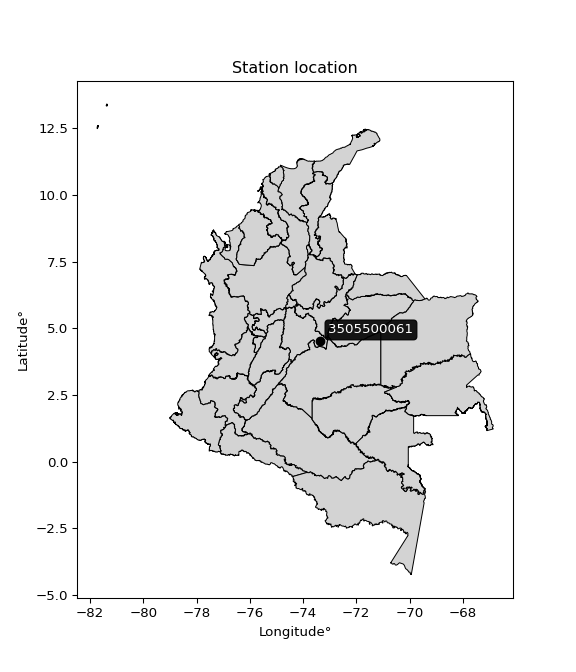

<div align="center">


</div>

# Station (rain, Pmax24h): 3505500061

Probable Maximum Precipitation (PMP) is the greatest amount of rainfall for a specific duration that is meteorologically possible for a given location, acting as a "worst-case" scenario for extreme storms, crucial for designing safety-critical infrastructure like bridges, river deviations, dams, spillways, and nuclear plants to prevent catastrophic failure. PMP is calculated by hydrologists using meteorological data to determine the upper limit of extreme rainfall, often leading to the Probable Maximum Flood (PMF) for flood control design, and is increasingly being studied for climate change impacts.

<div align="center">

</img>

</div>


## A. General information


### 1. General running parameters

• app_version: _v20251226_. • runtime: _2025-12-26 15:38:16.554582_. • Python version: _3.14.0_. • SciPy version: _1.16.3_. • Pandas version: _2.3.3_. • NumPy version: _2.3.5_. • Stations dataset (station_dataset_file): _dataset/pmax24h_in/automatic_colombia_2003_2024.csv_. • Stations catalog (station_catalog_file): _dataset/CNE_IDEAM.xls_. • Minimum year to eval til year_max (date_min): _2003_. • Maximum year to eval since year_min (date_max): _2024_. • Creates, save and include plots into reports (create_plot): _False_. • Plot only fit distributions with Δo > Δ (plot_only_fit): _True_. • Eval low extreme values, if False, evaluates high extreme values (low_extreme): _False_. • Eval every SciPy distribution as logarithmic (pdist_logarithmic_on): _True_. • Standard deviation normalized (ddof): _1.0_. • Return periods to eval in years (Tr): _[2, 2.33, 5, 10, 15, 20, 25, 50, 75, 100, 200, 250, 500, 750, 1000]_. • Minimum data sample per station, 0 means any (minimum_sample): _5_. • Z-Score threshold to adjust a value, 0 means disable (zscore): _3.5_. • Avoid zeros, e.g. rain = 0 (avoid_zeros): _True_. • Avoid null values (avoid_nans): _True_. [:file_folder:Dataset file.](../../dataset/pmax24h_in/automatic_colombia_2003_2024.csv)


### 2. Station info and location

|   id |     CODIGO | NOMBRE                    | CATEGORIA               | TECNOLOGIA                | ESTADO   | FECHA_INSTALACION   |   FECHA_SUSPENSION |   ALTITUD |   LATITUD |   LONGITUD | DEPARTAMENTO   | MUNICIPIO   | AREA_OPERATIVA                            | ENTIDAD                                                     | AREA_HIDROGRAFICA   | ZONA_HIDROGRAFICA   | SUBZONA_HIDROGRAFICA   |   CORRIENTE | OBSERVACION                                                                                                                                                                                                                                                                                    |   SUBRED | Catalogo   |
|-----:|-----------:|:--------------------------|:------------------------|:--------------------------|:---------|:--------------------|-------------------:|----------:|----------:|-----------:|:---------------|:------------|:------------------------------------------|:------------------------------------------------------------|:--------------------|:--------------------|:-----------------------|------------:|:-----------------------------------------------------------------------------------------------------------------------------------------------------------------------------------------------------------------------------------------------------------------------------------------------|---------:|:-----------|
|    0 | 3505500061 | MEDINA - AUT [3505500061] | Climatológica Principal | Automática con Telemetría | Activa   | 30/12/2017          |                nan |       531 |   4.50648 |   -73.3471 | Cundinamarca   | Medina      | Area Operativa 03 - Meta-Guaviare-Guainía | INSTITUTO DE HIDROLOGIA METEOROLOGIA Y ESTUDIOS AMBIENTALES | Orinoco             | Meta                | Río Humea              |         nan | Estacion Homologada con MEDINA [35050010]. Datos Transferidos desde 15/09/1969. Estación MEDINA-AUT [3505500061] Recodificada con código [35050010].|26/05/2025$mvelez$Se realiza el cambio de coordenada y elevación a solicitud del coordinador mediante memorando 20253100064473 09/04/2025 |      nan | CNE_IDEAM  |

<div align="center">

Map location in: [:earth_americas:Google](http://maps.google.com/maps?q=4.506483,-73.34708) [:earth_americas:OSM](https://www.openstreetmap.org/#map=18/4.506483/-73.34708&layers=P) [:earth_americas:Bing](https://www.bing.com/maps?cp=4.506483~-73.34708&lvl=18) [:earth_americas:Apple](https://maps.apple.com/frame?center=4.506483%2C-73.34708&span=0.003%2C0.006)

</div>


<div align="center">

```geojson
{
  "type": "Feature",
  "geometry": {
    "type": "Point", 
    "coordinates": [-73.34708, 4.506483]
  }, 
  "properties": {
    "Name": "3505500061"
  }
}
```

</div>


### 3. Discrete values table and plot

|               |           0 |           1 |          2 |           3 |           4 |          5 |
|:--------------|------------:|------------:|-----------:|------------:|------------:|-----------:|
| Date          | 2019        | 2020        | 2021       | 2022        | 2023        | 2024       |
| Value         |   96.4      |  197.4      |   26.2     |  115.4      |   88.6      |  225.2     |
| Value_initial |   96.4      |  197.4      |   26.2     |  115.4      |   88.6      |  225.2     |
| count         |    6        |    6        |    6       |    6        |    6        |    6       |
| mean          |  124.867    |  124.867    |  124.867   |  124.867    |  124.867    |  124.867   |
| std           |   73.8623   |   73.8623   |   73.8623  |   73.8623   |   73.8623   |   73.8623  |
| zscore        |   -0.385402 |    0.982007 |   -1.33582 |   -0.128166 |   -0.491004 |    1.35838 |
> If Z-Score is active, values out of range or outliers are replaced with the station mean value.


### 4. Active continuous probability distributions from SciPy (45 of 104 available)

[scipy.stats](https://docs.scipy.org/doc/scipy/reference/stats.html) is a Python´s powerful submodule within the SciPy library for comprehensive statistical analysis, offering over 130 probability distributions (like Normal, Poisson), functions for descriptive stats (mean, variance), hypothesis testing (t-tests, chi-square), random variable generation, and statistical tests, making it essential for data science, modeling, and research. It provides tools to explore, model, and draw conclusions from data efficiently, working seamlessly with NumPy.

<div align="center">

|   id | p_dist             |   n_parameter | fit_method   | label                                                                       | active   | ref                                                                                                        |
|-----:|:-------------------|--------------:|:-------------|:----------------------------------------------------------------------------|:---------|:-----------------------------------------------------------------------------------------------------------|
|    0 | alpha              |             3 | MLE          | Alpha                                                                       | True     | [:mortar_board:](https://docs.scipy.org/doc/scipy/reference/generated/scipy.stats.alpha.html)              |
|    1 | betaprime          |             4 | MLE          | Beta prime                                                                  | True     | [:mortar_board:](https://docs.scipy.org/doc/scipy/reference/generated/scipy.stats.betaprime.html)          |
|    2 | chi2               |             3 | MLE          | Chi²                                                                        | True     | [:mortar_board:](https://docs.scipy.org/doc/scipy/reference/generated/scipy.stats.chi2.html)               |
|    3 | crystalball        |             4 | MLE          | Crystalball                                                                 | True     | [:mortar_board:](https://docs.scipy.org/doc/scipy/reference/generated/scipy.stats.crystalball.html)        |
|    4 | erlang             |             3 | MLE          | Erlang                                                                      | True     | [:mortar_board:](https://docs.scipy.org/doc/scipy/reference/generated/scipy.stats.erlang.html)             |
|    5 | expon              |             2 | MLE          | Exponential                                                                 | True     | [:mortar_board:](https://docs.scipy.org/doc/scipy/reference/generated/scipy.stats.expon.html)              |
|    6 | exponnorm          |             3 | MLE          | Exponentially modified Normal                                               | True     | [:mortar_board:](https://docs.scipy.org/doc/scipy/reference/generated/scipy.stats.exponnorm.html)          |
|    7 | f                  |             4 | MLE          | F                                                                           | True     | [:mortar_board:](https://docs.scipy.org/doc/scipy/reference/generated/scipy.stats.f.html)                  |
|    8 | fatiguelife        |             3 | MLE          | Fatigue-life (Birnbaum-Saunders)                                            | True     | [:mortar_board:](https://docs.scipy.org/doc/scipy/reference/generated/scipy.stats.fatiguelife.html)        |
|    9 | fisk               |             3 | MLE          | Fisk                                                                        | True     | [:mortar_board:](https://docs.scipy.org/doc/scipy/reference/generated/scipy.stats.fisk.html)               |
|   10 | gamma              |             3 | MLE          | Gamma                                                                       | True     | [:mortar_board:](https://docs.scipy.org/doc/scipy/reference/generated/scipy.stats.gamma.html)              |
|   11 | genexpon           |             5 | MLE          | Generalized exponential                                                     | True     | [:mortar_board:](https://docs.scipy.org/doc/scipy/reference/generated/scipy.stats.genexpon.html)           |
|   12 | genlogistic        |             3 | MLE          | Generalized logistic                                                        | True     | [:mortar_board:](https://docs.scipy.org/doc/scipy/reference/generated/scipy.stats.genlogistic.html)        |
|   13 | gibrat             |             2 | MM           | Gibrat                                                                      | True     | [:mortar_board:](https://docs.scipy.org/doc/scipy/reference/generated/scipy.stats.gibrat.html)             |
|   14 | gompertz           |             3 | MLE          | Gompertz (or truncated Gumbel)                                              | True     | [:mortar_board:](https://docs.scipy.org/doc/scipy/reference/generated/scipy.stats.gompertz.html)           |
|   15 | gumbel_l           |             2 | MM           | Gumbel Left Skew                                                            | True     | [:mortar_board:](https://docs.scipy.org/doc/scipy/reference/generated/scipy.stats.gumbel_l.html)           |
|   16 | gumbel_r           |             2 | MM           | Gumbel Right Skew                                                           | True     | [:mortar_board:](https://docs.scipy.org/doc/scipy/reference/generated/scipy.stats.gumbel_r.html)           |
|   17 | halflogistic       |             2 | MM           | Half-logistic                                                               | True     | [:mortar_board:](https://docs.scipy.org/doc/scipy/reference/generated/scipy.stats.halflogistic.html)       |
|   18 | halfnorm           |             2 | MM           | Half Normal                                                                 | True     | [:mortar_board:](https://docs.scipy.org/doc/scipy/reference/generated/scipy.stats.halfnorm.html)           |
|   19 | hypsecant          |             2 | MM           | hyperbolic secant                                                           | True     | [:mortar_board:](https://docs.scipy.org/doc/scipy/reference/generated/scipy.stats.hypsecant.html)          |
|   20 | invgamma           |             3 | MLE          | Inverted gamma                                                              | True     | [:mortar_board:](https://docs.scipy.org/doc/scipy/reference/generated/scipy.stats.invgamma.html)           |
|   21 | invgauss           |             3 | MLE          | Inverse Gaussian                                                            | True     | [:mortar_board:](https://docs.scipy.org/doc/scipy/reference/generated/scipy.stats.invgauss.html)           |
|   22 | invweibull         |             3 | MLE          | Inverted Weibull                                                            | True     | [:mortar_board:](https://docs.scipy.org/doc/scipy/reference/generated/scipy.stats.invweibull.html)         |
|   23 | johnsonsu          |             4 | MLE          | Johnson Su                                                                  | True     | [:mortar_board:](https://docs.scipy.org/doc/scipy/reference/generated/scipy.stats.johnsonsu.html)          |
|   24 | kstwobign          |             2 | MLE          | Limiting distribution of scaled Kolmogorov-Smirnov two-sided test statistic | True     | [:mortar_board:](https://docs.scipy.org/doc/scipy/reference/generated/scipy.stats.kstwobign.html)          |
|   25 | laplace            |             2 | MM           | Laplace                                                                     | True     | [:mortar_board:](https://docs.scipy.org/doc/scipy/reference/generated/scipy.stats.laplace.html)            |
|   26 | laplace_asymmetric |             3 | MLE          | Asymmetric Laplace                                                          | True     | [:mortar_board:](https://docs.scipy.org/doc/scipy/reference/generated/scipy.stats.laplace_asymmetric.html) |
|   27 | loggamma           |             3 | MLE          | Log gamma                                                                   | True     | [:mortar_board:](https://docs.scipy.org/doc/scipy/reference/generated/scipy.stats.loggamma.html)           |
|   28 | logistic           |             2 | MM           | Logistic (or Sech-squared)                                                  | True     | [:mortar_board:](https://docs.scipy.org/doc/scipy/reference/generated/scipy.stats.logistic.html)           |
|   29 | lognorm            |             3 | MLE          | Log Normal                                                                  | True     | [:mortar_board:](https://docs.scipy.org/doc/scipy/reference/generated/scipy.stats.lognorm.html)            |
|   30 | maxwell            |             2 | MM           | Maxwell                                                                     | True     | [:mortar_board:](https://docs.scipy.org/doc/scipy/reference/generated/scipy.stats.maxwell.html)            |
|   31 | mielke             |             4 | MLE          | Mielke Beta-Kappa / Dagum                                                   | True     | [:mortar_board:](https://docs.scipy.org/doc/scipy/reference/generated/scipy.stats.mielke.html)             |
|   32 | moyal              |             2 | MM           | Moyal                                                                       | True     | [:mortar_board:](https://docs.scipy.org/doc/scipy/reference/generated/scipy.stats.moyal.html)              |
|   33 | nakagami           |             3 | MLE          | Nakagami                                                                    | True     | [:mortar_board:](https://docs.scipy.org/doc/scipy/reference/generated/scipy.stats.nakagami.html)           |
|   34 | ncf                |             5 | MLE          | Non-central F distribution                                                  | True     | [:mortar_board:](https://docs.scipy.org/doc/scipy/reference/generated/scipy.stats.ncf.html)                |
|   35 | nct                |             4 | MLE          | Non-central Student’s t                                                     | True     | [:mortar_board:](https://docs.scipy.org/doc/scipy/reference/generated/scipy.stats.nct.html)                |
|   36 | norm               |             2 | MM           | Normal                                                                      | True     | [:mortar_board:](https://docs.scipy.org/doc/scipy/reference/generated/scipy.stats.norm.html)               |
|   37 | pareto             |             3 | MLE          | Pareto                                                                      | True     | [:mortar_board:](https://docs.scipy.org/doc/scipy/reference/generated/scipy.stats.pareto.html)             |
|   38 | pearson3           |             3 | MM           | Pearson type III                                                            | True     | [:mortar_board:](https://docs.scipy.org/doc/scipy/reference/generated/scipy.stats.pearson3.html)           |
|   39 | rayleigh           |             2 | MM           | Rayleigh                                                                    | True     | [:mortar_board:](https://docs.scipy.org/doc/scipy/reference/generated/scipy.stats.rayleigh.html)           |
|   40 | rice               |             3 | MLE          | Rice                                                                        | True     | [:mortar_board:](https://docs.scipy.org/doc/scipy/reference/generated/scipy.stats.rice.html)               |
|   41 | t                  |             3 | MLE          | Student’s t                                                                 | True     | [:mortar_board:](https://docs.scipy.org/doc/scipy/reference/generated/scipy.stats.t.html)                  |
|   42 | truncnorm          |             4 | MLE          | Truncated normal                                                            | True     | [:mortar_board:](https://docs.scipy.org/doc/scipy/reference/generated/scipy.stats.truncnorm.html)          |
|   43 | wald               |             2 | MM           | Wald                                                                        | True     | [:mortar_board:](https://docs.scipy.org/doc/scipy/reference/generated/scipy.stats.wald.html)               |
|   44 | weibull_min        |             3 | MLE          | Weibull minimum                                                             | True     | [:mortar_board:](https://docs.scipy.org/doc/scipy/reference/generated/scipy.stats.weibull_min.html)        |

</div>

> **n_parameter:** # arguments & localization & scale.
>
> **Fit methods:** (MLE) maximum likelihood, (MM) L-moments.
>
>**Inactive:** foldnorm, gennorm, norminvgauss, powernorm, powerlognorm, skewnorm, genextreme, anglit, arcsine, argus, beta, bradford, burr, burr12, cauchy, cosine, halfcauchy, foldcauchy, skewcauchy, wrapcauchy, dgamma, gengamma, exponweib, exponpow, truncexpon, gausshyper, genhalflogistic, genhyperbolic, geninvgauss, halfgennorm, johnsonsb, kappa4, kappa3, ksone, kstwo, loglaplace, levy, levy_l, levy_stable, ncx2, genpareto, truncpareto, lomax, powerlaw, rdist, rel_breitwigner, recipinvgauss, semicircular, studentized_range, trapezoid, triang, truncweibull_min, tukeylambda, uniform, loguniform, vonmises, vonmises_line, weibull_max, dweibull, 


## B. Probability distributions vs. Empirical distributions

A continuous probability distribution (CPD) describes probabilities for variables that can take any value within a range (like rain any time), unlike discrete variables with specific outcomes (like temperature). It uses a Probability Density Function (PDF), a curve where the total area under it equals 1, and the probability of the variable falling within an interval (a to b) is found by calculating the area under the curve between those points. A key feature is that the probability of hitting any single exact value is zero, so probabilities are always expressed for ranges, e.g., $P(a ≤ X ≤ b)$.

<div align="center">

Distributions parameters
|    |    station | p_dist                |   n |              loc |           scale | shape                  | shape1                | shape2                | shape3   |
|---:|-----------:|:----------------------|----:|-----------------:|----------------:|:-----------------------|:----------------------|:----------------------|:---------|
|  0 | 3505500061 | alpha                 |   6 |     -0.165607    |    57.8855      | 5.0361530368483746e-11 |                       |                       |          |
|  1 | 3505500061 | betaprime             |   6 |    -59.7615      |  9600.67        | 7.134574947302427      | 371.9659642924664     |                       |          |
|  2 | 3505500061 | chi2                  |   6 |    -46.7609      |    14.4161      | 11.905303535580456     |                       |                       |          |
|  3 | 3505500061 | crystalball           |   6 |      8.1199      |   129.667       | 724.5037018711365      | 1.807202614692394     |                       |          |
|  4 | 3505500061 | erlang                |   6 |    -55.3286      |    27.1411      | 6.643102013429475      |                       |                       |          |
|  5 | 3505500061 | expon                 |   6 |     26.2         |    98.6667      |                        |                       |                       |          |
|  6 | 3505500061 | exponnorm             |   6 |    113.832       |    66.5191      | 0.1658904323646252     |                       |                       |          |
|  7 | 3505500061 | f                     |   6 |    -47.1588      |   172.008       | 11.974559398820999     | 18012.74364575259     |                       |          |
|  8 | 3505500061 | fatiguelife           |   6 |     26.2         |     0.00705992  | 124.44407202608534     |                       |                       |          |
|  9 | 3505500061 | fisk                  |   6 |   -119.134       |   235.461       | 5.921367274384453      |                       |                       |          |
| 10 | 3505500061 | gamma                 |   6 |    -73.8708      |    24.4466      | 8.120083208082555      |                       |                       |          |
| 11 | 3505500061 | genexpon              |   6 |     26.1999      |     2.30875     | 0.023026160937590523   | 4.374470875719925e-07 | 1.2052107029276655    |          |
| 12 | 3505500061 | genlogistic           |   6 |   -202.689       |    58.4141      | 155.98928793389132     |                       |                       |          |
| 13 | 3505500061 | gibrat                |   6 |     73.4285      |    31.1988      |                        |                       |                       |          |
| 14 | 3505500061 | gompertz              |   6 |     26.2         |   114.991       | 0.5497417026970114     |                       |                       |          |
| 15 | 3505500061 | gumbel_l              |   6 |    155.212       |    52.5724      |                        |                       |                       |          |
| 16 | 3505500061 | gumbel_r              |   6 |     94.521       |    52.5724      |                        |                       |                       |          |
| 17 | 3505500061 | halflogistic          |   6 |     44.9503      |    57.6475      |                        |                       |                       |          |
| 18 | 3505500061 | halfnorm              |   6 |     35.6201      |   111.854       |                        |                       |                       |          |
| 19 | 3505500061 | hypsecant             |   6 |    124.867       |    42.9252      |                        |                       |                       |          |
| 20 | 3505500061 | invgamma              |   6 |   -334.998       | 21052.6         | 46.78019972515932      |                       |                       |          |
| 21 | 3505500061 | invgauss              |   6 |   -119.097       |  2911.62        | 0.0836945080676666     |                       |                       |          |
| 22 | 3505500061 | invweibull            |   6 |     -1.97298e+09 |     1.97298e+09 | 33647035.063152045     |                       |                       |          |
| 23 | 3505500061 | johnsonsu             |   6 |      1.36436e+09 |     5.89328e+08 | 35357150.513794765     | 22430620.403315157    |                       |          |
| 24 | 3505500061 | kstwobign             |   6 |   -113.787       |   273.145       |                        |                       |                       |          |
| 25 | 3505500061 | laplace               |   6 |    124.867       |    47.6779      |                        |                       |                       |          |
| 26 | 3505500061 | laplace_asymmetric    |   6 |     96.4         |    48.4017      | 0.7482737200599591     |                       |                       |          |
| 27 | 3505500061 | loggamma              |   6 | -17229.6         |  2425.25        | 1281.984136747753      |                       |                       |          |
| 28 | 3505500061 | logistic              |   6 |    124.867       |    37.1743      |                        |                       |                       |          |
| 29 | 3505500061 | lognorm               |   6 |     26.2         |     0.190166    | 14.14348590801005      |                       |                       |          |
| 30 | 3505500061 | maxwell               |   6 |    -34.9065      |   100.123       |                        |                       |                       |          |
| 31 | 3505500061 | mielke                |   6 |     -4.37217     |   230.767       | 1.31743561951156       | 912.8801266788032     |                       |          |
| 32 | 3505500061 | moyal                 |   6 |     86.3077      |    30.3527      |                        |                       |                       |          |
| 33 | 3505500061 | nakagami              |   6 |     88.6         |    71.48        | 0.2051904274082873     |                       |                       |          |
| 34 | 3505500061 | ncf                   |   6 |     -0.177942    |     2.76039e-06 | 3.4646879633882766e-07 | 18.62481954586029     | 14.441334465807866    |          |
| 35 | 3505500061 | nct                   |   6 |  -2116.41        |    67.4112      | 1318165.8035410792     | 33.24784464677488     |                       |          |
| 36 | 3505500061 | norm                  |   6 |    124.867       |    67.4268      |                        |                       |                       |          |
| 37 | 3505500061 | pareto                |   6 |     25.9065      |     0.293464    | 0.20368492919146614    |                       |                       |          |
| 38 | 3505500061 | pearson3              |   6 |    124.867       |    67.4268      | 0.19544589041855417    |                       |                       |          |
| 39 | 3505500061 | rayleigh              |   6 |     -4.12467     |   102.92        |                        |                       |                       |          |
| 40 | 3505500061 | rice                  |   6 |     -4.66374     |    85.6611      | 0.951895792010786      |                       |                       |          |
| 41 | 3505500061 | t                     |   6 |    124.866       |    67.427       | 198961558.8459049      |                       |                       |          |
| 42 | 3505500061 | truncnorm             |   6 |     91.4828      |   128.379       | -2670.8920406036896    | 1.041578372362479     |                       |          |
| 43 | 3505500061 | wald                  |   6 |     57.4399      |    67.4268      |                        |                       |                       |          |
| 44 | 3505500061 | weibull_min           |   6 |      5.7002      |   133.521       | 1.7821776033070242     |                       |                       |          |
| 45 | 3505500061 | logalpha              |   6 |    -13.4037      |   446.395       | 24.780906412410346     |                       |                       |          |
| 46 | 3505500061 | logbetaprime          |   6 |    -10.3318      |    22.2914      | 698.5150556540584      | 1042.2309482323053    |                       |          |
| 47 | 3505500061 | logchi2               |   6 |      3.26576     |     1.00118     | 1.0279518416831077     |                       |                       |          |
| 48 | 3505500061 | logcrystalball        |   6 |      4.82887     |     0.467132    | 0.7705172192341816     | 4851.124189155606     |                       |          |
| 49 | 3505500061 | logerlang             |   6 |     -7.63622     |     0.0427689   | 286.7735586393393      |                       |                       |          |
| 50 | 3505500061 | logexpon              |   6 |      3.26576     |     1.36241     |                        |                       |                       |          |
| 51 | 3505500061 | logexponnorm          |   6 |      4.62785     |     0.701052    | 0.00045565101095102097 |                       |                       |          |
| 52 | 3505500061 | logf                  |   6 |   -908.982       |   913.609       | 5708127.346833279      | 8314319.573767221     |                       |          |
| 53 | 3505500061 | logfatiguelife        |   6 |   -328.72        |   333.35        | 0.0021067016924394798  |                       |                       |          |
| 54 | 3505500061 | logfisk               |   6 |     -5.62624e+07 |     5.62624e+07 | 139646938.9146164      |                       |                       |          |
| 55 | 3505500061 | loggamma              |   6 |     -6.52763     |     0.0479546   | 232.45216323341674     |                       |                       |          |
| 56 | 3505500061 | loggenexpon           |   6 |      3.24714     |     0.0229372   | 0.0059074195082162925  | 3.1453244201411668    | 9.006435909221741e-05 |          |
| 57 | 3505500061 | loggenlogistic        |   6 |      5.4187      |     1.83724e-05 | 2.335196320279879e-05  |                       |                       |          |
| 58 | 3505500061 | loggibrat             |   6 |      4.09332     |     0.324399    |                        |                       |                       |          |
| 59 | 3505500061 | loggompertz           |   6 |      3.26576     |     1.40885     | 0.5428992387598843     |                       |                       |          |
| 60 | 3505500061 | loggumbel_l           |   6 |      4.94368     |     0.546612    |                        |                       |                       |          |
| 61 | 3505500061 | loggumbel_r           |   6 |      4.31266     |     0.546612    |                        |                       |                       |          |
| 62 | 3505500061 | loghalflogistic       |   6 |      3.79729     |     0.599357    |                        |                       |                       |          |
| 63 | 3505500061 | loghalfnorm           |   6 |      3.70023     |     1.163       |                        |                       |                       |          |
| 64 | 3505500061 | loghypsecant          |   6 |      4.62817     |     0.446307    |                        |                       |                       |          |
| 65 | 3505500061 | loginvgamma           |   6 |    -10.8425      |  6784.3         | 439.6935599718171      |                       |                       |          |
| 66 | 3505500061 | loginvgauss           |   6 |     -2.52813     |   650.124       | 0.010998531485338858   |                       |                       |          |
| 67 | 3505500061 | loginvweibull         |   6 |     -7.69938e+07 |     7.69938e+07 | 102748014.76651636     |                       |                       |          |
| 68 | 3505500061 | logjohnsonsu          |   6 |      5.55138     |     0.00288418  | 6.469486703750331      | 1.0614107852910895    |                       |          |
| 69 | 3505500061 | logkstwobign          |   6 |      1.51668     |     3.5548      |                        |                       |                       |          |
| 70 | 3505500061 | loglaplace            |   6 |      4.62817     |     0.495723    |                        |                       |                       |          |
| 71 | 3505500061 | loglaplace_asymmetric |   6 |      4.7484      |     0.511619    | 1.1238670226738865     |                       |                       |          |
| 72 | 3505500061 | logloggamma           |   6 |      5.41703     |     9.03926e-07 | 1.1423023428229995e-06 |                       |                       |          |
| 73 | 3505500061 | loglogistic           |   6 |      4.62817     |     0.386513    |                        |                       |                       |          |
| 74 | 3505500061 | loglognorm            |   6 |      3.26576     |     0.00406923  | 13.349276536104982     |                       |                       |          |
| 75 | 3505500061 | logmaxwell            |   6 |      2.96696     |     1.04101     |                        |                       |                       |          |
| 76 | 3505500061 | logmielke             |   6 |     -6.65064e+07 |     6.65064e+07 | 82201002.7459986       | 10241981262.186357    |                       |          |
| 77 | 3505500061 | logmoyal              |   6 |      4.22726     |     0.315587    |                        |                       |                       |          |
| 78 | 3505500061 | lognakagami           |   6 |      4.48413     |     0.46897     | 0.16445125735331745    |                       |                       |          |
| 79 | 3505500061 | logncf                |   6 |    -25.6384      |    18.1032      | 4364.542383075335      | 11460.125143242414    | 2932.890060911142     |          |
| 80 | 3505500061 | lognct                |   6 |     41.2011      |     0.675214    | 19418.841844561917     | -54.162130627872216   |                       |          |
| 81 | 3505500061 | lognorm               |   6 |      4.62817     |     0.701058    |                        |                       |                       |          |
| 82 | 3505500061 | logpareto             |   6 |      3.26139     |     0.00437219  | 0.20338137692873365    |                       |                       |          |
| 83 | 3505500061 | logpearson3           |   6 |      4.62817     |     0.701057    | -0.8493020105507012    |                       |                       |          |
| 84 | 3505500061 | lograyleigh           |   6 |      3.28705     |     1.07006     |                        |                       |                       |          |
| 85 | 3505500061 | logrice               |   6 |      2.75562     |     0.753736    | 2.2443520097779053     |                       |                       |          |
| 86 | 3505500061 | logt                  |   6 |      4.62819     |     0.701038    | 31475.654015129257     |                       |                       |          |
| 87 | 3505500061 | logtruncnorm          |   6 |     -0.177137    |     1.43517     | 3.247879643408173      | 6.242914828445381     |                       |          |
| 88 | 3505500061 | logwald               |   6 |      3.92715     |     0.701024    |                        |                       |                       |          |
| 89 | 3505500061 | logweibull_min        |   6 |     -2.32527e+07 |     2.32527e+07 | 44331411.21859094      |                       |                       |          |

</div>

> **loc** (Location parameter): This shifts the distribution along the x-axis. For many common distributions, like the normal (Gaussian) distribution, loc represents the mean $μ$. For others, like the uniform distribution, it might represent the minimum value, or for the beta distribution, the left end of the support interval.
>
> **scale** (Scale parameter): This determines the width or spread of the distribution. For the normal distribution, scale represents the standard deviation $σ$. For a uniform distribution, it defines the length of the interval (from $loc$ to $loc + scale$).
>
> **shape** (Shape parameters): Refers to parameters that define the specific form of a probability distribution, distinct from its location (loc) and scale (scale). These parameters are required arguments for most distribution functions. For example, a normal (Gaussian) distribution is fully defined by its location (mean) and scale (standard deviation), so it has no specific shape parameters beyond loc and scale. However, other distributions have intrinsic properties that need specification, as Gamma distribution that takes a shape parameter, often named $a$ or $alpha$.


### 0. Cumulative distribution values - CDF (90 evaluated)

> Ordered by x ascending and calculating $log(f(x))$ separately. 

|   id |    Station |   date |     x |   count |    mean |     std |    zscore |   Value_initial |    station |   m |     alpha |   alpha_pdf |   betaprime |   betaprime_pdf |      chi2 |   chi2_pdf |   crystalball |   crystalball_pdf |    erlang |   erlang_pdf |    expon |   expon_pdf |   exponnorm |   exponnorm_pdf |         f |      f_pdf |   fatiguelife |   fatiguelife_pdf |      fisk |   fisk_pdf |     gamma |   gamma_pdf |    genexpon |   genexpon_pdf |   genlogistic |   genlogistic_pdf |   gibrat |   gibrat_pdf |    gompertz |   gompertz_pdf |   gumbel_l |   gumbel_l_pdf |   gumbel_r |   gumbel_r_pdf |   halflogistic |   halflogistic_pdf |   halfnorm |   halfnorm_pdf |   hypsecant |   hypsecant_pdf |   invgamma |   invgamma_pdf |   invgauss |   invgauss_pdf |   invweibull |   invweibull_pdf |   johnsonsu |   johnsonsu_pdf |   kstwobign |   kstwobign_pdf |   laplace |   laplace_pdf |   laplace_asymmetric |   laplace_asymmetric_pdf |   loggamma |   loggamma_pdf |   logistic |   logistic_pdf |   lognorm |   lognorm_pdf |   maxwell |   maxwell_pdf |    mielke |   mielke_pdf |      moyal |   moyal_pdf |    nakagami |   nakagami_pdf |       ncf |    ncf_pdf |       nct |    nct_pdf |      norm |   norm_pdf |   pareto |   pareto_pdf |   pearson3 |   pearson3_pdf |   rayleigh |   rayleigh_pdf |      rice |   rice_pdf |         t |      t_pdf |   truncnorm |   truncnorm_pdf |     wald |    wald_pdf |   weibull_min |   weibull_min_pdf |   logalpha |   logalpha_pdf |   logbetaprime |   logbetaprime_pdf |     logchi2 |   logchi2_pdf |   logcrystalball |   logcrystalball_pdf |   logerlang |   logerlang_pdf |   logexpon |   logexpon_pdf |   logexponnorm |   logexponnorm_pdf |      logf |   logf_pdf |   logfatiguelife |   logfatiguelife_pdf |   logfisk |   logfisk_pdf |   loggenexpon |   loggenexpon_pdf |   loggenlogistic |   loggenlogistic_pdf |   loggibrat |   loggibrat_pdf |   loggompertz |   loggompertz_pdf |   loggumbel_l |   loggumbel_l_pdf |   loggumbel_r |   loggumbel_r_pdf |   loghalflogistic |   loghalflogistic_pdf |   loghalfnorm |   loghalfnorm_pdf |   loghypsecant |   loghypsecant_pdf |   loginvgamma |   loginvgamma_pdf |   loginvgauss |   loginvgauss_pdf |   loginvweibull |   loginvweibull_pdf |   logjohnsonsu |   logjohnsonsu_pdf |   logkstwobign |   logkstwobign_pdf |   loglaplace |   loglaplace_pdf |   loglaplace_asymmetric |   loglaplace_asymmetric_pdf |   logloggamma |   logloggamma_pdf |   loglogistic |   loglogistic_pdf |   loglognorm |   loglognorm_pdf |   logmaxwell |   logmaxwell_pdf |   logmielke |   logmielke_pdf |    logmoyal |   logmoyal_pdf |   lognakagami |   lognakagami_pdf |   logncf |   logncf_pdf |    lognct |   lognct_pdf |   logpareto |   logpareto_pdf |   logpearson3 |   logpearson3_pdf |   lograyleigh |   lograyleigh_pdf |   logrice |   logrice_pdf |      logt |   logt_pdf |   logtruncnorm |   logtruncnorm_pdf |   logwald |   logwald_pdf |   logweibull_min |   logweibull_min_pdf |
|-----:|-----------:|-------:|------:|--------:|--------:|--------:|----------:|----------------:|-----------:|----:|----------:|------------:|------------:|----------------:|----------:|-----------:|--------------:|------------------:|----------:|-------------:|---------:|------------:|------------:|----------------:|----------:|-----------:|--------------:|------------------:|----------:|-----------:|----------:|------------:|------------:|---------------:|--------------:|------------------:|---------:|-------------:|------------:|---------------:|-----------:|---------------:|-----------:|---------------:|---------------:|-------------------:|-----------:|---------------:|------------:|----------------:|-----------:|---------------:|-----------:|---------------:|-------------:|-----------------:|------------:|----------------:|------------:|----------------:|----------:|--------------:|---------------------:|-------------------------:|-----------:|---------------:|-----------:|---------------:|----------:|--------------:|----------:|--------------:|----------:|-------------:|-----------:|------------:|------------:|---------------:|----------:|-----------:|----------:|-----------:|----------:|-----------:|---------:|-------------:|-----------:|---------------:|-----------:|---------------:|----------:|-----------:|----------:|-----------:|------------:|----------------:|---------:|------------:|--------------:|------------------:|-----------:|---------------:|---------------:|-------------------:|------------:|--------------:|-----------------:|---------------------:|------------:|----------------:|-----------:|---------------:|---------------:|-------------------:|----------:|-----------:|-----------------:|---------------------:|----------:|--------------:|--------------:|------------------:|-----------------:|---------------------:|------------:|----------------:|--------------:|------------------:|--------------:|------------------:|--------------:|------------------:|------------------:|----------------------:|--------------:|------------------:|---------------:|-------------------:|--------------:|------------------:|--------------:|------------------:|----------------:|--------------------:|---------------:|-------------------:|---------------:|-------------------:|-------------:|-----------------:|------------------------:|----------------------------:|--------------:|------------------:|--------------:|------------------:|-------------:|-----------------:|-------------:|-----------------:|------------:|----------------:|------------:|---------------:|--------------:|------------------:|---------:|-------------:|----------:|-------------:|------------:|----------------:|--------------:|------------------:|--------------:|------------------:|----------:|--------------:|----------:|-----------:|---------------:|-------------------:|----------:|--------------:|-----------------:|---------------------:|
|    0 | 3505500061 |   2021 |  26.2 |       6 | 124.867 | 73.8623 | -1.33582  |            26.2 | 3505500061 |   1 | 0.0281282 |  0.00596682 |   0.0477955 |      0.0024209  | 0.0462455 | 0.00247693 |      0.555447 |       0.0030469   | 0.0474111 |   0.00243239 | 0        |  0.0101351  |   0.0714499 |      0.00203026 | 0.0462998 | 0.00247504 |     0.0541272 |  499166           | 0.0543152 | 0.00209277 | 0.0516265 |  0.00242202 | 8.67099e-07 |     0.00997342 |     0.0464396 |        0.0024165  | 0        |  0           | 1.25167e-12 |     0.00478075 |  0.0823597 |     0.00150024 |  0.0255356 |     0.00178147 |       0        |         0          |   0        |     0          |   0.0637045 |      0.00147419 |  0.0538077 |     0.00222935 |  0.0460504 |     0.00240015 |    0.0463236 |       0.00242696 |   0.0682258 |      0.00198675 |   0.0446177 |      0.00267542 | 0.0631281 |    0.00132405 |            0.0516698 |               0.00142664 |  0.0280495 |      0.0959746 |   0.065733 |     0.001652   |  0.025986 |     0.0861119 | 0.0541338 |    0.00246394 | 0.0697415 |   0.00300535 | 0.00710997 | 0.000945159 | 0           |    0           | 0.0406895 | 0.00294729 | 0.0716872 | 0.0020282  | 0.0716905 | 0.00202816 | 0        |  0.69407     |  0.0659636 |     0.002109   |  0.0424785 |     0.00274122 | 0.0405345 | 0.00257996 | 0.0716931 | 0.00202821 |    0.358961 |      0.00320799 | 0        | 0           |     0.0348329 |        0.00297488 |  0.0228398 |      0.0870239 |      0.0277153 |          0.0951567 | 1.01479e-08 |   1.17449e+07 |       nan        |           nan        |   0.0263938 |        0.091371 |   0        |       0.733993 |      0.0259854 |          0.0861107 | 0.0262153 |  0.0867137 |        0.0258527 |            0.0859461 |  0.027345 |     0.0660161 |     0.0048769 |          0.266268 |         0        |            0.0823617 |    0        |        0        |   6.10356e-08 |          0.385348 |     0.0453744 |         0.0810978 |    0.00112653 |         0.0139908 |          0        |              0        |      0        |          0        |      0.0300481 |          0.0672261 |     0.0273348 |         0.0964502 |     0.0249916 |         0.0968306 |       0.0254829 |            0.124797 |      0.0882992 |           0.074349 |      0.0311868 |           0.163894 |    0.0320173 |         0.064587 |               0.0423526 |                   0.0736578 |     0.0659682 |         0.0833648 |     0.0286127 |         0.0719096 |    0.0126827 |      5.52731e+12 |    0.0061361 |        0.0605968 |   0.0683638 |       0.0844968 | 4.48396e-06 |    0.000156064 |   0           |       0           | 0.026121 |    0.0881117 | 0.0260389 |    0.0859006 |    0        |      46.5171    |     0.0437356 |          0.088913 |      0        |          0        | 0.0215222 |     0.0958392 | 0.0259855 |  0.0861045 |    0           |           0        |  0        |      0        |        0.0398622 |            0.0744624 |
|    1 | 3505500061 |   2023 |  88.6 |       6 | 124.867 | 73.8623 | -0.491004 |            88.6 | 3505500061 |   2 | 0.514326  |  0.0047389  |   0.334124  |      0.00603644 | 0.338165  | 0.00607151 |      0.73259  |       0.00253763  | 0.334446  |   0.00603222 | 0.468702 |  0.00538478 |   0.295605  |      0.00513118 | 0.338031  | 0.00607035 |     0.774991  |       0.00181575  | 0.322599  | 0.00622906 | 0.332407  |  0.00594555 | 0.463321    |     0.00535264 |     0.345907  |        0.00626498 | 0.235467 |  0.0202774   | 0.327077    |     0.00553519 |  0.245469  |     0.00404243 |  0.326537  |     0.00695163 |       0.361484 |         0.00754005 |   0.364252 |     0.00637635 |   0.25832   |      0.00537876 |  0.320338  |     0.00589155 |  0.338547  |     0.00617214 |    0.346482  |       0.00626297 |   0.292066  |      0.00518341 |   0.357583  |      0.00617384 | 0.233679  |    0.0049012  |            0.289394  |               0.00799039 |  0.434844  |      0.542696  |   0.273769 |     0.0053483  |  0.418607 |     0.557173  | 0.322715  |    0.00566628 | 0.30189   |   0.00427784 | 0.335576   | 0.00796089  | 2.83767e-07 |    8.19461e+06 | 0.373495  | 0.00619657 | 0.295341  | 0.00512007 | 0.295334  | 0.00511984 | 0.664663 |  0.00108948  |  0.303324  |     0.00537116 |  0.333586  |     0.00583362 | 0.320164  | 0.00574903 | 0.29534   | 0.00511987 |    0.576885 |      0.00364985 | 0.330754 | 0.0137718   |     0.347967  |        0.00599467 |  0.430793  |      0.548168  |      0.433655  |          0.542647  | 0.721898    |   0.200542    |         0.338917 |             0.558626 |   0.42827   |        0.546148 |   0.591097 |       0.300132 |      0.418608  |          0.557177  | 0.419401  |  0.556494  |        0.418111  |            0.556309  |  0.366464 |     0.576256  |     0.518026  |          0.44437  |         0        |            0.3875    |    0.573873 |        1.00326  |   0.525848    |          0.433857 |     0.350399  |         0.512677  |    0.481555   |         0.643763  |          0.517547 |              0.610776 |      0.499711 |          0.546644 |      0.399009  |          0.677612  |     0.437841  |         0.540338  |     0.446715  |         0.538402  |       0.485802  |            0.468044 |      0.293572  |           0.342379 |      0.511263  |           0.437761 |    0.373921  |         0.754295 |               0.352471  |                   0.613003  |     0.307614  |         0.388735  |     0.407898  |         0.624861  |    0.665356  |      0.0223901   |    0.452933  |        0.562883  |   0.308196  |       0.380926  | 0.505627    |    0.674257    |   1.15086e-05 |       4.26178e+09 | 0.420235 |    0.548632  | 0.417748  |    0.557245  |    0.68202  |       0.0528902 |     0.366589  |          0.505409 |      0.465139 |          0.559174 | 0.42875   |     0.549227  | 0.418595  |  0.55718   |    5.83939e-08 |           2.44877  |  0.571733 |      0.782488 |        0.339731  |            0.522541  |
|    2 | 3505500061 |   2019 |  96.4 |       6 | 124.867 | 73.8623 | -0.385402 |            96.4 | 3505500061 |   3 | 0.548878  |  0.00413845 |   0.381534  |      0.00610406 | 0.385749  | 0.00611378 |      0.752007 |       0.00244022  | 0.381805  |   0.00609549 | 0.509086 |  0.00497548 |   0.3368    |      0.00542267 | 0.385609  | 0.00611346 |     0.788497  |       0.0016519   | 0.372013  | 0.00641822 | 0.379188  |  0.00603427 | 0.503489    |     0.00495202 |     0.394837  |        0.0062626  | 0.379754 |  0.0165719   | 0.370299    |     0.00554319 |  0.278705  |     0.00448243 |  0.381025  |     0.00699316 |       0.418807 |         0.0071521  |   0.413136 |     0.0061542  |   0.302869  |      0.00603828 |  0.366979  |     0.00605155 |  0.38693   |     0.00621663 |    0.39538   |       0.00625668 |   0.33373   |      0.00549023 |   0.405548  |      0.00611048 | 0.275213  |    0.00577234 |            0.358939  |               0.00991059 |  0.480851  |      0.546624  |   0.317397 |     0.00582811 |  0.466089 |     0.567001  | 0.367483  |    0.00580014 | 0.335693  |   0.00438865 | 0.397087   | 0.00777658  | 0.31738     |    0.0166645   | 0.421229  | 0.00602965 | 0.336453  | 0.00541241 | 0.336444  | 0.00541219 | 0.672577 |  0.000946061 |  0.346259  |     0.00562635 |  0.379355  |     0.00589    | 0.365461  | 0.00585409 | 0.33645   | 0.00541221 |    0.605356 |      0.0036481  | 0.429416 | 0.0115455   |     0.394677  |        0.00597076 |  0.477194  |      0.55045   |      0.479661  |          0.546653  | 0.738199    |   0.186111    |         0.389055 |             0.627952 |   0.474628  |        0.551464 |   0.615652 |       0.282109 |      0.46609   |          0.567005  | 0.466805  |  0.566113  |        0.465516  |            0.566056  |  0.416297 |     0.603126  |     0.554947  |          0.430446 |         0        |            0.431367  |    0.648667 |        0.780563 |   0.562111    |          0.425405 |     0.395529  |         0.556686  |    0.534612   |         0.612466  |          0.56719  |              0.565852 |      0.544685 |          0.519188 |      0.457573  |          0.706882  |     0.483575  |         0.542541  |     0.492118  |         0.536667  |       0.524624  |            0.451622 |      0.324352  |           0.388356 |      0.547514  |           0.421203 |    0.443301  |         0.894253 |               0.408181  |                   0.70989   |     0.342226  |         0.432475  |     0.461485  |         0.64297   |    0.667181  |      0.0208949   |    0.500164  |        0.555522  |   0.342072  |       0.422796  | 0.560319    |    0.621359    |   0.45499     |       1.76552     | 0.466916 |    0.556611  | 0.46525   |    0.567411  |    0.686306 |       0.0488092 |     0.410678  |          0.539117 |      0.511818 |          0.546346 | 0.47539   |     0.555094  | 0.466077  |  0.567011  |    0.187982    |           2.01963  |  0.631859 |      0.647753 |        0.385872  |            0.570846  |
|    3 | 3505500061 |   2022 | 115.4 |       6 | 124.867 | 73.8623 | -0.128166 |           115.4 | 3505500061 |   4 | 0.616449  |  0.00305051 |   0.496367  |      0.00590492 | 0.500249  | 0.00586356 |      0.79598  |       0.00218495  | 0.496406  |   0.00589019 | 0.595075 |  0.00410397 |   0.444689  |      0.0058646  | 0.50012   | 0.00586489 |     0.816785  |       0.00134346  | 0.494164  | 0.00631098 | 0.493231  |  0.00589129 | 0.589199    |     0.00409717 |     0.510783  |        0.00586179 | 0.616618 |  0.00909602  | 0.47501     |     0.00545174 |  0.374334  |     0.00558085 |  0.510566  |     0.00652853 |       0.544858 |         0.00609853 |   0.524309 |     0.00553121 |   0.430363  |      0.0072387  |  0.482772  |     0.00604734 |  0.503208  |     0.00594205 |    0.51115   |       0.00584999 |   0.443193  |      0.00595992 |   0.517923  |      0.00566018 | 0.409958  |    0.00859848 |            0.522105  |               0.0073881  |  0.578257  |      0.530969  |   0.436678 |     0.00661721 |  0.568086 |     0.56075   | 0.478543  |    0.00581994 | 0.421473  |   0.004636   | 0.535748   | 0.00671911  | 0.524347    |    0.00783909  | 0.529992  | 0.00537417 | 0.444184  | 0.00585882 | 0.444172  | 0.00585865 | 0.688112 |  0.000709849 |  0.456828  |     0.00593488 |  0.490511  |     0.00574898 | 0.477074  | 0.00583083 | 0.444178  | 0.00585864 |    0.674222 |      0.00358796 | 0.605649 | 0.00733927  |     0.505663  |        0.00565813 |  0.574939  |      0.530913  |      0.577085  |          0.531123  | 0.769228    |   0.159754    |         0.511852 |             0.722671 |   0.57312   |        0.538002 |   0.663195 |       0.247213 |      0.568088  |          0.560754  | 0.568625  |  0.559551  |        0.567337  |            0.559765  |  0.527105 |     0.618693  |     0.629248  |          0.394298 |         0        |            0.54219   |    0.758905 |        0.475735 |   0.636585    |          0.401142 |     0.503213  |         0.635824  |    0.637246   |         0.525313  |          0.660357 |              0.470445 |      0.632554 |          0.457061 |      0.584733  |          0.688088  |     0.579959  |         0.523889  |     0.586782  |         0.511075  |       0.602061  |            0.407667 |      0.40478   |           0.512247 |      0.619731  |           0.380759 |    0.607685  |         0.7914   |               0.558124  |                   0.970664  |     0.429581  |         0.542866  |     0.577147  |         0.63141   |    0.670694  |      0.018282    |    0.597208  |        0.519062  |   0.427251  |       0.528077  | 0.66143     |    0.502989    |   0.658024    |       0.782974    | 0.566789 |    0.547918  | 0.567383  |    0.561812  |    0.694426 |       0.0417938 |     0.513116  |          0.595336 |      0.606443 |          0.502279 | 0.574652  |     0.542901  | 0.568077  |  0.560763  |    0.484723    |           1.32388  |  0.728568 |      0.443209 |        0.496931  |            0.658933  |
|    4 | 3505500061 |   2020 | 197.4 |       6 | 124.867 | 73.8623 |  0.982007 |           197.4 | 3505500061 |   5 | 0.769527  |  0.00113356 |   0.853379  |      0.00262424 | 0.852357  | 0.00258965 |      0.927819 |       0.00106017  | 0.852723  |   0.0026261  | 0.823624 |  0.0017876  |   0.859007  |      0.00330681 | 0.852385  | 0.00259075 |     0.894587  |       0.000666463 | 0.852212  | 0.00235606 | 0.85379   |  0.00266986 | 0.818679    |     0.00180843 |     0.84763   |        0.00239751 | 0.916156 |  0.00124237  | 0.848418    |     0.00321165 |  0.892583  |     0.00455849 |  0.868232  |     0.0023335  |       0.867344 |         0.00214852 |   0.851921 |     0.0025063  |   0.883811  |      0.00264708 |  0.857424  |     0.00273778 |  0.854809  |     0.00253561 |    0.847257  |       0.00239494 |   0.863179  |      0.00330708 |   0.850903  |      0.00248441 | 0.890788  |    0.00229062 |            0.865482  |               0.0020796  |  0.819838  |      0.345467  |   0.875574 |     0.00293063 |  0.825683 |     0.366783  | 0.854218  |    0.0029072  | 0.837869  |   0.00547072 | 0.872558   | 0.0020814   | 0.869459    |    0.00219561  | 0.831639  | 0.00219802 | 0.858986  | 0.0033172  | 0.858977  | 0.00331737 | 0.726809 |  0.000324472 |  0.858252  |     0.00311434 |  0.852955  |     0.00279755 | 0.854403  | 0.00294526 | 0.858979  | 0.00331732 |    0.93436  |      0.00259763 | 0.893452 | 0.00149714  |     0.851202  |        0.00263548 |  0.814701  |      0.341495  |      0.818827  |          0.34593   | 0.839042    |   0.105146    |         0.858895 |             0.455126 |   0.81867   |        0.351533 |   0.77288  |       0.166704 |      0.825686  |          0.366782  | 0.825606  |  0.365986  |        0.824624  |            0.36684   |  0.808604 |     0.384133  |     0.806062  |          0.261924 |         0        |            1.07271   |    0.903428 |        0.143527 |   0.82333     |          0.285456 |     0.845561  |         0.527769  |    0.844711   |         0.260795  |          0.845821 |              0.23741  |      0.827072 |          0.271041 |      0.856434  |          0.31088   |     0.817314  |         0.339299  |     0.815724  |         0.325712  |       0.780463  |            0.258161 |      0.824094  |           1.03135  |      0.788976  |           0.250839 |    0.86716   |         0.267973 |               0.864118  |                   0.29849   |     0.846581  |         1.06983   |     0.845531  |         0.337914  |    0.679027  |      0.0132821   |    0.825197  |        0.318426  |   0.829551  |       1.02531   | 0.851595    |    0.232396    |   0.897423    |       0.242549    | 0.818706 |    0.361738  | 0.825735  |    0.368035  |    0.712994 |       0.028842  |     0.83012   |          0.507376 |      0.825093 |          0.305228 | 0.822957  |     0.355178  | 0.825679  |  0.366787  |    0.878564    |           0.341934 |  0.878336 |      0.168236 |        0.852198  |            0.538741  |
|    5 | 3505500061 |   2024 | 225.2 |       6 | 124.867 | 73.8623 |  1.35838  |           225.2 | 3505500061 |   6 | 0.797293  |  0.00087985 |   0.912761  |      0.00169369 | 0.911147  | 0.00168433 |      0.952948 |       0.000757666 | 0.912216  |   0.00169916 | 0.866932 |  0.00134867 |   0.931435  |      0.00195041 | 0.911194  | 0.00168465 |     0.911344  |       0.000544358 | 0.904696  | 0.00148271 | 0.914106  |  0.00171517 | 0.862585    |     0.00137052 |     0.902369  |        0.00158645 | 0.943175 |  0.000752078 | 0.922148    |     0.00210061 |  0.97731   |     0.00163396 |  0.920105  |     0.00145732 |       0.915966 |         0.00139647 |   0.909903 |     0.0016963  |   0.938706  |      0.00141911 |  0.918546  |     0.00171175 |  0.912178  |     0.00163889 |    0.901973  |       0.00158699 |   0.935024  |      0.00191311 |   0.908129  |      0.00166921 | 0.93904   |    0.00127857 |            0.912475  |               0.0013531  |  0.861587  |      0.288478  |   0.936967 |     0.00158872 |  0.869744 |     0.302162  | 0.919654  |    0.00184132 | 0.99317   |   0.00565011 | 0.919176   | 0.00132685  | 0.919707    |    0.00145983  | 0.882939  | 0.00152925 | 0.931634  | 0.00195537 | 0.931629  | 0.00195551 | 0.735042 |  0.000270796 |  0.926981  |     0.00187935 |  0.916457  |     0.00180867 | 0.920744  | 0.00186564 | 0.93163   | 0.00195548 |    1        |      0.00212229 | 0.927057 | 0.000966143 |     0.911539  |        0.00174187 |  0.856011  |      0.285884  |      0.860643  |          0.289032  | 0.852246    |   0.0954719   |         0.910668 |             0.332036 |   0.861131  |        0.293195 |   0.793816 |       0.151337 |      0.869747  |          0.30216   | 0.86958   |  0.301643  |        0.868716  |            0.302571  |  0.854208 |     0.309108  |     0.838427  |          0.229582 |         0.997826 |            1.26827   |    0.920165 |        0.112138 |   0.858667    |          0.250748 |     0.907182  |         0.403648  |    0.875804   |         0.212478  |          0.874336 |              0.196491 |      0.860096 |          0.230778 |      0.892323  |          0.236688  |     0.858379  |         0.28429   |     0.855209  |         0.274013  |       0.812287  |            0.225365 |      0.951166  |           0.799202 |      0.820082  |           0.221641 |    0.898165  |         0.205428 |               0.898266  |                   0.223477  |     0.999953  |         1.26365   |     0.88502   |         0.263275  |    0.68072   |      0.012441    |    0.863677  |        0.266155  |   0.975882  |       1.14859   | 0.879315    |    0.189742    |   0.925414    |       0.1846      | 0.862351 |    0.30087   | 0.86994   |    0.303083  |    0.716652 |       0.0267339 |     0.89106   |          0.413789 |      0.86207  |          0.256571 | 0.865789  |     0.295135  | 0.869741  |  0.302164  |    0.916538    |           0.240083 |  0.898314 |      0.136364 |        0.91438   |            0.401205  |

An Empirical Distribution Function (EDF) is a step-function estimate of a true cumulative distribution function (CDF) based on observed sample data, representing the proportion of data points less than or equal to a given value. It is calculated by ordering your data and jumping up by $1/n$ (where $n$ is sample size) at each unique data point, allowing analysis without assuming an underlying population distribution, and it gets closer to the true CDF as the sample size grows.


### 1. Empirical - EDF California (1923)

California´s estimates the true probability distribution of water-related data (like rainfall, streamflow) using observed samples, crucial for risk assessment.

<div align="center">


$P=m/n$


</div>


**1.1. Empirical values**

<div align="center">

|                | 0                   | 1                  | 2              | 3                  | 4                  | 5              |
|:---------------|:--------------------|:-------------------|:---------------|:-------------------|:-------------------|:---------------|
| date           | 2021                | 2023               | 2019           | 2022               | 2020               | 2024           |
| x              | 26.2                | 88.6               | 96.4           | 115.4              | 197.4              | 225.2          |
| m              | 1                   | 2                  | 3              | 4                  | 5                  | 6              |
| empirical_dist | edf_california      | edf_california     | edf_california | edf_california     | edf_california     | edf_california |
| empirical      | 0.16666666666666666 | 0.3333333333333333 | 0.5            | 0.6666666666666666 | 0.8333333333333334 | 1.0            |
| empirical_tr   | 1.2                 | 1.4999999999999998 | 2.0            | 2.9999999999999996 | 6.000000000000002  | inf            |

</div>


**1.2. Kolmogorov-Smirnov fit test (sorted by Δ)**


<div align="center">

|                | 0                     | 1                 | 2                  | 3                   | 4                   | 5                   | 6                   | 7                   | 8                   | 9                   | 10                 | 11                  | 12                 | 13                 | 14                  | 15                  | 16                 | 17                  | 18                | 19                 | 20                  | 21                  | 22                  | 23                  | 24                  | 25                 | 26                  | 27                  | 28                  | 29                  | 30                  | 31                  | 32                  | 33                  | 34                  | 35                 | 36                  | 37                  | 38                  | 39                  | 40                  | 41                  | 42                  | 43                  | 44                  | 45                  | 46                 | 47                  | 48                  | 49                  | 50                  | 51                  | 52                  | 53                  | 54                  | 55                 | 56                 | 57                 | 58                  | 59                  | 60                  | 61                  | 62                  | 63                  | 64                  | 65                  | 66                  | 67                  | 68                  | 69                  | 70                  | 71                  | 72                  | 73                  | 74                  | 75                | 76                  | 77                  | 78                  | 79                  | 80                  | 81                  | 82                 | 83                  | 84                 | 85                 | 86                 | 87                 | 88                 | 89                 |
|:---------------|:----------------------|:------------------|:-------------------|:--------------------|:--------------------|:--------------------|:--------------------|:--------------------|:--------------------|:--------------------|:-------------------|:--------------------|:-------------------|:-------------------|:--------------------|:--------------------|:-------------------|:--------------------|:------------------|:-------------------|:--------------------|:--------------------|:--------------------|:--------------------|:--------------------|:-------------------|:--------------------|:--------------------|:--------------------|:--------------------|:--------------------|:--------------------|:--------------------|:--------------------|:--------------------|:-------------------|:--------------------|:--------------------|:--------------------|:--------------------|:--------------------|:--------------------|:--------------------|:--------------------|:--------------------|:--------------------|:-------------------|:--------------------|:--------------------|:--------------------|:--------------------|:--------------------|:--------------------|:--------------------|:--------------------|:-------------------|:-------------------|:-------------------|:--------------------|:--------------------|:--------------------|:--------------------|:--------------------|:--------------------|:--------------------|:--------------------|:--------------------|:--------------------|:--------------------|:--------------------|:--------------------|:--------------------|:--------------------|:--------------------|:--------------------|:------------------|:--------------------|:--------------------|:--------------------|:--------------------|:--------------------|:--------------------|:-------------------|:--------------------|:-------------------|:-------------------|:-------------------|:-------------------|:-------------------|:-------------------|
| station        | 3505500061            | 3505500061        | 3505500061         | 3505500061          | 3505500061          | 3505500061          | 3505500061          | 3505500061          | 3505500061          | 3505500061          | 3505500061         | 3505500061          | 3505500061         | 3505500061         | 3505500061          | 3505500061          | 3505500061         | 3505500061          | 3505500061        | 3505500061         | 3505500061          | 3505500061          | 3505500061          | 3505500061          | 3505500061          | 3505500061         | 3505500061          | 3505500061          | 3505500061          | 3505500061          | 3505500061          | 3505500061          | 3505500061          | 3505500061          | 3505500061          | 3505500061         | 3505500061          | 3505500061          | 3505500061          | 3505500061          | 3505500061          | 3505500061          | 3505500061          | 3505500061          | 3505500061          | 3505500061          | 3505500061         | 3505500061          | 3505500061          | 3505500061          | 3505500061          | 3505500061          | 3505500061          | 3505500061          | 3505500061          | 3505500061         | 3505500061         | 3505500061         | 3505500061          | 3505500061          | 3505500061          | 3505500061          | 3505500061          | 3505500061          | 3505500061          | 3505500061          | 3505500061          | 3505500061          | 3505500061          | 3505500061          | 3505500061          | 3505500061          | 3505500061          | 3505500061          | 3505500061          | 3505500061        | 3505500061          | 3505500061          | 3505500061          | 3505500061          | 3505500061          | 3505500061          | 3505500061         | 3505500061          | 3505500061         | 3505500061         | 3505500061         | 3505500061         | 3505500061         | 3505500061         |
| empirical_dist | edf_california        | edf_california    | edf_california     | edf_california      | edf_california      | edf_california      | edf_california      | edf_california      | edf_california      | edf_california      | edf_california     | edf_california      | edf_california     | edf_california     | edf_california      | edf_california      | edf_california     | edf_california      | edf_california    | edf_california     | edf_california      | edf_california      | edf_california      | edf_california      | edf_california      | edf_california     | edf_california      | edf_california      | edf_california      | edf_california      | edf_california      | edf_california      | edf_california      | edf_california      | edf_california      | edf_california     | edf_california      | edf_california      | edf_california      | edf_california      | edf_california      | edf_california      | edf_california      | edf_california      | edf_california      | edf_california      | edf_california     | edf_california      | edf_california      | edf_california      | edf_california      | edf_california      | edf_california      | edf_california      | edf_california      | edf_california     | edf_california     | edf_california     | edf_california      | edf_california      | edf_california      | edf_california      | edf_california      | edf_california      | edf_california      | edf_california      | edf_california      | edf_california      | edf_california      | edf_california      | edf_california      | edf_california      | edf_california      | edf_california      | edf_california      | edf_california    | edf_california      | edf_california      | edf_california      | edf_california      | edf_california      | edf_california      | edf_california     | edf_california      | edf_california     | edf_california     | edf_california     | edf_california     | edf_california     | edf_california     |
| p_dist         | loglaplace_asymmetric | loglaplace        | loghypsecant       | ncf                 | loglogistic         | loggamma            | loggamma            | logbetaprime        | logerlang           | logf                | logncf             | lognct              | lognorm            | lognorm            | logt                | logexponnorm        | logfatiguelife     | loginvgamma         | logalpha          | laplace_asymmetric | loginvgauss         | logrice             | logfisk             | kstwobign           | logpearson3         | logcrystalball     | invweibull          | genlogistic         | gumbel_r            | moyal               | logmaxwell          | weibull_min         | loggumbel_l         | invgauss            | loggumbel_r         | chi2               | f                   | genexpon            | lograyleigh         | loghalfnorm         | expon               | gibrat              | wald                | halflogistic        | halfnorm            | logweibull_min      | erlang             | betaprime           | logmoyal            | fisk                | gamma               | rayleigh            | logkstwobign        | invgamma            | loghalflogistic     | loggenexpon        | loginvweibull      | maxwell            | rice                | gompertz            | loggompertz         | alpha               | pearson3            | exponnorm           | nct                 | t                   | norm                | johnsonsu           | logistic            | hypsecant           | logloggamma         | logwald             | logmielke           | loggibrat           | truncnorm           | mielke            | laplace             | logexpon            | logjohnsonsu        | gumbel_l            | pareto              | loglognorm          | lognakagami        | nakagami            | logtruncnorm       | logpareto          | logchi2            | crystalball        | fatiguelife        | loggenlogistic     |
| delta          | 0.12431406473541803   | 0.134649414046972 | 0.1366185818570975 | 0.13667489077554174 | 0.13805395815470825 | 0.13861715856777088 | 0.13861715856777088 | 0.13935658850582056 | 0.14027281726973378 | 0.14045139393208336 | 0.1405456997502827 | 0.14062772027441006 | 0.1406806325987565 | 0.1406806325987565 | 0.14068112935859925 | 0.14068131645464815 | 0.1408139357351511 | 0.14162145733029108 | 0.143989207696113 | 0.1445617254419309 | 0.14479068194794098 | 0.14514448225198628 | 0.14579194377900384 | 0.14874363598639662 | 0.15355064257408446 | 0.1548143197583708 | 0.15551690709117438 | 0.15588353603718763 | 0.15610070380790309 | 0.15955669252343735 | 0.16053056474658886 | 0.16100371035501426 | 0.16345317972100581 | 0.16345852059687493 | 0.16554013791348987 | 0.1664178139087379 | 0.16654647753142837 | 0.16666579956743713 | 0.16666666666666666 | 0.16666666666666666 | 0.16666666666666666 | 0.16666666666666666 | 0.16666666666666666 | 0.16666666666666666 | 0.16666666666666666 | 0.16973536611705897 | 0.1702603157918368 | 0.17029968584920085 | 0.17229409306177818 | 0.17250218071947027 | 0.17343576853262144 | 0.17615529964839627 | 0.17991782506075282 | 0.18389503837489685 | 0.18421328105676188 | 0.1846923790079968 | 0.1877134294441185 | 0.1881236268757417 | 0.18959306100421797 | 0.19165648615185582 | 0.19251490661071985 | 0.20270665606801375 | 0.20983821491503196 | 0.22197746494082893 | 0.22248232976700533 | 0.22248859336873272 | 0.22249438660481086 | 0.22347334524138018 | 0.22998884593081192 | 0.23630405547640748 | 0.23708599566484845 | 0.23839974652537316 | 0.23941525923313622 | 0.24053958366132727 | 0.24355167494256508 | 0.245193572525518 | 0.25670912708665966 | 0.25776340823940597 | 0.26188652699617676 | 0.29233303052277393 | 0.33132927179911537 | 0.33202274597862386 | 0.3333218246957332 | 0.33333304956655335 | 0.3333332749393917 | 0.3486868469481998 | 0.3885646791803333 | 0.3992569953285607 | 0.4416581040356215 | 0.8333333333333334 |
| deltao         | 0.530385761606        | 0.530385761606    | 0.530385761606     | 0.530385761606      | 0.530385761606      | 0.530385761606      | 0.530385761606      | 0.530385761606      | 0.530385761606      | 0.530385761606      | 0.530385761606     | 0.530385761606      | 0.530385761606     | 0.530385761606     | 0.530385761606      | 0.530385761606      | 0.530385761606     | 0.530385761606      | 0.530385761606    | 0.530385761606     | 0.530385761606      | 0.530385761606      | 0.530385761606      | 0.530385761606      | 0.530385761606      | 0.530385761606     | 0.530385761606      | 0.530385761606      | 0.530385761606      | 0.530385761606      | 0.530385761606      | 0.530385761606      | 0.530385761606      | 0.530385761606      | 0.530385761606      | 0.530385761606     | 0.530385761606      | 0.530385761606      | 0.530385761606      | 0.530385761606      | 0.530385761606      | 0.530385761606      | 0.530385761606      | 0.530385761606      | 0.530385761606      | 0.530385761606      | 0.530385761606     | 0.530385761606      | 0.530385761606      | 0.530385761606      | 0.530385761606      | 0.530385761606      | 0.530385761606      | 0.530385761606      | 0.530385761606      | 0.530385761606     | 0.530385761606     | 0.530385761606     | 0.530385761606      | 0.530385761606      | 0.530385761606      | 0.530385761606      | 0.530385761606      | 0.530385761606      | 0.530385761606      | 0.530385761606      | 0.530385761606      | 0.530385761606      | 0.530385761606      | 0.530385761606      | 0.530385761606      | 0.530385761606      | 0.530385761606      | 0.530385761606      | 0.530385761606      | 0.530385761606    | 0.530385761606      | 0.530385761606      | 0.530385761606      | 0.530385761606      | 0.530385761606      | 0.530385761606      | 0.530385761606     | 0.530385761606      | 0.530385761606     | 0.530385761606     | 0.530385761606     | 0.530385761606     | 0.530385761606     | 0.530385761606     |
| eval           | Δo > Δ                | Δo > Δ            | Δo > Δ             | Δo > Δ              | Δo > Δ              | Δo > Δ              | Δo > Δ              | Δo > Δ              | Δo > Δ              | Δo > Δ              | Δo > Δ             | Δo > Δ              | Δo > Δ             | Δo > Δ             | Δo > Δ              | Δo > Δ              | Δo > Δ             | Δo > Δ              | Δo > Δ            | Δo > Δ             | Δo > Δ              | Δo > Δ              | Δo > Δ              | Δo > Δ              | Δo > Δ              | Δo > Δ             | Δo > Δ              | Δo > Δ              | Δo > Δ              | Δo > Δ              | Δo > Δ              | Δo > Δ              | Δo > Δ              | Δo > Δ              | Δo > Δ              | Δo > Δ             | Δo > Δ              | Δo > Δ              | Δo > Δ              | Δo > Δ              | Δo > Δ              | Δo > Δ              | Δo > Δ              | Δo > Δ              | Δo > Δ              | Δo > Δ              | Δo > Δ             | Δo > Δ              | Δo > Δ              | Δo > Δ              | Δo > Δ              | Δo > Δ              | Δo > Δ              | Δo > Δ              | Δo > Δ              | Δo > Δ             | Δo > Δ             | Δo > Δ             | Δo > Δ              | Δo > Δ              | Δo > Δ              | Δo > Δ              | Δo > Δ              | Δo > Δ              | Δo > Δ              | Δo > Δ              | Δo > Δ              | Δo > Δ              | Δo > Δ              | Δo > Δ              | Δo > Δ              | Δo > Δ              | Δo > Δ              | Δo > Δ              | Δo > Δ              | Δo > Δ            | Δo > Δ              | Δo > Δ              | Δo > Δ              | Δo > Δ              | Δo > Δ              | Δo > Δ              | Δo > Δ             | Δo > Δ              | Δo > Δ             | Δo > Δ             | Δo > Δ             | Δo > Δ             | Δo > Δ             | Δo <= Δ            |
| fit            | 1                     | 1                 | 1                  | 1                   | 1                   | 1                   | 1                   | 1                   | 1                   | 1                   | 1                  | 1                   | 1                  | 1                  | 1                   | 1                   | 1                  | 1                   | 1                 | 1                  | 1                   | 1                   | 1                   | 1                   | 1                   | 1                  | 1                   | 1                   | 1                   | 1                   | 1                   | 1                   | 1                   | 1                   | 1                   | 1                  | 1                   | 1                   | 1                   | 1                   | 1                   | 1                   | 1                   | 1                   | 1                   | 1                   | 1                  | 1                   | 1                   | 1                   | 1                   | 1                   | 1                   | 1                   | 1                   | 1                  | 1                  | 1                  | 1                   | 1                   | 1                   | 1                   | 1                   | 1                   | 1                   | 1                   | 1                   | 1                   | 1                   | 1                   | 1                   | 1                   | 1                   | 1                   | 1                   | 1                 | 1                   | 1                   | 1                   | 1                   | 1                   | 1                   | 1                  | 1                   | 1                  | 1                  | 1                  | 1                  | 1                  | 0                  |
| n              | 6                     | 6                 | 6                  | 6                   | 6                   | 6                   | 6                   | 6                   | 6                   | 6                   | 6                  | 6                   | 6                  | 6                  | 6                   | 6                   | 6                  | 6                   | 6                 | 6                  | 6                   | 6                   | 6                   | 6                   | 6                   | 6                  | 6                   | 6                   | 6                   | 6                   | 6                   | 6                   | 6                   | 6                   | 6                   | 6                  | 6                   | 6                   | 6                   | 6                   | 6                   | 6                   | 6                   | 6                   | 6                   | 6                   | 6                  | 6                   | 6                   | 6                   | 6                   | 6                   | 6                   | 6                   | 6                   | 6                  | 6                  | 6                  | 6                   | 6                   | 6                   | 6                   | 6                   | 6                   | 6                   | 6                   | 6                   | 6                   | 6                   | 6                   | 6                   | 6                   | 6                   | 6                   | 6                   | 6                 | 6                   | 6                   | 6                   | 6                   | 6                   | 6                   | 6                  | 6                   | 6                  | 6                  | 6                  | 6                  | 6                  | 6                  |
| best_fit       | 1                     | 0                 | 0                  | 0                   | 0                   | 0                   | 0                   | 0                   | 0                   | 0                   | 0                  | 0                   | 0                  | 0                  | 0                   | 0                   | 0                  | 0                   | 0                 | 0                  | 0                   | 0                   | 0                   | 0                   | 0                   | 0                  | 0                   | 0                   | 0                   | 0                   | 0                   | 0                   | 0                   | 0                   | 0                   | 0                  | 0                   | 0                   | 0                   | 0                   | 0                   | 0                   | 0                   | 0                   | 0                   | 0                   | 0                  | 0                   | 0                   | 0                   | 0                   | 0                   | 0                   | 0                   | 0                   | 0                  | 0                  | 0                  | 0                   | 0                   | 0                   | 0                   | 0                   | 0                   | 0                   | 0                   | 0                   | 0                   | 0                   | 0                   | 0                   | 0                   | 0                   | 0                   | 0                   | 0                 | 0                   | 0                   | 0                   | 0                   | 0                   | 0                   | 0                  | 0                   | 0                  | 0                  | 0                  | 0                  | 0                  | 0                  |
| best_fit_sort  | 1                     | 2                 | 3                  | 4                   | 5                   | 6                   | 7                   | 8                   | 9                   | 10                  | 11                 | 12                  | 13                 | 14                 | 15                  | 16                  | 17                 | 18                  | 19                | 20                 | 21                  | 22                  | 23                  | 24                  | 25                  | 26                 | 27                  | 28                  | 29                  | 30                  | 31                  | 32                  | 33                  | 34                  | 35                  | 36                 | 37                  | 38                  | 39                  | 40                  | 41                  | 42                  | 43                  | 44                  | 45                  | 46                  | 47                 | 48                  | 49                  | 50                  | 51                  | 52                  | 53                  | 54                  | 55                  | 56                 | 57                 | 58                 | 59                  | 60                  | 61                  | 62                  | 63                  | 64                  | 65                  | 66                  | 67                  | 68                  | 69                  | 70                  | 71                  | 72                  | 73                  | 74                  | 75                  | 76                | 77                  | 78                  | 79                  | 80                  | 81                  | 82                  | 83                 | 84                  | 85                 | 86                 | 87                 | 88                 | 89                 | 90                 |

</div>


**1.3. Best fit**

<div align="center">

|   id |    station | empirical_dist   | p_dist                |    delta |   deltao | eval   |   fit |   n |   best_fit |   best_fit_sort |
|-----:|-----------:|:-----------------|:----------------------|---------:|---------:|:-------|------:|----:|-----------:|----------------:|
|    0 | 3505500061 | edf_california   | loglaplace_asymmetric | 0.124314 | 0.530386 | Δo > Δ |     1 |   6 |          1 |               1 |

</div>


### 2. Empirical - EDF Hazen (1930)

Hazen method for plotting positions is a formula used to estimate the empirical cumulative probability distribution of flood events or other hydrological data. This formula often results in biased estimations, particularly when extrapolating to extreme events (high return periods).

<div align="center">


$P=(m-0.5)/n$


</div>


**2.1. Empirical values**

<div align="center">

|                | 0                   | 1                  | 2                  | 3                  | 4         | 5                  |
|:---------------|:--------------------|:-------------------|:-------------------|:-------------------|:----------|:-------------------|
| date           | 2021                | 2023               | 2019               | 2022               | 2020      | 2024               |
| x              | 26.2                | 88.6               | 96.4               | 115.4              | 197.4     | 225.2              |
| m              | 1                   | 2                  | 3                  | 4                  | 5         | 6                  |
| empirical_dist | edf_hazen           | edf_hazen          | edf_hazen          | edf_hazen          | edf_hazen | edf_hazen          |
| empirical      | 0.08333333333333333 | 0.25               | 0.4166666666666667 | 0.5833333333333334 | 0.75      | 0.9166666666666666 |
| empirical_tr   | 1.090909090909091   | 1.3333333333333333 | 1.7142857142857144 | 2.4000000000000004 | 4.0       | 11.999999999999995 |

</div>


**2.2. Kolmogorov-Smirnov fit test (sorted by Δ)**


<div align="center">

|                | 0                   | 1                   | 2                   | 3                  | 4                   | 5                   | 6                   | 7                   | 8                   | 9                  | 10                  | 11                  | 12                  | 13                 | 14                  | 15                  | 16                  | 17                  | 18                  | 19                    | 20                  | 21                  | 22                  | 23                  | 24                 | 25                  | 26                 | 27                  | 28                  | 29                 | 30                  | 31                  | 32                  | 33                 | 34                  | 35                  | 36                  | 37                  | 38                  | 39                 | 40                  | 41                  | 42                  | 43                 | 44                  | 45                  | 46                 | 47                  | 48                  | 49                  | 50                  | 51                  | 52                 | 53                 | 54                 | 55                  | 56                  | 57                 | 58                  | 59                  | 60                  | 61                  | 62                  | 63                  | 64                 | 65                  | 66                  | 67                 | 68                  | 69                  | 70                  | 71                  | 72                 | 73                 | 74                  | 75                 | 76                 | 77                 | 78                  | 79                  | 80                 | 81                 | 82                 | 83                 | 84                  | 85                 | 86                 | 87                | 88                 | 89             |
|:---------------|:--------------------|:--------------------|:--------------------|:-------------------|:--------------------|:--------------------|:--------------------|:--------------------|:--------------------|:-------------------|:--------------------|:--------------------|:--------------------|:-------------------|:--------------------|:--------------------|:--------------------|:--------------------|:--------------------|:----------------------|:--------------------|:--------------------|:--------------------|:--------------------|:-------------------|:--------------------|:-------------------|:--------------------|:--------------------|:-------------------|:--------------------|:--------------------|:--------------------|:-------------------|:--------------------|:--------------------|:--------------------|:--------------------|:--------------------|:-------------------|:--------------------|:--------------------|:--------------------|:-------------------|:--------------------|:--------------------|:-------------------|:--------------------|:--------------------|:--------------------|:--------------------|:--------------------|:-------------------|:-------------------|:-------------------|:--------------------|:--------------------|:-------------------|:--------------------|:--------------------|:--------------------|:--------------------|:--------------------|:--------------------|:-------------------|:--------------------|:--------------------|:-------------------|:--------------------|:--------------------|:--------------------|:--------------------|:-------------------|:-------------------|:--------------------|:-------------------|:-------------------|:-------------------|:--------------------|:--------------------|:-------------------|:-------------------|:-------------------|:-------------------|:--------------------|:-------------------|:-------------------|:------------------|:-------------------|:---------------|
| station        | 3505500061          | 3505500061          | 3505500061          | 3505500061         | 3505500061          | 3505500061          | 3505500061          | 3505500061          | 3505500061          | 3505500061         | 3505500061          | 3505500061          | 3505500061          | 3505500061         | 3505500061          | 3505500061          | 3505500061          | 3505500061          | 3505500061          | 3505500061            | 3505500061          | 3505500061          | 3505500061          | 3505500061          | 3505500061         | 3505500061          | 3505500061         | 3505500061          | 3505500061          | 3505500061         | 3505500061          | 3505500061          | 3505500061          | 3505500061         | 3505500061          | 3505500061          | 3505500061          | 3505500061          | 3505500061          | 3505500061         | 3505500061          | 3505500061          | 3505500061          | 3505500061         | 3505500061          | 3505500061          | 3505500061         | 3505500061          | 3505500061          | 3505500061          | 3505500061          | 3505500061          | 3505500061         | 3505500061         | 3505500061         | 3505500061          | 3505500061          | 3505500061         | 3505500061          | 3505500061          | 3505500061          | 3505500061          | 3505500061          | 3505500061          | 3505500061         | 3505500061          | 3505500061          | 3505500061         | 3505500061          | 3505500061          | 3505500061          | 3505500061          | 3505500061         | 3505500061         | 3505500061          | 3505500061         | 3505500061         | 3505500061         | 3505500061          | 3505500061          | 3505500061         | 3505500061         | 3505500061         | 3505500061         | 3505500061          | 3505500061         | 3505500061         | 3505500061        | 3505500061         | 3505500061     |
| empirical_dist | edf_hazen           | edf_hazen           | edf_hazen           | edf_hazen          | edf_hazen           | edf_hazen           | edf_hazen           | edf_hazen           | edf_hazen           | edf_hazen          | edf_hazen           | edf_hazen           | edf_hazen           | edf_hazen          | edf_hazen           | edf_hazen           | edf_hazen           | edf_hazen           | edf_hazen           | edf_hazen             | edf_hazen           | edf_hazen           | edf_hazen           | edf_hazen           | edf_hazen          | edf_hazen           | edf_hazen          | edf_hazen           | edf_hazen           | edf_hazen          | edf_hazen           | edf_hazen           | edf_hazen           | edf_hazen          | edf_hazen           | edf_hazen           | edf_hazen           | edf_hazen           | edf_hazen           | edf_hazen          | edf_hazen           | edf_hazen           | edf_hazen           | edf_hazen          | edf_hazen           | edf_hazen           | edf_hazen          | edf_hazen           | edf_hazen           | edf_hazen           | edf_hazen           | edf_hazen           | edf_hazen          | edf_hazen          | edf_hazen          | edf_hazen           | edf_hazen           | edf_hazen          | edf_hazen           | edf_hazen           | edf_hazen           | edf_hazen           | edf_hazen           | edf_hazen           | edf_hazen          | edf_hazen           | edf_hazen           | edf_hazen          | edf_hazen           | edf_hazen           | edf_hazen           | edf_hazen           | edf_hazen          | edf_hazen          | edf_hazen           | edf_hazen          | edf_hazen          | edf_hazen          | edf_hazen           | edf_hazen           | edf_hazen          | edf_hazen          | edf_hazen          | edf_hazen          | edf_hazen           | edf_hazen          | edf_hazen          | edf_hazen         | edf_hazen          | edf_hazen      |
| p_dist         | invweibull          | genlogistic         | loggumbel_l         | weibull_min        | logweibull_min      | fisk                | chi2                | f                   | erlang              | rayleigh           | betaprime           | gamma               | maxwell             | invgauss           | rice                | invgamma            | kstwobign           | gompertz            | logcrystalball      | loglaplace_asymmetric | halfnorm            | laplace_asymmetric  | logfisk             | logpearson3         | halflogistic       | gumbel_r            | moyal              | ncf                 | loglaplace          | pearson3           | exponnorm           | nct                 | t                   | norm               | johnsonsu           | wald                | logistic            | loghypsecant        | hypsecant           | logloggamma        | logmielke           | loglogistic         | mielke              | gibrat             | lognct              | logfatiguelife      | logt               | lognorm             | lognorm             | logexponnorm        | logf                | logncf              | laplace            | logerlang          | logjohnsonsu       | logrice             | logalpha            | logbetaprime       | loggamma            | loggamma            | loginvgamma         | loginvgauss         | logmaxwell          | gumbel_l            | genexpon           | lograyleigh         | expon               | loggumbel_r        | loginvweibull       | loghalfnorm         | lognakagami         | nakagami            | logtruncnorm       | logmoyal           | logkstwobign        | alpha              | loghalflogistic    | loggenexpon        | loggompertz         | logwald             | loggibrat          | truncnorm          | logexpon           | pareto             | loglognorm          | logpareto          | logchi2            | crystalball       | fatiguelife        | loggenlogistic |
| delta          | 0.09725738934465389 | 0.09762994477634657 | 0.10039887247313811 | 0.1012017277969961 | 0.10219792585804877 | 0.10221238096806218 | 0.10235723231993299 | 0.10238464323125529 | 0.10272291114304499 | 0.1029545739694826 | 0.10337874350623588 | 0.10379015450156936 | 0.10479029354240843 | 0.1048091648440812 | 0.10625972767088471 | 0.10742411616925185 | 0.10758320219628953 | 0.10832315281852256 | 0.10889483573776448 | 0.11411800332525068   | 0.11425219049854701 | 0.11548195665185024 | 0.11646399819478137 | 0.11658941323085409 | 0.1173444138949985 | 0.11823241352638536 | 0.1225581576793997 | 0.12349488383607787 | 0.12392124348888983 | 0.1265048815816987 | 0.13864413160749567 | 0.13914899643367207 | 0.13915526003539946 | 0.1391610532714776 | 0.14014001190804692 | 0.14345200820234383 | 0.14665551259747867 | 0.14900876355954445 | 0.15297072214307422 | 0.1537526623315152 | 0.15608192589980296 | 0.15789809019823353 | 0.16186023919218473 | 0.1661560902213992 | 0.16774829936063668 | 0.16811061836674457 | 0.1685945254759147 | 0.16860676461205665 | 0.16860676461205665 | 0.16860753865361194 | 0.16940077560774297 | 0.17023501326940704 | 0.1733757937533264 | 0.1782697917718215 | 0.1785531936628435 | 0.17874997474881277 | 0.18079298197679072 | 0.1836549770581154 | 0.18484385005855153 | 0.18484385005855153 | 0.18784082713213646 | 0.19671529896939988 | 0.20293315473107199 | 0.20899969718944067 | 0.2133206477122329 | 0.21513889630308292 | 0.21870211823956898 | 0.2315548676109898 | 0.23580163544782207 | 0.24971104460487892 | 0.24998849136239984 | 0.24999971623322004 | 0.2499999416060584 | 0.2556274263951115 | 0.26126252343740664 | 0.2643260402323593 | 0.2675466143900952 | 0.2680257123413301 | 0.27584823994405316 | 0.32173307985870647 | 0.3238729169946606 | 0.3268850082758984 | 0.3410967415727393 | 0.4146626051324487 | 0.41535607931195717 | 0.4320201802815331 | 0.4718980125136666 | 0.482590328661894 | 0.5249914373689548 | 0.75           |
| deltao         | 0.530385761606      | 0.530385761606      | 0.530385761606      | 0.530385761606     | 0.530385761606      | 0.530385761606      | 0.530385761606      | 0.530385761606      | 0.530385761606      | 0.530385761606     | 0.530385761606      | 0.530385761606      | 0.530385761606      | 0.530385761606     | 0.530385761606      | 0.530385761606      | 0.530385761606      | 0.530385761606      | 0.530385761606      | 0.530385761606        | 0.530385761606      | 0.530385761606      | 0.530385761606      | 0.530385761606      | 0.530385761606     | 0.530385761606      | 0.530385761606     | 0.530385761606      | 0.530385761606      | 0.530385761606     | 0.530385761606      | 0.530385761606      | 0.530385761606      | 0.530385761606     | 0.530385761606      | 0.530385761606      | 0.530385761606      | 0.530385761606      | 0.530385761606      | 0.530385761606     | 0.530385761606      | 0.530385761606      | 0.530385761606      | 0.530385761606     | 0.530385761606      | 0.530385761606      | 0.530385761606     | 0.530385761606      | 0.530385761606      | 0.530385761606      | 0.530385761606      | 0.530385761606      | 0.530385761606     | 0.530385761606     | 0.530385761606     | 0.530385761606      | 0.530385761606      | 0.530385761606     | 0.530385761606      | 0.530385761606      | 0.530385761606      | 0.530385761606      | 0.530385761606      | 0.530385761606      | 0.530385761606     | 0.530385761606      | 0.530385761606      | 0.530385761606     | 0.530385761606      | 0.530385761606      | 0.530385761606      | 0.530385761606      | 0.530385761606     | 0.530385761606     | 0.530385761606      | 0.530385761606     | 0.530385761606     | 0.530385761606     | 0.530385761606      | 0.530385761606      | 0.530385761606     | 0.530385761606     | 0.530385761606     | 0.530385761606     | 0.530385761606      | 0.530385761606     | 0.530385761606     | 0.530385761606    | 0.530385761606     | 0.530385761606 |
| eval           | Δo > Δ              | Δo > Δ              | Δo > Δ              | Δo > Δ             | Δo > Δ              | Δo > Δ              | Δo > Δ              | Δo > Δ              | Δo > Δ              | Δo > Δ             | Δo > Δ              | Δo > Δ              | Δo > Δ              | Δo > Δ             | Δo > Δ              | Δo > Δ              | Δo > Δ              | Δo > Δ              | Δo > Δ              | Δo > Δ                | Δo > Δ              | Δo > Δ              | Δo > Δ              | Δo > Δ              | Δo > Δ             | Δo > Δ              | Δo > Δ             | Δo > Δ              | Δo > Δ              | Δo > Δ             | Δo > Δ              | Δo > Δ              | Δo > Δ              | Δo > Δ             | Δo > Δ              | Δo > Δ              | Δo > Δ              | Δo > Δ              | Δo > Δ              | Δo > Δ             | Δo > Δ              | Δo > Δ              | Δo > Δ              | Δo > Δ             | Δo > Δ              | Δo > Δ              | Δo > Δ             | Δo > Δ              | Δo > Δ              | Δo > Δ              | Δo > Δ              | Δo > Δ              | Δo > Δ             | Δo > Δ             | Δo > Δ             | Δo > Δ              | Δo > Δ              | Δo > Δ             | Δo > Δ              | Δo > Δ              | Δo > Δ              | Δo > Δ              | Δo > Δ              | Δo > Δ              | Δo > Δ             | Δo > Δ              | Δo > Δ              | Δo > Δ             | Δo > Δ              | Δo > Δ              | Δo > Δ              | Δo > Δ              | Δo > Δ             | Δo > Δ             | Δo > Δ              | Δo > Δ             | Δo > Δ             | Δo > Δ             | Δo > Δ              | Δo > Δ              | Δo > Δ             | Δo > Δ             | Δo > Δ             | Δo > Δ             | Δo > Δ              | Δo > Δ             | Δo > Δ             | Δo > Δ            | Δo > Δ             | Δo <= Δ        |
| fit            | 1                   | 1                   | 1                   | 1                  | 1                   | 1                   | 1                   | 1                   | 1                   | 1                  | 1                   | 1                   | 1                   | 1                  | 1                   | 1                   | 1                   | 1                   | 1                   | 1                     | 1                   | 1                   | 1                   | 1                   | 1                  | 1                   | 1                  | 1                   | 1                   | 1                  | 1                   | 1                   | 1                   | 1                  | 1                   | 1                   | 1                   | 1                   | 1                   | 1                  | 1                   | 1                   | 1                   | 1                  | 1                   | 1                   | 1                  | 1                   | 1                   | 1                   | 1                   | 1                   | 1                  | 1                  | 1                  | 1                   | 1                   | 1                  | 1                   | 1                   | 1                   | 1                   | 1                   | 1                   | 1                  | 1                   | 1                   | 1                  | 1                   | 1                   | 1                   | 1                   | 1                  | 1                  | 1                   | 1                  | 1                  | 1                  | 1                   | 1                   | 1                  | 1                  | 1                  | 1                  | 1                   | 1                  | 1                  | 1                 | 1                  | 0              |
| n              | 6                   | 6                   | 6                   | 6                  | 6                   | 6                   | 6                   | 6                   | 6                   | 6                  | 6                   | 6                   | 6                   | 6                  | 6                   | 6                   | 6                   | 6                   | 6                   | 6                     | 6                   | 6                   | 6                   | 6                   | 6                  | 6                   | 6                  | 6                   | 6                   | 6                  | 6                   | 6                   | 6                   | 6                  | 6                   | 6                   | 6                   | 6                   | 6                   | 6                  | 6                   | 6                   | 6                   | 6                  | 6                   | 6                   | 6                  | 6                   | 6                   | 6                   | 6                   | 6                   | 6                  | 6                  | 6                  | 6                   | 6                   | 6                  | 6                   | 6                   | 6                   | 6                   | 6                   | 6                   | 6                  | 6                   | 6                   | 6                  | 6                   | 6                   | 6                   | 6                   | 6                  | 6                  | 6                   | 6                  | 6                  | 6                  | 6                   | 6                   | 6                  | 6                  | 6                  | 6                  | 6                   | 6                  | 6                  | 6                 | 6                  | 6              |
| best_fit       | 1                   | 0                   | 0                   | 0                  | 0                   | 0                   | 0                   | 0                   | 0                   | 0                  | 0                   | 0                   | 0                   | 0                  | 0                   | 0                   | 0                   | 0                   | 0                   | 0                     | 0                   | 0                   | 0                   | 0                   | 0                  | 0                   | 0                  | 0                   | 0                   | 0                  | 0                   | 0                   | 0                   | 0                  | 0                   | 0                   | 0                   | 0                   | 0                   | 0                  | 0                   | 0                   | 0                   | 0                  | 0                   | 0                   | 0                  | 0                   | 0                   | 0                   | 0                   | 0                   | 0                  | 0                  | 0                  | 0                   | 0                   | 0                  | 0                   | 0                   | 0                   | 0                   | 0                   | 0                   | 0                  | 0                   | 0                   | 0                  | 0                   | 0                   | 0                   | 0                   | 0                  | 0                  | 0                   | 0                  | 0                  | 0                  | 0                   | 0                   | 0                  | 0                  | 0                  | 0                  | 0                   | 0                  | 0                  | 0                 | 0                  | 0              |
| best_fit_sort  | 1                   | 2                   | 3                   | 4                  | 5                   | 6                   | 7                   | 8                   | 9                   | 10                 | 11                  | 12                  | 13                  | 14                 | 15                  | 16                  | 17                  | 18                  | 19                  | 20                    | 21                  | 22                  | 23                  | 24                  | 25                 | 26                  | 27                 | 28                  | 29                  | 30                 | 31                  | 32                  | 33                  | 34                 | 35                  | 36                  | 37                  | 38                  | 39                  | 40                 | 41                  | 42                  | 43                  | 44                 | 45                  | 46                  | 47                 | 48                  | 49                  | 50                  | 51                  | 52                  | 53                 | 54                 | 55                 | 56                  | 57                  | 58                 | 59                  | 60                  | 61                  | 62                  | 63                  | 64                  | 65                 | 66                  | 67                  | 68                 | 69                  | 70                  | 71                  | 72                  | 73                 | 74                 | 75                  | 76                 | 77                 | 78                 | 79                  | 80                  | 81                 | 82                 | 83                 | 84                 | 85                  | 86                 | 87                 | 88                | 89                 | 90             |

</div>


**2.3. Best fit**

<div align="center">

|   id |    station | empirical_dist   | p_dist     |     delta |   deltao | eval   |   fit |   n |   best_fit |   best_fit_sort |
|-----:|-----------:|:-----------------|:-----------|----------:|---------:|:-------|------:|----:|-----------:|----------------:|
|    0 | 3505500061 | edf_hazen        | invweibull | 0.0972574 | 0.530386 | Δo > Δ |     1 |   6 |          1 |               1 |

</div>


### 3. Empirical - EDF Weibull (1939)

Weibull plotting position formula is an empirical method used to estimate the non-exceedance probability or plotting position for a set of observed data, is often recommended or widely used in practice, particularly in flood frequency analysis.

<div align="center">


$P=m/(n+1)$


</div>


**3.1. Empirical values**

<div align="center">

|                | 0                   | 1                  | 2                   | 3                  | 4                  | 5                  |
|:---------------|:--------------------|:-------------------|:--------------------|:-------------------|:-------------------|:-------------------|
| date           | 2021                | 2023               | 2019                | 2022               | 2020               | 2024               |
| x              | 26.2                | 88.6               | 96.4                | 115.4              | 197.4              | 225.2              |
| m              | 1                   | 2                  | 3                   | 4                  | 5                  | 6                  |
| empirical_dist | edf_weibull         | edf_weibull        | edf_weibull         | edf_weibull        | edf_weibull        | edf_weibull        |
| empirical      | 0.14285714285714285 | 0.2857142857142857 | 0.42857142857142855 | 0.5714285714285714 | 0.7142857142857143 | 0.8571428571428571 |
| empirical_tr   | 1.1666666666666665  | 1.4                | 1.75                | 2.333333333333333  | 3.5                | 6.999999999999997  |

</div>


**3.2. Kolmogorov-Smirnov fit test (sorted by Δ)**


<div align="center">

|                | 0                   | 1                   | 2                   | 3                   | 4                   | 5                   | 6                   | 7                 | 8                   | 9                   | 10                  | 11                 | 12                  | 13                  | 14                  | 15                  | 16                 | 17                  | 18                  | 19                 | 20                | 21                 | 22                 | 23                  | 24                  | 25                  | 26                 | 27                 | 28                 | 29                 | 30                  | 31                  | 32                  | 33                  | 34                  | 35                 | 36                | 37                  | 38                  | 39                  | 40                  | 41                  | 42                  | 43                 | 44                  | 45                  | 46                  | 47                    | 48                  | 49                  | 50                  | 51                 | 52                 | 53                  | 54                 | 55                  | 56                  | 57                  | 58                 | 59                  | 60                  | 61                  | 62                  | 63                  | 64                  | 65                 | 66                 | 67                  | 68                 | 69                  | 70                 | 71                  | 72                  | 73                 | 74                 | 75                  | 76                  | 77                  | 78                  | 79                 | 80                 | 81                 | 82                 | 83                | 84                 | 85                 | 86                 | 87                 | 88                 | 89                 |
|:---------------|:--------------------|:--------------------|:--------------------|:--------------------|:--------------------|:--------------------|:--------------------|:------------------|:--------------------|:--------------------|:--------------------|:-------------------|:--------------------|:--------------------|:--------------------|:--------------------|:-------------------|:--------------------|:--------------------|:-------------------|:------------------|:-------------------|:-------------------|:--------------------|:--------------------|:--------------------|:-------------------|:-------------------|:-------------------|:-------------------|:--------------------|:--------------------|:--------------------|:--------------------|:--------------------|:-------------------|:------------------|:--------------------|:--------------------|:--------------------|:--------------------|:--------------------|:--------------------|:-------------------|:--------------------|:--------------------|:--------------------|:----------------------|:--------------------|:--------------------|:--------------------|:-------------------|:-------------------|:--------------------|:-------------------|:--------------------|:--------------------|:--------------------|:-------------------|:--------------------|:--------------------|:--------------------|:--------------------|:--------------------|:--------------------|:-------------------|:-------------------|:--------------------|:-------------------|:--------------------|:-------------------|:--------------------|:--------------------|:-------------------|:-------------------|:--------------------|:--------------------|:--------------------|:--------------------|:-------------------|:-------------------|:-------------------|:-------------------|:------------------|:-------------------|:-------------------|:-------------------|:-------------------|:-------------------|:-------------------|
| station        | 3505500061          | 3505500061          | 3505500061          | 3505500061          | 3505500061          | 3505500061          | 3505500061          | 3505500061        | 3505500061          | 3505500061          | 3505500061          | 3505500061         | 3505500061          | 3505500061          | 3505500061          | 3505500061          | 3505500061         | 3505500061          | 3505500061          | 3505500061         | 3505500061        | 3505500061         | 3505500061         | 3505500061          | 3505500061          | 3505500061          | 3505500061         | 3505500061         | 3505500061         | 3505500061         | 3505500061          | 3505500061          | 3505500061          | 3505500061          | 3505500061          | 3505500061         | 3505500061        | 3505500061          | 3505500061          | 3505500061          | 3505500061          | 3505500061          | 3505500061          | 3505500061         | 3505500061          | 3505500061          | 3505500061          | 3505500061            | 3505500061          | 3505500061          | 3505500061          | 3505500061         | 3505500061         | 3505500061          | 3505500061         | 3505500061          | 3505500061          | 3505500061          | 3505500061         | 3505500061          | 3505500061          | 3505500061          | 3505500061          | 3505500061          | 3505500061          | 3505500061         | 3505500061         | 3505500061          | 3505500061         | 3505500061          | 3505500061         | 3505500061          | 3505500061          | 3505500061         | 3505500061         | 3505500061          | 3505500061          | 3505500061          | 3505500061          | 3505500061         | 3505500061         | 3505500061         | 3505500061         | 3505500061        | 3505500061         | 3505500061         | 3505500061         | 3505500061         | 3505500061         | 3505500061         |
| empirical_dist | edf_weibull         | edf_weibull         | edf_weibull         | edf_weibull         | edf_weibull         | edf_weibull         | edf_weibull         | edf_weibull       | edf_weibull         | edf_weibull         | edf_weibull         | edf_weibull        | edf_weibull         | edf_weibull         | edf_weibull         | edf_weibull         | edf_weibull        | edf_weibull         | edf_weibull         | edf_weibull        | edf_weibull       | edf_weibull        | edf_weibull        | edf_weibull         | edf_weibull         | edf_weibull         | edf_weibull        | edf_weibull        | edf_weibull        | edf_weibull        | edf_weibull         | edf_weibull         | edf_weibull         | edf_weibull         | edf_weibull         | edf_weibull        | edf_weibull       | edf_weibull         | edf_weibull         | edf_weibull         | edf_weibull         | edf_weibull         | edf_weibull         | edf_weibull        | edf_weibull         | edf_weibull         | edf_weibull         | edf_weibull           | edf_weibull         | edf_weibull         | edf_weibull         | edf_weibull        | edf_weibull        | edf_weibull         | edf_weibull        | edf_weibull         | edf_weibull         | edf_weibull         | edf_weibull        | edf_weibull         | edf_weibull         | edf_weibull         | edf_weibull         | edf_weibull         | edf_weibull         | edf_weibull        | edf_weibull        | edf_weibull         | edf_weibull        | edf_weibull         | edf_weibull        | edf_weibull         | edf_weibull         | edf_weibull        | edf_weibull        | edf_weibull         | edf_weibull         | edf_weibull         | edf_weibull         | edf_weibull        | edf_weibull        | edf_weibull        | edf_weibull        | edf_weibull       | edf_weibull        | edf_weibull        | edf_weibull        | edf_weibull        | edf_weibull        | edf_weibull        |
| p_dist         | logfisk             | logpearson3         | ncf                 | loglogistic         | loggumbel_l         | lognct              | logfatiguelife      | logt              | lognorm             | lognorm             | logexponnorm        | invweibull         | genlogistic         | logf                | logncf              | kstwobign           | weibull_min        | logweibull_min      | fisk                | chi2               | f                 | erlang             | rayleigh           | betaprime           | gamma               | maxwell             | rice               | invgauss           | loghypsecant       | logerlang          | logloggamma         | gompertz            | halfnorm            | logrice             | invgamma            | pearson3           | logmielke         | logcrystalball      | norm                | t                   | nct                 | exponnorm           | logalpha            | logbetaprime       | johnsonsu           | loggamma            | loggamma            | loglaplace_asymmetric | mielke              | laplace_asymmetric  | loginvgamma         | loglaplace         | halflogistic       | gumbel_r            | moyal              | loginvgauss         | logistic            | logjohnsonsu        | logmaxwell         | hypsecant           | laplace             | genexpon            | wald                | lograyleigh         | expon               | loggumbel_r        | gumbel_l           | loginvweibull       | gibrat             | loghalfnorm         | logmoyal           | logkstwobign        | alpha               | loghalflogistic    | loggenexpon        | loggompertz         | lognakagami         | nakagami            | logtruncnorm        | logwald            | loggibrat          | truncnorm          | logexpon           | pareto            | loglognorm         | logpareto          | logchi2            | crystalball        | fatiguelife        | loggenlogistic     |
| delta          | 0.11551211937125161 | 0.11583439804540441 | 0.11735339110224619 | 0.13124527299347155 | 0.13127550041877922 | 0.13203401364635098 | 0.13239633265245887 | 0.132880239761629 | 0.13289247889777095 | 0.13289247889777095 | 0.13289325293932625 | 0.1329716750589396 | 0.13334423049063227 | 0.13368648989345727 | 0.13452072755512134 | 0.13661745209825749 | 0.1369160135112818 | 0.13791221157233446 | 0.13792666668234788 | 0.1380715180342187 | 0.138098928945541 | 0.1384371968573307 | 0.1386688596837683 | 0.13909302922052158 | 0.13950444021585506 | 0.13993185276756082 | 0.1401177466157194 | 0.1405234505583669 | 0.1421478326263541 | 0.1425555060575358 | 0.14280987163187764 | 0.14285714285589118 | 0.14285714285714285 | 0.14303568903452707 | 0.14313840188353755 | 0.1439665111457592 | 0.144177163995041 | 0.14460912145205018 | 0.14469139187118485 | 0.14469366876572654 | 0.14470070358964604 | 0.14472095998441192 | 0.14507869626250502 | 0.1479406913438297 | 0.14889326193374874 | 0.14912956434426583 | 0.14912956434426583 | 0.14983228903953638   | 0.14995547728742276 | 0.15119624236613594 | 0.15212654141785076 | 0.1528742176431518 | 0.1530586996092842 | 0.15394669924067106 | 0.1582724433936854 | 0.16100101325511418 | 0.16128817210945556 | 0.16664843175808153 | 0.1672188690167863 | 0.16952489006680682 | 0.17650249119788097 | 0.17760636199794722 | 0.17916629391662953 | 0.17942461058879722 | 0.18298783252528328 | 0.1958405818967041 | 0.1970949352846787 | 0.20008734973353637 | 0.2018703759356849 | 0.21399675889059322 | 0.2199131406808258 | 0.22554823772312094 | 0.22861175451807358 | 0.2318323286758095 | 0.2323114266270444 | 0.24013395422976747 | 0.28570277707668557 | 0.28571400194750574 | 0.28571422732034407 | 0.2860187941444208 | 0.2881586312803749 | 0.2911707225616127 | 0.3053824558584536 | 0.378948319418163 | 0.3796417935976715 | 0.3963058945672474 | 0.4361837267993809 | 0.4468760429476083 | 0.4892771516546691 | 0.7142857142857143 |
| deltao         | 0.530385761606      | 0.530385761606      | 0.530385761606      | 0.530385761606      | 0.530385761606      | 0.530385761606      | 0.530385761606      | 0.530385761606    | 0.530385761606      | 0.530385761606      | 0.530385761606      | 0.530385761606     | 0.530385761606      | 0.530385761606      | 0.530385761606      | 0.530385761606      | 0.530385761606     | 0.530385761606      | 0.530385761606      | 0.530385761606     | 0.530385761606    | 0.530385761606     | 0.530385761606     | 0.530385761606      | 0.530385761606      | 0.530385761606      | 0.530385761606     | 0.530385761606     | 0.530385761606     | 0.530385761606     | 0.530385761606      | 0.530385761606      | 0.530385761606      | 0.530385761606      | 0.530385761606      | 0.530385761606     | 0.530385761606    | 0.530385761606      | 0.530385761606      | 0.530385761606      | 0.530385761606      | 0.530385761606      | 0.530385761606      | 0.530385761606     | 0.530385761606      | 0.530385761606      | 0.530385761606      | 0.530385761606        | 0.530385761606      | 0.530385761606      | 0.530385761606      | 0.530385761606     | 0.530385761606     | 0.530385761606      | 0.530385761606     | 0.530385761606      | 0.530385761606      | 0.530385761606      | 0.530385761606     | 0.530385761606      | 0.530385761606      | 0.530385761606      | 0.530385761606      | 0.530385761606      | 0.530385761606      | 0.530385761606     | 0.530385761606     | 0.530385761606      | 0.530385761606     | 0.530385761606      | 0.530385761606     | 0.530385761606      | 0.530385761606      | 0.530385761606     | 0.530385761606     | 0.530385761606      | 0.530385761606      | 0.530385761606      | 0.530385761606      | 0.530385761606     | 0.530385761606     | 0.530385761606     | 0.530385761606     | 0.530385761606    | 0.530385761606     | 0.530385761606     | 0.530385761606     | 0.530385761606     | 0.530385761606     | 0.530385761606     |
| eval           | Δo > Δ              | Δo > Δ              | Δo > Δ              | Δo > Δ              | Δo > Δ              | Δo > Δ              | Δo > Δ              | Δo > Δ            | Δo > Δ              | Δo > Δ              | Δo > Δ              | Δo > Δ             | Δo > Δ              | Δo > Δ              | Δo > Δ              | Δo > Δ              | Δo > Δ             | Δo > Δ              | Δo > Δ              | Δo > Δ             | Δo > Δ            | Δo > Δ             | Δo > Δ             | Δo > Δ              | Δo > Δ              | Δo > Δ              | Δo > Δ             | Δo > Δ             | Δo > Δ             | Δo > Δ             | Δo > Δ              | Δo > Δ              | Δo > Δ              | Δo > Δ              | Δo > Δ              | Δo > Δ             | Δo > Δ            | Δo > Δ              | Δo > Δ              | Δo > Δ              | Δo > Δ              | Δo > Δ              | Δo > Δ              | Δo > Δ             | Δo > Δ              | Δo > Δ              | Δo > Δ              | Δo > Δ                | Δo > Δ              | Δo > Δ              | Δo > Δ              | Δo > Δ             | Δo > Δ             | Δo > Δ              | Δo > Δ             | Δo > Δ              | Δo > Δ              | Δo > Δ              | Δo > Δ             | Δo > Δ              | Δo > Δ              | Δo > Δ              | Δo > Δ              | Δo > Δ              | Δo > Δ              | Δo > Δ             | Δo > Δ             | Δo > Δ              | Δo > Δ             | Δo > Δ              | Δo > Δ             | Δo > Δ              | Δo > Δ              | Δo > Δ             | Δo > Δ             | Δo > Δ              | Δo > Δ              | Δo > Δ              | Δo > Δ              | Δo > Δ             | Δo > Δ             | Δo > Δ             | Δo > Δ             | Δo > Δ            | Δo > Δ             | Δo > Δ             | Δo > Δ             | Δo > Δ             | Δo > Δ             | Δo <= Δ            |
| fit            | 1                   | 1                   | 1                   | 1                   | 1                   | 1                   | 1                   | 1                 | 1                   | 1                   | 1                   | 1                  | 1                   | 1                   | 1                   | 1                   | 1                  | 1                   | 1                   | 1                  | 1                 | 1                  | 1                  | 1                   | 1                   | 1                   | 1                  | 1                  | 1                  | 1                  | 1                   | 1                   | 1                   | 1                   | 1                   | 1                  | 1                 | 1                   | 1                   | 1                   | 1                   | 1                   | 1                   | 1                  | 1                   | 1                   | 1                   | 1                     | 1                   | 1                   | 1                   | 1                  | 1                  | 1                   | 1                  | 1                   | 1                   | 1                   | 1                  | 1                   | 1                   | 1                   | 1                   | 1                   | 1                   | 1                  | 1                  | 1                   | 1                  | 1                   | 1                  | 1                   | 1                   | 1                  | 1                  | 1                   | 1                   | 1                   | 1                   | 1                  | 1                  | 1                  | 1                  | 1                 | 1                  | 1                  | 1                  | 1                  | 1                  | 0                  |
| n              | 6                   | 6                   | 6                   | 6                   | 6                   | 6                   | 6                   | 6                 | 6                   | 6                   | 6                   | 6                  | 6                   | 6                   | 6                   | 6                   | 6                  | 6                   | 6                   | 6                  | 6                 | 6                  | 6                  | 6                   | 6                   | 6                   | 6                  | 6                  | 6                  | 6                  | 6                   | 6                   | 6                   | 6                   | 6                   | 6                  | 6                 | 6                   | 6                   | 6                   | 6                   | 6                   | 6                   | 6                  | 6                   | 6                   | 6                   | 6                     | 6                   | 6                   | 6                   | 6                  | 6                  | 6                   | 6                  | 6                   | 6                   | 6                   | 6                  | 6                   | 6                   | 6                   | 6                   | 6                   | 6                   | 6                  | 6                  | 6                   | 6                  | 6                   | 6                  | 6                   | 6                   | 6                  | 6                  | 6                   | 6                   | 6                   | 6                   | 6                  | 6                  | 6                  | 6                  | 6                 | 6                  | 6                  | 6                  | 6                  | 6                  | 6                  |
| best_fit       | 1                   | 0                   | 0                   | 0                   | 0                   | 0                   | 0                   | 0                 | 0                   | 0                   | 0                   | 0                  | 0                   | 0                   | 0                   | 0                   | 0                  | 0                   | 0                   | 0                  | 0                 | 0                  | 0                  | 0                   | 0                   | 0                   | 0                  | 0                  | 0                  | 0                  | 0                   | 0                   | 0                   | 0                   | 0                   | 0                  | 0                 | 0                   | 0                   | 0                   | 0                   | 0                   | 0                   | 0                  | 0                   | 0                   | 0                   | 0                     | 0                   | 0                   | 0                   | 0                  | 0                  | 0                   | 0                  | 0                   | 0                   | 0                   | 0                  | 0                   | 0                   | 0                   | 0                   | 0                   | 0                   | 0                  | 0                  | 0                   | 0                  | 0                   | 0                  | 0                   | 0                   | 0                  | 0                  | 0                   | 0                   | 0                   | 0                   | 0                  | 0                  | 0                  | 0                  | 0                 | 0                  | 0                  | 0                  | 0                  | 0                  | 0                  |
| best_fit_sort  | 1                   | 2                   | 3                   | 4                   | 5                   | 6                   | 7                   | 8                 | 9                   | 10                  | 11                  | 12                 | 13                  | 14                  | 15                  | 16                  | 17                 | 18                  | 19                  | 20                 | 21                | 22                 | 23                 | 24                  | 25                  | 26                  | 27                 | 28                 | 29                 | 30                 | 31                  | 32                  | 33                  | 34                  | 35                  | 36                 | 37                | 38                  | 39                  | 40                  | 41                  | 42                  | 43                  | 44                 | 45                  | 46                  | 47                  | 48                    | 49                  | 50                  | 51                  | 52                 | 53                 | 54                  | 55                 | 56                  | 57                  | 58                  | 59                 | 60                  | 61                  | 62                  | 63                  | 64                  | 65                  | 66                 | 67                 | 68                  | 69                 | 70                  | 71                 | 72                  | 73                  | 74                 | 75                 | 76                  | 77                  | 78                  | 79                  | 80                 | 81                 | 82                 | 83                 | 84                | 85                 | 86                 | 87                 | 88                 | 89                 | 90                 |

</div>


**3.3. Best fit**

<div align="center">

|   id |    station | empirical_dist   | p_dist   |    delta |   deltao | eval   |   fit |   n |   best_fit |   best_fit_sort |
|-----:|-----------:|:-----------------|:---------|---------:|---------:|:-------|------:|----:|-----------:|----------------:|
|    0 | 3505500061 | edf_weibull      | logfisk  | 0.115512 | 0.530386 | Δo > Δ |     1 |   6 |          1 |               1 |

</div>


### 4. Empirical - EDF Beard (1943)

The Beard formula (or Beard´s plotting position formula) in hydrology is used to estimate the empirical non-exceedance probability _(P)_ of a flood event (or other extreme hydrological data point) within a given dataset.

<div align="center">


$P=(m-0.31)/(n+0.38)$


</div>


**4.1. Empirical values**

<div align="center">

|                | 0                   | 1                   | 2                  | 3                  | 4                  | 5                  |
|:---------------|:--------------------|:--------------------|:-------------------|:-------------------|:-------------------|:-------------------|
| date           | 2021                | 2023                | 2019               | 2022               | 2020               | 2024               |
| x              | 26.2                | 88.6                | 96.4               | 115.4              | 197.4              | 225.2              |
| m              | 1                   | 2                   | 3                  | 4                  | 5                  | 6                  |
| empirical_dist | edf_beard           | edf_beard           | edf_beard          | edf_beard          | edf_beard          | edf_beard          |
| empirical      | 0.10815047021943573 | 0.26489028213166144 | 0.4216300940438871 | 0.5783699059561128 | 0.7351097178683387 | 0.8918495297805643 |
| empirical_tr   | 1.1212653778558874  | 1.3603411513859276  | 1.7289972899728996 | 2.3717472118959106 | 3.7751479289940844 | 9.246376811594207  |

</div>


**4.2. Kolmogorov-Smirnov fit test (sorted by Δ)**


<div align="center">

|                | 0                   | 1                   | 2                   | 3                   | 4                   | 5                   | 6                   | 7                   | 8                   | 9                   | 10                  | 11                 | 12                  | 13                  | 14                  | 15                  | 16                  | 17                  | 18                  | 19                  | 20                  | 21                  | 22                  | 23                  | 24                    | 25                  | 26                  | 27                  | 28                  | 29                  | 30                  | 31                  | 32                 | 33                  | 34                  | 35                  | 36                 | 37                 | 38                  | 39                  | 40                 | 41                  | 42                  | 43                  | 44                 | 45                 | 46                 | 47                  | 48                 | 49                  | 50                  | 51                  | 52                  | 53                 | 54                  | 55                  | 56                 | 57                 | 58                  | 59                  | 60                  | 61                  | 62                  | 63                  | 64                  | 65                  | 66                  | 67                  | 68                  | 69                  | 70                  | 71                 | 72                  | 73                  | 74                  | 75                 | 76                 | 77                 | 78                 | 79                  | 80                  | 81                  | 82                  | 83                  | 84                  | 85                  | 86                  | 87                  | 88                 | 89                 |
|:---------------|:--------------------|:--------------------|:--------------------|:--------------------|:--------------------|:--------------------|:--------------------|:--------------------|:--------------------|:--------------------|:--------------------|:-------------------|:--------------------|:--------------------|:--------------------|:--------------------|:--------------------|:--------------------|:--------------------|:--------------------|:--------------------|:--------------------|:--------------------|:--------------------|:----------------------|:--------------------|:--------------------|:--------------------|:--------------------|:--------------------|:--------------------|:--------------------|:-------------------|:--------------------|:--------------------|:--------------------|:-------------------|:-------------------|:--------------------|:--------------------|:-------------------|:--------------------|:--------------------|:--------------------|:-------------------|:-------------------|:-------------------|:--------------------|:-------------------|:--------------------|:--------------------|:--------------------|:--------------------|:-------------------|:--------------------|:--------------------|:-------------------|:-------------------|:--------------------|:--------------------|:--------------------|:--------------------|:--------------------|:--------------------|:--------------------|:--------------------|:--------------------|:--------------------|:--------------------|:--------------------|:--------------------|:-------------------|:--------------------|:--------------------|:--------------------|:-------------------|:-------------------|:-------------------|:-------------------|:--------------------|:--------------------|:--------------------|:--------------------|:--------------------|:--------------------|:--------------------|:--------------------|:--------------------|:-------------------|:-------------------|
| station        | 3505500061          | 3505500061          | 3505500061          | 3505500061          | 3505500061          | 3505500061          | 3505500061          | 3505500061          | 3505500061          | 3505500061          | 3505500061          | 3505500061         | 3505500061          | 3505500061          | 3505500061          | 3505500061          | 3505500061          | 3505500061          | 3505500061          | 3505500061          | 3505500061          | 3505500061          | 3505500061          | 3505500061          | 3505500061            | 3505500061          | 3505500061          | 3505500061          | 3505500061          | 3505500061          | 3505500061          | 3505500061          | 3505500061         | 3505500061          | 3505500061          | 3505500061          | 3505500061         | 3505500061         | 3505500061          | 3505500061          | 3505500061         | 3505500061          | 3505500061          | 3505500061          | 3505500061         | 3505500061         | 3505500061         | 3505500061          | 3505500061         | 3505500061          | 3505500061          | 3505500061          | 3505500061          | 3505500061         | 3505500061          | 3505500061          | 3505500061         | 3505500061         | 3505500061          | 3505500061          | 3505500061          | 3505500061          | 3505500061          | 3505500061          | 3505500061          | 3505500061          | 3505500061          | 3505500061          | 3505500061          | 3505500061          | 3505500061          | 3505500061         | 3505500061          | 3505500061          | 3505500061          | 3505500061         | 3505500061         | 3505500061         | 3505500061         | 3505500061          | 3505500061          | 3505500061          | 3505500061          | 3505500061          | 3505500061          | 3505500061          | 3505500061          | 3505500061          | 3505500061         | 3505500061         |
| empirical_dist | edf_beard           | edf_beard           | edf_beard           | edf_beard           | edf_beard           | edf_beard           | edf_beard           | edf_beard           | edf_beard           | edf_beard           | edf_beard           | edf_beard          | edf_beard           | edf_beard           | edf_beard           | edf_beard           | edf_beard           | edf_beard           | edf_beard           | edf_beard           | edf_beard           | edf_beard           | edf_beard           | edf_beard           | edf_beard             | edf_beard           | edf_beard           | edf_beard           | edf_beard           | edf_beard           | edf_beard           | edf_beard           | edf_beard          | edf_beard           | edf_beard           | edf_beard           | edf_beard          | edf_beard          | edf_beard           | edf_beard           | edf_beard          | edf_beard           | edf_beard           | edf_beard           | edf_beard          | edf_beard          | edf_beard          | edf_beard           | edf_beard          | edf_beard           | edf_beard           | edf_beard           | edf_beard           | edf_beard          | edf_beard           | edf_beard           | edf_beard          | edf_beard          | edf_beard           | edf_beard           | edf_beard           | edf_beard           | edf_beard           | edf_beard           | edf_beard           | edf_beard           | edf_beard           | edf_beard           | edf_beard           | edf_beard           | edf_beard           | edf_beard          | edf_beard           | edf_beard           | edf_beard           | edf_beard          | edf_beard          | edf_beard          | edf_beard          | edf_beard           | edf_beard           | edf_beard           | edf_beard           | edf_beard           | edf_beard           | edf_beard           | edf_beard           | edf_beard           | edf_beard          | edf_beard          |
| p_dist         | logfisk             | logpearson3         | ncf                 | loggumbel_l         | invweibull          | genlogistic         | gompertz            | kstwobign           | weibull_min         | halfnorm            | logweibull_min      | fisk               | chi2                | f                   | erlang              | rayleigh            | betaprime           | gamma               | maxwell             | rice                | invgauss            | invgamma            | pearson3            | logcrystalball      | loglaplace_asymmetric | laplace_asymmetric  | loglaplace          | halflogistic        | gumbel_r            | exponnorm           | loghypsecant        | nct                 | t                  | norm                | johnsonsu           | moyal               | logistic           | loglogistic        | hypsecant           | logloggamma         | logmielke          | lognct              | logfatiguelife      | logt                | lognorm            | lognorm            | logexponnorm       | logf                | logncf             | mielke              | wald                | logerlang           | logrice             | logalpha           | laplace             | logbetaprime        | loggamma           | loggamma           | loginvgamma         | logjohnsonsu        | gibrat              | loginvgauss         | logmaxwell          | genexpon            | lograyleigh         | expon               | gumbel_l            | loggumbel_r         | loginvweibull       | loghalfnorm         | logmoyal            | logkstwobign       | alpha               | loghalflogistic     | loggenexpon         | loggompertz        | lognakagami        | nakagami           | logtruncnorm       | logwald             | loggibrat           | truncnorm           | logexpon            | pareto              | loglognorm          | logpareto           | logchi2             | crystalball         | fatiguelife        | loggenlogistic     |
| delta          | 0.10157371606311993 | 0.10169913109919265 | 0.10860460170441644 | 0.11045149683615485 | 0.11214767147631521 | 0.11252022690800789 | 0.11330810996984575 | 0.11579344851563311 | 0.11609200992865742 | 0.11681083449682106 | 0.11708820798971009 | 0.1171026630997235 | 0.11724751445159431 | 0.11727492536291662 | 0.11761319327470632 | 0.11784485610114392 | 0.11826902563789721 | 0.11868043663323069 | 0.11910784918493644 | 0.11929374303309503 | 0.11969944697574253 | 0.12231439830091317 | 0.12314250756313483 | 0.12378511786942581 | 0.129008285456912     | 0.13037223878351156 | 0.13205021406052742 | 0.13223469602665983 | 0.13312269565804669 | 0.13368070423027512 | 0.13411848142788302 | 0.13418556905645151 | 0.1341918326581789 | 0.13419762589425704 | 0.13517658453082637 | 0.13744843981106103 | 0.1416920852202581 | 0.1430078080665721 | 0.14870088648418245 | 0.14878923495429464 | 0.1511184985225824 | 0.15285801722897524 | 0.15322033623508313 | 0.15370424334425326 | 0.1537164824803952 | 0.1537164824803952 | 0.1537172565219505 | 0.15451049347608153 | 0.1553447311377456 | 0.15689681181496418 | 0.15834229033400515 | 0.16337950964016007 | 0.16385969261715133 | 0.1659026998451293 | 0.16841236637610585 | 0.16876469492645396 | 0.1699535679268901 | 0.1699535679268901 | 0.17295054500047502 | 0.17358976628562295 | 0.18104637235306054 | 0.18182501683773844 | 0.18804287259941055 | 0.19843036558057148 | 0.20024861417142148 | 0.20381183610790754 | 0.20403626981222012 | 0.21666458547932838 | 0.22091135331616063 | 0.23482076247321748 | 0.24073714426345005 | 0.2463722413057452 | 0.24943575810069785 | 0.25265633225843376 | 0.25313543020966867 | 0.2609579578123917 | 0.2648787734940613 | 0.2648899983648815 | 0.2648902237377198 | 0.30684279772704504 | 0.30898263486299915 | 0.31199472614423696 | 0.32620645944107785 | 0.39977232300078724 | 0.40046579718029574 | 0.41712989814987167 | 0.45700773038200515 | 0.46770004653023256 | 0.5101011552372934 | 0.7351097178683387 |
| deltao         | 0.530385761606      | 0.530385761606      | 0.530385761606      | 0.530385761606      | 0.530385761606      | 0.530385761606      | 0.530385761606      | 0.530385761606      | 0.530385761606      | 0.530385761606      | 0.530385761606      | 0.530385761606     | 0.530385761606      | 0.530385761606      | 0.530385761606      | 0.530385761606      | 0.530385761606      | 0.530385761606      | 0.530385761606      | 0.530385761606      | 0.530385761606      | 0.530385761606      | 0.530385761606      | 0.530385761606      | 0.530385761606        | 0.530385761606      | 0.530385761606      | 0.530385761606      | 0.530385761606      | 0.530385761606      | 0.530385761606      | 0.530385761606      | 0.530385761606     | 0.530385761606      | 0.530385761606      | 0.530385761606      | 0.530385761606     | 0.530385761606     | 0.530385761606      | 0.530385761606      | 0.530385761606     | 0.530385761606      | 0.530385761606      | 0.530385761606      | 0.530385761606     | 0.530385761606     | 0.530385761606     | 0.530385761606      | 0.530385761606     | 0.530385761606      | 0.530385761606      | 0.530385761606      | 0.530385761606      | 0.530385761606     | 0.530385761606      | 0.530385761606      | 0.530385761606     | 0.530385761606     | 0.530385761606      | 0.530385761606      | 0.530385761606      | 0.530385761606      | 0.530385761606      | 0.530385761606      | 0.530385761606      | 0.530385761606      | 0.530385761606      | 0.530385761606      | 0.530385761606      | 0.530385761606      | 0.530385761606      | 0.530385761606     | 0.530385761606      | 0.530385761606      | 0.530385761606      | 0.530385761606     | 0.530385761606     | 0.530385761606     | 0.530385761606     | 0.530385761606      | 0.530385761606      | 0.530385761606      | 0.530385761606      | 0.530385761606      | 0.530385761606      | 0.530385761606      | 0.530385761606      | 0.530385761606      | 0.530385761606     | 0.530385761606     |
| eval           | Δo > Δ              | Δo > Δ              | Δo > Δ              | Δo > Δ              | Δo > Δ              | Δo > Δ              | Δo > Δ              | Δo > Δ              | Δo > Δ              | Δo > Δ              | Δo > Δ              | Δo > Δ             | Δo > Δ              | Δo > Δ              | Δo > Δ              | Δo > Δ              | Δo > Δ              | Δo > Δ              | Δo > Δ              | Δo > Δ              | Δo > Δ              | Δo > Δ              | Δo > Δ              | Δo > Δ              | Δo > Δ                | Δo > Δ              | Δo > Δ              | Δo > Δ              | Δo > Δ              | Δo > Δ              | Δo > Δ              | Δo > Δ              | Δo > Δ             | Δo > Δ              | Δo > Δ              | Δo > Δ              | Δo > Δ             | Δo > Δ             | Δo > Δ              | Δo > Δ              | Δo > Δ             | Δo > Δ              | Δo > Δ              | Δo > Δ              | Δo > Δ             | Δo > Δ             | Δo > Δ             | Δo > Δ              | Δo > Δ             | Δo > Δ              | Δo > Δ              | Δo > Δ              | Δo > Δ              | Δo > Δ             | Δo > Δ              | Δo > Δ              | Δo > Δ             | Δo > Δ             | Δo > Δ              | Δo > Δ              | Δo > Δ              | Δo > Δ              | Δo > Δ              | Δo > Δ              | Δo > Δ              | Δo > Δ              | Δo > Δ              | Δo > Δ              | Δo > Δ              | Δo > Δ              | Δo > Δ              | Δo > Δ             | Δo > Δ              | Δo > Δ              | Δo > Δ              | Δo > Δ             | Δo > Δ             | Δo > Δ             | Δo > Δ             | Δo > Δ              | Δo > Δ              | Δo > Δ              | Δo > Δ              | Δo > Δ              | Δo > Δ              | Δo > Δ              | Δo > Δ              | Δo > Δ              | Δo > Δ             | Δo <= Δ            |
| fit            | 1                   | 1                   | 1                   | 1                   | 1                   | 1                   | 1                   | 1                   | 1                   | 1                   | 1                   | 1                  | 1                   | 1                   | 1                   | 1                   | 1                   | 1                   | 1                   | 1                   | 1                   | 1                   | 1                   | 1                   | 1                     | 1                   | 1                   | 1                   | 1                   | 1                   | 1                   | 1                   | 1                  | 1                   | 1                   | 1                   | 1                  | 1                  | 1                   | 1                   | 1                  | 1                   | 1                   | 1                   | 1                  | 1                  | 1                  | 1                   | 1                  | 1                   | 1                   | 1                   | 1                   | 1                  | 1                   | 1                   | 1                  | 1                  | 1                   | 1                   | 1                   | 1                   | 1                   | 1                   | 1                   | 1                   | 1                   | 1                   | 1                   | 1                   | 1                   | 1                  | 1                   | 1                   | 1                   | 1                  | 1                  | 1                  | 1                  | 1                   | 1                   | 1                   | 1                   | 1                   | 1                   | 1                   | 1                   | 1                   | 1                  | 0                  |
| n              | 6                   | 6                   | 6                   | 6                   | 6                   | 6                   | 6                   | 6                   | 6                   | 6                   | 6                   | 6                  | 6                   | 6                   | 6                   | 6                   | 6                   | 6                   | 6                   | 6                   | 6                   | 6                   | 6                   | 6                   | 6                     | 6                   | 6                   | 6                   | 6                   | 6                   | 6                   | 6                   | 6                  | 6                   | 6                   | 6                   | 6                  | 6                  | 6                   | 6                   | 6                  | 6                   | 6                   | 6                   | 6                  | 6                  | 6                  | 6                   | 6                  | 6                   | 6                   | 6                   | 6                   | 6                  | 6                   | 6                   | 6                  | 6                  | 6                   | 6                   | 6                   | 6                   | 6                   | 6                   | 6                   | 6                   | 6                   | 6                   | 6                   | 6                   | 6                   | 6                  | 6                   | 6                   | 6                   | 6                  | 6                  | 6                  | 6                  | 6                   | 6                   | 6                   | 6                   | 6                   | 6                   | 6                   | 6                   | 6                   | 6                  | 6                  |
| best_fit       | 1                   | 0                   | 0                   | 0                   | 0                   | 0                   | 0                   | 0                   | 0                   | 0                   | 0                   | 0                  | 0                   | 0                   | 0                   | 0                   | 0                   | 0                   | 0                   | 0                   | 0                   | 0                   | 0                   | 0                   | 0                     | 0                   | 0                   | 0                   | 0                   | 0                   | 0                   | 0                   | 0                  | 0                   | 0                   | 0                   | 0                  | 0                  | 0                   | 0                   | 0                  | 0                   | 0                   | 0                   | 0                  | 0                  | 0                  | 0                   | 0                  | 0                   | 0                   | 0                   | 0                   | 0                  | 0                   | 0                   | 0                  | 0                  | 0                   | 0                   | 0                   | 0                   | 0                   | 0                   | 0                   | 0                   | 0                   | 0                   | 0                   | 0                   | 0                   | 0                  | 0                   | 0                   | 0                   | 0                  | 0                  | 0                  | 0                  | 0                   | 0                   | 0                   | 0                   | 0                   | 0                   | 0                   | 0                   | 0                   | 0                  | 0                  |
| best_fit_sort  | 1                   | 2                   | 3                   | 4                   | 5                   | 6                   | 7                   | 8                   | 9                   | 10                  | 11                  | 12                 | 13                  | 14                  | 15                  | 16                  | 17                  | 18                  | 19                  | 20                  | 21                  | 22                  | 23                  | 24                  | 25                    | 26                  | 27                  | 28                  | 29                  | 30                  | 31                  | 32                  | 33                 | 34                  | 35                  | 36                  | 37                 | 38                 | 39                  | 40                  | 41                 | 42                  | 43                  | 44                  | 45                 | 46                 | 47                 | 48                  | 49                 | 50                  | 51                  | 52                  | 53                  | 54                 | 55                  | 56                  | 57                 | 58                 | 59                  | 60                  | 61                  | 62                  | 63                  | 64                  | 65                  | 66                  | 67                  | 68                  | 69                  | 70                  | 71                  | 72                 | 73                  | 74                  | 75                  | 76                 | 77                 | 78                 | 79                 | 80                  | 81                  | 82                  | 83                  | 84                  | 85                  | 86                  | 87                  | 88                  | 89                 | 90                 |

</div>


**4.3. Best fit**

<div align="center">

|   id |    station | empirical_dist   | p_dist   |    delta |   deltao | eval   |   fit |   n |   best_fit |   best_fit_sort |
|-----:|-----------:|:-----------------|:---------|---------:|---------:|:-------|------:|----:|-----------:|----------------:|
|    0 | 3505500061 | edf_beard        | logfisk  | 0.101574 | 0.530386 | Δo > Δ |     1 |   6 |          1 |               1 |

</div>


### 5. Empirical - EDF Chegodayev (1955)

The Chegodayev formula is an empirical plotting position formula used in hydrological frequency analysis to estimate the exceedance probability or return period of a specific event from a set of observed data. It is primarily used for plotting observed data points on probability paper to fit a theoretical distribution, particularly for analyzing extreme events like maximum flood flows or rainfall intensities. The constant _b_ value in the generalized plotting position formula is 0.3.

<div align="center">


$P=(m-b)/(n+1-2b)$


</div>


**5.1. Empirical values**

<div align="center">

|                | 0                   | 1                  | 2                  | 3                  | 4                 | 5                 |
|:---------------|:--------------------|:-------------------|:-------------------|:-------------------|:------------------|:------------------|
| date           | 2021                | 2023               | 2019               | 2022               | 2020              | 2024              |
| x              | 26.2                | 88.6               | 96.4               | 115.4              | 197.4             | 225.2             |
| m              | 1                   | 2                  | 3                  | 4                  | 5                 | 6                 |
| empirical_dist | edf_chegodayev      | edf_chegodayev     | edf_chegodayev     | edf_chegodayev     | edf_chegodayev    | edf_chegodayev    |
| empirical      | 0.10937499999999999 | 0.265625           | 0.421875           | 0.578125           | 0.734375          | 0.890625          |
| empirical_tr   | 1.1228070175438596  | 1.3617021276595744 | 1.7297297297297298 | 2.3703703703703702 | 3.764705882352941 | 9.142857142857142 |

</div>


**5.2. Kolmogorov-Smirnov fit test (sorted by Δ)**


<div align="center">

|                | 0                   | 1                   | 2                   | 3                   | 4                   | 5                   | 6                   | 7                   | 8                  | 9                   | 10                  | 11                  | 12                  | 13                  | 14                  | 15                 | 16                  | 17                  | 18                  | 19                  | 20                 | 21                  | 22                 | 23                  | 24                    | 25                  | 26                 | 27                 | 28                  | 29                 | 30                  | 31                 | 32                 | 33                  | 34                  | 35                 | 36                 | 37                  | 38                  | 39                  | 40                 | 41                  | 42                  | 43                 | 44                  | 45                  | 46                  | 47                  | 48                  | 49                  | 50                  | 51                 | 52                  | 53                  | 54                 | 55                  | 56                  | 57                  | 58                  | 59                  | 60                  | 61                 | 62                  | 63                 | 64                  | 65                  | 66                 | 67                 | 68                  | 69                  | 70                 | 71                  | 72                  | 73                 | 74                 | 75                  | 76                  | 77                  | 78                 | 79                  | 80                 | 81                 | 82                 | 83                 | 84                  | 85                 | 86                 | 87                | 88                 | 89             |
|:---------------|:--------------------|:--------------------|:--------------------|:--------------------|:--------------------|:--------------------|:--------------------|:--------------------|:-------------------|:--------------------|:--------------------|:--------------------|:--------------------|:--------------------|:--------------------|:-------------------|:--------------------|:--------------------|:--------------------|:--------------------|:-------------------|:--------------------|:-------------------|:--------------------|:----------------------|:--------------------|:-------------------|:-------------------|:--------------------|:-------------------|:--------------------|:-------------------|:-------------------|:--------------------|:--------------------|:-------------------|:-------------------|:--------------------|:--------------------|:--------------------|:-------------------|:--------------------|:--------------------|:-------------------|:--------------------|:--------------------|:--------------------|:--------------------|:--------------------|:--------------------|:--------------------|:-------------------|:--------------------|:--------------------|:-------------------|:--------------------|:--------------------|:--------------------|:--------------------|:--------------------|:--------------------|:-------------------|:--------------------|:-------------------|:--------------------|:--------------------|:-------------------|:-------------------|:--------------------|:--------------------|:-------------------|:--------------------|:--------------------|:-------------------|:-------------------|:--------------------|:--------------------|:--------------------|:-------------------|:--------------------|:-------------------|:-------------------|:-------------------|:-------------------|:--------------------|:-------------------|:-------------------|:------------------|:-------------------|:---------------|
| station        | 3505500061          | 3505500061          | 3505500061          | 3505500061          | 3505500061          | 3505500061          | 3505500061          | 3505500061          | 3505500061         | 3505500061          | 3505500061          | 3505500061          | 3505500061          | 3505500061          | 3505500061          | 3505500061         | 3505500061          | 3505500061          | 3505500061          | 3505500061          | 3505500061         | 3505500061          | 3505500061         | 3505500061          | 3505500061            | 3505500061          | 3505500061         | 3505500061         | 3505500061          | 3505500061         | 3505500061          | 3505500061         | 3505500061         | 3505500061          | 3505500061          | 3505500061         | 3505500061         | 3505500061          | 3505500061          | 3505500061          | 3505500061         | 3505500061          | 3505500061          | 3505500061         | 3505500061          | 3505500061          | 3505500061          | 3505500061          | 3505500061          | 3505500061          | 3505500061          | 3505500061         | 3505500061          | 3505500061          | 3505500061         | 3505500061          | 3505500061          | 3505500061          | 3505500061          | 3505500061          | 3505500061          | 3505500061         | 3505500061          | 3505500061         | 3505500061          | 3505500061          | 3505500061         | 3505500061         | 3505500061          | 3505500061          | 3505500061         | 3505500061          | 3505500061          | 3505500061         | 3505500061         | 3505500061          | 3505500061          | 3505500061          | 3505500061         | 3505500061          | 3505500061         | 3505500061         | 3505500061         | 3505500061         | 3505500061          | 3505500061         | 3505500061         | 3505500061        | 3505500061         | 3505500061     |
| empirical_dist | edf_chegodayev      | edf_chegodayev      | edf_chegodayev      | edf_chegodayev      | edf_chegodayev      | edf_chegodayev      | edf_chegodayev      | edf_chegodayev      | edf_chegodayev     | edf_chegodayev      | edf_chegodayev      | edf_chegodayev      | edf_chegodayev      | edf_chegodayev      | edf_chegodayev      | edf_chegodayev     | edf_chegodayev      | edf_chegodayev      | edf_chegodayev      | edf_chegodayev      | edf_chegodayev     | edf_chegodayev      | edf_chegodayev     | edf_chegodayev      | edf_chegodayev        | edf_chegodayev      | edf_chegodayev     | edf_chegodayev     | edf_chegodayev      | edf_chegodayev     | edf_chegodayev      | edf_chegodayev     | edf_chegodayev     | edf_chegodayev      | edf_chegodayev      | edf_chegodayev     | edf_chegodayev     | edf_chegodayev      | edf_chegodayev      | edf_chegodayev      | edf_chegodayev     | edf_chegodayev      | edf_chegodayev      | edf_chegodayev     | edf_chegodayev      | edf_chegodayev      | edf_chegodayev      | edf_chegodayev      | edf_chegodayev      | edf_chegodayev      | edf_chegodayev      | edf_chegodayev     | edf_chegodayev      | edf_chegodayev      | edf_chegodayev     | edf_chegodayev      | edf_chegodayev      | edf_chegodayev      | edf_chegodayev      | edf_chegodayev      | edf_chegodayev      | edf_chegodayev     | edf_chegodayev      | edf_chegodayev     | edf_chegodayev      | edf_chegodayev      | edf_chegodayev     | edf_chegodayev     | edf_chegodayev      | edf_chegodayev      | edf_chegodayev     | edf_chegodayev      | edf_chegodayev      | edf_chegodayev     | edf_chegodayev     | edf_chegodayev      | edf_chegodayev      | edf_chegodayev      | edf_chegodayev     | edf_chegodayev      | edf_chegodayev     | edf_chegodayev     | edf_chegodayev     | edf_chegodayev     | edf_chegodayev      | edf_chegodayev     | edf_chegodayev     | edf_chegodayev    | edf_chegodayev     | edf_chegodayev |
| p_dist         | logfisk             | logpearson3         | ncf                 | loggumbel_l         | invweibull          | genlogistic         | gompertz            | kstwobign           | weibull_min        | halfnorm            | logweibull_min      | fisk                | chi2                | f                   | erlang              | rayleigh           | betaprime           | gamma               | maxwell             | rice                | invgauss           | invgamma            | pearson3           | logcrystalball      | loglaplace_asymmetric | laplace_asymmetric  | loglaplace         | halflogistic       | loghypsecant        | exponnorm          | gumbel_r            | nct                | t                  | norm                | johnsonsu           | moyal              | logistic           | loglogistic         | logloggamma         | hypsecant           | logmielke          | lognct              | logfatiguelife      | logt               | lognorm             | lognorm             | logexponnorm        | logf                | logncf              | mielke              | wald                | logerlang          | logrice             | logalpha            | logbetaprime       | laplace             | loggamma            | loggamma            | loginvgamma         | logjohnsonsu        | loginvgauss         | gibrat             | logmaxwell          | genexpon           | lograyleigh         | expon               | gumbel_l           | loggumbel_r        | loginvweibull       | loghalfnorm         | logmoyal           | logkstwobign        | alpha               | loghalflogistic    | loggenexpon        | loggompertz         | lognakagami         | nakagami            | logtruncnorm       | logwald             | loggibrat          | truncnorm          | logexpon           | pareto             | loglognorm          | logpareto          | logchi2            | crystalball       | fatiguelife        | loggenlogistic |
| delta          | 0.10083899819478137 | 0.10096441323085409 | 0.10786988383607787 | 0.11118621470449352 | 0.11288238934465389 | 0.11325494477634657 | 0.11404282783818442 | 0.11652816638397179 | 0.1168267277969961 | 0.11754555236515973 | 0.11782292585804877 | 0.11783738096806218 | 0.11798223231993299 | 0.11800964323125529 | 0.11834791114304499 | 0.1185795739694826 | 0.11900374350623588 | 0.11941515450156936 | 0.11984256705327512 | 0.12002846090143371 | 0.1204341648440812 | 0.12304911616925185 | 0.1238772254314735 | 0.12451983573776448 | 0.12974300332525068   | 0.13110695665185024 | 0.1327849319288661 | 0.1329694138949985 | 0.13338376355954445 | 0.1334357982741623 | 0.13385741352638536 | 0.1339406631003387 | 0.1339469267020661 | 0.13395271993814423 | 0.13493167857471355 | 0.1381831576793997 | 0.1414471792641453 | 0.14227309019823353 | 0.14854432899818182 | 0.14943560435252112 | 0.1508735925664696 | 0.15212329936063668 | 0.15248561836674457 | 0.1529695254759147 | 0.15298176461205665 | 0.15298176461205665 | 0.15298253865361194 | 0.15377577560774297 | 0.15461001326940704 | 0.15665190585885136 | 0.15907700820234383 | 0.1626447917718215 | 0.16312497474881277 | 0.16516798197679072 | 0.1680299770581154 | 0.16816746041999303 | 0.16921885005855153 | 0.16921885005855153 | 0.17221582713213646 | 0.17334486032951013 | 0.18109029896939988 | 0.1817810902213992 | 0.18730815473107199 | 0.1976956477122329 | 0.19951389630308292 | 0.20307711823956898 | 0.2037913638561073 | 0.2159298676109898 | 0.22017663544782207 | 0.23408604460487892 | 0.2400024263951115 | 0.24563752343740664 | 0.24870104023235928 | 0.2519216143900952 | 0.2524007123413301 | 0.26022323994405316 | 0.26561349136239987 | 0.26562471623322004 | 0.2656249416060584 | 0.30610807985870647 | 0.3082479169946606 | 0.3112600082758984 | 0.3254717415727393 | 0.3990376051324487 | 0.39973107931195717 | 0.4163951802815331 | 0.4562730125136666 | 0.466965328661894 | 0.5093664373689548 | 0.734375       |
| deltao         | 0.530385761606      | 0.530385761606      | 0.530385761606      | 0.530385761606      | 0.530385761606      | 0.530385761606      | 0.530385761606      | 0.530385761606      | 0.530385761606     | 0.530385761606      | 0.530385761606      | 0.530385761606      | 0.530385761606      | 0.530385761606      | 0.530385761606      | 0.530385761606     | 0.530385761606      | 0.530385761606      | 0.530385761606      | 0.530385761606      | 0.530385761606     | 0.530385761606      | 0.530385761606     | 0.530385761606      | 0.530385761606        | 0.530385761606      | 0.530385761606     | 0.530385761606     | 0.530385761606      | 0.530385761606     | 0.530385761606      | 0.530385761606     | 0.530385761606     | 0.530385761606      | 0.530385761606      | 0.530385761606     | 0.530385761606     | 0.530385761606      | 0.530385761606      | 0.530385761606      | 0.530385761606     | 0.530385761606      | 0.530385761606      | 0.530385761606     | 0.530385761606      | 0.530385761606      | 0.530385761606      | 0.530385761606      | 0.530385761606      | 0.530385761606      | 0.530385761606      | 0.530385761606     | 0.530385761606      | 0.530385761606      | 0.530385761606     | 0.530385761606      | 0.530385761606      | 0.530385761606      | 0.530385761606      | 0.530385761606      | 0.530385761606      | 0.530385761606     | 0.530385761606      | 0.530385761606     | 0.530385761606      | 0.530385761606      | 0.530385761606     | 0.530385761606     | 0.530385761606      | 0.530385761606      | 0.530385761606     | 0.530385761606      | 0.530385761606      | 0.530385761606     | 0.530385761606     | 0.530385761606      | 0.530385761606      | 0.530385761606      | 0.530385761606     | 0.530385761606      | 0.530385761606     | 0.530385761606     | 0.530385761606     | 0.530385761606     | 0.530385761606      | 0.530385761606     | 0.530385761606     | 0.530385761606    | 0.530385761606     | 0.530385761606 |
| eval           | Δo > Δ              | Δo > Δ              | Δo > Δ              | Δo > Δ              | Δo > Δ              | Δo > Δ              | Δo > Δ              | Δo > Δ              | Δo > Δ             | Δo > Δ              | Δo > Δ              | Δo > Δ              | Δo > Δ              | Δo > Δ              | Δo > Δ              | Δo > Δ             | Δo > Δ              | Δo > Δ              | Δo > Δ              | Δo > Δ              | Δo > Δ             | Δo > Δ              | Δo > Δ             | Δo > Δ              | Δo > Δ                | Δo > Δ              | Δo > Δ             | Δo > Δ             | Δo > Δ              | Δo > Δ             | Δo > Δ              | Δo > Δ             | Δo > Δ             | Δo > Δ              | Δo > Δ              | Δo > Δ             | Δo > Δ             | Δo > Δ              | Δo > Δ              | Δo > Δ              | Δo > Δ             | Δo > Δ              | Δo > Δ              | Δo > Δ             | Δo > Δ              | Δo > Δ              | Δo > Δ              | Δo > Δ              | Δo > Δ              | Δo > Δ              | Δo > Δ              | Δo > Δ             | Δo > Δ              | Δo > Δ              | Δo > Δ             | Δo > Δ              | Δo > Δ              | Δo > Δ              | Δo > Δ              | Δo > Δ              | Δo > Δ              | Δo > Δ             | Δo > Δ              | Δo > Δ             | Δo > Δ              | Δo > Δ              | Δo > Δ             | Δo > Δ             | Δo > Δ              | Δo > Δ              | Δo > Δ             | Δo > Δ              | Δo > Δ              | Δo > Δ             | Δo > Δ             | Δo > Δ              | Δo > Δ              | Δo > Δ              | Δo > Δ             | Δo > Δ              | Δo > Δ             | Δo > Δ             | Δo > Δ             | Δo > Δ             | Δo > Δ              | Δo > Δ             | Δo > Δ             | Δo > Δ            | Δo > Δ             | Δo <= Δ        |
| fit            | 1                   | 1                   | 1                   | 1                   | 1                   | 1                   | 1                   | 1                   | 1                  | 1                   | 1                   | 1                   | 1                   | 1                   | 1                   | 1                  | 1                   | 1                   | 1                   | 1                   | 1                  | 1                   | 1                  | 1                   | 1                     | 1                   | 1                  | 1                  | 1                   | 1                  | 1                   | 1                  | 1                  | 1                   | 1                   | 1                  | 1                  | 1                   | 1                   | 1                   | 1                  | 1                   | 1                   | 1                  | 1                   | 1                   | 1                   | 1                   | 1                   | 1                   | 1                   | 1                  | 1                   | 1                   | 1                  | 1                   | 1                   | 1                   | 1                   | 1                   | 1                   | 1                  | 1                   | 1                  | 1                   | 1                   | 1                  | 1                  | 1                   | 1                   | 1                  | 1                   | 1                   | 1                  | 1                  | 1                   | 1                   | 1                   | 1                  | 1                   | 1                  | 1                  | 1                  | 1                  | 1                   | 1                  | 1                  | 1                 | 1                  | 0              |
| n              | 6                   | 6                   | 6                   | 6                   | 6                   | 6                   | 6                   | 6                   | 6                  | 6                   | 6                   | 6                   | 6                   | 6                   | 6                   | 6                  | 6                   | 6                   | 6                   | 6                   | 6                  | 6                   | 6                  | 6                   | 6                     | 6                   | 6                  | 6                  | 6                   | 6                  | 6                   | 6                  | 6                  | 6                   | 6                   | 6                  | 6                  | 6                   | 6                   | 6                   | 6                  | 6                   | 6                   | 6                  | 6                   | 6                   | 6                   | 6                   | 6                   | 6                   | 6                   | 6                  | 6                   | 6                   | 6                  | 6                   | 6                   | 6                   | 6                   | 6                   | 6                   | 6                  | 6                   | 6                  | 6                   | 6                   | 6                  | 6                  | 6                   | 6                   | 6                  | 6                   | 6                   | 6                  | 6                  | 6                   | 6                   | 6                   | 6                  | 6                   | 6                  | 6                  | 6                  | 6                  | 6                   | 6                  | 6                  | 6                 | 6                  | 6              |
| best_fit       | 1                   | 0                   | 0                   | 0                   | 0                   | 0                   | 0                   | 0                   | 0                  | 0                   | 0                   | 0                   | 0                   | 0                   | 0                   | 0                  | 0                   | 0                   | 0                   | 0                   | 0                  | 0                   | 0                  | 0                   | 0                     | 0                   | 0                  | 0                  | 0                   | 0                  | 0                   | 0                  | 0                  | 0                   | 0                   | 0                  | 0                  | 0                   | 0                   | 0                   | 0                  | 0                   | 0                   | 0                  | 0                   | 0                   | 0                   | 0                   | 0                   | 0                   | 0                   | 0                  | 0                   | 0                   | 0                  | 0                   | 0                   | 0                   | 0                   | 0                   | 0                   | 0                  | 0                   | 0                  | 0                   | 0                   | 0                  | 0                  | 0                   | 0                   | 0                  | 0                   | 0                   | 0                  | 0                  | 0                   | 0                   | 0                   | 0                  | 0                   | 0                  | 0                  | 0                  | 0                  | 0                   | 0                  | 0                  | 0                 | 0                  | 0              |
| best_fit_sort  | 1                   | 2                   | 3                   | 4                   | 5                   | 6                   | 7                   | 8                   | 9                  | 10                  | 11                  | 12                  | 13                  | 14                  | 15                  | 16                 | 17                  | 18                  | 19                  | 20                  | 21                 | 22                  | 23                 | 24                  | 25                    | 26                  | 27                 | 28                 | 29                  | 30                 | 31                  | 32                 | 33                 | 34                  | 35                  | 36                 | 37                 | 38                  | 39                  | 40                  | 41                 | 42                  | 43                  | 44                 | 45                  | 46                  | 47                  | 48                  | 49                  | 50                  | 51                  | 52                 | 53                  | 54                  | 55                 | 56                  | 57                  | 58                  | 59                  | 60                  | 61                  | 62                 | 63                  | 64                 | 65                  | 66                  | 67                 | 68                 | 69                  | 70                  | 71                 | 72                  | 73                  | 74                 | 75                 | 76                  | 77                  | 78                  | 79                 | 80                  | 81                 | 82                 | 83                 | 84                 | 85                  | 86                 | 87                 | 88                | 89                 | 90             |

</div>


**5.3. Best fit**

<div align="center">

|   id |    station | empirical_dist   | p_dist   |    delta |   deltao | eval   |   fit |   n |   best_fit |   best_fit_sort |
|-----:|-----------:|:-----------------|:---------|---------:|---------:|:-------|------:|----:|-----------:|----------------:|
|    0 | 3505500061 | edf_chegodayev   | logfisk  | 0.100839 | 0.530386 | Δo > Δ |     1 |   6 |          1 |               1 |

</div>


### 6. Empirical - EDF Blom (1958)

The Blom formula is a specific "plotting position" formula used in hydrology and statistical analysis to estimate the empirical cumulative probability (or non-exceedance probability) of a data series. It is particularly recommended for data that are approximately normally distributed. The constant _a_ is set to 0.375 (or 3/8).

<div align="center">


$P=(m-a)/(n+1-2a)$


</div>


**6.1. Empirical values**

<div align="center">

|                | 0                  | 1                  | 2                  | 3                 | 4                 | 5                  |
|:---------------|:-------------------|:-------------------|:-------------------|:------------------|:------------------|:-------------------|
| date           | 2021               | 2023               | 2019               | 2022              | 2020              | 2024               |
| x              | 26.2               | 88.6               | 96.4               | 115.4             | 197.4             | 225.2              |
| m              | 1                  | 2                  | 3                  | 4                 | 5                 | 6                  |
| empirical_dist | edf_blom           | edf_blom           | edf_blom           | edf_blom          | edf_blom          | edf_blom           |
| empirical      | 0.1                | 0.26               | 0.42               | 0.58              | 0.74              | 0.9                |
| empirical_tr   | 1.1111111111111112 | 1.3513513513513513 | 1.7241379310344827 | 2.380952380952381 | 3.846153846153846 | 10.000000000000002 |

</div>


**6.2. Kolmogorov-Smirnov fit test (sorted by Δ)**


<div align="center">

|                | 0                   | 1                   | 2                   | 3                  | 4                   | 5                   | 6                  | 7                   | 8                   | 9                   | 10                  | 11                | 12                 | 13                | 14                  | 15                  | 16                  | 17                  | 18                  | 19                  | 20                  | 21                  | 22                  | 23                  | 24                    | 25                  | 26                 | 27                 | 28                  | 29                 | 30                  | 31                  | 32                  | 33                 | 34                  | 35                  | 36                  | 37                  | 38                 | 39                  | 40                  | 41                  | 42                  | 43                  | 44                  | 45                  | 46                  | 47                  | 48                  | 49                  | 50                  | 51                 | 52                  | 53                | 54                  | 55                 | 56                  | 57                  | 58                 | 59                  | 60                  | 61                  | 62                  | 63                 | 64                 | 65                  | 66                  | 67                 | 68                  | 69                 | 70                  | 71                 | 72                 | 73                 | 74                 | 75                 | 76                  | 77                 | 78                  | 79                  | 80                 | 81                 | 82                 | 83                  | 84                  | 85                 | 86                 | 87                | 88                 | 89             |
|:---------------|:--------------------|:--------------------|:--------------------|:-------------------|:--------------------|:--------------------|:-------------------|:--------------------|:--------------------|:--------------------|:--------------------|:------------------|:-------------------|:------------------|:--------------------|:--------------------|:--------------------|:--------------------|:--------------------|:--------------------|:--------------------|:--------------------|:--------------------|:--------------------|:----------------------|:--------------------|:-------------------|:-------------------|:--------------------|:-------------------|:--------------------|:--------------------|:--------------------|:-------------------|:--------------------|:--------------------|:--------------------|:--------------------|:-------------------|:--------------------|:--------------------|:--------------------|:--------------------|:--------------------|:--------------------|:--------------------|:--------------------|:--------------------|:--------------------|:--------------------|:--------------------|:-------------------|:--------------------|:------------------|:--------------------|:-------------------|:--------------------|:--------------------|:-------------------|:--------------------|:--------------------|:--------------------|:--------------------|:-------------------|:-------------------|:--------------------|:--------------------|:-------------------|:--------------------|:-------------------|:--------------------|:-------------------|:-------------------|:-------------------|:-------------------|:-------------------|:--------------------|:-------------------|:--------------------|:--------------------|:-------------------|:-------------------|:-------------------|:--------------------|:--------------------|:-------------------|:-------------------|:------------------|:-------------------|:---------------|
| station        | 3505500061          | 3505500061          | 3505500061          | 3505500061         | 3505500061          | 3505500061          | 3505500061         | 3505500061          | 3505500061          | 3505500061          | 3505500061          | 3505500061        | 3505500061         | 3505500061        | 3505500061          | 3505500061          | 3505500061          | 3505500061          | 3505500061          | 3505500061          | 3505500061          | 3505500061          | 3505500061          | 3505500061          | 3505500061            | 3505500061          | 3505500061         | 3505500061         | 3505500061          | 3505500061         | 3505500061          | 3505500061          | 3505500061          | 3505500061         | 3505500061          | 3505500061          | 3505500061          | 3505500061          | 3505500061         | 3505500061          | 3505500061          | 3505500061          | 3505500061          | 3505500061          | 3505500061          | 3505500061          | 3505500061          | 3505500061          | 3505500061          | 3505500061          | 3505500061          | 3505500061         | 3505500061          | 3505500061        | 3505500061          | 3505500061         | 3505500061          | 3505500061          | 3505500061         | 3505500061          | 3505500061          | 3505500061          | 3505500061          | 3505500061         | 3505500061         | 3505500061          | 3505500061          | 3505500061         | 3505500061          | 3505500061         | 3505500061          | 3505500061         | 3505500061         | 3505500061         | 3505500061         | 3505500061         | 3505500061          | 3505500061         | 3505500061          | 3505500061          | 3505500061         | 3505500061         | 3505500061         | 3505500061          | 3505500061          | 3505500061         | 3505500061         | 3505500061        | 3505500061         | 3505500061     |
| empirical_dist | edf_blom            | edf_blom            | edf_blom            | edf_blom           | edf_blom            | edf_blom            | edf_blom           | edf_blom            | edf_blom            | edf_blom            | edf_blom            | edf_blom          | edf_blom           | edf_blom          | edf_blom            | edf_blom            | edf_blom            | edf_blom            | edf_blom            | edf_blom            | edf_blom            | edf_blom            | edf_blom            | edf_blom            | edf_blom              | edf_blom            | edf_blom           | edf_blom           | edf_blom            | edf_blom           | edf_blom            | edf_blom            | edf_blom            | edf_blom           | edf_blom            | edf_blom            | edf_blom            | edf_blom            | edf_blom           | edf_blom            | edf_blom            | edf_blom            | edf_blom            | edf_blom            | edf_blom            | edf_blom            | edf_blom            | edf_blom            | edf_blom            | edf_blom            | edf_blom            | edf_blom           | edf_blom            | edf_blom          | edf_blom            | edf_blom           | edf_blom            | edf_blom            | edf_blom           | edf_blom            | edf_blom            | edf_blom            | edf_blom            | edf_blom           | edf_blom           | edf_blom            | edf_blom            | edf_blom           | edf_blom            | edf_blom           | edf_blom            | edf_blom           | edf_blom           | edf_blom           | edf_blom           | edf_blom           | edf_blom            | edf_blom           | edf_blom            | edf_blom            | edf_blom           | edf_blom           | edf_blom           | edf_blom            | edf_blom            | edf_blom           | edf_blom           | edf_blom          | edf_blom           | edf_blom       |
| p_dist         | loggumbel_l         | logfisk             | logpearson3         | invweibull         | genlogistic         | gompertz            | kstwobign          | weibull_min         | halfnorm            | logweibull_min      | fisk                | chi2              | f                  | erlang            | rayleigh            | betaprime           | ncf                 | gamma               | maxwell             | rice                | invgauss            | invgamma            | logcrystalball      | pearson3            | loglaplace_asymmetric | laplace_asymmetric  | loglaplace         | halflogistic       | gumbel_r            | moyal              | exponnorm           | nct                 | t                   | norm               | johnsonsu           | loghypsecant        | logistic            | loglogistic         | hypsecant          | logloggamma         | logmielke           | wald                | lognct              | logfatiguelife      | mielke              | logt                | lognorm             | lognorm             | logexponnorm        | logf                | logncf              | logerlang          | logrice             | laplace           | logalpha            | logbetaprime       | loggamma            | loggamma            | logjohnsonsu       | gibrat              | loginvgamma         | loginvgauss         | logmaxwell          | genexpon           | lograyleigh        | gumbel_l            | expon               | loggumbel_r        | loginvweibull       | loghalfnorm        | logmoyal            | logkstwobign       | alpha              | loghalflogistic    | loggenexpon        | lognakagami        | nakagami            | logtruncnorm       | loggompertz         | logwald             | loggibrat          | truncnorm          | logexpon           | pareto              | loglognorm          | logpareto          | logchi2            | crystalball       | fatiguelife        | loggenlogistic |
| delta          | 0.10556121470449353 | 0.10646399819478136 | 0.10658941323085408 | 0.1072573893446539 | 0.10762994477634658 | 0.10841782783818443 | 0.1109031663839718 | 0.11120172779699611 | 0.11192055236515974 | 0.11219792585804877 | 0.11221238096806219 | 0.112357232319933 | 0.1123846432312553 | 0.112722911143045 | 0.11295457396948261 | 0.11337874350623589 | 0.11349488383607786 | 0.11379015450156937 | 0.11421756705327513 | 0.11440346090143372 | 0.11480916484408121 | 0.11742411616925186 | 0.11889483573776449 | 0.12317154824836529 | 0.12411800332525069   | 0.12548195665185025 | 0.1271599319288661 | 0.1273444138949985 | 0.12823241352638537 | 0.1325581576793997 | 0.13531079827416226 | 0.13581566310033866 | 0.13582192670206605 | 0.1358277199381442 | 0.13680667857471351 | 0.13900876355954445 | 0.14332217926414526 | 0.14789809019823352 | 0.1496373888097408 | 0.15041932899818178 | 0.15274859256646955 | 0.15345200820234384 | 0.15774829936063667 | 0.15811061836674456 | 0.15852690585885132 | 0.15859452547591468 | 0.15860676461205664 | 0.15860676461205664 | 0.15860753865361193 | 0.15940077560774296 | 0.16023501326940703 | 0.1682697917718215 | 0.16874997474881276 | 0.170042460419993 | 0.17079298197679071 | 0.1736549770581154 | 0.17484385005855152 | 0.17484385005855152 | 0.1752198603295101 | 0.17615609022139922 | 0.17784082713213645 | 0.18671529896939987 | 0.19293315473107198 | 0.2033206477122329 | 0.2051388963030829 | 0.20566636385610726 | 0.20870211823956897 | 0.2215548676109898 | 0.22580163544782206 | 0.2397110446048789 | 0.24562742639511148 | 0.2512625234374066 | 0.2543260402323593 | 0.2575466143900952 | 0.2580257123413301 | 0.2599884913623999 | 0.25999971623322005 | 0.2599999416060584 | 0.26584823994405316 | 0.31173307985870646 | 0.3138729169946606 | 0.3168850082758984 | 0.3310967415727393 | 0.40466260513244867 | 0.40535607931195716 | 0.4220201802815331 | 0.4618980125136666 | 0.472590328661894 | 0.5149914373689548 | 0.74           |
| deltao         | 0.530385761606      | 0.530385761606      | 0.530385761606      | 0.530385761606     | 0.530385761606      | 0.530385761606      | 0.530385761606     | 0.530385761606      | 0.530385761606      | 0.530385761606      | 0.530385761606      | 0.530385761606    | 0.530385761606     | 0.530385761606    | 0.530385761606      | 0.530385761606      | 0.530385761606      | 0.530385761606      | 0.530385761606      | 0.530385761606      | 0.530385761606      | 0.530385761606      | 0.530385761606      | 0.530385761606      | 0.530385761606        | 0.530385761606      | 0.530385761606     | 0.530385761606     | 0.530385761606      | 0.530385761606     | 0.530385761606      | 0.530385761606      | 0.530385761606      | 0.530385761606     | 0.530385761606      | 0.530385761606      | 0.530385761606      | 0.530385761606      | 0.530385761606     | 0.530385761606      | 0.530385761606      | 0.530385761606      | 0.530385761606      | 0.530385761606      | 0.530385761606      | 0.530385761606      | 0.530385761606      | 0.530385761606      | 0.530385761606      | 0.530385761606      | 0.530385761606      | 0.530385761606     | 0.530385761606      | 0.530385761606    | 0.530385761606      | 0.530385761606     | 0.530385761606      | 0.530385761606      | 0.530385761606     | 0.530385761606      | 0.530385761606      | 0.530385761606      | 0.530385761606      | 0.530385761606     | 0.530385761606     | 0.530385761606      | 0.530385761606      | 0.530385761606     | 0.530385761606      | 0.530385761606     | 0.530385761606      | 0.530385761606     | 0.530385761606     | 0.530385761606     | 0.530385761606     | 0.530385761606     | 0.530385761606      | 0.530385761606     | 0.530385761606      | 0.530385761606      | 0.530385761606     | 0.530385761606     | 0.530385761606     | 0.530385761606      | 0.530385761606      | 0.530385761606     | 0.530385761606     | 0.530385761606    | 0.530385761606     | 0.530385761606 |
| eval           | Δo > Δ              | Δo > Δ              | Δo > Δ              | Δo > Δ             | Δo > Δ              | Δo > Δ              | Δo > Δ             | Δo > Δ              | Δo > Δ              | Δo > Δ              | Δo > Δ              | Δo > Δ            | Δo > Δ             | Δo > Δ            | Δo > Δ              | Δo > Δ              | Δo > Δ              | Δo > Δ              | Δo > Δ              | Δo > Δ              | Δo > Δ              | Δo > Δ              | Δo > Δ              | Δo > Δ              | Δo > Δ                | Δo > Δ              | Δo > Δ             | Δo > Δ             | Δo > Δ              | Δo > Δ             | Δo > Δ              | Δo > Δ              | Δo > Δ              | Δo > Δ             | Δo > Δ              | Δo > Δ              | Δo > Δ              | Δo > Δ              | Δo > Δ             | Δo > Δ              | Δo > Δ              | Δo > Δ              | Δo > Δ              | Δo > Δ              | Δo > Δ              | Δo > Δ              | Δo > Δ              | Δo > Δ              | Δo > Δ              | Δo > Δ              | Δo > Δ              | Δo > Δ             | Δo > Δ              | Δo > Δ            | Δo > Δ              | Δo > Δ             | Δo > Δ              | Δo > Δ              | Δo > Δ             | Δo > Δ              | Δo > Δ              | Δo > Δ              | Δo > Δ              | Δo > Δ             | Δo > Δ             | Δo > Δ              | Δo > Δ              | Δo > Δ             | Δo > Δ              | Δo > Δ             | Δo > Δ              | Δo > Δ             | Δo > Δ             | Δo > Δ             | Δo > Δ             | Δo > Δ             | Δo > Δ              | Δo > Δ             | Δo > Δ              | Δo > Δ              | Δo > Δ             | Δo > Δ             | Δo > Δ             | Δo > Δ              | Δo > Δ              | Δo > Δ             | Δo > Δ             | Δo > Δ            | Δo > Δ             | Δo <= Δ        |
| fit            | 1                   | 1                   | 1                   | 1                  | 1                   | 1                   | 1                  | 1                   | 1                   | 1                   | 1                   | 1                 | 1                  | 1                 | 1                   | 1                   | 1                   | 1                   | 1                   | 1                   | 1                   | 1                   | 1                   | 1                   | 1                     | 1                   | 1                  | 1                  | 1                   | 1                  | 1                   | 1                   | 1                   | 1                  | 1                   | 1                   | 1                   | 1                   | 1                  | 1                   | 1                   | 1                   | 1                   | 1                   | 1                   | 1                   | 1                   | 1                   | 1                   | 1                   | 1                   | 1                  | 1                   | 1                 | 1                   | 1                  | 1                   | 1                   | 1                  | 1                   | 1                   | 1                   | 1                   | 1                  | 1                  | 1                   | 1                   | 1                  | 1                   | 1                  | 1                   | 1                  | 1                  | 1                  | 1                  | 1                  | 1                   | 1                  | 1                   | 1                   | 1                  | 1                  | 1                  | 1                   | 1                   | 1                  | 1                  | 1                 | 1                  | 0              |
| n              | 6                   | 6                   | 6                   | 6                  | 6                   | 6                   | 6                  | 6                   | 6                   | 6                   | 6                   | 6                 | 6                  | 6                 | 6                   | 6                   | 6                   | 6                   | 6                   | 6                   | 6                   | 6                   | 6                   | 6                   | 6                     | 6                   | 6                  | 6                  | 6                   | 6                  | 6                   | 6                   | 6                   | 6                  | 6                   | 6                   | 6                   | 6                   | 6                  | 6                   | 6                   | 6                   | 6                   | 6                   | 6                   | 6                   | 6                   | 6                   | 6                   | 6                   | 6                   | 6                  | 6                   | 6                 | 6                   | 6                  | 6                   | 6                   | 6                  | 6                   | 6                   | 6                   | 6                   | 6                  | 6                  | 6                   | 6                   | 6                  | 6                   | 6                  | 6                   | 6                  | 6                  | 6                  | 6                  | 6                  | 6                   | 6                  | 6                   | 6                   | 6                  | 6                  | 6                  | 6                   | 6                   | 6                  | 6                  | 6                 | 6                  | 6              |
| best_fit       | 1                   | 0                   | 0                   | 0                  | 0                   | 0                   | 0                  | 0                   | 0                   | 0                   | 0                   | 0                 | 0                  | 0                 | 0                   | 0                   | 0                   | 0                   | 0                   | 0                   | 0                   | 0                   | 0                   | 0                   | 0                     | 0                   | 0                  | 0                  | 0                   | 0                  | 0                   | 0                   | 0                   | 0                  | 0                   | 0                   | 0                   | 0                   | 0                  | 0                   | 0                   | 0                   | 0                   | 0                   | 0                   | 0                   | 0                   | 0                   | 0                   | 0                   | 0                   | 0                  | 0                   | 0                 | 0                   | 0                  | 0                   | 0                   | 0                  | 0                   | 0                   | 0                   | 0                   | 0                  | 0                  | 0                   | 0                   | 0                  | 0                   | 0                  | 0                   | 0                  | 0                  | 0                  | 0                  | 0                  | 0                   | 0                  | 0                   | 0                   | 0                  | 0                  | 0                  | 0                   | 0                   | 0                  | 0                  | 0                 | 0                  | 0              |
| best_fit_sort  | 1                   | 2                   | 3                   | 4                  | 5                   | 6                   | 7                  | 8                   | 9                   | 10                  | 11                  | 12                | 13                 | 14                | 15                  | 16                  | 17                  | 18                  | 19                  | 20                  | 21                  | 22                  | 23                  | 24                  | 25                    | 26                  | 27                 | 28                 | 29                  | 30                 | 31                  | 32                  | 33                  | 34                 | 35                  | 36                  | 37                  | 38                  | 39                 | 40                  | 41                  | 42                  | 43                  | 44                  | 45                  | 46                  | 47                  | 48                  | 49                  | 50                  | 51                  | 52                 | 53                  | 54                | 55                  | 56                 | 57                  | 58                  | 59                 | 60                  | 61                  | 62                  | 63                  | 64                 | 65                 | 66                  | 67                  | 68                 | 69                  | 70                 | 71                  | 72                 | 73                 | 74                 | 75                 | 76                 | 77                  | 78                 | 79                  | 80                  | 81                 | 82                 | 83                 | 84                  | 85                  | 86                 | 87                 | 88                | 89                 | 90             |

</div>


**6.3. Best fit**

<div align="center">

|   id |    station | empirical_dist   | p_dist      |    delta |   deltao | eval   |   fit |   n |   best_fit |   best_fit_sort |
|-----:|-----------:|:-----------------|:------------|---------:|---------:|:-------|------:|----:|-----------:|----------------:|
|    0 | 3505500061 | edf_blom         | loggumbel_l | 0.105561 | 0.530386 | Δo > Δ |     1 |   6 |          1 |               1 |

</div>


### 7. Empirical - EDF Tukey (1962)

In hydrology, the Tukey formula is used as a plotting position formula to estimate the empirical probability or frequency of a flood event (or other hydrological data). The formula parameter is given as _c=0.333_ (or 1/3).

<div align="center">


$P=(m-c)/(n+1-2c)$


</div>


**7.1. Empirical values**

<div align="center">

|                | 0                   | 1                  | 2                   | 3                  | 4                  | 5                  |
|:---------------|:--------------------|:-------------------|:--------------------|:-------------------|:-------------------|:-------------------|
| date           | 2021                | 2023               | 2019                | 2022               | 2020               | 2024               |
| x              | 26.2                | 88.6               | 96.4                | 115.4              | 197.4              | 225.2              |
| m              | 1                   | 2                  | 3                   | 4                  | 5                  | 6                  |
| empirical_dist | edf_tukey           | edf_tukey          | edf_tukey           | edf_tukey          | edf_tukey          | edf_tukey          |
| empirical      | 0.10526315789473684 | 0.2631578947368421 | 0.42105263157894735 | 0.5789473684210527 | 0.7368421052631579 | 0.8947368421052632 |
| empirical_tr   | 1.1176470588235294  | 1.357142857142857  | 1.7272727272727273  | 2.375              | 3.7999999999999994 | 9.5                |

</div>


**7.2. Kolmogorov-Smirnov fit test (sorted by Δ)**


<div align="center">

|                | 0                   | 1                 | 2                   | 3                   | 4                   | 5                   | 6                   | 7                   | 8                   | 9                   | 10                  | 11                  | 12                  | 13                  | 14                  | 15                  | 16                  | 17                  | 18                  | 19                  | 20                  | 21                | 22                  | 23                  | 24                    | 25                  | 26                  | 27                  | 28                 | 29                  | 30                  | 31                  | 32                  | 33                  | 34                 | 35                  | 36                  | 37                  | 38                 | 39                  | 40                  | 41                 | 42                  | 43                 | 44                  | 45                  | 46                  | 47                  | 48                  | 49                  | 50                  | 51                  | 52                  | 53                  | 54                 | 55                 | 56                  | 57                  | 58                  | 59                  | 60                  | 61                  | 62                 | 63                  | 64                  | 65                  | 66                  | 67                  | 68                  | 69                  | 70                 | 71                  | 72                 | 73                 | 74                | 75                 | 76                  | 77                  | 78                  | 79                 | 80                 | 81                 | 82                 | 83                 | 84                 | 85                | 86                 | 87                 | 88                 | 89                 |
|:---------------|:--------------------|:------------------|:--------------------|:--------------------|:--------------------|:--------------------|:--------------------|:--------------------|:--------------------|:--------------------|:--------------------|:--------------------|:--------------------|:--------------------|:--------------------|:--------------------|:--------------------|:--------------------|:--------------------|:--------------------|:--------------------|:------------------|:--------------------|:--------------------|:----------------------|:--------------------|:--------------------|:--------------------|:-------------------|:--------------------|:--------------------|:--------------------|:--------------------|:--------------------|:-------------------|:--------------------|:--------------------|:--------------------|:-------------------|:--------------------|:--------------------|:-------------------|:--------------------|:-------------------|:--------------------|:--------------------|:--------------------|:--------------------|:--------------------|:--------------------|:--------------------|:--------------------|:--------------------|:--------------------|:-------------------|:-------------------|:--------------------|:--------------------|:--------------------|:--------------------|:--------------------|:--------------------|:-------------------|:--------------------|:--------------------|:--------------------|:--------------------|:--------------------|:--------------------|:--------------------|:-------------------|:--------------------|:-------------------|:-------------------|:------------------|:-------------------|:--------------------|:--------------------|:--------------------|:-------------------|:-------------------|:-------------------|:-------------------|:-------------------|:-------------------|:------------------|:-------------------|:-------------------|:-------------------|:-------------------|
| station        | 3505500061          | 3505500061        | 3505500061          | 3505500061          | 3505500061          | 3505500061          | 3505500061          | 3505500061          | 3505500061          | 3505500061          | 3505500061          | 3505500061          | 3505500061          | 3505500061          | 3505500061          | 3505500061          | 3505500061          | 3505500061          | 3505500061          | 3505500061          | 3505500061          | 3505500061        | 3505500061          | 3505500061          | 3505500061            | 3505500061          | 3505500061          | 3505500061          | 3505500061         | 3505500061          | 3505500061          | 3505500061          | 3505500061          | 3505500061          | 3505500061         | 3505500061          | 3505500061          | 3505500061          | 3505500061         | 3505500061          | 3505500061          | 3505500061         | 3505500061          | 3505500061         | 3505500061          | 3505500061          | 3505500061          | 3505500061          | 3505500061          | 3505500061          | 3505500061          | 3505500061          | 3505500061          | 3505500061          | 3505500061         | 3505500061         | 3505500061          | 3505500061          | 3505500061          | 3505500061          | 3505500061          | 3505500061          | 3505500061         | 3505500061          | 3505500061          | 3505500061          | 3505500061          | 3505500061          | 3505500061          | 3505500061          | 3505500061         | 3505500061          | 3505500061         | 3505500061         | 3505500061        | 3505500061         | 3505500061          | 3505500061          | 3505500061          | 3505500061         | 3505500061         | 3505500061         | 3505500061         | 3505500061         | 3505500061         | 3505500061        | 3505500061         | 3505500061         | 3505500061         | 3505500061         |
| empirical_dist | edf_tukey           | edf_tukey         | edf_tukey           | edf_tukey           | edf_tukey           | edf_tukey           | edf_tukey           | edf_tukey           | edf_tukey           | edf_tukey           | edf_tukey           | edf_tukey           | edf_tukey           | edf_tukey           | edf_tukey           | edf_tukey           | edf_tukey           | edf_tukey           | edf_tukey           | edf_tukey           | edf_tukey           | edf_tukey         | edf_tukey           | edf_tukey           | edf_tukey             | edf_tukey           | edf_tukey           | edf_tukey           | edf_tukey          | edf_tukey           | edf_tukey           | edf_tukey           | edf_tukey           | edf_tukey           | edf_tukey          | edf_tukey           | edf_tukey           | edf_tukey           | edf_tukey          | edf_tukey           | edf_tukey           | edf_tukey          | edf_tukey           | edf_tukey          | edf_tukey           | edf_tukey           | edf_tukey           | edf_tukey           | edf_tukey           | edf_tukey           | edf_tukey           | edf_tukey           | edf_tukey           | edf_tukey           | edf_tukey          | edf_tukey          | edf_tukey           | edf_tukey           | edf_tukey           | edf_tukey           | edf_tukey           | edf_tukey           | edf_tukey          | edf_tukey           | edf_tukey           | edf_tukey           | edf_tukey           | edf_tukey           | edf_tukey           | edf_tukey           | edf_tukey          | edf_tukey           | edf_tukey          | edf_tukey          | edf_tukey         | edf_tukey          | edf_tukey           | edf_tukey           | edf_tukey           | edf_tukey          | edf_tukey          | edf_tukey          | edf_tukey          | edf_tukey          | edf_tukey          | edf_tukey         | edf_tukey          | edf_tukey          | edf_tukey          | edf_tukey          |
| p_dist         | logfisk             | logpearson3       | loggumbel_l         | ncf                 | invweibull          | genlogistic         | gompertz            | kstwobign           | weibull_min         | halfnorm            | logweibull_min      | fisk                | chi2                | f                   | erlang              | rayleigh            | betaprime           | gamma               | maxwell             | rice                | invgauss            | invgamma          | logcrystalball      | pearson3            | loglaplace_asymmetric | laplace_asymmetric  | loglaplace          | halflogistic        | gumbel_r           | exponnorm           | nct                 | t                   | norm                | moyal               | johnsonsu          | loghypsecant        | logistic            | loglogistic         | hypsecant          | logloggamma         | logmielke           | lognct             | logfatiguelife      | logt               | lognorm             | lognorm             | logexponnorm        | logf                | wald                | logncf              | mielke              | logerlang           | logrice             | logalpha            | laplace            | logbetaprime       | loggamma            | loggamma            | logjohnsonsu        | loginvgamma         | gibrat              | loginvgauss         | logmaxwell         | genexpon            | lograyleigh         | gumbel_l            | expon               | loggumbel_r         | loginvweibull       | loghalfnorm         | logmoyal           | logkstwobign        | alpha              | loghalflogistic    | loggenexpon       | loggompertz        | lognakagami         | nakagami            | logtruncnorm        | logwald            | loggibrat          | truncnorm          | logexpon           | pareto             | loglognorm         | logpareto         | logchi2            | crystalball        | fatiguelife        | loggenlogistic     |
| delta          | 0.10330610345793928 | 0.103431518494012 | 0.10871910944133567 | 0.11033698909923578 | 0.11041528408149603 | 0.11078783951318871 | 0.11157572257502657 | 0.11406106112081393 | 0.11435962253383825 | 0.11507844710200188 | 0.11535582059489091 | 0.11537027570490432 | 0.11551512705677514 | 0.11554253796809744 | 0.11588080587988714 | 0.11611246870632475 | 0.11653663824307803 | 0.11694804923841151 | 0.11737546179011726 | 0.11756135563827586 | 0.11796705958092335 | 0.120582010906094 | 0.12205273047460663 | 0.12211891666941799 | 0.12727589806209283   | 0.12863985138869238 | 0.13031782666570824 | 0.13050230863184065 | 0.1313903082632275 | 0.13425816669521495 | 0.13476303152139135 | 0.13476929512311875 | 0.13477508835919688 | 0.13571605241624185 | 0.1357540469957662 | 0.13585086882270236 | 0.14226954768519795 | 0.14474019546139144 | 0.1485847572307935 | 0.14936669741923447 | 0.15169596098752225 | 0.1545904046237946 | 0.15495272362990248 | 0.1554366307390726 | 0.15544886987521456 | 0.15544886987521456 | 0.15544964391676985 | 0.15624288087090088 | 0.15660990293918597 | 0.15707711853256495 | 0.15747427427990401 | 0.16511189703497942 | 0.16559208001197068 | 0.16763508723994863 | 0.1689898288410457 | 0.1704970823212733 | 0.17168595532170944 | 0.17168595532170944 | 0.17416722875056279 | 0.17468293239529437 | 0.17931398495824136 | 0.18355740423255779 | 0.1897752599942299 | 0.20016275297539082 | 0.20198100156624083 | 0.20461373227715995 | 0.20554422350272689 | 0.21839697287414772 | 0.22264374071097998 | 0.23655314986803683 | 0.2424695316582694 | 0.24810462870056454 | 0.2511681454955172 | 0.2543887196532531 | 0.254867817604488 | 0.2626903452072111 | 0.26314638609924196 | 0.26315761097006213 | 0.26315783634290046 | 0.3085751851218644 | 0.3107150222578185 | 0.3137271135390563 | 0.3279388468358972 | 0.4015047103956066 | 0.4021981845751151 | 0.418862285544691 | 0.4587401177768245 | 0.4694324339250519 | 0.5118335426321128 | 0.7368421052631579 |
| deltao         | 0.530385761606      | 0.530385761606    | 0.530385761606      | 0.530385761606      | 0.530385761606      | 0.530385761606      | 0.530385761606      | 0.530385761606      | 0.530385761606      | 0.530385761606      | 0.530385761606      | 0.530385761606      | 0.530385761606      | 0.530385761606      | 0.530385761606      | 0.530385761606      | 0.530385761606      | 0.530385761606      | 0.530385761606      | 0.530385761606      | 0.530385761606      | 0.530385761606    | 0.530385761606      | 0.530385761606      | 0.530385761606        | 0.530385761606      | 0.530385761606      | 0.530385761606      | 0.530385761606     | 0.530385761606      | 0.530385761606      | 0.530385761606      | 0.530385761606      | 0.530385761606      | 0.530385761606     | 0.530385761606      | 0.530385761606      | 0.530385761606      | 0.530385761606     | 0.530385761606      | 0.530385761606      | 0.530385761606     | 0.530385761606      | 0.530385761606     | 0.530385761606      | 0.530385761606      | 0.530385761606      | 0.530385761606      | 0.530385761606      | 0.530385761606      | 0.530385761606      | 0.530385761606      | 0.530385761606      | 0.530385761606      | 0.530385761606     | 0.530385761606     | 0.530385761606      | 0.530385761606      | 0.530385761606      | 0.530385761606      | 0.530385761606      | 0.530385761606      | 0.530385761606     | 0.530385761606      | 0.530385761606      | 0.530385761606      | 0.530385761606      | 0.530385761606      | 0.530385761606      | 0.530385761606      | 0.530385761606     | 0.530385761606      | 0.530385761606     | 0.530385761606     | 0.530385761606    | 0.530385761606     | 0.530385761606      | 0.530385761606      | 0.530385761606      | 0.530385761606     | 0.530385761606     | 0.530385761606     | 0.530385761606     | 0.530385761606     | 0.530385761606     | 0.530385761606    | 0.530385761606     | 0.530385761606     | 0.530385761606     | 0.530385761606     |
| eval           | Δo > Δ              | Δo > Δ            | Δo > Δ              | Δo > Δ              | Δo > Δ              | Δo > Δ              | Δo > Δ              | Δo > Δ              | Δo > Δ              | Δo > Δ              | Δo > Δ              | Δo > Δ              | Δo > Δ              | Δo > Δ              | Δo > Δ              | Δo > Δ              | Δo > Δ              | Δo > Δ              | Δo > Δ              | Δo > Δ              | Δo > Δ              | Δo > Δ            | Δo > Δ              | Δo > Δ              | Δo > Δ                | Δo > Δ              | Δo > Δ              | Δo > Δ              | Δo > Δ             | Δo > Δ              | Δo > Δ              | Δo > Δ              | Δo > Δ              | Δo > Δ              | Δo > Δ             | Δo > Δ              | Δo > Δ              | Δo > Δ              | Δo > Δ             | Δo > Δ              | Δo > Δ              | Δo > Δ             | Δo > Δ              | Δo > Δ             | Δo > Δ              | Δo > Δ              | Δo > Δ              | Δo > Δ              | Δo > Δ              | Δo > Δ              | Δo > Δ              | Δo > Δ              | Δo > Δ              | Δo > Δ              | Δo > Δ             | Δo > Δ             | Δo > Δ              | Δo > Δ              | Δo > Δ              | Δo > Δ              | Δo > Δ              | Δo > Δ              | Δo > Δ             | Δo > Δ              | Δo > Δ              | Δo > Δ              | Δo > Δ              | Δo > Δ              | Δo > Δ              | Δo > Δ              | Δo > Δ             | Δo > Δ              | Δo > Δ             | Δo > Δ             | Δo > Δ            | Δo > Δ             | Δo > Δ              | Δo > Δ              | Δo > Δ              | Δo > Δ             | Δo > Δ             | Δo > Δ             | Δo > Δ             | Δo > Δ             | Δo > Δ             | Δo > Δ            | Δo > Δ             | Δo > Δ             | Δo > Δ             | Δo <= Δ            |
| fit            | 1                   | 1                 | 1                   | 1                   | 1                   | 1                   | 1                   | 1                   | 1                   | 1                   | 1                   | 1                   | 1                   | 1                   | 1                   | 1                   | 1                   | 1                   | 1                   | 1                   | 1                   | 1                 | 1                   | 1                   | 1                     | 1                   | 1                   | 1                   | 1                  | 1                   | 1                   | 1                   | 1                   | 1                   | 1                  | 1                   | 1                   | 1                   | 1                  | 1                   | 1                   | 1                  | 1                   | 1                  | 1                   | 1                   | 1                   | 1                   | 1                   | 1                   | 1                   | 1                   | 1                   | 1                   | 1                  | 1                  | 1                   | 1                   | 1                   | 1                   | 1                   | 1                   | 1                  | 1                   | 1                   | 1                   | 1                   | 1                   | 1                   | 1                   | 1                  | 1                   | 1                  | 1                  | 1                 | 1                  | 1                   | 1                   | 1                   | 1                  | 1                  | 1                  | 1                  | 1                  | 1                  | 1                 | 1                  | 1                  | 1                  | 0                  |
| n              | 6                   | 6                 | 6                   | 6                   | 6                   | 6                   | 6                   | 6                   | 6                   | 6                   | 6                   | 6                   | 6                   | 6                   | 6                   | 6                   | 6                   | 6                   | 6                   | 6                   | 6                   | 6                 | 6                   | 6                   | 6                     | 6                   | 6                   | 6                   | 6                  | 6                   | 6                   | 6                   | 6                   | 6                   | 6                  | 6                   | 6                   | 6                   | 6                  | 6                   | 6                   | 6                  | 6                   | 6                  | 6                   | 6                   | 6                   | 6                   | 6                   | 6                   | 6                   | 6                   | 6                   | 6                   | 6                  | 6                  | 6                   | 6                   | 6                   | 6                   | 6                   | 6                   | 6                  | 6                   | 6                   | 6                   | 6                   | 6                   | 6                   | 6                   | 6                  | 6                   | 6                  | 6                  | 6                 | 6                  | 6                   | 6                   | 6                   | 6                  | 6                  | 6                  | 6                  | 6                  | 6                  | 6                 | 6                  | 6                  | 6                  | 6                  |
| best_fit       | 1                   | 0                 | 0                   | 0                   | 0                   | 0                   | 0                   | 0                   | 0                   | 0                   | 0                   | 0                   | 0                   | 0                   | 0                   | 0                   | 0                   | 0                   | 0                   | 0                   | 0                   | 0                 | 0                   | 0                   | 0                     | 0                   | 0                   | 0                   | 0                  | 0                   | 0                   | 0                   | 0                   | 0                   | 0                  | 0                   | 0                   | 0                   | 0                  | 0                   | 0                   | 0                  | 0                   | 0                  | 0                   | 0                   | 0                   | 0                   | 0                   | 0                   | 0                   | 0                   | 0                   | 0                   | 0                  | 0                  | 0                   | 0                   | 0                   | 0                   | 0                   | 0                   | 0                  | 0                   | 0                   | 0                   | 0                   | 0                   | 0                   | 0                   | 0                  | 0                   | 0                  | 0                  | 0                 | 0                  | 0                   | 0                   | 0                   | 0                  | 0                  | 0                  | 0                  | 0                  | 0                  | 0                 | 0                  | 0                  | 0                  | 0                  |
| best_fit_sort  | 1                   | 2                 | 3                   | 4                   | 5                   | 6                   | 7                   | 8                   | 9                   | 10                  | 11                  | 12                  | 13                  | 14                  | 15                  | 16                  | 17                  | 18                  | 19                  | 20                  | 21                  | 22                | 23                  | 24                  | 25                    | 26                  | 27                  | 28                  | 29                 | 30                  | 31                  | 32                  | 33                  | 34                  | 35                 | 36                  | 37                  | 38                  | 39                 | 40                  | 41                  | 42                 | 43                  | 44                 | 45                  | 46                  | 47                  | 48                  | 49                  | 50                  | 51                  | 52                  | 53                  | 54                  | 55                 | 56                 | 57                  | 58                  | 59                  | 60                  | 61                  | 62                  | 63                 | 64                  | 65                  | 66                  | 67                  | 68                  | 69                  | 70                  | 71                 | 72                  | 73                 | 74                 | 75                | 76                 | 77                  | 78                  | 79                  | 80                 | 81                 | 82                 | 83                 | 84                 | 85                 | 86                | 87                 | 88                 | 89                 | 90                 |

</div>


**7.3. Best fit**

<div align="center">

|   id |    station | empirical_dist   | p_dist   |    delta |   deltao | eval   |   fit |   n |   best_fit |   best_fit_sort |
|-----:|-----------:|:-----------------|:---------|---------:|---------:|:-------|------:|----:|-----------:|----------------:|
|    0 | 3505500061 | edf_tukey        | logfisk  | 0.103306 | 0.530386 | Δo > Δ |     1 |   6 |          1 |               1 |

</div>


### 8. Empirical - EDF Gringorten (1963)

Gringorten plotting position formula is essential for estimating the probability and return periods of extreme events like floods and heavy rainfall. The constant _a=0.44_.

<div align="center">


$P=(m-a)/(n+1-2a)$


</div>


**8.1. Empirical values**

<div align="center">

|                | 0                   | 1                  | 2                   | 3                  | 4                  | 5                  |
|:---------------|:--------------------|:-------------------|:--------------------|:-------------------|:-------------------|:-------------------|
| date           | 2021                | 2023               | 2019                | 2022               | 2020               | 2024               |
| x              | 26.2                | 88.6               | 96.4                | 115.4              | 197.4              | 225.2              |
| m              | 1                   | 2                  | 3                   | 4                  | 5                  | 6                  |
| empirical_dist | edf_gringorten      | edf_gringorten     | edf_gringorten      | edf_gringorten     | edf_gringorten     | edf_gringorten     |
| empirical      | 0.09150326797385622 | 0.2549019607843137 | 0.41830065359477125 | 0.5816993464052288 | 0.7450980392156862 | 0.9084967320261437 |
| empirical_tr   | 1.1007194244604317  | 1.3421052631578947 | 1.7191011235955058  | 2.3906250000000004 | 3.9230769230769216 | 10.928571428571415 |

</div>


**8.2. Kolmogorov-Smirnov fit test (sorted by Δ)**


<div align="center">

|                | 0                   | 1                   | 2                   | 3                  | 4                   | 5                   | 6                   | 7                 | 8                   | 9                   | 10                  | 11                  | 12                 | 13                  | 14                  | 15                  | 16                 | 17                  | 18                  | 19                  | 20                  | 21                 | 22                  | 23                    | 24                  | 25                  | 26                  | 27                  | 28                  | 29                  | 30                 | 31                 | 32                 | 33                  | 34                  | 35                  | 36                 | 37                  | 38                  | 39                  | 40                  | 41                 | 42                  | 43                  | 44                  | 45                  | 46                  | 47                  | 48                  | 49                  | 50                  | 51                  | 52                  | 53                 | 54                  | 55                  | 56                  | 57                 | 58                  | 59                  | 60                  | 61                  | 62                  | 63                 | 64                 | 65                 | 66                  | 67                 | 68                  | 69                 | 70                 | 71                 | 72                  | 73                 | 74                 | 75                 | 76                 | 77                 | 78                  | 79                  | 80                 | 81                 | 82                 | 83                | 84                  | 85                 | 86                 | 87                 | 88                 | 89                 |
|:---------------|:--------------------|:--------------------|:--------------------|:-------------------|:--------------------|:--------------------|:--------------------|:------------------|:--------------------|:--------------------|:--------------------|:--------------------|:-------------------|:--------------------|:--------------------|:--------------------|:-------------------|:--------------------|:--------------------|:--------------------|:--------------------|:-------------------|:--------------------|:----------------------|:--------------------|:--------------------|:--------------------|:--------------------|:--------------------|:--------------------|:-------------------|:-------------------|:-------------------|:--------------------|:--------------------|:--------------------|:-------------------|:--------------------|:--------------------|:--------------------|:--------------------|:-------------------|:--------------------|:--------------------|:--------------------|:--------------------|:--------------------|:--------------------|:--------------------|:--------------------|:--------------------|:--------------------|:--------------------|:-------------------|:--------------------|:--------------------|:--------------------|:-------------------|:--------------------|:--------------------|:--------------------|:--------------------|:--------------------|:-------------------|:-------------------|:-------------------|:--------------------|:-------------------|:--------------------|:-------------------|:-------------------|:-------------------|:--------------------|:-------------------|:-------------------|:-------------------|:-------------------|:-------------------|:--------------------|:--------------------|:-------------------|:-------------------|:-------------------|:------------------|:--------------------|:-------------------|:-------------------|:-------------------|:-------------------|:-------------------|
| station        | 3505500061          | 3505500061          | 3505500061          | 3505500061         | 3505500061          | 3505500061          | 3505500061          | 3505500061        | 3505500061          | 3505500061          | 3505500061          | 3505500061          | 3505500061         | 3505500061          | 3505500061          | 3505500061          | 3505500061         | 3505500061          | 3505500061          | 3505500061          | 3505500061          | 3505500061         | 3505500061          | 3505500061            | 3505500061          | 3505500061          | 3505500061          | 3505500061          | 3505500061          | 3505500061          | 3505500061         | 3505500061         | 3505500061         | 3505500061          | 3505500061          | 3505500061          | 3505500061         | 3505500061          | 3505500061          | 3505500061          | 3505500061          | 3505500061         | 3505500061          | 3505500061          | 3505500061          | 3505500061          | 3505500061          | 3505500061          | 3505500061          | 3505500061          | 3505500061          | 3505500061          | 3505500061          | 3505500061         | 3505500061          | 3505500061          | 3505500061          | 3505500061         | 3505500061          | 3505500061          | 3505500061          | 3505500061          | 3505500061          | 3505500061         | 3505500061         | 3505500061         | 3505500061          | 3505500061         | 3505500061          | 3505500061         | 3505500061         | 3505500061         | 3505500061          | 3505500061         | 3505500061         | 3505500061         | 3505500061         | 3505500061         | 3505500061          | 3505500061          | 3505500061         | 3505500061         | 3505500061         | 3505500061        | 3505500061          | 3505500061         | 3505500061         | 3505500061         | 3505500061         | 3505500061         |
| empirical_dist | edf_gringorten      | edf_gringorten      | edf_gringorten      | edf_gringorten     | edf_gringorten      | edf_gringorten      | edf_gringorten      | edf_gringorten    | edf_gringorten      | edf_gringorten      | edf_gringorten      | edf_gringorten      | edf_gringorten     | edf_gringorten      | edf_gringorten      | edf_gringorten      | edf_gringorten     | edf_gringorten      | edf_gringorten      | edf_gringorten      | edf_gringorten      | edf_gringorten     | edf_gringorten      | edf_gringorten        | edf_gringorten      | edf_gringorten      | edf_gringorten      | edf_gringorten      | edf_gringorten      | edf_gringorten      | edf_gringorten     | edf_gringorten     | edf_gringorten     | edf_gringorten      | edf_gringorten      | edf_gringorten      | edf_gringorten     | edf_gringorten      | edf_gringorten      | edf_gringorten      | edf_gringorten      | edf_gringorten     | edf_gringorten      | edf_gringorten      | edf_gringorten      | edf_gringorten      | edf_gringorten      | edf_gringorten      | edf_gringorten      | edf_gringorten      | edf_gringorten      | edf_gringorten      | edf_gringorten      | edf_gringorten     | edf_gringorten      | edf_gringorten      | edf_gringorten      | edf_gringorten     | edf_gringorten      | edf_gringorten      | edf_gringorten      | edf_gringorten      | edf_gringorten      | edf_gringorten     | edf_gringorten     | edf_gringorten     | edf_gringorten      | edf_gringorten     | edf_gringorten      | edf_gringorten     | edf_gringorten     | edf_gringorten     | edf_gringorten      | edf_gringorten     | edf_gringorten     | edf_gringorten     | edf_gringorten     | edf_gringorten     | edf_gringorten      | edf_gringorten      | edf_gringorten     | edf_gringorten     | edf_gringorten     | edf_gringorten    | edf_gringorten      | edf_gringorten     | edf_gringorten     | edf_gringorten     | edf_gringorten     | edf_gringorten     |
| p_dist         | loggumbel_l         | invweibull          | genlogistic         | kstwobign          | weibull_min         | gompertz            | logweibull_min      | fisk              | chi2                | f                   | erlang              | rayleigh            | betaprime          | gamma               | maxwell             | rice                | halfnorm           | invgauss            | logfisk             | logpearson3         | invgamma            | logcrystalball     | ncf                 | loglaplace_asymmetric | laplace_asymmetric  | loglaplace          | halflogistic        | gumbel_r            | pearson3            | moyal               | exponnorm          | nct                | t                  | norm                | johnsonsu           | loghypsecant        | logistic           | wald                | hypsecant           | logloggamma         | loglogistic         | logmielke          | mielke              | lognct              | logfatiguelife      | logt                | lognorm             | lognorm             | logexponnorm        | logf                | logncf              | gibrat              | laplace             | logerlang          | logrice             | logalpha            | logjohnsonsu        | logbetaprime       | loggamma            | loggamma            | loginvgamma         | loginvgauss         | logmaxwell          | gumbel_l           | genexpon           | lograyleigh        | expon               | loggumbel_r        | loginvweibull       | loghalfnorm        | logmoyal           | lognakagami        | nakagami            | logtruncnorm       | logkstwobign       | alpha              | loghalflogistic    | loggenexpon        | loggompertz         | logwald             | loggibrat          | truncnorm          | logexpon           | pareto            | loglognorm          | logpareto          | logchi2            | crystalball        | fatiguelife        | loggenlogistic     |
| delta          | 0.10046317548880734 | 0.10215935012896771 | 0.10253190556066039 | 0.1058051271682856 | 0.10610368858130992 | 0.10668916589041799 | 0.10709988664236259 | 0.107114341752376 | 0.10725919310424681 | 0.10728660401556911 | 0.10762487192735881 | 0.10785653475379642 | 0.1082807042905497 | 0.10869211528588318 | 0.10911952783758894 | 0.10930542168574753 | 0.1093502297142333 | 0.10971112562839502 | 0.11156203741046766 | 0.11168745244654038 | 0.11232607695356567 | 0.1137967965220783 | 0.11859292305176417 | 0.1190199641095645    | 0.12038391743616406 | 0.12206189271317991 | 0.12224637467931232 | 0.12313437431069918 | 0.12487089465359413 | 0.12746011846371352 | 0.1370101446793911 | 0.1375150095055675 | 0.1375212731072949 | 0.13752706634337303 | 0.13850602497994235 | 0.14410680277523075 | 0.1450215256693741 | 0.14835396898665765 | 0.15133673521496965 | 0.15211867540341062 | 0.15299612941391982 | 0.1544479389716984 | 0.16022625226408016 | 0.16284633857632297 | 0.16320865758243086 | 0.16369256469160098 | 0.16370480382774294 | 0.16370480382774294 | 0.16370557786929824 | 0.16449881482342926 | 0.16533305248509333 | 0.17105805100571303 | 0.17174180682522183 | 0.1733678309875078 | 0.17384801396449906 | 0.17589102119247702 | 0.17691920673473893 | 0.1787530162738017 | 0.17994188927423782 | 0.17994188927423782 | 0.18293886634782275 | 0.19181333818508617 | 0.19803119394675828 | 0.2073657102613361 | 0.2084186869279192 | 0.2102369355187692 | 0.21380015745525527 | 0.2266529068266761 | 0.23089967466350836 | 0.2448090838205652 | 0.2507254656107978 | 0.2548904521467136 | 0.25490167701753375 | 0.2549019023903721 | 0.2563605626530929 | 0.2594240794480456 | 0.2626446536057815 | 0.2631237515570164 | 0.27094627915973946 | 0.31683111907439276 | 0.3189709562103469 | 0.3219830474915847 | 0.3361947807884256 | 0.409760644348135 | 0.41045411852764346 | 0.4271182194972194 | 0.4669960517293529 | 0.4776883678775803 | 0.5200894765846411 | 0.7450980392156862 |
| deltao         | 0.530385761606      | 0.530385761606      | 0.530385761606      | 0.530385761606     | 0.530385761606      | 0.530385761606      | 0.530385761606      | 0.530385761606    | 0.530385761606      | 0.530385761606      | 0.530385761606      | 0.530385761606      | 0.530385761606     | 0.530385761606      | 0.530385761606      | 0.530385761606      | 0.530385761606     | 0.530385761606      | 0.530385761606      | 0.530385761606      | 0.530385761606      | 0.530385761606     | 0.530385761606      | 0.530385761606        | 0.530385761606      | 0.530385761606      | 0.530385761606      | 0.530385761606      | 0.530385761606      | 0.530385761606      | 0.530385761606     | 0.530385761606     | 0.530385761606     | 0.530385761606      | 0.530385761606      | 0.530385761606      | 0.530385761606     | 0.530385761606      | 0.530385761606      | 0.530385761606      | 0.530385761606      | 0.530385761606     | 0.530385761606      | 0.530385761606      | 0.530385761606      | 0.530385761606      | 0.530385761606      | 0.530385761606      | 0.530385761606      | 0.530385761606      | 0.530385761606      | 0.530385761606      | 0.530385761606      | 0.530385761606     | 0.530385761606      | 0.530385761606      | 0.530385761606      | 0.530385761606     | 0.530385761606      | 0.530385761606      | 0.530385761606      | 0.530385761606      | 0.530385761606      | 0.530385761606     | 0.530385761606     | 0.530385761606     | 0.530385761606      | 0.530385761606     | 0.530385761606      | 0.530385761606     | 0.530385761606     | 0.530385761606     | 0.530385761606      | 0.530385761606     | 0.530385761606     | 0.530385761606     | 0.530385761606     | 0.530385761606     | 0.530385761606      | 0.530385761606      | 0.530385761606     | 0.530385761606     | 0.530385761606     | 0.530385761606    | 0.530385761606      | 0.530385761606     | 0.530385761606     | 0.530385761606     | 0.530385761606     | 0.530385761606     |
| eval           | Δo > Δ              | Δo > Δ              | Δo > Δ              | Δo > Δ             | Δo > Δ              | Δo > Δ              | Δo > Δ              | Δo > Δ            | Δo > Δ              | Δo > Δ              | Δo > Δ              | Δo > Δ              | Δo > Δ             | Δo > Δ              | Δo > Δ              | Δo > Δ              | Δo > Δ             | Δo > Δ              | Δo > Δ              | Δo > Δ              | Δo > Δ              | Δo > Δ             | Δo > Δ              | Δo > Δ                | Δo > Δ              | Δo > Δ              | Δo > Δ              | Δo > Δ              | Δo > Δ              | Δo > Δ              | Δo > Δ             | Δo > Δ             | Δo > Δ             | Δo > Δ              | Δo > Δ              | Δo > Δ              | Δo > Δ             | Δo > Δ              | Δo > Δ              | Δo > Δ              | Δo > Δ              | Δo > Δ             | Δo > Δ              | Δo > Δ              | Δo > Δ              | Δo > Δ              | Δo > Δ              | Δo > Δ              | Δo > Δ              | Δo > Δ              | Δo > Δ              | Δo > Δ              | Δo > Δ              | Δo > Δ             | Δo > Δ              | Δo > Δ              | Δo > Δ              | Δo > Δ             | Δo > Δ              | Δo > Δ              | Δo > Δ              | Δo > Δ              | Δo > Δ              | Δo > Δ             | Δo > Δ             | Δo > Δ             | Δo > Δ              | Δo > Δ             | Δo > Δ              | Δo > Δ             | Δo > Δ             | Δo > Δ             | Δo > Δ              | Δo > Δ             | Δo > Δ             | Δo > Δ             | Δo > Δ             | Δo > Δ             | Δo > Δ              | Δo > Δ              | Δo > Δ             | Δo > Δ             | Δo > Δ             | Δo > Δ            | Δo > Δ              | Δo > Δ             | Δo > Δ             | Δo > Δ             | Δo > Δ             | Δo <= Δ            |
| fit            | 1                   | 1                   | 1                   | 1                  | 1                   | 1                   | 1                   | 1                 | 1                   | 1                   | 1                   | 1                   | 1                  | 1                   | 1                   | 1                   | 1                  | 1                   | 1                   | 1                   | 1                   | 1                  | 1                   | 1                     | 1                   | 1                   | 1                   | 1                   | 1                   | 1                   | 1                  | 1                  | 1                  | 1                   | 1                   | 1                   | 1                  | 1                   | 1                   | 1                   | 1                   | 1                  | 1                   | 1                   | 1                   | 1                   | 1                   | 1                   | 1                   | 1                   | 1                   | 1                   | 1                   | 1                  | 1                   | 1                   | 1                   | 1                  | 1                   | 1                   | 1                   | 1                   | 1                   | 1                  | 1                  | 1                  | 1                   | 1                  | 1                   | 1                  | 1                  | 1                  | 1                   | 1                  | 1                  | 1                  | 1                  | 1                  | 1                   | 1                   | 1                  | 1                  | 1                  | 1                 | 1                   | 1                  | 1                  | 1                  | 1                  | 0                  |
| n              | 6                   | 6                   | 6                   | 6                  | 6                   | 6                   | 6                   | 6                 | 6                   | 6                   | 6                   | 6                   | 6                  | 6                   | 6                   | 6                   | 6                  | 6                   | 6                   | 6                   | 6                   | 6                  | 6                   | 6                     | 6                   | 6                   | 6                   | 6                   | 6                   | 6                   | 6                  | 6                  | 6                  | 6                   | 6                   | 6                   | 6                  | 6                   | 6                   | 6                   | 6                   | 6                  | 6                   | 6                   | 6                   | 6                   | 6                   | 6                   | 6                   | 6                   | 6                   | 6                   | 6                   | 6                  | 6                   | 6                   | 6                   | 6                  | 6                   | 6                   | 6                   | 6                   | 6                   | 6                  | 6                  | 6                  | 6                   | 6                  | 6                   | 6                  | 6                  | 6                  | 6                   | 6                  | 6                  | 6                  | 6                  | 6                  | 6                   | 6                   | 6                  | 6                  | 6                  | 6                 | 6                   | 6                  | 6                  | 6                  | 6                  | 6                  |
| best_fit       | 1                   | 0                   | 0                   | 0                  | 0                   | 0                   | 0                   | 0                 | 0                   | 0                   | 0                   | 0                   | 0                  | 0                   | 0                   | 0                   | 0                  | 0                   | 0                   | 0                   | 0                   | 0                  | 0                   | 0                     | 0                   | 0                   | 0                   | 0                   | 0                   | 0                   | 0                  | 0                  | 0                  | 0                   | 0                   | 0                   | 0                  | 0                   | 0                   | 0                   | 0                   | 0                  | 0                   | 0                   | 0                   | 0                   | 0                   | 0                   | 0                   | 0                   | 0                   | 0                   | 0                   | 0                  | 0                   | 0                   | 0                   | 0                  | 0                   | 0                   | 0                   | 0                   | 0                   | 0                  | 0                  | 0                  | 0                   | 0                  | 0                   | 0                  | 0                  | 0                  | 0                   | 0                  | 0                  | 0                  | 0                  | 0                  | 0                   | 0                   | 0                  | 0                  | 0                  | 0                 | 0                   | 0                  | 0                  | 0                  | 0                  | 0                  |
| best_fit_sort  | 1                   | 2                   | 3                   | 4                  | 5                   | 6                   | 7                   | 8                 | 9                   | 10                  | 11                  | 12                  | 13                 | 14                  | 15                  | 16                  | 17                 | 18                  | 19                  | 20                  | 21                  | 22                 | 23                  | 24                    | 25                  | 26                  | 27                  | 28                  | 29                  | 30                  | 31                 | 32                 | 33                 | 34                  | 35                  | 36                  | 37                 | 38                  | 39                  | 40                  | 41                  | 42                 | 43                  | 44                  | 45                  | 46                  | 47                  | 48                  | 49                  | 50                  | 51                  | 52                  | 53                  | 54                 | 55                  | 56                  | 57                  | 58                 | 59                  | 60                  | 61                  | 62                  | 63                  | 64                 | 65                 | 66                 | 67                  | 68                 | 69                  | 70                 | 71                 | 72                 | 73                  | 74                 | 75                 | 76                 | 77                 | 78                 | 79                  | 80                  | 81                 | 82                 | 83                 | 84                | 85                  | 86                 | 87                 | 88                 | 89                 | 90                 |

</div>


**8.3. Best fit**

<div align="center">

|   id |    station | empirical_dist   | p_dist      |    delta |   deltao | eval   |   fit |   n |   best_fit |   best_fit_sort |
|-----:|-----------:|:-----------------|:------------|---------:|---------:|:-------|------:|----:|-----------:|----------------:|
|    0 | 3505500061 | edf_gringorten   | loggumbel_l | 0.100463 | 0.530386 | Δo > Δ |     1 |   6 |          1 |               1 |

</div>


### 9. Empirical - EDF Filliben (1975)

The specific values of the constants (0.3175) (often denoted as $alpha$) and (0.365) are derived from a method proposed by James J. Filliben in a 1975 paper. This particular formula is the mean value of the $i$-th order statistic of the normal distribution and is considered a robust and effective plotting position formula for the normal probability plot correlation coefficient test for normality.

<div align="center">


$P=(m-0.3175)/(n+0.365)$


</div>


**9.1. Empirical values**

<div align="center">

|                | 0                   | 1                   | 2                  | 3                  | 4                  | 5                  |
|:---------------|:--------------------|:--------------------|:-------------------|:-------------------|:-------------------|:-------------------|
| date           | 2021                | 2023                | 2019               | 2022               | 2020               | 2024               |
| x              | 26.2                | 88.6                | 96.4               | 115.4              | 197.4              | 225.2              |
| m              | 1                   | 2                   | 3                  | 4                  | 5                  | 6                  |
| empirical_dist | edf_filliben        | edf_filliben        | edf_filliben       | edf_filliben       | edf_filliben       | edf_filliben       |
| empirical      | 0.10722702278083267 | 0.26433621366849963 | 0.4214454045561665 | 0.5785545954438335 | 0.7356637863315004 | 0.8927729772191673 |
| empirical_tr   | 1.1201055873295205  | 1.3593166043780034  | 1.7284453496266123 | 2.3727865796831313 | 3.783060921248143  | 9.326007326007321  |

</div>


**9.2. Kolmogorov-Smirnov fit test (sorted by Δ)**


<div align="center">

|                | 0                   | 1                   | 2                   | 3                  | 4                   | 5                   | 6                 | 7                   | 8                   | 9                   | 10                  | 11                  | 12                  | 13                  | 14                  | 15                  | 16                  | 17                  | 18                 | 19                  | 20                  | 21                  | 22                  | 23                  | 24                    | 25                 | 26                  | 27                  | 28                  | 29                  | 30                  | 31                  | 32                 | 33                  | 34                  | 35                  | 36                  | 37                 | 38                  | 39                 | 40                  | 41                  | 42                  | 43                  | 44                  | 45                  | 46                 | 47                  | 48                 | 49                  | 50                 | 51                  | 52                  | 53                 | 54                 | 55                  | 56                 | 57                 | 58                  | 59                 | 60                 | 61                  | 62                  | 63                  | 64                  | 65                  | 66                  | 67                  | 68                  | 69                 | 70                  | 71                | 72                  | 73                  | 74                  | 75                  | 76                 | 77                  | 78                | 79                  | 80                  | 81                  | 82                  | 83                  | 84                  | 85                 | 86                  | 87                  | 88                 | 89                 |
|:---------------|:--------------------|:--------------------|:--------------------|:-------------------|:--------------------|:--------------------|:------------------|:--------------------|:--------------------|:--------------------|:--------------------|:--------------------|:--------------------|:--------------------|:--------------------|:--------------------|:--------------------|:--------------------|:-------------------|:--------------------|:--------------------|:--------------------|:--------------------|:--------------------|:----------------------|:-------------------|:--------------------|:--------------------|:--------------------|:--------------------|:--------------------|:--------------------|:-------------------|:--------------------|:--------------------|:--------------------|:--------------------|:-------------------|:--------------------|:-------------------|:--------------------|:--------------------|:--------------------|:--------------------|:--------------------|:--------------------|:-------------------|:--------------------|:-------------------|:--------------------|:-------------------|:--------------------|:--------------------|:-------------------|:-------------------|:--------------------|:-------------------|:-------------------|:--------------------|:-------------------|:-------------------|:--------------------|:--------------------|:--------------------|:--------------------|:--------------------|:--------------------|:--------------------|:--------------------|:-------------------|:--------------------|:------------------|:--------------------|:--------------------|:--------------------|:--------------------|:-------------------|:--------------------|:------------------|:--------------------|:--------------------|:--------------------|:--------------------|:--------------------|:--------------------|:-------------------|:--------------------|:--------------------|:-------------------|:-------------------|
| station        | 3505500061          | 3505500061          | 3505500061          | 3505500061         | 3505500061          | 3505500061          | 3505500061        | 3505500061          | 3505500061          | 3505500061          | 3505500061          | 3505500061          | 3505500061          | 3505500061          | 3505500061          | 3505500061          | 3505500061          | 3505500061          | 3505500061         | 3505500061          | 3505500061          | 3505500061          | 3505500061          | 3505500061          | 3505500061            | 3505500061         | 3505500061          | 3505500061          | 3505500061          | 3505500061          | 3505500061          | 3505500061          | 3505500061         | 3505500061          | 3505500061          | 3505500061          | 3505500061          | 3505500061         | 3505500061          | 3505500061         | 3505500061          | 3505500061          | 3505500061          | 3505500061          | 3505500061          | 3505500061          | 3505500061         | 3505500061          | 3505500061         | 3505500061          | 3505500061         | 3505500061          | 3505500061          | 3505500061         | 3505500061         | 3505500061          | 3505500061         | 3505500061         | 3505500061          | 3505500061         | 3505500061         | 3505500061          | 3505500061          | 3505500061          | 3505500061          | 3505500061          | 3505500061          | 3505500061          | 3505500061          | 3505500061         | 3505500061          | 3505500061        | 3505500061          | 3505500061          | 3505500061          | 3505500061          | 3505500061         | 3505500061          | 3505500061        | 3505500061          | 3505500061          | 3505500061          | 3505500061          | 3505500061          | 3505500061          | 3505500061         | 3505500061          | 3505500061          | 3505500061         | 3505500061         |
| empirical_dist | edf_filliben        | edf_filliben        | edf_filliben        | edf_filliben       | edf_filliben        | edf_filliben        | edf_filliben      | edf_filliben        | edf_filliben        | edf_filliben        | edf_filliben        | edf_filliben        | edf_filliben        | edf_filliben        | edf_filliben        | edf_filliben        | edf_filliben        | edf_filliben        | edf_filliben       | edf_filliben        | edf_filliben        | edf_filliben        | edf_filliben        | edf_filliben        | edf_filliben          | edf_filliben       | edf_filliben        | edf_filliben        | edf_filliben        | edf_filliben        | edf_filliben        | edf_filliben        | edf_filliben       | edf_filliben        | edf_filliben        | edf_filliben        | edf_filliben        | edf_filliben       | edf_filliben        | edf_filliben       | edf_filliben        | edf_filliben        | edf_filliben        | edf_filliben        | edf_filliben        | edf_filliben        | edf_filliben       | edf_filliben        | edf_filliben       | edf_filliben        | edf_filliben       | edf_filliben        | edf_filliben        | edf_filliben       | edf_filliben       | edf_filliben        | edf_filliben       | edf_filliben       | edf_filliben        | edf_filliben       | edf_filliben       | edf_filliben        | edf_filliben        | edf_filliben        | edf_filliben        | edf_filliben        | edf_filliben        | edf_filliben        | edf_filliben        | edf_filliben       | edf_filliben        | edf_filliben      | edf_filliben        | edf_filliben        | edf_filliben        | edf_filliben        | edf_filliben       | edf_filliben        | edf_filliben      | edf_filliben        | edf_filliben        | edf_filliben        | edf_filliben        | edf_filliben        | edf_filliben        | edf_filliben       | edf_filliben        | edf_filliben        | edf_filliben       | edf_filliben       |
| p_dist         | logfisk             | logpearson3         | ncf                 | loggumbel_l        | invweibull          | genlogistic         | gompertz          | kstwobign           | weibull_min         | halfnorm            | logweibull_min      | fisk                | chi2                | f                   | erlang              | rayleigh            | betaprime           | gamma               | maxwell            | rice                | invgauss            | invgamma            | pearson3            | logcrystalball      | loglaplace_asymmetric | laplace_asymmetric | loglaplace          | halflogistic        | gumbel_r            | exponnorm           | nct                 | t                   | norm               | loghypsecant        | johnsonsu           | moyal               | logistic            | loglogistic        | hypsecant           | logloggamma        | logmielke           | lognct              | logfatiguelife      | logt                | lognorm             | lognorm             | logexponnorm       | logf                | logncf             | mielke              | wald               | logerlang           | logrice             | logalpha           | laplace            | logbetaprime        | loggamma           | loggamma           | loginvgamma         | logjohnsonsu       | gibrat             | loginvgauss         | logmaxwell          | genexpon            | lograyleigh         | gumbel_l            | expon               | loggumbel_r         | loginvweibull       | loghalfnorm        | logmoyal            | logkstwobign      | alpha               | loghalflogistic     | loggenexpon         | loggompertz         | lognakagami        | nakagami            | logtruncnorm      | logwald             | loggibrat           | truncnorm           | logexpon            | pareto              | loglognorm          | logpareto          | logchi2             | crystalball         | fatiguelife        | loggenlogistic     |
| delta          | 0.10212778452628174 | 0.10225319956235446 | 0.10915867016757824 | 0.1098974283729931 | 0.11159360301315346 | 0.11196615844484614 | 0.112754041506684 | 0.11523938005247136 | 0.11553794146549567 | 0.11625676603365931 | 0.11653413952654834 | 0.11654859463656175 | 0.11669344598843256 | 0.11672085689975487 | 0.11705912481154457 | 0.11729078763798217 | 0.11771495717473546 | 0.11812636817006894 | 0.1185537807217747 | 0.11873967456993328 | 0.11914537851258078 | 0.12176032983775142 | 0.12258843909997308 | 0.12323104940626406 | 0.12845421699375026   | 0.1298181703203498 | 0.13149614559736567 | 0.13168062756349808 | 0.13256862719488494 | 0.13386539371799577 | 0.13437025854417217 | 0.13437652214589957 | 0.1343823153819777 | 0.13467254989104482 | 0.13536127401854703 | 0.13689437134789928 | 0.14187677470797877 | 0.1435618765297339 | 0.14819198425357433 | 0.1489739244420153 | 0.15130318801030307 | 0.15341208569213705 | 0.15377440469824494 | 0.15425831180741506 | 0.15427055094355702 | 0.15427055094355702 | 0.1542713249851123 | 0.15506456193924334 | 0.1558987996009074 | 0.15708150130268483 | 0.1577882218708434 | 0.16393357810332188 | 0.16441376108031314 | 0.1664567683082911 | 0.1685970558638265 | 0.16931876338961577 | 0.1705076363900519 | 0.1705076363900519 | 0.17350461346363683 | 0.1737744557733436 | 0.1804923038898988 | 0.18237908530090025 | 0.18859694106257235 | 0.19898443404373328 | 0.20080268263458328 | 0.20422095929994077 | 0.20436590457106935 | 0.21721865394249018 | 0.22146542177932244 | 0.2353748309363793 | 0.24129121272661186 | 0.246926309768907 | 0.24998982656385965 | 0.25321040072159556 | 0.25368949867283047 | 0.26151202627555353 | 0.2643247050308995 | 0.26433592990171967 | 0.264336155274558 | 0.30739686619020684 | 0.30953670332616096 | 0.31254879460739876 | 0.32676052790423965 | 0.40032639146394905 | 0.40101986564345754 | 0.4176839666130335 | 0.45756179884516696 | 0.46825411499339437 | 0.5106552237004551 | 0.7356637863315004 |
| deltao         | 0.530385761606      | 0.530385761606      | 0.530385761606      | 0.530385761606     | 0.530385761606      | 0.530385761606      | 0.530385761606    | 0.530385761606      | 0.530385761606      | 0.530385761606      | 0.530385761606      | 0.530385761606      | 0.530385761606      | 0.530385761606      | 0.530385761606      | 0.530385761606      | 0.530385761606      | 0.530385761606      | 0.530385761606     | 0.530385761606      | 0.530385761606      | 0.530385761606      | 0.530385761606      | 0.530385761606      | 0.530385761606        | 0.530385761606     | 0.530385761606      | 0.530385761606      | 0.530385761606      | 0.530385761606      | 0.530385761606      | 0.530385761606      | 0.530385761606     | 0.530385761606      | 0.530385761606      | 0.530385761606      | 0.530385761606      | 0.530385761606     | 0.530385761606      | 0.530385761606     | 0.530385761606      | 0.530385761606      | 0.530385761606      | 0.530385761606      | 0.530385761606      | 0.530385761606      | 0.530385761606     | 0.530385761606      | 0.530385761606     | 0.530385761606      | 0.530385761606     | 0.530385761606      | 0.530385761606      | 0.530385761606     | 0.530385761606     | 0.530385761606      | 0.530385761606     | 0.530385761606     | 0.530385761606      | 0.530385761606     | 0.530385761606     | 0.530385761606      | 0.530385761606      | 0.530385761606      | 0.530385761606      | 0.530385761606      | 0.530385761606      | 0.530385761606      | 0.530385761606      | 0.530385761606     | 0.530385761606      | 0.530385761606    | 0.530385761606      | 0.530385761606      | 0.530385761606      | 0.530385761606      | 0.530385761606     | 0.530385761606      | 0.530385761606    | 0.530385761606      | 0.530385761606      | 0.530385761606      | 0.530385761606      | 0.530385761606      | 0.530385761606      | 0.530385761606     | 0.530385761606      | 0.530385761606      | 0.530385761606     | 0.530385761606     |
| eval           | Δo > Δ              | Δo > Δ              | Δo > Δ              | Δo > Δ             | Δo > Δ              | Δo > Δ              | Δo > Δ            | Δo > Δ              | Δo > Δ              | Δo > Δ              | Δo > Δ              | Δo > Δ              | Δo > Δ              | Δo > Δ              | Δo > Δ              | Δo > Δ              | Δo > Δ              | Δo > Δ              | Δo > Δ             | Δo > Δ              | Δo > Δ              | Δo > Δ              | Δo > Δ              | Δo > Δ              | Δo > Δ                | Δo > Δ             | Δo > Δ              | Δo > Δ              | Δo > Δ              | Δo > Δ              | Δo > Δ              | Δo > Δ              | Δo > Δ             | Δo > Δ              | Δo > Δ              | Δo > Δ              | Δo > Δ              | Δo > Δ             | Δo > Δ              | Δo > Δ             | Δo > Δ              | Δo > Δ              | Δo > Δ              | Δo > Δ              | Δo > Δ              | Δo > Δ              | Δo > Δ             | Δo > Δ              | Δo > Δ             | Δo > Δ              | Δo > Δ             | Δo > Δ              | Δo > Δ              | Δo > Δ             | Δo > Δ             | Δo > Δ              | Δo > Δ             | Δo > Δ             | Δo > Δ              | Δo > Δ             | Δo > Δ             | Δo > Δ              | Δo > Δ              | Δo > Δ              | Δo > Δ              | Δo > Δ              | Δo > Δ              | Δo > Δ              | Δo > Δ              | Δo > Δ             | Δo > Δ              | Δo > Δ            | Δo > Δ              | Δo > Δ              | Δo > Δ              | Δo > Δ              | Δo > Δ             | Δo > Δ              | Δo > Δ            | Δo > Δ              | Δo > Δ              | Δo > Δ              | Δo > Δ              | Δo > Δ              | Δo > Δ              | Δo > Δ             | Δo > Δ              | Δo > Δ              | Δo > Δ             | Δo <= Δ            |
| fit            | 1                   | 1                   | 1                   | 1                  | 1                   | 1                   | 1                 | 1                   | 1                   | 1                   | 1                   | 1                   | 1                   | 1                   | 1                   | 1                   | 1                   | 1                   | 1                  | 1                   | 1                   | 1                   | 1                   | 1                   | 1                     | 1                  | 1                   | 1                   | 1                   | 1                   | 1                   | 1                   | 1                  | 1                   | 1                   | 1                   | 1                   | 1                  | 1                   | 1                  | 1                   | 1                   | 1                   | 1                   | 1                   | 1                   | 1                  | 1                   | 1                  | 1                   | 1                  | 1                   | 1                   | 1                  | 1                  | 1                   | 1                  | 1                  | 1                   | 1                  | 1                  | 1                   | 1                   | 1                   | 1                   | 1                   | 1                   | 1                   | 1                   | 1                  | 1                   | 1                 | 1                   | 1                   | 1                   | 1                   | 1                  | 1                   | 1                 | 1                   | 1                   | 1                   | 1                   | 1                   | 1                   | 1                  | 1                   | 1                   | 1                  | 0                  |
| n              | 6                   | 6                   | 6                   | 6                  | 6                   | 6                   | 6                 | 6                   | 6                   | 6                   | 6                   | 6                   | 6                   | 6                   | 6                   | 6                   | 6                   | 6                   | 6                  | 6                   | 6                   | 6                   | 6                   | 6                   | 6                     | 6                  | 6                   | 6                   | 6                   | 6                   | 6                   | 6                   | 6                  | 6                   | 6                   | 6                   | 6                   | 6                  | 6                   | 6                  | 6                   | 6                   | 6                   | 6                   | 6                   | 6                   | 6                  | 6                   | 6                  | 6                   | 6                  | 6                   | 6                   | 6                  | 6                  | 6                   | 6                  | 6                  | 6                   | 6                  | 6                  | 6                   | 6                   | 6                   | 6                   | 6                   | 6                   | 6                   | 6                   | 6                  | 6                   | 6                 | 6                   | 6                   | 6                   | 6                   | 6                  | 6                   | 6                 | 6                   | 6                   | 6                   | 6                   | 6                   | 6                   | 6                  | 6                   | 6                   | 6                  | 6                  |
| best_fit       | 1                   | 0                   | 0                   | 0                  | 0                   | 0                   | 0                 | 0                   | 0                   | 0                   | 0                   | 0                   | 0                   | 0                   | 0                   | 0                   | 0                   | 0                   | 0                  | 0                   | 0                   | 0                   | 0                   | 0                   | 0                     | 0                  | 0                   | 0                   | 0                   | 0                   | 0                   | 0                   | 0                  | 0                   | 0                   | 0                   | 0                   | 0                  | 0                   | 0                  | 0                   | 0                   | 0                   | 0                   | 0                   | 0                   | 0                  | 0                   | 0                  | 0                   | 0                  | 0                   | 0                   | 0                  | 0                  | 0                   | 0                  | 0                  | 0                   | 0                  | 0                  | 0                   | 0                   | 0                   | 0                   | 0                   | 0                   | 0                   | 0                   | 0                  | 0                   | 0                 | 0                   | 0                   | 0                   | 0                   | 0                  | 0                   | 0                 | 0                   | 0                   | 0                   | 0                   | 0                   | 0                   | 0                  | 0                   | 0                   | 0                  | 0                  |
| best_fit_sort  | 1                   | 2                   | 3                   | 4                  | 5                   | 6                   | 7                 | 8                   | 9                   | 10                  | 11                  | 12                  | 13                  | 14                  | 15                  | 16                  | 17                  | 18                  | 19                 | 20                  | 21                  | 22                  | 23                  | 24                  | 25                    | 26                 | 27                  | 28                  | 29                  | 30                  | 31                  | 32                  | 33                 | 34                  | 35                  | 36                  | 37                  | 38                 | 39                  | 40                 | 41                  | 42                  | 43                  | 44                  | 45                  | 46                  | 47                 | 48                  | 49                 | 50                  | 51                 | 52                  | 53                  | 54                 | 55                 | 56                  | 57                 | 58                 | 59                  | 60                 | 61                 | 62                  | 63                  | 64                  | 65                  | 66                  | 67                  | 68                  | 69                  | 70                 | 71                  | 72                | 73                  | 74                  | 75                  | 76                  | 77                 | 78                  | 79                | 80                  | 81                  | 82                  | 83                  | 84                  | 85                  | 86                 | 87                  | 88                  | 89                 | 90                 |

</div>


**9.3. Best fit**

<div align="center">

|   id |    station | empirical_dist   | p_dist   |    delta |   deltao | eval   |   fit |   n |   best_fit |   best_fit_sort |
|-----:|-----------:|:-----------------|:---------|---------:|---------:|:-------|------:|----:|-----------:|----------------:|
|    0 | 3505500061 | edf_filliben     | logfisk  | 0.102128 | 0.530386 | Δo > Δ |     1 |   6 |          1 |               1 |

</div>


### 10. Empirical - EDF Jenkinson (1977)

The Jenkinson formula in hydrology is an empirical plotting position formula used to estimate the non-exceedance probability _(P)_ or return period _(T)_ of a given ordered observation within a sample. It is a widely used method in the frequency analysis of extreme events such as floods and rainfall, as it provides a distribution-free way to plot data. _a≈0.31_ and _b≈0.38_ are constants derived to approximate the median of the probability distribution for the given rank.

<div align="center">


$P=(m-a)/(n+b)$


</div>


**10.1. Empirical values**

<div align="center">

|                | 0                   | 1                   | 2                  | 3                  | 4                  | 5                  |
|:---------------|:--------------------|:--------------------|:-------------------|:-------------------|:-------------------|:-------------------|
| date           | 2021                | 2023                | 2019               | 2022               | 2020               | 2024               |
| x              | 26.2                | 88.6                | 96.4               | 115.4              | 197.4              | 225.2              |
| m              | 1                   | 2                   | 3                  | 4                  | 5                  | 6                  |
| empirical_dist | edf_jenkinson       | edf_jenkinson       | edf_jenkinson      | edf_jenkinson      | edf_jenkinson      | edf_jenkinson      |
| empirical      | 0.10815047021943573 | 0.26489028213166144 | 0.4216300940438871 | 0.5783699059561128 | 0.7351097178683387 | 0.8918495297805643 |
| empirical_tr   | 1.1212653778558874  | 1.3603411513859276  | 1.7289972899728996 | 2.3717472118959106 | 3.7751479289940844 | 9.246376811594207  |

</div>


**10.2. Kolmogorov-Smirnov fit test (sorted by Δ)**


<div align="center">

|                | 0                   | 1                   | 2                   | 3                   | 4                   | 5                   | 6                   | 7                   | 8                   | 9                   | 10                  | 11                 | 12                  | 13                  | 14                  | 15                  | 16                  | 17                  | 18                  | 19                  | 20                  | 21                  | 22                  | 23                  | 24                    | 25                  | 26                  | 27                  | 28                  | 29                  | 30                  | 31                  | 32                 | 33                  | 34                  | 35                  | 36                 | 37                 | 38                  | 39                  | 40                 | 41                  | 42                  | 43                  | 44                 | 45                 | 46                 | 47                  | 48                 | 49                  | 50                  | 51                  | 52                  | 53                 | 54                  | 55                  | 56                 | 57                 | 58                  | 59                  | 60                  | 61                  | 62                  | 63                  | 64                  | 65                  | 66                  | 67                  | 68                  | 69                  | 70                  | 71                 | 72                  | 73                  | 74                  | 75                 | 76                 | 77                 | 78                 | 79                  | 80                  | 81                  | 82                  | 83                  | 84                  | 85                  | 86                  | 87                  | 88                 | 89                 |
|:---------------|:--------------------|:--------------------|:--------------------|:--------------------|:--------------------|:--------------------|:--------------------|:--------------------|:--------------------|:--------------------|:--------------------|:-------------------|:--------------------|:--------------------|:--------------------|:--------------------|:--------------------|:--------------------|:--------------------|:--------------------|:--------------------|:--------------------|:--------------------|:--------------------|:----------------------|:--------------------|:--------------------|:--------------------|:--------------------|:--------------------|:--------------------|:--------------------|:-------------------|:--------------------|:--------------------|:--------------------|:-------------------|:-------------------|:--------------------|:--------------------|:-------------------|:--------------------|:--------------------|:--------------------|:-------------------|:-------------------|:-------------------|:--------------------|:-------------------|:--------------------|:--------------------|:--------------------|:--------------------|:-------------------|:--------------------|:--------------------|:-------------------|:-------------------|:--------------------|:--------------------|:--------------------|:--------------------|:--------------------|:--------------------|:--------------------|:--------------------|:--------------------|:--------------------|:--------------------|:--------------------|:--------------------|:-------------------|:--------------------|:--------------------|:--------------------|:-------------------|:-------------------|:-------------------|:-------------------|:--------------------|:--------------------|:--------------------|:--------------------|:--------------------|:--------------------|:--------------------|:--------------------|:--------------------|:-------------------|:-------------------|
| station        | 3505500061          | 3505500061          | 3505500061          | 3505500061          | 3505500061          | 3505500061          | 3505500061          | 3505500061          | 3505500061          | 3505500061          | 3505500061          | 3505500061         | 3505500061          | 3505500061          | 3505500061          | 3505500061          | 3505500061          | 3505500061          | 3505500061          | 3505500061          | 3505500061          | 3505500061          | 3505500061          | 3505500061          | 3505500061            | 3505500061          | 3505500061          | 3505500061          | 3505500061          | 3505500061          | 3505500061          | 3505500061          | 3505500061         | 3505500061          | 3505500061          | 3505500061          | 3505500061         | 3505500061         | 3505500061          | 3505500061          | 3505500061         | 3505500061          | 3505500061          | 3505500061          | 3505500061         | 3505500061         | 3505500061         | 3505500061          | 3505500061         | 3505500061          | 3505500061          | 3505500061          | 3505500061          | 3505500061         | 3505500061          | 3505500061          | 3505500061         | 3505500061         | 3505500061          | 3505500061          | 3505500061          | 3505500061          | 3505500061          | 3505500061          | 3505500061          | 3505500061          | 3505500061          | 3505500061          | 3505500061          | 3505500061          | 3505500061          | 3505500061         | 3505500061          | 3505500061          | 3505500061          | 3505500061         | 3505500061         | 3505500061         | 3505500061         | 3505500061          | 3505500061          | 3505500061          | 3505500061          | 3505500061          | 3505500061          | 3505500061          | 3505500061          | 3505500061          | 3505500061         | 3505500061         |
| empirical_dist | edf_jenkinson       | edf_jenkinson       | edf_jenkinson       | edf_jenkinson       | edf_jenkinson       | edf_jenkinson       | edf_jenkinson       | edf_jenkinson       | edf_jenkinson       | edf_jenkinson       | edf_jenkinson       | edf_jenkinson      | edf_jenkinson       | edf_jenkinson       | edf_jenkinson       | edf_jenkinson       | edf_jenkinson       | edf_jenkinson       | edf_jenkinson       | edf_jenkinson       | edf_jenkinson       | edf_jenkinson       | edf_jenkinson       | edf_jenkinson       | edf_jenkinson         | edf_jenkinson       | edf_jenkinson       | edf_jenkinson       | edf_jenkinson       | edf_jenkinson       | edf_jenkinson       | edf_jenkinson       | edf_jenkinson      | edf_jenkinson       | edf_jenkinson       | edf_jenkinson       | edf_jenkinson      | edf_jenkinson      | edf_jenkinson       | edf_jenkinson       | edf_jenkinson      | edf_jenkinson       | edf_jenkinson       | edf_jenkinson       | edf_jenkinson      | edf_jenkinson      | edf_jenkinson      | edf_jenkinson       | edf_jenkinson      | edf_jenkinson       | edf_jenkinson       | edf_jenkinson       | edf_jenkinson       | edf_jenkinson      | edf_jenkinson       | edf_jenkinson       | edf_jenkinson      | edf_jenkinson      | edf_jenkinson       | edf_jenkinson       | edf_jenkinson       | edf_jenkinson       | edf_jenkinson       | edf_jenkinson       | edf_jenkinson       | edf_jenkinson       | edf_jenkinson       | edf_jenkinson       | edf_jenkinson       | edf_jenkinson       | edf_jenkinson       | edf_jenkinson      | edf_jenkinson       | edf_jenkinson       | edf_jenkinson       | edf_jenkinson      | edf_jenkinson      | edf_jenkinson      | edf_jenkinson      | edf_jenkinson       | edf_jenkinson       | edf_jenkinson       | edf_jenkinson       | edf_jenkinson       | edf_jenkinson       | edf_jenkinson       | edf_jenkinson       | edf_jenkinson       | edf_jenkinson      | edf_jenkinson      |
| p_dist         | logfisk             | logpearson3         | ncf                 | loggumbel_l         | invweibull          | genlogistic         | gompertz            | kstwobign           | weibull_min         | halfnorm            | logweibull_min      | fisk               | chi2                | f                   | erlang              | rayleigh            | betaprime           | gamma               | maxwell             | rice                | invgauss            | invgamma            | pearson3            | logcrystalball      | loglaplace_asymmetric | laplace_asymmetric  | loglaplace          | halflogistic        | gumbel_r            | exponnorm           | loghypsecant        | nct                 | t                  | norm                | johnsonsu           | moyal               | logistic           | loglogistic        | hypsecant           | logloggamma         | logmielke          | lognct              | logfatiguelife      | logt                | lognorm            | lognorm            | logexponnorm       | logf                | logncf             | mielke              | wald                | logerlang           | logrice             | logalpha           | laplace             | logbetaprime        | loggamma           | loggamma           | loginvgamma         | logjohnsonsu        | gibrat              | loginvgauss         | logmaxwell          | genexpon            | lograyleigh         | expon               | gumbel_l            | loggumbel_r         | loginvweibull       | loghalfnorm         | logmoyal            | logkstwobign       | alpha               | loghalflogistic     | loggenexpon         | loggompertz        | lognakagami        | nakagami           | logtruncnorm       | logwald             | loggibrat           | truncnorm           | logexpon            | pareto              | loglognorm          | logpareto           | logchi2             | crystalball         | fatiguelife        | loggenlogistic     |
| delta          | 0.10157371606311993 | 0.10169913109919265 | 0.10860460170441644 | 0.11045149683615485 | 0.11214767147631521 | 0.11252022690800789 | 0.11330810996984575 | 0.11579344851563311 | 0.11609200992865742 | 0.11681083449682106 | 0.11708820798971009 | 0.1171026630997235 | 0.11724751445159431 | 0.11727492536291662 | 0.11761319327470632 | 0.11784485610114392 | 0.11826902563789721 | 0.11868043663323069 | 0.11910784918493644 | 0.11929374303309503 | 0.11969944697574253 | 0.12231439830091317 | 0.12314250756313483 | 0.12378511786942581 | 0.129008285456912     | 0.13037223878351156 | 0.13205021406052742 | 0.13223469602665983 | 0.13312269565804669 | 0.13368070423027512 | 0.13411848142788302 | 0.13418556905645151 | 0.1341918326581789 | 0.13419762589425704 | 0.13517658453082637 | 0.13744843981106103 | 0.1416920852202581 | 0.1430078080665721 | 0.14870088648418245 | 0.14878923495429464 | 0.1511184985225824 | 0.15285801722897524 | 0.15322033623508313 | 0.15370424334425326 | 0.1537164824803952 | 0.1537164824803952 | 0.1537172565219505 | 0.15451049347608153 | 0.1553447311377456 | 0.15689681181496418 | 0.15834229033400515 | 0.16337950964016007 | 0.16385969261715133 | 0.1659026998451293 | 0.16841236637610585 | 0.16876469492645396 | 0.1699535679268901 | 0.1699535679268901 | 0.17295054500047502 | 0.17358976628562295 | 0.18104637235306054 | 0.18182501683773844 | 0.18804287259941055 | 0.19843036558057148 | 0.20024861417142148 | 0.20381183610790754 | 0.20403626981222012 | 0.21666458547932838 | 0.22091135331616063 | 0.23482076247321748 | 0.24073714426345005 | 0.2463722413057452 | 0.24943575810069785 | 0.25265633225843376 | 0.25313543020966867 | 0.2609579578123917 | 0.2648787734940613 | 0.2648899983648815 | 0.2648902237377198 | 0.30684279772704504 | 0.30898263486299915 | 0.31199472614423696 | 0.32620645944107785 | 0.39977232300078724 | 0.40046579718029574 | 0.41712989814987167 | 0.45700773038200515 | 0.46770004653023256 | 0.5101011552372934 | 0.7351097178683387 |
| deltao         | 0.530385761606      | 0.530385761606      | 0.530385761606      | 0.530385761606      | 0.530385761606      | 0.530385761606      | 0.530385761606      | 0.530385761606      | 0.530385761606      | 0.530385761606      | 0.530385761606      | 0.530385761606     | 0.530385761606      | 0.530385761606      | 0.530385761606      | 0.530385761606      | 0.530385761606      | 0.530385761606      | 0.530385761606      | 0.530385761606      | 0.530385761606      | 0.530385761606      | 0.530385761606      | 0.530385761606      | 0.530385761606        | 0.530385761606      | 0.530385761606      | 0.530385761606      | 0.530385761606      | 0.530385761606      | 0.530385761606      | 0.530385761606      | 0.530385761606     | 0.530385761606      | 0.530385761606      | 0.530385761606      | 0.530385761606     | 0.530385761606     | 0.530385761606      | 0.530385761606      | 0.530385761606     | 0.530385761606      | 0.530385761606      | 0.530385761606      | 0.530385761606     | 0.530385761606     | 0.530385761606     | 0.530385761606      | 0.530385761606     | 0.530385761606      | 0.530385761606      | 0.530385761606      | 0.530385761606      | 0.530385761606     | 0.530385761606      | 0.530385761606      | 0.530385761606     | 0.530385761606     | 0.530385761606      | 0.530385761606      | 0.530385761606      | 0.530385761606      | 0.530385761606      | 0.530385761606      | 0.530385761606      | 0.530385761606      | 0.530385761606      | 0.530385761606      | 0.530385761606      | 0.530385761606      | 0.530385761606      | 0.530385761606     | 0.530385761606      | 0.530385761606      | 0.530385761606      | 0.530385761606     | 0.530385761606     | 0.530385761606     | 0.530385761606     | 0.530385761606      | 0.530385761606      | 0.530385761606      | 0.530385761606      | 0.530385761606      | 0.530385761606      | 0.530385761606      | 0.530385761606      | 0.530385761606      | 0.530385761606     | 0.530385761606     |
| eval           | Δo > Δ              | Δo > Δ              | Δo > Δ              | Δo > Δ              | Δo > Δ              | Δo > Δ              | Δo > Δ              | Δo > Δ              | Δo > Δ              | Δo > Δ              | Δo > Δ              | Δo > Δ             | Δo > Δ              | Δo > Δ              | Δo > Δ              | Δo > Δ              | Δo > Δ              | Δo > Δ              | Δo > Δ              | Δo > Δ              | Δo > Δ              | Δo > Δ              | Δo > Δ              | Δo > Δ              | Δo > Δ                | Δo > Δ              | Δo > Δ              | Δo > Δ              | Δo > Δ              | Δo > Δ              | Δo > Δ              | Δo > Δ              | Δo > Δ             | Δo > Δ              | Δo > Δ              | Δo > Δ              | Δo > Δ             | Δo > Δ             | Δo > Δ              | Δo > Δ              | Δo > Δ             | Δo > Δ              | Δo > Δ              | Δo > Δ              | Δo > Δ             | Δo > Δ             | Δo > Δ             | Δo > Δ              | Δo > Δ             | Δo > Δ              | Δo > Δ              | Δo > Δ              | Δo > Δ              | Δo > Δ             | Δo > Δ              | Δo > Δ              | Δo > Δ             | Δo > Δ             | Δo > Δ              | Δo > Δ              | Δo > Δ              | Δo > Δ              | Δo > Δ              | Δo > Δ              | Δo > Δ              | Δo > Δ              | Δo > Δ              | Δo > Δ              | Δo > Δ              | Δo > Δ              | Δo > Δ              | Δo > Δ             | Δo > Δ              | Δo > Δ              | Δo > Δ              | Δo > Δ             | Δo > Δ             | Δo > Δ             | Δo > Δ             | Δo > Δ              | Δo > Δ              | Δo > Δ              | Δo > Δ              | Δo > Δ              | Δo > Δ              | Δo > Δ              | Δo > Δ              | Δo > Δ              | Δo > Δ             | Δo <= Δ            |
| fit            | 1                   | 1                   | 1                   | 1                   | 1                   | 1                   | 1                   | 1                   | 1                   | 1                   | 1                   | 1                  | 1                   | 1                   | 1                   | 1                   | 1                   | 1                   | 1                   | 1                   | 1                   | 1                   | 1                   | 1                   | 1                     | 1                   | 1                   | 1                   | 1                   | 1                   | 1                   | 1                   | 1                  | 1                   | 1                   | 1                   | 1                  | 1                  | 1                   | 1                   | 1                  | 1                   | 1                   | 1                   | 1                  | 1                  | 1                  | 1                   | 1                  | 1                   | 1                   | 1                   | 1                   | 1                  | 1                   | 1                   | 1                  | 1                  | 1                   | 1                   | 1                   | 1                   | 1                   | 1                   | 1                   | 1                   | 1                   | 1                   | 1                   | 1                   | 1                   | 1                  | 1                   | 1                   | 1                   | 1                  | 1                  | 1                  | 1                  | 1                   | 1                   | 1                   | 1                   | 1                   | 1                   | 1                   | 1                   | 1                   | 1                  | 0                  |
| n              | 6                   | 6                   | 6                   | 6                   | 6                   | 6                   | 6                   | 6                   | 6                   | 6                   | 6                   | 6                  | 6                   | 6                   | 6                   | 6                   | 6                   | 6                   | 6                   | 6                   | 6                   | 6                   | 6                   | 6                   | 6                     | 6                   | 6                   | 6                   | 6                   | 6                   | 6                   | 6                   | 6                  | 6                   | 6                   | 6                   | 6                  | 6                  | 6                   | 6                   | 6                  | 6                   | 6                   | 6                   | 6                  | 6                  | 6                  | 6                   | 6                  | 6                   | 6                   | 6                   | 6                   | 6                  | 6                   | 6                   | 6                  | 6                  | 6                   | 6                   | 6                   | 6                   | 6                   | 6                   | 6                   | 6                   | 6                   | 6                   | 6                   | 6                   | 6                   | 6                  | 6                   | 6                   | 6                   | 6                  | 6                  | 6                  | 6                  | 6                   | 6                   | 6                   | 6                   | 6                   | 6                   | 6                   | 6                   | 6                   | 6                  | 6                  |
| best_fit       | 1                   | 0                   | 0                   | 0                   | 0                   | 0                   | 0                   | 0                   | 0                   | 0                   | 0                   | 0                  | 0                   | 0                   | 0                   | 0                   | 0                   | 0                   | 0                   | 0                   | 0                   | 0                   | 0                   | 0                   | 0                     | 0                   | 0                   | 0                   | 0                   | 0                   | 0                   | 0                   | 0                  | 0                   | 0                   | 0                   | 0                  | 0                  | 0                   | 0                   | 0                  | 0                   | 0                   | 0                   | 0                  | 0                  | 0                  | 0                   | 0                  | 0                   | 0                   | 0                   | 0                   | 0                  | 0                   | 0                   | 0                  | 0                  | 0                   | 0                   | 0                   | 0                   | 0                   | 0                   | 0                   | 0                   | 0                   | 0                   | 0                   | 0                   | 0                   | 0                  | 0                   | 0                   | 0                   | 0                  | 0                  | 0                  | 0                  | 0                   | 0                   | 0                   | 0                   | 0                   | 0                   | 0                   | 0                   | 0                   | 0                  | 0                  |
| best_fit_sort  | 1                   | 2                   | 3                   | 4                   | 5                   | 6                   | 7                   | 8                   | 9                   | 10                  | 11                  | 12                 | 13                  | 14                  | 15                  | 16                  | 17                  | 18                  | 19                  | 20                  | 21                  | 22                  | 23                  | 24                  | 25                    | 26                  | 27                  | 28                  | 29                  | 30                  | 31                  | 32                  | 33                 | 34                  | 35                  | 36                  | 37                 | 38                 | 39                  | 40                  | 41                 | 42                  | 43                  | 44                  | 45                 | 46                 | 47                 | 48                  | 49                 | 50                  | 51                  | 52                  | 53                  | 54                 | 55                  | 56                  | 57                 | 58                 | 59                  | 60                  | 61                  | 62                  | 63                  | 64                  | 65                  | 66                  | 67                  | 68                  | 69                  | 70                  | 71                  | 72                 | 73                  | 74                  | 75                  | 76                 | 77                 | 78                 | 79                 | 80                  | 81                  | 82                  | 83                  | 84                  | 85                  | 86                  | 87                  | 88                  | 89                 | 90                 |

</div>


**10.3. Best fit**

<div align="center">

|   id |    station | empirical_dist   | p_dist   |    delta |   deltao | eval   |   fit |   n |   best_fit |   best_fit_sort |
|-----:|-----------:|:-----------------|:---------|---------:|---------:|:-------|------:|----:|-----------:|----------------:|
|    0 | 3505500061 | edf_jenkinson    | logfisk  | 0.101574 | 0.530386 | Δo > Δ |     1 |   6 |          1 |               1 |

</div>


### 11. Empirical - EDF Cunnane (1978)

Cunnane´s work in statistical hydrology has focused on the performance and evaluation of different probability distributions (such as GEV, Gumbel, Lognormal) for flood frequency estimation. _b_ is a constant, typically set to 0.4.

<div align="center">


$P=(m-b)/(n+1-2b)$


</div>


**11.1. Empirical values**

<div align="center">

|                | 0                  | 1                   | 2                   | 3                  | 4                  | 5                  |
|:---------------|:-------------------|:--------------------|:--------------------|:-------------------|:-------------------|:-------------------|
| date           | 2021               | 2023                | 2019                | 2022               | 2020               | 2024               |
| x              | 26.2               | 88.6                | 96.4                | 115.4              | 197.4              | 225.2              |
| m              | 1                  | 2                   | 3                   | 4                  | 5                  | 6                  |
| empirical_dist | edf_cunnane        | edf_cunnane         | edf_cunnane         | edf_cunnane        | edf_cunnane        | edf_cunnane        |
| empirical      | 0.0967741935483871 | 0.25806451612903225 | 0.41935483870967744 | 0.5806451612903226 | 0.7419354838709676 | 0.9032258064516128 |
| empirical_tr   | 1.1071428571428572 | 1.3478260869565217  | 1.7222222222222225  | 2.384615384615385  | 3.8749999999999982 | 10.333333333333318 |

</div>


**11.2. Kolmogorov-Smirnov fit test (sorted by Δ)**


<div align="center">

|                | 0                   | 1                   | 2                   | 3                   | 4                   | 5                   | 6                   | 7                   | 8                  | 9                   | 10                  | 11                  | 12                  | 13                  | 14                  | 15                  | 16                  | 17                  | 18                  | 19                  | 20                  | 21                  | 22                  | 23                    | 24                 | 25                  | 26                  | 27                  | 28                  | 29                  | 30                  | 31                  | 32                 | 33                  | 34                  | 35                 | 36                  | 37                  | 38                  | 39                  | 40                 | 41                  | 42                  | 43                  | 44                  | 45                  | 46                 | 47                 | 48                 | 49                  | 50                 | 51                  | 52                  | 53                  | 54                  | 55                  | 56                  | 57                  | 58                  | 59                  | 60                 | 61                  | 62                  | 63                  | 64                  | 65                  | 66                  | 67                  | 68                  | 69                  | 70                  | 71                 | 72                  | 73                 | 74                 | 75                 | 76                  | 77                  | 78                 | 79                 | 80                  | 81                  | 82                  | 83                  | 84                 | 85                  | 86                  | 87                  | 88                 | 89                 |
|:---------------|:--------------------|:--------------------|:--------------------|:--------------------|:--------------------|:--------------------|:--------------------|:--------------------|:-------------------|:--------------------|:--------------------|:--------------------|:--------------------|:--------------------|:--------------------|:--------------------|:--------------------|:--------------------|:--------------------|:--------------------|:--------------------|:--------------------|:--------------------|:----------------------|:-------------------|:--------------------|:--------------------|:--------------------|:--------------------|:--------------------|:--------------------|:--------------------|:-------------------|:--------------------|:--------------------|:-------------------|:--------------------|:--------------------|:--------------------|:--------------------|:-------------------|:--------------------|:--------------------|:--------------------|:--------------------|:--------------------|:-------------------|:-------------------|:-------------------|:--------------------|:-------------------|:--------------------|:--------------------|:--------------------|:--------------------|:--------------------|:--------------------|:--------------------|:--------------------|:--------------------|:-------------------|:--------------------|:--------------------|:--------------------|:--------------------|:--------------------|:--------------------|:--------------------|:--------------------|:--------------------|:--------------------|:-------------------|:--------------------|:-------------------|:-------------------|:-------------------|:--------------------|:--------------------|:-------------------|:-------------------|:--------------------|:--------------------|:--------------------|:--------------------|:-------------------|:--------------------|:--------------------|:--------------------|:-------------------|:-------------------|
| station        | 3505500061          | 3505500061          | 3505500061          | 3505500061          | 3505500061          | 3505500061          | 3505500061          | 3505500061          | 3505500061         | 3505500061          | 3505500061          | 3505500061          | 3505500061          | 3505500061          | 3505500061          | 3505500061          | 3505500061          | 3505500061          | 3505500061          | 3505500061          | 3505500061          | 3505500061          | 3505500061          | 3505500061            | 3505500061         | 3505500061          | 3505500061          | 3505500061          | 3505500061          | 3505500061          | 3505500061          | 3505500061          | 3505500061         | 3505500061          | 3505500061          | 3505500061         | 3505500061          | 3505500061          | 3505500061          | 3505500061          | 3505500061         | 3505500061          | 3505500061          | 3505500061          | 3505500061          | 3505500061          | 3505500061         | 3505500061         | 3505500061         | 3505500061          | 3505500061         | 3505500061          | 3505500061          | 3505500061          | 3505500061          | 3505500061          | 3505500061          | 3505500061          | 3505500061          | 3505500061          | 3505500061         | 3505500061          | 3505500061          | 3505500061          | 3505500061          | 3505500061          | 3505500061          | 3505500061          | 3505500061          | 3505500061          | 3505500061          | 3505500061         | 3505500061          | 3505500061         | 3505500061         | 3505500061         | 3505500061          | 3505500061          | 3505500061         | 3505500061         | 3505500061          | 3505500061          | 3505500061          | 3505500061          | 3505500061         | 3505500061          | 3505500061          | 3505500061          | 3505500061         | 3505500061         |
| empirical_dist | edf_cunnane         | edf_cunnane         | edf_cunnane         | edf_cunnane         | edf_cunnane         | edf_cunnane         | edf_cunnane         | edf_cunnane         | edf_cunnane        | edf_cunnane         | edf_cunnane         | edf_cunnane         | edf_cunnane         | edf_cunnane         | edf_cunnane         | edf_cunnane         | edf_cunnane         | edf_cunnane         | edf_cunnane         | edf_cunnane         | edf_cunnane         | edf_cunnane         | edf_cunnane         | edf_cunnane           | edf_cunnane        | edf_cunnane         | edf_cunnane         | edf_cunnane         | edf_cunnane         | edf_cunnane         | edf_cunnane         | edf_cunnane         | edf_cunnane        | edf_cunnane         | edf_cunnane         | edf_cunnane        | edf_cunnane         | edf_cunnane         | edf_cunnane         | edf_cunnane         | edf_cunnane        | edf_cunnane         | edf_cunnane         | edf_cunnane         | edf_cunnane         | edf_cunnane         | edf_cunnane        | edf_cunnane        | edf_cunnane        | edf_cunnane         | edf_cunnane        | edf_cunnane         | edf_cunnane         | edf_cunnane         | edf_cunnane         | edf_cunnane         | edf_cunnane         | edf_cunnane         | edf_cunnane         | edf_cunnane         | edf_cunnane        | edf_cunnane         | edf_cunnane         | edf_cunnane         | edf_cunnane         | edf_cunnane         | edf_cunnane         | edf_cunnane         | edf_cunnane         | edf_cunnane         | edf_cunnane         | edf_cunnane        | edf_cunnane         | edf_cunnane        | edf_cunnane        | edf_cunnane        | edf_cunnane         | edf_cunnane         | edf_cunnane        | edf_cunnane        | edf_cunnane         | edf_cunnane         | edf_cunnane         | edf_cunnane         | edf_cunnane        | edf_cunnane         | edf_cunnane         | edf_cunnane         | edf_cunnane        | edf_cunnane        |
| p_dist         | loggumbel_l         | invweibull          | genlogistic         | gompertz            | logfisk             | logpearson3         | kstwobign           | weibull_min         | halfnorm           | logweibull_min      | fisk                | chi2                | f                   | erlang              | rayleigh            | betaprime           | gamma               | maxwell             | rice                | invgauss            | ncf                 | invgamma            | logcrystalball      | loglaplace_asymmetric | laplace_asymmetric | pearson3            | loglaplace          | halflogistic        | gumbel_r            | moyal               | exponnorm           | nct                 | t                  | norm                | johnsonsu           | loghypsecant       | logistic            | loglogistic         | hypsecant           | logloggamma         | wald               | logmielke           | mielke              | lognct              | logfatiguelife      | logt                | lognorm            | lognorm            | logexponnorm       | logf                | logncf             | logerlang           | logrice             | laplace             | logalpha            | gibrat              | logbetaprime        | logjohnsonsu        | loggamma            | loggamma            | loginvgamma        | loginvgauss         | logmaxwell          | genexpon            | gumbel_l            | lograyleigh         | expon               | loggumbel_r         | loginvweibull       | loghalfnorm         | logmoyal            | logkstwobign       | alpha               | lognakagami        | nakagami           | logtruncnorm       | loghalflogistic     | loggenexpon         | loggompertz        | logwald            | loggibrat           | truncnorm           | logexpon            | pareto              | loglognorm         | logpareto           | logchi2             | crystalball         | fatiguelife        | loggenlogistic     |
| delta          | 0.10362573083352589 | 0.10532190547368625 | 0.10569446090537893 | 0.10648234396721679 | 0.10839948206574912 | 0.10852489710182184 | 0.10896768251300415 | 0.10926624392602846 | 0.1099850684941921 | 0.11026244198708113 | 0.11027689709709454 | 0.11042174844896535 | 0.11044915936028765 | 0.11078742727207735 | 0.11101909009851496 | 0.11144325963526824 | 0.11185467063060173 | 0.11228208318230748 | 0.11246797703046607 | 0.11287368097311357 | 0.11543036770704562 | 0.11548863229828421 | 0.11695935186679685 | 0.12218251945428305   | 0.1235464727808826 | 0.12381670953868795 | 0.12522444805789845 | 0.12540893002403086 | 0.12629692965541772 | 0.13062267380843207 | 0.13595595956448492 | 0.13646082439066132 | 0.1364670879923887 | 0.13647288122846685 | 0.13745183986503617 | 0.1409442474305122 | 0.14396734055446792 | 0.14983357406920128 | 0.15028255010006347 | 0.15106449028850444 | 0.1515165243313762 | 0.15339375385679221 | 0.15917206714917398 | 0.15968378323160443 | 0.16004610223771232 | 0.16053000934688244 | 0.1605422484830244 | 0.1605422484830244 | 0.1605430225245797 | 0.16133625947871072 | 0.1621704971403748 | 0.17020527564278926 | 0.17068545861978052 | 0.17068762171031565 | 0.17272846584775847 | 0.17422060635043157 | 0.17559046092908315 | 0.17586502161983275 | 0.17677933392951928 | 0.17677933392951928 | 0.1797763110031042 | 0.18865078284036763 | 0.19486863860203973 | 0.20525613158320066 | 0.20631152514642992 | 0.20707438017405067 | 0.21063760211053673 | 0.22349035148195756 | 0.22773711931878982 | 0.24164652847584667 | 0.24756291026607924 | 0.2531980073083744 | 0.25626152410332703 | 0.2580530074914321 | 0.2580642323622523 | 0.2580644577350906 | 0.25948209826106294 | 0.25996119621229785 | 0.2677837238150209 | 0.3136685637296742 | 0.31580840086562834 | 0.31882049214686614 | 0.33303222544370703 | 0.40659808900341643 | 0.4072915631829249 | 0.42395566415250086 | 0.46383349638463434 | 0.47452581253286175 | 0.5169269212399226 | 0.7419354838709676 |
| deltao         | 0.530385761606      | 0.530385761606      | 0.530385761606      | 0.530385761606      | 0.530385761606      | 0.530385761606      | 0.530385761606      | 0.530385761606      | 0.530385761606     | 0.530385761606      | 0.530385761606      | 0.530385761606      | 0.530385761606      | 0.530385761606      | 0.530385761606      | 0.530385761606      | 0.530385761606      | 0.530385761606      | 0.530385761606      | 0.530385761606      | 0.530385761606      | 0.530385761606      | 0.530385761606      | 0.530385761606        | 0.530385761606     | 0.530385761606      | 0.530385761606      | 0.530385761606      | 0.530385761606      | 0.530385761606      | 0.530385761606      | 0.530385761606      | 0.530385761606     | 0.530385761606      | 0.530385761606      | 0.530385761606     | 0.530385761606      | 0.530385761606      | 0.530385761606      | 0.530385761606      | 0.530385761606     | 0.530385761606      | 0.530385761606      | 0.530385761606      | 0.530385761606      | 0.530385761606      | 0.530385761606     | 0.530385761606     | 0.530385761606     | 0.530385761606      | 0.530385761606     | 0.530385761606      | 0.530385761606      | 0.530385761606      | 0.530385761606      | 0.530385761606      | 0.530385761606      | 0.530385761606      | 0.530385761606      | 0.530385761606      | 0.530385761606     | 0.530385761606      | 0.530385761606      | 0.530385761606      | 0.530385761606      | 0.530385761606      | 0.530385761606      | 0.530385761606      | 0.530385761606      | 0.530385761606      | 0.530385761606      | 0.530385761606     | 0.530385761606      | 0.530385761606     | 0.530385761606     | 0.530385761606     | 0.530385761606      | 0.530385761606      | 0.530385761606     | 0.530385761606     | 0.530385761606      | 0.530385761606      | 0.530385761606      | 0.530385761606      | 0.530385761606     | 0.530385761606      | 0.530385761606      | 0.530385761606      | 0.530385761606     | 0.530385761606     |
| eval           | Δo > Δ              | Δo > Δ              | Δo > Δ              | Δo > Δ              | Δo > Δ              | Δo > Δ              | Δo > Δ              | Δo > Δ              | Δo > Δ             | Δo > Δ              | Δo > Δ              | Δo > Δ              | Δo > Δ              | Δo > Δ              | Δo > Δ              | Δo > Δ              | Δo > Δ              | Δo > Δ              | Δo > Δ              | Δo > Δ              | Δo > Δ              | Δo > Δ              | Δo > Δ              | Δo > Δ                | Δo > Δ             | Δo > Δ              | Δo > Δ              | Δo > Δ              | Δo > Δ              | Δo > Δ              | Δo > Δ              | Δo > Δ              | Δo > Δ             | Δo > Δ              | Δo > Δ              | Δo > Δ             | Δo > Δ              | Δo > Δ              | Δo > Δ              | Δo > Δ              | Δo > Δ             | Δo > Δ              | Δo > Δ              | Δo > Δ              | Δo > Δ              | Δo > Δ              | Δo > Δ             | Δo > Δ             | Δo > Δ             | Δo > Δ              | Δo > Δ             | Δo > Δ              | Δo > Δ              | Δo > Δ              | Δo > Δ              | Δo > Δ              | Δo > Δ              | Δo > Δ              | Δo > Δ              | Δo > Δ              | Δo > Δ             | Δo > Δ              | Δo > Δ              | Δo > Δ              | Δo > Δ              | Δo > Δ              | Δo > Δ              | Δo > Δ              | Δo > Δ              | Δo > Δ              | Δo > Δ              | Δo > Δ             | Δo > Δ              | Δo > Δ             | Δo > Δ             | Δo > Δ             | Δo > Δ              | Δo > Δ              | Δo > Δ             | Δo > Δ             | Δo > Δ              | Δo > Δ              | Δo > Δ              | Δo > Δ              | Δo > Δ             | Δo > Δ              | Δo > Δ              | Δo > Δ              | Δo > Δ             | Δo <= Δ            |
| fit            | 1                   | 1                   | 1                   | 1                   | 1                   | 1                   | 1                   | 1                   | 1                  | 1                   | 1                   | 1                   | 1                   | 1                   | 1                   | 1                   | 1                   | 1                   | 1                   | 1                   | 1                   | 1                   | 1                   | 1                     | 1                  | 1                   | 1                   | 1                   | 1                   | 1                   | 1                   | 1                   | 1                  | 1                   | 1                   | 1                  | 1                   | 1                   | 1                   | 1                   | 1                  | 1                   | 1                   | 1                   | 1                   | 1                   | 1                  | 1                  | 1                  | 1                   | 1                  | 1                   | 1                   | 1                   | 1                   | 1                   | 1                   | 1                   | 1                   | 1                   | 1                  | 1                   | 1                   | 1                   | 1                   | 1                   | 1                   | 1                   | 1                   | 1                   | 1                   | 1                  | 1                   | 1                  | 1                  | 1                  | 1                   | 1                   | 1                  | 1                  | 1                   | 1                   | 1                   | 1                   | 1                  | 1                   | 1                   | 1                   | 1                  | 0                  |
| n              | 6                   | 6                   | 6                   | 6                   | 6                   | 6                   | 6                   | 6                   | 6                  | 6                   | 6                   | 6                   | 6                   | 6                   | 6                   | 6                   | 6                   | 6                   | 6                   | 6                   | 6                   | 6                   | 6                   | 6                     | 6                  | 6                   | 6                   | 6                   | 6                   | 6                   | 6                   | 6                   | 6                  | 6                   | 6                   | 6                  | 6                   | 6                   | 6                   | 6                   | 6                  | 6                   | 6                   | 6                   | 6                   | 6                   | 6                  | 6                  | 6                  | 6                   | 6                  | 6                   | 6                   | 6                   | 6                   | 6                   | 6                   | 6                   | 6                   | 6                   | 6                  | 6                   | 6                   | 6                   | 6                   | 6                   | 6                   | 6                   | 6                   | 6                   | 6                   | 6                  | 6                   | 6                  | 6                  | 6                  | 6                   | 6                   | 6                  | 6                  | 6                   | 6                   | 6                   | 6                   | 6                  | 6                   | 6                   | 6                   | 6                  | 6                  |
| best_fit       | 1                   | 0                   | 0                   | 0                   | 0                   | 0                   | 0                   | 0                   | 0                  | 0                   | 0                   | 0                   | 0                   | 0                   | 0                   | 0                   | 0                   | 0                   | 0                   | 0                   | 0                   | 0                   | 0                   | 0                     | 0                  | 0                   | 0                   | 0                   | 0                   | 0                   | 0                   | 0                   | 0                  | 0                   | 0                   | 0                  | 0                   | 0                   | 0                   | 0                   | 0                  | 0                   | 0                   | 0                   | 0                   | 0                   | 0                  | 0                  | 0                  | 0                   | 0                  | 0                   | 0                   | 0                   | 0                   | 0                   | 0                   | 0                   | 0                   | 0                   | 0                  | 0                   | 0                   | 0                   | 0                   | 0                   | 0                   | 0                   | 0                   | 0                   | 0                   | 0                  | 0                   | 0                  | 0                  | 0                  | 0                   | 0                   | 0                  | 0                  | 0                   | 0                   | 0                   | 0                   | 0                  | 0                   | 0                   | 0                   | 0                  | 0                  |
| best_fit_sort  | 1                   | 2                   | 3                   | 4                   | 5                   | 6                   | 7                   | 8                   | 9                  | 10                  | 11                  | 12                  | 13                  | 14                  | 15                  | 16                  | 17                  | 18                  | 19                  | 20                  | 21                  | 22                  | 23                  | 24                    | 25                 | 26                  | 27                  | 28                  | 29                  | 30                  | 31                  | 32                  | 33                 | 34                  | 35                  | 36                 | 37                  | 38                  | 39                  | 40                  | 41                 | 42                  | 43                  | 44                  | 45                  | 46                  | 47                 | 48                 | 49                 | 50                  | 51                 | 52                  | 53                  | 54                  | 55                  | 56                  | 57                  | 58                  | 59                  | 60                  | 61                 | 62                  | 63                  | 64                  | 65                  | 66                  | 67                  | 68                  | 69                  | 70                  | 71                  | 72                 | 73                  | 74                 | 75                 | 76                 | 77                  | 78                  | 79                 | 80                 | 81                  | 82                  | 83                  | 84                  | 85                 | 86                  | 87                  | 88                  | 89                 | 90                 |

</div>


**11.3. Best fit**

<div align="center">

|   id |    station | empirical_dist   | p_dist      |    delta |   deltao | eval   |   fit |   n |   best_fit |   best_fit_sort |
|-----:|-----------:|:-----------------|:------------|---------:|---------:|:-------|------:|----:|-----------:|----------------:|
|    0 | 3505500061 | edf_cunnane      | loggumbel_l | 0.103626 | 0.530386 | Δo > Δ |     1 |   6 |          1 |               1 |

</div>


### 12. Empirical - EDF Adamowski (1981)

The Adamowski formula in hydrology refers to a specific plotting position formula used for estimating the non-parametric empirical distribution of hydrological events (like flood peaks) to calculate their return periods. This formula provides an alternative to traditional parametric methods (like the Gumbel or Log Pearson Type III distributions). 

<div align="center">


$P=(m-0.25)/(n+0.5)$


</div>


**12.1. Empirical values**

<div align="center">

|                | 0                   | 1                  | 2                  | 3                  | 4                  | 5                  |
|:---------------|:--------------------|:-------------------|:-------------------|:-------------------|:-------------------|:-------------------|
| date           | 2021                | 2023               | 2019               | 2022               | 2020               | 2024               |
| x              | 26.2                | 88.6               | 96.4               | 115.4              | 197.4              | 225.2              |
| m              | 1                   | 2                  | 3                  | 4                  | 5                  | 6                  |
| empirical_dist | edf_adamowski       | edf_adamowski      | edf_adamowski      | edf_adamowski      | edf_adamowski      | edf_adamowski      |
| empirical      | 0.11538461538461539 | 0.2692307692307692 | 0.4230769230769231 | 0.5769230769230769 | 0.7307692307692307 | 0.8846153846153846 |
| empirical_tr   | 1.1304347826086958  | 1.3684210526315788 | 1.7333333333333334 | 2.3636363636363633 | 3.7142857142857135 | 8.666666666666664  |

</div>


**12.2. Kolmogorov-Smirnov fit test (sorted by Δ)**


<div align="center">

|                | 0                   | 1                   | 2                   | 3                  | 4                   | 5                   | 6                  | 7                   | 8                   | 9                 | 10                  | 11                  | 12                  | 13                  | 14                  | 15                  | 16                  | 17                  | 18                  | 19                  | 20                  | 21                  | 22                  | 23                  | 24                  | 25                  | 26                  | 27                  | 28                 | 29                    | 30                  | 31                 | 32                  | 33                  | 34                  | 35                 | 36                  | 37                  | 38                 | 39                  | 40                  | 41                  | 42                  | 43                  | 44                  | 45                  | 46                  | 47                  | 48                 | 49                  | 50                 | 51                  | 52                 | 53                 | 54                  | 55                 | 56                 | 57                 | 58                  | 59                | 60                  | 61                  | 62                  | 63                 | 64                 | 65                  | 66                  | 67                 | 68                  | 69                 | 70                  | 71                  | 72                  | 73                  | 74                  | 75                  | 76                 | 77                  | 78                 | 79                  | 80                  | 81                 | 82                  | 83                  | 84                  | 85                 | 86                  | 87                 | 88                 | 89                 |
|:---------------|:--------------------|:--------------------|:--------------------|:-------------------|:--------------------|:--------------------|:-------------------|:--------------------|:--------------------|:------------------|:--------------------|:--------------------|:--------------------|:--------------------|:--------------------|:--------------------|:--------------------|:--------------------|:--------------------|:--------------------|:--------------------|:--------------------|:--------------------|:--------------------|:--------------------|:--------------------|:--------------------|:--------------------|:-------------------|:----------------------|:--------------------|:-------------------|:--------------------|:--------------------|:--------------------|:-------------------|:--------------------|:--------------------|:-------------------|:--------------------|:--------------------|:--------------------|:--------------------|:--------------------|:--------------------|:--------------------|:--------------------|:--------------------|:-------------------|:--------------------|:-------------------|:--------------------|:-------------------|:-------------------|:--------------------|:-------------------|:-------------------|:-------------------|:--------------------|:------------------|:--------------------|:--------------------|:--------------------|:-------------------|:-------------------|:--------------------|:--------------------|:-------------------|:--------------------|:-------------------|:--------------------|:--------------------|:--------------------|:--------------------|:--------------------|:--------------------|:-------------------|:--------------------|:-------------------|:--------------------|:--------------------|:-------------------|:--------------------|:--------------------|:--------------------|:-------------------|:--------------------|:-------------------|:-------------------|:-------------------|
| station        | 3505500061          | 3505500061          | 3505500061          | 3505500061         | 3505500061          | 3505500061          | 3505500061         | 3505500061          | 3505500061          | 3505500061        | 3505500061          | 3505500061          | 3505500061          | 3505500061          | 3505500061          | 3505500061          | 3505500061          | 3505500061          | 3505500061          | 3505500061          | 3505500061          | 3505500061          | 3505500061          | 3505500061          | 3505500061          | 3505500061          | 3505500061          | 3505500061          | 3505500061         | 3505500061            | 3505500061          | 3505500061         | 3505500061          | 3505500061          | 3505500061          | 3505500061         | 3505500061          | 3505500061          | 3505500061         | 3505500061          | 3505500061          | 3505500061          | 3505500061          | 3505500061          | 3505500061          | 3505500061          | 3505500061          | 3505500061          | 3505500061         | 3505500061          | 3505500061         | 3505500061          | 3505500061         | 3505500061         | 3505500061          | 3505500061         | 3505500061         | 3505500061         | 3505500061          | 3505500061        | 3505500061          | 3505500061          | 3505500061          | 3505500061         | 3505500061         | 3505500061          | 3505500061          | 3505500061         | 3505500061          | 3505500061         | 3505500061          | 3505500061          | 3505500061          | 3505500061          | 3505500061          | 3505500061          | 3505500061         | 3505500061          | 3505500061         | 3505500061          | 3505500061          | 3505500061         | 3505500061          | 3505500061          | 3505500061          | 3505500061         | 3505500061          | 3505500061         | 3505500061         | 3505500061         |
| empirical_dist | edf_adamowski       | edf_adamowski       | edf_adamowski       | edf_adamowski      | edf_adamowski       | edf_adamowski       | edf_adamowski      | edf_adamowski       | edf_adamowski       | edf_adamowski     | edf_adamowski       | edf_adamowski       | edf_adamowski       | edf_adamowski       | edf_adamowski       | edf_adamowski       | edf_adamowski       | edf_adamowski       | edf_adamowski       | edf_adamowski       | edf_adamowski       | edf_adamowski       | edf_adamowski       | edf_adamowski       | edf_adamowski       | edf_adamowski       | edf_adamowski       | edf_adamowski       | edf_adamowski      | edf_adamowski         | edf_adamowski       | edf_adamowski      | edf_adamowski       | edf_adamowski       | edf_adamowski       | edf_adamowski      | edf_adamowski       | edf_adamowski       | edf_adamowski      | edf_adamowski       | edf_adamowski       | edf_adamowski       | edf_adamowski       | edf_adamowski       | edf_adamowski       | edf_adamowski       | edf_adamowski       | edf_adamowski       | edf_adamowski      | edf_adamowski       | edf_adamowski      | edf_adamowski       | edf_adamowski      | edf_adamowski      | edf_adamowski       | edf_adamowski      | edf_adamowski      | edf_adamowski      | edf_adamowski       | edf_adamowski     | edf_adamowski       | edf_adamowski       | edf_adamowski       | edf_adamowski      | edf_adamowski      | edf_adamowski       | edf_adamowski       | edf_adamowski      | edf_adamowski       | edf_adamowski      | edf_adamowski       | edf_adamowski       | edf_adamowski       | edf_adamowski       | edf_adamowski       | edf_adamowski       | edf_adamowski      | edf_adamowski       | edf_adamowski      | edf_adamowski       | edf_adamowski       | edf_adamowski      | edf_adamowski       | edf_adamowski       | edf_adamowski       | edf_adamowski      | edf_adamowski       | edf_adamowski      | edf_adamowski      | edf_adamowski      |
| p_dist         | logfisk             | logpearson3         | ncf                 | loggumbel_l        | invweibull          | genlogistic         | gompertz           | kstwobign           | weibull_min         | halfnorm          | logweibull_min      | fisk                | chi2                | f                   | erlang              | rayleigh            | betaprime           | gamma               | maxwell             | rice                | invgauss            | invgamma            | pearson3            | logcrystalball      | loghypsecant        | exponnorm           | nct                 | t                   | norm               | loglaplace_asymmetric | johnsonsu           | laplace_asymmetric | loglaplace          | halflogistic        | gumbel_r            | loglogistic        | moyal               | logistic            | logloggamma        | lognct              | logfatiguelife      | logt                | lognorm             | lognorm             | logexponnorm        | logmielke           | logf                | logncf              | hypsecant          | mielke              | logerlang          | logrice             | logalpha           | wald               | logbetaprime        | loggamma           | loggamma           | laplace            | loginvgamma         | logjohnsonsu      | loginvgauss         | logmaxwell          | gibrat              | genexpon           | lograyleigh        | expon               | gumbel_l            | loggumbel_r        | loginvweibull       | loghalfnorm        | logmoyal            | logkstwobign        | alpha               | loghalflogistic     | loggenexpon         | loggompertz         | lognakagami        | nakagami            | logtruncnorm       | logwald             | loggibrat           | truncnorm          | logexpon            | pareto              | loglognorm          | logpareto          | logchi2             | crystalball        | fatiguelife        | loggenlogistic     |
| delta          | 0.09723322896401215 | 0.09935088156188798 | 0.10426411460530866 | 0.1147919839352628 | 0.11648815857542316 | 0.11686071400711584 | 0.1176485970689537 | 0.12013393561474106 | 0.12043249702776537 | 0.121151321595929 | 0.12142869508881804 | 0.12144315019883145 | 0.12158800155070226 | 0.12161541246202456 | 0.12195368037381427 | 0.12218534320025187 | 0.12260951273700516 | 0.12302092373233864 | 0.12344833628404439 | 0.12363423013220298 | 0.12403993407485048 | 0.12665488540002112 | 0.12748299466224278 | 0.12812560496853376 | 0.12977799432877524 | 0.13223387519723917 | 0.13273874002341557 | 0.13274500362514297 | 0.1327507968612211 | 0.13334877255601996   | 0.13372975549779043 | 0.1347127258826195 | 0.13639070115963536 | 0.13657518312576777 | 0.13746318275715463 | 0.1386673209674643 | 0.14178892691016898 | 0.14480465562593914 | 0.1473424059212587 | 0.14851753012986746 | 0.14887984913597535 | 0.14936375624514547 | 0.14937599538128743 | 0.14937599538128743 | 0.14937676942284273 | 0.14967166948954647 | 0.15017000637697375 | 0.15100424403863782 | 0.1530413735832904 | 0.15544998278192823 | 0.1590390225410523 | 0.15951920551804355 | 0.1615622127460215 | 0.1626827774331131 | 0.16442420782734618 | 0.1656130808277823 | 0.1656130808277823 | 0.1669655373430699 | 0.16861005790136724 | 0.172142937252587 | 0.17748452973863066 | 0.18370238550030277 | 0.18538685945216848 | 0.1940898784814637 | 0.1959081270723137 | 0.19947134900879976 | 0.20258944077918417 | 0.2123240983802206 | 0.21657086621705285 | 0.2304802753741097 | 0.23639665716434227 | 0.24203175420663742 | 0.24509527100159006 | 0.24831584515932598 | 0.24879494311056088 | 0.25661747071328395 | 0.2692192605931691 | 0.26923048546398926 | 0.2692307108368276 | 0.30250231062793725 | 0.30464214776389137 | 0.3076542390451292 | 0.32186597234197006 | 0.39543183590167946 | 0.39612531008118795 | 0.4127894110507639 | 0.45266724328289737 | 0.4633595594311248 | 0.5057606681381857 | 0.7307692307692307 |
| deltao         | 0.530385761606      | 0.530385761606      | 0.530385761606      | 0.530385761606     | 0.530385761606      | 0.530385761606      | 0.530385761606     | 0.530385761606      | 0.530385761606      | 0.530385761606    | 0.530385761606      | 0.530385761606      | 0.530385761606      | 0.530385761606      | 0.530385761606      | 0.530385761606      | 0.530385761606      | 0.530385761606      | 0.530385761606      | 0.530385761606      | 0.530385761606      | 0.530385761606      | 0.530385761606      | 0.530385761606      | 0.530385761606      | 0.530385761606      | 0.530385761606      | 0.530385761606      | 0.530385761606     | 0.530385761606        | 0.530385761606      | 0.530385761606     | 0.530385761606      | 0.530385761606      | 0.530385761606      | 0.530385761606     | 0.530385761606      | 0.530385761606      | 0.530385761606     | 0.530385761606      | 0.530385761606      | 0.530385761606      | 0.530385761606      | 0.530385761606      | 0.530385761606      | 0.530385761606      | 0.530385761606      | 0.530385761606      | 0.530385761606     | 0.530385761606      | 0.530385761606     | 0.530385761606      | 0.530385761606     | 0.530385761606     | 0.530385761606      | 0.530385761606     | 0.530385761606     | 0.530385761606     | 0.530385761606      | 0.530385761606    | 0.530385761606      | 0.530385761606      | 0.530385761606      | 0.530385761606     | 0.530385761606     | 0.530385761606      | 0.530385761606      | 0.530385761606     | 0.530385761606      | 0.530385761606     | 0.530385761606      | 0.530385761606      | 0.530385761606      | 0.530385761606      | 0.530385761606      | 0.530385761606      | 0.530385761606     | 0.530385761606      | 0.530385761606     | 0.530385761606      | 0.530385761606      | 0.530385761606     | 0.530385761606      | 0.530385761606      | 0.530385761606      | 0.530385761606     | 0.530385761606      | 0.530385761606     | 0.530385761606     | 0.530385761606     |
| eval           | Δo > Δ              | Δo > Δ              | Δo > Δ              | Δo > Δ             | Δo > Δ              | Δo > Δ              | Δo > Δ             | Δo > Δ              | Δo > Δ              | Δo > Δ            | Δo > Δ              | Δo > Δ              | Δo > Δ              | Δo > Δ              | Δo > Δ              | Δo > Δ              | Δo > Δ              | Δo > Δ              | Δo > Δ              | Δo > Δ              | Δo > Δ              | Δo > Δ              | Δo > Δ              | Δo > Δ              | Δo > Δ              | Δo > Δ              | Δo > Δ              | Δo > Δ              | Δo > Δ             | Δo > Δ                | Δo > Δ              | Δo > Δ             | Δo > Δ              | Δo > Δ              | Δo > Δ              | Δo > Δ             | Δo > Δ              | Δo > Δ              | Δo > Δ             | Δo > Δ              | Δo > Δ              | Δo > Δ              | Δo > Δ              | Δo > Δ              | Δo > Δ              | Δo > Δ              | Δo > Δ              | Δo > Δ              | Δo > Δ             | Δo > Δ              | Δo > Δ             | Δo > Δ              | Δo > Δ             | Δo > Δ             | Δo > Δ              | Δo > Δ             | Δo > Δ             | Δo > Δ             | Δo > Δ              | Δo > Δ            | Δo > Δ              | Δo > Δ              | Δo > Δ              | Δo > Δ             | Δo > Δ             | Δo > Δ              | Δo > Δ              | Δo > Δ             | Δo > Δ              | Δo > Δ             | Δo > Δ              | Δo > Δ              | Δo > Δ              | Δo > Δ              | Δo > Δ              | Δo > Δ              | Δo > Δ             | Δo > Δ              | Δo > Δ             | Δo > Δ              | Δo > Δ              | Δo > Δ             | Δo > Δ              | Δo > Δ              | Δo > Δ              | Δo > Δ             | Δo > Δ              | Δo > Δ             | Δo > Δ             | Δo <= Δ            |
| fit            | 1                   | 1                   | 1                   | 1                  | 1                   | 1                   | 1                  | 1                   | 1                   | 1                 | 1                   | 1                   | 1                   | 1                   | 1                   | 1                   | 1                   | 1                   | 1                   | 1                   | 1                   | 1                   | 1                   | 1                   | 1                   | 1                   | 1                   | 1                   | 1                  | 1                     | 1                   | 1                  | 1                   | 1                   | 1                   | 1                  | 1                   | 1                   | 1                  | 1                   | 1                   | 1                   | 1                   | 1                   | 1                   | 1                   | 1                   | 1                   | 1                  | 1                   | 1                  | 1                   | 1                  | 1                  | 1                   | 1                  | 1                  | 1                  | 1                   | 1                 | 1                   | 1                   | 1                   | 1                  | 1                  | 1                   | 1                   | 1                  | 1                   | 1                  | 1                   | 1                   | 1                   | 1                   | 1                   | 1                   | 1                  | 1                   | 1                  | 1                   | 1                   | 1                  | 1                   | 1                   | 1                   | 1                  | 1                   | 1                  | 1                  | 0                  |
| n              | 6                   | 6                   | 6                   | 6                  | 6                   | 6                   | 6                  | 6                   | 6                   | 6                 | 6                   | 6                   | 6                   | 6                   | 6                   | 6                   | 6                   | 6                   | 6                   | 6                   | 6                   | 6                   | 6                   | 6                   | 6                   | 6                   | 6                   | 6                   | 6                  | 6                     | 6                   | 6                  | 6                   | 6                   | 6                   | 6                  | 6                   | 6                   | 6                  | 6                   | 6                   | 6                   | 6                   | 6                   | 6                   | 6                   | 6                   | 6                   | 6                  | 6                   | 6                  | 6                   | 6                  | 6                  | 6                   | 6                  | 6                  | 6                  | 6                   | 6                 | 6                   | 6                   | 6                   | 6                  | 6                  | 6                   | 6                   | 6                  | 6                   | 6                  | 6                   | 6                   | 6                   | 6                   | 6                   | 6                   | 6                  | 6                   | 6                  | 6                   | 6                   | 6                  | 6                   | 6                   | 6                   | 6                  | 6                   | 6                  | 6                  | 6                  |
| best_fit       | 1                   | 0                   | 0                   | 0                  | 0                   | 0                   | 0                  | 0                   | 0                   | 0                 | 0                   | 0                   | 0                   | 0                   | 0                   | 0                   | 0                   | 0                   | 0                   | 0                   | 0                   | 0                   | 0                   | 0                   | 0                   | 0                   | 0                   | 0                   | 0                  | 0                     | 0                   | 0                  | 0                   | 0                   | 0                   | 0                  | 0                   | 0                   | 0                  | 0                   | 0                   | 0                   | 0                   | 0                   | 0                   | 0                   | 0                   | 0                   | 0                  | 0                   | 0                  | 0                   | 0                  | 0                  | 0                   | 0                  | 0                  | 0                  | 0                   | 0                 | 0                   | 0                   | 0                   | 0                  | 0                  | 0                   | 0                   | 0                  | 0                   | 0                  | 0                   | 0                   | 0                   | 0                   | 0                   | 0                   | 0                  | 0                   | 0                  | 0                   | 0                   | 0                  | 0                   | 0                   | 0                   | 0                  | 0                   | 0                  | 0                  | 0                  |
| best_fit_sort  | 1                   | 2                   | 3                   | 4                  | 5                   | 6                   | 7                  | 8                   | 9                   | 10                | 11                  | 12                  | 13                  | 14                  | 15                  | 16                  | 17                  | 18                  | 19                  | 20                  | 21                  | 22                  | 23                  | 24                  | 25                  | 26                  | 27                  | 28                  | 29                 | 30                    | 31                  | 32                 | 33                  | 34                  | 35                  | 36                 | 37                  | 38                  | 39                 | 40                  | 41                  | 42                  | 43                  | 44                  | 45                  | 46                  | 47                  | 48                  | 49                 | 50                  | 51                 | 52                  | 53                 | 54                 | 55                  | 56                 | 57                 | 58                 | 59                  | 60                | 61                  | 62                  | 63                  | 64                 | 65                 | 66                  | 67                  | 68                 | 69                  | 70                 | 71                  | 72                  | 73                  | 74                  | 75                  | 76                  | 77                 | 78                  | 79                 | 80                  | 81                  | 82                 | 83                  | 84                  | 85                  | 86                 | 87                  | 88                 | 89                 | 90                 |

</div>


**12.3. Best fit**

<div align="center">

|   id |    station | empirical_dist   | p_dist   |     delta |   deltao | eval   |   fit |   n |   best_fit |   best_fit_sort |
|-----:|-----------:|:-----------------|:---------|----------:|---------:|:-------|------:|----:|-----------:|----------------:|
|    0 | 3505500061 | edf_adamowski    | logfisk  | 0.0972332 | 0.530386 | Δo > Δ |     1 |   6 |          1 |               1 |

</div>


## C. Best fit & Estimate extreme values for specific return periods - Tr


### 1. Best fit (ordered by delta Δ)

<div align="center">

|   id |    station | empirical_dist   | p_dist                |     delta |   deltao | eval   |   fit |   n |   best_fit |   best_fit_sort |
|-----:|-----------:|:-----------------|:----------------------|----------:|---------:|:-------|------:|----:|-----------:|----------------:|
|    0 | 3505500061 | edf_adamowski    | logfisk               | 0.0972332 | 0.530386 | Δo > Δ |     1 |   6 |          1 |               1 |
|    1 | 3505500061 | edf_hazen        | invweibull            | 0.0972574 | 0.530386 | Δo > Δ |     1 |   6 |          1 |               2 |
|    2 | 3505500061 | edf_gringorten   | loggumbel_l           | 0.100463  | 0.530386 | Δo > Δ |     1 |   6 |          1 |               3 |
|    3 | 3505500061 | edf_chegodayev   | logfisk               | 0.100839  | 0.530386 | Δo > Δ |     1 |   6 |          1 |               4 |
|    4 | 3505500061 | edf_beard        | logfisk               | 0.101574  | 0.530386 | Δo > Δ |     1 |   6 |          1 |               5 |
|    5 | 3505500061 | edf_jenkinson    | logfisk               | 0.101574  | 0.530386 | Δo > Δ |     1 |   6 |          1 |               6 |
|    6 | 3505500061 | edf_filliben     | logfisk               | 0.102128  | 0.530386 | Δo > Δ |     1 |   6 |          1 |               7 |
|    7 | 3505500061 | edf_tukey        | logfisk               | 0.103306  | 0.530386 | Δo > Δ |     1 |   6 |          1 |               8 |
|    8 | 3505500061 | edf_cunnane      | loggumbel_l           | 0.103626  | 0.530386 | Δo > Δ |     1 |   6 |          1 |               9 |
|    9 | 3505500061 | edf_blom         | loggumbel_l           | 0.105561  | 0.530386 | Δo > Δ |     1 |   6 |          1 |              10 |
|   10 | 3505500061 | edf_weibull      | logfisk               | 0.115512  | 0.530386 | Δo > Δ |     1 |   6 |          1 |              11 |
|   11 | 3505500061 | edf_california   | loglaplace_asymmetric | 0.124314  | 0.530386 | Δo > Δ |     1 |   6 |          1 |              12 |

</div>

:file_folder:Tables: [bestfit_3505500061.csv](table/bestfit_3505500061.csv) | [extreme_3505500061.csv](table/extreme_3505500061.csv)


### 2. Extreme values

In hydrology, a return period (or recurrence interval $Tr$) is the statistical average time between extreme events like floods or droughts of a specific magnitude, indicating how rare an event is, with a 100-year flood, for example, having a 1% chance of occurring in any given year, not that it happens exactly every century. It is a key tool for infrastructure design (like bridges or dams) and risk assessment, calculated from historical data to determine the probability of future events, although it is important to remember it is statistical average, and events can cluster or be missed.

> risk_rate: assuming the return period as the project useful life.

|   id |      tr |   prob_l |     prob_g |      alpha |   betaprime |    chi2 |   crystalball |   erlang |    expon |   exponnorm |       f |   fatiguelife |    fisk |   gamma |   genexpon |   genlogistic |   gibrat |   gompertz |   gumbel_l |   gumbel_r |   halflogistic |   halfnorm |   hypsecant |   invgamma |   invgauss |   invweibull |   johnsonsu |   kstwobign |   laplace |   laplace_asymmetric |   loggamma |   logistic |   lognorm |   maxwell |   mielke |   moyal |   nakagami |     ncf |     nct |    norm |           pareto |   pearson3 |   rayleigh |    rice |       t |   truncnorm |    wald |   weibull_min |   logalpha |   logbetaprime |          logchi2 |   logcrystalball |   logerlang |    logexpon |   logexponnorm |    logf |   logfatiguelife |   logfisk |   loggenexpon |   loggenlogistic |   loggibrat |   loggompertz |   loggumbel_l |   loggumbel_r |   loghalflogistic |   loghalfnorm |   loghypsecant |   loginvgamma |   loginvgauss |   loginvweibull |   logjohnsonsu |   logkstwobign |   loglaplace |   loglaplace_asymmetric |   logloggamma |   loglogistic |     loglognorm |   logmaxwell |   logmielke |   logmoyal |   lognakagami |   logncf |   lognct |      logpareto |   logpearson3 |   lograyleigh |   logrice |    logt |   logtruncnorm |    logwald |   logweibull_min |    station |   n |   risk_rate |
|-----:|--------:|---------:|-----------:|-----------:|------------:|--------:|--------------:|---------:|---------:|------------:|--------:|--------------:|--------:|--------:|-----------:|--------------:|---------:|-----------:|-----------:|-----------:|---------------:|-----------:|------------:|-----------:|-----------:|-------------:|------------:|------------:|----------:|---------------------:|-----------:|-----------:|----------:|----------:|---------:|--------:|-----------:|--------:|--------:|--------:|-----------------:|-----------:|-----------:|--------:|--------:|------------:|--------:|--------------:|-----------:|---------------:|-----------------:|-----------------:|------------:|------------:|---------------:|--------:|-----------------:|----------:|--------------:|-----------------:|------------:|--------------:|--------------:|--------------:|------------------:|--------------:|---------------:|--------------:|--------------:|----------------:|---------------:|---------------:|-------------:|------------------------:|--------------:|--------------:|---------------:|-------------:|------------:|-----------:|--------------:|---------:|---------:|---------------:|--------------:|--------------:|----------:|--------:|---------------:|-----------:|-----------------:|-----------:|----:|------------:|
|    0 |    2    | 0.5      | 0.5        |    85.6556 |     116.016 | 115.358 |        8.1199 |  116.011 |  94.5905 |     124.772 | 115.38  |       26.2071 | 116.326 | 116.551 |     95.698 |       113.57  |  104.627 |    120.003 |    135.944 |    113.79  |        108.283 |    111.064 |     124.867 |    118.259 |    114.861 |      113.504 |     124.867 |     112.261 |   124.867 |              112.475 |    99.8379 |    124.867 |   102.327 |   119.1   |  131.985 | 110.213 |    112.409 | 109.93  | 124.864 | 124.867 |     34.7267      |    122.672 |    117.055 | 119.348 | 124.866 |     67.3998 | 103.01  |       114.401 |    100.483 |        100.055 |     42.3244      |          113.517 |     100.938 |     67.364  |        102.326 | 102.209 |          102.44  |   110.463 |       85.1007 |          inf     |     82.9072 |       83.5039 |       114.817 |       91.1948 |           86.1207 |       88.6469 |        102.327 |       99.3653 |       97.8275 |         91.3452 |        135.844 |        86.3613 |      102.327 |                 108.329 |       130.129 |       102.327 |  26.3068       |      96.3716 |     131.055 |    87.8663 |       99.1599 |  102.295 |  102.472 |  29.7689       |       112.874 |       94.3444 |   100.768 | 102.329 |        116.758 |    81.5269 |          115.938 | 3505500061 |   6 |    0.75     |
|    1 |    2.33 | 0.570815 | 0.429185   |   101.952  |     128.386 | 127.803 |       31.2591 |  128.414 | 109.659  |     136.802 | 127.823 |       29.6957 | 127.944 | 128.943 |    111.01  |       125.983 |  110.722 |    133.33  |    146.412 |    124.939 |        119.746 |    124.051 |     134.496 |    130.33  |    127.127 |      125.94  |     136.69  |     125.022 |   132.148 |              122.354 |   113.797  |    135.468 |   115.963 |   131.601 |  146.407 | 120.768 |    121.768 | 123.233 | 136.897 | 136.899 |     44.5749      |    134.752 |    129.74  | 131.852 | 136.898 |     86.9368 | 110.899 |       127.251 |    114.508 |        114.048 |     50.4266      |          125.11  |     114.907 |     82.9452 |        115.963 | 115.853 |          116.12  |   123.913 |      100.049  |          inf     |     88.3316 |       98.3982 |       128.02  |      102.403  |           97.0215 |      101.462  |        113.102 |      113.409  |      111.873  |        107.079  |        149.984 |       101.964  |      110.374 |                 116.941 |       144.509 |       114.251 |  27.3803       |     109.748  |     145.88  |    98.0573 |      104.945  |  116.252 |  116.108 |  34.5099       |       126.954 |      107.646  |   114.588 | 115.965 |        123.855 |    88.4963 |          128.702 | 3505500061 |   6 |    0.729209 |
|    2 |    5    | 0.8      | 0.2        |   228.317  |     179.507 | 179.579 |      117.251  |  179.702 | 184.998  |     181.565 | 179.578 |      103.657  | 178.439 | 179.66  |    187.569 |       179.866 |  145.814 |    183.511 |    180.231 |    173.377 |        171.615 |    178.967 |     173.122 |    179.126 |    178.549 |      179.965 |     180.631 |     179.229 |   168.554 |              171.745 |   186.745  |    176.401 |   184.601 |   180.803 |  190.439 | 169.656 |    171.195 | 184.179 | 181.612 | 181.614 |    818.735       |    180.88  |    180.527 | 180.924 | 181.614 |    151.869  | 155.066 |       180.088 |    189.291 |        187.269 |    142.294       |          175.845 |     187.503 |    234.739  |        184.599 | 184.61  |          185.091 |   193.1   |      192.932  |          inf     |    127.227  |      182.417  |       181.964 |      169.447  |          166.37   |      179.59   |        169     |      187.865  |      188.351  |        213.572  |        192.834 |       206.457  |      161.16  |                 165.55  |       188.755 |       174.861 |   1.84365e+135 |     183.049  |     191.691 |   163.018  |      147.082  |  187.751 |  184.618 |   4.04697e+06  |       186.377 |      182.522  |   185.503 | 184.603 |        164.909 |   140.072  |          180.352 | 3505500061 |   6 |    0.67232  |
|    3 |   10    | 0.9      | 0.1        |   460.481  |     218.102 | 218.916 |      174.295  |  218.408 | 253.388  |     211.317 | 218.892 |      205.778  | 222.114 | 217.499 |    257.067 |       223.723 |  185.814 |    215.526 |    199.059 |    212.828 |        214.69  |    219.604 |     203.966 |    215.298 |    218.189 |      223.968 |     209.779 |     220.501 |   201.601 |              216.581 |   261.434  |    206.547 |   251.291 |   215.429 |  208.659 | 212.221 |    212.913 | 237.274 | 211.275 | 211.278 |  23854.5         |    212.565 |    216.739 | 215.06  | 211.277 |    184.685  | 201.938 |       218.902 |    268.372 |        262.418 |    417.481       |          218.362 |     261.288 |    603.549  |        251.289 | 251.501 |          252.267 |   267.715 |      309.695  |          inf     |    192.844  |      270.323  |       221.313 |      255.376  |          260.359  |      274.018  |        232.897 |      265.765  |      271.51   |        374.767  |        212.742 |       353.264  |      227.24  |                 226.969 |       207.193 |       239.23  | inf            |     262.375  |     210.857 |   253.768  |      199.532  |  258.954 |  251.011 |   1.65668e+158 |       230.227 |      265.966  |   256.011 | 251.294 |        211.415 |   228.028  |          217.623 | 3505500061 |   6 |    0.651322 |
|    4 |   15    | 0.933333 | 0.0666667  |   691.817  |     238.819 | 240.087 |      202.762  |  239.167 | 293.394  |     226.184 | 240.049 |      272.568  | 248.551 | 237.672 |    297.721 |       248.462 |  213.404 |    230.809 |    207.586 |    235.087 |        239.066 |    240.751 |     221.569 |    234.612 |    239.757 |      248.795 |     224.325 |     242.411 |   220.933 |              242.808 |   309.956  |    222.972 |   293.101 |   233.195 |  214.621 | 236.924 |    235.28  | 268.604 | 226.078 | 226.08  | 174458           |    228.704 |    235.397 | 232.414 | 226.079 |    197.005  | 232.037 |       239.216 |    321.023 |        311.335 |    811.023       |          242.93  |     308.991 |   1048.63   |        293.098 | 293.472 |          294.451 |   319.876 |      395.603  |          inf     |    256.919  |      326.13   |       241.83  |      321.875  |          335.46   |      341.406  |        279.671 |      317.172  |      327.892  |        514.69   |        220.485 |       469.827  |      277.828 |                 272.979 |       213.243 |       283.781 | inf            |     315.606  |     217.154 |   328.081  |      235.562  |  304.346 |  292.56  | inf            |       252.754 |      322.904  |   300.831 | 293.106 |        243.377 |   311.812  |          236.948 | 3505500061 |   6 |    0.644736 |
|    5 |   20    | 0.95     | 0.05       |   922.949  |     252.924 | 254.518 |      221.404  |  253.292 | 321.779  |     235.929 | 254.47  |      322.017  | 268.011 | 251.356 |    326.566 |       265.782 |  235.046 |    240.54  |    212.894 |    250.671 |        256.145 |    254.85  |     233.986 |    247.747 |    254.555 |      266.177 |     233.851 |     257.171 |   234.649 |              261.417 |   346.81   |    234.324 |   324.183 |   244.986 |  217.583 | 254.418 |    250.31  | 291.162 | 235.772 | 235.774 | 716200           |    239.392 |    247.798 | 243.87  | 235.773 |    203.543  | 254.466 |       252.827 |    361.646 |        348.537 |   1313.68        |          260.401 |     345.119 |   1551.81   |        324.179 | 324.689 |          325.842 |   361.755 |      465.645  |          inf     |    321.756  |      367.512  |       255.551 |      378.495  |          400.643  |      395.309  |        318.214 |      356.602  |      371.863  |        642.716  |        224.873 |       569.324  |      320.414 |                 311.175 |       216.25  |       319.333 | inf            |     356.768  |     220.288 |   393.531  |      263.476  |  338.432 |  323.415 | inf            |       267.572 |      367.341  |   334.411 | 324.19  |        268.44  |   393.703  |          249.833 | 3505500061 |   6 |    0.641514 |
|    6 |   25    | 0.96     | 0.04       |  1154      |     263.583 | 265.43  |      235.127  |  263.961 | 343.796  |     243.106 | 265.376 |      361.306  | 283.59  | 261.671 |    348.939 |       279.122 |  253.089 |    247.559 |    216.671 |    262.676 |        269.304 |    265.34  |     243.597 |    257.673 |    265.797 |      279.567 |     240.863 |     268.226 |   245.288 |              275.851 |   376.875  |    243.009 |   349.15  |   253.739 |  219.354 | 267.979 |    261.529 | 308.902 | 242.908 | 242.91  |      2.14194e+06 |    247.319 |    257.012 | 252.344 | 242.909 |    207.609  | 272.432 |       262.993 |    395.176 |        378.915 |   1919.77        |          274.017 |     374.53  |   2103.15   |        349.146 | 349.773 |          351.075 |   397.458 |      525.666  |          inf     |    388.15   |      400.579  |       265.786 |      428.811  |          459.381  |      440.866  |        351.653 |      389.001  |      408.433  |        762.657  |        227.791 |       657.424  |      357.892 |                 344.446 |       218.05  |       349.51  | inf            |     390.762  |     222.169 |   453.118  |      286.485  |  366.012 |  348.18  | inf            |       278.464 |      404.273  |   361.531 | 349.159 |        289.348 |   474.557  |          259.428 | 3505500061 |   6 |    0.639603 |
|    7 |   50    | 0.98     | 0.02       |  2308.89   |     295.424 | 298.054 |      274.424  |  295.798 | 412.186  |     263.683 | 297.976 |      487.365  | 335.182 | 292.356 |    418.437 |       320.214 |  316.688 |    266.973 |    226.924 |    299.655 |        309.847 |    295.831 |     273.393 |    287.356 |    299.673 |      320.813 |     260.943 |     300.69  |   278.336 |              320.686 |   479.152  |    269.542 |   431.802 |   279.126 |  222.883 | 310.076 |    294.216 | 365.675 | 263.343 | 263.344 |      6.43758e+07 |    270.305 |    283.759 | 276.775 | 263.344 |    216.112  | 331.089 |       292.746 |    511.731 |        482.451 |   6388.16        |          316.883 |     474.226 |   5407.5    |        431.796 | 432.862 |          434.713 |   529.884 |      747.813  |          inf     |    751.964  |      508.352  |       295.685 |      629.865  |          700.229  |      605.33   |        479.356 |      500.672  |      537.254  |       1291.94   |        234.857 |      1003.08   |      504.637 |                 472.236 |       221.637 |       460.545 | inf            |     508.798  |     226.02  |   701.939  |      365.741  |  458.488 |  430.049 | inf            |       309.304 |      533.882  |   452.137 | 431.818 |        363.303 |   873.262  |          287.37  | 3505500061 |   6 |    0.63583  |
|    8 |   75    | 0.986667 | 0.0133333  |  3463.62   |     313.327 | 316.408 |      295.51   |  313.675 | 452.192  |     274.738 | 316.317 |      563.283  | 367.939 | 309.527 |    459.091 |       344.098 |  359.643 |    276.975 |    232.109 |    321.149 |        333.415 |    312.43  |     290.805 |    304.093 |    318.906 |      344.786 |     271.718 |     318.552 |   297.668 |              346.914 |   545.716  |    284.867 |   483.944 |   292.928 |  224.056 | 334.693 |    312.016 | 400.256 | 274.308 | 274.309 |      4.71249e+08 |    282.812 |    298.31  | 289.972 | 274.308 |    219.07   | 367.185 |       309.078 |    589.543 |        549.985 |  13081.2         |          342.478 |     538.847 |   9395.19   |        483.937 | 485.316 |          487.553 |   625.623 |      906.156  |          223.216 |   1175.36   |      574.728  |       312.061 |      787.596  |          894.657  |      719.354  |        574.492 |      574.467  |      624.526  |       1755.08   |        237.962 |      1265.58   |      616.981 |                 567.965 |       222.829 |       540.097 | inf            |     587.312  |     227.446 |   906.692  |      417.788  |  517.687 |  481.615 | inf            |       325.471 |      621.082  |   509.877 | 483.967 |        413.578 |  1270.94   |          302.626 | 3505500061 |   6 |    0.634587 |
|    9 |  100    | 0.99     | 0.01       |  4618.31   |     325.763 | 329.161 |      309.771  |  326.084 | 480.577  |     282.222 | 329.061 |      617.908  | 392.478 | 321.424 |    487.935 |       361.002 |  392.919 |    283.579 |    235.5   |    336.362 |        350.096 |    323.737 |     303.157 |    315.749 |    332.343 |      361.754 |     279.005 |     330.79  |   311.384 |              365.522 |   596.2    |    295.687 |   522.735 |   302.329 |  224.642 | 352.158 |    324.134 | 425.487 | 281.724 | 281.725 |      1.93483e+09 |    291.341 |    308.223 | 298.927 | 281.724 |    220.575  | 393.501 |       320.26  |    649.529 |        601.28  |  21858.6         |          360.916 |     587.734 |  13903.5    |        522.727 | 524.356 |          526.899 |   703.46  |     1032.94   |          223.809 |   1661.25   |      623.227  |       323.261 |      922.563  |         1064.08   |      809.099  |        653.217 |      630.977  |      692.406  |       2180.05   |        239.827 |      1484.09   |      711.552 |                 647.437 |       223.424 |       604.406 | inf            |     647.62   |     228.258 |  1087.23   |      457.385  |  562.129 |  519.94  | inf            |       336.194 |      688.512  |   553.091 | 522.764 |        452.743 |  1670.91   |          313.04  | 3505500061 |   6 |    0.633968 |
|   10 |  200    | 0.995    | 0.005      |  9236.97   |     354.971 | 359.115 |      342.121  |  355.19  | 548.967  |     299.219 | 358.995 |      751.622  | 456.502 | 349.264 |    557.433 |       401.639 |  483.45  |    298.086 |    242.871 |    372.935 |        390.199 |    349.598 |     332.913 |    343.242 |    364.135 |      402.546 |     295.535 |     358.977 |   344.432 |              410.358 |   729.791  |    321.642 |   622.644 |   323.838 |  225.527 | 394.237 |    351.801 | 488.9   | 298.546 | 298.547 |      5.81517e+10 |    310.894 |    330.906 | 319.32  | 298.546 |    222.866  | 459.054 |       346.007 |    812.085 |        737.307 |  76362.4         |          406.398 |     716.648 |  35747.9    |        622.634 | 624.963 |          628.363 |   931.972 |     1394.19   |          224.698 |   4258.38   |      744.62   |       349.01  |     1349.4    |         1614.56   |     1058.72   |        890.064 |      782.608  |      878.637  |       3671.64   |        243.447 |      2141.78   |     1003.31  |                 887.637 |       224.317 |       791.638 | inf            |     809.922  |     229.832 |  1683.96   |      562.377  |  678.053 |  618.512 | inf            |       359.728 |      871.632  |   665.301 | 622.693 |        560.355 |  3303.24   |          336.93  | 3505500061 |   6 |    0.633042 |
|   11 |  250    | 0.996    | 0.004      | 11546.3    |     364.176 | 368.555 |      352.007  |  364.353 | 570.984  |     304.42  | 368.428 |      795.199  | 478.71  | 358.01  |    579.806 |       414.703 |  515.933 |    302.392 |    245.04  |    384.692 |        403.091 |    357.554 |     342.492 |    351.946 |    374.22  |      415.66  |     300.587 |     367.7   |   355.071 |              424.792 |   776.624  |    329.974 |   656.83  |   330.459 |  225.71  | 407.783 |    360.297 | 510.163 | 303.687 | 303.687 |      1.73919e+11 |    316.927 |    337.888 | 325.572 | 303.687 |    223.329  | 480.74  |       353.976 |    870.325 |        785.09  | 114638           |          421.382 |     761.701 |  48448.6    |        656.819 | 659.405 |          663.119 |  1020.05  |     1529.13   |          224.876 |   5969.36   |      785.006  |       356.969 |     1524.87   |         1846.15   |     1150.02   |        983.274 |      836.44   |      946.078  |       4341.53   |        244.403 |      2399.27   |     1120.66  |                 982.544 |       224.495 |       863.281 | inf            |     867.641  |     230.268 |  1938.65   |      599.195  |  718.173 |  652.198 | inf            |       366.67  |      937.261  |   703.97  | 656.886 |        599.361 |  4138.68   |          344.3   | 3505500061 |   6 |    0.632858 |
|   12 |  500    | 0.998    | 0.002      | 23092.8    |     392.254 | 397.344 |      381.323  |  392.266 | 639.375  |     319.86  | 397.198 |      931.901  | 553.182 | 384.605 |    649.304 |       455.252 |  628.192 |    314.824 |    251.257 |    421.185 |        443.107 |    381.275 |     372.246 |    378.635 |    405.165 |      456.363 |     315.567 |     393.842 |   388.118 |              469.628 |   934.999  |    355.816 |   769.644 |   350.216 |  226.117 | 449.861 |    385.576 | 579.094 | 318.933 | 318.932 |      5.22716e+12 |    334.978 |    358.721 | 344.16  | 318.932 |    224.261  | 549.697 |       377.871 |   1071.8   |        947.017 | 408740           |          469.077 |     913.58  | 124568      |        769.63  | 773.125 |          777.947 |  1349.76  |     2014.87   |          225.231 |  19180.4    |      914.305  |       380.807 |     2228.52   |         2798.68   |     1471.7    |       1339.76  |     1020.87   |     1181.89   |       7303.73   |        246.884 |      3371.59   |     1580.16  |                1347.07  |       224.852 |      1129.38  | inf            |    1065.5    |     231.508 |  3002.63   |      723.539  |  852.097 |  763.227 | inf            |       386.47  |     1163.94   |   832.469 | 769.729 |        735.792 |  8476.55   |          366.333 | 3505500061 |   6 |    0.632489 |
|   13 |  750    | 0.998667 | 0.00133333 | 34639.3    |     408.361 | 413.853 |      397.609  |  408.254 | 679.381  |     328.451 | 413.697 |     1012.67   | 600.912 | 399.809 |    689.958 |       478.956 |  702.433 |    321.518 |    254.58  |    442.519 |        466.501 |    394.527 |     389.65  |    394.049 |    423.037 |      480.158 |     323.889 |     408.528 |   407.45  |              495.855 |  1037.3    |    370.914 |   840.485 |   361.266 |  226.289 | 474.475 |    399.664 | 621.575 | 327.402 | 327.4   |      3.82643e+13 |    345.108 |    370.371 | 354.515 | 327.4   |    224.573  | 591.041 |       391.306 |   1205.49  |       1051.88  | 864715           |          497.825 |    1011.34  | 216430      |        840.469 | 844.577 |          850.147 |  1589.71  |     2351.19   |          225.349 |  41505.9    |      992.533  |       394.193 |     2781.95   |         3569.29   |     1689.11   |       1605.53  |     1141.84   |     1340.24   |       9899.35   |        248.059 |      4081.68   |     1931.94  |                1620.14  |       224.971 |      1321.34  | inf            |    1195.23   |     232.184 |  3878.34   |      803.642  |  937.32  |  832.845 | inf            |       396.921 |     1313.81   |   913.794 | 840.592 |        827.396 | 13028.7    |          378.681 | 3505500061 |   6 |    0.632366 |
|   14 | 1000    | 0.999    | 0.001      | 46185.8    |     419.664 | 425.435 |      408.822  |  419.465 | 707.765  |     334.371 | 425.272 |     1070.29   | 636.801 | 410.456 |    718.802 |       495.771 |  759.247 |    326.041 |    256.816 |    457.652 |        483.094 |    403.679 |     401.999 |    404.915 |    435.63  |      497.037 |     329.618 |     418.702 |   421.166 |              514.464 |  1114.52   |    381.621 |   893.013 |   368.904 |  226.395 | 491.939 |    409.379 | 652.746 | 333.233 | 333.231 |      1.57103e+14 |    352.126 |    378.422 | 361.655 | 333.231 |    224.73   | 620.782 |       400.621 |   1308.14  |       1131.15  |      1.47476e+06 |          518.619 |    1084.95  | 320283      |        892.996 | 897.579 |          903.727 |  1785.31  |     2615.98   |          225.408 |  74931.1    |     1049.15   |       403.466 |     3255.98   |         4241.39   |     1857.74   |       1825.49  |     1234.03   |     1462.72   |      12282.4    |        248.795 |      4659.55   |     2228.07  |                1846.84  |       225.03  |      1476.93  | inf            |    1294.01   |     232.65  |  4650.55   |      863.956  | 1001.04  |  884.42  | inf            |       403.874 |     1428.51   |   974.386 | 893.138 |        898.22  | 17749.5    |          387.225 | 3505500061 |   6 |    0.632305 |

<sub>**APP DISCLAIMER**: NO WARRANTY - This software is provided by [github.com/rcfdtools](https://github.com/rcfdtools) "as is", without any express or implied warranty, including warranties of merchantability, fitness for a particular purpose, or non-infringement. There is no guarantee that the software will be error-free or operate without interruption. LIMITATION OF LIABILITY - Neither the authors nor copyright holders will be liable for claims or damages arising from the software or its use. You are responsible for determining if the software is appropriate for your use and assume all associated risks, including errors, legal compliance, and data loss. NO PROFESSIONAL ADVICE - The software provides general information and does not offer professional advice. It should not replace consultation with professional advisors.</sub>