<div align="center">


</div>

# PMax24h Station (Rain): 3505500061

Maximum Precipitation in 24 hours (PMax24h) is the greatest amount of rainfall for a specific duration that is meteorologically possible for a given location, acting as a "worst-case" scenario for extreme storms, crucial for designing safety-critical infrastructure like bridges, river deviations, dams, spillways, and nuclear plants to prevent catastrophic failure. The PMax24h is related with the Probable Maximum Precipitation (PMP) and it is calculated by hydrologists using meteorological data to determine the upper limit of extreme rainfall, often leading to the Probable Maximum Flood (PMF) for flood control design, and is increasingly being studied for climate change impacts. Probable Maximum Precipitation (PMP) is the theoretical upper limit of rainfall, a deterministic estimate for extreme events, while probability distributions (like GEV, Gumbel) describe the likelihood and frequency of various precipitation amounts, including rare ones, showing how often events occur, with PMP representing the extreme end of these distributions, used for critical infrastructure design to ensure safety against the worst conceivable weather, unlike standard statistical forecasts which cover typical probabilities.

The most common probability distributions in hydrology, used for analyzing floods, rainfall, and streamflow, include the Normal, Log-Normal, Gumbel, Gamma (including Log-Pearson Type III), and Generalized Extreme Value (GEV) distributions, often chosen based on the data´s skewness and whether modeling extremes or general conditions, with Gumbel and GEV popular for extreme events like floods, while the Normal distribution serves as a baseline, though often requiring transformations for skewed hydrological data. These distributions help in designing water infrastructure, managing water resources, and forecasting hydrologic events.

> Hydrological data often isn´t perfectly normal (it´s skewed), so different distributions are needed for different applications, such as: **Flood Frequency Analysis**: Using Gumbel, GEV, or Log-Pearson Type III for predicting extreme flood magnitudes and their return periods, **Rainfall Analysis**: Normal for annual totals, but Log-Normal, Weibull, or GEV for intensity or extreme daily rainfall, **Streamflow Modeling**: Gamma and Log-Normal for maximum flows, GEV for minimum flows, and Kappa for daily flows.

<div align="center">

</img>

</div>


## A. General information


### 1. General running parameters

• app_version: _v20260312_. • runtime: _2026-03-12 07:15:23.203550_. • Python version: _3.14.0_. • SciPy version: _1.16.3_. • Pandas version: _2.3.3_. • NumPy version: _2.3.5_. • Stations dataset (station_dataset_file): _dataset/pmax24h_in/automatic_colombia_2003_2025.csv_. • Stations catalog (station_catalog_file): _dataset/CNE.xls_. • Minimum year to eval til year_max (date_min): _1900_. • Maximum year to eval since year_min (date_max): _2025_. • Creates, save and include plots into reports (create_plot): _True_. • Plot only fit distributions with Δo > Δ (plot_only_fit): _True_. • Plot only simple graphs avoiding multiple CDFs and multiple Extreme values plots (plot_only_simple): _True_. • Eval low extreme values, if False, evaluates high extreme values (low_extreme): _False_. • Eval every SciPy distribution as logarithmic (pdist_logarithmic_on): _True_. • Standard deviation normalized (ddof): _1.0_. • Return periods to eval in years (Tr): _[2, 2.33, 5, 10, 15, 20, 25, 50, 75, 100, 200, 250, 500, 750, 1000]_. • Minimum data sample per station, 0 means any (minimum_sample): _5_. • Z-Score maximum threshold to adjust a value, 0 means disable (zscore_max): _3.5_. • Z-Score minimum threshold to adjust a value, 0 means disable (zscore_min): _-2.5_. • Avoid zeros, e.g. rain = 0 (avoid_zeros): _True_. • Avoid null values (avoid_nans): _True_. 

:file_folder:Table: [dataset.csv](../../dataset/pmax24h_in/automatic_colombia_2003_2025.csv)

> Delta Degrees of Freedom (DDOF): is a parameter used in the formulas for calculating variance and standard deviation. When ddof=0, the divisor is $N$ (the total number of observations) and this is used when your data set is the entire population. When ddof=1, the divisor is $N-1$ and this is used when your data set is a sample drawn from a larger population. Using $N-1$ provides an unbiased estimate of the population variance (known as Bessel´s correction).


### 2. Station info and location

|   id |     CODIGO | NOMBRE                    | CATEGORIA               | TECNOLOGIA                | ESTADO   | FECHA_INSTALACION   |   FECHA_SUSPENSION |   ALTITUD |   LATITUD |   LONGITUD | DEPARTAMENTO   | MUNICIPIO   | AREA_OPERATIVA                            | ENTIDAD                                                     | AREA_HIDROGRAFICA   | ZONA_HIDROGRAFICA   | SUBZONA_HIDROGRAFICA   |   CORRIENTE | Catalogo   |   Version |
|-----:|-----------:|:--------------------------|:------------------------|:--------------------------|:---------|:--------------------|-------------------:|----------:|----------:|-----------:|:---------------|:------------|:------------------------------------------|:------------------------------------------------------------|:--------------------|:--------------------|:-----------------------|------------:|:-----------|----------:|
|    0 | 3505500061 | MEDINA - AUT [3505500061] | Climatológica Principal | Automática con Telemetría | Activa   | 30/12/2017          |                nan |       531 |   4.50648 |   -73.3471 | Cundinamarca   | Medina      | Area Operativa 03 - Meta-Guaviare-Guainía | INSTITUTO DE HIDROLOGIA METEOROLOGIA Y ESTUDIOS AMBIENTALES | Orinoco             | Meta                | Río Humea              |         nan | CNE_IDEAM  |  20251226 |

<div align="center">

Dynamic map: [:earth_americas:Google](http://maps.google.com/maps?q=4.506483,-73.34708) [:earth_americas:OSM](https://www.openstreetmap.org/#map=18/4.506483/-73.34708&layers=P) [:earth_americas:Bing](https://www.bing.com/maps?cp=4.506483~-73.34708&lvl=18) [:earth_americas:Apple](https://maps.apple.com/frame?center=4.506483%2C-73.34708&span=0.003%2C0.006)

</div>


<div align="center">

```geojson
{
  "type": "Feature",
  "geometry": {
    "type": "Point", 
    "coordinates": [-73.34708, 4.506483]
  }, 
  "properties": {
    "Name": "3505500061"
  }
}
```

</div>


### 3. Discrete values table and plot

<div align="center">

|               |           0 |          1 |          2 |            3 |           4 |          5 |           6 |
|:--------------|------------:|-----------:|-----------:|-------------:|------------:|-----------:|------------:|
| Date          | 2019        | 2020       | 2021       | 2022         | 2023        | 2024       | 2025        |
| Value         |   96.4      |  197.4     |   26.2     |  115.4       |   88.6      |  225.2     |   97        |
| Value_initial |   96.4      |  197.4     |   26.2     |  115.4       |   88.6      |  225.2     |   97        |
| count         |    7        |    7       |    7       |    7         |    7        |    7       |    7        |
| mean          |  120.886    |  120.886   |  120.886   |  120.886     |  120.886    |  120.886   |  120.886    |
| std           |   68.2444   |   68.2444  |   68.2444  |   68.2444    |   68.2444   |   68.2444  |   68.2444   |
| zscore        |   -0.358794 |    1.12118 |   -1.38745 |   -0.0803833 |   -0.473089 |    1.52854 |   -0.350002 |


</div>


<div align="center">

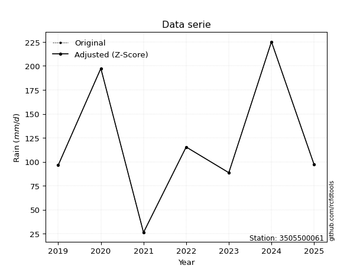</img>

</div>


> The initial value (value_initial) correspond to the initial obtained or null completed value, and value (value) is adjusted only when the initial value is outside the valid range (outlier) definite through the Z-Score value. If Z-Score is active, values out of range or outliers are replaced with the station mean value. A Z-Score (or standard score) measures how many standard deviations a data point is from the mean of a dataset, indicating its relative position; positive scores mean above the mean, negative mean below, and a score of zero is exactly at the mean, allowing for comparison of values from different distributions. It´s calculated using the formula $z=(x–μ)/σ$, where $x$ is the data point, $μ$ is the mean, and $σ$ is the standard deviation, helping identify outliers and understand probability.
>
> <sub>**Note**: In this study, "completing" (filling gaps in) and "extending" (forecasting or lengthening the historical record) rainfall data series are avoided for certain critical analyses because they introduce artificial bias and uncertainty, which can distort the statistics of rare events (extremes), alter day-to-day variability, and compromise the integrity and homogeneity of the original data. Some reasons against Completing/Extending rainfall data are: **Distortion of Extremes and Variability**: The primary issue is that most gap-filling or extension methods rely on averaging or regression with nearby stations, which inherently smooths the data. Rainfall is highly variable in space and time, with a large percentage of zero values and occasional large storms. Infilling methods often underestimate the highest values and overestimate the lowest (zero) values, which severely distorts analyses focused on flood frequency, drought severity, and intensity-duration-frequency (IDF) curves, **Loss of Data Homogeneity**: Infilled or extended data are synthetic estimates, not actual measurements. Combining these estimates with observed data can violate the assumption of data homogeneity, which requires that the data properties do not change over time. Inhomogeneity can lead to incorrect conclusions about long-term trends or changes in climate patterns, **Propagation of Errors**: Errors and biases from the original data (e.g., wind-induced undercatch, instrument errors, site changes) or the data used for imputation can propagate through the analysis, leading to unreliable hydrological models and inaccurate predictions, **Compromised Statistical Integrity**: For statistical analyses, especially those involving the frequency of events, using artificial data can introduce time bias or autocorrelation that doesn´t exist in reality, making it difficult to assess the true probability of events, **Difficulty in Validation**: It is difficult to accurately validate the quality of filled or extended data, especially for past periods where ground-truth measurements are unavailable. The reliability of imputation techniques heavily depends on the density of the surrounding station network and the complexity of the local topography.</sub>


### 4. Active continuous probability distributions from SciPy (80 of 104 available)

A Probability Density Function (PDF) describes the relative likelihood of a continuous random variable falling within a specific range, where the total area under its curve equals 1, and the area over any interval gives the actual probability for that range. Unlike discrete probabilities (like rolling a die), a PDF shows density, not direct probability for a single point (which is zero), with higher points indicating higher likelihood, often visualized as a bell curve for normal distributions.

A log of a probability density function (log-PDF) is simply the logarithm of the PDF´s value, denoted as $log(f(x))$, useful for converting multiplication of probabilities into addition, improving numerical stability with tiny numbers, and connecting to information theory concepts like entropy. Instead of dealing with very small probabilities (e.g., 0.000001), log-PDFs use negative numbers (e.g., $log(0.00001) ≈ -11.51$ that are easier for computers to handle, preventing underflow errors and simplifying complex calculations. In this study, each active probability distribution from SciPy is also evaluated in the $log$ form.

[scipy.stats](https://docs.scipy.org/doc/scipy/reference/stats.html) is a Python´s powerful submodule within the SciPy library for comprehensive statistical analysis, offering over 130 probability distributions (like Normal, Poisson, etc.), functions for descriptive stats (mean, variance), hypothesis testing (t-tests, chi-square), random variable generation, and statistical tests, making it essential for data science, modeling, and research. It provides tools to explore, model, and draw conclusions from data efficiently, working seamlessly with [NumPy](https://numpy.org/).

<div align="center">

|   id | p_dist           |   n_parameter | fit_method   | label                                                                       | active   | ref                                                                                                      |
|-----:|:-----------------|--------------:|:-------------|:----------------------------------------------------------------------------|:---------|:---------------------------------------------------------------------------------------------------------|
|    0 | alpha            |             3 | MLE          | Alpha                                                                       | True     | [:mortar_board:](https://docs.scipy.org/doc/scipy/reference/generated/scipy.stats.alpha.html)            |
|    1 | anglit           |             2 | MM           | Anglit                                                                      | True     | [:mortar_board:](https://docs.scipy.org/doc/scipy/reference/generated/scipy.stats.anglit.html)           |
|    2 | arcsine          |             2 | MM           | Arcsine                                                                     | True     | [:mortar_board:](https://docs.scipy.org/doc/scipy/reference/generated/scipy.stats.arcsine.html)          |
|    3 | argus            |             3 | MLE          | Argus                                                                       | True     | [:mortar_board:](https://docs.scipy.org/doc/scipy/reference/generated/scipy.stats.argus.html)            |
|    4 | beta             |             4 | MLE          | Beta                                                                        | True     | [:mortar_board:](https://docs.scipy.org/doc/scipy/reference/generated/scipy.stats.beta.html)             |
|    5 | betaprime        |             4 | MLE          | Beta prime                                                                  | True     | [:mortar_board:](https://docs.scipy.org/doc/scipy/reference/generated/scipy.stats.betaprime.html)        |
|    6 | bradford         |             3 | MLE          | Bradford                                                                    | True     | [:mortar_board:](https://docs.scipy.org/doc/scipy/reference/generated/scipy.stats.bradford.html)         |
|    7 | burr             |             4 | MLE          | Burr (Type III)                                                             | True     | [:mortar_board:](https://docs.scipy.org/doc/scipy/reference/generated/scipy.stats.burr.html)             |
|    8 | burr12           |             4 | MLE          | Burr (Type III) 12                                                          | True     | [:mortar_board:](https://docs.scipy.org/doc/scipy/reference/generated/scipy.stats.burr12.html)           |
|    9 | cosine           |             2 | MLE          | Cosine                                                                      | True     | [:mortar_board:](https://docs.scipy.org/doc/scipy/reference/generated/scipy.stats.cosine.html)           |
|   10 | crystalball      |             4 | MLE          | Crystalball                                                                 | True     | [:mortar_board:](https://docs.scipy.org/doc/scipy/reference/generated/scipy.stats.crystalball.html)      |
|   11 | dgamma           |             3 | MLE          | Double gamma                                                                | True     | [:mortar_board:](https://docs.scipy.org/doc/scipy/reference/generated/scipy.stats.dgamma.html)           |
|   12 | dweibull         |             3 | MLE          | Double Weibull                                                              | True     | [:mortar_board:](https://docs.scipy.org/doc/scipy/reference/generated/scipy.stats.dweibull.html)         |
|   13 | erlang           |             3 | MLE          | Erlang                                                                      | True     | [:mortar_board:](https://docs.scipy.org/doc/scipy/reference/generated/scipy.stats.erlang.html)           |
|   14 | exponnorm        |             3 | MLE          | Exponentially modified Normal                                               | True     | [:mortar_board:](https://docs.scipy.org/doc/scipy/reference/generated/scipy.stats.exponnorm.html)        |
|   15 | exponpow         |             3 | MLE          | Exponential power                                                           | True     | [:mortar_board:](https://docs.scipy.org/doc/scipy/reference/generated/scipy.stats.exponpow.html)         |
|   16 | exponweib        |             4 | MLE          | Exponentiated Weibull                                                       | True     | [:mortar_board:](https://docs.scipy.org/doc/scipy/reference/generated/scipy.stats.exponweib.html)        |
|   17 | f                |             4 | MLE          | F                                                                           | True     | [:mortar_board:](https://docs.scipy.org/doc/scipy/reference/generated/scipy.stats.f.html)                |
|   18 | fatiguelife      |             3 | MLE          | Fatigue-life (Birnbaum-Saunders)                                            | True     | [:mortar_board:](https://docs.scipy.org/doc/scipy/reference/generated/scipy.stats.fatiguelife.html)      |
|   19 | foldnorm         |             3 | MM           | Fold Normal                                                                 | True     | [:mortar_board:](https://docs.scipy.org/doc/scipy/reference/generated/scipy.stats.foldnorm.html)         |
|   20 | gamma            |             3 | MLE          | Gamma                                                                       | True     | [:mortar_board:](https://docs.scipy.org/doc/scipy/reference/generated/scipy.stats.gamma.html)            |
|   21 | gausshyper       |             6 | MLE          | Gauss hypergeometric                                                        | True     | [:mortar_board:](https://docs.scipy.org/doc/scipy/reference/generated/scipy.stats.gausshyper.html)       |
|   22 | genexpon         |             5 | MLE          | Generalized exponential                                                     | True     | [:mortar_board:](https://docs.scipy.org/doc/scipy/reference/generated/scipy.stats.genexpon.html)         |
|   23 | genextreme       |             3 | MLE          | Generalized exponential                                                     | True     | [:mortar_board:](https://docs.scipy.org/doc/scipy/reference/generated/scipy.stats.genextreme.html)       |
|   24 | gengamma         |             4 | MLE          | Generalized gamma                                                           | True     | [:mortar_board:](https://docs.scipy.org/doc/scipy/reference/generated/scipy.stats.gengamma.html)         |
|   25 | genhalflogistic  |             3 | MLE          | Generalized half-logistic                                                   | True     | [:mortar_board:](https://docs.scipy.org/doc/scipy/reference/generated/scipy.stats.genhalflogistic.html)  |
|   26 | genlogistic      |             3 | MLE          | Generalized logistic                                                        | True     | [:mortar_board:](https://docs.scipy.org/doc/scipy/reference/generated/scipy.stats.genlogistic.html)      |
|   27 | gennorm          |             3 | MLE          | Generalized Normal                                                          | True     | [:mortar_board:](https://docs.scipy.org/doc/scipy/reference/generated/scipy.stats.gennorm.html)          |
|   28 | genpareto        |             3 | MLE          | Generalized Pareto                                                          | True     | [:mortar_board:](https://docs.scipy.org/doc/scipy/reference/generated/scipy.stats.genpareto.html)        |
|   29 | gompertz         |             3 | MLE          | Gompertz (or truncated Gumbel)                                              | True     | [:mortar_board:](https://docs.scipy.org/doc/scipy/reference/generated/scipy.stats.gompertz.html)         |
|   30 | gumbel_l         |             2 | MM           | Gumbel Left Skew                                                            | True     | [:mortar_board:](https://docs.scipy.org/doc/scipy/reference/generated/scipy.stats.gumbel_l.html)         |
|   31 | gumbel_r         |             2 | MM           | Gumbel Right Skew                                                           | True     | [:mortar_board:](https://docs.scipy.org/doc/scipy/reference/generated/scipy.stats.gumbel_r.html)         |
|   32 | halfgennorm      |             3 | MLE          | Upper half of a generalized normal                                          | True     | [:mortar_board:](https://docs.scipy.org/doc/scipy/reference/generated/scipy.stats.halfgennorm.html)      |
|   33 | halflogistic     |             2 | MM           | Half-logistic                                                               | True     | [:mortar_board:](https://docs.scipy.org/doc/scipy/reference/generated/scipy.stats.halflogistic.html)     |
|   34 | halfnorm         |             2 | MM           | Half Normal                                                                 | True     | [:mortar_board:](https://docs.scipy.org/doc/scipy/reference/generated/scipy.stats.halfnorm.html)         |
|   35 | hypsecant        |             2 | MM           | hyperbolic secant                                                           | True     | [:mortar_board:](https://docs.scipy.org/doc/scipy/reference/generated/scipy.stats.hypsecant.html)        |
|   36 | invgamma         |             3 | MLE          | Inverted gamma                                                              | True     | [:mortar_board:](https://docs.scipy.org/doc/scipy/reference/generated/scipy.stats.invgamma.html)         |
|   37 | invgauss         |             3 | MLE          | Inverse Gaussian                                                            | True     | [:mortar_board:](https://docs.scipy.org/doc/scipy/reference/generated/scipy.stats.invgauss.html)         |
|   38 | invweibull       |             3 | MLE          | Inverted Weibull                                                            | True     | [:mortar_board:](https://docs.scipy.org/doc/scipy/reference/generated/scipy.stats.invweibull.html)       |
|   39 | johnsonsb        |             4 | MLE          | Johnson SB                                                                  | True     | [:mortar_board:](https://docs.scipy.org/doc/scipy/reference/generated/scipy.stats.johnsonsb.html)        |
|   40 | johnsonsu        |             4 | MLE          | Johnson Su                                                                  | True     | [:mortar_board:](https://docs.scipy.org/doc/scipy/reference/generated/scipy.stats.johnsonsu.html)        |
|   41 | kappa3           |             3 | MLE          | Kappa 3                                                                     | True     | [:mortar_board:](https://docs.scipy.org/doc/scipy/reference/generated/scipy.stats.kappa3.html)           |
|   42 | kappa4           |             4 | MLE          | Kappa 4                                                                     | True     | [:mortar_board:](https://docs.scipy.org/doc/scipy/reference/generated/scipy.stats.kappa4.html)           |
|   43 | ksone            |             3 | MLE          | Kolmogorov-Smirnov one-sided test statistic distribution                    | True     | [:mortar_board:](https://docs.scipy.org/doc/scipy/reference/generated/scipy.stats.ksone.html)            |
|   44 | kstwobign        |             2 | MLE          | Limiting distribution of scaled Kolmogorov-Smirnov two-sided test statistic | True     | [:mortar_board:](https://docs.scipy.org/doc/scipy/reference/generated/scipy.stats.kstwobign.html)        |
|   45 | laplace          |             2 | MM           | Laplace                                                                     | True     | [:mortar_board:](https://docs.scipy.org/doc/scipy/reference/generated/scipy.stats.laplace.html)          |
|   46 | levy_l           |             2 | MLE          | Left-skewed Levy                                                            | True     | [:mortar_board:](https://docs.scipy.org/doc/scipy/reference/generated/scipy.stats.levy_l.html)           |
|   47 | loggamma         |             3 | MLE          | Log gamma                                                                   | True     | [:mortar_board:](https://docs.scipy.org/doc/scipy/reference/generated/scipy.stats.loggamma.html)         |
|   48 | logistic         |             2 | MM           | Logistic (or Sech-squared)                                                  | True     | [:mortar_board:](https://docs.scipy.org/doc/scipy/reference/generated/scipy.stats.logistic.html)         |
|   49 | loglaplace       |             3 | MLE          | Log-Laplace                                                                 | True     | [:mortar_board:](https://docs.scipy.org/doc/scipy/reference/generated/scipy.stats.loglaplace.html)       |
|   50 | lomax            |             3 | MLE          | Lomax (Pareto of the second kind)                                           | True     | [:mortar_board:](https://docs.scipy.org/doc/scipy/reference/generated/scipy.stats.lomax.html)            |
|   51 | maxwell          |             2 | MM           | Maxwell                                                                     | True     | [:mortar_board:](https://docs.scipy.org/doc/scipy/reference/generated/scipy.stats.maxwell.html)          |
|   52 | mielke           |             4 | MLE          | Mielke Beta-Kappa / Dagum                                                   | True     | [:mortar_board:](https://docs.scipy.org/doc/scipy/reference/generated/scipy.stats.mielke.html)           |
|   53 | moyal            |             2 | MM           | Moyal                                                                       | True     | [:mortar_board:](https://docs.scipy.org/doc/scipy/reference/generated/scipy.stats.moyal.html)            |
|   54 | nakagami         |             3 | MLE          | Nakagami                                                                    | True     | [:mortar_board:](https://docs.scipy.org/doc/scipy/reference/generated/scipy.stats.nakagami.html)         |
|   55 | ncf              |             5 | MLE          | Non-central F distribution                                                  | True     | [:mortar_board:](https://docs.scipy.org/doc/scipy/reference/generated/scipy.stats.ncf.html)              |
|   56 | nct              |             4 | MLE          | Non-central Student’s t                                                     | True     | [:mortar_board:](https://docs.scipy.org/doc/scipy/reference/generated/scipy.stats.nct.html)              |
|   57 | norm             |             2 | MM           | Normal                                                                      | True     | [:mortar_board:](https://docs.scipy.org/doc/scipy/reference/generated/scipy.stats.norm.html)             |
|   58 | pearson3         |             3 | MM           | Pearson type III                                                            | True     | [:mortar_board:](https://docs.scipy.org/doc/scipy/reference/generated/scipy.stats.pearson3.html)         |
|   59 | powerlaw         |             3 | MLE          | Power-function                                                              | True     | [:mortar_board:](https://docs.scipy.org/doc/scipy/reference/generated/scipy.stats.powerlaw.html)         |
|   60 | rayleigh         |             2 | MM           | Rayleigh                                                                    | True     | [:mortar_board:](https://docs.scipy.org/doc/scipy/reference/generated/scipy.stats.rayleigh.html)         |
|   61 | rdist            |             3 | MLE          | R-distributed (symmetric beta)                                              | True     | [:mortar_board:](https://docs.scipy.org/doc/scipy/reference/generated/scipy.stats.rdist.html)            |
|   62 | rice             |             3 | MLE          | Rice                                                                        | True     | [:mortar_board:](https://docs.scipy.org/doc/scipy/reference/generated/scipy.stats.rice.html)             |
|   63 | semicircular     |             2 | MM           | Semicircular                                                                | True     | [:mortar_board:](https://docs.scipy.org/doc/scipy/reference/generated/scipy.stats.semicircular.html)     |
|   64 | skewnorm         |             3 | MLE          | Skew normal                                                                 | True     | [:mortar_board:](https://docs.scipy.org/doc/scipy/reference/generated/scipy.stats.skewnorm.html)         |
|   65 | t                |             3 | MLE          | Student’s t                                                                 | True     | [:mortar_board:](https://docs.scipy.org/doc/scipy/reference/generated/scipy.stats.t.html)                |
|   66 | trapezoid        |             4 | MLE          | Trapezoid                                                                   | True     | [:mortar_board:](https://docs.scipy.org/doc/scipy/reference/generated/scipy.stats.trapezoid.html)        |
|   67 | triang           |             3 | MLE          | Triangular                                                                  | True     | [:mortar_board:](https://docs.scipy.org/doc/scipy/reference/generated/scipy.stats.triang.html)           |
|   68 | truncexpon       |             3 | MLE          | Truncated exponential                                                       | True     | [:mortar_board:](https://docs.scipy.org/doc/scipy/reference/generated/scipy.stats.truncexpon.html)       |
|   69 | truncnorm        |             4 | MLE          | Truncated normal                                                            | True     | [:mortar_board:](https://docs.scipy.org/doc/scipy/reference/generated/scipy.stats.truncnorm.html)        |
|   70 | truncpareto      |             4 | MLE          | Upper truncated Pareto                                                      | True     | [:mortar_board:](https://docs.scipy.org/doc/scipy/reference/generated/scipy.stats.truncpareto.html)      |
|   71 | truncweibull_min |             5 | MLE          | Doubly truncated Weibull minimum                                            | True     | [:mortar_board:](https://docs.scipy.org/doc/scipy/reference/generated/scipy.stats.truncweibull_min.html) |
|   72 | tukeylambda      |             3 | MLE          | Tukey-Lamdba                                                                | True     | [:mortar_board:](https://docs.scipy.org/doc/scipy/reference/generated/scipy.stats.tukeylambda.html)      |
|   73 | uniform          |             2 | MLE          | Uniform                                                                     | True     | [:mortar_board:](https://docs.scipy.org/doc/scipy/reference/generated/scipy.stats.uniform.html)          |
|   74 | vonmises         |             3 | MLE          | Von Mises                                                                   | True     | [:mortar_board:](https://docs.scipy.org/doc/scipy/reference/generated/scipy.stats.vonmises.html)         |
|   75 | vonmises_line    |             3 | MLE          | Von Mises line                                                              | True     | [:mortar_board:](https://docs.scipy.org/doc/scipy/reference/generated/scipy.stats.vonmises_line.html)    |
|   76 | wald             |             2 | MM           | Wald                                                                        | True     | [:mortar_board:](https://docs.scipy.org/doc/scipy/reference/generated/scipy.stats.wald.html)             |
|   77 | weibull_max      |             3 | MLE          | Weibull maximum                                                             | True     | [:mortar_board:](https://docs.scipy.org/doc/scipy/reference/generated/scipy.stats.weibull_max.html)      |
|   78 | weibull_min      |             3 | MLE          | Weibull minimum                                                             | True     | [:mortar_board:](https://docs.scipy.org/doc/scipy/reference/generated/scipy.stats.weibull_min.html)      |
|   79 | wrapcauchy       |             3 | MLE          | Wrapped  Cauchy                                                             | True     | [:mortar_board:](https://docs.scipy.org/doc/scipy/reference/generated/scipy.stats.wrapcauchy.html)       |

</div>

> **n_parameter:** # arguments & localization & scale.
>
> **Fit methods:** (MLE) maximum likelihood, (MM) L-moments.
>
>**Inactive** (With the only purpose of prevent loops, zero divisions, infinite values, over high estimated values or horizontal trending for recurrence intervals estimations, the follow distributions were disabled.)**:** lognorm, norminvgauss, powernorm, powerlognorm, cauchy, halfcauchy, foldcauchy, skewcauchy, chi2, expon, fisk, genhyperbolic, geninvgauss, gibrat, kstwo, laplace_asymmetric, levy, levy_stable, ncx2, pareto, rel_breitwigner, recipinvgauss, studentized_range, loguniform, 


## B. Probability (PDF) vs. Empirical (EDF) distributions functions

A continuous probability distribution (CPD) describes probabilities for variables that can take any value within a range (like rain any time), unlike discrete variables with specific outcomes (like temperature). It uses a Probability Density Function (PDF), a curve where the total area under it equals 1, and the probability of the variable falling within an interval (a to b) is found by calculating the area under the curve between those points. A key feature is that the probability of hitting any single exact value is zero, so probabilities are always expressed for ranges, e.g., $P(a ≤ X ≤ b)$.

<div align="center">

Distributions parameters from station values
|     |    station | p_dist              |   n |              loc |           scale | shape                  | shape1                | shape2                | shape3              |
|----:|-----------:|:--------------------|----:|-----------------:|----------------:|:-----------------------|:----------------------|:----------------------|:--------------------|
|   0 | 3505500061 | alpha               |   7 |     -0.161559    |    60.7387      | 4.59654880128129e-11   |                       |                       |                     |
|   1 | 3505500061 | anglit              |   7 |    120.886       |   184.833       |                        |                       |                       |                     |
|   2 | 3505500061 | arcsine             |   7 |     31.5328      |   178.706       |                        |                       |                       |                     |
|   3 | 3505500061 | argus               |   7 |    -20.5975      |   257.451       | 1.3145189986784238e-06 |                       |                       |                     |
|   4 | 3505500061 | beta                |   7 |     26.2         |   249.019       | 0.8242889460851989     | 1.620379934400979     |                       |                     |
|   5 | 3505500061 | betaprime           |   7 |    -44.9697      |  6604.13        | 6.744541552134535      | 269.53402249807226    |                       |                     |
|   6 | 3505500061 | bradford            |   7 |     26.1996      |   199           | 0.4253588657149676     |                       |                       |                     |
|   7 | 3505500061 | burr                |   7 |     -0.614574    |   156.143       | 4.281400821960943      | 0.42842991668865693   |                       |                     |
|   8 | 3505500061 | burr12              |   7 |   -538.651       |   563.756       | 960.8873981503798      | 0.006431138792318877  |                       |                     |
|   9 | 3505500061 | cosine              |   7 |    123.748       |    52.4617      |                        |                       |                       |                     |
|  10 | 3505500061 | crystalball         |   7 |    120.886       |    63.1821      | 11262.688272198073     | 514.8257729387376     |                       |                     |
|  11 | 3505500061 | dgamma              |   7 |     97           |    54.0038      | 0.8336048477089306     |                       |                       |                     |
|  12 | 3505500061 | dweibull            |   7 |     97           |    54.0358      | 0.8295695524293506     |                       |                       |                     |
|  13 | 3505500061 | erlang              |   7 |    -37.4375      |    26.6626      | 5.9380295149067495     |                       |                       |                     |
|  14 | 3505500061 | exponnorm           |   7 |     60.8282      |    33.9285      | 1.7701196397143772     |                       |                       |                     |
|  15 | 3505500061 | exponpow            |   7 |     26.2         |    36.0815      | 0.4359115983777888     |                       |                       |                     |
|  16 | 3505500061 | exponweib           |   7 |     26.2         |   127.753       | 0.41670282269955683    | 1.5883992747855042    |                       |                     |
|  17 | 3505500061 | f                   |   7 |    -37.6697      |   158.535       | 11.923924938248291     | 14702.164179389638    |                       |                     |
|  18 | 3505500061 | fatiguelife         |   7 |     26.2         |     0.00177     | 227.0454635238055      |                       |                       |                     |
|  19 | 3505500061 | foldnorm            |   7 |    141.202       |     0.423907    | 0.4694353681747647     |                       |                       |                     |
|  20 | 3505500061 | gamma               |   7 |    -37.4374      |    26.6626      | 5.938024289859266      |                       |                       |                     |
|  21 | 3505500061 | gausshyper          |   7 |     26.2         |   200.314       | 0.9620716068288978     | 0.9709306811847236    | 1.0155171450626646    | 0.9982426773570561  |
|  22 | 3505500061 | genexpon            |   7 |     26.1999      |     2.45195     | 0.025901127432155037   | 5.500199049984761e-08 | 0.8289064994422515    |                     |
|  23 | 3505500061 | genextreme          |   7 |     27.8852      |    12.5352      | -7.438559278026572     |                       |                       |                     |
|  24 | 3505500061 | gengamma            |   7 |    -35.8891      |    48.9798      | 4.068752834348217      | 1.1886603034504395    |                       |                     |
|  25 | 3505500061 | genhalflogistic     |   7 |      6.12958     |   233.889       | 1.067641186015324      |                       |                       |                     |
|  26 | 3505500061 | genlogistic         |   7 |    -46.2109      |    51.7052      | 14.865109185272011     |                       |                       |                     |
|  27 | 3505500061 | gennorm             |   7 |     96.4         |     2.3169      | 0.4058546208190662     |                       |                       |                     |
|  28 | 3505500061 | genpareto           |   7 |     -0.924602    |   359.83        | -1.591290836506413     |                       |                       |                     |
|  29 | 3505500061 | gompertz            |   7 |     26.2         |   114.439       | 0.5951505395415215     |                       |                       |                     |
|  30 | 3505500061 | gumbel_l            |   7 |    149.321       |    49.2629      |                        |                       |                       |                     |
|  31 | 3505500061 | gumbel_r            |   7 |     92.4504      |    49.2629      |                        |                       |                       |                     |
|  32 | 3505500061 | halfgennorm         |   7 |     26.2         |     0.900304    | 0.30319322953373895    |                       |                       |                     |
|  33 | 3505500061 | halflogistic        |   7 |     46.0003      |    54.0184      |                        |                       |                       |                     |
|  34 | 3505500061 | halfnorm            |   7 |     37.2574      |   104.813       |                        |                       |                       |                     |
|  35 | 3505500061 | hypsecant           |   7 |    120.886       |    40.223       |                        |                       |                       |                     |
|  36 | 3505500061 | invgamma            |   7 |   -228.118       | 10595           | 31.351846639558154     |                       |                       |                     |
|  37 | 3505500061 | invgauss            |   7 |   -122.45        |  3447.36        | 0.07060781814515017    |                       |                       |                     |
|  38 | 3505500061 | invweibull          |   7 |     -1.06918e+06 |     1.06927e+06 | 19856.41496205816      |                       |                       |                     |
|  39 | 3505500061 | johnsonsb           |   7 |     26.2         |   199.003       | -0.35752273258752587   | 0.1177629811689529    |                       |                     |
|  40 | 3505500061 | johnsonsu           |   7 |      3.55645e+09 |     1.85489e+09 | 89539168.98085338      | 63681600.09686076     |                       |                     |
|  41 | 3505500061 | kappa3              |   7 |     26.1464      |   212.224       | 606.7949297009857      |                       |                       |                     |
|  42 | 3505500061 | kappa4              |   7 |     11.9066      |   211.473       | 1.0724486014338648     | 0.984834170724638     |                       |                     |
|  43 | 3505500061 | ksone               |   7 |     11.4511      |   218.869       | 1.0                    |                       |                       |                     |
|  44 | 3505500061 | kstwobign           |   7 |   -100.491       |   254.025       |                        |                       |                       |                     |
|  45 | 3505500061 | laplace             |   7 |    120.886       |    44.6765      |                        |                       |                       |                     |
|  46 | 3505500061 | levy_l              |   7 |    234.942       |    42.7496      |                        |                       |                       |                     |
|  47 | 3505500061 | loggamma            |   7 | -18450.4         |  2524.72        | 1565.6688479703116     |                       |                       |                     |
|  48 | 3505500061 | logistic            |   7 |    120.886       |    34.8341      |                        |                       |                       |                     |
|  49 | 3505500061 | loglaplace          |   7 |     -0.304468    |    97.3045      | 2.2442022416657914     |                       |                       |                     |
|  50 | 3505500061 | lomax               |   7 |     26.2         | 17241.3         | 183.84912271604014     |                       |                       |                     |
|  51 | 3505500061 | maxwell             |   7 |    -28.8293      |    93.82        |                        |                       |                       |                     |
|  52 | 3505500061 | mielke              |   7 |     -0.493964    |   156.212       | 1.8290038137732394     | 4.28319705252158      |                       |                     |
|  53 | 3505500061 | moyal               |   7 |     84.7541      |    28.4419      |                        |                       |                       |                     |
|  54 | 3505500061 | nakagami            |   7 |     88.6         |    66.2156      | 0.2291573788411873     |                       |                       |                     |
|  55 | 3505500061 | ncf                 |   7 |     -4.83551     |    20.5834      | 2.266509469197093      | 598.2090185228565     | 11.53499539572217     |                     |
|  56 | 3505500061 | nct                 |   7 |     -0.134588    |    49.8787      | 8.883265838940913      | 2.213980689028428     |                       |                     |
|  57 | 3505500061 | norm                |   7 |    120.886       |    63.1821      |                        |                       |                       |                     |
|  58 | 3505500061 | pearson3            |   7 |    120.886       |    63.182       | 0.3806328873452237     |                       |                       |                     |
|  59 | 3505500061 | powerlaw            |   7 |     26.2         |   199           | 0.1637334691838231     |                       |                       |                     |
|  60 | 3505500061 | rayleigh            |   7 |      0.0147025   |    96.4411      |                        |                       |                       |                     |
|  61 | 3505500061 | rdist               |   7 |      7.22864     |   108.171       | 1.1387128184713142     |                       |                       |                     |
|  62 | 3505500061 | rice                |   7 |      0.900808    |    84.9041      | 0.7421949409594497     |                       |                       |                     |
|  63 | 3505500061 | semicircular        |   7 |    120.886       |   126.364       |                        |                       |                       |                     |
|  64 | 3505500061 | skewnorm            |   7 |     48.6194      |    95.9916      | 2.8280500846721077     |                       |                       |                     |
|  65 | 3505500061 | t                   |   7 |    120.886       |    63.1859      | 23340967.66008375      |                       |                       |                     |
|  66 | 3505500061 | trapezoid           |   7 |      6.3         |   238.8         | 1.0                    | 1.0                   |                       |                     |
|  67 | 3505500061 | triang              |   7 |      6.72007     |   218.48        | 0.9999997707667381     |                       |                       |                     |
|  68 | 3505500061 | truncexpon          |   7 |      6.77153     |   270.342       | 0.807970497211913      |                       |                       |                     |
|  69 | 3505500061 | truncnorm           |   7 |     83.742       |   119.076       | -2467.9336932068045    | 1.1879646983536396    |                       |                     |
|  70 | 3505500061 | truncpareto         |   7 |   -441.715       |   467.915       | 6.585523706171185e-08  | 1.4252909189632825    |                       |                     |
|  71 | 3505500061 | truncweibull_min    |   7 |      7.83097     |   317.363       | 1.3304462279397582     | 0.0006805804671881753 | 0.6849230802490098    |                     |
|  72 | 3505500061 | tukeylambda         |   7 |    125.757       |   109.418       | 1.099053618096991      |                       |                       |                     |
|  73 | 3505500061 | uniform             |   7 |     26.2         |   199           |                        |                       |                       |                     |
|  74 | 3505500061 | vonmises            |   7 |      1.93536     |     1           | 1.0741595945572893     |                       |                       |                     |
|  75 | 3505500061 | vonmises_line       |   7 |    125.557       |    31.7173      | 7.869435718777445e-05  |                       |                       |                     |
|  76 | 3505500061 | wald                |   7 |     57.7036      |    63.1821      |                        |                       |                       |                     |
|  77 | 3505500061 | weibull_max         |   7 |    225.2         |     1.71288     | 0.22411228836634833    |                       |                       |                     |
|  78 | 3505500061 | weibull_min         |   7 |      7.75759     |   126.966       | 1.8237620936785335     |                       |                       |                     |
|  79 | 3505500061 | wrapcauchy          |   7 |     26.2         |    31.7565      | 0.026716784131914223   |                       |                       |                     |
|  80 | 3505500061 | logalpha            |   7 |    -12.6384      |   447.566       | 25.996679879456423     |                       |                       |                     |
|  81 | 3505500061 | loganglit           |   7 |      4.62053     |     1.89953     |                        |                       |                       |                     |
|  82 | 3505500061 | logarcsine          |   7 |      3.70224     |     1.83659     |                        |                       |                       |                     |
|  83 | 3505500061 | logargus            |   7 |      2.65122     |     2.84104     | 1.9299079418754894     |                       |                       |                     |
|  84 | 3505500061 | logbeta             |   7 |      1.80009     |     3.6169      | 3.8251617938697082     | 0.803088475232792     |                       |                     |
|  85 | 3505500061 | logbetaprime        |   7 |     -9.82517     |    22.3583      | 743.67175694104        | 1152.3489202698925    |                       |                     |
|  86 | 3505500061 | logbradford         |   7 |      3.25898     |     2.15801     | 3.559486061922748e-05  |                       |                       |                     |
|  87 | 3505500061 | logburr             |   7 |      0.880495    |     4.5509      | 1098.7063258866651     | 0.004256118645780608  |                       |                     |
|  88 | 3505500061 | logburr12           |   7 |    -80.9984      |    90.5608      | 172.30617238292        | 8743.93789640565      |                       |                     |
|  89 | 3505500061 | logcosine           |   7 |      4.52959     |     0.572576    |                        |                       |                       |                     |
|  90 | 3505500061 | logcrystalball      |   7 |      4.62054     |     0.649326    | 5.741320913210092      | 11.29056155725726     |                       |                     |
|  91 | 3505500061 | logdgamma           |   7 |      4.57471     |     0.479392    | 0.8871253767336831     |                       |                       |                     |
|  92 | 3505500061 | logdweibull         |   7 |      4.57471     |     0.480955    | 0.8919669665860228     |                       |                       |                     |
|  93 | 3505500061 | logerlang           |   7 |     -5.75527     |     0.0433874   | 238.88444018750246     |                       |                       |                     |
|  94 | 3505500061 | logexponnorm        |   7 |      4.6201      |     0.649326    | 0.0006701613745271327  |                       |                       |                     |
|  95 | 3505500061 | logexponpow         |   7 |      3.26576     |     1.45747     | 0.5835563920862625     |                       |                       |                     |
|  96 | 3505500061 | logexponweib        |   7 |      3.26576     |     1.83428     | 0.20751097703869092    | 0.8303899017469606    |                       |                     |
|  97 | 3505500061 | logf                |   7 |   -720.542       |   725.161       | 2938200.1443794146     | 15826478.627807543    |                       |                     |
|  98 | 3505500061 | logfatiguelife      |   7 |   -481.954       |   486.574       | 0.0013331759944624332  |                       |                       |                     |
|  99 | 3505500061 | logfoldnorm         |   7 |      3.74203     |     0.788718    | 0.9264297151397286     |                       |                       |                     |
| 100 | 3505500061 | loggamma            |   7 |     -6.86623     |     0.0392069   | 292.83936254689473     |                       |                       |                     |
| 101 | 3505500061 | loggausshyper       |   7 |      3.15879     |     2.2582      | 1.0787507532664575     | 0.6030876351131278    | 1.0033837820941054    | -0.1778864799656132 |
| 102 | 3505500061 | loggenexpon         |   7 |      3.21941     |     0.00892357  | 0.0016891371084145979  | 3.025936056761644     | 1.615114800036228e-05 |                     |
| 103 | 3505500061 | loggenextreme       |   7 |      4.68688     |     0.853315    | 1.1687554431427718     |                       |                       |                     |
| 104 | 3505500061 | loggengamma         |   7 |     -1.7673e+07  |     1.7673e+07  | 2.0015997072173897     | 22543808.236879483    |                       |                     |
| 105 | 3505500061 | loggenhalflogistic  |   7 |      3.24634     |     2.2586      | 1.0405169525386562     |                       |                       |                     |
| 106 | 3505500061 | loggenlogistic      |   7 |      5.05304     |     0.233174    | 0.42146650239907235    |                       |                       |                     |
| 107 | 3505500061 | loggennorm          |   7 |      4.56851     |     7.36525e-05 | 0.20987063196527714    |                       |                       |                     |
| 108 | 3505500061 | loggenpareto        |   7 |     -0.0174578   |    15.3899      | -2.8319135602024614    |                       |                       |                     |
| 109 | 3505500061 | loggompertz         |   7 |      3.26576     |     1.3687      | 0.5449473743707351     |                       |                       |                     |
| 110 | 3505500061 | loggumbel_l         |   7 |      4.91276     |     0.506275    |                        |                       |                       |                     |
| 111 | 3505500061 | loggumbel_r         |   7 |      4.3283      |     0.506275    |                        |                       |                       |                     |
| 112 | 3505500061 | loghalfgennorm      |   7 |      3.26576     |     1.09556     | 0.9119892751042651     |                       |                       |                     |
| 113 | 3505500061 | loghalflogistic     |   7 |      3.85091     |     0.555166    |                        |                       |                       |                     |
| 114 | 3505500061 | loghalfnorm         |   7 |      3.76106     |     1.07718     |                        |                       |                       |                     |
| 115 | 3505500061 | loghypsecant        |   7 |      4.62053     |     0.413372    |                        |                       |                       |                     |
| 116 | 3505500061 | loginvgamma         |   7 |     -9.37098     |  6199.38        | 444.3237721457308      |                       |                       |                     |
| 117 | 3505500061 | loginvgauss         |   7 |     -2.31604     |   682.384       | 0.010135021349381823   |                       |                       |                     |
| 118 | 3505500061 | loginvweibull       |   7 |     -3.33437e+07 |     3.33437e+07 | 45491668.15947244      |                       |                       |                     |
| 119 | 3505500061 | logjohnsonsb        |   7 |      3.26576     |     2.15123     | 1.1134282591873936     | 0.13946438540700618   |                       |                     |
| 120 | 3505500061 | logjohnsonsu        |   7 |      5.92885     |     0.0257744   | 8.858311979592788      | 1.9700057427508009    |                       |                     |
| 121 | 3505500061 | logkappa3           |   7 |      3.26576     |     2.14973     | 2792.2022176193614     |                       |                       |                     |
| 122 | 3505500061 | logkappa4           |   7 |      3.13113     |     2.41534     | 1.0527547709316931     | 1.0566437875109655    |                       |                     |
| 123 | 3505500061 | logksone            |   7 |      3.05064     |     2.58148     | 1.0                    |                       |                       |                     |
| 124 | 3505500061 | logkstwobign        |   7 |      1.64207     |     3.40912     |                        |                       |                       |                     |
| 125 | 3505500061 | loglaplace          |   7 |      4.62053     |     0.459141    |                        |                       |                       |                     |
| 126 | 3505500061 | loglevy_l           |   7 |      5.47694     |     0.25985     |                        |                       |                       |                     |
| 127 | 3505500061 | logloggamma         |   7 |      5.19209     |     0.343212    | 0.5672613660140589     |                       |                       |                     |
| 128 | 3505500061 | loglogistic         |   7 |      4.62053     |     0.35799     |                        |                       |                       |                     |
| 129 | 3505500061 | logloglaplace       |   7 |     -0.0140335   |     4.58874     | 9.906606503897292      |                       |                       |                     |
| 130 | 3505500061 | loglomax            |   7 |      3.26576     |     4.2104e+12  | 1407175609295.3652     |                       |                       |                     |
| 131 | 3505500061 | logmaxwell          |   7 |      3.08191     |     0.964189    |                        |                       |                       |                     |
| 132 | 3505500061 | logmielke           |   7 |      2.67483     |     2.76224     | 2.281497538311606      | 783.4012114116881     |                       |                     |
| 133 | 3505500061 | logmoyal            |   7 |      4.24921     |     0.292298    |                        |                       |                       |                     |
| 134 | 3505500061 | lognakagami         |   7 |      4.48413     |     0.538439    | 0.06878756064183963    |                       |                       |                     |
| 135 | 3505500061 | logncf              |   7 |   -143.518       |   139.006       | 156633.67336361477     | 299157.3891291        | 10289.808787567028    |                     |
| 136 | 3505500061 | lognct              |   7 |     42.8646      |     0.627379    | 27476.458626258813     | -60.95676967887542    |                       |                     |
| 137 | 3505500061 | lognorm             |   7 |      4.62053     |     0.649323    |                        |                       |                       |                     |
| 138 | 3505500061 | logpearson3         |   7 |      4.62053     |     0.649323    | -0.8810065410020581    |                       |                       |                     |
| 139 | 3505500061 | logpowerlaw         |   7 |      3.26576     |     2.15123     | 0.18363612221824657    |                       |                       |                     |
| 140 | 3505500061 | lograyleigh         |   7 |      3.37835     |     0.991122    |                        |                       |                       |                     |
| 141 | 3505500061 | logrdist            |   7 |      4.34289     |     1.07713     | 1.1091600355806452     |                       |                       |                     |
| 142 | 3505500061 | logrice             |   7 |   -135.74        |     0.649296    | 216.17091877449417     |                       |                       |                     |
| 143 | 3505500061 | logsemicircular     |   7 |      4.62053     |     1.29865     |                        |                       |                       |                     |
| 144 | 3505500061 | logskewnorm         |   7 |      5.41699     |     1.02768     | -17208742.85826964     |                       |                       |                     |
| 145 | 3505500061 | logt                |   7 |      4.66075     |     0.620478    | 14.964157955530737     |                       |                       |                     |
| 146 | 3505500061 | logtrapezoid        |   7 |      2.78397     |     2.75484     | 1.0                    | 1.0                   |                       |                     |
| 147 | 3505500061 | logtriang           |   7 |      2.83595     |     2.58115     | 0.9999999989667083     |                       |                       |                     |
| 148 | 3505500061 | logtruncexpon       |   7 |      3.26527     |     2.57171     | 0.8366872824161391     |                       |                       |                     |
| 149 | 3505500061 | logtruncnorm        |   7 |     -0.221376    |     1.30453     | 3.607043419171603      | 4.322140815623129     |                       |                     |
| 150 | 3505500061 | logtruncpareto      |   7 |      3.26428     |     0.00147514  | 0.16781017953218214    | 1459.3186128025986    |                       |                     |
| 151 | 3505500061 | logtruncweibull_min |   7 |      2.64063     |     2.96639     | 3.039505028553301      | 2.031925852955217e-09 | 0.9359365741230582    |                     |
| 152 | 3505500061 | logtukeylambda      |   7 |      4.3189      |     1.27103     | 1.1574966645424183     |                       |                       |                     |
| 153 | 3505500061 | loguniform          |   7 |      3.26576     |     2.15123     |                        |                       |                       |                     |
| 154 | 3505500061 | logvonmises         |   7 |     -1.6189      |     1           | 3.03202910013022       |                       |                       |                     |
| 155 | 3505500061 | logvonmises_line    |   7 |      4.702       |     0.457171    | 1.071033940349395      |                       |                       |                     |
| 156 | 3505500061 | logwald             |   7 |      3.97121     |     0.649319    |                        |                       |                       |                     |
| 157 | 3505500061 | logweibull_max      |   7 |      5.41699     |     1.07245     | 0.1971669026115153     |                       |                       |                     |
| 158 | 3505500061 | logweibull_min      |   7 |     -5.71573e+07 |     5.71573e+07 | 114196314.27611457     |                       |                       |                     |
| 159 | 3505500061 | logwrapcauchy       |   7 |      3.26576     |     0.342379    | 0.5                    |                       |                       |                     |

</div>

> **loc** (Location parameter): This shifts the distribution along the x-axis. For many common distributions, like the normal (Gaussian) distribution, loc represents the mean $μ$. For others, like the uniform distribution, it might represent the minimum value, or for the beta distribution, the left end of the support interval.
>
> **scale** (Scale parameter): This determines the width or spread of the distribution. For the normal distribution, scale represents the standard deviation $σ$. For a uniform distribution, it defines the length of the interval (from $loc$ to $loc + scale$).
>
> **shape** (Shape parameters): Refers to parameters that define the specific form of a probability distribution, distinct from its location (loc) and scale (scale). These parameters are required arguments for most distribution functions. For example, a normal (Gaussian) distribution is fully defined by its location (mean) and scale (standard deviation), so it has no specific shape parameters beyond loc and scale. However, other distributions have intrinsic properties that need specification, as Gamma distribution that takes a shape parameter, often named $a$ or $alpha$.


### 0. Cumulative distribution values - CDF (160 evaluated)

Cumulative Distribution Function (CDF), denoted as $F$<sub>$X$</sub>$(x)$, is a function that gives the probability that a random variable $X$ will take a value less than or equal to a specific value, $x$ (i.e., $(P(X≥x)$. It essentially "accumulates" probabilities from a given point up to the far right (positive infinity), providing a complete picture of the distribution´s probabilities for both discrete (like rain) and continuous (like temperature) variables, helping to find probabilities over ranges or above certain values. Each station is evaluated separately ordering the $x$ values ascending, calculating the CDF and PDF values for the activated distributions and their logarithmic forms.

<div align="center">

CDF ordered by x ascending and calculating $log(f(x))$ separately
|   id |    Station |   date |     x |   count |    mean |     std |     zscore |   Value_initial |    station |   m |    alpha |   alpha_pdf |    anglit |   anglit_pdf |   arcsine |   arcsine_pdf |     argus |   argus_pdf |        beta |   beta_pdf |   betaprime |   betaprime_pdf |    bradford |   bradford_pdf |      burr |   burr_pdf |   burr12 |   burr12_pdf |    cosine |   cosine_pdf |   crystalball |   crystalball_pdf |   dgamma |   dgamma_pdf |   dweibull |   dweibull_pdf |    erlang |   erlang_pdf |   exponnorm |   exponnorm_pdf |    exponpow |   exponpow_pdf |   exponweib |   exponweib_pdf |         f |      f_pdf |   fatiguelife |   fatiguelife_pdf |   foldnorm |   foldnorm_pdf |     gamma |   gamma_pdf |   gausshyper |   gausshyper_pdf |    genexpon |   genexpon_pdf |   genextreme |   genextreme_pdf |   gengamma |   gengamma_pdf |   genhalflogistic |   genhalflogistic_pdf |   genlogistic |   genlogistic_pdf |   gennorm |   gennorm_pdf |   genpareto |   genpareto_pdf |    gompertz |   gompertz_pdf |   gumbel_l |   gumbel_l_pdf |   gumbel_r |   gumbel_r_pdf |   halfgennorm |   halfgennorm_pdf |   halflogistic |   halflogistic_pdf |   halfnorm |   halfnorm_pdf |   hypsecant |   hypsecant_pdf |   invgamma |   invgamma_pdf |   invgauss |   invgauss_pdf |   invweibull |   invweibull_pdf |   johnsonsb |   johnsonsb_pdf |   johnsonsu |   johnsonsu_pdf |      kappa3 |   kappa3_pdf |      kappa4 |   kappa4_pdf |     ksone |   ksone_pdf |   kstwobign |   kstwobign_pdf |   laplace |   laplace_pdf |   levy_l |   levy_l_pdf |   loggamma |   loggamma_pdf |   logistic |   logistic_pdf |   loglaplace |   loglaplace_pdf |       lomax |   lomax_pdf |   maxwell |   maxwell_pdf |    mielke |   mielke_pdf |      moyal |   moyal_pdf |    nakagami |   nakagami_pdf |       ncf |    ncf_pdf |       nct |    nct_pdf |      norm |   norm_pdf |   pearson3 |   pearson3_pdf |   powerlaw |   powerlaw_pdf |   rayleigh |   rayleigh_pdf |    rdist |      rdist_pdf |      rice |   rice_pdf |   semicircular |   semicircular_pdf |   skewnorm |   skewnorm_pdf |         t |      t_pdf |   trapezoid |   trapezoid_pdf |     triang |   triang_pdf |   truncexpon |   truncexpon_pdf |   truncnorm |   truncnorm_pdf |   truncpareto |   truncpareto_pdf |   truncweibull_min |   truncweibull_min_pdf |   tukeylambda |   tukeylambda_pdf |   uniform |   uniform_pdf |   vonmises |   vonmises_pdf |   vonmises_line |   vonmises_line_pdf |     wald |    wald_pdf |   weibull_max |   weibull_max_pdf |   weibull_min |   weibull_min_pdf |   wrapcauchy |   wrapcauchy_pdf |   logalpha |   logalpha_pdf |   loganglit |   loganglit_pdf |   logarcsine |   logarcsine_pdf |   logargus |   logargus_pdf |   logbeta |   logbeta_pdf |   logbetaprime |   logbetaprime_pdf |   logbradford |   logbradford_pdf |   logburr |   logburr_pdf |   logburr12 |   logburr12_pdf |   logcosine |   logcosine_pdf |   logcrystalball |   logcrystalball_pdf |   logdgamma |   logdgamma_pdf |   logdweibull |   logdweibull_pdf |   logerlang |   logerlang_pdf |   logexponnorm |   logexponnorm_pdf |   logexponpow |   logexponpow_pdf |   logexponweib |   logexponweib_pdf |      logf |   logf_pdf |   logfatiguelife |   logfatiguelife_pdf |   logfoldnorm |   logfoldnorm_pdf |   loggausshyper |   loggausshyper_pdf |   loggenexpon |   loggenexpon_pdf |   loggenextreme |   loggenextreme_pdf |   loggengamma |   loggengamma_pdf |   loggenhalflogistic |   loggenhalflogistic_pdf |   loggenlogistic |   loggenlogistic_pdf |   loggennorm |   loggennorm_pdf |   loggenpareto |   loggenpareto_pdf |   loggompertz |   loggompertz_pdf |   loggumbel_l |   loggumbel_l_pdf |   loggumbel_r |   loggumbel_r_pdf |   loghalfgennorm |   loghalfgennorm_pdf |   loghalflogistic |   loghalflogistic_pdf |   loghalfnorm |   loghalfnorm_pdf |   loghypsecant |   loghypsecant_pdf |   loginvgamma |   loginvgamma_pdf |   loginvgauss |   loginvgauss_pdf |   loginvweibull |   loginvweibull_pdf |   logjohnsonsb |   logjohnsonsb_pdf |   logjohnsonsu |   logjohnsonsu_pdf |   logkappa3 |   logkappa3_pdf |   logkappa4 |   logkappa4_pdf |   logksone |   logksone_pdf |   logkstwobign |   logkstwobign_pdf |   loglevy_l |   loglevy_l_pdf |   logloggamma |   logloggamma_pdf |   loglogistic |   loglogistic_pdf |   logloglaplace |   logloglaplace_pdf |    loglomax |   loglomax_pdf |   logmaxwell |   logmaxwell_pdf |   logmielke |   logmielke_pdf |    logmoyal |   logmoyal_pdf |   lognakagami |   lognakagami_pdf |   logncf |   logncf_pdf |    lognct |   lognct_pdf |   lognorm |   lognorm_pdf |   logpearson3 |   logpearson3_pdf |   logpowerlaw |   logpowerlaw_pdf |   lograyleigh |   lograyleigh_pdf |    logrdist |   logrdist_pdf |   logrice |   logrice_pdf |   logsemicircular |   logsemicircular_pdf |   logskewnorm |   logskewnorm_pdf |      logt |   logt_pdf |   logtrapezoid |   logtrapezoid_pdf |   logtriang |   logtriang_pdf |   logtruncexpon |   logtruncexpon_pdf |   logtruncnorm |   logtruncnorm_pdf |   logtruncpareto |   logtruncpareto_pdf |   logtruncweibull_min |   logtruncweibull_min_pdf |   logtukeylambda |   logtukeylambda_pdf |   loguniform |   loguniform_pdf |   logvonmises |   logvonmises_pdf |   logvonmises_line |   logvonmises_line_pdf |   logwald |   logwald_pdf |   logweibull_max |   logweibull_max_pdf |   logweibull_min |   logweibull_min_pdf |   logwrapcauchy |   logwrapcauchy_pdf |
|-----:|-----------:|-------:|------:|--------:|--------:|--------:|-----------:|----------------:|-----------:|----:|---------:|------------:|----------:|-------------:|----------:|--------------:|----------:|------------:|------------:|-----------:|------------:|----------------:|------------:|---------------:|----------:|-----------:|---------:|-------------:|----------:|-------------:|--------------:|------------------:|---------:|-------------:|-----------:|---------------:|----------:|-------------:|------------:|----------------:|------------:|---------------:|------------:|----------------:|----------:|-----------:|--------------:|------------------:|-----------:|---------------:|----------:|------------:|-------------:|-----------------:|------------:|---------------:|-------------:|-----------------:|-----------:|---------------:|------------------:|----------------------:|--------------:|------------------:|----------:|--------------:|------------:|----------------:|------------:|---------------:|-----------:|---------------:|-----------:|---------------:|--------------:|------------------:|---------------:|-------------------:|-----------:|---------------:|------------:|----------------:|-----------:|---------------:|-----------:|---------------:|-------------:|-----------------:|------------:|----------------:|------------:|----------------:|------------:|-------------:|------------:|-------------:|----------:|------------:|------------:|----------------:|----------:|--------------:|---------:|-------------:|-----------:|---------------:|-----------:|---------------:|-------------:|-----------------:|------------:|------------:|----------:|--------------:|----------:|-------------:|-----------:|------------:|------------:|---------------:|----------:|-----------:|----------:|-----------:|----------:|-----------:|-----------:|---------------:|-----------:|---------------:|-----------:|---------------:|---------:|---------------:|----------:|-----------:|---------------:|-------------------:|-----------:|---------------:|----------:|-----------:|------------:|----------------:|-----------:|-------------:|-------------:|-----------------:|------------:|----------------:|--------------:|------------------:|-------------------:|-----------------------:|--------------:|------------------:|----------:|--------------:|-----------:|---------------:|----------------:|--------------------:|---------:|------------:|--------------:|------------------:|--------------:|------------------:|-------------:|-----------------:|-----------:|---------------:|------------:|----------------:|-------------:|-----------------:|-----------:|---------------:|----------:|--------------:|---------------:|-------------------:|--------------:|------------------:|----------:|--------------:|------------:|----------------:|------------:|----------------:|-----------------:|---------------------:|------------:|----------------:|--------------:|------------------:|------------:|----------------:|---------------:|-------------------:|--------------:|------------------:|---------------:|-------------------:|----------:|-----------:|-----------------:|---------------------:|--------------:|------------------:|----------------:|--------------------:|--------------:|------------------:|----------------:|--------------------:|--------------:|------------------:|---------------------:|-------------------------:|-----------------:|---------------------:|-------------:|-----------------:|---------------:|-------------------:|--------------:|------------------:|--------------:|------------------:|--------------:|------------------:|-----------------:|---------------------:|------------------:|----------------------:|--------------:|------------------:|---------------:|-------------------:|--------------:|------------------:|--------------:|------------------:|----------------:|--------------------:|---------------:|-------------------:|---------------:|-------------------:|------------:|----------------:|------------:|----------------:|-----------:|---------------:|---------------:|-------------------:|------------:|----------------:|--------------:|------------------:|--------------:|------------------:|----------------:|--------------------:|------------:|---------------:|-------------:|-----------------:|------------:|----------------:|------------:|---------------:|--------------:|------------------:|---------:|-------------:|----------:|-------------:|----------:|--------------:|--------------:|------------------:|--------------:|------------------:|--------------:|------------------:|------------:|---------------:|----------:|--------------:|------------------:|----------------------:|--------------:|------------------:|----------:|-----------:|---------------:|-------------------:|------------:|----------------:|----------------:|--------------------:|---------------:|-------------------:|-----------------:|---------------------:|----------------------:|--------------------------:|-----------------:|---------------------:|-------------:|-----------------:|--------------:|------------------:|-------------------:|-----------------------:|----------:|--------------:|-----------------:|---------------------:|-----------------:|---------------------:|----------------:|--------------------:|
|    0 | 3505500061 |   2021 |  26.2 |       7 | 120.886 | 68.2444 | -1.38745   |            26.2 | 3505500061 |   1 | 0.021219 |  0.00490558 | 0.0727584 |   0.00281053 |  0        |    0          | 0.0491503 |  0.00208286 | 1.98081e-14 | 4.59582    |   0.0381344 |      0.00231287 | 2.12789e-06 |     0.00603085 | 0.0394821 | 0.00269939 | 0.012831 |   0.00934996 | 0.0514927 |   0.00217024 |     0.0669865 |        0.00205417 | 0.105343 |  0.00211398  |   0.14307  |    0.00209759  | 0.0372495 |   0.00234294 |   0.0359173 |      0.00196144 | 1.05313e-07 |    1.29218e+07 | 5.38461e-11 |   911.984       | 0.0372806 | 0.002342   |     0.0453505 |       6.72468e+06 |          0 |              0 | 0.0372495 |  0.00234294 |  1.07616e-16 |       0.0291429  | 9.15095e-07 |     0.0105635  |  0.000372086 |   1110.49        |  0.0418141 |     0.00244629 |          0.04497  |            0.00234862 |     0.0378098 |        0.00214952 |  0.075882 |   0.00124666  |    0.077161 |      0.00291423 | 5.18754e-12 |     0.00520059 |  0.0788619 |    0.00153599  |  0.0215463 |     0.00167844 |      0        |       0.125729    |       0        |         0          |   0        |     0          |   0.0602893 |      0.00148993 |  0.0419071 |     0.00216907 |  0.0391427 |     0.00222936 |    0.0351337 |       0.00218488 | 4.81677e-07 |     8.12501e+07 |   0.0663842 |      0.00204618 | 0.000249926 |   0.00466251 | 1.32804e-15 |   0.056505   | 0.0673867 |  0.00456894 |   0.0352516 |      0.0024819  |  0.060054 |    0.0013442  | 0.349123 |  0.000780712 |   0.018941 |      0.0749214 |  0.0619085 |     0.00166721 |    0.0261522 |        0.0569591 | 9.35898e-12 |  0.0106633  | 0.0484545 |    0.00246341 | 0.0394916 |   0.00270447 | 0.00512163 | 0.000780613 | 0           |     0          | 0.0357426 | 0.00250133 | 0.0457358 | 0.00195123 | 0.0669866 | 0.00205417 |  0.0541728 |     0.00218087 | 0.00181027 |    8.34298e+10 |  0.0361894 |     0.00271347 | 0.561293 |     0.00325998 | 0.0331694 | 0.00258016 |      0.0724383 |         0.00333626 |  0.0392322 |     0.0020582  | 0.0669975 | 0.0020543  |  0.00694444 |     0.000697934 | 0.00794971 |  0.000816195 |     0.125117 |       0.00621125 |    0.356302 |      0.00337774 |      0        |        0.00603071 |          0.0490809 |             0.00352455 |   7.10543e-15 |        0.00879047 |  0        |    0.00502513 |    4.22711 |      0.243254  |      0.00143183 |          0.00501753 | 0        | 0           |     0.0548682 |       0.000179372 |     0.0292082 |        0.00284578 |  1.11497e-09 |       0.00528687 |  0.0159834 |      0.0707638 |  0.00520123 |       0.0757365 |     0        |         0        |  0.0304214 |       0.102155 | 0.0221209 |     0.0591872 |      0.0198046 |          0.0773835 |    0.00314348 |          0.463397 | 0.0487569 |    nan        |   0.0347824 |       0.0698725 |   0.0207096 |        0.11275  |        0.0184692 |            0.0696868 |   0.0261263 |        0.056248 |     0.0434691 |         0.0723521 |   0.0189714 |       0.0757622 |      0.0184698 |          0.0696889 |    8.8199e-10 |       1.15898e+06 |     0.00203765 |        7.90646e+11 | 0.0188066 |   0.070639 |        0.0182877 |            0.0693642 |      0        |          0        |       0.0196677 |            0.20102  |    0.00938823 |          0.21569  |        0.080395 |           0.0806042 |     0.0306774 |         0.0714089 |            0.0043182 |                 0.223371 |        0.0395276 |            0.0714136 |    0.0471351 |        0.0348395 |       0.27909  |        0.118335    |   6.97988e-09 |          0.398151 |     0.0379137 |         0.0734496 |   0.000287019 |         0.0046238 |      6.30088e-09 |             0.873703 |          0        |              0        |      0        |          0        |      0.0240065 |          0.0580198 |      0.016241 |         0.0699143 |     0.0185103 |         0.0812485 |       0.0193972 |            0.104338 |      0.0729117 |     890694         |      0.0501036 |          0.0764165 | 8.50345e-09 |        0.463855 |  0.00777779 |        0.536664 |  0.0833333 |       0.387375 |      0.0228696 |           0.139121 |    0.268256 |       0.0583197 |     0.0464717 |         0.0766298 |      0.022218 |         0.0606841 |       0.0179522 |           0.0542245 | 6.08675e-13 |       0.334215 |   0.00182382 |        0.0295447 |   0.0296497 |        0.114474 | 7.54178e-08 |    3.85229e-06 |    0          |       0           | 0.018617 |    0.0703885 | 0.0184788 |    0.0695172 | 0.0184693 |     0.0696877 |     0.0360644 |         0.0794753 |    0.00131713 |       5.44648e+11 |      0        |          0        | 1.38511e-09 |    1.60587e+06 | 0.0184676 |     0.0696853 |          0        |              0        |     0.0363235 |         0.0868111 | 0.0200306 |  0.0619602 |      0.0305857 |           0.126967 |   0.0277282 |        0.129026 |     0.000335276 |            0.685838 |    0           |           0        |         0        |          161.236     |             0.0156864 |                 0.0759355 |        0.0239248 |             0.507039 |     0        |          0.46485 |       1.01864 |          0.053429 |        1.32831e-07 |              0.0911984 |  0        |      0        |         0.317553 |          0.0333863   |        0.0363608 |            0.0713093 |        0        |            1.39455  |
|    1 | 3505500061 |   2023 |  88.6 |       7 | 120.886 | 68.2444 | -0.473089  |            88.6 | 3505500061 |   2 | 0.493791 |  0.00486716 | 0.328856  |   0.00508349 |  0.382324 |    0.00382051 | 0.257326  |  0.00447588 | 0.451202    | 0.00537382 |   0.343958  |      0.00658221 | 0.35326     |     0.00532113 | 0.345064  | 0.0065026  | 0.482898 |   0.00509443 | 0.294539  |   0.00541168 |     0.304677  |        0.00554135 | 0.394906 |  0.00957102  |   0.403881 |    0.00851531  | 0.346178  |   0.0065902  |   0.350174  |      0.00738129 | 0.922681    |    0.00244137  | 0.583188    |     0.0052478   | 0.346108  | 0.00658991 |     0.795868  |       0.00187804  |          0 |              0 | 0.346178  |  0.0065902  |  0.400491    |       0.00541623 | 0.482716    |     0.00546433 |  0.540443    |      0.00071649  |  0.345858  |     0.00641272 |          0.217667 |            0.00326599 |     0.347313  |        0.00685682 |  0.324185 |   0.0131484   |    0.271482 |      0.00335151 | 0.350483    |     0.00582706 |  0.252885  |    0.0044214   |  0.339156  |     0.0074443  |      0.63776  |       0.003384    |       0.375067 |         0.007954   |   0.375761 |     0.00675183 |   0.268207  |      0.00590654 |  0.334931  |     0.00657589 |  0.340523  |     0.00661278 |    0.349593  |       0.006823   | 0.32643     |     0.000991292 |   0.304119  |      0.00555399 | 0.291191    |   0.00466251 | 0.340834    |   0.00507758 | 0.352489  |  0.00456894 |   0.363366  |      0.00663539 |  0.242731 |    0.00543307 | 0.411136 |  0.00127318  |   0.429974 |      0.589868  |  0.283566  |     0.00583211 |    0.371492  |        0.809103  | 0.485309    |  0.00546851 | 0.333017  |    0.00608725 | 0.345097  |   0.00649799 | 0.349981   | 0.00847042  | 5.16232e-08 |     1.6649e+06 | 0.350716  | 0.00653565 | 0.326698  | 0.00672557 | 0.304677  | 0.00554135 |  0.321128  |     0.00606416 | 0.827052   |    0.00217013  |  0.344174  |     0.00624634 | 0.790949 |     0.00460713 | 0.335412  | 0.00624383 |      0.339133  |         0.00487077 |  0.336976  |     0.00671129 | 0.304686  | 0.00554108 |  0.118777   |     0.00288643  | 0.140453   |  0.00343071  |     0.47122  |       0.00493101 |    0.584959 |      0.00379291 |      0.353253 |        0.00532111 |          0.329474  |             0.00500168 |   0.317767    |        0.00492554 |  0.313568 |    0.00502513 |   14.1401  |      0.16195   |      0.314539   |          0.00501809 | 0.355234 | 0.0141382   |     0.0693849 |       0.000303725 |     0.355313  |        0.00638459 |  0.320503    |       0.00490402 |  0.44339   |      0.60288   |  0.428438   |       0.521027  |     0.452544 |         0.350519 |  0.345363  |       0.474427 | 0.249096  |     0.385481  |      0.431062  |          0.583422  |    0.567728   |          0.463388 | 0.335766  |      0.435703 |   0.342956  |       0.556239  |   0.47474   |        0.55505  |        0.416803  |            0.600986  |   0.390861  |        0.965576 |     0.399036  |         0.886316  |   0.434152  |       0.591496  |      0.416808  |          0.600987  |    0.76808    |       0.246266    |     0.869354   |        0.0843349   | 0.417871  |   0.599445 |        0.417075  |            0.601832  |      0.474842 |          0.594232 |       0.365324  |            0.37819  |    0.518029   |          0.464917 |        0.291335 |           0.329546  |     0.366947  |         0.58217   |            0.384919  |                 0.438796 |        0.345229  |            0.573974  |    0.254848  |        1.04743   |       0.463284 |        0.203165    |   0.542645    |          0.443503 |     0.348745  |         0.551664  |   0.479473    |         0.696153  |      0.6282      |             0.290323 |          0.51558  |              0.661223 |      0.497943 |          0.591298 |      0.396822  |          0.729933  |      0.435081 |         0.600253  |     0.453141  |         0.579475  |       0.473333  |            0.483016 |      0.875066  |          0.0543193 |      0.330274  |          0.493909  | 0.565148    |        0.463855 |  0.565969   |        0.44764  |  0.555301  |       0.387375 |      0.509534  |           0.45722  |    0.391067 |       0.180358  |     0.333156  |         0.507381  |      0.405881 |         0.673598  |       0.410387  |           0.903823  | 0.334487    |       0.222439 |   0.451114   |        0.607886  |   0.380868  |        0.480268 | 0.503446    |    0.730048    |    0.00797848 |       1.23583e+12 | 0.417729 |    0.598783  | 0.416284  |    0.601544  | 0.416808  |     0.60099   |     0.363059  |         0.541964  |    0.900864   |       0.13578     |      0.463335 |          0.604115 | 0.544933    |    0.319762    | 0.416826  |     0.601024  |          0.433256 |              0.487504 |     0.36402   |         0.514231  | 0.389907  |  0.605639  |      0.380878  |           0.44805  |   0.407738  |        0.494774 |     0.665885    |            0.427042 |    5.48873e-06 |           3.10821  |         0.958262 |            0.0631551 |             0.375721  |                 0.549379  |        0.57253   |             0.439377 |     0.566361 |          0.46485 |       1.38321 |          0.62738  |        0.337316    |              0.689361  |  0.569206 |      0.851011 |         0.377993 |          0.0777252   |        0.34459   |            0.553242  |        0.522409 |            0.161084 |
|    2 | 3505500061 |   2019 |  96.4 |       7 | 120.886 | 68.2444 | -0.358794  |            96.4 | 3505500061 |   3 | 0.529339 |  0.00426462 | 0.36907   |   0.00522151 |  0.411642 |    0.00370418 | 0.293189  |  0.00471712 | 0.49214     | 0.00512616 |   0.395542  |      0.00662432 | 0.394463    |     0.00524399 | 0.396355  | 0.00662982 | 0.520919 |   0.00466187 | 0.337773  |   0.00566451 |     0.349178  |        0.00585738 | 0.487577 |  0.0171552   |   0.488187 |    0.0161387   | 0.39776   |   0.0066164  |   0.407984  |      0.00740618 | 0.939559    |    0.0019093   | 0.622375    |     0.00480742  | 0.39769   | 0.00661662 |     0.809789  |       0.00169654  |          0 |              0 | 0.39776   |  0.0066164  |  0.442055    |       0.00524331 | 0.523629    |     0.00503214 |  0.545693    |      0.000632964 |  0.3961    |     0.00645204 |          0.243735 |            0.00342004 |     0.400958  |        0.00687355 |  0.5      |   0.0675377   |    0.297908 |      0.00342554 | 0.395856    |     0.0058023  |  0.289333  |    0.00492722  |  0.397343  |     0.00744435 |      0.662472 |       0.00296723  |       0.435371 |         0.00750163 |   0.42743  |     0.00649212 |   0.317195  |      0.00664408 |  0.386747  |     0.00668833 |  0.392438  |     0.00667742 |    0.40282   |       0.00680165 | 0.333962    |     0.000943086 |   0.348729  |      0.00587277 | 0.327558    |   0.00466251 | 0.380262    |   0.00503296 | 0.388126  |  0.00456894 |   0.414844  |      0.00654667 |  0.289033 |    0.00646947 | 0.42144  |  0.00137088  |   0.480045 |      0.595423  |  0.331164  |     0.00635855 |    0.446435  |        0.972327  | 0.526235    |  0.00503141 | 0.381063  |    0.00621708 | 0.396351  |   0.00662507 | 0.415148   | 0.00820069  | 0.293701    |     0.0172128  | 0.401767  | 0.00653641 | 0.380045  | 0.00692652 | 0.349177  | 0.00585738 |  0.369336  |     0.00628014 | 0.843156   |    0.00196657  |  0.393118  |     0.00628913 | 0.829175 |     0.00525071 | 0.38445   | 0.00631549 |      0.377418  |         0.00494249 |  0.389604  |     0.00675891 | 0.349184  | 0.00585705 |  0.142358   |     0.00315999  | 0.168487   |  0.00375752  |     0.509132 |       0.00479077 |    0.614484 |      0.00377468 |      0.394456 |        0.00524398 |          0.368681  |             0.00504859 |   0.356136    |        0.00491327 |  0.352764 |    0.00502513 |   15.5765  |      0.346853  |      0.353681   |          0.00501817 | 0.45565  | 0.0116534   |     0.0718511 |       0.0003292   |     0.405057  |        0.00635641 |  0.358537    |       0.00484997 |  0.494333  |      0.603003  |  0.472624   |       0.525657  |     0.481957 |         0.347189 |  0.387116  |       0.515616 | 0.283411  |     0.428633  |      0.480561  |          0.588367  |    0.606826   |          0.463387 | 0.374143  |      0.474396 |   0.392149  |       0.609336  |   0.521624  |        0.555284 |        0.468064  |            0.612425  |   0.489026  |        1.55827  |     0.489785  |         1.45333   |   0.484314  |       0.595948  |      0.468069  |          0.612425  |    0.78803    |       0.226891    |     0.876183   |        0.0776993   | 0.468987  |   0.610564 |        0.468402  |            0.613133  |      0.524155 |          0.574135 |       0.398035  |            0.397565 |    0.556669   |          0.450547 |        0.320718 |           0.367782  |     0.417882  |         0.624097  |            0.42303   |                 0.464991 |        0.396324  |            0.636668  |    0.5       |       83.6405    |       0.480954 |        0.216014    |   0.579659    |          0.433528 |     0.397475  |         0.602943  |   0.536748    |         0.659679  |      0.651865    |             0.270865 |          0.569168 |              0.60887  |      0.546496 |          0.559293 |      0.460043  |          0.763974  |      0.485915 |         0.603044  |     0.501961  |         0.576325  |       0.513438  |            0.46697  |      0.879648  |          0.0544079 |      0.374246  |          0.548692  | 0.604285    |        0.463855 |  0.603768   |        0.448389 |  0.587985  |       0.387375 |      0.547371  |           0.439275 |    0.407231 |       0.203571  |     0.378305  |         0.563008  |      0.463731 |         0.694668  |       0.493342  |           1.06652   | 0.352992    |       0.216271 |   0.502103   |        0.599297  |   0.422606  |        0.509156 | 0.562484    |    0.668411    |    0.668125   |       1.08768     | 0.468779 |    0.609654  | 0.467605  |    0.613279  | 0.468069  |     0.612428  |     0.410508  |         0.582115  |    0.912009   |       0.128557    |      0.513726 |          0.589157 | 0.572065    |    0.323706    | 0.46809   |     0.61246   |          0.474502 |              0.489822 |     0.409014  |         0.552155  | 0.441901  |  0.624909  |      0.41962   |           0.470285 |   0.450553  |        0.520103 |     0.701331    |            0.413259 |    0.23376     |           2.45631  |         0.963386 |            0.0584102 |             0.423448  |                 0.581575  |        0.609634  |             0.440192 |     0.605582 |          0.46485 |       1.43718 |          0.649838 |        0.397857    |              0.742309  |  0.634119 |      0.693972 |         0.384865 |          0.0853966   |        0.393513  |            0.605947  |        0.536385 |            0.171076 |
|    3 | 3505500061 |   2025 |  97   |       7 | 120.886 | 68.2444 | -0.350002  |            97   | 3505500061 |   4 | 0.531885 |  0.00422239 | 0.372205  |   0.00523059 |  0.413862 |    0.00369693 | 0.296025  |  0.00473496 | 0.49521     | 0.00510784 |   0.399516  |      0.00662271 | 0.397607    |     0.00523815 | 0.400335  | 0.00663476 | 0.523707 |   0.00463037 | 0.341176  |   0.00568161 |     0.352698  |        0.00587871 | 0.5      |  3.20954     |   0.5      |    3.47103     | 0.401729  |   0.00661365 |   0.412426  |      0.00739939 | 0.940694    |    0.00187377  | 0.625249    |     0.00477532  | 0.40166   | 0.0066139  |     0.810803  |       0.00168379  |          0 |              0 | 0.401729  |  0.00661366 |  0.445197    |       0.00523055 | 0.526639    |     0.00500035 |  0.546071    |      0.000627317 |  0.399971  |     0.00645069 |          0.245791 |            0.00343237 |     0.40508   |        0.00686883 |  0.527085 |   0.0379042   |    0.299965 |      0.00343148 | 0.399336    |     0.0057992  |  0.292301  |    0.00496677  |  0.401807  |     0.00743686 |      0.664243 |       0.00293864  |       0.439861 |         0.00746525 |   0.431319 |     0.00647108 |   0.321198  |      0.00669761 |  0.390761  |     0.00669162 |  0.396444  |     0.00667724 |    0.406899  |       0.00679439 | 0.334527    |     0.000940095 |   0.352259  |      0.00589429 | 0.330356    |   0.00466251 | 0.383281    |   0.00502972 | 0.390868  |  0.00456894 |   0.418769  |      0.00653569 |  0.292941 |    0.00655694 | 0.422265 |  0.00137891  |   0.483739 |      0.595458  |  0.334991  |     0.00639522 |    0.452509  |        0.985557  | 0.529245    |  0.00499928 | 0.384795  |    0.00622332 | 0.400328  |   0.00663002 | 0.42006    | 0.00817107  | 0.30382     |     0.0165271  | 0.405688  | 0.0065321  | 0.384204  | 0.00693536 | 0.352698  | 0.00587871 |  0.373108  |     0.00629253 | 0.844332   |    0.00195262  |  0.396892  |     0.00628893 | 0.832345 |     0.00531681 | 0.388239  | 0.00631747 |      0.380385  |         0.00494716 |  0.393659  |     0.00675671 | 0.352704  | 0.00587838 |  0.14426    |     0.00318104  | 0.170749   |  0.00378266  |     0.512004 |       0.00478015 |    0.616748 |      0.00377261 |      0.3976   |        0.00523814 |          0.371711  |             0.00505151 |   0.359083    |        0.00491248 |  0.355779 |    0.00502513 |   15.7602  |      0.253452  |      0.356692   |          0.00501817 | 0.462588 | 0.0114757   |     0.0720493 |       0.000331306 |     0.408869  |        0.00635087 |  0.361446    |       0.0048462  |  0.498073  |      0.602622  |  0.475886   |       0.525834  |     0.484111 |         0.347063 |  0.390325  |       0.518724 | 0.286081  |     0.431977  |      0.484211  |          0.58837   |    0.609701   |          0.463387 | 0.377096  |      0.477337 |   0.395942  |       0.613103  |   0.525069  |        0.555063 |        0.471865  |            0.612866  |   0.5       |       44.4684   |     0.5       |        36.2185    |   0.488011  |       0.595901  |      0.47187   |          0.612866  |    0.789434   |       0.225529    |     0.876664   |        0.077244    | 0.472776  |   0.610985 |        0.472208  |            0.613562  |      0.527713 |          0.572528 |       0.400507  |            0.399083 |    0.559461   |          0.449383 |        0.323009 |           0.370803  |     0.421763  |         0.6269    |            0.425922  |                 0.467016 |        0.400289  |            0.641113  |    0.569382  |        6.65816   |       0.482297 |        0.217043    |   0.582347    |          0.432714 |     0.401228  |         0.606577  |   0.540832    |         0.656601  |      0.653541    |             0.269491 |          0.572934 |              0.604996 |      0.549959 |          0.556874 |      0.464787  |          0.765326  |      0.489656 |         0.60286   |     0.505536  |         0.575757  |       0.516331  |            0.465643 |      0.879985  |          0.054441  |      0.377663  |          0.552776  | 0.607163    |        0.463855 |  0.60655    |        0.448457 |  0.590389  |       0.387375 |      0.550092  |           0.437871 |    0.4085   |       0.205472  |     0.381811  |         0.567127  |      0.468044 |         0.69549   |       0.5       |           1.07945   | 0.354333    |       0.215798 |   0.505818   |        0.598332  |   0.425772  |        0.511295 | 0.566617    |    0.663688    |    0.674669   |       1.02285     | 0.472563 |    0.610058  | 0.471412  |    0.61374   | 0.47187   |     0.612869  |     0.414128  |         0.584899  |    0.912805   |       0.12806     |      0.517378 |          0.587782 | 0.574075    |    0.324076    | 0.471892  |     0.6129    |          0.477541 |              0.48991  |     0.412449  |         0.554904  | 0.445781  |  0.625866  |      0.422543  |           0.47192  |   0.453786  |        0.521965 |     0.703892    |            0.412263 |    0.248869    |           2.41376  |         0.963747 |            0.0580873 |             0.427064  |                 0.58385   |        0.612365  |             0.440266 |     0.608467 |          0.46485 |       1.44122 |          0.650971 |        0.402472    |              0.745351  |  0.638393 |      0.683851 |         0.385397 |          0.0860199   |        0.397284  |            0.60969   |        0.537449 |            0.172029 |
|    4 | 3505500061 |   2022 | 115.4 |       7 | 120.886 | 68.2444 | -0.0803833 |           115.4 | 3505500061 |   5 | 0.599169 |  0.00316076 | 0.470338  |   0.00540077 |  0.480445 |    0.00356912 | 0.387843  |  0.00522658 | 0.584273    | 0.00458404 |   0.51906   |      0.00628431 | 0.49238     |     0.00506512 | 0.521653  | 0.00644192 | 0.600707 |   0.00377259 | 0.449454  |   0.00602914 |     0.465406  |        0.00629042 | 0.686476 |  0.00698031  |   0.66789  |    0.0061262   | 0.520841  |   0.00624925 |   0.543474  |      0.0067045  | 0.966935    |    0.00105712  | 0.704694    |     0.00388979  | 0.520784  | 0.0062503  |     0.8386    |       0.00135622  |          0 |              0 | 0.520841  |  0.00624925 |  0.538051    |       0.00487251 | 0.610256    |     0.00411706 |  0.556268    |      0.000491702 |  0.516594  |     0.00614614 |          0.312655 |            0.00384829 |     0.527927  |        0.00638417 |  0.77792  |   0.00644911  |    0.364909 |      0.00363483 | 0.504627    |     0.0056169  |  0.394859  |    0.00617013  |  0.533874  |     0.00680141 |      0.7114   |       0.00223763  |       0.566512 |         0.00628549 |   0.544058 |     0.00576538 |   0.456722  |      0.0078406  |  0.512681  |     0.00645836 |  0.517261  |     0.00636146 |    0.527852  |       0.00626292 | 0.351232    |     0.000887386 |   0.465294  |      0.00630976 | 0.416146    |   0.00466251 | 0.474979    |   0.0049405  | 0.474936  |  0.00456894 |   0.534501  |      0.00598168 |  0.442226 |    0.0098984  | 0.450165 |  0.00166895  |   0.58605  |      0.57622   |  0.460711  |     0.00713256 |    0.621541  |        0.824277  | 0.612762    |  0.00410799 | 0.499495  |    0.00616567 | 0.52157   |   0.00643874 | 0.55957    | 0.00690319  | 0.51383     |     0.00852245 | 0.52302   | 0.00614519 | 0.511564  | 0.00677449 | 0.465406  | 0.00629041 |  0.490535  |     0.00637656 | 0.876881   |    0.00160958  |  0.511163  |     0.00606444 | 1        | 13147.4        | 0.503608  | 0.00615243 |      0.472372  |         0.00503323 |  0.515247  |     0.00636514 | 0.465405  | 0.00629003 |  0.208728   |     0.00382636  | 0.247443   |  0.00455361  |     0.597032 |       0.00446563 |    0.685298 |      0.00366425 |      0.492373 |        0.00506513 |          0.465223  |             0.00510039 |   0.449303    |        0.00489665 |  0.448241 |    0.00502513 |   18.6276  |      0.331097  |      0.449027   |          0.0050183  | 0.631084 | 0.00720595  |     0.078816  |       0.000408715 |     0.522884  |        0.00598188 |  0.449755    |       0.00476414 |  0.600609  |      0.571766  |  0.567114   |       0.521682  |     0.544469 |         0.350041 |  0.488192  |       0.609067 | 0.369876  |     0.536674  |      0.585256  |          0.568963  |    0.690189   |          0.463386 | 0.467478  |      0.565172 |   0.510751  |       0.702797  |   0.620173  |        0.535875 |        0.578054  |            0.602598  |   0.679971  |        0.754354 |     0.665893  |         0.691696  |   0.590203  |       0.574447  |      0.578058  |          0.602596  |    0.825481   |       0.190496    |     0.889066   |        0.0660108   | 0.578603  |   0.600375 |        0.578484  |            0.602899  |      0.622836 |          0.520579 |       0.473894  |            0.448326 |    0.634384   |          0.41183  |        0.395561 |           0.469488  |     0.536227  |         0.683239  |            0.512328  |                 0.530076 |        0.521192  |            0.741337  |    0.812801  |        0.492189  |       0.522841 |        0.252015    |   0.655264    |          0.405494 |     0.514601  |         0.692981  |   0.646526    |         0.556964  |      0.697182    |             0.233922 |          0.668659 |              0.497955 |      0.640644 |          0.486648 |      0.596931  |          0.734605  |      0.592691 |         0.577109  |     0.603135  |         0.542804  |       0.593604  |            0.422381 |      0.889618  |          0.0570526 |      0.483549  |          0.665058  | 0.687732    |        0.463855 |  0.684654   |        0.451151 |  0.657673  |       0.387375 |      0.622522  |           0.395203 |    0.44964  |       0.273615  |     0.490127  |         0.677657  |      0.58836  |         0.676533  |       0.653963  |           0.71981   | 0.390747    |       0.203614 |   0.606417   |        0.555099  |   0.519827  |        0.571952 | 0.670294    |    0.53073     |    0.781015   |       0.400324    | 0.578193 |    0.599092  | 0.577795  |    0.603928  | 0.578059  |     0.602599  |     0.521696  |         0.648488  |    0.933932   |       0.115674    |      0.615348 |          0.536478 | 0.631561    |    0.339656    | 0.578085  |     0.602619  |          0.562582 |              0.487833 |     0.51532   |         0.628311  | 0.555229  |  0.625624  |      0.508488  |           0.517694 |   0.548976  |        0.574107 |     0.773135    |            0.385338 |    0.579528    |           1.4664   |         0.973124 |            0.0502289 |             0.533653  |                 0.641384  |        0.689069  |             0.443251 |     0.689208 |          0.46485 |       1.55523 |          0.651904 |        0.535974    |              0.77247   |  0.736329 |      0.461648 |         0.402106 |          0.108033    |        0.51147   |            0.699198  |        0.570544 |            0.214844 |
|    5 | 3505500061 |   2020 | 197.4 |       7 | 120.886 | 68.2444 |  1.12118   |           197.4 | 3505500061 |   6 | 0.758507 |  0.00118434 | 0.868266  |   0.00365953 |  0.827252 |    0.00689779 | 0.849444  |  0.00524908 | 0.877737    | 0.00261579 |   0.877911  |      0.00241453 | 0.879853    |     0.00441518 | 0.876123  | 0.00215546 | 0.807558 |   0.00161567 | 0.880384  |   0.00353766 |     0.887055  |        0.0030329  | 0.9415   |  0.00115297  |   0.90605  |    0.00129781  | 0.877135  |   0.002406   |   0.879303  |      0.00200921 | 0.997931    |    7.45787e-05 | 0.909533    |     0.00143047  | 0.877155  | 0.00240626 |     0.914621  |       0.000624606 |          1 |              0 | 0.877135  |  0.002406   |  0.889675    |       0.00383756 | 0.836096    |     0.0017314  |  0.58433     |      0.000246532 |  0.873992  |     0.00247083 |          0.747288 |            0.00743859 |     0.875418  |        0.00224268 |  0.952218 |   0.000660529 |    0.732116 |      0.00605553 | 0.872732    |     0.00295442 |  0.929612  |    0.00379171  |  0.887994  |     0.00214126 |      0.829426 |       0.000927663 |       0.885648 |         0.00199588 |   0.873461 |     0.00236921 |   0.905692  |      0.00231048 |  0.881387  |     0.00241922 |  0.87908   |     0.00240672 |    0.869904  |       0.00225123 | 0.44296     |     0.00194405  |   0.88777   |      0.00302853 | 0.798472    |   0.00466251 | 0.867298    |   0.00463329 | 0.849589  |  0.00456894 |   0.872226  |      0.00235758 |  0.909805 |    0.00201886 | 0.714077 |  0.00641702  |   0.841203 |      0.347467  |  0.899938  |     0.0025851  |    0.882445  |        0.256033  | 0.837415    |  0.00171665 | 0.879004  |    0.00270125 | 0.876097  |   0.00215698 | 0.890216   | 0.00191774  | 0.886839    |     0.00223132 | 0.875033  | 0.00241    | 0.886303  | 0.00229893 | 0.887055  | 0.0030329  |  0.8832    |     0.00270556 | 0.975664   |    0.000933112 |  0.876865  |     0.00261319 | 1        |     0          | 0.878574  | 0.00268023 |      0.860419  |         0.00400943 |  0.878843  |     0.00250065 | 0.887039  | 0.00303302 |  0.640402   |     0.00670227  | 0.761704   |  0.00798935  |     0.912892 |       0.00329725 |    0.940525 |      0.00240712 |      0.87985  |        0.00441526 |          0.872492  |             0.00471059 |   0.853766    |        0.00504636 |  0.860302 |    0.00502513 |   31.7253  |      0.27898   |      0.860511   |          0.00501768 | 0.906144 | 0.00137847  |     0.154518  |       0.00232621  |     0.874905  |        0.0025007  |  0.851276    |       0.00517814 |  0.847534  |      0.328375  |  0.822054   |       0.402697  |     0.757625 |         0.502388 |  0.878121  |       0.763509 | 0.793723  |     1.18535   |      0.837887  |          0.346333  |    0.938946   |          0.463382 | 0.85843   |      0.911339 |   0.876958  |       0.51476   |   0.864204  |        0.347023 |        0.847003  |            0.363833  |   0.904274  |        0.209987 |     0.878699  |         0.215676  |   0.843348  |       0.343073  |      0.847005  |          0.363828  |    0.904846   |       0.111497    |     0.917813   |        0.0434121   | 0.846612  |   0.362998 |        0.847295  |            0.363232  |      0.846564 |          0.305466 |       0.797135  |            0.918568 |    0.817137   |          0.26603  |        0.793678 |           1.19098   |     0.870798  |         0.458963  |            0.873192  |                 0.866319 |        0.875895  |            0.427105  |    0.920588  |        0.0872456 |       0.731107 |        0.720653    |   0.84089     |          0.277034 |     0.875935  |         0.511416  |   0.859804    |         0.256529  |      0.799196    |             0.152325 |          0.859597 |              0.235149 |      0.842918 |          0.272207 |      0.874157  |          0.296562  |      0.844484 |         0.337879  |     0.83897   |         0.320036  |       0.778231  |            0.266217 |      0.932427  |          0.147331  |      0.875563  |          0.627596  | 0.936742    |        0.463855 |  0.932711   |        0.48423  |  0.865627  |       0.387375 |      0.796469  |           0.254391 |    0.755666 |       1.23019   |     0.875289  |         0.583269  |      0.864918 |         0.326364  |       0.879887  |           0.224543  | 0.490812    |       0.170184 |   0.843751   |        0.317454  |   0.878983  |        0.768234 | 0.865043    |    0.228641    |    0.902127   |       0.134309    | 0.845646 |    0.362686  | 0.847422  |    0.364557  | 0.847007  |     0.363828  |     0.860781  |         0.511939  |    0.988461   |       0.0898834   |      0.842892 |          0.304978 | 0.855615    |    0.605255    | 0.847032  |     0.363806  |          0.810998 |              0.421136 |     0.897984  |         0.770039  | 0.834902  |  0.374867  |      0.824374  |           0.659167 |   0.900428  |        0.73526  |     0.959832    |            0.312742 |    0.969906    |           0.280956 |         0.995553 |            0.0350241 |             0.90604   |                 0.716889  |        0.933483  |             0.479216 |     0.938753 |          0.46485 |       1.84269 |          0.374135 |        0.85554     |              0.36341   |  0.888043 |      0.164736 |         0.516133 |          0.510835    |        0.876778  |            0.515462  |        0.831638 |            1.07892  |
|    6 | 3505500061 |   2024 | 225.2 |       7 | 120.886 | 68.2444 |  1.52854   |           225.2 | 3505500061 |   7 | 0.787532 |  0.00092018 | 0.951937  |   0.00231451 |  1        |    0          | 0.973681  |  0.00330927 | 0.941154    | 0.00193659 |   0.931115  |      0.00147069 | 1           |     0.00423111 | 0.922867  | 0.00128078 | 0.84696  |   0.0012381  | 0.95656   |   0.00195644 |     0.950632  |        0.00161588 | 0.966073 |  0.000661589 |   0.935482 |    0.000854876 | 0.930281  |   0.0014737  |   0.924024  |      0.00126505 | 0.999259    |    2.80473e-05 | 0.942527    |     0.000967385 | 0.930303  | 0.00147362 |     0.930136  |       0.000497474 |          1 |              0 | 0.930281  |  0.0014737  |  0.994758    |       0.00388054 | 0.877805    |     0.00129081 |  0.590651    |      0.000210093 |  0.928763  |     0.00152336 |          1        |            0.0876669  |     0.925091  |        0.00138946 |  0.966718 |   0.000408745 |    1        |   1821.56       | 0.938698    |     0.00181437 |  0.99059   |    0.000891313 |  0.93467   |     0.00128185 |      0.852427 |       0.000737681 |       0.930041 |         0.0012498  |   0.927048 |     0.00152521 |   0.952491  |      0.00117675 |  0.934096  |     0.00143757 |  0.931932  |     0.0014556  |    0.920189  |       0.00142114 | 0.82457     |     8.77156     |   0.951151  |      0.00160726 | 0.928089    |   0.00466251 | 0.993807    |   0.00437977 | 0.976606  |  0.00456894 |   0.925323  |      0.00150741 |  0.951589 |    0.00108359 | 0.963813 |  0.0095613   |   0.882549 |      0.280749  |  0.95233   |     0.00130326 |    0.91177   |        0.192162  | 0.878743    |  0.00127824 | 0.937943  |    0.00159538 | 0.922873  |   0.00128154 | 0.932524   | 0.00118338  | 0.936324    |     0.00138096 | 0.92852   | 0.00149145 | 0.935704  | 0.00133036 | 0.950632  | 0.00161588 |  0.941345  |     0.00154536 | 1          |    0.000822781 |  0.934519  |     0.00158537 | 1        |     0          | 0.937321  | 0.0015991  |      0.957414  |         0.00284341 |  0.934164  |     0.00153073 | 0.950621  | 0.00161607 |  0.840278   |     0.00767728  | 0.999999   |  0.00915415  |     1        |       0.00297504 |    1        |      0.00187449 |      1        |        0.00423122 |          1         |             0.00445679 |   0.999283    |        0.00614176 |  1        |    0.00502513 |   36.0089  |      0.0425079 |      1          |          0.00501753 | 0.936844 | 0.000874828 |     0.999184  |       6.42949e+09 |     0.930587  |        0.00155309 |  0.997187    |       0.00528683 |  0.886502  |      0.264003  |  0.871848   |       0.351939  |     0.83416  |         0.696395 |  0.96951   |       0.576435 | 1         |   950.058     |      0.879201  |          0.281344  |    0.999999   |          0.463381 | 0.985158  |      0.985242 |   0.934467  |       0.356042  |   0.905783  |        0.283791 |        0.890009  |            0.289569  |   0.928238  |        0.156492 |     0.903821  |         0.167894  |   0.884141  |       0.276796  |      0.890011  |          0.289565  |    0.918579   |       0.0972476   |     0.923276   |        0.0396062   | 0.889543  |   0.289251 |        0.890222  |            0.288977  |      0.883245 |          0.251857 |       1         |       494243        |    0.849833   |          0.230561 |        1        |         235.808     |     0.923112  |         0.334468  |            1         |                 3.70213  |        0.922815  |            0.289445  |    0.930742  |        0.0681035 |       0.999998 |        1.35988e+09 |   0.874942    |          0.239749 |     0.933283  |         0.356767  |   0.890084    |         0.204713  |      0.81826     |             0.137329 |          0.887592 |              0.191096 |      0.875773 |          0.227241 |      0.90794   |          0.219613  |      0.884612 |         0.272022  |     0.877254  |         0.261798  |       0.811007  |            0.231784 |      0.999993  |      24653.5       |      0.945628  |          0.42373   | 0.997857    |        0.462693 |  1          |        2.96691  |  0.916667  |       0.387375 |      0.827905  |           0.22316  |    0.962642 |       1.58637   |     0.939995  |         0.392493  |      0.902454 |         0.245902  |       0.905827  |           0.17178   | 0.512747    |       0.162849 |   0.881641   |        0.258498  |   0.983483  |        0.815579 | 0.892088    |    0.183463    |    0.918263   |       0.111566    | 0.888569 |    0.289432  | 0.890496  |    0.289872  | 0.890012  |     0.289564  |     0.920332  |         0.387934  |    1          |       0.0853633   |      0.879418 |          0.250248 | 0.982594    |    3.19307     | 0.890034  |     0.289536  |          0.864349 |              0.387199 |     1         |         0.776394  | 0.879107  |  0.297057  |      0.913511  |           0.693889 |   0.99991   |        0.774812 |     1           |            0.297123 |    0.999998    |           0.182503 |         1        |            0.0325338 |             1         |                 0.707505  |        1         |             0.782139 |     1        |          0.46485 |       1.88639 |          0.290466 |        0.896873    |              0.268117  |  0.90749  |      0.131904 |         0.998938 |          2.35627e+11 |        0.934407  |            0.357018  |        1        |            1.39455  |


</div>

An Empirical Distribution Function (EDF) is a step-function estimate of a true cumulative distribution function (CDF) based on observed sample data, representing the proportion of data points less than or equal to a given value. It is calculated by ordering your data and jumping up by $1/n$ (where $n$ is sample size) at each unique data point, allowing analysis without assuming an underlying population distribution, and it gets closer to the true CDF as the sample size grows. For the empirical probability calculations, the parameter $m$ correspond to the order number which means the position of the $x$ values in an ascending order list.

The Kolmogorov-Smirnov (K-S) test is a non-parametric statistical test used to determine if a sample data set comes from a specific theoretical distribution (one-sample) or if two different samples come from the same underlying distribution (two-sample), by comparing their cumulative distribution functions (CDFs). It calculates the maximum vertical difference (D statistic) between these functions, with a small p-value indicating a significant difference and rejection of the null hypothesis (that the data/samples match).


### 1. EDF California (1923)

California´s estimates the true probability distribution of water-related data (like rainfall, streamflow) using observed samples, crucial for risk assessment.

<div align="center">


$P=m/n$


</div>


**1.1. Empirical values**

<div align="center">

|                | 0                   | 1                  | 2                   | 3                  | 4                  | 5                  | 6              |
|:---------------|:--------------------|:-------------------|:--------------------|:-------------------|:-------------------|:-------------------|:---------------|
| date           | 2021                | 2023               | 2019                | 2025               | 2022               | 2020               | 2024           |
| x              | 26.2                | 88.6               | 96.4                | 97.0               | 115.4              | 197.4              | 225.2          |
| m              | 1                   | 2                  | 3                   | 4                  | 5                  | 6                  | 7              |
| empirical_dist | edf_california      | edf_california     | edf_california      | edf_california     | edf_california     | edf_california     | edf_california |
| empirical      | 0.14285714285714285 | 0.2857142857142857 | 0.42857142857142855 | 0.5714285714285714 | 0.7142857142857143 | 0.8571428571428571 | 1.0            |
| empirical_tr   | 1.1666666666666665  | 1.4                | 1.75                | 2.333333333333333  | 3.5                | 6.999999999999997  | inf            |

</div>


**1.2. Kolmogorov-Smirnov fit test (sorted by Δ)**


<div align="center">

|                | 0                   | 1                   | 2                   | 3                   | 4                   | 5                   | 6                   | 7                   | 8                   | 9                   | 10                  | 11                  | 12                  | 13                  | 14                  | 15                  | 16                  | 17                  | 18                  | 19                  | 20                  | 21                  | 22                  | 23                  | 24                  | 25                  | 26                  | 27                  | 28                  | 29                  | 30                  | 31                  | 32                  | 33                  | 34                  | 35                  | 36                  | 37                  | 38                  | 39                  | 40                  | 41                  | 42                  | 43                  | 44                  | 45                  | 46                  | 47                  | 48                  | 49                  | 50                  | 51                  | 52                  | 53                  | 54                  | 55                  | 56                  | 57                  | 58                  | 59                  | 60                  | 61                  | 62                  | 63                  | 64                  | 65                  | 66                  | 67                  | 68                  | 69                  | 70                  | 71                  | 72                  | 73                  | 74                  | 75                  | 76                  | 77                  | 78                  | 79                  | 80                  | 81                  | 82                  | 83                  | 84                  | 85                  | 86                  | 87                  | 88                  | 89                  | 90                  | 91                  | 92                  | 93                  | 94                  | 95                  | 96                  | 97                  | 98                  | 99                  | 100                 | 101                 | 102                 | 103                 | 104                 | 105                 | 106                 | 107                 | 108                 | 109                 | 110                 | 111                 | 112                 | 113                 | 114                 | 115                 | 116                 | 117                 | 118                 | 119                 | 120                 | 121                 | 122                 | 123                 | 124                 | 125                 | 126                 | 127                 | 128                 | 129                 | 130                 | 131                 | 132                 | 133                 | 134                 | 135                 | 136                 | 137                 | 138                 | 139                 | 140                 | 141                 | 142                 | 143                 | 144                 | 145                 | 146                 | 147                 | 148                 | 149                 | 150                 | 151                 | 152                 | 153                 | 154                 | 155                 | 156                 | 157                 | 158                 | 159                 |
|:---------------|:--------------------|:--------------------|:--------------------|:--------------------|:--------------------|:--------------------|:--------------------|:--------------------|:--------------------|:--------------------|:--------------------|:--------------------|:--------------------|:--------------------|:--------------------|:--------------------|:--------------------|:--------------------|:--------------------|:--------------------|:--------------------|:--------------------|:--------------------|:--------------------|:--------------------|:--------------------|:--------------------|:--------------------|:--------------------|:--------------------|:--------------------|:--------------------|:--------------------|:--------------------|:--------------------|:--------------------|:--------------------|:--------------------|:--------------------|:--------------------|:--------------------|:--------------------|:--------------------|:--------------------|:--------------------|:--------------------|:--------------------|:--------------------|:--------------------|:--------------------|:--------------------|:--------------------|:--------------------|:--------------------|:--------------------|:--------------------|:--------------------|:--------------------|:--------------------|:--------------------|:--------------------|:--------------------|:--------------------|:--------------------|:--------------------|:--------------------|:--------------------|:--------------------|:--------------------|:--------------------|:--------------------|:--------------------|:--------------------|:--------------------|:--------------------|:--------------------|:--------------------|:--------------------|:--------------------|:--------------------|:--------------------|:--------------------|:--------------------|:--------------------|:--------------------|:--------------------|:--------------------|:--------------------|:--------------------|:--------------------|:--------------------|:--------------------|:--------------------|:--------------------|:--------------------|:--------------------|:--------------------|:--------------------|:--------------------|:--------------------|:--------------------|:--------------------|:--------------------|:--------------------|:--------------------|:--------------------|:--------------------|:--------------------|:--------------------|:--------------------|:--------------------|:--------------------|:--------------------|:--------------------|:--------------------|:--------------------|:--------------------|:--------------------|:--------------------|:--------------------|:--------------------|:--------------------|:--------------------|:--------------------|:--------------------|:--------------------|:--------------------|:--------------------|:--------------------|:--------------------|:--------------------|:--------------------|:--------------------|:--------------------|:--------------------|:--------------------|:--------------------|:--------------------|:--------------------|:--------------------|:--------------------|:--------------------|:--------------------|:--------------------|:--------------------|:--------------------|:--------------------|:--------------------|:--------------------|:--------------------|:--------------------|:--------------------|:--------------------|:--------------------|:--------------------|:--------------------|:--------------------|:--------------------|:--------------------|:--------------------|
| station        | 3505500061          | 3505500061          | 3505500061          | 3505500061          | 3505500061          | 3505500061          | 3505500061          | 3505500061          | 3505500061          | 3505500061          | 3505500061          | 3505500061          | 3505500061          | 3505500061          | 3505500061          | 3505500061          | 3505500061          | 3505500061          | 3505500061          | 3505500061          | 3505500061          | 3505500061          | 3505500061          | 3505500061          | 3505500061          | 3505500061          | 3505500061          | 3505500061          | 3505500061          | 3505500061          | 3505500061          | 3505500061          | 3505500061          | 3505500061          | 3505500061          | 3505500061          | 3505500061          | 3505500061          | 3505500061          | 3505500061          | 3505500061          | 3505500061          | 3505500061          | 3505500061          | 3505500061          | 3505500061          | 3505500061          | 3505500061          | 3505500061          | 3505500061          | 3505500061          | 3505500061          | 3505500061          | 3505500061          | 3505500061          | 3505500061          | 3505500061          | 3505500061          | 3505500061          | 3505500061          | 3505500061          | 3505500061          | 3505500061          | 3505500061          | 3505500061          | 3505500061          | 3505500061          | 3505500061          | 3505500061          | 3505500061          | 3505500061          | 3505500061          | 3505500061          | 3505500061          | 3505500061          | 3505500061          | 3505500061          | 3505500061          | 3505500061          | 3505500061          | 3505500061          | 3505500061          | 3505500061          | 3505500061          | 3505500061          | 3505500061          | 3505500061          | 3505500061          | 3505500061          | 3505500061          | 3505500061          | 3505500061          | 3505500061          | 3505500061          | 3505500061          | 3505500061          | 3505500061          | 3505500061          | 3505500061          | 3505500061          | 3505500061          | 3505500061          | 3505500061          | 3505500061          | 3505500061          | 3505500061          | 3505500061          | 3505500061          | 3505500061          | 3505500061          | 3505500061          | 3505500061          | 3505500061          | 3505500061          | 3505500061          | 3505500061          | 3505500061          | 3505500061          | 3505500061          | 3505500061          | 3505500061          | 3505500061          | 3505500061          | 3505500061          | 3505500061          | 3505500061          | 3505500061          | 3505500061          | 3505500061          | 3505500061          | 3505500061          | 3505500061          | 3505500061          | 3505500061          | 3505500061          | 3505500061          | 3505500061          | 3505500061          | 3505500061          | 3505500061          | 3505500061          | 3505500061          | 3505500061          | 3505500061          | 3505500061          | 3505500061          | 3505500061          | 3505500061          | 3505500061          | 3505500061          | 3505500061          | 3505500061          | 3505500061          | 3505500061          | 3505500061          | 3505500061          | 3505500061          | 3505500061          | 3505500061          | 3505500061          |
| empirical_dist | edf_california      | edf_california      | edf_california      | edf_california      | edf_california      | edf_california      | edf_california      | edf_california      | edf_california      | edf_california      | edf_california      | edf_california      | edf_california      | edf_california      | edf_california      | edf_california      | edf_california      | edf_california      | edf_california      | edf_california      | edf_california      | edf_california      | edf_california      | edf_california      | edf_california      | edf_california      | edf_california      | edf_california      | edf_california      | edf_california      | edf_california      | edf_california      | edf_california      | edf_california      | edf_california      | edf_california      | edf_california      | edf_california      | edf_california      | edf_california      | edf_california      | edf_california      | edf_california      | edf_california      | edf_california      | edf_california      | edf_california      | edf_california      | edf_california      | edf_california      | edf_california      | edf_california      | edf_california      | edf_california      | edf_california      | edf_california      | edf_california      | edf_california      | edf_california      | edf_california      | edf_california      | edf_california      | edf_california      | edf_california      | edf_california      | edf_california      | edf_california      | edf_california      | edf_california      | edf_california      | edf_california      | edf_california      | edf_california      | edf_california      | edf_california      | edf_california      | edf_california      | edf_california      | edf_california      | edf_california      | edf_california      | edf_california      | edf_california      | edf_california      | edf_california      | edf_california      | edf_california      | edf_california      | edf_california      | edf_california      | edf_california      | edf_california      | edf_california      | edf_california      | edf_california      | edf_california      | edf_california      | edf_california      | edf_california      | edf_california      | edf_california      | edf_california      | edf_california      | edf_california      | edf_california      | edf_california      | edf_california      | edf_california      | edf_california      | edf_california      | edf_california      | edf_california      | edf_california      | edf_california      | edf_california      | edf_california      | edf_california      | edf_california      | edf_california      | edf_california      | edf_california      | edf_california      | edf_california      | edf_california      | edf_california      | edf_california      | edf_california      | edf_california      | edf_california      | edf_california      | edf_california      | edf_california      | edf_california      | edf_california      | edf_california      | edf_california      | edf_california      | edf_california      | edf_california      | edf_california      | edf_california      | edf_california      | edf_california      | edf_california      | edf_california      | edf_california      | edf_california      | edf_california      | edf_california      | edf_california      | edf_california      | edf_california      | edf_california      | edf_california      | edf_california      | edf_california      | edf_california      | edf_california      | edf_california      | edf_california      |
| p_dist         | gennorm             | loggennorm          | dgamma              | logdweibull         | logdgamma           | dweibull            | loghypsecant        | loglaplace          | loglaplace          | logloglaplace       | loglogistic         | logf                | logfatiguelife      | logncf              | logrice             | lognorm             | logexponnorm        | logcrystalball      | lognct              | wald                | loggamma            | loggamma            | logbetaprime        | loganglit           | halflogistic        | logerlang           | loginvgamma         | logsemicircular     | moyal               | logalpha            | logt                | logtriang           | logmaxwell          | beta                | loginvgauss         | logarcsine          | halfnorm            | exponnorm           | gausshyper          | lograyleigh         | loggengamma         | logvonmises_line    | kstwobign           | gumbel_r            | logtruncweibull_min | truncexpon          | genlogistic         | invweibull          | loginvweibull       | logcosine           | logfoldnorm         | ncf                 | weibull_min         | loggenpareto        | logpearson3         | burr                | mielke              | loggenlogistic      | gamma               | erlang              | f                   | loggumbel_r         | logmielke           | betaprime           | genexpon            | invgauss            | burr12              | gengamma            | logskewnorm         | skewnorm            | lomax               | loggumbel_l         | invgamma            | loggenhalflogistic  | nct                 | logweibull_min      | rayleigh            | logburr12           | logtrapezoid        | gompertz            | rice                | loghalfnorm         | alpha               | maxwell             | logmoyal            | bradford            | truncpareto         | pearson3            | logkstwobign        | logloggamma         | logargus            | loghalflogistic     | logjohnsonsu        | loggenexpon         | arcsine             | logwrapcauchy       | kappa4              | ksone               | loggausshyper       | semicircular        | anglit              | logburr             | crystalball         | norm                | t                   | johnsonsu           | truncweibull_min    | logistic            | loggompertz         | hypsecant           | logrdist            | levy_l              | wrapcauchy          | loglevy_l           | cosine              | tukeylambda         | vonmises_line       | uniform             | logksone            | lognakagami         | laplace             | logkappa3           | logkappa4           | loguniform          | logbradford         | logwald             | nakagami            | logtukeylambda      | exponweib           | kappa3              | truncnorm           | loggenextreme       | gumbel_l            | logtruncnorm        | argus               | logweibull_max      | loghalfgennorm      | logbeta             | genpareto           | halfgennorm         | logtruncexpon       | genhalflogistic     | genextreme          | johnsonsb           | triang              | logexponpow         | loglomax            | rdist               | trapezoid           | fatiguelife         | powerlaw            | logexponweib        | logjohnsonsb        | logpowerlaw         | exponpow            | logtruncpareto      | weibull_max         | foldnorm            | logvonmises         | vonmises            |
| delta          | 0.09507478259223612 | 0.09851502674877799 | 0.10919196129553899 | 0.11332151733032758 | 0.11673081315574999 | 0.11816654663986259 | 0.11885065393714722 | 0.11891956063657394 | 0.11891956063657394 | 0.12490498411869383 | 0.12592544147312423 | 0.13568232655387946 | 0.13580156531183263 | 0.13609314730329325 | 0.13620059233424753 | 0.13622699300958474 | 0.13622737618170577 | 0.1362321527172048  | 0.13649082973543436 | 0.14285714285714285 | 0.1442600886743879  | 0.1442600886743879  | 0.14534761539114893 | 0.1471716956545005  | 0.14777410064293295 | 0.14843778018299636 | 0.1493668778298471  | 0.1517033967105783  | 0.15471580298946674 | 0.15767559168526346 | 0.15905719476832414 | 0.16530938587295274 | 0.16540010727807414 | 0.1654873685640239  | 0.16742660744186966 | 0.16981659415732764 | 0.17022723772990533 | 0.17081144727540376 | 0.1762343991324773  | 0.17762075451045967 | 0.17805884204773348 | 0.1783112776331871  | 0.1797842367080592  | 0.18041166546102005 | 0.1806324158223377  | 0.18550568566950398 | 0.18635855252735667 | 0.186433650024471   | 0.18899330602907127 | 0.18902523602641774 | 0.18912790034663624 | 0.19126567171577302 | 0.19140159920994793 | 0.19144442896091218 | 0.19258962834020477 | 0.19263269793375382 | 0.19271557071176793 | 0.19309336471581318 | 0.1934450517158105  | 0.1934451318060546  | 0.193501989176601   | 0.19375910563405252 | 0.19445908699574244 | 0.19522542796558484 | 0.1970018053236422  | 0.19702461062175491 | 0.1971836267825925  | 0.19769157937306614 | 0.19896596009003076 | 0.19903851943337558 | 0.19959521128600322 | 0.19968426806089934 | 0.2016044958698806  | 0.20195759197414365 | 0.20272124056666008 | 0.2028153674813592  | 0.20312302655434422 | 0.20353516495229862 | 0.20579772144238262 | 0.20965857205319283 | 0.21067745866083332 | 0.21222909063952378 | 0.21246805937907698 | 0.2147911116275819  | 0.21773169467271736 | 0.22190612355670997 | 0.22191305328303518 | 0.2237503851988128  | 0.22381961787395765 | 0.22415863512145795 | 0.22609390936325846 | 0.22986616815588246 | 0.23073699430086841 | 0.23231446226258246 | 0.23384024446101004 | 0.23669509334803784 | 0.23930638026034384 | 0.239349613018074   | 0.24039162923220359 | 0.24191393429850788 | 0.24394762025896338 | 0.2468076080742987  | 0.24887986652261523 | 0.24887996618529712 | 0.24888075750736516 | 0.24899170297194212 | 0.24906253482711016 | 0.25357482939492915 | 0.25693095773026164 | 0.257563704084759   | 0.2592183947869199  | 0.2641209028279051  | 0.26453061780305465 | 0.2646458660962011  | 0.2648315425753662  | 0.26498301427353865 | 0.26525842320039983 | 0.2660445082555635  | 0.26958653375394426 | 0.27773581019082394 | 0.27848771107201425 | 0.27943351423724905 | 0.28025474279410156 | 0.2806466976475902  | 0.2820138434043019  | 0.2834920138797524  | 0.28571423409110375 | 0.28681567140303244 | 0.29747383140245487 | 0.2981399334734656  | 0.2992451537818892  | 0.31872444675528233 | 0.31942718299463346 | 0.32256002975607334 | 0.32644267073072364 | 0.3410103189843796  | 0.34248585817824095 | 0.3444095241828456  | 0.34937658287109646 | 0.35204539819084724 | 0.38017023361919566 | 0.4016306791638989  | 0.40934914470230377 | 0.4141826792583602  | 0.46684268661302175 | 0.48236615343555334 | 0.48725283039017886 | 0.5052344197158605  | 0.505557644848635   | 0.5101535139098136  | 0.5413373241643332  | 0.5836392873217512  | 0.5893512776252335  | 0.6151492660252492  | 0.6369662863961512  | 0.6725480163199389  | 0.7026244864990603  | 0.7142857142857143  | 1.0974953650138604  | 35.00885097983311   |
| deltao         | 0.48442053926100004 | 0.48442053926100004 | 0.48442053926100004 | 0.48442053926100004 | 0.48442053926100004 | 0.48442053926100004 | 0.48442053926100004 | 0.48442053926100004 | 0.48442053926100004 | 0.48442053926100004 | 0.48442053926100004 | 0.48442053926100004 | 0.48442053926100004 | 0.48442053926100004 | 0.48442053926100004 | 0.48442053926100004 | 0.48442053926100004 | 0.48442053926100004 | 0.48442053926100004 | 0.48442053926100004 | 0.48442053926100004 | 0.48442053926100004 | 0.48442053926100004 | 0.48442053926100004 | 0.48442053926100004 | 0.48442053926100004 | 0.48442053926100004 | 0.48442053926100004 | 0.48442053926100004 | 0.48442053926100004 | 0.48442053926100004 | 0.48442053926100004 | 0.48442053926100004 | 0.48442053926100004 | 0.48442053926100004 | 0.48442053926100004 | 0.48442053926100004 | 0.48442053926100004 | 0.48442053926100004 | 0.48442053926100004 | 0.48442053926100004 | 0.48442053926100004 | 0.48442053926100004 | 0.48442053926100004 | 0.48442053926100004 | 0.48442053926100004 | 0.48442053926100004 | 0.48442053926100004 | 0.48442053926100004 | 0.48442053926100004 | 0.48442053926100004 | 0.48442053926100004 | 0.48442053926100004 | 0.48442053926100004 | 0.48442053926100004 | 0.48442053926100004 | 0.48442053926100004 | 0.48442053926100004 | 0.48442053926100004 | 0.48442053926100004 | 0.48442053926100004 | 0.48442053926100004 | 0.48442053926100004 | 0.48442053926100004 | 0.48442053926100004 | 0.48442053926100004 | 0.48442053926100004 | 0.48442053926100004 | 0.48442053926100004 | 0.48442053926100004 | 0.48442053926100004 | 0.48442053926100004 | 0.48442053926100004 | 0.48442053926100004 | 0.48442053926100004 | 0.48442053926100004 | 0.48442053926100004 | 0.48442053926100004 | 0.48442053926100004 | 0.48442053926100004 | 0.48442053926100004 | 0.48442053926100004 | 0.48442053926100004 | 0.48442053926100004 | 0.48442053926100004 | 0.48442053926100004 | 0.48442053926100004 | 0.48442053926100004 | 0.48442053926100004 | 0.48442053926100004 | 0.48442053926100004 | 0.48442053926100004 | 0.48442053926100004 | 0.48442053926100004 | 0.48442053926100004 | 0.48442053926100004 | 0.48442053926100004 | 0.48442053926100004 | 0.48442053926100004 | 0.48442053926100004 | 0.48442053926100004 | 0.48442053926100004 | 0.48442053926100004 | 0.48442053926100004 | 0.48442053926100004 | 0.48442053926100004 | 0.48442053926100004 | 0.48442053926100004 | 0.48442053926100004 | 0.48442053926100004 | 0.48442053926100004 | 0.48442053926100004 | 0.48442053926100004 | 0.48442053926100004 | 0.48442053926100004 | 0.48442053926100004 | 0.48442053926100004 | 0.48442053926100004 | 0.48442053926100004 | 0.48442053926100004 | 0.48442053926100004 | 0.48442053926100004 | 0.48442053926100004 | 0.48442053926100004 | 0.48442053926100004 | 0.48442053926100004 | 0.48442053926100004 | 0.48442053926100004 | 0.48442053926100004 | 0.48442053926100004 | 0.48442053926100004 | 0.48442053926100004 | 0.48442053926100004 | 0.48442053926100004 | 0.48442053926100004 | 0.48442053926100004 | 0.48442053926100004 | 0.48442053926100004 | 0.48442053926100004 | 0.48442053926100004 | 0.48442053926100004 | 0.48442053926100004 | 0.48442053926100004 | 0.48442053926100004 | 0.48442053926100004 | 0.48442053926100004 | 0.48442053926100004 | 0.48442053926100004 | 0.48442053926100004 | 0.48442053926100004 | 0.48442053926100004 | 0.48442053926100004 | 0.48442053926100004 | 0.48442053926100004 | 0.48442053926100004 | 0.48442053926100004 | 0.48442053926100004 | 0.48442053926100004 | 0.48442053926100004 | 0.48442053926100004 |
| eval           | Δo > Δ              | Δo > Δ              | Δo > Δ              | Δo > Δ              | Δo > Δ              | Δo > Δ              | Δo > Δ              | Δo > Δ              | Δo > Δ              | Δo > Δ              | Δo > Δ              | Δo > Δ              | Δo > Δ              | Δo > Δ              | Δo > Δ              | Δo > Δ              | Δo > Δ              | Δo > Δ              | Δo > Δ              | Δo > Δ              | Δo > Δ              | Δo > Δ              | Δo > Δ              | Δo > Δ              | Δo > Δ              | Δo > Δ              | Δo > Δ              | Δo > Δ              | Δo > Δ              | Δo > Δ              | Δo > Δ              | Δo > Δ              | Δo > Δ              | Δo > Δ              | Δo > Δ              | Δo > Δ              | Δo > Δ              | Δo > Δ              | Δo > Δ              | Δo > Δ              | Δo > Δ              | Δo > Δ              | Δo > Δ              | Δo > Δ              | Δo > Δ              | Δo > Δ              | Δo > Δ              | Δo > Δ              | Δo > Δ              | Δo > Δ              | Δo > Δ              | Δo > Δ              | Δo > Δ              | Δo > Δ              | Δo > Δ              | Δo > Δ              | Δo > Δ              | Δo > Δ              | Δo > Δ              | Δo > Δ              | Δo > Δ              | Δo > Δ              | Δo > Δ              | Δo > Δ              | Δo > Δ              | Δo > Δ              | Δo > Δ              | Δo > Δ              | Δo > Δ              | Δo > Δ              | Δo > Δ              | Δo > Δ              | Δo > Δ              | Δo > Δ              | Δo > Δ              | Δo > Δ              | Δo > Δ              | Δo > Δ              | Δo > Δ              | Δo > Δ              | Δo > Δ              | Δo > Δ              | Δo > Δ              | Δo > Δ              | Δo > Δ              | Δo > Δ              | Δo > Δ              | Δo > Δ              | Δo > Δ              | Δo > Δ              | Δo > Δ              | Δo > Δ              | Δo > Δ              | Δo > Δ              | Δo > Δ              | Δo > Δ              | Δo > Δ              | Δo > Δ              | Δo > Δ              | Δo > Δ              | Δo > Δ              | Δo > Δ              | Δo > Δ              | Δo > Δ              | Δo > Δ              | Δo > Δ              | Δo > Δ              | Δo > Δ              | Δo > Δ              | Δo > Δ              | Δo > Δ              | Δo > Δ              | Δo > Δ              | Δo > Δ              | Δo > Δ              | Δo > Δ              | Δo > Δ              | Δo > Δ              | Δo > Δ              | Δo > Δ              | Δo > Δ              | Δo > Δ              | Δo > Δ              | Δo > Δ              | Δo > Δ              | Δo > Δ              | Δo > Δ              | Δo > Δ              | Δo > Δ              | Δo > Δ              | Δo > Δ              | Δo > Δ              | Δo > Δ              | Δo > Δ              | Δo > Δ              | Δo > Δ              | Δo > Δ              | Δo > Δ              | Δo > Δ              | Δo > Δ              | Δo > Δ              | Δo > Δ              | Δo > Δ              | Δo > Δ              | Δo > Δ              | Δo > Δ              | Δo <= Δ             | Δo <= Δ             | Δo <= Δ             | Δo <= Δ             | Δo <= Δ             | Δo <= Δ             | Δo <= Δ             | Δo <= Δ             | Δo <= Δ             | Δo <= Δ             | Δo <= Δ             | Δo <= Δ             | Δo <= Δ             | Δo <= Δ             |
| fit            | 1                   | 1                   | 1                   | 1                   | 1                   | 1                   | 1                   | 1                   | 1                   | 1                   | 1                   | 1                   | 1                   | 1                   | 1                   | 1                   | 1                   | 1                   | 1                   | 1                   | 1                   | 1                   | 1                   | 1                   | 1                   | 1                   | 1                   | 1                   | 1                   | 1                   | 1                   | 1                   | 1                   | 1                   | 1                   | 1                   | 1                   | 1                   | 1                   | 1                   | 1                   | 1                   | 1                   | 1                   | 1                   | 1                   | 1                   | 1                   | 1                   | 1                   | 1                   | 1                   | 1                   | 1                   | 1                   | 1                   | 1                   | 1                   | 1                   | 1                   | 1                   | 1                   | 1                   | 1                   | 1                   | 1                   | 1                   | 1                   | 1                   | 1                   | 1                   | 1                   | 1                   | 1                   | 1                   | 1                   | 1                   | 1                   | 1                   | 1                   | 1                   | 1                   | 1                   | 1                   | 1                   | 1                   | 1                   | 1                   | 1                   | 1                   | 1                   | 1                   | 1                   | 1                   | 1                   | 1                   | 1                   | 1                   | 1                   | 1                   | 1                   | 1                   | 1                   | 1                   | 1                   | 1                   | 1                   | 1                   | 1                   | 1                   | 1                   | 1                   | 1                   | 1                   | 1                   | 1                   | 1                   | 1                   | 1                   | 1                   | 1                   | 1                   | 1                   | 1                   | 1                   | 1                   | 1                   | 1                   | 1                   | 1                   | 1                   | 1                   | 1                   | 1                   | 1                   | 1                   | 1                   | 1                   | 1                   | 1                   | 1                   | 1                   | 1                   | 1                   | 1                   | 1                   | 0                   | 0                   | 0                   | 0                   | 0                   | 0                   | 0                   | 0                   | 0                   | 0                   | 0                   | 0                   | 0                   | 0                   |
| n              | 7                   | 7                   | 7                   | 7                   | 7                   | 7                   | 7                   | 7                   | 7                   | 7                   | 7                   | 7                   | 7                   | 7                   | 7                   | 7                   | 7                   | 7                   | 7                   | 7                   | 7                   | 7                   | 7                   | 7                   | 7                   | 7                   | 7                   | 7                   | 7                   | 7                   | 7                   | 7                   | 7                   | 7                   | 7                   | 7                   | 7                   | 7                   | 7                   | 7                   | 7                   | 7                   | 7                   | 7                   | 7                   | 7                   | 7                   | 7                   | 7                   | 7                   | 7                   | 7                   | 7                   | 7                   | 7                   | 7                   | 7                   | 7                   | 7                   | 7                   | 7                   | 7                   | 7                   | 7                   | 7                   | 7                   | 7                   | 7                   | 7                   | 7                   | 7                   | 7                   | 7                   | 7                   | 7                   | 7                   | 7                   | 7                   | 7                   | 7                   | 7                   | 7                   | 7                   | 7                   | 7                   | 7                   | 7                   | 7                   | 7                   | 7                   | 7                   | 7                   | 7                   | 7                   | 7                   | 7                   | 7                   | 7                   | 7                   | 7                   | 7                   | 7                   | 7                   | 7                   | 7                   | 7                   | 7                   | 7                   | 7                   | 7                   | 7                   | 7                   | 7                   | 7                   | 7                   | 7                   | 7                   | 7                   | 7                   | 7                   | 7                   | 7                   | 7                   | 7                   | 7                   | 7                   | 7                   | 7                   | 7                   | 7                   | 7                   | 7                   | 7                   | 7                   | 7                   | 7                   | 7                   | 7                   | 7                   | 7                   | 7                   | 7                   | 7                   | 7                   | 7                   | 7                   | 7                   | 7                   | 7                   | 7                   | 7                   | 7                   | 7                   | 7                   | 7                   | 7                   | 7                   | 7                   | 7                   | 7                   |
| best_fit       | 1                   | 0                   | 0                   | 0                   | 0                   | 0                   | 0                   | 0                   | 0                   | 0                   | 0                   | 0                   | 0                   | 0                   | 0                   | 0                   | 0                   | 0                   | 0                   | 0                   | 0                   | 0                   | 0                   | 0                   | 0                   | 0                   | 0                   | 0                   | 0                   | 0                   | 0                   | 0                   | 0                   | 0                   | 0                   | 0                   | 0                   | 0                   | 0                   | 0                   | 0                   | 0                   | 0                   | 0                   | 0                   | 0                   | 0                   | 0                   | 0                   | 0                   | 0                   | 0                   | 0                   | 0                   | 0                   | 0                   | 0                   | 0                   | 0                   | 0                   | 0                   | 0                   | 0                   | 0                   | 0                   | 0                   | 0                   | 0                   | 0                   | 0                   | 0                   | 0                   | 0                   | 0                   | 0                   | 0                   | 0                   | 0                   | 0                   | 0                   | 0                   | 0                   | 0                   | 0                   | 0                   | 0                   | 0                   | 0                   | 0                   | 0                   | 0                   | 0                   | 0                   | 0                   | 0                   | 0                   | 0                   | 0                   | 0                   | 0                   | 0                   | 0                   | 0                   | 0                   | 0                   | 0                   | 0                   | 0                   | 0                   | 0                   | 0                   | 0                   | 0                   | 0                   | 0                   | 0                   | 0                   | 0                   | 0                   | 0                   | 0                   | 0                   | 0                   | 0                   | 0                   | 0                   | 0                   | 0                   | 0                   | 0                   | 0                   | 0                   | 0                   | 0                   | 0                   | 0                   | 0                   | 0                   | 0                   | 0                   | 0                   | 0                   | 0                   | 0                   | 0                   | 0                   | 0                   | 0                   | 0                   | 0                   | 0                   | 0                   | 0                   | 0                   | 0                   | 0                   | 0                   | 0                   | 0                   | 0                   |
| best_fit_sort  | 1                   | 2                   | 3                   | 4                   | 5                   | 6                   | 7                   | 8                   | 9                   | 10                  | 11                  | 12                  | 13                  | 14                  | 15                  | 16                  | 17                  | 18                  | 19                  | 20                  | 21                  | 22                  | 23                  | 24                  | 25                  | 26                  | 27                  | 28                  | 29                  | 30                  | 31                  | 32                  | 33                  | 34                  | 35                  | 36                  | 37                  | 38                  | 39                  | 40                  | 41                  | 42                  | 43                  | 44                  | 45                  | 46                  | 47                  | 48                  | 49                  | 50                  | 51                  | 52                  | 53                  | 54                  | 55                  | 56                  | 57                  | 58                  | 59                  | 60                  | 61                  | 62                  | 63                  | 64                  | 65                  | 66                  | 67                  | 68                  | 69                  | 70                  | 71                  | 72                  | 73                  | 74                  | 75                  | 76                  | 77                  | 78                  | 79                  | 80                  | 81                  | 82                  | 83                  | 84                  | 85                  | 86                  | 87                  | 88                  | 89                  | 90                  | 91                  | 92                  | 93                  | 94                  | 95                  | 96                  | 97                  | 98                  | 99                  | 100                 | 101                 | 102                 | 103                 | 104                 | 105                 | 106                 | 107                 | 108                 | 109                 | 110                 | 111                 | 112                 | 113                 | 114                 | 115                 | 116                 | 117                 | 118                 | 119                 | 120                 | 121                 | 122                 | 123                 | 124                 | 125                 | 126                 | 127                 | 128                 | 129                 | 130                 | 131                 | 132                 | 133                 | 134                 | 135                 | 136                 | 137                 | 138                 | 139                 | 140                 | 141                 | 142                 | 143                 | 144                 | 145                 | 146                 | 147                 | 148                 | 149                 | 150                 | 151                 | 152                 | 153                 | 154                 | 155                 | 156                 | 157                 | 158                 | 159                 | 160                 |

</div>


**1.3. Best fit**

<div align="center">

|   id |    station | empirical_dist   | p_dist   |     delta |   deltao | eval   |   fit |   n |   best_fit |   best_fit_sort |
|-----:|-----------:|:-----------------|:---------|----------:|---------:|:-------|------:|----:|-----------:|----------------:|
|    0 | 3505500061 | edf_california   | gennorm  | 0.0950748 | 0.484421 | Δo > Δ |     1 |   7 |          1 |               1 |

</div>


<div align="center">

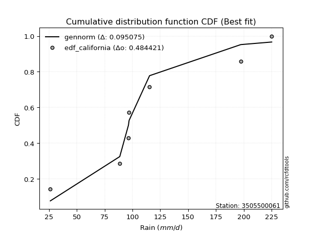</img>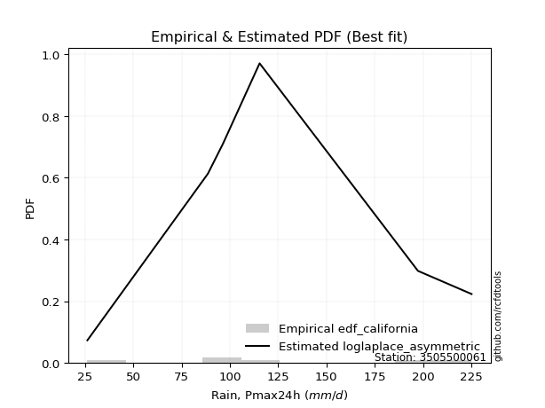</img>

</div>


### 2. EDF Hazen (1930)

Hazen method for plotting positions is a formula used to estimate the empirical cumulative probability distribution of flood events or other hydrological data. This formula often results in biased estimations, particularly when extrapolating to extreme events (high return periods).

<div align="center">


$P=(m-0.5)/n$


</div>


**2.1. Empirical values**

<div align="center">

|                | 0                   | 1                   | 2                   | 3         | 4                  | 5                  | 6                  |
|:---------------|:--------------------|:--------------------|:--------------------|:----------|:-------------------|:-------------------|:-------------------|
| date           | 2021                | 2023                | 2019                | 2025      | 2022               | 2020               | 2024               |
| x              | 26.2                | 88.6                | 96.4                | 97.0      | 115.4              | 197.4              | 225.2              |
| m              | 1                   | 2                   | 3                   | 4         | 5                  | 6                  | 7                  |
| empirical_dist | edf_hazen           | edf_hazen           | edf_hazen           | edf_hazen | edf_hazen          | edf_hazen          | edf_hazen          |
| empirical      | 0.07142857142857142 | 0.21428571428571427 | 0.35714285714285715 | 0.5       | 0.6428571428571429 | 0.7857142857142857 | 0.9285714285714286 |
| empirical_tr   | 1.0769230769230769  | 1.2727272727272727  | 1.5555555555555558  | 2.0       | 2.8000000000000003 | 4.666666666666666  | 14.000000000000007 |

</div>


**2.2. Kolmogorov-Smirnov fit test (sorted by Δ)**


<div align="center">

|                | 0                   | 1                   | 2                   | 3                   | 4                   | 5                   | 6                   | 7                   | 8                   | 9                   | 10                  | 11                  | 12                  | 13                  | 14                  | 15                  | 16                  | 17                  | 18                  | 19                  | 20                  | 21                  | 22                  | 23                  | 24                  | 25                  | 26                  | 27                  | 28                  | 29                  | 30                  | 31                  | 32                  | 33                  | 34                  | 35                  | 36                  | 37                  | 38                  | 39                  | 40                  | 41                  | 42                  | 43                  | 44                  | 45                  | 46                  | 47                  | 48                  | 49                  | 50                  | 51                  | 52                  | 53                  | 54                  | 55                  | 56                  | 57                  | 58                  | 59                  | 60                  | 61                  | 62                  | 63                  | 64                  | 65                  | 66                  | 67                  | 68                  | 69                  | 70                  | 71                  | 72                  | 73                  | 74                  | 75                  | 76                  | 77                  | 78                  | 79                  | 80                  | 81                  | 82                  | 83                  | 84                  | 85                  | 86                  | 87                  | 88                  | 89                  | 90                  | 91                  | 92                  | 93                  | 94                  | 95                  | 96                  | 97                  | 98                  | 99                  | 100                 | 101                 | 102                 | 103                 | 104                 | 105                 | 106                 | 107                 | 108                 | 109                 | 110                 | 111                 | 112                 | 113                 | 114                 | 115                 | 116                 | 117                 | 118                 | 119                 | 120                 | 121                 | 122                 | 123                 | 124                 | 125                 | 126                 | 127                 | 128                 | 129                 | 130                 | 131                 | 132                 | 133                 | 134                 | 135                 | 136                 | 137                 | 138                 | 139                 | 140                 | 141                 | 142                 | 143                 | 144                 | 145                 | 146                 | 147                 | 148                 | 149                 | 150                 | 151                 | 152                 | 153                 | 154                 | 155                 | 156                 | 157                 | 158                 | 159                 |
|:---------------|:--------------------|:--------------------|:--------------------|:--------------------|:--------------------|:--------------------|:--------------------|:--------------------|:--------------------|:--------------------|:--------------------|:--------------------|:--------------------|:--------------------|:--------------------|:--------------------|:--------------------|:--------------------|:--------------------|:--------------------|:--------------------|:--------------------|:--------------------|:--------------------|:--------------------|:--------------------|:--------------------|:--------------------|:--------------------|:--------------------|:--------------------|:--------------------|:--------------------|:--------------------|:--------------------|:--------------------|:--------------------|:--------------------|:--------------------|:--------------------|:--------------------|:--------------------|:--------------------|:--------------------|:--------------------|:--------------------|:--------------------|:--------------------|:--------------------|:--------------------|:--------------------|:--------------------|:--------------------|:--------------------|:--------------------|:--------------------|:--------------------|:--------------------|:--------------------|:--------------------|:--------------------|:--------------------|:--------------------|:--------------------|:--------------------|:--------------------|:--------------------|:--------------------|:--------------------|:--------------------|:--------------------|:--------------------|:--------------------|:--------------------|:--------------------|:--------------------|:--------------------|:--------------------|:--------------------|:--------------------|:--------------------|:--------------------|:--------------------|:--------------------|:--------------------|:--------------------|:--------------------|:--------------------|:--------------------|:--------------------|:--------------------|:--------------------|:--------------------|:--------------------|:--------------------|:--------------------|:--------------------|:--------------------|:--------------------|:--------------------|:--------------------|:--------------------|:--------------------|:--------------------|:--------------------|:--------------------|:--------------------|:--------------------|:--------------------|:--------------------|:--------------------|:--------------------|:--------------------|:--------------------|:--------------------|:--------------------|:--------------------|:--------------------|:--------------------|:--------------------|:--------------------|:--------------------|:--------------------|:--------------------|:--------------------|:--------------------|:--------------------|:--------------------|:--------------------|:--------------------|:--------------------|:--------------------|:--------------------|:--------------------|:--------------------|:--------------------|:--------------------|:--------------------|:--------------------|:--------------------|:--------------------|:--------------------|:--------------------|:--------------------|:--------------------|:--------------------|:--------------------|:--------------------|:--------------------|:--------------------|:--------------------|:--------------------|:--------------------|:--------------------|:--------------------|:--------------------|:--------------------|:--------------------|:--------------------|:--------------------|
| station        | 3505500061          | 3505500061          | 3505500061          | 3505500061          | 3505500061          | 3505500061          | 3505500061          | 3505500061          | 3505500061          | 3505500061          | 3505500061          | 3505500061          | 3505500061          | 3505500061          | 3505500061          | 3505500061          | 3505500061          | 3505500061          | 3505500061          | 3505500061          | 3505500061          | 3505500061          | 3505500061          | 3505500061          | 3505500061          | 3505500061          | 3505500061          | 3505500061          | 3505500061          | 3505500061          | 3505500061          | 3505500061          | 3505500061          | 3505500061          | 3505500061          | 3505500061          | 3505500061          | 3505500061          | 3505500061          | 3505500061          | 3505500061          | 3505500061          | 3505500061          | 3505500061          | 3505500061          | 3505500061          | 3505500061          | 3505500061          | 3505500061          | 3505500061          | 3505500061          | 3505500061          | 3505500061          | 3505500061          | 3505500061          | 3505500061          | 3505500061          | 3505500061          | 3505500061          | 3505500061          | 3505500061          | 3505500061          | 3505500061          | 3505500061          | 3505500061          | 3505500061          | 3505500061          | 3505500061          | 3505500061          | 3505500061          | 3505500061          | 3505500061          | 3505500061          | 3505500061          | 3505500061          | 3505500061          | 3505500061          | 3505500061          | 3505500061          | 3505500061          | 3505500061          | 3505500061          | 3505500061          | 3505500061          | 3505500061          | 3505500061          | 3505500061          | 3505500061          | 3505500061          | 3505500061          | 3505500061          | 3505500061          | 3505500061          | 3505500061          | 3505500061          | 3505500061          | 3505500061          | 3505500061          | 3505500061          | 3505500061          | 3505500061          | 3505500061          | 3505500061          | 3505500061          | 3505500061          | 3505500061          | 3505500061          | 3505500061          | 3505500061          | 3505500061          | 3505500061          | 3505500061          | 3505500061          | 3505500061          | 3505500061          | 3505500061          | 3505500061          | 3505500061          | 3505500061          | 3505500061          | 3505500061          | 3505500061          | 3505500061          | 3505500061          | 3505500061          | 3505500061          | 3505500061          | 3505500061          | 3505500061          | 3505500061          | 3505500061          | 3505500061          | 3505500061          | 3505500061          | 3505500061          | 3505500061          | 3505500061          | 3505500061          | 3505500061          | 3505500061          | 3505500061          | 3505500061          | 3505500061          | 3505500061          | 3505500061          | 3505500061          | 3505500061          | 3505500061          | 3505500061          | 3505500061          | 3505500061          | 3505500061          | 3505500061          | 3505500061          | 3505500061          | 3505500061          | 3505500061          | 3505500061          | 3505500061          | 3505500061          |
| empirical_dist | edf_hazen           | edf_hazen           | edf_hazen           | edf_hazen           | edf_hazen           | edf_hazen           | edf_hazen           | edf_hazen           | edf_hazen           | edf_hazen           | edf_hazen           | edf_hazen           | edf_hazen           | edf_hazen           | edf_hazen           | edf_hazen           | edf_hazen           | edf_hazen           | edf_hazen           | edf_hazen           | edf_hazen           | edf_hazen           | edf_hazen           | edf_hazen           | edf_hazen           | edf_hazen           | edf_hazen           | edf_hazen           | edf_hazen           | edf_hazen           | edf_hazen           | edf_hazen           | edf_hazen           | edf_hazen           | edf_hazen           | edf_hazen           | edf_hazen           | edf_hazen           | edf_hazen           | edf_hazen           | edf_hazen           | edf_hazen           | edf_hazen           | edf_hazen           | edf_hazen           | edf_hazen           | edf_hazen           | edf_hazen           | edf_hazen           | edf_hazen           | edf_hazen           | edf_hazen           | edf_hazen           | edf_hazen           | edf_hazen           | edf_hazen           | edf_hazen           | edf_hazen           | edf_hazen           | edf_hazen           | edf_hazen           | edf_hazen           | edf_hazen           | edf_hazen           | edf_hazen           | edf_hazen           | edf_hazen           | edf_hazen           | edf_hazen           | edf_hazen           | edf_hazen           | edf_hazen           | edf_hazen           | edf_hazen           | edf_hazen           | edf_hazen           | edf_hazen           | edf_hazen           | edf_hazen           | edf_hazen           | edf_hazen           | edf_hazen           | edf_hazen           | edf_hazen           | edf_hazen           | edf_hazen           | edf_hazen           | edf_hazen           | edf_hazen           | edf_hazen           | edf_hazen           | edf_hazen           | edf_hazen           | edf_hazen           | edf_hazen           | edf_hazen           | edf_hazen           | edf_hazen           | edf_hazen           | edf_hazen           | edf_hazen           | edf_hazen           | edf_hazen           | edf_hazen           | edf_hazen           | edf_hazen           | edf_hazen           | edf_hazen           | edf_hazen           | edf_hazen           | edf_hazen           | edf_hazen           | edf_hazen           | edf_hazen           | edf_hazen           | edf_hazen           | edf_hazen           | edf_hazen           | edf_hazen           | edf_hazen           | edf_hazen           | edf_hazen           | edf_hazen           | edf_hazen           | edf_hazen           | edf_hazen           | edf_hazen           | edf_hazen           | edf_hazen           | edf_hazen           | edf_hazen           | edf_hazen           | edf_hazen           | edf_hazen           | edf_hazen           | edf_hazen           | edf_hazen           | edf_hazen           | edf_hazen           | edf_hazen           | edf_hazen           | edf_hazen           | edf_hazen           | edf_hazen           | edf_hazen           | edf_hazen           | edf_hazen           | edf_hazen           | edf_hazen           | edf_hazen           | edf_hazen           | edf_hazen           | edf_hazen           | edf_hazen           | edf_hazen           | edf_hazen           | edf_hazen           | edf_hazen           | edf_hazen           | edf_hazen           |
| p_dist         | logvonmises_line    | gumbel_r            | invgauss            | skewnorm            | betaprime           | invgamma            | burr                | mielke              | loggenlogistic      | nct                 | logweibull_min      | gengamma            | rayleigh            | f                   | erlang              | gamma               | logburr12           | genlogistic         | loggumbel_l         | invweibull          | moyal               | exponnorm           | ncf                 | gompertz            | rice                | wald                | weibull_min         | maxwell             | logpearson3         | kstwobign           | logskewnorm         | bradford            | truncpareto         | pearson3            | loggengamma         | logloggamma         | logargus            | loglaplace          | loglaplace          | logjohnsonsu        | halflogistic        | logtruncweibull_min | halfnorm            | gennorm             | logmielke           | logtrapezoid        | kappa4              | ksone               | arcsine             | loggausshyper       | loggennorm          | semicircular        | loggenhalflogistic  | anglit              | logburr             | logt                | logdgamma           | crystalball         | norm                | t                   | johnsonsu           | truncweibull_min    | dgamma              | logistic            | loghypsecant        | logdweibull         | hypsecant           | gausshyper          | dweibull            | loglogistic         | wrapcauchy          | cosine              | logtriang           | tukeylambda         | vonmises_line       | uniform             | logloglaplace       | loglevy_l           | lognct              | logcrystalball      | lognorm             | logexponnorm        | logrice             | logfatiguelife      | logncf              | logf                | laplace             | loganglit           | nakagami            | loggamma            | loggamma            | logbetaprime        | logsemicircular     | logerlang           | loginvgamma         | kappa3              | logalpha            | logmaxwell          | beta                | logarcsine          | loginvgauss         | loggenextreme       | gumbel_l            | loggenpareto        | lograyleigh         | logtruncnorm        | argus               | truncexpon          | loginvweibull       | logcosine           | logfoldnorm         | loggumbel_r         | genexpon            | burr12              | logweibull_max      | lomax               | logbeta             | levy_l              | genpareto           | alpha               | loghalfnorm         | logmoyal            | logkstwobign        | loghalflogistic     | loggenexpon         | logwrapcauchy       | lognakagami         | loggompertz         | genhalflogistic     | logrdist            | genextreme          | logksone            | johnsonsb           | logkappa3           | logkappa4           | loguniform          | logbradford         | logwald             | logtukeylambda      | exponweib           | truncnorm           | triang              | loghalfgennorm      | loglomax            | halfgennorm         | trapezoid           | logtruncexpon       | logexponpow         | rdist               | fatiguelife         | powerlaw            | weibull_max         | foldnorm            | logexponweib        | logjohnsonsb        | logpowerlaw         | exponpow            | logtruncpareto      | logvonmises         | vonmises            |
| delta          | 0.12303042788237531 | 0.12486987661398793 | 0.12623763862598872 | 0.12760994800480419 | 0.12967278219172948 | 0.1301759244413092  | 0.13077793724405593 | 0.13081078855991188 | 0.13094283491849626 | 0.13129266913808868 | 0.1313867960527878  | 0.1315720929649817  | 0.13169445512577282 | 0.13182274469688524 | 0.13189236800331913 | 0.1318924469276996  | 0.13210659352372722 | 0.1330268204283849  | 0.13445961735140508 | 0.13530730972234287 | 0.13569540599767274 | 0.13588780045859564 | 0.13643014827502867 | 0.13823000062462143 | 0.13924888723226192 | 0.14094846505072403 | 0.14102739084692442 | 0.1433625401990105  | 0.148772945220606   | 0.1490807122344495  | 0.14973457690445038 | 0.15047755212813857 | 0.15048448185446378 | 0.1523218137702414  | 0.15266095927088671 | 0.15273006369288655 | 0.15466533793468706 | 0.1572065242777704  | 0.1572065242777704  | 0.15930842287229702 | 0.1607817233516675  | 0.16143484275220835 | 0.16147549329650288 | 0.16650335402080751 | 0.16658195952303476 | 0.1665924965066037  | 0.16787780883177245 | 0.1679210415895026  | 0.16803781098983525 | 0.1689630578036322  | 0.1699435981773494  | 0.17048536286993649 | 0.1706336750662981  | 0.17251904883039199 | 0.1753790366457273  | 0.17562111687337448 | 0.1765752669480057  | 0.17745129509404384 | 0.17745139475672572 | 0.17745218607879376 | 0.17756313154337072 | 0.17763396339853876 | 0.1806205327241104  | 0.18214625796635775 | 0.18253635261949427 | 0.184750088758899   | 0.18613513265618759 | 0.18620555204068104 | 0.18959511806843402 | 0.1915951788502743  | 0.19310204637448325 | 0.19340297114679478 | 0.19345269207480484 | 0.19355444284496726 | 0.19382985177182843 | 0.19461593682699213 | 0.19610173174251408 | 0.19682737374659484 | 0.2019983932714017  | 0.20251734156242698 | 0.20252183100188062 | 0.20252229030934835 | 0.2025407644281145  | 0.2027896404584605  | 0.2034430771552079  | 0.2035850529103362  | 0.20705913964344286 | 0.2141527729965765  | 0.21428566266253232 | 0.2156886601029593  | 0.2156886601029593  | 0.21677618681972036 | 0.2189707531352816  | 0.21986635161156778 | 0.2207954492584185  | 0.22671136204489423 | 0.22910416311383489 | 0.23682867870664556 | 0.23691593999259533 | 0.23825828056751733 | 0.23885517887044108 | 0.24729587532671093 | 0.24799861156606207 | 0.24899834986487743 | 0.2490493259390311  | 0.25113145832750194 | 0.25501409930215224 | 0.2569342570980754  | 0.2590471911963469  | 0.26045380745498914 | 0.2605564717752077  | 0.2651876770626239  | 0.2684303767522136  | 0.2686121982111639  | 0.2695817475558082  | 0.2710237827145746  | 0.2729809527542742  | 0.2776948402604622  | 0.27794801144252507 | 0.2795056274627953  | 0.2836576620680952  | 0.28916026610128875 | 0.29524818930252905 | 0.30129473958445385 | 0.30374303369115385 | 0.30812366477660924 | 0.31098241155706113 | 0.32835952915883304 | 0.3302021077353275  | 0.3306469662154913  | 0.33792057327373237 | 0.34101510518251565 | 0.3427541078297888  | 0.35086208566582044 | 0.35168331422267296 | 0.3520752690761616  | 0.3534424148328733  | 0.3549205853083238  | 0.35824424283160383 | 0.36890240283102627 | 0.3706737252104606  | 0.39541411518445035 | 0.41391442960681235 | 0.41582425896160746 | 0.42347396961941863 | 0.43412907342006357 | 0.45159880504776706 | 0.5537947248641247  | 0.5766629911444319  | 0.581582085338385   | 0.6127658955929046  | 0.6311959150704889  | 0.6428571428571429  | 0.6550678587503226  | 0.6607798490538049  | 0.6865778374538206  | 0.7083948578247226  | 0.7439765877485103  | 1.1689239364424318  | 35.08027955126168   |
| deltao         | 0.48442053926100004 | 0.48442053926100004 | 0.48442053926100004 | 0.48442053926100004 | 0.48442053926100004 | 0.48442053926100004 | 0.48442053926100004 | 0.48442053926100004 | 0.48442053926100004 | 0.48442053926100004 | 0.48442053926100004 | 0.48442053926100004 | 0.48442053926100004 | 0.48442053926100004 | 0.48442053926100004 | 0.48442053926100004 | 0.48442053926100004 | 0.48442053926100004 | 0.48442053926100004 | 0.48442053926100004 | 0.48442053926100004 | 0.48442053926100004 | 0.48442053926100004 | 0.48442053926100004 | 0.48442053926100004 | 0.48442053926100004 | 0.48442053926100004 | 0.48442053926100004 | 0.48442053926100004 | 0.48442053926100004 | 0.48442053926100004 | 0.48442053926100004 | 0.48442053926100004 | 0.48442053926100004 | 0.48442053926100004 | 0.48442053926100004 | 0.48442053926100004 | 0.48442053926100004 | 0.48442053926100004 | 0.48442053926100004 | 0.48442053926100004 | 0.48442053926100004 | 0.48442053926100004 | 0.48442053926100004 | 0.48442053926100004 | 0.48442053926100004 | 0.48442053926100004 | 0.48442053926100004 | 0.48442053926100004 | 0.48442053926100004 | 0.48442053926100004 | 0.48442053926100004 | 0.48442053926100004 | 0.48442053926100004 | 0.48442053926100004 | 0.48442053926100004 | 0.48442053926100004 | 0.48442053926100004 | 0.48442053926100004 | 0.48442053926100004 | 0.48442053926100004 | 0.48442053926100004 | 0.48442053926100004 | 0.48442053926100004 | 0.48442053926100004 | 0.48442053926100004 | 0.48442053926100004 | 0.48442053926100004 | 0.48442053926100004 | 0.48442053926100004 | 0.48442053926100004 | 0.48442053926100004 | 0.48442053926100004 | 0.48442053926100004 | 0.48442053926100004 | 0.48442053926100004 | 0.48442053926100004 | 0.48442053926100004 | 0.48442053926100004 | 0.48442053926100004 | 0.48442053926100004 | 0.48442053926100004 | 0.48442053926100004 | 0.48442053926100004 | 0.48442053926100004 | 0.48442053926100004 | 0.48442053926100004 | 0.48442053926100004 | 0.48442053926100004 | 0.48442053926100004 | 0.48442053926100004 | 0.48442053926100004 | 0.48442053926100004 | 0.48442053926100004 | 0.48442053926100004 | 0.48442053926100004 | 0.48442053926100004 | 0.48442053926100004 | 0.48442053926100004 | 0.48442053926100004 | 0.48442053926100004 | 0.48442053926100004 | 0.48442053926100004 | 0.48442053926100004 | 0.48442053926100004 | 0.48442053926100004 | 0.48442053926100004 | 0.48442053926100004 | 0.48442053926100004 | 0.48442053926100004 | 0.48442053926100004 | 0.48442053926100004 | 0.48442053926100004 | 0.48442053926100004 | 0.48442053926100004 | 0.48442053926100004 | 0.48442053926100004 | 0.48442053926100004 | 0.48442053926100004 | 0.48442053926100004 | 0.48442053926100004 | 0.48442053926100004 | 0.48442053926100004 | 0.48442053926100004 | 0.48442053926100004 | 0.48442053926100004 | 0.48442053926100004 | 0.48442053926100004 | 0.48442053926100004 | 0.48442053926100004 | 0.48442053926100004 | 0.48442053926100004 | 0.48442053926100004 | 0.48442053926100004 | 0.48442053926100004 | 0.48442053926100004 | 0.48442053926100004 | 0.48442053926100004 | 0.48442053926100004 | 0.48442053926100004 | 0.48442053926100004 | 0.48442053926100004 | 0.48442053926100004 | 0.48442053926100004 | 0.48442053926100004 | 0.48442053926100004 | 0.48442053926100004 | 0.48442053926100004 | 0.48442053926100004 | 0.48442053926100004 | 0.48442053926100004 | 0.48442053926100004 | 0.48442053926100004 | 0.48442053926100004 | 0.48442053926100004 | 0.48442053926100004 | 0.48442053926100004 | 0.48442053926100004 | 0.48442053926100004 | 0.48442053926100004 |
| eval           | Δo > Δ              | Δo > Δ              | Δo > Δ              | Δo > Δ              | Δo > Δ              | Δo > Δ              | Δo > Δ              | Δo > Δ              | Δo > Δ              | Δo > Δ              | Δo > Δ              | Δo > Δ              | Δo > Δ              | Δo > Δ              | Δo > Δ              | Δo > Δ              | Δo > Δ              | Δo > Δ              | Δo > Δ              | Δo > Δ              | Δo > Δ              | Δo > Δ              | Δo > Δ              | Δo > Δ              | Δo > Δ              | Δo > Δ              | Δo > Δ              | Δo > Δ              | Δo > Δ              | Δo > Δ              | Δo > Δ              | Δo > Δ              | Δo > Δ              | Δo > Δ              | Δo > Δ              | Δo > Δ              | Δo > Δ              | Δo > Δ              | Δo > Δ              | Δo > Δ              | Δo > Δ              | Δo > Δ              | Δo > Δ              | Δo > Δ              | Δo > Δ              | Δo > Δ              | Δo > Δ              | Δo > Δ              | Δo > Δ              | Δo > Δ              | Δo > Δ              | Δo > Δ              | Δo > Δ              | Δo > Δ              | Δo > Δ              | Δo > Δ              | Δo > Δ              | Δo > Δ              | Δo > Δ              | Δo > Δ              | Δo > Δ              | Δo > Δ              | Δo > Δ              | Δo > Δ              | Δo > Δ              | Δo > Δ              | Δo > Δ              | Δo > Δ              | Δo > Δ              | Δo > Δ              | Δo > Δ              | Δo > Δ              | Δo > Δ              | Δo > Δ              | Δo > Δ              | Δo > Δ              | Δo > Δ              | Δo > Δ              | Δo > Δ              | Δo > Δ              | Δo > Δ              | Δo > Δ              | Δo > Δ              | Δo > Δ              | Δo > Δ              | Δo > Δ              | Δo > Δ              | Δo > Δ              | Δo > Δ              | Δo > Δ              | Δo > Δ              | Δo > Δ              | Δo > Δ              | Δo > Δ              | Δo > Δ              | Δo > Δ              | Δo > Δ              | Δo > Δ              | Δo > Δ              | Δo > Δ              | Δo > Δ              | Δo > Δ              | Δo > Δ              | Δo > Δ              | Δo > Δ              | Δo > Δ              | Δo > Δ              | Δo > Δ              | Δo > Δ              | Δo > Δ              | Δo > Δ              | Δo > Δ              | Δo > Δ              | Δo > Δ              | Δo > Δ              | Δo > Δ              | Δo > Δ              | Δo > Δ              | Δo > Δ              | Δo > Δ              | Δo > Δ              | Δo > Δ              | Δo > Δ              | Δo > Δ              | Δo > Δ              | Δo > Δ              | Δo > Δ              | Δo > Δ              | Δo > Δ              | Δo > Δ              | Δo > Δ              | Δo > Δ              | Δo > Δ              | Δo > Δ              | Δo > Δ              | Δo > Δ              | Δo > Δ              | Δo > Δ              | Δo > Δ              | Δo > Δ              | Δo > Δ              | Δo > Δ              | Δo > Δ              | Δo > Δ              | Δo > Δ              | Δo > Δ              | Δo > Δ              | Δo <= Δ             | Δo <= Δ             | Δo <= Δ             | Δo <= Δ             | Δo <= Δ             | Δo <= Δ             | Δo <= Δ             | Δo <= Δ             | Δo <= Δ             | Δo <= Δ             | Δo <= Δ             | Δo <= Δ             | Δo <= Δ             |
| fit            | 1                   | 1                   | 1                   | 1                   | 1                   | 1                   | 1                   | 1                   | 1                   | 1                   | 1                   | 1                   | 1                   | 1                   | 1                   | 1                   | 1                   | 1                   | 1                   | 1                   | 1                   | 1                   | 1                   | 1                   | 1                   | 1                   | 1                   | 1                   | 1                   | 1                   | 1                   | 1                   | 1                   | 1                   | 1                   | 1                   | 1                   | 1                   | 1                   | 1                   | 1                   | 1                   | 1                   | 1                   | 1                   | 1                   | 1                   | 1                   | 1                   | 1                   | 1                   | 1                   | 1                   | 1                   | 1                   | 1                   | 1                   | 1                   | 1                   | 1                   | 1                   | 1                   | 1                   | 1                   | 1                   | 1                   | 1                   | 1                   | 1                   | 1                   | 1                   | 1                   | 1                   | 1                   | 1                   | 1                   | 1                   | 1                   | 1                   | 1                   | 1                   | 1                   | 1                   | 1                   | 1                   | 1                   | 1                   | 1                   | 1                   | 1                   | 1                   | 1                   | 1                   | 1                   | 1                   | 1                   | 1                   | 1                   | 1                   | 1                   | 1                   | 1                   | 1                   | 1                   | 1                   | 1                   | 1                   | 1                   | 1                   | 1                   | 1                   | 1                   | 1                   | 1                   | 1                   | 1                   | 1                   | 1                   | 1                   | 1                   | 1                   | 1                   | 1                   | 1                   | 1                   | 1                   | 1                   | 1                   | 1                   | 1                   | 1                   | 1                   | 1                   | 1                   | 1                   | 1                   | 1                   | 1                   | 1                   | 1                   | 1                   | 1                   | 1                   | 1                   | 1                   | 1                   | 1                   | 0                   | 0                   | 0                   | 0                   | 0                   | 0                   | 0                   | 0                   | 0                   | 0                   | 0                   | 0                   | 0                   |
| n              | 7                   | 7                   | 7                   | 7                   | 7                   | 7                   | 7                   | 7                   | 7                   | 7                   | 7                   | 7                   | 7                   | 7                   | 7                   | 7                   | 7                   | 7                   | 7                   | 7                   | 7                   | 7                   | 7                   | 7                   | 7                   | 7                   | 7                   | 7                   | 7                   | 7                   | 7                   | 7                   | 7                   | 7                   | 7                   | 7                   | 7                   | 7                   | 7                   | 7                   | 7                   | 7                   | 7                   | 7                   | 7                   | 7                   | 7                   | 7                   | 7                   | 7                   | 7                   | 7                   | 7                   | 7                   | 7                   | 7                   | 7                   | 7                   | 7                   | 7                   | 7                   | 7                   | 7                   | 7                   | 7                   | 7                   | 7                   | 7                   | 7                   | 7                   | 7                   | 7                   | 7                   | 7                   | 7                   | 7                   | 7                   | 7                   | 7                   | 7                   | 7                   | 7                   | 7                   | 7                   | 7                   | 7                   | 7                   | 7                   | 7                   | 7                   | 7                   | 7                   | 7                   | 7                   | 7                   | 7                   | 7                   | 7                   | 7                   | 7                   | 7                   | 7                   | 7                   | 7                   | 7                   | 7                   | 7                   | 7                   | 7                   | 7                   | 7                   | 7                   | 7                   | 7                   | 7                   | 7                   | 7                   | 7                   | 7                   | 7                   | 7                   | 7                   | 7                   | 7                   | 7                   | 7                   | 7                   | 7                   | 7                   | 7                   | 7                   | 7                   | 7                   | 7                   | 7                   | 7                   | 7                   | 7                   | 7                   | 7                   | 7                   | 7                   | 7                   | 7                   | 7                   | 7                   | 7                   | 7                   | 7                   | 7                   | 7                   | 7                   | 7                   | 7                   | 7                   | 7                   | 7                   | 7                   | 7                   | 7                   |
| best_fit       | 1                   | 0                   | 0                   | 0                   | 0                   | 0                   | 0                   | 0                   | 0                   | 0                   | 0                   | 0                   | 0                   | 0                   | 0                   | 0                   | 0                   | 0                   | 0                   | 0                   | 0                   | 0                   | 0                   | 0                   | 0                   | 0                   | 0                   | 0                   | 0                   | 0                   | 0                   | 0                   | 0                   | 0                   | 0                   | 0                   | 0                   | 0                   | 0                   | 0                   | 0                   | 0                   | 0                   | 0                   | 0                   | 0                   | 0                   | 0                   | 0                   | 0                   | 0                   | 0                   | 0                   | 0                   | 0                   | 0                   | 0                   | 0                   | 0                   | 0                   | 0                   | 0                   | 0                   | 0                   | 0                   | 0                   | 0                   | 0                   | 0                   | 0                   | 0                   | 0                   | 0                   | 0                   | 0                   | 0                   | 0                   | 0                   | 0                   | 0                   | 0                   | 0                   | 0                   | 0                   | 0                   | 0                   | 0                   | 0                   | 0                   | 0                   | 0                   | 0                   | 0                   | 0                   | 0                   | 0                   | 0                   | 0                   | 0                   | 0                   | 0                   | 0                   | 0                   | 0                   | 0                   | 0                   | 0                   | 0                   | 0                   | 0                   | 0                   | 0                   | 0                   | 0                   | 0                   | 0                   | 0                   | 0                   | 0                   | 0                   | 0                   | 0                   | 0                   | 0                   | 0                   | 0                   | 0                   | 0                   | 0                   | 0                   | 0                   | 0                   | 0                   | 0                   | 0                   | 0                   | 0                   | 0                   | 0                   | 0                   | 0                   | 0                   | 0                   | 0                   | 0                   | 0                   | 0                   | 0                   | 0                   | 0                   | 0                   | 0                   | 0                   | 0                   | 0                   | 0                   | 0                   | 0                   | 0                   | 0                   |
| best_fit_sort  | 1                   | 2                   | 3                   | 4                   | 5                   | 6                   | 7                   | 8                   | 9                   | 10                  | 11                  | 12                  | 13                  | 14                  | 15                  | 16                  | 17                  | 18                  | 19                  | 20                  | 21                  | 22                  | 23                  | 24                  | 25                  | 26                  | 27                  | 28                  | 29                  | 30                  | 31                  | 32                  | 33                  | 34                  | 35                  | 36                  | 37                  | 38                  | 39                  | 40                  | 41                  | 42                  | 43                  | 44                  | 45                  | 46                  | 47                  | 48                  | 49                  | 50                  | 51                  | 52                  | 53                  | 54                  | 55                  | 56                  | 57                  | 58                  | 59                  | 60                  | 61                  | 62                  | 63                  | 64                  | 65                  | 66                  | 67                  | 68                  | 69                  | 70                  | 71                  | 72                  | 73                  | 74                  | 75                  | 76                  | 77                  | 78                  | 79                  | 80                  | 81                  | 82                  | 83                  | 84                  | 85                  | 86                  | 87                  | 88                  | 89                  | 90                  | 91                  | 92                  | 93                  | 94                  | 95                  | 96                  | 97                  | 98                  | 99                  | 100                 | 101                 | 102                 | 103                 | 104                 | 105                 | 106                 | 107                 | 108                 | 109                 | 110                 | 111                 | 112                 | 113                 | 114                 | 115                 | 116                 | 117                 | 118                 | 119                 | 120                 | 121                 | 122                 | 123                 | 124                 | 125                 | 126                 | 127                 | 128                 | 129                 | 130                 | 131                 | 132                 | 133                 | 134                 | 135                 | 136                 | 137                 | 138                 | 139                 | 140                 | 141                 | 142                 | 143                 | 144                 | 145                 | 146                 | 147                 | 148                 | 149                 | 150                 | 151                 | 152                 | 153                 | 154                 | 155                 | 156                 | 157                 | 158                 | 159                 | 160                 |

</div>


**2.3. Best fit**

<div align="center">

|   id |    station | empirical_dist   | p_dist           |   delta |   deltao | eval   |   fit |   n |   best_fit |   best_fit_sort |
|-----:|-----------:|:-----------------|:-----------------|--------:|---------:|:-------|------:|----:|-----------:|----------------:|
|    0 | 3505500061 | edf_hazen        | logvonmises_line | 0.12303 | 0.484421 | Δo > Δ |     1 |   7 |          1 |               1 |

</div>


<div align="center">

</img></img>

</div>


### 3. EDF Weibull (1939)

Weibull plotting position formula is an empirical method used to estimate the non-exceedance probability or plotting position for a set of observed data, is often recommended or widely used in practice, particularly in flood frequency analysis.

<div align="center">


$P=m/(n+1)$


</div>


**3.1. Empirical values**

<div align="center">

|                | 0                  | 1                  | 2           | 3           | 4                  | 5           | 6           |
|:---------------|:-------------------|:-------------------|:------------|:------------|:-------------------|:------------|:------------|
| date           | 2021               | 2023               | 2019        | 2025        | 2022               | 2020        | 2024        |
| x              | 26.2               | 88.6               | 96.4        | 97.0        | 115.4              | 197.4       | 225.2       |
| m              | 1                  | 2                  | 3           | 4           | 5                  | 6           | 7           |
| empirical_dist | edf_weibull        | edf_weibull        | edf_weibull | edf_weibull | edf_weibull        | edf_weibull | edf_weibull |
| empirical      | 0.125              | 0.25               | 0.375       | 0.5         | 0.625              | 0.75        | 0.875       |
| empirical_tr   | 1.1428571428571428 | 1.3333333333333333 | 1.6         | 2.0         | 2.6666666666666665 | 4.0         | 8.0         |

</div>


**3.2. Kolmogorov-Smirnov fit test (sorted by Δ)**


<div align="center">

|                | 0                   | 1                   | 2                   | 3                   | 4                   | 5                   | 6                   | 7                   | 8                   | 9                   | 10                  | 11                  | 12                  | 13                  | 14                  | 15                  | 16                  | 17                  | 18                  | 19                  | 20                  | 21                  | 22                  | 23                  | 24                  | 25                  | 26                  | 27                  | 28                  | 29                  | 30                  | 31                  | 32                  | 33                  | 34                  | 35                  | 36                  | 37                  | 38                  | 39                  | 40                  | 41                  | 42                  | 43                  | 44                  | 45                  | 46                  | 47                  | 48                  | 49                  | 50                  | 51                  | 52                  | 53                  | 54                  | 55                  | 56                  | 57                  | 58                  | 59                  | 60                  | 61                  | 62                  | 63                  | 64                  | 65                  | 66                  | 67                  | 68                  | 69                  | 70                  | 71                  | 72                  | 73                  | 74                  | 75                  | 76                  | 77                  | 78                  | 79                  | 80                  | 81                  | 82                  | 83                  | 84                  | 85                  | 86                  | 87                  | 88                  | 89                  | 90                  | 91                  | 92                  | 93                  | 94                  | 95                  | 96                  | 97                  | 98                  | 99                  | 100                 | 101                 | 102                 | 103                 | 104                 | 105                 | 106                 | 107                 | 108                 | 109                 | 110                 | 111                 | 112                 | 113                 | 114                 | 115                 | 116                 | 117                 | 118                 | 119                 | 120                 | 121                 | 122                 | 123                 | 124                 | 125                 | 126                 | 127                 | 128                 | 129                 | 130                 | 131                 | 132                 | 133                 | 134                 | 135                 | 136                 | 137                 | 138                 | 139                 | 140                 | 141                 | 142                 | 143                 | 144                 | 145                 | 146                 | 147                 | 148                 | 149                 | 150                 | 151                 | 152                 | 153                 | 154                 | 155                 | 156                 | 157                 | 158                 | 159                 |
|:---------------|:--------------------|:--------------------|:--------------------|:--------------------|:--------------------|:--------------------|:--------------------|:--------------------|:--------------------|:--------------------|:--------------------|:--------------------|:--------------------|:--------------------|:--------------------|:--------------------|:--------------------|:--------------------|:--------------------|:--------------------|:--------------------|:--------------------|:--------------------|:--------------------|:--------------------|:--------------------|:--------------------|:--------------------|:--------------------|:--------------------|:--------------------|:--------------------|:--------------------|:--------------------|:--------------------|:--------------------|:--------------------|:--------------------|:--------------------|:--------------------|:--------------------|:--------------------|:--------------------|:--------------------|:--------------------|:--------------------|:--------------------|:--------------------|:--------------------|:--------------------|:--------------------|:--------------------|:--------------------|:--------------------|:--------------------|:--------------------|:--------------------|:--------------------|:--------------------|:--------------------|:--------------------|:--------------------|:--------------------|:--------------------|:--------------------|:--------------------|:--------------------|:--------------------|:--------------------|:--------------------|:--------------------|:--------------------|:--------------------|:--------------------|:--------------------|:--------------------|:--------------------|:--------------------|:--------------------|:--------------------|:--------------------|:--------------------|:--------------------|:--------------------|:--------------------|:--------------------|:--------------------|:--------------------|:--------------------|:--------------------|:--------------------|:--------------------|:--------------------|:--------------------|:--------------------|:--------------------|:--------------------|:--------------------|:--------------------|:--------------------|:--------------------|:--------------------|:--------------------|:--------------------|:--------------------|:--------------------|:--------------------|:--------------------|:--------------------|:--------------------|:--------------------|:--------------------|:--------------------|:--------------------|:--------------------|:--------------------|:--------------------|:--------------------|:--------------------|:--------------------|:--------------------|:--------------------|:--------------------|:--------------------|:--------------------|:--------------------|:--------------------|:--------------------|:--------------------|:--------------------|:--------------------|:--------------------|:--------------------|:--------------------|:--------------------|:--------------------|:--------------------|:--------------------|:--------------------|:--------------------|:--------------------|:--------------------|:--------------------|:--------------------|:--------------------|:--------------------|:--------------------|:--------------------|:--------------------|:--------------------|:--------------------|:--------------------|:--------------------|:--------------------|:--------------------|:--------------------|:--------------------|:--------------------|:--------------------|:--------------------|
| station        | 3505500061          | 3505500061          | 3505500061          | 3505500061          | 3505500061          | 3505500061          | 3505500061          | 3505500061          | 3505500061          | 3505500061          | 3505500061          | 3505500061          | 3505500061          | 3505500061          | 3505500061          | 3505500061          | 3505500061          | 3505500061          | 3505500061          | 3505500061          | 3505500061          | 3505500061          | 3505500061          | 3505500061          | 3505500061          | 3505500061          | 3505500061          | 3505500061          | 3505500061          | 3505500061          | 3505500061          | 3505500061          | 3505500061          | 3505500061          | 3505500061          | 3505500061          | 3505500061          | 3505500061          | 3505500061          | 3505500061          | 3505500061          | 3505500061          | 3505500061          | 3505500061          | 3505500061          | 3505500061          | 3505500061          | 3505500061          | 3505500061          | 3505500061          | 3505500061          | 3505500061          | 3505500061          | 3505500061          | 3505500061          | 3505500061          | 3505500061          | 3505500061          | 3505500061          | 3505500061          | 3505500061          | 3505500061          | 3505500061          | 3505500061          | 3505500061          | 3505500061          | 3505500061          | 3505500061          | 3505500061          | 3505500061          | 3505500061          | 3505500061          | 3505500061          | 3505500061          | 3505500061          | 3505500061          | 3505500061          | 3505500061          | 3505500061          | 3505500061          | 3505500061          | 3505500061          | 3505500061          | 3505500061          | 3505500061          | 3505500061          | 3505500061          | 3505500061          | 3505500061          | 3505500061          | 3505500061          | 3505500061          | 3505500061          | 3505500061          | 3505500061          | 3505500061          | 3505500061          | 3505500061          | 3505500061          | 3505500061          | 3505500061          | 3505500061          | 3505500061          | 3505500061          | 3505500061          | 3505500061          | 3505500061          | 3505500061          | 3505500061          | 3505500061          | 3505500061          | 3505500061          | 3505500061          | 3505500061          | 3505500061          | 3505500061          | 3505500061          | 3505500061          | 3505500061          | 3505500061          | 3505500061          | 3505500061          | 3505500061          | 3505500061          | 3505500061          | 3505500061          | 3505500061          | 3505500061          | 3505500061          | 3505500061          | 3505500061          | 3505500061          | 3505500061          | 3505500061          | 3505500061          | 3505500061          | 3505500061          | 3505500061          | 3505500061          | 3505500061          | 3505500061          | 3505500061          | 3505500061          | 3505500061          | 3505500061          | 3505500061          | 3505500061          | 3505500061          | 3505500061          | 3505500061          | 3505500061          | 3505500061          | 3505500061          | 3505500061          | 3505500061          | 3505500061          | 3505500061          | 3505500061          | 3505500061          | 3505500061          |
| empirical_dist | edf_weibull         | edf_weibull         | edf_weibull         | edf_weibull         | edf_weibull         | edf_weibull         | edf_weibull         | edf_weibull         | edf_weibull         | edf_weibull         | edf_weibull         | edf_weibull         | edf_weibull         | edf_weibull         | edf_weibull         | edf_weibull         | edf_weibull         | edf_weibull         | edf_weibull         | edf_weibull         | edf_weibull         | edf_weibull         | edf_weibull         | edf_weibull         | edf_weibull         | edf_weibull         | edf_weibull         | edf_weibull         | edf_weibull         | edf_weibull         | edf_weibull         | edf_weibull         | edf_weibull         | edf_weibull         | edf_weibull         | edf_weibull         | edf_weibull         | edf_weibull         | edf_weibull         | edf_weibull         | edf_weibull         | edf_weibull         | edf_weibull         | edf_weibull         | edf_weibull         | edf_weibull         | edf_weibull         | edf_weibull         | edf_weibull         | edf_weibull         | edf_weibull         | edf_weibull         | edf_weibull         | edf_weibull         | edf_weibull         | edf_weibull         | edf_weibull         | edf_weibull         | edf_weibull         | edf_weibull         | edf_weibull         | edf_weibull         | edf_weibull         | edf_weibull         | edf_weibull         | edf_weibull         | edf_weibull         | edf_weibull         | edf_weibull         | edf_weibull         | edf_weibull         | edf_weibull         | edf_weibull         | edf_weibull         | edf_weibull         | edf_weibull         | edf_weibull         | edf_weibull         | edf_weibull         | edf_weibull         | edf_weibull         | edf_weibull         | edf_weibull         | edf_weibull         | edf_weibull         | edf_weibull         | edf_weibull         | edf_weibull         | edf_weibull         | edf_weibull         | edf_weibull         | edf_weibull         | edf_weibull         | edf_weibull         | edf_weibull         | edf_weibull         | edf_weibull         | edf_weibull         | edf_weibull         | edf_weibull         | edf_weibull         | edf_weibull         | edf_weibull         | edf_weibull         | edf_weibull         | edf_weibull         | edf_weibull         | edf_weibull         | edf_weibull         | edf_weibull         | edf_weibull         | edf_weibull         | edf_weibull         | edf_weibull         | edf_weibull         | edf_weibull         | edf_weibull         | edf_weibull         | edf_weibull         | edf_weibull         | edf_weibull         | edf_weibull         | edf_weibull         | edf_weibull         | edf_weibull         | edf_weibull         | edf_weibull         | edf_weibull         | edf_weibull         | edf_weibull         | edf_weibull         | edf_weibull         | edf_weibull         | edf_weibull         | edf_weibull         | edf_weibull         | edf_weibull         | edf_weibull         | edf_weibull         | edf_weibull         | edf_weibull         | edf_weibull         | edf_weibull         | edf_weibull         | edf_weibull         | edf_weibull         | edf_weibull         | edf_weibull         | edf_weibull         | edf_weibull         | edf_weibull         | edf_weibull         | edf_weibull         | edf_weibull         | edf_weibull         | edf_weibull         | edf_weibull         | edf_weibull         | edf_weibull         | edf_weibull         |
| p_dist         | logpearson3         | invweibull          | loggengamma         | kstwobign           | gengamma            | weibull_min         | logvonmises_line    | gompertz            | ncf                 | genlogistic         | halfnorm            | loggenlogistic      | loggumbel_l         | mielke              | burr                | logweibull_min      | rayleigh            | logburr12           | erlang              | gamma               | f                   | betaprime           | rice                | skewnorm            | maxwell             | invgauss            | exponnorm           | logmielke           | logtrapezoid        | invgamma            | loglaplace          | loglaplace          | bradford            | truncpareto         | pearson3            | logloggamma         | loggenhalflogistic  | halflogistic        | nct                 | logargus            | gumbel_r            | logt                | moyal               | logjohnsonsu        | arcsine             | loghypsecant        | logskewnorm         | logdweibull         | kappa4              | ksone               | gausshyper          | loggausshyper       | semicircular        | logdgamma           | anglit              | loglogistic         | logtruncweibull_min | dweibull            | wald                | logburr             | logtriang           | crystalball         | norm                | t                   | johnsonsu           | truncweibull_min    | logloglaplace       | logistic            | lognct              | logcrystalball      | lognorm             | logexponnorm        | logrice             | logfatiguelife      | logncf              | logf                | wrapcauchy          | loglevy_l           | cosine              | tukeylambda         | vonmises_line       | uniform             | loganglit           | hypsecant           | loggamma            | loggamma            | logbetaprime        | logsemicircular     | logerlang           | loginvgamma         | loggennorm          | dgamma              | logalpha            | logmaxwell          | beta                | gennorm             | logarcsine          | loginvgauss         | laplace             | kappa3              | loggenpareto        | lograyleigh         | truncexpon          | loginvweibull       | levy_l              | logcosine           | logfoldnorm         | loggenextreme       | loggumbel_r         | gumbel_l            | genexpon            | burr12              | logweibull_max      | lomax               | argus               | alpha               | loghalfnorm         | nakagami            | logtruncnorm        | logmoyal            | logbeta             | logkstwobign        | genpareto           | loghalflogistic     | loggenexpon         | logwrapcauchy       | genextreme          | loggompertz         | lognakagami         | logrdist            | logksone            | johnsonsb           | genhalflogistic     | logkappa3           | logkappa4           | loguniform          | logbradford         | logwald             | logtukeylambda      | exponweib           | truncnorm           | loglomax            | triang              | loghalfgennorm      | halfgennorm         | logtruncexpon       | trapezoid           | logexponpow         | rdist               | fatiguelife         | powerlaw            | weibull_max         | logexponweib        | foldnorm            | logjohnsonsb        | logpowerlaw         | exponpow            | logtruncpareto      | logvonmises         | vonmises            |
| delta          | 0.11305865950632027 | 0.11990372460590903 | 0.12079849398483666 | 0.12222624870326015 | 0.12399151607608738 | 0.12490458145458627 | 0.12499986716910426 | 0.12499999999481246 | 0.1250326216060248  | 0.1254175882842511  | 0.12576120758221715 | 0.12589475205988232 | 0.12593532245895822 | 0.12609710801692797 | 0.1261227391855294  | 0.12677818889561132 | 0.12686511944480772 | 0.1269582255481434  | 0.12713470827413464 | 0.1271347264175915  | 0.1271549647295681  | 0.12791094828796645 | 0.12857425957220636 | 0.12884256990800436 | 0.12900393417069667 | 0.12907950715137106 | 0.12930347246179041 | 0.13086767380874903 | 0.13087821079231798 | 0.13138658724642283 | 0.13244501601426206 | 0.13244501601426206 | 0.13262040927099567 | 0.13262733899732088 | 0.1344646709130985  | 0.13487292083574365 | 0.13491938935201236 | 0.13564770677634852 | 0.13630291535922123 | 0.13680819507754416 | 0.13799440520938455 | 0.13990683115908875 | 0.1402160306523208  | 0.1414512800151541  | 0.14455453017529574 | 0.14682206690520855 | 0.14798417465792835 | 0.14903580304461328 | 0.15002066597462954 | 0.1500638987323597  | 0.1504912663263953  | 0.15110591494648928 | 0.15262822001279358 | 0.15427375404006116 | 0.15466190597324908 | 0.15588089313598857 | 0.15603973000416715 | 0.15605044216025865 | 0.15614350446716685 | 0.1575218937885844  | 0.1577384063605191  | 0.15959415223690093 | 0.15959425189958282 | 0.15959504322165086 | 0.15970598868622782 | 0.15977682054139586 | 0.16038744602822835 | 0.16500947580542386 | 0.16628410755711598 | 0.16680305584814126 | 0.1668075452875949  | 0.16680800459506262 | 0.16682647871382877 | 0.1670753547441748  | 0.16772879144092218 | 0.16787076719605049 | 0.17524490351734034 | 0.1753601518104868  | 0.17554582828965187 | 0.17569729998782435 | 0.17597270891468553 | 0.17675879396984923 | 0.17843848728229078 | 0.17880249655234692 | 0.17997437438867359 | 0.17997437438867359 | 0.18106190110543463 | 0.18325646742099588 | 0.18415206589728206 | 0.1850811635441328  | 0.1878007410344923  | 0.19150032932139482 | 0.19338987739954916 | 0.20111439299235984 | 0.2012016542783096  | 0.2022176397350932  | 0.2025439948532316  | 0.20314089315615536 | 0.20705913964344286 | 0.20885421918775132 | 0.2132840641505917  | 0.21333504022474536 | 0.22121997138378968 | 0.2233329054820612  | 0.2241234116890336  | 0.22473952174070344 | 0.22484218606092193 | 0.22943873246956803 | 0.22947339134833822 | 0.23014146870891916 | 0.2327160910379279  | 0.2328979124968782  | 0.23386746184152252 | 0.23530949700028891 | 0.23715695644500934 | 0.24379134174850958 | 0.24794337635380947 | 0.24999994837681805 | 0.25113145832750194 | 0.25344598038700306 | 0.2551238098971313  | 0.25953390358824335 | 0.26009086858538216 | 0.26558045387016815 | 0.26802874797686815 | 0.27240937906232354 | 0.2904428408228008  | 0.29264524344454734 | 0.2931252686999183  | 0.2949326805012056  | 0.30530081946822996 | 0.3070398221155031  | 0.3123449648781846  | 0.31514779995153475 | 0.31596902850838726 | 0.3163609833618759  | 0.3177281291185876  | 0.3192062995940381  | 0.32252995711731813 | 0.33318811711674057 | 0.3349594394961749  | 0.36225283039017886 | 0.37755697232730745 | 0.37820014389252665 | 0.38775968390513293 | 0.41588451933348136 | 0.41627193056292067 | 0.518080439149839   | 0.5409487054301462  | 0.5458677996240993  | 0.5770516098786189  | 0.5954816293562031  | 0.6193535730360369  | 0.625               | 0.6250655633395192  | 0.6508635517395349  | 0.6726805721104369  | 0.7082623020342246  | 1.133209650728146   | 35.13385097983311   |
| deltao         | 0.48442053926100004 | 0.48442053926100004 | 0.48442053926100004 | 0.48442053926100004 | 0.48442053926100004 | 0.48442053926100004 | 0.48442053926100004 | 0.48442053926100004 | 0.48442053926100004 | 0.48442053926100004 | 0.48442053926100004 | 0.48442053926100004 | 0.48442053926100004 | 0.48442053926100004 | 0.48442053926100004 | 0.48442053926100004 | 0.48442053926100004 | 0.48442053926100004 | 0.48442053926100004 | 0.48442053926100004 | 0.48442053926100004 | 0.48442053926100004 | 0.48442053926100004 | 0.48442053926100004 | 0.48442053926100004 | 0.48442053926100004 | 0.48442053926100004 | 0.48442053926100004 | 0.48442053926100004 | 0.48442053926100004 | 0.48442053926100004 | 0.48442053926100004 | 0.48442053926100004 | 0.48442053926100004 | 0.48442053926100004 | 0.48442053926100004 | 0.48442053926100004 | 0.48442053926100004 | 0.48442053926100004 | 0.48442053926100004 | 0.48442053926100004 | 0.48442053926100004 | 0.48442053926100004 | 0.48442053926100004 | 0.48442053926100004 | 0.48442053926100004 | 0.48442053926100004 | 0.48442053926100004 | 0.48442053926100004 | 0.48442053926100004 | 0.48442053926100004 | 0.48442053926100004 | 0.48442053926100004 | 0.48442053926100004 | 0.48442053926100004 | 0.48442053926100004 | 0.48442053926100004 | 0.48442053926100004 | 0.48442053926100004 | 0.48442053926100004 | 0.48442053926100004 | 0.48442053926100004 | 0.48442053926100004 | 0.48442053926100004 | 0.48442053926100004 | 0.48442053926100004 | 0.48442053926100004 | 0.48442053926100004 | 0.48442053926100004 | 0.48442053926100004 | 0.48442053926100004 | 0.48442053926100004 | 0.48442053926100004 | 0.48442053926100004 | 0.48442053926100004 | 0.48442053926100004 | 0.48442053926100004 | 0.48442053926100004 | 0.48442053926100004 | 0.48442053926100004 | 0.48442053926100004 | 0.48442053926100004 | 0.48442053926100004 | 0.48442053926100004 | 0.48442053926100004 | 0.48442053926100004 | 0.48442053926100004 | 0.48442053926100004 | 0.48442053926100004 | 0.48442053926100004 | 0.48442053926100004 | 0.48442053926100004 | 0.48442053926100004 | 0.48442053926100004 | 0.48442053926100004 | 0.48442053926100004 | 0.48442053926100004 | 0.48442053926100004 | 0.48442053926100004 | 0.48442053926100004 | 0.48442053926100004 | 0.48442053926100004 | 0.48442053926100004 | 0.48442053926100004 | 0.48442053926100004 | 0.48442053926100004 | 0.48442053926100004 | 0.48442053926100004 | 0.48442053926100004 | 0.48442053926100004 | 0.48442053926100004 | 0.48442053926100004 | 0.48442053926100004 | 0.48442053926100004 | 0.48442053926100004 | 0.48442053926100004 | 0.48442053926100004 | 0.48442053926100004 | 0.48442053926100004 | 0.48442053926100004 | 0.48442053926100004 | 0.48442053926100004 | 0.48442053926100004 | 0.48442053926100004 | 0.48442053926100004 | 0.48442053926100004 | 0.48442053926100004 | 0.48442053926100004 | 0.48442053926100004 | 0.48442053926100004 | 0.48442053926100004 | 0.48442053926100004 | 0.48442053926100004 | 0.48442053926100004 | 0.48442053926100004 | 0.48442053926100004 | 0.48442053926100004 | 0.48442053926100004 | 0.48442053926100004 | 0.48442053926100004 | 0.48442053926100004 | 0.48442053926100004 | 0.48442053926100004 | 0.48442053926100004 | 0.48442053926100004 | 0.48442053926100004 | 0.48442053926100004 | 0.48442053926100004 | 0.48442053926100004 | 0.48442053926100004 | 0.48442053926100004 | 0.48442053926100004 | 0.48442053926100004 | 0.48442053926100004 | 0.48442053926100004 | 0.48442053926100004 | 0.48442053926100004 | 0.48442053926100004 | 0.48442053926100004 | 0.48442053926100004 |
| eval           | Δo > Δ              | Δo > Δ              | Δo > Δ              | Δo > Δ              | Δo > Δ              | Δo > Δ              | Δo > Δ              | Δo > Δ              | Δo > Δ              | Δo > Δ              | Δo > Δ              | Δo > Δ              | Δo > Δ              | Δo > Δ              | Δo > Δ              | Δo > Δ              | Δo > Δ              | Δo > Δ              | Δo > Δ              | Δo > Δ              | Δo > Δ              | Δo > Δ              | Δo > Δ              | Δo > Δ              | Δo > Δ              | Δo > Δ              | Δo > Δ              | Δo > Δ              | Δo > Δ              | Δo > Δ              | Δo > Δ              | Δo > Δ              | Δo > Δ              | Δo > Δ              | Δo > Δ              | Δo > Δ              | Δo > Δ              | Δo > Δ              | Δo > Δ              | Δo > Δ              | Δo > Δ              | Δo > Δ              | Δo > Δ              | Δo > Δ              | Δo > Δ              | Δo > Δ              | Δo > Δ              | Δo > Δ              | Δo > Δ              | Δo > Δ              | Δo > Δ              | Δo > Δ              | Δo > Δ              | Δo > Δ              | Δo > Δ              | Δo > Δ              | Δo > Δ              | Δo > Δ              | Δo > Δ              | Δo > Δ              | Δo > Δ              | Δo > Δ              | Δo > Δ              | Δo > Δ              | Δo > Δ              | Δo > Δ              | Δo > Δ              | Δo > Δ              | Δo > Δ              | Δo > Δ              | Δo > Δ              | Δo > Δ              | Δo > Δ              | Δo > Δ              | Δo > Δ              | Δo > Δ              | Δo > Δ              | Δo > Δ              | Δo > Δ              | Δo > Δ              | Δo > Δ              | Δo > Δ              | Δo > Δ              | Δo > Δ              | Δo > Δ              | Δo > Δ              | Δo > Δ              | Δo > Δ              | Δo > Δ              | Δo > Δ              | Δo > Δ              | Δo > Δ              | Δo > Δ              | Δo > Δ              | Δo > Δ              | Δo > Δ              | Δo > Δ              | Δo > Δ              | Δo > Δ              | Δo > Δ              | Δo > Δ              | Δo > Δ              | Δo > Δ              | Δo > Δ              | Δo > Δ              | Δo > Δ              | Δo > Δ              | Δo > Δ              | Δo > Δ              | Δo > Δ              | Δo > Δ              | Δo > Δ              | Δo > Δ              | Δo > Δ              | Δo > Δ              | Δo > Δ              | Δo > Δ              | Δo > Δ              | Δo > Δ              | Δo > Δ              | Δo > Δ              | Δo > Δ              | Δo > Δ              | Δo > Δ              | Δo > Δ              | Δo > Δ              | Δo > Δ              | Δo > Δ              | Δo > Δ              | Δo > Δ              | Δo > Δ              | Δo > Δ              | Δo > Δ              | Δo > Δ              | Δo > Δ              | Δo > Δ              | Δo > Δ              | Δo > Δ              | Δo > Δ              | Δo > Δ              | Δo > Δ              | Δo > Δ              | Δo > Δ              | Δo > Δ              | Δo > Δ              | Δo > Δ              | Δo > Δ              | Δo <= Δ             | Δo <= Δ             | Δo <= Δ             | Δo <= Δ             | Δo <= Δ             | Δo <= Δ             | Δo <= Δ             | Δo <= Δ             | Δo <= Δ             | Δo <= Δ             | Δo <= Δ             | Δo <= Δ             | Δo <= Δ             |
| fit            | 1                   | 1                   | 1                   | 1                   | 1                   | 1                   | 1                   | 1                   | 1                   | 1                   | 1                   | 1                   | 1                   | 1                   | 1                   | 1                   | 1                   | 1                   | 1                   | 1                   | 1                   | 1                   | 1                   | 1                   | 1                   | 1                   | 1                   | 1                   | 1                   | 1                   | 1                   | 1                   | 1                   | 1                   | 1                   | 1                   | 1                   | 1                   | 1                   | 1                   | 1                   | 1                   | 1                   | 1                   | 1                   | 1                   | 1                   | 1                   | 1                   | 1                   | 1                   | 1                   | 1                   | 1                   | 1                   | 1                   | 1                   | 1                   | 1                   | 1                   | 1                   | 1                   | 1                   | 1                   | 1                   | 1                   | 1                   | 1                   | 1                   | 1                   | 1                   | 1                   | 1                   | 1                   | 1                   | 1                   | 1                   | 1                   | 1                   | 1                   | 1                   | 1                   | 1                   | 1                   | 1                   | 1                   | 1                   | 1                   | 1                   | 1                   | 1                   | 1                   | 1                   | 1                   | 1                   | 1                   | 1                   | 1                   | 1                   | 1                   | 1                   | 1                   | 1                   | 1                   | 1                   | 1                   | 1                   | 1                   | 1                   | 1                   | 1                   | 1                   | 1                   | 1                   | 1                   | 1                   | 1                   | 1                   | 1                   | 1                   | 1                   | 1                   | 1                   | 1                   | 1                   | 1                   | 1                   | 1                   | 1                   | 1                   | 1                   | 1                   | 1                   | 1                   | 1                   | 1                   | 1                   | 1                   | 1                   | 1                   | 1                   | 1                   | 1                   | 1                   | 1                   | 1                   | 1                   | 0                   | 0                   | 0                   | 0                   | 0                   | 0                   | 0                   | 0                   | 0                   | 0                   | 0                   | 0                   | 0                   |
| n              | 7                   | 7                   | 7                   | 7                   | 7                   | 7                   | 7                   | 7                   | 7                   | 7                   | 7                   | 7                   | 7                   | 7                   | 7                   | 7                   | 7                   | 7                   | 7                   | 7                   | 7                   | 7                   | 7                   | 7                   | 7                   | 7                   | 7                   | 7                   | 7                   | 7                   | 7                   | 7                   | 7                   | 7                   | 7                   | 7                   | 7                   | 7                   | 7                   | 7                   | 7                   | 7                   | 7                   | 7                   | 7                   | 7                   | 7                   | 7                   | 7                   | 7                   | 7                   | 7                   | 7                   | 7                   | 7                   | 7                   | 7                   | 7                   | 7                   | 7                   | 7                   | 7                   | 7                   | 7                   | 7                   | 7                   | 7                   | 7                   | 7                   | 7                   | 7                   | 7                   | 7                   | 7                   | 7                   | 7                   | 7                   | 7                   | 7                   | 7                   | 7                   | 7                   | 7                   | 7                   | 7                   | 7                   | 7                   | 7                   | 7                   | 7                   | 7                   | 7                   | 7                   | 7                   | 7                   | 7                   | 7                   | 7                   | 7                   | 7                   | 7                   | 7                   | 7                   | 7                   | 7                   | 7                   | 7                   | 7                   | 7                   | 7                   | 7                   | 7                   | 7                   | 7                   | 7                   | 7                   | 7                   | 7                   | 7                   | 7                   | 7                   | 7                   | 7                   | 7                   | 7                   | 7                   | 7                   | 7                   | 7                   | 7                   | 7                   | 7                   | 7                   | 7                   | 7                   | 7                   | 7                   | 7                   | 7                   | 7                   | 7                   | 7                   | 7                   | 7                   | 7                   | 7                   | 7                   | 7                   | 7                   | 7                   | 7                   | 7                   | 7                   | 7                   | 7                   | 7                   | 7                   | 7                   | 7                   | 7                   |
| best_fit       | 1                   | 0                   | 0                   | 0                   | 0                   | 0                   | 0                   | 0                   | 0                   | 0                   | 0                   | 0                   | 0                   | 0                   | 0                   | 0                   | 0                   | 0                   | 0                   | 0                   | 0                   | 0                   | 0                   | 0                   | 0                   | 0                   | 0                   | 0                   | 0                   | 0                   | 0                   | 0                   | 0                   | 0                   | 0                   | 0                   | 0                   | 0                   | 0                   | 0                   | 0                   | 0                   | 0                   | 0                   | 0                   | 0                   | 0                   | 0                   | 0                   | 0                   | 0                   | 0                   | 0                   | 0                   | 0                   | 0                   | 0                   | 0                   | 0                   | 0                   | 0                   | 0                   | 0                   | 0                   | 0                   | 0                   | 0                   | 0                   | 0                   | 0                   | 0                   | 0                   | 0                   | 0                   | 0                   | 0                   | 0                   | 0                   | 0                   | 0                   | 0                   | 0                   | 0                   | 0                   | 0                   | 0                   | 0                   | 0                   | 0                   | 0                   | 0                   | 0                   | 0                   | 0                   | 0                   | 0                   | 0                   | 0                   | 0                   | 0                   | 0                   | 0                   | 0                   | 0                   | 0                   | 0                   | 0                   | 0                   | 0                   | 0                   | 0                   | 0                   | 0                   | 0                   | 0                   | 0                   | 0                   | 0                   | 0                   | 0                   | 0                   | 0                   | 0                   | 0                   | 0                   | 0                   | 0                   | 0                   | 0                   | 0                   | 0                   | 0                   | 0                   | 0                   | 0                   | 0                   | 0                   | 0                   | 0                   | 0                   | 0                   | 0                   | 0                   | 0                   | 0                   | 0                   | 0                   | 0                   | 0                   | 0                   | 0                   | 0                   | 0                   | 0                   | 0                   | 0                   | 0                   | 0                   | 0                   | 0                   |
| best_fit_sort  | 1                   | 2                   | 3                   | 4                   | 5                   | 6                   | 7                   | 8                   | 9                   | 10                  | 11                  | 12                  | 13                  | 14                  | 15                  | 16                  | 17                  | 18                  | 19                  | 20                  | 21                  | 22                  | 23                  | 24                  | 25                  | 26                  | 27                  | 28                  | 29                  | 30                  | 31                  | 32                  | 33                  | 34                  | 35                  | 36                  | 37                  | 38                  | 39                  | 40                  | 41                  | 42                  | 43                  | 44                  | 45                  | 46                  | 47                  | 48                  | 49                  | 50                  | 51                  | 52                  | 53                  | 54                  | 55                  | 56                  | 57                  | 58                  | 59                  | 60                  | 61                  | 62                  | 63                  | 64                  | 65                  | 66                  | 67                  | 68                  | 69                  | 70                  | 71                  | 72                  | 73                  | 74                  | 75                  | 76                  | 77                  | 78                  | 79                  | 80                  | 81                  | 82                  | 83                  | 84                  | 85                  | 86                  | 87                  | 88                  | 89                  | 90                  | 91                  | 92                  | 93                  | 94                  | 95                  | 96                  | 97                  | 98                  | 99                  | 100                 | 101                 | 102                 | 103                 | 104                 | 105                 | 106                 | 107                 | 108                 | 109                 | 110                 | 111                 | 112                 | 113                 | 114                 | 115                 | 116                 | 117                 | 118                 | 119                 | 120                 | 121                 | 122                 | 123                 | 124                 | 125                 | 126                 | 127                 | 128                 | 129                 | 130                 | 131                 | 132                 | 133                 | 134                 | 135                 | 136                 | 137                 | 138                 | 139                 | 140                 | 141                 | 142                 | 143                 | 144                 | 145                 | 146                 | 147                 | 148                 | 149                 | 150                 | 151                 | 152                 | 153                 | 154                 | 155                 | 156                 | 157                 | 158                 | 159                 | 160                 |

</div>


**3.3. Best fit**

<div align="center">

|   id |    station | empirical_dist   | p_dist      |    delta |   deltao | eval   |   fit |   n |   best_fit |   best_fit_sort |
|-----:|-----------:|:-----------------|:------------|---------:|---------:|:-------|------:|----:|-----------:|----------------:|
|    0 | 3505500061 | edf_weibull      | logpearson3 | 0.113059 | 0.484421 | Δo > Δ |     1 |   7 |          1 |               1 |

</div>


<div align="center">

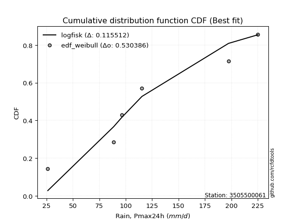</img>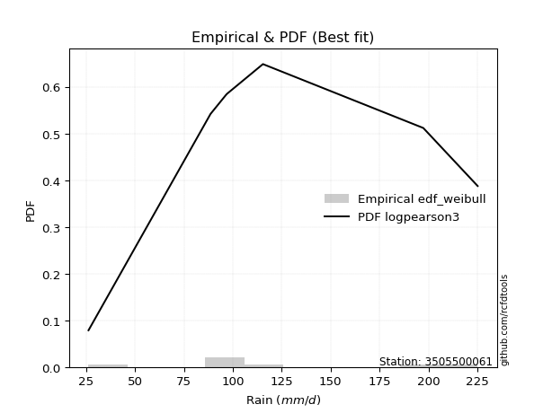</img>

</div>


### 4. EDF Beard (1943)

The Beard formula (or Beard´s plotting position formula) in hydrology is used to estimate the empirical non-exceedance probability _(P)_ of a flood event (or other extreme hydrological data point) within a given dataset.

<div align="center">


$P=(m-0.31)/(n+0.38)$


</div>


**4.1. Empirical values**

<div align="center">

|                | 0                   | 1                   | 2                   | 3         | 4                  | 5                  | 6                  |
|:---------------|:--------------------|:--------------------|:--------------------|:----------|:-------------------|:-------------------|:-------------------|
| date           | 2021                | 2023                | 2019                | 2025      | 2022               | 2020               | 2024               |
| x              | 26.2                | 88.6                | 96.4                | 97.0      | 115.4              | 197.4              | 225.2              |
| m              | 1                   | 2                   | 3                   | 4         | 5                  | 6                  | 7                  |
| empirical_dist | edf_beard           | edf_beard           | edf_beard           | edf_beard | edf_beard          | edf_beard          | edf_beard          |
| empirical      | 0.09349593495934959 | 0.22899728997289973 | 0.36449864498644985 | 0.5       | 0.6355013550135502 | 0.7710027100271003 | 0.9065040650406505 |
| empirical_tr   | 1.1031390134529149  | 1.29701230228471    | 1.5735607675906182  | 2.0       | 2.743494423791822  | 4.366863905325444  | 10.695652173913055 |

</div>


**4.2. Kolmogorov-Smirnov fit test (sorted by Δ)**


<div align="center">

|                | 0                   | 1                   | 2                   | 3                   | 4                   | 5                   | 6                   | 7                   | 8                   | 9                   | 10                  | 11                  | 12                  | 13                  | 14                  | 15                  | 16                  | 17                  | 18                  | 19                  | 20                  | 21                  | 22                  | 23                  | 24                  | 25                  | 26                  | 27                  | 28                  | 29                  | 30                  | 31                  | 32                  | 33                  | 34                  | 35                  | 36                  | 37                  | 38                  | 39                  | 40                  | 41                  | 42                  | 43                  | 44                  | 45                  | 46                  | 47                  | 48                  | 49                  | 50                  | 51                  | 52                  | 53                  | 54                  | 55                  | 56                  | 57                  | 58                  | 59                  | 60                  | 61                  | 62                  | 63                  | 64                  | 65                  | 66                  | 67                  | 68                  | 69                  | 70                  | 71                  | 72                  | 73                  | 74                  | 75                  | 76                  | 77                  | 78                  | 79                  | 80                  | 81                  | 82                  | 83                  | 84                  | 85                  | 86                  | 87                  | 88                  | 89                  | 90                  | 91                  | 92                  | 93                  | 94                  | 95                  | 96                  | 97                  | 98                  | 99                  | 100                 | 101                 | 102                 | 103                 | 104                 | 105                 | 106                 | 107                 | 108                 | 109                 | 110                 | 111                 | 112                 | 113                 | 114                 | 115                 | 116                 | 117                 | 118                 | 119                 | 120                 | 121                 | 122                 | 123                 | 124                 | 125                 | 126                 | 127                 | 128                 | 129                 | 130                 | 131                 | 132                 | 133                 | 134                 | 135                 | 136                 | 137                 | 138                 | 139                 | 140                 | 141                 | 142                 | 143                 | 144                 | 145                 | 146                 | 147                 | 148                 | 149                 | 150                 | 151                 | 152                 | 153                 | 154                 | 155                 | 156                 | 157                 | 158                 | 159                 |
|:---------------|:--------------------|:--------------------|:--------------------|:--------------------|:--------------------|:--------------------|:--------------------|:--------------------|:--------------------|:--------------------|:--------------------|:--------------------|:--------------------|:--------------------|:--------------------|:--------------------|:--------------------|:--------------------|:--------------------|:--------------------|:--------------------|:--------------------|:--------------------|:--------------------|:--------------------|:--------------------|:--------------------|:--------------------|:--------------------|:--------------------|:--------------------|:--------------------|:--------------------|:--------------------|:--------------------|:--------------------|:--------------------|:--------------------|:--------------------|:--------------------|:--------------------|:--------------------|:--------------------|:--------------------|:--------------------|:--------------------|:--------------------|:--------------------|:--------------------|:--------------------|:--------------------|:--------------------|:--------------------|:--------------------|:--------------------|:--------------------|:--------------------|:--------------------|:--------------------|:--------------------|:--------------------|:--------------------|:--------------------|:--------------------|:--------------------|:--------------------|:--------------------|:--------------------|:--------------------|:--------------------|:--------------------|:--------------------|:--------------------|:--------------------|:--------------------|:--------------------|:--------------------|:--------------------|:--------------------|:--------------------|:--------------------|:--------------------|:--------------------|:--------------------|:--------------------|:--------------------|:--------------------|:--------------------|:--------------------|:--------------------|:--------------------|:--------------------|:--------------------|:--------------------|:--------------------|:--------------------|:--------------------|:--------------------|:--------------------|:--------------------|:--------------------|:--------------------|:--------------------|:--------------------|:--------------------|:--------------------|:--------------------|:--------------------|:--------------------|:--------------------|:--------------------|:--------------------|:--------------------|:--------------------|:--------------------|:--------------------|:--------------------|:--------------------|:--------------------|:--------------------|:--------------------|:--------------------|:--------------------|:--------------------|:--------------------|:--------------------|:--------------------|:--------------------|:--------------------|:--------------------|:--------------------|:--------------------|:--------------------|:--------------------|:--------------------|:--------------------|:--------------------|:--------------------|:--------------------|:--------------------|:--------------------|:--------------------|:--------------------|:--------------------|:--------------------|:--------------------|:--------------------|:--------------------|:--------------------|:--------------------|:--------------------|:--------------------|:--------------------|:--------------------|:--------------------|:--------------------|:--------------------|:--------------------|:--------------------|:--------------------|
| station        | 3505500061          | 3505500061          | 3505500061          | 3505500061          | 3505500061          | 3505500061          | 3505500061          | 3505500061          | 3505500061          | 3505500061          | 3505500061          | 3505500061          | 3505500061          | 3505500061          | 3505500061          | 3505500061          | 3505500061          | 3505500061          | 3505500061          | 3505500061          | 3505500061          | 3505500061          | 3505500061          | 3505500061          | 3505500061          | 3505500061          | 3505500061          | 3505500061          | 3505500061          | 3505500061          | 3505500061          | 3505500061          | 3505500061          | 3505500061          | 3505500061          | 3505500061          | 3505500061          | 3505500061          | 3505500061          | 3505500061          | 3505500061          | 3505500061          | 3505500061          | 3505500061          | 3505500061          | 3505500061          | 3505500061          | 3505500061          | 3505500061          | 3505500061          | 3505500061          | 3505500061          | 3505500061          | 3505500061          | 3505500061          | 3505500061          | 3505500061          | 3505500061          | 3505500061          | 3505500061          | 3505500061          | 3505500061          | 3505500061          | 3505500061          | 3505500061          | 3505500061          | 3505500061          | 3505500061          | 3505500061          | 3505500061          | 3505500061          | 3505500061          | 3505500061          | 3505500061          | 3505500061          | 3505500061          | 3505500061          | 3505500061          | 3505500061          | 3505500061          | 3505500061          | 3505500061          | 3505500061          | 3505500061          | 3505500061          | 3505500061          | 3505500061          | 3505500061          | 3505500061          | 3505500061          | 3505500061          | 3505500061          | 3505500061          | 3505500061          | 3505500061          | 3505500061          | 3505500061          | 3505500061          | 3505500061          | 3505500061          | 3505500061          | 3505500061          | 3505500061          | 3505500061          | 3505500061          | 3505500061          | 3505500061          | 3505500061          | 3505500061          | 3505500061          | 3505500061          | 3505500061          | 3505500061          | 3505500061          | 3505500061          | 3505500061          | 3505500061          | 3505500061          | 3505500061          | 3505500061          | 3505500061          | 3505500061          | 3505500061          | 3505500061          | 3505500061          | 3505500061          | 3505500061          | 3505500061          | 3505500061          | 3505500061          | 3505500061          | 3505500061          | 3505500061          | 3505500061          | 3505500061          | 3505500061          | 3505500061          | 3505500061          | 3505500061          | 3505500061          | 3505500061          | 3505500061          | 3505500061          | 3505500061          | 3505500061          | 3505500061          | 3505500061          | 3505500061          | 3505500061          | 3505500061          | 3505500061          | 3505500061          | 3505500061          | 3505500061          | 3505500061          | 3505500061          | 3505500061          | 3505500061          | 3505500061          | 3505500061          |
| empirical_dist | edf_beard           | edf_beard           | edf_beard           | edf_beard           | edf_beard           | edf_beard           | edf_beard           | edf_beard           | edf_beard           | edf_beard           | edf_beard           | edf_beard           | edf_beard           | edf_beard           | edf_beard           | edf_beard           | edf_beard           | edf_beard           | edf_beard           | edf_beard           | edf_beard           | edf_beard           | edf_beard           | edf_beard           | edf_beard           | edf_beard           | edf_beard           | edf_beard           | edf_beard           | edf_beard           | edf_beard           | edf_beard           | edf_beard           | edf_beard           | edf_beard           | edf_beard           | edf_beard           | edf_beard           | edf_beard           | edf_beard           | edf_beard           | edf_beard           | edf_beard           | edf_beard           | edf_beard           | edf_beard           | edf_beard           | edf_beard           | edf_beard           | edf_beard           | edf_beard           | edf_beard           | edf_beard           | edf_beard           | edf_beard           | edf_beard           | edf_beard           | edf_beard           | edf_beard           | edf_beard           | edf_beard           | edf_beard           | edf_beard           | edf_beard           | edf_beard           | edf_beard           | edf_beard           | edf_beard           | edf_beard           | edf_beard           | edf_beard           | edf_beard           | edf_beard           | edf_beard           | edf_beard           | edf_beard           | edf_beard           | edf_beard           | edf_beard           | edf_beard           | edf_beard           | edf_beard           | edf_beard           | edf_beard           | edf_beard           | edf_beard           | edf_beard           | edf_beard           | edf_beard           | edf_beard           | edf_beard           | edf_beard           | edf_beard           | edf_beard           | edf_beard           | edf_beard           | edf_beard           | edf_beard           | edf_beard           | edf_beard           | edf_beard           | edf_beard           | edf_beard           | edf_beard           | edf_beard           | edf_beard           | edf_beard           | edf_beard           | edf_beard           | edf_beard           | edf_beard           | edf_beard           | edf_beard           | edf_beard           | edf_beard           | edf_beard           | edf_beard           | edf_beard           | edf_beard           | edf_beard           | edf_beard           | edf_beard           | edf_beard           | edf_beard           | edf_beard           | edf_beard           | edf_beard           | edf_beard           | edf_beard           | edf_beard           | edf_beard           | edf_beard           | edf_beard           | edf_beard           | edf_beard           | edf_beard           | edf_beard           | edf_beard           | edf_beard           | edf_beard           | edf_beard           | edf_beard           | edf_beard           | edf_beard           | edf_beard           | edf_beard           | edf_beard           | edf_beard           | edf_beard           | edf_beard           | edf_beard           | edf_beard           | edf_beard           | edf_beard           | edf_beard           | edf_beard           | edf_beard           | edf_beard           | edf_beard           | edf_beard           |
| p_dist         | logvonmises_line    | burr                | mielke              | loggenlogistic      | betaprime           | gumbel_r            | f                   | erlang              | gamma               | invgauss            | genlogistic         | gengamma            | skewnorm            | invweibull          | loggumbel_l         | moyal               | exponnorm           | ncf                 | invgamma            | nct                 | logweibull_min      | rayleigh            | logburr12           | weibull_min         | gompertz            | rice                | logpearson3         | kstwobign           | logskewnorm         | wald                | maxwell             | loggengamma         | loglaplace          | loglaplace          | bradford            | truncpareto         | pearson3            | logloggamma         | halflogistic        | logtruncweibull_min | halfnorm            | logargus            | logmielke           | logtrapezoid        | logjohnsonsu        | arcsine             | loggenhalflogistic  | kappa4              | ksone               | logt                | loggausshyper       | logdgamma           | semicircular        | anglit              | loghypsecant        | logburr             | logdweibull         | crystalball         | norm                | t                   | johnsonsu           | truncweibull_min    | dgamma              | gausshyper          | logistic            | dweibull            | loglogistic         | loggennorm          | logtriang           | hypsecant           | gennorm             | logloglaplace       | wrapcauchy          | loglevy_l           | cosine              | tukeylambda         | vonmises_line       | uniform             | lognct              | logcrystalball      | lognorm             | logexponnorm        | logrice             | logfatiguelife      | logncf              | logf                | loganglit           | loggamma            | loggamma            | logbetaprime        | logsemicircular     | logerlang           | loginvgamma         | laplace             | logalpha            | kappa3              | logmaxwell          | beta                | logarcsine          | loginvgauss         | nakagami            | loggenpareto        | lograyleigh         | loggenextreme       | gumbel_l            | truncexpon          | loginvweibull       | logcosine           | logfoldnorm         | argus               | loggumbel_r         | logtruncnorm        | genexpon            | burr12              | logweibull_max      | levy_l              | lomax               | alpha               | logbeta             | loghalfnorm         | genpareto           | logmoyal            | logkstwobign        | loghalflogistic     | loggenexpon         | logwrapcauchy       | lognakagami         | loggompertz         | genextreme          | logrdist            | genhalflogistic     | logksone            | johnsonsb           | logkappa3           | logkappa4           | loguniform          | logbradford         | logwald             | logtukeylambda      | exponweib           | truncnorm           | triang              | loglomax            | loghalfgennorm      | halfgennorm         | trapezoid           | logtruncexpon       | logexponpow         | rdist               | fatiguelife         | powerlaw            | weibull_max         | foldnorm            | logexponweib        | logjohnsonsb        | logpowerlaw         | exponpow            | logtruncpareto      | logvonmises         | vonmises            |
| delta          | 0.10831885219518986 | 0.11606636155687047 | 0.11609921287272643 | 0.11623125923131081 | 0.11644106869342075 | 0.11699169518228425 | 0.11711116900969978 | 0.11718079231613368 | 0.11718087124051416 | 0.11824025134959082 | 0.11831524474119945 | 0.11890722010090204 | 0.12025416016121149 | 0.12059573403515741 | 0.12089990878873524 | 0.12098383031048729 | 0.12117622477141018 | 0.12171857258784322 | 0.12282013659771651 | 0.12393688129449598 | 0.1240310082091951  | 0.12433866728218013 | 0.12475080568013452 | 0.12631581515973897 | 0.13087421278102873 | 0.13189309938866922 | 0.13406136953342054 | 0.13436913654726404 | 0.13502300121726493 | 0.13514079444006655 | 0.13600675235541781 | 0.13794938358370126 | 0.14249494859058495 | 0.14249494859058495 | 0.14312176428454587 | 0.14312869401087108 | 0.1449660259266487  | 0.14537427584929385 | 0.14607014766448204 | 0.1467232670650229  | 0.14676391760931742 | 0.14730955009109437 | 0.1518703838358493  | 0.15188092081941826 | 0.15195263502870432 | 0.15505588518884594 | 0.15592209937911264 | 0.16052202098817975 | 0.1605652537459099  | 0.16090954118618903 | 0.1616072699600395  | 0.16186369126082026 | 0.1631295750263438  | 0.1651632609867993  | 0.16782477693230882 | 0.1680232488021346  | 0.17003851307171355 | 0.17009550725045114 | 0.17009560691313302 | 0.17009639823520106 | 0.17020734369977802 | 0.17027817555494607 | 0.17049761929429452 | 0.1714939763534956  | 0.17479047012276505 | 0.17488354238124856 | 0.17688360316308885 | 0.17729938602094208 | 0.1787411163876194  | 0.17880249655234692 | 0.1812149297079929  | 0.18139015605532863 | 0.18574625853089055 | 0.18586150682403701 | 0.18604718330320208 | 0.18619865500137456 | 0.18647406392823573 | 0.18726014898339943 | 0.18728681758421625 | 0.18780576587524153 | 0.18781025531469517 | 0.1878107146221629  | 0.18782918874092905 | 0.18807806477127506 | 0.18873150146802245 | 0.18887347722315076 | 0.19944119730939106 | 0.20097708441577386 | 0.20097708441577386 | 0.2020646111325349  | 0.20425917744809616 | 0.20515477592438233 | 0.20608387357123306 | 0.20705913964344286 | 0.21439258742664943 | 0.21935557420130153 | 0.2221171030194601  | 0.22220436430540988 | 0.22354670488033188 | 0.22414360318325563 | 0.22899723834971777 | 0.23428677417769198 | 0.23433775025184564 | 0.23994008748311824 | 0.24064282372246937 | 0.24222268141088996 | 0.24433561550916147 | 0.24574223176780371 | 0.2458448960880222  | 0.24765831145855954 | 0.2504761013754385  | 0.25113145832750194 | 0.2537188010650282  | 0.2539006225239785  | 0.2548701718686228  | 0.255627476729684   | 0.2563122070273892  | 0.2647940517756099  | 0.2656251649106815  | 0.2689460863809098  | 0.27059222359893237 | 0.27444869041410336 | 0.28053661361534366 | 0.28658316389726846 | 0.28903145800396846 | 0.29341208908942384 | 0.30362662371346844 | 0.31364795347164764 | 0.3158532097429543  | 0.3159353905283059  | 0.3228463198917348  | 0.32630352949533026 | 0.3280425321426034  | 0.33615050997863505 | 0.33697173853548756 | 0.3373636933889762  | 0.3387308391456879  | 0.3402090096211384  | 0.34353266714441844 | 0.35419082714384087 | 0.3559621495232752  | 0.38805832734085766 | 0.39375689543082937 | 0.39920285391962695 | 0.40876239393223324 | 0.4267732855764709  | 0.43688722936058166 | 0.5390831491769393  | 0.5619514154572465  | 0.5668705096511996  | 0.5980543199057192  | 0.6164843393833035  | 0.6355013550135502  | 0.6403562830631372  | 0.6460682733666195  | 0.6718662617666352  | 0.6936832821375372  | 0.7292650120613249  | 1.1542123607552461  | 35.10234691479246   |
| deltao         | 0.48442053926100004 | 0.48442053926100004 | 0.48442053926100004 | 0.48442053926100004 | 0.48442053926100004 | 0.48442053926100004 | 0.48442053926100004 | 0.48442053926100004 | 0.48442053926100004 | 0.48442053926100004 | 0.48442053926100004 | 0.48442053926100004 | 0.48442053926100004 | 0.48442053926100004 | 0.48442053926100004 | 0.48442053926100004 | 0.48442053926100004 | 0.48442053926100004 | 0.48442053926100004 | 0.48442053926100004 | 0.48442053926100004 | 0.48442053926100004 | 0.48442053926100004 | 0.48442053926100004 | 0.48442053926100004 | 0.48442053926100004 | 0.48442053926100004 | 0.48442053926100004 | 0.48442053926100004 | 0.48442053926100004 | 0.48442053926100004 | 0.48442053926100004 | 0.48442053926100004 | 0.48442053926100004 | 0.48442053926100004 | 0.48442053926100004 | 0.48442053926100004 | 0.48442053926100004 | 0.48442053926100004 | 0.48442053926100004 | 0.48442053926100004 | 0.48442053926100004 | 0.48442053926100004 | 0.48442053926100004 | 0.48442053926100004 | 0.48442053926100004 | 0.48442053926100004 | 0.48442053926100004 | 0.48442053926100004 | 0.48442053926100004 | 0.48442053926100004 | 0.48442053926100004 | 0.48442053926100004 | 0.48442053926100004 | 0.48442053926100004 | 0.48442053926100004 | 0.48442053926100004 | 0.48442053926100004 | 0.48442053926100004 | 0.48442053926100004 | 0.48442053926100004 | 0.48442053926100004 | 0.48442053926100004 | 0.48442053926100004 | 0.48442053926100004 | 0.48442053926100004 | 0.48442053926100004 | 0.48442053926100004 | 0.48442053926100004 | 0.48442053926100004 | 0.48442053926100004 | 0.48442053926100004 | 0.48442053926100004 | 0.48442053926100004 | 0.48442053926100004 | 0.48442053926100004 | 0.48442053926100004 | 0.48442053926100004 | 0.48442053926100004 | 0.48442053926100004 | 0.48442053926100004 | 0.48442053926100004 | 0.48442053926100004 | 0.48442053926100004 | 0.48442053926100004 | 0.48442053926100004 | 0.48442053926100004 | 0.48442053926100004 | 0.48442053926100004 | 0.48442053926100004 | 0.48442053926100004 | 0.48442053926100004 | 0.48442053926100004 | 0.48442053926100004 | 0.48442053926100004 | 0.48442053926100004 | 0.48442053926100004 | 0.48442053926100004 | 0.48442053926100004 | 0.48442053926100004 | 0.48442053926100004 | 0.48442053926100004 | 0.48442053926100004 | 0.48442053926100004 | 0.48442053926100004 | 0.48442053926100004 | 0.48442053926100004 | 0.48442053926100004 | 0.48442053926100004 | 0.48442053926100004 | 0.48442053926100004 | 0.48442053926100004 | 0.48442053926100004 | 0.48442053926100004 | 0.48442053926100004 | 0.48442053926100004 | 0.48442053926100004 | 0.48442053926100004 | 0.48442053926100004 | 0.48442053926100004 | 0.48442053926100004 | 0.48442053926100004 | 0.48442053926100004 | 0.48442053926100004 | 0.48442053926100004 | 0.48442053926100004 | 0.48442053926100004 | 0.48442053926100004 | 0.48442053926100004 | 0.48442053926100004 | 0.48442053926100004 | 0.48442053926100004 | 0.48442053926100004 | 0.48442053926100004 | 0.48442053926100004 | 0.48442053926100004 | 0.48442053926100004 | 0.48442053926100004 | 0.48442053926100004 | 0.48442053926100004 | 0.48442053926100004 | 0.48442053926100004 | 0.48442053926100004 | 0.48442053926100004 | 0.48442053926100004 | 0.48442053926100004 | 0.48442053926100004 | 0.48442053926100004 | 0.48442053926100004 | 0.48442053926100004 | 0.48442053926100004 | 0.48442053926100004 | 0.48442053926100004 | 0.48442053926100004 | 0.48442053926100004 | 0.48442053926100004 | 0.48442053926100004 | 0.48442053926100004 | 0.48442053926100004 | 0.48442053926100004 |
| eval           | Δo > Δ              | Δo > Δ              | Δo > Δ              | Δo > Δ              | Δo > Δ              | Δo > Δ              | Δo > Δ              | Δo > Δ              | Δo > Δ              | Δo > Δ              | Δo > Δ              | Δo > Δ              | Δo > Δ              | Δo > Δ              | Δo > Δ              | Δo > Δ              | Δo > Δ              | Δo > Δ              | Δo > Δ              | Δo > Δ              | Δo > Δ              | Δo > Δ              | Δo > Δ              | Δo > Δ              | Δo > Δ              | Δo > Δ              | Δo > Δ              | Δo > Δ              | Δo > Δ              | Δo > Δ              | Δo > Δ              | Δo > Δ              | Δo > Δ              | Δo > Δ              | Δo > Δ              | Δo > Δ              | Δo > Δ              | Δo > Δ              | Δo > Δ              | Δo > Δ              | Δo > Δ              | Δo > Δ              | Δo > Δ              | Δo > Δ              | Δo > Δ              | Δo > Δ              | Δo > Δ              | Δo > Δ              | Δo > Δ              | Δo > Δ              | Δo > Δ              | Δo > Δ              | Δo > Δ              | Δo > Δ              | Δo > Δ              | Δo > Δ              | Δo > Δ              | Δo > Δ              | Δo > Δ              | Δo > Δ              | Δo > Δ              | Δo > Δ              | Δo > Δ              | Δo > Δ              | Δo > Δ              | Δo > Δ              | Δo > Δ              | Δo > Δ              | Δo > Δ              | Δo > Δ              | Δo > Δ              | Δo > Δ              | Δo > Δ              | Δo > Δ              | Δo > Δ              | Δo > Δ              | Δo > Δ              | Δo > Δ              | Δo > Δ              | Δo > Δ              | Δo > Δ              | Δo > Δ              | Δo > Δ              | Δo > Δ              | Δo > Δ              | Δo > Δ              | Δo > Δ              | Δo > Δ              | Δo > Δ              | Δo > Δ              | Δo > Δ              | Δo > Δ              | Δo > Δ              | Δo > Δ              | Δo > Δ              | Δo > Δ              | Δo > Δ              | Δo > Δ              | Δo > Δ              | Δo > Δ              | Δo > Δ              | Δo > Δ              | Δo > Δ              | Δo > Δ              | Δo > Δ              | Δo > Δ              | Δo > Δ              | Δo > Δ              | Δo > Δ              | Δo > Δ              | Δo > Δ              | Δo > Δ              | Δo > Δ              | Δo > Δ              | Δo > Δ              | Δo > Δ              | Δo > Δ              | Δo > Δ              | Δo > Δ              | Δo > Δ              | Δo > Δ              | Δo > Δ              | Δo > Δ              | Δo > Δ              | Δo > Δ              | Δo > Δ              | Δo > Δ              | Δo > Δ              | Δo > Δ              | Δo > Δ              | Δo > Δ              | Δo > Δ              | Δo > Δ              | Δo > Δ              | Δo > Δ              | Δo > Δ              | Δo > Δ              | Δo > Δ              | Δo > Δ              | Δo > Δ              | Δo > Δ              | Δo > Δ              | Δo > Δ              | Δo > Δ              | Δo > Δ              | Δo > Δ              | Δo > Δ              | Δo <= Δ             | Δo <= Δ             | Δo <= Δ             | Δo <= Δ             | Δo <= Δ             | Δo <= Δ             | Δo <= Δ             | Δo <= Δ             | Δo <= Δ             | Δo <= Δ             | Δo <= Δ             | Δo <= Δ             | Δo <= Δ             |
| fit            | 1                   | 1                   | 1                   | 1                   | 1                   | 1                   | 1                   | 1                   | 1                   | 1                   | 1                   | 1                   | 1                   | 1                   | 1                   | 1                   | 1                   | 1                   | 1                   | 1                   | 1                   | 1                   | 1                   | 1                   | 1                   | 1                   | 1                   | 1                   | 1                   | 1                   | 1                   | 1                   | 1                   | 1                   | 1                   | 1                   | 1                   | 1                   | 1                   | 1                   | 1                   | 1                   | 1                   | 1                   | 1                   | 1                   | 1                   | 1                   | 1                   | 1                   | 1                   | 1                   | 1                   | 1                   | 1                   | 1                   | 1                   | 1                   | 1                   | 1                   | 1                   | 1                   | 1                   | 1                   | 1                   | 1                   | 1                   | 1                   | 1                   | 1                   | 1                   | 1                   | 1                   | 1                   | 1                   | 1                   | 1                   | 1                   | 1                   | 1                   | 1                   | 1                   | 1                   | 1                   | 1                   | 1                   | 1                   | 1                   | 1                   | 1                   | 1                   | 1                   | 1                   | 1                   | 1                   | 1                   | 1                   | 1                   | 1                   | 1                   | 1                   | 1                   | 1                   | 1                   | 1                   | 1                   | 1                   | 1                   | 1                   | 1                   | 1                   | 1                   | 1                   | 1                   | 1                   | 1                   | 1                   | 1                   | 1                   | 1                   | 1                   | 1                   | 1                   | 1                   | 1                   | 1                   | 1                   | 1                   | 1                   | 1                   | 1                   | 1                   | 1                   | 1                   | 1                   | 1                   | 1                   | 1                   | 1                   | 1                   | 1                   | 1                   | 1                   | 1                   | 1                   | 1                   | 1                   | 0                   | 0                   | 0                   | 0                   | 0                   | 0                   | 0                   | 0                   | 0                   | 0                   | 0                   | 0                   | 0                   |
| n              | 7                   | 7                   | 7                   | 7                   | 7                   | 7                   | 7                   | 7                   | 7                   | 7                   | 7                   | 7                   | 7                   | 7                   | 7                   | 7                   | 7                   | 7                   | 7                   | 7                   | 7                   | 7                   | 7                   | 7                   | 7                   | 7                   | 7                   | 7                   | 7                   | 7                   | 7                   | 7                   | 7                   | 7                   | 7                   | 7                   | 7                   | 7                   | 7                   | 7                   | 7                   | 7                   | 7                   | 7                   | 7                   | 7                   | 7                   | 7                   | 7                   | 7                   | 7                   | 7                   | 7                   | 7                   | 7                   | 7                   | 7                   | 7                   | 7                   | 7                   | 7                   | 7                   | 7                   | 7                   | 7                   | 7                   | 7                   | 7                   | 7                   | 7                   | 7                   | 7                   | 7                   | 7                   | 7                   | 7                   | 7                   | 7                   | 7                   | 7                   | 7                   | 7                   | 7                   | 7                   | 7                   | 7                   | 7                   | 7                   | 7                   | 7                   | 7                   | 7                   | 7                   | 7                   | 7                   | 7                   | 7                   | 7                   | 7                   | 7                   | 7                   | 7                   | 7                   | 7                   | 7                   | 7                   | 7                   | 7                   | 7                   | 7                   | 7                   | 7                   | 7                   | 7                   | 7                   | 7                   | 7                   | 7                   | 7                   | 7                   | 7                   | 7                   | 7                   | 7                   | 7                   | 7                   | 7                   | 7                   | 7                   | 7                   | 7                   | 7                   | 7                   | 7                   | 7                   | 7                   | 7                   | 7                   | 7                   | 7                   | 7                   | 7                   | 7                   | 7                   | 7                   | 7                   | 7                   | 7                   | 7                   | 7                   | 7                   | 7                   | 7                   | 7                   | 7                   | 7                   | 7                   | 7                   | 7                   | 7                   |
| best_fit       | 1                   | 0                   | 0                   | 0                   | 0                   | 0                   | 0                   | 0                   | 0                   | 0                   | 0                   | 0                   | 0                   | 0                   | 0                   | 0                   | 0                   | 0                   | 0                   | 0                   | 0                   | 0                   | 0                   | 0                   | 0                   | 0                   | 0                   | 0                   | 0                   | 0                   | 0                   | 0                   | 0                   | 0                   | 0                   | 0                   | 0                   | 0                   | 0                   | 0                   | 0                   | 0                   | 0                   | 0                   | 0                   | 0                   | 0                   | 0                   | 0                   | 0                   | 0                   | 0                   | 0                   | 0                   | 0                   | 0                   | 0                   | 0                   | 0                   | 0                   | 0                   | 0                   | 0                   | 0                   | 0                   | 0                   | 0                   | 0                   | 0                   | 0                   | 0                   | 0                   | 0                   | 0                   | 0                   | 0                   | 0                   | 0                   | 0                   | 0                   | 0                   | 0                   | 0                   | 0                   | 0                   | 0                   | 0                   | 0                   | 0                   | 0                   | 0                   | 0                   | 0                   | 0                   | 0                   | 0                   | 0                   | 0                   | 0                   | 0                   | 0                   | 0                   | 0                   | 0                   | 0                   | 0                   | 0                   | 0                   | 0                   | 0                   | 0                   | 0                   | 0                   | 0                   | 0                   | 0                   | 0                   | 0                   | 0                   | 0                   | 0                   | 0                   | 0                   | 0                   | 0                   | 0                   | 0                   | 0                   | 0                   | 0                   | 0                   | 0                   | 0                   | 0                   | 0                   | 0                   | 0                   | 0                   | 0                   | 0                   | 0                   | 0                   | 0                   | 0                   | 0                   | 0                   | 0                   | 0                   | 0                   | 0                   | 0                   | 0                   | 0                   | 0                   | 0                   | 0                   | 0                   | 0                   | 0                   | 0                   |
| best_fit_sort  | 1                   | 2                   | 3                   | 4                   | 5                   | 6                   | 7                   | 8                   | 9                   | 10                  | 11                  | 12                  | 13                  | 14                  | 15                  | 16                  | 17                  | 18                  | 19                  | 20                  | 21                  | 22                  | 23                  | 24                  | 25                  | 26                  | 27                  | 28                  | 29                  | 30                  | 31                  | 32                  | 33                  | 34                  | 35                  | 36                  | 37                  | 38                  | 39                  | 40                  | 41                  | 42                  | 43                  | 44                  | 45                  | 46                  | 47                  | 48                  | 49                  | 50                  | 51                  | 52                  | 53                  | 54                  | 55                  | 56                  | 57                  | 58                  | 59                  | 60                  | 61                  | 62                  | 63                  | 64                  | 65                  | 66                  | 67                  | 68                  | 69                  | 70                  | 71                  | 72                  | 73                  | 74                  | 75                  | 76                  | 77                  | 78                  | 79                  | 80                  | 81                  | 82                  | 83                  | 84                  | 85                  | 86                  | 87                  | 88                  | 89                  | 90                  | 91                  | 92                  | 93                  | 94                  | 95                  | 96                  | 97                  | 98                  | 99                  | 100                 | 101                 | 102                 | 103                 | 104                 | 105                 | 106                 | 107                 | 108                 | 109                 | 110                 | 111                 | 112                 | 113                 | 114                 | 115                 | 116                 | 117                 | 118                 | 119                 | 120                 | 121                 | 122                 | 123                 | 124                 | 125                 | 126                 | 127                 | 128                 | 129                 | 130                 | 131                 | 132                 | 133                 | 134                 | 135                 | 136                 | 137                 | 138                 | 139                 | 140                 | 141                 | 142                 | 143                 | 144                 | 145                 | 146                 | 147                 | 148                 | 149                 | 150                 | 151                 | 152                 | 153                 | 154                 | 155                 | 156                 | 157                 | 158                 | 159                 | 160                 |

</div>


**4.3. Best fit**

<div align="center">

|   id |    station | empirical_dist   | p_dist           |    delta |   deltao | eval   |   fit |   n |   best_fit |   best_fit_sort |
|-----:|-----------:|:-----------------|:-----------------|---------:|---------:|:-------|------:|----:|-----------:|----------------:|
|    0 | 3505500061 | edf_beard        | logvonmises_line | 0.108319 | 0.484421 | Δo > Δ |     1 |   7 |          1 |               1 |

</div>


<div align="center">

</img>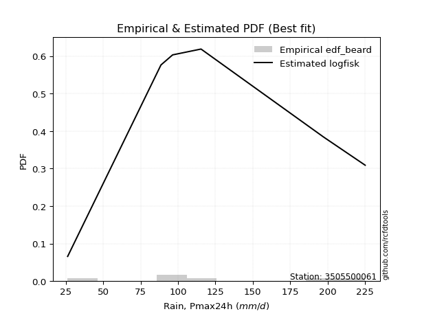</img>

</div>


### 5. EDF Chegodayev (1955)

The Chegodayev formula is an empirical plotting position formula used in hydrological frequency analysis to estimate the exceedance probability or return period of a specific event from a set of observed data. It is primarily used for plotting observed data points on probability paper to fit a theoretical distribution, particularly for analyzing extreme events like maximum flood flows or rainfall intensities. The constant _b_ value in the generalized plotting position formula is 0.3.

<div align="center">


$P=(m-b)/(n+1-2b)$


</div>


**5.1. Empirical values**

<div align="center">

|                | 0                   | 1                   | 2                   | 3              | 4                  | 5                  | 6                  |
|:---------------|:--------------------|:--------------------|:--------------------|:---------------|:-------------------|:-------------------|:-------------------|
| date           | 2021                | 2023                | 2019                | 2025           | 2022               | 2020               | 2024               |
| x              | 26.2                | 88.6                | 96.4                | 97.0           | 115.4              | 197.4              | 225.2              |
| m              | 1                   | 2                   | 3                   | 4              | 5                  | 6                  | 7                  |
| empirical_dist | edf_chegodayev      | edf_chegodayev      | edf_chegodayev      | edf_chegodayev | edf_chegodayev     | edf_chegodayev     | edf_chegodayev     |
| empirical      | 0.09459459459459459 | 0.22972972972972971 | 0.36486486486486486 | 0.5            | 0.6351351351351351 | 0.7702702702702703 | 0.9054054054054054 |
| empirical_tr   | 1.1044776119402986  | 1.2982456140350878  | 1.574468085106383   | 2.0            | 2.7407407407407405 | 4.352941176470589  | 10.571428571428568 |

</div>


**5.2. Kolmogorov-Smirnov fit test (sorted by Δ)**


<div align="center">

|                | 0                   | 1                   | 2                   | 3                   | 4                   | 5                   | 6                   | 7                   | 8                   | 9                   | 10                  | 11                  | 12                  | 13                  | 14                  | 15                  | 16                  | 17                  | 18                  | 19                  | 20                  | 21                  | 22                  | 23                  | 24                  | 25                  | 26                  | 27                  | 28                  | 29                  | 30                  | 31                  | 32                  | 33                  | 34                  | 35                  | 36                  | 37                  | 38                  | 39                  | 40                  | 41                  | 42                  | 43                  | 44                  | 45                  | 46                  | 47                  | 48                  | 49                  | 50                  | 51                  | 52                  | 53                  | 54                  | 55                  | 56                  | 57                  | 58                  | 59                  | 60                  | 61                  | 62                  | 63                  | 64                  | 65                  | 66                  | 67                  | 68                  | 69                  | 70                  | 71                  | 72                  | 73                  | 74                  | 75                  | 76                  | 77                  | 78                  | 79                  | 80                  | 81                  | 82                  | 83                  | 84                  | 85                  | 86                  | 87                  | 88                  | 89                  | 90                  | 91                  | 92                  | 93                  | 94                  | 95                  | 96                  | 97                  | 98                  | 99                  | 100                 | 101                 | 102                 | 103                 | 104                 | 105                 | 106                 | 107                 | 108                 | 109                 | 110                 | 111                 | 112                 | 113                 | 114                 | 115                 | 116                 | 117                 | 118                 | 119                 | 120                 | 121                 | 122                 | 123                 | 124                 | 125                 | 126                 | 127                 | 128                 | 129                 | 130                 | 131                 | 132                 | 133                 | 134                 | 135                 | 136                 | 137                 | 138                 | 139                 | 140                 | 141                 | 142                 | 143                 | 144                 | 145                 | 146                 | 147                 | 148                 | 149                 | 150                 | 151                 | 152                 | 153                 | 154                 | 155                 | 156                 | 157                 | 158                 | 159                 |
|:---------------|:--------------------|:--------------------|:--------------------|:--------------------|:--------------------|:--------------------|:--------------------|:--------------------|:--------------------|:--------------------|:--------------------|:--------------------|:--------------------|:--------------------|:--------------------|:--------------------|:--------------------|:--------------------|:--------------------|:--------------------|:--------------------|:--------------------|:--------------------|:--------------------|:--------------------|:--------------------|:--------------------|:--------------------|:--------------------|:--------------------|:--------------------|:--------------------|:--------------------|:--------------------|:--------------------|:--------------------|:--------------------|:--------------------|:--------------------|:--------------------|:--------------------|:--------------------|:--------------------|:--------------------|:--------------------|:--------------------|:--------------------|:--------------------|:--------------------|:--------------------|:--------------------|:--------------------|:--------------------|:--------------------|:--------------------|:--------------------|:--------------------|:--------------------|:--------------------|:--------------------|:--------------------|:--------------------|:--------------------|:--------------------|:--------------------|:--------------------|:--------------------|:--------------------|:--------------------|:--------------------|:--------------------|:--------------------|:--------------------|:--------------------|:--------------------|:--------------------|:--------------------|:--------------------|:--------------------|:--------------------|:--------------------|:--------------------|:--------------------|:--------------------|:--------------------|:--------------------|:--------------------|:--------------------|:--------------------|:--------------------|:--------------------|:--------------------|:--------------------|:--------------------|:--------------------|:--------------------|:--------------------|:--------------------|:--------------------|:--------------------|:--------------------|:--------------------|:--------------------|:--------------------|:--------------------|:--------------------|:--------------------|:--------------------|:--------------------|:--------------------|:--------------------|:--------------------|:--------------------|:--------------------|:--------------------|:--------------------|:--------------------|:--------------------|:--------------------|:--------------------|:--------------------|:--------------------|:--------------------|:--------------------|:--------------------|:--------------------|:--------------------|:--------------------|:--------------------|:--------------------|:--------------------|:--------------------|:--------------------|:--------------------|:--------------------|:--------------------|:--------------------|:--------------------|:--------------------|:--------------------|:--------------------|:--------------------|:--------------------|:--------------------|:--------------------|:--------------------|:--------------------|:--------------------|:--------------------|:--------------------|:--------------------|:--------------------|:--------------------|:--------------------|:--------------------|:--------------------|:--------------------|:--------------------|:--------------------|:--------------------|
| station        | 3505500061          | 3505500061          | 3505500061          | 3505500061          | 3505500061          | 3505500061          | 3505500061          | 3505500061          | 3505500061          | 3505500061          | 3505500061          | 3505500061          | 3505500061          | 3505500061          | 3505500061          | 3505500061          | 3505500061          | 3505500061          | 3505500061          | 3505500061          | 3505500061          | 3505500061          | 3505500061          | 3505500061          | 3505500061          | 3505500061          | 3505500061          | 3505500061          | 3505500061          | 3505500061          | 3505500061          | 3505500061          | 3505500061          | 3505500061          | 3505500061          | 3505500061          | 3505500061          | 3505500061          | 3505500061          | 3505500061          | 3505500061          | 3505500061          | 3505500061          | 3505500061          | 3505500061          | 3505500061          | 3505500061          | 3505500061          | 3505500061          | 3505500061          | 3505500061          | 3505500061          | 3505500061          | 3505500061          | 3505500061          | 3505500061          | 3505500061          | 3505500061          | 3505500061          | 3505500061          | 3505500061          | 3505500061          | 3505500061          | 3505500061          | 3505500061          | 3505500061          | 3505500061          | 3505500061          | 3505500061          | 3505500061          | 3505500061          | 3505500061          | 3505500061          | 3505500061          | 3505500061          | 3505500061          | 3505500061          | 3505500061          | 3505500061          | 3505500061          | 3505500061          | 3505500061          | 3505500061          | 3505500061          | 3505500061          | 3505500061          | 3505500061          | 3505500061          | 3505500061          | 3505500061          | 3505500061          | 3505500061          | 3505500061          | 3505500061          | 3505500061          | 3505500061          | 3505500061          | 3505500061          | 3505500061          | 3505500061          | 3505500061          | 3505500061          | 3505500061          | 3505500061          | 3505500061          | 3505500061          | 3505500061          | 3505500061          | 3505500061          | 3505500061          | 3505500061          | 3505500061          | 3505500061          | 3505500061          | 3505500061          | 3505500061          | 3505500061          | 3505500061          | 3505500061          | 3505500061          | 3505500061          | 3505500061          | 3505500061          | 3505500061          | 3505500061          | 3505500061          | 3505500061          | 3505500061          | 3505500061          | 3505500061          | 3505500061          | 3505500061          | 3505500061          | 3505500061          | 3505500061          | 3505500061          | 3505500061          | 3505500061          | 3505500061          | 3505500061          | 3505500061          | 3505500061          | 3505500061          | 3505500061          | 3505500061          | 3505500061          | 3505500061          | 3505500061          | 3505500061          | 3505500061          | 3505500061          | 3505500061          | 3505500061          | 3505500061          | 3505500061          | 3505500061          | 3505500061          | 3505500061          | 3505500061          | 3505500061          |
| empirical_dist | edf_chegodayev      | edf_chegodayev      | edf_chegodayev      | edf_chegodayev      | edf_chegodayev      | edf_chegodayev      | edf_chegodayev      | edf_chegodayev      | edf_chegodayev      | edf_chegodayev      | edf_chegodayev      | edf_chegodayev      | edf_chegodayev      | edf_chegodayev      | edf_chegodayev      | edf_chegodayev      | edf_chegodayev      | edf_chegodayev      | edf_chegodayev      | edf_chegodayev      | edf_chegodayev      | edf_chegodayev      | edf_chegodayev      | edf_chegodayev      | edf_chegodayev      | edf_chegodayev      | edf_chegodayev      | edf_chegodayev      | edf_chegodayev      | edf_chegodayev      | edf_chegodayev      | edf_chegodayev      | edf_chegodayev      | edf_chegodayev      | edf_chegodayev      | edf_chegodayev      | edf_chegodayev      | edf_chegodayev      | edf_chegodayev      | edf_chegodayev      | edf_chegodayev      | edf_chegodayev      | edf_chegodayev      | edf_chegodayev      | edf_chegodayev      | edf_chegodayev      | edf_chegodayev      | edf_chegodayev      | edf_chegodayev      | edf_chegodayev      | edf_chegodayev      | edf_chegodayev      | edf_chegodayev      | edf_chegodayev      | edf_chegodayev      | edf_chegodayev      | edf_chegodayev      | edf_chegodayev      | edf_chegodayev      | edf_chegodayev      | edf_chegodayev      | edf_chegodayev      | edf_chegodayev      | edf_chegodayev      | edf_chegodayev      | edf_chegodayev      | edf_chegodayev      | edf_chegodayev      | edf_chegodayev      | edf_chegodayev      | edf_chegodayev      | edf_chegodayev      | edf_chegodayev      | edf_chegodayev      | edf_chegodayev      | edf_chegodayev      | edf_chegodayev      | edf_chegodayev      | edf_chegodayev      | edf_chegodayev      | edf_chegodayev      | edf_chegodayev      | edf_chegodayev      | edf_chegodayev      | edf_chegodayev      | edf_chegodayev      | edf_chegodayev      | edf_chegodayev      | edf_chegodayev      | edf_chegodayev      | edf_chegodayev      | edf_chegodayev      | edf_chegodayev      | edf_chegodayev      | edf_chegodayev      | edf_chegodayev      | edf_chegodayev      | edf_chegodayev      | edf_chegodayev      | edf_chegodayev      | edf_chegodayev      | edf_chegodayev      | edf_chegodayev      | edf_chegodayev      | edf_chegodayev      | edf_chegodayev      | edf_chegodayev      | edf_chegodayev      | edf_chegodayev      | edf_chegodayev      | edf_chegodayev      | edf_chegodayev      | edf_chegodayev      | edf_chegodayev      | edf_chegodayev      | edf_chegodayev      | edf_chegodayev      | edf_chegodayev      | edf_chegodayev      | edf_chegodayev      | edf_chegodayev      | edf_chegodayev      | edf_chegodayev      | edf_chegodayev      | edf_chegodayev      | edf_chegodayev      | edf_chegodayev      | edf_chegodayev      | edf_chegodayev      | edf_chegodayev      | edf_chegodayev      | edf_chegodayev      | edf_chegodayev      | edf_chegodayev      | edf_chegodayev      | edf_chegodayev      | edf_chegodayev      | edf_chegodayev      | edf_chegodayev      | edf_chegodayev      | edf_chegodayev      | edf_chegodayev      | edf_chegodayev      | edf_chegodayev      | edf_chegodayev      | edf_chegodayev      | edf_chegodayev      | edf_chegodayev      | edf_chegodayev      | edf_chegodayev      | edf_chegodayev      | edf_chegodayev      | edf_chegodayev      | edf_chegodayev      | edf_chegodayev      | edf_chegodayev      | edf_chegodayev      | edf_chegodayev      | edf_chegodayev      | edf_chegodayev      |
| p_dist         | logvonmises_line    | burr                | mielke              | loggenlogistic      | betaprime           | f                   | erlang              | gamma               | genlogistic         | gumbel_r            | invgauss            | gengamma            | invweibull          | skewnorm            | moyal               | exponnorm           | loggumbel_l         | ncf                 | invgamma            | nct                 | logweibull_min      | rayleigh            | logburr12           | weibull_min         | gompertz            | rice                | logpearson3         | kstwobign           | logskewnorm         | maxwell             | wald                | loggengamma         | loglaplace          | loglaplace          | bradford            | truncpareto         | pearson3            | logloggamma         | halflogistic        | logtruncweibull_min | halfnorm            | logargus            | logmielke           | logtrapezoid        | logjohnsonsu        | arcsine             | loggenhalflogistic  | kappa4              | logt                | ksone               | logdgamma           | loggausshyper       | semicircular        | anglit              | loghypsecant        | logburr             | logdweibull         | crystalball         | norm                | t                   | johnsonsu           | truncweibull_min    | gausshyper          | dgamma              | dweibull            | logistic            | loglogistic         | loggennorm          | logtriang           | hypsecant           | logloglaplace       | gennorm             | wrapcauchy          | loglevy_l           | cosine              | tukeylambda         | vonmises_line       | lognct              | uniform             | logcrystalball      | lognorm             | logexponnorm        | logrice             | logfatiguelife      | logncf              | logf                | loganglit           | loggamma            | loggamma            | logbetaprime        | logsemicircular     | logerlang           | loginvgamma         | laplace             | logalpha            | kappa3              | logmaxwell          | beta                | logarcsine          | loginvgauss         | nakagami            | loggenpareto        | lograyleigh         | loggenextreme       | gumbel_l            | truncexpon          | loginvweibull       | logcosine           | logfoldnorm         | argus               | loggumbel_r         | logtruncnorm        | genexpon            | burr12              | logweibull_max      | levy_l              | lomax               | alpha               | logbeta             | loghalfnorm         | genpareto           | logmoyal            | logkstwobign        | loghalflogistic     | loggenexpon         | logwrapcauchy       | lognakagami         | loggompertz         | genextreme          | logrdist            | genhalflogistic     | logksone            | johnsonsb           | logkappa3           | logkappa4           | loguniform          | logbradford         | logwald             | logtukeylambda      | exponweib           | truncnorm           | triang              | loglomax            | loghalfgennorm      | halfgennorm         | trapezoid           | logtruncexpon       | logexponpow         | rdist               | fatiguelife         | powerlaw            | weibull_max         | foldnorm            | logexponweib        | logjohnsonsb        | logpowerlaw         | exponpow            | logtruncpareto      | logvonmises         | vonmises            |
| delta          | 0.10758641243835987 | 0.11533392180004048 | 0.11536677311589644 | 0.11549881947448082 | 0.11607484881500563 | 0.1163787292528698  | 0.11644835255930369 | 0.11644843148368417 | 0.11758280498436946 | 0.11772413493911427 | 0.1178740314711757  | 0.11854100022248693 | 0.11986329427832743 | 0.11988794028279637 | 0.1202513905536573  | 0.1204437850145802  | 0.12053368891032012 | 0.12098613283101323 | 0.12245391671930139 | 0.12357066141608086 | 0.12366478833077998 | 0.12397244740376501 | 0.1243845858017194  | 0.12558337540290898 | 0.1305079929026136  | 0.1315268795102541  | 0.13332892977659055 | 0.13363669679043405 | 0.13429056146043494 | 0.1356405324770027  | 0.13587323419689656 | 0.13721694382687127 | 0.14176250883375496 | 0.14176250883375496 | 0.14275554440613075 | 0.14276247413245596 | 0.14459980604823358 | 0.14500805597087874 | 0.14533770790765205 | 0.1459908273081929  | 0.14603147785248743 | 0.14694333021267925 | 0.15113794407901932 | 0.15114848106258827 | 0.1515864151502892  | 0.15468966531043082 | 0.15518965962228265 | 0.16015580110976463 | 0.16017710142935904 | 0.1601990338674948  | 0.16113125150399027 | 0.16124105008162437 | 0.16276335514792867 | 0.16479704110838417 | 0.16709233717547883 | 0.16765702892371948 | 0.16930607331488357 | 0.16972928737203602 | 0.1697293870347179  | 0.16973017835678594 | 0.1698411238213629  | 0.16991195567653095 | 0.1707615365966656  | 0.17123005905112454 | 0.17415110262441857 | 0.17442425024434993 | 0.17615116340625886 | 0.1776656058993572  | 0.1780086766307894  | 0.17880249655234692 | 0.18065771629849864 | 0.18194736946482293 | 0.18538003865247543 | 0.1854952869456219  | 0.18568096342478696 | 0.18583243512295944 | 0.18610784404982061 | 0.18655437782738626 | 0.1868939291049843  | 0.18707332611841154 | 0.18707781555786518 | 0.1870782748653329  | 0.18709674898409906 | 0.18734562501444507 | 0.18799906171119246 | 0.18814103746632077 | 0.19870875755256107 | 0.20024464465894387 | 0.20024464465894387 | 0.20133217137570492 | 0.20352673769126617 | 0.20442233616755234 | 0.20535143381440307 | 0.20705913964344286 | 0.21366014766981944 | 0.2189893543228864  | 0.22138466326263012 | 0.2214719245485799  | 0.2228142651235019  | 0.22341116342642564 | 0.22972967810654776 | 0.233554334420862   | 0.23360531049501565 | 0.23957386760470312 | 0.24027660384405425 | 0.24149024165405997 | 0.24360317575233148 | 0.24500979201097373 | 0.24511245633119222 | 0.24729209158014442 | 0.2497436616186085  | 0.25113145832750194 | 0.2529863613081982  | 0.2531681827671485  | 0.2541377321117928  | 0.25452881709443903 | 0.2555797672705592  | 0.26406161201877987 | 0.2652589450322664  | 0.26821364662407976 | 0.27022600372051725 | 0.27371625065727334 | 0.27980417385851364 | 0.28585072414043844 | 0.28829901824713844 | 0.2926796493325938  | 0.3032604038350534  | 0.31291551371481763 | 0.31475455010770914 | 0.31520295077147586 | 0.32248010001331967 | 0.32557108973850024 | 0.3273100923857734  | 0.33541807022180503 | 0.33623929877865755 | 0.3366312536321462  | 0.3379983993888579  | 0.3394765698643084  | 0.3428002273875884  | 0.35345838738701085 | 0.3552297097664452  | 0.38769210746244254 | 0.39265823579558423 | 0.39847041416279694 | 0.4080299541754032  | 0.42640706569805575 | 0.43615478960375165 | 0.5383507094201093  | 0.5612189757004165  | 0.5661380698943695  | 0.5973218801488892  | 0.6157518996264735  | 0.6351351351351351  | 0.6396238433063072  | 0.6453358336097895  | 0.6711338220098052  | 0.6929508423807071  | 0.7285325723044949  | 1.1534799209984161  | 35.10344557442771   |
| deltao         | 0.48442053926100004 | 0.48442053926100004 | 0.48442053926100004 | 0.48442053926100004 | 0.48442053926100004 | 0.48442053926100004 | 0.48442053926100004 | 0.48442053926100004 | 0.48442053926100004 | 0.48442053926100004 | 0.48442053926100004 | 0.48442053926100004 | 0.48442053926100004 | 0.48442053926100004 | 0.48442053926100004 | 0.48442053926100004 | 0.48442053926100004 | 0.48442053926100004 | 0.48442053926100004 | 0.48442053926100004 | 0.48442053926100004 | 0.48442053926100004 | 0.48442053926100004 | 0.48442053926100004 | 0.48442053926100004 | 0.48442053926100004 | 0.48442053926100004 | 0.48442053926100004 | 0.48442053926100004 | 0.48442053926100004 | 0.48442053926100004 | 0.48442053926100004 | 0.48442053926100004 | 0.48442053926100004 | 0.48442053926100004 | 0.48442053926100004 | 0.48442053926100004 | 0.48442053926100004 | 0.48442053926100004 | 0.48442053926100004 | 0.48442053926100004 | 0.48442053926100004 | 0.48442053926100004 | 0.48442053926100004 | 0.48442053926100004 | 0.48442053926100004 | 0.48442053926100004 | 0.48442053926100004 | 0.48442053926100004 | 0.48442053926100004 | 0.48442053926100004 | 0.48442053926100004 | 0.48442053926100004 | 0.48442053926100004 | 0.48442053926100004 | 0.48442053926100004 | 0.48442053926100004 | 0.48442053926100004 | 0.48442053926100004 | 0.48442053926100004 | 0.48442053926100004 | 0.48442053926100004 | 0.48442053926100004 | 0.48442053926100004 | 0.48442053926100004 | 0.48442053926100004 | 0.48442053926100004 | 0.48442053926100004 | 0.48442053926100004 | 0.48442053926100004 | 0.48442053926100004 | 0.48442053926100004 | 0.48442053926100004 | 0.48442053926100004 | 0.48442053926100004 | 0.48442053926100004 | 0.48442053926100004 | 0.48442053926100004 | 0.48442053926100004 | 0.48442053926100004 | 0.48442053926100004 | 0.48442053926100004 | 0.48442053926100004 | 0.48442053926100004 | 0.48442053926100004 | 0.48442053926100004 | 0.48442053926100004 | 0.48442053926100004 | 0.48442053926100004 | 0.48442053926100004 | 0.48442053926100004 | 0.48442053926100004 | 0.48442053926100004 | 0.48442053926100004 | 0.48442053926100004 | 0.48442053926100004 | 0.48442053926100004 | 0.48442053926100004 | 0.48442053926100004 | 0.48442053926100004 | 0.48442053926100004 | 0.48442053926100004 | 0.48442053926100004 | 0.48442053926100004 | 0.48442053926100004 | 0.48442053926100004 | 0.48442053926100004 | 0.48442053926100004 | 0.48442053926100004 | 0.48442053926100004 | 0.48442053926100004 | 0.48442053926100004 | 0.48442053926100004 | 0.48442053926100004 | 0.48442053926100004 | 0.48442053926100004 | 0.48442053926100004 | 0.48442053926100004 | 0.48442053926100004 | 0.48442053926100004 | 0.48442053926100004 | 0.48442053926100004 | 0.48442053926100004 | 0.48442053926100004 | 0.48442053926100004 | 0.48442053926100004 | 0.48442053926100004 | 0.48442053926100004 | 0.48442053926100004 | 0.48442053926100004 | 0.48442053926100004 | 0.48442053926100004 | 0.48442053926100004 | 0.48442053926100004 | 0.48442053926100004 | 0.48442053926100004 | 0.48442053926100004 | 0.48442053926100004 | 0.48442053926100004 | 0.48442053926100004 | 0.48442053926100004 | 0.48442053926100004 | 0.48442053926100004 | 0.48442053926100004 | 0.48442053926100004 | 0.48442053926100004 | 0.48442053926100004 | 0.48442053926100004 | 0.48442053926100004 | 0.48442053926100004 | 0.48442053926100004 | 0.48442053926100004 | 0.48442053926100004 | 0.48442053926100004 | 0.48442053926100004 | 0.48442053926100004 | 0.48442053926100004 | 0.48442053926100004 | 0.48442053926100004 | 0.48442053926100004 |
| eval           | Δo > Δ              | Δo > Δ              | Δo > Δ              | Δo > Δ              | Δo > Δ              | Δo > Δ              | Δo > Δ              | Δo > Δ              | Δo > Δ              | Δo > Δ              | Δo > Δ              | Δo > Δ              | Δo > Δ              | Δo > Δ              | Δo > Δ              | Δo > Δ              | Δo > Δ              | Δo > Δ              | Δo > Δ              | Δo > Δ              | Δo > Δ              | Δo > Δ              | Δo > Δ              | Δo > Δ              | Δo > Δ              | Δo > Δ              | Δo > Δ              | Δo > Δ              | Δo > Δ              | Δo > Δ              | Δo > Δ              | Δo > Δ              | Δo > Δ              | Δo > Δ              | Δo > Δ              | Δo > Δ              | Δo > Δ              | Δo > Δ              | Δo > Δ              | Δo > Δ              | Δo > Δ              | Δo > Δ              | Δo > Δ              | Δo > Δ              | Δo > Δ              | Δo > Δ              | Δo > Δ              | Δo > Δ              | Δo > Δ              | Δo > Δ              | Δo > Δ              | Δo > Δ              | Δo > Δ              | Δo > Δ              | Δo > Δ              | Δo > Δ              | Δo > Δ              | Δo > Δ              | Δo > Δ              | Δo > Δ              | Δo > Δ              | Δo > Δ              | Δo > Δ              | Δo > Δ              | Δo > Δ              | Δo > Δ              | Δo > Δ              | Δo > Δ              | Δo > Δ              | Δo > Δ              | Δo > Δ              | Δo > Δ              | Δo > Δ              | Δo > Δ              | Δo > Δ              | Δo > Δ              | Δo > Δ              | Δo > Δ              | Δo > Δ              | Δo > Δ              | Δo > Δ              | Δo > Δ              | Δo > Δ              | Δo > Δ              | Δo > Δ              | Δo > Δ              | Δo > Δ              | Δo > Δ              | Δo > Δ              | Δo > Δ              | Δo > Δ              | Δo > Δ              | Δo > Δ              | Δo > Δ              | Δo > Δ              | Δo > Δ              | Δo > Δ              | Δo > Δ              | Δo > Δ              | Δo > Δ              | Δo > Δ              | Δo > Δ              | Δo > Δ              | Δo > Δ              | Δo > Δ              | Δo > Δ              | Δo > Δ              | Δo > Δ              | Δo > Δ              | Δo > Δ              | Δo > Δ              | Δo > Δ              | Δo > Δ              | Δo > Δ              | Δo > Δ              | Δo > Δ              | Δo > Δ              | Δo > Δ              | Δo > Δ              | Δo > Δ              | Δo > Δ              | Δo > Δ              | Δo > Δ              | Δo > Δ              | Δo > Δ              | Δo > Δ              | Δo > Δ              | Δo > Δ              | Δo > Δ              | Δo > Δ              | Δo > Δ              | Δo > Δ              | Δo > Δ              | Δo > Δ              | Δo > Δ              | Δo > Δ              | Δo > Δ              | Δo > Δ              | Δo > Δ              | Δo > Δ              | Δo > Δ              | Δo > Δ              | Δo > Δ              | Δo > Δ              | Δo > Δ              | Δo > Δ              | Δo > Δ              | Δo <= Δ             | Δo <= Δ             | Δo <= Δ             | Δo <= Δ             | Δo <= Δ             | Δo <= Δ             | Δo <= Δ             | Δo <= Δ             | Δo <= Δ             | Δo <= Δ             | Δo <= Δ             | Δo <= Δ             | Δo <= Δ             |
| fit            | 1                   | 1                   | 1                   | 1                   | 1                   | 1                   | 1                   | 1                   | 1                   | 1                   | 1                   | 1                   | 1                   | 1                   | 1                   | 1                   | 1                   | 1                   | 1                   | 1                   | 1                   | 1                   | 1                   | 1                   | 1                   | 1                   | 1                   | 1                   | 1                   | 1                   | 1                   | 1                   | 1                   | 1                   | 1                   | 1                   | 1                   | 1                   | 1                   | 1                   | 1                   | 1                   | 1                   | 1                   | 1                   | 1                   | 1                   | 1                   | 1                   | 1                   | 1                   | 1                   | 1                   | 1                   | 1                   | 1                   | 1                   | 1                   | 1                   | 1                   | 1                   | 1                   | 1                   | 1                   | 1                   | 1                   | 1                   | 1                   | 1                   | 1                   | 1                   | 1                   | 1                   | 1                   | 1                   | 1                   | 1                   | 1                   | 1                   | 1                   | 1                   | 1                   | 1                   | 1                   | 1                   | 1                   | 1                   | 1                   | 1                   | 1                   | 1                   | 1                   | 1                   | 1                   | 1                   | 1                   | 1                   | 1                   | 1                   | 1                   | 1                   | 1                   | 1                   | 1                   | 1                   | 1                   | 1                   | 1                   | 1                   | 1                   | 1                   | 1                   | 1                   | 1                   | 1                   | 1                   | 1                   | 1                   | 1                   | 1                   | 1                   | 1                   | 1                   | 1                   | 1                   | 1                   | 1                   | 1                   | 1                   | 1                   | 1                   | 1                   | 1                   | 1                   | 1                   | 1                   | 1                   | 1                   | 1                   | 1                   | 1                   | 1                   | 1                   | 1                   | 1                   | 1                   | 1                   | 0                   | 0                   | 0                   | 0                   | 0                   | 0                   | 0                   | 0                   | 0                   | 0                   | 0                   | 0                   | 0                   |
| n              | 7                   | 7                   | 7                   | 7                   | 7                   | 7                   | 7                   | 7                   | 7                   | 7                   | 7                   | 7                   | 7                   | 7                   | 7                   | 7                   | 7                   | 7                   | 7                   | 7                   | 7                   | 7                   | 7                   | 7                   | 7                   | 7                   | 7                   | 7                   | 7                   | 7                   | 7                   | 7                   | 7                   | 7                   | 7                   | 7                   | 7                   | 7                   | 7                   | 7                   | 7                   | 7                   | 7                   | 7                   | 7                   | 7                   | 7                   | 7                   | 7                   | 7                   | 7                   | 7                   | 7                   | 7                   | 7                   | 7                   | 7                   | 7                   | 7                   | 7                   | 7                   | 7                   | 7                   | 7                   | 7                   | 7                   | 7                   | 7                   | 7                   | 7                   | 7                   | 7                   | 7                   | 7                   | 7                   | 7                   | 7                   | 7                   | 7                   | 7                   | 7                   | 7                   | 7                   | 7                   | 7                   | 7                   | 7                   | 7                   | 7                   | 7                   | 7                   | 7                   | 7                   | 7                   | 7                   | 7                   | 7                   | 7                   | 7                   | 7                   | 7                   | 7                   | 7                   | 7                   | 7                   | 7                   | 7                   | 7                   | 7                   | 7                   | 7                   | 7                   | 7                   | 7                   | 7                   | 7                   | 7                   | 7                   | 7                   | 7                   | 7                   | 7                   | 7                   | 7                   | 7                   | 7                   | 7                   | 7                   | 7                   | 7                   | 7                   | 7                   | 7                   | 7                   | 7                   | 7                   | 7                   | 7                   | 7                   | 7                   | 7                   | 7                   | 7                   | 7                   | 7                   | 7                   | 7                   | 7                   | 7                   | 7                   | 7                   | 7                   | 7                   | 7                   | 7                   | 7                   | 7                   | 7                   | 7                   | 7                   |
| best_fit       | 1                   | 0                   | 0                   | 0                   | 0                   | 0                   | 0                   | 0                   | 0                   | 0                   | 0                   | 0                   | 0                   | 0                   | 0                   | 0                   | 0                   | 0                   | 0                   | 0                   | 0                   | 0                   | 0                   | 0                   | 0                   | 0                   | 0                   | 0                   | 0                   | 0                   | 0                   | 0                   | 0                   | 0                   | 0                   | 0                   | 0                   | 0                   | 0                   | 0                   | 0                   | 0                   | 0                   | 0                   | 0                   | 0                   | 0                   | 0                   | 0                   | 0                   | 0                   | 0                   | 0                   | 0                   | 0                   | 0                   | 0                   | 0                   | 0                   | 0                   | 0                   | 0                   | 0                   | 0                   | 0                   | 0                   | 0                   | 0                   | 0                   | 0                   | 0                   | 0                   | 0                   | 0                   | 0                   | 0                   | 0                   | 0                   | 0                   | 0                   | 0                   | 0                   | 0                   | 0                   | 0                   | 0                   | 0                   | 0                   | 0                   | 0                   | 0                   | 0                   | 0                   | 0                   | 0                   | 0                   | 0                   | 0                   | 0                   | 0                   | 0                   | 0                   | 0                   | 0                   | 0                   | 0                   | 0                   | 0                   | 0                   | 0                   | 0                   | 0                   | 0                   | 0                   | 0                   | 0                   | 0                   | 0                   | 0                   | 0                   | 0                   | 0                   | 0                   | 0                   | 0                   | 0                   | 0                   | 0                   | 0                   | 0                   | 0                   | 0                   | 0                   | 0                   | 0                   | 0                   | 0                   | 0                   | 0                   | 0                   | 0                   | 0                   | 0                   | 0                   | 0                   | 0                   | 0                   | 0                   | 0                   | 0                   | 0                   | 0                   | 0                   | 0                   | 0                   | 0                   | 0                   | 0                   | 0                   | 0                   |
| best_fit_sort  | 1                   | 2                   | 3                   | 4                   | 5                   | 6                   | 7                   | 8                   | 9                   | 10                  | 11                  | 12                  | 13                  | 14                  | 15                  | 16                  | 17                  | 18                  | 19                  | 20                  | 21                  | 22                  | 23                  | 24                  | 25                  | 26                  | 27                  | 28                  | 29                  | 30                  | 31                  | 32                  | 33                  | 34                  | 35                  | 36                  | 37                  | 38                  | 39                  | 40                  | 41                  | 42                  | 43                  | 44                  | 45                  | 46                  | 47                  | 48                  | 49                  | 50                  | 51                  | 52                  | 53                  | 54                  | 55                  | 56                  | 57                  | 58                  | 59                  | 60                  | 61                  | 62                  | 63                  | 64                  | 65                  | 66                  | 67                  | 68                  | 69                  | 70                  | 71                  | 72                  | 73                  | 74                  | 75                  | 76                  | 77                  | 78                  | 79                  | 80                  | 81                  | 82                  | 83                  | 84                  | 85                  | 86                  | 87                  | 88                  | 89                  | 90                  | 91                  | 92                  | 93                  | 94                  | 95                  | 96                  | 97                  | 98                  | 99                  | 100                 | 101                 | 102                 | 103                 | 104                 | 105                 | 106                 | 107                 | 108                 | 109                 | 110                 | 111                 | 112                 | 113                 | 114                 | 115                 | 116                 | 117                 | 118                 | 119                 | 120                 | 121                 | 122                 | 123                 | 124                 | 125                 | 126                 | 127                 | 128                 | 129                 | 130                 | 131                 | 132                 | 133                 | 134                 | 135                 | 136                 | 137                 | 138                 | 139                 | 140                 | 141                 | 142                 | 143                 | 144                 | 145                 | 146                 | 147                 | 148                 | 149                 | 150                 | 151                 | 152                 | 153                 | 154                 | 155                 | 156                 | 157                 | 158                 | 159                 | 160                 |

</div>


**5.3. Best fit**

<div align="center">

|   id |    station | empirical_dist   | p_dist           |    delta |   deltao | eval   |   fit |   n |   best_fit |   best_fit_sort |
|-----:|-----------:|:-----------------|:-----------------|---------:|---------:|:-------|------:|----:|-----------:|----------------:|
|    0 | 3505500061 | edf_chegodayev   | logvonmises_line | 0.107586 | 0.484421 | Δo > Δ |     1 |   7 |          1 |               1 |

</div>


<div align="center">

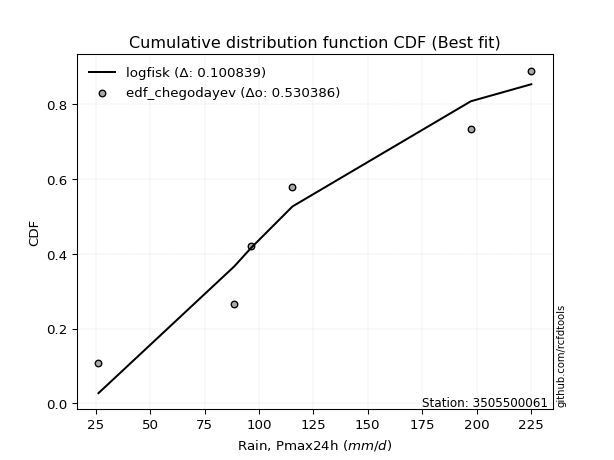</img>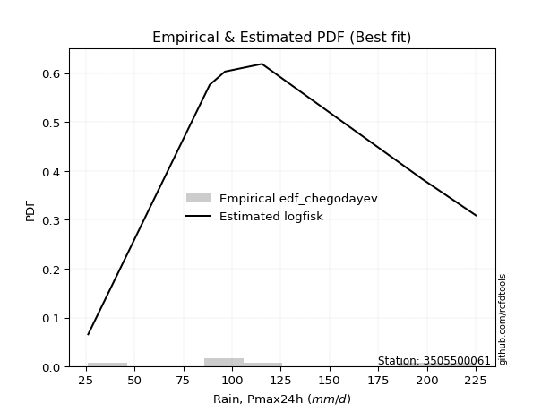</img>

</div>


### 6. EDF Blom (1958)

The Blom formula is a specific "plotting position" formula used in hydrology and statistical analysis to estimate the empirical cumulative probability (or non-exceedance probability) of a data series. It is particularly recommended for data that are approximately normally distributed. The constant _a_ is set to 0.375 (or 3/8).

<div align="center">


$P=(m-a)/(n+1-2a)$


</div>


**6.1. Empirical values**

<div align="center">

|                | 0                   | 1                   | 2                  | 3        | 4                  | 5                  | 6                  |
|:---------------|:--------------------|:--------------------|:-------------------|:---------|:-------------------|:-------------------|:-------------------|
| date           | 2021                | 2023                | 2019               | 2025     | 2022               | 2020               | 2024               |
| x              | 26.2                | 88.6                | 96.4               | 97.0     | 115.4              | 197.4              | 225.2              |
| m              | 1                   | 2                   | 3                  | 4        | 5                  | 6                  | 7                  |
| empirical_dist | edf_blom            | edf_blom            | edf_blom           | edf_blom | edf_blom           | edf_blom           | edf_blom           |
| empirical      | 0.08620689655172414 | 0.22413793103448276 | 0.3620689655172414 | 0.5      | 0.6379310344827587 | 0.7758620689655172 | 0.9137931034482759 |
| empirical_tr   | 1.0943396226415094  | 1.288888888888889   | 1.5675675675675675 | 2.0      | 2.7619047619047623 | 4.461538461538462  | 11.600000000000007 |

</div>


**6.2. Kolmogorov-Smirnov fit test (sorted by Δ)**


<div align="center">

|                | 0                   | 1                   | 2                   | 3                   | 4                   | 5                   | 6                   | 7                   | 8                   | 9                   | 10                  | 11                  | 12                  | 13                  | 14                  | 15                  | 16                  | 17                  | 18                  | 19                  | 20                  | 21                  | 22                  | 23                  | 24                  | 25                  | 26                  | 27                  | 28                  | 29                  | 30                  | 31                  | 32                  | 33                  | 34                  | 35                  | 36                  | 37                  | 38                  | 39                  | 40                  | 41                  | 42                  | 43                  | 44                  | 45                  | 46                  | 47                  | 48                  | 49                  | 50                  | 51                  | 52                  | 53                  | 54                  | 55                  | 56                  | 57                  | 58                  | 59                  | 60                  | 61                  | 62                  | 63                  | 64                  | 65                  | 66                  | 67                  | 68                  | 69                  | 70                  | 71                  | 72                  | 73                  | 74                  | 75                  | 76                  | 77                  | 78                  | 79                  | 80                  | 81                  | 82                  | 83                  | 84                  | 85                  | 86                  | 87                  | 88                  | 89                  | 90                  | 91                  | 92                  | 93                  | 94                  | 95                  | 96                  | 97                  | 98                  | 99                  | 100                 | 101                 | 102                 | 103                 | 104                 | 105                 | 106                 | 107                 | 108                 | 109                 | 110                 | 111                 | 112                 | 113                 | 114                 | 115                 | 116                 | 117                 | 118                 | 119                 | 120                 | 121                 | 122                 | 123                 | 124                 | 125                 | 126                 | 127                 | 128                 | 129                 | 130                 | 131                 | 132                 | 133                 | 134                 | 135                 | 136                 | 137                 | 138                 | 139                 | 140                 | 141                 | 142                 | 143                 | 144                 | 145                 | 146                 | 147                 | 148                 | 149                 | 150                 | 151                 | 152                 | 153                 | 154                 | 155                 | 156                 | 157                 | 158                 | 159                 |
|:---------------|:--------------------|:--------------------|:--------------------|:--------------------|:--------------------|:--------------------|:--------------------|:--------------------|:--------------------|:--------------------|:--------------------|:--------------------|:--------------------|:--------------------|:--------------------|:--------------------|:--------------------|:--------------------|:--------------------|:--------------------|:--------------------|:--------------------|:--------------------|:--------------------|:--------------------|:--------------------|:--------------------|:--------------------|:--------------------|:--------------------|:--------------------|:--------------------|:--------------------|:--------------------|:--------------------|:--------------------|:--------------------|:--------------------|:--------------------|:--------------------|:--------------------|:--------------------|:--------------------|:--------------------|:--------------------|:--------------------|:--------------------|:--------------------|:--------------------|:--------------------|:--------------------|:--------------------|:--------------------|:--------------------|:--------------------|:--------------------|:--------------------|:--------------------|:--------------------|:--------------------|:--------------------|:--------------------|:--------------------|:--------------------|:--------------------|:--------------------|:--------------------|:--------------------|:--------------------|:--------------------|:--------------------|:--------------------|:--------------------|:--------------------|:--------------------|:--------------------|:--------------------|:--------------------|:--------------------|:--------------------|:--------------------|:--------------------|:--------------------|:--------------------|:--------------------|:--------------------|:--------------------|:--------------------|:--------------------|:--------------------|:--------------------|:--------------------|:--------------------|:--------------------|:--------------------|:--------------------|:--------------------|:--------------------|:--------------------|:--------------------|:--------------------|:--------------------|:--------------------|:--------------------|:--------------------|:--------------------|:--------------------|:--------------------|:--------------------|:--------------------|:--------------------|:--------------------|:--------------------|:--------------------|:--------------------|:--------------------|:--------------------|:--------------------|:--------------------|:--------------------|:--------------------|:--------------------|:--------------------|:--------------------|:--------------------|:--------------------|:--------------------|:--------------------|:--------------------|:--------------------|:--------------------|:--------------------|:--------------------|:--------------------|:--------------------|:--------------------|:--------------------|:--------------------|:--------------------|:--------------------|:--------------------|:--------------------|:--------------------|:--------------------|:--------------------|:--------------------|:--------------------|:--------------------|:--------------------|:--------------------|:--------------------|:--------------------|:--------------------|:--------------------|:--------------------|:--------------------|:--------------------|:--------------------|:--------------------|:--------------------|
| station        | 3505500061          | 3505500061          | 3505500061          | 3505500061          | 3505500061          | 3505500061          | 3505500061          | 3505500061          | 3505500061          | 3505500061          | 3505500061          | 3505500061          | 3505500061          | 3505500061          | 3505500061          | 3505500061          | 3505500061          | 3505500061          | 3505500061          | 3505500061          | 3505500061          | 3505500061          | 3505500061          | 3505500061          | 3505500061          | 3505500061          | 3505500061          | 3505500061          | 3505500061          | 3505500061          | 3505500061          | 3505500061          | 3505500061          | 3505500061          | 3505500061          | 3505500061          | 3505500061          | 3505500061          | 3505500061          | 3505500061          | 3505500061          | 3505500061          | 3505500061          | 3505500061          | 3505500061          | 3505500061          | 3505500061          | 3505500061          | 3505500061          | 3505500061          | 3505500061          | 3505500061          | 3505500061          | 3505500061          | 3505500061          | 3505500061          | 3505500061          | 3505500061          | 3505500061          | 3505500061          | 3505500061          | 3505500061          | 3505500061          | 3505500061          | 3505500061          | 3505500061          | 3505500061          | 3505500061          | 3505500061          | 3505500061          | 3505500061          | 3505500061          | 3505500061          | 3505500061          | 3505500061          | 3505500061          | 3505500061          | 3505500061          | 3505500061          | 3505500061          | 3505500061          | 3505500061          | 3505500061          | 3505500061          | 3505500061          | 3505500061          | 3505500061          | 3505500061          | 3505500061          | 3505500061          | 3505500061          | 3505500061          | 3505500061          | 3505500061          | 3505500061          | 3505500061          | 3505500061          | 3505500061          | 3505500061          | 3505500061          | 3505500061          | 3505500061          | 3505500061          | 3505500061          | 3505500061          | 3505500061          | 3505500061          | 3505500061          | 3505500061          | 3505500061          | 3505500061          | 3505500061          | 3505500061          | 3505500061          | 3505500061          | 3505500061          | 3505500061          | 3505500061          | 3505500061          | 3505500061          | 3505500061          | 3505500061          | 3505500061          | 3505500061          | 3505500061          | 3505500061          | 3505500061          | 3505500061          | 3505500061          | 3505500061          | 3505500061          | 3505500061          | 3505500061          | 3505500061          | 3505500061          | 3505500061          | 3505500061          | 3505500061          | 3505500061          | 3505500061          | 3505500061          | 3505500061          | 3505500061          | 3505500061          | 3505500061          | 3505500061          | 3505500061          | 3505500061          | 3505500061          | 3505500061          | 3505500061          | 3505500061          | 3505500061          | 3505500061          | 3505500061          | 3505500061          | 3505500061          | 3505500061          | 3505500061          | 3505500061          |
| empirical_dist | edf_blom            | edf_blom            | edf_blom            | edf_blom            | edf_blom            | edf_blom            | edf_blom            | edf_blom            | edf_blom            | edf_blom            | edf_blom            | edf_blom            | edf_blom            | edf_blom            | edf_blom            | edf_blom            | edf_blom            | edf_blom            | edf_blom            | edf_blom            | edf_blom            | edf_blom            | edf_blom            | edf_blom            | edf_blom            | edf_blom            | edf_blom            | edf_blom            | edf_blom            | edf_blom            | edf_blom            | edf_blom            | edf_blom            | edf_blom            | edf_blom            | edf_blom            | edf_blom            | edf_blom            | edf_blom            | edf_blom            | edf_blom            | edf_blom            | edf_blom            | edf_blom            | edf_blom            | edf_blom            | edf_blom            | edf_blom            | edf_blom            | edf_blom            | edf_blom            | edf_blom            | edf_blom            | edf_blom            | edf_blom            | edf_blom            | edf_blom            | edf_blom            | edf_blom            | edf_blom            | edf_blom            | edf_blom            | edf_blom            | edf_blom            | edf_blom            | edf_blom            | edf_blom            | edf_blom            | edf_blom            | edf_blom            | edf_blom            | edf_blom            | edf_blom            | edf_blom            | edf_blom            | edf_blom            | edf_blom            | edf_blom            | edf_blom            | edf_blom            | edf_blom            | edf_blom            | edf_blom            | edf_blom            | edf_blom            | edf_blom            | edf_blom            | edf_blom            | edf_blom            | edf_blom            | edf_blom            | edf_blom            | edf_blom            | edf_blom            | edf_blom            | edf_blom            | edf_blom            | edf_blom            | edf_blom            | edf_blom            | edf_blom            | edf_blom            | edf_blom            | edf_blom            | edf_blom            | edf_blom            | edf_blom            | edf_blom            | edf_blom            | edf_blom            | edf_blom            | edf_blom            | edf_blom            | edf_blom            | edf_blom            | edf_blom            | edf_blom            | edf_blom            | edf_blom            | edf_blom            | edf_blom            | edf_blom            | edf_blom            | edf_blom            | edf_blom            | edf_blom            | edf_blom            | edf_blom            | edf_blom            | edf_blom            | edf_blom            | edf_blom            | edf_blom            | edf_blom            | edf_blom            | edf_blom            | edf_blom            | edf_blom            | edf_blom            | edf_blom            | edf_blom            | edf_blom            | edf_blom            | edf_blom            | edf_blom            | edf_blom            | edf_blom            | edf_blom            | edf_blom            | edf_blom            | edf_blom            | edf_blom            | edf_blom            | edf_blom            | edf_blom            | edf_blom            | edf_blom            | edf_blom            | edf_blom            | edf_blom            |
| p_dist         | logvonmises_line    | gumbel_r            | betaprime           | invgauss            | burr                | mielke              | loggenlogistic      | gengamma            | f                   | erlang              | gamma               | skewnorm            | genlogistic         | loggumbel_l         | invgamma            | invweibull          | moyal               | exponnorm           | nct                 | logweibull_min      | ncf                 | rayleigh            | logburr12           | wald                | weibull_min         | gompertz            | rice                | maxwell             | logpearson3         | kstwobign           | logskewnorm         | loggengamma         | bradford            | truncpareto         | loglaplace          | loglaplace          | pearson3            | logloggamma         | logargus            | halflogistic        | logtruncweibull_min | halfnorm            | logjohnsonsu        | logmielke           | logtrapezoid        | arcsine             | loggenhalflogistic  | kappa4              | ksone               | loggausshyper       | semicircular        | logt                | logdgamma           | anglit              | logburr             | dgamma              | crystalball         | norm                | t                   | johnsonsu           | loghypsecant        | truncweibull_min    | loggennorm          | logdweibull         | gausshyper          | gennorm             | logistic            | dweibull            | hypsecant           | loglogistic         | logtriang           | logloglaplace       | wrapcauchy          | loglevy_l           | cosine              | tukeylambda         | vonmises_line       | uniform             | lognct              | logcrystalball      | lognorm             | logexponnorm        | logrice             | logfatiguelife      | logncf              | logf                | loganglit           | loggamma            | loggamma            | logbetaprime        | laplace             | logsemicircular     | logerlang           | loginvgamma         | logalpha            | kappa3              | nakagami            | logmaxwell          | beta                | logarcsine          | loginvgauss         | loggenpareto        | lograyleigh         | loggenextreme       | gumbel_l            | truncexpon          | loginvweibull       | argus               | logcosine           | logfoldnorm         | logtruncnorm        | loggumbel_r         | genexpon            | burr12              | logweibull_max      | lomax               | levy_l              | logbeta             | alpha               | genpareto           | loghalfnorm         | logmoyal            | logkstwobign        | loghalflogistic     | loggenexpon         | logwrapcauchy       | lognakagami         | loggompertz         | logrdist            | genextreme          | genhalflogistic     | logksone            | johnsonsb           | logkappa3           | logkappa4           | loguniform          | logbradford         | logwald             | logtukeylambda      | exponweib           | truncnorm           | triang              | loglomax            | loghalfgennorm      | halfgennorm         | trapezoid           | logtruncexpon       | logexponpow         | rdist               | fatiguelife         | powerlaw            | weibull_max         | foldnorm            | logexponweib        | logjohnsonsb        | logpowerlaw         | exponpow            | logtruncpareto      | logvonmises         | vonmises            |
| delta          | 0.11317821113360682 | 0.11501765986521945 | 0.11982056544296099 | 0.12066993081879929 | 0.12092572049528744 | 0.12095857181114339 | 0.12109061816972777 | 0.12171987621621322 | 0.12197052794811675 | 0.12204015125455064 | 0.12204023017893112 | 0.12268383963041996 | 0.12317460367961641 | 0.12460740060263659 | 0.12524981606692498 | 0.12545509297357438 | 0.12584318924890425 | 0.12603558370982715 | 0.12636656076370445 | 0.12646068767840357 | 0.12657793152626018 | 0.1267683467513886  | 0.127180485149343   | 0.13109624830195554 | 0.13117517409815593 | 0.1333038922502372  | 0.1343227788578777  | 0.13843643182462628 | 0.1389207284718375  | 0.139228495485681   | 0.1398823601556819  | 0.14280874252211823 | 0.14555144375375434 | 0.14555837348007955 | 0.14735430752900192 | 0.14735430752900192 | 0.14739570539585717 | 0.14780395531850232 | 0.14973922956030283 | 0.150929506602899   | 0.15158262600343986 | 0.1516232765477344  | 0.1543823144979128  | 0.15672974277426627 | 0.15674027975783522 | 0.15818559424106676 | 0.1607814583175296  | 0.16295170045738822 | 0.16299493321511838 | 0.16403694942924796 | 0.16555925449555225 | 0.165768900124606   | 0.16672305019923722 | 0.16759294045600776 | 0.17045292827134306 | 0.17076831597534192 | 0.1725251867196596  | 0.1725252863823415  | 0.17252607770440953 | 0.1726370231689865  | 0.17268413587072579 | 0.17270785502415453 | 0.17486970655173362 | 0.17489787201013052 | 0.17635333529191255 | 0.17635557076957598 | 0.17722014959197352 | 0.17974290131966553 | 0.18120902428180335 | 0.1817429621015058  | 0.18360047532603635 | 0.1862495149937456  | 0.18817593800009902 | 0.18829118629324548 | 0.18847686277241055 | 0.18862833447058303 | 0.1889037433974442  | 0.1896898284526079  | 0.19214617652263322 | 0.1926651248136585  | 0.19266961425311213 | 0.19267007356057986 | 0.192688547679346   | 0.19293742370969202 | 0.1935908604064394  | 0.19373283616156772 | 0.20430055624780802 | 0.20583644335419082 | 0.20583644335419082 | 0.20692397007095187 | 0.20705913964344286 | 0.20911853638651312 | 0.2100141348627993  | 0.21094323250965002 | 0.2192519463650664  | 0.22178525367051    | 0.2241378794113008  | 0.22697646195787707 | 0.22706372324382684 | 0.22840606381874884 | 0.2290029621216726  | 0.23914613311610894 | 0.2391971091902626  | 0.2423697669523267  | 0.24307250319167784 | 0.24708204034930692 | 0.24919497444757843 | 0.250087990927768   | 0.2506015907062207  | 0.25070425502643917 | 0.25113145832750194 | 0.25533546031385546 | 0.25857816000344513 | 0.2587599814623954  | 0.25972953080703975 | 0.26117156596580615 | 0.26291651513730946 | 0.26805484437988997 | 0.2696534107140268  | 0.27302190306814084 | 0.2738054453193267  | 0.2793080493525203  | 0.2853959725537606  | 0.2914425228356854  | 0.2938908169423854  | 0.2982714480278408  | 0.3060563031826769  | 0.3185073124100646  | 0.3207947494667228  | 0.3231422481505797  | 0.32527599936094326 | 0.3311628884337472  | 0.33290189108102036 | 0.341009868917052   | 0.3418310974739045  | 0.34222305232739314 | 0.34359019808410485 | 0.34506836855955536 | 0.34839202608283537 | 0.3590501860822578  | 0.36082150846169214 | 0.3904880068100661  | 0.40104593383845477 | 0.4040622128580439  | 0.4136217528706502  | 0.42920296504567934 | 0.4417465882989986  | 0.5439425081153563  | 0.5668107743956634  | 0.5717298685896165  | 0.6029136788441362  | 0.6213436983217204  | 0.6379310344827587  | 0.6452156420015541  | 0.6509276323050365  | 0.6767256207050522  | 0.6985426410759541  | 0.7341243709997418  | 1.1590717196936633  | 35.095057876384836  |
| deltao         | 0.48442053926100004 | 0.48442053926100004 | 0.48442053926100004 | 0.48442053926100004 | 0.48442053926100004 | 0.48442053926100004 | 0.48442053926100004 | 0.48442053926100004 | 0.48442053926100004 | 0.48442053926100004 | 0.48442053926100004 | 0.48442053926100004 | 0.48442053926100004 | 0.48442053926100004 | 0.48442053926100004 | 0.48442053926100004 | 0.48442053926100004 | 0.48442053926100004 | 0.48442053926100004 | 0.48442053926100004 | 0.48442053926100004 | 0.48442053926100004 | 0.48442053926100004 | 0.48442053926100004 | 0.48442053926100004 | 0.48442053926100004 | 0.48442053926100004 | 0.48442053926100004 | 0.48442053926100004 | 0.48442053926100004 | 0.48442053926100004 | 0.48442053926100004 | 0.48442053926100004 | 0.48442053926100004 | 0.48442053926100004 | 0.48442053926100004 | 0.48442053926100004 | 0.48442053926100004 | 0.48442053926100004 | 0.48442053926100004 | 0.48442053926100004 | 0.48442053926100004 | 0.48442053926100004 | 0.48442053926100004 | 0.48442053926100004 | 0.48442053926100004 | 0.48442053926100004 | 0.48442053926100004 | 0.48442053926100004 | 0.48442053926100004 | 0.48442053926100004 | 0.48442053926100004 | 0.48442053926100004 | 0.48442053926100004 | 0.48442053926100004 | 0.48442053926100004 | 0.48442053926100004 | 0.48442053926100004 | 0.48442053926100004 | 0.48442053926100004 | 0.48442053926100004 | 0.48442053926100004 | 0.48442053926100004 | 0.48442053926100004 | 0.48442053926100004 | 0.48442053926100004 | 0.48442053926100004 | 0.48442053926100004 | 0.48442053926100004 | 0.48442053926100004 | 0.48442053926100004 | 0.48442053926100004 | 0.48442053926100004 | 0.48442053926100004 | 0.48442053926100004 | 0.48442053926100004 | 0.48442053926100004 | 0.48442053926100004 | 0.48442053926100004 | 0.48442053926100004 | 0.48442053926100004 | 0.48442053926100004 | 0.48442053926100004 | 0.48442053926100004 | 0.48442053926100004 | 0.48442053926100004 | 0.48442053926100004 | 0.48442053926100004 | 0.48442053926100004 | 0.48442053926100004 | 0.48442053926100004 | 0.48442053926100004 | 0.48442053926100004 | 0.48442053926100004 | 0.48442053926100004 | 0.48442053926100004 | 0.48442053926100004 | 0.48442053926100004 | 0.48442053926100004 | 0.48442053926100004 | 0.48442053926100004 | 0.48442053926100004 | 0.48442053926100004 | 0.48442053926100004 | 0.48442053926100004 | 0.48442053926100004 | 0.48442053926100004 | 0.48442053926100004 | 0.48442053926100004 | 0.48442053926100004 | 0.48442053926100004 | 0.48442053926100004 | 0.48442053926100004 | 0.48442053926100004 | 0.48442053926100004 | 0.48442053926100004 | 0.48442053926100004 | 0.48442053926100004 | 0.48442053926100004 | 0.48442053926100004 | 0.48442053926100004 | 0.48442053926100004 | 0.48442053926100004 | 0.48442053926100004 | 0.48442053926100004 | 0.48442053926100004 | 0.48442053926100004 | 0.48442053926100004 | 0.48442053926100004 | 0.48442053926100004 | 0.48442053926100004 | 0.48442053926100004 | 0.48442053926100004 | 0.48442053926100004 | 0.48442053926100004 | 0.48442053926100004 | 0.48442053926100004 | 0.48442053926100004 | 0.48442053926100004 | 0.48442053926100004 | 0.48442053926100004 | 0.48442053926100004 | 0.48442053926100004 | 0.48442053926100004 | 0.48442053926100004 | 0.48442053926100004 | 0.48442053926100004 | 0.48442053926100004 | 0.48442053926100004 | 0.48442053926100004 | 0.48442053926100004 | 0.48442053926100004 | 0.48442053926100004 | 0.48442053926100004 | 0.48442053926100004 | 0.48442053926100004 | 0.48442053926100004 | 0.48442053926100004 | 0.48442053926100004 | 0.48442053926100004 |
| eval           | Δo > Δ              | Δo > Δ              | Δo > Δ              | Δo > Δ              | Δo > Δ              | Δo > Δ              | Δo > Δ              | Δo > Δ              | Δo > Δ              | Δo > Δ              | Δo > Δ              | Δo > Δ              | Δo > Δ              | Δo > Δ              | Δo > Δ              | Δo > Δ              | Δo > Δ              | Δo > Δ              | Δo > Δ              | Δo > Δ              | Δo > Δ              | Δo > Δ              | Δo > Δ              | Δo > Δ              | Δo > Δ              | Δo > Δ              | Δo > Δ              | Δo > Δ              | Δo > Δ              | Δo > Δ              | Δo > Δ              | Δo > Δ              | Δo > Δ              | Δo > Δ              | Δo > Δ              | Δo > Δ              | Δo > Δ              | Δo > Δ              | Δo > Δ              | Δo > Δ              | Δo > Δ              | Δo > Δ              | Δo > Δ              | Δo > Δ              | Δo > Δ              | Δo > Δ              | Δo > Δ              | Δo > Δ              | Δo > Δ              | Δo > Δ              | Δo > Δ              | Δo > Δ              | Δo > Δ              | Δo > Δ              | Δo > Δ              | Δo > Δ              | Δo > Δ              | Δo > Δ              | Δo > Δ              | Δo > Δ              | Δo > Δ              | Δo > Δ              | Δo > Δ              | Δo > Δ              | Δo > Δ              | Δo > Δ              | Δo > Δ              | Δo > Δ              | Δo > Δ              | Δo > Δ              | Δo > Δ              | Δo > Δ              | Δo > Δ              | Δo > Δ              | Δo > Δ              | Δo > Δ              | Δo > Δ              | Δo > Δ              | Δo > Δ              | Δo > Δ              | Δo > Δ              | Δo > Δ              | Δo > Δ              | Δo > Δ              | Δo > Δ              | Δo > Δ              | Δo > Δ              | Δo > Δ              | Δo > Δ              | Δo > Δ              | Δo > Δ              | Δo > Δ              | Δo > Δ              | Δo > Δ              | Δo > Δ              | Δo > Δ              | Δo > Δ              | Δo > Δ              | Δo > Δ              | Δo > Δ              | Δo > Δ              | Δo > Δ              | Δo > Δ              | Δo > Δ              | Δo > Δ              | Δo > Δ              | Δo > Δ              | Δo > Δ              | Δo > Δ              | Δo > Δ              | Δo > Δ              | Δo > Δ              | Δo > Δ              | Δo > Δ              | Δo > Δ              | Δo > Δ              | Δo > Δ              | Δo > Δ              | Δo > Δ              | Δo > Δ              | Δo > Δ              | Δo > Δ              | Δo > Δ              | Δo > Δ              | Δo > Δ              | Δo > Δ              | Δo > Δ              | Δo > Δ              | Δo > Δ              | Δo > Δ              | Δo > Δ              | Δo > Δ              | Δo > Δ              | Δo > Δ              | Δo > Δ              | Δo > Δ              | Δo > Δ              | Δo > Δ              | Δo > Δ              | Δo > Δ              | Δo > Δ              | Δo > Δ              | Δo > Δ              | Δo > Δ              | Δo > Δ              | Δo > Δ              | Δo > Δ              | Δo <= Δ             | Δo <= Δ             | Δo <= Δ             | Δo <= Δ             | Δo <= Δ             | Δo <= Δ             | Δo <= Δ             | Δo <= Δ             | Δo <= Δ             | Δo <= Δ             | Δo <= Δ             | Δo <= Δ             | Δo <= Δ             |
| fit            | 1                   | 1                   | 1                   | 1                   | 1                   | 1                   | 1                   | 1                   | 1                   | 1                   | 1                   | 1                   | 1                   | 1                   | 1                   | 1                   | 1                   | 1                   | 1                   | 1                   | 1                   | 1                   | 1                   | 1                   | 1                   | 1                   | 1                   | 1                   | 1                   | 1                   | 1                   | 1                   | 1                   | 1                   | 1                   | 1                   | 1                   | 1                   | 1                   | 1                   | 1                   | 1                   | 1                   | 1                   | 1                   | 1                   | 1                   | 1                   | 1                   | 1                   | 1                   | 1                   | 1                   | 1                   | 1                   | 1                   | 1                   | 1                   | 1                   | 1                   | 1                   | 1                   | 1                   | 1                   | 1                   | 1                   | 1                   | 1                   | 1                   | 1                   | 1                   | 1                   | 1                   | 1                   | 1                   | 1                   | 1                   | 1                   | 1                   | 1                   | 1                   | 1                   | 1                   | 1                   | 1                   | 1                   | 1                   | 1                   | 1                   | 1                   | 1                   | 1                   | 1                   | 1                   | 1                   | 1                   | 1                   | 1                   | 1                   | 1                   | 1                   | 1                   | 1                   | 1                   | 1                   | 1                   | 1                   | 1                   | 1                   | 1                   | 1                   | 1                   | 1                   | 1                   | 1                   | 1                   | 1                   | 1                   | 1                   | 1                   | 1                   | 1                   | 1                   | 1                   | 1                   | 1                   | 1                   | 1                   | 1                   | 1                   | 1                   | 1                   | 1                   | 1                   | 1                   | 1                   | 1                   | 1                   | 1                   | 1                   | 1                   | 1                   | 1                   | 1                   | 1                   | 1                   | 1                   | 0                   | 0                   | 0                   | 0                   | 0                   | 0                   | 0                   | 0                   | 0                   | 0                   | 0                   | 0                   | 0                   |
| n              | 7                   | 7                   | 7                   | 7                   | 7                   | 7                   | 7                   | 7                   | 7                   | 7                   | 7                   | 7                   | 7                   | 7                   | 7                   | 7                   | 7                   | 7                   | 7                   | 7                   | 7                   | 7                   | 7                   | 7                   | 7                   | 7                   | 7                   | 7                   | 7                   | 7                   | 7                   | 7                   | 7                   | 7                   | 7                   | 7                   | 7                   | 7                   | 7                   | 7                   | 7                   | 7                   | 7                   | 7                   | 7                   | 7                   | 7                   | 7                   | 7                   | 7                   | 7                   | 7                   | 7                   | 7                   | 7                   | 7                   | 7                   | 7                   | 7                   | 7                   | 7                   | 7                   | 7                   | 7                   | 7                   | 7                   | 7                   | 7                   | 7                   | 7                   | 7                   | 7                   | 7                   | 7                   | 7                   | 7                   | 7                   | 7                   | 7                   | 7                   | 7                   | 7                   | 7                   | 7                   | 7                   | 7                   | 7                   | 7                   | 7                   | 7                   | 7                   | 7                   | 7                   | 7                   | 7                   | 7                   | 7                   | 7                   | 7                   | 7                   | 7                   | 7                   | 7                   | 7                   | 7                   | 7                   | 7                   | 7                   | 7                   | 7                   | 7                   | 7                   | 7                   | 7                   | 7                   | 7                   | 7                   | 7                   | 7                   | 7                   | 7                   | 7                   | 7                   | 7                   | 7                   | 7                   | 7                   | 7                   | 7                   | 7                   | 7                   | 7                   | 7                   | 7                   | 7                   | 7                   | 7                   | 7                   | 7                   | 7                   | 7                   | 7                   | 7                   | 7                   | 7                   | 7                   | 7                   | 7                   | 7                   | 7                   | 7                   | 7                   | 7                   | 7                   | 7                   | 7                   | 7                   | 7                   | 7                   | 7                   |
| best_fit       | 1                   | 0                   | 0                   | 0                   | 0                   | 0                   | 0                   | 0                   | 0                   | 0                   | 0                   | 0                   | 0                   | 0                   | 0                   | 0                   | 0                   | 0                   | 0                   | 0                   | 0                   | 0                   | 0                   | 0                   | 0                   | 0                   | 0                   | 0                   | 0                   | 0                   | 0                   | 0                   | 0                   | 0                   | 0                   | 0                   | 0                   | 0                   | 0                   | 0                   | 0                   | 0                   | 0                   | 0                   | 0                   | 0                   | 0                   | 0                   | 0                   | 0                   | 0                   | 0                   | 0                   | 0                   | 0                   | 0                   | 0                   | 0                   | 0                   | 0                   | 0                   | 0                   | 0                   | 0                   | 0                   | 0                   | 0                   | 0                   | 0                   | 0                   | 0                   | 0                   | 0                   | 0                   | 0                   | 0                   | 0                   | 0                   | 0                   | 0                   | 0                   | 0                   | 0                   | 0                   | 0                   | 0                   | 0                   | 0                   | 0                   | 0                   | 0                   | 0                   | 0                   | 0                   | 0                   | 0                   | 0                   | 0                   | 0                   | 0                   | 0                   | 0                   | 0                   | 0                   | 0                   | 0                   | 0                   | 0                   | 0                   | 0                   | 0                   | 0                   | 0                   | 0                   | 0                   | 0                   | 0                   | 0                   | 0                   | 0                   | 0                   | 0                   | 0                   | 0                   | 0                   | 0                   | 0                   | 0                   | 0                   | 0                   | 0                   | 0                   | 0                   | 0                   | 0                   | 0                   | 0                   | 0                   | 0                   | 0                   | 0                   | 0                   | 0                   | 0                   | 0                   | 0                   | 0                   | 0                   | 0                   | 0                   | 0                   | 0                   | 0                   | 0                   | 0                   | 0                   | 0                   | 0                   | 0                   | 0                   |
| best_fit_sort  | 1                   | 2                   | 3                   | 4                   | 5                   | 6                   | 7                   | 8                   | 9                   | 10                  | 11                  | 12                  | 13                  | 14                  | 15                  | 16                  | 17                  | 18                  | 19                  | 20                  | 21                  | 22                  | 23                  | 24                  | 25                  | 26                  | 27                  | 28                  | 29                  | 30                  | 31                  | 32                  | 33                  | 34                  | 35                  | 36                  | 37                  | 38                  | 39                  | 40                  | 41                  | 42                  | 43                  | 44                  | 45                  | 46                  | 47                  | 48                  | 49                  | 50                  | 51                  | 52                  | 53                  | 54                  | 55                  | 56                  | 57                  | 58                  | 59                  | 60                  | 61                  | 62                  | 63                  | 64                  | 65                  | 66                  | 67                  | 68                  | 69                  | 70                  | 71                  | 72                  | 73                  | 74                  | 75                  | 76                  | 77                  | 78                  | 79                  | 80                  | 81                  | 82                  | 83                  | 84                  | 85                  | 86                  | 87                  | 88                  | 89                  | 90                  | 91                  | 92                  | 93                  | 94                  | 95                  | 96                  | 97                  | 98                  | 99                  | 100                 | 101                 | 102                 | 103                 | 104                 | 105                 | 106                 | 107                 | 108                 | 109                 | 110                 | 111                 | 112                 | 113                 | 114                 | 115                 | 116                 | 117                 | 118                 | 119                 | 120                 | 121                 | 122                 | 123                 | 124                 | 125                 | 126                 | 127                 | 128                 | 129                 | 130                 | 131                 | 132                 | 133                 | 134                 | 135                 | 136                 | 137                 | 138                 | 139                 | 140                 | 141                 | 142                 | 143                 | 144                 | 145                 | 146                 | 147                 | 148                 | 149                 | 150                 | 151                 | 152                 | 153                 | 154                 | 155                 | 156                 | 157                 | 158                 | 159                 | 160                 |

</div>


**6.3. Best fit**

<div align="center">

|   id |    station | empirical_dist   | p_dist           |    delta |   deltao | eval   |   fit |   n |   best_fit |   best_fit_sort |
|-----:|-----------:|:-----------------|:-----------------|---------:|---------:|:-------|------:|----:|-----------:|----------------:|
|    0 | 3505500061 | edf_blom         | logvonmises_line | 0.113178 | 0.484421 | Δo > Δ |     1 |   7 |          1 |               1 |

</div>


<div align="center">

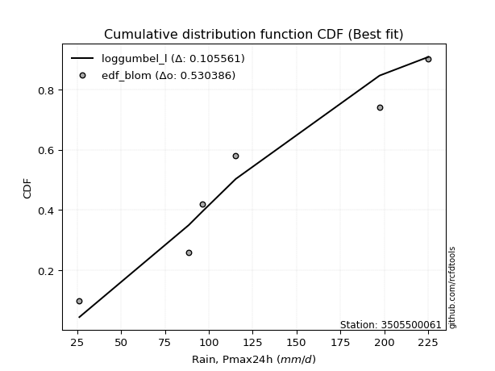</img></img>

</div>


### 7. EDF Tukey (1962)

In hydrology, the Tukey formula is used as a plotting position formula to estimate the empirical probability or frequency of a flood event (or other hydrological data). The formula parameter is given as _c=0.333_ (or 1/3).

<div align="center">


$P=(m-c)/(n+1-2c)$


</div>


**7.1. Empirical values**

<div align="center">

|                | 0                   | 1                   | 2                   | 3         | 4                  | 5                  | 6                  |
|:---------------|:--------------------|:--------------------|:--------------------|:----------|:-------------------|:-------------------|:-------------------|
| date           | 2021                | 2023                | 2019                | 2025      | 2022               | 2020               | 2024               |
| x              | 26.2                | 88.6                | 96.4                | 97.0      | 115.4              | 197.4              | 225.2              |
| m              | 1                   | 2                   | 3                   | 4         | 5                  | 6                  | 7                  |
| empirical_dist | edf_tukey           | edf_tukey           | edf_tukey           | edf_tukey | edf_tukey          | edf_tukey          | edf_tukey          |
| empirical      | 0.09090909090909091 | 0.22727272727272727 | 0.36363636363636365 | 0.5       | 0.6363636363636364 | 0.7727272727272727 | 0.9090909090909091 |
| empirical_tr   | 1.1                 | 1.2941176470588236  | 1.5714285714285714  | 2.0       | 2.75               | 4.3999999999999995 | 10.999999999999996 |

</div>


**7.2. Kolmogorov-Smirnov fit test (sorted by Δ)**


<div align="center">

|                | 0                   | 1                   | 2                   | 3                   | 4                   | 5                   | 6                   | 7                   | 8                   | 9                   | 10                  | 11                  | 12                  | 13                  | 14                  | 15                  | 16                  | 17                  | 18                  | 19                  | 20                  | 21                  | 22                  | 23                  | 24                  | 25                  | 26                  | 27                  | 28                  | 29                  | 30                  | 31                  | 32                  | 33                  | 34                  | 35                  | 36                  | 37                  | 38                  | 39                  | 40                  | 41                  | 42                  | 43                  | 44                  | 45                  | 46                  | 47                  | 48                  | 49                  | 50                  | 51                  | 52                  | 53                  | 54                  | 55                  | 56                  | 57                  | 58                  | 59                  | 60                  | 61                  | 62                  | 63                  | 64                  | 65                  | 66                  | 67                  | 68                  | 69                  | 70                  | 71                  | 72                  | 73                  | 74                  | 75                  | 76                  | 77                  | 78                  | 79                  | 80                  | 81                  | 82                  | 83                  | 84                  | 85                  | 86                  | 87                  | 88                  | 89                  | 90                  | 91                  | 92                  | 93                  | 94                  | 95                  | 96                  | 97                  | 98                  | 99                  | 100                 | 101                 | 102                 | 103                 | 104                 | 105                 | 106                 | 107                 | 108                 | 109                 | 110                 | 111                 | 112                 | 113                 | 114                 | 115                 | 116                 | 117                 | 118                 | 119                 | 120                 | 121                 | 122                 | 123                 | 124                 | 125                 | 126                 | 127                 | 128                 | 129                 | 130                 | 131                 | 132                 | 133                 | 134                 | 135                 | 136                 | 137                 | 138                 | 139                 | 140                 | 141                 | 142                 | 143                 | 144                 | 145                 | 146                 | 147                 | 148                 | 149                 | 150                 | 151                 | 152                 | 153                 | 154                 | 155                 | 156                 | 157                 | 158                 | 159                 |
|:---------------|:--------------------|:--------------------|:--------------------|:--------------------|:--------------------|:--------------------|:--------------------|:--------------------|:--------------------|:--------------------|:--------------------|:--------------------|:--------------------|:--------------------|:--------------------|:--------------------|:--------------------|:--------------------|:--------------------|:--------------------|:--------------------|:--------------------|:--------------------|:--------------------|:--------------------|:--------------------|:--------------------|:--------------------|:--------------------|:--------------------|:--------------------|:--------------------|:--------------------|:--------------------|:--------------------|:--------------------|:--------------------|:--------------------|:--------------------|:--------------------|:--------------------|:--------------------|:--------------------|:--------------------|:--------------------|:--------------------|:--------------------|:--------------------|:--------------------|:--------------------|:--------------------|:--------------------|:--------------------|:--------------------|:--------------------|:--------------------|:--------------------|:--------------------|:--------------------|:--------------------|:--------------------|:--------------------|:--------------------|:--------------------|:--------------------|:--------------------|:--------------------|:--------------------|:--------------------|:--------------------|:--------------------|:--------------------|:--------------------|:--------------------|:--------------------|:--------------------|:--------------------|:--------------------|:--------------------|:--------------------|:--------------------|:--------------------|:--------------------|:--------------------|:--------------------|:--------------------|:--------------------|:--------------------|:--------------------|:--------------------|:--------------------|:--------------------|:--------------------|:--------------------|:--------------------|:--------------------|:--------------------|:--------------------|:--------------------|:--------------------|:--------------------|:--------------------|:--------------------|:--------------------|:--------------------|:--------------------|:--------------------|:--------------------|:--------------------|:--------------------|:--------------------|:--------------------|:--------------------|:--------------------|:--------------------|:--------------------|:--------------------|:--------------------|:--------------------|:--------------------|:--------------------|:--------------------|:--------------------|:--------------------|:--------------------|:--------------------|:--------------------|:--------------------|:--------------------|:--------------------|:--------------------|:--------------------|:--------------------|:--------------------|:--------------------|:--------------------|:--------------------|:--------------------|:--------------------|:--------------------|:--------------------|:--------------------|:--------------------|:--------------------|:--------------------|:--------------------|:--------------------|:--------------------|:--------------------|:--------------------|:--------------------|:--------------------|:--------------------|:--------------------|:--------------------|:--------------------|:--------------------|:--------------------|:--------------------|:--------------------|
| station        | 3505500061          | 3505500061          | 3505500061          | 3505500061          | 3505500061          | 3505500061          | 3505500061          | 3505500061          | 3505500061          | 3505500061          | 3505500061          | 3505500061          | 3505500061          | 3505500061          | 3505500061          | 3505500061          | 3505500061          | 3505500061          | 3505500061          | 3505500061          | 3505500061          | 3505500061          | 3505500061          | 3505500061          | 3505500061          | 3505500061          | 3505500061          | 3505500061          | 3505500061          | 3505500061          | 3505500061          | 3505500061          | 3505500061          | 3505500061          | 3505500061          | 3505500061          | 3505500061          | 3505500061          | 3505500061          | 3505500061          | 3505500061          | 3505500061          | 3505500061          | 3505500061          | 3505500061          | 3505500061          | 3505500061          | 3505500061          | 3505500061          | 3505500061          | 3505500061          | 3505500061          | 3505500061          | 3505500061          | 3505500061          | 3505500061          | 3505500061          | 3505500061          | 3505500061          | 3505500061          | 3505500061          | 3505500061          | 3505500061          | 3505500061          | 3505500061          | 3505500061          | 3505500061          | 3505500061          | 3505500061          | 3505500061          | 3505500061          | 3505500061          | 3505500061          | 3505500061          | 3505500061          | 3505500061          | 3505500061          | 3505500061          | 3505500061          | 3505500061          | 3505500061          | 3505500061          | 3505500061          | 3505500061          | 3505500061          | 3505500061          | 3505500061          | 3505500061          | 3505500061          | 3505500061          | 3505500061          | 3505500061          | 3505500061          | 3505500061          | 3505500061          | 3505500061          | 3505500061          | 3505500061          | 3505500061          | 3505500061          | 3505500061          | 3505500061          | 3505500061          | 3505500061          | 3505500061          | 3505500061          | 3505500061          | 3505500061          | 3505500061          | 3505500061          | 3505500061          | 3505500061          | 3505500061          | 3505500061          | 3505500061          | 3505500061          | 3505500061          | 3505500061          | 3505500061          | 3505500061          | 3505500061          | 3505500061          | 3505500061          | 3505500061          | 3505500061          | 3505500061          | 3505500061          | 3505500061          | 3505500061          | 3505500061          | 3505500061          | 3505500061          | 3505500061          | 3505500061          | 3505500061          | 3505500061          | 3505500061          | 3505500061          | 3505500061          | 3505500061          | 3505500061          | 3505500061          | 3505500061          | 3505500061          | 3505500061          | 3505500061          | 3505500061          | 3505500061          | 3505500061          | 3505500061          | 3505500061          | 3505500061          | 3505500061          | 3505500061          | 3505500061          | 3505500061          | 3505500061          | 3505500061          | 3505500061          | 3505500061          |
| empirical_dist | edf_tukey           | edf_tukey           | edf_tukey           | edf_tukey           | edf_tukey           | edf_tukey           | edf_tukey           | edf_tukey           | edf_tukey           | edf_tukey           | edf_tukey           | edf_tukey           | edf_tukey           | edf_tukey           | edf_tukey           | edf_tukey           | edf_tukey           | edf_tukey           | edf_tukey           | edf_tukey           | edf_tukey           | edf_tukey           | edf_tukey           | edf_tukey           | edf_tukey           | edf_tukey           | edf_tukey           | edf_tukey           | edf_tukey           | edf_tukey           | edf_tukey           | edf_tukey           | edf_tukey           | edf_tukey           | edf_tukey           | edf_tukey           | edf_tukey           | edf_tukey           | edf_tukey           | edf_tukey           | edf_tukey           | edf_tukey           | edf_tukey           | edf_tukey           | edf_tukey           | edf_tukey           | edf_tukey           | edf_tukey           | edf_tukey           | edf_tukey           | edf_tukey           | edf_tukey           | edf_tukey           | edf_tukey           | edf_tukey           | edf_tukey           | edf_tukey           | edf_tukey           | edf_tukey           | edf_tukey           | edf_tukey           | edf_tukey           | edf_tukey           | edf_tukey           | edf_tukey           | edf_tukey           | edf_tukey           | edf_tukey           | edf_tukey           | edf_tukey           | edf_tukey           | edf_tukey           | edf_tukey           | edf_tukey           | edf_tukey           | edf_tukey           | edf_tukey           | edf_tukey           | edf_tukey           | edf_tukey           | edf_tukey           | edf_tukey           | edf_tukey           | edf_tukey           | edf_tukey           | edf_tukey           | edf_tukey           | edf_tukey           | edf_tukey           | edf_tukey           | edf_tukey           | edf_tukey           | edf_tukey           | edf_tukey           | edf_tukey           | edf_tukey           | edf_tukey           | edf_tukey           | edf_tukey           | edf_tukey           | edf_tukey           | edf_tukey           | edf_tukey           | edf_tukey           | edf_tukey           | edf_tukey           | edf_tukey           | edf_tukey           | edf_tukey           | edf_tukey           | edf_tukey           | edf_tukey           | edf_tukey           | edf_tukey           | edf_tukey           | edf_tukey           | edf_tukey           | edf_tukey           | edf_tukey           | edf_tukey           | edf_tukey           | edf_tukey           | edf_tukey           | edf_tukey           | edf_tukey           | edf_tukey           | edf_tukey           | edf_tukey           | edf_tukey           | edf_tukey           | edf_tukey           | edf_tukey           | edf_tukey           | edf_tukey           | edf_tukey           | edf_tukey           | edf_tukey           | edf_tukey           | edf_tukey           | edf_tukey           | edf_tukey           | edf_tukey           | edf_tukey           | edf_tukey           | edf_tukey           | edf_tukey           | edf_tukey           | edf_tukey           | edf_tukey           | edf_tukey           | edf_tukey           | edf_tukey           | edf_tukey           | edf_tukey           | edf_tukey           | edf_tukey           | edf_tukey           | edf_tukey           | edf_tukey           | edf_tukey           |
| p_dist         | logvonmises_line    | gumbel_r            | betaprime           | burr                | mielke              | loggenlogistic      | f                   | erlang              | gamma               | invgauss            | gengamma            | genlogistic         | skewnorm            | loggumbel_l         | invweibull          | moyal               | exponnorm           | ncf                 | invgamma            | nct                 | logweibull_min      | rayleigh            | logburr12           | weibull_min         | gompertz            | rice                | wald                | logpearson3         | kstwobign           | logskewnorm         | maxwell             | loggengamma         | bradford            | truncpareto         | loglaplace          | loglaplace          | pearson3            | logloggamma         | halflogistic        | logargus            | logtruncweibull_min | halfnorm            | logjohnsonsu        | logmielke           | logtrapezoid        | arcsine             | loggenhalflogistic  | kappa4              | ksone               | loggausshyper       | logt                | logdgamma           | semicircular        | anglit              | dgamma              | logburr             | loghypsecant        | crystalball         | norm                | t                   | johnsonsu           | truncweibull_min    | logdweibull         | gausshyper          | logistic            | loggennorm          | dweibull            | loglogistic         | gennorm             | hypsecant           | logtriang           | logloglaplace       | wrapcauchy          | loglevy_l           | cosine              | tukeylambda         | vonmises_line       | uniform             | lognct              | logcrystalball      | lognorm             | logexponnorm        | logrice             | logfatiguelife      | logncf              | logf                | loganglit           | loggamma            | loggamma            | logbetaprime        | logsemicircular     | logerlang           | laplace             | loginvgamma         | logalpha            | kappa3              | logmaxwell          | beta                | logarcsine          | loginvgauss         | nakagami            | loggenpareto        | lograyleigh         | loggenextreme       | gumbel_l            | truncexpon          | loginvweibull       | logcosine           | logfoldnorm         | argus               | logtruncnorm        | loggumbel_r         | genexpon            | burr12              | logweibull_max      | lomax               | levy_l              | logbeta             | alpha               | loghalfnorm         | genpareto           | logmoyal            | logkstwobign        | loghalflogistic     | loggenexpon         | logwrapcauchy       | lognakagami         | loggompertz         | logrdist            | genextreme          | genhalflogistic     | logksone            | johnsonsb           | logkappa3           | logkappa4           | loguniform          | logbradford         | logwald             | logtukeylambda      | exponweib           | truncnorm           | triang              | loglomax            | loghalfgennorm      | halfgennorm         | trapezoid           | logtruncexpon       | logexponpow         | rdist               | fatiguelife         | powerlaw            | weibull_max         | foldnorm            | logexponweib        | logjohnsonsb        | logpowerlaw         | exponpow            | logtruncpareto      | logvonmises         | vonmises            |
| delta          | 0.11004341489536232 | 0.11526713248211184 | 0.1173033500435069  | 0.11779092425704293 | 0.11782377557289889 | 0.11795582193148327 | 0.11883573170987224 | 0.11890535501630614 | 0.11890543394068662 | 0.11910253269967697 | 0.11976950145098819 | 0.12003980744137191 | 0.12111644151129763 | 0.12176219013882139 | 0.12232029673532988 | 0.12270839301065975 | 0.12290078747158265 | 0.12344313528801568 | 0.12368241794780266 | 0.12479916264458213 | 0.12489328955928125 | 0.12520094863226627 | 0.12561308703022067 | 0.12804037785991143 | 0.13173649413111488 | 0.13275538073875537 | 0.13341623173989414 | 0.135785932233593   | 0.1360936992474365  | 0.1367475639174374  | 0.13686903370550396 | 0.13967394628387372 | 0.14398404563463202 | 0.14399097536095723 | 0.1442195112907574  | 0.1442195112907574  | 0.14582830727673485 | 0.14623655719938    | 0.1477947103646545  | 0.1481718314411805  | 0.14844782976519535 | 0.14848848030948988 | 0.15281491637879047 | 0.15359494653602176 | 0.15360548351959072 | 0.1559181665389321  | 0.1576466620792851  | 0.1613843023382659  | 0.16142753509599606 | 0.16246955131012564 | 0.1626341038863615  | 0.16358825396099272 | 0.16399185637642993 | 0.16602554233688543 | 0.16877305659412212 | 0.16888553015222074 | 0.16954933963248128 | 0.17095778860053729 | 0.17095788826321917 | 0.1709586795852872  | 0.17106962504986417 | 0.1711404569050322  | 0.17176307577188601 | 0.17321853905366805 | 0.1756527514728512  | 0.17643710467085594 | 0.17660810508142102 | 0.1786081658632613  | 0.1794903670078205  | 0.17964162616268103 | 0.18046567908779185 | 0.1831147187555011  | 0.1866085398809767  | 0.18672378817412316 | 0.18690946465328823 | 0.1870609363514607  | 0.18733634527832188 | 0.18812243033348558 | 0.1890113802843887  | 0.189530328575414   | 0.18953481801486763 | 0.18953527732233535 | 0.1895537514411015  | 0.18980262747144752 | 0.1904560641681949  | 0.19059803992332322 | 0.20116576000956352 | 0.20270164711594632 | 0.20270164711594632 | 0.20378917383270737 | 0.20598374014826862 | 0.2068793386245548  | 0.20705913964344286 | 0.20780843627140552 | 0.2161171501268219  | 0.22021785555138768 | 0.22384166571963257 | 0.22392892700558234 | 0.22527126758050434 | 0.2258681658834281  | 0.2272726756495453  | 0.23601133687786444 | 0.2360623129520181  | 0.24080236883320438 | 0.24150510507255551 | 0.24394724411106242 | 0.24606017820933393 | 0.24746679446797618 | 0.24756945878819467 | 0.2485205928086457  | 0.25113145832750194 | 0.2522006640756109  | 0.2554433637652006  | 0.2556251852241509  | 0.2565947345687952  | 0.2580367697275616  | 0.25821432077994266 | 0.26648744626076765 | 0.2665186144757823  | 0.2706706490810822  | 0.2714545049490185  | 0.27617325311427576 | 0.28226117631551606 | 0.28830772659744086 | 0.29075602070414086 | 0.29513665178959625 | 0.30448890506355464 | 0.31537251617182005 | 0.3176599532284783  | 0.31844005379321283 | 0.32370860124182094 | 0.32802809219550266 | 0.32976709484277583 | 0.33787507267880745 | 0.33869630123565997 | 0.3390882560891486  | 0.3404554018458603  | 0.34193357232131083 | 0.34525722984459084 | 0.3559153898440133  | 0.3576867122234476  | 0.3889206086909438  | 0.3963437394810879  | 0.40092741661979936 | 0.41048695663240564 | 0.427635566926557   | 0.43861179206075407 | 0.5408077118771117  | 0.5636759781574189  | 0.568595072351372   | 0.5997788826058916  | 0.6182089020834758  | 0.6363636363636364  | 0.6420808457633096  | 0.6477928360667919  | 0.6735908244668076  | 0.6954078448377096  | 0.7309895747614973  | 1.1559369234554187  | 35.09976007074221   |
| deltao         | 0.48442053926100004 | 0.48442053926100004 | 0.48442053926100004 | 0.48442053926100004 | 0.48442053926100004 | 0.48442053926100004 | 0.48442053926100004 | 0.48442053926100004 | 0.48442053926100004 | 0.48442053926100004 | 0.48442053926100004 | 0.48442053926100004 | 0.48442053926100004 | 0.48442053926100004 | 0.48442053926100004 | 0.48442053926100004 | 0.48442053926100004 | 0.48442053926100004 | 0.48442053926100004 | 0.48442053926100004 | 0.48442053926100004 | 0.48442053926100004 | 0.48442053926100004 | 0.48442053926100004 | 0.48442053926100004 | 0.48442053926100004 | 0.48442053926100004 | 0.48442053926100004 | 0.48442053926100004 | 0.48442053926100004 | 0.48442053926100004 | 0.48442053926100004 | 0.48442053926100004 | 0.48442053926100004 | 0.48442053926100004 | 0.48442053926100004 | 0.48442053926100004 | 0.48442053926100004 | 0.48442053926100004 | 0.48442053926100004 | 0.48442053926100004 | 0.48442053926100004 | 0.48442053926100004 | 0.48442053926100004 | 0.48442053926100004 | 0.48442053926100004 | 0.48442053926100004 | 0.48442053926100004 | 0.48442053926100004 | 0.48442053926100004 | 0.48442053926100004 | 0.48442053926100004 | 0.48442053926100004 | 0.48442053926100004 | 0.48442053926100004 | 0.48442053926100004 | 0.48442053926100004 | 0.48442053926100004 | 0.48442053926100004 | 0.48442053926100004 | 0.48442053926100004 | 0.48442053926100004 | 0.48442053926100004 | 0.48442053926100004 | 0.48442053926100004 | 0.48442053926100004 | 0.48442053926100004 | 0.48442053926100004 | 0.48442053926100004 | 0.48442053926100004 | 0.48442053926100004 | 0.48442053926100004 | 0.48442053926100004 | 0.48442053926100004 | 0.48442053926100004 | 0.48442053926100004 | 0.48442053926100004 | 0.48442053926100004 | 0.48442053926100004 | 0.48442053926100004 | 0.48442053926100004 | 0.48442053926100004 | 0.48442053926100004 | 0.48442053926100004 | 0.48442053926100004 | 0.48442053926100004 | 0.48442053926100004 | 0.48442053926100004 | 0.48442053926100004 | 0.48442053926100004 | 0.48442053926100004 | 0.48442053926100004 | 0.48442053926100004 | 0.48442053926100004 | 0.48442053926100004 | 0.48442053926100004 | 0.48442053926100004 | 0.48442053926100004 | 0.48442053926100004 | 0.48442053926100004 | 0.48442053926100004 | 0.48442053926100004 | 0.48442053926100004 | 0.48442053926100004 | 0.48442053926100004 | 0.48442053926100004 | 0.48442053926100004 | 0.48442053926100004 | 0.48442053926100004 | 0.48442053926100004 | 0.48442053926100004 | 0.48442053926100004 | 0.48442053926100004 | 0.48442053926100004 | 0.48442053926100004 | 0.48442053926100004 | 0.48442053926100004 | 0.48442053926100004 | 0.48442053926100004 | 0.48442053926100004 | 0.48442053926100004 | 0.48442053926100004 | 0.48442053926100004 | 0.48442053926100004 | 0.48442053926100004 | 0.48442053926100004 | 0.48442053926100004 | 0.48442053926100004 | 0.48442053926100004 | 0.48442053926100004 | 0.48442053926100004 | 0.48442053926100004 | 0.48442053926100004 | 0.48442053926100004 | 0.48442053926100004 | 0.48442053926100004 | 0.48442053926100004 | 0.48442053926100004 | 0.48442053926100004 | 0.48442053926100004 | 0.48442053926100004 | 0.48442053926100004 | 0.48442053926100004 | 0.48442053926100004 | 0.48442053926100004 | 0.48442053926100004 | 0.48442053926100004 | 0.48442053926100004 | 0.48442053926100004 | 0.48442053926100004 | 0.48442053926100004 | 0.48442053926100004 | 0.48442053926100004 | 0.48442053926100004 | 0.48442053926100004 | 0.48442053926100004 | 0.48442053926100004 | 0.48442053926100004 | 0.48442053926100004 | 0.48442053926100004 |
| eval           | Δo > Δ              | Δo > Δ              | Δo > Δ              | Δo > Δ              | Δo > Δ              | Δo > Δ              | Δo > Δ              | Δo > Δ              | Δo > Δ              | Δo > Δ              | Δo > Δ              | Δo > Δ              | Δo > Δ              | Δo > Δ              | Δo > Δ              | Δo > Δ              | Δo > Δ              | Δo > Δ              | Δo > Δ              | Δo > Δ              | Δo > Δ              | Δo > Δ              | Δo > Δ              | Δo > Δ              | Δo > Δ              | Δo > Δ              | Δo > Δ              | Δo > Δ              | Δo > Δ              | Δo > Δ              | Δo > Δ              | Δo > Δ              | Δo > Δ              | Δo > Δ              | Δo > Δ              | Δo > Δ              | Δo > Δ              | Δo > Δ              | Δo > Δ              | Δo > Δ              | Δo > Δ              | Δo > Δ              | Δo > Δ              | Δo > Δ              | Δo > Δ              | Δo > Δ              | Δo > Δ              | Δo > Δ              | Δo > Δ              | Δo > Δ              | Δo > Δ              | Δo > Δ              | Δo > Δ              | Δo > Δ              | Δo > Δ              | Δo > Δ              | Δo > Δ              | Δo > Δ              | Δo > Δ              | Δo > Δ              | Δo > Δ              | Δo > Δ              | Δo > Δ              | Δo > Δ              | Δo > Δ              | Δo > Δ              | Δo > Δ              | Δo > Δ              | Δo > Δ              | Δo > Δ              | Δo > Δ              | Δo > Δ              | Δo > Δ              | Δo > Δ              | Δo > Δ              | Δo > Δ              | Δo > Δ              | Δo > Δ              | Δo > Δ              | Δo > Δ              | Δo > Δ              | Δo > Δ              | Δo > Δ              | Δo > Δ              | Δo > Δ              | Δo > Δ              | Δo > Δ              | Δo > Δ              | Δo > Δ              | Δo > Δ              | Δo > Δ              | Δo > Δ              | Δo > Δ              | Δo > Δ              | Δo > Δ              | Δo > Δ              | Δo > Δ              | Δo > Δ              | Δo > Δ              | Δo > Δ              | Δo > Δ              | Δo > Δ              | Δo > Δ              | Δo > Δ              | Δo > Δ              | Δo > Δ              | Δo > Δ              | Δo > Δ              | Δo > Δ              | Δo > Δ              | Δo > Δ              | Δo > Δ              | Δo > Δ              | Δo > Δ              | Δo > Δ              | Δo > Δ              | Δo > Δ              | Δo > Δ              | Δo > Δ              | Δo > Δ              | Δo > Δ              | Δo > Δ              | Δo > Δ              | Δo > Δ              | Δo > Δ              | Δo > Δ              | Δo > Δ              | Δo > Δ              | Δo > Δ              | Δo > Δ              | Δo > Δ              | Δo > Δ              | Δo > Δ              | Δo > Δ              | Δo > Δ              | Δo > Δ              | Δo > Δ              | Δo > Δ              | Δo > Δ              | Δo > Δ              | Δo > Δ              | Δo > Δ              | Δo > Δ              | Δo > Δ              | Δo > Δ              | Δo > Δ              | Δo > Δ              | Δo <= Δ             | Δo <= Δ             | Δo <= Δ             | Δo <= Δ             | Δo <= Δ             | Δo <= Δ             | Δo <= Δ             | Δo <= Δ             | Δo <= Δ             | Δo <= Δ             | Δo <= Δ             | Δo <= Δ             | Δo <= Δ             |
| fit            | 1                   | 1                   | 1                   | 1                   | 1                   | 1                   | 1                   | 1                   | 1                   | 1                   | 1                   | 1                   | 1                   | 1                   | 1                   | 1                   | 1                   | 1                   | 1                   | 1                   | 1                   | 1                   | 1                   | 1                   | 1                   | 1                   | 1                   | 1                   | 1                   | 1                   | 1                   | 1                   | 1                   | 1                   | 1                   | 1                   | 1                   | 1                   | 1                   | 1                   | 1                   | 1                   | 1                   | 1                   | 1                   | 1                   | 1                   | 1                   | 1                   | 1                   | 1                   | 1                   | 1                   | 1                   | 1                   | 1                   | 1                   | 1                   | 1                   | 1                   | 1                   | 1                   | 1                   | 1                   | 1                   | 1                   | 1                   | 1                   | 1                   | 1                   | 1                   | 1                   | 1                   | 1                   | 1                   | 1                   | 1                   | 1                   | 1                   | 1                   | 1                   | 1                   | 1                   | 1                   | 1                   | 1                   | 1                   | 1                   | 1                   | 1                   | 1                   | 1                   | 1                   | 1                   | 1                   | 1                   | 1                   | 1                   | 1                   | 1                   | 1                   | 1                   | 1                   | 1                   | 1                   | 1                   | 1                   | 1                   | 1                   | 1                   | 1                   | 1                   | 1                   | 1                   | 1                   | 1                   | 1                   | 1                   | 1                   | 1                   | 1                   | 1                   | 1                   | 1                   | 1                   | 1                   | 1                   | 1                   | 1                   | 1                   | 1                   | 1                   | 1                   | 1                   | 1                   | 1                   | 1                   | 1                   | 1                   | 1                   | 1                   | 1                   | 1                   | 1                   | 1                   | 1                   | 1                   | 0                   | 0                   | 0                   | 0                   | 0                   | 0                   | 0                   | 0                   | 0                   | 0                   | 0                   | 0                   | 0                   |
| n              | 7                   | 7                   | 7                   | 7                   | 7                   | 7                   | 7                   | 7                   | 7                   | 7                   | 7                   | 7                   | 7                   | 7                   | 7                   | 7                   | 7                   | 7                   | 7                   | 7                   | 7                   | 7                   | 7                   | 7                   | 7                   | 7                   | 7                   | 7                   | 7                   | 7                   | 7                   | 7                   | 7                   | 7                   | 7                   | 7                   | 7                   | 7                   | 7                   | 7                   | 7                   | 7                   | 7                   | 7                   | 7                   | 7                   | 7                   | 7                   | 7                   | 7                   | 7                   | 7                   | 7                   | 7                   | 7                   | 7                   | 7                   | 7                   | 7                   | 7                   | 7                   | 7                   | 7                   | 7                   | 7                   | 7                   | 7                   | 7                   | 7                   | 7                   | 7                   | 7                   | 7                   | 7                   | 7                   | 7                   | 7                   | 7                   | 7                   | 7                   | 7                   | 7                   | 7                   | 7                   | 7                   | 7                   | 7                   | 7                   | 7                   | 7                   | 7                   | 7                   | 7                   | 7                   | 7                   | 7                   | 7                   | 7                   | 7                   | 7                   | 7                   | 7                   | 7                   | 7                   | 7                   | 7                   | 7                   | 7                   | 7                   | 7                   | 7                   | 7                   | 7                   | 7                   | 7                   | 7                   | 7                   | 7                   | 7                   | 7                   | 7                   | 7                   | 7                   | 7                   | 7                   | 7                   | 7                   | 7                   | 7                   | 7                   | 7                   | 7                   | 7                   | 7                   | 7                   | 7                   | 7                   | 7                   | 7                   | 7                   | 7                   | 7                   | 7                   | 7                   | 7                   | 7                   | 7                   | 7                   | 7                   | 7                   | 7                   | 7                   | 7                   | 7                   | 7                   | 7                   | 7                   | 7                   | 7                   | 7                   |
| best_fit       | 1                   | 0                   | 0                   | 0                   | 0                   | 0                   | 0                   | 0                   | 0                   | 0                   | 0                   | 0                   | 0                   | 0                   | 0                   | 0                   | 0                   | 0                   | 0                   | 0                   | 0                   | 0                   | 0                   | 0                   | 0                   | 0                   | 0                   | 0                   | 0                   | 0                   | 0                   | 0                   | 0                   | 0                   | 0                   | 0                   | 0                   | 0                   | 0                   | 0                   | 0                   | 0                   | 0                   | 0                   | 0                   | 0                   | 0                   | 0                   | 0                   | 0                   | 0                   | 0                   | 0                   | 0                   | 0                   | 0                   | 0                   | 0                   | 0                   | 0                   | 0                   | 0                   | 0                   | 0                   | 0                   | 0                   | 0                   | 0                   | 0                   | 0                   | 0                   | 0                   | 0                   | 0                   | 0                   | 0                   | 0                   | 0                   | 0                   | 0                   | 0                   | 0                   | 0                   | 0                   | 0                   | 0                   | 0                   | 0                   | 0                   | 0                   | 0                   | 0                   | 0                   | 0                   | 0                   | 0                   | 0                   | 0                   | 0                   | 0                   | 0                   | 0                   | 0                   | 0                   | 0                   | 0                   | 0                   | 0                   | 0                   | 0                   | 0                   | 0                   | 0                   | 0                   | 0                   | 0                   | 0                   | 0                   | 0                   | 0                   | 0                   | 0                   | 0                   | 0                   | 0                   | 0                   | 0                   | 0                   | 0                   | 0                   | 0                   | 0                   | 0                   | 0                   | 0                   | 0                   | 0                   | 0                   | 0                   | 0                   | 0                   | 0                   | 0                   | 0                   | 0                   | 0                   | 0                   | 0                   | 0                   | 0                   | 0                   | 0                   | 0                   | 0                   | 0                   | 0                   | 0                   | 0                   | 0                   | 0                   |
| best_fit_sort  | 1                   | 2                   | 3                   | 4                   | 5                   | 6                   | 7                   | 8                   | 9                   | 10                  | 11                  | 12                  | 13                  | 14                  | 15                  | 16                  | 17                  | 18                  | 19                  | 20                  | 21                  | 22                  | 23                  | 24                  | 25                  | 26                  | 27                  | 28                  | 29                  | 30                  | 31                  | 32                  | 33                  | 34                  | 35                  | 36                  | 37                  | 38                  | 39                  | 40                  | 41                  | 42                  | 43                  | 44                  | 45                  | 46                  | 47                  | 48                  | 49                  | 50                  | 51                  | 52                  | 53                  | 54                  | 55                  | 56                  | 57                  | 58                  | 59                  | 60                  | 61                  | 62                  | 63                  | 64                  | 65                  | 66                  | 67                  | 68                  | 69                  | 70                  | 71                  | 72                  | 73                  | 74                  | 75                  | 76                  | 77                  | 78                  | 79                  | 80                  | 81                  | 82                  | 83                  | 84                  | 85                  | 86                  | 87                  | 88                  | 89                  | 90                  | 91                  | 92                  | 93                  | 94                  | 95                  | 96                  | 97                  | 98                  | 99                  | 100                 | 101                 | 102                 | 103                 | 104                 | 105                 | 106                 | 107                 | 108                 | 109                 | 110                 | 111                 | 112                 | 113                 | 114                 | 115                 | 116                 | 117                 | 118                 | 119                 | 120                 | 121                 | 122                 | 123                 | 124                 | 125                 | 126                 | 127                 | 128                 | 129                 | 130                 | 131                 | 132                 | 133                 | 134                 | 135                 | 136                 | 137                 | 138                 | 139                 | 140                 | 141                 | 142                 | 143                 | 144                 | 145                 | 146                 | 147                 | 148                 | 149                 | 150                 | 151                 | 152                 | 153                 | 154                 | 155                 | 156                 | 157                 | 158                 | 159                 | 160                 |

</div>


**7.3. Best fit**

<div align="center">

|   id |    station | empirical_dist   | p_dist           |    delta |   deltao | eval   |   fit |   n |   best_fit |   best_fit_sort |
|-----:|-----------:|:-----------------|:-----------------|---------:|---------:|:-------|------:|----:|-----------:|----------------:|
|    0 | 3505500061 | edf_tukey        | logvonmises_line | 0.110043 | 0.484421 | Δo > Δ |     1 |   7 |          1 |               1 |

</div>


<div align="center">

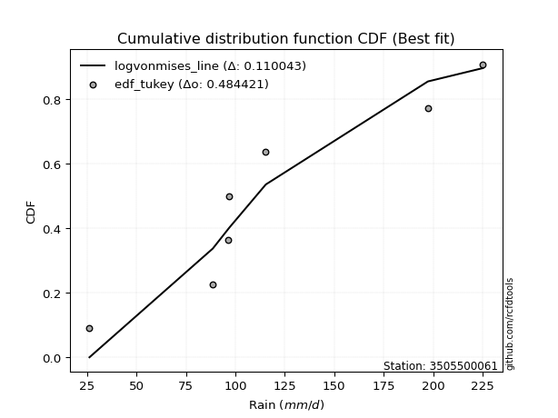</img>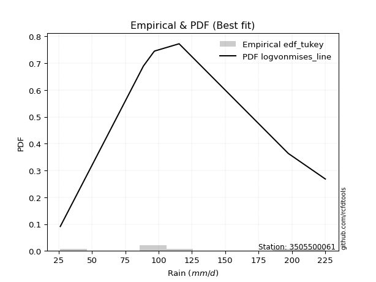</img>

</div>


### 8. EDF Gringorten (1963)

Gringorten plotting position formula is essential for estimating the probability and return periods of extreme events like floods and heavy rainfall. The constant _a=0.44_.

<div align="center">


$P=(m-a)/(n+1-2a)$


</div>


**8.1. Empirical values**

<div align="center">

|                | 0                   | 1                   | 2                  | 3              | 4                  | 5                  | 6                  |
|:---------------|:--------------------|:--------------------|:-------------------|:---------------|:-------------------|:-------------------|:-------------------|
| date           | 2021                | 2023                | 2019               | 2025           | 2022               | 2020               | 2024               |
| x              | 26.2                | 88.6                | 96.4               | 97.0           | 115.4              | 197.4              | 225.2              |
| m              | 1                   | 2                   | 3                  | 4              | 5                  | 6                  | 7                  |
| empirical_dist | edf_gringorten      | edf_gringorten      | edf_gringorten     | edf_gringorten | edf_gringorten     | edf_gringorten     | edf_gringorten     |
| empirical      | 0.07865168539325844 | 0.21910112359550563 | 0.3595505617977528 | 0.5            | 0.6404494382022471 | 0.7808988764044943 | 0.9213483146067415 |
| empirical_tr   | 1.0853658536585364  | 1.2805755395683454  | 1.5614035087719298 | 2.0            | 2.781249999999999  | 4.564102564102562  | 12.714285714285701 |

</div>


**8.2. Kolmogorov-Smirnov fit test (sorted by Δ)**


<div align="center">

|                | 0                   | 1                   | 2                   | 3                   | 4                   | 5                   | 6                   | 7                   | 8                   | 9                   | 10                  | 11                  | 12                  | 13                  | 14                  | 15                  | 16                  | 17                  | 18                  | 19                  | 20                  | 21                  | 22                  | 23                  | 24                  | 25                  | 26                  | 27                  | 28                  | 29                  | 30                  | 31                  | 32                  | 33                  | 34                  | 35                  | 36                  | 37                  | 38                  | 39                  | 40                  | 41                  | 42                  | 43                  | 44                  | 45                  | 46                  | 47                  | 48                  | 49                  | 50                  | 51                  | 52                  | 53                  | 54                  | 55                  | 56                  | 57                  | 58                  | 59                  | 60                  | 61                  | 62                  | 63                  | 64                  | 65                  | 66                  | 67                  | 68                  | 69                  | 70                  | 71                  | 72                  | 73                  | 74                  | 75                  | 76                  | 77                  | 78                  | 79                  | 80                  | 81                  | 82                  | 83                  | 84                  | 85                  | 86                  | 87                  | 88                  | 89                  | 90                  | 91                  | 92                  | 93                  | 94                  | 95                  | 96                  | 97                  | 98                  | 99                  | 100                 | 101                 | 102                 | 103                 | 104                 | 105                 | 106                 | 107                 | 108                 | 109                 | 110                 | 111                 | 112                 | 113                 | 114                 | 115                 | 116                 | 117                 | 118                 | 119                 | 120                 | 121                 | 122                 | 123                 | 124                 | 125                 | 126                 | 127                 | 128                 | 129                 | 130                 | 131                 | 132                 | 133                 | 134                 | 135                 | 136                 | 137                 | 138                 | 139                 | 140                 | 141                 | 142                 | 143                 | 144                 | 145                 | 146                 | 147                 | 148                 | 149                 | 150                 | 151                 | 152                 | 153                 | 154                 | 155                 | 156                 | 157                 | 158                 | 159                 |
|:---------------|:--------------------|:--------------------|:--------------------|:--------------------|:--------------------|:--------------------|:--------------------|:--------------------|:--------------------|:--------------------|:--------------------|:--------------------|:--------------------|:--------------------|:--------------------|:--------------------|:--------------------|:--------------------|:--------------------|:--------------------|:--------------------|:--------------------|:--------------------|:--------------------|:--------------------|:--------------------|:--------------------|:--------------------|:--------------------|:--------------------|:--------------------|:--------------------|:--------------------|:--------------------|:--------------------|:--------------------|:--------------------|:--------------------|:--------------------|:--------------------|:--------------------|:--------------------|:--------------------|:--------------------|:--------------------|:--------------------|:--------------------|:--------------------|:--------------------|:--------------------|:--------------------|:--------------------|:--------------------|:--------------------|:--------------------|:--------------------|:--------------------|:--------------------|:--------------------|:--------------------|:--------------------|:--------------------|:--------------------|:--------------------|:--------------------|:--------------------|:--------------------|:--------------------|:--------------------|:--------------------|:--------------------|:--------------------|:--------------------|:--------------------|:--------------------|:--------------------|:--------------------|:--------------------|:--------------------|:--------------------|:--------------------|:--------------------|:--------------------|:--------------------|:--------------------|:--------------------|:--------------------|:--------------------|:--------------------|:--------------------|:--------------------|:--------------------|:--------------------|:--------------------|:--------------------|:--------------------|:--------------------|:--------------------|:--------------------|:--------------------|:--------------------|:--------------------|:--------------------|:--------------------|:--------------------|:--------------------|:--------------------|:--------------------|:--------------------|:--------------------|:--------------------|:--------------------|:--------------------|:--------------------|:--------------------|:--------------------|:--------------------|:--------------------|:--------------------|:--------------------|:--------------------|:--------------------|:--------------------|:--------------------|:--------------------|:--------------------|:--------------------|:--------------------|:--------------------|:--------------------|:--------------------|:--------------------|:--------------------|:--------------------|:--------------------|:--------------------|:--------------------|:--------------------|:--------------------|:--------------------|:--------------------|:--------------------|:--------------------|:--------------------|:--------------------|:--------------------|:--------------------|:--------------------|:--------------------|:--------------------|:--------------------|:--------------------|:--------------------|:--------------------|:--------------------|:--------------------|:--------------------|:--------------------|:--------------------|:--------------------|
| station        | 3505500061          | 3505500061          | 3505500061          | 3505500061          | 3505500061          | 3505500061          | 3505500061          | 3505500061          | 3505500061          | 3505500061          | 3505500061          | 3505500061          | 3505500061          | 3505500061          | 3505500061          | 3505500061          | 3505500061          | 3505500061          | 3505500061          | 3505500061          | 3505500061          | 3505500061          | 3505500061          | 3505500061          | 3505500061          | 3505500061          | 3505500061          | 3505500061          | 3505500061          | 3505500061          | 3505500061          | 3505500061          | 3505500061          | 3505500061          | 3505500061          | 3505500061          | 3505500061          | 3505500061          | 3505500061          | 3505500061          | 3505500061          | 3505500061          | 3505500061          | 3505500061          | 3505500061          | 3505500061          | 3505500061          | 3505500061          | 3505500061          | 3505500061          | 3505500061          | 3505500061          | 3505500061          | 3505500061          | 3505500061          | 3505500061          | 3505500061          | 3505500061          | 3505500061          | 3505500061          | 3505500061          | 3505500061          | 3505500061          | 3505500061          | 3505500061          | 3505500061          | 3505500061          | 3505500061          | 3505500061          | 3505500061          | 3505500061          | 3505500061          | 3505500061          | 3505500061          | 3505500061          | 3505500061          | 3505500061          | 3505500061          | 3505500061          | 3505500061          | 3505500061          | 3505500061          | 3505500061          | 3505500061          | 3505500061          | 3505500061          | 3505500061          | 3505500061          | 3505500061          | 3505500061          | 3505500061          | 3505500061          | 3505500061          | 3505500061          | 3505500061          | 3505500061          | 3505500061          | 3505500061          | 3505500061          | 3505500061          | 3505500061          | 3505500061          | 3505500061          | 3505500061          | 3505500061          | 3505500061          | 3505500061          | 3505500061          | 3505500061          | 3505500061          | 3505500061          | 3505500061          | 3505500061          | 3505500061          | 3505500061          | 3505500061          | 3505500061          | 3505500061          | 3505500061          | 3505500061          | 3505500061          | 3505500061          | 3505500061          | 3505500061          | 3505500061          | 3505500061          | 3505500061          | 3505500061          | 3505500061          | 3505500061          | 3505500061          | 3505500061          | 3505500061          | 3505500061          | 3505500061          | 3505500061          | 3505500061          | 3505500061          | 3505500061          | 3505500061          | 3505500061          | 3505500061          | 3505500061          | 3505500061          | 3505500061          | 3505500061          | 3505500061          | 3505500061          | 3505500061          | 3505500061          | 3505500061          | 3505500061          | 3505500061          | 3505500061          | 3505500061          | 3505500061          | 3505500061          | 3505500061          | 3505500061          | 3505500061          |
| empirical_dist | edf_gringorten      | edf_gringorten      | edf_gringorten      | edf_gringorten      | edf_gringorten      | edf_gringorten      | edf_gringorten      | edf_gringorten      | edf_gringorten      | edf_gringorten      | edf_gringorten      | edf_gringorten      | edf_gringorten      | edf_gringorten      | edf_gringorten      | edf_gringorten      | edf_gringorten      | edf_gringorten      | edf_gringorten      | edf_gringorten      | edf_gringorten      | edf_gringorten      | edf_gringorten      | edf_gringorten      | edf_gringorten      | edf_gringorten      | edf_gringorten      | edf_gringorten      | edf_gringorten      | edf_gringorten      | edf_gringorten      | edf_gringorten      | edf_gringorten      | edf_gringorten      | edf_gringorten      | edf_gringorten      | edf_gringorten      | edf_gringorten      | edf_gringorten      | edf_gringorten      | edf_gringorten      | edf_gringorten      | edf_gringorten      | edf_gringorten      | edf_gringorten      | edf_gringorten      | edf_gringorten      | edf_gringorten      | edf_gringorten      | edf_gringorten      | edf_gringorten      | edf_gringorten      | edf_gringorten      | edf_gringorten      | edf_gringorten      | edf_gringorten      | edf_gringorten      | edf_gringorten      | edf_gringorten      | edf_gringorten      | edf_gringorten      | edf_gringorten      | edf_gringorten      | edf_gringorten      | edf_gringorten      | edf_gringorten      | edf_gringorten      | edf_gringorten      | edf_gringorten      | edf_gringorten      | edf_gringorten      | edf_gringorten      | edf_gringorten      | edf_gringorten      | edf_gringorten      | edf_gringorten      | edf_gringorten      | edf_gringorten      | edf_gringorten      | edf_gringorten      | edf_gringorten      | edf_gringorten      | edf_gringorten      | edf_gringorten      | edf_gringorten      | edf_gringorten      | edf_gringorten      | edf_gringorten      | edf_gringorten      | edf_gringorten      | edf_gringorten      | edf_gringorten      | edf_gringorten      | edf_gringorten      | edf_gringorten      | edf_gringorten      | edf_gringorten      | edf_gringorten      | edf_gringorten      | edf_gringorten      | edf_gringorten      | edf_gringorten      | edf_gringorten      | edf_gringorten      | edf_gringorten      | edf_gringorten      | edf_gringorten      | edf_gringorten      | edf_gringorten      | edf_gringorten      | edf_gringorten      | edf_gringorten      | edf_gringorten      | edf_gringorten      | edf_gringorten      | edf_gringorten      | edf_gringorten      | edf_gringorten      | edf_gringorten      | edf_gringorten      | edf_gringorten      | edf_gringorten      | edf_gringorten      | edf_gringorten      | edf_gringorten      | edf_gringorten      | edf_gringorten      | edf_gringorten      | edf_gringorten      | edf_gringorten      | edf_gringorten      | edf_gringorten      | edf_gringorten      | edf_gringorten      | edf_gringorten      | edf_gringorten      | edf_gringorten      | edf_gringorten      | edf_gringorten      | edf_gringorten      | edf_gringorten      | edf_gringorten      | edf_gringorten      | edf_gringorten      | edf_gringorten      | edf_gringorten      | edf_gringorten      | edf_gringorten      | edf_gringorten      | edf_gringorten      | edf_gringorten      | edf_gringorten      | edf_gringorten      | edf_gringorten      | edf_gringorten      | edf_gringorten      | edf_gringorten      | edf_gringorten      | edf_gringorten      | edf_gringorten      |
| p_dist         | logvonmises_line    | gumbel_r            | invgauss            | betaprime           | skewnorm            | burr                | mielke              | loggenlogistic      | gengamma            | f                   | erlang              | gamma               | invgamma            | genlogistic         | nct                 | logweibull_min      | rayleigh            | loggumbel_l         | logburr12           | invweibull          | moyal               | exponnorm           | ncf                 | gompertz            | wald                | weibull_min         | rice                | maxwell             | logpearson3         | kstwobign           | logskewnorm         | loggengamma         | bradford            | truncpareto         | pearson3            | logloggamma         | logargus            | loglaplace          | loglaplace          | halflogistic        | logtruncweibull_min | halfnorm            | logjohnsonsu        | logmielke           | logtrapezoid        | arcsine             | kappa4              | ksone               | loggenhalflogistic  | loggausshyper       | semicircular        | anglit              | logt                | gennorm             | logdgamma           | loggennorm          | logburr             | crystalball         | norm                | t                   | johnsonsu           | truncweibull_min    | dgamma              | loghypsecant        | logistic            | logdweibull         | gausshyper          | hypsecant           | dweibull            | loglogistic         | logtriang           | wrapcauchy          | loglevy_l           | cosine              | tukeylambda         | logloglaplace       | vonmises_line       | uniform             | lognct              | logcrystalball      | lognorm             | logexponnorm        | logrice             | logfatiguelife      | logncf              | logf                | laplace             | loganglit           | loggamma            | loggamma            | logbetaprime        | logsemicircular     | logerlang           | loginvgamma         | nakagami            | logalpha            | kappa3              | logmaxwell          | beta                | logarcsine          | loginvgauss         | loggenpareto        | lograyleigh         | loggenextreme       | gumbel_l            | logtruncnorm        | truncexpon          | argus               | loginvweibull       | logcosine           | logfoldnorm         | loggumbel_r         | genexpon            | burr12              | logweibull_max      | lomax               | levy_l              | logbeta             | alpha               | genpareto           | loghalfnorm         | logmoyal            | logkstwobign        | loghalflogistic     | loggenexpon         | logwrapcauchy       | lognakagami         | loggompertz         | logrdist            | genhalflogistic     | genextreme          | logksone            | johnsonsb           | logkappa3           | logkappa4           | loguniform          | logbradford         | logwald             | logtukeylambda      | exponweib           | truncnorm           | triang              | loglomax            | loghalfgennorm      | halfgennorm         | trapezoid           | logtruncexpon       | logexponpow         | rdist               | fatiguelife         | powerlaw            | weibull_max         | foldnorm            | logexponweib        | logjohnsonsb        | logpowerlaw         | exponpow            | logtruncpareto      | logvonmises         | vonmises            |
| delta          | 0.11821501857258396 | 0.12005446730419658 | 0.1231883345382877  | 0.12485737288193813 | 0.12520224334990837 | 0.12596252793426457 | 0.12599537925012053 | 0.1261274256087049  | 0.12675668365519036 | 0.12700733538709388 | 0.12707695869352778 | 0.12707703761790826 | 0.1277682197864134  | 0.12821141111859355 | 0.12888496448319287 | 0.128979091397892   | 0.129286750470877   | 0.12964420804161372 | 0.1296988888688314  | 0.13049190041255151 | 0.1308799966878814  | 0.13107239114880428 | 0.13161473896523732 | 0.13582229596972561 | 0.13613305574093268 | 0.13621198153713307 | 0.1368411825773661  | 0.1409548355441147  | 0.14395753591081464 | 0.14426530292465814 | 0.14491916759465903 | 0.14784554996109536 | 0.14806984747324275 | 0.14807677719956797 | 0.14991410911534558 | 0.15032235903799074 | 0.15225763327979125 | 0.15239111496797905 | 0.15239111496797905 | 0.15596631404187614 | 0.156619433442417   | 0.15666008398671152 | 0.1569007182174012  | 0.1617665502132434  | 0.16177708719681236 | 0.1632224016800439  | 0.16547010417687663 | 0.1655133369346068  | 0.16581826575650674 | 0.16655535314873637 | 0.16807765821504067 | 0.17011134417549617 | 0.17080570756358313 | 0.17131876333059892 | 0.17175985763821436 | 0.1723513028322452  | 0.17297133199083148 | 0.17504359043914802 | 0.1750436901018299  | 0.17504448142389795 | 0.1751554268884749  | 0.17522625874364295 | 0.17580512341431906 | 0.17772094330970292 | 0.17973855331146193 | 0.17993467944910765 | 0.1813901427308897  | 0.18372742800129177 | 0.18477970875864266 | 0.18677976954048295 | 0.1886372827650135  | 0.19069434171958743 | 0.1908095900127339  | 0.19099526649189896 | 0.19114673819007144 | 0.19128632243272273 | 0.19142214711693262 | 0.19220823217209632 | 0.19718298396161035 | 0.19770193225263563 | 0.19770642169208927 | 0.197706880999557   | 0.19772535511832315 | 0.19797423114866916 | 0.19862766784541655 | 0.19876964360054486 | 0.20705913964344286 | 0.20933736368678516 | 0.21087325079316796 | 0.21087325079316796 | 0.211960777509929   | 0.21415534382549026 | 0.21505094230177643 | 0.21598003994862716 | 0.21910107197232367 | 0.22428875380404353 | 0.2243036573899984  | 0.2320132693968542  | 0.23210053068280398 | 0.23344287125772598 | 0.23403976956064973 | 0.24418294055508608 | 0.24423391662923974 | 0.24488817067181512 | 0.24559090691116625 | 0.25113145832750194 | 0.2521188477882841  | 0.2526063946472564  | 0.2542317818865556  | 0.25563839814519784 | 0.2557410624654163  | 0.2603722677528326  | 0.2636149674424223  | 0.2637967889013726  | 0.2647663382460168  | 0.2662083734047833  | 0.27047172629577515 | 0.2705732480993784  | 0.274690218153004   | 0.27554030678762925 | 0.2788422527583039  | 0.28434485679149746 | 0.29043277999273776 | 0.29647933027466256 | 0.29892762438136256 | 0.30330825546681794 | 0.3085747069021655  | 0.32354411984904174 | 0.3258315569057     | 0.3277944030804317  | 0.33069745930904526 | 0.33619969587272436 | 0.3379386985199974  | 0.34604667635602915 | 0.34686790491288166 | 0.3472598597663703  | 0.348627005523082   | 0.3501051759985325  | 0.35342883352181254 | 0.36408699352123497 | 0.3658583159006693  | 0.39300641052955454 | 0.40860114499692035 | 0.40909902029702105 | 0.41865856030962734 | 0.43172136876516776 | 0.44678339573797576 | 0.5489793155543334  | 0.5718475818346406  | 0.5767666760285937  | 0.6079504862831133  | 0.6263805057606975  | 0.6404494382022471  | 0.6502524494405313  | 0.6559644397440136  | 0.6817624281440293  | 0.7035794485149313  | 0.739161178438719   | 1.1641085271326403  | 35.087502665226374  |
| deltao         | 0.48442053926100004 | 0.48442053926100004 | 0.48442053926100004 | 0.48442053926100004 | 0.48442053926100004 | 0.48442053926100004 | 0.48442053926100004 | 0.48442053926100004 | 0.48442053926100004 | 0.48442053926100004 | 0.48442053926100004 | 0.48442053926100004 | 0.48442053926100004 | 0.48442053926100004 | 0.48442053926100004 | 0.48442053926100004 | 0.48442053926100004 | 0.48442053926100004 | 0.48442053926100004 | 0.48442053926100004 | 0.48442053926100004 | 0.48442053926100004 | 0.48442053926100004 | 0.48442053926100004 | 0.48442053926100004 | 0.48442053926100004 | 0.48442053926100004 | 0.48442053926100004 | 0.48442053926100004 | 0.48442053926100004 | 0.48442053926100004 | 0.48442053926100004 | 0.48442053926100004 | 0.48442053926100004 | 0.48442053926100004 | 0.48442053926100004 | 0.48442053926100004 | 0.48442053926100004 | 0.48442053926100004 | 0.48442053926100004 | 0.48442053926100004 | 0.48442053926100004 | 0.48442053926100004 | 0.48442053926100004 | 0.48442053926100004 | 0.48442053926100004 | 0.48442053926100004 | 0.48442053926100004 | 0.48442053926100004 | 0.48442053926100004 | 0.48442053926100004 | 0.48442053926100004 | 0.48442053926100004 | 0.48442053926100004 | 0.48442053926100004 | 0.48442053926100004 | 0.48442053926100004 | 0.48442053926100004 | 0.48442053926100004 | 0.48442053926100004 | 0.48442053926100004 | 0.48442053926100004 | 0.48442053926100004 | 0.48442053926100004 | 0.48442053926100004 | 0.48442053926100004 | 0.48442053926100004 | 0.48442053926100004 | 0.48442053926100004 | 0.48442053926100004 | 0.48442053926100004 | 0.48442053926100004 | 0.48442053926100004 | 0.48442053926100004 | 0.48442053926100004 | 0.48442053926100004 | 0.48442053926100004 | 0.48442053926100004 | 0.48442053926100004 | 0.48442053926100004 | 0.48442053926100004 | 0.48442053926100004 | 0.48442053926100004 | 0.48442053926100004 | 0.48442053926100004 | 0.48442053926100004 | 0.48442053926100004 | 0.48442053926100004 | 0.48442053926100004 | 0.48442053926100004 | 0.48442053926100004 | 0.48442053926100004 | 0.48442053926100004 | 0.48442053926100004 | 0.48442053926100004 | 0.48442053926100004 | 0.48442053926100004 | 0.48442053926100004 | 0.48442053926100004 | 0.48442053926100004 | 0.48442053926100004 | 0.48442053926100004 | 0.48442053926100004 | 0.48442053926100004 | 0.48442053926100004 | 0.48442053926100004 | 0.48442053926100004 | 0.48442053926100004 | 0.48442053926100004 | 0.48442053926100004 | 0.48442053926100004 | 0.48442053926100004 | 0.48442053926100004 | 0.48442053926100004 | 0.48442053926100004 | 0.48442053926100004 | 0.48442053926100004 | 0.48442053926100004 | 0.48442053926100004 | 0.48442053926100004 | 0.48442053926100004 | 0.48442053926100004 | 0.48442053926100004 | 0.48442053926100004 | 0.48442053926100004 | 0.48442053926100004 | 0.48442053926100004 | 0.48442053926100004 | 0.48442053926100004 | 0.48442053926100004 | 0.48442053926100004 | 0.48442053926100004 | 0.48442053926100004 | 0.48442053926100004 | 0.48442053926100004 | 0.48442053926100004 | 0.48442053926100004 | 0.48442053926100004 | 0.48442053926100004 | 0.48442053926100004 | 0.48442053926100004 | 0.48442053926100004 | 0.48442053926100004 | 0.48442053926100004 | 0.48442053926100004 | 0.48442053926100004 | 0.48442053926100004 | 0.48442053926100004 | 0.48442053926100004 | 0.48442053926100004 | 0.48442053926100004 | 0.48442053926100004 | 0.48442053926100004 | 0.48442053926100004 | 0.48442053926100004 | 0.48442053926100004 | 0.48442053926100004 | 0.48442053926100004 | 0.48442053926100004 | 0.48442053926100004 |
| eval           | Δo > Δ              | Δo > Δ              | Δo > Δ              | Δo > Δ              | Δo > Δ              | Δo > Δ              | Δo > Δ              | Δo > Δ              | Δo > Δ              | Δo > Δ              | Δo > Δ              | Δo > Δ              | Δo > Δ              | Δo > Δ              | Δo > Δ              | Δo > Δ              | Δo > Δ              | Δo > Δ              | Δo > Δ              | Δo > Δ              | Δo > Δ              | Δo > Δ              | Δo > Δ              | Δo > Δ              | Δo > Δ              | Δo > Δ              | Δo > Δ              | Δo > Δ              | Δo > Δ              | Δo > Δ              | Δo > Δ              | Δo > Δ              | Δo > Δ              | Δo > Δ              | Δo > Δ              | Δo > Δ              | Δo > Δ              | Δo > Δ              | Δo > Δ              | Δo > Δ              | Δo > Δ              | Δo > Δ              | Δo > Δ              | Δo > Δ              | Δo > Δ              | Δo > Δ              | Δo > Δ              | Δo > Δ              | Δo > Δ              | Δo > Δ              | Δo > Δ              | Δo > Δ              | Δo > Δ              | Δo > Δ              | Δo > Δ              | Δo > Δ              | Δo > Δ              | Δo > Δ              | Δo > Δ              | Δo > Δ              | Δo > Δ              | Δo > Δ              | Δo > Δ              | Δo > Δ              | Δo > Δ              | Δo > Δ              | Δo > Δ              | Δo > Δ              | Δo > Δ              | Δo > Δ              | Δo > Δ              | Δo > Δ              | Δo > Δ              | Δo > Δ              | Δo > Δ              | Δo > Δ              | Δo > Δ              | Δo > Δ              | Δo > Δ              | Δo > Δ              | Δo > Δ              | Δo > Δ              | Δo > Δ              | Δo > Δ              | Δo > Δ              | Δo > Δ              | Δo > Δ              | Δo > Δ              | Δo > Δ              | Δo > Δ              | Δo > Δ              | Δo > Δ              | Δo > Δ              | Δo > Δ              | Δo > Δ              | Δo > Δ              | Δo > Δ              | Δo > Δ              | Δo > Δ              | Δo > Δ              | Δo > Δ              | Δo > Δ              | Δo > Δ              | Δo > Δ              | Δo > Δ              | Δo > Δ              | Δo > Δ              | Δo > Δ              | Δo > Δ              | Δo > Δ              | Δo > Δ              | Δo > Δ              | Δo > Δ              | Δo > Δ              | Δo > Δ              | Δo > Δ              | Δo > Δ              | Δo > Δ              | Δo > Δ              | Δo > Δ              | Δo > Δ              | Δo > Δ              | Δo > Δ              | Δo > Δ              | Δo > Δ              | Δo > Δ              | Δo > Δ              | Δo > Δ              | Δo > Δ              | Δo > Δ              | Δo > Δ              | Δo > Δ              | Δo > Δ              | Δo > Δ              | Δo > Δ              | Δo > Δ              | Δo > Δ              | Δo > Δ              | Δo > Δ              | Δo > Δ              | Δo > Δ              | Δo > Δ              | Δo > Δ              | Δo > Δ              | Δo > Δ              | Δo > Δ              | Δo > Δ              | Δo <= Δ             | Δo <= Δ             | Δo <= Δ             | Δo <= Δ             | Δo <= Δ             | Δo <= Δ             | Δo <= Δ             | Δo <= Δ             | Δo <= Δ             | Δo <= Δ             | Δo <= Δ             | Δo <= Δ             | Δo <= Δ             |
| fit            | 1                   | 1                   | 1                   | 1                   | 1                   | 1                   | 1                   | 1                   | 1                   | 1                   | 1                   | 1                   | 1                   | 1                   | 1                   | 1                   | 1                   | 1                   | 1                   | 1                   | 1                   | 1                   | 1                   | 1                   | 1                   | 1                   | 1                   | 1                   | 1                   | 1                   | 1                   | 1                   | 1                   | 1                   | 1                   | 1                   | 1                   | 1                   | 1                   | 1                   | 1                   | 1                   | 1                   | 1                   | 1                   | 1                   | 1                   | 1                   | 1                   | 1                   | 1                   | 1                   | 1                   | 1                   | 1                   | 1                   | 1                   | 1                   | 1                   | 1                   | 1                   | 1                   | 1                   | 1                   | 1                   | 1                   | 1                   | 1                   | 1                   | 1                   | 1                   | 1                   | 1                   | 1                   | 1                   | 1                   | 1                   | 1                   | 1                   | 1                   | 1                   | 1                   | 1                   | 1                   | 1                   | 1                   | 1                   | 1                   | 1                   | 1                   | 1                   | 1                   | 1                   | 1                   | 1                   | 1                   | 1                   | 1                   | 1                   | 1                   | 1                   | 1                   | 1                   | 1                   | 1                   | 1                   | 1                   | 1                   | 1                   | 1                   | 1                   | 1                   | 1                   | 1                   | 1                   | 1                   | 1                   | 1                   | 1                   | 1                   | 1                   | 1                   | 1                   | 1                   | 1                   | 1                   | 1                   | 1                   | 1                   | 1                   | 1                   | 1                   | 1                   | 1                   | 1                   | 1                   | 1                   | 1                   | 1                   | 1                   | 1                   | 1                   | 1                   | 1                   | 1                   | 1                   | 1                   | 0                   | 0                   | 0                   | 0                   | 0                   | 0                   | 0                   | 0                   | 0                   | 0                   | 0                   | 0                   | 0                   |
| n              | 7                   | 7                   | 7                   | 7                   | 7                   | 7                   | 7                   | 7                   | 7                   | 7                   | 7                   | 7                   | 7                   | 7                   | 7                   | 7                   | 7                   | 7                   | 7                   | 7                   | 7                   | 7                   | 7                   | 7                   | 7                   | 7                   | 7                   | 7                   | 7                   | 7                   | 7                   | 7                   | 7                   | 7                   | 7                   | 7                   | 7                   | 7                   | 7                   | 7                   | 7                   | 7                   | 7                   | 7                   | 7                   | 7                   | 7                   | 7                   | 7                   | 7                   | 7                   | 7                   | 7                   | 7                   | 7                   | 7                   | 7                   | 7                   | 7                   | 7                   | 7                   | 7                   | 7                   | 7                   | 7                   | 7                   | 7                   | 7                   | 7                   | 7                   | 7                   | 7                   | 7                   | 7                   | 7                   | 7                   | 7                   | 7                   | 7                   | 7                   | 7                   | 7                   | 7                   | 7                   | 7                   | 7                   | 7                   | 7                   | 7                   | 7                   | 7                   | 7                   | 7                   | 7                   | 7                   | 7                   | 7                   | 7                   | 7                   | 7                   | 7                   | 7                   | 7                   | 7                   | 7                   | 7                   | 7                   | 7                   | 7                   | 7                   | 7                   | 7                   | 7                   | 7                   | 7                   | 7                   | 7                   | 7                   | 7                   | 7                   | 7                   | 7                   | 7                   | 7                   | 7                   | 7                   | 7                   | 7                   | 7                   | 7                   | 7                   | 7                   | 7                   | 7                   | 7                   | 7                   | 7                   | 7                   | 7                   | 7                   | 7                   | 7                   | 7                   | 7                   | 7                   | 7                   | 7                   | 7                   | 7                   | 7                   | 7                   | 7                   | 7                   | 7                   | 7                   | 7                   | 7                   | 7                   | 7                   | 7                   |
| best_fit       | 1                   | 0                   | 0                   | 0                   | 0                   | 0                   | 0                   | 0                   | 0                   | 0                   | 0                   | 0                   | 0                   | 0                   | 0                   | 0                   | 0                   | 0                   | 0                   | 0                   | 0                   | 0                   | 0                   | 0                   | 0                   | 0                   | 0                   | 0                   | 0                   | 0                   | 0                   | 0                   | 0                   | 0                   | 0                   | 0                   | 0                   | 0                   | 0                   | 0                   | 0                   | 0                   | 0                   | 0                   | 0                   | 0                   | 0                   | 0                   | 0                   | 0                   | 0                   | 0                   | 0                   | 0                   | 0                   | 0                   | 0                   | 0                   | 0                   | 0                   | 0                   | 0                   | 0                   | 0                   | 0                   | 0                   | 0                   | 0                   | 0                   | 0                   | 0                   | 0                   | 0                   | 0                   | 0                   | 0                   | 0                   | 0                   | 0                   | 0                   | 0                   | 0                   | 0                   | 0                   | 0                   | 0                   | 0                   | 0                   | 0                   | 0                   | 0                   | 0                   | 0                   | 0                   | 0                   | 0                   | 0                   | 0                   | 0                   | 0                   | 0                   | 0                   | 0                   | 0                   | 0                   | 0                   | 0                   | 0                   | 0                   | 0                   | 0                   | 0                   | 0                   | 0                   | 0                   | 0                   | 0                   | 0                   | 0                   | 0                   | 0                   | 0                   | 0                   | 0                   | 0                   | 0                   | 0                   | 0                   | 0                   | 0                   | 0                   | 0                   | 0                   | 0                   | 0                   | 0                   | 0                   | 0                   | 0                   | 0                   | 0                   | 0                   | 0                   | 0                   | 0                   | 0                   | 0                   | 0                   | 0                   | 0                   | 0                   | 0                   | 0                   | 0                   | 0                   | 0                   | 0                   | 0                   | 0                   | 0                   |
| best_fit_sort  | 1                   | 2                   | 3                   | 4                   | 5                   | 6                   | 7                   | 8                   | 9                   | 10                  | 11                  | 12                  | 13                  | 14                  | 15                  | 16                  | 17                  | 18                  | 19                  | 20                  | 21                  | 22                  | 23                  | 24                  | 25                  | 26                  | 27                  | 28                  | 29                  | 30                  | 31                  | 32                  | 33                  | 34                  | 35                  | 36                  | 37                  | 38                  | 39                  | 40                  | 41                  | 42                  | 43                  | 44                  | 45                  | 46                  | 47                  | 48                  | 49                  | 50                  | 51                  | 52                  | 53                  | 54                  | 55                  | 56                  | 57                  | 58                  | 59                  | 60                  | 61                  | 62                  | 63                  | 64                  | 65                  | 66                  | 67                  | 68                  | 69                  | 70                  | 71                  | 72                  | 73                  | 74                  | 75                  | 76                  | 77                  | 78                  | 79                  | 80                  | 81                  | 82                  | 83                  | 84                  | 85                  | 86                  | 87                  | 88                  | 89                  | 90                  | 91                  | 92                  | 93                  | 94                  | 95                  | 96                  | 97                  | 98                  | 99                  | 100                 | 101                 | 102                 | 103                 | 104                 | 105                 | 106                 | 107                 | 108                 | 109                 | 110                 | 111                 | 112                 | 113                 | 114                 | 115                 | 116                 | 117                 | 118                 | 119                 | 120                 | 121                 | 122                 | 123                 | 124                 | 125                 | 126                 | 127                 | 128                 | 129                 | 130                 | 131                 | 132                 | 133                 | 134                 | 135                 | 136                 | 137                 | 138                 | 139                 | 140                 | 141                 | 142                 | 143                 | 144                 | 145                 | 146                 | 147                 | 148                 | 149                 | 150                 | 151                 | 152                 | 153                 | 154                 | 155                 | 156                 | 157                 | 158                 | 159                 | 160                 |

</div>


**8.3. Best fit**

<div align="center">

|   id |    station | empirical_dist   | p_dist           |    delta |   deltao | eval   |   fit |   n |   best_fit |   best_fit_sort |
|-----:|-----------:|:-----------------|:-----------------|---------:|---------:|:-------|------:|----:|-----------:|----------------:|
|    0 | 3505500061 | edf_gringorten   | logvonmises_line | 0.118215 | 0.484421 | Δo > Δ |     1 |   7 |          1 |               1 |

</div>


<div align="center">

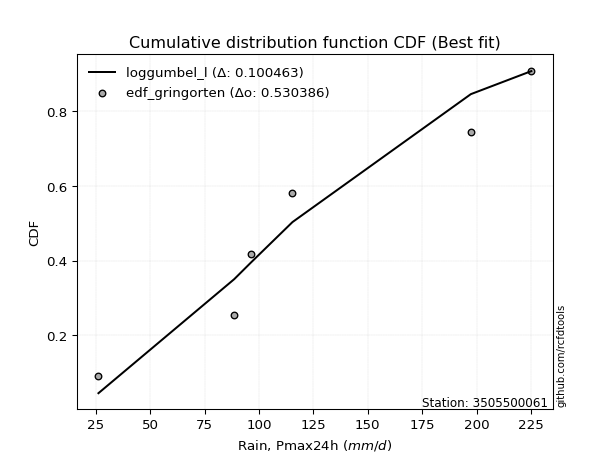</img></img>

</div>


### 9. EDF Filliben (1975)

The specific values of the constants (0.3175) (often denoted as $alpha$) and (0.365) are derived from a method proposed by James J. Filliben in a 1975 paper. This particular formula is the mean value of the $i$-th order statistic of the normal distribution and is considered a robust and effective plotting position formula for the normal probability plot correlation coefficient test for normality.

<div align="center">


$P=(m-0.3175)/(n+0.365)$


</div>


**9.1. Empirical values**

<div align="center">

|                | 0                   | 1                   | 2                   | 3            | 4                  | 5                  | 6                  |
|:---------------|:--------------------|:--------------------|:--------------------|:-------------|:-------------------|:-------------------|:-------------------|
| date           | 2021                | 2023                | 2019                | 2025         | 2022               | 2020               | 2024               |
| x              | 26.2                | 88.6                | 96.4                | 97.0         | 115.4              | 197.4              | 225.2              |
| m              | 1                   | 2                   | 3                   | 4            | 5                  | 6                  | 7                  |
| empirical_dist | edf_filliben        | edf_filliben        | edf_filliben        | edf_filliben | edf_filliben       | edf_filliben       | edf_filliben       |
| empirical      | 0.09266802443991853 | 0.22844534962661237 | 0.36422267481330617 | 0.5          | 0.6357773251866938 | 0.7715546503733877 | 0.9073319755600815 |
| empirical_tr   | 1.1021324354657687  | 1.2960844698636163  | 1.5728777362520021  | 2.0          | 2.7455731593662627 | 4.377414561664191  | 10.791208791208794 |

</div>


**9.2. Kolmogorov-Smirnov fit test (sorted by Δ)**


<div align="center">

|                | 0                   | 1                   | 2                   | 3                   | 4                   | 5                   | 6                   | 7                   | 8                   | 9                   | 10                  | 11                  | 12                  | 13                  | 14                  | 15                  | 16                  | 17                  | 18                  | 19                  | 20                  | 21                  | 22                  | 23                  | 24                  | 25                  | 26                  | 27                  | 28                  | 29                  | 30                  | 31                  | 32                  | 33                  | 34                  | 35                  | 36                  | 37                  | 38                  | 39                  | 40                  | 41                  | 42                  | 43                  | 44                  | 45                  | 46                  | 47                  | 48                  | 49                  | 50                  | 51                  | 52                  | 53                  | 54                  | 55                  | 56                  | 57                  | 58                  | 59                  | 60                  | 61                  | 62                  | 63                  | 64                  | 65                  | 66                  | 67                  | 68                  | 69                  | 70                  | 71                  | 72                  | 73                  | 74                  | 75                  | 76                  | 77                  | 78                  | 79                  | 80                  | 81                  | 82                  | 83                  | 84                  | 85                  | 86                  | 87                  | 88                  | 89                  | 90                  | 91                  | 92                  | 93                  | 94                  | 95                  | 96                  | 97                  | 98                  | 99                  | 100                 | 101                 | 102                 | 103                 | 104                 | 105                 | 106                 | 107                 | 108                 | 109                 | 110                 | 111                 | 112                 | 113                 | 114                 | 115                 | 116                 | 117                 | 118                 | 119                 | 120                 | 121                 | 122                 | 123                 | 124                 | 125                 | 126                 | 127                 | 128                 | 129                 | 130                 | 131                 | 132                 | 133                 | 134                 | 135                 | 136                 | 137                 | 138                 | 139                 | 140                 | 141                 | 142                 | 143                 | 144                 | 145                 | 146                 | 147                 | 148                 | 149                 | 150                 | 151                 | 152                 | 153                 | 154                 | 155                 | 156                 | 157                 | 158                 | 159                 |
|:---------------|:--------------------|:--------------------|:--------------------|:--------------------|:--------------------|:--------------------|:--------------------|:--------------------|:--------------------|:--------------------|:--------------------|:--------------------|:--------------------|:--------------------|:--------------------|:--------------------|:--------------------|:--------------------|:--------------------|:--------------------|:--------------------|:--------------------|:--------------------|:--------------------|:--------------------|:--------------------|:--------------------|:--------------------|:--------------------|:--------------------|:--------------------|:--------------------|:--------------------|:--------------------|:--------------------|:--------------------|:--------------------|:--------------------|:--------------------|:--------------------|:--------------------|:--------------------|:--------------------|:--------------------|:--------------------|:--------------------|:--------------------|:--------------------|:--------------------|:--------------------|:--------------------|:--------------------|:--------------------|:--------------------|:--------------------|:--------------------|:--------------------|:--------------------|:--------------------|:--------------------|:--------------------|:--------------------|:--------------------|:--------------------|:--------------------|:--------------------|:--------------------|:--------------------|:--------------------|:--------------------|:--------------------|:--------------------|:--------------------|:--------------------|:--------------------|:--------------------|:--------------------|:--------------------|:--------------------|:--------------------|:--------------------|:--------------------|:--------------------|:--------------------|:--------------------|:--------------------|:--------------------|:--------------------|:--------------------|:--------------------|:--------------------|:--------------------|:--------------------|:--------------------|:--------------------|:--------------------|:--------------------|:--------------------|:--------------------|:--------------------|:--------------------|:--------------------|:--------------------|:--------------------|:--------------------|:--------------------|:--------------------|:--------------------|:--------------------|:--------------------|:--------------------|:--------------------|:--------------------|:--------------------|:--------------------|:--------------------|:--------------------|:--------------------|:--------------------|:--------------------|:--------------------|:--------------------|:--------------------|:--------------------|:--------------------|:--------------------|:--------------------|:--------------------|:--------------------|:--------------------|:--------------------|:--------------------|:--------------------|:--------------------|:--------------------|:--------------------|:--------------------|:--------------------|:--------------------|:--------------------|:--------------------|:--------------------|:--------------------|:--------------------|:--------------------|:--------------------|:--------------------|:--------------------|:--------------------|:--------------------|:--------------------|:--------------------|:--------------------|:--------------------|:--------------------|:--------------------|:--------------------|:--------------------|:--------------------|:--------------------|
| station        | 3505500061          | 3505500061          | 3505500061          | 3505500061          | 3505500061          | 3505500061          | 3505500061          | 3505500061          | 3505500061          | 3505500061          | 3505500061          | 3505500061          | 3505500061          | 3505500061          | 3505500061          | 3505500061          | 3505500061          | 3505500061          | 3505500061          | 3505500061          | 3505500061          | 3505500061          | 3505500061          | 3505500061          | 3505500061          | 3505500061          | 3505500061          | 3505500061          | 3505500061          | 3505500061          | 3505500061          | 3505500061          | 3505500061          | 3505500061          | 3505500061          | 3505500061          | 3505500061          | 3505500061          | 3505500061          | 3505500061          | 3505500061          | 3505500061          | 3505500061          | 3505500061          | 3505500061          | 3505500061          | 3505500061          | 3505500061          | 3505500061          | 3505500061          | 3505500061          | 3505500061          | 3505500061          | 3505500061          | 3505500061          | 3505500061          | 3505500061          | 3505500061          | 3505500061          | 3505500061          | 3505500061          | 3505500061          | 3505500061          | 3505500061          | 3505500061          | 3505500061          | 3505500061          | 3505500061          | 3505500061          | 3505500061          | 3505500061          | 3505500061          | 3505500061          | 3505500061          | 3505500061          | 3505500061          | 3505500061          | 3505500061          | 3505500061          | 3505500061          | 3505500061          | 3505500061          | 3505500061          | 3505500061          | 3505500061          | 3505500061          | 3505500061          | 3505500061          | 3505500061          | 3505500061          | 3505500061          | 3505500061          | 3505500061          | 3505500061          | 3505500061          | 3505500061          | 3505500061          | 3505500061          | 3505500061          | 3505500061          | 3505500061          | 3505500061          | 3505500061          | 3505500061          | 3505500061          | 3505500061          | 3505500061          | 3505500061          | 3505500061          | 3505500061          | 3505500061          | 3505500061          | 3505500061          | 3505500061          | 3505500061          | 3505500061          | 3505500061          | 3505500061          | 3505500061          | 3505500061          | 3505500061          | 3505500061          | 3505500061          | 3505500061          | 3505500061          | 3505500061          | 3505500061          | 3505500061          | 3505500061          | 3505500061          | 3505500061          | 3505500061          | 3505500061          | 3505500061          | 3505500061          | 3505500061          | 3505500061          | 3505500061          | 3505500061          | 3505500061          | 3505500061          | 3505500061          | 3505500061          | 3505500061          | 3505500061          | 3505500061          | 3505500061          | 3505500061          | 3505500061          | 3505500061          | 3505500061          | 3505500061          | 3505500061          | 3505500061          | 3505500061          | 3505500061          | 3505500061          | 3505500061          | 3505500061          | 3505500061          |
| empirical_dist | edf_filliben        | edf_filliben        | edf_filliben        | edf_filliben        | edf_filliben        | edf_filliben        | edf_filliben        | edf_filliben        | edf_filliben        | edf_filliben        | edf_filliben        | edf_filliben        | edf_filliben        | edf_filliben        | edf_filliben        | edf_filliben        | edf_filliben        | edf_filliben        | edf_filliben        | edf_filliben        | edf_filliben        | edf_filliben        | edf_filliben        | edf_filliben        | edf_filliben        | edf_filliben        | edf_filliben        | edf_filliben        | edf_filliben        | edf_filliben        | edf_filliben        | edf_filliben        | edf_filliben        | edf_filliben        | edf_filliben        | edf_filliben        | edf_filliben        | edf_filliben        | edf_filliben        | edf_filliben        | edf_filliben        | edf_filliben        | edf_filliben        | edf_filliben        | edf_filliben        | edf_filliben        | edf_filliben        | edf_filliben        | edf_filliben        | edf_filliben        | edf_filliben        | edf_filliben        | edf_filliben        | edf_filliben        | edf_filliben        | edf_filliben        | edf_filliben        | edf_filliben        | edf_filliben        | edf_filliben        | edf_filliben        | edf_filliben        | edf_filliben        | edf_filliben        | edf_filliben        | edf_filliben        | edf_filliben        | edf_filliben        | edf_filliben        | edf_filliben        | edf_filliben        | edf_filliben        | edf_filliben        | edf_filliben        | edf_filliben        | edf_filliben        | edf_filliben        | edf_filliben        | edf_filliben        | edf_filliben        | edf_filliben        | edf_filliben        | edf_filliben        | edf_filliben        | edf_filliben        | edf_filliben        | edf_filliben        | edf_filliben        | edf_filliben        | edf_filliben        | edf_filliben        | edf_filliben        | edf_filliben        | edf_filliben        | edf_filliben        | edf_filliben        | edf_filliben        | edf_filliben        | edf_filliben        | edf_filliben        | edf_filliben        | edf_filliben        | edf_filliben        | edf_filliben        | edf_filliben        | edf_filliben        | edf_filliben        | edf_filliben        | edf_filliben        | edf_filliben        | edf_filliben        | edf_filliben        | edf_filliben        | edf_filliben        | edf_filliben        | edf_filliben        | edf_filliben        | edf_filliben        | edf_filliben        | edf_filliben        | edf_filliben        | edf_filliben        | edf_filliben        | edf_filliben        | edf_filliben        | edf_filliben        | edf_filliben        | edf_filliben        | edf_filliben        | edf_filliben        | edf_filliben        | edf_filliben        | edf_filliben        | edf_filliben        | edf_filliben        | edf_filliben        | edf_filliben        | edf_filliben        | edf_filliben        | edf_filliben        | edf_filliben        | edf_filliben        | edf_filliben        | edf_filliben        | edf_filliben        | edf_filliben        | edf_filliben        | edf_filliben        | edf_filliben        | edf_filliben        | edf_filliben        | edf_filliben        | edf_filliben        | edf_filliben        | edf_filliben        | edf_filliben        | edf_filliben        | edf_filliben        | edf_filliben        | edf_filliben        |
| p_dist         | logvonmises_line    | gumbel_r            | burr                | mielke              | betaprime           | loggenlogistic      | f                   | erlang              | gamma               | invgauss            | genlogistic         | gengamma            | skewnorm            | invweibull          | loggumbel_l         | moyal               | exponnorm           | ncf                 | invgamma            | nct                 | logweibull_min      | rayleigh            | logburr12           | weibull_min         | gompertz            | rice                | wald                | logpearson3         | kstwobign           | logskewnorm         | maxwell             | loggengamma         | loglaplace          | loglaplace          | bradford            | truncpareto         | pearson3            | logloggamma         | halflogistic        | logtruncweibull_min | halfnorm            | logargus            | logjohnsonsu        | logmielke           | logtrapezoid        | arcsine             | loggenhalflogistic  | kappa4              | ksone               | logt                | loggausshyper       | logdgamma           | semicircular        | anglit              | logburr             | loghypsecant        | dgamma              | crystalball         | norm                | t                   | johnsonsu           | truncweibull_min    | logdweibull         | gausshyper          | logistic            | dweibull            | loggennorm          | loglogistic         | hypsecant           | logtriang           | gennorm             | logloglaplace       | wrapcauchy          | loglevy_l           | cosine              | tukeylambda         | vonmises_line       | uniform             | lognct              | logcrystalball      | lognorm             | logexponnorm        | logrice             | logfatiguelife      | logncf              | logf                | loganglit           | loggamma            | loggamma            | logbetaprime        | logsemicircular     | logerlang           | loginvgamma         | laplace             | logalpha            | kappa3              | logmaxwell          | beta                | logarcsine          | loginvgauss         | nakagami            | loggenpareto        | lograyleigh         | loggenextreme       | gumbel_l            | truncexpon          | loginvweibull       | logcosine           | logfoldnorm         | argus               | loggumbel_r         | logtruncnorm        | genexpon            | burr12              | logweibull_max      | levy_l              | lomax               | alpha               | logbeta             | loghalfnorm         | genpareto           | logmoyal            | logkstwobign        | loghalflogistic     | loggenexpon         | logwrapcauchy       | lognakagami         | loggompertz         | logrdist            | genextreme          | genhalflogistic     | logksone            | johnsonsb           | logkappa3           | logkappa4           | loguniform          | logbradford         | logwald             | logtukeylambda      | exponweib           | truncnorm           | triang              | loglomax            | loghalfgennorm      | halfgennorm         | trapezoid           | logtruncexpon       | logexponpow         | rdist               | fatiguelife         | powerlaw            | weibull_max         | foldnorm            | logexponweib        | logjohnsonsb        | logpowerlaw         | exponpow            | logtruncpareto      | logvonmises         | vonmises            |
| delta          | 0.10887079254147722 | 0.11643975483599689 | 0.11661830190315783 | 0.11665115321901379 | 0.11671703886656437 | 0.11678319957759817 | 0.11766310935598714 | 0.11773273266242104 | 0.11773281158680152 | 0.11851622152273444 | 0.11886718508748681 | 0.11918319027404567 | 0.12053013033435511 | 0.12114767438144478 | 0.12117587896187887 | 0.12153577065677465 | 0.12172816511769755 | 0.12227051293413058 | 0.12309610677086014 | 0.1242128514676396  | 0.12430697838233873 | 0.12461463745532375 | 0.12502677585327815 | 0.12686775550602633 | 0.13115018295417236 | 0.13216906956181285 | 0.1345888540937792  | 0.1346133098797079  | 0.1349210768935514  | 0.1355749415635523  | 0.13628272252856144 | 0.13850132392998862 | 0.1430468889368723  | 0.1430468889368723  | 0.1433977344576895  | 0.1434046641840147  | 0.14524199609979233 | 0.14565024602243748 | 0.1466220880107694  | 0.14727520741131025 | 0.14731585795560478 | 0.147585520264238   | 0.15222860520184794 | 0.15242232418213666 | 0.15243286116570562 | 0.15533185536198957 | 0.1564740397254     | 0.16079799116132337 | 0.16084122391905353 | 0.1614614815324764  | 0.16188324013318312 | 0.16241563160710762 | 0.1634055451994874  | 0.1654392311599429  | 0.16829921897527822 | 0.16837671727859618 | 0.16994567894800716 | 0.17037147742359476 | 0.17037157708627665 | 0.1703723684083447  | 0.17048331387292165 | 0.1705541457280897  | 0.17059045341800091 | 0.17204591669978295 | 0.17506644029590868 | 0.17543548272753592 | 0.17702341584779846 | 0.1774355435093762  | 0.1790553149857385  | 0.17929305673390675 | 0.18066298936170555 | 0.181942096401616   | 0.18602222870403418 | 0.18613747699718064 | 0.1863231534763457  | 0.18647462517451818 | 0.18675003410137936 | 0.18753611915654306 | 0.1878387579305036  | 0.1883577062215289  | 0.18836219566098253 | 0.18836265496845025 | 0.1883811290872164  | 0.18863000511756242 | 0.1892834418143098  | 0.18942541756943812 | 0.19999313765567842 | 0.20152902476206122 | 0.20152902476206122 | 0.20261655147882227 | 0.20481111779438352 | 0.2057067162706697  | 0.20663581391752042 | 0.20705913964344286 | 0.2149445277729368  | 0.21963154437444515 | 0.22266904336574747 | 0.22275630465169724 | 0.22409864522661924 | 0.224695543529543   | 0.2284452980034304  | 0.23483871452397934 | 0.234889690598133   | 0.24021605765626186 | 0.240918793895613   | 0.24277462175717732 | 0.24488755585544883 | 0.24629417211409108 | 0.24639683643430957 | 0.24793428163170317 | 0.2510280417217259  | 0.25113145832750194 | 0.25427074141131556 | 0.25445256287026585 | 0.2554221122149102  | 0.2564553872491151  | 0.2568641473736766  | 0.26534599212189725 | 0.2659011350838251  | 0.26949802672719714 | 0.270868193772076   | 0.2750006307603907  | 0.281088553961631   | 0.2871351042435558  | 0.2895833983502558  | 0.2939640294357112  | 0.3039025938866121  | 0.314199893817935   | 0.31648733087459324 | 0.31668112026238526 | 0.3231222900648784  | 0.3268554698416176  | 0.3285944724888908  | 0.3367024503249224  | 0.3375236788817749  | 0.33791563373526357 | 0.3392827794919753  | 0.3407609499674258  | 0.3440846074907058  | 0.35474276749012823 | 0.35651408986956257 | 0.3883342975140013  | 0.39458480595026035 | 0.3997547942659143  | 0.4093143342785206  | 0.4270492557496145  | 0.437439169706869   | 0.5396350895232267  | 0.5625033558035338  | 0.5674224499974869  | 0.5986062602520066  | 0.6170362797295907  | 0.6357773251866938  | 0.6409082234094245  | 0.6466202137129069  | 0.6724182021129226  | 0.6942352224838245  | 0.7298169524076122  | 1.1547643011015336  | 35.10151900427303   |
| deltao         | 0.48442053926100004 | 0.48442053926100004 | 0.48442053926100004 | 0.48442053926100004 | 0.48442053926100004 | 0.48442053926100004 | 0.48442053926100004 | 0.48442053926100004 | 0.48442053926100004 | 0.48442053926100004 | 0.48442053926100004 | 0.48442053926100004 | 0.48442053926100004 | 0.48442053926100004 | 0.48442053926100004 | 0.48442053926100004 | 0.48442053926100004 | 0.48442053926100004 | 0.48442053926100004 | 0.48442053926100004 | 0.48442053926100004 | 0.48442053926100004 | 0.48442053926100004 | 0.48442053926100004 | 0.48442053926100004 | 0.48442053926100004 | 0.48442053926100004 | 0.48442053926100004 | 0.48442053926100004 | 0.48442053926100004 | 0.48442053926100004 | 0.48442053926100004 | 0.48442053926100004 | 0.48442053926100004 | 0.48442053926100004 | 0.48442053926100004 | 0.48442053926100004 | 0.48442053926100004 | 0.48442053926100004 | 0.48442053926100004 | 0.48442053926100004 | 0.48442053926100004 | 0.48442053926100004 | 0.48442053926100004 | 0.48442053926100004 | 0.48442053926100004 | 0.48442053926100004 | 0.48442053926100004 | 0.48442053926100004 | 0.48442053926100004 | 0.48442053926100004 | 0.48442053926100004 | 0.48442053926100004 | 0.48442053926100004 | 0.48442053926100004 | 0.48442053926100004 | 0.48442053926100004 | 0.48442053926100004 | 0.48442053926100004 | 0.48442053926100004 | 0.48442053926100004 | 0.48442053926100004 | 0.48442053926100004 | 0.48442053926100004 | 0.48442053926100004 | 0.48442053926100004 | 0.48442053926100004 | 0.48442053926100004 | 0.48442053926100004 | 0.48442053926100004 | 0.48442053926100004 | 0.48442053926100004 | 0.48442053926100004 | 0.48442053926100004 | 0.48442053926100004 | 0.48442053926100004 | 0.48442053926100004 | 0.48442053926100004 | 0.48442053926100004 | 0.48442053926100004 | 0.48442053926100004 | 0.48442053926100004 | 0.48442053926100004 | 0.48442053926100004 | 0.48442053926100004 | 0.48442053926100004 | 0.48442053926100004 | 0.48442053926100004 | 0.48442053926100004 | 0.48442053926100004 | 0.48442053926100004 | 0.48442053926100004 | 0.48442053926100004 | 0.48442053926100004 | 0.48442053926100004 | 0.48442053926100004 | 0.48442053926100004 | 0.48442053926100004 | 0.48442053926100004 | 0.48442053926100004 | 0.48442053926100004 | 0.48442053926100004 | 0.48442053926100004 | 0.48442053926100004 | 0.48442053926100004 | 0.48442053926100004 | 0.48442053926100004 | 0.48442053926100004 | 0.48442053926100004 | 0.48442053926100004 | 0.48442053926100004 | 0.48442053926100004 | 0.48442053926100004 | 0.48442053926100004 | 0.48442053926100004 | 0.48442053926100004 | 0.48442053926100004 | 0.48442053926100004 | 0.48442053926100004 | 0.48442053926100004 | 0.48442053926100004 | 0.48442053926100004 | 0.48442053926100004 | 0.48442053926100004 | 0.48442053926100004 | 0.48442053926100004 | 0.48442053926100004 | 0.48442053926100004 | 0.48442053926100004 | 0.48442053926100004 | 0.48442053926100004 | 0.48442053926100004 | 0.48442053926100004 | 0.48442053926100004 | 0.48442053926100004 | 0.48442053926100004 | 0.48442053926100004 | 0.48442053926100004 | 0.48442053926100004 | 0.48442053926100004 | 0.48442053926100004 | 0.48442053926100004 | 0.48442053926100004 | 0.48442053926100004 | 0.48442053926100004 | 0.48442053926100004 | 0.48442053926100004 | 0.48442053926100004 | 0.48442053926100004 | 0.48442053926100004 | 0.48442053926100004 | 0.48442053926100004 | 0.48442053926100004 | 0.48442053926100004 | 0.48442053926100004 | 0.48442053926100004 | 0.48442053926100004 | 0.48442053926100004 | 0.48442053926100004 | 0.48442053926100004 |
| eval           | Δo > Δ              | Δo > Δ              | Δo > Δ              | Δo > Δ              | Δo > Δ              | Δo > Δ              | Δo > Δ              | Δo > Δ              | Δo > Δ              | Δo > Δ              | Δo > Δ              | Δo > Δ              | Δo > Δ              | Δo > Δ              | Δo > Δ              | Δo > Δ              | Δo > Δ              | Δo > Δ              | Δo > Δ              | Δo > Δ              | Δo > Δ              | Δo > Δ              | Δo > Δ              | Δo > Δ              | Δo > Δ              | Δo > Δ              | Δo > Δ              | Δo > Δ              | Δo > Δ              | Δo > Δ              | Δo > Δ              | Δo > Δ              | Δo > Δ              | Δo > Δ              | Δo > Δ              | Δo > Δ              | Δo > Δ              | Δo > Δ              | Δo > Δ              | Δo > Δ              | Δo > Δ              | Δo > Δ              | Δo > Δ              | Δo > Δ              | Δo > Δ              | Δo > Δ              | Δo > Δ              | Δo > Δ              | Δo > Δ              | Δo > Δ              | Δo > Δ              | Δo > Δ              | Δo > Δ              | Δo > Δ              | Δo > Δ              | Δo > Δ              | Δo > Δ              | Δo > Δ              | Δo > Δ              | Δo > Δ              | Δo > Δ              | Δo > Δ              | Δo > Δ              | Δo > Δ              | Δo > Δ              | Δo > Δ              | Δo > Δ              | Δo > Δ              | Δo > Δ              | Δo > Δ              | Δo > Δ              | Δo > Δ              | Δo > Δ              | Δo > Δ              | Δo > Δ              | Δo > Δ              | Δo > Δ              | Δo > Δ              | Δo > Δ              | Δo > Δ              | Δo > Δ              | Δo > Δ              | Δo > Δ              | Δo > Δ              | Δo > Δ              | Δo > Δ              | Δo > Δ              | Δo > Δ              | Δo > Δ              | Δo > Δ              | Δo > Δ              | Δo > Δ              | Δo > Δ              | Δo > Δ              | Δo > Δ              | Δo > Δ              | Δo > Δ              | Δo > Δ              | Δo > Δ              | Δo > Δ              | Δo > Δ              | Δo > Δ              | Δo > Δ              | Δo > Δ              | Δo > Δ              | Δo > Δ              | Δo > Δ              | Δo > Δ              | Δo > Δ              | Δo > Δ              | Δo > Δ              | Δo > Δ              | Δo > Δ              | Δo > Δ              | Δo > Δ              | Δo > Δ              | Δo > Δ              | Δo > Δ              | Δo > Δ              | Δo > Δ              | Δo > Δ              | Δo > Δ              | Δo > Δ              | Δo > Δ              | Δo > Δ              | Δo > Δ              | Δo > Δ              | Δo > Δ              | Δo > Δ              | Δo > Δ              | Δo > Δ              | Δo > Δ              | Δo > Δ              | Δo > Δ              | Δo > Δ              | Δo > Δ              | Δo > Δ              | Δo > Δ              | Δo > Δ              | Δo > Δ              | Δo > Δ              | Δo > Δ              | Δo > Δ              | Δo > Δ              | Δo > Δ              | Δo > Δ              | Δo > Δ              | Δo <= Δ             | Δo <= Δ             | Δo <= Δ             | Δo <= Δ             | Δo <= Δ             | Δo <= Δ             | Δo <= Δ             | Δo <= Δ             | Δo <= Δ             | Δo <= Δ             | Δo <= Δ             | Δo <= Δ             | Δo <= Δ             |
| fit            | 1                   | 1                   | 1                   | 1                   | 1                   | 1                   | 1                   | 1                   | 1                   | 1                   | 1                   | 1                   | 1                   | 1                   | 1                   | 1                   | 1                   | 1                   | 1                   | 1                   | 1                   | 1                   | 1                   | 1                   | 1                   | 1                   | 1                   | 1                   | 1                   | 1                   | 1                   | 1                   | 1                   | 1                   | 1                   | 1                   | 1                   | 1                   | 1                   | 1                   | 1                   | 1                   | 1                   | 1                   | 1                   | 1                   | 1                   | 1                   | 1                   | 1                   | 1                   | 1                   | 1                   | 1                   | 1                   | 1                   | 1                   | 1                   | 1                   | 1                   | 1                   | 1                   | 1                   | 1                   | 1                   | 1                   | 1                   | 1                   | 1                   | 1                   | 1                   | 1                   | 1                   | 1                   | 1                   | 1                   | 1                   | 1                   | 1                   | 1                   | 1                   | 1                   | 1                   | 1                   | 1                   | 1                   | 1                   | 1                   | 1                   | 1                   | 1                   | 1                   | 1                   | 1                   | 1                   | 1                   | 1                   | 1                   | 1                   | 1                   | 1                   | 1                   | 1                   | 1                   | 1                   | 1                   | 1                   | 1                   | 1                   | 1                   | 1                   | 1                   | 1                   | 1                   | 1                   | 1                   | 1                   | 1                   | 1                   | 1                   | 1                   | 1                   | 1                   | 1                   | 1                   | 1                   | 1                   | 1                   | 1                   | 1                   | 1                   | 1                   | 1                   | 1                   | 1                   | 1                   | 1                   | 1                   | 1                   | 1                   | 1                   | 1                   | 1                   | 1                   | 1                   | 1                   | 1                   | 0                   | 0                   | 0                   | 0                   | 0                   | 0                   | 0                   | 0                   | 0                   | 0                   | 0                   | 0                   | 0                   |
| n              | 7                   | 7                   | 7                   | 7                   | 7                   | 7                   | 7                   | 7                   | 7                   | 7                   | 7                   | 7                   | 7                   | 7                   | 7                   | 7                   | 7                   | 7                   | 7                   | 7                   | 7                   | 7                   | 7                   | 7                   | 7                   | 7                   | 7                   | 7                   | 7                   | 7                   | 7                   | 7                   | 7                   | 7                   | 7                   | 7                   | 7                   | 7                   | 7                   | 7                   | 7                   | 7                   | 7                   | 7                   | 7                   | 7                   | 7                   | 7                   | 7                   | 7                   | 7                   | 7                   | 7                   | 7                   | 7                   | 7                   | 7                   | 7                   | 7                   | 7                   | 7                   | 7                   | 7                   | 7                   | 7                   | 7                   | 7                   | 7                   | 7                   | 7                   | 7                   | 7                   | 7                   | 7                   | 7                   | 7                   | 7                   | 7                   | 7                   | 7                   | 7                   | 7                   | 7                   | 7                   | 7                   | 7                   | 7                   | 7                   | 7                   | 7                   | 7                   | 7                   | 7                   | 7                   | 7                   | 7                   | 7                   | 7                   | 7                   | 7                   | 7                   | 7                   | 7                   | 7                   | 7                   | 7                   | 7                   | 7                   | 7                   | 7                   | 7                   | 7                   | 7                   | 7                   | 7                   | 7                   | 7                   | 7                   | 7                   | 7                   | 7                   | 7                   | 7                   | 7                   | 7                   | 7                   | 7                   | 7                   | 7                   | 7                   | 7                   | 7                   | 7                   | 7                   | 7                   | 7                   | 7                   | 7                   | 7                   | 7                   | 7                   | 7                   | 7                   | 7                   | 7                   | 7                   | 7                   | 7                   | 7                   | 7                   | 7                   | 7                   | 7                   | 7                   | 7                   | 7                   | 7                   | 7                   | 7                   | 7                   |
| best_fit       | 1                   | 0                   | 0                   | 0                   | 0                   | 0                   | 0                   | 0                   | 0                   | 0                   | 0                   | 0                   | 0                   | 0                   | 0                   | 0                   | 0                   | 0                   | 0                   | 0                   | 0                   | 0                   | 0                   | 0                   | 0                   | 0                   | 0                   | 0                   | 0                   | 0                   | 0                   | 0                   | 0                   | 0                   | 0                   | 0                   | 0                   | 0                   | 0                   | 0                   | 0                   | 0                   | 0                   | 0                   | 0                   | 0                   | 0                   | 0                   | 0                   | 0                   | 0                   | 0                   | 0                   | 0                   | 0                   | 0                   | 0                   | 0                   | 0                   | 0                   | 0                   | 0                   | 0                   | 0                   | 0                   | 0                   | 0                   | 0                   | 0                   | 0                   | 0                   | 0                   | 0                   | 0                   | 0                   | 0                   | 0                   | 0                   | 0                   | 0                   | 0                   | 0                   | 0                   | 0                   | 0                   | 0                   | 0                   | 0                   | 0                   | 0                   | 0                   | 0                   | 0                   | 0                   | 0                   | 0                   | 0                   | 0                   | 0                   | 0                   | 0                   | 0                   | 0                   | 0                   | 0                   | 0                   | 0                   | 0                   | 0                   | 0                   | 0                   | 0                   | 0                   | 0                   | 0                   | 0                   | 0                   | 0                   | 0                   | 0                   | 0                   | 0                   | 0                   | 0                   | 0                   | 0                   | 0                   | 0                   | 0                   | 0                   | 0                   | 0                   | 0                   | 0                   | 0                   | 0                   | 0                   | 0                   | 0                   | 0                   | 0                   | 0                   | 0                   | 0                   | 0                   | 0                   | 0                   | 0                   | 0                   | 0                   | 0                   | 0                   | 0                   | 0                   | 0                   | 0                   | 0                   | 0                   | 0                   | 0                   |
| best_fit_sort  | 1                   | 2                   | 3                   | 4                   | 5                   | 6                   | 7                   | 8                   | 9                   | 10                  | 11                  | 12                  | 13                  | 14                  | 15                  | 16                  | 17                  | 18                  | 19                  | 20                  | 21                  | 22                  | 23                  | 24                  | 25                  | 26                  | 27                  | 28                  | 29                  | 30                  | 31                  | 32                  | 33                  | 34                  | 35                  | 36                  | 37                  | 38                  | 39                  | 40                  | 41                  | 42                  | 43                  | 44                  | 45                  | 46                  | 47                  | 48                  | 49                  | 50                  | 51                  | 52                  | 53                  | 54                  | 55                  | 56                  | 57                  | 58                  | 59                  | 60                  | 61                  | 62                  | 63                  | 64                  | 65                  | 66                  | 67                  | 68                  | 69                  | 70                  | 71                  | 72                  | 73                  | 74                  | 75                  | 76                  | 77                  | 78                  | 79                  | 80                  | 81                  | 82                  | 83                  | 84                  | 85                  | 86                  | 87                  | 88                  | 89                  | 90                  | 91                  | 92                  | 93                  | 94                  | 95                  | 96                  | 97                  | 98                  | 99                  | 100                 | 101                 | 102                 | 103                 | 104                 | 105                 | 106                 | 107                 | 108                 | 109                 | 110                 | 111                 | 112                 | 113                 | 114                 | 115                 | 116                 | 117                 | 118                 | 119                 | 120                 | 121                 | 122                 | 123                 | 124                 | 125                 | 126                 | 127                 | 128                 | 129                 | 130                 | 131                 | 132                 | 133                 | 134                 | 135                 | 136                 | 137                 | 138                 | 139                 | 140                 | 141                 | 142                 | 143                 | 144                 | 145                 | 146                 | 147                 | 148                 | 149                 | 150                 | 151                 | 152                 | 153                 | 154                 | 155                 | 156                 | 157                 | 158                 | 159                 | 160                 |

</div>


**9.3. Best fit**

<div align="center">

|   id |    station | empirical_dist   | p_dist           |    delta |   deltao | eval   |   fit |   n |   best_fit |   best_fit_sort |
|-----:|-----------:|:-----------------|:-----------------|---------:|---------:|:-------|------:|----:|-----------:|----------------:|
|    0 | 3505500061 | edf_filliben     | logvonmises_line | 0.108871 | 0.484421 | Δo > Δ |     1 |   7 |          1 |               1 |

</div>


<div align="center">

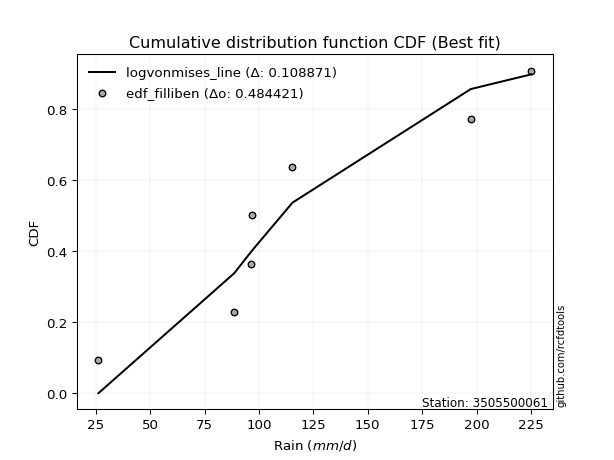</img></img>

</div>


### 10. EDF Jenkinson (1977)

The Jenkinson formula in hydrology is an empirical plotting position formula used to estimate the non-exceedance probability _(P)_ or return period _(T)_ of a given ordered observation within a sample. It is a widely used method in the frequency analysis of extreme events such as floods and rainfall, as it provides a distribution-free way to plot data. _a≈0.31_ and _b≈0.38_ are constants derived to approximate the median of the probability distribution for the given rank.

<div align="center">


$P=(m-a)/(n+b)$


</div>


**10.1. Empirical values**

<div align="center">

|                | 0                   | 1                   | 2                   | 3             | 4                  | 5                  | 6                  |
|:---------------|:--------------------|:--------------------|:--------------------|:--------------|:-------------------|:-------------------|:-------------------|
| date           | 2021                | 2023                | 2019                | 2025          | 2022               | 2020               | 2024               |
| x              | 26.2                | 88.6                | 96.4                | 97.0          | 115.4              | 197.4              | 225.2              |
| m              | 1                   | 2                   | 3                   | 4             | 5                  | 6                  | 7                  |
| empirical_dist | edf_jenkinson       | edf_jenkinson       | edf_jenkinson       | edf_jenkinson | edf_jenkinson      | edf_jenkinson      | edf_jenkinson      |
| empirical      | 0.09349593495934959 | 0.22899728997289973 | 0.36449864498644985 | 0.5           | 0.6355013550135502 | 0.7710027100271003 | 0.9065040650406505 |
| empirical_tr   | 1.1031390134529149  | 1.29701230228471    | 1.5735607675906182  | 2.0           | 2.743494423791822  | 4.366863905325444  | 10.695652173913055 |

</div>


**10.2. Kolmogorov-Smirnov fit test (sorted by Δ)**


<div align="center">

|                | 0                   | 1                   | 2                   | 3                   | 4                   | 5                   | 6                   | 7                   | 8                   | 9                   | 10                  | 11                  | 12                  | 13                  | 14                  | 15                  | 16                  | 17                  | 18                  | 19                  | 20                  | 21                  | 22                  | 23                  | 24                  | 25                  | 26                  | 27                  | 28                  | 29                  | 30                  | 31                  | 32                  | 33                  | 34                  | 35                  | 36                  | 37                  | 38                  | 39                  | 40                  | 41                  | 42                  | 43                  | 44                  | 45                  | 46                  | 47                  | 48                  | 49                  | 50                  | 51                  | 52                  | 53                  | 54                  | 55                  | 56                  | 57                  | 58                  | 59                  | 60                  | 61                  | 62                  | 63                  | 64                  | 65                  | 66                  | 67                  | 68                  | 69                  | 70                  | 71                  | 72                  | 73                  | 74                  | 75                  | 76                  | 77                  | 78                  | 79                  | 80                  | 81                  | 82                  | 83                  | 84                  | 85                  | 86                  | 87                  | 88                  | 89                  | 90                  | 91                  | 92                  | 93                  | 94                  | 95                  | 96                  | 97                  | 98                  | 99                  | 100                 | 101                 | 102                 | 103                 | 104                 | 105                 | 106                 | 107                 | 108                 | 109                 | 110                 | 111                 | 112                 | 113                 | 114                 | 115                 | 116                 | 117                 | 118                 | 119                 | 120                 | 121                 | 122                 | 123                 | 124                 | 125                 | 126                 | 127                 | 128                 | 129                 | 130                 | 131                 | 132                 | 133                 | 134                 | 135                 | 136                 | 137                 | 138                 | 139                 | 140                 | 141                 | 142                 | 143                 | 144                 | 145                 | 146                 | 147                 | 148                 | 149                 | 150                 | 151                 | 152                 | 153                 | 154                 | 155                 | 156                 | 157                 | 158                 | 159                 |
|:---------------|:--------------------|:--------------------|:--------------------|:--------------------|:--------------------|:--------------------|:--------------------|:--------------------|:--------------------|:--------------------|:--------------------|:--------------------|:--------------------|:--------------------|:--------------------|:--------------------|:--------------------|:--------------------|:--------------------|:--------------------|:--------------------|:--------------------|:--------------------|:--------------------|:--------------------|:--------------------|:--------------------|:--------------------|:--------------------|:--------------------|:--------------------|:--------------------|:--------------------|:--------------------|:--------------------|:--------------------|:--------------------|:--------------------|:--------------------|:--------------------|:--------------------|:--------------------|:--------------------|:--------------------|:--------------------|:--------------------|:--------------------|:--------------------|:--------------------|:--------------------|:--------------------|:--------------------|:--------------------|:--------------------|:--------------------|:--------------------|:--------------------|:--------------------|:--------------------|:--------------------|:--------------------|:--------------------|:--------------------|:--------------------|:--------------------|:--------------------|:--------------------|:--------------------|:--------------------|:--------------------|:--------------------|:--------------------|:--------------------|:--------------------|:--------------------|:--------------------|:--------------------|:--------------------|:--------------------|:--------------------|:--------------------|:--------------------|:--------------------|:--------------------|:--------------------|:--------------------|:--------------------|:--------------------|:--------------------|:--------------------|:--------------------|:--------------------|:--------------------|:--------------------|:--------------------|:--------------------|:--------------------|:--------------------|:--------------------|:--------------------|:--------------------|:--------------------|:--------------------|:--------------------|:--------------------|:--------------------|:--------------------|:--------------------|:--------------------|:--------------------|:--------------------|:--------------------|:--------------------|:--------------------|:--------------------|:--------------------|:--------------------|:--------------------|:--------------------|:--------------------|:--------------------|:--------------------|:--------------------|:--------------------|:--------------------|:--------------------|:--------------------|:--------------------|:--------------------|:--------------------|:--------------------|:--------------------|:--------------------|:--------------------|:--------------------|:--------------------|:--------------------|:--------------------|:--------------------|:--------------------|:--------------------|:--------------------|:--------------------|:--------------------|:--------------------|:--------------------|:--------------------|:--------------------|:--------------------|:--------------------|:--------------------|:--------------------|:--------------------|:--------------------|:--------------------|:--------------------|:--------------------|:--------------------|:--------------------|:--------------------|
| station        | 3505500061          | 3505500061          | 3505500061          | 3505500061          | 3505500061          | 3505500061          | 3505500061          | 3505500061          | 3505500061          | 3505500061          | 3505500061          | 3505500061          | 3505500061          | 3505500061          | 3505500061          | 3505500061          | 3505500061          | 3505500061          | 3505500061          | 3505500061          | 3505500061          | 3505500061          | 3505500061          | 3505500061          | 3505500061          | 3505500061          | 3505500061          | 3505500061          | 3505500061          | 3505500061          | 3505500061          | 3505500061          | 3505500061          | 3505500061          | 3505500061          | 3505500061          | 3505500061          | 3505500061          | 3505500061          | 3505500061          | 3505500061          | 3505500061          | 3505500061          | 3505500061          | 3505500061          | 3505500061          | 3505500061          | 3505500061          | 3505500061          | 3505500061          | 3505500061          | 3505500061          | 3505500061          | 3505500061          | 3505500061          | 3505500061          | 3505500061          | 3505500061          | 3505500061          | 3505500061          | 3505500061          | 3505500061          | 3505500061          | 3505500061          | 3505500061          | 3505500061          | 3505500061          | 3505500061          | 3505500061          | 3505500061          | 3505500061          | 3505500061          | 3505500061          | 3505500061          | 3505500061          | 3505500061          | 3505500061          | 3505500061          | 3505500061          | 3505500061          | 3505500061          | 3505500061          | 3505500061          | 3505500061          | 3505500061          | 3505500061          | 3505500061          | 3505500061          | 3505500061          | 3505500061          | 3505500061          | 3505500061          | 3505500061          | 3505500061          | 3505500061          | 3505500061          | 3505500061          | 3505500061          | 3505500061          | 3505500061          | 3505500061          | 3505500061          | 3505500061          | 3505500061          | 3505500061          | 3505500061          | 3505500061          | 3505500061          | 3505500061          | 3505500061          | 3505500061          | 3505500061          | 3505500061          | 3505500061          | 3505500061          | 3505500061          | 3505500061          | 3505500061          | 3505500061          | 3505500061          | 3505500061          | 3505500061          | 3505500061          | 3505500061          | 3505500061          | 3505500061          | 3505500061          | 3505500061          | 3505500061          | 3505500061          | 3505500061          | 3505500061          | 3505500061          | 3505500061          | 3505500061          | 3505500061          | 3505500061          | 3505500061          | 3505500061          | 3505500061          | 3505500061          | 3505500061          | 3505500061          | 3505500061          | 3505500061          | 3505500061          | 3505500061          | 3505500061          | 3505500061          | 3505500061          | 3505500061          | 3505500061          | 3505500061          | 3505500061          | 3505500061          | 3505500061          | 3505500061          | 3505500061          | 3505500061          | 3505500061          |
| empirical_dist | edf_jenkinson       | edf_jenkinson       | edf_jenkinson       | edf_jenkinson       | edf_jenkinson       | edf_jenkinson       | edf_jenkinson       | edf_jenkinson       | edf_jenkinson       | edf_jenkinson       | edf_jenkinson       | edf_jenkinson       | edf_jenkinson       | edf_jenkinson       | edf_jenkinson       | edf_jenkinson       | edf_jenkinson       | edf_jenkinson       | edf_jenkinson       | edf_jenkinson       | edf_jenkinson       | edf_jenkinson       | edf_jenkinson       | edf_jenkinson       | edf_jenkinson       | edf_jenkinson       | edf_jenkinson       | edf_jenkinson       | edf_jenkinson       | edf_jenkinson       | edf_jenkinson       | edf_jenkinson       | edf_jenkinson       | edf_jenkinson       | edf_jenkinson       | edf_jenkinson       | edf_jenkinson       | edf_jenkinson       | edf_jenkinson       | edf_jenkinson       | edf_jenkinson       | edf_jenkinson       | edf_jenkinson       | edf_jenkinson       | edf_jenkinson       | edf_jenkinson       | edf_jenkinson       | edf_jenkinson       | edf_jenkinson       | edf_jenkinson       | edf_jenkinson       | edf_jenkinson       | edf_jenkinson       | edf_jenkinson       | edf_jenkinson       | edf_jenkinson       | edf_jenkinson       | edf_jenkinson       | edf_jenkinson       | edf_jenkinson       | edf_jenkinson       | edf_jenkinson       | edf_jenkinson       | edf_jenkinson       | edf_jenkinson       | edf_jenkinson       | edf_jenkinson       | edf_jenkinson       | edf_jenkinson       | edf_jenkinson       | edf_jenkinson       | edf_jenkinson       | edf_jenkinson       | edf_jenkinson       | edf_jenkinson       | edf_jenkinson       | edf_jenkinson       | edf_jenkinson       | edf_jenkinson       | edf_jenkinson       | edf_jenkinson       | edf_jenkinson       | edf_jenkinson       | edf_jenkinson       | edf_jenkinson       | edf_jenkinson       | edf_jenkinson       | edf_jenkinson       | edf_jenkinson       | edf_jenkinson       | edf_jenkinson       | edf_jenkinson       | edf_jenkinson       | edf_jenkinson       | edf_jenkinson       | edf_jenkinson       | edf_jenkinson       | edf_jenkinson       | edf_jenkinson       | edf_jenkinson       | edf_jenkinson       | edf_jenkinson       | edf_jenkinson       | edf_jenkinson       | edf_jenkinson       | edf_jenkinson       | edf_jenkinson       | edf_jenkinson       | edf_jenkinson       | edf_jenkinson       | edf_jenkinson       | edf_jenkinson       | edf_jenkinson       | edf_jenkinson       | edf_jenkinson       | edf_jenkinson       | edf_jenkinson       | edf_jenkinson       | edf_jenkinson       | edf_jenkinson       | edf_jenkinson       | edf_jenkinson       | edf_jenkinson       | edf_jenkinson       | edf_jenkinson       | edf_jenkinson       | edf_jenkinson       | edf_jenkinson       | edf_jenkinson       | edf_jenkinson       | edf_jenkinson       | edf_jenkinson       | edf_jenkinson       | edf_jenkinson       | edf_jenkinson       | edf_jenkinson       | edf_jenkinson       | edf_jenkinson       | edf_jenkinson       | edf_jenkinson       | edf_jenkinson       | edf_jenkinson       | edf_jenkinson       | edf_jenkinson       | edf_jenkinson       | edf_jenkinson       | edf_jenkinson       | edf_jenkinson       | edf_jenkinson       | edf_jenkinson       | edf_jenkinson       | edf_jenkinson       | edf_jenkinson       | edf_jenkinson       | edf_jenkinson       | edf_jenkinson       | edf_jenkinson       | edf_jenkinson       | edf_jenkinson       | edf_jenkinson       |
| p_dist         | logvonmises_line    | burr                | mielke              | loggenlogistic      | betaprime           | gumbel_r            | f                   | erlang              | gamma               | invgauss            | genlogistic         | gengamma            | skewnorm            | invweibull          | loggumbel_l         | moyal               | exponnorm           | ncf                 | invgamma            | nct                 | logweibull_min      | rayleigh            | logburr12           | weibull_min         | gompertz            | rice                | logpearson3         | kstwobign           | logskewnorm         | wald                | maxwell             | loggengamma         | loglaplace          | loglaplace          | bradford            | truncpareto         | pearson3            | logloggamma         | halflogistic        | logtruncweibull_min | halfnorm            | logargus            | logmielke           | logtrapezoid        | logjohnsonsu        | arcsine             | loggenhalflogistic  | kappa4              | ksone               | logt                | loggausshyper       | logdgamma           | semicircular        | anglit              | loghypsecant        | logburr             | logdweibull         | crystalball         | norm                | t                   | johnsonsu           | truncweibull_min    | dgamma              | gausshyper          | logistic            | dweibull            | loglogistic         | loggennorm          | logtriang           | hypsecant           | gennorm             | logloglaplace       | wrapcauchy          | loglevy_l           | cosine              | tukeylambda         | vonmises_line       | uniform             | lognct              | logcrystalball      | lognorm             | logexponnorm        | logrice             | logfatiguelife      | logncf              | logf                | loganglit           | loggamma            | loggamma            | logbetaprime        | logsemicircular     | logerlang           | loginvgamma         | laplace             | logalpha            | kappa3              | logmaxwell          | beta                | logarcsine          | loginvgauss         | nakagami            | loggenpareto        | lograyleigh         | loggenextreme       | gumbel_l            | truncexpon          | loginvweibull       | logcosine           | logfoldnorm         | argus               | loggumbel_r         | logtruncnorm        | genexpon            | burr12              | logweibull_max      | levy_l              | lomax               | alpha               | logbeta             | loghalfnorm         | genpareto           | logmoyal            | logkstwobign        | loghalflogistic     | loggenexpon         | logwrapcauchy       | lognakagami         | loggompertz         | genextreme          | logrdist            | genhalflogistic     | logksone            | johnsonsb           | logkappa3           | logkappa4           | loguniform          | logbradford         | logwald             | logtukeylambda      | exponweib           | truncnorm           | triang              | loglomax            | loghalfgennorm      | halfgennorm         | trapezoid           | logtruncexpon       | logexponpow         | rdist               | fatiguelife         | powerlaw            | weibull_max         | foldnorm            | logexponweib        | logjohnsonsb        | logpowerlaw         | exponpow            | logtruncpareto      | logvonmises         | vonmises            |
| delta          | 0.10831885219518986 | 0.11606636155687047 | 0.11609921287272643 | 0.11623125923131081 | 0.11644106869342075 | 0.11699169518228425 | 0.11711116900969978 | 0.11718079231613368 | 0.11718087124051416 | 0.11824025134959082 | 0.11831524474119945 | 0.11890722010090204 | 0.12025416016121149 | 0.12059573403515741 | 0.12089990878873524 | 0.12098383031048729 | 0.12117622477141018 | 0.12171857258784322 | 0.12282013659771651 | 0.12393688129449598 | 0.1240310082091951  | 0.12433866728218013 | 0.12475080568013452 | 0.12631581515973897 | 0.13087421278102873 | 0.13189309938866922 | 0.13406136953342054 | 0.13436913654726404 | 0.13502300121726493 | 0.13514079444006655 | 0.13600675235541781 | 0.13794938358370126 | 0.14249494859058495 | 0.14249494859058495 | 0.14312176428454587 | 0.14312869401087108 | 0.1449660259266487  | 0.14537427584929385 | 0.14607014766448204 | 0.1467232670650229  | 0.14676391760931742 | 0.14730955009109437 | 0.1518703838358493  | 0.15188092081941826 | 0.15195263502870432 | 0.15505588518884594 | 0.15592209937911264 | 0.16052202098817975 | 0.1605652537459099  | 0.16090954118618903 | 0.1616072699600395  | 0.16186369126082026 | 0.1631295750263438  | 0.1651632609867993  | 0.16782477693230882 | 0.1680232488021346  | 0.17003851307171355 | 0.17009550725045114 | 0.17009560691313302 | 0.17009639823520106 | 0.17020734369977802 | 0.17027817555494607 | 0.17049761929429452 | 0.1714939763534956  | 0.17479047012276505 | 0.17488354238124856 | 0.17688360316308885 | 0.17729938602094208 | 0.1787411163876194  | 0.17880249655234692 | 0.1812149297079929  | 0.18139015605532863 | 0.18574625853089055 | 0.18586150682403701 | 0.18604718330320208 | 0.18619865500137456 | 0.18647406392823573 | 0.18726014898339943 | 0.18728681758421625 | 0.18780576587524153 | 0.18781025531469517 | 0.1878107146221629  | 0.18782918874092905 | 0.18807806477127506 | 0.18873150146802245 | 0.18887347722315076 | 0.19944119730939106 | 0.20097708441577386 | 0.20097708441577386 | 0.2020646111325349  | 0.20425917744809616 | 0.20515477592438233 | 0.20608387357123306 | 0.20705913964344286 | 0.21439258742664943 | 0.21935557420130153 | 0.2221171030194601  | 0.22220436430540988 | 0.22354670488033188 | 0.22414360318325563 | 0.22899723834971777 | 0.23428677417769198 | 0.23433775025184564 | 0.23994008748311824 | 0.24064282372246937 | 0.24222268141088996 | 0.24433561550916147 | 0.24574223176780371 | 0.2458448960880222  | 0.24765831145855954 | 0.2504761013754385  | 0.25113145832750194 | 0.2537188010650282  | 0.2539006225239785  | 0.2548701718686228  | 0.255627476729684   | 0.2563122070273892  | 0.2647940517756099  | 0.2656251649106815  | 0.2689460863809098  | 0.27059222359893237 | 0.27444869041410336 | 0.28053661361534366 | 0.28658316389726846 | 0.28903145800396846 | 0.29341208908942384 | 0.30362662371346844 | 0.31364795347164764 | 0.3158532097429543  | 0.3159353905283059  | 0.3228463198917348  | 0.32630352949533026 | 0.3280425321426034  | 0.33615050997863505 | 0.33697173853548756 | 0.3373636933889762  | 0.3387308391456879  | 0.3402090096211384  | 0.34353266714441844 | 0.35419082714384087 | 0.3559621495232752  | 0.38805832734085766 | 0.39375689543082937 | 0.39920285391962695 | 0.40876239393223324 | 0.4267732855764709  | 0.43688722936058166 | 0.5390831491769393  | 0.5619514154572465  | 0.5668705096511996  | 0.5980543199057192  | 0.6164843393833035  | 0.6355013550135502  | 0.6403562830631372  | 0.6460682733666195  | 0.6718662617666352  | 0.6936832821375372  | 0.7292650120613249  | 1.1542123607552461  | 35.10234691479246   |
| deltao         | 0.48442053926100004 | 0.48442053926100004 | 0.48442053926100004 | 0.48442053926100004 | 0.48442053926100004 | 0.48442053926100004 | 0.48442053926100004 | 0.48442053926100004 | 0.48442053926100004 | 0.48442053926100004 | 0.48442053926100004 | 0.48442053926100004 | 0.48442053926100004 | 0.48442053926100004 | 0.48442053926100004 | 0.48442053926100004 | 0.48442053926100004 | 0.48442053926100004 | 0.48442053926100004 | 0.48442053926100004 | 0.48442053926100004 | 0.48442053926100004 | 0.48442053926100004 | 0.48442053926100004 | 0.48442053926100004 | 0.48442053926100004 | 0.48442053926100004 | 0.48442053926100004 | 0.48442053926100004 | 0.48442053926100004 | 0.48442053926100004 | 0.48442053926100004 | 0.48442053926100004 | 0.48442053926100004 | 0.48442053926100004 | 0.48442053926100004 | 0.48442053926100004 | 0.48442053926100004 | 0.48442053926100004 | 0.48442053926100004 | 0.48442053926100004 | 0.48442053926100004 | 0.48442053926100004 | 0.48442053926100004 | 0.48442053926100004 | 0.48442053926100004 | 0.48442053926100004 | 0.48442053926100004 | 0.48442053926100004 | 0.48442053926100004 | 0.48442053926100004 | 0.48442053926100004 | 0.48442053926100004 | 0.48442053926100004 | 0.48442053926100004 | 0.48442053926100004 | 0.48442053926100004 | 0.48442053926100004 | 0.48442053926100004 | 0.48442053926100004 | 0.48442053926100004 | 0.48442053926100004 | 0.48442053926100004 | 0.48442053926100004 | 0.48442053926100004 | 0.48442053926100004 | 0.48442053926100004 | 0.48442053926100004 | 0.48442053926100004 | 0.48442053926100004 | 0.48442053926100004 | 0.48442053926100004 | 0.48442053926100004 | 0.48442053926100004 | 0.48442053926100004 | 0.48442053926100004 | 0.48442053926100004 | 0.48442053926100004 | 0.48442053926100004 | 0.48442053926100004 | 0.48442053926100004 | 0.48442053926100004 | 0.48442053926100004 | 0.48442053926100004 | 0.48442053926100004 | 0.48442053926100004 | 0.48442053926100004 | 0.48442053926100004 | 0.48442053926100004 | 0.48442053926100004 | 0.48442053926100004 | 0.48442053926100004 | 0.48442053926100004 | 0.48442053926100004 | 0.48442053926100004 | 0.48442053926100004 | 0.48442053926100004 | 0.48442053926100004 | 0.48442053926100004 | 0.48442053926100004 | 0.48442053926100004 | 0.48442053926100004 | 0.48442053926100004 | 0.48442053926100004 | 0.48442053926100004 | 0.48442053926100004 | 0.48442053926100004 | 0.48442053926100004 | 0.48442053926100004 | 0.48442053926100004 | 0.48442053926100004 | 0.48442053926100004 | 0.48442053926100004 | 0.48442053926100004 | 0.48442053926100004 | 0.48442053926100004 | 0.48442053926100004 | 0.48442053926100004 | 0.48442053926100004 | 0.48442053926100004 | 0.48442053926100004 | 0.48442053926100004 | 0.48442053926100004 | 0.48442053926100004 | 0.48442053926100004 | 0.48442053926100004 | 0.48442053926100004 | 0.48442053926100004 | 0.48442053926100004 | 0.48442053926100004 | 0.48442053926100004 | 0.48442053926100004 | 0.48442053926100004 | 0.48442053926100004 | 0.48442053926100004 | 0.48442053926100004 | 0.48442053926100004 | 0.48442053926100004 | 0.48442053926100004 | 0.48442053926100004 | 0.48442053926100004 | 0.48442053926100004 | 0.48442053926100004 | 0.48442053926100004 | 0.48442053926100004 | 0.48442053926100004 | 0.48442053926100004 | 0.48442053926100004 | 0.48442053926100004 | 0.48442053926100004 | 0.48442053926100004 | 0.48442053926100004 | 0.48442053926100004 | 0.48442053926100004 | 0.48442053926100004 | 0.48442053926100004 | 0.48442053926100004 | 0.48442053926100004 | 0.48442053926100004 | 0.48442053926100004 |
| eval           | Δo > Δ              | Δo > Δ              | Δo > Δ              | Δo > Δ              | Δo > Δ              | Δo > Δ              | Δo > Δ              | Δo > Δ              | Δo > Δ              | Δo > Δ              | Δo > Δ              | Δo > Δ              | Δo > Δ              | Δo > Δ              | Δo > Δ              | Δo > Δ              | Δo > Δ              | Δo > Δ              | Δo > Δ              | Δo > Δ              | Δo > Δ              | Δo > Δ              | Δo > Δ              | Δo > Δ              | Δo > Δ              | Δo > Δ              | Δo > Δ              | Δo > Δ              | Δo > Δ              | Δo > Δ              | Δo > Δ              | Δo > Δ              | Δo > Δ              | Δo > Δ              | Δo > Δ              | Δo > Δ              | Δo > Δ              | Δo > Δ              | Δo > Δ              | Δo > Δ              | Δo > Δ              | Δo > Δ              | Δo > Δ              | Δo > Δ              | Δo > Δ              | Δo > Δ              | Δo > Δ              | Δo > Δ              | Δo > Δ              | Δo > Δ              | Δo > Δ              | Δo > Δ              | Δo > Δ              | Δo > Δ              | Δo > Δ              | Δo > Δ              | Δo > Δ              | Δo > Δ              | Δo > Δ              | Δo > Δ              | Δo > Δ              | Δo > Δ              | Δo > Δ              | Δo > Δ              | Δo > Δ              | Δo > Δ              | Δo > Δ              | Δo > Δ              | Δo > Δ              | Δo > Δ              | Δo > Δ              | Δo > Δ              | Δo > Δ              | Δo > Δ              | Δo > Δ              | Δo > Δ              | Δo > Δ              | Δo > Δ              | Δo > Δ              | Δo > Δ              | Δo > Δ              | Δo > Δ              | Δo > Δ              | Δo > Δ              | Δo > Δ              | Δo > Δ              | Δo > Δ              | Δo > Δ              | Δo > Δ              | Δo > Δ              | Δo > Δ              | Δo > Δ              | Δo > Δ              | Δo > Δ              | Δo > Δ              | Δo > Δ              | Δo > Δ              | Δo > Δ              | Δo > Δ              | Δo > Δ              | Δo > Δ              | Δo > Δ              | Δo > Δ              | Δo > Δ              | Δo > Δ              | Δo > Δ              | Δo > Δ              | Δo > Δ              | Δo > Δ              | Δo > Δ              | Δo > Δ              | Δo > Δ              | Δo > Δ              | Δo > Δ              | Δo > Δ              | Δo > Δ              | Δo > Δ              | Δo > Δ              | Δo > Δ              | Δo > Δ              | Δo > Δ              | Δo > Δ              | Δo > Δ              | Δo > Δ              | Δo > Δ              | Δo > Δ              | Δo > Δ              | Δo > Δ              | Δo > Δ              | Δo > Δ              | Δo > Δ              | Δo > Δ              | Δo > Δ              | Δo > Δ              | Δo > Δ              | Δo > Δ              | Δo > Δ              | Δo > Δ              | Δo > Δ              | Δo > Δ              | Δo > Δ              | Δo > Δ              | Δo > Δ              | Δo > Δ              | Δo > Δ              | Δo > Δ              | Δo > Δ              | Δo <= Δ             | Δo <= Δ             | Δo <= Δ             | Δo <= Δ             | Δo <= Δ             | Δo <= Δ             | Δo <= Δ             | Δo <= Δ             | Δo <= Δ             | Δo <= Δ             | Δo <= Δ             | Δo <= Δ             | Δo <= Δ             |
| fit            | 1                   | 1                   | 1                   | 1                   | 1                   | 1                   | 1                   | 1                   | 1                   | 1                   | 1                   | 1                   | 1                   | 1                   | 1                   | 1                   | 1                   | 1                   | 1                   | 1                   | 1                   | 1                   | 1                   | 1                   | 1                   | 1                   | 1                   | 1                   | 1                   | 1                   | 1                   | 1                   | 1                   | 1                   | 1                   | 1                   | 1                   | 1                   | 1                   | 1                   | 1                   | 1                   | 1                   | 1                   | 1                   | 1                   | 1                   | 1                   | 1                   | 1                   | 1                   | 1                   | 1                   | 1                   | 1                   | 1                   | 1                   | 1                   | 1                   | 1                   | 1                   | 1                   | 1                   | 1                   | 1                   | 1                   | 1                   | 1                   | 1                   | 1                   | 1                   | 1                   | 1                   | 1                   | 1                   | 1                   | 1                   | 1                   | 1                   | 1                   | 1                   | 1                   | 1                   | 1                   | 1                   | 1                   | 1                   | 1                   | 1                   | 1                   | 1                   | 1                   | 1                   | 1                   | 1                   | 1                   | 1                   | 1                   | 1                   | 1                   | 1                   | 1                   | 1                   | 1                   | 1                   | 1                   | 1                   | 1                   | 1                   | 1                   | 1                   | 1                   | 1                   | 1                   | 1                   | 1                   | 1                   | 1                   | 1                   | 1                   | 1                   | 1                   | 1                   | 1                   | 1                   | 1                   | 1                   | 1                   | 1                   | 1                   | 1                   | 1                   | 1                   | 1                   | 1                   | 1                   | 1                   | 1                   | 1                   | 1                   | 1                   | 1                   | 1                   | 1                   | 1                   | 1                   | 1                   | 0                   | 0                   | 0                   | 0                   | 0                   | 0                   | 0                   | 0                   | 0                   | 0                   | 0                   | 0                   | 0                   |
| n              | 7                   | 7                   | 7                   | 7                   | 7                   | 7                   | 7                   | 7                   | 7                   | 7                   | 7                   | 7                   | 7                   | 7                   | 7                   | 7                   | 7                   | 7                   | 7                   | 7                   | 7                   | 7                   | 7                   | 7                   | 7                   | 7                   | 7                   | 7                   | 7                   | 7                   | 7                   | 7                   | 7                   | 7                   | 7                   | 7                   | 7                   | 7                   | 7                   | 7                   | 7                   | 7                   | 7                   | 7                   | 7                   | 7                   | 7                   | 7                   | 7                   | 7                   | 7                   | 7                   | 7                   | 7                   | 7                   | 7                   | 7                   | 7                   | 7                   | 7                   | 7                   | 7                   | 7                   | 7                   | 7                   | 7                   | 7                   | 7                   | 7                   | 7                   | 7                   | 7                   | 7                   | 7                   | 7                   | 7                   | 7                   | 7                   | 7                   | 7                   | 7                   | 7                   | 7                   | 7                   | 7                   | 7                   | 7                   | 7                   | 7                   | 7                   | 7                   | 7                   | 7                   | 7                   | 7                   | 7                   | 7                   | 7                   | 7                   | 7                   | 7                   | 7                   | 7                   | 7                   | 7                   | 7                   | 7                   | 7                   | 7                   | 7                   | 7                   | 7                   | 7                   | 7                   | 7                   | 7                   | 7                   | 7                   | 7                   | 7                   | 7                   | 7                   | 7                   | 7                   | 7                   | 7                   | 7                   | 7                   | 7                   | 7                   | 7                   | 7                   | 7                   | 7                   | 7                   | 7                   | 7                   | 7                   | 7                   | 7                   | 7                   | 7                   | 7                   | 7                   | 7                   | 7                   | 7                   | 7                   | 7                   | 7                   | 7                   | 7                   | 7                   | 7                   | 7                   | 7                   | 7                   | 7                   | 7                   | 7                   |
| best_fit       | 1                   | 0                   | 0                   | 0                   | 0                   | 0                   | 0                   | 0                   | 0                   | 0                   | 0                   | 0                   | 0                   | 0                   | 0                   | 0                   | 0                   | 0                   | 0                   | 0                   | 0                   | 0                   | 0                   | 0                   | 0                   | 0                   | 0                   | 0                   | 0                   | 0                   | 0                   | 0                   | 0                   | 0                   | 0                   | 0                   | 0                   | 0                   | 0                   | 0                   | 0                   | 0                   | 0                   | 0                   | 0                   | 0                   | 0                   | 0                   | 0                   | 0                   | 0                   | 0                   | 0                   | 0                   | 0                   | 0                   | 0                   | 0                   | 0                   | 0                   | 0                   | 0                   | 0                   | 0                   | 0                   | 0                   | 0                   | 0                   | 0                   | 0                   | 0                   | 0                   | 0                   | 0                   | 0                   | 0                   | 0                   | 0                   | 0                   | 0                   | 0                   | 0                   | 0                   | 0                   | 0                   | 0                   | 0                   | 0                   | 0                   | 0                   | 0                   | 0                   | 0                   | 0                   | 0                   | 0                   | 0                   | 0                   | 0                   | 0                   | 0                   | 0                   | 0                   | 0                   | 0                   | 0                   | 0                   | 0                   | 0                   | 0                   | 0                   | 0                   | 0                   | 0                   | 0                   | 0                   | 0                   | 0                   | 0                   | 0                   | 0                   | 0                   | 0                   | 0                   | 0                   | 0                   | 0                   | 0                   | 0                   | 0                   | 0                   | 0                   | 0                   | 0                   | 0                   | 0                   | 0                   | 0                   | 0                   | 0                   | 0                   | 0                   | 0                   | 0                   | 0                   | 0                   | 0                   | 0                   | 0                   | 0                   | 0                   | 0                   | 0                   | 0                   | 0                   | 0                   | 0                   | 0                   | 0                   | 0                   |
| best_fit_sort  | 1                   | 2                   | 3                   | 4                   | 5                   | 6                   | 7                   | 8                   | 9                   | 10                  | 11                  | 12                  | 13                  | 14                  | 15                  | 16                  | 17                  | 18                  | 19                  | 20                  | 21                  | 22                  | 23                  | 24                  | 25                  | 26                  | 27                  | 28                  | 29                  | 30                  | 31                  | 32                  | 33                  | 34                  | 35                  | 36                  | 37                  | 38                  | 39                  | 40                  | 41                  | 42                  | 43                  | 44                  | 45                  | 46                  | 47                  | 48                  | 49                  | 50                  | 51                  | 52                  | 53                  | 54                  | 55                  | 56                  | 57                  | 58                  | 59                  | 60                  | 61                  | 62                  | 63                  | 64                  | 65                  | 66                  | 67                  | 68                  | 69                  | 70                  | 71                  | 72                  | 73                  | 74                  | 75                  | 76                  | 77                  | 78                  | 79                  | 80                  | 81                  | 82                  | 83                  | 84                  | 85                  | 86                  | 87                  | 88                  | 89                  | 90                  | 91                  | 92                  | 93                  | 94                  | 95                  | 96                  | 97                  | 98                  | 99                  | 100                 | 101                 | 102                 | 103                 | 104                 | 105                 | 106                 | 107                 | 108                 | 109                 | 110                 | 111                 | 112                 | 113                 | 114                 | 115                 | 116                 | 117                 | 118                 | 119                 | 120                 | 121                 | 122                 | 123                 | 124                 | 125                 | 126                 | 127                 | 128                 | 129                 | 130                 | 131                 | 132                 | 133                 | 134                 | 135                 | 136                 | 137                 | 138                 | 139                 | 140                 | 141                 | 142                 | 143                 | 144                 | 145                 | 146                 | 147                 | 148                 | 149                 | 150                 | 151                 | 152                 | 153                 | 154                 | 155                 | 156                 | 157                 | 158                 | 159                 | 160                 |

</div>


**10.3. Best fit**

<div align="center">

|   id |    station | empirical_dist   | p_dist           |    delta |   deltao | eval   |   fit |   n |   best_fit |   best_fit_sort |
|-----:|-----------:|:-----------------|:-----------------|---------:|---------:|:-------|------:|----:|-----------:|----------------:|
|    0 | 3505500061 | edf_jenkinson    | logvonmises_line | 0.108319 | 0.484421 | Δo > Δ |     1 |   7 |          1 |               1 |

</div>


<div align="center">

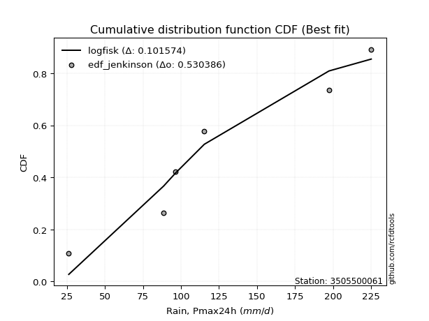</img></img>

</div>


### 11. EDF Cunnane (1978)

Cunnane´s work in statistical hydrology has focused on the performance and evaluation of different probability distributions (such as GEV, Gumbel, Lognormal) for flood frequency estimation. _b_ is a constant, typically set to 0.4.

<div align="center">


$P=(m-b)/(n+1-2b)$


</div>


**11.1. Empirical values**

<div align="center">

|                | 0                   | 1                   | 2                  | 3           | 4                  | 5                  | 6                  |
|:---------------|:--------------------|:--------------------|:-------------------|:------------|:-------------------|:-------------------|:-------------------|
| date           | 2021                | 2023                | 2019               | 2025        | 2022               | 2020               | 2024               |
| x              | 26.2                | 88.6                | 96.4               | 97.0        | 115.4              | 197.4              | 225.2              |
| m              | 1                   | 2                   | 3                  | 4           | 5                  | 6                  | 7                  |
| empirical_dist | edf_cunnane         | edf_cunnane         | edf_cunnane        | edf_cunnane | edf_cunnane        | edf_cunnane        | edf_cunnane        |
| empirical      | 0.08333333333333333 | 0.22222222222222224 | 0.3611111111111111 | 0.5         | 0.6388888888888888 | 0.7777777777777777 | 0.9166666666666666 |
| empirical_tr   | 1.090909090909091   | 1.2857142857142856  | 1.565217391304348  | 2.0         | 2.7692307692307687 | 4.499999999999998  | 11.999999999999995 |

</div>


**11.2. Kolmogorov-Smirnov fit test (sorted by Δ)**


<div align="center">

|                | 0                   | 1                   | 2                   | 3                   | 4                   | 5                   | 6                   | 7                   | 8                   | 9                   | 10                  | 11                  | 12                  | 13                  | 14                  | 15                  | 16                  | 17                  | 18                  | 19                  | 20                  | 21                  | 22                  | 23                  | 24                  | 25                  | 26                  | 27                  | 28                  | 29                  | 30                  | 31                  | 32                  | 33                  | 34                  | 35                  | 36                  | 37                  | 38                  | 39                  | 40                  | 41                  | 42                  | 43                  | 44                  | 45                  | 46                  | 47                  | 48                  | 49                  | 50                  | 51                  | 52                  | 53                  | 54                  | 55                  | 56                  | 57                  | 58                  | 59                  | 60                  | 61                  | 62                  | 63                  | 64                  | 65                  | 66                  | 67                  | 68                  | 69                  | 70                  | 71                  | 72                  | 73                  | 74                  | 75                  | 76                  | 77                  | 78                  | 79                  | 80                  | 81                  | 82                  | 83                  | 84                  | 85                  | 86                  | 87                  | 88                  | 89                  | 90                  | 91                  | 92                  | 93                  | 94                  | 95                  | 96                  | 97                  | 98                  | 99                  | 100                 | 101                 | 102                 | 103                 | 104                 | 105                 | 106                 | 107                 | 108                 | 109                 | 110                 | 111                 | 112                 | 113                 | 114                 | 115                 | 116                 | 117                 | 118                 | 119                 | 120                 | 121                 | 122                 | 123                 | 124                 | 125                 | 126                 | 127                 | 128                 | 129                 | 130                 | 131                 | 132                 | 133                 | 134                 | 135                 | 136                 | 137                 | 138                 | 139                 | 140                 | 141                 | 142                 | 143                 | 144                 | 145                 | 146                 | 147                 | 148                 | 149                 | 150                 | 151                 | 152                 | 153                 | 154                 | 155                 | 156                 | 157                 | 158                 | 159                 |
|:---------------|:--------------------|:--------------------|:--------------------|:--------------------|:--------------------|:--------------------|:--------------------|:--------------------|:--------------------|:--------------------|:--------------------|:--------------------|:--------------------|:--------------------|:--------------------|:--------------------|:--------------------|:--------------------|:--------------------|:--------------------|:--------------------|:--------------------|:--------------------|:--------------------|:--------------------|:--------------------|:--------------------|:--------------------|:--------------------|:--------------------|:--------------------|:--------------------|:--------------------|:--------------------|:--------------------|:--------------------|:--------------------|:--------------------|:--------------------|:--------------------|:--------------------|:--------------------|:--------------------|:--------------------|:--------------------|:--------------------|:--------------------|:--------------------|:--------------------|:--------------------|:--------------------|:--------------------|:--------------------|:--------------------|:--------------------|:--------------------|:--------------------|:--------------------|:--------------------|:--------------------|:--------------------|:--------------------|:--------------------|:--------------------|:--------------------|:--------------------|:--------------------|:--------------------|:--------------------|:--------------------|:--------------------|:--------------------|:--------------------|:--------------------|:--------------------|:--------------------|:--------------------|:--------------------|:--------------------|:--------------------|:--------------------|:--------------------|:--------------------|:--------------------|:--------------------|:--------------------|:--------------------|:--------------------|:--------------------|:--------------------|:--------------------|:--------------------|:--------------------|:--------------------|:--------------------|:--------------------|:--------------------|:--------------------|:--------------------|:--------------------|:--------------------|:--------------------|:--------------------|:--------------------|:--------------------|:--------------------|:--------------------|:--------------------|:--------------------|:--------------------|:--------------------|:--------------------|:--------------------|:--------------------|:--------------------|:--------------------|:--------------------|:--------------------|:--------------------|:--------------------|:--------------------|:--------------------|:--------------------|:--------------------|:--------------------|:--------------------|:--------------------|:--------------------|:--------------------|:--------------------|:--------------------|:--------------------|:--------------------|:--------------------|:--------------------|:--------------------|:--------------------|:--------------------|:--------------------|:--------------------|:--------------------|:--------------------|:--------------------|:--------------------|:--------------------|:--------------------|:--------------------|:--------------------|:--------------------|:--------------------|:--------------------|:--------------------|:--------------------|:--------------------|:--------------------|:--------------------|:--------------------|:--------------------|:--------------------|:--------------------|
| station        | 3505500061          | 3505500061          | 3505500061          | 3505500061          | 3505500061          | 3505500061          | 3505500061          | 3505500061          | 3505500061          | 3505500061          | 3505500061          | 3505500061          | 3505500061          | 3505500061          | 3505500061          | 3505500061          | 3505500061          | 3505500061          | 3505500061          | 3505500061          | 3505500061          | 3505500061          | 3505500061          | 3505500061          | 3505500061          | 3505500061          | 3505500061          | 3505500061          | 3505500061          | 3505500061          | 3505500061          | 3505500061          | 3505500061          | 3505500061          | 3505500061          | 3505500061          | 3505500061          | 3505500061          | 3505500061          | 3505500061          | 3505500061          | 3505500061          | 3505500061          | 3505500061          | 3505500061          | 3505500061          | 3505500061          | 3505500061          | 3505500061          | 3505500061          | 3505500061          | 3505500061          | 3505500061          | 3505500061          | 3505500061          | 3505500061          | 3505500061          | 3505500061          | 3505500061          | 3505500061          | 3505500061          | 3505500061          | 3505500061          | 3505500061          | 3505500061          | 3505500061          | 3505500061          | 3505500061          | 3505500061          | 3505500061          | 3505500061          | 3505500061          | 3505500061          | 3505500061          | 3505500061          | 3505500061          | 3505500061          | 3505500061          | 3505500061          | 3505500061          | 3505500061          | 3505500061          | 3505500061          | 3505500061          | 3505500061          | 3505500061          | 3505500061          | 3505500061          | 3505500061          | 3505500061          | 3505500061          | 3505500061          | 3505500061          | 3505500061          | 3505500061          | 3505500061          | 3505500061          | 3505500061          | 3505500061          | 3505500061          | 3505500061          | 3505500061          | 3505500061          | 3505500061          | 3505500061          | 3505500061          | 3505500061          | 3505500061          | 3505500061          | 3505500061          | 3505500061          | 3505500061          | 3505500061          | 3505500061          | 3505500061          | 3505500061          | 3505500061          | 3505500061          | 3505500061          | 3505500061          | 3505500061          | 3505500061          | 3505500061          | 3505500061          | 3505500061          | 3505500061          | 3505500061          | 3505500061          | 3505500061          | 3505500061          | 3505500061          | 3505500061          | 3505500061          | 3505500061          | 3505500061          | 3505500061          | 3505500061          | 3505500061          | 3505500061          | 3505500061          | 3505500061          | 3505500061          | 3505500061          | 3505500061          | 3505500061          | 3505500061          | 3505500061          | 3505500061          | 3505500061          | 3505500061          | 3505500061          | 3505500061          | 3505500061          | 3505500061          | 3505500061          | 3505500061          | 3505500061          | 3505500061          | 3505500061          | 3505500061          |
| empirical_dist | edf_cunnane         | edf_cunnane         | edf_cunnane         | edf_cunnane         | edf_cunnane         | edf_cunnane         | edf_cunnane         | edf_cunnane         | edf_cunnane         | edf_cunnane         | edf_cunnane         | edf_cunnane         | edf_cunnane         | edf_cunnane         | edf_cunnane         | edf_cunnane         | edf_cunnane         | edf_cunnane         | edf_cunnane         | edf_cunnane         | edf_cunnane         | edf_cunnane         | edf_cunnane         | edf_cunnane         | edf_cunnane         | edf_cunnane         | edf_cunnane         | edf_cunnane         | edf_cunnane         | edf_cunnane         | edf_cunnane         | edf_cunnane         | edf_cunnane         | edf_cunnane         | edf_cunnane         | edf_cunnane         | edf_cunnane         | edf_cunnane         | edf_cunnane         | edf_cunnane         | edf_cunnane         | edf_cunnane         | edf_cunnane         | edf_cunnane         | edf_cunnane         | edf_cunnane         | edf_cunnane         | edf_cunnane         | edf_cunnane         | edf_cunnane         | edf_cunnane         | edf_cunnane         | edf_cunnane         | edf_cunnane         | edf_cunnane         | edf_cunnane         | edf_cunnane         | edf_cunnane         | edf_cunnane         | edf_cunnane         | edf_cunnane         | edf_cunnane         | edf_cunnane         | edf_cunnane         | edf_cunnane         | edf_cunnane         | edf_cunnane         | edf_cunnane         | edf_cunnane         | edf_cunnane         | edf_cunnane         | edf_cunnane         | edf_cunnane         | edf_cunnane         | edf_cunnane         | edf_cunnane         | edf_cunnane         | edf_cunnane         | edf_cunnane         | edf_cunnane         | edf_cunnane         | edf_cunnane         | edf_cunnane         | edf_cunnane         | edf_cunnane         | edf_cunnane         | edf_cunnane         | edf_cunnane         | edf_cunnane         | edf_cunnane         | edf_cunnane         | edf_cunnane         | edf_cunnane         | edf_cunnane         | edf_cunnane         | edf_cunnane         | edf_cunnane         | edf_cunnane         | edf_cunnane         | edf_cunnane         | edf_cunnane         | edf_cunnane         | edf_cunnane         | edf_cunnane         | edf_cunnane         | edf_cunnane         | edf_cunnane         | edf_cunnane         | edf_cunnane         | edf_cunnane         | edf_cunnane         | edf_cunnane         | edf_cunnane         | edf_cunnane         | edf_cunnane         | edf_cunnane         | edf_cunnane         | edf_cunnane         | edf_cunnane         | edf_cunnane         | edf_cunnane         | edf_cunnane         | edf_cunnane         | edf_cunnane         | edf_cunnane         | edf_cunnane         | edf_cunnane         | edf_cunnane         | edf_cunnane         | edf_cunnane         | edf_cunnane         | edf_cunnane         | edf_cunnane         | edf_cunnane         | edf_cunnane         | edf_cunnane         | edf_cunnane         | edf_cunnane         | edf_cunnane         | edf_cunnane         | edf_cunnane         | edf_cunnane         | edf_cunnane         | edf_cunnane         | edf_cunnane         | edf_cunnane         | edf_cunnane         | edf_cunnane         | edf_cunnane         | edf_cunnane         | edf_cunnane         | edf_cunnane         | edf_cunnane         | edf_cunnane         | edf_cunnane         | edf_cunnane         | edf_cunnane         | edf_cunnane         | edf_cunnane         | edf_cunnane         |
| p_dist         | logvonmises_line    | gumbel_r            | invgauss            | betaprime           | burr                | mielke              | loggenlogistic      | gengamma            | skewnorm            | f                   | erlang              | gamma               | genlogistic         | invgamma            | loggumbel_l         | nct                 | invweibull          | logweibull_min      | rayleigh            | moyal               | exponnorm           | logburr12           | ncf                 | wald                | weibull_min         | gompertz            | rice                | maxwell             | logpearson3         | kstwobign           | logskewnorm         | loggengamma         | bradford            | truncpareto         | pearson3            | logloggamma         | loglaplace          | loglaplace          | logargus            | halflogistic        | logtruncweibull_min | halfnorm            | logjohnsonsu        | logmielke           | logtrapezoid        | arcsine             | loggenhalflogistic  | kappa4              | ksone               | loggausshyper       | semicircular        | logt                | anglit              | logdgamma           | logburr             | dgamma              | crystalball         | norm                | t                   | johnsonsu           | truncweibull_min    | loggennorm          | gennorm             | loghypsecant        | logdweibull         | logistic            | gausshyper          | dweibull            | hypsecant           | loglogistic         | logtriang           | logloglaplace       | wrapcauchy          | loglevy_l           | cosine              | tukeylambda         | vonmises_line       | uniform             | lognct              | logcrystalball      | lognorm             | logexponnorm        | logrice             | logfatiguelife      | logncf              | logf                | loganglit           | laplace             | loggamma            | loggamma            | logbetaprime        | logsemicircular     | logerlang           | loginvgamma         | logalpha            | nakagami            | kappa3              | logmaxwell          | beta                | logarcsine          | loginvgauss         | loggenpareto        | lograyleigh         | loggenextreme       | gumbel_l            | truncexpon          | argus               | loginvweibull       | logtruncnorm        | logcosine           | logfoldnorm         | loggumbel_r         | genexpon            | burr12              | logweibull_max      | lomax               | levy_l              | logbeta             | alpha               | genpareto           | loghalfnorm         | logmoyal            | logkstwobign        | loghalflogistic     | loggenexpon         | logwrapcauchy       | lognakagami         | loggompertz         | logrdist            | genextreme          | genhalflogistic     | logksone            | johnsonsb           | logkappa3           | logkappa4           | loguniform          | logbradford         | logwald             | logtukeylambda      | exponweib           | truncnorm           | triang              | loglomax            | loghalfgennorm      | halfgennorm         | trapezoid           | logtruncexpon       | logexponpow         | rdist               | fatiguelife         | powerlaw            | weibull_max         | foldnorm            | logexponweib        | logjohnsonsb        | logpowerlaw         | exponpow            | logtruncpareto      | logvonmises         | vonmises            |
| delta          | 0.11509391994586735 | 0.11693336867747997 | 0.12162778522492945 | 0.12173627425522152 | 0.12284142930754796 | 0.12287428062340391 | 0.1230063269819883  | 0.12363558502847374 | 0.12364169403655012 | 0.12388623676037727 | 0.12395586006681117 | 0.12395593899119164 | 0.12509031249187694 | 0.12620767047305514 | 0.1265231094148971  | 0.12732441516983461 | 0.1273708017858349  | 0.12741854208453374 | 0.12772620115751876 | 0.12775889806116478 | 0.12795129252208767 | 0.12813833955547316 | 0.1284936403385207  | 0.13301195711421607 | 0.13309088291041646 | 0.13426174665636736 | 0.13528063326400785 | 0.13939428623075645 | 0.14083643728409803 | 0.14114420429794153 | 0.14179806896794242 | 0.14472445133437875 | 0.1465092981598845  | 0.14651622788620972 | 0.14835355980198733 | 0.1487618097246325  | 0.14927001634126244 | 0.14927001634126244 | 0.150697083966433   | 0.15284521541515952 | 0.15349833481570038 | 0.1535389853599949  | 0.15534016890404295 | 0.1586454515865268  | 0.15865598857009575 | 0.1601013030533273  | 0.16269716712979013 | 0.16390955486351838 | 0.16395278762124854 | 0.16499480383537812 | 0.16651710890168242 | 0.1676846089368665  | 0.16855079486213792 | 0.16863875901149775 | 0.17141078267747323 | 0.17268402478760245 | 0.17348304112578977 | 0.17348314078847166 | 0.1734839321105397  | 0.17359487757511666 | 0.1736657094302847  | 0.17391185214560345 | 0.17443986195731553 | 0.1745998446829863  | 0.17681358082239104 | 0.17817800399810368 | 0.17826904410417307 | 0.18165861013192605 | 0.18216687868793352 | 0.18365867091376634 | 0.18551618413829687 | 0.18816522380600612 | 0.18913379240622918 | 0.18924904069937565 | 0.1894347171785407  | 0.1895861888767132  | 0.18986159780357437 | 0.19064768285873807 | 0.19406188533489374 | 0.19458083362591902 | 0.19458532306537266 | 0.19458578237284038 | 0.19460425649160654 | 0.19485313252195255 | 0.19550656921869994 | 0.19564854497382825 | 0.20621626506006854 | 0.20705913964344286 | 0.20775215216645135 | 0.20775215216645135 | 0.2088396788832124  | 0.21103424519877365 | 0.21192984367505982 | 0.21285894132191055 | 0.22116765517732692 | 0.2222221705990403  | 0.22274310807664016 | 0.2288921707701376  | 0.22897943205608737 | 0.23032177263100936 | 0.23091867093393312 | 0.24106184192836946 | 0.24111281800252313 | 0.24332762135845687 | 0.244030357597808   | 0.24899774916156744 | 0.2510458453338982  | 0.251110683259839   | 0.25113145832750194 | 0.25251729951848123 | 0.25261996383869967 | 0.257251169126116   | 0.2604938688157057  | 0.260675690274656   | 0.2616452396193002  | 0.2630872747780667  | 0.2657900783557003  | 0.26901269878602013 | 0.2715691195262874  | 0.273979757474271   | 0.27572115413158726 | 0.28122375816478085 | 0.28731168136602114 | 0.29335823164794594 | 0.29580652575464594 | 0.30018715684010133 | 0.3070141575888072  | 0.32042302122232513 | 0.32271045827898337 | 0.3260158113689704  | 0.3262338537670734  | 0.33307859724600775 | 0.3348175998932808  | 0.34292557772931254 | 0.34374680628616505 | 0.3441387611396537  | 0.3455059068963654  | 0.3469840773718159  | 0.3503077348950959  | 0.36096589489451836 | 0.3627372172739527  | 0.3914458612161963  | 0.4039194970568455  | 0.40597792167030444 | 0.4155374616829107  | 0.4301608194518095  | 0.44366229711125915 | 0.5458582169276168  | 0.568726483207924   | 0.573645577401877   | 0.6048293876563967  | 0.6232594071339808  | 0.6388888888888888  | 0.6471313508138147  | 0.652843341117297   | 0.6786413295173127  | 0.7004583498882146  | 0.7360400798120024  | 1.1609874285059236  | 35.09218431316645   |
| deltao         | 0.48442053926100004 | 0.48442053926100004 | 0.48442053926100004 | 0.48442053926100004 | 0.48442053926100004 | 0.48442053926100004 | 0.48442053926100004 | 0.48442053926100004 | 0.48442053926100004 | 0.48442053926100004 | 0.48442053926100004 | 0.48442053926100004 | 0.48442053926100004 | 0.48442053926100004 | 0.48442053926100004 | 0.48442053926100004 | 0.48442053926100004 | 0.48442053926100004 | 0.48442053926100004 | 0.48442053926100004 | 0.48442053926100004 | 0.48442053926100004 | 0.48442053926100004 | 0.48442053926100004 | 0.48442053926100004 | 0.48442053926100004 | 0.48442053926100004 | 0.48442053926100004 | 0.48442053926100004 | 0.48442053926100004 | 0.48442053926100004 | 0.48442053926100004 | 0.48442053926100004 | 0.48442053926100004 | 0.48442053926100004 | 0.48442053926100004 | 0.48442053926100004 | 0.48442053926100004 | 0.48442053926100004 | 0.48442053926100004 | 0.48442053926100004 | 0.48442053926100004 | 0.48442053926100004 | 0.48442053926100004 | 0.48442053926100004 | 0.48442053926100004 | 0.48442053926100004 | 0.48442053926100004 | 0.48442053926100004 | 0.48442053926100004 | 0.48442053926100004 | 0.48442053926100004 | 0.48442053926100004 | 0.48442053926100004 | 0.48442053926100004 | 0.48442053926100004 | 0.48442053926100004 | 0.48442053926100004 | 0.48442053926100004 | 0.48442053926100004 | 0.48442053926100004 | 0.48442053926100004 | 0.48442053926100004 | 0.48442053926100004 | 0.48442053926100004 | 0.48442053926100004 | 0.48442053926100004 | 0.48442053926100004 | 0.48442053926100004 | 0.48442053926100004 | 0.48442053926100004 | 0.48442053926100004 | 0.48442053926100004 | 0.48442053926100004 | 0.48442053926100004 | 0.48442053926100004 | 0.48442053926100004 | 0.48442053926100004 | 0.48442053926100004 | 0.48442053926100004 | 0.48442053926100004 | 0.48442053926100004 | 0.48442053926100004 | 0.48442053926100004 | 0.48442053926100004 | 0.48442053926100004 | 0.48442053926100004 | 0.48442053926100004 | 0.48442053926100004 | 0.48442053926100004 | 0.48442053926100004 | 0.48442053926100004 | 0.48442053926100004 | 0.48442053926100004 | 0.48442053926100004 | 0.48442053926100004 | 0.48442053926100004 | 0.48442053926100004 | 0.48442053926100004 | 0.48442053926100004 | 0.48442053926100004 | 0.48442053926100004 | 0.48442053926100004 | 0.48442053926100004 | 0.48442053926100004 | 0.48442053926100004 | 0.48442053926100004 | 0.48442053926100004 | 0.48442053926100004 | 0.48442053926100004 | 0.48442053926100004 | 0.48442053926100004 | 0.48442053926100004 | 0.48442053926100004 | 0.48442053926100004 | 0.48442053926100004 | 0.48442053926100004 | 0.48442053926100004 | 0.48442053926100004 | 0.48442053926100004 | 0.48442053926100004 | 0.48442053926100004 | 0.48442053926100004 | 0.48442053926100004 | 0.48442053926100004 | 0.48442053926100004 | 0.48442053926100004 | 0.48442053926100004 | 0.48442053926100004 | 0.48442053926100004 | 0.48442053926100004 | 0.48442053926100004 | 0.48442053926100004 | 0.48442053926100004 | 0.48442053926100004 | 0.48442053926100004 | 0.48442053926100004 | 0.48442053926100004 | 0.48442053926100004 | 0.48442053926100004 | 0.48442053926100004 | 0.48442053926100004 | 0.48442053926100004 | 0.48442053926100004 | 0.48442053926100004 | 0.48442053926100004 | 0.48442053926100004 | 0.48442053926100004 | 0.48442053926100004 | 0.48442053926100004 | 0.48442053926100004 | 0.48442053926100004 | 0.48442053926100004 | 0.48442053926100004 | 0.48442053926100004 | 0.48442053926100004 | 0.48442053926100004 | 0.48442053926100004 | 0.48442053926100004 | 0.48442053926100004 |
| eval           | Δo > Δ              | Δo > Δ              | Δo > Δ              | Δo > Δ              | Δo > Δ              | Δo > Δ              | Δo > Δ              | Δo > Δ              | Δo > Δ              | Δo > Δ              | Δo > Δ              | Δo > Δ              | Δo > Δ              | Δo > Δ              | Δo > Δ              | Δo > Δ              | Δo > Δ              | Δo > Δ              | Δo > Δ              | Δo > Δ              | Δo > Δ              | Δo > Δ              | Δo > Δ              | Δo > Δ              | Δo > Δ              | Δo > Δ              | Δo > Δ              | Δo > Δ              | Δo > Δ              | Δo > Δ              | Δo > Δ              | Δo > Δ              | Δo > Δ              | Δo > Δ              | Δo > Δ              | Δo > Δ              | Δo > Δ              | Δo > Δ              | Δo > Δ              | Δo > Δ              | Δo > Δ              | Δo > Δ              | Δo > Δ              | Δo > Δ              | Δo > Δ              | Δo > Δ              | Δo > Δ              | Δo > Δ              | Δo > Δ              | Δo > Δ              | Δo > Δ              | Δo > Δ              | Δo > Δ              | Δo > Δ              | Δo > Δ              | Δo > Δ              | Δo > Δ              | Δo > Δ              | Δo > Δ              | Δo > Δ              | Δo > Δ              | Δo > Δ              | Δo > Δ              | Δo > Δ              | Δo > Δ              | Δo > Δ              | Δo > Δ              | Δo > Δ              | Δo > Δ              | Δo > Δ              | Δo > Δ              | Δo > Δ              | Δo > Δ              | Δo > Δ              | Δo > Δ              | Δo > Δ              | Δo > Δ              | Δo > Δ              | Δo > Δ              | Δo > Δ              | Δo > Δ              | Δo > Δ              | Δo > Δ              | Δo > Δ              | Δo > Δ              | Δo > Δ              | Δo > Δ              | Δo > Δ              | Δo > Δ              | Δo > Δ              | Δo > Δ              | Δo > Δ              | Δo > Δ              | Δo > Δ              | Δo > Δ              | Δo > Δ              | Δo > Δ              | Δo > Δ              | Δo > Δ              | Δo > Δ              | Δo > Δ              | Δo > Δ              | Δo > Δ              | Δo > Δ              | Δo > Δ              | Δo > Δ              | Δo > Δ              | Δo > Δ              | Δo > Δ              | Δo > Δ              | Δo > Δ              | Δo > Δ              | Δo > Δ              | Δo > Δ              | Δo > Δ              | Δo > Δ              | Δo > Δ              | Δo > Δ              | Δo > Δ              | Δo > Δ              | Δo > Δ              | Δo > Δ              | Δo > Δ              | Δo > Δ              | Δo > Δ              | Δo > Δ              | Δo > Δ              | Δo > Δ              | Δo > Δ              | Δo > Δ              | Δo > Δ              | Δo > Δ              | Δo > Δ              | Δo > Δ              | Δo > Δ              | Δo > Δ              | Δo > Δ              | Δo > Δ              | Δo > Δ              | Δo > Δ              | Δo > Δ              | Δo > Δ              | Δo > Δ              | Δo > Δ              | Δo > Δ              | Δo > Δ              | Δo > Δ              | Δo <= Δ             | Δo <= Δ             | Δo <= Δ             | Δo <= Δ             | Δo <= Δ             | Δo <= Δ             | Δo <= Δ             | Δo <= Δ             | Δo <= Δ             | Δo <= Δ             | Δo <= Δ             | Δo <= Δ             | Δo <= Δ             |
| fit            | 1                   | 1                   | 1                   | 1                   | 1                   | 1                   | 1                   | 1                   | 1                   | 1                   | 1                   | 1                   | 1                   | 1                   | 1                   | 1                   | 1                   | 1                   | 1                   | 1                   | 1                   | 1                   | 1                   | 1                   | 1                   | 1                   | 1                   | 1                   | 1                   | 1                   | 1                   | 1                   | 1                   | 1                   | 1                   | 1                   | 1                   | 1                   | 1                   | 1                   | 1                   | 1                   | 1                   | 1                   | 1                   | 1                   | 1                   | 1                   | 1                   | 1                   | 1                   | 1                   | 1                   | 1                   | 1                   | 1                   | 1                   | 1                   | 1                   | 1                   | 1                   | 1                   | 1                   | 1                   | 1                   | 1                   | 1                   | 1                   | 1                   | 1                   | 1                   | 1                   | 1                   | 1                   | 1                   | 1                   | 1                   | 1                   | 1                   | 1                   | 1                   | 1                   | 1                   | 1                   | 1                   | 1                   | 1                   | 1                   | 1                   | 1                   | 1                   | 1                   | 1                   | 1                   | 1                   | 1                   | 1                   | 1                   | 1                   | 1                   | 1                   | 1                   | 1                   | 1                   | 1                   | 1                   | 1                   | 1                   | 1                   | 1                   | 1                   | 1                   | 1                   | 1                   | 1                   | 1                   | 1                   | 1                   | 1                   | 1                   | 1                   | 1                   | 1                   | 1                   | 1                   | 1                   | 1                   | 1                   | 1                   | 1                   | 1                   | 1                   | 1                   | 1                   | 1                   | 1                   | 1                   | 1                   | 1                   | 1                   | 1                   | 1                   | 1                   | 1                   | 1                   | 1                   | 1                   | 0                   | 0                   | 0                   | 0                   | 0                   | 0                   | 0                   | 0                   | 0                   | 0                   | 0                   | 0                   | 0                   |
| n              | 7                   | 7                   | 7                   | 7                   | 7                   | 7                   | 7                   | 7                   | 7                   | 7                   | 7                   | 7                   | 7                   | 7                   | 7                   | 7                   | 7                   | 7                   | 7                   | 7                   | 7                   | 7                   | 7                   | 7                   | 7                   | 7                   | 7                   | 7                   | 7                   | 7                   | 7                   | 7                   | 7                   | 7                   | 7                   | 7                   | 7                   | 7                   | 7                   | 7                   | 7                   | 7                   | 7                   | 7                   | 7                   | 7                   | 7                   | 7                   | 7                   | 7                   | 7                   | 7                   | 7                   | 7                   | 7                   | 7                   | 7                   | 7                   | 7                   | 7                   | 7                   | 7                   | 7                   | 7                   | 7                   | 7                   | 7                   | 7                   | 7                   | 7                   | 7                   | 7                   | 7                   | 7                   | 7                   | 7                   | 7                   | 7                   | 7                   | 7                   | 7                   | 7                   | 7                   | 7                   | 7                   | 7                   | 7                   | 7                   | 7                   | 7                   | 7                   | 7                   | 7                   | 7                   | 7                   | 7                   | 7                   | 7                   | 7                   | 7                   | 7                   | 7                   | 7                   | 7                   | 7                   | 7                   | 7                   | 7                   | 7                   | 7                   | 7                   | 7                   | 7                   | 7                   | 7                   | 7                   | 7                   | 7                   | 7                   | 7                   | 7                   | 7                   | 7                   | 7                   | 7                   | 7                   | 7                   | 7                   | 7                   | 7                   | 7                   | 7                   | 7                   | 7                   | 7                   | 7                   | 7                   | 7                   | 7                   | 7                   | 7                   | 7                   | 7                   | 7                   | 7                   | 7                   | 7                   | 7                   | 7                   | 7                   | 7                   | 7                   | 7                   | 7                   | 7                   | 7                   | 7                   | 7                   | 7                   | 7                   |
| best_fit       | 1                   | 0                   | 0                   | 0                   | 0                   | 0                   | 0                   | 0                   | 0                   | 0                   | 0                   | 0                   | 0                   | 0                   | 0                   | 0                   | 0                   | 0                   | 0                   | 0                   | 0                   | 0                   | 0                   | 0                   | 0                   | 0                   | 0                   | 0                   | 0                   | 0                   | 0                   | 0                   | 0                   | 0                   | 0                   | 0                   | 0                   | 0                   | 0                   | 0                   | 0                   | 0                   | 0                   | 0                   | 0                   | 0                   | 0                   | 0                   | 0                   | 0                   | 0                   | 0                   | 0                   | 0                   | 0                   | 0                   | 0                   | 0                   | 0                   | 0                   | 0                   | 0                   | 0                   | 0                   | 0                   | 0                   | 0                   | 0                   | 0                   | 0                   | 0                   | 0                   | 0                   | 0                   | 0                   | 0                   | 0                   | 0                   | 0                   | 0                   | 0                   | 0                   | 0                   | 0                   | 0                   | 0                   | 0                   | 0                   | 0                   | 0                   | 0                   | 0                   | 0                   | 0                   | 0                   | 0                   | 0                   | 0                   | 0                   | 0                   | 0                   | 0                   | 0                   | 0                   | 0                   | 0                   | 0                   | 0                   | 0                   | 0                   | 0                   | 0                   | 0                   | 0                   | 0                   | 0                   | 0                   | 0                   | 0                   | 0                   | 0                   | 0                   | 0                   | 0                   | 0                   | 0                   | 0                   | 0                   | 0                   | 0                   | 0                   | 0                   | 0                   | 0                   | 0                   | 0                   | 0                   | 0                   | 0                   | 0                   | 0                   | 0                   | 0                   | 0                   | 0                   | 0                   | 0                   | 0                   | 0                   | 0                   | 0                   | 0                   | 0                   | 0                   | 0                   | 0                   | 0                   | 0                   | 0                   | 0                   |
| best_fit_sort  | 1                   | 2                   | 3                   | 4                   | 5                   | 6                   | 7                   | 8                   | 9                   | 10                  | 11                  | 12                  | 13                  | 14                  | 15                  | 16                  | 17                  | 18                  | 19                  | 20                  | 21                  | 22                  | 23                  | 24                  | 25                  | 26                  | 27                  | 28                  | 29                  | 30                  | 31                  | 32                  | 33                  | 34                  | 35                  | 36                  | 37                  | 38                  | 39                  | 40                  | 41                  | 42                  | 43                  | 44                  | 45                  | 46                  | 47                  | 48                  | 49                  | 50                  | 51                  | 52                  | 53                  | 54                  | 55                  | 56                  | 57                  | 58                  | 59                  | 60                  | 61                  | 62                  | 63                  | 64                  | 65                  | 66                  | 67                  | 68                  | 69                  | 70                  | 71                  | 72                  | 73                  | 74                  | 75                  | 76                  | 77                  | 78                  | 79                  | 80                  | 81                  | 82                  | 83                  | 84                  | 85                  | 86                  | 87                  | 88                  | 89                  | 90                  | 91                  | 92                  | 93                  | 94                  | 95                  | 96                  | 97                  | 98                  | 99                  | 100                 | 101                 | 102                 | 103                 | 104                 | 105                 | 106                 | 107                 | 108                 | 109                 | 110                 | 111                 | 112                 | 113                 | 114                 | 115                 | 116                 | 117                 | 118                 | 119                 | 120                 | 121                 | 122                 | 123                 | 124                 | 125                 | 126                 | 127                 | 128                 | 129                 | 130                 | 131                 | 132                 | 133                 | 134                 | 135                 | 136                 | 137                 | 138                 | 139                 | 140                 | 141                 | 142                 | 143                 | 144                 | 145                 | 146                 | 147                 | 148                 | 149                 | 150                 | 151                 | 152                 | 153                 | 154                 | 155                 | 156                 | 157                 | 158                 | 159                 | 160                 |

</div>


**11.3. Best fit**

<div align="center">

|   id |    station | empirical_dist   | p_dist           |    delta |   deltao | eval   |   fit |   n |   best_fit |   best_fit_sort |
|-----:|-----------:|:-----------------|:-----------------|---------:|---------:|:-------|------:|----:|-----------:|----------------:|
|    0 | 3505500061 | edf_cunnane      | logvonmises_line | 0.115094 | 0.484421 | Δo > Δ |     1 |   7 |          1 |               1 |

</div>


<div align="center">

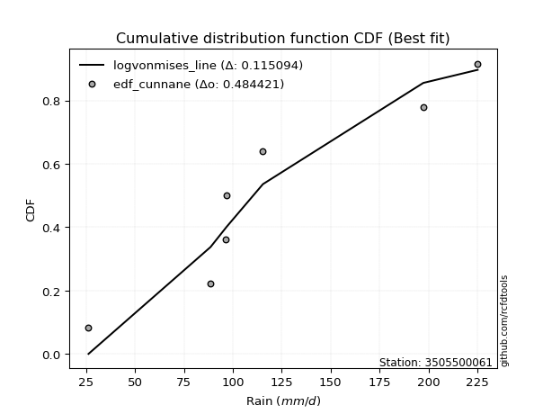</img>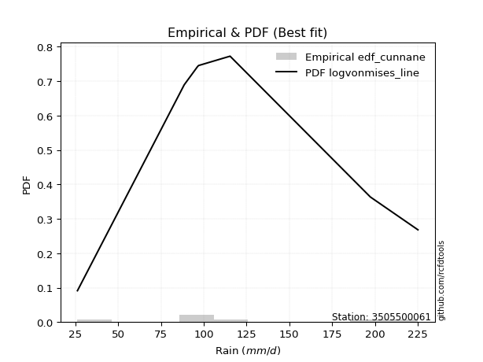</img>

</div>


### 12. EDF Adamowski (1981)

The Adamowski formula in hydrology refers to a specific plotting position formula used for estimating the non-parametric empirical distribution of hydrological events (like flood peaks) to calculate their return periods. This formula provides an alternative to traditional parametric methods (like the Gumbel or Log Pearson Type III distributions). 

<div align="center">


$P=(m-0.25)/(n+0.5)$


</div>


**12.1. Empirical values**

<div align="center">

|                | 0                  | 1                   | 2                   | 3             | 4                  | 5                  | 6                  |
|:---------------|:-------------------|:--------------------|:--------------------|:--------------|:-------------------|:-------------------|:-------------------|
| date           | 2021               | 2023                | 2019                | 2025          | 2022               | 2020               | 2024               |
| x              | 26.2               | 88.6                | 96.4                | 97.0          | 115.4              | 197.4              | 225.2              |
| m              | 1                  | 2                   | 3                   | 4             | 5                  | 6                  | 7                  |
| empirical_dist | edf_adamowski      | edf_adamowski       | edf_adamowski       | edf_adamowski | edf_adamowski      | edf_adamowski      | edf_adamowski      |
| empirical      | 0.1                | 0.23333333333333334 | 0.36666666666666664 | 0.5           | 0.6333333333333333 | 0.7666666666666667 | 0.9                |
| empirical_tr   | 1.1111111111111112 | 1.3043478260869565  | 1.5789473684210527  | 2.0           | 2.727272727272727  | 4.2857142857142865 | 10.000000000000002 |

</div>


**12.2. Kolmogorov-Smirnov fit test (sorted by Δ)**


<div align="center">

|                | 0                   | 1                   | 2                   | 3                   | 4                   | 5                   | 6                   | 7                   | 8                   | 9                   | 10                  | 11                  | 12                  | 13                  | 14                  | 15                  | 16                  | 17                  | 18                  | 19                  | 20                  | 21                  | 22                  | 23                  | 24                  | 25                  | 26                  | 27                  | 28                  | 29                  | 30                  | 31                  | 32                  | 33                  | 34                  | 35                  | 36                  | 37                  | 38                  | 39                  | 40                  | 41                  | 42                  | 43                  | 44                  | 45                  | 46                  | 47                  | 48                  | 49                  | 50                  | 51                  | 52                  | 53                  | 54                  | 55                  | 56                  | 57                  | 58                  | 59                  | 60                  | 61                  | 62                  | 63                  | 64                  | 65                  | 66                  | 67                  | 68                  | 69                  | 70                  | 71                  | 72                  | 73                  | 74                  | 75                  | 76                  | 77                  | 78                  | 79                  | 80                  | 81                  | 82                  | 83                  | 84                  | 85                  | 86                  | 87                  | 88                  | 89                  | 90                  | 91                  | 92                  | 93                  | 94                  | 95                  | 96                  | 97                  | 98                  | 99                  | 100                 | 101                 | 102                 | 103                 | 104                 | 105                 | 106                 | 107                 | 108                 | 109                 | 110                 | 111                 | 112                 | 113                 | 114                 | 115                 | 116                 | 117                 | 118                 | 119                 | 120                 | 121                 | 122                 | 123                 | 124                 | 125                 | 126                 | 127                 | 128                 | 129                 | 130                 | 131                 | 132                 | 133                 | 134                 | 135                 | 136                 | 137                 | 138                 | 139                 | 140                 | 141                 | 142                 | 143                 | 144                 | 145                 | 146                 | 147                 | 148                 | 149                 | 150                 | 151                 | 152                 | 153                 | 154                 | 155                 | 156                 | 157                 | 158                 | 159                 |
|:---------------|:--------------------|:--------------------|:--------------------|:--------------------|:--------------------|:--------------------|:--------------------|:--------------------|:--------------------|:--------------------|:--------------------|:--------------------|:--------------------|:--------------------|:--------------------|:--------------------|:--------------------|:--------------------|:--------------------|:--------------------|:--------------------|:--------------------|:--------------------|:--------------------|:--------------------|:--------------------|:--------------------|:--------------------|:--------------------|:--------------------|:--------------------|:--------------------|:--------------------|:--------------------|:--------------------|:--------------------|:--------------------|:--------------------|:--------------------|:--------------------|:--------------------|:--------------------|:--------------------|:--------------------|:--------------------|:--------------------|:--------------------|:--------------------|:--------------------|:--------------------|:--------------------|:--------------------|:--------------------|:--------------------|:--------------------|:--------------------|:--------------------|:--------------------|:--------------------|:--------------------|:--------------------|:--------------------|:--------------------|:--------------------|:--------------------|:--------------------|:--------------------|:--------------------|:--------------------|:--------------------|:--------------------|:--------------------|:--------------------|:--------------------|:--------------------|:--------------------|:--------------------|:--------------------|:--------------------|:--------------------|:--------------------|:--------------------|:--------------------|:--------------------|:--------------------|:--------------------|:--------------------|:--------------------|:--------------------|:--------------------|:--------------------|:--------------------|:--------------------|:--------------------|:--------------------|:--------------------|:--------------------|:--------------------|:--------------------|:--------------------|:--------------------|:--------------------|:--------------------|:--------------------|:--------------------|:--------------------|:--------------------|:--------------------|:--------------------|:--------------------|:--------------------|:--------------------|:--------------------|:--------------------|:--------------------|:--------------------|:--------------------|:--------------------|:--------------------|:--------------------|:--------------------|:--------------------|:--------------------|:--------------------|:--------------------|:--------------------|:--------------------|:--------------------|:--------------------|:--------------------|:--------------------|:--------------------|:--------------------|:--------------------|:--------------------|:--------------------|:--------------------|:--------------------|:--------------------|:--------------------|:--------------------|:--------------------|:--------------------|:--------------------|:--------------------|:--------------------|:--------------------|:--------------------|:--------------------|:--------------------|:--------------------|:--------------------|:--------------------|:--------------------|:--------------------|:--------------------|:--------------------|:--------------------|:--------------------|:--------------------|
| station        | 3505500061          | 3505500061          | 3505500061          | 3505500061          | 3505500061          | 3505500061          | 3505500061          | 3505500061          | 3505500061          | 3505500061          | 3505500061          | 3505500061          | 3505500061          | 3505500061          | 3505500061          | 3505500061          | 3505500061          | 3505500061          | 3505500061          | 3505500061          | 3505500061          | 3505500061          | 3505500061          | 3505500061          | 3505500061          | 3505500061          | 3505500061          | 3505500061          | 3505500061          | 3505500061          | 3505500061          | 3505500061          | 3505500061          | 3505500061          | 3505500061          | 3505500061          | 3505500061          | 3505500061          | 3505500061          | 3505500061          | 3505500061          | 3505500061          | 3505500061          | 3505500061          | 3505500061          | 3505500061          | 3505500061          | 3505500061          | 3505500061          | 3505500061          | 3505500061          | 3505500061          | 3505500061          | 3505500061          | 3505500061          | 3505500061          | 3505500061          | 3505500061          | 3505500061          | 3505500061          | 3505500061          | 3505500061          | 3505500061          | 3505500061          | 3505500061          | 3505500061          | 3505500061          | 3505500061          | 3505500061          | 3505500061          | 3505500061          | 3505500061          | 3505500061          | 3505500061          | 3505500061          | 3505500061          | 3505500061          | 3505500061          | 3505500061          | 3505500061          | 3505500061          | 3505500061          | 3505500061          | 3505500061          | 3505500061          | 3505500061          | 3505500061          | 3505500061          | 3505500061          | 3505500061          | 3505500061          | 3505500061          | 3505500061          | 3505500061          | 3505500061          | 3505500061          | 3505500061          | 3505500061          | 3505500061          | 3505500061          | 3505500061          | 3505500061          | 3505500061          | 3505500061          | 3505500061          | 3505500061          | 3505500061          | 3505500061          | 3505500061          | 3505500061          | 3505500061          | 3505500061          | 3505500061          | 3505500061          | 3505500061          | 3505500061          | 3505500061          | 3505500061          | 3505500061          | 3505500061          | 3505500061          | 3505500061          | 3505500061          | 3505500061          | 3505500061          | 3505500061          | 3505500061          | 3505500061          | 3505500061          | 3505500061          | 3505500061          | 3505500061          | 3505500061          | 3505500061          | 3505500061          | 3505500061          | 3505500061          | 3505500061          | 3505500061          | 3505500061          | 3505500061          | 3505500061          | 3505500061          | 3505500061          | 3505500061          | 3505500061          | 3505500061          | 3505500061          | 3505500061          | 3505500061          | 3505500061          | 3505500061          | 3505500061          | 3505500061          | 3505500061          | 3505500061          | 3505500061          | 3505500061          | 3505500061          | 3505500061          |
| empirical_dist | edf_adamowski       | edf_adamowski       | edf_adamowski       | edf_adamowski       | edf_adamowski       | edf_adamowski       | edf_adamowski       | edf_adamowski       | edf_adamowski       | edf_adamowski       | edf_adamowski       | edf_adamowski       | edf_adamowski       | edf_adamowski       | edf_adamowski       | edf_adamowski       | edf_adamowski       | edf_adamowski       | edf_adamowski       | edf_adamowski       | edf_adamowski       | edf_adamowski       | edf_adamowski       | edf_adamowski       | edf_adamowski       | edf_adamowski       | edf_adamowski       | edf_adamowski       | edf_adamowski       | edf_adamowski       | edf_adamowski       | edf_adamowski       | edf_adamowski       | edf_adamowski       | edf_adamowski       | edf_adamowski       | edf_adamowski       | edf_adamowski       | edf_adamowski       | edf_adamowski       | edf_adamowski       | edf_adamowski       | edf_adamowski       | edf_adamowski       | edf_adamowski       | edf_adamowski       | edf_adamowski       | edf_adamowski       | edf_adamowski       | edf_adamowski       | edf_adamowski       | edf_adamowski       | edf_adamowski       | edf_adamowski       | edf_adamowski       | edf_adamowski       | edf_adamowski       | edf_adamowski       | edf_adamowski       | edf_adamowski       | edf_adamowski       | edf_adamowski       | edf_adamowski       | edf_adamowski       | edf_adamowski       | edf_adamowski       | edf_adamowski       | edf_adamowski       | edf_adamowski       | edf_adamowski       | edf_adamowski       | edf_adamowski       | edf_adamowski       | edf_adamowski       | edf_adamowski       | edf_adamowski       | edf_adamowski       | edf_adamowski       | edf_adamowski       | edf_adamowski       | edf_adamowski       | edf_adamowski       | edf_adamowski       | edf_adamowski       | edf_adamowski       | edf_adamowski       | edf_adamowski       | edf_adamowski       | edf_adamowski       | edf_adamowski       | edf_adamowski       | edf_adamowski       | edf_adamowski       | edf_adamowski       | edf_adamowski       | edf_adamowski       | edf_adamowski       | edf_adamowski       | edf_adamowski       | edf_adamowski       | edf_adamowski       | edf_adamowski       | edf_adamowski       | edf_adamowski       | edf_adamowski       | edf_adamowski       | edf_adamowski       | edf_adamowski       | edf_adamowski       | edf_adamowski       | edf_adamowski       | edf_adamowski       | edf_adamowski       | edf_adamowski       | edf_adamowski       | edf_adamowski       | edf_adamowski       | edf_adamowski       | edf_adamowski       | edf_adamowski       | edf_adamowski       | edf_adamowski       | edf_adamowski       | edf_adamowski       | edf_adamowski       | edf_adamowski       | edf_adamowski       | edf_adamowski       | edf_adamowski       | edf_adamowski       | edf_adamowski       | edf_adamowski       | edf_adamowski       | edf_adamowski       | edf_adamowski       | edf_adamowski       | edf_adamowski       | edf_adamowski       | edf_adamowski       | edf_adamowski       | edf_adamowski       | edf_adamowski       | edf_adamowski       | edf_adamowski       | edf_adamowski       | edf_adamowski       | edf_adamowski       | edf_adamowski       | edf_adamowski       | edf_adamowski       | edf_adamowski       | edf_adamowski       | edf_adamowski       | edf_adamowski       | edf_adamowski       | edf_adamowski       | edf_adamowski       | edf_adamowski       | edf_adamowski       | edf_adamowski       |
| p_dist         | logvonmises_line    | burr                | mielke              | loggenlogistic      | f                   | erlang              | gamma               | genlogistic         | betaprime           | invgauss            | invweibull          | gengamma            | exponnorm           | ncf                 | skewnorm            | loggumbel_l         | invgamma            | gumbel_r            | nct                 | logweibull_min      | weibull_min         | rayleigh            | logburr12           | moyal               | gompertz            | rice                | logpearson3         | kstwobign           | logskewnorm         | loggengamma         | maxwell             | loglaplace          | loglaplace          | wald                | bradford            | truncpareto         | halflogistic        | logtruncweibull_min | halfnorm            | pearson3            | logloggamma         | logargus            | logmielke           | logtrapezoid        | logjohnsonsu        | loggenhalflogistic  | arcsine             | logt                | logdgamma           | kappa4              | ksone               | loggausshyper       | semicircular        | anglit              | loghypsecant        | logdweibull         | logburr             | gausshyper          | crystalball         | norm                | t                   | johnsonsu           | truncweibull_min    | dweibull            | loglogistic         | logistic            | logtriang           | dgamma              | logloglaplace       | hypsecant           | loggennorm          | lognct              | logcrystalball      | lognorm             | logexponnorm        | logrice             | wrapcauchy          | loglevy_l           | logfatiguelife      | cosine              | tukeylambda         | vonmises_line       | logncf              | logf                | uniform             | gennorm             | loganglit           | loggamma            | loggamma            | logbetaprime        | logsemicircular     | logerlang           | loginvgamma         | laplace             | logalpha            | kappa3              | logmaxwell          | beta                | logarcsine          | loginvgauss         | loggenpareto        | lograyleigh         | nakagami            | loggenextreme       | truncexpon          | gumbel_l            | loginvweibull       | logcosine           | logfoldnorm         | argus               | loggumbel_r         | levy_l              | genexpon            | burr12              | logweibull_max      | logtruncnorm        | lomax               | alpha               | logbeta             | loghalfnorm         | genpareto           | logmoyal            | logkstwobign        | loghalflogistic     | loggenexpon         | logwrapcauchy       | lognakagami         | loggompertz         | genextreme          | logrdist            | genhalflogistic     | logksone            | johnsonsb           | logkappa3           | logkappa4           | loguniform          | logbradford         | logwald             | logtukeylambda      | exponweib           | truncnorm           | triang              | loglomax            | loghalfgennorm      | halfgennorm         | trapezoid           | logtruncexpon       | logexponpow         | rdist               | fatiguelife         | powerlaw            | weibull_max         | foldnorm            | logexponweib        | logjohnsonsb        | logpowerlaw         | exponpow            | logtruncpareto      | logvonmises         | vonmises            |
| delta          | 0.10398280883475625 | 0.11173031819643686 | 0.11176318975938693 | 0.11214098376343218 | 0.11277512564926617 | 0.11284474895570007 | 0.11284482788008054 | 0.11397920138076584 | 0.11427304701320384 | 0.11607222966937392 | 0.1162596906747238  | 0.11673919842068514 | 0.11684018141097657 | 0.1173825292274096  | 0.11808613848099458 | 0.11873188710851834 | 0.12065211491749961 | 0.12132773854271783 | 0.12176885961427908 | 0.1218629865289782  | 0.12197977179930536 | 0.12217064560196322 | 0.12258278399991762 | 0.12354936398565408 | 0.12870619110081183 | 0.12972507770845232 | 0.12972532617298693 | 0.13003309318683043 | 0.13131750799126163 | 0.13361334022326765 | 0.1338387306752009  | 0.13815890523015134 | 0.13815890523015134 | 0.13947683780050013 | 0.14095374260432897 | 0.14096067233065418 | 0.14173410430404842 | 0.14238722370458928 | 0.1424278742488838  | 0.1427980042464318  | 0.14320625416907695 | 0.14514152841087746 | 0.1475343404754157  | 0.14754487745898465 | 0.14978461334848742 | 0.15158605601867903 | 0.15288786350862904 | 0.15657349782575541 | 0.15752764790038665 | 0.15835399930796284 | 0.158397232065693   | 0.1594392482798226  | 0.16096155334612688 | 0.16299523930658238 | 0.1634887335718752  | 0.16570246971127994 | 0.1658552271219177  | 0.16715793299306198 | 0.16792748557023424 | 0.16792758523291612 | 0.16792837655498416 | 0.16803932201956112 | 0.16811015387472916 | 0.17054749902081495 | 0.17254755980265524 | 0.17262244844254815 | 0.17440507302718578 | 0.1748336626547281  | 0.17705411269489502 | 0.17880249655234692 | 0.179467407701159   | 0.18295077422378264 | 0.18346972251480792 | 0.18347421195426156 | 0.18347467126172928 | 0.18349314538049544 | 0.18357823685067365 | 0.1836934851438201  | 0.18374202141084145 | 0.18387916162298518 | 0.18403063332115766 | 0.18430604224801883 | 0.18439545810758884 | 0.18453743386271715 | 0.18509212730318253 | 0.1855509730684265  | 0.19510515394895744 | 0.19664104105534025 | 0.19664104105534025 | 0.1977285677721013  | 0.19992313408766255 | 0.20081873256394872 | 0.20174783021079945 | 0.20705913964344286 | 0.21005654406621582 | 0.21718755252108463 | 0.2177810596590265  | 0.21786832094497627 | 0.21921066151989826 | 0.21980755982282202 | 0.22995073081725836 | 0.23000170689141203 | 0.23333328171015139 | 0.23777206580290133 | 0.23788663805045634 | 0.23847480204225247 | 0.23999957214872786 | 0.2414061884073701  | 0.2415088527275886  | 0.24549028977834264 | 0.24614005801500488 | 0.2491234116890336  | 0.24938275770459456 | 0.24956457916354485 | 0.25053412850818924 | 0.25113145832750194 | 0.2519761636669556  | 0.26045800841517625 | 0.2634571432304646  | 0.26461004302047614 | 0.26842420191871547 | 0.2701126470536697  | 0.27620057025491    | 0.2822471205368348  | 0.2846954146435348  | 0.2890760457289902  | 0.30145860203325164 | 0.309311910111214   | 0.3093491447023038  | 0.31159934716787224 | 0.3206782982115179  | 0.3219674861348966  | 0.32370648878216984 | 0.3318144666182014  | 0.3326356951750539  | 0.33302765002854257 | 0.3343947957852543  | 0.3358729662607048  | 0.3391966237839848  | 0.34985478378340723 | 0.35162610616284157 | 0.38589030566064075 | 0.3872528303901789  | 0.3948668105591933  | 0.4044263505717996  | 0.42460526389625397 | 0.432551186000148   | 0.5347471058165056  | 0.5576153720968129  | 0.5625344662907659  | 0.5937182765452855  | 0.6121482960228699  | 0.6333333333333333  | 0.6360202397027035  | 0.6417322300061858  | 0.6675302184062015  | 0.6893472387771036  | 0.7249289687008913  | 1.1498763173948126  | 35.108850979833115  |
| deltao         | 0.48442053926100004 | 0.48442053926100004 | 0.48442053926100004 | 0.48442053926100004 | 0.48442053926100004 | 0.48442053926100004 | 0.48442053926100004 | 0.48442053926100004 | 0.48442053926100004 | 0.48442053926100004 | 0.48442053926100004 | 0.48442053926100004 | 0.48442053926100004 | 0.48442053926100004 | 0.48442053926100004 | 0.48442053926100004 | 0.48442053926100004 | 0.48442053926100004 | 0.48442053926100004 | 0.48442053926100004 | 0.48442053926100004 | 0.48442053926100004 | 0.48442053926100004 | 0.48442053926100004 | 0.48442053926100004 | 0.48442053926100004 | 0.48442053926100004 | 0.48442053926100004 | 0.48442053926100004 | 0.48442053926100004 | 0.48442053926100004 | 0.48442053926100004 | 0.48442053926100004 | 0.48442053926100004 | 0.48442053926100004 | 0.48442053926100004 | 0.48442053926100004 | 0.48442053926100004 | 0.48442053926100004 | 0.48442053926100004 | 0.48442053926100004 | 0.48442053926100004 | 0.48442053926100004 | 0.48442053926100004 | 0.48442053926100004 | 0.48442053926100004 | 0.48442053926100004 | 0.48442053926100004 | 0.48442053926100004 | 0.48442053926100004 | 0.48442053926100004 | 0.48442053926100004 | 0.48442053926100004 | 0.48442053926100004 | 0.48442053926100004 | 0.48442053926100004 | 0.48442053926100004 | 0.48442053926100004 | 0.48442053926100004 | 0.48442053926100004 | 0.48442053926100004 | 0.48442053926100004 | 0.48442053926100004 | 0.48442053926100004 | 0.48442053926100004 | 0.48442053926100004 | 0.48442053926100004 | 0.48442053926100004 | 0.48442053926100004 | 0.48442053926100004 | 0.48442053926100004 | 0.48442053926100004 | 0.48442053926100004 | 0.48442053926100004 | 0.48442053926100004 | 0.48442053926100004 | 0.48442053926100004 | 0.48442053926100004 | 0.48442053926100004 | 0.48442053926100004 | 0.48442053926100004 | 0.48442053926100004 | 0.48442053926100004 | 0.48442053926100004 | 0.48442053926100004 | 0.48442053926100004 | 0.48442053926100004 | 0.48442053926100004 | 0.48442053926100004 | 0.48442053926100004 | 0.48442053926100004 | 0.48442053926100004 | 0.48442053926100004 | 0.48442053926100004 | 0.48442053926100004 | 0.48442053926100004 | 0.48442053926100004 | 0.48442053926100004 | 0.48442053926100004 | 0.48442053926100004 | 0.48442053926100004 | 0.48442053926100004 | 0.48442053926100004 | 0.48442053926100004 | 0.48442053926100004 | 0.48442053926100004 | 0.48442053926100004 | 0.48442053926100004 | 0.48442053926100004 | 0.48442053926100004 | 0.48442053926100004 | 0.48442053926100004 | 0.48442053926100004 | 0.48442053926100004 | 0.48442053926100004 | 0.48442053926100004 | 0.48442053926100004 | 0.48442053926100004 | 0.48442053926100004 | 0.48442053926100004 | 0.48442053926100004 | 0.48442053926100004 | 0.48442053926100004 | 0.48442053926100004 | 0.48442053926100004 | 0.48442053926100004 | 0.48442053926100004 | 0.48442053926100004 | 0.48442053926100004 | 0.48442053926100004 | 0.48442053926100004 | 0.48442053926100004 | 0.48442053926100004 | 0.48442053926100004 | 0.48442053926100004 | 0.48442053926100004 | 0.48442053926100004 | 0.48442053926100004 | 0.48442053926100004 | 0.48442053926100004 | 0.48442053926100004 | 0.48442053926100004 | 0.48442053926100004 | 0.48442053926100004 | 0.48442053926100004 | 0.48442053926100004 | 0.48442053926100004 | 0.48442053926100004 | 0.48442053926100004 | 0.48442053926100004 | 0.48442053926100004 | 0.48442053926100004 | 0.48442053926100004 | 0.48442053926100004 | 0.48442053926100004 | 0.48442053926100004 | 0.48442053926100004 | 0.48442053926100004 | 0.48442053926100004 | 0.48442053926100004 |
| eval           | Δo > Δ              | Δo > Δ              | Δo > Δ              | Δo > Δ              | Δo > Δ              | Δo > Δ              | Δo > Δ              | Δo > Δ              | Δo > Δ              | Δo > Δ              | Δo > Δ              | Δo > Δ              | Δo > Δ              | Δo > Δ              | Δo > Δ              | Δo > Δ              | Δo > Δ              | Δo > Δ              | Δo > Δ              | Δo > Δ              | Δo > Δ              | Δo > Δ              | Δo > Δ              | Δo > Δ              | Δo > Δ              | Δo > Δ              | Δo > Δ              | Δo > Δ              | Δo > Δ              | Δo > Δ              | Δo > Δ              | Δo > Δ              | Δo > Δ              | Δo > Δ              | Δo > Δ              | Δo > Δ              | Δo > Δ              | Δo > Δ              | Δo > Δ              | Δo > Δ              | Δo > Δ              | Δo > Δ              | Δo > Δ              | Δo > Δ              | Δo > Δ              | Δo > Δ              | Δo > Δ              | Δo > Δ              | Δo > Δ              | Δo > Δ              | Δo > Δ              | Δo > Δ              | Δo > Δ              | Δo > Δ              | Δo > Δ              | Δo > Δ              | Δo > Δ              | Δo > Δ              | Δo > Δ              | Δo > Δ              | Δo > Δ              | Δo > Δ              | Δo > Δ              | Δo > Δ              | Δo > Δ              | Δo > Δ              | Δo > Δ              | Δo > Δ              | Δo > Δ              | Δo > Δ              | Δo > Δ              | Δo > Δ              | Δo > Δ              | Δo > Δ              | Δo > Δ              | Δo > Δ              | Δo > Δ              | Δo > Δ              | Δo > Δ              | Δo > Δ              | Δo > Δ              | Δo > Δ              | Δo > Δ              | Δo > Δ              | Δo > Δ              | Δo > Δ              | Δo > Δ              | Δo > Δ              | Δo > Δ              | Δo > Δ              | Δo > Δ              | Δo > Δ              | Δo > Δ              | Δo > Δ              | Δo > Δ              | Δo > Δ              | Δo > Δ              | Δo > Δ              | Δo > Δ              | Δo > Δ              | Δo > Δ              | Δo > Δ              | Δo > Δ              | Δo > Δ              | Δo > Δ              | Δo > Δ              | Δo > Δ              | Δo > Δ              | Δo > Δ              | Δo > Δ              | Δo > Δ              | Δo > Δ              | Δo > Δ              | Δo > Δ              | Δo > Δ              | Δo > Δ              | Δo > Δ              | Δo > Δ              | Δo > Δ              | Δo > Δ              | Δo > Δ              | Δo > Δ              | Δo > Δ              | Δo > Δ              | Δo > Δ              | Δo > Δ              | Δo > Δ              | Δo > Δ              | Δo > Δ              | Δo > Δ              | Δo > Δ              | Δo > Δ              | Δo > Δ              | Δo > Δ              | Δo > Δ              | Δo > Δ              | Δo > Δ              | Δo > Δ              | Δo > Δ              | Δo > Δ              | Δo > Δ              | Δo > Δ              | Δo > Δ              | Δo > Δ              | Δo > Δ              | Δo > Δ              | Δo > Δ              | Δo <= Δ             | Δo <= Δ             | Δo <= Δ             | Δo <= Δ             | Δo <= Δ             | Δo <= Δ             | Δo <= Δ             | Δo <= Δ             | Δo <= Δ             | Δo <= Δ             | Δo <= Δ             | Δo <= Δ             | Δo <= Δ             |
| fit            | 1                   | 1                   | 1                   | 1                   | 1                   | 1                   | 1                   | 1                   | 1                   | 1                   | 1                   | 1                   | 1                   | 1                   | 1                   | 1                   | 1                   | 1                   | 1                   | 1                   | 1                   | 1                   | 1                   | 1                   | 1                   | 1                   | 1                   | 1                   | 1                   | 1                   | 1                   | 1                   | 1                   | 1                   | 1                   | 1                   | 1                   | 1                   | 1                   | 1                   | 1                   | 1                   | 1                   | 1                   | 1                   | 1                   | 1                   | 1                   | 1                   | 1                   | 1                   | 1                   | 1                   | 1                   | 1                   | 1                   | 1                   | 1                   | 1                   | 1                   | 1                   | 1                   | 1                   | 1                   | 1                   | 1                   | 1                   | 1                   | 1                   | 1                   | 1                   | 1                   | 1                   | 1                   | 1                   | 1                   | 1                   | 1                   | 1                   | 1                   | 1                   | 1                   | 1                   | 1                   | 1                   | 1                   | 1                   | 1                   | 1                   | 1                   | 1                   | 1                   | 1                   | 1                   | 1                   | 1                   | 1                   | 1                   | 1                   | 1                   | 1                   | 1                   | 1                   | 1                   | 1                   | 1                   | 1                   | 1                   | 1                   | 1                   | 1                   | 1                   | 1                   | 1                   | 1                   | 1                   | 1                   | 1                   | 1                   | 1                   | 1                   | 1                   | 1                   | 1                   | 1                   | 1                   | 1                   | 1                   | 1                   | 1                   | 1                   | 1                   | 1                   | 1                   | 1                   | 1                   | 1                   | 1                   | 1                   | 1                   | 1                   | 1                   | 1                   | 1                   | 1                   | 1                   | 1                   | 0                   | 0                   | 0                   | 0                   | 0                   | 0                   | 0                   | 0                   | 0                   | 0                   | 0                   | 0                   | 0                   |
| n              | 7                   | 7                   | 7                   | 7                   | 7                   | 7                   | 7                   | 7                   | 7                   | 7                   | 7                   | 7                   | 7                   | 7                   | 7                   | 7                   | 7                   | 7                   | 7                   | 7                   | 7                   | 7                   | 7                   | 7                   | 7                   | 7                   | 7                   | 7                   | 7                   | 7                   | 7                   | 7                   | 7                   | 7                   | 7                   | 7                   | 7                   | 7                   | 7                   | 7                   | 7                   | 7                   | 7                   | 7                   | 7                   | 7                   | 7                   | 7                   | 7                   | 7                   | 7                   | 7                   | 7                   | 7                   | 7                   | 7                   | 7                   | 7                   | 7                   | 7                   | 7                   | 7                   | 7                   | 7                   | 7                   | 7                   | 7                   | 7                   | 7                   | 7                   | 7                   | 7                   | 7                   | 7                   | 7                   | 7                   | 7                   | 7                   | 7                   | 7                   | 7                   | 7                   | 7                   | 7                   | 7                   | 7                   | 7                   | 7                   | 7                   | 7                   | 7                   | 7                   | 7                   | 7                   | 7                   | 7                   | 7                   | 7                   | 7                   | 7                   | 7                   | 7                   | 7                   | 7                   | 7                   | 7                   | 7                   | 7                   | 7                   | 7                   | 7                   | 7                   | 7                   | 7                   | 7                   | 7                   | 7                   | 7                   | 7                   | 7                   | 7                   | 7                   | 7                   | 7                   | 7                   | 7                   | 7                   | 7                   | 7                   | 7                   | 7                   | 7                   | 7                   | 7                   | 7                   | 7                   | 7                   | 7                   | 7                   | 7                   | 7                   | 7                   | 7                   | 7                   | 7                   | 7                   | 7                   | 7                   | 7                   | 7                   | 7                   | 7                   | 7                   | 7                   | 7                   | 7                   | 7                   | 7                   | 7                   | 7                   |
| best_fit       | 1                   | 0                   | 0                   | 0                   | 0                   | 0                   | 0                   | 0                   | 0                   | 0                   | 0                   | 0                   | 0                   | 0                   | 0                   | 0                   | 0                   | 0                   | 0                   | 0                   | 0                   | 0                   | 0                   | 0                   | 0                   | 0                   | 0                   | 0                   | 0                   | 0                   | 0                   | 0                   | 0                   | 0                   | 0                   | 0                   | 0                   | 0                   | 0                   | 0                   | 0                   | 0                   | 0                   | 0                   | 0                   | 0                   | 0                   | 0                   | 0                   | 0                   | 0                   | 0                   | 0                   | 0                   | 0                   | 0                   | 0                   | 0                   | 0                   | 0                   | 0                   | 0                   | 0                   | 0                   | 0                   | 0                   | 0                   | 0                   | 0                   | 0                   | 0                   | 0                   | 0                   | 0                   | 0                   | 0                   | 0                   | 0                   | 0                   | 0                   | 0                   | 0                   | 0                   | 0                   | 0                   | 0                   | 0                   | 0                   | 0                   | 0                   | 0                   | 0                   | 0                   | 0                   | 0                   | 0                   | 0                   | 0                   | 0                   | 0                   | 0                   | 0                   | 0                   | 0                   | 0                   | 0                   | 0                   | 0                   | 0                   | 0                   | 0                   | 0                   | 0                   | 0                   | 0                   | 0                   | 0                   | 0                   | 0                   | 0                   | 0                   | 0                   | 0                   | 0                   | 0                   | 0                   | 0                   | 0                   | 0                   | 0                   | 0                   | 0                   | 0                   | 0                   | 0                   | 0                   | 0                   | 0                   | 0                   | 0                   | 0                   | 0                   | 0                   | 0                   | 0                   | 0                   | 0                   | 0                   | 0                   | 0                   | 0                   | 0                   | 0                   | 0                   | 0                   | 0                   | 0                   | 0                   | 0                   | 0                   |
| best_fit_sort  | 1                   | 2                   | 3                   | 4                   | 5                   | 6                   | 7                   | 8                   | 9                   | 10                  | 11                  | 12                  | 13                  | 14                  | 15                  | 16                  | 17                  | 18                  | 19                  | 20                  | 21                  | 22                  | 23                  | 24                  | 25                  | 26                  | 27                  | 28                  | 29                  | 30                  | 31                  | 32                  | 33                  | 34                  | 35                  | 36                  | 37                  | 38                  | 39                  | 40                  | 41                  | 42                  | 43                  | 44                  | 45                  | 46                  | 47                  | 48                  | 49                  | 50                  | 51                  | 52                  | 53                  | 54                  | 55                  | 56                  | 57                  | 58                  | 59                  | 60                  | 61                  | 62                  | 63                  | 64                  | 65                  | 66                  | 67                  | 68                  | 69                  | 70                  | 71                  | 72                  | 73                  | 74                  | 75                  | 76                  | 77                  | 78                  | 79                  | 80                  | 81                  | 82                  | 83                  | 84                  | 85                  | 86                  | 87                  | 88                  | 89                  | 90                  | 91                  | 92                  | 93                  | 94                  | 95                  | 96                  | 97                  | 98                  | 99                  | 100                 | 101                 | 102                 | 103                 | 104                 | 105                 | 106                 | 107                 | 108                 | 109                 | 110                 | 111                 | 112                 | 113                 | 114                 | 115                 | 116                 | 117                 | 118                 | 119                 | 120                 | 121                 | 122                 | 123                 | 124                 | 125                 | 126                 | 127                 | 128                 | 129                 | 130                 | 131                 | 132                 | 133                 | 134                 | 135                 | 136                 | 137                 | 138                 | 139                 | 140                 | 141                 | 142                 | 143                 | 144                 | 145                 | 146                 | 147                 | 148                 | 149                 | 150                 | 151                 | 152                 | 153                 | 154                 | 155                 | 156                 | 157                 | 158                 | 159                 | 160                 |

</div>


**12.3. Best fit**

<div align="center">

|   id |    station | empirical_dist   | p_dist           |    delta |   deltao | eval   |   fit |   n |   best_fit |   best_fit_sort |
|-----:|-----------:|:-----------------|:-----------------|---------:|---------:|:-------|------:|----:|-----------:|----------------:|
|    0 | 3505500061 | edf_adamowski    | logvonmises_line | 0.103983 | 0.484421 | Δo > Δ |     1 |   7 |          1 |               1 |

</div>


<div align="center">

</img>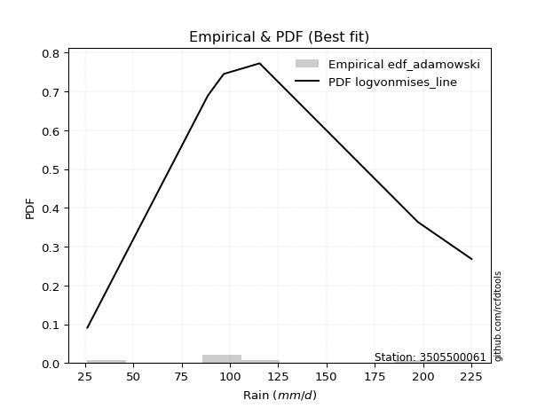</img>

</div>


## C. Best fit & Estimate extreme values for specific return periods - Tr

Best fit in probability distribution analysis means finding the theoretical distribution (like Normal, Poisson, Exponential, etc.) that most accurately mirrors your real-world data´s patterns (shape, center, spread) for better predictions, using methods like visual checks (Q-Q plots), goodness-of-fit tests (Kolmogorov-Smirnov, Chi-Squared), and information criteria (AIC) to score and select the simplest, most representative model.


### 1. Best fit (ordered by delta Δ)

:file_folder:Table: [bestfit_3505500061.csv](table/bestfit_3505500061.csv)

<div align="center">

|   id |    station | empirical_dist   | p_dist           |     delta |   deltao | eval   |   fit |   n |   best_fit |   best_fit_sort |
|-----:|-----------:|:-----------------|:-----------------|----------:|---------:|:-------|------:|----:|-----------:|----------------:|
|    0 | 3505500061 | edf_california   | gennorm          | 0.0950748 | 0.484421 | Δo > Δ |     1 |   7 |          1 |               1 |
|    1 | 3505500061 | edf_adamowski    | logvonmises_line | 0.103983  | 0.484421 | Δo > Δ |     1 |   7 |          1 |               2 |
|    2 | 3505500061 | edf_chegodayev   | logvonmises_line | 0.107586  | 0.484421 | Δo > Δ |     1 |   7 |          1 |               3 |
|    3 | 3505500061 | edf_jenkinson    | logvonmises_line | 0.108319  | 0.484421 | Δo > Δ |     1 |   7 |          1 |               4 |
|    4 | 3505500061 | edf_beard        | logvonmises_line | 0.108319  | 0.484421 | Δo > Δ |     1 |   7 |          1 |               5 |
|    5 | 3505500061 | edf_filliben     | logvonmises_line | 0.108871  | 0.484421 | Δo > Δ |     1 |   7 |          1 |               6 |
|    6 | 3505500061 | edf_tukey        | logvonmises_line | 0.110043  | 0.484421 | Δo > Δ |     1 |   7 |          1 |               7 |
|    7 | 3505500061 | edf_weibull      | logpearson3      | 0.113059  | 0.484421 | Δo > Δ |     1 |   7 |          1 |               8 |
|    8 | 3505500061 | edf_blom         | logvonmises_line | 0.113178  | 0.484421 | Δo > Δ |     1 |   7 |          1 |               9 |
|    9 | 3505500061 | edf_cunnane      | logvonmises_line | 0.115094  | 0.484421 | Δo > Δ |     1 |   7 |          1 |              10 |
|   10 | 3505500061 | edf_gringorten   | logvonmises_line | 0.118215  | 0.484421 | Δo > Δ |     1 |   7 |          1 |              11 |
|   11 | 3505500061 | edf_hazen        | logvonmises_line | 0.12303   | 0.484421 | Δo > Δ |     1 |   7 |          1 |              12 |

</div>


### 2. Extreme values and % difference analysis

In hydrology, a return period (or recurrence interval $Tr$) is the statistical average time between extreme events like floods or droughts of a specific magnitude, indicating how rare an event is, with a 100-year flood, for example, having a 1% chance of occurring in any given year, not that it happens exactly every century. It is a key tool for infrastructure design (like bridges or dams) and risk assessment, calculated from historical data to determine the probability of future events, although it is important to remember it is statistical average, and events can cluster or be missed.

The extreme value porcentage difference is evaluated as $pdiff = 1 - (ETrBf / ETr) * 100$, where _ETrBf_ correspond to the bestfit extreme value for a specific recurrence interval and _ETr_ correspond to the extreme value for one of the most used PDFsused in hydrology.

> risk_rate: assuming the return period as the project useful life.

:file_folder:Table: [extreme_3505500061.csv](table/extreme_3505500061.csv), all PDFs.  
:file_folder:Table: [extremepdiff_3505500061.csv](table/extremepdiff_3505500061.csv), % difference between bestfit and most used PDFs in Hydrology.

<div align="center">

Extreme values table for only best fit PDFs
|   id |      tr |   prob_l |     prob_g |      alpha |   anglit |   arcsine |   argus |     beta |   betaprime |   bradford |    burr |   burr12 |   cosine |   crystalball |   dgamma |   dweibull |   erlang |   exponnorm |   exponpow |   exponweib |       f |   fatiguelife |   foldnorm |   gamma |   gausshyper |   genexpon |       genextreme |   gengamma |   genhalflogistic |   genlogistic |   gennorm |   genpareto |   gompertz |   gumbel_l |   gumbel_r |   halfgennorm |   halflogistic |   halfnorm |   hypsecant |   invgamma |   invgauss |   invweibull |   johnsonsb |   johnsonsu |   kappa3 |   kappa4 |   ksone |   kstwobign |   laplace |   levy_l |   loggamma |   logistic |   loglaplace |    lomax |   maxwell |   mielke |   moyal |   nakagami |     ncf |     nct |    norm |   pearson3 |   powerlaw |   rayleigh |     rdist |    rice |   semicircular |   skewnorm |       t |   trapezoid |   triang |   truncexpon |   truncnorm |   truncpareto |   truncweibull_min |   tukeylambda |   uniform |   vonmises |   vonmises_line |    wald |   weibull_max |   weibull_min |   wrapcauchy |   logalpha |   loganglit |   logarcsine |   logargus |   logbeta |   logbetaprime |   logbradford |   logburr |   logburr12 |   logcosine |   logcrystalball |   logdgamma |   logdweibull |   logerlang |   logexponnorm |   logexponpow |     logexponweib |    logf |   logfatiguelife |   logfoldnorm |   loggausshyper |   loggenexpon |   loggenextreme |   loggengamma |   loggenhalflogistic |   loggenlogistic |       loggennorm |   loggenpareto |   loggompertz |   loggumbel_l |   loggumbel_r |   loghalfgennorm |   loghalflogistic |   loghalfnorm |   loghypsecant |   loginvgamma |   loginvgauss |   loginvweibull |   logjohnsonsb |   logjohnsonsu |   logkappa3 |   logkappa4 |   logksone |   logkstwobign |   loglevy_l |   logloggamma |   loglogistic |   logloglaplace |         loglomax |   logmaxwell |   logmielke |   logmoyal |   lognakagami |   logncf |   lognct |   lognorm |   logpearson3 |   logpowerlaw |   lograyleigh |   logrdist |   logrice |   logsemicircular |   logskewnorm |     logt |   logtrapezoid |   logtriang |   logtruncexpon |   logtruncnorm |   logtruncpareto |   logtruncweibull_min |   logtukeylambda |   loguniform |   logvonmises |   logvonmises_line |    logwald |   logweibull_max |   logweibull_min |   logwrapcauchy |    station |   n |   risk_rate |
|-----:|--------:|---------:|-----------:|-----------:|---------:|----------:|--------:|---------:|------------:|-----------:|--------:|---------:|---------:|--------------:|---------:|-----------:|---------:|------------:|-----------:|------------:|--------:|--------------:|-----------:|--------:|-------------:|-----------:|-----------------:|-----------:|------------------:|--------------:|----------:|------------:|-----------:|-----------:|-----------:|--------------:|---------------:|-----------:|------------:|-----------:|-----------:|-------------:|------------:|------------:|---------:|---------:|--------:|------------:|----------:|---------:|-----------:|-----------:|-------------:|---------:|----------:|---------:|--------:|-----------:|--------:|--------:|--------:|-----------:|-----------:|-----------:|----------:|--------:|---------------:|-----------:|--------:|------------:|---------:|-------------:|------------:|--------------:|-------------------:|--------------:|----------:|-----------:|----------------:|--------:|--------------:|--------------:|-------------:|-----------:|------------:|-------------:|-----------:|----------:|---------------:|--------------:|----------:|------------:|------------:|-----------------:|------------:|--------------:|------------:|---------------:|--------------:|-----------------:|--------:|-----------------:|--------------:|----------------:|--------------:|----------------:|--------------:|---------------------:|-----------------:|-----------------:|---------------:|--------------:|--------------:|--------------:|-----------------:|------------------:|--------------:|---------------:|--------------:|--------------:|----------------:|---------------:|---------------:|------------:|------------:|-----------:|---------------:|------------:|--------------:|--------------:|----------------:|-----------------:|-------------:|------------:|-----------:|--------------:|---------:|---------:|----------:|--------------:|--------------:|--------------:|-----------:|----------:|------------------:|--------------:|---------:|---------------:|------------:|----------------:|---------------:|-----------------:|----------------------:|-----------------:|-------------:|--------------:|-------------------:|-----------:|-----------------:|-----------------:|----------------:|-----------:|----:|------------:|
|    0 |    2    | 0.5      | 0.5        |    89.8898 |  120.886 |   120.886 | 136.012 |  97.9405 |     112.389 |    116.907 | 112.061 |  92.0231 |  123.748 |       120.886 |   97     |     97     |  112.092 |     109.077 |    34.4857 |     74.0396 | 112.102 |       26.2018 |    141.521 | 112.092 |      107.702 |    91.8171 |     51.9438      |    112.716 |           157.406 |       111.083 |   96.4    |     150.155 |    114.577 |    131.266 |    110.506 |       58.8885 |        105.346 |    107.952 |     120.886 |    113.445 |    112.704 |      111.015 |     216.084 |     120.886 |  133.385 |  120.476 | 120.886 |     109.733 |   120.886 |  140.973 |     99.686 |    120.886 |      101.548 |  91.3257 |   115.482 |  112.072 | 107.155 |    113.807 | 111.689 | 113.699 | 120.886 |    116.886 |    29.0861 |    113.565 |   7.22864 | 114.814 |        120.886 |    113.02  | 120.886 |     175.157 |  161.209 |      94.5005 |     66.154  |       116.908 |            122.217 |       125.757 |   125.7   |    1.93536 |         125.557 | 100.405 |       224.866 |       111.608 |      125.966 |    97.3107 |     101.548 |      101.548 |    117.64  |   142.567 |        99.6391 |       76.5522 |   122.051 |     113.64  |     92.7209 |          101.549 |      97     |        97     |      98.972 |        101.548 |       42.5802 |     27.0943      | 101.414 |          101.488 |       92.4635 |         122.168 |       85.2501 |         139.948 |       109.392 |              112.724 |          112.122 |     96.4         |        104.977 |       80.5571 |       112.98  |       91.2734 |          60.8319 |           86.5585 |        88.909 |        101.548 |       98.6798 |       96.0726 |         93.6825 |        26.2192 |        118.258 |      26.2   |     76.4502 |    76.813  |        86.7797 |     135.066 |       117.083 |       101.548 |          97     |    208.454       |      96.0625 |     111.426 |    88.1837 |       89.513  |  101.455 |  101.617 |   101.548 |       111.575 |       27.5258 |       94.1891 |    76.9293 |   101.544 |           101.548 |       112.599 |  105.715 |        113.516 |     105.753 |         61.7049 |        109.733 |          26.6822 |               109.428 |          75.1061 |      76.813  |      0.198116 |            110.168 |    82.2735 |          190.538 |          113.513 |          76.813 | 3505500061 |   7 |    0.75     |
|    1 |    2.33 | 0.570815 | 0.429185   |   106.99   |  134.019 |   140.601 | 148.425 | 112.489  |     123.832 |    131.103 | 123.184 | 107.804  |  135.468 |       132.161 |  102.062 |    102.609 |  123.587 |     119.555 |    37.9389 |     86.2733 | 123.595 |       29.1091 |    141.575 | 123.587 |      122.208 |   106.275  |    150.877       |    124.433 |           170.374 |       122.28  |   98.4072 |     166.346 |    127.398 |    141.075 |    120.953 |       71.7867 |        116.087 |    120.121 |     129.909 |    124.616 |    124.022 |      122.435 |     223.125 |     132.127 |  148.573 |  134.96  | 136.385 |     121.601 |   127.709 |  166.546 |    112.403 |    130.82  |      108.924 | 105.708  |   127.196 |  123.201 | 117.045 |    122.624 | 123.359 | 124.353 | 132.161 |    128.209 |    32.6812 |    125.453 |  29.1146  | 126.565 |        134.971 |    124.372 | 132.162 |     186.719 |  171.787 |     109.592  |     84.8727 |       131.104 |            136.124 |       140.221 |   139.792 |    2.13588 |         139.669 | 107.798 |       225.07  |       123.589 |      140.844 |   109.607  |     116.222 |      124.356 |    131.219 |   156.682 |       112.521  |       89.1923 |   136.616 |     125.484 |    105.373  |          114.025 |     102.326 |       102.844 |     111.594 |        114.024 |       49.1923 |     28.2083      | 113.915 |          113.944 |      104.731  |         140.858 |       99.4958 |         155.354 |       121.36  |              128.289 |          123.278 |     97.0211      |        137.239 |       94.4592 |       124.963 |      101.619  |          73.7797 |           96.6615 |       100.753 |        111.415 |      111.14   |      108.819  |        109.438  |        26.2691 |        130.713 |      26.2   |     89.5644 |    92.2205 |       101.763  |     157.78  |       129.336 |       112.463 |         104.167 |    329.203       |     108.352  |     125.866 |    97.6178 |       91.0114 |  113.99  |  114.076 |   114.024 |       124.357 |       29.0003 |      106.428  |    96.0285 |   114.019 |           117.365 |       125.769 |  118.321 |        129.712 |     119.83  |         71.5662 |        114.722 |          27.0072 |               122.195 |          88.2549 |      89.4531 |      0.220733 |            120.763 |    88.7681 |          212.721 |          125.409 |         115.546 | 3505500061 |   7 |    0.729209 |
|    2 |    5    | 0.8      | 0.2        |   239.584  |  180.356 |   193.174 | 188.24  | 170.826  |     171.317 |    179.568 | 170.045 | 192.826  |  177.703 |       174.061 |  136.377 |    145.631 |  171.412 |     167.023 |    58.988  |    144.107  | 171.41  |       90.8334 |    141.804 | 171.412 |      174.616 |   178.558  | 118123           |    172.741 |           204.221 |       170.508 |  119.143  |     207.738 |    176.056 |    172.764 |    166.342 |      169.516  |        164.691 |    171.58  |     166.103 |    170.657 |    171.011 |      172.053 |     225.196 |     173.898 |  197.728 |  182.965 | 186.546 |     172.014 |   161.822 |  208.913 |    176.905 |    169.176 |      154.662 | 177.795  |   173.301 |  170.067 | 162.855 |    167.073 | 171.934 | 168.694 | 174.061 |    172.56  |    77.1303 |    173.042 |  90.5377  | 173.176 |        183.039 |    171.637 | 174.065 |     219.889 |  202.135 |     165.163  |    148.271  |       179.568 |            182.21  |       186.684 |   185.4   |    2.92051 |         185.341 | 149.184 |       225.198 |       172.578 |      187.426 |   173.109  |     187.112 |      213.46  |    178.584 |   198.442 |       178.285  |      146.259  |   184.81  |     172.989 |    167.078  |          175.393 |     141.621 |       150.019 |     175.748 |        175.391 |      101.764  |     49.7042      | 175.5   |          175.246 |      171.769  |         198.014 |      185.46   |         198.443 |       172.187 |              180.612 |          170.184 |    112.652       |        212.727 |      171.937  |       173.069 |      162.014  |         198.446  |          159.291  |       170.977 |        161.618 |      174.989  |      176.372  |        215.007  |        34.2591 |        176.78  |     147.001 |    148.731  |   166.637  |       200.178  |     204.124 |       175.73  |       166.803 |         151.318 |   3233.57        |     174.025  |     177.629 |   156.312  |      121.492  |  175.871 |  175.266 |   175.391 |       176.883 |       49.5985 |      173.563  |   177.866  |   175.38  |           192.345 |       173.578 |  180.96  |        190.181 |     171.504 |        123.852  |        140.791 |          32.2363 |               170.248 |         147.908  |     146.459  |      0.332082 |            172.976 |   135.823  |          225.08  |          173.046 |         191.385 | 3505500061 |   7 |    0.67232  |
|    3 |   10    | 0.9      | 0.1        |   483.191  |  206.583 |   205.865 | 207.44  | 206.267  |     207.341 |    201.979 | 209.804 | 279.652  |  203.219 |       201.857 |  170.396 |    192.899 |  207.753 |     208.699 |    80.4655 |    191.018  | 207.742 |      176.059  |    141.972 | 207.753 |      200.097 |   244.175  |      3.13699e+07 |    208.962 |           215.752 |       209.515 |  150.738  |     219.405 |    207.342 |    190.408 |    203.31  |      311.842  |        205.054 |    209.659 |     195.006 |    205.673 |    206.816 |      212.467 |     225.203 |     201.607 |  219.175 |  204.482 | 208.433 |     210.397 |   192.79  |  219.141 |    240.539 |    197.424 |      212.617 | 243.493  |   205.747 |  209.809 | 202.741 |    203.605 | 208.757 | 203.722 | 201.857 |    203.993 |   130.766  |    206.974 | 107.868   | 205.99  |        207.704 |    206.512 | 201.862 |     232.846 |  213.988 |     193.518  |    181.563  |       201.98  |            203.271 |       206.502 |   205.3   |    3.52251 |         205.27  | 193.105 |       225.2   |       208.342 |      206.755 |   237.608  |     244.997 |      243.2   |    203.21  |   213.862 |       243.752  |      181.487  |   206.439 |     206.956 |    220.733  |          233.384 |     193.51  |       220.237 |     239.235 |        233.382 |      189.183  |    137.945       | 233.796 |          233.218 |      241.61   |         216.268 |      289.787  |         213.657 |       211.369 |              203.485 |          209.884 |    163.175       |        223.405 |      251.873  |       207.475 |      236.893  |         500.678  |          241.184  |       252.87  |        217.515 |      239.044  |      247.359  |        372.675  |       137.158  |        205.592 |     182.367 |    184.368  |   215.716  |       335.064  |     217.218 |       206.406 |       222.988 |         217.931 |  25727.1         |     242.9    |     202.838 |   235.511  |      194.333  |  234.638 |  232.957 |   233.381 |       214.375 |       88.0395 |      245.983  |   210.586  |   233.364 |           247.837 |       197.917 |  242.902 |        220.841 |     197.285 |        164.137  |        164.38  |          47.5997 |               195.744 |         183.921  |     181.611  |      0.441815 |            227.879 |   213.305  |          225.197 |          207.02  |         209.163 | 3505500061 |   7 |    0.651322 |
|    4 |   15    | 0.933333 | 0.0666667  |   725.929  |  217.783 |   208.286 | 214.739 | 221.264  |     226.73  |    209.628 | 234.069 | 335.145  |  214.842 |       215.727 |  190.78  |    222.731 |  227.313 |     233.051 |    93.2957 |    216.296  | 227.297 |      231.798  |    142.059 | 227.313 |      208.892 |   282.559  |      7.31589e+08 |    228.288 |           219.185 |       231.469 |  174.688  |     222.16  |    222.33  |    198.398 |    224.167 |      421.772  |        227.896 |    229.475 |     211.5   |    224.672 |    226.172 |      235.269 |     225.203 |     215.435 |  226.325 |  211.757 | 215.729 |     230.773 |   210.904 |  222.231 |    280.939 |    212.815 |      256.123 | 282.039  |   222.394 |  234.058 | 225.888 |    223.076 | 228.527 | 223.45  | 215.727 |    220.29  |   156.773  |    224.457 | 111.687   | 222.768 |        217.322 |    224.66  | 215.734 |     237.003 |  217.792 |     203.672  |    194.447  |       209.629 |            210.473 |       212.968 |   211.933 |    3.85375 |         211.913 | 221.309 |       225.2   |       226.998 |      213.104 |   279.477  |     274.882 |      249.326 |    212.837 |   218.348 |       285.573  |      195.024  |   213.736 |     224.488 |    250.588  |          269.141 |     232.941 |       278.552 |     279.632 |        269.139 |      265.692  |    297.437       | 269.779 |          268.983 |      286.881  |         220.602 |      364.871  |         218.09  |       232.523 |              210.963 |          234.085 |    234.243       |        224.629 |      302.213  |       225.232 |      293.523  |         868.503  |          305.001  |       309.986 |        257.695 |      280.238  |      294.458  |        508.28   |       198.598  |        219.103 |     195.955 |    197.654  |   235.101  |       440.444  |     221.336 |       221.528 |       261.201 |         273.063 |  86551.1         |     288.224  |     211.619 |   298.762  |      261.404  |  270.993 |  268.474 |   269.138 |       233.258 |      114.805  |      294.4    |   218.349  |   269.115 |           273.587 |       206.649 |  283.063 |        231.691 |     206.352 |        181.611  |        177.059 |          63.715  |               205.068 |         197.338  |     195.112  |      0.513599 |            265.174 |   285.024  |          225.2   |          224.527 |         214.552 | 3505500061 |   7 |    0.644736 |
|    5 |   20    | 0.95     | 0.05       |   968.454  |  224.371 |   209.139 | 218.746 | 229.917  |     239.952 |    213.487 | 252.139 | 376.785  |  221.99  |       224.811 |  205.38  |    244.677 |  240.646 |     250.328 |   102.397  |    233.401  | 240.628 |      273.065  |    142.117 | 240.646 |      213.327 |   309.793  |      6.63643e+09 |    241.395 |           220.816 |       246.828 |  194.144  |     223.277 |    231.886 |    203.372 |    238.771 |      512.738  |        243.9   |    242.686 |     223.136 |    237.711 |    239.408 |      251.235 |     225.203 |     224.491 |  229.899 |  215.421 | 219.377 |     244.5   |   223.757 |  223.813 |    311.223 |    223.453 |      292.289 | 309.44   |   233.443 |  252.114 | 242.282 |    236.141 | 241.983 | 237.338 | 224.811 |    231.186 |   171.679  |    236.078 | 113.155   | 233.874 |        222.657 |    236.76  | 224.818 |     239.053 |  219.668 |     208.895  |    201.401  |       213.487 |            214.113 |       216.156 |   215.25  |    4.07359 |         215.235 | 242.327 |       225.2   |       239.477 |      216.267 |   311.31   |     294.138 |      251.52  |    218.178 |   220.408 |       317.038  |      202.166  |   217.402 |     236.152 |    270.921  |          295.476 |     265.915 |       330.255 |     309.955 |        295.474 |      334.708  |    544.362       | 296.297 |          295.333 |      321.126  |         222.337 |      425.306  |         220.149 |       246.948 |              214.65  |          252.098 |    328.013       |        224.947 |      339.379  |       237.043 |      341.053  |        1288.53   |          359.528  |       355.067 |        290.43  |      311.371  |      330.73   |        631.636  |       214.948  |        227.589 |     203.124 |    204.521  |   245.436  |       529.534  |     223.475 |       231.346 |       291.376 |         322.276 | 204692           |     322.881  |     216.082 |   353.584  |      321.843  |  297.822 |  294.608 |   295.472 |       245.545 |      133.317  |      331.744  |   221.359  |   295.446 |           289.006 |       211.145 |  313.767 |        237.237 |     210.977 |        191.327  |        185.197 |          78.3451 |               209.907 |         204.269  |     202.234  |      0.569181 |            293.212 |   353.743  |          225.2   |          236.165 |         217.211 | 3505500061 |   7 |    0.641514 |
|    6 |   25    | 0.96     | 0.04       |  1210.89   |  228.836 |   209.534 | 221.329 | 235.675  |     249.954 |    215.813 | 266.76  | 410.445  |  227.003 |       231.498 |  216.767 |    262.096 |  250.729 |     263.73  |   109.429  |    246.239  | 250.709 |      305.854  |    142.159 | 250.729 |      215.995 |   330.917  |      3.62735e+10 |    251.273 |           221.764 |       258.652 |  210.656  |     223.852 |    238.785 |    206.911 |    250.019 |      591.103  |        256.23  |    252.516 |     232.141 |    247.627 |    249.441 |      263.533 |     225.203 |     231.157 |  232.044 |  217.63  | 221.566 |     254.781 |   233.726 |  224.806 |    335.701 |    231.59  |      323.823 | 330.723  |   241.645 |  266.724 | 254.988 |    245.886 | 252.147 | 248.106 | 231.498 |    239.32  |   181.287  |    244.712 | 113.882   | 242.103 |        226.118 |    245.762 | 231.505 |     240.275 |  220.786 |     212.078  |    205.772  |       215.813 |            216.31  |       218.05  |   217.24  |    4.23048 |         217.228 | 259.161 |       225.2   |       248.787 |      218.162 |   337.313  |     307.949 |      252.544 |    221.644 |   221.569 |       342.541  |      206.576  |   219.607 |     244.825 |    286.155  |          316.495 |     294.781 |       377.562 |     334.49  |        316.493 |      398.18   |    895.152       | 317.472 |          316.37  |      348.958  |         223.219 |      476.629  |         221.322 |       257.852 |              216.838 |          266.669 |    448.681       |        225.065 |      368.989  |       245.824 |      382.849  |        1753.18   |          408.101  |       392.812 |        318.592 |      336.691  |      360.629  |        746.711  |       220.285  |        233.644 |     207.55  |    208.696  |   251.855  |       607.882  |     224.829 |       238.527 |       316.792 |         367.709 | 399084           |     351.279  |     218.784 |   402.908  |      376.956  |  319.265 |  315.453 |   316.491 |       254.509 |      146.672  |      362.525  |   222.844  |   316.462 |           299.471 |       213.887 |  339.017 |        240.605 |     213.782 |        197.506  |        190.917 |          91.105  |               212.87  |         208.482  |     206.632  |      0.615515 |            314.995 |   420.556  |          225.2   |          244.811 |         218.803 | 3505500061 |   7 |    0.639603 |
|    7 |   50    | 0.98     | 0.02       |  2422.71   |  239.826 |   210.062 | 227.187 | 249.332  |     279.88  |    220.49  | 316.3   | 523.102  |  240.129 |       250.646 |  252.405 |    318.152 |  280.874 |     305.358 |   130.998  |    284.03   | 280.849 |      411.056  |    142.283 | 280.874 |      221.324 |   396.534  |      6.79133e+12 |    280.628 |           223.578 |       295.058 |  269.968  |     224.753 |    257.895 |    216.518 |    284.671 |      880.896  |        294.221 |    281.088 |     260.062 |    277.599 |    279.566 |      301.418 |     225.203 |     250.246 |  236.334 |  222.082 | 225.943 |     284.973 |   264.694 |  227.043 |    417.671 |    256.454 |      445.167 | 396.999  |   265.434 |  316.218 | 294.435 |    274.268 | 282.479 | 281.844 | 250.646 |    263.148 |   202.1    |    269.775 | 114.95    | 265.885 |        234.025 |    271.929 | 250.654 |     242.7   |  223.004 |     218.56   |    215.049  |       220.49  |            220.734 |       221.776 |   221.22  |    4.61332 |         221.214 | 314.126 |       225.2   |       275.99  |      221.949 |   426.097  |     344.772 |      253.919 |    229.562 |   223.667 |       428.349  |      215.687  |   224.037 |     270.026 |    330.231  |          385.327 |     406.636 |       577.277 |     416.796 |        385.325 |      663.837  |   4774.48        | 386.868 |          385.293 |      442.886  |         224.571 |      663.61   |         223.487 |       290.405 |              221.138 |          316.017 |   1667.12        |        225.181 |      465.04   |       271.334 |      546.622  |        4608.09   |          603.027  |       526.878 |        424.472 |      422.433  |      464.33   |       1250.44   |       224.63   |        250.045 |     216.695 |    217.105  |   265.199  |       911.57   |     227.905 |       258.86  |       409.022 |         564.779 |      3.17521e+06 |     448.565  |     224.241 |   604.32   |      601.702  |  389.663 |  383.637 |   385.322 |       279.58  |      179.985  |      469.029  |   225.006  |   385.284 |           324.82  |       219.472 |  426.766 |        247.43  |     219.459 |        210.723  |        205.086 |         133.352  |               218.936 |         216.968  |     215.716  |      0.782772 |            375.092 |   739.853  |          225.2   |          269.913 |         221.99  | 3505500061 |   7 |    0.63583  |
|    8 |   75    | 0.986667 | 0.0133333  |  3634.36   |  244.663 |   210.16  | 229.511 | 255.03   |     296.737 |    222.056 | 348.705 | 595.104  |  246.397 |       260.92  |  273.397 |    352.153 |  297.834 |     329.709 |   143.366  |    304.863  | 297.807 |      474.413  |    142.35  | 297.834 |      223.087 |   434.917  |      1.42148e+14 |    297.031 |           224.152 |       316.209 |  310.381  |     224.965 |    267.753 |    221.377 |    304.812 |     1085.17   |        316.306 |    296.641 |     276.378 |    294.706 |    296.604 |      323.439 |     225.203 |     260.488 |  237.764 |  223.581 | 227.402 |     301.584 |   282.809 |  227.962 |    470.096 |    270.814 |      536.258 | 435.883  |   278.367 |  348.59  | 317.503 |    289.722 | 299.51  | 301.97  | 260.92  |    276.263 |   209.537  |    283.41  | 115.179   | 278.761 |        237.183 |    286.174 | 260.929 |     243.503 |  223.739 |     220.755  |    218.324  |       222.056 |            222.218 |       222.99  |   222.547 |    4.76137 |         222.543 | 347.949 |       225.2   |       290.894 |      223.21  |   484.197  |     362.343 |      254.175 |    232.725 |   224.275 |       483.533  |      218.813  |   225.547 |     283.755 |    353.614  |          428.239 |     491.247 |       744.015 |     469.546 |        428.237 |      879.129  |  13673.2         | 430.169 |          428.286 |      503.383  |         224.879 |      794.63   |         224.136 |       308.674 |              222.537 |          348.284 |   4746.95        |        225.194 |      523.897  |       285.225 |      672.328  |        8161.47   |          756.671  |       618.202 |        501.964 |      478.002  |      533.388  |       1687.35   |       225.022  |        258.262 |     219.832 |    219.891  |   269.803  |      1139.22   |     229.182 |       269.625 |       474.067 |         736.378 |      1.0682e+07  |     512.331  |     226.082 |   765.992  |      777.567  |  433.676 |  426.088 |   428.233 |       292.542 |      193.515  |      539.581  |   225.46   |   428.189 |           335.537 |       221.365 |  485.764 |        249.732 |     221.371 |        215.401  |        210.934 |         155.884  |               221.002 |         219.783  |     218.832  |      0.902647 |            401.26  |  1047.38   |          225.2   |          283.57  |         223.056 | 3505500061 |   7 |    0.634587 |
|    9 |  100    | 0.99     | 0.01       |  4845.96   |  247.539 |   210.195 | 230.807 | 258.298  |     308.46  |    222.841 | 373.475 | inf      |  250.326 |       267.869 |  288.342 |    376.762 |  309.619 |     346.987 |   152.015  |    319.153  | 309.591 |      520.001  |    142.395 | 309.619 |      223.963 |   462.151  |      1.22333e+15 |    308.384 |           224.43  |       331.176 |  341.659  |     225.051 |    274.265 |    224.554 |    319.067 |     1246.7    |        331.936 |    307.237 |     287.952 |    306.707 |    308.482 |      339.024 |     225.203 |     267.416 |  238.479 |  224.334 | 228.132 |     312.966 |   295.661 |  228.499 |    509.441 |    280.953 |      611.981 | 463.525  |   287.176 |  373.334 | 333.869 |    300.244 | 311.33  | 316.496 | 267.869 |    285.264 |   213.352  |    292.699 | 115.267   | 287.511 |        238.952 |    295.877 | 267.879 |     243.903 |  224.105 |     221.859  |    220.001  |       222.841 |            222.962 |       223.589 |   223.21  |    4.83844 |         223.207 | 372.609 |       225.2   |       301.087 |      223.841 |   528.448  |     373.213 |      254.264 |    234.496 |   224.553 |       525.092  |      220.392  |   226.339 |     293.114 |    369.107  |          459.941 |     561.922 |       892.667 |     509.188 |        459.938 |     1065.17   |  29617.3         | 462.174 |          460.058 |      548.94   |         225     |      898.454  |         224.441 |       321.344 |              223.226 |          372.943 |  11529.9         |        225.197 |      566.778  |       294.694 |      778.403  |       12275.1    |          888.532  |       689.321 |        565.367 |      520.063  |      586.542  |       2086.01   |       225.119  |        263.586 |     221.417 |    221.27   |   272.135  |      1327.22   |     229.931 |       276.847 |       526.127 |         894.871 |      2.52628e+07 |     560.879  |     227.02  |   906.291  |      925.88   |  466.247 |  457.423 |   459.935 |       301.067 |      200.822  |      593.632  |   225.631  |   459.885 |           341.692 |       222.318 |  531.651 |        250.888 |     222.331 |        217.794  |        214.141 |         169.643  |               222.043 |         221.179  |     220.407  |      1.00128  |            415.59  |  1349.48   |          225.2   |          292.875 |         223.59  | 3505500061 |   7 |    0.633968 |
|   10 |  200    | 0.995    | 0.005      |  9692.28   |  252.972 |   210.228 | 233.061 | 264.169  |     336.03  |    224.019 | 440.083 | inf      |  258.315 |       283.632 |  324.492 |    437.555 |  337.3   |     388.616 |   172.398  |    352.115  | 337.271 |      631.591  |    142.499 | 337.3   |      225.262 |   527.768  |      2.16221e+17 |    334.906 |           224.834 |       367.155 |  426.06   |     225.151 |    288.584 |    231.461 |    353.337 |     1696.13   |        369.514 |    331.47  |     315.835 |    335.296 |    336.51  |      376.495 |     225.203 |     283.13  |  239.568 |  225.473 | 229.226 |     339.18  |   326.629 |  229.516 |    612.072 |    305.273 |      841.305 | 530.302  |   307.331 |  439.867 | 373.299 |    324.273 | 339.052 | 352.538 | 283.632 |    306.079 |   219.2    |    313.954 | 115.361   | 307.463 |        242.035 |    318.071 | 283.642 |     244.502 |  224.653 |     223.525  |    222.567  |       224.019 |            224.079 |       224.472 |   224.205 |    4.95679 |         224.204 | 434.035 |       225.2   |       324.528 |      224.786 |   646.36   |     394.647 |      254.351 |    237.584 |   224.927 |       634.025  |      222.783  |   227.703 |     314.55  |    402.733  |          540.824 |     777.48  |      1393.55  |     612.781 |        540.82  |     1653.51   | 205594           | 543.888 |          541.162 |      668.199  |         225.137 |     1190.08   |         224.863 |       351.013 |              224.241 |          439.235 | 172844           |        225.2   |      673.706  |       316.373 |     1107.04   |       33087      |         1307.37   |       884.265 |        752.972 |      631.129  |      730.265  |       3473.45   |       225.186  |        274.97  |     223.817 |    223.302  |   275.67   |      1886.82   |     231.358 |       293.055 |       675.522 |        1465.98  |      2.00997e+08 |     689.961  |     228.537 |  1359.11   |     1378.08   |  549.551 |  537.28  |   540.816 |       319.578 |      212.526  |      738.555  |   225.81   |   540.753 |           352.693 |       223.754 |  658.355 |        252.628 |     223.776 |        221.454  |        219.373 |         194.321  |               223.615 |         223.241  |     222.791  |      1.30505  |            438.59  |  2537.02   |          225.2   |          314.167 |         224.394 | 3505500061 |   7 |    0.633042 |
|   11 |  250    | 0.996    | 0.004      | 12115.4    |  254.355 |   210.232 | 233.589 | 265.587  |     344.73  |    224.255 | 463.843 | inf      |  260.504 |       288.449 |  336.165 |    457.545 |  346.024 |     402.017 |   178.821  |    362.333  | 345.995 |      667.959  |    142.531 | 346.024 |      225.519 |   548.892  |      1.14128e+18 |    343.224 |           224.912 |       378.72  |  455.99   |     225.165 |    292.837 |    233.494 |    364.355 |     1859.87   |        381.595 |    338.925 |     324.811 |    344.429 |    345.38  |      388.542 |     225.203 |     287.932 |  239.798 |  225.702 | 229.445 |     347.292 |   336.598 |  229.781 |    647.6   |    313.081 |      932.07  | 551.854  |   313.535 |  463.599 | 385.992 |    331.654 | 347.777 | 364.501 | 288.449 |    312.55  |   220.388  |    320.497 | 115.373   | 313.587 |        242.759 |    324.899 | 288.46  |     244.622 |  224.763 |     223.859  |    223.088  |       224.255 |            224.303 |       224.645 |   224.404 |    4.98073 |         224.403 | 454.356 |       225.2   |       331.775 |      224.975 |   687.985  |     400.295 |      254.361 |    238.308 |   224.993 |       671.902  |      223.265  |   228.044 |     321.154 |    412.475  |          568.271 |     863.33  |      1611.3   |     648.702 |        568.267 |     1893.04   | 391252           | 571.635 |          568.697 |      709.585  |         225.156 |     1297.68   |         224.941 |       360.335 |              224.44  |          462.877 | 500641           |        225.2   |      709.165  |       323.05  |     1239.75   |       45634      |         1480.2    |       954.679 |        825.734 |      670.012  |      781.653  |       4092.16   |       225.192  |        278.259 |     224.3   |    223.699  |   276.383  |      2103.84   |     231.731 |       297.959 |       731.962 |        1731.38  |      3.91881e+08 |     735.386  |     228.891 |  1548.49   |     1556.47   |  577.882 |  564.352 |   568.262 |       324.984 |      214.98   |      789.923  |   225.834  |   568.195 |           355.325 |       224.043 |  704.719 |        252.977 |     224.065 |        222.196  |        220.487 |         199.944  |               223.931 |         223.646  |     223.27   |      1.42981  |            443.396 |  3126.24   |          225.2   |          320.721 |         224.555 | 3505500061 |   7 |    0.632858 |
|   12 |  500    | 0.998    | 0.002      | 24231.1    |  257.784 |   210.237 | 234.802 | 268.933  |     371.298 |    224.727 | 545.893 | inf      |  266.332 |       302.734 |  372.518 |    520.825 |  372.629 |     443.646 |   198.342  |    393.008  | 372.602 |      782.044  |    142.625 | 372.629 |      226.026 |   614.509  |      1.99461e+20 |    368.476 |           225.063 |       414.615 |  557.708  |     225.189 |    305.122 |    239.319 |    398.551 |     2431.6    |        419.092 |    361.153 |     352.692 |    372.673 |    372.542 |      425.933 |     225.203 |     302.173 |  240.318 |  226.164 | 229.883 |     371.604 |   367.565 |  230.465 |    766.262 |    337.296 |     1281.34  | 618.965  |   332.049 |  545.548 | 425.421 |    353.623 | 374.357 | 402.961 | 302.734 |    332.043 |   222.782  |    340.019 | 115.392   | 331.813 |        244.424 |    345.256 | 302.746 |     244.861 |  224.982 |     224.529  |    224.139  |       224.727 |            224.751 |       224.987 |   224.802 |    5.02878 |         224.801 | 518.972 |       225.2   |       353.482 |      225.354 |   829.866  |     414.653 |      254.375 |    239.975 |   225.113 |       798.976  |      224.23   |   228.95  |     340.875 |    439.562  |          658.132 |    1195.94  |      2542.35  |     768.883 |        658.128 |     2831.62   |      3.04198e+06 | 662.535 |          658.887 |      848.034  |         225.186 |     1680.23   |         225.085 |       388.671 |              224.83  |          544.503 |      2.70998e+07 |        225.2   |      822.352  |       342.982 |     1761.81   |      124709      |         2176.13   |      1199.68  |       1099.71  |      801.401  |      959.048  |       6806.37   |       225.198  |        287.505 |     225.27  |    224.477  |   277.813  |      2915.5    |     232.696 |       312.372 |       938.786 |        2975.32  |      3.11791e+09 |     889.498  |     229.777 |  2322.14   |     2232.85   |  670.839 |  652.892 |   658.122 |       340.263 |      220.008  |      965.415  |   225.868  |   658.039 |           361.46  |       224.621 |  869.619 |        253.676 |     224.645 |        223.691  |        222.791 |         211.987  |               224.564 |         224.443  |     224.233  |      1.93624  |            453.198 |  6073.17   |          225.2   |          340.278 |         224.877 | 3505500061 |   7 |    0.632489 |
|   13 |  750    | 0.998667 | 0.00133333 | 36346.7    |  259.302 |   210.238 | 235.289 | 270.323  |     386.56  |    224.885 | 600.336 | inf      |  269.156 |       310.669 |  393.838 |    558.62  |  387.886 |     467.997 |   209.465  |    410.282  | 387.861 |      849.45   |    142.678 | 387.886 |      226.193 |   652.893  |      4.08134e+21 |    382.88  |           225.111 |       435.598 |  623.441  |     225.194 |    311.741 |    242.433 |    418.541 |     2812.58   |        441.013 |    373.57  |     369.001 |    389.149 |    388.192 |      447.792 |     225.203 |     310.084 |  240.545 |  226.32  | 230.028 |     385.262 |   385.68  |  230.79  |    841.84  |    351.444 |     1543.53  | 658.34   |   342.403 |  599.921 | 448.486 |    365.871 | 389.582 | 426.465 | 310.669 |    343.07  |   223.585  |    350.935 | 115.396   | 341.976 |        245.095 |    356.628 | 310.682 |     244.941 |  225.054 |     224.752  |    224.491  |       224.885 |            224.901 |       225.099 |   224.935 |    5.04483 |         224.934 | 557.713 |       225.2   |       365.673 |      225.48  |   922.433  |     421.173 |      254.378 |    240.646 |   225.147 |       880.336  |      224.553  |   229.415 |     351.913 |    453.321  |          714.054 |    1447.57  |      3330.61  |     845.581 |        714.05  |     3543.36   |      1.04332e+07 | 719.144 |          715.045 |      936.313  |         225.193 |     1941.47   |         225.128 |       404.856 |              224.958 |          598.652 |      4.79745e+08 |        225.2   |      890.604  |       354.134 |     2163.63   |      225525      |         2725.99   |      1362.99  |       1300.38  |      886.245  |     1076.45   |       9164.1    |       225.199  |        292.32  |     225.597 |    224.729  |   278.292  |      3502      |     233.156 |       320.295 |      1085.7   |        4158.19  |      1.04892e+10 |     989.373  |     230.208 |  2943.28   |     2727.64   |  728.835 |  707.926 |   714.043 |       348.24  |      221.72   |     1080.03   |   225.875  |   713.951 |           363.959 |       224.814 |  983.192 |        253.909 |     224.839 |        224.193  |        223.582 |         216.255  |               224.776 |         224.703  |     224.555  |      2.32545  |            456.521 |  9043.33   |          225.2   |          351.215 |         224.985 | 3505500061 |   7 |    0.632366 |
|   14 | 1000    | 0.999    | 0.001      | 48462.3    |  260.207 |   210.238 | 235.563 | 271.119  |     397.279 |    224.964 | 642.187 | inf      |  270.938 |       316.133 |  408.986 |    585.763 |  398.59  |     485.275 |   217.227  |    422.27   | 398.567 |      897.532  |    142.714 | 398.59  |      226.275 |   680.127  |      3.47301e+22 |    392.953 |           225.134 |       450.481 |  672.915  |     225.196 |    316.215 |    244.529 |    432.722 |     3104.8    |        456.562 |    382.146 |     380.572 |    400.835 |    399.204 |      463.298 |     225.203 |     315.53  |  240.687 |  226.398 | 230.101 |     394.724 |   398.533 |  230.994 |    898.39  |    361.476 |     1761.48  | 686.33   |   349.56  |  641.717 | 464.85  |    374.318 | 400.256 | 443.635 | 316.133 |    350.745 |   223.988  |    358.479 | 115.398   | 348.987 |        245.471 |    364.482 | 316.145 |     244.981 |  225.091 |     224.864  |    224.668  |       224.964 |            224.976 |       225.154 |   225.001 |    5.05286 |         225.001 | 585.582 |       225.2   |       374.119 |      225.543 |   992.769  |     425.107 |      254.379 |    241.023 |   225.163 |       941.414  |      224.715  |   229.728 |     359.545 |    462.222  |          755.295 |    1657.81  |      4039.59  |     903.04  |        755.291 |     4135.13   |      2.53475e+07 | 760.91  |          756.473 |     1002.38   |         225.196 |     2145.41   |         225.149 |       416.182 |              225.02  |          640.271 |      4.8239e+09  |        225.2   |      939.906  |       361.844 |     2503.07   |      343995      |         3198.36   |      1488.57  |       1464.59  |      950.287  |     1166.45   |      11316.7    |       225.2    |        295.505 |     225.766 |    224.852  |   278.531  |      3976.16   |     233.445 |       325.715 |      1203.62  |        5317.6   |      2.48069e+10 |    1064.88   |     230.492 |  3482.33   |     3130.08   |  771.672 |  748.482 |   755.283 |       353.512 |      222.583  |     1167.09   |   225.878  |   755.183 |           365.37  |       224.91  | 1072.79  |        254.026 |     224.936 |        224.444  |        223.982 |         218.439  |               224.882 |         224.831  |     224.716  |      2.63248  |            458.191 | 12042.3    |          225.2   |          358.773 |         225.039 | 3505500061 |   7 |    0.632305 |


</div>


<div align="center">

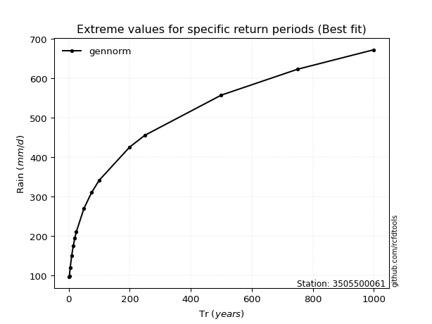</img>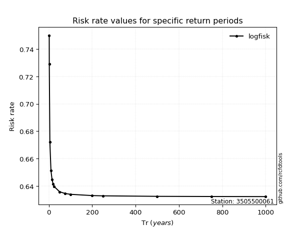</img>

</div>


<sub>**APP DISCLAIMER**: NO WARRANTY - This software is provided by [github.com/rcfdtools](https://github.com/rcfdtools) "as is", without any express or implied warranty, including warranties of merchantability, fitness for a particular purpose, or non-infringement. There is no guarantee that the software will be error-free or operate without interruption. LIMITATION OF LIABILITY - Neither the authors nor copyright holders will be liable for claims or damages arising from the software or its use. You are responsible for determining if the software is appropriate for your use and assume all associated risks, including errors, legal compliance, and data loss. NO PROFESSIONAL ADVICE - The software provides general information and does not offer professional advice. It should not replace consultation with professional advisors.</sub>