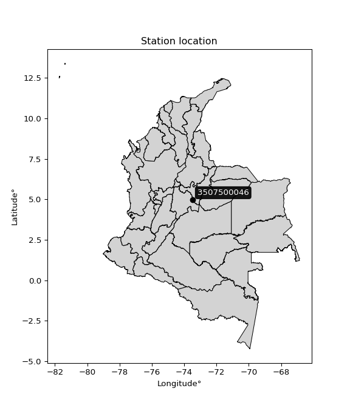

<div align="center">


</div>

# PMP Station (Rain, Pmax24h): 3507500046

Probable Maximum Precipitation (PMP) is the greatest amount of rainfall for a specific duration that is meteorologically possible for a given location, acting as a "worst-case" scenario for extreme storms, crucial for designing safety-critical infrastructure like bridges, river deviations, dams, spillways, and nuclear plants to prevent catastrophic failure. PMP is calculated by hydrologists using meteorological data to determine the upper limit of extreme rainfall, often leading to the Probable Maximum Flood (PMF) for flood control design, and is increasingly being studied for climate change impacts.

<div align="center">

</img>

</div>


## A. General information


### 1. General running parameters

• app_version: _v20260103_. • runtime: _2026-01-03 07:24:50.581521_. • Python version: _3.14.0_. • SciPy version: _1.16.3_. • Pandas version: _2.3.3_. • NumPy version: _2.3.5_. • Stations dataset (station_dataset_file): _dataset/pmax24h_in/automatic_colombia_2003_2024.csv_. • Stations catalog (station_catalog_file): _dataset/CNE.xls_. • Minimum year to eval til year_max (date_min): _1900_. • Maximum year to eval since year_min (date_max): _2024_. • Creates, save and include plots into reports (create_plot): _False_. • Plot only fit distributions with Δo > Δ (plot_only_fit): _True_. • Eval low extreme values, if False, evaluates high extreme values (low_extreme): _False_. • Eval every SciPy distribution as logarithmic (pdist_logarithmic_on): _True_. • Standard deviation normalized (ddof): _1.0_. • Return periods to eval in years (Tr): _[2, 2.33, 5, 10, 15, 20, 25, 50, 75, 100, 200, 250, 500, 750, 1000]_. • Minimum data sample per station, 0 means any (minimum_sample): _5_. • Z-Score maximum threshold to adjust a value, 0 means disable (zscore_max): _3.5_. • Z-Score minimum threshold to adjust a value, 0 means disable (zscore_min): _-2.5_. • Avoid zeros, e.g. rain = 0 (avoid_zeros): _True_. • Avoid null values (avoid_nans): _True_. [:file_folder:Dataset file.](../../dataset/pmax24h_in/automatic_colombia_2003_2024.csv)

> Delta Degrees of Freedom (DDOF): is a parameter used in the formulas for calculating variance and standard deviation. When ddof=0, the divisor is $N$ (the total number of observations) and this is used when your data set is the entire population. When ddof=1, the divisor is $N-1$ and this is used when your data set is a sample drawn from a larger population. Using $N-1$ provides an unbiased estimate of the population variance (known as Bessel´s correction).


### 2. Station info and location

|   id |     CODIGO | NOMBRE                              | CATEGORIA               | TECNOLOGIA                | ESTADO           | FECHA_INSTALACION   |   FECHA_SUSPENSION |   ALTITUD |   LATITUD |   LONGITUD | DEPARTAMENTO   | MUNICIPIO   | AREA_OPERATIVA                              | ENTIDAD                                                     | AREA_HIDROGRAFICA   | ZONA_HIDROGRAFICA   | SUBZONA_HIDROGRAFICA   |   CORRIENTE | Catalogo   |   Version |
|-----:|-----------:|:------------------------------------|:------------------------|:--------------------------|:-----------------|:--------------------|-------------------:|----------:|----------:|-----------:|:---------------|:------------|:--------------------------------------------|:------------------------------------------------------------|:--------------------|:--------------------|:-----------------------|------------:|:-----------|----------:|
|    0 | 3507500046 | GRANJA GUAYATA - AUT   [3507500046] | Climatológica Principal | Automática con Telemetría | En Mantenimiento | 18/12/2017          |                nan |      1580 |   4.97608 |   -73.4826 | Boyacá         | Guayatá     | Area Operativa 06 - Boyacá-Casanare-Vichada | INSTITUTO DE HIDROLOGIA METEOROLOGIA Y ESTUDIOS AMBIENTALES | Orinoco             | Meta                | Río Garagoa            |         nan | CNE_IDEAM  |  20251226 |

<div align="center">

Dynamic map: [:earth_americas:Google](http://maps.google.com/maps?q=4.97608,-73.48264) [:earth_americas:OSM](https://www.openstreetmap.org/#map=18/4.97608/-73.48264&layers=P) [:earth_americas:Bing](https://www.bing.com/maps?cp=4.97608~-73.48264&lvl=18) [:earth_americas:Apple](https://maps.apple.com/frame?center=4.97608%2C-73.48264&span=0.003%2C0.006)

</div>


<div align="center">

```geojson
{
  "type": "Feature",
  "geometry": {
    "type": "Point", 
    "coordinates": [-73.48264, 4.97608]
  }, 
  "properties": {
    "Name": "3507500046"
  }
}
```

</div>


### 3. Discrete values table and plot

<div align="center">

|               |           0 |          1 |           2 |           3 |          4 |
|:--------------|------------:|-----------:|------------:|------------:|-----------:|
| Date          | 2019        | 2020       | 2021        | 2022        | 2023       |
| Value         |   48.6      |   51.6     |   45        |   41.6      |   31.4     |
| Value_initial |   48.6      |   51.6     |   45        |   41.6      |   31.4     |
| count         |    5        |    5       |    5        |    5        |    5       |
| mean          |   43.64     |   43.64    |   43.64     |   43.64     |   43.64    |
| std           |    7.80692  |    7.80692 |    7.80692  |    7.80692  |    7.80692 |
| zscore        |    0.635334 |    1.01961 |    0.174204 |   -0.261307 |   -1.56784 |


</div>


> The initial value (value_initial) correspond to the initial obtained or null completed value, and value (value) is adjusted only when the initial value is outside the valid range definite through the Z-Score value. If Z-Score is active, values out of range or outliers are replaced with the station mean value


### 4. Active continuous probability distributions from SciPy (44 of 104 available)

A Probability Density Function (PDF) describes the relative likelihood of a continuous random variable falling within a specific range, where the total area under its curve equals 1, and the area over any interval gives the actual probability for that range. Unlike discrete probabilities (like rolling a die), a PDF shows density, not direct probability for a single point (which is zero), with higher points indicating higher likelihood, often visualized as a bell curve for normal distributions.

A log of a probability density function (log-PDF) is simply the logarithm of the PDF´s value, denoted as $log(f(x))$, useful for converting multiplication of probabilities into addition, improving numerical stability with tiny numbers, and connecting to information theory concepts like entropy. Instead of dealing with very small probabilities (e.g., 0.000001), log-PDFs use negative numbers (e.g., $log(0.00001) ≈ -11.51$ that are easier for computers to handle, preventing underflow errors and simplifying complex calculations. In this study, each active probability distribution from SciPy is also evaluated in the $log$ form.

[scipy.stats](https://docs.scipy.org/doc/scipy/reference/stats.html) is a Python´s powerful submodule within the SciPy library for comprehensive statistical analysis, offering over 130 probability distributions (like Normal, Poisson), functions for descriptive stats (mean, variance), hypothesis testing (t-tests, chi-square), random variable generation, and statistical tests, making it essential for data science, modeling, and research. It provides tools to explore, model, and draw conclusions from data efficiently, working seamlessly with NumPy.

<div align="center">

|   id | p_dist             |   n_parameter | fit_method   | label                                                                       | active   | ref                                                                                                        |
|-----:|:-------------------|--------------:|:-------------|:----------------------------------------------------------------------------|:---------|:-----------------------------------------------------------------------------------------------------------|
|    0 | alpha              |             3 | MLE          | Alpha                                                                       | True     | [:mortar_board:](https://docs.scipy.org/doc/scipy/reference/generated/scipy.stats.alpha.html)              |
|    1 | betaprime          |             4 | MLE          | Beta prime                                                                  | True     | [:mortar_board:](https://docs.scipy.org/doc/scipy/reference/generated/scipy.stats.betaprime.html)          |
|    2 | chi2               |             3 | MLE          | Chi²                                                                        | True     | [:mortar_board:](https://docs.scipy.org/doc/scipy/reference/generated/scipy.stats.chi2.html)               |
|    3 | crystalball        |             4 | MLE          | Crystalball                                                                 | True     | [:mortar_board:](https://docs.scipy.org/doc/scipy/reference/generated/scipy.stats.crystalball.html)        |
|    4 | erlang             |             3 | MLE          | Erlang                                                                      | True     | [:mortar_board:](https://docs.scipy.org/doc/scipy/reference/generated/scipy.stats.erlang.html)             |
|    5 | expon              |             2 | MLE          | Exponential                                                                 | True     | [:mortar_board:](https://docs.scipy.org/doc/scipy/reference/generated/scipy.stats.expon.html)              |
|    6 | exponnorm          |             3 | MLE          | Exponentially modified Normal                                               | True     | [:mortar_board:](https://docs.scipy.org/doc/scipy/reference/generated/scipy.stats.exponnorm.html)          |
|    7 | f                  |             4 | MLE          | F                                                                           | True     | [:mortar_board:](https://docs.scipy.org/doc/scipy/reference/generated/scipy.stats.f.html)                  |
|    8 | fatiguelife        |             3 | MLE          | Fatigue-life (Birnbaum-Saunders)                                            | True     | [:mortar_board:](https://docs.scipy.org/doc/scipy/reference/generated/scipy.stats.fatiguelife.html)        |
|    9 | fisk               |             3 | MLE          | Fisk                                                                        | True     | [:mortar_board:](https://docs.scipy.org/doc/scipy/reference/generated/scipy.stats.fisk.html)               |
|   10 | gamma              |             3 | MLE          | Gamma                                                                       | True     | [:mortar_board:](https://docs.scipy.org/doc/scipy/reference/generated/scipy.stats.gamma.html)              |
|   11 | genexpon           |             5 | MLE          | Generalized exponential                                                     | True     | [:mortar_board:](https://docs.scipy.org/doc/scipy/reference/generated/scipy.stats.genexpon.html)           |
|   12 | genlogistic        |             3 | MLE          | Generalized logistic                                                        | True     | [:mortar_board:](https://docs.scipy.org/doc/scipy/reference/generated/scipy.stats.genlogistic.html)        |
|   13 | gibrat             |             2 | MM           | Gibrat                                                                      | True     | [:mortar_board:](https://docs.scipy.org/doc/scipy/reference/generated/scipy.stats.gibrat.html)             |
|   14 | gompertz           |             3 | MLE          | Gompertz (or truncated Gumbel)                                              | True     | [:mortar_board:](https://docs.scipy.org/doc/scipy/reference/generated/scipy.stats.gompertz.html)           |
|   15 | gumbel_l           |             2 | MM           | Gumbel Left Skew                                                            | True     | [:mortar_board:](https://docs.scipy.org/doc/scipy/reference/generated/scipy.stats.gumbel_l.html)           |
|   16 | gumbel_r           |             2 | MM           | Gumbel Right Skew                                                           | True     | [:mortar_board:](https://docs.scipy.org/doc/scipy/reference/generated/scipy.stats.gumbel_r.html)           |
|   17 | halflogistic       |             2 | MM           | Half-logistic                                                               | True     | [:mortar_board:](https://docs.scipy.org/doc/scipy/reference/generated/scipy.stats.halflogistic.html)       |
|   18 | halfnorm           |             2 | MM           | Half Normal                                                                 | True     | [:mortar_board:](https://docs.scipy.org/doc/scipy/reference/generated/scipy.stats.halfnorm.html)           |
|   19 | hypsecant          |             2 | MM           | hyperbolic secant                                                           | True     | [:mortar_board:](https://docs.scipy.org/doc/scipy/reference/generated/scipy.stats.hypsecant.html)          |
|   20 | invgamma           |             3 | MLE          | Inverted gamma                                                              | True     | [:mortar_board:](https://docs.scipy.org/doc/scipy/reference/generated/scipy.stats.invgamma.html)           |
|   21 | invgauss           |             3 | MLE          | Inverse Gaussian                                                            | True     | [:mortar_board:](https://docs.scipy.org/doc/scipy/reference/generated/scipy.stats.invgauss.html)           |
|   22 | invweibull         |             3 | MLE          | Inverted Weibull                                                            | True     | [:mortar_board:](https://docs.scipy.org/doc/scipy/reference/generated/scipy.stats.invweibull.html)         |
|   23 | johnsonsu          |             4 | MLE          | Johnson Su                                                                  | True     | [:mortar_board:](https://docs.scipy.org/doc/scipy/reference/generated/scipy.stats.johnsonsu.html)          |
|   24 | kstwobign          |             2 | MLE          | Limiting distribution of scaled Kolmogorov-Smirnov two-sided test statistic | True     | [:mortar_board:](https://docs.scipy.org/doc/scipy/reference/generated/scipy.stats.kstwobign.html)          |
|   25 | laplace            |             2 | MM           | Laplace                                                                     | True     | [:mortar_board:](https://docs.scipy.org/doc/scipy/reference/generated/scipy.stats.laplace.html)            |
|   26 | laplace_asymmetric |             3 | MLE          | Asymmetric Laplace                                                          | True     | [:mortar_board:](https://docs.scipy.org/doc/scipy/reference/generated/scipy.stats.laplace_asymmetric.html) |
|   27 | loggamma           |             3 | MLE          | Log gamma                                                                   | True     | [:mortar_board:](https://docs.scipy.org/doc/scipy/reference/generated/scipy.stats.loggamma.html)           |
|   28 | logistic           |             2 | MM           | Logistic (or Sech-squared)                                                  | True     | [:mortar_board:](https://docs.scipy.org/doc/scipy/reference/generated/scipy.stats.logistic.html)           |
|   29 | lognorm            |             3 | MLE          | Log Normal                                                                  | True     | [:mortar_board:](https://docs.scipy.org/doc/scipy/reference/generated/scipy.stats.lognorm.html)            |
|   30 | maxwell            |             2 | MM           | Maxwell                                                                     | True     | [:mortar_board:](https://docs.scipy.org/doc/scipy/reference/generated/scipy.stats.maxwell.html)            |
|   31 | mielke             |             4 | MLE          | Mielke Beta-Kappa / Dagum                                                   | True     | [:mortar_board:](https://docs.scipy.org/doc/scipy/reference/generated/scipy.stats.mielke.html)             |
|   32 | moyal              |             2 | MM           | Moyal                                                                       | True     | [:mortar_board:](https://docs.scipy.org/doc/scipy/reference/generated/scipy.stats.moyal.html)              |
|   33 | nakagami           |             3 | MLE          | Nakagami                                                                    | True     | [:mortar_board:](https://docs.scipy.org/doc/scipy/reference/generated/scipy.stats.nakagami.html)           |
|   34 | ncf                |             5 | MLE          | Non-central F distribution                                                  | True     | [:mortar_board:](https://docs.scipy.org/doc/scipy/reference/generated/scipy.stats.ncf.html)                |
|   35 | nct                |             4 | MLE          | Non-central Student’s t                                                     | True     | [:mortar_board:](https://docs.scipy.org/doc/scipy/reference/generated/scipy.stats.nct.html)                |
|   36 | norm               |             2 | MM           | Normal                                                                      | True     | [:mortar_board:](https://docs.scipy.org/doc/scipy/reference/generated/scipy.stats.norm.html)               |
|   37 | pearson3           |             3 | MM           | Pearson type III                                                            | True     | [:mortar_board:](https://docs.scipy.org/doc/scipy/reference/generated/scipy.stats.pearson3.html)           |
|   38 | rayleigh           |             2 | MM           | Rayleigh                                                                    | True     | [:mortar_board:](https://docs.scipy.org/doc/scipy/reference/generated/scipy.stats.rayleigh.html)           |
|   39 | rice               |             3 | MLE          | Rice                                                                        | True     | [:mortar_board:](https://docs.scipy.org/doc/scipy/reference/generated/scipy.stats.rice.html)               |
|   40 | t                  |             3 | MLE          | Student’s t                                                                 | True     | [:mortar_board:](https://docs.scipy.org/doc/scipy/reference/generated/scipy.stats.t.html)                  |
|   41 | truncnorm          |             4 | MLE          | Truncated normal                                                            | True     | [:mortar_board:](https://docs.scipy.org/doc/scipy/reference/generated/scipy.stats.truncnorm.html)          |
|   42 | wald               |             2 | MM           | Wald                                                                        | True     | [:mortar_board:](https://docs.scipy.org/doc/scipy/reference/generated/scipy.stats.wald.html)               |
|   43 | weibull_min        |             3 | MLE          | Weibull minimum                                                             | True     | [:mortar_board:](https://docs.scipy.org/doc/scipy/reference/generated/scipy.stats.weibull_min.html)        |

</div>

> **n_parameter:** # arguments & localization & scale.
>
> **Fit methods:** (MLE) maximum likelihood, (MM) L-moments.
>
>**Inactive** (With the only purpose of prevent loops, zero divisions, infinite values, over high estimated values or horizontal trending for recurrence intervals estimations, the follow distributions were disabled.)**:** foldnorm, gennorm, norminvgauss, powernorm, powerlognorm, skewnorm, genextreme, anglit, arcsine, argus, beta, bradford, burr, burr12, cauchy, cosine, halfcauchy, foldcauchy, skewcauchy, wrapcauchy, dgamma, gengamma, exponweib, exponpow, truncexpon, gausshyper, genhalflogistic, genhyperbolic, geninvgauss, halfgennorm, johnsonsb, kappa4, kappa3, ksone, kstwo, loglaplace, levy, levy_l, levy_stable, ncx2, pareto, genpareto, truncpareto, lomax, powerlaw, rdist, rel_breitwigner, recipinvgauss, semicircular, studentized_range, trapezoid, triang, truncweibull_min, tukeylambda, uniform, loguniform, vonmises, vonmises_line, weibull_max, dweibull, 


## B. Probability distributions vs. Empirical distributions

A continuous probability distribution (CPD) describes probabilities for variables that can take any value within a range (like rain any time), unlike discrete variables with specific outcomes (like temperature). It uses a Probability Density Function (PDF), a curve where the total area under it equals 1, and the probability of the variable falling within an interval (a to b) is found by calculating the area under the curve between those points. A key feature is that the probability of hitting any single exact value is zero, so probabilities are always expressed for ranges, e.g., $P(a ≤ X ≤ b)$.

<div align="center">

Distributions parameters from station values
|    |    station | p_dist                |   n |             loc |           scale | shape                  | shape1                 | shape2                 | shape3   |
|---:|-----------:|:----------------------|----:|----------------:|----------------:|:-----------------------|:-----------------------|:-----------------------|:---------|
|  0 | 3507500046 | alpha                 |   5 |  -106.503       |  3012.38        | 20.12684343045371      |                        |                        |          |
|  1 | 3507500046 | betaprime             |   5 |  -128.854       |  4852.42        | 602.7356164768892      | 16955.182649082395     |                        |          |
|  2 | 3507500046 | chi2                  |   5 |    31.4         |     5.26611     | 0.46690911526788803    |                        |                        |          |
|  3 | 3507500046 | crystalball           |   5 |    43.64        |     6.98272     | 4642.293659014194      | 2.623712692014686      |                        |          |
|  4 | 3507500046 | erlang                |   5 |   -72.4162      |     0.439632    | 263.78462283675105     |                        |                        |          |
|  5 | 3507500046 | expon                 |   5 |    31.4         |    12.24        |                        |                        |                        |          |
|  6 | 3507500046 | exponnorm             |   5 |    43.6348      |     6.98271     | 0.0007549300604979827  |                        |                        |          |
|  7 | 3507500046 | f                     |   5 | -1478.48        |  1522.1         | 140359.12243225332     | 287050.64335193404     |                        |          |
|  8 | 3507500046 | fatiguelife           |   5 |    31.4         |     3.10675e-06 | 1787.6099373197576     |                        |                        |          |
|  9 | 3507500046 | fisk                  |   5 |    -2.49489e+08 |     2.49489e+08 | 61252190.215354085     |                        |                        |          |
| 10 | 3507500046 | gamma                 |   5 |   -68.1945      |     0.461996    | 242.00224037918088     |                        |                        |          |
| 11 | 3507500046 | genexpon              |   5 |    31.4         |     1.91615     | 0.1565780541226663     | 1.0613090146648868e-07 | 2.1479289832085695     |          |
| 12 | 3507500046 | genlogistic           |   5 |    51.6003      |     1.18585e-05 | 1.4833951496460745e-06 |                        |                        |          |
| 13 | 3507500046 | gibrat                |   5 |    38.313       |     3.23096     |                        |                        |                        |          |
| 14 | 3507500046 | gompertz              |   5 |    41.6         |     3.65826     | 0.1843637739356478     |                        |                        |          |
| 15 | 3507500046 | gumbel_l              |   5 |    46.7826      |     5.44441     |                        |                        |                        |          |
| 16 | 3507500046 | gumbel_r              |   5 |    40.4974      |     5.44441     |                        |                        |                        |          |
| 17 | 3507500046 | halflogistic          |   5 |    35.3639      |     5.96996     |                        |                        |                        |          |
| 18 | 3507500046 | halfnorm              |   5 |    34.3976      |    11.5837      |                        |                        |                        |          |
| 19 | 3507500046 | hypsecant             |   5 |    43.64        |     4.44534     |                        |                        |                        |          |
| 20 | 3507500046 | invgamma              |   5 |   -82.821       | 36913.3         | 292.6913388568279      |                        |                        |          |
| 21 | 3507500046 | invgauss              |   5 |    -9.8819      |  2588.26        | 0.020647651632131475   |                        |                        |          |
| 22 | 3507500046 | invweibull            |   5 |    31.4         |     1.49826     | 0.06936745303285644    |                        |                        |          |
| 23 | 3507500046 | johnsonsu             |   5 |    53.6994      |     0.0603102   | 6.9038411337413645     | 1.2490732862795673     |                        |          |
| 24 | 3507500046 | kstwobign             |   5 |    14.2454      |    33.5168      |                        |                        |                        |          |
| 25 | 3507500046 | laplace               |   5 |    43.64        |     4.93753     |                        |                        |                        |          |
| 26 | 3507500046 | laplace_asymmetric    |   5 |    45           |     5.31032     | 1.1362304636641791     |                        |                        |          |
| 27 | 3507500046 | loggamma              |   5 |    51.6003      |     1.87112e-05 | 2.3453868588941864e-06 |                        |                        |          |
| 28 | 3507500046 | logistic              |   5 |    43.64        |     3.84978     |                        |                        |                        |          |
| 29 | 3507500046 | lognorm               |   5 |    31.4         |     0.0111357   | 14.388573002328176     |                        |                        |          |
| 30 | 3507500046 | maxwell               |   5 |    27.0939      |    10.3687      |                        |                        |                        |          |
| 31 | 3507500046 | mielke                |   5 |   -24.1125      |    75.7648      | 8.516632032490385      | 7471.23531886618       |                        |          |
| 32 | 3507500046 | moyal                 |   5 |    39.6468      |     3.14333     |                        |                        |                        |          |
| 33 | 3507500046 | nakagami              |   5 |    41.6         |     3.99589     | 0.048950674379531385   |                        |                        |          |
| 34 | 3507500046 | ncf                   |   5 |   -81.6789      |   117.241       | 616.4653009664867      | 7519.955568872687      | 41.58641857610004      |          |
| 35 | 3507500046 | nct                   |   5 |  -403.713       |     6.9269      | 119384.48400720314     | 64.58099114176113      |                        |          |
| 36 | 3507500046 | norm                  |   5 |    43.64        |     6.98272     |                        |                        |                        |          |
| 37 | 3507500046 | pearson3              |   5 |    43.64        |     6.98273     | -0.7127796606896802    |                        |                        |          |
| 38 | 3507500046 | rayleigh              |   5 |    30.2816      |    10.6584      |                        |                        |                        |          |
| 39 | 3507500046 | rice                  |   5 |    26.6707      |     7.6604      | 1.9333809985480683     |                        |                        |          |
| 40 | 3507500046 | t                     |   5 |    43.6311      |     6.98582     | 24995.34989351638      |                        |                        |          |
| 41 | 3507500046 | truncnorm             |   5 |    17.4216      |    12.2361      | 1.9759851822694658     | 6932.117223254201      |                        |          |
| 42 | 3507500046 | wald                  |   5 |    36.6573      |     6.98269     |                        |                        |                        |          |
| 43 | 3507500046 | weibull_min           |   5 |    -2.31193e+08 |     2.31193e+08 | 44084181.45122798      |                        |                        |          |
| 44 | 3507500046 | logalpha              |   5 |    -3.95594     |   334.961       | 43.44014517244605      |                        |                        |          |
| 45 | 3507500046 | logbetaprime          |   5 |     0.94048     |    63.9479      | 259.66031008468406     | 5886.050637781056      |                        |          |
| 46 | 3507500046 | logchi2               |   5 |     3.44681     |     1.00206     | 0.9814667921638398     |                        |                        |          |
| 47 | 3507500046 | logcrystalball        |   5 |     3.94352     |     1.69611e-07 | 9.34092113421527e-07   | 3033.8693133374036     |                        |          |
| 48 | 3507500046 | logerlang             |   5 |     0.816788    |     0.0107885   | 273.06315785203935     |                        |                        |          |
| 49 | 3507500046 | logexpon              |   5 |     3.44681     |     0.314935    |                        |                        |                        |          |
| 50 | 3507500046 | logexponnorm          |   5 |     3.76157     |     0.173338    | 0.0009661460768546617  |                        |                        |          |
| 51 | 3507500046 | logf                  |   5 |  -253.436       |   257.197       | 14122630.461954989     | 6369480.188058555      |                        |          |
| 52 | 3507500046 | logfatiguelife        |   5 |   -51.9942      |    55.7558      | 0.00312147693588042    |                        |                        |          |
| 53 | 3507500046 | logfisk               |   5 |    -2.84084e+07 |     2.84084e+07 | 291760921.0146793      |                        |                        |          |
| 54 | 3507500046 | loggamma              |   5 |     0.913669    |     0.0113253   | 251.54341822581364     |                        |                        |          |
| 55 | 3507500046 | loggenexpon           |   5 |     3.43962     |     0.00567378  | 0.007066600977595507   | 5.232864166369771      | 5.4920991695694906e-05 |          |
| 56 | 3507500046 | loggenlogistic        |   5 |     3.94353     |     6.70421e-07 | 3.68629112988508e-06   |                        |                        |          |
| 57 | 3507500046 | loggibrat             |   5 |     3.62947     |     0.0802241   |                        |                        |                        |          |
| 58 | 3507500046 | loggompertz           |   5 |     3.44681     |     0.557279    | 1.2855024902252028     |                        |                        |          |
| 59 | 3507500046 | loggumbel_l           |   5 |     3.83975     |     0.135152    |                        |                        |                        |          |
| 60 | 3507500046 | loggumbel_r           |   5 |     3.68373     |     0.135152    |                        |                        |                        |          |
| 61 | 3507500046 | loghalflogistic       |   5 |     3.55628     |     0.148212    |                        |                        |                        |          |
| 62 | 3507500046 | loghalfnorm           |   5 |     3.53234     |     0.287514    |                        |                        |                        |          |
| 63 | 3507500046 | loghypsecant          |   5 |     3.76174     |     0.110351    |                        |                        |                        |          |
| 64 | 3507500046 | loginvgamma           |   5 |     0.594658    |   982.338       | 311.1542475736536      |                        |                        |          |
| 65 | 3507500046 | loginvgauss           |   5 |     2.1485      |   115.785       | 0.013908762586397581   |                        |                        |          |
| 66 | 3507500046 | loginvweibull         |   5 |    -1.97116e+06 |     1.97116e+06 | 10459425.546391249     |                        |                        |          |
| 67 | 3507500046 | logjohnsonsu          |   5 |     3.94352     |     1.89149e-11 | 3.676795790527783      | 0.18728899855719267    |                        |          |
| 68 | 3507500046 | logkstwobign          |   5 |     3.00972     |     0.857302    |                        |                        |                        |          |
| 69 | 3507500046 | loglaplace            |   5 |     3.76174     |     0.122569    |                        |                        |                        |          |
| 70 | 3507500046 | loglaplace_asymmetric |   5 |     3.80666     |     0.12444     | 1.1967564320876316     |                        |                        |          |
| 71 | 3507500046 | logloggamma           |   5 |     3.94354     |     2.03391e-06 | 1.1237779178894172e-05 |                        |                        |          |
| 72 | 3507500046 | loglogistic           |   5 |     3.76174     |     0.0955668   |                        |                        |                        |          |
| 73 | 3507500046 | loglognorm            |   5 |     3.44681     |     0.000396125 | 13.759699006537485     |                        |                        |          |
| 74 | 3507500046 | logmaxwell            |   5 |     3.351       |     0.257394    |                        |                        |                        |          |
| 75 | 3507500046 | logmielke             |   5 |     2.40543     |     1.53835     | 7.303472599564937      | 43482.68208026272      |                        |          |
| 76 | 3507500046 | logmoyal              |   5 |     3.66262     |     0.07803     |                        |                        |                        |          |
| 77 | 3507500046 | lognakagami           |   5 |     3.7281      |     0.1325      | 0.2466940355234205     |                        |                        |          |
| 78 | 3507500046 | logncf                |   5 |    -3.79328     |     7.54832     | 593.0576247435592      | 1137.3102055132217     | 0.382302002363216      |          |
| 79 | 3507500046 | lognct                |   5 |    -0.41338     |     0.0212931   | 275.9339836135516      | 195.5135566518287      |                        |          |
| 80 | 3507500046 | lognorm               |   5 |     3.76174     |     0.173339    |                        |                        |                        |          |
| 81 | 3507500046 | logpearson3           |   5 |     3.76174     |     0.173339    | -0.8973129878446107    |                        |                        |          |
| 82 | 3507500046 | lograyleigh           |   5 |     3.43014     |     0.264585    |                        |                        |                        |          |
| 83 | 3507500046 | logrice               |   5 |     3.32367     |     0.188674    | 2.0579472868424444     |                        |                        |          |
| 84 | 3507500046 | logt                  |   5 |     3.76175     |     0.173334    | 33245647.359145574     |                        |                        |          |
| 85 | 3507500046 | logtruncnorm          |   5 |    -0.0415335   |     1.14066     | 3.058170417751617      | 3.493639404794514      |                        |          |
| 86 | 3507500046 | logwald               |   5 |     3.58836     |     0.173384    |                        |                        |                        |          |
| 87 | 3507500046 | logweibull_min        |   5 |    -5.7022e+06  |     5.7022e+06  | 46672670.926603295     |                        |                        |          |

</div>

> **loc** (Location parameter): This shifts the distribution along the x-axis. For many common distributions, like the normal (Gaussian) distribution, loc represents the mean $μ$. For others, like the uniform distribution, it might represent the minimum value, or for the beta distribution, the left end of the support interval.
>
> **scale** (Scale parameter): This determines the width or spread of the distribution. For the normal distribution, scale represents the standard deviation $σ$. For a uniform distribution, it defines the length of the interval (from $loc$ to $loc + scale$).
>
> **shape** (Shape parameters): Refers to parameters that define the specific form of a probability distribution, distinct from its location (loc) and scale (scale). These parameters are required arguments for most distribution functions. For example, a normal (Gaussian) distribution is fully defined by its location (mean) and scale (standard deviation), so it has no specific shape parameters beyond loc and scale. However, other distributions have intrinsic properties that need specification, as Gamma distribution that takes a shape parameter, often named $a$ or $alpha$.


### 0. Cumulative distribution values - CDF (88 evaluated)

Cumulative Distribution Function (CDF), denoted as $F$<sub>$X$</sub>$(x)$, is a function that gives the probability that a random variable $X$ will take a value less than or equal to a specific value, $x$ (i.e., $(P(X≥x)$. It essentially "accumulates" probabilities from a given point up to the far right (positive infinity), providing a complete picture of the distribution´s probabilities for both discrete (like rain) and continuous (like temperature) variables, helping to find probabilities over ranges or above certain values. Each station is evaluated separately ordering the $x$ values ascending, calculating the CDF and PDF values for the activated distributions and their logarithmic forms.

<div align="center">

CDF ordered by x ascending and calculating $log(f(x))$ separately
|   id |    Station |   date |    x |   count |   mean |     std |    zscore |   Value_initial |    station |   m |     alpha |   alpha_pdf |   betaprime |   betaprime_pdf |        chi2 |    chi2_pdf |   crystalball |   crystalball_pdf |   erlang |   erlang_pdf |    expon |   expon_pdf |   exponnorm |   exponnorm_pdf |         f |     f_pdf |   fatiguelife |   fatiguelife_pdf |      fisk |   fisk_pdf |     gamma |   gamma_pdf |    genexpon |   genexpon_pdf |   genlogistic |   genlogistic_pdf |   gibrat |   gibrat_pdf |    gompertz |   gompertz_pdf |   gumbel_l |   gumbel_l_pdf |   gumbel_r |   gumbel_r_pdf |   halflogistic |   halflogistic_pdf |   halfnorm |   halfnorm_pdf |   hypsecant |   hypsecant_pdf |   invgamma |   invgamma_pdf |   invgauss |   invgauss_pdf |   invweibull |   invweibull_pdf |   johnsonsu |   johnsonsu_pdf |   kstwobign |   kstwobign_pdf |   laplace |   laplace_pdf |   laplace_asymmetric |   laplace_asymmetric_pdf |   loggamma |   loggamma_pdf |   logistic |   logistic_pdf |   lognorm |   lognorm_pdf |   maxwell |   maxwell_pdf |    mielke |   mielke_pdf |       moyal |   moyal_pdf |   nakagami |   nakagami_pdf |       ncf |   ncf_pdf |       nct |   nct_pdf |      norm |   norm_pdf |   pearson3 |   pearson3_pdf |   rayleigh |   rayleigh_pdf |      rice |   rice_pdf |         t |     t_pdf |   truncnorm |   truncnorm_pdf |     wald |   wald_pdf |   weibull_min |   weibull_min_pdf |   logalpha |   logalpha_pdf |   logbetaprime |   logbetaprime_pdf |     logchi2 |   logchi2_pdf |   logcrystalball |   logcrystalball_pdf |   logerlang |   logerlang_pdf |   logexpon |   logexpon_pdf |   logexponnorm |   logexponnorm_pdf |      logf |   logf_pdf |   logfatiguelife |   logfatiguelife_pdf |   logfisk |   logfisk_pdf |   loggenexpon |   loggenexpon_pdf |   loggenlogistic |   loggenlogistic_pdf |   loggibrat |   loggibrat_pdf |   loggompertz |   loggompertz_pdf |   loggumbel_l |   loggumbel_l_pdf |   loggumbel_r |   loggumbel_r_pdf |   loghalflogistic |   loghalflogistic_pdf |   loghalfnorm |   loghalfnorm_pdf |   loghypsecant |   loghypsecant_pdf |   loginvgamma |   loginvgamma_pdf |   loginvgauss |   loginvgauss_pdf |   loginvweibull |   loginvweibull_pdf |   logjohnsonsu |   logjohnsonsu_pdf |   logkstwobign |   logkstwobign_pdf |   loglaplace |   loglaplace_pdf |   loglaplace_asymmetric |   loglaplace_asymmetric_pdf |   logloggamma |   logloggamma_pdf |   loglogistic |   loglogistic_pdf |   loglognorm |   loglognorm_pdf |   logmaxwell |   logmaxwell_pdf |   logmielke |   logmielke_pdf |    logmoyal |   logmoyal_pdf |   lognakagami |   lognakagami_pdf |   logncf |   logncf_pdf |    lognct |   lognct_pdf |   logpearson3 |   logpearson3_pdf |   lograyleigh |   lograyleigh_pdf |   logrice |   logrice_pdf |      logt |   logt_pdf |   logtruncnorm |   logtruncnorm_pdf |   logwald |   logwald_pdf |   logweibull_min |   logweibull_min_pdf |
|-----:|-----------:|-------:|-----:|--------:|-------:|--------:|----------:|----------------:|-----------:|----:|----------:|------------:|------------:|----------------:|------------:|------------:|--------------:|------------------:|---------:|-------------:|---------:|------------:|------------:|----------------:|----------:|----------:|--------------:|------------------:|----------:|-----------:|----------:|------------:|------------:|---------------:|--------------:|------------------:|---------:|-------------:|------------:|---------------:|-----------:|---------------:|-----------:|---------------:|---------------:|-------------------:|-----------:|---------------:|------------:|----------------:|-----------:|---------------:|-----------:|---------------:|-------------:|-----------------:|------------:|----------------:|------------:|----------------:|----------:|--------------:|---------------------:|-------------------------:|-----------:|---------------:|-----------:|---------------:|----------:|--------------:|----------:|--------------:|----------:|-------------:|------------:|------------:|-----------:|---------------:|----------:|----------:|----------:|----------:|----------:|-----------:|-----------:|---------------:|-----------:|---------------:|----------:|-----------:|----------:|----------:|------------:|----------------:|---------:|-----------:|--------------:|------------------:|-----------:|---------------:|---------------:|-------------------:|------------:|--------------:|-----------------:|---------------------:|------------:|----------------:|-----------:|---------------:|---------------:|-------------------:|----------:|-----------:|-----------------:|---------------------:|----------:|--------------:|--------------:|------------------:|-----------------:|---------------------:|------------:|----------------:|--------------:|------------------:|--------------:|------------------:|--------------:|------------------:|------------------:|----------------------:|--------------:|------------------:|---------------:|-------------------:|--------------:|------------------:|--------------:|------------------:|----------------:|--------------------:|---------------:|-------------------:|---------------:|-------------------:|-------------:|-----------------:|------------------------:|----------------------------:|--------------:|------------------:|--------------:|------------------:|-------------:|-----------------:|-------------:|-----------------:|------------:|----------------:|------------:|---------------:|--------------:|------------------:|---------:|-------------:|----------:|-------------:|--------------:|------------------:|--------------:|------------------:|----------:|--------------:|----------:|-----------:|---------------:|-------------------:|----------:|--------------:|-----------------:|---------------------:|
|    0 | 3507500046 |   2023 | 31.4 |       5 |  43.64 | 7.80692 | -1.56784  |            31.4 | 3507500046 |   1 | 0.0429623 |   0.0144637 |   0.0406557 |       0.0128489 | 0.000268518 | 1.76448e+10 |     0.0398097 |         0.0122933 | 0.040531 |    0.013136  | 0        |   0.0816993 |   0.0398091 |       0.0122931 | 0.0401923 | 0.0124275 |     0.0330274 |       2.35275e+11 | 0.0393833 | 0.00928823 | 0.0406398 |   0.0131225 | 5.75394e-09 |      0.0817148 |      0        |        0.00999579 | 0        |    0         | 0           |      0         |  0.0575621 |      0.0102624 | 0.00490604 |     0.00479149 |       0        |          0         |   0        |      0         |    0.040503 |      0.00908677 |  0.0406888 |      0.0135293 |  0.0413837 |      0.0150991 |  3.23295e-05 |      6.52673e+09 |   0.0889115 |      0.00901414 |   0.0441238 |       0.0216546 | 0.0419147 |    0.00848899 |            0.0591574 |               0.00980442 |   0.035485 |       0.470629 |  0.0399481 |     0.00996221 | 0.0346182 |      0.441777 | 0.0180942 |     0.0121754 | 0.0707292 |    0.0108512 | 0.000204941 | 0.000478412 |  0         |    0           | 0.0470962 | 0.0142825 | 0.0399129 | 0.0123226 | 0.0398097 |  0.0122933 |  0.0553079 |      0.0116125 | 0.00548969 |     0.00979045 | 0.0316631 |  0.0142756 | 0.0399923 | 0.0123323 | 0           |       0         | 0        |  0         |     0.0512654 |         0.0095204 |  0.0352954 |       0.475571 |       0.034949 |           0.468416 | 2.34651e-08 |   2.59297e+07 |              nan |                  nan |   0.0344256 |        0.461288 |   0        |       3.17526  |      0.0346176 |           0.441775 | 0.0351097 |   0.446849 |        0.0348635 |             0.445071 | 0.0296334 |      0.295323 |    0.00914322 |           1.29769 |         0        |             0.358178 |    0        |        0        |   2.78582e-08 |          2.30675  |     0.0531503 |          0.382622 |    0.00311356 |          0.132972 |          0        |              0        |      0        |          0        |      0.0366395 |           0.331294 |     0.0327882 |          0.468593 |     0.0379694 |          0.543546 |       0.0391546 |            0.673203 |       0.171989 |           0.096128 |      0.0426985 |           0.829614 |    0.0382889 |         0.312386 |               0.0525525 |                    0.352881 |     0.0642763 |           0.35514 |     0.0357277 |          0.360494 |    0.0227606 |      8.83915e+12 |    0.0131588 |         0.400722 |    0.057869 |        0.405853 | 6.71168e-05 |     0.00722189 |   0           |       0           | 0.280275 |     0.646265 | 0.0333483 |     0.471328 |     0.0529229 |           0.42011 |    0.00198338 |          0.237688 | 0.0284872 |       0.50608 | 0.0346133 |   0.441739 |    3.03047e-06 |           3.72207  |  0        |      0        |        0.0395128 |             0.316938 |
|    1 | 3507500046 |   2022 | 41.6 |       5 |  43.64 | 7.80692 | -0.261307 |            41.6 | 3507500046 |   2 | 0.415713  |   0.0535612 |   0.392007  |       0.0541798 | 0.934258    | 0.00947829  |     0.385086  |         0.0547459 | 0.399602 |    0.0547038 | 0.565402 |   0.0355064 |   0.385084  |       0.0547459 | 0.386844  | 0.0546616 |     0.844617  |       0.0118591   | 0.334028  | 0.0546148  | 0.397495  |   0.0543134 | 0.565471    |      0.0355075 |      0        |        0.0358053  | 0.506855 |    0.121353  | 4.52099e-07 |      0.0503966 |  0.320231  |      0.0481949 | 0.4419     |     0.0662859  |       0.479467 |          0.0644989 |   0.46591  |      0.0567733 |    0.358798 |      0.0646748  |  0.400678  |      0.0533823 |  0.425001  |      0.0531195 |  0.416687    |      0.00248074  |   0.279676  |      0.0347312  |   0.481892  |       0.0476399 | 0.330778  |    0.0669925  |            0.32076   |               0.053161   |   0.43206  |       2.20629  |  0.37054   |     0.0605854  | 0.423054  |      2.25857  | 0.418677  |     0.0566042 | 0.297512  |    0.0385589 | 0.463592    | 0.0711112   |  0.0318603 |    4.38984e+11 | 0.406148  | 0.0529649 | 0.385492  | 0.0547366 | 0.385086  |  0.0547459 |  0.344307  |      0.0491965 | 0.430976   |     0.0566928  | 0.399034  |  0.0544105 | 0.385624  | 0.0547434 | 2.53069e-08 |       0.192215  | 0.52072  |  0.0903219 |     0.307904  |         0.0485689 |  0.439718  |       2.23733  |       0.433228 |           2.21681  | 0.411542    |   0.652883    |              nan |                  nan |   0.430599  |        2.22106  |   0.590646 |       1.2998   |      0.423055  |           2.25859  | 0.425057  |   2.25764  |        0.423729  |             2.25157  | 0.354381  |      2.34978  |    0.518302   |           1.8388  |         0        |             1.68195  |    0.581802 |        3.95969  |   0.570033    |          1.64305  |     0.354503  |          2.09066  |    0.486677   |          2.59325  |          0.522414 |              2.45286  |      0.504045 |          2.20098  |      0.404425  |           2.75547  |     0.439746  |          2.22554  |     0.458037  |          2.13346  |       0.482699  |            1.86556  |       0.214802 |           0.253896 |      0.516197  |           1.80648  |    0.379983  |         3.10015  |               0.347458  |                    2.33313  |     0.30411   |           1.68027 |     0.412889  |          2.53657  |    0.683372  |      0.0919825   |    0.457419  |         2.27493  |    0.33179  |        1.83207  | 0.510984    |     2.70768    |   5.63289e-08 |       6.25821e+07 | 0.479514 |     0.738957 | 0.440541  |     2.22881  |     0.36772   |           2.04524 |    0.469597   |          2.25757  | 0.43531   |       2.22196 | 0.423046  |   2.25863  |    0.729188    |           1.69845  |  0.577957 |      3.10655  |        0.331732  |             2.20469  |
|    2 | 3507500046 |   2021 | 45   |       5 |  43.64 | 7.80692 |  0.174204 |            45   | 3507500046 |   3 | 0.596224  |   0.0508267 |   0.58007   |       0.0543712 | 0.95899     | 0.00550504  |     0.577212  |         0.0560594 | 0.588021 |    0.0540522 | 0.670807 |   0.0268949 |   0.577211  |       0.0560595 | 0.578276  | 0.0557584 |     0.879085  |       0.00865398  | 0.536116  | 0.0610575  | 0.584758  |   0.0538002 | 0.670877    |      0.0268943 |      0        |        0.0547846  | 0.766503 |    0.0457924 | 0.246202    |      0.0962258 |  0.513628  |      0.0643905 | 0.645743   |     0.0518731  |       0.66796  |          0.0463847 |   0.639961 |      0.0453083 |    0.595899 |      0.0683801  |  0.583015  |      0.0519984 |  0.601456  |      0.0490716 |  0.423957    |      0.00185562  |   0.431822  |      0.0564411  |   0.631092  |       0.0396185 | 0.620382  |    0.0768843  |            0.563513  |               0.0933935  |   0.60477  |       2.12188  |  0.58741   |     0.0629542  | 0.602237  |      2.22552  | 0.605637  |     0.0516615 | 0.457185  |    0.0563382 | 0.669548    | 0.0494497   |  0.8704    |    0.0242298   | 0.587971  | 0.0521251 | 0.577511  | 0.0560096 | 0.577212  |  0.0560594 |  0.531736  |      0.0595517 | 0.614595   |     0.0499334  | 0.586262  |  0.0537796 | 0.577676  | 0.0560209 | 0.497356    |       0.106799  | 0.735678 |  0.0430594 |     0.505294  |         0.0663896 |  0.613898  |       2.12663  |       0.606549 |           2.12624  | 0.458712    |   0.553777    |              nan |                  nan |   0.604624  |        2.13896  |   0.681021 |       1.01284  |      0.60224   |           2.22553  | 0.603938  |   2.2191   |        0.60218   |             2.21485  | 0.55157   |      2.54024  |    0.652782   |           1.5682  |         0        |             2.59069  |    0.785932 |        1.64488  |   0.68853     |          1.37043  |     0.542884  |          2.64768  |    0.668516   |          1.99189  |          0.688284 |              1.77538  |      0.659975 |          1.76037  |      0.626134  |           2.661    |     0.611968  |          2.0918   |     0.620544  |          1.94973  |       0.618741  |            1.57615  |       0.240434 |           0.425842 |      0.646809  |           1.50602  |    0.653416  |         2.82766  |               0.588854  |                    3.95406  |     0.469403  |           2.59355 |     0.615391  |          2.47664  |    0.689717  |      0.0712782   |    0.628564  |         2.02726  |    0.505684 |        2.63572  | 0.691132    |     1.87719    |   0.593007    |       3.47302     | 0.537311 |     0.729873 | 0.613109  |     2.09678  |     0.547067  |           2.46942 |    0.636723   |          1.95391  | 0.60913   |       2.13529 | 0.602235  |   2.22558  |    0.848437    |           1.34949  |  0.754175 |      1.58578  |        0.535471  |             2.91525  |
|    3 | 3507500046 |   2019 | 48.6 |       5 |  43.64 | 7.80692 |  0.635334 |            48.6 | 3507500046 |   4 | 0.759621  |   0.0389605 |   0.757817  |       0.0428464 | 0.974377    | 0.0032669   |     0.761249  |         0.0443937 | 0.763443 |    0.0419828 | 0.754689 |   0.0200417 |   0.761248  |       0.0443939 | 0.761152  | 0.0440964 |     0.905955  |       0.00641918  | 0.736636  | 0.04763    | 0.759799  |   0.0420304 | 0.754755    |      0.0200402 |      0        |        0.0859476  | 0.876588 |    0.019833  | 0.655272    |      0.117731  |  0.752484  |      0.0634783 | 0.797902   |     0.0330875  |       0.803553 |          0.0296738 |   0.779829 |      0.0324837 |    0.798423 |      0.0423751  |  0.751892  |      0.0406371 |  0.758219  |      0.0372726 |  0.429877    |      0.00146368  |   0.689843  |      0.0864286  |   0.755838  |       0.0297032 | 0.816895  |    0.0370842  |            0.797957  |               0.0432304  |   0.753663 |       1.70711  |  0.783874  |     0.0440066  | 0.759014  |      1.79745  | 0.769355  |     0.0385226 | 0.704538  |    0.0825209 | 0.809778    | 0.0296781   |  0.929381  |    0.0112612   | 0.757926  | 0.0409998 | 0.761345  | 0.0443387 | 0.761249  |  0.0443937 |  0.745126  |      0.0557943 | 0.77166    |     0.0368199  | 0.761577  |  0.0421993 | 0.761542  | 0.044343  | 0.77506     |       0.0526972 | 0.847707 |  0.0220398 |     0.752957  |         0.065864  |  0.762109  |       1.68616  |       0.755492 |           1.70431  | 0.498476    |   0.482828    |              nan |                  nan |   0.754633  |        1.71799  |   0.750177 |       0.793253 |      0.759017  |           1.79745  | 0.760124  |   1.78922  |        0.758203  |             1.78956  | 0.730552  |      2.02165  |    0.761106   |           1.24246 |         0        |             3.95545  |    0.875564 |        0.807414 |   0.783371    |          1.09429  |     0.74929   |          2.56635  |    0.796235   |          1.34242  |          0.802046 |              1.20342  |      0.778214 |          1.31561  |      0.796285  |           1.7226   |     0.757432  |          1.65417  |     0.755654  |          1.53768  |       0.726791  |            1.23068  |       0.291108 |           1.07223  |      0.750179  |           1.18118  |    0.815024  |         1.50916  |               0.803865  |                    1.88626  |     0.718156  |           3.96796 |     0.781656  |          1.78587  |    0.694671  |      0.0583062   |    0.767416  |         1.56017  |    0.747264 |        3.6921   | 0.808282    |     1.20457    |   0.792901    |       1.90773     | 0.59268  |     0.706796 | 0.758899  |     1.6571   |     0.738965  |           2.41119 |    0.769806   |          1.49118  | 0.758956  |       1.71677 | 0.759016  |   1.79749  |    0.941257    |           1.07233  |  0.846569 |      0.895536 |        0.762958  |             2.79295  |
|    4 | 3507500046 |   2020 | 51.6 |       5 |  43.64 | 7.80692 |  1.01961  |            51.6 | 3507500046 |   5 | 0.858501  |   0.0270175 |   0.86615   |       0.0292636 | 0.982411    | 0.00217224  |     0.872848  |         0.0298334 | 0.869168 |    0.0284568 | 0.808013 |   0.0156852 |   0.872847  |       0.0298335 | 0.872085  | 0.0296988 |     0.923128  |       0.00509272  | 0.853846  | 0.0306381  | 0.865997  |   0.0287052 | 0.808073    |      0.0156833 |      0.999967 |        0.125087   | 0.921319 |    0.0110489 | 0.929525    |      0.0546512 |  0.911308  |      0.0394651 | 0.877986   |     0.0209843  |       0.876351 |          0.0194314 |   0.862472 |      0.0228664 |    0.894747 |      0.023248   |  0.855405  |      0.0283455 |  0.853179  |      0.0261435 |  0.433921    |      0.00124407  |   0.945612  |      0.0655761  |   0.83332   |       0.0221314 | 0.90027   |    0.0201983  |            0.893667  |               0.0227518  |   0.843329 |       1.28226  |  0.887719  |     0.0258908  | 0.852839  |      1.32803  | 0.866413  |     0.0263231 | 0.994126  |    0.111189  | 0.881265    | 0.0187468   |  0.956102  |    0.00698147  | 0.8622    | 0.0284375 | 0.872811  | 0.029802  | 0.872848  |  0.0298334 |  0.889206  |      0.038484  | 0.864703   |     0.0253896  | 0.868322  |  0.0288613 | 0.873002  | 0.0297934 | 0.891638    |       0.0273792 | 0.899711 |  0.0134714 |     0.916042  |         0.0396619 |  0.850151  |       1.25072  |       0.844873 |           1.27601  | 0.526041    |   0.438926    |              nan |                  nan |   0.844738  |        1.28602  |   0.793446 |       0.655862 |      0.852842  |           1.32802  | 0.853484  |   1.32103  |        0.851702  |             1.32519  | 0.833771  |      1.42342  |    0.827817   |           0.98715 |         0.999972 |             5.49548  |    0.913829 |        0.500597 |   0.842605    |          0.885291 |     0.884094  |          1.8481   |    0.863913   |          0.935067 |          0.863359 |              0.858943 |      0.847319 |          0.998067 |      0.878886  |           1.07124  |     0.84403   |          1.23579  |     0.836691  |          1.16843  |       0.792765  |            0.976892 |       0.995514 |      887894        |      0.81372   |           0.944395 |    0.88653   |         0.925764 |               0.88975   |                    1.06029  |     0.999881  |           5.52447 |     0.87013   |          1.18246  |    0.697936  |      0.0510296   |    0.848845  |         1.16104  |    0.998771 |        4.73943  | 0.868706    |     0.833669   |   0.884122    |       1.1837      | 0.634254 |     0.680193 | 0.84558   |     1.23551  |     0.86964   |           1.88012 |    0.847787   |          1.11626  | 0.84897   |       1.2835  | 0.852843  |   1.32804  |    0.999992    |           0.893823 |  0.890653 |      0.600133 |        0.904667  |             1.83401  |


</div>

An Empirical Distribution Function (EDF) is a step-function estimate of a true cumulative distribution function (CDF) based on observed sample data, representing the proportion of data points less than or equal to a given value. It is calculated by ordering your data and jumping up by $1/n$ (where $n$ is sample size) at each unique data point, allowing analysis without assuming an underlying population distribution, and it gets closer to the true CDF as the sample size grows. For the empirical probability calculations, the parameter $m$ correspond to the order number which means the position of the $x$ values in an ascending order list.


### 1. Empirical - EDF California (1923)

California´s estimates the true probability distribution of water-related data (like rainfall, streamflow) using observed samples, crucial for risk assessment.

<div align="center">


$P=m/n$


</div>


**1.1. Empirical values**

<div align="center">

|                | 0              | 1                  | 2              | 3                 | 4              |
|:---------------|:---------------|:-------------------|:---------------|:------------------|:---------------|
| date           | 2023           | 2022               | 2021           | 2019              | 2020           |
| x              | 31.4           | 41.6               | 45.0           | 48.6              | 51.6           |
| m              | 1              | 2                  | 3              | 4                 | 5              |
| empirical_dist | edf_california | edf_california     | edf_california | edf_california    | edf_california |
| empirical      | 0.2            | 0.4                | 0.6            | 0.8               | 1.0            |
| empirical_tr   | 1.25           | 1.6666666666666667 | 2.5            | 5.000000000000001 | inf            |

</div>


**1.2. Kolmogorov-Smirnov fit test (sorted by Δ)**


<div align="center">

|                | 0                   | 1                  | 2                   | 3                   | 4                   | 5                  | 6                  | 7                  | 8                     | 9                   | 10                  | 11                 | 12                 | 13                 | 14                  | 15                  | 16                 | 17                  | 18                  | 19                  | 20                  | 21                  | 22                  | 23                  | 24                 | 25                 | 26                 | 27                  | 28                 | 29                  | 30                  | 31                  | 32                 | 33                 | 34                  | 35                  | 36                  | 37                 | 38                  | 39                  | 40                  | 41                 | 42                  | 43                  | 44                 | 45                  | 46                  | 47                  | 48                 | 49                 | 50                  | 51                  | 52                  | 53                  | 54                  | 55                  | 56                 | 57                 | 58                 | 59                 | 60                 | 61                  | 62                 | 63                 | 64                 | 65                 | 66                 | 67                 | 68                 | 69                 | 70                 | 71                  | 72                  | 73                 | 74                 | 75                 | 76                  | 77                 | 78                  | 79                 | 80                 | 81                  | 82                 | 83                 | 84                 | 85                 | 86                 | 87                 |
|:---------------|:--------------------|:-------------------|:--------------------|:--------------------|:--------------------|:-------------------|:-------------------|:-------------------|:----------------------|:--------------------|:--------------------|:-------------------|:-------------------|:-------------------|:--------------------|:--------------------|:-------------------|:--------------------|:--------------------|:--------------------|:--------------------|:--------------------|:--------------------|:--------------------|:-------------------|:-------------------|:-------------------|:--------------------|:-------------------|:--------------------|:--------------------|:--------------------|:-------------------|:-------------------|:--------------------|:--------------------|:--------------------|:-------------------|:--------------------|:--------------------|:--------------------|:-------------------|:--------------------|:--------------------|:-------------------|:--------------------|:--------------------|:--------------------|:-------------------|:-------------------|:--------------------|:--------------------|:--------------------|:--------------------|:--------------------|:--------------------|:-------------------|:-------------------|:-------------------|:-------------------|:-------------------|:--------------------|:-------------------|:-------------------|:-------------------|:-------------------|:-------------------|:-------------------|:-------------------|:-------------------|:-------------------|:--------------------|:--------------------|:-------------------|:-------------------|:-------------------|:--------------------|:-------------------|:--------------------|:-------------------|:-------------------|:--------------------|:-------------------|:-------------------|:-------------------|:-------------------|:-------------------|:-------------------|
| station        | 3507500046          | 3507500046         | 3507500046          | 3507500046          | 3507500046          | 3507500046         | 3507500046         | 3507500046         | 3507500046            | 3507500046          | 3507500046          | 3507500046         | 3507500046         | 3507500046         | 3507500046          | 3507500046          | 3507500046         | 3507500046          | 3507500046          | 3507500046          | 3507500046          | 3507500046          | 3507500046          | 3507500046          | 3507500046         | 3507500046         | 3507500046         | 3507500046          | 3507500046         | 3507500046          | 3507500046          | 3507500046          | 3507500046         | 3507500046         | 3507500046          | 3507500046          | 3507500046          | 3507500046         | 3507500046          | 3507500046          | 3507500046          | 3507500046         | 3507500046          | 3507500046          | 3507500046         | 3507500046          | 3507500046          | 3507500046          | 3507500046         | 3507500046         | 3507500046          | 3507500046          | 3507500046          | 3507500046          | 3507500046          | 3507500046          | 3507500046         | 3507500046         | 3507500046         | 3507500046         | 3507500046         | 3507500046          | 3507500046         | 3507500046         | 3507500046         | 3507500046         | 3507500046         | 3507500046         | 3507500046         | 3507500046         | 3507500046         | 3507500046          | 3507500046          | 3507500046         | 3507500046         | 3507500046         | 3507500046          | 3507500046         | 3507500046          | 3507500046         | 3507500046         | 3507500046          | 3507500046         | 3507500046         | 3507500046         | 3507500046         | 3507500046         | 3507500046         |
| empirical_dist | edf_california      | edf_california     | edf_california      | edf_california      | edf_california      | edf_california     | edf_california     | edf_california     | edf_california        | edf_california      | edf_california      | edf_california     | edf_california     | edf_california     | edf_california      | edf_california      | edf_california     | edf_california      | edf_california      | edf_california      | edf_california      | edf_california      | edf_california      | edf_california      | edf_california     | edf_california     | edf_california     | edf_california      | edf_california     | edf_california      | edf_california      | edf_california      | edf_california     | edf_california     | edf_california      | edf_california      | edf_california      | edf_california     | edf_california      | edf_california      | edf_california      | edf_california     | edf_california      | edf_california      | edf_california     | edf_california      | edf_california      | edf_california      | edf_california     | edf_california     | edf_california      | edf_california      | edf_california      | edf_california      | edf_california      | edf_california      | edf_california     | edf_california     | edf_california     | edf_california     | edf_california     | edf_california      | edf_california     | edf_california     | edf_california     | edf_california     | edf_california     | edf_california     | edf_california     | edf_california     | edf_california     | edf_california      | edf_california      | edf_california     | edf_california     | edf_california     | edf_california      | edf_california     | edf_california      | edf_california     | edf_california     | edf_california      | edf_california     | edf_california     | edf_california     | edf_california     | edf_california     | edf_california     |
| p_dist         | logloggamma         | laplace_asymmetric | logmielke           | gumbel_l            | mielke              | pearson3           | loggumbel_l        | logpearson3        | loglaplace_asymmetric | weibull_min         | ncf                 | alpha              | laplace            | invgauss           | invgamma            | betaprime           | gamma              | erlang              | hypsecant           | f                   | t                   | logistic            | nct                 | norm                | crystalball        | exponnorm          | logweibull_min     | fisk                | loglaplace         | loginvgauss         | loghypsecant        | loglogistic         | loggamma           | loggamma           | logalpha            | logf                | logbetaprime        | logfatiguelife     | lognorm             | lognorm             | logexponnorm        | logt               | logerlang           | lognct              | kstwobign          | loginvgamma         | johnsonsu           | rice                | logfisk            | logrice            | maxwell             | logkstwobign        | logmaxwell          | loggenexpon         | rayleigh            | gumbel_r            | loggumbel_r        | lograyleigh        | moyal              | logmoyal           | loggompertz        | genexpon            | gibrat             | expon              | logwald            | loggibrat          | halfnorm           | halflogistic       | wald               | loghalfnorm        | loghalflogistic    | logexpon            | loginvweibull       | loglognorm         | logtruncnorm       | logncf             | nakagami            | gompertz           | lognakagami         | truncnorm          | fatiguelife        | logchi2             | logjohnsonsu       | chi2               | invweibull         | genlogistic        | loggenlogistic     | logcrystalball     |
| delta          | 0.13572373179343405 | 0.140842586358926  | 0.14213097374400616 | 0.14243791232669076 | 0.14281518161590329 | 0.1446920671664299 | 0.1468496762267688 | 0.147077143739895  | 0.14744753591811066   | 0.14873460604416583 | 0.15290381272749484 | 0.1570377416356243 | 0.1580853381051608 | 0.1586162935729907 | 0.15931116771043777 | 0.15934430190665283 | 0.159360196576871  | 0.15946902246281788 | 0.15949700208250905 | 0.15980768379858423 | 0.16000770285431154 | 0.16005187719824113 | 0.16008712312141085 | 0.16019025861227687 | 0.1601902704307831 | 0.1601909126953916 | 0.1604871764501702 | 0.16061671270608785 | 0.1617111253199655 | 0.16330885003661277 | 0.16336047330850928 | 0.16427225168796764 | 0.164515048273146  | 0.164515048273146  | 0.16470457721558324 | 0.16489029388103438 | 0.16505104162114093 | 0.1651364649506716 | 0.16538184284135307 | 0.16538184284135307 | 0.16538236687826868 | 0.1653867057277236 | 0.16557441812468063 | 0.16665174944537098 | 0.166680384402065  | 0.16721181250942668 | 0.16817827782616834 | 0.16833685977584545 | 0.1703665520217168 | 0.1715127907619045 | 0.18190584492118148 | 0.18627965090185794 | 0.18684117188564295 | 0.19085678217452817 | 0.19451031114715736 | 0.19509396495762177 | 0.1968864384583241 | 0.1980166199795844 | 0.1997950591642291 | 0.1999328831713238 | 0.199999972141761  | 0.19999999424606008 | 0.2                | 0.2                | 0.2                | 0.2                | 0.2                | 0.2                | 0.2                | 0.2                | 0.2                | 0.20655401983667265 | 0.20723529116664052 | 0.3020639483085985 | 0.3291881435766212 | 0.3657458194101617 | 0.36813965218179295 | 0.3999995479005033 | 0.39999994367106817 | 0.3999999746931211 | 0.4446173893685488 | 0.47395888507283757 | 0.5088918664106878 | 0.5342580891096576 | 0.5660792779685033 | 0.8                | 0.8                | nan                |
| deltao         | 0.5865427407550001  | 0.5865427407550001 | 0.5865427407550001  | 0.5865427407550001  | 0.5865427407550001  | 0.5865427407550001 | 0.5865427407550001 | 0.5865427407550001 | 0.5865427407550001    | 0.5865427407550001  | 0.5865427407550001  | 0.5865427407550001 | 0.5865427407550001 | 0.5865427407550001 | 0.5865427407550001  | 0.5865427407550001  | 0.5865427407550001 | 0.5865427407550001  | 0.5865427407550001  | 0.5865427407550001  | 0.5865427407550001  | 0.5865427407550001  | 0.5865427407550001  | 0.5865427407550001  | 0.5865427407550001 | 0.5865427407550001 | 0.5865427407550001 | 0.5865427407550001  | 0.5865427407550001 | 0.5865427407550001  | 0.5865427407550001  | 0.5865427407550001  | 0.5865427407550001 | 0.5865427407550001 | 0.5865427407550001  | 0.5865427407550001  | 0.5865427407550001  | 0.5865427407550001 | 0.5865427407550001  | 0.5865427407550001  | 0.5865427407550001  | 0.5865427407550001 | 0.5865427407550001  | 0.5865427407550001  | 0.5865427407550001 | 0.5865427407550001  | 0.5865427407550001  | 0.5865427407550001  | 0.5865427407550001 | 0.5865427407550001 | 0.5865427407550001  | 0.5865427407550001  | 0.5865427407550001  | 0.5865427407550001  | 0.5865427407550001  | 0.5865427407550001  | 0.5865427407550001 | 0.5865427407550001 | 0.5865427407550001 | 0.5865427407550001 | 0.5865427407550001 | 0.5865427407550001  | 0.5865427407550001 | 0.5865427407550001 | 0.5865427407550001 | 0.5865427407550001 | 0.5865427407550001 | 0.5865427407550001 | 0.5865427407550001 | 0.5865427407550001 | 0.5865427407550001 | 0.5865427407550001  | 0.5865427407550001  | 0.5865427407550001 | 0.5865427407550001 | 0.5865427407550001 | 0.5865427407550001  | 0.5865427407550001 | 0.5865427407550001  | 0.5865427407550001 | 0.5865427407550001 | 0.5865427407550001  | 0.5865427407550001 | 0.5865427407550001 | 0.5865427407550001 | 0.5865427407550001 | 0.5865427407550001 | 0.5865427407550001 |
| eval           | Δo > Δ              | Δo > Δ             | Δo > Δ              | Δo > Δ              | Δo > Δ              | Δo > Δ             | Δo > Δ             | Δo > Δ             | Δo > Δ                | Δo > Δ              | Δo > Δ              | Δo > Δ             | Δo > Δ             | Δo > Δ             | Δo > Δ              | Δo > Δ              | Δo > Δ             | Δo > Δ              | Δo > Δ              | Δo > Δ              | Δo > Δ              | Δo > Δ              | Δo > Δ              | Δo > Δ              | Δo > Δ             | Δo > Δ             | Δo > Δ             | Δo > Δ              | Δo > Δ             | Δo > Δ              | Δo > Δ              | Δo > Δ              | Δo > Δ             | Δo > Δ             | Δo > Δ              | Δo > Δ              | Δo > Δ              | Δo > Δ             | Δo > Δ              | Δo > Δ              | Δo > Δ              | Δo > Δ             | Δo > Δ              | Δo > Δ              | Δo > Δ             | Δo > Δ              | Δo > Δ              | Δo > Δ              | Δo > Δ             | Δo > Δ             | Δo > Δ              | Δo > Δ              | Δo > Δ              | Δo > Δ              | Δo > Δ              | Δo > Δ              | Δo > Δ             | Δo > Δ             | Δo > Δ             | Δo > Δ             | Δo > Δ             | Δo > Δ              | Δo > Δ             | Δo > Δ             | Δo > Δ             | Δo > Δ             | Δo > Δ             | Δo > Δ             | Δo > Δ             | Δo > Δ             | Δo > Δ             | Δo > Δ              | Δo > Δ              | Δo > Δ             | Δo > Δ             | Δo > Δ             | Δo > Δ              | Δo > Δ             | Δo > Δ              | Δo > Δ             | Δo > Δ             | Δo > Δ              | Δo > Δ             | Δo > Δ             | Δo > Δ             | Δo <= Δ            | Δo <= Δ            | Δo <= Δ            |
| fit            | 1                   | 1                  | 1                   | 1                   | 1                   | 1                  | 1                  | 1                  | 1                     | 1                   | 1                   | 1                  | 1                  | 1                  | 1                   | 1                   | 1                  | 1                   | 1                   | 1                   | 1                   | 1                   | 1                   | 1                   | 1                  | 1                  | 1                  | 1                   | 1                  | 1                   | 1                   | 1                   | 1                  | 1                  | 1                   | 1                   | 1                   | 1                  | 1                   | 1                   | 1                   | 1                  | 1                   | 1                   | 1                  | 1                   | 1                   | 1                   | 1                  | 1                  | 1                   | 1                   | 1                   | 1                   | 1                   | 1                   | 1                  | 1                  | 1                  | 1                  | 1                  | 1                   | 1                  | 1                  | 1                  | 1                  | 1                  | 1                  | 1                  | 1                  | 1                  | 1                   | 1                   | 1                  | 1                  | 1                  | 1                   | 1                  | 1                   | 1                  | 1                  | 1                   | 1                  | 1                  | 1                  | 0                  | 0                  | 0                  |
| n              | 5                   | 5                  | 5                   | 5                   | 5                   | 5                  | 5                  | 5                  | 5                     | 5                   | 5                   | 5                  | 5                  | 5                  | 5                   | 5                   | 5                  | 5                   | 5                   | 5                   | 5                   | 5                   | 5                   | 5                   | 5                  | 5                  | 5                  | 5                   | 5                  | 5                   | 5                   | 5                   | 5                  | 5                  | 5                   | 5                   | 5                   | 5                  | 5                   | 5                   | 5                   | 5                  | 5                   | 5                   | 5                  | 5                   | 5                   | 5                   | 5                  | 5                  | 5                   | 5                   | 5                   | 5                   | 5                   | 5                   | 5                  | 5                  | 5                  | 5                  | 5                  | 5                   | 5                  | 5                  | 5                  | 5                  | 5                  | 5                  | 5                  | 5                  | 5                  | 5                   | 5                   | 5                  | 5                  | 5                  | 5                   | 5                  | 5                   | 5                  | 5                  | 5                   | 5                  | 5                  | 5                  | 5                  | 5                  | 5                  |
| best_fit       | 1                   | 0                  | 0                   | 0                   | 0                   | 0                  | 0                  | 0                  | 0                     | 0                   | 0                   | 0                  | 0                  | 0                  | 0                   | 0                   | 0                  | 0                   | 0                   | 0                   | 0                   | 0                   | 0                   | 0                   | 0                  | 0                  | 0                  | 0                   | 0                  | 0                   | 0                   | 0                   | 0                  | 0                  | 0                   | 0                   | 0                   | 0                  | 0                   | 0                   | 0                   | 0                  | 0                   | 0                   | 0                  | 0                   | 0                   | 0                   | 0                  | 0                  | 0                   | 0                   | 0                   | 0                   | 0                   | 0                   | 0                  | 0                  | 0                  | 0                  | 0                  | 0                   | 0                  | 0                  | 0                  | 0                  | 0                  | 0                  | 0                  | 0                  | 0                  | 0                   | 0                   | 0                  | 0                  | 0                  | 0                   | 0                  | 0                   | 0                  | 0                  | 0                   | 0                  | 0                  | 0                  | 0                  | 0                  | 0                  |
| best_fit_sort  | 1                   | 2                  | 3                   | 4                   | 5                   | 6                  | 7                  | 8                  | 9                     | 10                  | 11                  | 12                 | 13                 | 14                 | 15                  | 16                  | 17                 | 18                  | 19                  | 20                  | 21                  | 22                  | 23                  | 24                  | 25                 | 26                 | 27                 | 28                  | 29                 | 30                  | 31                  | 32                  | 33                 | 34                 | 35                  | 36                  | 37                  | 38                 | 39                  | 40                  | 41                  | 42                 | 43                  | 44                  | 45                 | 46                  | 47                  | 48                  | 49                 | 50                 | 51                  | 52                  | 53                  | 54                  | 55                  | 56                  | 57                 | 58                 | 59                 | 60                 | 61                 | 62                  | 63                 | 64                 | 65                 | 66                 | 67                 | 68                 | 69                 | 70                 | 71                 | 72                  | 73                  | 74                 | 75                 | 76                 | 77                  | 78                 | 79                  | 80                 | 81                 | 82                  | 83                 | 84                 | 85                 | 86                 | 87                 | 88                 |

</div>


**1.3. Best fit**

<div align="center">

|   id |    station | empirical_dist   | p_dist      |    delta |   deltao | eval   |   fit |   n |   best_fit |   best_fit_sort |
|-----:|-----------:|:-----------------|:------------|---------:|---------:|:-------|------:|----:|-----------:|----------------:|
|    0 | 3507500046 | edf_california   | logloggamma | 0.135724 | 0.586543 | Δo > Δ |     1 |   5 |          1 |               1 |

</div>


### 2. Empirical - EDF Hazen (1930)

Hazen method for plotting positions is a formula used to estimate the empirical cumulative probability distribution of flood events or other hydrological data. This formula often results in biased estimations, particularly when extrapolating to extreme events (high return periods).

<div align="center">


$P=(m-0.5)/n$


</div>


**2.1. Empirical values**

<div align="center">

|                | 0                  | 1                  | 2         | 3                 | 4                  |
|:---------------|:-------------------|:-------------------|:----------|:------------------|:-------------------|
| date           | 2023               | 2022               | 2021      | 2019              | 2020               |
| x              | 31.4               | 41.6               | 45.0      | 48.6              | 51.6               |
| m              | 1                  | 2                  | 3         | 4                 | 5                  |
| empirical_dist | edf_hazen          | edf_hazen          | edf_hazen | edf_hazen         | edf_hazen          |
| empirical      | 0.1                | 0.3                | 0.5       | 0.7               | 0.9                |
| empirical_tr   | 1.1111111111111112 | 1.4285714285714286 | 2.0       | 3.333333333333333 | 10.000000000000002 |

</div>


**2.2. Kolmogorov-Smirnov fit test (sorted by Δ)**


<div align="center">

|                | 0                   | 1                  | 2                   | 3                   | 4                   | 5                   | 6                   | 7                   | 8                  | 9                   | 10                  | 11                  | 12                  | 13                  | 14                  | 15                  | 16                 | 17                  | 18                  | 19                  | 20                 | 21                  | 22                  | 23                  | 24                  | 25                  | 26                    | 27                  | 28                  | 29                  | 30                  | 31                  | 32                  | 33                  | 34                  | 35                  | 36                  | 37                  | 38                  | 39                  | 40                  | 41                  | 42                  | 43                  | 44                  | 45                  | 46                 | 47                 | 48                 | 49                 | 50                  | 51                  | 52                  | 53                  | 54                  | 55                  | 56                  | 57                  | 58                 | 59                  | 60                  | 61                  | 62                  | 63                  | 64                  | 65                 | 66                 | 67                 | 68                  | 69                  | 70                  | 71                 | 72                 | 73                 | 74                  | 75                  | 76                  | 77                  | 78                 | 79                  | 80                  | 81                 | 82                  | 83                 | 84                 | 85                 | 86                 | 87                 |
|:---------------|:--------------------|:-------------------|:--------------------|:--------------------|:--------------------|:--------------------|:--------------------|:--------------------|:-------------------|:--------------------|:--------------------|:--------------------|:--------------------|:--------------------|:--------------------|:--------------------|:-------------------|:--------------------|:--------------------|:--------------------|:-------------------|:--------------------|:--------------------|:--------------------|:--------------------|:--------------------|:----------------------|:--------------------|:--------------------|:--------------------|:--------------------|:--------------------|:--------------------|:--------------------|:--------------------|:--------------------|:--------------------|:--------------------|:--------------------|:--------------------|:--------------------|:--------------------|:--------------------|:--------------------|:--------------------|:--------------------|:-------------------|:-------------------|:-------------------|:-------------------|:--------------------|:--------------------|:--------------------|:--------------------|:--------------------|:--------------------|:--------------------|:--------------------|:-------------------|:--------------------|:--------------------|:--------------------|:--------------------|:--------------------|:--------------------|:-------------------|:-------------------|:-------------------|:--------------------|:--------------------|:--------------------|:-------------------|:-------------------|:-------------------|:--------------------|:--------------------|:--------------------|:--------------------|:-------------------|:--------------------|:--------------------|:-------------------|:--------------------|:-------------------|:-------------------|:-------------------|:-------------------|:-------------------|
| station        | 3507500046          | 3507500046         | 3507500046          | 3507500046          | 3507500046          | 3507500046          | 3507500046          | 3507500046          | 3507500046         | 3507500046          | 3507500046          | 3507500046          | 3507500046          | 3507500046          | 3507500046          | 3507500046          | 3507500046         | 3507500046          | 3507500046          | 3507500046          | 3507500046         | 3507500046          | 3507500046          | 3507500046          | 3507500046          | 3507500046          | 3507500046            | 3507500046          | 3507500046          | 3507500046          | 3507500046          | 3507500046          | 3507500046          | 3507500046          | 3507500046          | 3507500046          | 3507500046          | 3507500046          | 3507500046          | 3507500046          | 3507500046          | 3507500046          | 3507500046          | 3507500046          | 3507500046          | 3507500046          | 3507500046         | 3507500046         | 3507500046         | 3507500046         | 3507500046          | 3507500046          | 3507500046          | 3507500046          | 3507500046          | 3507500046          | 3507500046          | 3507500046          | 3507500046         | 3507500046          | 3507500046          | 3507500046          | 3507500046          | 3507500046          | 3507500046          | 3507500046         | 3507500046         | 3507500046         | 3507500046          | 3507500046          | 3507500046          | 3507500046         | 3507500046         | 3507500046         | 3507500046          | 3507500046          | 3507500046          | 3507500046          | 3507500046         | 3507500046          | 3507500046          | 3507500046         | 3507500046          | 3507500046         | 3507500046         | 3507500046         | 3507500046         | 3507500046         |
| empirical_dist | edf_hazen           | edf_hazen          | edf_hazen           | edf_hazen           | edf_hazen           | edf_hazen           | edf_hazen           | edf_hazen           | edf_hazen          | edf_hazen           | edf_hazen           | edf_hazen           | edf_hazen           | edf_hazen           | edf_hazen           | edf_hazen           | edf_hazen          | edf_hazen           | edf_hazen           | edf_hazen           | edf_hazen          | edf_hazen           | edf_hazen           | edf_hazen           | edf_hazen           | edf_hazen           | edf_hazen             | edf_hazen           | edf_hazen           | edf_hazen           | edf_hazen           | edf_hazen           | edf_hazen           | edf_hazen           | edf_hazen           | edf_hazen           | edf_hazen           | edf_hazen           | edf_hazen           | edf_hazen           | edf_hazen           | edf_hazen           | edf_hazen           | edf_hazen           | edf_hazen           | edf_hazen           | edf_hazen          | edf_hazen          | edf_hazen          | edf_hazen          | edf_hazen           | edf_hazen           | edf_hazen           | edf_hazen           | edf_hazen           | edf_hazen           | edf_hazen           | edf_hazen           | edf_hazen          | edf_hazen           | edf_hazen           | edf_hazen           | edf_hazen           | edf_hazen           | edf_hazen           | edf_hazen          | edf_hazen          | edf_hazen          | edf_hazen           | edf_hazen           | edf_hazen           | edf_hazen          | edf_hazen          | edf_hazen          | edf_hazen           | edf_hazen           | edf_hazen           | edf_hazen           | edf_hazen          | edf_hazen           | edf_hazen           | edf_hazen          | edf_hazen           | edf_hazen          | edf_hazen          | edf_hazen          | edf_hazen          | edf_hazen          |
| p_dist         | pearson3            | gumbel_l           | weibull_min         | loggumbel_l         | fisk                | logweibull_min      | logpearson3         | johnsonsu           | logfisk            | exponnorm           | crystalball         | norm                | nct                 | t                   | f                   | logistic            | betaprime          | mielke              | gamma               | laplace_asymmetric  | hypsecant          | logmielke           | rice                | erlang              | logloggamma         | invgamma            | loglaplace_asymmetric | ncf                 | loglogistic         | alpha               | maxwell             | laplace             | logt                | lognorm             | lognorm             | logexponnorm        | logfatiguelife      | invgauss            | logf                | loghypsecant        | logerlang           | rayleigh            | loggamma            | loggamma            | logbetaprime        | logrice             | logalpha           | loginvgamma        | lognct             | gumbel_r           | loglaplace          | logmaxwell          | loginvgauss         | halfnorm            | moyal               | lograyleigh         | halflogistic        | kstwobign           | loginvweibull      | loggumbel_r         | loghalfnorm         | logmoyal            | logkstwobign        | loggenexpon         | loghalflogistic     | wald               | expon              | genexpon           | logncf              | gibrat              | loggompertz         | logwald            | loggibrat          | logexpon           | gompertz            | lognakagami         | truncnorm           | nakagami            | logchi2            | loglognorm          | logjohnsonsu        | logtruncnorm       | invweibull          | fatiguelife        | chi2               | genlogistic        | loggenlogistic     | logcrystalball     |
| delta          | 0.04512561556614458 | 0.0524838759423204 | 0.05295675695364377 | 0.05450280747841252 | 0.06061671270608785 | 0.06295806613671551 | 0.06772034603147586 | 0.06817827782616837 | 0.0703665520217168 | 0.08508419436207632 | 0.08508605790411122 | 0.08508608417093116 | 0.08549168634644327 | 0.08562398168112034 | 0.08684371303912863 | 0.08740966415273621 | 0.0920071281391956 | 0.09412580327595643 | 0.09749467229071768 | 0.09795729762452499 | 0.098422713598453  | 0.09877110929470545 | 0.09903371034634656 | 0.09960219263094028 | 0.09988096604718999 | 0.10067838979064003 | 0.1038652431704129    | 0.10614757172984352 | 0.11539103597513811 | 0.11571281915000081 | 0.11867690609693377 | 0.12038153081433745 | 0.12304641756059764 | 0.12305357800182959 | 0.12305357800182959 | 0.12305529908718599 | 0.12372890205098053 | 0.12500145317625733 | 0.12505660565190901 | 0.12613397255260372 | 0.13059857171167027 | 0.13097621919737518 | 0.13206029362092808 | 0.13206029362092808 | 0.13322776036606537 | 0.13531032394520404 | 0.139718429218868  | 0.1397464770312885 | 0.1405414078508997 | 0.1457430861657768 | 0.15341551209904625 | 0.15741884920025695 | 0.15803670192394076 | 0.16590980822990287 | 0.16954764372097886 | 0.16959709998752265 | 0.17946660002703274 | 0.18189150012780048 | 0.1826985236285048 | 0.18667667969657337 | 0.20404508319629927 | 0.21098354308038308 | 0.21619696054414433 | 0.21830194763704386 | 0.22241408929108136 | 0.235678116194862  | 0.2654017914929219 | 0.2654706627030892 | 0.26574581941016173 | 0.26650311283905725 | 0.27003300636162025 | 0.2779569316939688 | 0.2859321242959394 | 0.290645979783035  | 0.29999954790050326 | 0.29999994367106814 | 0.29999997469312106 | 0.37040032639299036 | 0.3739588850728376 | 0.38337183035583516 | 0.40889186641068775 | 0.4291881435766212 | 0.46607927796850335 | 0.5446173893685489 | 0.6342580891096576 | 0.7                | 0.7                | nan                |
| deltao         | 0.5865427407550001  | 0.5865427407550001 | 0.5865427407550001  | 0.5865427407550001  | 0.5865427407550001  | 0.5865427407550001  | 0.5865427407550001  | 0.5865427407550001  | 0.5865427407550001 | 0.5865427407550001  | 0.5865427407550001  | 0.5865427407550001  | 0.5865427407550001  | 0.5865427407550001  | 0.5865427407550001  | 0.5865427407550001  | 0.5865427407550001 | 0.5865427407550001  | 0.5865427407550001  | 0.5865427407550001  | 0.5865427407550001 | 0.5865427407550001  | 0.5865427407550001  | 0.5865427407550001  | 0.5865427407550001  | 0.5865427407550001  | 0.5865427407550001    | 0.5865427407550001  | 0.5865427407550001  | 0.5865427407550001  | 0.5865427407550001  | 0.5865427407550001  | 0.5865427407550001  | 0.5865427407550001  | 0.5865427407550001  | 0.5865427407550001  | 0.5865427407550001  | 0.5865427407550001  | 0.5865427407550001  | 0.5865427407550001  | 0.5865427407550001  | 0.5865427407550001  | 0.5865427407550001  | 0.5865427407550001  | 0.5865427407550001  | 0.5865427407550001  | 0.5865427407550001 | 0.5865427407550001 | 0.5865427407550001 | 0.5865427407550001 | 0.5865427407550001  | 0.5865427407550001  | 0.5865427407550001  | 0.5865427407550001  | 0.5865427407550001  | 0.5865427407550001  | 0.5865427407550001  | 0.5865427407550001  | 0.5865427407550001 | 0.5865427407550001  | 0.5865427407550001  | 0.5865427407550001  | 0.5865427407550001  | 0.5865427407550001  | 0.5865427407550001  | 0.5865427407550001 | 0.5865427407550001 | 0.5865427407550001 | 0.5865427407550001  | 0.5865427407550001  | 0.5865427407550001  | 0.5865427407550001 | 0.5865427407550001 | 0.5865427407550001 | 0.5865427407550001  | 0.5865427407550001  | 0.5865427407550001  | 0.5865427407550001  | 0.5865427407550001 | 0.5865427407550001  | 0.5865427407550001  | 0.5865427407550001 | 0.5865427407550001  | 0.5865427407550001 | 0.5865427407550001 | 0.5865427407550001 | 0.5865427407550001 | 0.5865427407550001 |
| eval           | Δo > Δ              | Δo > Δ             | Δo > Δ              | Δo > Δ              | Δo > Δ              | Δo > Δ              | Δo > Δ              | Δo > Δ              | Δo > Δ             | Δo > Δ              | Δo > Δ              | Δo > Δ              | Δo > Δ              | Δo > Δ              | Δo > Δ              | Δo > Δ              | Δo > Δ             | Δo > Δ              | Δo > Δ              | Δo > Δ              | Δo > Δ             | Δo > Δ              | Δo > Δ              | Δo > Δ              | Δo > Δ              | Δo > Δ              | Δo > Δ                | Δo > Δ              | Δo > Δ              | Δo > Δ              | Δo > Δ              | Δo > Δ              | Δo > Δ              | Δo > Δ              | Δo > Δ              | Δo > Δ              | Δo > Δ              | Δo > Δ              | Δo > Δ              | Δo > Δ              | Δo > Δ              | Δo > Δ              | Δo > Δ              | Δo > Δ              | Δo > Δ              | Δo > Δ              | Δo > Δ             | Δo > Δ             | Δo > Δ             | Δo > Δ             | Δo > Δ              | Δo > Δ              | Δo > Δ              | Δo > Δ              | Δo > Δ              | Δo > Δ              | Δo > Δ              | Δo > Δ              | Δo > Δ             | Δo > Δ              | Δo > Δ              | Δo > Δ              | Δo > Δ              | Δo > Δ              | Δo > Δ              | Δo > Δ             | Δo > Δ             | Δo > Δ             | Δo > Δ              | Δo > Δ              | Δo > Δ              | Δo > Δ             | Δo > Δ             | Δo > Δ             | Δo > Δ              | Δo > Δ              | Δo > Δ              | Δo > Δ              | Δo > Δ             | Δo > Δ              | Δo > Δ              | Δo > Δ             | Δo > Δ              | Δo > Δ             | Δo <= Δ            | Δo <= Δ            | Δo <= Δ            | Δo <= Δ            |
| fit            | 1                   | 1                  | 1                   | 1                   | 1                   | 1                   | 1                   | 1                   | 1                  | 1                   | 1                   | 1                   | 1                   | 1                   | 1                   | 1                   | 1                  | 1                   | 1                   | 1                   | 1                  | 1                   | 1                   | 1                   | 1                   | 1                   | 1                     | 1                   | 1                   | 1                   | 1                   | 1                   | 1                   | 1                   | 1                   | 1                   | 1                   | 1                   | 1                   | 1                   | 1                   | 1                   | 1                   | 1                   | 1                   | 1                   | 1                  | 1                  | 1                  | 1                  | 1                   | 1                   | 1                   | 1                   | 1                   | 1                   | 1                   | 1                   | 1                  | 1                   | 1                   | 1                   | 1                   | 1                   | 1                   | 1                  | 1                  | 1                  | 1                   | 1                   | 1                   | 1                  | 1                  | 1                  | 1                   | 1                   | 1                   | 1                   | 1                  | 1                   | 1                   | 1                  | 1                   | 1                  | 0                  | 0                  | 0                  | 0                  |
| n              | 5                   | 5                  | 5                   | 5                   | 5                   | 5                   | 5                   | 5                   | 5                  | 5                   | 5                   | 5                   | 5                   | 5                   | 5                   | 5                   | 5                  | 5                   | 5                   | 5                   | 5                  | 5                   | 5                   | 5                   | 5                   | 5                   | 5                     | 5                   | 5                   | 5                   | 5                   | 5                   | 5                   | 5                   | 5                   | 5                   | 5                   | 5                   | 5                   | 5                   | 5                   | 5                   | 5                   | 5                   | 5                   | 5                   | 5                  | 5                  | 5                  | 5                  | 5                   | 5                   | 5                   | 5                   | 5                   | 5                   | 5                   | 5                   | 5                  | 5                   | 5                   | 5                   | 5                   | 5                   | 5                   | 5                  | 5                  | 5                  | 5                   | 5                   | 5                   | 5                  | 5                  | 5                  | 5                   | 5                   | 5                   | 5                   | 5                  | 5                   | 5                   | 5                  | 5                   | 5                  | 5                  | 5                  | 5                  | 5                  |
| best_fit       | 1                   | 0                  | 0                   | 0                   | 0                   | 0                   | 0                   | 0                   | 0                  | 0                   | 0                   | 0                   | 0                   | 0                   | 0                   | 0                   | 0                  | 0                   | 0                   | 0                   | 0                  | 0                   | 0                   | 0                   | 0                   | 0                   | 0                     | 0                   | 0                   | 0                   | 0                   | 0                   | 0                   | 0                   | 0                   | 0                   | 0                   | 0                   | 0                   | 0                   | 0                   | 0                   | 0                   | 0                   | 0                   | 0                   | 0                  | 0                  | 0                  | 0                  | 0                   | 0                   | 0                   | 0                   | 0                   | 0                   | 0                   | 0                   | 0                  | 0                   | 0                   | 0                   | 0                   | 0                   | 0                   | 0                  | 0                  | 0                  | 0                   | 0                   | 0                   | 0                  | 0                  | 0                  | 0                   | 0                   | 0                   | 0                   | 0                  | 0                   | 0                   | 0                  | 0                   | 0                  | 0                  | 0                  | 0                  | 0                  |
| best_fit_sort  | 1                   | 2                  | 3                   | 4                   | 5                   | 6                   | 7                   | 8                   | 9                  | 10                  | 11                  | 12                  | 13                  | 14                  | 15                  | 16                  | 17                 | 18                  | 19                  | 20                  | 21                 | 22                  | 23                  | 24                  | 25                  | 26                  | 27                    | 28                  | 29                  | 30                  | 31                  | 32                  | 33                  | 34                  | 35                  | 36                  | 37                  | 38                  | 39                  | 40                  | 41                  | 42                  | 43                  | 44                  | 45                  | 46                  | 47                 | 48                 | 49                 | 50                 | 51                  | 52                  | 53                  | 54                  | 55                  | 56                  | 57                  | 58                  | 59                 | 60                  | 61                  | 62                  | 63                  | 64                  | 65                  | 66                 | 67                 | 68                 | 69                  | 70                  | 71                  | 72                 | 73                 | 74                 | 75                  | 76                  | 77                  | 78                  | 79                 | 80                  | 81                  | 82                 | 83                  | 84                 | 85                 | 86                 | 87                 | 88                 |

</div>


**2.3. Best fit**

<div align="center">

|   id |    station | empirical_dist   | p_dist   |     delta |   deltao | eval   |   fit |   n |   best_fit |   best_fit_sort |
|-----:|-----------:|:-----------------|:---------|----------:|---------:|:-------|------:|----:|-----------:|----------------:|
|    0 | 3507500046 | edf_hazen        | pearson3 | 0.0451256 | 0.586543 | Δo > Δ |     1 |   5 |          1 |               1 |

</div>


### 3. Empirical - EDF Weibull (1939)

Weibull plotting position formula is an empirical method used to estimate the non-exceedance probability or plotting position for a set of observed data, is often recommended or widely used in practice, particularly in flood frequency analysis.

<div align="center">


$P=m/(n+1)$


</div>


**3.1. Empirical values**

<div align="center">

|                | 0                   | 1                  | 2           | 3                  | 4                  |
|:---------------|:--------------------|:-------------------|:------------|:-------------------|:-------------------|
| date           | 2023                | 2022               | 2021        | 2019               | 2020               |
| x              | 31.4                | 41.6               | 45.0        | 48.6               | 51.6               |
| m              | 1                   | 2                  | 3           | 4                  | 5                  |
| empirical_dist | edf_weibull         | edf_weibull        | edf_weibull | edf_weibull        | edf_weibull        |
| empirical      | 0.16666666666666666 | 0.3333333333333333 | 0.5         | 0.6666666666666666 | 0.8333333333333334 |
| empirical_tr   | 1.2                 | 1.4999999999999998 | 2.0         | 2.9999999999999996 | 6.000000000000002  |

</div>


**3.2. Kolmogorov-Smirnov fit test (sorted by Δ)**


<div align="center">

|                | 0                  | 1                   | 2                   | 3                   | 4                   | 5                   | 6                   | 7                   | 8                   | 9                   | 10                 | 11                  | 12                  | 13                  | 14                  | 15                  | 16                 | 17                  | 18                  | 19                  | 20                  | 21                 | 22                 | 23                  | 24                  | 25                  | 26                  | 27                 | 28                  | 29                  | 30                  | 31                  | 32                  | 33                  | 34                  | 35                  | 36                  | 37                  | 38                 | 39                  | 40                 | 41                  | 42                    | 43                  | 44                  | 45                  | 46                  | 47                  | 48                  | 49                 | 50                  | 51                 | 52                  | 53                  | 54                 | 55                  | 56                  | 57                 | 58                  | 59                  | 60                  | 61                 | 62                  | 63                  | 64                  | 65                  | 66                 | 67                 | 68                 | 69                  | 70                  | 71                 | 72                  | 73                 | 74                  | 75                 | 76                  | 77                 | 78                  | 79                  | 80                  | 81                 | 82                 | 83                 | 84                 | 85                 | 86                 | 87                 |
|:---------------|:-------------------|:--------------------|:--------------------|:--------------------|:--------------------|:--------------------|:--------------------|:--------------------|:--------------------|:--------------------|:-------------------|:--------------------|:--------------------|:--------------------|:--------------------|:--------------------|:-------------------|:--------------------|:--------------------|:--------------------|:--------------------|:-------------------|:-------------------|:--------------------|:--------------------|:--------------------|:--------------------|:-------------------|:--------------------|:--------------------|:--------------------|:--------------------|:--------------------|:--------------------|:--------------------|:--------------------|:--------------------|:--------------------|:-------------------|:--------------------|:-------------------|:--------------------|:----------------------|:--------------------|:--------------------|:--------------------|:--------------------|:--------------------|:--------------------|:-------------------|:--------------------|:-------------------|:--------------------|:--------------------|:-------------------|:--------------------|:--------------------|:-------------------|:--------------------|:--------------------|:--------------------|:-------------------|:--------------------|:--------------------|:--------------------|:--------------------|:-------------------|:-------------------|:-------------------|:--------------------|:--------------------|:-------------------|:--------------------|:-------------------|:--------------------|:-------------------|:--------------------|:-------------------|:--------------------|:--------------------|:--------------------|:-------------------|:-------------------|:-------------------|:-------------------|:-------------------|:-------------------|:-------------------|
| station        | 3507500046         | 3507500046          | 3507500046          | 3507500046          | 3507500046          | 3507500046          | 3507500046          | 3507500046          | 3507500046          | 3507500046          | 3507500046         | 3507500046          | 3507500046          | 3507500046          | 3507500046          | 3507500046          | 3507500046         | 3507500046          | 3507500046          | 3507500046          | 3507500046          | 3507500046         | 3507500046         | 3507500046          | 3507500046          | 3507500046          | 3507500046          | 3507500046         | 3507500046          | 3507500046          | 3507500046          | 3507500046          | 3507500046          | 3507500046          | 3507500046          | 3507500046          | 3507500046          | 3507500046          | 3507500046         | 3507500046          | 3507500046         | 3507500046          | 3507500046            | 3507500046          | 3507500046          | 3507500046          | 3507500046          | 3507500046          | 3507500046          | 3507500046         | 3507500046          | 3507500046         | 3507500046          | 3507500046          | 3507500046         | 3507500046          | 3507500046          | 3507500046         | 3507500046          | 3507500046          | 3507500046          | 3507500046         | 3507500046          | 3507500046          | 3507500046          | 3507500046          | 3507500046         | 3507500046         | 3507500046         | 3507500046          | 3507500046          | 3507500046         | 3507500046          | 3507500046         | 3507500046          | 3507500046         | 3507500046          | 3507500046         | 3507500046          | 3507500046          | 3507500046          | 3507500046         | 3507500046         | 3507500046         | 3507500046         | 3507500046         | 3507500046         | 3507500046         |
| empirical_dist | edf_weibull        | edf_weibull         | edf_weibull         | edf_weibull         | edf_weibull         | edf_weibull         | edf_weibull         | edf_weibull         | edf_weibull         | edf_weibull         | edf_weibull        | edf_weibull         | edf_weibull         | edf_weibull         | edf_weibull         | edf_weibull         | edf_weibull        | edf_weibull         | edf_weibull         | edf_weibull         | edf_weibull         | edf_weibull        | edf_weibull        | edf_weibull         | edf_weibull         | edf_weibull         | edf_weibull         | edf_weibull        | edf_weibull         | edf_weibull         | edf_weibull         | edf_weibull         | edf_weibull         | edf_weibull         | edf_weibull         | edf_weibull         | edf_weibull         | edf_weibull         | edf_weibull        | edf_weibull         | edf_weibull        | edf_weibull         | edf_weibull           | edf_weibull         | edf_weibull         | edf_weibull         | edf_weibull         | edf_weibull         | edf_weibull         | edf_weibull        | edf_weibull         | edf_weibull        | edf_weibull         | edf_weibull         | edf_weibull        | edf_weibull         | edf_weibull         | edf_weibull        | edf_weibull         | edf_weibull         | edf_weibull         | edf_weibull        | edf_weibull         | edf_weibull         | edf_weibull         | edf_weibull         | edf_weibull        | edf_weibull        | edf_weibull        | edf_weibull         | edf_weibull         | edf_weibull        | edf_weibull         | edf_weibull        | edf_weibull         | edf_weibull        | edf_weibull         | edf_weibull        | edf_weibull         | edf_weibull         | edf_weibull         | edf_weibull        | edf_weibull        | edf_weibull        | edf_weibull        | edf_weibull        | edf_weibull        | edf_weibull        |
| p_dist         | gumbel_l           | pearson3            | johnsonsu           | loggumbel_l         | logpearson3         | weibull_min         | ncf                 | alpha               | invgauss            | invgamma            | betaprime          | gamma               | erlang              | f                   | t                   | logistic            | nct                | norm                | crystalball         | exponnorm           | logweibull_min      | fisk               | loginvgauss        | loghypsecant        | loglogistic         | loggamma            | loggamma            | laplace_asymmetric | logalpha            | logf                | logbetaprime        | hypsecant           | logfatiguelife      | lognorm             | lognorm             | logexponnorm        | logt                | logerlang           | lognct             | loginvgamma         | rice               | logfisk             | loglaplace_asymmetric | logrice             | kstwobign           | maxwell             | loginvweibull       | laplace             | loglaplace          | logmaxwell         | mielke              | rayleigh           | gumbel_r            | lograyleigh         | logmielke          | logloggamma         | halfnorm            | halflogistic       | loggumbel_r         | moyal               | loghalfnorm         | logkstwobign       | loggenexpon         | loghalflogistic     | logmoyal            | logncf              | expon              | genexpon           | wald               | loggompertz         | logwald             | logexpon           | gibrat              | loggibrat          | logchi2             | gompertz           | lognakagami         | truncnorm          | loglognorm          | nakagami            | logjohnsonsu        | logtruncnorm       | invweibull         | fatiguelife        | chi2               | genlogistic        | loggenlogistic     | logcrystalball     |
| delta          | 0.1091045789933574 | 0.11135873383309655 | 0.11227877158747035 | 0.11351634289343546 | 0.11374381040656165 | 0.11540127271083248 | 0.11957047939416149 | 0.12370440830229096 | 0.12528296023965735 | 0.12597783437710441 | 0.1260109685733195 | 0.12602686324353762 | 0.12613568912948453 | 0.12647435046525085 | 0.12667436952097816 | 0.12671854386490777 | 0.1267537897880775 | 0.12685692527894352 | 0.12685693709744972 | 0.12685757936205824 | 0.12715384311683683 | 0.1272833793727545 | 0.1286972304668928 | 0.13002713997517593 | 0.13093891835463428 | 0.13118171493981268 | 0.13118171493981268 | 0.1312906309578583 | 0.13137124388224986 | 0.13155696054770102 | 0.13171770828780754 | 0.13175604693178633 | 0.13180313161733825 | 0.13204850950801972 | 0.13204850950801972 | 0.13204903354493533 | 0.13205337239439024 | 0.13224108479134727 | 0.1333184161120376 | 0.13387847917609333 | 0.1350035264425121 | 0.13703321868838345 | 0.13719857650374623   | 0.13817945742857116 | 0.14855816679446715 | 0.14857251158784812 | 0.14936519029517148 | 0.15022880397079486 | 0.15341551209904625 | 0.1535078385523096 | 0.16079246994262308 | 0.161176977813824  | 0.16176063162428841 | 0.16468328664625104 | 0.1654377759613721 | 0.16654763271385664 | 0.16666666666666666 | 0.16795994024979   | 0.16851644281946965 | 0.16954764372097886 | 0.17071174986296594 | 0.182863627210811  | 0.18496861430371053 | 0.18908075595774804 | 0.19113209376878837 | 0.19907915274349508 | 0.2320684581595886 | 0.2321373293697559 | 0.235678116194862  | 0.23669967302828693 | 0.25417462779353195 | 0.2573126464497017 | 0.26650311283905725 | 0.2859321242959394 | 0.30729221840617094 | 0.3333328812338366 | 0.33333327700440146 | 0.3333333080264544 | 0.35003849702250184 | 0.37040032639299036 | 0.37555853307735443 | 0.3958548102432879 | 0.3994126113018367 | 0.5112840560352154 | 0.6009247557763242 | 0.6666666666666666 | 0.6666666666666666 | nan                |
| deltao         | 0.5865427407550001 | 0.5865427407550001  | 0.5865427407550001  | 0.5865427407550001  | 0.5865427407550001  | 0.5865427407550001  | 0.5865427407550001  | 0.5865427407550001  | 0.5865427407550001  | 0.5865427407550001  | 0.5865427407550001 | 0.5865427407550001  | 0.5865427407550001  | 0.5865427407550001  | 0.5865427407550001  | 0.5865427407550001  | 0.5865427407550001 | 0.5865427407550001  | 0.5865427407550001  | 0.5865427407550001  | 0.5865427407550001  | 0.5865427407550001 | 0.5865427407550001 | 0.5865427407550001  | 0.5865427407550001  | 0.5865427407550001  | 0.5865427407550001  | 0.5865427407550001 | 0.5865427407550001  | 0.5865427407550001  | 0.5865427407550001  | 0.5865427407550001  | 0.5865427407550001  | 0.5865427407550001  | 0.5865427407550001  | 0.5865427407550001  | 0.5865427407550001  | 0.5865427407550001  | 0.5865427407550001 | 0.5865427407550001  | 0.5865427407550001 | 0.5865427407550001  | 0.5865427407550001    | 0.5865427407550001  | 0.5865427407550001  | 0.5865427407550001  | 0.5865427407550001  | 0.5865427407550001  | 0.5865427407550001  | 0.5865427407550001 | 0.5865427407550001  | 0.5865427407550001 | 0.5865427407550001  | 0.5865427407550001  | 0.5865427407550001 | 0.5865427407550001  | 0.5865427407550001  | 0.5865427407550001 | 0.5865427407550001  | 0.5865427407550001  | 0.5865427407550001  | 0.5865427407550001 | 0.5865427407550001  | 0.5865427407550001  | 0.5865427407550001  | 0.5865427407550001  | 0.5865427407550001 | 0.5865427407550001 | 0.5865427407550001 | 0.5865427407550001  | 0.5865427407550001  | 0.5865427407550001 | 0.5865427407550001  | 0.5865427407550001 | 0.5865427407550001  | 0.5865427407550001 | 0.5865427407550001  | 0.5865427407550001 | 0.5865427407550001  | 0.5865427407550001  | 0.5865427407550001  | 0.5865427407550001 | 0.5865427407550001 | 0.5865427407550001 | 0.5865427407550001 | 0.5865427407550001 | 0.5865427407550001 | 0.5865427407550001 |
| eval           | Δo > Δ             | Δo > Δ              | Δo > Δ              | Δo > Δ              | Δo > Δ              | Δo > Δ              | Δo > Δ              | Δo > Δ              | Δo > Δ              | Δo > Δ              | Δo > Δ             | Δo > Δ              | Δo > Δ              | Δo > Δ              | Δo > Δ              | Δo > Δ              | Δo > Δ             | Δo > Δ              | Δo > Δ              | Δo > Δ              | Δo > Δ              | Δo > Δ             | Δo > Δ             | Δo > Δ              | Δo > Δ              | Δo > Δ              | Δo > Δ              | Δo > Δ             | Δo > Δ              | Δo > Δ              | Δo > Δ              | Δo > Δ              | Δo > Δ              | Δo > Δ              | Δo > Δ              | Δo > Δ              | Δo > Δ              | Δo > Δ              | Δo > Δ             | Δo > Δ              | Δo > Δ             | Δo > Δ              | Δo > Δ                | Δo > Δ              | Δo > Δ              | Δo > Δ              | Δo > Δ              | Δo > Δ              | Δo > Δ              | Δo > Δ             | Δo > Δ              | Δo > Δ             | Δo > Δ              | Δo > Δ              | Δo > Δ             | Δo > Δ              | Δo > Δ              | Δo > Δ             | Δo > Δ              | Δo > Δ              | Δo > Δ              | Δo > Δ             | Δo > Δ              | Δo > Δ              | Δo > Δ              | Δo > Δ              | Δo > Δ             | Δo > Δ             | Δo > Δ             | Δo > Δ              | Δo > Δ              | Δo > Δ             | Δo > Δ              | Δo > Δ             | Δo > Δ              | Δo > Δ             | Δo > Δ              | Δo > Δ             | Δo > Δ              | Δo > Δ              | Δo > Δ              | Δo > Δ             | Δo > Δ             | Δo > Δ             | Δo <= Δ            | Δo <= Δ            | Δo <= Δ            | Δo <= Δ            |
| fit            | 1                  | 1                   | 1                   | 1                   | 1                   | 1                   | 1                   | 1                   | 1                   | 1                   | 1                  | 1                   | 1                   | 1                   | 1                   | 1                   | 1                  | 1                   | 1                   | 1                   | 1                   | 1                  | 1                  | 1                   | 1                   | 1                   | 1                   | 1                  | 1                   | 1                   | 1                   | 1                   | 1                   | 1                   | 1                   | 1                   | 1                   | 1                   | 1                  | 1                   | 1                  | 1                   | 1                     | 1                   | 1                   | 1                   | 1                   | 1                   | 1                   | 1                  | 1                   | 1                  | 1                   | 1                   | 1                  | 1                   | 1                   | 1                  | 1                   | 1                   | 1                   | 1                  | 1                   | 1                   | 1                   | 1                   | 1                  | 1                  | 1                  | 1                   | 1                   | 1                  | 1                   | 1                  | 1                   | 1                  | 1                   | 1                  | 1                   | 1                   | 1                   | 1                  | 1                  | 1                  | 0                  | 0                  | 0                  | 0                  |
| n              | 5                  | 5                   | 5                   | 5                   | 5                   | 5                   | 5                   | 5                   | 5                   | 5                   | 5                  | 5                   | 5                   | 5                   | 5                   | 5                   | 5                  | 5                   | 5                   | 5                   | 5                   | 5                  | 5                  | 5                   | 5                   | 5                   | 5                   | 5                  | 5                   | 5                   | 5                   | 5                   | 5                   | 5                   | 5                   | 5                   | 5                   | 5                   | 5                  | 5                   | 5                  | 5                   | 5                     | 5                   | 5                   | 5                   | 5                   | 5                   | 5                   | 5                  | 5                   | 5                  | 5                   | 5                   | 5                  | 5                   | 5                   | 5                  | 5                   | 5                   | 5                   | 5                  | 5                   | 5                   | 5                   | 5                   | 5                  | 5                  | 5                  | 5                   | 5                   | 5                  | 5                   | 5                  | 5                   | 5                  | 5                   | 5                  | 5                   | 5                   | 5                   | 5                  | 5                  | 5                  | 5                  | 5                  | 5                  | 5                  |
| best_fit       | 1                  | 0                   | 0                   | 0                   | 0                   | 0                   | 0                   | 0                   | 0                   | 0                   | 0                  | 0                   | 0                   | 0                   | 0                   | 0                   | 0                  | 0                   | 0                   | 0                   | 0                   | 0                  | 0                  | 0                   | 0                   | 0                   | 0                   | 0                  | 0                   | 0                   | 0                   | 0                   | 0                   | 0                   | 0                   | 0                   | 0                   | 0                   | 0                  | 0                   | 0                  | 0                   | 0                     | 0                   | 0                   | 0                   | 0                   | 0                   | 0                   | 0                  | 0                   | 0                  | 0                   | 0                   | 0                  | 0                   | 0                   | 0                  | 0                   | 0                   | 0                   | 0                  | 0                   | 0                   | 0                   | 0                   | 0                  | 0                  | 0                  | 0                   | 0                   | 0                  | 0                   | 0                  | 0                   | 0                  | 0                   | 0                  | 0                   | 0                   | 0                   | 0                  | 0                  | 0                  | 0                  | 0                  | 0                  | 0                  |
| best_fit_sort  | 1                  | 2                   | 3                   | 4                   | 5                   | 6                   | 7                   | 8                   | 9                   | 10                  | 11                 | 12                  | 13                  | 14                  | 15                  | 16                  | 17                 | 18                  | 19                  | 20                  | 21                  | 22                 | 23                 | 24                  | 25                  | 26                  | 27                  | 28                 | 29                  | 30                  | 31                  | 32                  | 33                  | 34                  | 35                  | 36                  | 37                  | 38                  | 39                 | 40                  | 41                 | 42                  | 43                    | 44                  | 45                  | 46                  | 47                  | 48                  | 49                  | 50                 | 51                  | 52                 | 53                  | 54                  | 55                 | 56                  | 57                  | 58                 | 59                  | 60                  | 61                  | 62                 | 63                  | 64                  | 65                  | 66                  | 67                 | 68                 | 69                 | 70                  | 71                  | 72                 | 73                  | 74                 | 75                  | 76                 | 77                  | 78                 | 79                  | 80                  | 81                  | 82                 | 83                 | 84                 | 85                 | 86                 | 87                 | 88                 |

</div>


**3.3. Best fit**

<div align="center">

|   id |    station | empirical_dist   | p_dist   |    delta |   deltao | eval   |   fit |   n |   best_fit |   best_fit_sort |
|-----:|-----------:|:-----------------|:---------|---------:|---------:|:-------|------:|----:|-----------:|----------------:|
|    0 | 3507500046 | edf_weibull      | gumbel_l | 0.109105 | 0.586543 | Δo > Δ |     1 |   5 |          1 |               1 |

</div>


### 4. Empirical - EDF Beard (1943)

The Beard formula (or Beard´s plotting position formula) in hydrology is used to estimate the empirical non-exceedance probability _(P)_ of a flood event (or other extreme hydrological data point) within a given dataset.

<div align="center">


$P=(m-0.31)/(n+0.38)$


</div>


**4.1. Empirical values**

<div align="center">

|                | 0                   | 1                  | 2         | 3                  | 4                  |
|:---------------|:--------------------|:-------------------|:----------|:-------------------|:-------------------|
| date           | 2023                | 2022               | 2021      | 2019               | 2020               |
| x              | 31.4                | 41.6               | 45.0      | 48.6               | 51.6               |
| m              | 1                   | 2                  | 3         | 4                  | 5                  |
| empirical_dist | edf_beard           | edf_beard          | edf_beard | edf_beard          | edf_beard          |
| empirical      | 0.12825278810408922 | 0.3141263940520446 | 0.5       | 0.6858736059479554 | 0.8717472118959109 |
| empirical_tr   | 1.1471215351812367  | 1.4579945799457996 | 2.0       | 3.183431952662722  | 7.797101449275368  |

</div>


**4.2. Kolmogorov-Smirnov fit test (sorted by Δ)**


<div align="center">

|                | 0                   | 1                   | 2                   | 3                   | 4                  | 5                   | 6                   | 7                   | 8                  | 9                   | 10                  | 11                  | 12                  | 13                  | 14                  | 15                 | 16                  | 17                  | 18                  | 19                  | 20                  | 21                 | 22                  | 23                  | 24                  | 25                  | 26                  | 27                 | 28                  | 29                 | 30                  | 31                  | 32                  | 33                  | 34                  | 35                  | 36                  | 37                    | 38                  | 39                 | 40                  | 41                  | 42                  | 43                  | 44                  | 45                  | 46                 | 47                  | 48                  | 49                  | 50                  | 51                 | 52                  | 53                  | 54                  | 55                  | 56                 | 57                  | 58                  | 59                  | 60                  | 61                  | 62                 | 63                  | 64                  | 65                 | 66                  | 67                 | 68                 | 69                 | 70                  | 71                  | 72                 | 73                 | 74                 | 75                  | 76                 | 77                  | 78                  | 79                  | 80                  | 81                 | 82                 | 83                 | 84                 | 85                 | 86                 | 87                 |
|:---------------|:--------------------|:--------------------|:--------------------|:--------------------|:-------------------|:--------------------|:--------------------|:--------------------|:-------------------|:--------------------|:--------------------|:--------------------|:--------------------|:--------------------|:--------------------|:-------------------|:--------------------|:--------------------|:--------------------|:--------------------|:--------------------|:-------------------|:--------------------|:--------------------|:--------------------|:--------------------|:--------------------|:-------------------|:--------------------|:-------------------|:--------------------|:--------------------|:--------------------|:--------------------|:--------------------|:--------------------|:--------------------|:----------------------|:--------------------|:-------------------|:--------------------|:--------------------|:--------------------|:--------------------|:--------------------|:--------------------|:-------------------|:--------------------|:--------------------|:--------------------|:--------------------|:-------------------|:--------------------|:--------------------|:--------------------|:--------------------|:-------------------|:--------------------|:--------------------|:--------------------|:--------------------|:--------------------|:-------------------|:--------------------|:--------------------|:-------------------|:--------------------|:-------------------|:-------------------|:-------------------|:--------------------|:--------------------|:-------------------|:-------------------|:-------------------|:--------------------|:-------------------|:--------------------|:--------------------|:--------------------|:--------------------|:-------------------|:-------------------|:-------------------|:-------------------|:-------------------|:-------------------|:-------------------|
| station        | 3507500046          | 3507500046          | 3507500046          | 3507500046          | 3507500046         | 3507500046          | 3507500046          | 3507500046          | 3507500046         | 3507500046          | 3507500046          | 3507500046          | 3507500046          | 3507500046          | 3507500046          | 3507500046         | 3507500046          | 3507500046          | 3507500046          | 3507500046          | 3507500046          | 3507500046         | 3507500046          | 3507500046          | 3507500046          | 3507500046          | 3507500046          | 3507500046         | 3507500046          | 3507500046         | 3507500046          | 3507500046          | 3507500046          | 3507500046          | 3507500046          | 3507500046          | 3507500046          | 3507500046            | 3507500046          | 3507500046         | 3507500046          | 3507500046          | 3507500046          | 3507500046          | 3507500046          | 3507500046          | 3507500046         | 3507500046          | 3507500046          | 3507500046          | 3507500046          | 3507500046         | 3507500046          | 3507500046          | 3507500046          | 3507500046          | 3507500046         | 3507500046          | 3507500046          | 3507500046          | 3507500046          | 3507500046          | 3507500046         | 3507500046          | 3507500046          | 3507500046         | 3507500046          | 3507500046         | 3507500046         | 3507500046         | 3507500046          | 3507500046          | 3507500046         | 3507500046         | 3507500046         | 3507500046          | 3507500046         | 3507500046          | 3507500046          | 3507500046          | 3507500046          | 3507500046         | 3507500046         | 3507500046         | 3507500046         | 3507500046         | 3507500046         | 3507500046         |
| empirical_dist | edf_beard           | edf_beard           | edf_beard           | edf_beard           | edf_beard          | edf_beard           | edf_beard           | edf_beard           | edf_beard          | edf_beard           | edf_beard           | edf_beard           | edf_beard           | edf_beard           | edf_beard           | edf_beard          | edf_beard           | edf_beard           | edf_beard           | edf_beard           | edf_beard           | edf_beard          | edf_beard           | edf_beard           | edf_beard           | edf_beard           | edf_beard           | edf_beard          | edf_beard           | edf_beard          | edf_beard           | edf_beard           | edf_beard           | edf_beard           | edf_beard           | edf_beard           | edf_beard           | edf_beard             | edf_beard           | edf_beard          | edf_beard           | edf_beard           | edf_beard           | edf_beard           | edf_beard           | edf_beard           | edf_beard          | edf_beard           | edf_beard           | edf_beard           | edf_beard           | edf_beard          | edf_beard           | edf_beard           | edf_beard           | edf_beard           | edf_beard          | edf_beard           | edf_beard           | edf_beard           | edf_beard           | edf_beard           | edf_beard          | edf_beard           | edf_beard           | edf_beard          | edf_beard           | edf_beard          | edf_beard          | edf_beard          | edf_beard           | edf_beard           | edf_beard          | edf_beard          | edf_beard          | edf_beard           | edf_beard          | edf_beard           | edf_beard           | edf_beard           | edf_beard           | edf_beard          | edf_beard          | edf_beard          | edf_beard          | edf_beard          | edf_beard          | edf_beard          |
| p_dist         | gumbel_l            | pearson3            | johnsonsu           | loggumbel_l         | logpearson3        | weibull_min         | invgamma            | betaprime           | gamma              | erlang              | f                   | t                   | nct                 | norm                | crystalball         | exponnorm          | logweibull_min      | fisk                | ncf                 | rice                | logistic            | logfisk            | alpha               | logt                | lognorm             | lognorm             | logexponnorm        | logfatiguelife     | maxwell             | invgauss           | logf                | laplace_asymmetric  | hypsecant           | loglogistic         | logerlang           | loggamma            | loggamma            | loglaplace_asymmetric | logbetaprime        | logrice            | mielke              | rayleigh            | logalpha            | loginvgamma         | loghypsecant        | lognct              | logmielke          | logloggamma         | laplace             | logmaxwell          | loginvgauss         | gumbel_r           | halfnorm            | loglaplace          | lograyleigh         | kstwobign           | halflogistic       | loginvweibull       | moyal               | loggumbel_r         | loghalfnorm         | logmoyal            | logkstwobign       | loggenexpon         | loghalflogistic     | wald               | logncf              | expon              | genexpon           | loggompertz        | logwald             | gibrat              | logexpon           | loggibrat          | gompertz           | lognakagami         | truncnorm          | logchi2             | loglognorm          | nakagami            | logjohnsonsu        | logtruncnorm       | invweibull         | fatiguelife        | chi2               | genlogistic        | loggenlogistic     | logcrystalball     |
| delta          | 0.07069070043077996 | 0.07294485527051911 | 0.07386489302489285 | 0.07510246433085802 | 0.0753299318439842 | 0.07698739414825503 | 0.08756395581452697 | 0.08759709001074205 | 0.0876129846809602 | 0.08802090198046442 | 0.08806047190267342 | 0.08826049095840073 | 0.08833991122550006 | 0.08844304671636607 | 0.08844305853487229 | 0.0884437007994808 | 0.08873996455425939 | 0.08886950081017705 | 0.09202117767779888 | 0.09658964787993465 | 0.09800037317015853 | 0.098619340125806  | 0.10158642509795618 | 0.10892002350855301 | 0.10892718394978496 | 0.10892718394978496 | 0.10892890503514135 | 0.1096025079989359 | 0.11015863302527068 | 0.1108750591242127 | 0.11093021159986438 | 0.11208369167656951 | 0.11254910765049753 | 0.11539103597513811 | 0.11647217765962564 | 0.11793389956888345 | 0.11793389956888345 | 0.11799163722245742   | 0.11910136631402074 | 0.1211839298931594 | 0.12237859138004559 | 0.12276309925124657 | 0.12559203516682338 | 0.12562008297924387 | 0.12613397255260372 | 0.12641501379885506 | 0.1270238973987946 | 0.12813375415127914 | 0.13102186468950605 | 0.14329245514821232 | 0.14391030787189613 | 0.1457430861657768 | 0.15178341417785823 | 0.15341551209904625 | 0.15547070593547802 | 0.16776510607575584 | 0.16795994024979   | 0.16857212957646017 | 0.16954764372097886 | 0.17255028564452873 | 0.18991868914425464 | 0.19685714902833845 | 0.2020705664920997 | 0.20417555358499923 | 0.20828769523903673 | 0.235678116194862  | 0.23749303130607258 | 0.2512753974408773 | 0.2513442686510446 | 0.2559066123095756 | 0.26383053764192416 | 0.26650311283905725 | 0.2765195857309904 | 0.2859321242959394 | 0.3141259419525479 | 0.31412633772311277 | 0.3141263687451657 | 0.34570609696874843 | 0.36924543630379053 | 0.37040032639299036 | 0.39476547235864323 | 0.4150617495245766 | 0.4378264898644142 | 0.5304909953165042 | 0.620131695057613  | 0.6858736059479554 | 0.6858736059479554 | nan                |
| deltao         | 0.5865427407550001  | 0.5865427407550001  | 0.5865427407550001  | 0.5865427407550001  | 0.5865427407550001 | 0.5865427407550001  | 0.5865427407550001  | 0.5865427407550001  | 0.5865427407550001 | 0.5865427407550001  | 0.5865427407550001  | 0.5865427407550001  | 0.5865427407550001  | 0.5865427407550001  | 0.5865427407550001  | 0.5865427407550001 | 0.5865427407550001  | 0.5865427407550001  | 0.5865427407550001  | 0.5865427407550001  | 0.5865427407550001  | 0.5865427407550001 | 0.5865427407550001  | 0.5865427407550001  | 0.5865427407550001  | 0.5865427407550001  | 0.5865427407550001  | 0.5865427407550001 | 0.5865427407550001  | 0.5865427407550001 | 0.5865427407550001  | 0.5865427407550001  | 0.5865427407550001  | 0.5865427407550001  | 0.5865427407550001  | 0.5865427407550001  | 0.5865427407550001  | 0.5865427407550001    | 0.5865427407550001  | 0.5865427407550001 | 0.5865427407550001  | 0.5865427407550001  | 0.5865427407550001  | 0.5865427407550001  | 0.5865427407550001  | 0.5865427407550001  | 0.5865427407550001 | 0.5865427407550001  | 0.5865427407550001  | 0.5865427407550001  | 0.5865427407550001  | 0.5865427407550001 | 0.5865427407550001  | 0.5865427407550001  | 0.5865427407550001  | 0.5865427407550001  | 0.5865427407550001 | 0.5865427407550001  | 0.5865427407550001  | 0.5865427407550001  | 0.5865427407550001  | 0.5865427407550001  | 0.5865427407550001 | 0.5865427407550001  | 0.5865427407550001  | 0.5865427407550001 | 0.5865427407550001  | 0.5865427407550001 | 0.5865427407550001 | 0.5865427407550001 | 0.5865427407550001  | 0.5865427407550001  | 0.5865427407550001 | 0.5865427407550001 | 0.5865427407550001 | 0.5865427407550001  | 0.5865427407550001 | 0.5865427407550001  | 0.5865427407550001  | 0.5865427407550001  | 0.5865427407550001  | 0.5865427407550001 | 0.5865427407550001 | 0.5865427407550001 | 0.5865427407550001 | 0.5865427407550001 | 0.5865427407550001 | 0.5865427407550001 |
| eval           | Δo > Δ              | Δo > Δ              | Δo > Δ              | Δo > Δ              | Δo > Δ             | Δo > Δ              | Δo > Δ              | Δo > Δ              | Δo > Δ             | Δo > Δ              | Δo > Δ              | Δo > Δ              | Δo > Δ              | Δo > Δ              | Δo > Δ              | Δo > Δ             | Δo > Δ              | Δo > Δ              | Δo > Δ              | Δo > Δ              | Δo > Δ              | Δo > Δ             | Δo > Δ              | Δo > Δ              | Δo > Δ              | Δo > Δ              | Δo > Δ              | Δo > Δ             | Δo > Δ              | Δo > Δ             | Δo > Δ              | Δo > Δ              | Δo > Δ              | Δo > Δ              | Δo > Δ              | Δo > Δ              | Δo > Δ              | Δo > Δ                | Δo > Δ              | Δo > Δ             | Δo > Δ              | Δo > Δ              | Δo > Δ              | Δo > Δ              | Δo > Δ              | Δo > Δ              | Δo > Δ             | Δo > Δ              | Δo > Δ              | Δo > Δ              | Δo > Δ              | Δo > Δ             | Δo > Δ              | Δo > Δ              | Δo > Δ              | Δo > Δ              | Δo > Δ             | Δo > Δ              | Δo > Δ              | Δo > Δ              | Δo > Δ              | Δo > Δ              | Δo > Δ             | Δo > Δ              | Δo > Δ              | Δo > Δ             | Δo > Δ              | Δo > Δ             | Δo > Δ             | Δo > Δ             | Δo > Δ              | Δo > Δ              | Δo > Δ             | Δo > Δ             | Δo > Δ             | Δo > Δ              | Δo > Δ             | Δo > Δ              | Δo > Δ              | Δo > Δ              | Δo > Δ              | Δo > Δ             | Δo > Δ             | Δo > Δ             | Δo <= Δ            | Δo <= Δ            | Δo <= Δ            | Δo <= Δ            |
| fit            | 1                   | 1                   | 1                   | 1                   | 1                  | 1                   | 1                   | 1                   | 1                  | 1                   | 1                   | 1                   | 1                   | 1                   | 1                   | 1                  | 1                   | 1                   | 1                   | 1                   | 1                   | 1                  | 1                   | 1                   | 1                   | 1                   | 1                   | 1                  | 1                   | 1                  | 1                   | 1                   | 1                   | 1                   | 1                   | 1                   | 1                   | 1                     | 1                   | 1                  | 1                   | 1                   | 1                   | 1                   | 1                   | 1                   | 1                  | 1                   | 1                   | 1                   | 1                   | 1                  | 1                   | 1                   | 1                   | 1                   | 1                  | 1                   | 1                   | 1                   | 1                   | 1                   | 1                  | 1                   | 1                   | 1                  | 1                   | 1                  | 1                  | 1                  | 1                   | 1                   | 1                  | 1                  | 1                  | 1                   | 1                  | 1                   | 1                   | 1                   | 1                   | 1                  | 1                  | 1                  | 0                  | 0                  | 0                  | 0                  |
| n              | 5                   | 5                   | 5                   | 5                   | 5                  | 5                   | 5                   | 5                   | 5                  | 5                   | 5                   | 5                   | 5                   | 5                   | 5                   | 5                  | 5                   | 5                   | 5                   | 5                   | 5                   | 5                  | 5                   | 5                   | 5                   | 5                   | 5                   | 5                  | 5                   | 5                  | 5                   | 5                   | 5                   | 5                   | 5                   | 5                   | 5                   | 5                     | 5                   | 5                  | 5                   | 5                   | 5                   | 5                   | 5                   | 5                   | 5                  | 5                   | 5                   | 5                   | 5                   | 5                  | 5                   | 5                   | 5                   | 5                   | 5                  | 5                   | 5                   | 5                   | 5                   | 5                   | 5                  | 5                   | 5                   | 5                  | 5                   | 5                  | 5                  | 5                  | 5                   | 5                   | 5                  | 5                  | 5                  | 5                   | 5                  | 5                   | 5                   | 5                   | 5                   | 5                  | 5                  | 5                  | 5                  | 5                  | 5                  | 5                  |
| best_fit       | 1                   | 0                   | 0                   | 0                   | 0                  | 0                   | 0                   | 0                   | 0                  | 0                   | 0                   | 0                   | 0                   | 0                   | 0                   | 0                  | 0                   | 0                   | 0                   | 0                   | 0                   | 0                  | 0                   | 0                   | 0                   | 0                   | 0                   | 0                  | 0                   | 0                  | 0                   | 0                   | 0                   | 0                   | 0                   | 0                   | 0                   | 0                     | 0                   | 0                  | 0                   | 0                   | 0                   | 0                   | 0                   | 0                   | 0                  | 0                   | 0                   | 0                   | 0                   | 0                  | 0                   | 0                   | 0                   | 0                   | 0                  | 0                   | 0                   | 0                   | 0                   | 0                   | 0                  | 0                   | 0                   | 0                  | 0                   | 0                  | 0                  | 0                  | 0                   | 0                   | 0                  | 0                  | 0                  | 0                   | 0                  | 0                   | 0                   | 0                   | 0                   | 0                  | 0                  | 0                  | 0                  | 0                  | 0                  | 0                  |
| best_fit_sort  | 1                   | 2                   | 3                   | 4                   | 5                  | 6                   | 7                   | 8                   | 9                  | 10                  | 11                  | 12                  | 13                  | 14                  | 15                  | 16                 | 17                  | 18                  | 19                  | 20                  | 21                  | 22                 | 23                  | 24                  | 25                  | 26                  | 27                  | 28                 | 29                  | 30                 | 31                  | 32                  | 33                  | 34                  | 35                  | 36                  | 37                  | 38                    | 39                  | 40                 | 41                  | 42                  | 43                  | 44                  | 45                  | 46                  | 47                 | 48                  | 49                  | 50                  | 51                  | 52                 | 53                  | 54                  | 55                  | 56                  | 57                 | 58                  | 59                  | 60                  | 61                  | 62                  | 63                 | 64                  | 65                  | 66                 | 67                  | 68                 | 69                 | 70                 | 71                  | 72                  | 73                 | 74                 | 75                 | 76                  | 77                 | 78                  | 79                  | 80                  | 81                  | 82                 | 83                 | 84                 | 85                 | 86                 | 87                 | 88                 |

</div>


**4.3. Best fit**

<div align="center">

|   id |    station | empirical_dist   | p_dist   |     delta |   deltao | eval   |   fit |   n |   best_fit |   best_fit_sort |
|-----:|-----------:|:-----------------|:---------|----------:|---------:|:-------|------:|----:|-----------:|----------------:|
|    0 | 3507500046 | edf_beard        | gumbel_l | 0.0706907 | 0.586543 | Δo > Δ |     1 |   5 |          1 |               1 |

</div>


### 5. Empirical - EDF Chegodayev (1955)

The Chegodayev formula is an empirical plotting position formula used in hydrological frequency analysis to estimate the exceedance probability or return period of a specific event from a set of observed data. It is primarily used for plotting observed data points on probability paper to fit a theoretical distribution, particularly for analyzing extreme events like maximum flood flows or rainfall intensities. The constant _b_ value in the generalized plotting position formula is 0.3.

<div align="center">


$P=(m-b)/(n+1-2b)$


</div>


**5.1. Empirical values**

<div align="center">

|                | 0                   | 1                   | 2              | 3                  | 4                  |
|:---------------|:--------------------|:--------------------|:---------------|:-------------------|:-------------------|
| date           | 2023                | 2022                | 2021           | 2019               | 2020               |
| x              | 31.4                | 41.6                | 45.0           | 48.6               | 51.6               |
| m              | 1                   | 2                   | 3              | 4                  | 5                  |
| empirical_dist | edf_chegodayev      | edf_chegodayev      | edf_chegodayev | edf_chegodayev     | edf_chegodayev     |
| empirical      | 0.12962962962962962 | 0.31481481481481477 | 0.5            | 0.6851851851851851 | 0.8703703703703703 |
| empirical_tr   | 1.148936170212766   | 1.4594594594594594  | 2.0            | 3.1764705882352935 | 7.714285714285713  |

</div>


**5.2. Kolmogorov-Smirnov fit test (sorted by Δ)**


<div align="center">

|                | 0                   | 1                   | 2                   | 3                   | 4                   | 5                   | 6                   | 7                   | 8                  | 9                  | 10                  | 11                  | 12                  | 13                  | 14                 | 15                  | 16                 | 17                  | 18                  | 19                  | 20                  | 21                  | 22                  | 23                  | 24                  | 25                  | 26                 | 27                  | 28                  | 29                  | 30                  | 31                  | 32                  | 33                  | 34                 | 35                 | 36                 | 37                  | 38                    | 39                  | 40                 | 41                  | 42                  | 43                  | 44                 | 45                  | 46                  | 47                  | 48                  | 49                  | 50                  | 51                 | 52                  | 53                  | 54                  | 55                 | 56                  | 57                 | 58                  | 59                  | 60                 | 61                 | 62                  | 63                  | 64                  | 65                 | 66                  | 67                  | 68                  | 69                 | 70                 | 71                  | 72                  | 73                 | 74                  | 75                 | 76                  | 77                 | 78                 | 79                  | 80                 | 81                  | 82                 | 83                 | 84                 | 85                 | 86                 | 87                 |
|:---------------|:--------------------|:--------------------|:--------------------|:--------------------|:--------------------|:--------------------|:--------------------|:--------------------|:-------------------|:-------------------|:--------------------|:--------------------|:--------------------|:--------------------|:-------------------|:--------------------|:-------------------|:--------------------|:--------------------|:--------------------|:--------------------|:--------------------|:--------------------|:--------------------|:--------------------|:--------------------|:-------------------|:--------------------|:--------------------|:--------------------|:--------------------|:--------------------|:--------------------|:--------------------|:-------------------|:-------------------|:-------------------|:--------------------|:----------------------|:--------------------|:-------------------|:--------------------|:--------------------|:--------------------|:-------------------|:--------------------|:--------------------|:--------------------|:--------------------|:--------------------|:--------------------|:-------------------|:--------------------|:--------------------|:--------------------|:-------------------|:--------------------|:-------------------|:--------------------|:--------------------|:-------------------|:-------------------|:--------------------|:--------------------|:--------------------|:-------------------|:--------------------|:--------------------|:--------------------|:-------------------|:-------------------|:--------------------|:--------------------|:-------------------|:--------------------|:-------------------|:--------------------|:-------------------|:-------------------|:--------------------|:-------------------|:--------------------|:-------------------|:-------------------|:-------------------|:-------------------|:-------------------|:-------------------|
| station        | 3507500046          | 3507500046          | 3507500046          | 3507500046          | 3507500046          | 3507500046          | 3507500046          | 3507500046          | 3507500046         | 3507500046         | 3507500046          | 3507500046          | 3507500046          | 3507500046          | 3507500046         | 3507500046          | 3507500046         | 3507500046          | 3507500046          | 3507500046          | 3507500046          | 3507500046          | 3507500046          | 3507500046          | 3507500046          | 3507500046          | 3507500046         | 3507500046          | 3507500046          | 3507500046          | 3507500046          | 3507500046          | 3507500046          | 3507500046          | 3507500046         | 3507500046         | 3507500046         | 3507500046          | 3507500046            | 3507500046          | 3507500046         | 3507500046          | 3507500046          | 3507500046          | 3507500046         | 3507500046          | 3507500046          | 3507500046          | 3507500046          | 3507500046          | 3507500046          | 3507500046         | 3507500046          | 3507500046          | 3507500046          | 3507500046         | 3507500046          | 3507500046         | 3507500046          | 3507500046          | 3507500046         | 3507500046         | 3507500046          | 3507500046          | 3507500046          | 3507500046         | 3507500046          | 3507500046          | 3507500046          | 3507500046         | 3507500046         | 3507500046          | 3507500046          | 3507500046         | 3507500046          | 3507500046         | 3507500046          | 3507500046         | 3507500046         | 3507500046          | 3507500046         | 3507500046          | 3507500046         | 3507500046         | 3507500046         | 3507500046         | 3507500046         | 3507500046         |
| empirical_dist | edf_chegodayev      | edf_chegodayev      | edf_chegodayev      | edf_chegodayev      | edf_chegodayev      | edf_chegodayev      | edf_chegodayev      | edf_chegodayev      | edf_chegodayev     | edf_chegodayev     | edf_chegodayev      | edf_chegodayev      | edf_chegodayev      | edf_chegodayev      | edf_chegodayev     | edf_chegodayev      | edf_chegodayev     | edf_chegodayev      | edf_chegodayev      | edf_chegodayev      | edf_chegodayev      | edf_chegodayev      | edf_chegodayev      | edf_chegodayev      | edf_chegodayev      | edf_chegodayev      | edf_chegodayev     | edf_chegodayev      | edf_chegodayev      | edf_chegodayev      | edf_chegodayev      | edf_chegodayev      | edf_chegodayev      | edf_chegodayev      | edf_chegodayev     | edf_chegodayev     | edf_chegodayev     | edf_chegodayev      | edf_chegodayev        | edf_chegodayev      | edf_chegodayev     | edf_chegodayev      | edf_chegodayev      | edf_chegodayev      | edf_chegodayev     | edf_chegodayev      | edf_chegodayev      | edf_chegodayev      | edf_chegodayev      | edf_chegodayev      | edf_chegodayev      | edf_chegodayev     | edf_chegodayev      | edf_chegodayev      | edf_chegodayev      | edf_chegodayev     | edf_chegodayev      | edf_chegodayev     | edf_chegodayev      | edf_chegodayev      | edf_chegodayev     | edf_chegodayev     | edf_chegodayev      | edf_chegodayev      | edf_chegodayev      | edf_chegodayev     | edf_chegodayev      | edf_chegodayev      | edf_chegodayev      | edf_chegodayev     | edf_chegodayev     | edf_chegodayev      | edf_chegodayev      | edf_chegodayev     | edf_chegodayev      | edf_chegodayev     | edf_chegodayev      | edf_chegodayev     | edf_chegodayev     | edf_chegodayev      | edf_chegodayev     | edf_chegodayev      | edf_chegodayev     | edf_chegodayev     | edf_chegodayev     | edf_chegodayev     | edf_chegodayev     | edf_chegodayev     |
| p_dist         | gumbel_l            | pearson3            | johnsonsu           | loggumbel_l         | logpearson3         | weibull_min         | invgamma            | betaprime           | gamma              | erlang             | f                   | t                   | nct                 | norm                | crystalball        | exponnorm           | logweibull_min     | fisk                | ncf                 | rice                | logistic            | logfisk             | alpha               | logt                | lognorm             | lognorm             | logexponnorm       | logfatiguelife      | invgauss            | logf                | maxwell             | laplace_asymmetric  | hypsecant           | loglogistic         | logerlang          | loggamma           | loggamma           | logbetaprime        | loglaplace_asymmetric | logrice             | mielke             | rayleigh            | logalpha            | loginvgamma         | lognct             | loghypsecant        | logmielke           | logloggamma         | laplace             | logmaxwell          | loginvgauss         | gumbel_r           | halfnorm            | loglaplace          | lograyleigh         | kstwobign          | loginvweibull       | halflogistic       | moyal               | loggumbel_r         | loghalfnorm        | logmoyal           | logkstwobign        | loggenexpon         | loghalflogistic     | wald               | logncf              | expon               | genexpon            | loggompertz        | logwald            | gibrat              | logexpon            | loggibrat          | gompertz            | lognakagami        | truncnorm           | logchi2            | loglognorm         | nakagami            | logjohnsonsu       | logtruncnorm        | invweibull         | fatiguelife        | chi2               | genlogistic        | loggenlogistic     | logcrystalball     |
| delta          | 0.07206754195632037 | 0.07432169679605952 | 0.07524173455043337 | 0.07647930585639842 | 0.07670677336952461 | 0.07836423567379544 | 0.08894079734006738 | 0.08897393153628246 | 0.0889898262065006 | 0.0890986520924475 | 0.08943731342821383 | 0.08963733248394114 | 0.08971675275104046 | 0.08981988824190648 | 0.0898199000604127 | 0.08982054232502121 | 0.0901168060797998 | 0.09024634233571746 | 0.09133275691502873 | 0.09796648940547506 | 0.09868879393292884 | 0.09999618165134641 | 0.10089800433518603 | 0.10823160274578286 | 0.10823876318701481 | 0.10823876318701481 | 0.1082404842723712 | 0.10891408723616575 | 0.11018663836144255 | 0.11024179083709423 | 0.11153547455081109 | 0.11277211243933982 | 0.11323752841326784 | 0.11539103597513811 | 0.1157837568968555 | 0.1172454788061133 | 0.1172454788061133 | 0.11841294555125059 | 0.11868005798522774   | 0.12049550913038926 | 0.1237554329055861 | 0.12413994077678697 | 0.12490361440405323 | 0.12493166221647373 | 0.1257265930360849 | 0.12613397255260372 | 0.12840073892433512 | 0.12951059567681966 | 0.13171028545227637 | 0.14260403438544217 | 0.14322188710912598 | 0.1457430861657768 | 0.15109499341508809 | 0.15341551209904625 | 0.15478228517270787 | 0.1670766853129857 | 0.16788370881369002 | 0.16795994024979   | 0.16954764372097886 | 0.17186186488175859 | 0.1892302683814845 | 0.1961687282655683 | 0.20138214572932955 | 0.20348713282222908 | 0.20759927447626658 | 0.235678116194862  | 0.23611618978053206 | 0.25058697667810714 | 0.25065584788827444 | 0.2552181915468055 | 0.263142116879154  | 0.26650311283905725 | 0.27583116496822024 | 0.2859321242959394 | 0.31481436271531804 | 0.3148147584858829 | 0.31481478950793584 | 0.3443292554432079 | 0.3685570155410204 | 0.37040032639299036 | 0.3940770515958729 | 0.41437332876180644 | 0.4364496483388737 | 0.529802574553734  | 0.6194432742948428 | 0.6851851851851851 | 0.6851851851851851 | nan                |
| deltao         | 0.5865427407550001  | 0.5865427407550001  | 0.5865427407550001  | 0.5865427407550001  | 0.5865427407550001  | 0.5865427407550001  | 0.5865427407550001  | 0.5865427407550001  | 0.5865427407550001 | 0.5865427407550001 | 0.5865427407550001  | 0.5865427407550001  | 0.5865427407550001  | 0.5865427407550001  | 0.5865427407550001 | 0.5865427407550001  | 0.5865427407550001 | 0.5865427407550001  | 0.5865427407550001  | 0.5865427407550001  | 0.5865427407550001  | 0.5865427407550001  | 0.5865427407550001  | 0.5865427407550001  | 0.5865427407550001  | 0.5865427407550001  | 0.5865427407550001 | 0.5865427407550001  | 0.5865427407550001  | 0.5865427407550001  | 0.5865427407550001  | 0.5865427407550001  | 0.5865427407550001  | 0.5865427407550001  | 0.5865427407550001 | 0.5865427407550001 | 0.5865427407550001 | 0.5865427407550001  | 0.5865427407550001    | 0.5865427407550001  | 0.5865427407550001 | 0.5865427407550001  | 0.5865427407550001  | 0.5865427407550001  | 0.5865427407550001 | 0.5865427407550001  | 0.5865427407550001  | 0.5865427407550001  | 0.5865427407550001  | 0.5865427407550001  | 0.5865427407550001  | 0.5865427407550001 | 0.5865427407550001  | 0.5865427407550001  | 0.5865427407550001  | 0.5865427407550001 | 0.5865427407550001  | 0.5865427407550001 | 0.5865427407550001  | 0.5865427407550001  | 0.5865427407550001 | 0.5865427407550001 | 0.5865427407550001  | 0.5865427407550001  | 0.5865427407550001  | 0.5865427407550001 | 0.5865427407550001  | 0.5865427407550001  | 0.5865427407550001  | 0.5865427407550001 | 0.5865427407550001 | 0.5865427407550001  | 0.5865427407550001  | 0.5865427407550001 | 0.5865427407550001  | 0.5865427407550001 | 0.5865427407550001  | 0.5865427407550001 | 0.5865427407550001 | 0.5865427407550001  | 0.5865427407550001 | 0.5865427407550001  | 0.5865427407550001 | 0.5865427407550001 | 0.5865427407550001 | 0.5865427407550001 | 0.5865427407550001 | 0.5865427407550001 |
| eval           | Δo > Δ              | Δo > Δ              | Δo > Δ              | Δo > Δ              | Δo > Δ              | Δo > Δ              | Δo > Δ              | Δo > Δ              | Δo > Δ             | Δo > Δ             | Δo > Δ              | Δo > Δ              | Δo > Δ              | Δo > Δ              | Δo > Δ             | Δo > Δ              | Δo > Δ             | Δo > Δ              | Δo > Δ              | Δo > Δ              | Δo > Δ              | Δo > Δ              | Δo > Δ              | Δo > Δ              | Δo > Δ              | Δo > Δ              | Δo > Δ             | Δo > Δ              | Δo > Δ              | Δo > Δ              | Δo > Δ              | Δo > Δ              | Δo > Δ              | Δo > Δ              | Δo > Δ             | Δo > Δ             | Δo > Δ             | Δo > Δ              | Δo > Δ                | Δo > Δ              | Δo > Δ             | Δo > Δ              | Δo > Δ              | Δo > Δ              | Δo > Δ             | Δo > Δ              | Δo > Δ              | Δo > Δ              | Δo > Δ              | Δo > Δ              | Δo > Δ              | Δo > Δ             | Δo > Δ              | Δo > Δ              | Δo > Δ              | Δo > Δ             | Δo > Δ              | Δo > Δ             | Δo > Δ              | Δo > Δ              | Δo > Δ             | Δo > Δ             | Δo > Δ              | Δo > Δ              | Δo > Δ              | Δo > Δ             | Δo > Δ              | Δo > Δ              | Δo > Δ              | Δo > Δ             | Δo > Δ             | Δo > Δ              | Δo > Δ              | Δo > Δ             | Δo > Δ              | Δo > Δ             | Δo > Δ              | Δo > Δ             | Δo > Δ             | Δo > Δ              | Δo > Δ             | Δo > Δ              | Δo > Δ             | Δo > Δ             | Δo <= Δ            | Δo <= Δ            | Δo <= Δ            | Δo <= Δ            |
| fit            | 1                   | 1                   | 1                   | 1                   | 1                   | 1                   | 1                   | 1                   | 1                  | 1                  | 1                   | 1                   | 1                   | 1                   | 1                  | 1                   | 1                  | 1                   | 1                   | 1                   | 1                   | 1                   | 1                   | 1                   | 1                   | 1                   | 1                  | 1                   | 1                   | 1                   | 1                   | 1                   | 1                   | 1                   | 1                  | 1                  | 1                  | 1                   | 1                     | 1                   | 1                  | 1                   | 1                   | 1                   | 1                  | 1                   | 1                   | 1                   | 1                   | 1                   | 1                   | 1                  | 1                   | 1                   | 1                   | 1                  | 1                   | 1                  | 1                   | 1                   | 1                  | 1                  | 1                   | 1                   | 1                   | 1                  | 1                   | 1                   | 1                   | 1                  | 1                  | 1                   | 1                   | 1                  | 1                   | 1                  | 1                   | 1                  | 1                  | 1                   | 1                  | 1                   | 1                  | 1                  | 0                  | 0                  | 0                  | 0                  |
| n              | 5                   | 5                   | 5                   | 5                   | 5                   | 5                   | 5                   | 5                   | 5                  | 5                  | 5                   | 5                   | 5                   | 5                   | 5                  | 5                   | 5                  | 5                   | 5                   | 5                   | 5                   | 5                   | 5                   | 5                   | 5                   | 5                   | 5                  | 5                   | 5                   | 5                   | 5                   | 5                   | 5                   | 5                   | 5                  | 5                  | 5                  | 5                   | 5                     | 5                   | 5                  | 5                   | 5                   | 5                   | 5                  | 5                   | 5                   | 5                   | 5                   | 5                   | 5                   | 5                  | 5                   | 5                   | 5                   | 5                  | 5                   | 5                  | 5                   | 5                   | 5                  | 5                  | 5                   | 5                   | 5                   | 5                  | 5                   | 5                   | 5                   | 5                  | 5                  | 5                   | 5                   | 5                  | 5                   | 5                  | 5                   | 5                  | 5                  | 5                   | 5                  | 5                   | 5                  | 5                  | 5                  | 5                  | 5                  | 5                  |
| best_fit       | 1                   | 0                   | 0                   | 0                   | 0                   | 0                   | 0                   | 0                   | 0                  | 0                  | 0                   | 0                   | 0                   | 0                   | 0                  | 0                   | 0                  | 0                   | 0                   | 0                   | 0                   | 0                   | 0                   | 0                   | 0                   | 0                   | 0                  | 0                   | 0                   | 0                   | 0                   | 0                   | 0                   | 0                   | 0                  | 0                  | 0                  | 0                   | 0                     | 0                   | 0                  | 0                   | 0                   | 0                   | 0                  | 0                   | 0                   | 0                   | 0                   | 0                   | 0                   | 0                  | 0                   | 0                   | 0                   | 0                  | 0                   | 0                  | 0                   | 0                   | 0                  | 0                  | 0                   | 0                   | 0                   | 0                  | 0                   | 0                   | 0                   | 0                  | 0                  | 0                   | 0                   | 0                  | 0                   | 0                  | 0                   | 0                  | 0                  | 0                   | 0                  | 0                   | 0                  | 0                  | 0                  | 0                  | 0                  | 0                  |
| best_fit_sort  | 1                   | 2                   | 3                   | 4                   | 5                   | 6                   | 7                   | 8                   | 9                  | 10                 | 11                  | 12                  | 13                  | 14                  | 15                 | 16                  | 17                 | 18                  | 19                  | 20                  | 21                  | 22                  | 23                  | 24                  | 25                  | 26                  | 27                 | 28                  | 29                  | 30                  | 31                  | 32                  | 33                  | 34                  | 35                 | 36                 | 37                 | 38                  | 39                    | 40                  | 41                 | 42                  | 43                  | 44                  | 45                 | 46                  | 47                  | 48                  | 49                  | 50                  | 51                  | 52                 | 53                  | 54                  | 55                  | 56                 | 57                  | 58                 | 59                  | 60                  | 61                 | 62                 | 63                  | 64                  | 65                  | 66                 | 67                  | 68                  | 69                  | 70                 | 71                 | 72                  | 73                  | 74                 | 75                  | 76                 | 77                  | 78                 | 79                 | 80                  | 81                 | 82                  | 83                 | 84                 | 85                 | 86                 | 87                 | 88                 |

</div>


**5.3. Best fit**

<div align="center">

|   id |    station | empirical_dist   | p_dist   |     delta |   deltao | eval   |   fit |   n |   best_fit |   best_fit_sort |
|-----:|-----------:|:-----------------|:---------|----------:|---------:|:-------|------:|----:|-----------:|----------------:|
|    0 | 3507500046 | edf_chegodayev   | gumbel_l | 0.0720675 | 0.586543 | Δo > Δ |     1 |   5 |          1 |               1 |

</div>


### 6. Empirical - EDF Blom (1958)

The Blom formula is a specific "plotting position" formula used in hydrology and statistical analysis to estimate the empirical cumulative probability (or non-exceedance probability) of a data series. It is particularly recommended for data that are approximately normally distributed. The constant _a_ is set to 0.375 (or 3/8).

<div align="center">


$P=(m-a)/(n+1-2a)$


</div>


**6.1. Empirical values**

<div align="center">

|                | 0                   | 1                   | 2        | 3                  | 4                  |
|:---------------|:--------------------|:--------------------|:---------|:-------------------|:-------------------|
| date           | 2023                | 2022                | 2021     | 2019               | 2020               |
| x              | 31.4                | 41.6                | 45.0     | 48.6               | 51.6               |
| m              | 1                   | 2                   | 3        | 4                  | 5                  |
| empirical_dist | edf_blom            | edf_blom            | edf_blom | edf_blom           | edf_blom           |
| empirical      | 0.11904761904761904 | 0.30952380952380953 | 0.5      | 0.6904761904761905 | 0.8809523809523809 |
| empirical_tr   | 1.135135135135135   | 1.4482758620689655  | 2.0      | 3.230769230769231  | 8.399999999999999  |

</div>


**6.2. Kolmogorov-Smirnov fit test (sorted by Δ)**


<div align="center">

|                | 0                   | 1                   | 2                   | 3                   | 4                   | 5                   | 6                   | 7                   | 8                   | 9                  | 10                  | 11                  | 12                  | 13                  | 14                  | 15                  | 16                  | 17                  | 18                  | 19                  | 20                 | 21                  | 22                  | 23                  | 24                 | 25                  | 26                  | 27                    | 28                 | 29                  | 30                  | 31                  | 32                  | 33                  | 34                  | 35                  | 36                  | 37                  | 38                  | 39                  | 40                  | 41                  | 42                  | 43                 | 44                  | 45                  | 46                  | 47                  | 48                  | 49                 | 50                 | 51                 | 52                  | 53                  | 54                 | 55                  | 56                 | 57                  | 58                  | 59                  | 60                  | 61                  | 62                 | 63                 | 64                  | 65                 | 66                  | 67                 | 68                 | 69                 | 70                  | 71                  | 72                 | 73                 | 74                 | 75                 | 76                 | 77                 | 78                  | 79                 | 80                  | 81                  | 82                  | 83                 | 84                 | 85                 | 86                 | 87                 |
|:---------------|:--------------------|:--------------------|:--------------------|:--------------------|:--------------------|:--------------------|:--------------------|:--------------------|:--------------------|:-------------------|:--------------------|:--------------------|:--------------------|:--------------------|:--------------------|:--------------------|:--------------------|:--------------------|:--------------------|:--------------------|:-------------------|:--------------------|:--------------------|:--------------------|:-------------------|:--------------------|:--------------------|:----------------------|:-------------------|:--------------------|:--------------------|:--------------------|:--------------------|:--------------------|:--------------------|:--------------------|:--------------------|:--------------------|:--------------------|:--------------------|:--------------------|:--------------------|:--------------------|:-------------------|:--------------------|:--------------------|:--------------------|:--------------------|:--------------------|:-------------------|:-------------------|:-------------------|:--------------------|:--------------------|:-------------------|:--------------------|:-------------------|:--------------------|:--------------------|:--------------------|:--------------------|:--------------------|:-------------------|:-------------------|:--------------------|:-------------------|:--------------------|:-------------------|:-------------------|:-------------------|:--------------------|:--------------------|:-------------------|:-------------------|:-------------------|:-------------------|:-------------------|:-------------------|:--------------------|:-------------------|:--------------------|:--------------------|:--------------------|:-------------------|:-------------------|:-------------------|:-------------------|:-------------------|
| station        | 3507500046          | 3507500046          | 3507500046          | 3507500046          | 3507500046          | 3507500046          | 3507500046          | 3507500046          | 3507500046          | 3507500046         | 3507500046          | 3507500046          | 3507500046          | 3507500046          | 3507500046          | 3507500046          | 3507500046          | 3507500046          | 3507500046          | 3507500046          | 3507500046         | 3507500046          | 3507500046          | 3507500046          | 3507500046         | 3507500046          | 3507500046          | 3507500046            | 3507500046         | 3507500046          | 3507500046          | 3507500046          | 3507500046          | 3507500046          | 3507500046          | 3507500046          | 3507500046          | 3507500046          | 3507500046          | 3507500046          | 3507500046          | 3507500046          | 3507500046          | 3507500046         | 3507500046          | 3507500046          | 3507500046          | 3507500046          | 3507500046          | 3507500046         | 3507500046         | 3507500046         | 3507500046          | 3507500046          | 3507500046         | 3507500046          | 3507500046         | 3507500046          | 3507500046          | 3507500046          | 3507500046          | 3507500046          | 3507500046         | 3507500046         | 3507500046          | 3507500046         | 3507500046          | 3507500046         | 3507500046         | 3507500046         | 3507500046          | 3507500046          | 3507500046         | 3507500046         | 3507500046         | 3507500046         | 3507500046         | 3507500046         | 3507500046          | 3507500046         | 3507500046          | 3507500046          | 3507500046          | 3507500046         | 3507500046         | 3507500046         | 3507500046         | 3507500046         |
| empirical_dist | edf_blom            | edf_blom            | edf_blom            | edf_blom            | edf_blom            | edf_blom            | edf_blom            | edf_blom            | edf_blom            | edf_blom           | edf_blom            | edf_blom            | edf_blom            | edf_blom            | edf_blom            | edf_blom            | edf_blom            | edf_blom            | edf_blom            | edf_blom            | edf_blom           | edf_blom            | edf_blom            | edf_blom            | edf_blom           | edf_blom            | edf_blom            | edf_blom              | edf_blom           | edf_blom            | edf_blom            | edf_blom            | edf_blom            | edf_blom            | edf_blom            | edf_blom            | edf_blom            | edf_blom            | edf_blom            | edf_blom            | edf_blom            | edf_blom            | edf_blom            | edf_blom           | edf_blom            | edf_blom            | edf_blom            | edf_blom            | edf_blom            | edf_blom           | edf_blom           | edf_blom           | edf_blom            | edf_blom            | edf_blom           | edf_blom            | edf_blom           | edf_blom            | edf_blom            | edf_blom            | edf_blom            | edf_blom            | edf_blom           | edf_blom           | edf_blom            | edf_blom           | edf_blom            | edf_blom           | edf_blom           | edf_blom           | edf_blom            | edf_blom            | edf_blom           | edf_blom           | edf_blom           | edf_blom           | edf_blom           | edf_blom           | edf_blom            | edf_blom           | edf_blom            | edf_blom            | edf_blom            | edf_blom           | edf_blom           | edf_blom           | edf_blom           | edf_blom           |
| p_dist         | gumbel_l            | pearson3            | loggumbel_l         | logpearson3         | weibull_min         | johnsonsu           | f                   | t                   | nct                 | norm               | crystalball         | exponnorm           | logweibull_min      | fisk                | betaprime           | gamma               | logfisk             | rice                | erlang              | invgamma            | logistic           | ncf                 | alpha               | laplace_asymmetric  | hypsecant          | maxwell             | mielke              | loglaplace_asymmetric | logt               | lognorm             | lognorm             | logexponnorm        | logfatiguelife      | loglogistic         | invgauss            | logf                | logmielke           | logloggamma         | logerlang           | rayleigh            | loggamma            | loggamma            | logbetaprime        | logrice            | loghypsecant        | laplace             | logalpha            | loginvgamma         | lognct              | gumbel_r           | logmaxwell         | loginvgauss        | loglaplace          | halfnorm            | lograyleigh        | moyal               | halflogistic       | kstwobign           | loginvweibull       | loggumbel_r         | loghalfnorm         | logmoyal            | logkstwobign       | loggenexpon        | loghalflogistic     | wald               | logncf              | expon              | genexpon           | loggompertz        | gibrat              | logwald             | logexpon           | loggibrat          | gompertz           | lognakagami        | truncnorm          | logchi2            | nakagami            | loglognorm         | logjohnsonsu        | logtruncnorm        | invweibull          | fatiguelife        | chi2               | genlogistic        | loggenlogistic     | logcrystalball     |
| delta          | 0.06200768546612989 | 0.06373968621404894 | 0.06589729527438784 | 0.06612476278751403 | 0.06778222509178486 | 0.06817827782616837 | 0.07885530284620325 | 0.07905532190193056 | 0.07913474216902988 | 0.0792378776598959 | 0.07923788947840212 | 0.07923853174301063 | 0.07953479549778922 | 0.07966433175370688 | 0.08248331861538605 | 0.08797086276690813 | 0.08941417106933583 | 0.08950990082253701 | 0.09007838310713073 | 0.09115458026683049 | 0.0933977886419235 | 0.09662376220603397 | 0.10618900962619127 | 0.10748110714833448 | 0.1079465231222625 | 0.10915309657312422 | 0.11317342232357552 | 0.11338905269422239   | 0.1135226080367881 | 0.11352976847802004 | 0.11352976847802004 | 0.11353148956337644 | 0.11420509252717098 | 0.11539103597513811 | 0.11547764365244778 | 0.11553279612809947 | 0.11781872834232454 | 0.11892858509480908 | 0.12107476218786073 | 0.12145240967356563 | 0.12253648409711854 | 0.12253648409711854 | 0.12370395084225583 | 0.1257865144213945 | 0.12613397255260372 | 0.12641928016127102 | 0.13019461969505847 | 0.13022266750747896 | 0.13101759832709015 | 0.1457430861657768 | 0.1478950396764474 | 0.1485128924001312 | 0.15341551209904625 | 0.15638599870609332 | 0.1600732904637131 | 0.16954764372097886 | 0.1699427905032232 | 0.17236769060399093 | 0.17317471410469526 | 0.17715287017276382 | 0.19452127367248973 | 0.20145973355657354 | 0.2066731510203348 | 0.2087781381132343 | 0.21289027976727182 | 0.235678116194862  | 0.24669820036254264 | 0.2558779819691124 | 0.2559468531792797 | 0.2605091968378107 | 0.26650311283905725 | 0.26843312217015924 | 0.2811221702592255 | 0.2859321242959394 | 0.3095233574243128 | 0.3095237531948777 | 0.3095237842169306 | 0.3549112660252185 | 0.37040032639299036 | 0.3738480208320256 | 0.39936805688687826 | 0.41966433405281167 | 0.44703165892088426 | 0.5350935798447393 | 0.624734279585848  | 0.6904761904761905 | 0.6904761904761905 | nan                |
| deltao         | 0.5865427407550001  | 0.5865427407550001  | 0.5865427407550001  | 0.5865427407550001  | 0.5865427407550001  | 0.5865427407550001  | 0.5865427407550001  | 0.5865427407550001  | 0.5865427407550001  | 0.5865427407550001 | 0.5865427407550001  | 0.5865427407550001  | 0.5865427407550001  | 0.5865427407550001  | 0.5865427407550001  | 0.5865427407550001  | 0.5865427407550001  | 0.5865427407550001  | 0.5865427407550001  | 0.5865427407550001  | 0.5865427407550001 | 0.5865427407550001  | 0.5865427407550001  | 0.5865427407550001  | 0.5865427407550001 | 0.5865427407550001  | 0.5865427407550001  | 0.5865427407550001    | 0.5865427407550001 | 0.5865427407550001  | 0.5865427407550001  | 0.5865427407550001  | 0.5865427407550001  | 0.5865427407550001  | 0.5865427407550001  | 0.5865427407550001  | 0.5865427407550001  | 0.5865427407550001  | 0.5865427407550001  | 0.5865427407550001  | 0.5865427407550001  | 0.5865427407550001  | 0.5865427407550001  | 0.5865427407550001 | 0.5865427407550001  | 0.5865427407550001  | 0.5865427407550001  | 0.5865427407550001  | 0.5865427407550001  | 0.5865427407550001 | 0.5865427407550001 | 0.5865427407550001 | 0.5865427407550001  | 0.5865427407550001  | 0.5865427407550001 | 0.5865427407550001  | 0.5865427407550001 | 0.5865427407550001  | 0.5865427407550001  | 0.5865427407550001  | 0.5865427407550001  | 0.5865427407550001  | 0.5865427407550001 | 0.5865427407550001 | 0.5865427407550001  | 0.5865427407550001 | 0.5865427407550001  | 0.5865427407550001 | 0.5865427407550001 | 0.5865427407550001 | 0.5865427407550001  | 0.5865427407550001  | 0.5865427407550001 | 0.5865427407550001 | 0.5865427407550001 | 0.5865427407550001 | 0.5865427407550001 | 0.5865427407550001 | 0.5865427407550001  | 0.5865427407550001 | 0.5865427407550001  | 0.5865427407550001  | 0.5865427407550001  | 0.5865427407550001 | 0.5865427407550001 | 0.5865427407550001 | 0.5865427407550001 | 0.5865427407550001 |
| eval           | Δo > Δ              | Δo > Δ              | Δo > Δ              | Δo > Δ              | Δo > Δ              | Δo > Δ              | Δo > Δ              | Δo > Δ              | Δo > Δ              | Δo > Δ             | Δo > Δ              | Δo > Δ              | Δo > Δ              | Δo > Δ              | Δo > Δ              | Δo > Δ              | Δo > Δ              | Δo > Δ              | Δo > Δ              | Δo > Δ              | Δo > Δ             | Δo > Δ              | Δo > Δ              | Δo > Δ              | Δo > Δ             | Δo > Δ              | Δo > Δ              | Δo > Δ                | Δo > Δ             | Δo > Δ              | Δo > Δ              | Δo > Δ              | Δo > Δ              | Δo > Δ              | Δo > Δ              | Δo > Δ              | Δo > Δ              | Δo > Δ              | Δo > Δ              | Δo > Δ              | Δo > Δ              | Δo > Δ              | Δo > Δ              | Δo > Δ             | Δo > Δ              | Δo > Δ              | Δo > Δ              | Δo > Δ              | Δo > Δ              | Δo > Δ             | Δo > Δ             | Δo > Δ             | Δo > Δ              | Δo > Δ              | Δo > Δ             | Δo > Δ              | Δo > Δ             | Δo > Δ              | Δo > Δ              | Δo > Δ              | Δo > Δ              | Δo > Δ              | Δo > Δ             | Δo > Δ             | Δo > Δ              | Δo > Δ             | Δo > Δ              | Δo > Δ             | Δo > Δ             | Δo > Δ             | Δo > Δ              | Δo > Δ              | Δo > Δ             | Δo > Δ             | Δo > Δ             | Δo > Δ             | Δo > Δ             | Δo > Δ             | Δo > Δ              | Δo > Δ             | Δo > Δ              | Δo > Δ              | Δo > Δ              | Δo > Δ             | Δo <= Δ            | Δo <= Δ            | Δo <= Δ            | Δo <= Δ            |
| fit            | 1                   | 1                   | 1                   | 1                   | 1                   | 1                   | 1                   | 1                   | 1                   | 1                  | 1                   | 1                   | 1                   | 1                   | 1                   | 1                   | 1                   | 1                   | 1                   | 1                   | 1                  | 1                   | 1                   | 1                   | 1                  | 1                   | 1                   | 1                     | 1                  | 1                   | 1                   | 1                   | 1                   | 1                   | 1                   | 1                   | 1                   | 1                   | 1                   | 1                   | 1                   | 1                   | 1                   | 1                  | 1                   | 1                   | 1                   | 1                   | 1                   | 1                  | 1                  | 1                  | 1                   | 1                   | 1                  | 1                   | 1                  | 1                   | 1                   | 1                   | 1                   | 1                   | 1                  | 1                  | 1                   | 1                  | 1                   | 1                  | 1                  | 1                  | 1                   | 1                   | 1                  | 1                  | 1                  | 1                  | 1                  | 1                  | 1                   | 1                  | 1                   | 1                   | 1                   | 1                  | 0                  | 0                  | 0                  | 0                  |
| n              | 5                   | 5                   | 5                   | 5                   | 5                   | 5                   | 5                   | 5                   | 5                   | 5                  | 5                   | 5                   | 5                   | 5                   | 5                   | 5                   | 5                   | 5                   | 5                   | 5                   | 5                  | 5                   | 5                   | 5                   | 5                  | 5                   | 5                   | 5                     | 5                  | 5                   | 5                   | 5                   | 5                   | 5                   | 5                   | 5                   | 5                   | 5                   | 5                   | 5                   | 5                   | 5                   | 5                   | 5                  | 5                   | 5                   | 5                   | 5                   | 5                   | 5                  | 5                  | 5                  | 5                   | 5                   | 5                  | 5                   | 5                  | 5                   | 5                   | 5                   | 5                   | 5                   | 5                  | 5                  | 5                   | 5                  | 5                   | 5                  | 5                  | 5                  | 5                   | 5                   | 5                  | 5                  | 5                  | 5                  | 5                  | 5                  | 5                   | 5                  | 5                   | 5                   | 5                   | 5                  | 5                  | 5                  | 5                  | 5                  |
| best_fit       | 1                   | 0                   | 0                   | 0                   | 0                   | 0                   | 0                   | 0                   | 0                   | 0                  | 0                   | 0                   | 0                   | 0                   | 0                   | 0                   | 0                   | 0                   | 0                   | 0                   | 0                  | 0                   | 0                   | 0                   | 0                  | 0                   | 0                   | 0                     | 0                  | 0                   | 0                   | 0                   | 0                   | 0                   | 0                   | 0                   | 0                   | 0                   | 0                   | 0                   | 0                   | 0                   | 0                   | 0                  | 0                   | 0                   | 0                   | 0                   | 0                   | 0                  | 0                  | 0                  | 0                   | 0                   | 0                  | 0                   | 0                  | 0                   | 0                   | 0                   | 0                   | 0                   | 0                  | 0                  | 0                   | 0                  | 0                   | 0                  | 0                  | 0                  | 0                   | 0                   | 0                  | 0                  | 0                  | 0                  | 0                  | 0                  | 0                   | 0                  | 0                   | 0                   | 0                   | 0                  | 0                  | 0                  | 0                  | 0                  |
| best_fit_sort  | 1                   | 2                   | 3                   | 4                   | 5                   | 6                   | 7                   | 8                   | 9                   | 10                 | 11                  | 12                  | 13                  | 14                  | 15                  | 16                  | 17                  | 18                  | 19                  | 20                  | 21                 | 22                  | 23                  | 24                  | 25                 | 26                  | 27                  | 28                    | 29                 | 30                  | 31                  | 32                  | 33                  | 34                  | 35                  | 36                  | 37                  | 38                  | 39                  | 40                  | 41                  | 42                  | 43                  | 44                 | 45                  | 46                  | 47                  | 48                  | 49                  | 50                 | 51                 | 52                 | 53                  | 54                  | 55                 | 56                  | 57                 | 58                  | 59                  | 60                  | 61                  | 62                  | 63                 | 64                 | 65                  | 66                 | 67                  | 68                 | 69                 | 70                 | 71                  | 72                  | 73                 | 74                 | 75                 | 76                 | 77                 | 78                 | 79                  | 80                 | 81                  | 82                  | 83                  | 84                 | 85                 | 86                 | 87                 | 88                 |

</div>


**6.3. Best fit**

<div align="center">

|   id |    station | empirical_dist   | p_dist   |     delta |   deltao | eval   |   fit |   n |   best_fit |   best_fit_sort |
|-----:|-----------:|:-----------------|:---------|----------:|---------:|:-------|------:|----:|-----------:|----------------:|
|    0 | 3507500046 | edf_blom         | gumbel_l | 0.0620077 | 0.586543 | Δo > Δ |     1 |   5 |          1 |               1 |

</div>


### 7. Empirical - EDF Tukey (1962)

In hydrology, the Tukey formula is used as a plotting position formula to estimate the empirical probability or frequency of a flood event (or other hydrological data). The formula parameter is given as _c=0.333_ (or 1/3).

<div align="center">


$P=(m-c)/(n+1-2c)$


</div>


**7.1. Empirical values**

<div align="center">

|                | 0                  | 1                  | 2         | 3         | 4         |
|:---------------|:-------------------|:-------------------|:----------|:----------|:----------|
| date           | 2023               | 2022               | 2021      | 2019      | 2020      |
| x              | 31.4               | 41.6               | 45.0      | 48.6      | 51.6      |
| m              | 1                  | 2                  | 3         | 4         | 5         |
| empirical_dist | edf_tukey          | edf_tukey          | edf_tukey | edf_tukey | edf_tukey |
| empirical      | 0.125              | 0.3125             | 0.5       | 0.6875    | 0.875     |
| empirical_tr   | 1.1428571428571428 | 1.4545454545454546 | 2.0       | 3.2       | 8.0       |

</div>


**7.2. Kolmogorov-Smirnov fit test (sorted by Δ)**


<div align="center">

|                | 0                   | 1                  | 2                   | 3                  | 4                   | 5                   | 6                   | 7                   | 8                   | 9                   | 10                  | 11                  | 12                  | 13                  | 14                  | 15                  | 16                  | 17                  | 18                  | 19                 | 20                  | 21                  | 22                 | 23                  | 24                  | 25                  | 26                  | 27                  | 28                  | 29                  | 30                  | 31                  | 32                 | 33                  | 34                    | 35                  | 36                  | 37                  | 38                  | 39                  | 40                  | 41                  | 42                  | 43                  | 44                  | 45                 | 46                 | 47                  | 48                  | 49                  | 50                  | 51                 | 52                  | 53                  | 54                  | 55                 | 56                  | 57                  | 58                 | 59                  | 60                  | 61                  | 62                  | 63                  | 64                  | 65                 | 66                 | 67                 | 68                 | 69                  | 70                 | 71                  | 72                 | 73                 | 74                  | 75                  | 76                 | 77                  | 78                  | 79                  | 80                 | 81                 | 82                 | 83                 | 84                 | 85                 | 86                 | 87                 |
|:---------------|:--------------------|:-------------------|:--------------------|:-------------------|:--------------------|:--------------------|:--------------------|:--------------------|:--------------------|:--------------------|:--------------------|:--------------------|:--------------------|:--------------------|:--------------------|:--------------------|:--------------------|:--------------------|:--------------------|:-------------------|:--------------------|:--------------------|:-------------------|:--------------------|:--------------------|:--------------------|:--------------------|:--------------------|:--------------------|:--------------------|:--------------------|:--------------------|:-------------------|:--------------------|:----------------------|:--------------------|:--------------------|:--------------------|:--------------------|:--------------------|:--------------------|:--------------------|:--------------------|:--------------------|:--------------------|:-------------------|:-------------------|:--------------------|:--------------------|:--------------------|:--------------------|:-------------------|:--------------------|:--------------------|:--------------------|:-------------------|:--------------------|:--------------------|:-------------------|:--------------------|:--------------------|:--------------------|:--------------------|:--------------------|:--------------------|:-------------------|:-------------------|:-------------------|:-------------------|:--------------------|:-------------------|:--------------------|:-------------------|:-------------------|:--------------------|:--------------------|:-------------------|:--------------------|:--------------------|:--------------------|:-------------------|:-------------------|:-------------------|:-------------------|:-------------------|:-------------------|:-------------------|:-------------------|
| station        | 3507500046          | 3507500046         | 3507500046          | 3507500046         | 3507500046          | 3507500046          | 3507500046          | 3507500046          | 3507500046          | 3507500046          | 3507500046          | 3507500046          | 3507500046          | 3507500046          | 3507500046          | 3507500046          | 3507500046          | 3507500046          | 3507500046          | 3507500046         | 3507500046          | 3507500046          | 3507500046         | 3507500046          | 3507500046          | 3507500046          | 3507500046          | 3507500046          | 3507500046          | 3507500046          | 3507500046          | 3507500046          | 3507500046         | 3507500046          | 3507500046            | 3507500046          | 3507500046          | 3507500046          | 3507500046          | 3507500046          | 3507500046          | 3507500046          | 3507500046          | 3507500046          | 3507500046          | 3507500046         | 3507500046         | 3507500046          | 3507500046          | 3507500046          | 3507500046          | 3507500046         | 3507500046          | 3507500046          | 3507500046          | 3507500046         | 3507500046          | 3507500046          | 3507500046         | 3507500046          | 3507500046          | 3507500046          | 3507500046          | 3507500046          | 3507500046          | 3507500046         | 3507500046         | 3507500046         | 3507500046         | 3507500046          | 3507500046         | 3507500046          | 3507500046         | 3507500046         | 3507500046          | 3507500046          | 3507500046         | 3507500046          | 3507500046          | 3507500046          | 3507500046         | 3507500046         | 3507500046         | 3507500046         | 3507500046         | 3507500046         | 3507500046         | 3507500046         |
| empirical_dist | edf_tukey           | edf_tukey          | edf_tukey           | edf_tukey          | edf_tukey           | edf_tukey           | edf_tukey           | edf_tukey           | edf_tukey           | edf_tukey           | edf_tukey           | edf_tukey           | edf_tukey           | edf_tukey           | edf_tukey           | edf_tukey           | edf_tukey           | edf_tukey           | edf_tukey           | edf_tukey          | edf_tukey           | edf_tukey           | edf_tukey          | edf_tukey           | edf_tukey           | edf_tukey           | edf_tukey           | edf_tukey           | edf_tukey           | edf_tukey           | edf_tukey           | edf_tukey           | edf_tukey          | edf_tukey           | edf_tukey             | edf_tukey           | edf_tukey           | edf_tukey           | edf_tukey           | edf_tukey           | edf_tukey           | edf_tukey           | edf_tukey           | edf_tukey           | edf_tukey           | edf_tukey          | edf_tukey          | edf_tukey           | edf_tukey           | edf_tukey           | edf_tukey           | edf_tukey          | edf_tukey           | edf_tukey           | edf_tukey           | edf_tukey          | edf_tukey           | edf_tukey           | edf_tukey          | edf_tukey           | edf_tukey           | edf_tukey           | edf_tukey           | edf_tukey           | edf_tukey           | edf_tukey          | edf_tukey          | edf_tukey          | edf_tukey          | edf_tukey           | edf_tukey          | edf_tukey           | edf_tukey          | edf_tukey          | edf_tukey           | edf_tukey           | edf_tukey          | edf_tukey           | edf_tukey           | edf_tukey           | edf_tukey          | edf_tukey          | edf_tukey          | edf_tukey          | edf_tukey          | edf_tukey          | edf_tukey          | edf_tukey          |
| p_dist         | gumbel_l            | pearson3           | johnsonsu           | loggumbel_l        | logpearson3         | weibull_min         | betaprime           | f                   | gamma               | t                   | nct                 | norm                | crystalball         | exponnorm           | logweibull_min      | fisk                | erlang              | invgamma            | rice                | ncf                | logfisk             | logistic            | alpha              | maxwell             | laplace_asymmetric  | logt                | lognorm             | lognorm             | logexponnorm        | hypsecant           | logfatiguelife      | invgauss            | logf               | loglogistic         | loglaplace_asymmetric | logerlang           | mielke              | rayleigh            | loggamma            | loggamma            | logbetaprime        | logrice             | logmielke           | logloggamma         | loghypsecant        | logalpha           | loginvgamma        | lognct              | laplace             | logmaxwell          | loginvgauss         | gumbel_r           | halfnorm            | loglaplace          | lograyleigh         | halflogistic       | kstwobign           | moyal               | loginvweibull      | loggumbel_r         | loghalfnorm         | logmoyal            | logkstwobign        | loggenexpon         | loghalflogistic     | wald               | logncf             | expon              | genexpon           | loggompertz         | logwald            | gibrat              | logexpon           | loggibrat          | gompertz            | lognakagami         | truncnorm          | logchi2             | nakagami            | loglognorm          | logjohnsonsu       | logtruncnorm       | invweibull         | fatiguelife        | chi2               | genlogistic        | loggenlogistic     | logcrystalball     |
| delta          | 0.06743791232669075 | 0.0696920671664299 | 0.07061210492080372 | 0.0718496762267688 | 0.07207714373989499 | 0.07373460604416582 | 0.08434430190665283 | 0.08480768379858421 | 0.08499467229071767 | 0.08500770285431151 | 0.08508712312141084 | 0.08519025861227686 | 0.08519027043078307 | 0.08519091269539159 | 0.08548717645017018 | 0.08561671270608784 | 0.08802090198046442 | 0.08817838979064002 | 0.09333685977584544 | 0.0936475717298435 | 0.09536655202171679 | 0.09637397911811396 | 0.1032128191500008 | 0.10690584492118146 | 0.11045729762452494 | 0.11054641756059763 | 0.11055357800182958 | 0.11055357800182958 | 0.11055529908718598 | 0.11092271359845296 | 0.11122890205098052 | 0.11250145317625732 | 0.112556605651909  | 0.11539103597513811 | 0.11636524317041286   | 0.11809857171167026 | 0.11912580327595645 | 0.11951031114715735 | 0.11956029362092807 | 0.11956029362092807 | 0.12072776036606536 | 0.12281032394520403 | 0.12377110929470547 | 0.12488096604719001 | 0.12613397255260372 | 0.127218429218868  | 0.1272464770312885 | 0.12804140785089968 | 0.12939547063746148 | 0.14491884920025694 | 0.14553670192394075 | 0.1457430861657768 | 0.15340980822990286 | 0.15341551209904625 | 0.15709709998752264 | 0.16795994024979   | 0.16939150012780047 | 0.16954764372097886 | 0.1701985236285048 | 0.17417667969657336 | 0.19154508319629926 | 0.19848354308038307 | 0.20369696054414432 | 0.20580194763704385 | 0.20991408929108135 | 0.235678116194862  | 0.2407458194101617 | 0.2529017914929219 | 0.2529706627030892 | 0.25753300636162024 | 0.2654569316939688 | 0.26650311283905725 | 0.278145979783035  | 0.2859321242959394 | 0.31249954790050327 | 0.31249994367106815 | 0.3124999746931211 | 0.34895888507283757 | 0.37040032639299036 | 0.37087183035583515 | 0.3963918664106878 | 0.4166881435766212 | 0.4410792779685033 | 0.5321173893685488 | 0.6217580891096576 | 0.6875             | 0.6875             | nan                |
| deltao         | 0.5865427407550001  | 0.5865427407550001 | 0.5865427407550001  | 0.5865427407550001 | 0.5865427407550001  | 0.5865427407550001  | 0.5865427407550001  | 0.5865427407550001  | 0.5865427407550001  | 0.5865427407550001  | 0.5865427407550001  | 0.5865427407550001  | 0.5865427407550001  | 0.5865427407550001  | 0.5865427407550001  | 0.5865427407550001  | 0.5865427407550001  | 0.5865427407550001  | 0.5865427407550001  | 0.5865427407550001 | 0.5865427407550001  | 0.5865427407550001  | 0.5865427407550001 | 0.5865427407550001  | 0.5865427407550001  | 0.5865427407550001  | 0.5865427407550001  | 0.5865427407550001  | 0.5865427407550001  | 0.5865427407550001  | 0.5865427407550001  | 0.5865427407550001  | 0.5865427407550001 | 0.5865427407550001  | 0.5865427407550001    | 0.5865427407550001  | 0.5865427407550001  | 0.5865427407550001  | 0.5865427407550001  | 0.5865427407550001  | 0.5865427407550001  | 0.5865427407550001  | 0.5865427407550001  | 0.5865427407550001  | 0.5865427407550001  | 0.5865427407550001 | 0.5865427407550001 | 0.5865427407550001  | 0.5865427407550001  | 0.5865427407550001  | 0.5865427407550001  | 0.5865427407550001 | 0.5865427407550001  | 0.5865427407550001  | 0.5865427407550001  | 0.5865427407550001 | 0.5865427407550001  | 0.5865427407550001  | 0.5865427407550001 | 0.5865427407550001  | 0.5865427407550001  | 0.5865427407550001  | 0.5865427407550001  | 0.5865427407550001  | 0.5865427407550001  | 0.5865427407550001 | 0.5865427407550001 | 0.5865427407550001 | 0.5865427407550001 | 0.5865427407550001  | 0.5865427407550001 | 0.5865427407550001  | 0.5865427407550001 | 0.5865427407550001 | 0.5865427407550001  | 0.5865427407550001  | 0.5865427407550001 | 0.5865427407550001  | 0.5865427407550001  | 0.5865427407550001  | 0.5865427407550001 | 0.5865427407550001 | 0.5865427407550001 | 0.5865427407550001 | 0.5865427407550001 | 0.5865427407550001 | 0.5865427407550001 | 0.5865427407550001 |
| eval           | Δo > Δ              | Δo > Δ             | Δo > Δ              | Δo > Δ             | Δo > Δ              | Δo > Δ              | Δo > Δ              | Δo > Δ              | Δo > Δ              | Δo > Δ              | Δo > Δ              | Δo > Δ              | Δo > Δ              | Δo > Δ              | Δo > Δ              | Δo > Δ              | Δo > Δ              | Δo > Δ              | Δo > Δ              | Δo > Δ             | Δo > Δ              | Δo > Δ              | Δo > Δ             | Δo > Δ              | Δo > Δ              | Δo > Δ              | Δo > Δ              | Δo > Δ              | Δo > Δ              | Δo > Δ              | Δo > Δ              | Δo > Δ              | Δo > Δ             | Δo > Δ              | Δo > Δ                | Δo > Δ              | Δo > Δ              | Δo > Δ              | Δo > Δ              | Δo > Δ              | Δo > Δ              | Δo > Δ              | Δo > Δ              | Δo > Δ              | Δo > Δ              | Δo > Δ             | Δo > Δ             | Δo > Δ              | Δo > Δ              | Δo > Δ              | Δo > Δ              | Δo > Δ             | Δo > Δ              | Δo > Δ              | Δo > Δ              | Δo > Δ             | Δo > Δ              | Δo > Δ              | Δo > Δ             | Δo > Δ              | Δo > Δ              | Δo > Δ              | Δo > Δ              | Δo > Δ              | Δo > Δ              | Δo > Δ             | Δo > Δ             | Δo > Δ             | Δo > Δ             | Δo > Δ              | Δo > Δ             | Δo > Δ              | Δo > Δ             | Δo > Δ             | Δo > Δ              | Δo > Δ              | Δo > Δ             | Δo > Δ              | Δo > Δ              | Δo > Δ              | Δo > Δ             | Δo > Δ             | Δo > Δ             | Δo > Δ             | Δo <= Δ            | Δo <= Δ            | Δo <= Δ            | Δo <= Δ            |
| fit            | 1                   | 1                  | 1                   | 1                  | 1                   | 1                   | 1                   | 1                   | 1                   | 1                   | 1                   | 1                   | 1                   | 1                   | 1                   | 1                   | 1                   | 1                   | 1                   | 1                  | 1                   | 1                   | 1                  | 1                   | 1                   | 1                   | 1                   | 1                   | 1                   | 1                   | 1                   | 1                   | 1                  | 1                   | 1                     | 1                   | 1                   | 1                   | 1                   | 1                   | 1                   | 1                   | 1                   | 1                   | 1                   | 1                  | 1                  | 1                   | 1                   | 1                   | 1                   | 1                  | 1                   | 1                   | 1                   | 1                  | 1                   | 1                   | 1                  | 1                   | 1                   | 1                   | 1                   | 1                   | 1                   | 1                  | 1                  | 1                  | 1                  | 1                   | 1                  | 1                   | 1                  | 1                  | 1                   | 1                   | 1                  | 1                   | 1                   | 1                   | 1                  | 1                  | 1                  | 1                  | 0                  | 0                  | 0                  | 0                  |
| n              | 5                   | 5                  | 5                   | 5                  | 5                   | 5                   | 5                   | 5                   | 5                   | 5                   | 5                   | 5                   | 5                   | 5                   | 5                   | 5                   | 5                   | 5                   | 5                   | 5                  | 5                   | 5                   | 5                  | 5                   | 5                   | 5                   | 5                   | 5                   | 5                   | 5                   | 5                   | 5                   | 5                  | 5                   | 5                     | 5                   | 5                   | 5                   | 5                   | 5                   | 5                   | 5                   | 5                   | 5                   | 5                   | 5                  | 5                  | 5                   | 5                   | 5                   | 5                   | 5                  | 5                   | 5                   | 5                   | 5                  | 5                   | 5                   | 5                  | 5                   | 5                   | 5                   | 5                   | 5                   | 5                   | 5                  | 5                  | 5                  | 5                  | 5                   | 5                  | 5                   | 5                  | 5                  | 5                   | 5                   | 5                  | 5                   | 5                   | 5                   | 5                  | 5                  | 5                  | 5                  | 5                  | 5                  | 5                  | 5                  |
| best_fit       | 1                   | 0                  | 0                   | 0                  | 0                   | 0                   | 0                   | 0                   | 0                   | 0                   | 0                   | 0                   | 0                   | 0                   | 0                   | 0                   | 0                   | 0                   | 0                   | 0                  | 0                   | 0                   | 0                  | 0                   | 0                   | 0                   | 0                   | 0                   | 0                   | 0                   | 0                   | 0                   | 0                  | 0                   | 0                     | 0                   | 0                   | 0                   | 0                   | 0                   | 0                   | 0                   | 0                   | 0                   | 0                   | 0                  | 0                  | 0                   | 0                   | 0                   | 0                   | 0                  | 0                   | 0                   | 0                   | 0                  | 0                   | 0                   | 0                  | 0                   | 0                   | 0                   | 0                   | 0                   | 0                   | 0                  | 0                  | 0                  | 0                  | 0                   | 0                  | 0                   | 0                  | 0                  | 0                   | 0                   | 0                  | 0                   | 0                   | 0                   | 0                  | 0                  | 0                  | 0                  | 0                  | 0                  | 0                  | 0                  |
| best_fit_sort  | 1                   | 2                  | 3                   | 4                  | 5                   | 6                   | 7                   | 8                   | 9                   | 10                  | 11                  | 12                  | 13                  | 14                  | 15                  | 16                  | 17                  | 18                  | 19                  | 20                 | 21                  | 22                  | 23                 | 24                  | 25                  | 26                  | 27                  | 28                  | 29                  | 30                  | 31                  | 32                  | 33                 | 34                  | 35                    | 36                  | 37                  | 38                  | 39                  | 40                  | 41                  | 42                  | 43                  | 44                  | 45                  | 46                 | 47                 | 48                  | 49                  | 50                  | 51                  | 52                 | 53                  | 54                  | 55                  | 56                 | 57                  | 58                  | 59                 | 60                  | 61                  | 62                  | 63                  | 64                  | 65                  | 66                 | 67                 | 68                 | 69                 | 70                  | 71                 | 72                  | 73                 | 74                 | 75                  | 76                  | 77                 | 78                  | 79                  | 80                  | 81                 | 82                 | 83                 | 84                 | 85                 | 86                 | 87                 | 88                 |

</div>


**7.3. Best fit**

<div align="center">

|   id |    station | empirical_dist   | p_dist   |     delta |   deltao | eval   |   fit |   n |   best_fit |   best_fit_sort |
|-----:|-----------:|:-----------------|:---------|----------:|---------:|:-------|------:|----:|-----------:|----------------:|
|    0 | 3507500046 | edf_tukey        | gumbel_l | 0.0674379 | 0.586543 | Δo > Δ |     1 |   5 |          1 |               1 |

</div>


### 8. Empirical - EDF Gringorten (1963)

Gringorten plotting position formula is essential for estimating the probability and return periods of extreme events like floods and heavy rainfall. The constant _a=0.44_.

<div align="center">


$P=(m-a)/(n+1-2a)$


</div>


**8.1. Empirical values**

<div align="center">

|                | 0                   | 1                  | 2              | 3                 | 4                  |
|:---------------|:--------------------|:-------------------|:---------------|:------------------|:-------------------|
| date           | 2023                | 2022               | 2021           | 2019              | 2020               |
| x              | 31.4                | 41.6               | 45.0           | 48.6              | 51.6               |
| m              | 1                   | 2                  | 3              | 4                 | 5                  |
| empirical_dist | edf_gringorten      | edf_gringorten     | edf_gringorten | edf_gringorten    | edf_gringorten     |
| empirical      | 0.10937500000000001 | 0.3046875          | 0.5            | 0.6953125         | 0.8906249999999999 |
| empirical_tr   | 1.1228070175438596  | 1.4382022471910112 | 2.0            | 3.282051282051282 | 9.142857142857133  |

</div>


**8.2. Kolmogorov-Smirnov fit test (sorted by Δ)**


<div align="center">

|                | 0                   | 1                    | 2                   | 3                    | 4                   | 5                   | 6                  | 7                   | 8                  | 9                  | 10                  | 11                  | 12                  | 13                  | 14                  | 15                  | 16                  | 17                  | 18                  | 19                  | 20                  | 21                 | 22                  | 23                  | 24                  | 25                  | 26                    | 27                  | 28                 | 29                  | 30                  | 31                  | 32                  | 33                  | 34                  | 35                  | 36                  | 37                 | 38                  | 39                  | 40                  | 41                  | 42                  | 43                  | 44                  | 45                  | 46                 | 47                 | 48                  | 49                 | 50                  | 51                  | 52                  | 53                  | 54                  | 55                  | 56                  | 57                  | 58                 | 59                  | 60                  | 61                  | 62                  | 63                  | 64                  | 65                 | 66                 | 67                 | 68                 | 69                  | 70                  | 71                 | 72                 | 73                 | 74                  | 75                  | 76                 | 77                  | 78                  | 79                  | 80                 | 81                 | 82                 | 83                 | 84                 | 85                 | 86                 | 87                 |
|:---------------|:--------------------|:---------------------|:--------------------|:---------------------|:--------------------|:--------------------|:-------------------|:--------------------|:-------------------|:-------------------|:--------------------|:--------------------|:--------------------|:--------------------|:--------------------|:--------------------|:--------------------|:--------------------|:--------------------|:--------------------|:--------------------|:-------------------|:--------------------|:--------------------|:--------------------|:--------------------|:----------------------|:--------------------|:-------------------|:--------------------|:--------------------|:--------------------|:--------------------|:--------------------|:--------------------|:--------------------|:--------------------|:-------------------|:--------------------|:--------------------|:--------------------|:--------------------|:--------------------|:--------------------|:--------------------|:--------------------|:-------------------|:-------------------|:--------------------|:-------------------|:--------------------|:--------------------|:--------------------|:--------------------|:--------------------|:--------------------|:--------------------|:--------------------|:-------------------|:--------------------|:--------------------|:--------------------|:--------------------|:--------------------|:--------------------|:-------------------|:-------------------|:-------------------|:-------------------|:--------------------|:--------------------|:-------------------|:-------------------|:-------------------|:--------------------|:--------------------|:-------------------|:--------------------|:--------------------|:--------------------|:-------------------|:-------------------|:-------------------|:-------------------|:-------------------|:-------------------|:-------------------|:-------------------|
| station        | 3507500046          | 3507500046           | 3507500046          | 3507500046           | 3507500046          | 3507500046          | 3507500046         | 3507500046          | 3507500046         | 3507500046         | 3507500046          | 3507500046          | 3507500046          | 3507500046          | 3507500046          | 3507500046          | 3507500046          | 3507500046          | 3507500046          | 3507500046          | 3507500046          | 3507500046         | 3507500046          | 3507500046          | 3507500046          | 3507500046          | 3507500046            | 3507500046          | 3507500046         | 3507500046          | 3507500046          | 3507500046          | 3507500046          | 3507500046          | 3507500046          | 3507500046          | 3507500046          | 3507500046         | 3507500046          | 3507500046          | 3507500046          | 3507500046          | 3507500046          | 3507500046          | 3507500046          | 3507500046          | 3507500046         | 3507500046         | 3507500046          | 3507500046         | 3507500046          | 3507500046          | 3507500046          | 3507500046          | 3507500046          | 3507500046          | 3507500046          | 3507500046          | 3507500046         | 3507500046          | 3507500046          | 3507500046          | 3507500046          | 3507500046          | 3507500046          | 3507500046         | 3507500046         | 3507500046         | 3507500046         | 3507500046          | 3507500046          | 3507500046         | 3507500046         | 3507500046         | 3507500046          | 3507500046          | 3507500046         | 3507500046          | 3507500046          | 3507500046          | 3507500046         | 3507500046         | 3507500046         | 3507500046         | 3507500046         | 3507500046         | 3507500046         | 3507500046         |
| empirical_dist | edf_gringorten      | edf_gringorten       | edf_gringorten      | edf_gringorten       | edf_gringorten      | edf_gringorten      | edf_gringorten     | edf_gringorten      | edf_gringorten     | edf_gringorten     | edf_gringorten      | edf_gringorten      | edf_gringorten      | edf_gringorten      | edf_gringorten      | edf_gringorten      | edf_gringorten      | edf_gringorten      | edf_gringorten      | edf_gringorten      | edf_gringorten      | edf_gringorten     | edf_gringorten      | edf_gringorten      | edf_gringorten      | edf_gringorten      | edf_gringorten        | edf_gringorten      | edf_gringorten     | edf_gringorten      | edf_gringorten      | edf_gringorten      | edf_gringorten      | edf_gringorten      | edf_gringorten      | edf_gringorten      | edf_gringorten      | edf_gringorten     | edf_gringorten      | edf_gringorten      | edf_gringorten      | edf_gringorten      | edf_gringorten      | edf_gringorten      | edf_gringorten      | edf_gringorten      | edf_gringorten     | edf_gringorten     | edf_gringorten      | edf_gringorten     | edf_gringorten      | edf_gringorten      | edf_gringorten      | edf_gringorten      | edf_gringorten      | edf_gringorten      | edf_gringorten      | edf_gringorten      | edf_gringorten     | edf_gringorten      | edf_gringorten      | edf_gringorten      | edf_gringorten      | edf_gringorten      | edf_gringorten      | edf_gringorten     | edf_gringorten     | edf_gringorten     | edf_gringorten     | edf_gringorten      | edf_gringorten      | edf_gringorten     | edf_gringorten     | edf_gringorten     | edf_gringorten      | edf_gringorten      | edf_gringorten     | edf_gringorten      | edf_gringorten      | edf_gringorten      | edf_gringorten     | edf_gringorten     | edf_gringorten     | edf_gringorten     | edf_gringorten     | edf_gringorten     | edf_gringorten     | edf_gringorten     |
| p_dist         | pearson3            | loggumbel_l          | gumbel_l            | weibull_min          | logpearson3         | johnsonsu           | logweibull_min     | fisk                | logfisk            | exponnorm          | crystalball         | norm                | nct                 | t                   | f                   | betaprime           | logistic            | gamma               | rice                | erlang              | invgamma            | ncf                | laplace_asymmetric  | hypsecant           | mielke              | logmielke           | loglaplace_asymmetric | logloggamma         | alpha              | maxwell             | loglogistic         | logt                | lognorm             | lognorm             | logexponnorm        | logfatiguelife      | invgauss            | logf               | laplace             | logerlang           | loghypsecant        | rayleigh            | loggamma            | loggamma            | logbetaprime        | logrice             | logalpha           | loginvgamma        | lognct              | gumbel_r           | logmaxwell          | loginvgauss         | loglaplace          | halfnorm            | lograyleigh         | moyal               | halflogistic        | kstwobign           | loginvweibull      | loggumbel_r         | loghalfnorm         | logmoyal            | logkstwobign        | loggenexpon         | loghalflogistic     | wald               | logncf             | expon              | genexpon           | loggompertz         | gibrat              | logwald            | loggibrat          | logexpon           | gompertz            | lognakagami         | truncnorm          | logchi2             | nakagami            | loglognorm          | logjohnsonsu       | logtruncnorm       | invweibull         | fatiguelife        | chi2               | genlogistic        | loggenlogistic     | logcrystalball     |
| delta          | 0.05406706716642991 | 0.056224676226768806 | 0.05717137594232036 | 0.058109606044165825 | 0.06303284603147585 | 0.06817827782616837 | 0.0698621764501702 | 0.06999171270608787 | 0.0797415520217168 | 0.0803966943620763 | 0.08039855790411121 | 0.08039858417093115 | 0.08080418634644326 | 0.08093648168112033 | 0.08215621303912862 | 0.08731962813919558 | 0.08856147911811396 | 0.09280717229071767 | 0.09434621034634655 | 0.09491469263094027 | 0.09599088979064002 | 0.1014600717298435 | 0.10264479762452494 | 0.10311021359845296 | 0.10350080327595657 | 0.10814610929470558 | 0.10855274317041286   | 0.10925596604719012 | 0.1110253191500008 | 0.11398940609693375 | 0.11539103597513811 | 0.11835891756059763 | 0.11836607800182958 | 0.11836607800182958 | 0.11836779908718598 | 0.11904140205098052 | 0.12031395317625732 | 0.120369105651909  | 0.12158297063746148 | 0.12591107171167026 | 0.12613397255260372 | 0.12628871919737517 | 0.12737279362092807 | 0.12737279362092807 | 0.12854026036606536 | 0.13062282394520403 | 0.135030929218868  | 0.1350589770312885 | 0.13585390785089968 | 0.1457430861657768 | 0.15273134920025694 | 0.15334920192394075 | 0.15341551209904625 | 0.16122230822990286 | 0.16490959998752264 | 0.16954764372097886 | 0.17477910002703273 | 0.17720400012780047 | 0.1780110236285048 | 0.18198917969657336 | 0.19935758319629926 | 0.20629604308038307 | 0.21150946054414432 | 0.21361444763704385 | 0.21772658929108135 | 0.235678116194862  | 0.2563708194101616 | 0.2607142914929219 | 0.2607831627030892 | 0.26534550636162024 | 0.26650311283905725 | 0.2732694316939688 | 0.2859321242959394 | 0.285958479783035  | 0.30468704790050327 | 0.30468744367106815 | 0.3046874746931211 | 0.36458388507283745 | 0.37040032639299036 | 0.37868433035583515 | 0.4042043664106878 | 0.4245006435766212 | 0.4567042779685032 | 0.5399298893685488 | 0.6295705891096576 | 0.6953125          | 0.6953125          | nan                |
| deltao         | 0.5865427407550001  | 0.5865427407550001   | 0.5865427407550001  | 0.5865427407550001   | 0.5865427407550001  | 0.5865427407550001  | 0.5865427407550001 | 0.5865427407550001  | 0.5865427407550001 | 0.5865427407550001 | 0.5865427407550001  | 0.5865427407550001  | 0.5865427407550001  | 0.5865427407550001  | 0.5865427407550001  | 0.5865427407550001  | 0.5865427407550001  | 0.5865427407550001  | 0.5865427407550001  | 0.5865427407550001  | 0.5865427407550001  | 0.5865427407550001 | 0.5865427407550001  | 0.5865427407550001  | 0.5865427407550001  | 0.5865427407550001  | 0.5865427407550001    | 0.5865427407550001  | 0.5865427407550001 | 0.5865427407550001  | 0.5865427407550001  | 0.5865427407550001  | 0.5865427407550001  | 0.5865427407550001  | 0.5865427407550001  | 0.5865427407550001  | 0.5865427407550001  | 0.5865427407550001 | 0.5865427407550001  | 0.5865427407550001  | 0.5865427407550001  | 0.5865427407550001  | 0.5865427407550001  | 0.5865427407550001  | 0.5865427407550001  | 0.5865427407550001  | 0.5865427407550001 | 0.5865427407550001 | 0.5865427407550001  | 0.5865427407550001 | 0.5865427407550001  | 0.5865427407550001  | 0.5865427407550001  | 0.5865427407550001  | 0.5865427407550001  | 0.5865427407550001  | 0.5865427407550001  | 0.5865427407550001  | 0.5865427407550001 | 0.5865427407550001  | 0.5865427407550001  | 0.5865427407550001  | 0.5865427407550001  | 0.5865427407550001  | 0.5865427407550001  | 0.5865427407550001 | 0.5865427407550001 | 0.5865427407550001 | 0.5865427407550001 | 0.5865427407550001  | 0.5865427407550001  | 0.5865427407550001 | 0.5865427407550001 | 0.5865427407550001 | 0.5865427407550001  | 0.5865427407550001  | 0.5865427407550001 | 0.5865427407550001  | 0.5865427407550001  | 0.5865427407550001  | 0.5865427407550001 | 0.5865427407550001 | 0.5865427407550001 | 0.5865427407550001 | 0.5865427407550001 | 0.5865427407550001 | 0.5865427407550001 | 0.5865427407550001 |
| eval           | Δo > Δ              | Δo > Δ               | Δo > Δ              | Δo > Δ               | Δo > Δ              | Δo > Δ              | Δo > Δ             | Δo > Δ              | Δo > Δ             | Δo > Δ             | Δo > Δ              | Δo > Δ              | Δo > Δ              | Δo > Δ              | Δo > Δ              | Δo > Δ              | Δo > Δ              | Δo > Δ              | Δo > Δ              | Δo > Δ              | Δo > Δ              | Δo > Δ             | Δo > Δ              | Δo > Δ              | Δo > Δ              | Δo > Δ              | Δo > Δ                | Δo > Δ              | Δo > Δ             | Δo > Δ              | Δo > Δ              | Δo > Δ              | Δo > Δ              | Δo > Δ              | Δo > Δ              | Δo > Δ              | Δo > Δ              | Δo > Δ             | Δo > Δ              | Δo > Δ              | Δo > Δ              | Δo > Δ              | Δo > Δ              | Δo > Δ              | Δo > Δ              | Δo > Δ              | Δo > Δ             | Δo > Δ             | Δo > Δ              | Δo > Δ             | Δo > Δ              | Δo > Δ              | Δo > Δ              | Δo > Δ              | Δo > Δ              | Δo > Δ              | Δo > Δ              | Δo > Δ              | Δo > Δ             | Δo > Δ              | Δo > Δ              | Δo > Δ              | Δo > Δ              | Δo > Δ              | Δo > Δ              | Δo > Δ             | Δo > Δ             | Δo > Δ             | Δo > Δ             | Δo > Δ              | Δo > Δ              | Δo > Δ             | Δo > Δ             | Δo > Δ             | Δo > Δ              | Δo > Δ              | Δo > Δ             | Δo > Δ              | Δo > Δ              | Δo > Δ              | Δo > Δ             | Δo > Δ             | Δo > Δ             | Δo > Δ             | Δo <= Δ            | Δo <= Δ            | Δo <= Δ            | Δo <= Δ            |
| fit            | 1                   | 1                    | 1                   | 1                    | 1                   | 1                   | 1                  | 1                   | 1                  | 1                  | 1                   | 1                   | 1                   | 1                   | 1                   | 1                   | 1                   | 1                   | 1                   | 1                   | 1                   | 1                  | 1                   | 1                   | 1                   | 1                   | 1                     | 1                   | 1                  | 1                   | 1                   | 1                   | 1                   | 1                   | 1                   | 1                   | 1                   | 1                  | 1                   | 1                   | 1                   | 1                   | 1                   | 1                   | 1                   | 1                   | 1                  | 1                  | 1                   | 1                  | 1                   | 1                   | 1                   | 1                   | 1                   | 1                   | 1                   | 1                   | 1                  | 1                   | 1                   | 1                   | 1                   | 1                   | 1                   | 1                  | 1                  | 1                  | 1                  | 1                   | 1                   | 1                  | 1                  | 1                  | 1                   | 1                   | 1                  | 1                   | 1                   | 1                   | 1                  | 1                  | 1                  | 1                  | 0                  | 0                  | 0                  | 0                  |
| n              | 5                   | 5                    | 5                   | 5                    | 5                   | 5                   | 5                  | 5                   | 5                  | 5                  | 5                   | 5                   | 5                   | 5                   | 5                   | 5                   | 5                   | 5                   | 5                   | 5                   | 5                   | 5                  | 5                   | 5                   | 5                   | 5                   | 5                     | 5                   | 5                  | 5                   | 5                   | 5                   | 5                   | 5                   | 5                   | 5                   | 5                   | 5                  | 5                   | 5                   | 5                   | 5                   | 5                   | 5                   | 5                   | 5                   | 5                  | 5                  | 5                   | 5                  | 5                   | 5                   | 5                   | 5                   | 5                   | 5                   | 5                   | 5                   | 5                  | 5                   | 5                   | 5                   | 5                   | 5                   | 5                   | 5                  | 5                  | 5                  | 5                  | 5                   | 5                   | 5                  | 5                  | 5                  | 5                   | 5                   | 5                  | 5                   | 5                   | 5                   | 5                  | 5                  | 5                  | 5                  | 5                  | 5                  | 5                  | 5                  |
| best_fit       | 1                   | 0                    | 0                   | 0                    | 0                   | 0                   | 0                  | 0                   | 0                  | 0                  | 0                   | 0                   | 0                   | 0                   | 0                   | 0                   | 0                   | 0                   | 0                   | 0                   | 0                   | 0                  | 0                   | 0                   | 0                   | 0                   | 0                     | 0                   | 0                  | 0                   | 0                   | 0                   | 0                   | 0                   | 0                   | 0                   | 0                   | 0                  | 0                   | 0                   | 0                   | 0                   | 0                   | 0                   | 0                   | 0                   | 0                  | 0                  | 0                   | 0                  | 0                   | 0                   | 0                   | 0                   | 0                   | 0                   | 0                   | 0                   | 0                  | 0                   | 0                   | 0                   | 0                   | 0                   | 0                   | 0                  | 0                  | 0                  | 0                  | 0                   | 0                   | 0                  | 0                  | 0                  | 0                   | 0                   | 0                  | 0                   | 0                   | 0                   | 0                  | 0                  | 0                  | 0                  | 0                  | 0                  | 0                  | 0                  |
| best_fit_sort  | 1                   | 2                    | 3                   | 4                    | 5                   | 6                   | 7                  | 8                   | 9                  | 10                 | 11                  | 12                  | 13                  | 14                  | 15                  | 16                  | 17                  | 18                  | 19                  | 20                  | 21                  | 22                 | 23                  | 24                  | 25                  | 26                  | 27                    | 28                  | 29                 | 30                  | 31                  | 32                  | 33                  | 34                  | 35                  | 36                  | 37                  | 38                 | 39                  | 40                  | 41                  | 42                  | 43                  | 44                  | 45                  | 46                  | 47                 | 48                 | 49                  | 50                 | 51                  | 52                  | 53                  | 54                  | 55                  | 56                  | 57                  | 58                  | 59                 | 60                  | 61                  | 62                  | 63                  | 64                  | 65                  | 66                 | 67                 | 68                 | 69                 | 70                  | 71                  | 72                 | 73                 | 74                 | 75                  | 76                  | 77                 | 78                  | 79                  | 80                  | 81                 | 82                 | 83                 | 84                 | 85                 | 86                 | 87                 | 88                 |

</div>


**8.3. Best fit**

<div align="center">

|   id |    station | empirical_dist   | p_dist   |     delta |   deltao | eval   |   fit |   n |   best_fit |   best_fit_sort |
|-----:|-----------:|:-----------------|:---------|----------:|---------:|:-------|------:|----:|-----------:|----------------:|
|    0 | 3507500046 | edf_gringorten   | pearson3 | 0.0540671 | 0.586543 | Δo > Δ |     1 |   5 |          1 |               1 |

</div>


### 9. Empirical - EDF Filliben (1975)

The specific values of the constants (0.3175) (often denoted as $alpha$) and (0.365) are derived from a method proposed by James J. Filliben in a 1975 paper. This particular formula is the mean value of the $i$-th order statistic of the normal distribution and is considered a robust and effective plotting position formula for the normal probability plot correlation coefficient test for normality.

<div align="center">


$P=(m-0.3175)/(n+0.365)$


</div>


**9.1. Empirical values**

<div align="center">

|                | 0                   | 1                  | 2            | 3                  | 4                  |
|:---------------|:--------------------|:-------------------|:-------------|:-------------------|:-------------------|
| date           | 2023                | 2022               | 2021         | 2019               | 2020               |
| x              | 31.4                | 41.6               | 45.0         | 48.6               | 51.6               |
| m              | 1                   | 2                  | 3            | 4                  | 5                  |
| empirical_dist | edf_filliben        | edf_filliben       | edf_filliben | edf_filliben       | edf_filliben       |
| empirical      | 0.12721342031686858 | 0.3136067101584343 | 0.5          | 0.6863932898415657 | 0.8727865796831314 |
| empirical_tr   | 1.1457554725040042  | 1.456890699253225  | 2.0          | 3.188707280832095  | 7.860805860805863  |

</div>


**9.2. Kolmogorov-Smirnov fit test (sorted by Δ)**


<div align="center">

|                | 0                   | 1                   | 2                   | 3                   | 4                   | 5                  | 6                   | 7                   | 8                   | 9                   | 10                 | 11                  | 12                  | 13                  | 14                  | 15                  | 16                  | 17                  | 18                  | 19                  | 20                 | 21                  | 22                  | 23                  | 24                  | 25                 | 26                 | 27                 | 28                  | 29                  | 30                  | 31                  | 32                  | 33                  | 34                  | 35                    | 36                 | 37                 | 38                  | 39                  | 40                  | 41                  | 42                  | 43                  | 44                  | 45                  | 46                 | 47                  | 48                  | 49                  | 50                  | 51                 | 52                  | 53                  | 54                  | 55                 | 56                 | 57                  | 58                  | 59                  | 60                  | 61                 | 62                  | 63                  | 64                  | 65                 | 66                  | 67                  | 68                  | 69                  | 70                 | 71                  | 72                  | 73                 | 74                  | 75                 | 76                  | 77                 | 78                 | 79                  | 80                  | 81                  | 82                  | 83                 | 84                 | 85                 | 86                 | 87                 |
|:---------------|:--------------------|:--------------------|:--------------------|:--------------------|:--------------------|:-------------------|:--------------------|:--------------------|:--------------------|:--------------------|:-------------------|:--------------------|:--------------------|:--------------------|:--------------------|:--------------------|:--------------------|:--------------------|:--------------------|:--------------------|:-------------------|:--------------------|:--------------------|:--------------------|:--------------------|:-------------------|:-------------------|:-------------------|:--------------------|:--------------------|:--------------------|:--------------------|:--------------------|:--------------------|:--------------------|:----------------------|:-------------------|:-------------------|:--------------------|:--------------------|:--------------------|:--------------------|:--------------------|:--------------------|:--------------------|:--------------------|:-------------------|:--------------------|:--------------------|:--------------------|:--------------------|:-------------------|:--------------------|:--------------------|:--------------------|:-------------------|:-------------------|:--------------------|:--------------------|:--------------------|:--------------------|:-------------------|:--------------------|:--------------------|:--------------------|:-------------------|:--------------------|:--------------------|:--------------------|:--------------------|:-------------------|:--------------------|:--------------------|:-------------------|:--------------------|:-------------------|:--------------------|:-------------------|:-------------------|:--------------------|:--------------------|:--------------------|:--------------------|:-------------------|:-------------------|:-------------------|:-------------------|:-------------------|
| station        | 3507500046          | 3507500046          | 3507500046          | 3507500046          | 3507500046          | 3507500046         | 3507500046          | 3507500046          | 3507500046          | 3507500046          | 3507500046         | 3507500046          | 3507500046          | 3507500046          | 3507500046          | 3507500046          | 3507500046          | 3507500046          | 3507500046          | 3507500046          | 3507500046         | 3507500046          | 3507500046          | 3507500046          | 3507500046          | 3507500046         | 3507500046         | 3507500046         | 3507500046          | 3507500046          | 3507500046          | 3507500046          | 3507500046          | 3507500046          | 3507500046          | 3507500046            | 3507500046         | 3507500046         | 3507500046          | 3507500046          | 3507500046          | 3507500046          | 3507500046          | 3507500046          | 3507500046          | 3507500046          | 3507500046         | 3507500046          | 3507500046          | 3507500046          | 3507500046          | 3507500046         | 3507500046          | 3507500046          | 3507500046          | 3507500046         | 3507500046         | 3507500046          | 3507500046          | 3507500046          | 3507500046          | 3507500046         | 3507500046          | 3507500046          | 3507500046          | 3507500046         | 3507500046          | 3507500046          | 3507500046          | 3507500046          | 3507500046         | 3507500046          | 3507500046          | 3507500046         | 3507500046          | 3507500046         | 3507500046          | 3507500046         | 3507500046         | 3507500046          | 3507500046          | 3507500046          | 3507500046          | 3507500046         | 3507500046         | 3507500046         | 3507500046         | 3507500046         |
| empirical_dist | edf_filliben        | edf_filliben        | edf_filliben        | edf_filliben        | edf_filliben        | edf_filliben       | edf_filliben        | edf_filliben        | edf_filliben        | edf_filliben        | edf_filliben       | edf_filliben        | edf_filliben        | edf_filliben        | edf_filliben        | edf_filliben        | edf_filliben        | edf_filliben        | edf_filliben        | edf_filliben        | edf_filliben       | edf_filliben        | edf_filliben        | edf_filliben        | edf_filliben        | edf_filliben       | edf_filliben       | edf_filliben       | edf_filliben        | edf_filliben        | edf_filliben        | edf_filliben        | edf_filliben        | edf_filliben        | edf_filliben        | edf_filliben          | edf_filliben       | edf_filliben       | edf_filliben        | edf_filliben        | edf_filliben        | edf_filliben        | edf_filliben        | edf_filliben        | edf_filliben        | edf_filliben        | edf_filliben       | edf_filliben        | edf_filliben        | edf_filliben        | edf_filliben        | edf_filliben       | edf_filliben        | edf_filliben        | edf_filliben        | edf_filliben       | edf_filliben       | edf_filliben        | edf_filliben        | edf_filliben        | edf_filliben        | edf_filliben       | edf_filliben        | edf_filliben        | edf_filliben        | edf_filliben       | edf_filliben        | edf_filliben        | edf_filliben        | edf_filliben        | edf_filliben       | edf_filliben        | edf_filliben        | edf_filliben       | edf_filliben        | edf_filliben       | edf_filliben        | edf_filliben       | edf_filliben       | edf_filliben        | edf_filliben        | edf_filliben        | edf_filliben        | edf_filliben       | edf_filliben       | edf_filliben       | edf_filliben       | edf_filliben       |
| p_dist         | gumbel_l            | pearson3            | johnsonsu           | loggumbel_l         | logpearson3         | weibull_min        | betaprime           | gamma               | f                   | invgamma            | t                  | nct                 | norm                | crystalball         | exponnorm           | logweibull_min      | fisk                | erlang              | ncf                 | rice                | logistic           | logfisk             | alpha               | maxwell             | logt                | lognorm            | lognorm            | logexponnorm       | logfatiguelife      | invgauss            | logf                | laplace_asymmetric  | hypsecant           | loglogistic         | logerlang           | loglaplace_asymmetric | loggamma           | loggamma           | logbetaprime        | mielke              | logrice             | rayleigh            | logmielke           | logalpha            | loghypsecant        | loginvgamma         | lognct             | logloggamma         | laplace             | logmaxwell          | loginvgauss         | gumbel_r           | halfnorm            | loglaplace          | lograyleigh         | halflogistic       | kstwobign          | loginvweibull       | moyal               | loggumbel_r         | loghalfnorm         | logmoyal           | logkstwobign        | loggenexpon         | loghalflogistic     | wald               | logncf              | expon               | genexpon            | loggompertz         | logwald            | gibrat              | logexpon            | loggibrat          | gompertz            | lognakagami        | truncnorm           | logchi2            | loglognorm         | nakagami            | logjohnsonsu        | logtruncnorm        | invweibull          | fatiguelife        | chi2               | genlogistic        | loggenlogistic     | logcrystalball     |
| delta          | 0.06965133264355933 | 0.07190548748329847 | 0.07282552523767227 | 0.07406309654363738 | 0.07429056405676357 | 0.0759480263610344 | 0.08655772222352141 | 0.08657361689373956 | 0.08702110411545279 | 0.08707167963220575 | 0.0872211231711801 | 0.08730054343827942 | 0.08740367892914544 | 0.08740369074765166 | 0.08740433301226017 | 0.08770059676703876 | 0.08783013302295642 | 0.08802090198046442 | 0.09254086157140923 | 0.09555028009271402 | 0.0974806892765483 | 0.09757997233858537 | 0.10210610899156652 | 0.10911926523805004 | 0.10943970740216336 | 0.1094468678433953 | 0.1094468678433953 | 0.1094485889287517 | 0.11012219189254624 | 0.11139474301782304 | 0.11144989549347473 | 0.11156400778295927 | 0.11202942375688729 | 0.11539103597513811 | 0.11699186155323599 | 0.11747195332884719   | 0.1184535834624938 | 0.1184535834624938 | 0.11962105020763109 | 0.12133922359282501 | 0.12170361378676975 | 0.12172373146402593 | 0.12598452961157403 | 0.12611171906043372 | 0.12613397255260372 | 0.12613976687285422 | 0.1269346976924654 | 0.12709438636405856 | 0.13050218079589582 | 0.14381213904182266 | 0.14442999176550647 | 0.1457430861657768 | 0.15230309807146858 | 0.15341551209904625 | 0.15599038982908836 | 0.16795994024979   | 0.1682847899693662 | 0.16909181347007052 | 0.16954764372097886 | 0.17306996953813908 | 0.19043837303786498 | 0.1973768329219488 | 0.20259025038571005 | 0.20469523747860957 | 0.20880737913264708 | 0.235678116194862  | 0.23853239909329316 | 0.25179508133448764 | 0.25186395254465493 | 0.25642629620318597 | 0.2643502215355345 | 0.26650311283905725 | 0.27703926962460074 | 0.2859321242959394 | 0.31360625805893755 | 0.3136066538295024 | 0.31360668485155535 | 0.346745464755969  | 0.3697651201974009 | 0.37040032639299036 | 0.39528515625225347 | 0.41558143341818693 | 0.43886585765163477 | 0.5310106792101146 | 0.6206513789512234 | 0.6863932898415657 | 0.6863932898415657 | nan                |
| deltao         | 0.5865427407550001  | 0.5865427407550001  | 0.5865427407550001  | 0.5865427407550001  | 0.5865427407550001  | 0.5865427407550001 | 0.5865427407550001  | 0.5865427407550001  | 0.5865427407550001  | 0.5865427407550001  | 0.5865427407550001 | 0.5865427407550001  | 0.5865427407550001  | 0.5865427407550001  | 0.5865427407550001  | 0.5865427407550001  | 0.5865427407550001  | 0.5865427407550001  | 0.5865427407550001  | 0.5865427407550001  | 0.5865427407550001 | 0.5865427407550001  | 0.5865427407550001  | 0.5865427407550001  | 0.5865427407550001  | 0.5865427407550001 | 0.5865427407550001 | 0.5865427407550001 | 0.5865427407550001  | 0.5865427407550001  | 0.5865427407550001  | 0.5865427407550001  | 0.5865427407550001  | 0.5865427407550001  | 0.5865427407550001  | 0.5865427407550001    | 0.5865427407550001 | 0.5865427407550001 | 0.5865427407550001  | 0.5865427407550001  | 0.5865427407550001  | 0.5865427407550001  | 0.5865427407550001  | 0.5865427407550001  | 0.5865427407550001  | 0.5865427407550001  | 0.5865427407550001 | 0.5865427407550001  | 0.5865427407550001  | 0.5865427407550001  | 0.5865427407550001  | 0.5865427407550001 | 0.5865427407550001  | 0.5865427407550001  | 0.5865427407550001  | 0.5865427407550001 | 0.5865427407550001 | 0.5865427407550001  | 0.5865427407550001  | 0.5865427407550001  | 0.5865427407550001  | 0.5865427407550001 | 0.5865427407550001  | 0.5865427407550001  | 0.5865427407550001  | 0.5865427407550001 | 0.5865427407550001  | 0.5865427407550001  | 0.5865427407550001  | 0.5865427407550001  | 0.5865427407550001 | 0.5865427407550001  | 0.5865427407550001  | 0.5865427407550001 | 0.5865427407550001  | 0.5865427407550001 | 0.5865427407550001  | 0.5865427407550001 | 0.5865427407550001 | 0.5865427407550001  | 0.5865427407550001  | 0.5865427407550001  | 0.5865427407550001  | 0.5865427407550001 | 0.5865427407550001 | 0.5865427407550001 | 0.5865427407550001 | 0.5865427407550001 |
| eval           | Δo > Δ              | Δo > Δ              | Δo > Δ              | Δo > Δ              | Δo > Δ              | Δo > Δ             | Δo > Δ              | Δo > Δ              | Δo > Δ              | Δo > Δ              | Δo > Δ             | Δo > Δ              | Δo > Δ              | Δo > Δ              | Δo > Δ              | Δo > Δ              | Δo > Δ              | Δo > Δ              | Δo > Δ              | Δo > Δ              | Δo > Δ             | Δo > Δ              | Δo > Δ              | Δo > Δ              | Δo > Δ              | Δo > Δ             | Δo > Δ             | Δo > Δ             | Δo > Δ              | Δo > Δ              | Δo > Δ              | Δo > Δ              | Δo > Δ              | Δo > Δ              | Δo > Δ              | Δo > Δ                | Δo > Δ             | Δo > Δ             | Δo > Δ              | Δo > Δ              | Δo > Δ              | Δo > Δ              | Δo > Δ              | Δo > Δ              | Δo > Δ              | Δo > Δ              | Δo > Δ             | Δo > Δ              | Δo > Δ              | Δo > Δ              | Δo > Δ              | Δo > Δ             | Δo > Δ              | Δo > Δ              | Δo > Δ              | Δo > Δ             | Δo > Δ             | Δo > Δ              | Δo > Δ              | Δo > Δ              | Δo > Δ              | Δo > Δ             | Δo > Δ              | Δo > Δ              | Δo > Δ              | Δo > Δ             | Δo > Δ              | Δo > Δ              | Δo > Δ              | Δo > Δ              | Δo > Δ             | Δo > Δ              | Δo > Δ              | Δo > Δ             | Δo > Δ              | Δo > Δ             | Δo > Δ              | Δo > Δ             | Δo > Δ             | Δo > Δ              | Δo > Δ              | Δo > Δ              | Δo > Δ              | Δo > Δ             | Δo <= Δ            | Δo <= Δ            | Δo <= Δ            | Δo <= Δ            |
| fit            | 1                   | 1                   | 1                   | 1                   | 1                   | 1                  | 1                   | 1                   | 1                   | 1                   | 1                  | 1                   | 1                   | 1                   | 1                   | 1                   | 1                   | 1                   | 1                   | 1                   | 1                  | 1                   | 1                   | 1                   | 1                   | 1                  | 1                  | 1                  | 1                   | 1                   | 1                   | 1                   | 1                   | 1                   | 1                   | 1                     | 1                  | 1                  | 1                   | 1                   | 1                   | 1                   | 1                   | 1                   | 1                   | 1                   | 1                  | 1                   | 1                   | 1                   | 1                   | 1                  | 1                   | 1                   | 1                   | 1                  | 1                  | 1                   | 1                   | 1                   | 1                   | 1                  | 1                   | 1                   | 1                   | 1                  | 1                   | 1                   | 1                   | 1                   | 1                  | 1                   | 1                   | 1                  | 1                   | 1                  | 1                   | 1                  | 1                  | 1                   | 1                   | 1                   | 1                   | 1                  | 0                  | 0                  | 0                  | 0                  |
| n              | 5                   | 5                   | 5                   | 5                   | 5                   | 5                  | 5                   | 5                   | 5                   | 5                   | 5                  | 5                   | 5                   | 5                   | 5                   | 5                   | 5                   | 5                   | 5                   | 5                   | 5                  | 5                   | 5                   | 5                   | 5                   | 5                  | 5                  | 5                  | 5                   | 5                   | 5                   | 5                   | 5                   | 5                   | 5                   | 5                     | 5                  | 5                  | 5                   | 5                   | 5                   | 5                   | 5                   | 5                   | 5                   | 5                   | 5                  | 5                   | 5                   | 5                   | 5                   | 5                  | 5                   | 5                   | 5                   | 5                  | 5                  | 5                   | 5                   | 5                   | 5                   | 5                  | 5                   | 5                   | 5                   | 5                  | 5                   | 5                   | 5                   | 5                   | 5                  | 5                   | 5                   | 5                  | 5                   | 5                  | 5                   | 5                  | 5                  | 5                   | 5                   | 5                   | 5                   | 5                  | 5                  | 5                  | 5                  | 5                  |
| best_fit       | 1                   | 0                   | 0                   | 0                   | 0                   | 0                  | 0                   | 0                   | 0                   | 0                   | 0                  | 0                   | 0                   | 0                   | 0                   | 0                   | 0                   | 0                   | 0                   | 0                   | 0                  | 0                   | 0                   | 0                   | 0                   | 0                  | 0                  | 0                  | 0                   | 0                   | 0                   | 0                   | 0                   | 0                   | 0                   | 0                     | 0                  | 0                  | 0                   | 0                   | 0                   | 0                   | 0                   | 0                   | 0                   | 0                   | 0                  | 0                   | 0                   | 0                   | 0                   | 0                  | 0                   | 0                   | 0                   | 0                  | 0                  | 0                   | 0                   | 0                   | 0                   | 0                  | 0                   | 0                   | 0                   | 0                  | 0                   | 0                   | 0                   | 0                   | 0                  | 0                   | 0                   | 0                  | 0                   | 0                  | 0                   | 0                  | 0                  | 0                   | 0                   | 0                   | 0                   | 0                  | 0                  | 0                  | 0                  | 0                  |
| best_fit_sort  | 1                   | 2                   | 3                   | 4                   | 5                   | 6                  | 7                   | 8                   | 9                   | 10                  | 11                 | 12                  | 13                  | 14                  | 15                  | 16                  | 17                  | 18                  | 19                  | 20                  | 21                 | 22                  | 23                  | 24                  | 25                  | 26                 | 27                 | 28                 | 29                  | 30                  | 31                  | 32                  | 33                  | 34                  | 35                  | 36                    | 37                 | 38                 | 39                  | 40                  | 41                  | 42                  | 43                  | 44                  | 45                  | 46                  | 47                 | 48                  | 49                  | 50                  | 51                  | 52                 | 53                  | 54                  | 55                  | 56                 | 57                 | 58                  | 59                  | 60                  | 61                  | 62                 | 63                  | 64                  | 65                  | 66                 | 67                  | 68                  | 69                  | 70                  | 71                 | 72                  | 73                  | 74                 | 75                  | 76                 | 77                  | 78                 | 79                 | 80                  | 81                  | 82                  | 83                  | 84                 | 85                 | 86                 | 87                 | 88                 |

</div>


**9.3. Best fit**

<div align="center">

|   id |    station | empirical_dist   | p_dist   |     delta |   deltao | eval   |   fit |   n |   best_fit |   best_fit_sort |
|-----:|-----------:|:-----------------|:---------|----------:|---------:|:-------|------:|----:|-----------:|----------------:|
|    0 | 3507500046 | edf_filliben     | gumbel_l | 0.0696513 | 0.586543 | Δo > Δ |     1 |   5 |          1 |               1 |

</div>


### 10. Empirical - EDF Jenkinson (1977)

The Jenkinson formula in hydrology is an empirical plotting position formula used to estimate the non-exceedance probability _(P)_ or return period _(T)_ of a given ordered observation within a sample. It is a widely used method in the frequency analysis of extreme events such as floods and rainfall, as it provides a distribution-free way to plot data. _a≈0.31_ and _b≈0.38_ are constants derived to approximate the median of the probability distribution for the given rank.

<div align="center">


$P=(m-a)/(n+b)$


</div>


**10.1. Empirical values**

<div align="center">

|                | 0                   | 1                  | 2             | 3                  | 4                  |
|:---------------|:--------------------|:-------------------|:--------------|:-------------------|:-------------------|
| date           | 2023                | 2022               | 2021          | 2019               | 2020               |
| x              | 31.4                | 41.6               | 45.0          | 48.6               | 51.6               |
| m              | 1                   | 2                  | 3             | 4                  | 5                  |
| empirical_dist | edf_jenkinson       | edf_jenkinson      | edf_jenkinson | edf_jenkinson      | edf_jenkinson      |
| empirical      | 0.12825278810408922 | 0.3141263940520446 | 0.5           | 0.6858736059479554 | 0.8717472118959109 |
| empirical_tr   | 1.1471215351812367  | 1.4579945799457996 | 2.0           | 3.183431952662722  | 7.797101449275368  |

</div>


**10.2. Kolmogorov-Smirnov fit test (sorted by Δ)**


<div align="center">

|                | 0                   | 1                   | 2                   | 3                   | 4                  | 5                   | 6                   | 7                   | 8                  | 9                   | 10                  | 11                  | 12                  | 13                  | 14                  | 15                 | 16                  | 17                  | 18                  | 19                  | 20                  | 21                 | 22                  | 23                  | 24                  | 25                  | 26                  | 27                 | 28                  | 29                 | 30                  | 31                  | 32                  | 33                  | 34                  | 35                  | 36                  | 37                    | 38                  | 39                 | 40                  | 41                  | 42                  | 43                  | 44                  | 45                  | 46                 | 47                  | 48                  | 49                  | 50                  | 51                 | 52                  | 53                  | 54                  | 55                  | 56                 | 57                  | 58                  | 59                  | 60                  | 61                  | 62                 | 63                  | 64                  | 65                 | 66                  | 67                 | 68                 | 69                 | 70                  | 71                  | 72                 | 73                 | 74                 | 75                  | 76                 | 77                  | 78                  | 79                  | 80                  | 81                 | 82                 | 83                 | 84                 | 85                 | 86                 | 87                 |
|:---------------|:--------------------|:--------------------|:--------------------|:--------------------|:-------------------|:--------------------|:--------------------|:--------------------|:-------------------|:--------------------|:--------------------|:--------------------|:--------------------|:--------------------|:--------------------|:-------------------|:--------------------|:--------------------|:--------------------|:--------------------|:--------------------|:-------------------|:--------------------|:--------------------|:--------------------|:--------------------|:--------------------|:-------------------|:--------------------|:-------------------|:--------------------|:--------------------|:--------------------|:--------------------|:--------------------|:--------------------|:--------------------|:----------------------|:--------------------|:-------------------|:--------------------|:--------------------|:--------------------|:--------------------|:--------------------|:--------------------|:-------------------|:--------------------|:--------------------|:--------------------|:--------------------|:-------------------|:--------------------|:--------------------|:--------------------|:--------------------|:-------------------|:--------------------|:--------------------|:--------------------|:--------------------|:--------------------|:-------------------|:--------------------|:--------------------|:-------------------|:--------------------|:-------------------|:-------------------|:-------------------|:--------------------|:--------------------|:-------------------|:-------------------|:-------------------|:--------------------|:-------------------|:--------------------|:--------------------|:--------------------|:--------------------|:-------------------|:-------------------|:-------------------|:-------------------|:-------------------|:-------------------|:-------------------|
| station        | 3507500046          | 3507500046          | 3507500046          | 3507500046          | 3507500046         | 3507500046          | 3507500046          | 3507500046          | 3507500046         | 3507500046          | 3507500046          | 3507500046          | 3507500046          | 3507500046          | 3507500046          | 3507500046         | 3507500046          | 3507500046          | 3507500046          | 3507500046          | 3507500046          | 3507500046         | 3507500046          | 3507500046          | 3507500046          | 3507500046          | 3507500046          | 3507500046         | 3507500046          | 3507500046         | 3507500046          | 3507500046          | 3507500046          | 3507500046          | 3507500046          | 3507500046          | 3507500046          | 3507500046            | 3507500046          | 3507500046         | 3507500046          | 3507500046          | 3507500046          | 3507500046          | 3507500046          | 3507500046          | 3507500046         | 3507500046          | 3507500046          | 3507500046          | 3507500046          | 3507500046         | 3507500046          | 3507500046          | 3507500046          | 3507500046          | 3507500046         | 3507500046          | 3507500046          | 3507500046          | 3507500046          | 3507500046          | 3507500046         | 3507500046          | 3507500046          | 3507500046         | 3507500046          | 3507500046         | 3507500046         | 3507500046         | 3507500046          | 3507500046          | 3507500046         | 3507500046         | 3507500046         | 3507500046          | 3507500046         | 3507500046          | 3507500046          | 3507500046          | 3507500046          | 3507500046         | 3507500046         | 3507500046         | 3507500046         | 3507500046         | 3507500046         | 3507500046         |
| empirical_dist | edf_jenkinson       | edf_jenkinson       | edf_jenkinson       | edf_jenkinson       | edf_jenkinson      | edf_jenkinson       | edf_jenkinson       | edf_jenkinson       | edf_jenkinson      | edf_jenkinson       | edf_jenkinson       | edf_jenkinson       | edf_jenkinson       | edf_jenkinson       | edf_jenkinson       | edf_jenkinson      | edf_jenkinson       | edf_jenkinson       | edf_jenkinson       | edf_jenkinson       | edf_jenkinson       | edf_jenkinson      | edf_jenkinson       | edf_jenkinson       | edf_jenkinson       | edf_jenkinson       | edf_jenkinson       | edf_jenkinson      | edf_jenkinson       | edf_jenkinson      | edf_jenkinson       | edf_jenkinson       | edf_jenkinson       | edf_jenkinson       | edf_jenkinson       | edf_jenkinson       | edf_jenkinson       | edf_jenkinson         | edf_jenkinson       | edf_jenkinson      | edf_jenkinson       | edf_jenkinson       | edf_jenkinson       | edf_jenkinson       | edf_jenkinson       | edf_jenkinson       | edf_jenkinson      | edf_jenkinson       | edf_jenkinson       | edf_jenkinson       | edf_jenkinson       | edf_jenkinson      | edf_jenkinson       | edf_jenkinson       | edf_jenkinson       | edf_jenkinson       | edf_jenkinson      | edf_jenkinson       | edf_jenkinson       | edf_jenkinson       | edf_jenkinson       | edf_jenkinson       | edf_jenkinson      | edf_jenkinson       | edf_jenkinson       | edf_jenkinson      | edf_jenkinson       | edf_jenkinson      | edf_jenkinson      | edf_jenkinson      | edf_jenkinson       | edf_jenkinson       | edf_jenkinson      | edf_jenkinson      | edf_jenkinson      | edf_jenkinson       | edf_jenkinson      | edf_jenkinson       | edf_jenkinson       | edf_jenkinson       | edf_jenkinson       | edf_jenkinson      | edf_jenkinson      | edf_jenkinson      | edf_jenkinson      | edf_jenkinson      | edf_jenkinson      | edf_jenkinson      |
| p_dist         | gumbel_l            | pearson3            | johnsonsu           | loggumbel_l         | logpearson3        | weibull_min         | invgamma            | betaprime           | gamma              | erlang              | f                   | t                   | nct                 | norm                | crystalball         | exponnorm          | logweibull_min      | fisk                | ncf                 | rice                | logistic            | logfisk            | alpha               | logt                | lognorm             | lognorm             | logexponnorm        | logfatiguelife     | maxwell             | invgauss           | logf                | laplace_asymmetric  | hypsecant           | loglogistic         | logerlang           | loggamma            | loggamma            | loglaplace_asymmetric | logbetaprime        | logrice            | mielke              | rayleigh            | logalpha            | loginvgamma         | loghypsecant        | lognct              | logmielke          | logloggamma         | laplace             | logmaxwell          | loginvgauss         | gumbel_r           | halfnorm            | loglaplace          | lograyleigh         | kstwobign           | halflogistic       | loginvweibull       | moyal               | loggumbel_r         | loghalfnorm         | logmoyal            | logkstwobign       | loggenexpon         | loghalflogistic     | wald               | logncf              | expon              | genexpon           | loggompertz        | logwald             | gibrat              | logexpon           | loggibrat          | gompertz           | lognakagami         | truncnorm          | logchi2             | loglognorm          | nakagami            | logjohnsonsu        | logtruncnorm       | invweibull         | fatiguelife        | chi2               | genlogistic        | loggenlogistic     | logcrystalball     |
| delta          | 0.07069070043077996 | 0.07294485527051911 | 0.07386489302489285 | 0.07510246433085802 | 0.0753299318439842 | 0.07698739414825503 | 0.08756395581452697 | 0.08759709001074205 | 0.0876129846809602 | 0.08802090198046442 | 0.08806047190267342 | 0.08826049095840073 | 0.08833991122550006 | 0.08844304671636607 | 0.08844305853487229 | 0.0884437007994808 | 0.08873996455425939 | 0.08886950081017705 | 0.09202117767779888 | 0.09658964787993465 | 0.09800037317015853 | 0.098619340125806  | 0.10158642509795618 | 0.10892002350855301 | 0.10892718394978496 | 0.10892718394978496 | 0.10892890503514135 | 0.1096025079989359 | 0.11015863302527068 | 0.1108750591242127 | 0.11093021159986438 | 0.11208369167656951 | 0.11254910765049753 | 0.11539103597513811 | 0.11647217765962564 | 0.11793389956888345 | 0.11793389956888345 | 0.11799163722245742   | 0.11910136631402074 | 0.1211839298931594 | 0.12237859138004559 | 0.12276309925124657 | 0.12559203516682338 | 0.12562008297924387 | 0.12613397255260372 | 0.12641501379885506 | 0.1270238973987946 | 0.12813375415127914 | 0.13102186468950605 | 0.14329245514821232 | 0.14391030787189613 | 0.1457430861657768 | 0.15178341417785823 | 0.15341551209904625 | 0.15547070593547802 | 0.16776510607575584 | 0.16795994024979   | 0.16857212957646017 | 0.16954764372097886 | 0.17255028564452873 | 0.18991868914425464 | 0.19685714902833845 | 0.2020705664920997 | 0.20417555358499923 | 0.20828769523903673 | 0.235678116194862  | 0.23749303130607258 | 0.2512753974408773 | 0.2513442686510446 | 0.2559066123095756 | 0.26383053764192416 | 0.26650311283905725 | 0.2765195857309904 | 0.2859321242959394 | 0.3141259419525479 | 0.31412633772311277 | 0.3141263687451657 | 0.34570609696874843 | 0.36924543630379053 | 0.37040032639299036 | 0.39476547235864323 | 0.4150617495245766 | 0.4378264898644142 | 0.5304909953165042 | 0.620131695057613  | 0.6858736059479554 | 0.6858736059479554 | nan                |
| deltao         | 0.5865427407550001  | 0.5865427407550001  | 0.5865427407550001  | 0.5865427407550001  | 0.5865427407550001 | 0.5865427407550001  | 0.5865427407550001  | 0.5865427407550001  | 0.5865427407550001 | 0.5865427407550001  | 0.5865427407550001  | 0.5865427407550001  | 0.5865427407550001  | 0.5865427407550001  | 0.5865427407550001  | 0.5865427407550001 | 0.5865427407550001  | 0.5865427407550001  | 0.5865427407550001  | 0.5865427407550001  | 0.5865427407550001  | 0.5865427407550001 | 0.5865427407550001  | 0.5865427407550001  | 0.5865427407550001  | 0.5865427407550001  | 0.5865427407550001  | 0.5865427407550001 | 0.5865427407550001  | 0.5865427407550001 | 0.5865427407550001  | 0.5865427407550001  | 0.5865427407550001  | 0.5865427407550001  | 0.5865427407550001  | 0.5865427407550001  | 0.5865427407550001  | 0.5865427407550001    | 0.5865427407550001  | 0.5865427407550001 | 0.5865427407550001  | 0.5865427407550001  | 0.5865427407550001  | 0.5865427407550001  | 0.5865427407550001  | 0.5865427407550001  | 0.5865427407550001 | 0.5865427407550001  | 0.5865427407550001  | 0.5865427407550001  | 0.5865427407550001  | 0.5865427407550001 | 0.5865427407550001  | 0.5865427407550001  | 0.5865427407550001  | 0.5865427407550001  | 0.5865427407550001 | 0.5865427407550001  | 0.5865427407550001  | 0.5865427407550001  | 0.5865427407550001  | 0.5865427407550001  | 0.5865427407550001 | 0.5865427407550001  | 0.5865427407550001  | 0.5865427407550001 | 0.5865427407550001  | 0.5865427407550001 | 0.5865427407550001 | 0.5865427407550001 | 0.5865427407550001  | 0.5865427407550001  | 0.5865427407550001 | 0.5865427407550001 | 0.5865427407550001 | 0.5865427407550001  | 0.5865427407550001 | 0.5865427407550001  | 0.5865427407550001  | 0.5865427407550001  | 0.5865427407550001  | 0.5865427407550001 | 0.5865427407550001 | 0.5865427407550001 | 0.5865427407550001 | 0.5865427407550001 | 0.5865427407550001 | 0.5865427407550001 |
| eval           | Δo > Δ              | Δo > Δ              | Δo > Δ              | Δo > Δ              | Δo > Δ             | Δo > Δ              | Δo > Δ              | Δo > Δ              | Δo > Δ             | Δo > Δ              | Δo > Δ              | Δo > Δ              | Δo > Δ              | Δo > Δ              | Δo > Δ              | Δo > Δ             | Δo > Δ              | Δo > Δ              | Δo > Δ              | Δo > Δ              | Δo > Δ              | Δo > Δ             | Δo > Δ              | Δo > Δ              | Δo > Δ              | Δo > Δ              | Δo > Δ              | Δo > Δ             | Δo > Δ              | Δo > Δ             | Δo > Δ              | Δo > Δ              | Δo > Δ              | Δo > Δ              | Δo > Δ              | Δo > Δ              | Δo > Δ              | Δo > Δ                | Δo > Δ              | Δo > Δ             | Δo > Δ              | Δo > Δ              | Δo > Δ              | Δo > Δ              | Δo > Δ              | Δo > Δ              | Δo > Δ             | Δo > Δ              | Δo > Δ              | Δo > Δ              | Δo > Δ              | Δo > Δ             | Δo > Δ              | Δo > Δ              | Δo > Δ              | Δo > Δ              | Δo > Δ             | Δo > Δ              | Δo > Δ              | Δo > Δ              | Δo > Δ              | Δo > Δ              | Δo > Δ             | Δo > Δ              | Δo > Δ              | Δo > Δ             | Δo > Δ              | Δo > Δ             | Δo > Δ             | Δo > Δ             | Δo > Δ              | Δo > Δ              | Δo > Δ             | Δo > Δ             | Δo > Δ             | Δo > Δ              | Δo > Δ             | Δo > Δ              | Δo > Δ              | Δo > Δ              | Δo > Δ              | Δo > Δ             | Δo > Δ             | Δo > Δ             | Δo <= Δ            | Δo <= Δ            | Δo <= Δ            | Δo <= Δ            |
| fit            | 1                   | 1                   | 1                   | 1                   | 1                  | 1                   | 1                   | 1                   | 1                  | 1                   | 1                   | 1                   | 1                   | 1                   | 1                   | 1                  | 1                   | 1                   | 1                   | 1                   | 1                   | 1                  | 1                   | 1                   | 1                   | 1                   | 1                   | 1                  | 1                   | 1                  | 1                   | 1                   | 1                   | 1                   | 1                   | 1                   | 1                   | 1                     | 1                   | 1                  | 1                   | 1                   | 1                   | 1                   | 1                   | 1                   | 1                  | 1                   | 1                   | 1                   | 1                   | 1                  | 1                   | 1                   | 1                   | 1                   | 1                  | 1                   | 1                   | 1                   | 1                   | 1                   | 1                  | 1                   | 1                   | 1                  | 1                   | 1                  | 1                  | 1                  | 1                   | 1                   | 1                  | 1                  | 1                  | 1                   | 1                  | 1                   | 1                   | 1                   | 1                   | 1                  | 1                  | 1                  | 0                  | 0                  | 0                  | 0                  |
| n              | 5                   | 5                   | 5                   | 5                   | 5                  | 5                   | 5                   | 5                   | 5                  | 5                   | 5                   | 5                   | 5                   | 5                   | 5                   | 5                  | 5                   | 5                   | 5                   | 5                   | 5                   | 5                  | 5                   | 5                   | 5                   | 5                   | 5                   | 5                  | 5                   | 5                  | 5                   | 5                   | 5                   | 5                   | 5                   | 5                   | 5                   | 5                     | 5                   | 5                  | 5                   | 5                   | 5                   | 5                   | 5                   | 5                   | 5                  | 5                   | 5                   | 5                   | 5                   | 5                  | 5                   | 5                   | 5                   | 5                   | 5                  | 5                   | 5                   | 5                   | 5                   | 5                   | 5                  | 5                   | 5                   | 5                  | 5                   | 5                  | 5                  | 5                  | 5                   | 5                   | 5                  | 5                  | 5                  | 5                   | 5                  | 5                   | 5                   | 5                   | 5                   | 5                  | 5                  | 5                  | 5                  | 5                  | 5                  | 5                  |
| best_fit       | 1                   | 0                   | 0                   | 0                   | 0                  | 0                   | 0                   | 0                   | 0                  | 0                   | 0                   | 0                   | 0                   | 0                   | 0                   | 0                  | 0                   | 0                   | 0                   | 0                   | 0                   | 0                  | 0                   | 0                   | 0                   | 0                   | 0                   | 0                  | 0                   | 0                  | 0                   | 0                   | 0                   | 0                   | 0                   | 0                   | 0                   | 0                     | 0                   | 0                  | 0                   | 0                   | 0                   | 0                   | 0                   | 0                   | 0                  | 0                   | 0                   | 0                   | 0                   | 0                  | 0                   | 0                   | 0                   | 0                   | 0                  | 0                   | 0                   | 0                   | 0                   | 0                   | 0                  | 0                   | 0                   | 0                  | 0                   | 0                  | 0                  | 0                  | 0                   | 0                   | 0                  | 0                  | 0                  | 0                   | 0                  | 0                   | 0                   | 0                   | 0                   | 0                  | 0                  | 0                  | 0                  | 0                  | 0                  | 0                  |
| best_fit_sort  | 1                   | 2                   | 3                   | 4                   | 5                  | 6                   | 7                   | 8                   | 9                  | 10                  | 11                  | 12                  | 13                  | 14                  | 15                  | 16                 | 17                  | 18                  | 19                  | 20                  | 21                  | 22                 | 23                  | 24                  | 25                  | 26                  | 27                  | 28                 | 29                  | 30                 | 31                  | 32                  | 33                  | 34                  | 35                  | 36                  | 37                  | 38                    | 39                  | 40                 | 41                  | 42                  | 43                  | 44                  | 45                  | 46                  | 47                 | 48                  | 49                  | 50                  | 51                  | 52                 | 53                  | 54                  | 55                  | 56                  | 57                 | 58                  | 59                  | 60                  | 61                  | 62                  | 63                 | 64                  | 65                  | 66                 | 67                  | 68                 | 69                 | 70                 | 71                  | 72                  | 73                 | 74                 | 75                 | 76                  | 77                 | 78                  | 79                  | 80                  | 81                  | 82                 | 83                 | 84                 | 85                 | 86                 | 87                 | 88                 |

</div>


**10.3. Best fit**

<div align="center">

|   id |    station | empirical_dist   | p_dist   |     delta |   deltao | eval   |   fit |   n |   best_fit |   best_fit_sort |
|-----:|-----------:|:-----------------|:---------|----------:|---------:|:-------|------:|----:|-----------:|----------------:|
|    0 | 3507500046 | edf_jenkinson    | gumbel_l | 0.0706907 | 0.586543 | Δo > Δ |     1 |   5 |          1 |               1 |

</div>


### 11. Empirical - EDF Cunnane (1978)

Cunnane´s work in statistical hydrology has focused on the performance and evaluation of different probability distributions (such as GEV, Gumbel, Lognormal) for flood frequency estimation. _b_ is a constant, typically set to 0.4.

<div align="center">


$P=(m-b)/(n+1-2b)$


</div>


**11.1. Empirical values**

<div align="center">

|                | 0                   | 1                  | 2           | 3                  | 4                  |
|:---------------|:--------------------|:-------------------|:------------|:-------------------|:-------------------|
| date           | 2023                | 2022               | 2021        | 2019               | 2020               |
| x              | 31.4                | 41.6               | 45.0        | 48.6               | 51.6               |
| m              | 1                   | 2                  | 3           | 4                  | 5                  |
| empirical_dist | edf_cunnane         | edf_cunnane        | edf_cunnane | edf_cunnane        | edf_cunnane        |
| empirical      | 0.11538461538461538 | 0.3076923076923077 | 0.5         | 0.6923076923076923 | 0.8846153846153845 |
| empirical_tr   | 1.1304347826086958  | 1.4444444444444444 | 2.0         | 3.25               | 8.666666666666655  |

</div>


**11.2. Kolmogorov-Smirnov fit test (sorted by Δ)**


<div align="center">

|                | 0                   | 1                    | 2                   | 3                    | 4                   | 5                   | 6                   | 7                   | 8                  | 9                  | 10                  | 11                  | 12                  | 13                  | 14                  | 15                  | 16                  | 17                  | 18                  | 19                  | 20                  | 21                 | 22                  | 23                  | 24                  | 25                  | 26                  | 27                    | 28                 | 29                  | 30                  | 31                  | 32                  | 33                  | 34                  | 35                 | 36                 | 37                 | 38                  | 39                  | 40                  | 41                  | 42                 | 43                  | 44                  | 45                  | 46                 | 47                 | 48                  | 49                 | 50                  | 51                  | 52                  | 53                  | 54                  | 55                  | 56                  | 57                  | 58                  | 59                  | 60                  | 61                  | 62                 | 63                  | 64                  | 65                 | 66                 | 67                 | 68                 | 69                  | 70                  | 71                  | 72                 | 73                 | 74                 | 75                  | 76                 | 77                  | 78                  | 79                  | 80                 | 81                 | 82                 | 83                 | 84                 | 85                 | 86                 | 87                 |
|:---------------|:--------------------|:---------------------|:--------------------|:---------------------|:--------------------|:--------------------|:--------------------|:--------------------|:-------------------|:-------------------|:--------------------|:--------------------|:--------------------|:--------------------|:--------------------|:--------------------|:--------------------|:--------------------|:--------------------|:--------------------|:--------------------|:-------------------|:--------------------|:--------------------|:--------------------|:--------------------|:--------------------|:----------------------|:-------------------|:--------------------|:--------------------|:--------------------|:--------------------|:--------------------|:--------------------|:-------------------|:-------------------|:-------------------|:--------------------|:--------------------|:--------------------|:--------------------|:-------------------|:--------------------|:--------------------|:--------------------|:-------------------|:-------------------|:--------------------|:-------------------|:--------------------|:--------------------|:--------------------|:--------------------|:--------------------|:--------------------|:--------------------|:--------------------|:--------------------|:--------------------|:--------------------|:--------------------|:-------------------|:--------------------|:--------------------|:-------------------|:-------------------|:-------------------|:-------------------|:--------------------|:--------------------|:--------------------|:-------------------|:-------------------|:-------------------|:--------------------|:-------------------|:--------------------|:--------------------|:--------------------|:-------------------|:-------------------|:-------------------|:-------------------|:-------------------|:-------------------|:-------------------|:-------------------|
| station        | 3507500046          | 3507500046           | 3507500046          | 3507500046           | 3507500046          | 3507500046          | 3507500046          | 3507500046          | 3507500046         | 3507500046         | 3507500046          | 3507500046          | 3507500046          | 3507500046          | 3507500046          | 3507500046          | 3507500046          | 3507500046          | 3507500046          | 3507500046          | 3507500046          | 3507500046         | 3507500046          | 3507500046          | 3507500046          | 3507500046          | 3507500046          | 3507500046            | 3507500046         | 3507500046          | 3507500046          | 3507500046          | 3507500046          | 3507500046          | 3507500046          | 3507500046         | 3507500046         | 3507500046         | 3507500046          | 3507500046          | 3507500046          | 3507500046          | 3507500046         | 3507500046          | 3507500046          | 3507500046          | 3507500046         | 3507500046         | 3507500046          | 3507500046         | 3507500046          | 3507500046          | 3507500046          | 3507500046          | 3507500046          | 3507500046          | 3507500046          | 3507500046          | 3507500046          | 3507500046          | 3507500046          | 3507500046          | 3507500046         | 3507500046          | 3507500046          | 3507500046         | 3507500046         | 3507500046         | 3507500046         | 3507500046          | 3507500046          | 3507500046          | 3507500046         | 3507500046         | 3507500046         | 3507500046          | 3507500046         | 3507500046          | 3507500046          | 3507500046          | 3507500046         | 3507500046         | 3507500046         | 3507500046         | 3507500046         | 3507500046         | 3507500046         | 3507500046         |
| empirical_dist | edf_cunnane         | edf_cunnane          | edf_cunnane         | edf_cunnane          | edf_cunnane         | edf_cunnane         | edf_cunnane         | edf_cunnane         | edf_cunnane        | edf_cunnane        | edf_cunnane         | edf_cunnane         | edf_cunnane         | edf_cunnane         | edf_cunnane         | edf_cunnane         | edf_cunnane         | edf_cunnane         | edf_cunnane         | edf_cunnane         | edf_cunnane         | edf_cunnane        | edf_cunnane         | edf_cunnane         | edf_cunnane         | edf_cunnane         | edf_cunnane         | edf_cunnane           | edf_cunnane        | edf_cunnane         | edf_cunnane         | edf_cunnane         | edf_cunnane         | edf_cunnane         | edf_cunnane         | edf_cunnane        | edf_cunnane        | edf_cunnane        | edf_cunnane         | edf_cunnane         | edf_cunnane         | edf_cunnane         | edf_cunnane        | edf_cunnane         | edf_cunnane         | edf_cunnane         | edf_cunnane        | edf_cunnane        | edf_cunnane         | edf_cunnane        | edf_cunnane         | edf_cunnane         | edf_cunnane         | edf_cunnane         | edf_cunnane         | edf_cunnane         | edf_cunnane         | edf_cunnane         | edf_cunnane         | edf_cunnane         | edf_cunnane         | edf_cunnane         | edf_cunnane        | edf_cunnane         | edf_cunnane         | edf_cunnane        | edf_cunnane        | edf_cunnane        | edf_cunnane        | edf_cunnane         | edf_cunnane         | edf_cunnane         | edf_cunnane        | edf_cunnane        | edf_cunnane        | edf_cunnane         | edf_cunnane        | edf_cunnane         | edf_cunnane         | edf_cunnane         | edf_cunnane        | edf_cunnane        | edf_cunnane        | edf_cunnane        | edf_cunnane        | edf_cunnane        | edf_cunnane        | edf_cunnane        |
| p_dist         | pearson3            | gumbel_l             | loggumbel_l         | logpearson3          | weibull_min         | johnsonsu           | logweibull_min      | fisk                | exponnorm          | crystalball        | norm                | nct                 | t                   | f                   | betaprime           | logfisk             | gamma               | rice                | logistic            | erlang              | invgamma            | ncf                | laplace_asymmetric  | hypsecant           | alpha               | mielke              | maxwell             | loglaplace_asymmetric | logmielke          | logloggamma         | logt                | lognorm             | lognorm             | logexponnorm        | loglogistic         | logfatiguelife     | invgauss           | logf               | logerlang           | rayleigh            | loggamma            | loggamma            | laplace            | logbetaprime        | loghypsecant        | logrice             | logalpha           | loginvgamma        | lognct              | gumbel_r           | logmaxwell          | loginvgauss         | loglaplace          | halfnorm            | lograyleigh         | moyal               | halflogistic        | kstwobign           | loginvweibull       | loggumbel_r         | loghalfnorm         | logmoyal            | logkstwobign       | loggenexpon         | loghalflogistic     | wald               | logncf             | expon              | genexpon           | loggompertz         | gibrat              | logwald             | logexpon           | loggibrat          | gompertz           | lognakagami         | truncnorm          | logchi2             | nakagami            | loglognorm          | logjohnsonsu       | logtruncnorm       | invweibull         | fatiguelife        | chi2               | genlogistic        | loggenlogistic     | logcrystalball     |
| delta          | 0.06007668255104527 | 0.060176183634628067 | 0.06223429161138417 | 0.062461759124510366 | 0.06411922142878118 | 0.06817827782616837 | 0.07587179183478557 | 0.07600132809070323 | 0.0773918866697686 | 0.0773937502118035 | 0.07739377647862344 | 0.07779937865413555 | 0.07793167398881262 | 0.07915140534682091 | 0.08431482044688787 | 0.08575116740633217 | 0.08980236459840996 | 0.09134140265403884 | 0.09156628681042167 | 0.09190988493863256 | 0.09298608209833231 | 0.0984552640375358 | 0.10564960531683265 | 0.10611502129076067 | 0.10802051145769309 | 0.10951041866057198 | 0.11098459840462604 | 0.11155755086272057   | 0.114155724679321  | 0.11526558143180554 | 0.11535410986828992 | 0.11536127030952187 | 0.11536127030952187 | 0.11536299139487827 | 0.11539103597513811 | 0.1160365943586728 | 0.1173091454839496 | 0.1173642979596013 | 0.12290626401936255 | 0.12328391150506746 | 0.12436798592862036 | 0.12436798592862036 | 0.1245877783297692 | 0.12553545267375765 | 0.12613397255260372 | 0.12761801625289632 | 0.1320261215265603 | 0.1320541693389808 | 0.13284910015859197 | 0.1457430861657768 | 0.14972654150794923 | 0.15034439423163304 | 0.15341551209904625 | 0.15821750053759515 | 0.16190479229521493 | 0.16954764372097886 | 0.17177429233472502 | 0.17419919243549276 | 0.17500621593619708 | 0.17898437200426565 | 0.19635277550399155 | 0.20329123538807536 | 0.2085046528518366 | 0.21060963994473614 | 0.21472178159877364 | 0.235678116194862  | 0.2503612040255462 | 0.2577094838006142 | 0.2577783550107815 | 0.26234069866931253 | 0.26650311283905725 | 0.27026462400166107 | 0.2829536720907273 | 0.2859321242959394 | 0.307691855592811  | 0.30769225136337586 | 0.3076922823854288 | 0.35857426968822204 | 0.37040032639299036 | 0.37567952266352744 | 0.4011995587183801 | 0.4214958358843135 | 0.4506946625838878 | 0.5369250816762411 | 0.6265657814173499 | 0.6923076923076923 | 0.6923076923076923 | nan                |
| deltao         | 0.5865427407550001  | 0.5865427407550001   | 0.5865427407550001  | 0.5865427407550001   | 0.5865427407550001  | 0.5865427407550001  | 0.5865427407550001  | 0.5865427407550001  | 0.5865427407550001 | 0.5865427407550001 | 0.5865427407550001  | 0.5865427407550001  | 0.5865427407550001  | 0.5865427407550001  | 0.5865427407550001  | 0.5865427407550001  | 0.5865427407550001  | 0.5865427407550001  | 0.5865427407550001  | 0.5865427407550001  | 0.5865427407550001  | 0.5865427407550001 | 0.5865427407550001  | 0.5865427407550001  | 0.5865427407550001  | 0.5865427407550001  | 0.5865427407550001  | 0.5865427407550001    | 0.5865427407550001 | 0.5865427407550001  | 0.5865427407550001  | 0.5865427407550001  | 0.5865427407550001  | 0.5865427407550001  | 0.5865427407550001  | 0.5865427407550001 | 0.5865427407550001 | 0.5865427407550001 | 0.5865427407550001  | 0.5865427407550001  | 0.5865427407550001  | 0.5865427407550001  | 0.5865427407550001 | 0.5865427407550001  | 0.5865427407550001  | 0.5865427407550001  | 0.5865427407550001 | 0.5865427407550001 | 0.5865427407550001  | 0.5865427407550001 | 0.5865427407550001  | 0.5865427407550001  | 0.5865427407550001  | 0.5865427407550001  | 0.5865427407550001  | 0.5865427407550001  | 0.5865427407550001  | 0.5865427407550001  | 0.5865427407550001  | 0.5865427407550001  | 0.5865427407550001  | 0.5865427407550001  | 0.5865427407550001 | 0.5865427407550001  | 0.5865427407550001  | 0.5865427407550001 | 0.5865427407550001 | 0.5865427407550001 | 0.5865427407550001 | 0.5865427407550001  | 0.5865427407550001  | 0.5865427407550001  | 0.5865427407550001 | 0.5865427407550001 | 0.5865427407550001 | 0.5865427407550001  | 0.5865427407550001 | 0.5865427407550001  | 0.5865427407550001  | 0.5865427407550001  | 0.5865427407550001 | 0.5865427407550001 | 0.5865427407550001 | 0.5865427407550001 | 0.5865427407550001 | 0.5865427407550001 | 0.5865427407550001 | 0.5865427407550001 |
| eval           | Δo > Δ              | Δo > Δ               | Δo > Δ              | Δo > Δ               | Δo > Δ              | Δo > Δ              | Δo > Δ              | Δo > Δ              | Δo > Δ             | Δo > Δ             | Δo > Δ              | Δo > Δ              | Δo > Δ              | Δo > Δ              | Δo > Δ              | Δo > Δ              | Δo > Δ              | Δo > Δ              | Δo > Δ              | Δo > Δ              | Δo > Δ              | Δo > Δ             | Δo > Δ              | Δo > Δ              | Δo > Δ              | Δo > Δ              | Δo > Δ              | Δo > Δ                | Δo > Δ             | Δo > Δ              | Δo > Δ              | Δo > Δ              | Δo > Δ              | Δo > Δ              | Δo > Δ              | Δo > Δ             | Δo > Δ             | Δo > Δ             | Δo > Δ              | Δo > Δ              | Δo > Δ              | Δo > Δ              | Δo > Δ             | Δo > Δ              | Δo > Δ              | Δo > Δ              | Δo > Δ             | Δo > Δ             | Δo > Δ              | Δo > Δ             | Δo > Δ              | Δo > Δ              | Δo > Δ              | Δo > Δ              | Δo > Δ              | Δo > Δ              | Δo > Δ              | Δo > Δ              | Δo > Δ              | Δo > Δ              | Δo > Δ              | Δo > Δ              | Δo > Δ             | Δo > Δ              | Δo > Δ              | Δo > Δ             | Δo > Δ             | Δo > Δ             | Δo > Δ             | Δo > Δ              | Δo > Δ              | Δo > Δ              | Δo > Δ             | Δo > Δ             | Δo > Δ             | Δo > Δ              | Δo > Δ             | Δo > Δ              | Δo > Δ              | Δo > Δ              | Δo > Δ             | Δo > Δ             | Δo > Δ             | Δo > Δ             | Δo <= Δ            | Δo <= Δ            | Δo <= Δ            | Δo <= Δ            |
| fit            | 1                   | 1                    | 1                   | 1                    | 1                   | 1                   | 1                   | 1                   | 1                  | 1                  | 1                   | 1                   | 1                   | 1                   | 1                   | 1                   | 1                   | 1                   | 1                   | 1                   | 1                   | 1                  | 1                   | 1                   | 1                   | 1                   | 1                   | 1                     | 1                  | 1                   | 1                   | 1                   | 1                   | 1                   | 1                   | 1                  | 1                  | 1                  | 1                   | 1                   | 1                   | 1                   | 1                  | 1                   | 1                   | 1                   | 1                  | 1                  | 1                   | 1                  | 1                   | 1                   | 1                   | 1                   | 1                   | 1                   | 1                   | 1                   | 1                   | 1                   | 1                   | 1                   | 1                  | 1                   | 1                   | 1                  | 1                  | 1                  | 1                  | 1                   | 1                   | 1                   | 1                  | 1                  | 1                  | 1                   | 1                  | 1                   | 1                   | 1                   | 1                  | 1                  | 1                  | 1                  | 0                  | 0                  | 0                  | 0                  |
| n              | 5                   | 5                    | 5                   | 5                    | 5                   | 5                   | 5                   | 5                   | 5                  | 5                  | 5                   | 5                   | 5                   | 5                   | 5                   | 5                   | 5                   | 5                   | 5                   | 5                   | 5                   | 5                  | 5                   | 5                   | 5                   | 5                   | 5                   | 5                     | 5                  | 5                   | 5                   | 5                   | 5                   | 5                   | 5                   | 5                  | 5                  | 5                  | 5                   | 5                   | 5                   | 5                   | 5                  | 5                   | 5                   | 5                   | 5                  | 5                  | 5                   | 5                  | 5                   | 5                   | 5                   | 5                   | 5                   | 5                   | 5                   | 5                   | 5                   | 5                   | 5                   | 5                   | 5                  | 5                   | 5                   | 5                  | 5                  | 5                  | 5                  | 5                   | 5                   | 5                   | 5                  | 5                  | 5                  | 5                   | 5                  | 5                   | 5                   | 5                   | 5                  | 5                  | 5                  | 5                  | 5                  | 5                  | 5                  | 5                  |
| best_fit       | 1                   | 0                    | 0                   | 0                    | 0                   | 0                   | 0                   | 0                   | 0                  | 0                  | 0                   | 0                   | 0                   | 0                   | 0                   | 0                   | 0                   | 0                   | 0                   | 0                   | 0                   | 0                  | 0                   | 0                   | 0                   | 0                   | 0                   | 0                     | 0                  | 0                   | 0                   | 0                   | 0                   | 0                   | 0                   | 0                  | 0                  | 0                  | 0                   | 0                   | 0                   | 0                   | 0                  | 0                   | 0                   | 0                   | 0                  | 0                  | 0                   | 0                  | 0                   | 0                   | 0                   | 0                   | 0                   | 0                   | 0                   | 0                   | 0                   | 0                   | 0                   | 0                   | 0                  | 0                   | 0                   | 0                  | 0                  | 0                  | 0                  | 0                   | 0                   | 0                   | 0                  | 0                  | 0                  | 0                   | 0                  | 0                   | 0                   | 0                   | 0                  | 0                  | 0                  | 0                  | 0                  | 0                  | 0                  | 0                  |
| best_fit_sort  | 1                   | 2                    | 3                   | 4                    | 5                   | 6                   | 7                   | 8                   | 9                  | 10                 | 11                  | 12                  | 13                  | 14                  | 15                  | 16                  | 17                  | 18                  | 19                  | 20                  | 21                  | 22                 | 23                  | 24                  | 25                  | 26                  | 27                  | 28                    | 29                 | 30                  | 31                  | 32                  | 33                  | 34                  | 35                  | 36                 | 37                 | 38                 | 39                  | 40                  | 41                  | 42                  | 43                 | 44                  | 45                  | 46                  | 47                 | 48                 | 49                  | 50                 | 51                  | 52                  | 53                  | 54                  | 55                  | 56                  | 57                  | 58                  | 59                  | 60                  | 61                  | 62                  | 63                 | 64                  | 65                  | 66                 | 67                 | 68                 | 69                 | 70                  | 71                  | 72                  | 73                 | 74                 | 75                 | 76                  | 77                 | 78                  | 79                  | 80                  | 81                 | 82                 | 83                 | 84                 | 85                 | 86                 | 87                 | 88                 |

</div>


**11.3. Best fit**

<div align="center">

|   id |    station | empirical_dist   | p_dist   |     delta |   deltao | eval   |   fit |   n |   best_fit |   best_fit_sort |
|-----:|-----------:|:-----------------|:---------|----------:|---------:|:-------|------:|----:|-----------:|----------------:|
|    0 | 3507500046 | edf_cunnane      | pearson3 | 0.0600767 | 0.586543 | Δo > Δ |     1 |   5 |          1 |               1 |

</div>


### 12. Empirical - EDF Adamowski (1981)

The Adamowski formula in hydrology refers to a specific plotting position formula used for estimating the non-parametric empirical distribution of hydrological events (like flood peaks) to calculate their return periods. This formula provides an alternative to traditional parametric methods (like the Gumbel or Log Pearson Type III distributions). 

<div align="center">


$P=(m-0.25)/(n+0.5)$


</div>


**12.1. Empirical values**

<div align="center">

|                | 0                   | 1                  | 2             | 3                  | 4                  |
|:---------------|:--------------------|:-------------------|:--------------|:-------------------|:-------------------|
| date           | 2023                | 2022               | 2021          | 2019               | 2020               |
| x              | 31.4                | 41.6               | 45.0          | 48.6               | 51.6               |
| m              | 1                   | 2                  | 3             | 4                  | 5                  |
| empirical_dist | edf_adamowski       | edf_adamowski      | edf_adamowski | edf_adamowski      | edf_adamowski      |
| empirical      | 0.13636363636363635 | 0.3181818181818182 | 0.5           | 0.6818181818181818 | 0.8636363636363636 |
| empirical_tr   | 1.1578947368421053  | 1.4666666666666666 | 2.0           | 3.1428571428571423 | 7.333333333333334  |

</div>


**12.2. Kolmogorov-Smirnov fit test (sorted by Δ)**


<div align="center">

|                | 0                  | 1                   | 2                   | 3                   | 4                   | 5                   | 6                   | 7                   | 8                   | 9                   | 10                  | 11                  | 12                  | 13                 | 14                  | 15                  | 16                  | 17                  | 18                  | 19                  | 20                 | 21                  | 22                  | 23                 | 24                 | 25                 | 26                  | 27                  | 28                  | 29                  | 30                  | 31                 | 32                 | 33                  | 34                  | 35                  | 36                  | 37                  | 38                  | 39                  | 40                  | 41                    | 42                 | 43                  | 44                 | 45                 | 46                  | 47                  | 48                  | 49                  | 50                  | 51                 | 52                  | 53                  | 54                  | 55                 | 56                  | 57                 | 58                  | 59                  | 60                  | 61                 | 62                  | 63                  | 64                  | 65                  | 66                 | 67                  | 68                  | 69                  | 70                 | 71                  | 72                  | 73                 | 74                  | 75                 | 76                  | 77                 | 78                 | 79                  | 80                  | 81                  | 82                  | 83                 | 84                 | 85                 | 86                 | 87                 |
|:---------------|:-------------------|:--------------------|:--------------------|:--------------------|:--------------------|:--------------------|:--------------------|:--------------------|:--------------------|:--------------------|:--------------------|:--------------------|:--------------------|:-------------------|:--------------------|:--------------------|:--------------------|:--------------------|:--------------------|:--------------------|:-------------------|:--------------------|:--------------------|:-------------------|:-------------------|:-------------------|:--------------------|:--------------------|:--------------------|:--------------------|:--------------------|:-------------------|:-------------------|:--------------------|:--------------------|:--------------------|:--------------------|:--------------------|:--------------------|:--------------------|:--------------------|:----------------------|:-------------------|:--------------------|:-------------------|:-------------------|:--------------------|:--------------------|:--------------------|:--------------------|:--------------------|:-------------------|:--------------------|:--------------------|:--------------------|:-------------------|:--------------------|:-------------------|:--------------------|:--------------------|:--------------------|:-------------------|:--------------------|:--------------------|:--------------------|:--------------------|:-------------------|:--------------------|:--------------------|:--------------------|:-------------------|:--------------------|:--------------------|:-------------------|:--------------------|:-------------------|:--------------------|:-------------------|:-------------------|:--------------------|:--------------------|:--------------------|:--------------------|:-------------------|:-------------------|:-------------------|:-------------------|:-------------------|
| station        | 3507500046         | 3507500046          | 3507500046          | 3507500046          | 3507500046          | 3507500046          | 3507500046          | 3507500046          | 3507500046          | 3507500046          | 3507500046          | 3507500046          | 3507500046          | 3507500046         | 3507500046          | 3507500046          | 3507500046          | 3507500046          | 3507500046          | 3507500046          | 3507500046         | 3507500046          | 3507500046          | 3507500046         | 3507500046         | 3507500046         | 3507500046          | 3507500046          | 3507500046          | 3507500046          | 3507500046          | 3507500046         | 3507500046         | 3507500046          | 3507500046          | 3507500046          | 3507500046          | 3507500046          | 3507500046          | 3507500046          | 3507500046          | 3507500046            | 3507500046         | 3507500046          | 3507500046         | 3507500046         | 3507500046          | 3507500046          | 3507500046          | 3507500046          | 3507500046          | 3507500046         | 3507500046          | 3507500046          | 3507500046          | 3507500046         | 3507500046          | 3507500046         | 3507500046          | 3507500046          | 3507500046          | 3507500046         | 3507500046          | 3507500046          | 3507500046          | 3507500046          | 3507500046         | 3507500046          | 3507500046          | 3507500046          | 3507500046         | 3507500046          | 3507500046          | 3507500046         | 3507500046          | 3507500046         | 3507500046          | 3507500046         | 3507500046         | 3507500046          | 3507500046          | 3507500046          | 3507500046          | 3507500046         | 3507500046         | 3507500046         | 3507500046         | 3507500046         |
| empirical_dist | edf_adamowski      | edf_adamowski       | edf_adamowski       | edf_adamowski       | edf_adamowski       | edf_adamowski       | edf_adamowski       | edf_adamowski       | edf_adamowski       | edf_adamowski       | edf_adamowski       | edf_adamowski       | edf_adamowski       | edf_adamowski      | edf_adamowski       | edf_adamowski       | edf_adamowski       | edf_adamowski       | edf_adamowski       | edf_adamowski       | edf_adamowski      | edf_adamowski       | edf_adamowski       | edf_adamowski      | edf_adamowski      | edf_adamowski      | edf_adamowski       | edf_adamowski       | edf_adamowski       | edf_adamowski       | edf_adamowski       | edf_adamowski      | edf_adamowski      | edf_adamowski       | edf_adamowski       | edf_adamowski       | edf_adamowski       | edf_adamowski       | edf_adamowski       | edf_adamowski       | edf_adamowski       | edf_adamowski         | edf_adamowski      | edf_adamowski       | edf_adamowski      | edf_adamowski      | edf_adamowski       | edf_adamowski       | edf_adamowski       | edf_adamowski       | edf_adamowski       | edf_adamowski      | edf_adamowski       | edf_adamowski       | edf_adamowski       | edf_adamowski      | edf_adamowski       | edf_adamowski      | edf_adamowski       | edf_adamowski       | edf_adamowski       | edf_adamowski      | edf_adamowski       | edf_adamowski       | edf_adamowski       | edf_adamowski       | edf_adamowski      | edf_adamowski       | edf_adamowski       | edf_adamowski       | edf_adamowski      | edf_adamowski       | edf_adamowski       | edf_adamowski      | edf_adamowski       | edf_adamowski      | edf_adamowski       | edf_adamowski      | edf_adamowski      | edf_adamowski       | edf_adamowski       | edf_adamowski       | edf_adamowski       | edf_adamowski      | edf_adamowski      | edf_adamowski      | edf_adamowski      | edf_adamowski      |
| p_dist         | gumbel_l           | pearson3            | johnsonsu           | loggumbel_l         | logpearson3         | weibull_min         | ncf                 | invgamma            | betaprime           | gamma               | erlang              | f                   | t                   | nct                | norm                | crystalball         | exponnorm           | logweibull_min      | fisk                | alpha               | logistic           | rice                | logt                | lognorm            | lognorm            | logexponnorm       | logfatiguelife      | logfisk             | invgauss            | logf                | logerlang           | loggamma           | loggamma           | logbetaprime        | loglogistic         | laplace_asymmetric  | hypsecant           | logrice             | maxwell             | logalpha            | loginvgamma         | loglaplace_asymmetric | lognct             | loghypsecant        | mielke             | rayleigh           | laplace             | logmielke           | logloggamma         | logmaxwell          | loginvgauss         | gumbel_r           | halfnorm            | lograyleigh         | loglaplace          | kstwobign          | loginvweibull       | halflogistic       | loggumbel_r         | moyal               | loghalfnorm         | logmoyal           | logkstwobign        | loggenexpon         | loghalflogistic     | logncf              | wald               | expon               | genexpon            | loggompertz         | logwald            | gibrat              | logexpon            | loggibrat          | gompertz            | lognakagami        | truncnorm           | logchi2            | loglognorm         | nakagami            | logjohnsonsu        | logtruncnorm        | invweibull          | fatiguelife        | chi2               | genlogistic        | loggenlogistic     | logcrystalball     |
| delta          | 0.0788015486903271 | 0.08105570353006625 | 0.08197574128444007 | 0.08321331259040515 | 0.08344078010353134 | 0.08509824240780217 | 0.08926744909113118 | 0.09567480407407411 | 0.09570793827028919 | 0.09572383294050733 | 0.09583265882645423 | 0.09617132016222056 | 0.09637133921794787 | 0.0964507594850472 | 0.09655389497591321 | 0.09655390679441943 | 0.09655454905902794 | 0.09685081281380653 | 0.09698034906972419 | 0.09753100096818262 | 0.1020557972999322 | 0.10470049613948179 | 0.10486459937877946 | 0.1048717598200114 | 0.1048717598200114 | 0.1048734809053678 | 0.10554708386916234 | 0.10673018838535314 | 0.10681963499443914 | 0.10687478747009083 | 0.11241675352985209 | 0.1138784754391099 | 0.1138784754391099 | 0.11504594218424719 | 0.11539103597513811 | 0.11613911580634317 | 0.11660453178027119 | 0.11712850576338585 | 0.11826948128481782 | 0.12153661103704982 | 0.12156465884947032 | 0.12204706135223109   | 0.1223595896690815 | 0.12613397255260372 | 0.1304894396395928 | 0.1308739475107937 | 0.13507728881927972 | 0.13513474565834183 | 0.13624460241082637 | 0.13923703101843876 | 0.13985488374212257 | 0.1457430861657768 | 0.14772799004808468 | 0.15141528180570446 | 0.15341551209904625 | 0.1637096819459823 | 0.16451670544668662 | 0.16795994024979   | 0.16851644281946965 | 0.16954764372097886 | 0.18586326501448108 | 0.1928017248985649 | 0.19801514236232615 | 0.20012012945522567 | 0.20423227110926317 | 0.22938218304652536 | 0.235678116194862  | 0.24721997331110374 | 0.24728884452127103 | 0.25185118817980207 | 0.2597751135121506 | 0.26650311283905725 | 0.27246416160121684 | 0.2859321242959394 | 0.31818136608232145 | 0.3181817618528863 | 0.31818179287493925 | 0.3375952487092012 | 0.365190012174017  | 0.37040032639299036 | 0.39071004822886957 | 0.41100632539480303 | 0.42971564160486697 | 0.5264355711867306 | 0.6160762709278393 | 0.6818181818181818 | 0.6818181818181818 | nan                |
| deltao         | 0.5865427407550001 | 0.5865427407550001  | 0.5865427407550001  | 0.5865427407550001  | 0.5865427407550001  | 0.5865427407550001  | 0.5865427407550001  | 0.5865427407550001  | 0.5865427407550001  | 0.5865427407550001  | 0.5865427407550001  | 0.5865427407550001  | 0.5865427407550001  | 0.5865427407550001 | 0.5865427407550001  | 0.5865427407550001  | 0.5865427407550001  | 0.5865427407550001  | 0.5865427407550001  | 0.5865427407550001  | 0.5865427407550001 | 0.5865427407550001  | 0.5865427407550001  | 0.5865427407550001 | 0.5865427407550001 | 0.5865427407550001 | 0.5865427407550001  | 0.5865427407550001  | 0.5865427407550001  | 0.5865427407550001  | 0.5865427407550001  | 0.5865427407550001 | 0.5865427407550001 | 0.5865427407550001  | 0.5865427407550001  | 0.5865427407550001  | 0.5865427407550001  | 0.5865427407550001  | 0.5865427407550001  | 0.5865427407550001  | 0.5865427407550001  | 0.5865427407550001    | 0.5865427407550001 | 0.5865427407550001  | 0.5865427407550001 | 0.5865427407550001 | 0.5865427407550001  | 0.5865427407550001  | 0.5865427407550001  | 0.5865427407550001  | 0.5865427407550001  | 0.5865427407550001 | 0.5865427407550001  | 0.5865427407550001  | 0.5865427407550001  | 0.5865427407550001 | 0.5865427407550001  | 0.5865427407550001 | 0.5865427407550001  | 0.5865427407550001  | 0.5865427407550001  | 0.5865427407550001 | 0.5865427407550001  | 0.5865427407550001  | 0.5865427407550001  | 0.5865427407550001  | 0.5865427407550001 | 0.5865427407550001  | 0.5865427407550001  | 0.5865427407550001  | 0.5865427407550001 | 0.5865427407550001  | 0.5865427407550001  | 0.5865427407550001 | 0.5865427407550001  | 0.5865427407550001 | 0.5865427407550001  | 0.5865427407550001 | 0.5865427407550001 | 0.5865427407550001  | 0.5865427407550001  | 0.5865427407550001  | 0.5865427407550001  | 0.5865427407550001 | 0.5865427407550001 | 0.5865427407550001 | 0.5865427407550001 | 0.5865427407550001 |
| eval           | Δo > Δ             | Δo > Δ              | Δo > Δ              | Δo > Δ              | Δo > Δ              | Δo > Δ              | Δo > Δ              | Δo > Δ              | Δo > Δ              | Δo > Δ              | Δo > Δ              | Δo > Δ              | Δo > Δ              | Δo > Δ             | Δo > Δ              | Δo > Δ              | Δo > Δ              | Δo > Δ              | Δo > Δ              | Δo > Δ              | Δo > Δ             | Δo > Δ              | Δo > Δ              | Δo > Δ             | Δo > Δ             | Δo > Δ             | Δo > Δ              | Δo > Δ              | Δo > Δ              | Δo > Δ              | Δo > Δ              | Δo > Δ             | Δo > Δ             | Δo > Δ              | Δo > Δ              | Δo > Δ              | Δo > Δ              | Δo > Δ              | Δo > Δ              | Δo > Δ              | Δo > Δ              | Δo > Δ                | Δo > Δ             | Δo > Δ              | Δo > Δ             | Δo > Δ             | Δo > Δ              | Δo > Δ              | Δo > Δ              | Δo > Δ              | Δo > Δ              | Δo > Δ             | Δo > Δ              | Δo > Δ              | Δo > Δ              | Δo > Δ             | Δo > Δ              | Δo > Δ             | Δo > Δ              | Δo > Δ              | Δo > Δ              | Δo > Δ             | Δo > Δ              | Δo > Δ              | Δo > Δ              | Δo > Δ              | Δo > Δ             | Δo > Δ              | Δo > Δ              | Δo > Δ              | Δo > Δ             | Δo > Δ              | Δo > Δ              | Δo > Δ             | Δo > Δ              | Δo > Δ             | Δo > Δ              | Δo > Δ             | Δo > Δ             | Δo > Δ              | Δo > Δ              | Δo > Δ              | Δo > Δ              | Δo > Δ             | Δo <= Δ            | Δo <= Δ            | Δo <= Δ            | Δo <= Δ            |
| fit            | 1                  | 1                   | 1                   | 1                   | 1                   | 1                   | 1                   | 1                   | 1                   | 1                   | 1                   | 1                   | 1                   | 1                  | 1                   | 1                   | 1                   | 1                   | 1                   | 1                   | 1                  | 1                   | 1                   | 1                  | 1                  | 1                  | 1                   | 1                   | 1                   | 1                   | 1                   | 1                  | 1                  | 1                   | 1                   | 1                   | 1                   | 1                   | 1                   | 1                   | 1                   | 1                     | 1                  | 1                   | 1                  | 1                  | 1                   | 1                   | 1                   | 1                   | 1                   | 1                  | 1                   | 1                   | 1                   | 1                  | 1                   | 1                  | 1                   | 1                   | 1                   | 1                  | 1                   | 1                   | 1                   | 1                   | 1                  | 1                   | 1                   | 1                   | 1                  | 1                   | 1                   | 1                  | 1                   | 1                  | 1                   | 1                  | 1                  | 1                   | 1                   | 1                   | 1                   | 1                  | 0                  | 0                  | 0                  | 0                  |
| n              | 5                  | 5                   | 5                   | 5                   | 5                   | 5                   | 5                   | 5                   | 5                   | 5                   | 5                   | 5                   | 5                   | 5                  | 5                   | 5                   | 5                   | 5                   | 5                   | 5                   | 5                  | 5                   | 5                   | 5                  | 5                  | 5                  | 5                   | 5                   | 5                   | 5                   | 5                   | 5                  | 5                  | 5                   | 5                   | 5                   | 5                   | 5                   | 5                   | 5                   | 5                   | 5                     | 5                  | 5                   | 5                  | 5                  | 5                   | 5                   | 5                   | 5                   | 5                   | 5                  | 5                   | 5                   | 5                   | 5                  | 5                   | 5                  | 5                   | 5                   | 5                   | 5                  | 5                   | 5                   | 5                   | 5                   | 5                  | 5                   | 5                   | 5                   | 5                  | 5                   | 5                   | 5                  | 5                   | 5                  | 5                   | 5                  | 5                  | 5                   | 5                   | 5                   | 5                   | 5                  | 5                  | 5                  | 5                  | 5                  |
| best_fit       | 1                  | 0                   | 0                   | 0                   | 0                   | 0                   | 0                   | 0                   | 0                   | 0                   | 0                   | 0                   | 0                   | 0                  | 0                   | 0                   | 0                   | 0                   | 0                   | 0                   | 0                  | 0                   | 0                   | 0                  | 0                  | 0                  | 0                   | 0                   | 0                   | 0                   | 0                   | 0                  | 0                  | 0                   | 0                   | 0                   | 0                   | 0                   | 0                   | 0                   | 0                   | 0                     | 0                  | 0                   | 0                  | 0                  | 0                   | 0                   | 0                   | 0                   | 0                   | 0                  | 0                   | 0                   | 0                   | 0                  | 0                   | 0                  | 0                   | 0                   | 0                   | 0                  | 0                   | 0                   | 0                   | 0                   | 0                  | 0                   | 0                   | 0                   | 0                  | 0                   | 0                   | 0                  | 0                   | 0                  | 0                   | 0                  | 0                  | 0                   | 0                   | 0                   | 0                   | 0                  | 0                  | 0                  | 0                  | 0                  |
| best_fit_sort  | 1                  | 2                   | 3                   | 4                   | 5                   | 6                   | 7                   | 8                   | 9                   | 10                  | 11                  | 12                  | 13                  | 14                 | 15                  | 16                  | 17                  | 18                  | 19                  | 20                  | 21                 | 22                  | 23                  | 24                 | 25                 | 26                 | 27                  | 28                  | 29                  | 30                  | 31                  | 32                 | 33                 | 34                  | 35                  | 36                  | 37                  | 38                  | 39                  | 40                  | 41                  | 42                    | 43                 | 44                  | 45                 | 46                 | 47                  | 48                  | 49                  | 50                  | 51                  | 52                 | 53                  | 54                  | 55                  | 56                 | 57                  | 58                 | 59                  | 60                  | 61                  | 62                 | 63                  | 64                  | 65                  | 66                  | 67                 | 68                  | 69                  | 70                  | 71                 | 72                  | 73                  | 74                 | 75                  | 76                 | 77                  | 78                 | 79                 | 80                  | 81                  | 82                  | 83                  | 84                 | 85                 | 86                 | 87                 | 88                 |

</div>


**12.3. Best fit**

<div align="center">

|   id |    station | empirical_dist   | p_dist   |     delta |   deltao | eval   |   fit |   n |   best_fit |   best_fit_sort |
|-----:|-----------:|:-----------------|:---------|----------:|---------:|:-------|------:|----:|-----------:|----------------:|
|    0 | 3507500046 | edf_adamowski    | gumbel_l | 0.0788015 | 0.586543 | Δo > Δ |     1 |   5 |          1 |               1 |

</div>


## C. Best fit & Estimate extreme values for specific return periods - Tr

Best fit in probability distribution analysis means finding the theoretical distribution (like Normal, Poisson, Exponential) that most accurately mirrors your real-world data´s patterns (shape, center, spread) for better predictions, using methods like visual checks (Q-Q plots), goodness-of-fit tests (Kolmogorov-Smirnov, Chi-Squared), and information criteria (AIC) to score and select the simplest, most representative model.


### 1. Best fit (ordered by delta Δ)

<div align="center">

|   id |    station | empirical_dist   | p_dist      |     delta |   deltao | eval   |   fit |   n |   best_fit |   best_fit_sort |
|-----:|-----------:|:-----------------|:------------|----------:|---------:|:-------|------:|----:|-----------:|----------------:|
|    0 | 3507500046 | edf_hazen        | pearson3    | 0.0451256 | 0.586543 | Δo > Δ |     1 |   5 |          1 |               1 |
|    1 | 3507500046 | edf_gringorten   | pearson3    | 0.0540671 | 0.586543 | Δo > Δ |     1 |   5 |          1 |               2 |
|    2 | 3507500046 | edf_cunnane      | pearson3    | 0.0600767 | 0.586543 | Δo > Δ |     1 |   5 |          1 |               3 |
|    3 | 3507500046 | edf_blom         | gumbel_l    | 0.0620077 | 0.586543 | Δo > Δ |     1 |   5 |          1 |               4 |
|    4 | 3507500046 | edf_tukey        | gumbel_l    | 0.0674379 | 0.586543 | Δo > Δ |     1 |   5 |          1 |               5 |
|    5 | 3507500046 | edf_filliben     | gumbel_l    | 0.0696513 | 0.586543 | Δo > Δ |     1 |   5 |          1 |               6 |
|    6 | 3507500046 | edf_beard        | gumbel_l    | 0.0706907 | 0.586543 | Δo > Δ |     1 |   5 |          1 |               7 |
|    7 | 3507500046 | edf_jenkinson    | gumbel_l    | 0.0706907 | 0.586543 | Δo > Δ |     1 |   5 |          1 |               8 |
|    8 | 3507500046 | edf_chegodayev   | gumbel_l    | 0.0720675 | 0.586543 | Δo > Δ |     1 |   5 |          1 |               9 |
|    9 | 3507500046 | edf_adamowski    | gumbel_l    | 0.0788015 | 0.586543 | Δo > Δ |     1 |   5 |          1 |              10 |
|   10 | 3507500046 | edf_weibull      | gumbel_l    | 0.109105  | 0.586543 | Δo > Δ |     1 |   5 |          1 |              11 |
|   11 | 3507500046 | edf_california   | logloggamma | 0.135724  | 0.586543 | Δo > Δ |     1 |   5 |          1 |              12 |

</div>

:file_folder:Tables: [bestfit_3507500046.csv](table/bestfit_3507500046.csv) | [extreme_3507500046.csv](table/extreme_3507500046.csv)


### 2. Extreme values

In hydrology, a return period (or recurrence interval $Tr$) is the statistical average time between extreme events like floods or droughts of a specific magnitude, indicating how rare an event is, with a 100-year flood, for example, having a 1% chance of occurring in any given year, not that it happens exactly every century. It is a key tool for infrastructure design (like bridges or dams) and risk assessment, calculated from historical data to determine the probability of future events, although it is important to remember it is statistical average, and events can cluster or be missed.

> risk_rate: assuming the return period as the project useful life.

|   id |      tr |   prob_l |     prob_g |   alpha |   betaprime |    chi2 |   crystalball |   erlang |    expon |   exponnorm |       f |   fatiguelife |    fisk |   gamma |   genexpon |   genlogistic |   gibrat |   gompertz |   gumbel_l |   gumbel_r |   halflogistic |   halfnorm |   hypsecant |   invgamma |   invgauss |     invweibull |   johnsonsu |   kstwobign |   laplace |   laplace_asymmetric |   loggamma |   logistic |   lognorm |   maxwell |   mielke |   moyal |   nakagami |     ncf |     nct |    norm |   pearson3 |   rayleigh |    rice |       t |   truncnorm |    wald |   weibull_min |   logalpha |   logbetaprime |         logchi2 |   logcrystalball |   logerlang |   logexpon |   logexponnorm |    logf |   logfatiguelife |   logfisk |   loggenexpon |   loggenlogistic |   loggibrat |   loggompertz |   loggumbel_l |   loggumbel_r |   loghalflogistic |   loghalfnorm |   loghypsecant |   loginvgamma |   loginvgauss |   loginvweibull |   logjohnsonsu |   logkstwobign |   loglaplace |   loglaplace_asymmetric |   logloggamma |   loglogistic |   loglognorm |   logmaxwell |   logmielke |   logmoyal |   lognakagami |   logncf |   lognct |   logpearson3 |   lograyleigh |   logrice |    logt |   logtruncnorm |   logwald |   logweibull_min |    station |   n |   risk_rate |
|-----:|--------:|---------:|-----------:|--------:|------------:|--------:|--------------:|---------:|---------:|------------:|--------:|--------------:|--------:|--------:|-----------:|--------------:|---------:|-----------:|-----------:|-----------:|---------------:|-----------:|------------:|-----------:|-----------:|---------------:|------------:|------------:|----------:|---------------------:|-----------:|-----------:|----------:|----------:|---------:|--------:|-----------:|--------:|--------:|--------:|-----------:|-----------:|--------:|--------:|------------:|--------:|--------------:|-----------:|---------------:|----------------:|-----------------:|------------:|-----------:|---------------:|--------:|-----------------:|----------:|--------------:|-----------------:|------------:|--------------:|--------------:|--------------:|------------------:|--------------:|---------------:|--------------:|--------------:|----------------:|---------------:|---------------:|-------------:|------------------------:|--------------:|--------------:|-------------:|-------------:|------------:|-----------:|--------------:|---------:|---------:|--------------:|--------------:|----------:|--------:|---------------:|----------:|-----------------:|-----------:|----:|------------:|
|    0 |    2    | 0.5      | 0.5        | 43.1664 |     43.5515 | 31.7714 |       43.64   |  43.4055 |  39.8841 |     43.64   | 43.6149 |       31.4    | 44.4106 | 43.4556 |    39.8825 |      inf      |  41.544  |    47.3075 |    44.7872 |    42.4928 |        41.9226 |    42.2106 |     43.64   |    43.4396 |    43.0144 |  326.686       |     46.1175 |     41.983  |   43.64   |              44.2785 |    42.8928 |    43.64   |   43.0234 |   43.0428 |  45.7303 | 42.1225 |    41.6116 | 43.3477 | 43.6337 | 43.64   |    44.463  |    42.831  | 43.4274 | 43.6311 |     45.0248 | 41.3765 |       44.9201 |    42.7313 |        42.8647 |     48.7541     |                0 |     42.9115 |    39.0602 |        43.0233 | 42.9866 |          43.0159 |   44.102  |       41.1909 |         inf      |     40.8415 |       39.9306 |       44.2661 |       41.8155 |           41.2274 |       41.5238 |        43.0234 |       42.7394 |       42.4285 |         41.9903 |        51.4364 |        41.2315 |      43.0234 |                 43.9171 |       45.5173 |       43.0234 |  31.4124     |      42.3902 |     11.0832 |    41.4328 |       43.9358 |  42.7703 |  42.7222 |       44.1386 |       42.1679 |   42.8219 | 43.0235 |        37.1152 |   40.6719 |          44.4487 | 3507500046 |   5 |    0.75     |
|    1 |    2.33 | 0.570815 | 0.429185   | 44.5053 |     44.8302 | 32.0701 |       44.8861 |  44.6834 |  41.7534 |     44.8861 | 44.8664 |       31.7162 | 45.5721 | 44.742  |    41.7515 |      inf      |  42.1752 |    47.8945 |    45.8712 |    43.6475 |        43.1097 |    43.5555 |     44.6372 |    44.7664 |    44.3847 | 6312           |     47.1269 |     43.5489 |   44.3941 |              45.0789 |    44.2942 |    44.7379 |   44.375  |   44.3374 |  46.825  | 43.2155 |    41.6449 | 44.6727 | 44.8806 | 44.8861 |    45.6519 |    44.1447 | 44.7141 | 44.8777 |     45.7359 | 42.1936 |       45.9643 |    44.1123 |        44.2597 |     57.6249     |                0 |     44.3027 |    40.9848 |        44.3749 | 44.3399 |          44.3732 |   45.3438 |       42.8344 |         inf      |     41.4867 |       41.6198 |       45.4736 |       43.0313 |           42.4606 |       42.9332 |        44.1017 |       44.1382 |       43.8939 |         43.7026 |        51.5369 |        42.9165 |      43.8363 |                 44.792  |       46.6216 |       44.212  |  31.5453     |      43.7746 |     11.0832 |    42.5724 |       44.7211 |  47.131  |  44.1169 |       45.4325 |       43.5658 |   44.2103 | 44.375  |        38.3016 |   41.5055 |          45.5433 | 3507500046 |   5 |    0.729209 |
|    2 |    5    | 0.8      | 0.2        | 49.6981 |     49.6398 | 34.8797 |       49.5168 |  49.5147 |  51.0995 |     49.5168 | 49.5256 |       38.4321 | 50.0571 | 49.609  |    51.0958 |      inf      |  45.8093 |    49.9232 |    49.3735 |    48.6637 |        48.4812 |    49.2426 |     48.6373 |    49.8632 |    49.7928 |    3.68454e+09 |     49.8346 |     50.2005 |   48.1642 |              48.6475 |    50.0212 |    48.9769 |   49.7808 |   49.4328 |  49.693  | 48.2784 |    43.0169 | 49.6848 | 49.5156 | 49.5168 |    49.6239 |    49.4042 | 49.5573 | 49.5106 |     49.0984 | 46.7675 |       49.3379 |    49.7632 |        49.9641 |    157.695      |                0 |     49.9804 |    52.1267 |        49.7807 | 49.7525 |          49.8111 |   50.4755 |       50.2418 |         inf      |     45.4042 |       49.3637 |       49.604  |       48.7376 |           48.5178 |       49.4422 |        48.7058 |       49.9443 |       50.1166 |         51.9895 |        51.5982 |        50.8761 |      48.1371 |                 48.5015 |       49.5586 |       49.1181 |   7.9849e+19 |      49.677  |     11.0832 |    48.2737 |       48.7838 |  68.2807 |  49.8924 |       49.8905 |       49.6418 |   49.8404 | 49.7807 |        43.4906 |   46.4975 |          49.267  | 3507500046 |   5 |    0.67232  |
|    3 |   10    | 0.9      | 0.1        | 53.3445 |     52.8805 | 38.8107 |       52.5887 |  52.7916 |  59.5836 |     52.5887 | 52.6234 |       47.7051 | 53.3601 | 52.9133 |    59.5783 |      inf      |  49.9517 |    51.1184 |    51.3234 |    52.7493 |        52.9421 |    53.451  |     51.8316 |    53.3947 |    53.667  |    1.83927e+14 |     50.9821 |     55.2648 |   51.5866 |              51.887  |    54.3237 |    52.0988 |   53.7254 |   53.0186 |  50.7208 | 52.6864 |    46.4679 | 53.0871 | 52.5912 | 52.5887 |    51.8884 |    53.1543 | 52.8073 | 52.584  |     51.9166 | 51.6215 |       51.2162 |    54.0186 |        54.2537 |    453.936      |                0 |     54.2385 |    64.8433 |        53.7253 | 53.7045 |          53.7884 |   54.6225 |       56.3853 |         inf      |     50.3229 |       55.6364 |       52.0641 |       53.94   |           54.1998 |       54.886  |        52.725  |       54.4032 |       55.04   |         59.8874 |        51.5998 |        57.9123 |      52.4055 |                 52.1262 |       50.6264 |       53.076  | inf          |      54.3018 |     50.4886 |    53.8558 |       52.3401 |  88.0929 |  54.3139 |       52.4926 |       54.485  |   54.0082 | 53.7252 |        46.8625 |   52.4534 |          51.4706 | 3507500046 |   5 |    0.651322 |
|    4 |   15    | 0.933333 | 0.0666667  | 55.2286 |     54.5127 | 41.5032 |       54.1217 |  54.4484 |  64.5465 |     54.1217 | 54.1713 |       53.7698 | 55.1598 | 54.5849 |    64.5402 |      inf      |  52.8089 |    51.671  |    52.2065 |    55.0544 |        55.4665 |    55.641  |     53.6545 |    55.2038 |    55.6895 |    8.22932e+16 |     51.4201 |     57.9534 |   53.5886 |              53.782  |    56.6388 |    53.7998 |   55.8093 |   54.8585 |  51.041  | 55.2446 |    48.9619 | 54.8083 | 54.1263 | 54.1217 |    52.9137 |    55.0865 | 54.437  | 54.1178 |     53.4795 | 54.7385 |       52.0668 |    56.3127 |        56.5632 |    874.138      |                0 |     56.5271 |    73.6754 |        55.8091 | 55.793  |          55.8926 |   57.0237 |       59.8571 |         inf      |     54.0227 |       59.0569 |       53.218  |       57.1166 |           57.7053 |       57.9521 |        55.1657 |       56.8374 |       57.7777 |         64.8616 |        51.5999 |        62.035  |      55.0757 |                 54.3709 |       50.9608 |       55.3651 | inf          |      56.8394 |     50.8722 |    57.3869 |       54.3333 | 100.308  |  56.723  |       53.674  |       57.1621 |   56.2261 | 55.809  |        48.2461 |   56.6743 |          52.5008 | 3507500046 |   5 |    0.644736 |
|    5 |   20    | 0.95     | 0.05       | 56.4867 |     55.587  | 43.5427 |       55.1256 |  55.5413 |  68.0678 |     55.1256 | 55.1858 |       58.26   | 56.4037 | 55.6879 |    68.0608 |      inf      |  55.0502 |    52.0178 |    52.7561 |    56.6684 |        57.2352 |    57.1011 |     54.9405 |    56.4058 |    57.0471 |    5.9065e+18  |     51.668  |     59.7645 |   55.0091 |              55.1265 |    58.2198 |    54.9754 |   57.2175 |   56.0795 |  51.1974 | 57.0564 |    50.7794 | 55.9439 | 55.1317 | 55.1256 |    53.5487 |    56.3708 | 55.5066 | 55.1222 |     54.5545 | 57.0613 |       52.5962 |    57.8812 |        58.1411 |   1408.2        |                0 |     58.0891 |    80.6622 |        57.2174 | 57.2048 |          57.3158 |   58.7448 |       62.2877 |         inf      |     57.1144 |       61.3911 |       53.9492 |       59.4514 |           60.2956 |       60.0909 |        56.9552 |       58.5139 |       59.683  |         68.5884 |        51.6    |        64.9764 |      57.0523 |                 56.0219 |       51.1243 |       57.0047 | inf          |      58.5887 |     51.0607 |    60.0268 |       55.7118 | 109.32   |  58.3805 |       54.4039 |       59.0138 |   57.7307 | 57.2172 |        49.0029 |   60.0392 |          53.1524 | 3507500046 |   5 |    0.641514 |
|    6 |   25    | 0.96     | 0.04       | 57.4254 |     56.3806 | 45.186  |       55.8646 |  56.3497 |  70.799  |     55.8646 | 55.9329 |       61.8276 | 57.3552 | 56.5039 |    70.7915 |      inf      |  56.9187 |    52.2659 |    53.1473 |    57.9115 |        58.5979 |    58.1875 |     55.9357 |    57.2996 |    58.0633 |    1.58822e+20 |     51.8331 |     61.121  |   56.1109 |              56.1694 |    59.4179 |    55.8748 |   58.2769 |   56.986  |  51.29   | 58.4607 |    52.1832 | 56.7842 | 55.8718 | 55.8646 |    53.9981 |    57.325  | 56.295  | 55.8616 |     55.3704 | 58.9218 |       52.973  |    59.0709 |        59.337  |   2049.97       |                0 |     59.2722 |    86.5347 |        58.2767 | 58.2669 |          58.387  |   60.0963 |       64.1598 |         inf      |     59.8266 |       63.1542 |       54.4755 |       61.3147 |           62.3704 |       61.7332 |        58.3799 |       59.7921 |       61.1462 |         71.6043 |        51.6    |        67.2706 |      58.6343 |                 57.3369 |       51.2213 |       58.2917 | inf          |      59.9221 |     51.1727 |    62.1563 |       56.7624 | 116.527  |  59.6431 |       54.9189 |       60.4284 |   58.8654 | 58.2765 |        49.4806 |   62.8779 |          53.621  | 3507500046 |   5 |    0.639603 |
|    7 |   50    | 0.98     | 0.02       | 60.1742 |     58.6662 | 50.5651 |       57.9808 |  58.6835 |  79.2832 |     57.9808 | 58.0742 |       73.2742 | 60.2625 | 58.8605 |    79.2741 |      inf      |  63.5051 |    52.9441 |    54.2091 |    61.7411 |        62.7966 |    61.3452 |     59.0214 |    59.9014 |    61.0543 |    4.02506e+24 |     52.2354 |     65.1046 |   59.5333 |              59.4089 |    63.0171 |    58.6226 |   61.4202 |   59.6151 |  51.4728 | 62.8203 |    56.3975 | 59.2107 | 57.9916 | 57.9808 |    55.203  |    60.0949 | 58.5574 | 57.979  |     57.814  | 64.9963 |       53.9958 |    62.6506 |        62.9316 |   6751.01       |                0 |     62.8239 |   107.645  |        61.4199 | 61.4193 |          61.5686 |   64.4215 |       69.9305 |         inf      |     70.456  |       68.3981 |       55.9305 |       67.4297 |           69.2226 |       66.7663 |        63.0274 |       63.6721 |       65.6425 |         81.7542 |        51.6    |        74.4864 |      63.8335 |                 61.622  |       51.4128 |       62.4067 | inf          |      63.9632 |     51.3945 |    69.2604 |       59.9356 | 140.242  |  63.471  |       56.2883 |       64.7296 |   62.2456 | 61.4197 |        50.4956 |   73.1147 |          54.9139 | 3507500046 |   5 |    0.63583  |
|    8 |   75    | 0.986667 | 0.0133333  | 61.6875 |     59.9005 | 53.8658 |       59.1162 |  59.9471 |  84.2461 |     59.1162 | 59.2243 |       80.1678 | 61.9416 | 60.137  |    84.236  |      inf      |  67.9536 |    53.2894 |    54.746  |    63.9671 |        65.2372 |    63.0641 |     60.8246 |    61.324  |    62.7093 |    1.46037e+27 |     52.4143 |     67.2964 |   61.5353 |              61.3039 |    65.0565 |    60.2097 |   63.1761 |   61.0444 |  51.533  | 65.3696 |    58.7264 | 60.5252 | 59.1291 | 59.1162 |    55.8008 |    61.6018 | 59.7738 | 59.1151 |     59.1857 | 68.7343 |       54.513  |    64.6831 |        64.9695 |  13753.3        |                0 |     64.8347 |   122.307  |        63.1758 | 63.1808 |          63.3479 |   67.06   |       73.2914 |         inf      |     78.6843 |       71.3221 |       56.6809 |       71.2605 |           73.5467 |       69.6765 |        65.9129 |       65.8976 |       68.2573 |         88.3024 |        51.6    |        78.7814 |      67.086  |                 64.2756 |       51.4759 |       64.9144 | inf          |      66.2735 |     51.4678 |    73.7853 |       61.7373 | 155.131  |  65.6633 |       56.9589 |       67.1968 |   64.1421 | 63.1755 |        50.8532 |   80.2259 |          55.5796 | 3507500046 |   5 |    0.634587 |
|    9 |  100    | 0.99     | 0.01       | 62.7268 |     60.7385 | 56.2629 |       59.8842 |  60.8063 |  87.7673 |     59.8842 | 60.0026 |       85.128  | 63.1271 | 61.0051 |    87.7566 |      inf      |  71.3996 |    53.516  |    55.0972 |    65.5425 |        66.9647 |    64.2351 |     62.1037 |    62.2968 |    63.8489 |    9.4649e+28  |     52.5227 |     68.7981 |   62.9557 |              62.6484 |    66.481  |    61.3302 |   64.392  |   62.018  |  51.563  | 67.1783 |    60.3146 | 61.4192 | 59.8986 | 59.8842 |    56.1864 |    62.6284 | 60.5974 | 59.8836 |     60.1355 | 71.4597 |       54.8513 |    66.1045 |        66.3934 |  22905.3        |                0 |     66.2385 |   133.906  |        64.3918 | 64.4009 |          64.581  |   68.9876 |       75.6754 |         inf      |     85.7133 |       73.3402 |       57.1773 |       74.1026 |           76.7694 |       71.7313 |        68.0394 |       67.4636 |       70.1126 |         93.2516 |        51.6    |        81.8663 |      69.4937 |                 66.2273 |       51.5073 |       66.7453 | inf          |      67.8948 |     51.5043 |    77.1737 |       62.9949 | 166.187  |  67.2045 |       57.3873 |       68.9314 |   65.4588 | 64.3915 |        51.0359 |   85.8428 |          56.0193 | 3507500046 |   5 |    0.633968 |
|   10 |  200    | 0.995    | 0.005      | 65.1323 |     62.6488 | 62.1935 |       61.6263 |  62.7689 |  96.2514 |     61.6263 | 61.7693 |       97.2697 | 65.9709 | 62.9886 |    96.2391 |      inf      |  80.775  |    54.0104 |    55.8605 |    69.33   |        71.1177 |    66.9133 |     65.1853 |    64.536  |    66.4952 |    2.14541e+33 |     52.7361 |     72.2568 |   66.3782 |              65.8879 |    69.8533 |    64.018  |   67.2378 |   64.2455 |  51.6079 | 71.536  |    63.9333 | 63.462  | 61.6441 | 61.6263 |    57.0071 |    64.9775 | 62.468  | 61.6268 |     62.3511 | 78.2483 |       55.5866 |    69.4756 |        69.766  |  79454.8        |                0 |     69.5596 |   166.573  |        67.2375 | 67.2569 |          67.4693 |   73.8406 |       81.4327 |         inf      |    108.18   |       78.0308 |       58.2711 |       81.4077 |           85.1071 |       76.6617 |        73.4484 |       71.2092 |       74.5998 |        106.315  |        51.6    |        89.439  |      75.6559 |                 71.1768 |       51.5543 |       71.3507 | inf          |      71.7547 |     51.5589 |    85.9902 |       65.9645 | 194.63   |  70.8865 |       58.2852 |       73.0704 |   68.5501 | 67.2371 |        51.315  |  101.604  |          56.9872 | 3507500046 |   5 |    0.633042 |
|   11 |  250    | 0.996    | 0.004      | 65.8811 |     63.2352 | 64.1424 |       62.1587 |  63.3724 |  98.9827 |     62.1587 | 62.3095 |      101.227  | 66.8839 | 63.5988 |    98.9698 |      inf      |  84.139  |    54.1564 |    56.0851 |    70.5476 |        72.4529 |    67.7372 |     66.1773 |    65.2294 |    67.321  |    5.39144e+34 |     52.7932 |     73.3272 |   67.4799 |              66.9308 |    70.9245 |    64.881  |   68.1322 |   64.9311 |  51.617  | 72.9389 |    65.0401 | 64.0904 | 62.1775 | 62.1587 |    57.2433 |    65.7005 | 63.0402 | 62.1595 |     63.0439 | 80.4941 |       55.8029 |    70.5483 |        70.8377 | 119037          |                0 |     70.6139 |   178.7    |        68.1319 | 68.1548 |          68.378  |   75.4699 |       83.2932 |         inf      |    117.604  |       79.4937 |       58.5969 |       83.9059 |           87.9754 |       78.2456 |        75.2795 |       72.4102 |       76.0531 |        110.891  |        51.6    |        91.9216 |      77.7537 |                 72.8476 |       51.5637 |       72.8956 | inf          |      72.9865 |     51.5698 |    89.0375 |       66.9046 | 204.361  |  72.0659 |       58.5394 |       74.3939 |   69.5246 | 68.1315 |        51.3716 |  107.431  |          57.2751 | 3507500046 |   5 |    0.632858 |
|   12 |  500    | 0.998    | 0.002      | 68.1407 |     64.9814 | 70.2977 |       63.7374 |  65.1725 | 107.467  |     63.7374 | 63.9127 |      113.64   | 69.7153 | 65.4191 |   107.452  |      inf      |  95.7646 |    54.5758 |    56.729  |    74.3268 |        76.5969 |    70.1938 |     69.2586 |    67.3112 |    69.818  |    1.19571e+39 |     52.9436 |     76.535  |   70.9024 |              70.1704 |    74.2186 |    67.5571 |   70.8554 |   66.9772 |  51.6364 | 77.2965 |    68.3171 | 65.9654 | 63.7597 | 63.7374 |    57.9052 |    67.858  | 64.7388 | 63.7393 |     65.1388 | 87.6352 |       56.4231 |    73.8527 |        74.1349 | 422004          |                0 |     73.8542 |   222.295  |        70.8551 | 70.889  |          71.1465 |   80.755  |       89.1057 |          51.5815 |    156.959  |       83.9077 |       59.5409 |       92.1587 |           97.5084 |       83.1649 |        81.2636 |       76.1378 |       80.6072 |        126.39   |        51.6    |        99.7817 |      84.6482 |                 78.2918 |       51.5824 |       77.9028 | inf          |      76.7893 |     51.5916 |    99.2092 |       69.7835 | 236.509  |  75.7223 |       59.2398 |       78.4868 |   72.4991 | 70.8546 |        51.4855 |  128.273  |          58.1087 | 3507500046 |   5 |    0.632489 |
|   13 |  750    | 0.998667 | 0.00133333 | 69.4217 |     65.9562 | 73.9595 |       64.6144 |  66.1793 | 112.43   |     64.6144 | 64.8038 |      120.974  | 71.3696 | 66.4374 |   112.414  |      inf      | 103.453  |    54.8005 |    57.0731 |    76.5361 |        79.0195 |    71.5661 |     71.061  |    68.4845 |    71.2364 |    4.15186e+41 |     53.0162 |     78.337  |   72.9044 |              72.0653 |    76.1274 |    69.1207 |   72.4149 |   68.1216 |  51.6442 | 79.8455 |    70.1317 | 67.0144 | 64.6387 | 64.6144 |    58.2485 |    69.0645 | 65.6834 | 64.6169 |     66.3268 | 91.9168 |       56.7546 |    75.7715 |        76.0465 | 890118          |                0 |     75.7305 |   252.574  |        72.4145 | 72.4552 |          72.7334 |   84.0124 |       92.5338 |          51.5877 |    189.974  |       86.4062 |       60.0517 |       97.3543 |          103.553  |       86.0465 |        84.9822 |       78.3214 |       83.3049 |        136.435  |        51.6    |       104.489  |      88.9613 |                 81.6632 |       51.5887 |       80.9859 | inf          |      79.002  |     51.5989 |   105.69   |       71.4423 | 256.742  |  77.8617 |       59.5951 |       80.873  |   74.2077 | 72.414  |        51.5237 |  142.662  |          58.5591 | 3507500046 |   5 |    0.632366 |
|   14 | 1000    | 0.999    | 0.001      | 70.3147 |     66.6292 | 76.5811 |       65.2182 |  66.8753 | 115.951  |     65.2182 | 65.4177 |      126.206  | 72.5427 | 67.1414 |   115.935  |       51.5923 | 109.337  |    54.952  |    57.3047 |    78.1033 |        80.738  |    72.5139 |     72.3399 |    69.2993 |    72.2262 |    2.6327e+43  |     53.062  |     79.5855 |   74.3248 |              73.4099 |    77.4756 |    70.2295 |   73.5085 |   68.9125 |  51.6489 | 81.6541 |    71.378  | 67.7397 | 65.2439 | 65.2182 |    58.4752 |    69.8982 | 66.334  | 65.2212 |     67.1541 | 94.9967 |       56.9777 |    77.1287 |        77.3971 |      1.5151e+06 |                0 |     77.0553 |   276.526  |        73.5081 | 73.5537 |          73.8469 |   86.4018 |       94.9806 |          51.5909 |    219.857  |       88.1445 |       60.398  |      101.216  |          108.066  |       88.0947 |        87.7234 |       79.8743 |       85.2365 |        144.04   |        51.6    |       107.879  |      92.1541 |                 84.143  |       51.5918 |       83.246  | inf          |      80.5685 |     51.6025 |   110.543  |       72.6095 | 271.776  |  79.382  |       59.8262 |       82.5642 |   75.408  | 73.5076 |        51.5428 |  154      |          58.8642 | 3507500046 |   5 |    0.632305 |

<sub>**APP DISCLAIMER**: NO WARRANTY - This software is provided by [github.com/rcfdtools](https://github.com/rcfdtools) "as is", without any express or implied warranty, including warranties of merchantability, fitness for a particular purpose, or non-infringement. There is no guarantee that the software will be error-free or operate without interruption. LIMITATION OF LIABILITY - Neither the authors nor copyright holders will be liable for claims or damages arising from the software or its use. You are responsible for determining if the software is appropriate for your use and assume all associated risks, including errors, legal compliance, and data loss. NO PROFESSIONAL ADVICE - The software provides general information and does not offer professional advice. It should not replace consultation with professional advisors.</sub>