<div align="center">


</div>

# PMax24h Station (Rain): 3507500046

Maximum Precipitation in 24 hours (PMax24h) is the greatest amount of rainfall for a specific duration that is meteorologically possible for a given location, acting as a "worst-case" scenario for extreme storms, crucial for designing safety-critical infrastructure like bridges, river deviations, dams, spillways, and nuclear plants to prevent catastrophic failure. The PMax24h is related with the Probable Maximum Precipitation (PMP) and it is calculated by hydrologists using meteorological data to determine the upper limit of extreme rainfall, often leading to the Probable Maximum Flood (PMF) for flood control design, and is increasingly being studied for climate change impacts. Probable Maximum Precipitation (PMP) is the theoretical upper limit of rainfall, a deterministic estimate for extreme events, while probability distributions (like GEV, Gumbel) describe the likelihood and frequency of various precipitation amounts, including rare ones, showing how often events occur, with PMP representing the extreme end of these distributions, used for critical infrastructure design to ensure safety against the worst conceivable weather, unlike standard statistical forecasts which cover typical probabilities.

The most common probability distributions in hydrology, used for analyzing floods, rainfall, and streamflow, include the Normal, Log-Normal, Gumbel, Gamma (including Log-Pearson Type III), and Generalized Extreme Value (GEV) distributions, often chosen based on the data´s skewness and whether modeling extremes or general conditions, with Gumbel and GEV popular for extreme events like floods, while the Normal distribution serves as a baseline, though often requiring transformations for skewed hydrological data. These distributions help in designing water infrastructure, managing water resources, and forecasting hydrologic events.

> Hydrological data often isn´t perfectly normal (it´s skewed), so different distributions are needed for different applications, such as: **Flood Frequency Analysis**: Using Gumbel, GEV, or Log-Pearson Type III for predicting extreme flood magnitudes and their return periods, **Rainfall Analysis**: Normal for annual totals, but Log-Normal, Weibull, or GEV for intensity or extreme daily rainfall, **Streamflow Modeling**: Gamma and Log-Normal for maximum flows, GEV for minimum flows, and Kappa for daily flows.

<div align="center">

</img>

</div>


## A. General information


### 1. General running parameters

• app_version: _v20260312_. • runtime: _2026-03-12 07:15:23.203550_. • Python version: _3.14.0_. • SciPy version: _1.16.3_. • Pandas version: _2.3.3_. • NumPy version: _2.3.5_. • Stations dataset (station_dataset_file): _dataset/pmax24h_in/automatic_colombia_2003_2025.csv_. • Stations catalog (station_catalog_file): _dataset/CNE.xls_. • Minimum year to eval til year_max (date_min): _1900_. • Maximum year to eval since year_min (date_max): _2025_. • Creates, save and include plots into reports (create_plot): _True_. • Plot only fit distributions with Δo > Δ (plot_only_fit): _True_. • Plot only simple graphs avoiding multiple CDFs and multiple Extreme values plots (plot_only_simple): _True_. • Eval low extreme values, if False, evaluates high extreme values (low_extreme): _False_. • Eval every SciPy distribution as logarithmic (pdist_logarithmic_on): _True_. • Standard deviation normalized (ddof): _1.0_. • Return periods to eval in years (Tr): _[2, 2.33, 5, 10, 15, 20, 25, 50, 75, 100, 200, 250, 500, 750, 1000]_. • Minimum data sample per station, 0 means any (minimum_sample): _5_. • Z-Score maximum threshold to adjust a value, 0 means disable (zscore_max): _3.5_. • Z-Score minimum threshold to adjust a value, 0 means disable (zscore_min): _-2.5_. • Avoid zeros, e.g. rain = 0 (avoid_zeros): _True_. • Avoid null values (avoid_nans): _True_. 

:file_folder:Table: [dataset.csv](../../dataset/pmax24h_in/automatic_colombia_2003_2025.csv)

> Delta Degrees of Freedom (DDOF): is a parameter used in the formulas for calculating variance and standard deviation. When ddof=0, the divisor is $N$ (the total number of observations) and this is used when your data set is the entire population. When ddof=1, the divisor is $N-1$ and this is used when your data set is a sample drawn from a larger population. Using $N-1$ provides an unbiased estimate of the population variance (known as Bessel´s correction).


### 2. Station info and location

|   id |     CODIGO | NOMBRE                              | CATEGORIA               | TECNOLOGIA                | ESTADO           | FECHA_INSTALACION   |   FECHA_SUSPENSION |   ALTITUD |   LATITUD |   LONGITUD | DEPARTAMENTO   | MUNICIPIO   | AREA_OPERATIVA                              | ENTIDAD                                                     | AREA_HIDROGRAFICA   | ZONA_HIDROGRAFICA   | SUBZONA_HIDROGRAFICA   |   CORRIENTE | Catalogo   |   Version |
|-----:|-----------:|:------------------------------------|:------------------------|:--------------------------|:-----------------|:--------------------|-------------------:|----------:|----------:|-----------:|:---------------|:------------|:--------------------------------------------|:------------------------------------------------------------|:--------------------|:--------------------|:-----------------------|------------:|:-----------|----------:|
|    0 | 3507500046 | GRANJA GUAYATA - AUT   [3507500046] | Climatológica Principal | Automática con Telemetría | En Mantenimiento | 18/12/2017          |                nan |      1580 |   4.97608 |   -73.4826 | Boyacá         | Guayatá     | Area Operativa 06 - Boyacá-Casanare-Vichada | INSTITUTO DE HIDROLOGIA METEOROLOGIA Y ESTUDIOS AMBIENTALES | Orinoco             | Meta                | Río Garagoa            |         nan | CNE_IDEAM  |  20251226 |

<div align="center">

Dynamic map: [:earth_americas:Google](http://maps.google.com/maps?q=4.97608,-73.48264) [:earth_americas:OSM](https://www.openstreetmap.org/#map=18/4.97608/-73.48264&layers=P) [:earth_americas:Bing](https://www.bing.com/maps?cp=4.97608~-73.48264&lvl=18) [:earth_americas:Apple](https://maps.apple.com/frame?center=4.97608%2C-73.48264&span=0.003%2C0.006)

</div>


<div align="center">

```geojson
{
  "type": "Feature",
  "geometry": {
    "type": "Point", 
    "coordinates": [-73.48264, 4.97608]
  }, 
  "properties": {
    "Name": "3507500046"
  }
}
```

</div>


### 3. Discrete values table and plot

<div align="center">

|               |           0 |           1 |           2 |           3 |           4 |          5 |
|:--------------|------------:|------------:|------------:|------------:|------------:|-----------:|
| Date          | 2019        | 2020        | 2021        | 2022        | 2023        | 2025       |
| Value         |   48.6      |   51.6      |   45        |   41.6      |   31.4      |    2.2     |
| Value_initial |   48.6      |   51.6      |   45        |   41.6      |   31.4      |    2.2     |
| count         |    6        |    6        |    6        |    6        |    6        |    6       |
| mean          |   36.7333   |   36.7333   |   36.7333   |   36.7333   |   36.7333   |   36.7333  |
| std           |   18.3022   |   18.3022   |   18.3022   |   18.3022   |   18.3022   |   18.3022  |
| zscore        |    0.648374 |    0.812288 |    0.451676 |    0.265906 |   -0.291404 |   -1.88684 |


</div>


<div align="center">

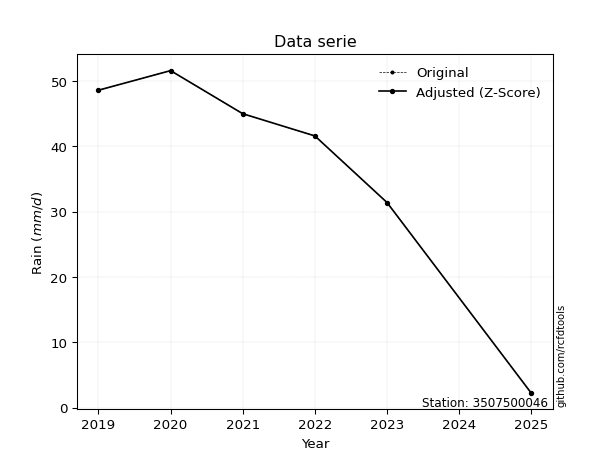</img>

</div>


> The initial value (value_initial) correspond to the initial obtained or null completed value, and value (value) is adjusted only when the initial value is outside the valid range (outlier) definite through the Z-Score value. If Z-Score is active, values out of range or outliers are replaced with the station mean value. A Z-Score (or standard score) measures how many standard deviations a data point is from the mean of a dataset, indicating its relative position; positive scores mean above the mean, negative mean below, and a score of zero is exactly at the mean, allowing for comparison of values from different distributions. It´s calculated using the formula $z=(x–μ)/σ$, where $x$ is the data point, $μ$ is the mean, and $σ$ is the standard deviation, helping identify outliers and understand probability.
>
> <sub>**Note**: In this study, "completing" (filling gaps in) and "extending" (forecasting or lengthening the historical record) rainfall data series are avoided for certain critical analyses because they introduce artificial bias and uncertainty, which can distort the statistics of rare events (extremes), alter day-to-day variability, and compromise the integrity and homogeneity of the original data. Some reasons against Completing/Extending rainfall data are: **Distortion of Extremes and Variability**: The primary issue is that most gap-filling or extension methods rely on averaging or regression with nearby stations, which inherently smooths the data. Rainfall is highly variable in space and time, with a large percentage of zero values and occasional large storms. Infilling methods often underestimate the highest values and overestimate the lowest (zero) values, which severely distorts analyses focused on flood frequency, drought severity, and intensity-duration-frequency (IDF) curves, **Loss of Data Homogeneity**: Infilled or extended data are synthetic estimates, not actual measurements. Combining these estimates with observed data can violate the assumption of data homogeneity, which requires that the data properties do not change over time. Inhomogeneity can lead to incorrect conclusions about long-term trends or changes in climate patterns, **Propagation of Errors**: Errors and biases from the original data (e.g., wind-induced undercatch, instrument errors, site changes) or the data used for imputation can propagate through the analysis, leading to unreliable hydrological models and inaccurate predictions, **Compromised Statistical Integrity**: For statistical analyses, especially those involving the frequency of events, using artificial data can introduce time bias or autocorrelation that doesn´t exist in reality, making it difficult to assess the true probability of events, **Difficulty in Validation**: It is difficult to accurately validate the quality of filled or extended data, especially for past periods where ground-truth measurements are unavailable. The reliability of imputation techniques heavily depends on the density of the surrounding station network and the complexity of the local topography.</sub>


### 4. Active continuous probability distributions from SciPy (80 of 104 available)

A Probability Density Function (PDF) describes the relative likelihood of a continuous random variable falling within a specific range, where the total area under its curve equals 1, and the area over any interval gives the actual probability for that range. Unlike discrete probabilities (like rolling a die), a PDF shows density, not direct probability for a single point (which is zero), with higher points indicating higher likelihood, often visualized as a bell curve for normal distributions.

A log of a probability density function (log-PDF) is simply the logarithm of the PDF´s value, denoted as $log(f(x))$, useful for converting multiplication of probabilities into addition, improving numerical stability with tiny numbers, and connecting to information theory concepts like entropy. Instead of dealing with very small probabilities (e.g., 0.000001), log-PDFs use negative numbers (e.g., $log(0.00001) ≈ -11.51$ that are easier for computers to handle, preventing underflow errors and simplifying complex calculations. In this study, each active probability distribution from SciPy is also evaluated in the $log$ form.

[scipy.stats](https://docs.scipy.org/doc/scipy/reference/stats.html) is a Python´s powerful submodule within the SciPy library for comprehensive statistical analysis, offering over 130 probability distributions (like Normal, Poisson, etc.), functions for descriptive stats (mean, variance), hypothesis testing (t-tests, chi-square), random variable generation, and statistical tests, making it essential for data science, modeling, and research. It provides tools to explore, model, and draw conclusions from data efficiently, working seamlessly with [NumPy](https://numpy.org/).

<div align="center">

|   id | p_dist           |   n_parameter | fit_method   | label                                                                       | active   | ref                                                                                                      |
|-----:|:-----------------|--------------:|:-------------|:----------------------------------------------------------------------------|:---------|:---------------------------------------------------------------------------------------------------------|
|    0 | alpha            |             3 | MLE          | Alpha                                                                       | True     | [:mortar_board:](https://docs.scipy.org/doc/scipy/reference/generated/scipy.stats.alpha.html)            |
|    1 | anglit           |             2 | MM           | Anglit                                                                      | True     | [:mortar_board:](https://docs.scipy.org/doc/scipy/reference/generated/scipy.stats.anglit.html)           |
|    2 | arcsine          |             2 | MM           | Arcsine                                                                     | True     | [:mortar_board:](https://docs.scipy.org/doc/scipy/reference/generated/scipy.stats.arcsine.html)          |
|    3 | argus            |             3 | MLE          | Argus                                                                       | True     | [:mortar_board:](https://docs.scipy.org/doc/scipy/reference/generated/scipy.stats.argus.html)            |
|    4 | beta             |             4 | MLE          | Beta                                                                        | True     | [:mortar_board:](https://docs.scipy.org/doc/scipy/reference/generated/scipy.stats.beta.html)             |
|    5 | betaprime        |             4 | MLE          | Beta prime                                                                  | True     | [:mortar_board:](https://docs.scipy.org/doc/scipy/reference/generated/scipy.stats.betaprime.html)        |
|    6 | bradford         |             3 | MLE          | Bradford                                                                    | True     | [:mortar_board:](https://docs.scipy.org/doc/scipy/reference/generated/scipy.stats.bradford.html)         |
|    7 | burr             |             4 | MLE          | Burr (Type III)                                                             | True     | [:mortar_board:](https://docs.scipy.org/doc/scipy/reference/generated/scipy.stats.burr.html)             |
|    8 | burr12           |             4 | MLE          | Burr (Type III) 12                                                          | True     | [:mortar_board:](https://docs.scipy.org/doc/scipy/reference/generated/scipy.stats.burr12.html)           |
|    9 | cosine           |             2 | MLE          | Cosine                                                                      | True     | [:mortar_board:](https://docs.scipy.org/doc/scipy/reference/generated/scipy.stats.cosine.html)           |
|   10 | crystalball      |             4 | MLE          | Crystalball                                                                 | True     | [:mortar_board:](https://docs.scipy.org/doc/scipy/reference/generated/scipy.stats.crystalball.html)      |
|   11 | dgamma           |             3 | MLE          | Double gamma                                                                | True     | [:mortar_board:](https://docs.scipy.org/doc/scipy/reference/generated/scipy.stats.dgamma.html)           |
|   12 | dweibull         |             3 | MLE          | Double Weibull                                                              | True     | [:mortar_board:](https://docs.scipy.org/doc/scipy/reference/generated/scipy.stats.dweibull.html)         |
|   13 | erlang           |             3 | MLE          | Erlang                                                                      | True     | [:mortar_board:](https://docs.scipy.org/doc/scipy/reference/generated/scipy.stats.erlang.html)           |
|   14 | exponnorm        |             3 | MLE          | Exponentially modified Normal                                               | True     | [:mortar_board:](https://docs.scipy.org/doc/scipy/reference/generated/scipy.stats.exponnorm.html)        |
|   15 | exponpow         |             3 | MLE          | Exponential power                                                           | True     | [:mortar_board:](https://docs.scipy.org/doc/scipy/reference/generated/scipy.stats.exponpow.html)         |
|   16 | exponweib        |             4 | MLE          | Exponentiated Weibull                                                       | True     | [:mortar_board:](https://docs.scipy.org/doc/scipy/reference/generated/scipy.stats.exponweib.html)        |
|   17 | f                |             4 | MLE          | F                                                                           | True     | [:mortar_board:](https://docs.scipy.org/doc/scipy/reference/generated/scipy.stats.f.html)                |
|   18 | fatiguelife      |             3 | MLE          | Fatigue-life (Birnbaum-Saunders)                                            | True     | [:mortar_board:](https://docs.scipy.org/doc/scipy/reference/generated/scipy.stats.fatiguelife.html)      |
|   19 | foldnorm         |             3 | MM           | Fold Normal                                                                 | True     | [:mortar_board:](https://docs.scipy.org/doc/scipy/reference/generated/scipy.stats.foldnorm.html)         |
|   20 | gamma            |             3 | MLE          | Gamma                                                                       | True     | [:mortar_board:](https://docs.scipy.org/doc/scipy/reference/generated/scipy.stats.gamma.html)            |
|   21 | gausshyper       |             6 | MLE          | Gauss hypergeometric                                                        | True     | [:mortar_board:](https://docs.scipy.org/doc/scipy/reference/generated/scipy.stats.gausshyper.html)       |
|   22 | genexpon         |             5 | MLE          | Generalized exponential                                                     | True     | [:mortar_board:](https://docs.scipy.org/doc/scipy/reference/generated/scipy.stats.genexpon.html)         |
|   23 | genextreme       |             3 | MLE          | Generalized exponential                                                     | True     | [:mortar_board:](https://docs.scipy.org/doc/scipy/reference/generated/scipy.stats.genextreme.html)       |
|   24 | gengamma         |             4 | MLE          | Generalized gamma                                                           | True     | [:mortar_board:](https://docs.scipy.org/doc/scipy/reference/generated/scipy.stats.gengamma.html)         |
|   25 | genhalflogistic  |             3 | MLE          | Generalized half-logistic                                                   | True     | [:mortar_board:](https://docs.scipy.org/doc/scipy/reference/generated/scipy.stats.genhalflogistic.html)  |
|   26 | genlogistic      |             3 | MLE          | Generalized logistic                                                        | True     | [:mortar_board:](https://docs.scipy.org/doc/scipy/reference/generated/scipy.stats.genlogistic.html)      |
|   27 | gennorm          |             3 | MLE          | Generalized Normal                                                          | True     | [:mortar_board:](https://docs.scipy.org/doc/scipy/reference/generated/scipy.stats.gennorm.html)          |
|   28 | genpareto        |             3 | MLE          | Generalized Pareto                                                          | True     | [:mortar_board:](https://docs.scipy.org/doc/scipy/reference/generated/scipy.stats.genpareto.html)        |
|   29 | gompertz         |             3 | MLE          | Gompertz (or truncated Gumbel)                                              | True     | [:mortar_board:](https://docs.scipy.org/doc/scipy/reference/generated/scipy.stats.gompertz.html)         |
|   30 | gumbel_l         |             2 | MM           | Gumbel Left Skew                                                            | True     | [:mortar_board:](https://docs.scipy.org/doc/scipy/reference/generated/scipy.stats.gumbel_l.html)         |
|   31 | gumbel_r         |             2 | MM           | Gumbel Right Skew                                                           | True     | [:mortar_board:](https://docs.scipy.org/doc/scipy/reference/generated/scipy.stats.gumbel_r.html)         |
|   32 | halfgennorm      |             3 | MLE          | Upper half of a generalized normal                                          | True     | [:mortar_board:](https://docs.scipy.org/doc/scipy/reference/generated/scipy.stats.halfgennorm.html)      |
|   33 | halflogistic     |             2 | MM           | Half-logistic                                                               | True     | [:mortar_board:](https://docs.scipy.org/doc/scipy/reference/generated/scipy.stats.halflogistic.html)     |
|   34 | halfnorm         |             2 | MM           | Half Normal                                                                 | True     | [:mortar_board:](https://docs.scipy.org/doc/scipy/reference/generated/scipy.stats.halfnorm.html)         |
|   35 | hypsecant        |             2 | MM           | hyperbolic secant                                                           | True     | [:mortar_board:](https://docs.scipy.org/doc/scipy/reference/generated/scipy.stats.hypsecant.html)        |
|   36 | invgamma         |             3 | MLE          | Inverted gamma                                                              | True     | [:mortar_board:](https://docs.scipy.org/doc/scipy/reference/generated/scipy.stats.invgamma.html)         |
|   37 | invgauss         |             3 | MLE          | Inverse Gaussian                                                            | True     | [:mortar_board:](https://docs.scipy.org/doc/scipy/reference/generated/scipy.stats.invgauss.html)         |
|   38 | invweibull       |             3 | MLE          | Inverted Weibull                                                            | True     | [:mortar_board:](https://docs.scipy.org/doc/scipy/reference/generated/scipy.stats.invweibull.html)       |
|   39 | johnsonsb        |             4 | MLE          | Johnson SB                                                                  | True     | [:mortar_board:](https://docs.scipy.org/doc/scipy/reference/generated/scipy.stats.johnsonsb.html)        |
|   40 | johnsonsu        |             4 | MLE          | Johnson Su                                                                  | True     | [:mortar_board:](https://docs.scipy.org/doc/scipy/reference/generated/scipy.stats.johnsonsu.html)        |
|   41 | kappa3           |             3 | MLE          | Kappa 3                                                                     | True     | [:mortar_board:](https://docs.scipy.org/doc/scipy/reference/generated/scipy.stats.kappa3.html)           |
|   42 | kappa4           |             4 | MLE          | Kappa 4                                                                     | True     | [:mortar_board:](https://docs.scipy.org/doc/scipy/reference/generated/scipy.stats.kappa4.html)           |
|   43 | ksone            |             3 | MLE          | Kolmogorov-Smirnov one-sided test statistic distribution                    | True     | [:mortar_board:](https://docs.scipy.org/doc/scipy/reference/generated/scipy.stats.ksone.html)            |
|   44 | kstwobign        |             2 | MLE          | Limiting distribution of scaled Kolmogorov-Smirnov two-sided test statistic | True     | [:mortar_board:](https://docs.scipy.org/doc/scipy/reference/generated/scipy.stats.kstwobign.html)        |
|   45 | laplace          |             2 | MM           | Laplace                                                                     | True     | [:mortar_board:](https://docs.scipy.org/doc/scipy/reference/generated/scipy.stats.laplace.html)          |
|   46 | levy_l           |             2 | MLE          | Left-skewed Levy                                                            | True     | [:mortar_board:](https://docs.scipy.org/doc/scipy/reference/generated/scipy.stats.levy_l.html)           |
|   47 | loggamma         |             3 | MLE          | Log gamma                                                                   | True     | [:mortar_board:](https://docs.scipy.org/doc/scipy/reference/generated/scipy.stats.loggamma.html)         |
|   48 | logistic         |             2 | MM           | Logistic (or Sech-squared)                                                  | True     | [:mortar_board:](https://docs.scipy.org/doc/scipy/reference/generated/scipy.stats.logistic.html)         |
|   49 | loglaplace       |             3 | MLE          | Log-Laplace                                                                 | True     | [:mortar_board:](https://docs.scipy.org/doc/scipy/reference/generated/scipy.stats.loglaplace.html)       |
|   50 | lomax            |             3 | MLE          | Lomax (Pareto of the second kind)                                           | True     | [:mortar_board:](https://docs.scipy.org/doc/scipy/reference/generated/scipy.stats.lomax.html)            |
|   51 | maxwell          |             2 | MM           | Maxwell                                                                     | True     | [:mortar_board:](https://docs.scipy.org/doc/scipy/reference/generated/scipy.stats.maxwell.html)          |
|   52 | mielke           |             4 | MLE          | Mielke Beta-Kappa / Dagum                                                   | True     | [:mortar_board:](https://docs.scipy.org/doc/scipy/reference/generated/scipy.stats.mielke.html)           |
|   53 | moyal            |             2 | MM           | Moyal                                                                       | True     | [:mortar_board:](https://docs.scipy.org/doc/scipy/reference/generated/scipy.stats.moyal.html)            |
|   54 | nakagami         |             3 | MLE          | Nakagami                                                                    | True     | [:mortar_board:](https://docs.scipy.org/doc/scipy/reference/generated/scipy.stats.nakagami.html)         |
|   55 | ncf              |             5 | MLE          | Non-central F distribution                                                  | True     | [:mortar_board:](https://docs.scipy.org/doc/scipy/reference/generated/scipy.stats.ncf.html)              |
|   56 | nct              |             4 | MLE          | Non-central Student’s t                                                     | True     | [:mortar_board:](https://docs.scipy.org/doc/scipy/reference/generated/scipy.stats.nct.html)              |
|   57 | norm             |             2 | MM           | Normal                                                                      | True     | [:mortar_board:](https://docs.scipy.org/doc/scipy/reference/generated/scipy.stats.norm.html)             |
|   58 | pearson3         |             3 | MM           | Pearson type III                                                            | True     | [:mortar_board:](https://docs.scipy.org/doc/scipy/reference/generated/scipy.stats.pearson3.html)         |
|   59 | powerlaw         |             3 | MLE          | Power-function                                                              | True     | [:mortar_board:](https://docs.scipy.org/doc/scipy/reference/generated/scipy.stats.powerlaw.html)         |
|   60 | rayleigh         |             2 | MM           | Rayleigh                                                                    | True     | [:mortar_board:](https://docs.scipy.org/doc/scipy/reference/generated/scipy.stats.rayleigh.html)         |
|   61 | rdist            |             3 | MLE          | R-distributed (symmetric beta)                                              | True     | [:mortar_board:](https://docs.scipy.org/doc/scipy/reference/generated/scipy.stats.rdist.html)            |
|   62 | rice             |             3 | MLE          | Rice                                                                        | True     | [:mortar_board:](https://docs.scipy.org/doc/scipy/reference/generated/scipy.stats.rice.html)             |
|   63 | semicircular     |             2 | MM           | Semicircular                                                                | True     | [:mortar_board:](https://docs.scipy.org/doc/scipy/reference/generated/scipy.stats.semicircular.html)     |
|   64 | skewnorm         |             3 | MLE          | Skew normal                                                                 | True     | [:mortar_board:](https://docs.scipy.org/doc/scipy/reference/generated/scipy.stats.skewnorm.html)         |
|   65 | t                |             3 | MLE          | Student’s t                                                                 | True     | [:mortar_board:](https://docs.scipy.org/doc/scipy/reference/generated/scipy.stats.t.html)                |
|   66 | trapezoid        |             4 | MLE          | Trapezoid                                                                   | True     | [:mortar_board:](https://docs.scipy.org/doc/scipy/reference/generated/scipy.stats.trapezoid.html)        |
|   67 | triang           |             3 | MLE          | Triangular                                                                  | True     | [:mortar_board:](https://docs.scipy.org/doc/scipy/reference/generated/scipy.stats.triang.html)           |
|   68 | truncexpon       |             3 | MLE          | Truncated exponential                                                       | True     | [:mortar_board:](https://docs.scipy.org/doc/scipy/reference/generated/scipy.stats.truncexpon.html)       |
|   69 | truncnorm        |             4 | MLE          | Truncated normal                                                            | True     | [:mortar_board:](https://docs.scipy.org/doc/scipy/reference/generated/scipy.stats.truncnorm.html)        |
|   70 | truncpareto      |             4 | MLE          | Upper truncated Pareto                                                      | True     | [:mortar_board:](https://docs.scipy.org/doc/scipy/reference/generated/scipy.stats.truncpareto.html)      |
|   71 | truncweibull_min |             5 | MLE          | Doubly truncated Weibull minimum                                            | True     | [:mortar_board:](https://docs.scipy.org/doc/scipy/reference/generated/scipy.stats.truncweibull_min.html) |
|   72 | tukeylambda      |             3 | MLE          | Tukey-Lamdba                                                                | True     | [:mortar_board:](https://docs.scipy.org/doc/scipy/reference/generated/scipy.stats.tukeylambda.html)      |
|   73 | uniform          |             2 | MLE          | Uniform                                                                     | True     | [:mortar_board:](https://docs.scipy.org/doc/scipy/reference/generated/scipy.stats.uniform.html)          |
|   74 | vonmises         |             3 | MLE          | Von Mises                                                                   | True     | [:mortar_board:](https://docs.scipy.org/doc/scipy/reference/generated/scipy.stats.vonmises.html)         |
|   75 | vonmises_line    |             3 | MLE          | Von Mises line                                                              | True     | [:mortar_board:](https://docs.scipy.org/doc/scipy/reference/generated/scipy.stats.vonmises_line.html)    |
|   76 | wald             |             2 | MM           | Wald                                                                        | True     | [:mortar_board:](https://docs.scipy.org/doc/scipy/reference/generated/scipy.stats.wald.html)             |
|   77 | weibull_max      |             3 | MLE          | Weibull maximum                                                             | True     | [:mortar_board:](https://docs.scipy.org/doc/scipy/reference/generated/scipy.stats.weibull_max.html)      |
|   78 | weibull_min      |             3 | MLE          | Weibull minimum                                                             | True     | [:mortar_board:](https://docs.scipy.org/doc/scipy/reference/generated/scipy.stats.weibull_min.html)      |
|   79 | wrapcauchy       |             3 | MLE          | Wrapped  Cauchy                                                             | True     | [:mortar_board:](https://docs.scipy.org/doc/scipy/reference/generated/scipy.stats.wrapcauchy.html)       |

</div>

> **n_parameter:** # arguments & localization & scale.
>
> **Fit methods:** (MLE) maximum likelihood, (MM) L-moments.
>
>**Inactive** (With the only purpose of prevent loops, zero divisions, infinite values, over high estimated values or horizontal trending for recurrence intervals estimations, the follow distributions were disabled.)**:** lognorm, norminvgauss, powernorm, powerlognorm, cauchy, halfcauchy, foldcauchy, skewcauchy, chi2, expon, fisk, genhyperbolic, geninvgauss, gibrat, kstwo, laplace_asymmetric, levy, levy_stable, ncx2, pareto, rel_breitwigner, recipinvgauss, studentized_range, loguniform, 


## B. Probability (PDF) vs. Empirical (EDF) distributions functions

A continuous probability distribution (CPD) describes probabilities for variables that can take any value within a range (like rain any time), unlike discrete variables with specific outcomes (like temperature). It uses a Probability Density Function (PDF), a curve where the total area under it equals 1, and the probability of the variable falling within an interval (a to b) is found by calculating the area under the curve between those points. A key feature is that the probability of hitting any single exact value is zero, so probabilities are always expressed for ranges, e.g., $P(a ≤ X ≤ b)$.

<div align="center">

Distributions parameters from station values
|     |    station | p_dist              |   n |              loc |           scale | shape                  | shape1                 | shape2                | shape3            |
|----:|-----------:|:--------------------|----:|-----------------:|----------------:|:-----------------------|:-----------------------|:----------------------|:------------------|
|   0 | 3507500046 | alpha               |   6 |     -0.00943509  |     5.38683     | 3.714634333332108e-10  |                        |                       |                   |
|   1 | 3507500046 | anglit              |   6 |     36.7333      |    48.8763      |                        |                        |                       |                   |
|   2 | 3507500046 | arcsine             |   6 |     13.1053      |    47.2561      |                        |                        |                       |                   |
|   3 | 3507500046 | argus               |   6 |    -20.5618      |    73.48        | 2.7720826064886346     |                        |                       |                   |
|   4 | 3507500046 | beta                |   6 |     -2.83986     |    54.4399      | 0.610585132900598      | 0.18662400664189205    |                       |                   |
|   5 | 3507500046 | betaprime           |   6 |   -448.15        | 21780.1         | 813.8184479006432      | 36568.624148041155     |                       |                   |
|   6 | 3507500046 | bradford            |   6 |     -3.68733     |    55.2887      | 5.648817715299414e-07  |                        |                       |                   |
|   7 | 3507500046 | burr                |   6 |     -1.00595     |    53.2843      | 252.53480212103588     | 0.006314037396979924   |                       |                   |
|   8 | 3507500046 | burr12              |   6 |  -5070.89        |  5219.47        | 516.842417368041       | 34779.671647131545     |                       |                   |
|   9 | 3507500046 | cosine              |   6 |     33.6841      |    14.5489      |                        |                        |                       |                   |
|  10 | 3507500046 | crystalball         |   6 |     36.7333      |    16.7075      | 2826.083525563331      | 3765.776986518878      |                       |                   |
|  11 | 3507500046 | dgamma              |   6 |     41.6         |    19.0504      | 0.5366723693140278     |                        |                       |                   |
|  12 | 3507500046 | dweibull            |   6 |     45           |    11.7812      | 0.8202903652715401     |                        |                       |                   |
|  13 | 3507500046 | erlang              |   6 |   -300.67        |     0.894111    | 376.9858096618014      |                        |                       |                   |
|  14 | 3507500046 | exponnorm           |   6 |     36.7235      |    16.7076      | 0.000591058644887416   |                        |                       |                   |
|  15 | 3507500046 | exponpow            |   6 |      2.2         |     3.35312     | 0.09997446600370209    |                        |                       |                   |
|  16 | 3507500046 | exponweib           |   6 |      2.2         |     0.709623    | 4.559226783928114      | 0.21525460600891133    |                       |                   |
|  17 | 3507500046 | f                   |   6 |  -4365.28        |  4401.98        | 266230.8179755381      | 284337.8631406387      |                       |                   |
|  18 | 3507500046 | fatiguelife         |   6 |      2.2         |     4.35618e-05 | 823.5054854625212      |                        |                       |                   |
|  19 | 3507500046 | foldnorm            |   6 |    -60.8391      |    14.4315      | 6.7971582859879796     |                        |                       |                   |
|  20 | 3507500046 | gamma               |   6 |   -284.657       |     0.947247    | 339.2610790150022      |                        |                       |                   |
|  21 | 3507500046 | gausshyper          |   6 |     -2.35277     |    53.9528      | 1.3024338695306912     | 0.4605377904240998     | 1.215768545276646     | 1.087519836349962 |
|  22 | 3507500046 | genexpon            |   6 |      2.19992     |     1.62718     | 0.047091374701611524   | 2.587657917630302e-07  | 0.640254428774155     |                   |
|  23 | 3507500046 | genextreme          |   6 |     40.4953      |    15.0041      | 1.351153989019855      |                        |                       |                   |
|  24 | 3507500046 | gengamma            |   6 |     -4.64035e+07 |     4.64035e+07 | 0.43522157163639297    | 7866767.312790684      |                       |                   |
|  25 | 3507500046 | genhalflogistic     |   6 |      0.0598645   |    56.1423      | 1.0892923581345508     |                        |                       |                   |
|  26 | 3507500046 | genlogistic         |   6 |     51.6164      |     1.93429e-05 | 1.3014883705554538e-06 |                        |                       |                   |
|  27 | 3507500046 | gennorm             |   6 |     45           |     1.44411     | 0.4797609594009872     |                        |                       |                   |
|  28 | 3507500046 | genpareto           |   6 |     -0.295865    |   116.141       | -2.2379587366364566    |                        |                       |                   |
|  29 | 3507500046 | gompertz            |   6 |     -5.27537     |    10.6665      | 0.010297448322286261   |                        |                       |                   |
|  30 | 3507500046 | gumbel_l            |   6 |     44.2526      |    13.0268      |                        |                        |                       |                   |
|  31 | 3507500046 | gumbel_r            |   6 |     29.214       |    13.0268      |                        |                        |                       |                   |
|  32 | 3507500046 | halfgennorm         |   6 |      2.2         |     2.21283     | 0.38671376815794706    |                        |                       |                   |
|  33 | 3507500046 | halflogistic        |   6 |     16.931       |    14.2844      |                        |                        |                       |                   |
|  34 | 3507500046 | halfnorm            |   6 |     14.6191      |    27.7161      |                        |                        |                       |                   |
|  35 | 3507500046 | hypsecant           |   6 |     36.7333      |    10.6364      |                        |                        |                       |                   |
|  36 | 3507500046 | invgamma            |   6 |   -217.744       | 48779.4         | 193.225221099566       |                        |                       |                   |
|  37 | 3507500046 | invgauss            |   6 |    -91.6121      |  5549.04        | 0.023182289186441905   |                        |                       |                   |
|  38 | 3507500046 | invweibull          |   6 |     -1.58774e+08 |     1.58774e+08 | 8154999.171693887      |                        |                       |                   |
|  39 | 3507500046 | johnsonsb           |   6 |     -6.65321     |    58.2532      | -0.618225168737736     | 0.1110920363807924     |                       |                   |
|  40 | 3507500046 | johnsonsu           |   6 |     51.6         |     7.90786e-12 | 5.439779472937726      | 0.21478314333215082    |                       |                   |
|  41 | 3507500046 | kappa3              |   6 |      2.2         |    49.3965      | 20294.63025016201      |                        |                       |                   |
|  42 | 3507500046 | kappa4              |   6 |     -2.42974     |    58.9221      | 1.0855858110322851     | 1.0830336806736527     |                       |                   |
|  43 | 3507500046 | ksone               |   6 |     -2.74        |    59.28        | 1.0                    |                        |                       |                   |
|  44 | 3507500046 | kstwobign           |   6 |    -41.5968      |    89.4316      |                        |                        |                       |                   |
|  45 | 3507500046 | laplace             |   6 |     36.7333      |    11.814       |                        |                        |                       |                   |
|  46 | 3507500046 | levy_l              |   6 |     52.4297      |     3.40754     |                        |                        |                       |                   |
|  47 | 3507500046 | loggamma            |   6 |     51.6001      |     9.66245e-06 | 6.496921672855507e-07  |                        |                       |                   |
|  48 | 3507500046 | logistic            |   6 |     36.7333      |     9.21136     |                        |                        |                       |                   |
|  49 | 3507500046 | loglaplace          |   6 |     -0.0919755   |    45.092       | 1.6532595230100857     |                        |                       |                   |
|  50 | 3507500046 | lomax               |   6 |      2.2         |     2.8093e+10  | 836365285.2070473      |                        |                       |                   |
|  51 | 3507500046 | maxwell             |   6 |     -2.85654     |    24.8093      |                        |                        |                       |                   |
|  52 | 3507500046 | mielke              |   6 |     -1.17132e+07 |     1.17133e+07 | 787040.0892163812      | 3790110925.3804665     |                       |                   |
|  53 | 3507500046 | moyal               |   6 |     27.1789      |     7.52104     |                        |                        |                       |                   |
|  54 | 3507500046 | nakagami            |   6 | -11189.8         | 11226.6         | 112147.02604740273     |                        |                       |                   |
|  55 | 3507500046 | ncf                 |   6 |      0.0966877   |     3.40058     | 1.0748404579002206     | 67.05021706445874      | 10.10721325788808     |                   |
|  56 | 3507500046 | nct                 |   6 |  -1194.55        |    16.6225      | 248052.43501235917     | 74.07299017475802      |                       |                   |
|  57 | 3507500046 | norm                |   6 |     36.7333      |    16.7075      |                        |                        |                       |                   |
|  58 | 3507500046 | pearson3            |   6 |     36.7333      |    16.7076      | -1.2756735081943762    |                        |                       |                   |
|  59 | 3507500046 | powerlaw            |   6 |      2.2         |    49.4         | 0.149222230448295      |                        |                       |                   |
|  60 | 3507500046 | rayleigh            |   6 |      4.77084     |    25.5024      |                        |                        |                       |                   |
|  61 | 3507500046 | rdist               |   6 |     -1.87292     |     4.07292     | 1.6357499058063505     |                        |                       |                   |
|  62 | 3507500046 | rice                |   6 |     -4.79393     |    31.6456      | 0.0275716814770494     |                        |                       |                   |
|  63 | 3507500046 | semicircular        |   6 |     36.7333      |    33.4151      |                        |                        |                       |                   |
|  64 | 3507500046 | skewnorm            |   6 |     51.6         |    22.3638      | -16466570.061999626    |                        |                       |                   |
|  65 | 3507500046 | t                   |   6 |     36.6718      |    16.647       | 45.17066696792779      |                        |                       |                   |
|  66 | 3507500046 | trapezoid           |   6 |    -11.0489      |    70.8841      | 1.0                    | 1.0                    |                       |                   |
|  67 | 3507500046 | triang              |   6 |     -7.8469      |    59.5438      | 0.9983734599095311     |                        |                       |                   |
|  68 | 3507500046 | truncexpon          |   6 |     -2.84736     |    70.2915      | 0.7745935869584659     |                        |                       |                   |
|  69 | 3507500046 | truncnorm           |   6 |     58.5553      |    25.8321      | -43.10864120878186     | -0.2692514371462754    |                       |                   |
|  70 | 3507500046 | truncpareto         |   6 |      2.08808     |     0.111919    | 0.20335146636670015    | 442.3904522547898      |                       |                   |
|  71 | 3507500046 | truncweibull_min    |   6 |     -0.359622    |    80.4578      | 1.5852653210295857     | 0.0032306642676207236  | 0.6457997593089728    |                   |
|  72 | 3507500046 | tukeylambda         |   6 |     -0.0386416   |     2.46054     | 1.099122010384916      |                        |                       |                   |
|  73 | 3507500046 | uniform             |   6 |      2.2         |    49.4         |                        |                        |                       |                   |
|  74 | 3507500046 | vonmises            |   6 |      1.21061     |     1           | 0.3365598294877854     |                        |                       |                   |
|  75 | 3507500046 | vonmises_line       |   6 |     40.9197      |    12.3249      | 1.2234985771073958     |                        |                       |                   |
|  76 | 3507500046 | wald                |   6 |     20.0258      |    16.7075      |                        |                        |                       |                   |
|  77 | 3507500046 | weibull_max         |   6 |     51.6         |    18.4208      | 0.9595282622274688     |                        |                       |                   |
|  78 | 3507500046 | weibull_min         |   6 |      2.2         |     6.14271     | 0.4063552948381733     |                        |                       |                   |
|  79 | 3507500046 | wrapcauchy          |   6 |      2.2         |     7.86225     | 0.5917322964893286     |                        |                       |                   |
|  80 | 3507500046 | logalpha            |   6 |    -17.7378      |   342.727       | 16.37343393840338      |                        |                       |                   |
|  81 | 3507500046 | loganglit           |   6 |      3.2662      |     3.27446     |                        |                        |                       |                   |
|  82 | 3507500046 | logarcsine          |   6 |      1.68321     |     3.16596     |                        |                        |                       |                   |
|  83 | 3507500046 | logargus            |   6 |     -0.287478    |     4.30286     | 3.40645653049103       |                        |                       |                   |
|  84 | 3507500046 | logbeta             |   6 |      0.484489    |     3.45903     | 0.09215760005832349    | 0.02072525473058867    |                       |                   |
|  85 | 3507500046 | logbetaprime        |   6 |     -2.73559     |     7.36646e+11 | 17.588250850376845     | 2146328325364.6147     |                       |                   |
|  86 | 3507500046 | logbradford         |   6 |      0.788447    |     3.15511     | 0.8319399416729544     |                        |                       |                   |
|  87 | 3507500046 | logburr             |   6 |     -4.46586e+07 |     4.46586e+07 | 8049136203.560335      | 0.007994683160040133   |                       |                   |
|  88 | 3507500046 | logburr12           |   6 |  -7023.39        |  7033.92        | 14649.679269823195     | 1519998.8364624493     |                       |                   |
|  89 | 3507500046 | logcosine           |   6 |      3.00613     |     1.00247     |                        |                        |                       |                   |
|  90 | 3507500046 | logcrystalball      |   6 |      3.2662      |     1.11932     | 65.78757421107713      | 66.60830598238437      |                       |                   |
|  91 | 3507500046 | logdgamma           |   6 |      3.88362     |     0.833658    | 0.8889013677961927     |                        |                       |                   |
|  92 | 3507500046 | logdweibull         |   6 |      3.94352     |     0.802054    | 0.8732737153585087     |                        |                       |                   |
|  93 | 3507500046 | logerlang           |   6 |    -16.1831      |     0.0728689   | 266.8985036786258      |                        |                       |                   |
|  94 | 3507500046 | logexponnorm        |   6 |      3.26559     |     1.11932     | 0.0005430321762748792  |                        |                       |                   |
|  95 | 3507500046 | logexponpow         |   6 |      0.788457    |     2.12125     | 0.1527606440939931     |                        |                       |                   |
|  96 | 3507500046 | logexponweib        |   6 |     -1.30339e+08 |     1.30339e+08 | 0.20837632527299638    | 856412744.4473033      |                       |                   |
|  97 | 3507500046 | logf                |   6 |  -3465.2         |  3468.47        | 56375019.53767239      | 28890893.75953168      |                       |                   |
|  98 | 3507500046 | logfatiguelife      |   6 |  -1064.96        |  1068.22        | 0.001045480242657778   |                        |                       |                   |
|  99 | 3507500046 | logfoldnorm         |   6 |     -3.9079      |     0.958331    | 7.517832172993467      |                        |                       |                   |
| 100 | 3507500046 | loggamma            |   6 |    -15.619       |     0.0775656   | 243.38905607793959     |                        |                       |                   |
| 101 | 3507500046 | loggausshyper       |   6 |      0.510924    |     3.4326      | 1.2289529045732737     | 0.5000430776893301     | 1.0866252776104806    | 1.077463412966583 |
| 102 | 3507500046 | loggenexpon         |   6 |      0.734771    |     0.00737871  | 0.0008837193897198127  | 1.4107071194038414     | 6.991189210750117e-06 |                   |
| 103 | 3507500046 | loggenextreme       |   6 |      3.41333     |     0.819193    | 1.5450967237911        |                        |                       |                   |
| 104 | 3507500046 | loggengamma         |   6 |     -6.54229e+07 |     6.54229e+07 | 0.11949917872971522    | 758193146.1314294      |                       |                   |
| 105 | 3507500046 | loggenhalflogistic  |   6 |      0.379974    |     4.11805     | 1.155604619492295      |                        |                       |                   |
| 106 | 3507500046 | loggenlogistic      |   6 |      3.94356     |     2.93157e-06 | 4.340401749395594e-06  |                        |                       |                   |
| 107 | 3507500046 | loggennorm          |   6 |      3.88362     |     0.000478642 | 0.24714415882558932    |                        |                       |                   |
| 108 | 3507500046 | loggenpareto        |   6 |      0.000313754 |     6.94338     | -1.7608454263441526    |                        |                       |                   |
| 109 | 3507500046 | loggompertz         |   6 |      0.680698    |     0.552988    | 0.004381723614798267   |                        |                       |                   |
| 110 | 3507500046 | loggumbel_l         |   6 |      3.76995     |     0.87273     |                        |                        |                       |                   |
| 111 | 3507500046 | loggumbel_r         |   6 |      2.76244     |     0.87273     |                        |                        |                       |                   |
| 112 | 3507500046 | loghalfgennorm      |   6 |      0.788457    |     1.29432     | 0.6975445716148103     |                        |                       |                   |
| 113 | 3507500046 | loghalflogistic     |   6 |      1.93957     |     0.956964    |                        |                        |                       |                   |
| 114 | 3507500046 | loghalfnorm         |   6 |      1.78462     |     1.85687     |                        |                        |                       |                   |
| 115 | 3507500046 | loghypsecant        |   6 |      3.2662      |     0.712581    |                        |                        |                       |                   |
| 116 | 3507500046 | loginvgamma         |   6 |    -22.4135      | 12374.8         | 482.8107815570588      |                        |                       |                   |
| 117 | 3507500046 | loginvgauss         |   6 |    -10.2053      |  1563.33        | 0.008629122587002734   |                        |                       |                   |
| 118 | 3507500046 | loginvweibull       |   6 |     -1.4957e+08  |     1.4957e+08  | 107998441.54215181     |                        |                       |                   |
| 119 | 3507500046 | logjohnsonsb        |   6 |      0.278427    |     3.66509     | -1.092843732870641     | 0.14542791493173363    |                       |                   |
| 120 | 3507500046 | logjohnsonsu        |   6 |      3.94352     |     2.58415e-16 | 3.243335210675787      | 0.1216855234898915     |                       |                   |
| 121 | 3507500046 | logkappa3           |   6 |      0.788457    |     3.15506     | 71572908.43109858      |                        |                       |                   |
| 122 | 3507500046 | logkappa4           |   6 |      0.40277     |     4.12991     | 1.0785151052514483     | 1.1663931064388593     |                       |                   |
| 123 | 3507500046 | logksone            |   6 |      0.472951    |     3.78608     | 1.0                    |                        |                       |                   |
| 124 | 3507500046 | logkstwobign        |   6 |     -2.30753     |     6.36555     |                        |                        |                       |                   |
| 125 | 3507500046 | loglaplace          |   6 |      3.2662      |     0.791478    |                        |                        |                       |                   |
| 126 | 3507500046 | loglevy_l           |   6 |      3.96155     |     0.07379     |                        |                        |                       |                   |
| 127 | 3507500046 | logloggamma         |   6 |      3.94365     |     1.73469e-06 | 2.5580698283789087e-06 |                        |                       |                   |
| 128 | 3507500046 | loglogistic         |   6 |      3.2662      |     0.617113    |                        |                        |                       |                   |
| 129 | 3507500046 | logloglaplace       |   6 |     -0.0357885   |     3.76389     | 3.5061635881488473     |                        |                       |                   |
| 130 | 3507500046 | loglomax            |   6 |      0.788457    |     2.64078e+09 | 1067404079.3804889     |                        |                       |                   |
| 131 | 3507500046 | logmaxwell          |   6 |      0.613878    |     1.66209     |                        |                        |                       |                   |
| 132 | 3507500046 | logmielke           |   6 |     -6.45309e+07 |     6.45309e+07 | 101838967.79631224     | 16639467682.07396      |                       |                   |
| 133 | 3507500046 | logmoyal            |   6 |      2.6261      |     0.503871    |                        |                        |                       |                   |
| 134 | 3507500046 | lognakagami         |   6 |      3.44681     |     0.341999    | 0.1797549356031214     |                        |                       |                   |
| 135 | 3507500046 | logncf              |   6 |    -27.4206      |     9.04124     | 839.2891031735394      | 7066.242064564307      | 2008.686379249561     |                   |
| 136 | 3507500046 | lognct              |   6 |    -66.3232      |     1.03882     | 12293.061528136357     | 66.9842789783142       |                       |                   |
| 137 | 3507500046 | lognorm             |   6 |      3.2662      |     1.11932     |                        |                        |                       |                   |
| 138 | 3507500046 | logpearson3         |   6 |      3.2662      |     1.11931     | -1.7117556351421577    |                        |                       |                   |
| 139 | 3507500046 | logpowerlaw         |   6 |      0.788457    |     3.15506     | 0.1571036491128054     |                        |                       |                   |
| 140 | 3507500046 | lograyleigh         |   6 |      1.1249      |     1.70851     |                        |                        |                       |                   |
| 141 | 3507500046 | logrdist            |   6 |      1.48644     |     1.96037     | 1.01442760694515       |                        |                       |                   |
| 142 | 3507500046 | logrice             |   6 |   -383.116       |     1.11932     | 345.19153681725015     |                        |                       |                   |
| 143 | 3507500046 | logsemicircular     |   6 |      3.26619     |     2.23864     |                        |                        |                       |                   |
| 144 | 3507500046 | logskewnorm         |   6 |      3.94352     |     1.30818     | -20374313.183057338    |                        |                       |                   |
| 145 | 3507500046 | logt                |   6 |      3.82434     |     0.103814    | 0.7197901164310372     |                        |                       |                   |
| 146 | 3507500046 | logtrapezoid        |   6 |      0.100282    |     4.74887     | 1.0                    | 1.0                    |                       |                   |
| 147 | 3507500046 | logtriang           |   6 |      0.100571    |     3.84302     | 0.9999866684914365     |                        |                       |                   |
| 148 | 3507500046 | logtruncexpon       |   6 |      0.522776    |     4.87228     | 0.7020827139896693     |                        |                       |                   |
| 149 | 3507500046 | logtruncnorm        |   6 |      0.946339    |     2.64589     | -0.059670732821316234  | 23.884126275323815     |                       |                   |
| 150 | 3507500046 | logtruncpareto      |   6 |      0.780327    |     0.00813024  | 0.20329311932828215    | 389.0653606757097      |                       |                   |
| 151 | 3507500046 | logtruncweibull_min |   6 |      0.604369    |     6.61229     | 2.258915211073136      | 2.9565606827723872e-05 | 0.5049919784582599    |                   |
| 152 | 3507500046 | logtukeylambda      |   6 |      2.1693      |     1.45762     | 1.0555999966851948     |                        |                       |                   |
| 153 | 3507500046 | loguniform          |   6 |      0.788457    |     3.15506     |                        |                        |                       |                   |
| 154 | 3507500046 | logvonmises         |   6 |     -2.56296     |     1           | 1.7750206220186355     |                        |                       |                   |
| 155 | 3507500046 | logvonmises_line    |   6 |      3.57608     |     0.887327    | 1.6583028169107563     |                        |                       |                   |
| 156 | 3507500046 | logwald             |   6 |      2.14686     |     1.11933     |                        |                        |                       |                   |
| 157 | 3507500046 | logweibull_max      |   6 |      3.94352     |     2.20647     | 0.37191665992307754    |                        |                       |                   |
| 158 | 3507500046 | logweibull_min      |   6 |     -1.75967e+08 |     1.75967e+08 | 326575159.8143662      |                        |                       |                   |
| 159 | 3507500046 | logwrapcauchy       |   6 |      0.788457    |     0.502144    | 0.8561219214511355     |                        |                       |                   |

</div>

> **loc** (Location parameter): This shifts the distribution along the x-axis. For many common distributions, like the normal (Gaussian) distribution, loc represents the mean $μ$. For others, like the uniform distribution, it might represent the minimum value, or for the beta distribution, the left end of the support interval.
>
> **scale** (Scale parameter): This determines the width or spread of the distribution. For the normal distribution, scale represents the standard deviation $σ$. For a uniform distribution, it defines the length of the interval (from $loc$ to $loc + scale$).
>
> **shape** (Shape parameters): Refers to parameters that define the specific form of a probability distribution, distinct from its location (loc) and scale (scale). These parameters are required arguments for most distribution functions. For example, a normal (Gaussian) distribution is fully defined by its location (mean) and scale (standard deviation), so it has no specific shape parameters beyond loc and scale. However, other distributions have intrinsic properties that need specification, as Gamma distribution that takes a shape parameter, often named $a$ or $alpha$.


### 0. Cumulative distribution values - CDF (160 evaluated)

Cumulative Distribution Function (CDF), denoted as $F$<sub>$X$</sub>$(x)$, is a function that gives the probability that a random variable $X$ will take a value less than or equal to a specific value, $x$ (i.e., $(P(X≥x)$. It essentially "accumulates" probabilities from a given point up to the far right (positive infinity), providing a complete picture of the distribution´s probabilities for both discrete (like rain) and continuous (like temperature) variables, helping to find probabilities over ranges or above certain values. Each station is evaluated separately ordering the $x$ values ascending, calculating the CDF and PDF values for the activated distributions and their logarithmic forms.

<div align="center">

CDF ordered by x ascending and calculating $log(f(x))$ separately
|   id |    Station |   date |    x |   count |    mean |     std |    zscore |   Value_initial |    station |   m |     alpha |   alpha_pdf |     anglit |   anglit_pdf |   arcsine |   arcsine_pdf |     argus |   argus_pdf |      beta |    beta_pdf |   betaprime |   betaprime_pdf |   bradford |   bradford_pdf |      burr |    burr_pdf |    burr12 |   burr12_pdf |    cosine |   cosine_pdf |   crystalball |   crystalball_pdf |    dgamma |      dgamma_pdf |   dweibull |   dweibull_pdf |    erlang |   erlang_pdf |   exponnorm |   exponnorm_pdf |   exponpow |   exponpow_pdf |   exponweib |   exponweib_pdf |         f |      f_pdf |   fatiguelife |   fatiguelife_pdf |   foldnorm |   foldnorm_pdf |     gamma |   gamma_pdf |   gausshyper |   gausshyper_pdf |    genexpon |   genexpon_pdf |   genextreme |   genextreme_pdf |   gengamma |   gengamma_pdf |   genhalflogistic |   genhalflogistic_pdf |   genlogistic |   genlogistic_pdf |   gennorm |   gennorm_pdf |   genpareto |   genpareto_pdf |   gompertz |   gompertz_pdf |   gumbel_l |   gumbel_l_pdf |    gumbel_r |   gumbel_r_pdf |   halfgennorm |   halfgennorm_pdf |   halflogistic |   halflogistic_pdf |   halfnorm |   halfnorm_pdf |   hypsecant |   hypsecant_pdf |   invgamma |   invgamma_pdf |   invgauss |   invgauss_pdf |   invweibull |   invweibull_pdf |   johnsonsb |   johnsonsb_pdf |   johnsonsu |   johnsonsu_pdf |      kappa3 |   kappa3_pdf |      kappa4 |   kappa4_pdf |     ksone |   ksone_pdf |   kstwobign |   kstwobign_pdf |   laplace |   laplace_pdf |   levy_l |   levy_l_pdf |   loggamma |   loggamma_pdf |   logistic |   logistic_pdf |   loglaplace |   loglaplace_pdf |       lomax |   lomax_pdf |    maxwell |   maxwell_pdf |    mielke |   mielke_pdf |       moyal |   moyal_pdf |   nakagami |   nakagami_pdf |        ncf |    ncf_pdf |      nct |   nct_pdf |      norm |   norm_pdf |   pearson3 |   pearson3_pdf |   powerlaw |   powerlaw_pdf |   rayleigh |   rayleigh_pdf |   rdist |   rdist_pdf |      rice |   rice_pdf |   semicircular |   semicircular_pdf |   skewnorm |   skewnorm_pdf |         t |      t_pdf |   trapezoid |   trapezoid_pdf |    triang |   triang_pdf |   truncexpon |   truncexpon_pdf |   truncnorm |   truncnorm_pdf |   truncpareto |   truncpareto_pdf |   truncweibull_min |   truncweibull_min_pdf |   tukeylambda |   tukeylambda_pdf |   uniform |   uniform_pdf |   vonmises |   vonmises_pdf |   vonmises_line |   vonmises_line_pdf |     wald |   wald_pdf |   weibull_max |   weibull_max_pdf |   weibull_min |   weibull_min_pdf |   wrapcauchy |   wrapcauchy_pdf |   logalpha |   logalpha_pdf |   loganglit |   loganglit_pdf |   logarcsine |   logarcsine_pdf |   logargus |   logargus_pdf |   logbeta |   logbeta_pdf |   logbetaprime |   logbetaprime_pdf |   logbradford |   logbradford_pdf |   logburr |   logburr_pdf |   logburr12 |   logburr12_pdf |   logcosine |   logcosine_pdf |   logcrystalball |   logcrystalball_pdf |   logdgamma |   logdgamma_pdf |   logdweibull |   logdweibull_pdf |   logerlang |   logerlang_pdf |   logexponnorm |   logexponnorm_pdf |   logexponpow |   logexponpow_pdf |   logexponweib |   logexponweib_pdf |      logf |   logf_pdf |   logfatiguelife |   logfatiguelife_pdf |   logfoldnorm |   logfoldnorm_pdf |   loggausshyper |   loggausshyper_pdf |   loggenexpon |   loggenexpon_pdf |   loggenextreme |   loggenextreme_pdf |   loggengamma |   loggengamma_pdf |   loggenhalflogistic |   loggenhalflogistic_pdf |   loggenlogistic |   loggenlogistic_pdf |   loggennorm |   loggennorm_pdf |   loggenpareto |   loggenpareto_pdf |   loggompertz |   loggompertz_pdf |   loggumbel_l |   loggumbel_l_pdf |   loggumbel_r |   loggumbel_r_pdf |   loghalfgennorm |   loghalfgennorm_pdf |   loghalflogistic |   loghalflogistic_pdf |   loghalfnorm |   loghalfnorm_pdf |   loghypsecant |   loghypsecant_pdf |   loginvgamma |   loginvgamma_pdf |   loginvgauss |   loginvgauss_pdf |   loginvweibull |   loginvweibull_pdf |   logjohnsonsb |   logjohnsonsb_pdf |   logjohnsonsu |   logjohnsonsu_pdf |   logkappa3 |   logkappa3_pdf |   logkappa4 |   logkappa4_pdf |   logksone |   logksone_pdf |   logkstwobign |   logkstwobign_pdf |   loglevy_l |   loglevy_l_pdf |   logloggamma |   logloggamma_pdf |   loglogistic |   loglogistic_pdf |   logloglaplace |   logloglaplace_pdf |   loglomax |   loglomax_pdf |   logmaxwell |   logmaxwell_pdf |   logmielke |   logmielke_pdf |    logmoyal |   logmoyal_pdf |   lognakagami |   lognakagami_pdf |    logncf |   logncf_pdf |    lognct |   lognct_pdf |   lognorm |   lognorm_pdf |   logpearson3 |   logpearson3_pdf |   logpowerlaw |   logpowerlaw_pdf |   lograyleigh |   lograyleigh_pdf |   logrdist |   logrdist_pdf |   logrice |   logrice_pdf |   logsemicircular |   logsemicircular_pdf |   logskewnorm |   logskewnorm_pdf |      logt |   logt_pdf |   logtrapezoid |   logtrapezoid_pdf |   logtriang |   logtriang_pdf |   logtruncexpon |   logtruncexpon_pdf |   logtruncnorm |   logtruncnorm_pdf |   logtruncpareto |   logtruncpareto_pdf |   logtruncweibull_min |   logtruncweibull_min_pdf |   logtukeylambda |   logtukeylambda_pdf |   loguniform |   loguniform_pdf |   logvonmises |   logvonmises_pdf |   logvonmises_line |   logvonmises_line_pdf |   logwald |   logwald_pdf |   logweibull_max |   logweibull_max_pdf |   logweibull_min |   logweibull_min_pdf |   logwrapcauchy |   logwrapcauchy_pdf |
|-----:|-----------:|-------:|-----:|--------:|--------:|--------:|----------:|----------------:|-----------:|----:|----------:|------------:|-----------:|-------------:|----------:|--------------:|----------:|------------:|----------:|------------:|------------:|----------------:|-----------:|---------------:|----------:|------------:|----------:|-------------:|----------:|-------------:|--------------:|------------------:|----------:|----------------:|-----------:|---------------:|----------:|-------------:|------------:|----------------:|-----------:|---------------:|------------:|----------------:|----------:|-----------:|--------------:|------------------:|-----------:|---------------:|----------:|------------:|-------------:|-----------------:|------------:|---------------:|-------------:|-----------------:|-----------:|---------------:|------------------:|----------------------:|--------------:|------------------:|----------:|--------------:|------------:|----------------:|-----------:|---------------:|-----------:|---------------:|------------:|---------------:|--------------:|------------------:|---------------:|-------------------:|-----------:|---------------:|------------:|----------------:|-----------:|---------------:|-----------:|---------------:|-------------:|-----------------:|------------:|----------------:|------------:|----------------:|------------:|-------------:|------------:|-------------:|----------:|------------:|------------:|----------------:|----------:|--------------:|---------:|-------------:|-----------:|---------------:|-----------:|---------------:|-------------:|-----------------:|------------:|------------:|-----------:|--------------:|----------:|-------------:|------------:|------------:|-----------:|---------------:|-----------:|-----------:|---------:|----------:|----------:|-----------:|-----------:|---------------:|-----------:|---------------:|-----------:|---------------:|--------:|------------:|----------:|-----------:|---------------:|-------------------:|-----------:|---------------:|----------:|-----------:|------------:|----------------:|----------:|-------------:|-------------:|-----------------:|------------:|----------------:|--------------:|------------------:|-------------------:|-----------------------:|--------------:|------------------:|----------:|--------------:|-----------:|---------------:|----------------:|--------------------:|---------:|-----------:|--------------:|------------------:|--------------:|------------------:|-------------:|-----------------:|-----------:|---------------:|------------:|----------------:|-------------:|-----------------:|-----------:|---------------:|----------:|--------------:|---------------:|-------------------:|--------------:|------------------:|----------:|--------------:|------------:|----------------:|------------:|----------------:|-----------------:|---------------------:|------------:|----------------:|--------------:|------------------:|------------:|----------------:|---------------:|-------------------:|--------------:|------------------:|---------------:|-------------------:|----------:|-----------:|-----------------:|---------------------:|--------------:|------------------:|----------------:|--------------------:|--------------:|------------------:|----------------:|--------------------:|--------------:|------------------:|---------------------:|-------------------------:|-----------------:|---------------------:|-------------:|-----------------:|---------------:|-------------------:|--------------:|------------------:|--------------:|------------------:|--------------:|------------------:|-----------------:|---------------------:|------------------:|----------------------:|--------------:|------------------:|---------------:|-------------------:|--------------:|------------------:|--------------:|------------------:|----------------:|--------------------:|---------------:|-------------------:|---------------:|-------------------:|------------:|----------------:|------------:|----------------:|-----------:|---------------:|---------------:|-------------------:|------------:|----------------:|--------------:|------------------:|--------------:|------------------:|----------------:|--------------------:|-----------:|---------------:|-------------:|-----------------:|------------:|----------------:|------------:|---------------:|--------------:|------------------:|----------:|-------------:|----------:|-------------:|----------:|--------------:|--------------:|------------------:|--------------:|------------------:|--------------:|------------------:|-----------:|---------------:|----------:|--------------:|------------------:|----------------------:|--------------:|------------------:|----------:|-----------:|---------------:|-------------------:|------------:|----------------:|----------------:|--------------------:|---------------:|-------------------:|-----------------:|---------------------:|----------------------:|--------------------------:|-----------------:|---------------------:|-------------:|-----------------:|--------------:|------------------:|-------------------:|-----------------------:|----------:|--------------:|-----------------:|---------------------:|-----------------:|---------------------:|----------------:|--------------------:|
|    0 | 3507500046 |   2025 |  2.2 |       6 | 36.7333 | 18.3022 | -1.88684  |             2.2 | 3507500046 |   1 | 0.0147646 |  0.0450727  | 0.00620475 |   0.00321324 |  0        |     0         | 0.0217531 |  0.00223067 | 0.0636323 | 0.00809901  |   0.0207338 |      0.00305533 |   0.106483 |      0.0180869 | 0.0113154 | nan         | 0.0142412 |   0.00144051 | 0.0236233 |   0.00482382 |     0.0193704 |        0.00282034 | 0.0233579 |      0.00143202 |  0.0280342 |     0.00154804 | 0.0215147 |    0.003187  |   0.0193703 |      0.00282032 |  0.0258559 |    5.81942e+12 |  1.1989e-15 |      2.64875    | 0.0195678 | 0.00285306 |     0.0401281 |       3.59932e+09 | 0.00757015 |     0.00144682 | 0.0209215 |  0.00311074 |    0.0310719 |      0.00867224  | 2.34599e-06 |     0.0289404  |    0.0488872 |       0.00221064 |  0.0321241 |     0.00236975 |         0.0194645 |            0.00928825 |             0 |        0.00242045 | 0.0211689 |   0.000991606 |   0.0217832 |     0.00884822  |  0.0104017 |     0.00192545 |  0.0388555 |     0.00292402 | 0.000351115 |    0.000214397 |   4.79584e-12 |        0.123529   |       0        |          0         |   0        |      0         |   0.0247529 |      0.00232485 |  0.0235876 |      0.0036845 |  0.0220747 |      0.0037425 |    0.0256458 |        0.0048255 |    0.209197 |     0.00425493  |    0.149803 |      0.00101285 | 3.03165e-09 |    0.0202344 | 2.01022e-15 |    0.309398  | 0.0833333 |   0.0168691 |   0.0298604 |       0.0063326 | 0.0268839 |    0.00227559 | 0.205491 |   0.00199967 |  0.0171239 |      0.0385107 |  0.0229999 |     0.00243948 |    0.0218476 |        0.0276035 | 1.64691e-10 |  0.0297713  | 0.00222399 |    0.00130853 | 0.0361281 |   0.00242753 | 1.42133e-07 | 2.70543e-07 |  0.0194843 |     0.00282814 | 0.00852346 | 0.00463302 | 0.019384 | 0.0028226 | 0.0193704 | 0.00282034 |  0.0418331 |     0.00307922 | 0.00285969 |     9.6091e+11 |   0        |      0         |       1 |     67.7141 | 0.0241174 | 0.00681281 |       0        |          0         |  0.0271798 |     0.00311069 | 0.0220628 | 0.00293721 |    0.034935 |      0.00527365 | 0.0285167 |   0.00567671 |     0.128524 |        0.0245604 |    0.036991 |      0.00363006 |      0        |        2.55806    |          0.0104423 |             0.00663057 |             1 |          0.390938 |  0        |     0.0202429 |   0.703651 |       0.186158 |     1.47472e-11 |          0.00269298 | 0        | 0          |     0.0760176 |        0.00380473 |   2.76098e-07 |       2.52638e+08 |  1.19198e-07 |       0.078922   |  0.0167461 |      0.0415606 | 0.000824108 |       0.0175268 |     0        |         0        | 0.00356283 |     0.00777596 |  0.148285 |   0.048823    |      0.0233577 |          0.0552711 |   4.50332e-06 |          0.435564 | 0.0103558 |     0.0149221 |  0.00229269 |      0.00477617 |   0.0203926 |       0.0637703 |        0.0134278 |            0.0307551 |  0.00955482 |        0.011742 |     0.0183139 |          0.016763 |   0.0155542 |       0.0359537 |      0.0134276 |          0.0307549 |    0.00325743 |       4.48203e+12 |      0.0127751 |          0.0174913 | 0.0135959 |  0.0310287 |        0.0131957 |            0.0304343 |    0.00443181 |         0.0135492 |       0.0363548 |         0.157646    |    0.00666857 |          0.128627 |       0.0419258 |           0.0272791 |     0.0120239 |         0.0166517 |            0.0526284 |                 0.136756 |         0        |            0.0138576 |    0.0133191 |       0.00646073 |       0.118945 |        0.158589    |   0.000942285 |        0.00961944 |     0.0323011 |         0.0364072 |   6.76715e-05 |        0.00074445 |       3.1263e-11 |            0.60831   |          0        |              0        |      0        |          0        |      0.0196627 |          0.0275761 |     0.0125589 |         0.0318145 |     0.0152799 |         0.0379165 |       0.0229133 |           0.0624736 |      0.0872547 |        0.0525616   |      0.0887712 |        0.00619941  | 2.16325e-08 |        0.316951 |    0.030297 |        0.32392  |  0.0833333 |       0.264126 |      0.0279981 |          0.0852852 |    0.121204 |       0.0189511 |    0.00953472 |         0.0140604 |     0.0177224 |         0.0282092 |       0.0024343 |            0.010355 | 1.1232e-10 |       0.4042   |  0.000307179 |       0.00526698 |  0.00674352 |       0.0106422 | 5.87913e-10 |    2.29361e-08 |   0           |       0           | 0.0157965 |    0.0356061 | 0.0138243 |    0.0315785 | 0.0134278 |     0.0307552 |     0.0385945 |         0.0372528 |    0.00260064 |       3.68007e+12 |      0        |          0        |   0.383008 |    0.175319    | 0.0134277 |     0.0307552 |          0        |              0        |      0.015874 |         0.0332795 | 0.0273443 | 0.00647972 |      0.0209999 |          0.0610307 |   0.0320401 |       0.0931552 |        0.105202 |            0.385274 |    8.45103e-11 |           0.287348 |         0        |           35.593     |            0.00159372 |                 0.0195533 |      7.10543e-15 |             0.589675 |     0        |         0.316951 |       1.00293 |         0.0143299 |        2.70314e-10 |              0.0188213 |  0        |      0        |         0.319099 |          0.0429661   |       0.00458249 |           0.00848508 |     6.29866e-07 |            4.08887  |
|    1 | 3507500046 |   2023 | 31.4 |       6 | 36.7333 | 18.3022 | -0.291404 |            31.4 | 3507500046 |   2 | 0.863828  |  0.00429305 | 0.391745   |   0.0199745  |  0.427526 |     0.0138286 | 0.238723  |  0.0178895  | 0.262572  | 0.00794858  |   0.385964  |      0.0224295  |   0.634621 |      0.0180869 | 0.452508  |   0.0222654 | 0.243129  |   0.0213568  | 0.450129  |   0.0217441  |     0.374781  |        0.0226919  | 0.161811  |      0.0124037  |  0.16233   |     0.0110147  | 0.392767  |    0.0223652 |   0.374779  |      0.0226918  |  0.914653  |    0.00125566  |  0.593961   |      0.0053785  | 0.376116  | 0.0226341  |     0.839936  |       0.00414321  | 0.342497   |     0.0254604  | 0.386778  |  0.0221815  |    0.384193  |      0.0152439   | 0.570472    |     0.0124308  |    0.210748  |       0.0120233  |  0.273745  |     0.019646   |         0.405278  |            0.0189911  |             0 |        0.017265   | 0.11347   |   0.0085172   |   0.344013  |     0.0145108   |  0.266792  |     0.0220394  |  0.311219  |     0.0197131  | 0.429334    |    0.0278664   |   0.612266    |        0.00820352 |       0.467185 |          0.0273634 |   0.455124 |      0.0239666 |   0.346688  |      0.026522   |  0.417801  |      0.021877  |  0.413367  |      0.0208618 |    0.441494  |        0.0185398 |    0.29189  |     0.00289062  |    0.198999 |      0.00296781 | 0.590846    |    0.0202344 | 0.583949    |    0.0191467 | 0.575911  |   0.0168691 |   0.482024  |       0.0178524 | 0.318355  |    0.0269472  | 0.31271  |   0.00704201 |  0.569655  |      0.322477  |  0.359164  |     0.0249871  |    0.602016  |        0.502836  | 0.580765    |  0.0124812  | 0.407983   |    0.0236359  | 0.257003  |   0.0172686  | 0.45006     | 0.0301216   |  0.37394   |     0.0226058  | 0.477779   | 0.0192983  | 0.374858 | 0.0226864 | 0.374781  | 0.0226919  |  0.304729  |     0.0183378  | 0.924541   |     0.00472473 |   0.420251 |      0.0237376 |       1 |      0      | 0.479938  | 0.0187888  |       0.398823 |          0.0188076 |  0.366396  |     0.0237265  | 0.376473  | 0.0226431  |    0.35862  |      0.0168966  | 0.435156  |   0.0221753  |     0.715379 |        0.0162115 |    0.37215  |      0.022565   |      0.954117 |        0.00314803 |          0.520266  |             0.0231202  |             1 |          0        |  0.591093 |     0.0202429 |   5.25371  |       0.173356 |     0.235394    |          0.0219873  | 0.503269 | 0.0394442  |     0.335377  |        0.0174045  |   0.848039    |       0.00398443  |  0.523979    |       0.00560977 |  0.577416  |      0.298908  | 0.555046    |       0.303538  |     0.536398 |         0.202404 | 0.40781    |     0.761511   |  0.211263 |   0.0377754   |      0.571419  |          0.267985  |   0.877458    |          0.25607  | 0.477263  |     0.687707  |  0.443706   |      0.680158   |   0.637697  |       0.302432  |        0.564094  |            0.351805  |  0.267668   |        0.35407  |     0.258924  |          0.299565 |   0.568357  |       0.328115  |      0.564094  |          0.351806  |    0.837216   |       0.0272593   |      0.484913  |          0.653528  | 0.563941  |  0.35088   |        0.564532  |            0.352473  |    0.562247   |         0.411211  |       0.647003  |         0.367146    |    0.628578   |          0.226719 |       0.383403  |           0.478919  |     0.477362  |         0.660346  |            0.692417  |                 0.453445 |         0        |            0.709607  |    0.110558  |       0.185101   |       0.691662 |        0.352533    |   0.476544    |        0.616881   |     0.498701  |         0.396656  |   0.633497    |        0.331364   |       0.674485   |            0.116583  |          0.656997 |              0.296957 |      0.629295 |          0.287845 |      0.579829  |          0.432726  |     0.571565  |         0.332497  |     0.569465  |         0.310133  |       0.574716  |           0.229848  |      0.205148  |        0.096269    |      0.130635  |        0.0519995   | 0.842566    |        0.316951 |    0.812889 |        0.325692 |  0.785472  |       0.264126 |      0.612743  |          0.215048  |    0.295029 |       0.273144  |    0.480625   |         0.708756  |     0.57265   |         0.396559  |       0.380798  |            0.383375 | 0.658533   |       0.138021 |  0.59351     |       0.326296   |  0.447571   |       0.706331  | 0.657836    |    0.317909    |   3.53659e-06 |       2.86302e+09 | 0.565536  |    0.331872  | 0.564554  |    0.348238  | 0.564095  |     0.351805  |     0.451403  |         0.383863  |    0.973447   |       0.0575289   |      0.602865 |          0.3159   |   1        |    6.03022e+06 | 0.564095  |     0.351805  |          0.551307 |              0.283451 |      0.704169 |         0.567501  | 0.121155  | 0.223389   |      0.496601  |          0.296786  |   0.758183  |       0.453155  |        0.894568 |            0.223262 |    0.671015    |           0.184182 |         0.985036 |            0.0334254 |            0.717336   |                 0.528792  |      0.960404    |             0.374192 |     0.842566 |         0.316951 |       1.37164 |         0.449226  |        0.433322    |              0.509805  |  0.725395 |      0.281599 |         0.563091 |          0.242141    |       0.471585   |           0.62555    |     0.54544     |            0.106834 |
|    2 | 3507500046 |   2022 | 41.6 |       6 | 36.7333 | 18.3022 |  0.265906 |            41.6 | 3507500046 |   3 | 0.896992  |  0.00246178 | 0.598914   |   0.0200555  |  0.566035 |     0.0137669 | 0.508883  |  0.0369531  | 0.362476  | 0.0127221   |   0.619412  |      0.022018   |   0.819107 |      0.0180869 | 0.700046  |   0.026199  | 0.5425    |   0.0361665  | 0.668979  |   0.020299   |     0.614583  |        0.0228862  | 0.5       | 223225          |  0.348555  |     0.0303418  | 0.623734  |    0.0216424 |   0.614581  |      0.0228862  |  0.925293  |    0.000871632 |  0.640493   |      0.00388805 | 0.614808  | 0.0227463  |     0.875925  |       0.00300127  | 0.618342   |     0.0264184  | 0.616813  |  0.0216572  |    0.56339   |      0.020968    | 0.680265    |     0.00925333 |    0.39638   |       0.0271474  |  0.550651  |     0.0346965  |         0.636745  |            0.0272909  |             0 |        0.0342946  | 0.290614  |   0.0353989   |   0.52087   |     0.0214092   |  0.561305  |     0.0343112  |  0.5577    |     0.0276977  | 0.679478    |    0.0201562   |   0.68307     |        0.00587926 |       0.698055 |          0.0179469 |   0.669682 |      0.0179237 |   0.640812  |      0.0270458  |  0.636409  |      0.019938  |  0.620138  |      0.0188267 |    0.616199  |        0.0153242 |    0.328745 |     0.00484952  |    0.243782 |      0.00673391 | 0.797237    |    0.0202344 | 0.781267    |    0.0196821 | 0.747976  |   0.0168691 |   0.647703  |       0.014413  | 0.668818  |    0.028033   | 0.425158 |   0.0176556  |  0.657363  |      0.298734  |  0.629094  |     0.0253312  |    0.721056  |        0.352434  | 0.69056     |  0.00921245 | 0.63978    |    0.020735   | 0.510018  |   0.0342692  | 0.701435    | 0.0188951   |  0.612979  |     0.0228364  | 0.654917   | 0.0151565  | 0.614569 | 0.0228753 | 0.614584  | 0.0228862  |  0.537446  |     0.0270107  | 0.966811   |     0.00366167 |   0.647526 |      0.0199599 |       1 |      0      | 0.658442  | 0.0158174  |       0.59239  |          0.0188487 |  0.654766  |     0.0322832  | 0.615723  | 0.0227896  |    0.551671 |      0.0209566  | 0.690737  |   0.0279385  |     0.869299 |        0.0140218 |    0.649441 |      0.0316117  |      0.980851 |        0.00219777 |          0.761692  |             0.0239637  |             1 |          0        |  0.797571 |     0.0202429 |   6.94955  |       0.114308 |     0.521155    |          0.0310556  | 0.762835 | 0.0157469  |     0.573239  |        0.0306071  |   0.880932    |       0.0026133   |  0.606436    |       0.0131332  |  0.658102  |      0.273112  | 0.639199    |       0.293321  |     0.594253 |         0.210232 | 0.679945   |     1.17256    |  0.226089 |   0.0788388   |      0.644009  |          0.247009  |   0.947962    |          0.245371 | 0.715795  |     1.03142   |  0.651528   |      0.765845   |   0.719591  |       0.278102  |        0.660074  |            0.327324  |  0.392368   |        0.55649  |     0.364065  |          0.468248 |   0.657588  |       0.303792  |      0.660073  |          0.327324  |    0.844454   |       0.0243059   |      0.700567  |          0.866477  | 0.659591  |  0.326578  |        0.66066   |            0.327701  |    0.673714   |         0.376171  |       0.769698  |         0.542161    |    0.689405   |          0.205373 |       0.572194  |           0.959729  |     0.702378  |         0.944439  |            0.837889  |                 0.598416 |         0        |            1.07619   |    0.204513  |       0.623371   |       0.808142 |        0.50579     |   0.66021     |        0.66596    |     0.614487  |         0.421051  |   0.718406    |        0.27224    |       0.705377   |            0.103392  |          0.732677 |              0.242007 |      0.704735 |          0.248475 |      0.693237  |          0.366884  |     0.661637  |         0.305381  |     0.653509  |         0.285456  |       0.63631   |           0.207705  |      0.245252  |        0.2256      |      0.153453  |        0.133712    | 0.931722    |        0.316951 |    0.908959 |        0.363711 |  0.859768  |       0.264126 |      0.670264  |          0.193773  |    0.426028 |       0.820304  |    0.727706   |         1.07311   |     0.67885   |         0.353278  |       0.5       |            0.465763 | 0.695231   |       0.123187 |  0.680617    |       0.291302   |  0.697676   |       1.10103   | 0.737603    |    0.250784    |   0.72791     |       0.838839    | 0.655958  |    0.308353  | 0.659529  |    0.323869  | 0.660074  |     0.327324  |     0.570545  |         0.46363   |    0.988951   |       0.0528526   |      0.68676  |          0.279351 |   1        |    0           | 0.660074  |     0.327324  |          0.630418 |              0.278259 |      0.869201 |         0.601706  | 0.283742  | 1.45381    |      0.583593  |          0.321732  |   0.89101   |       0.491249  |        0.955592 |            0.210738 |    0.720216    |           0.165637 |         0.993884 |            0.0296256 |            0.872668   |                 0.574851  |      1           |             0        |     0.931722 |         0.316951 |       1.50378 |         0.479818  |        0.578242    |              0.506394  |  0.7923   |      0.199855 |         0.656435 |          0.477046    |       0.658743   |           0.680911   |     0.608813    |            0.481302 |
|    3 | 3507500046 |   2021 | 45   |       6 | 36.7333 | 18.3022 |  0.451676 |            45   | 3507500046 |   4 | 0.904735  |  0.00210647 | 0.665927   |   0.0193004  |  0.613773 |     0.0143806 | 0.64827   |  0.044956   | 0.412568  | 0.0173328   |   0.69146   |      0.0202538  |   0.880602 |      0.0180869 | 0.791214  |   0.0274226 | 0.667994  |   0.0369824  | 0.735467  |   0.0187333  |     0.689625  |        0.0211269  | 0.710115  |      0.0294873  |  0.5       |    16.7016     | 0.694453  |    0.0198557 |   0.689622  |      0.021127   |  0.928108  |    0.000786891 |  0.653113   |      0.00354489 | 0.689378  | 0.0209927  |     0.885639  |       0.00271856  | 0.704271   |     0.0239356  | 0.687706  |  0.0199423  |    0.641836  |      0.0256949   | 0.710228    |     0.00838618 |    0.506415  |       0.0386386  |  0.674284  |     0.03746    |         0.736783  |            0.0317937  |             0 |        0.0431101  | 0.5       |   0.159926    |   0.602059  |     0.0269416   |  0.679265  |     0.0345027  |  0.653215  |     0.0281928  | 0.742554    |    0.0169672   |   0.702093    |        0.00532484 |       0.75415  |          0.0150955 |   0.726985 |      0.0157869 |   0.725693  |      0.022714   |  0.701216  |      0.0181161 |  0.681496  |      0.0172149 |    0.665909  |        0.0139068 |    0.348396 |     0.00701943  |    0.272608 |      0.0108118  | 0.866034    |    0.0202344 | 0.848902    |    0.0201468 | 0.805331  |   0.0168691 |   0.694462  |       0.013089  | 0.751641  |    0.0210224  | 0.501739 |   0.0289124  |  0.680485  |      0.289738  |  0.710424  |     0.0223335  |    0.747414  |        0.319132  | 0.720349    |  0.00832558 | 0.706785   |    0.0186202  | 0.640917  |   0.0430646  | 0.75974     | 0.0154808   |  0.687895  |     0.0211041  | 0.703748   | 0.0135675  | 0.689574 | 0.0211169 | 0.689625  | 0.0211269  |  0.632722  |     0.0288492  | 0.978827   |     0.00341268 |   0.711829 |      0.017825  |       1 |      0      | 0.709879  | 0.0144199  |       0.655874 |          0.0184596 |  0.767902  |     0.0341571  | 0.690348  | 0.0209784  |    0.625225 |      0.02231    | 0.788994  |   0.0298596  |     0.915839 |        0.0133597 |    0.76137  |      0.0341669  |      0.987959 |        0.00198995 |          0.843157  |             0.0239341  |             1 |          0        |  0.866397 |     0.0202429 |   7.45829  |       0.215309 |     0.624187    |          0.0291135  | 0.809723 | 0.0120383  |     0.68833   |        0.0373754  |   0.889292    |       0.00231331  |  0.666052    |       0.0235015  |  0.679216  |      0.264322  | 0.662074    |       0.288905  |     0.610909 |         0.213938 | 0.775454   |     1.25005    |  0.233669 |   0.120292    |      0.663145  |          0.240069  |   0.967127    |          0.242541 | 0.80159   |     1.15504   |  0.711135   |      0.74781    |   0.741108  |       0.269538  |        0.685399  |            0.317197  |  0.439865   |        0.661192 |     0.403878  |          0.550192 |   0.681096  |       0.294502  |      0.685399  |          0.317197  |    0.846335   |       0.0235813   |      0.769702  |          0.887116  | 0.684861  |  0.316526  |        0.686012  |            0.317484  |    0.702696   |         0.361325  |       0.816911  |         0.67495     |    0.705292   |          0.19905  |       0.659524  |           1.2982    |     0.779119  |         1.00262   |            0.887563  |                 0.670959 |         0        |            1.20894   |    0.272119  |       1.21392    |       0.851716 |        0.615317    |   0.712024    |        0.650569   |     0.647592  |         0.421149  |   0.739153    |        0.255989   |       0.713367   |            0.100045  |          0.751125 |              0.227705 |      0.723824 |          0.2375   |      0.721137  |          0.343169  |     0.68524   |         0.295339  |     0.675594  |         0.276649  |       0.652373  |           0.201204  |      0.267543  |        0.363304    |      0.166888  |        0.22234     | 0.956622    |        0.316951 |    0.938369 |        0.387058 |  0.880519  |       0.264126 |      0.685249  |          0.187718  |    0.509943 |       1.40095   |    0.81709    |         1.20493   |     0.705951  |         0.33638   |       0.534934  |            0.424364 | 0.704757   |       0.119337 |  0.703059    |       0.279921   |  0.789766   |       1.24636   | 0.756635    |    0.233863    |   0.786538    |       0.66305     | 0.679827  |    0.299126  | 0.684589  |    0.313895  | 0.6854    |     0.317197  |     0.607839  |         0.485657  |    0.993057   |       0.0516906   |      0.708264 |          0.268026 |   1        |    0           | 0.6854    |     0.317197  |          0.652191 |              0.275966 |      0.916679 |         0.606591  | 0.450071  | 2.76169    |      0.609143  |          0.3287    |   0.930021  |       0.501888  |        0.972015 |            0.207367 |    0.733026    |           0.160476 |         0.996175 |            0.0287026 |            0.918304   |                 0.586853  |      1           |             0        |     0.956622 |         0.316951 |       1.54138 |         0.476675  |        0.617449    |              0.490741  |  0.807305 |      0.182458 |         0.700766 |          0.677148    |       0.711737   |           0.665457   |     0.663773    |            1.00881  |
|    4 | 3507500046 |   2019 | 48.6 |       6 | 36.7333 | 18.3022 |  0.648374 |            48.6 | 3507500046 |   5 | 0.91176   |  0.00180786 | 0.733361   |   0.0180948  |  0.667486 |     0.015579  | 0.821603  |  0.0500937  | 0.495132  | 0.0319975   |   0.760087  |      0.0177922  |   0.945715 |      0.0180869 | 0.892208  |   0.0286788 | 0.795263  |   0.0327815  | 0.79922   |   0.0166158  |     0.761228  |        0.0185547  | 0.791114  |      0.0174685  |  0.65743   |     0.029516   | 0.761679  |    0.0174201 |   0.761226  |      0.0185547  |  0.930801  |    0.000711712 |  0.665303   |      0.0032355  | 0.760536  | 0.0184447  |     0.894943  |       0.00245663  | 0.784119   |     0.0202948  | 0.755366  |  0.0175717  |    0.752642  |      0.0384545   | 0.738899    |     0.00755643 |    0.68413   |       0.0640688  |  0.806826  |     0.0349678  |         0.863086  |            0.0390287  |             0 |        0.0549258  | 0.716319  |   0.0339454   |   0.720223  |     0.0416715   |  0.797653  |     0.0305056  |  0.752454  |     0.0265309  | 0.797887    |    0.0138294   |   0.72033     |        0.00481934 |       0.803539 |          0.0124026 |   0.779815 |      0.0135769 |   0.798403  |      0.0177117  |  0.762425  |      0.015848  |  0.73999   |      0.0152507 |    0.713223  |        0.0123804 |    0.384158 |     0.0149139   |    0.331565 |      0.0259768  | 0.938878    |    0.0202344 | 0.922969    |    0.0211479 | 0.866059  |   0.0168691 |   0.739059  |       0.0116918 | 0.816878  |    0.0155004  | 0.654461 |   0.0629762  |  0.702418  |      0.280109  |  0.783853  |     0.0183933  |    0.770819  |        0.289561  | 0.748771    |  0.00747943 | 0.769337   |    0.0161009  | 0.816308  |   0.0548495  | 0.809764    | 0.0124045   |  0.759471  |     0.0185622  | 0.749596   | 0.0119134  | 0.761145 | 0.0185469 | 0.761228  | 0.0185547  |  0.737792  |     0.0291682  | 0.990695   |     0.00318607 |   0.771643 |      0.0153892 |       1 |      0      | 0.758976  | 0.0128458  |       0.721236 |          0.01781   |  0.893287  |     0.0353579  | 0.761326  | 0.0183593  |    0.70812  |      0.0237429  | 0.90015   |   0.0318937  |     0.962723 |        0.0126927 |    0.888561 |      0.0364039  |      0.994782 |        0.0018061  |          0.929052  |             0.0237627  |             1 |          0        |  0.939271 |     0.0202429 |   8.02946  |       0.111831 |     0.721624    |          0.0247215  | 0.847697 | 0.00921201 |     0.839229  |        0.0470466  |   0.897129    |       0.00204892  |  0.794561    |       0.0522444  |  0.699211  |      0.255207  | 0.684121    |       0.283934  |     0.62754  |         0.218379 | 0.872119   |     1.24073    |  0.246998 |   0.264624    |      0.681348  |          0.232919  |   0.985689    |          0.23983  | 0.895599  |     1.2905    |  0.767277   |      0.707311   |   0.761508  |       0.260489  |        0.709392  |            0.306115  |  0.5        |       27.6906   |     0.450724  |          0.681791 |   0.703383  |       0.284542  |      0.709392  |          0.306115  |    0.848123   |       0.0229078   |      0.837229  |          0.85717   | 0.708805  |  0.305524  |        0.710023  |            0.306313  |    0.729889   |         0.345093  |       0.879184  |         1.01254     |    0.72037    |          0.192754 |       0.783623  |           2.06453   |     0.856508  |         0.991158  |            0.943373  |                 0.794926 |         0        |            1.35485   |    0.5       |      40.5462     |       0.907254 |        0.879344    |   0.761031    |        0.62047    |     0.679898  |         0.417808  |   0.758253    |        0.240438   |       0.720945   |            0.096896  |          0.768126 |              0.214209 |      0.741691 |          0.226824 |      0.746627  |          0.319194  |     0.707564  |         0.28468   |     0.696532  |         0.267386  |       0.667611  |           0.194774  |      0.30961   |        0.870308    |      0.193249  |        0.557045    | 0.981015    |        0.316951 |    0.96969  |        0.434361 |  0.900846  |       0.264126 |      0.699467  |          0.18178   |    0.669487 |       3.10274   |    0.915289   |         1.34974   |     0.731159  |         0.318524  |       0.566172  |            0.388086 | 0.7138     |       0.115682 |  0.724158    |       0.268306   |  0.891756   |       1.40732   | 0.774023    |    0.218147    |   0.832357    |       0.532982    | 0.70247   |    0.28916   | 0.708335  |    0.303007  | 0.709392  |     0.306114  |     0.646019  |         0.506359  |    0.996993   |       0.0506051   |      0.728454 |          0.256635 |   1        |    0           | 0.709392  |     0.306114  |          0.673332 |              0.273348 |      0.963479 |         0.609281  | 0.651661  | 2.07188    |      0.634703  |          0.335525  |   0.969048  |       0.51231   |        0.987849 |            0.204117 |    0.745183    |           0.155443 |         0.998351 |            0.0278483 |            0.963909   |                 0.59822   |      1           |             0        |     0.981015 |         0.316951 |       1.57779 |         0.468633  |        0.654454    |              0.470116  |  0.820749 |      0.167184 |         0.769895 |          1.25008     |       0.761851   |           0.634176   |     0.791064    |            2.57524  |
|    5 | 3507500046 |   2020 | 51.6 |       6 | 36.7333 | 18.3022 |  0.812288 |            51.6 | 3507500046 |   6 | 0.91687   |  0.0016049  | 0.785753   |   0.0167893  |  0.716616 |     0.0173326 | 0.963019  |  0.0394562  | 0.99909   | 2.81019e+10 |   0.810019  |      0.0154697  |   0.999976 |      0.0180869 | 0.97954   |   0.0285665 | 0.883149  |   0.0253104  | 0.846065  |   0.014581   |     0.813218  |        0.0160718  | 0.835684  |      0.0126501  |  0.731483  |     0.0207478  | 0.810568  |    0.0151503 |   0.813216  |      0.0160719  |  0.932854  |    0.000658089 |  0.674667   |      0.00301181 | 0.81224   | 0.0159921  |     0.902018  |       0.002263    | 0.839903   |     0.0168665  | 0.804773  |  0.0153426  |    1         |      3.21271e+06 | 0.760612    |     0.00692804 |    1         |     933.809      |  0.900929  |     0.0268535  |         1         |            0.72374    |             0 |        0.0672111  | 0.794538  |   0.0201186   |   1         |     3.92649e+06 |  0.879975  |     0.0239718  |  0.827563  |     0.0232671  | 0.835818    |    0.0115069   |   0.734224    |        0.0044508  |       0.837735 |          0.010438  |   0.817886 |      0.0118201 |   0.845745  |      0.0139416  |  0.806966  |      0.013839  |  0.78316   |      0.0135231 |    0.748489  |        0.0111372 |    0.999733 |     1.70546e+10 |    0.999974 |   9177.74       | 0.999581    |    0.0202303 | 0.989902    |    0.0248788 | 0.916667  |   0.0168691 |   0.772427  |       0.01056   | 0.857945  |    0.0120243  | 0.957296 |   0.125005   |  0.718959  |      0.272125  |  0.833959  |     0.0150327  |    0.787523  |        0.268456  | 0.770236    |  0.00684037 | 0.814385   |    0.0139306  | 0.998614  |   0.0670148  | 0.843668    | 0.0102589   |  0.811519  |     0.0161025  | 0.783344   | 0.0105972  | 0.813116 | 0.0160666 | 0.813218  | 0.0160718  |  0.82325   |     0.027441   | 1          |     0.00302069 |   0.814729 |      0.0133402 |       1 |      0      | 0.795511  | 0.0115109  |       0.773594 |          0.0170624 |  1         |     0.0356775  | 0.812697  | 0.0158582  |    0.78114  |      0.0249371  | 0.998373  |   0.0335887  |     1        |        0.0121624 |    1        |      0.0378144  |      1        |        0.00167524 |          1         |             0.0235221  |             1 |          0        |  1        |     0.0202429 |   8.52682  |       0.216099 |     0.789097    |          0.0202123  | 0.872583 | 0.00745401 |     1         |        0.219063   |   0.902988    |       0.00186167  |  1           |       0.078922   |  0.714277  |      0.247823  | 0.701001    |       0.279631  |     0.64074  |         0.222477 | 0.942947   |     1.09207    |  0.617614 |   2.06365e+13 |      0.695127  |          0.227148  |   0.999992    |          0.237763 | 0.975951  |     1.33934   |  0.808297   |      0.660125   |   0.776889  |       0.253029  |        0.727451  |            0.296785  |  0.548583   |        0.693922 |     0.5       |         46.7031   |   0.720181  |       0.276274  |      0.727451  |          0.296786  |    0.84948    |       0.0224069   |      0.88658   |          0.781834  | 0.726831  |  0.296262  |        0.728092  |            0.296916  |    0.750156   |         0.331484  |       1         |         1.26023e+07 |    0.731767   |          0.187799 |       1         |      519104         |     0.913168  |         0.881233  |            1         |                68.3373   |         0.999948 |            1.48049   |    0.704899  |       1.49881    |       1        |        1.12788e+06 |   0.797229    |        0.586714   |     0.704782  |         0.412703  |   0.7723      |        0.228649   |       0.726678   |            0.0945295 |          0.780652 |              0.204074 |      0.755031 |          0.218588 |      0.765184  |          0.300443  |     0.724355  |         0.275901  |     0.712323  |         0.259804  |       0.679127  |           0.189747  |      0.999989  |        1.70754e+10 |      0.999409  |        9.76361e+11 | 1           |        0.316951 |    1        |       45.7172   |  0.916667  |       0.264126 |      0.710218  |          0.177167  |    0.956924 |       5.78397   |    0.999814   |         1.47438   |     0.749805  |         0.303992  |       0.58864   |            0.362449 | 0.720646   |       0.112915 |  0.739952    |       0.259016   |  0.979942   |       1.49005   | 0.786738    |    0.20651     |   0.861742    |       0.45045     | 0.719543  |    0.280842  | 0.726213  |    0.293857  | 0.727451  |     0.296785  |     0.676807  |         0.521459  |    1          |       0.0497941   |      0.743557 |          0.247624 |   1        |    0           | 0.727451  |     0.296785  |          0.689637 |              0.271049 |      1        |         0.60992   | 0.746191  | 1.16757    |      0.654959  |          0.340837  |   0.999977  |       0.520422  |        1        |            0.201623 |    0.754376    |           0.151546 |         1        |            0.027215  |            0.999999   |                 0.606791  |      1           |             0        |     1        |         0.316951 |       1.60559 |         0.459158  |        0.682052    |              0.450983  |  0.830434 |      0.156369 |         0.999999 |          1.21699e+09 |       0.798823   |           0.598713   |     1           |            4.08887  |


</div>

An Empirical Distribution Function (EDF) is a step-function estimate of a true cumulative distribution function (CDF) based on observed sample data, representing the proportion of data points less than or equal to a given value. It is calculated by ordering your data and jumping up by $1/n$ (where $n$ is sample size) at each unique data point, allowing analysis without assuming an underlying population distribution, and it gets closer to the true CDF as the sample size grows. For the empirical probability calculations, the parameter $m$ correspond to the order number which means the position of the $x$ values in an ascending order list.

The Kolmogorov-Smirnov (K-S) test is a non-parametric statistical test used to determine if a sample data set comes from a specific theoretical distribution (one-sample) or if two different samples come from the same underlying distribution (two-sample), by comparing their cumulative distribution functions (CDFs). It calculates the maximum vertical difference (D statistic) between these functions, with a small p-value indicating a significant difference and rejection of the null hypothesis (that the data/samples match).


### 1. EDF California (1923)

California´s estimates the true probability distribution of water-related data (like rainfall, streamflow) using observed samples, crucial for risk assessment.

<div align="center">


$P=m/n$


</div>


**1.1. Empirical values**

<div align="center">

|                | 0                   | 1                  | 2              | 3                  | 4                  | 5              |
|:---------------|:--------------------|:-------------------|:---------------|:-------------------|:-------------------|:---------------|
| date           | 2025                | 2023               | 2022           | 2021               | 2019               | 2020           |
| x              | 2.2                 | 31.4               | 41.6           | 45.0               | 48.6               | 51.6           |
| m              | 1                   | 2                  | 3              | 4                  | 5                  | 6              |
| empirical_dist | edf_california      | edf_california     | edf_california | edf_california     | edf_california     | edf_california |
| empirical      | 0.16666666666666666 | 0.3333333333333333 | 0.5            | 0.6666666666666666 | 0.8333333333333334 | 1.0            |
| empirical_tr   | 1.2                 | 1.4999999999999998 | 2.0            | 2.9999999999999996 | 6.000000000000002  | inf            |

</div>


**1.2. Kolmogorov-Smirnov fit test (sorted by Δ)**


<div align="center">

|                | 0                   | 1                   | 2                   | 3                   | 4                   | 5                  | 6                  | 7                   | 8                  | 9                   | 10                  | 11                 | 12                  | 13                 | 14                  | 15                  | 16                  | 17                 | 18                  | 19                  | 20                 | 21                  | 22                 | 23                  | 24                 | 25                  | 26                  | 27                 | 28                  | 29                  | 30                  | 31                  | 32                 | 33                 | 34                  | 35                  | 36                  | 37                  | 38                  | 39                  | 40                  | 41                  | 42                  | 43                  | 44                  | 45                 | 46                  | 47                  | 48                 | 49                  | 50                  | 51                 | 52                  | 53                  | 54                  | 55                 | 56                 | 57                 | 58                  | 59                 | 60                  | 61                 | 62                  | 63                  | 64                 | 65                  | 66                  | 67                  | 68                 | 69                 | 70                 | 71                 | 72                 | 73                | 74                  | 75                 | 76                 | 77                 | 78                 | 79                 | 80                 | 81                 | 82                  | 83                 | 84                 | 85                 | 86                  | 87                  | 88                 | 89                 | 90                 | 91                 | 92                  | 93                 | 94                  | 95                 | 96                 | 97                 | 98                  | 99                  | 100                | 101                | 102                 | 103               | 104                 | 105                | 106                 | 107                 | 108                | 109                 | 110                | 111                | 112                 | 113                | 114                 | 115                 | 116                 | 117                | 118                | 119                | 120                | 121                | 122                | 123                 | 124                | 125                 | 126                 | 127                | 128                 | 129                 | 130                 | 131                | 132                 | 133                | 134                 | 135              | 136                | 137                | 138                | 139                | 140                | 141              | 142                | 143                | 144                | 145                | 146                | 147                | 148                | 149                | 150               | 151                | 152                | 153                | 154                | 155                | 156                | 157            | 158               | 159              |
|:---------------|:--------------------|:--------------------|:--------------------|:--------------------|:--------------------|:-------------------|:-------------------|:--------------------|:-------------------|:--------------------|:--------------------|:-------------------|:--------------------|:-------------------|:--------------------|:--------------------|:--------------------|:-------------------|:--------------------|:--------------------|:-------------------|:--------------------|:-------------------|:--------------------|:-------------------|:--------------------|:--------------------|:-------------------|:--------------------|:--------------------|:--------------------|:--------------------|:-------------------|:-------------------|:--------------------|:--------------------|:--------------------|:--------------------|:--------------------|:--------------------|:--------------------|:--------------------|:--------------------|:--------------------|:--------------------|:-------------------|:--------------------|:--------------------|:-------------------|:--------------------|:--------------------|:-------------------|:--------------------|:--------------------|:--------------------|:-------------------|:-------------------|:-------------------|:--------------------|:-------------------|:--------------------|:-------------------|:--------------------|:--------------------|:-------------------|:--------------------|:--------------------|:--------------------|:-------------------|:-------------------|:-------------------|:-------------------|:-------------------|:------------------|:--------------------|:-------------------|:-------------------|:-------------------|:-------------------|:-------------------|:-------------------|:-------------------|:--------------------|:-------------------|:-------------------|:-------------------|:--------------------|:--------------------|:-------------------|:-------------------|:-------------------|:-------------------|:--------------------|:-------------------|:--------------------|:-------------------|:-------------------|:-------------------|:--------------------|:--------------------|:-------------------|:-------------------|:--------------------|:------------------|:--------------------|:-------------------|:--------------------|:--------------------|:-------------------|:--------------------|:-------------------|:-------------------|:--------------------|:-------------------|:--------------------|:--------------------|:--------------------|:-------------------|:-------------------|:-------------------|:-------------------|:-------------------|:-------------------|:--------------------|:-------------------|:--------------------|:--------------------|:-------------------|:--------------------|:--------------------|:--------------------|:-------------------|:--------------------|:-------------------|:--------------------|:-----------------|:-------------------|:-------------------|:-------------------|:-------------------|:-------------------|:-----------------|:-------------------|:-------------------|:-------------------|:-------------------|:-------------------|:-------------------|:-------------------|:-------------------|:------------------|:-------------------|:-------------------|:-------------------|:-------------------|:-------------------|:-------------------|:---------------|:------------------|:-----------------|
| station        | 3507500046          | 3507500046          | 3507500046          | 3507500046          | 3507500046          | 3507500046         | 3507500046         | 3507500046          | 3507500046         | 3507500046          | 3507500046          | 3507500046         | 3507500046          | 3507500046         | 3507500046          | 3507500046          | 3507500046          | 3507500046         | 3507500046          | 3507500046          | 3507500046         | 3507500046          | 3507500046         | 3507500046          | 3507500046         | 3507500046          | 3507500046          | 3507500046         | 3507500046          | 3507500046          | 3507500046          | 3507500046          | 3507500046         | 3507500046         | 3507500046          | 3507500046          | 3507500046          | 3507500046          | 3507500046          | 3507500046          | 3507500046          | 3507500046          | 3507500046          | 3507500046          | 3507500046          | 3507500046         | 3507500046          | 3507500046          | 3507500046         | 3507500046          | 3507500046          | 3507500046         | 3507500046          | 3507500046          | 3507500046          | 3507500046         | 3507500046         | 3507500046         | 3507500046          | 3507500046         | 3507500046          | 3507500046         | 3507500046          | 3507500046          | 3507500046         | 3507500046          | 3507500046          | 3507500046          | 3507500046         | 3507500046         | 3507500046         | 3507500046         | 3507500046         | 3507500046        | 3507500046          | 3507500046         | 3507500046         | 3507500046         | 3507500046         | 3507500046         | 3507500046         | 3507500046         | 3507500046          | 3507500046         | 3507500046         | 3507500046         | 3507500046          | 3507500046          | 3507500046         | 3507500046         | 3507500046         | 3507500046         | 3507500046          | 3507500046         | 3507500046          | 3507500046         | 3507500046         | 3507500046         | 3507500046          | 3507500046          | 3507500046         | 3507500046         | 3507500046          | 3507500046        | 3507500046          | 3507500046         | 3507500046          | 3507500046          | 3507500046         | 3507500046          | 3507500046         | 3507500046         | 3507500046          | 3507500046         | 3507500046          | 3507500046          | 3507500046          | 3507500046         | 3507500046         | 3507500046         | 3507500046         | 3507500046         | 3507500046         | 3507500046          | 3507500046         | 3507500046          | 3507500046          | 3507500046         | 3507500046          | 3507500046          | 3507500046          | 3507500046         | 3507500046          | 3507500046         | 3507500046          | 3507500046       | 3507500046         | 3507500046         | 3507500046         | 3507500046         | 3507500046         | 3507500046       | 3507500046         | 3507500046         | 3507500046         | 3507500046         | 3507500046         | 3507500046         | 3507500046         | 3507500046         | 3507500046        | 3507500046         | 3507500046         | 3507500046         | 3507500046         | 3507500046         | 3507500046         | 3507500046     | 3507500046        | 3507500046       |
| empirical_dist | edf_california      | edf_california      | edf_california      | edf_california      | edf_california      | edf_california     | edf_california     | edf_california      | edf_california     | edf_california      | edf_california      | edf_california     | edf_california      | edf_california     | edf_california      | edf_california      | edf_california      | edf_california     | edf_california      | edf_california      | edf_california     | edf_california      | edf_california     | edf_california      | edf_california     | edf_california      | edf_california      | edf_california     | edf_california      | edf_california      | edf_california      | edf_california      | edf_california     | edf_california     | edf_california      | edf_california      | edf_california      | edf_california      | edf_california      | edf_california      | edf_california      | edf_california      | edf_california      | edf_california      | edf_california      | edf_california     | edf_california      | edf_california      | edf_california     | edf_california      | edf_california      | edf_california     | edf_california      | edf_california      | edf_california      | edf_california     | edf_california     | edf_california     | edf_california      | edf_california     | edf_california      | edf_california     | edf_california      | edf_california      | edf_california     | edf_california      | edf_california      | edf_california      | edf_california     | edf_california     | edf_california     | edf_california     | edf_california     | edf_california    | edf_california      | edf_california     | edf_california     | edf_california     | edf_california     | edf_california     | edf_california     | edf_california     | edf_california      | edf_california     | edf_california     | edf_california     | edf_california      | edf_california      | edf_california     | edf_california     | edf_california     | edf_california     | edf_california      | edf_california     | edf_california      | edf_california     | edf_california     | edf_california     | edf_california      | edf_california      | edf_california     | edf_california     | edf_california      | edf_california    | edf_california      | edf_california     | edf_california      | edf_california      | edf_california     | edf_california      | edf_california     | edf_california     | edf_california      | edf_california     | edf_california      | edf_california      | edf_california      | edf_california     | edf_california     | edf_california     | edf_california     | edf_california     | edf_california     | edf_california      | edf_california     | edf_california      | edf_california      | edf_california     | edf_california      | edf_california      | edf_california      | edf_california     | edf_california      | edf_california     | edf_california      | edf_california   | edf_california     | edf_california     | edf_california     | edf_california     | edf_california     | edf_california   | edf_california     | edf_california     | edf_california     | edf_california     | edf_california     | edf_california     | edf_california     | edf_california     | edf_california    | edf_california     | edf_california     | edf_california     | edf_california     | edf_california     | edf_california     | edf_california | edf_california    | edf_california   |
| p_dist         | weibull_max         | loggenextreme       | mielke              | gengamma            | gausshyper          | genpareto          | argus              | genhalflogistic     | truncnorm          | burr12              | hypsecant           | skewnorm           | gompertz            | foldnorm           | genextreme          | loglevy_l           | logistic            | laplace            | cosine              | dgamma              | gumbel_l           | pearson3            | levy_l             | gumbel_r            | logargus           | halfnorm            | rayleigh            | maxwell            | norm                | crystalball         | exponnorm           | nct                 | t                  | f                  | nakagami            | erlang              | betaprime           | wrapcauchy          | triang              | logburr12           | invgamma            | gamma               | logmielke           | halflogistic        | burr                | logexponweib       | logweibull_min      | moyal               | loggengamma        | loggompertz         | rice                | vonmises_line      | logwrapcauchy       | anglit              | logburr             | ncf                | invgauss           | trapezoid          | gennorm             | semicircular       | kstwobign           | logloggamma        | logweibull_max      | genexpon            | loghypsecant       | lomax               | ksone               | logfoldnorm         | loglogistic        | invweibull         | logt               | logmaxwell         | truncweibull_min   | wald              | dweibull            | loglaplace         | loglaplace         | lograyleigh        | logfatiguelife     | logrice            | lognorm            | logcrystalball     | logexponnorm        | logf               | lognct             | loginvgamma        | halfgennorm         | logerlang           | logncf             | loggamma           | loggamma           | kappa4             | arcsine             | logalpha           | loginvgauss         | logkstwobign       | loggumbel_l        | loggenexpon        | loghalfnorm         | kappa3              | uniform            | loganglit          | loggumbel_r         | logcosine         | logbetaprime        | logsemicircular    | loggausshyper       | logvonmises_line    | bradford           | loginvweibull       | logpearson3        | loghalflogistic    | logmoyal            | loglomax           | exponweib           | lognakagami         | logtruncnorm        | beta               | loghalfgennorm     | logtrapezoid       | loggenpareto       | loggenhalflogistic | logarcsine         | logskewnorm         | truncexpon         | logtruncweibull_min | logwald             | loggennorm         | logloglaplace       | logtriang           | johnsonsb           | logdgamma          | logksone            | logkappa4          | logdweibull         | johnsonsu        | logexponpow        | fatiguelife        | logkappa3          | loguniform         | weibull_min        | logjohnsonsb     | alpha              | logbradford        | logtruncexpon      | exponpow           | logbeta            | powerlaw           | truncpareto        | logtukeylambda     | logjohnsonsu      | logpowerlaw        | logtruncpareto     | logrdist           | rdist              | tukeylambda        | loggenlogistic     | genlogistic    | logvonmises       | vonmises         |
| delta          | 0.09064904754456615 | 0.12474091144405247 | 0.13053856876635836 | 0.13454254654807096 | 0.13559480964392345 | 0.1448834730712925 | 0.1449136000456898 | 0.14720217066307908 | 0.1494413786437755 | 0.15242542238101112 | 0.15425513196789142 | 0.1547658649444137 | 0.15626491861327924 | 0.1600974906590531 | 0.16025176922190276 | 0.16384649715959843 | 0.16604092624099787 | 0.1688179503295799 | 0.16897872094654431 | 0.17152279498806272 | 0.1724370191937089 | 0.17675010626031185 | 0.1788721099738212 | 0.17947809469866938 | 0.1799454972170047 | 0.18211360874464244 | 0.18527086577544694 | 0.1856150837745998 | 0.18678200164978453 | 0.18678200459313854 | 0.18678380088040258 | 0.18688434814421884 | 0.1873033546248012 | 0.1877596812643776 | 0.18848102279097523 | 0.18943244209080523 | 0.18998115556244355 | 0.19064537677788657 | 0.19073704377447376 | 0.19170347015743572 | 0.19303370063202596 | 0.19522666624873808 | 0.19767595431978835 | 0.19805493841884803 | 0.20004646366895762 | 0.2005671119739968 | 0.20117738464808732 | 0.20143508281158184 | 0.2023777451345351 | 0.20277113022809612 | 0.20448932050313617 | 0.2109032402034663 | 0.21210702002869036 | 0.21424735722084054 | 0.21579466700436267 | 0.2166555734850214 | 0.2168404548297026 | 0.2188602356928091 | 0.21986325280897262 | 0.2264056073123092 | 0.22757326971197778 | 0.2277058684050517 | 0.22975725530956842 | 0.23938780326652298 | 0.2464959860703992 | 0.24743117755294802 | 0.24797570850202433 | 0.24984420793012685 | 0.2501950886695248 | 0.2515114248131969 | 0.2538094251947851 | 0.2601768046648972 | 0.2616922283123714 | 0.262835124026347 | 0.26851667701302384 | 0.2686826400631525 | 0.2686826400631525 | 0.2695314175544225 | 0.2719076516606076 | 0.2725485627467388 | 0.2725485681121621 | 0.2725491015017204 | 0.27254916847647015 | 0.2731694540262273 | 0.2737870842809771 | 0.2756451940778326 | 0.27893262330902163 | 0.27981891049590635 | 0.2804569337841166 | 0.2810413192992577 | 0.2810413192992577 | 0.2812669652528683 | 0.28338443900645527 | 0.2857227072450925 | 0.28767723527235023 | 0.2897824182414016 | 0.2952178699009632 | 0.2952442931472777 | 0.29596206953075993 | 0.29723702522914686 | 0.2975708502024291 | 0.2989986558100395 | 0.30016372599872115 | 0.304363486540907 | 0.30487269745548295 | 0.3103630758393643 | 0.31366936926824535 | 0.31794769243734367 | 0.3191068958953003 | 0.32087323944588264 | 0.3231929477661274 | 0.3236639851919139 | 0.32450314925850304 | 0.3251997314849648 | 0.32533327262733747 | 0.33332979674504765 | 0.33768182451604917 | 0.3382016792299229 | 0.3411517515504556 | 0.3450406736965077 | 0.3583282993707055 | 0.3590831760002379 | 0.3592600935094745 | 0.37083561279383365 | 0.3820461660098005 | 0.3840029412060771  | 0.39206130737629735 | 0.3945477783831415 | 0.41136036468528747 | 0.42484943323283025 | 0.44917564407101107 | 0.4514167658451764 | 0.45213849586079197 | 0.4795552972877098 | 0.49999999999997624 | 0.50176874421443 | 0.5038822897167026 | 0.5066025529028728 | 0.5092326530136784 | 0.5092328616996171 | 0.5147060285256149 | 0.52372290026934 | 0.5304945576753057 | 0.5441243572094991 | 0.5612347113332072 | 0.5813192775296845 | 0.5863352714127265 | 0.5912072604351817 | 0.6207835400459587 | 0.6270702877750292 | 0.640084145306519 | 0.6401132423550326 | 0.6517028409042744 | 0.6666666614915471 | 0.8333333333332585 | 0.8333333333333263 | 0.8333333333333334 | 1.0            | 1.038302077934503 | 7.52682237231234 |
| deltao         | 0.530385761606      | 0.530385761606      | 0.530385761606      | 0.530385761606      | 0.530385761606      | 0.530385761606     | 0.530385761606     | 0.530385761606      | 0.530385761606     | 0.530385761606      | 0.530385761606      | 0.530385761606     | 0.530385761606      | 0.530385761606     | 0.530385761606      | 0.530385761606      | 0.530385761606      | 0.530385761606     | 0.530385761606      | 0.530385761606      | 0.530385761606     | 0.530385761606      | 0.530385761606     | 0.530385761606      | 0.530385761606     | 0.530385761606      | 0.530385761606      | 0.530385761606     | 0.530385761606      | 0.530385761606      | 0.530385761606      | 0.530385761606      | 0.530385761606     | 0.530385761606     | 0.530385761606      | 0.530385761606      | 0.530385761606      | 0.530385761606      | 0.530385761606      | 0.530385761606      | 0.530385761606      | 0.530385761606      | 0.530385761606      | 0.530385761606      | 0.530385761606      | 0.530385761606     | 0.530385761606      | 0.530385761606      | 0.530385761606     | 0.530385761606      | 0.530385761606      | 0.530385761606     | 0.530385761606      | 0.530385761606      | 0.530385761606      | 0.530385761606     | 0.530385761606     | 0.530385761606     | 0.530385761606      | 0.530385761606     | 0.530385761606      | 0.530385761606     | 0.530385761606      | 0.530385761606      | 0.530385761606     | 0.530385761606      | 0.530385761606      | 0.530385761606      | 0.530385761606     | 0.530385761606     | 0.530385761606     | 0.530385761606     | 0.530385761606     | 0.530385761606    | 0.530385761606      | 0.530385761606     | 0.530385761606     | 0.530385761606     | 0.530385761606     | 0.530385761606     | 0.530385761606     | 0.530385761606     | 0.530385761606      | 0.530385761606     | 0.530385761606     | 0.530385761606     | 0.530385761606      | 0.530385761606      | 0.530385761606     | 0.530385761606     | 0.530385761606     | 0.530385761606     | 0.530385761606      | 0.530385761606     | 0.530385761606      | 0.530385761606     | 0.530385761606     | 0.530385761606     | 0.530385761606      | 0.530385761606      | 0.530385761606     | 0.530385761606     | 0.530385761606      | 0.530385761606    | 0.530385761606      | 0.530385761606     | 0.530385761606      | 0.530385761606      | 0.530385761606     | 0.530385761606      | 0.530385761606     | 0.530385761606     | 0.530385761606      | 0.530385761606     | 0.530385761606      | 0.530385761606      | 0.530385761606      | 0.530385761606     | 0.530385761606     | 0.530385761606     | 0.530385761606     | 0.530385761606     | 0.530385761606     | 0.530385761606      | 0.530385761606     | 0.530385761606      | 0.530385761606      | 0.530385761606     | 0.530385761606      | 0.530385761606      | 0.530385761606      | 0.530385761606     | 0.530385761606      | 0.530385761606     | 0.530385761606      | 0.530385761606   | 0.530385761606     | 0.530385761606     | 0.530385761606     | 0.530385761606     | 0.530385761606     | 0.530385761606   | 0.530385761606     | 0.530385761606     | 0.530385761606     | 0.530385761606     | 0.530385761606     | 0.530385761606     | 0.530385761606     | 0.530385761606     | 0.530385761606    | 0.530385761606     | 0.530385761606     | 0.530385761606     | 0.530385761606     | 0.530385761606     | 0.530385761606     | 0.530385761606 | 0.530385761606    | 0.530385761606   |
| eval           | Δo > Δ              | Δo > Δ              | Δo > Δ              | Δo > Δ              | Δo > Δ              | Δo > Δ             | Δo > Δ             | Δo > Δ              | Δo > Δ             | Δo > Δ              | Δo > Δ              | Δo > Δ             | Δo > Δ              | Δo > Δ             | Δo > Δ              | Δo > Δ              | Δo > Δ              | Δo > Δ             | Δo > Δ              | Δo > Δ              | Δo > Δ             | Δo > Δ              | Δo > Δ             | Δo > Δ              | Δo > Δ             | Δo > Δ              | Δo > Δ              | Δo > Δ             | Δo > Δ              | Δo > Δ              | Δo > Δ              | Δo > Δ              | Δo > Δ             | Δo > Δ             | Δo > Δ              | Δo > Δ              | Δo > Δ              | Δo > Δ              | Δo > Δ              | Δo > Δ              | Δo > Δ              | Δo > Δ              | Δo > Δ              | Δo > Δ              | Δo > Δ              | Δo > Δ             | Δo > Δ              | Δo > Δ              | Δo > Δ             | Δo > Δ              | Δo > Δ              | Δo > Δ             | Δo > Δ              | Δo > Δ              | Δo > Δ              | Δo > Δ             | Δo > Δ             | Δo > Δ             | Δo > Δ              | Δo > Δ             | Δo > Δ              | Δo > Δ             | Δo > Δ              | Δo > Δ              | Δo > Δ             | Δo > Δ              | Δo > Δ              | Δo > Δ              | Δo > Δ             | Δo > Δ             | Δo > Δ             | Δo > Δ             | Δo > Δ             | Δo > Δ            | Δo > Δ              | Δo > Δ             | Δo > Δ             | Δo > Δ             | Δo > Δ             | Δo > Δ             | Δo > Δ             | Δo > Δ             | Δo > Δ              | Δo > Δ             | Δo > Δ             | Δo > Δ             | Δo > Δ              | Δo > Δ              | Δo > Δ             | Δo > Δ             | Δo > Δ             | Δo > Δ             | Δo > Δ              | Δo > Δ             | Δo > Δ              | Δo > Δ             | Δo > Δ             | Δo > Δ             | Δo > Δ              | Δo > Δ              | Δo > Δ             | Δo > Δ             | Δo > Δ              | Δo > Δ            | Δo > Δ              | Δo > Δ             | Δo > Δ              | Δo > Δ              | Δo > Δ             | Δo > Δ              | Δo > Δ             | Δo > Δ             | Δo > Δ              | Δo > Δ             | Δo > Δ              | Δo > Δ              | Δo > Δ              | Δo > Δ             | Δo > Δ             | Δo > Δ             | Δo > Δ             | Δo > Δ             | Δo > Δ             | Δo > Δ              | Δo > Δ             | Δo > Δ              | Δo > Δ              | Δo > Δ             | Δo > Δ              | Δo > Δ              | Δo > Δ              | Δo > Δ             | Δo > Δ              | Δo > Δ             | Δo > Δ              | Δo > Δ           | Δo > Δ             | Δo > Δ             | Δo > Δ             | Δo > Δ             | Δo > Δ             | Δo > Δ           | Δo <= Δ            | Δo <= Δ            | Δo <= Δ            | Δo <= Δ            | Δo <= Δ            | Δo <= Δ            | Δo <= Δ            | Δo <= Δ            | Δo <= Δ           | Δo <= Δ            | Δo <= Δ            | Δo <= Δ            | Δo <= Δ            | Δo <= Δ            | Δo <= Δ            | Δo <= Δ        | Δo <= Δ           | Δo <= Δ          |
| fit            | 1                   | 1                   | 1                   | 1                   | 1                   | 1                  | 1                  | 1                   | 1                  | 1                   | 1                   | 1                  | 1                   | 1                  | 1                   | 1                   | 1                   | 1                  | 1                   | 1                   | 1                  | 1                   | 1                  | 1                   | 1                  | 1                   | 1                   | 1                  | 1                   | 1                   | 1                   | 1                   | 1                  | 1                  | 1                   | 1                   | 1                   | 1                   | 1                   | 1                   | 1                   | 1                   | 1                   | 1                   | 1                   | 1                  | 1                   | 1                   | 1                  | 1                   | 1                   | 1                  | 1                   | 1                   | 1                   | 1                  | 1                  | 1                  | 1                   | 1                  | 1                   | 1                  | 1                   | 1                   | 1                  | 1                   | 1                   | 1                   | 1                  | 1                  | 1                  | 1                  | 1                  | 1                 | 1                   | 1                  | 1                  | 1                  | 1                  | 1                  | 1                  | 1                  | 1                   | 1                  | 1                  | 1                  | 1                   | 1                   | 1                  | 1                  | 1                  | 1                  | 1                   | 1                  | 1                   | 1                  | 1                  | 1                  | 1                   | 1                   | 1                  | 1                  | 1                   | 1                 | 1                   | 1                  | 1                   | 1                   | 1                  | 1                   | 1                  | 1                  | 1                   | 1                  | 1                   | 1                   | 1                   | 1                  | 1                  | 1                  | 1                  | 1                  | 1                  | 1                   | 1                  | 1                   | 1                   | 1                  | 1                   | 1                   | 1                   | 1                  | 1                   | 1                  | 1                   | 1                | 1                  | 1                  | 1                  | 1                  | 1                  | 1                | 0                  | 0                  | 0                  | 0                  | 0                  | 0                  | 0                  | 0                  | 0                 | 0                  | 0                  | 0                  | 0                  | 0                  | 0                  | 0              | 0                 | 0                |
| n              | 6                   | 6                   | 6                   | 6                   | 6                   | 6                  | 6                  | 6                   | 6                  | 6                   | 6                   | 6                  | 6                   | 6                  | 6                   | 6                   | 6                   | 6                  | 6                   | 6                   | 6                  | 6                   | 6                  | 6                   | 6                  | 6                   | 6                   | 6                  | 6                   | 6                   | 6                   | 6                   | 6                  | 6                  | 6                   | 6                   | 6                   | 6                   | 6                   | 6                   | 6                   | 6                   | 6                   | 6                   | 6                   | 6                  | 6                   | 6                   | 6                  | 6                   | 6                   | 6                  | 6                   | 6                   | 6                   | 6                  | 6                  | 6                  | 6                   | 6                  | 6                   | 6                  | 6                   | 6                   | 6                  | 6                   | 6                   | 6                   | 6                  | 6                  | 6                  | 6                  | 6                  | 6                 | 6                   | 6                  | 6                  | 6                  | 6                  | 6                  | 6                  | 6                  | 6                   | 6                  | 6                  | 6                  | 6                   | 6                   | 6                  | 6                  | 6                  | 6                  | 6                   | 6                  | 6                   | 6                  | 6                  | 6                  | 6                   | 6                   | 6                  | 6                  | 6                   | 6                 | 6                   | 6                  | 6                   | 6                   | 6                  | 6                   | 6                  | 6                  | 6                   | 6                  | 6                   | 6                   | 6                   | 6                  | 6                  | 6                  | 6                  | 6                  | 6                  | 6                   | 6                  | 6                   | 6                   | 6                  | 6                   | 6                   | 6                   | 6                  | 6                   | 6                  | 6                   | 6                | 6                  | 6                  | 6                  | 6                  | 6                  | 6                | 6                  | 6                  | 6                  | 6                  | 6                  | 6                  | 6                  | 6                  | 6                 | 6                  | 6                  | 6                  | 6                  | 6                  | 6                  | 6              | 6                 | 6                |
| best_fit       | 1                   | 0                   | 0                   | 0                   | 0                   | 0                  | 0                  | 0                   | 0                  | 0                   | 0                   | 0                  | 0                   | 0                  | 0                   | 0                   | 0                   | 0                  | 0                   | 0                   | 0                  | 0                   | 0                  | 0                   | 0                  | 0                   | 0                   | 0                  | 0                   | 0                   | 0                   | 0                   | 0                  | 0                  | 0                   | 0                   | 0                   | 0                   | 0                   | 0                   | 0                   | 0                   | 0                   | 0                   | 0                   | 0                  | 0                   | 0                   | 0                  | 0                   | 0                   | 0                  | 0                   | 0                   | 0                   | 0                  | 0                  | 0                  | 0                   | 0                  | 0                   | 0                  | 0                   | 0                   | 0                  | 0                   | 0                   | 0                   | 0                  | 0                  | 0                  | 0                  | 0                  | 0                 | 0                   | 0                  | 0                  | 0                  | 0                  | 0                  | 0                  | 0                  | 0                   | 0                  | 0                  | 0                  | 0                   | 0                   | 0                  | 0                  | 0                  | 0                  | 0                   | 0                  | 0                   | 0                  | 0                  | 0                  | 0                   | 0                   | 0                  | 0                  | 0                   | 0                 | 0                   | 0                  | 0                   | 0                   | 0                  | 0                   | 0                  | 0                  | 0                   | 0                  | 0                   | 0                   | 0                   | 0                  | 0                  | 0                  | 0                  | 0                  | 0                  | 0                   | 0                  | 0                   | 0                   | 0                  | 0                   | 0                   | 0                   | 0                  | 0                   | 0                  | 0                   | 0                | 0                  | 0                  | 0                  | 0                  | 0                  | 0                | 0                  | 0                  | 0                  | 0                  | 0                  | 0                  | 0                  | 0                  | 0                 | 0                  | 0                  | 0                  | 0                  | 0                  | 0                  | 0              | 0                 | 0                |
| best_fit_sort  | 1                   | 2                   | 3                   | 4                   | 5                   | 6                  | 7                  | 8                   | 9                  | 10                  | 11                  | 12                 | 13                  | 14                 | 15                  | 16                  | 17                  | 18                 | 19                  | 20                  | 21                 | 22                  | 23                 | 24                  | 25                 | 26                  | 27                  | 28                 | 29                  | 30                  | 31                  | 32                  | 33                 | 34                 | 35                  | 36                  | 37                  | 38                  | 39                  | 40                  | 41                  | 42                  | 43                  | 44                  | 45                  | 46                 | 47                  | 48                  | 49                 | 50                  | 51                  | 52                 | 53                  | 54                  | 55                  | 56                 | 57                 | 58                 | 59                  | 60                 | 61                  | 62                 | 63                  | 64                  | 65                 | 66                  | 67                  | 68                  | 69                 | 70                 | 71                 | 72                 | 73                 | 74                | 75                  | 76                 | 77                 | 78                 | 79                 | 80                 | 81                 | 82                 | 83                  | 84                 | 85                 | 86                 | 87                  | 88                  | 89                 | 90                 | 91                 | 92                 | 93                  | 94                 | 95                  | 96                 | 97                 | 98                 | 99                  | 100                 | 101                | 102                | 103                 | 104               | 105                 | 106                | 107                 | 108                 | 109                | 110                 | 111                | 112                | 113                 | 114                | 115                 | 116                 | 117                 | 118                | 119                | 120                | 121                | 122                | 123                | 124                 | 125                | 126                 | 127                 | 128                | 129                 | 130                 | 131                 | 132                | 133                 | 134                | 135                 | 136              | 137                | 138                | 139                | 140                | 141                | 142              | 143                | 144                | 145                | 146                | 147                | 148                | 149                | 150                | 151               | 152                | 153                | 154                | 155                | 156                | 157                | 158            | 159               | 160              |

</div>


**1.3. Best fit**

<div align="center">

|   id |    station | empirical_dist   | p_dist      |    delta |   deltao | eval   |   fit |   n |   best_fit |   best_fit_sort |
|-----:|-----------:|:-----------------|:------------|---------:|---------:|:-------|------:|----:|-----------:|----------------:|
|    0 | 3507500046 | edf_california   | weibull_max | 0.090649 | 0.530386 | Δo > Δ |     1 |   6 |          1 |               1 |

</div>


<div align="center">

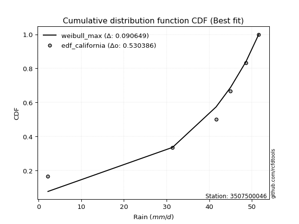</img>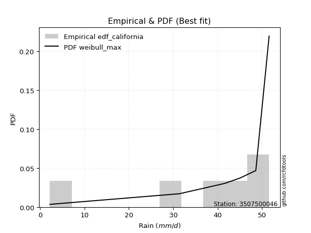</img>

</div>


### 2. EDF Hazen (1930)

Hazen method for plotting positions is a formula used to estimate the empirical cumulative probability distribution of flood events or other hydrological data. This formula often results in biased estimations, particularly when extrapolating to extreme events (high return periods).

<div align="center">


$P=(m-0.5)/n$


</div>


**2.1. Empirical values**

<div align="center">

|                | 0                   | 1                  | 2                  | 3                  | 4         | 5                  |
|:---------------|:--------------------|:-------------------|:-------------------|:-------------------|:----------|:-------------------|
| date           | 2025                | 2023               | 2022               | 2021               | 2019      | 2020               |
| x              | 2.2                 | 31.4               | 41.6               | 45.0               | 48.6      | 51.6               |
| m              | 1                   | 2                  | 3                  | 4                  | 5         | 6                  |
| empirical_dist | edf_hazen           | edf_hazen          | edf_hazen          | edf_hazen          | edf_hazen | edf_hazen          |
| empirical      | 0.08333333333333333 | 0.25               | 0.4166666666666667 | 0.5833333333333334 | 0.75      | 0.9166666666666666 |
| empirical_tr   | 1.090909090909091   | 1.3333333333333333 | 1.7142857142857144 | 2.4000000000000004 | 4.0       | 11.999999999999995 |

</div>


**2.2. Kolmogorov-Smirnov fit test (sorted by Δ)**


<div align="center">

|                | 0                   | 1                   | 2                  | 3                   | 4                   | 5                   | 6                   | 7                   | 8                  | 9                   | 10                  | 11                  | 12                 | 13                 | 14                  | 15                  | 16                  | 17                  | 18                  | 19              | 20                  | 21                  | 22                  | 23                 | 24                  | 25                  | 26                 | 27                 | 28                  | 29                 | 30                 | 31                  | 32                  | 33                 | 34                 | 35                  | 36                  | 37                  | 38                 | 39                  | 40                 | 41                  | 42                  | 43                 | 44                 | 45                | 46                | 47                  | 48                  | 49                  | 50                 | 51                 | 52                  | 53                  | 54                  | 55                 | 56                 | 57                  | 58                 | 59                | 60                 | 61                 | 62                  | 63                  | 64                  | 65                 | 66                  | 67                 | 68                 | 69                 | 70                | 71                 | 72                  | 73                | 74                 | 75                 | 76                  | 77                  | 78               | 79                  | 80                 | 81                | 82                  | 83                  | 84                  | 85                  | 86                 | 87                 | 88                  | 89                  | 90                  | 91                  | 92               | 93                 | 94                  | 95                 | 96                 | 97                 | 98                  | 99                  | 100                | 101                 | 102                | 103                | 104                | 105                | 106                | 107                 | 108                 | 109                 | 110                | 111                 | 112               | 113                 | 114                 | 115                 | 116                 | 117                | 118                 | 119                | 120                 | 121                 | 122                | 123                 | 124                | 125                | 126                | 127                | 128                | 129                 | 130                 | 131                 | 132                 | 133                 | 134                | 135                | 136                | 137                | 138                | 139                | 140                | 141                | 142                | 143                | 144                | 145                | 146                | 147                | 148                | 149                | 150                | 151               | 152                | 153                | 154            | 155                | 156                | 157                | 158                | 159               |
|:---------------|:--------------------|:--------------------|:-------------------|:--------------------|:--------------------|:--------------------|:--------------------|:--------------------|:-------------------|:--------------------|:--------------------|:--------------------|:-------------------|:-------------------|:--------------------|:--------------------|:--------------------|:--------------------|:--------------------|:----------------|:--------------------|:--------------------|:--------------------|:-------------------|:--------------------|:--------------------|:-------------------|:-------------------|:--------------------|:-------------------|:-------------------|:--------------------|:--------------------|:-------------------|:-------------------|:--------------------|:--------------------|:--------------------|:-------------------|:--------------------|:-------------------|:--------------------|:--------------------|:-------------------|:-------------------|:------------------|:------------------|:--------------------|:--------------------|:--------------------|:-------------------|:-------------------|:--------------------|:--------------------|:--------------------|:-------------------|:-------------------|:--------------------|:-------------------|:------------------|:-------------------|:-------------------|:--------------------|:--------------------|:--------------------|:-------------------|:--------------------|:-------------------|:-------------------|:-------------------|:------------------|:-------------------|:--------------------|:------------------|:-------------------|:-------------------|:--------------------|:--------------------|:-----------------|:--------------------|:-------------------|:------------------|:--------------------|:--------------------|:--------------------|:--------------------|:-------------------|:-------------------|:--------------------|:--------------------|:--------------------|:--------------------|:-----------------|:-------------------|:--------------------|:-------------------|:-------------------|:-------------------|:--------------------|:--------------------|:-------------------|:--------------------|:-------------------|:-------------------|:-------------------|:-------------------|:-------------------|:--------------------|:--------------------|:--------------------|:-------------------|:--------------------|:------------------|:--------------------|:--------------------|:--------------------|:--------------------|:-------------------|:--------------------|:-------------------|:--------------------|:--------------------|:-------------------|:--------------------|:-------------------|:-------------------|:-------------------|:-------------------|:-------------------|:--------------------|:--------------------|:--------------------|:--------------------|:--------------------|:-------------------|:-------------------|:-------------------|:-------------------|:-------------------|:-------------------|:-------------------|:-------------------|:-------------------|:-------------------|:-------------------|:-------------------|:-------------------|:-------------------|:-------------------|:-------------------|:-------------------|:------------------|:-------------------|:-------------------|:---------------|:-------------------|:-------------------|:-------------------|:-------------------|:------------------|
| station        | 3507500046          | 3507500046          | 3507500046         | 3507500046          | 3507500046          | 3507500046          | 3507500046          | 3507500046          | 3507500046         | 3507500046          | 3507500046          | 3507500046          | 3507500046         | 3507500046         | 3507500046          | 3507500046          | 3507500046          | 3507500046          | 3507500046          | 3507500046      | 3507500046          | 3507500046          | 3507500046          | 3507500046         | 3507500046          | 3507500046          | 3507500046         | 3507500046         | 3507500046          | 3507500046         | 3507500046         | 3507500046          | 3507500046          | 3507500046         | 3507500046         | 3507500046          | 3507500046          | 3507500046          | 3507500046         | 3507500046          | 3507500046         | 3507500046          | 3507500046          | 3507500046         | 3507500046         | 3507500046        | 3507500046        | 3507500046          | 3507500046          | 3507500046          | 3507500046         | 3507500046         | 3507500046          | 3507500046          | 3507500046          | 3507500046         | 3507500046         | 3507500046          | 3507500046         | 3507500046        | 3507500046         | 3507500046         | 3507500046          | 3507500046          | 3507500046          | 3507500046         | 3507500046          | 3507500046         | 3507500046         | 3507500046         | 3507500046        | 3507500046         | 3507500046          | 3507500046        | 3507500046         | 3507500046         | 3507500046          | 3507500046          | 3507500046       | 3507500046          | 3507500046         | 3507500046        | 3507500046          | 3507500046          | 3507500046          | 3507500046          | 3507500046         | 3507500046         | 3507500046          | 3507500046          | 3507500046          | 3507500046          | 3507500046       | 3507500046         | 3507500046          | 3507500046         | 3507500046         | 3507500046         | 3507500046          | 3507500046          | 3507500046         | 3507500046          | 3507500046         | 3507500046         | 3507500046         | 3507500046         | 3507500046         | 3507500046          | 3507500046          | 3507500046          | 3507500046         | 3507500046          | 3507500046        | 3507500046          | 3507500046          | 3507500046          | 3507500046          | 3507500046         | 3507500046          | 3507500046         | 3507500046          | 3507500046          | 3507500046         | 3507500046          | 3507500046         | 3507500046         | 3507500046         | 3507500046         | 3507500046         | 3507500046          | 3507500046          | 3507500046          | 3507500046          | 3507500046          | 3507500046         | 3507500046         | 3507500046         | 3507500046         | 3507500046         | 3507500046         | 3507500046         | 3507500046         | 3507500046         | 3507500046         | 3507500046         | 3507500046         | 3507500046         | 3507500046         | 3507500046         | 3507500046         | 3507500046         | 3507500046        | 3507500046         | 3507500046         | 3507500046     | 3507500046         | 3507500046         | 3507500046         | 3507500046         | 3507500046        |
| empirical_dist | edf_hazen           | edf_hazen           | edf_hazen          | edf_hazen           | edf_hazen           | edf_hazen           | edf_hazen           | edf_hazen           | edf_hazen          | edf_hazen           | edf_hazen           | edf_hazen           | edf_hazen          | edf_hazen          | edf_hazen           | edf_hazen           | edf_hazen           | edf_hazen           | edf_hazen           | edf_hazen       | edf_hazen           | edf_hazen           | edf_hazen           | edf_hazen          | edf_hazen           | edf_hazen           | edf_hazen          | edf_hazen          | edf_hazen           | edf_hazen          | edf_hazen          | edf_hazen           | edf_hazen           | edf_hazen          | edf_hazen          | edf_hazen           | edf_hazen           | edf_hazen           | edf_hazen          | edf_hazen           | edf_hazen          | edf_hazen           | edf_hazen           | edf_hazen          | edf_hazen          | edf_hazen         | edf_hazen         | edf_hazen           | edf_hazen           | edf_hazen           | edf_hazen          | edf_hazen          | edf_hazen           | edf_hazen           | edf_hazen           | edf_hazen          | edf_hazen          | edf_hazen           | edf_hazen          | edf_hazen         | edf_hazen          | edf_hazen          | edf_hazen           | edf_hazen           | edf_hazen           | edf_hazen          | edf_hazen           | edf_hazen          | edf_hazen          | edf_hazen          | edf_hazen         | edf_hazen          | edf_hazen           | edf_hazen         | edf_hazen          | edf_hazen          | edf_hazen           | edf_hazen           | edf_hazen        | edf_hazen           | edf_hazen          | edf_hazen         | edf_hazen           | edf_hazen           | edf_hazen           | edf_hazen           | edf_hazen          | edf_hazen          | edf_hazen           | edf_hazen           | edf_hazen           | edf_hazen           | edf_hazen        | edf_hazen          | edf_hazen           | edf_hazen          | edf_hazen          | edf_hazen          | edf_hazen           | edf_hazen           | edf_hazen          | edf_hazen           | edf_hazen          | edf_hazen          | edf_hazen          | edf_hazen          | edf_hazen          | edf_hazen           | edf_hazen           | edf_hazen           | edf_hazen          | edf_hazen           | edf_hazen         | edf_hazen           | edf_hazen           | edf_hazen           | edf_hazen           | edf_hazen          | edf_hazen           | edf_hazen          | edf_hazen           | edf_hazen           | edf_hazen          | edf_hazen           | edf_hazen          | edf_hazen          | edf_hazen          | edf_hazen          | edf_hazen          | edf_hazen           | edf_hazen           | edf_hazen           | edf_hazen           | edf_hazen           | edf_hazen          | edf_hazen          | edf_hazen          | edf_hazen          | edf_hazen          | edf_hazen          | edf_hazen          | edf_hazen          | edf_hazen          | edf_hazen          | edf_hazen          | edf_hazen          | edf_hazen          | edf_hazen          | edf_hazen          | edf_hazen          | edf_hazen          | edf_hazen         | edf_hazen          | edf_hazen          | edf_hazen      | edf_hazen          | edf_hazen          | edf_hazen          | edf_hazen          | edf_hazen         |
| p_dist         | loglevy_l           | genextreme          | argus              | mielke              | genpareto           | pearson3            | levy_l              | burr12              | dgamma             | vonmises_line       | gengamma            | trapezoid           | gennorm            | gumbel_l           | gompertz            | gausshyper          | loggenextreme       | weibull_max         | logt                | semicircular    | anglit              | dweibull            | nakagami            | nct                | exponnorm           | crystalball         | norm               | f                  | t                   | invweibull         | arcsine            | gamma               | foldnorm            | betaprime          | invgauss           | erlang              | logistic            | invgamma            | genhalflogistic    | maxwell             | hypsecant          | rayleigh            | kstwobign           | truncnorm          | logvonmises_line   | logburr12         | skewnorm          | ncf                 | logpearson3         | rice                | logweibull_min     | loggompertz        | loggumbel_l         | laplace             | cosine              | halfnorm           | beta               | logtrapezoid        | gumbel_r           | logargus          | wrapcauchy         | triang             | logmielke           | halflogistic        | burr                | logexponweib       | moyal               | loggengamma        | logarcsine         | logwrapcauchy      | logburr           | logsemicircular    | loganglit           | logloggamma       | loggennorm         | lognakagami        | logfoldnorm         | logweibull_max      | logf             | logexponnorm        | logcrystalball     | logrice           | lognorm             | logfatiguelife      | lognct              | logncf              | logerlang          | loginvgauss        | loggamma            | loggamma            | genexpon            | logbetaprime        | loginvgamma      | loglogistic        | loginvweibull       | logalpha           | logloglaplace      | loghypsecant       | lomax               | ksone               | logmaxwell         | exponweib           | truncweibull_min   | wald               | loglaplace         | loglaplace         | lograyleigh        | halfgennorm         | logkstwobign        | kappa4              | johnsonsb          | logdgamma           | loggenexpon       | loghalfnorm         | kappa3              | uniform             | loggumbel_r         | logcosine          | loggausshyper       | bradford           | loghalflogistic     | logmoyal            | loglomax           | logdweibull         | johnsonsu          | logtruncnorm       | loghalfgennorm     | logjohnsonsb       | loggenpareto       | loggenhalflogistic  | logskewnorm         | truncexpon          | logtruncweibull_min | logwald             | logbeta            | logtriang          | logksone           | logjohnsonsu       | logkappa4          | logexponpow        | fatiguelife        | logkappa3          | loguniform         | weibull_min        | alpha              | logbradford        | logtruncexpon      | exponpow           | powerlaw           | truncpareto        | logtukeylambda     | logpowerlaw       | logtruncpareto     | logrdist           | loggenlogistic | rdist              | tukeylambda        | genlogistic        | logvonmises        | vonmises          |
| delta          | 0.08051316382626506 | 0.08333333333177784 | 0.0922164383467246 | 0.09335168404246347 | 0.10420361469630052 | 0.12077952015694665 | 0.12215733211513695 | 0.12583305057318844 | 0.1267820032122784 | 0.12756990687013292 | 0.13398476921273988 | 0.13552690235947573 | 0.1365299194756393 | 0.1410330125032238 | 0.14463803068004105 | 0.14672378101136635 | 0.15552741438611523 | 0.15657211198754456 | 0.17047609186145174 | 0.1757235319266 | 0.18224770154373343 | 0.18518334367969047 | 0.19631183610944697 | 0.1979025098641332 | 0.19791469535755063 | 0.19791683140548993 | 0.1979168372871582 | 0.1981413498898738 | 0.19905606810491988 | 0.1995327392779453 | 0.2000511056731219 | 0.20014591999422654 | 0.20167550258890649 | 0.2027452924119722 | 0.2034710154288169 | 0.20706708444317573 | 0.21242765747141173 | 0.21974201143449829 | 0.2200780320345303 | 0.22311329666713325 | 0.2241450972199544 | 0.23085936229547493 | 0.23202412283573565 | 0.2327747119771088 | 0.2346143591040103 | 0.234861077515732 | 0.238099198277747 | 0.23824991290556202 | 0.23985961443279402 | 0.24177502728910855 | 0.2420767810115963 | 0.2435431361388118 | 0.24870052479657412 | 0.25215128366291323 | 0.25231205427987763 | 0.2530156200563099 | 0.2548683458965895 | 0.26170734036317433 | 0.2628114280320027 | 0.263278830550338 | 0.2739787101112199 | 0.2740703771078071 | 0.28100928765312166 | 0.28138827175218134 | 0.28337979700229093 | 0.2839004453073301 | 0.28476841614491516 | 0.2857110784678684 | 0.2863976370893123 | 0.2954403533620237 | 0.299128000337696 | 0.3013070546991703 | 0.30504617037216064 | 0.311039201738385 | 0.3112144450498082 | 0.3112429493743523 | 0.31224698992581224 | 0.31309058864290173 | 0.31394074361099 | 0.31409386302894293 | 0.3140941674887715 | 0.314094693384244 | 0.31409471114994914 | 0.31453227703469033 | 0.31455364673586983 | 0.31553609722999143 | 0.3183573443459268 | 0.3194645751739269 | 0.31965548812826783 | 0.31965548812826783 | 0.32047234374469225 | 0.32141913082942786 | 0.32156528107865 | 0.3226504095099185 | 0.32471640895256493 | 0.3274155991319927 | 0.3280270313519541 | 0.3298293194037325 | 0.33076451088628134 | 0.33130904183535764 | 0.3435101379982305 | 0.34396129524866137 | 0.3450255616457047 | 0.3461684573596803 | 0.3520159733964858 | 0.3520159733964858 | 0.3528647508877558 | 0.36226595664235495 | 0.36274256672870475 | 0.36460029858620163 | 0.3658423107376777 | 0.36808343251184306 | 0.378577626480611 | 0.37929540286409325 | 0.38057035856248017 | 0.38090418353576244 | 0.38349705933205447 | 0.3876968198742403 | 0.39700270260157866 | 0.4024402292286336 | 0.40699731852524723 | 0.40783648259183636 | 0.4085330648182981 | 0.41666666666664287 | 0.4184354108810966 | 0.4210151578493825 | 0.4244850848837889 | 0.4403895669360066 | 0.4416616327040388 | 0.44241650933357124 | 0.45416894612716696 | 0.46537949934313383 | 0.4673362745394104  | 0.47539464070963067 | 0.5030019380793931 | 0.5081827665661636 | 0.5354718291941253 | 0.5567508119731857 | 0.5628886306210431 | 0.5872156230500358 | 0.5899358862362061 | 0.5925659863470116 | 0.5925661950329505 | 0.5980393618589481 | 0.6138278910086391 | 0.6274576905428325 | 0.6445680446665406 | 0.6646526108630179 | 0.6745405937685149 | 0.7041168733792921 | 0.7104036211083624 | 0.723446575688366 | 0.7350361742376077 | 0.7499999948248803 | 0.75           | 0.9166666666665918 | 0.9166666666666595 | 0.9166666666666666 | 1.1216354112678362 | 7.610155705645673 |
| deltao         | 0.530385761606      | 0.530385761606      | 0.530385761606     | 0.530385761606      | 0.530385761606      | 0.530385761606      | 0.530385761606      | 0.530385761606      | 0.530385761606     | 0.530385761606      | 0.530385761606      | 0.530385761606      | 0.530385761606     | 0.530385761606     | 0.530385761606      | 0.530385761606      | 0.530385761606      | 0.530385761606      | 0.530385761606      | 0.530385761606  | 0.530385761606      | 0.530385761606      | 0.530385761606      | 0.530385761606     | 0.530385761606      | 0.530385761606      | 0.530385761606     | 0.530385761606     | 0.530385761606      | 0.530385761606     | 0.530385761606     | 0.530385761606      | 0.530385761606      | 0.530385761606     | 0.530385761606     | 0.530385761606      | 0.530385761606      | 0.530385761606      | 0.530385761606     | 0.530385761606      | 0.530385761606     | 0.530385761606      | 0.530385761606      | 0.530385761606     | 0.530385761606     | 0.530385761606    | 0.530385761606    | 0.530385761606      | 0.530385761606      | 0.530385761606      | 0.530385761606     | 0.530385761606     | 0.530385761606      | 0.530385761606      | 0.530385761606      | 0.530385761606     | 0.530385761606     | 0.530385761606      | 0.530385761606     | 0.530385761606    | 0.530385761606     | 0.530385761606     | 0.530385761606      | 0.530385761606      | 0.530385761606      | 0.530385761606     | 0.530385761606      | 0.530385761606     | 0.530385761606     | 0.530385761606     | 0.530385761606    | 0.530385761606     | 0.530385761606      | 0.530385761606    | 0.530385761606     | 0.530385761606     | 0.530385761606      | 0.530385761606      | 0.530385761606   | 0.530385761606      | 0.530385761606     | 0.530385761606    | 0.530385761606      | 0.530385761606      | 0.530385761606      | 0.530385761606      | 0.530385761606     | 0.530385761606     | 0.530385761606      | 0.530385761606      | 0.530385761606      | 0.530385761606      | 0.530385761606   | 0.530385761606     | 0.530385761606      | 0.530385761606     | 0.530385761606     | 0.530385761606     | 0.530385761606      | 0.530385761606      | 0.530385761606     | 0.530385761606      | 0.530385761606     | 0.530385761606     | 0.530385761606     | 0.530385761606     | 0.530385761606     | 0.530385761606      | 0.530385761606      | 0.530385761606      | 0.530385761606     | 0.530385761606      | 0.530385761606    | 0.530385761606      | 0.530385761606      | 0.530385761606      | 0.530385761606      | 0.530385761606     | 0.530385761606      | 0.530385761606     | 0.530385761606      | 0.530385761606      | 0.530385761606     | 0.530385761606      | 0.530385761606     | 0.530385761606     | 0.530385761606     | 0.530385761606     | 0.530385761606     | 0.530385761606      | 0.530385761606      | 0.530385761606      | 0.530385761606      | 0.530385761606      | 0.530385761606     | 0.530385761606     | 0.530385761606     | 0.530385761606     | 0.530385761606     | 0.530385761606     | 0.530385761606     | 0.530385761606     | 0.530385761606     | 0.530385761606     | 0.530385761606     | 0.530385761606     | 0.530385761606     | 0.530385761606     | 0.530385761606     | 0.530385761606     | 0.530385761606     | 0.530385761606    | 0.530385761606     | 0.530385761606     | 0.530385761606 | 0.530385761606     | 0.530385761606     | 0.530385761606     | 0.530385761606     | 0.530385761606    |
| eval           | Δo > Δ              | Δo > Δ              | Δo > Δ             | Δo > Δ              | Δo > Δ              | Δo > Δ              | Δo > Δ              | Δo > Δ              | Δo > Δ             | Δo > Δ              | Δo > Δ              | Δo > Δ              | Δo > Δ             | Δo > Δ             | Δo > Δ              | Δo > Δ              | Δo > Δ              | Δo > Δ              | Δo > Δ              | Δo > Δ          | Δo > Δ              | Δo > Δ              | Δo > Δ              | Δo > Δ             | Δo > Δ              | Δo > Δ              | Δo > Δ             | Δo > Δ             | Δo > Δ              | Δo > Δ             | Δo > Δ             | Δo > Δ              | Δo > Δ              | Δo > Δ             | Δo > Δ             | Δo > Δ              | Δo > Δ              | Δo > Δ              | Δo > Δ             | Δo > Δ              | Δo > Δ             | Δo > Δ              | Δo > Δ              | Δo > Δ             | Δo > Δ             | Δo > Δ            | Δo > Δ            | Δo > Δ              | Δo > Δ              | Δo > Δ              | Δo > Δ             | Δo > Δ             | Δo > Δ              | Δo > Δ              | Δo > Δ              | Δo > Δ             | Δo > Δ             | Δo > Δ              | Δo > Δ             | Δo > Δ            | Δo > Δ             | Δo > Δ             | Δo > Δ              | Δo > Δ              | Δo > Δ              | Δo > Δ             | Δo > Δ              | Δo > Δ             | Δo > Δ             | Δo > Δ             | Δo > Δ            | Δo > Δ             | Δo > Δ              | Δo > Δ            | Δo > Δ             | Δo > Δ             | Δo > Δ              | Δo > Δ              | Δo > Δ           | Δo > Δ              | Δo > Δ             | Δo > Δ            | Δo > Δ              | Δo > Δ              | Δo > Δ              | Δo > Δ              | Δo > Δ             | Δo > Δ             | Δo > Δ              | Δo > Δ              | Δo > Δ              | Δo > Δ              | Δo > Δ           | Δo > Δ             | Δo > Δ              | Δo > Δ             | Δo > Δ             | Δo > Δ             | Δo > Δ              | Δo > Δ              | Δo > Δ             | Δo > Δ              | Δo > Δ             | Δo > Δ             | Δo > Δ             | Δo > Δ             | Δo > Δ             | Δo > Δ              | Δo > Δ              | Δo > Δ              | Δo > Δ             | Δo > Δ              | Δo > Δ            | Δo > Δ              | Δo > Δ              | Δo > Δ              | Δo > Δ              | Δo > Δ             | Δo > Δ              | Δo > Δ             | Δo > Δ              | Δo > Δ              | Δo > Δ             | Δo > Δ              | Δo > Δ             | Δo > Δ             | Δo > Δ             | Δo > Δ             | Δo > Δ             | Δo > Δ              | Δo > Δ              | Δo > Δ              | Δo > Δ              | Δo > Δ              | Δo > Δ             | Δo > Δ             | Δo <= Δ            | Δo <= Δ            | Δo <= Δ            | Δo <= Δ            | Δo <= Δ            | Δo <= Δ            | Δo <= Δ            | Δo <= Δ            | Δo <= Δ            | Δo <= Δ            | Δo <= Δ            | Δo <= Δ            | Δo <= Δ            | Δo <= Δ            | Δo <= Δ            | Δo <= Δ           | Δo <= Δ            | Δo <= Δ            | Δo <= Δ        | Δo <= Δ            | Δo <= Δ            | Δo <= Δ            | Δo <= Δ            | Δo <= Δ           |
| fit            | 1                   | 1                   | 1                  | 1                   | 1                   | 1                   | 1                   | 1                   | 1                  | 1                   | 1                   | 1                   | 1                  | 1                  | 1                   | 1                   | 1                   | 1                   | 1                   | 1               | 1                   | 1                   | 1                   | 1                  | 1                   | 1                   | 1                  | 1                  | 1                   | 1                  | 1                  | 1                   | 1                   | 1                  | 1                  | 1                   | 1                   | 1                   | 1                  | 1                   | 1                  | 1                   | 1                   | 1                  | 1                  | 1                 | 1                 | 1                   | 1                   | 1                   | 1                  | 1                  | 1                   | 1                   | 1                   | 1                  | 1                  | 1                   | 1                  | 1                 | 1                  | 1                  | 1                   | 1                   | 1                   | 1                  | 1                   | 1                  | 1                  | 1                  | 1                 | 1                  | 1                   | 1                 | 1                  | 1                  | 1                   | 1                   | 1                | 1                   | 1                  | 1                 | 1                   | 1                   | 1                   | 1                   | 1                  | 1                  | 1                   | 1                   | 1                   | 1                   | 1                | 1                  | 1                   | 1                  | 1                  | 1                  | 1                   | 1                   | 1                  | 1                   | 1                  | 1                  | 1                  | 1                  | 1                  | 1                   | 1                   | 1                   | 1                  | 1                   | 1                 | 1                   | 1                   | 1                   | 1                   | 1                  | 1                   | 1                  | 1                   | 1                   | 1                  | 1                   | 1                  | 1                  | 1                  | 1                  | 1                  | 1                   | 1                   | 1                   | 1                   | 1                   | 1                  | 1                  | 0                  | 0                  | 0                  | 0                  | 0                  | 0                  | 0                  | 0                  | 0                  | 0                  | 0                  | 0                  | 0                  | 0                  | 0                  | 0                 | 0                  | 0                  | 0              | 0                  | 0                  | 0                  | 0                  | 0                 |
| n              | 6                   | 6                   | 6                  | 6                   | 6                   | 6                   | 6                   | 6                   | 6                  | 6                   | 6                   | 6                   | 6                  | 6                  | 6                   | 6                   | 6                   | 6                   | 6                   | 6               | 6                   | 6                   | 6                   | 6                  | 6                   | 6                   | 6                  | 6                  | 6                   | 6                  | 6                  | 6                   | 6                   | 6                  | 6                  | 6                   | 6                   | 6                   | 6                  | 6                   | 6                  | 6                   | 6                   | 6                  | 6                  | 6                 | 6                 | 6                   | 6                   | 6                   | 6                  | 6                  | 6                   | 6                   | 6                   | 6                  | 6                  | 6                   | 6                  | 6                 | 6                  | 6                  | 6                   | 6                   | 6                   | 6                  | 6                   | 6                  | 6                  | 6                  | 6                 | 6                  | 6                   | 6                 | 6                  | 6                  | 6                   | 6                   | 6                | 6                   | 6                  | 6                 | 6                   | 6                   | 6                   | 6                   | 6                  | 6                  | 6                   | 6                   | 6                   | 6                   | 6                | 6                  | 6                   | 6                  | 6                  | 6                  | 6                   | 6                   | 6                  | 6                   | 6                  | 6                  | 6                  | 6                  | 6                  | 6                   | 6                   | 6                   | 6                  | 6                   | 6                 | 6                   | 6                   | 6                   | 6                   | 6                  | 6                   | 6                  | 6                   | 6                   | 6                  | 6                   | 6                  | 6                  | 6                  | 6                  | 6                  | 6                   | 6                   | 6                   | 6                   | 6                   | 6                  | 6                  | 6                  | 6                  | 6                  | 6                  | 6                  | 6                  | 6                  | 6                  | 6                  | 6                  | 6                  | 6                  | 6                  | 6                  | 6                  | 6                 | 6                  | 6                  | 6              | 6                  | 6                  | 6                  | 6                  | 6                 |
| best_fit       | 1                   | 0                   | 0                  | 0                   | 0                   | 0                   | 0                   | 0                   | 0                  | 0                   | 0                   | 0                   | 0                  | 0                  | 0                   | 0                   | 0                   | 0                   | 0                   | 0               | 0                   | 0                   | 0                   | 0                  | 0                   | 0                   | 0                  | 0                  | 0                   | 0                  | 0                  | 0                   | 0                   | 0                  | 0                  | 0                   | 0                   | 0                   | 0                  | 0                   | 0                  | 0                   | 0                   | 0                  | 0                  | 0                 | 0                 | 0                   | 0                   | 0                   | 0                  | 0                  | 0                   | 0                   | 0                   | 0                  | 0                  | 0                   | 0                  | 0                 | 0                  | 0                  | 0                   | 0                   | 0                   | 0                  | 0                   | 0                  | 0                  | 0                  | 0                 | 0                  | 0                   | 0                 | 0                  | 0                  | 0                   | 0                   | 0                | 0                   | 0                  | 0                 | 0                   | 0                   | 0                   | 0                   | 0                  | 0                  | 0                   | 0                   | 0                   | 0                   | 0                | 0                  | 0                   | 0                  | 0                  | 0                  | 0                   | 0                   | 0                  | 0                   | 0                  | 0                  | 0                  | 0                  | 0                  | 0                   | 0                   | 0                   | 0                  | 0                   | 0                 | 0                   | 0                   | 0                   | 0                   | 0                  | 0                   | 0                  | 0                   | 0                   | 0                  | 0                   | 0                  | 0                  | 0                  | 0                  | 0                  | 0                   | 0                   | 0                   | 0                   | 0                   | 0                  | 0                  | 0                  | 0                  | 0                  | 0                  | 0                  | 0                  | 0                  | 0                  | 0                  | 0                  | 0                  | 0                  | 0                  | 0                  | 0                  | 0                 | 0                  | 0                  | 0              | 0                  | 0                  | 0                  | 0                  | 0                 |
| best_fit_sort  | 1                   | 2                   | 3                  | 4                   | 5                   | 6                   | 7                   | 8                   | 9                  | 10                  | 11                  | 12                  | 13                 | 14                 | 15                  | 16                  | 17                  | 18                  | 19                  | 20              | 21                  | 22                  | 23                  | 24                 | 25                  | 26                  | 27                 | 28                 | 29                  | 30                 | 31                 | 32                  | 33                  | 34                 | 35                 | 36                  | 37                  | 38                  | 39                 | 40                  | 41                 | 42                  | 43                  | 44                 | 45                 | 46                | 47                | 48                  | 49                  | 50                  | 51                 | 52                 | 53                  | 54                  | 55                  | 56                 | 57                 | 58                  | 59                 | 60                | 61                 | 62                 | 63                  | 64                  | 65                  | 66                 | 67                  | 68                 | 69                 | 70                 | 71                | 72                 | 73                  | 74                | 75                 | 76                 | 77                  | 78                  | 79               | 80                  | 81                 | 82                | 83                  | 84                  | 85                  | 86                  | 87                 | 88                 | 89                  | 90                  | 91                  | 92                  | 93               | 94                 | 95                  | 96                 | 97                 | 98                 | 99                  | 100                 | 101                | 102                 | 103                | 104                | 105                | 106                | 107                | 108                 | 109                 | 110                 | 111                | 112                 | 113               | 114                 | 115                 | 116                 | 117                 | 118                | 119                 | 120                | 121                 | 122                 | 123                | 124                 | 125                | 126                | 127                | 128                | 129                | 130                 | 131                 | 132                 | 133                 | 134                 | 135                | 136                | 137                | 138                | 139                | 140                | 141                | 142                | 143                | 144                | 145                | 146                | 147                | 148                | 149                | 150                | 151                | 152               | 153                | 154                | 155            | 156                | 157                | 158                | 159                | 160               |

</div>


**2.3. Best fit**

<div align="center">

|   id |    station | empirical_dist   | p_dist    |     delta |   deltao | eval   |   fit |   n |   best_fit |   best_fit_sort |
|-----:|-----------:|:-----------------|:----------|----------:|---------:|:-------|------:|----:|-----------:|----------------:|
|    0 | 3507500046 | edf_hazen        | loglevy_l | 0.0805132 | 0.530386 | Δo > Δ |     1 |   6 |          1 |               1 |

</div>


<div align="center">

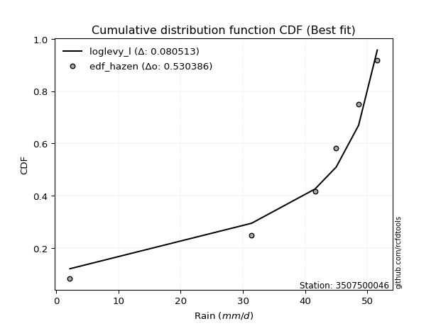</img>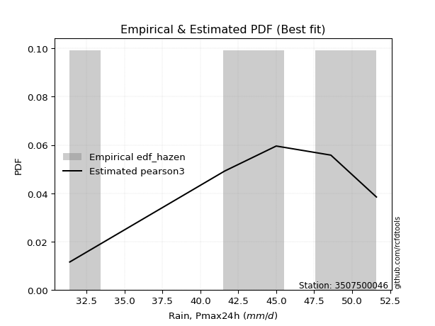</img>

</div>


### 3. EDF Weibull (1939)

Weibull plotting position formula is an empirical method used to estimate the non-exceedance probability or plotting position for a set of observed data, is often recommended or widely used in practice, particularly in flood frequency analysis.

<div align="center">


$P=m/(n+1)$


</div>


**3.1. Empirical values**

<div align="center">

|                | 0                   | 1                  | 2                   | 3                  | 4                  | 5                  |
|:---------------|:--------------------|:-------------------|:--------------------|:-------------------|:-------------------|:-------------------|
| date           | 2025                | 2023               | 2022                | 2021               | 2019               | 2020               |
| x              | 2.2                 | 31.4               | 41.6                | 45.0               | 48.6               | 51.6               |
| m              | 1                   | 2                  | 3                   | 4                  | 5                  | 6                  |
| empirical_dist | edf_weibull         | edf_weibull        | edf_weibull         | edf_weibull        | edf_weibull        | edf_weibull        |
| empirical      | 0.14285714285714285 | 0.2857142857142857 | 0.42857142857142855 | 0.5714285714285714 | 0.7142857142857143 | 0.8571428571428571 |
| empirical_tr   | 1.1666666666666665  | 1.4                | 1.75                | 2.333333333333333  | 3.5                | 6.999999999999997  |

</div>


**3.2. Kolmogorov-Smirnov fit test (sorted by Δ)**


<div align="center">

|                | 0                   | 1                   | 2                   | 3                   | 4                   | 5                   | 6                   | 7                  | 8                   | 9                  | 10                  | 11                 | 12                  | 13                  | 14                  | 15                  | 16                  | 17                  | 18                 | 19                  | 20                  | 21                  | 22                | 23                  | 24                 | 25                 | 26                  | 27                  | 28                  | 29                  | 30                  | 31                  | 32                  | 33                  | 34                  | 35                  | 36                  | 37                  | 38                  | 39                  | 40                  | 41                 | 42                 | 43                  | 44                  | 45                  | 46                  | 47                  | 48                  | 49                  | 50                  | 51                  | 52                  | 53                  | 54                  | 55                  | 56                  | 57                  | 58                  | 59                 | 60                  | 61                  | 62                | 63                 | 64                 | 65                  | 66                 | 67                  | 68                 | 69                  | 70                  | 71                 | 72                  | 73                  | 74                  | 75                 | 76                  | 77                 | 78                 | 79                  | 80                  | 81                  | 82                  | 83                 | 84                 | 85                  | 86                  | 87                  | 88                  | 89                 | 90                 | 91                 | 92                  | 93                | 94                 | 95                  | 96                  | 97                  | 98                  | 99                 | 100                 | 101                | 102                 | 103                 | 104                | 105                | 106                 | 107                 | 108               | 109                 | 110                 | 111                | 112                 | 113                 | 114                | 115                 | 116                 | 117                 | 118                | 119                | 120                 | 121                 | 122                | 123                | 124                | 125                | 126                 | 127                | 128                | 129                | 130                 | 131                 | 132                 | 133                 | 134                | 135                 | 136                | 137             | 138                | 139                | 140                | 141                | 142                | 143                | 144                | 145                | 146                | 147                | 148                | 149                | 150                | 151                | 152               | 153                | 154                | 155                | 156                | 157                | 158                | 159               |
|:---------------|:--------------------|:--------------------|:--------------------|:--------------------|:--------------------|:--------------------|:--------------------|:-------------------|:--------------------|:-------------------|:--------------------|:-------------------|:--------------------|:--------------------|:--------------------|:--------------------|:--------------------|:--------------------|:-------------------|:--------------------|:--------------------|:--------------------|:------------------|:--------------------|:-------------------|:-------------------|:--------------------|:--------------------|:--------------------|:--------------------|:--------------------|:--------------------|:--------------------|:--------------------|:--------------------|:--------------------|:--------------------|:--------------------|:--------------------|:--------------------|:--------------------|:-------------------|:-------------------|:--------------------|:--------------------|:--------------------|:--------------------|:--------------------|:--------------------|:--------------------|:--------------------|:--------------------|:--------------------|:--------------------|:--------------------|:--------------------|:--------------------|:--------------------|:--------------------|:-------------------|:--------------------|:--------------------|:------------------|:-------------------|:-------------------|:--------------------|:-------------------|:--------------------|:-------------------|:--------------------|:--------------------|:-------------------|:--------------------|:--------------------|:--------------------|:-------------------|:--------------------|:-------------------|:-------------------|:--------------------|:--------------------|:--------------------|:--------------------|:-------------------|:-------------------|:--------------------|:--------------------|:--------------------|:--------------------|:-------------------|:-------------------|:-------------------|:--------------------|:------------------|:-------------------|:--------------------|:--------------------|:--------------------|:--------------------|:-------------------|:--------------------|:-------------------|:--------------------|:--------------------|:-------------------|:-------------------|:--------------------|:--------------------|:------------------|:--------------------|:--------------------|:-------------------|:--------------------|:--------------------|:-------------------|:--------------------|:--------------------|:--------------------|:-------------------|:-------------------|:--------------------|:--------------------|:-------------------|:-------------------|:-------------------|:-------------------|:--------------------|:-------------------|:-------------------|:-------------------|:--------------------|:--------------------|:--------------------|:--------------------|:-------------------|:--------------------|:-------------------|:----------------|:-------------------|:-------------------|:-------------------|:-------------------|:-------------------|:-------------------|:-------------------|:-------------------|:-------------------|:-------------------|:-------------------|:-------------------|:-------------------|:-------------------|:------------------|:-------------------|:-------------------|:-------------------|:-------------------|:-------------------|:-------------------|:------------------|
| station        | 3507500046          | 3507500046          | 3507500046          | 3507500046          | 3507500046          | 3507500046          | 3507500046          | 3507500046         | 3507500046          | 3507500046         | 3507500046          | 3507500046         | 3507500046          | 3507500046          | 3507500046          | 3507500046          | 3507500046          | 3507500046          | 3507500046         | 3507500046          | 3507500046          | 3507500046          | 3507500046        | 3507500046          | 3507500046         | 3507500046         | 3507500046          | 3507500046          | 3507500046          | 3507500046          | 3507500046          | 3507500046          | 3507500046          | 3507500046          | 3507500046          | 3507500046          | 3507500046          | 3507500046          | 3507500046          | 3507500046          | 3507500046          | 3507500046         | 3507500046         | 3507500046          | 3507500046          | 3507500046          | 3507500046          | 3507500046          | 3507500046          | 3507500046          | 3507500046          | 3507500046          | 3507500046          | 3507500046          | 3507500046          | 3507500046          | 3507500046          | 3507500046          | 3507500046          | 3507500046         | 3507500046          | 3507500046          | 3507500046        | 3507500046         | 3507500046         | 3507500046          | 3507500046         | 3507500046          | 3507500046         | 3507500046          | 3507500046          | 3507500046         | 3507500046          | 3507500046          | 3507500046          | 3507500046         | 3507500046          | 3507500046         | 3507500046         | 3507500046          | 3507500046          | 3507500046          | 3507500046          | 3507500046         | 3507500046         | 3507500046          | 3507500046          | 3507500046          | 3507500046          | 3507500046         | 3507500046         | 3507500046         | 3507500046          | 3507500046        | 3507500046         | 3507500046          | 3507500046          | 3507500046          | 3507500046          | 3507500046         | 3507500046          | 3507500046         | 3507500046          | 3507500046          | 3507500046         | 3507500046         | 3507500046          | 3507500046          | 3507500046        | 3507500046          | 3507500046          | 3507500046         | 3507500046          | 3507500046          | 3507500046         | 3507500046          | 3507500046          | 3507500046          | 3507500046         | 3507500046         | 3507500046          | 3507500046          | 3507500046         | 3507500046         | 3507500046         | 3507500046         | 3507500046          | 3507500046         | 3507500046         | 3507500046         | 3507500046          | 3507500046          | 3507500046          | 3507500046          | 3507500046         | 3507500046          | 3507500046         | 3507500046      | 3507500046         | 3507500046         | 3507500046         | 3507500046         | 3507500046         | 3507500046         | 3507500046         | 3507500046         | 3507500046         | 3507500046         | 3507500046         | 3507500046         | 3507500046         | 3507500046         | 3507500046        | 3507500046         | 3507500046         | 3507500046         | 3507500046         | 3507500046         | 3507500046         | 3507500046        |
| empirical_dist | edf_weibull         | edf_weibull         | edf_weibull         | edf_weibull         | edf_weibull         | edf_weibull         | edf_weibull         | edf_weibull        | edf_weibull         | edf_weibull        | edf_weibull         | edf_weibull        | edf_weibull         | edf_weibull         | edf_weibull         | edf_weibull         | edf_weibull         | edf_weibull         | edf_weibull        | edf_weibull         | edf_weibull         | edf_weibull         | edf_weibull       | edf_weibull         | edf_weibull        | edf_weibull        | edf_weibull         | edf_weibull         | edf_weibull         | edf_weibull         | edf_weibull         | edf_weibull         | edf_weibull         | edf_weibull         | edf_weibull         | edf_weibull         | edf_weibull         | edf_weibull         | edf_weibull         | edf_weibull         | edf_weibull         | edf_weibull        | edf_weibull        | edf_weibull         | edf_weibull         | edf_weibull         | edf_weibull         | edf_weibull         | edf_weibull         | edf_weibull         | edf_weibull         | edf_weibull         | edf_weibull         | edf_weibull         | edf_weibull         | edf_weibull         | edf_weibull         | edf_weibull         | edf_weibull         | edf_weibull        | edf_weibull         | edf_weibull         | edf_weibull       | edf_weibull        | edf_weibull        | edf_weibull         | edf_weibull        | edf_weibull         | edf_weibull        | edf_weibull         | edf_weibull         | edf_weibull        | edf_weibull         | edf_weibull         | edf_weibull         | edf_weibull        | edf_weibull         | edf_weibull        | edf_weibull        | edf_weibull         | edf_weibull         | edf_weibull         | edf_weibull         | edf_weibull        | edf_weibull        | edf_weibull         | edf_weibull         | edf_weibull         | edf_weibull         | edf_weibull        | edf_weibull        | edf_weibull        | edf_weibull         | edf_weibull       | edf_weibull        | edf_weibull         | edf_weibull         | edf_weibull         | edf_weibull         | edf_weibull        | edf_weibull         | edf_weibull        | edf_weibull         | edf_weibull         | edf_weibull        | edf_weibull        | edf_weibull         | edf_weibull         | edf_weibull       | edf_weibull         | edf_weibull         | edf_weibull        | edf_weibull         | edf_weibull         | edf_weibull        | edf_weibull         | edf_weibull         | edf_weibull         | edf_weibull        | edf_weibull        | edf_weibull         | edf_weibull         | edf_weibull        | edf_weibull        | edf_weibull        | edf_weibull        | edf_weibull         | edf_weibull        | edf_weibull        | edf_weibull        | edf_weibull         | edf_weibull         | edf_weibull         | edf_weibull         | edf_weibull        | edf_weibull         | edf_weibull        | edf_weibull     | edf_weibull        | edf_weibull        | edf_weibull        | edf_weibull        | edf_weibull        | edf_weibull        | edf_weibull        | edf_weibull        | edf_weibull        | edf_weibull        | edf_weibull        | edf_weibull        | edf_weibull        | edf_weibull        | edf_weibull       | edf_weibull        | edf_weibull        | edf_weibull        | edf_weibull        | edf_weibull        | edf_weibull        | edf_weibull       |
| p_dist         | loglevy_l           | levy_l              | pearson3            | argus               | gengamma            | trapezoid           | dweibull            | burr12             | gumbel_l            | gompertz           | dgamma              | mielke             | genpareto           | vonmises_line       | genextreme          | arcsine             | gausshyper          | loggenextreme       | weibull_max        | semicircular        | logt                | anglit              | gennorm           | logvonmises_line    | logpearson3        | nakagami           | nct                 | exponnorm           | crystalball         | norm                | f                   | t                   | invweibull          | gamma               | foldnorm            | betaprime           | invgauss            | erlang              | logistic            | invgamma            | genhalflogistic     | logtrapezoid       | maxwell            | hypsecant           | loggumbel_l         | rayleigh            | kstwobign           | beta                | truncnorm           | logburr12           | skewnorm            | ncf                 | rice                | logweibull_min      | loggompertz         | wrapcauchy          | laplace             | cosine              | halfnorm            | logarcsine         | gumbel_r            | logargus            | logwrapcauchy     | triang             | logsemicircular    | logloglaplace       | logmielke          | loganglit           | halflogistic       | burr                | logexponweib        | moyal              | loggengamma         | logfoldnorm         | logweibull_max      | logf               | logexponnorm        | logcrystalball     | logrice            | lognorm             | logfatiguelife      | lognct              | logncf              | logerlang          | loginvgauss        | loggamma            | loggamma            | genexpon            | logbetaprime        | loginvgamma        | loglogistic        | logburr            | loginvweibull       | logalpha          | loghypsecant       | lomax               | logloggamma         | loggennorm          | lognakagami         | logmaxwell         | exponweib           | logdgamma          | loglaplace          | loglaplace          | lograyleigh        | ksone              | halfgennorm         | logkstwobign        | johnsonsb         | truncweibull_min    | wald                | loggenexpon        | loghalfnorm         | loggumbel_r         | logcosine          | kappa4              | logdweibull         | loggausshyper       | kappa3             | uniform            | loghalflogistic     | logmoyal            | loglomax           | johnsonsu          | logtruncnorm       | loghalfgennorm     | bradford            | logjohnsonsb       | loggenpareto       | loggenhalflogistic | logwald             | logskewnorm         | truncexpon          | logtruncweibull_min | logbeta            | logtriang           | logksone           | logjohnsonsu    | logkappa4          | logexponpow        | fatiguelife        | logkappa3          | loguniform         | weibull_min        | alpha              | logbradford        | logtruncexpon      | exponpow           | powerlaw           | truncpareto        | logtukeylambda     | logpowerlaw        | logtruncpareto    | logrdist           | loggenlogistic     | rdist              | tukeylambda        | genlogistic        | logvonmises        | vonmises          |
| delta          | 0.09978082841586844 | 0.10015349368992721 | 0.10887475825218479 | 0.12110407623616598 | 0.12208000730797802 | 0.12309991834758477 | 0.12565953415588094 | 0.1286158985714873 | 0.12912825059846195 | 0.1327332687752792 | 0.13868676511704037 | 0.1414706495013025 | 0.14285704159906665 | 0.14285714284239562 | 0.14285714285558737 | 0.14285714285714285 | 0.14285714288942863 | 0.14362265248135336 | 0.1446673500827827 | 0.16381877002183814 | 0.16455972201948493 | 0.17034293963897157 | 0.172244205189925 | 0.17509054958020076 | 0.1803358049089845 | 0.1844070742046851 | 0.18599774795937135 | 0.18600993345278877 | 0.18601206950072807 | 0.18601207538239634 | 0.18623658798511195 | 0.18715130620015802 | 0.18762797737318343 | 0.18824115808946468 | 0.18977074068414462 | 0.19084053050721034 | 0.19156625352405504 | 0.19516232253841387 | 0.20052289556664987 | 0.20783724952973642 | 0.20817327012976844 | 0.2108869182680152 | 0.2112085347623714 | 0.21224033531519254 | 0.21298623908228842 | 0.21895460039071307 | 0.21913168331826122 | 0.21915406018230382 | 0.22086995007234694 | 0.22295631561097012 | 0.22619443637298514 | 0.22634515100080016 | 0.22987026538434668 | 0.23017201910683444 | 0.23163837423404993 | 0.23826442439693418 | 0.24024652175815137 | 0.24040729237511577 | 0.24111085815154804 | 0.2506833513750266 | 0.25090666612724083 | 0.25137406864557615 | 0.259726067647738 | 0.2621656152030452 | 0.2655927689848846 | 0.26850322182814457 | 0.2691045257483598 | 0.26933188465787494 | 0.2694835098474195 | 0.27147503509752907 | 0.27199568340256824 | 0.2728636542401533 | 0.27380631656310656 | 0.27653270421152654 | 0.27737630292861604 | 0.2782264578967043 | 0.27837957731465723 | 0.2783798817744858 | 0.2783804076699583 | 0.27838042543566344 | 0.27881799132040463 | 0.27883936102158413 | 0.27982181151570573 | 0.2826430586316411 | 0.2837502894596412 | 0.28394120241398213 | 0.28394120241398213 | 0.28475805803040655 | 0.28570484511514216 | 0.2858509953643643 | 0.2869361237956328 | 0.2872232384329341 | 0.28900212323827923 | 0.291701313417707 | 0.2941150336894468 | 0.29505022517199564 | 0.29913443983362314 | 0.29930968314504625 | 0.29933818746959046 | 0.3077958522839448 | 0.30824700953437567 | 0.3085596229880335 | 0.31630168768220013 | 0.31630168768220013 | 0.3171504651734701 | 0.3194042799305958 | 0.32655167092806925 | 0.32702828101441905 | 0.330128025023392 | 0.33312079974094283 | 0.33426369545491846 | 0.3428633407663253 | 0.34358111714980755 | 0.34778277361776877 | 0.3519825341599546 | 0.35269553668143977 | 0.35714285714283334 | 0.36128841688729296 | 0.3686655966577183 | 0.3689994216310006 | 0.37128303281096153 | 0.37212219687755066 | 0.3728187791040124 | 0.3827211251668109 | 0.3853008721350968 | 0.3887707991695032 | 0.39053546732387173 | 0.4046752812217209 | 0.4059473469897531 | 0.4093177392119544 | 0.43968035499534497 | 0.44062988288719634 | 0.44072803330835647 | 0.44409691013394653 | 0.4672876523651074 | 0.47246848085187787 | 0.4997575434798396 | 0.5210365262589 | 0.5271743449067574 | 0.5515013373357501 | 0.5542216005219204 | 0.5568517006327259 | 0.5568519093186648 | 0.5623250761446624 | 0.5781136052943534 | 0.5917434048285468 | 0.6088537589522549 | 0.6289383251487322 | 0.6388263080542292 | 0.6684025876650064 | 0.6746893353940767 | 0.6877322899740803 | 0.699321888523322 | 0.7142857091105946 | 0.7142857142857143 | 0.8571428571427824 | 0.8571428571428501 | 0.8571428571428571 | 1.0859211255535506 | 7.669679515169483 |
| deltao         | 0.530385761606      | 0.530385761606      | 0.530385761606      | 0.530385761606      | 0.530385761606      | 0.530385761606      | 0.530385761606      | 0.530385761606     | 0.530385761606      | 0.530385761606     | 0.530385761606      | 0.530385761606     | 0.530385761606      | 0.530385761606      | 0.530385761606      | 0.530385761606      | 0.530385761606      | 0.530385761606      | 0.530385761606     | 0.530385761606      | 0.530385761606      | 0.530385761606      | 0.530385761606    | 0.530385761606      | 0.530385761606     | 0.530385761606     | 0.530385761606      | 0.530385761606      | 0.530385761606      | 0.530385761606      | 0.530385761606      | 0.530385761606      | 0.530385761606      | 0.530385761606      | 0.530385761606      | 0.530385761606      | 0.530385761606      | 0.530385761606      | 0.530385761606      | 0.530385761606      | 0.530385761606      | 0.530385761606     | 0.530385761606     | 0.530385761606      | 0.530385761606      | 0.530385761606      | 0.530385761606      | 0.530385761606      | 0.530385761606      | 0.530385761606      | 0.530385761606      | 0.530385761606      | 0.530385761606      | 0.530385761606      | 0.530385761606      | 0.530385761606      | 0.530385761606      | 0.530385761606      | 0.530385761606      | 0.530385761606     | 0.530385761606      | 0.530385761606      | 0.530385761606    | 0.530385761606     | 0.530385761606     | 0.530385761606      | 0.530385761606     | 0.530385761606      | 0.530385761606     | 0.530385761606      | 0.530385761606      | 0.530385761606     | 0.530385761606      | 0.530385761606      | 0.530385761606      | 0.530385761606     | 0.530385761606      | 0.530385761606     | 0.530385761606     | 0.530385761606      | 0.530385761606      | 0.530385761606      | 0.530385761606      | 0.530385761606     | 0.530385761606     | 0.530385761606      | 0.530385761606      | 0.530385761606      | 0.530385761606      | 0.530385761606     | 0.530385761606     | 0.530385761606     | 0.530385761606      | 0.530385761606    | 0.530385761606     | 0.530385761606      | 0.530385761606      | 0.530385761606      | 0.530385761606      | 0.530385761606     | 0.530385761606      | 0.530385761606     | 0.530385761606      | 0.530385761606      | 0.530385761606     | 0.530385761606     | 0.530385761606      | 0.530385761606      | 0.530385761606    | 0.530385761606      | 0.530385761606      | 0.530385761606     | 0.530385761606      | 0.530385761606      | 0.530385761606     | 0.530385761606      | 0.530385761606      | 0.530385761606      | 0.530385761606     | 0.530385761606     | 0.530385761606      | 0.530385761606      | 0.530385761606     | 0.530385761606     | 0.530385761606     | 0.530385761606     | 0.530385761606      | 0.530385761606     | 0.530385761606     | 0.530385761606     | 0.530385761606      | 0.530385761606      | 0.530385761606      | 0.530385761606      | 0.530385761606     | 0.530385761606      | 0.530385761606     | 0.530385761606  | 0.530385761606     | 0.530385761606     | 0.530385761606     | 0.530385761606     | 0.530385761606     | 0.530385761606     | 0.530385761606     | 0.530385761606     | 0.530385761606     | 0.530385761606     | 0.530385761606     | 0.530385761606     | 0.530385761606     | 0.530385761606     | 0.530385761606    | 0.530385761606     | 0.530385761606     | 0.530385761606     | 0.530385761606     | 0.530385761606     | 0.530385761606     | 0.530385761606    |
| eval           | Δo > Δ              | Δo > Δ              | Δo > Δ              | Δo > Δ              | Δo > Δ              | Δo > Δ              | Δo > Δ              | Δo > Δ             | Δo > Δ              | Δo > Δ             | Δo > Δ              | Δo > Δ             | Δo > Δ              | Δo > Δ              | Δo > Δ              | Δo > Δ              | Δo > Δ              | Δo > Δ              | Δo > Δ             | Δo > Δ              | Δo > Δ              | Δo > Δ              | Δo > Δ            | Δo > Δ              | Δo > Δ             | Δo > Δ             | Δo > Δ              | Δo > Δ              | Δo > Δ              | Δo > Δ              | Δo > Δ              | Δo > Δ              | Δo > Δ              | Δo > Δ              | Δo > Δ              | Δo > Δ              | Δo > Δ              | Δo > Δ              | Δo > Δ              | Δo > Δ              | Δo > Δ              | Δo > Δ             | Δo > Δ             | Δo > Δ              | Δo > Δ              | Δo > Δ              | Δo > Δ              | Δo > Δ              | Δo > Δ              | Δo > Δ              | Δo > Δ              | Δo > Δ              | Δo > Δ              | Δo > Δ              | Δo > Δ              | Δo > Δ              | Δo > Δ              | Δo > Δ              | Δo > Δ              | Δo > Δ             | Δo > Δ              | Δo > Δ              | Δo > Δ            | Δo > Δ             | Δo > Δ             | Δo > Δ              | Δo > Δ             | Δo > Δ              | Δo > Δ             | Δo > Δ              | Δo > Δ              | Δo > Δ             | Δo > Δ              | Δo > Δ              | Δo > Δ              | Δo > Δ             | Δo > Δ              | Δo > Δ             | Δo > Δ             | Δo > Δ              | Δo > Δ              | Δo > Δ              | Δo > Δ              | Δo > Δ             | Δo > Δ             | Δo > Δ              | Δo > Δ              | Δo > Δ              | Δo > Δ              | Δo > Δ             | Δo > Δ             | Δo > Δ             | Δo > Δ              | Δo > Δ            | Δo > Δ             | Δo > Δ              | Δo > Δ              | Δo > Δ              | Δo > Δ              | Δo > Δ             | Δo > Δ              | Δo > Δ             | Δo > Δ              | Δo > Δ              | Δo > Δ             | Δo > Δ             | Δo > Δ              | Δo > Δ              | Δo > Δ            | Δo > Δ              | Δo > Δ              | Δo > Δ             | Δo > Δ              | Δo > Δ              | Δo > Δ             | Δo > Δ              | Δo > Δ              | Δo > Δ              | Δo > Δ             | Δo > Δ             | Δo > Δ              | Δo > Δ              | Δo > Δ             | Δo > Δ             | Δo > Δ             | Δo > Δ             | Δo > Δ              | Δo > Δ             | Δo > Δ             | Δo > Δ             | Δo > Δ              | Δo > Δ              | Δo > Δ              | Δo > Δ              | Δo > Δ             | Δo > Δ              | Δo > Δ             | Δo > Δ          | Δo > Δ             | Δo <= Δ            | Δo <= Δ            | Δo <= Δ            | Δo <= Δ            | Δo <= Δ            | Δo <= Δ            | Δo <= Δ            | Δo <= Δ            | Δo <= Δ            | Δo <= Δ            | Δo <= Δ            | Δo <= Δ            | Δo <= Δ            | Δo <= Δ           | Δo <= Δ            | Δo <= Δ            | Δo <= Δ            | Δo <= Δ            | Δo <= Δ            | Δo <= Δ            | Δo <= Δ           |
| fit            | 1                   | 1                   | 1                   | 1                   | 1                   | 1                   | 1                   | 1                  | 1                   | 1                  | 1                   | 1                  | 1                   | 1                   | 1                   | 1                   | 1                   | 1                   | 1                  | 1                   | 1                   | 1                   | 1                 | 1                   | 1                  | 1                  | 1                   | 1                   | 1                   | 1                   | 1                   | 1                   | 1                   | 1                   | 1                   | 1                   | 1                   | 1                   | 1                   | 1                   | 1                   | 1                  | 1                  | 1                   | 1                   | 1                   | 1                   | 1                   | 1                   | 1                   | 1                   | 1                   | 1                   | 1                   | 1                   | 1                   | 1                   | 1                   | 1                   | 1                  | 1                   | 1                   | 1                 | 1                  | 1                  | 1                   | 1                  | 1                   | 1                  | 1                   | 1                   | 1                  | 1                   | 1                   | 1                   | 1                  | 1                   | 1                  | 1                  | 1                   | 1                   | 1                   | 1                   | 1                  | 1                  | 1                   | 1                   | 1                   | 1                   | 1                  | 1                  | 1                  | 1                   | 1                 | 1                  | 1                   | 1                   | 1                   | 1                   | 1                  | 1                   | 1                  | 1                   | 1                   | 1                  | 1                  | 1                   | 1                   | 1                 | 1                   | 1                   | 1                  | 1                   | 1                   | 1                  | 1                   | 1                   | 1                   | 1                  | 1                  | 1                   | 1                   | 1                  | 1                  | 1                  | 1                  | 1                   | 1                  | 1                  | 1                  | 1                   | 1                   | 1                   | 1                   | 1                  | 1                   | 1                  | 1               | 1                  | 0                  | 0                  | 0                  | 0                  | 0                  | 0                  | 0                  | 0                  | 0                  | 0                  | 0                  | 0                  | 0                  | 0                 | 0                  | 0                  | 0                  | 0                  | 0                  | 0                  | 0                 |
| n              | 6                   | 6                   | 6                   | 6                   | 6                   | 6                   | 6                   | 6                  | 6                   | 6                  | 6                   | 6                  | 6                   | 6                   | 6                   | 6                   | 6                   | 6                   | 6                  | 6                   | 6                   | 6                   | 6                 | 6                   | 6                  | 6                  | 6                   | 6                   | 6                   | 6                   | 6                   | 6                   | 6                   | 6                   | 6                   | 6                   | 6                   | 6                   | 6                   | 6                   | 6                   | 6                  | 6                  | 6                   | 6                   | 6                   | 6                   | 6                   | 6                   | 6                   | 6                   | 6                   | 6                   | 6                   | 6                   | 6                   | 6                   | 6                   | 6                   | 6                  | 6                   | 6                   | 6                 | 6                  | 6                  | 6                   | 6                  | 6                   | 6                  | 6                   | 6                   | 6                  | 6                   | 6                   | 6                   | 6                  | 6                   | 6                  | 6                  | 6                   | 6                   | 6                   | 6                   | 6                  | 6                  | 6                   | 6                   | 6                   | 6                   | 6                  | 6                  | 6                  | 6                   | 6                 | 6                  | 6                   | 6                   | 6                   | 6                   | 6                  | 6                   | 6                  | 6                   | 6                   | 6                  | 6                  | 6                   | 6                   | 6                 | 6                   | 6                   | 6                  | 6                   | 6                   | 6                  | 6                   | 6                   | 6                   | 6                  | 6                  | 6                   | 6                   | 6                  | 6                  | 6                  | 6                  | 6                   | 6                  | 6                  | 6                  | 6                   | 6                   | 6                   | 6                   | 6                  | 6                   | 6                  | 6               | 6                  | 6                  | 6                  | 6                  | 6                  | 6                  | 6                  | 6                  | 6                  | 6                  | 6                  | 6                  | 6                  | 6                  | 6                 | 6                  | 6                  | 6                  | 6                  | 6                  | 6                  | 6                 |
| best_fit       | 1                   | 0                   | 0                   | 0                   | 0                   | 0                   | 0                   | 0                  | 0                   | 0                  | 0                   | 0                  | 0                   | 0                   | 0                   | 0                   | 0                   | 0                   | 0                  | 0                   | 0                   | 0                   | 0                 | 0                   | 0                  | 0                  | 0                   | 0                   | 0                   | 0                   | 0                   | 0                   | 0                   | 0                   | 0                   | 0                   | 0                   | 0                   | 0                   | 0                   | 0                   | 0                  | 0                  | 0                   | 0                   | 0                   | 0                   | 0                   | 0                   | 0                   | 0                   | 0                   | 0                   | 0                   | 0                   | 0                   | 0                   | 0                   | 0                   | 0                  | 0                   | 0                   | 0                 | 0                  | 0                  | 0                   | 0                  | 0                   | 0                  | 0                   | 0                   | 0                  | 0                   | 0                   | 0                   | 0                  | 0                   | 0                  | 0                  | 0                   | 0                   | 0                   | 0                   | 0                  | 0                  | 0                   | 0                   | 0                   | 0                   | 0                  | 0                  | 0                  | 0                   | 0                 | 0                  | 0                   | 0                   | 0                   | 0                   | 0                  | 0                   | 0                  | 0                   | 0                   | 0                  | 0                  | 0                   | 0                   | 0                 | 0                   | 0                   | 0                  | 0                   | 0                   | 0                  | 0                   | 0                   | 0                   | 0                  | 0                  | 0                   | 0                   | 0                  | 0                  | 0                  | 0                  | 0                   | 0                  | 0                  | 0                  | 0                   | 0                   | 0                   | 0                   | 0                  | 0                   | 0                  | 0               | 0                  | 0                  | 0                  | 0                  | 0                  | 0                  | 0                  | 0                  | 0                  | 0                  | 0                  | 0                  | 0                  | 0                  | 0                 | 0                  | 0                  | 0                  | 0                  | 0                  | 0                  | 0                 |
| best_fit_sort  | 1                   | 2                   | 3                   | 4                   | 5                   | 6                   | 7                   | 8                  | 9                   | 10                 | 11                  | 12                 | 13                  | 14                  | 15                  | 16                  | 17                  | 18                  | 19                 | 20                  | 21                  | 22                  | 23                | 24                  | 25                 | 26                 | 27                  | 28                  | 29                  | 30                  | 31                  | 32                  | 33                  | 34                  | 35                  | 36                  | 37                  | 38                  | 39                  | 40                  | 41                  | 42                 | 43                 | 44                  | 45                  | 46                  | 47                  | 48                  | 49                  | 50                  | 51                  | 52                  | 53                  | 54                  | 55                  | 56                  | 57                  | 58                  | 59                  | 60                 | 61                  | 62                  | 63                | 64                 | 65                 | 66                  | 67                 | 68                  | 69                 | 70                  | 71                  | 72                 | 73                  | 74                  | 75                  | 76                 | 77                  | 78                 | 79                 | 80                  | 81                  | 82                  | 83                  | 84                 | 85                 | 86                  | 87                  | 88                  | 89                  | 90                 | 91                 | 92                 | 93                  | 94                | 95                 | 96                  | 97                  | 98                  | 99                  | 100                | 101                 | 102                | 103                 | 104                 | 105                | 106                | 107                 | 108                 | 109               | 110                 | 111                 | 112                | 113                 | 114                 | 115                | 116                 | 117                 | 118                 | 119                | 120                | 121                 | 122                 | 123                | 124                | 125                | 126                | 127                 | 128                | 129                | 130                | 131                 | 132                 | 133                 | 134                 | 135                | 136                 | 137                | 138             | 139                | 140                | 141                | 142                | 143                | 144                | 145                | 146                | 147                | 148                | 149                | 150                | 151                | 152                | 153               | 154                | 155                | 156                | 157                | 158                | 159                | 160               |

</div>


**3.3. Best fit**

<div align="center">

|   id |    station | empirical_dist   | p_dist    |     delta |   deltao | eval   |   fit |   n |   best_fit |   best_fit_sort |
|-----:|-----------:|:-----------------|:----------|----------:|---------:|:-------|------:|----:|-----------:|----------------:|
|    0 | 3507500046 | edf_weibull      | loglevy_l | 0.0997808 | 0.530386 | Δo > Δ |     1 |   6 |          1 |               1 |

</div>


<div align="center">

</img></img>

</div>


### 4. EDF Beard (1943)

The Beard formula (or Beard´s plotting position formula) in hydrology is used to estimate the empirical non-exceedance probability _(P)_ of a flood event (or other extreme hydrological data point) within a given dataset.

<div align="center">


$P=(m-0.31)/(n+0.38)$


</div>


**4.1. Empirical values**

<div align="center">

|                | 0                   | 1                   | 2                  | 3                  | 4                  | 5                  |
|:---------------|:--------------------|:--------------------|:-------------------|:-------------------|:-------------------|:-------------------|
| date           | 2025                | 2023                | 2022               | 2021               | 2019               | 2020               |
| x              | 2.2                 | 31.4                | 41.6               | 45.0               | 48.6               | 51.6               |
| m              | 1                   | 2                   | 3                  | 4                  | 5                  | 6                  |
| empirical_dist | edf_beard           | edf_beard           | edf_beard          | edf_beard          | edf_beard          | edf_beard          |
| empirical      | 0.10815047021943573 | 0.26489028213166144 | 0.4216300940438871 | 0.5783699059561128 | 0.7351097178683387 | 0.8918495297805643 |
| empirical_tr   | 1.1212653778558874  | 1.3603411513859276  | 1.7289972899728996 | 2.3717472118959106 | 3.7751479289940844 | 9.246376811594207  |

</div>


**4.2. Kolmogorov-Smirnov fit test (sorted by Δ)**


<div align="center">

|                | 0                   | 1                   | 2                   | 3                   | 4                   | 5                   | 6                   | 7                   | 8                 | 9                   | 10                 | 11                  | 12                  | 13                 | 14                 | 15                  | 16                  | 17                  | 18                  | 19                  | 20                  | 21                  | 22                | 23                  | 24                  | 25                 | 26                 | 27                  | 28                  | 29                  | 30                  | 31                 | 32                  | 33                  | 34                  | 35                 | 36                 | 37                  | 38                  | 39                 | 40                  | 41                 | 42                  | 43                 | 44                  | 45                  | 46                  | 47                  | 48                  | 49                  | 50                 | 51                  | 52                  | 53                  | 54                 | 55                 | 56                 | 57                  | 58                  | 59                 | 60                  | 61                  | 62                 | 63                 | 64                 | 65                 | 66                  | 67                 | 68                  | 69                | 70                  | 71                 | 72                  | 73                 | 74                 | 75                  | 76                 | 77                  | 78                  | 79                 | 80                 | 81                 | 82               | 83                 | 84                  | 85                  | 86                 | 87                 | 88                 | 89                  | 90                  | 91                 | 92                 | 93                 | 94                 | 95                 | 96                  | 97                  | 98                 | 99                 | 100                 | 101                 | 102                | 103                | 104                | 105                 | 106                | 107                 | 108                | 109                | 110                | 111                | 112                 | 113                | 114                 | 115                | 116                 | 117               | 118                | 119                 | 120                | 121                | 122                 | 123                 | 124                 | 125                 | 126                 | 127                | 128                 | 129                | 130                 | 131                | 132                 | 133                 | 134                 | 135                 | 136                | 137                | 138                | 139                | 140                | 141                | 142                | 143                | 144                | 145                | 146                | 147                | 148                | 149                | 150               | 151                | 152                | 153                | 154                | 155                | 156                | 157                | 158                | 159               |
|:---------------|:--------------------|:--------------------|:--------------------|:--------------------|:--------------------|:--------------------|:--------------------|:--------------------|:------------------|:--------------------|:-------------------|:--------------------|:--------------------|:-------------------|:-------------------|:--------------------|:--------------------|:--------------------|:--------------------|:--------------------|:--------------------|:--------------------|:------------------|:--------------------|:--------------------|:-------------------|:-------------------|:--------------------|:--------------------|:--------------------|:--------------------|:-------------------|:--------------------|:--------------------|:--------------------|:-------------------|:-------------------|:--------------------|:--------------------|:-------------------|:--------------------|:-------------------|:--------------------|:-------------------|:--------------------|:--------------------|:--------------------|:--------------------|:--------------------|:--------------------|:-------------------|:--------------------|:--------------------|:--------------------|:-------------------|:-------------------|:-------------------|:--------------------|:--------------------|:-------------------|:--------------------|:--------------------|:-------------------|:-------------------|:-------------------|:-------------------|:--------------------|:-------------------|:--------------------|:------------------|:--------------------|:-------------------|:--------------------|:-------------------|:-------------------|:--------------------|:-------------------|:--------------------|:--------------------|:-------------------|:-------------------|:-------------------|:-----------------|:-------------------|:--------------------|:--------------------|:-------------------|:-------------------|:-------------------|:--------------------|:--------------------|:-------------------|:-------------------|:-------------------|:-------------------|:-------------------|:--------------------|:--------------------|:-------------------|:-------------------|:--------------------|:--------------------|:-------------------|:-------------------|:-------------------|:--------------------|:-------------------|:--------------------|:-------------------|:-------------------|:-------------------|:-------------------|:--------------------|:-------------------|:--------------------|:-------------------|:--------------------|:------------------|:-------------------|:--------------------|:-------------------|:-------------------|:--------------------|:--------------------|:--------------------|:--------------------|:--------------------|:-------------------|:--------------------|:-------------------|:--------------------|:-------------------|:--------------------|:--------------------|:--------------------|:--------------------|:-------------------|:-------------------|:-------------------|:-------------------|:-------------------|:-------------------|:-------------------|:-------------------|:-------------------|:-------------------|:-------------------|:-------------------|:-------------------|:-------------------|:------------------|:-------------------|:-------------------|:-------------------|:-------------------|:-------------------|:-------------------|:-------------------|:-------------------|:------------------|
| station        | 3507500046          | 3507500046          | 3507500046          | 3507500046          | 3507500046          | 3507500046          | 3507500046          | 3507500046          | 3507500046        | 3507500046          | 3507500046         | 3507500046          | 3507500046          | 3507500046         | 3507500046         | 3507500046          | 3507500046          | 3507500046          | 3507500046          | 3507500046          | 3507500046          | 3507500046          | 3507500046        | 3507500046          | 3507500046          | 3507500046         | 3507500046         | 3507500046          | 3507500046          | 3507500046          | 3507500046          | 3507500046         | 3507500046          | 3507500046          | 3507500046          | 3507500046         | 3507500046         | 3507500046          | 3507500046          | 3507500046         | 3507500046          | 3507500046         | 3507500046          | 3507500046         | 3507500046          | 3507500046          | 3507500046          | 3507500046          | 3507500046          | 3507500046          | 3507500046         | 3507500046          | 3507500046          | 3507500046          | 3507500046         | 3507500046         | 3507500046         | 3507500046          | 3507500046          | 3507500046         | 3507500046          | 3507500046          | 3507500046         | 3507500046         | 3507500046         | 3507500046         | 3507500046          | 3507500046         | 3507500046          | 3507500046        | 3507500046          | 3507500046         | 3507500046          | 3507500046         | 3507500046         | 3507500046          | 3507500046         | 3507500046          | 3507500046          | 3507500046         | 3507500046         | 3507500046         | 3507500046       | 3507500046         | 3507500046          | 3507500046          | 3507500046         | 3507500046         | 3507500046         | 3507500046          | 3507500046          | 3507500046         | 3507500046         | 3507500046         | 3507500046         | 3507500046         | 3507500046          | 3507500046          | 3507500046         | 3507500046         | 3507500046          | 3507500046          | 3507500046         | 3507500046         | 3507500046         | 3507500046          | 3507500046         | 3507500046          | 3507500046         | 3507500046         | 3507500046         | 3507500046         | 3507500046          | 3507500046         | 3507500046          | 3507500046         | 3507500046          | 3507500046        | 3507500046         | 3507500046          | 3507500046         | 3507500046         | 3507500046          | 3507500046          | 3507500046          | 3507500046          | 3507500046          | 3507500046         | 3507500046          | 3507500046         | 3507500046          | 3507500046         | 3507500046          | 3507500046          | 3507500046          | 3507500046          | 3507500046         | 3507500046         | 3507500046         | 3507500046         | 3507500046         | 3507500046         | 3507500046         | 3507500046         | 3507500046         | 3507500046         | 3507500046         | 3507500046         | 3507500046         | 3507500046         | 3507500046        | 3507500046         | 3507500046         | 3507500046         | 3507500046         | 3507500046         | 3507500046         | 3507500046         | 3507500046         | 3507500046        |
| empirical_dist | edf_beard           | edf_beard           | edf_beard           | edf_beard           | edf_beard           | edf_beard           | edf_beard           | edf_beard           | edf_beard         | edf_beard           | edf_beard          | edf_beard           | edf_beard           | edf_beard          | edf_beard          | edf_beard           | edf_beard           | edf_beard           | edf_beard           | edf_beard           | edf_beard           | edf_beard           | edf_beard         | edf_beard           | edf_beard           | edf_beard          | edf_beard          | edf_beard           | edf_beard           | edf_beard           | edf_beard           | edf_beard          | edf_beard           | edf_beard           | edf_beard           | edf_beard          | edf_beard          | edf_beard           | edf_beard           | edf_beard          | edf_beard           | edf_beard          | edf_beard           | edf_beard          | edf_beard           | edf_beard           | edf_beard           | edf_beard           | edf_beard           | edf_beard           | edf_beard          | edf_beard           | edf_beard           | edf_beard           | edf_beard          | edf_beard          | edf_beard          | edf_beard           | edf_beard           | edf_beard          | edf_beard           | edf_beard           | edf_beard          | edf_beard          | edf_beard          | edf_beard          | edf_beard           | edf_beard          | edf_beard           | edf_beard         | edf_beard           | edf_beard          | edf_beard           | edf_beard          | edf_beard          | edf_beard           | edf_beard          | edf_beard           | edf_beard           | edf_beard          | edf_beard          | edf_beard          | edf_beard        | edf_beard          | edf_beard           | edf_beard           | edf_beard          | edf_beard          | edf_beard          | edf_beard           | edf_beard           | edf_beard          | edf_beard          | edf_beard          | edf_beard          | edf_beard          | edf_beard           | edf_beard           | edf_beard          | edf_beard          | edf_beard           | edf_beard           | edf_beard          | edf_beard          | edf_beard          | edf_beard           | edf_beard          | edf_beard           | edf_beard          | edf_beard          | edf_beard          | edf_beard          | edf_beard           | edf_beard          | edf_beard           | edf_beard          | edf_beard           | edf_beard         | edf_beard          | edf_beard           | edf_beard          | edf_beard          | edf_beard           | edf_beard           | edf_beard           | edf_beard           | edf_beard           | edf_beard          | edf_beard           | edf_beard          | edf_beard           | edf_beard          | edf_beard           | edf_beard           | edf_beard           | edf_beard           | edf_beard          | edf_beard          | edf_beard          | edf_beard          | edf_beard          | edf_beard          | edf_beard          | edf_beard          | edf_beard          | edf_beard          | edf_beard          | edf_beard          | edf_beard          | edf_beard          | edf_beard         | edf_beard          | edf_beard          | edf_beard          | edf_beard          | edf_beard          | edf_beard          | edf_beard          | edf_beard          | edf_beard         |
| p_dist         | loglevy_l           | argus               | levy_l              | mielke              | genpareto           | vonmises_line       | genextreme          | pearson3            | burr12            | gengamma            | trapezoid          | dgamma              | gumbel_l            | gompertz           | gausshyper         | logt                | loggenextreme       | gennorm             | weibull_max         | dweibull            | semicircular        | arcsine             | anglit            | nakagami            | nct                 | exponnorm          | crystalball        | norm                | f                   | t                   | invweibull          | gamma              | foldnorm            | betaprime           | invgauss            | erlang             | logistic           | logvonmises_line    | invgamma            | logpearson3        | genhalflogistic     | maxwell            | hypsecant           | rayleigh           | kstwobign           | truncnorm           | logburr12           | skewnorm            | ncf                 | loggumbel_l         | rice               | logtrapezoid        | logweibull_min      | loggompertz         | beta               | laplace            | cosine             | halfnorm            | gumbel_r            | logargus           | wrapcauchy          | triang              | logarcsine         | logmielke          | halflogistic       | burr               | logexponweib        | moyal              | logwrapcauchy       | loggengamma       | logsemicircular     | loganglit          | logburr             | logfoldnorm        | logweibull_max     | logf                | logexponnorm       | logcrystalball      | logrice             | lognorm            | logfatiguelife     | lognct             | logncf           | logloglaplace      | logerlang           | loginvgauss         | loggamma           | loggamma           | genexpon           | logloggamma         | loggennorm          | lognakagami        | logbetaprime       | loginvgamma        | loglogistic        | loginvweibull      | logalpha            | loghypsecant        | lomax              | ksone              | logmaxwell          | exponweib           | loglaplace         | loglaplace         | lograyleigh        | truncweibull_min    | wald               | logdgamma           | halfgennorm        | logkstwobign       | johnsonsb          | kappa4             | loggenexpon         | loghalfnorm        | loggumbel_r         | logcosine          | kappa3              | uniform           | loggausshyper      | logdweibull         | loghalflogistic    | logmoyal           | loglomax            | bradford            | johnsonsu           | logtruncnorm        | loghalfgennorm      | logjohnsonsb       | loggenpareto        | loggenhalflogistic | logskewnorm         | truncexpon         | logtruncweibull_min | logwald             | logbeta             | logtriang           | logksone           | logjohnsonsu       | logkappa4          | logexponpow        | fatiguelife        | logkappa3          | loguniform         | weibull_min        | alpha              | logbradford        | logtruncexpon      | exponpow           | powerlaw           | truncpareto        | logtukeylambda    | logpowerlaw        | logtruncpareto     | logrdist           | loggenlogistic     | rdist              | tukeylambda        | genlogistic        | logvonmises        | vonmises          |
| delta          | 0.06842645951903636 | 0.08725301096950416 | 0.09734019522903455 | 0.10676397686359529 | 0.10815036896135943 | 0.10815047020468849 | 0.10815047021788016 | 0.11581609277972621 | 0.120869623195968 | 0.12902134183551944 | 0.1300412528751262 | 0.13174543058949895 | 0.13606958512600337 | 0.1396746033028206 | 0.1417603536341459 | 0.14565895497534942 | 0.15056398700889478 | 0.15142020160730074 | 0.15160868461032412 | 0.16036620679358815 | 0.17076010454937957 | 0.17523396878701958 | 0.177284274166513 | 0.19134840873222653 | 0.19293908248691277 | 0.1929512679803302 | 0.1929534040282695 | 0.19295340990993776 | 0.19317792251265337 | 0.19409264072769944 | 0.19456931190072485 | 0.1951824926170061 | 0.19671207521168604 | 0.19778186503475176 | 0.19850758805159646 | 0.2021036570659553 | 0.2074642300941913 | 0.20979722221790797 | 0.21477858405727784 | 0.2150424775466917 | 0.21511460465730986 | 0.2181498692899128 | 0.21918166984273396 | 0.2258959349182545 | 0.22607301784580264 | 0.22781128459988836 | 0.22989765013851154 | 0.23313577090052656 | 0.23328648552834158 | 0.23381024266491268 | 0.2368115999118881 | 0.23689020347707201 | 0.23711335363437586 | 0.23857970876159135 | 0.2399780637649282 | 0.2471878562856928 | 0.2473486269026572 | 0.24805219267908946 | 0.25784800065478225 | 0.2583154031731176 | 0.25908842797955844 | 0.26910694973058663 | 0.2715073549576509 | 0.2760458602759012 | 0.2764248443749609 | 0.2784163696250705 | 0.27893701793010967 | 0.2798049887676947 | 0.28055007123036224 | 0.280747651090648 | 0.28641677256750886 | 0.2901558882404992 | 0.29416457296047555 | 0.2973567077941508 | 0.2982003065112403 | 0.29905046147932857 | 0.2992035808972815 | 0.29920388535711007 | 0.29920441125258257 | 0.2992044290182877 | 0.2996419949030289 | 0.2996633646042084 | 0.30064581509833 | 0.3032098944658518 | 0.30346706221426534 | 0.30457429304226546 | 0.3047652059966064 | 0.3047652059966064 | 0.3055820616130308 | 0.30607577436116457 | 0.30625101767258767 | 0.3062795219971319 | 0.3065288486977664 | 0.3066749989469886 | 0.3077601273782571 | 0.3098261268209035 | 0.31252531700033126 | 0.31493903727207107 | 0.3158742287546199 | 0.3263456144581372 | 0.32861985586656906 | 0.32907101311699993 | 0.3371256912648244 | 0.3371256912648244 | 0.3379744687560944 | 0.34006213426848425 | 0.3412050299824599 | 0.34326629562574074 | 0.3473756745106935 | 0.3478522845970433 | 0.3509520286060164 | 0.3596368712089812 | 0.36368734434894956 | 0.3644051207324318 | 0.36860677720039303 | 0.3728065377425789 | 0.37560693118525973 | 0.375940756158542 | 0.3821124204699172 | 0.39184952978054055 | 0.3921070363935858 | 0.3929462004601749 | 0.39364278268663666 | 0.39747680185141315 | 0.40354512874943527 | 0.40612487571772105 | 0.40959480275212745 | 0.4254992848043453 | 0.42677135057237736 | 0.4275262272019098 | 0.44757121741473777 | 0.4504892172114724 | 0.45244599240774896 | 0.46050435857796923 | 0.48811165594773176 | 0.49329248443450213 | 0.5205815470624638 | 0.5418605298415243 | 0.5479983484893817 | 0.5723253409183744 | 0.5750456041045446 | 0.5776757042153502 | 0.5776759129012891 | 0.5831490797272867 | 0.5989376088769777 | 0.6125674084111711 | 0.6296777625348792 | 0.6497623287313564 | 0.6596503116368535 | 0.6892265912476306 | 0.695513338976701 | 0.7085562935567046 | 0.7201458921059463 | 0.7351097126932189 | 0.7351097178683387 | 0.8918495297804895 | 0.8918495297805572 | 0.8918495297805643 | 1.1067451291361747 | 7.634972842531776 |
| deltao         | 0.530385761606      | 0.530385761606      | 0.530385761606      | 0.530385761606      | 0.530385761606      | 0.530385761606      | 0.530385761606      | 0.530385761606      | 0.530385761606    | 0.530385761606      | 0.530385761606     | 0.530385761606      | 0.530385761606      | 0.530385761606     | 0.530385761606     | 0.530385761606      | 0.530385761606      | 0.530385761606      | 0.530385761606      | 0.530385761606      | 0.530385761606      | 0.530385761606      | 0.530385761606    | 0.530385761606      | 0.530385761606      | 0.530385761606     | 0.530385761606     | 0.530385761606      | 0.530385761606      | 0.530385761606      | 0.530385761606      | 0.530385761606     | 0.530385761606      | 0.530385761606      | 0.530385761606      | 0.530385761606     | 0.530385761606     | 0.530385761606      | 0.530385761606      | 0.530385761606     | 0.530385761606      | 0.530385761606     | 0.530385761606      | 0.530385761606     | 0.530385761606      | 0.530385761606      | 0.530385761606      | 0.530385761606      | 0.530385761606      | 0.530385761606      | 0.530385761606     | 0.530385761606      | 0.530385761606      | 0.530385761606      | 0.530385761606     | 0.530385761606     | 0.530385761606     | 0.530385761606      | 0.530385761606      | 0.530385761606     | 0.530385761606      | 0.530385761606      | 0.530385761606     | 0.530385761606     | 0.530385761606     | 0.530385761606     | 0.530385761606      | 0.530385761606     | 0.530385761606      | 0.530385761606    | 0.530385761606      | 0.530385761606     | 0.530385761606      | 0.530385761606     | 0.530385761606     | 0.530385761606      | 0.530385761606     | 0.530385761606      | 0.530385761606      | 0.530385761606     | 0.530385761606     | 0.530385761606     | 0.530385761606   | 0.530385761606     | 0.530385761606      | 0.530385761606      | 0.530385761606     | 0.530385761606     | 0.530385761606     | 0.530385761606      | 0.530385761606      | 0.530385761606     | 0.530385761606     | 0.530385761606     | 0.530385761606     | 0.530385761606     | 0.530385761606      | 0.530385761606      | 0.530385761606     | 0.530385761606     | 0.530385761606      | 0.530385761606      | 0.530385761606     | 0.530385761606     | 0.530385761606     | 0.530385761606      | 0.530385761606     | 0.530385761606      | 0.530385761606     | 0.530385761606     | 0.530385761606     | 0.530385761606     | 0.530385761606      | 0.530385761606     | 0.530385761606      | 0.530385761606     | 0.530385761606      | 0.530385761606    | 0.530385761606     | 0.530385761606      | 0.530385761606     | 0.530385761606     | 0.530385761606      | 0.530385761606      | 0.530385761606      | 0.530385761606      | 0.530385761606      | 0.530385761606     | 0.530385761606      | 0.530385761606     | 0.530385761606      | 0.530385761606     | 0.530385761606      | 0.530385761606      | 0.530385761606      | 0.530385761606      | 0.530385761606     | 0.530385761606     | 0.530385761606     | 0.530385761606     | 0.530385761606     | 0.530385761606     | 0.530385761606     | 0.530385761606     | 0.530385761606     | 0.530385761606     | 0.530385761606     | 0.530385761606     | 0.530385761606     | 0.530385761606     | 0.530385761606    | 0.530385761606     | 0.530385761606     | 0.530385761606     | 0.530385761606     | 0.530385761606     | 0.530385761606     | 0.530385761606     | 0.530385761606     | 0.530385761606    |
| eval           | Δo > Δ              | Δo > Δ              | Δo > Δ              | Δo > Δ              | Δo > Δ              | Δo > Δ              | Δo > Δ              | Δo > Δ              | Δo > Δ            | Δo > Δ              | Δo > Δ             | Δo > Δ              | Δo > Δ              | Δo > Δ             | Δo > Δ             | Δo > Δ              | Δo > Δ              | Δo > Δ              | Δo > Δ              | Δo > Δ              | Δo > Δ              | Δo > Δ              | Δo > Δ            | Δo > Δ              | Δo > Δ              | Δo > Δ             | Δo > Δ             | Δo > Δ              | Δo > Δ              | Δo > Δ              | Δo > Δ              | Δo > Δ             | Δo > Δ              | Δo > Δ              | Δo > Δ              | Δo > Δ             | Δo > Δ             | Δo > Δ              | Δo > Δ              | Δo > Δ             | Δo > Δ              | Δo > Δ             | Δo > Δ              | Δo > Δ             | Δo > Δ              | Δo > Δ              | Δo > Δ              | Δo > Δ              | Δo > Δ              | Δo > Δ              | Δo > Δ             | Δo > Δ              | Δo > Δ              | Δo > Δ              | Δo > Δ             | Δo > Δ             | Δo > Δ             | Δo > Δ              | Δo > Δ              | Δo > Δ             | Δo > Δ              | Δo > Δ              | Δo > Δ             | Δo > Δ             | Δo > Δ             | Δo > Δ             | Δo > Δ              | Δo > Δ             | Δo > Δ              | Δo > Δ            | Δo > Δ              | Δo > Δ             | Δo > Δ              | Δo > Δ             | Δo > Δ             | Δo > Δ              | Δo > Δ             | Δo > Δ              | Δo > Δ              | Δo > Δ             | Δo > Δ             | Δo > Δ             | Δo > Δ           | Δo > Δ             | Δo > Δ              | Δo > Δ              | Δo > Δ             | Δo > Δ             | Δo > Δ             | Δo > Δ              | Δo > Δ              | Δo > Δ             | Δo > Δ             | Δo > Δ             | Δo > Δ             | Δo > Δ             | Δo > Δ              | Δo > Δ              | Δo > Δ             | Δo > Δ             | Δo > Δ              | Δo > Δ              | Δo > Δ             | Δo > Δ             | Δo > Δ             | Δo > Δ              | Δo > Δ             | Δo > Δ              | Δo > Δ             | Δo > Δ             | Δo > Δ             | Δo > Δ             | Δo > Δ              | Δo > Δ             | Δo > Δ              | Δo > Δ             | Δo > Δ              | Δo > Δ            | Δo > Δ             | Δo > Δ              | Δo > Δ             | Δo > Δ             | Δo > Δ              | Δo > Δ              | Δo > Δ              | Δo > Δ              | Δo > Δ              | Δo > Δ             | Δo > Δ              | Δo > Δ             | Δo > Δ              | Δo > Δ             | Δo > Δ              | Δo > Δ              | Δo > Δ              | Δo > Δ              | Δo > Δ             | Δo <= Δ            | Δo <= Δ            | Δo <= Δ            | Δo <= Δ            | Δo <= Δ            | Δo <= Δ            | Δo <= Δ            | Δo <= Δ            | Δo <= Δ            | Δo <= Δ            | Δo <= Δ            | Δo <= Δ            | Δo <= Δ            | Δo <= Δ           | Δo <= Δ            | Δo <= Δ            | Δo <= Δ            | Δo <= Δ            | Δo <= Δ            | Δo <= Δ            | Δo <= Δ            | Δo <= Δ            | Δo <= Δ           |
| fit            | 1                   | 1                   | 1                   | 1                   | 1                   | 1                   | 1                   | 1                   | 1                 | 1                   | 1                  | 1                   | 1                   | 1                  | 1                  | 1                   | 1                   | 1                   | 1                   | 1                   | 1                   | 1                   | 1                 | 1                   | 1                   | 1                  | 1                  | 1                   | 1                   | 1                   | 1                   | 1                  | 1                   | 1                   | 1                   | 1                  | 1                  | 1                   | 1                   | 1                  | 1                   | 1                  | 1                   | 1                  | 1                   | 1                   | 1                   | 1                   | 1                   | 1                   | 1                  | 1                   | 1                   | 1                   | 1                  | 1                  | 1                  | 1                   | 1                   | 1                  | 1                   | 1                   | 1                  | 1                  | 1                  | 1                  | 1                   | 1                  | 1                   | 1                 | 1                   | 1                  | 1                   | 1                  | 1                  | 1                   | 1                  | 1                   | 1                   | 1                  | 1                  | 1                  | 1                | 1                  | 1                   | 1                   | 1                  | 1                  | 1                  | 1                   | 1                   | 1                  | 1                  | 1                  | 1                  | 1                  | 1                   | 1                   | 1                  | 1                  | 1                   | 1                   | 1                  | 1                  | 1                  | 1                   | 1                  | 1                   | 1                  | 1                  | 1                  | 1                  | 1                   | 1                  | 1                   | 1                  | 1                   | 1                 | 1                  | 1                   | 1                  | 1                  | 1                   | 1                   | 1                   | 1                   | 1                   | 1                  | 1                   | 1                  | 1                   | 1                  | 1                   | 1                   | 1                   | 1                   | 1                  | 0                  | 0                  | 0                  | 0                  | 0                  | 0                  | 0                  | 0                  | 0                  | 0                  | 0                  | 0                  | 0                  | 0                 | 0                  | 0                  | 0                  | 0                  | 0                  | 0                  | 0                  | 0                  | 0                 |
| n              | 6                   | 6                   | 6                   | 6                   | 6                   | 6                   | 6                   | 6                   | 6                 | 6                   | 6                  | 6                   | 6                   | 6                  | 6                  | 6                   | 6                   | 6                   | 6                   | 6                   | 6                   | 6                   | 6                 | 6                   | 6                   | 6                  | 6                  | 6                   | 6                   | 6                   | 6                   | 6                  | 6                   | 6                   | 6                   | 6                  | 6                  | 6                   | 6                   | 6                  | 6                   | 6                  | 6                   | 6                  | 6                   | 6                   | 6                   | 6                   | 6                   | 6                   | 6                  | 6                   | 6                   | 6                   | 6                  | 6                  | 6                  | 6                   | 6                   | 6                  | 6                   | 6                   | 6                  | 6                  | 6                  | 6                  | 6                   | 6                  | 6                   | 6                 | 6                   | 6                  | 6                   | 6                  | 6                  | 6                   | 6                  | 6                   | 6                   | 6                  | 6                  | 6                  | 6                | 6                  | 6                   | 6                   | 6                  | 6                  | 6                  | 6                   | 6                   | 6                  | 6                  | 6                  | 6                  | 6                  | 6                   | 6                   | 6                  | 6                  | 6                   | 6                   | 6                  | 6                  | 6                  | 6                   | 6                  | 6                   | 6                  | 6                  | 6                  | 6                  | 6                   | 6                  | 6                   | 6                  | 6                   | 6                 | 6                  | 6                   | 6                  | 6                  | 6                   | 6                   | 6                   | 6                   | 6                   | 6                  | 6                   | 6                  | 6                   | 6                  | 6                   | 6                   | 6                   | 6                   | 6                  | 6                  | 6                  | 6                  | 6                  | 6                  | 6                  | 6                  | 6                  | 6                  | 6                  | 6                  | 6                  | 6                  | 6                 | 6                  | 6                  | 6                  | 6                  | 6                  | 6                  | 6                  | 6                  | 6                 |
| best_fit       | 1                   | 0                   | 0                   | 0                   | 0                   | 0                   | 0                   | 0                   | 0                 | 0                   | 0                  | 0                   | 0                   | 0                  | 0                  | 0                   | 0                   | 0                   | 0                   | 0                   | 0                   | 0                   | 0                 | 0                   | 0                   | 0                  | 0                  | 0                   | 0                   | 0                   | 0                   | 0                  | 0                   | 0                   | 0                   | 0                  | 0                  | 0                   | 0                   | 0                  | 0                   | 0                  | 0                   | 0                  | 0                   | 0                   | 0                   | 0                   | 0                   | 0                   | 0                  | 0                   | 0                   | 0                   | 0                  | 0                  | 0                  | 0                   | 0                   | 0                  | 0                   | 0                   | 0                  | 0                  | 0                  | 0                  | 0                   | 0                  | 0                   | 0                 | 0                   | 0                  | 0                   | 0                  | 0                  | 0                   | 0                  | 0                   | 0                   | 0                  | 0                  | 0                  | 0                | 0                  | 0                   | 0                   | 0                  | 0                  | 0                  | 0                   | 0                   | 0                  | 0                  | 0                  | 0                  | 0                  | 0                   | 0                   | 0                  | 0                  | 0                   | 0                   | 0                  | 0                  | 0                  | 0                   | 0                  | 0                   | 0                  | 0                  | 0                  | 0                  | 0                   | 0                  | 0                   | 0                  | 0                   | 0                 | 0                  | 0                   | 0                  | 0                  | 0                   | 0                   | 0                   | 0                   | 0                   | 0                  | 0                   | 0                  | 0                   | 0                  | 0                   | 0                   | 0                   | 0                   | 0                  | 0                  | 0                  | 0                  | 0                  | 0                  | 0                  | 0                  | 0                  | 0                  | 0                  | 0                  | 0                  | 0                  | 0                 | 0                  | 0                  | 0                  | 0                  | 0                  | 0                  | 0                  | 0                  | 0                 |
| best_fit_sort  | 1                   | 2                   | 3                   | 4                   | 5                   | 6                   | 7                   | 8                   | 9                 | 10                  | 11                 | 12                  | 13                  | 14                 | 15                 | 16                  | 17                  | 18                  | 19                  | 20                  | 21                  | 22                  | 23                | 24                  | 25                  | 26                 | 27                 | 28                  | 29                  | 30                  | 31                  | 32                 | 33                  | 34                  | 35                  | 36                 | 37                 | 38                  | 39                  | 40                 | 41                  | 42                 | 43                  | 44                 | 45                  | 46                  | 47                  | 48                  | 49                  | 50                  | 51                 | 52                  | 53                  | 54                  | 55                 | 56                 | 57                 | 58                  | 59                  | 60                 | 61                  | 62                  | 63                 | 64                 | 65                 | 66                 | 67                  | 68                 | 69                  | 70                | 71                  | 72                 | 73                  | 74                 | 75                 | 76                  | 77                 | 78                  | 79                  | 80                 | 81                 | 82                 | 83               | 84                 | 85                  | 86                  | 87                 | 88                 | 89                 | 90                  | 91                  | 92                 | 93                 | 94                 | 95                 | 96                 | 97                  | 98                  | 99                 | 100                | 101                 | 102                 | 103                | 104                | 105                | 106                 | 107                | 108                 | 109                | 110                | 111                | 112                | 113                 | 114                | 115                 | 116                | 117                 | 118               | 119                | 120                 | 121                | 122                | 123                 | 124                 | 125                 | 126                 | 127                 | 128                | 129                 | 130                | 131                 | 132                | 133                 | 134                 | 135                 | 136                 | 137                | 138                | 139                | 140                | 141                | 142                | 143                | 144                | 145                | 146                | 147                | 148                | 149                | 150                | 151               | 152                | 153                | 154                | 155                | 156                | 157                | 158                | 159                | 160               |

</div>


**4.3. Best fit**

<div align="center">

|   id |    station | empirical_dist   | p_dist    |     delta |   deltao | eval   |   fit |   n |   best_fit |   best_fit_sort |
|-----:|-----------:|:-----------------|:----------|----------:|---------:|:-------|------:|----:|-----------:|----------------:|
|    0 | 3507500046 | edf_beard        | loglevy_l | 0.0684265 | 0.530386 | Δo > Δ |     1 |   6 |          1 |               1 |

</div>


<div align="center">

</img></img>

</div>


### 5. EDF Chegodayev (1955)

The Chegodayev formula is an empirical plotting position formula used in hydrological frequency analysis to estimate the exceedance probability or return period of a specific event from a set of observed data. It is primarily used for plotting observed data points on probability paper to fit a theoretical distribution, particularly for analyzing extreme events like maximum flood flows or rainfall intensities. The constant _b_ value in the generalized plotting position formula is 0.3.

<div align="center">


$P=(m-b)/(n+1-2b)$


</div>


**5.1. Empirical values**

<div align="center">

|                | 0                   | 1                  | 2                  | 3                  | 4                 | 5                 |
|:---------------|:--------------------|:-------------------|:-------------------|:-------------------|:------------------|:------------------|
| date           | 2025                | 2023               | 2022               | 2021               | 2019              | 2020              |
| x              | 2.2                 | 31.4               | 41.6               | 45.0               | 48.6              | 51.6              |
| m              | 1                   | 2                  | 3                  | 4                  | 5                 | 6                 |
| empirical_dist | edf_chegodayev      | edf_chegodayev     | edf_chegodayev     | edf_chegodayev     | edf_chegodayev    | edf_chegodayev    |
| empirical      | 0.10937499999999999 | 0.265625           | 0.421875           | 0.578125           | 0.734375          | 0.890625          |
| empirical_tr   | 1.1228070175438596  | 1.3617021276595744 | 1.7297297297297298 | 2.3703703703703702 | 3.764705882352941 | 9.142857142857142 |

</div>


**5.2. Kolmogorov-Smirnov fit test (sorted by Δ)**


<div align="center">

|                | 0                   | 1                   | 2                   | 3                  | 4                   | 5                   | 6                   | 7                   | 8                   | 9                   | 10                  | 11                  | 12                 | 13                  | 14                  | 15                  | 16                 | 17                  | 18                 | 19                  | 20                 | 21                  | 22                  | 23                  | 24                 | 25                  | 26                  | 27                  | 28                 | 29                  | 30                  | 31                  | 32                  | 33                  | 34                 | 35                  | 36                  | 37                  | 38                 | 39                  | 40                | 41                  | 42                 | 43                  | 44                  | 45                 | 46                  | 47                 | 48                 | 49                  | 50                 | 51                  | 52                  | 53                  | 54                  | 55                 | 56                  | 57                  | 58                 | 59                 | 60                 | 61                  | 62                 | 63                  | 64                | 65                 | 66                 | 67                  | 68                 | 69                 | 70                 | 71                  | 72                 | 73                  | 74                  | 75               | 76                  | 77                 | 78                | 79                  | 80                  | 81                  | 82                  | 83                  | 84                 | 85                 | 86                  | 87                  | 88                  | 89                  | 90                 | 91               | 92                  | 93                | 94                 | 95                  | 96                 | 97                 | 98                  | 99                  | 100                | 101                 | 102                | 103                | 104                | 105                | 106               | 107                | 108                 | 109                 | 110                | 111                | 112               | 113                 | 114                 | 115                | 116                 | 117                | 118                 | 119                 | 120                 | 121                 | 122                | 123                | 124                | 125                | 126                | 127                | 128                | 129                 | 130                | 131                 | 132                 | 133                 | 134                | 135                 | 136                | 137                | 138                | 139                | 140                | 141                | 142                | 143                | 144                | 145                | 146                | 147                | 148                | 149                | 150                | 151               | 152                | 153                | 154            | 155                | 156                | 157            | 158                | 159              |
|:---------------|:--------------------|:--------------------|:--------------------|:-------------------|:--------------------|:--------------------|:--------------------|:--------------------|:--------------------|:--------------------|:--------------------|:--------------------|:-------------------|:--------------------|:--------------------|:--------------------|:-------------------|:--------------------|:-------------------|:--------------------|:-------------------|:--------------------|:--------------------|:--------------------|:-------------------|:--------------------|:--------------------|:--------------------|:-------------------|:--------------------|:--------------------|:--------------------|:--------------------|:--------------------|:-------------------|:--------------------|:--------------------|:--------------------|:-------------------|:--------------------|:------------------|:--------------------|:-------------------|:--------------------|:--------------------|:-------------------|:--------------------|:-------------------|:-------------------|:--------------------|:-------------------|:--------------------|:--------------------|:--------------------|:--------------------|:-------------------|:--------------------|:--------------------|:-------------------|:-------------------|:-------------------|:--------------------|:-------------------|:--------------------|:------------------|:-------------------|:-------------------|:--------------------|:-------------------|:-------------------|:-------------------|:--------------------|:-------------------|:--------------------|:--------------------|:-----------------|:--------------------|:-------------------|:------------------|:--------------------|:--------------------|:--------------------|:--------------------|:--------------------|:-------------------|:-------------------|:--------------------|:--------------------|:--------------------|:--------------------|:-------------------|:-----------------|:--------------------|:------------------|:-------------------|:--------------------|:-------------------|:-------------------|:--------------------|:--------------------|:-------------------|:--------------------|:-------------------|:-------------------|:-------------------|:-------------------|:------------------|:-------------------|:--------------------|:--------------------|:-------------------|:-------------------|:------------------|:--------------------|:--------------------|:-------------------|:--------------------|:-------------------|:--------------------|:--------------------|:--------------------|:--------------------|:-------------------|:-------------------|:-------------------|:-------------------|:-------------------|:-------------------|:-------------------|:--------------------|:-------------------|:--------------------|:--------------------|:--------------------|:-------------------|:--------------------|:-------------------|:-------------------|:-------------------|:-------------------|:-------------------|:-------------------|:-------------------|:-------------------|:-------------------|:-------------------|:-------------------|:-------------------|:-------------------|:-------------------|:-------------------|:------------------|:-------------------|:-------------------|:---------------|:-------------------|:-------------------|:---------------|:-------------------|:-----------------|
| station        | 3507500046          | 3507500046          | 3507500046          | 3507500046         | 3507500046          | 3507500046          | 3507500046          | 3507500046          | 3507500046          | 3507500046          | 3507500046          | 3507500046          | 3507500046         | 3507500046          | 3507500046          | 3507500046          | 3507500046         | 3507500046          | 3507500046         | 3507500046          | 3507500046         | 3507500046          | 3507500046          | 3507500046          | 3507500046         | 3507500046          | 3507500046          | 3507500046          | 3507500046         | 3507500046          | 3507500046          | 3507500046          | 3507500046          | 3507500046          | 3507500046         | 3507500046          | 3507500046          | 3507500046          | 3507500046         | 3507500046          | 3507500046        | 3507500046          | 3507500046         | 3507500046          | 3507500046          | 3507500046         | 3507500046          | 3507500046         | 3507500046         | 3507500046          | 3507500046         | 3507500046          | 3507500046          | 3507500046          | 3507500046          | 3507500046         | 3507500046          | 3507500046          | 3507500046         | 3507500046         | 3507500046         | 3507500046          | 3507500046         | 3507500046          | 3507500046        | 3507500046         | 3507500046         | 3507500046          | 3507500046         | 3507500046         | 3507500046         | 3507500046          | 3507500046         | 3507500046          | 3507500046          | 3507500046       | 3507500046          | 3507500046         | 3507500046        | 3507500046          | 3507500046          | 3507500046          | 3507500046          | 3507500046          | 3507500046         | 3507500046         | 3507500046          | 3507500046          | 3507500046          | 3507500046          | 3507500046         | 3507500046       | 3507500046          | 3507500046        | 3507500046         | 3507500046          | 3507500046         | 3507500046         | 3507500046          | 3507500046          | 3507500046         | 3507500046          | 3507500046         | 3507500046         | 3507500046         | 3507500046         | 3507500046        | 3507500046         | 3507500046          | 3507500046          | 3507500046         | 3507500046         | 3507500046        | 3507500046          | 3507500046          | 3507500046         | 3507500046          | 3507500046         | 3507500046          | 3507500046          | 3507500046          | 3507500046          | 3507500046         | 3507500046         | 3507500046         | 3507500046         | 3507500046         | 3507500046         | 3507500046         | 3507500046          | 3507500046         | 3507500046          | 3507500046          | 3507500046          | 3507500046         | 3507500046          | 3507500046         | 3507500046         | 3507500046         | 3507500046         | 3507500046         | 3507500046         | 3507500046         | 3507500046         | 3507500046         | 3507500046         | 3507500046         | 3507500046         | 3507500046         | 3507500046         | 3507500046         | 3507500046        | 3507500046         | 3507500046         | 3507500046     | 3507500046         | 3507500046         | 3507500046     | 3507500046         | 3507500046       |
| empirical_dist | edf_chegodayev      | edf_chegodayev      | edf_chegodayev      | edf_chegodayev     | edf_chegodayev      | edf_chegodayev      | edf_chegodayev      | edf_chegodayev      | edf_chegodayev      | edf_chegodayev      | edf_chegodayev      | edf_chegodayev      | edf_chegodayev     | edf_chegodayev      | edf_chegodayev      | edf_chegodayev      | edf_chegodayev     | edf_chegodayev      | edf_chegodayev     | edf_chegodayev      | edf_chegodayev     | edf_chegodayev      | edf_chegodayev      | edf_chegodayev      | edf_chegodayev     | edf_chegodayev      | edf_chegodayev      | edf_chegodayev      | edf_chegodayev     | edf_chegodayev      | edf_chegodayev      | edf_chegodayev      | edf_chegodayev      | edf_chegodayev      | edf_chegodayev     | edf_chegodayev      | edf_chegodayev      | edf_chegodayev      | edf_chegodayev     | edf_chegodayev      | edf_chegodayev    | edf_chegodayev      | edf_chegodayev     | edf_chegodayev      | edf_chegodayev      | edf_chegodayev     | edf_chegodayev      | edf_chegodayev     | edf_chegodayev     | edf_chegodayev      | edf_chegodayev     | edf_chegodayev      | edf_chegodayev      | edf_chegodayev      | edf_chegodayev      | edf_chegodayev     | edf_chegodayev      | edf_chegodayev      | edf_chegodayev     | edf_chegodayev     | edf_chegodayev     | edf_chegodayev      | edf_chegodayev     | edf_chegodayev      | edf_chegodayev    | edf_chegodayev     | edf_chegodayev     | edf_chegodayev      | edf_chegodayev     | edf_chegodayev     | edf_chegodayev     | edf_chegodayev      | edf_chegodayev     | edf_chegodayev      | edf_chegodayev      | edf_chegodayev   | edf_chegodayev      | edf_chegodayev     | edf_chegodayev    | edf_chegodayev      | edf_chegodayev      | edf_chegodayev      | edf_chegodayev      | edf_chegodayev      | edf_chegodayev     | edf_chegodayev     | edf_chegodayev      | edf_chegodayev      | edf_chegodayev      | edf_chegodayev      | edf_chegodayev     | edf_chegodayev   | edf_chegodayev      | edf_chegodayev    | edf_chegodayev     | edf_chegodayev      | edf_chegodayev     | edf_chegodayev     | edf_chegodayev      | edf_chegodayev      | edf_chegodayev     | edf_chegodayev      | edf_chegodayev     | edf_chegodayev     | edf_chegodayev     | edf_chegodayev     | edf_chegodayev    | edf_chegodayev     | edf_chegodayev      | edf_chegodayev      | edf_chegodayev     | edf_chegodayev     | edf_chegodayev    | edf_chegodayev      | edf_chegodayev      | edf_chegodayev     | edf_chegodayev      | edf_chegodayev     | edf_chegodayev      | edf_chegodayev      | edf_chegodayev      | edf_chegodayev      | edf_chegodayev     | edf_chegodayev     | edf_chegodayev     | edf_chegodayev     | edf_chegodayev     | edf_chegodayev     | edf_chegodayev     | edf_chegodayev      | edf_chegodayev     | edf_chegodayev      | edf_chegodayev      | edf_chegodayev      | edf_chegodayev     | edf_chegodayev      | edf_chegodayev     | edf_chegodayev     | edf_chegodayev     | edf_chegodayev     | edf_chegodayev     | edf_chegodayev     | edf_chegodayev     | edf_chegodayev     | edf_chegodayev     | edf_chegodayev     | edf_chegodayev     | edf_chegodayev     | edf_chegodayev     | edf_chegodayev     | edf_chegodayev     | edf_chegodayev    | edf_chegodayev     | edf_chegodayev     | edf_chegodayev | edf_chegodayev     | edf_chegodayev     | edf_chegodayev | edf_chegodayev     | edf_chegodayev   |
| p_dist         | loglevy_l           | argus               | levy_l              | mielke             | genpareto           | vonmises_line       | genextreme          | pearson3            | burr12              | gengamma            | trapezoid           | dgamma              | gumbel_l           | gompertz            | gausshyper          | logt                | loggenextreme      | weibull_max         | gennorm            | dweibull            | semicircular       | arcsine             | anglit              | nakagami            | nct                | exponnorm           | crystalball         | norm                | f                  | t                   | invweibull          | gamma               | foldnorm            | betaprime           | invgauss           | erlang              | logistic            | logvonmises_line    | logpearson3        | invgamma            | genhalflogistic   | maxwell             | hypsecant          | rayleigh            | kstwobign           | truncnorm          | logburr12           | skewnorm           | ncf                | loggumbel_l         | logtrapezoid       | rice                | logweibull_min      | loggompertz         | beta                | laplace            | cosine              | halfnorm            | gumbel_r           | logargus           | wrapcauchy         | triang              | logarcsine         | logmielke           | halflogistic      | burr               | logexponweib       | moyal               | logwrapcauchy      | loggengamma        | logsemicircular    | loganglit           | logburr            | logfoldnorm         | logweibull_max      | logf             | logexponnorm        | logcrystalball     | logrice           | lognorm             | logfatiguelife      | lognct              | logncf              | logloglaplace       | logerlang          | loginvgauss        | loggamma            | loggamma            | genexpon            | logbetaprime        | logloggamma        | loginvgamma      | loggennorm          | lognakagami       | loglogistic        | loginvweibull       | logalpha           | loghypsecant       | lomax               | ksone               | logmaxwell         | exponweib           | loglaplace         | loglaplace         | lograyleigh        | truncweibull_min   | wald              | logdgamma          | halfgennorm         | logkstwobign        | johnsonsb          | kappa4             | loggenexpon       | loghalfnorm         | loggumbel_r         | logcosine          | kappa3              | uniform            | loggausshyper       | logdweibull         | loghalflogistic     | logmoyal            | loglomax           | bradford           | johnsonsu          | logtruncnorm       | loghalfgennorm     | logjohnsonsb       | loggenpareto       | loggenhalflogistic  | logskewnorm        | truncexpon          | logtruncweibull_min | logwald             | logbeta            | logtriang           | logksone           | logjohnsonsu       | logkappa4          | logexponpow        | fatiguelife        | logkappa3          | loguniform         | weibull_min        | alpha              | logbradford        | logtruncexpon      | exponpow           | powerlaw           | truncpareto        | logtukeylambda     | logpowerlaw       | logtruncpareto     | logrdist           | loggenlogistic | rdist              | tukeylambda        | genlogistic    | logvonmises        | vonmises         |
| delta          | 0.06818155356292355 | 0.08762193337902312 | 0.09611566544847029 | 0.1079885066441596 | 0.10937489874192374 | 0.10937499998525274 | 0.10937499999844447 | 0.11557118682361334 | 0.12062471723985513 | 0.12877643587940657 | 0.12979634691901332 | 0.13199033654561176 | 0.1358246791698905 | 0.13942969734670774 | 0.14151544767803304 | 0.14447043630519923 | 0.1503190810527819 | 0.15136377865421125 | 0.1521549194756393 | 0.15914167701302384 | 0.1705151985932667 | 0.17400943900645527 | 0.17703936821040012 | 0.19110350277611365 | 0.1926941765307999 | 0.19270636202421731 | 0.19270849807215662 | 0.19270850395382488 | 0.1929330165565405 | 0.19384773477158657 | 0.19432440594461198 | 0.19493758666089323 | 0.19646716925557317 | 0.19753695907863889 | 0.1982626820954836 | 0.20185875110984242 | 0.20721932413807842 | 0.20857269243734367 | 0.2138179477661274 | 0.21453367810116497 | 0.214869698701197 | 0.21790496333379994 | 0.2189367638866211 | 0.22565102896214162 | 0.22582811188968976 | 0.2275663786437755 | 0.22965274418239867 | 0.2328908649444137 | 0.2330415795722287 | 0.23307552479657412 | 0.2356656736965077 | 0.23656669395577523 | 0.23686844767826298 | 0.23833480280547847 | 0.23924334589658952 | 0.2469429503295799 | 0.24710372094654431 | 0.24780728672297658 | 0.2576030946986694 | 0.2580704972170047 | 0.2583537101112199 | 0.26886204377447376 | 0.2707726370893123 | 0.27580095431978835 | 0.276179938418848 | 0.2781714636689576 | 0.2786921119739968 | 0.27956008281158184 | 0.2798153533620237 | 0.2805027451345351 | 0.2856820546991703 | 0.28942117037216064 | 0.2939196670043627 | 0.29662198992581224 | 0.29746558864290173 | 0.29831574361099 | 0.29846886302894293 | 0.2984691674887715 | 0.298469693384244 | 0.29846971114994914 | 0.29890727703469033 | 0.29892864673586983 | 0.29991109722999143 | 0.30198536468528747 | 0.3027323443459268 | 0.3038395751739269 | 0.30403048812826783 | 0.30403048812826783 | 0.30484734374469225 | 0.30579413082942786 | 0.3058308684050517 | 0.30594028107865 | 0.30600611171647485 | 0.306034616041019 | 0.3070254095099185 | 0.30909140895256493 | 0.3117905991319927 | 0.3142043194037325 | 0.31513951088628134 | 0.32610070850202433 | 0.3278851379982305 | 0.32833629524866137 | 0.3363909733964858 | 0.3363909733964858 | 0.3372397508877558 | 0.3398172283123714 | 0.340960124026347 | 0.3420417658451764 | 0.34664095664235495 | 0.34711756672870475 | 0.3502173107376777 | 0.3593919652528683 | 0.362952626480611 | 0.36367040286409325 | 0.36787205933205447 | 0.3720718198742403 | 0.37536202522914686 | 0.3756958502024291 | 0.38137770260157866 | 0.39062499999997624 | 0.39137231852524723 | 0.39221148259183636 | 0.3929080648182981 | 0.3972318958953003 | 0.4028104108810966 | 0.4053901578493825 | 0.4088600848837889 | 0.4247645669360066 | 0.4260366327040388 | 0.42679150933357124 | 0.4473263114586249 | 0.44975449934313383 | 0.4517112745394104  | 0.45976964070963067 | 0.4873769380793931 | 0.49255776656616357 | 0.5198468291941253 | 0.5411258119731857 | 0.5472636306210431 | 0.5715906230500358 | 0.5743108862362061 | 0.5769409863470116 | 0.5769411950329505 | 0.5824143618589481 | 0.5982028910086391 | 0.6118326905428325 | 0.6289430446665406 | 0.6490276108630179 | 0.6589155937685149 | 0.6884918733792921 | 0.6947786211083624 | 0.707821575688366 | 0.7194111742376077 | 0.7343749948248803 | 0.734375       | 0.8906249999999252 | 0.8906249999999929 | 0.890625       | 1.1060104112678362 | 7.63619737231234 |
| deltao         | 0.530385761606      | 0.530385761606      | 0.530385761606      | 0.530385761606     | 0.530385761606      | 0.530385761606      | 0.530385761606      | 0.530385761606      | 0.530385761606      | 0.530385761606      | 0.530385761606      | 0.530385761606      | 0.530385761606     | 0.530385761606      | 0.530385761606      | 0.530385761606      | 0.530385761606     | 0.530385761606      | 0.530385761606     | 0.530385761606      | 0.530385761606     | 0.530385761606      | 0.530385761606      | 0.530385761606      | 0.530385761606     | 0.530385761606      | 0.530385761606      | 0.530385761606      | 0.530385761606     | 0.530385761606      | 0.530385761606      | 0.530385761606      | 0.530385761606      | 0.530385761606      | 0.530385761606     | 0.530385761606      | 0.530385761606      | 0.530385761606      | 0.530385761606     | 0.530385761606      | 0.530385761606    | 0.530385761606      | 0.530385761606     | 0.530385761606      | 0.530385761606      | 0.530385761606     | 0.530385761606      | 0.530385761606     | 0.530385761606     | 0.530385761606      | 0.530385761606     | 0.530385761606      | 0.530385761606      | 0.530385761606      | 0.530385761606      | 0.530385761606     | 0.530385761606      | 0.530385761606      | 0.530385761606     | 0.530385761606     | 0.530385761606     | 0.530385761606      | 0.530385761606     | 0.530385761606      | 0.530385761606    | 0.530385761606     | 0.530385761606     | 0.530385761606      | 0.530385761606     | 0.530385761606     | 0.530385761606     | 0.530385761606      | 0.530385761606     | 0.530385761606      | 0.530385761606      | 0.530385761606   | 0.530385761606      | 0.530385761606     | 0.530385761606    | 0.530385761606      | 0.530385761606      | 0.530385761606      | 0.530385761606      | 0.530385761606      | 0.530385761606     | 0.530385761606     | 0.530385761606      | 0.530385761606      | 0.530385761606      | 0.530385761606      | 0.530385761606     | 0.530385761606   | 0.530385761606      | 0.530385761606    | 0.530385761606     | 0.530385761606      | 0.530385761606     | 0.530385761606     | 0.530385761606      | 0.530385761606      | 0.530385761606     | 0.530385761606      | 0.530385761606     | 0.530385761606     | 0.530385761606     | 0.530385761606     | 0.530385761606    | 0.530385761606     | 0.530385761606      | 0.530385761606      | 0.530385761606     | 0.530385761606     | 0.530385761606    | 0.530385761606      | 0.530385761606      | 0.530385761606     | 0.530385761606      | 0.530385761606     | 0.530385761606      | 0.530385761606      | 0.530385761606      | 0.530385761606      | 0.530385761606     | 0.530385761606     | 0.530385761606     | 0.530385761606     | 0.530385761606     | 0.530385761606     | 0.530385761606     | 0.530385761606      | 0.530385761606     | 0.530385761606      | 0.530385761606      | 0.530385761606      | 0.530385761606     | 0.530385761606      | 0.530385761606     | 0.530385761606     | 0.530385761606     | 0.530385761606     | 0.530385761606     | 0.530385761606     | 0.530385761606     | 0.530385761606     | 0.530385761606     | 0.530385761606     | 0.530385761606     | 0.530385761606     | 0.530385761606     | 0.530385761606     | 0.530385761606     | 0.530385761606    | 0.530385761606     | 0.530385761606     | 0.530385761606 | 0.530385761606     | 0.530385761606     | 0.530385761606 | 0.530385761606     | 0.530385761606   |
| eval           | Δo > Δ              | Δo > Δ              | Δo > Δ              | Δo > Δ             | Δo > Δ              | Δo > Δ              | Δo > Δ              | Δo > Δ              | Δo > Δ              | Δo > Δ              | Δo > Δ              | Δo > Δ              | Δo > Δ             | Δo > Δ              | Δo > Δ              | Δo > Δ              | Δo > Δ             | Δo > Δ              | Δo > Δ             | Δo > Δ              | Δo > Δ             | Δo > Δ              | Δo > Δ              | Δo > Δ              | Δo > Δ             | Δo > Δ              | Δo > Δ              | Δo > Δ              | Δo > Δ             | Δo > Δ              | Δo > Δ              | Δo > Δ              | Δo > Δ              | Δo > Δ              | Δo > Δ             | Δo > Δ              | Δo > Δ              | Δo > Δ              | Δo > Δ             | Δo > Δ              | Δo > Δ            | Δo > Δ              | Δo > Δ             | Δo > Δ              | Δo > Δ              | Δo > Δ             | Δo > Δ              | Δo > Δ             | Δo > Δ             | Δo > Δ              | Δo > Δ             | Δo > Δ              | Δo > Δ              | Δo > Δ              | Δo > Δ              | Δo > Δ             | Δo > Δ              | Δo > Δ              | Δo > Δ             | Δo > Δ             | Δo > Δ             | Δo > Δ              | Δo > Δ             | Δo > Δ              | Δo > Δ            | Δo > Δ             | Δo > Δ             | Δo > Δ              | Δo > Δ             | Δo > Δ             | Δo > Δ             | Δo > Δ              | Δo > Δ             | Δo > Δ              | Δo > Δ              | Δo > Δ           | Δo > Δ              | Δo > Δ             | Δo > Δ            | Δo > Δ              | Δo > Δ              | Δo > Δ              | Δo > Δ              | Δo > Δ              | Δo > Δ             | Δo > Δ             | Δo > Δ              | Δo > Δ              | Δo > Δ              | Δo > Δ              | Δo > Δ             | Δo > Δ           | Δo > Δ              | Δo > Δ            | Δo > Δ             | Δo > Δ              | Δo > Δ             | Δo > Δ             | Δo > Δ              | Δo > Δ              | Δo > Δ             | Δo > Δ              | Δo > Δ             | Δo > Δ             | Δo > Δ             | Δo > Δ             | Δo > Δ            | Δo > Δ             | Δo > Δ              | Δo > Δ              | Δo > Δ             | Δo > Δ             | Δo > Δ            | Δo > Δ              | Δo > Δ              | Δo > Δ             | Δo > Δ              | Δo > Δ             | Δo > Δ              | Δo > Δ              | Δo > Δ              | Δo > Δ              | Δo > Δ             | Δo > Δ             | Δo > Δ             | Δo > Δ             | Δo > Δ             | Δo > Δ             | Δo > Δ             | Δo > Δ              | Δo > Δ             | Δo > Δ              | Δo > Δ              | Δo > Δ              | Δo > Δ             | Δo > Δ              | Δo > Δ             | Δo <= Δ            | Δo <= Δ            | Δo <= Δ            | Δo <= Δ            | Δo <= Δ            | Δo <= Δ            | Δo <= Δ            | Δo <= Δ            | Δo <= Δ            | Δo <= Δ            | Δo <= Δ            | Δo <= Δ            | Δo <= Δ            | Δo <= Δ            | Δo <= Δ           | Δo <= Δ            | Δo <= Δ            | Δo <= Δ        | Δo <= Δ            | Δo <= Δ            | Δo <= Δ        | Δo <= Δ            | Δo <= Δ          |
| fit            | 1                   | 1                   | 1                   | 1                  | 1                   | 1                   | 1                   | 1                   | 1                   | 1                   | 1                   | 1                   | 1                  | 1                   | 1                   | 1                   | 1                  | 1                   | 1                  | 1                   | 1                  | 1                   | 1                   | 1                   | 1                  | 1                   | 1                   | 1                   | 1                  | 1                   | 1                   | 1                   | 1                   | 1                   | 1                  | 1                   | 1                   | 1                   | 1                  | 1                   | 1                 | 1                   | 1                  | 1                   | 1                   | 1                  | 1                   | 1                  | 1                  | 1                   | 1                  | 1                   | 1                   | 1                   | 1                   | 1                  | 1                   | 1                   | 1                  | 1                  | 1                  | 1                   | 1                  | 1                   | 1                 | 1                  | 1                  | 1                   | 1                  | 1                  | 1                  | 1                   | 1                  | 1                   | 1                   | 1                | 1                   | 1                  | 1                 | 1                   | 1                   | 1                   | 1                   | 1                   | 1                  | 1                  | 1                   | 1                   | 1                   | 1                   | 1                  | 1                | 1                   | 1                 | 1                  | 1                   | 1                  | 1                  | 1                   | 1                   | 1                  | 1                   | 1                  | 1                  | 1                  | 1                  | 1                 | 1                  | 1                   | 1                   | 1                  | 1                  | 1                 | 1                   | 1                   | 1                  | 1                   | 1                  | 1                   | 1                   | 1                   | 1                   | 1                  | 1                  | 1                  | 1                  | 1                  | 1                  | 1                  | 1                   | 1                  | 1                   | 1                   | 1                   | 1                  | 1                   | 1                  | 0                  | 0                  | 0                  | 0                  | 0                  | 0                  | 0                  | 0                  | 0                  | 0                  | 0                  | 0                  | 0                  | 0                  | 0                 | 0                  | 0                  | 0              | 0                  | 0                  | 0              | 0                  | 0                |
| n              | 6                   | 6                   | 6                   | 6                  | 6                   | 6                   | 6                   | 6                   | 6                   | 6                   | 6                   | 6                   | 6                  | 6                   | 6                   | 6                   | 6                  | 6                   | 6                  | 6                   | 6                  | 6                   | 6                   | 6                   | 6                  | 6                   | 6                   | 6                   | 6                  | 6                   | 6                   | 6                   | 6                   | 6                   | 6                  | 6                   | 6                   | 6                   | 6                  | 6                   | 6                 | 6                   | 6                  | 6                   | 6                   | 6                  | 6                   | 6                  | 6                  | 6                   | 6                  | 6                   | 6                   | 6                   | 6                   | 6                  | 6                   | 6                   | 6                  | 6                  | 6                  | 6                   | 6                  | 6                   | 6                 | 6                  | 6                  | 6                   | 6                  | 6                  | 6                  | 6                   | 6                  | 6                   | 6                   | 6                | 6                   | 6                  | 6                 | 6                   | 6                   | 6                   | 6                   | 6                   | 6                  | 6                  | 6                   | 6                   | 6                   | 6                   | 6                  | 6                | 6                   | 6                 | 6                  | 6                   | 6                  | 6                  | 6                   | 6                   | 6                  | 6                   | 6                  | 6                  | 6                  | 6                  | 6                 | 6                  | 6                   | 6                   | 6                  | 6                  | 6                 | 6                   | 6                   | 6                  | 6                   | 6                  | 6                   | 6                   | 6                   | 6                   | 6                  | 6                  | 6                  | 6                  | 6                  | 6                  | 6                  | 6                   | 6                  | 6                   | 6                   | 6                   | 6                  | 6                   | 6                  | 6                  | 6                  | 6                  | 6                  | 6                  | 6                  | 6                  | 6                  | 6                  | 6                  | 6                  | 6                  | 6                  | 6                  | 6                 | 6                  | 6                  | 6              | 6                  | 6                  | 6              | 6                  | 6                |
| best_fit       | 1                   | 0                   | 0                   | 0                  | 0                   | 0                   | 0                   | 0                   | 0                   | 0                   | 0                   | 0                   | 0                  | 0                   | 0                   | 0                   | 0                  | 0                   | 0                  | 0                   | 0                  | 0                   | 0                   | 0                   | 0                  | 0                   | 0                   | 0                   | 0                  | 0                   | 0                   | 0                   | 0                   | 0                   | 0                  | 0                   | 0                   | 0                   | 0                  | 0                   | 0                 | 0                   | 0                  | 0                   | 0                   | 0                  | 0                   | 0                  | 0                  | 0                   | 0                  | 0                   | 0                   | 0                   | 0                   | 0                  | 0                   | 0                   | 0                  | 0                  | 0                  | 0                   | 0                  | 0                   | 0                 | 0                  | 0                  | 0                   | 0                  | 0                  | 0                  | 0                   | 0                  | 0                   | 0                   | 0                | 0                   | 0                  | 0                 | 0                   | 0                   | 0                   | 0                   | 0                   | 0                  | 0                  | 0                   | 0                   | 0                   | 0                   | 0                  | 0                | 0                   | 0                 | 0                  | 0                   | 0                  | 0                  | 0                   | 0                   | 0                  | 0                   | 0                  | 0                  | 0                  | 0                  | 0                 | 0                  | 0                   | 0                   | 0                  | 0                  | 0                 | 0                   | 0                   | 0                  | 0                   | 0                  | 0                   | 0                   | 0                   | 0                   | 0                  | 0                  | 0                  | 0                  | 0                  | 0                  | 0                  | 0                   | 0                  | 0                   | 0                   | 0                   | 0                  | 0                   | 0                  | 0                  | 0                  | 0                  | 0                  | 0                  | 0                  | 0                  | 0                  | 0                  | 0                  | 0                  | 0                  | 0                  | 0                  | 0                 | 0                  | 0                  | 0              | 0                  | 0                  | 0              | 0                  | 0                |
| best_fit_sort  | 1                   | 2                   | 3                   | 4                  | 5                   | 6                   | 7                   | 8                   | 9                   | 10                  | 11                  | 12                  | 13                 | 14                  | 15                  | 16                  | 17                 | 18                  | 19                 | 20                  | 21                 | 22                  | 23                  | 24                  | 25                 | 26                  | 27                  | 28                  | 29                 | 30                  | 31                  | 32                  | 33                  | 34                  | 35                 | 36                  | 37                  | 38                  | 39                 | 40                  | 41                | 42                  | 43                 | 44                  | 45                  | 46                 | 47                  | 48                 | 49                 | 50                  | 51                 | 52                  | 53                  | 54                  | 55                  | 56                 | 57                  | 58                  | 59                 | 60                 | 61                 | 62                  | 63                 | 64                  | 65                | 66                 | 67                 | 68                  | 69                 | 70                 | 71                 | 72                  | 73                 | 74                  | 75                  | 76               | 77                  | 78                 | 79                | 80                  | 81                  | 82                  | 83                  | 84                  | 85                 | 86                 | 87                  | 88                  | 89                  | 90                  | 91                 | 92               | 93                  | 94                | 95                 | 96                  | 97                 | 98                 | 99                  | 100                 | 101                | 102                 | 103                | 104                | 105                | 106                | 107               | 108                | 109                 | 110                 | 111                | 112                | 113               | 114                 | 115                 | 116                | 117                 | 118                | 119                 | 120                 | 121                 | 122                 | 123                | 124                | 125                | 126                | 127                | 128                | 129                | 130                 | 131                | 132                 | 133                 | 134                 | 135                | 136                 | 137                | 138                | 139                | 140                | 141                | 142                | 143                | 144                | 145                | 146                | 147                | 148                | 149                | 150                | 151                | 152               | 153                | 154                | 155            | 156                | 157                | 158            | 159                | 160              |

</div>


**5.3. Best fit**

<div align="center">

|   id |    station | empirical_dist   | p_dist    |     delta |   deltao | eval   |   fit |   n |   best_fit |   best_fit_sort |
|-----:|-----------:|:-----------------|:----------|----------:|---------:|:-------|------:|----:|-----------:|----------------:|
|    0 | 3507500046 | edf_chegodayev   | loglevy_l | 0.0681816 | 0.530386 | Δo > Δ |     1 |   6 |          1 |               1 |

</div>


<div align="center">

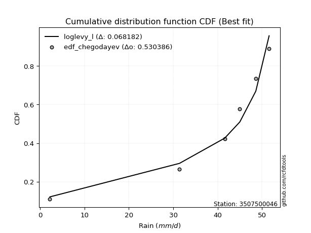</img></img>

</div>


### 6. EDF Blom (1958)

The Blom formula is a specific "plotting position" formula used in hydrology and statistical analysis to estimate the empirical cumulative probability (or non-exceedance probability) of a data series. It is particularly recommended for data that are approximately normally distributed. The constant _a_ is set to 0.375 (or 3/8).

<div align="center">


$P=(m-a)/(n+1-2a)$


</div>


**6.1. Empirical values**

<div align="center">

|                | 0                  | 1                  | 2                  | 3                 | 4                 | 5                  |
|:---------------|:-------------------|:-------------------|:-------------------|:------------------|:------------------|:-------------------|
| date           | 2025               | 2023               | 2022               | 2021              | 2019              | 2020               |
| x              | 2.2                | 31.4               | 41.6               | 45.0              | 48.6              | 51.6               |
| m              | 1                  | 2                  | 3                  | 4                 | 5                 | 6                  |
| empirical_dist | edf_blom           | edf_blom           | edf_blom           | edf_blom          | edf_blom          | edf_blom           |
| empirical      | 0.1                | 0.26               | 0.42               | 0.58              | 0.74              | 0.9                |
| empirical_tr   | 1.1111111111111112 | 1.3513513513513513 | 1.7241379310344827 | 2.380952380952381 | 3.846153846153846 | 10.000000000000002 |

</div>


**6.2. Kolmogorov-Smirnov fit test (sorted by Δ)**


<div align="center">

|                | 0                   | 1                  | 2                   | 3                   | 4                   | 5                   | 6                   | 7                   | 8                   | 9                  | 10                  | 11                  | 12                 | 13                  | 14                  | 15                  | 16                  | 17                  | 18                  | 19                  | 20                 | 21                  | 22                 | 23                  | 24                  | 25                  | 26                  | 27                 | 28                 | 29                  | 30                | 31                  | 32                 | 33                 | 34                 | 35                  | 36                  | 37                | 38                | 39                 | 40                  | 41                 | 42                  | 43                  | 44                  | 45                 | 46                 | 47                 | 48                  | 49                  | 50                 | 51                | 52                 | 53                 | 54                  | 55                  | 56                  | 57                 | 58                 | 59                 | 60                  | 61                 | 62                 | 63                  | 64                  | 65                  | 66                 | 67                  | 68                 | 69                  | 70                 | 71                  | 72                 | 73                 | 74                 | 75               | 76                 | 77                 | 78                | 79                 | 80                 | 81                 | 82                 | 83                 | 84                 | 85                | 86                  | 87                 | 88                 | 89                 | 90                  | 91                 | 92                  | 93               | 94                 | 95                 | 96                 | 97                 | 98                  | 99                  | 100                | 101                 | 102                | 103                | 104                | 105               | 106                | 107                 | 108                 | 109                 | 110                | 111                 | 112               | 113                 | 114                 | 115                 | 116                 | 117                | 118                 | 119                | 120                 | 121                | 122                | 123                 | 124                | 125                | 126                | 127                | 128                | 129                 | 130                | 131                | 132                 | 133                 | 134                | 135                 | 136                | 137                | 138                | 139                | 140                | 141                | 142                | 143                | 144                | 145                | 146                | 147                | 148                | 149                | 150                | 151               | 152                | 153                | 154            | 155                | 156                | 157            | 158                | 159              |
|:---------------|:--------------------|:-------------------|:--------------------|:--------------------|:--------------------|:--------------------|:--------------------|:--------------------|:--------------------|:-------------------|:--------------------|:--------------------|:-------------------|:--------------------|:--------------------|:--------------------|:--------------------|:--------------------|:--------------------|:--------------------|:-------------------|:--------------------|:-------------------|:--------------------|:--------------------|:--------------------|:--------------------|:-------------------|:-------------------|:--------------------|:------------------|:--------------------|:-------------------|:-------------------|:-------------------|:--------------------|:--------------------|:------------------|:------------------|:-------------------|:--------------------|:-------------------|:--------------------|:--------------------|:--------------------|:-------------------|:-------------------|:-------------------|:--------------------|:--------------------|:-------------------|:------------------|:-------------------|:-------------------|:--------------------|:--------------------|:--------------------|:-------------------|:-------------------|:-------------------|:--------------------|:-------------------|:-------------------|:--------------------|:--------------------|:--------------------|:-------------------|:--------------------|:-------------------|:--------------------|:-------------------|:--------------------|:-------------------|:-------------------|:-------------------|:-----------------|:-------------------|:-------------------|:------------------|:-------------------|:-------------------|:-------------------|:-------------------|:-------------------|:-------------------|:------------------|:--------------------|:-------------------|:-------------------|:-------------------|:--------------------|:-------------------|:--------------------|:-----------------|:-------------------|:-------------------|:-------------------|:-------------------|:--------------------|:--------------------|:-------------------|:--------------------|:-------------------|:-------------------|:-------------------|:------------------|:-------------------|:--------------------|:--------------------|:--------------------|:-------------------|:--------------------|:------------------|:--------------------|:--------------------|:--------------------|:--------------------|:-------------------|:--------------------|:-------------------|:--------------------|:-------------------|:-------------------|:--------------------|:-------------------|:-------------------|:-------------------|:-------------------|:-------------------|:--------------------|:-------------------|:-------------------|:--------------------|:--------------------|:-------------------|:--------------------|:-------------------|:-------------------|:-------------------|:-------------------|:-------------------|:-------------------|:-------------------|:-------------------|:-------------------|:-------------------|:-------------------|:-------------------|:-------------------|:-------------------|:-------------------|:------------------|:-------------------|:-------------------|:---------------|:-------------------|:-------------------|:---------------|:-------------------|:-----------------|
| station        | 3507500046          | 3507500046         | 3507500046          | 3507500046          | 3507500046          | 3507500046          | 3507500046          | 3507500046          | 3507500046          | 3507500046         | 3507500046          | 3507500046          | 3507500046         | 3507500046          | 3507500046          | 3507500046          | 3507500046          | 3507500046          | 3507500046          | 3507500046          | 3507500046         | 3507500046          | 3507500046         | 3507500046          | 3507500046          | 3507500046          | 3507500046          | 3507500046         | 3507500046         | 3507500046          | 3507500046        | 3507500046          | 3507500046         | 3507500046         | 3507500046         | 3507500046          | 3507500046          | 3507500046        | 3507500046        | 3507500046         | 3507500046          | 3507500046         | 3507500046          | 3507500046          | 3507500046          | 3507500046         | 3507500046         | 3507500046         | 3507500046          | 3507500046          | 3507500046         | 3507500046        | 3507500046         | 3507500046         | 3507500046          | 3507500046          | 3507500046          | 3507500046         | 3507500046         | 3507500046         | 3507500046          | 3507500046         | 3507500046         | 3507500046          | 3507500046          | 3507500046          | 3507500046         | 3507500046          | 3507500046         | 3507500046          | 3507500046         | 3507500046          | 3507500046         | 3507500046         | 3507500046         | 3507500046       | 3507500046         | 3507500046         | 3507500046        | 3507500046         | 3507500046         | 3507500046         | 3507500046         | 3507500046         | 3507500046         | 3507500046        | 3507500046          | 3507500046         | 3507500046         | 3507500046         | 3507500046          | 3507500046         | 3507500046          | 3507500046       | 3507500046         | 3507500046         | 3507500046         | 3507500046         | 3507500046          | 3507500046          | 3507500046         | 3507500046          | 3507500046         | 3507500046         | 3507500046         | 3507500046        | 3507500046         | 3507500046          | 3507500046          | 3507500046          | 3507500046         | 3507500046          | 3507500046        | 3507500046          | 3507500046          | 3507500046          | 3507500046          | 3507500046         | 3507500046          | 3507500046         | 3507500046          | 3507500046         | 3507500046         | 3507500046          | 3507500046         | 3507500046         | 3507500046         | 3507500046         | 3507500046         | 3507500046          | 3507500046         | 3507500046         | 3507500046          | 3507500046          | 3507500046         | 3507500046          | 3507500046         | 3507500046         | 3507500046         | 3507500046         | 3507500046         | 3507500046         | 3507500046         | 3507500046         | 3507500046         | 3507500046         | 3507500046         | 3507500046         | 3507500046         | 3507500046         | 3507500046         | 3507500046        | 3507500046         | 3507500046         | 3507500046     | 3507500046         | 3507500046         | 3507500046     | 3507500046         | 3507500046       |
| empirical_dist | edf_blom            | edf_blom           | edf_blom            | edf_blom            | edf_blom            | edf_blom            | edf_blom            | edf_blom            | edf_blom            | edf_blom           | edf_blom            | edf_blom            | edf_blom           | edf_blom            | edf_blom            | edf_blom            | edf_blom            | edf_blom            | edf_blom            | edf_blom            | edf_blom           | edf_blom            | edf_blom           | edf_blom            | edf_blom            | edf_blom            | edf_blom            | edf_blom           | edf_blom           | edf_blom            | edf_blom          | edf_blom            | edf_blom           | edf_blom           | edf_blom           | edf_blom            | edf_blom            | edf_blom          | edf_blom          | edf_blom           | edf_blom            | edf_blom           | edf_blom            | edf_blom            | edf_blom            | edf_blom           | edf_blom           | edf_blom           | edf_blom            | edf_blom            | edf_blom           | edf_blom          | edf_blom           | edf_blom           | edf_blom            | edf_blom            | edf_blom            | edf_blom           | edf_blom           | edf_blom           | edf_blom            | edf_blom           | edf_blom           | edf_blom            | edf_blom            | edf_blom            | edf_blom           | edf_blom            | edf_blom           | edf_blom            | edf_blom           | edf_blom            | edf_blom           | edf_blom           | edf_blom           | edf_blom         | edf_blom           | edf_blom           | edf_blom          | edf_blom           | edf_blom           | edf_blom           | edf_blom           | edf_blom           | edf_blom           | edf_blom          | edf_blom            | edf_blom           | edf_blom           | edf_blom           | edf_blom            | edf_blom           | edf_blom            | edf_blom         | edf_blom           | edf_blom           | edf_blom           | edf_blom           | edf_blom            | edf_blom            | edf_blom           | edf_blom            | edf_blom           | edf_blom           | edf_blom           | edf_blom          | edf_blom           | edf_blom            | edf_blom            | edf_blom            | edf_blom           | edf_blom            | edf_blom          | edf_blom            | edf_blom            | edf_blom            | edf_blom            | edf_blom           | edf_blom            | edf_blom           | edf_blom            | edf_blom           | edf_blom           | edf_blom            | edf_blom           | edf_blom           | edf_blom           | edf_blom           | edf_blom           | edf_blom            | edf_blom           | edf_blom           | edf_blom            | edf_blom            | edf_blom           | edf_blom            | edf_blom           | edf_blom           | edf_blom           | edf_blom           | edf_blom           | edf_blom           | edf_blom           | edf_blom           | edf_blom           | edf_blom           | edf_blom           | edf_blom           | edf_blom           | edf_blom           | edf_blom           | edf_blom          | edf_blom           | edf_blom           | edf_blom       | edf_blom           | edf_blom           | edf_blom       | edf_blom           | edf_blom         |
| p_dist         | loglevy_l           | argus              | mielke              | genextreme          | genpareto           | levy_l              | vonmises_line       | pearson3            | burr12              | dgamma             | gengamma            | trapezoid           | gumbel_l           | gompertz            | gausshyper          | gennorm             | loggenextreme       | weibull_max         | logt                | dweibull            | semicircular       | anglit              | arcsine            | nakagami            | nct                 | exponnorm           | crystalball         | norm               | f                  | t                   | invweibull        | gamma               | foldnorm           | betaprime          | invgauss           | erlang              | logistic            | invgamma          | genhalflogistic   | logvonmises_line   | maxwell             | hypsecant          | logpearson3         | rayleigh            | kstwobign           | truncnorm          | logburr12          | skewnorm           | ncf                 | rice                | loggumbel_l        | logweibull_min    | loggompertz        | beta               | logtrapezoid        | laplace             | cosine              | halfnorm           | gumbel_r           | logargus           | wrapcauchy          | triang             | logarcsine         | logmielke           | halflogistic        | burr                | logexponweib       | moyal               | loggengamma        | logwrapcauchy       | logsemicircular    | loganglit           | logburr            | logfoldnorm        | logweibull_max     | logf             | logexponnorm       | logcrystalball     | logrice           | lognorm            | logfatiguelife     | lognct             | logncf             | logloggamma        | loggennorm         | lognakagami       | logerlang           | loginvgauss        | loggamma           | loggamma           | genexpon            | logloglaplace      | logbetaprime        | loginvgamma      | loglogistic        | loginvweibull      | logalpha           | loghypsecant       | lomax               | ksone               | logmaxwell         | exponweib           | truncweibull_min   | loglaplace         | loglaplace         | wald              | lograyleigh        | logdgamma           | halfgennorm         | logkstwobign        | johnsonsb          | kappa4              | loggenexpon       | loghalfnorm         | loggumbel_r         | kappa3              | uniform             | logcosine          | loggausshyper       | loghalflogistic    | logmoyal            | loglomax           | bradford           | logdweibull         | johnsonsu          | logtruncnorm       | loghalfgennorm     | logjohnsonsb       | loggenpareto       | loggenhalflogistic  | logskewnorm        | truncexpon         | logtruncweibull_min | logwald             | logbeta            | logtriang           | logksone           | logjohnsonsu       | logkappa4          | logexponpow        | fatiguelife        | logkappa3          | loguniform         | weibull_min        | alpha              | logbradford        | logtruncexpon      | exponpow           | powerlaw           | truncpareto        | logtukeylambda     | logpowerlaw       | logtruncpareto     | logrdist           | loggenlogistic | rdist              | tukeylambda        | genlogistic    | logvonmises        | vonmises         |
| delta          | 0.07051316382626505 | 0.0888831050133913 | 0.09861350664415958 | 0.09999999999844444 | 0.10087028136296722 | 0.10549066544847027 | 0.11090324020346631 | 0.11744618682361335 | 0.12249971723985514 | 0.1301153365456118 | 0.13065143587940659 | 0.13167134691901333 | 0.1376996791698905 | 0.14130469734670775 | 0.14339044767803305 | 0.14652991947563931 | 0.15219408105278193 | 0.15323877865421126 | 0.15380942519478513 | 0.16851667701302386 | 0.1723901985932667 | 0.17891436821040013 | 0.1833844390064553 | 0.19297850277611367 | 0.19456917653079991 | 0.19458136202421733 | 0.19458349807215664 | 0.1945835039538249 | 0.1948080165565405 | 0.19572273477158658 | 0.196199405944612 | 0.19681258666089324 | 0.1983421692555732 | 0.1994119590786389 | 0.2001376820954836 | 0.20373375110984243 | 0.20909432413807844 | 0.216408678101165 | 0.216744698701197 | 0.2179476924373437 | 0.21977996333379995 | 0.2208117638866211 | 0.22319294776612741 | 0.22752602896214164 | 0.22770311188968978 | 0.2294413786437755 | 0.2315277441823987 | 0.2347658649444137 | 0.23491657957222872 | 0.23844169395577525 | 0.2387005247965741 | 0.238743447678263 | 0.2402098028054785 | 0.2448683458965895 | 0.24504067369650773 | 0.24881795032957993 | 0.24897872094654433 | 0.2496822867229766 | 0.2594780946986694 | 0.2599454972170047 | 0.26397871011121987 | 0.2707370437744738 | 0.2763976370893123 | 0.27767595431978837 | 0.27805493841884804 | 0.28004646366895763 | 0.2805671119739968 | 0.28143508281158186 | 0.2823777451345351 | 0.28544035336202367 | 0.2913070546991703 | 0.29504617037216063 | 0.2957946670043627 | 0.3022469899258122 | 0.3030905886429017 | 0.30394074361099 | 0.3040938630289429 | 0.3040941674887715 | 0.304094693384244 | 0.3040947111499491 | 0.3045322770346903 | 0.3045536467358698 | 0.3055360972299914 | 0.3077058684050517 | 0.3078811117164748 | 0.307909616041019 | 0.30835734434592676 | 0.3094645751739269 | 0.3096554881282678 | 0.3096554881282678 | 0.31047234374469224 | 0.3113603646852875 | 0.31141913082942785 | 0.31156528107865 | 0.3126504095099185 | 0.3147164089525649 | 0.3174155991319927 | 0.3198293194037325 | 0.32076451088628133 | 0.32797570850202434 | 0.3335101379982305 | 0.33396129524866136 | 0.3416922283123714 | 0.3420159733964858 | 0.3420159733964858 | 0.342835124026347 | 0.3428647508877558 | 0.35141676584517645 | 0.35226595664235494 | 0.35274256672870474 | 0.3558423107376777 | 0.36126696525286833 | 0.368577626480611 | 0.36929540286409324 | 0.37349705933205446 | 0.37723702522914687 | 0.37757085020242914 | 0.3776968198742403 | 0.38700270260157865 | 0.3969973185252472 | 0.39783648259183635 | 0.3985330648182981 | 0.3991068958953003 | 0.39999999999997626 | 0.4084354108810966 | 0.4110151578493825 | 0.4144850848837889 | 0.4303895669360066 | 0.4316616327040388 | 0.43241650933357123 | 0.4492013114586249 | 0.4553794993431338 | 0.4573362745394104  | 0.46539464070963066 | 0.4930019380793931 | 0.49818276656616356 | 0.5254718291941253 | 0.5467508119731856 | 0.5528886306210431 | 0.5772156230500358 | 0.5799358862362061 | 0.5825659863470116 | 0.5825661950329505 | 0.5880393618589481 | 0.6038278910086391 | 0.6174576905428325 | 0.6345680446665406 | 0.6546526108630178 | 0.6645405937685149 | 0.6941168733792921 | 0.7004036211083624 | 0.713446575688366 | 0.7250361742376077 | 0.7399999948248803 | 0.74           | 0.8999999999999252 | 0.8999999999999929 | 0.9            | 1.1116354112678362 | 7.62682237231234 |
| deltao         | 0.530385761606      | 0.530385761606     | 0.530385761606      | 0.530385761606      | 0.530385761606      | 0.530385761606      | 0.530385761606      | 0.530385761606      | 0.530385761606      | 0.530385761606     | 0.530385761606      | 0.530385761606      | 0.530385761606     | 0.530385761606      | 0.530385761606      | 0.530385761606      | 0.530385761606      | 0.530385761606      | 0.530385761606      | 0.530385761606      | 0.530385761606     | 0.530385761606      | 0.530385761606     | 0.530385761606      | 0.530385761606      | 0.530385761606      | 0.530385761606      | 0.530385761606     | 0.530385761606     | 0.530385761606      | 0.530385761606    | 0.530385761606      | 0.530385761606     | 0.530385761606     | 0.530385761606     | 0.530385761606      | 0.530385761606      | 0.530385761606    | 0.530385761606    | 0.530385761606     | 0.530385761606      | 0.530385761606     | 0.530385761606      | 0.530385761606      | 0.530385761606      | 0.530385761606     | 0.530385761606     | 0.530385761606     | 0.530385761606      | 0.530385761606      | 0.530385761606     | 0.530385761606    | 0.530385761606     | 0.530385761606     | 0.530385761606      | 0.530385761606      | 0.530385761606      | 0.530385761606     | 0.530385761606     | 0.530385761606     | 0.530385761606      | 0.530385761606     | 0.530385761606     | 0.530385761606      | 0.530385761606      | 0.530385761606      | 0.530385761606     | 0.530385761606      | 0.530385761606     | 0.530385761606      | 0.530385761606     | 0.530385761606      | 0.530385761606     | 0.530385761606     | 0.530385761606     | 0.530385761606   | 0.530385761606     | 0.530385761606     | 0.530385761606    | 0.530385761606     | 0.530385761606     | 0.530385761606     | 0.530385761606     | 0.530385761606     | 0.530385761606     | 0.530385761606    | 0.530385761606      | 0.530385761606     | 0.530385761606     | 0.530385761606     | 0.530385761606      | 0.530385761606     | 0.530385761606      | 0.530385761606   | 0.530385761606     | 0.530385761606     | 0.530385761606     | 0.530385761606     | 0.530385761606      | 0.530385761606      | 0.530385761606     | 0.530385761606      | 0.530385761606     | 0.530385761606     | 0.530385761606     | 0.530385761606    | 0.530385761606     | 0.530385761606      | 0.530385761606      | 0.530385761606      | 0.530385761606     | 0.530385761606      | 0.530385761606    | 0.530385761606      | 0.530385761606      | 0.530385761606      | 0.530385761606      | 0.530385761606     | 0.530385761606      | 0.530385761606     | 0.530385761606      | 0.530385761606     | 0.530385761606     | 0.530385761606      | 0.530385761606     | 0.530385761606     | 0.530385761606     | 0.530385761606     | 0.530385761606     | 0.530385761606      | 0.530385761606     | 0.530385761606     | 0.530385761606      | 0.530385761606      | 0.530385761606     | 0.530385761606      | 0.530385761606     | 0.530385761606     | 0.530385761606     | 0.530385761606     | 0.530385761606     | 0.530385761606     | 0.530385761606     | 0.530385761606     | 0.530385761606     | 0.530385761606     | 0.530385761606     | 0.530385761606     | 0.530385761606     | 0.530385761606     | 0.530385761606     | 0.530385761606    | 0.530385761606     | 0.530385761606     | 0.530385761606 | 0.530385761606     | 0.530385761606     | 0.530385761606 | 0.530385761606     | 0.530385761606   |
| eval           | Δo > Δ              | Δo > Δ             | Δo > Δ              | Δo > Δ              | Δo > Δ              | Δo > Δ              | Δo > Δ              | Δo > Δ              | Δo > Δ              | Δo > Δ             | Δo > Δ              | Δo > Δ              | Δo > Δ             | Δo > Δ              | Δo > Δ              | Δo > Δ              | Δo > Δ              | Δo > Δ              | Δo > Δ              | Δo > Δ              | Δo > Δ             | Δo > Δ              | Δo > Δ             | Δo > Δ              | Δo > Δ              | Δo > Δ              | Δo > Δ              | Δo > Δ             | Δo > Δ             | Δo > Δ              | Δo > Δ            | Δo > Δ              | Δo > Δ             | Δo > Δ             | Δo > Δ             | Δo > Δ              | Δo > Δ              | Δo > Δ            | Δo > Δ            | Δo > Δ             | Δo > Δ              | Δo > Δ             | Δo > Δ              | Δo > Δ              | Δo > Δ              | Δo > Δ             | Δo > Δ             | Δo > Δ             | Δo > Δ              | Δo > Δ              | Δo > Δ             | Δo > Δ            | Δo > Δ             | Δo > Δ             | Δo > Δ              | Δo > Δ              | Δo > Δ              | Δo > Δ             | Δo > Δ             | Δo > Δ             | Δo > Δ              | Δo > Δ             | Δo > Δ             | Δo > Δ              | Δo > Δ              | Δo > Δ              | Δo > Δ             | Δo > Δ              | Δo > Δ             | Δo > Δ              | Δo > Δ             | Δo > Δ              | Δo > Δ             | Δo > Δ             | Δo > Δ             | Δo > Δ           | Δo > Δ             | Δo > Δ             | Δo > Δ            | Δo > Δ             | Δo > Δ             | Δo > Δ             | Δo > Δ             | Δo > Δ             | Δo > Δ             | Δo > Δ            | Δo > Δ              | Δo > Δ             | Δo > Δ             | Δo > Δ             | Δo > Δ              | Δo > Δ             | Δo > Δ              | Δo > Δ           | Δo > Δ             | Δo > Δ             | Δo > Δ             | Δo > Δ             | Δo > Δ              | Δo > Δ              | Δo > Δ             | Δo > Δ              | Δo > Δ             | Δo > Δ             | Δo > Δ             | Δo > Δ            | Δo > Δ             | Δo > Δ              | Δo > Δ              | Δo > Δ              | Δo > Δ             | Δo > Δ              | Δo > Δ            | Δo > Δ              | Δo > Δ              | Δo > Δ              | Δo > Δ              | Δo > Δ             | Δo > Δ              | Δo > Δ             | Δo > Δ              | Δo > Δ             | Δo > Δ             | Δo > Δ              | Δo > Δ             | Δo > Δ             | Δo > Δ             | Δo > Δ             | Δo > Δ             | Δo > Δ              | Δo > Δ             | Δo > Δ             | Δo > Δ              | Δo > Δ              | Δo > Δ             | Δo > Δ              | Δo > Δ             | Δo <= Δ            | Δo <= Δ            | Δo <= Δ            | Δo <= Δ            | Δo <= Δ            | Δo <= Δ            | Δo <= Δ            | Δo <= Δ            | Δo <= Δ            | Δo <= Δ            | Δo <= Δ            | Δo <= Δ            | Δo <= Δ            | Δo <= Δ            | Δo <= Δ           | Δo <= Δ            | Δo <= Δ            | Δo <= Δ        | Δo <= Δ            | Δo <= Δ            | Δo <= Δ        | Δo <= Δ            | Δo <= Δ          |
| fit            | 1                   | 1                  | 1                   | 1                   | 1                   | 1                   | 1                   | 1                   | 1                   | 1                  | 1                   | 1                   | 1                  | 1                   | 1                   | 1                   | 1                   | 1                   | 1                   | 1                   | 1                  | 1                   | 1                  | 1                   | 1                   | 1                   | 1                   | 1                  | 1                  | 1                   | 1                 | 1                   | 1                  | 1                  | 1                  | 1                   | 1                   | 1                 | 1                 | 1                  | 1                   | 1                  | 1                   | 1                   | 1                   | 1                  | 1                  | 1                  | 1                   | 1                   | 1                  | 1                 | 1                  | 1                  | 1                   | 1                   | 1                   | 1                  | 1                  | 1                  | 1                   | 1                  | 1                  | 1                   | 1                   | 1                   | 1                  | 1                   | 1                  | 1                   | 1                  | 1                   | 1                  | 1                  | 1                  | 1                | 1                  | 1                  | 1                 | 1                  | 1                  | 1                  | 1                  | 1                  | 1                  | 1                 | 1                   | 1                  | 1                  | 1                  | 1                   | 1                  | 1                   | 1                | 1                  | 1                  | 1                  | 1                  | 1                   | 1                   | 1                  | 1                   | 1                  | 1                  | 1                  | 1                 | 1                  | 1                   | 1                   | 1                   | 1                  | 1                   | 1                 | 1                   | 1                   | 1                   | 1                   | 1                  | 1                   | 1                  | 1                   | 1                  | 1                  | 1                   | 1                  | 1                  | 1                  | 1                  | 1                  | 1                   | 1                  | 1                  | 1                   | 1                   | 1                  | 1                   | 1                  | 0                  | 0                  | 0                  | 0                  | 0                  | 0                  | 0                  | 0                  | 0                  | 0                  | 0                  | 0                  | 0                  | 0                  | 0                 | 0                  | 0                  | 0              | 0                  | 0                  | 0              | 0                  | 0                |
| n              | 6                   | 6                  | 6                   | 6                   | 6                   | 6                   | 6                   | 6                   | 6                   | 6                  | 6                   | 6                   | 6                  | 6                   | 6                   | 6                   | 6                   | 6                   | 6                   | 6                   | 6                  | 6                   | 6                  | 6                   | 6                   | 6                   | 6                   | 6                  | 6                  | 6                   | 6                 | 6                   | 6                  | 6                  | 6                  | 6                   | 6                   | 6                 | 6                 | 6                  | 6                   | 6                  | 6                   | 6                   | 6                   | 6                  | 6                  | 6                  | 6                   | 6                   | 6                  | 6                 | 6                  | 6                  | 6                   | 6                   | 6                   | 6                  | 6                  | 6                  | 6                   | 6                  | 6                  | 6                   | 6                   | 6                   | 6                  | 6                   | 6                  | 6                   | 6                  | 6                   | 6                  | 6                  | 6                  | 6                | 6                  | 6                  | 6                 | 6                  | 6                  | 6                  | 6                  | 6                  | 6                  | 6                 | 6                   | 6                  | 6                  | 6                  | 6                   | 6                  | 6                   | 6                | 6                  | 6                  | 6                  | 6                  | 6                   | 6                   | 6                  | 6                   | 6                  | 6                  | 6                  | 6                 | 6                  | 6                   | 6                   | 6                   | 6                  | 6                   | 6                 | 6                   | 6                   | 6                   | 6                   | 6                  | 6                   | 6                  | 6                   | 6                  | 6                  | 6                   | 6                  | 6                  | 6                  | 6                  | 6                  | 6                   | 6                  | 6                  | 6                   | 6                   | 6                  | 6                   | 6                  | 6                  | 6                  | 6                  | 6                  | 6                  | 6                  | 6                  | 6                  | 6                  | 6                  | 6                  | 6                  | 6                  | 6                  | 6                 | 6                  | 6                  | 6              | 6                  | 6                  | 6              | 6                  | 6                |
| best_fit       | 1                   | 0                  | 0                   | 0                   | 0                   | 0                   | 0                   | 0                   | 0                   | 0                  | 0                   | 0                   | 0                  | 0                   | 0                   | 0                   | 0                   | 0                   | 0                   | 0                   | 0                  | 0                   | 0                  | 0                   | 0                   | 0                   | 0                   | 0                  | 0                  | 0                   | 0                 | 0                   | 0                  | 0                  | 0                  | 0                   | 0                   | 0                 | 0                 | 0                  | 0                   | 0                  | 0                   | 0                   | 0                   | 0                  | 0                  | 0                  | 0                   | 0                   | 0                  | 0                 | 0                  | 0                  | 0                   | 0                   | 0                   | 0                  | 0                  | 0                  | 0                   | 0                  | 0                  | 0                   | 0                   | 0                   | 0                  | 0                   | 0                  | 0                   | 0                  | 0                   | 0                  | 0                  | 0                  | 0                | 0                  | 0                  | 0                 | 0                  | 0                  | 0                  | 0                  | 0                  | 0                  | 0                 | 0                   | 0                  | 0                  | 0                  | 0                   | 0                  | 0                   | 0                | 0                  | 0                  | 0                  | 0                  | 0                   | 0                   | 0                  | 0                   | 0                  | 0                  | 0                  | 0                 | 0                  | 0                   | 0                   | 0                   | 0                  | 0                   | 0                 | 0                   | 0                   | 0                   | 0                   | 0                  | 0                   | 0                  | 0                   | 0                  | 0                  | 0                   | 0                  | 0                  | 0                  | 0                  | 0                  | 0                   | 0                  | 0                  | 0                   | 0                   | 0                  | 0                   | 0                  | 0                  | 0                  | 0                  | 0                  | 0                  | 0                  | 0                  | 0                  | 0                  | 0                  | 0                  | 0                  | 0                  | 0                  | 0                 | 0                  | 0                  | 0              | 0                  | 0                  | 0              | 0                  | 0                |
| best_fit_sort  | 1                   | 2                  | 3                   | 4                   | 5                   | 6                   | 7                   | 8                   | 9                   | 10                 | 11                  | 12                  | 13                 | 14                  | 15                  | 16                  | 17                  | 18                  | 19                  | 20                  | 21                 | 22                  | 23                 | 24                  | 25                  | 26                  | 27                  | 28                 | 29                 | 30                  | 31                | 32                  | 33                 | 34                 | 35                 | 36                  | 37                  | 38                | 39                | 40                 | 41                  | 42                 | 43                  | 44                  | 45                  | 46                 | 47                 | 48                 | 49                  | 50                  | 51                 | 52                | 53                 | 54                 | 55                  | 56                  | 57                  | 58                 | 59                 | 60                 | 61                  | 62                 | 63                 | 64                  | 65                  | 66                  | 67                 | 68                  | 69                 | 70                  | 71                 | 72                  | 73                 | 74                 | 75                 | 76               | 77                 | 78                 | 79                | 80                 | 81                 | 82                 | 83                 | 84                 | 85                 | 86                | 87                  | 88                 | 89                 | 90                 | 91                  | 92                 | 93                  | 94               | 95                 | 96                 | 97                 | 98                 | 99                  | 100                 | 101                | 102                 | 103                | 104                | 105                | 106               | 107                | 108                 | 109                 | 110                 | 111                | 112                 | 113               | 114                 | 115                 | 116                 | 117                 | 118                | 119                 | 120                | 121                 | 122                | 123                | 124                 | 125                | 126                | 127                | 128                | 129                | 130                 | 131                | 132                | 133                 | 134                 | 135                | 136                 | 137                | 138                | 139                | 140                | 141                | 142                | 143                | 144                | 145                | 146                | 147                | 148                | 149                | 150                | 151                | 152               | 153                | 154                | 155            | 156                | 157                | 158            | 159                | 160              |

</div>


**6.3. Best fit**

<div align="center">

|   id |    station | empirical_dist   | p_dist    |     delta |   deltao | eval   |   fit |   n |   best_fit |   best_fit_sort |
|-----:|-----------:|:-----------------|:----------|----------:|---------:|:-------|------:|----:|-----------:|----------------:|
|    0 | 3507500046 | edf_blom         | loglevy_l | 0.0705132 | 0.530386 | Δo > Δ |     1 |   6 |          1 |               1 |

</div>


<div align="center">

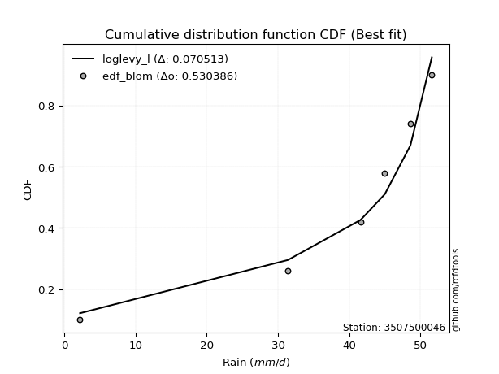</img></img>

</div>


### 7. EDF Tukey (1962)

In hydrology, the Tukey formula is used as a plotting position formula to estimate the empirical probability or frequency of a flood event (or other hydrological data). The formula parameter is given as _c=0.333_ (or 1/3).

<div align="center">


$P=(m-c)/(n+1-2c)$


</div>


**7.1. Empirical values**

<div align="center">

|                | 0                   | 1                  | 2                   | 3                  | 4                  | 5                  |
|:---------------|:--------------------|:-------------------|:--------------------|:-------------------|:-------------------|:-------------------|
| date           | 2025                | 2023               | 2022                | 2021               | 2019               | 2020               |
| x              | 2.2                 | 31.4               | 41.6                | 45.0               | 48.6               | 51.6               |
| m              | 1                   | 2                  | 3                   | 4                  | 5                  | 6                  |
| empirical_dist | edf_tukey           | edf_tukey          | edf_tukey           | edf_tukey          | edf_tukey          | edf_tukey          |
| empirical      | 0.10526315789473684 | 0.2631578947368421 | 0.42105263157894735 | 0.5789473684210527 | 0.7368421052631579 | 0.8947368421052632 |
| empirical_tr   | 1.1176470588235294  | 1.357142857142857  | 1.7272727272727273  | 2.375              | 3.7999999999999994 | 9.5                |

</div>


**7.2. Kolmogorov-Smirnov fit test (sorted by Δ)**


<div align="center">

|                | 0                  | 1                   | 2                   | 3                   | 4                   | 5                  | 6                   | 7                   | 8                   | 9                   | 10                  | 11                 | 12                  | 13                 | 14                 | 15                  | 16                 | 17                  | 18                 | 19                | 20                  | 21                  | 22                  | 23                 | 24                  | 25                  | 26                  | 27                  | 28                  | 29                  | 30                  | 31                  | 32                  | 33                  | 34                  | 35                  | 36                  | 37                  | 38                  | 39                  | 40                  | 41                 | 42                  | 43                  | 44                  | 45                  | 46                  | 47                  | 48                  | 49                  | 50                 | 51                  | 52                  | 53                  | 54                  | 55                  | 56                  | 57                  | 58                  | 59                  | 60                 | 61                 | 62                 | 63                | 64                 | 65                 | 66                  | 67                 | 68                  | 69                 | 70                 | 71                  | 72                 | 73                  | 74                  | 75                 | 76                  | 77                 | 78                 | 79                  | 80                  | 81                  | 82                  | 83                 | 84                  | 85                 | 86                  | 87                  | 88                  | 89                 | 90                  | 91                  | 92                  | 93                 | 94                  | 95                  | 96                 | 97                 | 98                  | 99                | 100                | 101                | 102                 | 103                 | 104                | 105                 | 106                 | 107                | 108                 | 109                 | 110                 | 111               | 112                | 113                 | 114                | 115                | 116                | 117                | 118                 | 119                 | 120                 | 121                | 122               | 123                 | 124                 | 125                | 126                | 127                 | 128                | 129                 | 130                 | 131                 | 132                 | 133                | 134                 | 135                | 136                | 137                | 138               | 139                | 140               | 141                | 142                | 143                | 144               | 145                | 146                | 147                | 148                | 149                | 150                | 151                | 152                | 153                | 154                | 155                | 156                | 157                | 158                | 159               |
|:---------------|:-------------------|:--------------------|:--------------------|:--------------------|:--------------------|:-------------------|:--------------------|:--------------------|:--------------------|:--------------------|:--------------------|:-------------------|:--------------------|:-------------------|:-------------------|:--------------------|:-------------------|:--------------------|:-------------------|:------------------|:--------------------|:--------------------|:--------------------|:-------------------|:--------------------|:--------------------|:--------------------|:--------------------|:--------------------|:--------------------|:--------------------|:--------------------|:--------------------|:--------------------|:--------------------|:--------------------|:--------------------|:--------------------|:--------------------|:--------------------|:--------------------|:-------------------|:--------------------|:--------------------|:--------------------|:--------------------|:--------------------|:--------------------|:--------------------|:--------------------|:-------------------|:--------------------|:--------------------|:--------------------|:--------------------|:--------------------|:--------------------|:--------------------|:--------------------|:--------------------|:-------------------|:-------------------|:-------------------|:------------------|:-------------------|:-------------------|:--------------------|:-------------------|:--------------------|:-------------------|:-------------------|:--------------------|:-------------------|:--------------------|:--------------------|:-------------------|:--------------------|:-------------------|:-------------------|:--------------------|:--------------------|:--------------------|:--------------------|:-------------------|:--------------------|:-------------------|:--------------------|:--------------------|:--------------------|:-------------------|:--------------------|:--------------------|:--------------------|:-------------------|:--------------------|:--------------------|:-------------------|:-------------------|:--------------------|:------------------|:-------------------|:-------------------|:--------------------|:--------------------|:-------------------|:--------------------|:--------------------|:-------------------|:--------------------|:--------------------|:--------------------|:------------------|:-------------------|:--------------------|:-------------------|:-------------------|:-------------------|:-------------------|:--------------------|:--------------------|:--------------------|:-------------------|:------------------|:--------------------|:--------------------|:-------------------|:-------------------|:--------------------|:-------------------|:--------------------|:--------------------|:--------------------|:--------------------|:-------------------|:--------------------|:-------------------|:-------------------|:-------------------|:------------------|:-------------------|:------------------|:-------------------|:-------------------|:-------------------|:------------------|:-------------------|:-------------------|:-------------------|:-------------------|:-------------------|:-------------------|:-------------------|:-------------------|:-------------------|:-------------------|:-------------------|:-------------------|:-------------------|:-------------------|:------------------|
| station        | 3507500046         | 3507500046          | 3507500046          | 3507500046          | 3507500046          | 3507500046         | 3507500046          | 3507500046          | 3507500046          | 3507500046          | 3507500046          | 3507500046         | 3507500046          | 3507500046         | 3507500046         | 3507500046          | 3507500046         | 3507500046          | 3507500046         | 3507500046        | 3507500046          | 3507500046          | 3507500046          | 3507500046         | 3507500046          | 3507500046          | 3507500046          | 3507500046          | 3507500046          | 3507500046          | 3507500046          | 3507500046          | 3507500046          | 3507500046          | 3507500046          | 3507500046          | 3507500046          | 3507500046          | 3507500046          | 3507500046          | 3507500046          | 3507500046         | 3507500046          | 3507500046          | 3507500046          | 3507500046          | 3507500046          | 3507500046          | 3507500046          | 3507500046          | 3507500046         | 3507500046          | 3507500046          | 3507500046          | 3507500046          | 3507500046          | 3507500046          | 3507500046          | 3507500046          | 3507500046          | 3507500046         | 3507500046         | 3507500046         | 3507500046        | 3507500046         | 3507500046         | 3507500046          | 3507500046         | 3507500046          | 3507500046         | 3507500046         | 3507500046          | 3507500046         | 3507500046          | 3507500046          | 3507500046         | 3507500046          | 3507500046         | 3507500046         | 3507500046          | 3507500046          | 3507500046          | 3507500046          | 3507500046         | 3507500046          | 3507500046         | 3507500046          | 3507500046          | 3507500046          | 3507500046         | 3507500046          | 3507500046          | 3507500046          | 3507500046         | 3507500046          | 3507500046          | 3507500046         | 3507500046         | 3507500046          | 3507500046        | 3507500046         | 3507500046         | 3507500046          | 3507500046          | 3507500046         | 3507500046          | 3507500046          | 3507500046         | 3507500046          | 3507500046          | 3507500046          | 3507500046        | 3507500046         | 3507500046          | 3507500046         | 3507500046         | 3507500046         | 3507500046         | 3507500046          | 3507500046          | 3507500046          | 3507500046         | 3507500046        | 3507500046          | 3507500046          | 3507500046         | 3507500046         | 3507500046          | 3507500046         | 3507500046          | 3507500046          | 3507500046          | 3507500046          | 3507500046         | 3507500046          | 3507500046         | 3507500046         | 3507500046         | 3507500046        | 3507500046         | 3507500046        | 3507500046         | 3507500046         | 3507500046         | 3507500046        | 3507500046         | 3507500046         | 3507500046         | 3507500046         | 3507500046         | 3507500046         | 3507500046         | 3507500046         | 3507500046         | 3507500046         | 3507500046         | 3507500046         | 3507500046         | 3507500046         | 3507500046        |
| empirical_dist | edf_tukey          | edf_tukey           | edf_tukey           | edf_tukey           | edf_tukey           | edf_tukey          | edf_tukey           | edf_tukey           | edf_tukey           | edf_tukey           | edf_tukey           | edf_tukey          | edf_tukey           | edf_tukey          | edf_tukey          | edf_tukey           | edf_tukey          | edf_tukey           | edf_tukey          | edf_tukey         | edf_tukey           | edf_tukey           | edf_tukey           | edf_tukey          | edf_tukey           | edf_tukey           | edf_tukey           | edf_tukey           | edf_tukey           | edf_tukey           | edf_tukey           | edf_tukey           | edf_tukey           | edf_tukey           | edf_tukey           | edf_tukey           | edf_tukey           | edf_tukey           | edf_tukey           | edf_tukey           | edf_tukey           | edf_tukey          | edf_tukey           | edf_tukey           | edf_tukey           | edf_tukey           | edf_tukey           | edf_tukey           | edf_tukey           | edf_tukey           | edf_tukey          | edf_tukey           | edf_tukey           | edf_tukey           | edf_tukey           | edf_tukey           | edf_tukey           | edf_tukey           | edf_tukey           | edf_tukey           | edf_tukey          | edf_tukey          | edf_tukey          | edf_tukey         | edf_tukey          | edf_tukey          | edf_tukey           | edf_tukey          | edf_tukey           | edf_tukey          | edf_tukey          | edf_tukey           | edf_tukey          | edf_tukey           | edf_tukey           | edf_tukey          | edf_tukey           | edf_tukey          | edf_tukey          | edf_tukey           | edf_tukey           | edf_tukey           | edf_tukey           | edf_tukey          | edf_tukey           | edf_tukey          | edf_tukey           | edf_tukey           | edf_tukey           | edf_tukey          | edf_tukey           | edf_tukey           | edf_tukey           | edf_tukey          | edf_tukey           | edf_tukey           | edf_tukey          | edf_tukey          | edf_tukey           | edf_tukey         | edf_tukey          | edf_tukey          | edf_tukey           | edf_tukey           | edf_tukey          | edf_tukey           | edf_tukey           | edf_tukey          | edf_tukey           | edf_tukey           | edf_tukey           | edf_tukey         | edf_tukey          | edf_tukey           | edf_tukey          | edf_tukey          | edf_tukey          | edf_tukey          | edf_tukey           | edf_tukey           | edf_tukey           | edf_tukey          | edf_tukey         | edf_tukey           | edf_tukey           | edf_tukey          | edf_tukey          | edf_tukey           | edf_tukey          | edf_tukey           | edf_tukey           | edf_tukey           | edf_tukey           | edf_tukey          | edf_tukey           | edf_tukey          | edf_tukey          | edf_tukey          | edf_tukey         | edf_tukey          | edf_tukey         | edf_tukey          | edf_tukey          | edf_tukey          | edf_tukey         | edf_tukey          | edf_tukey          | edf_tukey          | edf_tukey          | edf_tukey          | edf_tukey          | edf_tukey          | edf_tukey          | edf_tukey          | edf_tukey          | edf_tukey          | edf_tukey          | edf_tukey          | edf_tukey          | edf_tukey         |
| p_dist         | loglevy_l          | argus               | levy_l              | mielke              | genpareto           | genextreme         | vonmises_line       | pearson3            | burr12              | gengamma            | trapezoid           | dgamma             | gumbel_l            | gompertz           | gausshyper         | logt                | gennorm            | loggenextreme       | weibull_max        | dweibull          | semicircular        | anglit              | arcsine             | nakagami           | nct                 | exponnorm           | crystalball         | norm                | f                   | t                   | invweibull          | gamma               | foldnorm            | betaprime           | invgauss            | erlang              | logistic            | logvonmises_line    | invgamma            | genhalflogistic     | logpearson3         | maxwell            | hypsecant           | rayleigh            | kstwobign           | truncnorm           | logburr12           | skewnorm            | ncf                 | loggumbel_l         | rice               | logweibull_min      | loggompertz         | logtrapezoid        | beta                | laplace             | cosine              | halfnorm            | gumbel_r            | logargus            | wrapcauchy         | triang             | logarcsine         | logmielke         | halflogistic       | burr               | logexponweib        | moyal              | loggengamma         | logwrapcauchy      | logsemicircular    | loganglit           | logburr            | logfoldnorm         | logweibull_max      | logf               | logexponnorm        | logcrystalball     | logrice            | lognorm             | logfatiguelife      | lognct              | logncf              | logerlang          | logloglaplace       | loginvgauss        | loggamma            | loggamma            | logloggamma         | loggennorm         | lognakagami         | genexpon            | logbetaprime        | loginvgamma        | loglogistic         | loginvweibull       | logalpha           | loghypsecant       | lomax               | ksone             | logmaxwell         | exponweib          | loglaplace          | loglaplace          | lograyleigh        | truncweibull_min    | wald                | logdgamma          | halfgennorm         | logkstwobign        | johnsonsb           | kappa4            | loggenexpon        | loghalfnorm         | loggumbel_r        | logcosine          | kappa3             | uniform            | loggausshyper       | loghalflogistic     | logmoyal            | logdweibull        | loglomax          | bradford            | johnsonsu           | logtruncnorm       | loghalfgennorm     | logjohnsonsb        | loggenpareto       | loggenhalflogistic  | logskewnorm         | truncexpon          | logtruncweibull_min | logwald            | logbeta             | logtriang          | logksone           | logjohnsonsu       | logkappa4         | logexponpow        | fatiguelife       | logkappa3          | loguniform         | weibull_min        | alpha             | logbradford        | logtruncexpon      | exponpow           | powerlaw           | truncpareto        | logtukeylambda     | logpowerlaw        | logtruncpareto     | logrdist           | loggenlogistic     | rdist              | tukeylambda        | genlogistic        | logvonmises        | vonmises          |
| delta          | 0.0690039219839762 | 0.08783047343444395 | 0.10022750755373344 | 0.10387666453889643 | 0.10526305663666058 | 0.1052631578931813 | 0.10564008230872945 | 0.11639355524466599 | 0.12144708566090778 | 0.12959880430045922 | 0.13061871534006597 | 0.1311679681245591 | 0.13664704759094315 | 0.1402520657677604 | 0.1423378160990857 | 0.14854626730004827 | 0.1496878142124814 | 0.15114144947383457 | 0.1521861470752639 | 0.163253519118287 | 0.17133756701431935 | 0.17786173663145277 | 0.17812128111171843 | 0.1919258711971663 | 0.19351654495185255 | 0.19352873044526997 | 0.19353086649320927 | 0.19353087237487754 | 0.19375538497759315 | 0.19467010319263922 | 0.19514677436566463 | 0.19575995508194588 | 0.19728953767662583 | 0.19835932749969154 | 0.19908505051653624 | 0.20268111953089507 | 0.20804169255913108 | 0.21268453454260683 | 0.21535604652221763 | 0.21569206712224964 | 0.21792978987139056 | 0.2187273317548526 | 0.21975913230767374 | 0.22647339738319427 | 0.22665048031074242 | 0.22838874706482815 | 0.23047511260345133 | 0.23371323336546634 | 0.23386394799328136 | 0.23554263005973203 | 0.2373890623768279 | 0.23769081609931564 | 0.23915717122653113 | 0.23977751580177087 | 0.24171045115974737 | 0.24776531875063257 | 0.24792608936759697 | 0.24862965514402924 | 0.25842546311972203 | 0.25889286563805736 | 0.2608208153743778 | 0.2696844121955264 | 0.2732397423524702 | 0.276623322740841 | 0.2770023068399007 | 0.2789938320900103 | 0.27951448039504945 | 0.2803824512326345 | 0.28132511355558776 | 0.2822824586251816 | 0.2881491599623282 | 0.29188827563531855 | 0.2947420354254153 | 0.29908909518897014 | 0.29993269390605964 | 0.3007828488741479 | 0.30093596829210084 | 0.3009362727519294 | 0.3009367986474019 | 0.30093681641310704 | 0.30137438229784824 | 0.30139575199902774 | 0.30237820249314934 | 0.3051994496090847 | 0.30609720679055064 | 0.3063066804370848 | 0.30649759339142574 | 0.30649759339142574 | 0.30665323682610435 | 0.3068284801375275 | 0.30685698446207166 | 0.30731444900785015 | 0.30826123609258577 | 0.3084073863418079 | 0.30949251477307643 | 0.31155851421572284 | 0.3142577043951506 | 0.3166714246668904 | 0.31760661614943925 | 0.326923076923077 | 0.3303522432613884 | 0.3308034005118193 | 0.33885807865964374 | 0.33885807865964374 | 0.3397068561509137 | 0.34063959673342403 | 0.34178249244739967 | 0.3461536079504396 | 0.34910806190551286 | 0.34958467199186266 | 0.35268441600083555 | 0.360214333673921 | 0.3654197317437689 | 0.36613750812725115 | 0.3703391645952124 | 0.3745389251373982 | 0.3761843936501995 | 0.3765182186234818 | 0.38384480786473657 | 0.39383942378840514 | 0.39467858785499427 | 0.3947368421052394 | 0.395375170081456 | 0.39805426431635293 | 0.40527751614425445 | 0.4078572631125404 | 0.4113271901469468 | 0.42723167219916447 | 0.4285037379671967 | 0.42925861459672915 | 0.44814867987967755 | 0.45222160460629174 | 0.4541783798025683  | 0.4622367459727886 | 0.48984404334255094 | 0.4950248718293215 | 0.5223139344572831 | 0.5435929172363435 | 0.549730735884201 | 0.5740577283131938 | 0.576777991499364 | 0.5794080916101696 | 0.5794083002961083 | 0.5848814671221061 | 0.600669996271797 | 0.6142997958059904 | 0.6314101499296985 | 0.6514947161261757 | 0.6613826990316729 | 0.6909589786424499 | 0.6972457263715204 | 0.7102886809515239 | 0.7218782795007657 | 0.7368421000880383 | 0.7368421052631579 | 0.8947368421051883 | 0.8947368421052561 | 0.8947368421052632 | 1.1084775165309941 | 7.632085530207077 |
| deltao         | 0.530385761606     | 0.530385761606      | 0.530385761606      | 0.530385761606      | 0.530385761606      | 0.530385761606     | 0.530385761606      | 0.530385761606      | 0.530385761606      | 0.530385761606      | 0.530385761606      | 0.530385761606     | 0.530385761606      | 0.530385761606     | 0.530385761606     | 0.530385761606      | 0.530385761606     | 0.530385761606      | 0.530385761606     | 0.530385761606    | 0.530385761606      | 0.530385761606      | 0.530385761606      | 0.530385761606     | 0.530385761606      | 0.530385761606      | 0.530385761606      | 0.530385761606      | 0.530385761606      | 0.530385761606      | 0.530385761606      | 0.530385761606      | 0.530385761606      | 0.530385761606      | 0.530385761606      | 0.530385761606      | 0.530385761606      | 0.530385761606      | 0.530385761606      | 0.530385761606      | 0.530385761606      | 0.530385761606     | 0.530385761606      | 0.530385761606      | 0.530385761606      | 0.530385761606      | 0.530385761606      | 0.530385761606      | 0.530385761606      | 0.530385761606      | 0.530385761606     | 0.530385761606      | 0.530385761606      | 0.530385761606      | 0.530385761606      | 0.530385761606      | 0.530385761606      | 0.530385761606      | 0.530385761606      | 0.530385761606      | 0.530385761606     | 0.530385761606     | 0.530385761606     | 0.530385761606    | 0.530385761606     | 0.530385761606     | 0.530385761606      | 0.530385761606     | 0.530385761606      | 0.530385761606     | 0.530385761606     | 0.530385761606      | 0.530385761606     | 0.530385761606      | 0.530385761606      | 0.530385761606     | 0.530385761606      | 0.530385761606     | 0.530385761606     | 0.530385761606      | 0.530385761606      | 0.530385761606      | 0.530385761606      | 0.530385761606     | 0.530385761606      | 0.530385761606     | 0.530385761606      | 0.530385761606      | 0.530385761606      | 0.530385761606     | 0.530385761606      | 0.530385761606      | 0.530385761606      | 0.530385761606     | 0.530385761606      | 0.530385761606      | 0.530385761606     | 0.530385761606     | 0.530385761606      | 0.530385761606    | 0.530385761606     | 0.530385761606     | 0.530385761606      | 0.530385761606      | 0.530385761606     | 0.530385761606      | 0.530385761606      | 0.530385761606     | 0.530385761606      | 0.530385761606      | 0.530385761606      | 0.530385761606    | 0.530385761606     | 0.530385761606      | 0.530385761606     | 0.530385761606     | 0.530385761606     | 0.530385761606     | 0.530385761606      | 0.530385761606      | 0.530385761606      | 0.530385761606     | 0.530385761606    | 0.530385761606      | 0.530385761606      | 0.530385761606     | 0.530385761606     | 0.530385761606      | 0.530385761606     | 0.530385761606      | 0.530385761606      | 0.530385761606      | 0.530385761606      | 0.530385761606     | 0.530385761606      | 0.530385761606     | 0.530385761606     | 0.530385761606     | 0.530385761606    | 0.530385761606     | 0.530385761606    | 0.530385761606     | 0.530385761606     | 0.530385761606     | 0.530385761606    | 0.530385761606     | 0.530385761606     | 0.530385761606     | 0.530385761606     | 0.530385761606     | 0.530385761606     | 0.530385761606     | 0.530385761606     | 0.530385761606     | 0.530385761606     | 0.530385761606     | 0.530385761606     | 0.530385761606     | 0.530385761606     | 0.530385761606    |
| eval           | Δo > Δ             | Δo > Δ              | Δo > Δ              | Δo > Δ              | Δo > Δ              | Δo > Δ             | Δo > Δ              | Δo > Δ              | Δo > Δ              | Δo > Δ              | Δo > Δ              | Δo > Δ             | Δo > Δ              | Δo > Δ             | Δo > Δ             | Δo > Δ              | Δo > Δ             | Δo > Δ              | Δo > Δ             | Δo > Δ            | Δo > Δ              | Δo > Δ              | Δo > Δ              | Δo > Δ             | Δo > Δ              | Δo > Δ              | Δo > Δ              | Δo > Δ              | Δo > Δ              | Δo > Δ              | Δo > Δ              | Δo > Δ              | Δo > Δ              | Δo > Δ              | Δo > Δ              | Δo > Δ              | Δo > Δ              | Δo > Δ              | Δo > Δ              | Δo > Δ              | Δo > Δ              | Δo > Δ             | Δo > Δ              | Δo > Δ              | Δo > Δ              | Δo > Δ              | Δo > Δ              | Δo > Δ              | Δo > Δ              | Δo > Δ              | Δo > Δ             | Δo > Δ              | Δo > Δ              | Δo > Δ              | Δo > Δ              | Δo > Δ              | Δo > Δ              | Δo > Δ              | Δo > Δ              | Δo > Δ              | Δo > Δ             | Δo > Δ             | Δo > Δ             | Δo > Δ            | Δo > Δ             | Δo > Δ             | Δo > Δ              | Δo > Δ             | Δo > Δ              | Δo > Δ             | Δo > Δ             | Δo > Δ              | Δo > Δ             | Δo > Δ              | Δo > Δ              | Δo > Δ             | Δo > Δ              | Δo > Δ             | Δo > Δ             | Δo > Δ              | Δo > Δ              | Δo > Δ              | Δo > Δ              | Δo > Δ             | Δo > Δ              | Δo > Δ             | Δo > Δ              | Δo > Δ              | Δo > Δ              | Δo > Δ             | Δo > Δ              | Δo > Δ              | Δo > Δ              | Δo > Δ             | Δo > Δ              | Δo > Δ              | Δo > Δ             | Δo > Δ             | Δo > Δ              | Δo > Δ            | Δo > Δ             | Δo > Δ             | Δo > Δ              | Δo > Δ              | Δo > Δ             | Δo > Δ              | Δo > Δ              | Δo > Δ             | Δo > Δ              | Δo > Δ              | Δo > Δ              | Δo > Δ            | Δo > Δ             | Δo > Δ              | Δo > Δ             | Δo > Δ             | Δo > Δ             | Δo > Δ             | Δo > Δ              | Δo > Δ              | Δo > Δ              | Δo > Δ             | Δo > Δ            | Δo > Δ              | Δo > Δ              | Δo > Δ             | Δo > Δ             | Δo > Δ              | Δo > Δ             | Δo > Δ              | Δo > Δ              | Δo > Δ              | Δo > Δ              | Δo > Δ             | Δo > Δ              | Δo > Δ             | Δo > Δ             | Δo <= Δ            | Δo <= Δ           | Δo <= Δ            | Δo <= Δ           | Δo <= Δ            | Δo <= Δ            | Δo <= Δ            | Δo <= Δ           | Δo <= Δ            | Δo <= Δ            | Δo <= Δ            | Δo <= Δ            | Δo <= Δ            | Δo <= Δ            | Δo <= Δ            | Δo <= Δ            | Δo <= Δ            | Δo <= Δ            | Δo <= Δ            | Δo <= Δ            | Δo <= Δ            | Δo <= Δ            | Δo <= Δ           |
| fit            | 1                  | 1                   | 1                   | 1                   | 1                   | 1                  | 1                   | 1                   | 1                   | 1                   | 1                   | 1                  | 1                   | 1                  | 1                  | 1                   | 1                  | 1                   | 1                  | 1                 | 1                   | 1                   | 1                   | 1                  | 1                   | 1                   | 1                   | 1                   | 1                   | 1                   | 1                   | 1                   | 1                   | 1                   | 1                   | 1                   | 1                   | 1                   | 1                   | 1                   | 1                   | 1                  | 1                   | 1                   | 1                   | 1                   | 1                   | 1                   | 1                   | 1                   | 1                  | 1                   | 1                   | 1                   | 1                   | 1                   | 1                   | 1                   | 1                   | 1                   | 1                  | 1                  | 1                  | 1                 | 1                  | 1                  | 1                   | 1                  | 1                   | 1                  | 1                  | 1                   | 1                  | 1                   | 1                   | 1                  | 1                   | 1                  | 1                  | 1                   | 1                   | 1                   | 1                   | 1                  | 1                   | 1                  | 1                   | 1                   | 1                   | 1                  | 1                   | 1                   | 1                   | 1                  | 1                   | 1                   | 1                  | 1                  | 1                   | 1                 | 1                  | 1                  | 1                   | 1                   | 1                  | 1                   | 1                   | 1                  | 1                   | 1                   | 1                   | 1                 | 1                  | 1                   | 1                  | 1                  | 1                  | 1                  | 1                   | 1                   | 1                   | 1                  | 1                 | 1                   | 1                   | 1                  | 1                  | 1                   | 1                  | 1                   | 1                   | 1                   | 1                   | 1                  | 1                   | 1                  | 1                  | 0                  | 0                 | 0                  | 0                 | 0                  | 0                  | 0                  | 0                 | 0                  | 0                  | 0                  | 0                  | 0                  | 0                  | 0                  | 0                  | 0                  | 0                  | 0                  | 0                  | 0                  | 0                  | 0                 |
| n              | 6                  | 6                   | 6                   | 6                   | 6                   | 6                  | 6                   | 6                   | 6                   | 6                   | 6                   | 6                  | 6                   | 6                  | 6                  | 6                   | 6                  | 6                   | 6                  | 6                 | 6                   | 6                   | 6                   | 6                  | 6                   | 6                   | 6                   | 6                   | 6                   | 6                   | 6                   | 6                   | 6                   | 6                   | 6                   | 6                   | 6                   | 6                   | 6                   | 6                   | 6                   | 6                  | 6                   | 6                   | 6                   | 6                   | 6                   | 6                   | 6                   | 6                   | 6                  | 6                   | 6                   | 6                   | 6                   | 6                   | 6                   | 6                   | 6                   | 6                   | 6                  | 6                  | 6                  | 6                 | 6                  | 6                  | 6                   | 6                  | 6                   | 6                  | 6                  | 6                   | 6                  | 6                   | 6                   | 6                  | 6                   | 6                  | 6                  | 6                   | 6                   | 6                   | 6                   | 6                  | 6                   | 6                  | 6                   | 6                   | 6                   | 6                  | 6                   | 6                   | 6                   | 6                  | 6                   | 6                   | 6                  | 6                  | 6                   | 6                 | 6                  | 6                  | 6                   | 6                   | 6                  | 6                   | 6                   | 6                  | 6                   | 6                   | 6                   | 6                 | 6                  | 6                   | 6                  | 6                  | 6                  | 6                  | 6                   | 6                   | 6                   | 6                  | 6                 | 6                   | 6                   | 6                  | 6                  | 6                   | 6                  | 6                   | 6                   | 6                   | 6                   | 6                  | 6                   | 6                  | 6                  | 6                  | 6                 | 6                  | 6                 | 6                  | 6                  | 6                  | 6                 | 6                  | 6                  | 6                  | 6                  | 6                  | 6                  | 6                  | 6                  | 6                  | 6                  | 6                  | 6                  | 6                  | 6                  | 6                 |
| best_fit       | 1                  | 0                   | 0                   | 0                   | 0                   | 0                  | 0                   | 0                   | 0                   | 0                   | 0                   | 0                  | 0                   | 0                  | 0                  | 0                   | 0                  | 0                   | 0                  | 0                 | 0                   | 0                   | 0                   | 0                  | 0                   | 0                   | 0                   | 0                   | 0                   | 0                   | 0                   | 0                   | 0                   | 0                   | 0                   | 0                   | 0                   | 0                   | 0                   | 0                   | 0                   | 0                  | 0                   | 0                   | 0                   | 0                   | 0                   | 0                   | 0                   | 0                   | 0                  | 0                   | 0                   | 0                   | 0                   | 0                   | 0                   | 0                   | 0                   | 0                   | 0                  | 0                  | 0                  | 0                 | 0                  | 0                  | 0                   | 0                  | 0                   | 0                  | 0                  | 0                   | 0                  | 0                   | 0                   | 0                  | 0                   | 0                  | 0                  | 0                   | 0                   | 0                   | 0                   | 0                  | 0                   | 0                  | 0                   | 0                   | 0                   | 0                  | 0                   | 0                   | 0                   | 0                  | 0                   | 0                   | 0                  | 0                  | 0                   | 0                 | 0                  | 0                  | 0                   | 0                   | 0                  | 0                   | 0                   | 0                  | 0                   | 0                   | 0                   | 0                 | 0                  | 0                   | 0                  | 0                  | 0                  | 0                  | 0                   | 0                   | 0                   | 0                  | 0                 | 0                   | 0                   | 0                  | 0                  | 0                   | 0                  | 0                   | 0                   | 0                   | 0                   | 0                  | 0                   | 0                  | 0                  | 0                  | 0                 | 0                  | 0                 | 0                  | 0                  | 0                  | 0                 | 0                  | 0                  | 0                  | 0                  | 0                  | 0                  | 0                  | 0                  | 0                  | 0                  | 0                  | 0                  | 0                  | 0                  | 0                 |
| best_fit_sort  | 1                  | 2                   | 3                   | 4                   | 5                   | 6                  | 7                   | 8                   | 9                   | 10                  | 11                  | 12                 | 13                  | 14                 | 15                 | 16                  | 17                 | 18                  | 19                 | 20                | 21                  | 22                  | 23                  | 24                 | 25                  | 26                  | 27                  | 28                  | 29                  | 30                  | 31                  | 32                  | 33                  | 34                  | 35                  | 36                  | 37                  | 38                  | 39                  | 40                  | 41                  | 42                 | 43                  | 44                  | 45                  | 46                  | 47                  | 48                  | 49                  | 50                  | 51                 | 52                  | 53                  | 54                  | 55                  | 56                  | 57                  | 58                  | 59                  | 60                  | 61                 | 62                 | 63                 | 64                | 65                 | 66                 | 67                  | 68                 | 69                  | 70                 | 71                 | 72                  | 73                 | 74                  | 75                  | 76                 | 77                  | 78                 | 79                 | 80                  | 81                  | 82                  | 83                  | 84                 | 85                  | 86                 | 87                  | 88                  | 89                  | 90                 | 91                  | 92                  | 93                  | 94                 | 95                  | 96                  | 97                 | 98                 | 99                  | 100               | 101                | 102                | 103                 | 104                 | 105                | 106                 | 107                 | 108                | 109                 | 110                 | 111                 | 112               | 113                | 114                 | 115                | 116                | 117                | 118                | 119                 | 120                 | 121                 | 122                | 123               | 124                 | 125                 | 126                | 127                | 128                 | 129                | 130                 | 131                 | 132                 | 133                 | 134                | 135                 | 136                | 137                | 138                | 139               | 140                | 141               | 142                | 143                | 144                | 145               | 146                | 147                | 148                | 149                | 150                | 151                | 152                | 153                | 154                | 155                | 156                | 157                | 158                | 159                | 160               |

</div>


**7.3. Best fit**

<div align="center">

|   id |    station | empirical_dist   | p_dist    |     delta |   deltao | eval   |   fit |   n |   best_fit |   best_fit_sort |
|-----:|-----------:|:-----------------|:----------|----------:|---------:|:-------|------:|----:|-----------:|----------------:|
|    0 | 3507500046 | edf_tukey        | loglevy_l | 0.0690039 | 0.530386 | Δo > Δ |     1 |   6 |          1 |               1 |

</div>


<div align="center">

</img>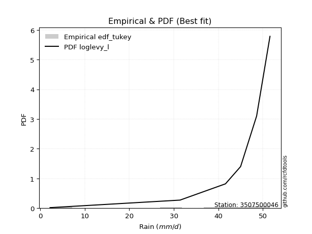</img>

</div>


### 8. EDF Gringorten (1963)

Gringorten plotting position formula is essential for estimating the probability and return periods of extreme events like floods and heavy rainfall. The constant _a=0.44_.

<div align="center">


$P=(m-a)/(n+1-2a)$


</div>


**8.1. Empirical values**

<div align="center">

|                | 0                   | 1                  | 2                   | 3                  | 4                  | 5                  |
|:---------------|:--------------------|:-------------------|:--------------------|:-------------------|:-------------------|:-------------------|
| date           | 2025                | 2023               | 2022                | 2021               | 2019               | 2020               |
| x              | 2.2                 | 31.4               | 41.6                | 45.0               | 48.6               | 51.6               |
| m              | 1                   | 2                  | 3                   | 4                  | 5                  | 6                  |
| empirical_dist | edf_gringorten      | edf_gringorten     | edf_gringorten      | edf_gringorten     | edf_gringorten     | edf_gringorten     |
| empirical      | 0.09150326797385622 | 0.2549019607843137 | 0.41830065359477125 | 0.5816993464052288 | 0.7450980392156862 | 0.9084967320261437 |
| empirical_tr   | 1.1007194244604317  | 1.3421052631578947 | 1.7191011235955058  | 2.3906250000000004 | 3.9230769230769216 | 10.928571428571415 |

</div>


**8.2. Kolmogorov-Smirnov fit test (sorted by Δ)**


<div align="center">

|                | 0                   | 1                   | 2                  | 3                  | 4                   | 5                   | 6                   | 7                   | 8                   | 9                   | 10                  | 11                  | 12                  | 13                | 14                  | 15                  | 16                  | 17               | 18                  | 19                  | 20                 | 21                  | 22                  | 23                 | 24                  | 25                  | 26                  | 27                  | 28                  | 29                 | 30                  | 31                  | 32                  | 33                  | 34                  | 35                  | 36                  | 37                  | 38                  | 39                  | 40                  | 41                  | 42                  | 43                 | 44                  | 45                  | 46                  | 47                  | 48                  | 49                  | 50                  | 51                  | 52                 | 53                 | 54                  | 55                  | 56                  | 57                 | 58                 | 59                  | 60                 | 61                 | 62                 | 63                  | 64                 | 65                  | 66                  | 67                 | 68                  | 69                  | 70                 | 71                 | 72                  | 73                 | 74                | 75                 | 76                 | 77                 | 78                 | 79                 | 80                  | 81                  | 82                  | 83                 | 84                 | 85                 | 86                  | 87                 | 88                 | 89                 | 90                  | 91                  | 92                 | 93                 | 94                 | 95                  | 96                | 97                 | 98                  | 99                 | 100                | 101                 | 102                | 103                 | 104                | 105                | 106                | 107                 | 108                 | 109                | 110                | 111                 | 112                | 113                 | 114                 | 115                | 116                | 117                | 118                 | 119               | 120                | 121                 | 122                | 123                | 124                | 125                | 126                | 127                | 128                | 129                 | 130                 | 131                | 132                 | 133                 | 134                 | 135                | 136                | 137                | 138                | 139                | 140                | 141                | 142                | 143                | 144                | 145                | 146                | 147                | 148                | 149                | 150                | 151                | 152               | 153                | 154                | 155               | 156                | 157                | 158                | 159               |
|:---------------|:--------------------|:--------------------|:-------------------|:-------------------|:--------------------|:--------------------|:--------------------|:--------------------|:--------------------|:--------------------|:--------------------|:--------------------|:--------------------|:------------------|:--------------------|:--------------------|:--------------------|:-----------------|:--------------------|:--------------------|:-------------------|:--------------------|:--------------------|:-------------------|:--------------------|:--------------------|:--------------------|:--------------------|:--------------------|:-------------------|:--------------------|:--------------------|:--------------------|:--------------------|:--------------------|:--------------------|:--------------------|:--------------------|:--------------------|:--------------------|:--------------------|:--------------------|:--------------------|:-------------------|:--------------------|:--------------------|:--------------------|:--------------------|:--------------------|:--------------------|:--------------------|:--------------------|:-------------------|:-------------------|:--------------------|:--------------------|:--------------------|:-------------------|:-------------------|:--------------------|:-------------------|:-------------------|:-------------------|:--------------------|:-------------------|:--------------------|:--------------------|:-------------------|:--------------------|:--------------------|:-------------------|:-------------------|:--------------------|:-------------------|:------------------|:-------------------|:-------------------|:-------------------|:-------------------|:-------------------|:--------------------|:--------------------|:--------------------|:-------------------|:-------------------|:-------------------|:--------------------|:-------------------|:-------------------|:-------------------|:--------------------|:--------------------|:-------------------|:-------------------|:-------------------|:--------------------|:------------------|:-------------------|:--------------------|:-------------------|:-------------------|:--------------------|:-------------------|:--------------------|:-------------------|:-------------------|:-------------------|:--------------------|:--------------------|:-------------------|:-------------------|:--------------------|:-------------------|:--------------------|:--------------------|:-------------------|:-------------------|:-------------------|:--------------------|:------------------|:-------------------|:--------------------|:-------------------|:-------------------|:-------------------|:-------------------|:-------------------|:-------------------|:-------------------|:--------------------|:--------------------|:-------------------|:--------------------|:--------------------|:--------------------|:-------------------|:-------------------|:-------------------|:-------------------|:-------------------|:-------------------|:-------------------|:-------------------|:-------------------|:-------------------|:-------------------|:-------------------|:-------------------|:-------------------|:-------------------|:-------------------|:-------------------|:------------------|:-------------------|:-------------------|:------------------|:-------------------|:-------------------|:-------------------|:------------------|
| station        | 3507500046          | 3507500046          | 3507500046         | 3507500046         | 3507500046          | 3507500046          | 3507500046          | 3507500046          | 3507500046          | 3507500046          | 3507500046          | 3507500046          | 3507500046          | 3507500046        | 3507500046          | 3507500046          | 3507500046          | 3507500046       | 3507500046          | 3507500046          | 3507500046         | 3507500046          | 3507500046          | 3507500046         | 3507500046          | 3507500046          | 3507500046          | 3507500046          | 3507500046          | 3507500046         | 3507500046          | 3507500046          | 3507500046          | 3507500046          | 3507500046          | 3507500046          | 3507500046          | 3507500046          | 3507500046          | 3507500046          | 3507500046          | 3507500046          | 3507500046          | 3507500046         | 3507500046          | 3507500046          | 3507500046          | 3507500046          | 3507500046          | 3507500046          | 3507500046          | 3507500046          | 3507500046         | 3507500046         | 3507500046          | 3507500046          | 3507500046          | 3507500046         | 3507500046         | 3507500046          | 3507500046         | 3507500046         | 3507500046         | 3507500046          | 3507500046         | 3507500046          | 3507500046          | 3507500046         | 3507500046          | 3507500046          | 3507500046         | 3507500046         | 3507500046          | 3507500046         | 3507500046        | 3507500046         | 3507500046         | 3507500046         | 3507500046         | 3507500046         | 3507500046          | 3507500046          | 3507500046          | 3507500046         | 3507500046         | 3507500046         | 3507500046          | 3507500046         | 3507500046         | 3507500046         | 3507500046          | 3507500046          | 3507500046         | 3507500046         | 3507500046         | 3507500046          | 3507500046        | 3507500046         | 3507500046          | 3507500046         | 3507500046         | 3507500046          | 3507500046         | 3507500046          | 3507500046         | 3507500046         | 3507500046         | 3507500046          | 3507500046          | 3507500046         | 3507500046         | 3507500046          | 3507500046         | 3507500046          | 3507500046          | 3507500046         | 3507500046         | 3507500046         | 3507500046          | 3507500046        | 3507500046         | 3507500046          | 3507500046         | 3507500046         | 3507500046         | 3507500046         | 3507500046         | 3507500046         | 3507500046         | 3507500046          | 3507500046          | 3507500046         | 3507500046          | 3507500046          | 3507500046          | 3507500046         | 3507500046         | 3507500046         | 3507500046         | 3507500046         | 3507500046         | 3507500046         | 3507500046         | 3507500046         | 3507500046         | 3507500046         | 3507500046         | 3507500046         | 3507500046         | 3507500046         | 3507500046         | 3507500046         | 3507500046        | 3507500046         | 3507500046         | 3507500046        | 3507500046         | 3507500046         | 3507500046         | 3507500046        |
| empirical_dist | edf_gringorten      | edf_gringorten      | edf_gringorten     | edf_gringorten     | edf_gringorten      | edf_gringorten      | edf_gringorten      | edf_gringorten      | edf_gringorten      | edf_gringorten      | edf_gringorten      | edf_gringorten      | edf_gringorten      | edf_gringorten    | edf_gringorten      | edf_gringorten      | edf_gringorten      | edf_gringorten   | edf_gringorten      | edf_gringorten      | edf_gringorten     | edf_gringorten      | edf_gringorten      | edf_gringorten     | edf_gringorten      | edf_gringorten      | edf_gringorten      | edf_gringorten      | edf_gringorten      | edf_gringorten     | edf_gringorten      | edf_gringorten      | edf_gringorten      | edf_gringorten      | edf_gringorten      | edf_gringorten      | edf_gringorten      | edf_gringorten      | edf_gringorten      | edf_gringorten      | edf_gringorten      | edf_gringorten      | edf_gringorten      | edf_gringorten     | edf_gringorten      | edf_gringorten      | edf_gringorten      | edf_gringorten      | edf_gringorten      | edf_gringorten      | edf_gringorten      | edf_gringorten      | edf_gringorten     | edf_gringorten     | edf_gringorten      | edf_gringorten      | edf_gringorten      | edf_gringorten     | edf_gringorten     | edf_gringorten      | edf_gringorten     | edf_gringorten     | edf_gringorten     | edf_gringorten      | edf_gringorten     | edf_gringorten      | edf_gringorten      | edf_gringorten     | edf_gringorten      | edf_gringorten      | edf_gringorten     | edf_gringorten     | edf_gringorten      | edf_gringorten     | edf_gringorten    | edf_gringorten     | edf_gringorten     | edf_gringorten     | edf_gringorten     | edf_gringorten     | edf_gringorten      | edf_gringorten      | edf_gringorten      | edf_gringorten     | edf_gringorten     | edf_gringorten     | edf_gringorten      | edf_gringorten     | edf_gringorten     | edf_gringorten     | edf_gringorten      | edf_gringorten      | edf_gringorten     | edf_gringorten     | edf_gringorten     | edf_gringorten      | edf_gringorten    | edf_gringorten     | edf_gringorten      | edf_gringorten     | edf_gringorten     | edf_gringorten      | edf_gringorten     | edf_gringorten      | edf_gringorten     | edf_gringorten     | edf_gringorten     | edf_gringorten      | edf_gringorten      | edf_gringorten     | edf_gringorten     | edf_gringorten      | edf_gringorten     | edf_gringorten      | edf_gringorten      | edf_gringorten     | edf_gringorten     | edf_gringorten     | edf_gringorten      | edf_gringorten    | edf_gringorten     | edf_gringorten      | edf_gringorten     | edf_gringorten     | edf_gringorten     | edf_gringorten     | edf_gringorten     | edf_gringorten     | edf_gringorten     | edf_gringorten      | edf_gringorten      | edf_gringorten     | edf_gringorten      | edf_gringorten      | edf_gringorten      | edf_gringorten     | edf_gringorten     | edf_gringorten     | edf_gringorten     | edf_gringorten     | edf_gringorten     | edf_gringorten     | edf_gringorten     | edf_gringorten     | edf_gringorten     | edf_gringorten     | edf_gringorten     | edf_gringorten     | edf_gringorten     | edf_gringorten     | edf_gringorten     | edf_gringorten     | edf_gringorten    | edf_gringorten     | edf_gringorten     | edf_gringorten    | edf_gringorten     | edf_gringorten     | edf_gringorten     | edf_gringorten    |
| p_dist         | loglevy_l           | argus               | genextreme         | mielke             | genpareto           | levy_l              | pearson3            | vonmises_line       | burr12              | dgamma              | gengamma            | trapezoid           | gumbel_l            | gennorm           | gompertz            | gausshyper          | loggenextreme       | weibull_max      | logt                | semicircular        | dweibull           | anglit              | arcsine             | nakagami           | nct                 | exponnorm           | crystalball         | norm                | f                   | t                  | invweibull          | gamma               | foldnorm            | betaprime           | invgauss            | erlang              | logistic            | invgamma            | genhalflogistic     | maxwell             | hypsecant           | logvonmises_line    | rayleigh            | kstwobign          | truncnorm           | logpearson3         | logburr12           | skewnorm            | ncf                 | rice                | logweibull_min      | loggompertz         | loggumbel_l        | beta               | laplace             | cosine              | halfnorm            | logtrapezoid       | gumbel_r           | logargus            | wrapcauchy         | triang             | logmielke          | halflogistic        | logarcsine         | burr                | logexponweib        | moyal              | loggengamma         | logwrapcauchy       | logsemicircular    | logburr            | loganglit           | logfoldnorm        | logweibull_max    | logf               | logexponnorm       | logcrystalball     | logrice            | lognorm            | logloggamma         | loggennorm          | lognakagami         | logfatiguelife     | lognct             | logncf             | logerlang           | loginvgauss        | loggamma           | loggamma           | genexpon            | logbetaprime        | loginvgamma        | loglogistic        | loginvweibull      | logloglaplace       | logalpha          | loghypsecant       | lomax               | ksone              | logmaxwell         | exponweib           | truncweibull_min   | wald                | loglaplace         | loglaplace         | lograyleigh        | halfgennorm         | logkstwobign        | logdgamma          | johnsonsb          | kappa4              | loggenexpon        | loghalfnorm         | loggumbel_r         | kappa3             | uniform            | logcosine          | loggausshyper       | bradford          | loghalflogistic    | logmoyal            | loglomax           | logdweibull        | johnsonsu          | logtruncnorm       | loghalfgennorm     | logjohnsonsb       | loggenpareto       | loggenhalflogistic  | logskewnorm         | truncexpon         | logtruncweibull_min | logwald             | logbeta             | logtriang          | logksone           | logjohnsonsu       | logkappa4          | logexponpow        | fatiguelife        | logkappa3          | loguniform         | weibull_min        | alpha              | logbradford        | logtruncexpon      | exponpow           | powerlaw           | truncpareto        | logtukeylambda     | logpowerlaw        | logtruncpareto    | logrdist           | loggenlogistic     | rdist             | tukeylambda        | genlogistic        | logvonmises        | vonmises          |
| delta          | 0.07561120304195124 | 0.09058245141862004 | 0.0915032679723008 | 0.0917176971143589 | 0.10256962776819595 | 0.11398739747461406 | 0.11914553322884208 | 0.11939997222960996 | 0.12419906364508387 | 0.12841599014038296 | 0.13235078228463532 | 0.13337069332424206 | 0.13939902557511924 | 0.141431880259953 | 0.14300404375193648 | 0.14508979408326178 | 0.15389342745801066 | 0.15493812505944 | 0.16230615722092878 | 0.17408954499849544 | 0.1770134090391675 | 0.18061371461562886 | 0.19188117103259894 | 0.1946778491813424 | 0.19626852293602864 | 0.19628070842944606 | 0.19628284447738537 | 0.19628285035905363 | 0.19650736296176924 | 0.1974220811768153 | 0.19789875234984072 | 0.19851193306612197 | 0.20004151566080192 | 0.20111130548386763 | 0.20183702850071233 | 0.20543309751507116 | 0.21079367054330717 | 0.21810802450639372 | 0.21844404510642573 | 0.22147930973902868 | 0.22251111029184983 | 0.22644442446348734 | 0.22922537536737037 | 0.2294024582949185 | 0.23114072504900424 | 0.23168967979227106 | 0.23322709058762742 | 0.23646521134964243 | 0.23661592597745745 | 0.24014104036100398 | 0.24044279408349173 | 0.24190914921070722 | 0.2437985640122604 | 0.2499663851122757 | 0.25051729673480866 | 0.25067806735177306 | 0.25138163312820533 | 0.2535374057226514 | 0.2611774411038981 | 0.26164484362223345 | 0.2690767493269062 | 0.2724363901797025 | 0.2793753007250171 | 0.27975428482407677 | 0.2814956763049986 | 0.28174581007418636 | 0.28226645837922554 | 0.2831344292168106 | 0.28407709153976385 | 0.29053839257770997 | 0.2964050939148566 | 0.2974940134095914 | 0.30014420958784693 | 0.3073450291414985 | 0.308188627858588 | 0.3090387828266763 | 0.3091919022446292 | 0.3091922067044578 | 0.3091927325999303 | 0.3091927503656354 | 0.30940521481028044 | 0.30958045812170365 | 0.30960896244624775 | 0.3096303162503766 | 0.3096516859515561 | 0.3106341364456777 | 0.31345538356161307 | 0.3145626143896132 | 0.3147535273439541 | 0.3147535273439541 | 0.31557038296037854 | 0.31651717004511415 | 0.3166633202943363 | 0.3177484487256048 | 0.3198144481682512 | 0.31985709671143114 | 0.322513638347679 | 0.3249273586194188 | 0.32586255010196763 | 0.3296750549072531 | 0.3386081772139168 | 0.33905933446434766 | 0.3433915747176001 | 0.34453447043157576 | 0.3471140126121721 | 0.3471140126121721 | 0.3479627901034421 | 0.35736399585804124 | 0.35784060594439104 | 0.3599134978713201 | 0.3609403499533639 | 0.36296631165809706 | 0.3736756656962973 | 0.37439344207977954 | 0.37859509854774076 | 0.3789363716343756 | 0.3792701966076579 | 0.3827948590899266 | 0.39210074181726495 | 0.400806242300529 | 0.4020953577409335 | 0.40293452180752265 | 0.4036311040339844 | 0.4084967320261199 | 0.4135334500967828 | 0.4161131970650688 | 0.4195831240994752 | 0.4354876061516928 | 0.4367596719197251 | 0.43751454854925753 | 0.45090065786385364 | 0.4604775385588201 | 0.4624343137550967  | 0.47049267992531696 | 0.49809997729507927 | 0.5032808057818499 | 0.5305698684098116 | 0.5518488511888718 | 0.5579866698367294 | 0.5823136622657221 | 0.5850339254518924 | 0.5876640255626979 | 0.5876642342486368 | 0.5931374010746344 | 0.6089259302243254 | 0.6225557297585188 | 0.6396660838822269 | 0.6597506500787041 | 0.6696386329842012 | 0.6992149125949784 | 0.7055016603240487 | 0.7185446149040523 | 0.730134213453294 | 0.7450980340405666 | 0.7450980392156862 | 0.908496732026069 | 0.9084967320261367 | 0.9084967320261437 | 1.1167334504835225 | 7.618325640286196 |
| deltao         | 0.530385761606      | 0.530385761606      | 0.530385761606     | 0.530385761606     | 0.530385761606      | 0.530385761606      | 0.530385761606      | 0.530385761606      | 0.530385761606      | 0.530385761606      | 0.530385761606      | 0.530385761606      | 0.530385761606      | 0.530385761606    | 0.530385761606      | 0.530385761606      | 0.530385761606      | 0.530385761606   | 0.530385761606      | 0.530385761606      | 0.530385761606     | 0.530385761606      | 0.530385761606      | 0.530385761606     | 0.530385761606      | 0.530385761606      | 0.530385761606      | 0.530385761606      | 0.530385761606      | 0.530385761606     | 0.530385761606      | 0.530385761606      | 0.530385761606      | 0.530385761606      | 0.530385761606      | 0.530385761606      | 0.530385761606      | 0.530385761606      | 0.530385761606      | 0.530385761606      | 0.530385761606      | 0.530385761606      | 0.530385761606      | 0.530385761606     | 0.530385761606      | 0.530385761606      | 0.530385761606      | 0.530385761606      | 0.530385761606      | 0.530385761606      | 0.530385761606      | 0.530385761606      | 0.530385761606     | 0.530385761606     | 0.530385761606      | 0.530385761606      | 0.530385761606      | 0.530385761606     | 0.530385761606     | 0.530385761606      | 0.530385761606     | 0.530385761606     | 0.530385761606     | 0.530385761606      | 0.530385761606     | 0.530385761606      | 0.530385761606      | 0.530385761606     | 0.530385761606      | 0.530385761606      | 0.530385761606     | 0.530385761606     | 0.530385761606      | 0.530385761606     | 0.530385761606    | 0.530385761606     | 0.530385761606     | 0.530385761606     | 0.530385761606     | 0.530385761606     | 0.530385761606      | 0.530385761606      | 0.530385761606      | 0.530385761606     | 0.530385761606     | 0.530385761606     | 0.530385761606      | 0.530385761606     | 0.530385761606     | 0.530385761606     | 0.530385761606      | 0.530385761606      | 0.530385761606     | 0.530385761606     | 0.530385761606     | 0.530385761606      | 0.530385761606    | 0.530385761606     | 0.530385761606      | 0.530385761606     | 0.530385761606     | 0.530385761606      | 0.530385761606     | 0.530385761606      | 0.530385761606     | 0.530385761606     | 0.530385761606     | 0.530385761606      | 0.530385761606      | 0.530385761606     | 0.530385761606     | 0.530385761606      | 0.530385761606     | 0.530385761606      | 0.530385761606      | 0.530385761606     | 0.530385761606     | 0.530385761606     | 0.530385761606      | 0.530385761606    | 0.530385761606     | 0.530385761606      | 0.530385761606     | 0.530385761606     | 0.530385761606     | 0.530385761606     | 0.530385761606     | 0.530385761606     | 0.530385761606     | 0.530385761606      | 0.530385761606      | 0.530385761606     | 0.530385761606      | 0.530385761606      | 0.530385761606      | 0.530385761606     | 0.530385761606     | 0.530385761606     | 0.530385761606     | 0.530385761606     | 0.530385761606     | 0.530385761606     | 0.530385761606     | 0.530385761606     | 0.530385761606     | 0.530385761606     | 0.530385761606     | 0.530385761606     | 0.530385761606     | 0.530385761606     | 0.530385761606     | 0.530385761606     | 0.530385761606    | 0.530385761606     | 0.530385761606     | 0.530385761606    | 0.530385761606     | 0.530385761606     | 0.530385761606     | 0.530385761606    |
| eval           | Δo > Δ              | Δo > Δ              | Δo > Δ             | Δo > Δ             | Δo > Δ              | Δo > Δ              | Δo > Δ              | Δo > Δ              | Δo > Δ              | Δo > Δ              | Δo > Δ              | Δo > Δ              | Δo > Δ              | Δo > Δ            | Δo > Δ              | Δo > Δ              | Δo > Δ              | Δo > Δ           | Δo > Δ              | Δo > Δ              | Δo > Δ             | Δo > Δ              | Δo > Δ              | Δo > Δ             | Δo > Δ              | Δo > Δ              | Δo > Δ              | Δo > Δ              | Δo > Δ              | Δo > Δ             | Δo > Δ              | Δo > Δ              | Δo > Δ              | Δo > Δ              | Δo > Δ              | Δo > Δ              | Δo > Δ              | Δo > Δ              | Δo > Δ              | Δo > Δ              | Δo > Δ              | Δo > Δ              | Δo > Δ              | Δo > Δ             | Δo > Δ              | Δo > Δ              | Δo > Δ              | Δo > Δ              | Δo > Δ              | Δo > Δ              | Δo > Δ              | Δo > Δ              | Δo > Δ             | Δo > Δ             | Δo > Δ              | Δo > Δ              | Δo > Δ              | Δo > Δ             | Δo > Δ             | Δo > Δ              | Δo > Δ             | Δo > Δ             | Δo > Δ             | Δo > Δ              | Δo > Δ             | Δo > Δ              | Δo > Δ              | Δo > Δ             | Δo > Δ              | Δo > Δ              | Δo > Δ             | Δo > Δ             | Δo > Δ              | Δo > Δ             | Δo > Δ            | Δo > Δ             | Δo > Δ             | Δo > Δ             | Δo > Δ             | Δo > Δ             | Δo > Δ              | Δo > Δ              | Δo > Δ              | Δo > Δ             | Δo > Δ             | Δo > Δ             | Δo > Δ              | Δo > Δ             | Δo > Δ             | Δo > Δ             | Δo > Δ              | Δo > Δ              | Δo > Δ             | Δo > Δ             | Δo > Δ             | Δo > Δ              | Δo > Δ            | Δo > Δ             | Δo > Δ              | Δo > Δ             | Δo > Δ             | Δo > Δ              | Δo > Δ             | Δo > Δ              | Δo > Δ             | Δo > Δ             | Δo > Δ             | Δo > Δ              | Δo > Δ              | Δo > Δ             | Δo > Δ             | Δo > Δ              | Δo > Δ             | Δo > Δ              | Δo > Δ              | Δo > Δ             | Δo > Δ             | Δo > Δ             | Δo > Δ              | Δo > Δ            | Δo > Δ             | Δo > Δ              | Δo > Δ             | Δo > Δ             | Δo > Δ             | Δo > Δ             | Δo > Δ             | Δo > Δ             | Δo > Δ             | Δo > Δ              | Δo > Δ              | Δo > Δ             | Δo > Δ              | Δo > Δ              | Δo > Δ              | Δo > Δ             | Δo <= Δ            | Δo <= Δ            | Δo <= Δ            | Δo <= Δ            | Δo <= Δ            | Δo <= Δ            | Δo <= Δ            | Δo <= Δ            | Δo <= Δ            | Δo <= Δ            | Δo <= Δ            | Δo <= Δ            | Δo <= Δ            | Δo <= Δ            | Δo <= Δ            | Δo <= Δ            | Δo <= Δ           | Δo <= Δ            | Δo <= Δ            | Δo <= Δ           | Δo <= Δ            | Δo <= Δ            | Δo <= Δ            | Δo <= Δ           |
| fit            | 1                   | 1                   | 1                  | 1                  | 1                   | 1                   | 1                   | 1                   | 1                   | 1                   | 1                   | 1                   | 1                   | 1                 | 1                   | 1                   | 1                   | 1                | 1                   | 1                   | 1                  | 1                   | 1                   | 1                  | 1                   | 1                   | 1                   | 1                   | 1                   | 1                  | 1                   | 1                   | 1                   | 1                   | 1                   | 1                   | 1                   | 1                   | 1                   | 1                   | 1                   | 1                   | 1                   | 1                  | 1                   | 1                   | 1                   | 1                   | 1                   | 1                   | 1                   | 1                   | 1                  | 1                  | 1                   | 1                   | 1                   | 1                  | 1                  | 1                   | 1                  | 1                  | 1                  | 1                   | 1                  | 1                   | 1                   | 1                  | 1                   | 1                   | 1                  | 1                  | 1                   | 1                  | 1                 | 1                  | 1                  | 1                  | 1                  | 1                  | 1                   | 1                   | 1                   | 1                  | 1                  | 1                  | 1                   | 1                  | 1                  | 1                  | 1                   | 1                   | 1                  | 1                  | 1                  | 1                   | 1                 | 1                  | 1                   | 1                  | 1                  | 1                   | 1                  | 1                   | 1                  | 1                  | 1                  | 1                   | 1                   | 1                  | 1                  | 1                   | 1                  | 1                   | 1                   | 1                  | 1                  | 1                  | 1                   | 1                 | 1                  | 1                   | 1                  | 1                  | 1                  | 1                  | 1                  | 1                  | 1                  | 1                   | 1                   | 1                  | 1                   | 1                   | 1                   | 1                  | 0                  | 0                  | 0                  | 0                  | 0                  | 0                  | 0                  | 0                  | 0                  | 0                  | 0                  | 0                  | 0                  | 0                  | 0                  | 0                  | 0                 | 0                  | 0                  | 0                 | 0                  | 0                  | 0                  | 0                 |
| n              | 6                   | 6                   | 6                  | 6                  | 6                   | 6                   | 6                   | 6                   | 6                   | 6                   | 6                   | 6                   | 6                   | 6                 | 6                   | 6                   | 6                   | 6                | 6                   | 6                   | 6                  | 6                   | 6                   | 6                  | 6                   | 6                   | 6                   | 6                   | 6                   | 6                  | 6                   | 6                   | 6                   | 6                   | 6                   | 6                   | 6                   | 6                   | 6                   | 6                   | 6                   | 6                   | 6                   | 6                  | 6                   | 6                   | 6                   | 6                   | 6                   | 6                   | 6                   | 6                   | 6                  | 6                  | 6                   | 6                   | 6                   | 6                  | 6                  | 6                   | 6                  | 6                  | 6                  | 6                   | 6                  | 6                   | 6                   | 6                  | 6                   | 6                   | 6                  | 6                  | 6                   | 6                  | 6                 | 6                  | 6                  | 6                  | 6                  | 6                  | 6                   | 6                   | 6                   | 6                  | 6                  | 6                  | 6                   | 6                  | 6                  | 6                  | 6                   | 6                   | 6                  | 6                  | 6                  | 6                   | 6                 | 6                  | 6                   | 6                  | 6                  | 6                   | 6                  | 6                   | 6                  | 6                  | 6                  | 6                   | 6                   | 6                  | 6                  | 6                   | 6                  | 6                   | 6                   | 6                  | 6                  | 6                  | 6                   | 6                 | 6                  | 6                   | 6                  | 6                  | 6                  | 6                  | 6                  | 6                  | 6                  | 6                   | 6                   | 6                  | 6                   | 6                   | 6                   | 6                  | 6                  | 6                  | 6                  | 6                  | 6                  | 6                  | 6                  | 6                  | 6                  | 6                  | 6                  | 6                  | 6                  | 6                  | 6                  | 6                  | 6                 | 6                  | 6                  | 6                 | 6                  | 6                  | 6                  | 6                 |
| best_fit       | 1                   | 0                   | 0                  | 0                  | 0                   | 0                   | 0                   | 0                   | 0                   | 0                   | 0                   | 0                   | 0                   | 0                 | 0                   | 0                   | 0                   | 0                | 0                   | 0                   | 0                  | 0                   | 0                   | 0                  | 0                   | 0                   | 0                   | 0                   | 0                   | 0                  | 0                   | 0                   | 0                   | 0                   | 0                   | 0                   | 0                   | 0                   | 0                   | 0                   | 0                   | 0                   | 0                   | 0                  | 0                   | 0                   | 0                   | 0                   | 0                   | 0                   | 0                   | 0                   | 0                  | 0                  | 0                   | 0                   | 0                   | 0                  | 0                  | 0                   | 0                  | 0                  | 0                  | 0                   | 0                  | 0                   | 0                   | 0                  | 0                   | 0                   | 0                  | 0                  | 0                   | 0                  | 0                 | 0                  | 0                  | 0                  | 0                  | 0                  | 0                   | 0                   | 0                   | 0                  | 0                  | 0                  | 0                   | 0                  | 0                  | 0                  | 0                   | 0                   | 0                  | 0                  | 0                  | 0                   | 0                 | 0                  | 0                   | 0                  | 0                  | 0                   | 0                  | 0                   | 0                  | 0                  | 0                  | 0                   | 0                   | 0                  | 0                  | 0                   | 0                  | 0                   | 0                   | 0                  | 0                  | 0                  | 0                   | 0                 | 0                  | 0                   | 0                  | 0                  | 0                  | 0                  | 0                  | 0                  | 0                  | 0                   | 0                   | 0                  | 0                   | 0                   | 0                   | 0                  | 0                  | 0                  | 0                  | 0                  | 0                  | 0                  | 0                  | 0                  | 0                  | 0                  | 0                  | 0                  | 0                  | 0                  | 0                  | 0                  | 0                 | 0                  | 0                  | 0                 | 0                  | 0                  | 0                  | 0                 |
| best_fit_sort  | 1                   | 2                   | 3                  | 4                  | 5                   | 6                   | 7                   | 8                   | 9                   | 10                  | 11                  | 12                  | 13                  | 14                | 15                  | 16                  | 17                  | 18               | 19                  | 20                  | 21                 | 22                  | 23                  | 24                 | 25                  | 26                  | 27                  | 28                  | 29                  | 30                 | 31                  | 32                  | 33                  | 34                  | 35                  | 36                  | 37                  | 38                  | 39                  | 40                  | 41                  | 42                  | 43                  | 44                 | 45                  | 46                  | 47                  | 48                  | 49                  | 50                  | 51                  | 52                  | 53                 | 54                 | 55                  | 56                  | 57                  | 58                 | 59                 | 60                  | 61                 | 62                 | 63                 | 64                  | 65                 | 66                  | 67                  | 68                 | 69                  | 70                  | 71                 | 72                 | 73                  | 74                 | 75                | 76                 | 77                 | 78                 | 79                 | 80                 | 81                  | 82                  | 83                  | 84                 | 85                 | 86                 | 87                  | 88                 | 89                 | 90                 | 91                  | 92                  | 93                 | 94                 | 95                 | 96                  | 97                | 98                 | 99                  | 100                | 101                | 102                 | 103                | 104                 | 105                | 106                | 107                | 108                 | 109                 | 110                | 111                | 112                 | 113                | 114                 | 115                 | 116                | 117                | 118                | 119                 | 120               | 121                | 122                 | 123                | 124                | 125                | 126                | 127                | 128                | 129                | 130                 | 131                 | 132                | 133                 | 134                 | 135                 | 136                | 137                | 138                | 139                | 140                | 141                | 142                | 143                | 144                | 145                | 146                | 147                | 148                | 149                | 150                | 151                | 152                | 153               | 154                | 155                | 156               | 157                | 158                | 159                | 160               |

</div>


**8.3. Best fit**

<div align="center">

|   id |    station | empirical_dist   | p_dist    |     delta |   deltao | eval   |   fit |   n |   best_fit |   best_fit_sort |
|-----:|-----------:|:-----------------|:----------|----------:|---------:|:-------|------:|----:|-----------:|----------------:|
|    0 | 3507500046 | edf_gringorten   | loglevy_l | 0.0756112 | 0.530386 | Δo > Δ |     1 |   6 |          1 |               1 |

</div>


<div align="center">

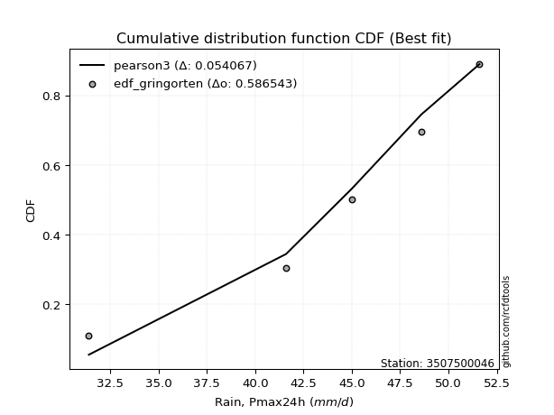</img>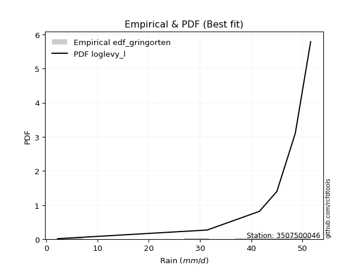</img>

</div>


### 9. EDF Filliben (1975)

The specific values of the constants (0.3175) (often denoted as $alpha$) and (0.365) are derived from a method proposed by James J. Filliben in a 1975 paper. This particular formula is the mean value of the $i$-th order statistic of the normal distribution and is considered a robust and effective plotting position formula for the normal probability plot correlation coefficient test for normality.

<div align="center">


$P=(m-0.3175)/(n+0.365)$


</div>


**9.1. Empirical values**

<div align="center">

|                | 0                   | 1                   | 2                  | 3                  | 4                  | 5                  |
|:---------------|:--------------------|:--------------------|:-------------------|:-------------------|:-------------------|:-------------------|
| date           | 2025                | 2023                | 2022               | 2021               | 2019               | 2020               |
| x              | 2.2                 | 31.4                | 41.6               | 45.0               | 48.6               | 51.6               |
| m              | 1                   | 2                   | 3                  | 4                  | 5                  | 6                  |
| empirical_dist | edf_filliben        | edf_filliben        | edf_filliben       | edf_filliben       | edf_filliben       | edf_filliben       |
| empirical      | 0.10722702278083267 | 0.26433621366849963 | 0.4214454045561665 | 0.5785545954438335 | 0.7356637863315004 | 0.8927729772191673 |
| empirical_tr   | 1.1201055873295205  | 1.3593166043780034  | 1.7284453496266123 | 2.3727865796831313 | 3.783060921248143  | 9.326007326007321  |

</div>


**9.2. Kolmogorov-Smirnov fit test (sorted by Δ)**


<div align="center">

|                | 0                   | 1                   | 2                   | 3                   | 4                   | 5                   | 6                  | 7                   | 8                  | 9                   | 10                 | 11                 | 12                  | 13                 | 14                 | 15                  | 16                  | 17                  | 18                  | 19                 | 20                  | 21                  | 22                 | 23                  | 24                  | 25                 | 26                 | 27                  | 28                  | 29                  | 30                  | 31                 | 32                  | 33                  | 34                  | 35                 | 36                 | 37                  | 38                  | 39                  | 40                  | 41                  | 42                  | 43                 | 44                  | 45                  | 46                  | 47                  | 48                  | 49                 | 50                 | 51                  | 52                  | 53                  | 54                  | 55                 | 56                 | 57                  | 58                  | 59                 | 60                  | 61                  | 62                 | 63                 | 64                 | 65                 | 66                  | 67                 | 68                 | 69                  | 70                  | 71                | 72                  | 73                 | 74                 | 75                  | 76                 | 77                  | 78                 | 79                 | 80                 | 81                 | 82                 | 83                  | 84                  | 85                  | 86                 | 87                 | 88                 | 89                  | 90                 | 91                 | 92                 | 93                 | 94                 | 95                 | 96                  | 97                  | 98                 | 99                 | 100                 | 101                 | 102                | 103                | 104                | 105                 | 106                | 107                | 108                | 109                | 110                | 111                | 112                 | 113                | 114                 | 115                | 116                 | 117                | 118                 | 119                | 120                | 121                | 122                 | 123                 | 124               | 125                 | 126                 | 127                 | 128                 | 129                | 130                 | 131                | 132                 | 133                 | 134                | 135                 | 136                | 137                | 138                | 139                | 140                | 141                | 142                | 143                | 144                | 145                | 146               | 147                | 148                | 149                | 150                | 151                | 152               | 153                | 154                | 155                | 156                | 157                | 158                | 159               |
|:---------------|:--------------------|:--------------------|:--------------------|:--------------------|:--------------------|:--------------------|:-------------------|:--------------------|:-------------------|:--------------------|:-------------------|:-------------------|:--------------------|:-------------------|:-------------------|:--------------------|:--------------------|:--------------------|:--------------------|:-------------------|:--------------------|:--------------------|:-------------------|:--------------------|:--------------------|:-------------------|:-------------------|:--------------------|:--------------------|:--------------------|:--------------------|:-------------------|:--------------------|:--------------------|:--------------------|:-------------------|:-------------------|:--------------------|:--------------------|:--------------------|:--------------------|:--------------------|:--------------------|:-------------------|:--------------------|:--------------------|:--------------------|:--------------------|:--------------------|:-------------------|:-------------------|:--------------------|:--------------------|:--------------------|:--------------------|:-------------------|:-------------------|:--------------------|:--------------------|:-------------------|:--------------------|:--------------------|:-------------------|:-------------------|:-------------------|:-------------------|:--------------------|:-------------------|:-------------------|:--------------------|:--------------------|:------------------|:--------------------|:-------------------|:-------------------|:--------------------|:-------------------|:--------------------|:-------------------|:-------------------|:-------------------|:-------------------|:-------------------|:--------------------|:--------------------|:--------------------|:-------------------|:-------------------|:-------------------|:--------------------|:-------------------|:-------------------|:-------------------|:-------------------|:-------------------|:-------------------|:--------------------|:--------------------|:-------------------|:-------------------|:--------------------|:--------------------|:-------------------|:-------------------|:-------------------|:--------------------|:-------------------|:-------------------|:-------------------|:-------------------|:-------------------|:-------------------|:--------------------|:-------------------|:--------------------|:-------------------|:--------------------|:-------------------|:--------------------|:-------------------|:-------------------|:-------------------|:--------------------|:--------------------|:------------------|:--------------------|:--------------------|:--------------------|:--------------------|:-------------------|:--------------------|:-------------------|:--------------------|:--------------------|:-------------------|:--------------------|:-------------------|:-------------------|:-------------------|:-------------------|:-------------------|:-------------------|:-------------------|:-------------------|:-------------------|:-------------------|:------------------|:-------------------|:-------------------|:-------------------|:-------------------|:-------------------|:------------------|:-------------------|:-------------------|:-------------------|:-------------------|:-------------------|:-------------------|:------------------|
| station        | 3507500046          | 3507500046          | 3507500046          | 3507500046          | 3507500046          | 3507500046          | 3507500046         | 3507500046          | 3507500046         | 3507500046          | 3507500046         | 3507500046         | 3507500046          | 3507500046         | 3507500046         | 3507500046          | 3507500046          | 3507500046          | 3507500046          | 3507500046         | 3507500046          | 3507500046          | 3507500046         | 3507500046          | 3507500046          | 3507500046         | 3507500046         | 3507500046          | 3507500046          | 3507500046          | 3507500046          | 3507500046         | 3507500046          | 3507500046          | 3507500046          | 3507500046         | 3507500046         | 3507500046          | 3507500046          | 3507500046          | 3507500046          | 3507500046          | 3507500046          | 3507500046         | 3507500046          | 3507500046          | 3507500046          | 3507500046          | 3507500046          | 3507500046         | 3507500046         | 3507500046          | 3507500046          | 3507500046          | 3507500046          | 3507500046         | 3507500046         | 3507500046          | 3507500046          | 3507500046         | 3507500046          | 3507500046          | 3507500046         | 3507500046         | 3507500046         | 3507500046         | 3507500046          | 3507500046         | 3507500046         | 3507500046          | 3507500046          | 3507500046        | 3507500046          | 3507500046         | 3507500046         | 3507500046          | 3507500046         | 3507500046          | 3507500046         | 3507500046         | 3507500046         | 3507500046         | 3507500046         | 3507500046          | 3507500046          | 3507500046          | 3507500046         | 3507500046         | 3507500046         | 3507500046          | 3507500046         | 3507500046         | 3507500046         | 3507500046         | 3507500046         | 3507500046         | 3507500046          | 3507500046          | 3507500046         | 3507500046         | 3507500046          | 3507500046          | 3507500046         | 3507500046         | 3507500046         | 3507500046          | 3507500046         | 3507500046         | 3507500046         | 3507500046         | 3507500046         | 3507500046         | 3507500046          | 3507500046         | 3507500046          | 3507500046         | 3507500046          | 3507500046         | 3507500046          | 3507500046         | 3507500046         | 3507500046         | 3507500046          | 3507500046          | 3507500046        | 3507500046          | 3507500046          | 3507500046          | 3507500046          | 3507500046         | 3507500046          | 3507500046         | 3507500046          | 3507500046          | 3507500046         | 3507500046          | 3507500046         | 3507500046         | 3507500046         | 3507500046         | 3507500046         | 3507500046         | 3507500046         | 3507500046         | 3507500046         | 3507500046         | 3507500046        | 3507500046         | 3507500046         | 3507500046         | 3507500046         | 3507500046         | 3507500046        | 3507500046         | 3507500046         | 3507500046         | 3507500046         | 3507500046         | 3507500046         | 3507500046        |
| empirical_dist | edf_filliben        | edf_filliben        | edf_filliben        | edf_filliben        | edf_filliben        | edf_filliben        | edf_filliben       | edf_filliben        | edf_filliben       | edf_filliben        | edf_filliben       | edf_filliben       | edf_filliben        | edf_filliben       | edf_filliben       | edf_filliben        | edf_filliben        | edf_filliben        | edf_filliben        | edf_filliben       | edf_filliben        | edf_filliben        | edf_filliben       | edf_filliben        | edf_filliben        | edf_filliben       | edf_filliben       | edf_filliben        | edf_filliben        | edf_filliben        | edf_filliben        | edf_filliben       | edf_filliben        | edf_filliben        | edf_filliben        | edf_filliben       | edf_filliben       | edf_filliben        | edf_filliben        | edf_filliben        | edf_filliben        | edf_filliben        | edf_filliben        | edf_filliben       | edf_filliben        | edf_filliben        | edf_filliben        | edf_filliben        | edf_filliben        | edf_filliben       | edf_filliben       | edf_filliben        | edf_filliben        | edf_filliben        | edf_filliben        | edf_filliben       | edf_filliben       | edf_filliben        | edf_filliben        | edf_filliben       | edf_filliben        | edf_filliben        | edf_filliben       | edf_filliben       | edf_filliben       | edf_filliben       | edf_filliben        | edf_filliben       | edf_filliben       | edf_filliben        | edf_filliben        | edf_filliben      | edf_filliben        | edf_filliben       | edf_filliben       | edf_filliben        | edf_filliben       | edf_filliben        | edf_filliben       | edf_filliben       | edf_filliben       | edf_filliben       | edf_filliben       | edf_filliben        | edf_filliben        | edf_filliben        | edf_filliben       | edf_filliben       | edf_filliben       | edf_filliben        | edf_filliben       | edf_filliben       | edf_filliben       | edf_filliben       | edf_filliben       | edf_filliben       | edf_filliben        | edf_filliben        | edf_filliben       | edf_filliben       | edf_filliben        | edf_filliben        | edf_filliben       | edf_filliben       | edf_filliben       | edf_filliben        | edf_filliben       | edf_filliben       | edf_filliben       | edf_filliben       | edf_filliben       | edf_filliben       | edf_filliben        | edf_filliben       | edf_filliben        | edf_filliben       | edf_filliben        | edf_filliben       | edf_filliben        | edf_filliben       | edf_filliben       | edf_filliben       | edf_filliben        | edf_filliben        | edf_filliben      | edf_filliben        | edf_filliben        | edf_filliben        | edf_filliben        | edf_filliben       | edf_filliben        | edf_filliben       | edf_filliben        | edf_filliben        | edf_filliben       | edf_filliben        | edf_filliben       | edf_filliben       | edf_filliben       | edf_filliben       | edf_filliben       | edf_filliben       | edf_filliben       | edf_filliben       | edf_filliben       | edf_filliben       | edf_filliben      | edf_filliben       | edf_filliben       | edf_filliben       | edf_filliben       | edf_filliben       | edf_filliben      | edf_filliben       | edf_filliben       | edf_filliben       | edf_filliben       | edf_filliben       | edf_filliben       | edf_filliben      |
| p_dist         | loglevy_l           | argus               | levy_l              | mielke              | genpareto           | vonmises_line       | genextreme         | pearson3            | burr12             | gengamma            | trapezoid          | dgamma             | gumbel_l            | gompertz           | gausshyper         | logt                | loggenextreme       | gennorm             | weibull_max         | dweibull           | semicircular        | arcsine             | anglit             | nakagami            | nct                 | exponnorm          | crystalball        | norm                | f                   | t                   | invweibull          | gamma              | foldnorm            | betaprime           | invgauss            | erlang             | logistic           | logvonmises_line    | invgamma            | genhalflogistic     | logpearson3         | maxwell             | hypsecant           | rayleigh           | kstwobign           | truncnorm           | logburr12           | skewnorm            | ncf                 | loggumbel_l        | rice               | logweibull_min      | logtrapezoid        | loggompertz         | beta                | laplace            | cosine             | halfnorm            | gumbel_r            | logargus           | wrapcauchy          | triang              | logarcsine         | logmielke          | halflogistic       | burr               | logexponweib        | moyal              | loggengamma        | logwrapcauchy       | logsemicircular     | loganglit         | logburr             | logfoldnorm        | logweibull_max     | logf                | logexponnorm       | logcrystalball      | logrice            | lognorm            | logfatiguelife     | lognct             | logncf             | logerlang           | logloglaplace       | loginvgauss         | loggamma           | loggamma           | genexpon           | logloggamma         | loggennorm         | lognakagami        | logbetaprime       | loginvgamma        | loglogistic        | loginvweibull      | logalpha            | loghypsecant        | lomax              | ksone              | logmaxwell          | exponweib           | loglaplace         | loglaplace         | lograyleigh        | truncweibull_min    | wald               | logdgamma          | halfgennorm        | logkstwobign       | johnsonsb          | kappa4             | loggenexpon         | loghalfnorm        | loggumbel_r         | logcosine          | kappa3              | uniform            | loggausshyper       | loghalflogistic    | logdweibull        | logmoyal           | loglomax            | bradford            | johnsonsu         | logtruncnorm        | loghalfgennorm      | logjohnsonsb        | loggenpareto        | loggenhalflogistic | logskewnorm         | truncexpon         | logtruncweibull_min | logwald             | logbeta            | logtriang           | logksone           | logjohnsonsu       | logkappa4          | logexponpow        | fatiguelife        | logkappa3          | loguniform         | weibull_min        | alpha              | logbradford        | logtruncexpon     | exponpow           | powerlaw           | truncpareto        | logtukeylambda     | logpowerlaw        | logtruncpareto    | logrdist           | loggenlogistic     | rdist              | tukeylambda        | genlogistic        | logvonmises        | vonmises          |
| delta          | 0.06861114900675702 | 0.08743770045722477 | 0.09826364266763761 | 0.10584052942499234 | 0.10722692152275648 | 0.10722702276608542 | 0.1072270227792772 | 0.11600078226744681 | 0.1210543126836886 | 0.12920603132324004 | 0.1302259423628468 | 0.1315607411017783 | 0.13625427461372397 | 0.1398592927905412 | 0.1419450431218665 | 0.14658240241395237 | 0.15074867649661539 | 0.15086613314413894 | 0.15179337409804472 | 0.1612896542321911 | 0.17094479403710017 | 0.17615741622562253 | 0.1774689636542336 | 0.19153309821994713 | 0.19312377197463337 | 0.1931359574680508 | 0.1931380935159901 | 0.19313809939765836 | 0.19336261200037397 | 0.19427733021542004 | 0.19475400138844545 | 0.1953671821047267 | 0.19689676469940665 | 0.19796655452247236 | 0.19869227753931706 | 0.2022883465536759 | 0.2076489195819119 | 0.21072066965651093 | 0.21496327354499845 | 0.21529929414503046 | 0.21596592498529465 | 0.21833455877763341 | 0.21936635933045456 | 0.2260806244059751 | 0.22625770733352324 | 0.22799597408760897 | 0.23008233962623215 | 0.23332046038824716 | 0.23347117501606218 | 0.2343643111280745 | 0.2369962893996087 | 0.23729804312209646 | 0.23781365091567497 | 0.23876439824931195 | 0.24053213222808995 | 0.2473725457734134 | 0.2475333163903778 | 0.24823688216681006 | 0.25803269014250285 | 0.2585000926608382 | 0.25964249644272025 | 0.26929163921830723 | 0.2720614234208127 | 0.2762305497636218 | 0.2766095338626815 | 0.2786010591127911 | 0.27912170741783027 | 0.2799896782554153 | 0.2809323405783686 | 0.28110413969352405 | 0.28697084103067066 | 0.290709956703661 | 0.29434926244819615 | 0.2979107762573126 | 0.2987543749744021 | 0.29960452994249037 | 0.2997576493604433 | 0.29975795382027187 | 0.2997584797157444 | 0.2997584974814495 | 0.3001960633661907 | 0.3002174330673702 | 0.3011998835614918 | 0.30402113067742714 | 0.30413334190445473 | 0.30512836150542727 | 0.3053192744597682 | 0.3053192744597682 | 0.3061361300761926 | 0.30626046384888517 | 0.3064357071603083 | 0.3064642114848525 | 0.3070829171609282 | 0.3072290674101504 | 0.3083141958414189 | 0.3103801952840653 | 0.31307938546349307 | 0.31549310573523287 | 0.3164282972177817 | 0.3265303039458578 | 0.32917392432973086 | 0.32962508158016174 | 0.3376797597279862 | 0.3376797597279862 | 0.3385285372192562 | 0.34024682375620485 | 0.3413897194701805 | 0.3441897430643437 | 0.3479297429738553 | 0.3484063530602051 | 0.3515060970691781 | 0.3598215606967018 | 0.36424141281211136 | 0.3649591891955936 | 0.36916084566355484 | 0.3733606062057407 | 0.37579162067298033 | 0.3761254456462626 | 0.38266648893307903 | 0.3926611048567476 | 0.3927729772191435 | 0.3935002689233367 | 0.39419685114979847 | 0.39766149133913375 | 0.404099197212597 | 0.40667894418088285 | 0.41014887121528926 | 0.42605335326750704 | 0.42732541903553917 | 0.4280802956650716 | 0.44775590690245837 | 0.4510432856746342 | 0.45300006087091077 | 0.46105842704113104 | 0.4886657244108935 | 0.49384655289766394 | 0.5211356155256257 | 0.5424145983046861 | 0.5485524169525435 | 0.5728794093815361 | 0.5755996725677064 | 0.5782297726785119 | 0.5782299813644509 | 0.5837031481904484 | 0.5994916773401395 | 0.6131214768743329 | 0.630231830998041 | 0.6503163971945183 | 0.6602043801000153 | 0.6897806597107925 | 0.6960674074398627 | 0.7091103620198664 | 0.720699960569108 | 0.7356637811563806 | 0.7356637863315004 | 0.8927729772190925 | 0.8927729772191603 | 0.8927729772191673 | 1.1072991975993365 | 7.634049395093173 |
| deltao         | 0.530385761606      | 0.530385761606      | 0.530385761606      | 0.530385761606      | 0.530385761606      | 0.530385761606      | 0.530385761606     | 0.530385761606      | 0.530385761606     | 0.530385761606      | 0.530385761606     | 0.530385761606     | 0.530385761606      | 0.530385761606     | 0.530385761606     | 0.530385761606      | 0.530385761606      | 0.530385761606      | 0.530385761606      | 0.530385761606     | 0.530385761606      | 0.530385761606      | 0.530385761606     | 0.530385761606      | 0.530385761606      | 0.530385761606     | 0.530385761606     | 0.530385761606      | 0.530385761606      | 0.530385761606      | 0.530385761606      | 0.530385761606     | 0.530385761606      | 0.530385761606      | 0.530385761606      | 0.530385761606     | 0.530385761606     | 0.530385761606      | 0.530385761606      | 0.530385761606      | 0.530385761606      | 0.530385761606      | 0.530385761606      | 0.530385761606     | 0.530385761606      | 0.530385761606      | 0.530385761606      | 0.530385761606      | 0.530385761606      | 0.530385761606     | 0.530385761606     | 0.530385761606      | 0.530385761606      | 0.530385761606      | 0.530385761606      | 0.530385761606     | 0.530385761606     | 0.530385761606      | 0.530385761606      | 0.530385761606     | 0.530385761606      | 0.530385761606      | 0.530385761606     | 0.530385761606     | 0.530385761606     | 0.530385761606     | 0.530385761606      | 0.530385761606     | 0.530385761606     | 0.530385761606      | 0.530385761606      | 0.530385761606    | 0.530385761606      | 0.530385761606     | 0.530385761606     | 0.530385761606      | 0.530385761606     | 0.530385761606      | 0.530385761606     | 0.530385761606     | 0.530385761606     | 0.530385761606     | 0.530385761606     | 0.530385761606      | 0.530385761606      | 0.530385761606      | 0.530385761606     | 0.530385761606     | 0.530385761606     | 0.530385761606      | 0.530385761606     | 0.530385761606     | 0.530385761606     | 0.530385761606     | 0.530385761606     | 0.530385761606     | 0.530385761606      | 0.530385761606      | 0.530385761606     | 0.530385761606     | 0.530385761606      | 0.530385761606      | 0.530385761606     | 0.530385761606     | 0.530385761606     | 0.530385761606      | 0.530385761606     | 0.530385761606     | 0.530385761606     | 0.530385761606     | 0.530385761606     | 0.530385761606     | 0.530385761606      | 0.530385761606     | 0.530385761606      | 0.530385761606     | 0.530385761606      | 0.530385761606     | 0.530385761606      | 0.530385761606     | 0.530385761606     | 0.530385761606     | 0.530385761606      | 0.530385761606      | 0.530385761606    | 0.530385761606      | 0.530385761606      | 0.530385761606      | 0.530385761606      | 0.530385761606     | 0.530385761606      | 0.530385761606     | 0.530385761606      | 0.530385761606      | 0.530385761606     | 0.530385761606      | 0.530385761606     | 0.530385761606     | 0.530385761606     | 0.530385761606     | 0.530385761606     | 0.530385761606     | 0.530385761606     | 0.530385761606     | 0.530385761606     | 0.530385761606     | 0.530385761606    | 0.530385761606     | 0.530385761606     | 0.530385761606     | 0.530385761606     | 0.530385761606     | 0.530385761606    | 0.530385761606     | 0.530385761606     | 0.530385761606     | 0.530385761606     | 0.530385761606     | 0.530385761606     | 0.530385761606    |
| eval           | Δo > Δ              | Δo > Δ              | Δo > Δ              | Δo > Δ              | Δo > Δ              | Δo > Δ              | Δo > Δ             | Δo > Δ              | Δo > Δ             | Δo > Δ              | Δo > Δ             | Δo > Δ             | Δo > Δ              | Δo > Δ             | Δo > Δ             | Δo > Δ              | Δo > Δ              | Δo > Δ              | Δo > Δ              | Δo > Δ             | Δo > Δ              | Δo > Δ              | Δo > Δ             | Δo > Δ              | Δo > Δ              | Δo > Δ             | Δo > Δ             | Δo > Δ              | Δo > Δ              | Δo > Δ              | Δo > Δ              | Δo > Δ             | Δo > Δ              | Δo > Δ              | Δo > Δ              | Δo > Δ             | Δo > Δ             | Δo > Δ              | Δo > Δ              | Δo > Δ              | Δo > Δ              | Δo > Δ              | Δo > Δ              | Δo > Δ             | Δo > Δ              | Δo > Δ              | Δo > Δ              | Δo > Δ              | Δo > Δ              | Δo > Δ             | Δo > Δ             | Δo > Δ              | Δo > Δ              | Δo > Δ              | Δo > Δ              | Δo > Δ             | Δo > Δ             | Δo > Δ              | Δo > Δ              | Δo > Δ             | Δo > Δ              | Δo > Δ              | Δo > Δ             | Δo > Δ             | Δo > Δ             | Δo > Δ             | Δo > Δ              | Δo > Δ             | Δo > Δ             | Δo > Δ              | Δo > Δ              | Δo > Δ            | Δo > Δ              | Δo > Δ             | Δo > Δ             | Δo > Δ              | Δo > Δ             | Δo > Δ              | Δo > Δ             | Δo > Δ             | Δo > Δ             | Δo > Δ             | Δo > Δ             | Δo > Δ              | Δo > Δ              | Δo > Δ              | Δo > Δ             | Δo > Δ             | Δo > Δ             | Δo > Δ              | Δo > Δ             | Δo > Δ             | Δo > Δ             | Δo > Δ             | Δo > Δ             | Δo > Δ             | Δo > Δ              | Δo > Δ              | Δo > Δ             | Δo > Δ             | Δo > Δ              | Δo > Δ              | Δo > Δ             | Δo > Δ             | Δo > Δ             | Δo > Δ              | Δo > Δ             | Δo > Δ             | Δo > Δ             | Δo > Δ             | Δo > Δ             | Δo > Δ             | Δo > Δ              | Δo > Δ             | Δo > Δ              | Δo > Δ             | Δo > Δ              | Δo > Δ             | Δo > Δ              | Δo > Δ             | Δo > Δ             | Δo > Δ             | Δo > Δ              | Δo > Δ              | Δo > Δ            | Δo > Δ              | Δo > Δ              | Δo > Δ              | Δo > Δ              | Δo > Δ             | Δo > Δ              | Δo > Δ             | Δo > Δ              | Δo > Δ              | Δo > Δ             | Δo > Δ              | Δo > Δ             | Δo <= Δ            | Δo <= Δ            | Δo <= Δ            | Δo <= Δ            | Δo <= Δ            | Δo <= Δ            | Δo <= Δ            | Δo <= Δ            | Δo <= Δ            | Δo <= Δ           | Δo <= Δ            | Δo <= Δ            | Δo <= Δ            | Δo <= Δ            | Δo <= Δ            | Δo <= Δ           | Δo <= Δ            | Δo <= Δ            | Δo <= Δ            | Δo <= Δ            | Δo <= Δ            | Δo <= Δ            | Δo <= Δ           |
| fit            | 1                   | 1                   | 1                   | 1                   | 1                   | 1                   | 1                  | 1                   | 1                  | 1                   | 1                  | 1                  | 1                   | 1                  | 1                  | 1                   | 1                   | 1                   | 1                   | 1                  | 1                   | 1                   | 1                  | 1                   | 1                   | 1                  | 1                  | 1                   | 1                   | 1                   | 1                   | 1                  | 1                   | 1                   | 1                   | 1                  | 1                  | 1                   | 1                   | 1                   | 1                   | 1                   | 1                   | 1                  | 1                   | 1                   | 1                   | 1                   | 1                   | 1                  | 1                  | 1                   | 1                   | 1                   | 1                   | 1                  | 1                  | 1                   | 1                   | 1                  | 1                   | 1                   | 1                  | 1                  | 1                  | 1                  | 1                   | 1                  | 1                  | 1                   | 1                   | 1                 | 1                   | 1                  | 1                  | 1                   | 1                  | 1                   | 1                  | 1                  | 1                  | 1                  | 1                  | 1                   | 1                   | 1                   | 1                  | 1                  | 1                  | 1                   | 1                  | 1                  | 1                  | 1                  | 1                  | 1                  | 1                   | 1                   | 1                  | 1                  | 1                   | 1                   | 1                  | 1                  | 1                  | 1                   | 1                  | 1                  | 1                  | 1                  | 1                  | 1                  | 1                   | 1                  | 1                   | 1                  | 1                   | 1                  | 1                   | 1                  | 1                  | 1                  | 1                   | 1                   | 1                 | 1                   | 1                   | 1                   | 1                   | 1                  | 1                   | 1                  | 1                   | 1                   | 1                  | 1                   | 1                  | 0                  | 0                  | 0                  | 0                  | 0                  | 0                  | 0                  | 0                  | 0                  | 0                 | 0                  | 0                  | 0                  | 0                  | 0                  | 0                 | 0                  | 0                  | 0                  | 0                  | 0                  | 0                  | 0                 |
| n              | 6                   | 6                   | 6                   | 6                   | 6                   | 6                   | 6                  | 6                   | 6                  | 6                   | 6                  | 6                  | 6                   | 6                  | 6                  | 6                   | 6                   | 6                   | 6                   | 6                  | 6                   | 6                   | 6                  | 6                   | 6                   | 6                  | 6                  | 6                   | 6                   | 6                   | 6                   | 6                  | 6                   | 6                   | 6                   | 6                  | 6                  | 6                   | 6                   | 6                   | 6                   | 6                   | 6                   | 6                  | 6                   | 6                   | 6                   | 6                   | 6                   | 6                  | 6                  | 6                   | 6                   | 6                   | 6                   | 6                  | 6                  | 6                   | 6                   | 6                  | 6                   | 6                   | 6                  | 6                  | 6                  | 6                  | 6                   | 6                  | 6                  | 6                   | 6                   | 6                 | 6                   | 6                  | 6                  | 6                   | 6                  | 6                   | 6                  | 6                  | 6                  | 6                  | 6                  | 6                   | 6                   | 6                   | 6                  | 6                  | 6                  | 6                   | 6                  | 6                  | 6                  | 6                  | 6                  | 6                  | 6                   | 6                   | 6                  | 6                  | 6                   | 6                   | 6                  | 6                  | 6                  | 6                   | 6                  | 6                  | 6                  | 6                  | 6                  | 6                  | 6                   | 6                  | 6                   | 6                  | 6                   | 6                  | 6                   | 6                  | 6                  | 6                  | 6                   | 6                   | 6                 | 6                   | 6                   | 6                   | 6                   | 6                  | 6                   | 6                  | 6                   | 6                   | 6                  | 6                   | 6                  | 6                  | 6                  | 6                  | 6                  | 6                  | 6                  | 6                  | 6                  | 6                  | 6                 | 6                  | 6                  | 6                  | 6                  | 6                  | 6                 | 6                  | 6                  | 6                  | 6                  | 6                  | 6                  | 6                 |
| best_fit       | 1                   | 0                   | 0                   | 0                   | 0                   | 0                   | 0                  | 0                   | 0                  | 0                   | 0                  | 0                  | 0                   | 0                  | 0                  | 0                   | 0                   | 0                   | 0                   | 0                  | 0                   | 0                   | 0                  | 0                   | 0                   | 0                  | 0                  | 0                   | 0                   | 0                   | 0                   | 0                  | 0                   | 0                   | 0                   | 0                  | 0                  | 0                   | 0                   | 0                   | 0                   | 0                   | 0                   | 0                  | 0                   | 0                   | 0                   | 0                   | 0                   | 0                  | 0                  | 0                   | 0                   | 0                   | 0                   | 0                  | 0                  | 0                   | 0                   | 0                  | 0                   | 0                   | 0                  | 0                  | 0                  | 0                  | 0                   | 0                  | 0                  | 0                   | 0                   | 0                 | 0                   | 0                  | 0                  | 0                   | 0                  | 0                   | 0                  | 0                  | 0                  | 0                  | 0                  | 0                   | 0                   | 0                   | 0                  | 0                  | 0                  | 0                   | 0                  | 0                  | 0                  | 0                  | 0                  | 0                  | 0                   | 0                   | 0                  | 0                  | 0                   | 0                   | 0                  | 0                  | 0                  | 0                   | 0                  | 0                  | 0                  | 0                  | 0                  | 0                  | 0                   | 0                  | 0                   | 0                  | 0                   | 0                  | 0                   | 0                  | 0                  | 0                  | 0                   | 0                   | 0                 | 0                   | 0                   | 0                   | 0                   | 0                  | 0                   | 0                  | 0                   | 0                   | 0                  | 0                   | 0                  | 0                  | 0                  | 0                  | 0                  | 0                  | 0                  | 0                  | 0                  | 0                  | 0                 | 0                  | 0                  | 0                  | 0                  | 0                  | 0                 | 0                  | 0                  | 0                  | 0                  | 0                  | 0                  | 0                 |
| best_fit_sort  | 1                   | 2                   | 3                   | 4                   | 5                   | 6                   | 7                  | 8                   | 9                  | 10                  | 11                 | 12                 | 13                  | 14                 | 15                 | 16                  | 17                  | 18                  | 19                  | 20                 | 21                  | 22                  | 23                 | 24                  | 25                  | 26                 | 27                 | 28                  | 29                  | 30                  | 31                  | 32                 | 33                  | 34                  | 35                  | 36                 | 37                 | 38                  | 39                  | 40                  | 41                  | 42                  | 43                  | 44                 | 45                  | 46                  | 47                  | 48                  | 49                  | 50                 | 51                 | 52                  | 53                  | 54                  | 55                  | 56                 | 57                 | 58                  | 59                  | 60                 | 61                  | 62                  | 63                 | 64                 | 65                 | 66                 | 67                  | 68                 | 69                 | 70                  | 71                  | 72                | 73                  | 74                 | 75                 | 76                  | 77                 | 78                  | 79                 | 80                 | 81                 | 82                 | 83                 | 84                  | 85                  | 86                  | 87                 | 88                 | 89                 | 90                  | 91                 | 92                 | 93                 | 94                 | 95                 | 96                 | 97                  | 98                  | 99                 | 100                | 101                 | 102                 | 103                | 104                | 105                | 106                 | 107                | 108                | 109                | 110                | 111                | 112                | 113                 | 114                | 115                 | 116                | 117                 | 118                | 119                 | 120                | 121                | 122                | 123                 | 124                 | 125               | 126                 | 127                 | 128                 | 129                 | 130                | 131                 | 132                | 133                 | 134                 | 135                | 136                 | 137                | 138                | 139                | 140                | 141                | 142                | 143                | 144                | 145                | 146                | 147               | 148                | 149                | 150                | 151                | 152                | 153               | 154                | 155                | 156                | 157                | 158                | 159                | 160               |

</div>


**9.3. Best fit**

<div align="center">

|   id |    station | empirical_dist   | p_dist    |     delta |   deltao | eval   |   fit |   n |   best_fit |   best_fit_sort |
|-----:|-----------:|:-----------------|:----------|----------:|---------:|:-------|------:|----:|-----------:|----------------:|
|    0 | 3507500046 | edf_filliben     | loglevy_l | 0.0686111 | 0.530386 | Δo > Δ |     1 |   6 |          1 |               1 |

</div>


<div align="center">

</img></img>

</div>


### 10. EDF Jenkinson (1977)

The Jenkinson formula in hydrology is an empirical plotting position formula used to estimate the non-exceedance probability _(P)_ or return period _(T)_ of a given ordered observation within a sample. It is a widely used method in the frequency analysis of extreme events such as floods and rainfall, as it provides a distribution-free way to plot data. _a≈0.31_ and _b≈0.38_ are constants derived to approximate the median of the probability distribution for the given rank.

<div align="center">


$P=(m-a)/(n+b)$


</div>


**10.1. Empirical values**

<div align="center">

|                | 0                   | 1                   | 2                  | 3                  | 4                  | 5                  |
|:---------------|:--------------------|:--------------------|:-------------------|:-------------------|:-------------------|:-------------------|
| date           | 2025                | 2023                | 2022               | 2021               | 2019               | 2020               |
| x              | 2.2                 | 31.4                | 41.6               | 45.0               | 48.6               | 51.6               |
| m              | 1                   | 2                   | 3                  | 4                  | 5                  | 6                  |
| empirical_dist | edf_jenkinson       | edf_jenkinson       | edf_jenkinson      | edf_jenkinson      | edf_jenkinson      | edf_jenkinson      |
| empirical      | 0.10815047021943573 | 0.26489028213166144 | 0.4216300940438871 | 0.5783699059561128 | 0.7351097178683387 | 0.8918495297805643 |
| empirical_tr   | 1.1212653778558874  | 1.3603411513859276  | 1.7289972899728996 | 2.3717472118959106 | 3.7751479289940844 | 9.246376811594207  |

</div>


**10.2. Kolmogorov-Smirnov fit test (sorted by Δ)**


<div align="center">

|                | 0                   | 1                   | 2                   | 3                   | 4                   | 5                   | 6                   | 7                   | 8                 | 9                   | 10                 | 11                  | 12                  | 13                 | 14                 | 15                  | 16                  | 17                  | 18                  | 19                  | 20                  | 21                  | 22                | 23                  | 24                  | 25                 | 26                 | 27                  | 28                  | 29                  | 30                  | 31                 | 32                  | 33                  | 34                  | 35                 | 36                 | 37                  | 38                  | 39                 | 40                  | 41                 | 42                  | 43                 | 44                  | 45                  | 46                  | 47                  | 48                  | 49                  | 50                 | 51                  | 52                  | 53                  | 54                 | 55                 | 56                 | 57                  | 58                  | 59                 | 60                  | 61                  | 62                 | 63                 | 64                 | 65                 | 66                  | 67                 | 68                  | 69                | 70                  | 71                 | 72                  | 73                 | 74                 | 75                  | 76                 | 77                  | 78                  | 79                 | 80                 | 81                 | 82               | 83                 | 84                  | 85                  | 86                 | 87                 | 88                 | 89                  | 90                  | 91                 | 92                 | 93                 | 94                 | 95                 | 96                  | 97                  | 98                 | 99                 | 100                 | 101                 | 102                | 103                | 104                | 105                 | 106                | 107                 | 108                | 109                | 110                | 111                | 112                 | 113                | 114                 | 115                | 116                 | 117               | 118                | 119                 | 120                | 121                | 122                 | 123                 | 124                 | 125                 | 126                 | 127                | 128                 | 129                | 130                 | 131                | 132                 | 133                 | 134                 | 135                 | 136                | 137                | 138                | 139                | 140                | 141                | 142                | 143                | 144                | 145                | 146                | 147                | 148                | 149                | 150               | 151                | 152                | 153                | 154                | 155                | 156                | 157                | 158                | 159               |
|:---------------|:--------------------|:--------------------|:--------------------|:--------------------|:--------------------|:--------------------|:--------------------|:--------------------|:------------------|:--------------------|:-------------------|:--------------------|:--------------------|:-------------------|:-------------------|:--------------------|:--------------------|:--------------------|:--------------------|:--------------------|:--------------------|:--------------------|:------------------|:--------------------|:--------------------|:-------------------|:-------------------|:--------------------|:--------------------|:--------------------|:--------------------|:-------------------|:--------------------|:--------------------|:--------------------|:-------------------|:-------------------|:--------------------|:--------------------|:-------------------|:--------------------|:-------------------|:--------------------|:-------------------|:--------------------|:--------------------|:--------------------|:--------------------|:--------------------|:--------------------|:-------------------|:--------------------|:--------------------|:--------------------|:-------------------|:-------------------|:-------------------|:--------------------|:--------------------|:-------------------|:--------------------|:--------------------|:-------------------|:-------------------|:-------------------|:-------------------|:--------------------|:-------------------|:--------------------|:------------------|:--------------------|:-------------------|:--------------------|:-------------------|:-------------------|:--------------------|:-------------------|:--------------------|:--------------------|:-------------------|:-------------------|:-------------------|:-----------------|:-------------------|:--------------------|:--------------------|:-------------------|:-------------------|:-------------------|:--------------------|:--------------------|:-------------------|:-------------------|:-------------------|:-------------------|:-------------------|:--------------------|:--------------------|:-------------------|:-------------------|:--------------------|:--------------------|:-------------------|:-------------------|:-------------------|:--------------------|:-------------------|:--------------------|:-------------------|:-------------------|:-------------------|:-------------------|:--------------------|:-------------------|:--------------------|:-------------------|:--------------------|:------------------|:-------------------|:--------------------|:-------------------|:-------------------|:--------------------|:--------------------|:--------------------|:--------------------|:--------------------|:-------------------|:--------------------|:-------------------|:--------------------|:-------------------|:--------------------|:--------------------|:--------------------|:--------------------|:-------------------|:-------------------|:-------------------|:-------------------|:-------------------|:-------------------|:-------------------|:-------------------|:-------------------|:-------------------|:-------------------|:-------------------|:-------------------|:-------------------|:------------------|:-------------------|:-------------------|:-------------------|:-------------------|:-------------------|:-------------------|:-------------------|:-------------------|:------------------|
| station        | 3507500046          | 3507500046          | 3507500046          | 3507500046          | 3507500046          | 3507500046          | 3507500046          | 3507500046          | 3507500046        | 3507500046          | 3507500046         | 3507500046          | 3507500046          | 3507500046         | 3507500046         | 3507500046          | 3507500046          | 3507500046          | 3507500046          | 3507500046          | 3507500046          | 3507500046          | 3507500046        | 3507500046          | 3507500046          | 3507500046         | 3507500046         | 3507500046          | 3507500046          | 3507500046          | 3507500046          | 3507500046         | 3507500046          | 3507500046          | 3507500046          | 3507500046         | 3507500046         | 3507500046          | 3507500046          | 3507500046         | 3507500046          | 3507500046         | 3507500046          | 3507500046         | 3507500046          | 3507500046          | 3507500046          | 3507500046          | 3507500046          | 3507500046          | 3507500046         | 3507500046          | 3507500046          | 3507500046          | 3507500046         | 3507500046         | 3507500046         | 3507500046          | 3507500046          | 3507500046         | 3507500046          | 3507500046          | 3507500046         | 3507500046         | 3507500046         | 3507500046         | 3507500046          | 3507500046         | 3507500046          | 3507500046        | 3507500046          | 3507500046         | 3507500046          | 3507500046         | 3507500046         | 3507500046          | 3507500046         | 3507500046          | 3507500046          | 3507500046         | 3507500046         | 3507500046         | 3507500046       | 3507500046         | 3507500046          | 3507500046          | 3507500046         | 3507500046         | 3507500046         | 3507500046          | 3507500046          | 3507500046         | 3507500046         | 3507500046         | 3507500046         | 3507500046         | 3507500046          | 3507500046          | 3507500046         | 3507500046         | 3507500046          | 3507500046          | 3507500046         | 3507500046         | 3507500046         | 3507500046          | 3507500046         | 3507500046          | 3507500046         | 3507500046         | 3507500046         | 3507500046         | 3507500046          | 3507500046         | 3507500046          | 3507500046         | 3507500046          | 3507500046        | 3507500046         | 3507500046          | 3507500046         | 3507500046         | 3507500046          | 3507500046          | 3507500046          | 3507500046          | 3507500046          | 3507500046         | 3507500046          | 3507500046         | 3507500046          | 3507500046         | 3507500046          | 3507500046          | 3507500046          | 3507500046          | 3507500046         | 3507500046         | 3507500046         | 3507500046         | 3507500046         | 3507500046         | 3507500046         | 3507500046         | 3507500046         | 3507500046         | 3507500046         | 3507500046         | 3507500046         | 3507500046         | 3507500046        | 3507500046         | 3507500046         | 3507500046         | 3507500046         | 3507500046         | 3507500046         | 3507500046         | 3507500046         | 3507500046        |
| empirical_dist | edf_jenkinson       | edf_jenkinson       | edf_jenkinson       | edf_jenkinson       | edf_jenkinson       | edf_jenkinson       | edf_jenkinson       | edf_jenkinson       | edf_jenkinson     | edf_jenkinson       | edf_jenkinson      | edf_jenkinson       | edf_jenkinson       | edf_jenkinson      | edf_jenkinson      | edf_jenkinson       | edf_jenkinson       | edf_jenkinson       | edf_jenkinson       | edf_jenkinson       | edf_jenkinson       | edf_jenkinson       | edf_jenkinson     | edf_jenkinson       | edf_jenkinson       | edf_jenkinson      | edf_jenkinson      | edf_jenkinson       | edf_jenkinson       | edf_jenkinson       | edf_jenkinson       | edf_jenkinson      | edf_jenkinson       | edf_jenkinson       | edf_jenkinson       | edf_jenkinson      | edf_jenkinson      | edf_jenkinson       | edf_jenkinson       | edf_jenkinson      | edf_jenkinson       | edf_jenkinson      | edf_jenkinson       | edf_jenkinson      | edf_jenkinson       | edf_jenkinson       | edf_jenkinson       | edf_jenkinson       | edf_jenkinson       | edf_jenkinson       | edf_jenkinson      | edf_jenkinson       | edf_jenkinson       | edf_jenkinson       | edf_jenkinson      | edf_jenkinson      | edf_jenkinson      | edf_jenkinson       | edf_jenkinson       | edf_jenkinson      | edf_jenkinson       | edf_jenkinson       | edf_jenkinson      | edf_jenkinson      | edf_jenkinson      | edf_jenkinson      | edf_jenkinson       | edf_jenkinson      | edf_jenkinson       | edf_jenkinson     | edf_jenkinson       | edf_jenkinson      | edf_jenkinson       | edf_jenkinson      | edf_jenkinson      | edf_jenkinson       | edf_jenkinson      | edf_jenkinson       | edf_jenkinson       | edf_jenkinson      | edf_jenkinson      | edf_jenkinson      | edf_jenkinson    | edf_jenkinson      | edf_jenkinson       | edf_jenkinson       | edf_jenkinson      | edf_jenkinson      | edf_jenkinson      | edf_jenkinson       | edf_jenkinson       | edf_jenkinson      | edf_jenkinson      | edf_jenkinson      | edf_jenkinson      | edf_jenkinson      | edf_jenkinson       | edf_jenkinson       | edf_jenkinson      | edf_jenkinson      | edf_jenkinson       | edf_jenkinson       | edf_jenkinson      | edf_jenkinson      | edf_jenkinson      | edf_jenkinson       | edf_jenkinson      | edf_jenkinson       | edf_jenkinson      | edf_jenkinson      | edf_jenkinson      | edf_jenkinson      | edf_jenkinson       | edf_jenkinson      | edf_jenkinson       | edf_jenkinson      | edf_jenkinson       | edf_jenkinson     | edf_jenkinson      | edf_jenkinson       | edf_jenkinson      | edf_jenkinson      | edf_jenkinson       | edf_jenkinson       | edf_jenkinson       | edf_jenkinson       | edf_jenkinson       | edf_jenkinson      | edf_jenkinson       | edf_jenkinson      | edf_jenkinson       | edf_jenkinson      | edf_jenkinson       | edf_jenkinson       | edf_jenkinson       | edf_jenkinson       | edf_jenkinson      | edf_jenkinson      | edf_jenkinson      | edf_jenkinson      | edf_jenkinson      | edf_jenkinson      | edf_jenkinson      | edf_jenkinson      | edf_jenkinson      | edf_jenkinson      | edf_jenkinson      | edf_jenkinson      | edf_jenkinson      | edf_jenkinson      | edf_jenkinson     | edf_jenkinson      | edf_jenkinson      | edf_jenkinson      | edf_jenkinson      | edf_jenkinson      | edf_jenkinson      | edf_jenkinson      | edf_jenkinson      | edf_jenkinson     |
| p_dist         | loglevy_l           | argus               | levy_l              | mielke              | genpareto           | vonmises_line       | genextreme          | pearson3            | burr12            | gengamma            | trapezoid          | dgamma              | gumbel_l            | gompertz           | gausshyper         | logt                | loggenextreme       | gennorm             | weibull_max         | dweibull            | semicircular        | arcsine             | anglit            | nakagami            | nct                 | exponnorm          | crystalball        | norm                | f                   | t                   | invweibull          | gamma              | foldnorm            | betaprime           | invgauss            | erlang             | logistic           | logvonmises_line    | invgamma            | logpearson3        | genhalflogistic     | maxwell            | hypsecant           | rayleigh           | kstwobign           | truncnorm           | logburr12           | skewnorm            | ncf                 | loggumbel_l         | rice               | logtrapezoid        | logweibull_min      | loggompertz         | beta               | laplace            | cosine             | halfnorm            | gumbel_r            | logargus           | wrapcauchy          | triang              | logarcsine         | logmielke          | halflogistic       | burr               | logexponweib        | moyal              | logwrapcauchy       | loggengamma       | logsemicircular     | loganglit          | logburr             | logfoldnorm        | logweibull_max     | logf                | logexponnorm       | logcrystalball      | logrice             | lognorm            | logfatiguelife     | lognct             | logncf           | logloglaplace      | logerlang           | loginvgauss         | loggamma           | loggamma           | genexpon           | logloggamma         | loggennorm          | lognakagami        | logbetaprime       | loginvgamma        | loglogistic        | loginvweibull      | logalpha            | loghypsecant        | lomax              | ksone              | logmaxwell          | exponweib           | loglaplace         | loglaplace         | lograyleigh        | truncweibull_min    | wald               | logdgamma           | halfgennorm        | logkstwobign       | johnsonsb          | kappa4             | loggenexpon         | loghalfnorm        | loggumbel_r         | logcosine          | kappa3              | uniform           | loggausshyper      | logdweibull         | loghalflogistic    | logmoyal           | loglomax            | bradford            | johnsonsu           | logtruncnorm        | loghalfgennorm      | logjohnsonsb       | loggenpareto        | loggenhalflogistic | logskewnorm         | truncexpon         | logtruncweibull_min | logwald             | logbeta             | logtriang           | logksone           | logjohnsonsu       | logkappa4          | logexponpow        | fatiguelife        | logkappa3          | loguniform         | weibull_min        | alpha              | logbradford        | logtruncexpon      | exponpow           | powerlaw           | truncpareto        | logtukeylambda    | logpowerlaw        | logtruncpareto     | logrdist           | loggenlogistic     | rdist              | tukeylambda        | genlogistic        | logvonmises        | vonmises          |
| delta          | 0.06842645951903636 | 0.08725301096950416 | 0.09734019522903455 | 0.10676397686359529 | 0.10815036896135943 | 0.10815047020468849 | 0.10815047021788016 | 0.11581609277972621 | 0.120869623195968 | 0.12902134183551944 | 0.1300412528751262 | 0.13174543058949895 | 0.13606958512600337 | 0.1396746033028206 | 0.1417603536341459 | 0.14565895497534942 | 0.15056398700889478 | 0.15142020160730074 | 0.15160868461032412 | 0.16036620679358815 | 0.17076010454937957 | 0.17523396878701958 | 0.177284274166513 | 0.19134840873222653 | 0.19293908248691277 | 0.1929512679803302 | 0.1929534040282695 | 0.19295340990993776 | 0.19317792251265337 | 0.19409264072769944 | 0.19456931190072485 | 0.1951824926170061 | 0.19671207521168604 | 0.19778186503475176 | 0.19850758805159646 | 0.2021036570659553 | 0.2074642300941913 | 0.20979722221790797 | 0.21477858405727784 | 0.2150424775466917 | 0.21511460465730986 | 0.2181498692899128 | 0.21918166984273396 | 0.2258959349182545 | 0.22607301784580264 | 0.22781128459988836 | 0.22989765013851154 | 0.23313577090052656 | 0.23328648552834158 | 0.23381024266491268 | 0.2368115999118881 | 0.23689020347707201 | 0.23711335363437586 | 0.23857970876159135 | 0.2399780637649282 | 0.2471878562856928 | 0.2473486269026572 | 0.24805219267908946 | 0.25784800065478225 | 0.2583154031731176 | 0.25908842797955844 | 0.26910694973058663 | 0.2715073549576509 | 0.2760458602759012 | 0.2764248443749609 | 0.2784163696250705 | 0.27893701793010967 | 0.2798049887676947 | 0.28055007123036224 | 0.280747651090648 | 0.28641677256750886 | 0.2901558882404992 | 0.29416457296047555 | 0.2973567077941508 | 0.2982003065112403 | 0.29905046147932857 | 0.2992035808972815 | 0.29920388535711007 | 0.29920441125258257 | 0.2992044290182877 | 0.2996419949030289 | 0.2996633646042084 | 0.30064581509833 | 0.3032098944658518 | 0.30346706221426534 | 0.30457429304226546 | 0.3047652059966064 | 0.3047652059966064 | 0.3055820616130308 | 0.30607577436116457 | 0.30625101767258767 | 0.3062795219971319 | 0.3065288486977664 | 0.3066749989469886 | 0.3077601273782571 | 0.3098261268209035 | 0.31252531700033126 | 0.31493903727207107 | 0.3158742287546199 | 0.3263456144581372 | 0.32861985586656906 | 0.32907101311699993 | 0.3371256912648244 | 0.3371256912648244 | 0.3379744687560944 | 0.34006213426848425 | 0.3412050299824599 | 0.34326629562574074 | 0.3473756745106935 | 0.3478522845970433 | 0.3509520286060164 | 0.3596368712089812 | 0.36368734434894956 | 0.3644051207324318 | 0.36860677720039303 | 0.3728065377425789 | 0.37560693118525973 | 0.375940756158542 | 0.3821124204699172 | 0.39184952978054055 | 0.3921070363935858 | 0.3929462004601749 | 0.39364278268663666 | 0.39747680185141315 | 0.40354512874943527 | 0.40612487571772105 | 0.40959480275212745 | 0.4254992848043453 | 0.42677135057237736 | 0.4275262272019098 | 0.44757121741473777 | 0.4504892172114724 | 0.45244599240774896 | 0.46050435857796923 | 0.48811165594773176 | 0.49329248443450213 | 0.5205815470624638 | 0.5418605298415243 | 0.5479983484893817 | 0.5723253409183744 | 0.5750456041045446 | 0.5776757042153502 | 0.5776759129012891 | 0.5831490797272867 | 0.5989376088769777 | 0.6125674084111711 | 0.6296777625348792 | 0.6497623287313564 | 0.6596503116368535 | 0.6892265912476306 | 0.695513338976701 | 0.7085562935567046 | 0.7201458921059463 | 0.7351097126932189 | 0.7351097178683387 | 0.8918495297804895 | 0.8918495297805572 | 0.8918495297805643 | 1.1067451291361747 | 7.634972842531776 |
| deltao         | 0.530385761606      | 0.530385761606      | 0.530385761606      | 0.530385761606      | 0.530385761606      | 0.530385761606      | 0.530385761606      | 0.530385761606      | 0.530385761606    | 0.530385761606      | 0.530385761606     | 0.530385761606      | 0.530385761606      | 0.530385761606     | 0.530385761606     | 0.530385761606      | 0.530385761606      | 0.530385761606      | 0.530385761606      | 0.530385761606      | 0.530385761606      | 0.530385761606      | 0.530385761606    | 0.530385761606      | 0.530385761606      | 0.530385761606     | 0.530385761606     | 0.530385761606      | 0.530385761606      | 0.530385761606      | 0.530385761606      | 0.530385761606     | 0.530385761606      | 0.530385761606      | 0.530385761606      | 0.530385761606     | 0.530385761606     | 0.530385761606      | 0.530385761606      | 0.530385761606     | 0.530385761606      | 0.530385761606     | 0.530385761606      | 0.530385761606     | 0.530385761606      | 0.530385761606      | 0.530385761606      | 0.530385761606      | 0.530385761606      | 0.530385761606      | 0.530385761606     | 0.530385761606      | 0.530385761606      | 0.530385761606      | 0.530385761606     | 0.530385761606     | 0.530385761606     | 0.530385761606      | 0.530385761606      | 0.530385761606     | 0.530385761606      | 0.530385761606      | 0.530385761606     | 0.530385761606     | 0.530385761606     | 0.530385761606     | 0.530385761606      | 0.530385761606     | 0.530385761606      | 0.530385761606    | 0.530385761606      | 0.530385761606     | 0.530385761606      | 0.530385761606     | 0.530385761606     | 0.530385761606      | 0.530385761606     | 0.530385761606      | 0.530385761606      | 0.530385761606     | 0.530385761606     | 0.530385761606     | 0.530385761606   | 0.530385761606     | 0.530385761606      | 0.530385761606      | 0.530385761606     | 0.530385761606     | 0.530385761606     | 0.530385761606      | 0.530385761606      | 0.530385761606     | 0.530385761606     | 0.530385761606     | 0.530385761606     | 0.530385761606     | 0.530385761606      | 0.530385761606      | 0.530385761606     | 0.530385761606     | 0.530385761606      | 0.530385761606      | 0.530385761606     | 0.530385761606     | 0.530385761606     | 0.530385761606      | 0.530385761606     | 0.530385761606      | 0.530385761606     | 0.530385761606     | 0.530385761606     | 0.530385761606     | 0.530385761606      | 0.530385761606     | 0.530385761606      | 0.530385761606     | 0.530385761606      | 0.530385761606    | 0.530385761606     | 0.530385761606      | 0.530385761606     | 0.530385761606     | 0.530385761606      | 0.530385761606      | 0.530385761606      | 0.530385761606      | 0.530385761606      | 0.530385761606     | 0.530385761606      | 0.530385761606     | 0.530385761606      | 0.530385761606     | 0.530385761606      | 0.530385761606      | 0.530385761606      | 0.530385761606      | 0.530385761606     | 0.530385761606     | 0.530385761606     | 0.530385761606     | 0.530385761606     | 0.530385761606     | 0.530385761606     | 0.530385761606     | 0.530385761606     | 0.530385761606     | 0.530385761606     | 0.530385761606     | 0.530385761606     | 0.530385761606     | 0.530385761606    | 0.530385761606     | 0.530385761606     | 0.530385761606     | 0.530385761606     | 0.530385761606     | 0.530385761606     | 0.530385761606     | 0.530385761606     | 0.530385761606    |
| eval           | Δo > Δ              | Δo > Δ              | Δo > Δ              | Δo > Δ              | Δo > Δ              | Δo > Δ              | Δo > Δ              | Δo > Δ              | Δo > Δ            | Δo > Δ              | Δo > Δ             | Δo > Δ              | Δo > Δ              | Δo > Δ             | Δo > Δ             | Δo > Δ              | Δo > Δ              | Δo > Δ              | Δo > Δ              | Δo > Δ              | Δo > Δ              | Δo > Δ              | Δo > Δ            | Δo > Δ              | Δo > Δ              | Δo > Δ             | Δo > Δ             | Δo > Δ              | Δo > Δ              | Δo > Δ              | Δo > Δ              | Δo > Δ             | Δo > Δ              | Δo > Δ              | Δo > Δ              | Δo > Δ             | Δo > Δ             | Δo > Δ              | Δo > Δ              | Δo > Δ             | Δo > Δ              | Δo > Δ             | Δo > Δ              | Δo > Δ             | Δo > Δ              | Δo > Δ              | Δo > Δ              | Δo > Δ              | Δo > Δ              | Δo > Δ              | Δo > Δ             | Δo > Δ              | Δo > Δ              | Δo > Δ              | Δo > Δ             | Δo > Δ             | Δo > Δ             | Δo > Δ              | Δo > Δ              | Δo > Δ             | Δo > Δ              | Δo > Δ              | Δo > Δ             | Δo > Δ             | Δo > Δ             | Δo > Δ             | Δo > Δ              | Δo > Δ             | Δo > Δ              | Δo > Δ            | Δo > Δ              | Δo > Δ             | Δo > Δ              | Δo > Δ             | Δo > Δ             | Δo > Δ              | Δo > Δ             | Δo > Δ              | Δo > Δ              | Δo > Δ             | Δo > Δ             | Δo > Δ             | Δo > Δ           | Δo > Δ             | Δo > Δ              | Δo > Δ              | Δo > Δ             | Δo > Δ             | Δo > Δ             | Δo > Δ              | Δo > Δ              | Δo > Δ             | Δo > Δ             | Δo > Δ             | Δo > Δ             | Δo > Δ             | Δo > Δ              | Δo > Δ              | Δo > Δ             | Δo > Δ             | Δo > Δ              | Δo > Δ              | Δo > Δ             | Δo > Δ             | Δo > Δ             | Δo > Δ              | Δo > Δ             | Δo > Δ              | Δo > Δ             | Δo > Δ             | Δo > Δ             | Δo > Δ             | Δo > Δ              | Δo > Δ             | Δo > Δ              | Δo > Δ             | Δo > Δ              | Δo > Δ            | Δo > Δ             | Δo > Δ              | Δo > Δ             | Δo > Δ             | Δo > Δ              | Δo > Δ              | Δo > Δ              | Δo > Δ              | Δo > Δ              | Δo > Δ             | Δo > Δ              | Δo > Δ             | Δo > Δ              | Δo > Δ             | Δo > Δ              | Δo > Δ              | Δo > Δ              | Δo > Δ              | Δo > Δ             | Δo <= Δ            | Δo <= Δ            | Δo <= Δ            | Δo <= Δ            | Δo <= Δ            | Δo <= Δ            | Δo <= Δ            | Δo <= Δ            | Δo <= Δ            | Δo <= Δ            | Δo <= Δ            | Δo <= Δ            | Δo <= Δ            | Δo <= Δ           | Δo <= Δ            | Δo <= Δ            | Δo <= Δ            | Δo <= Δ            | Δo <= Δ            | Δo <= Δ            | Δo <= Δ            | Δo <= Δ            | Δo <= Δ           |
| fit            | 1                   | 1                   | 1                   | 1                   | 1                   | 1                   | 1                   | 1                   | 1                 | 1                   | 1                  | 1                   | 1                   | 1                  | 1                  | 1                   | 1                   | 1                   | 1                   | 1                   | 1                   | 1                   | 1                 | 1                   | 1                   | 1                  | 1                  | 1                   | 1                   | 1                   | 1                   | 1                  | 1                   | 1                   | 1                   | 1                  | 1                  | 1                   | 1                   | 1                  | 1                   | 1                  | 1                   | 1                  | 1                   | 1                   | 1                   | 1                   | 1                   | 1                   | 1                  | 1                   | 1                   | 1                   | 1                  | 1                  | 1                  | 1                   | 1                   | 1                  | 1                   | 1                   | 1                  | 1                  | 1                  | 1                  | 1                   | 1                  | 1                   | 1                 | 1                   | 1                  | 1                   | 1                  | 1                  | 1                   | 1                  | 1                   | 1                   | 1                  | 1                  | 1                  | 1                | 1                  | 1                   | 1                   | 1                  | 1                  | 1                  | 1                   | 1                   | 1                  | 1                  | 1                  | 1                  | 1                  | 1                   | 1                   | 1                  | 1                  | 1                   | 1                   | 1                  | 1                  | 1                  | 1                   | 1                  | 1                   | 1                  | 1                  | 1                  | 1                  | 1                   | 1                  | 1                   | 1                  | 1                   | 1                 | 1                  | 1                   | 1                  | 1                  | 1                   | 1                   | 1                   | 1                   | 1                   | 1                  | 1                   | 1                  | 1                   | 1                  | 1                   | 1                   | 1                   | 1                   | 1                  | 0                  | 0                  | 0                  | 0                  | 0                  | 0                  | 0                  | 0                  | 0                  | 0                  | 0                  | 0                  | 0                  | 0                 | 0                  | 0                  | 0                  | 0                  | 0                  | 0                  | 0                  | 0                  | 0                 |
| n              | 6                   | 6                   | 6                   | 6                   | 6                   | 6                   | 6                   | 6                   | 6                 | 6                   | 6                  | 6                   | 6                   | 6                  | 6                  | 6                   | 6                   | 6                   | 6                   | 6                   | 6                   | 6                   | 6                 | 6                   | 6                   | 6                  | 6                  | 6                   | 6                   | 6                   | 6                   | 6                  | 6                   | 6                   | 6                   | 6                  | 6                  | 6                   | 6                   | 6                  | 6                   | 6                  | 6                   | 6                  | 6                   | 6                   | 6                   | 6                   | 6                   | 6                   | 6                  | 6                   | 6                   | 6                   | 6                  | 6                  | 6                  | 6                   | 6                   | 6                  | 6                   | 6                   | 6                  | 6                  | 6                  | 6                  | 6                   | 6                  | 6                   | 6                 | 6                   | 6                  | 6                   | 6                  | 6                  | 6                   | 6                  | 6                   | 6                   | 6                  | 6                  | 6                  | 6                | 6                  | 6                   | 6                   | 6                  | 6                  | 6                  | 6                   | 6                   | 6                  | 6                  | 6                  | 6                  | 6                  | 6                   | 6                   | 6                  | 6                  | 6                   | 6                   | 6                  | 6                  | 6                  | 6                   | 6                  | 6                   | 6                  | 6                  | 6                  | 6                  | 6                   | 6                  | 6                   | 6                  | 6                   | 6                 | 6                  | 6                   | 6                  | 6                  | 6                   | 6                   | 6                   | 6                   | 6                   | 6                  | 6                   | 6                  | 6                   | 6                  | 6                   | 6                   | 6                   | 6                   | 6                  | 6                  | 6                  | 6                  | 6                  | 6                  | 6                  | 6                  | 6                  | 6                  | 6                  | 6                  | 6                  | 6                  | 6                 | 6                  | 6                  | 6                  | 6                  | 6                  | 6                  | 6                  | 6                  | 6                 |
| best_fit       | 1                   | 0                   | 0                   | 0                   | 0                   | 0                   | 0                   | 0                   | 0                 | 0                   | 0                  | 0                   | 0                   | 0                  | 0                  | 0                   | 0                   | 0                   | 0                   | 0                   | 0                   | 0                   | 0                 | 0                   | 0                   | 0                  | 0                  | 0                   | 0                   | 0                   | 0                   | 0                  | 0                   | 0                   | 0                   | 0                  | 0                  | 0                   | 0                   | 0                  | 0                   | 0                  | 0                   | 0                  | 0                   | 0                   | 0                   | 0                   | 0                   | 0                   | 0                  | 0                   | 0                   | 0                   | 0                  | 0                  | 0                  | 0                   | 0                   | 0                  | 0                   | 0                   | 0                  | 0                  | 0                  | 0                  | 0                   | 0                  | 0                   | 0                 | 0                   | 0                  | 0                   | 0                  | 0                  | 0                   | 0                  | 0                   | 0                   | 0                  | 0                  | 0                  | 0                | 0                  | 0                   | 0                   | 0                  | 0                  | 0                  | 0                   | 0                   | 0                  | 0                  | 0                  | 0                  | 0                  | 0                   | 0                   | 0                  | 0                  | 0                   | 0                   | 0                  | 0                  | 0                  | 0                   | 0                  | 0                   | 0                  | 0                  | 0                  | 0                  | 0                   | 0                  | 0                   | 0                  | 0                   | 0                 | 0                  | 0                   | 0                  | 0                  | 0                   | 0                   | 0                   | 0                   | 0                   | 0                  | 0                   | 0                  | 0                   | 0                  | 0                   | 0                   | 0                   | 0                   | 0                  | 0                  | 0                  | 0                  | 0                  | 0                  | 0                  | 0                  | 0                  | 0                  | 0                  | 0                  | 0                  | 0                  | 0                 | 0                  | 0                  | 0                  | 0                  | 0                  | 0                  | 0                  | 0                  | 0                 |
| best_fit_sort  | 1                   | 2                   | 3                   | 4                   | 5                   | 6                   | 7                   | 8                   | 9                 | 10                  | 11                 | 12                  | 13                  | 14                 | 15                 | 16                  | 17                  | 18                  | 19                  | 20                  | 21                  | 22                  | 23                | 24                  | 25                  | 26                 | 27                 | 28                  | 29                  | 30                  | 31                  | 32                 | 33                  | 34                  | 35                  | 36                 | 37                 | 38                  | 39                  | 40                 | 41                  | 42                 | 43                  | 44                 | 45                  | 46                  | 47                  | 48                  | 49                  | 50                  | 51                 | 52                  | 53                  | 54                  | 55                 | 56                 | 57                 | 58                  | 59                  | 60                 | 61                  | 62                  | 63                 | 64                 | 65                 | 66                 | 67                  | 68                 | 69                  | 70                | 71                  | 72                 | 73                  | 74                 | 75                 | 76                  | 77                 | 78                  | 79                  | 80                 | 81                 | 82                 | 83               | 84                 | 85                  | 86                  | 87                 | 88                 | 89                 | 90                  | 91                  | 92                 | 93                 | 94                 | 95                 | 96                 | 97                  | 98                  | 99                 | 100                | 101                 | 102                 | 103                | 104                | 105                | 106                 | 107                | 108                 | 109                | 110                | 111                | 112                | 113                 | 114                | 115                 | 116                | 117                 | 118               | 119                | 120                 | 121                | 122                | 123                 | 124                 | 125                 | 126                 | 127                 | 128                | 129                 | 130                | 131                 | 132                | 133                 | 134                 | 135                 | 136                 | 137                | 138                | 139                | 140                | 141                | 142                | 143                | 144                | 145                | 146                | 147                | 148                | 149                | 150                | 151               | 152                | 153                | 154                | 155                | 156                | 157                | 158                | 159                | 160               |

</div>


**10.3. Best fit**

<div align="center">

|   id |    station | empirical_dist   | p_dist    |     delta |   deltao | eval   |   fit |   n |   best_fit |   best_fit_sort |
|-----:|-----------:|:-----------------|:----------|----------:|---------:|:-------|------:|----:|-----------:|----------------:|
|    0 | 3507500046 | edf_jenkinson    | loglevy_l | 0.0684265 | 0.530386 | Δo > Δ |     1 |   6 |          1 |               1 |

</div>


<div align="center">

</img>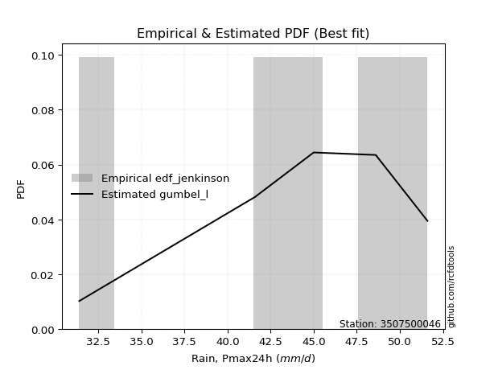</img>

</div>


### 11. EDF Cunnane (1978)

Cunnane´s work in statistical hydrology has focused on the performance and evaluation of different probability distributions (such as GEV, Gumbel, Lognormal) for flood frequency estimation. _b_ is a constant, typically set to 0.4.

<div align="center">


$P=(m-b)/(n+1-2b)$


</div>


**11.1. Empirical values**

<div align="center">

|                | 0                  | 1                   | 2                   | 3                  | 4                  | 5                  |
|:---------------|:-------------------|:--------------------|:--------------------|:-------------------|:-------------------|:-------------------|
| date           | 2025               | 2023                | 2022                | 2021               | 2019               | 2020               |
| x              | 2.2                | 31.4                | 41.6                | 45.0               | 48.6               | 51.6               |
| m              | 1                  | 2                   | 3                   | 4                  | 5                  | 6                  |
| empirical_dist | edf_cunnane        | edf_cunnane         | edf_cunnane         | edf_cunnane        | edf_cunnane        | edf_cunnane        |
| empirical      | 0.0967741935483871 | 0.25806451612903225 | 0.41935483870967744 | 0.5806451612903226 | 0.7419354838709676 | 0.9032258064516128 |
| empirical_tr   | 1.1071428571428572 | 1.3478260869565217  | 1.7222222222222225  | 2.384615384615385  | 3.8749999999999982 | 10.333333333333318 |

</div>


**11.2. Kolmogorov-Smirnov fit test (sorted by Δ)**


<div align="center">

|                | 0                  | 1                   | 2                   | 3                  | 4                   | 5                   | 6                   | 7                  | 8                   | 9                   | 10                  | 11                  | 12                  | 13                 | 14                 | 15                  | 16                  | 17                 | 18                  | 19                 | 20                  | 21                  | 22                  | 23                  | 24                  | 25                  | 26                  | 27                  | 28                  | 29                  | 30                  | 31                 | 32                  | 33                  | 34                  | 35                  | 36                  | 37                  | 38                  | 39                 | 40                  | 41                  | 42                  | 43                  | 44                  | 45                  | 46                  | 47                  | 48                  | 49                 | 50                  | 51                  | 52                  | 53                  | 54                  | 55                  | 56                  | 57                  | 58                  | 59                  | 60                  | 61                 | 62                 | 63                  | 64                 | 65                 | 66                  | 67                 | 68                  | 69                 | 70                  | 71                  | 72                 | 73               | 74                 | 75                  | 76                 | 77                  | 78                  | 79                 | 80                 | 81                 | 82                 | 83                  | 84                  | 85                  | 86                 | 87                  | 88                 | 89                 | 90               | 91                 | 92                  | 93                 | 94                  | 95                 | 96                  | 97                  | 98                 | 99                 | 100                 | 101                | 102                 | 103                | 104                | 105                | 106                 | 107                | 108                | 109                | 110                 | 111                | 112                 | 113               | 114                | 115                | 116                | 117                 | 118                | 119               | 120                 | 121                | 122                 | 123               | 124                 | 125                 | 126                 | 127                 | 128                 | 129                | 130                 | 131                | 132                 | 133                | 134                | 135                | 136               | 137                | 138                | 139                | 140                | 141                | 142                | 143                | 144                | 145                | 146                | 147                | 148                | 149                | 150                | 151                | 152                | 153                | 154                | 155               | 156                | 157                | 158               | 159               |
|:---------------|:-------------------|:--------------------|:--------------------|:-------------------|:--------------------|:--------------------|:--------------------|:-------------------|:--------------------|:--------------------|:--------------------|:--------------------|:--------------------|:-------------------|:-------------------|:--------------------|:--------------------|:-------------------|:--------------------|:-------------------|:--------------------|:--------------------|:--------------------|:--------------------|:--------------------|:--------------------|:--------------------|:--------------------|:--------------------|:--------------------|:--------------------|:-------------------|:--------------------|:--------------------|:--------------------|:--------------------|:--------------------|:--------------------|:--------------------|:-------------------|:--------------------|:--------------------|:--------------------|:--------------------|:--------------------|:--------------------|:--------------------|:--------------------|:--------------------|:-------------------|:--------------------|:--------------------|:--------------------|:--------------------|:--------------------|:--------------------|:--------------------|:--------------------|:--------------------|:--------------------|:--------------------|:-------------------|:-------------------|:--------------------|:-------------------|:-------------------|:--------------------|:-------------------|:--------------------|:-------------------|:--------------------|:--------------------|:-------------------|:-----------------|:-------------------|:--------------------|:-------------------|:--------------------|:--------------------|:-------------------|:-------------------|:-------------------|:-------------------|:--------------------|:--------------------|:--------------------|:-------------------|:--------------------|:-------------------|:-------------------|:-----------------|:-------------------|:--------------------|:-------------------|:--------------------|:-------------------|:--------------------|:--------------------|:-------------------|:-------------------|:--------------------|:-------------------|:--------------------|:-------------------|:-------------------|:-------------------|:--------------------|:-------------------|:-------------------|:-------------------|:--------------------|:-------------------|:--------------------|:------------------|:-------------------|:-------------------|:-------------------|:--------------------|:-------------------|:------------------|:--------------------|:-------------------|:--------------------|:------------------|:--------------------|:--------------------|:--------------------|:--------------------|:--------------------|:-------------------|:--------------------|:-------------------|:--------------------|:-------------------|:-------------------|:-------------------|:------------------|:-------------------|:-------------------|:-------------------|:-------------------|:-------------------|:-------------------|:-------------------|:-------------------|:-------------------|:-------------------|:-------------------|:-------------------|:-------------------|:-------------------|:-------------------|:-------------------|:-------------------|:-------------------|:------------------|:-------------------|:-------------------|:------------------|:------------------|
| station        | 3507500046         | 3507500046          | 3507500046          | 3507500046         | 3507500046          | 3507500046          | 3507500046          | 3507500046         | 3507500046          | 3507500046          | 3507500046          | 3507500046          | 3507500046          | 3507500046         | 3507500046         | 3507500046          | 3507500046          | 3507500046         | 3507500046          | 3507500046         | 3507500046          | 3507500046          | 3507500046          | 3507500046          | 3507500046          | 3507500046          | 3507500046          | 3507500046          | 3507500046          | 3507500046          | 3507500046          | 3507500046         | 3507500046          | 3507500046          | 3507500046          | 3507500046          | 3507500046          | 3507500046          | 3507500046          | 3507500046         | 3507500046          | 3507500046          | 3507500046          | 3507500046          | 3507500046          | 3507500046          | 3507500046          | 3507500046          | 3507500046          | 3507500046         | 3507500046          | 3507500046          | 3507500046          | 3507500046          | 3507500046          | 3507500046          | 3507500046          | 3507500046          | 3507500046          | 3507500046          | 3507500046          | 3507500046         | 3507500046         | 3507500046          | 3507500046         | 3507500046         | 3507500046          | 3507500046         | 3507500046          | 3507500046         | 3507500046          | 3507500046          | 3507500046         | 3507500046       | 3507500046         | 3507500046          | 3507500046         | 3507500046          | 3507500046          | 3507500046         | 3507500046         | 3507500046         | 3507500046         | 3507500046          | 3507500046          | 3507500046          | 3507500046         | 3507500046          | 3507500046         | 3507500046         | 3507500046       | 3507500046         | 3507500046          | 3507500046         | 3507500046          | 3507500046         | 3507500046          | 3507500046          | 3507500046         | 3507500046         | 3507500046          | 3507500046         | 3507500046          | 3507500046         | 3507500046         | 3507500046         | 3507500046          | 3507500046         | 3507500046         | 3507500046         | 3507500046          | 3507500046         | 3507500046          | 3507500046        | 3507500046         | 3507500046         | 3507500046         | 3507500046          | 3507500046         | 3507500046        | 3507500046          | 3507500046         | 3507500046          | 3507500046        | 3507500046          | 3507500046          | 3507500046          | 3507500046          | 3507500046          | 3507500046         | 3507500046          | 3507500046         | 3507500046          | 3507500046         | 3507500046         | 3507500046         | 3507500046        | 3507500046         | 3507500046         | 3507500046         | 3507500046         | 3507500046         | 3507500046         | 3507500046         | 3507500046         | 3507500046         | 3507500046         | 3507500046         | 3507500046         | 3507500046         | 3507500046         | 3507500046         | 3507500046         | 3507500046         | 3507500046         | 3507500046        | 3507500046         | 3507500046         | 3507500046        | 3507500046        |
| empirical_dist | edf_cunnane        | edf_cunnane         | edf_cunnane         | edf_cunnane        | edf_cunnane         | edf_cunnane         | edf_cunnane         | edf_cunnane        | edf_cunnane         | edf_cunnane         | edf_cunnane         | edf_cunnane         | edf_cunnane         | edf_cunnane        | edf_cunnane        | edf_cunnane         | edf_cunnane         | edf_cunnane        | edf_cunnane         | edf_cunnane        | edf_cunnane         | edf_cunnane         | edf_cunnane         | edf_cunnane         | edf_cunnane         | edf_cunnane         | edf_cunnane         | edf_cunnane         | edf_cunnane         | edf_cunnane         | edf_cunnane         | edf_cunnane        | edf_cunnane         | edf_cunnane         | edf_cunnane         | edf_cunnane         | edf_cunnane         | edf_cunnane         | edf_cunnane         | edf_cunnane        | edf_cunnane         | edf_cunnane         | edf_cunnane         | edf_cunnane         | edf_cunnane         | edf_cunnane         | edf_cunnane         | edf_cunnane         | edf_cunnane         | edf_cunnane        | edf_cunnane         | edf_cunnane         | edf_cunnane         | edf_cunnane         | edf_cunnane         | edf_cunnane         | edf_cunnane         | edf_cunnane         | edf_cunnane         | edf_cunnane         | edf_cunnane         | edf_cunnane        | edf_cunnane        | edf_cunnane         | edf_cunnane        | edf_cunnane        | edf_cunnane         | edf_cunnane        | edf_cunnane         | edf_cunnane        | edf_cunnane         | edf_cunnane         | edf_cunnane        | edf_cunnane      | edf_cunnane        | edf_cunnane         | edf_cunnane        | edf_cunnane         | edf_cunnane         | edf_cunnane        | edf_cunnane        | edf_cunnane        | edf_cunnane        | edf_cunnane         | edf_cunnane         | edf_cunnane         | edf_cunnane        | edf_cunnane         | edf_cunnane        | edf_cunnane        | edf_cunnane      | edf_cunnane        | edf_cunnane         | edf_cunnane        | edf_cunnane         | edf_cunnane        | edf_cunnane         | edf_cunnane         | edf_cunnane        | edf_cunnane        | edf_cunnane         | edf_cunnane        | edf_cunnane         | edf_cunnane        | edf_cunnane        | edf_cunnane        | edf_cunnane         | edf_cunnane        | edf_cunnane        | edf_cunnane        | edf_cunnane         | edf_cunnane        | edf_cunnane         | edf_cunnane       | edf_cunnane        | edf_cunnane        | edf_cunnane        | edf_cunnane         | edf_cunnane        | edf_cunnane       | edf_cunnane         | edf_cunnane        | edf_cunnane         | edf_cunnane       | edf_cunnane         | edf_cunnane         | edf_cunnane         | edf_cunnane         | edf_cunnane         | edf_cunnane        | edf_cunnane         | edf_cunnane        | edf_cunnane         | edf_cunnane        | edf_cunnane        | edf_cunnane        | edf_cunnane       | edf_cunnane        | edf_cunnane        | edf_cunnane        | edf_cunnane        | edf_cunnane        | edf_cunnane        | edf_cunnane        | edf_cunnane        | edf_cunnane        | edf_cunnane        | edf_cunnane        | edf_cunnane        | edf_cunnane        | edf_cunnane        | edf_cunnane        | edf_cunnane        | edf_cunnane        | edf_cunnane        | edf_cunnane       | edf_cunnane        | edf_cunnane        | edf_cunnane       | edf_cunnane       |
| p_dist         | loglevy_l          | argus               | mielke              | genextreme         | genpareto           | levy_l              | vonmises_line       | pearson3           | burr12              | dgamma              | gengamma            | trapezoid           | gumbel_l            | gompertz           | gausshyper         | gennorm             | loggenextreme       | weibull_max        | logt                | dweibull           | semicircular        | anglit              | arcsine             | nakagami            | nct                 | exponnorm           | crystalball         | norm                | f                   | t                   | invweibull          | gamma              | foldnorm            | betaprime           | invgauss            | erlang              | logistic            | invgamma            | genhalflogistic     | maxwell            | logvonmises_line    | hypsecant           | logpearson3         | rayleigh            | kstwobign           | truncnorm           | logburr12           | skewnorm            | ncf                 | rice               | logweibull_min      | loggumbel_l         | loggompertz         | beta                | logtrapezoid        | laplace             | cosine              | halfnorm            | gumbel_r            | logargus            | wrapcauchy          | triang             | logmielke          | logarcsine          | halflogistic       | burr               | logexponweib        | moyal              | loggengamma         | logwrapcauchy      | logsemicircular     | logburr             | loganglit          | logfoldnorm      | logweibull_max     | logf                | logexponnorm       | logcrystalball      | logrice             | lognorm            | logfatiguelife     | lognct             | logncf             | logloggamma         | loggennorm          | lognakagami         | logerlang          | loginvgauss         | loggamma           | loggamma           | genexpon         | logbetaprime       | loginvgamma         | loglogistic        | logloglaplace       | loginvweibull      | logalpha            | loghypsecant        | lomax              | ksone              | logmaxwell          | exponweib          | truncweibull_min    | wald               | loglaplace         | loglaplace         | lograyleigh         | halfgennorm        | logdgamma          | logkstwobign       | johnsonsb           | kappa4             | loggenexpon         | loghalfnorm       | loggumbel_r        | kappa3             | uniform            | logcosine           | loggausshyper      | loghalflogistic   | bradford            | logmoyal           | loglomax            | logdweibull       | johnsonsu           | logtruncnorm        | loghalfgennorm      | logjohnsonsb        | loggenpareto        | loggenhalflogistic | logskewnorm         | truncexpon         | logtruncweibull_min | logwald            | logbeta            | logtriang          | logksone          | logjohnsonsu       | logkappa4          | logexponpow        | fatiguelife        | logkappa3          | loguniform         | weibull_min        | alpha              | logbradford        | logtruncexpon      | exponpow           | powerlaw           | truncpareto        | logtukeylambda     | logpowerlaw        | logtruncpareto     | logrdist           | loggenlogistic     | rdist             | tukeylambda        | genlogistic        | logvonmises       | vonmises          |
| delta          | 0.0724486476972327 | 0.08952826630371385 | 0.09538770019254683 | 0.0967741935468317 | 0.10151544265328977 | 0.10871647190008318 | 0.11412904665507906 | 0.1180913481139359 | 0.12314487853017769 | 0.12947017525528914 | 0.13129659716972913 | 0.13231650820933588 | 0.13834484046021306 | 0.1419498586370303 | 0.1440356089683556 | 0.14459443560467156 | 0.15283924234310448 | 0.1538839399445338 | 0.15703523164639788 | 0.1717424834646366 | 0.17303535988358926 | 0.17955952950072268 | 0.18661024545806804 | 0.19362366406643622 | 0.19521433782112246 | 0.19522652331453988 | 0.19522865936247918 | 0.19522866524414745 | 0.19545317784686306 | 0.19636789606190913 | 0.19684456723493454 | 0.1974577479512158 | 0.19898733054589574 | 0.20005712036896145 | 0.20078284338580615 | 0.20437891240016498 | 0.20973948542840098 | 0.21705383939148754 | 0.21738985999151955 | 0.2204251246241225 | 0.22117349888895643 | 0.22145692517694365 | 0.22641875421774016 | 0.22817119025246418 | 0.22834827318001233 | 0.23008653993409806 | 0.23217290547272124 | 0.23541102623473625 | 0.23556174086255127 | 0.2390868552460978 | 0.23938860896858555 | 0.24063600866754187 | 0.24085496409580104 | 0.24680382976755716 | 0.24826648014812047 | 0.24946311161990248 | 0.24962388223686688 | 0.25032744801329915 | 0.26012325598899194 | 0.26059065850732727 | 0.26591419398218763 | 0.2713822050647963 | 0.2783211156101109 | 0.27833312096028007 | 0.2787000997091706 | 0.2806916249592802 | 0.28121227326431936 | 0.2820802441019044 | 0.28302290642485767 | 0.2873758372329914 | 0.29324253857013804 | 0.29643982829468524 | 0.2969816542431284 | 0.30418247379678 | 0.3050260725138695 | 0.30587622748195775 | 0.3060293468999107 | 0.30602965135973925 | 0.30603017725521175 | 0.3060301950209169 | 0.3064677609056581 | 0.3064891306068376 | 0.3074715811009592 | 0.30835102969537426 | 0.30852627300679747 | 0.30855477733134157 | 0.3102928282168945 | 0.31140005904489465 | 0.3115909719992356 | 0.3115909719992356 | 0.31240782761566 | 0.3133546147003956 | 0.31350076494961776 | 0.3145858933808863 | 0.31458617113690024 | 0.3166518928235327 | 0.31935108300296045 | 0.32176480327470025 | 0.3226999947572491 | 0.3286208697923469 | 0.33544562186919824 | 0.3358967791196291 | 0.34233738960269394 | 0.3434802853166696 | 0.3439514572674536 | 0.3439514572674536 | 0.34480023475872357 | 0.3542014405133227 | 0.3546425722967892 | 0.3546780505996725 | 0.35777779460864534 | 0.3619121265431909 | 0.37051311035157874 | 0.371230886735061 | 0.3754325432030222 | 0.3778821865194694 | 0.3782160114927517 | 0.37963230374520807 | 0.3889381864725464 | 0.398932802396215 | 0.39975205718562284 | 0.3997719664628041 | 0.40046854868926585 | 0.403225806451589 | 0.41037089475206423 | 0.41295064172035023 | 0.41642056875475664 | 0.43232505080697425 | 0.43359711657500655 | 0.434351993204539  | 0.44984647274894746 | 0.4573149832141016 | 0.45927175841037815 | 0.4673301245805984 | 0.4949374219503607 | 0.5001182504371313 | 0.527407313065093 | 0.5486862958441533 | 0.5548241144920109 | 0.5791511069210036 | 0.5818713701071738 | 0.5845014702179794 | 0.5845016789039182 | 0.5899748457299159 | 0.6057633748796069 | 0.6193931744138003 | 0.6365035285375084 | 0.6565880947339856 | 0.6664760776394827 | 0.6960523572502598 | 0.7023391049793302 | 0.7153820595593338 | 0.7269716581085754 | 0.7419354786958481 | 0.7419354838709676 | 0.903225806451538 | 0.9032258064516058 | 0.9032258064516128 | 1.113570895138804 | 7.623596565860727 |
| deltao         | 0.530385761606     | 0.530385761606      | 0.530385761606      | 0.530385761606     | 0.530385761606      | 0.530385761606      | 0.530385761606      | 0.530385761606     | 0.530385761606      | 0.530385761606      | 0.530385761606      | 0.530385761606      | 0.530385761606      | 0.530385761606     | 0.530385761606     | 0.530385761606      | 0.530385761606      | 0.530385761606     | 0.530385761606      | 0.530385761606     | 0.530385761606      | 0.530385761606      | 0.530385761606      | 0.530385761606      | 0.530385761606      | 0.530385761606      | 0.530385761606      | 0.530385761606      | 0.530385761606      | 0.530385761606      | 0.530385761606      | 0.530385761606     | 0.530385761606      | 0.530385761606      | 0.530385761606      | 0.530385761606      | 0.530385761606      | 0.530385761606      | 0.530385761606      | 0.530385761606     | 0.530385761606      | 0.530385761606      | 0.530385761606      | 0.530385761606      | 0.530385761606      | 0.530385761606      | 0.530385761606      | 0.530385761606      | 0.530385761606      | 0.530385761606     | 0.530385761606      | 0.530385761606      | 0.530385761606      | 0.530385761606      | 0.530385761606      | 0.530385761606      | 0.530385761606      | 0.530385761606      | 0.530385761606      | 0.530385761606      | 0.530385761606      | 0.530385761606     | 0.530385761606     | 0.530385761606      | 0.530385761606     | 0.530385761606     | 0.530385761606      | 0.530385761606     | 0.530385761606      | 0.530385761606     | 0.530385761606      | 0.530385761606      | 0.530385761606     | 0.530385761606   | 0.530385761606     | 0.530385761606      | 0.530385761606     | 0.530385761606      | 0.530385761606      | 0.530385761606     | 0.530385761606     | 0.530385761606     | 0.530385761606     | 0.530385761606      | 0.530385761606      | 0.530385761606      | 0.530385761606     | 0.530385761606      | 0.530385761606     | 0.530385761606     | 0.530385761606   | 0.530385761606     | 0.530385761606      | 0.530385761606     | 0.530385761606      | 0.530385761606     | 0.530385761606      | 0.530385761606      | 0.530385761606     | 0.530385761606     | 0.530385761606      | 0.530385761606     | 0.530385761606      | 0.530385761606     | 0.530385761606     | 0.530385761606     | 0.530385761606      | 0.530385761606     | 0.530385761606     | 0.530385761606     | 0.530385761606      | 0.530385761606     | 0.530385761606      | 0.530385761606    | 0.530385761606     | 0.530385761606     | 0.530385761606     | 0.530385761606      | 0.530385761606     | 0.530385761606    | 0.530385761606      | 0.530385761606     | 0.530385761606      | 0.530385761606    | 0.530385761606      | 0.530385761606      | 0.530385761606      | 0.530385761606      | 0.530385761606      | 0.530385761606     | 0.530385761606      | 0.530385761606     | 0.530385761606      | 0.530385761606     | 0.530385761606     | 0.530385761606     | 0.530385761606    | 0.530385761606     | 0.530385761606     | 0.530385761606     | 0.530385761606     | 0.530385761606     | 0.530385761606     | 0.530385761606     | 0.530385761606     | 0.530385761606     | 0.530385761606     | 0.530385761606     | 0.530385761606     | 0.530385761606     | 0.530385761606     | 0.530385761606     | 0.530385761606     | 0.530385761606     | 0.530385761606     | 0.530385761606    | 0.530385761606     | 0.530385761606     | 0.530385761606    | 0.530385761606    |
| eval           | Δo > Δ             | Δo > Δ              | Δo > Δ              | Δo > Δ             | Δo > Δ              | Δo > Δ              | Δo > Δ              | Δo > Δ             | Δo > Δ              | Δo > Δ              | Δo > Δ              | Δo > Δ              | Δo > Δ              | Δo > Δ             | Δo > Δ             | Δo > Δ              | Δo > Δ              | Δo > Δ             | Δo > Δ              | Δo > Δ             | Δo > Δ              | Δo > Δ              | Δo > Δ              | Δo > Δ              | Δo > Δ              | Δo > Δ              | Δo > Δ              | Δo > Δ              | Δo > Δ              | Δo > Δ              | Δo > Δ              | Δo > Δ             | Δo > Δ              | Δo > Δ              | Δo > Δ              | Δo > Δ              | Δo > Δ              | Δo > Δ              | Δo > Δ              | Δo > Δ             | Δo > Δ              | Δo > Δ              | Δo > Δ              | Δo > Δ              | Δo > Δ              | Δo > Δ              | Δo > Δ              | Δo > Δ              | Δo > Δ              | Δo > Δ             | Δo > Δ              | Δo > Δ              | Δo > Δ              | Δo > Δ              | Δo > Δ              | Δo > Δ              | Δo > Δ              | Δo > Δ              | Δo > Δ              | Δo > Δ              | Δo > Δ              | Δo > Δ             | Δo > Δ             | Δo > Δ              | Δo > Δ             | Δo > Δ             | Δo > Δ              | Δo > Δ             | Δo > Δ              | Δo > Δ             | Δo > Δ              | Δo > Δ              | Δo > Δ             | Δo > Δ           | Δo > Δ             | Δo > Δ              | Δo > Δ             | Δo > Δ              | Δo > Δ              | Δo > Δ             | Δo > Δ             | Δo > Δ             | Δo > Δ             | Δo > Δ              | Δo > Δ              | Δo > Δ              | Δo > Δ             | Δo > Δ              | Δo > Δ             | Δo > Δ             | Δo > Δ           | Δo > Δ             | Δo > Δ              | Δo > Δ             | Δo > Δ              | Δo > Δ             | Δo > Δ              | Δo > Δ              | Δo > Δ             | Δo > Δ             | Δo > Δ              | Δo > Δ             | Δo > Δ              | Δo > Δ             | Δo > Δ             | Δo > Δ             | Δo > Δ              | Δo > Δ             | Δo > Δ             | Δo > Δ             | Δo > Δ              | Δo > Δ             | Δo > Δ              | Δo > Δ            | Δo > Δ             | Δo > Δ             | Δo > Δ             | Δo > Δ              | Δo > Δ             | Δo > Δ            | Δo > Δ              | Δo > Δ             | Δo > Δ              | Δo > Δ            | Δo > Δ              | Δo > Δ              | Δo > Δ              | Δo > Δ              | Δo > Δ              | Δo > Δ             | Δo > Δ              | Δo > Δ             | Δo > Δ              | Δo > Δ             | Δo > Δ             | Δo > Δ             | Δo > Δ            | Δo <= Δ            | Δo <= Δ            | Δo <= Δ            | Δo <= Δ            | Δo <= Δ            | Δo <= Δ            | Δo <= Δ            | Δo <= Δ            | Δo <= Δ            | Δo <= Δ            | Δo <= Δ            | Δo <= Δ            | Δo <= Δ            | Δo <= Δ            | Δo <= Δ            | Δo <= Δ            | Δo <= Δ            | Δo <= Δ            | Δo <= Δ           | Δo <= Δ            | Δo <= Δ            | Δo <= Δ           | Δo <= Δ           |
| fit            | 1                  | 1                   | 1                   | 1                  | 1                   | 1                   | 1                   | 1                  | 1                   | 1                   | 1                   | 1                   | 1                   | 1                  | 1                  | 1                   | 1                   | 1                  | 1                   | 1                  | 1                   | 1                   | 1                   | 1                   | 1                   | 1                   | 1                   | 1                   | 1                   | 1                   | 1                   | 1                  | 1                   | 1                   | 1                   | 1                   | 1                   | 1                   | 1                   | 1                  | 1                   | 1                   | 1                   | 1                   | 1                   | 1                   | 1                   | 1                   | 1                   | 1                  | 1                   | 1                   | 1                   | 1                   | 1                   | 1                   | 1                   | 1                   | 1                   | 1                   | 1                   | 1                  | 1                  | 1                   | 1                  | 1                  | 1                   | 1                  | 1                   | 1                  | 1                   | 1                   | 1                  | 1                | 1                  | 1                   | 1                  | 1                   | 1                   | 1                  | 1                  | 1                  | 1                  | 1                   | 1                   | 1                   | 1                  | 1                   | 1                  | 1                  | 1                | 1                  | 1                   | 1                  | 1                   | 1                  | 1                   | 1                   | 1                  | 1                  | 1                   | 1                  | 1                   | 1                  | 1                  | 1                  | 1                   | 1                  | 1                  | 1                  | 1                   | 1                  | 1                   | 1                 | 1                  | 1                  | 1                  | 1                   | 1                  | 1                 | 1                   | 1                  | 1                   | 1                 | 1                   | 1                   | 1                   | 1                   | 1                   | 1                  | 1                   | 1                  | 1                   | 1                  | 1                  | 1                  | 1                 | 0                  | 0                  | 0                  | 0                  | 0                  | 0                  | 0                  | 0                  | 0                  | 0                  | 0                  | 0                  | 0                  | 0                  | 0                  | 0                  | 0                  | 0                  | 0                 | 0                  | 0                  | 0                 | 0                 |
| n              | 6                  | 6                   | 6                   | 6                  | 6                   | 6                   | 6                   | 6                  | 6                   | 6                   | 6                   | 6                   | 6                   | 6                  | 6                  | 6                   | 6                   | 6                  | 6                   | 6                  | 6                   | 6                   | 6                   | 6                   | 6                   | 6                   | 6                   | 6                   | 6                   | 6                   | 6                   | 6                  | 6                   | 6                   | 6                   | 6                   | 6                   | 6                   | 6                   | 6                  | 6                   | 6                   | 6                   | 6                   | 6                   | 6                   | 6                   | 6                   | 6                   | 6                  | 6                   | 6                   | 6                   | 6                   | 6                   | 6                   | 6                   | 6                   | 6                   | 6                   | 6                   | 6                  | 6                  | 6                   | 6                  | 6                  | 6                   | 6                  | 6                   | 6                  | 6                   | 6                   | 6                  | 6                | 6                  | 6                   | 6                  | 6                   | 6                   | 6                  | 6                  | 6                  | 6                  | 6                   | 6                   | 6                   | 6                  | 6                   | 6                  | 6                  | 6                | 6                  | 6                   | 6                  | 6                   | 6                  | 6                   | 6                   | 6                  | 6                  | 6                   | 6                  | 6                   | 6                  | 6                  | 6                  | 6                   | 6                  | 6                  | 6                  | 6                   | 6                  | 6                   | 6                 | 6                  | 6                  | 6                  | 6                   | 6                  | 6                 | 6                   | 6                  | 6                   | 6                 | 6                   | 6                   | 6                   | 6                   | 6                   | 6                  | 6                   | 6                  | 6                   | 6                  | 6                  | 6                  | 6                 | 6                  | 6                  | 6                  | 6                  | 6                  | 6                  | 6                  | 6                  | 6                  | 6                  | 6                  | 6                  | 6                  | 6                  | 6                  | 6                  | 6                  | 6                  | 6                 | 6                  | 6                  | 6                 | 6                 |
| best_fit       | 1                  | 0                   | 0                   | 0                  | 0                   | 0                   | 0                   | 0                  | 0                   | 0                   | 0                   | 0                   | 0                   | 0                  | 0                  | 0                   | 0                   | 0                  | 0                   | 0                  | 0                   | 0                   | 0                   | 0                   | 0                   | 0                   | 0                   | 0                   | 0                   | 0                   | 0                   | 0                  | 0                   | 0                   | 0                   | 0                   | 0                   | 0                   | 0                   | 0                  | 0                   | 0                   | 0                   | 0                   | 0                   | 0                   | 0                   | 0                   | 0                   | 0                  | 0                   | 0                   | 0                   | 0                   | 0                   | 0                   | 0                   | 0                   | 0                   | 0                   | 0                   | 0                  | 0                  | 0                   | 0                  | 0                  | 0                   | 0                  | 0                   | 0                  | 0                   | 0                   | 0                  | 0                | 0                  | 0                   | 0                  | 0                   | 0                   | 0                  | 0                  | 0                  | 0                  | 0                   | 0                   | 0                   | 0                  | 0                   | 0                  | 0                  | 0                | 0                  | 0                   | 0                  | 0                   | 0                  | 0                   | 0                   | 0                  | 0                  | 0                   | 0                  | 0                   | 0                  | 0                  | 0                  | 0                   | 0                  | 0                  | 0                  | 0                   | 0                  | 0                   | 0                 | 0                  | 0                  | 0                  | 0                   | 0                  | 0                 | 0                   | 0                  | 0                   | 0                 | 0                   | 0                   | 0                   | 0                   | 0                   | 0                  | 0                   | 0                  | 0                   | 0                  | 0                  | 0                  | 0                 | 0                  | 0                  | 0                  | 0                  | 0                  | 0                  | 0                  | 0                  | 0                  | 0                  | 0                  | 0                  | 0                  | 0                  | 0                  | 0                  | 0                  | 0                  | 0                 | 0                  | 0                  | 0                 | 0                 |
| best_fit_sort  | 1                  | 2                   | 3                   | 4                  | 5                   | 6                   | 7                   | 8                  | 9                   | 10                  | 11                  | 12                  | 13                  | 14                 | 15                 | 16                  | 17                  | 18                 | 19                  | 20                 | 21                  | 22                  | 23                  | 24                  | 25                  | 26                  | 27                  | 28                  | 29                  | 30                  | 31                  | 32                 | 33                  | 34                  | 35                  | 36                  | 37                  | 38                  | 39                  | 40                 | 41                  | 42                  | 43                  | 44                  | 45                  | 46                  | 47                  | 48                  | 49                  | 50                 | 51                  | 52                  | 53                  | 54                  | 55                  | 56                  | 57                  | 58                  | 59                  | 60                  | 61                  | 62                 | 63                 | 64                  | 65                 | 66                 | 67                  | 68                 | 69                  | 70                 | 71                  | 72                  | 73                 | 74               | 75                 | 76                  | 77                 | 78                  | 79                  | 80                 | 81                 | 82                 | 83                 | 84                  | 85                  | 86                  | 87                 | 88                  | 89                 | 90                 | 91               | 92                 | 93                  | 94                 | 95                  | 96                 | 97                  | 98                  | 99                 | 100                | 101                 | 102                | 103                 | 104                | 105                | 106                | 107                 | 108                | 109                | 110                | 111                 | 112                | 113                 | 114               | 115                | 116                | 117                | 118                 | 119                | 120               | 121                 | 122                | 123                 | 124               | 125                 | 126                 | 127                 | 128                 | 129                 | 130                | 131                 | 132                | 133                 | 134                | 135                | 136                | 137               | 138                | 139                | 140                | 141                | 142                | 143                | 144                | 145                | 146                | 147                | 148                | 149                | 150                | 151                | 152                | 153                | 154                | 155                | 156               | 157                | 158                | 159               | 160               |

</div>


**11.3. Best fit**

<div align="center">

|   id |    station | empirical_dist   | p_dist    |     delta |   deltao | eval   |   fit |   n |   best_fit |   best_fit_sort |
|-----:|-----------:|:-----------------|:----------|----------:|---------:|:-------|------:|----:|-----------:|----------------:|
|    0 | 3507500046 | edf_cunnane      | loglevy_l | 0.0724486 | 0.530386 | Δo > Δ |     1 |   6 |          1 |               1 |

</div>


<div align="center">

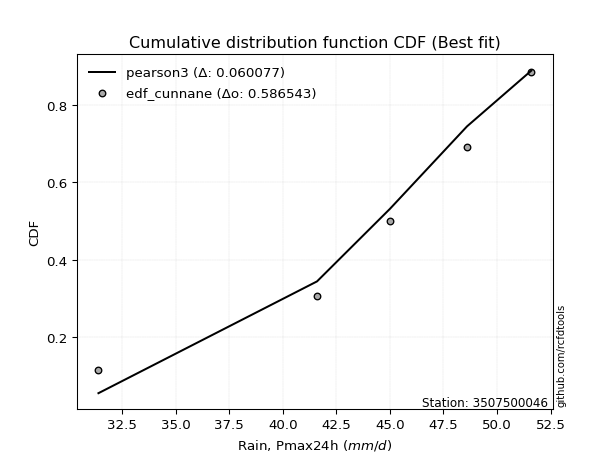</img></img>

</div>


### 12. EDF Adamowski (1981)

The Adamowski formula in hydrology refers to a specific plotting position formula used for estimating the non-parametric empirical distribution of hydrological events (like flood peaks) to calculate their return periods. This formula provides an alternative to traditional parametric methods (like the Gumbel or Log Pearson Type III distributions). 

<div align="center">


$P=(m-0.25)/(n+0.5)$


</div>


**12.1. Empirical values**

<div align="center">

|                | 0                   | 1                  | 2                  | 3                  | 4                  | 5                  |
|:---------------|:--------------------|:-------------------|:-------------------|:-------------------|:-------------------|:-------------------|
| date           | 2025                | 2023               | 2022               | 2021               | 2019               | 2020               |
| x              | 2.2                 | 31.4               | 41.6               | 45.0               | 48.6               | 51.6               |
| m              | 1                   | 2                  | 3                  | 4                  | 5                  | 6                  |
| empirical_dist | edf_adamowski       | edf_adamowski      | edf_adamowski      | edf_adamowski      | edf_adamowski      | edf_adamowski      |
| empirical      | 0.11538461538461539 | 0.2692307692307692 | 0.4230769230769231 | 0.5769230769230769 | 0.7307692307692307 | 0.8846153846153846 |
| empirical_tr   | 1.1304347826086958  | 1.3684210526315788 | 1.7333333333333334 | 2.3636363636363633 | 3.7142857142857135 | 8.666666666666664  |

</div>


**12.2. Kolmogorov-Smirnov fit test (sorted by Δ)**


<div align="center">

|                | 0                   | 1                   | 2                   | 3                   | 4                   | 5                   | 6                   | 7                   | 8                   | 9                  | 10                  | 11                 | 12                  | 13                  | 14                  | 15                  | 16                  | 17                  | 18                  | 19                  | 20                  | 21                  | 22                  | 23                  | 24                  | 25                  | 26                  | 27                 | 28                  | 29                 | 30                 | 31                  | 32                 | 33                 | 34                  | 35                  | 36                  | 37                  | 38                  | 39                 | 40                  | 41                  | 42                  | 43                  | 44                 | 45                  | 46                 | 47                 | 48                  | 49                  | 50                  | 51                  | 52                  | 53                 | 54                 | 55                  | 56                  | 57                 | 58                  | 59                 | 60                  | 61                 | 62                 | 63                 | 64                  | 65                  | 66                  | 67                 | 68                  | 69                  | 70                 | 71                 | 72                 | 73                | 74                 | 75                 | 76                 | 77                 | 78                 | 79                 | 80                 | 81                 | 82                  | 83                 | 84                  | 85                 | 86                 | 87                 | 88                | 89                  | 90                 | 91                 | 92                 | 93                 | 94                  | 95                 | 96                 | 97                 | 98                 | 99                 | 100                 | 101                 | 102                | 103                | 104                | 105               | 106                | 107                 | 108                 | 109                 | 110                | 111                 | 112                | 113               | 114                 | 115                | 116                | 117                 | 118                 | 119                | 120               | 121                 | 122                | 123                | 124                | 125                 | 126                 | 127                 | 128                | 129                | 130                | 131                 | 132                 | 133                 | 134                | 135                 | 136               | 137                | 138                | 139                | 140                | 141                | 142                | 143               | 144                | 145                | 146                | 147                | 148                | 149                | 150                | 151                | 152                | 153                | 154                | 155                | 156                | 157                | 158               | 159               |
|:---------------|:--------------------|:--------------------|:--------------------|:--------------------|:--------------------|:--------------------|:--------------------|:--------------------|:--------------------|:-------------------|:--------------------|:-------------------|:--------------------|:--------------------|:--------------------|:--------------------|:--------------------|:--------------------|:--------------------|:--------------------|:--------------------|:--------------------|:--------------------|:--------------------|:--------------------|:--------------------|:--------------------|:-------------------|:--------------------|:-------------------|:-------------------|:--------------------|:-------------------|:-------------------|:--------------------|:--------------------|:--------------------|:--------------------|:--------------------|:-------------------|:--------------------|:--------------------|:--------------------|:--------------------|:-------------------|:--------------------|:-------------------|:-------------------|:--------------------|:--------------------|:--------------------|:--------------------|:--------------------|:-------------------|:-------------------|:--------------------|:--------------------|:-------------------|:--------------------|:-------------------|:--------------------|:-------------------|:-------------------|:-------------------|:--------------------|:--------------------|:--------------------|:-------------------|:--------------------|:--------------------|:-------------------|:-------------------|:-------------------|:------------------|:-------------------|:-------------------|:-------------------|:-------------------|:-------------------|:-------------------|:-------------------|:-------------------|:--------------------|:-------------------|:--------------------|:-------------------|:-------------------|:-------------------|:------------------|:--------------------|:-------------------|:-------------------|:-------------------|:-------------------|:--------------------|:-------------------|:-------------------|:-------------------|:-------------------|:-------------------|:--------------------|:--------------------|:-------------------|:-------------------|:-------------------|:------------------|:-------------------|:--------------------|:--------------------|:--------------------|:-------------------|:--------------------|:-------------------|:------------------|:--------------------|:-------------------|:-------------------|:--------------------|:--------------------|:-------------------|:------------------|:--------------------|:-------------------|:-------------------|:-------------------|:--------------------|:--------------------|:--------------------|:-------------------|:-------------------|:-------------------|:--------------------|:--------------------|:--------------------|:-------------------|:--------------------|:------------------|:-------------------|:-------------------|:-------------------|:-------------------|:-------------------|:-------------------|:------------------|:-------------------|:-------------------|:-------------------|:-------------------|:-------------------|:-------------------|:-------------------|:-------------------|:-------------------|:-------------------|:-------------------|:-------------------|:-------------------|:-------------------|:------------------|:------------------|
| station        | 3507500046          | 3507500046          | 3507500046          | 3507500046          | 3507500046          | 3507500046          | 3507500046          | 3507500046          | 3507500046          | 3507500046         | 3507500046          | 3507500046         | 3507500046          | 3507500046          | 3507500046          | 3507500046          | 3507500046          | 3507500046          | 3507500046          | 3507500046          | 3507500046          | 3507500046          | 3507500046          | 3507500046          | 3507500046          | 3507500046          | 3507500046          | 3507500046         | 3507500046          | 3507500046         | 3507500046         | 3507500046          | 3507500046         | 3507500046         | 3507500046          | 3507500046          | 3507500046          | 3507500046          | 3507500046          | 3507500046         | 3507500046          | 3507500046          | 3507500046          | 3507500046          | 3507500046         | 3507500046          | 3507500046         | 3507500046         | 3507500046          | 3507500046          | 3507500046          | 3507500046          | 3507500046          | 3507500046         | 3507500046         | 3507500046          | 3507500046          | 3507500046         | 3507500046          | 3507500046         | 3507500046          | 3507500046         | 3507500046         | 3507500046         | 3507500046          | 3507500046          | 3507500046          | 3507500046         | 3507500046          | 3507500046          | 3507500046         | 3507500046         | 3507500046         | 3507500046        | 3507500046         | 3507500046         | 3507500046         | 3507500046         | 3507500046         | 3507500046         | 3507500046         | 3507500046         | 3507500046          | 3507500046         | 3507500046          | 3507500046         | 3507500046         | 3507500046         | 3507500046        | 3507500046          | 3507500046         | 3507500046         | 3507500046         | 3507500046         | 3507500046          | 3507500046         | 3507500046         | 3507500046         | 3507500046         | 3507500046         | 3507500046          | 3507500046          | 3507500046         | 3507500046         | 3507500046         | 3507500046        | 3507500046         | 3507500046          | 3507500046          | 3507500046          | 3507500046         | 3507500046          | 3507500046         | 3507500046        | 3507500046          | 3507500046         | 3507500046         | 3507500046          | 3507500046          | 3507500046         | 3507500046        | 3507500046          | 3507500046         | 3507500046         | 3507500046         | 3507500046          | 3507500046          | 3507500046          | 3507500046         | 3507500046         | 3507500046         | 3507500046          | 3507500046          | 3507500046          | 3507500046         | 3507500046          | 3507500046        | 3507500046         | 3507500046         | 3507500046         | 3507500046         | 3507500046         | 3507500046         | 3507500046        | 3507500046         | 3507500046         | 3507500046         | 3507500046         | 3507500046         | 3507500046         | 3507500046         | 3507500046         | 3507500046         | 3507500046         | 3507500046         | 3507500046         | 3507500046         | 3507500046         | 3507500046        | 3507500046        |
| empirical_dist | edf_adamowski       | edf_adamowski       | edf_adamowski       | edf_adamowski       | edf_adamowski       | edf_adamowski       | edf_adamowski       | edf_adamowski       | edf_adamowski       | edf_adamowski      | edf_adamowski       | edf_adamowski      | edf_adamowski       | edf_adamowski       | edf_adamowski       | edf_adamowski       | edf_adamowski       | edf_adamowski       | edf_adamowski       | edf_adamowski       | edf_adamowski       | edf_adamowski       | edf_adamowski       | edf_adamowski       | edf_adamowski       | edf_adamowski       | edf_adamowski       | edf_adamowski      | edf_adamowski       | edf_adamowski      | edf_adamowski      | edf_adamowski       | edf_adamowski      | edf_adamowski      | edf_adamowski       | edf_adamowski       | edf_adamowski       | edf_adamowski       | edf_adamowski       | edf_adamowski      | edf_adamowski       | edf_adamowski       | edf_adamowski       | edf_adamowski       | edf_adamowski      | edf_adamowski       | edf_adamowski      | edf_adamowski      | edf_adamowski       | edf_adamowski       | edf_adamowski       | edf_adamowski       | edf_adamowski       | edf_adamowski      | edf_adamowski      | edf_adamowski       | edf_adamowski       | edf_adamowski      | edf_adamowski       | edf_adamowski      | edf_adamowski       | edf_adamowski      | edf_adamowski      | edf_adamowski      | edf_adamowski       | edf_adamowski       | edf_adamowski       | edf_adamowski      | edf_adamowski       | edf_adamowski       | edf_adamowski      | edf_adamowski      | edf_adamowski      | edf_adamowski     | edf_adamowski      | edf_adamowski      | edf_adamowski      | edf_adamowski      | edf_adamowski      | edf_adamowski      | edf_adamowski      | edf_adamowski      | edf_adamowski       | edf_adamowski      | edf_adamowski       | edf_adamowski      | edf_adamowski      | edf_adamowski      | edf_adamowski     | edf_adamowski       | edf_adamowski      | edf_adamowski      | edf_adamowski      | edf_adamowski      | edf_adamowski       | edf_adamowski      | edf_adamowski      | edf_adamowski      | edf_adamowski      | edf_adamowski      | edf_adamowski       | edf_adamowski       | edf_adamowski      | edf_adamowski      | edf_adamowski      | edf_adamowski     | edf_adamowski      | edf_adamowski       | edf_adamowski       | edf_adamowski       | edf_adamowski      | edf_adamowski       | edf_adamowski      | edf_adamowski     | edf_adamowski       | edf_adamowski      | edf_adamowski      | edf_adamowski       | edf_adamowski       | edf_adamowski      | edf_adamowski     | edf_adamowski       | edf_adamowski      | edf_adamowski      | edf_adamowski      | edf_adamowski       | edf_adamowski       | edf_adamowski       | edf_adamowski      | edf_adamowski      | edf_adamowski      | edf_adamowski       | edf_adamowski       | edf_adamowski       | edf_adamowski      | edf_adamowski       | edf_adamowski     | edf_adamowski      | edf_adamowski      | edf_adamowski      | edf_adamowski      | edf_adamowski      | edf_adamowski      | edf_adamowski     | edf_adamowski      | edf_adamowski      | edf_adamowski      | edf_adamowski      | edf_adamowski      | edf_adamowski      | edf_adamowski      | edf_adamowski      | edf_adamowski      | edf_adamowski      | edf_adamowski      | edf_adamowski      | edf_adamowski      | edf_adamowski      | edf_adamowski     | edf_adamowski     |
| p_dist         | loglevy_l           | levy_l              | argus               | mielke              | pearson3            | genpareto           | vonmises_line       | genextreme          | burr12              | gengamma           | trapezoid           | dgamma             | gumbel_l            | gompertz            | gausshyper          | logt                | loggenextreme       | weibull_max         | dweibull            | gennorm             | arcsine             | semicircular        | anglit              | nakagami            | nct                 | exponnorm           | crystalball         | norm               | f                   | t                  | invweibull         | gamma               | foldnorm           | betaprime          | invgauss            | erlang              | logvonmises_line    | logistic            | logpearson3         | invgamma           | genhalflogistic     | maxwell             | hypsecant           | rayleigh            | kstwobign          | truncnorm           | logburr12          | loggumbel_l        | logtrapezoid        | skewnorm            | ncf                 | rice                | beta                | logweibull_min     | loggompertz        | laplace             | cosine              | halfnorm           | wrapcauchy          | gumbel_r           | logargus            | logarcsine         | triang             | logmielke          | halflogistic        | logwrapcauchy       | burr                | logexponweib       | moyal               | loggengamma         | logsemicircular    | loganglit          | logburr            | logfoldnorm       | logweibull_max     | logf               | logexponnorm       | logcrystalball     | logrice            | lognorm            | logfatiguelife     | lognct             | logloglaplace       | logncf             | logerlang           | loginvgauss        | loggamma           | loggamma           | genexpon          | logbetaprime        | loginvgamma        | loglogistic        | logloggamma        | loggennorm         | lognakagami         | loginvweibull      | logalpha           | loghypsecant       | lomax              | logmaxwell         | exponweib           | ksone               | loglaplace         | loglaplace         | lograyleigh        | logdgamma         | truncweibull_min   | wald                | halfgennorm         | logkstwobign        | johnsonsb          | kappa4              | loggenexpon        | loghalfnorm       | loggumbel_r         | logcosine          | kappa3             | uniform             | loggausshyper       | logdweibull        | loghalflogistic   | logmoyal            | loglomax           | bradford           | johnsonsu          | logtruncnorm        | loghalfgennorm      | logjohnsonsb        | loggenpareto       | loggenhalflogistic | logskewnorm        | truncexpon          | logtruncweibull_min | logwald             | logbeta            | logtriang           | logksone          | logjohnsonsu       | logkappa4          | logexponpow        | fatiguelife        | logkappa3          | loguniform         | weibull_min       | alpha              | logbradford        | logtruncexpon      | exponpow           | powerlaw           | truncpareto        | logtukeylambda     | logpowerlaw        | logtruncpareto     | logrdist           | loggenlogistic     | rdist              | tukeylambda        | genlogistic        | logvonmises       | vonmises          |
| delta          | 0.07230830094334095 | 0.09010605006385489 | 0.09363154876363852 | 0.11399812202877502 | 0.11436926374669026 | 0.11538451412653916 | 0.11538461536986815 | 0.11538461538305989 | 0.11942279416293206 | 0.1275745128024835 | 0.12859442384209024 | 0.1331922596225349 | 0.13462275609296742 | 0.13822777426978466 | 0.14031352460110996 | 0.14807620553596845 | 0.14911715797585884 | 0.15016185557728817 | 0.15313206162840842 | 0.15576068870640852 | 0.16799982362183985 | 0.16931327551634362 | 0.17583744513347704 | 0.18990157969919058 | 0.19149225345387683 | 0.19150443894729424 | 0.19150657499523355 | 0.1915065808769018 | 0.19173109347961742 | 0.1926458116946635 | 0.1931224828676889 | 0.19373566358397015 | 0.1952652461786501 | 0.1963350360017158 | 0.19706075901856052 | 0.20065682803291934 | 0.20256307705272825 | 0.20601740106115535 | 0.20780833238151197 | 0.2133317550242419 | 0.21366777562427391 | 0.21670304025687687 | 0.21773484080969802 | 0.22444910588521855 | 0.2246261888127667 | 0.22636445556685242 | 0.2284508211054756 | 0.2294697555658049 | 0.22965605831189229 | 0.23168894186749062 | 0.23183965649530563 | 0.23536477087885216 | 0.23563757666582025 | 0.2356665246013399 | 0.2371328797285554 | 0.24574102725265684 | 0.24590179786962124 | 0.2466053636460535 | 0.25474794088045066 | 0.2564011716217463 | 0.25686857414008163 | 0.2671668678585431 | 0.2676601206975507 | 0.2745990312428653 | 0.27497801534192495 | 0.27620958413125446 | 0.27696954059203455 | 0.2774901888970737 | 0.27835815973465877 | 0.27930082205761203 | 0.2820762854684011 | 0.2858154011413914 | 0.2927177439274396 | 0.293016220695043 | 0.2938598194121325 | 0.2947099743802208 | 0.2948630937981737 | 0.2948633982580023 | 0.2948639241534748 | 0.2948639419191799 | 0.2953015078039211 | 0.2953228775051006 | 0.29597574930067205 | 0.2963053279992222 | 0.29912657511515756 | 0.3002338059431577 | 0.3004247188974986 | 0.3004247188974986 | 0.301241574513923 | 0.30218836159865864 | 0.3023345118478808 | 0.3034196402791493 | 0.3046289453281286 | 0.3048041886395517 | 0.30483269296409593 | 0.3054856397217957 | 0.3081848299012235 | 0.3105985501729633 | 0.3115337416555121 | 0.3242793687674613 | 0.32473052601789215 | 0.32489878542510126 | 0.3327852041657166 | 0.3327852041657166 | 0.3336339816569866 | 0.336032150460561 | 0.3386153052354483 | 0.33975820094942394 | 0.34303518741158573 | 0.34351179749793553 | 0.3466115415069084 | 0.35819004217594524 | 0.3593468572498418 | 0.360064633633324 | 0.36426629010128525 | 0.3684660506434711 | 0.3741601021522238 | 0.37449392712550605 | 0.37777193337080944 | 0.3846153846153608 | 0.387766549294478 | 0.38860571336106714 | 0.3893022955875289 | 0.3960299728183772 | 0.3992046416503273 | 0.40178438861861326 | 0.40525431565301967 | 0.42115879770523734 | 0.4224308634732696 | 0.423185740102802  | 0.4461243883817018 | 0.44622253880286195 | 0.449591415628452   | 0.45616387147886145 | 0.4837711688486238 | 0.48895199733539435 | 0.516241059963356 | 0.5375200427424164 | 0.5436578613902738 | 0.5679848538192667 | 0.5707051170054369 | 0.5733352171162425 | 0.5733354258021812 | 0.578808592628179 | 0.5945971217778698 | 0.6082269213120632 | 0.6253372754357713 | 0.6454218416322486 | 0.6553098245377458 | 0.6848861041485228 | 0.6911728518775933 | 0.7042158064575967 | 0.7158054050068385 | 0.7307692255941112 | 0.7307692307692307 | 0.8846153846153098 | 0.8846153846153775 | 0.8846153846153846 | 1.102404642037067 | 7.642206987696955 |
| deltao         | 0.530385761606      | 0.530385761606      | 0.530385761606      | 0.530385761606      | 0.530385761606      | 0.530385761606      | 0.530385761606      | 0.530385761606      | 0.530385761606      | 0.530385761606     | 0.530385761606      | 0.530385761606     | 0.530385761606      | 0.530385761606      | 0.530385761606      | 0.530385761606      | 0.530385761606      | 0.530385761606      | 0.530385761606      | 0.530385761606      | 0.530385761606      | 0.530385761606      | 0.530385761606      | 0.530385761606      | 0.530385761606      | 0.530385761606      | 0.530385761606      | 0.530385761606     | 0.530385761606      | 0.530385761606     | 0.530385761606     | 0.530385761606      | 0.530385761606     | 0.530385761606     | 0.530385761606      | 0.530385761606      | 0.530385761606      | 0.530385761606      | 0.530385761606      | 0.530385761606     | 0.530385761606      | 0.530385761606      | 0.530385761606      | 0.530385761606      | 0.530385761606     | 0.530385761606      | 0.530385761606     | 0.530385761606     | 0.530385761606      | 0.530385761606      | 0.530385761606      | 0.530385761606      | 0.530385761606      | 0.530385761606     | 0.530385761606     | 0.530385761606      | 0.530385761606      | 0.530385761606     | 0.530385761606      | 0.530385761606     | 0.530385761606      | 0.530385761606     | 0.530385761606     | 0.530385761606     | 0.530385761606      | 0.530385761606      | 0.530385761606      | 0.530385761606     | 0.530385761606      | 0.530385761606      | 0.530385761606     | 0.530385761606     | 0.530385761606     | 0.530385761606    | 0.530385761606     | 0.530385761606     | 0.530385761606     | 0.530385761606     | 0.530385761606     | 0.530385761606     | 0.530385761606     | 0.530385761606     | 0.530385761606      | 0.530385761606     | 0.530385761606      | 0.530385761606     | 0.530385761606     | 0.530385761606     | 0.530385761606    | 0.530385761606      | 0.530385761606     | 0.530385761606     | 0.530385761606     | 0.530385761606     | 0.530385761606      | 0.530385761606     | 0.530385761606     | 0.530385761606     | 0.530385761606     | 0.530385761606     | 0.530385761606      | 0.530385761606      | 0.530385761606     | 0.530385761606     | 0.530385761606     | 0.530385761606    | 0.530385761606     | 0.530385761606      | 0.530385761606      | 0.530385761606      | 0.530385761606     | 0.530385761606      | 0.530385761606     | 0.530385761606    | 0.530385761606      | 0.530385761606     | 0.530385761606     | 0.530385761606      | 0.530385761606      | 0.530385761606     | 0.530385761606    | 0.530385761606      | 0.530385761606     | 0.530385761606     | 0.530385761606     | 0.530385761606      | 0.530385761606      | 0.530385761606      | 0.530385761606     | 0.530385761606     | 0.530385761606     | 0.530385761606      | 0.530385761606      | 0.530385761606      | 0.530385761606     | 0.530385761606      | 0.530385761606    | 0.530385761606     | 0.530385761606     | 0.530385761606     | 0.530385761606     | 0.530385761606     | 0.530385761606     | 0.530385761606    | 0.530385761606     | 0.530385761606     | 0.530385761606     | 0.530385761606     | 0.530385761606     | 0.530385761606     | 0.530385761606     | 0.530385761606     | 0.530385761606     | 0.530385761606     | 0.530385761606     | 0.530385761606     | 0.530385761606     | 0.530385761606     | 0.530385761606    | 0.530385761606    |
| eval           | Δo > Δ              | Δo > Δ              | Δo > Δ              | Δo > Δ              | Δo > Δ              | Δo > Δ              | Δo > Δ              | Δo > Δ              | Δo > Δ              | Δo > Δ             | Δo > Δ              | Δo > Δ             | Δo > Δ              | Δo > Δ              | Δo > Δ              | Δo > Δ              | Δo > Δ              | Δo > Δ              | Δo > Δ              | Δo > Δ              | Δo > Δ              | Δo > Δ              | Δo > Δ              | Δo > Δ              | Δo > Δ              | Δo > Δ              | Δo > Δ              | Δo > Δ             | Δo > Δ              | Δo > Δ             | Δo > Δ             | Δo > Δ              | Δo > Δ             | Δo > Δ             | Δo > Δ              | Δo > Δ              | Δo > Δ              | Δo > Δ              | Δo > Δ              | Δo > Δ             | Δo > Δ              | Δo > Δ              | Δo > Δ              | Δo > Δ              | Δo > Δ             | Δo > Δ              | Δo > Δ             | Δo > Δ             | Δo > Δ              | Δo > Δ              | Δo > Δ              | Δo > Δ              | Δo > Δ              | Δo > Δ             | Δo > Δ             | Δo > Δ              | Δo > Δ              | Δo > Δ             | Δo > Δ              | Δo > Δ             | Δo > Δ              | Δo > Δ             | Δo > Δ             | Δo > Δ             | Δo > Δ              | Δo > Δ              | Δo > Δ              | Δo > Δ             | Δo > Δ              | Δo > Δ              | Δo > Δ             | Δo > Δ             | Δo > Δ             | Δo > Δ            | Δo > Δ             | Δo > Δ             | Δo > Δ             | Δo > Δ             | Δo > Δ             | Δo > Δ             | Δo > Δ             | Δo > Δ             | Δo > Δ              | Δo > Δ             | Δo > Δ              | Δo > Δ             | Δo > Δ             | Δo > Δ             | Δo > Δ            | Δo > Δ              | Δo > Δ             | Δo > Δ             | Δo > Δ             | Δo > Δ             | Δo > Δ              | Δo > Δ             | Δo > Δ             | Δo > Δ             | Δo > Δ             | Δo > Δ             | Δo > Δ              | Δo > Δ              | Δo > Δ             | Δo > Δ             | Δo > Δ             | Δo > Δ            | Δo > Δ             | Δo > Δ              | Δo > Δ              | Δo > Δ              | Δo > Δ             | Δo > Δ              | Δo > Δ             | Δo > Δ            | Δo > Δ              | Δo > Δ             | Δo > Δ             | Δo > Δ              | Δo > Δ              | Δo > Δ             | Δo > Δ            | Δo > Δ              | Δo > Δ             | Δo > Δ             | Δo > Δ             | Δo > Δ              | Δo > Δ              | Δo > Δ              | Δo > Δ             | Δo > Δ             | Δo > Δ             | Δo > Δ              | Δo > Δ              | Δo > Δ              | Δo > Δ             | Δo > Δ              | Δo > Δ            | Δo <= Δ            | Δo <= Δ            | Δo <= Δ            | Δo <= Δ            | Δo <= Δ            | Δo <= Δ            | Δo <= Δ           | Δo <= Δ            | Δo <= Δ            | Δo <= Δ            | Δo <= Δ            | Δo <= Δ            | Δo <= Δ            | Δo <= Δ            | Δo <= Δ            | Δo <= Δ            | Δo <= Δ            | Δo <= Δ            | Δo <= Δ            | Δo <= Δ            | Δo <= Δ            | Δo <= Δ           | Δo <= Δ           |
| fit            | 1                   | 1                   | 1                   | 1                   | 1                   | 1                   | 1                   | 1                   | 1                   | 1                  | 1                   | 1                  | 1                   | 1                   | 1                   | 1                   | 1                   | 1                   | 1                   | 1                   | 1                   | 1                   | 1                   | 1                   | 1                   | 1                   | 1                   | 1                  | 1                   | 1                  | 1                  | 1                   | 1                  | 1                  | 1                   | 1                   | 1                   | 1                   | 1                   | 1                  | 1                   | 1                   | 1                   | 1                   | 1                  | 1                   | 1                  | 1                  | 1                   | 1                   | 1                   | 1                   | 1                   | 1                  | 1                  | 1                   | 1                   | 1                  | 1                   | 1                  | 1                   | 1                  | 1                  | 1                  | 1                   | 1                   | 1                   | 1                  | 1                   | 1                   | 1                  | 1                  | 1                  | 1                 | 1                  | 1                  | 1                  | 1                  | 1                  | 1                  | 1                  | 1                  | 1                   | 1                  | 1                   | 1                  | 1                  | 1                  | 1                 | 1                   | 1                  | 1                  | 1                  | 1                  | 1                   | 1                  | 1                  | 1                  | 1                  | 1                  | 1                   | 1                   | 1                  | 1                  | 1                  | 1                 | 1                  | 1                   | 1                   | 1                   | 1                  | 1                   | 1                  | 1                 | 1                   | 1                  | 1                  | 1                   | 1                   | 1                  | 1                 | 1                   | 1                  | 1                  | 1                  | 1                   | 1                   | 1                   | 1                  | 1                  | 1                  | 1                   | 1                   | 1                   | 1                  | 1                   | 1                 | 0                  | 0                  | 0                  | 0                  | 0                  | 0                  | 0                 | 0                  | 0                  | 0                  | 0                  | 0                  | 0                  | 0                  | 0                  | 0                  | 0                  | 0                  | 0                  | 0                  | 0                  | 0                 | 0                 |
| n              | 6                   | 6                   | 6                   | 6                   | 6                   | 6                   | 6                   | 6                   | 6                   | 6                  | 6                   | 6                  | 6                   | 6                   | 6                   | 6                   | 6                   | 6                   | 6                   | 6                   | 6                   | 6                   | 6                   | 6                   | 6                   | 6                   | 6                   | 6                  | 6                   | 6                  | 6                  | 6                   | 6                  | 6                  | 6                   | 6                   | 6                   | 6                   | 6                   | 6                  | 6                   | 6                   | 6                   | 6                   | 6                  | 6                   | 6                  | 6                  | 6                   | 6                   | 6                   | 6                   | 6                   | 6                  | 6                  | 6                   | 6                   | 6                  | 6                   | 6                  | 6                   | 6                  | 6                  | 6                  | 6                   | 6                   | 6                   | 6                  | 6                   | 6                   | 6                  | 6                  | 6                  | 6                 | 6                  | 6                  | 6                  | 6                  | 6                  | 6                  | 6                  | 6                  | 6                   | 6                  | 6                   | 6                  | 6                  | 6                  | 6                 | 6                   | 6                  | 6                  | 6                  | 6                  | 6                   | 6                  | 6                  | 6                  | 6                  | 6                  | 6                   | 6                   | 6                  | 6                  | 6                  | 6                 | 6                  | 6                   | 6                   | 6                   | 6                  | 6                   | 6                  | 6                 | 6                   | 6                  | 6                  | 6                   | 6                   | 6                  | 6                 | 6                   | 6                  | 6                  | 6                  | 6                   | 6                   | 6                   | 6                  | 6                  | 6                  | 6                   | 6                   | 6                   | 6                  | 6                   | 6                 | 6                  | 6                  | 6                  | 6                  | 6                  | 6                  | 6                 | 6                  | 6                  | 6                  | 6                  | 6                  | 6                  | 6                  | 6                  | 6                  | 6                  | 6                  | 6                  | 6                  | 6                  | 6                 | 6                 |
| best_fit       | 1                   | 0                   | 0                   | 0                   | 0                   | 0                   | 0                   | 0                   | 0                   | 0                  | 0                   | 0                  | 0                   | 0                   | 0                   | 0                   | 0                   | 0                   | 0                   | 0                   | 0                   | 0                   | 0                   | 0                   | 0                   | 0                   | 0                   | 0                  | 0                   | 0                  | 0                  | 0                   | 0                  | 0                  | 0                   | 0                   | 0                   | 0                   | 0                   | 0                  | 0                   | 0                   | 0                   | 0                   | 0                  | 0                   | 0                  | 0                  | 0                   | 0                   | 0                   | 0                   | 0                   | 0                  | 0                  | 0                   | 0                   | 0                  | 0                   | 0                  | 0                   | 0                  | 0                  | 0                  | 0                   | 0                   | 0                   | 0                  | 0                   | 0                   | 0                  | 0                  | 0                  | 0                 | 0                  | 0                  | 0                  | 0                  | 0                  | 0                  | 0                  | 0                  | 0                   | 0                  | 0                   | 0                  | 0                  | 0                  | 0                 | 0                   | 0                  | 0                  | 0                  | 0                  | 0                   | 0                  | 0                  | 0                  | 0                  | 0                  | 0                   | 0                   | 0                  | 0                  | 0                  | 0                 | 0                  | 0                   | 0                   | 0                   | 0                  | 0                   | 0                  | 0                 | 0                   | 0                  | 0                  | 0                   | 0                   | 0                  | 0                 | 0                   | 0                  | 0                  | 0                  | 0                   | 0                   | 0                   | 0                  | 0                  | 0                  | 0                   | 0                   | 0                   | 0                  | 0                   | 0                 | 0                  | 0                  | 0                  | 0                  | 0                  | 0                  | 0                 | 0                  | 0                  | 0                  | 0                  | 0                  | 0                  | 0                  | 0                  | 0                  | 0                  | 0                  | 0                  | 0                  | 0                  | 0                 | 0                 |
| best_fit_sort  | 1                   | 2                   | 3                   | 4                   | 5                   | 6                   | 7                   | 8                   | 9                   | 10                 | 11                  | 12                 | 13                  | 14                  | 15                  | 16                  | 17                  | 18                  | 19                  | 20                  | 21                  | 22                  | 23                  | 24                  | 25                  | 26                  | 27                  | 28                 | 29                  | 30                 | 31                 | 32                  | 33                 | 34                 | 35                  | 36                  | 37                  | 38                  | 39                  | 40                 | 41                  | 42                  | 43                  | 44                  | 45                 | 46                  | 47                 | 48                 | 49                  | 50                  | 51                  | 52                  | 53                  | 54                 | 55                 | 56                  | 57                  | 58                 | 59                  | 60                 | 61                  | 62                 | 63                 | 64                 | 65                  | 66                  | 67                  | 68                 | 69                  | 70                  | 71                 | 72                 | 73                 | 74                | 75                 | 76                 | 77                 | 78                 | 79                 | 80                 | 81                 | 82                 | 83                  | 84                 | 85                  | 86                 | 87                 | 88                 | 89                | 90                  | 91                 | 92                 | 93                 | 94                 | 95                  | 96                 | 97                 | 98                 | 99                 | 100                | 101                 | 102                 | 103                | 104                | 105                | 106               | 107                | 108                 | 109                 | 110                 | 111                | 112                 | 113                | 114               | 115                 | 116                | 117                | 118                 | 119                 | 120                | 121               | 122                 | 123                | 124                | 125                | 126                 | 127                 | 128                 | 129                | 130                | 131                | 132                 | 133                 | 134                 | 135                | 136                 | 137               | 138                | 139                | 140                | 141                | 142                | 143                | 144               | 145                | 146                | 147                | 148                | 149                | 150                | 151                | 152                | 153                | 154                | 155                | 156                | 157                | 158                | 159               | 160               |

</div>


**12.3. Best fit**

<div align="center">

|   id |    station | empirical_dist   | p_dist    |     delta |   deltao | eval   |   fit |   n |   best_fit |   best_fit_sort |
|-----:|-----------:|:-----------------|:----------|----------:|---------:|:-------|------:|----:|-----------:|----------------:|
|    0 | 3507500046 | edf_adamowski    | loglevy_l | 0.0723083 | 0.530386 | Δo > Δ |     1 |   6 |          1 |               1 |

</div>


<div align="center">

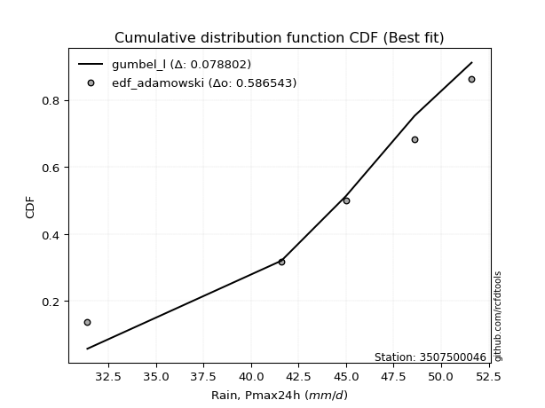</img></img>

</div>


## C. Best fit & Estimate extreme values for specific return periods - Tr

Best fit in probability distribution analysis means finding the theoretical distribution (like Normal, Poisson, Exponential, etc.) that most accurately mirrors your real-world data´s patterns (shape, center, spread) for better predictions, using methods like visual checks (Q-Q plots), goodness-of-fit tests (Kolmogorov-Smirnov, Chi-Squared), and information criteria (AIC) to score and select the simplest, most representative model.


### 1. Best fit (ordered by delta Δ)

:file_folder:Table: [bestfit_3507500046.csv](table/bestfit_3507500046.csv)

<div align="center">

|   id |    station | empirical_dist   | p_dist      |     delta |   deltao | eval   |   fit |   n |   best_fit |   best_fit_sort |
|-----:|-----------:|:-----------------|:------------|----------:|---------:|:-------|------:|----:|-----------:|----------------:|
|    0 | 3507500046 | edf_chegodayev   | loglevy_l   | 0.0681816 | 0.530386 | Δo > Δ |     1 |   6 |          1 |               1 |
|    1 | 3507500046 | edf_jenkinson    | loglevy_l   | 0.0684265 | 0.530386 | Δo > Δ |     1 |   6 |          1 |               2 |
|    2 | 3507500046 | edf_beard        | loglevy_l   | 0.0684265 | 0.530386 | Δo > Δ |     1 |   6 |          1 |               3 |
|    3 | 3507500046 | edf_filliben     | loglevy_l   | 0.0686111 | 0.530386 | Δo > Δ |     1 |   6 |          1 |               4 |
|    4 | 3507500046 | edf_tukey        | loglevy_l   | 0.0690039 | 0.530386 | Δo > Δ |     1 |   6 |          1 |               5 |
|    5 | 3507500046 | edf_blom         | loglevy_l   | 0.0705132 | 0.530386 | Δo > Δ |     1 |   6 |          1 |               6 |
|    6 | 3507500046 | edf_adamowski    | loglevy_l   | 0.0723083 | 0.530386 | Δo > Δ |     1 |   6 |          1 |               7 |
|    7 | 3507500046 | edf_cunnane      | loglevy_l   | 0.0724486 | 0.530386 | Δo > Δ |     1 |   6 |          1 |               8 |
|    8 | 3507500046 | edf_gringorten   | loglevy_l   | 0.0756112 | 0.530386 | Δo > Δ |     1 |   6 |          1 |               9 |
|    9 | 3507500046 | edf_hazen        | loglevy_l   | 0.0805132 | 0.530386 | Δo > Δ |     1 |   6 |          1 |              10 |
|   10 | 3507500046 | edf_california   | weibull_max | 0.090649  | 0.530386 | Δo > Δ |     1 |   6 |          1 |              11 |
|   11 | 3507500046 | edf_weibull      | loglevy_l   | 0.0997808 | 0.530386 | Δo > Δ |     1 |   6 |          1 |              12 |

</div>


### 2. Extreme values and % difference analysis

In hydrology, a return period (or recurrence interval $Tr$) is the statistical average time between extreme events like floods or droughts of a specific magnitude, indicating how rare an event is, with a 100-year flood, for example, having a 1% chance of occurring in any given year, not that it happens exactly every century. It is a key tool for infrastructure design (like bridges or dams) and risk assessment, calculated from historical data to determine the probability of future events, although it is important to remember it is statistical average, and events can cluster or be missed.

The extreme value porcentage difference is evaluated as $pdiff = 1 - (ETrBf / ETr) * 100$, where _ETrBf_ correspond to the bestfit extreme value for a specific recurrence interval and _ETr_ correspond to the extreme value for one of the most used PDFsused in hydrology.

> risk_rate: assuming the return period as the project useful life.

:file_folder:Table: [extreme_3507500046.csv](table/extreme_3507500046.csv), all PDFs.  
:file_folder:Table: [extremepdiff_3507500046.csv](table/extremepdiff_3507500046.csv), % difference between bestfit and most used PDFs in Hydrology.

<div align="center">

Extreme values table for only best fit PDFs
|   id |      tr |   prob_l |     prob_g |      alpha |   anglit |   arcsine |   argus |    beta |   betaprime |   bradford |    burr |   burr12 |   cosine |   crystalball |   dgamma |   dweibull |   erlang |   exponnorm |   exponpow |   exponweib |       f |   fatiguelife |   foldnorm |   gamma |   gausshyper |   genexpon |   genextreme |   gengamma |   genhalflogistic |   genlogistic |   gennorm |   genpareto |   gompertz |   gumbel_l |   gumbel_r |   halfgennorm |   halflogistic |   halfnorm |   hypsecant |   invgamma |   invgauss |   invweibull |   johnsonsb |   johnsonsu |   kappa3 |   kappa4 |   ksone |   kstwobign |   laplace |   levy_l |   loggamma |   logistic |   loglaplace |    lomax |   maxwell |       mielke |    moyal |   nakagami |      ncf |     nct |    norm |   pearson3 |   powerlaw |   rayleigh |     rdist |     rice |   semicircular |   skewnorm |       t |   trapezoid |   triang |   truncexpon |   truncnorm |   truncpareto |   truncweibull_min |   tukeylambda |   uniform |   vonmises |   vonmises_line |     wald |   weibull_max |   weibull_min |   wrapcauchy |   logalpha |   loganglit |   logarcsine |   logargus |   logbeta |   logbetaprime |   logbradford |   logburr |   logburr12 |   logcosine |   logcrystalball |   logdgamma |   logdweibull |   logerlang |   logexponnorm |       logexponpow |   logexponweib |     logf |   logfatiguelife |   logfoldnorm |   loggausshyper |   loggenexpon |   loggenextreme |   loggengamma |   loggenhalflogistic |   loggenlogistic |       loggennorm |   loggenpareto |   loggompertz |   loggumbel_l |   loggumbel_r |   loghalfgennorm |   loghalflogistic |   loghalfnorm |   loghypsecant |   loginvgamma |   loginvgauss |   loginvweibull |   logjohnsonsb |   logjohnsonsu |   logkappa3 |   logkappa4 |   logksone |   logkstwobign |   loglevy_l |   logloggamma |   loglogistic |   logloglaplace |         loglomax |   logmaxwell |   logmielke |   logmoyal |   lognakagami |    logncf |   lognct |   lognorm |   logpearson3 |   logpowerlaw |   lograyleigh |   logrdist |   logrice |   logsemicircular |   logskewnorm |              logt |   logtrapezoid |   logtriang |   logtruncexpon |   logtruncnorm |   logtruncpareto |   logtruncweibull_min |   logtukeylambda |   loguniform |   logvonmises |   logvonmises_line |    logwald |   logweibull_max |   logweibull_min |   logwrapcauchy |    station |   n |   risk_rate |
|-----:|--------:|---------:|-----------:|-----------:|---------:|----------:|--------:|--------:|------------:|-----------:|--------:|---------:|---------:|--------------:|---------:|-----------:|---------:|------------:|-----------:|------------:|--------:|--------------:|-----------:|--------:|-------------:|-----------:|-------------:|-----------:|------------------:|--------------:|----------:|------------:|-----------:|-----------:|-----------:|--------------:|---------------:|-----------:|------------:|-----------:|-----------:|-------------:|------------:|------------:|---------:|---------:|--------:|------------:|----------:|---------:|-----------:|-----------:|-------------:|---------:|----------:|-------------:|---------:|-----------:|---------:|--------:|--------:|-----------:|-----------:|-----------:|----------:|---------:|---------------:|-----------:|--------:|------------:|---------:|-------------:|------------:|--------------:|-------------------:|--------------:|----------:|-----------:|----------------:|---------:|--------------:|--------------:|-------------:|-----------:|------------:|-------------:|-----------:|----------:|---------------:|--------------:|----------:|------------:|------------:|-----------------:|------------:|--------------:|------------:|---------------:|------------------:|---------------:|---------:|-----------------:|--------------:|----------------:|--------------:|----------------:|--------------:|---------------------:|-----------------:|-----------------:|---------------:|--------------:|--------------:|--------------:|-----------------:|------------------:|--------------:|---------------:|--------------:|--------------:|----------------:|---------------:|---------------:|------------:|------------:|-----------:|---------------:|------------:|--------------:|--------------:|----------------:|-----------------:|-------------:|------------:|-----------:|--------------:|----------:|---------:|----------:|--------------:|--------------:|--------------:|-----------:|----------:|------------------:|--------------:|------------------:|---------------:|------------:|----------------:|---------------:|-----------------:|----------------------:|-----------------:|-------------:|--------------:|-------------------:|-----------:|-----------------:|-----------------:|----------------:|-----------:|----:|------------:|
|    0 |    2    | 0.5      | 0.5        |    7.97709 |  36.7333 |   36.7333 | 41.3577 | 48.7491 |     36.3608 |    23.957  | 33.4932 |  40.4073 |  33.6841 |       36.7333 |  41.6    |    45      |  36.0995 |     36.7334 |    2.20549 |     18.3225 | 36.6971 |       2.20004 |    37.2542 | 36.3911 |      38.3621 |    26.1506 |      44.8324 |    40.0971 |           36.0253 |           inf |   45      |     40.5988 |    39.7809 |    39.4781 |    33.9885 |       20.4504 |        32.624  |    33.3133 |     36.7333 |    35.1407 |    35.5561 |      34.6148 |     51.3778 |     51.2052 |   2.2    |  27.0103 | 26.9    |     32.4145 |   36.7333 |  44.9395 |    25.3762 |    36.7333 |      26.2114 |  25.4824 |   35.3044 | -1.17132e+07 |  33.1024 |    36.7875 |  32.5623 | 36.7318 | 36.7333 |    40.1871 |    2.67468 |    34.7976 | -1.87292  |  32.473  |        36.7333 |    36.5158 | 36.6718 |     39.0738 |  34.2226 |      19.2312 |     36.5303 |       3.0561  |            30.5207 |    -0.0386416 |   26.9    |    1.21061 |         40.9197 |  31.3174 |       39.0275 |       4.69257 |      26.9    |    24.3892 |     26.2114 |      26.2114 |    35.0447 |      51.6 |        24.2132 |       8.40691 |   32.4307 |     34.021  |     20.2089 |          26.2115 |      48.6   |       51.6    |     25.5656 |        26.2115 |      2.27123      |        32.1229 |  26.2159 |          26.1891 |       27.0224 |         19.6489 |       18.5134 |         38.19   |       32.4698 |              18.9599 |         inf      |     48.6         |        16.1187 |       32.6029 |       31.503  |       21.8087 |     10.0362      |           19.9036 |       20.8439 |        26.2114 |       25.4079 |       25.2012 |         23.0156 |        51.4971 |        51.5975 |         2.2 |     11.1283 |    10.6546 |        19.3063 |     44.6723 |       32.2529 |       26.2114 |    41.6         |     12.223       |      23.8185 |     33.6832 |    20.5517 |       34.5173 |   25.8308 |  26.1313 |   26.2114 |       35.4476 |       2.28583 |       23.0234 |    4.42132 |   26.2114 |           26.2114 |       21.3525 |     45.8025       |        31.761  |     16.743  |         6.95119 |        13.9172 |          2.33647 |               20.1321 |          8.75219 |      10.6546 |     0.0770764 |            35.733  |    18.2351 |          22.6447 |          32.838  |         10.6546 | 3507500046 |   6 |    0.75     |
|    1 |    2.33 | 0.570815 | 0.429185   |    9.49364 |  40.2062 |   41.9467 | 43.194  | 50.3299 |     39.4322 |    27.8723 | 36.4814 |  42.3769 |  36.9344 |       39.7148 |  42.0056 |    46.1921 |  39.2053 |     39.7149 |    2.22507 |     27.4121 | 39.6941 |       3.14084 |    39.8296 | 39.5129 |      41.9511 |    31.4276 |      46.5185 |    42.1754 |           39.0585 |           inf |   45.7051 |     43.7836 |    41.8766 |    42.072  |    36.7512 |       26.7697 |        35.4644 |    36.5311 |     39.1194 |    38.4175 |    39.0485 |      38.7438 |     51.5553 |     51.428  |   2.2    |  30.7139 | 31.0979 |     36.5927 |   38.5376 |  46.9779 |    31.5132 |    39.3602 |      29.5792 |  30.6122 |   38.4019 | -1.17132e+07 |  35.7177 |    39.7788 |  36.4489 | 39.7145 | 39.7148 |    42.8174 |    3.3532  |    37.941  | -1.22003  |  36.3743 |        40.458  |    38.9231 | 39.6595 |     42.5057 |  37.1032 |      23.0046 |     39.0264 |       3.53127 |            33.5711 |     0.28661   |   30.3983 |    1.53944 |         43.2117 |  33.2724 |       41.5206 |       6.26874 |      38.2651 |    30.716  |     33.0777 |      37.1687 |    37.6836 |      51.6 |        31.3294 |      10.5265  |   35.5532 |     37.4307 |     25.2816 |          32.0065 |      53.361 |       56.6435 |     31.6363 |        32.0066 |      2.39783      |        35.4758 |  32.026  |          31.9655 |       32.0623 |         25.037  |       24.5587 |         41.5401 |       35.7392 |              23.2865 |         inf      |     49.007       |        21.2071 |       36.3752 |       37.482  |       26.2428 |     14.8532      |           24.0754 |       25.8586 |        30.7549 |       31.3293 |       31.5371 |         30.873  |        51.5698 |        51.5994 |         2.2 |     14.206  |    13.9308 |        25.9931 |     46.6883 |       35.284  |       31.2551 |    49.189       |     17.8349      |      29.3116 |     36.6324 |    24.4872 |       36.0358 |   31.9042 |  31.9705 |   32.0065 |       41.6242 |       2.40461 |       28.4202 |    6.78579 |   32.0065 |           33.6405 |       24.5811 |     46.979        |        39.9714 |     20.1669 |         8.82347 |        19.0453 |          2.41446 |               23.4657 |         10.675   |      13.322  |     0.0894197 |            40.9957 |    20.7869 |          32.3904 |          36.5571 |         37.0396 | 3507500046 |   6 |    0.729209 |
|    2 |    5    | 0.8      | 0.2        |   21.2532  |  52.4593 |   55.8488 | 48.1684 | 51.5786 |     50.9628 |    40.5436 | 45.3197 |  48.7451 |  48.647  |       50.7948 |  49.1245 |    55.5902 |  50.9145 |     50.7949 |    4.40902 |    126.728  | 50.8494 |      23.1254  |    49.4001 | 51.2913 |      49.7001 |    57.8116 |      50.1367 |    48.4057 |           46.8935 |           inf |   51.8771 |     50.1846 |    48.6771 |    50.4519 |    48.7535 |       69.919  |        48.317  |    50.1387 |     48.6905 |    51.1026 |    52.8804 |      56.6821 |     51.5999 |     51.5922 |   2.2    |  42.5493 | 44.684  |     54.3409 |   47.5584 |  50.3549 |    71.5098 |    49.503  |      54.1317 |  56.26   |   50.5936 | -1.17132e+07 |  47.8316 |    50.8976 |  53.2241 | 50.8006 | 50.7948 |    50.7639 |   13.2737  |    50.5252 |  0.812163 |  51.993  |        53.1689 |    45.9342 | 50.8159 |     52.3518 |  45.3673 |      36.8237 |     46.1182 |       9.0475  |            43.1983 |     1.33139   |   41.72   |    2.76376 |         52.1509 |  44.2164 |       47.7415 |      22.0137  |      48.7029 |    75.821  |     75.1701 |      94.335  |    45.8889 |      51.6 |        87.1054 |      23.3665  |   44.938  |     50.9608 |     56.6626 |          67.2381 |      94.01  |      106.609  |     70.7895 |        67.2381 |     11.0532       |        46.5668 |  67.4316 |          67.0667 |       60.5348 |         43.8377 |       76.8824 |         48.974  |       45.9435 |              38.9481 |         inf      |     57.2006      |        40.9251 |       51.8449 |       65.7111 |       58.644  |    130.648       |           56.9533 |       64.3474 |        58.3969 |       69.6426 |       75.0178 |        110.597  |        51.5997 |        51.6    |         2.2 |     30.1758 |    33.1755 |        91.9376 |     50.2306 |       44.3596 |       61.6637 |   128.027       |    117.948       |      66.3381 |     45.3686 |    55.1315 |       45.9513 |   70.5765 |  67.7523 |   67.238  |       64.7017 |       4.71527 |       66.0341 |   21.4164  |   67.238  |           78.83   |       37.0437 |     54.7471       |        77.3082 |     34.3929 |        20.9187  |        71.2827 |          3.49774 |               36.5767 |         20.2434  |      27.4539 |     0.158313  |            69.636  |    43.2727 |          49.6213 |          51.7017 |         48.7654 | 3507500046 |   6 |    0.67232  |
|    3 |   10    | 0.9      | 0.1        |   42.8584  |  59.3947 |   59.2049 | 50.1852 | 51.5995 |     58.7133 |    46.0725 | 48.8713 |  52.2941 |  55.7234 |       58.1449 |  58.4317 |    66.0447 |  58.8281 |     58.145  |   22.0726  |    343.671  | 58.265  |      50.719   |    55.749  | 59.2595 |      51.1756 |    81.7622 |      51.0691 |    51.5655 |           49.5145 |           inf |   60.3236 |     51.3    |    52.4768 |    55.1174 |    58.5292 |      125.963  |        58.9904 |    60.208  |     56.3333 |    59.9819 |    62.8332 |      71.2926 |     51.6    |     51.599  |   2.2    |  47.5028 | 50.612  |     67.8539 |   55.7473 |  51.1702 |   124.726  |    56.9727 |      93.6937 |  79.5424 |   59.1735 | 50.0526      |  58.3786 |    58.2756 |  66.5727 | 58.156  | 58.1449 |    54.6027 |   26.583   |    59.4981 |  1.59901  |  63.1294 |        59.6911 |    48.7897 | 58.3225 |     56.1977 |  48.5953 |      43.8243 |     48.9135 |      18.9311  |            47.3794 |     1.77702   |   46.66   |    3.48405 |         59.0078 |  55.8306 |       49.8349 |      50.034   |      50.2925 |   144.258  |    119.628  |     118.12   |    49.7187 |      51.6 |       181.878  |      34.3102  |   48.7656 |     60.5131 |     92.2682 |         110.02   |     161.878 |      205.752  |    122.232  |       110.02   |   1970.57         |        52.512  | 110.503  |         109.678  |       92.2791 |         49.5228 |      174.433  |         50.7616 |       50.8513 |              45.8284 |         inf      |     80.0693      |        48.189  |       63.1717 |       89.8223 |      112.889  |   1214.75        |          116.43   |      126.33   |        97.4452 |      120.482  |      137.303  |        312.679  |        51.6    |        51.6    |         2.2 |     40.5803 |    48.4446 |       240.552  |     51.1253 |       48.048  |      101.711  |   372.678       |    655.311       |     117.869  |     48.8842 |   111.756  |       56.8665 |  120.478  | 111.659  |  110.02   |       77.3565 |      11.0441  |      120.458  |   28.4117  |  110.02   |          122.027  |       43.7781 |     75.2392       |       100.029  |     42.3664 |        32.1753  |       188.392  |          6.6539  |               43.6126 |         26.664   |      37.638  |     0.241779  |           103.474  |    94.2188 |          51.3324 |          62.7068 |         50.3115 | 3507500046 |   6 |    0.651322 |
|    4 |   15    | 0.933333 | 0.0666667  |   64.3865  |  62.3563 |   59.8451 | 50.9004 | 51.5999 |     62.6114 |    47.9154 | 50.0219 |  53.9022 |  58.9467 |       61.8128 |  64.4319 |    72.6758 |  62.8209 |     61.8129 |   52.3348  |    558.993  | 61.9702 |      68.7657  |    58.9172 | 63.2823 |      51.4239 |    95.7725 |      51.3004 |    52.93   |           50.2843 |           inf |   66.387  |     51.4789 |    54.1998 |    57.2303 |    64.0445 |      166.41   |        65.0307 |    65.448  |     60.6949 |    64.5588 |    68.0424 |      79.5357 |     51.6    |     51.5996 |   2.2    |  49.0875 | 52.588  |     75.0277 |   60.5374 |  51.4165 |   165.262  |    61.0426 |     129.147  |  93.1617 |   63.5758 | 50.5938      |  64.4997 |    61.9579 |  73.9661 | 61.8269 | 61.8128 |    56.1441 |   33.3122  |    64.1213 |  1.83283  |  68.8674 |        62.2345 |    49.7292 | 62.1186 |     57.4317 |  49.631  |      46.3218 |     49.8192 |      25.606   |            48.7802 |     1.92241   |   48.3067 |    3.76061 |         62.8712 |  63.2887 |       50.4646 |      73.4993  |      50.7436 |   201.709  |    145.882  |     123.295  |    51.155  |      51.6 |       267.302  |      39.2027  |   50.0121 |     65.4094 |    115.215  |         140.667  |     223.543 |      308.746  |    161.107  |       140.666  | 564809            |        55.0908 | 141.395  |         140.202  |      113.887  |         50.6648 |      266.325  |         51.1624 |       52.8489 |              47.9786 |         inf      |    108.769       |        49.9005 |       69.0887 |      103.481  |      163.352  |   4927.22        |          174.504  |      179.462  |       130.516  |      159.277  |      187.339  |        562.019  |        51.6    |        51.6    |         2.2 |     44.4146 |    54.961  |       400.835  |     51.3987 |       49.2477 |      133.592  |   773.524       |   1786.91        |     158.301  |     50.0238 |   168.409  |       63.8116 |  157.71   | 143.332  |  140.666  |       82.3374 |      16.813   |      164.191  |   30.0132  |  140.666  |          144.697  |       46.2513 |    110.163        |       108.649  |     45.2977 |        37.4725  |       312.066  |         10.1887  |               46.1635 |         29.1942  |      41.812  |     0.306666  |           129.427  |   155.288  |          51.5141 |          68.4337 |         50.7533 | 3507500046 |   6 |    0.644736 |
|    5 |   20    | 0.95     | 0.05       |   85.8956  |  64.0984 |   60.0705 | 51.2821 | 51.6    |     65.1751 |    48.8369 | 50.5916 |  54.9034 |  60.9291 |       64.2148 |  68.8508 |    77.5657 |  65.4516 |     64.2149 |   89.501   |    765.116  | 64.3982 |      82.1271  |    60.992  | 65.9335 |      51.5057 |   105.713  |      51.3993 |    53.7599 |           50.6472 |           inf |   71.1726 |     51.5364 |    55.2728 |    58.5455 |    67.9063 |      198.627  |        69.2627 |    68.9416 |     63.7719 |    67.6105 |    71.5436 |      85.3073 |     51.6    |     51.5998 |   2.2    |  49.8588 | 53.576  |     79.8602 |   63.9361 |  51.5426 |   198.98   |    63.8556 |     162.169  | 102.825  |   66.4974 | 50.8573      |  68.8347 |    64.3696 |  79.0898 | 64.231  | 64.2148 |    57.0311 |   37.2303  |    67.1942 |  1.94136  |  72.6813 |        63.6453 |    50.1976 | 64.627  |     58.0404 |  50.142  |      47.6047 |     50.268  |      30.1266  |            49.4827 |     1.99411   |   49.13   |    3.90482 |         65.5323 |  68.8465 |       50.7664 |      93.6085  |      50.9616 |   252.59   |    163.942  |     125.172  |    51.939  |      51.6 |       346.189  |      41.9472  |   50.6306 |     68.6553 |    132.077  |         165.226  |     281.459 |      414.855  |    193.293  |       165.226  |      1.31583e+08  |        56.6564 | 166.168  |         164.664  |      130.71   |         51.0716 |      352.939  |         51.3228 |       54.026  |              49.0015 |         inf      |    143.16        |        50.5691 |       73.0493 |      113.012  |      211.584  |  13837.2         |          231.705  |      226.789  |       160.395  |      191.62   |      230.384  |        847.328  |        51.6    |        51.6    |         2.2 |     46.3503 |    58.5408 |       565.39   |     51.5393 |       49.8423 |      161.297  |  1370.24        |   3640.85        |     192.526  |     50.5881 |   225.162  |       68.9607 |  188.293  | 168.822  |  165.226  |       85.0889 |      21.4275  |      201.723  |   30.6045  |  165.226  |          159.04   |       47.5361 |    169.942        |       113.172  |     46.8176 |        40.5137  |       436.756  |         13.5604  |               47.4799 |         30.5365  |      44.0695 |     0.363325  |           151.857  |   225.343  |          51.5613 |          72.2596 |         50.9677 | 3507500046 |   6 |    0.641514 |
|    6 |   25    | 0.96     | 0.04       |  107.397   |  65.279  |   60.1751 | 51.5242 | 51.6    |     67.068  |    49.3898 | 50.9318 |  55.616  |  62.3192 |       65.983  |  72.3516 |    81.4528 |  67.3962 |     65.9831 |  130.485   |    961.606  | 66.1865 |      92.7432  |    62.5193 | 67.8937 |      51.5419 |   113.423  |      51.4526 |    54.3418 |           50.8569 |           inf |   75.1563 |     51.5614 |    56.0366 |    59.4814 |    70.8808 |      225.663  |        72.5232 |    71.541  |     66.1532 |    69.8849 |    74.1671 |      89.753  |     51.6    |     51.5999 |   2.2    |  50.3123 | 54.1688 |     83.4799 |   66.5723 |  51.6218 |   228.282  |    66.0075 |     193.496  | 110.32   |   68.6664 | 51.0131      |  72.1948 |    66.1451 |  83.0098 | 66.0008 | 65.983  |    57.626  |   39.7767  |    69.4773 |  2.00296  |  75.5149 |        64.5605 |    50.4784 | 66.4861 |     58.4031 |  50.4464 |      48.3858 |     50.536  |      33.3427  |            49.9049 |     2.03669   |   49.624  |    3.99288 |         67.5059 |  73.2981 |       50.9429 |     111.286   |      51.0907 |   298.921  |    177.436  |     126.052  |    52.4429 |      51.6 |       420.161  |      43.6996  |   51.0012 |     71.0626 |    145.354  |         186.005  |     336.74  |      523.652  |    221.173  |       186.005  |      2.22301e+10  |        57.7519 | 187.138  |         185.363  |      144.663  |         51.2611 |      435.127  |         51.405  |       54.8347 |              49.5921 |         inf      |    183.672       |        50.9018 |       76.0057 |      120.325  |      258.242  |  31484.8         |          288.27   |      269.931  |       188.138  |      219.787  |      268.729  |       1162.49   |        51.6    |        51.6    |         2.2 |     47.5022 |    60.7997 |       731.546  |     51.6277 |       50.1975 |      186.31   |  2207.72        |   6323.55        |     222.637  |     50.925  |   282.006  |       73.0769 |  214.631  | 190.454  |  186.005  |       86.863  |      25.0672  |      235.062  |   30.8849  |  186.005  |          169.096  |       48.3232 |    274.006        |       115.955  |     47.7472 |        42.4813  |       560.788  |         16.6002  |               48.2832 |         31.3661  |      45.4821 |     0.41508   |           172.117  |   303.646  |          51.579  |          75.1117 |         51.095  | 3507500046 |   6 |    0.639603 |
|    7 |   50    | 0.98     | 0.02       |  214.871   |  68.1853 |   60.3148 | 52.0622 | 51.6    |     72.5145 |    50.4956 | 51.6161 |  57.5509 |  65.9593 |       71.0464 |  83.5407 |    93.9916 |  73.0024 |     71.0466 |  352.579   |   1827.89   | 71.3112 |     126.805   |    66.893  | 73.547  |      51.5871 |   137.374  |      51.543  |    55.8867 |           51.2546 |           inf |   89.02   |     51.5918 |    58.1108 |    62.0219 |    80.0439 |      321.312  |        82.5694 |    79.0964 |     73.5363 |    76.5325 |    81.8999 |     103.448  |     51.6    |     51.6    |  50.6323 |  51.1894 | 55.3544 |     94.1092 |   74.7612 |  51.8    |   339.433  |    72.5823 |     334.911  | 133.602  |   74.9569 | 51.32        |  82.6259 |    71.2298 |  94.9653 | 71.0692 | 71.0464 |    59.0789 |   45.3449  |    76.1048 |  2.11545  |  83.7404 |        66.6512 |    51.0394 | 71.8763 |     59.1228 |  51.0504 |      49.9745 |     51.0696 |      41.2151  |            50.7511 |     2.12046   |   50.612  |    4.17157 |         72.6838 |  87.8328 |       51.2843 |     178.479   |      51.3463 |   490.892  |    215.576  |     127.237  |    53.5808 |      51.6 |       743.025  |      47.4627  |   51.7584 |     78.0319 |    186.791  |         261.125  |     589.351 |     1099.44   |    326.318  |       261.125  |      4.48777e+19  |        60.6498 | 263.016  |         260.2    |      193.415  |         51.515  |      799.412  |         51.5342 |       56.9193 |              50.6994 |         inf      |    499.3         |        51.393  |       84.6495 |      142.651  |      477.126  | 452380           |          565.06   |      447.799  |       308.526  |      327.15   |      421.011  |       3079.39   |        51.6    |        51.6    |         2.2 |     49.7307 |    65.5823 |      1558.89   |     51.8273 |       50.9043 |      289.423  | 11975.5         |  35133.1         |     339.331  |     51.602  |   567.227  |       86.5347 |  312.917  | 269.086  |  261.124  |       90.856  |      35.2618  |      366.447  |   31.2677  |  261.124  |          194.52   |       49.9353 |   4980.1          |       121.684  |     49.6472 |        46.7738  |      1159      |         27.1433  |               49.9207 |         33.0756  |      48.4446 |     0.632975  |           253.874  |   804.016  |          51.5968 |          83.4342 |         51.3479 | 3507500046 |   6 |    0.63583  |
|    8 |   75    | 0.986667 | 0.0133333  |  322.331   |  69.4643 |   60.3407 | 52.2715 | 51.6    |     75.453  |    50.8642 | 51.8582 |  58.5296 |  67.6977 |       73.7633 |  90.2567 |   101.615  |  76.0337 |     73.7635 |  572.082   |   2559.96   | 74.0634 |     147.318   |    69.2397 | 76.6049 |      51.5946 |   151.384  |      51.5672 |    56.6498 |           51.3787 |           inf |   98.1602 |     51.5967 |    59.1601 |    63.3066 |    85.3699 |      385.651  |        88.4092 |    83.2092 |     77.8509 |    80.1834 |    86.1858 |     111.408  |     51.6    |     51.6    |  50.9617 |  51.4684 | 55.7496 |     99.9573 |   79.5514 |  51.8733 |   420.797  |    76.3796 |     461.639  | 147.222  |   78.3769 | 51.4209      |  88.7258 |    73.9584 | 101.85   | 73.7889 | 73.7633 |    59.7191 |   47.3503  |    79.7104 |  2.14848  |  88.2154 |        67.4864 |    51.2263 | 74.8139 |     59.3611 |  51.2504 |      50.5122 |     51.2467 |      44.3563  |            51.0338 |     2.14776   |   50.9413 |    4.23166 |         74.8396 |  96.7767 |       51.3938 |     226.899   |      51.431  |   646.22   |    234.863  |     127.458  |    54.0304 |      51.6 |      1018.61   |      48.7986  |   52.038  |     81.8123 |    210.559  |         313.255  |     818.841 |     1715.91   |    402.804  |       313.254  |      7.7623e+26   |        62.0754 | 315.721  |         312.144  |      226.032  |         51.5622 |     1113.3    |         51.565  |       57.9179 |              51.0366 |         inf      |   1071.26        |        51.4985 |       89.3889 |      155.472  |      681.701  |      2.31445e+06 |          835.612  |      589.863  |       411.933  |      406.248  |      538.373  |       5424.65   |        51.6    |        51.6    |         2.2 |     50.4266 |    67.2587 |      2363.71   |     51.9096 |       51.1389 |      373.266  | 38034.6         |  95801.1         |     426.708  |     51.8404 |   853.566  |       94.8797 |  383.573  | 323.985  |  313.254  |       92.4125 |      39.851   |      466.57   |   31.3404  |  313.254  |          205.715  |       50.4842 | 172966            |       123.642  |     50.2927 |        48.3196  |      1720.16   |         32.9875  |               50.4758 |         33.6577  |      49.4743 |     0.804552  |           313.017  |  1463.85   |          51.5989 |          87.9877 |         51.4319 | 3507500046 |   6 |    0.634587 |
|    9 |  100    | 0.99     | 0.01       |  429.786   |  70.2248 |   60.3497 | 52.3873 | 51.6    |     77.4469 |    51.0485 | 51.9913 |  59.1699 |  68.7872 |       75.6009 |  95.0815 |   107.14   |  78.0931 |     75.6011 |  779.597   |   3204.65   | 75.9258 |     162.078   |    70.827  | 78.6829 |      51.5971 |   161.325  |      51.5778 |    57.1427 |           51.4386 |           inf |  105.101  |     51.5983 |    59.8465 |    64.1469 |    89.1394 |      435.15   |        92.5425 |    86.011  |     80.9115 |    82.6868 |    89.1398 |     117.042  |     51.6    |     51.6    |  51.1265 |  51.604  | 55.9472 |    103.964  |   82.9501 |  51.9161 |   487.009  |    79.0606 |     579.68   | 156.885  |   80.7064 | 51.4711      |  93.0535 |    75.804  | 106.702  | 75.6285 | 75.6009 |    60.1025 |   48.3824  |    82.1669 |  2.16375  |  91.2642 |        67.9541 |    51.3197 | 76.8207 |     59.4799 |  51.3502 |      50.7826 |     51.3352 |      46.0404  |            51.1752 |     2.16122   |   51.106  |    4.26176 |         75.9919 | 103.298  |       51.4475 |     265.555   |      51.4733 |   781.089  |    247.14   |     127.535  |    54.2809 |      51.6 |      1265.71   |      49.4827  |   52.1971 |     84.3835 |    226.975  |         354.293  |    1034.57  |     2363.74   |    464.81   |       354.292  |      7.45243e+32  |        62.9946 | 357.236  |         353.043  |      251.157  |         51.5787 |     1395.25   |         51.5776 |       58.553  |              51.1961 |         inf      |   2013.71        |        51.5388 |       92.6318 |      164.476  |      877.546  |      7.6023e+06  |         1102.21   |      711.66   |       505.68   |      470.915  |      637.06   |       8098.7    |        51.6    |        51.6    |         2.2 |     50.7582 |    68.1129 |      3143.81   |     51.9578 |       51.256  |      446.708  | 94007.3         | 195197           |     498.78   |     51.9708 |  1140.65   |      101.015  |  440.429  | 367.368  |  354.292  |       93.269  |      42.4363  |      550.03   |   31.3662  |  354.292  |          212.263  |       50.7609 |      9.89973e+06  |       124.63   |     50.6177 |        49.1155  |      2250.83   |         36.6137  |               50.7551 |         33.95    |      49.9974 |     0.939962  |           356.275  |  2265.84   |          51.5995 |          91.0997 |         51.4739 | 3507500046 |   6 |    0.633968 |
|   10 |  200    | 0.995    | 0.005      |  859.598   |  71.6617 |   60.3585 | 52.587  | 51.6    |     81.9886 |    51.3249 | 52.2378 |  60.5618 |  71.0026 |       79.7691 | 106.871  |   120.812  |  82.792  |     79.7693 | 1498.33    |   5281.64   | 80.1533 |     198.208   |    74.4274 | 83.4256 |      51.5994 |   185.275  |      51.5913 |    58.198  |           51.5243 |           inf |  123.369  |     51.5996 |    61.339  |    65.9734 |    98.2017 |      567.861  |       102.48   |    92.4191 |     88.2847 |    88.4693 |    96.0077 |     130.586  |     51.6    |     51.6    |  51.3736 |  51.7998 | 56.2436 |    113.193  |   91.1389 |  51.9972 |   680.046  |    85.4918 |    1003.34   | 180.167  |   86.036  | 51.546       | 103.48   |    79.9909 | 118.323  | 79.8015 | 79.7691 |    60.8381 |   49.9682  |    87.7874 |  2.18446  |  98.24   |        68.7695 |    51.4599 | 81.4379 |     59.6578 |  51.4995 |      51.1901 |     51.4677 |      48.7206  |            51.3875 |     2.18108   |   51.353  |    4.30697 |         77.7911 | 119.541  |       51.5261 |     374.071   |      51.5366 |  1214.21   |    272.112  |     127.61   |    54.7155 |      51.6 |      2095.49   |      50.5295  |   52.5048 |     90.2546 |    264.407  |         468.424  |    1820     |     5184.77   |    644.617  |       468.423  |      1.87221e+50  |        64.9603 | 472.785  |         466.812  |      318.991  |         51.5947 |     2339.38   |         51.5924 |       59.8888 |              51.4188 |         inf      |  12938.3         |        51.5819 |      100.093  |      185.885  |     1610.43   |      1.47618e+08 |         2144.77   |     1093.26   |       828.711  |      660.858  |      938.891  |      21224.3    |        51.6    |        51.6    |         2.2 |     51.2232 |    69.4146 |      6063.74   |     52.0491 |       51.4314 |      687.295  |     1.15781e+06 |      1.0845e+06  |     712.814  |     52.2111 |  2293.62   |      116.548  |  603.547  | 488.663  |  468.423  |       94.7248 |      46.7328  |      801.526  |   31.3914  |  468.423  |          224.181  |       51.1787 |      4.3196e+15   |       126.124  |     51.1082 |        50.3393  |      4161.9    |         43.209   |               51.1763 |         34.3885  |      50.7924 |     1.25717   |           447.766  |  6727.21   |          51.5999 |          98.2488 |         51.5369 | 3507500046 |   6 |    0.633042 |
|   11 |  250    | 0.996    | 0.004      | 1074.5     |  72.0274 |   60.3595 | 52.6334 | 51.6    |     83.3818 |    51.3802 | 52.3037 |  60.9715 |  71.6099 |       81.0429 | 110.708  |   125.314  |  84.2356 |     81.0431 | 1806.82    |   6135.83   | 81.446  |     209.983   |    75.5276 | 84.8831 |      51.5996 |   192.986  |      51.5936 |    58.5045 |           51.5407 |           inf |  129.711  |     51.5998 |    61.7781 |    66.5108 |   101.115  |      614.712  |       105.674  |    94.3905 |     90.6582 |    90.2658 |    98.1533 |     134.94   |     51.6    |     51.6    |  51.423  |  51.8374 | 56.3029 |    116.049  |   93.7751 |  52.0183 |   753.598  |    87.5566 |    1197.15   | 187.662  |   87.6766 | 51.561       | 106.837  |    81.2705 | 122.052  | 81.0768 | 81.0429 |    61.0292 |   50.2908  |    89.5175 |  2.18817  | 100.387  |        68.9608 |    51.4879 | 82.8682 |     59.6933 |  51.5293 |      51.2719 |     51.4942 |      49.28    |            51.43   |     2.18498   |   51.4024 |    4.31601 |         78.1583 | 124.914  |       51.5415 |     413.806   |      51.5493 |  1393.91   |    278.861  |     127.619  |    54.8171 |      51.6 |      2452.39   |      50.7419  |   52.59   |     92.0586 |    275.706  |         510.154  |    2183.75  |     6701.99   |    712.814  |       510.152  |      6.16377e+56  |        65.5311 | 515.062  |         508.419  |      343.17   |         51.5966 |     2742.97   |         51.5946 |       60.2711 |              51.46   |         inf      |  26322.3         |        51.5878 |      102.401  |      192.699  |     1957.53   |      3.9489e+08  |         2656.62   |     1247.62   |       971.542  |      733.741  |     1058.82   |      28930      |        51.6    |        51.6    |         2.2 |     51.3093 |    69.6779 |      7430.7    |     52.0729 |       51.4664 |      789.254  |     2.90479e+06 |      1.88359e+06 |     795.628  |     52.2751 |  2871.99   |      121.779  |  664.836  | 533.221  |  510.152  |       95.057  |      47.6579  |      900.028  |   31.3944  |  510.152  |          227.072  |       51.2627 |      5.1808e+20   |       126.424  |     51.2068 |        50.5884  |      5027.86   |         44.7264  |               51.2608 |         34.4758  |      50.9529 |     1.34349   |           470.795  |  9642.41   |          51.6    |         100.457  |         51.5495 | 3507500046 |   6 |    0.632858 |
|   12 |  500    | 0.998    | 0.002      | 2149.02    |  72.9341 |   60.3609 | 52.7397 | 51.6    |     87.528  |    51.4908 | 52.4867 |  62.1459 |  73.2261 |       84.8204 | 122.733  |   139.583  |  88.5377 |     84.8205 | 3052.28    |   9496.53   | 85.2816 |     246.92    |    78.7905 | 89.2275 |      51.5999 |   216.936  |      51.5975 |    59.3734 |           51.5722 |           inf |  150.838  |     51.6    |    63.0374 |    68.0514 |   110.158  |      773.406  |       115.59   |   100.268  |     98.0309 |    95.6758 |   104.647  |     148.455  |     51.6    |     51.6    |  51.5218 |  51.91   | 56.4214 |    124.608  |  101.964  |  52.0728 |  1023.78   |    93.9599 |    2072.09   | 210.945  |   92.5722 | 51.5909      | 117.263  |    85.0655 | 133.625  | 84.8589 | 84.8204 |    61.5142 |   50.9417  |    94.6797 |  2.19493  | 106.794  |        69.4013 |    51.5439 | 87.1679 |     59.7643 |  51.5889 |      51.4358 |     51.5471 |      50.4233  |            51.515  |     2.19266   |   51.5012 |    4.33411 |         78.8972 | 142.001  |       51.5716 |     552.846   |      51.5747 |  2118.21   |    296.326  |     127.631  |    55.0505 |      51.6 |      3944.58   |      51.1697  |   52.832  |     97.4324 |    308.182  |         657.064  |    3849.47  |    15036.1    |    962.149  |       657.062  |      8.38342e+79  |        67.1511 | 664.002  |         654.936  |      426.196  |         51.5991 |     4411.01   |         51.5981 |       61.343  |              51.5372 |          51.5321 | 351539           |        51.5964 |      109.316  |      213.65   |     3587.61   |      9.14609e+09 |         5162.02   |     1849.7    |      1592.11   |     1003.62   |     1519.43   |      75658.4    |        51.6    |        51.6    |         2.2 |     51.4703 |    70.2076 |     13665.1    |     52.1344 |       51.5365 |     1212.06   |     7.57321e+07 |      1.0465e+07  |    1104.46   |     52.452  |  5774.89   |      138.768  |  886.734  | 690.844  |  657.062  |       95.8024 |      49.5792  |     1271.89   |   31.3986  |  657.061  |          233.872  |       51.4311 |      3.72985e+51  |       127.027  |     51.4042 |        51.0912  |      8832.1    |         47.9927  |               51.4302 |         34.6494  |      51.2754 |     1.54406   |           522.095  | 30292.2    |          51.6    |         107.067  |         51.5748 | 3507500046 |   6 |    0.632489 |
|   13 |  750    | 0.998667 | 0.00133333 | 3223.54    |  73.3355 |   60.3612 | 52.7823 | 51.6    |     89.8407 |    51.5276 | 52.5845 |  62.7738 |  74.0093 |       86.9188 | 129.83   |   148.117  |  90.9412 |     86.919  | 4009.72    |  12043.2    | 87.4138 |     268.744   |    80.603  | 91.6554 |      51.6    |   230.946  |      51.5986 |    59.8322 |           51.5821 |           inf |  164.192  |     51.6    |    63.7104 |    68.8747 |   115.444  |      875.66   |       121.386  |   103.552  |    102.344  |    98.7355 |   108.341  |     156.356  |     51.6    |     51.6    |  51.5548 |  51.9331 | 56.461  |    129.417  |  106.754  |  52.0987 |  1215.18   |    97.7009 |    2856.15   | 224.564  |   95.3103 | 51.6008      | 123.362  |    87.1738 | 140.401  | 86.9601 | 86.9188 |    61.7362 |   51.1603  |    97.5664 |  2.19691  | 110.377  |        69.5785 |    51.5626 | 89.5963 |     59.788  |  51.6092 |      51.4905 |     51.5647 |      50.8117  |            51.5433 |     2.19517   |   51.5341 |    4.34014 |         79.1444 | 152.246  |       51.5814 |     645.512   |      51.5831 |  2688.94   |    304.404  |     127.633  |    55.1442 |      51.6 |      5166.18   |      51.3133  |   52.9638 |    100.432  |    325.27   |         756.244  |    5366.11  |    24291.6    |   1137.87   |       756.242  |      3.10114e+95  |        68.0083 | 764.632  |         753.883  |      480.709  |         51.5996 |     5753.81   |         51.599  |       61.9023 |              51.5607 |          51.5553 |      2.14913e+06 |        51.5982 |      113.201  |      225.766  |     5112.25   |      6.0924e+10  |         7611.53   |     2304.85   |      2125.46   |     1196.67   |     1862.72   |     132719      |        51.6    |        51.6    |         2.2 |     51.5191 |    70.385  |     19241.9    |     52.1636 |       51.5598 |     1557.3    |     7.03317e+08 |      2.85362e+07 |    1326.83   |     52.5463 |  8689.58   |      149.238  | 1041.39   | 797.842  |  756.242  |       96.0921 |      50.2414  |     1543.26   |   31.3994  |  756.241  |          236.666  |       51.4873 |      2.12855e+89  |       127.229  |     51.4702 |        51.2601  |     12097.9    |         49.1552  |               51.4868 |         34.7067  |      51.3834 |     1.61957   |           540.761  | 60173.9    |          51.6    |         110.776  |         51.5832 | 3507500046 |   6 |    0.632366 |
|   14 | 1000    | 0.999    | 0.001      | 4298.06    |  73.5748 |   60.3613 | 52.8061 | 51.6    |     91.4369 |    51.5461 | 52.6514 |  63.1963 |  74.5033 |       88.3635 | 134.89   |   154.251  |  92.6017 |     88.3637 | 4804.31    |  14153.5    | 88.8824 |     284.312   |    81.851  | 93.333  |      51.6    |   240.887  |      51.599  |    60.139  |           51.5869 |           inf |  174.111  |     51.6    |    64.1635 |    69.4288 |   119.194  |      952.52   |       125.498  |   105.82   |    105.403  |   100.865  |   110.919  |     161.96   |     51.6    |     51.6    |  51.5713 |  51.9443 | 56.4807 |    132.748  |  110.153  |  52.115  |  1368.06   |   100.354  |    3586.47   | 234.227  |   97.2028 | 51.6058      | 127.69   |    88.6254 | 145.217  | 88.4067 | 88.3635 |    61.8717 |   51.2699  |    99.5612 |  2.19783  | 112.853  |        69.6781 |    51.572  | 91.286  |     59.7998 |  51.6209 |      51.5178 |     51.5736 |      51.0074  |            51.5575 |     2.19641   |   51.5506 |    4.34315 |         79.2681 | 159.615  |       51.5862 |     716.507   |      51.5873 |  3177.29   |    309.322  |     127.634  |    55.1968 |      51.6 |      6235.72   |      51.3852  |   53.0548 |    102.503  |    336.533  |         833.102  |    6793.67  |    34239.9    |   1277.77   |       833.099  |      2.81148e+107 |        68.5825 | 842.65   |         830.576  |      522.242  |         51.5998 |     6914.06   |         51.5994 |       62.2738 |              51.5718 |          51.567  |      8.96095e+06 |        51.5989 |      115.894  |      234.305  |     6572.24   |      2.39876e+11 |        10025.4    |     2683.02   |      2609.05   |     1351.87   |     2145.92   |     197726      |        51.6    |        51.6    |         2.2 |     51.5422 |    70.4739 |     24390.5    |     52.182  |       51.5715 |     1860.21   |     4.02721e+09 |      5.81429e+07 |    1506.19   |     52.6107 | 11611.9    |      156.912  | 1163.65   | 881.044  |  833.099  |       96.2513 |      50.5768  |     1763.92   |   31.3996  |  833.099  |          238.251  |       51.5155 |      2.52624e+132 |       127.329  |     51.5032 |        51.3448  |     15033.5    |         49.7511  |               51.5151 |         34.7352  |      51.4375 |     1.65896   |           550.384  | 98587.8    |          51.6    |         113.344  |         51.5874 | 3507500046 |   6 |    0.632305 |


</div>


<div align="center">

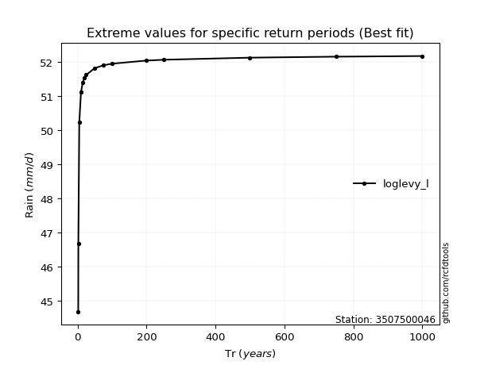</img>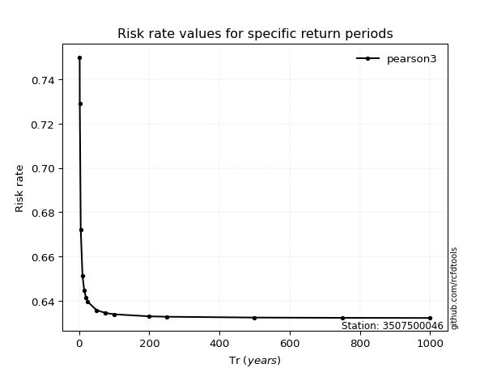</img>

</div>


<sub>**APP DISCLAIMER**: NO WARRANTY - This software is provided by [github.com/rcfdtools](https://github.com/rcfdtools) "as is", without any express or implied warranty, including warranties of merchantability, fitness for a particular purpose, or non-infringement. There is no guarantee that the software will be error-free or operate without interruption. LIMITATION OF LIABILITY - Neither the authors nor copyright holders will be liable for claims or damages arising from the software or its use. You are responsible for determining if the software is appropriate for your use and assume all associated risks, including errors, legal compliance, and data loss. NO PROFESSIONAL ADVICE - The software provides general information and does not offer professional advice. It should not replace consultation with professional advisors.</sub>