<div align="center">


</div>

# PMax24h Station (Rain): 35075070

Maximum Precipitation in 24 hours (PMax24h) is the greatest amount of rainfall for a specific duration that is meteorologically possible for a given location, acting as a "worst-case" scenario for extreme storms, crucial for designing safety-critical infrastructure like bridges, river deviations, dams, spillways, and nuclear plants to prevent catastrophic failure. The PMax24h is related with the Probable Maximum Precipitation (PMP) and it is calculated by hydrologists using meteorological data to determine the upper limit of extreme rainfall, often leading to the Probable Maximum Flood (PMF) for flood control design, and is increasingly being studied for climate change impacts. Probable Maximum Precipitation (PMP) is the theoretical upper limit of rainfall, a deterministic estimate for extreme events, while probability distributions (like GEV, Gumbel) describe the likelihood and frequency of various precipitation amounts, including rare ones, showing how often events occur, with PMP representing the extreme end of these distributions, used for critical infrastructure design to ensure safety against the worst conceivable weather, unlike standard statistical forecasts which cover typical probabilities.

The most common probability distributions in hydrology, used for analyzing floods, rainfall, and streamflow, include the Normal, Log-Normal, Gumbel, Gamma (including Log-Pearson Type III), and Generalized Extreme Value (GEV) distributions, often chosen based on the data´s skewness and whether modeling extremes or general conditions, with Gumbel and GEV popular for extreme events like floods, while the Normal distribution serves as a baseline, though often requiring transformations for skewed hydrological data. These distributions help in designing water infrastructure, managing water resources, and forecasting hydrologic events.

> Hydrological data often isn´t perfectly normal (it´s skewed), so different distributions are needed for different applications, such as: **Flood Frequency Analysis**: Using Gumbel, GEV, or Log-Pearson Type III for predicting extreme flood magnitudes and their return periods, **Rainfall Analysis**: Normal for annual totals, but Log-Normal, Weibull, or GEV for intensity or extreme daily rainfall, **Streamflow Modeling**: Gamma and Log-Normal for maximum flows, GEV for minimum flows, and Kappa for daily flows.

<div align="center">

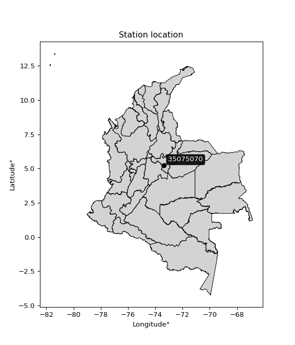</img>

</div>


## A. General information


### 1. General running parameters

• app_version: _v20260312_. • runtime: _2026-03-12 07:15:23.203550_. • Python version: _3.14.0_. • SciPy version: _1.16.3_. • Pandas version: _2.3.3_. • NumPy version: _2.3.5_. • Stations dataset (station_dataset_file): _dataset/pmax24h_in/automatic_colombia_2003_2025.csv_. • Stations catalog (station_catalog_file): _dataset/CNE.xls_. • Minimum year to eval til year_max (date_min): _1900_. • Maximum year to eval since year_min (date_max): _2025_. • Creates, save and include plots into reports (create_plot): _True_. • Plot only fit distributions with Δo > Δ (plot_only_fit): _True_. • Plot only simple graphs avoiding multiple CDFs and multiple Extreme values plots (plot_only_simple): _True_. • Eval low extreme values, if False, evaluates high extreme values (low_extreme): _False_. • Eval every SciPy distribution as logarithmic (pdist_logarithmic_on): _True_. • Standard deviation normalized (ddof): _1.0_. • Return periods to eval in years (Tr): _[2, 2.33, 5, 10, 15, 20, 25, 50, 75, 100, 200, 250, 500, 750, 1000]_. • Minimum data sample per station, 0 means any (minimum_sample): _5_. • Z-Score maximum threshold to adjust a value, 0 means disable (zscore_max): _3.5_. • Z-Score minimum threshold to adjust a value, 0 means disable (zscore_min): _-2.5_. • Avoid zeros, e.g. rain = 0 (avoid_zeros): _True_. • Avoid null values (avoid_nans): _True_. 

:file_folder:Table: [dataset.csv](../../dataset/pmax24h_in/automatic_colombia_2003_2025.csv)

> Delta Degrees of Freedom (DDOF): is a parameter used in the formulas for calculating variance and standard deviation. When ddof=0, the divisor is $N$ (the total number of observations) and this is used when your data set is the entire population. When ddof=1, the divisor is $N-1$ and this is used when your data set is a sample drawn from a larger population. Using $N-1$ provides an unbiased estimate of the population variance (known as Bessel´s correction).


### 2. Station info and location

|   id |   CODIGO | NOMBRE                     | CATEGORIA         | TECNOLOGIA                | ESTADO   | FECHA_INSTALACION   |   FECHA_SUSPENSION |   ALTITUD |   LATITUD |   LONGITUD | DEPARTAMENTO   | MUNICIPIO   | AREA_OPERATIVA                              | ENTIDAD                                                     | AREA_HIDROGRAFICA   | ZONA_HIDROGRAFICA   | SUBZONA_HIDROGRAFICA   |   CORRIENTE | Catalogo   |   Version |
|-----:|---------:|:---------------------------|:------------------|:--------------------------|:---------|:--------------------|-------------------:|----------:|----------:|-----------:|:---------------|:------------|:--------------------------------------------|:------------------------------------------------------------|:--------------------|:--------------------|:-----------------------|------------:|:-----------|----------:|
|    0 | 35075070 | CHINAVITA - AUT [35075070] | Agrometeorológica | Automática con Telemetría | Activa   | 06/03/2005          |                nan |      2006 |   5.21639 |    -73.347 | Boyacá         | Chinavita   | Area Operativa 06 - Boyacá-Casanare-Vichada | INSTITUTO DE HIDROLOGIA METEOROLOGIA Y ESTUDIOS AMBIENTALES | Orinoco             | Meta                | Río Garagoa            |         nan | CNE_IDEAM  |  20251226 |

<div align="center">

Dynamic map: [:earth_americas:Google](http://maps.google.com/maps?q=5.21639,-73.34697) [:earth_americas:OSM](https://www.openstreetmap.org/#map=18/5.21639/-73.34697&layers=P) [:earth_americas:Bing](https://www.bing.com/maps?cp=5.21639~-73.34697&lvl=18) [:earth_americas:Apple](https://maps.apple.com/frame?center=5.21639%2C-73.34697&span=0.003%2C0.006)

</div>


<div align="center">

```geojson
{
  "type": "Feature",
  "geometry": {
    "type": "Point", 
    "coordinates": [-73.34697, 5.21639]
  }, 
  "properties": {
    "Name": "35075070"
  }
}
```

</div>


### 3. Discrete values table and plot

<div align="center">

|               |           0 |           1 |          2 |          3 |           4 |          5 |          6 |           7 |
|:--------------|------------:|------------:|-----------:|-----------:|------------:|-----------:|-----------:|------------:|
| Date          | 2017        | 2018        | 2019       | 2020       | 2021        | 2022       | 2023       | 2025        |
| Value         |   50.5      |   33.1      |   78.3     |   74.3     |   53.5      |    6       |   10.1     |   71        |
| Value_initial |   50.5      |   33.1      |   78.3     |   74.3     |   53.5      |    6       |   10.1     |   71        |
| count         |    8        |    8        |    8       |    8       |    8        |    8       |    8       |    8        |
| mean          |   47.1      |   47.1      |   47.1     |   47.1     |   47.1      |   47.1     |   47.1     |   47.1      |
| std           |   28.2621   |   28.2621   |   28.2621  |   28.2621  |   28.2621   |   28.2621  |   28.2621  |   28.2621   |
| zscore        |    0.120302 |   -0.495363 |    1.10395 |    0.96242 |    0.226452 |   -1.45424 |   -1.30917 |    0.845656 |


</div>


<div align="center">

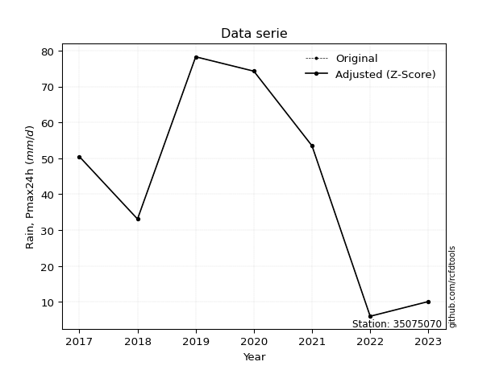</img>

</div>


> The initial value (value_initial) correspond to the initial obtained or null completed value, and value (value) is adjusted only when the initial value is outside the valid range (outlier) definite through the Z-Score value. If Z-Score is active, values out of range or outliers are replaced with the station mean value. A Z-Score (or standard score) measures how many standard deviations a data point is from the mean of a dataset, indicating its relative position; positive scores mean above the mean, negative mean below, and a score of zero is exactly at the mean, allowing for comparison of values from different distributions. It´s calculated using the formula $z=(x–μ)/σ$, where $x$ is the data point, $μ$ is the mean, and $σ$ is the standard deviation, helping identify outliers and understand probability.
>
> <sub>**Note**: In this study, "completing" (filling gaps in) and "extending" (forecasting or lengthening the historical record) rainfall data series are avoided for certain critical analyses because they introduce artificial bias and uncertainty, which can distort the statistics of rare events (extremes), alter day-to-day variability, and compromise the integrity and homogeneity of the original data. Some reasons against Completing/Extending rainfall data are: **Distortion of Extremes and Variability**: The primary issue is that most gap-filling or extension methods rely on averaging or regression with nearby stations, which inherently smooths the data. Rainfall is highly variable in space and time, with a large percentage of zero values and occasional large storms. Infilling methods often underestimate the highest values and overestimate the lowest (zero) values, which severely distorts analyses focused on flood frequency, drought severity, and intensity-duration-frequency (IDF) curves, **Loss of Data Homogeneity**: Infilled or extended data are synthetic estimates, not actual measurements. Combining these estimates with observed data can violate the assumption of data homogeneity, which requires that the data properties do not change over time. Inhomogeneity can lead to incorrect conclusions about long-term trends or changes in climate patterns, **Propagation of Errors**: Errors and biases from the original data (e.g., wind-induced undercatch, instrument errors, site changes) or the data used for imputation can propagate through the analysis, leading to unreliable hydrological models and inaccurate predictions, **Compromised Statistical Integrity**: For statistical analyses, especially those involving the frequency of events, using artificial data can introduce time bias or autocorrelation that doesn´t exist in reality, making it difficult to assess the true probability of events, **Difficulty in Validation**: It is difficult to accurately validate the quality of filled or extended data, especially for past periods where ground-truth measurements are unavailable. The reliability of imputation techniques heavily depends on the density of the surrounding station network and the complexity of the local topography.</sub>


### 4. Active continuous probability distributions from SciPy (80 of 104 available)

A Probability Density Function (PDF) describes the relative likelihood of a continuous random variable falling within a specific range, where the total area under its curve equals 1, and the area over any interval gives the actual probability for that range. Unlike discrete probabilities (like rolling a die), a PDF shows density, not direct probability for a single point (which is zero), with higher points indicating higher likelihood, often visualized as a bell curve for normal distributions.

A log of a probability density function (log-PDF) is simply the logarithm of the PDF´s value, denoted as $log(f(x))$, useful for converting multiplication of probabilities into addition, improving numerical stability with tiny numbers, and connecting to information theory concepts like entropy. Instead of dealing with very small probabilities (e.g., 0.000001), log-PDFs use negative numbers (e.g., $log(0.00001) ≈ -11.51$ that are easier for computers to handle, preventing underflow errors and simplifying complex calculations. In this study, each active probability distribution from SciPy is also evaluated in the $log$ form.

[scipy.stats](https://docs.scipy.org/doc/scipy/reference/stats.html) is a Python´s powerful submodule within the SciPy library for comprehensive statistical analysis, offering over 130 probability distributions (like Normal, Poisson, etc.), functions for descriptive stats (mean, variance), hypothesis testing (t-tests, chi-square), random variable generation, and statistical tests, making it essential for data science, modeling, and research. It provides tools to explore, model, and draw conclusions from data efficiently, working seamlessly with [NumPy](https://numpy.org/).

<div align="center">

|   id | p_dist           |   n_parameter | fit_method   | label                                                                       | active   | ref                                                                                                      |
|-----:|:-----------------|--------------:|:-------------|:----------------------------------------------------------------------------|:---------|:---------------------------------------------------------------------------------------------------------|
|    0 | alpha            |             3 | MLE          | Alpha                                                                       | True     | [:mortar_board:](https://docs.scipy.org/doc/scipy/reference/generated/scipy.stats.alpha.html)            |
|    1 | anglit           |             2 | MM           | Anglit                                                                      | True     | [:mortar_board:](https://docs.scipy.org/doc/scipy/reference/generated/scipy.stats.anglit.html)           |
|    2 | arcsine          |             2 | MM           | Arcsine                                                                     | True     | [:mortar_board:](https://docs.scipy.org/doc/scipy/reference/generated/scipy.stats.arcsine.html)          |
|    3 | argus            |             3 | MLE          | Argus                                                                       | True     | [:mortar_board:](https://docs.scipy.org/doc/scipy/reference/generated/scipy.stats.argus.html)            |
|    4 | beta             |             4 | MLE          | Beta                                                                        | True     | [:mortar_board:](https://docs.scipy.org/doc/scipy/reference/generated/scipy.stats.beta.html)             |
|    5 | betaprime        |             4 | MLE          | Beta prime                                                                  | True     | [:mortar_board:](https://docs.scipy.org/doc/scipy/reference/generated/scipy.stats.betaprime.html)        |
|    6 | bradford         |             3 | MLE          | Bradford                                                                    | True     | [:mortar_board:](https://docs.scipy.org/doc/scipy/reference/generated/scipy.stats.bradford.html)         |
|    7 | burr             |             4 | MLE          | Burr (Type III)                                                             | True     | [:mortar_board:](https://docs.scipy.org/doc/scipy/reference/generated/scipy.stats.burr.html)             |
|    8 | burr12           |             4 | MLE          | Burr (Type III) 12                                                          | True     | [:mortar_board:](https://docs.scipy.org/doc/scipy/reference/generated/scipy.stats.burr12.html)           |
|    9 | cosine           |             2 | MLE          | Cosine                                                                      | True     | [:mortar_board:](https://docs.scipy.org/doc/scipy/reference/generated/scipy.stats.cosine.html)           |
|   10 | crystalball      |             4 | MLE          | Crystalball                                                                 | True     | [:mortar_board:](https://docs.scipy.org/doc/scipy/reference/generated/scipy.stats.crystalball.html)      |
|   11 | dgamma           |             3 | MLE          | Double gamma                                                                | True     | [:mortar_board:](https://docs.scipy.org/doc/scipy/reference/generated/scipy.stats.dgamma.html)           |
|   12 | dweibull         |             3 | MLE          | Double Weibull                                                              | True     | [:mortar_board:](https://docs.scipy.org/doc/scipy/reference/generated/scipy.stats.dweibull.html)         |
|   13 | erlang           |             3 | MLE          | Erlang                                                                      | True     | [:mortar_board:](https://docs.scipy.org/doc/scipy/reference/generated/scipy.stats.erlang.html)           |
|   14 | exponnorm        |             3 | MLE          | Exponentially modified Normal                                               | True     | [:mortar_board:](https://docs.scipy.org/doc/scipy/reference/generated/scipy.stats.exponnorm.html)        |
|   15 | exponpow         |             3 | MLE          | Exponential power                                                           | True     | [:mortar_board:](https://docs.scipy.org/doc/scipy/reference/generated/scipy.stats.exponpow.html)         |
|   16 | exponweib        |             4 | MLE          | Exponentiated Weibull                                                       | True     | [:mortar_board:](https://docs.scipy.org/doc/scipy/reference/generated/scipy.stats.exponweib.html)        |
|   17 | f                |             4 | MLE          | F                                                                           | True     | [:mortar_board:](https://docs.scipy.org/doc/scipy/reference/generated/scipy.stats.f.html)                |
|   18 | fatiguelife      |             3 | MLE          | Fatigue-life (Birnbaum-Saunders)                                            | True     | [:mortar_board:](https://docs.scipy.org/doc/scipy/reference/generated/scipy.stats.fatiguelife.html)      |
|   19 | foldnorm         |             3 | MM           | Fold Normal                                                                 | True     | [:mortar_board:](https://docs.scipy.org/doc/scipy/reference/generated/scipy.stats.foldnorm.html)         |
|   20 | gamma            |             3 | MLE          | Gamma                                                                       | True     | [:mortar_board:](https://docs.scipy.org/doc/scipy/reference/generated/scipy.stats.gamma.html)            |
|   21 | gausshyper       |             6 | MLE          | Gauss hypergeometric                                                        | True     | [:mortar_board:](https://docs.scipy.org/doc/scipy/reference/generated/scipy.stats.gausshyper.html)       |
|   22 | genexpon         |             5 | MLE          | Generalized exponential                                                     | True     | [:mortar_board:](https://docs.scipy.org/doc/scipy/reference/generated/scipy.stats.genexpon.html)         |
|   23 | genextreme       |             3 | MLE          | Generalized exponential                                                     | True     | [:mortar_board:](https://docs.scipy.org/doc/scipy/reference/generated/scipy.stats.genextreme.html)       |
|   24 | gengamma         |             4 | MLE          | Generalized gamma                                                           | True     | [:mortar_board:](https://docs.scipy.org/doc/scipy/reference/generated/scipy.stats.gengamma.html)         |
|   25 | genhalflogistic  |             3 | MLE          | Generalized half-logistic                                                   | True     | [:mortar_board:](https://docs.scipy.org/doc/scipy/reference/generated/scipy.stats.genhalflogistic.html)  |
|   26 | genlogistic      |             3 | MLE          | Generalized logistic                                                        | True     | [:mortar_board:](https://docs.scipy.org/doc/scipy/reference/generated/scipy.stats.genlogistic.html)      |
|   27 | gennorm          |             3 | MLE          | Generalized Normal                                                          | True     | [:mortar_board:](https://docs.scipy.org/doc/scipy/reference/generated/scipy.stats.gennorm.html)          |
|   28 | genpareto        |             3 | MLE          | Generalized Pareto                                                          | True     | [:mortar_board:](https://docs.scipy.org/doc/scipy/reference/generated/scipy.stats.genpareto.html)        |
|   29 | gompertz         |             3 | MLE          | Gompertz (or truncated Gumbel)                                              | True     | [:mortar_board:](https://docs.scipy.org/doc/scipy/reference/generated/scipy.stats.gompertz.html)         |
|   30 | gumbel_l         |             2 | MM           | Gumbel Left Skew                                                            | True     | [:mortar_board:](https://docs.scipy.org/doc/scipy/reference/generated/scipy.stats.gumbel_l.html)         |
|   31 | gumbel_r         |             2 | MM           | Gumbel Right Skew                                                           | True     | [:mortar_board:](https://docs.scipy.org/doc/scipy/reference/generated/scipy.stats.gumbel_r.html)         |
|   32 | halfgennorm      |             3 | MLE          | Upper half of a generalized normal                                          | True     | [:mortar_board:](https://docs.scipy.org/doc/scipy/reference/generated/scipy.stats.halfgennorm.html)      |
|   33 | halflogistic     |             2 | MM           | Half-logistic                                                               | True     | [:mortar_board:](https://docs.scipy.org/doc/scipy/reference/generated/scipy.stats.halflogistic.html)     |
|   34 | halfnorm         |             2 | MM           | Half Normal                                                                 | True     | [:mortar_board:](https://docs.scipy.org/doc/scipy/reference/generated/scipy.stats.halfnorm.html)         |
|   35 | hypsecant        |             2 | MM           | hyperbolic secant                                                           | True     | [:mortar_board:](https://docs.scipy.org/doc/scipy/reference/generated/scipy.stats.hypsecant.html)        |
|   36 | invgamma         |             3 | MLE          | Inverted gamma                                                              | True     | [:mortar_board:](https://docs.scipy.org/doc/scipy/reference/generated/scipy.stats.invgamma.html)         |
|   37 | invgauss         |             3 | MLE          | Inverse Gaussian                                                            | True     | [:mortar_board:](https://docs.scipy.org/doc/scipy/reference/generated/scipy.stats.invgauss.html)         |
|   38 | invweibull       |             3 | MLE          | Inverted Weibull                                                            | True     | [:mortar_board:](https://docs.scipy.org/doc/scipy/reference/generated/scipy.stats.invweibull.html)       |
|   39 | johnsonsb        |             4 | MLE          | Johnson SB                                                                  | True     | [:mortar_board:](https://docs.scipy.org/doc/scipy/reference/generated/scipy.stats.johnsonsb.html)        |
|   40 | johnsonsu        |             4 | MLE          | Johnson Su                                                                  | True     | [:mortar_board:](https://docs.scipy.org/doc/scipy/reference/generated/scipy.stats.johnsonsu.html)        |
|   41 | kappa3           |             3 | MLE          | Kappa 3                                                                     | True     | [:mortar_board:](https://docs.scipy.org/doc/scipy/reference/generated/scipy.stats.kappa3.html)           |
|   42 | kappa4           |             4 | MLE          | Kappa 4                                                                     | True     | [:mortar_board:](https://docs.scipy.org/doc/scipy/reference/generated/scipy.stats.kappa4.html)           |
|   43 | ksone            |             3 | MLE          | Kolmogorov-Smirnov one-sided test statistic distribution                    | True     | [:mortar_board:](https://docs.scipy.org/doc/scipy/reference/generated/scipy.stats.ksone.html)            |
|   44 | kstwobign        |             2 | MLE          | Limiting distribution of scaled Kolmogorov-Smirnov two-sided test statistic | True     | [:mortar_board:](https://docs.scipy.org/doc/scipy/reference/generated/scipy.stats.kstwobign.html)        |
|   45 | laplace          |             2 | MM           | Laplace                                                                     | True     | [:mortar_board:](https://docs.scipy.org/doc/scipy/reference/generated/scipy.stats.laplace.html)          |
|   46 | levy_l           |             2 | MLE          | Left-skewed Levy                                                            | True     | [:mortar_board:](https://docs.scipy.org/doc/scipy/reference/generated/scipy.stats.levy_l.html)           |
|   47 | loggamma         |             3 | MLE          | Log gamma                                                                   | True     | [:mortar_board:](https://docs.scipy.org/doc/scipy/reference/generated/scipy.stats.loggamma.html)         |
|   48 | logistic         |             2 | MM           | Logistic (or Sech-squared)                                                  | True     | [:mortar_board:](https://docs.scipy.org/doc/scipy/reference/generated/scipy.stats.logistic.html)         |
|   49 | loglaplace       |             3 | MLE          | Log-Laplace                                                                 | True     | [:mortar_board:](https://docs.scipy.org/doc/scipy/reference/generated/scipy.stats.loglaplace.html)       |
|   50 | lomax            |             3 | MLE          | Lomax (Pareto of the second kind)                                           | True     | [:mortar_board:](https://docs.scipy.org/doc/scipy/reference/generated/scipy.stats.lomax.html)            |
|   51 | maxwell          |             2 | MM           | Maxwell                                                                     | True     | [:mortar_board:](https://docs.scipy.org/doc/scipy/reference/generated/scipy.stats.maxwell.html)          |
|   52 | mielke           |             4 | MLE          | Mielke Beta-Kappa / Dagum                                                   | True     | [:mortar_board:](https://docs.scipy.org/doc/scipy/reference/generated/scipy.stats.mielke.html)           |
|   53 | moyal            |             2 | MM           | Moyal                                                                       | True     | [:mortar_board:](https://docs.scipy.org/doc/scipy/reference/generated/scipy.stats.moyal.html)            |
|   54 | nakagami         |             3 | MLE          | Nakagami                                                                    | True     | [:mortar_board:](https://docs.scipy.org/doc/scipy/reference/generated/scipy.stats.nakagami.html)         |
|   55 | ncf              |             5 | MLE          | Non-central F distribution                                                  | True     | [:mortar_board:](https://docs.scipy.org/doc/scipy/reference/generated/scipy.stats.ncf.html)              |
|   56 | nct              |             4 | MLE          | Non-central Student’s t                                                     | True     | [:mortar_board:](https://docs.scipy.org/doc/scipy/reference/generated/scipy.stats.nct.html)              |
|   57 | norm             |             2 | MM           | Normal                                                                      | True     | [:mortar_board:](https://docs.scipy.org/doc/scipy/reference/generated/scipy.stats.norm.html)             |
|   58 | pearson3         |             3 | MM           | Pearson type III                                                            | True     | [:mortar_board:](https://docs.scipy.org/doc/scipy/reference/generated/scipy.stats.pearson3.html)         |
|   59 | powerlaw         |             3 | MLE          | Power-function                                                              | True     | [:mortar_board:](https://docs.scipy.org/doc/scipy/reference/generated/scipy.stats.powerlaw.html)         |
|   60 | rayleigh         |             2 | MM           | Rayleigh                                                                    | True     | [:mortar_board:](https://docs.scipy.org/doc/scipy/reference/generated/scipy.stats.rayleigh.html)         |
|   61 | rdist            |             3 | MLE          | R-distributed (symmetric beta)                                              | True     | [:mortar_board:](https://docs.scipy.org/doc/scipy/reference/generated/scipy.stats.rdist.html)            |
|   62 | rice             |             3 | MLE          | Rice                                                                        | True     | [:mortar_board:](https://docs.scipy.org/doc/scipy/reference/generated/scipy.stats.rice.html)             |
|   63 | semicircular     |             2 | MM           | Semicircular                                                                | True     | [:mortar_board:](https://docs.scipy.org/doc/scipy/reference/generated/scipy.stats.semicircular.html)     |
|   64 | skewnorm         |             3 | MLE          | Skew normal                                                                 | True     | [:mortar_board:](https://docs.scipy.org/doc/scipy/reference/generated/scipy.stats.skewnorm.html)         |
|   65 | t                |             3 | MLE          | Student’s t                                                                 | True     | [:mortar_board:](https://docs.scipy.org/doc/scipy/reference/generated/scipy.stats.t.html)                |
|   66 | trapezoid        |             4 | MLE          | Trapezoid                                                                   | True     | [:mortar_board:](https://docs.scipy.org/doc/scipy/reference/generated/scipy.stats.trapezoid.html)        |
|   67 | triang           |             3 | MLE          | Triangular                                                                  | True     | [:mortar_board:](https://docs.scipy.org/doc/scipy/reference/generated/scipy.stats.triang.html)           |
|   68 | truncexpon       |             3 | MLE          | Truncated exponential                                                       | True     | [:mortar_board:](https://docs.scipy.org/doc/scipy/reference/generated/scipy.stats.truncexpon.html)       |
|   69 | truncnorm        |             4 | MLE          | Truncated normal                                                            | True     | [:mortar_board:](https://docs.scipy.org/doc/scipy/reference/generated/scipy.stats.truncnorm.html)        |
|   70 | truncpareto      |             4 | MLE          | Upper truncated Pareto                                                      | True     | [:mortar_board:](https://docs.scipy.org/doc/scipy/reference/generated/scipy.stats.truncpareto.html)      |
|   71 | truncweibull_min |             5 | MLE          | Doubly truncated Weibull minimum                                            | True     | [:mortar_board:](https://docs.scipy.org/doc/scipy/reference/generated/scipy.stats.truncweibull_min.html) |
|   72 | tukeylambda      |             3 | MLE          | Tukey-Lamdba                                                                | True     | [:mortar_board:](https://docs.scipy.org/doc/scipy/reference/generated/scipy.stats.tukeylambda.html)      |
|   73 | uniform          |             2 | MLE          | Uniform                                                                     | True     | [:mortar_board:](https://docs.scipy.org/doc/scipy/reference/generated/scipy.stats.uniform.html)          |
|   74 | vonmises         |             3 | MLE          | Von Mises                                                                   | True     | [:mortar_board:](https://docs.scipy.org/doc/scipy/reference/generated/scipy.stats.vonmises.html)         |
|   75 | vonmises_line    |             3 | MLE          | Von Mises line                                                              | True     | [:mortar_board:](https://docs.scipy.org/doc/scipy/reference/generated/scipy.stats.vonmises_line.html)    |
|   76 | wald             |             2 | MM           | Wald                                                                        | True     | [:mortar_board:](https://docs.scipy.org/doc/scipy/reference/generated/scipy.stats.wald.html)             |
|   77 | weibull_max      |             3 | MLE          | Weibull maximum                                                             | True     | [:mortar_board:](https://docs.scipy.org/doc/scipy/reference/generated/scipy.stats.weibull_max.html)      |
|   78 | weibull_min      |             3 | MLE          | Weibull minimum                                                             | True     | [:mortar_board:](https://docs.scipy.org/doc/scipy/reference/generated/scipy.stats.weibull_min.html)      |
|   79 | wrapcauchy       |             3 | MLE          | Wrapped  Cauchy                                                             | True     | [:mortar_board:](https://docs.scipy.org/doc/scipy/reference/generated/scipy.stats.wrapcauchy.html)       |

</div>

> **n_parameter:** # arguments & localization & scale.
>
> **Fit methods:** (MLE) maximum likelihood, (MM) L-moments.
>
>**Inactive** (With the only purpose of prevent loops, zero divisions, infinite values, over high estimated values or horizontal trending for recurrence intervals estimations, the follow distributions were disabled.)**:** lognorm, norminvgauss, powernorm, powerlognorm, cauchy, halfcauchy, foldcauchy, skewcauchy, chi2, expon, fisk, genhyperbolic, geninvgauss, gibrat, kstwo, laplace_asymmetric, levy, levy_stable, ncx2, pareto, rel_breitwigner, recipinvgauss, studentized_range, loguniform, 


## B. Probability (PDF) vs. Empirical (EDF) distributions functions

A continuous probability distribution (CPD) describes probabilities for variables that can take any value within a range (like rain any time), unlike discrete variables with specific outcomes (like temperature). It uses a Probability Density Function (PDF), a curve where the total area under it equals 1, and the probability of the variable falling within an interval (a to b) is found by calculating the area under the curve between those points. A key feature is that the probability of hitting any single exact value is zero, so probabilities are always expressed for ranges, e.g., $P(a ≤ X ≤ b)$.

<div align="center">

Distributions parameters from station values
|     |   station | p_dist              |   n |             loc |           scale | shape                  | shape1                 | shape2                | shape3             |
|----:|----------:|:--------------------|----:|----------------:|----------------:|:-----------------------|:-----------------------|:----------------------|:-------------------|
|   0 |  35075070 | alpha               |   8 |   -13.8872      |    45.049       | 0.5550670147413561     |                        |                       |                    |
|   1 |  35075070 | anglit              |   8 |    47.1         |    77.3381      |                        |                        |                       |                    |
|   2 |  35075070 | arcsine             |   8 |     9.71278     |    74.7744      |                        |                        |                       |                    |
|   3 |  35075070 | argus               |   8 |   -18.8734      |   100.439       | 1.6821661153196477     |                        |                       |                    |
|   4 |  35075070 | beta                |   8 |    -1.19762     |    79.4976      | 0.6519652402148925     | 0.43946326448643447    |                       |                    |
|   5 |  35075070 | betaprime           |   8 |  -434.246       | 36598.4         | 322.7240611034433      | 24560.989038273692     |                       |                    |
|   6 |  35075070 | bradford            |   8 |    -1.63555     |    79.9356      | 4.991486387295759e-06  |                        |                       |                    |
|   7 |  35075070 | burr                |   8 |     1.8071      |    77.5229      | 243.31119295871673     | 0.004615306279993748   |                       |                    |
|   8 |  35075070 | burr12              |   8 |    -0.617343    |     6.52326     | 284.7071773067837      | 0.0020573162845215413  |                       |                    |
|   9 |  35075070 | cosine              |   8 |    45.6027      |    21.2649      |                        |                        |                       |                    |
|  10 |  35075070 | crystalball         |   8 |    47.1392      |    26.33        | 18218.294124925735     | 543.144926294904       |                       |                    |
|  11 |  35075070 | dgamma              |   8 |    51.9589      |    20.1846      | 1.09861142675283       |                        |                       |                    |
|  12 |  35075070 | dweibull            |   8 |    51.8948      |    23.2275      | 1.176802058330392      |                        |                       |                    |
|  13 |  35075070 | erlang              |   8 |  -367.234       |     1.73177     | 239.21131444653452     |                        |                       |                    |
|  14 |  35075070 | exponnorm           |   8 |    47.0794      |    26.4367      | 0.0007764516797879827  |                        |                       |                    |
|  15 |  35075070 | exponpow            |   8 |     6           |    11.0669      | 0.24505821635163336    |                        |                       |                    |
|  16 |  35075070 | exponweib           |   8 |     6           |    12.4436      | 0.812551954727811      | 0.6147490438659324     |                       |                    |
|  17 |  35075070 | f                   |   8 | -5088.55        |  5135.52        | 77667.73475220343      | 2005749.5594630716     |                       |                    |
|  18 |  35075070 | fatiguelife         |   8 |     6           |     0.000101193 | 580.9394924496644      |                        |                       |                    |
|  19 |  35075070 | foldnorm            |   8 |  -127.55        |    25.2305      | 6.934105417952319      |                        |                       |                    |
|  20 |  35075070 | gamma               |   8 |  -391.389       |     1.64225     | 266.8369976445132      |                        |                       |                    |
|  21 |  35075070 | gausshyper          |   8 |    -1.22532     |    79.5253      | 1.2258125168876746     | 0.6066872603040097     | 1.2098036383641027    | 0.9952337161638822 |
|  22 |  35075070 | genexpon            |   8 |     5.99994     |     2.13232     | 0.051900503978371954   | 3.3745874947833636e-08 | 0.8124553847258343    |                    |
|  23 |  35075070 | genextreme          |   8 |    49.1975      |    31.7193      | 1.0899158809335843     |                        |                       |                    |
|  24 |  35075070 | gengamma            |   8 |     6           |    17.6871      | 1.2267371183694187     | 0.4203484295882307     |                       |                    |
|  25 |  35075070 | genhalflogistic     |   8 |   -10.9194      |    94.2779      | 1.056697430141136      |                        |                       |                    |
|  26 |  35075070 | genlogistic         |   8 |    78.3003      |     2.42112e-05 | 7.753081964504971e-07  |                        |                       |                    |
|  27 |  35075070 | gennorm             |   8 |    42.15        |    36.15        | 68114423.61282422      |                        |                       |                    |
|  28 |  35075070 | genpareto           |   8 |    -0.330158    |    81.1561      | -1.032124592681416     |                        |                       |                    |
|  29 |  35075070 | gompertz            |   8 |    -0.481533    |     2.44904     | 6.853444733249101e-14  |                        |                       |                    |
|  30 |  35075070 | gumbel_l            |   8 |    58.998       |    20.6127      |                        |                        |                       |                    |
|  31 |  35075070 | gumbel_r            |   8 |    35.202       |    20.6127      |                        |                        |                       |                    |
|  32 |  35075070 | halfgennorm         |   8 |     5.99639     |    72.4268      | 3898.9976908522185     |                        |                       |                    |
|  33 |  35075070 | halflogistic        |   8 |    15.7663      |    22.6025      |                        |                        |                       |                    |
|  34 |  35075070 | halfnorm            |   8 |    12.1081      |    43.8559      |                        |                        |                       |                    |
|  35 |  35075070 | hypsecant           |   8 |    47.1         |    16.8302      |                        |                        |                       |                    |
|  36 |  35075070 | invgamma            |   8 |  -279.255       | 45332.6         | 140.0486300123531      |                        |                       |                    |
|  37 |  35075070 | invgauss            |   8 |  -126.174       |  6436.88        | 0.026940127711572615   |                        |                       |                    |
|  38 |  35075070 | invweibull          |   8 |    -1.98625e+09 |     1.98625e+09 | 77481996.32656482      |                        |                       |                    |
|  39 |  35075070 | johnsonsb           |   8 |     5.59951     |    72.7005      | -1.6566216807508185    | 0.17933110617275033    |                       |                    |
|  40 |  35075070 | johnsonsu           |   8 |    81.263       |     0.0824528   | 5.721922444327497      | 0.914135659109137      |                       |                    |
|  41 |  35075070 | kappa3              |   8 |     6           |    72.2963      | 40633.54850728826      |                        |                       |                    |
|  42 |  35075070 | kappa4              |   8 |     0.427666    |   103.366       | 1.0575152138414015     | 1.327376730348154      |                       |                    |
|  43 |  35075070 | ksone               |   8 |     1.31018     |    91.5796      | 1.0                    |                        |                       |                    |
|  44 |  35075070 | kstwobign           |   8 |   -54.461       |   115.632       |                        |                        |                       |                    |
|  45 |  35075070 | laplace             |   8 |    47.1         |    18.6936      |                        |                        |                       |                    |
|  46 |  35075070 | levy_l              |   8 |    80.2042      |     8.66497     |                        |                        |                       |                    |
|  47 |  35075070 | loggamma            |   8 |    78.3005      |     2.96622e-05 | 9.510893630360961e-07  |                        |                       |                    |
|  48 |  35075070 | logistic            |   8 |    47.1         |    14.5754      |                        |                        |                       |                    |
|  49 |  35075070 | loglaplace          |   8 |    -0.147161    |    53.6472      | 1.4959285447918866     |                        |                       |                    |
|  50 |  35075070 | lomax               |   8 |     6           |     4.55165e+11 | 10869296935.334667     |                        |                       |                    |
|  51 |  35075070 | maxwell             |   8 |   -15.544       |    39.2563      |                        |                        |                       |                    |
|  52 |  35075070 | mielke              |   8 |    -3.04584     |    81.8735      | 1.3754286746557742     | 620.8275242068335      |                       |                    |
|  53 |  35075070 | moyal               |   8 |    31.9818      |    11.9007      |                        |                        |                       |                    |
|  54 |  35075070 | nakagami            |   8 |     6           |    44.1875      | 0.3204403652270854     |                        |                       |                    |
|  55 |  35075070 | ncf                 |   8 |     5.99394     |    12.8773      | 1.295019233812421      | 273.86174648279683     | 2.4109820049594974    |                    |
|  56 |  35075070 | nct                 |   8 | -1720.33        |    26.3359      | 272591.48427720857     | 67.11072096378695      |                       |                    |
|  57 |  35075070 | norm                |   8 |    47.1         |    26.4368      |                        |                        |                       |                    |
|  58 |  35075070 | pearson3            |   8 |    47.1         |    26.4367      | -0.39492692775616267   |                        |                       |                    |
|  59 |  35075070 | powerlaw            |   8 |     6           |    72.3         | 0.18240647880447766    |                        |                       |                    |
|  60 |  35075070 | rayleigh            |   8 |    -3.47507     |    40.3531      |                        |                        |                       |                    |
|  61 |  35075070 | rdist               |   8 |    -0.247492    |    33.3475      | 1.1669421666259008     |                        |                       |                    |
|  62 |  35075070 | rice                |   8 |    -9.13375     |    30.2645      | 1.4884553396554323     |                        |                       |                    |
|  63 |  35075070 | semicircular        |   8 |    47.1         |    52.8735      |                        |                        |                       |                    |
|  64 |  35075070 | skewnorm            |   8 |    78.3         |    40.8853      | -5384851.509649593     |                        |                       |                    |
|  65 |  35075070 | t                   |   8 |    47.0998      |    26.4366      | 599054879.7849257      |                        |                       |                    |
|  66 |  35075070 | trapezoid           |   8 |   -29.0582      |   112.162       | 0.9999999999999999     | 1.0                    |                       |                    |
|  67 |  35075070 | triang              |   8 |   -15.2237      |    93.6137      | 0.9999999999997351     |                        |                       |                    |
|  68 |  35075070 | truncexpon          |   8 |    -1.25568     |   102.654       | 0.7749912634001669     |                        |                       |                    |
|  69 |  35075070 | truncnorm           |   8 |    47.1         |    26.4368      | -153.4516205594402     | 184.56289784110098     |                       |                    |
|  70 |  35075070 | truncpareto         |   8 |     5.98747     |     0.0125322   | 0.14360937129204296    | 5770.157949555544      |                       |                    |
|  71 |  35075070 | truncweibull_min    |   8 |    -0.336735    |   113.778       | 1.4281125736992455     | 0.0016891070811831744  | 0.6911412746747781    |                    |
|  72 |  35075070 | tukeylambda         |   8 |    42.0882      |    41.1216      | 1.13558623855572       |                        |                       |                    |
|  73 |  35075070 | uniform             |   8 |     6           |    72.3         |                        |                        |                       |                    |
|  74 |  35075070 | vonmises            |   8 |     2.54854     |     1           | 0.23732872286582332    |                        |                       |                    |
|  75 |  35075070 | vonmises_line       |   8 |    40.8853      |    11.9096      | 2.6143571109335256e-08 |                        |                       |                    |
|  76 |  35075070 | wald                |   8 |    20.6632      |    26.4368      |                        |                        |                       |                    |
|  77 |  35075070 | weibull_max         |   8 |    78.3         |     1.69056     | 0.17444337176881017    |                        |                       |                    |
|  78 |  35075070 | weibull_min         |   8 |    -2.01356e+08 |     2.01356e+08 | 9594303.92855721       |                        |                       |                    |
|  79 |  35075070 | wrapcauchy          |   8 |     6           |    11.5069      | 0.5349138344010564     |                        |                       |                    |
|  80 |  35075070 | logalpha            |   8 |   -20.4923      |   607.533       | 25.321117958835544     |                        |                       |                    |
|  81 |  35075070 | loganglit           |   8 |     3.5546      |     2.67473     |                        |                        |                       |                    |
|  82 |  35075070 | logarcsine          |   8 |     2.26155     |     2.58611     |                        |                        |                       |                    |
|  83 |  35075070 | logargus            |   8 |     0.714905    |     3.72907     | 2.6450336581681717     |                        |                       |                    |
|  84 |  35075070 | logbeta             |   8 |     1.56339     |     2.79716     | 0.42572145225068025    | 0.1622613504358284     |                       |                    |
|  85 |  35075070 | logbetaprime        |   8 |   -18.434       |   802.742       | 564.4944905073835      | 20621.305739918294     |                       |                    |
|  86 |  35075070 | logbradford         |   8 |     1.79174     |     2.56883     | 1.0123616508248747     |                        |                       |                    |
|  87 |  35075070 | logburr             |   8 |     0.781028    |     3.59889     | 558.7091547576646      | 0.005344941980158015   |                       |                    |
|  88 |  35075070 | logburr12           |   8 | -4366.98        |  4378.94        | 7605.843019682914      | 1078927.5931322777     |                       |                    |
|  89 |  35075070 | logcosine           |   8 |     3.42674     |     0.763419    |                        |                        |                       |                    |
|  90 |  35075070 | logcrystalball      |   8 |     3.5546      |     0.914313    | 7.975053090752754      | 20.822191443324762     |                       |                    |
|  91 |  35075070 | logdgamma           |   8 |     3.97968     |     1.08175     | 0.4494335274932586     |                        |                       |                    |
|  92 |  35075070 | logdweibull         |   8 |     3.97968     |     0.715054    | 0.8819406037936135     |                        |                       |                    |
|  93 |  35075070 | logerlang           |   8 |   -12.4003      |     0.0560263   | 284.5892531293472      |                        |                       |                    |
|  94 |  35075070 | logexponnorm        |   8 |     3.55401     |     0.914314    | 0.0006619675964736245  |                        |                       |                    |
|  95 |  35075070 | logexponpow         |   8 |     1.79176     |     1.38286     | 0.43159181191053053    |                        |                       |                    |
|  96 |  35075070 | logexponweib        |   8 |     1.79176     |     1.24916     | 1.21997435892064       | 0.7844730117330153     |                       |                    |
|  97 |  35075070 | logf                |   8 |  -970.076       |   973.629       | 5709070.891466364      | 3710741.338498668      |                       |                    |
|  98 |  35075070 | logfatiguelife      |   8 |  -386.234       |   389.782       | 0.0023474875168048234  |                        |                       |                    |
|  99 |  35075070 | logfoldnorm         |   8 |    -1.52672     |     0.859619    | 5.921037789559939      |                        |                       |                    |
| 100 |  35075070 | loggamma            |   8 |   -11.4285      |     0.0611194   | 245.16641281737884     |                        |                       |                    |
| 101 |  35075070 | loggausshyper       |   8 |     1.77119     |     2.58936     | 1.101456611975523      | 0.5748382262944649     | 1.1192278399083635    | 1.0225856951694778 |
| 102 |  35075070 | loggenexpon         |   8 |     1.77811     |     0.0119142   | 0.002295543706820946   | 2.887306146641942      | 1.615523687513162e-05 |                    |
| 103 |  35075070 | loggenextreme       |   8 |     3.45381     |     1.04207     | 1.1492469727308916     |                        |                       |                    |
| 104 |  35075070 | loggengamma         |   8 |     1.79176     |     1.85307     | 1.0197580387633334     | 0.7890853618547001     |                       |                    |
| 105 |  35075070 | loggenhalflogistic  |   8 |     1.56421     |     2.97977     | 1.0655977264735466     |                        |                       |                    |
| 106 |  35075070 | loggenlogistic      |   8 |     4.36062     |     4.9552e-06  | 6.143651806429521e-06  |                        |                       |                    |
| 107 |  35075070 | loggennorm          |   8 |     3.97968     |     0.0180454   | 0.3455876252624057     |                        |                       |                    |
| 108 |  35075070 | loggenpareto        |   8 |    -0.00294583  |     9.54816     | -2.1881918393003774    |                        |                       |                    |
| 109 |  35075070 | loggompertz         |   8 |     1.79176     |     0.679739    | 0.04513329858057935    |                        |                       |                    |
| 110 |  35075070 | loggumbel_l         |   8 |     3.96609     |     0.712886    |                        |                        |                       |                    |
| 111 |  35075070 | loggumbel_r         |   8 |     3.14311     |     0.712886    |                        |                        |                       |                    |
| 112 |  35075070 | loghalfgennorm      |   8 |     1.79176     |     2.56892     | 206420.3380953815      |                        |                       |                    |
| 113 |  35075070 | loghalflogistic     |   8 |     2.47095     |     0.781695    |                        |                        |                       |                    |
| 114 |  35075070 | loghalfnorm         |   8 |     2.3444      |     1.51676     |                        |                        |                       |                    |
| 115 |  35075070 | loghypsecant        |   8 |     3.5546      |     0.582069    |                        |                        |                       |                    |
| 116 |  35075070 | loginvgamma         |   8 |   -16.3739      |  8774.42        | 441.6188941551766      |                        |                       |                    |
| 117 |  35075070 | loginvgauss         |   8 |    -5.81687     |   853.431       | 0.01098410383997616    |                        |                       |                    |
| 118 |  35075070 | loginvweibull       |   8 |    -1.1331e+08  |     1.1331e+08  | 113606104.71195745     |                        |                       |                    |
| 119 |  35075070 | logjohnsonsb        |   8 |    -5.04558     |     9.40612     | -1.077143342512061     | 0.12625891286067062    |                       |                    |
| 120 |  35075070 | logjohnsonsu        |   8 |     4.36055     |     2.0271e-12  | 4.0520350067389295     | 0.18273234604861222    |                       |                    |
| 121 |  35075070 | logkappa3           |   8 |     1.79176     |     2.5439      | 205.01298319570924     |                        |                       |                    |
| 122 |  35075070 | logkappa4           |   8 |     1.54695     |     2.93089     | 1.0418167499446962     | 1.0416870006144845     |                       |                    |
| 123 |  35075070 | logksone            |   8 |     1.53488     |     3.08255     | 1.0                    |                        |                       |                    |
| 124 |  35075070 | logkstwobign        |   8 |    -0.421466    |     4.53041     |                        |                        |                       |                    |
| 125 |  35075070 | loglaplace          |   8 |     3.5546      |     0.646516    |                        |                        |                       |                    |
| 126 |  35075070 | loglevy_l           |   8 |     4.38998     |     0.13199     |                        |                        |                       |                    |
| 127 |  35075070 | logloggamma         |   8 |     4.36059     |     4.62776e-06 | 5.762088884716302e-06  |                        |                       |                    |
| 128 |  35075070 | loglogistic         |   8 |     3.5546      |     0.504087    |                        |                        |                       |                    |
| 129 |  35075070 | logloglaplace       |   8 |    -0.0162428   |     3.99592     | 4.670792211500529      |                        |                       |                    |
| 130 |  35075070 | loglomax            |   8 |     1.79176     |    26.2759      | 14.95575854070217      |                        |                       |                    |
| 131 |  35075070 | logmaxwell          |   8 |     1.38807     |     1.35767     |                        |                        |                       |                    |
| 132 |  35075070 | logmielke           |   8 |    -5.05817e+07 |     5.05817e+07 | 61534330.22246446      | 7684881770.176674      |                       |                    |
| 133 |  35075070 | logmoyal            |   8 |     3.03174     |     0.411585    |                        |                        |                       |                    |
| 134 |  35075070 | lognakagami         |   8 |  -536.146       |   539.702       | 86920.16419104498      |                        |                       |                    |
| 135 |  35075070 | logncf              |   8 |   -56.9499      |    59.3657      | 13183.93748451916      | 24059.64638664273      | 251.80891468483725    |                    |
| 136 |  35075070 | lognct              |   8 |    53.6781      |     0.875306    | 18801.161672754228     | -57.2620996070483      |                       |                    |
| 137 |  35075070 | lognorm             |   8 |     3.5546      |     0.914312    |                        |                        |                       |                    |
| 138 |  35075070 | logpearson3         |   8 |     3.5546      |     0.914316    | -0.9750684031764004    |                        |                       |                    |
| 139 |  35075070 | logpowerlaw         |   8 |     1.79176     |     2.56879     | 0.2030541251388713     |                        |                       |                    |
| 140 |  35075070 | lograyleigh         |   8 |     1.80544     |     1.39563     |                        |                        |                       |                    |
| 141 |  35075070 | logrdist            |   8 |     2.87869     |     1.10099     | 1.120881609078861      |                        |                       |                    |
| 142 |  35075070 | logrice             |   8 |     1.20083     |     0.991902    | 2.1167706213181563     |                        |                       |                    |
| 143 |  35075070 | logsemicircular     |   8 |     3.5546      |     1.82862     |                        |                        |                       |                    |
| 144 |  35075070 | logskewnorm         |   8 |     4.36055     |     1.2189      | -39544429.90892483     |                        |                       |                    |
| 145 |  35075070 | logt                |   8 |     3.5546      |     0.914308    | 278047273.38079804     |                        |                       |                    |
| 146 |  35075070 | logtrapezoid        |   8 |     0.968538    |     3.8791      | 1.0                    | 1.0                    |                       |                    |
| 147 |  35075070 | logtriang           |   8 |     1.30039     |     3.06016     | 0.9999998831412134     |                        |                       |                    |
| 148 |  35075070 | logtruncexpon       |   8 |     1.79148     |     3.28192     | 0.782797316108292      |                        |                       |                    |
| 149 |  35075070 | logtruncnorm        |   8 |     0.761891    |     3.16672     | 0.4895951496205381     | 1.136398183434585      |                       |                    |
| 150 |  35075070 | logtruncpareto      |   8 |     1.79113     |     0.000627229 | 0.14333050683401033    | 4096.453852332459      |                       |                    |
| 151 |  35075070 | logtruncweibull_min |   8 |     1.75756     |     4.10008     | 1.1530539485405833     | 4.632902676704914e-09  | 0.63486122114001      |                    |
| 152 |  35075070 | logtukeylambda      |   8 |     2.90492     |     1.16966     | 1.050756463748352      |                        |                       |                    |
| 153 |  35075070 | loguniform          |   8 |     1.79176     |     2.56879     |                        |                        |                       |                    |
| 154 |  35075070 | logvonmises         |   8 |    -2.56624     |     1           | 1.754736377764262      |                        |                       |                    |
| 155 |  35075070 | logvonmises_line    |   8 |     3.75798     |     0.625868    | 0.8246454925555127     |                        |                       |                    |
| 156 |  35075070 | logwald             |   8 |     2.6403      |     0.914301    |                        |                        |                       |                    |
| 157 |  35075070 | logweibull_max      |   8 |     4.36055     |     0.680824    | 0.2162098737108964     |                        |                       |                    |
| 158 |  35075070 | logweibull_min      |   8 |    -8.38095e+07 |     8.38095e+07 | 140383530.4374195      |                        |                       |                    |
| 159 |  35075070 | logwrapcauchy       |   8 |     1.79153     |     0.408872    | 0.656364594230676      |                        |                       |                    |

</div>

> **loc** (Location parameter): This shifts the distribution along the x-axis. For many common distributions, like the normal (Gaussian) distribution, loc represents the mean $μ$. For others, like the uniform distribution, it might represent the minimum value, or for the beta distribution, the left end of the support interval.
>
> **scale** (Scale parameter): This determines the width or spread of the distribution. For the normal distribution, scale represents the standard deviation $σ$. For a uniform distribution, it defines the length of the interval (from $loc$ to $loc + scale$).
>
> **shape** (Shape parameters): Refers to parameters that define the specific form of a probability distribution, distinct from its location (loc) and scale (scale). These parameters are required arguments for most distribution functions. For example, a normal (Gaussian) distribution is fully defined by its location (mean) and scale (standard deviation), so it has no specific shape parameters beyond loc and scale. However, other distributions have intrinsic properties that need specification, as Gamma distribution that takes a shape parameter, often named $a$ or $alpha$.


### 0. Cumulative distribution values - CDF (160 evaluated)

Cumulative Distribution Function (CDF), denoted as $F$<sub>$X$</sub>$(x)$, is a function that gives the probability that a random variable $X$ will take a value less than or equal to a specific value, $x$ (i.e., $(P(X≥x)$. It essentially "accumulates" probabilities from a given point up to the far right (positive infinity), providing a complete picture of the distribution´s probabilities for both discrete (like rain) and continuous (like temperature) variables, helping to find probabilities over ranges or above certain values. Each station is evaluated separately ordering the $x$ values ascending, calculating the CDF and PDF values for the activated distributions and their logarithmic forms.

<div align="center">

CDF ordered by x ascending and calculating $log(f(x))$ separately
|   id |   Station |   date |    x |   count |   mean |     std |    zscore |   Value_initial |   station |   m |     alpha |   alpha_pdf |    anglit |   anglit_pdf |   arcsine |   arcsine_pdf |     argus |   argus_pdf |     beta |    beta_pdf |   betaprime |   betaprime_pdf |   bradford |   bradford_pdf |      burr |    burr_pdf |     burr12 |   burr12_pdf |    cosine |   cosine_pdf |   crystalball |   crystalball_pdf |    dgamma |   dgamma_pdf |   dweibull |   dweibull_pdf |    erlang |   erlang_pdf |   exponnorm |   exponnorm_pdf |    exponpow |   exponpow_pdf |   exponweib |   exponweib_pdf |         f |      f_pdf |   fatiguelife |   fatiguelife_pdf |   foldnorm |   foldnorm_pdf |     gamma |   gamma_pdf |   gausshyper |   gausshyper_pdf |    genexpon |   genexpon_pdf |   genextreme |   genextreme_pdf |    gengamma |   gengamma_pdf |   genhalflogistic |   genhalflogistic_pdf |   genlogistic |   genlogistic_pdf |     gennorm |   gennorm_pdf |   genpareto |   genpareto_pdf |    gompertz |   gompertz_pdf |   gumbel_l |   gumbel_l_pdf |   gumbel_r |   gumbel_r_pdf |   halfgennorm |   halfgennorm_pdf |   halflogistic |   halflogistic_pdf |   halfnorm |   halfnorm_pdf |   hypsecant |   hypsecant_pdf |   invgamma |   invgamma_pdf |   invgauss |   invgauss_pdf |   invweibull |   invweibull_pdf |   johnsonsb |   johnsonsb_pdf |   johnsonsu |   johnsonsu_pdf |     kappa3 |   kappa3_pdf |      kappa4 |   kappa4_pdf |     ksone |   ksone_pdf |   kstwobign |   kstwobign_pdf |   laplace |   laplace_pdf |   levy_l |   levy_l_pdf |   loggamma |   loggamma_pdf |   logistic |   logistic_pdf |   loglaplace |   loglaplace_pdf |       lomax |   lomax_pdf |   maxwell |   maxwell_pdf |    mielke |   mielke_pdf |      moyal |   moyal_pdf |    nakagami |   nakagami_pdf |        ncf |    ncf_pdf |       nct |    nct_pdf |      norm |   norm_pdf |   pearson3 |   pearson3_pdf |    powerlaw |   powerlaw_pdf |   rayleigh |   rayleigh_pdf |    rdist |     rdist_pdf |      rice |   rice_pdf |   semicircular |   semicircular_pdf |   skewnorm |   skewnorm_pdf |         t |      t_pdf |   trapezoid |   trapezoid_pdf |    triang |   triang_pdf |   truncexpon |   truncexpon_pdf |   truncnorm |   truncnorm_pdf |   truncpareto |   truncpareto_pdf |   truncweibull_min |   truncweibull_min_pdf |   tukeylambda |   tukeylambda_pdf |   uniform |   uniform_pdf |   vonmises |   vonmises_pdf |   vonmises_line |   vonmises_line_pdf |     wald |   wald_pdf |   weibull_max |   weibull_max_pdf |   weibull_min |   weibull_min_pdf |   wrapcauchy |   wrapcauchy_pdf |   logalpha |   logalpha_pdf |   loganglit |   loganglit_pdf |   logarcsine |   logarcsine_pdf |   logargus |   logargus_pdf |   logbeta |   logbeta_pdf |   logbetaprime |   logbetaprime_pdf |   logbradford |   logbradford_pdf |   logburr |   logburr_pdf |   logburr12 |   logburr12_pdf |   logcosine |   logcosine_pdf |   logcrystalball |   logcrystalball_pdf |   logdgamma |   logdgamma_pdf |   logdweibull |   logdweibull_pdf |   logerlang |   logerlang_pdf |   logexponnorm |   logexponnorm_pdf |   logexponpow |   logexponpow_pdf |   logexponweib |   logexponweib_pdf |      logf |   logf_pdf |   logfatiguelife |   logfatiguelife_pdf |   logfoldnorm |   logfoldnorm_pdf |   loggausshyper |   loggausshyper_pdf |   loggenexpon |   loggenexpon_pdf |   loggenextreme |   loggenextreme_pdf |   loggengamma |   loggengamma_pdf |   loggenhalflogistic |   loggenhalflogistic_pdf |   loggenlogistic |   loggenlogistic_pdf |   loggennorm |   loggennorm_pdf |   loggenpareto |   loggenpareto_pdf |   loggompertz |   loggompertz_pdf |   loggumbel_l |   loggumbel_l_pdf |   loggumbel_r |   loggumbel_r_pdf |   loghalfgennorm |   loghalfgennorm_pdf |   loghalflogistic |   loghalflogistic_pdf |   loghalfnorm |   loghalfnorm_pdf |   loghypsecant |   loghypsecant_pdf |   loginvgamma |   loginvgamma_pdf |   loginvgauss |   loginvgauss_pdf |   loginvweibull |   loginvweibull_pdf |   logjohnsonsb |   logjohnsonsb_pdf |   logjohnsonsu |   logjohnsonsu_pdf |   logkappa3 |   logkappa3_pdf |   logkappa4 |   logkappa4_pdf |   logksone |   logksone_pdf |   logkstwobign |   logkstwobign_pdf |   loglevy_l |   loglevy_l_pdf |   logloggamma |   logloggamma_pdf |   loglogistic |   loglogistic_pdf |   logloglaplace |   logloglaplace_pdf |   loglomax |   loglomax_pdf |   logmaxwell |   logmaxwell_pdf |   logmielke |   logmielke_pdf |    logmoyal |   logmoyal_pdf |   lognakagami |   lognakagami_pdf |    logncf |   logncf_pdf |    lognct |   lognct_pdf |   lognorm |   lognorm_pdf |   logpearson3 |   logpearson3_pdf |   logpowerlaw |   logpowerlaw_pdf |   lograyleigh |   lograyleigh_pdf |   logrdist |   logrdist_pdf |   logrice |   logrice_pdf |   logsemicircular |   logsemicircular_pdf |   logskewnorm |   logskewnorm_pdf |      logt |   logt_pdf |   logtrapezoid |   logtrapezoid_pdf |   logtriang |   logtriang_pdf |   logtruncexpon |   logtruncexpon_pdf |   logtruncnorm |   logtruncnorm_pdf |   logtruncpareto |   logtruncpareto_pdf |   logtruncweibull_min |   logtruncweibull_min_pdf |   logtukeylambda |   logtukeylambda_pdf |   loguniform |   loguniform_pdf |   logvonmises |   logvonmises_pdf |   logvonmises_line |   logvonmises_line_pdf |   logwald |   logwald_pdf |   logweibull_max |   logweibull_max_pdf |   logweibull_min |   logweibull_min_pdf |   logwrapcauchy |   logwrapcauchy_pdf |
|-----:|----------:|-------:|-----:|--------:|-------:|--------:|----------:|----------------:|----------:|----:|----------:|------------:|----------:|-------------:|----------:|--------------:|----------:|------------:|---------:|------------:|------------:|----------------:|-----------:|---------------:|----------:|------------:|-----------:|-------------:|----------:|-------------:|--------------:|------------------:|----------:|-------------:|-----------:|---------------:|----------:|-------------:|------------:|----------------:|------------:|---------------:|------------:|----------------:|----------:|-----------:|--------------:|------------------:|-----------:|---------------:|----------:|------------:|-------------:|-----------------:|------------:|---------------:|-------------:|-----------------:|------------:|---------------:|------------------:|----------------------:|--------------:|------------------:|------------:|--------------:|------------:|----------------:|------------:|---------------:|-----------:|---------------:|-----------:|---------------:|--------------:|------------------:|---------------:|-------------------:|-----------:|---------------:|------------:|----------------:|-----------:|---------------:|-----------:|---------------:|-------------:|-----------------:|------------:|----------------:|------------:|----------------:|-----------:|-------------:|------------:|-------------:|----------:|------------:|------------:|----------------:|----------:|--------------:|---------:|-------------:|-----------:|---------------:|-----------:|---------------:|-------------:|-----------------:|------------:|------------:|----------:|--------------:|----------:|-------------:|-----------:|------------:|------------:|---------------:|-----------:|-----------:|----------:|-----------:|----------:|-----------:|-----------:|---------------:|------------:|---------------:|-----------:|---------------:|---------:|--------------:|----------:|-----------:|---------------:|-------------------:|-----------:|---------------:|----------:|-----------:|------------:|----------------:|----------:|-------------:|-------------:|-----------------:|------------:|----------------:|--------------:|------------------:|-------------------:|-----------------------:|--------------:|------------------:|----------:|--------------:|-----------:|---------------:|----------------:|--------------------:|---------:|-----------:|--------------:|------------------:|--------------:|------------------:|-------------:|-----------------:|-----------:|---------------:|------------:|----------------:|-------------:|-----------------:|-----------:|---------------:|----------:|--------------:|---------------:|-------------------:|--------------:|------------------:|----------:|--------------:|------------:|----------------:|------------:|----------------:|-----------------:|---------------------:|------------:|----------------:|--------------:|------------------:|------------:|----------------:|---------------:|-------------------:|--------------:|------------------:|---------------:|-------------------:|----------:|-----------:|-----------------:|---------------------:|--------------:|------------------:|----------------:|--------------------:|--------------:|------------------:|----------------:|--------------------:|--------------:|------------------:|---------------------:|-------------------------:|-----------------:|---------------------:|-------------:|-----------------:|---------------:|-------------------:|--------------:|------------------:|--------------:|------------------:|--------------:|------------------:|-----------------:|---------------------:|------------------:|----------------------:|--------------:|------------------:|---------------:|-------------------:|--------------:|------------------:|--------------:|------------------:|----------------:|--------------------:|---------------:|-------------------:|---------------:|-------------------:|------------:|----------------:|------------:|----------------:|-----------:|---------------:|---------------:|-------------------:|------------:|----------------:|--------------:|------------------:|--------------:|------------------:|----------------:|--------------------:|-----------:|---------------:|-------------:|-----------------:|------------:|----------------:|------------:|---------------:|--------------:|------------------:|----------:|-------------:|----------:|-------------:|----------:|--------------:|--------------:|------------------:|--------------:|------------------:|--------------:|------------------:|-----------:|---------------:|----------:|--------------:|------------------:|----------------------:|--------------:|------------------:|----------:|-----------:|---------------:|-------------------:|------------:|----------------:|----------------:|--------------------:|---------------:|-------------------:|-----------------:|---------------------:|----------------------:|--------------------------:|-----------------:|---------------------:|-------------:|-----------------:|--------------:|------------------:|-------------------:|-----------------------:|----------:|--------------:|-----------------:|---------------------:|-----------------:|---------------------:|----------------:|--------------------:|
|    0 |  35075070 |   2022 |  6   |       8 |   47.1 | 28.2621 | -1.45424  |             6   |  35075070 |   1 | 0.0613844 |  0.014817   | 0.0631236 |   0.00628888 | 0         |    0          | 0.0500468 |  0.00413536 | 0.112197 | 0.010498    |   0.0623311 |      0.00483509 |  0.0955214 |      0.0125101 | 0.0377842 | nan         | 0.00838694 |   0.0863088  | 0.0511593 |   0.00533307 |     0.0590912 |        0.00447044 | 0.0603797 |   0.00289556 |  0.0538341 |     0.00307645 | 0.0589495 |   0.00470301 |   0.0600138 |      0.00450679 | 0.000113674 |    3.13638e+10 | 8.60201e-09 |     4.83781e+06 | 0.0611417 | 0.00457695 |     0.0882693 |        6.5888e+08 |  0.0504099 |     0.00411443 | 0.0604296 |  0.00476697 |    0.0515344 |       0.0084905  | 1.40059e-06 |     0.0243399  |    0.0997944 |       0.00291863 | 3.52138e-09 |    2.04444e+06 |          0.099169 |            0.00648021 |       0       |        0.00316196 | 1.07614e-07 |     0.0138313 |   0.0781003 |       0.0123542 | 8.98177e-13 |    3.94731e-13 |  0.0735995 |     0.00343585 |  0.0161876 |     0.00323829 |      0        |         0.0138091 |       0        |         0          |   0        |     0          |   0.055236  |      0.00326552 |  0.059851  |     0.00514591 |  0.0566445 |     0.00531547 |    0.0540116 |       0.00614926 |  0.00482103 |     0.00630263  |    0.126534 |      0.00252163 | 1.5201e-10 |    0.0138284 | 2.36667e-05 |    0.0181816 | 0.0512103 |   0.0109195 |   0.0525953 |      0.00698095 | 0.0554785 |    0.00296778 | 0.267438 |   0.00173298 |  0.0287395 |      0.0746095 |  0.056262  |     0.0036429  |    0.032718  |        0.0506067 | 2.63864e-12 |  0.0238799  | 0.0401947 |    0.00526579 | 0.0483209 |   0.00734724 | 0.00289145 |  0.00118111 | 1.54648e-11 | 11158.9        | 0.00175859 | 0.188035   | 0.0600833 | 0.00451123 | 0.0600143 | 0.0045068  |  0.0689758 |     0.00420444 | 0.000822981 |    1.69017e+11 |  0.02719   |     0.00566053 | 0.566596 |     0.0107662 | 0.0415117 | 0.00550654 |      0.0609173 |         0.0075746  |  0.0769999 |     0.00408629 | 0.0600145 | 0.00450683 |   0.0976989 |      0.00557353 | 0.0514001 |   0.00484365 |     0.126538 |       0.0168308  |   0.0600143 |      0.0045068  |      0        |      16.1015      |          0.0357642 |             0.00805028 |    0.00217186 |         0.0169449 | 0         |     0.0138313 |    1.0385  |       0.125188 |       0.033806  |           0.0133636 | 0        | 0          |      0.145808 |       0.00067738  |     0.0746026 |        0.00341868 |  1.12911e-10 |       0.0456469  |  0.026067  |      0.0740507 |   0.0158731 |       0.0934559 |    0         |         0        |  0.0227883 |      0.0477775 |  0.105129 |   0.206064    |      0.0283812 |          0.0733656 |   1.34785e-05 |          0.563544 | 0.0225412 |    nan        |   0.0225704 |       0.0388472 |   0.0252258 |       0.0958245 |        0.0269245 |            0.0680139 |   0.0189163 |      0.0210582  |     0.0342356 |         0.037003  |   0.0282695 |       0.0740748 |      0.0269239 |          0.0680124 |   1.52508e-07 |       2.96433e+08 |    8.44302e-16 |           3.63903  | 0.0273985 |  0.0688559 |        0.0271758 |            0.0688013 |     0.0196692 |         0.0555335 |      0.00459551 |            0.245429 |    0.00265711 |          0.196635 |       0.0841917 |           0.0705737 |   1.53005e-13 |        554.481    |            0.0398042 |                 0.182373 |         0        |            0.0513036 |    0.047437  |        0.027676  |       0.21505  |        0.139646    |   2.50897e-08 |          0.066398 |     0.0462531 |         0.0633573 |    0.00128549 |         0.0120034 |         0        |             0.38927  |          0        |              0        |      0        |          0        |      0.0307784 |          0.0527951 |     0.0269562 |         0.0742051 |     0.025874  |         0.0759527 |       0.0282799 |            0.101099 |       0.170158 |        0.017121    |       0.121609 |        0.014364    | 8.31768e-14 |        0.383021 |   0.0513576 |        0.387704 |  0.0833333 |       0.324407 |      0.0291871 |           0.123154 |    0.178323 |       0.0337393 |     0.0408242 |         0.0508307 |     0.0293947 |         0.0565988 |       0.0123102 |           0.0318021 | 1.9956e-12 |       0.569181 |   0.00680913 |        0.0497113 |   0.0429998 |       0.0523107 | 6.47562e-06 |    0.000167261 |     0.0269564 |         0.0680819 | 0.0274242 |    0.0699538 | 0.026986  |    0.0678779 | 0.0269242 |     0.0680133 |     0.0463817 |         0.0686671 |   0.000547373 |       5.00558e+11 |     0         |          0        |  0.0393518 |    1.57208     | 0.0208678 |     0.0770146 |        0.00407291 |              0.092537 |     0.0350779 |         0.0710457 | 0.0269236 |  0.0680123 |      0.0450372 |           0.109417 |   0.0257827 |        0.104942 |     0.000158009 |            0.561223 |    0           |           0        |      1.59412e-16 |          328.113     |            0.00895223 |                  0.301256 |      7.10543e-15 |             0.717615 |     0        |         0.389289 |       1.02762 |         0.0448264 |        1.22178e-09 |              0.0946856 |  0        |      0        |         0.263801 |          0.0295877   |        0.0263421 |            0.0435375 |     0.000427828 |            1.87625  |
|    1 |  35075070 |   2023 | 10.1 |       8 |   47.1 | 28.2621 | -1.30917  |            10.1 |  35075070 |   2 | 0.13077   |  0.0183215  | 0.0913131 |   0.00744921 | 0.0458517 |    0.0593095  | 0.0685766 |  0.00491024 | 0.15243  | 0.00927205  |   0.0846475 |      0.00607322 |  0.146813  |      0.0125101 | 0.0812682 |   0.0110047 | 0.252342   |   0.0408616  | 0.0759041 |   0.00674652 |     0.0797534 |        0.0056331  | 0.0734816 |   0.00351518 |  0.0679186 |     0.00381765 | 0.0807373 |   0.00594877 |   0.080821  |      0.00566704 | 0.69585     |    0.0312165   | 0.471775    |     0.0441726   | 0.0822526 | 0.00574444 |     0.635508  |        0.0158754  |  0.0696517 |     0.00530127 | 0.0824798 |  0.00601231 |    0.0876963 |       0.00909543 | 0.0949774   |     0.0220282  |    0.11254   |       0.00330728 | 0.315933    |    0.0308156   |          0.126439 |            0.00682709 |       0       |        0.00360559 | 0.5         |     0.0138313 |   0.128798  |       0.0123766 | 5.08804e-12 |    2.10555e-12 |  0.0890548 |     0.00412204 |  0.0340564 |     0.00558403 |      0        |         0.0138091 |       0        |         0          |   0        |     0          |   0.0703622 |      0.00414675 |  0.0837537 |     0.00653474 |  0.0814673 |     0.00681135 |    0.0831438 |       0.00806687 |  0.0160128  |     0.0017014   |    0.137477 |      0.00282394 | 0.0566963  |    0.0138284 | 0.051071    |    0.0118612 | 0.0959801 |   0.0109195 |   0.0857944 |      0.00918938 | 0.069084  |    0.00369559 | 0.274839 |   0.00188078 |  0.0941605 |      0.185911  |  0.0732007 |     0.00465459 |    0.0732178 |        0.11325   | 0.0932673   |  0.0216527  | 0.065333  |    0.00700681 | 0.0808019 |   0.00845418 | 0.0121537  |  0.00362339 | 0.169041    |     0.026368   | 0.127353   | 0.0217371  | 0.0809098 | 0.00567198 | 0.0808216 | 0.00566705 |  0.088091  |     0.00514063 | 0.592457    |    0.0263581   |  0.0550138 |     0.00787797 | 0.611289 |     0.0110641 | 0.067171  | 0.00700825 |      0.0941588 |         0.00860114 |  0.095299  |     0.00485468 | 0.0808219 | 0.00566709 |   0.121887  |      0.00622535 | 0.0731773 |   0.00577935 |     0.194185 |       0.0161718  |   0.0808216 |      0.00566705 |      0.793634 |       0.0213525   |          0.0725761 |             0.00980125 |    0.0641001  |         0.0144745 | 0.0567082 |     0.0138313 |    1.73827 |       0.168436 |       0.0885969 |           0.0133636 | 0        | 0          |      0.14868  |       0.000724831 |     0.0899533 |        0.0040873  |  0.170673    |       0.0348278  |  0.0935113 |      0.19516   |   0.099566  |       0.223889  |    0.0896882 |         0.88534  |  0.0586998 |      0.0949681 |  0.184137 |   0.125936    |      0.0930403 |          0.18467   |   0.266953    |          0.467581 | 0.0779738 |      0.15204  |   0.0549541 |       0.0929832 |   0.109544  |       0.231632  |        0.0871576 |            0.173414  |   0.0341507 |      0.0395821  |     0.0606338 |         0.0676726 |   0.0936811 |       0.186753  |      0.0871559 |          0.173411  |   0.604342    |       0.414592    |    0.322536    |           0.456    | 0.0881321 |  0.174365  |        0.0880787 |            0.175202  |     0.0728613 |         0.161072  |      0.158185   |            0.305923 |    0.139193   |          0.316971 |       0.131089  |           0.113167  |   0.298286    |          0.38212  |            0.145103  |                 0.224286 |         0        |            0.0978503 |    0.0657153 |        0.0443112 |       0.292258 |        0.157927    |   0.0506414   |          0.135618 |     0.0936415 |         0.125004  |    0.0405094  |         0.182192  |         0        |             0.38927  |          0        |              0        |      0        |          0        |      0.0750119 |          0.127682  |     0.0936908 |         0.192038  |     0.0950713 |         0.199274  |       0.120597  |            0.255766 |       0.179921 |        0.0206737   |       0.130171 |        0.0188922   | 0.199468    |        0.383021 |   0.245976  |        0.36643  |  0.252277  |       0.324407 |      0.140355  |           0.296477 |    0.199006 |       0.0468912 |     0.0780773 |         0.0972152 |     0.078421  |         0.143371  |       0.0401532 |           0.0805346 | 0.254363   |       0.416154 |   0.0731988  |        0.216101  |   0.0810233 |       0.0985675 | 0.0165858   |    0.131686    |     0.0872254 |         0.173461  | 0.0892391 |    0.177348  | 0.0870392 |    0.172857  | 0.0871569 |     0.173413  |     0.0977181 |         0.134574  |   0.723216    |       0.281987    |     0.0638786 |          0.243715 |  0.315203  |    0.357836    | 0.0887013 |     0.191644  |        0.103632   |              0.255508 |     0.0929168 |         0.159567  | 0.0871558 |  0.173412  |      0.120043  |           0.178635 |   0.109395  |        0.216165 |     0.27042     |            0.478874 |    0.000141336 |           0.606279 |      0.888056    |            0.150587  |            0.212264   |                  0.419405 |      0.237065    |             0.446236 |     0.202732 |         0.389289 |       1.06534 |         0.110205  |        0.0542377   |              0.123958  |  0        |      0        |         0.281153 |          0.0376615   |        0.0618702 |            0.10036   |     0.413003    |            0.21157  |
|    2 |  35075070 |   2018 | 33.1 |       8 |   47.1 | 28.2621 | -0.495363 |            33.1 |  35075070 |   3 | 0.483021  |  0.0105594  | 0.322905  |   0.012092   | 0.377828  |    0.00918192 | 0.239032  |  0.0102206  | 0.341598 | 0.00793349  |   0.312289  |      0.0133902  |  0.434545  |      0.0125101 | 0.361055  |   0.0129566 | 0.617928   |   0.00663729 | 0.318148  |   0.013712   |     0.296946  |        0.0131439  | 0.218186  |   0.0101548  |  0.229335  |     0.0111921  | 0.307049  |   0.0134178  |   0.298206  |      0.0131162  | 0.915784    |    0.00329521  | 0.834878    |     0.00617556  | 0.301133  | 0.0131376  |     0.81348   |        0.00440942 |  0.285427  |     0.0134656  | 0.309762  |  0.0134274  |    0.314963  |       0.0104641  | 0.48295     |     0.012585   |    0.223637  |       0.00679902 | 0.609292    |    0.00640949  |          0.311096 |            0.00945528 |       0       |        0.00753086 | 0.5         |     0.0138313 |   0.415165  |       0.0125361 | 6.18035e-08 |    2.52359e-08 |  0.247741  |     0.0103892  |  0.33043   |     0.0177515  |      0        |         0.0138091 |       0.365697 |         0.019163   |   0.367817 |     0.0162241  |   0.261344  |      0.0138416  |  0.325441  |     0.0138046  |  0.33056   |     0.0139223  |    0.362752  |       0.0143493  |  0.0404289  |     0.0009117   |    0.231211 |      0.00578018 | 0.374748   |    0.0138284 | 0.31833     |    0.0118163 | 0.347128  |   0.0109195 |   0.385004  |      0.0145234  | 0.236439  |    0.0126481  | 0.332002 |   0.00331329 |  0.484979  |      0.417575  |  0.276773  |     0.0137334  |    0.459174  |        0.710228  | 0.476462    |  0.012502   | 0.32589   |    0.0144827  | 0.324793  |   0.0123591  | 0.340031   |  0.020289   | 0.5514      |     0.0118956  | 0.497795   | 0.0126313  | 0.298393  | 0.0131177  | 0.298207  | 0.0131161  |  0.281805  |     0.0119437  | 0.836111    |    0.00562775  |  0.336853  |     0.014895   | 1        | 26325.3       | 0.315375  | 0.0138442  |      0.333425  |         0.0116107  |  0.268928  |     0.0105919  | 0.298209  | 0.0131162  |   0.30712   |      0.00988187 | 0.266466  |   0.0110284  |     0.527413 |       0.0129257  |   0.298207  |      0.0131161  |      0.938713 |       0.00247038  |          0.358112  |             0.014013   |    0.379805   |         0.0134038 | 0.374827  |     0.0138313 |    5.33277 |       0.183073 |       0.395961  |           0.0133636 | 0.338418 | 0.0347141  |      0.169656 |       0.00116154  |     0.245738  |        0.0101355  |  0.460196    |       0.00483579 |  0.499444  |      0.421069  |   0.479417  |       0.373553  |    0.48644   |         0.246393 |  0.328871  |      0.450906  |  0.333361 |   0.150867    |      0.487918  |          0.42588   |   0.735925    |          0.336843 | 0.432673  |      0.475289 |   0.359899  |       0.496966  |   0.530327  |       0.416006  |        0.475987  |            0.435539  |   0.15565   |      0.235334   |     0.247348  |         0.319763  |   0.489007  |       0.422682  |      0.475982  |          0.435539  |   0.86334     |       0.113123    |    0.671412    |           0.185696 | 0.476613  |  0.433783  |        0.478752  |            0.435434  |     0.470519  |         0.462824  |      0.534565   |            0.345163 |    0.558763   |          0.334318 |       0.384437  |           0.371405  |   0.599662    |          0.171308 |            0.502556  |                 0.407325 |         0        |            0.426292  |    0.187403  |        0.235527  |       0.523682 |        0.252814    |   0.400441    |          0.491028 |     0.405313  |         0.433549  |    0.545228   |         0.463901  |         0        |             0.38927  |          0.576979 |              0.426698 |      0.553689 |          0.39362  |      0.46993   |          0.544421  |     0.495645  |         0.421768  |     0.497293  |         0.409135  |       0.525474  |            0.339002 |       0.21553  |        0.0472314   |       0.166712 |        0.0530349   | 0.654114    |        0.383021 |   0.676675  |        0.363641 |  0.637347  |       0.324407 |      0.557894  |           0.326404 |    0.299767 |       0.160171  |     0.342286  |         0.426185  |     0.472716  |         0.49447   |       0.274974  |           0.36531   | 0.610055   |       0.208404 |   0.509831   |        0.424144  |   0.343353  |       0.4177    | 0.571055    |    0.467694    |     0.475807  |         0.435073  | 0.479048  |    0.430084  | 0.47554   |    0.436209  | 0.475986  |     0.43554   |     0.411924  |         0.414845  |   0.920447    |       0.109441    |     0.521321  |          0.416334 |  0.704683  |    0.369924    | 0.486582  |     0.424571  |        0.480831   |              0.347984 |     0.479949  |         0.510057  | 0.475985  |  0.435542  |      0.425717  |           0.336403 |   0.516439  |        0.469673 |     0.747399    |            0.333539 |    0.643216    |           0.470382 |      0.973744    |            0.03877   |            0.696182   |                  0.38027  |      0.763926    |             0.446267 |     0.664817 |         0.389289 |       1.39781 |         0.457216  |        0.375566    |              0.459682  |  0.642945 |      0.478028 |         0.349211 |          0.0922574   |        0.372749  |            0.490039  |     0.537451    |            0.105497 |
|    3 |  35075070 |   2017 | 50.5 |       8 |   47.1 | 28.2621 |  0.120302 |            50.5 |  35075070 |   4 | 0.622759  |  0.00603735 | 0.543906  |   0.0128803  | 0.528987  |    0.00854929 | 0.461537  |  0.0155021  | 0.486671 | 0.00903167  |   0.563882  |      0.0145361  |  0.65222   |      0.0125101 | 0.593203  |   0.0136804 | 0.700571   |   0.00343104 | 0.572983  |   0.0147712  |     0.550783  |        0.0150287  | 0.474315  |   0.0186831  |  0.482069  |     0.0148541  | 0.559974  |   0.0146425  |   0.551167  |      0.0149662  | 0.95409     |    0.00145106  | 0.907954    |     0.00281501  | 0.553469  | 0.0148782  |     0.873167  |        0.00266717 |  0.548887  |     0.0156931  | 0.56241   |  0.0146059  |    0.506385  |       0.0117072  | 0.661466    |     0.00823991 |    0.38333   |       0.0121308  | 0.694926    |    0.00381993  |          0.50183  |            0.0127342  |       0       |        0.0131471  | 0.5         |     0.0138313 |   0.634818  |       0.0127272 | 7.52639e-05 |    3.07309e-05 |  0.484257  |     0.0165674  |  0.621212  |     0.0143479  |      0        |         0.0138091 |       0.645975 |         0.0128905  |   0.61865  |     0.0124023  |   0.563871  |      0.0185336  |  0.575624  |     0.0139699  |  0.577537  |     0.0135421  |    0.59788   |       0.0119965  |  0.0581322  |     0.00121372  |    0.372561 |      0.0112446  | 0.615362   |    0.0138284 | 0.532242    |    0.0129332 | 0.537126  |   0.0109195 |   0.617834  |      0.0117418  | 0.583149  |    0.0222991  | 0.410872 |   0.00626936 |  0.655685  |      0.378531  |  0.558055  |     0.016921   |    0.716737  |        0.438138  | 0.654463    |  0.00825139 | 0.58148   |    0.0139722  | 0.557631  |   0.0143238  | 0.646012   |  0.0138558  | 0.723547    |     0.00811407 | 0.681578   | 0.00864318 | 0.551316  | 0.0149606  | 0.551166  | 0.0149662  |  0.525392  |     0.0153041  | 0.915277    |    0.00375174  |  0.591207  |     0.0135501  | 1        |     0         | 0.567602  | 0.0142693  |      0.540909  |         0.0120155  |  0.496534  |     0.0154874  | 0.55117   | 0.0149662  |   0.50313   |      0.0126481  | 0.492908  |   0.0149994  |     0.734292 |       0.0109104  |   0.551166  |      0.0149662  |      0.970764 |       0.0014013   |          0.608574  |             0.0145393  |    0.61247    |         0.0133979 | 0.615491  |     0.0138313 |    8.10518 |       0.133654 |       0.628488  |           0.0133636 | 0.714825 | 0.0124941  |      0.195975 |       0.00200418  |     0.475945  |        0.0161348  |  0.536454    |       0.00473228 |  0.668858  |      0.369632  |   0.635628  |       0.359853  |    0.591699  |         0.25675  |  0.58      |      0.753083  |  0.411274 |   0.237028    |      0.662005  |          0.385379  |   0.871579    |          0.306357 | 0.666022  |      0.633224 |   0.605648  |       0.63853   |   0.699398  |       0.374605  |        0.656085  |            0.402492  |   0.351238  |      1.11655    |     0.448531  |         0.744636  |   0.661399  |       0.381034  |      0.65608   |          0.402494  |   0.903359    |       0.0787265   |    0.740002    |           0.141463 | 0.655936  |  0.400711  |        0.658437  |            0.400761  |     0.66183   |         0.425364  |      0.693604   |            0.422926 |    0.688855   |          0.278829 |       0.587707  |           0.619769  |   0.664468    |          0.137227 |            0.700991  |                 0.544151 |         0        |            0.719734  |    0.395014  |        1.18237   |       0.650046 |        0.364655    |   0.628887    |          0.565827 |     0.609368  |         0.515075  |    0.715079   |         0.336394  |         0        |             0.38927  |          0.72972  |              0.299035 |      0.701704 |          0.306277 |      0.688754  |          0.453497  |     0.666219  |         0.373998  |     0.661638  |         0.35887   |       0.656204  |            0.277171 |       0.243179 |        0.0945457   |       0.199342 |        0.116415    | 0.815918    |        0.383021 |   0.831458  |        0.370387 |  0.77439   |       0.324407 |      0.683113  |           0.264987 |    0.404625 |       0.393155  |     0.579191  |         0.721159  |     0.674539  |         0.435513  |       0.467155  |           0.554054  | 0.688337   |       0.16409  |   0.677064   |        0.358713  |   0.574024  |       0.698319  | 0.734537    |    0.310317    |     0.655719  |         0.402128  | 0.656183  |    0.394746  | 0.656058  |    0.403687  | 0.656084  |     0.402493  |     0.604665  |         0.484706  |   0.962699    |       0.0917655   |     0.683349  |          0.344086 |  0.912877  |    0.852475    | 0.660304  |     0.385351  |        0.627031   |              0.341044 |     0.718989  |         0.613561  | 0.656084  |  0.402495  |      0.579687  |           0.392551 |   0.733905  |        0.559894 |     0.879608    |            0.293255 |    0.830355    |           0.415433 |      0.98815     |            0.0301148 |            0.851254   |                  0.353572 |      0.954657    |             0.461549 |     0.829268 |         0.389289 |       1.59651 |         0.459306  |        0.580041    |              0.479003  |  0.789851 |      0.248189 |         0.402807 |          0.180566    |        0.611863  |            0.615292  |     0.606885    |            0.27571  |
|    4 |  35075070 |   2021 | 53.5 |       8 |   47.1 | 28.2621 |  0.226452 |            53.5 |  35075070 |   5 | 0.640101  |  0.00553395 | 0.582376  |   0.0127535  | 0.554758  |    0.00864142 | 0.509484  |  0.01646    | 0.514357 | 0.00944149  |   0.606928  |      0.0141341  |  0.68975   |      0.0125101 | 0.634397  |   0.0137814 | 0.710408   |   0.00313437 | 0.616863  |   0.0144586  |     0.595447  |        0.0147159  | 0.527222  |   0.018708   |  0.521087  |     0.0151282  | 0.603343  |   0.0142424  |   0.595644  |      0.0146547  | 0.958191    |    0.00128679  | 0.915922    |     0.00250489  | 0.597664  | 0.0145552  |     0.880869  |        0.00247064 |  0.595514  |     0.0153566  | 0.605662  |  0.0142013  |    0.54203   |       0.0120683  | 0.685305    |     0.00765968 |    0.421692  |       0.0134711  | 0.705976    |    0.00355252  |          0.541151 |            0.0134922  |       0       |        0.0144728  | 0.5         |     0.0138313 |   0.673066  |       0.0127725 | 0.00025618  |    0.000104591 |  0.535076  |     0.0172747  |  0.66259   |     0.0132308  |      0        |         0.0138091 |       0.683005 |         0.0118019  |   0.654737 |     0.0116541  |   0.618228  |      0.0176234  |  0.616784  |     0.013449   |  0.617351  |     0.0129828  |    0.632827  |       0.0112953  |  0.0619545  |     0.00134054  |    0.408549 |      0.012789   | 0.656847   |    0.0138284 | 0.571501    |    0.0132482 | 0.569885  |   0.0109195 |   0.652037  |      0.011057   | 0.644955  |    0.0189929  | 0.431072 |   0.00723544 |  0.677233  |      0.36808   |  0.608044  |     0.0163513  |    0.740925  |        0.400724  | 0.678351    |  0.00768094 | 0.622549  |    0.0133889  | 0.601049  |   0.01462    | 0.685538   |  0.0125055  | 0.747074    |     0.00757516 | 0.706612   | 0.00805071 | 0.595775  | 0.0146483  | 0.595644  | 0.0146547  |  0.571388  |     0.0153256  | 0.926234    |    0.00355687  |  0.630923  |     0.0129136  | 1        |     0         | 0.609779  | 0.0138258  |      0.57687   |         0.0119519  |  0.544132  |     0.0162359  | 0.595647  | 0.0146547  |   0.54179   |      0.0131251  | 0.538933  |   0.015684   |     0.76655  |       0.0105961  |   0.595644  |      0.0146547  |      0.974814 |       0.00130058  |          0.652146  |             0.0145036  |    0.652715   |         0.0134339 | 0.656985  |     0.0138313 |    8.63405 |       0.188574 |       0.668579  |           0.0133636 | 0.749446 | 0.010647   |      0.202377 |       0.00227425  |     0.52548   |        0.0168548  |  0.551388    |       0.00526203 |  0.689857  |      0.357965  |   0.656262  |       0.355143  |    0.606625  |         0.260657 |  0.624751  |      0.797535  |  0.425671 |   0.263088    |      0.683932  |          0.374359  |   0.88915     |          0.302616 | 0.703235  |      0.656541 |   0.642566  |       0.63988   |   0.720732  |       0.364619  |        0.679005  |            0.391633  |   0.5       |      6.9441e+07 |     0.5       |        38.4932    |   0.683077  |       0.37009   |      0.679     |          0.391635  |   0.907795    |       0.0750224   |    0.74802     |           0.136457 | 0.678755  |  0.389937  |        0.681252  |            0.389754  |     0.686018  |         0.412678  |      0.7186     |            0.444148 |    0.704698   |          0.270215 |       0.624925  |           0.671204  |   0.672274    |          0.133302 |            0.733123  |                 0.56983  |         0        |            0.773117  |    0.5       |        5.26483   |       0.671897 |        0.393689    |   0.661448    |          0.561919 |     0.639133  |         0.515948  |    0.733972   |         0.318432  |         0        |             0.38927  |          0.746517 |              0.283174 |      0.719029 |          0.294181 |      0.714185  |          0.42766   |     0.687477  |         0.362593  |     0.682036  |         0.347921  |       0.671931  |            0.267858 |       0.249047 |        0.109567    |       0.206623 |        0.136958    | 0.838021    |        0.383021 |   0.85288   |        0.372088 |  0.793111  |       0.324407 |      0.698151  |           0.256197 |    0.429409 |       0.469547  |     0.62234   |         0.774884  |     0.699153  |         0.417266  |       0.5       |           0.584444  | 0.697655   |       0.158861 |   0.69741    |        0.346308  |   0.615771  |       0.749106  | 0.751897    |    0.291491    |     0.678619  |         0.391304  | 0.678658  |    0.38398   | 0.679047  |    0.392832  | 0.679004  |     0.391634  |     0.632709  |         0.486804  |   0.967939    |       0.0898313   |     0.70285   |          0.331699 |  1         |    1.29146e+06 | 0.682238  |     0.374632  |        0.646644   |              0.338605 |     0.754686  |         0.623404  | 0.679005  |  0.391635  |      0.602562  |           0.400221 |   0.766571  |        0.572219 |     0.896383    |            0.288144 |    0.854111    |           0.407879 |      0.989861    |            0.0292087 |            0.87155    |                  0.349802 |      0.981519    |             0.470867 |     0.851733 |         0.389289 |       1.62272 |         0.448654  |        0.607383    |              0.468087  |  0.803599 |      0.228591 |         0.413963 |          0.207264    |        0.647408  |            0.61567   |     0.624603    |            0.342119 |
|    5 |  35075070 |   2025 | 71   |       8 |   47.1 | 28.2621 |  0.845656 |            71   |  35075070 |   6 | 0.717338  |  0.0035089  | 0.78973   |   0.0105382  | 0.720757  |    0.0110714  | 0.835935  |  0.0195988  | 0.723929 | 0.0170138   |   0.817783  |      0.00949124 |  0.908676  |      0.01251   | 0.88016   |   0.0142844 | 0.754239   |   0.00200999 | 0.838092  |   0.0102359  |     0.81759   |        0.0100492  | 0.783656  |   0.0100731  |  0.774119  |     0.0110555  | 0.815898  |   0.00956972 |   0.817015  |      0.0100283  | 0.974765    |    0.000687032 | 0.948412    |     0.00135639  | 0.817224  | 0.00994246 |     0.916143  |        0.00163467 |  0.825198  |     0.0102095  | 0.817399  |  0.00952235 |    0.788912  |       0.0179287  | 0.794457    |     0.00500291 |    0.754914  |       0.0266761  | 0.75768     |    0.00246517  |          0.828852 |            0.0202884  |       0       |        0.0253473  | 0.5         |     0.0138313 |   0.900032  |       0.0132681 | 0.277494    |    0.0958892   |  0.833055  |     0.0144982  |  0.838533  |     0.00716388 |      0.89764  |         0.0138091 |       0.840199 |         0.00650516 |   0.82068  |     0.00738485 |   0.849026  |      0.00863787 |  0.814039  |     0.00881294 |  0.80707   |     0.0085084  |    0.793588  |       0.00715704 |  0.103221   |     0.00490442  |    0.751246 |      0.0282286  | 0.898843   |    0.0138284 | 0.83106     |    0.0175307 | 0.760975  |   0.0109195 |   0.810273  |      0.00710271 | 0.860774  |    0.00744777 | 0.668086 |   0.0262658  |  0.772909  |      0.305483  |  0.837502  |     0.00933718 |    0.832767  |        0.258668  | 0.788217    |  0.00505735 | 0.817676  |    0.0086957  | 0.870909  |   0.0161775  | 0.846088   |  0.00638567 | 0.855115    |     0.0048995  | 0.820945   | 0.00518002 | 0.817028  | 0.0100227  | 0.817014  | 0.0100283  |  0.815229  |     0.0115026  | 0.980772    |    0.0027523   |  0.817881  |     0.00832939 | 1        |     0         | 0.815785  | 0.00932372 |      0.777642  |         0.0107401  |  0.858292  |     0.0192066  | 0.817017  | 0.0100283  |   0.795822  |      0.0159072  | 0.84835   |   0.0196779  |     0.937037 |       0.00893534 |   0.817014  |      0.0100283  |      0.993761 |       0.000908635 |          0.90091   |             0.0138041  |    0.891996   |         0.0141045 | 0.899032  |     0.0138313 |   11.3702  |       0.189201 |       0.902443  |           0.0133636 | 0.87434  | 0.00463423 |      0.27508  |       0.00848426  |     0.820243  |        0.014699   |  0.737255    |       0.0232607  |  0.782084  |      0.291942  |   0.752533  |       0.32268   |    0.68446   |         0.294201 |  0.87252   |      0.897195  |  0.5433   |   0.770645    |      0.780903  |          0.308192  |   0.972323    |          0.285517 | 0.905836  |      0.77695  |   0.81426   |       0.544046  |   0.81575   |       0.30397   |        0.780664  |            0.323281  |   0.785771  |      0.377781   |     0.678477  |         0.442423  |   0.778969  |       0.305008  |      0.78066   |          0.323284  |   0.926724    |       0.0594158   |    0.783461    |           0.114747 | 0.780018  |  0.322221  |        0.782315  |            0.321045  |     0.792123  |         0.333266  |      0.873592   |            0.750859 |    0.77504    |          0.226703 |       0.865786  |           1.10936   |   0.707483    |          0.116049 |            0.917507  |                 0.758384 |         0        |            1.09806   |    0.75263   |        0.395748  |       0.823672 |        0.823372    |   0.810937    |          0.475845 |     0.780399  |         0.466978  |    0.81225    |         0.236932  |         0        |             0.38927  |          0.816444 |              0.213267 |      0.794029 |          0.236424 |      0.816633  |          0.297889  |     0.781095  |         0.296874  |     0.772047  |         0.286571  |       0.741279  |            0.222503 |       0.307824 |        0.458508    |       0.284376 |        0.63323     | 0.946415    |        0.383017 |   0.960179  |        0.39094  |  0.884918  |       0.324407 |      0.764614  |           0.213822 |    0.691447 |       1.90019   |     0.885233  |         1.10222   |     0.802925  |         0.313908  |       0.636782  |           0.396482  | 0.739238   |       0.135663 |   0.786187   |        0.280055  |   0.868834  |       1.05696   | 0.822628    |    0.21189     |     0.780215  |         0.323171  | 0.778356  |    0.317396  | 0.781025  |    0.324268  | 0.780664  |     0.323282  |     0.768027  |         0.457847  |   0.992144    |       0.0815319   |     0.787747  |          0.267769 |  1         |    0           | 0.779487  |     0.309814  |        0.740204   |              0.320982 |     0.936005  |         0.652485  | 0.780664  |  0.323283  |      0.721146  |           0.437836 |   0.93706   |        0.632659 |     0.97451     |            0.264338 |    0.964311    |           0.370988 |      0.997567    |            0.0254173 |            0.967908   |                  0.331149 |      1           |             0        |     0.961901 |         0.389289 |       1.73934 |         0.369292  |        0.728699    |              0.382202  |  0.857205 |      0.155895 |         0.518169 |          0.752615    |        0.812625  |            0.525602  |     0.832786    |            1.4247   |
|    6 |  35075070 |   2020 | 74.3 |       8 |   47.1 | 28.2621 |  0.96242  |            74.3 |  35075070 |   7 | 0.728481  |  0.00324899 | 0.823409  |   0.00986117 | 0.759328  |    0.0124093  | 0.899134  |  0.0184971  | 0.789045 | 0.0234689   |   0.847352  |      0.0084301  |  0.949959  |      0.01251   | 0.927435  |   0.0143665 | 0.760638   |   0.00187142 | 0.870056  |   0.00912708 |     0.848859  |        0.00890006 | 0.814565  |   0.00868973 |  0.808261  |     0.0096526  | 0.845712  |   0.00850033 |   0.848231  |      0.00888863 | 0.976915    |    0.000616974 | 0.952659    |     0.00122056  | 0.848179  | 0.00881691 |     0.921345  |        0.00151947 |  0.856823  |     0.0089569  | 0.84706   |  0.00845449 |    0.854336  |       0.022357   | 0.810321    |     0.00461678 |    0.850531  |       0.0315841  | 0.765573    |    0.00232082  |          0.899407 |            0.0226019  |       0       |        0.0281725  | 0.5         |     0.0138313 |   0.944187  |       0.0135188 | 0.71367     |    0.146216    |  0.877653  |     0.0124699  |  0.860666  |     0.00626518 |      0.94321  |         0.0138091 |       0.860392 |         0.00574552 |   0.843838 |     0.00665624 |   0.875153  |      0.00722933 |  0.84154   |     0.0078583  |  0.833686  |     0.00762671 |    0.816061  |       0.00647074 |  0.125753   |     0.00980735  |    0.849203 |      0.0307161  | 0.944477   |    0.0138284 | 0.892834    |    0.020251  | 0.797009  |   0.0109195 |   0.832603  |      0.00643679 | 0.883305  |    0.00624252 | 0.774275 |   0.0392979  |  0.786534  |      0.29427   |  0.866014  |     0.00796097 |    0.844115  |        0.241115  | 0.804266    |  0.00467412 | 0.844818  |    0.0077587  | 0.924737  |   0.0164445  | 0.865812   |  0.00558437 | 0.870581    |     0.0044779  | 0.837313   | 0.00474563 | 0.848227  | 0.0088839  | 0.84823   | 0.00888864 |  0.85109   |     0.0102152  | 0.989672    |    0.00264308  |  0.843917  |     0.00745492 | 1        |     0         | 0.844894  | 0.00831902 |      0.812419  |         0.010325   |  0.922063  |     0.019422   | 0.848233  | 0.00888857 |   0.849182  |      0.0164318  | 0.91453   |   0.020431   |     0.966055 |       0.00865266 |   0.84823   |      0.00888864 |      0.996676 |       0.000858614 |          0.946132  |             0.0136     |    0.93914    |         0.0145122 | 0.944675  |     0.0138313 |   11.9368  |       0.127506 |       0.946543  |           0.0133636 | 0.888596 | 0.00402275 |      0.312826 |       0.0158542   |     0.865793  |        0.0128431  |  0.832821    |       0.0352251  |  0.795089  |      0.280576  |   0.767044  |       0.316081  |    0.698019  |         0.302918 |  0.912477  |      0.856181  |  0.587827 |   1.28743     |      0.794636  |          0.296342  |   0.985236    |          0.28295  | 0.941593  |      0.797206 |   0.838279  |       0.512654  |   0.829307  |       0.292779  |        0.795066  |            0.310693  |   0.801896  |      0.333735   |     0.697793  |         0.408599  |   0.792563  |       0.293417  |      0.795063  |          0.310696  |   0.929374    |       0.0572548   |    0.788603    |           0.111653 | 0.794374  |  0.309756  |        0.796615  |            0.308456  |     0.806935  |         0.318791  |      0.911959   |            0.970955 |    0.78518    |          0.219681 |       0.919675  |           1.27789   |   0.712698    |          0.113554 |            0.953215  |                 0.817708 |         0        |            1.16169   |    0.769416  |        0.345187  |       0.867422 |        1.15545     |   0.832023    |          0.451997 |     0.801248  |         0.450455  |    0.822745   |         0.225176  |         0        |             0.38927  |          0.825906 |              0.203327 |      0.804567 |          0.227533 |      0.82973   |          0.278774  |     0.794322  |         0.285416  |     0.784828  |         0.276052  |       0.751227  |            0.215448 |       0.336284 |        0.883445    |       0.324244 |        1.25304     | 0.963814    |        0.38282  |   0.978133  |        0.400515 |  0.899656  |       0.324407 |      0.774179  |           0.207244 |    0.795824 |       2.76326   |     0.936751  |         1.16636   |     0.816798  |         0.296852  |       0.654265  |           0.373433  | 0.745324   |       0.132288 |   0.79866    |        0.269061  |   0.918204  |       1.117     | 0.832006    |    0.20104     |     0.794613  |         0.310622  | 0.7925    |    0.305253  | 0.79547   |    0.311615  | 0.795066  |     0.310694  |     0.788575  |         0.446366  |   0.995821    |       0.0803566   |     0.799676  |          0.257393 |  1         |    0           | 0.793298  |     0.298127  |        0.754702   |              0.317211 |     0.965686  |         0.653986  | 0.795066  |  0.310695  |      0.741175  |           0.443874 |   0.966023  |        0.642362 |     0.986437    |            0.260704 |    0.981032    |           0.365113 |      0.99871     |            0.0248934 |            0.982884   |                  0.328144 |      1           |             0        |     0.979587 |         0.389289 |       1.75577 |         0.353781  |        0.745685    |              0.365504  |  0.864083 |      0.147023 |         0.563    |          1.33359     |        0.835863  |            0.496821  |     0.904457    |            1.71929  |
|    7 |  35075070 |   2019 | 78.3 |       8 |   47.1 | 28.2621 |  1.10395  |            78.3 |  35075070 |   8 | 0.740906  |  0.00296952 | 0.861055  |   0.00894486 | 0.814249  |    0.0154519  | 0.966622  |  0.0145384  | 1        | 2.56651e+06 |   0.878539  |      0.00717223 |  0.999999  |      0.01251   | 0.984921  |   0.0139216 | 0.767821   |   0.00172326 | 0.903787  |   0.00773268 |     0.881689  |        0.00752181 | 0.846353  |   0.00724428 |  0.843707  |     0.00810002 | 0.877161  |   0.00723297 |   0.881036  |      0.00752065 | 0.979232    |    0.000543498 | 0.957248    |     0.00107773  | 0.880734  | 0.00746761 |     0.927165  |        0.00139284 |  0.889654  |     0.00746952 | 0.87833   |  0.00718967 |    1         |    9708.98       | 0.827918    |     0.00418848 |    1         |       0.652977   | 0.774535    |    0.00216329  |          1        |            0.152289   |       0.99999 |        0.0320223  | 1           |     0.0138313 |   1         |       0.0386599 | 0.998345    |    0.0043274   |  0.921983  |     0.00965466 |  0.883749  |     0.00529848 |      0.998446 |         0.013791  |       0.881696 |         0.0049245  |   0.868779 |     0.00582438 |   0.901085  |      0.00578314 |  0.87073   |     0.0067474  |  0.86213   |     0.00660594 |    0.840382  |       0.00570088 |  0.999999   |     4.25254e+07 |    0.965155 |      0.0237432  | 0.99979    |    0.0138256 | 1           |   83.2862    | 0.840687  |   0.0109195 |   0.856818  |      0.00568045 | 0.905784  |    0.00504    | 0.967091 |   0.0459307  |  0.801621  |      0.281126  |  0.894787  |     0.00645906 |    0.856259  |        0.222331  | 0.822097    |  0.00424831 | 0.873654  |    0.00666947 | 0.991107  |   0.0164607  | 0.886416   |  0.00473978 | 0.887526    |     0.00400049 | 0.855311   | 0.00426071 | 0.881015  | 0.00751714 | 0.881035  | 0.00752067 |  0.888676  |     0.00856978 | 1           |    0.00252291  |  0.871693  |     0.00644344 | 1        |     0         | 0.875767  | 0.00712485 |      0.85255   |         0.00972071 |  0.999999  |     0.0195152  | 0.881037  | 0.00752059 |   0.916181  |      0.0170677  | 0.998079  |   0.0213439  |     1        |       0.00832199 |   0.881035  |      0.00752067 |      1        |       0.000804518 |          1         |             0.0133302  |    1          |         0.0240281 | 1         |     0.0138313 |   12.5699  |       0.19608  |       0.999997  |           0.0133636 | 0.903413 | 0.00340596 |      0.996502 |       4.28697e+10 |     0.911969  |        0.010193   |  0.999989    |       0.0456469  |  0.809456  |      0.267384  |   0.783409  |       0.30801   |    0.714205  |         0.314798 |  0.954983  |      0.751583  |  0.997978 |   1.05666e+12 |      0.809812  |          0.282462  |   0.999996    |          0.280045 | 0.983764  |      0.782334 |   0.864112  |       0.471908  |   0.844312  |       0.279494  |        0.81097   |            0.295863  |   0.81829   |      0.293044   |     0.718299  |         0.374271  |   0.807594  |       0.279856  |      0.810967  |          0.295866  |   0.932313    |       0.0548641   |    0.794367    |           0.108203 | 0.810233  |  0.29507   |        0.812402  |            0.293643  |     0.823208  |         0.301813  |      1          |       828625        |    0.796487   |          0.211612 |       1         |         113.252     |   0.718579    |          0.11076  |            1         |                 6.44177  |         0.999906 |            1.23972   |    0.786261  |        0.299145  |       1        |        4.82447e+07 |   0.85494     |          0.421633 |     0.824308  |         0.428585  |    0.834208   |         0.212122  |         0.999952 |             0.389259 |          0.836276 |              0.192301 |      0.816233 |          0.217444 |      0.843791  |          0.257726  |     0.808939  |         0.272077  |     0.798983  |         0.263842  |       0.762313  |            0.207431 |       0.999743 |        5.78243e+10 |       0.99995  |        1.31151e+07 | 0.983732    |        0.369689 |   1         |        1.48417  |  0.916667  |       0.324407 |      0.784849  |           0.199759 |    0.965803 |       3.04873   |     0.999952  |         1.24488   |     0.831854  |         0.277478  |       0.673191  |           0.348762  | 0.752161   |       0.128502 |   0.812437   |        0.256396  |   0.978172  |       1.11438   | 0.842233    |    0.189141    |     0.810514  |         0.295836  | 0.808133  |    0.290973  | 0.81142   |    0.296701  | 0.81097   |     0.295864  |     0.81158   |         0.430632  |   1           |       0.0790467   |     0.812861  |          0.24549  |  1         |    0           | 0.808572  |     0.284408  |        0.771214   |              0.312504 |     1         |         0.654592  | 0.810971  |  0.295865  |      0.764633  |           0.450844 |   1         |        0.653561 |     0.999998    |            0.256572 |    1           |           0.358356 |      1           |            0.0243135 |            1          |                  0.324678 |      1           |             0        |     1        |         0.389289 |       1.77384 |         0.335431  |        0.764339    |              0.345948  |  0.87154  |      0.137528 |         0.999395 |          1.47207e+11 |        0.860954  |            0.459512  |     1           |            1.87625  |


</div>

An Empirical Distribution Function (EDF) is a step-function estimate of a true cumulative distribution function (CDF) based on observed sample data, representing the proportion of data points less than or equal to a given value. It is calculated by ordering your data and jumping up by $1/n$ (where $n$ is sample size) at each unique data point, allowing analysis without assuming an underlying population distribution, and it gets closer to the true CDF as the sample size grows. For the empirical probability calculations, the parameter $m$ correspond to the order number which means the position of the $x$ values in an ascending order list.

The Kolmogorov-Smirnov (K-S) test is a non-parametric statistical test used to determine if a sample data set comes from a specific theoretical distribution (one-sample) or if two different samples come from the same underlying distribution (two-sample), by comparing their cumulative distribution functions (CDFs). It calculates the maximum vertical difference (D statistic) between these functions, with a small p-value indicating a significant difference and rejection of the null hypothesis (that the data/samples match).


### 1. EDF California (1923)

California´s estimates the true probability distribution of water-related data (like rainfall, streamflow) using observed samples, crucial for risk assessment.

<div align="center">


$P=m/n$


</div>


**1.1. Empirical values**

<div align="center">

|                | 0                  | 1                  | 2              | 3              | 4                  | 5              | 6              | 7              |
|:---------------|:-------------------|:-------------------|:---------------|:---------------|:-------------------|:---------------|:---------------|:---------------|
| date           | 2022               | 2023               | 2018           | 2017           | 2021               | 2025           | 2020           | 2019           |
| x              | 6.0                | 10.1               | 33.1           | 50.5           | 53.5               | 71.0           | 74.3           | 78.3           |
| m              | 1                  | 2                  | 3              | 4              | 5                  | 6              | 7              | 8              |
| empirical_dist | edf_california     | edf_california     | edf_california | edf_california | edf_california     | edf_california | edf_california | edf_california |
| empirical      | 0.125              | 0.25               | 0.375          | 0.5            | 0.625              | 0.75           | 0.875          | 1.0            |
| empirical_tr   | 1.1428571428571428 | 1.3333333333333333 | 1.6            | 2.0            | 2.6666666666666665 | 4.0            | 8.0            | inf            |

</div>


**1.2. Kolmogorov-Smirnov fit test (sorted by Δ)**


<div align="center">

|                | 0                   | 1                   | 2                   | 3                   | 4                   | 5                   | 6                   | 7                   | 8                   | 9                   | 10                  | 11                  | 12                  | 13                  | 14                  | 15                 | 16                  | 17                 | 18                  | 19                  | 20                 | 21                  | 22                 | 23                  | 24                  | 25                 | 26                  | 27                  | 28                  | 29                  | 30                  | 31                 | 32                  | 33                  | 34                  | 35                  | 36                  | 37                 | 38                  | 39                 | 40                  | 41                 | 42                 | 43                  | 44                  | 45                 | 46                 | 47                 | 48                  | 49                 | 50                  | 51                 | 52                  | 53                  | 54                  | 55                  | 56                  | 57                  | 58                  | 59                  | 60                 | 61                  | 62                 | 63                 | 64                  | 65                  | 66                  | 67                  | 68                 | 69                  | 70                  | 71                 | 72                  | 73                  | 74                 | 75                  | 76                  | 77                  | 78                  | 79                  | 80                  | 81                  | 82                  | 83                 | 84                 | 85                 | 86                  | 87                  | 88                 | 89                  | 90                  | 91                  | 92                 | 93                  | 94                 | 95                  | 96                  | 97                 | 98                  | 99                  | 100                 | 101                | 102                 | 103                 | 104                 | 105                 | 106                 | 107                 | 108                 | 109                | 110                | 111                 | 112                | 113                 | 114                 | 115                | 116                | 117                | 118                | 119                | 120                 | 121                | 122                | 123                 | 124                | 125                | 126                 | 127                 | 128                 | 129                | 130                | 131                 | 132                | 133                 | 134                 | 135                 | 136                | 137                | 138                | 139                | 140                 | 141                | 142                 | 143                 | 144                | 145                | 146                | 147                | 148                | 149                | 150                | 151                | 152                | 153                | 154                | 155                | 156                | 157                | 158                | 159                |
|:---------------|:--------------------|:--------------------|:--------------------|:--------------------|:--------------------|:--------------------|:--------------------|:--------------------|:--------------------|:--------------------|:--------------------|:--------------------|:--------------------|:--------------------|:--------------------|:-------------------|:--------------------|:-------------------|:--------------------|:--------------------|:-------------------|:--------------------|:-------------------|:--------------------|:--------------------|:-------------------|:--------------------|:--------------------|:--------------------|:--------------------|:--------------------|:-------------------|:--------------------|:--------------------|:--------------------|:--------------------|:--------------------|:-------------------|:--------------------|:-------------------|:--------------------|:-------------------|:-------------------|:--------------------|:--------------------|:-------------------|:-------------------|:-------------------|:--------------------|:-------------------|:--------------------|:-------------------|:--------------------|:--------------------|:--------------------|:--------------------|:--------------------|:--------------------|:--------------------|:--------------------|:-------------------|:--------------------|:-------------------|:-------------------|:--------------------|:--------------------|:--------------------|:--------------------|:-------------------|:--------------------|:--------------------|:-------------------|:--------------------|:--------------------|:-------------------|:--------------------|:--------------------|:--------------------|:--------------------|:--------------------|:--------------------|:--------------------|:--------------------|:-------------------|:-------------------|:-------------------|:--------------------|:--------------------|:-------------------|:--------------------|:--------------------|:--------------------|:-------------------|:--------------------|:-------------------|:--------------------|:--------------------|:-------------------|:--------------------|:--------------------|:--------------------|:-------------------|:--------------------|:--------------------|:--------------------|:--------------------|:--------------------|:--------------------|:--------------------|:-------------------|:-------------------|:--------------------|:-------------------|:--------------------|:--------------------|:-------------------|:-------------------|:-------------------|:-------------------|:-------------------|:--------------------|:-------------------|:-------------------|:--------------------|:-------------------|:-------------------|:--------------------|:--------------------|:--------------------|:-------------------|:-------------------|:--------------------|:-------------------|:--------------------|:--------------------|:--------------------|:-------------------|:-------------------|:-------------------|:-------------------|:--------------------|:-------------------|:--------------------|:--------------------|:-------------------|:-------------------|:-------------------|:-------------------|:-------------------|:-------------------|:-------------------|:-------------------|:-------------------|:-------------------|:-------------------|:-------------------|:-------------------|:-------------------|:-------------------|:-------------------|
| station        | 35075070            | 35075070            | 35075070            | 35075070            | 35075070            | 35075070            | 35075070            | 35075070            | 35075070            | 35075070            | 35075070            | 35075070            | 35075070            | 35075070            | 35075070            | 35075070           | 35075070            | 35075070           | 35075070            | 35075070            | 35075070           | 35075070            | 35075070           | 35075070            | 35075070            | 35075070           | 35075070            | 35075070            | 35075070            | 35075070            | 35075070            | 35075070           | 35075070            | 35075070            | 35075070            | 35075070            | 35075070            | 35075070           | 35075070            | 35075070           | 35075070            | 35075070           | 35075070           | 35075070            | 35075070            | 35075070           | 35075070           | 35075070           | 35075070            | 35075070           | 35075070            | 35075070           | 35075070            | 35075070            | 35075070            | 35075070            | 35075070            | 35075070            | 35075070            | 35075070            | 35075070           | 35075070            | 35075070           | 35075070           | 35075070            | 35075070            | 35075070            | 35075070            | 35075070           | 35075070            | 35075070            | 35075070           | 35075070            | 35075070            | 35075070           | 35075070            | 35075070            | 35075070            | 35075070            | 35075070            | 35075070            | 35075070            | 35075070            | 35075070           | 35075070           | 35075070           | 35075070            | 35075070            | 35075070           | 35075070            | 35075070            | 35075070            | 35075070           | 35075070            | 35075070           | 35075070            | 35075070            | 35075070           | 35075070            | 35075070            | 35075070            | 35075070           | 35075070            | 35075070            | 35075070            | 35075070            | 35075070            | 35075070            | 35075070            | 35075070           | 35075070           | 35075070            | 35075070           | 35075070            | 35075070            | 35075070           | 35075070           | 35075070           | 35075070           | 35075070           | 35075070            | 35075070           | 35075070           | 35075070            | 35075070           | 35075070           | 35075070            | 35075070            | 35075070            | 35075070           | 35075070           | 35075070            | 35075070           | 35075070            | 35075070            | 35075070            | 35075070           | 35075070           | 35075070           | 35075070           | 35075070            | 35075070           | 35075070            | 35075070            | 35075070           | 35075070           | 35075070           | 35075070           | 35075070           | 35075070           | 35075070           | 35075070           | 35075070           | 35075070           | 35075070           | 35075070           | 35075070           | 35075070           | 35075070           | 35075070           |
| empirical_dist | edf_california      | edf_california      | edf_california      | edf_california      | edf_california      | edf_california      | edf_california      | edf_california      | edf_california      | edf_california      | edf_california      | edf_california      | edf_california      | edf_california      | edf_california      | edf_california     | edf_california      | edf_california     | edf_california      | edf_california      | edf_california     | edf_california      | edf_california     | edf_california      | edf_california      | edf_california     | edf_california      | edf_california      | edf_california      | edf_california      | edf_california      | edf_california     | edf_california      | edf_california      | edf_california      | edf_california      | edf_california      | edf_california     | edf_california      | edf_california     | edf_california      | edf_california     | edf_california     | edf_california      | edf_california      | edf_california     | edf_california     | edf_california     | edf_california      | edf_california     | edf_california      | edf_california     | edf_california      | edf_california      | edf_california      | edf_california      | edf_california      | edf_california      | edf_california      | edf_california      | edf_california     | edf_california      | edf_california     | edf_california     | edf_california      | edf_california      | edf_california      | edf_california      | edf_california     | edf_california      | edf_california      | edf_california     | edf_california      | edf_california      | edf_california     | edf_california      | edf_california      | edf_california      | edf_california      | edf_california      | edf_california      | edf_california      | edf_california      | edf_california     | edf_california     | edf_california     | edf_california      | edf_california      | edf_california     | edf_california      | edf_california      | edf_california      | edf_california     | edf_california      | edf_california     | edf_california      | edf_california      | edf_california     | edf_california      | edf_california      | edf_california      | edf_california     | edf_california      | edf_california      | edf_california      | edf_california      | edf_california      | edf_california      | edf_california      | edf_california     | edf_california     | edf_california      | edf_california     | edf_california      | edf_california      | edf_california     | edf_california     | edf_california     | edf_california     | edf_california     | edf_california      | edf_california     | edf_california     | edf_california      | edf_california     | edf_california     | edf_california      | edf_california      | edf_california      | edf_california     | edf_california     | edf_california      | edf_california     | edf_california      | edf_california      | edf_california      | edf_california     | edf_california     | edf_california     | edf_california     | edf_california      | edf_california     | edf_california      | edf_california      | edf_california     | edf_california     | edf_california     | edf_california     | edf_california     | edf_california     | edf_california     | edf_california     | edf_california     | edf_california     | edf_california     | edf_california     | edf_california     | edf_california     | edf_california     | edf_california     |
| p_dist         | beta                | loggenextreme       | genhalflogistic     | wrapcauchy          | trapezoid           | genpareto           | loggenpareto        | skewnorm            | semicircular        | bradford            | anglit              | ksone               | weibull_min         | gumbel_l            | vonmises_line       | pearson3           | gausshyper          | logwrapcauchy      | kstwobign           | betaprime           | invgamma           | invweibull          | gamma              | f                   | invgauss            | burr               | logmielke           | nct                 | t                   | truncnorm           | norm                | exponnorm          | mielke              | erlang              | crystalball         | logloggamma         | logburr             | genexpon           | cosine              | loglogistic        | loggumbel_l         | dgamma             | logistic           | triang              | logfoldnorm         | truncweibull_min   | lomax              | hypsecant          | foldnorm            | laplace            | argus               | ncf                | dweibull            | rice                | maxwell             | tukeylambda         | lograyleigh         | logmaxwell          | logfatiguelife      | logweibull_min      | logpearson3        | lognct              | loghypsecant       | logt               | logcrystalball      | lognorm             | logexponnorm        | lognakagami         | logf               | logbetaprime        | logalpha            | loginvgamma        | logargus            | logrice             | logncf             | logerlang           | uniform             | kappa3              | loggausshyper       | levy_l              | rayleigh            | logburr12           | loglevy_l           | loggamma           | loggamma           | kappa4             | loggompertz         | logcosine           | loggenhalflogistic | loginvgauss         | genextreme          | loggenexpon         | arcsine            | loggennorm          | loggumbel_r        | logkstwobign        | gumbel_r            | johnsonsu          | loganglit           | loglaplace          | loglaplace          | logskewnorm        | logdgamma           | nakagami            | logsemicircular     | logtriang           | gengamma            | truncexpon          | logmoyal            | logtrapezoid       | logvonmises_line   | loginvweibull       | moyal              | burr12              | loglomax            | halfnorm           | wald               | loghalfnorm        | loghalflogistic    | halflogistic       | alpha               | logksone           | loggengamma        | logdweibull         | logarcsine         | logbeta            | logwald             | logexponweib        | logweibull_max      | logkappa3          | logloglaplace      | loguniform          | logtruncnorm       | logkappa4           | logtruncweibull_min | logbradford         | gennorm            | logtruncexpon      | logrdist           | fatiguelife        | logtukeylambda      | exponweib          | powerlaw            | logexponpow         | logjohnsonsb       | exponpow           | logpowerlaw        | logjohnsonsu       | weibull_max        | truncpareto        | gompertz           | rdist              | halfgennorm        | logtruncpareto     | johnsonsb          | genlogistic        | loggenlogistic     | loghalfgennorm     | logvonmises        | vonmises           |
| delta          | 0.11064290888932637 | 0.11891099673691244 | 0.12356066093160528 | 0.12499999988708915 | 0.12811339379449774 | 0.15003160557885586 | 0.15004588547258968 | 0.15470097457692192 | 0.15584115872229298 | 0.15867577948369738 | 0.15868692530627215 | 0.15931291212400034 | 0.16004674490170967 | 0.16094515044792718 | 0.16140305894637813 | 0.161909011643513  | 0.16230373317889352 | 0.1630028003698063 | 0.16420559534696033 | 0.16535252514342902 | 0.1662462956166912 | 0.16685624896876533 | 0.1675202309664494 | 0.16774744511398104 | 0.16853270036847695 | 0.1687318043804049 | 0.16897671298149913 | 0.16909019917961376 | 0.16917809487224506 | 0.16917835721624544 | 0.16917836033786987 | 0.1691789511264277 | 0.16919808379143858 | 0.16926274318976953 | 0.17024656759223428 | 0.17192266058202102 | 0.17202622340449847 | 0.1720822280567469 | 0.17409592365266485 | 0.1745385698025631 | 0.17569222169965615 | 0.1765184057345901 | 0.1767993082876858 | 0.17682270640479425 | 0.17713868259173826 | 0.1774238603488682 | 0.1779031759965668 | 0.1796378358872364 | 0.18034828448269224 | 0.180916032763577  | 0.18142335986564295 | 0.1815784448479889 | 0.18208135046675855 | 0.18282899421525511 | 0.18466697143763833 | 0.18589993102090574 | 0.18713932863758087 | 0.18756323420885412 | 0.18759777269178413 | 0.18812976261974362 | 0.1884202501129406 | 0.18857951415590413 | 0.1887537875424643 | 0.1890293839605457 | 0.18902958840150685 | 0.18902982368682086 | 0.18903320130116252 | 0.18948583522557305 | 0.1897668226933924 | 0.19018783038130882 | 0.19054389187226217 | 0.1910610985767216 | 0.19130015130185862 | 0.19142830465351723 | 0.1918665761946503 | 0.19240592718166805 | 0.19329183955739973 | 0.19330374794659977 | 0.19360422645589181 | 0.19392772674816117 | 0.19498617158441858 | 0.19504591996753867 | 0.19559092686323165 | 0.1983794182844174 | 0.1983794182844174 | 0.1989289558583207 | 0.19935859220831698 | 0.19939781480608476 | 0.2009914881943301 | 0.20101686577895128 | 0.20330842198555227 | 0.20351288948888846 | 0.2041482648430497 | 0.21373930289530962 | 0.2150791025247054 | 0.21515103310506767 | 0.21594356140236645 | 0.2164514907186849 | 0.21659148213469714 | 0.21673670218999996 | 0.21673670218999996 | 0.2189888466073282 | 0.21935038161904327 | 0.22354671623412248 | 0.22878601851025326 | 0.23390475604973848 | 0.23429169222366242 | 0.23429201421058388 | 0.23453669101805663 | 0.235367261034219  | 0.2356609987994256 | 0.23768672036116933 | 0.2378462712823286 | 0.24292832803832431 | 0.24783857084001104 | 0.25               | 0.25               | 0.25               | 0.25               | 0.25               | 0.25909401921452624 | 0.2743900223643573 | 0.2814208717440403 | 0.28170148689358987 | 0.2857954469260483 | 0.2871734884662688 | 0.28985149702778545 | 0.29641202968874536 | 0.31200023429344337 | 0.3159175772592073 | 0.3268089727118546 | 0.32926802683722867 | 0.3303552549555683 | 0.33145816654008997 | 0.35125435011470274 | 0.37157857317528176 | 0.375              | 0.3796075780213539 | 0.4128766638541008 | 0.4384795103428689 | 0.45465662523144346 | 0.4598783833020069 | 0.46111114448810964 | 0.48833991668635934 | 0.5387163682748682 | 0.5407843373390745 | 0.5454472883113731 | 0.5507561986826568 | 0.5621744413935139 | 0.5637127494903679 | 0.6247438198543338 | 0.6249999996659145 | 0.625              | 0.6380556496038987 | 0.7492472904463661 | 0.875              | 0.875              | 0.875              | 1.096508267478976  | 11.569941554603256 |
| deltao         | 0.4472608134160001  | 0.4472608134160001  | 0.4472608134160001  | 0.4472608134160001  | 0.4472608134160001  | 0.4472608134160001  | 0.4472608134160001  | 0.4472608134160001  | 0.4472608134160001  | 0.4472608134160001  | 0.4472608134160001  | 0.4472608134160001  | 0.4472608134160001  | 0.4472608134160001  | 0.4472608134160001  | 0.4472608134160001 | 0.4472608134160001  | 0.4472608134160001 | 0.4472608134160001  | 0.4472608134160001  | 0.4472608134160001 | 0.4472608134160001  | 0.4472608134160001 | 0.4472608134160001  | 0.4472608134160001  | 0.4472608134160001 | 0.4472608134160001  | 0.4472608134160001  | 0.4472608134160001  | 0.4472608134160001  | 0.4472608134160001  | 0.4472608134160001 | 0.4472608134160001  | 0.4472608134160001  | 0.4472608134160001  | 0.4472608134160001  | 0.4472608134160001  | 0.4472608134160001 | 0.4472608134160001  | 0.4472608134160001 | 0.4472608134160001  | 0.4472608134160001 | 0.4472608134160001 | 0.4472608134160001  | 0.4472608134160001  | 0.4472608134160001 | 0.4472608134160001 | 0.4472608134160001 | 0.4472608134160001  | 0.4472608134160001 | 0.4472608134160001  | 0.4472608134160001 | 0.4472608134160001  | 0.4472608134160001  | 0.4472608134160001  | 0.4472608134160001  | 0.4472608134160001  | 0.4472608134160001  | 0.4472608134160001  | 0.4472608134160001  | 0.4472608134160001 | 0.4472608134160001  | 0.4472608134160001 | 0.4472608134160001 | 0.4472608134160001  | 0.4472608134160001  | 0.4472608134160001  | 0.4472608134160001  | 0.4472608134160001 | 0.4472608134160001  | 0.4472608134160001  | 0.4472608134160001 | 0.4472608134160001  | 0.4472608134160001  | 0.4472608134160001 | 0.4472608134160001  | 0.4472608134160001  | 0.4472608134160001  | 0.4472608134160001  | 0.4472608134160001  | 0.4472608134160001  | 0.4472608134160001  | 0.4472608134160001  | 0.4472608134160001 | 0.4472608134160001 | 0.4472608134160001 | 0.4472608134160001  | 0.4472608134160001  | 0.4472608134160001 | 0.4472608134160001  | 0.4472608134160001  | 0.4472608134160001  | 0.4472608134160001 | 0.4472608134160001  | 0.4472608134160001 | 0.4472608134160001  | 0.4472608134160001  | 0.4472608134160001 | 0.4472608134160001  | 0.4472608134160001  | 0.4472608134160001  | 0.4472608134160001 | 0.4472608134160001  | 0.4472608134160001  | 0.4472608134160001  | 0.4472608134160001  | 0.4472608134160001  | 0.4472608134160001  | 0.4472608134160001  | 0.4472608134160001 | 0.4472608134160001 | 0.4472608134160001  | 0.4472608134160001 | 0.4472608134160001  | 0.4472608134160001  | 0.4472608134160001 | 0.4472608134160001 | 0.4472608134160001 | 0.4472608134160001 | 0.4472608134160001 | 0.4472608134160001  | 0.4472608134160001 | 0.4472608134160001 | 0.4472608134160001  | 0.4472608134160001 | 0.4472608134160001 | 0.4472608134160001  | 0.4472608134160001  | 0.4472608134160001  | 0.4472608134160001 | 0.4472608134160001 | 0.4472608134160001  | 0.4472608134160001 | 0.4472608134160001  | 0.4472608134160001  | 0.4472608134160001  | 0.4472608134160001 | 0.4472608134160001 | 0.4472608134160001 | 0.4472608134160001 | 0.4472608134160001  | 0.4472608134160001 | 0.4472608134160001  | 0.4472608134160001  | 0.4472608134160001 | 0.4472608134160001 | 0.4472608134160001 | 0.4472608134160001 | 0.4472608134160001 | 0.4472608134160001 | 0.4472608134160001 | 0.4472608134160001 | 0.4472608134160001 | 0.4472608134160001 | 0.4472608134160001 | 0.4472608134160001 | 0.4472608134160001 | 0.4472608134160001 | 0.4472608134160001 | 0.4472608134160001 |
| eval           | Δo > Δ              | Δo > Δ              | Δo > Δ              | Δo > Δ              | Δo > Δ              | Δo > Δ              | Δo > Δ              | Δo > Δ              | Δo > Δ              | Δo > Δ              | Δo > Δ              | Δo > Δ              | Δo > Δ              | Δo > Δ              | Δo > Δ              | Δo > Δ             | Δo > Δ              | Δo > Δ             | Δo > Δ              | Δo > Δ              | Δo > Δ             | Δo > Δ              | Δo > Δ             | Δo > Δ              | Δo > Δ              | Δo > Δ             | Δo > Δ              | Δo > Δ              | Δo > Δ              | Δo > Δ              | Δo > Δ              | Δo > Δ             | Δo > Δ              | Δo > Δ              | Δo > Δ              | Δo > Δ              | Δo > Δ              | Δo > Δ             | Δo > Δ              | Δo > Δ             | Δo > Δ              | Δo > Δ             | Δo > Δ             | Δo > Δ              | Δo > Δ              | Δo > Δ             | Δo > Δ             | Δo > Δ             | Δo > Δ              | Δo > Δ             | Δo > Δ              | Δo > Δ             | Δo > Δ              | Δo > Δ              | Δo > Δ              | Δo > Δ              | Δo > Δ              | Δo > Δ              | Δo > Δ              | Δo > Δ              | Δo > Δ             | Δo > Δ              | Δo > Δ             | Δo > Δ             | Δo > Δ              | Δo > Δ              | Δo > Δ              | Δo > Δ              | Δo > Δ             | Δo > Δ              | Δo > Δ              | Δo > Δ             | Δo > Δ              | Δo > Δ              | Δo > Δ             | Δo > Δ              | Δo > Δ              | Δo > Δ              | Δo > Δ              | Δo > Δ              | Δo > Δ              | Δo > Δ              | Δo > Δ              | Δo > Δ             | Δo > Δ             | Δo > Δ             | Δo > Δ              | Δo > Δ              | Δo > Δ             | Δo > Δ              | Δo > Δ              | Δo > Δ              | Δo > Δ             | Δo > Δ              | Δo > Δ             | Δo > Δ              | Δo > Δ              | Δo > Δ             | Δo > Δ              | Δo > Δ              | Δo > Δ              | Δo > Δ             | Δo > Δ              | Δo > Δ              | Δo > Δ              | Δo > Δ              | Δo > Δ              | Δo > Δ              | Δo > Δ              | Δo > Δ             | Δo > Δ             | Δo > Δ              | Δo > Δ             | Δo > Δ              | Δo > Δ              | Δo > Δ             | Δo > Δ             | Δo > Δ             | Δo > Δ             | Δo > Δ             | Δo > Δ              | Δo > Δ             | Δo > Δ             | Δo > Δ              | Δo > Δ             | Δo > Δ             | Δo > Δ              | Δo > Δ              | Δo > Δ              | Δo > Δ             | Δo > Δ             | Δo > Δ              | Δo > Δ             | Δo > Δ              | Δo > Δ              | Δo > Δ              | Δo > Δ             | Δo > Δ             | Δo > Δ             | Δo > Δ             | Δo <= Δ             | Δo <= Δ            | Δo <= Δ             | Δo <= Δ             | Δo <= Δ            | Δo <= Δ            | Δo <= Δ            | Δo <= Δ            | Δo <= Δ            | Δo <= Δ            | Δo <= Δ            | Δo <= Δ            | Δo <= Δ            | Δo <= Δ            | Δo <= Δ            | Δo <= Δ            | Δo <= Δ            | Δo <= Δ            | Δo <= Δ            | Δo <= Δ            |
| fit            | 1                   | 1                   | 1                   | 1                   | 1                   | 1                   | 1                   | 1                   | 1                   | 1                   | 1                   | 1                   | 1                   | 1                   | 1                   | 1                  | 1                   | 1                  | 1                   | 1                   | 1                  | 1                   | 1                  | 1                   | 1                   | 1                  | 1                   | 1                   | 1                   | 1                   | 1                   | 1                  | 1                   | 1                   | 1                   | 1                   | 1                   | 1                  | 1                   | 1                  | 1                   | 1                  | 1                  | 1                   | 1                   | 1                  | 1                  | 1                  | 1                   | 1                  | 1                   | 1                  | 1                   | 1                   | 1                   | 1                   | 1                   | 1                   | 1                   | 1                   | 1                  | 1                   | 1                  | 1                  | 1                   | 1                   | 1                   | 1                   | 1                  | 1                   | 1                   | 1                  | 1                   | 1                   | 1                  | 1                   | 1                   | 1                   | 1                   | 1                   | 1                   | 1                   | 1                   | 1                  | 1                  | 1                  | 1                   | 1                   | 1                  | 1                   | 1                   | 1                   | 1                  | 1                   | 1                  | 1                   | 1                   | 1                  | 1                   | 1                   | 1                   | 1                  | 1                   | 1                   | 1                   | 1                   | 1                   | 1                   | 1                   | 1                  | 1                  | 1                   | 1                  | 1                   | 1                   | 1                  | 1                  | 1                  | 1                  | 1                  | 1                   | 1                  | 1                  | 1                   | 1                  | 1                  | 1                   | 1                   | 1                   | 1                  | 1                  | 1                   | 1                  | 1                   | 1                   | 1                   | 1                  | 1                  | 1                  | 1                  | 0                   | 0                  | 0                   | 0                   | 0                  | 0                  | 0                  | 0                  | 0                  | 0                  | 0                  | 0                  | 0                  | 0                  | 0                  | 0                  | 0                  | 0                  | 0                  | 0                  |
| n              | 8                   | 8                   | 8                   | 8                   | 8                   | 8                   | 8                   | 8                   | 8                   | 8                   | 8                   | 8                   | 8                   | 8                   | 8                   | 8                  | 8                   | 8                  | 8                   | 8                   | 8                  | 8                   | 8                  | 8                   | 8                   | 8                  | 8                   | 8                   | 8                   | 8                   | 8                   | 8                  | 8                   | 8                   | 8                   | 8                   | 8                   | 8                  | 8                   | 8                  | 8                   | 8                  | 8                  | 8                   | 8                   | 8                  | 8                  | 8                  | 8                   | 8                  | 8                   | 8                  | 8                   | 8                   | 8                   | 8                   | 8                   | 8                   | 8                   | 8                   | 8                  | 8                   | 8                  | 8                  | 8                   | 8                   | 8                   | 8                   | 8                  | 8                   | 8                   | 8                  | 8                   | 8                   | 8                  | 8                   | 8                   | 8                   | 8                   | 8                   | 8                   | 8                   | 8                   | 8                  | 8                  | 8                  | 8                   | 8                   | 8                  | 8                   | 8                   | 8                   | 8                  | 8                   | 8                  | 8                   | 8                   | 8                  | 8                   | 8                   | 8                   | 8                  | 8                   | 8                   | 8                   | 8                   | 8                   | 8                   | 8                   | 8                  | 8                  | 8                   | 8                  | 8                   | 8                   | 8                  | 8                  | 8                  | 8                  | 8                  | 8                   | 8                  | 8                  | 8                   | 8                  | 8                  | 8                   | 8                   | 8                   | 8                  | 8                  | 8                   | 8                  | 8                   | 8                   | 8                   | 8                  | 8                  | 8                  | 8                  | 8                   | 8                  | 8                   | 8                   | 8                  | 8                  | 8                  | 8                  | 8                  | 8                  | 8                  | 8                  | 8                  | 8                  | 8                  | 8                  | 8                  | 8                  | 8                  | 8                  |
| best_fit       | 1                   | 0                   | 0                   | 0                   | 0                   | 0                   | 0                   | 0                   | 0                   | 0                   | 0                   | 0                   | 0                   | 0                   | 0                   | 0                  | 0                   | 0                  | 0                   | 0                   | 0                  | 0                   | 0                  | 0                   | 0                   | 0                  | 0                   | 0                   | 0                   | 0                   | 0                   | 0                  | 0                   | 0                   | 0                   | 0                   | 0                   | 0                  | 0                   | 0                  | 0                   | 0                  | 0                  | 0                   | 0                   | 0                  | 0                  | 0                  | 0                   | 0                  | 0                   | 0                  | 0                   | 0                   | 0                   | 0                   | 0                   | 0                   | 0                   | 0                   | 0                  | 0                   | 0                  | 0                  | 0                   | 0                   | 0                   | 0                   | 0                  | 0                   | 0                   | 0                  | 0                   | 0                   | 0                  | 0                   | 0                   | 0                   | 0                   | 0                   | 0                   | 0                   | 0                   | 0                  | 0                  | 0                  | 0                   | 0                   | 0                  | 0                   | 0                   | 0                   | 0                  | 0                   | 0                  | 0                   | 0                   | 0                  | 0                   | 0                   | 0                   | 0                  | 0                   | 0                   | 0                   | 0                   | 0                   | 0                   | 0                   | 0                  | 0                  | 0                   | 0                  | 0                   | 0                   | 0                  | 0                  | 0                  | 0                  | 0                  | 0                   | 0                  | 0                  | 0                   | 0                  | 0                  | 0                   | 0                   | 0                   | 0                  | 0                  | 0                   | 0                  | 0                   | 0                   | 0                   | 0                  | 0                  | 0                  | 0                  | 0                   | 0                  | 0                   | 0                   | 0                  | 0                  | 0                  | 0                  | 0                  | 0                  | 0                  | 0                  | 0                  | 0                  | 0                  | 0                  | 0                  | 0                  | 0                  | 0                  |
| best_fit_sort  | 1                   | 2                   | 3                   | 4                   | 5                   | 6                   | 7                   | 8                   | 9                   | 10                  | 11                  | 12                  | 13                  | 14                  | 15                  | 16                 | 17                  | 18                 | 19                  | 20                  | 21                 | 22                  | 23                 | 24                  | 25                  | 26                 | 27                  | 28                  | 29                  | 30                  | 31                  | 32                 | 33                  | 34                  | 35                  | 36                  | 37                  | 38                 | 39                  | 40                 | 41                  | 42                 | 43                 | 44                  | 45                  | 46                 | 47                 | 48                 | 49                  | 50                 | 51                  | 52                 | 53                  | 54                  | 55                  | 56                  | 57                  | 58                  | 59                  | 60                  | 61                 | 62                  | 63                 | 64                 | 65                  | 66                  | 67                  | 68                  | 69                 | 70                  | 71                  | 72                 | 73                  | 74                  | 75                 | 76                  | 77                  | 78                  | 79                  | 80                  | 81                  | 82                  | 83                  | 84                 | 85                 | 86                 | 87                  | 88                  | 89                 | 90                  | 91                  | 92                  | 93                 | 94                  | 95                 | 96                  | 97                  | 98                 | 99                  | 100                 | 101                 | 102                | 103                 | 104                 | 105                 | 106                 | 107                 | 108                 | 109                 | 110                | 111                | 112                 | 113                | 114                 | 115                 | 116                | 117                | 118                | 119                | 120                | 121                 | 122                | 123                | 124                 | 125                | 126                | 127                 | 128                 | 129                 | 130                | 131                | 132                 | 133                | 134                 | 135                 | 136                 | 137                | 138                | 139                | 140                | 141                 | 142                | 143                 | 144                 | 145                | 146                | 147                | 148                | 149                | 150                | 151                | 152                | 153                | 154                | 155                | 156                | 157                | 158                | 159                | 160                |

</div>


**1.3. Best fit**

<div align="center">

|   id |   station | empirical_dist   | p_dist   |    delta |   deltao | eval   |   fit |   n |   best_fit |   best_fit_sort |
|-----:|----------:|:-----------------|:---------|---------:|---------:|:-------|------:|----:|-----------:|----------------:|
|    0 |  35075070 | edf_california   | beta     | 0.110643 | 0.447261 | Δo > Δ |     1 |   8 |          1 |               1 |

</div>


<div align="center">

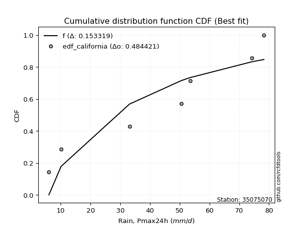</img>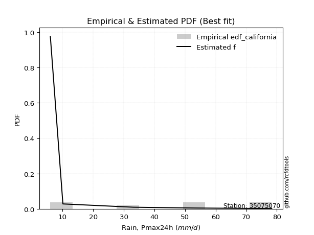</img>

</div>


### 2. EDF Hazen (1930)

Hazen method for plotting positions is a formula used to estimate the empirical cumulative probability distribution of flood events or other hydrological data. This formula often results in biased estimations, particularly when extrapolating to extreme events (high return periods).

<div align="center">


$P=(m-0.5)/n$


</div>


**2.1. Empirical values**

<div align="center">

|                | 0                  | 1                  | 2                  | 3                  | 4                  | 5         | 6                 | 7         |
|:---------------|:-------------------|:-------------------|:-------------------|:-------------------|:-------------------|:----------|:------------------|:----------|
| date           | 2022               | 2023               | 2018               | 2017               | 2021               | 2025      | 2020              | 2019      |
| x              | 6.0                | 10.1               | 33.1               | 50.5               | 53.5               | 71.0      | 74.3              | 78.3      |
| m              | 1                  | 2                  | 3                  | 4                  | 5                  | 6         | 7                 | 8         |
| empirical_dist | edf_hazen          | edf_hazen          | edf_hazen          | edf_hazen          | edf_hazen          | edf_hazen | edf_hazen         | edf_hazen |
| empirical      | 0.0625             | 0.1875             | 0.3125             | 0.4375             | 0.5625             | 0.6875    | 0.8125            | 0.9375    |
| empirical_tr   | 1.0666666666666667 | 1.2307692307692308 | 1.4545454545454546 | 1.7777777777777777 | 2.2857142857142856 | 3.2       | 5.333333333333333 | 16.0      |

</div>


**2.2. Kolmogorov-Smirnov fit test (sorted by Δ)**


<div align="center">

|                | 0                   | 1                   | 2                  | 3                   | 4                   | 5                   | 6                   | 7                   | 8                  | 9                   | 10                  | 11                 | 12                  | 13                  | 14                  | 15                 | 16                  | 17                 | 18                  | 19                  | 20                  | 21                  | 22                  | 23                  | 24                  | 25                  | 26                  | 27                 | 28                  | 29                  | 30                 | 31                  | 32                  | 33                  | 34                  | 35                  | 36                 | 37                 | 38                  | 39                  | 40                  | 41                  | 42                  | 43                  | 44                 | 45                 | 46                 | 47                 | 48                  | 49                  | 50                  | 51                  | 52                 | 53                  | 54                  | 55                 | 56                 | 57                  | 58                  | 59                  | 60                  | 61                 | 62                  | 63                  | 64                  | 65                  | 66                 | 67                 | 68                  | 69                  | 70                  | 71                  | 72                  | 73                  | 74                  | 75                  | 76                  | 77                  | 78                 | 79                 | 80                 | 81                  | 82                  | 83                 | 84                 | 85                  | 86                  | 87                  | 88                  | 89                 | 90                  | 91                  | 92                  | 93                 | 94                 | 95                  | 96                 | 97                 | 98                  | 99                  | 100                | 101                 | 102                | 103                 | 104                 | 105                 | 106                | 107                 | 108                | 109                 | 110                | 111                | 112                | 113                | 114                | 115                 | 116                 | 117                | 118                | 119                | 120                 | 121                | 122                | 123                | 124                 | 125                 | 126                | 127                | 128                | 129                 | 130                 | 131                | 132                 | 133                | 134                 | 135                 | 136                 | 137                | 138                | 139                 | 140                | 141                 | 142                | 143                | 144                | 145                | 146                | 147                | 148                | 149                | 150                | 151                | 152                | 153                | 154                | 155                | 156                | 157                | 158                | 159                |
|:---------------|:--------------------|:--------------------|:-------------------|:--------------------|:--------------------|:--------------------|:--------------------|:--------------------|:-------------------|:--------------------|:--------------------|:-------------------|:--------------------|:--------------------|:--------------------|:-------------------|:--------------------|:-------------------|:--------------------|:--------------------|:--------------------|:--------------------|:--------------------|:--------------------|:--------------------|:--------------------|:--------------------|:-------------------|:--------------------|:--------------------|:-------------------|:--------------------|:--------------------|:--------------------|:--------------------|:--------------------|:-------------------|:-------------------|:--------------------|:--------------------|:--------------------|:--------------------|:--------------------|:--------------------|:-------------------|:-------------------|:-------------------|:-------------------|:--------------------|:--------------------|:--------------------|:--------------------|:-------------------|:--------------------|:--------------------|:-------------------|:-------------------|:--------------------|:--------------------|:--------------------|:--------------------|:-------------------|:--------------------|:--------------------|:--------------------|:--------------------|:-------------------|:-------------------|:--------------------|:--------------------|:--------------------|:--------------------|:--------------------|:--------------------|:--------------------|:--------------------|:--------------------|:--------------------|:-------------------|:-------------------|:-------------------|:--------------------|:--------------------|:-------------------|:-------------------|:--------------------|:--------------------|:--------------------|:--------------------|:-------------------|:--------------------|:--------------------|:--------------------|:-------------------|:-------------------|:--------------------|:-------------------|:-------------------|:--------------------|:--------------------|:-------------------|:--------------------|:-------------------|:--------------------|:--------------------|:--------------------|:-------------------|:--------------------|:-------------------|:--------------------|:-------------------|:-------------------|:-------------------|:-------------------|:-------------------|:--------------------|:--------------------|:-------------------|:-------------------|:-------------------|:--------------------|:-------------------|:-------------------|:-------------------|:--------------------|:--------------------|:-------------------|:-------------------|:-------------------|:--------------------|:--------------------|:-------------------|:--------------------|:-------------------|:--------------------|:--------------------|:--------------------|:-------------------|:-------------------|:--------------------|:-------------------|:--------------------|:-------------------|:-------------------|:-------------------|:-------------------|:-------------------|:-------------------|:-------------------|:-------------------|:-------------------|:-------------------|:-------------------|:-------------------|:-------------------|:-------------------|:-------------------|:-------------------|:-------------------|:-------------------|
| station        | 35075070            | 35075070            | 35075070           | 35075070            | 35075070            | 35075070            | 35075070            | 35075070            | 35075070           | 35075070            | 35075070            | 35075070           | 35075070            | 35075070            | 35075070            | 35075070           | 35075070            | 35075070           | 35075070            | 35075070            | 35075070            | 35075070            | 35075070            | 35075070            | 35075070            | 35075070            | 35075070            | 35075070           | 35075070            | 35075070            | 35075070           | 35075070            | 35075070            | 35075070            | 35075070            | 35075070            | 35075070           | 35075070           | 35075070            | 35075070            | 35075070            | 35075070            | 35075070            | 35075070            | 35075070           | 35075070           | 35075070           | 35075070           | 35075070            | 35075070            | 35075070            | 35075070            | 35075070           | 35075070            | 35075070            | 35075070           | 35075070           | 35075070            | 35075070            | 35075070            | 35075070            | 35075070           | 35075070            | 35075070            | 35075070            | 35075070            | 35075070           | 35075070           | 35075070            | 35075070            | 35075070            | 35075070            | 35075070            | 35075070            | 35075070            | 35075070            | 35075070            | 35075070            | 35075070           | 35075070           | 35075070           | 35075070            | 35075070            | 35075070           | 35075070           | 35075070            | 35075070            | 35075070            | 35075070            | 35075070           | 35075070            | 35075070            | 35075070            | 35075070           | 35075070           | 35075070            | 35075070           | 35075070           | 35075070            | 35075070            | 35075070           | 35075070            | 35075070           | 35075070            | 35075070            | 35075070            | 35075070           | 35075070            | 35075070           | 35075070            | 35075070           | 35075070           | 35075070           | 35075070           | 35075070           | 35075070            | 35075070            | 35075070           | 35075070           | 35075070           | 35075070            | 35075070           | 35075070           | 35075070           | 35075070            | 35075070            | 35075070           | 35075070           | 35075070           | 35075070            | 35075070            | 35075070           | 35075070            | 35075070           | 35075070            | 35075070            | 35075070            | 35075070           | 35075070           | 35075070            | 35075070           | 35075070            | 35075070           | 35075070           | 35075070           | 35075070           | 35075070           | 35075070           | 35075070           | 35075070           | 35075070           | 35075070           | 35075070           | 35075070           | 35075070           | 35075070           | 35075070           | 35075070           | 35075070           | 35075070           |
| empirical_dist | edf_hazen           | edf_hazen           | edf_hazen          | edf_hazen           | edf_hazen           | edf_hazen           | edf_hazen           | edf_hazen           | edf_hazen          | edf_hazen           | edf_hazen           | edf_hazen          | edf_hazen           | edf_hazen           | edf_hazen           | edf_hazen          | edf_hazen           | edf_hazen          | edf_hazen           | edf_hazen           | edf_hazen           | edf_hazen           | edf_hazen           | edf_hazen           | edf_hazen           | edf_hazen           | edf_hazen           | edf_hazen          | edf_hazen           | edf_hazen           | edf_hazen          | edf_hazen           | edf_hazen           | edf_hazen           | edf_hazen           | edf_hazen           | edf_hazen          | edf_hazen          | edf_hazen           | edf_hazen           | edf_hazen           | edf_hazen           | edf_hazen           | edf_hazen           | edf_hazen          | edf_hazen          | edf_hazen          | edf_hazen          | edf_hazen           | edf_hazen           | edf_hazen           | edf_hazen           | edf_hazen          | edf_hazen           | edf_hazen           | edf_hazen          | edf_hazen          | edf_hazen           | edf_hazen           | edf_hazen           | edf_hazen           | edf_hazen          | edf_hazen           | edf_hazen           | edf_hazen           | edf_hazen           | edf_hazen          | edf_hazen          | edf_hazen           | edf_hazen           | edf_hazen           | edf_hazen           | edf_hazen           | edf_hazen           | edf_hazen           | edf_hazen           | edf_hazen           | edf_hazen           | edf_hazen          | edf_hazen          | edf_hazen          | edf_hazen           | edf_hazen           | edf_hazen          | edf_hazen          | edf_hazen           | edf_hazen           | edf_hazen           | edf_hazen           | edf_hazen          | edf_hazen           | edf_hazen           | edf_hazen           | edf_hazen          | edf_hazen          | edf_hazen           | edf_hazen          | edf_hazen          | edf_hazen           | edf_hazen           | edf_hazen          | edf_hazen           | edf_hazen          | edf_hazen           | edf_hazen           | edf_hazen           | edf_hazen          | edf_hazen           | edf_hazen          | edf_hazen           | edf_hazen          | edf_hazen          | edf_hazen          | edf_hazen          | edf_hazen          | edf_hazen           | edf_hazen           | edf_hazen          | edf_hazen          | edf_hazen          | edf_hazen           | edf_hazen          | edf_hazen          | edf_hazen          | edf_hazen           | edf_hazen           | edf_hazen          | edf_hazen          | edf_hazen          | edf_hazen           | edf_hazen           | edf_hazen          | edf_hazen           | edf_hazen          | edf_hazen           | edf_hazen           | edf_hazen           | edf_hazen          | edf_hazen          | edf_hazen           | edf_hazen          | edf_hazen           | edf_hazen          | edf_hazen          | edf_hazen          | edf_hazen          | edf_hazen          | edf_hazen          | edf_hazen          | edf_hazen          | edf_hazen          | edf_hazen          | edf_hazen          | edf_hazen          | edf_hazen          | edf_hazen          | edf_hazen          | edf_hazen          | edf_hazen          | edf_hazen          |
| p_dist         | beta                | ksone               | gausshyper         | semicircular        | anglit              | trapezoid           | dgamma              | dweibull            | pearson3           | erlang              | norm                | truncnorm          | exponnorm           | t                   | nct                 | f                  | gamma               | crystalball        | rice                | betaprime           | weibull_min         | loglevy_l           | foldnorm            | invgamma            | invgauss            | genextreme          | genhalflogistic     | arcsine            | kappa4              | maxwell             | gumbel_l           | wrapcauchy          | argus               | logistic            | cosine              | loggennorm          | rayleigh           | johnsonsu          | logdgamma           | invweibull          | triang              | hypsecant           | logpearson3         | logburr12           | skewnorm           | loggumbel_l        | logtrapezoid       | logvonmises_line   | laplace             | logweibull_min      | loggenextreme       | kstwobign           | logmielke          | mielke              | gumbel_r            | logargus           | halfnorm           | logsemicircular     | loggompertz         | burr                | alpha               | logloggamma        | loganglit           | tukeylambda         | levy_l              | halflogistic        | moyal              | kappa3             | uniform             | genpareto           | loggenpareto        | truncweibull_min    | vonmises_line       | lomax               | loggamma            | loggamma            | lognakagami         | logf                | lognct             | logexponnorm       | logt               | lognorm             | logcrystalball      | logncf             | loginvweibull      | logdweibull         | logfatiguelife      | bradford            | logrice             | logarcsine         | logerlang           | genexpon            | loginvgauss         | logfoldnorm        | logbetaprime       | logbeta             | logwrapcauchy      | logburr            | loginvgamma         | logalpha            | loglogistic        | logmaxwell          | ncf                | logkstwobign        | lograyleigh         | logweibull_max      | loghypsecant       | loggenexpon         | loggausshyper      | logcosine           | loggenhalflogistic | loghalfnorm        | logloglaplace      | wald               | loggumbel_r        | loglaplace          | loglaplace          | logskewnorm        | nakagami           | loggengamma        | loghalflogistic     | logtriang          | gengamma           | truncexpon         | logmoyal            | loglomax            | burr12             | gennorm            | logksone           | logwald             | logexponweib        | logkappa3          | loguniform          | logtruncnorm       | logkappa4           | logtruncweibull_min | logbradford         | logtruncexpon      | logrdist           | logjohnsonsb        | logjohnsonsu       | weibull_max         | fatiguelife        | logtukeylambda     | exponweib          | powerlaw           | logexponpow        | gompertz           | halfgennorm        | exponpow           | logpowerlaw        | truncpareto        | johnsonsb          | rdist              | logtruncpareto     | genlogistic        | loggenlogistic     | loghalfgennorm     | logvonmises        | vonmises           |
| delta          | 0.06249989691040325 | 0.09962615701212818 | 0.1014119658416901 | 0.10340921565226158 | 0.10640619106189975 | 0.10832235245156441 | 0.11401840573459009 | 0.11958135046675854 | 0.1277290303712314 | 0.12839797100785588 | 0.12951398440404516 | 0.1295139951016855 | 0.12951513478941534 | 0.12951709984651982 | 0.12952829579161995 | 0.1297240960550765 | 0.12989947010919145 | 0.1300902489875505 | 0.13010228298456095 | 0.13028320917745817 | 0.13274310428262226 | 0.13309092686323165 | 0.13769821730193788 | 0.13812350294238263 | 0.14003732961054038 | 0.14080842198555227 | 0.14135167822303707 | 0.1416482648430497 | 0.14355996490789658 | 0.14398010065388556 | 0.1455548594669105 | 0.14769629742044327 | 0.14843452885907127 | 0.15000153861524423 | 0.15059230151073266 | 0.15123930289530962 | 0.1537073929463364 | 0.1539514907186849 | 0.15685038161904327 | 0.16038007898670803 | 0.16084991769514068 | 0.16152610920926425 | 0.16716503009621597 | 0.16814800632814175 | 0.1707915209600256 | 0.1718679349617076 | 0.172867261034219  | 0.1731609987994256 | 0.17327425126853857 | 0.17436263429749754 | 0.17828605426536082 | 0.18033399835342545 | 0.1813336731838905 | 0.18340901146280264 | 0.18371184979462962 | 0.1850202748646127 | 0.1875             | 0.18953134351175982 | 0.19138692387062683 | 0.19266011356110313 | 0.19659401921452624 | 0.1977332347667825 | 0.19812797958519246 | 0.20449559081826152 | 0.20493776290244825 | 0.20847483945783007 | 0.2085115499334076 | 0.2113430181008864 | 0.21153181189488246 | 0.21253160557885586 | 0.21254588547258968 | 0.21341017990014144 | 0.21494262939005915 | 0.21696280035586035 | 0.21818547798099064 | 0.21818547798099064 | 0.21821891958734763 | 0.21843572491996455 | 0.2185581167392896 | 0.2185803358159658 | 0.2185843761362254 | 0.21858445215626698 | 0.21858505989650712 | 0.218683148529362  | 0.2187040525723586 | 0.21920148689358987 | 0.22093652349304493 | 0.22117577948369738 | 0.22280402745422812 | 0.2232954469260483 | 0.22389917314233632 | 0.22396609984167015 | 0.22413839753943376 | 0.2243297826276378 | 0.2245050360337275 | 0.22467348846626878 | 0.2255028003698063 | 0.2285221809606861 | 0.22871886324978874 | 0.23135836760955764 | 0.2370385698025631 | 0.23956410368951142 | 0.2440784448479889 | 0.24561293047413446 | 0.24584866791539883 | 0.24950023429344337 | 0.2512537875424643 | 0.25135532719254217 | 0.2561042264558918 | 0.26189781480608476 | 0.2634914881943301 | 0.2642036473192829 | 0.2643089727118546 | 0.2773251301691938 | 0.2775791025247054 | 0.27923670218999996 | 0.27923670218999996 | 0.2814888466073282 | 0.2860467162341225 | 0.2871620138202897 | 0.29222048854964633 | 0.2964047560497385 | 0.2967916922236624 | 0.2967920142105839 | 0.29703669101805663 | 0.29755509387350654 | 0.3054283280383243 | 0.3125             | 0.3368900223643573 | 0.35235149702778545 | 0.35891202968874536 | 0.3784175772592073 | 0.39176802683722867 | 0.3928552549555683 | 0.39395816654008997 | 0.41375435011470274 | 0.43407857317528176 | 0.4421075780213539 | 0.4753766638541008 | 0.47621636827486824 | 0.4882561986826568 | 0.49967444139351397 | 0.5009795103428689 | 0.5171566252314435 | 0.5223783833020069 | 0.5236111444881096 | 0.5508399166863593 | 0.5622438198543338 | 0.5625             | 0.6032843373390745 | 0.6079472883113731 | 0.6262127494903679 | 0.6867472904463661 | 0.6874999996659145 | 0.7005556496038987 | 0.8125             | 0.8125             | 0.8125             | 1.159008267478976  | 11.632441554603256 |
| deltao         | 0.4472608134160001  | 0.4472608134160001  | 0.4472608134160001 | 0.4472608134160001  | 0.4472608134160001  | 0.4472608134160001  | 0.4472608134160001  | 0.4472608134160001  | 0.4472608134160001 | 0.4472608134160001  | 0.4472608134160001  | 0.4472608134160001 | 0.4472608134160001  | 0.4472608134160001  | 0.4472608134160001  | 0.4472608134160001 | 0.4472608134160001  | 0.4472608134160001 | 0.4472608134160001  | 0.4472608134160001  | 0.4472608134160001  | 0.4472608134160001  | 0.4472608134160001  | 0.4472608134160001  | 0.4472608134160001  | 0.4472608134160001  | 0.4472608134160001  | 0.4472608134160001 | 0.4472608134160001  | 0.4472608134160001  | 0.4472608134160001 | 0.4472608134160001  | 0.4472608134160001  | 0.4472608134160001  | 0.4472608134160001  | 0.4472608134160001  | 0.4472608134160001 | 0.4472608134160001 | 0.4472608134160001  | 0.4472608134160001  | 0.4472608134160001  | 0.4472608134160001  | 0.4472608134160001  | 0.4472608134160001  | 0.4472608134160001 | 0.4472608134160001 | 0.4472608134160001 | 0.4472608134160001 | 0.4472608134160001  | 0.4472608134160001  | 0.4472608134160001  | 0.4472608134160001  | 0.4472608134160001 | 0.4472608134160001  | 0.4472608134160001  | 0.4472608134160001 | 0.4472608134160001 | 0.4472608134160001  | 0.4472608134160001  | 0.4472608134160001  | 0.4472608134160001  | 0.4472608134160001 | 0.4472608134160001  | 0.4472608134160001  | 0.4472608134160001  | 0.4472608134160001  | 0.4472608134160001 | 0.4472608134160001 | 0.4472608134160001  | 0.4472608134160001  | 0.4472608134160001  | 0.4472608134160001  | 0.4472608134160001  | 0.4472608134160001  | 0.4472608134160001  | 0.4472608134160001  | 0.4472608134160001  | 0.4472608134160001  | 0.4472608134160001 | 0.4472608134160001 | 0.4472608134160001 | 0.4472608134160001  | 0.4472608134160001  | 0.4472608134160001 | 0.4472608134160001 | 0.4472608134160001  | 0.4472608134160001  | 0.4472608134160001  | 0.4472608134160001  | 0.4472608134160001 | 0.4472608134160001  | 0.4472608134160001  | 0.4472608134160001  | 0.4472608134160001 | 0.4472608134160001 | 0.4472608134160001  | 0.4472608134160001 | 0.4472608134160001 | 0.4472608134160001  | 0.4472608134160001  | 0.4472608134160001 | 0.4472608134160001  | 0.4472608134160001 | 0.4472608134160001  | 0.4472608134160001  | 0.4472608134160001  | 0.4472608134160001 | 0.4472608134160001  | 0.4472608134160001 | 0.4472608134160001  | 0.4472608134160001 | 0.4472608134160001 | 0.4472608134160001 | 0.4472608134160001 | 0.4472608134160001 | 0.4472608134160001  | 0.4472608134160001  | 0.4472608134160001 | 0.4472608134160001 | 0.4472608134160001 | 0.4472608134160001  | 0.4472608134160001 | 0.4472608134160001 | 0.4472608134160001 | 0.4472608134160001  | 0.4472608134160001  | 0.4472608134160001 | 0.4472608134160001 | 0.4472608134160001 | 0.4472608134160001  | 0.4472608134160001  | 0.4472608134160001 | 0.4472608134160001  | 0.4472608134160001 | 0.4472608134160001  | 0.4472608134160001  | 0.4472608134160001  | 0.4472608134160001 | 0.4472608134160001 | 0.4472608134160001  | 0.4472608134160001 | 0.4472608134160001  | 0.4472608134160001 | 0.4472608134160001 | 0.4472608134160001 | 0.4472608134160001 | 0.4472608134160001 | 0.4472608134160001 | 0.4472608134160001 | 0.4472608134160001 | 0.4472608134160001 | 0.4472608134160001 | 0.4472608134160001 | 0.4472608134160001 | 0.4472608134160001 | 0.4472608134160001 | 0.4472608134160001 | 0.4472608134160001 | 0.4472608134160001 | 0.4472608134160001 |
| eval           | Δo > Δ              | Δo > Δ              | Δo > Δ             | Δo > Δ              | Δo > Δ              | Δo > Δ              | Δo > Δ              | Δo > Δ              | Δo > Δ             | Δo > Δ              | Δo > Δ              | Δo > Δ             | Δo > Δ              | Δo > Δ              | Δo > Δ              | Δo > Δ             | Δo > Δ              | Δo > Δ             | Δo > Δ              | Δo > Δ              | Δo > Δ              | Δo > Δ              | Δo > Δ              | Δo > Δ              | Δo > Δ              | Δo > Δ              | Δo > Δ              | Δo > Δ             | Δo > Δ              | Δo > Δ              | Δo > Δ             | Δo > Δ              | Δo > Δ              | Δo > Δ              | Δo > Δ              | Δo > Δ              | Δo > Δ             | Δo > Δ             | Δo > Δ              | Δo > Δ              | Δo > Δ              | Δo > Δ              | Δo > Δ              | Δo > Δ              | Δo > Δ             | Δo > Δ             | Δo > Δ             | Δo > Δ             | Δo > Δ              | Δo > Δ              | Δo > Δ              | Δo > Δ              | Δo > Δ             | Δo > Δ              | Δo > Δ              | Δo > Δ             | Δo > Δ             | Δo > Δ              | Δo > Δ              | Δo > Δ              | Δo > Δ              | Δo > Δ             | Δo > Δ              | Δo > Δ              | Δo > Δ              | Δo > Δ              | Δo > Δ             | Δo > Δ             | Δo > Δ              | Δo > Δ              | Δo > Δ              | Δo > Δ              | Δo > Δ              | Δo > Δ              | Δo > Δ              | Δo > Δ              | Δo > Δ              | Δo > Δ              | Δo > Δ             | Δo > Δ             | Δo > Δ             | Δo > Δ              | Δo > Δ              | Δo > Δ             | Δo > Δ             | Δo > Δ              | Δo > Δ              | Δo > Δ              | Δo > Δ              | Δo > Δ             | Δo > Δ              | Δo > Δ              | Δo > Δ              | Δo > Δ             | Δo > Δ             | Δo > Δ              | Δo > Δ             | Δo > Δ             | Δo > Δ              | Δo > Δ              | Δo > Δ             | Δo > Δ              | Δo > Δ             | Δo > Δ              | Δo > Δ              | Δo > Δ              | Δo > Δ             | Δo > Δ              | Δo > Δ             | Δo > Δ              | Δo > Δ             | Δo > Δ             | Δo > Δ             | Δo > Δ             | Δo > Δ             | Δo > Δ              | Δo > Δ              | Δo > Δ             | Δo > Δ             | Δo > Δ             | Δo > Δ              | Δo > Δ             | Δo > Δ             | Δo > Δ             | Δo > Δ              | Δo > Δ              | Δo > Δ             | Δo > Δ             | Δo > Δ             | Δo > Δ              | Δo > Δ              | Δo > Δ             | Δo > Δ              | Δo > Δ             | Δo > Δ              | Δo > Δ              | Δo > Δ              | Δo > Δ             | Δo <= Δ            | Δo <= Δ             | Δo <= Δ            | Δo <= Δ             | Δo <= Δ            | Δo <= Δ            | Δo <= Δ            | Δo <= Δ            | Δo <= Δ            | Δo <= Δ            | Δo <= Δ            | Δo <= Δ            | Δo <= Δ            | Δo <= Δ            | Δo <= Δ            | Δo <= Δ            | Δo <= Δ            | Δo <= Δ            | Δo <= Δ            | Δo <= Δ            | Δo <= Δ            | Δo <= Δ            |
| fit            | 1                   | 1                   | 1                  | 1                   | 1                   | 1                   | 1                   | 1                   | 1                  | 1                   | 1                   | 1                  | 1                   | 1                   | 1                   | 1                  | 1                   | 1                  | 1                   | 1                   | 1                   | 1                   | 1                   | 1                   | 1                   | 1                   | 1                   | 1                  | 1                   | 1                   | 1                  | 1                   | 1                   | 1                   | 1                   | 1                   | 1                  | 1                  | 1                   | 1                   | 1                   | 1                   | 1                   | 1                   | 1                  | 1                  | 1                  | 1                  | 1                   | 1                   | 1                   | 1                   | 1                  | 1                   | 1                   | 1                  | 1                  | 1                   | 1                   | 1                   | 1                   | 1                  | 1                   | 1                   | 1                   | 1                   | 1                  | 1                  | 1                   | 1                   | 1                   | 1                   | 1                   | 1                   | 1                   | 1                   | 1                   | 1                   | 1                  | 1                  | 1                  | 1                   | 1                   | 1                  | 1                  | 1                   | 1                   | 1                   | 1                   | 1                  | 1                   | 1                   | 1                   | 1                  | 1                  | 1                   | 1                  | 1                  | 1                   | 1                   | 1                  | 1                   | 1                  | 1                   | 1                   | 1                   | 1                  | 1                   | 1                  | 1                   | 1                  | 1                  | 1                  | 1                  | 1                  | 1                   | 1                   | 1                  | 1                  | 1                  | 1                   | 1                  | 1                  | 1                  | 1                   | 1                   | 1                  | 1                  | 1                  | 1                   | 1                   | 1                  | 1                   | 1                  | 1                   | 1                   | 1                   | 1                  | 0                  | 0                   | 0                  | 0                   | 0                  | 0                  | 0                  | 0                  | 0                  | 0                  | 0                  | 0                  | 0                  | 0                  | 0                  | 0                  | 0                  | 0                  | 0                  | 0                  | 0                  | 0                  |
| n              | 8                   | 8                   | 8                  | 8                   | 8                   | 8                   | 8                   | 8                   | 8                  | 8                   | 8                   | 8                  | 8                   | 8                   | 8                   | 8                  | 8                   | 8                  | 8                   | 8                   | 8                   | 8                   | 8                   | 8                   | 8                   | 8                   | 8                   | 8                  | 8                   | 8                   | 8                  | 8                   | 8                   | 8                   | 8                   | 8                   | 8                  | 8                  | 8                   | 8                   | 8                   | 8                   | 8                   | 8                   | 8                  | 8                  | 8                  | 8                  | 8                   | 8                   | 8                   | 8                   | 8                  | 8                   | 8                   | 8                  | 8                  | 8                   | 8                   | 8                   | 8                   | 8                  | 8                   | 8                   | 8                   | 8                   | 8                  | 8                  | 8                   | 8                   | 8                   | 8                   | 8                   | 8                   | 8                   | 8                   | 8                   | 8                   | 8                  | 8                  | 8                  | 8                   | 8                   | 8                  | 8                  | 8                   | 8                   | 8                   | 8                   | 8                  | 8                   | 8                   | 8                   | 8                  | 8                  | 8                   | 8                  | 8                  | 8                   | 8                   | 8                  | 8                   | 8                  | 8                   | 8                   | 8                   | 8                  | 8                   | 8                  | 8                   | 8                  | 8                  | 8                  | 8                  | 8                  | 8                   | 8                   | 8                  | 8                  | 8                  | 8                   | 8                  | 8                  | 8                  | 8                   | 8                   | 8                  | 8                  | 8                  | 8                   | 8                   | 8                  | 8                   | 8                  | 8                   | 8                   | 8                   | 8                  | 8                  | 8                   | 8                  | 8                   | 8                  | 8                  | 8                  | 8                  | 8                  | 8                  | 8                  | 8                  | 8                  | 8                  | 8                  | 8                  | 8                  | 8                  | 8                  | 8                  | 8                  | 8                  |
| best_fit       | 1                   | 0                   | 0                  | 0                   | 0                   | 0                   | 0                   | 0                   | 0                  | 0                   | 0                   | 0                  | 0                   | 0                   | 0                   | 0                  | 0                   | 0                  | 0                   | 0                   | 0                   | 0                   | 0                   | 0                   | 0                   | 0                   | 0                   | 0                  | 0                   | 0                   | 0                  | 0                   | 0                   | 0                   | 0                   | 0                   | 0                  | 0                  | 0                   | 0                   | 0                   | 0                   | 0                   | 0                   | 0                  | 0                  | 0                  | 0                  | 0                   | 0                   | 0                   | 0                   | 0                  | 0                   | 0                   | 0                  | 0                  | 0                   | 0                   | 0                   | 0                   | 0                  | 0                   | 0                   | 0                   | 0                   | 0                  | 0                  | 0                   | 0                   | 0                   | 0                   | 0                   | 0                   | 0                   | 0                   | 0                   | 0                   | 0                  | 0                  | 0                  | 0                   | 0                   | 0                  | 0                  | 0                   | 0                   | 0                   | 0                   | 0                  | 0                   | 0                   | 0                   | 0                  | 0                  | 0                   | 0                  | 0                  | 0                   | 0                   | 0                  | 0                   | 0                  | 0                   | 0                   | 0                   | 0                  | 0                   | 0                  | 0                   | 0                  | 0                  | 0                  | 0                  | 0                  | 0                   | 0                   | 0                  | 0                  | 0                  | 0                   | 0                  | 0                  | 0                  | 0                   | 0                   | 0                  | 0                  | 0                  | 0                   | 0                   | 0                  | 0                   | 0                  | 0                   | 0                   | 0                   | 0                  | 0                  | 0                   | 0                  | 0                   | 0                  | 0                  | 0                  | 0                  | 0                  | 0                  | 0                  | 0                  | 0                  | 0                  | 0                  | 0                  | 0                  | 0                  | 0                  | 0                  | 0                  | 0                  |
| best_fit_sort  | 1                   | 2                   | 3                  | 4                   | 5                   | 6                   | 7                   | 8                   | 9                  | 10                  | 11                  | 12                 | 13                  | 14                  | 15                  | 16                 | 17                  | 18                 | 19                  | 20                  | 21                  | 22                  | 23                  | 24                  | 25                  | 26                  | 27                  | 28                 | 29                  | 30                  | 31                 | 32                  | 33                  | 34                  | 35                  | 36                  | 37                 | 38                 | 39                  | 40                  | 41                  | 42                  | 43                  | 44                  | 45                 | 46                 | 47                 | 48                 | 49                  | 50                  | 51                  | 52                  | 53                 | 54                  | 55                  | 56                 | 57                 | 58                  | 59                  | 60                  | 61                  | 62                 | 63                  | 64                  | 65                  | 66                  | 67                 | 68                 | 69                  | 70                  | 71                  | 72                  | 73                  | 74                  | 75                  | 76                  | 77                  | 78                  | 79                 | 80                 | 81                 | 82                  | 83                  | 84                 | 85                 | 86                  | 87                  | 88                  | 89                  | 90                 | 91                  | 92                  | 93                  | 94                 | 95                 | 96                  | 97                 | 98                 | 99                  | 100                 | 101                | 102                 | 103                | 104                 | 105                 | 106                 | 107                | 108                 | 109                | 110                 | 111                | 112                | 113                | 114                | 115                | 116                 | 117                 | 118                | 119                | 120                | 121                 | 122                | 123                | 124                | 125                 | 126                 | 127                | 128                | 129                | 130                 | 131                 | 132                | 133                 | 134                | 135                 | 136                 | 137                 | 138                | 139                | 140                 | 141                | 142                 | 143                | 144                | 145                | 146                | 147                | 148                | 149                | 150                | 151                | 152                | 153                | 154                | 155                | 156                | 157                | 158                | 159                | 160                |

</div>


**2.3. Best fit**

<div align="center">

|   id |   station | empirical_dist   | p_dist   |     delta |   deltao | eval   |   fit |   n |   best_fit |   best_fit_sort |
|-----:|----------:|:-----------------|:---------|----------:|---------:|:-------|------:|----:|-----------:|----------------:|
|    0 |  35075070 | edf_hazen        | beta     | 0.0624999 | 0.447261 | Δo > Δ |     1 |   8 |          1 |               1 |

</div>


<div align="center">

</img>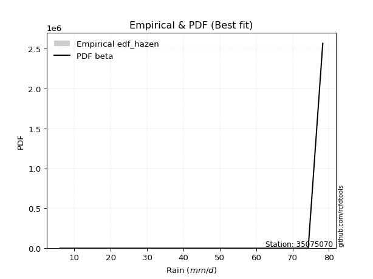</img>

</div>


### 3. EDF Weibull (1939)

Weibull plotting position formula is an empirical method used to estimate the non-exceedance probability or plotting position for a set of observed data, is often recommended or widely used in practice, particularly in flood frequency analysis.

<div align="center">


$P=m/(n+1)$


</div>


**3.1. Empirical values**

<div align="center">

|                | 0                  | 1                  | 2                  | 3                  | 4                  | 5                  | 6                  | 7                  |
|:---------------|:-------------------|:-------------------|:-------------------|:-------------------|:-------------------|:-------------------|:-------------------|:-------------------|
| date           | 2022               | 2023               | 2018               | 2017               | 2021               | 2025               | 2020               | 2019               |
| x              | 6.0                | 10.1               | 33.1               | 50.5               | 53.5               | 71.0               | 74.3               | 78.3               |
| m              | 1                  | 2                  | 3                  | 4                  | 5                  | 6                  | 7                  | 8                  |
| empirical_dist | edf_weibull        | edf_weibull        | edf_weibull        | edf_weibull        | edf_weibull        | edf_weibull        | edf_weibull        | edf_weibull        |
| empirical      | 0.1111111111111111 | 0.2222222222222222 | 0.3333333333333333 | 0.4444444444444444 | 0.5555555555555556 | 0.6666666666666666 | 0.7777777777777778 | 0.8888888888888888 |
| empirical_tr   | 1.125              | 1.2857142857142856 | 1.4999999999999998 | 1.7999999999999998 | 2.25               | 2.9999999999999996 | 4.5                | 8.999999999999996  |

</div>


**3.2. Kolmogorov-Smirnov fit test (sorted by Δ)**


<div align="center">

|                | 0                   | 1                   | 2                  | 3                   | 4                  | 5                   | 6                   | 7                   | 8                   | 9                  | 10                  | 11                 | 12                  | 13                  | 14                 | 15                  | 16                  | 17                  | 18                 | 19                 | 20                  | 21                  | 22                  | 23                  | 24                  | 25                 | 26                  | 27                  | 28                  | 29                  | 30                  | 31                  | 32                  | 33                  | 34                  | 35                  | 36                  | 37                 | 38                  | 39                  | 40                  | 41                  | 42                 | 43                 | 44                  | 45                  | 46                  | 47                  | 48                  | 49                  | 50                  | 51                  | 52                 | 53                  | 54                  | 55                  | 56                  | 57                  | 58                  | 59                  | 60                 | 61                  | 62                  | 63                 | 64                  | 65                  | 66                  | 67                 | 68                  | 69                  | 70                 | 71                  | 72                  | 73                 | 74                  | 75                  | 76                 | 77                  | 78                  | 79                 | 80                  | 81                  | 82                  | 83                 | 84                 | 85                  | 86                  | 87                 | 88                 | 89                  | 90                  | 91                 | 92                 | 93                  | 94                 | 95                  | 96                  | 97                  | 98                 | 99                  | 100                | 101                 | 102                | 103                 | 104                | 105                 | 106                 | 107                 | 108                 | 109                | 110                 | 111                | 112                | 113                | 114                | 115                | 116                 | 117                 | 118                | 119                | 120                | 121                | 122                 | 123                | 124                | 125                 | 126                 | 127                | 128                 | 129                 | 130                 | 131                | 132                 | 133                 | 134                 | 135                 | 136                 | 137                | 138                 | 139                | 140                 | 141                | 142                | 143                | 144                | 145                | 146                | 147                | 148                | 149                | 150                | 151                | 152                | 153                | 154                | 155                | 156                | 157                | 158                | 159                |
|:---------------|:--------------------|:--------------------|:-------------------|:--------------------|:-------------------|:--------------------|:--------------------|:--------------------|:--------------------|:-------------------|:--------------------|:-------------------|:--------------------|:--------------------|:-------------------|:--------------------|:--------------------|:--------------------|:-------------------|:-------------------|:--------------------|:--------------------|:--------------------|:--------------------|:--------------------|:-------------------|:--------------------|:--------------------|:--------------------|:--------------------|:--------------------|:--------------------|:--------------------|:--------------------|:--------------------|:--------------------|:--------------------|:-------------------|:--------------------|:--------------------|:--------------------|:--------------------|:-------------------|:-------------------|:--------------------|:--------------------|:--------------------|:--------------------|:--------------------|:--------------------|:--------------------|:--------------------|:-------------------|:--------------------|:--------------------|:--------------------|:--------------------|:--------------------|:--------------------|:--------------------|:-------------------|:--------------------|:--------------------|:-------------------|:--------------------|:--------------------|:--------------------|:-------------------|:--------------------|:--------------------|:-------------------|:--------------------|:--------------------|:-------------------|:--------------------|:--------------------|:-------------------|:--------------------|:--------------------|:-------------------|:--------------------|:--------------------|:--------------------|:-------------------|:-------------------|:--------------------|:--------------------|:-------------------|:-------------------|:--------------------|:--------------------|:-------------------|:-------------------|:--------------------|:-------------------|:--------------------|:--------------------|:--------------------|:-------------------|:--------------------|:-------------------|:--------------------|:-------------------|:--------------------|:-------------------|:--------------------|:--------------------|:--------------------|:--------------------|:-------------------|:--------------------|:-------------------|:-------------------|:-------------------|:-------------------|:-------------------|:--------------------|:--------------------|:-------------------|:-------------------|:-------------------|:-------------------|:--------------------|:-------------------|:-------------------|:--------------------|:--------------------|:-------------------|:--------------------|:--------------------|:--------------------|:-------------------|:--------------------|:--------------------|:--------------------|:--------------------|:--------------------|:-------------------|:--------------------|:-------------------|:--------------------|:-------------------|:-------------------|:-------------------|:-------------------|:-------------------|:-------------------|:-------------------|:-------------------|:-------------------|:-------------------|:-------------------|:-------------------|:-------------------|:-------------------|:-------------------|:-------------------|:-------------------|:-------------------|:-------------------|
| station        | 35075070            | 35075070            | 35075070           | 35075070            | 35075070           | 35075070            | 35075070            | 35075070            | 35075070            | 35075070           | 35075070            | 35075070           | 35075070            | 35075070            | 35075070           | 35075070            | 35075070            | 35075070            | 35075070           | 35075070           | 35075070            | 35075070            | 35075070            | 35075070            | 35075070            | 35075070           | 35075070            | 35075070            | 35075070            | 35075070            | 35075070            | 35075070            | 35075070            | 35075070            | 35075070            | 35075070            | 35075070            | 35075070           | 35075070            | 35075070            | 35075070            | 35075070            | 35075070           | 35075070           | 35075070            | 35075070            | 35075070            | 35075070            | 35075070            | 35075070            | 35075070            | 35075070            | 35075070           | 35075070            | 35075070            | 35075070            | 35075070            | 35075070            | 35075070            | 35075070            | 35075070           | 35075070            | 35075070            | 35075070           | 35075070            | 35075070            | 35075070            | 35075070           | 35075070            | 35075070            | 35075070           | 35075070            | 35075070            | 35075070           | 35075070            | 35075070            | 35075070           | 35075070            | 35075070            | 35075070           | 35075070            | 35075070            | 35075070            | 35075070           | 35075070           | 35075070            | 35075070            | 35075070           | 35075070           | 35075070            | 35075070            | 35075070           | 35075070           | 35075070            | 35075070           | 35075070            | 35075070            | 35075070            | 35075070           | 35075070            | 35075070           | 35075070            | 35075070           | 35075070            | 35075070           | 35075070            | 35075070            | 35075070            | 35075070            | 35075070           | 35075070            | 35075070           | 35075070           | 35075070           | 35075070           | 35075070           | 35075070            | 35075070            | 35075070           | 35075070           | 35075070           | 35075070           | 35075070            | 35075070           | 35075070           | 35075070            | 35075070            | 35075070           | 35075070            | 35075070            | 35075070            | 35075070           | 35075070            | 35075070            | 35075070            | 35075070            | 35075070            | 35075070           | 35075070            | 35075070           | 35075070            | 35075070           | 35075070           | 35075070           | 35075070           | 35075070           | 35075070           | 35075070           | 35075070           | 35075070           | 35075070           | 35075070           | 35075070           | 35075070           | 35075070           | 35075070           | 35075070           | 35075070           | 35075070           | 35075070           |
| empirical_dist | edf_weibull         | edf_weibull         | edf_weibull        | edf_weibull         | edf_weibull        | edf_weibull         | edf_weibull         | edf_weibull         | edf_weibull         | edf_weibull        | edf_weibull         | edf_weibull        | edf_weibull         | edf_weibull         | edf_weibull        | edf_weibull         | edf_weibull         | edf_weibull         | edf_weibull        | edf_weibull        | edf_weibull         | edf_weibull         | edf_weibull         | edf_weibull         | edf_weibull         | edf_weibull        | edf_weibull         | edf_weibull         | edf_weibull         | edf_weibull         | edf_weibull         | edf_weibull         | edf_weibull         | edf_weibull         | edf_weibull         | edf_weibull         | edf_weibull         | edf_weibull        | edf_weibull         | edf_weibull         | edf_weibull         | edf_weibull         | edf_weibull        | edf_weibull        | edf_weibull         | edf_weibull         | edf_weibull         | edf_weibull         | edf_weibull         | edf_weibull         | edf_weibull         | edf_weibull         | edf_weibull        | edf_weibull         | edf_weibull         | edf_weibull         | edf_weibull         | edf_weibull         | edf_weibull         | edf_weibull         | edf_weibull        | edf_weibull         | edf_weibull         | edf_weibull        | edf_weibull         | edf_weibull         | edf_weibull         | edf_weibull        | edf_weibull         | edf_weibull         | edf_weibull        | edf_weibull         | edf_weibull         | edf_weibull        | edf_weibull         | edf_weibull         | edf_weibull        | edf_weibull         | edf_weibull         | edf_weibull        | edf_weibull         | edf_weibull         | edf_weibull         | edf_weibull        | edf_weibull        | edf_weibull         | edf_weibull         | edf_weibull        | edf_weibull        | edf_weibull         | edf_weibull         | edf_weibull        | edf_weibull        | edf_weibull         | edf_weibull        | edf_weibull         | edf_weibull         | edf_weibull         | edf_weibull        | edf_weibull         | edf_weibull        | edf_weibull         | edf_weibull        | edf_weibull         | edf_weibull        | edf_weibull         | edf_weibull         | edf_weibull         | edf_weibull         | edf_weibull        | edf_weibull         | edf_weibull        | edf_weibull        | edf_weibull        | edf_weibull        | edf_weibull        | edf_weibull         | edf_weibull         | edf_weibull        | edf_weibull        | edf_weibull        | edf_weibull        | edf_weibull         | edf_weibull        | edf_weibull        | edf_weibull         | edf_weibull         | edf_weibull        | edf_weibull         | edf_weibull         | edf_weibull         | edf_weibull        | edf_weibull         | edf_weibull         | edf_weibull         | edf_weibull         | edf_weibull         | edf_weibull        | edf_weibull         | edf_weibull        | edf_weibull         | edf_weibull        | edf_weibull        | edf_weibull        | edf_weibull        | edf_weibull        | edf_weibull        | edf_weibull        | edf_weibull        | edf_weibull        | edf_weibull        | edf_weibull        | edf_weibull        | edf_weibull        | edf_weibull        | edf_weibull        | edf_weibull        | edf_weibull        | edf_weibull        | edf_weibull        |
| p_dist         | beta                | loglevy_l           | ksone              | wrapcauchy          | semicircular       | trapezoid           | anglit              | genextreme          | gausshyper          | logtrapezoid       | invgauss            | johnsonsu          | invgamma            | pearson3            | dgamma             | erlang              | norm                | truncnorm           | exponnorm          | t                  | nct                 | f                   | gamma               | crystalball         | betaprime           | invweibull         | weibull_min         | dweibull            | rice                | levy_l              | loggennorm          | maxwell             | foldnorm            | logpearson3         | genhalflogistic     | loggumbel_l         | gumbel_l            | rayleigh           | logburr12           | logweibull_min      | logvonmises_line    | argus               | logdweibull        | logistic           | kappa4              | cosine              | kstwobign           | logarcsine          | arcsine             | alpha               | triang              | hypsecant           | logsemicircular    | loggompertz         | logdgamma           | gumbel_r            | logbeta             | loganglit           | skewnorm            | laplace             | loggenextreme      | logmielke           | logwrapcauchy       | mielke             | loggenpareto        | logargus            | lomax               | moyal              | loggamma            | loggamma            | lognakagami        | logf                | lognct              | logexponnorm       | logt                | lognorm             | logcrystalball     | logncf              | loginvweibull       | burr               | logfatiguelife      | logweibull_max      | logloglaplace       | logrice            | logerlang          | genexpon            | loginvgauss         | logfoldnorm        | logbetaprime       | logloggamma         | loginvgamma         | halfnorm           | halflogistic       | logalpha            | tukeylambda        | loglogistic         | kappa3              | uniform             | logmaxwell         | genpareto           | truncweibull_min   | vonmises_line       | ncf                | logkstwobign        | lograyleigh        | logburr             | bradford            | loghypsecant        | loggenexpon         | loggausshyper      | logcosine           | loggenhalflogistic | loghalfnorm        | loggengamma        | wald               | loggumbel_r        | loglaplace          | loglaplace          | logskewnorm        | gengamma           | loglomax           | gennorm            | nakagami            | burr12             | loghalflogistic    | logtriang           | truncexpon          | logmoyal           | logksone            | logexponweib        | logwald             | logkappa3          | loguniform          | logtruncnorm        | logkappa4           | logtruncweibull_min | logbradford         | logtruncexpon      | logjohnsonsb        | logjohnsonsu       | weibull_max         | logrdist           | fatiguelife        | exponweib          | powerlaw           | logtukeylambda     | logexponpow        | gompertz           | halfgennorm        | exponpow           | logpowerlaw        | truncpareto        | johnsonsb          | logtruncpareto     | rdist              | genlogistic        | loggenlogistic     | loghalfgennorm     | logvonmises        | vonmises           |
| delta          | 0.11111100802151441 | 0.12614648241878723 | 0.1262421661777347 | 0.12686296408710995 | 0.1280633809445152 | 0.12915568578489778 | 0.13090914752849436 | 0.13386397754110785 | 0.13452595540111573 | 0.135242688195768  | 0.14075492259069916 | 0.1470070462742405 | 0.14737244035058028 | 0.14856236370456477 | 0.1487406279568123 | 0.14923130434118925 | 0.15034731773737853 | 0.15034732843501886 | 0.1503484681227487 | 0.1503504331798532 | 0.15036162912495332 | 0.15055742938840988 | 0.15073280344252482 | 0.15092358232088388 | 0.15111654251079154 | 0.1534356345422636 | 0.15357643761595563 | 0.15430357268898076 | 0.15505121643747732 | 0.15632665179133715 | 0.15650687577589278 | 0.15688919365986054 | 0.15853155063527125 | 0.16022058565177155 | 0.16218501155637044 | 0.16492349051726318 | 0.16638819280024386 | 0.1672083938066408 | 0.16726814218976088 | 0.16741818985305312 | 0.16798449235815222 | 0.16926786219240464 | 0.1705903757824787 | 0.1708348719485776 | 0.17115117808054292 | 0.17142563484406603 | 0.17338955390898103 | 0.17468433581493714 | 0.17637048706527192 | 0.17831422676374953 | 0.18168325102847405 | 0.18235944254259762 | 0.1825868990673154 | 0.18444247942618242 | 0.18807149605669338 | 0.18816578362458866 | 0.18995126624404657 | 0.19118353514074804 | 0.19162485429335896 | 0.19410758460187194 | 0.1991193875986942 | 0.20216700651722386 | 0.20411799398610725 | 0.204242344796136  | 0.20560144102814526 | 0.20585360819794607 | 0.21001835591141593 | 0.2100684935045508 | 0.21124103353654622 | 0.21124103353654622 | 0.2112744751429032 | 0.21149128047552013 | 0.21161367229484518 | 0.2116358913715214 | 0.21163993169178097 | 0.21164000771182256 | 0.2116406154520627 | 0.21173870408491757 | 0.21175960812791417 | 0.2134934468944365 | 0.21399207904860051 | 0.21477801207122116 | 0.21569786160074345 | 0.2158595830097837 | 0.2169547286978919 | 0.21702165539722573 | 0.21719395309498934 | 0.2173853381831934 | 0.2175605915892831 | 0.21856656810011588 | 0.22177441880534432 | 0.2222222222222222 | 0.2222222222222222 | 0.22441392316511322 | 0.2253289241515949 | 0.23009412535811868 | 0.23217635143421977 | 0.23236514522821583 | 0.232619659245067  | 0.23336493891218923 | 0.2342435132334748 | 0.23577596272339252 | 0.2371340004035445 | 0.23866848602969004 | 0.2389042234709544 | 0.23916900493773507 | 0.24200911281703075 | 0.24430934309801988 | 0.24441088274809775 | 0.2491597820114474 | 0.25495337036164034 | 0.2565470437498857 | 0.2572592028748385 | 0.2663286804869564 | 0.2703806857247494 | 0.270634658080261  | 0.27229225774555554 | 0.27229225774555554 | 0.2745444021628838 | 0.2759583588903291 | 0.2767217605401732 | 0.2777777777777778 | 0.27910227178967806 | 0.284594994704991  | 0.2852760441052019 | 0.28946031160529406 | 0.28984756976613946 | 0.2900922465736122 | 0.32994557791991286 | 0.33807869635541205 | 0.34540705258334103 | 0.3714731328147629 | 0.38482358239278425 | 0.38591081051112386 | 0.38701372209564555 | 0.4068099056702583  | 0.42713412873083734 | 0.4351631335769095 | 0.44149414605264603 | 0.4535339764604346 | 0.46495221917129176 | 0.4684322194096564 | 0.4801461770095356 | 0.5015450499686736 | 0.5027778111547763 | 0.510212180786999  | 0.5300065833530261 | 0.5552993754098894 | 0.5555555555555556 | 0.5824510040057411 | 0.5871139549780398 | 0.6053794161570345 | 0.6520250682241439 | 0.6658334273816765 | 0.6666666663325811 | 0.7777777777777778 | 0.7777777777777778 | 0.7777777777777778 | 1.1520638230345315 | 11.681052665714367 |
| deltao         | 0.4472608134160001  | 0.4472608134160001  | 0.4472608134160001 | 0.4472608134160001  | 0.4472608134160001 | 0.4472608134160001  | 0.4472608134160001  | 0.4472608134160001  | 0.4472608134160001  | 0.4472608134160001 | 0.4472608134160001  | 0.4472608134160001 | 0.4472608134160001  | 0.4472608134160001  | 0.4472608134160001 | 0.4472608134160001  | 0.4472608134160001  | 0.4472608134160001  | 0.4472608134160001 | 0.4472608134160001 | 0.4472608134160001  | 0.4472608134160001  | 0.4472608134160001  | 0.4472608134160001  | 0.4472608134160001  | 0.4472608134160001 | 0.4472608134160001  | 0.4472608134160001  | 0.4472608134160001  | 0.4472608134160001  | 0.4472608134160001  | 0.4472608134160001  | 0.4472608134160001  | 0.4472608134160001  | 0.4472608134160001  | 0.4472608134160001  | 0.4472608134160001  | 0.4472608134160001 | 0.4472608134160001  | 0.4472608134160001  | 0.4472608134160001  | 0.4472608134160001  | 0.4472608134160001 | 0.4472608134160001 | 0.4472608134160001  | 0.4472608134160001  | 0.4472608134160001  | 0.4472608134160001  | 0.4472608134160001  | 0.4472608134160001  | 0.4472608134160001  | 0.4472608134160001  | 0.4472608134160001 | 0.4472608134160001  | 0.4472608134160001  | 0.4472608134160001  | 0.4472608134160001  | 0.4472608134160001  | 0.4472608134160001  | 0.4472608134160001  | 0.4472608134160001 | 0.4472608134160001  | 0.4472608134160001  | 0.4472608134160001 | 0.4472608134160001  | 0.4472608134160001  | 0.4472608134160001  | 0.4472608134160001 | 0.4472608134160001  | 0.4472608134160001  | 0.4472608134160001 | 0.4472608134160001  | 0.4472608134160001  | 0.4472608134160001 | 0.4472608134160001  | 0.4472608134160001  | 0.4472608134160001 | 0.4472608134160001  | 0.4472608134160001  | 0.4472608134160001 | 0.4472608134160001  | 0.4472608134160001  | 0.4472608134160001  | 0.4472608134160001 | 0.4472608134160001 | 0.4472608134160001  | 0.4472608134160001  | 0.4472608134160001 | 0.4472608134160001 | 0.4472608134160001  | 0.4472608134160001  | 0.4472608134160001 | 0.4472608134160001 | 0.4472608134160001  | 0.4472608134160001 | 0.4472608134160001  | 0.4472608134160001  | 0.4472608134160001  | 0.4472608134160001 | 0.4472608134160001  | 0.4472608134160001 | 0.4472608134160001  | 0.4472608134160001 | 0.4472608134160001  | 0.4472608134160001 | 0.4472608134160001  | 0.4472608134160001  | 0.4472608134160001  | 0.4472608134160001  | 0.4472608134160001 | 0.4472608134160001  | 0.4472608134160001 | 0.4472608134160001 | 0.4472608134160001 | 0.4472608134160001 | 0.4472608134160001 | 0.4472608134160001  | 0.4472608134160001  | 0.4472608134160001 | 0.4472608134160001 | 0.4472608134160001 | 0.4472608134160001 | 0.4472608134160001  | 0.4472608134160001 | 0.4472608134160001 | 0.4472608134160001  | 0.4472608134160001  | 0.4472608134160001 | 0.4472608134160001  | 0.4472608134160001  | 0.4472608134160001  | 0.4472608134160001 | 0.4472608134160001  | 0.4472608134160001  | 0.4472608134160001  | 0.4472608134160001  | 0.4472608134160001  | 0.4472608134160001 | 0.4472608134160001  | 0.4472608134160001 | 0.4472608134160001  | 0.4472608134160001 | 0.4472608134160001 | 0.4472608134160001 | 0.4472608134160001 | 0.4472608134160001 | 0.4472608134160001 | 0.4472608134160001 | 0.4472608134160001 | 0.4472608134160001 | 0.4472608134160001 | 0.4472608134160001 | 0.4472608134160001 | 0.4472608134160001 | 0.4472608134160001 | 0.4472608134160001 | 0.4472608134160001 | 0.4472608134160001 | 0.4472608134160001 | 0.4472608134160001 |
| eval           | Δo > Δ              | Δo > Δ              | Δo > Δ             | Δo > Δ              | Δo > Δ             | Δo > Δ              | Δo > Δ              | Δo > Δ              | Δo > Δ              | Δo > Δ             | Δo > Δ              | Δo > Δ             | Δo > Δ              | Δo > Δ              | Δo > Δ             | Δo > Δ              | Δo > Δ              | Δo > Δ              | Δo > Δ             | Δo > Δ             | Δo > Δ              | Δo > Δ              | Δo > Δ              | Δo > Δ              | Δo > Δ              | Δo > Δ             | Δo > Δ              | Δo > Δ              | Δo > Δ              | Δo > Δ              | Δo > Δ              | Δo > Δ              | Δo > Δ              | Δo > Δ              | Δo > Δ              | Δo > Δ              | Δo > Δ              | Δo > Δ             | Δo > Δ              | Δo > Δ              | Δo > Δ              | Δo > Δ              | Δo > Δ             | Δo > Δ             | Δo > Δ              | Δo > Δ              | Δo > Δ              | Δo > Δ              | Δo > Δ              | Δo > Δ              | Δo > Δ              | Δo > Δ              | Δo > Δ             | Δo > Δ              | Δo > Δ              | Δo > Δ              | Δo > Δ              | Δo > Δ              | Δo > Δ              | Δo > Δ              | Δo > Δ             | Δo > Δ              | Δo > Δ              | Δo > Δ             | Δo > Δ              | Δo > Δ              | Δo > Δ              | Δo > Δ             | Δo > Δ              | Δo > Δ              | Δo > Δ             | Δo > Δ              | Δo > Δ              | Δo > Δ             | Δo > Δ              | Δo > Δ              | Δo > Δ             | Δo > Δ              | Δo > Δ              | Δo > Δ             | Δo > Δ              | Δo > Δ              | Δo > Δ              | Δo > Δ             | Δo > Δ             | Δo > Δ              | Δo > Δ              | Δo > Δ             | Δo > Δ             | Δo > Δ              | Δo > Δ              | Δo > Δ             | Δo > Δ             | Δo > Δ              | Δo > Δ             | Δo > Δ              | Δo > Δ              | Δo > Δ              | Δo > Δ             | Δo > Δ              | Δo > Δ             | Δo > Δ              | Δo > Δ             | Δo > Δ              | Δo > Δ             | Δo > Δ              | Δo > Δ              | Δo > Δ              | Δo > Δ              | Δo > Δ             | Δo > Δ              | Δo > Δ             | Δo > Δ             | Δo > Δ             | Δo > Δ             | Δo > Δ             | Δo > Δ              | Δo > Δ              | Δo > Δ             | Δo > Δ             | Δo > Δ             | Δo > Δ             | Δo > Δ              | Δo > Δ             | Δo > Δ             | Δo > Δ              | Δo > Δ              | Δo > Δ             | Δo > Δ              | Δo > Δ              | Δo > Δ              | Δo > Δ             | Δo > Δ              | Δo > Δ              | Δo > Δ              | Δo > Δ              | Δo > Δ              | Δo > Δ             | Δo > Δ              | Δo <= Δ            | Δo <= Δ             | Δo <= Δ            | Δo <= Δ            | Δo <= Δ            | Δo <= Δ            | Δo <= Δ            | Δo <= Δ            | Δo <= Δ            | Δo <= Δ            | Δo <= Δ            | Δo <= Δ            | Δo <= Δ            | Δo <= Δ            | Δo <= Δ            | Δo <= Δ            | Δo <= Δ            | Δo <= Δ            | Δo <= Δ            | Δo <= Δ            | Δo <= Δ            |
| fit            | 1                   | 1                   | 1                  | 1                   | 1                  | 1                   | 1                   | 1                   | 1                   | 1                  | 1                   | 1                  | 1                   | 1                   | 1                  | 1                   | 1                   | 1                   | 1                  | 1                  | 1                   | 1                   | 1                   | 1                   | 1                   | 1                  | 1                   | 1                   | 1                   | 1                   | 1                   | 1                   | 1                   | 1                   | 1                   | 1                   | 1                   | 1                  | 1                   | 1                   | 1                   | 1                   | 1                  | 1                  | 1                   | 1                   | 1                   | 1                   | 1                   | 1                   | 1                   | 1                   | 1                  | 1                   | 1                   | 1                   | 1                   | 1                   | 1                   | 1                   | 1                  | 1                   | 1                   | 1                  | 1                   | 1                   | 1                   | 1                  | 1                   | 1                   | 1                  | 1                   | 1                   | 1                  | 1                   | 1                   | 1                  | 1                   | 1                   | 1                  | 1                   | 1                   | 1                   | 1                  | 1                  | 1                   | 1                   | 1                  | 1                  | 1                   | 1                   | 1                  | 1                  | 1                   | 1                  | 1                   | 1                   | 1                   | 1                  | 1                   | 1                  | 1                   | 1                  | 1                   | 1                  | 1                   | 1                   | 1                   | 1                   | 1                  | 1                   | 1                  | 1                  | 1                  | 1                  | 1                  | 1                   | 1                   | 1                  | 1                  | 1                  | 1                  | 1                   | 1                  | 1                  | 1                   | 1                   | 1                  | 1                   | 1                   | 1                   | 1                  | 1                   | 1                   | 1                   | 1                   | 1                   | 1                  | 1                   | 0                  | 0                   | 0                  | 0                  | 0                  | 0                  | 0                  | 0                  | 0                  | 0                  | 0                  | 0                  | 0                  | 0                  | 0                  | 0                  | 0                  | 0                  | 0                  | 0                  | 0                  |
| n              | 8                   | 8                   | 8                  | 8                   | 8                  | 8                   | 8                   | 8                   | 8                   | 8                  | 8                   | 8                  | 8                   | 8                   | 8                  | 8                   | 8                   | 8                   | 8                  | 8                  | 8                   | 8                   | 8                   | 8                   | 8                   | 8                  | 8                   | 8                   | 8                   | 8                   | 8                   | 8                   | 8                   | 8                   | 8                   | 8                   | 8                   | 8                  | 8                   | 8                   | 8                   | 8                   | 8                  | 8                  | 8                   | 8                   | 8                   | 8                   | 8                   | 8                   | 8                   | 8                   | 8                  | 8                   | 8                   | 8                   | 8                   | 8                   | 8                   | 8                   | 8                  | 8                   | 8                   | 8                  | 8                   | 8                   | 8                   | 8                  | 8                   | 8                   | 8                  | 8                   | 8                   | 8                  | 8                   | 8                   | 8                  | 8                   | 8                   | 8                  | 8                   | 8                   | 8                   | 8                  | 8                  | 8                   | 8                   | 8                  | 8                  | 8                   | 8                   | 8                  | 8                  | 8                   | 8                  | 8                   | 8                   | 8                   | 8                  | 8                   | 8                  | 8                   | 8                  | 8                   | 8                  | 8                   | 8                   | 8                   | 8                   | 8                  | 8                   | 8                  | 8                  | 8                  | 8                  | 8                  | 8                   | 8                   | 8                  | 8                  | 8                  | 8                  | 8                   | 8                  | 8                  | 8                   | 8                   | 8                  | 8                   | 8                   | 8                   | 8                  | 8                   | 8                   | 8                   | 8                   | 8                   | 8                  | 8                   | 8                  | 8                   | 8                  | 8                  | 8                  | 8                  | 8                  | 8                  | 8                  | 8                  | 8                  | 8                  | 8                  | 8                  | 8                  | 8                  | 8                  | 8                  | 8                  | 8                  | 8                  |
| best_fit       | 1                   | 0                   | 0                  | 0                   | 0                  | 0                   | 0                   | 0                   | 0                   | 0                  | 0                   | 0                  | 0                   | 0                   | 0                  | 0                   | 0                   | 0                   | 0                  | 0                  | 0                   | 0                   | 0                   | 0                   | 0                   | 0                  | 0                   | 0                   | 0                   | 0                   | 0                   | 0                   | 0                   | 0                   | 0                   | 0                   | 0                   | 0                  | 0                   | 0                   | 0                   | 0                   | 0                  | 0                  | 0                   | 0                   | 0                   | 0                   | 0                   | 0                   | 0                   | 0                   | 0                  | 0                   | 0                   | 0                   | 0                   | 0                   | 0                   | 0                   | 0                  | 0                   | 0                   | 0                  | 0                   | 0                   | 0                   | 0                  | 0                   | 0                   | 0                  | 0                   | 0                   | 0                  | 0                   | 0                   | 0                  | 0                   | 0                   | 0                  | 0                   | 0                   | 0                   | 0                  | 0                  | 0                   | 0                   | 0                  | 0                  | 0                   | 0                   | 0                  | 0                  | 0                   | 0                  | 0                   | 0                   | 0                   | 0                  | 0                   | 0                  | 0                   | 0                  | 0                   | 0                  | 0                   | 0                   | 0                   | 0                   | 0                  | 0                   | 0                  | 0                  | 0                  | 0                  | 0                  | 0                   | 0                   | 0                  | 0                  | 0                  | 0                  | 0                   | 0                  | 0                  | 0                   | 0                   | 0                  | 0                   | 0                   | 0                   | 0                  | 0                   | 0                   | 0                   | 0                   | 0                   | 0                  | 0                   | 0                  | 0                   | 0                  | 0                  | 0                  | 0                  | 0                  | 0                  | 0                  | 0                  | 0                  | 0                  | 0                  | 0                  | 0                  | 0                  | 0                  | 0                  | 0                  | 0                  | 0                  |
| best_fit_sort  | 1                   | 2                   | 3                  | 4                   | 5                  | 6                   | 7                   | 8                   | 9                   | 10                 | 11                  | 12                 | 13                  | 14                  | 15                 | 16                  | 17                  | 18                  | 19                 | 20                 | 21                  | 22                  | 23                  | 24                  | 25                  | 26                 | 27                  | 28                  | 29                  | 30                  | 31                  | 32                  | 33                  | 34                  | 35                  | 36                  | 37                  | 38                 | 39                  | 40                  | 41                  | 42                  | 43                 | 44                 | 45                  | 46                  | 47                  | 48                  | 49                  | 50                  | 51                  | 52                  | 53                 | 54                  | 55                  | 56                  | 57                  | 58                  | 59                  | 60                  | 61                 | 62                  | 63                  | 64                 | 65                  | 66                  | 67                  | 68                 | 69                  | 70                  | 71                 | 72                  | 73                  | 74                 | 75                  | 76                  | 77                 | 78                  | 79                  | 80                 | 81                  | 82                  | 83                  | 84                 | 85                 | 86                  | 87                  | 88                 | 89                 | 90                  | 91                  | 92                 | 93                 | 94                  | 95                 | 96                  | 97                  | 98                  | 99                 | 100                 | 101                | 102                 | 103                | 104                 | 105                | 106                 | 107                 | 108                 | 109                 | 110                | 111                 | 112                | 113                | 114                | 115                | 116                | 117                 | 118                 | 119                | 120                | 121                | 122                | 123                 | 124                | 125                | 126                 | 127                 | 128                | 129                 | 130                 | 131                 | 132                | 133                 | 134                 | 135                 | 136                 | 137                 | 138                | 139                 | 140                | 141                 | 142                | 143                | 144                | 145                | 146                | 147                | 148                | 149                | 150                | 151                | 152                | 153                | 154                | 155                | 156                | 157                | 158                | 159                | 160                |

</div>


**3.3. Best fit**

<div align="center">

|   id |   station | empirical_dist   | p_dist   |    delta |   deltao | eval   |   fit |   n |   best_fit |   best_fit_sort |
|-----:|----------:|:-----------------|:---------|---------:|---------:|:-------|------:|----:|-----------:|----------------:|
|    0 |  35075070 | edf_weibull      | beta     | 0.111111 | 0.447261 | Δo > Δ |     1 |   8 |          1 |               1 |

</div>


<div align="center">

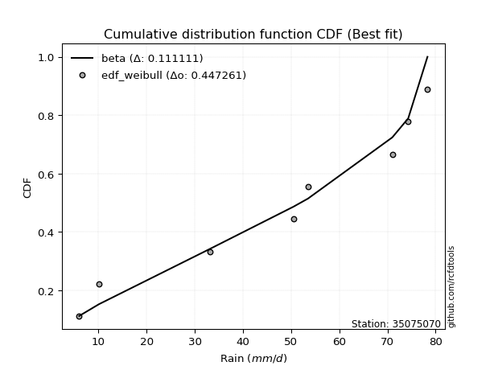</img></img>

</div>


### 4. EDF Beard (1943)

The Beard formula (or Beard´s plotting position formula) in hydrology is used to estimate the empirical non-exceedance probability _(P)_ of a flood event (or other extreme hydrological data point) within a given dataset.

<div align="center">


$P=(m-0.31)/(n+0.38)$


</div>


**4.1. Empirical values**

<div align="center">

|                | 0                   | 1                   | 2                  | 3                   | 4                  | 5                  | 6                  | 7                  |
|:---------------|:--------------------|:--------------------|:-------------------|:--------------------|:-------------------|:-------------------|:-------------------|:-------------------|
| date           | 2022                | 2023                | 2018               | 2017                | 2021               | 2025               | 2020               | 2019               |
| x              | 6.0                 | 10.1                | 33.1               | 50.5                | 53.5               | 71.0               | 74.3               | 78.3               |
| m              | 1                   | 2                   | 3                  | 4                   | 5                  | 6                  | 7                  | 8                  |
| empirical_dist | edf_beard           | edf_beard           | edf_beard          | edf_beard           | edf_beard          | edf_beard          | edf_beard          | edf_beard          |
| empirical      | 0.08233890214797135 | 0.20167064439140808 | 0.3210023866348448 | 0.44033412887828155 | 0.5596658711217184 | 0.6789976133651551 | 0.7983293556085919 | 0.9176610978520287 |
| empirical_tr   | 1.0897269180754225  | 1.2526158445440956  | 1.4727592267135323 | 1.7867803837953091  | 2.2710027100271004 | 3.115241635687732  | 4.958579881656804  | 12.144927536231886 |

</div>


**4.2. Kolmogorov-Smirnov fit test (sorted by Δ)**


<div align="center">

|                | 0                  | 1                   | 2                   | 3                   | 4                  | 5                   | 6                   | 7                   | 8                   | 9                   | 10                  | 11                  | 12                  | 13                 | 14                  | 15                  | 16                  | 17                 | 18                  | 19                  | 20                  | 21                  | 22                  | 23                  | 24                 | 25                  | 26                 | 27                 | 28                 | 29                 | 30                  | 31                 | 32                 | 33                  | 34                  | 35                  | 36                 | 37                 | 38                  | 39                  | 40                 | 41                  | 42                 | 43                  | 44                  | 45                 | 46                  | 47                 | 48                 | 49                  | 50                  | 51                 | 52                 | 53                 | 54                  | 55                  | 56                  | 57                  | 58                  | 59                  | 60                 | 61                  | 62                  | 63                  | 64                  | 65                  | 66                  | 67                  | 68                  | 69                  | 70                  | 71                 | 72                 | 73                 | 74                  | 75                 | 76                  | 77                  | 78                  | 79                  | 80                  | 81                  | 82                  | 83                  | 84                  | 85                  | 86                  | 87                 | 88                 | 89                  | 90                 | 91                  | 92                  | 93                  | 94                  | 95                  | 96                 | 97                  | 98                  | 99                 | 100                 | 101                 | 102                 | 103                 | 104                | 105                 | 106                 | 107                 | 108                 | 109                 | 110                | 111                 | 112                 | 113                 | 114                 | 115                | 116                | 117                 | 118                | 119                 | 120                | 121                | 122                | 123                 | 124                | 125                | 126                | 127                | 128                 | 129                | 130                 | 131                | 132                | 133                 | 134                | 135                 | 136                | 137                 | 138                | 139                | 140                 | 141                 | 142                | 143                | 144                | 145                | 146                | 147                | 148                | 149                | 150                | 151                | 152                | 153                | 154                | 155                | 156                | 157                | 158                | 159                |
|:---------------|:-------------------|:--------------------|:--------------------|:--------------------|:-------------------|:--------------------|:--------------------|:--------------------|:--------------------|:--------------------|:--------------------|:--------------------|:--------------------|:-------------------|:--------------------|:--------------------|:--------------------|:-------------------|:--------------------|:--------------------|:--------------------|:--------------------|:--------------------|:--------------------|:-------------------|:--------------------|:-------------------|:-------------------|:-------------------|:-------------------|:--------------------|:-------------------|:-------------------|:--------------------|:--------------------|:--------------------|:-------------------|:-------------------|:--------------------|:--------------------|:-------------------|:--------------------|:-------------------|:--------------------|:--------------------|:-------------------|:--------------------|:-------------------|:-------------------|:--------------------|:--------------------|:-------------------|:-------------------|:-------------------|:--------------------|:--------------------|:--------------------|:--------------------|:--------------------|:--------------------|:-------------------|:--------------------|:--------------------|:--------------------|:--------------------|:--------------------|:--------------------|:--------------------|:--------------------|:--------------------|:--------------------|:-------------------|:-------------------|:-------------------|:--------------------|:-------------------|:--------------------|:--------------------|:--------------------|:--------------------|:--------------------|:--------------------|:--------------------|:--------------------|:--------------------|:--------------------|:--------------------|:-------------------|:-------------------|:--------------------|:-------------------|:--------------------|:--------------------|:--------------------|:--------------------|:--------------------|:-------------------|:--------------------|:--------------------|:-------------------|:--------------------|:--------------------|:--------------------|:--------------------|:-------------------|:--------------------|:--------------------|:--------------------|:--------------------|:--------------------|:-------------------|:--------------------|:--------------------|:--------------------|:--------------------|:-------------------|:-------------------|:--------------------|:-------------------|:--------------------|:-------------------|:-------------------|:-------------------|:--------------------|:-------------------|:-------------------|:-------------------|:-------------------|:--------------------|:-------------------|:--------------------|:-------------------|:-------------------|:--------------------|:-------------------|:--------------------|:-------------------|:--------------------|:-------------------|:-------------------|:--------------------|:--------------------|:-------------------|:-------------------|:-------------------|:-------------------|:-------------------|:-------------------|:-------------------|:-------------------|:-------------------|:-------------------|:-------------------|:-------------------|:-------------------|:-------------------|:-------------------|:-------------------|:-------------------|:-------------------|
| station        | 35075070           | 35075070            | 35075070            | 35075070            | 35075070           | 35075070            | 35075070            | 35075070            | 35075070            | 35075070            | 35075070            | 35075070            | 35075070            | 35075070           | 35075070            | 35075070            | 35075070            | 35075070           | 35075070            | 35075070            | 35075070            | 35075070            | 35075070            | 35075070            | 35075070           | 35075070            | 35075070           | 35075070           | 35075070           | 35075070           | 35075070            | 35075070           | 35075070           | 35075070            | 35075070            | 35075070            | 35075070           | 35075070           | 35075070            | 35075070            | 35075070           | 35075070            | 35075070           | 35075070            | 35075070            | 35075070           | 35075070            | 35075070           | 35075070           | 35075070            | 35075070            | 35075070           | 35075070           | 35075070           | 35075070            | 35075070            | 35075070            | 35075070            | 35075070            | 35075070            | 35075070           | 35075070            | 35075070            | 35075070            | 35075070            | 35075070            | 35075070            | 35075070            | 35075070            | 35075070            | 35075070            | 35075070           | 35075070           | 35075070           | 35075070            | 35075070           | 35075070            | 35075070            | 35075070            | 35075070            | 35075070            | 35075070            | 35075070            | 35075070            | 35075070            | 35075070            | 35075070            | 35075070           | 35075070           | 35075070            | 35075070           | 35075070            | 35075070            | 35075070            | 35075070            | 35075070            | 35075070           | 35075070            | 35075070            | 35075070           | 35075070            | 35075070            | 35075070            | 35075070            | 35075070           | 35075070            | 35075070            | 35075070            | 35075070            | 35075070            | 35075070           | 35075070            | 35075070            | 35075070            | 35075070            | 35075070           | 35075070           | 35075070            | 35075070           | 35075070            | 35075070           | 35075070           | 35075070           | 35075070            | 35075070           | 35075070           | 35075070           | 35075070           | 35075070            | 35075070           | 35075070            | 35075070           | 35075070           | 35075070            | 35075070           | 35075070            | 35075070           | 35075070            | 35075070           | 35075070           | 35075070            | 35075070            | 35075070           | 35075070           | 35075070           | 35075070           | 35075070           | 35075070           | 35075070           | 35075070           | 35075070           | 35075070           | 35075070           | 35075070           | 35075070           | 35075070           | 35075070           | 35075070           | 35075070           | 35075070           |
| empirical_dist | edf_beard          | edf_beard           | edf_beard           | edf_beard           | edf_beard          | edf_beard           | edf_beard           | edf_beard           | edf_beard           | edf_beard           | edf_beard           | edf_beard           | edf_beard           | edf_beard          | edf_beard           | edf_beard           | edf_beard           | edf_beard          | edf_beard           | edf_beard           | edf_beard           | edf_beard           | edf_beard           | edf_beard           | edf_beard          | edf_beard           | edf_beard          | edf_beard          | edf_beard          | edf_beard          | edf_beard           | edf_beard          | edf_beard          | edf_beard           | edf_beard           | edf_beard           | edf_beard          | edf_beard          | edf_beard           | edf_beard           | edf_beard          | edf_beard           | edf_beard          | edf_beard           | edf_beard           | edf_beard          | edf_beard           | edf_beard          | edf_beard          | edf_beard           | edf_beard           | edf_beard          | edf_beard          | edf_beard          | edf_beard           | edf_beard           | edf_beard           | edf_beard           | edf_beard           | edf_beard           | edf_beard          | edf_beard           | edf_beard           | edf_beard           | edf_beard           | edf_beard           | edf_beard           | edf_beard           | edf_beard           | edf_beard           | edf_beard           | edf_beard          | edf_beard          | edf_beard          | edf_beard           | edf_beard          | edf_beard           | edf_beard           | edf_beard           | edf_beard           | edf_beard           | edf_beard           | edf_beard           | edf_beard           | edf_beard           | edf_beard           | edf_beard           | edf_beard          | edf_beard          | edf_beard           | edf_beard          | edf_beard           | edf_beard           | edf_beard           | edf_beard           | edf_beard           | edf_beard          | edf_beard           | edf_beard           | edf_beard          | edf_beard           | edf_beard           | edf_beard           | edf_beard           | edf_beard          | edf_beard           | edf_beard           | edf_beard           | edf_beard           | edf_beard           | edf_beard          | edf_beard           | edf_beard           | edf_beard           | edf_beard           | edf_beard          | edf_beard          | edf_beard           | edf_beard          | edf_beard           | edf_beard          | edf_beard          | edf_beard          | edf_beard           | edf_beard          | edf_beard          | edf_beard          | edf_beard          | edf_beard           | edf_beard          | edf_beard           | edf_beard          | edf_beard          | edf_beard           | edf_beard          | edf_beard           | edf_beard          | edf_beard           | edf_beard          | edf_beard          | edf_beard           | edf_beard           | edf_beard          | edf_beard          | edf_beard          | edf_beard          | edf_beard          | edf_beard          | edf_beard          | edf_beard          | edf_beard          | edf_beard          | edf_beard          | edf_beard          | edf_beard          | edf_beard          | edf_beard          | edf_beard          | edf_beard          | edf_beard          |
| p_dist         | beta               | ksone               | semicircular        | anglit              | gausshyper         | trapezoid           | dgamma              | loglevy_l           | dweibull            | invgamma            | loggennorm          | pearson3            | rice                | erlang             | invgauss            | genextreme          | norm                | truncnorm          | exponnorm           | t                   | nct                 | f                   | gamma               | crystalball         | betaprime          | wrapcauchy          | maxwell            | weibull_min        | foldnorm           | genhalflogistic    | rayleigh            | johnsonsu          | kappa4             | logtrapezoid        | logvonmises_line    | gumbel_l            | arcsine            | argus              | invweibull          | logistic            | cosine             | logpearson3         | logburr12          | logdgamma           | loggumbel_l         | triang             | hypsecant           | logweibull_min     | kstwobign          | skewnorm            | gumbel_r            | laplace            | alpha              | levy_l             | logsemicircular     | loggenextreme       | loggompertz         | logmielke           | mielke              | logargus            | loganglit          | logdweibull         | burr                | halfnorm            | logarcsine          | halflogistic        | moyal               | logloggamma         | loggenpareto        | logbeta             | tukeylambda         | lomax              | loggamma           | loggamma           | lognakagami         | logf               | lognct              | logexponnorm        | logt                | lognorm             | logcrystalball      | logncf              | loginvweibull       | logwrapcauchy       | logfatiguelife      | kappa3              | logrice             | uniform            | genpareto          | logerlang           | genexpon           | loginvgauss         | logfoldnorm         | logbetaprime        | truncweibull_min    | vonmises_line       | loginvgamma        | logburr             | logalpha            | bradford           | loglogistic         | logweibull_max      | logmaxwell          | ncf                 | logkstwobign       | lograyleigh         | logloglaplace       | loghypsecant        | loggenexpon         | loggausshyper       | logcosine          | loggenhalflogistic  | loghalfnorm         | wald                | loggumbel_r         | loglaplace         | loglaplace         | logskewnorm         | loggengamma        | nakagami            | gengamma           | loglomax           | loghalflogistic    | logtriang           | truncexpon         | logmoyal           | burr12             | gennorm            | logksone            | logwald            | logexponweib        | logkappa3          | loguniform         | logtruncnorm        | logkappa4          | logtruncweibull_min | logbradford        | logtruncexpon       | logjohnsonsb       | logrdist           | logjohnsonsu        | weibull_max         | fatiguelife        | exponweib          | logtukeylambda     | powerlaw           | logexponpow        | gompertz           | halfgennorm        | exponpow           | logpowerlaw        | truncpareto        | johnsonsb          | rdist              | logtruncpareto     | genlogistic        | loggenlogistic     | loghalfgennorm     | logvonmises        | vonmises           |
| delta          | 0.0823387990583746 | 0.10569058834692059 | 0.10751180311370107 | 0.11073218067346668 | 0.1139743775703016 | 0.11682473908640933 | 0.12818905012599818 | 0.13025679798495005 | 0.13375199485816663 | 0.13528937406410108 | 0.13595529794507866 | 0.13623141700607633 | 0.13678712943122984 | 0.1369003576427008 | 0.13720320073225883 | 0.13797429310727066 | 0.13801637103889008 | 0.1380163817365304 | 0.13801752142426027 | 0.13801948648136475 | 0.13803068242646488 | 0.13822648268992144 | 0.13840185674403638 | 0.13859263562239543 | 0.1387855958123031 | 0.13919391078559845 | 0.141145971775604  | 0.1412454909174672 | 0.1462006039367828 | 0.149854064857882  | 0.15087326406805485 | 0.1511173618404033 | 0.1520623515427415 | 0.15302835888624766 | 0.15332209665145424 | 0.15405724610175542 | 0.1558189092344578 | 0.1569369154939162 | 0.15754595010842648 | 0.15850392525008916 | 0.1590946881455776 | 0.16433090121793442 | 0.1653138774498602 | 0.16751991822587925 | 0.16903380608342605 | 0.1693523043299856 | 0.17002849584410917 | 0.171528505419216  | 0.1774998694751439 | 0.17929390759487052 | 0.18087772091634807 | 0.1817766379033835 | 0.1824245423299124 | 0.1850988607544769 | 0.18669721463347827 | 0.18678844090020574 | 0.18855279499234529 | 0.18983605981873541 | 0.19191139809764757 | 0.19352266149945763 | 0.1952938507069109 | 0.19936258474561852 | 0.20116250019594806 | 0.20167064439140808 | 0.20345654477807695 | 0.20564071057954852 | 0.20567742105512604 | 0.20623562140162743 | 0.20971175659430813 | 0.21050284407486064 | 0.21299797745310645 | 0.2141286714775788 | 0.2153513491027091 | 0.2153513491027091 | 0.21538479070906608 | 0.215601596041683  | 0.21572398786100805 | 0.21574620693768426 | 0.21575024725794384 | 0.21575032327798543 | 0.21575093101822557 | 0.21584901965108044 | 0.21586992369407704 | 0.21644894068459575 | 0.21810239461476338 | 0.21984540473573133 | 0.21996989857594657 | 0.2200341985297274 | 0.2210339922137008 | 0.22106504426405477 | 0.2211319709633886 | 0.22130426866115221 | 0.22149565374935626 | 0.22167090715544596 | 0.22191256653498637 | 0.22344501602490408 | 0.2258847343715072 | 0.22683805823924663 | 0.22852423873127609 | 0.2296781661185423 | 0.23420444092428155 | 0.23532958990203523 | 0.23672997481122987 | 0.24124431596970736 | 0.2427788015958529 | 0.24301453903711728 | 0.24447007056388326 | 0.24841965866418275 | 0.24852119831426062 | 0.25327009757761026 | 0.2590636859278032 | 0.26065735931604855 | 0.26136951844100137 | 0.27449100129091225 | 0.27474497364642386 | 0.2764025733117184 | 0.2764025733117184 | 0.27865471772904665 | 0.2786596271854449 | 0.28321258735584093 | 0.2882893055888176 | 0.2890527072386617 | 0.2893863596713648 | 0.29357062717145693 | 0.2939578853323023 | 0.2942025621397751 | 0.2969259414034795 | 0.2983293556085919 | 0.33405589348607573 | 0.3495173681495039 | 0.35040964305390054 | 0.3755834483809258 | 0.3889338979589471 | 0.39002112607728673 | 0.3911240376618084 | 0.4109202212364212  | 0.4312444442970002 | 0.43927344914307237 | 0.4620457238834601 | 0.4725425349758193 | 0.47408555429124866 | 0.48550379700210583 | 0.4924771237080241 | 0.5138759966671621 | 0.5143224963531619 | 0.5151087578532648 | 0.5423375300515145 | 0.5594096909760522 | 0.5596658711217184 | 0.5947819507042297 | 0.5994449016765283 | 0.617710362855523  | 0.6725766460549579 | 0.6789976130310696 | 0.6863850052124907 | 0.7983293556085919 | 0.7983293556085919 | 0.7983293556085919 | 1.1561741386006943 | 11.652280456751226 |
| deltao         | 0.4472608134160001 | 0.4472608134160001  | 0.4472608134160001  | 0.4472608134160001  | 0.4472608134160001 | 0.4472608134160001  | 0.4472608134160001  | 0.4472608134160001  | 0.4472608134160001  | 0.4472608134160001  | 0.4472608134160001  | 0.4472608134160001  | 0.4472608134160001  | 0.4472608134160001 | 0.4472608134160001  | 0.4472608134160001  | 0.4472608134160001  | 0.4472608134160001 | 0.4472608134160001  | 0.4472608134160001  | 0.4472608134160001  | 0.4472608134160001  | 0.4472608134160001  | 0.4472608134160001  | 0.4472608134160001 | 0.4472608134160001  | 0.4472608134160001 | 0.4472608134160001 | 0.4472608134160001 | 0.4472608134160001 | 0.4472608134160001  | 0.4472608134160001 | 0.4472608134160001 | 0.4472608134160001  | 0.4472608134160001  | 0.4472608134160001  | 0.4472608134160001 | 0.4472608134160001 | 0.4472608134160001  | 0.4472608134160001  | 0.4472608134160001 | 0.4472608134160001  | 0.4472608134160001 | 0.4472608134160001  | 0.4472608134160001  | 0.4472608134160001 | 0.4472608134160001  | 0.4472608134160001 | 0.4472608134160001 | 0.4472608134160001  | 0.4472608134160001  | 0.4472608134160001 | 0.4472608134160001 | 0.4472608134160001 | 0.4472608134160001  | 0.4472608134160001  | 0.4472608134160001  | 0.4472608134160001  | 0.4472608134160001  | 0.4472608134160001  | 0.4472608134160001 | 0.4472608134160001  | 0.4472608134160001  | 0.4472608134160001  | 0.4472608134160001  | 0.4472608134160001  | 0.4472608134160001  | 0.4472608134160001  | 0.4472608134160001  | 0.4472608134160001  | 0.4472608134160001  | 0.4472608134160001 | 0.4472608134160001 | 0.4472608134160001 | 0.4472608134160001  | 0.4472608134160001 | 0.4472608134160001  | 0.4472608134160001  | 0.4472608134160001  | 0.4472608134160001  | 0.4472608134160001  | 0.4472608134160001  | 0.4472608134160001  | 0.4472608134160001  | 0.4472608134160001  | 0.4472608134160001  | 0.4472608134160001  | 0.4472608134160001 | 0.4472608134160001 | 0.4472608134160001  | 0.4472608134160001 | 0.4472608134160001  | 0.4472608134160001  | 0.4472608134160001  | 0.4472608134160001  | 0.4472608134160001  | 0.4472608134160001 | 0.4472608134160001  | 0.4472608134160001  | 0.4472608134160001 | 0.4472608134160001  | 0.4472608134160001  | 0.4472608134160001  | 0.4472608134160001  | 0.4472608134160001 | 0.4472608134160001  | 0.4472608134160001  | 0.4472608134160001  | 0.4472608134160001  | 0.4472608134160001  | 0.4472608134160001 | 0.4472608134160001  | 0.4472608134160001  | 0.4472608134160001  | 0.4472608134160001  | 0.4472608134160001 | 0.4472608134160001 | 0.4472608134160001  | 0.4472608134160001 | 0.4472608134160001  | 0.4472608134160001 | 0.4472608134160001 | 0.4472608134160001 | 0.4472608134160001  | 0.4472608134160001 | 0.4472608134160001 | 0.4472608134160001 | 0.4472608134160001 | 0.4472608134160001  | 0.4472608134160001 | 0.4472608134160001  | 0.4472608134160001 | 0.4472608134160001 | 0.4472608134160001  | 0.4472608134160001 | 0.4472608134160001  | 0.4472608134160001 | 0.4472608134160001  | 0.4472608134160001 | 0.4472608134160001 | 0.4472608134160001  | 0.4472608134160001  | 0.4472608134160001 | 0.4472608134160001 | 0.4472608134160001 | 0.4472608134160001 | 0.4472608134160001 | 0.4472608134160001 | 0.4472608134160001 | 0.4472608134160001 | 0.4472608134160001 | 0.4472608134160001 | 0.4472608134160001 | 0.4472608134160001 | 0.4472608134160001 | 0.4472608134160001 | 0.4472608134160001 | 0.4472608134160001 | 0.4472608134160001 | 0.4472608134160001 |
| eval           | Δo > Δ             | Δo > Δ              | Δo > Δ              | Δo > Δ              | Δo > Δ             | Δo > Δ              | Δo > Δ              | Δo > Δ              | Δo > Δ              | Δo > Δ              | Δo > Δ              | Δo > Δ              | Δo > Δ              | Δo > Δ             | Δo > Δ              | Δo > Δ              | Δo > Δ              | Δo > Δ             | Δo > Δ              | Δo > Δ              | Δo > Δ              | Δo > Δ              | Δo > Δ              | Δo > Δ              | Δo > Δ             | Δo > Δ              | Δo > Δ             | Δo > Δ             | Δo > Δ             | Δo > Δ             | Δo > Δ              | Δo > Δ             | Δo > Δ             | Δo > Δ              | Δo > Δ              | Δo > Δ              | Δo > Δ             | Δo > Δ             | Δo > Δ              | Δo > Δ              | Δo > Δ             | Δo > Δ              | Δo > Δ             | Δo > Δ              | Δo > Δ              | Δo > Δ             | Δo > Δ              | Δo > Δ             | Δo > Δ             | Δo > Δ              | Δo > Δ              | Δo > Δ             | Δo > Δ             | Δo > Δ             | Δo > Δ              | Δo > Δ              | Δo > Δ              | Δo > Δ              | Δo > Δ              | Δo > Δ              | Δo > Δ             | Δo > Δ              | Δo > Δ              | Δo > Δ              | Δo > Δ              | Δo > Δ              | Δo > Δ              | Δo > Δ              | Δo > Δ              | Δo > Δ              | Δo > Δ              | Δo > Δ             | Δo > Δ             | Δo > Δ             | Δo > Δ              | Δo > Δ             | Δo > Δ              | Δo > Δ              | Δo > Δ              | Δo > Δ              | Δo > Δ              | Δo > Δ              | Δo > Δ              | Δo > Δ              | Δo > Δ              | Δo > Δ              | Δo > Δ              | Δo > Δ             | Δo > Δ             | Δo > Δ              | Δo > Δ             | Δo > Δ              | Δo > Δ              | Δo > Δ              | Δo > Δ              | Δo > Δ              | Δo > Δ             | Δo > Δ              | Δo > Δ              | Δo > Δ             | Δo > Δ              | Δo > Δ              | Δo > Δ              | Δo > Δ              | Δo > Δ             | Δo > Δ              | Δo > Δ              | Δo > Δ              | Δo > Δ              | Δo > Δ              | Δo > Δ             | Δo > Δ              | Δo > Δ              | Δo > Δ              | Δo > Δ              | Δo > Δ             | Δo > Δ             | Δo > Δ              | Δo > Δ             | Δo > Δ              | Δo > Δ             | Δo > Δ             | Δo > Δ             | Δo > Δ              | Δo > Δ             | Δo > Δ             | Δo > Δ             | Δo > Δ             | Δo > Δ              | Δo > Δ             | Δo > Δ              | Δo > Δ             | Δo > Δ             | Δo > Δ              | Δo > Δ             | Δo > Δ              | Δo > Δ             | Δo > Δ              | Δo <= Δ            | Δo <= Δ            | Δo <= Δ             | Δo <= Δ             | Δo <= Δ            | Δo <= Δ            | Δo <= Δ            | Δo <= Δ            | Δo <= Δ            | Δo <= Δ            | Δo <= Δ            | Δo <= Δ            | Δo <= Δ            | Δo <= Δ            | Δo <= Δ            | Δo <= Δ            | Δo <= Δ            | Δo <= Δ            | Δo <= Δ            | Δo <= Δ            | Δo <= Δ            | Δo <= Δ            |
| fit            | 1                  | 1                   | 1                   | 1                   | 1                  | 1                   | 1                   | 1                   | 1                   | 1                   | 1                   | 1                   | 1                   | 1                  | 1                   | 1                   | 1                   | 1                  | 1                   | 1                   | 1                   | 1                   | 1                   | 1                   | 1                  | 1                   | 1                  | 1                  | 1                  | 1                  | 1                   | 1                  | 1                  | 1                   | 1                   | 1                   | 1                  | 1                  | 1                   | 1                   | 1                  | 1                   | 1                  | 1                   | 1                   | 1                  | 1                   | 1                  | 1                  | 1                   | 1                   | 1                  | 1                  | 1                  | 1                   | 1                   | 1                   | 1                   | 1                   | 1                   | 1                  | 1                   | 1                   | 1                   | 1                   | 1                   | 1                   | 1                   | 1                   | 1                   | 1                   | 1                  | 1                  | 1                  | 1                   | 1                  | 1                   | 1                   | 1                   | 1                   | 1                   | 1                   | 1                   | 1                   | 1                   | 1                   | 1                   | 1                  | 1                  | 1                   | 1                  | 1                   | 1                   | 1                   | 1                   | 1                   | 1                  | 1                   | 1                   | 1                  | 1                   | 1                   | 1                   | 1                   | 1                  | 1                   | 1                   | 1                   | 1                   | 1                   | 1                  | 1                   | 1                   | 1                   | 1                   | 1                  | 1                  | 1                   | 1                  | 1                   | 1                  | 1                  | 1                  | 1                   | 1                  | 1                  | 1                  | 1                  | 1                   | 1                  | 1                   | 1                  | 1                  | 1                   | 1                  | 1                   | 1                  | 1                   | 0                  | 0                  | 0                   | 0                   | 0                  | 0                  | 0                  | 0                  | 0                  | 0                  | 0                  | 0                  | 0                  | 0                  | 0                  | 0                  | 0                  | 0                  | 0                  | 0                  | 0                  | 0                  |
| n              | 8                  | 8                   | 8                   | 8                   | 8                  | 8                   | 8                   | 8                   | 8                   | 8                   | 8                   | 8                   | 8                   | 8                  | 8                   | 8                   | 8                   | 8                  | 8                   | 8                   | 8                   | 8                   | 8                   | 8                   | 8                  | 8                   | 8                  | 8                  | 8                  | 8                  | 8                   | 8                  | 8                  | 8                   | 8                   | 8                   | 8                  | 8                  | 8                   | 8                   | 8                  | 8                   | 8                  | 8                   | 8                   | 8                  | 8                   | 8                  | 8                  | 8                   | 8                   | 8                  | 8                  | 8                  | 8                   | 8                   | 8                   | 8                   | 8                   | 8                   | 8                  | 8                   | 8                   | 8                   | 8                   | 8                   | 8                   | 8                   | 8                   | 8                   | 8                   | 8                  | 8                  | 8                  | 8                   | 8                  | 8                   | 8                   | 8                   | 8                   | 8                   | 8                   | 8                   | 8                   | 8                   | 8                   | 8                   | 8                  | 8                  | 8                   | 8                  | 8                   | 8                   | 8                   | 8                   | 8                   | 8                  | 8                   | 8                   | 8                  | 8                   | 8                   | 8                   | 8                   | 8                  | 8                   | 8                   | 8                   | 8                   | 8                   | 8                  | 8                   | 8                   | 8                   | 8                   | 8                  | 8                  | 8                   | 8                  | 8                   | 8                  | 8                  | 8                  | 8                   | 8                  | 8                  | 8                  | 8                  | 8                   | 8                  | 8                   | 8                  | 8                  | 8                   | 8                  | 8                   | 8                  | 8                   | 8                  | 8                  | 8                   | 8                   | 8                  | 8                  | 8                  | 8                  | 8                  | 8                  | 8                  | 8                  | 8                  | 8                  | 8                  | 8                  | 8                  | 8                  | 8                  | 8                  | 8                  | 8                  |
| best_fit       | 1                  | 0                   | 0                   | 0                   | 0                  | 0                   | 0                   | 0                   | 0                   | 0                   | 0                   | 0                   | 0                   | 0                  | 0                   | 0                   | 0                   | 0                  | 0                   | 0                   | 0                   | 0                   | 0                   | 0                   | 0                  | 0                   | 0                  | 0                  | 0                  | 0                  | 0                   | 0                  | 0                  | 0                   | 0                   | 0                   | 0                  | 0                  | 0                   | 0                   | 0                  | 0                   | 0                  | 0                   | 0                   | 0                  | 0                   | 0                  | 0                  | 0                   | 0                   | 0                  | 0                  | 0                  | 0                   | 0                   | 0                   | 0                   | 0                   | 0                   | 0                  | 0                   | 0                   | 0                   | 0                   | 0                   | 0                   | 0                   | 0                   | 0                   | 0                   | 0                  | 0                  | 0                  | 0                   | 0                  | 0                   | 0                   | 0                   | 0                   | 0                   | 0                   | 0                   | 0                   | 0                   | 0                   | 0                   | 0                  | 0                  | 0                   | 0                  | 0                   | 0                   | 0                   | 0                   | 0                   | 0                  | 0                   | 0                   | 0                  | 0                   | 0                   | 0                   | 0                   | 0                  | 0                   | 0                   | 0                   | 0                   | 0                   | 0                  | 0                   | 0                   | 0                   | 0                   | 0                  | 0                  | 0                   | 0                  | 0                   | 0                  | 0                  | 0                  | 0                   | 0                  | 0                  | 0                  | 0                  | 0                   | 0                  | 0                   | 0                  | 0                  | 0                   | 0                  | 0                   | 0                  | 0                   | 0                  | 0                  | 0                   | 0                   | 0                  | 0                  | 0                  | 0                  | 0                  | 0                  | 0                  | 0                  | 0                  | 0                  | 0                  | 0                  | 0                  | 0                  | 0                  | 0                  | 0                  | 0                  |
| best_fit_sort  | 1                  | 2                   | 3                   | 4                   | 5                  | 6                   | 7                   | 8                   | 9                   | 10                  | 11                  | 12                  | 13                  | 14                 | 15                  | 16                  | 17                  | 18                 | 19                  | 20                  | 21                  | 22                  | 23                  | 24                  | 25                 | 26                  | 27                 | 28                 | 29                 | 30                 | 31                  | 32                 | 33                 | 34                  | 35                  | 36                  | 37                 | 38                 | 39                  | 40                  | 41                 | 42                  | 43                 | 44                  | 45                  | 46                 | 47                  | 48                 | 49                 | 50                  | 51                  | 52                 | 53                 | 54                 | 55                  | 56                  | 57                  | 58                  | 59                  | 60                  | 61                 | 62                  | 63                  | 64                  | 65                  | 66                  | 67                  | 68                  | 69                  | 70                  | 71                  | 72                 | 73                 | 74                 | 75                  | 76                 | 77                  | 78                  | 79                  | 80                  | 81                  | 82                  | 83                  | 84                  | 85                  | 86                  | 87                  | 88                 | 89                 | 90                  | 91                 | 92                  | 93                  | 94                  | 95                  | 96                  | 97                 | 98                  | 99                  | 100                | 101                 | 102                 | 103                 | 104                 | 105                | 106                 | 107                 | 108                 | 109                 | 110                 | 111                | 112                 | 113                 | 114                 | 115                 | 116                | 117                | 118                 | 119                | 120                 | 121                | 122                | 123                | 124                 | 125                | 126                | 127                | 128                | 129                 | 130                | 131                 | 132                | 133                | 134                 | 135                | 136                 | 137                | 138                 | 139                | 140                | 141                 | 142                 | 143                | 144                | 145                | 146                | 147                | 148                | 149                | 150                | 151                | 152                | 153                | 154                | 155                | 156                | 157                | 158                | 159                | 160                |

</div>


**4.3. Best fit**

<div align="center">

|   id |   station | empirical_dist   | p_dist   |     delta |   deltao | eval   |   fit |   n |   best_fit |   best_fit_sort |
|-----:|----------:|:-----------------|:---------|----------:|---------:|:-------|------:|----:|-----------:|----------------:|
|    0 |  35075070 | edf_beard        | beta     | 0.0823388 | 0.447261 | Δo > Δ |     1 |   8 |          1 |               1 |

</div>


<div align="center">

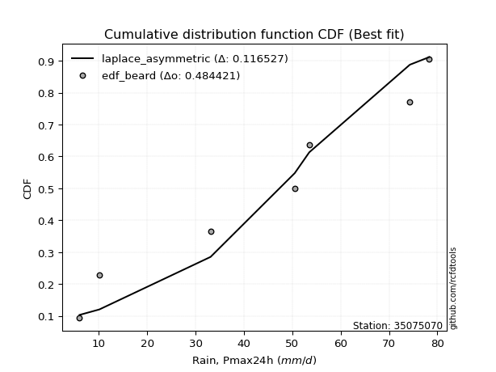</img>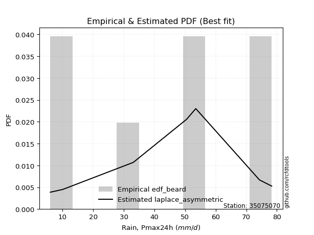</img>

</div>


### 5. EDF Chegodayev (1955)

The Chegodayev formula is an empirical plotting position formula used in hydrological frequency analysis to estimate the exceedance probability or return period of a specific event from a set of observed data. It is primarily used for plotting observed data points on probability paper to fit a theoretical distribution, particularly for analyzing extreme events like maximum flood flows or rainfall intensities. The constant _b_ value in the generalized plotting position formula is 0.3.

<div align="center">


$P=(m-b)/(n+1-2b)$


</div>


**5.1. Empirical values**

<div align="center">

|                | 0                   | 1                   | 2                   | 3                   | 4                  | 5                  | 6                  | 7                  |
|:---------------|:--------------------|:--------------------|:--------------------|:--------------------|:-------------------|:-------------------|:-------------------|:-------------------|
| date           | 2022                | 2023                | 2018                | 2017                | 2021               | 2025               | 2020               | 2019               |
| x              | 6.0                 | 10.1                | 33.1                | 50.5                | 53.5               | 71.0               | 74.3               | 78.3               |
| m              | 1                   | 2                   | 3                   | 4                   | 5                  | 6                  | 7                  | 8                  |
| empirical_dist | edf_chegodayev      | edf_chegodayev      | edf_chegodayev      | edf_chegodayev      | edf_chegodayev     | edf_chegodayev     | edf_chegodayev     | edf_chegodayev     |
| empirical      | 0.08333333333333333 | 0.20238095238095236 | 0.32142857142857145 | 0.44047619047619047 | 0.5595238095238095 | 0.6785714285714286 | 0.7976190476190476 | 0.9166666666666666 |
| empirical_tr   | 1.090909090909091   | 1.253731343283582   | 1.4736842105263157  | 1.7872340425531914  | 2.27027027027027   | 3.1111111111111116 | 4.941176470588234  | 11.999999999999995 |

</div>


**5.2. Kolmogorov-Smirnov fit test (sorted by Δ)**


<div align="center">

|                | 0                   | 1                   | 2                   | 3                   | 4                   | 5                  | 6                   | 7                   | 8                   | 9                  | 10                 | 11                 | 12                  | 13                 | 14                  | 15                 | 16                  | 17                  | 18                  | 19                  | 20                  | 21                 | 22                  | 23                  | 24                 | 25                  | 26                 | 27                  | 28                  | 29                  | 30                  | 31                  | 32                  | 33                  | 34                  | 35                 | 36                  | 37                  | 38                  | 39                  | 40                  | 41                 | 42                 | 43                  | 44                  | 45                  | 46                  | 47                  | 48                  | 49                  | 50                  | 51                  | 52                  | 53                  | 54                  | 55                 | 56                  | 57                  | 58                  | 59                 | 60                 | 61                 | 62                  | 63                  | 64                  | 65                 | 66                  | 67                 | 68                  | 69                  | 70                  | 71                 | 72                  | 73                  | 74                  | 75                  | 76                  | 77                  | 78                  | 79                  | 80                  | 81                  | 82                  | 83                 | 84                  | 85                  | 86                 | 87                  | 88                  | 89                 | 90                 | 91                  | 92                  | 93                  | 94                  | 95                  | 96                  | 97                 | 98                  | 99                  | 100                 | 101                 | 102                 | 103                 | 104                | 105                 | 106                 | 107                 | 108                | 109                 | 110                | 111                 | 112                 | 113                 | 114                 | 115                | 116                | 117                 | 118                 | 119                | 120                 | 121                | 122                 | 123                | 124                | 125                 | 126                 | 127                 | 128                | 129                | 130                | 131                 | 132                | 133                | 134                | 135                 | 136                | 137                 | 138                | 139                 | 140                 | 141                 | 142                 | 143                | 144                | 145                | 146                | 147                | 148                | 149                | 150                | 151                | 152                | 153                | 154                | 155                | 156                | 157                | 158                | 159                |
|:---------------|:--------------------|:--------------------|:--------------------|:--------------------|:--------------------|:-------------------|:--------------------|:--------------------|:--------------------|:-------------------|:-------------------|:-------------------|:--------------------|:-------------------|:--------------------|:-------------------|:--------------------|:--------------------|:--------------------|:--------------------|:--------------------|:-------------------|:--------------------|:--------------------|:-------------------|:--------------------|:-------------------|:--------------------|:--------------------|:--------------------|:--------------------|:--------------------|:--------------------|:--------------------|:--------------------|:-------------------|:--------------------|:--------------------|:--------------------|:--------------------|:--------------------|:-------------------|:-------------------|:--------------------|:--------------------|:--------------------|:--------------------|:--------------------|:--------------------|:--------------------|:--------------------|:--------------------|:--------------------|:--------------------|:--------------------|:-------------------|:--------------------|:--------------------|:--------------------|:-------------------|:-------------------|:-------------------|:--------------------|:--------------------|:--------------------|:-------------------|:--------------------|:-------------------|:--------------------|:--------------------|:--------------------|:-------------------|:--------------------|:--------------------|:--------------------|:--------------------|:--------------------|:--------------------|:--------------------|:--------------------|:--------------------|:--------------------|:--------------------|:-------------------|:--------------------|:--------------------|:-------------------|:--------------------|:--------------------|:-------------------|:-------------------|:--------------------|:--------------------|:--------------------|:--------------------|:--------------------|:--------------------|:-------------------|:--------------------|:--------------------|:--------------------|:--------------------|:--------------------|:--------------------|:-------------------|:--------------------|:--------------------|:--------------------|:-------------------|:--------------------|:-------------------|:--------------------|:--------------------|:--------------------|:--------------------|:-------------------|:-------------------|:--------------------|:--------------------|:-------------------|:--------------------|:-------------------|:--------------------|:-------------------|:-------------------|:--------------------|:--------------------|:--------------------|:-------------------|:-------------------|:-------------------|:--------------------|:-------------------|:-------------------|:-------------------|:--------------------|:-------------------|:--------------------|:-------------------|:--------------------|:--------------------|:--------------------|:--------------------|:-------------------|:-------------------|:-------------------|:-------------------|:-------------------|:-------------------|:-------------------|:-------------------|:-------------------|:-------------------|:-------------------|:-------------------|:-------------------|:-------------------|:-------------------|:-------------------|:-------------------|
| station        | 35075070            | 35075070            | 35075070            | 35075070            | 35075070            | 35075070           | 35075070            | 35075070            | 35075070            | 35075070           | 35075070           | 35075070           | 35075070            | 35075070           | 35075070            | 35075070           | 35075070            | 35075070            | 35075070            | 35075070            | 35075070            | 35075070           | 35075070            | 35075070            | 35075070           | 35075070            | 35075070           | 35075070            | 35075070            | 35075070            | 35075070            | 35075070            | 35075070            | 35075070            | 35075070            | 35075070           | 35075070            | 35075070            | 35075070            | 35075070            | 35075070            | 35075070           | 35075070           | 35075070            | 35075070            | 35075070            | 35075070            | 35075070            | 35075070            | 35075070            | 35075070            | 35075070            | 35075070            | 35075070            | 35075070            | 35075070           | 35075070            | 35075070            | 35075070            | 35075070           | 35075070           | 35075070           | 35075070            | 35075070            | 35075070            | 35075070           | 35075070            | 35075070           | 35075070            | 35075070            | 35075070            | 35075070           | 35075070            | 35075070            | 35075070            | 35075070            | 35075070            | 35075070            | 35075070            | 35075070            | 35075070            | 35075070            | 35075070            | 35075070           | 35075070            | 35075070            | 35075070           | 35075070            | 35075070            | 35075070           | 35075070           | 35075070            | 35075070            | 35075070            | 35075070            | 35075070            | 35075070            | 35075070           | 35075070            | 35075070            | 35075070            | 35075070            | 35075070            | 35075070            | 35075070           | 35075070            | 35075070            | 35075070            | 35075070           | 35075070            | 35075070           | 35075070            | 35075070            | 35075070            | 35075070            | 35075070           | 35075070           | 35075070            | 35075070            | 35075070           | 35075070            | 35075070           | 35075070            | 35075070           | 35075070           | 35075070            | 35075070            | 35075070            | 35075070           | 35075070           | 35075070           | 35075070            | 35075070           | 35075070           | 35075070           | 35075070            | 35075070           | 35075070            | 35075070           | 35075070            | 35075070            | 35075070            | 35075070            | 35075070           | 35075070           | 35075070           | 35075070           | 35075070           | 35075070           | 35075070           | 35075070           | 35075070           | 35075070           | 35075070           | 35075070           | 35075070           | 35075070           | 35075070           | 35075070           | 35075070           |
| empirical_dist | edf_chegodayev      | edf_chegodayev      | edf_chegodayev      | edf_chegodayev      | edf_chegodayev      | edf_chegodayev     | edf_chegodayev      | edf_chegodayev      | edf_chegodayev      | edf_chegodayev     | edf_chegodayev     | edf_chegodayev     | edf_chegodayev      | edf_chegodayev     | edf_chegodayev      | edf_chegodayev     | edf_chegodayev      | edf_chegodayev      | edf_chegodayev      | edf_chegodayev      | edf_chegodayev      | edf_chegodayev     | edf_chegodayev      | edf_chegodayev      | edf_chegodayev     | edf_chegodayev      | edf_chegodayev     | edf_chegodayev      | edf_chegodayev      | edf_chegodayev      | edf_chegodayev      | edf_chegodayev      | edf_chegodayev      | edf_chegodayev      | edf_chegodayev      | edf_chegodayev     | edf_chegodayev      | edf_chegodayev      | edf_chegodayev      | edf_chegodayev      | edf_chegodayev      | edf_chegodayev     | edf_chegodayev     | edf_chegodayev      | edf_chegodayev      | edf_chegodayev      | edf_chegodayev      | edf_chegodayev      | edf_chegodayev      | edf_chegodayev      | edf_chegodayev      | edf_chegodayev      | edf_chegodayev      | edf_chegodayev      | edf_chegodayev      | edf_chegodayev     | edf_chegodayev      | edf_chegodayev      | edf_chegodayev      | edf_chegodayev     | edf_chegodayev     | edf_chegodayev     | edf_chegodayev      | edf_chegodayev      | edf_chegodayev      | edf_chegodayev     | edf_chegodayev      | edf_chegodayev     | edf_chegodayev      | edf_chegodayev      | edf_chegodayev      | edf_chegodayev     | edf_chegodayev      | edf_chegodayev      | edf_chegodayev      | edf_chegodayev      | edf_chegodayev      | edf_chegodayev      | edf_chegodayev      | edf_chegodayev      | edf_chegodayev      | edf_chegodayev      | edf_chegodayev      | edf_chegodayev     | edf_chegodayev      | edf_chegodayev      | edf_chegodayev     | edf_chegodayev      | edf_chegodayev      | edf_chegodayev     | edf_chegodayev     | edf_chegodayev      | edf_chegodayev      | edf_chegodayev      | edf_chegodayev      | edf_chegodayev      | edf_chegodayev      | edf_chegodayev     | edf_chegodayev      | edf_chegodayev      | edf_chegodayev      | edf_chegodayev      | edf_chegodayev      | edf_chegodayev      | edf_chegodayev     | edf_chegodayev      | edf_chegodayev      | edf_chegodayev      | edf_chegodayev     | edf_chegodayev      | edf_chegodayev     | edf_chegodayev      | edf_chegodayev      | edf_chegodayev      | edf_chegodayev      | edf_chegodayev     | edf_chegodayev     | edf_chegodayev      | edf_chegodayev      | edf_chegodayev     | edf_chegodayev      | edf_chegodayev     | edf_chegodayev      | edf_chegodayev     | edf_chegodayev     | edf_chegodayev      | edf_chegodayev      | edf_chegodayev      | edf_chegodayev     | edf_chegodayev     | edf_chegodayev     | edf_chegodayev      | edf_chegodayev     | edf_chegodayev     | edf_chegodayev     | edf_chegodayev      | edf_chegodayev     | edf_chegodayev      | edf_chegodayev     | edf_chegodayev      | edf_chegodayev      | edf_chegodayev      | edf_chegodayev      | edf_chegodayev     | edf_chegodayev     | edf_chegodayev     | edf_chegodayev     | edf_chegodayev     | edf_chegodayev     | edf_chegodayev     | edf_chegodayev     | edf_chegodayev     | edf_chegodayev     | edf_chegodayev     | edf_chegodayev     | edf_chegodayev     | edf_chegodayev     | edf_chegodayev     | edf_chegodayev     | edf_chegodayev     |
| p_dist         | beta                | ksone               | semicircular        | anglit              | gausshyper          | trapezoid          | dgamma              | loglevy_l           | dweibull            | invgamma           | pearson3           | loggennorm         | invgauss            | rice               | erlang              | genextreme         | norm                | truncnorm           | exponnorm           | t                   | nct                 | f                  | wrapcauchy          | gamma               | crystalball        | betaprime           | maxwell            | weibull_min         | foldnorm            | genhalflogistic     | rayleigh            | johnsonsu           | logtrapezoid        | logvonmises_line    | kappa4              | gumbel_l           | arcsine             | argus               | invweibull          | logistic            | cosine              | logpearson3        | logburr12          | logdgamma           | loggumbel_l         | triang              | hypsecant           | logweibull_min      | kstwobign           | skewnorm            | gumbel_r            | laplace             | alpha               | levy_l              | logsemicircular     | loggenextreme      | loggompertz         | logmielke           | mielke              | logargus           | loganglit          | logdweibull        | burr                | halfnorm            | logarcsine          | halflogistic       | moyal               | logloggamma        | loggenpareto        | logbeta             | tukeylambda         | lomax              | loggamma            | loggamma            | lognakagami         | logf                | lognct              | logexponnorm        | logt                | lognorm             | logcrystalball      | logncf              | loginvweibull       | logwrapcauchy      | logfatiguelife      | logrice             | kappa3             | uniform             | logerlang           | genexpon           | loginvgauss        | logfoldnorm         | genpareto           | logbetaprime        | truncweibull_min    | vonmises_line       | loginvgamma         | logburr            | logalpha            | bradford            | loglogistic         | logweibull_max      | logmaxwell          | ncf                 | logkstwobign       | lograyleigh         | logloglaplace       | loghypsecant        | loggenexpon        | loggausshyper       | logcosine          | loggenhalflogistic  | loghalfnorm         | wald                | loggumbel_r         | loglaplace         | loglaplace         | loggengamma         | logskewnorm         | nakagami           | gengamma            | loglomax           | loghalflogistic     | logtriang          | truncexpon         | logmoyal            | burr12              | gennorm             | logksone           | logwald            | logexponweib       | logkappa3           | loguniform         | logtruncnorm       | logkappa4          | logtruncweibull_min | logbradford        | logtruncexpon       | logjohnsonsb       | logrdist            | logjohnsonsu        | weibull_max         | fatiguelife         | exponweib          | logtukeylambda     | powerlaw           | logexponpow        | gompertz           | halfgennorm        | exponpow           | logpowerlaw        | truncpareto        | johnsonsb          | rdist              | logtruncpareto     | genlogistic        | loggenlogistic     | loghalfgennorm     | logvonmises        | vonmises           |
| delta          | 0.08333323024373662 | 0.10640089633646486 | 0.10822211110324534 | 0.11115836546719315 | 0.11468468555984587 | 0.1172509238801358 | 0.12889935811554243 | 0.13011473638704119 | 0.13446230284771088 | 0.1354676784458183 | 0.1366576017998028 | 0.1366656059346229 | 0.13706113913434992 | 0.1372133142249563 | 0.13732654243642728 | 0.1378322315093618 | 0.13844255583261655 | 0.13844256653025688 | 0.13844370621798674 | 0.13844567127509122 | 0.13845686722019135 | 0.1386526674836479 | 0.13876772599187182 | 0.13882804153776285 | 0.1390188204161219 | 0.13921178060602957 | 0.1410039101776951 | 0.14167167571119366 | 0.14662678873050927 | 0.15028024965160847 | 0.15073120247014593 | 0.15097530024249445 | 0.15203392770088564 | 0.15232766546609222 | 0.15248853633646797 | 0.1544834308954819 | 0.15652921722400207 | 0.15736310028764267 | 0.15740388851051756 | 0.15893011004381563 | 0.15952087293930406 | 0.1641888396200255 | 0.1651718158519513 | 0.16823022621542352 | 0.16889174448551714 | 0.16977848912371207 | 0.17045468063783564 | 0.17138644382130708 | 0.17735780787723499 | 0.17972009238859699 | 0.18073565931843916 | 0.18220282269710997 | 0.18228248073200348 | 0.18410442956911494 | 0.18655515303556935 | 0.1872146256939322 | 0.18841073339443637 | 0.19026224461246188 | 0.19233758289137404 | 0.1939488462931841 | 0.195151789109002  | 0.1983681535602565 | 0.20158868498967453 | 0.20238095238095236 | 0.20246211359271493 | 0.2054986489816396 | 0.20553535945721713 | 0.2066618061953539 | 0.20956969499639921 | 0.20979253608531634 | 0.21342416224683292 | 0.2139866098796699 | 0.21520928750480017 | 0.21520928750480017 | 0.21524272911115716 | 0.21545953444377408 | 0.21558192626309913 | 0.21560414533977534 | 0.21560818566003492 | 0.21560826168007652 | 0.21560886942031665 | 0.21570695805317153 | 0.21572786209616812 | 0.2160227558908691 | 0.21796033301685447 | 0.21982783697803765 | 0.2202715895294578 | 0.22046038332345386 | 0.22092298266614585 | 0.2209899093654797 | 0.2211622070632433 | 0.22135359215144734 | 0.22146017700742726 | 0.22152884555753705 | 0.22233875132871284 | 0.22387120081863054 | 0.22574267277359827 | 0.2272642430329731 | 0.22838217713336717 | 0.23010435091226877 | 0.23406237932637264 | 0.23461928191249093 | 0.23658791321332096 | 0.24110225437179844 | 0.242636739997944  | 0.24287247743920837 | 0.24347563937852124 | 0.24827759706627384 | 0.2483791367163517 | 0.25312803597970135 | 0.2589216243298943 | 0.26051529771813964 | 0.26122745684309245 | 0.27434893969300334 | 0.27460291204851495 | 0.2762605117138095 | 0.2762605117138095 | 0.27823344239171827 | 0.27851265613113774 | 0.283070525757932  | 0.28786312079509097 | 0.2886265224449351 | 0.28924429807345586 | 0.293428565573548  | 0.2938158237343934 | 0.29406050054186617 | 0.29649975660975286 | 0.29761904761904767 | 0.3339138318881668 | 0.349375306551595  | 0.3499834582601739 | 0.37544138678301686 | 0.3887918363610382 | 0.3898790644793778 | 0.3909819760638995 | 0.4107781596385123  | 0.4311023826990913 | 0.43913138754516345 | 0.4613354158939158 | 0.47240047337791036 | 0.47337524630170436 | 0.48479348901256153 | 0.49205093891429746 | 0.5134498118734354 | 0.514180434755253  | 0.5146825730595381 | 0.541911345257788  | 0.5592676293781433 | 0.5595238095238095 | 0.594355765910503  | 0.5990187168828016 | 0.6172841780617964 | 0.6718663380654136 | 0.678571428237343  | 0.6856746972229464 | 0.7976190476190476 | 0.7976190476190476 | 0.7976190476190476 | 1.1560320770027854 | 11.65327488793659  |
| deltao         | 0.4472608134160001  | 0.4472608134160001  | 0.4472608134160001  | 0.4472608134160001  | 0.4472608134160001  | 0.4472608134160001 | 0.4472608134160001  | 0.4472608134160001  | 0.4472608134160001  | 0.4472608134160001 | 0.4472608134160001 | 0.4472608134160001 | 0.4472608134160001  | 0.4472608134160001 | 0.4472608134160001  | 0.4472608134160001 | 0.4472608134160001  | 0.4472608134160001  | 0.4472608134160001  | 0.4472608134160001  | 0.4472608134160001  | 0.4472608134160001 | 0.4472608134160001  | 0.4472608134160001  | 0.4472608134160001 | 0.4472608134160001  | 0.4472608134160001 | 0.4472608134160001  | 0.4472608134160001  | 0.4472608134160001  | 0.4472608134160001  | 0.4472608134160001  | 0.4472608134160001  | 0.4472608134160001  | 0.4472608134160001  | 0.4472608134160001 | 0.4472608134160001  | 0.4472608134160001  | 0.4472608134160001  | 0.4472608134160001  | 0.4472608134160001  | 0.4472608134160001 | 0.4472608134160001 | 0.4472608134160001  | 0.4472608134160001  | 0.4472608134160001  | 0.4472608134160001  | 0.4472608134160001  | 0.4472608134160001  | 0.4472608134160001  | 0.4472608134160001  | 0.4472608134160001  | 0.4472608134160001  | 0.4472608134160001  | 0.4472608134160001  | 0.4472608134160001 | 0.4472608134160001  | 0.4472608134160001  | 0.4472608134160001  | 0.4472608134160001 | 0.4472608134160001 | 0.4472608134160001 | 0.4472608134160001  | 0.4472608134160001  | 0.4472608134160001  | 0.4472608134160001 | 0.4472608134160001  | 0.4472608134160001 | 0.4472608134160001  | 0.4472608134160001  | 0.4472608134160001  | 0.4472608134160001 | 0.4472608134160001  | 0.4472608134160001  | 0.4472608134160001  | 0.4472608134160001  | 0.4472608134160001  | 0.4472608134160001  | 0.4472608134160001  | 0.4472608134160001  | 0.4472608134160001  | 0.4472608134160001  | 0.4472608134160001  | 0.4472608134160001 | 0.4472608134160001  | 0.4472608134160001  | 0.4472608134160001 | 0.4472608134160001  | 0.4472608134160001  | 0.4472608134160001 | 0.4472608134160001 | 0.4472608134160001  | 0.4472608134160001  | 0.4472608134160001  | 0.4472608134160001  | 0.4472608134160001  | 0.4472608134160001  | 0.4472608134160001 | 0.4472608134160001  | 0.4472608134160001  | 0.4472608134160001  | 0.4472608134160001  | 0.4472608134160001  | 0.4472608134160001  | 0.4472608134160001 | 0.4472608134160001  | 0.4472608134160001  | 0.4472608134160001  | 0.4472608134160001 | 0.4472608134160001  | 0.4472608134160001 | 0.4472608134160001  | 0.4472608134160001  | 0.4472608134160001  | 0.4472608134160001  | 0.4472608134160001 | 0.4472608134160001 | 0.4472608134160001  | 0.4472608134160001  | 0.4472608134160001 | 0.4472608134160001  | 0.4472608134160001 | 0.4472608134160001  | 0.4472608134160001 | 0.4472608134160001 | 0.4472608134160001  | 0.4472608134160001  | 0.4472608134160001  | 0.4472608134160001 | 0.4472608134160001 | 0.4472608134160001 | 0.4472608134160001  | 0.4472608134160001 | 0.4472608134160001 | 0.4472608134160001 | 0.4472608134160001  | 0.4472608134160001 | 0.4472608134160001  | 0.4472608134160001 | 0.4472608134160001  | 0.4472608134160001  | 0.4472608134160001  | 0.4472608134160001  | 0.4472608134160001 | 0.4472608134160001 | 0.4472608134160001 | 0.4472608134160001 | 0.4472608134160001 | 0.4472608134160001 | 0.4472608134160001 | 0.4472608134160001 | 0.4472608134160001 | 0.4472608134160001 | 0.4472608134160001 | 0.4472608134160001 | 0.4472608134160001 | 0.4472608134160001 | 0.4472608134160001 | 0.4472608134160001 | 0.4472608134160001 |
| eval           | Δo > Δ              | Δo > Δ              | Δo > Δ              | Δo > Δ              | Δo > Δ              | Δo > Δ             | Δo > Δ              | Δo > Δ              | Δo > Δ              | Δo > Δ             | Δo > Δ             | Δo > Δ             | Δo > Δ              | Δo > Δ             | Δo > Δ              | Δo > Δ             | Δo > Δ              | Δo > Δ              | Δo > Δ              | Δo > Δ              | Δo > Δ              | Δo > Δ             | Δo > Δ              | Δo > Δ              | Δo > Δ             | Δo > Δ              | Δo > Δ             | Δo > Δ              | Δo > Δ              | Δo > Δ              | Δo > Δ              | Δo > Δ              | Δo > Δ              | Δo > Δ              | Δo > Δ              | Δo > Δ             | Δo > Δ              | Δo > Δ              | Δo > Δ              | Δo > Δ              | Δo > Δ              | Δo > Δ             | Δo > Δ             | Δo > Δ              | Δo > Δ              | Δo > Δ              | Δo > Δ              | Δo > Δ              | Δo > Δ              | Δo > Δ              | Δo > Δ              | Δo > Δ              | Δo > Δ              | Δo > Δ              | Δo > Δ              | Δo > Δ             | Δo > Δ              | Δo > Δ              | Δo > Δ              | Δo > Δ             | Δo > Δ             | Δo > Δ             | Δo > Δ              | Δo > Δ              | Δo > Δ              | Δo > Δ             | Δo > Δ              | Δo > Δ             | Δo > Δ              | Δo > Δ              | Δo > Δ              | Δo > Δ             | Δo > Δ              | Δo > Δ              | Δo > Δ              | Δo > Δ              | Δo > Δ              | Δo > Δ              | Δo > Δ              | Δo > Δ              | Δo > Δ              | Δo > Δ              | Δo > Δ              | Δo > Δ             | Δo > Δ              | Δo > Δ              | Δo > Δ             | Δo > Δ              | Δo > Δ              | Δo > Δ             | Δo > Δ             | Δo > Δ              | Δo > Δ              | Δo > Δ              | Δo > Δ              | Δo > Δ              | Δo > Δ              | Δo > Δ             | Δo > Δ              | Δo > Δ              | Δo > Δ              | Δo > Δ              | Δo > Δ              | Δo > Δ              | Δo > Δ             | Δo > Δ              | Δo > Δ              | Δo > Δ              | Δo > Δ             | Δo > Δ              | Δo > Δ             | Δo > Δ              | Δo > Δ              | Δo > Δ              | Δo > Δ              | Δo > Δ             | Δo > Δ             | Δo > Δ              | Δo > Δ              | Δo > Δ             | Δo > Δ              | Δo > Δ             | Δo > Δ              | Δo > Δ             | Δo > Δ             | Δo > Δ              | Δo > Δ              | Δo > Δ              | Δo > Δ             | Δo > Δ             | Δo > Δ             | Δo > Δ              | Δo > Δ             | Δo > Δ             | Δo > Δ             | Δo > Δ              | Δo > Δ             | Δo > Δ              | Δo <= Δ            | Δo <= Δ             | Δo <= Δ             | Δo <= Δ             | Δo <= Δ             | Δo <= Δ            | Δo <= Δ            | Δo <= Δ            | Δo <= Δ            | Δo <= Δ            | Δo <= Δ            | Δo <= Δ            | Δo <= Δ            | Δo <= Δ            | Δo <= Δ            | Δo <= Δ            | Δo <= Δ            | Δo <= Δ            | Δo <= Δ            | Δo <= Δ            | Δo <= Δ            | Δo <= Δ            |
| fit            | 1                   | 1                   | 1                   | 1                   | 1                   | 1                  | 1                   | 1                   | 1                   | 1                  | 1                  | 1                  | 1                   | 1                  | 1                   | 1                  | 1                   | 1                   | 1                   | 1                   | 1                   | 1                  | 1                   | 1                   | 1                  | 1                   | 1                  | 1                   | 1                   | 1                   | 1                   | 1                   | 1                   | 1                   | 1                   | 1                  | 1                   | 1                   | 1                   | 1                   | 1                   | 1                  | 1                  | 1                   | 1                   | 1                   | 1                   | 1                   | 1                   | 1                   | 1                   | 1                   | 1                   | 1                   | 1                   | 1                  | 1                   | 1                   | 1                   | 1                  | 1                  | 1                  | 1                   | 1                   | 1                   | 1                  | 1                   | 1                  | 1                   | 1                   | 1                   | 1                  | 1                   | 1                   | 1                   | 1                   | 1                   | 1                   | 1                   | 1                   | 1                   | 1                   | 1                   | 1                  | 1                   | 1                   | 1                  | 1                   | 1                   | 1                  | 1                  | 1                   | 1                   | 1                   | 1                   | 1                   | 1                   | 1                  | 1                   | 1                   | 1                   | 1                   | 1                   | 1                   | 1                  | 1                   | 1                   | 1                   | 1                  | 1                   | 1                  | 1                   | 1                   | 1                   | 1                   | 1                  | 1                  | 1                   | 1                   | 1                  | 1                   | 1                  | 1                   | 1                  | 1                  | 1                   | 1                   | 1                   | 1                  | 1                  | 1                  | 1                   | 1                  | 1                  | 1                  | 1                   | 1                  | 1                   | 0                  | 0                   | 0                   | 0                   | 0                   | 0                  | 0                  | 0                  | 0                  | 0                  | 0                  | 0                  | 0                  | 0                  | 0                  | 0                  | 0                  | 0                  | 0                  | 0                  | 0                  | 0                  |
| n              | 8                   | 8                   | 8                   | 8                   | 8                   | 8                  | 8                   | 8                   | 8                   | 8                  | 8                  | 8                  | 8                   | 8                  | 8                   | 8                  | 8                   | 8                   | 8                   | 8                   | 8                   | 8                  | 8                   | 8                   | 8                  | 8                   | 8                  | 8                   | 8                   | 8                   | 8                   | 8                   | 8                   | 8                   | 8                   | 8                  | 8                   | 8                   | 8                   | 8                   | 8                   | 8                  | 8                  | 8                   | 8                   | 8                   | 8                   | 8                   | 8                   | 8                   | 8                   | 8                   | 8                   | 8                   | 8                   | 8                  | 8                   | 8                   | 8                   | 8                  | 8                  | 8                  | 8                   | 8                   | 8                   | 8                  | 8                   | 8                  | 8                   | 8                   | 8                   | 8                  | 8                   | 8                   | 8                   | 8                   | 8                   | 8                   | 8                   | 8                   | 8                   | 8                   | 8                   | 8                  | 8                   | 8                   | 8                  | 8                   | 8                   | 8                  | 8                  | 8                   | 8                   | 8                   | 8                   | 8                   | 8                   | 8                  | 8                   | 8                   | 8                   | 8                   | 8                   | 8                   | 8                  | 8                   | 8                   | 8                   | 8                  | 8                   | 8                  | 8                   | 8                   | 8                   | 8                   | 8                  | 8                  | 8                   | 8                   | 8                  | 8                   | 8                  | 8                   | 8                  | 8                  | 8                   | 8                   | 8                   | 8                  | 8                  | 8                  | 8                   | 8                  | 8                  | 8                  | 8                   | 8                  | 8                   | 8                  | 8                   | 8                   | 8                   | 8                   | 8                  | 8                  | 8                  | 8                  | 8                  | 8                  | 8                  | 8                  | 8                  | 8                  | 8                  | 8                  | 8                  | 8                  | 8                  | 8                  | 8                  |
| best_fit       | 1                   | 0                   | 0                   | 0                   | 0                   | 0                  | 0                   | 0                   | 0                   | 0                  | 0                  | 0                  | 0                   | 0                  | 0                   | 0                  | 0                   | 0                   | 0                   | 0                   | 0                   | 0                  | 0                   | 0                   | 0                  | 0                   | 0                  | 0                   | 0                   | 0                   | 0                   | 0                   | 0                   | 0                   | 0                   | 0                  | 0                   | 0                   | 0                   | 0                   | 0                   | 0                  | 0                  | 0                   | 0                   | 0                   | 0                   | 0                   | 0                   | 0                   | 0                   | 0                   | 0                   | 0                   | 0                   | 0                  | 0                   | 0                   | 0                   | 0                  | 0                  | 0                  | 0                   | 0                   | 0                   | 0                  | 0                   | 0                  | 0                   | 0                   | 0                   | 0                  | 0                   | 0                   | 0                   | 0                   | 0                   | 0                   | 0                   | 0                   | 0                   | 0                   | 0                   | 0                  | 0                   | 0                   | 0                  | 0                   | 0                   | 0                  | 0                  | 0                   | 0                   | 0                   | 0                   | 0                   | 0                   | 0                  | 0                   | 0                   | 0                   | 0                   | 0                   | 0                   | 0                  | 0                   | 0                   | 0                   | 0                  | 0                   | 0                  | 0                   | 0                   | 0                   | 0                   | 0                  | 0                  | 0                   | 0                   | 0                  | 0                   | 0                  | 0                   | 0                  | 0                  | 0                   | 0                   | 0                   | 0                  | 0                  | 0                  | 0                   | 0                  | 0                  | 0                  | 0                   | 0                  | 0                   | 0                  | 0                   | 0                   | 0                   | 0                   | 0                  | 0                  | 0                  | 0                  | 0                  | 0                  | 0                  | 0                  | 0                  | 0                  | 0                  | 0                  | 0                  | 0                  | 0                  | 0                  | 0                  |
| best_fit_sort  | 1                   | 2                   | 3                   | 4                   | 5                   | 6                  | 7                   | 8                   | 9                   | 10                 | 11                 | 12                 | 13                  | 14                 | 15                  | 16                 | 17                  | 18                  | 19                  | 20                  | 21                  | 22                 | 23                  | 24                  | 25                 | 26                  | 27                 | 28                  | 29                  | 30                  | 31                  | 32                  | 33                  | 34                  | 35                  | 36                 | 37                  | 38                  | 39                  | 40                  | 41                  | 42                 | 43                 | 44                  | 45                  | 46                  | 47                  | 48                  | 49                  | 50                  | 51                  | 52                  | 53                  | 54                  | 55                  | 56                 | 57                  | 58                  | 59                  | 60                 | 61                 | 62                 | 63                  | 64                  | 65                  | 66                 | 67                  | 68                 | 69                  | 70                  | 71                  | 72                 | 73                  | 74                  | 75                  | 76                  | 77                  | 78                  | 79                  | 80                  | 81                  | 82                  | 83                  | 84                 | 85                  | 86                  | 87                 | 88                  | 89                  | 90                 | 91                 | 92                  | 93                  | 94                  | 95                  | 96                  | 97                  | 98                 | 99                  | 100                 | 101                 | 102                 | 103                 | 104                 | 105                | 106                 | 107                 | 108                 | 109                | 110                 | 111                | 112                 | 113                 | 114                 | 115                 | 116                | 117                | 118                 | 119                 | 120                | 121                 | 122                | 123                 | 124                | 125                | 126                 | 127                 | 128                 | 129                | 130                | 131                | 132                 | 133                | 134                | 135                | 136                 | 137                | 138                 | 139                | 140                 | 141                 | 142                 | 143                 | 144                | 145                | 146                | 147                | 148                | 149                | 150                | 151                | 152                | 153                | 154                | 155                | 156                | 157                | 158                | 159                | 160                |

</div>


**5.3. Best fit**

<div align="center">

|   id |   station | empirical_dist   | p_dist   |     delta |   deltao | eval   |   fit |   n |   best_fit |   best_fit_sort |
|-----:|----------:|:-----------------|:---------|----------:|---------:|:-------|------:|----:|-----------:|----------------:|
|    0 |  35075070 | edf_chegodayev   | beta     | 0.0833332 | 0.447261 | Δo > Δ |     1 |   8 |          1 |               1 |

</div>


<div align="center">

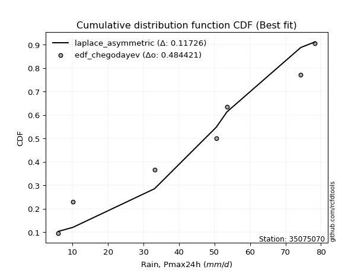</img>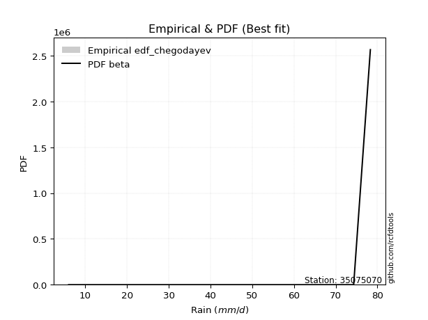</img>

</div>


### 6. EDF Blom (1958)

The Blom formula is a specific "plotting position" formula used in hydrology and statistical analysis to estimate the empirical cumulative probability (or non-exceedance probability) of a data series. It is particularly recommended for data that are approximately normally distributed. The constant _a_ is set to 0.375 (or 3/8).

<div align="center">


$P=(m-a)/(n+1-2a)$


</div>


**6.1. Empirical values**

<div align="center">

|                | 0                   | 1                   | 2                  | 3                  | 4                  | 5                  | 6                 | 7                  |
|:---------------|:--------------------|:--------------------|:-------------------|:-------------------|:-------------------|:-------------------|:------------------|:-------------------|
| date           | 2022                | 2023                | 2018               | 2017               | 2021               | 2025               | 2020              | 2019               |
| x              | 6.0                 | 10.1                | 33.1               | 50.5               | 53.5               | 71.0               | 74.3              | 78.3               |
| m              | 1                   | 2                   | 3                  | 4                  | 5                  | 6                  | 7                 | 8                  |
| empirical_dist | edf_blom            | edf_blom            | edf_blom           | edf_blom           | edf_blom           | edf_blom           | edf_blom          | edf_blom           |
| empirical      | 0.07575757575757576 | 0.19696969696969696 | 0.3181818181818182 | 0.4393939393939394 | 0.5606060606060606 | 0.6818181818181818 | 0.803030303030303 | 0.9242424242424242 |
| empirical_tr   | 1.0819672131147542  | 1.2452830188679247  | 1.4666666666666666 | 1.783783783783784  | 2.275862068965517  | 3.1428571428571423 | 5.076923076923076 | 13.199999999999992 |

</div>


**6.2. Kolmogorov-Smirnov fit test (sorted by Δ)**


<div align="center">

|                | 0                   | 1                   | 2                   | 3                   | 4                   | 5                   | 6                   | 7                  | 8                  | 9                   | 10                  | 11                  | 12                 | 13                  | 14                  | 15                  | 16                  | 17                  | 18                  | 19                  | 20                 | 21                  | 22                  | 23                 | 24                 | 25                  | 26                 | 27                  | 28                 | 29                 | 30                 | 31                  | 32                  | 33                 | 34                  | 35                 | 36                  | 37                 | 38                  | 39                 | 40                 | 41                  | 42                  | 43                  | 44                 | 45                  | 46                 | 47                  | 48                  | 49                  | 50                 | 51                  | 52                  | 53                  | 54                  | 55                  | 56                  | 57                  | 58                  | 59                 | 60                  | 61                  | 62                  | 63                  | 64                  | 65                  | 66                 | 67                 | 68                  | 69                 | 70                  | 71                  | 72                  | 73                  | 74                  | 75                  | 76                 | 77                  | 78                 | 79                 | 80                  | 81                 | 82                 | 83                  | 84                 | 85                 | 86                  | 87                  | 88                 | 89                  | 90                  | 91                  | 92                  | 93                  | 94                  | 95                  | 96                 | 97                  | 98                 | 99                  | 100                | 101                 | 102                 | 103                 | 104                 | 105                 | 106                | 107                 | 108                | 109                | 110                 | 111                | 112                | 113                | 114                | 115                 | 116                 | 117                | 118                 | 119                | 120                 | 121                 | 122                 | 123                | 124                | 125                 | 126                 | 127                 | 128                | 129                 | 130                | 131                 | 132                | 133                | 134                | 135                 | 136                 | 137                | 138                | 139                 | 140                | 141                 | 142                 | 143                | 144                | 145                | 146                | 147                | 148                | 149                | 150                | 151                | 152                | 153                | 154                | 155                | 156                | 157                | 158                | 159                |
|:---------------|:--------------------|:--------------------|:--------------------|:--------------------|:--------------------|:--------------------|:--------------------|:-------------------|:-------------------|:--------------------|:--------------------|:--------------------|:-------------------|:--------------------|:--------------------|:--------------------|:--------------------|:--------------------|:--------------------|:--------------------|:-------------------|:--------------------|:--------------------|:-------------------|:-------------------|:--------------------|:-------------------|:--------------------|:-------------------|:-------------------|:-------------------|:--------------------|:--------------------|:-------------------|:--------------------|:-------------------|:--------------------|:-------------------|:--------------------|:-------------------|:-------------------|:--------------------|:--------------------|:--------------------|:-------------------|:--------------------|:-------------------|:--------------------|:--------------------|:--------------------|:-------------------|:--------------------|:--------------------|:--------------------|:--------------------|:--------------------|:--------------------|:--------------------|:--------------------|:-------------------|:--------------------|:--------------------|:--------------------|:--------------------|:--------------------|:--------------------|:-------------------|:-------------------|:--------------------|:-------------------|:--------------------|:--------------------|:--------------------|:--------------------|:--------------------|:--------------------|:-------------------|:--------------------|:-------------------|:-------------------|:--------------------|:-------------------|:-------------------|:--------------------|:-------------------|:-------------------|:--------------------|:--------------------|:-------------------|:--------------------|:--------------------|:--------------------|:--------------------|:--------------------|:--------------------|:--------------------|:-------------------|:--------------------|:-------------------|:--------------------|:-------------------|:--------------------|:--------------------|:--------------------|:--------------------|:--------------------|:-------------------|:--------------------|:-------------------|:-------------------|:--------------------|:-------------------|:-------------------|:-------------------|:-------------------|:--------------------|:--------------------|:-------------------|:--------------------|:-------------------|:--------------------|:--------------------|:--------------------|:-------------------|:-------------------|:--------------------|:--------------------|:--------------------|:-------------------|:--------------------|:-------------------|:--------------------|:-------------------|:-------------------|:-------------------|:--------------------|:--------------------|:-------------------|:-------------------|:--------------------|:-------------------|:--------------------|:--------------------|:-------------------|:-------------------|:-------------------|:-------------------|:-------------------|:-------------------|:-------------------|:-------------------|:-------------------|:-------------------|:-------------------|:-------------------|:-------------------|:-------------------|:-------------------|:-------------------|:-------------------|
| station        | 35075070            | 35075070            | 35075070            | 35075070            | 35075070            | 35075070            | 35075070            | 35075070           | 35075070           | 35075070            | 35075070            | 35075070            | 35075070           | 35075070            | 35075070            | 35075070            | 35075070            | 35075070            | 35075070            | 35075070            | 35075070           | 35075070            | 35075070            | 35075070           | 35075070           | 35075070            | 35075070           | 35075070            | 35075070           | 35075070           | 35075070           | 35075070            | 35075070            | 35075070           | 35075070            | 35075070           | 35075070            | 35075070           | 35075070            | 35075070           | 35075070           | 35075070            | 35075070            | 35075070            | 35075070           | 35075070            | 35075070           | 35075070            | 35075070            | 35075070            | 35075070           | 35075070            | 35075070            | 35075070            | 35075070            | 35075070            | 35075070            | 35075070            | 35075070            | 35075070           | 35075070            | 35075070            | 35075070            | 35075070            | 35075070            | 35075070            | 35075070           | 35075070           | 35075070            | 35075070           | 35075070            | 35075070            | 35075070            | 35075070            | 35075070            | 35075070            | 35075070           | 35075070            | 35075070           | 35075070           | 35075070            | 35075070           | 35075070           | 35075070            | 35075070           | 35075070           | 35075070            | 35075070            | 35075070           | 35075070            | 35075070            | 35075070            | 35075070            | 35075070            | 35075070            | 35075070            | 35075070           | 35075070            | 35075070           | 35075070            | 35075070           | 35075070            | 35075070            | 35075070            | 35075070            | 35075070            | 35075070           | 35075070            | 35075070           | 35075070           | 35075070            | 35075070           | 35075070           | 35075070           | 35075070           | 35075070            | 35075070            | 35075070           | 35075070            | 35075070           | 35075070            | 35075070            | 35075070            | 35075070           | 35075070           | 35075070            | 35075070            | 35075070            | 35075070           | 35075070            | 35075070           | 35075070            | 35075070           | 35075070           | 35075070           | 35075070            | 35075070            | 35075070           | 35075070           | 35075070            | 35075070           | 35075070            | 35075070            | 35075070           | 35075070           | 35075070           | 35075070           | 35075070           | 35075070           | 35075070           | 35075070           | 35075070           | 35075070           | 35075070           | 35075070           | 35075070           | 35075070           | 35075070           | 35075070           | 35075070           |
| empirical_dist | edf_blom            | edf_blom            | edf_blom            | edf_blom            | edf_blom            | edf_blom            | edf_blom            | edf_blom           | edf_blom           | edf_blom            | edf_blom            | edf_blom            | edf_blom           | edf_blom            | edf_blom            | edf_blom            | edf_blom            | edf_blom            | edf_blom            | edf_blom            | edf_blom           | edf_blom            | edf_blom            | edf_blom           | edf_blom           | edf_blom            | edf_blom           | edf_blom            | edf_blom           | edf_blom           | edf_blom           | edf_blom            | edf_blom            | edf_blom           | edf_blom            | edf_blom           | edf_blom            | edf_blom           | edf_blom            | edf_blom           | edf_blom           | edf_blom            | edf_blom            | edf_blom            | edf_blom           | edf_blom            | edf_blom           | edf_blom            | edf_blom            | edf_blom            | edf_blom           | edf_blom            | edf_blom            | edf_blom            | edf_blom            | edf_blom            | edf_blom            | edf_blom            | edf_blom            | edf_blom           | edf_blom            | edf_blom            | edf_blom            | edf_blom            | edf_blom            | edf_blom            | edf_blom           | edf_blom           | edf_blom            | edf_blom           | edf_blom            | edf_blom            | edf_blom            | edf_blom            | edf_blom            | edf_blom            | edf_blom           | edf_blom            | edf_blom           | edf_blom           | edf_blom            | edf_blom           | edf_blom           | edf_blom            | edf_blom           | edf_blom           | edf_blom            | edf_blom            | edf_blom           | edf_blom            | edf_blom            | edf_blom            | edf_blom            | edf_blom            | edf_blom            | edf_blom            | edf_blom           | edf_blom            | edf_blom           | edf_blom            | edf_blom           | edf_blom            | edf_blom            | edf_blom            | edf_blom            | edf_blom            | edf_blom           | edf_blom            | edf_blom           | edf_blom           | edf_blom            | edf_blom           | edf_blom           | edf_blom           | edf_blom           | edf_blom            | edf_blom            | edf_blom           | edf_blom            | edf_blom           | edf_blom            | edf_blom            | edf_blom            | edf_blom           | edf_blom           | edf_blom            | edf_blom            | edf_blom            | edf_blom           | edf_blom            | edf_blom           | edf_blom            | edf_blom           | edf_blom           | edf_blom           | edf_blom            | edf_blom            | edf_blom           | edf_blom           | edf_blom            | edf_blom           | edf_blom            | edf_blom            | edf_blom           | edf_blom           | edf_blom           | edf_blom           | edf_blom           | edf_blom           | edf_blom           | edf_blom           | edf_blom           | edf_blom           | edf_blom           | edf_blom           | edf_blom           | edf_blom           | edf_blom           | edf_blom           | edf_blom           |
| p_dist         | beta                | ksone               | semicircular        | anglit              | gausshyper          | trapezoid           | dgamma              | dweibull           | loglevy_l          | pearson3            | rice                | erlang              | norm               | truncnorm           | exponnorm           | t                   | nct                 | f                   | gamma               | crystalball         | betaprime          | invgamma            | loggennorm          | invgauss           | weibull_min        | genextreme          | wrapcauchy         | maxwell             | foldnorm           | genhalflogistic    | kappa4             | arcsine             | gumbel_l            | rayleigh           | johnsonsu           | argus              | logistic            | cosine             | invweibull          | logtrapezoid       | logvonmises_line   | logdgamma           | logpearson3         | logburr12           | triang             | hypsecant           | loggumbel_l        | logweibull_min      | skewnorm            | kstwobign           | laplace            | gumbel_r            | alpha               | loggenextreme       | logmielke           | logsemicircular     | mielke              | loggompertz         | logargus            | levy_l             | loganglit           | halfnorm            | burr                | logloggamma         | logdweibull         | halflogistic        | moyal              | logarcsine         | tukeylambda         | loggenpareto       | lomax               | logbeta             | loggamma            | loggamma            | lognakagami         | logf                | lognct             | logexponnorm        | logt               | lognorm            | logcrystalball      | logncf             | loginvweibull      | kappa3              | uniform            | genpareto          | logfatiguelife      | truncweibull_min    | logwrapcauchy      | vonmises_line       | logrice             | logerlang           | genexpon            | loginvgauss         | logfoldnorm         | logbetaprime        | logburr            | loginvgamma         | bradford           | logalpha            | loglogistic        | logmaxwell          | logweibull_max      | ncf                 | logkstwobign        | lograyleigh         | loghypsecant       | loggenexpon         | logloglaplace      | loggausshyper      | logcosine           | loggenhalflogistic | loghalfnorm        | wald               | loggumbel_r        | loglaplace          | loglaplace          | logskewnorm        | loggengamma         | nakagami           | loghalflogistic     | gengamma            | loglomax            | logtriang          | truncexpon         | logmoyal            | burr12              | gennorm             | logksone           | logwald             | logexponweib       | logkappa3           | loguniform         | logtruncnorm       | logkappa4          | logtruncweibull_min | logbradford         | logtruncexpon      | logjohnsonsb       | logrdist            | logjohnsonsu       | weibull_max         | fatiguelife         | logtukeylambda     | exponweib          | powerlaw           | logexponpow        | gompertz           | halfgennorm        | exponpow           | logpowerlaw        | truncpareto        | johnsonsb          | rdist              | logtruncpareto     | genlogistic        | loggenlogistic     | loghalfgennorm     | logvonmises        | vonmises           |
| delta          | 0.07575747266797905 | 0.10098964092520947 | 0.10281085569198994 | 0.10791161222043999 | 0.10927343014859048 | 0.11400417063338264 | 0.12348810270428705 | 0.1290510474364555 | 0.1311969874692922 | 0.13341084855304963 | 0.13396656097820314 | 0.13407978918967411 | 0.1351958025858634 | 0.13519581328350372 | 0.13519695297123357 | 0.13519891802833806 | 0.13521011397343818 | 0.13540591423689474 | 0.13558128829100968 | 0.13577206716936874 | 0.1359650273592764 | 0.13622956354844323 | 0.13798172713773382 | 0.138143390216601  | 0.1384249224644405 | 0.13891448259161282 | 0.1420144792386251 | 0.14208616125994616 | 0.1433800354837561 | 0.1470334964048553 | 0.1492417830897148 | 0.15111796181274667 | 0.15123667764872872 | 0.151813453552397  | 0.15205755132474547 | 0.1541163470408895 | 0.15568335679706247 | 0.1562741196925509 | 0.15848613959276864 | 0.1596096852766432 | 0.1599034230418498 | 0.16281897080416813 | 0.16527109070227658 | 0.16625406693420236 | 0.1665317358769589 | 0.16720792739108248 | 0.1699739955677682 | 0.17246869490355815 | 0.17647333914184382 | 0.17844005895948606 | 0.1789560694503568 | 0.18181791040069023 | 0.18336473181425456 | 0.18396787244717905 | 0.18701549136570872 | 0.18763740411782043 | 0.18909082964462087 | 0.18949298447668744 | 0.19070209304643093 | 0.1916801871448725 | 0.19623404019125307 | 0.19696969696969696 | 0.19834193174292136 | 0.20341505294860074 | 0.20594391113601407 | 0.20658090006389068 | 0.2066176105394682 | 0.2100378711684725 | 0.21017740900007975 | 0.2106519460786503 | 0.21506886096192096 | 0.21520379149657176 | 0.21629153858705125 | 0.21629153858705125 | 0.21632498019340823 | 0.21654178552602515 | 0.2166641773453502 | 0.21668639642202642 | 0.216690436742286  | 0.2166905127623276 | 0.21669112050256772 | 0.2167892091354226 | 0.2168101131784192 | 0.21702483628270464 | 0.2172136300767007 | 0.2182134237606741 | 0.21904258409910554 | 0.21909199808195967 | 0.2192695091376224 | 0.22062444757187738 | 0.22091008806028872 | 0.22200523374839692 | 0.22207216044773076 | 0.22224445814549437 | 0.22243584323369842 | 0.22261109663978812 | 0.2266282415667467 | 0.22682492385584935 | 0.2268575976655156 | 0.22946442821561824 | 0.2351446304086237 | 0.23767016429557203 | 0.24003053732374635 | 0.24218450545404951 | 0.24371899108019507 | 0.24395472852145944 | 0.2493598481485249 | 0.24946138779860277 | 0.2510513969542788 | 0.2542102870619524 | 0.26000387541214537 | 0.2615975488003907 | 0.2623097079253435 | 0.2754311907752544 | 0.275685163130766  | 0.27734276279606057 | 0.27734276279606057 | 0.2795949072133888 | 0.28148019563847154 | 0.2841527768401831 | 0.29032654915570694 | 0.29110987404184424 | 0.29187327569168836 | 0.2945108166557991 | 0.2948980748166445 | 0.29514275162411724 | 0.29974650985650614 | 0.30303030303030304 | 0.3349960829704179 | 0.35045755763384606 | 0.3532302115069272 | 0.37652363786526793 | 0.3898740874432893 | 0.3909613155616289 | 0.3920642271461506 | 0.41186041072076335 | 0.43218463378134236 | 0.4402136386274145 | 0.4667466713051712 | 0.47348272446016143 | 0.4787865017129598 | 0.49020474442381695 | 0.49529769216105074 | 0.515262685837504  | 0.5166965651201887 | 0.5179293263062914 | 0.5451580985045412 | 0.5603498804603944 | 0.5606060606060606 | 0.5976025191572563 | 0.6022654701295549 | 0.6205309313085496 | 0.677277593476669  | 0.6818181814840962 | 0.6910859526342017 | 0.803030303030303  | 0.803030303030303  | 0.803030303030303  | 1.1571143280850364 | 11.645699130360832 |
| deltao         | 0.4472608134160001  | 0.4472608134160001  | 0.4472608134160001  | 0.4472608134160001  | 0.4472608134160001  | 0.4472608134160001  | 0.4472608134160001  | 0.4472608134160001 | 0.4472608134160001 | 0.4472608134160001  | 0.4472608134160001  | 0.4472608134160001  | 0.4472608134160001 | 0.4472608134160001  | 0.4472608134160001  | 0.4472608134160001  | 0.4472608134160001  | 0.4472608134160001  | 0.4472608134160001  | 0.4472608134160001  | 0.4472608134160001 | 0.4472608134160001  | 0.4472608134160001  | 0.4472608134160001 | 0.4472608134160001 | 0.4472608134160001  | 0.4472608134160001 | 0.4472608134160001  | 0.4472608134160001 | 0.4472608134160001 | 0.4472608134160001 | 0.4472608134160001  | 0.4472608134160001  | 0.4472608134160001 | 0.4472608134160001  | 0.4472608134160001 | 0.4472608134160001  | 0.4472608134160001 | 0.4472608134160001  | 0.4472608134160001 | 0.4472608134160001 | 0.4472608134160001  | 0.4472608134160001  | 0.4472608134160001  | 0.4472608134160001 | 0.4472608134160001  | 0.4472608134160001 | 0.4472608134160001  | 0.4472608134160001  | 0.4472608134160001  | 0.4472608134160001 | 0.4472608134160001  | 0.4472608134160001  | 0.4472608134160001  | 0.4472608134160001  | 0.4472608134160001  | 0.4472608134160001  | 0.4472608134160001  | 0.4472608134160001  | 0.4472608134160001 | 0.4472608134160001  | 0.4472608134160001  | 0.4472608134160001  | 0.4472608134160001  | 0.4472608134160001  | 0.4472608134160001  | 0.4472608134160001 | 0.4472608134160001 | 0.4472608134160001  | 0.4472608134160001 | 0.4472608134160001  | 0.4472608134160001  | 0.4472608134160001  | 0.4472608134160001  | 0.4472608134160001  | 0.4472608134160001  | 0.4472608134160001 | 0.4472608134160001  | 0.4472608134160001 | 0.4472608134160001 | 0.4472608134160001  | 0.4472608134160001 | 0.4472608134160001 | 0.4472608134160001  | 0.4472608134160001 | 0.4472608134160001 | 0.4472608134160001  | 0.4472608134160001  | 0.4472608134160001 | 0.4472608134160001  | 0.4472608134160001  | 0.4472608134160001  | 0.4472608134160001  | 0.4472608134160001  | 0.4472608134160001  | 0.4472608134160001  | 0.4472608134160001 | 0.4472608134160001  | 0.4472608134160001 | 0.4472608134160001  | 0.4472608134160001 | 0.4472608134160001  | 0.4472608134160001  | 0.4472608134160001  | 0.4472608134160001  | 0.4472608134160001  | 0.4472608134160001 | 0.4472608134160001  | 0.4472608134160001 | 0.4472608134160001 | 0.4472608134160001  | 0.4472608134160001 | 0.4472608134160001 | 0.4472608134160001 | 0.4472608134160001 | 0.4472608134160001  | 0.4472608134160001  | 0.4472608134160001 | 0.4472608134160001  | 0.4472608134160001 | 0.4472608134160001  | 0.4472608134160001  | 0.4472608134160001  | 0.4472608134160001 | 0.4472608134160001 | 0.4472608134160001  | 0.4472608134160001  | 0.4472608134160001  | 0.4472608134160001 | 0.4472608134160001  | 0.4472608134160001 | 0.4472608134160001  | 0.4472608134160001 | 0.4472608134160001 | 0.4472608134160001 | 0.4472608134160001  | 0.4472608134160001  | 0.4472608134160001 | 0.4472608134160001 | 0.4472608134160001  | 0.4472608134160001 | 0.4472608134160001  | 0.4472608134160001  | 0.4472608134160001 | 0.4472608134160001 | 0.4472608134160001 | 0.4472608134160001 | 0.4472608134160001 | 0.4472608134160001 | 0.4472608134160001 | 0.4472608134160001 | 0.4472608134160001 | 0.4472608134160001 | 0.4472608134160001 | 0.4472608134160001 | 0.4472608134160001 | 0.4472608134160001 | 0.4472608134160001 | 0.4472608134160001 | 0.4472608134160001 |
| eval           | Δo > Δ              | Δo > Δ              | Δo > Δ              | Δo > Δ              | Δo > Δ              | Δo > Δ              | Δo > Δ              | Δo > Δ             | Δo > Δ             | Δo > Δ              | Δo > Δ              | Δo > Δ              | Δo > Δ             | Δo > Δ              | Δo > Δ              | Δo > Δ              | Δo > Δ              | Δo > Δ              | Δo > Δ              | Δo > Δ              | Δo > Δ             | Δo > Δ              | Δo > Δ              | Δo > Δ             | Δo > Δ             | Δo > Δ              | Δo > Δ             | Δo > Δ              | Δo > Δ             | Δo > Δ             | Δo > Δ             | Δo > Δ              | Δo > Δ              | Δo > Δ             | Δo > Δ              | Δo > Δ             | Δo > Δ              | Δo > Δ             | Δo > Δ              | Δo > Δ             | Δo > Δ             | Δo > Δ              | Δo > Δ              | Δo > Δ              | Δo > Δ             | Δo > Δ              | Δo > Δ             | Δo > Δ              | Δo > Δ              | Δo > Δ              | Δo > Δ             | Δo > Δ              | Δo > Δ              | Δo > Δ              | Δo > Δ              | Δo > Δ              | Δo > Δ              | Δo > Δ              | Δo > Δ              | Δo > Δ             | Δo > Δ              | Δo > Δ              | Δo > Δ              | Δo > Δ              | Δo > Δ              | Δo > Δ              | Δo > Δ             | Δo > Δ             | Δo > Δ              | Δo > Δ             | Δo > Δ              | Δo > Δ              | Δo > Δ              | Δo > Δ              | Δo > Δ              | Δo > Δ              | Δo > Δ             | Δo > Δ              | Δo > Δ             | Δo > Δ             | Δo > Δ              | Δo > Δ             | Δo > Δ             | Δo > Δ              | Δo > Δ             | Δo > Δ             | Δo > Δ              | Δo > Δ              | Δo > Δ             | Δo > Δ              | Δo > Δ              | Δo > Δ              | Δo > Δ              | Δo > Δ              | Δo > Δ              | Δo > Δ              | Δo > Δ             | Δo > Δ              | Δo > Δ             | Δo > Δ              | Δo > Δ             | Δo > Δ              | Δo > Δ              | Δo > Δ              | Δo > Δ              | Δo > Δ              | Δo > Δ             | Δo > Δ              | Δo > Δ             | Δo > Δ             | Δo > Δ              | Δo > Δ             | Δo > Δ             | Δo > Δ             | Δo > Δ             | Δo > Δ              | Δo > Δ              | Δo > Δ             | Δo > Δ              | Δo > Δ             | Δo > Δ              | Δo > Δ              | Δo > Δ              | Δo > Δ             | Δo > Δ             | Δo > Δ              | Δo > Δ              | Δo > Δ              | Δo > Δ             | Δo > Δ              | Δo > Δ             | Δo > Δ              | Δo > Δ             | Δo > Δ             | Δo > Δ             | Δo > Δ              | Δo > Δ              | Δo > Δ             | Δo <= Δ            | Δo <= Δ             | Δo <= Δ            | Δo <= Δ             | Δo <= Δ             | Δo <= Δ            | Δo <= Δ            | Δo <= Δ            | Δo <= Δ            | Δo <= Δ            | Δo <= Δ            | Δo <= Δ            | Δo <= Δ            | Δo <= Δ            | Δo <= Δ            | Δo <= Δ            | Δo <= Δ            | Δo <= Δ            | Δo <= Δ            | Δo <= Δ            | Δo <= Δ            | Δo <= Δ            |
| fit            | 1                   | 1                   | 1                   | 1                   | 1                   | 1                   | 1                   | 1                  | 1                  | 1                   | 1                   | 1                   | 1                  | 1                   | 1                   | 1                   | 1                   | 1                   | 1                   | 1                   | 1                  | 1                   | 1                   | 1                  | 1                  | 1                   | 1                  | 1                   | 1                  | 1                  | 1                  | 1                   | 1                   | 1                  | 1                   | 1                  | 1                   | 1                  | 1                   | 1                  | 1                  | 1                   | 1                   | 1                   | 1                  | 1                   | 1                  | 1                   | 1                   | 1                   | 1                  | 1                   | 1                   | 1                   | 1                   | 1                   | 1                   | 1                   | 1                   | 1                  | 1                   | 1                   | 1                   | 1                   | 1                   | 1                   | 1                  | 1                  | 1                   | 1                  | 1                   | 1                   | 1                   | 1                   | 1                   | 1                   | 1                  | 1                   | 1                  | 1                  | 1                   | 1                  | 1                  | 1                   | 1                  | 1                  | 1                   | 1                   | 1                  | 1                   | 1                   | 1                   | 1                   | 1                   | 1                   | 1                   | 1                  | 1                   | 1                  | 1                   | 1                  | 1                   | 1                   | 1                   | 1                   | 1                   | 1                  | 1                   | 1                  | 1                  | 1                   | 1                  | 1                  | 1                  | 1                  | 1                   | 1                   | 1                  | 1                   | 1                  | 1                   | 1                   | 1                   | 1                  | 1                  | 1                   | 1                   | 1                   | 1                  | 1                   | 1                  | 1                   | 1                  | 1                  | 1                  | 1                   | 1                   | 1                  | 0                  | 0                   | 0                  | 0                   | 0                   | 0                  | 0                  | 0                  | 0                  | 0                  | 0                  | 0                  | 0                  | 0                  | 0                  | 0                  | 0                  | 0                  | 0                  | 0                  | 0                  | 0                  |
| n              | 8                   | 8                   | 8                   | 8                   | 8                   | 8                   | 8                   | 8                  | 8                  | 8                   | 8                   | 8                   | 8                  | 8                   | 8                   | 8                   | 8                   | 8                   | 8                   | 8                   | 8                  | 8                   | 8                   | 8                  | 8                  | 8                   | 8                  | 8                   | 8                  | 8                  | 8                  | 8                   | 8                   | 8                  | 8                   | 8                  | 8                   | 8                  | 8                   | 8                  | 8                  | 8                   | 8                   | 8                   | 8                  | 8                   | 8                  | 8                   | 8                   | 8                   | 8                  | 8                   | 8                   | 8                   | 8                   | 8                   | 8                   | 8                   | 8                   | 8                  | 8                   | 8                   | 8                   | 8                   | 8                   | 8                   | 8                  | 8                  | 8                   | 8                  | 8                   | 8                   | 8                   | 8                   | 8                   | 8                   | 8                  | 8                   | 8                  | 8                  | 8                   | 8                  | 8                  | 8                   | 8                  | 8                  | 8                   | 8                   | 8                  | 8                   | 8                   | 8                   | 8                   | 8                   | 8                   | 8                   | 8                  | 8                   | 8                  | 8                   | 8                  | 8                   | 8                   | 8                   | 8                   | 8                   | 8                  | 8                   | 8                  | 8                  | 8                   | 8                  | 8                  | 8                  | 8                  | 8                   | 8                   | 8                  | 8                   | 8                  | 8                   | 8                   | 8                   | 8                  | 8                  | 8                   | 8                   | 8                   | 8                  | 8                   | 8                  | 8                   | 8                  | 8                  | 8                  | 8                   | 8                   | 8                  | 8                  | 8                   | 8                  | 8                   | 8                   | 8                  | 8                  | 8                  | 8                  | 8                  | 8                  | 8                  | 8                  | 8                  | 8                  | 8                  | 8                  | 8                  | 8                  | 8                  | 8                  | 8                  |
| best_fit       | 1                   | 0                   | 0                   | 0                   | 0                   | 0                   | 0                   | 0                  | 0                  | 0                   | 0                   | 0                   | 0                  | 0                   | 0                   | 0                   | 0                   | 0                   | 0                   | 0                   | 0                  | 0                   | 0                   | 0                  | 0                  | 0                   | 0                  | 0                   | 0                  | 0                  | 0                  | 0                   | 0                   | 0                  | 0                   | 0                  | 0                   | 0                  | 0                   | 0                  | 0                  | 0                   | 0                   | 0                   | 0                  | 0                   | 0                  | 0                   | 0                   | 0                   | 0                  | 0                   | 0                   | 0                   | 0                   | 0                   | 0                   | 0                   | 0                   | 0                  | 0                   | 0                   | 0                   | 0                   | 0                   | 0                   | 0                  | 0                  | 0                   | 0                  | 0                   | 0                   | 0                   | 0                   | 0                   | 0                   | 0                  | 0                   | 0                  | 0                  | 0                   | 0                  | 0                  | 0                   | 0                  | 0                  | 0                   | 0                   | 0                  | 0                   | 0                   | 0                   | 0                   | 0                   | 0                   | 0                   | 0                  | 0                   | 0                  | 0                   | 0                  | 0                   | 0                   | 0                   | 0                   | 0                   | 0                  | 0                   | 0                  | 0                  | 0                   | 0                  | 0                  | 0                  | 0                  | 0                   | 0                   | 0                  | 0                   | 0                  | 0                   | 0                   | 0                   | 0                  | 0                  | 0                   | 0                   | 0                   | 0                  | 0                   | 0                  | 0                   | 0                  | 0                  | 0                  | 0                   | 0                   | 0                  | 0                  | 0                   | 0                  | 0                   | 0                   | 0                  | 0                  | 0                  | 0                  | 0                  | 0                  | 0                  | 0                  | 0                  | 0                  | 0                  | 0                  | 0                  | 0                  | 0                  | 0                  | 0                  |
| best_fit_sort  | 1                   | 2                   | 3                   | 4                   | 5                   | 6                   | 7                   | 8                  | 9                  | 10                  | 11                  | 12                  | 13                 | 14                  | 15                  | 16                  | 17                  | 18                  | 19                  | 20                  | 21                 | 22                  | 23                  | 24                 | 25                 | 26                  | 27                 | 28                  | 29                 | 30                 | 31                 | 32                  | 33                  | 34                 | 35                  | 36                 | 37                  | 38                 | 39                  | 40                 | 41                 | 42                  | 43                  | 44                  | 45                 | 46                  | 47                 | 48                  | 49                  | 50                  | 51                 | 52                  | 53                  | 54                  | 55                  | 56                  | 57                  | 58                  | 59                  | 60                 | 61                  | 62                  | 63                  | 64                  | 65                  | 66                  | 67                 | 68                 | 69                  | 70                 | 71                  | 72                  | 73                  | 74                  | 75                  | 76                  | 77                 | 78                  | 79                 | 80                 | 81                  | 82                 | 83                 | 84                  | 85                 | 86                 | 87                  | 88                  | 89                 | 90                  | 91                  | 92                  | 93                  | 94                  | 95                  | 96                  | 97                 | 98                  | 99                 | 100                 | 101                | 102                 | 103                 | 104                 | 105                 | 106                 | 107                | 108                 | 109                | 110                | 111                 | 112                | 113                | 114                | 115                | 116                 | 117                 | 118                | 119                 | 120                | 121                 | 122                 | 123                 | 124                | 125                | 126                 | 127                 | 128                 | 129                | 130                 | 131                | 132                 | 133                | 134                | 135                | 136                 | 137                 | 138                | 139                | 140                 | 141                | 142                 | 143                 | 144                | 145                | 146                | 147                | 148                | 149                | 150                | 151                | 152                | 153                | 154                | 155                | 156                | 157                | 158                | 159                | 160                |

</div>


**6.3. Best fit**

<div align="center">

|   id |   station | empirical_dist   | p_dist   |     delta |   deltao | eval   |   fit |   n |   best_fit |   best_fit_sort |
|-----:|----------:|:-----------------|:---------|----------:|---------:|:-------|------:|----:|-----------:|----------------:|
|    0 |  35075070 | edf_blom         | beta     | 0.0757575 | 0.447261 | Δo > Δ |     1 |   8 |          1 |               1 |

</div>


<div align="center">

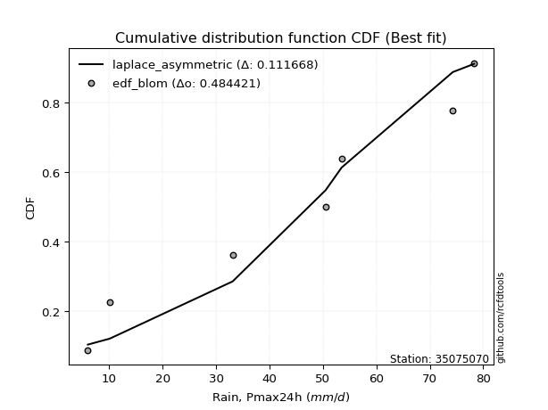</img>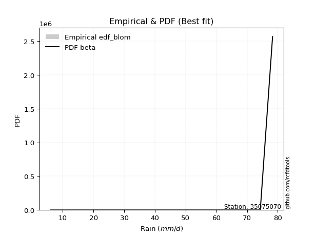</img>

</div>


### 7. EDF Tukey (1962)

In hydrology, the Tukey formula is used as a plotting position formula to estimate the empirical probability or frequency of a flood event (or other hydrological data). The formula parameter is given as _c=0.333_ (or 1/3).

<div align="center">


$P=(m-c)/(n+1-2c)$


</div>


**7.1. Empirical values**

<div align="center">

|                | 0                  | 1         | 2                  | 3                  | 4                 | 5                  | 6                 | 7                  |
|:---------------|:-------------------|:----------|:-------------------|:-------------------|:------------------|:-------------------|:------------------|:-------------------|
| date           | 2022               | 2023      | 2018               | 2017               | 2021              | 2025               | 2020              | 2019               |
| x              | 6.0                | 10.1      | 33.1               | 50.5               | 53.5              | 71.0               | 74.3              | 78.3               |
| m              | 1                  | 2         | 3                  | 4                  | 5                 | 6                  | 7                 | 8                  |
| empirical_dist | edf_tukey          | edf_tukey | edf_tukey          | edf_tukey          | edf_tukey         | edf_tukey          | edf_tukey         | edf_tukey          |
| empirical      | 0.08               | 0.2       | 0.32               | 0.44               | 0.56              | 0.68               | 0.8               | 0.92               |
| empirical_tr   | 1.0869565217391304 | 1.25      | 1.4705882352941178 | 1.7857142857142856 | 2.272727272727273 | 3.1250000000000004 | 5.000000000000001 | 12.500000000000007 |

</div>


**7.2. Kolmogorov-Smirnov fit test (sorted by Δ)**


<div align="center">

|                | 0                   | 1                   | 2                  | 3                   | 4                   | 5                   | 6                  | 7                  | 8                   | 9                   | 10                  | 11                  | 12                  | 13                  | 14                 | 15                  | 16                 | 17                  | 18                 | 19                  | 20                 | 21                  | 22                  | 23                  | 24                  | 25                  | 26                 | 27                  | 28                  | 29                  | 30                  | 31                 | 32                  | 33                  | 34                  | 35                  | 36                  | 37                  | 38                  | 39                  | 40                 | 41                  | 42                  | 43                  | 44                  | 45                 | 46                 | 47                  | 48                  | 49                  | 50                  | 51                  | 52                  | 53                  | 54                  | 55                  | 56                  | 57                  | 58                 | 59                  | 60                  | 61                 | 62                  | 63                 | 64                  | 65                  | 66                  | 67                 | 68                  | 69                  | 70                  | 71                  | 72                  | 73                  | 74                  | 75                  | 76                 | 77                 | 78                 | 79                  | 80                  | 81                 | 82                  | 83                  | 84                  | 85                  | 86                 | 87                  | 88                 | 89                 | 90                  | 91                  | 92                  | 93                 | 94                 | 95                 | 96                 | 97                  | 98                  | 99                  | 100                | 101                | 102                 | 103                | 104                 | 105                 | 106                 | 107                | 108                 | 109                | 110                 | 111                | 112                | 113                | 114                | 115                 | 116                 | 117                | 118                | 119                | 120                | 121                | 122                 | 123                | 124                | 125                 | 126                | 127                 | 128                | 129                 | 130                 | 131                | 132                 | 133                | 134                 | 135                 | 136                 | 137                | 138                | 139                | 140                 | 141                | 142                | 143                | 144                | 145                | 146                | 147                | 148                | 149                | 150                | 151                | 152                | 153                | 154                | 155                | 156                | 157                | 158                | 159                |
|:---------------|:--------------------|:--------------------|:-------------------|:--------------------|:--------------------|:--------------------|:-------------------|:-------------------|:--------------------|:--------------------|:--------------------|:--------------------|:--------------------|:--------------------|:-------------------|:--------------------|:-------------------|:--------------------|:-------------------|:--------------------|:-------------------|:--------------------|:--------------------|:--------------------|:--------------------|:--------------------|:-------------------|:--------------------|:--------------------|:--------------------|:--------------------|:-------------------|:--------------------|:--------------------|:--------------------|:--------------------|:--------------------|:--------------------|:--------------------|:--------------------|:-------------------|:--------------------|:--------------------|:--------------------|:--------------------|:-------------------|:-------------------|:--------------------|:--------------------|:--------------------|:--------------------|:--------------------|:--------------------|:--------------------|:--------------------|:--------------------|:--------------------|:--------------------|:-------------------|:--------------------|:--------------------|:-------------------|:--------------------|:-------------------|:--------------------|:--------------------|:--------------------|:-------------------|:--------------------|:--------------------|:--------------------|:--------------------|:--------------------|:--------------------|:--------------------|:--------------------|:-------------------|:-------------------|:-------------------|:--------------------|:--------------------|:-------------------|:--------------------|:--------------------|:--------------------|:--------------------|:-------------------|:--------------------|:-------------------|:-------------------|:--------------------|:--------------------|:--------------------|:-------------------|:-------------------|:-------------------|:-------------------|:--------------------|:--------------------|:--------------------|:-------------------|:-------------------|:--------------------|:-------------------|:--------------------|:--------------------|:--------------------|:-------------------|:--------------------|:-------------------|:--------------------|:-------------------|:-------------------|:-------------------|:-------------------|:--------------------|:--------------------|:-------------------|:-------------------|:-------------------|:-------------------|:-------------------|:--------------------|:-------------------|:-------------------|:--------------------|:-------------------|:--------------------|:-------------------|:--------------------|:--------------------|:-------------------|:--------------------|:-------------------|:--------------------|:--------------------|:--------------------|:-------------------|:-------------------|:-------------------|:--------------------|:-------------------|:-------------------|:-------------------|:-------------------|:-------------------|:-------------------|:-------------------|:-------------------|:-------------------|:-------------------|:-------------------|:-------------------|:-------------------|:-------------------|:-------------------|:-------------------|:-------------------|:-------------------|:-------------------|
| station        | 35075070            | 35075070            | 35075070           | 35075070            | 35075070            | 35075070            | 35075070           | 35075070           | 35075070            | 35075070            | 35075070            | 35075070            | 35075070            | 35075070            | 35075070           | 35075070            | 35075070           | 35075070            | 35075070           | 35075070            | 35075070           | 35075070            | 35075070            | 35075070            | 35075070            | 35075070            | 35075070           | 35075070            | 35075070            | 35075070            | 35075070            | 35075070           | 35075070            | 35075070            | 35075070            | 35075070            | 35075070            | 35075070            | 35075070            | 35075070            | 35075070           | 35075070            | 35075070            | 35075070            | 35075070            | 35075070           | 35075070           | 35075070            | 35075070            | 35075070            | 35075070            | 35075070            | 35075070            | 35075070            | 35075070            | 35075070            | 35075070            | 35075070            | 35075070           | 35075070            | 35075070            | 35075070           | 35075070            | 35075070           | 35075070            | 35075070            | 35075070            | 35075070           | 35075070            | 35075070            | 35075070            | 35075070            | 35075070            | 35075070            | 35075070            | 35075070            | 35075070           | 35075070           | 35075070           | 35075070            | 35075070            | 35075070           | 35075070            | 35075070            | 35075070            | 35075070            | 35075070           | 35075070            | 35075070           | 35075070           | 35075070            | 35075070            | 35075070            | 35075070           | 35075070           | 35075070           | 35075070           | 35075070            | 35075070            | 35075070            | 35075070           | 35075070           | 35075070            | 35075070           | 35075070            | 35075070            | 35075070            | 35075070           | 35075070            | 35075070           | 35075070            | 35075070           | 35075070           | 35075070           | 35075070           | 35075070            | 35075070            | 35075070           | 35075070           | 35075070           | 35075070           | 35075070           | 35075070            | 35075070           | 35075070           | 35075070            | 35075070           | 35075070            | 35075070           | 35075070            | 35075070            | 35075070           | 35075070            | 35075070           | 35075070            | 35075070            | 35075070            | 35075070           | 35075070           | 35075070           | 35075070            | 35075070           | 35075070           | 35075070           | 35075070           | 35075070           | 35075070           | 35075070           | 35075070           | 35075070           | 35075070           | 35075070           | 35075070           | 35075070           | 35075070           | 35075070           | 35075070           | 35075070           | 35075070           | 35075070           |
| empirical_dist | edf_tukey           | edf_tukey           | edf_tukey          | edf_tukey           | edf_tukey           | edf_tukey           | edf_tukey          | edf_tukey          | edf_tukey           | edf_tukey           | edf_tukey           | edf_tukey           | edf_tukey           | edf_tukey           | edf_tukey          | edf_tukey           | edf_tukey          | edf_tukey           | edf_tukey          | edf_tukey           | edf_tukey          | edf_tukey           | edf_tukey           | edf_tukey           | edf_tukey           | edf_tukey           | edf_tukey          | edf_tukey           | edf_tukey           | edf_tukey           | edf_tukey           | edf_tukey          | edf_tukey           | edf_tukey           | edf_tukey           | edf_tukey           | edf_tukey           | edf_tukey           | edf_tukey           | edf_tukey           | edf_tukey          | edf_tukey           | edf_tukey           | edf_tukey           | edf_tukey           | edf_tukey          | edf_tukey          | edf_tukey           | edf_tukey           | edf_tukey           | edf_tukey           | edf_tukey           | edf_tukey           | edf_tukey           | edf_tukey           | edf_tukey           | edf_tukey           | edf_tukey           | edf_tukey          | edf_tukey           | edf_tukey           | edf_tukey          | edf_tukey           | edf_tukey          | edf_tukey           | edf_tukey           | edf_tukey           | edf_tukey          | edf_tukey           | edf_tukey           | edf_tukey           | edf_tukey           | edf_tukey           | edf_tukey           | edf_tukey           | edf_tukey           | edf_tukey          | edf_tukey          | edf_tukey          | edf_tukey           | edf_tukey           | edf_tukey          | edf_tukey           | edf_tukey           | edf_tukey           | edf_tukey           | edf_tukey          | edf_tukey           | edf_tukey          | edf_tukey          | edf_tukey           | edf_tukey           | edf_tukey           | edf_tukey          | edf_tukey          | edf_tukey          | edf_tukey          | edf_tukey           | edf_tukey           | edf_tukey           | edf_tukey          | edf_tukey          | edf_tukey           | edf_tukey          | edf_tukey           | edf_tukey           | edf_tukey           | edf_tukey          | edf_tukey           | edf_tukey          | edf_tukey           | edf_tukey          | edf_tukey          | edf_tukey          | edf_tukey          | edf_tukey           | edf_tukey           | edf_tukey          | edf_tukey          | edf_tukey          | edf_tukey          | edf_tukey          | edf_tukey           | edf_tukey          | edf_tukey          | edf_tukey           | edf_tukey          | edf_tukey           | edf_tukey          | edf_tukey           | edf_tukey           | edf_tukey          | edf_tukey           | edf_tukey          | edf_tukey           | edf_tukey           | edf_tukey           | edf_tukey          | edf_tukey          | edf_tukey          | edf_tukey           | edf_tukey          | edf_tukey          | edf_tukey          | edf_tukey          | edf_tukey          | edf_tukey          | edf_tukey          | edf_tukey          | edf_tukey          | edf_tukey          | edf_tukey          | edf_tukey          | edf_tukey          | edf_tukey          | edf_tukey          | edf_tukey          | edf_tukey          | edf_tukey          | edf_tukey          |
| p_dist         | beta                | ksone               | semicircular       | anglit              | gausshyper          | trapezoid           | dgamma             | loglevy_l          | dweibull            | loggennorm          | pearson3            | invgamma            | rice                | erlang              | norm               | truncnorm           | exponnorm          | t                   | nct                | f                   | gamma              | invgauss            | crystalball         | betaprime           | genextreme          | wrapcauchy          | weibull_min        | maxwell             | foldnorm            | genhalflogistic     | kappa4              | rayleigh           | johnsonsu           | gumbel_l            | arcsine             | logtrapezoid        | logvonmises_line    | argus               | logistic            | invweibull          | cosine             | logpearson3         | logburr12           | logdgamma           | triang              | hypsecant          | loggumbel_l        | logweibull_min      | kstwobign           | skewnorm            | laplace             | gumbel_r            | alpha               | loggenextreme       | logsemicircular     | levy_l              | logmielke           | loggompertz         | mielke             | logargus            | loganglit           | halfnorm           | burr                | logdweibull        | logloggamma         | logarcsine          | halflogistic        | moyal              | loggenpareto        | tukeylambda         | logbeta             | lomax               | loggamma            | loggamma            | lognakagami         | logf                | lognct             | logexponnorm       | logt               | lognorm             | logcrystalball      | logncf             | loginvweibull       | logwrapcauchy       | logfatiguelife      | kappa3              | uniform            | genpareto           | logrice            | truncweibull_min   | logerlang           | genexpon            | loginvgauss         | logfoldnorm        | logbetaprime       | vonmises_line      | logburr            | loginvgamma         | bradford            | logalpha            | loglogistic        | logweibull_max     | logmaxwell          | ncf                | logkstwobign        | lograyleigh         | logloglaplace       | loghypsecant       | loggenexpon         | loggausshyper      | logcosine           | loggenhalflogistic | loghalfnorm        | wald               | loggumbel_r        | loglaplace          | loglaplace          | logskewnorm        | loggengamma        | nakagami           | gengamma           | loghalflogistic    | loglomax            | logtriang          | truncexpon         | logmoyal            | burr12             | gennorm             | logksone           | logwald             | logexponweib        | logkappa3          | loguniform          | logtruncnorm       | logkappa4           | logtruncweibull_min | logbradford         | logtruncexpon      | logjohnsonsb       | logrdist           | logjohnsonsu        | weibull_max        | fatiguelife        | logtukeylambda     | exponweib          | powerlaw           | logexponpow        | gompertz           | halfgennorm        | exponpow           | logpowerlaw        | truncpareto        | johnsonsb          | rdist              | logtruncpareto     | genlogistic        | loggenlogistic     | loghalfgennorm     | logvonmises        | vonmises           |
| delta          | 0.07999989691040321 | 0.10401994395551252 | 0.105841158722293  | 0.10972979403862171 | 0.11230373317889353 | 0.11582235245156436 | 0.1265184057345901 | 0.1305909268632317 | 0.13208135046675856 | 0.13428465355367059 | 0.13522903037123135 | 0.13562350294238262 | 0.13578474279638486 | 0.13589797100785583 | 0.1370139844040451 | 0.13701399510168544 | 0.1370151347894153 | 0.13701709984651977 | 0.1370282957916199 | 0.13722409605507646 | 0.1373994701091914 | 0.13753732961054038 | 0.13759024898755046 | 0.13778320917745812 | 0.13830842198555232 | 0.14019629742044326 | 0.1402431042826222 | 0.14148010065388555 | 0.14519821730193783 | 0.14885167822303702 | 0.15105996490789653 | 0.1512073929463364 | 0.15145149071868497 | 0.15305485946691044 | 0.15414826484304972 | 0.15536726103421905 | 0.15566099879942563 | 0.15593452885907122 | 0.15750153861524419 | 0.15788007898670803 | 0.1580923015107326 | 0.16466503009621597 | 0.16564800632814175 | 0.16584927383447118 | 0.16834991769514063 | 0.1690261092092642 | 0.1693679349617076 | 0.17186263429749754 | 0.17783399835342545 | 0.17829152096002554 | 0.18077425126853852 | 0.18121184979462962 | 0.18275867120819395 | 0.18578605426536077 | 0.18703134351175982 | 0.18743776290244824 | 0.18883367318389044 | 0.18888692387062683 | 0.1909090114628026 | 0.19252027486461265 | 0.19562797958519246 | 0.2                | 0.20016011356110308 | 0.2017014868935899 | 0.20523323476678246 | 0.20579544692604834 | 0.20597483945783007 | 0.2060115499334076 | 0.21004588547258968 | 0.21199559081826147 | 0.21217348846626882 | 0.21446280035586035 | 0.21568547798099064 | 0.21568547798099064 | 0.21571891958734762 | 0.21593572491996454 | 0.2160581167392896 | 0.2160803358159658 | 0.2160843761362254 | 0.21608445215626698 | 0.21608505989650711 | 0.216183148529362  | 0.21620405257235858 | 0.21745132731944056 | 0.21843652349304493 | 0.21884301810088636 | 0.2190318118948824 | 0.22003160557885582 | 0.2203040274542281 | 0.2209101799001414 | 0.22139917314233631 | 0.22146609984167015 | 0.22163839753943376 | 0.2218297826276378 | 0.2220050360337275 | 0.2224426293900591 | 0.2260221809606861 | 0.22621886324978874 | 0.22867577948369733 | 0.22885836760955763 | 0.2345385698025631 | 0.2370002342934434 | 0.23706410368951142 | 0.2415784448479889 | 0.24311293047413446 | 0.24334866791539883 | 0.24680897271185465 | 0.2487537875424643 | 0.24885532719254216 | 0.2536042264558918 | 0.25939781480608476 | 0.2609914881943301 | 0.2617036473192829 | 0.2748251301691938 | 0.2750791025247054 | 0.27673670218999996 | 0.27673670218999996 | 0.2789888466073282 | 0.2796620138202897 | 0.2835467162341225 | 0.2892916922236624 | 0.2897204885496463 | 0.29005509387350653 | 0.2939047560497385 | 0.2942920142105839 | 0.29453669101805663 | 0.2979283280383243 | 0.30000000000000004 | 0.3343900223643573 | 0.34985149702778545 | 0.35141202968874535 | 0.3759175772592073 | 0.38926802683722866 | 0.3903552549555683 | 0.39145816654008997 | 0.41125435011470274 | 0.43157857317528175 | 0.4396075780213539 | 0.4637163682748683 | 0.4728766638541008 | 0.47575619868265684 | 0.487174441393514  | 0.4934795103428689 | 0.5146566252314435 | 0.514878383302007  | 0.5161111444881097 | 0.5433399166863593 | 0.5597438198543339 | 0.56               | 0.5957843373390745 | 0.6004472883113732 | 0.6187127494903679 | 0.6742472904463661 | 0.6799999996659145 | 0.6880556496038988 | 0.8                | 0.8                | 0.8                | 1.156508267478976  | 11.649941554603256 |
| deltao         | 0.4472608134160001  | 0.4472608134160001  | 0.4472608134160001 | 0.4472608134160001  | 0.4472608134160001  | 0.4472608134160001  | 0.4472608134160001 | 0.4472608134160001 | 0.4472608134160001  | 0.4472608134160001  | 0.4472608134160001  | 0.4472608134160001  | 0.4472608134160001  | 0.4472608134160001  | 0.4472608134160001 | 0.4472608134160001  | 0.4472608134160001 | 0.4472608134160001  | 0.4472608134160001 | 0.4472608134160001  | 0.4472608134160001 | 0.4472608134160001  | 0.4472608134160001  | 0.4472608134160001  | 0.4472608134160001  | 0.4472608134160001  | 0.4472608134160001 | 0.4472608134160001  | 0.4472608134160001  | 0.4472608134160001  | 0.4472608134160001  | 0.4472608134160001 | 0.4472608134160001  | 0.4472608134160001  | 0.4472608134160001  | 0.4472608134160001  | 0.4472608134160001  | 0.4472608134160001  | 0.4472608134160001  | 0.4472608134160001  | 0.4472608134160001 | 0.4472608134160001  | 0.4472608134160001  | 0.4472608134160001  | 0.4472608134160001  | 0.4472608134160001 | 0.4472608134160001 | 0.4472608134160001  | 0.4472608134160001  | 0.4472608134160001  | 0.4472608134160001  | 0.4472608134160001  | 0.4472608134160001  | 0.4472608134160001  | 0.4472608134160001  | 0.4472608134160001  | 0.4472608134160001  | 0.4472608134160001  | 0.4472608134160001 | 0.4472608134160001  | 0.4472608134160001  | 0.4472608134160001 | 0.4472608134160001  | 0.4472608134160001 | 0.4472608134160001  | 0.4472608134160001  | 0.4472608134160001  | 0.4472608134160001 | 0.4472608134160001  | 0.4472608134160001  | 0.4472608134160001  | 0.4472608134160001  | 0.4472608134160001  | 0.4472608134160001  | 0.4472608134160001  | 0.4472608134160001  | 0.4472608134160001 | 0.4472608134160001 | 0.4472608134160001 | 0.4472608134160001  | 0.4472608134160001  | 0.4472608134160001 | 0.4472608134160001  | 0.4472608134160001  | 0.4472608134160001  | 0.4472608134160001  | 0.4472608134160001 | 0.4472608134160001  | 0.4472608134160001 | 0.4472608134160001 | 0.4472608134160001  | 0.4472608134160001  | 0.4472608134160001  | 0.4472608134160001 | 0.4472608134160001 | 0.4472608134160001 | 0.4472608134160001 | 0.4472608134160001  | 0.4472608134160001  | 0.4472608134160001  | 0.4472608134160001 | 0.4472608134160001 | 0.4472608134160001  | 0.4472608134160001 | 0.4472608134160001  | 0.4472608134160001  | 0.4472608134160001  | 0.4472608134160001 | 0.4472608134160001  | 0.4472608134160001 | 0.4472608134160001  | 0.4472608134160001 | 0.4472608134160001 | 0.4472608134160001 | 0.4472608134160001 | 0.4472608134160001  | 0.4472608134160001  | 0.4472608134160001 | 0.4472608134160001 | 0.4472608134160001 | 0.4472608134160001 | 0.4472608134160001 | 0.4472608134160001  | 0.4472608134160001 | 0.4472608134160001 | 0.4472608134160001  | 0.4472608134160001 | 0.4472608134160001  | 0.4472608134160001 | 0.4472608134160001  | 0.4472608134160001  | 0.4472608134160001 | 0.4472608134160001  | 0.4472608134160001 | 0.4472608134160001  | 0.4472608134160001  | 0.4472608134160001  | 0.4472608134160001 | 0.4472608134160001 | 0.4472608134160001 | 0.4472608134160001  | 0.4472608134160001 | 0.4472608134160001 | 0.4472608134160001 | 0.4472608134160001 | 0.4472608134160001 | 0.4472608134160001 | 0.4472608134160001 | 0.4472608134160001 | 0.4472608134160001 | 0.4472608134160001 | 0.4472608134160001 | 0.4472608134160001 | 0.4472608134160001 | 0.4472608134160001 | 0.4472608134160001 | 0.4472608134160001 | 0.4472608134160001 | 0.4472608134160001 | 0.4472608134160001 |
| eval           | Δo > Δ              | Δo > Δ              | Δo > Δ             | Δo > Δ              | Δo > Δ              | Δo > Δ              | Δo > Δ             | Δo > Δ             | Δo > Δ              | Δo > Δ              | Δo > Δ              | Δo > Δ              | Δo > Δ              | Δo > Δ              | Δo > Δ             | Δo > Δ              | Δo > Δ             | Δo > Δ              | Δo > Δ             | Δo > Δ              | Δo > Δ             | Δo > Δ              | Δo > Δ              | Δo > Δ              | Δo > Δ              | Δo > Δ              | Δo > Δ             | Δo > Δ              | Δo > Δ              | Δo > Δ              | Δo > Δ              | Δo > Δ             | Δo > Δ              | Δo > Δ              | Δo > Δ              | Δo > Δ              | Δo > Δ              | Δo > Δ              | Δo > Δ              | Δo > Δ              | Δo > Δ             | Δo > Δ              | Δo > Δ              | Δo > Δ              | Δo > Δ              | Δo > Δ             | Δo > Δ             | Δo > Δ              | Δo > Δ              | Δo > Δ              | Δo > Δ              | Δo > Δ              | Δo > Δ              | Δo > Δ              | Δo > Δ              | Δo > Δ              | Δo > Δ              | Δo > Δ              | Δo > Δ             | Δo > Δ              | Δo > Δ              | Δo > Δ             | Δo > Δ              | Δo > Δ             | Δo > Δ              | Δo > Δ              | Δo > Δ              | Δo > Δ             | Δo > Δ              | Δo > Δ              | Δo > Δ              | Δo > Δ              | Δo > Δ              | Δo > Δ              | Δo > Δ              | Δo > Δ              | Δo > Δ             | Δo > Δ             | Δo > Δ             | Δo > Δ              | Δo > Δ              | Δo > Δ             | Δo > Δ              | Δo > Δ              | Δo > Δ              | Δo > Δ              | Δo > Δ             | Δo > Δ              | Δo > Δ             | Δo > Δ             | Δo > Δ              | Δo > Δ              | Δo > Δ              | Δo > Δ             | Δo > Δ             | Δo > Δ             | Δo > Δ             | Δo > Δ              | Δo > Δ              | Δo > Δ              | Δo > Δ             | Δo > Δ             | Δo > Δ              | Δo > Δ             | Δo > Δ              | Δo > Δ              | Δo > Δ              | Δo > Δ             | Δo > Δ              | Δo > Δ             | Δo > Δ              | Δo > Δ             | Δo > Δ             | Δo > Δ             | Δo > Δ             | Δo > Δ              | Δo > Δ              | Δo > Δ             | Δo > Δ             | Δo > Δ             | Δo > Δ             | Δo > Δ             | Δo > Δ              | Δo > Δ             | Δo > Δ             | Δo > Δ              | Δo > Δ             | Δo > Δ              | Δo > Δ             | Δo > Δ              | Δo > Δ              | Δo > Δ             | Δo > Δ              | Δo > Δ             | Δo > Δ              | Δo > Δ              | Δo > Δ              | Δo > Δ             | Δo <= Δ            | Δo <= Δ            | Δo <= Δ             | Δo <= Δ            | Δo <= Δ            | Δo <= Δ            | Δo <= Δ            | Δo <= Δ            | Δo <= Δ            | Δo <= Δ            | Δo <= Δ            | Δo <= Δ            | Δo <= Δ            | Δo <= Δ            | Δo <= Δ            | Δo <= Δ            | Δo <= Δ            | Δo <= Δ            | Δo <= Δ            | Δo <= Δ            | Δo <= Δ            | Δo <= Δ            |
| fit            | 1                   | 1                   | 1                  | 1                   | 1                   | 1                   | 1                  | 1                  | 1                   | 1                   | 1                   | 1                   | 1                   | 1                   | 1                  | 1                   | 1                  | 1                   | 1                  | 1                   | 1                  | 1                   | 1                   | 1                   | 1                   | 1                   | 1                  | 1                   | 1                   | 1                   | 1                   | 1                  | 1                   | 1                   | 1                   | 1                   | 1                   | 1                   | 1                   | 1                   | 1                  | 1                   | 1                   | 1                   | 1                   | 1                  | 1                  | 1                   | 1                   | 1                   | 1                   | 1                   | 1                   | 1                   | 1                   | 1                   | 1                   | 1                   | 1                  | 1                   | 1                   | 1                  | 1                   | 1                  | 1                   | 1                   | 1                   | 1                  | 1                   | 1                   | 1                   | 1                   | 1                   | 1                   | 1                   | 1                   | 1                  | 1                  | 1                  | 1                   | 1                   | 1                  | 1                   | 1                   | 1                   | 1                   | 1                  | 1                   | 1                  | 1                  | 1                   | 1                   | 1                   | 1                  | 1                  | 1                  | 1                  | 1                   | 1                   | 1                   | 1                  | 1                  | 1                   | 1                  | 1                   | 1                   | 1                   | 1                  | 1                   | 1                  | 1                   | 1                  | 1                  | 1                  | 1                  | 1                   | 1                   | 1                  | 1                  | 1                  | 1                  | 1                  | 1                   | 1                  | 1                  | 1                   | 1                  | 1                   | 1                  | 1                   | 1                   | 1                  | 1                   | 1                  | 1                   | 1                   | 1                   | 1                  | 0                  | 0                  | 0                   | 0                  | 0                  | 0                  | 0                  | 0                  | 0                  | 0                  | 0                  | 0                  | 0                  | 0                  | 0                  | 0                  | 0                  | 0                  | 0                  | 0                  | 0                  | 0                  |
| n              | 8                   | 8                   | 8                  | 8                   | 8                   | 8                   | 8                  | 8                  | 8                   | 8                   | 8                   | 8                   | 8                   | 8                   | 8                  | 8                   | 8                  | 8                   | 8                  | 8                   | 8                  | 8                   | 8                   | 8                   | 8                   | 8                   | 8                  | 8                   | 8                   | 8                   | 8                   | 8                  | 8                   | 8                   | 8                   | 8                   | 8                   | 8                   | 8                   | 8                   | 8                  | 8                   | 8                   | 8                   | 8                   | 8                  | 8                  | 8                   | 8                   | 8                   | 8                   | 8                   | 8                   | 8                   | 8                   | 8                   | 8                   | 8                   | 8                  | 8                   | 8                   | 8                  | 8                   | 8                  | 8                   | 8                   | 8                   | 8                  | 8                   | 8                   | 8                   | 8                   | 8                   | 8                   | 8                   | 8                   | 8                  | 8                  | 8                  | 8                   | 8                   | 8                  | 8                   | 8                   | 8                   | 8                   | 8                  | 8                   | 8                  | 8                  | 8                   | 8                   | 8                   | 8                  | 8                  | 8                  | 8                  | 8                   | 8                   | 8                   | 8                  | 8                  | 8                   | 8                  | 8                   | 8                   | 8                   | 8                  | 8                   | 8                  | 8                   | 8                  | 8                  | 8                  | 8                  | 8                   | 8                   | 8                  | 8                  | 8                  | 8                  | 8                  | 8                   | 8                  | 8                  | 8                   | 8                  | 8                   | 8                  | 8                   | 8                   | 8                  | 8                   | 8                  | 8                   | 8                   | 8                   | 8                  | 8                  | 8                  | 8                   | 8                  | 8                  | 8                  | 8                  | 8                  | 8                  | 8                  | 8                  | 8                  | 8                  | 8                  | 8                  | 8                  | 8                  | 8                  | 8                  | 8                  | 8                  | 8                  |
| best_fit       | 1                   | 0                   | 0                  | 0                   | 0                   | 0                   | 0                  | 0                  | 0                   | 0                   | 0                   | 0                   | 0                   | 0                   | 0                  | 0                   | 0                  | 0                   | 0                  | 0                   | 0                  | 0                   | 0                   | 0                   | 0                   | 0                   | 0                  | 0                   | 0                   | 0                   | 0                   | 0                  | 0                   | 0                   | 0                   | 0                   | 0                   | 0                   | 0                   | 0                   | 0                  | 0                   | 0                   | 0                   | 0                   | 0                  | 0                  | 0                   | 0                   | 0                   | 0                   | 0                   | 0                   | 0                   | 0                   | 0                   | 0                   | 0                   | 0                  | 0                   | 0                   | 0                  | 0                   | 0                  | 0                   | 0                   | 0                   | 0                  | 0                   | 0                   | 0                   | 0                   | 0                   | 0                   | 0                   | 0                   | 0                  | 0                  | 0                  | 0                   | 0                   | 0                  | 0                   | 0                   | 0                   | 0                   | 0                  | 0                   | 0                  | 0                  | 0                   | 0                   | 0                   | 0                  | 0                  | 0                  | 0                  | 0                   | 0                   | 0                   | 0                  | 0                  | 0                   | 0                  | 0                   | 0                   | 0                   | 0                  | 0                   | 0                  | 0                   | 0                  | 0                  | 0                  | 0                  | 0                   | 0                   | 0                  | 0                  | 0                  | 0                  | 0                  | 0                   | 0                  | 0                  | 0                   | 0                  | 0                   | 0                  | 0                   | 0                   | 0                  | 0                   | 0                  | 0                   | 0                   | 0                   | 0                  | 0                  | 0                  | 0                   | 0                  | 0                  | 0                  | 0                  | 0                  | 0                  | 0                  | 0                  | 0                  | 0                  | 0                  | 0                  | 0                  | 0                  | 0                  | 0                  | 0                  | 0                  | 0                  |
| best_fit_sort  | 1                   | 2                   | 3                  | 4                   | 5                   | 6                   | 7                  | 8                  | 9                   | 10                  | 11                  | 12                  | 13                  | 14                  | 15                 | 16                  | 17                 | 18                  | 19                 | 20                  | 21                 | 22                  | 23                  | 24                  | 25                  | 26                  | 27                 | 28                  | 29                  | 30                  | 31                  | 32                 | 33                  | 34                  | 35                  | 36                  | 37                  | 38                  | 39                  | 40                  | 41                 | 42                  | 43                  | 44                  | 45                  | 46                 | 47                 | 48                  | 49                  | 50                  | 51                  | 52                  | 53                  | 54                  | 55                  | 56                  | 57                  | 58                  | 59                 | 60                  | 61                  | 62                 | 63                  | 64                 | 65                  | 66                  | 67                  | 68                 | 69                  | 70                  | 71                  | 72                  | 73                  | 74                  | 75                  | 76                  | 77                 | 78                 | 79                 | 80                  | 81                  | 82                 | 83                  | 84                  | 85                  | 86                  | 87                 | 88                  | 89                 | 90                 | 91                  | 92                  | 93                  | 94                 | 95                 | 96                 | 97                 | 98                  | 99                  | 100                 | 101                | 102                | 103                 | 104                | 105                 | 106                 | 107                 | 108                | 109                 | 110                | 111                 | 112                | 113                | 114                | 115                | 116                 | 117                 | 118                | 119                | 120                | 121                | 122                | 123                 | 124                | 125                | 126                 | 127                | 128                 | 129                | 130                 | 131                 | 132                | 133                 | 134                | 135                 | 136                 | 137                 | 138                | 139                | 140                | 141                 | 142                | 143                | 144                | 145                | 146                | 147                | 148                | 149                | 150                | 151                | 152                | 153                | 154                | 155                | 156                | 157                | 158                | 159                | 160                |

</div>


**7.3. Best fit**

<div align="center">

|   id |   station | empirical_dist   | p_dist   |     delta |   deltao | eval   |   fit |   n |   best_fit |   best_fit_sort |
|-----:|----------:|:-----------------|:---------|----------:|---------:|:-------|------:|----:|-----------:|----------------:|
|    0 |  35075070 | edf_tukey        | beta     | 0.0799999 | 0.447261 | Δo > Δ |     1 |   8 |          1 |               1 |

</div>


<div align="center">

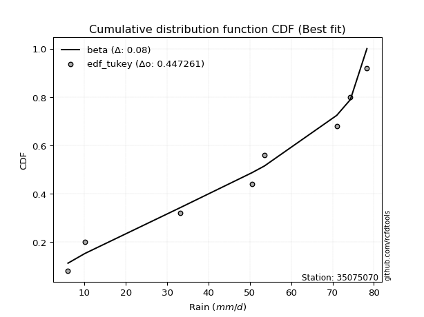</img></img>

</div>


### 8. EDF Gringorten (1963)

Gringorten plotting position formula is essential for estimating the probability and return periods of extreme events like floods and heavy rainfall. The constant _a=0.44_.

<div align="center">


$P=(m-a)/(n+1-2a)$


</div>


**8.1. Empirical values**

<div align="center">

|                | 0                   | 1                   | 2                  | 3                  | 4                  | 5                  | 6                  | 7                  |
|:---------------|:--------------------|:--------------------|:-------------------|:-------------------|:-------------------|:-------------------|:-------------------|:-------------------|
| date           | 2022                | 2023                | 2018               | 2017               | 2021               | 2025               | 2020               | 2019               |
| x              | 6.0                 | 10.1                | 33.1               | 50.5               | 53.5               | 71.0               | 74.3               | 78.3               |
| m              | 1                   | 2                   | 3                  | 4                  | 5                  | 6                  | 7                  | 8                  |
| empirical_dist | edf_gringorten      | edf_gringorten      | edf_gringorten     | edf_gringorten     | edf_gringorten     | edf_gringorten     | edf_gringorten     | edf_gringorten     |
| empirical      | 0.06896551724137932 | 0.19211822660098524 | 0.3152709359605912 | 0.4384236453201971 | 0.5615763546798029 | 0.6847290640394089 | 0.8078817733990148 | 0.9310344827586208 |
| empirical_tr   | 1.0740740740740742  | 1.2378048780487805  | 1.460431654676259  | 1.780701754385965  | 2.2808988764044944 | 3.1718750000000004 | 5.205128205128205  | 14.500000000000018 |

</div>


**8.2. Kolmogorov-Smirnov fit test (sorted by Δ)**


<div align="center">

|                | 0                   | 1                   | 2                   | 3                   | 4                   | 5                   | 6                   | 7                   | 8                   | 9                  | 10                  | 11                 | 12                  | 13                  | 14                  | 15                 | 16                  | 17                 | 18                  | 19                 | 20                  | 21                  | 22                 | 23                  | 24                 | 25                  | 26                  | 27                  | 28                 | 29                  | 30                  | 31                  | 32                  | 33                  | 34                  | 35                  | 36                  | 37                  | 38                 | 39                  | 40                  | 41                  | 42                  | 43                  | 44                  | 45                  | 46                  | 47                  | 48                  | 49                  | 50                  | 51                 | 52                 | 53                  | 54                  | 55                  | 56                 | 57                 | 58                  | 59                  | 60                 | 61                  | 62                 | 63                 | 64                 | 65                  | 66                  | 67                  | 68                  | 69                  | 70                  | 71                  | 72                  | 73                  | 74                  | 75                  | 76                  | 77                 | 78                  | 79                  | 80                 | 81                  | 82                  | 83                 | 84                  | 85                  | 86                  | 87                  | 88                  | 89                 | 90                  | 91                 | 92                  | 93                  | 94                 | 95                 | 96                  | 97                  | 98                  | 99                  | 100                 | 101                | 102                | 103                 | 104                 | 105                | 106                | 107                 | 108                | 109                | 110                 | 111                | 112                | 113                | 114                | 115                 | 116                 | 117                | 118                | 119                 | 120                | 121                | 122                 | 123                 | 124                 | 125                | 126                | 127                | 128                 | 129                 | 130                 | 131                | 132                 | 133                 | 134                 | 135                 | 136                 | 137                | 138                 | 139                | 140                | 141                 | 142                | 143                | 144                | 145                | 146                | 147                | 148                | 149                | 150                | 151                | 152                | 153                | 154                | 155                | 156                | 157                | 158                | 159                |
|:---------------|:--------------------|:--------------------|:--------------------|:--------------------|:--------------------|:--------------------|:--------------------|:--------------------|:--------------------|:-------------------|:--------------------|:-------------------|:--------------------|:--------------------|:--------------------|:-------------------|:--------------------|:-------------------|:--------------------|:-------------------|:--------------------|:--------------------|:-------------------|:--------------------|:-------------------|:--------------------|:--------------------|:--------------------|:-------------------|:--------------------|:--------------------|:--------------------|:--------------------|:--------------------|:--------------------|:--------------------|:--------------------|:--------------------|:-------------------|:--------------------|:--------------------|:--------------------|:--------------------|:--------------------|:--------------------|:--------------------|:--------------------|:--------------------|:--------------------|:--------------------|:--------------------|:-------------------|:-------------------|:--------------------|:--------------------|:--------------------|:-------------------|:-------------------|:--------------------|:--------------------|:-------------------|:--------------------|:-------------------|:-------------------|:-------------------|:--------------------|:--------------------|:--------------------|:--------------------|:--------------------|:--------------------|:--------------------|:--------------------|:--------------------|:--------------------|:--------------------|:--------------------|:-------------------|:--------------------|:--------------------|:-------------------|:--------------------|:--------------------|:-------------------|:--------------------|:--------------------|:--------------------|:--------------------|:--------------------|:-------------------|:--------------------|:-------------------|:--------------------|:--------------------|:-------------------|:-------------------|:--------------------|:--------------------|:--------------------|:--------------------|:--------------------|:-------------------|:-------------------|:--------------------|:--------------------|:-------------------|:-------------------|:--------------------|:-------------------|:-------------------|:--------------------|:-------------------|:-------------------|:-------------------|:-------------------|:--------------------|:--------------------|:-------------------|:-------------------|:--------------------|:-------------------|:-------------------|:--------------------|:--------------------|:--------------------|:-------------------|:-------------------|:-------------------|:--------------------|:--------------------|:--------------------|:-------------------|:--------------------|:--------------------|:--------------------|:--------------------|:--------------------|:-------------------|:--------------------|:-------------------|:-------------------|:--------------------|:-------------------|:-------------------|:-------------------|:-------------------|:-------------------|:-------------------|:-------------------|:-------------------|:-------------------|:-------------------|:-------------------|:-------------------|:-------------------|:-------------------|:-------------------|:-------------------|:-------------------|:-------------------|
| station        | 35075070            | 35075070            | 35075070            | 35075070            | 35075070            | 35075070            | 35075070            | 35075070            | 35075070            | 35075070           | 35075070            | 35075070           | 35075070            | 35075070            | 35075070            | 35075070           | 35075070            | 35075070           | 35075070            | 35075070           | 35075070            | 35075070            | 35075070           | 35075070            | 35075070           | 35075070            | 35075070            | 35075070            | 35075070           | 35075070            | 35075070            | 35075070            | 35075070            | 35075070            | 35075070            | 35075070            | 35075070            | 35075070            | 35075070           | 35075070            | 35075070            | 35075070            | 35075070            | 35075070            | 35075070            | 35075070            | 35075070            | 35075070            | 35075070            | 35075070            | 35075070            | 35075070           | 35075070           | 35075070            | 35075070            | 35075070            | 35075070           | 35075070           | 35075070            | 35075070            | 35075070           | 35075070            | 35075070           | 35075070           | 35075070           | 35075070            | 35075070            | 35075070            | 35075070            | 35075070            | 35075070            | 35075070            | 35075070            | 35075070            | 35075070            | 35075070            | 35075070            | 35075070           | 35075070            | 35075070            | 35075070           | 35075070            | 35075070            | 35075070           | 35075070            | 35075070            | 35075070            | 35075070            | 35075070            | 35075070           | 35075070            | 35075070           | 35075070            | 35075070            | 35075070           | 35075070           | 35075070            | 35075070            | 35075070            | 35075070            | 35075070            | 35075070           | 35075070           | 35075070            | 35075070            | 35075070           | 35075070           | 35075070            | 35075070           | 35075070           | 35075070            | 35075070           | 35075070           | 35075070           | 35075070           | 35075070            | 35075070            | 35075070           | 35075070           | 35075070            | 35075070           | 35075070           | 35075070            | 35075070            | 35075070            | 35075070           | 35075070           | 35075070           | 35075070            | 35075070            | 35075070            | 35075070           | 35075070            | 35075070            | 35075070            | 35075070            | 35075070            | 35075070           | 35075070            | 35075070           | 35075070           | 35075070            | 35075070           | 35075070           | 35075070           | 35075070           | 35075070           | 35075070           | 35075070           | 35075070           | 35075070           | 35075070           | 35075070           | 35075070           | 35075070           | 35075070           | 35075070           | 35075070           | 35075070           | 35075070           |
| empirical_dist | edf_gringorten      | edf_gringorten      | edf_gringorten      | edf_gringorten      | edf_gringorten      | edf_gringorten      | edf_gringorten      | edf_gringorten      | edf_gringorten      | edf_gringorten     | edf_gringorten      | edf_gringorten     | edf_gringorten      | edf_gringorten      | edf_gringorten      | edf_gringorten     | edf_gringorten      | edf_gringorten     | edf_gringorten      | edf_gringorten     | edf_gringorten      | edf_gringorten      | edf_gringorten     | edf_gringorten      | edf_gringorten     | edf_gringorten      | edf_gringorten      | edf_gringorten      | edf_gringorten     | edf_gringorten      | edf_gringorten      | edf_gringorten      | edf_gringorten      | edf_gringorten      | edf_gringorten      | edf_gringorten      | edf_gringorten      | edf_gringorten      | edf_gringorten     | edf_gringorten      | edf_gringorten      | edf_gringorten      | edf_gringorten      | edf_gringorten      | edf_gringorten      | edf_gringorten      | edf_gringorten      | edf_gringorten      | edf_gringorten      | edf_gringorten      | edf_gringorten      | edf_gringorten     | edf_gringorten     | edf_gringorten      | edf_gringorten      | edf_gringorten      | edf_gringorten     | edf_gringorten     | edf_gringorten      | edf_gringorten      | edf_gringorten     | edf_gringorten      | edf_gringorten     | edf_gringorten     | edf_gringorten     | edf_gringorten      | edf_gringorten      | edf_gringorten      | edf_gringorten      | edf_gringorten      | edf_gringorten      | edf_gringorten      | edf_gringorten      | edf_gringorten      | edf_gringorten      | edf_gringorten      | edf_gringorten      | edf_gringorten     | edf_gringorten      | edf_gringorten      | edf_gringorten     | edf_gringorten      | edf_gringorten      | edf_gringorten     | edf_gringorten      | edf_gringorten      | edf_gringorten      | edf_gringorten      | edf_gringorten      | edf_gringorten     | edf_gringorten      | edf_gringorten     | edf_gringorten      | edf_gringorten      | edf_gringorten     | edf_gringorten     | edf_gringorten      | edf_gringorten      | edf_gringorten      | edf_gringorten      | edf_gringorten      | edf_gringorten     | edf_gringorten     | edf_gringorten      | edf_gringorten      | edf_gringorten     | edf_gringorten     | edf_gringorten      | edf_gringorten     | edf_gringorten     | edf_gringorten      | edf_gringorten     | edf_gringorten     | edf_gringorten     | edf_gringorten     | edf_gringorten      | edf_gringorten      | edf_gringorten     | edf_gringorten     | edf_gringorten      | edf_gringorten     | edf_gringorten     | edf_gringorten      | edf_gringorten      | edf_gringorten      | edf_gringorten     | edf_gringorten     | edf_gringorten     | edf_gringorten      | edf_gringorten      | edf_gringorten      | edf_gringorten     | edf_gringorten      | edf_gringorten      | edf_gringorten      | edf_gringorten      | edf_gringorten      | edf_gringorten     | edf_gringorten      | edf_gringorten     | edf_gringorten     | edf_gringorten      | edf_gringorten     | edf_gringorten     | edf_gringorten     | edf_gringorten     | edf_gringorten     | edf_gringorten     | edf_gringorten     | edf_gringorten     | edf_gringorten     | edf_gringorten     | edf_gringorten     | edf_gringorten     | edf_gringorten     | edf_gringorten     | edf_gringorten     | edf_gringorten     | edf_gringorten     | edf_gringorten     |
| p_dist         | beta                | ksone               | semicircular        | gausshyper          | anglit              | trapezoid           | dgamma              | dweibull            | pearson3            | rice               | erlang              | loglevy_l          | norm                | truncnorm           | exponnorm           | t                  | nct                 | f                  | gamma               | crystalball        | betaprime           | weibull_min         | invgamma           | invgauss            | genextreme         | foldnorm            | maxwell             | genhalflogistic     | loggennorm         | wrapcauchy          | arcsine             | kappa4              | gumbel_l            | argus               | logistic            | rayleigh            | johnsonsu           | cosine              | invweibull         | logdgamma           | triang              | hypsecant           | logpearson3         | logtrapezoid        | logvonmises_line    | logburr12           | loggumbel_l         | logweibull_min      | skewnorm            | laplace             | kstwobign           | loggenextreme      | gumbel_r           | logmielke           | mielke              | logargus            | logsemicircular    | alpha              | loggompertz         | halfnorm            | burr               | loganglit           | levy_l             | logloggamma        | tukeylambda        | halflogistic        | moyal               | loggenpareto        | logdweibull         | kappa3              | uniform             | genpareto           | lomax               | truncweibull_min    | logarcsine          | loggamma            | loggamma            | lognakagami        | logf                | lognct              | logexponnorm       | logt                | lognorm             | logcrystalball     | vonmises_line       | logncf              | loginvweibull       | logfatiguelife      | logbeta             | logrice            | logwrapcauchy       | logerlang          | genexpon            | loginvgauss         | logfoldnorm        | logbetaprime       | bradford            | logburr             | loginvgamma         | logalpha            | loglogistic         | logmaxwell         | ncf                | logkstwobign        | logweibull_max      | lograyleigh        | loghypsecant       | loggenexpon         | loggausshyper      | logloglaplace      | logcosine           | loggenhalflogistic | loghalfnorm        | wald               | loggumbel_r        | loglaplace          | loglaplace          | logskewnorm        | loggengamma        | nakagami            | loghalflogistic    | gengamma           | loglomax            | logtriang           | truncexpon          | logmoyal           | burr12             | gennorm            | logksone            | logwald             | logexponweib        | logkappa3          | loguniform          | logtruncnorm        | logkappa4           | logtruncweibull_min | logbradford         | logtruncexpon      | logjohnsonsb        | logrdist           | logjohnsonsu       | weibull_max         | fatiguelife        | logtukeylambda     | exponweib          | powerlaw           | logexponpow        | gompertz           | halfgennorm        | exponpow           | logpowerlaw        | truncpareto        | johnsonsb          | rdist              | logtruncpareto     | genlogistic        | loggenlogistic     | loghalfgennorm     | logvonmises        | vonmises           |
| delta          | 0.06896541415178248 | 0.09870251169193106 | 0.10248557033206446 | 0.10442195977987875 | 0.10548254574170263 | 0.11109328841215549 | 0.11863663233557532 | 0.12419957706774377 | 0.13049996633182248 | 0.131055678756976  | 0.13116890696844696 | 0.1321672815430346 | 0.13228492036463624 | 0.13228493106227657 | 0.13228607075000642 | 0.1322880358071109 | 0.13229923175221103 | 0.1324950320156676 | 0.13267040606978253 | 0.1328611849481416 | 0.13305414513804925 | 0.13551404024321334 | 0.1371998576221855 | 0.13911368429034326 | 0.1398847766653552 | 0.14046915326252896 | 0.14305645533368844 | 0.14412261418362815 | 0.1447737856539304 | 0.14492536145985208 | 0.14626649144403495 | 0.14633090086848766 | 0.14832579542750157 | 0.15120546481966235 | 0.15277247457583532 | 0.15278374762613928 | 0.15302784539848785 | 0.15336323747132374 | 0.1594564336665109 | 0.15962131757963446 | 0.16362085365573176 | 0.16429704516985533 | 0.16624138477601885 | 0.16640174379283978 | 0.16669548155804637 | 0.16722436100794463 | 0.17094428964151048 | 0.17343898897730042 | 0.17356245692061667 | 0.17604518722912965 | 0.17941035303322833 | 0.1810569902259519 | 0.1827882044744325 | 0.18410460914448157 | 0.18617994742339372 | 0.18779121082520378 | 0.1886076981915627 | 0.190128501973147  | 0.19046327855042972 | 0.19211822660098524 | 0.1954310495216942 | 0.19720433426499534 | 0.1984722456610689 | 0.2005041707273736 | 0.2072665267788526 | 0.20755119413763295 | 0.20758790461321047 | 0.21162224015239256 | 0.21273596965221064 | 0.21411395406147748 | 0.21430274785547354 | 0.21530254153944695 | 0.21603915503566323 | 0.21618111586073252 | 0.21682992968466908 | 0.21726183266079352 | 0.21726183266079352 | 0.2172952742671505 | 0.21751207959976743 | 0.21763447141909248 | 0.2176566904957687 | 0.21766073081602827 | 0.21766080683606986 | 0.21766141457631   | 0.21771356535065023 | 0.21775950320916487 | 0.21778040725216147 | 0.22001287817284781 | 0.22005526186528357 | 0.221880382134031  | 0.22218039135884937 | 0.2229755278221392 | 0.22304245452147303 | 0.22321475221923665 | 0.2234061373074407 | 0.2235813907135304 | 0.22394671544428846 | 0.22759853564048899 | 0.22779521792959162 | 0.23043472228936052 | 0.23611492448236598 | 0.2386404583693143 | 0.2431547995277918 | 0.24468928515393734 | 0.24488200769245816 | 0.2449250225952017 | 0.2503301422222672 | 0.25043168187234505 | 0.2551805811356947 | 0.2578434554704754 | 0.26097416948588764 | 0.262567842874133  | 0.2632800019990858 | 0.2764014848489967 | 0.2766554572045083 | 0.27831305686980284 | 0.27831305686980284 | 0.2805652012871311 | 0.2843910778596985 | 0.28512307091392536 | 0.2912968432294492 | 0.2940207562630712 | 0.29478415791291535 | 0.29548111072954136 | 0.29586836889038676 | 0.2961130456978595 | 0.3026573920777331 | 0.3078817733990148 | 0.33596637704416016 | 0.35142785170758833 | 0.35614109372815417 | 0.3774939319390102 | 0.39084438151703155 | 0.39193160963537116 | 0.39303452121989285 | 0.4128307047945056  | 0.43315492785508464 | 0.4411839327011568 | 0.47159814167388303 | 0.4744530185339037 | 0.4836379720816716 | 0.49505621479252876 | 0.4982085743822777 | 0.5162329799112464 | 0.5196074473414157 | 0.5208402085275184 | 0.5480689807257682 | 0.5613201745341367 | 0.5615763546798029 | 0.6005134013784833 | 0.6051763523507819 | 0.6234418135297767 | 0.6821290638453809 | 0.6847290637053233 | 0.6959374230029135 | 0.8078817733990148 | 0.8078817733990148 | 0.8078817733990148 | 1.1580846221587788 | 11.638907071844635 |
| deltao         | 0.4472608134160001  | 0.4472608134160001  | 0.4472608134160001  | 0.4472608134160001  | 0.4472608134160001  | 0.4472608134160001  | 0.4472608134160001  | 0.4472608134160001  | 0.4472608134160001  | 0.4472608134160001 | 0.4472608134160001  | 0.4472608134160001 | 0.4472608134160001  | 0.4472608134160001  | 0.4472608134160001  | 0.4472608134160001 | 0.4472608134160001  | 0.4472608134160001 | 0.4472608134160001  | 0.4472608134160001 | 0.4472608134160001  | 0.4472608134160001  | 0.4472608134160001 | 0.4472608134160001  | 0.4472608134160001 | 0.4472608134160001  | 0.4472608134160001  | 0.4472608134160001  | 0.4472608134160001 | 0.4472608134160001  | 0.4472608134160001  | 0.4472608134160001  | 0.4472608134160001  | 0.4472608134160001  | 0.4472608134160001  | 0.4472608134160001  | 0.4472608134160001  | 0.4472608134160001  | 0.4472608134160001 | 0.4472608134160001  | 0.4472608134160001  | 0.4472608134160001  | 0.4472608134160001  | 0.4472608134160001  | 0.4472608134160001  | 0.4472608134160001  | 0.4472608134160001  | 0.4472608134160001  | 0.4472608134160001  | 0.4472608134160001  | 0.4472608134160001  | 0.4472608134160001 | 0.4472608134160001 | 0.4472608134160001  | 0.4472608134160001  | 0.4472608134160001  | 0.4472608134160001 | 0.4472608134160001 | 0.4472608134160001  | 0.4472608134160001  | 0.4472608134160001 | 0.4472608134160001  | 0.4472608134160001 | 0.4472608134160001 | 0.4472608134160001 | 0.4472608134160001  | 0.4472608134160001  | 0.4472608134160001  | 0.4472608134160001  | 0.4472608134160001  | 0.4472608134160001  | 0.4472608134160001  | 0.4472608134160001  | 0.4472608134160001  | 0.4472608134160001  | 0.4472608134160001  | 0.4472608134160001  | 0.4472608134160001 | 0.4472608134160001  | 0.4472608134160001  | 0.4472608134160001 | 0.4472608134160001  | 0.4472608134160001  | 0.4472608134160001 | 0.4472608134160001  | 0.4472608134160001  | 0.4472608134160001  | 0.4472608134160001  | 0.4472608134160001  | 0.4472608134160001 | 0.4472608134160001  | 0.4472608134160001 | 0.4472608134160001  | 0.4472608134160001  | 0.4472608134160001 | 0.4472608134160001 | 0.4472608134160001  | 0.4472608134160001  | 0.4472608134160001  | 0.4472608134160001  | 0.4472608134160001  | 0.4472608134160001 | 0.4472608134160001 | 0.4472608134160001  | 0.4472608134160001  | 0.4472608134160001 | 0.4472608134160001 | 0.4472608134160001  | 0.4472608134160001 | 0.4472608134160001 | 0.4472608134160001  | 0.4472608134160001 | 0.4472608134160001 | 0.4472608134160001 | 0.4472608134160001 | 0.4472608134160001  | 0.4472608134160001  | 0.4472608134160001 | 0.4472608134160001 | 0.4472608134160001  | 0.4472608134160001 | 0.4472608134160001 | 0.4472608134160001  | 0.4472608134160001  | 0.4472608134160001  | 0.4472608134160001 | 0.4472608134160001 | 0.4472608134160001 | 0.4472608134160001  | 0.4472608134160001  | 0.4472608134160001  | 0.4472608134160001 | 0.4472608134160001  | 0.4472608134160001  | 0.4472608134160001  | 0.4472608134160001  | 0.4472608134160001  | 0.4472608134160001 | 0.4472608134160001  | 0.4472608134160001 | 0.4472608134160001 | 0.4472608134160001  | 0.4472608134160001 | 0.4472608134160001 | 0.4472608134160001 | 0.4472608134160001 | 0.4472608134160001 | 0.4472608134160001 | 0.4472608134160001 | 0.4472608134160001 | 0.4472608134160001 | 0.4472608134160001 | 0.4472608134160001 | 0.4472608134160001 | 0.4472608134160001 | 0.4472608134160001 | 0.4472608134160001 | 0.4472608134160001 | 0.4472608134160001 | 0.4472608134160001 |
| eval           | Δo > Δ              | Δo > Δ              | Δo > Δ              | Δo > Δ              | Δo > Δ              | Δo > Δ              | Δo > Δ              | Δo > Δ              | Δo > Δ              | Δo > Δ             | Δo > Δ              | Δo > Δ             | Δo > Δ              | Δo > Δ              | Δo > Δ              | Δo > Δ             | Δo > Δ              | Δo > Δ             | Δo > Δ              | Δo > Δ             | Δo > Δ              | Δo > Δ              | Δo > Δ             | Δo > Δ              | Δo > Δ             | Δo > Δ              | Δo > Δ              | Δo > Δ              | Δo > Δ             | Δo > Δ              | Δo > Δ              | Δo > Δ              | Δo > Δ              | Δo > Δ              | Δo > Δ              | Δo > Δ              | Δo > Δ              | Δo > Δ              | Δo > Δ             | Δo > Δ              | Δo > Δ              | Δo > Δ              | Δo > Δ              | Δo > Δ              | Δo > Δ              | Δo > Δ              | Δo > Δ              | Δo > Δ              | Δo > Δ              | Δo > Δ              | Δo > Δ              | Δo > Δ             | Δo > Δ             | Δo > Δ              | Δo > Δ              | Δo > Δ              | Δo > Δ             | Δo > Δ             | Δo > Δ              | Δo > Δ              | Δo > Δ             | Δo > Δ              | Δo > Δ             | Δo > Δ             | Δo > Δ             | Δo > Δ              | Δo > Δ              | Δo > Δ              | Δo > Δ              | Δo > Δ              | Δo > Δ              | Δo > Δ              | Δo > Δ              | Δo > Δ              | Δo > Δ              | Δo > Δ              | Δo > Δ              | Δo > Δ             | Δo > Δ              | Δo > Δ              | Δo > Δ             | Δo > Δ              | Δo > Δ              | Δo > Δ             | Δo > Δ              | Δo > Δ              | Δo > Δ              | Δo > Δ              | Δo > Δ              | Δo > Δ             | Δo > Δ              | Δo > Δ             | Δo > Δ              | Δo > Δ              | Δo > Δ             | Δo > Δ             | Δo > Δ              | Δo > Δ              | Δo > Δ              | Δo > Δ              | Δo > Δ              | Δo > Δ             | Δo > Δ             | Δo > Δ              | Δo > Δ              | Δo > Δ             | Δo > Δ             | Δo > Δ              | Δo > Δ             | Δo > Δ             | Δo > Δ              | Δo > Δ             | Δo > Δ             | Δo > Δ             | Δo > Δ             | Δo > Δ              | Δo > Δ              | Δo > Δ             | Δo > Δ             | Δo > Δ              | Δo > Δ             | Δo > Δ             | Δo > Δ              | Δo > Δ              | Δo > Δ              | Δo > Δ             | Δo > Δ             | Δo > Δ             | Δo > Δ              | Δo > Δ              | Δo > Δ              | Δo > Δ             | Δo > Δ              | Δo > Δ              | Δo > Δ              | Δo > Δ              | Δo > Δ              | Δo > Δ             | Δo <= Δ             | Δo <= Δ            | Δo <= Δ            | Δo <= Δ             | Δo <= Δ            | Δo <= Δ            | Δo <= Δ            | Δo <= Δ            | Δo <= Δ            | Δo <= Δ            | Δo <= Δ            | Δo <= Δ            | Δo <= Δ            | Δo <= Δ            | Δo <= Δ            | Δo <= Δ            | Δo <= Δ            | Δo <= Δ            | Δo <= Δ            | Δo <= Δ            | Δo <= Δ            | Δo <= Δ            |
| fit            | 1                   | 1                   | 1                   | 1                   | 1                   | 1                   | 1                   | 1                   | 1                   | 1                  | 1                   | 1                  | 1                   | 1                   | 1                   | 1                  | 1                   | 1                  | 1                   | 1                  | 1                   | 1                   | 1                  | 1                   | 1                  | 1                   | 1                   | 1                   | 1                  | 1                   | 1                   | 1                   | 1                   | 1                   | 1                   | 1                   | 1                   | 1                   | 1                  | 1                   | 1                   | 1                   | 1                   | 1                   | 1                   | 1                   | 1                   | 1                   | 1                   | 1                   | 1                   | 1                  | 1                  | 1                   | 1                   | 1                   | 1                  | 1                  | 1                   | 1                   | 1                  | 1                   | 1                  | 1                  | 1                  | 1                   | 1                   | 1                   | 1                   | 1                   | 1                   | 1                   | 1                   | 1                   | 1                   | 1                   | 1                   | 1                  | 1                   | 1                   | 1                  | 1                   | 1                   | 1                  | 1                   | 1                   | 1                   | 1                   | 1                   | 1                  | 1                   | 1                  | 1                   | 1                   | 1                  | 1                  | 1                   | 1                   | 1                   | 1                   | 1                   | 1                  | 1                  | 1                   | 1                   | 1                  | 1                  | 1                   | 1                  | 1                  | 1                   | 1                  | 1                  | 1                  | 1                  | 1                   | 1                   | 1                  | 1                  | 1                   | 1                  | 1                  | 1                   | 1                   | 1                   | 1                  | 1                  | 1                  | 1                   | 1                   | 1                   | 1                  | 1                   | 1                   | 1                   | 1                   | 1                   | 1                  | 0                   | 0                  | 0                  | 0                   | 0                  | 0                  | 0                  | 0                  | 0                  | 0                  | 0                  | 0                  | 0                  | 0                  | 0                  | 0                  | 0                  | 0                  | 0                  | 0                  | 0                  | 0                  |
| n              | 8                   | 8                   | 8                   | 8                   | 8                   | 8                   | 8                   | 8                   | 8                   | 8                  | 8                   | 8                  | 8                   | 8                   | 8                   | 8                  | 8                   | 8                  | 8                   | 8                  | 8                   | 8                   | 8                  | 8                   | 8                  | 8                   | 8                   | 8                   | 8                  | 8                   | 8                   | 8                   | 8                   | 8                   | 8                   | 8                   | 8                   | 8                   | 8                  | 8                   | 8                   | 8                   | 8                   | 8                   | 8                   | 8                   | 8                   | 8                   | 8                   | 8                   | 8                   | 8                  | 8                  | 8                   | 8                   | 8                   | 8                  | 8                  | 8                   | 8                   | 8                  | 8                   | 8                  | 8                  | 8                  | 8                   | 8                   | 8                   | 8                   | 8                   | 8                   | 8                   | 8                   | 8                   | 8                   | 8                   | 8                   | 8                  | 8                   | 8                   | 8                  | 8                   | 8                   | 8                  | 8                   | 8                   | 8                   | 8                   | 8                   | 8                  | 8                   | 8                  | 8                   | 8                   | 8                  | 8                  | 8                   | 8                   | 8                   | 8                   | 8                   | 8                  | 8                  | 8                   | 8                   | 8                  | 8                  | 8                   | 8                  | 8                  | 8                   | 8                  | 8                  | 8                  | 8                  | 8                   | 8                   | 8                  | 8                  | 8                   | 8                  | 8                  | 8                   | 8                   | 8                   | 8                  | 8                  | 8                  | 8                   | 8                   | 8                   | 8                  | 8                   | 8                   | 8                   | 8                   | 8                   | 8                  | 8                   | 8                  | 8                  | 8                   | 8                  | 8                  | 8                  | 8                  | 8                  | 8                  | 8                  | 8                  | 8                  | 8                  | 8                  | 8                  | 8                  | 8                  | 8                  | 8                  | 8                  | 8                  |
| best_fit       | 1                   | 0                   | 0                   | 0                   | 0                   | 0                   | 0                   | 0                   | 0                   | 0                  | 0                   | 0                  | 0                   | 0                   | 0                   | 0                  | 0                   | 0                  | 0                   | 0                  | 0                   | 0                   | 0                  | 0                   | 0                  | 0                   | 0                   | 0                   | 0                  | 0                   | 0                   | 0                   | 0                   | 0                   | 0                   | 0                   | 0                   | 0                   | 0                  | 0                   | 0                   | 0                   | 0                   | 0                   | 0                   | 0                   | 0                   | 0                   | 0                   | 0                   | 0                   | 0                  | 0                  | 0                   | 0                   | 0                   | 0                  | 0                  | 0                   | 0                   | 0                  | 0                   | 0                  | 0                  | 0                  | 0                   | 0                   | 0                   | 0                   | 0                   | 0                   | 0                   | 0                   | 0                   | 0                   | 0                   | 0                   | 0                  | 0                   | 0                   | 0                  | 0                   | 0                   | 0                  | 0                   | 0                   | 0                   | 0                   | 0                   | 0                  | 0                   | 0                  | 0                   | 0                   | 0                  | 0                  | 0                   | 0                   | 0                   | 0                   | 0                   | 0                  | 0                  | 0                   | 0                   | 0                  | 0                  | 0                   | 0                  | 0                  | 0                   | 0                  | 0                  | 0                  | 0                  | 0                   | 0                   | 0                  | 0                  | 0                   | 0                  | 0                  | 0                   | 0                   | 0                   | 0                  | 0                  | 0                  | 0                   | 0                   | 0                   | 0                  | 0                   | 0                   | 0                   | 0                   | 0                   | 0                  | 0                   | 0                  | 0                  | 0                   | 0                  | 0                  | 0                  | 0                  | 0                  | 0                  | 0                  | 0                  | 0                  | 0                  | 0                  | 0                  | 0                  | 0                  | 0                  | 0                  | 0                  | 0                  |
| best_fit_sort  | 1                   | 2                   | 3                   | 4                   | 5                   | 6                   | 7                   | 8                   | 9                   | 10                 | 11                  | 12                 | 13                  | 14                  | 15                  | 16                 | 17                  | 18                 | 19                  | 20                 | 21                  | 22                  | 23                 | 24                  | 25                 | 26                  | 27                  | 28                  | 29                 | 30                  | 31                  | 32                  | 33                  | 34                  | 35                  | 36                  | 37                  | 38                  | 39                 | 40                  | 41                  | 42                  | 43                  | 44                  | 45                  | 46                  | 47                  | 48                  | 49                  | 50                  | 51                  | 52                 | 53                 | 54                  | 55                  | 56                  | 57                 | 58                 | 59                  | 60                  | 61                 | 62                  | 63                 | 64                 | 65                 | 66                  | 67                  | 68                  | 69                  | 70                  | 71                  | 72                  | 73                  | 74                  | 75                  | 76                  | 77                  | 78                 | 79                  | 80                  | 81                 | 82                  | 83                  | 84                 | 85                  | 86                  | 87                  | 88                  | 89                  | 90                 | 91                  | 92                 | 93                  | 94                  | 95                 | 96                 | 97                  | 98                  | 99                  | 100                 | 101                 | 102                | 103                | 104                 | 105                 | 106                | 107                | 108                 | 109                | 110                | 111                 | 112                | 113                | 114                | 115                | 116                 | 117                 | 118                | 119                | 120                 | 121                | 122                | 123                 | 124                 | 125                 | 126                | 127                | 128                | 129                 | 130                 | 131                 | 132                | 133                 | 134                 | 135                 | 136                 | 137                 | 138                | 139                 | 140                | 141                | 142                 | 143                | 144                | 145                | 146                | 147                | 148                | 149                | 150                | 151                | 152                | 153                | 154                | 155                | 156                | 157                | 158                | 159                | 160                |

</div>


**8.3. Best fit**

<div align="center">

|   id |   station | empirical_dist   | p_dist   |     delta |   deltao | eval   |   fit |   n |   best_fit |   best_fit_sort |
|-----:|----------:|:-----------------|:---------|----------:|---------:|:-------|------:|----:|-----------:|----------------:|
|    0 |  35075070 | edf_gringorten   | beta     | 0.0689654 | 0.447261 | Δo > Δ |     1 |   8 |          1 |               1 |

</div>


<div align="center">

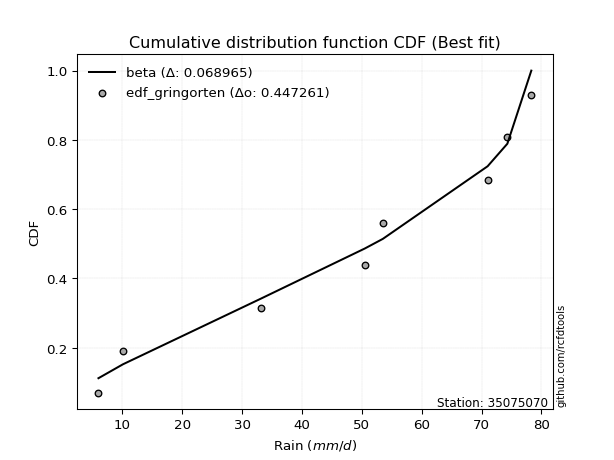</img></img>

</div>


### 9. EDF Filliben (1975)

The specific values of the constants (0.3175) (often denoted as $alpha$) and (0.365) are derived from a method proposed by James J. Filliben in a 1975 paper. This particular formula is the mean value of the $i$-th order statistic of the normal distribution and is considered a robust and effective plotting position formula for the normal probability plot correlation coefficient test for normality.

<div align="center">


$P=(m-0.3175)/(n+0.365)$


</div>


**9.1. Empirical values**

<div align="center">

|                | 0                  | 1                   | 2                  | 3                   | 4                  | 5                  | 6                  | 7                  |
|:---------------|:-------------------|:--------------------|:-------------------|:--------------------|:-------------------|:-------------------|:-------------------|:-------------------|
| date           | 2022               | 2023                | 2018               | 2017                | 2021               | 2025               | 2020               | 2019               |
| x              | 6.0                | 10.1                | 33.1               | 50.5                | 53.5               | 71.0               | 74.3               | 78.3               |
| m              | 1                  | 2                   | 3                  | 4                   | 5                  | 6                  | 7                  | 8                  |
| empirical_dist | edf_filliben       | edf_filliben        | edf_filliben       | edf_filliben        | edf_filliben       | edf_filliben       | edf_filliben       | edf_filliben       |
| empirical      | 0.0815899581589958 | 0.20113568439928273 | 0.3206814106395696 | 0.44022713687985654 | 0.5597728631201434 | 0.6793185893604303 | 0.7988643156007172 | 0.9184100418410042 |
| empirical_tr   | 1.0888382687927107 | 1.2517770295548074  | 1.4720633523977125 | 1.7864388681260008  | 2.271554650373387  | 3.118359739049394  | 4.971768202080237  | 12.256410256410254 |

</div>


**9.2. Kolmogorov-Smirnov fit test (sorted by Δ)**


<div align="center">

|                | 0                   | 1                   | 2                   | 3                   | 4                   | 5                   | 6                  | 7                   | 8                   | 9                   | 10                  | 11                  | 12                  | 13                  | 14                  | 15                  | 16                  | 17                  | 18                 | 19                  | 20                  | 21                  | 22                  | 23                  | 24                  | 25                  | 26                  | 27                  | 28                  | 29                  | 30                  | 31                  | 32                  | 33                  | 34                  | 35                  | 36                  | 37                  | 38                 | 39                 | 40                  | 41                  | 42                 | 43                 | 44                  | 45                  | 46                  | 47                 | 48                 | 49                  | 50                  | 51                  | 52                 | 53                  | 54                 | 55                  | 56                 | 57                  | 58                  | 59                  | 60                  | 61                  | 62                 | 63                  | 64                  | 65                  | 66                  | 67                  | 68                  | 69                  | 70                 | 71                 | 72                 | 73                 | 74                 | 75                 | 76                  | 77                  | 78                  | 79                  | 80                  | 81                  | 82                  | 83                  | 84                 | 85                  | 86                  | 87                  | 88                  | 89                  | 90                 | 91                  | 92                  | 93                  | 94                  | 95                  | 96                 | 97                  | 98                 | 99                  | 100                 | 101                | 102                 | 103                 | 104                 | 105                | 106                 | 107                 | 108                 | 109                | 110                | 111                 | 112                | 113                 | 114                | 115                | 116                | 117                 | 118                | 119                 | 120                | 121                | 122                | 123                 | 124                 | 125                | 126                | 127                 | 128                 | 129                | 130                 | 131                | 132                | 133                 | 134                 | 135                 | 136                | 137                | 138                | 139                | 140                 | 141                | 142                | 143                | 144                | 145                | 146                | 147                | 148                | 149                | 150                | 151                | 152                | 153                | 154                | 155                | 156                | 157                | 158                | 159                |
|:---------------|:--------------------|:--------------------|:--------------------|:--------------------|:--------------------|:--------------------|:-------------------|:--------------------|:--------------------|:--------------------|:--------------------|:--------------------|:--------------------|:--------------------|:--------------------|:--------------------|:--------------------|:--------------------|:-------------------|:--------------------|:--------------------|:--------------------|:--------------------|:--------------------|:--------------------|:--------------------|:--------------------|:--------------------|:--------------------|:--------------------|:--------------------|:--------------------|:--------------------|:--------------------|:--------------------|:--------------------|:--------------------|:--------------------|:-------------------|:-------------------|:--------------------|:--------------------|:-------------------|:-------------------|:--------------------|:--------------------|:--------------------|:-------------------|:-------------------|:--------------------|:--------------------|:--------------------|:-------------------|:--------------------|:-------------------|:--------------------|:-------------------|:--------------------|:--------------------|:--------------------|:--------------------|:--------------------|:-------------------|:--------------------|:--------------------|:--------------------|:--------------------|:--------------------|:--------------------|:--------------------|:-------------------|:-------------------|:-------------------|:-------------------|:-------------------|:-------------------|:--------------------|:--------------------|:--------------------|:--------------------|:--------------------|:--------------------|:--------------------|:--------------------|:-------------------|:--------------------|:--------------------|:--------------------|:--------------------|:--------------------|:-------------------|:--------------------|:--------------------|:--------------------|:--------------------|:--------------------|:-------------------|:--------------------|:-------------------|:--------------------|:--------------------|:-------------------|:--------------------|:--------------------|:--------------------|:-------------------|:--------------------|:--------------------|:--------------------|:-------------------|:-------------------|:--------------------|:-------------------|:--------------------|:-------------------|:-------------------|:-------------------|:--------------------|:-------------------|:--------------------|:-------------------|:-------------------|:-------------------|:--------------------|:--------------------|:-------------------|:-------------------|:--------------------|:--------------------|:-------------------|:--------------------|:-------------------|:-------------------|:--------------------|:--------------------|:--------------------|:-------------------|:-------------------|:-------------------|:-------------------|:--------------------|:-------------------|:-------------------|:-------------------|:-------------------|:-------------------|:-------------------|:-------------------|:-------------------|:-------------------|:-------------------|:-------------------|:-------------------|:-------------------|:-------------------|:-------------------|:-------------------|:-------------------|:-------------------|:-------------------|
| station        | 35075070            | 35075070            | 35075070            | 35075070            | 35075070            | 35075070            | 35075070           | 35075070            | 35075070            | 35075070            | 35075070            | 35075070            | 35075070            | 35075070            | 35075070            | 35075070            | 35075070            | 35075070            | 35075070           | 35075070            | 35075070            | 35075070            | 35075070            | 35075070            | 35075070            | 35075070            | 35075070            | 35075070            | 35075070            | 35075070            | 35075070            | 35075070            | 35075070            | 35075070            | 35075070            | 35075070            | 35075070            | 35075070            | 35075070           | 35075070           | 35075070            | 35075070            | 35075070           | 35075070           | 35075070            | 35075070            | 35075070            | 35075070           | 35075070           | 35075070            | 35075070            | 35075070            | 35075070           | 35075070            | 35075070           | 35075070            | 35075070           | 35075070            | 35075070            | 35075070            | 35075070            | 35075070            | 35075070           | 35075070            | 35075070            | 35075070            | 35075070            | 35075070            | 35075070            | 35075070            | 35075070           | 35075070           | 35075070           | 35075070           | 35075070           | 35075070           | 35075070            | 35075070            | 35075070            | 35075070            | 35075070            | 35075070            | 35075070            | 35075070            | 35075070           | 35075070            | 35075070            | 35075070            | 35075070            | 35075070            | 35075070           | 35075070            | 35075070            | 35075070            | 35075070            | 35075070            | 35075070           | 35075070            | 35075070           | 35075070            | 35075070            | 35075070           | 35075070            | 35075070            | 35075070            | 35075070           | 35075070            | 35075070            | 35075070            | 35075070           | 35075070           | 35075070            | 35075070           | 35075070            | 35075070           | 35075070           | 35075070           | 35075070            | 35075070           | 35075070            | 35075070           | 35075070           | 35075070           | 35075070            | 35075070            | 35075070           | 35075070           | 35075070            | 35075070            | 35075070           | 35075070            | 35075070           | 35075070           | 35075070            | 35075070            | 35075070            | 35075070           | 35075070           | 35075070           | 35075070           | 35075070            | 35075070           | 35075070           | 35075070           | 35075070           | 35075070           | 35075070           | 35075070           | 35075070           | 35075070           | 35075070           | 35075070           | 35075070           | 35075070           | 35075070           | 35075070           | 35075070           | 35075070           | 35075070           | 35075070           |
| empirical_dist | edf_filliben        | edf_filliben        | edf_filliben        | edf_filliben        | edf_filliben        | edf_filliben        | edf_filliben       | edf_filliben        | edf_filliben        | edf_filliben        | edf_filliben        | edf_filliben        | edf_filliben        | edf_filliben        | edf_filliben        | edf_filliben        | edf_filliben        | edf_filliben        | edf_filliben       | edf_filliben        | edf_filliben        | edf_filliben        | edf_filliben        | edf_filliben        | edf_filliben        | edf_filliben        | edf_filliben        | edf_filliben        | edf_filliben        | edf_filliben        | edf_filliben        | edf_filliben        | edf_filliben        | edf_filliben        | edf_filliben        | edf_filliben        | edf_filliben        | edf_filliben        | edf_filliben       | edf_filliben       | edf_filliben        | edf_filliben        | edf_filliben       | edf_filliben       | edf_filliben        | edf_filliben        | edf_filliben        | edf_filliben       | edf_filliben       | edf_filliben        | edf_filliben        | edf_filliben        | edf_filliben       | edf_filliben        | edf_filliben       | edf_filliben        | edf_filliben       | edf_filliben        | edf_filliben        | edf_filliben        | edf_filliben        | edf_filliben        | edf_filliben       | edf_filliben        | edf_filliben        | edf_filliben        | edf_filliben        | edf_filliben        | edf_filliben        | edf_filliben        | edf_filliben       | edf_filliben       | edf_filliben       | edf_filliben       | edf_filliben       | edf_filliben       | edf_filliben        | edf_filliben        | edf_filliben        | edf_filliben        | edf_filliben        | edf_filliben        | edf_filliben        | edf_filliben        | edf_filliben       | edf_filliben        | edf_filliben        | edf_filliben        | edf_filliben        | edf_filliben        | edf_filliben       | edf_filliben        | edf_filliben        | edf_filliben        | edf_filliben        | edf_filliben        | edf_filliben       | edf_filliben        | edf_filliben       | edf_filliben        | edf_filliben        | edf_filliben       | edf_filliben        | edf_filliben        | edf_filliben        | edf_filliben       | edf_filliben        | edf_filliben        | edf_filliben        | edf_filliben       | edf_filliben       | edf_filliben        | edf_filliben       | edf_filliben        | edf_filliben       | edf_filliben       | edf_filliben       | edf_filliben        | edf_filliben       | edf_filliben        | edf_filliben       | edf_filliben       | edf_filliben       | edf_filliben        | edf_filliben        | edf_filliben       | edf_filliben       | edf_filliben        | edf_filliben        | edf_filliben       | edf_filliben        | edf_filliben       | edf_filliben       | edf_filliben        | edf_filliben        | edf_filliben        | edf_filliben       | edf_filliben       | edf_filliben       | edf_filliben       | edf_filliben        | edf_filliben       | edf_filliben       | edf_filliben       | edf_filliben       | edf_filliben       | edf_filliben       | edf_filliben       | edf_filliben       | edf_filliben       | edf_filliben       | edf_filliben       | edf_filliben       | edf_filliben       | edf_filliben       | edf_filliben       | edf_filliben       | edf_filliben       | edf_filliben       | edf_filliben       |
| p_dist         | beta                | ksone               | semicircular        | anglit              | gausshyper          | trapezoid           | dgamma             | loglevy_l           | dweibull            | invgamma            | loggennorm          | pearson3            | rice                | erlang              | invgauss            | norm                | truncnorm           | exponnorm           | t                  | nct                 | f                   | gamma               | genextreme          | crystalball         | betaprime           | wrapcauchy          | weibull_min         | maxwell             | foldnorm            | genhalflogistic     | rayleigh            | johnsonsu           | kappa4              | gumbel_l            | logtrapezoid        | logvonmises_line    | arcsine             | argus               | invweibull         | logistic           | cosine              | logpearson3         | logburr12          | logdgamma          | triang              | loggumbel_l         | hypsecant           | logweibull_min     | kstwobign          | skewnorm            | gumbel_r            | laplace             | alpha              | levy_l              | loggenextreme      | logsemicircular     | loggompertz        | logmielke           | mielke              | logargus            | loganglit           | logdweibull         | burr               | halfnorm            | logarcsine          | halflogistic        | moyal               | logloggamma         | loggenpareto        | logbeta             | tukeylambda        | lomax              | loggamma           | loggamma           | lognakagami        | logf               | lognct              | logexponnorm        | logt                | lognorm             | logcrystalball      | logncf              | loginvweibull       | logwrapcauchy       | logfatiguelife     | kappa3              | uniform             | logrice             | genpareto           | logerlang           | genexpon           | loginvgauss         | truncweibull_min    | logfoldnorm         | logbetaprime        | vonmises_line       | loginvgamma        | logburr             | logalpha           | bradford            | loglogistic         | logweibull_max     | logmaxwell          | ncf                 | logkstwobign        | lograyleigh        | logloglaplace       | loghypsecant        | loggenexpon         | loggausshyper      | logcosine          | loggenhalflogistic  | loghalfnorm        | wald                | loggumbel_r        | loglaplace         | loglaplace         | logskewnorm         | loggengamma        | nakagami            | gengamma           | loglomax           | loghalflogistic    | logtriang           | truncexpon          | logmoyal           | burr12             | gennorm             | logksone            | logwald            | logexponweib        | logkappa3          | loguniform         | logtruncnorm        | logkappa4           | logtruncweibull_min | logbradford        | logtruncexpon      | logjohnsonsb       | logrdist           | logjohnsonsu        | weibull_max        | fatiguelife        | exponweib          | logtukeylambda     | powerlaw           | logexponpow        | gompertz           | halfgennorm        | exponpow           | logpowerlaw        | truncpareto        | johnsonsb          | rdist              | logtruncpareto     | genlogistic        | loggenlogistic     | loghalfgennorm     | logvonmises        | vonmises           |
| delta          | 0.08158985506939909 | 0.10515562835479524 | 0.10697684312157571 | 0.11041120467819143 | 0.11343941757817624 | 0.11650376309113408 | 0.1276540901338728 | 0.13036378998337506 | 0.13321703486604125 | 0.13539636606252609 | 0.13542033795295327 | 0.13591044101080108 | 0.13646615343595458 | 0.13657938164742556 | 0.13731019273068384 | 0.13769539504361483 | 0.13769540574125516 | 0.13769654542898502 | 0.1376985104860895 | 0.13770970643118963 | 0.13790550669464618 | 0.13808088074876113 | 0.13808128510569567 | 0.13827165962712018 | 0.13846461981702785 | 0.13951488678087365 | 0.14092451492219193 | 0.14125296377402902 | 0.14587962794150755 | 0.14953308886260674 | 0.15098025606647986 | 0.15122435383882832 | 0.15174137554746625 | 0.15373627010648017 | 0.15377730287522318 | 0.15407104064042976 | 0.15528394924233244 | 0.15661593949864094 | 0.1576529421068515 | 0.1581829492548139 | 0.15877371215030234 | 0.16443789321635943 | 0.1654208694482852 | 0.1669849582337539 | 0.16903132833471035 | 0.16914079808185106 | 0.16970751984883392 | 0.171635497417641  | 0.1776068614735689 | 0.17897293159959526 | 0.18098471291477308 | 0.18145566190810825 | 0.1825315343283374 | 0.18584780474345244 | 0.1864674649049305 | 0.18680420663190328 | 0.1886597869907703 | 0.18951508382346016 | 0.19159042210237232 | 0.19320168550418237 | 0.19540084270533592 | 0.20011152873459404 | 0.2008415242006728 | 0.20113568439928273 | 0.20420548876705247 | 0.20574770257797353 | 0.20578441305355105 | 0.20591464540635218 | 0.20981874859273314 | 0.21103780406698602 | 0.2126770014578312 | 0.2142356634760038 | 0.2154583411011341 | 0.2154583411011341 | 0.2154917827074911 | 0.215708588040108  | 0.21583097985943306 | 0.21585319893610927 | 0.21585723925636885 | 0.21585731527641044 | 0.21585792301665058 | 0.21595601164950545 | 0.21597691569250205 | 0.21676991667987094 | 0.2182093866131884 | 0.21952442874045608 | 0.21971322253445214 | 0.22007689057437158 | 0.22071301621842554 | 0.22117203626247978 | 0.2212389629618136 | 0.22141126065957722 | 0.22159159053971111 | 0.22160264574778127 | 0.22177789915387097 | 0.22312404002962882 | 0.2259917263699322 | 0.22651708224397138 | 0.2286312307297011 | 0.22935719012326705 | 0.23431143292270656 | 0.2358645498941606 | 0.23683696680965488 | 0.24135130796813237 | 0.24288579359427792 | 0.2431215310355423 | 0.24521901455285877 | 0.24852665066260776 | 0.24862819031268563 | 0.2533770895760353 | 0.2591706779262282 | 0.26076435131447356 | 0.2614765104394264 | 0.27459799328933726 | 0.2748519656448489 | 0.2765095653101434 | 0.2765095653101434 | 0.27876170972747166 | 0.2789806031807201 | 0.28331957935426594 | 0.2886102815840928 | 0.2893736832339369 | 0.2894933516697898 | 0.29367761916988194 | 0.29406487733072734 | 0.2943095541382001 | 0.2972469173987547 | 0.29886431560071725 | 0.33416288548450074 | 0.3496243601479289 | 0.35073061904917574 | 0.3756904403793508 | 0.3890408899573721 | 0.39012811807571174 | 0.39123102966023343 | 0.4110272132348462  | 0.4313514362954252 | 0.4393804411414974 | 0.4625806838755855 | 0.4726495269742443 | 0.47462051428337404 | 0.4860387569942312 | 0.4927980997032993 | 0.5141969726624374 | 0.514429488351587  | 0.5154297338485401 | 0.5426585060467897 | 0.5595166829744772 | 0.5597728631201434 | 0.5951029266995049 | 0.5997658776718036 | 0.6180313388507983 | 0.6731116060470833 | 0.6793185890263449 | 0.686919965204616  | 0.7988643156007172 | 0.7988643156007172 | 0.7988643156007172 | 1.1562811305991194 | 11.65153151276225  |
| deltao         | 0.4472608134160001  | 0.4472608134160001  | 0.4472608134160001  | 0.4472608134160001  | 0.4472608134160001  | 0.4472608134160001  | 0.4472608134160001 | 0.4472608134160001  | 0.4472608134160001  | 0.4472608134160001  | 0.4472608134160001  | 0.4472608134160001  | 0.4472608134160001  | 0.4472608134160001  | 0.4472608134160001  | 0.4472608134160001  | 0.4472608134160001  | 0.4472608134160001  | 0.4472608134160001 | 0.4472608134160001  | 0.4472608134160001  | 0.4472608134160001  | 0.4472608134160001  | 0.4472608134160001  | 0.4472608134160001  | 0.4472608134160001  | 0.4472608134160001  | 0.4472608134160001  | 0.4472608134160001  | 0.4472608134160001  | 0.4472608134160001  | 0.4472608134160001  | 0.4472608134160001  | 0.4472608134160001  | 0.4472608134160001  | 0.4472608134160001  | 0.4472608134160001  | 0.4472608134160001  | 0.4472608134160001 | 0.4472608134160001 | 0.4472608134160001  | 0.4472608134160001  | 0.4472608134160001 | 0.4472608134160001 | 0.4472608134160001  | 0.4472608134160001  | 0.4472608134160001  | 0.4472608134160001 | 0.4472608134160001 | 0.4472608134160001  | 0.4472608134160001  | 0.4472608134160001  | 0.4472608134160001 | 0.4472608134160001  | 0.4472608134160001 | 0.4472608134160001  | 0.4472608134160001 | 0.4472608134160001  | 0.4472608134160001  | 0.4472608134160001  | 0.4472608134160001  | 0.4472608134160001  | 0.4472608134160001 | 0.4472608134160001  | 0.4472608134160001  | 0.4472608134160001  | 0.4472608134160001  | 0.4472608134160001  | 0.4472608134160001  | 0.4472608134160001  | 0.4472608134160001 | 0.4472608134160001 | 0.4472608134160001 | 0.4472608134160001 | 0.4472608134160001 | 0.4472608134160001 | 0.4472608134160001  | 0.4472608134160001  | 0.4472608134160001  | 0.4472608134160001  | 0.4472608134160001  | 0.4472608134160001  | 0.4472608134160001  | 0.4472608134160001  | 0.4472608134160001 | 0.4472608134160001  | 0.4472608134160001  | 0.4472608134160001  | 0.4472608134160001  | 0.4472608134160001  | 0.4472608134160001 | 0.4472608134160001  | 0.4472608134160001  | 0.4472608134160001  | 0.4472608134160001  | 0.4472608134160001  | 0.4472608134160001 | 0.4472608134160001  | 0.4472608134160001 | 0.4472608134160001  | 0.4472608134160001  | 0.4472608134160001 | 0.4472608134160001  | 0.4472608134160001  | 0.4472608134160001  | 0.4472608134160001 | 0.4472608134160001  | 0.4472608134160001  | 0.4472608134160001  | 0.4472608134160001 | 0.4472608134160001 | 0.4472608134160001  | 0.4472608134160001 | 0.4472608134160001  | 0.4472608134160001 | 0.4472608134160001 | 0.4472608134160001 | 0.4472608134160001  | 0.4472608134160001 | 0.4472608134160001  | 0.4472608134160001 | 0.4472608134160001 | 0.4472608134160001 | 0.4472608134160001  | 0.4472608134160001  | 0.4472608134160001 | 0.4472608134160001 | 0.4472608134160001  | 0.4472608134160001  | 0.4472608134160001 | 0.4472608134160001  | 0.4472608134160001 | 0.4472608134160001 | 0.4472608134160001  | 0.4472608134160001  | 0.4472608134160001  | 0.4472608134160001 | 0.4472608134160001 | 0.4472608134160001 | 0.4472608134160001 | 0.4472608134160001  | 0.4472608134160001 | 0.4472608134160001 | 0.4472608134160001 | 0.4472608134160001 | 0.4472608134160001 | 0.4472608134160001 | 0.4472608134160001 | 0.4472608134160001 | 0.4472608134160001 | 0.4472608134160001 | 0.4472608134160001 | 0.4472608134160001 | 0.4472608134160001 | 0.4472608134160001 | 0.4472608134160001 | 0.4472608134160001 | 0.4472608134160001 | 0.4472608134160001 | 0.4472608134160001 |
| eval           | Δo > Δ              | Δo > Δ              | Δo > Δ              | Δo > Δ              | Δo > Δ              | Δo > Δ              | Δo > Δ             | Δo > Δ              | Δo > Δ              | Δo > Δ              | Δo > Δ              | Δo > Δ              | Δo > Δ              | Δo > Δ              | Δo > Δ              | Δo > Δ              | Δo > Δ              | Δo > Δ              | Δo > Δ             | Δo > Δ              | Δo > Δ              | Δo > Δ              | Δo > Δ              | Δo > Δ              | Δo > Δ              | Δo > Δ              | Δo > Δ              | Δo > Δ              | Δo > Δ              | Δo > Δ              | Δo > Δ              | Δo > Δ              | Δo > Δ              | Δo > Δ              | Δo > Δ              | Δo > Δ              | Δo > Δ              | Δo > Δ              | Δo > Δ             | Δo > Δ             | Δo > Δ              | Δo > Δ              | Δo > Δ             | Δo > Δ             | Δo > Δ              | Δo > Δ              | Δo > Δ              | Δo > Δ             | Δo > Δ             | Δo > Δ              | Δo > Δ              | Δo > Δ              | Δo > Δ             | Δo > Δ              | Δo > Δ             | Δo > Δ              | Δo > Δ             | Δo > Δ              | Δo > Δ              | Δo > Δ              | Δo > Δ              | Δo > Δ              | Δo > Δ             | Δo > Δ              | Δo > Δ              | Δo > Δ              | Δo > Δ              | Δo > Δ              | Δo > Δ              | Δo > Δ              | Δo > Δ             | Δo > Δ             | Δo > Δ             | Δo > Δ             | Δo > Δ             | Δo > Δ             | Δo > Δ              | Δo > Δ              | Δo > Δ              | Δo > Δ              | Δo > Δ              | Δo > Δ              | Δo > Δ              | Δo > Δ              | Δo > Δ             | Δo > Δ              | Δo > Δ              | Δo > Δ              | Δo > Δ              | Δo > Δ              | Δo > Δ             | Δo > Δ              | Δo > Δ              | Δo > Δ              | Δo > Δ              | Δo > Δ              | Δo > Δ             | Δo > Δ              | Δo > Δ             | Δo > Δ              | Δo > Δ              | Δo > Δ             | Δo > Δ              | Δo > Δ              | Δo > Δ              | Δo > Δ             | Δo > Δ              | Δo > Δ              | Δo > Δ              | Δo > Δ             | Δo > Δ             | Δo > Δ              | Δo > Δ             | Δo > Δ              | Δo > Δ             | Δo > Δ             | Δo > Δ             | Δo > Δ              | Δo > Δ             | Δo > Δ              | Δo > Δ             | Δo > Δ             | Δo > Δ             | Δo > Δ              | Δo > Δ              | Δo > Δ             | Δo > Δ             | Δo > Δ              | Δo > Δ              | Δo > Δ             | Δo > Δ              | Δo > Δ             | Δo > Δ             | Δo > Δ              | Δo > Δ              | Δo > Δ              | Δo > Δ             | Δo > Δ             | Δo <= Δ            | Δo <= Δ            | Δo <= Δ             | Δo <= Δ            | Δo <= Δ            | Δo <= Δ            | Δo <= Δ            | Δo <= Δ            | Δo <= Δ            | Δo <= Δ            | Δo <= Δ            | Δo <= Δ            | Δo <= Δ            | Δo <= Δ            | Δo <= Δ            | Δo <= Δ            | Δo <= Δ            | Δo <= Δ            | Δo <= Δ            | Δo <= Δ            | Δo <= Δ            | Δo <= Δ            |
| fit            | 1                   | 1                   | 1                   | 1                   | 1                   | 1                   | 1                  | 1                   | 1                   | 1                   | 1                   | 1                   | 1                   | 1                   | 1                   | 1                   | 1                   | 1                   | 1                  | 1                   | 1                   | 1                   | 1                   | 1                   | 1                   | 1                   | 1                   | 1                   | 1                   | 1                   | 1                   | 1                   | 1                   | 1                   | 1                   | 1                   | 1                   | 1                   | 1                  | 1                  | 1                   | 1                   | 1                  | 1                  | 1                   | 1                   | 1                   | 1                  | 1                  | 1                   | 1                   | 1                   | 1                  | 1                   | 1                  | 1                   | 1                  | 1                   | 1                   | 1                   | 1                   | 1                   | 1                  | 1                   | 1                   | 1                   | 1                   | 1                   | 1                   | 1                   | 1                  | 1                  | 1                  | 1                  | 1                  | 1                  | 1                   | 1                   | 1                   | 1                   | 1                   | 1                   | 1                   | 1                   | 1                  | 1                   | 1                   | 1                   | 1                   | 1                   | 1                  | 1                   | 1                   | 1                   | 1                   | 1                   | 1                  | 1                   | 1                  | 1                   | 1                   | 1                  | 1                   | 1                   | 1                   | 1                  | 1                   | 1                   | 1                   | 1                  | 1                  | 1                   | 1                  | 1                   | 1                  | 1                  | 1                  | 1                   | 1                  | 1                   | 1                  | 1                  | 1                  | 1                   | 1                   | 1                  | 1                  | 1                   | 1                   | 1                  | 1                   | 1                  | 1                  | 1                   | 1                   | 1                   | 1                  | 1                  | 0                  | 0                  | 0                   | 0                  | 0                  | 0                  | 0                  | 0                  | 0                  | 0                  | 0                  | 0                  | 0                  | 0                  | 0                  | 0                  | 0                  | 0                  | 0                  | 0                  | 0                  | 0                  |
| n              | 8                   | 8                   | 8                   | 8                   | 8                   | 8                   | 8                  | 8                   | 8                   | 8                   | 8                   | 8                   | 8                   | 8                   | 8                   | 8                   | 8                   | 8                   | 8                  | 8                   | 8                   | 8                   | 8                   | 8                   | 8                   | 8                   | 8                   | 8                   | 8                   | 8                   | 8                   | 8                   | 8                   | 8                   | 8                   | 8                   | 8                   | 8                   | 8                  | 8                  | 8                   | 8                   | 8                  | 8                  | 8                   | 8                   | 8                   | 8                  | 8                  | 8                   | 8                   | 8                   | 8                  | 8                   | 8                  | 8                   | 8                  | 8                   | 8                   | 8                   | 8                   | 8                   | 8                  | 8                   | 8                   | 8                   | 8                   | 8                   | 8                   | 8                   | 8                  | 8                  | 8                  | 8                  | 8                  | 8                  | 8                   | 8                   | 8                   | 8                   | 8                   | 8                   | 8                   | 8                   | 8                  | 8                   | 8                   | 8                   | 8                   | 8                   | 8                  | 8                   | 8                   | 8                   | 8                   | 8                   | 8                  | 8                   | 8                  | 8                   | 8                   | 8                  | 8                   | 8                   | 8                   | 8                  | 8                   | 8                   | 8                   | 8                  | 8                  | 8                   | 8                  | 8                   | 8                  | 8                  | 8                  | 8                   | 8                  | 8                   | 8                  | 8                  | 8                  | 8                   | 8                   | 8                  | 8                  | 8                   | 8                   | 8                  | 8                   | 8                  | 8                  | 8                   | 8                   | 8                   | 8                  | 8                  | 8                  | 8                  | 8                   | 8                  | 8                  | 8                  | 8                  | 8                  | 8                  | 8                  | 8                  | 8                  | 8                  | 8                  | 8                  | 8                  | 8                  | 8                  | 8                  | 8                  | 8                  | 8                  |
| best_fit       | 1                   | 0                   | 0                   | 0                   | 0                   | 0                   | 0                  | 0                   | 0                   | 0                   | 0                   | 0                   | 0                   | 0                   | 0                   | 0                   | 0                   | 0                   | 0                  | 0                   | 0                   | 0                   | 0                   | 0                   | 0                   | 0                   | 0                   | 0                   | 0                   | 0                   | 0                   | 0                   | 0                   | 0                   | 0                   | 0                   | 0                   | 0                   | 0                  | 0                  | 0                   | 0                   | 0                  | 0                  | 0                   | 0                   | 0                   | 0                  | 0                  | 0                   | 0                   | 0                   | 0                  | 0                   | 0                  | 0                   | 0                  | 0                   | 0                   | 0                   | 0                   | 0                   | 0                  | 0                   | 0                   | 0                   | 0                   | 0                   | 0                   | 0                   | 0                  | 0                  | 0                  | 0                  | 0                  | 0                  | 0                   | 0                   | 0                   | 0                   | 0                   | 0                   | 0                   | 0                   | 0                  | 0                   | 0                   | 0                   | 0                   | 0                   | 0                  | 0                   | 0                   | 0                   | 0                   | 0                   | 0                  | 0                   | 0                  | 0                   | 0                   | 0                  | 0                   | 0                   | 0                   | 0                  | 0                   | 0                   | 0                   | 0                  | 0                  | 0                   | 0                  | 0                   | 0                  | 0                  | 0                  | 0                   | 0                  | 0                   | 0                  | 0                  | 0                  | 0                   | 0                   | 0                  | 0                  | 0                   | 0                   | 0                  | 0                   | 0                  | 0                  | 0                   | 0                   | 0                   | 0                  | 0                  | 0                  | 0                  | 0                   | 0                  | 0                  | 0                  | 0                  | 0                  | 0                  | 0                  | 0                  | 0                  | 0                  | 0                  | 0                  | 0                  | 0                  | 0                  | 0                  | 0                  | 0                  | 0                  |
| best_fit_sort  | 1                   | 2                   | 3                   | 4                   | 5                   | 6                   | 7                  | 8                   | 9                   | 10                  | 11                  | 12                  | 13                  | 14                  | 15                  | 16                  | 17                  | 18                  | 19                 | 20                  | 21                  | 22                  | 23                  | 24                  | 25                  | 26                  | 27                  | 28                  | 29                  | 30                  | 31                  | 32                  | 33                  | 34                  | 35                  | 36                  | 37                  | 38                  | 39                 | 40                 | 41                  | 42                  | 43                 | 44                 | 45                  | 46                  | 47                  | 48                 | 49                 | 50                  | 51                  | 52                  | 53                 | 54                  | 55                 | 56                  | 57                 | 58                  | 59                  | 60                  | 61                  | 62                  | 63                 | 64                  | 65                  | 66                  | 67                  | 68                  | 69                  | 70                  | 71                 | 72                 | 73                 | 74                 | 75                 | 76                 | 77                  | 78                  | 79                  | 80                  | 81                  | 82                  | 83                  | 84                  | 85                 | 86                  | 87                  | 88                  | 89                  | 90                  | 91                 | 92                  | 93                  | 94                  | 95                  | 96                  | 97                 | 98                  | 99                 | 100                 | 101                 | 102                | 103                 | 104                 | 105                 | 106                | 107                 | 108                 | 109                 | 110                | 111                | 112                 | 113                | 114                 | 115                | 116                | 117                | 118                 | 119                | 120                 | 121                | 122                | 123                | 124                 | 125                 | 126                | 127                | 128                 | 129                 | 130                | 131                 | 132                | 133                | 134                 | 135                 | 136                 | 137                | 138                | 139                | 140                | 141                 | 142                | 143                | 144                | 145                | 146                | 147                | 148                | 149                | 150                | 151                | 152                | 153                | 154                | 155                | 156                | 157                | 158                | 159                | 160                |

</div>


**9.3. Best fit**

<div align="center">

|   id |   station | empirical_dist   | p_dist   |     delta |   deltao | eval   |   fit |   n |   best_fit |   best_fit_sort |
|-----:|----------:|:-----------------|:---------|----------:|---------:|:-------|------:|----:|-----------:|----------------:|
|    0 |  35075070 | edf_filliben     | beta     | 0.0815899 | 0.447261 | Δo > Δ |     1 |   8 |          1 |               1 |

</div>


<div align="center">

</img></img>

</div>


### 10. EDF Jenkinson (1977)

The Jenkinson formula in hydrology is an empirical plotting position formula used to estimate the non-exceedance probability _(P)_ or return period _(T)_ of a given ordered observation within a sample. It is a widely used method in the frequency analysis of extreme events such as floods and rainfall, as it provides a distribution-free way to plot data. _a≈0.31_ and _b≈0.38_ are constants derived to approximate the median of the probability distribution for the given rank.

<div align="center">


$P=(m-a)/(n+b)$


</div>


**10.1. Empirical values**

<div align="center">

|                | 0                   | 1                   | 2                  | 3                   | 4                  | 5                  | 6                  | 7                  |
|:---------------|:--------------------|:--------------------|:-------------------|:--------------------|:-------------------|:-------------------|:-------------------|:-------------------|
| date           | 2022                | 2023                | 2018               | 2017                | 2021               | 2025               | 2020               | 2019               |
| x              | 6.0                 | 10.1                | 33.1               | 50.5                | 53.5               | 71.0               | 74.3               | 78.3               |
| m              | 1                   | 2                   | 3                  | 4                   | 5                  | 6                  | 7                  | 8                  |
| empirical_dist | edf_jenkinson       | edf_jenkinson       | edf_jenkinson      | edf_jenkinson       | edf_jenkinson      | edf_jenkinson      | edf_jenkinson      | edf_jenkinson      |
| empirical      | 0.08233890214797135 | 0.20167064439140808 | 0.3210023866348448 | 0.44033412887828155 | 0.5596658711217184 | 0.6789976133651551 | 0.7983293556085919 | 0.9176610978520287 |
| empirical_tr   | 1.0897269180754225  | 1.2526158445440956  | 1.4727592267135323 | 1.7867803837953091  | 2.2710027100271004 | 3.115241635687732  | 4.958579881656804  | 12.144927536231886 |

</div>


**10.2. Kolmogorov-Smirnov fit test (sorted by Δ)**


<div align="center">

|                | 0                  | 1                   | 2                   | 3                   | 4                  | 5                   | 6                   | 7                   | 8                   | 9                   | 10                  | 11                  | 12                  | 13                 | 14                  | 15                  | 16                  | 17                 | 18                  | 19                  | 20                  | 21                  | 22                  | 23                  | 24                 | 25                  | 26                 | 27                 | 28                 | 29                 | 30                  | 31                 | 32                 | 33                  | 34                  | 35                  | 36                 | 37                 | 38                  | 39                  | 40                 | 41                  | 42                 | 43                  | 44                  | 45                 | 46                  | 47                 | 48                 | 49                  | 50                  | 51                 | 52                 | 53                 | 54                  | 55                  | 56                  | 57                  | 58                  | 59                  | 60                 | 61                  | 62                  | 63                  | 64                  | 65                  | 66                  | 67                  | 68                  | 69                  | 70                  | 71                 | 72                 | 73                 | 74                  | 75                 | 76                  | 77                  | 78                  | 79                  | 80                  | 81                  | 82                  | 83                  | 84                  | 85                  | 86                  | 87                 | 88                 | 89                  | 90                 | 91                  | 92                  | 93                  | 94                  | 95                  | 96                 | 97                  | 98                  | 99                 | 100                 | 101                 | 102                 | 103                 | 104                | 105                 | 106                 | 107                 | 108                 | 109                 | 110                | 111                 | 112                 | 113                 | 114                 | 115                | 116                | 117                 | 118                | 119                 | 120                | 121                | 122                | 123                 | 124                | 125                | 126                | 127                | 128                 | 129                | 130                 | 131                | 132                | 133                 | 134                | 135                 | 136                | 137                 | 138                | 139                | 140                 | 141                 | 142                | 143                | 144                | 145                | 146                | 147                | 148                | 149                | 150                | 151                | 152                | 153                | 154                | 155                | 156                | 157                | 158                | 159                |
|:---------------|:-------------------|:--------------------|:--------------------|:--------------------|:-------------------|:--------------------|:--------------------|:--------------------|:--------------------|:--------------------|:--------------------|:--------------------|:--------------------|:-------------------|:--------------------|:--------------------|:--------------------|:-------------------|:--------------------|:--------------------|:--------------------|:--------------------|:--------------------|:--------------------|:-------------------|:--------------------|:-------------------|:-------------------|:-------------------|:-------------------|:--------------------|:-------------------|:-------------------|:--------------------|:--------------------|:--------------------|:-------------------|:-------------------|:--------------------|:--------------------|:-------------------|:--------------------|:-------------------|:--------------------|:--------------------|:-------------------|:--------------------|:-------------------|:-------------------|:--------------------|:--------------------|:-------------------|:-------------------|:-------------------|:--------------------|:--------------------|:--------------------|:--------------------|:--------------------|:--------------------|:-------------------|:--------------------|:--------------------|:--------------------|:--------------------|:--------------------|:--------------------|:--------------------|:--------------------|:--------------------|:--------------------|:-------------------|:-------------------|:-------------------|:--------------------|:-------------------|:--------------------|:--------------------|:--------------------|:--------------------|:--------------------|:--------------------|:--------------------|:--------------------|:--------------------|:--------------------|:--------------------|:-------------------|:-------------------|:--------------------|:-------------------|:--------------------|:--------------------|:--------------------|:--------------------|:--------------------|:-------------------|:--------------------|:--------------------|:-------------------|:--------------------|:--------------------|:--------------------|:--------------------|:-------------------|:--------------------|:--------------------|:--------------------|:--------------------|:--------------------|:-------------------|:--------------------|:--------------------|:--------------------|:--------------------|:-------------------|:-------------------|:--------------------|:-------------------|:--------------------|:-------------------|:-------------------|:-------------------|:--------------------|:-------------------|:-------------------|:-------------------|:-------------------|:--------------------|:-------------------|:--------------------|:-------------------|:-------------------|:--------------------|:-------------------|:--------------------|:-------------------|:--------------------|:-------------------|:-------------------|:--------------------|:--------------------|:-------------------|:-------------------|:-------------------|:-------------------|:-------------------|:-------------------|:-------------------|:-------------------|:-------------------|:-------------------|:-------------------|:-------------------|:-------------------|:-------------------|:-------------------|:-------------------|:-------------------|:-------------------|
| station        | 35075070           | 35075070            | 35075070            | 35075070            | 35075070           | 35075070            | 35075070            | 35075070            | 35075070            | 35075070            | 35075070            | 35075070            | 35075070            | 35075070           | 35075070            | 35075070            | 35075070            | 35075070           | 35075070            | 35075070            | 35075070            | 35075070            | 35075070            | 35075070            | 35075070           | 35075070            | 35075070           | 35075070           | 35075070           | 35075070           | 35075070            | 35075070           | 35075070           | 35075070            | 35075070            | 35075070            | 35075070           | 35075070           | 35075070            | 35075070            | 35075070           | 35075070            | 35075070           | 35075070            | 35075070            | 35075070           | 35075070            | 35075070           | 35075070           | 35075070            | 35075070            | 35075070           | 35075070           | 35075070           | 35075070            | 35075070            | 35075070            | 35075070            | 35075070            | 35075070            | 35075070           | 35075070            | 35075070            | 35075070            | 35075070            | 35075070            | 35075070            | 35075070            | 35075070            | 35075070            | 35075070            | 35075070           | 35075070           | 35075070           | 35075070            | 35075070           | 35075070            | 35075070            | 35075070            | 35075070            | 35075070            | 35075070            | 35075070            | 35075070            | 35075070            | 35075070            | 35075070            | 35075070           | 35075070           | 35075070            | 35075070           | 35075070            | 35075070            | 35075070            | 35075070            | 35075070            | 35075070           | 35075070            | 35075070            | 35075070           | 35075070            | 35075070            | 35075070            | 35075070            | 35075070           | 35075070            | 35075070            | 35075070            | 35075070            | 35075070            | 35075070           | 35075070            | 35075070            | 35075070            | 35075070            | 35075070           | 35075070           | 35075070            | 35075070           | 35075070            | 35075070           | 35075070           | 35075070           | 35075070            | 35075070           | 35075070           | 35075070           | 35075070           | 35075070            | 35075070           | 35075070            | 35075070           | 35075070           | 35075070            | 35075070           | 35075070            | 35075070           | 35075070            | 35075070           | 35075070           | 35075070            | 35075070            | 35075070           | 35075070           | 35075070           | 35075070           | 35075070           | 35075070           | 35075070           | 35075070           | 35075070           | 35075070           | 35075070           | 35075070           | 35075070           | 35075070           | 35075070           | 35075070           | 35075070           | 35075070           |
| empirical_dist | edf_jenkinson      | edf_jenkinson       | edf_jenkinson       | edf_jenkinson       | edf_jenkinson      | edf_jenkinson       | edf_jenkinson       | edf_jenkinson       | edf_jenkinson       | edf_jenkinson       | edf_jenkinson       | edf_jenkinson       | edf_jenkinson       | edf_jenkinson      | edf_jenkinson       | edf_jenkinson       | edf_jenkinson       | edf_jenkinson      | edf_jenkinson       | edf_jenkinson       | edf_jenkinson       | edf_jenkinson       | edf_jenkinson       | edf_jenkinson       | edf_jenkinson      | edf_jenkinson       | edf_jenkinson      | edf_jenkinson      | edf_jenkinson      | edf_jenkinson      | edf_jenkinson       | edf_jenkinson      | edf_jenkinson      | edf_jenkinson       | edf_jenkinson       | edf_jenkinson       | edf_jenkinson      | edf_jenkinson      | edf_jenkinson       | edf_jenkinson       | edf_jenkinson      | edf_jenkinson       | edf_jenkinson      | edf_jenkinson       | edf_jenkinson       | edf_jenkinson      | edf_jenkinson       | edf_jenkinson      | edf_jenkinson      | edf_jenkinson       | edf_jenkinson       | edf_jenkinson      | edf_jenkinson      | edf_jenkinson      | edf_jenkinson       | edf_jenkinson       | edf_jenkinson       | edf_jenkinson       | edf_jenkinson       | edf_jenkinson       | edf_jenkinson      | edf_jenkinson       | edf_jenkinson       | edf_jenkinson       | edf_jenkinson       | edf_jenkinson       | edf_jenkinson       | edf_jenkinson       | edf_jenkinson       | edf_jenkinson       | edf_jenkinson       | edf_jenkinson      | edf_jenkinson      | edf_jenkinson      | edf_jenkinson       | edf_jenkinson      | edf_jenkinson       | edf_jenkinson       | edf_jenkinson       | edf_jenkinson       | edf_jenkinson       | edf_jenkinson       | edf_jenkinson       | edf_jenkinson       | edf_jenkinson       | edf_jenkinson       | edf_jenkinson       | edf_jenkinson      | edf_jenkinson      | edf_jenkinson       | edf_jenkinson      | edf_jenkinson       | edf_jenkinson       | edf_jenkinson       | edf_jenkinson       | edf_jenkinson       | edf_jenkinson      | edf_jenkinson       | edf_jenkinson       | edf_jenkinson      | edf_jenkinson       | edf_jenkinson       | edf_jenkinson       | edf_jenkinson       | edf_jenkinson      | edf_jenkinson       | edf_jenkinson       | edf_jenkinson       | edf_jenkinson       | edf_jenkinson       | edf_jenkinson      | edf_jenkinson       | edf_jenkinson       | edf_jenkinson       | edf_jenkinson       | edf_jenkinson      | edf_jenkinson      | edf_jenkinson       | edf_jenkinson      | edf_jenkinson       | edf_jenkinson      | edf_jenkinson      | edf_jenkinson      | edf_jenkinson       | edf_jenkinson      | edf_jenkinson      | edf_jenkinson      | edf_jenkinson      | edf_jenkinson       | edf_jenkinson      | edf_jenkinson       | edf_jenkinson      | edf_jenkinson      | edf_jenkinson       | edf_jenkinson      | edf_jenkinson       | edf_jenkinson      | edf_jenkinson       | edf_jenkinson      | edf_jenkinson      | edf_jenkinson       | edf_jenkinson       | edf_jenkinson      | edf_jenkinson      | edf_jenkinson      | edf_jenkinson      | edf_jenkinson      | edf_jenkinson      | edf_jenkinson      | edf_jenkinson      | edf_jenkinson      | edf_jenkinson      | edf_jenkinson      | edf_jenkinson      | edf_jenkinson      | edf_jenkinson      | edf_jenkinson      | edf_jenkinson      | edf_jenkinson      | edf_jenkinson      |
| p_dist         | beta               | ksone               | semicircular        | anglit              | gausshyper         | trapezoid           | dgamma              | loglevy_l           | dweibull            | invgamma            | loggennorm          | pearson3            | rice                | erlang             | invgauss            | genextreme          | norm                | truncnorm          | exponnorm           | t                   | nct                 | f                   | gamma               | crystalball         | betaprime          | wrapcauchy          | maxwell            | weibull_min        | foldnorm           | genhalflogistic    | rayleigh            | johnsonsu          | kappa4             | logtrapezoid        | logvonmises_line    | gumbel_l            | arcsine            | argus              | invweibull          | logistic            | cosine             | logpearson3         | logburr12          | logdgamma           | loggumbel_l         | triang             | hypsecant           | logweibull_min     | kstwobign          | skewnorm            | gumbel_r            | laplace            | alpha              | levy_l             | logsemicircular     | loggenextreme       | loggompertz         | logmielke           | mielke              | logargus            | loganglit          | logdweibull         | burr                | halfnorm            | logarcsine          | halflogistic        | moyal               | logloggamma         | loggenpareto        | logbeta             | tukeylambda         | lomax              | loggamma           | loggamma           | lognakagami         | logf               | lognct              | logexponnorm        | logt                | lognorm             | logcrystalball      | logncf              | loginvweibull       | logwrapcauchy       | logfatiguelife      | kappa3              | logrice             | uniform            | genpareto          | logerlang           | genexpon           | loginvgauss         | logfoldnorm         | logbetaprime        | truncweibull_min    | vonmises_line       | loginvgamma        | logburr             | logalpha            | bradford           | loglogistic         | logweibull_max      | logmaxwell          | ncf                 | logkstwobign       | lograyleigh         | logloglaplace       | loghypsecant        | loggenexpon         | loggausshyper       | logcosine          | loggenhalflogistic  | loghalfnorm         | wald                | loggumbel_r         | loglaplace         | loglaplace         | logskewnorm         | loggengamma        | nakagami            | gengamma           | loglomax           | loghalflogistic    | logtriang           | truncexpon         | logmoyal           | burr12             | gennorm            | logksone            | logwald            | logexponweib        | logkappa3          | loguniform         | logtruncnorm        | logkappa4          | logtruncweibull_min | logbradford        | logtruncexpon       | logjohnsonsb       | logrdist           | logjohnsonsu        | weibull_max         | fatiguelife        | exponweib          | logtukeylambda     | powerlaw           | logexponpow        | gompertz           | halfgennorm        | exponpow           | logpowerlaw        | truncpareto        | johnsonsb          | rdist              | logtruncpareto     | genlogistic        | loggenlogistic     | loghalfgennorm     | logvonmises        | vonmises           |
| delta          | 0.0823387990583746 | 0.10569058834692059 | 0.10751180311370107 | 0.11073218067346668 | 0.1139743775703016 | 0.11682473908640933 | 0.12818905012599818 | 0.13025679798495005 | 0.13375199485816663 | 0.13528937406410108 | 0.13595529794507866 | 0.13623141700607633 | 0.13678712943122984 | 0.1369003576427008 | 0.13720320073225883 | 0.13797429310727066 | 0.13801637103889008 | 0.1380163817365304 | 0.13801752142426027 | 0.13801948648136475 | 0.13803068242646488 | 0.13822648268992144 | 0.13840185674403638 | 0.13859263562239543 | 0.1387855958123031 | 0.13919391078559845 | 0.141145971775604  | 0.1412454909174672 | 0.1462006039367828 | 0.149854064857882  | 0.15087326406805485 | 0.1511173618404033 | 0.1520623515427415 | 0.15302835888624766 | 0.15332209665145424 | 0.15405724610175542 | 0.1558189092344578 | 0.1569369154939162 | 0.15754595010842648 | 0.15850392525008916 | 0.1590946881455776 | 0.16433090121793442 | 0.1653138774498602 | 0.16751991822587925 | 0.16903380608342605 | 0.1693523043299856 | 0.17002849584410917 | 0.171528505419216  | 0.1774998694751439 | 0.17929390759487052 | 0.18087772091634807 | 0.1817766379033835 | 0.1824245423299124 | 0.1850988607544769 | 0.18669721463347827 | 0.18678844090020574 | 0.18855279499234529 | 0.18983605981873541 | 0.19191139809764757 | 0.19352266149945763 | 0.1952938507069109 | 0.19936258474561852 | 0.20116250019594806 | 0.20167064439140808 | 0.20345654477807695 | 0.20564071057954852 | 0.20567742105512604 | 0.20623562140162743 | 0.20971175659430813 | 0.21050284407486064 | 0.21299797745310645 | 0.2141286714775788 | 0.2153513491027091 | 0.2153513491027091 | 0.21538479070906608 | 0.215601596041683  | 0.21572398786100805 | 0.21574620693768426 | 0.21575024725794384 | 0.21575032327798543 | 0.21575093101822557 | 0.21584901965108044 | 0.21586992369407704 | 0.21644894068459575 | 0.21810239461476338 | 0.21984540473573133 | 0.21996989857594657 | 0.2200341985297274 | 0.2210339922137008 | 0.22106504426405477 | 0.2211319709633886 | 0.22130426866115221 | 0.22149565374935626 | 0.22167090715544596 | 0.22191256653498637 | 0.22344501602490408 | 0.2258847343715072 | 0.22683805823924663 | 0.22852423873127609 | 0.2296781661185423 | 0.23420444092428155 | 0.23532958990203523 | 0.23672997481122987 | 0.24124431596970736 | 0.2427788015958529 | 0.24301453903711728 | 0.24447007056388326 | 0.24841965866418275 | 0.24852119831426062 | 0.25327009757761026 | 0.2590636859278032 | 0.26065735931604855 | 0.26136951844100137 | 0.27449100129091225 | 0.27474497364642386 | 0.2764025733117184 | 0.2764025733117184 | 0.27865471772904665 | 0.2786596271854449 | 0.28321258735584093 | 0.2882893055888176 | 0.2890527072386617 | 0.2893863596713648 | 0.29357062717145693 | 0.2939578853323023 | 0.2942025621397751 | 0.2969259414034795 | 0.2983293556085919 | 0.33405589348607573 | 0.3495173681495039 | 0.35040964305390054 | 0.3755834483809258 | 0.3889338979589471 | 0.39002112607728673 | 0.3911240376618084 | 0.4109202212364212  | 0.4312444442970002 | 0.43927344914307237 | 0.4620457238834601 | 0.4725425349758193 | 0.47408555429124866 | 0.48550379700210583 | 0.4924771237080241 | 0.5138759966671621 | 0.5143224963531619 | 0.5151087578532648 | 0.5423375300515145 | 0.5594096909760522 | 0.5596658711217184 | 0.5947819507042297 | 0.5994449016765283 | 0.617710362855523  | 0.6725766460549579 | 0.6789976130310696 | 0.6863850052124907 | 0.7983293556085919 | 0.7983293556085919 | 0.7983293556085919 | 1.1561741386006943 | 11.652280456751226 |
| deltao         | 0.4472608134160001 | 0.4472608134160001  | 0.4472608134160001  | 0.4472608134160001  | 0.4472608134160001 | 0.4472608134160001  | 0.4472608134160001  | 0.4472608134160001  | 0.4472608134160001  | 0.4472608134160001  | 0.4472608134160001  | 0.4472608134160001  | 0.4472608134160001  | 0.4472608134160001 | 0.4472608134160001  | 0.4472608134160001  | 0.4472608134160001  | 0.4472608134160001 | 0.4472608134160001  | 0.4472608134160001  | 0.4472608134160001  | 0.4472608134160001  | 0.4472608134160001  | 0.4472608134160001  | 0.4472608134160001 | 0.4472608134160001  | 0.4472608134160001 | 0.4472608134160001 | 0.4472608134160001 | 0.4472608134160001 | 0.4472608134160001  | 0.4472608134160001 | 0.4472608134160001 | 0.4472608134160001  | 0.4472608134160001  | 0.4472608134160001  | 0.4472608134160001 | 0.4472608134160001 | 0.4472608134160001  | 0.4472608134160001  | 0.4472608134160001 | 0.4472608134160001  | 0.4472608134160001 | 0.4472608134160001  | 0.4472608134160001  | 0.4472608134160001 | 0.4472608134160001  | 0.4472608134160001 | 0.4472608134160001 | 0.4472608134160001  | 0.4472608134160001  | 0.4472608134160001 | 0.4472608134160001 | 0.4472608134160001 | 0.4472608134160001  | 0.4472608134160001  | 0.4472608134160001  | 0.4472608134160001  | 0.4472608134160001  | 0.4472608134160001  | 0.4472608134160001 | 0.4472608134160001  | 0.4472608134160001  | 0.4472608134160001  | 0.4472608134160001  | 0.4472608134160001  | 0.4472608134160001  | 0.4472608134160001  | 0.4472608134160001  | 0.4472608134160001  | 0.4472608134160001  | 0.4472608134160001 | 0.4472608134160001 | 0.4472608134160001 | 0.4472608134160001  | 0.4472608134160001 | 0.4472608134160001  | 0.4472608134160001  | 0.4472608134160001  | 0.4472608134160001  | 0.4472608134160001  | 0.4472608134160001  | 0.4472608134160001  | 0.4472608134160001  | 0.4472608134160001  | 0.4472608134160001  | 0.4472608134160001  | 0.4472608134160001 | 0.4472608134160001 | 0.4472608134160001  | 0.4472608134160001 | 0.4472608134160001  | 0.4472608134160001  | 0.4472608134160001  | 0.4472608134160001  | 0.4472608134160001  | 0.4472608134160001 | 0.4472608134160001  | 0.4472608134160001  | 0.4472608134160001 | 0.4472608134160001  | 0.4472608134160001  | 0.4472608134160001  | 0.4472608134160001  | 0.4472608134160001 | 0.4472608134160001  | 0.4472608134160001  | 0.4472608134160001  | 0.4472608134160001  | 0.4472608134160001  | 0.4472608134160001 | 0.4472608134160001  | 0.4472608134160001  | 0.4472608134160001  | 0.4472608134160001  | 0.4472608134160001 | 0.4472608134160001 | 0.4472608134160001  | 0.4472608134160001 | 0.4472608134160001  | 0.4472608134160001 | 0.4472608134160001 | 0.4472608134160001 | 0.4472608134160001  | 0.4472608134160001 | 0.4472608134160001 | 0.4472608134160001 | 0.4472608134160001 | 0.4472608134160001  | 0.4472608134160001 | 0.4472608134160001  | 0.4472608134160001 | 0.4472608134160001 | 0.4472608134160001  | 0.4472608134160001 | 0.4472608134160001  | 0.4472608134160001 | 0.4472608134160001  | 0.4472608134160001 | 0.4472608134160001 | 0.4472608134160001  | 0.4472608134160001  | 0.4472608134160001 | 0.4472608134160001 | 0.4472608134160001 | 0.4472608134160001 | 0.4472608134160001 | 0.4472608134160001 | 0.4472608134160001 | 0.4472608134160001 | 0.4472608134160001 | 0.4472608134160001 | 0.4472608134160001 | 0.4472608134160001 | 0.4472608134160001 | 0.4472608134160001 | 0.4472608134160001 | 0.4472608134160001 | 0.4472608134160001 | 0.4472608134160001 |
| eval           | Δo > Δ             | Δo > Δ              | Δo > Δ              | Δo > Δ              | Δo > Δ             | Δo > Δ              | Δo > Δ              | Δo > Δ              | Δo > Δ              | Δo > Δ              | Δo > Δ              | Δo > Δ              | Δo > Δ              | Δo > Δ             | Δo > Δ              | Δo > Δ              | Δo > Δ              | Δo > Δ             | Δo > Δ              | Δo > Δ              | Δo > Δ              | Δo > Δ              | Δo > Δ              | Δo > Δ              | Δo > Δ             | Δo > Δ              | Δo > Δ             | Δo > Δ             | Δo > Δ             | Δo > Δ             | Δo > Δ              | Δo > Δ             | Δo > Δ             | Δo > Δ              | Δo > Δ              | Δo > Δ              | Δo > Δ             | Δo > Δ             | Δo > Δ              | Δo > Δ              | Δo > Δ             | Δo > Δ              | Δo > Δ             | Δo > Δ              | Δo > Δ              | Δo > Δ             | Δo > Δ              | Δo > Δ             | Δo > Δ             | Δo > Δ              | Δo > Δ              | Δo > Δ             | Δo > Δ             | Δo > Δ             | Δo > Δ              | Δo > Δ              | Δo > Δ              | Δo > Δ              | Δo > Δ              | Δo > Δ              | Δo > Δ             | Δo > Δ              | Δo > Δ              | Δo > Δ              | Δo > Δ              | Δo > Δ              | Δo > Δ              | Δo > Δ              | Δo > Δ              | Δo > Δ              | Δo > Δ              | Δo > Δ             | Δo > Δ             | Δo > Δ             | Δo > Δ              | Δo > Δ             | Δo > Δ              | Δo > Δ              | Δo > Δ              | Δo > Δ              | Δo > Δ              | Δo > Δ              | Δo > Δ              | Δo > Δ              | Δo > Δ              | Δo > Δ              | Δo > Δ              | Δo > Δ             | Δo > Δ             | Δo > Δ              | Δo > Δ             | Δo > Δ              | Δo > Δ              | Δo > Δ              | Δo > Δ              | Δo > Δ              | Δo > Δ             | Δo > Δ              | Δo > Δ              | Δo > Δ             | Δo > Δ              | Δo > Δ              | Δo > Δ              | Δo > Δ              | Δo > Δ             | Δo > Δ              | Δo > Δ              | Δo > Δ              | Δo > Δ              | Δo > Δ              | Δo > Δ             | Δo > Δ              | Δo > Δ              | Δo > Δ              | Δo > Δ              | Δo > Δ             | Δo > Δ             | Δo > Δ              | Δo > Δ             | Δo > Δ              | Δo > Δ             | Δo > Δ             | Δo > Δ             | Δo > Δ              | Δo > Δ             | Δo > Δ             | Δo > Δ             | Δo > Δ             | Δo > Δ              | Δo > Δ             | Δo > Δ              | Δo > Δ             | Δo > Δ             | Δo > Δ              | Δo > Δ             | Δo > Δ              | Δo > Δ             | Δo > Δ              | Δo <= Δ            | Δo <= Δ            | Δo <= Δ             | Δo <= Δ             | Δo <= Δ            | Δo <= Δ            | Δo <= Δ            | Δo <= Δ            | Δo <= Δ            | Δo <= Δ            | Δo <= Δ            | Δo <= Δ            | Δo <= Δ            | Δo <= Δ            | Δo <= Δ            | Δo <= Δ            | Δo <= Δ            | Δo <= Δ            | Δo <= Δ            | Δo <= Δ            | Δo <= Δ            | Δo <= Δ            |
| fit            | 1                  | 1                   | 1                   | 1                   | 1                  | 1                   | 1                   | 1                   | 1                   | 1                   | 1                   | 1                   | 1                   | 1                  | 1                   | 1                   | 1                   | 1                  | 1                   | 1                   | 1                   | 1                   | 1                   | 1                   | 1                  | 1                   | 1                  | 1                  | 1                  | 1                  | 1                   | 1                  | 1                  | 1                   | 1                   | 1                   | 1                  | 1                  | 1                   | 1                   | 1                  | 1                   | 1                  | 1                   | 1                   | 1                  | 1                   | 1                  | 1                  | 1                   | 1                   | 1                  | 1                  | 1                  | 1                   | 1                   | 1                   | 1                   | 1                   | 1                   | 1                  | 1                   | 1                   | 1                   | 1                   | 1                   | 1                   | 1                   | 1                   | 1                   | 1                   | 1                  | 1                  | 1                  | 1                   | 1                  | 1                   | 1                   | 1                   | 1                   | 1                   | 1                   | 1                   | 1                   | 1                   | 1                   | 1                   | 1                  | 1                  | 1                   | 1                  | 1                   | 1                   | 1                   | 1                   | 1                   | 1                  | 1                   | 1                   | 1                  | 1                   | 1                   | 1                   | 1                   | 1                  | 1                   | 1                   | 1                   | 1                   | 1                   | 1                  | 1                   | 1                   | 1                   | 1                   | 1                  | 1                  | 1                   | 1                  | 1                   | 1                  | 1                  | 1                  | 1                   | 1                  | 1                  | 1                  | 1                  | 1                   | 1                  | 1                   | 1                  | 1                  | 1                   | 1                  | 1                   | 1                  | 1                   | 0                  | 0                  | 0                   | 0                   | 0                  | 0                  | 0                  | 0                  | 0                  | 0                  | 0                  | 0                  | 0                  | 0                  | 0                  | 0                  | 0                  | 0                  | 0                  | 0                  | 0                  | 0                  |
| n              | 8                  | 8                   | 8                   | 8                   | 8                  | 8                   | 8                   | 8                   | 8                   | 8                   | 8                   | 8                   | 8                   | 8                  | 8                   | 8                   | 8                   | 8                  | 8                   | 8                   | 8                   | 8                   | 8                   | 8                   | 8                  | 8                   | 8                  | 8                  | 8                  | 8                  | 8                   | 8                  | 8                  | 8                   | 8                   | 8                   | 8                  | 8                  | 8                   | 8                   | 8                  | 8                   | 8                  | 8                   | 8                   | 8                  | 8                   | 8                  | 8                  | 8                   | 8                   | 8                  | 8                  | 8                  | 8                   | 8                   | 8                   | 8                   | 8                   | 8                   | 8                  | 8                   | 8                   | 8                   | 8                   | 8                   | 8                   | 8                   | 8                   | 8                   | 8                   | 8                  | 8                  | 8                  | 8                   | 8                  | 8                   | 8                   | 8                   | 8                   | 8                   | 8                   | 8                   | 8                   | 8                   | 8                   | 8                   | 8                  | 8                  | 8                   | 8                  | 8                   | 8                   | 8                   | 8                   | 8                   | 8                  | 8                   | 8                   | 8                  | 8                   | 8                   | 8                   | 8                   | 8                  | 8                   | 8                   | 8                   | 8                   | 8                   | 8                  | 8                   | 8                   | 8                   | 8                   | 8                  | 8                  | 8                   | 8                  | 8                   | 8                  | 8                  | 8                  | 8                   | 8                  | 8                  | 8                  | 8                  | 8                   | 8                  | 8                   | 8                  | 8                  | 8                   | 8                  | 8                   | 8                  | 8                   | 8                  | 8                  | 8                   | 8                   | 8                  | 8                  | 8                  | 8                  | 8                  | 8                  | 8                  | 8                  | 8                  | 8                  | 8                  | 8                  | 8                  | 8                  | 8                  | 8                  | 8                  | 8                  |
| best_fit       | 1                  | 0                   | 0                   | 0                   | 0                  | 0                   | 0                   | 0                   | 0                   | 0                   | 0                   | 0                   | 0                   | 0                  | 0                   | 0                   | 0                   | 0                  | 0                   | 0                   | 0                   | 0                   | 0                   | 0                   | 0                  | 0                   | 0                  | 0                  | 0                  | 0                  | 0                   | 0                  | 0                  | 0                   | 0                   | 0                   | 0                  | 0                  | 0                   | 0                   | 0                  | 0                   | 0                  | 0                   | 0                   | 0                  | 0                   | 0                  | 0                  | 0                   | 0                   | 0                  | 0                  | 0                  | 0                   | 0                   | 0                   | 0                   | 0                   | 0                   | 0                  | 0                   | 0                   | 0                   | 0                   | 0                   | 0                   | 0                   | 0                   | 0                   | 0                   | 0                  | 0                  | 0                  | 0                   | 0                  | 0                   | 0                   | 0                   | 0                   | 0                   | 0                   | 0                   | 0                   | 0                   | 0                   | 0                   | 0                  | 0                  | 0                   | 0                  | 0                   | 0                   | 0                   | 0                   | 0                   | 0                  | 0                   | 0                   | 0                  | 0                   | 0                   | 0                   | 0                   | 0                  | 0                   | 0                   | 0                   | 0                   | 0                   | 0                  | 0                   | 0                   | 0                   | 0                   | 0                  | 0                  | 0                   | 0                  | 0                   | 0                  | 0                  | 0                  | 0                   | 0                  | 0                  | 0                  | 0                  | 0                   | 0                  | 0                   | 0                  | 0                  | 0                   | 0                  | 0                   | 0                  | 0                   | 0                  | 0                  | 0                   | 0                   | 0                  | 0                  | 0                  | 0                  | 0                  | 0                  | 0                  | 0                  | 0                  | 0                  | 0                  | 0                  | 0                  | 0                  | 0                  | 0                  | 0                  | 0                  |
| best_fit_sort  | 1                  | 2                   | 3                   | 4                   | 5                  | 6                   | 7                   | 8                   | 9                   | 10                  | 11                  | 12                  | 13                  | 14                 | 15                  | 16                  | 17                  | 18                 | 19                  | 20                  | 21                  | 22                  | 23                  | 24                  | 25                 | 26                  | 27                 | 28                 | 29                 | 30                 | 31                  | 32                 | 33                 | 34                  | 35                  | 36                  | 37                 | 38                 | 39                  | 40                  | 41                 | 42                  | 43                 | 44                  | 45                  | 46                 | 47                  | 48                 | 49                 | 50                  | 51                  | 52                 | 53                 | 54                 | 55                  | 56                  | 57                  | 58                  | 59                  | 60                  | 61                 | 62                  | 63                  | 64                  | 65                  | 66                  | 67                  | 68                  | 69                  | 70                  | 71                  | 72                 | 73                 | 74                 | 75                  | 76                 | 77                  | 78                  | 79                  | 80                  | 81                  | 82                  | 83                  | 84                  | 85                  | 86                  | 87                  | 88                 | 89                 | 90                  | 91                 | 92                  | 93                  | 94                  | 95                  | 96                  | 97                 | 98                  | 99                  | 100                | 101                 | 102                 | 103                 | 104                 | 105                | 106                 | 107                 | 108                 | 109                 | 110                 | 111                | 112                 | 113                 | 114                 | 115                 | 116                | 117                | 118                 | 119                | 120                 | 121                | 122                | 123                | 124                 | 125                | 126                | 127                | 128                | 129                 | 130                | 131                 | 132                | 133                | 134                 | 135                | 136                 | 137                | 138                 | 139                | 140                | 141                 | 142                 | 143                | 144                | 145                | 146                | 147                | 148                | 149                | 150                | 151                | 152                | 153                | 154                | 155                | 156                | 157                | 158                | 159                | 160                |

</div>


**10.3. Best fit**

<div align="center">

|   id |   station | empirical_dist   | p_dist   |     delta |   deltao | eval   |   fit |   n |   best_fit |   best_fit_sort |
|-----:|----------:|:-----------------|:---------|----------:|---------:|:-------|------:|----:|-----------:|----------------:|
|    0 |  35075070 | edf_jenkinson    | beta     | 0.0823388 | 0.447261 | Δo > Δ |     1 |   8 |          1 |               1 |

</div>


<div align="center">

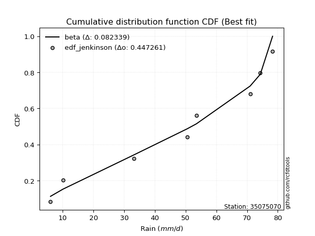</img>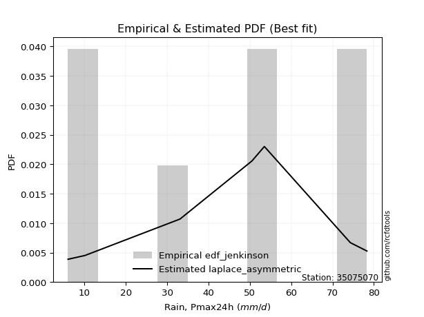</img>

</div>


### 11. EDF Cunnane (1978)

Cunnane´s work in statistical hydrology has focused on the performance and evaluation of different probability distributions (such as GEV, Gumbel, Lognormal) for flood frequency estimation. _b_ is a constant, typically set to 0.4.

<div align="center">


$P=(m-b)/(n+1-2b)$


</div>


**11.1. Empirical values**

<div align="center">

|                | 0                   | 1                   | 2                  | 3                  | 4                  | 5                  | 6                  | 7                  |
|:---------------|:--------------------|:--------------------|:-------------------|:-------------------|:-------------------|:-------------------|:-------------------|:-------------------|
| date           | 2022                | 2023                | 2018               | 2017               | 2021               | 2025               | 2020               | 2019               |
| x              | 6.0                 | 10.1                | 33.1               | 50.5               | 53.5               | 71.0               | 74.3               | 78.3               |
| m              | 1                   | 2                   | 3                  | 4                  | 5                  | 6                  | 7                  | 8                  |
| empirical_dist | edf_cunnane         | edf_cunnane         | edf_cunnane        | edf_cunnane        | edf_cunnane        | edf_cunnane        | edf_cunnane        | edf_cunnane        |
| empirical      | 0.07317073170731708 | 0.19512195121951223 | 0.3170731707317074 | 0.4390243902439025 | 0.5609756097560976 | 0.6829268292682927 | 0.8048780487804879 | 0.926829268292683  |
| empirical_tr   | 1.0789473684210527  | 1.2424242424242424  | 1.4642857142857144 | 1.782608695652174  | 2.277777777777778  | 3.153846153846154  | 5.125000000000001  | 13.666666666666675 |

</div>


**11.2. Kolmogorov-Smirnov fit test (sorted by Δ)**


<div align="center">

|                | 0                   | 1                   | 2                   | 3                   | 4                   | 5                   | 6                   | 7                   | 8                   | 9                   | 10                  | 11                  | 12                  | 13                  | 14                 | 15                 | 16                  | 17                  | 18                  | 19                  | 20                  | 21                  | 22                  | 23                 | 24                  | 25                 | 26                  | 27                  | 28                 | 29                  | 30                  | 31                  | 32                  | 33                 | 34                  | 35                  | 36                 | 37                  | 38                  | 39                  | 40                  | 41                  | 42                  | 43                  | 44                 | 45                  | 46                 | 47                  | 48                  | 49                  | 50                  | 51                  | 52                  | 53                  | 54                 | 55                 | 56                  | 57                  | 58                  | 59                  | 60                  | 61                  | 62                 | 63                  | 64                  | 65                 | 66                  | 67                  | 68                  | 69                  | 70                  | 71                  | 72                  | 73                  | 74                  | 75                  | 76                  | 77                 | 78                  | 79                 | 80                 | 81                 | 82                  | 83                  | 84                 | 85                 | 86                 | 87                  | 88                 | 89                 | 90                  | 91                  | 92                  | 93                  | 94                 | 95                  | 96                  | 97                 | 98                  | 99                  | 100                | 101                 | 102                 | 103                | 104                 | 105                 | 106                | 107                 | 108                | 109                | 110                 | 111                | 112                | 113                | 114                | 115                 | 116                 | 117                | 118                 | 119                | 120                 | 121                 | 122                 | 123                | 124                | 125                 | 126                 | 127                 | 128                | 129                 | 130                | 131                 | 132                 | 133                | 134                | 135                 | 136                 | 137                | 138                | 139                | 140                 | 141                | 142                 | 143                | 144                | 145                | 146                | 147                | 148                | 149                | 150                | 151                | 152                | 153                | 154                | 155                | 156                | 157                | 158                | 159                |
|:---------------|:--------------------|:--------------------|:--------------------|:--------------------|:--------------------|:--------------------|:--------------------|:--------------------|:--------------------|:--------------------|:--------------------|:--------------------|:--------------------|:--------------------|:-------------------|:-------------------|:--------------------|:--------------------|:--------------------|:--------------------|:--------------------|:--------------------|:--------------------|:-------------------|:--------------------|:-------------------|:--------------------|:--------------------|:-------------------|:--------------------|:--------------------|:--------------------|:--------------------|:-------------------|:--------------------|:--------------------|:-------------------|:--------------------|:--------------------|:--------------------|:--------------------|:--------------------|:--------------------|:--------------------|:-------------------|:--------------------|:-------------------|:--------------------|:--------------------|:--------------------|:--------------------|:--------------------|:--------------------|:--------------------|:-------------------|:-------------------|:--------------------|:--------------------|:--------------------|:--------------------|:--------------------|:--------------------|:-------------------|:--------------------|:--------------------|:-------------------|:--------------------|:--------------------|:--------------------|:--------------------|:--------------------|:--------------------|:--------------------|:--------------------|:--------------------|:--------------------|:--------------------|:-------------------|:--------------------|:-------------------|:-------------------|:-------------------|:--------------------|:--------------------|:-------------------|:-------------------|:-------------------|:--------------------|:-------------------|:-------------------|:--------------------|:--------------------|:--------------------|:--------------------|:-------------------|:--------------------|:--------------------|:-------------------|:--------------------|:--------------------|:-------------------|:--------------------|:--------------------|:-------------------|:--------------------|:--------------------|:-------------------|:--------------------|:-------------------|:-------------------|:--------------------|:-------------------|:-------------------|:-------------------|:-------------------|:--------------------|:--------------------|:-------------------|:--------------------|:-------------------|:--------------------|:--------------------|:--------------------|:-------------------|:-------------------|:--------------------|:--------------------|:--------------------|:-------------------|:--------------------|:-------------------|:--------------------|:--------------------|:-------------------|:-------------------|:--------------------|:--------------------|:-------------------|:-------------------|:-------------------|:--------------------|:-------------------|:--------------------|:-------------------|:-------------------|:-------------------|:-------------------|:-------------------|:-------------------|:-------------------|:-------------------|:-------------------|:-------------------|:-------------------|:-------------------|:-------------------|:-------------------|:-------------------|:-------------------|:-------------------|
| station        | 35075070            | 35075070            | 35075070            | 35075070            | 35075070            | 35075070            | 35075070            | 35075070            | 35075070            | 35075070            | 35075070            | 35075070            | 35075070            | 35075070            | 35075070           | 35075070           | 35075070            | 35075070            | 35075070            | 35075070            | 35075070            | 35075070            | 35075070            | 35075070           | 35075070            | 35075070           | 35075070            | 35075070            | 35075070           | 35075070            | 35075070            | 35075070            | 35075070            | 35075070           | 35075070            | 35075070            | 35075070           | 35075070            | 35075070            | 35075070            | 35075070            | 35075070            | 35075070            | 35075070            | 35075070           | 35075070            | 35075070           | 35075070            | 35075070            | 35075070            | 35075070            | 35075070            | 35075070            | 35075070            | 35075070           | 35075070           | 35075070            | 35075070            | 35075070            | 35075070            | 35075070            | 35075070            | 35075070           | 35075070            | 35075070            | 35075070           | 35075070            | 35075070            | 35075070            | 35075070            | 35075070            | 35075070            | 35075070            | 35075070            | 35075070            | 35075070            | 35075070            | 35075070           | 35075070            | 35075070           | 35075070           | 35075070           | 35075070            | 35075070            | 35075070           | 35075070           | 35075070           | 35075070            | 35075070           | 35075070           | 35075070            | 35075070            | 35075070            | 35075070            | 35075070           | 35075070            | 35075070            | 35075070           | 35075070            | 35075070            | 35075070           | 35075070            | 35075070            | 35075070           | 35075070            | 35075070            | 35075070           | 35075070            | 35075070           | 35075070           | 35075070            | 35075070           | 35075070           | 35075070           | 35075070           | 35075070            | 35075070            | 35075070           | 35075070            | 35075070           | 35075070            | 35075070            | 35075070            | 35075070           | 35075070           | 35075070            | 35075070            | 35075070            | 35075070           | 35075070            | 35075070           | 35075070            | 35075070            | 35075070           | 35075070           | 35075070            | 35075070            | 35075070           | 35075070           | 35075070           | 35075070            | 35075070           | 35075070            | 35075070           | 35075070           | 35075070           | 35075070           | 35075070           | 35075070           | 35075070           | 35075070           | 35075070           | 35075070           | 35075070           | 35075070           | 35075070           | 35075070           | 35075070           | 35075070           | 35075070           |
| empirical_dist | edf_cunnane         | edf_cunnane         | edf_cunnane         | edf_cunnane         | edf_cunnane         | edf_cunnane         | edf_cunnane         | edf_cunnane         | edf_cunnane         | edf_cunnane         | edf_cunnane         | edf_cunnane         | edf_cunnane         | edf_cunnane         | edf_cunnane        | edf_cunnane        | edf_cunnane         | edf_cunnane         | edf_cunnane         | edf_cunnane         | edf_cunnane         | edf_cunnane         | edf_cunnane         | edf_cunnane        | edf_cunnane         | edf_cunnane        | edf_cunnane         | edf_cunnane         | edf_cunnane        | edf_cunnane         | edf_cunnane         | edf_cunnane         | edf_cunnane         | edf_cunnane        | edf_cunnane         | edf_cunnane         | edf_cunnane        | edf_cunnane         | edf_cunnane         | edf_cunnane         | edf_cunnane         | edf_cunnane         | edf_cunnane         | edf_cunnane         | edf_cunnane        | edf_cunnane         | edf_cunnane        | edf_cunnane         | edf_cunnane         | edf_cunnane         | edf_cunnane         | edf_cunnane         | edf_cunnane         | edf_cunnane         | edf_cunnane        | edf_cunnane        | edf_cunnane         | edf_cunnane         | edf_cunnane         | edf_cunnane         | edf_cunnane         | edf_cunnane         | edf_cunnane        | edf_cunnane         | edf_cunnane         | edf_cunnane        | edf_cunnane         | edf_cunnane         | edf_cunnane         | edf_cunnane         | edf_cunnane         | edf_cunnane         | edf_cunnane         | edf_cunnane         | edf_cunnane         | edf_cunnane         | edf_cunnane         | edf_cunnane        | edf_cunnane         | edf_cunnane        | edf_cunnane        | edf_cunnane        | edf_cunnane         | edf_cunnane         | edf_cunnane        | edf_cunnane        | edf_cunnane        | edf_cunnane         | edf_cunnane        | edf_cunnane        | edf_cunnane         | edf_cunnane         | edf_cunnane         | edf_cunnane         | edf_cunnane        | edf_cunnane         | edf_cunnane         | edf_cunnane        | edf_cunnane         | edf_cunnane         | edf_cunnane        | edf_cunnane         | edf_cunnane         | edf_cunnane        | edf_cunnane         | edf_cunnane         | edf_cunnane        | edf_cunnane         | edf_cunnane        | edf_cunnane        | edf_cunnane         | edf_cunnane        | edf_cunnane        | edf_cunnane        | edf_cunnane        | edf_cunnane         | edf_cunnane         | edf_cunnane        | edf_cunnane         | edf_cunnane        | edf_cunnane         | edf_cunnane         | edf_cunnane         | edf_cunnane        | edf_cunnane        | edf_cunnane         | edf_cunnane         | edf_cunnane         | edf_cunnane        | edf_cunnane         | edf_cunnane        | edf_cunnane         | edf_cunnane         | edf_cunnane        | edf_cunnane        | edf_cunnane         | edf_cunnane         | edf_cunnane        | edf_cunnane        | edf_cunnane        | edf_cunnane         | edf_cunnane        | edf_cunnane         | edf_cunnane        | edf_cunnane        | edf_cunnane        | edf_cunnane        | edf_cunnane        | edf_cunnane        | edf_cunnane        | edf_cunnane        | edf_cunnane        | edf_cunnane        | edf_cunnane        | edf_cunnane        | edf_cunnane        | edf_cunnane        | edf_cunnane        | edf_cunnane        | edf_cunnane        |
| p_dist         | beta                | ksone               | semicircular        | anglit              | gausshyper          | trapezoid           | dgamma              | dweibull            | loglevy_l           | pearson3            | rice                | erlang              | norm                | truncnorm           | exponnorm          | t                  | nct                 | f                   | gamma               | crystalball         | betaprime           | invgamma            | weibull_min         | invgauss           | genextreme          | loggennorm         | foldnorm            | maxwell             | wrapcauchy         | genhalflogistic     | kappa4              | arcsine             | gumbel_l            | rayleigh           | johnsonsu           | argus               | logistic           | cosine              | invweibull          | logdgamma           | logtrapezoid        | logvonmises_line    | triang              | logpearson3         | hypsecant          | logburr12           | loggumbel_l        | logweibull_min      | skewnorm            | laplace             | kstwobign           | gumbel_r            | loggenextreme       | logmielke           | alpha              | mielke             | logsemicircular     | logargus            | loggompertz         | levy_l              | halfnorm            | loganglit           | burr               | logloggamma         | halflogistic        | moyal              | logdweibull         | tukeylambda         | loggenpareto        | logarcsine          | lomax               | kappa3              | uniform             | loggamma            | loggamma            | lognakagami         | logf                | lognct             | logbeta             | logexponnorm       | logt               | lognorm            | logcrystalball      | genpareto           | logncf             | loginvweibull      | truncweibull_min   | logfatiguelife      | vonmises_line      | logwrapcauchy      | logrice             | logerlang           | genexpon            | loginvgauss         | logfoldnorm        | logbetaprime        | bradford            | logburr            | loginvgamma         | logalpha            | loglogistic        | logmaxwell          | logweibull_max      | ncf                | logkstwobign        | lograyleigh         | loghypsecant       | loggenexpon         | logloglaplace      | loggausshyper      | logcosine           | loggenhalflogistic | loghalfnorm        | wald               | loggumbel_r        | loglaplace          | loglaplace          | logskewnorm        | loggengamma         | nakagami           | loghalflogistic     | gengamma            | loglomax            | logtriang          | truncexpon         | logmoyal            | burr12              | gennorm             | logksone           | logwald             | logexponweib       | logkappa3           | loguniform          | logtruncnorm       | logkappa4          | logtruncweibull_min | logbradford         | logtruncexpon      | logjohnsonsb       | logrdist           | logjohnsonsu        | weibull_max        | fatiguelife         | logtukeylambda     | exponweib          | powerlaw           | logexponpow        | gompertz           | halfgennorm        | exponpow           | logpowerlaw        | truncpareto        | johnsonsb          | rdist              | logtruncpareto     | genlogistic        | loggenlogistic     | loghalfgennorm     | logvonmises        | vonmises           |
| delta          | 0.07317062861772028 | 0.09914189517502474 | 0.10188482540835908 | 0.10680296477032902 | 0.10742568439840575 | 0.11289552318327167 | 0.12164035695410232 | 0.12720330168627075 | 0.13156653661932927 | 0.13230220110293867 | 0.13285791352809218 | 0.13297114173956315 | 0.13408715513575242 | 0.13408716583339275 | 0.1340883055211226 | 0.1340902705782271 | 0.13410146652332722 | 0.13429726678678378 | 0.13447264084089872 | 0.13466341971925777 | 0.13485637990916544 | 0.13659911269848013 | 0.13731627501432953 | 0.1385129393666379 | 0.13928403174164988 | 0.1405685711879926 | 0.14227138803364514 | 0.14245571040998306 | 0.1431231266887359 | 0.14592484895474434 | 0.14813313563960384 | 0.14927021606256194 | 0.15012803019861776 | 0.1521830027024339 | 0.15242710047478253 | 0.15300769959077853 | 0.1545747093469515 | 0.15516547224243993 | 0.15885568874280553 | 0.16142355235075065 | 0.16219652932690198 | 0.16249026709210856 | 0.16542308842684794 | 0.16564063985231348 | 0.1660992799409715 | 0.16662361608423926 | 0.1703435447178051 | 0.17283824405359505 | 0.17536469169173285 | 0.17784742200024584 | 0.17880960810952296 | 0.18218745955072713 | 0.18285922499706808 | 0.18590684391559775 | 0.1859232875072092 | 0.1879821821945099 | 0.18800695326785732 | 0.18959344559631996 | 0.18986253362672434 | 0.19426703119513117 | 0.19512195121951223 | 0.19660358934128996 | 0.1972332842928104 | 0.20230640549848977 | 0.20695044921392758 | 0.2069871596895051 | 0.20853075518627284 | 0.20906876154996878 | 0.21102149522868718 | 0.21262471521873128 | 0.21543841011195786 | 0.21591618883259367 | 0.21610498262658973 | 0.21666108773708814 | 0.21666108773708814 | 0.21669452934344513 | 0.21691133467606205 | 0.2170337264953871 | 0.21705153724675663 | 0.2170559455720633 | 0.2170599858923229 | 0.2170600619123645 | 0.21706066965260462 | 0.21710477631056313 | 0.2171587582854595 | 0.2171796623284561 | 0.2179833506318487 | 0.21941213324914244 | 0.2195158001217664 | 0.2203781565877332 | 0.22127963721032562 | 0.22237478289843382 | 0.22244170959776766 | 0.22261400729553127 | 0.2228053923837353 | 0.22298064578982502 | 0.22574895021540464 | 0.2269977907167836 | 0.22719447300588624 | 0.22983397736565514 | 0.2355141795586606 | 0.23803971344560892 | 0.24187828307393122 | 0.2425540546040864 | 0.24408854023023197 | 0.24432427767149634 | 0.2497293972985618 | 0.24983093694863967 | 0.2536382410045376 | 0.2545798362119893 | 0.26037342456218227 | 0.2619670979504276 | 0.2626792570753804 | 0.2758007399252913 | 0.2760547122808029 | 0.27771231194609747 | 0.27771231194609747 | 0.2799644563634257 | 0.28258884308858234 | 0.28452232599022   | 0.29069609830574383 | 0.29221852149195504 | 0.29298192314179916 | 0.294880365805836  | 0.2952676239666814 | 0.29551230077415414 | 0.30085515730661694 | 0.30487804878048785 | 0.3353656321204548 | 0.35082710678388296 | 0.354338858957038  | 0.37689318701530483 | 0.39024363659332617 | 0.3913308647116658 | 0.3924337762961875 | 0.41222995987080024 | 0.43255418293137926 | 0.4405831877774514 | 0.4685944170553561 | 0.4738522736101983 | 0.48063424746314465 | 0.4920524901740018 | 0.49640633961116154 | 0.515632234987541  | 0.5178052125702995 | 0.5190379737564023 | 0.546266745954652  | 0.5607194296104314 | 0.5609756097560976 | 0.5987111666073671 | 0.6033741175796657 | 0.6216395787586605 | 0.6791253392268539 | 0.6829268289342071 | 0.6929336983843865 | 0.8048780487804879 | 0.8048780487804879 | 0.8048780487804879 | 1.1574838772350735 | 11.643112286310572 |
| deltao         | 0.4472608134160001  | 0.4472608134160001  | 0.4472608134160001  | 0.4472608134160001  | 0.4472608134160001  | 0.4472608134160001  | 0.4472608134160001  | 0.4472608134160001  | 0.4472608134160001  | 0.4472608134160001  | 0.4472608134160001  | 0.4472608134160001  | 0.4472608134160001  | 0.4472608134160001  | 0.4472608134160001 | 0.4472608134160001 | 0.4472608134160001  | 0.4472608134160001  | 0.4472608134160001  | 0.4472608134160001  | 0.4472608134160001  | 0.4472608134160001  | 0.4472608134160001  | 0.4472608134160001 | 0.4472608134160001  | 0.4472608134160001 | 0.4472608134160001  | 0.4472608134160001  | 0.4472608134160001 | 0.4472608134160001  | 0.4472608134160001  | 0.4472608134160001  | 0.4472608134160001  | 0.4472608134160001 | 0.4472608134160001  | 0.4472608134160001  | 0.4472608134160001 | 0.4472608134160001  | 0.4472608134160001  | 0.4472608134160001  | 0.4472608134160001  | 0.4472608134160001  | 0.4472608134160001  | 0.4472608134160001  | 0.4472608134160001 | 0.4472608134160001  | 0.4472608134160001 | 0.4472608134160001  | 0.4472608134160001  | 0.4472608134160001  | 0.4472608134160001  | 0.4472608134160001  | 0.4472608134160001  | 0.4472608134160001  | 0.4472608134160001 | 0.4472608134160001 | 0.4472608134160001  | 0.4472608134160001  | 0.4472608134160001  | 0.4472608134160001  | 0.4472608134160001  | 0.4472608134160001  | 0.4472608134160001 | 0.4472608134160001  | 0.4472608134160001  | 0.4472608134160001 | 0.4472608134160001  | 0.4472608134160001  | 0.4472608134160001  | 0.4472608134160001  | 0.4472608134160001  | 0.4472608134160001  | 0.4472608134160001  | 0.4472608134160001  | 0.4472608134160001  | 0.4472608134160001  | 0.4472608134160001  | 0.4472608134160001 | 0.4472608134160001  | 0.4472608134160001 | 0.4472608134160001 | 0.4472608134160001 | 0.4472608134160001  | 0.4472608134160001  | 0.4472608134160001 | 0.4472608134160001 | 0.4472608134160001 | 0.4472608134160001  | 0.4472608134160001 | 0.4472608134160001 | 0.4472608134160001  | 0.4472608134160001  | 0.4472608134160001  | 0.4472608134160001  | 0.4472608134160001 | 0.4472608134160001  | 0.4472608134160001  | 0.4472608134160001 | 0.4472608134160001  | 0.4472608134160001  | 0.4472608134160001 | 0.4472608134160001  | 0.4472608134160001  | 0.4472608134160001 | 0.4472608134160001  | 0.4472608134160001  | 0.4472608134160001 | 0.4472608134160001  | 0.4472608134160001 | 0.4472608134160001 | 0.4472608134160001  | 0.4472608134160001 | 0.4472608134160001 | 0.4472608134160001 | 0.4472608134160001 | 0.4472608134160001  | 0.4472608134160001  | 0.4472608134160001 | 0.4472608134160001  | 0.4472608134160001 | 0.4472608134160001  | 0.4472608134160001  | 0.4472608134160001  | 0.4472608134160001 | 0.4472608134160001 | 0.4472608134160001  | 0.4472608134160001  | 0.4472608134160001  | 0.4472608134160001 | 0.4472608134160001  | 0.4472608134160001 | 0.4472608134160001  | 0.4472608134160001  | 0.4472608134160001 | 0.4472608134160001 | 0.4472608134160001  | 0.4472608134160001  | 0.4472608134160001 | 0.4472608134160001 | 0.4472608134160001 | 0.4472608134160001  | 0.4472608134160001 | 0.4472608134160001  | 0.4472608134160001 | 0.4472608134160001 | 0.4472608134160001 | 0.4472608134160001 | 0.4472608134160001 | 0.4472608134160001 | 0.4472608134160001 | 0.4472608134160001 | 0.4472608134160001 | 0.4472608134160001 | 0.4472608134160001 | 0.4472608134160001 | 0.4472608134160001 | 0.4472608134160001 | 0.4472608134160001 | 0.4472608134160001 | 0.4472608134160001 |
| eval           | Δo > Δ              | Δo > Δ              | Δo > Δ              | Δo > Δ              | Δo > Δ              | Δo > Δ              | Δo > Δ              | Δo > Δ              | Δo > Δ              | Δo > Δ              | Δo > Δ              | Δo > Δ              | Δo > Δ              | Δo > Δ              | Δo > Δ             | Δo > Δ             | Δo > Δ              | Δo > Δ              | Δo > Δ              | Δo > Δ              | Δo > Δ              | Δo > Δ              | Δo > Δ              | Δo > Δ             | Δo > Δ              | Δo > Δ             | Δo > Δ              | Δo > Δ              | Δo > Δ             | Δo > Δ              | Δo > Δ              | Δo > Δ              | Δo > Δ              | Δo > Δ             | Δo > Δ              | Δo > Δ              | Δo > Δ             | Δo > Δ              | Δo > Δ              | Δo > Δ              | Δo > Δ              | Δo > Δ              | Δo > Δ              | Δo > Δ              | Δo > Δ             | Δo > Δ              | Δo > Δ             | Δo > Δ              | Δo > Δ              | Δo > Δ              | Δo > Δ              | Δo > Δ              | Δo > Δ              | Δo > Δ              | Δo > Δ             | Δo > Δ             | Δo > Δ              | Δo > Δ              | Δo > Δ              | Δo > Δ              | Δo > Δ              | Δo > Δ              | Δo > Δ             | Δo > Δ              | Δo > Δ              | Δo > Δ             | Δo > Δ              | Δo > Δ              | Δo > Δ              | Δo > Δ              | Δo > Δ              | Δo > Δ              | Δo > Δ              | Δo > Δ              | Δo > Δ              | Δo > Δ              | Δo > Δ              | Δo > Δ             | Δo > Δ              | Δo > Δ             | Δo > Δ             | Δo > Δ             | Δo > Δ              | Δo > Δ              | Δo > Δ             | Δo > Δ             | Δo > Δ             | Δo > Δ              | Δo > Δ             | Δo > Δ             | Δo > Δ              | Δo > Δ              | Δo > Δ              | Δo > Δ              | Δo > Δ             | Δo > Δ              | Δo > Δ              | Δo > Δ             | Δo > Δ              | Δo > Δ              | Δo > Δ             | Δo > Δ              | Δo > Δ              | Δo > Δ             | Δo > Δ              | Δo > Δ              | Δo > Δ             | Δo > Δ              | Δo > Δ             | Δo > Δ             | Δo > Δ              | Δo > Δ             | Δo > Δ             | Δo > Δ             | Δo > Δ             | Δo > Δ              | Δo > Δ              | Δo > Δ             | Δo > Δ              | Δo > Δ             | Δo > Δ              | Δo > Δ              | Δo > Δ              | Δo > Δ             | Δo > Δ             | Δo > Δ              | Δo > Δ              | Δo > Δ              | Δo > Δ             | Δo > Δ              | Δo > Δ             | Δo > Δ              | Δo > Δ              | Δo > Δ             | Δo > Δ             | Δo > Δ              | Δo > Δ              | Δo > Δ             | Δo <= Δ            | Δo <= Δ            | Δo <= Δ             | Δo <= Δ            | Δo <= Δ             | Δo <= Δ            | Δo <= Δ            | Δo <= Δ            | Δo <= Δ            | Δo <= Δ            | Δo <= Δ            | Δo <= Δ            | Δo <= Δ            | Δo <= Δ            | Δo <= Δ            | Δo <= Δ            | Δo <= Δ            | Δo <= Δ            | Δo <= Δ            | Δo <= Δ            | Δo <= Δ            | Δo <= Δ            |
| fit            | 1                   | 1                   | 1                   | 1                   | 1                   | 1                   | 1                   | 1                   | 1                   | 1                   | 1                   | 1                   | 1                   | 1                   | 1                  | 1                  | 1                   | 1                   | 1                   | 1                   | 1                   | 1                   | 1                   | 1                  | 1                   | 1                  | 1                   | 1                   | 1                  | 1                   | 1                   | 1                   | 1                   | 1                  | 1                   | 1                   | 1                  | 1                   | 1                   | 1                   | 1                   | 1                   | 1                   | 1                   | 1                  | 1                   | 1                  | 1                   | 1                   | 1                   | 1                   | 1                   | 1                   | 1                   | 1                  | 1                  | 1                   | 1                   | 1                   | 1                   | 1                   | 1                   | 1                  | 1                   | 1                   | 1                  | 1                   | 1                   | 1                   | 1                   | 1                   | 1                   | 1                   | 1                   | 1                   | 1                   | 1                   | 1                  | 1                   | 1                  | 1                  | 1                  | 1                   | 1                   | 1                  | 1                  | 1                  | 1                   | 1                  | 1                  | 1                   | 1                   | 1                   | 1                   | 1                  | 1                   | 1                   | 1                  | 1                   | 1                   | 1                  | 1                   | 1                   | 1                  | 1                   | 1                   | 1                  | 1                   | 1                  | 1                  | 1                   | 1                  | 1                  | 1                  | 1                  | 1                   | 1                   | 1                  | 1                   | 1                  | 1                   | 1                   | 1                   | 1                  | 1                  | 1                   | 1                   | 1                   | 1                  | 1                   | 1                  | 1                   | 1                   | 1                  | 1                  | 1                   | 1                   | 1                  | 0                  | 0                  | 0                   | 0                  | 0                   | 0                  | 0                  | 0                  | 0                  | 0                  | 0                  | 0                  | 0                  | 0                  | 0                  | 0                  | 0                  | 0                  | 0                  | 0                  | 0                  | 0                  |
| n              | 8                   | 8                   | 8                   | 8                   | 8                   | 8                   | 8                   | 8                   | 8                   | 8                   | 8                   | 8                   | 8                   | 8                   | 8                  | 8                  | 8                   | 8                   | 8                   | 8                   | 8                   | 8                   | 8                   | 8                  | 8                   | 8                  | 8                   | 8                   | 8                  | 8                   | 8                   | 8                   | 8                   | 8                  | 8                   | 8                   | 8                  | 8                   | 8                   | 8                   | 8                   | 8                   | 8                   | 8                   | 8                  | 8                   | 8                  | 8                   | 8                   | 8                   | 8                   | 8                   | 8                   | 8                   | 8                  | 8                  | 8                   | 8                   | 8                   | 8                   | 8                   | 8                   | 8                  | 8                   | 8                   | 8                  | 8                   | 8                   | 8                   | 8                   | 8                   | 8                   | 8                   | 8                   | 8                   | 8                   | 8                   | 8                  | 8                   | 8                  | 8                  | 8                  | 8                   | 8                   | 8                  | 8                  | 8                  | 8                   | 8                  | 8                  | 8                   | 8                   | 8                   | 8                   | 8                  | 8                   | 8                   | 8                  | 8                   | 8                   | 8                  | 8                   | 8                   | 8                  | 8                   | 8                   | 8                  | 8                   | 8                  | 8                  | 8                   | 8                  | 8                  | 8                  | 8                  | 8                   | 8                   | 8                  | 8                   | 8                  | 8                   | 8                   | 8                   | 8                  | 8                  | 8                   | 8                   | 8                   | 8                  | 8                   | 8                  | 8                   | 8                   | 8                  | 8                  | 8                   | 8                   | 8                  | 8                  | 8                  | 8                   | 8                  | 8                   | 8                  | 8                  | 8                  | 8                  | 8                  | 8                  | 8                  | 8                  | 8                  | 8                  | 8                  | 8                  | 8                  | 8                  | 8                  | 8                  | 8                  |
| best_fit       | 1                   | 0                   | 0                   | 0                   | 0                   | 0                   | 0                   | 0                   | 0                   | 0                   | 0                   | 0                   | 0                   | 0                   | 0                  | 0                  | 0                   | 0                   | 0                   | 0                   | 0                   | 0                   | 0                   | 0                  | 0                   | 0                  | 0                   | 0                   | 0                  | 0                   | 0                   | 0                   | 0                   | 0                  | 0                   | 0                   | 0                  | 0                   | 0                   | 0                   | 0                   | 0                   | 0                   | 0                   | 0                  | 0                   | 0                  | 0                   | 0                   | 0                   | 0                   | 0                   | 0                   | 0                   | 0                  | 0                  | 0                   | 0                   | 0                   | 0                   | 0                   | 0                   | 0                  | 0                   | 0                   | 0                  | 0                   | 0                   | 0                   | 0                   | 0                   | 0                   | 0                   | 0                   | 0                   | 0                   | 0                   | 0                  | 0                   | 0                  | 0                  | 0                  | 0                   | 0                   | 0                  | 0                  | 0                  | 0                   | 0                  | 0                  | 0                   | 0                   | 0                   | 0                   | 0                  | 0                   | 0                   | 0                  | 0                   | 0                   | 0                  | 0                   | 0                   | 0                  | 0                   | 0                   | 0                  | 0                   | 0                  | 0                  | 0                   | 0                  | 0                  | 0                  | 0                  | 0                   | 0                   | 0                  | 0                   | 0                  | 0                   | 0                   | 0                   | 0                  | 0                  | 0                   | 0                   | 0                   | 0                  | 0                   | 0                  | 0                   | 0                   | 0                  | 0                  | 0                   | 0                   | 0                  | 0                  | 0                  | 0                   | 0                  | 0                   | 0                  | 0                  | 0                  | 0                  | 0                  | 0                  | 0                  | 0                  | 0                  | 0                  | 0                  | 0                  | 0                  | 0                  | 0                  | 0                  | 0                  |
| best_fit_sort  | 1                   | 2                   | 3                   | 4                   | 5                   | 6                   | 7                   | 8                   | 9                   | 10                  | 11                  | 12                  | 13                  | 14                  | 15                 | 16                 | 17                  | 18                  | 19                  | 20                  | 21                  | 22                  | 23                  | 24                 | 25                  | 26                 | 27                  | 28                  | 29                 | 30                  | 31                  | 32                  | 33                  | 34                 | 35                  | 36                  | 37                 | 38                  | 39                  | 40                  | 41                  | 42                  | 43                  | 44                  | 45                 | 46                  | 47                 | 48                  | 49                  | 50                  | 51                  | 52                  | 53                  | 54                  | 55                 | 56                 | 57                  | 58                  | 59                  | 60                  | 61                  | 62                  | 63                 | 64                  | 65                  | 66                 | 67                  | 68                  | 69                  | 70                  | 71                  | 72                  | 73                  | 74                  | 75                  | 76                  | 77                  | 78                 | 79                  | 80                 | 81                 | 82                 | 83                  | 84                  | 85                 | 86                 | 87                 | 88                  | 89                 | 90                 | 91                  | 92                  | 93                  | 94                  | 95                 | 96                  | 97                  | 98                 | 99                  | 100                 | 101                | 102                 | 103                 | 104                | 105                 | 106                 | 107                | 108                 | 109                | 110                | 111                 | 112                | 113                | 114                | 115                | 116                 | 117                 | 118                | 119                 | 120                | 121                 | 122                 | 123                 | 124                | 125                | 126                 | 127                 | 128                 | 129                | 130                 | 131                | 132                 | 133                 | 134                | 135                | 136                 | 137                 | 138                | 139                | 140                | 141                 | 142                | 143                 | 144                | 145                | 146                | 147                | 148                | 149                | 150                | 151                | 152                | 153                | 154                | 155                | 156                | 157                | 158                | 159                | 160                |

</div>


**11.3. Best fit**

<div align="center">

|   id |   station | empirical_dist   | p_dist   |     delta |   deltao | eval   |   fit |   n |   best_fit |   best_fit_sort |
|-----:|----------:|:-----------------|:---------|----------:|---------:|:-------|------:|----:|-----------:|----------------:|
|    0 |  35075070 | edf_cunnane      | beta     | 0.0731706 | 0.447261 | Δo > Δ |     1 |   8 |          1 |               1 |

</div>


<div align="center">

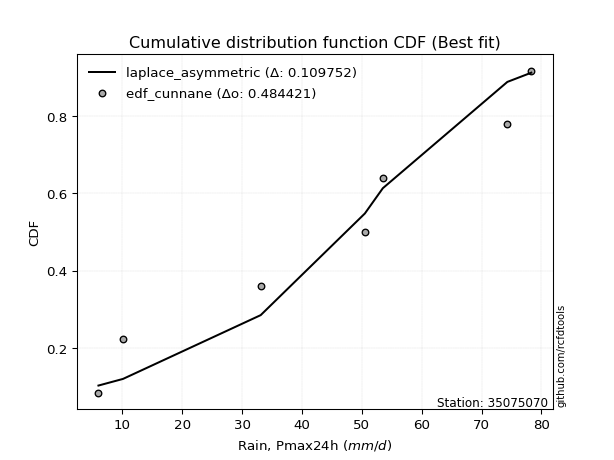</img>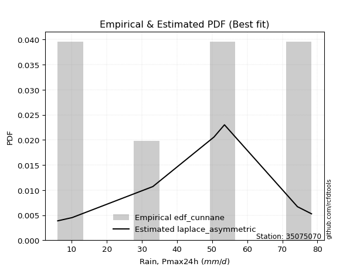</img>

</div>


### 12. EDF Adamowski (1981)

The Adamowski formula in hydrology refers to a specific plotting position formula used for estimating the non-parametric empirical distribution of hydrological events (like flood peaks) to calculate their return periods. This formula provides an alternative to traditional parametric methods (like the Gumbel or Log Pearson Type III distributions). 

<div align="center">


$P=(m-0.25)/(n+0.5)$


</div>


**12.1. Empirical values**

<div align="center">

|                | 0                   | 1                   | 2                  | 3                  | 4                  | 5                  | 6                  | 7                  |
|:---------------|:--------------------|:--------------------|:-------------------|:-------------------|:-------------------|:-------------------|:-------------------|:-------------------|
| date           | 2022                | 2023                | 2018               | 2017               | 2021               | 2025               | 2020               | 2019               |
| x              | 6.0                 | 10.1                | 33.1               | 50.5               | 53.5               | 71.0               | 74.3               | 78.3               |
| m              | 1                   | 2                   | 3                  | 4                  | 5                  | 6                  | 7                  | 8                  |
| empirical_dist | edf_adamowski       | edf_adamowski       | edf_adamowski      | edf_adamowski      | edf_adamowski      | edf_adamowski      | edf_adamowski      | edf_adamowski      |
| empirical      | 0.08823529411764706 | 0.20588235294117646 | 0.3235294117647059 | 0.4411764705882353 | 0.5588235294117647 | 0.6764705882352942 | 0.7941176470588235 | 0.9117647058823529 |
| empirical_tr   | 1.096774193548387   | 1.259259259259259   | 1.4782608695652173 | 1.7894736842105263 | 2.2666666666666666 | 3.0909090909090913 | 4.857142857142856  | 11.33333333333333  |

</div>


**12.2. Kolmogorov-Smirnov fit test (sorted by Δ)**


<div align="center">

|                | 0                   | 1                   | 2                   | 3                   | 4                   | 5                   | 6                   | 7                   | 8                  | 9                   | 10                 | 11                  | 12                 | 13                  | 14                  | 15                  | 16                  | 17                 | 18                  | 19                  | 20                  | 21                 | 22                  | 23                 | 24                  | 25                  | 26                 | 27                 | 28                  | 29                  | 30                  | 31                  | 32                  | 33                 | 34                  | 35                  | 36                  | 37                 | 38                  | 39                  | 40                 | 41                 | 42                  | 43                  | 44                  | 45                  | 46                  | 47                 | 48                  | 49                  | 50                  | 51                  | 52                  | 53                 | 54                  | 55                  | 56                  | 57                  | 58                 | 59                  | 60                  | 61                  | 62                  | 63                  | 64                 | 65                  | 66                  | 67                  | 68                  | 69                 | 70                  | 71                  | 72                  | 73                  | 74                  | 75                  | 76                  | 77                  | 78                 | 79                 | 80                  | 81                 | 82                 | 83                  | 84                  | 85                  | 86                  | 87                  | 88                  | 89                  | 90                  | 91                  | 92                 | 93                 | 94                  | 95                  | 96                 | 97                  | 98                  | 99                  | 100                 | 101                 | 102                 | 103                 | 104                 | 105                 | 106                 | 107                 | 108                 | 109                 | 110                | 111                | 112                 | 113                | 114                 | 115                | 116                | 117                | 118                | 119                | 120                | 121                 | 122                 | 123                | 124                | 125                 | 126                 | 127                | 128                | 129                 | 130                | 131                 | 132                | 133                | 134                | 135                 | 136                | 137                 | 138                | 139                | 140                 | 141                 | 142                | 143                | 144                | 145                | 146                | 147                | 148                | 149                | 150                | 151                | 152                | 153                | 154                | 155                | 156                | 157                | 158                | 159                |
|:---------------|:--------------------|:--------------------|:--------------------|:--------------------|:--------------------|:--------------------|:--------------------|:--------------------|:-------------------|:--------------------|:-------------------|:--------------------|:-------------------|:--------------------|:--------------------|:--------------------|:--------------------|:-------------------|:--------------------|:--------------------|:--------------------|:-------------------|:--------------------|:-------------------|:--------------------|:--------------------|:-------------------|:-------------------|:--------------------|:--------------------|:--------------------|:--------------------|:--------------------|:-------------------|:--------------------|:--------------------|:--------------------|:-------------------|:--------------------|:--------------------|:-------------------|:-------------------|:--------------------|:--------------------|:--------------------|:--------------------|:--------------------|:-------------------|:--------------------|:--------------------|:--------------------|:--------------------|:--------------------|:-------------------|:--------------------|:--------------------|:--------------------|:--------------------|:-------------------|:--------------------|:--------------------|:--------------------|:--------------------|:--------------------|:-------------------|:--------------------|:--------------------|:--------------------|:--------------------|:-------------------|:--------------------|:--------------------|:--------------------|:--------------------|:--------------------|:--------------------|:--------------------|:--------------------|:-------------------|:-------------------|:--------------------|:-------------------|:-------------------|:--------------------|:--------------------|:--------------------|:--------------------|:--------------------|:--------------------|:--------------------|:--------------------|:--------------------|:-------------------|:-------------------|:--------------------|:--------------------|:-------------------|:--------------------|:--------------------|:--------------------|:--------------------|:--------------------|:--------------------|:--------------------|:--------------------|:--------------------|:--------------------|:--------------------|:--------------------|:--------------------|:-------------------|:-------------------|:--------------------|:-------------------|:--------------------|:-------------------|:-------------------|:-------------------|:-------------------|:-------------------|:-------------------|:--------------------|:--------------------|:-------------------|:-------------------|:--------------------|:--------------------|:-------------------|:-------------------|:--------------------|:-------------------|:--------------------|:-------------------|:-------------------|:-------------------|:--------------------|:-------------------|:--------------------|:-------------------|:-------------------|:--------------------|:--------------------|:-------------------|:-------------------|:-------------------|:-------------------|:-------------------|:-------------------|:-------------------|:-------------------|:-------------------|:-------------------|:-------------------|:-------------------|:-------------------|:-------------------|:-------------------|:-------------------|:-------------------|:-------------------|
| station        | 35075070            | 35075070            | 35075070            | 35075070            | 35075070            | 35075070            | 35075070            | 35075070            | 35075070           | 35075070            | 35075070           | 35075070            | 35075070           | 35075070            | 35075070            | 35075070            | 35075070            | 35075070           | 35075070            | 35075070            | 35075070            | 35075070           | 35075070            | 35075070           | 35075070            | 35075070            | 35075070           | 35075070           | 35075070            | 35075070            | 35075070            | 35075070            | 35075070            | 35075070           | 35075070            | 35075070            | 35075070            | 35075070           | 35075070            | 35075070            | 35075070           | 35075070           | 35075070            | 35075070            | 35075070            | 35075070            | 35075070            | 35075070           | 35075070            | 35075070            | 35075070            | 35075070            | 35075070            | 35075070           | 35075070            | 35075070            | 35075070            | 35075070            | 35075070           | 35075070            | 35075070            | 35075070            | 35075070            | 35075070            | 35075070           | 35075070            | 35075070            | 35075070            | 35075070            | 35075070           | 35075070            | 35075070            | 35075070            | 35075070            | 35075070            | 35075070            | 35075070            | 35075070            | 35075070           | 35075070           | 35075070            | 35075070           | 35075070           | 35075070            | 35075070            | 35075070            | 35075070            | 35075070            | 35075070            | 35075070            | 35075070            | 35075070            | 35075070           | 35075070           | 35075070            | 35075070            | 35075070           | 35075070            | 35075070            | 35075070            | 35075070            | 35075070            | 35075070            | 35075070            | 35075070            | 35075070            | 35075070            | 35075070            | 35075070            | 35075070            | 35075070           | 35075070           | 35075070            | 35075070           | 35075070            | 35075070           | 35075070           | 35075070           | 35075070           | 35075070           | 35075070           | 35075070            | 35075070            | 35075070           | 35075070           | 35075070            | 35075070            | 35075070           | 35075070           | 35075070            | 35075070           | 35075070            | 35075070           | 35075070           | 35075070           | 35075070            | 35075070           | 35075070            | 35075070           | 35075070           | 35075070            | 35075070            | 35075070           | 35075070           | 35075070           | 35075070           | 35075070           | 35075070           | 35075070           | 35075070           | 35075070           | 35075070           | 35075070           | 35075070           | 35075070           | 35075070           | 35075070           | 35075070           | 35075070           | 35075070           |
| empirical_dist | edf_adamowski       | edf_adamowski       | edf_adamowski       | edf_adamowski       | edf_adamowski       | edf_adamowski       | edf_adamowski       | edf_adamowski       | edf_adamowski      | edf_adamowski       | edf_adamowski      | edf_adamowski       | edf_adamowski      | edf_adamowski       | edf_adamowski       | edf_adamowski       | edf_adamowski       | edf_adamowski      | edf_adamowski       | edf_adamowski       | edf_adamowski       | edf_adamowski      | edf_adamowski       | edf_adamowski      | edf_adamowski       | edf_adamowski       | edf_adamowski      | edf_adamowski      | edf_adamowski       | edf_adamowski       | edf_adamowski       | edf_adamowski       | edf_adamowski       | edf_adamowski      | edf_adamowski       | edf_adamowski       | edf_adamowski       | edf_adamowski      | edf_adamowski       | edf_adamowski       | edf_adamowski      | edf_adamowski      | edf_adamowski       | edf_adamowski       | edf_adamowski       | edf_adamowski       | edf_adamowski       | edf_adamowski      | edf_adamowski       | edf_adamowski       | edf_adamowski       | edf_adamowski       | edf_adamowski       | edf_adamowski      | edf_adamowski       | edf_adamowski       | edf_adamowski       | edf_adamowski       | edf_adamowski      | edf_adamowski       | edf_adamowski       | edf_adamowski       | edf_adamowski       | edf_adamowski       | edf_adamowski      | edf_adamowski       | edf_adamowski       | edf_adamowski       | edf_adamowski       | edf_adamowski      | edf_adamowski       | edf_adamowski       | edf_adamowski       | edf_adamowski       | edf_adamowski       | edf_adamowski       | edf_adamowski       | edf_adamowski       | edf_adamowski      | edf_adamowski      | edf_adamowski       | edf_adamowski      | edf_adamowski      | edf_adamowski       | edf_adamowski       | edf_adamowski       | edf_adamowski       | edf_adamowski       | edf_adamowski       | edf_adamowski       | edf_adamowski       | edf_adamowski       | edf_adamowski      | edf_adamowski      | edf_adamowski       | edf_adamowski       | edf_adamowski      | edf_adamowski       | edf_adamowski       | edf_adamowski       | edf_adamowski       | edf_adamowski       | edf_adamowski       | edf_adamowski       | edf_adamowski       | edf_adamowski       | edf_adamowski       | edf_adamowski       | edf_adamowski       | edf_adamowski       | edf_adamowski      | edf_adamowski      | edf_adamowski       | edf_adamowski      | edf_adamowski       | edf_adamowski      | edf_adamowski      | edf_adamowski      | edf_adamowski      | edf_adamowski      | edf_adamowski      | edf_adamowski       | edf_adamowski       | edf_adamowski      | edf_adamowski      | edf_adamowski       | edf_adamowski       | edf_adamowski      | edf_adamowski      | edf_adamowski       | edf_adamowski      | edf_adamowski       | edf_adamowski      | edf_adamowski      | edf_adamowski      | edf_adamowski       | edf_adamowski      | edf_adamowski       | edf_adamowski      | edf_adamowski      | edf_adamowski       | edf_adamowski       | edf_adamowski      | edf_adamowski      | edf_adamowski      | edf_adamowski      | edf_adamowski      | edf_adamowski      | edf_adamowski      | edf_adamowski      | edf_adamowski      | edf_adamowski      | edf_adamowski      | edf_adamowski      | edf_adamowski      | edf_adamowski      | edf_adamowski      | edf_adamowski      | edf_adamowski      | edf_adamowski      |
| p_dist         | beta                | ksone               | semicircular        | anglit              | gausshyper          | trapezoid           | loglevy_l           | dgamma              | invgauss           | wrapcauchy          | genextreme         | invgamma            | dweibull           | pearson3            | rice                | erlang              | loggennorm          | norm               | truncnorm           | exponnorm           | t                   | nct                | f                   | gamma              | crystalball         | maxwell             | betaprime          | weibull_min        | logtrapezoid        | foldnorm            | johnsonsu           | rayleigh            | logvonmises_line    | genhalflogistic    | kappa4              | gumbel_l            | invweibull          | argus              | arcsine             | logistic            | cosine             | logpearson3        | logburr12           | loggumbel_l         | logweibull_min      | logdgamma           | triang              | hypsecant          | kstwobign           | levy_l              | gumbel_r            | alpha               | skewnorm            | laplace            | logsemicircular     | loggompertz         | loggenextreme       | logmielke           | logdweibull        | mielke              | loganglit           | logargus            | logarcsine          | burr                | moyal              | halflogistic        | halfnorm            | logbeta             | logloggamma         | loggenpareto       | lomax               | logwrapcauchy       | loggamma            | loggamma            | lognakagami         | logf                | lognct              | logexponnorm        | logt               | lognorm            | logcrystalball      | logncf             | loginvweibull      | tukeylambda         | logfatiguelife      | logrice             | logerlang           | genexpon            | loginvgauss         | logfoldnorm         | logbetaprime        | kappa3              | uniform            | genpareto          | truncweibull_min    | loginvgamma         | vonmises_line      | logalpha            | logburr             | logweibull_max      | bradford            | loglogistic         | logmaxwell          | logloglaplace       | ncf                 | logkstwobign        | lograyleigh         | loghypsecant        | loggenexpon         | loggausshyper       | logcosine          | loggenhalflogistic | loghalfnorm         | wald               | loggumbel_r         | loglaplace         | loglaplace         | loggengamma        | logskewnorm        | nakagami           | gengamma           | loglomax            | loghalflogistic     | logtriang          | truncexpon         | logmoyal            | gennorm             | burr12             | logksone           | logexponweib        | logwald            | logkappa3           | loguniform         | logtruncnorm       | logkappa4          | logtruncweibull_min | logbradford        | logtruncexpon       | logjohnsonsb       | logjohnsonsu       | logrdist            | weibull_max         | fatiguelife        | exponweib          | powerlaw           | logtukeylambda     | logexponpow        | gompertz           | halfgennorm        | exponpow           | logpowerlaw        | truncpareto        | johnsonsb          | rdist              | logtruncpareto     | genlogistic        | loggenlogistic     | loghalfgennorm     | logvonmises        | vonmises           |
| delta          | 0.08823519102805033 | 0.10990229689668897 | 0.11172351166346944 | 0.11456927824744861 | 0.11818608612006998 | 0.11935176421627025 | 0.12941445627499637 | 0.13240075867576656 | 0.1363608590223051 | 0.13666688565573737 | 0.137131951397317  | 0.13756851878195275 | 0.137963703407935  | 0.13875844213593724 | 0.13931415456109075 | 0.13942738277256173 | 0.14016700649484704 | 0.140543396168751  | 0.14054340686639133 | 0.14054454655412119 | 0.14054651161122567 | 0.1405577075563258 | 0.14075350781978235 | 0.1409288818738973 | 0.14111966075225635 | 0.14120520838168305 | 0.141312620942164  | 0.1437725160473281 | 0.14713196691657193 | 0.14872762906664372 | 0.15027502013044963 | 0.15086852452559504 | 0.15164462307710647 | 0.1523810899877429 | 0.15481130879949717 | 0.15658427123161633 | 0.15670360839847275 | 0.1594639406237771 | 0.16003061778422617 | 0.16103095037995008 | 0.1616217132754385 | 0.1634885595079807 | 0.16447153573990647 | 0.16819146437347232 | 0.17068616370926226 | 0.17173162677564763 | 0.17187932945984652 | 0.1725555209739701 | 0.17665752776519017 | 0.17920246878480117 | 0.18003537920639434 | 0.18158220061995867 | 0.18182093272473143 | 0.1843036630332444 | 0.18585487292352454 | 0.18771045328239155 | 0.18931546603006666 | 0.19236308494859633 | 0.1934661927759428 | 0.19443842322750848 | 0.19445150899695718 | 0.19604968662931854 | 0.19756015280840122 | 0.20368952532580897 | 0.2048350793451723 | 0.20588235294117646 | 0.20588235294117646 | 0.20629113552509226 | 0.20876264653148835 | 0.2088694148843544 | 0.21328632976762507 | 0.21392191555473467 | 0.21450900739275536 | 0.21450900739275536 | 0.21454244899911235 | 0.21475925433172927 | 0.21488164615105432 | 0.21490386522773053 | 0.2149079055479901 | 0.2149079815680317 | 0.21490858930827184 | 0.2150066779411267 | 0.2150275819841233 | 0.21552500258296736 | 0.21726005290480965 | 0.21912755686599283 | 0.22022270255410104 | 0.22028962925343487 | 0.22046192695119848 | 0.22065331203940253 | 0.22082856544549223 | 0.22237242986559225 | 0.2225612236595883 | 0.2235610173435617 | 0.22443959166484728 | 0.22504239266155346 | 0.225972041154765  | 0.22768189702132235 | 0.22936508336910755 | 0.23111788135226685 | 0.23220519124840322 | 0.23336209921432782 | 0.23588763310127614 | 0.23857367859420753 | 0.24040197425975363 | 0.24193645988589918 | 0.24217219732716355 | 0.24757731695422902 | 0.24767885660430689 | 0.25242775586765653 | 0.2582213442178495 | 0.2598150176060948 | 0.26052717673104764 | 0.2736486595809585 | 0.27390263193647013 | 0.2755602316017647 | 0.2755602316017647 | 0.2761326020555838 | 0.2778123760190929 | 0.2823702456458872 | 0.2857622804589565 | 0.28652568210880064 | 0.28854401796141105 | 0.2927282854615032 | 0.2931155436223486 | 0.29336022042982135 | 0.29411764705882354 | 0.2943989162736184 | 0.333213551776122  | 0.34788261792403946 | 0.3486750264395502 | 0.37474110667097205 | 0.3880915562489934 | 0.389178784367333  | 0.3902816959518547 | 0.41007787952646746 | 0.4304021025870465 | 0.43843110743311864 | 0.4578340153336917 | 0.4698738457414803 | 0.47170019326586554 | 0.48129208845233745 | 0.489950098578163  | 0.511348971537301  | 0.5125817327234037 | 0.5134801546432082 | 0.5398105049216535 | 0.5585673492660985 | 0.5588235294117647 | 0.5922549255743685 | 0.5969178765466672 | 0.6151833377256619 | 0.6683649375051895 | 0.6764705879012085 | 0.6821732966627223 | 0.7941176470588235 | 0.7941176470588235 | 0.7941176470588235 | 1.1553317968907406 | 11.658176848720903 |
| deltao         | 0.4472608134160001  | 0.4472608134160001  | 0.4472608134160001  | 0.4472608134160001  | 0.4472608134160001  | 0.4472608134160001  | 0.4472608134160001  | 0.4472608134160001  | 0.4472608134160001 | 0.4472608134160001  | 0.4472608134160001 | 0.4472608134160001  | 0.4472608134160001 | 0.4472608134160001  | 0.4472608134160001  | 0.4472608134160001  | 0.4472608134160001  | 0.4472608134160001 | 0.4472608134160001  | 0.4472608134160001  | 0.4472608134160001  | 0.4472608134160001 | 0.4472608134160001  | 0.4472608134160001 | 0.4472608134160001  | 0.4472608134160001  | 0.4472608134160001 | 0.4472608134160001 | 0.4472608134160001  | 0.4472608134160001  | 0.4472608134160001  | 0.4472608134160001  | 0.4472608134160001  | 0.4472608134160001 | 0.4472608134160001  | 0.4472608134160001  | 0.4472608134160001  | 0.4472608134160001 | 0.4472608134160001  | 0.4472608134160001  | 0.4472608134160001 | 0.4472608134160001 | 0.4472608134160001  | 0.4472608134160001  | 0.4472608134160001  | 0.4472608134160001  | 0.4472608134160001  | 0.4472608134160001 | 0.4472608134160001  | 0.4472608134160001  | 0.4472608134160001  | 0.4472608134160001  | 0.4472608134160001  | 0.4472608134160001 | 0.4472608134160001  | 0.4472608134160001  | 0.4472608134160001  | 0.4472608134160001  | 0.4472608134160001 | 0.4472608134160001  | 0.4472608134160001  | 0.4472608134160001  | 0.4472608134160001  | 0.4472608134160001  | 0.4472608134160001 | 0.4472608134160001  | 0.4472608134160001  | 0.4472608134160001  | 0.4472608134160001  | 0.4472608134160001 | 0.4472608134160001  | 0.4472608134160001  | 0.4472608134160001  | 0.4472608134160001  | 0.4472608134160001  | 0.4472608134160001  | 0.4472608134160001  | 0.4472608134160001  | 0.4472608134160001 | 0.4472608134160001 | 0.4472608134160001  | 0.4472608134160001 | 0.4472608134160001 | 0.4472608134160001  | 0.4472608134160001  | 0.4472608134160001  | 0.4472608134160001  | 0.4472608134160001  | 0.4472608134160001  | 0.4472608134160001  | 0.4472608134160001  | 0.4472608134160001  | 0.4472608134160001 | 0.4472608134160001 | 0.4472608134160001  | 0.4472608134160001  | 0.4472608134160001 | 0.4472608134160001  | 0.4472608134160001  | 0.4472608134160001  | 0.4472608134160001  | 0.4472608134160001  | 0.4472608134160001  | 0.4472608134160001  | 0.4472608134160001  | 0.4472608134160001  | 0.4472608134160001  | 0.4472608134160001  | 0.4472608134160001  | 0.4472608134160001  | 0.4472608134160001 | 0.4472608134160001 | 0.4472608134160001  | 0.4472608134160001 | 0.4472608134160001  | 0.4472608134160001 | 0.4472608134160001 | 0.4472608134160001 | 0.4472608134160001 | 0.4472608134160001 | 0.4472608134160001 | 0.4472608134160001  | 0.4472608134160001  | 0.4472608134160001 | 0.4472608134160001 | 0.4472608134160001  | 0.4472608134160001  | 0.4472608134160001 | 0.4472608134160001 | 0.4472608134160001  | 0.4472608134160001 | 0.4472608134160001  | 0.4472608134160001 | 0.4472608134160001 | 0.4472608134160001 | 0.4472608134160001  | 0.4472608134160001 | 0.4472608134160001  | 0.4472608134160001 | 0.4472608134160001 | 0.4472608134160001  | 0.4472608134160001  | 0.4472608134160001 | 0.4472608134160001 | 0.4472608134160001 | 0.4472608134160001 | 0.4472608134160001 | 0.4472608134160001 | 0.4472608134160001 | 0.4472608134160001 | 0.4472608134160001 | 0.4472608134160001 | 0.4472608134160001 | 0.4472608134160001 | 0.4472608134160001 | 0.4472608134160001 | 0.4472608134160001 | 0.4472608134160001 | 0.4472608134160001 | 0.4472608134160001 |
| eval           | Δo > Δ              | Δo > Δ              | Δo > Δ              | Δo > Δ              | Δo > Δ              | Δo > Δ              | Δo > Δ              | Δo > Δ              | Δo > Δ             | Δo > Δ              | Δo > Δ             | Δo > Δ              | Δo > Δ             | Δo > Δ              | Δo > Δ              | Δo > Δ              | Δo > Δ              | Δo > Δ             | Δo > Δ              | Δo > Δ              | Δo > Δ              | Δo > Δ             | Δo > Δ              | Δo > Δ             | Δo > Δ              | Δo > Δ              | Δo > Δ             | Δo > Δ             | Δo > Δ              | Δo > Δ              | Δo > Δ              | Δo > Δ              | Δo > Δ              | Δo > Δ             | Δo > Δ              | Δo > Δ              | Δo > Δ              | Δo > Δ             | Δo > Δ              | Δo > Δ              | Δo > Δ             | Δo > Δ             | Δo > Δ              | Δo > Δ              | Δo > Δ              | Δo > Δ              | Δo > Δ              | Δo > Δ             | Δo > Δ              | Δo > Δ              | Δo > Δ              | Δo > Δ              | Δo > Δ              | Δo > Δ             | Δo > Δ              | Δo > Δ              | Δo > Δ              | Δo > Δ              | Δo > Δ             | Δo > Δ              | Δo > Δ              | Δo > Δ              | Δo > Δ              | Δo > Δ              | Δo > Δ             | Δo > Δ              | Δo > Δ              | Δo > Δ              | Δo > Δ              | Δo > Δ             | Δo > Δ              | Δo > Δ              | Δo > Δ              | Δo > Δ              | Δo > Δ              | Δo > Δ              | Δo > Δ              | Δo > Δ              | Δo > Δ             | Δo > Δ             | Δo > Δ              | Δo > Δ             | Δo > Δ             | Δo > Δ              | Δo > Δ              | Δo > Δ              | Δo > Δ              | Δo > Δ              | Δo > Δ              | Δo > Δ              | Δo > Δ              | Δo > Δ              | Δo > Δ             | Δo > Δ             | Δo > Δ              | Δo > Δ              | Δo > Δ             | Δo > Δ              | Δo > Δ              | Δo > Δ              | Δo > Δ              | Δo > Δ              | Δo > Δ              | Δo > Δ              | Δo > Δ              | Δo > Δ              | Δo > Δ              | Δo > Δ              | Δo > Δ              | Δo > Δ              | Δo > Δ             | Δo > Δ             | Δo > Δ              | Δo > Δ             | Δo > Δ              | Δo > Δ             | Δo > Δ             | Δo > Δ             | Δo > Δ             | Δo > Δ             | Δo > Δ             | Δo > Δ              | Δo > Δ              | Δo > Δ             | Δo > Δ             | Δo > Δ              | Δo > Δ              | Δo > Δ             | Δo > Δ             | Δo > Δ              | Δo > Δ             | Δo > Δ              | Δo > Δ             | Δo > Δ             | Δo > Δ             | Δo > Δ              | Δo > Δ             | Δo > Δ              | Δo <= Δ            | Δo <= Δ            | Δo <= Δ             | Δo <= Δ             | Δo <= Δ            | Δo <= Δ            | Δo <= Δ            | Δo <= Δ            | Δo <= Δ            | Δo <= Δ            | Δo <= Δ            | Δo <= Δ            | Δo <= Δ            | Δo <= Δ            | Δo <= Δ            | Δo <= Δ            | Δo <= Δ            | Δo <= Δ            | Δo <= Δ            | Δo <= Δ            | Δo <= Δ            | Δo <= Δ            |
| fit            | 1                   | 1                   | 1                   | 1                   | 1                   | 1                   | 1                   | 1                   | 1                  | 1                   | 1                  | 1                   | 1                  | 1                   | 1                   | 1                   | 1                   | 1                  | 1                   | 1                   | 1                   | 1                  | 1                   | 1                  | 1                   | 1                   | 1                  | 1                  | 1                   | 1                   | 1                   | 1                   | 1                   | 1                  | 1                   | 1                   | 1                   | 1                  | 1                   | 1                   | 1                  | 1                  | 1                   | 1                   | 1                   | 1                   | 1                   | 1                  | 1                   | 1                   | 1                   | 1                   | 1                   | 1                  | 1                   | 1                   | 1                   | 1                   | 1                  | 1                   | 1                   | 1                   | 1                   | 1                   | 1                  | 1                   | 1                   | 1                   | 1                   | 1                  | 1                   | 1                   | 1                   | 1                   | 1                   | 1                   | 1                   | 1                   | 1                  | 1                  | 1                   | 1                  | 1                  | 1                   | 1                   | 1                   | 1                   | 1                   | 1                   | 1                   | 1                   | 1                   | 1                  | 1                  | 1                   | 1                   | 1                  | 1                   | 1                   | 1                   | 1                   | 1                   | 1                   | 1                   | 1                   | 1                   | 1                   | 1                   | 1                   | 1                   | 1                  | 1                  | 1                   | 1                  | 1                   | 1                  | 1                  | 1                  | 1                  | 1                  | 1                  | 1                   | 1                   | 1                  | 1                  | 1                   | 1                   | 1                  | 1                  | 1                   | 1                  | 1                   | 1                  | 1                  | 1                  | 1                   | 1                  | 1                   | 0                  | 0                  | 0                   | 0                   | 0                  | 0                  | 0                  | 0                  | 0                  | 0                  | 0                  | 0                  | 0                  | 0                  | 0                  | 0                  | 0                  | 0                  | 0                  | 0                  | 0                  | 0                  |
| n              | 8                   | 8                   | 8                   | 8                   | 8                   | 8                   | 8                   | 8                   | 8                  | 8                   | 8                  | 8                   | 8                  | 8                   | 8                   | 8                   | 8                   | 8                  | 8                   | 8                   | 8                   | 8                  | 8                   | 8                  | 8                   | 8                   | 8                  | 8                  | 8                   | 8                   | 8                   | 8                   | 8                   | 8                  | 8                   | 8                   | 8                   | 8                  | 8                   | 8                   | 8                  | 8                  | 8                   | 8                   | 8                   | 8                   | 8                   | 8                  | 8                   | 8                   | 8                   | 8                   | 8                   | 8                  | 8                   | 8                   | 8                   | 8                   | 8                  | 8                   | 8                   | 8                   | 8                   | 8                   | 8                  | 8                   | 8                   | 8                   | 8                   | 8                  | 8                   | 8                   | 8                   | 8                   | 8                   | 8                   | 8                   | 8                   | 8                  | 8                  | 8                   | 8                  | 8                  | 8                   | 8                   | 8                   | 8                   | 8                   | 8                   | 8                   | 8                   | 8                   | 8                  | 8                  | 8                   | 8                   | 8                  | 8                   | 8                   | 8                   | 8                   | 8                   | 8                   | 8                   | 8                   | 8                   | 8                   | 8                   | 8                   | 8                   | 8                  | 8                  | 8                   | 8                  | 8                   | 8                  | 8                  | 8                  | 8                  | 8                  | 8                  | 8                   | 8                   | 8                  | 8                  | 8                   | 8                   | 8                  | 8                  | 8                   | 8                  | 8                   | 8                  | 8                  | 8                  | 8                   | 8                  | 8                   | 8                  | 8                  | 8                   | 8                   | 8                  | 8                  | 8                  | 8                  | 8                  | 8                  | 8                  | 8                  | 8                  | 8                  | 8                  | 8                  | 8                  | 8                  | 8                  | 8                  | 8                  | 8                  |
| best_fit       | 1                   | 0                   | 0                   | 0                   | 0                   | 0                   | 0                   | 0                   | 0                  | 0                   | 0                  | 0                   | 0                  | 0                   | 0                   | 0                   | 0                   | 0                  | 0                   | 0                   | 0                   | 0                  | 0                   | 0                  | 0                   | 0                   | 0                  | 0                  | 0                   | 0                   | 0                   | 0                   | 0                   | 0                  | 0                   | 0                   | 0                   | 0                  | 0                   | 0                   | 0                  | 0                  | 0                   | 0                   | 0                   | 0                   | 0                   | 0                  | 0                   | 0                   | 0                   | 0                   | 0                   | 0                  | 0                   | 0                   | 0                   | 0                   | 0                  | 0                   | 0                   | 0                   | 0                   | 0                   | 0                  | 0                   | 0                   | 0                   | 0                   | 0                  | 0                   | 0                   | 0                   | 0                   | 0                   | 0                   | 0                   | 0                   | 0                  | 0                  | 0                   | 0                  | 0                  | 0                   | 0                   | 0                   | 0                   | 0                   | 0                   | 0                   | 0                   | 0                   | 0                  | 0                  | 0                   | 0                   | 0                  | 0                   | 0                   | 0                   | 0                   | 0                   | 0                   | 0                   | 0                   | 0                   | 0                   | 0                   | 0                   | 0                   | 0                  | 0                  | 0                   | 0                  | 0                   | 0                  | 0                  | 0                  | 0                  | 0                  | 0                  | 0                   | 0                   | 0                  | 0                  | 0                   | 0                   | 0                  | 0                  | 0                   | 0                  | 0                   | 0                  | 0                  | 0                  | 0                   | 0                  | 0                   | 0                  | 0                  | 0                   | 0                   | 0                  | 0                  | 0                  | 0                  | 0                  | 0                  | 0                  | 0                  | 0                  | 0                  | 0                  | 0                  | 0                  | 0                  | 0                  | 0                  | 0                  | 0                  |
| best_fit_sort  | 1                   | 2                   | 3                   | 4                   | 5                   | 6                   | 7                   | 8                   | 9                  | 10                  | 11                 | 12                  | 13                 | 14                  | 15                  | 16                  | 17                  | 18                 | 19                  | 20                  | 21                  | 22                 | 23                  | 24                 | 25                  | 26                  | 27                 | 28                 | 29                  | 30                  | 31                  | 32                  | 33                  | 34                 | 35                  | 36                  | 37                  | 38                 | 39                  | 40                  | 41                 | 42                 | 43                  | 44                  | 45                  | 46                  | 47                  | 48                 | 49                  | 50                  | 51                  | 52                  | 53                  | 54                 | 55                  | 56                  | 57                  | 58                  | 59                 | 60                  | 61                  | 62                  | 63                  | 64                  | 65                 | 66                  | 67                  | 68                  | 69                  | 70                 | 71                  | 72                  | 73                  | 74                  | 75                  | 76                  | 77                  | 78                  | 79                 | 80                 | 81                  | 82                 | 83                 | 84                  | 85                  | 86                  | 87                  | 88                  | 89                  | 90                  | 91                  | 92                  | 93                 | 94                 | 95                  | 96                  | 97                 | 98                  | 99                  | 100                 | 101                 | 102                 | 103                 | 104                 | 105                 | 106                 | 107                 | 108                 | 109                 | 110                 | 111                | 112                | 113                 | 114                | 115                 | 116                | 117                | 118                | 119                | 120                | 121                | 122                 | 123                 | 124                | 125                | 126                 | 127                 | 128                | 129                | 130                 | 131                | 132                 | 133                | 134                | 135                | 136                 | 137                | 138                 | 139                | 140                | 141                 | 142                 | 143                | 144                | 145                | 146                | 147                | 148                | 149                | 150                | 151                | 152                | 153                | 154                | 155                | 156                | 157                | 158                | 159                | 160                |

</div>


**12.3. Best fit**

<div align="center">

|   id |   station | empirical_dist   | p_dist   |     delta |   deltao | eval   |   fit |   n |   best_fit |   best_fit_sort |
|-----:|----------:|:-----------------|:---------|----------:|---------:|:-------|------:|----:|-----------:|----------------:|
|    0 |  35075070 | edf_adamowski    | beta     | 0.0882352 | 0.447261 | Δo > Δ |     1 |   8 |          1 |               1 |

</div>


<div align="center">

</img></img>

</div>


## C. Best fit & Estimate extreme values for specific return periods - Tr

Best fit in probability distribution analysis means finding the theoretical distribution (like Normal, Poisson, Exponential, etc.) that most accurately mirrors your real-world data´s patterns (shape, center, spread) for better predictions, using methods like visual checks (Q-Q plots), goodness-of-fit tests (Kolmogorov-Smirnov, Chi-Squared), and information criteria (AIC) to score and select the simplest, most representative model.


### 1. Best fit (ordered by delta Δ)

:file_folder:Table: [bestfit_35075070.csv](table/bestfit_35075070.csv)

<div align="center">

|   id |   station | empirical_dist   | p_dist   |     delta |   deltao | eval   |   fit |   n |   best_fit |   best_fit_sort |
|-----:|----------:|:-----------------|:---------|----------:|---------:|:-------|------:|----:|-----------:|----------------:|
|    0 |  35075070 | edf_hazen        | beta     | 0.0624999 | 0.447261 | Δo > Δ |     1 |   8 |          1 |               1 |
|    1 |  35075070 | edf_gringorten   | beta     | 0.0689654 | 0.447261 | Δo > Δ |     1 |   8 |          1 |               2 |
|    2 |  35075070 | edf_cunnane      | beta     | 0.0731706 | 0.447261 | Δo > Δ |     1 |   8 |          1 |               3 |
|    3 |  35075070 | edf_blom         | beta     | 0.0757575 | 0.447261 | Δo > Δ |     1 |   8 |          1 |               4 |
|    4 |  35075070 | edf_tukey        | beta     | 0.0799999 | 0.447261 | Δo > Δ |     1 |   8 |          1 |               5 |
|    5 |  35075070 | edf_filliben     | beta     | 0.0815899 | 0.447261 | Δo > Δ |     1 |   8 |          1 |               6 |
|    6 |  35075070 | edf_beard        | beta     | 0.0823388 | 0.447261 | Δo > Δ |     1 |   8 |          1 |               7 |
|    7 |  35075070 | edf_jenkinson    | beta     | 0.0823388 | 0.447261 | Δo > Δ |     1 |   8 |          1 |               8 |
|    8 |  35075070 | edf_chegodayev   | beta     | 0.0833332 | 0.447261 | Δo > Δ |     1 |   8 |          1 |               9 |
|    9 |  35075070 | edf_adamowski    | beta     | 0.0882352 | 0.447261 | Δo > Δ |     1 |   8 |          1 |              10 |
|   10 |  35075070 | edf_california   | beta     | 0.110643  | 0.447261 | Δo > Δ |     1 |   8 |          1 |              11 |
|   11 |  35075070 | edf_weibull      | beta     | 0.111111  | 0.447261 | Δo > Δ |     1 |   8 |          1 |              12 |

</div>


### 2. Extreme values and % difference analysis

In hydrology, a return period (or recurrence interval $Tr$) is the statistical average time between extreme events like floods or droughts of a specific magnitude, indicating how rare an event is, with a 100-year flood, for example, having a 1% chance of occurring in any given year, not that it happens exactly every century. It is a key tool for infrastructure design (like bridges or dams) and risk assessment, calculated from historical data to determine the probability of future events, although it is important to remember it is statistical average, and events can cluster or be missed.

The extreme value porcentage difference is evaluated as $pdiff = 1 - (ETrBf / ETr) * 100$, where _ETrBf_ correspond to the bestfit extreme value for a specific recurrence interval and _ETr_ correspond to the extreme value for one of the most used PDFsused in hydrology.

> risk_rate: assuming the return period as the project useful life.

:file_folder:Table: [extreme_35075070.csv](table/extreme_35075070.csv), all PDFs.  
:file_folder:Table: [extremepdiff_35075070.csv](table/extremepdiff_35075070.csv), % difference between bestfit and most used PDFs in Hydrology.

<div align="center">

Extreme values table for only best fit PDFs
|   id |      tr |   prob_l |     prob_g |      alpha |   anglit |   arcsine |   argus |    beta |   betaprime |   bradford |    burr |   burr12 |   cosine |   crystalball |   dgamma |   dweibull |   erlang |   exponnorm |   exponpow |   exponweib |        f |   fatiguelife |   foldnorm |    gamma |   gausshyper |   genexpon |   genextreme |   gengamma |   genhalflogistic |   genlogistic |   gennorm |   genpareto |   gompertz |   gumbel_l |   gumbel_r |   halfgennorm |   halflogistic |   halfnorm |   hypsecant |   invgamma |   invgauss |   invweibull |   johnsonsb |   johnsonsu |   kappa3 |   kappa4 |   ksone |   kstwobign |   laplace |   levy_l |   loggamma |   logistic |   loglaplace |    lomax |   maxwell |   mielke |    moyal |   nakagami |      ncf |      nct |     norm |   pearson3 |   powerlaw |   rayleigh |     rdist |     rice |   semicircular |   skewnorm |        t |   trapezoid |   triang |   truncexpon |   truncnorm |   truncpareto |   truncweibull_min |   tukeylambda |   uniform |   vonmises |   vonmises_line |     wald |   weibull_max |   weibull_min |   wrapcauchy |   logalpha |   loganglit |   logarcsine |   logargus |   logbeta |   logbetaprime |   logbradford |   logburr |   logburr12 |   logcosine |   logcrystalball |   logdgamma |   logdweibull |   logerlang |   logexponnorm |   logexponpow |     logexponweib |     logf |   logfatiguelife |   logfoldnorm |   loggausshyper |   loggenexpon |   loggenextreme |      loggengamma |   loggenhalflogistic |   loggenlogistic |       loggennorm |   loggenpareto |   loggompertz |   loggumbel_l |   loggumbel_r |   loghalfgennorm |   loghalflogistic |   loghalfnorm |   loghypsecant |   loginvgamma |   loginvgauss |   loginvweibull |   logjohnsonsb |   logjohnsonsu |   logkappa3 |   logkappa4 |   logksone |   logkstwobign |   loglevy_l |   logloggamma |   loglogistic |    logloglaplace |         loglomax |   logmaxwell |   logmielke |   logmoyal |   lognakagami |   logncf |   lognct |   lognorm |   logpearson3 |   logpowerlaw |   lograyleigh |   logrdist |   logrice |   logsemicircular |   logskewnorm |     logt |   logtrapezoid |   logtriang |   logtruncexpon |   logtruncnorm |   logtruncpareto |   logtruncweibull_min |   logtukeylambda |   loguniform |   logvonmises |   logvonmises_line |    logwald |   logweibull_max |   logweibull_min |   logwrapcauchy |   station |   n |   risk_rate |
|-----:|--------:|---------:|-----------:|-----------:|---------:|----------:|--------:|--------:|------------:|-----------:|--------:|---------:|---------:|--------------:|---------:|-----------:|---------:|------------:|-----------:|------------:|---------:|--------------:|-----------:|---------:|-------------:|-----------:|-------------:|-----------:|------------------:|--------------:|----------:|------------:|-----------:|-----------:|-----------:|--------------:|---------------:|-----------:|------------:|-----------:|-----------:|-------------:|------------:|------------:|---------:|---------:|--------:|------------:|----------:|---------:|-----------:|-----------:|-------------:|---------:|----------:|---------:|---------:|-----------:|---------:|---------:|---------:|-----------:|-----------:|-----------:|----------:|---------:|---------------:|-----------:|---------:|------------:|---------:|-------------:|------------:|--------------:|-------------------:|--------------:|----------:|-----------:|----------------:|---------:|--------------:|--------------:|-------------:|-----------:|------------:|-------------:|-----------:|----------:|---------------:|--------------:|----------:|------------:|------------:|-----------------:|------------:|--------------:|------------:|---------------:|--------------:|-----------------:|---------:|-----------------:|--------------:|----------------:|--------------:|----------------:|-----------------:|---------------------:|-----------------:|-----------------:|---------------:|--------------:|--------------:|--------------:|-----------------:|------------------:|--------------:|---------------:|--------------:|--------------:|----------------:|---------------:|---------------:|------------:|------------:|-----------:|---------------:|------------:|--------------:|--------------:|-----------------:|-----------------:|-------------:|------------:|-----------:|--------------:|---------:|---------:|----------:|--------------:|--------------:|--------------:|-----------:|----------:|------------------:|--------------:|---------:|---------------:|------------:|----------------:|---------------:|-----------------:|----------------------:|-----------------:|-------------:|--------------:|-------------------:|-----------:|-----------------:|-----------------:|----------------:|----------:|----:|------------:|
|    0 |    2    | 0.5      | 0.5        |    34.7539 |  47.1    |   47.1    | 52.9206 | 51.9609 |     46.1562 |    38.3322 | 43.6248 |  20.6838 |  45.6027 |       47.1392 |  51.9589 |    51.8948 |  46.4483 |     47.1    |    6.80806 |     10.7797 |  46.9287 |       6.0001  |    47.4005 |  46.2756 |      49.9533 |    34.4777 |      58.7816 |    20.2851 |           50.3561 |           inf |     42.15 |     39.8507 |    72.8547 |    51.4431 |    42.7569 |       5.99639 |        40.5977 |    41.6884 |     47.1    |    45.2093 |    44.9364 |      42.8529 |     78.2929 |     59.7061 |   6      |  47.9844 | 47.1    |     41.233  |   47.1    |  61.1576 |    34.3127 |    47.1    |      34.9739 |  35.0264 |   44.839  |  46.4172 |  41.3547 |    28.9758 |  33.2749 |  47.0889 |  47.1    |    48.836  |    7.61738 |    44.037  | -0.247492 |  45.8382 |        47.1    |    50.7234 |  47.0998 |     50.2521 |  50.9711 |      31.0008 |     47.1    |       6.25544 |            43.0277 |       42.0882 |   42.15   |    2.54854 |         40.8853 |  38.5303 |       78.0932 |       51.9732 |      42.1501 |    33.1437 |     34.9739 |      34.9738 |    45.1096 |   66.1368 |        34.0526 |       17.3546 |   37.8803 |     42.6377 |     30.7762 |          34.9738 |     53.5    |       53.5    |     33.9724 |        34.9742 |       8.20443 |     16.2148      |  34.9282 |          34.7538 |       35.2729 |         29.9046 |       27.8872 |         43.1853 |     20.0303      |              32.8926 |         inf      |     53.5         |        30.0566 |       40.1021 |       40.6423 |       30.0961 |           6      |           27.9307 |       29.0042 |        34.9739 |       33.4436 |       33.3198 |         30.7329 |        78.1549 |        77.9619 |     22.1352 |     20.3263 |    21.6749 |        27.8765 |     60.3312 |       44.8755 |       34.9739 |     53.5         |     20.868       |      32.3432 |     45.0821 |    28.6715 |       34.9904 |  34.7515 |  35.0065 |   34.9739 |       40.4842 |       6.5295  |       31.4584 |    17.791  |   34.163  |           34.9739 |       34.4121 |  34.974  |        40.9141 |     31.9524 |         16.959  |        24.6962 |          6.07123 |               20.1263 |          18.2639 |      21.6749 |     0.0768242 |            42.8619 |    26.0034 |          69.1011 |          41.9322 |         21.6724 |  35075070 |   8 |    0.75     |
|    1 |    2.33 | 0.570815 | 0.429185   |    42.8549 |  52.5952 |   55.3492 | 57.1035 | 59.1728 |     50.9778 |    43.9929 | 48.8601 |  27.029  |  50.3533 |       51.8378 |  55.8431 |    56.5992 |  51.2425 |     51.8176 |    7.50168 |     12.9055 |  51.6698 |       7.08775 |    51.9029 |  51.0768 |      55.853  |    40.7521 |      62.8097 |    27.7004 |           55.652  |           inf |     42.15 |     45.4578 |    73.3424 |    55.5476 |    47.1283 |       5.99639 |        45.0922 |    46.78   |     50.8755 |    50.1565 |    50.0051 |      48.2894 |     78.2974 |     63.529  |   6      |  53.4482 | 53.5853 |     46.6353 |   49.9549 |  66.3409 |    40.7235 |    51.2566 |      38.6034 |  41.4218 |   49.7403 |  51.4175 |  45.4929 |    34.7623 |  39.2535 |  51.8081 |  51.8177 |    53.4627 |    9.34337 |    49.0109 |  6.39151  |  50.7254 |        52.9937 |    55.1242 |  51.8174 |     55.6826 |  55.5036 |      36.514  |     51.8177 |       6.46004 |            47.9039 |       47.3878 |   47.27   |    2.90623 |         46.1844 |  41.6237 |       78.2387 |       56.1522 |      56.9091 |    39.2969 |     42.2944 |      46.5209 |    49.8839 |   73.2183 |        40.2688 |       20.8344 |   43.1139 |     47.8067 |     36.4992 |          41.1721 |     54.0778 |       58.2415 |     40.2331 |        41.1726 |       9.36179 |     20.8722      |  41.1496 |          40.9195 |       41.1208 |         36.7036 |       34.3225 |         49.1172 |     28.1781      |              38.817  |         inf      |     55.2581      |        39.4517 |       45.5693 |       46.8411 |       35.0082 |           6      |           32.6278 |       34.5889 |        39.8523 |       39.6354 |       39.7223 |         37.9723 |        78.2647 |        78.1725 |     26.6305 |     24.7208 |    26.9625 |        34.4478 |     65.2877 |       49.9126 |       40.3809 |     61.099       |     27.6798      |      38.3179 |     50.2679 |    33.083  |       41.1991 |  41.0113 |  41.1968 |   41.1722 |       47.0764 |       7.05781 |       37.3633 |    22.2823 |   40.4216 |           42.8813 |       39.2366 |  41.1722 |        49.3672 |     37.0553 |         20.2613 |        28.4658 |          6.12668 |               23.9932 |          21.4309 |      25.9991 |     0.0892202 |            49.5397 |    28.9396 |          74.7152 |          47.2254 |         42.6759 |  35075070 |   8 |    0.729209 |
|    2 |    5    | 0.8      | 0.2        |   103.854  |  71.9836 |   77.3469 | 69.1764 | 74.7521 |     69.1822 |    62.3129 | 65.3593 | inf      |  67.4727 |       69.2991 |  72.6841 |    73.4593 |  69.3829 |     69.3496 |   15.3343  |     28.1775 |  69.3157 |      30.1908  |    68.635  |  69.2261 |      71.609  |    72.1231 |      72.6253 |    91.3885 |           69.5479 |           inf |     42.15 |     63.3664 |    74.9178 |    68.8072 |    66.1198 |       5.99639 |        65.4291 |    68.3116 |     66.0201 |    69.4471 |    70.1798 |      71.9082 |     78.2999 |     72.6781 |   6      |  69.1793 | 74.5739 |     69.5832 |   64.2288 |  74.9283 |    77.8511 |    67.3057 |      63.2439 |  73.3972 |   69.0315 |  66.5663 |  64.661  |    61.1353 |  67.1568 |  69.3475 |  69.3497 |    69.703  |   27.2742  |    68.9233 | 25.1866   |  69.3513 |        73.1065 |    67.9419 |  69.3494 |     71.2623 |  68.5069 |      56.7064 |     69.3497 |      10.4109  |            63.7924 |       64.3718 |   63.84   |    4.19988 |         63.3342 |  58.9407 |       78.2997 |       69.6527 |      73.3134 |    75.6224 |     82.6982 |      99.5542 |    65.5499 |   78.2519 |        75.6683 |       40.2086 |   61.6082 |     69.1898 |     67.4835 |          75.498  |     73.8821 |      102.233  |     76.2292 |        75.4989 |      21.0561  |     82.5523      |  75.6731 |          75.124  |       72.718  |         63.1854 |       79.6187 |         66.6062 |    191.84        |              59.8325 |         inf      |     82.2182      |        68.8285 |       69.405  |       74.0947 |       67.5184 |           6      |           65.9242 |       72.8357 |        67.2859 |       75.8065 |       78.6029 |         95.1835 |        78.2998 |        78.2966 |     48.4443 |     46.3767 |    54.6483 |        84.6505 |     74.4117 |       65.4555 |       70.3452 |    127.199       |    118.765       |      74.6717 |     66.3425 |    64.1965 |       75.6103 |  76.1689 |  75.3953 |   75.4981 |       76.2424 |      14.1222  |       74.3935 |    41.7585 |   76.0064 |           85.973  |       57.4975 |  75.498  |        84.6147 |     56.6832 |         38.9063 |        46.9802 |          7.2097  |               43.7674 |          35.8828 |      46.8425 |     0.158639  |            87.365  |    52.6734 |          78.2483 |          69.3364 |         69.2837 |  35075070 |   8 |    0.67232  |
|    3 |   10    | 0.9      | 0.1        |   213.752  |  82.9576 |   82.6574 | 74.3469 | 77.5608 |     81.5089 |    70.3065 | 72.3872 | inf      |  77.8156 |       80.8825 |  87.3617 |    86.6985 |  81.7004 |     80.9799 |   28.8718  |     47.8233 |  81.0447 |      62.0903  |    79.7346 |  81.5347 |      76.1364 |   100.601  |      75.7954 |   191.507  |           74.3262 |           inf |     42.15 |     70.9976 |    75.7949 |    76.1896 |    81.5881 |      71.1709  |        82.318  |    84.2445 |     78.1135 |    83.0796 |    84.7856 |      91.1454 |     78.3    |     75.9577 |   6      |  74.65   | 83.7319 |     87.055  |   77.1862 |  77.0015 |   120.864  |    79.1253 |      99.001  | 102.424  |   82.6077 |  72.7902 |  81.3499 |    81.5682 |  90.6792 |  80.9843 |  80.9801 |    79.6666 |   46.5774  |    83.1212 | 30.6322   |  81.9729 |        83.4267 |    73.1623 |  80.9797 |     77.3477 |  73.586  |      66.9365 |     80.9801 |      21.5481  |            70.9341 |       71.5665 |   71.07   |    4.90147 |         70.8172 |  77.3181 |       78.3    |       77.1691 |      76.0417 |   119.096  |    120.872  |     119.626  |    73.2358 |   78.2993 |       115.759  |       55.4606 |   70.4676 |     85.0036 |     97.8269 |         112.882  |    118.288  |      182.402  |    117.547  |       112.883  |      48.4266  |    327.798       | 113.384  |         112.47   |      106.14   |         73.347  |      145.902  |         73.1321 |   1372.97        |              69.3539 |         inf      |    161.502       |        76.1159 |       88.0409 |       95.6467 |      115.281  |           6      |          118.226  |      126.374  |       102.227  |      118.372  |      126.911  |        201.196  |        78.3    |        78.2997 |     62.8969 |     60.6739 |    74.3789 |       167.85   |     76.7991 |       71.9497 |      105.868  |    276.875       |    475.909       |     119.418  |     73.087  |   114.335  |      113.126  | 115.215  | 112.511  |  112.882  |       98.5061 |      27.6789  |      121.56   |    49.7015 |  116.002  |          122.849  |       67.1802 | 112.881  |       104.436  |     66.9208 |         54.1771 |        59.9969 |         11.0147  |               58.0697 |          44.8082 |      60.5621 |     0.243197  |           133.445  |    99.4528 |          78.2984 |          85.8658 |         74.1068 |  35075070 |   8 |    0.651322 |
|    4 |   15    | 0.933333 | 0.0666667  |   322.691  |  87.6438 |   83.6702 | 76.2137 | 78.0058 |     87.7353 |    72.971  | 74.7104 | inf      |  82.527  |       86.6628 |  95.8511 |    94.0203 |  87.9322 |     86.7837 |   39.3622  |     61.5413 |  86.9045 |      82.9531  |    85.2736 |  87.7576 |      77.1875 |   117.259  |      76.7212 |   270.441  |           75.7582 |           inf |     42.15 |     73.4947 |    76.1921 |    79.5329 |    90.3152 |      73.5848  |        91.8756 |    92.536  |     85.015  |    90.1477 |    92.457  |     101.999  |     78.3    |     77.0905 |   6      |  76.1663 | 86.7845 |     96.3304 |   84.7658 |  77.6278 |   150.984  |    85.5652 |     128.672  | 119.403  |   89.5734 |  74.8221 |  91.0354 |    92.3163 | 103.942  |  86.7917 |  86.7839 |    84.4032 |   55.5304  |    90.4367 | 31.8621   |  88.3241 |        87.4512 |    74.8799 |  86.7835 |     79.3003 |  75.2157 |      70.5863 |     86.7839 |      31.0191  |            73.361  |       73.899  |   73.48   |    5.1575  |         73.3115 |  89.1193 |       78.3    |       80.5732 |      76.8201 |   150.332  |    142.139  |     123.89   |    76.1733 |   78.2999 |       143.407  |       62.0516 |   73.532  |     93.309  |    115.855  |         137.974  |    162.103  |      260.369  |    146.308  |       137.976  |      79.7806  |    770.327       | 138.744  |         137.582  |      128.185  |         75.8038 |      199.556  |         75.0814 |   4691.2         |              72.4744 |         inf      |    277.434       |        77.3931 |       98.1104 |      107.371  |      155.897  |           6      |          164.538  |      168.344  |       129.786  |      148.561  |      162.498  |        306.911  |        78.3    |        78.2999 |     68.6159 |     66.2375 |    82.4279 |       241.406  |     77.5353 |       74.0822 |      132.279  |    461.752       |   1104.92        |     151.948  |     75.3049 |   159.829  |      138.324  | 141.777  | 137.363  |  137.974  |      110.005  |      37.3584  |      156.557  |    51.6135 |  143.371  |          141.195  |       70.7098 | 137.973  |       111.732  |     70.5826 |         60.9766 |        65.3896 |         15.5334  |               64.0291 |          48.2099 |      65.9763 |     0.30921   |           165.332  |   149.578  |          78.2998 |          94.5962 |         75.5285 |  35075070 |   8 |    0.644736 |
|    5 |   20    | 0.95     | 0.05       |   431.372  |  90.4004 |   84.0269 | 77.2165 | 78.1471 |     91.8401 |    74.3033 | 75.8686 | inf      |  85.4243 |       90.4482 | 101.847  |    99.0792 |  92.0441 |     90.5844 |   47.8335  |     72.1937 |  90.7445 |      98.3994  |    88.9009 |  91.862  |      77.6067 |   129.079  |      77.1571 |   336.059  |           76.4414 |           inf |     42.15 |     74.7292 |    76.4394 |    81.6139 |    96.4257 |      74.7917  |        98.5719 |    98.064  |     89.8838 |    94.8758 |    97.6228 |     109.598  |     78.3    |     77.6978 |   6      |  76.8426 | 88.3108 |    102.579  |   90.1436 |  77.9485 |   174.858  |    90.0162 |     154.975  | 131.45   |   94.1964 |  75.8306 |  97.8948 |    99.5033 | 113.186  |  90.5951 |  90.5846 |    87.4214 |   60.5775  |    95.299  | 32.3425   |  92.4987 |        89.6835 |    75.7363 |  90.5842 |     80.2635 |  76.0196 |      72.4611 |     90.5846 |      38.1432  |            74.5846 |       75.0448 |   74.685  |    5.28875 |         74.5587 |  97.9135 |       78.3    |       82.692  |      77.1966 |   175.514  |    156.357  |     125.428  |    77.7887 |   78.3    |       165.12   |       65.7002 |   75.0854 |     98.8837 |    128.555  |         157.356  |    205.105  |      337.185  |    169.025  |       157.358  |     113.752   |   1439.73        | 158.355  |         157.001  |      145.048  |         76.7749 |      245.809  |         75.9969 |  11559.8         |              74.0073 |         inf      |    436.334       |        77.8154 |      104.967  |      115.384  |      192.582  |           6      |          207.417  |      203.812  |       153.588  |      172.694  |      191.622  |        412.497  |        78.3    |        78.3    |     71.6676 |     69.1668 |    86.7733 |       308.364  |     77.915  |       75.1428 |      154.293  |    682.529       |   2036.83        |     178.292  |     76.4093 |   202.62   |      157.797  | 162.464  | 156.532  |  157.356  |      117.554  |      44.1292  |      185.228  |    52.3607 |  164.747  |          152.528  |       72.5383 | 157.356  |       115.517  |     72.462  |         64.7959 |        68.3308 |         19.9961  |               67.2819 |          49.9925 |      68.8623 |     0.366997  |           188.329  |   202.748  |          78.2999 |         100.473  |         76.2248 |  35075070 |   8 |    0.641514 |
|    6 |   25    | 0.96     | 0.04       |   539.946  |  92.2686 |   84.1924 | 77.8552 | 78.2079 |     94.8756 |    75.1026 | 76.5625 | inf      |  87.4562 |       93.2348 | 106.486  |   102.938  |  95.0867 |     93.3823 |   54.9461  |     80.9583 |  93.5725 |     110.672   |    91.5711 |  94.8983 |      77.8198 |   138.246  |      77.4089 |   392.626  |           76.8397 |           inf |     42.15 |     75.4638 |    76.6153 |    83.0948 |   101.132  |      75.5159  |       103.731  |   102.177  |     93.6518 |    98.4076 |   101.499  |     115.452  |     78.3    |     78.0877 |   6      |  77.2158 | 89.2266 |    107.259  |   94.315  |  78.1498 |   194.921  |    93.4213 |     179.025  | 140.794  |   97.6284 |  76.4334 | 103.212  |   104.857  | 120.275  |  93.395  |  93.3825 |    89.6014 |   63.8022  |    98.9117 | 32.5828   |  95.5786 |        91.1316 |    76.2495 |  93.3821 |     80.8374 |  76.4986 |      73.6026 |     93.3825 |      43.5235  |            75.3222 |       75.7234 |   75.408  |    5.3683  |         75.307  | 104.957  |       78.3    |       84.1998 |      77.4197 |   196.947  |    166.793  |     126.148  |    78.8315 |   78.3    |       183.246  |       68.0134 |   76.0244 |    103.052  |    138.283  |         173.344  |    247.484  |      413.31   |    188.068  |       173.346  |     149.665   |   2362.79        | 174.544  |         173.032  |      158.862  |         77.2615 |      287.027  |         76.5224 |  23639.9         |              74.9138 |         inf      |    645.769       |        78.0023 |      110.143  |      121.447  |      226.627  |           6      |          247.934  |      234.967  |       174.966  |      193.104  |      216.676  |        517.999  |        78.3    |        78.3    |     73.5635 |     70.9676 |    89.4898 |       370.424  |     78.1543 |       75.7774 |      173.576  |    940.049       |   3300.18        |     200.762  |     77.0721 |   243.523  |      173.863  | 179.629  | 172.327  |  173.344  |      123.085  |      49.0441  |      209.879  |    52.7315 |  182.515  |          160.361  |       73.6567 | 173.343  |       117.832  |     73.6055 |         67.2382 |        70.1814 |         24.1337  |               69.3285 |          51.0872 |      70.6541 |     0.419856  |           205.363  |   258.675  |          78.3    |         104.876  |         76.6401 |  35075070 |   8 |    0.639603 |
|    7 |   50    | 0.98     | 0.02       |  1082.32   |  96.8671 |   84.4135 | 79.2805 | 78.281  |    103.633  |    76.7014 | 77.9517 | inf      |  92.7767 |      101.214  | 120.841  |   114.618  | 103.873  |    101.394  |   79.7458  |    110.838  | 101.677  |     150.049   |    99.2175 | 103.663  |      78.1467 |   166.724  |      77.886  |   601.108  |           77.6055 |           inf |     42.15 |     76.9131 |    77.0929 |    87.1147 |   115.631  |      76.9642  |       119.627  |   114.132  |    105.334  |   108.769  |   112.946  |     133.483  |     78.3    |     78.9841 |   6      |  77.8676 | 91.0582 |    121.002  |  107.272  |  78.6031 |   266.728  |   103.825  |     280.243  | 169.821  |  107.582  |  77.6339 | 119.717  |   120.433  | 141.929  | 101.413  | 101.394  |    95.6502 |   70.7198  |   109.399  | 32.9421   | 104.427  |        94.4398 |    77.2751 | 101.394  |     81.9762 |  77.4491 |      75.9244 |    101.394  |      57.6863  |            76.8055 |       77.0526 |   76.854  |    5.52872 |         76.8036 | 127.956  |       78.3    |       88.2927 |      77.8616 |   275.521  |    195.545  |     127.116  |    81.1986 |   78.3    |       247.355  |       72.9402 |   77.9289 |    115.276  |    167.386  |         228.691  |    453.793  |      789.385  |    255.923  |       228.694  |     347.701   |  11610.9         | 230.667  |         228.611  |      206.14   |         77.9872 |      450.398  |         77.5029 | 236500           |              76.6809 |         inf      |   2767.95        |        78.2346 |      125.547  |      139.562  |      374.185  |           6      |          429.631  |      355.282  |       262.074  |      267.042  |      310.297  |       1044.76   |        78.3    |        78.3    |     77.5221 |     74.6465 |    95.1805 |       634.67   |     78.6957 |       77.0427 |      248.742  |   2817.83        |  15483.3         |     283.26   |     78.4295 |   430.975  |      229.513  | 239.684  | 226.902  |  228.69   |      138.603  |      61.3915  |      301.637  |    53.2754 |  244.846  |          179.8    |       75.9436 | 228.689  |       122.566  |     75.9285 |         72.4947 |        74.0904 |         39.2512  |               73.6504 |          53.3275 |      74.3789 |     0.64229   |           248.68   |   573.046  |          78.3    |         117.826  |         77.4687 |  35075070 |   8 |    0.63583  |
|    8 |   75    | 0.986667 | 0.0133333  |  1624.46   |  98.891  |   84.4544 | 79.8372 | 78.2924 |    108.372  |    77.2343 | 78.4265 | inf      |  95.3175 |      105.496  | 129.21   |   121.271  | 108.632  |    105.693  |   95.9328  |    130.085  | 106.029  |     173.763   |   103.32   | 108.408  |      78.2214 |   183.382  |      78.0349 |   746.901  |           77.8491 |           inf |     42.15 |     77.3874 |    77.3345 |    89.1475 |   124.059  |      77.447   |       128.868  |   120.64   |    112.161  |   114.484  |   119.305  |     143.964  |     78.3    |     79.3557 |  77.351  |  78.0475 | 91.6688 |    128.564  |  114.852  |  78.7893 |   316.116  |   109.833  |     364.234  | 186.8    |  112.994  |  78.0328 | 129.369  |   128.913  | 154.384  | 105.716  | 105.693  |    98.7787 |   73.1706  |   115.104  | 33.0212   | 109.19   |        95.7614 |    77.6168 | 105.693  |     82.3533 |  77.7638 |      76.7102 |    105.693  |      63.7016  |            77.3024 |       77.4833 |   77.336  |    5.58247 |         77.3025 | 142.108  |       78.3    |       90.3625 |      78.008  |   331.104  |    209.723  |     127.297  |    82.1385 |   78.3    |       290.864  |       74.6769 |   78.5956 |    122      |    183.373  |         265.35   |    655.048  |     1163.06   |    302.364  |       265.354  |     564.26    |  30507.3         | 267.896  |         265.486  |      237.067  |         78.1453 |      575.681  |         77.8008 | 958113           |              77.2488 |         inf      |   7722.45        |        78.2731 |      134.154  |      149.727  |      500.802  |           6      |          591.407  |      444.961  |       331.869  |      318.624  |      377.93   |       1570.77   |        78.3    |        78.3    |     78.9328 |     75.8852 |    97.1568 |       853.513  |     78.9193 |       77.4634 |      306.196  |   5799.91        |  39557.8         |     341.561  |     78.932  |   601.763  |      266.395  | 279.942  | 262.972  |  265.35   |      146.622  |      66.4352  |      367.433  |    53.3909 |  286.73   |          188.209  |       76.7212 | 265.348  |       124.174  |     76.7135 |         74.3656 |        75.4587 |         48.1046  |               75.1624 |          54.0861 |      75.6636 |     0.816228  |           266.228  |   934.876  |          78.3    |         124.972  |         77.7452 |  35075070 |   8 |    0.634587 |
|    9 |  100    | 0.99     | 0.01       |  2166.55   | 100.094  |   84.4688 | 80.1459 | 78.2961 |    111.593  |    77.5007 | 78.6772 | inf      |  96.91   |      108.392  | 135.138  |   125.924  | 111.87   |    108.601  |  108.079   |    144.496  | 108.974  |     190.826   |   106.095  | 111.634  |      78.2511 |   195.202  |      78.1066 |   861.394  |           77.9679 |           inf |     42.15 |     77.6218 |    77.4924 |    90.4772 |   130.023  |      77.6883  |       135.408  |   125.073  |    117.004  |   118.412  |   123.694  |     151.382  |     78.3    |     79.5722 |  77.592  |  78.1276 | 91.974  |    133.744  |  120.23   |  78.8982 |   354.83   |   114.075  |     438.688  | 198.847  |  116.68   |  78.233  | 136.217  |   134.688  | 163.143  | 108.626  | 108.601  |   100.849  |   74.4241  |   118.991  | 33.0518   | 112.417  |        96.5015 |    77.7876 | 108.601  |     82.5413 |  77.9207 |      77.1053 |    108.601  |      67.007   |            77.5513 |       77.6951 |   77.577  |    5.60937 |         77.5519 | 152.427  |       78.3    |       91.7162 |      78.0811 |   375.479  |    218.636  |     127.36   |    82.6634 |   78.3    |       324.69   |       75.5638 |   78.9555 |    126.608  |    194.162  |         293.422  |    853.61   |     1536.67   |    338.66   |       293.426  |     791.861   |  61425.2         | 296.431  |         293.752  |      260.574  |         78.2062 |      680.521  |         77.9417 |      2.64101e+06 |              77.5264 |         inf      |  17357.5         |        78.2856 |      140.105  |      156.773  |      615.537  |           6      |          741.515  |      518.695  |       392.379  |      359.433  |      432.624  |       2096.31   |        78.3    |        78.3    |     79.6936 |     76.5031 |    98.1602 |      1045.6    |     79.0503 |       77.6735 |      354.582  |  10068.2         |  78169.4         |     388      |     79.218  |   762.568  |      294.647  | 311      | 290.555  |  293.421  |      151.882  |      69.1652  |      420.301  |    53.4347 |  319.081  |          193.088  |       77.1129 | 293.42   |       124.985  |     77.1081 |         75.3247 |        76.1558 |         53.7555  |               75.9324 |          54.4664 |      76.3143 |     0.952274  |           275.614  |  1335.78   |          78.3    |         129.878  |         77.8837 |  35075070 |   8 |    0.633968 |
|   10 |  200    | 0.995    | 0.005      |  4334.75   | 102.368  |   84.4826 | 80.6788 | 78.2992 |    118.946  |    77.9004 | 79.1154 | inf      | 100.148  |      114.961  | 149.392  |   136.931  | 119.266  |    115.196  |  139.331   |    181.684  | 115.658  |     232.594   |   112.39   | 119.004  |      78.2844 |   223.679  |      78.2094 |  1176.14   |           78.1408 |           inf |     42.15 |     77.9684 |    77.8358 |    93.3673 |   144.363  |      78.0504  |       151.132  |   135.213  |    128.671  |   127.518  |   133.914  |     169.215  |     78.3    |     79.9766 |  77.9536 |  78.2313 | 92.4319 |    145.677  |  133.187  |  79.1045 |   462.011  |   124.252  |     686.715  | 227.874  |  125.113  |  78.5442 | 152.715  |   147.886  | 184.029  | 115.227  | 115.197  |   105.41   |   76.3402  |   127.884  | 33.0853   | 119.751  |        97.7917 |    78.0438 | 115.196  |     82.8228 |  78.1556 |      77.7009 |    115.197  |      72.3796  |            77.9253 |       78.0062 |   77.9385 |    5.64974 |         77.9261 | 178.128  |       78.3    |       94.6588 |      78.1907 |   501.697  |    236.521  |     127.421  |    83.576  |   78.3    |       417.249  |       76.9178 |   79.6047 |    137.234  |    218.097  |         368.601  |   1634.87   |     3039.85   |    438.727  |       368.606  |    1761.54    | 347305           | 372.951  |         369.567  |      322.901  |         78.2719 |      998.196  |         78.1387 |      3.25157e+07 |              77.9304 |         inf      | 163585           |        78.2968 |      153.982  |      173.253  |     1010.73   |           6      |         1277.28   |      736.565  |       587.411  |      473.972  |      591.047  |       4195.56   |        78.3    |        78.3    |     81.0563 |     77.4218 |    99.6848 |      1668.79   |     79.2991 |       77.9884 |      504.156  |  44102.3         | 426153           |     519.396  |     79.772  |  1349.22   |      370.349  | 395.06   | 364.285  |  368.601  |      163.232  |      73.546   |      571.667  |    53.481  |  406.751  |          201.899  |       77.7042 | 368.598  |       126.207  |     77.7025 |         76.7938 |        77.2178 |         64.328   |               77.1053 |          55.036  |      77.3008 |     1.26649   |           290.456  |  3249.16   |          78.3    |         141.218  |         78.0916 |  35075070 |   8 |    0.633042 |
|   11 |  250    | 0.996    | 0.004      |  5418.83   | 102.947  |   84.4843 | 80.8029 | 78.2995 |    121.206  |    77.9803 | 79.2267 | inf      | 101.036  |      116.968  | 153.974  |   140.42   | 121.541  |    117.212  |  149.928   |    194.374  | 117.702  |     246.206   |   114.313  | 121.27   |      78.2892 |   232.847  |      78.229  |  1289.47   |           78.1743 |           inf |     42.15 |     78.0366 |    77.9368 |    94.2176 |   148.973  |      78.1228  |       156.187  |   138.332  |    132.427  |   130.355  |   137.112  |     174.948  |     78.3    |     80.0797 |  78.0259 |  78.2489 | 92.5235 |    149.37   |  137.359  |  79.1582 |   501.086  |   127.519  |     793.287  | 237.218  |  127.709  |  78.6129 | 158.026  |   151.944  | 190.697  | 117.245  | 117.212  |   106.767  |   76.7287  |   130.622  | 33.09     | 121.996  |        98.0944 |    78.0951 | 117.212  |     82.879  |  78.2025 |      77.8205 |    117.212  |      73.5179  |            78.0002 |       78.067  |   78.0108 |    5.65782 |         78.0009 | 186.631  |       78.3    |       95.5246 |      78.2126 |   548.851  |    241.302  |     127.428  |    83.7897 |   78.3    |       450.646  |       77.1921 |   79.7744 |    140.527  |    225.159  |         395.212  |   2021.39   |     3798      |    475.074  |       395.218  |    2266.82    | 614657           | 400.067  |         396.439  |      344.772  |         78.2809 |     1123.21   |         78.1752 |      7.43726e+07 |              78.0086 |          78.0532 | 368922           |        78.2981 |      158.325  |      178.423  |     1185.43   |           6      |         1521.28   |      820.473  |       668.886  |      516.25   |      651.169  |       5244.02   |        78.3    |        78.3    |     81.4096 |     77.6031 |    99.9926 |      1928.58   |     79.364  |       78.0513 |      564.464  |  74486.5         | 748224           |     568.185  |     79.9256 |  1621.28   |      397.157  | 425.096  | 390.339  |  395.212  |      166.521  |      74.4658  |      628.439  |    53.4873 |  438.104  |          204.024  |       77.823  | 395.209  |       126.453  |     77.8218 |         77.0921 |        77.4326 |         66.8125  |               77.3425 |          55.1494 |      77.4996 |     1.35103   |           293.532  |  4359.97   |          78.3    |         144.739  |         78.1332 |  35075070 |   8 |    0.632858 |
|   12 |  500    | 0.998    | 0.002      | 10839.1    | 104.381  |   84.4865 | 81.0873 | 78.2999 |    127.946  |    78.1402 | 79.5247 | inf      | 103.398  |      122.921  | 168.188  |   151.108  | 128.329  |    123.189  |  184.291   |    235.934  | 123.767  |     288.908   |   120.018  | 128.029  |      78.2966 |   261.325  |      78.2667 |  1679.94   |           78.2396 |           inf |     42.15 |     78.1712 |    78.2265 |    96.6553 |   163.281  |      78.2677  |       171.876  |   147.633  |    144.093  |   138.924  |   146.804  |     192.743  |     78.3    |     80.3397 |  78.1706 |  78.2796 | 92.7067 |    160.437  |  150.316  |  79.2968 |   638.416  |   137.651  |    1241.8    | 266.244  |  135.455  |  78.777  | 174.524  |   164.031  | 211.263  | 123.228  | 123.189  |   110.69   |   77.5108  |   138.79   | 33.0969   | 128.663  |        98.7913 |    78.1976 | 123.189  |     82.9913 |  78.2963 |      78.06   |    123.189  |      75.8622  |            78.15   |       78.1866 |   78.1554 |    5.67398 |         78.1505 | 213.668  |       78.3    |       98.0066 |      78.2564 |   718.966  |    253.578  |     127.438  |    84.281  |   78.3    |       566.792  |       77.7442 |   80.2381 |    150.412  |    245.087  |         485.968  |   3937.63   |     7650.15   |    602.344  |       485.975  |    4881.71    |      3.76147e+06 | 492.651  |         488.209  |      418.734  |         78.2943 |     1597.48   |         78.2438 |      1.02703e+09 |              78.1608 |          78.1796 |      6.2052e+06  |        78.2996 |      171.472  |      194.118  |     1944.4    |          77.9083 |         2617.36   |     1131.77   |      1001.32   |      666.814  |      871.559  |      10479.6    |        78.3    |        78.3    |     82.3709 |     77.9607 |   100.611  |      2975.39   |     79.5318 |       78.1772 |      801.347  | 449394           |      4.54042e+06 |     742.746  |     80.362  |  2868.52   |      488.625  | 528.516  | 479.04   |  485.967  |      175.729  |      76.3513  |      833.591  |    53.4963 |  546.115  |          209.001  |       78.0611 | 485.963  |       126.945  |     78.0607 |         77.6932 |        77.8647 |         72.2241  |               77.8195 |          55.3748 |      77.8988 |     1.54626   |           299.791  | 11106.2    |          78.3    |         155.327  |         78.2166 |  35075070 |   8 |    0.632489 |
|   13 |  750    | 0.998667 | 0.00133333 | 16259.4    | 105.017  |   84.4869 | 81.2013 | 78.3    |    131.713  |    78.1935 | 79.679  | inf      | 104.543  |      126.228  | 176.492  |   157.266  | 132.127  |    126.509  |  205.296   |    261.704  | 127.138  |     314.137   |   123.187  | 131.809  |      78.2982 |   277.983  |      78.2786 |  1935.99   |           78.2607 |           inf |     42.15 |     78.2152 |    78.3813 |    97.9581 |   171.646  |      78.316   |       181.048  |   152.829  |    150.917  |   143.787  |   152.324  |     203.145  |     78.3    |     80.4588 |  78.2188 |  78.2881 | 92.7677 |    166.654  |  157.896  |  79.3626 |   731.05   |   143.57   |    1613.98   | 283.224  |  139.788  |  78.8528 | 184.175  |   170.776  | 223.208  | 126.552  | 126.51   |   112.806  |   77.7731  |   143.358  | 33.0985   | 132.372  |        99.0718 |    78.2317 | 126.509  |     83.0287 |  78.3275 |      78.1399 |    126.51   |      76.6642  |            78.2    |       78.2255 |   78.2036 |    5.67936 |         78.2004 | 229.878  |       78.3    |       99.333  |      78.271  |   837.279  |    259.21   |     127.44   |    84.4785 |   78.3    |       644.197  |       77.9293 |   80.4826 |    155.977  |    255.368  |         545.104  |   5842.59   |    11587.6    |    687.831  |       545.112  |    7560.85    |      1.11337e+07 | 553.057  |         548.102  |      466.474  |         78.2972 |     1945.47   |         78.2647 |      4.94886e+09 |              78.2096 |          78.2217 |      4.01257e+07 |        78.2998 |      178.945  |      203.064  |     2596.7    |          78.0419 |         3594.4    |     1354.57   |      1267.86   |      769.96   |     1027.6    |      15708      |        78.3    |        78.3    |     82.8762 |     78.0774 |   100.818  |      3796.03   |     79.6115 |       78.2191 |      983.404  |      1.46518e+06 |      1.35603e+07 |     862.812  |     80.5998 |  4005.08   |      548.257  | 596.654  | 536.724  |  545.103  |      180.473  |      76.9937  |      976.248  |    53.4982 |  617.3    |          211.038  |       78.1407 | 545.098  |       127.109  |     78.1404 |         77.8949 |        78.0094 |         74.1709  |               77.9792 |          55.4492 |      78.0323 |     1.61939   |           301.909  | 19455.6    |          78.3    |         161.3    |         78.2444 |  35075070 |   8 |    0.632366 |
|   14 | 1000    | 0.999    | 0.001      | 21679.7    | 105.395  |   84.487  | 81.2651 | 78.3    |    134.316  |    78.2201 | 79.7832 | inf      | 105.265  |      128.505  | 182.379  |   161.597  | 134.752  |    128.795  |  220.559   |    280.622  | 129.459  |     332.134   |   125.368  | 134.422  |      78.2989 |   289.803  |      78.2844 |  2130.31   |           78.271  |           inf |     42.15 |     78.237  |    78.4854 |    98.8349 |   177.579  |      78.3403  |       187.554  |   156.417  |    155.758  |   147.178  |   156.182  |     210.524  |     78.3    |     80.5318 |  78.2429 |  78.2919 | 92.7982 |    170.961  |  163.273  |  79.4039 |   802.843  |   147.768  |    1943.89   | 295.271  |  142.782  |  78.9016 | 191.022  |   175.431  | 231.65   | 128.84   | 128.796  |   114.236  |   77.9045  |   146.514  | 33.0991   | 134.927  |        99.2294 |    78.2488 | 128.795  |     83.0474 |  78.3431 |      78.1799 |    128.796  |      77.0691  |            78.225  |       78.2447 |   78.2277 |    5.68205 |         78.2254 | 241.539  |       78.3    |      100.226  |      78.2783 |   930.803  |    262.626  |     127.44   |    84.5894 |   78.3    |       703.735  |       78.022  |   80.6492 |    159.838  |    262.075  |         589.952  |   7743.74   |    15593.7    |    753.91   |       589.96   |   10262.1     |      2.43072e+07 | 598.905  |         593.569  |      502.47   |         78.2983 |     2229.4    |         78.2747 |      1.53397e+10 |              78.2335 |          78.2428 |      1.66746e+08 |        78.2999 |      184.16   |      209.316  |     3188.16   |          78.1087 |         4501.39   |     1533.55   |      1498.98   |      850.701  |     1152.32   |      20931.8    |        78.3    |        78.3    |     83.2205 |     78.135  |   100.922  |      4493.83   |     79.6616 |       78.2401 |     1137.06   |      3.61449e+06 |      3.00129e+07 |     956.96   |     80.764  |  5075.25   |      593.496  | 648.686  | 580.415  |  589.95   |      183.58   |      77.3176  |     1088.86   |    53.4989 |  671.662  |          212.192  |       78.1805 | 589.945  |       127.192  |     78.1803 |         77.9961 |        78.0819 |         75.173   |               78.0593 |          55.4862 |      78.0991 |     1.65748   |           302.973  | 29119.6    |          78.3    |         165.449  |         78.2583 |  35075070 |   8 |    0.632305 |


</div>


<div align="center">

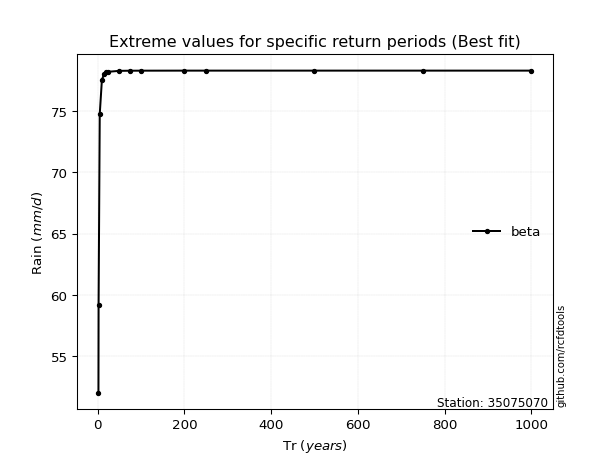</img>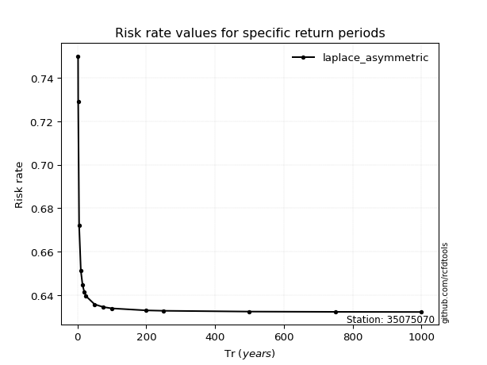</img>

</div>


<sub>**APP DISCLAIMER**: NO WARRANTY - This software is provided by [github.com/rcfdtools](https://github.com/rcfdtools) "as is", without any express or implied warranty, including warranties of merchantability, fitness for a particular purpose, or non-infringement. There is no guarantee that the software will be error-free or operate without interruption. LIMITATION OF LIABILITY - Neither the authors nor copyright holders will be liable for claims or damages arising from the software or its use. You are responsible for determining if the software is appropriate for your use and assume all associated risks, including errors, legal compliance, and data loss. NO PROFESSIONAL ADVICE - The software provides general information and does not offer professional advice. It should not replace consultation with professional advisors.</sub>