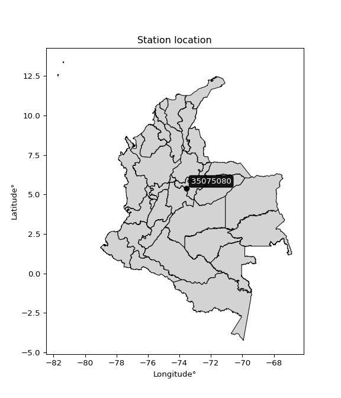

<div align="center">


</div>

# Station (rain, Pmax24h): 35075080

Probable Maximum Precipitation (PMP) is the greatest amount of rainfall for a specific duration that is meteorologically possible for a given location, acting as a "worst-case" scenario for extreme storms, crucial for designing safety-critical infrastructure like bridges, river deviations, dams, spillways, and nuclear plants to prevent catastrophic failure. PMP is calculated by hydrologists using meteorological data to determine the upper limit of extreme rainfall, often leading to the Probable Maximum Flood (PMF) for flood control design, and is increasingly being studied for climate change impacts.

<div align="center">

</img>

</div>


## A. General information


### 1. General running parameters

• app_version: _v20251226_. • runtime: _2025-12-26 15:38:16.554582_. • Python version: _3.14.0_. • SciPy version: _1.16.3_. • Pandas version: _2.3.3_. • NumPy version: _2.3.5_. • Stations dataset (station_dataset_file): _dataset/pmax24h_in/automatic_colombia_2003_2024.csv_. • Stations catalog (station_catalog_file): _dataset/CNE_IDEAM.xls_. • Minimum year to eval til year_max (date_min): _2003_. • Maximum year to eval since year_min (date_max): _2024_. • Creates, save and include plots into reports (create_plot): _False_. • Plot only fit distributions with Δo > Δ (plot_only_fit): _True_. • Eval low extreme values, if False, evaluates high extreme values (low_extreme): _False_. • Eval every SciPy distribution as logarithmic (pdist_logarithmic_on): _True_. • Standard deviation normalized (ddof): _1.0_. • Return periods to eval in years (Tr): _[2, 2.33, 5, 10, 15, 20, 25, 50, 75, 100, 200, 250, 500, 750, 1000]_. • Minimum data sample per station, 0 means any (minimum_sample): _5_. • Z-Score threshold to adjust a value, 0 means disable (zscore): _3.5_. • Avoid zeros, e.g. rain = 0 (avoid_zeros): _True_. • Avoid null values (avoid_nans): _True_. [:file_folder:Dataset file.](../../dataset/pmax24h_in/automatic_colombia_2003_2024.csv)


### 2. Station info and location

|   id |   CODIGO | NOMBRE                          | CATEGORIA               | TECNOLOGIA                | ESTADO           | FECHA_INSTALACION   |   FECHA_SUSPENSION |   ALTITUD |   LATITUD |   LONGITUD | DEPARTAMENTO   | MUNICIPIO    | AREA_OPERATIVA                              | ENTIDAD                                                     | AREA_HIDROGRAFICA   | ZONA_HIDROGRAFICA   | SUBZONA_HIDROGRAFICA   |   CORRIENTE | OBSERVACION                                                                                                                               |   SUBRED | Catalogo   |
|-----:|---------:|:--------------------------------|:------------------------|:--------------------------|:-----------------|:--------------------|-------------------:|----------:|----------:|-----------:|:---------------|:-------------|:--------------------------------------------|:------------------------------------------------------------|:--------------------|:--------------------|:-----------------------|------------:|:------------------------------------------------------------------------------------------------------------------------------------------|---------:|:-----------|
|    0 | 35075080 | PARAMO RABANAL - AUT [35075080] | Climatológica Principal | Automática con Telemetría | En Mantenimiento | 13/03/2005          |                nan |      3335 |   5.39239 |   -73.5628 | Boyacá         | Ventaquemada | Area Operativa 06 - Boyacá-Casanare-Vichada | INSTITUTO DE HIDROLOGIA METEOROLOGIA Y ESTUDIOS AMBIENTALES | Orinoco             | Meta                | Río Garagoa            |         nan | |24/09/2024$mvelez$LA ESTACION DEJO DE TRANSMITIR EL 24/06/25   mediante correo electrónico Ing. Padilla coordinador grupo automatización |      nan | CNE_IDEAM  |

<div align="center">

Map location in: [:earth_americas:Google](http://maps.google.com/maps?q=5.39239,-73.56278) [:earth_americas:OSM](https://www.openstreetmap.org/#map=18/5.39239/-73.56278&layers=P) [:earth_americas:Bing](https://www.bing.com/maps?cp=5.39239~-73.56278&lvl=18) [:earth_americas:Apple](https://maps.apple.com/frame?center=5.39239%2C-73.56278&span=0.003%2C0.006)

</div>


<div align="center">

```geojson
{
  "type": "Feature",
  "geometry": {
    "type": "Point", 
    "coordinates": [-73.56278, 5.39239]
  }, 
  "properties": {
    "Name": "35075080"
  }
}
```

</div>


### 3. Discrete values table and plot

|               |           0 |          1 |           2 |          3 |           4 |          5 |          6 |
|:--------------|------------:|-----------:|------------:|-----------:|------------:|-----------:|-----------:|
| Date          | 2017        | 2018       | 2019        | 2020       | 2021        | 2022       | 2023       |
| Value         |   23        |   57.3     |   30.8      |   46.1     |   13.8      |    4.9     |    5       |
| Value_initial |   23        |   57.3     |   30.8      |   46.1     |   13.8      |    4.9     |    5       |
| count         |    7        |    7       |    7        |    7       |    7        |    7       |    7       |
| mean          |   25.8429   |   25.8429  |   25.8429   |   25.8429  |   25.8429   |   25.8429  |   25.8429  |
| std           |   20.2098   |   20.2098  |   20.2098   |   20.2098  |   20.2098   |   20.2098  |   20.2098  |
| zscore        |   -0.140667 |    1.55653 |    0.245284 |    1.00234 |   -0.595892 |   -1.03627 |   -1.03132 |
> If Z-Score is active, values out of range or outliers are replaced with the station mean value.


### 4. Active continuous probability distributions from SciPy (45 of 104 available)

[scipy.stats](https://docs.scipy.org/doc/scipy/reference/stats.html) is a Python´s powerful submodule within the SciPy library for comprehensive statistical analysis, offering over 130 probability distributions (like Normal, Poisson), functions for descriptive stats (mean, variance), hypothesis testing (t-tests, chi-square), random variable generation, and statistical tests, making it essential for data science, modeling, and research. It provides tools to explore, model, and draw conclusions from data efficiently, working seamlessly with NumPy.

<div align="center">

|   id | p_dist             |   n_parameter | fit_method   | label                                                                       | active   | ref                                                                                                        |
|-----:|:-------------------|--------------:|:-------------|:----------------------------------------------------------------------------|:---------|:-----------------------------------------------------------------------------------------------------------|
|    0 | alpha              |             3 | MLE          | Alpha                                                                       | True     | [:mortar_board:](https://docs.scipy.org/doc/scipy/reference/generated/scipy.stats.alpha.html)              |
|    1 | betaprime          |             4 | MLE          | Beta prime                                                                  | True     | [:mortar_board:](https://docs.scipy.org/doc/scipy/reference/generated/scipy.stats.betaprime.html)          |
|    2 | chi2               |             3 | MLE          | Chi²                                                                        | True     | [:mortar_board:](https://docs.scipy.org/doc/scipy/reference/generated/scipy.stats.chi2.html)               |
|    3 | crystalball        |             4 | MLE          | Crystalball                                                                 | True     | [:mortar_board:](https://docs.scipy.org/doc/scipy/reference/generated/scipy.stats.crystalball.html)        |
|    4 | erlang             |             3 | MLE          | Erlang                                                                      | True     | [:mortar_board:](https://docs.scipy.org/doc/scipy/reference/generated/scipy.stats.erlang.html)             |
|    5 | expon              |             2 | MLE          | Exponential                                                                 | True     | [:mortar_board:](https://docs.scipy.org/doc/scipy/reference/generated/scipy.stats.expon.html)              |
|    6 | exponnorm          |             3 | MLE          | Exponentially modified Normal                                               | True     | [:mortar_board:](https://docs.scipy.org/doc/scipy/reference/generated/scipy.stats.exponnorm.html)          |
|    7 | f                  |             4 | MLE          | F                                                                           | True     | [:mortar_board:](https://docs.scipy.org/doc/scipy/reference/generated/scipy.stats.f.html)                  |
|    8 | fatiguelife        |             3 | MLE          | Fatigue-life (Birnbaum-Saunders)                                            | True     | [:mortar_board:](https://docs.scipy.org/doc/scipy/reference/generated/scipy.stats.fatiguelife.html)        |
|    9 | fisk               |             3 | MLE          | Fisk                                                                        | True     | [:mortar_board:](https://docs.scipy.org/doc/scipy/reference/generated/scipy.stats.fisk.html)               |
|   10 | gamma              |             3 | MLE          | Gamma                                                                       | True     | [:mortar_board:](https://docs.scipy.org/doc/scipy/reference/generated/scipy.stats.gamma.html)              |
|   11 | genexpon           |             5 | MLE          | Generalized exponential                                                     | True     | [:mortar_board:](https://docs.scipy.org/doc/scipy/reference/generated/scipy.stats.genexpon.html)           |
|   12 | genlogistic        |             3 | MLE          | Generalized logistic                                                        | True     | [:mortar_board:](https://docs.scipy.org/doc/scipy/reference/generated/scipy.stats.genlogistic.html)        |
|   13 | gibrat             |             2 | MM           | Gibrat                                                                      | True     | [:mortar_board:](https://docs.scipy.org/doc/scipy/reference/generated/scipy.stats.gibrat.html)             |
|   14 | gompertz           |             3 | MLE          | Gompertz (or truncated Gumbel)                                              | True     | [:mortar_board:](https://docs.scipy.org/doc/scipy/reference/generated/scipy.stats.gompertz.html)           |
|   15 | gumbel_l           |             2 | MM           | Gumbel Left Skew                                                            | True     | [:mortar_board:](https://docs.scipy.org/doc/scipy/reference/generated/scipy.stats.gumbel_l.html)           |
|   16 | gumbel_r           |             2 | MM           | Gumbel Right Skew                                                           | True     | [:mortar_board:](https://docs.scipy.org/doc/scipy/reference/generated/scipy.stats.gumbel_r.html)           |
|   17 | halflogistic       |             2 | MM           | Half-logistic                                                               | True     | [:mortar_board:](https://docs.scipy.org/doc/scipy/reference/generated/scipy.stats.halflogistic.html)       |
|   18 | halfnorm           |             2 | MM           | Half Normal                                                                 | True     | [:mortar_board:](https://docs.scipy.org/doc/scipy/reference/generated/scipy.stats.halfnorm.html)           |
|   19 | hypsecant          |             2 | MM           | hyperbolic secant                                                           | True     | [:mortar_board:](https://docs.scipy.org/doc/scipy/reference/generated/scipy.stats.hypsecant.html)          |
|   20 | invgamma           |             3 | MLE          | Inverted gamma                                                              | True     | [:mortar_board:](https://docs.scipy.org/doc/scipy/reference/generated/scipy.stats.invgamma.html)           |
|   21 | invgauss           |             3 | MLE          | Inverse Gaussian                                                            | True     | [:mortar_board:](https://docs.scipy.org/doc/scipy/reference/generated/scipy.stats.invgauss.html)           |
|   22 | invweibull         |             3 | MLE          | Inverted Weibull                                                            | True     | [:mortar_board:](https://docs.scipy.org/doc/scipy/reference/generated/scipy.stats.invweibull.html)         |
|   23 | johnsonsu          |             4 | MLE          | Johnson Su                                                                  | True     | [:mortar_board:](https://docs.scipy.org/doc/scipy/reference/generated/scipy.stats.johnsonsu.html)          |
|   24 | kstwobign          |             2 | MLE          | Limiting distribution of scaled Kolmogorov-Smirnov two-sided test statistic | True     | [:mortar_board:](https://docs.scipy.org/doc/scipy/reference/generated/scipy.stats.kstwobign.html)          |
|   25 | laplace            |             2 | MM           | Laplace                                                                     | True     | [:mortar_board:](https://docs.scipy.org/doc/scipy/reference/generated/scipy.stats.laplace.html)            |
|   26 | laplace_asymmetric |             3 | MLE          | Asymmetric Laplace                                                          | True     | [:mortar_board:](https://docs.scipy.org/doc/scipy/reference/generated/scipy.stats.laplace_asymmetric.html) |
|   27 | loggamma           |             3 | MLE          | Log gamma                                                                   | True     | [:mortar_board:](https://docs.scipy.org/doc/scipy/reference/generated/scipy.stats.loggamma.html)           |
|   28 | logistic           |             2 | MM           | Logistic (or Sech-squared)                                                  | True     | [:mortar_board:](https://docs.scipy.org/doc/scipy/reference/generated/scipy.stats.logistic.html)           |
|   29 | lognorm            |             3 | MLE          | Log Normal                                                                  | True     | [:mortar_board:](https://docs.scipy.org/doc/scipy/reference/generated/scipy.stats.lognorm.html)            |
|   30 | maxwell            |             2 | MM           | Maxwell                                                                     | True     | [:mortar_board:](https://docs.scipy.org/doc/scipy/reference/generated/scipy.stats.maxwell.html)            |
|   31 | mielke             |             4 | MLE          | Mielke Beta-Kappa / Dagum                                                   | True     | [:mortar_board:](https://docs.scipy.org/doc/scipy/reference/generated/scipy.stats.mielke.html)             |
|   32 | moyal              |             2 | MM           | Moyal                                                                       | True     | [:mortar_board:](https://docs.scipy.org/doc/scipy/reference/generated/scipy.stats.moyal.html)              |
|   33 | nakagami           |             3 | MLE          | Nakagami                                                                    | True     | [:mortar_board:](https://docs.scipy.org/doc/scipy/reference/generated/scipy.stats.nakagami.html)           |
|   34 | ncf                |             5 | MLE          | Non-central F distribution                                                  | True     | [:mortar_board:](https://docs.scipy.org/doc/scipy/reference/generated/scipy.stats.ncf.html)                |
|   35 | nct                |             4 | MLE          | Non-central Student’s t                                                     | True     | [:mortar_board:](https://docs.scipy.org/doc/scipy/reference/generated/scipy.stats.nct.html)                |
|   36 | norm               |             2 | MM           | Normal                                                                      | True     | [:mortar_board:](https://docs.scipy.org/doc/scipy/reference/generated/scipy.stats.norm.html)               |
|   37 | pareto             |             3 | MLE          | Pareto                                                                      | True     | [:mortar_board:](https://docs.scipy.org/doc/scipy/reference/generated/scipy.stats.pareto.html)             |
|   38 | pearson3           |             3 | MM           | Pearson type III                                                            | True     | [:mortar_board:](https://docs.scipy.org/doc/scipy/reference/generated/scipy.stats.pearson3.html)           |
|   39 | rayleigh           |             2 | MM           | Rayleigh                                                                    | True     | [:mortar_board:](https://docs.scipy.org/doc/scipy/reference/generated/scipy.stats.rayleigh.html)           |
|   40 | rice               |             3 | MLE          | Rice                                                                        | True     | [:mortar_board:](https://docs.scipy.org/doc/scipy/reference/generated/scipy.stats.rice.html)               |
|   41 | t                  |             3 | MLE          | Student’s t                                                                 | True     | [:mortar_board:](https://docs.scipy.org/doc/scipy/reference/generated/scipy.stats.t.html)                  |
|   42 | truncnorm          |             4 | MLE          | Truncated normal                                                            | True     | [:mortar_board:](https://docs.scipy.org/doc/scipy/reference/generated/scipy.stats.truncnorm.html)          |
|   43 | wald               |             2 | MM           | Wald                                                                        | True     | [:mortar_board:](https://docs.scipy.org/doc/scipy/reference/generated/scipy.stats.wald.html)               |
|   44 | weibull_min        |             3 | MLE          | Weibull minimum                                                             | True     | [:mortar_board:](https://docs.scipy.org/doc/scipy/reference/generated/scipy.stats.weibull_min.html)        |

</div>

> **n_parameter:** # arguments & localization & scale.
>
> **Fit methods:** (MLE) maximum likelihood, (MM) L-moments.
>
>**Inactive:** foldnorm, gennorm, norminvgauss, powernorm, powerlognorm, skewnorm, genextreme, anglit, arcsine, argus, beta, bradford, burr, burr12, cauchy, cosine, halfcauchy, foldcauchy, skewcauchy, wrapcauchy, dgamma, gengamma, exponweib, exponpow, truncexpon, gausshyper, genhalflogistic, genhyperbolic, geninvgauss, halfgennorm, johnsonsb, kappa4, kappa3, ksone, kstwo, loglaplace, levy, levy_l, levy_stable, ncx2, genpareto, truncpareto, lomax, powerlaw, rdist, rel_breitwigner, recipinvgauss, semicircular, studentized_range, trapezoid, triang, truncweibull_min, tukeylambda, uniform, loguniform, vonmises, vonmises_line, weibull_max, dweibull, 


## B. Probability distributions vs. Empirical distributions

A continuous probability distribution (CPD) describes probabilities for variables that can take any value within a range (like rain any time), unlike discrete variables with specific outcomes (like temperature). It uses a Probability Density Function (PDF), a curve where the total area under it equals 1, and the probability of the variable falling within an interval (a to b) is found by calculating the area under the curve between those points. A key feature is that the probability of hitting any single exact value is zero, so probabilities are always expressed for ranges, e.g., $P(a ≤ X ≤ b)$.

<div align="center">

Distributions parameters
|    |   station | p_dist                |   n |               loc |            scale | shape                  | shape1              | shape2                 | shape3   |
|---:|----------:|:----------------------|----:|------------------:|-----------------:|:-----------------------|:--------------------|:-----------------------|:---------|
|  0 |  35075080 | alpha                 |   7 |      -0.0169363   |      8.81875     | 3.6347162896784466e-09 |                     |                        |          |
|  1 |  35075080 | betaprime             |   7 |       4.89997     |    279.009       | 0.7414190359622651     | 18.06777762383954   |                        |          |
|  2 |  35075080 | chi2                  |   7 |       4.9         |     16.3869      | 0.938912638756562      |                     |                        |          |
|  3 |  35075080 | crystalball           |   7 |      25.8429      |     18.7106      | 1524.0097109496116     | 2840.0981581841093  |                        |          |
|  4 |  35075080 | erlang                |   7 |       4.9         |     19.6188      | 0.380509916076406      |                     |                        |          |
|  5 |  35075080 | expon                 |   7 |       4.9         |     20.9429      |                        |                     |                        |          |
|  6 |  35075080 | exponnorm             |   7 |       4.8866      |      0.00402552  | 5190.292319594082      |                     |                        |          |
|  7 |  35075080 | f                     |   7 |       4.9         |     25.3201      | 0.9052952034495254     | 65.98793815368802   |                        |          |
|  8 |  35075080 | fatiguelife           |   7 |       4.9         |      0.000174122 | 302.3998060234196      |                     |                        |          |
|  9 |  35075080 | fisk                  |   7 |       4.9         |     11.0827      | 0.8402998226617503     |                     |                        |          |
| 10 |  35075080 | gamma                 |   7 |       4.9         |     29.262       | 0.33049164154662103    |                     |                        |          |
| 11 |  35075080 | genexpon              |   7 |       4.89011     |      2.61421     | 0.10995763650699764    | 17.78801013427887   | 0.00011611471883114988 |          |
| 12 |  35075080 | genlogistic           |   7 |     -83.1204      |     14.83        | 853.7721289159908      |                     |                        |          |
| 13 |  35075080 | gibrat                |   7 |      11.569       |      8.65755     |                        |                     |                        |          |
| 14 |  35075080 | gompertz              |   7 |       4.9         |     91.8283      | 3.5314702130390057     |                     |                        |          |
| 15 |  35075080 | gumbel_l              |   7 |      34.2636      |     14.5886      |                        |                     |                        |          |
| 16 |  35075080 | gumbel_r              |   7 |      17.4221      |     14.5886      |                        |                     |                        |          |
| 17 |  35075080 | halflogistic          |   7 |       3.6664      |     15.9969      |                        |                     |                        |          |
| 18 |  35075080 | halfnorm              |   7 |       1.0773      |     31.039       |                        |                     |                        |          |
| 19 |  35075080 | hypsecant             |   7 |      25.8429      |     11.9116      |                        |                     |                        |          |
| 20 |  35075080 | invgamma              |   7 |     -11.0308      |    103.688       | 3.7157959938163767     |                     |                        |          |
| 21 |  35075080 | invgauss              |   7 |       1.06455     |     16.2773      | 1.522262494841339      |                     |                        |          |
| 22 |  35075080 | invweibull            |   7 |     -44.6914      |     59.9768      | 4.5219087913714695     |                     |                        |          |
| 23 |  35075080 | johnsonsu             |   7 |       4.9         |      3.30862e-13 | -1.6141019039496087    | 0.10191297708494025 |                        |          |
| 24 |  35075080 | kstwobign             |   7 |     -34.178       |     68.6627      |                        |                     |                        |          |
| 25 |  35075080 | laplace               |   7 |      25.8429      |     13.2304      |                        |                     |                        |          |
| 26 |  35075080 | laplace_asymmetric    |   7 |      23           |     15.5919      | 0.9129871146823021     |                     |                        |          |
| 27 |  35075080 | loggamma              |   7 |   -5290.86        |    728.935       | 1471.4851131107257     |                     |                        |          |
| 28 |  35075080 | logistic              |   7 |      25.8429      |     10.3157      |                        |                     |                        |          |
| 29 |  35075080 | lognorm               |   7 |       4.9         |      0.0501698   | 13.076754794798681     |                     |                        |          |
| 30 |  35075080 | maxwell               |   7 |     -18.4935      |     27.7837      |                        |                     |                        |          |
| 31 |  35075080 | mielke                |   7 |      -0.778625    |     59.0418      | 0.8920422430659769     | 212.68713405781068  |                        |          |
| 32 |  35075080 | moyal                 |   7 |      15.1429      |      8.42275     |                        |                     |                        |          |
| 33 |  35075080 | nakagami              |   7 |       4.9         |     31.7165      | 0.1491764600076756     |                     |                        |          |
| 34 |  35075080 | ncf                   |   7 |       4.9         |      8.36361     | 1.34481768948252       | 17.33231823648605   | 1.63287990756958       |          |
| 35 |  35075080 | nct                   |   7 |      -0.851476    |      0.0637647   | 0.9965593397543097     | 159.622734491066    |                        |          |
| 36 |  35075080 | norm                  |   7 |      25.8429      |     18.7106      |                        |                     |                        |          |
| 37 |  35075080 | pareto                |   7 |       3.5334      |      1.3666      | 0.4714445778631656     |                     |                        |          |
| 38 |  35075080 | pearson3              |   7 |      25.8429      |     18.7106      | 0.42644298896745103    |                     |                        |          |
| 39 |  35075080 | rayleigh              |   7 |      -9.9517      |     28.5599      |                        |                     |                        |          |
| 40 |  35075080 | rice                  |   7 |      -6.18127     |     26.2259      | 0.0075113662400703995  |                     |                        |          |
| 41 |  35075080 | t                     |   7 |      25.8427      |     18.7106      | 842384322.4591355      |                     |                        |          |
| 42 |  35075080 | truncnorm             |   7 |      25.8429      |     18.7106      | -89.90671078332156     | 352.8341123328837   |                        |          |
| 43 |  35075080 | wald                  |   7 |       7.13225     |     18.7106      |                        |                     |                        |          |
| 44 |  35075080 | weibull_min           |   7 |       4.9         |     21.9093      | 0.7401658368492878     |                     |                        |          |
| 45 |  35075080 | logalpha              |   7 |     -17.1081      |    414.337       | 20.759380004658354     |                     |                        |          |
| 46 |  35075080 | logbetaprime          |   7 |     -13.083       |     64.7289      | 359.8409633456515      | 1459.4338007105225  |                        |          |
| 47 |  35075080 | logchi2               |   7 |       1.58924     |      0.935373    | 1.013141173099366      |                     |                        |          |
| 48 |  35075080 | logcrystalball        |   7 |       2.89507     |      0.924123    | 591.9972406320124      | 2.849925465535942   |                        |          |
| 49 |  35075080 | logerlang             |   7 |     -11.9186      |      0.0596643   | 248.20695392763832     |                     |                        |          |
| 50 |  35075080 | logexpon              |   7 |       1.58924     |      1.30583     |                        |                     |                        |          |
| 51 |  35075080 | logexponnorm          |   7 |       2.89417     |      0.92412     | 0.0009743122362073592  |                     |                        |          |
| 52 |  35075080 | logf                  |   7 |    -166.239       |    169.129       | 87796.33430161295      | 283503.9099567954   |                        |          |
| 53 |  35075080 | logfatiguelife        |   7 |       1.58924     |      5.78927e-07 | 1428.5494769445625     |                     |                        |          |
| 54 |  35075080 | logfisk               |   7 |      -4.02316e+07 |      4.02316e+07 | 71195137.87814942      |                     |                        |          |
| 55 |  35075080 | loggamma              |   7 |     -10.6835      |      0.0643156   | 211.03726091678266     |                     |                        |          |
| 56 |  35075080 | loggenexpon           |   7 |       1.57701     |      0.0381464   | 0.018203032098658464   | 3.8834146174194117  | 0.00010684426261721794 |          |
| 57 |  35075080 | loggenlogistic        |   7 |       4.04845     |      8.97244e-06 | 7.864129798411356e-06  |                     |                        |          |
| 58 |  35075080 | loggibrat             |   7 |       2.19006     |      0.427612    |                        |                     |                        |          |
| 59 |  35075080 | loggompertz           |   7 |       1.58924     |      1.26973     | 0.3958427055601934     |                     |                        |          |
| 60 |  35075080 | loggumbel_l           |   7 |       3.31097     |      0.720536    |                        |                     |                        |          |
| 61 |  35075080 | loggumbel_r           |   7 |       2.47916     |      0.720536    |                        |                     |                        |          |
| 62 |  35075080 | loghalflogistic       |   7 |       1.79975     |      0.790101    |                        |                     |                        |          |
| 63 |  35075080 | loghalfnorm           |   7 |       1.67191     |      1.533       |                        |                     |                        |          |
| 64 |  35075080 | loghypsecant          |   7 |       2.89507     |      0.588315    |                        |                     |                        |          |
| 65 |  35075080 | loginvgamma           |   7 |     -10.787       |   2881.08        | 211.85168263662888     |                     |                        |          |
| 66 |  35075080 | loginvgauss           |   7 |      -3.82988     |    320.992       | 0.020937738335460712   |                     |                        |          |
| 67 |  35075080 | loginvweibull         |   7 | -360236           | 360238           | 409423.3931522297      |                     |                        |          |
| 68 |  35075080 | logjohnsonsu          |   7 |       4.45246     |      0.00755069  | 8.450127946947909      | 1.4542672488954826  |                        |          |
| 69 |  35075080 | logkstwobign          |   7 |      -0.577894    |      3.9518      |                        |                     |                        |          |
| 70 |  35075080 | loglaplace            |   7 |       2.89507     |      0.653454    |                        |                     |                        |          |
| 71 |  35075080 | loglaplace_asymmetric |   7 |       3.83081     |      0.483123    | 2.3610928009644403     |                     |                        |          |
| 72 |  35075080 | logloggamma           |   7 |       4.04848     |      1.2418e-05  | 1.0752920187953624e-05 |                     |                        |          |
| 73 |  35075080 | loglogistic           |   7 |       2.89507     |      0.509496    |                        |                     |                        |          |
| 74 |  35075080 | loglognorm            |   7 |       1.58924     |      0.0049496   | 12.64422881725251      |                     |                        |          |
| 75 |  35075080 | logmaxwell            |   7 |       0.705282    |      1.37224     |                        |                     |                        |          |
| 76 |  35075080 | logmielke             |   7 |       1.58924     |      2.46992     | 0.7819280528426229     | 225.0679737466033   |                        |          |
| 77 |  35075080 | logmoyal              |   7 |       2.36659     |      0.416002    |                        |                     |                        |          |
| 78 |  35075080 | lognakagami           |   7 |       1.58924     |      1.94844     | 0.16793769948640522    |                     |                        |          |
| 79 |  35075080 | logncf                |   7 |     -12.194       |      7.31166     | 765.3531062925301      | 1044.2670974700095  | 812.9610903316711      |          |
| 80 |  35075080 | lognct                |   7 |      37.5489      |      0.896732    | 12513.926702992336     | -38.64113739832489  |                        |          |
| 81 |  35075080 | lognorm               |   7 |       2.89507     |      0.924123    |                        |                     |                        |          |
| 82 |  35075080 | logpareto             |   7 |       1.58801     |      0.00122026  | 0.17857605607201854    |                     |                        |          |
| 83 |  35075080 | logpearson3           |   7 |       2.89507     |      0.92412     | -0.33548549565651764   |                     |                        |          |
| 84 |  35075080 | lograyleigh           |   7 |       1.12716     |      1.41058     |                        |                     |                        |          |
| 85 |  35075080 | logrice               |   7 |       0.997794    |      1.07087     | 1.372491894191258      |                     |                        |          |
| 86 |  35075080 | logt                  |   7 |       2.89506     |      0.924125    | 895568217.2624122      |                     |                        |          |
| 87 |  35075080 | logtruncnorm          |   7 |      -0.192257    |      1.68612     | 1.670649662032863      | 2.514979826179208   |                        |          |
| 88 |  35075080 | logwald               |   7 |       1.97097     |      0.9241      |                        |                     |                        |          |
| 89 |  35075080 | logweibull_min        |   7 |      -1.32268e+07 |      1.32268e+07 | 17717938.437644623     |                     |                        |          |

</div>

> **loc** (Location parameter): This shifts the distribution along the x-axis. For many common distributions, like the normal (Gaussian) distribution, loc represents the mean $μ$. For others, like the uniform distribution, it might represent the minimum value, or for the beta distribution, the left end of the support interval.
>
> **scale** (Scale parameter): This determines the width or spread of the distribution. For the normal distribution, scale represents the standard deviation $σ$. For a uniform distribution, it defines the length of the interval (from $loc$ to $loc + scale$).
>
> **shape** (Shape parameters): Refers to parameters that define the specific form of a probability distribution, distinct from its location (loc) and scale (scale). These parameters are required arguments for most distribution functions. For example, a normal (Gaussian) distribution is fully defined by its location (mean) and scale (standard deviation), so it has no specific shape parameters beyond loc and scale. However, other distributions have intrinsic properties that need specification, as Gamma distribution that takes a shape parameter, often named $a$ or $alpha$.


### 0. Cumulative distribution values - CDF (90 evaluated)

> Ordered by x ascending and calculating $log(f(x))$ separately. 

|   id |   Station |   date |    x |   count |    mean |     std |    zscore |   Value_initial |   station |   m |     alpha |   alpha_pdf |   betaprime |   betaprime_pdf |        chi2 |    chi2_pdf |   crystalball |   crystalball_pdf |      erlang |   erlang_pdf |      expon |   expon_pdf |   exponnorm |   exponnorm_pdf |           f |       f_pdf |   fatiguelife |   fatiguelife_pdf |        fisk |    fisk_pdf |       gamma |   gamma_pdf |    genexpon |   genexpon_pdf |   genlogistic |   genlogistic_pdf |    gibrat |   gibrat_pdf |    gompertz |   gompertz_pdf |   gumbel_l |   gumbel_l_pdf |   gumbel_r |   gumbel_r_pdf |   halflogistic |   halflogistic_pdf |   halfnorm |   halfnorm_pdf |   hypsecant |   hypsecant_pdf |   invgamma |   invgamma_pdf |   invgauss |   invgauss_pdf |   invweibull |   invweibull_pdf |   johnsonsu |   johnsonsu_pdf |   kstwobign |   kstwobign_pdf |   laplace |   laplace_pdf |   laplace_asymmetric |   laplace_asymmetric_pdf |   loggamma |   loggamma_pdf |   logistic |   logistic_pdf |   lognorm |   lognorm_pdf |   maxwell |   maxwell_pdf |   mielke |   mielke_pdf |     moyal |   moyal_pdf |    nakagami |   nakagami_pdf |         ncf |     ncf_pdf |       nct |    nct_pdf |     norm |   norm_pdf |      pareto |   pareto_pdf |   pearson3 |   pearson3_pdf |   rayleigh |   rayleigh_pdf |      rice |   rice_pdf |        t |      t_pdf |   truncnorm |   truncnorm_pdf |     wald |   wald_pdf |   weibull_min |   weibull_min_pdf |   logalpha |   logalpha_pdf |   logbetaprime |   logbetaprime_pdf |     logchi2 |   logchi2_pdf |   logcrystalball |   logcrystalball_pdf |   logerlang |   logerlang_pdf |   logexpon |   logexpon_pdf |   logexponnorm |   logexponnorm_pdf |      logf |   logf_pdf |   logfatiguelife |   logfatiguelife_pdf |   logfisk |   logfisk_pdf |   loggenexpon |   loggenexpon_pdf |   loggenlogistic |   loggenlogistic_pdf |   loggibrat |   loggibrat_pdf |   loggompertz |   loggompertz_pdf |   loggumbel_l |   loggumbel_l_pdf |   loggumbel_r |   loggumbel_r_pdf |   loghalflogistic |   loghalflogistic_pdf |   loghalfnorm |   loghalfnorm_pdf |   loghypsecant |   loghypsecant_pdf |   loginvgamma |   loginvgamma_pdf |   loginvgauss |   loginvgauss_pdf |   loginvweibull |   loginvweibull_pdf |   logjohnsonsu |   logjohnsonsu_pdf |   logkstwobign |   logkstwobign_pdf |   loglaplace |   loglaplace_pdf |   loglaplace_asymmetric |   loglaplace_asymmetric_pdf |   logloggamma |   logloggamma_pdf |   loglogistic |   loglogistic_pdf |   loglognorm |   loglognorm_pdf |   logmaxwell |   logmaxwell_pdf |   logmielke |   logmielke_pdf |   logmoyal |   logmoyal_pdf |   lognakagami |   lognakagami_pdf |    logncf |   logncf_pdf |    lognct |   lognct_pdf |   logpareto |   logpareto_pdf |   logpearson3 |   logpearson3_pdf |   lograyleigh |   lograyleigh_pdf |   logrice |   logrice_pdf |      logt |   logt_pdf |   logtruncnorm |   logtruncnorm_pdf |   logwald |   logwald_pdf |   logweibull_min |   logweibull_min_pdf |
|-----:|----------:|-------:|-----:|--------:|--------:|--------:|----------:|----------------:|----------:|----:|----------:|------------:|------------:|----------------:|------------:|------------:|--------------:|------------------:|------------:|-------------:|-----------:|------------:|------------:|----------------:|------------:|------------:|--------------:|------------------:|------------:|------------:|------------:|------------:|------------:|---------------:|--------------:|------------------:|----------:|-------------:|------------:|---------------:|-----------:|---------------:|-----------:|---------------:|---------------:|-------------------:|-----------:|---------------:|------------:|----------------:|-----------:|---------------:|-----------:|---------------:|-------------:|-----------------:|------------:|----------------:|------------:|----------------:|----------:|--------------:|---------------------:|-------------------------:|-----------:|---------------:|-----------:|---------------:|----------:|--------------:|----------:|--------------:|---------:|-------------:|----------:|------------:|------------:|---------------:|------------:|------------:|----------:|-----------:|---------:|-----------:|------------:|-------------:|-----------:|---------------:|-----------:|---------------:|----------:|-----------:|---------:|-----------:|------------:|----------------:|---------:|-----------:|--------------:|------------------:|-----------:|---------------:|---------------:|-------------------:|------------:|--------------:|-----------------:|---------------------:|------------:|----------------:|-----------:|---------------:|---------------:|-------------------:|----------:|-----------:|-----------------:|---------------------:|----------:|--------------:|--------------:|------------------:|-----------------:|---------------------:|------------:|----------------:|--------------:|------------------:|--------------:|------------------:|--------------:|------------------:|------------------:|----------------------:|--------------:|------------------:|---------------:|-------------------:|--------------:|------------------:|--------------:|------------------:|----------------:|--------------------:|---------------:|-------------------:|---------------:|-------------------:|-------------:|-----------------:|------------------------:|----------------------------:|--------------:|------------------:|--------------:|------------------:|-------------:|-----------------:|-------------:|-----------------:|------------:|----------------:|-----------:|---------------:|--------------:|------------------:|----------:|-------------:|----------:|-------------:|------------:|----------------:|--------------:|------------------:|--------------:|------------------:|----------:|--------------:|----------:|-----------:|---------------:|-------------------:|----------:|--------------:|-----------------:|---------------------:|
|    0 |  35075080 |   2022 |  4.9 |       7 | 25.8429 | 20.2098 | -1.03627  |             4.9 |  35075080 |   1 | 0.0728856 |  0.0582689  | 7.08028e-05 |      1.50065    | 1.88475e-08 | 9.96203e+06 |      0.131506 |        0.0113965  | 6.79553e-07 |  2.91131e+08 | 0          |  0.047749   | 0.000640931 |      0.0478099  | 2.34007e-07 | 1.09411e+06 |     0.0344529 |        1.2056e+08 | 2.98135e-14 | 28.2063     | 3.89043e-06 | 1.44763e+09 | 0.000415885 |     0.0420471  |      0.104898 |        0.0159278  | 0         |   0          | 2.52761e-15 |     0.0384573  |   0.125075 |     0.00801344 |  0.0944909 |     0.0152809  |      0.0385384 |         0.0312096  |  0.0980179 |     0.0255116  |    0.108657 |      0.00894589 |  0.087414  |     0.0232074  |  0.0731216 |     0.0470587  |    0.0941668 |       0.0202871  |   0.0561894 |     3.37019e+10 |   0.0976657 |      0.016539   |  0.102686 |    0.00776136 |             0.127478 |               0.00895511 |  0.0784378 |       0.16767  |   0.11607  |     0.00994573 | 0.0788207 |      0.159075 |  0.128901 |    0.0142829  | 0.123842 |    0.019454  | 0.0662325 |  0.0161018  | 9.29257e-06 |    3.12152e+09 | 6.70501e-08 | 57.2416     | 0.0769359 | 0.0512614  | 0.131506 | 0.0113965  | 1.11022e-16 |   0.344977   |   0.12495  |     0.0132028  |   0.126467 |     0.0159053  | 0.0853959 | 0.014735   | 0.131507 | 0.0113966  |    0.131506 |      0.0113965  | 0        | 0          |   7.36388e-13 |      613.671      |  0.0806202 |       0.177233 |      0.0800492 |           0.169275 | 9.65861e-09 |   2.20351e+07 |        0.0788207 |             0.159075 |   0.0798953 |        0.168013 |  0         |       0.765796 |      0.0788192 |           0.159073 | 0.078991  |   0.160408 |        0.0218415 |          7.54604e+11 | 0.0818997 |      0.133062 |    0.00583795 |          0.477868 |         0        |             0.101542 |    0        |       0         |   1.67657e-10 |          0.311753 |     0.0875971 |          0.116085 |     0.0321069 |          0.153227 |          0        |              0        |      0        |          0        |      0.0688993 |           0.116201 |     0.0783202 |          0.177564 |     0.0774234 |          0.186527 |       0.0764194 |            0.223345 |       0.116351 |          0.0994081 |      0.0755763 |           0.251254 |    0.0677792 |         0.103725 |                0.118828 |                    0.104171 |      0.118897 |          0.102955 |     0.0715589 |          0.1304   |    0.0075334 |      7.40513e+12 |    0.0628629 |         0.196065 | 6.41614e-09 |       61.0034   |  0.0109126 |      0.0956274 |   3.52935e-06 |       5.33867e+09 | 0.0737315 |     0.163252 | 0.0786612 |     0.15832  |    0        |     146.343     |     0.0854041 |          0.146712 |     0.0522387 |          0.220095 |  0.059107 |      0.198351 | 0.0788222 |   0.159077 |    0           |           0        |  0        |      0        |        0.0916873 |             0.117009 |
|    1 |  35075080 |   2023 |  5   |       7 | 25.8429 | 20.2098 | -1.03132  |             5   |  35075080 |   2 | 0.0787821 |  0.0596373  | 0.025786    |      0.190377   | 0.0743695   | 0.348408    |      0.132649 |        0.0114647  | 0.150782    |  0.571624    | 0.00476352 |  0.0475215  | 0.00541256  |      0.0476024  | 0.0641394   | 0.289964    |     0.531528  |        0.157859   | 0.0187781   |  0.15483    | 0.171211    | 0.564387    | 0.00461326  |     0.0419006  |      0.106498 |        0.0160623  | 0         |   0          | 0.00384043  |     0.0383514  |   0.125879 |     0.00806114 |  0.0960261 |     0.0154231  |      0.0416589 |         0.0312017  |  0.100569  |     0.0255014  |    0.109556 |      0.0090169  |  0.0897478 |     0.0234662  |  0.0778612 |     0.0477214  |    0.096206  |       0.0204971  |   0.875043  |     0.209741    |   0.0993266 |      0.0166789  |  0.103465 |    0.00782024 |             0.128377 |               0.00901823 |  0.081879  |       0.173009 |   0.117068 |     0.0100199  | 0.0820844 |      0.164026 |  0.130334 |    0.0143616  | 0.125785 |    0.0194174 | 0.067854  |  0.0163283  | 0.144691    |    0.43169     | 0.0188671   |  0.127001   | 0.0821106 | 0.0522164  | 0.132649 | 0.0114647  | 0.0327458   |   0.310928   |   0.126275 |     0.0132867  |   0.128062 |     0.0159831  | 0.0868749 | 0.0148439  | 0.13265  | 0.0114648  |    0.132649 |      0.0114647  | 0        | 0          |   0.0183456   |        0.134535   |  0.0842571 |       0.182824 |      0.0835226 |           0.174592 | 0.113382    |   2.82266     |        0.0820843 |             0.164026 |   0.0833427 |        0.173276 |  0.0153521 |       0.754039 |      0.0820828 |           0.164024 | 0.0822821 |   0.165414 |        0.552019  |          1.28017     | 0.0846284 |      0.137087 |    0.0155027  |          0.478894 |         0        |             0.103356 |    0        |       0         |   0.00632852  |          0.314748 |     0.0899724 |          0.119075 |     0.0353093 |          0.163851 |          0        |              0        |      0        |          0        |      0.0712867 |           0.120161 |     0.081966  |          0.183376 |     0.0812542 |          0.192716 |       0.0810129 |            0.231396 |       0.118379 |          0.101347  |      0.0807447 |           0.260388 |    0.0699075 |         0.106981 |                0.120951 |                    0.106032 |      0.120995 |          0.104772 |     0.0742385 |          0.134892 |    0.544286  |      1.55211     |    0.0668957 |         0.203171 | 0.0233293   |        0.902942 |  0.0129763 |      0.108826  |   0.172254    |       2.86372     | 0.077084  |     0.168641 | 0.0819094 |     0.163247 |    0.40052  |       4.99711   |     0.0884097 |          0.150845 |     0.0567715 |          0.22862  |  0.06318  |      0.204862 | 0.0820859 |   0.164028 |    0           |           0        |  0        |      0        |        0.0940803 |             0.119902 |
|    2 |  35075080 |   2021 | 13.8 |       7 | 25.8429 | 20.2098 | -0.595892 |            13.8 |  35075080 |   3 | 0.523307  |  0.0300652  | 0.568393    |      0.0332662  | 0.563218    | 0.0246173   |      0.259906 |        0.0173326  | 0.741332    |  0.0226298   | 0.346208   |  0.0312179  | 0.347281    |      0.0312401  | 0.466066    | 0.0211958   |     0.772654  |        0.0126711  | 0.454054    |  0.0234046  | 0.702922    | 0.0206937   | 0.320745    |     0.0303993  |      0.289961 |        0.0241884  | 0.0875546 |   0.0713094  | 0.301909    |     0.029579   |   0.218022 |     0.0131823  |  0.277532  |     0.0243851  |      0.306552  |         0.0283187  |  0.318116  |     0.0236346  |    0.222153 |      0.0171726  |  0.343963  |     0.0294984  |  0.453125  |     0.0304523  |    0.326253  |       0.028251   |   0.946083  |     0.00125393  |   0.286683  |      0.0242213  |  0.201214 |    0.0152084  |             0.23821  |               0.0167338  |  0.396525  |       0.417947 |   0.23732  |     0.017546   | 0.384914  |      0.413608 |  0.282937 |    0.0197441  | 0.287167 |    0.0175713 | 0.278816  |  0.0285362  | 0.551299    |    0.0182931   | 0.390888    |  0.028426   | 0.486619  | 0.0296656  | 0.259906 | 0.0173326  | 0.61353     |   0.0177468  |   0.273023 |     0.019595   |   0.292357 |     0.020606   | 0.251909  | 0.0217323  | 0.259907 | 0.0173327  |    0.259906 |      0.0173326  | 0.225743 | 0.0560469  |   0.401516    |        0.0255511  |  0.405903  |       0.412648 |      0.398186  |           0.415974 | 0.703222    |   0.235152    |        0.384914  |             0.413608 |   0.396155  |        0.414889 |  0.547483  |       0.346535 |      0.384912  |           0.413609 | 0.38715   |   0.41499  |        0.825406  |          0.11636     | 0.357904  |      0.406677 |    0.481212   |          0.402309 |         0        |             0.25164  |    0.506479 |       0.917804  |   0.392777    |          0.427873 |     0.32008   |          0.364034 |     0.441692  |          0.500912 |          0.479269 |              0.48747  |      0.465729 |          0.429065 |      0.358595  |           0.488538 |     0.410702  |          0.42397  |     0.417569  |          0.419183 |       0.452621  |            0.40778  |       0.294358 |          0.274247  |      0.472693  |           0.40692  |    0.330567  |         0.505877 |                0.294534 |                    0.258205 |      0.291447 |          0.252369 |     0.37035   |          0.457689 |    0.663701  |      0.0278688   |    0.418499  |         0.4277   | 0.506728    |        0.382666 |  0.463369  |      0.537444  |   0.641927    |       0.19993     | 0.389445  |     0.417651 | 0.38386   |     0.41336  |    0.70014  |       0.0516545 |     0.365546  |          0.393867 |     0.430798  |          0.428388 |  0.405559 |      0.422238 | 0.384918  |   0.413609 |    1.13323e-05 |           1.41413  |  0.520432 |      0.682997 |        0.319511  |             0.350894 |
|    3 |  35075080 |   2017 | 23   |       7 | 25.8429 | 20.2098 | -0.140667 |            23   |  35075080 |   4 | 0.701615  |  0.0123417  | 0.778724    |      0.0153229  | 0.72556     | 0.0127576   |      0.439618 |        0.021077   | 0.874601    |  0.00912096  | 0.578635   |  0.0201197  | 0.579762    |      0.0201132  | 0.612379    | 0.0121794   |     0.856827  |        0.00665581 | 0.601613    |  0.011127   | 0.83092     | 0.00939494  | 0.55571     |     0.0211183  |      0.51378  |        0.023063   | 0.609456  |   0.033578   | 0.536717    |     0.0216984  |   0.370009 |     0.019953   |  0.505474  |     0.0236392  |      0.540096  |         0.0221385  |  0.519995  |     0.0200312  |    0.424742 |      0.0259793  |  0.576827  |     0.0206332  |  0.654789  |     0.0155905  |    0.560686  |       0.0216712  |   0.953555  |     0.00054743  |   0.50809   |      0.0227321  |  0.403322 |    0.0304844  |             0.454609 |               0.0319354  |  0.612026  |       0.405109 |   0.431537 |     0.0237805  | 0.602633  |      0.417332 |  0.474012 |    0.0209994  | 0.444291 |    0.0166673 | 0.5305    |  0.0244039  | 0.678133    |    0.0107147   | 0.600162    |  0.0180458  | 0.6687    | 0.0130241  | 0.439618 | 0.021077   | 0.714163    |   0.00692243 |   0.467217 |     0.0216948  |   0.486034 |     0.0207634  | 0.461529  | 0.0228451  | 0.43962  | 0.021077   |    0.439618 |      0.021077   | 0.599886 | 0.0269321  |   0.58028     |        0.0149009  |  0.614762  |       0.386551 |      0.612411  |           0.402451 | 0.798391    |   0.146834    |        0.602633  |             0.417332 |   0.610396  |        0.403576 |  0.693984  |       0.234346 |      0.602631  |           0.417334 | 0.60497   |   0.416313 |        0.873692  |          0.0767067   | 0.579202  |      0.431307 |    0.663606   |          0.309686 |         0        |             0.393755 |    0.786237 |       0.308017  |   0.610146    |          0.410761 |     0.543356  |          0.49677  |     0.668871  |          0.373328 |          0.688606 |              0.332756 |      0.660281 |          0.329967 |      0.626608  |           0.498816 |     0.624533  |          0.393443 |     0.625388  |          0.377133 |       0.641736  |            0.323526 |       0.474476 |          0.439627  |      0.659666  |           0.318822 |    0.653919  |         0.529619 |                0.460914 |                    0.404063 |      0.453589 |          0.39277  |     0.615832  |          0.464347 |    0.675194  |      0.0184043   |    0.628925  |         0.380087 | 0.693355    |        0.350623 |  0.691466  |      0.351769  |   0.728529    |       0.144504    | 0.605009  |     0.405604 | 0.60179   |     0.418344 |    0.720844 |       0.0322141 |     0.582345  |          0.434913 |     0.63707   |          0.36632  |  0.618072 |      0.392855 | 0.602636  |   0.417331 |    0.559378    |           0.814224 |  0.754473 |      0.297086 |        0.533775  |             0.476571 |
|    4 |  35075080 |   2019 | 30.8 |       7 | 25.8429 | 20.2098 |  0.245284 |            30.8 |  35075080 |   5 | 0.774751  |  0.0071119  | 0.869066    |      0.00857855 | 0.806051    | 0.00831465  |      0.604471 |        0.0205864  | 0.927281    |  0.00490873  | 0.709659   |  0.0138635  | 0.710689    |      0.0138468  | 0.692597    | 0.0087052   |     0.898912  |        0.00435528 | 0.671129    |  0.00716087 | 0.888007    | 0.00566161  | 0.696149    |     0.0151584  |      0.674599 |        0.017902   | 0.787592  |   0.0150867  | 0.683586    |     0.0161334  |   0.545546 |     0.0245677  |  0.670513  |     0.0183713  |      0.690069  |         0.016372   |  0.661731  |     0.0162522  |    0.628802 |      0.0245647  |  0.709535  |     0.0137613  |  0.751511  |     0.00981819 |    0.702335  |       0.0148651  |   0.956998  |     0.000359557 |   0.667995  |      0.0180475  |  0.656245 |    0.0259822  |             0.654575 |               0.0202264  |  0.722823  |       0.34931  |   0.617876 |     0.0228879  | 0.717748  |      0.365674 |  0.630598 |    0.0187338  | 0.572233 |    0.0161646 | 0.693013  |  0.0172965  | 0.749825    |    0.00791926  | 0.717894    |  0.0124946  | 0.746882  | 0.00769917 | 0.604471 | 0.0205864  | 0.756148    |   0.00421625 |   0.629651 |     0.0194366  |   0.638683 |     0.0180518  | 0.62997   | 0.0198951  | 0.604473 | 0.0205863  |    0.604471 |      0.0205864  | 0.755777 | 0.014577   |   0.677564    |        0.0104295  |  0.719988  |       0.330745 |      0.722497  |           0.347189 | 0.836439    |   0.115335    |        0.717748  |             0.365674 |   0.720942  |        0.349112 |  0.755306  |       0.187386 |      0.717747  |           0.365676 | 0.719628  |   0.363671 |        0.893871  |          0.0621722   | 0.697679  |      0.373257 |    0.745997   |          0.254886 |         0        |             0.508608 |    0.856018 |       0.183313  |   0.724156    |          0.36579  |     0.691354  |          0.503558 |     0.764787  |          0.284627 |          0.773948 |              0.253767 |      0.747878 |          0.270152 |      0.755282  |           0.376181 |     0.731092  |          0.33291  |     0.727188  |          0.317523 |       0.727387  |            0.263135 |       0.618118 |          0.541041  |      0.74426   |           0.260712 |    0.778641  |         0.338752 |                0.595388 |                    0.52195  |      0.584091 |          0.505774 |     0.739823  |          0.377795 |    0.680101  |      0.0153833   |    0.731474  |         0.319843 | 0.793782    |        0.337642 |  0.779944  |      0.257678  |   0.767511    |       0.123309    | 0.716035  |     0.35044  | 0.717258  |     0.367    |    0.729329 |       0.0262763 |     0.705207  |          0.399219 |     0.73545   |          0.305848 |  0.725182 |      0.337273 | 0.717751  |   0.365672 |    0.759854    |           0.56988  |  0.825276 |      0.196357 |        0.676446  |             0.489062 |
|    5 |  35075080 |   2020 | 46.1 |       7 | 25.8429 | 20.2098 |  1.00234  |            46.1 |  35075080 |   6 | 0.848349  |  0.00324852 | 0.949956    |      0.00302928 | 0.89615     | 0.00407515  |      0.860519 |        0.0118657  | 0.972937    |  0.00168807  | 0.86016    |  0.00667721 | 0.860896    |      0.00665772 | 0.79512     | 0.0051424   |     0.946144  |        0.0021358  | 0.750889    |  0.0038151  | 0.946071    | 0.00245976  | 0.863281    |     0.00745188 |      0.869085 |        0.00822218 | 0.916733  |   0.0044372  | 0.864608    |     0.00815501 |   0.894698 |     0.0162473  |  0.869317  |     0.00834525 |      0.868343  |         0.00768835 |  0.853086  |     0.00897745 |    0.885039 |      0.00944275 |  0.853559  |     0.00614551 |  0.856416  |     0.00471969 |    0.8578    |       0.00655304 |   0.961149  |     0.000208166 |   0.870104  |      0.00884004 |  0.891852 |    0.00817423 |             0.858983 |               0.00825727 |  0.843246  |       0.245703 |   0.876935 |     0.0104617  | 0.844369  |      0.258545 |  0.855569 |    0.0104055  | 0.814012 |    0.0154896 | 0.873525  |  0.00744471 | 0.84549     |    0.00491038  | 0.85469     |  0.00615669 | 0.827544  | 0.00360899 | 0.860519 | 0.0118657  | 0.802334    |   0.00218924 |   0.859686 |     0.0103726  |   0.854255 |     0.0100154  | 0.862889  | 0.0104219  | 0.86052  | 0.0118657  |    0.860519 |      0.0118657  | 0.894148 | 0.00535406 |   0.797273    |        0.0058123  |  0.834331  |       0.235204 |      0.842316  |           0.244867 | 0.876304    |   0.0843006   |        0.844369  |             0.258545 |   0.841583  |        0.246823 |  0.820322  |       0.137596 |      0.844368  |           0.258547 | 0.84536   |   0.256371 |        0.91581   |          0.0474679   | 0.824908  |      0.255597 |    0.834398   |          0.185112 |         0        |             0.724266 |    0.910639 |       0.0984504 |   0.853013    |          0.267787 |     0.87222   |          0.364868 |     0.857943  |          0.182436 |          0.857896 |              0.167077 |      0.840954 |          0.193079 |      0.872002  |           0.211751 |     0.845064  |          0.231562 |     0.836342  |          0.223783 |       0.817696  |            0.187043 |       0.847949 |          0.550361  |      0.834145  |           0.186967 |    0.880585  |         0.182745 |                0.847903 |                    0.743319 |      0.82822  |          0.71717  |     0.862548  |          0.232699 |    0.68569   |      0.0125218   |    0.841451  |         0.22541  | 0.926954    |        0.323349 |  0.863385  |      0.162586  |   0.812442    |       0.100502    | 0.83717   |     0.248153 | 0.844379  |     0.259582 |    0.738743 |       0.0208018 |     0.846035  |          0.290691 |     0.840682  |          0.216481 |  0.841893 |      0.239845 | 0.844371  |   0.258543 |    0.938118    |           0.331402 |  0.88685  |      0.117199 |        0.855833  |             0.374029 |
|    6 |  35075080 |   2018 | 57.3 |       7 | 25.8429 | 20.2098 |  1.55653  |            57.3 |  35075080 |   7 | 0.877721  |  0.00211661 | 0.974186    |      0.00149107 | 0.932484    | 0.00254872  |      0.953642 |        0.00518845 | 0.986376    |  0.000821794 | 0.918083   |  0.00391146 | 0.918617    |      0.00389513 | 0.844052    | 0.00369858  |     0.965167  |        0.0013323  | 0.786747    |  0.00269051 | 0.967254    | 0.00142806  | 0.927139    |     0.00421742 |      0.93619  |        0.00416232 | 0.951978  |   0.00218369 | 0.933931    |     0.00449574 |   0.992175 |     0.00260171 |  0.937075  |     0.00417464 |      0.932389  |         0.00408361 |  0.929914  |     0.00498391 |    0.954687 |      0.00379127 |  0.906385  |     0.00355727 |  0.898864  |     0.00302261 |    0.913343  |       0.00367054 |   0.963167  |     0.0001567   |   0.942549  |      0.00445864 |  0.953615 |    0.00350592 |             0.92681  |               0.00428567 |  0.890537  |       0.189898 |   0.954758 |     0.00418729 | 0.89397   |      0.198159 |  0.94093  |    0.00517423 | 0.985311 |    0.0146893 | 0.934747  |  0.00386498 | 0.892448    |    0.00355078  | 0.908802    |  0.00372133 | 0.860281  | 0.00237368 | 0.953642 | 0.00518845 | 0.822946    |   0.00155247 |   0.943329 |     0.00496947 |   0.937491 |     0.00515386 | 0.946575  | 0.00493085 | 0.953643 | 0.00518839 |    0.953642 |      0.00518845 | 0.93849  | 0.00286681 |   0.851444    |        0.00400122 |  0.879971  |       0.18521  |      0.889499  |           0.189722 | 0.893225    |   0.0716963   |        0.89397   |             0.198159 |   0.889154  |        0.191306 |  0.847889  |       0.116486 |      0.89397   |           0.19816  | 0.894526  |   0.196368 |        0.925448  |          0.041335    | 0.873783  |      0.195166 |    0.871005   |          0.152139 |         0.999871 |             0.876364 |    0.929107 |       0.0729629 |   0.904593    |          0.206292 |     0.938109  |          0.238995 |     0.892885  |          0.140398 |          0.890213 |              0.131325 |      0.878897 |          0.156529 |      0.910933  |           0.149425 |     0.889681  |          0.179599 |     0.8798    |          0.17667  |       0.854544  |            0.152663 |       0.950912 |          0.365634  |      0.871006  |           0.152726 |    0.914392  |         0.131009 |                0.947457 |                    0.256783 |      0.99985  |          0.865786 |     0.905807  |          0.167461 |    0.688284  |      0.0113736   |    0.88518   |         0.177489 | 0.99547     |        0.230858 |  0.8946    |      0.125943  |   0.833171    |       0.0903291   | 0.885071  |     0.193032 | 0.894167  |     0.198829 |    0.743026 |       0.0186521 |     0.901559  |          0.219733 |     0.882845  |          0.171995 |  0.888305 |      0.187557 | 0.893972  |   0.198157 |    0.999999    |           0.241593 |  0.909298 |      0.090588 |        0.925117  |             0.259985 |

An Empirical Distribution Function (EDF) is a step-function estimate of a true cumulative distribution function (CDF) based on observed sample data, representing the proportion of data points less than or equal to a given value. It is calculated by ordering your data and jumping up by $1/n$ (where $n$ is sample size) at each unique data point, allowing analysis without assuming an underlying population distribution, and it gets closer to the true CDF as the sample size grows.


### 1. Empirical - EDF California (1923)

California´s estimates the true probability distribution of water-related data (like rainfall, streamflow) using observed samples, crucial for risk assessment.

<div align="center">


$P=m/n$


</div>


**1.1. Empirical values**

<div align="center">

|                | 0                   | 1                  | 2                   | 3                  | 4                  | 5                  | 6              |
|:---------------|:--------------------|:-------------------|:--------------------|:-------------------|:-------------------|:-------------------|:---------------|
| date           | 2022                | 2023               | 2021                | 2017               | 2019               | 2020               | 2018           |
| x              | 4.9                 | 5.0                | 13.8                | 23.0               | 30.8               | 46.1               | 57.3           |
| m              | 1                   | 2                  | 3                   | 4                  | 5                  | 6                  | 7              |
| empirical_dist | edf_california      | edf_california     | edf_california      | edf_california     | edf_california     | edf_california     | edf_california |
| empirical      | 0.14285714285714285 | 0.2857142857142857 | 0.42857142857142855 | 0.5714285714285714 | 0.7142857142857143 | 0.8571428571428571 | 1.0            |
| empirical_tr   | 1.1666666666666665  | 1.4                | 1.75                | 2.333333333333333  | 3.5                | 6.999999999999997  | inf            |

</div>


**1.2. Kolmogorov-Smirnov fit test (sorted by Δ)**


<div align="center">

|                | 0                   | 1                   | 2                   | 3                   | 4                   | 5                   | 6                     | 7                   | 8                   | 9                   | 10                  | 11                  | 12                  | 13                  | 14                  | 15                  | 16                  | 17                  | 18                  | 19                  | 20                  | 21                  | 22                  | 23                  | 24                  | 25                  | 26                  | 27                  | 28                  | 29                  | 30                  | 31                  | 32                  | 33                  | 34                  | 35                  | 36                  | 37                  | 38                  | 39                  | 40                  | 41                  | 42                  | 43                  | 44                  | 45                  | 46                  | 47                  | 48                  | 49                  | 50                  | 51                  | 52                  | 53                  | 54                  | 55                  | 56                  | 57                  | 58                  | 59                  | 60                  | 61                  | 62                  | 63                  | 64                  | 65                  | 66                  | 67                  | 68                  | 69                  | 70                  | 71                  | 72                  | 73                  | 74                  | 75                  | 76                  | 77                  | 78                  | 79                  | 80                  | 81                  | 82                  | 83                  | 84                  | 85                  | 86                  | 87                  | 88                  | 89                  |
|:---------------|:--------------------|:--------------------|:--------------------|:--------------------|:--------------------|:--------------------|:----------------------|:--------------------|:--------------------|:--------------------|:--------------------|:--------------------|:--------------------|:--------------------|:--------------------|:--------------------|:--------------------|:--------------------|:--------------------|:--------------------|:--------------------|:--------------------|:--------------------|:--------------------|:--------------------|:--------------------|:--------------------|:--------------------|:--------------------|:--------------------|:--------------------|:--------------------|:--------------------|:--------------------|:--------------------|:--------------------|:--------------------|:--------------------|:--------------------|:--------------------|:--------------------|:--------------------|:--------------------|:--------------------|:--------------------|:--------------------|:--------------------|:--------------------|:--------------------|:--------------------|:--------------------|:--------------------|:--------------------|:--------------------|:--------------------|:--------------------|:--------------------|:--------------------|:--------------------|:--------------------|:--------------------|:--------------------|:--------------------|:--------------------|:--------------------|:--------------------|:--------------------|:--------------------|:--------------------|:--------------------|:--------------------|:--------------------|:--------------------|:--------------------|:--------------------|:--------------------|:--------------------|:--------------------|:--------------------|:--------------------|:--------------------|:--------------------|:--------------------|:--------------------|:--------------------|:--------------------|:--------------------|:--------------------|:--------------------|:--------------------|
| station        | 35075080            | 35075080            | 35075080            | 35075080            | 35075080            | 35075080            | 35075080              | 35075080            | 35075080            | 35075080            | 35075080            | 35075080            | 35075080            | 35075080            | 35075080            | 35075080            | 35075080            | 35075080            | 35075080            | 35075080            | 35075080            | 35075080            | 35075080            | 35075080            | 35075080            | 35075080            | 35075080            | 35075080            | 35075080            | 35075080            | 35075080            | 35075080            | 35075080            | 35075080            | 35075080            | 35075080            | 35075080            | 35075080            | 35075080            | 35075080            | 35075080            | 35075080            | 35075080            | 35075080            | 35075080            | 35075080            | 35075080            | 35075080            | 35075080            | 35075080            | 35075080            | 35075080            | 35075080            | 35075080            | 35075080            | 35075080            | 35075080            | 35075080            | 35075080            | 35075080            | 35075080            | 35075080            | 35075080            | 35075080            | 35075080            | 35075080            | 35075080            | 35075080            | 35075080            | 35075080            | 35075080            | 35075080            | 35075080            | 35075080            | 35075080            | 35075080            | 35075080            | 35075080            | 35075080            | 35075080            | 35075080            | 35075080            | 35075080            | 35075080            | 35075080            | 35075080            | 35075080            | 35075080            | 35075080            | 35075080            |
| empirical_dist | edf_california      | edf_california      | edf_california      | edf_california      | edf_california      | edf_california      | edf_california        | edf_california      | edf_california      | edf_california      | edf_california      | edf_california      | edf_california      | edf_california      | edf_california      | edf_california      | edf_california      | edf_california      | edf_california      | edf_california      | edf_california      | edf_california      | edf_california      | edf_california      | edf_california      | edf_california      | edf_california      | edf_california      | edf_california      | edf_california      | edf_california      | edf_california      | edf_california      | edf_california      | edf_california      | edf_california      | edf_california      | edf_california      | edf_california      | edf_california      | edf_california      | edf_california      | edf_california      | edf_california      | edf_california      | edf_california      | edf_california      | edf_california      | edf_california      | edf_california      | edf_california      | edf_california      | edf_california      | edf_california      | edf_california      | edf_california      | edf_california      | edf_california      | edf_california      | edf_california      | edf_california      | edf_california      | edf_california      | edf_california      | edf_california      | edf_california      | edf_california      | edf_california      | edf_california      | edf_california      | edf_california      | edf_california      | edf_california      | edf_california      | edf_california      | edf_california      | edf_california      | edf_california      | edf_california      | edf_california      | edf_california      | edf_california      | edf_california      | edf_california      | edf_california      | edf_california      | edf_california      | edf_california      | edf_california      | edf_california      |
| p_dist         | nakagami            | maxwell             | rayleigh            | pearson3            | mielke              | logloggamma         | loglaplace_asymmetric | logjohnsonsu        | t                   | truncnorm           | norm                | crystalball         | genlogistic         | halfnorm            | kstwobign           | invweibull          | gumbel_r            | laplace_asymmetric  | logistic            | logweibull_min      | loggumbel_l         | invgamma            | logpearson3         | rice                | logfisk             | logalpha            | logbetaprime        | logerlang           | logf                | nct                 | logt                | lognorm             | lognorm             | logcrystalball      | logexponnorm        | loginvgamma         | lognct              | loggamma            | loggamma            | loginvgauss         | loginvweibull       | logkstwobign        | hypsecant           | alpha               | invgauss            | logncf              | gumbel_l            | chi2                | loglogistic         | lognakagami         | loghypsecant        | loglaplace          | moyal               | logmaxwell          | f                   | logrice             | laplace             | lograyleigh         | halflogistic        | loggumbel_r         | pareto              | betaprime           | logmielke           | ncf                 | fisk                | weibull_min         | loggenexpon         | logexpon            | logpareto           | logmoyal            | gamma               | logchi2             | loggompertz         | exponnorm           | expon               | genexpon            | gompertz            | wald                | loghalflogistic     | loghalfnorm         | loggibrat           | logwald             | loglognorm          | erlang              | gibrat              | fatiguelife         | logfatiguelife      | logtruncnorm        | johnsonsu           | loggenlogistic      |
| delta          | 0.14284785028257624 | 0.15538077633675804 | 0.15765251284444862 | 0.1594394236182675  | 0.1599288567416519  | 0.16471879892609437 | 0.16476332015164044   | 0.16733547614899064 | 0.16866407518166265 | 0.16866590836525502 | 0.16866591589661312 | 0.16866592246459478 | 0.1792164492236758  | 0.18514568527859024 | 0.18638772856805225 | 0.1895082786634948  | 0.18968822618731804 | 0.19036122453471    | 0.19125120961478012 | 0.19163393868683706 | 0.19574186675713556 | 0.1959665235468195  | 0.19730459327842648 | 0.1988394266022086  | 0.2010858805041798  | 0.2014571562914355  | 0.20219171626965263 | 0.20237163363801838 | 0.2034321587583765  | 0.2036037206250498  | 0.20362837098750275 | 0.20362991557597293 | 0.20362991557597293 | 0.20362998023671397 | 0.20363146123857007 | 0.20374826112989608 | 0.20380491289778108 | 0.203835249023962   | 0.203835249023962   | 0.2044600822592138  | 0.20470138361568485 | 0.20496953717724498 | 0.20641856388653682 | 0.20693213671901095 | 0.20785309285863007 | 0.2086303047566279  | 0.2105490649200339  | 0.2113447378112675  | 0.21147580399579471 | 0.21335581564408962 | 0.21442761734354912 | 0.2158068072864408  | 0.217860241784887   | 0.21881857162458856 | 0.2215748359488138  | 0.22253423635624509 | 0.2273575725127711  | 0.22894273969860493 | 0.24405533610958763 | 0.250405009835387   | 0.25296853344800607 | 0.2599282649237418  | 0.26238493833407445 | 0.2668471989556729  | 0.2669361485487842  | 0.2673686664127401  | 0.2702115449382746  | 0.2703622003727773  | 0.2715687633024008  | 0.2727379787003149  | 0.27435011503574686 | 0.2746503811492799  | 0.27938577049777213 | 0.28030172325658287 | 0.28095076973476035 | 0.28110102195270614 | 0.2818738527897373  | 0.2857142857142857  | 0.2857142857142857  | 0.2857142857142857  | 0.2857142857142857  | 0.2857142857142857  | 0.3117156321818847  | 0.3127607657982729  | 0.341016874012515   | 0.3440826777972544  | 0.39683506952517505 | 0.42856009624028124 | 0.5893283382249194  | 0.8571428571428571  |
| deltao         | 0.48442053926100004 | 0.48442053926100004 | 0.48442053926100004 | 0.48442053926100004 | 0.48442053926100004 | 0.48442053926100004 | 0.48442053926100004   | 0.48442053926100004 | 0.48442053926100004 | 0.48442053926100004 | 0.48442053926100004 | 0.48442053926100004 | 0.48442053926100004 | 0.48442053926100004 | 0.48442053926100004 | 0.48442053926100004 | 0.48442053926100004 | 0.48442053926100004 | 0.48442053926100004 | 0.48442053926100004 | 0.48442053926100004 | 0.48442053926100004 | 0.48442053926100004 | 0.48442053926100004 | 0.48442053926100004 | 0.48442053926100004 | 0.48442053926100004 | 0.48442053926100004 | 0.48442053926100004 | 0.48442053926100004 | 0.48442053926100004 | 0.48442053926100004 | 0.48442053926100004 | 0.48442053926100004 | 0.48442053926100004 | 0.48442053926100004 | 0.48442053926100004 | 0.48442053926100004 | 0.48442053926100004 | 0.48442053926100004 | 0.48442053926100004 | 0.48442053926100004 | 0.48442053926100004 | 0.48442053926100004 | 0.48442053926100004 | 0.48442053926100004 | 0.48442053926100004 | 0.48442053926100004 | 0.48442053926100004 | 0.48442053926100004 | 0.48442053926100004 | 0.48442053926100004 | 0.48442053926100004 | 0.48442053926100004 | 0.48442053926100004 | 0.48442053926100004 | 0.48442053926100004 | 0.48442053926100004 | 0.48442053926100004 | 0.48442053926100004 | 0.48442053926100004 | 0.48442053926100004 | 0.48442053926100004 | 0.48442053926100004 | 0.48442053926100004 | 0.48442053926100004 | 0.48442053926100004 | 0.48442053926100004 | 0.48442053926100004 | 0.48442053926100004 | 0.48442053926100004 | 0.48442053926100004 | 0.48442053926100004 | 0.48442053926100004 | 0.48442053926100004 | 0.48442053926100004 | 0.48442053926100004 | 0.48442053926100004 | 0.48442053926100004 | 0.48442053926100004 | 0.48442053926100004 | 0.48442053926100004 | 0.48442053926100004 | 0.48442053926100004 | 0.48442053926100004 | 0.48442053926100004 | 0.48442053926100004 | 0.48442053926100004 | 0.48442053926100004 | 0.48442053926100004 |
| eval           | Δo > Δ              | Δo > Δ              | Δo > Δ              | Δo > Δ              | Δo > Δ              | Δo > Δ              | Δo > Δ                | Δo > Δ              | Δo > Δ              | Δo > Δ              | Δo > Δ              | Δo > Δ              | Δo > Δ              | Δo > Δ              | Δo > Δ              | Δo > Δ              | Δo > Δ              | Δo > Δ              | Δo > Δ              | Δo > Δ              | Δo > Δ              | Δo > Δ              | Δo > Δ              | Δo > Δ              | Δo > Δ              | Δo > Δ              | Δo > Δ              | Δo > Δ              | Δo > Δ              | Δo > Δ              | Δo > Δ              | Δo > Δ              | Δo > Δ              | Δo > Δ              | Δo > Δ              | Δo > Δ              | Δo > Δ              | Δo > Δ              | Δo > Δ              | Δo > Δ              | Δo > Δ              | Δo > Δ              | Δo > Δ              | Δo > Δ              | Δo > Δ              | Δo > Δ              | Δo > Δ              | Δo > Δ              | Δo > Δ              | Δo > Δ              | Δo > Δ              | Δo > Δ              | Δo > Δ              | Δo > Δ              | Δo > Δ              | Δo > Δ              | Δo > Δ              | Δo > Δ              | Δo > Δ              | Δo > Δ              | Δo > Δ              | Δo > Δ              | Δo > Δ              | Δo > Δ              | Δo > Δ              | Δo > Δ              | Δo > Δ              | Δo > Δ              | Δo > Δ              | Δo > Δ              | Δo > Δ              | Δo > Δ              | Δo > Δ              | Δo > Δ              | Δo > Δ              | Δo > Δ              | Δo > Δ              | Δo > Δ              | Δo > Δ              | Δo > Δ              | Δo > Δ              | Δo > Δ              | Δo > Δ              | Δo > Δ              | Δo > Δ              | Δo > Δ              | Δo > Δ              | Δo > Δ              | Δo <= Δ             | Δo <= Δ             |
| fit            | 1                   | 1                   | 1                   | 1                   | 1                   | 1                   | 1                     | 1                   | 1                   | 1                   | 1                   | 1                   | 1                   | 1                   | 1                   | 1                   | 1                   | 1                   | 1                   | 1                   | 1                   | 1                   | 1                   | 1                   | 1                   | 1                   | 1                   | 1                   | 1                   | 1                   | 1                   | 1                   | 1                   | 1                   | 1                   | 1                   | 1                   | 1                   | 1                   | 1                   | 1                   | 1                   | 1                   | 1                   | 1                   | 1                   | 1                   | 1                   | 1                   | 1                   | 1                   | 1                   | 1                   | 1                   | 1                   | 1                   | 1                   | 1                   | 1                   | 1                   | 1                   | 1                   | 1                   | 1                   | 1                   | 1                   | 1                   | 1                   | 1                   | 1                   | 1                   | 1                   | 1                   | 1                   | 1                   | 1                   | 1                   | 1                   | 1                   | 1                   | 1                   | 1                   | 1                   | 1                   | 1                   | 1                   | 1                   | 1                   | 0                   | 0                   |
| n              | 7                   | 7                   | 7                   | 7                   | 7                   | 7                   | 7                     | 7                   | 7                   | 7                   | 7                   | 7                   | 7                   | 7                   | 7                   | 7                   | 7                   | 7                   | 7                   | 7                   | 7                   | 7                   | 7                   | 7                   | 7                   | 7                   | 7                   | 7                   | 7                   | 7                   | 7                   | 7                   | 7                   | 7                   | 7                   | 7                   | 7                   | 7                   | 7                   | 7                   | 7                   | 7                   | 7                   | 7                   | 7                   | 7                   | 7                   | 7                   | 7                   | 7                   | 7                   | 7                   | 7                   | 7                   | 7                   | 7                   | 7                   | 7                   | 7                   | 7                   | 7                   | 7                   | 7                   | 7                   | 7                   | 7                   | 7                   | 7                   | 7                   | 7                   | 7                   | 7                   | 7                   | 7                   | 7                   | 7                   | 7                   | 7                   | 7                   | 7                   | 7                   | 7                   | 7                   | 7                   | 7                   | 7                   | 7                   | 7                   | 7                   | 7                   |
| best_fit       | 1                   | 0                   | 0                   | 0                   | 0                   | 0                   | 0                     | 0                   | 0                   | 0                   | 0                   | 0                   | 0                   | 0                   | 0                   | 0                   | 0                   | 0                   | 0                   | 0                   | 0                   | 0                   | 0                   | 0                   | 0                   | 0                   | 0                   | 0                   | 0                   | 0                   | 0                   | 0                   | 0                   | 0                   | 0                   | 0                   | 0                   | 0                   | 0                   | 0                   | 0                   | 0                   | 0                   | 0                   | 0                   | 0                   | 0                   | 0                   | 0                   | 0                   | 0                   | 0                   | 0                   | 0                   | 0                   | 0                   | 0                   | 0                   | 0                   | 0                   | 0                   | 0                   | 0                   | 0                   | 0                   | 0                   | 0                   | 0                   | 0                   | 0                   | 0                   | 0                   | 0                   | 0                   | 0                   | 0                   | 0                   | 0                   | 0                   | 0                   | 0                   | 0                   | 0                   | 0                   | 0                   | 0                   | 0                   | 0                   | 0                   | 0                   |
| best_fit_sort  | 1                   | 2                   | 3                   | 4                   | 5                   | 6                   | 7                     | 8                   | 9                   | 10                  | 11                  | 12                  | 13                  | 14                  | 15                  | 16                  | 17                  | 18                  | 19                  | 20                  | 21                  | 22                  | 23                  | 24                  | 25                  | 26                  | 27                  | 28                  | 29                  | 30                  | 31                  | 32                  | 33                  | 34                  | 35                  | 36                  | 37                  | 38                  | 39                  | 40                  | 41                  | 42                  | 43                  | 44                  | 45                  | 46                  | 47                  | 48                  | 49                  | 50                  | 51                  | 52                  | 53                  | 54                  | 55                  | 56                  | 57                  | 58                  | 59                  | 60                  | 61                  | 62                  | 63                  | 64                  | 65                  | 66                  | 67                  | 68                  | 69                  | 70                  | 71                  | 72                  | 73                  | 74                  | 75                  | 76                  | 77                  | 78                  | 79                  | 80                  | 81                  | 82                  | 83                  | 84                  | 85                  | 86                  | 87                  | 88                  | 89                  | 90                  |

</div>


**1.3. Best fit**

<div align="center">

|   id |   station | empirical_dist   | p_dist   |    delta |   deltao | eval   |   fit |   n |   best_fit |   best_fit_sort |
|-----:|----------:|:-----------------|:---------|---------:|---------:|:-------|------:|----:|-----------:|----------------:|
|    0 |  35075080 | edf_california   | nakagami | 0.142848 | 0.484421 | Δo > Δ |     1 |   7 |          1 |               1 |

</div>


### 2. Empirical - EDF Hazen (1930)

Hazen method for plotting positions is a formula used to estimate the empirical cumulative probability distribution of flood events or other hydrological data. This formula often results in biased estimations, particularly when extrapolating to extreme events (high return periods).

<div align="center">


$P=(m-0.5)/n$


</div>


**2.1. Empirical values**

<div align="center">

|                | 0                   | 1                   | 2                   | 3         | 4                  | 5                  | 6                  |
|:---------------|:--------------------|:--------------------|:--------------------|:----------|:-------------------|:-------------------|:-------------------|
| date           | 2022                | 2023                | 2021                | 2017      | 2019               | 2020               | 2018               |
| x              | 4.9                 | 5.0                 | 13.8                | 23.0      | 30.8               | 46.1               | 57.3               |
| m              | 1                   | 2                   | 3                   | 4         | 5                  | 6                  | 7                  |
| empirical_dist | edf_hazen           | edf_hazen           | edf_hazen           | edf_hazen | edf_hazen          | edf_hazen          | edf_hazen          |
| empirical      | 0.07142857142857142 | 0.21428571428571427 | 0.35714285714285715 | 0.5       | 0.6428571428571429 | 0.7857142857142857 | 0.9285714285714286 |
| empirical_tr   | 1.0769230769230769  | 1.2727272727272727  | 1.5555555555555558  | 2.0       | 2.8000000000000003 | 4.666666666666666  | 14.000000000000007 |

</div>


**2.2. Kolmogorov-Smirnov fit test (sorted by Δ)**


<div align="center">

|                | 0                   | 1                   | 2                   | 3                   | 4                   | 5                     | 6                   | 7                   | 8                   | 9                   | 10                  | 11                  | 12                  | 13                  | 14                  | 15                  | 16                  | 17                  | 18                  | 19                  | 20                  | 21                  | 22                  | 23                  | 24                  | 25                  | 26                  | 27                  | 28                  | 29                  | 30                  | 31                  | 32                  | 33                  | 34                  | 35                  | 36                  | 37                  | 38                  | 39                  | 40                  | 41                  | 42                  | 43                  | 44                  | 45                  | 46                  | 47                  | 48                  | 49                  | 50                  | 51                  | 52                  | 53                  | 54                  | 55                  | 56                  | 57                  | 58                  | 59                  | 60                  | 61                  | 62                  | 63                  | 64                  | 65                  | 66                  | 67                  | 68                  | 69                  | 70                  | 71                  | 72                  | 73                  | 74                  | 75                  | 76                  | 77                  | 78                  | 79                  | 80                  | 81                  | 82                  | 83                  | 84                  | 85                  | 86                  | 87                  | 88                  | 89                  |
|:---------------|:--------------------|:--------------------|:--------------------|:--------------------|:--------------------|:----------------------|:--------------------|:--------------------|:--------------------|:--------------------|:--------------------|:--------------------|:--------------------|:--------------------|:--------------------|:--------------------|:--------------------|:--------------------|:--------------------|:--------------------|:--------------------|:--------------------|:--------------------|:--------------------|:--------------------|:--------------------|:--------------------|:--------------------|:--------------------|:--------------------|:--------------------|:--------------------|:--------------------|:--------------------|:--------------------|:--------------------|:--------------------|:--------------------|:--------------------|:--------------------|:--------------------|:--------------------|:--------------------|:--------------------|:--------------------|:--------------------|:--------------------|:--------------------|:--------------------|:--------------------|:--------------------|:--------------------|:--------------------|:--------------------|:--------------------|:--------------------|:--------------------|:--------------------|:--------------------|:--------------------|:--------------------|:--------------------|:--------------------|:--------------------|:--------------------|:--------------------|:--------------------|:--------------------|:--------------------|:--------------------|:--------------------|:--------------------|:--------------------|:--------------------|:--------------------|:--------------------|:--------------------|:--------------------|:--------------------|:--------------------|:--------------------|:--------------------|:--------------------|:--------------------|:--------------------|:--------------------|:--------------------|:--------------------|:--------------------|:--------------------|
| station        | 35075080            | 35075080            | 35075080            | 35075080            | 35075080            | 35075080              | 35075080            | 35075080            | 35075080            | 35075080            | 35075080            | 35075080            | 35075080            | 35075080            | 35075080            | 35075080            | 35075080            | 35075080            | 35075080            | 35075080            | 35075080            | 35075080            | 35075080            | 35075080            | 35075080            | 35075080            | 35075080            | 35075080            | 35075080            | 35075080            | 35075080            | 35075080            | 35075080            | 35075080            | 35075080            | 35075080            | 35075080            | 35075080            | 35075080            | 35075080            | 35075080            | 35075080            | 35075080            | 35075080            | 35075080            | 35075080            | 35075080            | 35075080            | 35075080            | 35075080            | 35075080            | 35075080            | 35075080            | 35075080            | 35075080            | 35075080            | 35075080            | 35075080            | 35075080            | 35075080            | 35075080            | 35075080            | 35075080            | 35075080            | 35075080            | 35075080            | 35075080            | 35075080            | 35075080            | 35075080            | 35075080            | 35075080            | 35075080            | 35075080            | 35075080            | 35075080            | 35075080            | 35075080            | 35075080            | 35075080            | 35075080            | 35075080            | 35075080            | 35075080            | 35075080            | 35075080            | 35075080            | 35075080            | 35075080            | 35075080            |
| empirical_dist | edf_hazen           | edf_hazen           | edf_hazen           | edf_hazen           | edf_hazen           | edf_hazen             | edf_hazen           | edf_hazen           | edf_hazen           | edf_hazen           | edf_hazen           | edf_hazen           | edf_hazen           | edf_hazen           | edf_hazen           | edf_hazen           | edf_hazen           | edf_hazen           | edf_hazen           | edf_hazen           | edf_hazen           | edf_hazen           | edf_hazen           | edf_hazen           | edf_hazen           | edf_hazen           | edf_hazen           | edf_hazen           | edf_hazen           | edf_hazen           | edf_hazen           | edf_hazen           | edf_hazen           | edf_hazen           | edf_hazen           | edf_hazen           | edf_hazen           | edf_hazen           | edf_hazen           | edf_hazen           | edf_hazen           | edf_hazen           | edf_hazen           | edf_hazen           | edf_hazen           | edf_hazen           | edf_hazen           | edf_hazen           | edf_hazen           | edf_hazen           | edf_hazen           | edf_hazen           | edf_hazen           | edf_hazen           | edf_hazen           | edf_hazen           | edf_hazen           | edf_hazen           | edf_hazen           | edf_hazen           | edf_hazen           | edf_hazen           | edf_hazen           | edf_hazen           | edf_hazen           | edf_hazen           | edf_hazen           | edf_hazen           | edf_hazen           | edf_hazen           | edf_hazen           | edf_hazen           | edf_hazen           | edf_hazen           | edf_hazen           | edf_hazen           | edf_hazen           | edf_hazen           | edf_hazen           | edf_hazen           | edf_hazen           | edf_hazen           | edf_hazen           | edf_hazen           | edf_hazen           | edf_hazen           | edf_hazen           | edf_hazen           | edf_hazen           | edf_hazen           |
| p_dist         | maxwell             | rayleigh            | pearson3            | mielke              | logloggamma         | loglaplace_asymmetric | logjohnsonsu        | t                   | truncnorm           | norm                | crystalball         | genlogistic         | halfnorm            | kstwobign           | invweibull          | gumbel_r            | laplace_asymmetric  | logistic            | logweibull_min      | loggumbel_l         | invgamma            | logpearson3         | rice                | logfisk             | logalpha            | logbetaprime        | logerlang           | logf                | logt                | lognorm             | lognorm             | logcrystalball      | logexponnorm        | loginvgamma         | lognct              | loggamma            | loggamma            | loginvgauss         | hypsecant           | logncf              | gumbel_l            | loglogistic         | loginvweibull       | loghypsecant        | moyal               | logmaxwell          | f                   | logrice             | loglaplace          | invgauss            | laplace             | lograyleigh         | logkstwobign        | nct                 | halflogistic        | loggumbel_r         | logmielke           | nakagami            | ncf                 | fisk                | weibull_min         | loggenexpon         | logexpon            | logmoyal            | alpha               | loggompertz         | exponnorm           | expon               | genexpon            | gompertz            | loghalfnorm         | wald                | loghalflogistic     | chi2                | logwald             | pareto              | gibrat              | betaprime           | lognakagami         | loggibrat           | loglognorm          | logpareto           | gamma               | logchi2             | logtruncnorm        | erlang              | fatiguelife         | logfatiguelife      | johnsonsu           | loggenlogistic      |
| delta          | 0.08395220490818661 | 0.08622394141587719 | 0.08801085218969606 | 0.08850028531308046 | 0.09329022749752293 | 0.09333474872306902   | 0.09590690472041921 | 0.09723550375309126 | 0.09723733693668363 | 0.09723734446804172 | 0.09723735103602338 | 0.10778787779510438 | 0.11371711385001881 | 0.11495915713948081 | 0.11807970723492335 | 0.11825965475874661 | 0.1189326531061386  | 0.11982263818620872 | 0.12020536725826564 | 0.12431329532856415 | 0.12453795211824809 | 0.12587602184985505 | 0.12741085517363715 | 0.1296573090756084  | 0.1300285848628641  | 0.1307631448410812  | 0.13094306220944696 | 0.13200358732980508 | 0.13219979955893135 | 0.1322013441474015  | 0.1322013441474015  | 0.13220140880814255 | 0.1322028898099986  | 0.13231968970132463 | 0.13237634146920962 | 0.13240667759539057 | 0.13240667759539057 | 0.13303151083064238 | 0.13498999245796542 | 0.13720173332805646 | 0.1391204934914625  | 0.1400472325672233  | 0.14173618065388238 | 0.1429990459149777  | 0.14643167035631557 | 0.14739000019601717 | 0.15014626452024238 | 0.1511056649276737  | 0.15391856427876904 | 0.1547889073430726  | 0.15592900108419971 | 0.1575141682700335  | 0.15966647672733836 | 0.16869954732062098 | 0.1726267646810162  | 0.17897643840681554 | 0.19335472307739243 | 0.19415663338001493 | 0.19541862752710146 | 0.19550757712021277 | 0.19594009498416864 | 0.19878297350970317 | 0.19893362894420585 | 0.20130940727174348 | 0.2016145481146303  | 0.20795719906920068 | 0.20887315182801144 | 0.2095221983061889  | 0.20967245052413475 | 0.21044528136116586 | 0.21428571428571427 | 0.21428571428571427 | 0.21428571428571427 | 0.2255595222016007  | 0.2544732089356808  | 0.2563874059112132  | 0.2695883025839436  | 0.27872426369269243 | 0.284784387072661   | 0.2862372897712506  | 0.3300002093239661  | 0.3429973347309722  | 0.34577868646431825 | 0.3460789525778513  | 0.35713152481170984 | 0.3841893372268443  | 0.4155112492258258  | 0.46826364095374645 | 0.6607569096534908  | 0.7857142857142857  |
| deltao         | 0.48442053926100004 | 0.48442053926100004 | 0.48442053926100004 | 0.48442053926100004 | 0.48442053926100004 | 0.48442053926100004   | 0.48442053926100004 | 0.48442053926100004 | 0.48442053926100004 | 0.48442053926100004 | 0.48442053926100004 | 0.48442053926100004 | 0.48442053926100004 | 0.48442053926100004 | 0.48442053926100004 | 0.48442053926100004 | 0.48442053926100004 | 0.48442053926100004 | 0.48442053926100004 | 0.48442053926100004 | 0.48442053926100004 | 0.48442053926100004 | 0.48442053926100004 | 0.48442053926100004 | 0.48442053926100004 | 0.48442053926100004 | 0.48442053926100004 | 0.48442053926100004 | 0.48442053926100004 | 0.48442053926100004 | 0.48442053926100004 | 0.48442053926100004 | 0.48442053926100004 | 0.48442053926100004 | 0.48442053926100004 | 0.48442053926100004 | 0.48442053926100004 | 0.48442053926100004 | 0.48442053926100004 | 0.48442053926100004 | 0.48442053926100004 | 0.48442053926100004 | 0.48442053926100004 | 0.48442053926100004 | 0.48442053926100004 | 0.48442053926100004 | 0.48442053926100004 | 0.48442053926100004 | 0.48442053926100004 | 0.48442053926100004 | 0.48442053926100004 | 0.48442053926100004 | 0.48442053926100004 | 0.48442053926100004 | 0.48442053926100004 | 0.48442053926100004 | 0.48442053926100004 | 0.48442053926100004 | 0.48442053926100004 | 0.48442053926100004 | 0.48442053926100004 | 0.48442053926100004 | 0.48442053926100004 | 0.48442053926100004 | 0.48442053926100004 | 0.48442053926100004 | 0.48442053926100004 | 0.48442053926100004 | 0.48442053926100004 | 0.48442053926100004 | 0.48442053926100004 | 0.48442053926100004 | 0.48442053926100004 | 0.48442053926100004 | 0.48442053926100004 | 0.48442053926100004 | 0.48442053926100004 | 0.48442053926100004 | 0.48442053926100004 | 0.48442053926100004 | 0.48442053926100004 | 0.48442053926100004 | 0.48442053926100004 | 0.48442053926100004 | 0.48442053926100004 | 0.48442053926100004 | 0.48442053926100004 | 0.48442053926100004 | 0.48442053926100004 | 0.48442053926100004 |
| eval           | Δo > Δ              | Δo > Δ              | Δo > Δ              | Δo > Δ              | Δo > Δ              | Δo > Δ                | Δo > Δ              | Δo > Δ              | Δo > Δ              | Δo > Δ              | Δo > Δ              | Δo > Δ              | Δo > Δ              | Δo > Δ              | Δo > Δ              | Δo > Δ              | Δo > Δ              | Δo > Δ              | Δo > Δ              | Δo > Δ              | Δo > Δ              | Δo > Δ              | Δo > Δ              | Δo > Δ              | Δo > Δ              | Δo > Δ              | Δo > Δ              | Δo > Δ              | Δo > Δ              | Δo > Δ              | Δo > Δ              | Δo > Δ              | Δo > Δ              | Δo > Δ              | Δo > Δ              | Δo > Δ              | Δo > Δ              | Δo > Δ              | Δo > Δ              | Δo > Δ              | Δo > Δ              | Δo > Δ              | Δo > Δ              | Δo > Δ              | Δo > Δ              | Δo > Δ              | Δo > Δ              | Δo > Δ              | Δo > Δ              | Δo > Δ              | Δo > Δ              | Δo > Δ              | Δo > Δ              | Δo > Δ              | Δo > Δ              | Δo > Δ              | Δo > Δ              | Δo > Δ              | Δo > Δ              | Δo > Δ              | Δo > Δ              | Δo > Δ              | Δo > Δ              | Δo > Δ              | Δo > Δ              | Δo > Δ              | Δo > Δ              | Δo > Δ              | Δo > Δ              | Δo > Δ              | Δo > Δ              | Δo > Δ              | Δo > Δ              | Δo > Δ              | Δo > Δ              | Δo > Δ              | Δo > Δ              | Δo > Δ              | Δo > Δ              | Δo > Δ              | Δo > Δ              | Δo > Δ              | Δo > Δ              | Δo > Δ              | Δo > Δ              | Δo > Δ              | Δo > Δ              | Δo > Δ              | Δo <= Δ             | Δo <= Δ             |
| fit            | 1                   | 1                   | 1                   | 1                   | 1                   | 1                     | 1                   | 1                   | 1                   | 1                   | 1                   | 1                   | 1                   | 1                   | 1                   | 1                   | 1                   | 1                   | 1                   | 1                   | 1                   | 1                   | 1                   | 1                   | 1                   | 1                   | 1                   | 1                   | 1                   | 1                   | 1                   | 1                   | 1                   | 1                   | 1                   | 1                   | 1                   | 1                   | 1                   | 1                   | 1                   | 1                   | 1                   | 1                   | 1                   | 1                   | 1                   | 1                   | 1                   | 1                   | 1                   | 1                   | 1                   | 1                   | 1                   | 1                   | 1                   | 1                   | 1                   | 1                   | 1                   | 1                   | 1                   | 1                   | 1                   | 1                   | 1                   | 1                   | 1                   | 1                   | 1                   | 1                   | 1                   | 1                   | 1                   | 1                   | 1                   | 1                   | 1                   | 1                   | 1                   | 1                   | 1                   | 1                   | 1                   | 1                   | 1                   | 1                   | 0                   | 0                   |
| n              | 7                   | 7                   | 7                   | 7                   | 7                   | 7                     | 7                   | 7                   | 7                   | 7                   | 7                   | 7                   | 7                   | 7                   | 7                   | 7                   | 7                   | 7                   | 7                   | 7                   | 7                   | 7                   | 7                   | 7                   | 7                   | 7                   | 7                   | 7                   | 7                   | 7                   | 7                   | 7                   | 7                   | 7                   | 7                   | 7                   | 7                   | 7                   | 7                   | 7                   | 7                   | 7                   | 7                   | 7                   | 7                   | 7                   | 7                   | 7                   | 7                   | 7                   | 7                   | 7                   | 7                   | 7                   | 7                   | 7                   | 7                   | 7                   | 7                   | 7                   | 7                   | 7                   | 7                   | 7                   | 7                   | 7                   | 7                   | 7                   | 7                   | 7                   | 7                   | 7                   | 7                   | 7                   | 7                   | 7                   | 7                   | 7                   | 7                   | 7                   | 7                   | 7                   | 7                   | 7                   | 7                   | 7                   | 7                   | 7                   | 7                   | 7                   |
| best_fit       | 1                   | 0                   | 0                   | 0                   | 0                   | 0                     | 0                   | 0                   | 0                   | 0                   | 0                   | 0                   | 0                   | 0                   | 0                   | 0                   | 0                   | 0                   | 0                   | 0                   | 0                   | 0                   | 0                   | 0                   | 0                   | 0                   | 0                   | 0                   | 0                   | 0                   | 0                   | 0                   | 0                   | 0                   | 0                   | 0                   | 0                   | 0                   | 0                   | 0                   | 0                   | 0                   | 0                   | 0                   | 0                   | 0                   | 0                   | 0                   | 0                   | 0                   | 0                   | 0                   | 0                   | 0                   | 0                   | 0                   | 0                   | 0                   | 0                   | 0                   | 0                   | 0                   | 0                   | 0                   | 0                   | 0                   | 0                   | 0                   | 0                   | 0                   | 0                   | 0                   | 0                   | 0                   | 0                   | 0                   | 0                   | 0                   | 0                   | 0                   | 0                   | 0                   | 0                   | 0                   | 0                   | 0                   | 0                   | 0                   | 0                   | 0                   |
| best_fit_sort  | 1                   | 2                   | 3                   | 4                   | 5                   | 6                     | 7                   | 8                   | 9                   | 10                  | 11                  | 12                  | 13                  | 14                  | 15                  | 16                  | 17                  | 18                  | 19                  | 20                  | 21                  | 22                  | 23                  | 24                  | 25                  | 26                  | 27                  | 28                  | 29                  | 30                  | 31                  | 32                  | 33                  | 34                  | 35                  | 36                  | 37                  | 38                  | 39                  | 40                  | 41                  | 42                  | 43                  | 44                  | 45                  | 46                  | 47                  | 48                  | 49                  | 50                  | 51                  | 52                  | 53                  | 54                  | 55                  | 56                  | 57                  | 58                  | 59                  | 60                  | 61                  | 62                  | 63                  | 64                  | 65                  | 66                  | 67                  | 68                  | 69                  | 70                  | 71                  | 72                  | 73                  | 74                  | 75                  | 76                  | 77                  | 78                  | 79                  | 80                  | 81                  | 82                  | 83                  | 84                  | 85                  | 86                  | 87                  | 88                  | 89                  | 90                  |

</div>


**2.3. Best fit**

<div align="center">

|   id |   station | empirical_dist   | p_dist   |     delta |   deltao | eval   |   fit |   n |   best_fit |   best_fit_sort |
|-----:|----------:|:-----------------|:---------|----------:|---------:|:-------|------:|----:|-----------:|----------------:|
|    0 |  35075080 | edf_hazen        | maxwell  | 0.0839522 | 0.484421 | Δo > Δ |     1 |   7 |          1 |               1 |

</div>


### 3. Empirical - EDF Weibull (1939)

Weibull plotting position formula is an empirical method used to estimate the non-exceedance probability or plotting position for a set of observed data, is often recommended or widely used in practice, particularly in flood frequency analysis.

<div align="center">


$P=m/(n+1)$


</div>


**3.1. Empirical values**

<div align="center">

|                | 0                  | 1                  | 2           | 3           | 4                  | 5           | 6           |
|:---------------|:-------------------|:-------------------|:------------|:------------|:-------------------|:------------|:------------|
| date           | 2022               | 2023               | 2021        | 2017        | 2019               | 2020        | 2018        |
| x              | 4.9                | 5.0                | 13.8        | 23.0        | 30.8               | 46.1        | 57.3        |
| m              | 1                  | 2                  | 3           | 4           | 5                  | 6           | 7           |
| empirical_dist | edf_weibull        | edf_weibull        | edf_weibull | edf_weibull | edf_weibull        | edf_weibull | edf_weibull |
| empirical      | 0.125              | 0.25               | 0.375       | 0.5         | 0.625              | 0.75        | 0.875       |
| empirical_tr   | 1.1428571428571428 | 1.3333333333333333 | 1.6         | 2.0         | 2.6666666666666665 | 4.0         | 8.0         |

</div>


**3.2. Kolmogorov-Smirnov fit test (sorted by Δ)**


<div align="center">

|                | 0                   | 1                   | 2                   | 3                   | 4                   | 5                   | 6                   | 7                   | 8                   | 9                     | 10                  | 11                  | 12                  | 13                  | 14                  | 15                  | 16                  | 17                  | 18                  | 19                  | 20                  | 21                  | 22                  | 23                  | 24                  | 25                  | 26                  | 27                  | 28                  | 29                  | 30                  | 31                  | 32                  | 33                  | 34                  | 35                  | 36                  | 37                  | 38                  | 39                  | 40                  | 41                  | 42                  | 43                  | 44                  | 45                  | 46                  | 47                  | 48                  | 49                  | 50                  | 51                  | 52                  | 53                  | 54                  | 55                  | 56                  | 57                  | 58                  | 59                  | 60                  | 61                  | 62                  | 63                  | 64                  | 65                  | 66                  | 67                  | 68                  | 69                  | 70                  | 71                  | 72                  | 73                  | 74                  | 75                  | 76                  | 77                  | 78                  | 79                  | 80                  | 81                  | 82                  | 83                  | 84                  | 85                  | 86                  | 87                  | 88                  | 89                  |
|:---------------|:--------------------|:--------------------|:--------------------|:--------------------|:--------------------|:--------------------|:--------------------|:--------------------|:--------------------|:----------------------|:--------------------|:--------------------|:--------------------|:--------------------|:--------------------|:--------------------|:--------------------|:--------------------|:--------------------|:--------------------|:--------------------|:--------------------|:--------------------|:--------------------|:--------------------|:--------------------|:--------------------|:--------------------|:--------------------|:--------------------|:--------------------|:--------------------|:--------------------|:--------------------|:--------------------|:--------------------|:--------------------|:--------------------|:--------------------|:--------------------|:--------------------|:--------------------|:--------------------|:--------------------|:--------------------|:--------------------|:--------------------|:--------------------|:--------------------|:--------------------|:--------------------|:--------------------|:--------------------|:--------------------|:--------------------|:--------------------|:--------------------|:--------------------|:--------------------|:--------------------|:--------------------|:--------------------|:--------------------|:--------------------|:--------------------|:--------------------|:--------------------|:--------------------|:--------------------|:--------------------|:--------------------|:--------------------|:--------------------|:--------------------|:--------------------|:--------------------|:--------------------|:--------------------|:--------------------|:--------------------|:--------------------|:--------------------|:--------------------|:--------------------|:--------------------|:--------------------|:--------------------|:--------------------|:--------------------|:--------------------|
| station        | 35075080            | 35075080            | 35075080            | 35075080            | 35075080            | 35075080            | 35075080            | 35075080            | 35075080            | 35075080              | 35075080            | 35075080            | 35075080            | 35075080            | 35075080            | 35075080            | 35075080            | 35075080            | 35075080            | 35075080            | 35075080            | 35075080            | 35075080            | 35075080            | 35075080            | 35075080            | 35075080            | 35075080            | 35075080            | 35075080            | 35075080            | 35075080            | 35075080            | 35075080            | 35075080            | 35075080            | 35075080            | 35075080            | 35075080            | 35075080            | 35075080            | 35075080            | 35075080            | 35075080            | 35075080            | 35075080            | 35075080            | 35075080            | 35075080            | 35075080            | 35075080            | 35075080            | 35075080            | 35075080            | 35075080            | 35075080            | 35075080            | 35075080            | 35075080            | 35075080            | 35075080            | 35075080            | 35075080            | 35075080            | 35075080            | 35075080            | 35075080            | 35075080            | 35075080            | 35075080            | 35075080            | 35075080            | 35075080            | 35075080            | 35075080            | 35075080            | 35075080            | 35075080            | 35075080            | 35075080            | 35075080            | 35075080            | 35075080            | 35075080            | 35075080            | 35075080            | 35075080            | 35075080            | 35075080            | 35075080            |
| empirical_dist | edf_weibull         | edf_weibull         | edf_weibull         | edf_weibull         | edf_weibull         | edf_weibull         | edf_weibull         | edf_weibull         | edf_weibull         | edf_weibull           | edf_weibull         | edf_weibull         | edf_weibull         | edf_weibull         | edf_weibull         | edf_weibull         | edf_weibull         | edf_weibull         | edf_weibull         | edf_weibull         | edf_weibull         | edf_weibull         | edf_weibull         | edf_weibull         | edf_weibull         | edf_weibull         | edf_weibull         | edf_weibull         | edf_weibull         | edf_weibull         | edf_weibull         | edf_weibull         | edf_weibull         | edf_weibull         | edf_weibull         | edf_weibull         | edf_weibull         | edf_weibull         | edf_weibull         | edf_weibull         | edf_weibull         | edf_weibull         | edf_weibull         | edf_weibull         | edf_weibull         | edf_weibull         | edf_weibull         | edf_weibull         | edf_weibull         | edf_weibull         | edf_weibull         | edf_weibull         | edf_weibull         | edf_weibull         | edf_weibull         | edf_weibull         | edf_weibull         | edf_weibull         | edf_weibull         | edf_weibull         | edf_weibull         | edf_weibull         | edf_weibull         | edf_weibull         | edf_weibull         | edf_weibull         | edf_weibull         | edf_weibull         | edf_weibull         | edf_weibull         | edf_weibull         | edf_weibull         | edf_weibull         | edf_weibull         | edf_weibull         | edf_weibull         | edf_weibull         | edf_weibull         | edf_weibull         | edf_weibull         | edf_weibull         | edf_weibull         | edf_weibull         | edf_weibull         | edf_weibull         | edf_weibull         | edf_weibull         | edf_weibull         | edf_weibull         | edf_weibull         |
| p_dist         | t                   | truncnorm           | norm                | crystalball         | maxwell             | rayleigh            | pearson3            | mielke              | logloggamma         | loglaplace_asymmetric | logjohnsonsu        | laplace_asymmetric  | logistic            | genlogistic         | halfnorm            | kstwobign           | hypsecant           | invweibull          | gumbel_r            | logweibull_min      | gumbel_l            | loggumbel_l         | invgamma            | logpearson3         | rice                | logfisk             | logalpha            | logbetaprime        | logerlang           | logf                | logt                | lognorm             | lognorm             | logcrystalball      | logexponnorm        | loginvgamma         | lognct              | loggamma            | loggamma            | nct                 | loginvgauss         | loginvweibull       | logkstwobign        | invgauss            | logncf              | laplace             | loglogistic         | nakagami            | loghypsecant        | loglaplace          | moyal               | logmaxwell          | f                   | logrice             | lograyleigh         | alpha               | halflogistic        | loggumbel_r         | chi2                | logmielke           | ncf                 | fisk                | weibull_min         | loggenexpon         | logexpon            | logmoyal            | pareto              | loggompertz         | exponnorm           | expon               | genexpon            | gompertz            | wald                | loghalfnorm         | loghalflogistic     | logwald             | lognakagami         | betaprime           | loggibrat           | gibrat              | loglognorm          | logpareto           | logchi2             | gamma               | erlang              | logtruncnorm        | fatiguelife         | logfatiguelife      | johnsonsu           | loggenlogistic      |
| delta          | 0.11735007898442376 | 0.11735124161898272 | 0.11735124415058529 | 0.11735124965007099 | 0.11966649062247234 | 0.12193822713016292 | 0.12372513790398179 | 0.12421457102736619 | 0.12900451321180867 | 0.12904903443735474   | 0.13162119043470494 | 0.13678979596328145 | 0.13767978104335157 | 0.1435021635093901  | 0.14943139956430454 | 0.15067344285376655 | 0.15284713531510827 | 0.1537939929492091  | 0.15397394047303234 | 0.15591965297255136 | 0.15697763634860534 | 0.16002758104284986 | 0.1602522378325338  | 0.16159030756414078 | 0.1631251408879229  | 0.1653715947898941  | 0.16574287057714981 | 0.16647743055536693 | 0.16665734792373268 | 0.1677178730440908  | 0.16791408527321705 | 0.16791562986168723 | 0.16791562986168723 | 0.16791569452242827 | 0.16791717552428437 | 0.16803397541561038 | 0.16809062718349538 | 0.1681209633096763  | 0.1681209633096763  | 0.16869954732062098 | 0.1687457965449281  | 0.16898709790139915 | 0.16925525146295928 | 0.17213880714434437 | 0.1729160190423422  | 0.17378614394134256 | 0.17576151828150902 | 0.17813291682533505 | 0.17871333162926342 | 0.1800925215721551  | 0.1821459560706013  | 0.18310428591030287 | 0.1858605502345281  | 0.1868199506419594  | 0.19322845398431923 | 0.2016145481146303  | 0.20834105039530193 | 0.2146907241211013  | 0.2255595222016007  | 0.22667065261978875 | 0.23113291324138718 | 0.23122186283449853 | 0.23165438069845437 | 0.2344972592239889  | 0.23464791465849158 | 0.2370236929860292  | 0.23853026305407032 | 0.2436714847834864  | 0.24458743754229717 | 0.24523648402047463 | 0.24538673623842047 | 0.24615956707545159 | 0.25                | 0.25                | 0.25                | 0.2544732089356808  | 0.26692724421551817 | 0.27872426369269243 | 0.2862372897712506  | 0.28744544544108647 | 0.2942859236096804  | 0.32514019187382937 | 0.32822180972070847 | 0.33092016718497397 | 0.37460069128199747 | 0.3749886676688527  | 0.3976541063686829  | 0.4504064980966036  | 0.6250426239392051  | 0.75                |
| deltao         | 0.48442053926100004 | 0.48442053926100004 | 0.48442053926100004 | 0.48442053926100004 | 0.48442053926100004 | 0.48442053926100004 | 0.48442053926100004 | 0.48442053926100004 | 0.48442053926100004 | 0.48442053926100004   | 0.48442053926100004 | 0.48442053926100004 | 0.48442053926100004 | 0.48442053926100004 | 0.48442053926100004 | 0.48442053926100004 | 0.48442053926100004 | 0.48442053926100004 | 0.48442053926100004 | 0.48442053926100004 | 0.48442053926100004 | 0.48442053926100004 | 0.48442053926100004 | 0.48442053926100004 | 0.48442053926100004 | 0.48442053926100004 | 0.48442053926100004 | 0.48442053926100004 | 0.48442053926100004 | 0.48442053926100004 | 0.48442053926100004 | 0.48442053926100004 | 0.48442053926100004 | 0.48442053926100004 | 0.48442053926100004 | 0.48442053926100004 | 0.48442053926100004 | 0.48442053926100004 | 0.48442053926100004 | 0.48442053926100004 | 0.48442053926100004 | 0.48442053926100004 | 0.48442053926100004 | 0.48442053926100004 | 0.48442053926100004 | 0.48442053926100004 | 0.48442053926100004 | 0.48442053926100004 | 0.48442053926100004 | 0.48442053926100004 | 0.48442053926100004 | 0.48442053926100004 | 0.48442053926100004 | 0.48442053926100004 | 0.48442053926100004 | 0.48442053926100004 | 0.48442053926100004 | 0.48442053926100004 | 0.48442053926100004 | 0.48442053926100004 | 0.48442053926100004 | 0.48442053926100004 | 0.48442053926100004 | 0.48442053926100004 | 0.48442053926100004 | 0.48442053926100004 | 0.48442053926100004 | 0.48442053926100004 | 0.48442053926100004 | 0.48442053926100004 | 0.48442053926100004 | 0.48442053926100004 | 0.48442053926100004 | 0.48442053926100004 | 0.48442053926100004 | 0.48442053926100004 | 0.48442053926100004 | 0.48442053926100004 | 0.48442053926100004 | 0.48442053926100004 | 0.48442053926100004 | 0.48442053926100004 | 0.48442053926100004 | 0.48442053926100004 | 0.48442053926100004 | 0.48442053926100004 | 0.48442053926100004 | 0.48442053926100004 | 0.48442053926100004 | 0.48442053926100004 |
| eval           | Δo > Δ              | Δo > Δ              | Δo > Δ              | Δo > Δ              | Δo > Δ              | Δo > Δ              | Δo > Δ              | Δo > Δ              | Δo > Δ              | Δo > Δ                | Δo > Δ              | Δo > Δ              | Δo > Δ              | Δo > Δ              | Δo > Δ              | Δo > Δ              | Δo > Δ              | Δo > Δ              | Δo > Δ              | Δo > Δ              | Δo > Δ              | Δo > Δ              | Δo > Δ              | Δo > Δ              | Δo > Δ              | Δo > Δ              | Δo > Δ              | Δo > Δ              | Δo > Δ              | Δo > Δ              | Δo > Δ              | Δo > Δ              | Δo > Δ              | Δo > Δ              | Δo > Δ              | Δo > Δ              | Δo > Δ              | Δo > Δ              | Δo > Δ              | Δo > Δ              | Δo > Δ              | Δo > Δ              | Δo > Δ              | Δo > Δ              | Δo > Δ              | Δo > Δ              | Δo > Δ              | Δo > Δ              | Δo > Δ              | Δo > Δ              | Δo > Δ              | Δo > Δ              | Δo > Δ              | Δo > Δ              | Δo > Δ              | Δo > Δ              | Δo > Δ              | Δo > Δ              | Δo > Δ              | Δo > Δ              | Δo > Δ              | Δo > Δ              | Δo > Δ              | Δo > Δ              | Δo > Δ              | Δo > Δ              | Δo > Δ              | Δo > Δ              | Δo > Δ              | Δo > Δ              | Δo > Δ              | Δo > Δ              | Δo > Δ              | Δo > Δ              | Δo > Δ              | Δo > Δ              | Δo > Δ              | Δo > Δ              | Δo > Δ              | Δo > Δ              | Δo > Δ              | Δo > Δ              | Δo > Δ              | Δo > Δ              | Δo > Δ              | Δo > Δ              | Δo > Δ              | Δo > Δ              | Δo <= Δ             | Δo <= Δ             |
| fit            | 1                   | 1                   | 1                   | 1                   | 1                   | 1                   | 1                   | 1                   | 1                   | 1                     | 1                   | 1                   | 1                   | 1                   | 1                   | 1                   | 1                   | 1                   | 1                   | 1                   | 1                   | 1                   | 1                   | 1                   | 1                   | 1                   | 1                   | 1                   | 1                   | 1                   | 1                   | 1                   | 1                   | 1                   | 1                   | 1                   | 1                   | 1                   | 1                   | 1                   | 1                   | 1                   | 1                   | 1                   | 1                   | 1                   | 1                   | 1                   | 1                   | 1                   | 1                   | 1                   | 1                   | 1                   | 1                   | 1                   | 1                   | 1                   | 1                   | 1                   | 1                   | 1                   | 1                   | 1                   | 1                   | 1                   | 1                   | 1                   | 1                   | 1                   | 1                   | 1                   | 1                   | 1                   | 1                   | 1                   | 1                   | 1                   | 1                   | 1                   | 1                   | 1                   | 1                   | 1                   | 1                   | 1                   | 1                   | 1                   | 0                   | 0                   |
| n              | 7                   | 7                   | 7                   | 7                   | 7                   | 7                   | 7                   | 7                   | 7                   | 7                     | 7                   | 7                   | 7                   | 7                   | 7                   | 7                   | 7                   | 7                   | 7                   | 7                   | 7                   | 7                   | 7                   | 7                   | 7                   | 7                   | 7                   | 7                   | 7                   | 7                   | 7                   | 7                   | 7                   | 7                   | 7                   | 7                   | 7                   | 7                   | 7                   | 7                   | 7                   | 7                   | 7                   | 7                   | 7                   | 7                   | 7                   | 7                   | 7                   | 7                   | 7                   | 7                   | 7                   | 7                   | 7                   | 7                   | 7                   | 7                   | 7                   | 7                   | 7                   | 7                   | 7                   | 7                   | 7                   | 7                   | 7                   | 7                   | 7                   | 7                   | 7                   | 7                   | 7                   | 7                   | 7                   | 7                   | 7                   | 7                   | 7                   | 7                   | 7                   | 7                   | 7                   | 7                   | 7                   | 7                   | 7                   | 7                   | 7                   | 7                   |
| best_fit       | 1                   | 0                   | 0                   | 0                   | 0                   | 0                   | 0                   | 0                   | 0                   | 0                     | 0                   | 0                   | 0                   | 0                   | 0                   | 0                   | 0                   | 0                   | 0                   | 0                   | 0                   | 0                   | 0                   | 0                   | 0                   | 0                   | 0                   | 0                   | 0                   | 0                   | 0                   | 0                   | 0                   | 0                   | 0                   | 0                   | 0                   | 0                   | 0                   | 0                   | 0                   | 0                   | 0                   | 0                   | 0                   | 0                   | 0                   | 0                   | 0                   | 0                   | 0                   | 0                   | 0                   | 0                   | 0                   | 0                   | 0                   | 0                   | 0                   | 0                   | 0                   | 0                   | 0                   | 0                   | 0                   | 0                   | 0                   | 0                   | 0                   | 0                   | 0                   | 0                   | 0                   | 0                   | 0                   | 0                   | 0                   | 0                   | 0                   | 0                   | 0                   | 0                   | 0                   | 0                   | 0                   | 0                   | 0                   | 0                   | 0                   | 0                   |
| best_fit_sort  | 1                   | 2                   | 3                   | 4                   | 5                   | 6                   | 7                   | 8                   | 9                   | 10                    | 11                  | 12                  | 13                  | 14                  | 15                  | 16                  | 17                  | 18                  | 19                  | 20                  | 21                  | 22                  | 23                  | 24                  | 25                  | 26                  | 27                  | 28                  | 29                  | 30                  | 31                  | 32                  | 33                  | 34                  | 35                  | 36                  | 37                  | 38                  | 39                  | 40                  | 41                  | 42                  | 43                  | 44                  | 45                  | 46                  | 47                  | 48                  | 49                  | 50                  | 51                  | 52                  | 53                  | 54                  | 55                  | 56                  | 57                  | 58                  | 59                  | 60                  | 61                  | 62                  | 63                  | 64                  | 65                  | 66                  | 67                  | 68                  | 69                  | 70                  | 71                  | 72                  | 73                  | 74                  | 75                  | 76                  | 77                  | 78                  | 79                  | 80                  | 81                  | 82                  | 83                  | 84                  | 85                  | 86                  | 87                  | 88                  | 89                  | 90                  |

</div>


**3.3. Best fit**

<div align="center">

|   id |   station | empirical_dist   | p_dist   |   delta |   deltao | eval   |   fit |   n |   best_fit |   best_fit_sort |
|-----:|----------:|:-----------------|:---------|--------:|---------:|:-------|------:|----:|-----------:|----------------:|
|    0 |  35075080 | edf_weibull      | t        | 0.11735 | 0.484421 | Δo > Δ |     1 |   7 |          1 |               1 |

</div>


### 4. Empirical - EDF Beard (1943)

The Beard formula (or Beard´s plotting position formula) in hydrology is used to estimate the empirical non-exceedance probability _(P)_ of a flood event (or other extreme hydrological data point) within a given dataset.

<div align="center">


$P=(m-0.31)/(n+0.38)$


</div>


**4.1. Empirical values**

<div align="center">

|                | 0                   | 1                   | 2                   | 3         | 4                  | 5                  | 6                  |
|:---------------|:--------------------|:--------------------|:--------------------|:----------|:-------------------|:-------------------|:-------------------|
| date           | 2022                | 2023                | 2021                | 2017      | 2019               | 2020               | 2018               |
| x              | 4.9                 | 5.0                 | 13.8                | 23.0      | 30.8               | 46.1               | 57.3               |
| m              | 1                   | 2                   | 3                   | 4         | 5                  | 6                  | 7                  |
| empirical_dist | edf_beard           | edf_beard           | edf_beard           | edf_beard | edf_beard          | edf_beard          | edf_beard          |
| empirical      | 0.09349593495934959 | 0.22899728997289973 | 0.36449864498644985 | 0.5       | 0.6355013550135502 | 0.7710027100271003 | 0.9065040650406505 |
| empirical_tr   | 1.1031390134529149  | 1.29701230228471    | 1.5735607675906182  | 2.0       | 2.743494423791822  | 4.366863905325444  | 10.695652173913055 |

</div>


**4.2. Kolmogorov-Smirnov fit test (sorted by Δ)**


<div align="center">

|                | 0                   | 1                   | 2                   | 3                   | 4                   | 5                   | 6                   | 7                   | 8                   | 9                     | 10                  | 11                  | 12                  | 13                  | 14                  | 15                  | 16                  | 17                  | 18                  | 19                  | 20                  | 21                  | 22                  | 23                  | 24                  | 25                  | 26                  | 27                  | 28                  | 29                  | 30                  | 31                  | 32                  | 33                  | 34                  | 35                  | 36                  | 37                  | 38                  | 39                  | 40                  | 41                  | 42                  | 43                  | 44                  | 45                  | 46                  | 47                  | 48                  | 49                  | 50                  | 51                  | 52                  | 53                  | 54                  | 55                  | 56                  | 57                  | 58                  | 59                  | 60                  | 61                  | 62                  | 63                  | 64                  | 65                  | 66                  | 67                  | 68                  | 69                  | 70                  | 71                  | 72                  | 73                  | 74                  | 75                  | 76                  | 77                  | 78                  | 79                  | 80                  | 81                  | 82                  | 83                  | 84                  | 85                  | 86                  | 87                  | 88                  | 89                  |
|:---------------|:--------------------|:--------------------|:--------------------|:--------------------|:--------------------|:--------------------|:--------------------|:--------------------|:--------------------|:----------------------|:--------------------|:--------------------|:--------------------|:--------------------|:--------------------|:--------------------|:--------------------|:--------------------|:--------------------|:--------------------|:--------------------|:--------------------|:--------------------|:--------------------|:--------------------|:--------------------|:--------------------|:--------------------|:--------------------|:--------------------|:--------------------|:--------------------|:--------------------|:--------------------|:--------------------|:--------------------|:--------------------|:--------------------|:--------------------|:--------------------|:--------------------|:--------------------|:--------------------|:--------------------|:--------------------|:--------------------|:--------------------|:--------------------|:--------------------|:--------------------|:--------------------|:--------------------|:--------------------|:--------------------|:--------------------|:--------------------|:--------------------|:--------------------|:--------------------|:--------------------|:--------------------|:--------------------|:--------------------|:--------------------|:--------------------|:--------------------|:--------------------|:--------------------|:--------------------|:--------------------|:--------------------|:--------------------|:--------------------|:--------------------|:--------------------|:--------------------|:--------------------|:--------------------|:--------------------|:--------------------|:--------------------|:--------------------|:--------------------|:--------------------|:--------------------|:--------------------|:--------------------|:--------------------|:--------------------|:--------------------|
| station        | 35075080            | 35075080            | 35075080            | 35075080            | 35075080            | 35075080            | 35075080            | 35075080            | 35075080            | 35075080              | 35075080            | 35075080            | 35075080            | 35075080            | 35075080            | 35075080            | 35075080            | 35075080            | 35075080            | 35075080            | 35075080            | 35075080            | 35075080            | 35075080            | 35075080            | 35075080            | 35075080            | 35075080            | 35075080            | 35075080            | 35075080            | 35075080            | 35075080            | 35075080            | 35075080            | 35075080            | 35075080            | 35075080            | 35075080            | 35075080            | 35075080            | 35075080            | 35075080            | 35075080            | 35075080            | 35075080            | 35075080            | 35075080            | 35075080            | 35075080            | 35075080            | 35075080            | 35075080            | 35075080            | 35075080            | 35075080            | 35075080            | 35075080            | 35075080            | 35075080            | 35075080            | 35075080            | 35075080            | 35075080            | 35075080            | 35075080            | 35075080            | 35075080            | 35075080            | 35075080            | 35075080            | 35075080            | 35075080            | 35075080            | 35075080            | 35075080            | 35075080            | 35075080            | 35075080            | 35075080            | 35075080            | 35075080            | 35075080            | 35075080            | 35075080            | 35075080            | 35075080            | 35075080            | 35075080            | 35075080            |
| empirical_dist | edf_beard           | edf_beard           | edf_beard           | edf_beard           | edf_beard           | edf_beard           | edf_beard           | edf_beard           | edf_beard           | edf_beard             | edf_beard           | edf_beard           | edf_beard           | edf_beard           | edf_beard           | edf_beard           | edf_beard           | edf_beard           | edf_beard           | edf_beard           | edf_beard           | edf_beard           | edf_beard           | edf_beard           | edf_beard           | edf_beard           | edf_beard           | edf_beard           | edf_beard           | edf_beard           | edf_beard           | edf_beard           | edf_beard           | edf_beard           | edf_beard           | edf_beard           | edf_beard           | edf_beard           | edf_beard           | edf_beard           | edf_beard           | edf_beard           | edf_beard           | edf_beard           | edf_beard           | edf_beard           | edf_beard           | edf_beard           | edf_beard           | edf_beard           | edf_beard           | edf_beard           | edf_beard           | edf_beard           | edf_beard           | edf_beard           | edf_beard           | edf_beard           | edf_beard           | edf_beard           | edf_beard           | edf_beard           | edf_beard           | edf_beard           | edf_beard           | edf_beard           | edf_beard           | edf_beard           | edf_beard           | edf_beard           | edf_beard           | edf_beard           | edf_beard           | edf_beard           | edf_beard           | edf_beard           | edf_beard           | edf_beard           | edf_beard           | edf_beard           | edf_beard           | edf_beard           | edf_beard           | edf_beard           | edf_beard           | edf_beard           | edf_beard           | edf_beard           | edf_beard           | edf_beard           |
| p_dist         | maxwell             | rayleigh            | pearson3            | mielke              | t                   | truncnorm           | norm                | crystalball         | logloggamma         | loglaplace_asymmetric | logjohnsonsu        | genlogistic         | laplace_asymmetric  | logistic            | halfnorm            | kstwobign           | invweibull          | gumbel_r            | logweibull_min      | loggumbel_l         | invgamma            | logpearson3         | rice                | hypsecant           | logfisk             | logalpha            | logbetaprime        | logerlang           | gumbel_l            | logf                | logt                | lognorm             | lognorm             | logcrystalball      | logexponnorm        | loginvgamma         | lognct              | loggamma            | loggamma            | loginvgauss         | loginvweibull       | logncf              | loglogistic         | invgauss            | loghypsecant        | loglaplace          | logkstwobign        | moyal               | logmaxwell          | laplace             | f                   | logrice             | nct                 | lograyleigh         | nakagami            | halflogistic        | loggumbel_r         | alpha               | logmielke           | ncf                 | fisk                | weibull_min         | loggenexpon         | logexpon            | logmoyal            | loggompertz         | exponnorm           | expon               | genexpon            | gompertz            | chi2                | loghalfnorm         | loghalflogistic     | wald                | pareto              | logwald             | gibrat              | lognakagami         | betaprime           | loggibrat           | loglognorm          | logpareto           | gamma               | logchi2             | logtruncnorm        | erlang              | fatiguelife         | logfatiguelife      | johnsonsu           | loggenlogistic      |
| delta          | 0.09866378059537206 | 0.10093551710306264 | 0.10272242787688152 | 0.10321186100026591 | 0.10459129159668396 | 0.10459312478027633 | 0.10459313231163442 | 0.10459313887961608 | 0.10800180318470838 | 0.10804632441025447   | 0.11061848040760466 | 0.12249945348228983 | 0.1262884409497313  | 0.12717842602980142 | 0.12842868953720427 | 0.12967073282666625 | 0.1327912829221088  | 0.13297123044593206 | 0.1349169429454511  | 0.13902487101574962 | 0.13924952780543354 | 0.1405875975370405  | 0.1421224308608226  | 0.14234578030155812 | 0.14436888476279386 | 0.14474016055004954 | 0.14547472052826665 | 0.1456546378966324  | 0.1464762813350552  | 0.14671516301699053 | 0.1469113752461168  | 0.14691291983458696 | 0.14691291983458696 | 0.146912984495328   | 0.14691446549718407 | 0.14703126538851008 | 0.14708791715639508 | 0.14711825328257602 | 0.14711825328257602 | 0.14774308651782783 | 0.14798438787429885 | 0.15191330901524192 | 0.15475880825440874 | 0.1547889073430726  | 0.15771062160216315 | 0.15908981154505483 | 0.15966647672733836 | 0.16114324604350103 | 0.16210157588320262 | 0.1632847889277924  | 0.16485784020742783 | 0.16581724061485914 | 0.16869954732062098 | 0.17222574395721896 | 0.18680084553642223 | 0.18733834036820166 | 0.193688014094001   | 0.2016145481146303  | 0.20566794259268847 | 0.2101302032142869  | 0.21021915280739822 | 0.2106516706713541  | 0.21349454919688862 | 0.2136452046313913  | 0.21602098295892894 | 0.22266877475638613 | 0.2235847275151969  | 0.22423377399337435 | 0.2243840262113202  | 0.2251568570483513  | 0.2255595222016007  | 0.22899728997289973 | 0.22899728997289973 | 0.22899728997289973 | 0.24903161806762047 | 0.2544732089356808  | 0.2769440904275363  | 0.2774285992290683  | 0.27872426369269243 | 0.2862372897712506  | 0.3152886336367807  | 0.3356415468873795  | 0.33842289862072555 | 0.3387231647342586  | 0.36448731265530254 | 0.3768335493832516  | 0.4081554613822331  | 0.46090785311015375 | 0.6460453339663054  | 0.7710027100271003  |
| deltao         | 0.48442053926100004 | 0.48442053926100004 | 0.48442053926100004 | 0.48442053926100004 | 0.48442053926100004 | 0.48442053926100004 | 0.48442053926100004 | 0.48442053926100004 | 0.48442053926100004 | 0.48442053926100004   | 0.48442053926100004 | 0.48442053926100004 | 0.48442053926100004 | 0.48442053926100004 | 0.48442053926100004 | 0.48442053926100004 | 0.48442053926100004 | 0.48442053926100004 | 0.48442053926100004 | 0.48442053926100004 | 0.48442053926100004 | 0.48442053926100004 | 0.48442053926100004 | 0.48442053926100004 | 0.48442053926100004 | 0.48442053926100004 | 0.48442053926100004 | 0.48442053926100004 | 0.48442053926100004 | 0.48442053926100004 | 0.48442053926100004 | 0.48442053926100004 | 0.48442053926100004 | 0.48442053926100004 | 0.48442053926100004 | 0.48442053926100004 | 0.48442053926100004 | 0.48442053926100004 | 0.48442053926100004 | 0.48442053926100004 | 0.48442053926100004 | 0.48442053926100004 | 0.48442053926100004 | 0.48442053926100004 | 0.48442053926100004 | 0.48442053926100004 | 0.48442053926100004 | 0.48442053926100004 | 0.48442053926100004 | 0.48442053926100004 | 0.48442053926100004 | 0.48442053926100004 | 0.48442053926100004 | 0.48442053926100004 | 0.48442053926100004 | 0.48442053926100004 | 0.48442053926100004 | 0.48442053926100004 | 0.48442053926100004 | 0.48442053926100004 | 0.48442053926100004 | 0.48442053926100004 | 0.48442053926100004 | 0.48442053926100004 | 0.48442053926100004 | 0.48442053926100004 | 0.48442053926100004 | 0.48442053926100004 | 0.48442053926100004 | 0.48442053926100004 | 0.48442053926100004 | 0.48442053926100004 | 0.48442053926100004 | 0.48442053926100004 | 0.48442053926100004 | 0.48442053926100004 | 0.48442053926100004 | 0.48442053926100004 | 0.48442053926100004 | 0.48442053926100004 | 0.48442053926100004 | 0.48442053926100004 | 0.48442053926100004 | 0.48442053926100004 | 0.48442053926100004 | 0.48442053926100004 | 0.48442053926100004 | 0.48442053926100004 | 0.48442053926100004 | 0.48442053926100004 |
| eval           | Δo > Δ              | Δo > Δ              | Δo > Δ              | Δo > Δ              | Δo > Δ              | Δo > Δ              | Δo > Δ              | Δo > Δ              | Δo > Δ              | Δo > Δ                | Δo > Δ              | Δo > Δ              | Δo > Δ              | Δo > Δ              | Δo > Δ              | Δo > Δ              | Δo > Δ              | Δo > Δ              | Δo > Δ              | Δo > Δ              | Δo > Δ              | Δo > Δ              | Δo > Δ              | Δo > Δ              | Δo > Δ              | Δo > Δ              | Δo > Δ              | Δo > Δ              | Δo > Δ              | Δo > Δ              | Δo > Δ              | Δo > Δ              | Δo > Δ              | Δo > Δ              | Δo > Δ              | Δo > Δ              | Δo > Δ              | Δo > Δ              | Δo > Δ              | Δo > Δ              | Δo > Δ              | Δo > Δ              | Δo > Δ              | Δo > Δ              | Δo > Δ              | Δo > Δ              | Δo > Δ              | Δo > Δ              | Δo > Δ              | Δo > Δ              | Δo > Δ              | Δo > Δ              | Δo > Δ              | Δo > Δ              | Δo > Δ              | Δo > Δ              | Δo > Δ              | Δo > Δ              | Δo > Δ              | Δo > Δ              | Δo > Δ              | Δo > Δ              | Δo > Δ              | Δo > Δ              | Δo > Δ              | Δo > Δ              | Δo > Δ              | Δo > Δ              | Δo > Δ              | Δo > Δ              | Δo > Δ              | Δo > Δ              | Δo > Δ              | Δo > Δ              | Δo > Δ              | Δo > Δ              | Δo > Δ              | Δo > Δ              | Δo > Δ              | Δo > Δ              | Δo > Δ              | Δo > Δ              | Δo > Δ              | Δo > Δ              | Δo > Δ              | Δo > Δ              | Δo > Δ              | Δo > Δ              | Δo <= Δ             | Δo <= Δ             |
| fit            | 1                   | 1                   | 1                   | 1                   | 1                   | 1                   | 1                   | 1                   | 1                   | 1                     | 1                   | 1                   | 1                   | 1                   | 1                   | 1                   | 1                   | 1                   | 1                   | 1                   | 1                   | 1                   | 1                   | 1                   | 1                   | 1                   | 1                   | 1                   | 1                   | 1                   | 1                   | 1                   | 1                   | 1                   | 1                   | 1                   | 1                   | 1                   | 1                   | 1                   | 1                   | 1                   | 1                   | 1                   | 1                   | 1                   | 1                   | 1                   | 1                   | 1                   | 1                   | 1                   | 1                   | 1                   | 1                   | 1                   | 1                   | 1                   | 1                   | 1                   | 1                   | 1                   | 1                   | 1                   | 1                   | 1                   | 1                   | 1                   | 1                   | 1                   | 1                   | 1                   | 1                   | 1                   | 1                   | 1                   | 1                   | 1                   | 1                   | 1                   | 1                   | 1                   | 1                   | 1                   | 1                   | 1                   | 1                   | 1                   | 0                   | 0                   |
| n              | 7                   | 7                   | 7                   | 7                   | 7                   | 7                   | 7                   | 7                   | 7                   | 7                     | 7                   | 7                   | 7                   | 7                   | 7                   | 7                   | 7                   | 7                   | 7                   | 7                   | 7                   | 7                   | 7                   | 7                   | 7                   | 7                   | 7                   | 7                   | 7                   | 7                   | 7                   | 7                   | 7                   | 7                   | 7                   | 7                   | 7                   | 7                   | 7                   | 7                   | 7                   | 7                   | 7                   | 7                   | 7                   | 7                   | 7                   | 7                   | 7                   | 7                   | 7                   | 7                   | 7                   | 7                   | 7                   | 7                   | 7                   | 7                   | 7                   | 7                   | 7                   | 7                   | 7                   | 7                   | 7                   | 7                   | 7                   | 7                   | 7                   | 7                   | 7                   | 7                   | 7                   | 7                   | 7                   | 7                   | 7                   | 7                   | 7                   | 7                   | 7                   | 7                   | 7                   | 7                   | 7                   | 7                   | 7                   | 7                   | 7                   | 7                   |
| best_fit       | 1                   | 0                   | 0                   | 0                   | 0                   | 0                   | 0                   | 0                   | 0                   | 0                     | 0                   | 0                   | 0                   | 0                   | 0                   | 0                   | 0                   | 0                   | 0                   | 0                   | 0                   | 0                   | 0                   | 0                   | 0                   | 0                   | 0                   | 0                   | 0                   | 0                   | 0                   | 0                   | 0                   | 0                   | 0                   | 0                   | 0                   | 0                   | 0                   | 0                   | 0                   | 0                   | 0                   | 0                   | 0                   | 0                   | 0                   | 0                   | 0                   | 0                   | 0                   | 0                   | 0                   | 0                   | 0                   | 0                   | 0                   | 0                   | 0                   | 0                   | 0                   | 0                   | 0                   | 0                   | 0                   | 0                   | 0                   | 0                   | 0                   | 0                   | 0                   | 0                   | 0                   | 0                   | 0                   | 0                   | 0                   | 0                   | 0                   | 0                   | 0                   | 0                   | 0                   | 0                   | 0                   | 0                   | 0                   | 0                   | 0                   | 0                   |
| best_fit_sort  | 1                   | 2                   | 3                   | 4                   | 5                   | 6                   | 7                   | 8                   | 9                   | 10                    | 11                  | 12                  | 13                  | 14                  | 15                  | 16                  | 17                  | 18                  | 19                  | 20                  | 21                  | 22                  | 23                  | 24                  | 25                  | 26                  | 27                  | 28                  | 29                  | 30                  | 31                  | 32                  | 33                  | 34                  | 35                  | 36                  | 37                  | 38                  | 39                  | 40                  | 41                  | 42                  | 43                  | 44                  | 45                  | 46                  | 47                  | 48                  | 49                  | 50                  | 51                  | 52                  | 53                  | 54                  | 55                  | 56                  | 57                  | 58                  | 59                  | 60                  | 61                  | 62                  | 63                  | 64                  | 65                  | 66                  | 67                  | 68                  | 69                  | 70                  | 71                  | 72                  | 73                  | 74                  | 75                  | 76                  | 77                  | 78                  | 79                  | 80                  | 81                  | 82                  | 83                  | 84                  | 85                  | 86                  | 87                  | 88                  | 89                  | 90                  |

</div>


**4.3. Best fit**

<div align="center">

|   id |   station | empirical_dist   | p_dist   |     delta |   deltao | eval   |   fit |   n |   best_fit |   best_fit_sort |
|-----:|----------:|:-----------------|:---------|----------:|---------:|:-------|------:|----:|-----------:|----------------:|
|    0 |  35075080 | edf_beard        | maxwell  | 0.0986638 | 0.484421 | Δo > Δ |     1 |   7 |          1 |               1 |

</div>


### 5. Empirical - EDF Chegodayev (1955)

The Chegodayev formula is an empirical plotting position formula used in hydrological frequency analysis to estimate the exceedance probability or return period of a specific event from a set of observed data. It is primarily used for plotting observed data points on probability paper to fit a theoretical distribution, particularly for analyzing extreme events like maximum flood flows or rainfall intensities. The constant _b_ value in the generalized plotting position formula is 0.3.

<div align="center">


$P=(m-b)/(n+1-2b)$


</div>


**5.1. Empirical values**

<div align="center">

|                | 0                   | 1                   | 2                   | 3              | 4                  | 5                  | 6                  |
|:---------------|:--------------------|:--------------------|:--------------------|:---------------|:-------------------|:-------------------|:-------------------|
| date           | 2022                | 2023                | 2021                | 2017           | 2019               | 2020               | 2018               |
| x              | 4.9                 | 5.0                 | 13.8                | 23.0           | 30.8               | 46.1               | 57.3               |
| m              | 1                   | 2                   | 3                   | 4              | 5                  | 6                  | 7                  |
| empirical_dist | edf_chegodayev      | edf_chegodayev      | edf_chegodayev      | edf_chegodayev | edf_chegodayev     | edf_chegodayev     | edf_chegodayev     |
| empirical      | 0.09459459459459459 | 0.22972972972972971 | 0.36486486486486486 | 0.5            | 0.6351351351351351 | 0.7702702702702703 | 0.9054054054054054 |
| empirical_tr   | 1.1044776119402986  | 1.2982456140350878  | 1.574468085106383   | 2.0            | 2.7407407407407405 | 4.352941176470589  | 10.571428571428568 |

</div>


**5.2. Kolmogorov-Smirnov fit test (sorted by Δ)**


<div align="center">

|                | 0                   | 1                   | 2                   | 3                   | 4                   | 5                   | 6                   | 7                   | 8                   | 9                     | 10                  | 11                  | 12                  | 13                  | 14                  | 15                  | 16                  | 17                  | 18                  | 19                  | 20                  | 21                  | 22                  | 23                  | 24                  | 25                  | 26                  | 27                  | 28                  | 29                  | 30                  | 31                  | 32                  | 33                  | 34                  | 35                  | 36                  | 37                  | 38                  | 39                  | 40                  | 41                  | 42                  | 43                  | 44                  | 45                  | 46                  | 47                  | 48                  | 49                  | 50                  | 51                  | 52                  | 53                  | 54                  | 55                  | 56                  | 57                  | 58                  | 59                  | 60                  | 61                  | 62                  | 63                  | 64                  | 65                  | 66                  | 67                  | 68                  | 69                  | 70                  | 71                  | 72                  | 73                  | 74                  | 75                  | 76                  | 77                  | 78                  | 79                  | 80                  | 81                  | 82                  | 83                  | 84                  | 85                  | 86                  | 87                  | 88                  | 89                  |
|:---------------|:--------------------|:--------------------|:--------------------|:--------------------|:--------------------|:--------------------|:--------------------|:--------------------|:--------------------|:----------------------|:--------------------|:--------------------|:--------------------|:--------------------|:--------------------|:--------------------|:--------------------|:--------------------|:--------------------|:--------------------|:--------------------|:--------------------|:--------------------|:--------------------|:--------------------|:--------------------|:--------------------|:--------------------|:--------------------|:--------------------|:--------------------|:--------------------|:--------------------|:--------------------|:--------------------|:--------------------|:--------------------|:--------------------|:--------------------|:--------------------|:--------------------|:--------------------|:--------------------|:--------------------|:--------------------|:--------------------|:--------------------|:--------------------|:--------------------|:--------------------|:--------------------|:--------------------|:--------------------|:--------------------|:--------------------|:--------------------|:--------------------|:--------------------|:--------------------|:--------------------|:--------------------|:--------------------|:--------------------|:--------------------|:--------------------|:--------------------|:--------------------|:--------------------|:--------------------|:--------------------|:--------------------|:--------------------|:--------------------|:--------------------|:--------------------|:--------------------|:--------------------|:--------------------|:--------------------|:--------------------|:--------------------|:--------------------|:--------------------|:--------------------|:--------------------|:--------------------|:--------------------|:--------------------|:--------------------|:--------------------|
| station        | 35075080            | 35075080            | 35075080            | 35075080            | 35075080            | 35075080            | 35075080            | 35075080            | 35075080            | 35075080              | 35075080            | 35075080            | 35075080            | 35075080            | 35075080            | 35075080            | 35075080            | 35075080            | 35075080            | 35075080            | 35075080            | 35075080            | 35075080            | 35075080            | 35075080            | 35075080            | 35075080            | 35075080            | 35075080            | 35075080            | 35075080            | 35075080            | 35075080            | 35075080            | 35075080            | 35075080            | 35075080            | 35075080            | 35075080            | 35075080            | 35075080            | 35075080            | 35075080            | 35075080            | 35075080            | 35075080            | 35075080            | 35075080            | 35075080            | 35075080            | 35075080            | 35075080            | 35075080            | 35075080            | 35075080            | 35075080            | 35075080            | 35075080            | 35075080            | 35075080            | 35075080            | 35075080            | 35075080            | 35075080            | 35075080            | 35075080            | 35075080            | 35075080            | 35075080            | 35075080            | 35075080            | 35075080            | 35075080            | 35075080            | 35075080            | 35075080            | 35075080            | 35075080            | 35075080            | 35075080            | 35075080            | 35075080            | 35075080            | 35075080            | 35075080            | 35075080            | 35075080            | 35075080            | 35075080            | 35075080            |
| empirical_dist | edf_chegodayev      | edf_chegodayev      | edf_chegodayev      | edf_chegodayev      | edf_chegodayev      | edf_chegodayev      | edf_chegodayev      | edf_chegodayev      | edf_chegodayev      | edf_chegodayev        | edf_chegodayev      | edf_chegodayev      | edf_chegodayev      | edf_chegodayev      | edf_chegodayev      | edf_chegodayev      | edf_chegodayev      | edf_chegodayev      | edf_chegodayev      | edf_chegodayev      | edf_chegodayev      | edf_chegodayev      | edf_chegodayev      | edf_chegodayev      | edf_chegodayev      | edf_chegodayev      | edf_chegodayev      | edf_chegodayev      | edf_chegodayev      | edf_chegodayev      | edf_chegodayev      | edf_chegodayev      | edf_chegodayev      | edf_chegodayev      | edf_chegodayev      | edf_chegodayev      | edf_chegodayev      | edf_chegodayev      | edf_chegodayev      | edf_chegodayev      | edf_chegodayev      | edf_chegodayev      | edf_chegodayev      | edf_chegodayev      | edf_chegodayev      | edf_chegodayev      | edf_chegodayev      | edf_chegodayev      | edf_chegodayev      | edf_chegodayev      | edf_chegodayev      | edf_chegodayev      | edf_chegodayev      | edf_chegodayev      | edf_chegodayev      | edf_chegodayev      | edf_chegodayev      | edf_chegodayev      | edf_chegodayev      | edf_chegodayev      | edf_chegodayev      | edf_chegodayev      | edf_chegodayev      | edf_chegodayev      | edf_chegodayev      | edf_chegodayev      | edf_chegodayev      | edf_chegodayev      | edf_chegodayev      | edf_chegodayev      | edf_chegodayev      | edf_chegodayev      | edf_chegodayev      | edf_chegodayev      | edf_chegodayev      | edf_chegodayev      | edf_chegodayev      | edf_chegodayev      | edf_chegodayev      | edf_chegodayev      | edf_chegodayev      | edf_chegodayev      | edf_chegodayev      | edf_chegodayev      | edf_chegodayev      | edf_chegodayev      | edf_chegodayev      | edf_chegodayev      | edf_chegodayev      | edf_chegodayev      |
| p_dist         | maxwell             | rayleigh            | pearson3            | mielke              | t                   | truncnorm           | norm                | crystalball         | logloggamma         | loglaplace_asymmetric | logjohnsonsu        | genlogistic         | laplace_asymmetric  | logistic            | halfnorm            | kstwobign           | invweibull          | gumbel_r            | logweibull_min      | loggumbel_l         | invgamma            | logpearson3         | hypsecant           | rice                | logfisk             | logalpha            | logbetaprime        | logerlang           | gumbel_l            | logf                | logt                | lognorm             | lognorm             | logcrystalball      | logexponnorm        | loginvgamma         | lognct              | loggamma            | loggamma            | loginvgauss         | loginvweibull       | logncf              | invgauss            | loglogistic         | loghypsecant        | logkstwobign        | loglaplace          | moyal               | logmaxwell          | laplace             | f                   | logrice             | nct                 | lograyleigh         | nakagami            | halflogistic        | loggumbel_r         | alpha               | logmielke           | ncf                 | fisk                | weibull_min         | loggenexpon         | logexpon            | logmoyal            | loggompertz         | exponnorm           | expon               | genexpon            | chi2                | gompertz            | loghalfnorm         | loghalflogistic     | wald                | pareto              | logwald             | lognakagami         | gibrat              | betaprime           | loggibrat           | loglognorm          | logpareto           | gamma               | logchi2             | logtruncnorm        | erlang              | fatiguelife         | logfatiguelife      | johnsonsu           | loggenlogistic      |
| delta          | 0.09939622035220205 | 0.10166795685989263 | 0.1034548676337115  | 0.1039443007570959  | 0.10495751147509896 | 0.10495934465869133 | 0.10495935219004943 | 0.10495935875803108 | 0.10873424294153837 | 0.10877876416708446   | 0.11135092016443465 | 0.12323189323911982 | 0.1266546608281463  | 0.12754464590821643 | 0.12916112929403425 | 0.13040317258349626 | 0.1335237226789388  | 0.13370367020276205 | 0.13564938270228108 | 0.13975731077257958 | 0.13998196756226353 | 0.1413200372938705  | 0.14271200017997313 | 0.14285487061765262 | 0.14510132451962382 | 0.14547260030687953 | 0.14620716028509664 | 0.1463870776534624  | 0.1468425012134702  | 0.14744760277382052 | 0.14764381500294677 | 0.14764535959141695 | 0.14764535959141695 | 0.147645424252158   | 0.14764690525401408 | 0.1477637051453401  | 0.1478203569132251  | 0.147850693039406   | 0.147850693039406   | 0.14847552627465782 | 0.14871682763112887 | 0.1526457487720719  | 0.1547889073430726  | 0.15549124801123873 | 0.15844306135899314 | 0.15966647672733836 | 0.15982225130188482 | 0.16187568580033102 | 0.16283401564003258 | 0.16365100880620742 | 0.16559027996425782 | 0.1665496803716891  | 0.16869954732062098 | 0.17295818371404895 | 0.18643462565800722 | 0.18807078012503164 | 0.194420453850831   | 0.2016145481146303  | 0.20640038234951846 | 0.2108626429711169  | 0.21095159256422824 | 0.21138411042818409 | 0.2142269889537186  | 0.2143776443882213  | 0.21675342271575893 | 0.22340121451321612 | 0.22431716727202688 | 0.22496621375020434 | 0.2251164659681502  | 0.2255595222016007  | 0.2258892968051813  | 0.22972972972972971 | 0.22972972972972971 | 0.22972972972972971 | 0.24866539818920547 | 0.2544732089356808  | 0.2770623793506533  | 0.2773103103059513  | 0.27872426369269243 | 0.2862372897712506  | 0.3145561938799507  | 0.3352753270089645  | 0.33805667874231055 | 0.3383569448558436  | 0.36485353253371755 | 0.3764673295048366  | 0.40778924150381807 | 0.46054163323173875 | 0.6453128942094754  | 0.7702702702702703  |
| deltao         | 0.48442053926100004 | 0.48442053926100004 | 0.48442053926100004 | 0.48442053926100004 | 0.48442053926100004 | 0.48442053926100004 | 0.48442053926100004 | 0.48442053926100004 | 0.48442053926100004 | 0.48442053926100004   | 0.48442053926100004 | 0.48442053926100004 | 0.48442053926100004 | 0.48442053926100004 | 0.48442053926100004 | 0.48442053926100004 | 0.48442053926100004 | 0.48442053926100004 | 0.48442053926100004 | 0.48442053926100004 | 0.48442053926100004 | 0.48442053926100004 | 0.48442053926100004 | 0.48442053926100004 | 0.48442053926100004 | 0.48442053926100004 | 0.48442053926100004 | 0.48442053926100004 | 0.48442053926100004 | 0.48442053926100004 | 0.48442053926100004 | 0.48442053926100004 | 0.48442053926100004 | 0.48442053926100004 | 0.48442053926100004 | 0.48442053926100004 | 0.48442053926100004 | 0.48442053926100004 | 0.48442053926100004 | 0.48442053926100004 | 0.48442053926100004 | 0.48442053926100004 | 0.48442053926100004 | 0.48442053926100004 | 0.48442053926100004 | 0.48442053926100004 | 0.48442053926100004 | 0.48442053926100004 | 0.48442053926100004 | 0.48442053926100004 | 0.48442053926100004 | 0.48442053926100004 | 0.48442053926100004 | 0.48442053926100004 | 0.48442053926100004 | 0.48442053926100004 | 0.48442053926100004 | 0.48442053926100004 | 0.48442053926100004 | 0.48442053926100004 | 0.48442053926100004 | 0.48442053926100004 | 0.48442053926100004 | 0.48442053926100004 | 0.48442053926100004 | 0.48442053926100004 | 0.48442053926100004 | 0.48442053926100004 | 0.48442053926100004 | 0.48442053926100004 | 0.48442053926100004 | 0.48442053926100004 | 0.48442053926100004 | 0.48442053926100004 | 0.48442053926100004 | 0.48442053926100004 | 0.48442053926100004 | 0.48442053926100004 | 0.48442053926100004 | 0.48442053926100004 | 0.48442053926100004 | 0.48442053926100004 | 0.48442053926100004 | 0.48442053926100004 | 0.48442053926100004 | 0.48442053926100004 | 0.48442053926100004 | 0.48442053926100004 | 0.48442053926100004 | 0.48442053926100004 |
| eval           | Δo > Δ              | Δo > Δ              | Δo > Δ              | Δo > Δ              | Δo > Δ              | Δo > Δ              | Δo > Δ              | Δo > Δ              | Δo > Δ              | Δo > Δ                | Δo > Δ              | Δo > Δ              | Δo > Δ              | Δo > Δ              | Δo > Δ              | Δo > Δ              | Δo > Δ              | Δo > Δ              | Δo > Δ              | Δo > Δ              | Δo > Δ              | Δo > Δ              | Δo > Δ              | Δo > Δ              | Δo > Δ              | Δo > Δ              | Δo > Δ              | Δo > Δ              | Δo > Δ              | Δo > Δ              | Δo > Δ              | Δo > Δ              | Δo > Δ              | Δo > Δ              | Δo > Δ              | Δo > Δ              | Δo > Δ              | Δo > Δ              | Δo > Δ              | Δo > Δ              | Δo > Δ              | Δo > Δ              | Δo > Δ              | Δo > Δ              | Δo > Δ              | Δo > Δ              | Δo > Δ              | Δo > Δ              | Δo > Δ              | Δo > Δ              | Δo > Δ              | Δo > Δ              | Δo > Δ              | Δo > Δ              | Δo > Δ              | Δo > Δ              | Δo > Δ              | Δo > Δ              | Δo > Δ              | Δo > Δ              | Δo > Δ              | Δo > Δ              | Δo > Δ              | Δo > Δ              | Δo > Δ              | Δo > Δ              | Δo > Δ              | Δo > Δ              | Δo > Δ              | Δo > Δ              | Δo > Δ              | Δo > Δ              | Δo > Δ              | Δo > Δ              | Δo > Δ              | Δo > Δ              | Δo > Δ              | Δo > Δ              | Δo > Δ              | Δo > Δ              | Δo > Δ              | Δo > Δ              | Δo > Δ              | Δo > Δ              | Δo > Δ              | Δo > Δ              | Δo > Δ              | Δo > Δ              | Δo <= Δ             | Δo <= Δ             |
| fit            | 1                   | 1                   | 1                   | 1                   | 1                   | 1                   | 1                   | 1                   | 1                   | 1                     | 1                   | 1                   | 1                   | 1                   | 1                   | 1                   | 1                   | 1                   | 1                   | 1                   | 1                   | 1                   | 1                   | 1                   | 1                   | 1                   | 1                   | 1                   | 1                   | 1                   | 1                   | 1                   | 1                   | 1                   | 1                   | 1                   | 1                   | 1                   | 1                   | 1                   | 1                   | 1                   | 1                   | 1                   | 1                   | 1                   | 1                   | 1                   | 1                   | 1                   | 1                   | 1                   | 1                   | 1                   | 1                   | 1                   | 1                   | 1                   | 1                   | 1                   | 1                   | 1                   | 1                   | 1                   | 1                   | 1                   | 1                   | 1                   | 1                   | 1                   | 1                   | 1                   | 1                   | 1                   | 1                   | 1                   | 1                   | 1                   | 1                   | 1                   | 1                   | 1                   | 1                   | 1                   | 1                   | 1                   | 1                   | 1                   | 0                   | 0                   |
| n              | 7                   | 7                   | 7                   | 7                   | 7                   | 7                   | 7                   | 7                   | 7                   | 7                     | 7                   | 7                   | 7                   | 7                   | 7                   | 7                   | 7                   | 7                   | 7                   | 7                   | 7                   | 7                   | 7                   | 7                   | 7                   | 7                   | 7                   | 7                   | 7                   | 7                   | 7                   | 7                   | 7                   | 7                   | 7                   | 7                   | 7                   | 7                   | 7                   | 7                   | 7                   | 7                   | 7                   | 7                   | 7                   | 7                   | 7                   | 7                   | 7                   | 7                   | 7                   | 7                   | 7                   | 7                   | 7                   | 7                   | 7                   | 7                   | 7                   | 7                   | 7                   | 7                   | 7                   | 7                   | 7                   | 7                   | 7                   | 7                   | 7                   | 7                   | 7                   | 7                   | 7                   | 7                   | 7                   | 7                   | 7                   | 7                   | 7                   | 7                   | 7                   | 7                   | 7                   | 7                   | 7                   | 7                   | 7                   | 7                   | 7                   | 7                   |
| best_fit       | 1                   | 0                   | 0                   | 0                   | 0                   | 0                   | 0                   | 0                   | 0                   | 0                     | 0                   | 0                   | 0                   | 0                   | 0                   | 0                   | 0                   | 0                   | 0                   | 0                   | 0                   | 0                   | 0                   | 0                   | 0                   | 0                   | 0                   | 0                   | 0                   | 0                   | 0                   | 0                   | 0                   | 0                   | 0                   | 0                   | 0                   | 0                   | 0                   | 0                   | 0                   | 0                   | 0                   | 0                   | 0                   | 0                   | 0                   | 0                   | 0                   | 0                   | 0                   | 0                   | 0                   | 0                   | 0                   | 0                   | 0                   | 0                   | 0                   | 0                   | 0                   | 0                   | 0                   | 0                   | 0                   | 0                   | 0                   | 0                   | 0                   | 0                   | 0                   | 0                   | 0                   | 0                   | 0                   | 0                   | 0                   | 0                   | 0                   | 0                   | 0                   | 0                   | 0                   | 0                   | 0                   | 0                   | 0                   | 0                   | 0                   | 0                   |
| best_fit_sort  | 1                   | 2                   | 3                   | 4                   | 5                   | 6                   | 7                   | 8                   | 9                   | 10                    | 11                  | 12                  | 13                  | 14                  | 15                  | 16                  | 17                  | 18                  | 19                  | 20                  | 21                  | 22                  | 23                  | 24                  | 25                  | 26                  | 27                  | 28                  | 29                  | 30                  | 31                  | 32                  | 33                  | 34                  | 35                  | 36                  | 37                  | 38                  | 39                  | 40                  | 41                  | 42                  | 43                  | 44                  | 45                  | 46                  | 47                  | 48                  | 49                  | 50                  | 51                  | 52                  | 53                  | 54                  | 55                  | 56                  | 57                  | 58                  | 59                  | 60                  | 61                  | 62                  | 63                  | 64                  | 65                  | 66                  | 67                  | 68                  | 69                  | 70                  | 71                  | 72                  | 73                  | 74                  | 75                  | 76                  | 77                  | 78                  | 79                  | 80                  | 81                  | 82                  | 83                  | 84                  | 85                  | 86                  | 87                  | 88                  | 89                  | 90                  |

</div>


**5.3. Best fit**

<div align="center">

|   id |   station | empirical_dist   | p_dist   |     delta |   deltao | eval   |   fit |   n |   best_fit |   best_fit_sort |
|-----:|----------:|:-----------------|:---------|----------:|---------:|:-------|------:|----:|-----------:|----------------:|
|    0 |  35075080 | edf_chegodayev   | maxwell  | 0.0993962 | 0.484421 | Δo > Δ |     1 |   7 |          1 |               1 |

</div>


### 6. Empirical - EDF Blom (1958)

The Blom formula is a specific "plotting position" formula used in hydrology and statistical analysis to estimate the empirical cumulative probability (or non-exceedance probability) of a data series. It is particularly recommended for data that are approximately normally distributed. The constant _a_ is set to 0.375 (or 3/8).

<div align="center">


$P=(m-a)/(n+1-2a)$


</div>


**6.1. Empirical values**

<div align="center">

|                | 0                   | 1                   | 2                  | 3        | 4                  | 5                  | 6                  |
|:---------------|:--------------------|:--------------------|:-------------------|:---------|:-------------------|:-------------------|:-------------------|
| date           | 2022                | 2023                | 2021               | 2017     | 2019               | 2020               | 2018               |
| x              | 4.9                 | 5.0                 | 13.8               | 23.0     | 30.8               | 46.1               | 57.3               |
| m              | 1                   | 2                   | 3                  | 4        | 5                  | 6                  | 7                  |
| empirical_dist | edf_blom            | edf_blom            | edf_blom           | edf_blom | edf_blom           | edf_blom           | edf_blom           |
| empirical      | 0.08620689655172414 | 0.22413793103448276 | 0.3620689655172414 | 0.5      | 0.6379310344827587 | 0.7758620689655172 | 0.9137931034482759 |
| empirical_tr   | 1.0943396226415094  | 1.288888888888889   | 1.5675675675675675 | 2.0      | 2.7619047619047623 | 4.461538461538462  | 11.600000000000007 |

</div>


**6.2. Kolmogorov-Smirnov fit test (sorted by Δ)**


<div align="center">

|                | 0                   | 1                   | 2                   | 3                   | 4                   | 5                   | 6                   | 7                   | 8                   | 9                     | 10                  | 11                  | 12                  | 13                  | 14                  | 15                  | 16                  | 17                  | 18                  | 19                  | 20                  | 21                  | 22                  | 23                  | 24                  | 25                  | 26                  | 27                  | 28                  | 29                  | 30                  | 31                  | 32                  | 33                  | 34                  | 35                  | 36                  | 37                  | 38                  | 39                  | 40                  | 41                  | 42                  | 43                  | 44                  | 45                  | 46                  | 47                  | 48                  | 49                  | 50                  | 51                  | 52                  | 53                  | 54                  | 55                  | 56                  | 57                  | 58                  | 59                  | 60                  | 61                  | 62                  | 63                  | 64                  | 65                  | 66                  | 67                  | 68                  | 69                  | 70                  | 71                  | 72                  | 73                  | 74                  | 75                  | 76                  | 77                  | 78                  | 79                  | 80                  | 81                  | 82                  | 83                  | 84                  | 85                  | 86                  | 87                  | 88                  | 89                  |
|:---------------|:--------------------|:--------------------|:--------------------|:--------------------|:--------------------|:--------------------|:--------------------|:--------------------|:--------------------|:----------------------|:--------------------|:--------------------|:--------------------|:--------------------|:--------------------|:--------------------|:--------------------|:--------------------|:--------------------|:--------------------|:--------------------|:--------------------|:--------------------|:--------------------|:--------------------|:--------------------|:--------------------|:--------------------|:--------------------|:--------------------|:--------------------|:--------------------|:--------------------|:--------------------|:--------------------|:--------------------|:--------------------|:--------------------|:--------------------|:--------------------|:--------------------|:--------------------|:--------------------|:--------------------|:--------------------|:--------------------|:--------------------|:--------------------|:--------------------|:--------------------|:--------------------|:--------------------|:--------------------|:--------------------|:--------------------|:--------------------|:--------------------|:--------------------|:--------------------|:--------------------|:--------------------|:--------------------|:--------------------|:--------------------|:--------------------|:--------------------|:--------------------|:--------------------|:--------------------|:--------------------|:--------------------|:--------------------|:--------------------|:--------------------|:--------------------|:--------------------|:--------------------|:--------------------|:--------------------|:--------------------|:--------------------|:--------------------|:--------------------|:--------------------|:--------------------|:--------------------|:--------------------|:--------------------|:--------------------|:--------------------|
| station        | 35075080            | 35075080            | 35075080            | 35075080            | 35075080            | 35075080            | 35075080            | 35075080            | 35075080            | 35075080              | 35075080            | 35075080            | 35075080            | 35075080            | 35075080            | 35075080            | 35075080            | 35075080            | 35075080            | 35075080            | 35075080            | 35075080            | 35075080            | 35075080            | 35075080            | 35075080            | 35075080            | 35075080            | 35075080            | 35075080            | 35075080            | 35075080            | 35075080            | 35075080            | 35075080            | 35075080            | 35075080            | 35075080            | 35075080            | 35075080            | 35075080            | 35075080            | 35075080            | 35075080            | 35075080            | 35075080            | 35075080            | 35075080            | 35075080            | 35075080            | 35075080            | 35075080            | 35075080            | 35075080            | 35075080            | 35075080            | 35075080            | 35075080            | 35075080            | 35075080            | 35075080            | 35075080            | 35075080            | 35075080            | 35075080            | 35075080            | 35075080            | 35075080            | 35075080            | 35075080            | 35075080            | 35075080            | 35075080            | 35075080            | 35075080            | 35075080            | 35075080            | 35075080            | 35075080            | 35075080            | 35075080            | 35075080            | 35075080            | 35075080            | 35075080            | 35075080            | 35075080            | 35075080            | 35075080            | 35075080            |
| empirical_dist | edf_blom            | edf_blom            | edf_blom            | edf_blom            | edf_blom            | edf_blom            | edf_blom            | edf_blom            | edf_blom            | edf_blom              | edf_blom            | edf_blom            | edf_blom            | edf_blom            | edf_blom            | edf_blom            | edf_blom            | edf_blom            | edf_blom            | edf_blom            | edf_blom            | edf_blom            | edf_blom            | edf_blom            | edf_blom            | edf_blom            | edf_blom            | edf_blom            | edf_blom            | edf_blom            | edf_blom            | edf_blom            | edf_blom            | edf_blom            | edf_blom            | edf_blom            | edf_blom            | edf_blom            | edf_blom            | edf_blom            | edf_blom            | edf_blom            | edf_blom            | edf_blom            | edf_blom            | edf_blom            | edf_blom            | edf_blom            | edf_blom            | edf_blom            | edf_blom            | edf_blom            | edf_blom            | edf_blom            | edf_blom            | edf_blom            | edf_blom            | edf_blom            | edf_blom            | edf_blom            | edf_blom            | edf_blom            | edf_blom            | edf_blom            | edf_blom            | edf_blom            | edf_blom            | edf_blom            | edf_blom            | edf_blom            | edf_blom            | edf_blom            | edf_blom            | edf_blom            | edf_blom            | edf_blom            | edf_blom            | edf_blom            | edf_blom            | edf_blom            | edf_blom            | edf_blom            | edf_blom            | edf_blom            | edf_blom            | edf_blom            | edf_blom            | edf_blom            | edf_blom            | edf_blom            |
| p_dist         | maxwell             | rayleigh            | pearson3            | mielke              | t                   | truncnorm           | norm                | crystalball         | logloggamma         | loglaplace_asymmetric | logjohnsonsu        | genlogistic         | halfnorm            | laplace_asymmetric  | logistic            | kstwobign           | invweibull          | gumbel_r            | logweibull_min      | loggumbel_l         | invgamma            | logpearson3         | rice                | logfisk             | logalpha            | hypsecant           | logbetaprime        | logerlang           | logf                | logt                | lognorm             | lognorm             | logcrystalball      | logexponnorm        | loginvgamma         | lognct              | loggamma            | loggamma            | loginvgauss         | loginvweibull       | gumbel_l            | logncf              | loglogistic         | loghypsecant        | loglaplace          | invgauss            | moyal               | logmaxwell          | logkstwobign        | f                   | laplace             | logrice             | lograyleigh         | nct                 | halflogistic        | loggumbel_r         | nakagami            | logmielke           | alpha               | ncf                 | fisk                | weibull_min         | loggenexpon         | logexpon            | logmoyal            | loggompertz         | exponnorm           | expon               | genexpon            | gompertz            | loghalfnorm         | wald                | loghalflogistic     | chi2                | pareto              | logwald             | gibrat              | betaprime           | lognakagami         | loggibrat           | loglognorm          | logpareto           | gamma               | logchi2             | logtruncnorm        | erlang              | fatiguelife         | logfatiguelife      | johnsonsu           | loggenlogistic      |
| delta          | 0.0938044216569551  | 0.09607615816464568 | 0.09786306893846455 | 0.09835250206184895 | 0.10216161212747549 | 0.10216344531106786 | 0.10216345284242595 | 0.10216345941040761 | 0.10314244424629142 | 0.1031869654718375    | 0.1057591214691877  | 0.11764009454387286 | 0.1235693305987873  | 0.12385876148052283 | 0.12474874656059295 | 0.1248113738882493  | 0.12793192398369185 | 0.1281118715075151  | 0.13005758400703413 | 0.13416551207733263 | 0.13439016886701657 | 0.13572823859862354 | 0.13726307192240567 | 0.13950952582437687 | 0.13988080161163258 | 0.13991610083234965 | 0.1406153615898497  | 0.14079527895821545 | 0.14185580407857357 | 0.1420520163076998  | 0.14205356089617    | 0.14205356089617    | 0.14205362555691103 | 0.14205510655876713 | 0.14217190645009314 | 0.14222855821797814 | 0.14225889434415906 | 0.14225889434415906 | 0.14288372757941087 | 0.14312502893588191 | 0.14404660186584672 | 0.14705395007682495 | 0.14989944931599178 | 0.15285126266374618 | 0.15423045260663787 | 0.1547889073430726  | 0.15628388710508406 | 0.15724221694478563 | 0.15966647672733836 | 0.15999848126901087 | 0.16085510945858394 | 0.16095788167644215 | 0.167366385018802   | 0.16869954732062098 | 0.1824789814297847  | 0.18882865515558406 | 0.1892305250056307  | 0.2008085836542715  | 0.2016145481146303  | 0.20527084427586995 | 0.2053597938689813  | 0.20579231173293713 | 0.20863519025847166 | 0.20878584569297434 | 0.21116162402051197 | 0.21780941581796917 | 0.21872536857677993 | 0.2193744150549574  | 0.21952466727290323 | 0.22029749810993435 | 0.22413793103448276 | 0.22413793103448276 | 0.22413793103448276 | 0.2255595222016007  | 0.25146129753682894 | 0.2544732089356808  | 0.27451441095832785 | 0.27872426369269243 | 0.2798582786982768  | 0.2862372897712506  | 0.32014799257519766 | 0.338071226356588   | 0.340852578089934   | 0.3411528442034671  | 0.3620576331860941  | 0.37926322885246005 | 0.41058514085144154 | 0.4633375325793622  | 0.6509046929047223  | 0.7758620689655172  |
| deltao         | 0.48442053926100004 | 0.48442053926100004 | 0.48442053926100004 | 0.48442053926100004 | 0.48442053926100004 | 0.48442053926100004 | 0.48442053926100004 | 0.48442053926100004 | 0.48442053926100004 | 0.48442053926100004   | 0.48442053926100004 | 0.48442053926100004 | 0.48442053926100004 | 0.48442053926100004 | 0.48442053926100004 | 0.48442053926100004 | 0.48442053926100004 | 0.48442053926100004 | 0.48442053926100004 | 0.48442053926100004 | 0.48442053926100004 | 0.48442053926100004 | 0.48442053926100004 | 0.48442053926100004 | 0.48442053926100004 | 0.48442053926100004 | 0.48442053926100004 | 0.48442053926100004 | 0.48442053926100004 | 0.48442053926100004 | 0.48442053926100004 | 0.48442053926100004 | 0.48442053926100004 | 0.48442053926100004 | 0.48442053926100004 | 0.48442053926100004 | 0.48442053926100004 | 0.48442053926100004 | 0.48442053926100004 | 0.48442053926100004 | 0.48442053926100004 | 0.48442053926100004 | 0.48442053926100004 | 0.48442053926100004 | 0.48442053926100004 | 0.48442053926100004 | 0.48442053926100004 | 0.48442053926100004 | 0.48442053926100004 | 0.48442053926100004 | 0.48442053926100004 | 0.48442053926100004 | 0.48442053926100004 | 0.48442053926100004 | 0.48442053926100004 | 0.48442053926100004 | 0.48442053926100004 | 0.48442053926100004 | 0.48442053926100004 | 0.48442053926100004 | 0.48442053926100004 | 0.48442053926100004 | 0.48442053926100004 | 0.48442053926100004 | 0.48442053926100004 | 0.48442053926100004 | 0.48442053926100004 | 0.48442053926100004 | 0.48442053926100004 | 0.48442053926100004 | 0.48442053926100004 | 0.48442053926100004 | 0.48442053926100004 | 0.48442053926100004 | 0.48442053926100004 | 0.48442053926100004 | 0.48442053926100004 | 0.48442053926100004 | 0.48442053926100004 | 0.48442053926100004 | 0.48442053926100004 | 0.48442053926100004 | 0.48442053926100004 | 0.48442053926100004 | 0.48442053926100004 | 0.48442053926100004 | 0.48442053926100004 | 0.48442053926100004 | 0.48442053926100004 | 0.48442053926100004 |
| eval           | Δo > Δ              | Δo > Δ              | Δo > Δ              | Δo > Δ              | Δo > Δ              | Δo > Δ              | Δo > Δ              | Δo > Δ              | Δo > Δ              | Δo > Δ                | Δo > Δ              | Δo > Δ              | Δo > Δ              | Δo > Δ              | Δo > Δ              | Δo > Δ              | Δo > Δ              | Δo > Δ              | Δo > Δ              | Δo > Δ              | Δo > Δ              | Δo > Δ              | Δo > Δ              | Δo > Δ              | Δo > Δ              | Δo > Δ              | Δo > Δ              | Δo > Δ              | Δo > Δ              | Δo > Δ              | Δo > Δ              | Δo > Δ              | Δo > Δ              | Δo > Δ              | Δo > Δ              | Δo > Δ              | Δo > Δ              | Δo > Δ              | Δo > Δ              | Δo > Δ              | Δo > Δ              | Δo > Δ              | Δo > Δ              | Δo > Δ              | Δo > Δ              | Δo > Δ              | Δo > Δ              | Δo > Δ              | Δo > Δ              | Δo > Δ              | Δo > Δ              | Δo > Δ              | Δo > Δ              | Δo > Δ              | Δo > Δ              | Δo > Δ              | Δo > Δ              | Δo > Δ              | Δo > Δ              | Δo > Δ              | Δo > Δ              | Δo > Δ              | Δo > Δ              | Δo > Δ              | Δo > Δ              | Δo > Δ              | Δo > Δ              | Δo > Δ              | Δo > Δ              | Δo > Δ              | Δo > Δ              | Δo > Δ              | Δo > Δ              | Δo > Δ              | Δo > Δ              | Δo > Δ              | Δo > Δ              | Δo > Δ              | Δo > Δ              | Δo > Δ              | Δo > Δ              | Δo > Δ              | Δo > Δ              | Δo > Δ              | Δo > Δ              | Δo > Δ              | Δo > Δ              | Δo > Δ              | Δo <= Δ             | Δo <= Δ             |
| fit            | 1                   | 1                   | 1                   | 1                   | 1                   | 1                   | 1                   | 1                   | 1                   | 1                     | 1                   | 1                   | 1                   | 1                   | 1                   | 1                   | 1                   | 1                   | 1                   | 1                   | 1                   | 1                   | 1                   | 1                   | 1                   | 1                   | 1                   | 1                   | 1                   | 1                   | 1                   | 1                   | 1                   | 1                   | 1                   | 1                   | 1                   | 1                   | 1                   | 1                   | 1                   | 1                   | 1                   | 1                   | 1                   | 1                   | 1                   | 1                   | 1                   | 1                   | 1                   | 1                   | 1                   | 1                   | 1                   | 1                   | 1                   | 1                   | 1                   | 1                   | 1                   | 1                   | 1                   | 1                   | 1                   | 1                   | 1                   | 1                   | 1                   | 1                   | 1                   | 1                   | 1                   | 1                   | 1                   | 1                   | 1                   | 1                   | 1                   | 1                   | 1                   | 1                   | 1                   | 1                   | 1                   | 1                   | 1                   | 1                   | 0                   | 0                   |
| n              | 7                   | 7                   | 7                   | 7                   | 7                   | 7                   | 7                   | 7                   | 7                   | 7                     | 7                   | 7                   | 7                   | 7                   | 7                   | 7                   | 7                   | 7                   | 7                   | 7                   | 7                   | 7                   | 7                   | 7                   | 7                   | 7                   | 7                   | 7                   | 7                   | 7                   | 7                   | 7                   | 7                   | 7                   | 7                   | 7                   | 7                   | 7                   | 7                   | 7                   | 7                   | 7                   | 7                   | 7                   | 7                   | 7                   | 7                   | 7                   | 7                   | 7                   | 7                   | 7                   | 7                   | 7                   | 7                   | 7                   | 7                   | 7                   | 7                   | 7                   | 7                   | 7                   | 7                   | 7                   | 7                   | 7                   | 7                   | 7                   | 7                   | 7                   | 7                   | 7                   | 7                   | 7                   | 7                   | 7                   | 7                   | 7                   | 7                   | 7                   | 7                   | 7                   | 7                   | 7                   | 7                   | 7                   | 7                   | 7                   | 7                   | 7                   |
| best_fit       | 1                   | 0                   | 0                   | 0                   | 0                   | 0                   | 0                   | 0                   | 0                   | 0                     | 0                   | 0                   | 0                   | 0                   | 0                   | 0                   | 0                   | 0                   | 0                   | 0                   | 0                   | 0                   | 0                   | 0                   | 0                   | 0                   | 0                   | 0                   | 0                   | 0                   | 0                   | 0                   | 0                   | 0                   | 0                   | 0                   | 0                   | 0                   | 0                   | 0                   | 0                   | 0                   | 0                   | 0                   | 0                   | 0                   | 0                   | 0                   | 0                   | 0                   | 0                   | 0                   | 0                   | 0                   | 0                   | 0                   | 0                   | 0                   | 0                   | 0                   | 0                   | 0                   | 0                   | 0                   | 0                   | 0                   | 0                   | 0                   | 0                   | 0                   | 0                   | 0                   | 0                   | 0                   | 0                   | 0                   | 0                   | 0                   | 0                   | 0                   | 0                   | 0                   | 0                   | 0                   | 0                   | 0                   | 0                   | 0                   | 0                   | 0                   |
| best_fit_sort  | 1                   | 2                   | 3                   | 4                   | 5                   | 6                   | 7                   | 8                   | 9                   | 10                    | 11                  | 12                  | 13                  | 14                  | 15                  | 16                  | 17                  | 18                  | 19                  | 20                  | 21                  | 22                  | 23                  | 24                  | 25                  | 26                  | 27                  | 28                  | 29                  | 30                  | 31                  | 32                  | 33                  | 34                  | 35                  | 36                  | 37                  | 38                  | 39                  | 40                  | 41                  | 42                  | 43                  | 44                  | 45                  | 46                  | 47                  | 48                  | 49                  | 50                  | 51                  | 52                  | 53                  | 54                  | 55                  | 56                  | 57                  | 58                  | 59                  | 60                  | 61                  | 62                  | 63                  | 64                  | 65                  | 66                  | 67                  | 68                  | 69                  | 70                  | 71                  | 72                  | 73                  | 74                  | 75                  | 76                  | 77                  | 78                  | 79                  | 80                  | 81                  | 82                  | 83                  | 84                  | 85                  | 86                  | 87                  | 88                  | 89                  | 90                  |

</div>


**6.3. Best fit**

<div align="center">

|   id |   station | empirical_dist   | p_dist   |     delta |   deltao | eval   |   fit |   n |   best_fit |   best_fit_sort |
|-----:|----------:|:-----------------|:---------|----------:|---------:|:-------|------:|----:|-----------:|----------------:|
|    0 |  35075080 | edf_blom         | maxwell  | 0.0938044 | 0.484421 | Δo > Δ |     1 |   7 |          1 |               1 |

</div>


### 7. Empirical - EDF Tukey (1962)

In hydrology, the Tukey formula is used as a plotting position formula to estimate the empirical probability or frequency of a flood event (or other hydrological data). The formula parameter is given as _c=0.333_ (or 1/3).

<div align="center">


$P=(m-c)/(n+1-2c)$


</div>


**7.1. Empirical values**

<div align="center">

|                | 0                   | 1                   | 2                   | 3         | 4                  | 5                  | 6                  |
|:---------------|:--------------------|:--------------------|:--------------------|:----------|:-------------------|:-------------------|:-------------------|
| date           | 2022                | 2023                | 2021                | 2017      | 2019               | 2020               | 2018               |
| x              | 4.9                 | 5.0                 | 13.8                | 23.0      | 30.8               | 46.1               | 57.3               |
| m              | 1                   | 2                   | 3                   | 4         | 5                  | 6                  | 7                  |
| empirical_dist | edf_tukey           | edf_tukey           | edf_tukey           | edf_tukey | edf_tukey          | edf_tukey          | edf_tukey          |
| empirical      | 0.09090909090909091 | 0.22727272727272727 | 0.36363636363636365 | 0.5       | 0.6363636363636364 | 0.7727272727272727 | 0.9090909090909091 |
| empirical_tr   | 1.1                 | 1.2941176470588236  | 1.5714285714285714  | 2.0       | 2.75               | 4.3999999999999995 | 10.999999999999996 |

</div>


**7.2. Kolmogorov-Smirnov fit test (sorted by Δ)**


<div align="center">

|                | 0                   | 1                   | 2                   | 3                   | 4                   | 5                   | 6                   | 7                   | 8                   | 9                     | 10                  | 11                  | 12                  | 13                  | 14                  | 15                  | 16                  | 17                  | 18                  | 19                  | 20                  | 21                  | 22                  | 23                  | 24                  | 25                  | 26                  | 27                  | 28                  | 29                  | 30                  | 31                  | 32                  | 33                  | 34                  | 35                  | 36                  | 37                  | 38                  | 39                  | 40                  | 41                  | 42                  | 43                  | 44                  | 45                  | 46                  | 47                  | 48                  | 49                  | 50                  | 51                  | 52                  | 53                  | 54                  | 55                  | 56                  | 57                  | 58                  | 59                  | 60                  | 61                  | 62                  | 63                  | 64                  | 65                  | 66                  | 67                  | 68                  | 69                  | 70                  | 71                  | 72                  | 73                  | 74                  | 75                  | 76                  | 77                  | 78                  | 79                  | 80                  | 81                  | 82                  | 83                  | 84                  | 85                  | 86                  | 87                  | 88                  | 89                  |
|:---------------|:--------------------|:--------------------|:--------------------|:--------------------|:--------------------|:--------------------|:--------------------|:--------------------|:--------------------|:----------------------|:--------------------|:--------------------|:--------------------|:--------------------|:--------------------|:--------------------|:--------------------|:--------------------|:--------------------|:--------------------|:--------------------|:--------------------|:--------------------|:--------------------|:--------------------|:--------------------|:--------------------|:--------------------|:--------------------|:--------------------|:--------------------|:--------------------|:--------------------|:--------------------|:--------------------|:--------------------|:--------------------|:--------------------|:--------------------|:--------------------|:--------------------|:--------------------|:--------------------|:--------------------|:--------------------|:--------------------|:--------------------|:--------------------|:--------------------|:--------------------|:--------------------|:--------------------|:--------------------|:--------------------|:--------------------|:--------------------|:--------------------|:--------------------|:--------------------|:--------------------|:--------------------|:--------------------|:--------------------|:--------------------|:--------------------|:--------------------|:--------------------|:--------------------|:--------------------|:--------------------|:--------------------|:--------------------|:--------------------|:--------------------|:--------------------|:--------------------|:--------------------|:--------------------|:--------------------|:--------------------|:--------------------|:--------------------|:--------------------|:--------------------|:--------------------|:--------------------|:--------------------|:--------------------|:--------------------|:--------------------|
| station        | 35075080            | 35075080            | 35075080            | 35075080            | 35075080            | 35075080            | 35075080            | 35075080            | 35075080            | 35075080              | 35075080            | 35075080            | 35075080            | 35075080            | 35075080            | 35075080            | 35075080            | 35075080            | 35075080            | 35075080            | 35075080            | 35075080            | 35075080            | 35075080            | 35075080            | 35075080            | 35075080            | 35075080            | 35075080            | 35075080            | 35075080            | 35075080            | 35075080            | 35075080            | 35075080            | 35075080            | 35075080            | 35075080            | 35075080            | 35075080            | 35075080            | 35075080            | 35075080            | 35075080            | 35075080            | 35075080            | 35075080            | 35075080            | 35075080            | 35075080            | 35075080            | 35075080            | 35075080            | 35075080            | 35075080            | 35075080            | 35075080            | 35075080            | 35075080            | 35075080            | 35075080            | 35075080            | 35075080            | 35075080            | 35075080            | 35075080            | 35075080            | 35075080            | 35075080            | 35075080            | 35075080            | 35075080            | 35075080            | 35075080            | 35075080            | 35075080            | 35075080            | 35075080            | 35075080            | 35075080            | 35075080            | 35075080            | 35075080            | 35075080            | 35075080            | 35075080            | 35075080            | 35075080            | 35075080            | 35075080            |
| empirical_dist | edf_tukey           | edf_tukey           | edf_tukey           | edf_tukey           | edf_tukey           | edf_tukey           | edf_tukey           | edf_tukey           | edf_tukey           | edf_tukey             | edf_tukey           | edf_tukey           | edf_tukey           | edf_tukey           | edf_tukey           | edf_tukey           | edf_tukey           | edf_tukey           | edf_tukey           | edf_tukey           | edf_tukey           | edf_tukey           | edf_tukey           | edf_tukey           | edf_tukey           | edf_tukey           | edf_tukey           | edf_tukey           | edf_tukey           | edf_tukey           | edf_tukey           | edf_tukey           | edf_tukey           | edf_tukey           | edf_tukey           | edf_tukey           | edf_tukey           | edf_tukey           | edf_tukey           | edf_tukey           | edf_tukey           | edf_tukey           | edf_tukey           | edf_tukey           | edf_tukey           | edf_tukey           | edf_tukey           | edf_tukey           | edf_tukey           | edf_tukey           | edf_tukey           | edf_tukey           | edf_tukey           | edf_tukey           | edf_tukey           | edf_tukey           | edf_tukey           | edf_tukey           | edf_tukey           | edf_tukey           | edf_tukey           | edf_tukey           | edf_tukey           | edf_tukey           | edf_tukey           | edf_tukey           | edf_tukey           | edf_tukey           | edf_tukey           | edf_tukey           | edf_tukey           | edf_tukey           | edf_tukey           | edf_tukey           | edf_tukey           | edf_tukey           | edf_tukey           | edf_tukey           | edf_tukey           | edf_tukey           | edf_tukey           | edf_tukey           | edf_tukey           | edf_tukey           | edf_tukey           | edf_tukey           | edf_tukey           | edf_tukey           | edf_tukey           | edf_tukey           |
| p_dist         | maxwell             | rayleigh            | pearson3            | mielke              | t                   | truncnorm           | norm                | crystalball         | logloggamma         | loglaplace_asymmetric | logjohnsonsu        | genlogistic         | laplace_asymmetric  | logistic            | halfnorm            | kstwobign           | invweibull          | gumbel_r            | logweibull_min      | loggumbel_l         | invgamma            | logpearson3         | rice                | hypsecant           | logfisk             | logalpha            | logbetaprime        | logerlang           | logf                | logt                | lognorm             | lognorm             | logcrystalball      | logexponnorm        | loginvgamma         | lognct              | loggamma            | loggamma            | gumbel_l            | loginvgauss         | loginvweibull       | logncf              | loglogistic         | invgauss            | loghypsecant        | loglaplace          | moyal               | logkstwobign        | logmaxwell          | laplace             | f                   | logrice             | nct                 | lograyleigh         | halflogistic        | nakagami            | loggumbel_r         | alpha               | logmielke           | ncf                 | fisk                | weibull_min         | loggenexpon         | logexpon            | logmoyal            | loggompertz         | exponnorm           | expon               | genexpon            | gompertz            | chi2                | loghalfnorm         | loghalflogistic     | wald                | pareto              | logwald             | gibrat              | lognakagami         | betaprime           | loggibrat           | loglognorm          | logpareto           | gamma               | logchi2             | logtruncnorm        | erlang              | fatiguelife         | logfatiguelife      | johnsonsu           | loggenlogistic      |
| delta          | 0.0969392178951996  | 0.09921095440289018 | 0.10099786517670906 | 0.10148729830009345 | 0.10372901024659775 | 0.10373084343019012 | 0.10373085096154822 | 0.10373085752952987 | 0.10627724048453592 | 0.10632176171008201   | 0.1088939177074322  | 0.12077489078211737 | 0.1254261595996451  | 0.12631614467971522 | 0.1267041268370318  | 0.12794617012649379 | 0.13106672022193633 | 0.1312466677457596  | 0.13319238024527863 | 0.13730030831557716 | 0.13752496510526108 | 0.13886303483686804 | 0.14039786816065014 | 0.14148349895147191 | 0.1426443220626214  | 0.14301559784987708 | 0.1437501578280942  | 0.14393007519645995 | 0.14499060031681807 | 0.14518681254594434 | 0.1451883571344145  | 0.1451883571344145  | 0.14518842179515554 | 0.1451899027970116  | 0.14530670268833762 | 0.14536335445622262 | 0.14539369058240356 | 0.14539369058240356 | 0.145613999984969   | 0.14601852381765537 | 0.1462598251741264  | 0.15018874631506945 | 0.15303424555423628 | 0.1547889073430726  | 0.1559860589019907  | 0.15736524884488237 | 0.15941868334332857 | 0.15966647672733836 | 0.16037701318303016 | 0.1624225075777062  | 0.16313327750725537 | 0.16409267791468668 | 0.16869954732062098 | 0.1705011812570465  | 0.1856137776680292  | 0.18766312688650844 | 0.19196345139382853 | 0.2016145481146303  | 0.203943379892516   | 0.20840564051411445 | 0.20849459010722576 | 0.20892710797118164 | 0.21176998649671616 | 0.21192064193121884 | 0.21429642025875648 | 0.22094421205621367 | 0.22186016481502444 | 0.2225092112932019  | 0.22265946351114774 | 0.22343229434817885 | 0.2255595222016007  | 0.22727272727272727 | 0.22727272727272727 | 0.22727272727272727 | 0.24989389941770668 | 0.2544732089356808  | 0.2760818090774501  | 0.2782908805791545  | 0.27872426369269243 | 0.2862372897712506  | 0.31701319633695313 | 0.3365038282374657  | 0.33928517997081176 | 0.3395854460843448  | 0.36362503130521634 | 0.3776958307333378  | 0.4090177427323193  | 0.46177013446023996 | 0.6477698966664778  | 0.7727272727272727  |
| deltao         | 0.48442053926100004 | 0.48442053926100004 | 0.48442053926100004 | 0.48442053926100004 | 0.48442053926100004 | 0.48442053926100004 | 0.48442053926100004 | 0.48442053926100004 | 0.48442053926100004 | 0.48442053926100004   | 0.48442053926100004 | 0.48442053926100004 | 0.48442053926100004 | 0.48442053926100004 | 0.48442053926100004 | 0.48442053926100004 | 0.48442053926100004 | 0.48442053926100004 | 0.48442053926100004 | 0.48442053926100004 | 0.48442053926100004 | 0.48442053926100004 | 0.48442053926100004 | 0.48442053926100004 | 0.48442053926100004 | 0.48442053926100004 | 0.48442053926100004 | 0.48442053926100004 | 0.48442053926100004 | 0.48442053926100004 | 0.48442053926100004 | 0.48442053926100004 | 0.48442053926100004 | 0.48442053926100004 | 0.48442053926100004 | 0.48442053926100004 | 0.48442053926100004 | 0.48442053926100004 | 0.48442053926100004 | 0.48442053926100004 | 0.48442053926100004 | 0.48442053926100004 | 0.48442053926100004 | 0.48442053926100004 | 0.48442053926100004 | 0.48442053926100004 | 0.48442053926100004 | 0.48442053926100004 | 0.48442053926100004 | 0.48442053926100004 | 0.48442053926100004 | 0.48442053926100004 | 0.48442053926100004 | 0.48442053926100004 | 0.48442053926100004 | 0.48442053926100004 | 0.48442053926100004 | 0.48442053926100004 | 0.48442053926100004 | 0.48442053926100004 | 0.48442053926100004 | 0.48442053926100004 | 0.48442053926100004 | 0.48442053926100004 | 0.48442053926100004 | 0.48442053926100004 | 0.48442053926100004 | 0.48442053926100004 | 0.48442053926100004 | 0.48442053926100004 | 0.48442053926100004 | 0.48442053926100004 | 0.48442053926100004 | 0.48442053926100004 | 0.48442053926100004 | 0.48442053926100004 | 0.48442053926100004 | 0.48442053926100004 | 0.48442053926100004 | 0.48442053926100004 | 0.48442053926100004 | 0.48442053926100004 | 0.48442053926100004 | 0.48442053926100004 | 0.48442053926100004 | 0.48442053926100004 | 0.48442053926100004 | 0.48442053926100004 | 0.48442053926100004 | 0.48442053926100004 |
| eval           | Δo > Δ              | Δo > Δ              | Δo > Δ              | Δo > Δ              | Δo > Δ              | Δo > Δ              | Δo > Δ              | Δo > Δ              | Δo > Δ              | Δo > Δ                | Δo > Δ              | Δo > Δ              | Δo > Δ              | Δo > Δ              | Δo > Δ              | Δo > Δ              | Δo > Δ              | Δo > Δ              | Δo > Δ              | Δo > Δ              | Δo > Δ              | Δo > Δ              | Δo > Δ              | Δo > Δ              | Δo > Δ              | Δo > Δ              | Δo > Δ              | Δo > Δ              | Δo > Δ              | Δo > Δ              | Δo > Δ              | Δo > Δ              | Δo > Δ              | Δo > Δ              | Δo > Δ              | Δo > Δ              | Δo > Δ              | Δo > Δ              | Δo > Δ              | Δo > Δ              | Δo > Δ              | Δo > Δ              | Δo > Δ              | Δo > Δ              | Δo > Δ              | Δo > Δ              | Δo > Δ              | Δo > Δ              | Δo > Δ              | Δo > Δ              | Δo > Δ              | Δo > Δ              | Δo > Δ              | Δo > Δ              | Δo > Δ              | Δo > Δ              | Δo > Δ              | Δo > Δ              | Δo > Δ              | Δo > Δ              | Δo > Δ              | Δo > Δ              | Δo > Δ              | Δo > Δ              | Δo > Δ              | Δo > Δ              | Δo > Δ              | Δo > Δ              | Δo > Δ              | Δo > Δ              | Δo > Δ              | Δo > Δ              | Δo > Δ              | Δo > Δ              | Δo > Δ              | Δo > Δ              | Δo > Δ              | Δo > Δ              | Δo > Δ              | Δo > Δ              | Δo > Δ              | Δo > Δ              | Δo > Δ              | Δo > Δ              | Δo > Δ              | Δo > Δ              | Δo > Δ              | Δo > Δ              | Δo <= Δ             | Δo <= Δ             |
| fit            | 1                   | 1                   | 1                   | 1                   | 1                   | 1                   | 1                   | 1                   | 1                   | 1                     | 1                   | 1                   | 1                   | 1                   | 1                   | 1                   | 1                   | 1                   | 1                   | 1                   | 1                   | 1                   | 1                   | 1                   | 1                   | 1                   | 1                   | 1                   | 1                   | 1                   | 1                   | 1                   | 1                   | 1                   | 1                   | 1                   | 1                   | 1                   | 1                   | 1                   | 1                   | 1                   | 1                   | 1                   | 1                   | 1                   | 1                   | 1                   | 1                   | 1                   | 1                   | 1                   | 1                   | 1                   | 1                   | 1                   | 1                   | 1                   | 1                   | 1                   | 1                   | 1                   | 1                   | 1                   | 1                   | 1                   | 1                   | 1                   | 1                   | 1                   | 1                   | 1                   | 1                   | 1                   | 1                   | 1                   | 1                   | 1                   | 1                   | 1                   | 1                   | 1                   | 1                   | 1                   | 1                   | 1                   | 1                   | 1                   | 0                   | 0                   |
| n              | 7                   | 7                   | 7                   | 7                   | 7                   | 7                   | 7                   | 7                   | 7                   | 7                     | 7                   | 7                   | 7                   | 7                   | 7                   | 7                   | 7                   | 7                   | 7                   | 7                   | 7                   | 7                   | 7                   | 7                   | 7                   | 7                   | 7                   | 7                   | 7                   | 7                   | 7                   | 7                   | 7                   | 7                   | 7                   | 7                   | 7                   | 7                   | 7                   | 7                   | 7                   | 7                   | 7                   | 7                   | 7                   | 7                   | 7                   | 7                   | 7                   | 7                   | 7                   | 7                   | 7                   | 7                   | 7                   | 7                   | 7                   | 7                   | 7                   | 7                   | 7                   | 7                   | 7                   | 7                   | 7                   | 7                   | 7                   | 7                   | 7                   | 7                   | 7                   | 7                   | 7                   | 7                   | 7                   | 7                   | 7                   | 7                   | 7                   | 7                   | 7                   | 7                   | 7                   | 7                   | 7                   | 7                   | 7                   | 7                   | 7                   | 7                   |
| best_fit       | 1                   | 0                   | 0                   | 0                   | 0                   | 0                   | 0                   | 0                   | 0                   | 0                     | 0                   | 0                   | 0                   | 0                   | 0                   | 0                   | 0                   | 0                   | 0                   | 0                   | 0                   | 0                   | 0                   | 0                   | 0                   | 0                   | 0                   | 0                   | 0                   | 0                   | 0                   | 0                   | 0                   | 0                   | 0                   | 0                   | 0                   | 0                   | 0                   | 0                   | 0                   | 0                   | 0                   | 0                   | 0                   | 0                   | 0                   | 0                   | 0                   | 0                   | 0                   | 0                   | 0                   | 0                   | 0                   | 0                   | 0                   | 0                   | 0                   | 0                   | 0                   | 0                   | 0                   | 0                   | 0                   | 0                   | 0                   | 0                   | 0                   | 0                   | 0                   | 0                   | 0                   | 0                   | 0                   | 0                   | 0                   | 0                   | 0                   | 0                   | 0                   | 0                   | 0                   | 0                   | 0                   | 0                   | 0                   | 0                   | 0                   | 0                   |
| best_fit_sort  | 1                   | 2                   | 3                   | 4                   | 5                   | 6                   | 7                   | 8                   | 9                   | 10                    | 11                  | 12                  | 13                  | 14                  | 15                  | 16                  | 17                  | 18                  | 19                  | 20                  | 21                  | 22                  | 23                  | 24                  | 25                  | 26                  | 27                  | 28                  | 29                  | 30                  | 31                  | 32                  | 33                  | 34                  | 35                  | 36                  | 37                  | 38                  | 39                  | 40                  | 41                  | 42                  | 43                  | 44                  | 45                  | 46                  | 47                  | 48                  | 49                  | 50                  | 51                  | 52                  | 53                  | 54                  | 55                  | 56                  | 57                  | 58                  | 59                  | 60                  | 61                  | 62                  | 63                  | 64                  | 65                  | 66                  | 67                  | 68                  | 69                  | 70                  | 71                  | 72                  | 73                  | 74                  | 75                  | 76                  | 77                  | 78                  | 79                  | 80                  | 81                  | 82                  | 83                  | 84                  | 85                  | 86                  | 87                  | 88                  | 89                  | 90                  |

</div>


**7.3. Best fit**

<div align="center">

|   id |   station | empirical_dist   | p_dist   |     delta |   deltao | eval   |   fit |   n |   best_fit |   best_fit_sort |
|-----:|----------:|:-----------------|:---------|----------:|---------:|:-------|------:|----:|-----------:|----------------:|
|    0 |  35075080 | edf_tukey        | maxwell  | 0.0969392 | 0.484421 | Δo > Δ |     1 |   7 |          1 |               1 |

</div>


### 8. Empirical - EDF Gringorten (1963)

Gringorten plotting position formula is essential for estimating the probability and return periods of extreme events like floods and heavy rainfall. The constant _a=0.44_.

<div align="center">


$P=(m-a)/(n+1-2a)$


</div>


**8.1. Empirical values**

<div align="center">

|                | 0                   | 1                   | 2                  | 3              | 4                  | 5                  | 6                  |
|:---------------|:--------------------|:--------------------|:-------------------|:---------------|:-------------------|:-------------------|:-------------------|
| date           | 2022                | 2023                | 2021               | 2017           | 2019               | 2020               | 2018               |
| x              | 4.9                 | 5.0                 | 13.8               | 23.0           | 30.8               | 46.1               | 57.3               |
| m              | 1                   | 2                   | 3                  | 4              | 5                  | 6                  | 7                  |
| empirical_dist | edf_gringorten      | edf_gringorten      | edf_gringorten     | edf_gringorten | edf_gringorten     | edf_gringorten     | edf_gringorten     |
| empirical      | 0.07865168539325844 | 0.21910112359550563 | 0.3595505617977528 | 0.5            | 0.6404494382022471 | 0.7808988764044943 | 0.9213483146067415 |
| empirical_tr   | 1.0853658536585364  | 1.2805755395683454  | 1.5614035087719298 | 2.0            | 2.781249999999999  | 4.564102564102562  | 12.714285714285701 |

</div>


**8.2. Kolmogorov-Smirnov fit test (sorted by Δ)**


<div align="center">

|                | 0                   | 1                   | 2                   | 3                   | 4                   | 5                     | 6                   | 7                   | 8                   | 9                   | 10                  | 11                  | 12                  | 13                  | 14                  | 15                  | 16                  | 17                  | 18                  | 19                  | 20                  | 21                  | 22                  | 23                  | 24                  | 25                  | 26                  | 27                  | 28                  | 29                  | 30                  | 31                  | 32                  | 33                  | 34                  | 35                  | 36                  | 37                  | 38                  | 39                  | 40                  | 41                  | 42                  | 43                  | 44                  | 45                  | 46                  | 47                  | 48                  | 49                  | 50                  | 51                  | 52                  | 53                  | 54                  | 55                  | 56                  | 57                  | 58                  | 59                  | 60                  | 61                  | 62                  | 63                  | 64                  | 65                  | 66                  | 67                  | 68                  | 69                  | 70                  | 71                  | 72                  | 73                  | 74                  | 75                  | 76                  | 77                  | 78                  | 79                  | 80                  | 81                  | 82                  | 83                  | 84                  | 85                  | 86                  | 87                  | 88                  | 89                  |
|:---------------|:--------------------|:--------------------|:--------------------|:--------------------|:--------------------|:----------------------|:--------------------|:--------------------|:--------------------|:--------------------|:--------------------|:--------------------|:--------------------|:--------------------|:--------------------|:--------------------|:--------------------|:--------------------|:--------------------|:--------------------|:--------------------|:--------------------|:--------------------|:--------------------|:--------------------|:--------------------|:--------------------|:--------------------|:--------------------|:--------------------|:--------------------|:--------------------|:--------------------|:--------------------|:--------------------|:--------------------|:--------------------|:--------------------|:--------------------|:--------------------|:--------------------|:--------------------|:--------------------|:--------------------|:--------------------|:--------------------|:--------------------|:--------------------|:--------------------|:--------------------|:--------------------|:--------------------|:--------------------|:--------------------|:--------------------|:--------------------|:--------------------|:--------------------|:--------------------|:--------------------|:--------------------|:--------------------|:--------------------|:--------------------|:--------------------|:--------------------|:--------------------|:--------------------|:--------------------|:--------------------|:--------------------|:--------------------|:--------------------|:--------------------|:--------------------|:--------------------|:--------------------|:--------------------|:--------------------|:--------------------|:--------------------|:--------------------|:--------------------|:--------------------|:--------------------|:--------------------|:--------------------|:--------------------|:--------------------|:--------------------|
| station        | 35075080            | 35075080            | 35075080            | 35075080            | 35075080            | 35075080              | 35075080            | 35075080            | 35075080            | 35075080            | 35075080            | 35075080            | 35075080            | 35075080            | 35075080            | 35075080            | 35075080            | 35075080            | 35075080            | 35075080            | 35075080            | 35075080            | 35075080            | 35075080            | 35075080            | 35075080            | 35075080            | 35075080            | 35075080            | 35075080            | 35075080            | 35075080            | 35075080            | 35075080            | 35075080            | 35075080            | 35075080            | 35075080            | 35075080            | 35075080            | 35075080            | 35075080            | 35075080            | 35075080            | 35075080            | 35075080            | 35075080            | 35075080            | 35075080            | 35075080            | 35075080            | 35075080            | 35075080            | 35075080            | 35075080            | 35075080            | 35075080            | 35075080            | 35075080            | 35075080            | 35075080            | 35075080            | 35075080            | 35075080            | 35075080            | 35075080            | 35075080            | 35075080            | 35075080            | 35075080            | 35075080            | 35075080            | 35075080            | 35075080            | 35075080            | 35075080            | 35075080            | 35075080            | 35075080            | 35075080            | 35075080            | 35075080            | 35075080            | 35075080            | 35075080            | 35075080            | 35075080            | 35075080            | 35075080            | 35075080            |
| empirical_dist | edf_gringorten      | edf_gringorten      | edf_gringorten      | edf_gringorten      | edf_gringorten      | edf_gringorten        | edf_gringorten      | edf_gringorten      | edf_gringorten      | edf_gringorten      | edf_gringorten      | edf_gringorten      | edf_gringorten      | edf_gringorten      | edf_gringorten      | edf_gringorten      | edf_gringorten      | edf_gringorten      | edf_gringorten      | edf_gringorten      | edf_gringorten      | edf_gringorten      | edf_gringorten      | edf_gringorten      | edf_gringorten      | edf_gringorten      | edf_gringorten      | edf_gringorten      | edf_gringorten      | edf_gringorten      | edf_gringorten      | edf_gringorten      | edf_gringorten      | edf_gringorten      | edf_gringorten      | edf_gringorten      | edf_gringorten      | edf_gringorten      | edf_gringorten      | edf_gringorten      | edf_gringorten      | edf_gringorten      | edf_gringorten      | edf_gringorten      | edf_gringorten      | edf_gringorten      | edf_gringorten      | edf_gringorten      | edf_gringorten      | edf_gringorten      | edf_gringorten      | edf_gringorten      | edf_gringorten      | edf_gringorten      | edf_gringorten      | edf_gringorten      | edf_gringorten      | edf_gringorten      | edf_gringorten      | edf_gringorten      | edf_gringorten      | edf_gringorten      | edf_gringorten      | edf_gringorten      | edf_gringorten      | edf_gringorten      | edf_gringorten      | edf_gringorten      | edf_gringorten      | edf_gringorten      | edf_gringorten      | edf_gringorten      | edf_gringorten      | edf_gringorten      | edf_gringorten      | edf_gringorten      | edf_gringorten      | edf_gringorten      | edf_gringorten      | edf_gringorten      | edf_gringorten      | edf_gringorten      | edf_gringorten      | edf_gringorten      | edf_gringorten      | edf_gringorten      | edf_gringorten      | edf_gringorten      | edf_gringorten      | edf_gringorten      |
| p_dist         | maxwell             | rayleigh            | pearson3            | mielke              | logloggamma         | loglaplace_asymmetric | t                   | truncnorm           | norm                | crystalball         | logjohnsonsu        | genlogistic         | halfnorm            | kstwobign           | laplace_asymmetric  | logistic            | invweibull          | gumbel_r            | logweibull_min      | loggumbel_l         | invgamma            | logpearson3         | rice                | logfisk             | logalpha            | logbetaprime        | logerlang           | logf                | logt                | lognorm             | lognorm             | logcrystalball      | logexponnorm        | loginvgamma         | lognct              | loggamma            | loggamma            | hypsecant           | loginvgauss         | gumbel_l            | loginvweibull       | logncf              | loglogistic         | loghypsecant        | moyal               | logmaxwell          | loglaplace          | invgauss            | f                   | logrice             | laplace             | logkstwobign        | lograyleigh         | nct                 | halflogistic        | loggumbel_r         | nakagami            | logmielke           | ncf                 | fisk                | weibull_min         | alpha               | loggenexpon         | logexpon            | logmoyal            | loggompertz         | exponnorm           | expon               | genexpon            | gompertz            | loghalfnorm         | wald                | loghalflogistic     | chi2                | pareto              | logwald             | gibrat              | betaprime           | lognakagami         | loggibrat           | loglognorm          | logpareto           | gamma               | logchi2             | logtruncnorm        | erlang              | fatiguelife         | logfatiguelife      | johnsonsu           | loggenlogistic      |
| delta          | 0.08876761421797796 | 0.09103935072566854 | 0.09282626149948742 | 0.09331569462287181 | 0.09810563680731428 | 0.09815015803286037   | 0.0996432084079869  | 0.09964504159157928 | 0.09964504912293737 | 0.09964505569091903 | 0.10072231403021056 | 0.11260328710489573 | 0.11853252315981017 | 0.11977456644927216 | 0.12134035776103425 | 0.12223034284110437 | 0.1228951165447147  | 0.12307506406853796 | 0.125020776568057   | 0.12912870463835552 | 0.12935336142803944 | 0.1306914311596464  | 0.1322262644834285  | 0.13447271838539976 | 0.13484399417265544 | 0.13557855415087255 | 0.1357584715192383  | 0.13681899663959643 | 0.1370152088687227  | 0.13701675345719286 | 0.13701675345719286 | 0.1370168181179339  | 0.13701829911978997 | 0.13713509901111598 | 0.13719175077900098 | 0.13722208690518192 | 0.13722208690518192 | 0.13739769711286107 | 0.13784692014043373 | 0.14152819814635814 | 0.14173618065388238 | 0.14201714263784782 | 0.14486264187701464 | 0.14781445522476905 | 0.15124707966610693 | 0.15220540950580852 | 0.15391856427876904 | 0.1547889073430726  | 0.15496167383003373 | 0.15592107423746504 | 0.15833670573909536 | 0.15966647672733836 | 0.16232957757982486 | 0.16869954732062098 | 0.17744217399080756 | 0.1837918477166069  | 0.19174892872511928 | 0.19577177621529437 | 0.2002340368368928  | 0.20032298643000412 | 0.20075550429396    | 0.2016145481146303  | 0.20359838281949452 | 0.2037490382539972  | 0.20612481658153484 | 0.21277260837899203 | 0.2136885611378028  | 0.21433760761598025 | 0.2144878598339261  | 0.2152606906709572  | 0.21910112359550563 | 0.21910112359550563 | 0.21910112359550563 | 0.2255595222016007  | 0.2539797012563175  | 0.2544732089356808  | 0.27199600723883927 | 0.27872426369269243 | 0.28237668241776537 | 0.2862372897712506  | 0.3251848000141748  | 0.34058963007607657 | 0.3433709818094226  | 0.34367124792295567 | 0.3595392294666055  | 0.38178163257194864 | 0.4131035445709301  | 0.4658559362988508  | 0.6559415003436995  | 0.7808988764044943  |
| deltao         | 0.48442053926100004 | 0.48442053926100004 | 0.48442053926100004 | 0.48442053926100004 | 0.48442053926100004 | 0.48442053926100004   | 0.48442053926100004 | 0.48442053926100004 | 0.48442053926100004 | 0.48442053926100004 | 0.48442053926100004 | 0.48442053926100004 | 0.48442053926100004 | 0.48442053926100004 | 0.48442053926100004 | 0.48442053926100004 | 0.48442053926100004 | 0.48442053926100004 | 0.48442053926100004 | 0.48442053926100004 | 0.48442053926100004 | 0.48442053926100004 | 0.48442053926100004 | 0.48442053926100004 | 0.48442053926100004 | 0.48442053926100004 | 0.48442053926100004 | 0.48442053926100004 | 0.48442053926100004 | 0.48442053926100004 | 0.48442053926100004 | 0.48442053926100004 | 0.48442053926100004 | 0.48442053926100004 | 0.48442053926100004 | 0.48442053926100004 | 0.48442053926100004 | 0.48442053926100004 | 0.48442053926100004 | 0.48442053926100004 | 0.48442053926100004 | 0.48442053926100004 | 0.48442053926100004 | 0.48442053926100004 | 0.48442053926100004 | 0.48442053926100004 | 0.48442053926100004 | 0.48442053926100004 | 0.48442053926100004 | 0.48442053926100004 | 0.48442053926100004 | 0.48442053926100004 | 0.48442053926100004 | 0.48442053926100004 | 0.48442053926100004 | 0.48442053926100004 | 0.48442053926100004 | 0.48442053926100004 | 0.48442053926100004 | 0.48442053926100004 | 0.48442053926100004 | 0.48442053926100004 | 0.48442053926100004 | 0.48442053926100004 | 0.48442053926100004 | 0.48442053926100004 | 0.48442053926100004 | 0.48442053926100004 | 0.48442053926100004 | 0.48442053926100004 | 0.48442053926100004 | 0.48442053926100004 | 0.48442053926100004 | 0.48442053926100004 | 0.48442053926100004 | 0.48442053926100004 | 0.48442053926100004 | 0.48442053926100004 | 0.48442053926100004 | 0.48442053926100004 | 0.48442053926100004 | 0.48442053926100004 | 0.48442053926100004 | 0.48442053926100004 | 0.48442053926100004 | 0.48442053926100004 | 0.48442053926100004 | 0.48442053926100004 | 0.48442053926100004 | 0.48442053926100004 |
| eval           | Δo > Δ              | Δo > Δ              | Δo > Δ              | Δo > Δ              | Δo > Δ              | Δo > Δ                | Δo > Δ              | Δo > Δ              | Δo > Δ              | Δo > Δ              | Δo > Δ              | Δo > Δ              | Δo > Δ              | Δo > Δ              | Δo > Δ              | Δo > Δ              | Δo > Δ              | Δo > Δ              | Δo > Δ              | Δo > Δ              | Δo > Δ              | Δo > Δ              | Δo > Δ              | Δo > Δ              | Δo > Δ              | Δo > Δ              | Δo > Δ              | Δo > Δ              | Δo > Δ              | Δo > Δ              | Δo > Δ              | Δo > Δ              | Δo > Δ              | Δo > Δ              | Δo > Δ              | Δo > Δ              | Δo > Δ              | Δo > Δ              | Δo > Δ              | Δo > Δ              | Δo > Δ              | Δo > Δ              | Δo > Δ              | Δo > Δ              | Δo > Δ              | Δo > Δ              | Δo > Δ              | Δo > Δ              | Δo > Δ              | Δo > Δ              | Δo > Δ              | Δo > Δ              | Δo > Δ              | Δo > Δ              | Δo > Δ              | Δo > Δ              | Δo > Δ              | Δo > Δ              | Δo > Δ              | Δo > Δ              | Δo > Δ              | Δo > Δ              | Δo > Δ              | Δo > Δ              | Δo > Δ              | Δo > Δ              | Δo > Δ              | Δo > Δ              | Δo > Δ              | Δo > Δ              | Δo > Δ              | Δo > Δ              | Δo > Δ              | Δo > Δ              | Δo > Δ              | Δo > Δ              | Δo > Δ              | Δo > Δ              | Δo > Δ              | Δo > Δ              | Δo > Δ              | Δo > Δ              | Δo > Δ              | Δo > Δ              | Δo > Δ              | Δo > Δ              | Δo > Δ              | Δo > Δ              | Δo <= Δ             | Δo <= Δ             |
| fit            | 1                   | 1                   | 1                   | 1                   | 1                   | 1                     | 1                   | 1                   | 1                   | 1                   | 1                   | 1                   | 1                   | 1                   | 1                   | 1                   | 1                   | 1                   | 1                   | 1                   | 1                   | 1                   | 1                   | 1                   | 1                   | 1                   | 1                   | 1                   | 1                   | 1                   | 1                   | 1                   | 1                   | 1                   | 1                   | 1                   | 1                   | 1                   | 1                   | 1                   | 1                   | 1                   | 1                   | 1                   | 1                   | 1                   | 1                   | 1                   | 1                   | 1                   | 1                   | 1                   | 1                   | 1                   | 1                   | 1                   | 1                   | 1                   | 1                   | 1                   | 1                   | 1                   | 1                   | 1                   | 1                   | 1                   | 1                   | 1                   | 1                   | 1                   | 1                   | 1                   | 1                   | 1                   | 1                   | 1                   | 1                   | 1                   | 1                   | 1                   | 1                   | 1                   | 1                   | 1                   | 1                   | 1                   | 1                   | 1                   | 0                   | 0                   |
| n              | 7                   | 7                   | 7                   | 7                   | 7                   | 7                     | 7                   | 7                   | 7                   | 7                   | 7                   | 7                   | 7                   | 7                   | 7                   | 7                   | 7                   | 7                   | 7                   | 7                   | 7                   | 7                   | 7                   | 7                   | 7                   | 7                   | 7                   | 7                   | 7                   | 7                   | 7                   | 7                   | 7                   | 7                   | 7                   | 7                   | 7                   | 7                   | 7                   | 7                   | 7                   | 7                   | 7                   | 7                   | 7                   | 7                   | 7                   | 7                   | 7                   | 7                   | 7                   | 7                   | 7                   | 7                   | 7                   | 7                   | 7                   | 7                   | 7                   | 7                   | 7                   | 7                   | 7                   | 7                   | 7                   | 7                   | 7                   | 7                   | 7                   | 7                   | 7                   | 7                   | 7                   | 7                   | 7                   | 7                   | 7                   | 7                   | 7                   | 7                   | 7                   | 7                   | 7                   | 7                   | 7                   | 7                   | 7                   | 7                   | 7                   | 7                   |
| best_fit       | 1                   | 0                   | 0                   | 0                   | 0                   | 0                     | 0                   | 0                   | 0                   | 0                   | 0                   | 0                   | 0                   | 0                   | 0                   | 0                   | 0                   | 0                   | 0                   | 0                   | 0                   | 0                   | 0                   | 0                   | 0                   | 0                   | 0                   | 0                   | 0                   | 0                   | 0                   | 0                   | 0                   | 0                   | 0                   | 0                   | 0                   | 0                   | 0                   | 0                   | 0                   | 0                   | 0                   | 0                   | 0                   | 0                   | 0                   | 0                   | 0                   | 0                   | 0                   | 0                   | 0                   | 0                   | 0                   | 0                   | 0                   | 0                   | 0                   | 0                   | 0                   | 0                   | 0                   | 0                   | 0                   | 0                   | 0                   | 0                   | 0                   | 0                   | 0                   | 0                   | 0                   | 0                   | 0                   | 0                   | 0                   | 0                   | 0                   | 0                   | 0                   | 0                   | 0                   | 0                   | 0                   | 0                   | 0                   | 0                   | 0                   | 0                   |
| best_fit_sort  | 1                   | 2                   | 3                   | 4                   | 5                   | 6                     | 7                   | 8                   | 9                   | 10                  | 11                  | 12                  | 13                  | 14                  | 15                  | 16                  | 17                  | 18                  | 19                  | 20                  | 21                  | 22                  | 23                  | 24                  | 25                  | 26                  | 27                  | 28                  | 29                  | 30                  | 31                  | 32                  | 33                  | 34                  | 35                  | 36                  | 37                  | 38                  | 39                  | 40                  | 41                  | 42                  | 43                  | 44                  | 45                  | 46                  | 47                  | 48                  | 49                  | 50                  | 51                  | 52                  | 53                  | 54                  | 55                  | 56                  | 57                  | 58                  | 59                  | 60                  | 61                  | 62                  | 63                  | 64                  | 65                  | 66                  | 67                  | 68                  | 69                  | 70                  | 71                  | 72                  | 73                  | 74                  | 75                  | 76                  | 77                  | 78                  | 79                  | 80                  | 81                  | 82                  | 83                  | 84                  | 85                  | 86                  | 87                  | 88                  | 89                  | 90                  |

</div>


**8.3. Best fit**

<div align="center">

|   id |   station | empirical_dist   | p_dist   |     delta |   deltao | eval   |   fit |   n |   best_fit |   best_fit_sort |
|-----:|----------:|:-----------------|:---------|----------:|---------:|:-------|------:|----:|-----------:|----------------:|
|    0 |  35075080 | edf_gringorten   | maxwell  | 0.0887676 | 0.484421 | Δo > Δ |     1 |   7 |          1 |               1 |

</div>


### 9. Empirical - EDF Filliben (1975)

The specific values of the constants (0.3175) (often denoted as $alpha$) and (0.365) are derived from a method proposed by James J. Filliben in a 1975 paper. This particular formula is the mean value of the $i$-th order statistic of the normal distribution and is considered a robust and effective plotting position formula for the normal probability plot correlation coefficient test for normality.

<div align="center">


$P=(m-0.3175)/(n+0.365)$


</div>


**9.1. Empirical values**

<div align="center">

|                | 0                   | 1                   | 2                   | 3            | 4                  | 5                  | 6                  |
|:---------------|:--------------------|:--------------------|:--------------------|:-------------|:-------------------|:-------------------|:-------------------|
| date           | 2022                | 2023                | 2021                | 2017         | 2019               | 2020               | 2018               |
| x              | 4.9                 | 5.0                 | 13.8                | 23.0         | 30.8               | 46.1               | 57.3               |
| m              | 1                   | 2                   | 3                   | 4            | 5                  | 6                  | 7                  |
| empirical_dist | edf_filliben        | edf_filliben        | edf_filliben        | edf_filliben | edf_filliben       | edf_filliben       | edf_filliben       |
| empirical      | 0.09266802443991853 | 0.22844534962661237 | 0.36422267481330617 | 0.5          | 0.6357773251866938 | 0.7715546503733877 | 0.9073319755600815 |
| empirical_tr   | 1.1021324354657687  | 1.2960844698636163  | 1.5728777362520021  | 2.0          | 2.7455731593662627 | 4.377414561664191  | 10.791208791208794 |

</div>


**9.2. Kolmogorov-Smirnov fit test (sorted by Δ)**


<div align="center">

|                | 0                   | 1                   | 2                   | 3                   | 4                   | 5                   | 6                   | 7                   | 8                   | 9                     | 10                  | 11                  | 12                  | 13                  | 14                  | 15                  | 16                  | 17                  | 18                  | 19                  | 20                  | 21                  | 22                  | 23                  | 24                  | 25                  | 26                  | 27                  | 28                  | 29                  | 30                  | 31                  | 32                  | 33                  | 34                  | 35                  | 36                  | 37                  | 38                  | 39                  | 40                  | 41                  | 42                  | 43                  | 44                  | 45                  | 46                  | 47                  | 48                  | 49                  | 50                  | 51                  | 52                  | 53                  | 54                  | 55                  | 56                  | 57                  | 58                  | 59                  | 60                  | 61                  | 62                  | 63                  | 64                  | 65                  | 66                  | 67                  | 68                  | 69                  | 70                  | 71                  | 72                  | 73                  | 74                  | 75                  | 76                  | 77                  | 78                  | 79                  | 80                  | 81                  | 82                  | 83                  | 84                  | 85                  | 86                  | 87                  | 88                  | 89                  |
|:---------------|:--------------------|:--------------------|:--------------------|:--------------------|:--------------------|:--------------------|:--------------------|:--------------------|:--------------------|:----------------------|:--------------------|:--------------------|:--------------------|:--------------------|:--------------------|:--------------------|:--------------------|:--------------------|:--------------------|:--------------------|:--------------------|:--------------------|:--------------------|:--------------------|:--------------------|:--------------------|:--------------------|:--------------------|:--------------------|:--------------------|:--------------------|:--------------------|:--------------------|:--------------------|:--------------------|:--------------------|:--------------------|:--------------------|:--------------------|:--------------------|:--------------------|:--------------------|:--------------------|:--------------------|:--------------------|:--------------------|:--------------------|:--------------------|:--------------------|:--------------------|:--------------------|:--------------------|:--------------------|:--------------------|:--------------------|:--------------------|:--------------------|:--------------------|:--------------------|:--------------------|:--------------------|:--------------------|:--------------------|:--------------------|:--------------------|:--------------------|:--------------------|:--------------------|:--------------------|:--------------------|:--------------------|:--------------------|:--------------------|:--------------------|:--------------------|:--------------------|:--------------------|:--------------------|:--------------------|:--------------------|:--------------------|:--------------------|:--------------------|:--------------------|:--------------------|:--------------------|:--------------------|:--------------------|:--------------------|:--------------------|
| station        | 35075080            | 35075080            | 35075080            | 35075080            | 35075080            | 35075080            | 35075080            | 35075080            | 35075080            | 35075080              | 35075080            | 35075080            | 35075080            | 35075080            | 35075080            | 35075080            | 35075080            | 35075080            | 35075080            | 35075080            | 35075080            | 35075080            | 35075080            | 35075080            | 35075080            | 35075080            | 35075080            | 35075080            | 35075080            | 35075080            | 35075080            | 35075080            | 35075080            | 35075080            | 35075080            | 35075080            | 35075080            | 35075080            | 35075080            | 35075080            | 35075080            | 35075080            | 35075080            | 35075080            | 35075080            | 35075080            | 35075080            | 35075080            | 35075080            | 35075080            | 35075080            | 35075080            | 35075080            | 35075080            | 35075080            | 35075080            | 35075080            | 35075080            | 35075080            | 35075080            | 35075080            | 35075080            | 35075080            | 35075080            | 35075080            | 35075080            | 35075080            | 35075080            | 35075080            | 35075080            | 35075080            | 35075080            | 35075080            | 35075080            | 35075080            | 35075080            | 35075080            | 35075080            | 35075080            | 35075080            | 35075080            | 35075080            | 35075080            | 35075080            | 35075080            | 35075080            | 35075080            | 35075080            | 35075080            | 35075080            |
| empirical_dist | edf_filliben        | edf_filliben        | edf_filliben        | edf_filliben        | edf_filliben        | edf_filliben        | edf_filliben        | edf_filliben        | edf_filliben        | edf_filliben          | edf_filliben        | edf_filliben        | edf_filliben        | edf_filliben        | edf_filliben        | edf_filliben        | edf_filliben        | edf_filliben        | edf_filliben        | edf_filliben        | edf_filliben        | edf_filliben        | edf_filliben        | edf_filliben        | edf_filliben        | edf_filliben        | edf_filliben        | edf_filliben        | edf_filliben        | edf_filliben        | edf_filliben        | edf_filliben        | edf_filliben        | edf_filliben        | edf_filliben        | edf_filliben        | edf_filliben        | edf_filliben        | edf_filliben        | edf_filliben        | edf_filliben        | edf_filliben        | edf_filliben        | edf_filliben        | edf_filliben        | edf_filliben        | edf_filliben        | edf_filliben        | edf_filliben        | edf_filliben        | edf_filliben        | edf_filliben        | edf_filliben        | edf_filliben        | edf_filliben        | edf_filliben        | edf_filliben        | edf_filliben        | edf_filliben        | edf_filliben        | edf_filliben        | edf_filliben        | edf_filliben        | edf_filliben        | edf_filliben        | edf_filliben        | edf_filliben        | edf_filliben        | edf_filliben        | edf_filliben        | edf_filliben        | edf_filliben        | edf_filliben        | edf_filliben        | edf_filliben        | edf_filliben        | edf_filliben        | edf_filliben        | edf_filliben        | edf_filliben        | edf_filliben        | edf_filliben        | edf_filliben        | edf_filliben        | edf_filliben        | edf_filliben        | edf_filliben        | edf_filliben        | edf_filliben        | edf_filliben        |
| p_dist         | maxwell             | rayleigh            | pearson3            | mielke              | t                   | truncnorm           | norm                | crystalball         | logloggamma         | loglaplace_asymmetric | logjohnsonsu        | genlogistic         | laplace_asymmetric  | logistic            | halfnorm            | kstwobign           | invweibull          | gumbel_r            | logweibull_min      | loggumbel_l         | invgamma            | logpearson3         | rice                | hypsecant           | logfisk             | logalpha            | logbetaprime        | logerlang           | logf                | gumbel_l            | logt                | lognorm             | lognorm             | logcrystalball      | logexponnorm        | loginvgamma         | lognct              | loggamma            | loggamma            | loginvgauss         | loginvweibull       | logncf              | loglogistic         | invgauss            | loghypsecant        | loglaplace          | logkstwobign        | moyal               | logmaxwell          | laplace             | f                   | logrice             | nct                 | lograyleigh         | halflogistic        | nakagami            | loggumbel_r         | alpha               | logmielke           | ncf                 | fisk                | weibull_min         | loggenexpon         | logexpon            | logmoyal            | loggompertz         | exponnorm           | expon               | genexpon            | gompertz            | chi2                | loghalfnorm         | loghalflogistic     | wald                | pareto              | logwald             | gibrat              | lognakagami         | betaprime           | loggibrat           | loglognorm          | logpareto           | gamma               | logchi2             | logtruncnorm        | erlang              | fatiguelife         | logfatiguelife      | johnsonsu           | loggenlogistic      |
| delta          | 0.0981118402490847  | 0.10038357675677528 | 0.10217048753059416 | 0.10265992065397855 | 0.10431532142354027 | 0.10431715460713264 | 0.10431716213849074 | 0.1043171687064724  | 0.10744986283842102 | 0.10749438406396711   | 0.1100665400613173  | 0.12194751313600247 | 0.12601247077658762 | 0.12690245585665774 | 0.1278767491909169  | 0.12911879248037889 | 0.13223934257582143 | 0.1324192900996447  | 0.13436500259916373 | 0.13847293066946226 | 0.13869758745914618 | 0.14003565719075314 | 0.14157049051453524 | 0.14206981012841444 | 0.1438169444165065  | 0.14418822020376218 | 0.1449227801819793  | 0.14510269755034505 | 0.14616322267070317 | 0.1462003111619115  | 0.14635943489982944 | 0.1463609794882996  | 0.1463609794882996  | 0.14636104414904064 | 0.1463625251508967  | 0.14647932504222272 | 0.14653597681010772 | 0.14656631293628866 | 0.14656631293628866 | 0.14719114617154047 | 0.1474324475280115  | 0.15136136866895455 | 0.15420686790812138 | 0.1547889073430726  | 0.1571586812558758  | 0.15853787119876747 | 0.15966647672733836 | 0.16059130569721367 | 0.16154963553691526 | 0.16300881875464873 | 0.16430589986114047 | 0.16526530026857178 | 0.16869954732062098 | 0.1716738036109316  | 0.1867864000219143  | 0.1870768157095659  | 0.19313607374771363 | 0.2016145481146303  | 0.2051160022464011  | 0.20957826286799955 | 0.20966721246111086 | 0.21009973032506674 | 0.21294260885060126 | 0.21309326428510394 | 0.21546904261264158 | 0.22211683441009877 | 0.22303278716890954 | 0.223681833647087   | 0.22383208586503284 | 0.22460491670206395 | 0.2255595222016007  | 0.22844534962661237 | 0.22844534962661237 | 0.22844534962661237 | 0.24930758824076416 | 0.2544732089356808  | 0.27666812025439264 | 0.277704569402212   | 0.27872426369269243 | 0.2862372897712506  | 0.3158405739830681  | 0.3359175170605232  | 0.33869886879386923 | 0.3389991349074023  | 0.36421134248215886 | 0.37710951955639527 | 0.40843143155537676 | 0.46118382328329743 | 0.6465972743125927  | 0.7715546503733877  |
| deltao         | 0.48442053926100004 | 0.48442053926100004 | 0.48442053926100004 | 0.48442053926100004 | 0.48442053926100004 | 0.48442053926100004 | 0.48442053926100004 | 0.48442053926100004 | 0.48442053926100004 | 0.48442053926100004   | 0.48442053926100004 | 0.48442053926100004 | 0.48442053926100004 | 0.48442053926100004 | 0.48442053926100004 | 0.48442053926100004 | 0.48442053926100004 | 0.48442053926100004 | 0.48442053926100004 | 0.48442053926100004 | 0.48442053926100004 | 0.48442053926100004 | 0.48442053926100004 | 0.48442053926100004 | 0.48442053926100004 | 0.48442053926100004 | 0.48442053926100004 | 0.48442053926100004 | 0.48442053926100004 | 0.48442053926100004 | 0.48442053926100004 | 0.48442053926100004 | 0.48442053926100004 | 0.48442053926100004 | 0.48442053926100004 | 0.48442053926100004 | 0.48442053926100004 | 0.48442053926100004 | 0.48442053926100004 | 0.48442053926100004 | 0.48442053926100004 | 0.48442053926100004 | 0.48442053926100004 | 0.48442053926100004 | 0.48442053926100004 | 0.48442053926100004 | 0.48442053926100004 | 0.48442053926100004 | 0.48442053926100004 | 0.48442053926100004 | 0.48442053926100004 | 0.48442053926100004 | 0.48442053926100004 | 0.48442053926100004 | 0.48442053926100004 | 0.48442053926100004 | 0.48442053926100004 | 0.48442053926100004 | 0.48442053926100004 | 0.48442053926100004 | 0.48442053926100004 | 0.48442053926100004 | 0.48442053926100004 | 0.48442053926100004 | 0.48442053926100004 | 0.48442053926100004 | 0.48442053926100004 | 0.48442053926100004 | 0.48442053926100004 | 0.48442053926100004 | 0.48442053926100004 | 0.48442053926100004 | 0.48442053926100004 | 0.48442053926100004 | 0.48442053926100004 | 0.48442053926100004 | 0.48442053926100004 | 0.48442053926100004 | 0.48442053926100004 | 0.48442053926100004 | 0.48442053926100004 | 0.48442053926100004 | 0.48442053926100004 | 0.48442053926100004 | 0.48442053926100004 | 0.48442053926100004 | 0.48442053926100004 | 0.48442053926100004 | 0.48442053926100004 | 0.48442053926100004 |
| eval           | Δo > Δ              | Δo > Δ              | Δo > Δ              | Δo > Δ              | Δo > Δ              | Δo > Δ              | Δo > Δ              | Δo > Δ              | Δo > Δ              | Δo > Δ                | Δo > Δ              | Δo > Δ              | Δo > Δ              | Δo > Δ              | Δo > Δ              | Δo > Δ              | Δo > Δ              | Δo > Δ              | Δo > Δ              | Δo > Δ              | Δo > Δ              | Δo > Δ              | Δo > Δ              | Δo > Δ              | Δo > Δ              | Δo > Δ              | Δo > Δ              | Δo > Δ              | Δo > Δ              | Δo > Δ              | Δo > Δ              | Δo > Δ              | Δo > Δ              | Δo > Δ              | Δo > Δ              | Δo > Δ              | Δo > Δ              | Δo > Δ              | Δo > Δ              | Δo > Δ              | Δo > Δ              | Δo > Δ              | Δo > Δ              | Δo > Δ              | Δo > Δ              | Δo > Δ              | Δo > Δ              | Δo > Δ              | Δo > Δ              | Δo > Δ              | Δo > Δ              | Δo > Δ              | Δo > Δ              | Δo > Δ              | Δo > Δ              | Δo > Δ              | Δo > Δ              | Δo > Δ              | Δo > Δ              | Δo > Δ              | Δo > Δ              | Δo > Δ              | Δo > Δ              | Δo > Δ              | Δo > Δ              | Δo > Δ              | Δo > Δ              | Δo > Δ              | Δo > Δ              | Δo > Δ              | Δo > Δ              | Δo > Δ              | Δo > Δ              | Δo > Δ              | Δo > Δ              | Δo > Δ              | Δo > Δ              | Δo > Δ              | Δo > Δ              | Δo > Δ              | Δo > Δ              | Δo > Δ              | Δo > Δ              | Δo > Δ              | Δo > Δ              | Δo > Δ              | Δo > Δ              | Δo > Δ              | Δo <= Δ             | Δo <= Δ             |
| fit            | 1                   | 1                   | 1                   | 1                   | 1                   | 1                   | 1                   | 1                   | 1                   | 1                     | 1                   | 1                   | 1                   | 1                   | 1                   | 1                   | 1                   | 1                   | 1                   | 1                   | 1                   | 1                   | 1                   | 1                   | 1                   | 1                   | 1                   | 1                   | 1                   | 1                   | 1                   | 1                   | 1                   | 1                   | 1                   | 1                   | 1                   | 1                   | 1                   | 1                   | 1                   | 1                   | 1                   | 1                   | 1                   | 1                   | 1                   | 1                   | 1                   | 1                   | 1                   | 1                   | 1                   | 1                   | 1                   | 1                   | 1                   | 1                   | 1                   | 1                   | 1                   | 1                   | 1                   | 1                   | 1                   | 1                   | 1                   | 1                   | 1                   | 1                   | 1                   | 1                   | 1                   | 1                   | 1                   | 1                   | 1                   | 1                   | 1                   | 1                   | 1                   | 1                   | 1                   | 1                   | 1                   | 1                   | 1                   | 1                   | 0                   | 0                   |
| n              | 7                   | 7                   | 7                   | 7                   | 7                   | 7                   | 7                   | 7                   | 7                   | 7                     | 7                   | 7                   | 7                   | 7                   | 7                   | 7                   | 7                   | 7                   | 7                   | 7                   | 7                   | 7                   | 7                   | 7                   | 7                   | 7                   | 7                   | 7                   | 7                   | 7                   | 7                   | 7                   | 7                   | 7                   | 7                   | 7                   | 7                   | 7                   | 7                   | 7                   | 7                   | 7                   | 7                   | 7                   | 7                   | 7                   | 7                   | 7                   | 7                   | 7                   | 7                   | 7                   | 7                   | 7                   | 7                   | 7                   | 7                   | 7                   | 7                   | 7                   | 7                   | 7                   | 7                   | 7                   | 7                   | 7                   | 7                   | 7                   | 7                   | 7                   | 7                   | 7                   | 7                   | 7                   | 7                   | 7                   | 7                   | 7                   | 7                   | 7                   | 7                   | 7                   | 7                   | 7                   | 7                   | 7                   | 7                   | 7                   | 7                   | 7                   |
| best_fit       | 1                   | 0                   | 0                   | 0                   | 0                   | 0                   | 0                   | 0                   | 0                   | 0                     | 0                   | 0                   | 0                   | 0                   | 0                   | 0                   | 0                   | 0                   | 0                   | 0                   | 0                   | 0                   | 0                   | 0                   | 0                   | 0                   | 0                   | 0                   | 0                   | 0                   | 0                   | 0                   | 0                   | 0                   | 0                   | 0                   | 0                   | 0                   | 0                   | 0                   | 0                   | 0                   | 0                   | 0                   | 0                   | 0                   | 0                   | 0                   | 0                   | 0                   | 0                   | 0                   | 0                   | 0                   | 0                   | 0                   | 0                   | 0                   | 0                   | 0                   | 0                   | 0                   | 0                   | 0                   | 0                   | 0                   | 0                   | 0                   | 0                   | 0                   | 0                   | 0                   | 0                   | 0                   | 0                   | 0                   | 0                   | 0                   | 0                   | 0                   | 0                   | 0                   | 0                   | 0                   | 0                   | 0                   | 0                   | 0                   | 0                   | 0                   |
| best_fit_sort  | 1                   | 2                   | 3                   | 4                   | 5                   | 6                   | 7                   | 8                   | 9                   | 10                    | 11                  | 12                  | 13                  | 14                  | 15                  | 16                  | 17                  | 18                  | 19                  | 20                  | 21                  | 22                  | 23                  | 24                  | 25                  | 26                  | 27                  | 28                  | 29                  | 30                  | 31                  | 32                  | 33                  | 34                  | 35                  | 36                  | 37                  | 38                  | 39                  | 40                  | 41                  | 42                  | 43                  | 44                  | 45                  | 46                  | 47                  | 48                  | 49                  | 50                  | 51                  | 52                  | 53                  | 54                  | 55                  | 56                  | 57                  | 58                  | 59                  | 60                  | 61                  | 62                  | 63                  | 64                  | 65                  | 66                  | 67                  | 68                  | 69                  | 70                  | 71                  | 72                  | 73                  | 74                  | 75                  | 76                  | 77                  | 78                  | 79                  | 80                  | 81                  | 82                  | 83                  | 84                  | 85                  | 86                  | 87                  | 88                  | 89                  | 90                  |

</div>


**9.3. Best fit**

<div align="center">

|   id |   station | empirical_dist   | p_dist   |     delta |   deltao | eval   |   fit |   n |   best_fit |   best_fit_sort |
|-----:|----------:|:-----------------|:---------|----------:|---------:|:-------|------:|----:|-----------:|----------------:|
|    0 |  35075080 | edf_filliben     | maxwell  | 0.0981118 | 0.484421 | Δo > Δ |     1 |   7 |          1 |               1 |

</div>


### 10. Empirical - EDF Jenkinson (1977)

The Jenkinson formula in hydrology is an empirical plotting position formula used to estimate the non-exceedance probability _(P)_ or return period _(T)_ of a given ordered observation within a sample. It is a widely used method in the frequency analysis of extreme events such as floods and rainfall, as it provides a distribution-free way to plot data. _a≈0.31_ and _b≈0.38_ are constants derived to approximate the median of the probability distribution for the given rank.

<div align="center">


$P=(m-a)/(n+b)$


</div>


**10.1. Empirical values**

<div align="center">

|                | 0                   | 1                   | 2                   | 3             | 4                  | 5                  | 6                  |
|:---------------|:--------------------|:--------------------|:--------------------|:--------------|:-------------------|:-------------------|:-------------------|
| date           | 2022                | 2023                | 2021                | 2017          | 2019               | 2020               | 2018               |
| x              | 4.9                 | 5.0                 | 13.8                | 23.0          | 30.8               | 46.1               | 57.3               |
| m              | 1                   | 2                   | 3                   | 4             | 5                  | 6                  | 7                  |
| empirical_dist | edf_jenkinson       | edf_jenkinson       | edf_jenkinson       | edf_jenkinson | edf_jenkinson      | edf_jenkinson      | edf_jenkinson      |
| empirical      | 0.09349593495934959 | 0.22899728997289973 | 0.36449864498644985 | 0.5           | 0.6355013550135502 | 0.7710027100271003 | 0.9065040650406505 |
| empirical_tr   | 1.1031390134529149  | 1.29701230228471    | 1.5735607675906182  | 2.0           | 2.743494423791822  | 4.366863905325444  | 10.695652173913055 |

</div>


**10.2. Kolmogorov-Smirnov fit test (sorted by Δ)**


<div align="center">

|                | 0                   | 1                   | 2                   | 3                   | 4                   | 5                   | 6                   | 7                   | 8                   | 9                     | 10                  | 11                  | 12                  | 13                  | 14                  | 15                  | 16                  | 17                  | 18                  | 19                  | 20                  | 21                  | 22                  | 23                  | 24                  | 25                  | 26                  | 27                  | 28                  | 29                  | 30                  | 31                  | 32                  | 33                  | 34                  | 35                  | 36                  | 37                  | 38                  | 39                  | 40                  | 41                  | 42                  | 43                  | 44                  | 45                  | 46                  | 47                  | 48                  | 49                  | 50                  | 51                  | 52                  | 53                  | 54                  | 55                  | 56                  | 57                  | 58                  | 59                  | 60                  | 61                  | 62                  | 63                  | 64                  | 65                  | 66                  | 67                  | 68                  | 69                  | 70                  | 71                  | 72                  | 73                  | 74                  | 75                  | 76                  | 77                  | 78                  | 79                  | 80                  | 81                  | 82                  | 83                  | 84                  | 85                  | 86                  | 87                  | 88                  | 89                  |
|:---------------|:--------------------|:--------------------|:--------------------|:--------------------|:--------------------|:--------------------|:--------------------|:--------------------|:--------------------|:----------------------|:--------------------|:--------------------|:--------------------|:--------------------|:--------------------|:--------------------|:--------------------|:--------------------|:--------------------|:--------------------|:--------------------|:--------------------|:--------------------|:--------------------|:--------------------|:--------------------|:--------------------|:--------------------|:--------------------|:--------------------|:--------------------|:--------------------|:--------------------|:--------------------|:--------------------|:--------------------|:--------------------|:--------------------|:--------------------|:--------------------|:--------------------|:--------------------|:--------------------|:--------------------|:--------------------|:--------------------|:--------------------|:--------------------|:--------------------|:--------------------|:--------------------|:--------------------|:--------------------|:--------------------|:--------------------|:--------------------|:--------------------|:--------------------|:--------------------|:--------------------|:--------------------|:--------------------|:--------------------|:--------------------|:--------------------|:--------------------|:--------------------|:--------------------|:--------------------|:--------------------|:--------------------|:--------------------|:--------------------|:--------------------|:--------------------|:--------------------|:--------------------|:--------------------|:--------------------|:--------------------|:--------------------|:--------------------|:--------------------|:--------------------|:--------------------|:--------------------|:--------------------|:--------------------|:--------------------|:--------------------|
| station        | 35075080            | 35075080            | 35075080            | 35075080            | 35075080            | 35075080            | 35075080            | 35075080            | 35075080            | 35075080              | 35075080            | 35075080            | 35075080            | 35075080            | 35075080            | 35075080            | 35075080            | 35075080            | 35075080            | 35075080            | 35075080            | 35075080            | 35075080            | 35075080            | 35075080            | 35075080            | 35075080            | 35075080            | 35075080            | 35075080            | 35075080            | 35075080            | 35075080            | 35075080            | 35075080            | 35075080            | 35075080            | 35075080            | 35075080            | 35075080            | 35075080            | 35075080            | 35075080            | 35075080            | 35075080            | 35075080            | 35075080            | 35075080            | 35075080            | 35075080            | 35075080            | 35075080            | 35075080            | 35075080            | 35075080            | 35075080            | 35075080            | 35075080            | 35075080            | 35075080            | 35075080            | 35075080            | 35075080            | 35075080            | 35075080            | 35075080            | 35075080            | 35075080            | 35075080            | 35075080            | 35075080            | 35075080            | 35075080            | 35075080            | 35075080            | 35075080            | 35075080            | 35075080            | 35075080            | 35075080            | 35075080            | 35075080            | 35075080            | 35075080            | 35075080            | 35075080            | 35075080            | 35075080            | 35075080            | 35075080            |
| empirical_dist | edf_jenkinson       | edf_jenkinson       | edf_jenkinson       | edf_jenkinson       | edf_jenkinson       | edf_jenkinson       | edf_jenkinson       | edf_jenkinson       | edf_jenkinson       | edf_jenkinson         | edf_jenkinson       | edf_jenkinson       | edf_jenkinson       | edf_jenkinson       | edf_jenkinson       | edf_jenkinson       | edf_jenkinson       | edf_jenkinson       | edf_jenkinson       | edf_jenkinson       | edf_jenkinson       | edf_jenkinson       | edf_jenkinson       | edf_jenkinson       | edf_jenkinson       | edf_jenkinson       | edf_jenkinson       | edf_jenkinson       | edf_jenkinson       | edf_jenkinson       | edf_jenkinson       | edf_jenkinson       | edf_jenkinson       | edf_jenkinson       | edf_jenkinson       | edf_jenkinson       | edf_jenkinson       | edf_jenkinson       | edf_jenkinson       | edf_jenkinson       | edf_jenkinson       | edf_jenkinson       | edf_jenkinson       | edf_jenkinson       | edf_jenkinson       | edf_jenkinson       | edf_jenkinson       | edf_jenkinson       | edf_jenkinson       | edf_jenkinson       | edf_jenkinson       | edf_jenkinson       | edf_jenkinson       | edf_jenkinson       | edf_jenkinson       | edf_jenkinson       | edf_jenkinson       | edf_jenkinson       | edf_jenkinson       | edf_jenkinson       | edf_jenkinson       | edf_jenkinson       | edf_jenkinson       | edf_jenkinson       | edf_jenkinson       | edf_jenkinson       | edf_jenkinson       | edf_jenkinson       | edf_jenkinson       | edf_jenkinson       | edf_jenkinson       | edf_jenkinson       | edf_jenkinson       | edf_jenkinson       | edf_jenkinson       | edf_jenkinson       | edf_jenkinson       | edf_jenkinson       | edf_jenkinson       | edf_jenkinson       | edf_jenkinson       | edf_jenkinson       | edf_jenkinson       | edf_jenkinson       | edf_jenkinson       | edf_jenkinson       | edf_jenkinson       | edf_jenkinson       | edf_jenkinson       | edf_jenkinson       |
| p_dist         | maxwell             | rayleigh            | pearson3            | mielke              | t                   | truncnorm           | norm                | crystalball         | logloggamma         | loglaplace_asymmetric | logjohnsonsu        | genlogistic         | laplace_asymmetric  | logistic            | halfnorm            | kstwobign           | invweibull          | gumbel_r            | logweibull_min      | loggumbel_l         | invgamma            | logpearson3         | rice                | hypsecant           | logfisk             | logalpha            | logbetaprime        | logerlang           | gumbel_l            | logf                | logt                | lognorm             | lognorm             | logcrystalball      | logexponnorm        | loginvgamma         | lognct              | loggamma            | loggamma            | loginvgauss         | loginvweibull       | logncf              | loglogistic         | invgauss            | loghypsecant        | loglaplace          | logkstwobign        | moyal               | logmaxwell          | laplace             | f                   | logrice             | nct                 | lograyleigh         | nakagami            | halflogistic        | loggumbel_r         | alpha               | logmielke           | ncf                 | fisk                | weibull_min         | loggenexpon         | logexpon            | logmoyal            | loggompertz         | exponnorm           | expon               | genexpon            | gompertz            | chi2                | loghalfnorm         | loghalflogistic     | wald                | pareto              | logwald             | gibrat              | lognakagami         | betaprime           | loggibrat           | loglognorm          | logpareto           | gamma               | logchi2             | logtruncnorm        | erlang              | fatiguelife         | logfatiguelife      | johnsonsu           | loggenlogistic      |
| delta          | 0.09866378059537206 | 0.10093551710306264 | 0.10272242787688152 | 0.10321186100026591 | 0.10459129159668396 | 0.10459312478027633 | 0.10459313231163442 | 0.10459313887961608 | 0.10800180318470838 | 0.10804632441025447   | 0.11061848040760466 | 0.12249945348228983 | 0.1262884409497313  | 0.12717842602980142 | 0.12842868953720427 | 0.12967073282666625 | 0.1327912829221088  | 0.13297123044593206 | 0.1349169429454511  | 0.13902487101574962 | 0.13924952780543354 | 0.1405875975370405  | 0.1421224308608226  | 0.14234578030155812 | 0.14436888476279386 | 0.14474016055004954 | 0.14547472052826665 | 0.1456546378966324  | 0.1464762813350552  | 0.14671516301699053 | 0.1469113752461168  | 0.14691291983458696 | 0.14691291983458696 | 0.146912984495328   | 0.14691446549718407 | 0.14703126538851008 | 0.14708791715639508 | 0.14711825328257602 | 0.14711825328257602 | 0.14774308651782783 | 0.14798438787429885 | 0.15191330901524192 | 0.15475880825440874 | 0.1547889073430726  | 0.15771062160216315 | 0.15908981154505483 | 0.15966647672733836 | 0.16114324604350103 | 0.16210157588320262 | 0.1632847889277924  | 0.16485784020742783 | 0.16581724061485914 | 0.16869954732062098 | 0.17222574395721896 | 0.18680084553642223 | 0.18733834036820166 | 0.193688014094001   | 0.2016145481146303  | 0.20566794259268847 | 0.2101302032142869  | 0.21021915280739822 | 0.2106516706713541  | 0.21349454919688862 | 0.2136452046313913  | 0.21602098295892894 | 0.22266877475638613 | 0.2235847275151969  | 0.22423377399337435 | 0.2243840262113202  | 0.2251568570483513  | 0.2255595222016007  | 0.22899728997289973 | 0.22899728997289973 | 0.22899728997289973 | 0.24903161806762047 | 0.2544732089356808  | 0.2769440904275363  | 0.2774285992290683  | 0.27872426369269243 | 0.2862372897712506  | 0.3152886336367807  | 0.3356415468873795  | 0.33842289862072555 | 0.3387231647342586  | 0.36448731265530254 | 0.3768335493832516  | 0.4081554613822331  | 0.46090785311015375 | 0.6460453339663054  | 0.7710027100271003  |
| deltao         | 0.48442053926100004 | 0.48442053926100004 | 0.48442053926100004 | 0.48442053926100004 | 0.48442053926100004 | 0.48442053926100004 | 0.48442053926100004 | 0.48442053926100004 | 0.48442053926100004 | 0.48442053926100004   | 0.48442053926100004 | 0.48442053926100004 | 0.48442053926100004 | 0.48442053926100004 | 0.48442053926100004 | 0.48442053926100004 | 0.48442053926100004 | 0.48442053926100004 | 0.48442053926100004 | 0.48442053926100004 | 0.48442053926100004 | 0.48442053926100004 | 0.48442053926100004 | 0.48442053926100004 | 0.48442053926100004 | 0.48442053926100004 | 0.48442053926100004 | 0.48442053926100004 | 0.48442053926100004 | 0.48442053926100004 | 0.48442053926100004 | 0.48442053926100004 | 0.48442053926100004 | 0.48442053926100004 | 0.48442053926100004 | 0.48442053926100004 | 0.48442053926100004 | 0.48442053926100004 | 0.48442053926100004 | 0.48442053926100004 | 0.48442053926100004 | 0.48442053926100004 | 0.48442053926100004 | 0.48442053926100004 | 0.48442053926100004 | 0.48442053926100004 | 0.48442053926100004 | 0.48442053926100004 | 0.48442053926100004 | 0.48442053926100004 | 0.48442053926100004 | 0.48442053926100004 | 0.48442053926100004 | 0.48442053926100004 | 0.48442053926100004 | 0.48442053926100004 | 0.48442053926100004 | 0.48442053926100004 | 0.48442053926100004 | 0.48442053926100004 | 0.48442053926100004 | 0.48442053926100004 | 0.48442053926100004 | 0.48442053926100004 | 0.48442053926100004 | 0.48442053926100004 | 0.48442053926100004 | 0.48442053926100004 | 0.48442053926100004 | 0.48442053926100004 | 0.48442053926100004 | 0.48442053926100004 | 0.48442053926100004 | 0.48442053926100004 | 0.48442053926100004 | 0.48442053926100004 | 0.48442053926100004 | 0.48442053926100004 | 0.48442053926100004 | 0.48442053926100004 | 0.48442053926100004 | 0.48442053926100004 | 0.48442053926100004 | 0.48442053926100004 | 0.48442053926100004 | 0.48442053926100004 | 0.48442053926100004 | 0.48442053926100004 | 0.48442053926100004 | 0.48442053926100004 |
| eval           | Δo > Δ              | Δo > Δ              | Δo > Δ              | Δo > Δ              | Δo > Δ              | Δo > Δ              | Δo > Δ              | Δo > Δ              | Δo > Δ              | Δo > Δ                | Δo > Δ              | Δo > Δ              | Δo > Δ              | Δo > Δ              | Δo > Δ              | Δo > Δ              | Δo > Δ              | Δo > Δ              | Δo > Δ              | Δo > Δ              | Δo > Δ              | Δo > Δ              | Δo > Δ              | Δo > Δ              | Δo > Δ              | Δo > Δ              | Δo > Δ              | Δo > Δ              | Δo > Δ              | Δo > Δ              | Δo > Δ              | Δo > Δ              | Δo > Δ              | Δo > Δ              | Δo > Δ              | Δo > Δ              | Δo > Δ              | Δo > Δ              | Δo > Δ              | Δo > Δ              | Δo > Δ              | Δo > Δ              | Δo > Δ              | Δo > Δ              | Δo > Δ              | Δo > Δ              | Δo > Δ              | Δo > Δ              | Δo > Δ              | Δo > Δ              | Δo > Δ              | Δo > Δ              | Δo > Δ              | Δo > Δ              | Δo > Δ              | Δo > Δ              | Δo > Δ              | Δo > Δ              | Δo > Δ              | Δo > Δ              | Δo > Δ              | Δo > Δ              | Δo > Δ              | Δo > Δ              | Δo > Δ              | Δo > Δ              | Δo > Δ              | Δo > Δ              | Δo > Δ              | Δo > Δ              | Δo > Δ              | Δo > Δ              | Δo > Δ              | Δo > Δ              | Δo > Δ              | Δo > Δ              | Δo > Δ              | Δo > Δ              | Δo > Δ              | Δo > Δ              | Δo > Δ              | Δo > Δ              | Δo > Δ              | Δo > Δ              | Δo > Δ              | Δo > Δ              | Δo > Δ              | Δo > Δ              | Δo <= Δ             | Δo <= Δ             |
| fit            | 1                   | 1                   | 1                   | 1                   | 1                   | 1                   | 1                   | 1                   | 1                   | 1                     | 1                   | 1                   | 1                   | 1                   | 1                   | 1                   | 1                   | 1                   | 1                   | 1                   | 1                   | 1                   | 1                   | 1                   | 1                   | 1                   | 1                   | 1                   | 1                   | 1                   | 1                   | 1                   | 1                   | 1                   | 1                   | 1                   | 1                   | 1                   | 1                   | 1                   | 1                   | 1                   | 1                   | 1                   | 1                   | 1                   | 1                   | 1                   | 1                   | 1                   | 1                   | 1                   | 1                   | 1                   | 1                   | 1                   | 1                   | 1                   | 1                   | 1                   | 1                   | 1                   | 1                   | 1                   | 1                   | 1                   | 1                   | 1                   | 1                   | 1                   | 1                   | 1                   | 1                   | 1                   | 1                   | 1                   | 1                   | 1                   | 1                   | 1                   | 1                   | 1                   | 1                   | 1                   | 1                   | 1                   | 1                   | 1                   | 0                   | 0                   |
| n              | 7                   | 7                   | 7                   | 7                   | 7                   | 7                   | 7                   | 7                   | 7                   | 7                     | 7                   | 7                   | 7                   | 7                   | 7                   | 7                   | 7                   | 7                   | 7                   | 7                   | 7                   | 7                   | 7                   | 7                   | 7                   | 7                   | 7                   | 7                   | 7                   | 7                   | 7                   | 7                   | 7                   | 7                   | 7                   | 7                   | 7                   | 7                   | 7                   | 7                   | 7                   | 7                   | 7                   | 7                   | 7                   | 7                   | 7                   | 7                   | 7                   | 7                   | 7                   | 7                   | 7                   | 7                   | 7                   | 7                   | 7                   | 7                   | 7                   | 7                   | 7                   | 7                   | 7                   | 7                   | 7                   | 7                   | 7                   | 7                   | 7                   | 7                   | 7                   | 7                   | 7                   | 7                   | 7                   | 7                   | 7                   | 7                   | 7                   | 7                   | 7                   | 7                   | 7                   | 7                   | 7                   | 7                   | 7                   | 7                   | 7                   | 7                   |
| best_fit       | 1                   | 0                   | 0                   | 0                   | 0                   | 0                   | 0                   | 0                   | 0                   | 0                     | 0                   | 0                   | 0                   | 0                   | 0                   | 0                   | 0                   | 0                   | 0                   | 0                   | 0                   | 0                   | 0                   | 0                   | 0                   | 0                   | 0                   | 0                   | 0                   | 0                   | 0                   | 0                   | 0                   | 0                   | 0                   | 0                   | 0                   | 0                   | 0                   | 0                   | 0                   | 0                   | 0                   | 0                   | 0                   | 0                   | 0                   | 0                   | 0                   | 0                   | 0                   | 0                   | 0                   | 0                   | 0                   | 0                   | 0                   | 0                   | 0                   | 0                   | 0                   | 0                   | 0                   | 0                   | 0                   | 0                   | 0                   | 0                   | 0                   | 0                   | 0                   | 0                   | 0                   | 0                   | 0                   | 0                   | 0                   | 0                   | 0                   | 0                   | 0                   | 0                   | 0                   | 0                   | 0                   | 0                   | 0                   | 0                   | 0                   | 0                   |
| best_fit_sort  | 1                   | 2                   | 3                   | 4                   | 5                   | 6                   | 7                   | 8                   | 9                   | 10                    | 11                  | 12                  | 13                  | 14                  | 15                  | 16                  | 17                  | 18                  | 19                  | 20                  | 21                  | 22                  | 23                  | 24                  | 25                  | 26                  | 27                  | 28                  | 29                  | 30                  | 31                  | 32                  | 33                  | 34                  | 35                  | 36                  | 37                  | 38                  | 39                  | 40                  | 41                  | 42                  | 43                  | 44                  | 45                  | 46                  | 47                  | 48                  | 49                  | 50                  | 51                  | 52                  | 53                  | 54                  | 55                  | 56                  | 57                  | 58                  | 59                  | 60                  | 61                  | 62                  | 63                  | 64                  | 65                  | 66                  | 67                  | 68                  | 69                  | 70                  | 71                  | 72                  | 73                  | 74                  | 75                  | 76                  | 77                  | 78                  | 79                  | 80                  | 81                  | 82                  | 83                  | 84                  | 85                  | 86                  | 87                  | 88                  | 89                  | 90                  |

</div>


**10.3. Best fit**

<div align="center">

|   id |   station | empirical_dist   | p_dist   |     delta |   deltao | eval   |   fit |   n |   best_fit |   best_fit_sort |
|-----:|----------:|:-----------------|:---------|----------:|---------:|:-------|------:|----:|-----------:|----------------:|
|    0 |  35075080 | edf_jenkinson    | maxwell  | 0.0986638 | 0.484421 | Δo > Δ |     1 |   7 |          1 |               1 |

</div>


### 11. Empirical - EDF Cunnane (1978)

Cunnane´s work in statistical hydrology has focused on the performance and evaluation of different probability distributions (such as GEV, Gumbel, Lognormal) for flood frequency estimation. _b_ is a constant, typically set to 0.4.

<div align="center">


$P=(m-b)/(n+1-2b)$


</div>


**11.1. Empirical values**

<div align="center">

|                | 0                   | 1                   | 2                  | 3           | 4                  | 5                  | 6                  |
|:---------------|:--------------------|:--------------------|:-------------------|:------------|:-------------------|:-------------------|:-------------------|
| date           | 2022                | 2023                | 2021               | 2017        | 2019               | 2020               | 2018               |
| x              | 4.9                 | 5.0                 | 13.8               | 23.0        | 30.8               | 46.1               | 57.3               |
| m              | 1                   | 2                   | 3                  | 4           | 5                  | 6                  | 7                  |
| empirical_dist | edf_cunnane         | edf_cunnane         | edf_cunnane        | edf_cunnane | edf_cunnane        | edf_cunnane        | edf_cunnane        |
| empirical      | 0.08333333333333333 | 0.22222222222222224 | 0.3611111111111111 | 0.5         | 0.6388888888888888 | 0.7777777777777777 | 0.9166666666666666 |
| empirical_tr   | 1.090909090909091   | 1.2857142857142856  | 1.565217391304348  | 2.0         | 2.7692307692307687 | 4.499999999999998  | 11.999999999999995 |

</div>


**11.2. Kolmogorov-Smirnov fit test (sorted by Δ)**


<div align="center">

|                | 0                   | 1                   | 2                   | 3                   | 4                   | 5                   | 6                   | 7                   | 8                   | 9                     | 10                  | 11                  | 12                  | 13                  | 14                  | 15                  | 16                  | 17                  | 18                  | 19                  | 20                  | 21                  | 22                  | 23                  | 24                  | 25                  | 26                  | 27                  | 28                  | 29                  | 30                  | 31                  | 32                  | 33                  | 34                  | 35                  | 36                  | 37                  | 38                  | 39                  | 40                  | 41                  | 42                  | 43                  | 44                  | 45                  | 46                  | 47                  | 48                  | 49                  | 50                  | 51                  | 52                  | 53                  | 54                  | 55                  | 56                  | 57                  | 58                  | 59                  | 60                  | 61                  | 62                  | 63                  | 64                  | 65                  | 66                  | 67                  | 68                  | 69                  | 70                  | 71                  | 72                  | 73                  | 74                  | 75                  | 76                  | 77                  | 78                  | 79                  | 80                  | 81                  | 82                  | 83                  | 84                  | 85                  | 86                  | 87                  | 88                  | 89                  |
|:---------------|:--------------------|:--------------------|:--------------------|:--------------------|:--------------------|:--------------------|:--------------------|:--------------------|:--------------------|:----------------------|:--------------------|:--------------------|:--------------------|:--------------------|:--------------------|:--------------------|:--------------------|:--------------------|:--------------------|:--------------------|:--------------------|:--------------------|:--------------------|:--------------------|:--------------------|:--------------------|:--------------------|:--------------------|:--------------------|:--------------------|:--------------------|:--------------------|:--------------------|:--------------------|:--------------------|:--------------------|:--------------------|:--------------------|:--------------------|:--------------------|:--------------------|:--------------------|:--------------------|:--------------------|:--------------------|:--------------------|:--------------------|:--------------------|:--------------------|:--------------------|:--------------------|:--------------------|:--------------------|:--------------------|:--------------------|:--------------------|:--------------------|:--------------------|:--------------------|:--------------------|:--------------------|:--------------------|:--------------------|:--------------------|:--------------------|:--------------------|:--------------------|:--------------------|:--------------------|:--------------------|:--------------------|:--------------------|:--------------------|:--------------------|:--------------------|:--------------------|:--------------------|:--------------------|:--------------------|:--------------------|:--------------------|:--------------------|:--------------------|:--------------------|:--------------------|:--------------------|:--------------------|:--------------------|:--------------------|:--------------------|
| station        | 35075080            | 35075080            | 35075080            | 35075080            | 35075080            | 35075080            | 35075080            | 35075080            | 35075080            | 35075080              | 35075080            | 35075080            | 35075080            | 35075080            | 35075080            | 35075080            | 35075080            | 35075080            | 35075080            | 35075080            | 35075080            | 35075080            | 35075080            | 35075080            | 35075080            | 35075080            | 35075080            | 35075080            | 35075080            | 35075080            | 35075080            | 35075080            | 35075080            | 35075080            | 35075080            | 35075080            | 35075080            | 35075080            | 35075080            | 35075080            | 35075080            | 35075080            | 35075080            | 35075080            | 35075080            | 35075080            | 35075080            | 35075080            | 35075080            | 35075080            | 35075080            | 35075080            | 35075080            | 35075080            | 35075080            | 35075080            | 35075080            | 35075080            | 35075080            | 35075080            | 35075080            | 35075080            | 35075080            | 35075080            | 35075080            | 35075080            | 35075080            | 35075080            | 35075080            | 35075080            | 35075080            | 35075080            | 35075080            | 35075080            | 35075080            | 35075080            | 35075080            | 35075080            | 35075080            | 35075080            | 35075080            | 35075080            | 35075080            | 35075080            | 35075080            | 35075080            | 35075080            | 35075080            | 35075080            | 35075080            |
| empirical_dist | edf_cunnane         | edf_cunnane         | edf_cunnane         | edf_cunnane         | edf_cunnane         | edf_cunnane         | edf_cunnane         | edf_cunnane         | edf_cunnane         | edf_cunnane           | edf_cunnane         | edf_cunnane         | edf_cunnane         | edf_cunnane         | edf_cunnane         | edf_cunnane         | edf_cunnane         | edf_cunnane         | edf_cunnane         | edf_cunnane         | edf_cunnane         | edf_cunnane         | edf_cunnane         | edf_cunnane         | edf_cunnane         | edf_cunnane         | edf_cunnane         | edf_cunnane         | edf_cunnane         | edf_cunnane         | edf_cunnane         | edf_cunnane         | edf_cunnane         | edf_cunnane         | edf_cunnane         | edf_cunnane         | edf_cunnane         | edf_cunnane         | edf_cunnane         | edf_cunnane         | edf_cunnane         | edf_cunnane         | edf_cunnane         | edf_cunnane         | edf_cunnane         | edf_cunnane         | edf_cunnane         | edf_cunnane         | edf_cunnane         | edf_cunnane         | edf_cunnane         | edf_cunnane         | edf_cunnane         | edf_cunnane         | edf_cunnane         | edf_cunnane         | edf_cunnane         | edf_cunnane         | edf_cunnane         | edf_cunnane         | edf_cunnane         | edf_cunnane         | edf_cunnane         | edf_cunnane         | edf_cunnane         | edf_cunnane         | edf_cunnane         | edf_cunnane         | edf_cunnane         | edf_cunnane         | edf_cunnane         | edf_cunnane         | edf_cunnane         | edf_cunnane         | edf_cunnane         | edf_cunnane         | edf_cunnane         | edf_cunnane         | edf_cunnane         | edf_cunnane         | edf_cunnane         | edf_cunnane         | edf_cunnane         | edf_cunnane         | edf_cunnane         | edf_cunnane         | edf_cunnane         | edf_cunnane         | edf_cunnane         | edf_cunnane         |
| p_dist         | maxwell             | rayleigh            | pearson3            | mielke              | t                   | truncnorm           | norm                | crystalball         | logloggamma         | loglaplace_asymmetric | logjohnsonsu        | genlogistic         | halfnorm            | kstwobign           | laplace_asymmetric  | logistic            | invweibull          | gumbel_r            | logweibull_min      | loggumbel_l         | invgamma            | logpearson3         | rice                | logfisk             | logalpha            | logbetaprime        | logerlang           | hypsecant           | logf                | logt                | lognorm             | lognorm             | logcrystalball      | logexponnorm        | loginvgamma         | lognct              | loggamma            | loggamma            | loginvgauss         | loginvweibull       | gumbel_l            | logncf              | loglogistic         | loghypsecant        | loglaplace          | moyal               | invgauss            | logmaxwell          | f                   | logrice             | logkstwobign        | laplace             | lograyleigh         | nct                 | halflogistic        | loggumbel_r         | nakagami            | logmielke           | alpha               | ncf                 | fisk                | weibull_min         | loggenexpon         | logexpon            | logmoyal            | loggompertz         | exponnorm           | expon               | genexpon            | gompertz            | loghalfnorm         | wald                | loghalflogistic     | chi2                | pareto              | logwald             | gibrat              | betaprime           | lognakagami         | loggibrat           | loglognorm          | logpareto           | gamma               | logchi2             | logtruncnorm        | erlang              | fatiguelife         | logfatiguelife      | johnsonsu           | loggenlogistic      |
| delta          | 0.09188871284469458 | 0.09416044935238516 | 0.09594736012620403 | 0.09643679324958843 | 0.10120375772134521 | 0.10120559090493758 | 0.10120559843629567 | 0.10120560500427733 | 0.10122673543403089 | 0.10127125665957698   | 0.10384341265692718 | 0.11572438573161234 | 0.12165362178652678 | 0.12289566507598877 | 0.12290090707439255 | 0.12379089215446268 | 0.1260162151714313  | 0.12619616269525458 | 0.1281418751947736  | 0.13224980326507213 | 0.13247446005475605 | 0.13381252978636302 | 0.1353473631101451  | 0.13759381701211637 | 0.13796509279937205 | 0.13869965277758917 | 0.13887957014595492 | 0.13895824642621937 | 0.13994009526631304 | 0.14013630749543932 | 0.14013785208390947 | 0.14013785208390947 | 0.1401379167446505  | 0.14013939774650658 | 0.1402561976378326  | 0.1403128494057176  | 0.14034318553189853 | 0.14034318553189853 | 0.14096801876715034 | 0.14173618065388238 | 0.14308874745971645 | 0.14513824126456443 | 0.14798374050373125 | 0.15093555385148566 | 0.15391856427876904 | 0.15436817829282354 | 0.1547889073430726  | 0.15532650813252513 | 0.15808277245675034 | 0.15904217286418165 | 0.15966647672733836 | 0.15989725505245367 | 0.16545067620654147 | 0.16869954732062098 | 0.18056327261752417 | 0.1869129463433235  | 0.19018837941176098 | 0.19889287484201099 | 0.2016145481146303  | 0.20335513546360942 | 0.20344408505672074 | 0.2038766029206766  | 0.20671948144621113 | 0.20687013688071382 | 0.20924591520825145 | 0.21589370700570865 | 0.2168096597645194  | 0.21745870624269686 | 0.2176089584606427  | 0.21838178929767382 | 0.22222222222222224 | 0.22222222222222224 | 0.22222222222222224 | 0.2255595222016007  | 0.2524191519429592  | 0.2544732089356808  | 0.27355655655219757 | 0.27872426369269243 | 0.28081613310440706 | 0.2862372897712506  | 0.3220637013874582  | 0.33902908076271826 | 0.3418104324960643  | 0.34211069860959736 | 0.3610997787799638  | 0.38022108325859033 | 0.4115429952575718  | 0.4642953869854925  | 0.6528204017169829  | 0.7777777777777777  |
| deltao         | 0.48442053926100004 | 0.48442053926100004 | 0.48442053926100004 | 0.48442053926100004 | 0.48442053926100004 | 0.48442053926100004 | 0.48442053926100004 | 0.48442053926100004 | 0.48442053926100004 | 0.48442053926100004   | 0.48442053926100004 | 0.48442053926100004 | 0.48442053926100004 | 0.48442053926100004 | 0.48442053926100004 | 0.48442053926100004 | 0.48442053926100004 | 0.48442053926100004 | 0.48442053926100004 | 0.48442053926100004 | 0.48442053926100004 | 0.48442053926100004 | 0.48442053926100004 | 0.48442053926100004 | 0.48442053926100004 | 0.48442053926100004 | 0.48442053926100004 | 0.48442053926100004 | 0.48442053926100004 | 0.48442053926100004 | 0.48442053926100004 | 0.48442053926100004 | 0.48442053926100004 | 0.48442053926100004 | 0.48442053926100004 | 0.48442053926100004 | 0.48442053926100004 | 0.48442053926100004 | 0.48442053926100004 | 0.48442053926100004 | 0.48442053926100004 | 0.48442053926100004 | 0.48442053926100004 | 0.48442053926100004 | 0.48442053926100004 | 0.48442053926100004 | 0.48442053926100004 | 0.48442053926100004 | 0.48442053926100004 | 0.48442053926100004 | 0.48442053926100004 | 0.48442053926100004 | 0.48442053926100004 | 0.48442053926100004 | 0.48442053926100004 | 0.48442053926100004 | 0.48442053926100004 | 0.48442053926100004 | 0.48442053926100004 | 0.48442053926100004 | 0.48442053926100004 | 0.48442053926100004 | 0.48442053926100004 | 0.48442053926100004 | 0.48442053926100004 | 0.48442053926100004 | 0.48442053926100004 | 0.48442053926100004 | 0.48442053926100004 | 0.48442053926100004 | 0.48442053926100004 | 0.48442053926100004 | 0.48442053926100004 | 0.48442053926100004 | 0.48442053926100004 | 0.48442053926100004 | 0.48442053926100004 | 0.48442053926100004 | 0.48442053926100004 | 0.48442053926100004 | 0.48442053926100004 | 0.48442053926100004 | 0.48442053926100004 | 0.48442053926100004 | 0.48442053926100004 | 0.48442053926100004 | 0.48442053926100004 | 0.48442053926100004 | 0.48442053926100004 | 0.48442053926100004 |
| eval           | Δo > Δ              | Δo > Δ              | Δo > Δ              | Δo > Δ              | Δo > Δ              | Δo > Δ              | Δo > Δ              | Δo > Δ              | Δo > Δ              | Δo > Δ                | Δo > Δ              | Δo > Δ              | Δo > Δ              | Δo > Δ              | Δo > Δ              | Δo > Δ              | Δo > Δ              | Δo > Δ              | Δo > Δ              | Δo > Δ              | Δo > Δ              | Δo > Δ              | Δo > Δ              | Δo > Δ              | Δo > Δ              | Δo > Δ              | Δo > Δ              | Δo > Δ              | Δo > Δ              | Δo > Δ              | Δo > Δ              | Δo > Δ              | Δo > Δ              | Δo > Δ              | Δo > Δ              | Δo > Δ              | Δo > Δ              | Δo > Δ              | Δo > Δ              | Δo > Δ              | Δo > Δ              | Δo > Δ              | Δo > Δ              | Δo > Δ              | Δo > Δ              | Δo > Δ              | Δo > Δ              | Δo > Δ              | Δo > Δ              | Δo > Δ              | Δo > Δ              | Δo > Δ              | Δo > Δ              | Δo > Δ              | Δo > Δ              | Δo > Δ              | Δo > Δ              | Δo > Δ              | Δo > Δ              | Δo > Δ              | Δo > Δ              | Δo > Δ              | Δo > Δ              | Δo > Δ              | Δo > Δ              | Δo > Δ              | Δo > Δ              | Δo > Δ              | Δo > Δ              | Δo > Δ              | Δo > Δ              | Δo > Δ              | Δo > Δ              | Δo > Δ              | Δo > Δ              | Δo > Δ              | Δo > Δ              | Δo > Δ              | Δo > Δ              | Δo > Δ              | Δo > Δ              | Δo > Δ              | Δo > Δ              | Δo > Δ              | Δo > Δ              | Δo > Δ              | Δo > Δ              | Δo > Δ              | Δo <= Δ             | Δo <= Δ             |
| fit            | 1                   | 1                   | 1                   | 1                   | 1                   | 1                   | 1                   | 1                   | 1                   | 1                     | 1                   | 1                   | 1                   | 1                   | 1                   | 1                   | 1                   | 1                   | 1                   | 1                   | 1                   | 1                   | 1                   | 1                   | 1                   | 1                   | 1                   | 1                   | 1                   | 1                   | 1                   | 1                   | 1                   | 1                   | 1                   | 1                   | 1                   | 1                   | 1                   | 1                   | 1                   | 1                   | 1                   | 1                   | 1                   | 1                   | 1                   | 1                   | 1                   | 1                   | 1                   | 1                   | 1                   | 1                   | 1                   | 1                   | 1                   | 1                   | 1                   | 1                   | 1                   | 1                   | 1                   | 1                   | 1                   | 1                   | 1                   | 1                   | 1                   | 1                   | 1                   | 1                   | 1                   | 1                   | 1                   | 1                   | 1                   | 1                   | 1                   | 1                   | 1                   | 1                   | 1                   | 1                   | 1                   | 1                   | 1                   | 1                   | 0                   | 0                   |
| n              | 7                   | 7                   | 7                   | 7                   | 7                   | 7                   | 7                   | 7                   | 7                   | 7                     | 7                   | 7                   | 7                   | 7                   | 7                   | 7                   | 7                   | 7                   | 7                   | 7                   | 7                   | 7                   | 7                   | 7                   | 7                   | 7                   | 7                   | 7                   | 7                   | 7                   | 7                   | 7                   | 7                   | 7                   | 7                   | 7                   | 7                   | 7                   | 7                   | 7                   | 7                   | 7                   | 7                   | 7                   | 7                   | 7                   | 7                   | 7                   | 7                   | 7                   | 7                   | 7                   | 7                   | 7                   | 7                   | 7                   | 7                   | 7                   | 7                   | 7                   | 7                   | 7                   | 7                   | 7                   | 7                   | 7                   | 7                   | 7                   | 7                   | 7                   | 7                   | 7                   | 7                   | 7                   | 7                   | 7                   | 7                   | 7                   | 7                   | 7                   | 7                   | 7                   | 7                   | 7                   | 7                   | 7                   | 7                   | 7                   | 7                   | 7                   |
| best_fit       | 1                   | 0                   | 0                   | 0                   | 0                   | 0                   | 0                   | 0                   | 0                   | 0                     | 0                   | 0                   | 0                   | 0                   | 0                   | 0                   | 0                   | 0                   | 0                   | 0                   | 0                   | 0                   | 0                   | 0                   | 0                   | 0                   | 0                   | 0                   | 0                   | 0                   | 0                   | 0                   | 0                   | 0                   | 0                   | 0                   | 0                   | 0                   | 0                   | 0                   | 0                   | 0                   | 0                   | 0                   | 0                   | 0                   | 0                   | 0                   | 0                   | 0                   | 0                   | 0                   | 0                   | 0                   | 0                   | 0                   | 0                   | 0                   | 0                   | 0                   | 0                   | 0                   | 0                   | 0                   | 0                   | 0                   | 0                   | 0                   | 0                   | 0                   | 0                   | 0                   | 0                   | 0                   | 0                   | 0                   | 0                   | 0                   | 0                   | 0                   | 0                   | 0                   | 0                   | 0                   | 0                   | 0                   | 0                   | 0                   | 0                   | 0                   |
| best_fit_sort  | 1                   | 2                   | 3                   | 4                   | 5                   | 6                   | 7                   | 8                   | 9                   | 10                    | 11                  | 12                  | 13                  | 14                  | 15                  | 16                  | 17                  | 18                  | 19                  | 20                  | 21                  | 22                  | 23                  | 24                  | 25                  | 26                  | 27                  | 28                  | 29                  | 30                  | 31                  | 32                  | 33                  | 34                  | 35                  | 36                  | 37                  | 38                  | 39                  | 40                  | 41                  | 42                  | 43                  | 44                  | 45                  | 46                  | 47                  | 48                  | 49                  | 50                  | 51                  | 52                  | 53                  | 54                  | 55                  | 56                  | 57                  | 58                  | 59                  | 60                  | 61                  | 62                  | 63                  | 64                  | 65                  | 66                  | 67                  | 68                  | 69                  | 70                  | 71                  | 72                  | 73                  | 74                  | 75                  | 76                  | 77                  | 78                  | 79                  | 80                  | 81                  | 82                  | 83                  | 84                  | 85                  | 86                  | 87                  | 88                  | 89                  | 90                  |

</div>


**11.3. Best fit**

<div align="center">

|   id |   station | empirical_dist   | p_dist   |     delta |   deltao | eval   |   fit |   n |   best_fit |   best_fit_sort |
|-----:|----------:|:-----------------|:---------|----------:|---------:|:-------|------:|----:|-----------:|----------------:|
|    0 |  35075080 | edf_cunnane      | maxwell  | 0.0918887 | 0.484421 | Δo > Δ |     1 |   7 |          1 |               1 |

</div>


### 12. Empirical - EDF Adamowski (1981)

The Adamowski formula in hydrology refers to a specific plotting position formula used for estimating the non-parametric empirical distribution of hydrological events (like flood peaks) to calculate their return periods. This formula provides an alternative to traditional parametric methods (like the Gumbel or Log Pearson Type III distributions). 

<div align="center">


$P=(m-0.25)/(n+0.5)$


</div>


**12.1. Empirical values**

<div align="center">

|                | 0                  | 1                   | 2                   | 3             | 4                  | 5                  | 6                  |
|:---------------|:-------------------|:--------------------|:--------------------|:--------------|:-------------------|:-------------------|:-------------------|
| date           | 2022               | 2023                | 2021                | 2017          | 2019               | 2020               | 2018               |
| x              | 4.9                | 5.0                 | 13.8                | 23.0          | 30.8               | 46.1               | 57.3               |
| m              | 1                  | 2                   | 3                   | 4             | 5                  | 6                  | 7                  |
| empirical_dist | edf_adamowski      | edf_adamowski       | edf_adamowski       | edf_adamowski | edf_adamowski      | edf_adamowski      | edf_adamowski      |
| empirical      | 0.1                | 0.23333333333333334 | 0.36666666666666664 | 0.5           | 0.6333333333333333 | 0.7666666666666667 | 0.9                |
| empirical_tr   | 1.1111111111111112 | 1.3043478260869565  | 1.5789473684210527  | 2.0           | 2.727272727272727  | 4.2857142857142865 | 10.000000000000002 |

</div>


**12.2. Kolmogorov-Smirnov fit test (sorted by Δ)**


<div align="center">

|                | 0                   | 1                   | 2                   | 3                   | 4                   | 5                   | 6                   | 7                   | 8                   | 9                     | 10                  | 11                  | 12                  | 13                  | 14                  | 15                  | 16                  | 17                  | 18                  | 19                  | 20                  | 21                  | 22                  | 23                  | 24                  | 25                  | 26                  | 27                  | 28                  | 29                  | 30                  | 31                  | 32                  | 33                  | 34                  | 35                  | 36                  | 37                  | 38                  | 39                  | 40                  | 41                  | 42                  | 43                  | 44                  | 45                  | 46                  | 47                  | 48                  | 49                  | 50                  | 51                  | 52                  | 53                  | 54                  | 55                  | 56                  | 57                  | 58                  | 59                  | 60                  | 61                  | 62                  | 63                  | 64                  | 65                  | 66                  | 67                  | 68                  | 69                  | 70                  | 71                  | 72                  | 73                  | 74                  | 75                  | 76                  | 77                  | 78                  | 79                  | 80                  | 81                  | 82                  | 83                  | 84                  | 85                  | 86                  | 87                  | 88                  | 89                  |
|:---------------|:--------------------|:--------------------|:--------------------|:--------------------|:--------------------|:--------------------|:--------------------|:--------------------|:--------------------|:----------------------|:--------------------|:--------------------|:--------------------|:--------------------|:--------------------|:--------------------|:--------------------|:--------------------|:--------------------|:--------------------|:--------------------|:--------------------|:--------------------|:--------------------|:--------------------|:--------------------|:--------------------|:--------------------|:--------------------|:--------------------|:--------------------|:--------------------|:--------------------|:--------------------|:--------------------|:--------------------|:--------------------|:--------------------|:--------------------|:--------------------|:--------------------|:--------------------|:--------------------|:--------------------|:--------------------|:--------------------|:--------------------|:--------------------|:--------------------|:--------------------|:--------------------|:--------------------|:--------------------|:--------------------|:--------------------|:--------------------|:--------------------|:--------------------|:--------------------|:--------------------|:--------------------|:--------------------|:--------------------|:--------------------|:--------------------|:--------------------|:--------------------|:--------------------|:--------------------|:--------------------|:--------------------|:--------------------|:--------------------|:--------------------|:--------------------|:--------------------|:--------------------|:--------------------|:--------------------|:--------------------|:--------------------|:--------------------|:--------------------|:--------------------|:--------------------|:--------------------|:--------------------|:--------------------|:--------------------|:--------------------|
| station        | 35075080            | 35075080            | 35075080            | 35075080            | 35075080            | 35075080            | 35075080            | 35075080            | 35075080            | 35075080              | 35075080            | 35075080            | 35075080            | 35075080            | 35075080            | 35075080            | 35075080            | 35075080            | 35075080            | 35075080            | 35075080            | 35075080            | 35075080            | 35075080            | 35075080            | 35075080            | 35075080            | 35075080            | 35075080            | 35075080            | 35075080            | 35075080            | 35075080            | 35075080            | 35075080            | 35075080            | 35075080            | 35075080            | 35075080            | 35075080            | 35075080            | 35075080            | 35075080            | 35075080            | 35075080            | 35075080            | 35075080            | 35075080            | 35075080            | 35075080            | 35075080            | 35075080            | 35075080            | 35075080            | 35075080            | 35075080            | 35075080            | 35075080            | 35075080            | 35075080            | 35075080            | 35075080            | 35075080            | 35075080            | 35075080            | 35075080            | 35075080            | 35075080            | 35075080            | 35075080            | 35075080            | 35075080            | 35075080            | 35075080            | 35075080            | 35075080            | 35075080            | 35075080            | 35075080            | 35075080            | 35075080            | 35075080            | 35075080            | 35075080            | 35075080            | 35075080            | 35075080            | 35075080            | 35075080            | 35075080            |
| empirical_dist | edf_adamowski       | edf_adamowski       | edf_adamowski       | edf_adamowski       | edf_adamowski       | edf_adamowski       | edf_adamowski       | edf_adamowski       | edf_adamowski       | edf_adamowski         | edf_adamowski       | edf_adamowski       | edf_adamowski       | edf_adamowski       | edf_adamowski       | edf_adamowski       | edf_adamowski       | edf_adamowski       | edf_adamowski       | edf_adamowski       | edf_adamowski       | edf_adamowski       | edf_adamowski       | edf_adamowski       | edf_adamowski       | edf_adamowski       | edf_adamowski       | edf_adamowski       | edf_adamowski       | edf_adamowski       | edf_adamowski       | edf_adamowski       | edf_adamowski       | edf_adamowski       | edf_adamowski       | edf_adamowski       | edf_adamowski       | edf_adamowski       | edf_adamowski       | edf_adamowski       | edf_adamowski       | edf_adamowski       | edf_adamowski       | edf_adamowski       | edf_adamowski       | edf_adamowski       | edf_adamowski       | edf_adamowski       | edf_adamowski       | edf_adamowski       | edf_adamowski       | edf_adamowski       | edf_adamowski       | edf_adamowski       | edf_adamowski       | edf_adamowski       | edf_adamowski       | edf_adamowski       | edf_adamowski       | edf_adamowski       | edf_adamowski       | edf_adamowski       | edf_adamowski       | edf_adamowski       | edf_adamowski       | edf_adamowski       | edf_adamowski       | edf_adamowski       | edf_adamowski       | edf_adamowski       | edf_adamowski       | edf_adamowski       | edf_adamowski       | edf_adamowski       | edf_adamowski       | edf_adamowski       | edf_adamowski       | edf_adamowski       | edf_adamowski       | edf_adamowski       | edf_adamowski       | edf_adamowski       | edf_adamowski       | edf_adamowski       | edf_adamowski       | edf_adamowski       | edf_adamowski       | edf_adamowski       | edf_adamowski       | edf_adamowski       |
| p_dist         | maxwell             | rayleigh            | t                   | truncnorm           | norm                | crystalball         | pearson3            | mielke              | logloggamma         | loglaplace_asymmetric | logjohnsonsu        | genlogistic         | laplace_asymmetric  | logistic            | halfnorm            | kstwobign           | invweibull          | gumbel_r            | logweibull_min      | loggumbel_l         | invgamma            | hypsecant           | logpearson3         | rice                | gumbel_l            | logfisk             | logalpha            | logbetaprime        | logerlang           | logf                | logt                | lognorm             | lognorm             | logcrystalball      | logexponnorm        | loginvgamma         | lognct              | loggamma            | loggamma            | loginvgauss         | loginvweibull       | invgauss            | logncf              | loglogistic         | logkstwobign        | loghypsecant        | loglaplace          | laplace             | moyal               | logmaxwell          | nct                 | f                   | logrice             | lograyleigh         | nakagami            | halflogistic        | loggumbel_r         | alpha               | logmielke           | ncf                 | fisk                | weibull_min         | loggenexpon         | logexpon            | logmoyal            | chi2                | loggompertz         | exponnorm           | expon               | genexpon            | gompertz            | loghalfnorm         | loghalflogistic     | wald                | pareto              | logwald             | lognakagami         | betaprime           | gibrat              | loggibrat           | loglognorm          | logpareto           | gamma               | logchi2             | logtruncnorm        | erlang              | fatiguelife         | logfatiguelife      | johnsonsu           | loggenlogistic      |
| delta          | 0.10299982395580567 | 0.10527156046349626 | 0.10675931327690075 | 0.10676114646049312 | 0.10676115399185121 | 0.10676116055983287 | 0.10705847123731513 | 0.10754790436069953 | 0.11233784654514199 | 0.11238236777068808   | 0.11495452376803827 | 0.12683549684272344 | 0.1284564626299481  | 0.12934644771001821 | 0.13276473289763788 | 0.13400677618709989 | 0.13712732628254243 | 0.13730727380636568 | 0.1392529863058847  | 0.1433609143761832  | 0.14358557116586715 | 0.1445138019817749  | 0.14492364089747412 | 0.14645847422125624 | 0.14864430301527198 | 0.14870492812322744 | 0.14907620391048315 | 0.14981076388870027 | 0.14999068125706602 | 0.15105120637742414 | 0.1512474186065504  | 0.15124896319502057 | 0.15124896319502057 | 0.1512490278557616  | 0.1512505088576177  | 0.15136730874894372 | 0.15142396051682872 | 0.15145429664300963 | 0.15145429664300963 | 0.15207912987826144 | 0.1523204312347325  | 0.1554721404776777  | 0.15624935237567553 | 0.15909485161484235 | 0.15966647672733836 | 0.16204666496259676 | 0.16342585490548844 | 0.1654528106080092  | 0.16547928940393464 | 0.1664376192436362  | 0.16869954732062098 | 0.16919388356786144 | 0.17015328397529272 | 0.17656178731765257 | 0.18463282385620544 | 0.19167438372863527 | 0.19802405745443463 | 0.2016145481146303  | 0.21000398595312209 | 0.21446624657472052 | 0.21455519616783186 | 0.2149877140317877  | 0.21783059255732223 | 0.21798124799182492 | 0.22035702631936255 | 0.2255595222016007  | 0.22700481811681975 | 0.2279207708756305  | 0.22856981735380796 | 0.2287200695717538  | 0.22949290040878492 | 0.23333333333333334 | 0.23333333333333334 | 0.23333333333333334 | 0.24686359638740368 | 0.2544732089356808  | 0.2752605775488515  | 0.27872426369269243 | 0.2791121121077531  | 0.2862372897712506  | 0.3109525902763471  | 0.3334735252071627  | 0.33625487694050876 | 0.3365551430540418  | 0.36665533433551933 | 0.3746655277030348  | 0.4059874397020163  | 0.45873983142993696 | 0.6417092906058717  | 0.7666666666666667  |
| deltao         | 0.48442053926100004 | 0.48442053926100004 | 0.48442053926100004 | 0.48442053926100004 | 0.48442053926100004 | 0.48442053926100004 | 0.48442053926100004 | 0.48442053926100004 | 0.48442053926100004 | 0.48442053926100004   | 0.48442053926100004 | 0.48442053926100004 | 0.48442053926100004 | 0.48442053926100004 | 0.48442053926100004 | 0.48442053926100004 | 0.48442053926100004 | 0.48442053926100004 | 0.48442053926100004 | 0.48442053926100004 | 0.48442053926100004 | 0.48442053926100004 | 0.48442053926100004 | 0.48442053926100004 | 0.48442053926100004 | 0.48442053926100004 | 0.48442053926100004 | 0.48442053926100004 | 0.48442053926100004 | 0.48442053926100004 | 0.48442053926100004 | 0.48442053926100004 | 0.48442053926100004 | 0.48442053926100004 | 0.48442053926100004 | 0.48442053926100004 | 0.48442053926100004 | 0.48442053926100004 | 0.48442053926100004 | 0.48442053926100004 | 0.48442053926100004 | 0.48442053926100004 | 0.48442053926100004 | 0.48442053926100004 | 0.48442053926100004 | 0.48442053926100004 | 0.48442053926100004 | 0.48442053926100004 | 0.48442053926100004 | 0.48442053926100004 | 0.48442053926100004 | 0.48442053926100004 | 0.48442053926100004 | 0.48442053926100004 | 0.48442053926100004 | 0.48442053926100004 | 0.48442053926100004 | 0.48442053926100004 | 0.48442053926100004 | 0.48442053926100004 | 0.48442053926100004 | 0.48442053926100004 | 0.48442053926100004 | 0.48442053926100004 | 0.48442053926100004 | 0.48442053926100004 | 0.48442053926100004 | 0.48442053926100004 | 0.48442053926100004 | 0.48442053926100004 | 0.48442053926100004 | 0.48442053926100004 | 0.48442053926100004 | 0.48442053926100004 | 0.48442053926100004 | 0.48442053926100004 | 0.48442053926100004 | 0.48442053926100004 | 0.48442053926100004 | 0.48442053926100004 | 0.48442053926100004 | 0.48442053926100004 | 0.48442053926100004 | 0.48442053926100004 | 0.48442053926100004 | 0.48442053926100004 | 0.48442053926100004 | 0.48442053926100004 | 0.48442053926100004 | 0.48442053926100004 |
| eval           | Δo > Δ              | Δo > Δ              | Δo > Δ              | Δo > Δ              | Δo > Δ              | Δo > Δ              | Δo > Δ              | Δo > Δ              | Δo > Δ              | Δo > Δ                | Δo > Δ              | Δo > Δ              | Δo > Δ              | Δo > Δ              | Δo > Δ              | Δo > Δ              | Δo > Δ              | Δo > Δ              | Δo > Δ              | Δo > Δ              | Δo > Δ              | Δo > Δ              | Δo > Δ              | Δo > Δ              | Δo > Δ              | Δo > Δ              | Δo > Δ              | Δo > Δ              | Δo > Δ              | Δo > Δ              | Δo > Δ              | Δo > Δ              | Δo > Δ              | Δo > Δ              | Δo > Δ              | Δo > Δ              | Δo > Δ              | Δo > Δ              | Δo > Δ              | Δo > Δ              | Δo > Δ              | Δo > Δ              | Δo > Δ              | Δo > Δ              | Δo > Δ              | Δo > Δ              | Δo > Δ              | Δo > Δ              | Δo > Δ              | Δo > Δ              | Δo > Δ              | Δo > Δ              | Δo > Δ              | Δo > Δ              | Δo > Δ              | Δo > Δ              | Δo > Δ              | Δo > Δ              | Δo > Δ              | Δo > Δ              | Δo > Δ              | Δo > Δ              | Δo > Δ              | Δo > Δ              | Δo > Δ              | Δo > Δ              | Δo > Δ              | Δo > Δ              | Δo > Δ              | Δo > Δ              | Δo > Δ              | Δo > Δ              | Δo > Δ              | Δo > Δ              | Δo > Δ              | Δo > Δ              | Δo > Δ              | Δo > Δ              | Δo > Δ              | Δo > Δ              | Δo > Δ              | Δo > Δ              | Δo > Δ              | Δo > Δ              | Δo > Δ              | Δo > Δ              | Δo > Δ              | Δo > Δ              | Δo <= Δ             | Δo <= Δ             |
| fit            | 1                   | 1                   | 1                   | 1                   | 1                   | 1                   | 1                   | 1                   | 1                   | 1                     | 1                   | 1                   | 1                   | 1                   | 1                   | 1                   | 1                   | 1                   | 1                   | 1                   | 1                   | 1                   | 1                   | 1                   | 1                   | 1                   | 1                   | 1                   | 1                   | 1                   | 1                   | 1                   | 1                   | 1                   | 1                   | 1                   | 1                   | 1                   | 1                   | 1                   | 1                   | 1                   | 1                   | 1                   | 1                   | 1                   | 1                   | 1                   | 1                   | 1                   | 1                   | 1                   | 1                   | 1                   | 1                   | 1                   | 1                   | 1                   | 1                   | 1                   | 1                   | 1                   | 1                   | 1                   | 1                   | 1                   | 1                   | 1                   | 1                   | 1                   | 1                   | 1                   | 1                   | 1                   | 1                   | 1                   | 1                   | 1                   | 1                   | 1                   | 1                   | 1                   | 1                   | 1                   | 1                   | 1                   | 1                   | 1                   | 0                   | 0                   |
| n              | 7                   | 7                   | 7                   | 7                   | 7                   | 7                   | 7                   | 7                   | 7                   | 7                     | 7                   | 7                   | 7                   | 7                   | 7                   | 7                   | 7                   | 7                   | 7                   | 7                   | 7                   | 7                   | 7                   | 7                   | 7                   | 7                   | 7                   | 7                   | 7                   | 7                   | 7                   | 7                   | 7                   | 7                   | 7                   | 7                   | 7                   | 7                   | 7                   | 7                   | 7                   | 7                   | 7                   | 7                   | 7                   | 7                   | 7                   | 7                   | 7                   | 7                   | 7                   | 7                   | 7                   | 7                   | 7                   | 7                   | 7                   | 7                   | 7                   | 7                   | 7                   | 7                   | 7                   | 7                   | 7                   | 7                   | 7                   | 7                   | 7                   | 7                   | 7                   | 7                   | 7                   | 7                   | 7                   | 7                   | 7                   | 7                   | 7                   | 7                   | 7                   | 7                   | 7                   | 7                   | 7                   | 7                   | 7                   | 7                   | 7                   | 7                   |
| best_fit       | 1                   | 0                   | 0                   | 0                   | 0                   | 0                   | 0                   | 0                   | 0                   | 0                     | 0                   | 0                   | 0                   | 0                   | 0                   | 0                   | 0                   | 0                   | 0                   | 0                   | 0                   | 0                   | 0                   | 0                   | 0                   | 0                   | 0                   | 0                   | 0                   | 0                   | 0                   | 0                   | 0                   | 0                   | 0                   | 0                   | 0                   | 0                   | 0                   | 0                   | 0                   | 0                   | 0                   | 0                   | 0                   | 0                   | 0                   | 0                   | 0                   | 0                   | 0                   | 0                   | 0                   | 0                   | 0                   | 0                   | 0                   | 0                   | 0                   | 0                   | 0                   | 0                   | 0                   | 0                   | 0                   | 0                   | 0                   | 0                   | 0                   | 0                   | 0                   | 0                   | 0                   | 0                   | 0                   | 0                   | 0                   | 0                   | 0                   | 0                   | 0                   | 0                   | 0                   | 0                   | 0                   | 0                   | 0                   | 0                   | 0                   | 0                   |
| best_fit_sort  | 1                   | 2                   | 3                   | 4                   | 5                   | 6                   | 7                   | 8                   | 9                   | 10                    | 11                  | 12                  | 13                  | 14                  | 15                  | 16                  | 17                  | 18                  | 19                  | 20                  | 21                  | 22                  | 23                  | 24                  | 25                  | 26                  | 27                  | 28                  | 29                  | 30                  | 31                  | 32                  | 33                  | 34                  | 35                  | 36                  | 37                  | 38                  | 39                  | 40                  | 41                  | 42                  | 43                  | 44                  | 45                  | 46                  | 47                  | 48                  | 49                  | 50                  | 51                  | 52                  | 53                  | 54                  | 55                  | 56                  | 57                  | 58                  | 59                  | 60                  | 61                  | 62                  | 63                  | 64                  | 65                  | 66                  | 67                  | 68                  | 69                  | 70                  | 71                  | 72                  | 73                  | 74                  | 75                  | 76                  | 77                  | 78                  | 79                  | 80                  | 81                  | 82                  | 83                  | 84                  | 85                  | 86                  | 87                  | 88                  | 89                  | 90                  |

</div>


**12.3. Best fit**

<div align="center">

|   id |   station | empirical_dist   | p_dist   |   delta |   deltao | eval   |   fit |   n |   best_fit |   best_fit_sort |
|-----:|----------:|:-----------------|:---------|--------:|---------:|:-------|------:|----:|-----------:|----------------:|
|    0 |  35075080 | edf_adamowski    | maxwell  |   0.103 | 0.484421 | Δo > Δ |     1 |   7 |          1 |               1 |

</div>


## C. Best fit & Estimate extreme values for specific return periods - Tr


### 1. Best fit (ordered by delta Δ)

<div align="center">

|   id |   station | empirical_dist   | p_dist   |     delta |   deltao | eval   |   fit |   n |   best_fit |   best_fit_sort |
|-----:|----------:|:-----------------|:---------|----------:|---------:|:-------|------:|----:|-----------:|----------------:|
|    0 |  35075080 | edf_hazen        | maxwell  | 0.0839522 | 0.484421 | Δo > Δ |     1 |   7 |          1 |               1 |
|    1 |  35075080 | edf_gringorten   | maxwell  | 0.0887676 | 0.484421 | Δo > Δ |     1 |   7 |          1 |               2 |
|    2 |  35075080 | edf_cunnane      | maxwell  | 0.0918887 | 0.484421 | Δo > Δ |     1 |   7 |          1 |               3 |
|    3 |  35075080 | edf_blom         | maxwell  | 0.0938044 | 0.484421 | Δo > Δ |     1 |   7 |          1 |               4 |
|    4 |  35075080 | edf_tukey        | maxwell  | 0.0969392 | 0.484421 | Δo > Δ |     1 |   7 |          1 |               5 |
|    5 |  35075080 | edf_filliben     | maxwell  | 0.0981118 | 0.484421 | Δo > Δ |     1 |   7 |          1 |               6 |
|    6 |  35075080 | edf_beard        | maxwell  | 0.0986638 | 0.484421 | Δo > Δ |     1 |   7 |          1 |               7 |
|    7 |  35075080 | edf_jenkinson    | maxwell  | 0.0986638 | 0.484421 | Δo > Δ |     1 |   7 |          1 |               8 |
|    8 |  35075080 | edf_chegodayev   | maxwell  | 0.0993962 | 0.484421 | Δo > Δ |     1 |   7 |          1 |               9 |
|    9 |  35075080 | edf_adamowski    | maxwell  | 0.103     | 0.484421 | Δo > Δ |     1 |   7 |          1 |              10 |
|   10 |  35075080 | edf_weibull      | t        | 0.11735   | 0.484421 | Δo > Δ |     1 |   7 |          1 |              11 |
|   11 |  35075080 | edf_california   | nakagami | 0.142848  | 0.484421 | Δo > Δ |     1 |   7 |          1 |              12 |

</div>

:file_folder:Tables: [bestfit_35075080.csv](table/bestfit_35075080.csv) | [extreme_35075080.csv](table/extreme_35075080.csv)


### 2. Extreme values

In hydrology, a return period (or recurrence interval $Tr$) is the statistical average time between extreme events like floods or droughts of a specific magnitude, indicating how rare an event is, with a 100-year flood, for example, having a 1% chance of occurring in any given year, not that it happens exactly every century. It is a key tool for infrastructure design (like bridges or dams) and risk assessment, calculated from historical data to determine the probability of future events, although it is important to remember it is statistical average, and events can cluster or be missed.

> risk_rate: assuming the return period as the project useful life.

|   id |      tr |   prob_l |     prob_g |     alpha |   betaprime |     chi2 |   crystalball |    erlang |    expon |   exponnorm |        f |   fatiguelife |       fisk |     gamma |   genexpon |   genlogistic |   gibrat |   gompertz |   gumbel_l |   gumbel_r |   halflogistic |   halfnorm |   hypsecant |   invgamma |   invgauss |   invweibull |        johnsonsu |   kstwobign |   laplace |   laplace_asymmetric |   loggamma |   logistic |   lognorm |   maxwell |   mielke |    moyal |   nakagami |      ncf |       nct |    norm |           pareto |   pearson3 |   rayleigh |    rice |       t |   truncnorm |     wald |   weibull_min |   logalpha |   logbetaprime |      logchi2 |   logcrystalball |   logerlang |   logexpon |   logexponnorm |     logf |   logfatiguelife |   logfisk |   loggenexpon |   loggenlogistic |   loggibrat |   loggompertz |   loggumbel_l |   loggumbel_r |   loghalflogistic |   loghalfnorm |   loghypsecant |   loginvgamma |   loginvgauss |   loginvweibull |   logjohnsonsu |   logkstwobign |   loglaplace |   loglaplace_asymmetric |   logloggamma |   loglogistic |    loglognorm |   logmaxwell |   logmielke |   logmoyal |   lognakagami |   logncf |   lognct |         logpareto |   logpearson3 |   lograyleigh |   logrice |     logt |   logtruncnorm |    logwald |   logweibull_min |   station |   n |   risk_rate |
|-----:|--------:|---------:|-----------:|----------:|------------:|---------:|--------------:|----------:|---------:|------------:|---------:|--------------:|-----------:|----------:|-----------:|--------------:|---------:|-----------:|-----------:|-----------:|---------------:|-----------:|------------:|-----------:|-----------:|-------------:|-----------------:|------------:|----------:|---------------------:|-----------:|-----------:|----------:|----------:|---------:|---------:|-----------:|---------:|----------:|--------:|-----------------:|-----------:|-----------:|--------:|--------:|------------:|---------:|--------------:|-----------:|---------------:|-------------:|-----------------:|------------:|-----------:|---------------:|---------:|-----------------:|----------:|--------------:|-----------------:|------------:|--------------:|--------------:|--------------:|------------------:|--------------:|---------------:|--------------:|--------------:|----------------:|---------------:|---------------:|-------------:|------------------------:|--------------:|--------------:|--------------:|-------------:|------------:|-----------:|--------------:|---------:|---------:|------------------:|--------------:|--------------:|----------:|---------:|---------------:|-----------:|-----------------:|----------:|----:|------------:|
|    0 |    2    | 0.5      | 0.5        |   13.0578 |     11.9251 |  11.5049 |       25.8429 |   7.45109 |  19.4165 |     19.369  |  15.507  |       4.90017 |    15.9827 |   7.63703 |    20.4948 |       22.4064 |  20.2265 |    21.357  |    28.9167 |    22.769  |        21.2408 |    22.0128 |     25.8429 |    19.571  |    15.4427 |      20.3492 |      4.9         |     22.6454 |   25.8429 |              24.484  |    17.6034 |    25.8429 |   18.0847 |   24.2426 |  26.3669 |  21.7766 |    11.2995 |  18.0781 |   14.2619 | 25.8429 |      9.47862     |    24.5167 |    23.675  | 24.6978 | 25.8427 |     25.8429 |  19.7777 |       18.2529 |    17.3049 |        17.5579 |      7.57872 |          18.0847 |     17.6477 |    12.1141 |        18.0848 |  17.9826 |          4.9     |   19.2007 |       14.4664 |         inf      |     13.7037 |       17.7111 |       21.0497 |       15.5374 |           14.4077 |       14.9678 |        18.0847 |       17.0115 |       16.8013 |         15.5296 |        24.3423 |        14.7687 |      18.0847 |                 25.2378 |       25.7387 |       18.0847 |   4.92431     |      16.7104 |     13.5599 |    14.7942 |       7.95391 |  17.8982 |  18.1276 |      5.1924       |       19.0421 |       16.2484 |   17.2444 |  18.0846 |        21.4451 |    13.4035 |          21.4073 |  35075080 |   7 |    0.75     |
|    1 |    2.33 | 0.570815 | 0.429185   |   15.5405 |     13.8731 |  14.113  |       29.1818 |   8.67173 |  22.6149 |     22.5599 |  19.8499 |       5.4074  |    20.4609 |   9.14117 |    23.7261 |       25.5526 |  21.9179 |    24.618  |    31.8216 |    25.8629 |        24.4218 |    25.6164 |     28.515  |    22.7107 |    18.4042 |      23.4722 |      4.90001     |     25.8533 |   27.8634 |              27.0922 |    20.8082 |    28.7847 |   21.3271 |   27.7115 |  30.7123 |  24.7054 |    14.9142 |  21.4337 |   17.1402 | 29.1818 |     11.7531      |    27.8684 |    27.1953 | 27.9304 | 29.1817 |     29.1818 |  21.967  |       22.3747 |    20.5744 |        20.7754 |      8.90479 |          21.3271 |     20.8813 |    14.7877 |        21.3272 |  21.2068 |          5.08787 |   22.5582 |       17.4458 |         inf      |     14.8977 |       20.9226 |       24.2972 |       18.1026 |           16.8589 |       17.8835 |        20.6361 |       20.1332 |       19.985  |         18.7154 |        28.1557 |        17.7633 |      19.9826 |                 29.3543 |       29.993  |       20.9129 |   5.13714     |      19.8333 |     16.3629 |    17.0967 |      10.0921  |  21.1637 |  21.3729 |      5.62488      |       22.399  |       19.3339 |   20.4433 |  21.3269 |        23.3281 |    14.934  |          24.8381 |  35075080 |   7 |    0.729209 |
|    2 |    5    | 0.8      | 0.2        |   34.792  |     24.4686 |  30.0855 |       41.5901 |  16.8726  |  38.6062 |     38.5136 |  47.0631 |      16.1788  |    62.5935 |  20.0521  |    38.9808 |       39.2192 |  31.6556 |    39.3829 |    41.2062 |    39.3041 |        38.8153 |    40.8554 |     39.2336 |    38.902  |    36.519  |      38.8768 |      4.90482     |     39.4799 |   37.9658 |              40.1324 |    39.2113 |    40.1435 |   39.3631 |   41.3649 |  45.1963 |  38.2717 |    37.9165 |  38.6477 |   39.5021 | 41.5901 |     45.0531      |    41.0791 |    41.2883 | 40.8718 | 41.59   |     41.5901 |  34.2231 |       46.573  |    40.2197 |        39.3141 |     23.2546  |          39.3631 |     39.4585 |    40.0805 |        39.3632 |  39.1878 |         11.3145  |   42.0277 |       38.7913 |         inf      |     24.099  |       38.4517 |       38.6236 |       35.1605 |           34.3217 |       37.9598 |        35.0381 |       38.6052 |       39.6503 |         42.0987 |        42.3498 |        38.9155 |      32.9114 |                 43.1411 |       44.2908 |       36.6487 |   4.29197e+90 |      38.9276 |     31.3731 |    33.4125 |      40.8813  |  40.0973 |  39.3852 | 109254            |       39.806  |       38.7806 |   39.236  |  39.3628 |        33.1601 |    27.3567 |          40.1491 |  35075080 |   7 |    0.67232  |
|    3 |   10    | 0.9      | 0.1        |   70.1618 |     34.9646 |  47.0647 |       49.8215 |  26.1689  |  53.1227 |     52.9959 |  76.734  |      31.0513  |   156.341  |  33.0637  |    51.7499 |       50.349  |  42.7554 |    50.9976 |    46.431  |    50.2518 |        50.7684 |    52.132  |     47.7927 |    55.5769 |    57.6785 |      53.9624 |      5.2616      |     49.8547 |   47.1364 |              51.9699 |    60.3299 |    48.5088 |   59.1087 |   50.9735 |  51.6858 |  50.0832 |    59.4952 |  55.0508 |   80.6946 | 49.8215 |    184.16        |    50.5127 |    51.3369 | 50.0994 | 49.8214 |     49.8215 |  47.2297 |       72.5082 |    64.3415 |        60.6872 |     63.1953  |          59.1087 |     60.7754 |    99.0894 |        59.1088 |  58.9518 |         34.1109  |   66.4584 |       70.7288 |         inf      |     41.6962 |       56.057  |       49.9949 |       60.3785 |           61.9392 |       66.2522 |        53.4728 |       60.8229 |       64.7897 |         81.4749 |        50.9272 |        70.7042 |      51.7674 |                 50.2303 |       50.7443 |       55.398  | inf           |      62.5692 |     42.4274 |    59.8778 |     143.347   |  62.1617 |  59.0416 |      3.95079e+211 |       56.897  |       63.7026 |   61.1432 |  59.1083 |        41.4372 |    52.0053 |          52.4554 |  35075080 |   7 |    0.651322 |
|    4 |   15    | 0.933333 | 0.0666667  |  105.405  |     41.4128 |  57.6355 |       53.9291 |  32.0933  |  61.6143 |     61.4676 |  95.5126 |      40.7782  |   261.11   |  41.5054  |    58.8289 |       56.6281 |  50.4116 |    57.1677 |    48.7973 |    56.4284 |        57.5328 |    58.0002 |     52.6773 |    66.6011 |    71.9489 |      63.6456 |      8.01713     |     55.3625 |   52.5009 |              58.8944 |    75.0387 |    53.0666 |   72.4035 |   55.9035 |  53.8689 |  56.9382 |    71.3399 |  65.0842 |  121.816  | 53.9291 |    430.403       |    55.4243 |    56.5144 | 54.8538 | 53.929  |     53.9291 |  55.582  |       89.0722 |    81.9982 |        75.6211 |    117.201   |          72.4035 |     75.6157 |   168.257  |        72.4036 |  72.2983 |         70.1998  |   85.3066 |       96.9998 |         inf      |     60.8591 |       66.9614 |       56.1929 |       81.9162 |           86.5094 |       88.5262 |        68.0624 |       76.856  |       83.7287 |        118.252  |        54.7926 |        97.0764 |      67.472  |                 54.5755 |       52.9209 |       69.3839 | inf           |      79.8195 |     47.0194 |    84.0046 |     283.441   |  77.7109 |  72.2464 |    inf            |       67.5207 |       82.2648 |   76.4612 |  72.4031 |        45.4459 |    78.5595 |          59.2074 |  35075080 |   7 |    0.644736 |
|    5 |   20    | 0.95     | 0.05       |  140.618  |     46.1146 |  65.3421 |       56.6191 |  36.4545  |  67.6392 |     67.4783 | 109.341  |      47.9798  |   373.391  |  47.765   |    63.6985 |       61.0245 |  56.4172 |    61.3068 |    50.2701 |    60.7531 |        62.2722 |    61.9127 |     56.1231 |    75.1018 |    82.8385 |      70.9858 |     17.6764      |     59.0727 |   56.307  |              63.8074 |    86.6633 |    56.2169 |   82.6913 |   59.1754 |  54.964  |  61.7929 |    79.348  |  72.4269 |  162.95   | 56.6191 |    789.325       |    58.7152 |    59.9558 | 58.014  | 56.619  |     56.6191 |  61.8061 |      101.373  |    96.4011 |        87.4469 |    183.598   |          82.6913 |     87.3395 |   244.975  |        82.6913 |  82.6452 |        119.785   |  101.374  |      119.881  |         inf      |     81.8749 |       74.938  |       60.433  |      101.422  |          109.326  |      107.397  |        80.6902 |       89.8195 |       99.4572 |        153.493  |        57.1578 |       120.185  |      81.4264 |                 57.8845 |       54.0137 |       81.0646 | inf           |      93.819  |     49.5177 |   106.767  |     448.862   |  90.0931 |  82.4503 |    inf            |       75.3411 |       97.5057 |   88.5724 |  82.6908 |        47.828  |   106.832  |          63.8423 |  35075080 |   7 |    0.641514 |
|    6 |   25    | 0.96     | 0.04       |  175.818  |     49.8315 |  71.4179 |       58.5993 |  39.9122  |  72.3125 |     72.1406 | 120.323  |      53.7018  |   491.495  |  52.7484  |    67.3948 |       64.4109 |  61.4239 |    64.3937 |    51.3182 |    64.0843 |        65.9236 |    64.8237 |     58.79   |    82.1252 |    91.6902 |      76.9771 |     40.9917      |     61.8518 |   59.2593 |              67.6183 |    96.4123 |    58.6268 |   91.1874 |   61.6044 |  55.6222 |  65.5558 |    85.3404 |  78.2599 |  204.106  | 58.5993 |   1264.98        |    61.1756 |    62.5126 | 60.3619 | 58.5992 |     58.5993 |  66.7914 |      111.207  |   108.767  |        97.3791 |    261.374   |          91.1873 |     97.1685 |   327.846  |        91.1874 |  91.2018 |        183.141   |  115.681  |      140.428  |         inf      |    104.845  |       81.2531 |       63.6437 |      119.56   |          130.932  |      124.003  |        92.05   |      100.877  |      113.138  |        187.647  |        58.813  |       141.032  |      94.2088 |                 60.5887 |       54.6709 |       91.311  | inf           |     105.777  |     51.0863 |   128.574  |     632.921   | 100.536  |  90.8687 |    inf            |       81.568  |      110.63   |   98.7253 |  91.1868 |        49.4101 |   136.658  |          67.3598 |  35075080 |   7 |    0.639603 |
|    7 |   50    | 0.98     | 0.02       |  351.764  |     61.7562 |  90.7321 |       64.2698 |  50.989   |  86.8289 |     86.6229 | 155.69   |      72.0603  |  1142.7    |  68.8031  |    78.4684 |       74.8425 |  79.0725 |    73.3696 |    54.1633 |    74.346  |        77.1742 |    73.2849 |     67.0582 |   106.657  |   121.22   |      97.4546 |    711.033       |     70.0126 |   68.4299 |              79.4558 |   131.189  |    65.9898 |  120.661  |   68.6491 |  56.9433 |  77.2376 |   102.834  |  97.2089 |  410.172  | 64.2698 |   5491.28        |    68.4005 |    69.9347 | 67.1775 | 64.2697 |     64.2698 |  83.0687 |      143.254  |   154.834  |       132.903  |    800.956   |         120.661  |    132.207  |   810.52   |       120.661  | 120.959  |        715.118   |  173.153  |      223.036  |         inf      |    250.68   |      101.526  |       73.2458 |      198.472  |          228.231  |      188.33   |       138.477  |      141.588  |      165.339  |        348.441  |        63.1494 |       225.579  |     148.184  |                 69.8213 |       55.9883 |      131.359  | inf           |     149.796  |     54.3904 |   228.941  |    1724.42    | 138.184  | 120.02   |    inf            |      101.796  |      159.616  |  134.864  | 120.66   |        52.9961 |   305.331  |          77.9164 |  35075080 |   7 |    0.63583  |
|    8 |   75    | 0.986667 | 0.0133333  |  527.685  |     68.9931 | 102.28   |       67.3124 |  57.6583  |  95.3205 |     95.0946 | 177.165  |      83.1167  |  1863.25   |  78.5184  |    84.6873 |       80.9058 |  90.9924 |    78.2402 |    55.602  |    80.3105 |        83.7142 |    77.8908 |     71.8901 |   123.178  |   139.762  |     110.906  |   3487.1         |     74.5026 |   73.7944 |              86.3803 |   155.025  |    70.2424 |  140.227  |   72.4791 |  57.3928 |  84.0688 |   112.366  | 108.923  |  616.582  | 67.3124 |  12972.6         |    72.3874 |    73.9726 | 70.8854 | 67.3123 |     67.3124 |  93.0849 |      162.973  |   188.031  |       157.324  |   1562.01    |         140.226  |    156.2    |  1376.29   |       140.226  | 140.77   |       1624.28    |  218.575  |      287.397  |         inf      |    451.658  |      113.81   |       78.64   |      266.463  |          315.252  |      236.437  |       175.801  |      170.53   |      203.97   |        499.298  |        65.2344 |       292.097  |     193.138  |                 75.8612 |       56.4284 |      162.061  | inf           |     180.99   |     55.5534 |   320.814  |    2976.86    | 164.304  | 139.331  |    inf            |      114.239  |      194.845  |  159.533  | 140.226  |        54.3399 |   500.742  |          83.8691 |  35075080 |   7 |    0.634587 |
|    9 |  100    | 0.99     | 0.01       |  703.599  |     74.2439 | 110.563  |       69.3703 |  62.4588  | 101.345  |    101.105  | 192.721  |      91.0721  |  2632.46   |  85.5283  |    88.9949 |       85.1971 | 100.226  |    81.5457 |    56.5431 |    84.5319 |        88.343  |    81.0285 |     75.3176 |   136.008  |   153.418  |     121.188  |  10250.7         |     77.579  |   77.6006 |              91.2933 |   173.672  |    73.2448 |  155.229  |   75.0879 |  57.6279 |  88.9153 |   118.853  | 117.538  |  823.227  | 69.3703 |  23877.3         |    75.128  |    76.7235 | 73.4116 | 69.3702 |     69.3703 | 100.388  |      177.367  |   214.848  |       176.464  |   2520.68    |         155.229  |    174.959  |  2003.82   |       155.228  | 155.987  |       2931.03    |  257.65   |      341.799  |         inf      |    712.659  |      122.702  |       82.3813 |      328.237  |          396.23   |      276.069  |       208.229  |      193.709  |      235.702  |        644.07   |        66.5522 |       348.676  |     233.083  |                 80.4608 |       56.6486 |      187.966  | inf           |     205.88   |     56.1613 |   407.577  |    4316.58    | 184.9    | 154.12   |    inf            |      123.335  |      223.201  |  178.768  | 155.228  |        55.0441 |   718.216  |          88.0067 |  35075080 |   7 |    0.633968 |
|   10 |  200    | 0.995    | 0.005      | 1407.24   |     87.2919 | 130.778  |       74.0383 |  74.2189  | 115.862  |    115.588  | 231.212  |     110.546   |  6036.02   | 102.747   |    99.0483 |       95.5138 | 125.348  |    89.053  |    58.5886 |    94.6807 |        99.4714 |    88.2049 |     83.5748 |   171.225  |   187.83   |     148.775  | 118498           |     84.6646 |   86.7712 |             103.131  |   225.158  |    80.4471 |  195.479  |   81.0565 |  58.032  | 100.592  |   133.652  | 139.404  | 1651.29   | 74.0383 | 103863           |    81.4769 |    83.0179 | 79.1917 | 74.0381 |     74.0383 | 118.578  |      213.337  |   292.461  |       229.461  |   8091.33    |         195.478  |    226.707  |  4953.96   |       195.478  | 196.92   |      12431.9     |  382.274  |      509.071  |          56.9816 |   2464.69   |      144.686  |       91.1389 |      541.848  |          686.52   |      393.503  |       313.081  |      259.951  |      329.764  |       1187.86   |        69.2776 |       524.24   |     366.623  |                 92.7216 |       56.9791 |      268.267  | inf           |     276.465  |     57.1862 |   725.562  |   10079.6     | 242.428  | 193.724  |    inf            |      146.14   |      304.587  |  231.572  | 195.478  |        56.144  |  1763.72   |          97.7176 |  35075080 |   7 |    0.633042 |
|   11 |  250    | 0.996    | 0.004      | 1759.06   |     91.6125 | 137.352  |       75.4648 |  78.0548  | 120.535  |    120.25   | 243.892  |     116.892   |  7879.8    | 108.376   |   102.194  |       98.8304 | 134.362  |    91.3448 |    59.1904 |    97.9434 |       103.049  |    90.4126 |     86.2329 |   184.008  |   199.316  |     158.584  | 250377           |     86.8575 |   89.7235 |             106.942  |   243.886  |    82.7593 |  209.748  |   82.8938 |  58.1328 | 104.351  |   138.193  | 146.796  | 2065.92   | 75.4648 | 166731           |    83.454  |    84.9555 | 80.9709 | 75.4647 |     75.4648 | 124.596  |      225.284  |   321.911  |       248.785  |  11818.5     |         209.748  |    245.514  |  6629.8    |       209.747  | 211.466  |      19908.9     |  433.895  |      575.732  |          57.0469 |   3846.93   |      151.924  |       93.8886 |      636.593  |          819.207  |      438.837  |       357.003  |      284.805  |      366.205  |       1446.19   |        70.0406 |       594.758  |     424.175  |                 97.0533 |       57.0453 |      300.722  | inf           |     302.726  |     57.4358 |   873.584  |   13075.9     | 263.572  | 207.742  |    inf            |      153.743  |      335.175  |  250.668  | 209.747  |        56.3706 |  2374.17   |         100.774  |  35075080 |   7 |    0.632858 |
|   12 |  500    | 0.998    | 0.002      | 3518.15   |    105.411  | 157.943  |       79.6951 |  90.0987  | 135.052  |    134.732  | 284.13   |     136.801   | 18015.3    | 126.076   |   111.71   |      109.125  | 165.514  |    98.1196 |    60.9156 |   108.07   |       114.153  |    96.9951 |     94.4895 |   228.924  |   236.1    |     192.311  |      2.30176e+06 |     93.4289 |   98.8941 |             118.779  |   309.565  |    89.9304 |  258.486  |   88.3763 |  58.3998 | 116.027  |   151.69   | 170.936  | 4142.6    | 79.6951 | 725331           |    89.4191 |    90.7366 | 86.2796 | 79.695  |     79.6951 | 143.731  |      263.464  |   429.92   |       316.733  |  38682.6     |         258.486  |    311.408  | 16390.6    |       258.486  | 261.267  |      87215.2     |  642.666  |      832.018  |          57.1777 |  17919.7    |      174.867  |      102.24   |     1049.73   |         1417.69   |      607.426  |       536.754  |      374.869  |      502.775  |       2663.66   |        72.1236 |       868.152  |     667.198  |                111.842  |       57.1776 |      428.531  | inf           |     396.87   |     58.0841 |  1555.12   |   28352.9     | 338.546  | 255.542  |    inf            |      178.147  |      445.94   |  317.18   | 258.485  |        56.8306 |  6108.67   |         110.075  |  35075080 |   7 |    0.632489 |
|   13 |  750    | 0.998667 | 0.00133333 | 5277.24   |    113.751  | 170.093  |       82.0451 |  97.2221  | 143.543  |    143.204  | 308.244  |     148.564   | 29207.8    | 136.562   |   117.111  |      115.143  | 186.115  |   101.863  |    61.8377 |   113.99   |       120.645  |   100.672  |     99.3192 |   259.317  |   258.311  |     214.563  |      7.89373e+06 |     97.1206 |  104.259  |             125.704  |   353.764  |    94.1199 |  290.299  |   91.4427 |  58.5365 | 122.858  |   159.202  | 185.932  | 6223.04   | 82.0451 |      1.71415e+06 |    92.7992 |    93.9693 | 89.2482 | 82.045  |     82.0451 | 155.204  |      286.514  |   506.492  |       362.596  |  77818.7     |         290.298  |    355.703  | 27831.7    |       290.298  | 293.863  |     208758       |  808.456  |     1022.88   |          57.2212 |  49573.5    |      188.597  |      107.003  |     1406.25   |         1953.56   |      728.402  |       681.354  |      437.836  |      601.974  |       3806.67   |        73.1709 |      1073.67   |     869.605  |                121.517  |       57.2217 |      527.045  | inf           |     461.767  |     58.4105 |  2179.08   |   43629.1     | 389.654  | 286.682  |    inf            |      192.959  |      523.14   |  361.557  | 290.297  |        56.9861 | 10765.5    |         115.393  |  35075080 |   7 |    0.632366 |
|   14 | 1000    | 0.999    | 0.001      | 7036.33   |    119.79   | 178.753  |       83.6631 | 102.307   | 149.568  |    149.215  | 325.605  |     156.954   | 41146.6    | 144.053   |   120.873  |      119.411  | 201.881  |   104.429  |    62.4583 |   118.189  |       125.25   |   103.212  |    102.746  |   282.97   |   274.348  |     231.603  |      1.84409e+07 |     99.6782 |  108.065  |             130.617  |   387.972  |    97.091  |  314.449  |   93.5621 |  58.6284 | 127.704  |   164.379  | 196.988  | 8305.92   | 83.6631 |      3.15545e+06 |    95.154  |    96.2033 | 91.2997 | 83.6629 |     83.6631 | 163.457  |      303.173  |   567.768  |       398.159  | 128050       |         314.449  |    389.958  | 40521.9    |       314.448  | 318.652  |     389071       |  951.349  |     1180.08   |          57.243  | 108001      |      198.47   |      110.334  |     1730.37   |         2452.44   |      825.742  |       807.005  |      487.776  |      682.576  |       4903.88   |        73.8492 |      1243.93   |    1049.46   |                128.885  |       57.2437 |      610.348  | inf           |     512.723  |     58.6288 |  2768.36   |   58720.3     | 429.535  | 310.294  |    inf            |      203.702  |      584.167  |  395.703  | 314.448  |        57.0642 | 16182.7    |         119.116  |  35075080 |   7 |    0.632305 |

<sub>**APP DISCLAIMER**: NO WARRANTY - This software is provided by [github.com/rcfdtools](https://github.com/rcfdtools) "as is", without any express or implied warranty, including warranties of merchantability, fitness for a particular purpose, or non-infringement. There is no guarantee that the software will be error-free or operate without interruption. LIMITATION OF LIABILITY - Neither the authors nor copyright holders will be liable for claims or damages arising from the software or its use. You are responsible for determining if the software is appropriate for your use and assume all associated risks, including errors, legal compliance, and data loss. NO PROFESSIONAL ADVICE - The software provides general information and does not offer professional advice. It should not replace consultation with professional advisors.</sub>