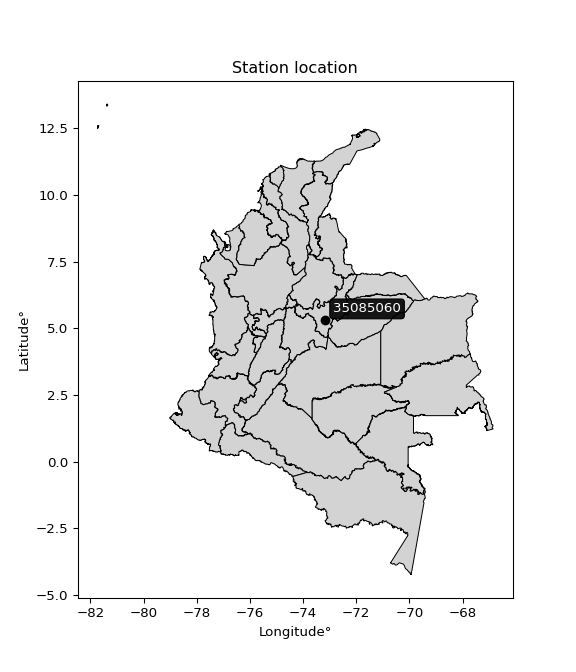

<div align="center">


</div>

# PMP Station (Rain, Pmax24h): 35085060

Probable Maximum Precipitation (PMP) is the greatest amount of rainfall for a specific duration that is meteorologically possible for a given location, acting as a "worst-case" scenario for extreme storms, crucial for designing safety-critical infrastructure like bridges, river deviations, dams, spillways, and nuclear plants to prevent catastrophic failure. PMP is calculated by hydrologists using meteorological data to determine the upper limit of extreme rainfall, often leading to the Probable Maximum Flood (PMF) for flood control design, and is increasingly being studied for climate change impacts. Probable Maximum Precipitation (PMP) is the theoretical upper limit of rainfall, a deterministic estimate for extreme events, while probability distributions (like GEV, Gumbel) describe the likelihood and frequency of various precipitation amounts, including rare ones, showing how often events occur, with PMP representing the extreme end of these distributions, used for critical infrastructure design to ensure safety against the worst conceivable weather, unlike standard statistical forecasts which cover typical probabilities.

The most common probability distributions in hydrology, used for analyzing floods, rainfall, and streamflow, include the Normal, Log-Normal, Gumbel, Gamma (including Log-Pearson Type III), and Generalized Extreme Value (GEV) distributions, often chosen based on the data´s skewness and whether modeling extremes or general conditions, with Gumbel and GEV popular for extreme events like floods, while the Normal distribution serves as a baseline, though often requiring transformations for skewed hydrological data. These distributions help in designing water infrastructure, managing water resources, and forecasting hydrologic events.

> Hydrological data often isn´t perfectly normal (it´s skewed), so different distributions are needed for different applications, such as: **Flood Frequency Analysis**: Using Gumbel, GEV, or Log-Pearson Type III for predicting extreme flood magnitudes and their return periods, **Rainfall Analysis**: Normal for annual totals, but Log-Normal, Weibull, or GEV for intensity or extreme daily rainfall, **Streamflow Modeling**: Gamma and Log-Normal for maximum flows, GEV for minimum flows, and Kappa for daily flows.

<div align="center">

</img>

</div>


## A. General information


### 1. General running parameters

• app_version: _v20260113_. • runtime: _2026-01-17 18:24:04.630693_. • Python version: _3.14.0_. • SciPy version: _1.16.3_. • Pandas version: _2.3.3_. • NumPy version: _2.3.5_. • Stations dataset (station_dataset_file): _dataset/pmax24h_in/automatic_colombia_2003_2025.csv_. • Stations catalog (station_catalog_file): _dataset/CNE.xls_. • Minimum year to eval til year_max (date_min): _1900_. • Maximum year to eval since year_min (date_max): _2025_. • Creates, save and include plots into reports (create_plot): _False_. • Plot only fit distributions with Δo > Δ (plot_only_fit): _True_. • Plot only simple graphs avoiding multiple CDFs and multiple Extreme values plots (plot_only_simple): _True_. • Eval low extreme values, if False, evaluates high extreme values (low_extreme): _False_. • Eval every SciPy distribution as logarithmic (pdist_logarithmic_on): _True_. • Standard deviation normalized (ddof): _1.0_. • Return periods to eval in years (Tr): _[2, 2.33, 5, 10, 15, 20, 25, 50, 75, 100, 200, 250, 500, 750, 1000]_. • Minimum data sample per station, 0 means any (minimum_sample): _5_. • Z-Score maximum threshold to adjust a value, 0 means disable (zscore_max): _3.5_. • Z-Score minimum threshold to adjust a value, 0 means disable (zscore_min): _-2.5_. • Avoid zeros, e.g. rain = 0 (avoid_zeros): _True_. • Avoid null values (avoid_nans): _True_. 

:file_folder:Table: [dataset.csv](../../dataset/pmax24h_in/automatic_colombia_2003_2025.csv)

> Delta Degrees of Freedom (DDOF): is a parameter used in the formulas for calculating variance and standard deviation. When ddof=0, the divisor is $N$ (the total number of observations) and this is used when your data set is the entire population. When ddof=1, the divisor is $N-1$ and this is used when your data set is a sample drawn from a larger population. Using $N-1$ provides an unbiased estimate of the population variance (known as Bessel´s correction).


### 2. Station info and location

|   id |   CODIGO | NOMBRE                     | CATEGORIA               | TECNOLOGIA                | ESTADO   | FECHA_INSTALACION   |   FECHA_SUSPENSION |   ALTITUD |   LATITUD |   LONGITUD | DEPARTAMENTO   | MUNICIPIO   | AREA_OPERATIVA                              | ENTIDAD                                                     | AREA_HIDROGRAFICA   | ZONA_HIDROGRAFICA   | SUBZONA_HIDROGRAFICA   |   CORRIENTE | Catalogo   |   Version |
|-----:|---------:|:---------------------------|:------------------------|:--------------------------|:---------|:--------------------|-------------------:|----------:|----------:|-----------:|:---------------|:------------|:--------------------------------------------|:------------------------------------------------------------|:--------------------|:--------------------|:-----------------------|------------:|:-----------|----------:|
|    0 | 35085060 | ZETAQUIRA - AUT [35085060] | Climatológica Principal | Automática con Telemetría | Activa   | 12/12/2004          |                nan |      1436 |   5.29494 |   -73.1699 | Boyacá         | Zetaquirá   | Area Operativa 06 - Boyacá-Casanare-Vichada | INSTITUTO DE HIDROLOGIA METEOROLOGIA Y ESTUDIOS AMBIENTALES | Orinoco             | Meta                | Río Lengupá            |         nan | CNE_IDEAM  |  20251226 |

<div align="center">

Dynamic map: [:earth_americas:Google](http://maps.google.com/maps?q=5.294944444,-73.16994444) [:earth_americas:OSM](https://www.openstreetmap.org/#map=18/5.294944444/-73.16994444&layers=P) [:earth_americas:Bing](https://www.bing.com/maps?cp=5.294944444~-73.16994444&lvl=18) [:earth_americas:Apple](https://maps.apple.com/frame?center=5.294944444%2C-73.16994444&span=0.003%2C0.006)

</div>


<div align="center">

```geojson
{
  "type": "Feature",
  "geometry": {
    "type": "Point", 
    "coordinates": [-73.16994444, 5.294944444]
  }, 
  "properties": {
    "Name": "35085060"
  }
}
```

</div>


### 3. Discrete values table and plot

<div align="center">

|               |          0 |           1 |          2 |           3 |           4 |           5 |           6 |           7 |           8 |
|:--------------|-----------:|------------:|-----------:|------------:|------------:|------------:|------------:|------------:|------------:|
| Date          | 2017       | 2018        | 2019       | 2020        | 2021        | 2022        | 2023        | 2024        | 2025        |
| Value         |   72.6     |   43.8      |   94.5     |   15.3      |   40.6      |    7        |    8.7      |   14.6      |   10.5      |
| Value_initial |   72.6     |   43.8      |   94.5     |   15.3      |   40.6      |    7        |    8.7      |   14.6      |   10.5      |
| count         |    9       |    9        |    9       |    9        |    9        |    9        |    9        |    9        |    9        |
| mean          |   34.1778  |   34.1778   |   34.1778  |   34.1778   |   34.1778   |   34.1778   |   34.1778   |   34.1778   |   34.1778   |
| std           |   31.4978  |   31.4978   |   31.4978  |   31.4978   |   31.4978   |   31.4978   |   31.4978   |   31.4978   |   31.4978   |
| zscore        |    1.21984 |    0.305488 |    1.91512 |   -0.599335 |    0.203894 |   -0.862846 |   -0.808874 |   -0.621559 |   -0.751727 |


</div>


> The initial value (value_initial) correspond to the initial obtained or null completed value, and value (value) is adjusted only when the initial value is outside the valid range (outlier) definite through the Z-Score value. If Z-Score is active, values out of range or outliers are replaced with the station mean value. A Z-Score (or standard score) measures how many standard deviations a data point is from the mean of a dataset, indicating its relative position; positive scores mean above the mean, negative mean below, and a score of zero is exactly at the mean, allowing for comparison of values from different distributions. It´s calculated using the formula $z=(x–μ)/σ$, where $x$ is the data point, $μ$ is the mean, and $σ$ is the standard deviation, helping identify outliers and understand probability.
>
> <sub>**Note**: In this study, "completing" (filling gaps in) and "extending" (forecasting or lengthening the historical record) rainfall data series are avoided for certain critical analyses because they introduce artificial bias and uncertainty, which can distort the statistics of rare events (extremes), alter day-to-day variability, and compromise the integrity and homogeneity of the original data. Some reasons against Completing/Extending rainfall data are: **Distortion of Extremes and Variability**: The primary issue is that most gap-filling or extension methods rely on averaging or regression with nearby stations, which inherently smooths the data. Rainfall is highly variable in space and time, with a large percentage of zero values and occasional large storms. Infilling methods often underestimate the highest values and overestimate the lowest (zero) values, which severely distorts analyses focused on flood frequency, drought severity, and intensity-duration-frequency (IDF) curves, **Loss of Data Homogeneity**: Infilled or extended data are synthetic estimates, not actual measurements. Combining these estimates with observed data can violate the assumption of data homogeneity, which requires that the data properties do not change over time. Inhomogeneity can lead to incorrect conclusions about long-term trends or changes in climate patterns, **Propagation of Errors**: Errors and biases from the original data (e.g., wind-induced undercatch, instrument errors, site changes) or the data used for imputation can propagate through the analysis, leading to unreliable hydrological models and inaccurate predictions, **Compromised Statistical Integrity**: For statistical analyses, especially those involving the frequency of events, using artificial data can introduce time bias or autocorrelation that doesn´t exist in reality, making it difficult to assess the true probability of events, **Difficulty in Validation**: It is difficult to accurately validate the quality of filled or extended data, especially for past periods where ground-truth measurements are unavailable. The reliability of imputation techniques heavily depends on the density of the surrounding station network and the complexity of the local topography.</sub>


### 4. Active continuous probability distributions from SciPy (80 of 104 available)

A Probability Density Function (PDF) describes the relative likelihood of a continuous random variable falling within a specific range, where the total area under its curve equals 1, and the area over any interval gives the actual probability for that range. Unlike discrete probabilities (like rolling a die), a PDF shows density, not direct probability for a single point (which is zero), with higher points indicating higher likelihood, often visualized as a bell curve for normal distributions.

A log of a probability density function (log-PDF) is simply the logarithm of the PDF´s value, denoted as $log(f(x))$, useful for converting multiplication of probabilities into addition, improving numerical stability with tiny numbers, and connecting to information theory concepts like entropy. Instead of dealing with very small probabilities (e.g., 0.000001), log-PDFs use negative numbers (e.g., $log(0.00001) ≈ -11.51$ that are easier for computers to handle, preventing underflow errors and simplifying complex calculations. In this study, each active probability distribution from SciPy is also evaluated in the $log$ form.

[scipy.stats](https://docs.scipy.org/doc/scipy/reference/stats.html) is a Python´s powerful submodule within the SciPy library for comprehensive statistical analysis, offering over 130 probability distributions (like Normal, Poisson), functions for descriptive stats (mean, variance), hypothesis testing (t-tests, chi-square), random variable generation, and statistical tests, making it essential for data science, modeling, and research. It provides tools to explore, model, and draw conclusions from data efficiently, working seamlessly with NumPy.

<div align="center">

|   id | p_dist           |   n_parameter | fit_method   | label                                                                       | active   | ref                                                                                                      |
|-----:|:-----------------|--------------:|:-------------|:----------------------------------------------------------------------------|:---------|:---------------------------------------------------------------------------------------------------------|
|    0 | alpha            |             3 | MLE          | Alpha                                                                       | True     | [:mortar_board:](https://docs.scipy.org/doc/scipy/reference/generated/scipy.stats.alpha.html)            |
|    1 | anglit           |             2 | MM           | Anglit                                                                      | True     | [:mortar_board:](https://docs.scipy.org/doc/scipy/reference/generated/scipy.stats.anglit.html)           |
|    2 | arcsine          |             2 | MM           | Arcsine                                                                     | True     | [:mortar_board:](https://docs.scipy.org/doc/scipy/reference/generated/scipy.stats.arcsine.html)          |
|    3 | argus            |             3 | MLE          | Argus                                                                       | True     | [:mortar_board:](https://docs.scipy.org/doc/scipy/reference/generated/scipy.stats.argus.html)            |
|    4 | beta             |             4 | MLE          | Beta                                                                        | True     | [:mortar_board:](https://docs.scipy.org/doc/scipy/reference/generated/scipy.stats.beta.html)             |
|    5 | betaprime        |             4 | MLE          | Beta prime                                                                  | True     | [:mortar_board:](https://docs.scipy.org/doc/scipy/reference/generated/scipy.stats.betaprime.html)        |
|    6 | bradford         |             3 | MLE          | Bradford                                                                    | True     | [:mortar_board:](https://docs.scipy.org/doc/scipy/reference/generated/scipy.stats.bradford.html)         |
|    7 | burr             |             4 | MLE          | Burr (Type III)                                                             | True     | [:mortar_board:](https://docs.scipy.org/doc/scipy/reference/generated/scipy.stats.burr.html)             |
|    8 | burr12           |             4 | MLE          | Burr (Type III) 12                                                          | True     | [:mortar_board:](https://docs.scipy.org/doc/scipy/reference/generated/scipy.stats.burr12.html)           |
|    9 | cosine           |             2 | MLE          | Cosine                                                                      | True     | [:mortar_board:](https://docs.scipy.org/doc/scipy/reference/generated/scipy.stats.cosine.html)           |
|   10 | crystalball      |             4 | MLE          | Crystalball                                                                 | True     | [:mortar_board:](https://docs.scipy.org/doc/scipy/reference/generated/scipy.stats.crystalball.html)      |
|   11 | dgamma           |             3 | MLE          | Double gamma                                                                | True     | [:mortar_board:](https://docs.scipy.org/doc/scipy/reference/generated/scipy.stats.dgamma.html)           |
|   12 | dweibull         |             3 | MLE          | Double Weibull                                                              | True     | [:mortar_board:](https://docs.scipy.org/doc/scipy/reference/generated/scipy.stats.dweibull.html)         |
|   13 | erlang           |             3 | MLE          | Erlang                                                                      | True     | [:mortar_board:](https://docs.scipy.org/doc/scipy/reference/generated/scipy.stats.erlang.html)           |
|   14 | exponnorm        |             3 | MLE          | Exponentially modified Normal                                               | True     | [:mortar_board:](https://docs.scipy.org/doc/scipy/reference/generated/scipy.stats.exponnorm.html)        |
|   15 | exponpow         |             3 | MLE          | Exponential power                                                           | True     | [:mortar_board:](https://docs.scipy.org/doc/scipy/reference/generated/scipy.stats.exponpow.html)         |
|   16 | exponweib        |             4 | MLE          | Exponentiated Weibull                                                       | True     | [:mortar_board:](https://docs.scipy.org/doc/scipy/reference/generated/scipy.stats.exponweib.html)        |
|   17 | f                |             4 | MLE          | F                                                                           | True     | [:mortar_board:](https://docs.scipy.org/doc/scipy/reference/generated/scipy.stats.f.html)                |
|   18 | fatiguelife      |             3 | MLE          | Fatigue-life (Birnbaum-Saunders)                                            | True     | [:mortar_board:](https://docs.scipy.org/doc/scipy/reference/generated/scipy.stats.fatiguelife.html)      |
|   19 | foldnorm         |             3 | MM           | Fold Normal                                                                 | True     | [:mortar_board:](https://docs.scipy.org/doc/scipy/reference/generated/scipy.stats.foldnorm.html)         |
|   20 | gamma            |             3 | MLE          | Gamma                                                                       | True     | [:mortar_board:](https://docs.scipy.org/doc/scipy/reference/generated/scipy.stats.gamma.html)            |
|   21 | gausshyper       |             6 | MLE          | Gauss hypergeometric                                                        | True     | [:mortar_board:](https://docs.scipy.org/doc/scipy/reference/generated/scipy.stats.gausshyper.html)       |
|   22 | genexpon         |             5 | MLE          | Generalized exponential                                                     | True     | [:mortar_board:](https://docs.scipy.org/doc/scipy/reference/generated/scipy.stats.genexpon.html)         |
|   23 | genextreme       |             3 | MLE          | Generalized exponential                                                     | True     | [:mortar_board:](https://docs.scipy.org/doc/scipy/reference/generated/scipy.stats.genextreme.html)       |
|   24 | gengamma         |             4 | MLE          | Generalized gamma                                                           | True     | [:mortar_board:](https://docs.scipy.org/doc/scipy/reference/generated/scipy.stats.gengamma.html)         |
|   25 | genhalflogistic  |             3 | MLE          | Generalized half-logistic                                                   | True     | [:mortar_board:](https://docs.scipy.org/doc/scipy/reference/generated/scipy.stats.genhalflogistic.html)  |
|   26 | genlogistic      |             3 | MLE          | Generalized logistic                                                        | True     | [:mortar_board:](https://docs.scipy.org/doc/scipy/reference/generated/scipy.stats.genlogistic.html)      |
|   27 | gennorm          |             3 | MLE          | Generalized Normal                                                          | True     | [:mortar_board:](https://docs.scipy.org/doc/scipy/reference/generated/scipy.stats.gennorm.html)          |
|   28 | genpareto        |             3 | MLE          | Generalized Pareto                                                          | True     | [:mortar_board:](https://docs.scipy.org/doc/scipy/reference/generated/scipy.stats.genpareto.html)        |
|   29 | gompertz         |             3 | MLE          | Gompertz (or truncated Gumbel)                                              | True     | [:mortar_board:](https://docs.scipy.org/doc/scipy/reference/generated/scipy.stats.gompertz.html)         |
|   30 | gumbel_l         |             2 | MM           | Gumbel Left Skew                                                            | True     | [:mortar_board:](https://docs.scipy.org/doc/scipy/reference/generated/scipy.stats.gumbel_l.html)         |
|   31 | gumbel_r         |             2 | MM           | Gumbel Right Skew                                                           | True     | [:mortar_board:](https://docs.scipy.org/doc/scipy/reference/generated/scipy.stats.gumbel_r.html)         |
|   32 | halfgennorm      |             3 | MLE          | Upper half of a generalized normal                                          | True     | [:mortar_board:](https://docs.scipy.org/doc/scipy/reference/generated/scipy.stats.halfgennorm.html)      |
|   33 | halflogistic     |             2 | MM           | Half-logistic                                                               | True     | [:mortar_board:](https://docs.scipy.org/doc/scipy/reference/generated/scipy.stats.halflogistic.html)     |
|   34 | halfnorm         |             2 | MM           | Half Normal                                                                 | True     | [:mortar_board:](https://docs.scipy.org/doc/scipy/reference/generated/scipy.stats.halfnorm.html)         |
|   35 | hypsecant        |             2 | MM           | hyperbolic secant                                                           | True     | [:mortar_board:](https://docs.scipy.org/doc/scipy/reference/generated/scipy.stats.hypsecant.html)        |
|   36 | invgamma         |             3 | MLE          | Inverted gamma                                                              | True     | [:mortar_board:](https://docs.scipy.org/doc/scipy/reference/generated/scipy.stats.invgamma.html)         |
|   37 | invgauss         |             3 | MLE          | Inverse Gaussian                                                            | True     | [:mortar_board:](https://docs.scipy.org/doc/scipy/reference/generated/scipy.stats.invgauss.html)         |
|   38 | invweibull       |             3 | MLE          | Inverted Weibull                                                            | True     | [:mortar_board:](https://docs.scipy.org/doc/scipy/reference/generated/scipy.stats.invweibull.html)       |
|   39 | johnsonsb        |             4 | MLE          | Johnson SB                                                                  | True     | [:mortar_board:](https://docs.scipy.org/doc/scipy/reference/generated/scipy.stats.johnsonsb.html)        |
|   40 | johnsonsu        |             4 | MLE          | Johnson Su                                                                  | True     | [:mortar_board:](https://docs.scipy.org/doc/scipy/reference/generated/scipy.stats.johnsonsu.html)        |
|   41 | kappa3           |             3 | MLE          | Kappa 3                                                                     | True     | [:mortar_board:](https://docs.scipy.org/doc/scipy/reference/generated/scipy.stats.kappa3.html)           |
|   42 | kappa4           |             4 | MLE          | Kappa 4                                                                     | True     | [:mortar_board:](https://docs.scipy.org/doc/scipy/reference/generated/scipy.stats.kappa4.html)           |
|   43 | ksone            |             3 | MLE          | Kolmogorov-Smirnov one-sided test statistic distribution                    | True     | [:mortar_board:](https://docs.scipy.org/doc/scipy/reference/generated/scipy.stats.ksone.html)            |
|   44 | kstwobign        |             2 | MLE          | Limiting distribution of scaled Kolmogorov-Smirnov two-sided test statistic | True     | [:mortar_board:](https://docs.scipy.org/doc/scipy/reference/generated/scipy.stats.kstwobign.html)        |
|   45 | laplace          |             2 | MM           | Laplace                                                                     | True     | [:mortar_board:](https://docs.scipy.org/doc/scipy/reference/generated/scipy.stats.laplace.html)          |
|   46 | levy_l           |             2 | MLE          | Left-skewed Levy                                                            | True     | [:mortar_board:](https://docs.scipy.org/doc/scipy/reference/generated/scipy.stats.levy_l.html)           |
|   47 | loggamma         |             3 | MLE          | Log gamma                                                                   | True     | [:mortar_board:](https://docs.scipy.org/doc/scipy/reference/generated/scipy.stats.loggamma.html)         |
|   48 | logistic         |             2 | MM           | Logistic (or Sech-squared)                                                  | True     | [:mortar_board:](https://docs.scipy.org/doc/scipy/reference/generated/scipy.stats.logistic.html)         |
|   49 | loglaplace       |             3 | MLE          | Log-Laplace                                                                 | True     | [:mortar_board:](https://docs.scipy.org/doc/scipy/reference/generated/scipy.stats.loglaplace.html)       |
|   50 | lomax            |             3 | MLE          | Lomax (Pareto of the second kind)                                           | True     | [:mortar_board:](https://docs.scipy.org/doc/scipy/reference/generated/scipy.stats.lomax.html)            |
|   51 | maxwell          |             2 | MM           | Maxwell                                                                     | True     | [:mortar_board:](https://docs.scipy.org/doc/scipy/reference/generated/scipy.stats.maxwell.html)          |
|   52 | mielke           |             4 | MLE          | Mielke Beta-Kappa / Dagum                                                   | True     | [:mortar_board:](https://docs.scipy.org/doc/scipy/reference/generated/scipy.stats.mielke.html)           |
|   53 | moyal            |             2 | MM           | Moyal                                                                       | True     | [:mortar_board:](https://docs.scipy.org/doc/scipy/reference/generated/scipy.stats.moyal.html)            |
|   54 | nakagami         |             3 | MLE          | Nakagami                                                                    | True     | [:mortar_board:](https://docs.scipy.org/doc/scipy/reference/generated/scipy.stats.nakagami.html)         |
|   55 | ncf              |             5 | MLE          | Non-central F distribution                                                  | True     | [:mortar_board:](https://docs.scipy.org/doc/scipy/reference/generated/scipy.stats.ncf.html)              |
|   56 | nct              |             4 | MLE          | Non-central Student’s t                                                     | True     | [:mortar_board:](https://docs.scipy.org/doc/scipy/reference/generated/scipy.stats.nct.html)              |
|   57 | norm             |             2 | MM           | Normal                                                                      | True     | [:mortar_board:](https://docs.scipy.org/doc/scipy/reference/generated/scipy.stats.norm.html)             |
|   58 | pearson3         |             3 | MM           | Pearson type III                                                            | True     | [:mortar_board:](https://docs.scipy.org/doc/scipy/reference/generated/scipy.stats.pearson3.html)         |
|   59 | powerlaw         |             3 | MLE          | Power-function                                                              | True     | [:mortar_board:](https://docs.scipy.org/doc/scipy/reference/generated/scipy.stats.powerlaw.html)         |
|   60 | rayleigh         |             2 | MM           | Rayleigh                                                                    | True     | [:mortar_board:](https://docs.scipy.org/doc/scipy/reference/generated/scipy.stats.rayleigh.html)         |
|   61 | rdist            |             3 | MLE          | R-distributed (symmetric beta)                                              | True     | [:mortar_board:](https://docs.scipy.org/doc/scipy/reference/generated/scipy.stats.rdist.html)            |
|   62 | rice             |             3 | MLE          | Rice                                                                        | True     | [:mortar_board:](https://docs.scipy.org/doc/scipy/reference/generated/scipy.stats.rice.html)             |
|   63 | semicircular     |             2 | MM           | Semicircular                                                                | True     | [:mortar_board:](https://docs.scipy.org/doc/scipy/reference/generated/scipy.stats.semicircular.html)     |
|   64 | skewnorm         |             3 | MLE          | Skew normal                                                                 | True     | [:mortar_board:](https://docs.scipy.org/doc/scipy/reference/generated/scipy.stats.skewnorm.html)         |
|   65 | t                |             3 | MLE          | Student’s t                                                                 | True     | [:mortar_board:](https://docs.scipy.org/doc/scipy/reference/generated/scipy.stats.t.html)                |
|   66 | trapezoid        |             4 | MLE          | Trapezoid                                                                   | True     | [:mortar_board:](https://docs.scipy.org/doc/scipy/reference/generated/scipy.stats.trapezoid.html)        |
|   67 | triang           |             3 | MLE          | Triangular                                                                  | True     | [:mortar_board:](https://docs.scipy.org/doc/scipy/reference/generated/scipy.stats.triang.html)           |
|   68 | truncexpon       |             3 | MLE          | Truncated exponential                                                       | True     | [:mortar_board:](https://docs.scipy.org/doc/scipy/reference/generated/scipy.stats.truncexpon.html)       |
|   69 | truncnorm        |             4 | MLE          | Truncated normal                                                            | True     | [:mortar_board:](https://docs.scipy.org/doc/scipy/reference/generated/scipy.stats.truncnorm.html)        |
|   70 | truncpareto      |             4 | MLE          | Upper truncated Pareto                                                      | True     | [:mortar_board:](https://docs.scipy.org/doc/scipy/reference/generated/scipy.stats.truncpareto.html)      |
|   71 | truncweibull_min |             5 | MLE          | Doubly truncated Weibull minimum                                            | True     | [:mortar_board:](https://docs.scipy.org/doc/scipy/reference/generated/scipy.stats.truncweibull_min.html) |
|   72 | tukeylambda      |             3 | MLE          | Tukey-Lamdba                                                                | True     | [:mortar_board:](https://docs.scipy.org/doc/scipy/reference/generated/scipy.stats.tukeylambda.html)      |
|   73 | uniform          |             2 | MLE          | Uniform                                                                     | True     | [:mortar_board:](https://docs.scipy.org/doc/scipy/reference/generated/scipy.stats.uniform.html)          |
|   74 | vonmises         |             3 | MLE          | Von Mises                                                                   | True     | [:mortar_board:](https://docs.scipy.org/doc/scipy/reference/generated/scipy.stats.vonmises.html)         |
|   75 | vonmises_line    |             3 | MLE          | Von Mises line                                                              | True     | [:mortar_board:](https://docs.scipy.org/doc/scipy/reference/generated/scipy.stats.vonmises_line.html)    |
|   76 | wald             |             2 | MM           | Wald                                                                        | True     | [:mortar_board:](https://docs.scipy.org/doc/scipy/reference/generated/scipy.stats.wald.html)             |
|   77 | weibull_max      |             3 | MLE          | Weibull maximum                                                             | True     | [:mortar_board:](https://docs.scipy.org/doc/scipy/reference/generated/scipy.stats.weibull_max.html)      |
|   78 | weibull_min      |             3 | MLE          | Weibull minimum                                                             | True     | [:mortar_board:](https://docs.scipy.org/doc/scipy/reference/generated/scipy.stats.weibull_min.html)      |
|   79 | wrapcauchy       |             3 | MLE          | Wrapped  Cauchy                                                             | True     | [:mortar_board:](https://docs.scipy.org/doc/scipy/reference/generated/scipy.stats.wrapcauchy.html)       |

</div>

> **n_parameter:** # arguments & localization & scale.
>
> **Fit methods:** (MLE) maximum likelihood, (MM) L-moments.
>
>**Inactive** (With the only purpose of prevent loops, zero divisions, infinite values, over high estimated values or horizontal trending for recurrence intervals estimations, the follow distributions were disabled.)**:** lognorm, norminvgauss, powernorm, powerlognorm, cauchy, halfcauchy, foldcauchy, skewcauchy, chi2, expon, fisk, genhyperbolic, geninvgauss, gibrat, kstwo, laplace_asymmetric, levy, levy_stable, ncx2, pareto, rel_breitwigner, recipinvgauss, studentized_range, loguniform, 


## B. Probability (PDF) vs. Empirical (EDF) distributions functions

A continuous probability distribution (CPD) describes probabilities for variables that can take any value within a range (like rain any time), unlike discrete variables with specific outcomes (like temperature). It uses a Probability Density Function (PDF), a curve where the total area under it equals 1, and the probability of the variable falling within an interval (a to b) is found by calculating the area under the curve between those points. A key feature is that the probability of hitting any single exact value is zero, so probabilities are always expressed for ranges, e.g., $P(a ≤ X ≤ b)$.

<div align="center">

Distributions parameters from station values
|     |   station | p_dist              |   n |             loc |          scale | shape                  | shape1                 | shape2                 | shape3             |
|----:|----------:|:--------------------|----:|----------------:|---------------:|:-----------------------|:-----------------------|:-----------------------|:-------------------|
|   0 |  35085060 | alpha               |   9 |     1.95293     |   10.0937      | 1.1524024940744622e-09 |                        |                        |                    |
|   1 |  35085060 | anglit              |   9 |    34.1778      |   86.874       |                        |                        |                        |                    |
|   2 |  35085060 | arcsine             |   9 |    -7.81935     |   83.9942      |                        |                        |                        |                    |
|   3 |  35085060 | argus               |   9 |   -32.4431      |  131.21        | 4.066642874698826e-06  |                        |                        |                    |
|   4 |  35085060 | beta                |   9 |    -1.68291     |   96.1829      | 0.360818315472667      | 0.6088066537407231     |                        |                    |
|   5 |  35085060 | betaprime           |   9 |     1.87086     |    2.27412     | 8.47822121222113       | 1.3585478119535281     |                        |                    |
|   6 |  35085060 | bradford            |   9 |     6.99999     |   87.5002      | 11.6971811678658       |                        |                        |                    |
|   7 |  35085060 | burr                |   9 |     1.82573     |    1.58338     | 1.2866401825009373     | 15.034242388475043     |                        |                    |
|   8 |  35085060 | burr12              |   9 |    -0.892094    |    7.7941      | 283.3884291670753      | 0.003118229976519124   |                        |                    |
|   9 |  35085060 | cosine              |   9 |    38.3504      |   25.1532      |                        |                        |                        |                    |
|  10 |  35085060 | crystalball         |   9 |    34.1778      |   29.6965      | 2237.287078075868      | 3397.0022088406895     |                        |                    |
|  11 |  35085060 | dgamma              |   9 |    30.3513      |    7.87847     | 3.1838039749878613     |                        |                        |                    |
|  12 |  35085060 | dweibull            |   9 |    32.2418      |   28.641       | 1.7540228658044037     |                        |                        |                    |
|  13 |  35085060 | erlang              |   9 |     7           |   18.3423      | 0.7182683891960788     |                        |                        |                    |
|  14 |  35085060 | exponnorm           |   9 |     6.96598     |    0.0103941   | 2597.1622871731242     |                        |                        |                    |
|  15 |  35085060 | exponpow            |   9 |     7           |   46.3692      | 0.5640458388413181     |                        |                        |                    |
|  16 |  35085060 | exponweib           |   9 |     7           |   24.1481      | 0.8609042932960359     | 0.6565094244824494     |                        |                    |
|  17 |  35085060 | f                   |   9 |     6.99999     |   10.9818      | 1.067802783973788      | 1.6148089907134682     |                        |                    |
|  18 |  35085060 | fatiguelife         |   9 |     6.36347     |    9.3532      | 1.9053956658954294     |                        |                        |                    |
|  19 |  35085060 | foldnorm            |   9 |    -6.06954     |   42.3855      | 0.6265247345536835     |                        |                        |                    |
|  20 |  35085060 | gamma               |   9 |     7           |   15.3619      | 0.726707857894098      |                        |                        |                    |
|  21 |  35085060 | gausshyper          |   9 |    -1.68856     |   96.1886      | 1.0007473580406931     | 0.8433757008155132     | 1.1910837169333122     | 1.1147379594973454 |
|  22 |  35085060 | genexpon            |   9 |     6.9756      |  205.073       | 7.071294800283573      | 4.0070135090730427e-07 | 1.127272765312835e-06  |                    |
|  23 |  35085060 | genextreme          |   9 |    12.5391      |    8.74068     | -1.2283109774916343    |                        |                        |                    |
|  24 |  35085060 | gengamma            |   9 |     7           |   23.2966      | 0.9204735909350907     | 0.6510641665532805     |                        |                    |
|  25 |  35085060 | genhalflogistic     |   9 |    -1.80928     |   99.6378      | 1.0345607907172254     |                        |                        |                    |
|  26 |  35085060 | genlogistic         |   9 |  -132.196       |   20.2323      | 1937.1571183050182     |                        |                        |                    |
|  27 |  35085060 | gennorm             |   9 |    14.6         |    1.68797     | 0.42548164828300356    |                        |                        |                    |
|  28 |  35085060 | genpareto           |   9 |     7           |   15.1325      | 0.56063908710499       |                        |                        |                    |
|  29 |  35085060 | gompertz            |   9 |     7           |   72.9366      | 1.5637463657407995     |                        |                        |                    |
|  30 |  35085060 | gumbel_l            |   9 |    47.5428      |   23.1542      |                        |                        |                        |                    |
|  31 |  35085060 | gumbel_r            |   9 |    20.8128      |   23.1542      |                        |                        |                        |                    |
|  32 |  35085060 | halfgennorm         |   9 |     7           |    0.839248    | 0.35840738468764477    |                        |                        |                    |
|  33 |  35085060 | halflogistic        |   9 |    -1.01942     |   25.3894      |                        |                        |                        |                    |
|  34 |  35085060 | halfnorm            |   9 |    -5.12869     |   49.2634      |                        |                        |                        |                    |
|  35 |  35085060 | hypsecant           |   9 |    34.1778      |   18.9054      |                        |                        |                        |                    |
|  36 |  35085060 | invgamma            |   9 |     4.72405     |    6.98611     | 0.8842619256133414     |                        |                        |                    |
|  37 |  35085060 | invgauss            |   9 |     5.23825     |    8.80619     | 3.2862678653239934     |                        |                        |                    |
|  38 |  35085060 | invweibull          |   9 |     5.42316     |    7.11603     | 0.8141218544115287     |                        |                        |                    |
|  39 |  35085060 | johnsonsb           |   9 |     7           |   87.6459      | 0.1323673616324119     | 0.1281317733055457     |                        |                    |
|  40 |  35085060 | johnsonsu           |   9 |     6.86176     |    0.00466254  | -4.275825394703954     | 0.5170246729563868     |                        |                    |
|  41 |  35085060 | kappa3              |   9 |     7           |   10.1841      | 0.9267292840493762     |                        |                        |                    |
|  42 |  35085060 | kappa4              |   9 |    -1.72613     |   96.7349      | 1.0990612140709604     | 0.9823280058929509     |                        |                    |
|  43 |  35085060 | ksone               |   9 |    -1.75        |  105           | 1.0                    |                        |                        |                    |
|  44 |  35085060 | kstwobign           |   9 |   -50.609       |   97.6099      |                        |                        |                        |                    |
|  45 |  35085060 | laplace             |   9 |    34.1778      |   20.9986      |                        |                        |                        |                    |
|  46 |  35085060 | levy_l              |   9 |   101.076       |   32.5035      |                        |                        |                        |                    |
|  47 |  35085060 | loggamma            |   9 | -8418.37        | 1160.01        | 1460.7627061164076     |                        |                        |                    |
|  48 |  35085060 | logistic            |   9 |    34.1778      |   16.3725      |                        |                        |                        |                    |
|  49 |  35085060 | loglaplace          |   9 |    -0.0759876   |   15.376       | 1.2589366305164886     |                        |                        |                    |
|  50 |  35085060 | lomax               |   9 |     7           |   85.4271      | 4.080891966373787      |                        |                        |                    |
|  51 |  35085060 | maxwell             |   9 |   -36.1904      |   44.0967      |                        |                        |                        |                    |
|  52 |  35085060 | mielke              |   9 |     4.5006      |    0.00405863  | 1338.3795421012915     | 0.9504980159247364     |                        |                    |
|  53 |  35085060 | moyal               |   9 |    17.1954      |   13.3681      |                        |                        |                        |                    |
|  54 |  35085060 | nakagami            |   9 |     7           |   38.8886      | 0.15323728052746127    |                        |                        |                    |
|  55 |  35085060 | ncf                 |   9 |     4.74584     |    7.87339     | 318.1263187489419      | 1.768570996522298      | 1.2238131823638945     |                    |
|  56 |  35085060 | nct                 |   9 |     0.0903327   |    0.178674    | 1.0992385174671306     | 72.18873761363388      |                        |                    |
|  57 |  35085060 | norm                |   9 |    34.1778      |   29.6965      |                        |                        |                        |                    |
|  58 |  35085060 | pearson3            |   9 |    34.1778      |   29.6965      | 0.9047920002778488     |                        |                        |                    |
|  59 |  35085060 | powerlaw            |   9 |     7           |   87.5         | 0.16917587451183794    |                        |                        |                    |
|  60 |  35085060 | rayleigh            |   9 |   -22.6333      |   45.3287      |                        |                        |                        |                    |
|  61 |  35085060 | rdist               |   9 |    -0.810522    |   44.6105      | 1.0753139925392565     |                        |                        |                    |
|  62 |  35085060 | rice                |   9 |   -12.2449      |   38.9676      | 0.0006919851769309455  |                        |                        |                    |
|  63 |  35085060 | semicircular        |   9 |    34.1778      |   59.3929      |                        |                        |                        |                    |
|  64 |  35085060 | skewnorm            |   9 |     6.99998     |   40.2552      | 13389233.451311423     |                        |                        |                    |
|  65 |  35085060 | t                   |   9 |    12.31        |    6.11754     | 0.6882892709252304     |                        |                        |                    |
|  66 |  35085060 | trapezoid           |   9 |    -1.8375      |  105           | 1.0                    | 1.0                    |                        |                    |
|  67 |  35085060 | triang              |   9 |   -43.9231      |  138.452       | 0.9997879619413297     |                        |                        |                    |
|  68 |  35085060 | truncexpon          |   9 |     6.99999     |   93.224       | 0.938600173503433      |                        |                        |                    |
|  69 |  35085060 | truncnorm           |   9 | -1522.04        |  214.63        | 7.124068391144194      | 7.53175040038976       |                        |                    |
|  70 |  35085060 | truncpareto         |   9 |     5.66663     |    1.33337     | 1.3740262107768516e-08 | 66.62313166682267      |                        |                    |
|  71 |  35085060 | truncweibull_min    |   9 |     7           |   95.6699      | 0.3692754122776872     | 1.734825988238492e-17  | 0.9229623615394369     |                    |
|  72 |  35085060 | tukeylambda         |   9 |    -0.776731    |   47.0282      | 1.0549932882073572     |                        |                        |                    |
|  73 |  35085060 | uniform             |   9 |     7           |   87.5         |                        |                        |                        |                    |
|  74 |  35085060 | vonmises            |   9 |     2.38304     |    1           | 0.5719558668850955     |                        |                        |                    |
|  75 |  35085060 | vonmises_line       |   9 |    29.2173      |   20.7801      | 0.79505555541115       |                        |                        |                    |
|  76 |  35085060 | wald                |   9 |     4.48132     |   29.6965      |                        |                        |                        |                    |
|  77 |  35085060 | weibull_max         |   9 |    94.5         |    1.71224     | 0.2053950447694919     |                        |                        |                    |
|  78 |  35085060 | weibull_min         |   9 |     7           |   30.6653      | 0.6394847179512768     |                        |                        |                    |
|  79 |  35085060 | wrapcauchy          |   9 |     7           |   13.9261      | 0.6311264248783897     |                        |                        |                    |
|  80 |  35085060 | logalpha            |   9 |    -2.38291     |   33.3047      | 6.202601998162351      |                        |                        |                    |
|  81 |  35085060 | loganglit           |   9 |     3.13183     |    2.65331     |                        |                        |                        |                    |
|  82 |  35085060 | logarcsine          |   9 |     1.84915     |    2.56536     |                        |                        |                        |                    |
|  83 |  35085060 | logargus            |   9 |     1.21187     |    3.47881     | 2.0394523881106676e-05 |                        |                        |                    |
|  84 |  35085060 | logbeta             |   9 |     1.94591     |    2.60958     | 0.4169920802807522     | 0.5123363950177381     |                        |                    |
|  85 |  35085060 | logbetaprime        |   9 |     1.59647     |    1.73176     | 3.8727393159590147     | 5.344773759014277      |                        |                    |
|  86 |  35085060 | logbradford         |   9 |     1.94591     |    2.60277     | 1.0712197353703754     |                        |                        |                    |
|  87 |  35085060 | logburr             |   9 |    -3.22095     |    3.01852     | 8.36867880653796       | 255.00599598239893     |                        |                    |
|  88 |  35085060 | logburr12           |   9 |     1.94591     |    2.0723      | 0.9396077471820661     | 2.412970015513567      |                        |                    |
|  89 |  35085060 | logcosine           |   9 |     3.16459     |    0.725473    |                        |                        |                        |                    |
|  90 |  35085060 | logcrystalball      |   9 |     3.13183     |    0.90699     | 120.45559808826889     | 22.576575915041573     |                        |                    |
|  91 |  35085060 | logdgamma           |   9 |     3.21187     |    0.127148    | 6.693307833945038      |                        |                        |                    |
|  92 |  35085060 | logdweibull         |   9 |     3.22479     |    0.960376    | 2.949959438385808      |                        |                        |                    |
|  93 |  35085060 | logerlang           |   9 |     1.94591     |    1.43294     | 0.4137281795750841     |                        |                        |                    |
|  94 |  35085060 | logexponnorm        |   9 |     2.97328     |    0.893061    | 0.17753650493770273    |                        |                        |                    |
|  95 |  35085060 | logexponpow         |   9 |     1.94591     |    3.27202     | 0.5033302328680026     |                        |                        |                    |
|  96 |  35085060 | logexponweib        |   9 |     1.94591     |    1.34729     | 0.8158001104189774     | 0.9750628241054684     |                        |                    |
|  97 |  35085060 | logf                |   9 |     1.94591     |    1.47222     | 1.2982526115051574     | 243.4874460547382      |                        |                    |
|  98 |  35085060 | logfatiguelife      |   9 |     1.58496     |    1.22504     | 0.7201740565067303     |                        |                        |                    |
|  99 |  35085060 | logfoldnorm         |   9 |     1.34905     |    0.953248    | 1.8447190047057864     |                        |                        |                    |
| 100 |  35085060 | loggamma            |   9 |     1.94591     |    2.7282      | 0.5489504776720808     |                        |                        |                    |
| 101 |  35085060 | loggausshyper       |   9 |     1.94527     |    2.60333     | 0.9539576327810781     | 0.8661189327815447     | 0.5916005333097277     | 1.7475579472166325 |
| 102 |  35085060 | loggenexpon         |   9 |     1.94589     |    0.00746769  | 0.004341087807885426   | 0.6546771128059258     | 2.3726695172993128e-05 |                    |
| 103 |  35085060 | loggenextreme       |   9 |     2.73318     |    0.783684    | 0.09774710246815       |                        |                        |                    |
| 104 |  35085060 | loggengamma         |   9 |     1.94591     |    1.27813     | 0.8613347836905967     | 0.9592577442812877     |                        |                    |
| 105 |  35085060 | loggenhalflogistic  |   9 |     1.81929     |    2.81469     | 1.0312830572137677     |                        |                        |                    |
| 106 |  35085060 | loggenlogistic      |   9 |    -2.25012     |    0.745659    | 755.9249006230482      |                        |                        |                    |
| 107 |  35085060 | loggennorm          |   9 |     3.24726     |    1.30136     | 1017942.353689346      |                        |                        |                    |
| 108 |  35085060 | loggenpareto        |   9 |    -0.00265731  |    9.42822     | -2.0715628872379344    |                        |                        |                    |
| 109 |  35085060 | loggompertz         |   9 |     1.94591     |    2.01037     | 1.0016895841264177     |                        |                        |                    |
| 110 |  35085060 | loggumbel_l         |   9 |     3.54002     |    0.707177    |                        |                        |                        |                    |
| 111 |  35085060 | loggumbel_r         |   9 |     2.72363     |    0.707177    |                        |                        |                        |                    |
| 112 |  35085060 | loghalfgennorm      |   9 |     1.94587     |    2.60835     | 2490.462831726124      |                        |                        |                    |
| 113 |  35085060 | loghalflogistic     |   9 |     2.05679     |    0.775468    |                        |                        |                        |                    |
| 114 |  35085060 | loghalfnorm         |   9 |     1.93133     |    1.5046      |                        |                        |                        |                    |
| 115 |  35085060 | loghypsecant        |   9 |     3.13183     |    0.577407    |                        |                        |                        |                    |
| 116 |  35085060 | loginvgamma         |   9 |     0.513557    |   18.8464      | 8.154253060399576      |                        |                        |                    |
| 117 |  35085060 | loginvgauss         |   9 |     1.41402     |    4.24643     | 0.4045300822573573     |                        |                        |                    |
| 118 |  35085060 | loginvweibull       |   9 |    -1.48423e+07 |    1.48423e+07 | 19879424.513140034     |                        |                        |                    |
| 119 |  35085060 | logjohnsonsb        |   9 |     1.94587     |    2.60273     | -0.6292162112010686    | 0.14907490325534645    |                        |                    |
| 120 |  35085060 | logjohnsonsu        |   9 |     1.06712e+07 |    2.25261e+06 | 27165192.9354306       | 12022333.554535648     |                        |                    |
| 121 |  35085060 | logkappa3           |   9 |     1.94537     |    2.59688     | 1056.3882122524133     |                        |                        |                    |
| 122 |  35085060 | logkappa4           |   9 |     1.54346     |    3.11776     | 1.1486369167093209     | 1.0364052119801554     |                        |                    |
| 123 |  35085060 | logksone            |   9 |     1.56088     |    3.1419      | 1.0                    |                        |                        |                    |
| 124 |  35085060 | logkstwobign        |   9 |     0.132008    |    3.42547     |                        |                        |                        |                    |
| 125 |  35085060 | loglaplace          |   9 |     3.13183     |    0.641338    |                        |                        |                        |                    |
| 126 |  35085060 | loglevy_l           |   9 |     4.67237     |    0.598969    |                        |                        |                        |                    |
| 127 |  35085060 | logloggamma         |   9 |  -189.01        |   28.0892      | 935.3597329219679      |                        |                        |                    |
| 128 |  35085060 | loglogistic         |   9 |     3.13183     |    0.500049    |                        |                        |                        |                    |
| 129 |  35085060 | logloglaplace       |   9 |    -0.00895831  |    2.7368      | 3.9157370458555745     |                        |                        |                    |
| 130 |  35085060 | loglomax            |   9 |     1.94591     |  145.133       | 122.93282372871579     |                        |                        |                    |
| 131 |  35085060 | logmaxwell          |   9 |     0.982644    |    1.3468      |                        |                        |                        |                    |
| 132 |  35085060 | logmielke           |   9 |    -9.39398     |    8.43647     | 6313.75576600933       | 16.62324250170989      |                        |                    |
| 133 |  35085060 | logmoyal            |   9 |     2.61315     |    0.408289    |                        |                        |                        |                    |
| 134 |  35085060 | lognakagami         |   9 |     1.94591     |    1.72644     | 0.26204221398465877    |                        |                        |                    |
| 135 |  35085060 | logncf              |   9 |     1.24658     |    1.03802     | 6.954063220583933      | 77.53326958985568      | 5.162230749797628      |                    |
| 136 |  35085060 | lognct              |   9 |     0.0231658   |    0.080632    | 6.363550795903297      | 33.997642845799874     |                        |                    |
| 137 |  35085060 | lognorm             |   9 |     3.13183     |    0.906989    |                        |                        |                        |                    |
| 138 |  35085060 | logpearson3         |   9 |     3.13183     |    0.906988    | 0.2422875733933002     |                        |                        |                    |
| 139 |  35085060 | logpowerlaw         |   9 |     1.94591     |    2.60269     | 0.20153069421857012    |                        |                        |                    |
| 140 |  35085060 | lograyleigh         |   9 |     1.3967      |    1.38443     |                        |                        |                        |                    |
| 141 |  35085060 | logrdist            |   9 |     2.72878     |    1.55618     | 1.0212141013351799     |                        |                        |                    |
| 142 |  35085060 | logrice             |   9 |     1.52457     |    1.19497     | 0.6206319527669537     |                        |                        |                    |
| 143 |  35085060 | logsemicircular     |   9 |     3.13183     |    1.81398     |                        |                        |                        |                    |
| 144 |  35085060 | logskewnorm         |   9 |     1.94591     |    1.49303     | 22876138.47317287      |                        |                        |                    |
| 145 |  35085060 | logt                |   9 |     3.13183     |    0.906989    | 266322211.07961357     |                        |                        |                    |
| 146 |  35085060 | logtrapezoid        |   9 |     1.68564     |    3.12323     | 1.0                    | 1.0                    |                        |                    |
| 147 |  35085060 | logtriang           |   9 |     1.01345     |    3.54184     | 0.9999999999480316     |                        |                        |                    |
| 148 |  35085060 | logtruncexpon       |   9 |     1.9459      |    2.48221     | 1.0485501032971722     |                        |                        |                    |
| 149 |  35085060 | logtruncnorm        |   9 |    -0.342002    |    2.23407     | 1.0241012306011472     | 4.253062344457371      |                        |                    |
| 150 |  35085060 | logtruncpareto      |   9 |     0.278741    |    1.66717     | 3.542033000565207e-08  | 2.5611429053359047     |                        |                    |
| 151 |  35085060 | logtruncweibull_min |   9 |     1.93019     |    3.19441     | 1.047514067664968      | 7.39529879006317e-05   | 0.8196862855334204     |                    |
| 152 |  35085060 | logtukeylambda      |   9 |     3.24392     |    1.45718     | 1.1168864969791867     |                        |                        |                    |
| 153 |  35085060 | loguniform          |   9 |     1.94591     |    2.60269     |                        |                        |                        |                    |
| 154 |  35085060 | logvonmises         |   9 |     3.09016     |    1           | 1.64727966727059       |                        |                        |                    |
| 155 |  35085060 | logvonmises_line    |   9 |     3.24718     |    0.414255    | 0.00192843685300904    |                        |                        |                    |
| 156 |  35085060 | logwald             |   9 |     2.22486     |    0.906971    |                        |                        |                        |                    |
| 157 |  35085060 | logweibull_max      |   9 |    10.7488      |    8.01564     | 10.227786792707711     |                        |                        |                    |
| 158 |  35085060 | logweibull_min      |   9 |     1.94591     |    1.16278     | 0.49632061094587104    |                        |                        |                    |
| 159 |  35085060 | logwrapcauchy       |   9 |     1.94591     |    0.414231    | 0.5000000000000001     |                        |                        |                    |

</div>

> **loc** (Location parameter): This shifts the distribution along the x-axis. For many common distributions, like the normal (Gaussian) distribution, loc represents the mean $μ$. For others, like the uniform distribution, it might represent the minimum value, or for the beta distribution, the left end of the support interval.
>
> **scale** (Scale parameter): This determines the width or spread of the distribution. For the normal distribution, scale represents the standard deviation $σ$. For a uniform distribution, it defines the length of the interval (from $loc$ to $loc + scale$).
>
> **shape** (Shape parameters): Refers to parameters that define the specific form of a probability distribution, distinct from its location (loc) and scale (scale). These parameters are required arguments for most distribution functions. For example, a normal (Gaussian) distribution is fully defined by its location (mean) and scale (standard deviation), so it has no specific shape parameters beyond loc and scale. However, other distributions have intrinsic properties that need specification, as Gamma distribution that takes a shape parameter, often named $a$ or $alpha$.


### 0. Cumulative distribution values - CDF (160 evaluated)

Cumulative Distribution Function (CDF), denoted as $F$<sub>$X$</sub>$(x)$, is a function that gives the probability that a random variable $X$ will take a value less than or equal to a specific value, $x$ (i.e., $(P(X≥x)$. It essentially "accumulates" probabilities from a given point up to the far right (positive infinity), providing a complete picture of the distribution´s probabilities for both discrete (like rain) and continuous (like temperature) variables, helping to find probabilities over ranges or above certain values. Each station is evaluated separately ordering the $x$ values ascending, calculating the CDF and PDF values for the activated distributions and their logarithmic forms.

<div align="center">

CDF ordered by x ascending and calculating $log(f(x))$ separately
|   id |   Station |   date |    x |   count |    mean |     std |    zscore |   Value_initial |   station |   m |     alpha |   alpha_pdf |   anglit |   anglit_pdf |   arcsine |   arcsine_pdf |    argus |   argus_pdf |     beta |      beta_pdf |   betaprime |   betaprime_pdf |    bradford |   bradford_pdf |      burr |   burr_pdf |    burr12 |   burr12_pdf |   cosine |   cosine_pdf |   crystalball |   crystalball_pdf |   dgamma |   dgamma_pdf |   dweibull |   dweibull_pdf |      erlang |     erlang_pdf |   exponnorm |   exponnorm_pdf |    exponpow |    exponpow_pdf |   exponweib |   exponweib_pdf |           f |       f_pdf |   fatiguelife |   fatiguelife_pdf |   foldnorm |   foldnorm_pdf |       gamma |      gamma_pdf |   gausshyper |   gausshyper_pdf |    genexpon |   genexpon_pdf |   genextreme |   genextreme_pdf |    gengamma |    gengamma_pdf |   genhalflogistic |   genhalflogistic_pdf |   genlogistic |   genlogistic_pdf |   gennorm |   gennorm_pdf |   genpareto |   genpareto_pdf |    gompertz |   gompertz_pdf |   gumbel_l |   gumbel_l_pdf |   gumbel_r |   gumbel_r_pdf |   halfgennorm |   halfgennorm_pdf |   halflogistic |   halflogistic_pdf |   halfnorm |   halfnorm_pdf |   hypsecant |   hypsecant_pdf |   invgamma |   invgamma_pdf |   invgauss |   invgauss_pdf |   invweibull |   invweibull_pdf |   johnsonsb |   johnsonsb_pdf |   johnsonsu |   johnsonsu_pdf |      kappa3 |   kappa3_pdf |      kappa4 |   kappa4_pdf |     ksone |   ksone_pdf |   kstwobign |   kstwobign_pdf |   laplace |   laplace_pdf |   levy_l |   levy_l_pdf |   loggamma |   loggamma_pdf |   logistic |   logistic_pdf |   loglaplace |   loglaplace_pdf |       lomax |   lomax_pdf |   maxwell |   maxwell_pdf |   mielke |   mielke_pdf |    moyal |   moyal_pdf |    nakagami |   nakagami_pdf |       ncf |     ncf_pdf |       nct |    nct_pdf |     norm |   norm_pdf |   pearson3 |   pearson3_pdf |   powerlaw |   powerlaw_pdf |   rayleigh |   rayleigh_pdf |    rdist |      rdist_pdf |     rice |   rice_pdf |   semicircular |   semicircular_pdf |   skewnorm |   skewnorm_pdf |        t |       t_pdf |   trapezoid |   trapezoid_pdf |   triang |   triang_pdf |   truncexpon |   truncexpon_pdf |   truncnorm |   truncnorm_pdf |   truncpareto |   truncpareto_pdf |   truncweibull_min |   truncweibull_min_pdf |   tukeylambda |   tukeylambda_pdf |   uniform |   uniform_pdf |   vonmises |   vonmises_pdf |   vonmises_line |   vonmises_line_pdf |       wald |   wald_pdf |   weibull_max |   weibull_max_pdf |   weibull_min |   weibull_min_pdf |   wrapcauchy |   wrapcauchy_pdf |   logalpha |   logalpha_pdf |   loganglit |   loganglit_pdf |   logarcsine |   logarcsine_pdf |   logargus |   logargus_pdf |     logbeta |   logbeta_pdf |   logbetaprime |   logbetaprime_pdf |   logbradford |   logbradford_pdf |   logburr |   logburr_pdf |   logburr12 |   logburr12_pdf |   logcosine |   logcosine_pdf |   logcrystalball |   logcrystalball_pdf |   logdgamma |   logdgamma_pdf |   logdweibull |   logdweibull_pdf |   logerlang |   logerlang_pdf |   logexponnorm |   logexponnorm_pdf |   logexponpow |   logexponpow_pdf |   logexponweib |   logexponweib_pdf |        logf |       logf_pdf |   logfatiguelife |   logfatiguelife_pdf |   logfoldnorm |   logfoldnorm_pdf |   loggausshyper |   loggausshyper_pdf |   loggenexpon |   loggenexpon_pdf |   loggenextreme |   loggenextreme_pdf |   loggengamma |   loggengamma_pdf |   loggenhalflogistic |   loggenhalflogistic_pdf |   loggenlogistic |   loggenlogistic_pdf |   loggennorm |   loggennorm_pdf |   loggenpareto |   loggenpareto_pdf |   loggompertz |   loggompertz_pdf |   loggumbel_l |   loggumbel_l_pdf |   loggumbel_r |   loggumbel_r_pdf |   loghalfgennorm |   loghalfgennorm_pdf |   loghalflogistic |   loghalflogistic_pdf |   loghalfnorm |   loghalfnorm_pdf |   loghypsecant |   loghypsecant_pdf |   loginvgamma |   loginvgamma_pdf |   loginvgauss |   loginvgauss_pdf |   loginvweibull |   loginvweibull_pdf |   logjohnsonsb |   logjohnsonsb_pdf |   logjohnsonsu |   logjohnsonsu_pdf |   logkappa3 |   logkappa3_pdf |   logkappa4 |   logkappa4_pdf |   logksone |   logksone_pdf |   logkstwobign |   logkstwobign_pdf |   loglevy_l |   loglevy_l_pdf |   logloggamma |   logloggamma_pdf |   loglogistic |   loglogistic_pdf |   logloglaplace |   logloglaplace_pdf |    loglomax |   loglomax_pdf |   logmaxwell |   logmaxwell_pdf |   logmielke |   logmielke_pdf |   logmoyal |   logmoyal_pdf |   lognakagami |   lognakagami_pdf |    logncf |   logncf_pdf |    lognct |   lognct_pdf |   lognorm |   lognorm_pdf |   logpearson3 |   logpearson3_pdf |   logpowerlaw |   logpowerlaw_pdf |   lograyleigh |   lograyleigh_pdf |   logrdist |   logrdist_pdf |   logrice |   logrice_pdf |   logsemicircular |   logsemicircular_pdf |   logskewnorm |   logskewnorm_pdf |      logt |   logt_pdf |   logtrapezoid |   logtrapezoid_pdf |   logtriang |   logtriang_pdf |   logtruncexpon |   logtruncexpon_pdf |   logtruncnorm |   logtruncnorm_pdf |   logtruncpareto |   logtruncpareto_pdf |   logtruncweibull_min |   logtruncweibull_min_pdf |   logtukeylambda |   logtukeylambda_pdf |   loguniform |   loguniform_pdf |   logvonmises |   logvonmises_pdf |   logvonmises_line |   logvonmises_line_pdf |   logwald |   logwald_pdf |   logweibull_max |   logweibull_max_pdf |   logweibull_min |   logweibull_min_pdf |   logwrapcauchy |   logwrapcauchy_pdf |
|-----:|----------:|-------:|-----:|--------:|--------:|--------:|----------:|----------------:|----------:|----:|----------:|------------:|---------:|-------------:|----------:|--------------:|---------:|------------:|---------:|--------------:|------------:|----------------:|------------:|---------------:|----------:|-----------:|----------:|-------------:|---------:|-------------:|--------------:|------------------:|---------:|-------------:|-----------:|---------------:|------------:|---------------:|------------:|----------------:|------------:|----------------:|------------:|----------------:|------------:|------------:|--------------:|------------------:|-----------:|---------------:|------------:|---------------:|-------------:|-----------------:|------------:|---------------:|-------------:|-----------------:|------------:|----------------:|------------------:|----------------------:|--------------:|------------------:|----------:|--------------:|------------:|----------------:|------------:|---------------:|-----------:|---------------:|-----------:|---------------:|--------------:|------------------:|---------------:|-------------------:|-----------:|---------------:|------------:|----------------:|-----------:|---------------:|-----------:|---------------:|-------------:|-----------------:|------------:|----------------:|------------:|----------------:|------------:|-------------:|------------:|-------------:|----------:|------------:|------------:|----------------:|----------:|--------------:|---------:|-------------:|-----------:|---------------:|-----------:|---------------:|-------------:|-----------------:|------------:|------------:|----------:|--------------:|---------:|-------------:|---------:|------------:|------------:|---------------:|----------:|------------:|----------:|-----------:|---------:|-----------:|-----------:|---------------:|-----------:|---------------:|-----------:|---------------:|---------:|---------------:|---------:|-----------:|---------------:|-------------------:|-----------:|---------------:|---------:|------------:|------------:|----------------:|---------:|-------------:|-------------:|-----------------:|------------:|----------------:|--------------:|------------------:|-------------------:|-----------------------:|--------------:|------------------:|----------:|--------------:|-----------:|---------------:|----------------:|--------------------:|-----------:|-----------:|--------------:|------------------:|--------------:|------------------:|-------------:|-----------------:|-----------:|---------------:|------------:|----------------:|-------------:|-----------------:|-----------:|---------------:|------------:|--------------:|---------------:|-------------------:|--------------:|------------------:|----------:|--------------:|------------:|----------------:|------------:|----------------:|-----------------:|---------------------:|------------:|----------------:|--------------:|------------------:|------------:|----------------:|---------------:|-------------------:|--------------:|------------------:|---------------:|-------------------:|------------:|---------------:|-----------------:|---------------------:|--------------:|------------------:|----------------:|--------------------:|--------------:|------------------:|----------------:|--------------------:|--------------:|------------------:|---------------------:|-------------------------:|-----------------:|---------------------:|-------------:|-----------------:|---------------:|-------------------:|--------------:|------------------:|--------------:|------------------:|--------------:|------------------:|-----------------:|---------------------:|------------------:|----------------------:|--------------:|------------------:|---------------:|-------------------:|--------------:|------------------:|--------------:|------------------:|----------------:|--------------------:|---------------:|-------------------:|---------------:|-------------------:|------------:|----------------:|------------:|----------------:|-----------:|---------------:|---------------:|-------------------:|------------:|----------------:|--------------:|------------------:|--------------:|------------------:|----------------:|--------------------:|------------:|---------------:|-------------:|-----------------:|------------:|----------------:|-----------:|---------------:|--------------:|------------------:|----------:|-------------:|----------:|-------------:|----------:|--------------:|--------------:|------------------:|--------------:|------------------:|--------------:|------------------:|-----------:|---------------:|----------:|--------------:|------------------:|----------------------:|--------------:|------------------:|----------:|-----------:|---------------:|-------------------:|------------:|----------------:|----------------:|--------------------:|---------------:|-------------------:|-----------------:|---------------------:|----------------------:|--------------------------:|-----------------:|---------------------:|-------------:|-----------------:|--------------:|------------------:|-------------------:|-----------------------:|----------:|--------------:|-----------------:|---------------------:|-----------------:|---------------------:|----------------:|--------------------:|
|    0 |  35085060 |   2022 |  7   |       9 | 34.1778 | 31.4978 | -0.862846 |             7   |  35085060 |   1 | 0.0455096 | 0.0427955   | 0.207175 |   0.00933034 |  0.275967 |    0.00994172 | 0.132439 |  0.00655524 | 0.33017  |    0.0141005  |    0.078021 |      0.0368108  | 7.69831e-07 |     0.052602   | 0.0516066 | 0.0345221  | 0.0110681 |   0.10761    | 0.15078  |   0.00834433 |      0.180047 |        0.00883752 | 0.237465 |  0.0147317   |   0.224387 |     0.0124932  | 2.09595e-12 | 1694.99        |  0.00125952 |      0.0369772  | 3.71907e-10 | 236183          | 5.14543e-10 | 327429          | 0.000315128 | 28.1822     |     0.0304039 |        0.116124   |   0.200249 |     0.0150277  | 2.86805e-12 | 1173.32        |     0.119576 |       0.0131131  | 0.000840861 |     0.0344529  |    0.0330299 |       0.058157   | 1.49323e-10 | 100754          |         0.0463275 |            0.00551154 |      0.136578 |        0.0134324  |  0.268839 |   0.0157159   | 1.06328e-10 |      0.0660828  | 4.09335e-13 |     0.0214398  |   0.159369 |    0.00630276  |   0.162699 |     0.0127595  |      0        |        0.256852   |       0.156628 |         0.0192101  |   0.194473 |     0.0157128  |    0.148449 |      0.00757068 |  0.0366147 |    0.0508585   |  0.0341449 |     0.0558598  |    0.0330287 |       0.0581563  | 5.26372e-07 |     3.85147e+08 |   0.0151985 |      0.143163   | 3.81541e-12 |   0.106595   | 3.04396e-15 |   0.282957   | 0.0833333 |  0.00952381 |    0.123008 |      0.0129896  |  0.137049 |    0.0065266  | 0.44333  |   0.00209716 | 2.0111e-05 |   1802.59      |   0.159767 |     0.00819919 |    0.0786871 |        0.122692  | 2.87221e-11 |  0.0477705  |  0.188905 |    0.0107444  |      nan |          nan | 0.143129 |  0.0149586  | 7.90457e-06 |    1.36377e+09 | 0.0366143 | 0.0508579   | 0.0580235 | 0.0376942  | 0.180047 | 0.00883752 |   0.176801 |     0.012512   | 0.00133385 |    2.54066e+11 |   0.192401 |     0.0116474  | 0.558868 |     0.00760984 | 0.114811 | 0.0112188  |       0.2192   |         0.00953073 |  0         |     0.0198206  | 0.295876 | 0.0256966   |  0.00708403 |      0.00160317 | 0.135307 |   0.00531417 |  1.04763e-07 |       0.0176189  | 1.18299e-05 |      0.0355194  |      0        |        0.178607   |        2.64391e-08 |            2.21886e+08 |      0.585916 |         0.0110536 | 0         |     0.0114286 |    1.14925 |      0.139102  |        0.217363 |          0.00964076 | 0.00155928 | 0.00390039 |      0.106098 |       0.000558719 |   2.65527e-11 |    19117.8        |  6.60337e-09 |       0.050536   |  0.0679667 |       0.233276 |    0.110234 |        0.236069 |     0.124431 |         0.651284 |  0.0660344 |       0.177865 | 1.35696e-07 |   2.54833e+08 |      0.0428386 |           0.328643 |   9.79814e-07 |          0.565235 | 0.0594602 |      0.270322 |  1.0298e-07 |       3.25636   |   0.0744346 |        0.195505 |        0.0955162 |             0.187096 |   0.0551502 |        0.21981  |     0.0487552 |          0.261789 | 0.000388248 |   26315.8       |      0.0952652 |           0.187487 |   7.27725e-09 |       1.64961e+07 |    2.78802e-13 |        998.786     | 4.50157e-11 | 131599         |        0.0355875 |            0.35936   |      0.10476  |          0.218951 |     0.000441717 |            0.660318 |   1.09523e-05 |          0.581315 |        0.073744 |            0.223395 |   1.00231e-13 |       372.965     |            0.0230274 |                 0.186183 |        0.0661921 |             0.240595 |  5.66931e-06 |         0.384211 |       0.23645  |        0.141618    |   2.34476e-09 |          0.498261 |     0.0996381 |         0.133631  |      0.049616 |         0.210723  |         0        |             0.383473 |         0         |             0         |    0.00773206 |          0.530271 |      0.0811958 |           0.139101 |     0.0551827 |         0.261561  |     0.0406527 |         0.31618   |       0.0658165 |            0.239854 |       0.010833 |      117.57        |      0.0955582 |           0.187119 | 0.000207189 |        0.382547 | 1.28819e-14 |       37.404    |   0.122548 |       0.318278 |      0.0581342 |           0.249965 |    0.360722 |       0.0614481 |     0.0991611 |          0.187229 |     0.0853641 |          0.156139 |        0.1339   |           0.268211  | 1.57422e-13 |       0.847034 |    0.0836527 |         0.234661 |         nan |             nan |  0.0235757 |      0.170533  |   3.65886e-09 |       8.63588e+06 | 0.0735681 |     0.283991 | 0.0552877 |    0.260378  | 0.0955161 |      0.187096 |     0.0896693 |          0.200394 |   0.000577573 |       5.24213e+11 |     0.0756702 |          0.264863 |   0.329921 |    0.239395    | 0.0500062 |      0.231454 |          0.115719 |              0.265564 |      0        |          0.534408 | 0.0955156 |   0.187095 |     0.00694444 |          0.0533636 |   0.0693104 |        0.148662 |      4.5641e-06 |            0.620218 |    9.44592e-10 |           0.691375 |         0        |             0.637798 |            0.00678003 |                  0.456456 |       0.00314551 |             0.454605 |    0         |         0.384218 |      0.109937 |          0.174554 |         5.6157e-05 |               0.383455 | 0         |     0         |        0.0737502 |             0.223394 |      1.57873e-08 |          3.52883e+07 |        0        |            1.15265  |
|    1 |  35085060 |   2023 |  8.7 |       9 | 34.1778 | 31.4978 | -0.808874 |             8.7 |  35085060 |   2 | 0.13465   | 0.0577794   | 0.223256 |   0.00958696 |  0.292511 |    0.00953416 | 0.143798 |  0.0068078  | 0.352868 |    0.0126745  |    0.145146 |      0.040982   | 0.0805802   |     0.0428613  | 0.120387  | 0.0444959  | 0.167586  |   0.076686   | 0.165307 |   0.00874475 |      0.195463 |        0.00929762 | 0.263182 |  0.0154981   |   0.246067 |     0.0129986  | 0.191101    |    0.0764732   |  0.0622147  |      0.0347389  | 0.154294    |      0.0507606  | 0.207199    |      0.0630298  | 0.245942    |  0.0709382  |     0.215426  |        0.0821517  |   0.225696 |     0.0149069  | 0.211032    |    0.0845645   |     0.141669 |       0.0128801  | 0.0577272   |     0.0324914  |    0.152576  |       0.0712685  | 0.197312    |      0.0631818  |         0.0557849 |            0.0056153  |      0.160335 |        0.0144992  |  0.29825  |   0.0190753   | 0.10322     |      0.0557504  | 0.0362041   |     0.0211509  |   0.170414 |    0.00669381  |   0.185017 |     0.0134826  |      0.175388 |        0.0708544  |       0.189103 |         0.018989   |   0.221067 |     0.0155706  |    0.161847 |      0.00819675 |  0.142795  |    0.0660443   |  0.148267  |     0.0685835  |    0.152574  |       0.0712685  | 0.355578    |     0.0286318   |   0.204064  |      0.0796958  | 0.148133    |   0.0722905  | 0.0275206   |   0.0147269  | 0.0995238 |  0.00952381 |    0.145954 |      0.013986   |  0.148606 |    0.00707695 | 0.446938 |   0.00214847 | 0.272889   |      0.654284  |   0.174203 |     0.00878643 |    0.110441  |        0.172203  | 0.0772642   |  0.0432194  |  0.207536 |    0.0111685  |      nan |          nan | 0.169431 |  0.015954   | 0.308412    |    0.0555862   | 0.142793  | 0.066043    | 0.131772  | 0.0469455  | 0.195463 | 0.00929762 |   0.198532 |     0.0130425  | 0.513388   |    0.0510899   |   0.212515 |     0.0120089  | 0.571849 |     0.00766415 | 0.134503 | 0.0119382  |       0.235533 |         0.00968248 |  0.0336854 |     0.019803   | 0.346314 | 0.0339502   |  0.0100716  |      0.00191156 | 0.144492 |   0.00549158 |  0.0296808   |       0.0173006  | 0.0587222   |      0.0335696  |      0.19575  |        0.0785097  |        0.325306    |            0.0629868   |      0.604711 |         0.0110579 | 0.0194286 |     0.0114286 |    1.50879 |      0.260171  |        0.234221 |          0.0101929  | 0.0204483  | 0.0188098  |      0.107059 |       0.000572641 |   0.145537    |        0.0505539  |  0.0840115   |       0.0472726  |  0.130682  |       0.342119 |    0.166552 |        0.280838 |     0.227606 |         0.378493 |  0.110078  |       0.226863 | 0.2449      |   0.484058    |      0.138725  |           0.527868 |   0.1177      |          0.518812 | 0.135028  |      0.418575 |  0.239613   |       0.850968  |   0.124069  |        0.260949 |        0.1428    |             0.248718 |   0.12312   |        0.415683 |     0.13047   |          0.487131 | 0.494984    |       0.845255  |      0.14267   |           0.249434 |   0.25252     |       0.570719    |    0.218959    |          0.735371  | 0.23336     |      0.656935  |        0.143036  |            0.580823  |      0.157483 |          0.26721  |     0.111487    |            0.471174 |   0.124517    |          0.561937 |        0.132824 |            0.319443 |   0.224364    |         0.771768  |            0.0652308 |                 0.202396 |        0.131413  |             0.357178 |  0.5         |         0.384213 |       0.267934 |        0.148154    |   0.108102    |          0.495153 |     0.133018  |         0.174992  |      0.109863 |         0.343104  |         0        |             0.383473 |         0.0685787 |             0.641739  |    0.12254    |          0.52403  |      0.11761   |           0.199083 |     0.128472  |         0.406265  |     0.133873  |         0.514941  |       0.130876  |            0.356458 |       0.162001 |        0.183494    |      0.142845  |           0.24872  | 0.0833779   |        0.382547 | 0.11168     |        0.447902 |   0.191746 |       0.318278 |      0.12659   |           0.37495  |    0.37487  |       0.0689462 |     0.146246  |          0.246703 |     0.125998  |          0.220223 |        0.202356 |           0.364765  | 0.168079    |       0.703611 |    0.14302   |         0.310035 |         nan |             nan |  0.0827823 |      0.376442  |   0.262688    |       0.63114     | 0.147367  |     0.389104 | 0.12856   |    0.407643  | 0.1428    |      0.248717 |     0.140775  |          0.270191 |   0.606348    |       0.562054    |     0.142142  |          0.343126 |   0.379957 |    0.222429    | 0.111288  |      0.328701 |          0.177022 |              0.296744 |      0.115778 |          0.528772 | 0.142799  |   0.248717 |     0.0233922  |          0.0979403 |   0.1054    |        0.183325 |      0.129111   |            0.568205 |    0.142846    |           0.622837 |         0.13034  |             0.564219 |            0.112177   |                  0.488329 |       0.0919805  |             0.393182 |    0.0835339 |         0.384218 |      0.154515 |          0.237384 |         0.0834315  |               0.383555 | 0         |     0         |        0.132829  |             0.319432 |      0.35279     |          0.642829    |        0.215914 |            0.749244 |
|    2 |  35085060 |   2025 | 10.5 |       9 | 34.1778 | 31.4978 | -0.751727 |            10.5 |  35085060 |   3 | 0.237621  | 0.0548922   | 0.240746 |   0.00984267 |  0.309341 |    0.00917689 | 0.15629  |  0.00707091 | 0.374614 |    0.0115386  |    0.218529 |      0.0399565  | 0.15103     |     0.0358352  | 0.20241   | 0.0455006  | 0.284947  |   0.0554657  | 0.18142  |   0.00915666 |      0.212631 |        0.00977594 | 0.291667 |  0.0161132   |   0.269868 |     0.013426   | 0.308494    |    0.0565632   |  0.122706   |      0.0324981  | 0.230623    |      0.036438   | 0.29822     |      0.0416994  | 0.346038    |  0.0446758  |     0.329911  |        0.0498188  |   0.252402 |     0.0147638  | 0.340098    |    0.0617435   |     0.164639 |       0.0126436  | 0.114434    |     0.030536   |    0.268102  |       0.0565952  | 0.289287    |      0.0424133  |         0.0659938 |            0.00572848 |      0.187357 |        0.0155019  |  0.336979 |   0.0243549   | 0.195453    |      0.0470639  | 0.0739887   |     0.0208294  |   0.182849 |    0.00712649  |   0.209903 |     0.0141521  |      0.279933 |        0.0484335  |       0.223042 |         0.0187136  |   0.248944 |     0.0154014  |    0.177226 |      0.00889749 |  0.254206  |    0.0565001   |  0.26097   |     0.0560178  |    0.2681    |       0.0565952  | 0.391633    |     0.0146477   |   0.31767   |      0.0506636  | 0.259285    |   0.0528764  | 0.0530807   |   0.013794   | 0.116667  |  0.00952381 |    0.171976 |      0.0149024  |  0.161906 |    0.00771035 | 0.450856 |   0.00220511 | 0.375201   |      0.461048  |   0.190589 |     0.00942217 |    0.148072  |        0.230879  | 0.151141    |  0.0389544  |  0.228016 |    0.0115807  |      nan |          nan | 0.198942 |  0.0167988  | 0.384763    |    0.0336552   | 0.254202  | 0.0564996   | 0.216927  | 0.0465296  | 0.212631 | 0.00977594 |   0.222456 |     0.0135257  | 0.580099   |    0.0280397   |   0.234441 |     0.0123452  | 0.585706 |     0.00773509 | 0.156627 | 0.0126327  |       0.253096 |         0.00983017 |  0.0692852 |     0.0197459  | 0.416084 | 0.0433556   |  0.0138063  |      0.0022381  | 0.154546 |   0.00567942 |  0.0605231   |       0.0169697  | 0.117375    |      0.0316195  |      0.306696 |        0.0492718  |        0.410933    |            0.0372802   |      0.62462  |         0.0110634 | 0.04      |     0.0114286 |    1.87299 |      0.126599  |        0.253094 |          0.0107774  | 0.0661752  | 0.0306817  |      0.108104 |       0.000588052 |   0.220883    |        0.0355304  |  0.162158    |       0.0391315  |  0.202653  |       0.419301 |    0.222532 |        0.313531 |     0.29179  |         0.312706 |  0.156542  |       0.266889 | 0.321205    |   0.350296    |      0.244592  |           0.582326 |   0.211954    |          0.4844   | 0.222295  |      0.500548 |  0.376081   |       0.619524  |   0.178274  |        0.314774 |        0.194761  |             0.303755 |   0.218656  |        0.59207  |     0.234818  |          0.599419 | 0.617913    |       0.514409  |      0.194788  |           0.304695 |   0.34195     |       0.405068    |    0.340133    |          0.569163  | 0.33879     |      0.485726  |        0.255519  |            0.598478  |      0.211931 |          0.311854 |     0.196486    |            0.435191 |   0.227871    |          0.536003 |        0.199981 |            0.392051 |   0.351537    |         0.596332  |            0.104752  |                 0.218236 |        0.206488  |             0.43639  |  0.5         |         0.384213 |       0.296387 |        0.154583    |   0.200559    |          0.487343 |     0.169908  |         0.218586  |      0.183998 |         0.440452  |         0        |             0.383473 |         0.187686  |             0.622059  |    0.219889   |          0.510029 |      0.161228  |           0.26744  |     0.213233  |         0.486753  |     0.237104  |         0.567555  |       0.205825  |            0.43577  |       0.189125 |        0.117838    |      0.194804  |           0.303735 | 0.155317    |        0.382547 | 0.192372    |        0.414315 |   0.251599 |       0.318278 |      0.204744  |           0.450003 |    0.388548 |       0.0767472 |     0.197645  |          0.299812 |     0.173539  |          0.286818 |        0.280096 |           0.464673  | 0.290336    |       0.599435 |    0.206692  |         0.365081 |         nan |             nan |  0.168226  |      0.521045  |   0.363385    |       0.464342    | 0.226552  |     0.447579 | 0.213829  |    0.490613  | 0.19476   |      0.303755 |     0.19722   |          0.329363 |   0.687496    |       0.34171     |     0.211607  |          0.392695 |   0.420902 |    0.213786    | 0.179497  |      0.393448 |          0.234801 |              0.316809 |      0.21405  |          0.51506  | 0.19476   |   0.303755 |     0.0454354  |          0.136497  |   0.142693  |        0.213306 |      0.232016   |            0.526748 |    0.254485    |           0.564729 |         0.231477 |             0.513027 |            0.202907   |                  0.475225 |       0.164906   |             0.383556 |    0.155787  |         0.384218 |      0.20484  |          0.298426 |         0.155579   |               0.383782 | 0.0190374 |     0.593984  |        0.199983  |             0.392034 |      0.447225    |          0.401115    |        0.322007 |            0.416413 |
|    3 |  35085060 |   2024 | 14.6 |       9 | 34.1778 | 31.4978 | -0.621559 |            14.6 |  35085060 |   4 | 0.424809  | 0.0366179   | 0.282195 |   0.0103614  |  0.345634 |    0.00856716 | 0.186481 |  0.00765249 | 0.418009 |    0.00977532 |    0.366242 |      0.0316579  | 0.275877    |     0.0260925  | 0.371243  | 0.0358571  | 0.455043  |   0.0310844  | 0.220798 |   0.0100376  |      0.254863 |        0.01081    | 0.358888 |  0.0163598   |   0.326088 |     0.0138581  | 0.49332     |    0.0363568   |  0.246323   |      0.0279189  | 0.352182    |      0.024862   | 0.428672    |      0.0249971  | 0.479475    |  0.0242671  |     0.473382  |        0.025415   |   0.312176 |     0.0143816  | 0.538532    |    0.0382517   |     0.215431 |       0.0121414  | 0.231184    |     0.0265102  |    0.44354   |       0.0319892  | 0.422737    |      0.025677   |         0.09003   |            0.00599974 |      0.254706 |        0.0172113  |  0.5      |   0.104727    | 0.357575    |      0.033126   | 0.157797    |     0.0200397  |   0.214197 |    0.00818068  |   0.270423 |     0.0152737  |      0.430411 |        0.0283814  |       0.29825  |         0.0179415  |   0.311193 |     0.0149482  |    0.217179 |      0.0106169  |  0.435731  |    0.0339761   |  0.438989  |     0.0333262  |    0.443538  |       0.0319892  | 0.432775    |     0.00725974  |   0.466513  |      0.0265611  | 0.423855    |   0.0305974  | 0.107439    |   0.0128521  | 0.155714  |  0.00952381 |    0.236462 |      0.0164216  |  0.196816 |    0.00937283 | 0.460176 |   0.00234375 | 0.499438   |      0.312406  |   0.232228 |     0.0108901  |    0.24757   |        0.386021  | 0.293763    |  0.0309811  |  0.277181 |    0.0123655  |      nan |          nan | 0.270486 |  0.0179193  | 0.487676    |    0.0195663   | 0.435727  | 0.0339762   | 0.385154  | 0.0349013  | 0.254863 | 0.01081    |   0.279685 |     0.0143201  | 0.661411   |    0.014723    |   0.286344 |     0.0129323  | 0.617841 |     0.007955   | 0.211241 | 0.0139444  |       0.294015 |         0.0101197  |  0.149747  |     0.0194705  | 0.604173 | 0.0410211   |  0.0245072  |      0.00298186 | 0.178708 |   0.00610728 |  0.128591    |       0.0162396  | 0.238555    |      0.0275827  |      0.452979 |        0.0266584  |        0.522536    |            0.0207322   |      0.670013 |         0.0110803 | 0.0868571 |     0.0114286 |    2.4101  |      0.251415  |        0.299949 |          0.0120616  | 0.209265   | 0.0356939  |      0.110591 |       0.000625985 |   0.336221    |        0.0228886  |  0.283657    |       0.0215277  |  0.354112  |       0.483089 |    0.333347 |        0.355337 |     0.385686 |         0.26507  |  0.255215  |       0.330118 | 0.420679    |   0.267977    |      0.43027   |           0.523461 |   0.363014    |          0.433946 | 0.394305  |      0.51937  |  0.5384     |       0.390263  |   0.29551   |        0.391804 |        0.309582  |             0.388743 |   0.420474  |        0.505826 |     0.414821  |          0.420289 | 0.744446    |       0.288341  |      0.309943  |           0.389745 |   0.452623    |       0.283286    |    0.497852    |          0.403219  | 0.47221     |      0.340719  |        0.438587  |            0.500176  |      0.326691 |          0.380831 |     0.332579    |            0.393603 |   0.395013    |          0.475424 |        0.343493 |            0.465341 |   0.515756    |         0.416374  |            0.181902  |                 0.251015 |        0.36268   |             0.492981 |  0.5         |         0.384213 |       0.349487 |        0.168143    |   0.357386    |          0.461542 |     0.256809  |         0.311918  |      0.345726 |         0.519246  |         0        |             0.383473 |         0.382072  |             0.550648  |    0.381704   |          0.46839  |      0.273454  |           0.417449 |     0.381397  |         0.511389  |     0.418435  |         0.513609  |       0.361858  |            0.492662 |       0.221183 |        0.0839351   |      0.309612  |           0.388681 | 0.281422    |        0.382547 | 0.323663    |        0.385676 |   0.356518 |       0.318278 |      0.362953  |           0.492085 |    0.416609 |       0.0945314 |     0.310716  |          0.382385 |     0.288738  |          0.410696 |        0.467332 |           0.680283  | 0.462643    |       0.452866 |    0.338394  |         0.425386 |         nan |             nan |  0.357444  |      0.588783  |   0.492994    |       0.338459    | 0.380957  |     0.47437  | 0.383471  |    0.515566  | 0.309582  |      0.388743 |     0.32033   |          0.411005 |   0.775079    |       0.212488    |     0.349688  |          0.435766 |   0.490087 |    0.207633    | 0.321434  |      0.45679  |          0.343433 |              0.339942 |      0.377538 |          0.473404 | 0.309581  |   0.388743 |     0.101571   |          0.204085  |   0.221671  |        0.265862 |      0.394621   |            0.46124  |    0.424438    |           0.46758  |         0.38842  |             0.442628 |            0.354275   |                  0.442123 |       0.289883   |             0.375819 |    0.282443  |         0.384218 |      0.320613 |          0.400226 |         0.282182   |               0.384345 | 0.367559  |     0.964638  |        0.343489  |             0.465323 |      0.549075    |          0.242479    |        0.41562  |            0.1984   |
|    4 |  35085060 |   2020 | 15.3 |       9 | 34.1778 | 31.4978 | -0.599335 |            15.3 |  35085060 |   5 | 0.4495    | 0.0339648   | 0.289476 |   0.0104408  |  0.351602 |    0.00848483 | 0.191872 |  0.00774917 | 0.424772 |    0.00954864 |    0.387879 |      0.0301672  | 0.29373     |     0.0249351  | 0.39568   | 0.0339722  | 0.475915  |   0.0286015  | 0.227874 |   0.0101788  |      0.262489 |        0.0109763  | 0.370284 |  0.0161902   |   0.335785 |     0.0138411  | 0.51798     |    0.0341374   |  0.265615   |      0.0272042  | 0.369182    |      0.0237293  | 0.445612    |      0.023438   | 0.4958      |  0.022417   |     0.490459  |        0.0234285  |   0.322218 |     0.0143088  | 0.564392    |    0.0356782   |     0.223902 |       0.0120604  | 0.249519    |     0.025878   |    0.464988  |       0.0293493  | 0.440144    |      0.0240905  |         0.0942467 |            0.00604803 |      0.266828 |        0.0174177  |  0.545797 |   0.0526614   | 0.380126    |      0.0313292  | 0.171775    |     0.0198971  |   0.21999  |    0.00836962  |   0.281162 |     0.0154073  |      0.449586 |        0.0264449  |       0.310756 |         0.0177915  |   0.321626 |     0.0148619  |    0.224718 |      0.0109234  |  0.458558  |    0.0312945   |  0.461412  |     0.030791   |    0.464987  |       0.0293493  | 0.437663    |     0.00671971  |   0.48434   |      0.024425   | 0.444449    |   0.0282918  | 0.116398    |   0.0127486  | 0.162381  |  0.00952381 |    0.248022 |      0.0166019  |  0.203488 |    0.00969055 | 0.461826 |   0.00236887 | 0.513742   |      0.298653  |   0.239939 |     0.0111387  |    0.266324  |        0.415263  | 0.315041    |  0.0298232  |  0.285876 |    0.0124768  |      nan |          nan | 0.283061 |  0.0180054  | 0.500949    |    0.0183857   | 0.458554  | 0.0312947   | 0.40887   | 0.0328741  | 0.262489 | 0.0109763  |   0.289742 |     0.0144136  | 0.671344   |    0.0136838   |   0.295424 |     0.0130078  | 0.623426 |     0.00800173 | 0.221067 | 0.0141297  |       0.301114 |         0.0101629  |  0.163353  |     0.0194038  | 0.631598 | 0.0373008   |  0.0266389  |      0.00310884 | 0.183009 |   0.00618033 |  0.139916    |       0.0161181  | 0.257639    |      0.026946   |      0.470945 |        0.0247213  |        0.536556    |            0.0193586   |      0.67777  |         0.0110838 | 0.0948571 |     0.0114286 |    2.59019 |      0.251357  |        0.308464 |          0.0122681  | 0.23405    | 0.035086   |      0.111032 |       0.000632889 |   0.351802    |        0.0216525  |  0.297981    |       0.0194412  |  0.37677   |       0.484214 |    0.350089 |        0.35955  |     0.398013 |         0.261466 |  0.270866  |       0.338238 | 0.433078    |   0.261709    |      0.454418  |           0.5077   |   0.383187    |          0.427618 | 0.418462  |      0.51197  |  0.556144   |       0.36784   |   0.314058  |        0.400194 |        0.328015  |             0.398318 |   0.44248   |        0.432118 |     0.433295  |          0.368302 | 0.757493    |       0.269146  |      0.328422  |           0.399284 |   0.465627    |       0.272226    |    0.516323    |          0.385805  | 0.487831    |      0.326584  |        0.461603  |            0.482738  |      0.344707 |          0.388455 |     0.350904    |            0.389001 |   0.417051    |          0.465692 |        0.36538  |            0.469101 |   0.534806    |         0.397403  |            0.19378   |                 0.256283 |        0.385763  |             0.492478 |  0.5         |         0.384213 |       0.357413 |        0.170366    |   0.378886    |          0.456614 |     0.271759  |         0.326569  |      0.370074 |         0.520199  |         0        |             0.383473 |         0.407558  |             0.537673  |    0.403466   |          0.460958 |      0.293518  |           0.4393   |     0.405213  |         0.505397  |     0.442154  |         0.499225  |       0.384927  |            0.492207 |       0.225061 |        0.0817429   |      0.328041  |           0.398251 | 0.299337    |        0.382547 | 0.341659    |        0.382927 |   0.371424 |       0.318278 |      0.385959  |           0.490147 |    0.421108 |       0.0976127 |     0.328847  |          0.391797 |     0.308345  |          0.426494 |        0.500008 |           0.715372  | 0.483435    |       0.435203 |    0.358419  |         0.429638 |         nan |             nan |  0.384872  |      0.582071  |   0.508564    |       0.326609    | 0.403111  |     0.471535 | 0.407474  |    0.509224  | 0.328015  |      0.398318 |     0.339768  |          0.418961 |   0.784786    |       0.202263    |     0.370139  |          0.437452 |   0.499807 |    0.207537    | 0.342918  |      0.460517 |          0.359405 |              0.342139 |      0.399534 |          0.465919 | 0.328014  |   0.398318 |     0.111354   |          0.213687  |   0.234296  |        0.273328 |      0.416019   |            0.45262  |    0.446026    |           0.454403 |         0.40895  |             0.434164 |            0.374863   |                  0.437075 |       0.307468   |             0.375169 |    0.300436  |         0.384218 |      0.339636 |          0.412012 |         0.300184   |               0.384426 | 0.410992  |     0.890606  |        0.365376  |             0.469083 |      0.560116    |          0.229297    |        0.424577 |            0.184528 |
|    5 |  35085060 |   2021 | 40.6 |       9 | 34.1778 | 31.4978 |  0.203894 |            40.6 |  35085060 |   6 | 0.793956  | 0.00521129  | 0.573657 |   0.0113853  |  0.548868 |    0.00766953 | 0.426718 |  0.0105735  | 0.611573 |    0.00619599 |    0.759382 |      0.00659467 | 0.670203    |     0.00957845 | 0.783892  | 0.00628244 | 0.771819  |   0.00485964 | 0.528449 |   0.0126296  |      0.585608 |        0.0131235  | 0.558358 |  0.0128678   |   0.554449 |     0.0107804  | 0.904326    |    0.00579578  |  0.712325   |      0.0106565  | 0.728067    |      0.00876346 | 0.745764    |      0.00632636 | 0.745339    |  0.00456234 |     0.767241  |        0.00570707 |   0.640416 |     0.0105263  | 0.934121    |    0.0046902   |     0.498623 |       0.00987399 | 0.686336    |     0.0108157  |    0.761658  |       0.00479926 | 0.748248    |      0.00644288 |         0.273388  |            0.00829638 |      0.684937 |        0.0128099  |  0.881027 |   0.00426466  | 0.763625    |      0.00695833 | 0.599489    |     0.0136114  |   0.52333  |    0.0152533   |   0.653469 |     0.0120075  |      0.763223 |        0.00602503 |       0.674864 |         0.0107241  |   0.646722 |     0.0105272  |    0.606109 |      0.0159102  |  0.775083  |    0.00499123  |  0.789915  |     0.00559552 |    0.761656  |       0.00479927 | 0.528486    |     0.00246086  |   0.750879  |      0.00486069 | 0.749355    |   0.00523286 | 0.414265    |   0.0111671  | 0.403333  |  0.00952381 |    0.653012 |      0.0130744  |  0.631748 |    0.017537   | 0.536513 |   0.0036965  | 0.716182   |      0.144921  |   0.596826 |     0.0146969  |    0.79504   |        0.319582  | 0.741687    |  0.00885638 |  0.613359 |    0.0120458  |      nan |          nan | 0.676898 |  0.0114014  | 0.758323    |    0.00626154  | 0.775083  | 0.00499131  | 0.774351  | 0.00590583 | 0.585608 | 0.0131235  |   0.640535 |     0.0117688  | 0.850509   |    0.00428231  |   0.622055 |     0.0116313  | 0.889797 |     0.0187211  | 0.601297 | 0.0138754  |       0.568704 |         0.0106559  |  0.596099  |     0.0139906  | 0.892337 | 0.00256788  |  0.163351   |      0.00769841 | 0.37277  |   0.00882056 |  0.497053    |       0.0122871  | 0.71715     |      0.0115025  |      0.777731 |        0.00681723 |        0.793791    |            0.00609318  |      0.962003 |         0.0115988 | 0.384     |     0.0114286 |    6.63145 |      0.241453  |        0.659536 |          0.0129672  | 0.742045   | 0.00982459 |      0.131218 |       0.00101551  |   0.653609    |        0.0069894  |  0.472608    |       0.00293875 |  0.76757   |       0.274575 |    0.708942 |        0.342403 |     0.647114 |         0.277247 |  0.660246  |       0.431034 | 0.663191    |   0.236819    |      0.787627  |           0.202973 |   0.747587    |          0.327962 | 0.782984  |      0.231384 |  0.775347   |       0.133698  |   0.725977  |        0.380912 |        0.735846  |             0.360545 |   0.560981  |        0.445279 |     0.560271  |          0.347873 | 0.908309    |       0.0847138 |      0.736292  |           0.359618 |   0.659756    |       0.148084    |    0.770461    |          0.170197  | 0.711198    |      0.159787  |        0.779444  |            0.201662  |      0.734165 |          0.34419  |     0.6988      |            0.336204 |   0.765769    |          0.250532 |        0.765594 |            0.296877 |   0.790416    |         0.165796  |            0.514292  |                 0.422092 |        0.773028  |             0.266844 |  0.5         |         0.384213 |       0.55644  |        0.253445    |   0.75335     |          0.294634 |     0.716503  |         0.505338  |      0.77874  |         0.275385  |         0        |             0.383473 |         0.786398  |             0.24603   |    0.761208   |          0.26496  |      0.773623  |           0.359834 |     0.77443   |         0.241366  |     0.779271  |         0.214091  |       0.772332  |            0.267239 |       0.301537 |        0.0910473   |      0.7358    |           0.360505 | 0.672671    |        0.382547 | 0.697843    |        0.353751 |   0.682036 |       0.318278 |      0.772997  |           0.275177 |    0.568351 |       0.237746  |     0.732484  |          0.360715 |     0.758371  |          0.366453 |        0.848528 |           0.159754  | 0.772367    |       0.190506 |    0.747272  |         0.314121 |         nan |             nan |  0.792549  |      0.248246  |   0.744999    |       0.178632    | 0.772064  |     0.260391 | 0.776125  |    0.23805   | 0.735846  |      0.360545 |     0.743882  |          0.337768 |   0.923956    |       0.105928    |     0.750553  |          0.30026  |   0.718304 |    0.264873    | 0.750737  |      0.321432 |          0.697347 |              0.333051 |      0.760956 |          0.267213 | 0.735846  |   0.360546 |     0.417532   |          0.413782  |   0.576963  |        0.428919 |      0.781247   |            0.305481 |    0.770646    |           0.22663  |         0.765569 |             0.310455 |            0.750305   |                  0.334268 |       0.671462   |             0.374489 |    0.675401  |         0.384218 |      0.755218 |          0.339506 |         0.675691   |               0.38453  | 0.834823  |     0.187     |        0.765586  |             0.296885 |      0.707027    |          0.101552    |        0.564314 |            0.169334 |
|    6 |  35085060 |   2018 | 43.8 |       9 | 34.1778 | 31.4978 |  0.305488 |            43.8 |  35085060 |   7 | 0.809397  | 0.00446711  | 0.609857 |   0.0112296  |  0.573584 |    0.00778645 | 0.460945 |  0.0108126  | 0.631169 |    0.006057   |    0.779008 |      0.00570159 | 0.699719    |     0.00888624 | 0.802488  | 0.00537325 | 0.786318  |   0.004225   | 0.568694 |   0.0125069  |      0.627038 |        0.012747   | 0.604254 |  0.0155175   |   0.592099 |     0.0126021  | 0.921131    |    0.00474476  |  0.744482   |      0.00946529 | 0.754762    |      0.00793678 | 0.764908    |      0.00565723 | 0.75905     |  0.00402513 |     0.784551  |        0.00512748 |   0.67317  |     0.00994317 | 0.947505    |    0.00371473  |     0.529908 |       0.00968196 | 0.719105    |     0.00968578 |    0.775981  |       0.00417512 | 0.767725    |      0.00574928 |         0.30053   |            0.00867153 |      0.723921 |        0.0115587  |  0.893614 |   0.00362662  | 0.784358    |      0.00602958 | 0.641629    |     0.0127255  |   0.572903 |    0.0156926   |   0.69036  |     0.011048   |      0.781342 |        0.00532043 |       0.707739 |         0.009829   |   0.679391 |     0.00989029 |    0.655436 |      0.0148692  |  0.789937  |    0.00431733  |  0.80664   |     0.00488188 |    0.775979  |       0.00417513 | 0.536231    |     0.00238451  |   0.7655    |      0.00429623 | 0.765002    |   0.00456994 | 0.449833    |   0.0110647  | 0.43381   |  0.00952381 |    0.693178 |      0.0120274  |  0.6838   |    0.0150582  | 0.548741 |   0.00395081 | 0.726922   |      0.138285  |   0.642839 |     0.0140233  |    0.817906  |        0.283928  | 0.768192    |  0.00773955 |  0.651034 |    0.0114887  |      nan |          nan | 0.71161  |  0.010304   | 0.777517    |    0.00574602  | 0.789938  | 0.0043174   | 0.791871  | 0.00507437 | 0.627038 | 0.012747   |   0.676941 |     0.0109803  | 0.8637     |    0.00397057  |   0.658353 |     0.0110463  | 1        | 68246.4        | 0.644515 | 0.0131205  |       0.602685 |         0.0105772  |  0.639371  |     0.0130511  | 0.899861 | 0.00215384  |  0.188914   |      0.00827891 | 0.40153  |   0.0091545  |  0.535704    |       0.0118725  | 0.752029    |      0.0103181  |      0.798604 |        0.00624516 |        0.812514    |            0.00562138  |      1        |         0.0182257 | 0.420571  |     0.0114286 |    7.04931 |      0.0909326 |        0.699633 |          0.0120719  | 0.771259   | 0.00847511 |      0.13459  |       0.00109351  |   0.674923    |        0.0063477  |  0.481675    |       0.00274327 |  0.787631  |       0.254411 |    0.734563 |        0.332842 |     0.668522 |         0.287522 |  0.692897  |       0.429446 | 0.681339    |   0.241811    |      0.802435  |           0.187598 |   0.772245    |          0.322126 | 0.79985   |      0.213447 |  0.785163   |       0.125191  |   0.754264  |        0.364534 |        0.76246   |             0.340826 |   0.599136  |        0.554815 |     0.589897  |          0.43216  | 0.914492    |       0.0783796 |      0.762832  |           0.339831 |   0.670778    |       0.142535    |    0.782997    |          0.160412  | 0.723032    |      0.152262  |        0.794214  |            0.187884  |      0.759611 |          0.326431 |     0.724265    |            0.335195 |   0.784197    |          0.235356 |        0.787333 |            0.276277 |   0.802603    |         0.155595  |            0.547053  |                 0.441812 |        0.792518  |             0.247115 |  0.5         |         0.384213 |       0.576136 |        0.266085    |   0.77511     |          0.278973 |     0.754217  |         0.487727  |      0.798805 |         0.253745  |         0        |             0.383473 |         0.804358  |             0.227609  |    0.780716   |          0.249363 |      0.799578  |           0.324622 |     0.792048  |         0.223272  |     0.794929  |         0.198871  |       0.791852  |            0.24752  |       0.308658 |        0.0968904   |      0.762411  |           0.340797 | 0.701693    |        0.382547 | 0.724649    |        0.352935 |   0.706183 |       0.318278 |      0.793156  |           0.256344 |    0.587274 |       0.261719  |     0.759137  |          0.341697 |     0.785074  |          0.337432 |        0.860063 |           0.144633  | 0.786367    |       0.178697 |    0.770406  |         0.29571  |         nan |             nan |  0.810588  |      0.227552  |   0.758257    |       0.170931    | 0.791134  |     0.242445 | 0.79349   |    0.219912  | 0.76246   |      0.340826 |     0.768749  |          0.317662 |   0.931857    |       0.102413    |     0.772665  |          0.282642 |   0.738934 |    0.27957     | 0.774368  |      0.301514 |          0.72242  |              0.32781  |      0.780626 |          0.251371 | 0.76246   |   0.340827 |     0.449514   |          0.429337  |   0.609962  |        0.441014 |      0.804072   |            0.296286 |    0.787319    |           0.21299  |         0.788865 |             0.303727 |            0.775385   |                  0.32692  |       0.699908   |             0.375432 |    0.704549  |         0.384218 |      0.780039 |          0.314734 |         0.704859   |               0.384404 | 0.848309  |     0.168883  |        0.787325  |             0.276285 |      0.714551    |          0.0968608   |        0.57784  |            0.188132 |
|    7 |  35085060 |   2017 | 72.6 |       9 | 34.1778 | 31.4978 |  1.21984  |            72.6 |  35085060 |   8 | 0.886389  | 0.00159724  | 0.886815 |   0.00729375 |  0.867713 |    0.0187732  | 0.78482  |  0.0109686  | 0.800806 |    0.00614753 |    0.878137 |      0.00204576 | 0.896862    |     0.0053843  | 0.893373  | 0.00182436 | 0.862315  |   0.00165552 | 0.872398 |   0.00764122 |      0.902138 |        0.00581702 | 0.942274 |  0.00488522  |   0.919387 |     0.0063938  | 0.985549    |    0.000838647 |  0.912079   |      0.00325691 | 0.906908    |      0.00328455 | 0.873353    |      0.00247023 | 0.834628    |  0.00172395 |     0.884818  |        0.00233799 |   0.884041 |     0.00485192 | 0.992907    |    0.000486536 |     0.791394 |       0.0087292  | 0.895947    |     0.00358795 |    0.851477  |       0.00165915 | 0.877046    |      0.00246456 |         0.614301  |            0.0137405  |      0.925126 |        0.00355853 |  0.95366  |   0.00115933  | 0.889052    |      0.0021373  | 0.897735    |     0.00538962 |   0.947719 |    0.00666344  |   0.898688 |     0.00414598 |      0.879962 |        0.00217936 |       0.895654 |         0.00389539 |   0.885393 |     0.00466471 |    0.917058 |      0.00433776 |  0.866538  |    0.00164552  |  0.894751  |     0.00190829 |    0.851475  |       0.00165916 | 0.607223    |     0.00298532  |   0.846642  |      0.00186095 | 0.848137    |   0.00183028 | 0.757747    |   0.0103602  | 0.708095  |  0.00952381 |    0.917381 |      0.0042727  |  0.919774 |    0.00382057 | 0.714649 |   0.00845853 | 0.787303   |      0.102957  |   0.912676 |     0.00486784 |    0.917187  |        0.129126  | 0.902243    |  0.00264147 |  0.892524 |    0.00525089 |      nan |          nan | 0.899811 |  0.00372756 | 0.8959      |    0.00285415  | 0.866539  | 0.00164553  | 0.879397  | 0.00180788 | 0.902138 | 0.00581702 |   0.894071 |     0.00453342 | 0.952435   |    0.00245624  |   0.889969 |     0.00509984 | 1        |     0          | 0.906553 | 0.00522136 |       0.880968 |         0.00817373 |  0.896814  |     0.00525365 | 0.935701 | 0.000730812 |  0.50258    |      0.0135034  | 0.708459 |   0.01216    |  0.82986     |       0.00871716 | 0.941101    |      0.00384186 |      0.932588 |        0.003558   |        0.935272    |            0.00330272  |      1        |         0         | 0.749714  |     0.0114286 |   11.7583  |      0.190217  |        0.924669 |          0.00444056 | 0.913046   | 0.00268468 |      0.184907 |       0.00292716  |   0.803339    |        0.00311773 |  0.57067     |       0.00490957 |  0.886439  |       0.144101 |    0.881909 |        0.243256 |     0.855708 |         0.56665  |  0.897058  |       0.357026 | 0.822502    |   0.350745    |      0.876257  |           0.111431 |   0.926079    |          0.287991 | 0.882799  |      0.122667 |  0.836953   |       0.0835113 |   0.904887  |        0.225186 |        0.898205  |             0.196022 |   0.886784  |        0.390953 |     0.868896  |          0.488329 | 0.945637    |       0.0477612 |      0.89809   |           0.195265 |   0.734711    |       0.112187    |    0.850164    |          0.108997  | 0.789146    |      0.111931  |        0.869945  |            0.117432  |      0.891619 |          0.19517  |     0.895443    |            0.351814 |   0.87995     |          0.147713 |        0.895187 |            0.156832 |   0.866908    |         0.102839  |            0.812102  |                 0.626174 |        0.888617  |             0.140718 |  0.5         |         0.384213 |       0.747184 |        0.462917    |   0.889729    |          0.17588  |     0.943153  |         0.230497  |      0.895889 |         0.139276  |         0.896979 |             0.383473 |         0.893024  |             0.130572  |    0.882251   |          0.156012 |      0.914117  |           0.146941 |     0.87932   |         0.129624  |     0.87419   |         0.121102  |       0.888154  |            0.141095 |       0.380643 |        0.239691    |      0.898157  |           0.19605  | 0.895006    |        0.382547 | 0.902731    |        0.354588 |   0.867019 |       0.318278 |      0.894253  |           0.149641 |    0.786288 |       0.591059  |     0.896085  |          0.199176 |     0.909377  |          0.164805 |        0.914295 |           0.0781569 | 0.859909    |       0.11678  |    0.888981  |         0.176255 |         nan |             nan |  0.897296  |      0.125077  |   0.832942    |       0.126475    | 0.886883  |     0.142558 | 0.8792    |    0.127023  | 0.898205  |      0.196022 |     0.894591  |          0.182764 |   0.978707    |       0.0843244   |     0.88653   |          0.170993 |   1        |    4.82163e+06 | 0.893918  |      0.175215 |          0.875487 |              0.270914 |      0.882804 |          0.156641 | 0.898205  |   0.196022 |     0.692649   |          0.532946  |   0.853177  |        0.52158  |      0.939538   |            0.241711 |    0.874647    |           0.136778 |         0.932233 |             0.265416 |            0.928783   |                  0.281115 |       0.892525   |             0.390518 |    0.898707  |         0.384218 |      0.898558 |          0.161676 |         0.898893   |               0.3836   | 0.911237  |     0.0900198 |        0.895183  |             0.156839 |      0.756994    |          0.0729447   |        0.751881 |            0.646417 |
|    8 |  35085060 |   2019 | 94.5 |       9 | 34.1778 | 31.4978 |  1.91512  |            94.5 |  35085060 |   9 | 0.91315   | 0.000934722 | 0.991736 |   0.0020842  |  1        |    0          | 0.983814 |  0.00559555 | 1        | 5092.21       |    0.912012 |      0.00116448 | 0.999999    |     0.00414282 | 0.923309  | 0.00102011 | 0.890657  |   0.00101291 | 0.980866 |   0.00244044 |      0.978887 |        0.00170696 | 0.992223 |  0.000754658 |   0.989916 |     0.00110903 | 0.995908    |    0.000234316 |  0.960937   |      0.00144705 | 0.958484    |      0.00160113 | 0.915519    |      0.00148665 | 0.86473     |  0.00109808 |     0.92508   |        0.00142989 |   0.95826  |     0.00215386 | 0.998406    |    0.000108092 |     1        |       1.8756     | 0.951102    |     0.00168611 |    0.880044  |       0.00102779 | 0.918872    |      0.00146495 |         1         |            0.0684839  |      0.973979 |        0.00126923 |  0.97208  |   0.000600621 | 0.924027    |      0.0011836  | 0.973387    |     0.00189373 |   0.999499 |    0.000164405 |   0.959365 |     0.00171883 |      0.916905 |        0.00129731 |       0.954589 |         0.00174798 |   0.956862 |     0.00209551 |    0.973824 |      0.00138305 |  0.894561  |    0.000996262 |  0.927022  |     0.00113299 |    0.880043  |       0.0010278  | 0.82944     |     0.223066    |   0.879161  |      0.00118595 | 0.879576    |   0.00112702 | 0.97864     |   0.00967873 | 0.916667  |  0.00952381 |    0.975934 |      0.00146614 |  0.971726 |    0.00134645 | 0.973798 |   0.011393   | 0.812562   |      0.0890774 |   0.975502 |     0.00145963 |    0.9451    |        0.0856029 | 0.943746    |  0.00132754 |  0.96769  |    0.00196727 |      nan |          nan | 0.955741 |  0.00165371 | 0.944367    |    0.00166406  | 0.894562  | 0.000996269 | 0.90954   | 0.00104629 | 0.978887 | 0.00170696 |   0.960649 |     0.00186555 | 1          |    0.00193344  |   0.964519 |     0.0020227  | 1        |     0          | 0.976528 | 0.00165002 |       1        |         0          |  0.970267  |     0.00186711 | 0.948014 | 0.00043431  |  0.841806   |      0.0174762  | 0.999788 |   0.0144454  |  0.999999    |       0.00689209 | 0.999999    |      0.00179078 |      1        |        0.00268085 |        0.998011    |            0.00249782  |      1        |         0         | 1         |     0.0114286 |   15.0922  |      0.108406  |        1        |          0.00297022 | 0.954403   | 0.0012888  |      0.998523 |       1.06653e+10 |   0.858467    |        0.00202244 |  0.999992    |       0.050536   |  0.91891   |       0.104112 |    0.938102 |        0.181637 |     1        |         0        |  0.977366  |       0.233975 | 0.973486    |   1.97378     |      0.902049  |           0.085469 |   0.999979    |          0.272904 | 0.910842  |      0.091602 |  0.856968   |       0.0689433 |   0.953831  |        0.146855 |        0.940863  |             0.129856 |   0.958655  |        0.171713 |     0.962013  |          0.218174 | 0.95679     |       0.0373234 |      0.9406    |           0.129489 |   0.762607    |       0.0997496   |    0.876235    |          0.0894693 | 0.816495    |      0.0960231 |        0.897422  |            0.0920712 |      0.934701 |          0.133488 |     1           |           30.8773   |   0.914037    |          0.112035 |        0.93023  |            0.110976 |   0.891343    |         0.0832613 |            1         |                 2.12049  |        0.920423  |             0.102352 |  0.999994    |         0.384212 |       1        |        1.89865e+07 |   0.92964     |          0.127948 |     0.984437  |         0.0916123 |      0.92707  |         0.0992725 |         0.998074 |             0.3817   |         0.922663  |             0.0958733 |    0.918055   |          0.116803 |      0.9454    |           0.094098 |     0.908961  |         0.0967951 |     0.902312  |         0.0934441 |       0.920053  |            0.10268  |       0.999999 |        1.33492e+09 |      0.940824  |           0.129897 | 0.995848    |        0.377826 | 0.998686    |        0.408457 |   0.950928 |       0.318278 |      0.928043  |           0.108323 |    0.972182 |       0.630724  |     0.939546  |          0.132665 |     0.944447  |          0.104923 |        0.93213  |           0.058312  | 0.887526    |       0.093591 |    0.928434  |         0.124763 |         nan |             nan |  0.925536  |      0.0909251 |   0.863691    |       0.107198    | 0.919288  |     0.104855 | 0.908244  |    0.0948623 | 0.940863  |      0.129856 |     0.934854  |          0.124813 |   1           |       0.0774317   |     0.925102  |          0.123169 |   1        |    0           | 0.932859  |      0.122111 |          0.940561 |              0.219167 |      0.918707 |          0.116948 | 0.940863  |   0.129856 |     0.840278   |          0.587     |   0.996224  |        0.563611 |      0.999994   |            0.217356 |    0.906568    |           0.106377 |         1        |             0.249029 |            1          |                  0.259402 |       1          |             0.671356 |    1         |         0.384218 |      0.93344  |          0.106209 |         0.999998   |               0.383455 | 0.931704  |     0.066622  |        0.930228  |             0.110982 |      0.775005    |          0.0640011   |        1        |            1.15265  |


</div>

An Empirical Distribution Function (EDF) is a step-function estimate of a true cumulative distribution function (CDF) based on observed sample data, representing the proportion of data points less than or equal to a given value. It is calculated by ordering your data and jumping up by $1/n$ (where $n$ is sample size) at each unique data point, allowing analysis without assuming an underlying population distribution, and it gets closer to the true CDF as the sample size grows. For the empirical probability calculations, the parameter $m$ correspond to the order number which means the position of the $x$ values in an ascending order list.

The Kolmogorov-Smirnov (K-S) test is a non-parametric statistical test used to determine if a sample data set comes from a specific theoretical distribution (one-sample) or if two different samples come from the same underlying distribution (two-sample), by comparing their cumulative distribution functions (CDFs). It calculates the maximum vertical difference (D statistic) between these functions, with a small p-value indicating a significant difference and rejection of the null hypothesis (that the data/samples match).


### 1. EDF California (1923)

California´s estimates the true probability distribution of water-related data (like rainfall, streamflow) using observed samples, crucial for risk assessment.

<div align="center">


$P=m/n$


</div>


**1.1. Empirical values**

<div align="center">

|                | 0                  | 1                  | 2                  | 3                  | 4                  | 5                  | 6                  | 7                  | 8              |
|:---------------|:-------------------|:-------------------|:-------------------|:-------------------|:-------------------|:-------------------|:-------------------|:-------------------|:---------------|
| date           | 2022               | 2023               | 2025               | 2024               | 2020               | 2021               | 2018               | 2017               | 2019           |
| x              | 7.0                | 8.7                | 10.5               | 14.6               | 15.3               | 40.6               | 43.8               | 72.6               | 94.5           |
| m              | 1                  | 2                  | 3                  | 4                  | 5                  | 6                  | 7                  | 8                  | 9              |
| empirical_dist | edf_california     | edf_california     | edf_california     | edf_california     | edf_california     | edf_california     | edf_california     | edf_california     | edf_california |
| empirical      | 0.1111111111111111 | 0.2222222222222222 | 0.3333333333333333 | 0.4444444444444444 | 0.5555555555555556 | 0.6666666666666666 | 0.7777777777777778 | 0.8888888888888888 | 1.0            |
| empirical_tr   | 1.125              | 1.2857142857142856 | 1.4999999999999998 | 1.7999999999999998 | 2.25               | 2.9999999999999996 | 4.5                | 8.999999999999996  | inf            |

</div>


**1.2. Kolmogorov-Smirnov fit test (sorted by Δ)**


<div align="center">

|                | 0                   | 1                   | 2                   | 3                   | 4                   | 5                   | 6                   | 7                   | 8                   | 9                   | 10                  | 11                  | 12                  | 13                  | 14                  | 15                  | 16                  | 17                  | 18                  | 19                  | 20                  | 21                  | 22                  | 23                  | 24                  | 25                  | 26                  | 27                  | 28                  | 29                  | 30                  | 31                  | 32                  | 33                  | 34                  | 35                  | 36                  | 37                  | 38                  | 39                  | 40                  | 41                  | 42                  | 43                  | 44                  | 45                  | 46                  | 47                  | 48                  | 49                  | 50                  | 51                  | 52                  | 53                  | 54                  | 55                  | 56                  | 57                  | 58                  | 59                  | 60                  | 61                  | 62                  | 63                  | 64                  | 65                  | 66                  | 67                  | 68                  | 69                  | 70                  | 71                  | 72                  | 73                  | 74                  | 75                  | 76                  | 77                  | 78                  | 79                  | 80                  | 81                  | 82                  | 83                  | 84                  | 85                  | 86                  | 87                  | 88                  | 89                  | 90                  | 91                  | 92                  | 93                  | 94                  | 95                  | 96                  | 97                  | 98                  | 99                  | 100                 | 101                 | 102                 | 103                 | 104                 | 105                 | 106                 | 107                 | 108                 | 109                 | 110                 | 111                 | 112                 | 113                 | 114                 | 115                 | 116                 | 117                 | 118                 | 119                 | 120                 | 121                 | 122                 | 123                 | 124                 | 125                 | 126                 | 127                 | 128                 | 129                 | 130                 | 131                 | 132                 | 133                 | 134                 | 135                 | 136                 | 137                 | 138                 | 139                 | 140                 | 141                 | 142                 | 143                 | 144                 | 145                 | 146                 | 147                 | 148                 | 149                 | 150                 | 151                 | 152                 | 153                 | 154                 | 155                 | 156                 | 157                 | 158                 | 159                 |
|:---------------|:--------------------|:--------------------|:--------------------|:--------------------|:--------------------|:--------------------|:--------------------|:--------------------|:--------------------|:--------------------|:--------------------|:--------------------|:--------------------|:--------------------|:--------------------|:--------------------|:--------------------|:--------------------|:--------------------|:--------------------|:--------------------|:--------------------|:--------------------|:--------------------|:--------------------|:--------------------|:--------------------|:--------------------|:--------------------|:--------------------|:--------------------|:--------------------|:--------------------|:--------------------|:--------------------|:--------------------|:--------------------|:--------------------|:--------------------|:--------------------|:--------------------|:--------------------|:--------------------|:--------------------|:--------------------|:--------------------|:--------------------|:--------------------|:--------------------|:--------------------|:--------------------|:--------------------|:--------------------|:--------------------|:--------------------|:--------------------|:--------------------|:--------------------|:--------------------|:--------------------|:--------------------|:--------------------|:--------------------|:--------------------|:--------------------|:--------------------|:--------------------|:--------------------|:--------------------|:--------------------|:--------------------|:--------------------|:--------------------|:--------------------|:--------------------|:--------------------|:--------------------|:--------------------|:--------------------|:--------------------|:--------------------|:--------------------|:--------------------|:--------------------|:--------------------|:--------------------|:--------------------|:--------------------|:--------------------|:--------------------|:--------------------|:--------------------|:--------------------|:--------------------|:--------------------|:--------------------|:--------------------|:--------------------|:--------------------|:--------------------|:--------------------|:--------------------|:--------------------|:--------------------|:--------------------|:--------------------|:--------------------|:--------------------|:--------------------|:--------------------|:--------------------|:--------------------|:--------------------|:--------------------|:--------------------|:--------------------|:--------------------|:--------------------|:--------------------|:--------------------|:--------------------|:--------------------|:--------------------|:--------------------|:--------------------|:--------------------|:--------------------|:--------------------|:--------------------|:--------------------|:--------------------|:--------------------|:--------------------|:--------------------|:--------------------|:--------------------|:--------------------|:--------------------|:--------------------|:--------------------|:--------------------|:--------------------|:--------------------|:--------------------|:--------------------|:--------------------|:--------------------|:--------------------|:--------------------|:--------------------|:--------------------|:--------------------|:--------------------|:--------------------|:--------------------|:--------------------|:--------------------|:--------------------|:--------------------|:--------------------|
| station        | 35085060            | 35085060            | 35085060            | 35085060            | 35085060            | 35085060            | 35085060            | 35085060            | 35085060            | 35085060            | 35085060            | 35085060            | 35085060            | 35085060            | 35085060            | 35085060            | 35085060            | 35085060            | 35085060            | 35085060            | 35085060            | 35085060            | 35085060            | 35085060            | 35085060            | 35085060            | 35085060            | 35085060            | 35085060            | 35085060            | 35085060            | 35085060            | 35085060            | 35085060            | 35085060            | 35085060            | 35085060            | 35085060            | 35085060            | 35085060            | 35085060            | 35085060            | 35085060            | 35085060            | 35085060            | 35085060            | 35085060            | 35085060            | 35085060            | 35085060            | 35085060            | 35085060            | 35085060            | 35085060            | 35085060            | 35085060            | 35085060            | 35085060            | 35085060            | 35085060            | 35085060            | 35085060            | 35085060            | 35085060            | 35085060            | 35085060            | 35085060            | 35085060            | 35085060            | 35085060            | 35085060            | 35085060            | 35085060            | 35085060            | 35085060            | 35085060            | 35085060            | 35085060            | 35085060            | 35085060            | 35085060            | 35085060            | 35085060            | 35085060            | 35085060            | 35085060            | 35085060            | 35085060            | 35085060            | 35085060            | 35085060            | 35085060            | 35085060            | 35085060            | 35085060            | 35085060            | 35085060            | 35085060            | 35085060            | 35085060            | 35085060            | 35085060            | 35085060            | 35085060            | 35085060            | 35085060            | 35085060            | 35085060            | 35085060            | 35085060            | 35085060            | 35085060            | 35085060            | 35085060            | 35085060            | 35085060            | 35085060            | 35085060            | 35085060            | 35085060            | 35085060            | 35085060            | 35085060            | 35085060            | 35085060            | 35085060            | 35085060            | 35085060            | 35085060            | 35085060            | 35085060            | 35085060            | 35085060            | 35085060            | 35085060            | 35085060            | 35085060            | 35085060            | 35085060            | 35085060            | 35085060            | 35085060            | 35085060            | 35085060            | 35085060            | 35085060            | 35085060            | 35085060            | 35085060            | 35085060            | 35085060            | 35085060            | 35085060            | 35085060            | 35085060            | 35085060            | 35085060            | 35085060            | 35085060            | 35085060            |
| empirical_dist | edf_california      | edf_california      | edf_california      | edf_california      | edf_california      | edf_california      | edf_california      | edf_california      | edf_california      | edf_california      | edf_california      | edf_california      | edf_california      | edf_california      | edf_california      | edf_california      | edf_california      | edf_california      | edf_california      | edf_california      | edf_california      | edf_california      | edf_california      | edf_california      | edf_california      | edf_california      | edf_california      | edf_california      | edf_california      | edf_california      | edf_california      | edf_california      | edf_california      | edf_california      | edf_california      | edf_california      | edf_california      | edf_california      | edf_california      | edf_california      | edf_california      | edf_california      | edf_california      | edf_california      | edf_california      | edf_california      | edf_california      | edf_california      | edf_california      | edf_california      | edf_california      | edf_california      | edf_california      | edf_california      | edf_california      | edf_california      | edf_california      | edf_california      | edf_california      | edf_california      | edf_california      | edf_california      | edf_california      | edf_california      | edf_california      | edf_california      | edf_california      | edf_california      | edf_california      | edf_california      | edf_california      | edf_california      | edf_california      | edf_california      | edf_california      | edf_california      | edf_california      | edf_california      | edf_california      | edf_california      | edf_california      | edf_california      | edf_california      | edf_california      | edf_california      | edf_california      | edf_california      | edf_california      | edf_california      | edf_california      | edf_california      | edf_california      | edf_california      | edf_california      | edf_california      | edf_california      | edf_california      | edf_california      | edf_california      | edf_california      | edf_california      | edf_california      | edf_california      | edf_california      | edf_california      | edf_california      | edf_california      | edf_california      | edf_california      | edf_california      | edf_california      | edf_california      | edf_california      | edf_california      | edf_california      | edf_california      | edf_california      | edf_california      | edf_california      | edf_california      | edf_california      | edf_california      | edf_california      | edf_california      | edf_california      | edf_california      | edf_california      | edf_california      | edf_california      | edf_california      | edf_california      | edf_california      | edf_california      | edf_california      | edf_california      | edf_california      | edf_california      | edf_california      | edf_california      | edf_california      | edf_california      | edf_california      | edf_california      | edf_california      | edf_california      | edf_california      | edf_california      | edf_california      | edf_california      | edf_california      | edf_california      | edf_california      | edf_california      | edf_california      | edf_california      | edf_california      | edf_california      | edf_california      | edf_california      | edf_california      |
| p_dist         | fatiguelife         | invgamma            | ncf                 | burr12              | nakagami            | logtruncnorm        | exponweib           | halfgennorm         | truncpareto         | loglomax            | logfatiguelife      | loginvgauss         | gengamma            | genextreme          | invweibull          | kappa3              | johnsonsu           | logbetaprime        | logbeta             | invgauss            | loggengamma         | logexponweib        | truncweibull_min    | alpha               | f                   | lognakagami         | logburr             | loggenexpon         | logtruncexpon       | logburr12           | logtruncpareto      | nct                 | lognct              | loginvgamma         | loghalfnorm         | logncf              | loghalflogistic     | logskewnorm         | logarcsine          | burr                | betaprime           | logkstwobign        | loggenlogistic      | loginvweibull       | logmoyal            | logbradford         | genpareto           | loggompertz         | logdgamma           | logalpha            | logtruncweibull_min | logloglaplace       | logf                | logksone            | dgamma              | lograyleigh         | loggumbel_r         | exponpow            | loggamma            | loggamma            | logdweibull         | loggenextreme       | logweibull_max      | logsemicircular     | logmaxwell          | logwrapcauchy       | loggenpareto        | weibull_min         | arcsine             | loggausshyper       | loganglit           | logfoldnorm         | logrice             | logkappa4           | gennorm             | logpearson3         | logvonmises         | logrdist            | beta                | dweibull            | logweibull_min      | t                   | logloggamma         | logexponnorm        | logjohnsonsu        | logcrystalball      | lognorm             | logt                | foldnorm            | halfnorm            | logexponpow         | erlang              | lomax               | logcosine           | halflogistic        | vonmises_line       | loglogistic         | logtukeylambda      | loglevy_l           | semicircular        | loguniform          | logvonmises_line    | logkappa3           | rayleigh            | bradford            | loghypsecant        | pearson3            | anglit              | gamma               | maxwell             | moyal               | gumbel_r            | johnsonsb           | loggumbel_l         | logargus            | genlogistic         | loglaplace          | loglaplace          | exponnorm           | powerlaw            | norm                | crystalball         | truncnorm           | logerlang           | genexpon            | kstwobign           | logwald             | logistic            | wrapcauchy          | logtriang           | wald                | cosine              | hypsecant           | gausshyper          | levy_l              | rice                | gumbel_l            | laplace             | loggenhalflogistic  | argus               | triang              | gompertz            | logpowerlaw         | loggennorm          | skewnorm            | ksone               | truncexpon          | kappa4              | logtrapezoid        | rdist               | uniform             | tukeylambda         | genhalflogistic     | logjohnsonsb        | trapezoid           | weibull_max         | loghalfgennorm      | vonmises            | mielke              | logmielke           |
| delta          | 0.1005743278321597  | 0.10841675540229478 | 0.10841677382234993 | 0.10934298035632628 | 0.11110320654299036 | 0.11111111016651884 | 0.11111111059656803 | 0.1111111111111111  | 0.1111111111111111  | 0.11247414706749037 | 0.11277705978772212 | 0.11340180008125844 | 0.11541113886348131 | 0.11995587145584308 | 0.11995721333474585 | 0.1204241836833585  | 0.1208391203396395  | 0.12096017151792293 | 0.12247722271853212 | 0.12324836980825349 | 0.12374973384328225 | 0.1237646570922667  | 0.127124755707563   | 0.1272897837872825  | 0.13526996303878824 | 0.1363089183555508  | 0.13709351320120622 | 0.13850461038763362 | 0.1395367634902931  | 0.143032140214568   | 0.14660573958343737 | 0.14668548046000185 | 0.1480816026383741  | 0.15034281758316254 | 0.15208934842332839 | 0.15244450263107168 | 0.15364349022920085 | 0.15602160850068914 | 0.1575421894419714  | 0.15987507189745448 | 0.1676769464593189  | 0.16959697382989458 | 0.16979284856410015 | 0.17062827953707466 | 0.17068370533751165 | 0.17236848535034427 | 0.17542962339670742 | 0.17666956131359807 | 0.1786419954923496  | 0.17878583600680048 | 0.1806930204568556  | 0.18186177473827747 | 0.1835046962867528  | 0.18413204442600206 | 0.18527133861864042 | 0.18541687323405515 | 0.18548158809887283 | 0.18637373515205402 | 0.187438400640353   | 0.187438400640353   | 0.18788072838600167 | 0.19017506783963228 | 0.1901798589620639  | 0.19615063299981816 | 0.19713610464914844 | 0.19993743425301125 | 0.20164152110090405 | 0.20375343093059606 | 0.20419414459269225 | 0.20465192576063784 | 0.20546692458781035 | 0.21084855939279123 | 0.2126375760339388  | 0.2138961153345399  | 0.21436061252150374 | 0.21578749319998924 | 0.2159192325637604  | 0.21880986718389406 | 0.21905864342663628 | 0.2197707280000532  | 0.22499478833477526 | 0.2256698938748647  | 0.22670845347217583 | 0.2271334866062235  | 0.22751408023918052 | 0.2275406676233407  | 0.22754093020858734 | 0.22754161392498184 | 0.23333760423572542 | 0.23392928975890676 | 0.23739317065550747 | 0.23765903126903865 | 0.2405144113983223  | 0.24149751948862969 | 0.24479916087895665 | 0.2470911148350602  | 0.247210964028574   | 0.2480878673943805  | 0.24961052558169966 | 0.25444173463000164 | 0.25511917095077025 | 0.2553720219639618  | 0.25621824041768243 | 0.26013183402847867 | 0.26182542416102633 | 0.26203742959342685 | 0.26581306948046235 | 0.26607999509199814 | 0.2674539112962079  | 0.2696792680809114  | 0.27249413468330363 | 0.2743933290812038  | 0.2816658775679911  | 0.2837968206069615  | 0.28468965078784036 | 0.2887278536720679  | 0.2892313146812714  | 0.2892313146812714  | 0.28994072348025857 | 0.2911655105346981  | 0.29306672034287046 | 0.29306672791310096 | 0.2979163196375584  | 0.300002021417866   | 0.30603638035341946 | 0.30753359445640405 | 0.3142959646685612  | 0.31561700138645155 | 0.3182184442565055  | 0.32125907158730693 | 0.32150575804197845 | 0.3276815723876479  | 0.33083751274787904 | 0.33165369833444713 | 0.3322184605234056  | 0.3344881081179717  | 0.33556591364115634 | 0.3520679922518439  | 0.3617756208520073  | 0.36368361305877117 | 0.37624728361915233 | 0.3837803318524587  | 0.38412623373125243 | 0.38888888888888884 | 0.39220220154472485 | 0.3931746031746032  | 0.4156392648340561  | 0.43915707237156265 | 0.44420187630878366 | 0.4477568634099592  | 0.4606984126984127  | 0.4748052369897198  | 0.47724787783258227 | 0.5082460081343507  | 0.5888633645124717  | 0.7039822137412244  | 0.7777777777777778  | 14.092233903771135  | nan                 | nan                 |
| deltao         | 0.41761268023100007 | 0.41761268023100007 | 0.41761268023100007 | 0.41761268023100007 | 0.41761268023100007 | 0.41761268023100007 | 0.41761268023100007 | 0.41761268023100007 | 0.41761268023100007 | 0.41761268023100007 | 0.41761268023100007 | 0.41761268023100007 | 0.41761268023100007 | 0.41761268023100007 | 0.41761268023100007 | 0.41761268023100007 | 0.41761268023100007 | 0.41761268023100007 | 0.41761268023100007 | 0.41761268023100007 | 0.41761268023100007 | 0.41761268023100007 | 0.41761268023100007 | 0.41761268023100007 | 0.41761268023100007 | 0.41761268023100007 | 0.41761268023100007 | 0.41761268023100007 | 0.41761268023100007 | 0.41761268023100007 | 0.41761268023100007 | 0.41761268023100007 | 0.41761268023100007 | 0.41761268023100007 | 0.41761268023100007 | 0.41761268023100007 | 0.41761268023100007 | 0.41761268023100007 | 0.41761268023100007 | 0.41761268023100007 | 0.41761268023100007 | 0.41761268023100007 | 0.41761268023100007 | 0.41761268023100007 | 0.41761268023100007 | 0.41761268023100007 | 0.41761268023100007 | 0.41761268023100007 | 0.41761268023100007 | 0.41761268023100007 | 0.41761268023100007 | 0.41761268023100007 | 0.41761268023100007 | 0.41761268023100007 | 0.41761268023100007 | 0.41761268023100007 | 0.41761268023100007 | 0.41761268023100007 | 0.41761268023100007 | 0.41761268023100007 | 0.41761268023100007 | 0.41761268023100007 | 0.41761268023100007 | 0.41761268023100007 | 0.41761268023100007 | 0.41761268023100007 | 0.41761268023100007 | 0.41761268023100007 | 0.41761268023100007 | 0.41761268023100007 | 0.41761268023100007 | 0.41761268023100007 | 0.41761268023100007 | 0.41761268023100007 | 0.41761268023100007 | 0.41761268023100007 | 0.41761268023100007 | 0.41761268023100007 | 0.41761268023100007 | 0.41761268023100007 | 0.41761268023100007 | 0.41761268023100007 | 0.41761268023100007 | 0.41761268023100007 | 0.41761268023100007 | 0.41761268023100007 | 0.41761268023100007 | 0.41761268023100007 | 0.41761268023100007 | 0.41761268023100007 | 0.41761268023100007 | 0.41761268023100007 | 0.41761268023100007 | 0.41761268023100007 | 0.41761268023100007 | 0.41761268023100007 | 0.41761268023100007 | 0.41761268023100007 | 0.41761268023100007 | 0.41761268023100007 | 0.41761268023100007 | 0.41761268023100007 | 0.41761268023100007 | 0.41761268023100007 | 0.41761268023100007 | 0.41761268023100007 | 0.41761268023100007 | 0.41761268023100007 | 0.41761268023100007 | 0.41761268023100007 | 0.41761268023100007 | 0.41761268023100007 | 0.41761268023100007 | 0.41761268023100007 | 0.41761268023100007 | 0.41761268023100007 | 0.41761268023100007 | 0.41761268023100007 | 0.41761268023100007 | 0.41761268023100007 | 0.41761268023100007 | 0.41761268023100007 | 0.41761268023100007 | 0.41761268023100007 | 0.41761268023100007 | 0.41761268023100007 | 0.41761268023100007 | 0.41761268023100007 | 0.41761268023100007 | 0.41761268023100007 | 0.41761268023100007 | 0.41761268023100007 | 0.41761268023100007 | 0.41761268023100007 | 0.41761268023100007 | 0.41761268023100007 | 0.41761268023100007 | 0.41761268023100007 | 0.41761268023100007 | 0.41761268023100007 | 0.41761268023100007 | 0.41761268023100007 | 0.41761268023100007 | 0.41761268023100007 | 0.41761268023100007 | 0.41761268023100007 | 0.41761268023100007 | 0.41761268023100007 | 0.41761268023100007 | 0.41761268023100007 | 0.41761268023100007 | 0.41761268023100007 | 0.41761268023100007 | 0.41761268023100007 | 0.41761268023100007 | 0.41761268023100007 | 0.41761268023100007 | 0.41761268023100007 | 0.41761268023100007 | 0.41761268023100007 |
| eval           | Δo > Δ              | Δo > Δ              | Δo > Δ              | Δo > Δ              | Δo > Δ              | Δo > Δ              | Δo > Δ              | Δo > Δ              | Δo > Δ              | Δo > Δ              | Δo > Δ              | Δo > Δ              | Δo > Δ              | Δo > Δ              | Δo > Δ              | Δo > Δ              | Δo > Δ              | Δo > Δ              | Δo > Δ              | Δo > Δ              | Δo > Δ              | Δo > Δ              | Δo > Δ              | Δo > Δ              | Δo > Δ              | Δo > Δ              | Δo > Δ              | Δo > Δ              | Δo > Δ              | Δo > Δ              | Δo > Δ              | Δo > Δ              | Δo > Δ              | Δo > Δ              | Δo > Δ              | Δo > Δ              | Δo > Δ              | Δo > Δ              | Δo > Δ              | Δo > Δ              | Δo > Δ              | Δo > Δ              | Δo > Δ              | Δo > Δ              | Δo > Δ              | Δo > Δ              | Δo > Δ              | Δo > Δ              | Δo > Δ              | Δo > Δ              | Δo > Δ              | Δo > Δ              | Δo > Δ              | Δo > Δ              | Δo > Δ              | Δo > Δ              | Δo > Δ              | Δo > Δ              | Δo > Δ              | Δo > Δ              | Δo > Δ              | Δo > Δ              | Δo > Δ              | Δo > Δ              | Δo > Δ              | Δo > Δ              | Δo > Δ              | Δo > Δ              | Δo > Δ              | Δo > Δ              | Δo > Δ              | Δo > Δ              | Δo > Δ              | Δo > Δ              | Δo > Δ              | Δo > Δ              | Δo > Δ              | Δo > Δ              | Δo > Δ              | Δo > Δ              | Δo > Δ              | Δo > Δ              | Δo > Δ              | Δo > Δ              | Δo > Δ              | Δo > Δ              | Δo > Δ              | Δo > Δ              | Δo > Δ              | Δo > Δ              | Δo > Δ              | Δo > Δ              | Δo > Δ              | Δo > Δ              | Δo > Δ              | Δo > Δ              | Δo > Δ              | Δo > Δ              | Δo > Δ              | Δo > Δ              | Δo > Δ              | Δo > Δ              | Δo > Δ              | Δo > Δ              | Δo > Δ              | Δo > Δ              | Δo > Δ              | Δo > Δ              | Δo > Δ              | Δo > Δ              | Δo > Δ              | Δo > Δ              | Δo > Δ              | Δo > Δ              | Δo > Δ              | Δo > Δ              | Δo > Δ              | Δo > Δ              | Δo > Δ              | Δo > Δ              | Δo > Δ              | Δo > Δ              | Δo > Δ              | Δo > Δ              | Δo > Δ              | Δo > Δ              | Δo > Δ              | Δo > Δ              | Δo > Δ              | Δo > Δ              | Δo > Δ              | Δo > Δ              | Δo > Δ              | Δo > Δ              | Δo > Δ              | Δo > Δ              | Δo > Δ              | Δo > Δ              | Δo > Δ              | Δo > Δ              | Δo > Δ              | Δo > Δ              | Δo > Δ              | Δo > Δ              | Δo > Δ              | Δo > Δ              | Δo > Δ              | Δo <= Δ             | Δo <= Δ             | Δo <= Δ             | Δo <= Δ             | Δo <= Δ             | Δo <= Δ             | Δo <= Δ             | Δo <= Δ             | Δo <= Δ             | Δo <= Δ             | Δo <= Δ             | Δo <= Δ             | Δo <= Δ             |
| fit            | 1                   | 1                   | 1                   | 1                   | 1                   | 1                   | 1                   | 1                   | 1                   | 1                   | 1                   | 1                   | 1                   | 1                   | 1                   | 1                   | 1                   | 1                   | 1                   | 1                   | 1                   | 1                   | 1                   | 1                   | 1                   | 1                   | 1                   | 1                   | 1                   | 1                   | 1                   | 1                   | 1                   | 1                   | 1                   | 1                   | 1                   | 1                   | 1                   | 1                   | 1                   | 1                   | 1                   | 1                   | 1                   | 1                   | 1                   | 1                   | 1                   | 1                   | 1                   | 1                   | 1                   | 1                   | 1                   | 1                   | 1                   | 1                   | 1                   | 1                   | 1                   | 1                   | 1                   | 1                   | 1                   | 1                   | 1                   | 1                   | 1                   | 1                   | 1                   | 1                   | 1                   | 1                   | 1                   | 1                   | 1                   | 1                   | 1                   | 1                   | 1                   | 1                   | 1                   | 1                   | 1                   | 1                   | 1                   | 1                   | 1                   | 1                   | 1                   | 1                   | 1                   | 1                   | 1                   | 1                   | 1                   | 1                   | 1                   | 1                   | 1                   | 1                   | 1                   | 1                   | 1                   | 1                   | 1                   | 1                   | 1                   | 1                   | 1                   | 1                   | 1                   | 1                   | 1                   | 1                   | 1                   | 1                   | 1                   | 1                   | 1                   | 1                   | 1                   | 1                   | 1                   | 1                   | 1                   | 1                   | 1                   | 1                   | 1                   | 1                   | 1                   | 1                   | 1                   | 1                   | 1                   | 1                   | 1                   | 1                   | 1                   | 1                   | 1                   | 1                   | 1                   | 1                   | 1                   | 0                   | 0                   | 0                   | 0                   | 0                   | 0                   | 0                   | 0                   | 0                   | 0                   | 0                   | 0                   | 0                   |
| n              | 9                   | 9                   | 9                   | 9                   | 9                   | 9                   | 9                   | 9                   | 9                   | 9                   | 9                   | 9                   | 9                   | 9                   | 9                   | 9                   | 9                   | 9                   | 9                   | 9                   | 9                   | 9                   | 9                   | 9                   | 9                   | 9                   | 9                   | 9                   | 9                   | 9                   | 9                   | 9                   | 9                   | 9                   | 9                   | 9                   | 9                   | 9                   | 9                   | 9                   | 9                   | 9                   | 9                   | 9                   | 9                   | 9                   | 9                   | 9                   | 9                   | 9                   | 9                   | 9                   | 9                   | 9                   | 9                   | 9                   | 9                   | 9                   | 9                   | 9                   | 9                   | 9                   | 9                   | 9                   | 9                   | 9                   | 9                   | 9                   | 9                   | 9                   | 9                   | 9                   | 9                   | 9                   | 9                   | 9                   | 9                   | 9                   | 9                   | 9                   | 9                   | 9                   | 9                   | 9                   | 9                   | 9                   | 9                   | 9                   | 9                   | 9                   | 9                   | 9                   | 9                   | 9                   | 9                   | 9                   | 9                   | 9                   | 9                   | 9                   | 9                   | 9                   | 9                   | 9                   | 9                   | 9                   | 9                   | 9                   | 9                   | 9                   | 9                   | 9                   | 9                   | 9                   | 9                   | 9                   | 9                   | 9                   | 9                   | 9                   | 9                   | 9                   | 9                   | 9                   | 9                   | 9                   | 9                   | 9                   | 9                   | 9                   | 9                   | 9                   | 9                   | 9                   | 9                   | 9                   | 9                   | 9                   | 9                   | 9                   | 9                   | 9                   | 9                   | 9                   | 9                   | 9                   | 9                   | 9                   | 9                   | 9                   | 9                   | 9                   | 9                   | 9                   | 9                   | 9                   | 9                   | 9                   | 9                   | 9                   |
| best_fit       | 1                   | 0                   | 0                   | 0                   | 0                   | 0                   | 0                   | 0                   | 0                   | 0                   | 0                   | 0                   | 0                   | 0                   | 0                   | 0                   | 0                   | 0                   | 0                   | 0                   | 0                   | 0                   | 0                   | 0                   | 0                   | 0                   | 0                   | 0                   | 0                   | 0                   | 0                   | 0                   | 0                   | 0                   | 0                   | 0                   | 0                   | 0                   | 0                   | 0                   | 0                   | 0                   | 0                   | 0                   | 0                   | 0                   | 0                   | 0                   | 0                   | 0                   | 0                   | 0                   | 0                   | 0                   | 0                   | 0                   | 0                   | 0                   | 0                   | 0                   | 0                   | 0                   | 0                   | 0                   | 0                   | 0                   | 0                   | 0                   | 0                   | 0                   | 0                   | 0                   | 0                   | 0                   | 0                   | 0                   | 0                   | 0                   | 0                   | 0                   | 0                   | 0                   | 0                   | 0                   | 0                   | 0                   | 0                   | 0                   | 0                   | 0                   | 0                   | 0                   | 0                   | 0                   | 0                   | 0                   | 0                   | 0                   | 0                   | 0                   | 0                   | 0                   | 0                   | 0                   | 0                   | 0                   | 0                   | 0                   | 0                   | 0                   | 0                   | 0                   | 0                   | 0                   | 0                   | 0                   | 0                   | 0                   | 0                   | 0                   | 0                   | 0                   | 0                   | 0                   | 0                   | 0                   | 0                   | 0                   | 0                   | 0                   | 0                   | 0                   | 0                   | 0                   | 0                   | 0                   | 0                   | 0                   | 0                   | 0                   | 0                   | 0                   | 0                   | 0                   | 0                   | 0                   | 0                   | 0                   | 0                   | 0                   | 0                   | 0                   | 0                   | 0                   | 0                   | 0                   | 0                   | 0                   | 0                   | 0                   |
| best_fit_sort  | 1                   | 2                   | 3                   | 4                   | 5                   | 6                   | 7                   | 8                   | 9                   | 10                  | 11                  | 12                  | 13                  | 14                  | 15                  | 16                  | 17                  | 18                  | 19                  | 20                  | 21                  | 22                  | 23                  | 24                  | 25                  | 26                  | 27                  | 28                  | 29                  | 30                  | 31                  | 32                  | 33                  | 34                  | 35                  | 36                  | 37                  | 38                  | 39                  | 40                  | 41                  | 42                  | 43                  | 44                  | 45                  | 46                  | 47                  | 48                  | 49                  | 50                  | 51                  | 52                  | 53                  | 54                  | 55                  | 56                  | 57                  | 58                  | 59                  | 60                  | 61                  | 62                  | 63                  | 64                  | 65                  | 66                  | 67                  | 68                  | 69                  | 70                  | 71                  | 72                  | 73                  | 74                  | 75                  | 76                  | 77                  | 78                  | 79                  | 80                  | 81                  | 82                  | 83                  | 84                  | 85                  | 86                  | 87                  | 88                  | 89                  | 90                  | 91                  | 92                  | 93                  | 94                  | 95                  | 96                  | 97                  | 98                  | 99                  | 100                 | 101                 | 102                 | 103                 | 104                 | 105                 | 106                 | 107                 | 108                 | 109                 | 110                 | 111                 | 112                 | 113                 | 114                 | 115                 | 116                 | 117                 | 118                 | 119                 | 120                 | 121                 | 122                 | 123                 | 124                 | 125                 | 126                 | 127                 | 128                 | 129                 | 130                 | 131                 | 132                 | 133                 | 134                 | 135                 | 136                 | 137                 | 138                 | 139                 | 140                 | 141                 | 142                 | 143                 | 144                 | 145                 | 146                 | 147                 | 148                 | 149                 | 150                 | 151                 | 152                 | 153                 | 154                 | 155                 | 156                 | 157                 | 158                 | 159                 | 160                 |

</div>


**1.3. Best fit**

<div align="center">

|   id |   station | empirical_dist   | p_dist      |    delta |   deltao | eval   |   fit |   n |   best_fit |   best_fit_sort |
|-----:|----------:|:-----------------|:------------|---------:|---------:|:-------|------:|----:|-----------:|----------------:|
|    0 |  35085060 | edf_california   | fatiguelife | 0.100574 | 0.417613 | Δo > Δ |     1 |   9 |          1 |               1 |

</div>


### 2. EDF Hazen (1930)

Hazen method for plotting positions is a formula used to estimate the empirical cumulative probability distribution of flood events or other hydrological data. This formula often results in biased estimations, particularly when extrapolating to extreme events (high return periods).

<div align="center">


$P=(m-0.5)/n$


</div>


**2.1. Empirical values**

<div align="center">

|                | 0                   | 1                   | 2                  | 3                  | 4         | 5                  | 6                  | 7                  | 8                  |
|:---------------|:--------------------|:--------------------|:-------------------|:-------------------|:----------|:-------------------|:-------------------|:-------------------|:-------------------|
| date           | 2022                | 2023                | 2025               | 2024               | 2020      | 2021               | 2018               | 2017               | 2019               |
| x              | 7.0                 | 8.7                 | 10.5               | 14.6               | 15.3      | 40.6               | 43.8               | 72.6               | 94.5               |
| m              | 1                   | 2                   | 3                  | 4                  | 5         | 6                  | 7                  | 8                  | 9                  |
| empirical_dist | edf_hazen           | edf_hazen           | edf_hazen          | edf_hazen          | edf_hazen | edf_hazen          | edf_hazen          | edf_hazen          | edf_hazen          |
| empirical      | 0.05555555555555555 | 0.16666666666666666 | 0.2777777777777778 | 0.3888888888888889 | 0.5       | 0.6111111111111112 | 0.7222222222222222 | 0.8333333333333334 | 0.9444444444444444 |
| empirical_tr   | 1.0588235294117647  | 1.2                 | 1.3846153846153846 | 1.6363636363636362 | 2.0       | 2.5714285714285716 | 3.5999999999999996 | 6.000000000000002  | 17.999999999999993 |

</div>


**2.2. Kolmogorov-Smirnov fit test (sorted by Δ)**


<div align="center">

|                | 0                   | 1                   | 2                   | 3                   | 4                   | 5                   | 6                   | 7                   | 8                   | 9                   | 10                  | 11                  | 12                  | 13                  | 14                  | 15                  | 16                  | 17                  | 18                  | 19                  | 20                  | 21                  | 22                  | 23                  | 24                  | 25                  | 26                  | 27                  | 28                  | 29                  | 30                  | 31                  | 32                  | 33                  | 34                  | 35                  | 36                  | 37                  | 38                  | 39                  | 40                  | 41                  | 42                  | 43                  | 44                  | 45                  | 46                  | 47                  | 48                  | 49                  | 50                  | 51                  | 52                  | 53                  | 54                  | 55                  | 56                  | 57                  | 58                  | 59                  | 60                  | 61                  | 62                  | 63                  | 64                  | 65                  | 66                  | 67                  | 68                  | 69                  | 70                  | 71                  | 72                  | 73                  | 74                  | 75                  | 76                  | 77                  | 78                  | 79                  | 80                  | 81                  | 82                  | 83                  | 84                  | 85                  | 86                  | 87                  | 88                  | 89                  | 90                  | 91                  | 92                  | 93                  | 94                  | 95                  | 96                  | 97                  | 98                  | 99                  | 100                 | 101                 | 102                 | 103                 | 104                 | 105                 | 106                 | 107                 | 108                 | 109                 | 110                 | 111                 | 112                 | 113                 | 114                 | 115                 | 116                 | 117                 | 118                 | 119                 | 120                 | 121                 | 122                 | 123                 | 124                 | 125                 | 126                 | 127                 | 128                 | 129                 | 130                 | 131                 | 132                 | 133                 | 134                 | 135                 | 136                 | 137                 | 138                 | 139                 | 140                 | 141                 | 142                 | 143                 | 144                 | 145                 | 146                 | 147                 | 148                 | 149                 | 150                 | 151                 | 152                 | 153                 | 154                 | 155                 | 156                 | 157                 | 158                 | 159                 |
|:---------------|:--------------------|:--------------------|:--------------------|:--------------------|:--------------------|:--------------------|:--------------------|:--------------------|:--------------------|:--------------------|:--------------------|:--------------------|:--------------------|:--------------------|:--------------------|:--------------------|:--------------------|:--------------------|:--------------------|:--------------------|:--------------------|:--------------------|:--------------------|:--------------------|:--------------------|:--------------------|:--------------------|:--------------------|:--------------------|:--------------------|:--------------------|:--------------------|:--------------------|:--------------------|:--------------------|:--------------------|:--------------------|:--------------------|:--------------------|:--------------------|:--------------------|:--------------------|:--------------------|:--------------------|:--------------------|:--------------------|:--------------------|:--------------------|:--------------------|:--------------------|:--------------------|:--------------------|:--------------------|:--------------------|:--------------------|:--------------------|:--------------------|:--------------------|:--------------------|:--------------------|:--------------------|:--------------------|:--------------------|:--------------------|:--------------------|:--------------------|:--------------------|:--------------------|:--------------------|:--------------------|:--------------------|:--------------------|:--------------------|:--------------------|:--------------------|:--------------------|:--------------------|:--------------------|:--------------------|:--------------------|:--------------------|:--------------------|:--------------------|:--------------------|:--------------------|:--------------------|:--------------------|:--------------------|:--------------------|:--------------------|:--------------------|:--------------------|:--------------------|:--------------------|:--------------------|:--------------------|:--------------------|:--------------------|:--------------------|:--------------------|:--------------------|:--------------------|:--------------------|:--------------------|:--------------------|:--------------------|:--------------------|:--------------------|:--------------------|:--------------------|:--------------------|:--------------------|:--------------------|:--------------------|:--------------------|:--------------------|:--------------------|:--------------------|:--------------------|:--------------------|:--------------------|:--------------------|:--------------------|:--------------------|:--------------------|:--------------------|:--------------------|:--------------------|:--------------------|:--------------------|:--------------------|:--------------------|:--------------------|:--------------------|:--------------------|:--------------------|:--------------------|:--------------------|:--------------------|:--------------------|:--------------------|:--------------------|:--------------------|:--------------------|:--------------------|:--------------------|:--------------------|:--------------------|:--------------------|:--------------------|:--------------------|:--------------------|:--------------------|:--------------------|:--------------------|:--------------------|:--------------------|:--------------------|:--------------------|:--------------------|
| station        | 35085060            | 35085060            | 35085060            | 35085060            | 35085060            | 35085060            | 35085060            | 35085060            | 35085060            | 35085060            | 35085060            | 35085060            | 35085060            | 35085060            | 35085060            | 35085060            | 35085060            | 35085060            | 35085060            | 35085060            | 35085060            | 35085060            | 35085060            | 35085060            | 35085060            | 35085060            | 35085060            | 35085060            | 35085060            | 35085060            | 35085060            | 35085060            | 35085060            | 35085060            | 35085060            | 35085060            | 35085060            | 35085060            | 35085060            | 35085060            | 35085060            | 35085060            | 35085060            | 35085060            | 35085060            | 35085060            | 35085060            | 35085060            | 35085060            | 35085060            | 35085060            | 35085060            | 35085060            | 35085060            | 35085060            | 35085060            | 35085060            | 35085060            | 35085060            | 35085060            | 35085060            | 35085060            | 35085060            | 35085060            | 35085060            | 35085060            | 35085060            | 35085060            | 35085060            | 35085060            | 35085060            | 35085060            | 35085060            | 35085060            | 35085060            | 35085060            | 35085060            | 35085060            | 35085060            | 35085060            | 35085060            | 35085060            | 35085060            | 35085060            | 35085060            | 35085060            | 35085060            | 35085060            | 35085060            | 35085060            | 35085060            | 35085060            | 35085060            | 35085060            | 35085060            | 35085060            | 35085060            | 35085060            | 35085060            | 35085060            | 35085060            | 35085060            | 35085060            | 35085060            | 35085060            | 35085060            | 35085060            | 35085060            | 35085060            | 35085060            | 35085060            | 35085060            | 35085060            | 35085060            | 35085060            | 35085060            | 35085060            | 35085060            | 35085060            | 35085060            | 35085060            | 35085060            | 35085060            | 35085060            | 35085060            | 35085060            | 35085060            | 35085060            | 35085060            | 35085060            | 35085060            | 35085060            | 35085060            | 35085060            | 35085060            | 35085060            | 35085060            | 35085060            | 35085060            | 35085060            | 35085060            | 35085060            | 35085060            | 35085060            | 35085060            | 35085060            | 35085060            | 35085060            | 35085060            | 35085060            | 35085060            | 35085060            | 35085060            | 35085060            | 35085060            | 35085060            | 35085060            | 35085060            | 35085060            | 35085060            |
| empirical_dist | edf_hazen           | edf_hazen           | edf_hazen           | edf_hazen           | edf_hazen           | edf_hazen           | edf_hazen           | edf_hazen           | edf_hazen           | edf_hazen           | edf_hazen           | edf_hazen           | edf_hazen           | edf_hazen           | edf_hazen           | edf_hazen           | edf_hazen           | edf_hazen           | edf_hazen           | edf_hazen           | edf_hazen           | edf_hazen           | edf_hazen           | edf_hazen           | edf_hazen           | edf_hazen           | edf_hazen           | edf_hazen           | edf_hazen           | edf_hazen           | edf_hazen           | edf_hazen           | edf_hazen           | edf_hazen           | edf_hazen           | edf_hazen           | edf_hazen           | edf_hazen           | edf_hazen           | edf_hazen           | edf_hazen           | edf_hazen           | edf_hazen           | edf_hazen           | edf_hazen           | edf_hazen           | edf_hazen           | edf_hazen           | edf_hazen           | edf_hazen           | edf_hazen           | edf_hazen           | edf_hazen           | edf_hazen           | edf_hazen           | edf_hazen           | edf_hazen           | edf_hazen           | edf_hazen           | edf_hazen           | edf_hazen           | edf_hazen           | edf_hazen           | edf_hazen           | edf_hazen           | edf_hazen           | edf_hazen           | edf_hazen           | edf_hazen           | edf_hazen           | edf_hazen           | edf_hazen           | edf_hazen           | edf_hazen           | edf_hazen           | edf_hazen           | edf_hazen           | edf_hazen           | edf_hazen           | edf_hazen           | edf_hazen           | edf_hazen           | edf_hazen           | edf_hazen           | edf_hazen           | edf_hazen           | edf_hazen           | edf_hazen           | edf_hazen           | edf_hazen           | edf_hazen           | edf_hazen           | edf_hazen           | edf_hazen           | edf_hazen           | edf_hazen           | edf_hazen           | edf_hazen           | edf_hazen           | edf_hazen           | edf_hazen           | edf_hazen           | edf_hazen           | edf_hazen           | edf_hazen           | edf_hazen           | edf_hazen           | edf_hazen           | edf_hazen           | edf_hazen           | edf_hazen           | edf_hazen           | edf_hazen           | edf_hazen           | edf_hazen           | edf_hazen           | edf_hazen           | edf_hazen           | edf_hazen           | edf_hazen           | edf_hazen           | edf_hazen           | edf_hazen           | edf_hazen           | edf_hazen           | edf_hazen           | edf_hazen           | edf_hazen           | edf_hazen           | edf_hazen           | edf_hazen           | edf_hazen           | edf_hazen           | edf_hazen           | edf_hazen           | edf_hazen           | edf_hazen           | edf_hazen           | edf_hazen           | edf_hazen           | edf_hazen           | edf_hazen           | edf_hazen           | edf_hazen           | edf_hazen           | edf_hazen           | edf_hazen           | edf_hazen           | edf_hazen           | edf_hazen           | edf_hazen           | edf_hazen           | edf_hazen           | edf_hazen           | edf_hazen           | edf_hazen           | edf_hazen           | edf_hazen           | edf_hazen           | edf_hazen           |
| p_dist         | logbeta             | logarcsine          | logdgamma           | logf                | logksone            | exponpow            | loggamma            | loggamma            | logdweibull         | lognakagami         | f                   | exponweib           | logbradford         | gengamma            | kappa3              | logtruncweibull_min | lograyleigh         | johnsonsu           | logsemicircular     | logmaxwell          | loggompertz         | logwrapcauchy       | nakagami            | weibull_min         | betaprime           | loggausshyper       | logskewnorm         | loganglit           | loghalfnorm         | invweibull          | genextreme          | halfgennorm         | genpareto           | logtruncpareto      | logweibull_max      | loggenextreme       | loggenexpon         | logfoldnorm         | fatiguelife         | logalpha            | logrice             | logkappa4           | logexponweib        | logtruncnorm        | logpearson3         | logvonmises         | burr12              | logncf              | loginvweibull       | loglomax            | logkstwobign        | loggenlogistic      | nct                 | loginvgamma         | invgamma            | ncf                 | logburr12           | lognct              | truncpareto         | loggumbel_r         | loginvgauss         | logfatiguelife      | dweibull            | logtruncexpon       | logloggamma         | logexponnorm        | logburr             | logjohnsonsu        | logcrystalball      | lognorm             | logt                | burr                | loghalflogistic     | logbetaprime        | foldnorm            | halfnorm            | invgauss            | loggengamma         | loggenpareto        | logmoyal            | logexponpow         | dgamma              | truncweibull_min    | alpha               | lomax               | logcosine           | logweibull_min      | halflogistic        | vonmises_line       | loglogistic         | logtukeylambda      | semicircular        | loguniform          | logvonmises_line    | logkappa3           | rayleigh            | bradford            | loghypsecant        | pearson3            | anglit              | maxwell             | moyal               | gumbel_r            | arcsine             | johnsonsb           | loggumbel_l         | logargus            | genlogistic         | loglaplace          | loglaplace          | exponnorm           | logloglaplace       | norm                | crystalball         | truncnorm           | genexpon            | kstwobign           | logwald             | logistic            | wrapcauchy          | logtriang           | wald                | gennorm             | cosine              | logrdist            | beta                | hypsecant           | gausshyper          | rice                | gumbel_l            | t                   | erlang              | laplace             | loglevy_l           | loggenhalflogistic  | argus               | triang              | gamma               | gompertz            | loggennorm          | skewnorm            | ksone               | powerlaw            | logerlang           | truncexpon          | kappa4              | levy_l              | logtrapezoid        | uniform             | genhalflogistic     | logpowerlaw         | logjohnsonsb        | rdist               | tukeylambda         | trapezoid           | weibull_max         | loghalfgennorm      | vonmises            | mielke              | logmielke           |
| delta          | 0.07823358190529012 | 0.10198663388641582 | 0.12308643993679402 | 0.12794914073119723 | 0.12857648887044648 | 0.13081817959649844 | 0.13188284508479742 | 0.13188284508479742 | 0.1323251728304461  | 0.13388778815585156 | 0.13422742954465094 | 0.13465275890307782 | 0.13647594271974917 | 0.13713728887297916 | 0.13824341634056048 | 0.13919414969689337 | 0.13944163379137053 | 0.13976777693835152 | 0.14059507744426258 | 0.14158054909359286 | 0.14223892965057816 | 0.14438187869745567 | 0.14721173738004767 | 0.14819787537504048 | 0.14827137817317126 | 0.14909637020508226 | 0.1498449069315435  | 0.14991136903225477 | 0.15009706063384787 | 0.15054515564561244 | 0.1505469068045786  | 0.15211227711692032 | 0.1525143826770754  | 0.15445800204072957 | 0.1544745295939831  | 0.15448320834989826 | 0.15465800050734324 | 0.15529300383723565 | 0.15612988338771516 | 0.1564589924886769  | 0.1570820204783832  | 0.1583405597789843  | 0.15934942206639302 | 0.15953533104545614 | 0.16023193764443366 | 0.1603636770082048  | 0.1607079937359206  | 0.16095313299291436 | 0.16122045159395515 | 0.16125574785561514 | 0.16188635043620725 | 0.16191661993456685 | 0.16324014099542805 | 0.16331918739301887 | 0.16397231095785025 | 0.1639723293779054  | 0.16423569893534196 | 0.16501401746914435 | 0.16661971213144533 | 0.1676287532460352  | 0.1681595239336472  | 0.1683326153432776  | 0.16883119170910924 | 0.17013633534222172 | 0.17115289791662025 | 0.17157793105066793 | 0.17187269605723177 | 0.17195852468362494 | 0.1719851120677851  | 0.17198537465303176 | 0.17198605836942626 | 0.17278083226860141 | 0.1752872662813797  | 0.1765157270734784  | 0.17778204868016984 | 0.17837373420335118 | 0.17880392536380896 | 0.17930528939883772 | 0.1808939838939668  | 0.18143783540733227 | 0.1818376150999519  | 0.18190960286896882 | 0.18268031126311846 | 0.18284533934283798 | 0.18495885584276672 | 0.1859419639330741  | 0.18612323210106477 | 0.18924360532340107 | 0.1915355592795046  | 0.19165540847301843 | 0.1925323118388249  | 0.19888617907444606 | 0.19956361539521467 | 0.19981646640840622 | 0.20066268486212685 | 0.2045762784729231  | 0.20626986860547075 | 0.20648187403787127 | 0.21025751392490677 | 0.21052443953644256 | 0.21412371252535584 | 0.21693857912774805 | 0.2188377735256482  | 0.22041176394978804 | 0.22611032201243564 | 0.2282412650514059  | 0.22913409523228478 | 0.2331722981165123  | 0.2336757591257158  | 0.2336757591257158  | 0.234385167924703   | 0.23741733029383294 | 0.23751116478731488 | 0.23751117235754537 | 0.2423607640820028  | 0.2504808247978639  | 0.25197803890084847 | 0.25874040911300566 | 0.26006144583089597 | 0.26266288870095    | 0.26570351603175135 | 0.26595020248642287 | 0.2699161680770592  | 0.2721260168320923  | 0.27436542273944964 | 0.27461419898219186 | 0.27528195719232346 | 0.27609814277889155 | 0.2789325525624161  | 0.28001035808560076 | 0.28122544943042016 | 0.2932145868245941  | 0.2965124366962883  | 0.3051660811372552  | 0.30622006529645174 | 0.3081280575032156  | 0.32069172806359675 | 0.32300946685176335 | 0.3282247762969031  | 0.33333333333333337 | 0.33664664598916927 | 0.3376190476190476  | 0.34672106609025366 | 0.35555757697342155 | 0.36008370927850053 | 0.38360151681600707 | 0.3877740160789611  | 0.3886463207532281  | 0.40514285714285714 | 0.4216923222770267  | 0.439681789286808   | 0.45269045257879525 | 0.5033124189655147  | 0.5303607925452754  | 0.5333078089569161  | 0.6484266581856689  | 0.7222222222222222  | 14.14778945932669   | nan                 | nan                 |
| deltao         | 0.41761268023100007 | 0.41761268023100007 | 0.41761268023100007 | 0.41761268023100007 | 0.41761268023100007 | 0.41761268023100007 | 0.41761268023100007 | 0.41761268023100007 | 0.41761268023100007 | 0.41761268023100007 | 0.41761268023100007 | 0.41761268023100007 | 0.41761268023100007 | 0.41761268023100007 | 0.41761268023100007 | 0.41761268023100007 | 0.41761268023100007 | 0.41761268023100007 | 0.41761268023100007 | 0.41761268023100007 | 0.41761268023100007 | 0.41761268023100007 | 0.41761268023100007 | 0.41761268023100007 | 0.41761268023100007 | 0.41761268023100007 | 0.41761268023100007 | 0.41761268023100007 | 0.41761268023100007 | 0.41761268023100007 | 0.41761268023100007 | 0.41761268023100007 | 0.41761268023100007 | 0.41761268023100007 | 0.41761268023100007 | 0.41761268023100007 | 0.41761268023100007 | 0.41761268023100007 | 0.41761268023100007 | 0.41761268023100007 | 0.41761268023100007 | 0.41761268023100007 | 0.41761268023100007 | 0.41761268023100007 | 0.41761268023100007 | 0.41761268023100007 | 0.41761268023100007 | 0.41761268023100007 | 0.41761268023100007 | 0.41761268023100007 | 0.41761268023100007 | 0.41761268023100007 | 0.41761268023100007 | 0.41761268023100007 | 0.41761268023100007 | 0.41761268023100007 | 0.41761268023100007 | 0.41761268023100007 | 0.41761268023100007 | 0.41761268023100007 | 0.41761268023100007 | 0.41761268023100007 | 0.41761268023100007 | 0.41761268023100007 | 0.41761268023100007 | 0.41761268023100007 | 0.41761268023100007 | 0.41761268023100007 | 0.41761268023100007 | 0.41761268023100007 | 0.41761268023100007 | 0.41761268023100007 | 0.41761268023100007 | 0.41761268023100007 | 0.41761268023100007 | 0.41761268023100007 | 0.41761268023100007 | 0.41761268023100007 | 0.41761268023100007 | 0.41761268023100007 | 0.41761268023100007 | 0.41761268023100007 | 0.41761268023100007 | 0.41761268023100007 | 0.41761268023100007 | 0.41761268023100007 | 0.41761268023100007 | 0.41761268023100007 | 0.41761268023100007 | 0.41761268023100007 | 0.41761268023100007 | 0.41761268023100007 | 0.41761268023100007 | 0.41761268023100007 | 0.41761268023100007 | 0.41761268023100007 | 0.41761268023100007 | 0.41761268023100007 | 0.41761268023100007 | 0.41761268023100007 | 0.41761268023100007 | 0.41761268023100007 | 0.41761268023100007 | 0.41761268023100007 | 0.41761268023100007 | 0.41761268023100007 | 0.41761268023100007 | 0.41761268023100007 | 0.41761268023100007 | 0.41761268023100007 | 0.41761268023100007 | 0.41761268023100007 | 0.41761268023100007 | 0.41761268023100007 | 0.41761268023100007 | 0.41761268023100007 | 0.41761268023100007 | 0.41761268023100007 | 0.41761268023100007 | 0.41761268023100007 | 0.41761268023100007 | 0.41761268023100007 | 0.41761268023100007 | 0.41761268023100007 | 0.41761268023100007 | 0.41761268023100007 | 0.41761268023100007 | 0.41761268023100007 | 0.41761268023100007 | 0.41761268023100007 | 0.41761268023100007 | 0.41761268023100007 | 0.41761268023100007 | 0.41761268023100007 | 0.41761268023100007 | 0.41761268023100007 | 0.41761268023100007 | 0.41761268023100007 | 0.41761268023100007 | 0.41761268023100007 | 0.41761268023100007 | 0.41761268023100007 | 0.41761268023100007 | 0.41761268023100007 | 0.41761268023100007 | 0.41761268023100007 | 0.41761268023100007 | 0.41761268023100007 | 0.41761268023100007 | 0.41761268023100007 | 0.41761268023100007 | 0.41761268023100007 | 0.41761268023100007 | 0.41761268023100007 | 0.41761268023100007 | 0.41761268023100007 | 0.41761268023100007 | 0.41761268023100007 | 0.41761268023100007 | 0.41761268023100007 |
| eval           | Δo > Δ              | Δo > Δ              | Δo > Δ              | Δo > Δ              | Δo > Δ              | Δo > Δ              | Δo > Δ              | Δo > Δ              | Δo > Δ              | Δo > Δ              | Δo > Δ              | Δo > Δ              | Δo > Δ              | Δo > Δ              | Δo > Δ              | Δo > Δ              | Δo > Δ              | Δo > Δ              | Δo > Δ              | Δo > Δ              | Δo > Δ              | Δo > Δ              | Δo > Δ              | Δo > Δ              | Δo > Δ              | Δo > Δ              | Δo > Δ              | Δo > Δ              | Δo > Δ              | Δo > Δ              | Δo > Δ              | Δo > Δ              | Δo > Δ              | Δo > Δ              | Δo > Δ              | Δo > Δ              | Δo > Δ              | Δo > Δ              | Δo > Δ              | Δo > Δ              | Δo > Δ              | Δo > Δ              | Δo > Δ              | Δo > Δ              | Δo > Δ              | Δo > Δ              | Δo > Δ              | Δo > Δ              | Δo > Δ              | Δo > Δ              | Δo > Δ              | Δo > Δ              | Δo > Δ              | Δo > Δ              | Δo > Δ              | Δo > Δ              | Δo > Δ              | Δo > Δ              | Δo > Δ              | Δo > Δ              | Δo > Δ              | Δo > Δ              | Δo > Δ              | Δo > Δ              | Δo > Δ              | Δo > Δ              | Δo > Δ              | Δo > Δ              | Δo > Δ              | Δo > Δ              | Δo > Δ              | Δo > Δ              | Δo > Δ              | Δo > Δ              | Δo > Δ              | Δo > Δ              | Δo > Δ              | Δo > Δ              | Δo > Δ              | Δo > Δ              | Δo > Δ              | Δo > Δ              | Δo > Δ              | Δo > Δ              | Δo > Δ              | Δo > Δ              | Δo > Δ              | Δo > Δ              | Δo > Δ              | Δo > Δ              | Δo > Δ              | Δo > Δ              | Δo > Δ              | Δo > Δ              | Δo > Δ              | Δo > Δ              | Δo > Δ              | Δo > Δ              | Δo > Δ              | Δo > Δ              | Δo > Δ              | Δo > Δ              | Δo > Δ              | Δo > Δ              | Δo > Δ              | Δo > Δ              | Δo > Δ              | Δo > Δ              | Δo > Δ              | Δo > Δ              | Δo > Δ              | Δo > Δ              | Δo > Δ              | Δo > Δ              | Δo > Δ              | Δo > Δ              | Δo > Δ              | Δo > Δ              | Δo > Δ              | Δo > Δ              | Δo > Δ              | Δo > Δ              | Δo > Δ              | Δo > Δ              | Δo > Δ              | Δo > Δ              | Δo > Δ              | Δo > Δ              | Δo > Δ              | Δo > Δ              | Δo > Δ              | Δo > Δ              | Δo > Δ              | Δo > Δ              | Δo > Δ              | Δo > Δ              | Δo > Δ              | Δo > Δ              | Δo > Δ              | Δo > Δ              | Δo > Δ              | Δo > Δ              | Δo > Δ              | Δo > Δ              | Δo > Δ              | Δo > Δ              | Δo > Δ              | Δo > Δ              | Δo > Δ              | Δo <= Δ             | Δo <= Δ             | Δo <= Δ             | Δo <= Δ             | Δo <= Δ             | Δo <= Δ             | Δo <= Δ             | Δo <= Δ             | Δo <= Δ             | Δo <= Δ             | Δo <= Δ             |
| fit            | 1                   | 1                   | 1                   | 1                   | 1                   | 1                   | 1                   | 1                   | 1                   | 1                   | 1                   | 1                   | 1                   | 1                   | 1                   | 1                   | 1                   | 1                   | 1                   | 1                   | 1                   | 1                   | 1                   | 1                   | 1                   | 1                   | 1                   | 1                   | 1                   | 1                   | 1                   | 1                   | 1                   | 1                   | 1                   | 1                   | 1                   | 1                   | 1                   | 1                   | 1                   | 1                   | 1                   | 1                   | 1                   | 1                   | 1                   | 1                   | 1                   | 1                   | 1                   | 1                   | 1                   | 1                   | 1                   | 1                   | 1                   | 1                   | 1                   | 1                   | 1                   | 1                   | 1                   | 1                   | 1                   | 1                   | 1                   | 1                   | 1                   | 1                   | 1                   | 1                   | 1                   | 1                   | 1                   | 1                   | 1                   | 1                   | 1                   | 1                   | 1                   | 1                   | 1                   | 1                   | 1                   | 1                   | 1                   | 1                   | 1                   | 1                   | 1                   | 1                   | 1                   | 1                   | 1                   | 1                   | 1                   | 1                   | 1                   | 1                   | 1                   | 1                   | 1                   | 1                   | 1                   | 1                   | 1                   | 1                   | 1                   | 1                   | 1                   | 1                   | 1                   | 1                   | 1                   | 1                   | 1                   | 1                   | 1                   | 1                   | 1                   | 1                   | 1                   | 1                   | 1                   | 1                   | 1                   | 1                   | 1                   | 1                   | 1                   | 1                   | 1                   | 1                   | 1                   | 1                   | 1                   | 1                   | 1                   | 1                   | 1                   | 1                   | 1                   | 1                   | 1                   | 1                   | 1                   | 1                   | 1                   | 0                   | 0                   | 0                   | 0                   | 0                   | 0                   | 0                   | 0                   | 0                   | 0                   | 0                   |
| n              | 9                   | 9                   | 9                   | 9                   | 9                   | 9                   | 9                   | 9                   | 9                   | 9                   | 9                   | 9                   | 9                   | 9                   | 9                   | 9                   | 9                   | 9                   | 9                   | 9                   | 9                   | 9                   | 9                   | 9                   | 9                   | 9                   | 9                   | 9                   | 9                   | 9                   | 9                   | 9                   | 9                   | 9                   | 9                   | 9                   | 9                   | 9                   | 9                   | 9                   | 9                   | 9                   | 9                   | 9                   | 9                   | 9                   | 9                   | 9                   | 9                   | 9                   | 9                   | 9                   | 9                   | 9                   | 9                   | 9                   | 9                   | 9                   | 9                   | 9                   | 9                   | 9                   | 9                   | 9                   | 9                   | 9                   | 9                   | 9                   | 9                   | 9                   | 9                   | 9                   | 9                   | 9                   | 9                   | 9                   | 9                   | 9                   | 9                   | 9                   | 9                   | 9                   | 9                   | 9                   | 9                   | 9                   | 9                   | 9                   | 9                   | 9                   | 9                   | 9                   | 9                   | 9                   | 9                   | 9                   | 9                   | 9                   | 9                   | 9                   | 9                   | 9                   | 9                   | 9                   | 9                   | 9                   | 9                   | 9                   | 9                   | 9                   | 9                   | 9                   | 9                   | 9                   | 9                   | 9                   | 9                   | 9                   | 9                   | 9                   | 9                   | 9                   | 9                   | 9                   | 9                   | 9                   | 9                   | 9                   | 9                   | 9                   | 9                   | 9                   | 9                   | 9                   | 9                   | 9                   | 9                   | 9                   | 9                   | 9                   | 9                   | 9                   | 9                   | 9                   | 9                   | 9                   | 9                   | 9                   | 9                   | 9                   | 9                   | 9                   | 9                   | 9                   | 9                   | 9                   | 9                   | 9                   | 9                   | 9                   |
| best_fit       | 1                   | 0                   | 0                   | 0                   | 0                   | 0                   | 0                   | 0                   | 0                   | 0                   | 0                   | 0                   | 0                   | 0                   | 0                   | 0                   | 0                   | 0                   | 0                   | 0                   | 0                   | 0                   | 0                   | 0                   | 0                   | 0                   | 0                   | 0                   | 0                   | 0                   | 0                   | 0                   | 0                   | 0                   | 0                   | 0                   | 0                   | 0                   | 0                   | 0                   | 0                   | 0                   | 0                   | 0                   | 0                   | 0                   | 0                   | 0                   | 0                   | 0                   | 0                   | 0                   | 0                   | 0                   | 0                   | 0                   | 0                   | 0                   | 0                   | 0                   | 0                   | 0                   | 0                   | 0                   | 0                   | 0                   | 0                   | 0                   | 0                   | 0                   | 0                   | 0                   | 0                   | 0                   | 0                   | 0                   | 0                   | 0                   | 0                   | 0                   | 0                   | 0                   | 0                   | 0                   | 0                   | 0                   | 0                   | 0                   | 0                   | 0                   | 0                   | 0                   | 0                   | 0                   | 0                   | 0                   | 0                   | 0                   | 0                   | 0                   | 0                   | 0                   | 0                   | 0                   | 0                   | 0                   | 0                   | 0                   | 0                   | 0                   | 0                   | 0                   | 0                   | 0                   | 0                   | 0                   | 0                   | 0                   | 0                   | 0                   | 0                   | 0                   | 0                   | 0                   | 0                   | 0                   | 0                   | 0                   | 0                   | 0                   | 0                   | 0                   | 0                   | 0                   | 0                   | 0                   | 0                   | 0                   | 0                   | 0                   | 0                   | 0                   | 0                   | 0                   | 0                   | 0                   | 0                   | 0                   | 0                   | 0                   | 0                   | 0                   | 0                   | 0                   | 0                   | 0                   | 0                   | 0                   | 0                   | 0                   |
| best_fit_sort  | 1                   | 2                   | 3                   | 4                   | 5                   | 6                   | 7                   | 8                   | 9                   | 10                  | 11                  | 12                  | 13                  | 14                  | 15                  | 16                  | 17                  | 18                  | 19                  | 20                  | 21                  | 22                  | 23                  | 24                  | 25                  | 26                  | 27                  | 28                  | 29                  | 30                  | 31                  | 32                  | 33                  | 34                  | 35                  | 36                  | 37                  | 38                  | 39                  | 40                  | 41                  | 42                  | 43                  | 44                  | 45                  | 46                  | 47                  | 48                  | 49                  | 50                  | 51                  | 52                  | 53                  | 54                  | 55                  | 56                  | 57                  | 58                  | 59                  | 60                  | 61                  | 62                  | 63                  | 64                  | 65                  | 66                  | 67                  | 68                  | 69                  | 70                  | 71                  | 72                  | 73                  | 74                  | 75                  | 76                  | 77                  | 78                  | 79                  | 80                  | 81                  | 82                  | 83                  | 84                  | 85                  | 86                  | 87                  | 88                  | 89                  | 90                  | 91                  | 92                  | 93                  | 94                  | 95                  | 96                  | 97                  | 98                  | 99                  | 100                 | 101                 | 102                 | 103                 | 104                 | 105                 | 106                 | 107                 | 108                 | 109                 | 110                 | 111                 | 112                 | 113                 | 114                 | 115                 | 116                 | 117                 | 118                 | 119                 | 120                 | 121                 | 122                 | 123                 | 124                 | 125                 | 126                 | 127                 | 128                 | 129                 | 130                 | 131                 | 132                 | 133                 | 134                 | 135                 | 136                 | 137                 | 138                 | 139                 | 140                 | 141                 | 142                 | 143                 | 144                 | 145                 | 146                 | 147                 | 148                 | 149                 | 150                 | 151                 | 152                 | 153                 | 154                 | 155                 | 156                 | 157                 | 158                 | 159                 | 160                 |

</div>


**2.3. Best fit**

<div align="center">

|   id |   station | empirical_dist   | p_dist   |     delta |   deltao | eval   |   fit |   n |   best_fit |   best_fit_sort |
|-----:|----------:|:-----------------|:---------|----------:|---------:|:-------|------:|----:|-----------:|----------------:|
|    0 |  35085060 | edf_hazen        | logbeta  | 0.0782336 | 0.417613 | Δo > Δ |     1 |   9 |          1 |               1 |

</div>


### 3. EDF Weibull (1939)

Weibull plotting position formula is an empirical method used to estimate the non-exceedance probability or plotting position for a set of observed data, is often recommended or widely used in practice, particularly in flood frequency analysis.

<div align="center">


$P=m/(n+1)$


</div>


**3.1. Empirical values**

<div align="center">

|                | 0                  | 1           | 2                  | 3                  | 4           | 5           | 6                 | 7                 | 8                  |
|:---------------|:-------------------|:------------|:-------------------|:-------------------|:------------|:------------|:------------------|:------------------|:-------------------|
| date           | 2022               | 2023        | 2025               | 2024               | 2020        | 2021        | 2018              | 2017              | 2019               |
| x              | 7.0                | 8.7         | 10.5               | 14.6               | 15.3        | 40.6        | 43.8              | 72.6              | 94.5               |
| m              | 1                  | 2           | 3                  | 4                  | 5           | 6           | 7                 | 8                 | 9                  |
| empirical_dist | edf_weibull        | edf_weibull | edf_weibull        | edf_weibull        | edf_weibull | edf_weibull | edf_weibull       | edf_weibull       | edf_weibull        |
| empirical      | 0.1                | 0.2         | 0.3                | 0.4                | 0.5         | 0.6         | 0.7               | 0.8               | 0.9                |
| empirical_tr   | 1.1111111111111112 | 1.25        | 1.4285714285714286 | 1.6666666666666667 | 2.0         | 2.5         | 3.333333333333333 | 5.000000000000001 | 10.000000000000002 |

</div>


**3.2. Kolmogorov-Smirnov fit test (sorted by Δ)**


<div align="center">

|                | 0                   | 1                   | 2                   | 3                   | 4                   | 5                   | 6                   | 7                   | 8                   | 9                   | 10                  | 11                  | 12                  | 13                  | 14                  | 15                  | 16                  | 17                  | 18                  | 19                  | 20                  | 21                  | 22                  | 23                  | 24                  | 25                  | 26                  | 27                  | 28                  | 29                  | 30                  | 31                  | 32                  | 33                  | 34                  | 35                  | 36                  | 37                  | 38                  | 39                  | 40                  | 41                  | 42                  | 43                  | 44                  | 45                  | 46                  | 47                  | 48                  | 49                  | 50                  | 51                  | 52                  | 53                  | 54                  | 55                  | 56                  | 57                  | 58                  | 59                  | 60                  | 61                  | 62                  | 63                  | 64                  | 65                  | 66                  | 67                  | 68                  | 69                  | 70                  | 71                  | 72                  | 73                  | 74                  | 75                  | 76                  | 77                  | 78                  | 79                  | 80                  | 81                  | 82                  | 83                  | 84                  | 85                  | 86                  | 87                  | 88                  | 89                  | 90                  | 91                  | 92                  | 93                  | 94                  | 95                  | 96                  | 97                  | 98                  | 99                  | 100                 | 101                 | 102                 | 103                 | 104                 | 105                 | 106                 | 107                 | 108                 | 109                 | 110                 | 111                 | 112                 | 113                 | 114                 | 115                 | 116                 | 117                 | 118                 | 119                 | 120                 | 121                 | 122                 | 123                 | 124                 | 125                 | 126                 | 127                 | 128                 | 129                 | 130                 | 131                 | 132                 | 133                 | 134                 | 135                 | 136                 | 137                 | 138                 | 139                 | 140                 | 141                 | 142                 | 143                 | 144                 | 145                 | 146                 | 147                 | 148                 | 149                 | 150                 | 151                 | 152                 | 153                 | 154                 | 155                 | 156                 | 157                 | 158                 | 159                 |
|:---------------|:--------------------|:--------------------|:--------------------|:--------------------|:--------------------|:--------------------|:--------------------|:--------------------|:--------------------|:--------------------|:--------------------|:--------------------|:--------------------|:--------------------|:--------------------|:--------------------|:--------------------|:--------------------|:--------------------|:--------------------|:--------------------|:--------------------|:--------------------|:--------------------|:--------------------|:--------------------|:--------------------|:--------------------|:--------------------|:--------------------|:--------------------|:--------------------|:--------------------|:--------------------|:--------------------|:--------------------|:--------------------|:--------------------|:--------------------|:--------------------|:--------------------|:--------------------|:--------------------|:--------------------|:--------------------|:--------------------|:--------------------|:--------------------|:--------------------|:--------------------|:--------------------|:--------------------|:--------------------|:--------------------|:--------------------|:--------------------|:--------------------|:--------------------|:--------------------|:--------------------|:--------------------|:--------------------|:--------------------|:--------------------|:--------------------|:--------------------|:--------------------|:--------------------|:--------------------|:--------------------|:--------------------|:--------------------|:--------------------|:--------------------|:--------------------|:--------------------|:--------------------|:--------------------|:--------------------|:--------------------|:--------------------|:--------------------|:--------------------|:--------------------|:--------------------|:--------------------|:--------------------|:--------------------|:--------------------|:--------------------|:--------------------|:--------------------|:--------------------|:--------------------|:--------------------|:--------------------|:--------------------|:--------------------|:--------------------|:--------------------|:--------------------|:--------------------|:--------------------|:--------------------|:--------------------|:--------------------|:--------------------|:--------------------|:--------------------|:--------------------|:--------------------|:--------------------|:--------------------|:--------------------|:--------------------|:--------------------|:--------------------|:--------------------|:--------------------|:--------------------|:--------------------|:--------------------|:--------------------|:--------------------|:--------------------|:--------------------|:--------------------|:--------------------|:--------------------|:--------------------|:--------------------|:--------------------|:--------------------|:--------------------|:--------------------|:--------------------|:--------------------|:--------------------|:--------------------|:--------------------|:--------------------|:--------------------|:--------------------|:--------------------|:--------------------|:--------------------|:--------------------|:--------------------|:--------------------|:--------------------|:--------------------|:--------------------|:--------------------|:--------------------|:--------------------|:--------------------|:--------------------|:--------------------|:--------------------|:--------------------|
| station        | 35085060            | 35085060            | 35085060            | 35085060            | 35085060            | 35085060            | 35085060            | 35085060            | 35085060            | 35085060            | 35085060            | 35085060            | 35085060            | 35085060            | 35085060            | 35085060            | 35085060            | 35085060            | 35085060            | 35085060            | 35085060            | 35085060            | 35085060            | 35085060            | 35085060            | 35085060            | 35085060            | 35085060            | 35085060            | 35085060            | 35085060            | 35085060            | 35085060            | 35085060            | 35085060            | 35085060            | 35085060            | 35085060            | 35085060            | 35085060            | 35085060            | 35085060            | 35085060            | 35085060            | 35085060            | 35085060            | 35085060            | 35085060            | 35085060            | 35085060            | 35085060            | 35085060            | 35085060            | 35085060            | 35085060            | 35085060            | 35085060            | 35085060            | 35085060            | 35085060            | 35085060            | 35085060            | 35085060            | 35085060            | 35085060            | 35085060            | 35085060            | 35085060            | 35085060            | 35085060            | 35085060            | 35085060            | 35085060            | 35085060            | 35085060            | 35085060            | 35085060            | 35085060            | 35085060            | 35085060            | 35085060            | 35085060            | 35085060            | 35085060            | 35085060            | 35085060            | 35085060            | 35085060            | 35085060            | 35085060            | 35085060            | 35085060            | 35085060            | 35085060            | 35085060            | 35085060            | 35085060            | 35085060            | 35085060            | 35085060            | 35085060            | 35085060            | 35085060            | 35085060            | 35085060            | 35085060            | 35085060            | 35085060            | 35085060            | 35085060            | 35085060            | 35085060            | 35085060            | 35085060            | 35085060            | 35085060            | 35085060            | 35085060            | 35085060            | 35085060            | 35085060            | 35085060            | 35085060            | 35085060            | 35085060            | 35085060            | 35085060            | 35085060            | 35085060            | 35085060            | 35085060            | 35085060            | 35085060            | 35085060            | 35085060            | 35085060            | 35085060            | 35085060            | 35085060            | 35085060            | 35085060            | 35085060            | 35085060            | 35085060            | 35085060            | 35085060            | 35085060            | 35085060            | 35085060            | 35085060            | 35085060            | 35085060            | 35085060            | 35085060            | 35085060            | 35085060            | 35085060            | 35085060            | 35085060            | 35085060            |
| empirical_dist | edf_weibull         | edf_weibull         | edf_weibull         | edf_weibull         | edf_weibull         | edf_weibull         | edf_weibull         | edf_weibull         | edf_weibull         | edf_weibull         | edf_weibull         | edf_weibull         | edf_weibull         | edf_weibull         | edf_weibull         | edf_weibull         | edf_weibull         | edf_weibull         | edf_weibull         | edf_weibull         | edf_weibull         | edf_weibull         | edf_weibull         | edf_weibull         | edf_weibull         | edf_weibull         | edf_weibull         | edf_weibull         | edf_weibull         | edf_weibull         | edf_weibull         | edf_weibull         | edf_weibull         | edf_weibull         | edf_weibull         | edf_weibull         | edf_weibull         | edf_weibull         | edf_weibull         | edf_weibull         | edf_weibull         | edf_weibull         | edf_weibull         | edf_weibull         | edf_weibull         | edf_weibull         | edf_weibull         | edf_weibull         | edf_weibull         | edf_weibull         | edf_weibull         | edf_weibull         | edf_weibull         | edf_weibull         | edf_weibull         | edf_weibull         | edf_weibull         | edf_weibull         | edf_weibull         | edf_weibull         | edf_weibull         | edf_weibull         | edf_weibull         | edf_weibull         | edf_weibull         | edf_weibull         | edf_weibull         | edf_weibull         | edf_weibull         | edf_weibull         | edf_weibull         | edf_weibull         | edf_weibull         | edf_weibull         | edf_weibull         | edf_weibull         | edf_weibull         | edf_weibull         | edf_weibull         | edf_weibull         | edf_weibull         | edf_weibull         | edf_weibull         | edf_weibull         | edf_weibull         | edf_weibull         | edf_weibull         | edf_weibull         | edf_weibull         | edf_weibull         | edf_weibull         | edf_weibull         | edf_weibull         | edf_weibull         | edf_weibull         | edf_weibull         | edf_weibull         | edf_weibull         | edf_weibull         | edf_weibull         | edf_weibull         | edf_weibull         | edf_weibull         | edf_weibull         | edf_weibull         | edf_weibull         | edf_weibull         | edf_weibull         | edf_weibull         | edf_weibull         | edf_weibull         | edf_weibull         | edf_weibull         | edf_weibull         | edf_weibull         | edf_weibull         | edf_weibull         | edf_weibull         | edf_weibull         | edf_weibull         | edf_weibull         | edf_weibull         | edf_weibull         | edf_weibull         | edf_weibull         | edf_weibull         | edf_weibull         | edf_weibull         | edf_weibull         | edf_weibull         | edf_weibull         | edf_weibull         | edf_weibull         | edf_weibull         | edf_weibull         | edf_weibull         | edf_weibull         | edf_weibull         | edf_weibull         | edf_weibull         | edf_weibull         | edf_weibull         | edf_weibull         | edf_weibull         | edf_weibull         | edf_weibull         | edf_weibull         | edf_weibull         | edf_weibull         | edf_weibull         | edf_weibull         | edf_weibull         | edf_weibull         | edf_weibull         | edf_weibull         | edf_weibull         | edf_weibull         | edf_weibull         | edf_weibull         | edf_weibull         |
| p_dist         | logbeta             | logdgamma           | logarcsine          | logdweibull         | logf                | loggamma            | loggamma            | logwrapcauchy       | logksone            | exponpow            | logexponpow         | logsemicircular     | dgamma              | loggenpareto        | lognakagami         | f                   | exponweib           | logmaxwell          | logbradford         | weibull_min         | gengamma            | loggausshyper       | kappa3              | loganglit           | logtruncweibull_min | lograyleigh         | johnsonsu           | logweibull_min      | loggompertz         | logfoldnorm         | logrice             | nakagami            | logkappa4           | betaprime           | logpearson3         | logvonmises         | logskewnorm         | loghalfnorm         | invweibull          | genextreme          | halfgennorm         | genpareto           | dweibull            | logtruncpareto      | logweibull_max      | loggenextreme       | loggenexpon         | fatiguelife         | logalpha            | logexponweib        | logtruncnorm        | logloggamma         | logexponnorm        | burr12              | logjohnsonsu        | logcrystalball      | lognorm             | logt                | logncf              | loginvweibull       | loglomax            | logkstwobign        | loggenlogistic      | nct                 | loginvgamma         | invgamma            | ncf                 | logburr12           | arcsine             | lognct              | truncpareto         | foldnorm            | halfnorm            | loggumbel_r         | loginvgauss         | logfatiguelife      | logtruncexpon       | logburr             | burr                | lomax               | logcosine           | loghalflogistic     | logbetaprime        | halflogistic        | invgauss            | loggengamma         | vonmises_line       | loglogistic         | logtukeylambda      | logmoyal            | johnsonsb           | truncweibull_min    | alpha               | semicircular        | loguniform          | logvonmises_line    | logkappa3           | rayleigh            | bradford            | loghypsecant        | pearson3            | anglit              | maxwell             | moyal               | gumbel_r            | loggumbel_l         | logargus            | wrapcauchy          | logrdist            | beta                | genlogistic         | loglaplace          | loglaplace          | exponnorm           | norm                | crystalball         | truncnorm           | logloglaplace       | genexpon            | kstwobign           | logistic            | loglevy_l           | logtriang           | wald                | cosine              | hypsecant           | gausshyper          | rice                | gumbel_l            | logwald             | gennorm             | t                   | laplace             | loggennorm          | erlang              | loggenhalflogistic  | argus               | powerlaw            | triang              | gompertz            | gamma               | skewnorm            | ksone               | levy_l              | logerlang           | truncexpon          | kappa4              | logtrapezoid        | uniform             | genhalflogistic     | logpowerlaw         | logjohnsonsb        | rdist               | tukeylambda         | trapezoid           | weibull_max         | loghalfgennorm      | vonmises            | mielke              | logmielke           |
| delta          | 0.09999986430376712 | 0.10086421771457177 | 0.10198663388641582 | 0.11010295060822384 | 0.11119815555249546 | 0.1161821623099284  | 0.1161821623099284  | 0.12215965647523341 | 0.12857648887044648 | 0.13081817959649844 | 0.1373931706555075  | 0.14059507744426258 | 0.14227364834988332 | 0.14258650425181074 | 0.14499889926696274 | 0.14533854065576213 | 0.145763870014189   | 0.14727177126098467 | 0.14758705383086035 | 0.14819787537504048 | 0.14824839998409034 | 0.14909637020508226 | 0.14935452745167166 | 0.14991136903225477 | 0.15030526080800455 | 0.15055274490248172 | 0.1508788880494627  | 0.1527898987677314  | 0.15335004076168934 | 0.15529300383723565 | 0.1570820204783832  | 0.15832284849115885 | 0.1583405597789843  | 0.15938248928428245 | 0.16023193764443366 | 0.1603636770082048  | 0.1609560180426547  | 0.16120817174495905 | 0.16165626675672362 | 0.1616580179156898  | 0.1632233882280315  | 0.16362549378818658 | 0.16421517244449763 | 0.16556911315184075 | 0.1655856407050943  | 0.16559431946100944 | 0.16576911161845442 | 0.16724099449882635 | 0.16757010359978808 | 0.1704605331775042  | 0.17064644215656732 | 0.17115289791662025 | 0.17157793105066793 | 0.17181910484703178 | 0.17195852468362494 | 0.1719851120677851  | 0.17198537465303176 | 0.17198605836942626 | 0.17206424410402554 | 0.17233156270506633 | 0.17236685896672632 | 0.17299746154731843 | 0.17302773104567803 | 0.17435125210653923 | 0.17443029850413005 | 0.17508342206896144 | 0.17508344048901658 | 0.17534681004645314 | 0.17596731950534358 | 0.17612512858025553 | 0.1777308232425565  | 0.17778204868016984 | 0.17837373420335118 | 0.1787398643571464  | 0.17927063504475838 | 0.17944372645438877 | 0.1812474464533329  | 0.18298380716834295 | 0.1838919433797126  | 0.18495885584276672 | 0.1859419639330741  | 0.18639837739249088 | 0.18762683818458958 | 0.18924360532340107 | 0.18991503647492014 | 0.1904164005099489  | 0.1915355592795046  | 0.19165540847301843 | 0.1925323118388249  | 0.19254894651844345 | 0.1927769886791023  | 0.19379142237422964 | 0.19395645045394916 | 0.19888617907444606 | 0.19956361539521467 | 0.19981646640840622 | 0.20066268486212685 | 0.2045762784729231  | 0.20626986860547075 | 0.20648187403787127 | 0.21025751392490677 | 0.21052443953644256 | 0.21412371252535584 | 0.21693857912774805 | 0.2188377735256482  | 0.2282412650514059  | 0.22913409523228478 | 0.22932955536761668 | 0.22992097829500516 | 0.23016975453774738 | 0.2331722981165123  | 0.2336757591257158  | 0.2336757591257158  | 0.234385167924703   | 0.23751116478731488 | 0.23751117235754537 | 0.2423607640820028  | 0.24852844140494412 | 0.2504808247978639  | 0.25197803890084847 | 0.26006144583089597 | 0.2607216366928108  | 0.26570351603175135 | 0.26595020248642287 | 0.2721260168320923  | 0.27528195719232346 | 0.27609814277889155 | 0.2789325525624161  | 0.28001035808560076 | 0.28096263133522786 | 0.2810272791881704  | 0.29233656054153134 | 0.2965124366962883  | 0.30000000000000004 | 0.3043256979357053  | 0.30622006529645174 | 0.3081280575032156  | 0.3133877327569203  | 0.3169909177228418  | 0.3282247762969031  | 0.33412057796287453 | 0.33664664598916927 | 0.3376190476190476  | 0.3433295716345167  | 0.3444464658623104  | 0.36008370927850053 | 0.38360151681600707 | 0.3886463207532281  | 0.40514285714285714 | 0.40575328996765614 | 0.40634845595347463 | 0.41935711924546193 | 0.4588679745210703  | 0.48591634810083095 | 0.5110855867346938  | 0.6150933248523356  | 0.7                 | 14.192233903771134  | nan                 | nan                 |
| deltao         | 0.41761268023100007 | 0.41761268023100007 | 0.41761268023100007 | 0.41761268023100007 | 0.41761268023100007 | 0.41761268023100007 | 0.41761268023100007 | 0.41761268023100007 | 0.41761268023100007 | 0.41761268023100007 | 0.41761268023100007 | 0.41761268023100007 | 0.41761268023100007 | 0.41761268023100007 | 0.41761268023100007 | 0.41761268023100007 | 0.41761268023100007 | 0.41761268023100007 | 0.41761268023100007 | 0.41761268023100007 | 0.41761268023100007 | 0.41761268023100007 | 0.41761268023100007 | 0.41761268023100007 | 0.41761268023100007 | 0.41761268023100007 | 0.41761268023100007 | 0.41761268023100007 | 0.41761268023100007 | 0.41761268023100007 | 0.41761268023100007 | 0.41761268023100007 | 0.41761268023100007 | 0.41761268023100007 | 0.41761268023100007 | 0.41761268023100007 | 0.41761268023100007 | 0.41761268023100007 | 0.41761268023100007 | 0.41761268023100007 | 0.41761268023100007 | 0.41761268023100007 | 0.41761268023100007 | 0.41761268023100007 | 0.41761268023100007 | 0.41761268023100007 | 0.41761268023100007 | 0.41761268023100007 | 0.41761268023100007 | 0.41761268023100007 | 0.41761268023100007 | 0.41761268023100007 | 0.41761268023100007 | 0.41761268023100007 | 0.41761268023100007 | 0.41761268023100007 | 0.41761268023100007 | 0.41761268023100007 | 0.41761268023100007 | 0.41761268023100007 | 0.41761268023100007 | 0.41761268023100007 | 0.41761268023100007 | 0.41761268023100007 | 0.41761268023100007 | 0.41761268023100007 | 0.41761268023100007 | 0.41761268023100007 | 0.41761268023100007 | 0.41761268023100007 | 0.41761268023100007 | 0.41761268023100007 | 0.41761268023100007 | 0.41761268023100007 | 0.41761268023100007 | 0.41761268023100007 | 0.41761268023100007 | 0.41761268023100007 | 0.41761268023100007 | 0.41761268023100007 | 0.41761268023100007 | 0.41761268023100007 | 0.41761268023100007 | 0.41761268023100007 | 0.41761268023100007 | 0.41761268023100007 | 0.41761268023100007 | 0.41761268023100007 | 0.41761268023100007 | 0.41761268023100007 | 0.41761268023100007 | 0.41761268023100007 | 0.41761268023100007 | 0.41761268023100007 | 0.41761268023100007 | 0.41761268023100007 | 0.41761268023100007 | 0.41761268023100007 | 0.41761268023100007 | 0.41761268023100007 | 0.41761268023100007 | 0.41761268023100007 | 0.41761268023100007 | 0.41761268023100007 | 0.41761268023100007 | 0.41761268023100007 | 0.41761268023100007 | 0.41761268023100007 | 0.41761268023100007 | 0.41761268023100007 | 0.41761268023100007 | 0.41761268023100007 | 0.41761268023100007 | 0.41761268023100007 | 0.41761268023100007 | 0.41761268023100007 | 0.41761268023100007 | 0.41761268023100007 | 0.41761268023100007 | 0.41761268023100007 | 0.41761268023100007 | 0.41761268023100007 | 0.41761268023100007 | 0.41761268023100007 | 0.41761268023100007 | 0.41761268023100007 | 0.41761268023100007 | 0.41761268023100007 | 0.41761268023100007 | 0.41761268023100007 | 0.41761268023100007 | 0.41761268023100007 | 0.41761268023100007 | 0.41761268023100007 | 0.41761268023100007 | 0.41761268023100007 | 0.41761268023100007 | 0.41761268023100007 | 0.41761268023100007 | 0.41761268023100007 | 0.41761268023100007 | 0.41761268023100007 | 0.41761268023100007 | 0.41761268023100007 | 0.41761268023100007 | 0.41761268023100007 | 0.41761268023100007 | 0.41761268023100007 | 0.41761268023100007 | 0.41761268023100007 | 0.41761268023100007 | 0.41761268023100007 | 0.41761268023100007 | 0.41761268023100007 | 0.41761268023100007 | 0.41761268023100007 | 0.41761268023100007 | 0.41761268023100007 | 0.41761268023100007 | 0.41761268023100007 |
| eval           | Δo > Δ              | Δo > Δ              | Δo > Δ              | Δo > Δ              | Δo > Δ              | Δo > Δ              | Δo > Δ              | Δo > Δ              | Δo > Δ              | Δo > Δ              | Δo > Δ              | Δo > Δ              | Δo > Δ              | Δo > Δ              | Δo > Δ              | Δo > Δ              | Δo > Δ              | Δo > Δ              | Δo > Δ              | Δo > Δ              | Δo > Δ              | Δo > Δ              | Δo > Δ              | Δo > Δ              | Δo > Δ              | Δo > Δ              | Δo > Δ              | Δo > Δ              | Δo > Δ              | Δo > Δ              | Δo > Δ              | Δo > Δ              | Δo > Δ              | Δo > Δ              | Δo > Δ              | Δo > Δ              | Δo > Δ              | Δo > Δ              | Δo > Δ              | Δo > Δ              | Δo > Δ              | Δo > Δ              | Δo > Δ              | Δo > Δ              | Δo > Δ              | Δo > Δ              | Δo > Δ              | Δo > Δ              | Δo > Δ              | Δo > Δ              | Δo > Δ              | Δo > Δ              | Δo > Δ              | Δo > Δ              | Δo > Δ              | Δo > Δ              | Δo > Δ              | Δo > Δ              | Δo > Δ              | Δo > Δ              | Δo > Δ              | Δo > Δ              | Δo > Δ              | Δo > Δ              | Δo > Δ              | Δo > Δ              | Δo > Δ              | Δo > Δ              | Δo > Δ              | Δo > Δ              | Δo > Δ              | Δo > Δ              | Δo > Δ              | Δo > Δ              | Δo > Δ              | Δo > Δ              | Δo > Δ              | Δo > Δ              | Δo > Δ              | Δo > Δ              | Δo > Δ              | Δo > Δ              | Δo > Δ              | Δo > Δ              | Δo > Δ              | Δo > Δ              | Δo > Δ              | Δo > Δ              | Δo > Δ              | Δo > Δ              | Δo > Δ              | Δo > Δ              | Δo > Δ              | Δo > Δ              | Δo > Δ              | Δo > Δ              | Δo > Δ              | Δo > Δ              | Δo > Δ              | Δo > Δ              | Δo > Δ              | Δo > Δ              | Δo > Δ              | Δo > Δ              | Δo > Δ              | Δo > Δ              | Δo > Δ              | Δo > Δ              | Δo > Δ              | Δo > Δ              | Δo > Δ              | Δo > Δ              | Δo > Δ              | Δo > Δ              | Δo > Δ              | Δo > Δ              | Δo > Δ              | Δo > Δ              | Δo > Δ              | Δo > Δ              | Δo > Δ              | Δo > Δ              | Δo > Δ              | Δo > Δ              | Δo > Δ              | Δo > Δ              | Δo > Δ              | Δo > Δ              | Δo > Δ              | Δo > Δ              | Δo > Δ              | Δo > Δ              | Δo > Δ              | Δo > Δ              | Δo > Δ              | Δo > Δ              | Δo > Δ              | Δo > Δ              | Δo > Δ              | Δo > Δ              | Δo > Δ              | Δo > Δ              | Δo > Δ              | Δo > Δ              | Δo > Δ              | Δo > Δ              | Δo > Δ              | Δo > Δ              | Δo > Δ              | Δo > Δ              | Δo > Δ              | Δo <= Δ             | Δo <= Δ             | Δo <= Δ             | Δo <= Δ             | Δo <= Δ             | Δo <= Δ             | Δo <= Δ             | Δo <= Δ             | Δo <= Δ             |
| fit            | 1                   | 1                   | 1                   | 1                   | 1                   | 1                   | 1                   | 1                   | 1                   | 1                   | 1                   | 1                   | 1                   | 1                   | 1                   | 1                   | 1                   | 1                   | 1                   | 1                   | 1                   | 1                   | 1                   | 1                   | 1                   | 1                   | 1                   | 1                   | 1                   | 1                   | 1                   | 1                   | 1                   | 1                   | 1                   | 1                   | 1                   | 1                   | 1                   | 1                   | 1                   | 1                   | 1                   | 1                   | 1                   | 1                   | 1                   | 1                   | 1                   | 1                   | 1                   | 1                   | 1                   | 1                   | 1                   | 1                   | 1                   | 1                   | 1                   | 1                   | 1                   | 1                   | 1                   | 1                   | 1                   | 1                   | 1                   | 1                   | 1                   | 1                   | 1                   | 1                   | 1                   | 1                   | 1                   | 1                   | 1                   | 1                   | 1                   | 1                   | 1                   | 1                   | 1                   | 1                   | 1                   | 1                   | 1                   | 1                   | 1                   | 1                   | 1                   | 1                   | 1                   | 1                   | 1                   | 1                   | 1                   | 1                   | 1                   | 1                   | 1                   | 1                   | 1                   | 1                   | 1                   | 1                   | 1                   | 1                   | 1                   | 1                   | 1                   | 1                   | 1                   | 1                   | 1                   | 1                   | 1                   | 1                   | 1                   | 1                   | 1                   | 1                   | 1                   | 1                   | 1                   | 1                   | 1                   | 1                   | 1                   | 1                   | 1                   | 1                   | 1                   | 1                   | 1                   | 1                   | 1                   | 1                   | 1                   | 1                   | 1                   | 1                   | 1                   | 1                   | 1                   | 1                   | 1                   | 1                   | 1                   | 1                   | 1                   | 0                   | 0                   | 0                   | 0                   | 0                   | 0                   | 0                   | 0                   | 0                   |
| n              | 9                   | 9                   | 9                   | 9                   | 9                   | 9                   | 9                   | 9                   | 9                   | 9                   | 9                   | 9                   | 9                   | 9                   | 9                   | 9                   | 9                   | 9                   | 9                   | 9                   | 9                   | 9                   | 9                   | 9                   | 9                   | 9                   | 9                   | 9                   | 9                   | 9                   | 9                   | 9                   | 9                   | 9                   | 9                   | 9                   | 9                   | 9                   | 9                   | 9                   | 9                   | 9                   | 9                   | 9                   | 9                   | 9                   | 9                   | 9                   | 9                   | 9                   | 9                   | 9                   | 9                   | 9                   | 9                   | 9                   | 9                   | 9                   | 9                   | 9                   | 9                   | 9                   | 9                   | 9                   | 9                   | 9                   | 9                   | 9                   | 9                   | 9                   | 9                   | 9                   | 9                   | 9                   | 9                   | 9                   | 9                   | 9                   | 9                   | 9                   | 9                   | 9                   | 9                   | 9                   | 9                   | 9                   | 9                   | 9                   | 9                   | 9                   | 9                   | 9                   | 9                   | 9                   | 9                   | 9                   | 9                   | 9                   | 9                   | 9                   | 9                   | 9                   | 9                   | 9                   | 9                   | 9                   | 9                   | 9                   | 9                   | 9                   | 9                   | 9                   | 9                   | 9                   | 9                   | 9                   | 9                   | 9                   | 9                   | 9                   | 9                   | 9                   | 9                   | 9                   | 9                   | 9                   | 9                   | 9                   | 9                   | 9                   | 9                   | 9                   | 9                   | 9                   | 9                   | 9                   | 9                   | 9                   | 9                   | 9                   | 9                   | 9                   | 9                   | 9                   | 9                   | 9                   | 9                   | 9                   | 9                   | 9                   | 9                   | 9                   | 9                   | 9                   | 9                   | 9                   | 9                   | 9                   | 9                   | 9                   |
| best_fit       | 1                   | 0                   | 0                   | 0                   | 0                   | 0                   | 0                   | 0                   | 0                   | 0                   | 0                   | 0                   | 0                   | 0                   | 0                   | 0                   | 0                   | 0                   | 0                   | 0                   | 0                   | 0                   | 0                   | 0                   | 0                   | 0                   | 0                   | 0                   | 0                   | 0                   | 0                   | 0                   | 0                   | 0                   | 0                   | 0                   | 0                   | 0                   | 0                   | 0                   | 0                   | 0                   | 0                   | 0                   | 0                   | 0                   | 0                   | 0                   | 0                   | 0                   | 0                   | 0                   | 0                   | 0                   | 0                   | 0                   | 0                   | 0                   | 0                   | 0                   | 0                   | 0                   | 0                   | 0                   | 0                   | 0                   | 0                   | 0                   | 0                   | 0                   | 0                   | 0                   | 0                   | 0                   | 0                   | 0                   | 0                   | 0                   | 0                   | 0                   | 0                   | 0                   | 0                   | 0                   | 0                   | 0                   | 0                   | 0                   | 0                   | 0                   | 0                   | 0                   | 0                   | 0                   | 0                   | 0                   | 0                   | 0                   | 0                   | 0                   | 0                   | 0                   | 0                   | 0                   | 0                   | 0                   | 0                   | 0                   | 0                   | 0                   | 0                   | 0                   | 0                   | 0                   | 0                   | 0                   | 0                   | 0                   | 0                   | 0                   | 0                   | 0                   | 0                   | 0                   | 0                   | 0                   | 0                   | 0                   | 0                   | 0                   | 0                   | 0                   | 0                   | 0                   | 0                   | 0                   | 0                   | 0                   | 0                   | 0                   | 0                   | 0                   | 0                   | 0                   | 0                   | 0                   | 0                   | 0                   | 0                   | 0                   | 0                   | 0                   | 0                   | 0                   | 0                   | 0                   | 0                   | 0                   | 0                   | 0                   |
| best_fit_sort  | 1                   | 2                   | 3                   | 4                   | 5                   | 6                   | 7                   | 8                   | 9                   | 10                  | 11                  | 12                  | 13                  | 14                  | 15                  | 16                  | 17                  | 18                  | 19                  | 20                  | 21                  | 22                  | 23                  | 24                  | 25                  | 26                  | 27                  | 28                  | 29                  | 30                  | 31                  | 32                  | 33                  | 34                  | 35                  | 36                  | 37                  | 38                  | 39                  | 40                  | 41                  | 42                  | 43                  | 44                  | 45                  | 46                  | 47                  | 48                  | 49                  | 50                  | 51                  | 52                  | 53                  | 54                  | 55                  | 56                  | 57                  | 58                  | 59                  | 60                  | 61                  | 62                  | 63                  | 64                  | 65                  | 66                  | 67                  | 68                  | 69                  | 70                  | 71                  | 72                  | 73                  | 74                  | 75                  | 76                  | 77                  | 78                  | 79                  | 80                  | 81                  | 82                  | 83                  | 84                  | 85                  | 86                  | 87                  | 88                  | 89                  | 90                  | 91                  | 92                  | 93                  | 94                  | 95                  | 96                  | 97                  | 98                  | 99                  | 100                 | 101                 | 102                 | 103                 | 104                 | 105                 | 106                 | 107                 | 108                 | 109                 | 110                 | 111                 | 112                 | 113                 | 114                 | 115                 | 116                 | 117                 | 118                 | 119                 | 120                 | 121                 | 122                 | 123                 | 124                 | 125                 | 126                 | 127                 | 128                 | 129                 | 130                 | 131                 | 132                 | 133                 | 134                 | 135                 | 136                 | 137                 | 138                 | 139                 | 140                 | 141                 | 142                 | 143                 | 144                 | 145                 | 146                 | 147                 | 148                 | 149                 | 150                 | 151                 | 152                 | 153                 | 154                 | 155                 | 156                 | 157                 | 158                 | 159                 | 160                 |

</div>


**3.3. Best fit**

<div align="center">

|   id |   station | empirical_dist   | p_dist   |     delta |   deltao | eval   |   fit |   n |   best_fit |   best_fit_sort |
|-----:|----------:|:-----------------|:---------|----------:|---------:|:-------|------:|----:|-----------:|----------------:|
|    0 |  35085060 | edf_weibull      | logbeta  | 0.0999999 | 0.417613 | Δo > Δ |     1 |   9 |          1 |               1 |

</div>


### 4. EDF Beard (1943)

The Beard formula (or Beard´s plotting position formula) in hydrology is used to estimate the empirical non-exceedance probability _(P)_ of a flood event (or other extreme hydrological data point) within a given dataset.

<div align="center">


$P=(m-0.31)/(n+0.38)$


</div>


**4.1. Empirical values**

<div align="center">

|                | 0                   | 1                   | 2                  | 3                   | 4         | 5                  | 6                  | 7                  | 8                  |
|:---------------|:--------------------|:--------------------|:-------------------|:--------------------|:----------|:-------------------|:-------------------|:-------------------|:-------------------|
| date           | 2022                | 2023                | 2025               | 2024                | 2020      | 2021               | 2018               | 2017               | 2019               |
| x              | 7.0                 | 8.7                 | 10.5               | 14.6                | 15.3      | 40.6               | 43.8               | 72.6               | 94.5               |
| m              | 1                   | 2                   | 3                  | 4                   | 5         | 6                  | 7                  | 8                  | 9                  |
| empirical_dist | edf_beard           | edf_beard           | edf_beard          | edf_beard           | edf_beard | edf_beard          | edf_beard          | edf_beard          | edf_beard          |
| empirical      | 0.07356076759061833 | 0.18017057569296374 | 0.2867803837953091 | 0.39339019189765456 | 0.5       | 0.6066098081023454 | 0.7132196162046908 | 0.8198294243070362 | 0.9264392324093815 |
| empirical_tr   | 1.0794016110471807  | 1.2197659297789336  | 1.4020926756352765 | 1.6485061511423549  | 2.0       | 2.542005420054201  | 3.486988847583642  | 5.550295857988164  | 13.5942028985507   |

</div>


**4.2. Kolmogorov-Smirnov fit test (sorted by Δ)**


<div align="center">

|                | 0                   | 1                   | 2                   | 3                   | 4                   | 5                   | 6                   | 7                   | 8                   | 9                   | 10                  | 11                  | 12                  | 13                  | 14                  | 15                  | 16                  | 17                  | 18                  | 19                  | 20                  | 21                  | 22                  | 23                  | 24                  | 25                  | 26                  | 27                  | 28                  | 29                  | 30                  | 31                  | 32                  | 33                  | 34                  | 35                  | 36                  | 37                  | 38                  | 39                  | 40                  | 41                  | 42                  | 43                  | 44                  | 45                  | 46                  | 47                  | 48                  | 49                  | 50                  | 51                  | 52                  | 53                  | 54                  | 55                  | 56                  | 57                  | 58                  | 59                  | 60                  | 61                  | 62                  | 63                  | 64                  | 65                  | 66                  | 67                  | 68                  | 69                  | 70                  | 71                  | 72                  | 73                  | 74                  | 75                  | 76                  | 77                  | 78                  | 79                  | 80                  | 81                  | 82                  | 83                  | 84                  | 85                  | 86                  | 87                  | 88                  | 89                  | 90                  | 91                  | 92                  | 93                  | 94                  | 95                  | 96                  | 97                  | 98                  | 99                  | 100                 | 101                 | 102                 | 103                 | 104                 | 105                 | 106                 | 107                 | 108                 | 109                 | 110                 | 111                 | 112                 | 113                 | 114                 | 115                 | 116                 | 117                 | 118                 | 119                 | 120                 | 121                 | 122                 | 123                 | 124                 | 125                 | 126                 | 127                 | 128                 | 129                 | 130                 | 131                 | 132                 | 133                 | 134                 | 135                 | 136                 | 137                 | 138                 | 139                 | 140                 | 141                 | 142                 | 143                 | 144                 | 145                 | 146                 | 147                 | 148                 | 149                 | 150                 | 151                 | 152                 | 153                 | 154                 | 155                 | 156                 | 157                 | 158                 | 159                 |
|:---------------|:--------------------|:--------------------|:--------------------|:--------------------|:--------------------|:--------------------|:--------------------|:--------------------|:--------------------|:--------------------|:--------------------|:--------------------|:--------------------|:--------------------|:--------------------|:--------------------|:--------------------|:--------------------|:--------------------|:--------------------|:--------------------|:--------------------|:--------------------|:--------------------|:--------------------|:--------------------|:--------------------|:--------------------|:--------------------|:--------------------|:--------------------|:--------------------|:--------------------|:--------------------|:--------------------|:--------------------|:--------------------|:--------------------|:--------------------|:--------------------|:--------------------|:--------------------|:--------------------|:--------------------|:--------------------|:--------------------|:--------------------|:--------------------|:--------------------|:--------------------|:--------------------|:--------------------|:--------------------|:--------------------|:--------------------|:--------------------|:--------------------|:--------------------|:--------------------|:--------------------|:--------------------|:--------------------|:--------------------|:--------------------|:--------------------|:--------------------|:--------------------|:--------------------|:--------------------|:--------------------|:--------------------|:--------------------|:--------------------|:--------------------|:--------------------|:--------------------|:--------------------|:--------------------|:--------------------|:--------------------|:--------------------|:--------------------|:--------------------|:--------------------|:--------------------|:--------------------|:--------------------|:--------------------|:--------------------|:--------------------|:--------------------|:--------------------|:--------------------|:--------------------|:--------------------|:--------------------|:--------------------|:--------------------|:--------------------|:--------------------|:--------------------|:--------------------|:--------------------|:--------------------|:--------------------|:--------------------|:--------------------|:--------------------|:--------------------|:--------------------|:--------------------|:--------------------|:--------------------|:--------------------|:--------------------|:--------------------|:--------------------|:--------------------|:--------------------|:--------------------|:--------------------|:--------------------|:--------------------|:--------------------|:--------------------|:--------------------|:--------------------|:--------------------|:--------------------|:--------------------|:--------------------|:--------------------|:--------------------|:--------------------|:--------------------|:--------------------|:--------------------|:--------------------|:--------------------|:--------------------|:--------------------|:--------------------|:--------------------|:--------------------|:--------------------|:--------------------|:--------------------|:--------------------|:--------------------|:--------------------|:--------------------|:--------------------|:--------------------|:--------------------|:--------------------|:--------------------|:--------------------|:--------------------|:--------------------|:--------------------|
| station        | 35085060            | 35085060            | 35085060            | 35085060            | 35085060            | 35085060            | 35085060            | 35085060            | 35085060            | 35085060            | 35085060            | 35085060            | 35085060            | 35085060            | 35085060            | 35085060            | 35085060            | 35085060            | 35085060            | 35085060            | 35085060            | 35085060            | 35085060            | 35085060            | 35085060            | 35085060            | 35085060            | 35085060            | 35085060            | 35085060            | 35085060            | 35085060            | 35085060            | 35085060            | 35085060            | 35085060            | 35085060            | 35085060            | 35085060            | 35085060            | 35085060            | 35085060            | 35085060            | 35085060            | 35085060            | 35085060            | 35085060            | 35085060            | 35085060            | 35085060            | 35085060            | 35085060            | 35085060            | 35085060            | 35085060            | 35085060            | 35085060            | 35085060            | 35085060            | 35085060            | 35085060            | 35085060            | 35085060            | 35085060            | 35085060            | 35085060            | 35085060            | 35085060            | 35085060            | 35085060            | 35085060            | 35085060            | 35085060            | 35085060            | 35085060            | 35085060            | 35085060            | 35085060            | 35085060            | 35085060            | 35085060            | 35085060            | 35085060            | 35085060            | 35085060            | 35085060            | 35085060            | 35085060            | 35085060            | 35085060            | 35085060            | 35085060            | 35085060            | 35085060            | 35085060            | 35085060            | 35085060            | 35085060            | 35085060            | 35085060            | 35085060            | 35085060            | 35085060            | 35085060            | 35085060            | 35085060            | 35085060            | 35085060            | 35085060            | 35085060            | 35085060            | 35085060            | 35085060            | 35085060            | 35085060            | 35085060            | 35085060            | 35085060            | 35085060            | 35085060            | 35085060            | 35085060            | 35085060            | 35085060            | 35085060            | 35085060            | 35085060            | 35085060            | 35085060            | 35085060            | 35085060            | 35085060            | 35085060            | 35085060            | 35085060            | 35085060            | 35085060            | 35085060            | 35085060            | 35085060            | 35085060            | 35085060            | 35085060            | 35085060            | 35085060            | 35085060            | 35085060            | 35085060            | 35085060            | 35085060            | 35085060            | 35085060            | 35085060            | 35085060            | 35085060            | 35085060            | 35085060            | 35085060            | 35085060            | 35085060            |
| empirical_dist | edf_beard           | edf_beard           | edf_beard           | edf_beard           | edf_beard           | edf_beard           | edf_beard           | edf_beard           | edf_beard           | edf_beard           | edf_beard           | edf_beard           | edf_beard           | edf_beard           | edf_beard           | edf_beard           | edf_beard           | edf_beard           | edf_beard           | edf_beard           | edf_beard           | edf_beard           | edf_beard           | edf_beard           | edf_beard           | edf_beard           | edf_beard           | edf_beard           | edf_beard           | edf_beard           | edf_beard           | edf_beard           | edf_beard           | edf_beard           | edf_beard           | edf_beard           | edf_beard           | edf_beard           | edf_beard           | edf_beard           | edf_beard           | edf_beard           | edf_beard           | edf_beard           | edf_beard           | edf_beard           | edf_beard           | edf_beard           | edf_beard           | edf_beard           | edf_beard           | edf_beard           | edf_beard           | edf_beard           | edf_beard           | edf_beard           | edf_beard           | edf_beard           | edf_beard           | edf_beard           | edf_beard           | edf_beard           | edf_beard           | edf_beard           | edf_beard           | edf_beard           | edf_beard           | edf_beard           | edf_beard           | edf_beard           | edf_beard           | edf_beard           | edf_beard           | edf_beard           | edf_beard           | edf_beard           | edf_beard           | edf_beard           | edf_beard           | edf_beard           | edf_beard           | edf_beard           | edf_beard           | edf_beard           | edf_beard           | edf_beard           | edf_beard           | edf_beard           | edf_beard           | edf_beard           | edf_beard           | edf_beard           | edf_beard           | edf_beard           | edf_beard           | edf_beard           | edf_beard           | edf_beard           | edf_beard           | edf_beard           | edf_beard           | edf_beard           | edf_beard           | edf_beard           | edf_beard           | edf_beard           | edf_beard           | edf_beard           | edf_beard           | edf_beard           | edf_beard           | edf_beard           | edf_beard           | edf_beard           | edf_beard           | edf_beard           | edf_beard           | edf_beard           | edf_beard           | edf_beard           | edf_beard           | edf_beard           | edf_beard           | edf_beard           | edf_beard           | edf_beard           | edf_beard           | edf_beard           | edf_beard           | edf_beard           | edf_beard           | edf_beard           | edf_beard           | edf_beard           | edf_beard           | edf_beard           | edf_beard           | edf_beard           | edf_beard           | edf_beard           | edf_beard           | edf_beard           | edf_beard           | edf_beard           | edf_beard           | edf_beard           | edf_beard           | edf_beard           | edf_beard           | edf_beard           | edf_beard           | edf_beard           | edf_beard           | edf_beard           | edf_beard           | edf_beard           | edf_beard           | edf_beard           | edf_beard           | edf_beard           |
| p_dist         | logbeta             | logarcsine          | logf                | loggamma            | loggamma            | logdgamma           | logdweibull         | logksone            | exponpow            | logwrapcauchy       | lognakagami         | f                   | exponweib           | logsemicircular     | logbradford         | logmaxwell          | gengamma            | kappa3              | logtruncweibull_min | lograyleigh         | johnsonsu           | loggompertz         | weibull_min         | loggausshyper       | loganglit           | nakagami            | betaprime           | logskewnorm         | loghalfnorm         | invweibull          | genextreme          | logfoldnorm         | halfgennorm         | genpareto           | logrice             | logkappa4           | logtruncpareto      | logweibull_max      | loggenextreme       | loggenexpon         | logpearson3         | logvonmises         | fatiguelife         | logalpha            | loggenpareto        | logexponpow         | logexponweib        | dgamma              | logtruncnorm        | dweibull            | burr12              | logncf              | loginvweibull       | loglomax            | logkstwobign        | loggenlogistic      | nct                 | loginvgamma         | invgamma            | ncf                 | logburr12           | lognct              | truncpareto         | logloggamma         | logexponnorm        | logjohnsonsu        | logcrystalball      | lognorm             | logt                | loggumbel_r         | logweibull_min      | loginvgauss         | logfatiguelife      | logtruncexpon       | logburr             | burr                | foldnorm            | halfnorm            | loghalflogistic     | logbetaprime        | invgauss            | loggengamma         | lomax               | logmoyal            | logcosine           | truncweibull_min    | alpha               | halflogistic        | vonmises_line       | loglogistic         | logtukeylambda      | semicircular        | loguniform          | logvonmises_line    | logkappa3           | arcsine             | rayleigh            | bradford            | loghypsecant        | pearson3            | anglit              | johnsonsb           | maxwell             | moyal               | gumbel_r            | loggumbel_l         | logargus            | genlogistic         | loglaplace          | loglaplace          | exponnorm           | norm                | crystalball         | logloglaplace       | truncnorm           | wrapcauchy          | genexpon            | kstwobign           | logrdist            | beta                | logistic            | logtriang           | wald                | logwald             | cosine              | gennorm             | hypsecant           | gausshyper          | rice                | gumbel_l            | t                   | loglevy_l           | laplace             | erlang              | loggenhalflogistic  | argus               | triang              | loggennorm          | gamma               | gompertz            | powerlaw            | skewnorm            | ksone               | logerlang           | truncexpon          | levy_l              | kappa4              | logtrapezoid        | uniform             | genhalflogistic     | logpowerlaw         | logjohnsonsb        | rdist               | tukeylambda         | trapezoid           | weibull_max         | loghalfgennorm      | vonmises            | mielke              | logmielke           |
| delta          | 0.07356063189438544 | 0.10198663388641582 | 0.10994392869613434 | 0.11387763304973453 | 0.11387763304973453 | 0.11408383391926258 | 0.12332256681291465 | 0.12857648887044648 | 0.13081817959649844 | 0.13537927267992422 | 0.13838909116461728 | 0.13872873255341667 | 0.13915406191184354 | 0.14059507744426258 | 0.1409772457285149  | 0.14158054909359286 | 0.14163859188174488 | 0.1427447193493262  | 0.1436954527056591  | 0.14394293680013626 | 0.14426907994711724 | 0.14674023265934388 | 0.14819787537504048 | 0.14909637020508226 | 0.14991136903225477 | 0.1517130403888134  | 0.152772681181937   | 0.15434620994030923 | 0.1545983636426136  | 0.15504645865437816 | 0.15504820981334433 | 0.15529300383723565 | 0.15661358012568605 | 0.15701568568584112 | 0.1570820204783832  | 0.1583405597789843  | 0.1589593050494953  | 0.15897583260274883 | 0.15898451135866398 | 0.15915930351610896 | 0.16023193764443366 | 0.1603636770082048  | 0.16063118639648089 | 0.16096029549744262 | 0.16288877185890402 | 0.163832403064889   | 0.16385072507515874 | 0.16390439083390604 | 0.16403663405422186 | 0.16421517244449763 | 0.16520929674468632 | 0.16545443600168008 | 0.16572175460272087 | 0.16575705086438086 | 0.16638765344497297 | 0.16641792294333257 | 0.16774144400419377 | 0.1678204904017846  | 0.16847361396661598 | 0.16847363238667112 | 0.16873700194410768 | 0.16951532047791007 | 0.17112101514021105 | 0.17115289791662025 | 0.17157793105066793 | 0.17195852468362494 | 0.1719851120677851  | 0.17198537465303176 | 0.17198605836942626 | 0.17213005625480093 | 0.17261932307476768 | 0.17266082694241291 | 0.17283391835204331 | 0.17463763835098745 | 0.1763739990659975  | 0.17728213527736714 | 0.17778204868016984 | 0.17837373420335118 | 0.17978856929014542 | 0.18101703008224412 | 0.18330522837257468 | 0.18380659240760344 | 0.18495885584276672 | 0.185939138416098   | 0.1859419639330741  | 0.18718161427188418 | 0.1873466423516037  | 0.18924360532340107 | 0.1915355592795046  | 0.19165540847301843 | 0.1925323118388249  | 0.19888617907444606 | 0.19956361539521467 | 0.19981646640840622 | 0.20066268486212685 | 0.20240655191472526 | 0.2045762784729231  | 0.20626986860547075 | 0.20648187403787127 | 0.21025751392490677 | 0.21052443953644256 | 0.21260641298613847 | 0.21412371252535584 | 0.21693857912774805 | 0.2188377735256482  | 0.2282412650514059  | 0.22913409523228478 | 0.2331722981165123  | 0.2336757591257158  | 0.2336757591257158  | 0.234385167924703   | 0.23751116478731488 | 0.23751117235754537 | 0.24191863330259866 | 0.2423607640820028  | 0.24915897967465284 | 0.2504808247978639  | 0.25197803890084847 | 0.25636021070438686 | 0.2566089869471291  | 0.26006144583089597 | 0.26570351603175135 | 0.26595020248642287 | 0.267743015130537   | 0.2721260168320923  | 0.2744174710858249  | 0.27528195719232346 | 0.27609814277889155 | 0.2789325525624161  | 0.28001035808560076 | 0.2857267524391859  | 0.2871608691021924  | 0.2965124366962883  | 0.29771588983335984 | 0.30622006529645174 | 0.3081280575032156  | 0.3169909177228418  | 0.31982942430703626 | 0.32751076986052907 | 0.3282247762969031  | 0.33321715706395655 | 0.33664664598916927 | 0.3376190476190476  | 0.3510562739646559  | 0.36008370927850053 | 0.36976880404389834 | 0.38360151681600707 | 0.3886463207532281  | 0.40514285714285714 | 0.41268971625949524 | 0.4261778802605109  | 0.4391865435524981  | 0.48530720693045193 | 0.5123555805102126  | 0.5243052029393847  | 0.6349227491593717  | 0.7132196162046908  | 14.165794671361754  | nan                 | nan                 |
| deltao         | 0.41761268023100007 | 0.41761268023100007 | 0.41761268023100007 | 0.41761268023100007 | 0.41761268023100007 | 0.41761268023100007 | 0.41761268023100007 | 0.41761268023100007 | 0.41761268023100007 | 0.41761268023100007 | 0.41761268023100007 | 0.41761268023100007 | 0.41761268023100007 | 0.41761268023100007 | 0.41761268023100007 | 0.41761268023100007 | 0.41761268023100007 | 0.41761268023100007 | 0.41761268023100007 | 0.41761268023100007 | 0.41761268023100007 | 0.41761268023100007 | 0.41761268023100007 | 0.41761268023100007 | 0.41761268023100007 | 0.41761268023100007 | 0.41761268023100007 | 0.41761268023100007 | 0.41761268023100007 | 0.41761268023100007 | 0.41761268023100007 | 0.41761268023100007 | 0.41761268023100007 | 0.41761268023100007 | 0.41761268023100007 | 0.41761268023100007 | 0.41761268023100007 | 0.41761268023100007 | 0.41761268023100007 | 0.41761268023100007 | 0.41761268023100007 | 0.41761268023100007 | 0.41761268023100007 | 0.41761268023100007 | 0.41761268023100007 | 0.41761268023100007 | 0.41761268023100007 | 0.41761268023100007 | 0.41761268023100007 | 0.41761268023100007 | 0.41761268023100007 | 0.41761268023100007 | 0.41761268023100007 | 0.41761268023100007 | 0.41761268023100007 | 0.41761268023100007 | 0.41761268023100007 | 0.41761268023100007 | 0.41761268023100007 | 0.41761268023100007 | 0.41761268023100007 | 0.41761268023100007 | 0.41761268023100007 | 0.41761268023100007 | 0.41761268023100007 | 0.41761268023100007 | 0.41761268023100007 | 0.41761268023100007 | 0.41761268023100007 | 0.41761268023100007 | 0.41761268023100007 | 0.41761268023100007 | 0.41761268023100007 | 0.41761268023100007 | 0.41761268023100007 | 0.41761268023100007 | 0.41761268023100007 | 0.41761268023100007 | 0.41761268023100007 | 0.41761268023100007 | 0.41761268023100007 | 0.41761268023100007 | 0.41761268023100007 | 0.41761268023100007 | 0.41761268023100007 | 0.41761268023100007 | 0.41761268023100007 | 0.41761268023100007 | 0.41761268023100007 | 0.41761268023100007 | 0.41761268023100007 | 0.41761268023100007 | 0.41761268023100007 | 0.41761268023100007 | 0.41761268023100007 | 0.41761268023100007 | 0.41761268023100007 | 0.41761268023100007 | 0.41761268023100007 | 0.41761268023100007 | 0.41761268023100007 | 0.41761268023100007 | 0.41761268023100007 | 0.41761268023100007 | 0.41761268023100007 | 0.41761268023100007 | 0.41761268023100007 | 0.41761268023100007 | 0.41761268023100007 | 0.41761268023100007 | 0.41761268023100007 | 0.41761268023100007 | 0.41761268023100007 | 0.41761268023100007 | 0.41761268023100007 | 0.41761268023100007 | 0.41761268023100007 | 0.41761268023100007 | 0.41761268023100007 | 0.41761268023100007 | 0.41761268023100007 | 0.41761268023100007 | 0.41761268023100007 | 0.41761268023100007 | 0.41761268023100007 | 0.41761268023100007 | 0.41761268023100007 | 0.41761268023100007 | 0.41761268023100007 | 0.41761268023100007 | 0.41761268023100007 | 0.41761268023100007 | 0.41761268023100007 | 0.41761268023100007 | 0.41761268023100007 | 0.41761268023100007 | 0.41761268023100007 | 0.41761268023100007 | 0.41761268023100007 | 0.41761268023100007 | 0.41761268023100007 | 0.41761268023100007 | 0.41761268023100007 | 0.41761268023100007 | 0.41761268023100007 | 0.41761268023100007 | 0.41761268023100007 | 0.41761268023100007 | 0.41761268023100007 | 0.41761268023100007 | 0.41761268023100007 | 0.41761268023100007 | 0.41761268023100007 | 0.41761268023100007 | 0.41761268023100007 | 0.41761268023100007 | 0.41761268023100007 | 0.41761268023100007 | 0.41761268023100007 | 0.41761268023100007 |
| eval           | Δo > Δ              | Δo > Δ              | Δo > Δ              | Δo > Δ              | Δo > Δ              | Δo > Δ              | Δo > Δ              | Δo > Δ              | Δo > Δ              | Δo > Δ              | Δo > Δ              | Δo > Δ              | Δo > Δ              | Δo > Δ              | Δo > Δ              | Δo > Δ              | Δo > Δ              | Δo > Δ              | Δo > Δ              | Δo > Δ              | Δo > Δ              | Δo > Δ              | Δo > Δ              | Δo > Δ              | Δo > Δ              | Δo > Δ              | Δo > Δ              | Δo > Δ              | Δo > Δ              | Δo > Δ              | Δo > Δ              | Δo > Δ              | Δo > Δ              | Δo > Δ              | Δo > Δ              | Δo > Δ              | Δo > Δ              | Δo > Δ              | Δo > Δ              | Δo > Δ              | Δo > Δ              | Δo > Δ              | Δo > Δ              | Δo > Δ              | Δo > Δ              | Δo > Δ              | Δo > Δ              | Δo > Δ              | Δo > Δ              | Δo > Δ              | Δo > Δ              | Δo > Δ              | Δo > Δ              | Δo > Δ              | Δo > Δ              | Δo > Δ              | Δo > Δ              | Δo > Δ              | Δo > Δ              | Δo > Δ              | Δo > Δ              | Δo > Δ              | Δo > Δ              | Δo > Δ              | Δo > Δ              | Δo > Δ              | Δo > Δ              | Δo > Δ              | Δo > Δ              | Δo > Δ              | Δo > Δ              | Δo > Δ              | Δo > Δ              | Δo > Δ              | Δo > Δ              | Δo > Δ              | Δo > Δ              | Δo > Δ              | Δo > Δ              | Δo > Δ              | Δo > Δ              | Δo > Δ              | Δo > Δ              | Δo > Δ              | Δo > Δ              | Δo > Δ              | Δo > Δ              | Δo > Δ              | Δo > Δ              | Δo > Δ              | Δo > Δ              | Δo > Δ              | Δo > Δ              | Δo > Δ              | Δo > Δ              | Δo > Δ              | Δo > Δ              | Δo > Δ              | Δo > Δ              | Δo > Δ              | Δo > Δ              | Δo > Δ              | Δo > Δ              | Δo > Δ              | Δo > Δ              | Δo > Δ              | Δo > Δ              | Δo > Δ              | Δo > Δ              | Δo > Δ              | Δo > Δ              | Δo > Δ              | Δo > Δ              | Δo > Δ              | Δo > Δ              | Δo > Δ              | Δo > Δ              | Δo > Δ              | Δo > Δ              | Δo > Δ              | Δo > Δ              | Δo > Δ              | Δo > Δ              | Δo > Δ              | Δo > Δ              | Δo > Δ              | Δo > Δ              | Δo > Δ              | Δo > Δ              | Δo > Δ              | Δo > Δ              | Δo > Δ              | Δo > Δ              | Δo > Δ              | Δo > Δ              | Δo > Δ              | Δo > Δ              | Δo > Δ              | Δo > Δ              | Δo > Δ              | Δo > Δ              | Δo > Δ              | Δo > Δ              | Δo > Δ              | Δo > Δ              | Δo > Δ              | Δo > Δ              | Δo > Δ              | Δo > Δ              | Δo > Δ              | Δo <= Δ             | Δo <= Δ             | Δo <= Δ             | Δo <= Δ             | Δo <= Δ             | Δo <= Δ             | Δo <= Δ             | Δo <= Δ             | Δo <= Δ             | Δo <= Δ             |
| fit            | 1                   | 1                   | 1                   | 1                   | 1                   | 1                   | 1                   | 1                   | 1                   | 1                   | 1                   | 1                   | 1                   | 1                   | 1                   | 1                   | 1                   | 1                   | 1                   | 1                   | 1                   | 1                   | 1                   | 1                   | 1                   | 1                   | 1                   | 1                   | 1                   | 1                   | 1                   | 1                   | 1                   | 1                   | 1                   | 1                   | 1                   | 1                   | 1                   | 1                   | 1                   | 1                   | 1                   | 1                   | 1                   | 1                   | 1                   | 1                   | 1                   | 1                   | 1                   | 1                   | 1                   | 1                   | 1                   | 1                   | 1                   | 1                   | 1                   | 1                   | 1                   | 1                   | 1                   | 1                   | 1                   | 1                   | 1                   | 1                   | 1                   | 1                   | 1                   | 1                   | 1                   | 1                   | 1                   | 1                   | 1                   | 1                   | 1                   | 1                   | 1                   | 1                   | 1                   | 1                   | 1                   | 1                   | 1                   | 1                   | 1                   | 1                   | 1                   | 1                   | 1                   | 1                   | 1                   | 1                   | 1                   | 1                   | 1                   | 1                   | 1                   | 1                   | 1                   | 1                   | 1                   | 1                   | 1                   | 1                   | 1                   | 1                   | 1                   | 1                   | 1                   | 1                   | 1                   | 1                   | 1                   | 1                   | 1                   | 1                   | 1                   | 1                   | 1                   | 1                   | 1                   | 1                   | 1                   | 1                   | 1                   | 1                   | 1                   | 1                   | 1                   | 1                   | 1                   | 1                   | 1                   | 1                   | 1                   | 1                   | 1                   | 1                   | 1                   | 1                   | 1                   | 1                   | 1                   | 1                   | 1                   | 1                   | 0                   | 0                   | 0                   | 0                   | 0                   | 0                   | 0                   | 0                   | 0                   | 0                   |
| n              | 9                   | 9                   | 9                   | 9                   | 9                   | 9                   | 9                   | 9                   | 9                   | 9                   | 9                   | 9                   | 9                   | 9                   | 9                   | 9                   | 9                   | 9                   | 9                   | 9                   | 9                   | 9                   | 9                   | 9                   | 9                   | 9                   | 9                   | 9                   | 9                   | 9                   | 9                   | 9                   | 9                   | 9                   | 9                   | 9                   | 9                   | 9                   | 9                   | 9                   | 9                   | 9                   | 9                   | 9                   | 9                   | 9                   | 9                   | 9                   | 9                   | 9                   | 9                   | 9                   | 9                   | 9                   | 9                   | 9                   | 9                   | 9                   | 9                   | 9                   | 9                   | 9                   | 9                   | 9                   | 9                   | 9                   | 9                   | 9                   | 9                   | 9                   | 9                   | 9                   | 9                   | 9                   | 9                   | 9                   | 9                   | 9                   | 9                   | 9                   | 9                   | 9                   | 9                   | 9                   | 9                   | 9                   | 9                   | 9                   | 9                   | 9                   | 9                   | 9                   | 9                   | 9                   | 9                   | 9                   | 9                   | 9                   | 9                   | 9                   | 9                   | 9                   | 9                   | 9                   | 9                   | 9                   | 9                   | 9                   | 9                   | 9                   | 9                   | 9                   | 9                   | 9                   | 9                   | 9                   | 9                   | 9                   | 9                   | 9                   | 9                   | 9                   | 9                   | 9                   | 9                   | 9                   | 9                   | 9                   | 9                   | 9                   | 9                   | 9                   | 9                   | 9                   | 9                   | 9                   | 9                   | 9                   | 9                   | 9                   | 9                   | 9                   | 9                   | 9                   | 9                   | 9                   | 9                   | 9                   | 9                   | 9                   | 9                   | 9                   | 9                   | 9                   | 9                   | 9                   | 9                   | 9                   | 9                   | 9                   |
| best_fit       | 1                   | 0                   | 0                   | 0                   | 0                   | 0                   | 0                   | 0                   | 0                   | 0                   | 0                   | 0                   | 0                   | 0                   | 0                   | 0                   | 0                   | 0                   | 0                   | 0                   | 0                   | 0                   | 0                   | 0                   | 0                   | 0                   | 0                   | 0                   | 0                   | 0                   | 0                   | 0                   | 0                   | 0                   | 0                   | 0                   | 0                   | 0                   | 0                   | 0                   | 0                   | 0                   | 0                   | 0                   | 0                   | 0                   | 0                   | 0                   | 0                   | 0                   | 0                   | 0                   | 0                   | 0                   | 0                   | 0                   | 0                   | 0                   | 0                   | 0                   | 0                   | 0                   | 0                   | 0                   | 0                   | 0                   | 0                   | 0                   | 0                   | 0                   | 0                   | 0                   | 0                   | 0                   | 0                   | 0                   | 0                   | 0                   | 0                   | 0                   | 0                   | 0                   | 0                   | 0                   | 0                   | 0                   | 0                   | 0                   | 0                   | 0                   | 0                   | 0                   | 0                   | 0                   | 0                   | 0                   | 0                   | 0                   | 0                   | 0                   | 0                   | 0                   | 0                   | 0                   | 0                   | 0                   | 0                   | 0                   | 0                   | 0                   | 0                   | 0                   | 0                   | 0                   | 0                   | 0                   | 0                   | 0                   | 0                   | 0                   | 0                   | 0                   | 0                   | 0                   | 0                   | 0                   | 0                   | 0                   | 0                   | 0                   | 0                   | 0                   | 0                   | 0                   | 0                   | 0                   | 0                   | 0                   | 0                   | 0                   | 0                   | 0                   | 0                   | 0                   | 0                   | 0                   | 0                   | 0                   | 0                   | 0                   | 0                   | 0                   | 0                   | 0                   | 0                   | 0                   | 0                   | 0                   | 0                   | 0                   |
| best_fit_sort  | 1                   | 2                   | 3                   | 4                   | 5                   | 6                   | 7                   | 8                   | 9                   | 10                  | 11                  | 12                  | 13                  | 14                  | 15                  | 16                  | 17                  | 18                  | 19                  | 20                  | 21                  | 22                  | 23                  | 24                  | 25                  | 26                  | 27                  | 28                  | 29                  | 30                  | 31                  | 32                  | 33                  | 34                  | 35                  | 36                  | 37                  | 38                  | 39                  | 40                  | 41                  | 42                  | 43                  | 44                  | 45                  | 46                  | 47                  | 48                  | 49                  | 50                  | 51                  | 52                  | 53                  | 54                  | 55                  | 56                  | 57                  | 58                  | 59                  | 60                  | 61                  | 62                  | 63                  | 64                  | 65                  | 66                  | 67                  | 68                  | 69                  | 70                  | 71                  | 72                  | 73                  | 74                  | 75                  | 76                  | 77                  | 78                  | 79                  | 80                  | 81                  | 82                  | 83                  | 84                  | 85                  | 86                  | 87                  | 88                  | 89                  | 90                  | 91                  | 92                  | 93                  | 94                  | 95                  | 96                  | 97                  | 98                  | 99                  | 100                 | 101                 | 102                 | 103                 | 104                 | 105                 | 106                 | 107                 | 108                 | 109                 | 110                 | 111                 | 112                 | 113                 | 114                 | 115                 | 116                 | 117                 | 118                 | 119                 | 120                 | 121                 | 122                 | 123                 | 124                 | 125                 | 126                 | 127                 | 128                 | 129                 | 130                 | 131                 | 132                 | 133                 | 134                 | 135                 | 136                 | 137                 | 138                 | 139                 | 140                 | 141                 | 142                 | 143                 | 144                 | 145                 | 146                 | 147                 | 148                 | 149                 | 150                 | 151                 | 152                 | 153                 | 154                 | 155                 | 156                 | 157                 | 158                 | 159                 | 160                 |

</div>


**4.3. Best fit**

<div align="center">

|   id |   station | empirical_dist   | p_dist   |     delta |   deltao | eval   |   fit |   n |   best_fit |   best_fit_sort |
|-----:|----------:|:-----------------|:---------|----------:|---------:|:-------|------:|----:|-----------:|----------------:|
|    0 |  35085060 | edf_beard        | logbeta  | 0.0735606 | 0.417613 | Δo > Δ |     1 |   9 |          1 |               1 |

</div>


### 5. EDF Chegodayev (1955)

The Chegodayev formula is an empirical plotting position formula used in hydrological frequency analysis to estimate the exceedance probability or return period of a specific event from a set of observed data. It is primarily used for plotting observed data points on probability paper to fit a theoretical distribution, particularly for analyzing extreme events like maximum flood flows or rainfall intensities. The constant _b_ value in the generalized plotting position formula is 0.3.

<div align="center">


$P=(m-b)/(n+1-2b)$


</div>


**5.1. Empirical values**

<div align="center">

|                | 0                   | 1                   | 2                  | 3                   | 4              | 5                  | 6                  | 7                  | 8                  |
|:---------------|:--------------------|:--------------------|:-------------------|:--------------------|:---------------|:-------------------|:-------------------|:-------------------|:-------------------|
| date           | 2022                | 2023                | 2025               | 2024                | 2020           | 2021               | 2018               | 2017               | 2019               |
| x              | 7.0                 | 8.7                 | 10.5               | 14.6                | 15.3           | 40.6               | 43.8               | 72.6               | 94.5               |
| m              | 1                   | 2                   | 3                  | 4                   | 5              | 6                  | 7                  | 8                  | 9                  |
| empirical_dist | edf_chegodayev      | edf_chegodayev      | edf_chegodayev     | edf_chegodayev      | edf_chegodayev | edf_chegodayev     | edf_chegodayev     | edf_chegodayev     | edf_chegodayev     |
| empirical      | 0.07446808510638298 | 0.18085106382978722 | 0.2872340425531915 | 0.39361702127659576 | 0.5            | 0.6063829787234043 | 0.7127659574468085 | 0.8191489361702128 | 0.9255319148936169 |
| empirical_tr   | 1.0804597701149425  | 1.2207792207792207  | 1.4029850746268657 | 1.6491228070175437  | 2.0            | 2.540540540540541  | 3.481481481481481  | 5.529411764705883  | 13.428571428571399 |

</div>


**5.2. Kolmogorov-Smirnov fit test (sorted by Δ)**


<div align="center">

|                | 0                   | 1                   | 2                   | 3                   | 4                   | 5                   | 6                   | 7                   | 8                   | 9                   | 10                  | 11                  | 12                  | 13                  | 14                  | 15                  | 16                  | 17                  | 18                  | 19                  | 20                  | 21                  | 22                  | 23                  | 24                  | 25                  | 26                  | 27                  | 28                  | 29                  | 30                  | 31                  | 32                  | 33                  | 34                  | 35                  | 36                  | 37                  | 38                  | 39                  | 40                  | 41                  | 42                  | 43                  | 44                  | 45                  | 46                  | 47                  | 48                  | 49                  | 50                  | 51                  | 52                  | 53                  | 54                  | 55                  | 56                  | 57                  | 58                  | 59                  | 60                  | 61                  | 62                  | 63                  | 64                  | 65                  | 66                  | 67                  | 68                  | 69                  | 70                  | 71                  | 72                  | 73                  | 74                  | 75                  | 76                  | 77                  | 78                  | 79                  | 80                  | 81                  | 82                  | 83                  | 84                  | 85                  | 86                  | 87                  | 88                  | 89                  | 90                  | 91                  | 92                  | 93                  | 94                  | 95                  | 96                  | 97                  | 98                  | 99                  | 100                 | 101                 | 102                 | 103                 | 104                 | 105                 | 106                 | 107                 | 108                 | 109                 | 110                 | 111                 | 112                 | 113                 | 114                 | 115                 | 116                 | 117                 | 118                 | 119                 | 120                 | 121                 | 122                 | 123                 | 124                 | 125                 | 126                 | 127                 | 128                 | 129                 | 130                 | 131                 | 132                 | 133                 | 134                 | 135                 | 136                 | 137                 | 138                 | 139                 | 140                 | 141                 | 142                 | 143                 | 144                 | 145                 | 146                 | 147                 | 148                 | 149                 | 150                 | 151                 | 152                 | 153                 | 154                 | 155                 | 156                 | 157                 | 158                 | 159                 |
|:---------------|:--------------------|:--------------------|:--------------------|:--------------------|:--------------------|:--------------------|:--------------------|:--------------------|:--------------------|:--------------------|:--------------------|:--------------------|:--------------------|:--------------------|:--------------------|:--------------------|:--------------------|:--------------------|:--------------------|:--------------------|:--------------------|:--------------------|:--------------------|:--------------------|:--------------------|:--------------------|:--------------------|:--------------------|:--------------------|:--------------------|:--------------------|:--------------------|:--------------------|:--------------------|:--------------------|:--------------------|:--------------------|:--------------------|:--------------------|:--------------------|:--------------------|:--------------------|:--------------------|:--------------------|:--------------------|:--------------------|:--------------------|:--------------------|:--------------------|:--------------------|:--------------------|:--------------------|:--------------------|:--------------------|:--------------------|:--------------------|:--------------------|:--------------------|:--------------------|:--------------------|:--------------------|:--------------------|:--------------------|:--------------------|:--------------------|:--------------------|:--------------------|:--------------------|:--------------------|:--------------------|:--------------------|:--------------------|:--------------------|:--------------------|:--------------------|:--------------------|:--------------------|:--------------------|:--------------------|:--------------------|:--------------------|:--------------------|:--------------------|:--------------------|:--------------------|:--------------------|:--------------------|:--------------------|:--------------------|:--------------------|:--------------------|:--------------------|:--------------------|:--------------------|:--------------------|:--------------------|:--------------------|:--------------------|:--------------------|:--------------------|:--------------------|:--------------------|:--------------------|:--------------------|:--------------------|:--------------------|:--------------------|:--------------------|:--------------------|:--------------------|:--------------------|:--------------------|:--------------------|:--------------------|:--------------------|:--------------------|:--------------------|:--------------------|:--------------------|:--------------------|:--------------------|:--------------------|:--------------------|:--------------------|:--------------------|:--------------------|:--------------------|:--------------------|:--------------------|:--------------------|:--------------------|:--------------------|:--------------------|:--------------------|:--------------------|:--------------------|:--------------------|:--------------------|:--------------------|:--------------------|:--------------------|:--------------------|:--------------------|:--------------------|:--------------------|:--------------------|:--------------------|:--------------------|:--------------------|:--------------------|:--------------------|:--------------------|:--------------------|:--------------------|:--------------------|:--------------------|:--------------------|:--------------------|:--------------------|:--------------------|
| station        | 35085060            | 35085060            | 35085060            | 35085060            | 35085060            | 35085060            | 35085060            | 35085060            | 35085060            | 35085060            | 35085060            | 35085060            | 35085060            | 35085060            | 35085060            | 35085060            | 35085060            | 35085060            | 35085060            | 35085060            | 35085060            | 35085060            | 35085060            | 35085060            | 35085060            | 35085060            | 35085060            | 35085060            | 35085060            | 35085060            | 35085060            | 35085060            | 35085060            | 35085060            | 35085060            | 35085060            | 35085060            | 35085060            | 35085060            | 35085060            | 35085060            | 35085060            | 35085060            | 35085060            | 35085060            | 35085060            | 35085060            | 35085060            | 35085060            | 35085060            | 35085060            | 35085060            | 35085060            | 35085060            | 35085060            | 35085060            | 35085060            | 35085060            | 35085060            | 35085060            | 35085060            | 35085060            | 35085060            | 35085060            | 35085060            | 35085060            | 35085060            | 35085060            | 35085060            | 35085060            | 35085060            | 35085060            | 35085060            | 35085060            | 35085060            | 35085060            | 35085060            | 35085060            | 35085060            | 35085060            | 35085060            | 35085060            | 35085060            | 35085060            | 35085060            | 35085060            | 35085060            | 35085060            | 35085060            | 35085060            | 35085060            | 35085060            | 35085060            | 35085060            | 35085060            | 35085060            | 35085060            | 35085060            | 35085060            | 35085060            | 35085060            | 35085060            | 35085060            | 35085060            | 35085060            | 35085060            | 35085060            | 35085060            | 35085060            | 35085060            | 35085060            | 35085060            | 35085060            | 35085060            | 35085060            | 35085060            | 35085060            | 35085060            | 35085060            | 35085060            | 35085060            | 35085060            | 35085060            | 35085060            | 35085060            | 35085060            | 35085060            | 35085060            | 35085060            | 35085060            | 35085060            | 35085060            | 35085060            | 35085060            | 35085060            | 35085060            | 35085060            | 35085060            | 35085060            | 35085060            | 35085060            | 35085060            | 35085060            | 35085060            | 35085060            | 35085060            | 35085060            | 35085060            | 35085060            | 35085060            | 35085060            | 35085060            | 35085060            | 35085060            | 35085060            | 35085060            | 35085060            | 35085060            | 35085060            | 35085060            |
| empirical_dist | edf_chegodayev      | edf_chegodayev      | edf_chegodayev      | edf_chegodayev      | edf_chegodayev      | edf_chegodayev      | edf_chegodayev      | edf_chegodayev      | edf_chegodayev      | edf_chegodayev      | edf_chegodayev      | edf_chegodayev      | edf_chegodayev      | edf_chegodayev      | edf_chegodayev      | edf_chegodayev      | edf_chegodayev      | edf_chegodayev      | edf_chegodayev      | edf_chegodayev      | edf_chegodayev      | edf_chegodayev      | edf_chegodayev      | edf_chegodayev      | edf_chegodayev      | edf_chegodayev      | edf_chegodayev      | edf_chegodayev      | edf_chegodayev      | edf_chegodayev      | edf_chegodayev      | edf_chegodayev      | edf_chegodayev      | edf_chegodayev      | edf_chegodayev      | edf_chegodayev      | edf_chegodayev      | edf_chegodayev      | edf_chegodayev      | edf_chegodayev      | edf_chegodayev      | edf_chegodayev      | edf_chegodayev      | edf_chegodayev      | edf_chegodayev      | edf_chegodayev      | edf_chegodayev      | edf_chegodayev      | edf_chegodayev      | edf_chegodayev      | edf_chegodayev      | edf_chegodayev      | edf_chegodayev      | edf_chegodayev      | edf_chegodayev      | edf_chegodayev      | edf_chegodayev      | edf_chegodayev      | edf_chegodayev      | edf_chegodayev      | edf_chegodayev      | edf_chegodayev      | edf_chegodayev      | edf_chegodayev      | edf_chegodayev      | edf_chegodayev      | edf_chegodayev      | edf_chegodayev      | edf_chegodayev      | edf_chegodayev      | edf_chegodayev      | edf_chegodayev      | edf_chegodayev      | edf_chegodayev      | edf_chegodayev      | edf_chegodayev      | edf_chegodayev      | edf_chegodayev      | edf_chegodayev      | edf_chegodayev      | edf_chegodayev      | edf_chegodayev      | edf_chegodayev      | edf_chegodayev      | edf_chegodayev      | edf_chegodayev      | edf_chegodayev      | edf_chegodayev      | edf_chegodayev      | edf_chegodayev      | edf_chegodayev      | edf_chegodayev      | edf_chegodayev      | edf_chegodayev      | edf_chegodayev      | edf_chegodayev      | edf_chegodayev      | edf_chegodayev      | edf_chegodayev      | edf_chegodayev      | edf_chegodayev      | edf_chegodayev      | edf_chegodayev      | edf_chegodayev      | edf_chegodayev      | edf_chegodayev      | edf_chegodayev      | edf_chegodayev      | edf_chegodayev      | edf_chegodayev      | edf_chegodayev      | edf_chegodayev      | edf_chegodayev      | edf_chegodayev      | edf_chegodayev      | edf_chegodayev      | edf_chegodayev      | edf_chegodayev      | edf_chegodayev      | edf_chegodayev      | edf_chegodayev      | edf_chegodayev      | edf_chegodayev      | edf_chegodayev      | edf_chegodayev      | edf_chegodayev      | edf_chegodayev      | edf_chegodayev      | edf_chegodayev      | edf_chegodayev      | edf_chegodayev      | edf_chegodayev      | edf_chegodayev      | edf_chegodayev      | edf_chegodayev      | edf_chegodayev      | edf_chegodayev      | edf_chegodayev      | edf_chegodayev      | edf_chegodayev      | edf_chegodayev      | edf_chegodayev      | edf_chegodayev      | edf_chegodayev      | edf_chegodayev      | edf_chegodayev      | edf_chegodayev      | edf_chegodayev      | edf_chegodayev      | edf_chegodayev      | edf_chegodayev      | edf_chegodayev      | edf_chegodayev      | edf_chegodayev      | edf_chegodayev      | edf_chegodayev      | edf_chegodayev      | edf_chegodayev      | edf_chegodayev      | edf_chegodayev      |
| p_dist         | logbeta             | logarcsine          | logf                | loggamma            | loggamma            | logdgamma           | logdweibull         | logksone            | exponpow            | logwrapcauchy       | lognakagami         | f                   | exponweib           | logsemicircular     | logbradford         | logmaxwell          | gengamma            | kappa3              | logtruncweibull_min | lograyleigh         | johnsonsu           | loggompertz         | weibull_min         | loggausshyper       | loganglit           | nakagami            | betaprime           | logskewnorm         | loghalfnorm         | invweibull          | genextreme          | logfoldnorm         | halfgennorm         | logrice             | genpareto           | logkappa4           | logtruncpareto      | logweibull_max      | loggenextreme       | loggenexpon         | logpearson3         | logvonmises         | fatiguelife         | logalpha            | loggenpareto        | logexponpow         | dgamma              | logexponweib        | dweibull            | logtruncnorm        | burr12              | logncf              | loginvweibull       | loglomax            | logkstwobign        | loggenlogistic      | nct                 | loginvgamma         | invgamma            | ncf                 | logburr12           | lognct              | logloggamma         | truncpareto         | logexponnorm        | logweibull_min      | logjohnsonsu        | logcrystalball      | lognorm             | logt                | loggumbel_r         | loginvgauss         | logfatiguelife      | logtruncexpon       | logburr             | burr                | foldnorm            | halfnorm            | loghalflogistic     | logbetaprime        | invgauss            | loggengamma         | lomax               | logcosine           | logmoyal            | truncweibull_min    | alpha               | halflogistic        | vonmises_line       | loglogistic         | logtukeylambda      | semicircular        | loguniform          | logvonmises_line    | logkappa3           | arcsine             | rayleigh            | bradford            | loghypsecant        | pearson3            | anglit              | johnsonsb           | maxwell             | moyal               | gumbel_r            | loggumbel_l         | logargus            | genlogistic         | loglaplace          | loglaplace          | exponnorm           | norm                | crystalball         | logloglaplace       | truncnorm           | wrapcauchy          | genexpon            | kstwobign           | logrdist            | beta                | logistic            | logtriang           | wald                | logwald             | cosine              | gennorm             | hypsecant           | gausshyper          | rice                | gumbel_l            | t                   | loglevy_l           | laplace             | erlang              | loggenhalflogistic  | argus               | triang              | loggennorm          | gamma               | gompertz            | powerlaw            | skewnorm            | ksone               | logerlang           | truncexpon          | levy_l              | kappa4              | logtrapezoid        | uniform             | genhalflogistic     | logpowerlaw         | logjohnsonsb        | rdist               | tukeylambda         | trapezoid           | weibull_max         | loghalfgennorm      | vonmises            | mielke              | logmielke           |
| delta          | 0.07446794941015009 | 0.10198663388641582 | 0.10903661118036967 | 0.11297031553396986 | 0.11297031553396986 | 0.1136301751613803  | 0.12286890805503237 | 0.12857648887044648 | 0.13081817959649844 | 0.13492561392204194 | 0.13861592054355842 | 0.1389555619323578  | 0.13938089129078468 | 0.14059507744426258 | 0.14120407510745603 | 0.14158054909359286 | 0.14186542126068602 | 0.14297154872826734 | 0.14392228208460023 | 0.1441697661790774  | 0.14449590932605838 | 0.14696706203828502 | 0.14819787537504048 | 0.14909637020508226 | 0.14991136903225477 | 0.15193986976775453 | 0.15299951056087813 | 0.15457303931925037 | 0.15482519302155473 | 0.1552732880333193  | 0.15527503919228547 | 0.15529300383723565 | 0.1568404095046272  | 0.1570820204783832  | 0.15724251506478226 | 0.1583405597789843  | 0.15918613442843643 | 0.15920266198168997 | 0.15921134073760512 | 0.1593861328950501  | 0.16023193764443366 | 0.1603636770082048  | 0.16085801577542203 | 0.16118712487638376 | 0.16198145434313937 | 0.16292508554912433 | 0.1629970733181414  | 0.16407755445409988 | 0.16421517244449763 | 0.164263463433163   | 0.16543612612362746 | 0.16568126538062122 | 0.165948583981662   | 0.165983880243322   | 0.1666144828239141  | 0.16664475232227371 | 0.16796827338313491 | 0.16804731978072573 | 0.16870044334555712 | 0.16870046176561226 | 0.16896383132304882 | 0.1697421498568512  | 0.17115289791662025 | 0.1713478445191522  | 0.17157793105066793 | 0.1719388349379442  | 0.17195852468362494 | 0.1719851120677851  | 0.17198537465303176 | 0.17198605836942626 | 0.17235688563374207 | 0.17288765632135406 | 0.17306074773098445 | 0.17486446772992859 | 0.17660082844493863 | 0.17750896465630828 | 0.17778204868016984 | 0.17837373420335118 | 0.18001539866908656 | 0.18124385946118526 | 0.18353205775151582 | 0.18403342178654458 | 0.18495885584276672 | 0.1859419639330741  | 0.18616596779503913 | 0.18740844365082532 | 0.18757347173054484 | 0.18924360532340107 | 0.1915355592795046  | 0.19165540847301843 | 0.1925323118388249  | 0.19888617907444606 | 0.19956361539521467 | 0.19981646640840622 | 0.20066268486212685 | 0.2014992343989606  | 0.2045762784729231  | 0.20626986860547075 | 0.20648187403787127 | 0.21025751392490677 | 0.21052443953644256 | 0.21192592484931505 | 0.21412371252535584 | 0.21693857912774805 | 0.2188377735256482  | 0.2282412650514059  | 0.22913409523228478 | 0.2331722981165123  | 0.2336757591257158  | 0.2336757591257158  | 0.234385167924703   | 0.23751116478731488 | 0.23751117235754537 | 0.2421454626815398  | 0.2423607640820028  | 0.24847849153782942 | 0.2504808247978639  | 0.25197803890084847 | 0.2554528931886222  | 0.2557016694313644  | 0.26006144583089597 | 0.26570351603175135 | 0.26595020248642287 | 0.2681966738884194  | 0.2721260168320923  | 0.27464430046476607 | 0.27528195719232346 | 0.27609814277889155 | 0.2789325525624161  | 0.28001035808560076 | 0.285953581818127   | 0.2862535515864278  | 0.2965124366962883  | 0.297942719212301   | 0.30622006529645174 | 0.3081280575032156  | 0.3169909177228418  | 0.3191489361702128  | 0.3277375992394702  | 0.3282247762969031  | 0.33253666892713307 | 0.33664664598916927 | 0.3376190476190476  | 0.3508294445857147  | 0.36008370927850053 | 0.3688614865281337  | 0.38360151681600707 | 0.3886463207532281  | 0.40514285714285714 | 0.41223605750161296 | 0.4254973921236874  | 0.43850605541567467 | 0.4843998894146873  | 0.5114482629944479  | 0.5238515441815024  | 0.6342422610225483  | 0.7127659574468085  | 14.166701988877518  | nan                 | nan                 |
| deltao         | 0.41761268023100007 | 0.41761268023100007 | 0.41761268023100007 | 0.41761268023100007 | 0.41761268023100007 | 0.41761268023100007 | 0.41761268023100007 | 0.41761268023100007 | 0.41761268023100007 | 0.41761268023100007 | 0.41761268023100007 | 0.41761268023100007 | 0.41761268023100007 | 0.41761268023100007 | 0.41761268023100007 | 0.41761268023100007 | 0.41761268023100007 | 0.41761268023100007 | 0.41761268023100007 | 0.41761268023100007 | 0.41761268023100007 | 0.41761268023100007 | 0.41761268023100007 | 0.41761268023100007 | 0.41761268023100007 | 0.41761268023100007 | 0.41761268023100007 | 0.41761268023100007 | 0.41761268023100007 | 0.41761268023100007 | 0.41761268023100007 | 0.41761268023100007 | 0.41761268023100007 | 0.41761268023100007 | 0.41761268023100007 | 0.41761268023100007 | 0.41761268023100007 | 0.41761268023100007 | 0.41761268023100007 | 0.41761268023100007 | 0.41761268023100007 | 0.41761268023100007 | 0.41761268023100007 | 0.41761268023100007 | 0.41761268023100007 | 0.41761268023100007 | 0.41761268023100007 | 0.41761268023100007 | 0.41761268023100007 | 0.41761268023100007 | 0.41761268023100007 | 0.41761268023100007 | 0.41761268023100007 | 0.41761268023100007 | 0.41761268023100007 | 0.41761268023100007 | 0.41761268023100007 | 0.41761268023100007 | 0.41761268023100007 | 0.41761268023100007 | 0.41761268023100007 | 0.41761268023100007 | 0.41761268023100007 | 0.41761268023100007 | 0.41761268023100007 | 0.41761268023100007 | 0.41761268023100007 | 0.41761268023100007 | 0.41761268023100007 | 0.41761268023100007 | 0.41761268023100007 | 0.41761268023100007 | 0.41761268023100007 | 0.41761268023100007 | 0.41761268023100007 | 0.41761268023100007 | 0.41761268023100007 | 0.41761268023100007 | 0.41761268023100007 | 0.41761268023100007 | 0.41761268023100007 | 0.41761268023100007 | 0.41761268023100007 | 0.41761268023100007 | 0.41761268023100007 | 0.41761268023100007 | 0.41761268023100007 | 0.41761268023100007 | 0.41761268023100007 | 0.41761268023100007 | 0.41761268023100007 | 0.41761268023100007 | 0.41761268023100007 | 0.41761268023100007 | 0.41761268023100007 | 0.41761268023100007 | 0.41761268023100007 | 0.41761268023100007 | 0.41761268023100007 | 0.41761268023100007 | 0.41761268023100007 | 0.41761268023100007 | 0.41761268023100007 | 0.41761268023100007 | 0.41761268023100007 | 0.41761268023100007 | 0.41761268023100007 | 0.41761268023100007 | 0.41761268023100007 | 0.41761268023100007 | 0.41761268023100007 | 0.41761268023100007 | 0.41761268023100007 | 0.41761268023100007 | 0.41761268023100007 | 0.41761268023100007 | 0.41761268023100007 | 0.41761268023100007 | 0.41761268023100007 | 0.41761268023100007 | 0.41761268023100007 | 0.41761268023100007 | 0.41761268023100007 | 0.41761268023100007 | 0.41761268023100007 | 0.41761268023100007 | 0.41761268023100007 | 0.41761268023100007 | 0.41761268023100007 | 0.41761268023100007 | 0.41761268023100007 | 0.41761268023100007 | 0.41761268023100007 | 0.41761268023100007 | 0.41761268023100007 | 0.41761268023100007 | 0.41761268023100007 | 0.41761268023100007 | 0.41761268023100007 | 0.41761268023100007 | 0.41761268023100007 | 0.41761268023100007 | 0.41761268023100007 | 0.41761268023100007 | 0.41761268023100007 | 0.41761268023100007 | 0.41761268023100007 | 0.41761268023100007 | 0.41761268023100007 | 0.41761268023100007 | 0.41761268023100007 | 0.41761268023100007 | 0.41761268023100007 | 0.41761268023100007 | 0.41761268023100007 | 0.41761268023100007 | 0.41761268023100007 | 0.41761268023100007 | 0.41761268023100007 | 0.41761268023100007 |
| eval           | Δo > Δ              | Δo > Δ              | Δo > Δ              | Δo > Δ              | Δo > Δ              | Δo > Δ              | Δo > Δ              | Δo > Δ              | Δo > Δ              | Δo > Δ              | Δo > Δ              | Δo > Δ              | Δo > Δ              | Δo > Δ              | Δo > Δ              | Δo > Δ              | Δo > Δ              | Δo > Δ              | Δo > Δ              | Δo > Δ              | Δo > Δ              | Δo > Δ              | Δo > Δ              | Δo > Δ              | Δo > Δ              | Δo > Δ              | Δo > Δ              | Δo > Δ              | Δo > Δ              | Δo > Δ              | Δo > Δ              | Δo > Δ              | Δo > Δ              | Δo > Δ              | Δo > Δ              | Δo > Δ              | Δo > Δ              | Δo > Δ              | Δo > Δ              | Δo > Δ              | Δo > Δ              | Δo > Δ              | Δo > Δ              | Δo > Δ              | Δo > Δ              | Δo > Δ              | Δo > Δ              | Δo > Δ              | Δo > Δ              | Δo > Δ              | Δo > Δ              | Δo > Δ              | Δo > Δ              | Δo > Δ              | Δo > Δ              | Δo > Δ              | Δo > Δ              | Δo > Δ              | Δo > Δ              | Δo > Δ              | Δo > Δ              | Δo > Δ              | Δo > Δ              | Δo > Δ              | Δo > Δ              | Δo > Δ              | Δo > Δ              | Δo > Δ              | Δo > Δ              | Δo > Δ              | Δo > Δ              | Δo > Δ              | Δo > Δ              | Δo > Δ              | Δo > Δ              | Δo > Δ              | Δo > Δ              | Δo > Δ              | Δo > Δ              | Δo > Δ              | Δo > Δ              | Δo > Δ              | Δo > Δ              | Δo > Δ              | Δo > Δ              | Δo > Δ              | Δo > Δ              | Δo > Δ              | Δo > Δ              | Δo > Δ              | Δo > Δ              | Δo > Δ              | Δo > Δ              | Δo > Δ              | Δo > Δ              | Δo > Δ              | Δo > Δ              | Δo > Δ              | Δo > Δ              | Δo > Δ              | Δo > Δ              | Δo > Δ              | Δo > Δ              | Δo > Δ              | Δo > Δ              | Δo > Δ              | Δo > Δ              | Δo > Δ              | Δo > Δ              | Δo > Δ              | Δo > Δ              | Δo > Δ              | Δo > Δ              | Δo > Δ              | Δo > Δ              | Δo > Δ              | Δo > Δ              | Δo > Δ              | Δo > Δ              | Δo > Δ              | Δo > Δ              | Δo > Δ              | Δo > Δ              | Δo > Δ              | Δo > Δ              | Δo > Δ              | Δo > Δ              | Δo > Δ              | Δo > Δ              | Δo > Δ              | Δo > Δ              | Δo > Δ              | Δo > Δ              | Δo > Δ              | Δo > Δ              | Δo > Δ              | Δo > Δ              | Δo > Δ              | Δo > Δ              | Δo > Δ              | Δo > Δ              | Δo > Δ              | Δo > Δ              | Δo > Δ              | Δo > Δ              | Δo > Δ              | Δo > Δ              | Δo > Δ              | Δo > Δ              | Δo > Δ              | Δo <= Δ             | Δo <= Δ             | Δo <= Δ             | Δo <= Δ             | Δo <= Δ             | Δo <= Δ             | Δo <= Δ             | Δo <= Δ             | Δo <= Δ             | Δo <= Δ             |
| fit            | 1                   | 1                   | 1                   | 1                   | 1                   | 1                   | 1                   | 1                   | 1                   | 1                   | 1                   | 1                   | 1                   | 1                   | 1                   | 1                   | 1                   | 1                   | 1                   | 1                   | 1                   | 1                   | 1                   | 1                   | 1                   | 1                   | 1                   | 1                   | 1                   | 1                   | 1                   | 1                   | 1                   | 1                   | 1                   | 1                   | 1                   | 1                   | 1                   | 1                   | 1                   | 1                   | 1                   | 1                   | 1                   | 1                   | 1                   | 1                   | 1                   | 1                   | 1                   | 1                   | 1                   | 1                   | 1                   | 1                   | 1                   | 1                   | 1                   | 1                   | 1                   | 1                   | 1                   | 1                   | 1                   | 1                   | 1                   | 1                   | 1                   | 1                   | 1                   | 1                   | 1                   | 1                   | 1                   | 1                   | 1                   | 1                   | 1                   | 1                   | 1                   | 1                   | 1                   | 1                   | 1                   | 1                   | 1                   | 1                   | 1                   | 1                   | 1                   | 1                   | 1                   | 1                   | 1                   | 1                   | 1                   | 1                   | 1                   | 1                   | 1                   | 1                   | 1                   | 1                   | 1                   | 1                   | 1                   | 1                   | 1                   | 1                   | 1                   | 1                   | 1                   | 1                   | 1                   | 1                   | 1                   | 1                   | 1                   | 1                   | 1                   | 1                   | 1                   | 1                   | 1                   | 1                   | 1                   | 1                   | 1                   | 1                   | 1                   | 1                   | 1                   | 1                   | 1                   | 1                   | 1                   | 1                   | 1                   | 1                   | 1                   | 1                   | 1                   | 1                   | 1                   | 1                   | 1                   | 1                   | 1                   | 1                   | 0                   | 0                   | 0                   | 0                   | 0                   | 0                   | 0                   | 0                   | 0                   | 0                   |
| n              | 9                   | 9                   | 9                   | 9                   | 9                   | 9                   | 9                   | 9                   | 9                   | 9                   | 9                   | 9                   | 9                   | 9                   | 9                   | 9                   | 9                   | 9                   | 9                   | 9                   | 9                   | 9                   | 9                   | 9                   | 9                   | 9                   | 9                   | 9                   | 9                   | 9                   | 9                   | 9                   | 9                   | 9                   | 9                   | 9                   | 9                   | 9                   | 9                   | 9                   | 9                   | 9                   | 9                   | 9                   | 9                   | 9                   | 9                   | 9                   | 9                   | 9                   | 9                   | 9                   | 9                   | 9                   | 9                   | 9                   | 9                   | 9                   | 9                   | 9                   | 9                   | 9                   | 9                   | 9                   | 9                   | 9                   | 9                   | 9                   | 9                   | 9                   | 9                   | 9                   | 9                   | 9                   | 9                   | 9                   | 9                   | 9                   | 9                   | 9                   | 9                   | 9                   | 9                   | 9                   | 9                   | 9                   | 9                   | 9                   | 9                   | 9                   | 9                   | 9                   | 9                   | 9                   | 9                   | 9                   | 9                   | 9                   | 9                   | 9                   | 9                   | 9                   | 9                   | 9                   | 9                   | 9                   | 9                   | 9                   | 9                   | 9                   | 9                   | 9                   | 9                   | 9                   | 9                   | 9                   | 9                   | 9                   | 9                   | 9                   | 9                   | 9                   | 9                   | 9                   | 9                   | 9                   | 9                   | 9                   | 9                   | 9                   | 9                   | 9                   | 9                   | 9                   | 9                   | 9                   | 9                   | 9                   | 9                   | 9                   | 9                   | 9                   | 9                   | 9                   | 9                   | 9                   | 9                   | 9                   | 9                   | 9                   | 9                   | 9                   | 9                   | 9                   | 9                   | 9                   | 9                   | 9                   | 9                   | 9                   |
| best_fit       | 1                   | 0                   | 0                   | 0                   | 0                   | 0                   | 0                   | 0                   | 0                   | 0                   | 0                   | 0                   | 0                   | 0                   | 0                   | 0                   | 0                   | 0                   | 0                   | 0                   | 0                   | 0                   | 0                   | 0                   | 0                   | 0                   | 0                   | 0                   | 0                   | 0                   | 0                   | 0                   | 0                   | 0                   | 0                   | 0                   | 0                   | 0                   | 0                   | 0                   | 0                   | 0                   | 0                   | 0                   | 0                   | 0                   | 0                   | 0                   | 0                   | 0                   | 0                   | 0                   | 0                   | 0                   | 0                   | 0                   | 0                   | 0                   | 0                   | 0                   | 0                   | 0                   | 0                   | 0                   | 0                   | 0                   | 0                   | 0                   | 0                   | 0                   | 0                   | 0                   | 0                   | 0                   | 0                   | 0                   | 0                   | 0                   | 0                   | 0                   | 0                   | 0                   | 0                   | 0                   | 0                   | 0                   | 0                   | 0                   | 0                   | 0                   | 0                   | 0                   | 0                   | 0                   | 0                   | 0                   | 0                   | 0                   | 0                   | 0                   | 0                   | 0                   | 0                   | 0                   | 0                   | 0                   | 0                   | 0                   | 0                   | 0                   | 0                   | 0                   | 0                   | 0                   | 0                   | 0                   | 0                   | 0                   | 0                   | 0                   | 0                   | 0                   | 0                   | 0                   | 0                   | 0                   | 0                   | 0                   | 0                   | 0                   | 0                   | 0                   | 0                   | 0                   | 0                   | 0                   | 0                   | 0                   | 0                   | 0                   | 0                   | 0                   | 0                   | 0                   | 0                   | 0                   | 0                   | 0                   | 0                   | 0                   | 0                   | 0                   | 0                   | 0                   | 0                   | 0                   | 0                   | 0                   | 0                   | 0                   |
| best_fit_sort  | 1                   | 2                   | 3                   | 4                   | 5                   | 6                   | 7                   | 8                   | 9                   | 10                  | 11                  | 12                  | 13                  | 14                  | 15                  | 16                  | 17                  | 18                  | 19                  | 20                  | 21                  | 22                  | 23                  | 24                  | 25                  | 26                  | 27                  | 28                  | 29                  | 30                  | 31                  | 32                  | 33                  | 34                  | 35                  | 36                  | 37                  | 38                  | 39                  | 40                  | 41                  | 42                  | 43                  | 44                  | 45                  | 46                  | 47                  | 48                  | 49                  | 50                  | 51                  | 52                  | 53                  | 54                  | 55                  | 56                  | 57                  | 58                  | 59                  | 60                  | 61                  | 62                  | 63                  | 64                  | 65                  | 66                  | 67                  | 68                  | 69                  | 70                  | 71                  | 72                  | 73                  | 74                  | 75                  | 76                  | 77                  | 78                  | 79                  | 80                  | 81                  | 82                  | 83                  | 84                  | 85                  | 86                  | 87                  | 88                  | 89                  | 90                  | 91                  | 92                  | 93                  | 94                  | 95                  | 96                  | 97                  | 98                  | 99                  | 100                 | 101                 | 102                 | 103                 | 104                 | 105                 | 106                 | 107                 | 108                 | 109                 | 110                 | 111                 | 112                 | 113                 | 114                 | 115                 | 116                 | 117                 | 118                 | 119                 | 120                 | 121                 | 122                 | 123                 | 124                 | 125                 | 126                 | 127                 | 128                 | 129                 | 130                 | 131                 | 132                 | 133                 | 134                 | 135                 | 136                 | 137                 | 138                 | 139                 | 140                 | 141                 | 142                 | 143                 | 144                 | 145                 | 146                 | 147                 | 148                 | 149                 | 150                 | 151                 | 152                 | 153                 | 154                 | 155                 | 156                 | 157                 | 158                 | 159                 | 160                 |

</div>


**5.3. Best fit**

<div align="center">

|   id |   station | empirical_dist   | p_dist   |     delta |   deltao | eval   |   fit |   n |   best_fit |   best_fit_sort |
|-----:|----------:|:-----------------|:---------|----------:|---------:|:-------|------:|----:|-----------:|----------------:|
|    0 |  35085060 | edf_chegodayev   | logbeta  | 0.0744679 | 0.417613 | Δo > Δ |     1 |   9 |          1 |               1 |

</div>


### 6. EDF Blom (1958)

The Blom formula is a specific "plotting position" formula used in hydrology and statistical analysis to estimate the empirical cumulative probability (or non-exceedance probability) of a data series. It is particularly recommended for data that are approximately normally distributed. The constant _a_ is set to 0.375 (or 3/8).

<div align="center">


$P=(m-a)/(n+1-2a)$


</div>


**6.1. Empirical values**

<div align="center">

|                | 0                   | 1                   | 2                   | 3                  | 4        | 5                  | 6                  | 7                  | 8                  |
|:---------------|:--------------------|:--------------------|:--------------------|:-------------------|:---------|:-------------------|:-------------------|:-------------------|:-------------------|
| date           | 2022                | 2023                | 2025                | 2024               | 2020     | 2021               | 2018               | 2017               | 2019               |
| x              | 7.0                 | 8.7                 | 10.5                | 14.6               | 15.3     | 40.6               | 43.8               | 72.6               | 94.5               |
| m              | 1                   | 2                   | 3                   | 4                  | 5        | 6                  | 7                  | 8                  | 9                  |
| empirical_dist | edf_blom            | edf_blom            | edf_blom            | edf_blom           | edf_blom | edf_blom           | edf_blom           | edf_blom           | edf_blom           |
| empirical      | 0.06756756756756757 | 0.17567567567567569 | 0.28378378378378377 | 0.3918918918918919 | 0.5      | 0.6081081081081081 | 0.7162162162162162 | 0.8243243243243243 | 0.9324324324324325 |
| empirical_tr   | 1.072463768115942   | 1.2131147540983607  | 1.3962264150943395  | 1.6444444444444444 | 2.0      | 2.5517241379310347 | 3.523809523809524  | 5.6923076923076925 | 14.800000000000006 |

</div>


**6.2. Kolmogorov-Smirnov fit test (sorted by Δ)**


<div align="center">

|                | 0                   | 1                   | 2                   | 3                   | 4                   | 5                   | 6                   | 7                   | 8                   | 9                   | 10                  | 11                  | 12                  | 13                  | 14                  | 15                  | 16                  | 17                  | 18                  | 19                  | 20                  | 21                  | 22                  | 23                  | 24                  | 25                  | 26                  | 27                  | 28                  | 29                  | 30                  | 31                  | 32                  | 33                  | 34                  | 35                  | 36                  | 37                  | 38                  | 39                  | 40                  | 41                  | 42                  | 43                  | 44                  | 45                  | 46                  | 47                  | 48                  | 49                  | 50                  | 51                  | 52                  | 53                  | 54                  | 55                  | 56                  | 57                  | 58                  | 59                  | 60                  | 61                  | 62                  | 63                  | 64                  | 65                  | 66                  | 67                  | 68                  | 69                  | 70                  | 71                  | 72                  | 73                  | 74                  | 75                  | 76                  | 77                  | 78                  | 79                  | 80                  | 81                  | 82                  | 83                  | 84                  | 85                  | 86                  | 87                  | 88                  | 89                  | 90                  | 91                  | 92                  | 93                  | 94                  | 95                  | 96                  | 97                  | 98                  | 99                  | 100                 | 101                 | 102                 | 103                 | 104                 | 105                 | 106                 | 107                 | 108                 | 109                 | 110                 | 111                 | 112                 | 113                 | 114                 | 115                 | 116                 | 117                 | 118                 | 119                 | 120                 | 121                 | 122                 | 123                 | 124                 | 125                 | 126                 | 127                 | 128                 | 129                 | 130                 | 131                 | 132                 | 133                 | 134                 | 135                 | 136                 | 137                 | 138                 | 139                 | 140                 | 141                 | 142                 | 143                 | 144                 | 145                 | 146                 | 147                 | 148                 | 149                 | 150                 | 151                 | 152                 | 153                 | 154                 | 155                 | 156                 | 157                 | 158                 | 159                 |
|:---------------|:--------------------|:--------------------|:--------------------|:--------------------|:--------------------|:--------------------|:--------------------|:--------------------|:--------------------|:--------------------|:--------------------|:--------------------|:--------------------|:--------------------|:--------------------|:--------------------|:--------------------|:--------------------|:--------------------|:--------------------|:--------------------|:--------------------|:--------------------|:--------------------|:--------------------|:--------------------|:--------------------|:--------------------|:--------------------|:--------------------|:--------------------|:--------------------|:--------------------|:--------------------|:--------------------|:--------------------|:--------------------|:--------------------|:--------------------|:--------------------|:--------------------|:--------------------|:--------------------|:--------------------|:--------------------|:--------------------|:--------------------|:--------------------|:--------------------|:--------------------|:--------------------|:--------------------|:--------------------|:--------------------|:--------------------|:--------------------|:--------------------|:--------------------|:--------------------|:--------------------|:--------------------|:--------------------|:--------------------|:--------------------|:--------------------|:--------------------|:--------------------|:--------------------|:--------------------|:--------------------|:--------------------|:--------------------|:--------------------|:--------------------|:--------------------|:--------------------|:--------------------|:--------------------|:--------------------|:--------------------|:--------------------|:--------------------|:--------------------|:--------------------|:--------------------|:--------------------|:--------------------|:--------------------|:--------------------|:--------------------|:--------------------|:--------------------|:--------------------|:--------------------|:--------------------|:--------------------|:--------------------|:--------------------|:--------------------|:--------------------|:--------------------|:--------------------|:--------------------|:--------------------|:--------------------|:--------------------|:--------------------|:--------------------|:--------------------|:--------------------|:--------------------|:--------------------|:--------------------|:--------------------|:--------------------|:--------------------|:--------------------|:--------------------|:--------------------|:--------------------|:--------------------|:--------------------|:--------------------|:--------------------|:--------------------|:--------------------|:--------------------|:--------------------|:--------------------|:--------------------|:--------------------|:--------------------|:--------------------|:--------------------|:--------------------|:--------------------|:--------------------|:--------------------|:--------------------|:--------------------|:--------------------|:--------------------|:--------------------|:--------------------|:--------------------|:--------------------|:--------------------|:--------------------|:--------------------|:--------------------|:--------------------|:--------------------|:--------------------|:--------------------|:--------------------|:--------------------|:--------------------|:--------------------|:--------------------|:--------------------|
| station        | 35085060            | 35085060            | 35085060            | 35085060            | 35085060            | 35085060            | 35085060            | 35085060            | 35085060            | 35085060            | 35085060            | 35085060            | 35085060            | 35085060            | 35085060            | 35085060            | 35085060            | 35085060            | 35085060            | 35085060            | 35085060            | 35085060            | 35085060            | 35085060            | 35085060            | 35085060            | 35085060            | 35085060            | 35085060            | 35085060            | 35085060            | 35085060            | 35085060            | 35085060            | 35085060            | 35085060            | 35085060            | 35085060            | 35085060            | 35085060            | 35085060            | 35085060            | 35085060            | 35085060            | 35085060            | 35085060            | 35085060            | 35085060            | 35085060            | 35085060            | 35085060            | 35085060            | 35085060            | 35085060            | 35085060            | 35085060            | 35085060            | 35085060            | 35085060            | 35085060            | 35085060            | 35085060            | 35085060            | 35085060            | 35085060            | 35085060            | 35085060            | 35085060            | 35085060            | 35085060            | 35085060            | 35085060            | 35085060            | 35085060            | 35085060            | 35085060            | 35085060            | 35085060            | 35085060            | 35085060            | 35085060            | 35085060            | 35085060            | 35085060            | 35085060            | 35085060            | 35085060            | 35085060            | 35085060            | 35085060            | 35085060            | 35085060            | 35085060            | 35085060            | 35085060            | 35085060            | 35085060            | 35085060            | 35085060            | 35085060            | 35085060            | 35085060            | 35085060            | 35085060            | 35085060            | 35085060            | 35085060            | 35085060            | 35085060            | 35085060            | 35085060            | 35085060            | 35085060            | 35085060            | 35085060            | 35085060            | 35085060            | 35085060            | 35085060            | 35085060            | 35085060            | 35085060            | 35085060            | 35085060            | 35085060            | 35085060            | 35085060            | 35085060            | 35085060            | 35085060            | 35085060            | 35085060            | 35085060            | 35085060            | 35085060            | 35085060            | 35085060            | 35085060            | 35085060            | 35085060            | 35085060            | 35085060            | 35085060            | 35085060            | 35085060            | 35085060            | 35085060            | 35085060            | 35085060            | 35085060            | 35085060            | 35085060            | 35085060            | 35085060            | 35085060            | 35085060            | 35085060            | 35085060            | 35085060            | 35085060            |
| empirical_dist | edf_blom            | edf_blom            | edf_blom            | edf_blom            | edf_blom            | edf_blom            | edf_blom            | edf_blom            | edf_blom            | edf_blom            | edf_blom            | edf_blom            | edf_blom            | edf_blom            | edf_blom            | edf_blom            | edf_blom            | edf_blom            | edf_blom            | edf_blom            | edf_blom            | edf_blom            | edf_blom            | edf_blom            | edf_blom            | edf_blom            | edf_blom            | edf_blom            | edf_blom            | edf_blom            | edf_blom            | edf_blom            | edf_blom            | edf_blom            | edf_blom            | edf_blom            | edf_blom            | edf_blom            | edf_blom            | edf_blom            | edf_blom            | edf_blom            | edf_blom            | edf_blom            | edf_blom            | edf_blom            | edf_blom            | edf_blom            | edf_blom            | edf_blom            | edf_blom            | edf_blom            | edf_blom            | edf_blom            | edf_blom            | edf_blom            | edf_blom            | edf_blom            | edf_blom            | edf_blom            | edf_blom            | edf_blom            | edf_blom            | edf_blom            | edf_blom            | edf_blom            | edf_blom            | edf_blom            | edf_blom            | edf_blom            | edf_blom            | edf_blom            | edf_blom            | edf_blom            | edf_blom            | edf_blom            | edf_blom            | edf_blom            | edf_blom            | edf_blom            | edf_blom            | edf_blom            | edf_blom            | edf_blom            | edf_blom            | edf_blom            | edf_blom            | edf_blom            | edf_blom            | edf_blom            | edf_blom            | edf_blom            | edf_blom            | edf_blom            | edf_blom            | edf_blom            | edf_blom            | edf_blom            | edf_blom            | edf_blom            | edf_blom            | edf_blom            | edf_blom            | edf_blom            | edf_blom            | edf_blom            | edf_blom            | edf_blom            | edf_blom            | edf_blom            | edf_blom            | edf_blom            | edf_blom            | edf_blom            | edf_blom            | edf_blom            | edf_blom            | edf_blom            | edf_blom            | edf_blom            | edf_blom            | edf_blom            | edf_blom            | edf_blom            | edf_blom            | edf_blom            | edf_blom            | edf_blom            | edf_blom            | edf_blom            | edf_blom            | edf_blom            | edf_blom            | edf_blom            | edf_blom            | edf_blom            | edf_blom            | edf_blom            | edf_blom            | edf_blom            | edf_blom            | edf_blom            | edf_blom            | edf_blom            | edf_blom            | edf_blom            | edf_blom            | edf_blom            | edf_blom            | edf_blom            | edf_blom            | edf_blom            | edf_blom            | edf_blom            | edf_blom            | edf_blom            | edf_blom            | edf_blom            | edf_blom            | edf_blom            |
| p_dist         | logbeta             | logarcsine          | logf                | logdgamma           | loggamma            | loggamma            | logdweibull         | logksone            | exponpow            | lognakagami         | f                   | exponweib           | logwrapcauchy       | logbradford         | gengamma            | logsemicircular     | kappa3              | logmaxwell          | logtruncweibull_min | lograyleigh         | johnsonsu           | loggompertz         | weibull_min         | loggausshyper       | loganglit           | nakagami            | betaprime           | logskewnorm         | loghalfnorm         | invweibull          | genextreme          | halfgennorm         | logfoldnorm         | genpareto           | logrice             | logtruncpareto      | logweibull_max      | loggenextreme       | loggenexpon         | logkappa4           | fatiguelife         | logalpha            | logpearson3         | logvonmises         | logexponweib        | logtruncnorm        | burr12              | logncf              | dweibull            | loginvweibull       | loglomax            | logkstwobign        | loggenlogistic      | nct                 | loginvgamma         | invgamma            | ncf                 | logburr12           | lognct              | loggenpareto        | truncpareto         | logexponpow         | dgamma              | loggumbel_r         | logloggamma         | loginvgauss         | logfatiguelife      | logexponnorm        | logjohnsonsu        | logcrystalball      | lognorm             | logt                | logtruncexpon       | logburr             | burr                | logweibull_min      | foldnorm            | loghalflogistic     | halfnorm            | logbetaprime        | invgauss            | loggengamma         | logmoyal            | lomax               | truncweibull_min    | alpha               | logcosine           | halflogistic        | vonmises_line       | loglogistic         | logtukeylambda      | semicircular        | loguniform          | logvonmises_line    | logkappa3           | rayleigh            | bradford            | loghypsecant        | arcsine             | pearson3            | anglit              | maxwell             | moyal               | johnsonsb           | gumbel_r            | loggumbel_l         | logargus            | genlogistic         | loglaplace          | loglaplace          | exponnorm           | norm                | crystalball         | logloglaplace       | truncnorm           | genexpon            | kstwobign           | wrapcauchy          | logistic            | logrdist            | beta                | logwald             | logtriang           | wald                | cosine              | gennorm             | hypsecant           | gausshyper          | rice                | gumbel_l            | t                   | loglevy_l           | erlang              | laplace             | loggenhalflogistic  | argus               | triang              | loggennorm          | gamma               | gompertz            | skewnorm            | ksone               | powerlaw            | logerlang           | truncexpon          | levy_l              | kappa4              | logtrapezoid        | uniform             | genhalflogistic     | logpowerlaw         | logjohnsonsb        | rdist               | tukeylambda         | trapezoid           | weibull_max         | loghalfgennorm      | vonmises            | mielke              | logmielke           |
| delta          | 0.06922457289628109 | 0.10198663388641582 | 0.11593712871918527 | 0.11708043393078804 | 0.11987083307278545 | 0.11987083307278545 | 0.1263191668244401  | 0.12857648887044648 | 0.13081817959649844 | 0.1368907911588546  | 0.137230432547654   | 0.13765576190608086 | 0.1383758726914497  | 0.1394789457227522  | 0.1401402918759822  | 0.14059507744426258 | 0.14124641934356352 | 0.14158054909359286 | 0.1421971526998964  | 0.14244463679437358 | 0.14277077994135456 | 0.1452419326535812  | 0.14819787537504048 | 0.14909637020508226 | 0.14991136903225477 | 0.15021474038305072 | 0.1512743811761743  | 0.15284790993454656 | 0.1531000636368509  | 0.15354815864861548 | 0.15354990980758165 | 0.15511528011992337 | 0.15529300383723565 | 0.15551738568007845 | 0.1570820204783832  | 0.15746100504373262 | 0.15747753259698616 | 0.1574862113529013  | 0.1576610035103463  | 0.1583405597789843  | 0.1591328863907182  | 0.15946199549167994 | 0.16023193764443366 | 0.1603636770082048  | 0.16235242506939607 | 0.1625383340484592  | 0.16371099673892364 | 0.1639561359959174  | 0.16421517244449763 | 0.1642234545969582  | 0.16425875085861819 | 0.1648893534392103  | 0.1649196229375699  | 0.1662431439984311  | 0.16632219039602192 | 0.1669753139608533  | 0.16697533238090845 | 0.167238701938345   | 0.1680170204721474  | 0.16888197188195478 | 0.16962271513444838 | 0.16982560308793992 | 0.1698975908569568  | 0.17063175624903826 | 0.17115289791662025 | 0.17116252693665024 | 0.17133561834628064 | 0.17157793105066793 | 0.17195852468362494 | 0.1719851120677851  | 0.17198537465303176 | 0.17198605836942626 | 0.17313933834522477 | 0.1748756990602348  | 0.17578383527160446 | 0.17711422309205574 | 0.17778204868016984 | 0.17829026928438274 | 0.17837373420335118 | 0.17951873007648145 | 0.181806928366812   | 0.18230829240184077 | 0.18444083841033532 | 0.18495885584276672 | 0.1856833142661215  | 0.18584834234584102 | 0.1859419639330741  | 0.18924360532340107 | 0.1915355592795046  | 0.19165540847301843 | 0.1925323118388249  | 0.19888617907444606 | 0.19956361539521467 | 0.19981646640840622 | 0.20066268486212685 | 0.2045762784729231  | 0.20626986860547075 | 0.20648187403787127 | 0.20839975193777602 | 0.21025751392490677 | 0.21052443953644256 | 0.21412371252535584 | 0.21693857912774805 | 0.2171013130034266  | 0.2188377735256482  | 0.2282412650514059  | 0.22913409523228478 | 0.2331722981165123  | 0.2336757591257158  | 0.2336757591257158  | 0.234385167924703   | 0.23751116478731488 | 0.23751117235754537 | 0.240420333296836   | 0.2423607640820028  | 0.2504808247978639  | 0.25197803890084847 | 0.253653879691941   | 0.26006144583089597 | 0.26235341072743756 | 0.2626021869701798  | 0.26474641511901165 | 0.26570351603175135 | 0.26595020248642287 | 0.2721260168320923  | 0.27291917108006225 | 0.27528195719232346 | 0.27609814277889155 | 0.2789325525624161  | 0.28001035808560076 | 0.2842284524334232  | 0.2931540691252432  | 0.29621758982759716 | 0.2965124366962883  | 0.30622006529645174 | 0.3081280575032156  | 0.3169909177228418  | 0.32432432432432434 | 0.3260124698547664  | 0.3282247762969031  | 0.33664664598916927 | 0.3376190476190476  | 0.33771205708124463 | 0.35255457397041856 | 0.36008370927850053 | 0.37576200406694915 | 0.38360151681600707 | 0.3886463207532281  | 0.40514285714285714 | 0.4156863162710207  | 0.430672780277799   | 0.4436814435697862  | 0.49130040695350274 | 0.5183487805332634  | 0.5273018029509101  | 0.6394176491766599  | 0.7162162162162162  | 14.159801471338703  | nan                 | nan                 |
| deltao         | 0.41761268023100007 | 0.41761268023100007 | 0.41761268023100007 | 0.41761268023100007 | 0.41761268023100007 | 0.41761268023100007 | 0.41761268023100007 | 0.41761268023100007 | 0.41761268023100007 | 0.41761268023100007 | 0.41761268023100007 | 0.41761268023100007 | 0.41761268023100007 | 0.41761268023100007 | 0.41761268023100007 | 0.41761268023100007 | 0.41761268023100007 | 0.41761268023100007 | 0.41761268023100007 | 0.41761268023100007 | 0.41761268023100007 | 0.41761268023100007 | 0.41761268023100007 | 0.41761268023100007 | 0.41761268023100007 | 0.41761268023100007 | 0.41761268023100007 | 0.41761268023100007 | 0.41761268023100007 | 0.41761268023100007 | 0.41761268023100007 | 0.41761268023100007 | 0.41761268023100007 | 0.41761268023100007 | 0.41761268023100007 | 0.41761268023100007 | 0.41761268023100007 | 0.41761268023100007 | 0.41761268023100007 | 0.41761268023100007 | 0.41761268023100007 | 0.41761268023100007 | 0.41761268023100007 | 0.41761268023100007 | 0.41761268023100007 | 0.41761268023100007 | 0.41761268023100007 | 0.41761268023100007 | 0.41761268023100007 | 0.41761268023100007 | 0.41761268023100007 | 0.41761268023100007 | 0.41761268023100007 | 0.41761268023100007 | 0.41761268023100007 | 0.41761268023100007 | 0.41761268023100007 | 0.41761268023100007 | 0.41761268023100007 | 0.41761268023100007 | 0.41761268023100007 | 0.41761268023100007 | 0.41761268023100007 | 0.41761268023100007 | 0.41761268023100007 | 0.41761268023100007 | 0.41761268023100007 | 0.41761268023100007 | 0.41761268023100007 | 0.41761268023100007 | 0.41761268023100007 | 0.41761268023100007 | 0.41761268023100007 | 0.41761268023100007 | 0.41761268023100007 | 0.41761268023100007 | 0.41761268023100007 | 0.41761268023100007 | 0.41761268023100007 | 0.41761268023100007 | 0.41761268023100007 | 0.41761268023100007 | 0.41761268023100007 | 0.41761268023100007 | 0.41761268023100007 | 0.41761268023100007 | 0.41761268023100007 | 0.41761268023100007 | 0.41761268023100007 | 0.41761268023100007 | 0.41761268023100007 | 0.41761268023100007 | 0.41761268023100007 | 0.41761268023100007 | 0.41761268023100007 | 0.41761268023100007 | 0.41761268023100007 | 0.41761268023100007 | 0.41761268023100007 | 0.41761268023100007 | 0.41761268023100007 | 0.41761268023100007 | 0.41761268023100007 | 0.41761268023100007 | 0.41761268023100007 | 0.41761268023100007 | 0.41761268023100007 | 0.41761268023100007 | 0.41761268023100007 | 0.41761268023100007 | 0.41761268023100007 | 0.41761268023100007 | 0.41761268023100007 | 0.41761268023100007 | 0.41761268023100007 | 0.41761268023100007 | 0.41761268023100007 | 0.41761268023100007 | 0.41761268023100007 | 0.41761268023100007 | 0.41761268023100007 | 0.41761268023100007 | 0.41761268023100007 | 0.41761268023100007 | 0.41761268023100007 | 0.41761268023100007 | 0.41761268023100007 | 0.41761268023100007 | 0.41761268023100007 | 0.41761268023100007 | 0.41761268023100007 | 0.41761268023100007 | 0.41761268023100007 | 0.41761268023100007 | 0.41761268023100007 | 0.41761268023100007 | 0.41761268023100007 | 0.41761268023100007 | 0.41761268023100007 | 0.41761268023100007 | 0.41761268023100007 | 0.41761268023100007 | 0.41761268023100007 | 0.41761268023100007 | 0.41761268023100007 | 0.41761268023100007 | 0.41761268023100007 | 0.41761268023100007 | 0.41761268023100007 | 0.41761268023100007 | 0.41761268023100007 | 0.41761268023100007 | 0.41761268023100007 | 0.41761268023100007 | 0.41761268023100007 | 0.41761268023100007 | 0.41761268023100007 | 0.41761268023100007 | 0.41761268023100007 | 0.41761268023100007 |
| eval           | Δo > Δ              | Δo > Δ              | Δo > Δ              | Δo > Δ              | Δo > Δ              | Δo > Δ              | Δo > Δ              | Δo > Δ              | Δo > Δ              | Δo > Δ              | Δo > Δ              | Δo > Δ              | Δo > Δ              | Δo > Δ              | Δo > Δ              | Δo > Δ              | Δo > Δ              | Δo > Δ              | Δo > Δ              | Δo > Δ              | Δo > Δ              | Δo > Δ              | Δo > Δ              | Δo > Δ              | Δo > Δ              | Δo > Δ              | Δo > Δ              | Δo > Δ              | Δo > Δ              | Δo > Δ              | Δo > Δ              | Δo > Δ              | Δo > Δ              | Δo > Δ              | Δo > Δ              | Δo > Δ              | Δo > Δ              | Δo > Δ              | Δo > Δ              | Δo > Δ              | Δo > Δ              | Δo > Δ              | Δo > Δ              | Δo > Δ              | Δo > Δ              | Δo > Δ              | Δo > Δ              | Δo > Δ              | Δo > Δ              | Δo > Δ              | Δo > Δ              | Δo > Δ              | Δo > Δ              | Δo > Δ              | Δo > Δ              | Δo > Δ              | Δo > Δ              | Δo > Δ              | Δo > Δ              | Δo > Δ              | Δo > Δ              | Δo > Δ              | Δo > Δ              | Δo > Δ              | Δo > Δ              | Δo > Δ              | Δo > Δ              | Δo > Δ              | Δo > Δ              | Δo > Δ              | Δo > Δ              | Δo > Δ              | Δo > Δ              | Δo > Δ              | Δo > Δ              | Δo > Δ              | Δo > Δ              | Δo > Δ              | Δo > Δ              | Δo > Δ              | Δo > Δ              | Δo > Δ              | Δo > Δ              | Δo > Δ              | Δo > Δ              | Δo > Δ              | Δo > Δ              | Δo > Δ              | Δo > Δ              | Δo > Δ              | Δo > Δ              | Δo > Δ              | Δo > Δ              | Δo > Δ              | Δo > Δ              | Δo > Δ              | Δo > Δ              | Δo > Δ              | Δo > Δ              | Δo > Δ              | Δo > Δ              | Δo > Δ              | Δo > Δ              | Δo > Δ              | Δo > Δ              | Δo > Δ              | Δo > Δ              | Δo > Δ              | Δo > Δ              | Δo > Δ              | Δo > Δ              | Δo > Δ              | Δo > Δ              | Δo > Δ              | Δo > Δ              | Δo > Δ              | Δo > Δ              | Δo > Δ              | Δo > Δ              | Δo > Δ              | Δo > Δ              | Δo > Δ              | Δo > Δ              | Δo > Δ              | Δo > Δ              | Δo > Δ              | Δo > Δ              | Δo > Δ              | Δo > Δ              | Δo > Δ              | Δo > Δ              | Δo > Δ              | Δo > Δ              | Δo > Δ              | Δo > Δ              | Δo > Δ              | Δo > Δ              | Δo > Δ              | Δo > Δ              | Δo > Δ              | Δo > Δ              | Δo > Δ              | Δo > Δ              | Δo > Δ              | Δo > Δ              | Δo > Δ              | Δo > Δ              | Δo > Δ              | Δo > Δ              | Δo > Δ              | Δo <= Δ             | Δo <= Δ             | Δo <= Δ             | Δo <= Δ             | Δo <= Δ             | Δo <= Δ             | Δo <= Δ             | Δo <= Δ             | Δo <= Δ             | Δo <= Δ             |
| fit            | 1                   | 1                   | 1                   | 1                   | 1                   | 1                   | 1                   | 1                   | 1                   | 1                   | 1                   | 1                   | 1                   | 1                   | 1                   | 1                   | 1                   | 1                   | 1                   | 1                   | 1                   | 1                   | 1                   | 1                   | 1                   | 1                   | 1                   | 1                   | 1                   | 1                   | 1                   | 1                   | 1                   | 1                   | 1                   | 1                   | 1                   | 1                   | 1                   | 1                   | 1                   | 1                   | 1                   | 1                   | 1                   | 1                   | 1                   | 1                   | 1                   | 1                   | 1                   | 1                   | 1                   | 1                   | 1                   | 1                   | 1                   | 1                   | 1                   | 1                   | 1                   | 1                   | 1                   | 1                   | 1                   | 1                   | 1                   | 1                   | 1                   | 1                   | 1                   | 1                   | 1                   | 1                   | 1                   | 1                   | 1                   | 1                   | 1                   | 1                   | 1                   | 1                   | 1                   | 1                   | 1                   | 1                   | 1                   | 1                   | 1                   | 1                   | 1                   | 1                   | 1                   | 1                   | 1                   | 1                   | 1                   | 1                   | 1                   | 1                   | 1                   | 1                   | 1                   | 1                   | 1                   | 1                   | 1                   | 1                   | 1                   | 1                   | 1                   | 1                   | 1                   | 1                   | 1                   | 1                   | 1                   | 1                   | 1                   | 1                   | 1                   | 1                   | 1                   | 1                   | 1                   | 1                   | 1                   | 1                   | 1                   | 1                   | 1                   | 1                   | 1                   | 1                   | 1                   | 1                   | 1                   | 1                   | 1                   | 1                   | 1                   | 1                   | 1                   | 1                   | 1                   | 1                   | 1                   | 1                   | 1                   | 1                   | 0                   | 0                   | 0                   | 0                   | 0                   | 0                   | 0                   | 0                   | 0                   | 0                   |
| n              | 9                   | 9                   | 9                   | 9                   | 9                   | 9                   | 9                   | 9                   | 9                   | 9                   | 9                   | 9                   | 9                   | 9                   | 9                   | 9                   | 9                   | 9                   | 9                   | 9                   | 9                   | 9                   | 9                   | 9                   | 9                   | 9                   | 9                   | 9                   | 9                   | 9                   | 9                   | 9                   | 9                   | 9                   | 9                   | 9                   | 9                   | 9                   | 9                   | 9                   | 9                   | 9                   | 9                   | 9                   | 9                   | 9                   | 9                   | 9                   | 9                   | 9                   | 9                   | 9                   | 9                   | 9                   | 9                   | 9                   | 9                   | 9                   | 9                   | 9                   | 9                   | 9                   | 9                   | 9                   | 9                   | 9                   | 9                   | 9                   | 9                   | 9                   | 9                   | 9                   | 9                   | 9                   | 9                   | 9                   | 9                   | 9                   | 9                   | 9                   | 9                   | 9                   | 9                   | 9                   | 9                   | 9                   | 9                   | 9                   | 9                   | 9                   | 9                   | 9                   | 9                   | 9                   | 9                   | 9                   | 9                   | 9                   | 9                   | 9                   | 9                   | 9                   | 9                   | 9                   | 9                   | 9                   | 9                   | 9                   | 9                   | 9                   | 9                   | 9                   | 9                   | 9                   | 9                   | 9                   | 9                   | 9                   | 9                   | 9                   | 9                   | 9                   | 9                   | 9                   | 9                   | 9                   | 9                   | 9                   | 9                   | 9                   | 9                   | 9                   | 9                   | 9                   | 9                   | 9                   | 9                   | 9                   | 9                   | 9                   | 9                   | 9                   | 9                   | 9                   | 9                   | 9                   | 9                   | 9                   | 9                   | 9                   | 9                   | 9                   | 9                   | 9                   | 9                   | 9                   | 9                   | 9                   | 9                   | 9                   |
| best_fit       | 1                   | 0                   | 0                   | 0                   | 0                   | 0                   | 0                   | 0                   | 0                   | 0                   | 0                   | 0                   | 0                   | 0                   | 0                   | 0                   | 0                   | 0                   | 0                   | 0                   | 0                   | 0                   | 0                   | 0                   | 0                   | 0                   | 0                   | 0                   | 0                   | 0                   | 0                   | 0                   | 0                   | 0                   | 0                   | 0                   | 0                   | 0                   | 0                   | 0                   | 0                   | 0                   | 0                   | 0                   | 0                   | 0                   | 0                   | 0                   | 0                   | 0                   | 0                   | 0                   | 0                   | 0                   | 0                   | 0                   | 0                   | 0                   | 0                   | 0                   | 0                   | 0                   | 0                   | 0                   | 0                   | 0                   | 0                   | 0                   | 0                   | 0                   | 0                   | 0                   | 0                   | 0                   | 0                   | 0                   | 0                   | 0                   | 0                   | 0                   | 0                   | 0                   | 0                   | 0                   | 0                   | 0                   | 0                   | 0                   | 0                   | 0                   | 0                   | 0                   | 0                   | 0                   | 0                   | 0                   | 0                   | 0                   | 0                   | 0                   | 0                   | 0                   | 0                   | 0                   | 0                   | 0                   | 0                   | 0                   | 0                   | 0                   | 0                   | 0                   | 0                   | 0                   | 0                   | 0                   | 0                   | 0                   | 0                   | 0                   | 0                   | 0                   | 0                   | 0                   | 0                   | 0                   | 0                   | 0                   | 0                   | 0                   | 0                   | 0                   | 0                   | 0                   | 0                   | 0                   | 0                   | 0                   | 0                   | 0                   | 0                   | 0                   | 0                   | 0                   | 0                   | 0                   | 0                   | 0                   | 0                   | 0                   | 0                   | 0                   | 0                   | 0                   | 0                   | 0                   | 0                   | 0                   | 0                   | 0                   |
| best_fit_sort  | 1                   | 2                   | 3                   | 4                   | 5                   | 6                   | 7                   | 8                   | 9                   | 10                  | 11                  | 12                  | 13                  | 14                  | 15                  | 16                  | 17                  | 18                  | 19                  | 20                  | 21                  | 22                  | 23                  | 24                  | 25                  | 26                  | 27                  | 28                  | 29                  | 30                  | 31                  | 32                  | 33                  | 34                  | 35                  | 36                  | 37                  | 38                  | 39                  | 40                  | 41                  | 42                  | 43                  | 44                  | 45                  | 46                  | 47                  | 48                  | 49                  | 50                  | 51                  | 52                  | 53                  | 54                  | 55                  | 56                  | 57                  | 58                  | 59                  | 60                  | 61                  | 62                  | 63                  | 64                  | 65                  | 66                  | 67                  | 68                  | 69                  | 70                  | 71                  | 72                  | 73                  | 74                  | 75                  | 76                  | 77                  | 78                  | 79                  | 80                  | 81                  | 82                  | 83                  | 84                  | 85                  | 86                  | 87                  | 88                  | 89                  | 90                  | 91                  | 92                  | 93                  | 94                  | 95                  | 96                  | 97                  | 98                  | 99                  | 100                 | 101                 | 102                 | 103                 | 104                 | 105                 | 106                 | 107                 | 108                 | 109                 | 110                 | 111                 | 112                 | 113                 | 114                 | 115                 | 116                 | 117                 | 118                 | 119                 | 120                 | 121                 | 122                 | 123                 | 124                 | 125                 | 126                 | 127                 | 128                 | 129                 | 130                 | 131                 | 132                 | 133                 | 134                 | 135                 | 136                 | 137                 | 138                 | 139                 | 140                 | 141                 | 142                 | 143                 | 144                 | 145                 | 146                 | 147                 | 148                 | 149                 | 150                 | 151                 | 152                 | 153                 | 154                 | 155                 | 156                 | 157                 | 158                 | 159                 | 160                 |

</div>


**6.3. Best fit**

<div align="center">

|   id |   station | empirical_dist   | p_dist   |     delta |   deltao | eval   |   fit |   n |   best_fit |   best_fit_sort |
|-----:|----------:|:-----------------|:---------|----------:|---------:|:-------|------:|----:|-----------:|----------------:|
|    0 |  35085060 | edf_blom         | logbeta  | 0.0692246 | 0.417613 | Δo > Δ |     1 |   9 |          1 |               1 |

</div>


### 7. EDF Tukey (1962)

In hydrology, the Tukey formula is used as a plotting position formula to estimate the empirical probability or frequency of a flood event (or other hydrological data). The formula parameter is given as _c=0.333_ (or 1/3).

<div align="center">


$P=(m-c)/(n+1-2c)$


</div>


**7.1. Empirical values**

<div align="center">

|                | 0                   | 1                   | 2                  | 3                   | 4         | 5                  | 6                  | 7                  | 8                  |
|:---------------|:--------------------|:--------------------|:-------------------|:--------------------|:----------|:-------------------|:-------------------|:-------------------|:-------------------|
| date           | 2022                | 2023                | 2025               | 2024                | 2020      | 2021               | 2018               | 2017               | 2019               |
| x              | 7.0                 | 8.7                 | 10.5               | 14.6                | 15.3      | 40.6               | 43.8               | 72.6               | 94.5               |
| m              | 1                   | 2                   | 3                  | 4                   | 5         | 6                  | 7                  | 8                  | 9                  |
| empirical_dist | edf_tukey           | edf_tukey           | edf_tukey          | edf_tukey           | edf_tukey | edf_tukey          | edf_tukey          | edf_tukey          | edf_tukey          |
| empirical      | 0.07142857142857142 | 0.17857142857142858 | 0.2857142857142857 | 0.39285714285714285 | 0.5       | 0.6071428571428571 | 0.7142857142857143 | 0.8214285714285714 | 0.9285714285714286 |
| empirical_tr   | 1.0769230769230769  | 1.2173913043478262  | 1.4                | 1.6470588235294117  | 2.0       | 2.545454545454545  | 3.5                | 5.599999999999999  | 14.000000000000007 |

</div>


**7.2. Kolmogorov-Smirnov fit test (sorted by Δ)**


<div align="center">

|                | 0                   | 1                   | 2                   | 3                   | 4                   | 5                   | 6                   | 7                   | 8                   | 9                   | 10                  | 11                  | 12                  | 13                  | 14                  | 15                  | 16                  | 17                  | 18                  | 19                  | 20                  | 21                  | 22                  | 23                  | 24                  | 25                  | 26                  | 27                  | 28                  | 29                  | 30                  | 31                  | 32                  | 33                  | 34                  | 35                  | 36                  | 37                  | 38                  | 39                  | 40                  | 41                  | 42                  | 43                  | 44                  | 45                  | 46                  | 47                  | 48                  | 49                  | 50                  | 51                  | 52                  | 53                  | 54                  | 55                  | 56                  | 57                  | 58                  | 59                  | 60                  | 61                  | 62                  | 63                  | 64                  | 65                  | 66                  | 67                  | 68                  | 69                  | 70                  | 71                  | 72                  | 73                  | 74                  | 75                  | 76                  | 77                  | 78                  | 79                  | 80                  | 81                  | 82                  | 83                  | 84                  | 85                  | 86                  | 87                  | 88                  | 89                  | 90                  | 91                  | 92                  | 93                  | 94                  | 95                  | 96                  | 97                  | 98                  | 99                  | 100                 | 101                 | 102                 | 103                 | 104                 | 105                 | 106                 | 107                 | 108                 | 109                 | 110                 | 111                 | 112                 | 113                 | 114                 | 115                 | 116                 | 117                 | 118                 | 119                 | 120                 | 121                 | 122                 | 123                 | 124                 | 125                 | 126                 | 127                 | 128                 | 129                 | 130                 | 131                 | 132                 | 133                 | 134                 | 135                 | 136                 | 137                 | 138                 | 139                 | 140                 | 141                 | 142                 | 143                 | 144                 | 145                 | 146                 | 147                 | 148                 | 149                 | 150                 | 151                 | 152                 | 153                 | 154                 | 155                 | 156                 | 157                 | 158                 | 159                 |
|:---------------|:--------------------|:--------------------|:--------------------|:--------------------|:--------------------|:--------------------|:--------------------|:--------------------|:--------------------|:--------------------|:--------------------|:--------------------|:--------------------|:--------------------|:--------------------|:--------------------|:--------------------|:--------------------|:--------------------|:--------------------|:--------------------|:--------------------|:--------------------|:--------------------|:--------------------|:--------------------|:--------------------|:--------------------|:--------------------|:--------------------|:--------------------|:--------------------|:--------------------|:--------------------|:--------------------|:--------------------|:--------------------|:--------------------|:--------------------|:--------------------|:--------------------|:--------------------|:--------------------|:--------------------|:--------------------|:--------------------|:--------------------|:--------------------|:--------------------|:--------------------|:--------------------|:--------------------|:--------------------|:--------------------|:--------------------|:--------------------|:--------------------|:--------------------|:--------------------|:--------------------|:--------------------|:--------------------|:--------------------|:--------------------|:--------------------|:--------------------|:--------------------|:--------------------|:--------------------|:--------------------|:--------------------|:--------------------|:--------------------|:--------------------|:--------------------|:--------------------|:--------------------|:--------------------|:--------------------|:--------------------|:--------------------|:--------------------|:--------------------|:--------------------|:--------------------|:--------------------|:--------------------|:--------------------|:--------------------|:--------------------|:--------------------|:--------------------|:--------------------|:--------------------|:--------------------|:--------------------|:--------------------|:--------------------|:--------------------|:--------------------|:--------------------|:--------------------|:--------------------|:--------------------|:--------------------|:--------------------|:--------------------|:--------------------|:--------------------|:--------------------|:--------------------|:--------------------|:--------------------|:--------------------|:--------------------|:--------------------|:--------------------|:--------------------|:--------------------|:--------------------|:--------------------|:--------------------|:--------------------|:--------------------|:--------------------|:--------------------|:--------------------|:--------------------|:--------------------|:--------------------|:--------------------|:--------------------|:--------------------|:--------------------|:--------------------|:--------------------|:--------------------|:--------------------|:--------------------|:--------------------|:--------------------|:--------------------|:--------------------|:--------------------|:--------------------|:--------------------|:--------------------|:--------------------|:--------------------|:--------------------|:--------------------|:--------------------|:--------------------|:--------------------|:--------------------|:--------------------|:--------------------|:--------------------|:--------------------|:--------------------|
| station        | 35085060            | 35085060            | 35085060            | 35085060            | 35085060            | 35085060            | 35085060            | 35085060            | 35085060            | 35085060            | 35085060            | 35085060            | 35085060            | 35085060            | 35085060            | 35085060            | 35085060            | 35085060            | 35085060            | 35085060            | 35085060            | 35085060            | 35085060            | 35085060            | 35085060            | 35085060            | 35085060            | 35085060            | 35085060            | 35085060            | 35085060            | 35085060            | 35085060            | 35085060            | 35085060            | 35085060            | 35085060            | 35085060            | 35085060            | 35085060            | 35085060            | 35085060            | 35085060            | 35085060            | 35085060            | 35085060            | 35085060            | 35085060            | 35085060            | 35085060            | 35085060            | 35085060            | 35085060            | 35085060            | 35085060            | 35085060            | 35085060            | 35085060            | 35085060            | 35085060            | 35085060            | 35085060            | 35085060            | 35085060            | 35085060            | 35085060            | 35085060            | 35085060            | 35085060            | 35085060            | 35085060            | 35085060            | 35085060            | 35085060            | 35085060            | 35085060            | 35085060            | 35085060            | 35085060            | 35085060            | 35085060            | 35085060            | 35085060            | 35085060            | 35085060            | 35085060            | 35085060            | 35085060            | 35085060            | 35085060            | 35085060            | 35085060            | 35085060            | 35085060            | 35085060            | 35085060            | 35085060            | 35085060            | 35085060            | 35085060            | 35085060            | 35085060            | 35085060            | 35085060            | 35085060            | 35085060            | 35085060            | 35085060            | 35085060            | 35085060            | 35085060            | 35085060            | 35085060            | 35085060            | 35085060            | 35085060            | 35085060            | 35085060            | 35085060            | 35085060            | 35085060            | 35085060            | 35085060            | 35085060            | 35085060            | 35085060            | 35085060            | 35085060            | 35085060            | 35085060            | 35085060            | 35085060            | 35085060            | 35085060            | 35085060            | 35085060            | 35085060            | 35085060            | 35085060            | 35085060            | 35085060            | 35085060            | 35085060            | 35085060            | 35085060            | 35085060            | 35085060            | 35085060            | 35085060            | 35085060            | 35085060            | 35085060            | 35085060            | 35085060            | 35085060            | 35085060            | 35085060            | 35085060            | 35085060            | 35085060            |
| empirical_dist | edf_tukey           | edf_tukey           | edf_tukey           | edf_tukey           | edf_tukey           | edf_tukey           | edf_tukey           | edf_tukey           | edf_tukey           | edf_tukey           | edf_tukey           | edf_tukey           | edf_tukey           | edf_tukey           | edf_tukey           | edf_tukey           | edf_tukey           | edf_tukey           | edf_tukey           | edf_tukey           | edf_tukey           | edf_tukey           | edf_tukey           | edf_tukey           | edf_tukey           | edf_tukey           | edf_tukey           | edf_tukey           | edf_tukey           | edf_tukey           | edf_tukey           | edf_tukey           | edf_tukey           | edf_tukey           | edf_tukey           | edf_tukey           | edf_tukey           | edf_tukey           | edf_tukey           | edf_tukey           | edf_tukey           | edf_tukey           | edf_tukey           | edf_tukey           | edf_tukey           | edf_tukey           | edf_tukey           | edf_tukey           | edf_tukey           | edf_tukey           | edf_tukey           | edf_tukey           | edf_tukey           | edf_tukey           | edf_tukey           | edf_tukey           | edf_tukey           | edf_tukey           | edf_tukey           | edf_tukey           | edf_tukey           | edf_tukey           | edf_tukey           | edf_tukey           | edf_tukey           | edf_tukey           | edf_tukey           | edf_tukey           | edf_tukey           | edf_tukey           | edf_tukey           | edf_tukey           | edf_tukey           | edf_tukey           | edf_tukey           | edf_tukey           | edf_tukey           | edf_tukey           | edf_tukey           | edf_tukey           | edf_tukey           | edf_tukey           | edf_tukey           | edf_tukey           | edf_tukey           | edf_tukey           | edf_tukey           | edf_tukey           | edf_tukey           | edf_tukey           | edf_tukey           | edf_tukey           | edf_tukey           | edf_tukey           | edf_tukey           | edf_tukey           | edf_tukey           | edf_tukey           | edf_tukey           | edf_tukey           | edf_tukey           | edf_tukey           | edf_tukey           | edf_tukey           | edf_tukey           | edf_tukey           | edf_tukey           | edf_tukey           | edf_tukey           | edf_tukey           | edf_tukey           | edf_tukey           | edf_tukey           | edf_tukey           | edf_tukey           | edf_tukey           | edf_tukey           | edf_tukey           | edf_tukey           | edf_tukey           | edf_tukey           | edf_tukey           | edf_tukey           | edf_tukey           | edf_tukey           | edf_tukey           | edf_tukey           | edf_tukey           | edf_tukey           | edf_tukey           | edf_tukey           | edf_tukey           | edf_tukey           | edf_tukey           | edf_tukey           | edf_tukey           | edf_tukey           | edf_tukey           | edf_tukey           | edf_tukey           | edf_tukey           | edf_tukey           | edf_tukey           | edf_tukey           | edf_tukey           | edf_tukey           | edf_tukey           | edf_tukey           | edf_tukey           | edf_tukey           | edf_tukey           | edf_tukey           | edf_tukey           | edf_tukey           | edf_tukey           | edf_tukey           | edf_tukey           | edf_tukey           | edf_tukey           | edf_tukey           |
| p_dist         | logbeta             | logarcsine          | logf                | logdgamma           | loggamma            | loggamma            | logdweibull         | logksone            | exponpow            | logwrapcauchy       | lognakagami         | f                   | exponweib           | logbradford         | logsemicircular     | gengamma            | logmaxwell          | kappa3              | logtruncweibull_min | lograyleigh         | johnsonsu           | loggompertz         | weibull_min         | loggausshyper       | loganglit           | nakagami            | betaprime           | logskewnorm         | loghalfnorm         | invweibull          | genextreme          | logfoldnorm         | halfgennorm         | genpareto           | logrice             | logkappa4           | logtruncpareto      | logweibull_max      | loggenextreme       | loggenexpon         | fatiguelife         | logpearson3         | logvonmises         | logalpha            | logexponweib        | logtruncnorm        | dweibull            | burr12              | logncf              | loggenpareto        | loginvweibull       | loglomax            | logkstwobign        | loggenlogistic      | logexponpow         | dgamma              | nct                 | loginvgamma         | invgamma            | ncf                 | logburr12           | lognct              | truncpareto         | logloggamma         | logexponnorm        | loggumbel_r         | logjohnsonsu        | logcrystalball      | lognorm             | logt                | loginvgauss         | logfatiguelife      | logtruncexpon       | logweibull_min      | logburr             | burr                | foldnorm            | halfnorm            | loghalflogistic     | logbetaprime        | invgauss            | loggengamma         | lomax               | logmoyal            | logcosine           | truncweibull_min    | alpha               | halflogistic        | vonmises_line       | loglogistic         | logtukeylambda      | semicircular        | loguniform          | logvonmises_line    | logkappa3           | arcsine             | rayleigh            | bradford            | loghypsecant        | pearson3            | anglit              | maxwell             | johnsonsb           | moyal               | gumbel_r            | loggumbel_l         | logargus            | genlogistic         | loglaplace          | loglaplace          | exponnorm           | norm                | crystalball         | logloglaplace       | truncnorm           | genexpon            | wrapcauchy          | kstwobign           | logrdist            | beta                | logistic            | logtriang           | wald                | logwald             | cosine              | gennorm             | hypsecant           | gausshyper          | rice                | gumbel_l            | t                   | loglevy_l           | laplace             | erlang              | loggenhalflogistic  | argus               | triang              | loggennorm          | gamma               | gompertz            | powerlaw            | skewnorm            | ksone               | logerlang           | truncexpon          | levy_l              | kappa4              | logtrapezoid        | uniform             | genhalflogistic     | logpowerlaw         | logjohnsonsb        | rdist               | tukeylambda         | trapezoid           | weibull_max         | loghalfgennorm      | vonmises            | mielke              | logmielke           |
| delta          | 0.07142843573233854 | 0.10198663388641582 | 0.11207612485818141 | 0.11514993200028611 | 0.1160098292117816  | 0.1160098292117816  | 0.12438866489393818 | 0.12857648887044648 | 0.13081817959649844 | 0.13644537076094776 | 0.13785604212410563 | 0.138195683512905   | 0.13862101287133188 | 0.14044419668800323 | 0.14059507744426258 | 0.14110554284123322 | 0.14158054909359286 | 0.14221167030881454 | 0.14316240366514743 | 0.1434098877596246  | 0.14373603090660558 | 0.14620718361883223 | 0.14819787537504048 | 0.14909637020508226 | 0.14991136903225477 | 0.15117999134830173 | 0.15223963214142533 | 0.15381316089979757 | 0.15406531460210193 | 0.1545134096138665  | 0.15451516077283267 | 0.15529300383723565 | 0.1560805310851744  | 0.15648263664532946 | 0.1570820204783832  | 0.1583405597789843  | 0.15842625600898363 | 0.15844278356223718 | 0.15845146231815233 | 0.1586262544755973  | 0.16009813735596923 | 0.16023193764443366 | 0.1603636770082048  | 0.16042724645693096 | 0.16331767603464709 | 0.1635035850137102  | 0.16421517244449763 | 0.16467624770417466 | 0.16492138696116843 | 0.16502096802095093 | 0.16518870556220921 | 0.1652240018238692  | 0.16585460440446131 | 0.16588487390282092 | 0.16596459922693607 | 0.16603658699595295 | 0.16720839496368212 | 0.16728744136127294 | 0.16794056492610432 | 0.16794058334615947 | 0.16820395290359602 | 0.1689822714373984  | 0.1705879660996994  | 0.17115289791662025 | 0.17157793105066793 | 0.17159700721428928 | 0.17195852468362494 | 0.1719851120677851  | 0.17198537465303176 | 0.17198605836942626 | 0.17212777790190126 | 0.17230086931153166 | 0.1741045893104758  | 0.17421847019630285 | 0.17584095002548583 | 0.17674908623685548 | 0.17778204868016984 | 0.17837373420335118 | 0.17925552024963376 | 0.18048398104173247 | 0.18277217933206302 | 0.18327354336709178 | 0.18495885584276672 | 0.18540608937558634 | 0.1859419639330741  | 0.18664856523137252 | 0.18681359331109204 | 0.18924360532340107 | 0.1915355592795046  | 0.19165540847301843 | 0.1925323118388249  | 0.19888617907444606 | 0.19956361539521467 | 0.19981646640840622 | 0.20066268486212685 | 0.20453874807677216 | 0.2045762784729231  | 0.20626986860547075 | 0.20648187403787127 | 0.21025751392490677 | 0.21052443953644256 | 0.21412371252535584 | 0.21420556010767366 | 0.21693857912774805 | 0.2188377735256482  | 0.2282412650514059  | 0.22913409523228478 | 0.2331722981165123  | 0.2336757591257158  | 0.2336757591257158  | 0.234385167924703   | 0.23751116478731488 | 0.23751117235754537 | 0.241385584262087   | 0.2423607640820028  | 0.2504808247978639  | 0.25075812679618803 | 0.25197803890084847 | 0.2584924068664337  | 0.25874118310917593 | 0.26006144583089597 | 0.26570351603175135 | 0.26595020248642287 | 0.2666769170495136  | 0.2721260168320923  | 0.27388442204531327 | 0.27528195719232346 | 0.27609814277889155 | 0.2789325525624161  | 0.28001035808560076 | 0.2851937033986742  | 0.28929306526423937 | 0.2965124366962883  | 0.2971828407928482  | 0.30622006529645174 | 0.3081280575032156  | 0.3169909177228418  | 0.3214285714285714  | 0.3269777208200174  | 0.3282247762969031  | 0.3348163041854917  | 0.33664664598916927 | 0.3376190476190476  | 0.3515893230051676  | 0.36008370927850053 | 0.3719010002059453  | 0.38360151681600707 | 0.3886463207532281  | 0.40514285714285714 | 0.4137558143405188  | 0.42777702738204604 | 0.4407856906740333  | 0.4874394030924989  | 0.5144877766722595  | 0.5253713010204082  | 0.6365218962809069  | 0.7142857142857143  | 14.163662475199706  | nan                 | nan                 |
| deltao         | 0.41761268023100007 | 0.41761268023100007 | 0.41761268023100007 | 0.41761268023100007 | 0.41761268023100007 | 0.41761268023100007 | 0.41761268023100007 | 0.41761268023100007 | 0.41761268023100007 | 0.41761268023100007 | 0.41761268023100007 | 0.41761268023100007 | 0.41761268023100007 | 0.41761268023100007 | 0.41761268023100007 | 0.41761268023100007 | 0.41761268023100007 | 0.41761268023100007 | 0.41761268023100007 | 0.41761268023100007 | 0.41761268023100007 | 0.41761268023100007 | 0.41761268023100007 | 0.41761268023100007 | 0.41761268023100007 | 0.41761268023100007 | 0.41761268023100007 | 0.41761268023100007 | 0.41761268023100007 | 0.41761268023100007 | 0.41761268023100007 | 0.41761268023100007 | 0.41761268023100007 | 0.41761268023100007 | 0.41761268023100007 | 0.41761268023100007 | 0.41761268023100007 | 0.41761268023100007 | 0.41761268023100007 | 0.41761268023100007 | 0.41761268023100007 | 0.41761268023100007 | 0.41761268023100007 | 0.41761268023100007 | 0.41761268023100007 | 0.41761268023100007 | 0.41761268023100007 | 0.41761268023100007 | 0.41761268023100007 | 0.41761268023100007 | 0.41761268023100007 | 0.41761268023100007 | 0.41761268023100007 | 0.41761268023100007 | 0.41761268023100007 | 0.41761268023100007 | 0.41761268023100007 | 0.41761268023100007 | 0.41761268023100007 | 0.41761268023100007 | 0.41761268023100007 | 0.41761268023100007 | 0.41761268023100007 | 0.41761268023100007 | 0.41761268023100007 | 0.41761268023100007 | 0.41761268023100007 | 0.41761268023100007 | 0.41761268023100007 | 0.41761268023100007 | 0.41761268023100007 | 0.41761268023100007 | 0.41761268023100007 | 0.41761268023100007 | 0.41761268023100007 | 0.41761268023100007 | 0.41761268023100007 | 0.41761268023100007 | 0.41761268023100007 | 0.41761268023100007 | 0.41761268023100007 | 0.41761268023100007 | 0.41761268023100007 | 0.41761268023100007 | 0.41761268023100007 | 0.41761268023100007 | 0.41761268023100007 | 0.41761268023100007 | 0.41761268023100007 | 0.41761268023100007 | 0.41761268023100007 | 0.41761268023100007 | 0.41761268023100007 | 0.41761268023100007 | 0.41761268023100007 | 0.41761268023100007 | 0.41761268023100007 | 0.41761268023100007 | 0.41761268023100007 | 0.41761268023100007 | 0.41761268023100007 | 0.41761268023100007 | 0.41761268023100007 | 0.41761268023100007 | 0.41761268023100007 | 0.41761268023100007 | 0.41761268023100007 | 0.41761268023100007 | 0.41761268023100007 | 0.41761268023100007 | 0.41761268023100007 | 0.41761268023100007 | 0.41761268023100007 | 0.41761268023100007 | 0.41761268023100007 | 0.41761268023100007 | 0.41761268023100007 | 0.41761268023100007 | 0.41761268023100007 | 0.41761268023100007 | 0.41761268023100007 | 0.41761268023100007 | 0.41761268023100007 | 0.41761268023100007 | 0.41761268023100007 | 0.41761268023100007 | 0.41761268023100007 | 0.41761268023100007 | 0.41761268023100007 | 0.41761268023100007 | 0.41761268023100007 | 0.41761268023100007 | 0.41761268023100007 | 0.41761268023100007 | 0.41761268023100007 | 0.41761268023100007 | 0.41761268023100007 | 0.41761268023100007 | 0.41761268023100007 | 0.41761268023100007 | 0.41761268023100007 | 0.41761268023100007 | 0.41761268023100007 | 0.41761268023100007 | 0.41761268023100007 | 0.41761268023100007 | 0.41761268023100007 | 0.41761268023100007 | 0.41761268023100007 | 0.41761268023100007 | 0.41761268023100007 | 0.41761268023100007 | 0.41761268023100007 | 0.41761268023100007 | 0.41761268023100007 | 0.41761268023100007 | 0.41761268023100007 | 0.41761268023100007 | 0.41761268023100007 | 0.41761268023100007 |
| eval           | Δo > Δ              | Δo > Δ              | Δo > Δ              | Δo > Δ              | Δo > Δ              | Δo > Δ              | Δo > Δ              | Δo > Δ              | Δo > Δ              | Δo > Δ              | Δo > Δ              | Δo > Δ              | Δo > Δ              | Δo > Δ              | Δo > Δ              | Δo > Δ              | Δo > Δ              | Δo > Δ              | Δo > Δ              | Δo > Δ              | Δo > Δ              | Δo > Δ              | Δo > Δ              | Δo > Δ              | Δo > Δ              | Δo > Δ              | Δo > Δ              | Δo > Δ              | Δo > Δ              | Δo > Δ              | Δo > Δ              | Δo > Δ              | Δo > Δ              | Δo > Δ              | Δo > Δ              | Δo > Δ              | Δo > Δ              | Δo > Δ              | Δo > Δ              | Δo > Δ              | Δo > Δ              | Δo > Δ              | Δo > Δ              | Δo > Δ              | Δo > Δ              | Δo > Δ              | Δo > Δ              | Δo > Δ              | Δo > Δ              | Δo > Δ              | Δo > Δ              | Δo > Δ              | Δo > Δ              | Δo > Δ              | Δo > Δ              | Δo > Δ              | Δo > Δ              | Δo > Δ              | Δo > Δ              | Δo > Δ              | Δo > Δ              | Δo > Δ              | Δo > Δ              | Δo > Δ              | Δo > Δ              | Δo > Δ              | Δo > Δ              | Δo > Δ              | Δo > Δ              | Δo > Δ              | Δo > Δ              | Δo > Δ              | Δo > Δ              | Δo > Δ              | Δo > Δ              | Δo > Δ              | Δo > Δ              | Δo > Δ              | Δo > Δ              | Δo > Δ              | Δo > Δ              | Δo > Δ              | Δo > Δ              | Δo > Δ              | Δo > Δ              | Δo > Δ              | Δo > Δ              | Δo > Δ              | Δo > Δ              | Δo > Δ              | Δo > Δ              | Δo > Δ              | Δo > Δ              | Δo > Δ              | Δo > Δ              | Δo > Δ              | Δo > Δ              | Δo > Δ              | Δo > Δ              | Δo > Δ              | Δo > Δ              | Δo > Δ              | Δo > Δ              | Δo > Δ              | Δo > Δ              | Δo > Δ              | Δo > Δ              | Δo > Δ              | Δo > Δ              | Δo > Δ              | Δo > Δ              | Δo > Δ              | Δo > Δ              | Δo > Δ              | Δo > Δ              | Δo > Δ              | Δo > Δ              | Δo > Δ              | Δo > Δ              | Δo > Δ              | Δo > Δ              | Δo > Δ              | Δo > Δ              | Δo > Δ              | Δo > Δ              | Δo > Δ              | Δo > Δ              | Δo > Δ              | Δo > Δ              | Δo > Δ              | Δo > Δ              | Δo > Δ              | Δo > Δ              | Δo > Δ              | Δo > Δ              | Δo > Δ              | Δo > Δ              | Δo > Δ              | Δo > Δ              | Δo > Δ              | Δo > Δ              | Δo > Δ              | Δo > Δ              | Δo > Δ              | Δo > Δ              | Δo > Δ              | Δo > Δ              | Δo > Δ              | Δo > Δ              | Δo > Δ              | Δo <= Δ             | Δo <= Δ             | Δo <= Δ             | Δo <= Δ             | Δo <= Δ             | Δo <= Δ             | Δo <= Δ             | Δo <= Δ             | Δo <= Δ             | Δo <= Δ             |
| fit            | 1                   | 1                   | 1                   | 1                   | 1                   | 1                   | 1                   | 1                   | 1                   | 1                   | 1                   | 1                   | 1                   | 1                   | 1                   | 1                   | 1                   | 1                   | 1                   | 1                   | 1                   | 1                   | 1                   | 1                   | 1                   | 1                   | 1                   | 1                   | 1                   | 1                   | 1                   | 1                   | 1                   | 1                   | 1                   | 1                   | 1                   | 1                   | 1                   | 1                   | 1                   | 1                   | 1                   | 1                   | 1                   | 1                   | 1                   | 1                   | 1                   | 1                   | 1                   | 1                   | 1                   | 1                   | 1                   | 1                   | 1                   | 1                   | 1                   | 1                   | 1                   | 1                   | 1                   | 1                   | 1                   | 1                   | 1                   | 1                   | 1                   | 1                   | 1                   | 1                   | 1                   | 1                   | 1                   | 1                   | 1                   | 1                   | 1                   | 1                   | 1                   | 1                   | 1                   | 1                   | 1                   | 1                   | 1                   | 1                   | 1                   | 1                   | 1                   | 1                   | 1                   | 1                   | 1                   | 1                   | 1                   | 1                   | 1                   | 1                   | 1                   | 1                   | 1                   | 1                   | 1                   | 1                   | 1                   | 1                   | 1                   | 1                   | 1                   | 1                   | 1                   | 1                   | 1                   | 1                   | 1                   | 1                   | 1                   | 1                   | 1                   | 1                   | 1                   | 1                   | 1                   | 1                   | 1                   | 1                   | 1                   | 1                   | 1                   | 1                   | 1                   | 1                   | 1                   | 1                   | 1                   | 1                   | 1                   | 1                   | 1                   | 1                   | 1                   | 1                   | 1                   | 1                   | 1                   | 1                   | 1                   | 1                   | 0                   | 0                   | 0                   | 0                   | 0                   | 0                   | 0                   | 0                   | 0                   | 0                   |
| n              | 9                   | 9                   | 9                   | 9                   | 9                   | 9                   | 9                   | 9                   | 9                   | 9                   | 9                   | 9                   | 9                   | 9                   | 9                   | 9                   | 9                   | 9                   | 9                   | 9                   | 9                   | 9                   | 9                   | 9                   | 9                   | 9                   | 9                   | 9                   | 9                   | 9                   | 9                   | 9                   | 9                   | 9                   | 9                   | 9                   | 9                   | 9                   | 9                   | 9                   | 9                   | 9                   | 9                   | 9                   | 9                   | 9                   | 9                   | 9                   | 9                   | 9                   | 9                   | 9                   | 9                   | 9                   | 9                   | 9                   | 9                   | 9                   | 9                   | 9                   | 9                   | 9                   | 9                   | 9                   | 9                   | 9                   | 9                   | 9                   | 9                   | 9                   | 9                   | 9                   | 9                   | 9                   | 9                   | 9                   | 9                   | 9                   | 9                   | 9                   | 9                   | 9                   | 9                   | 9                   | 9                   | 9                   | 9                   | 9                   | 9                   | 9                   | 9                   | 9                   | 9                   | 9                   | 9                   | 9                   | 9                   | 9                   | 9                   | 9                   | 9                   | 9                   | 9                   | 9                   | 9                   | 9                   | 9                   | 9                   | 9                   | 9                   | 9                   | 9                   | 9                   | 9                   | 9                   | 9                   | 9                   | 9                   | 9                   | 9                   | 9                   | 9                   | 9                   | 9                   | 9                   | 9                   | 9                   | 9                   | 9                   | 9                   | 9                   | 9                   | 9                   | 9                   | 9                   | 9                   | 9                   | 9                   | 9                   | 9                   | 9                   | 9                   | 9                   | 9                   | 9                   | 9                   | 9                   | 9                   | 9                   | 9                   | 9                   | 9                   | 9                   | 9                   | 9                   | 9                   | 9                   | 9                   | 9                   | 9                   |
| best_fit       | 1                   | 0                   | 0                   | 0                   | 0                   | 0                   | 0                   | 0                   | 0                   | 0                   | 0                   | 0                   | 0                   | 0                   | 0                   | 0                   | 0                   | 0                   | 0                   | 0                   | 0                   | 0                   | 0                   | 0                   | 0                   | 0                   | 0                   | 0                   | 0                   | 0                   | 0                   | 0                   | 0                   | 0                   | 0                   | 0                   | 0                   | 0                   | 0                   | 0                   | 0                   | 0                   | 0                   | 0                   | 0                   | 0                   | 0                   | 0                   | 0                   | 0                   | 0                   | 0                   | 0                   | 0                   | 0                   | 0                   | 0                   | 0                   | 0                   | 0                   | 0                   | 0                   | 0                   | 0                   | 0                   | 0                   | 0                   | 0                   | 0                   | 0                   | 0                   | 0                   | 0                   | 0                   | 0                   | 0                   | 0                   | 0                   | 0                   | 0                   | 0                   | 0                   | 0                   | 0                   | 0                   | 0                   | 0                   | 0                   | 0                   | 0                   | 0                   | 0                   | 0                   | 0                   | 0                   | 0                   | 0                   | 0                   | 0                   | 0                   | 0                   | 0                   | 0                   | 0                   | 0                   | 0                   | 0                   | 0                   | 0                   | 0                   | 0                   | 0                   | 0                   | 0                   | 0                   | 0                   | 0                   | 0                   | 0                   | 0                   | 0                   | 0                   | 0                   | 0                   | 0                   | 0                   | 0                   | 0                   | 0                   | 0                   | 0                   | 0                   | 0                   | 0                   | 0                   | 0                   | 0                   | 0                   | 0                   | 0                   | 0                   | 0                   | 0                   | 0                   | 0                   | 0                   | 0                   | 0                   | 0                   | 0                   | 0                   | 0                   | 0                   | 0                   | 0                   | 0                   | 0                   | 0                   | 0                   | 0                   |
| best_fit_sort  | 1                   | 2                   | 3                   | 4                   | 5                   | 6                   | 7                   | 8                   | 9                   | 10                  | 11                  | 12                  | 13                  | 14                  | 15                  | 16                  | 17                  | 18                  | 19                  | 20                  | 21                  | 22                  | 23                  | 24                  | 25                  | 26                  | 27                  | 28                  | 29                  | 30                  | 31                  | 32                  | 33                  | 34                  | 35                  | 36                  | 37                  | 38                  | 39                  | 40                  | 41                  | 42                  | 43                  | 44                  | 45                  | 46                  | 47                  | 48                  | 49                  | 50                  | 51                  | 52                  | 53                  | 54                  | 55                  | 56                  | 57                  | 58                  | 59                  | 60                  | 61                  | 62                  | 63                  | 64                  | 65                  | 66                  | 67                  | 68                  | 69                  | 70                  | 71                  | 72                  | 73                  | 74                  | 75                  | 76                  | 77                  | 78                  | 79                  | 80                  | 81                  | 82                  | 83                  | 84                  | 85                  | 86                  | 87                  | 88                  | 89                  | 90                  | 91                  | 92                  | 93                  | 94                  | 95                  | 96                  | 97                  | 98                  | 99                  | 100                 | 101                 | 102                 | 103                 | 104                 | 105                 | 106                 | 107                 | 108                 | 109                 | 110                 | 111                 | 112                 | 113                 | 114                 | 115                 | 116                 | 117                 | 118                 | 119                 | 120                 | 121                 | 122                 | 123                 | 124                 | 125                 | 126                 | 127                 | 128                 | 129                 | 130                 | 131                 | 132                 | 133                 | 134                 | 135                 | 136                 | 137                 | 138                 | 139                 | 140                 | 141                 | 142                 | 143                 | 144                 | 145                 | 146                 | 147                 | 148                 | 149                 | 150                 | 151                 | 152                 | 153                 | 154                 | 155                 | 156                 | 157                 | 158                 | 159                 | 160                 |

</div>


**7.3. Best fit**

<div align="center">

|   id |   station | empirical_dist   | p_dist   |     delta |   deltao | eval   |   fit |   n |   best_fit |   best_fit_sort |
|-----:|----------:|:-----------------|:---------|----------:|---------:|:-------|------:|----:|-----------:|----------------:|
|    0 |  35085060 | edf_tukey        | logbeta  | 0.0714284 | 0.417613 | Δo > Δ |     1 |   9 |          1 |               1 |

</div>


### 8. EDF Gringorten (1963)

Gringorten plotting position formula is essential for estimating the probability and return periods of extreme events like floods and heavy rainfall. The constant _a=0.44_.

<div align="center">


$P=(m-a)/(n+1-2a)$


</div>


**8.1. Empirical values**

<div align="center">

|                | 0                    | 1                  | 2                   | 3                  | 4              | 5                  | 6                  | 7                  | 8                  |
|:---------------|:---------------------|:-------------------|:--------------------|:-------------------|:---------------|:-------------------|:-------------------|:-------------------|:-------------------|
| date           | 2022                 | 2023               | 2025                | 2024               | 2020           | 2021               | 2018               | 2017               | 2019               |
| x              | 7.0                  | 8.7                | 10.5                | 14.6               | 15.3           | 40.6               | 43.8               | 72.6               | 94.5               |
| m              | 1                    | 2                  | 3                   | 4                  | 5              | 6                  | 7                  | 8                  | 9                  |
| empirical_dist | edf_gringorten       | edf_gringorten     | edf_gringorten      | edf_gringorten     | edf_gringorten | edf_gringorten     | edf_gringorten     | edf_gringorten     | edf_gringorten     |
| empirical      | 0.061403508771929835 | 0.1710526315789474 | 0.28070175438596495 | 0.3903508771929825 | 0.5            | 0.6096491228070176 | 0.7192982456140351 | 0.8289473684210527 | 0.9385964912280703 |
| empirical_tr   | 1.0654205607476634   | 1.2063492063492063 | 1.3902439024390243  | 1.6402877697841727 | 2.0            | 2.561797752808989  | 3.5625             | 5.846153846153847  | 16.285714285714324 |

</div>


**8.2. Kolmogorov-Smirnov fit test (sorted by Δ)**


<div align="center">

|                | 0                   | 1                   | 2                   | 3                   | 4                   | 5                   | 6                   | 7                   | 8                   | 9                   | 10                  | 11                  | 12                  | 13                  | 14                  | 15                  | 16                  | 17                  | 18                  | 19                  | 20                  | 21                  | 22                  | 23                  | 24                  | 25                  | 26                  | 27                  | 28                  | 29                  | 30                  | 31                  | 32                  | 33                  | 34                  | 35                  | 36                  | 37                  | 38                  | 39                  | 40                  | 41                  | 42                  | 43                  | 44                  | 45                  | 46                  | 47                  | 48                  | 49                  | 50                  | 51                  | 52                  | 53                  | 54                  | 55                  | 56                  | 57                  | 58                  | 59                  | 60                  | 61                  | 62                  | 63                  | 64                  | 65                  | 66                  | 67                  | 68                  | 69                  | 70                  | 71                  | 72                  | 73                  | 74                  | 75                  | 76                  | 77                  | 78                  | 79                  | 80                  | 81                  | 82                  | 83                  | 84                  | 85                  | 86                  | 87                  | 88                  | 89                  | 90                  | 91                  | 92                  | 93                  | 94                  | 95                  | 96                  | 97                  | 98                  | 99                  | 100                 | 101                 | 102                 | 103                 | 104                 | 105                 | 106                 | 107                 | 108                 | 109                 | 110                 | 111                 | 112                 | 113                 | 114                 | 115                 | 116                 | 117                 | 118                 | 119                 | 120                 | 121                 | 122                 | 123                 | 124                 | 125                 | 126                 | 127                 | 128                 | 129                 | 130                 | 131                 | 132                 | 133                 | 134                 | 135                 | 136                 | 137                 | 138                 | 139                 | 140                 | 141                 | 142                 | 143                 | 144                 | 145                 | 146                 | 147                 | 148                 | 149                 | 150                 | 151                 | 152                 | 153                 | 154                 | 155                 | 156                 | 157                 | 158                 | 159                 |
|:---------------|:--------------------|:--------------------|:--------------------|:--------------------|:--------------------|:--------------------|:--------------------|:--------------------|:--------------------|:--------------------|:--------------------|:--------------------|:--------------------|:--------------------|:--------------------|:--------------------|:--------------------|:--------------------|:--------------------|:--------------------|:--------------------|:--------------------|:--------------------|:--------------------|:--------------------|:--------------------|:--------------------|:--------------------|:--------------------|:--------------------|:--------------------|:--------------------|:--------------------|:--------------------|:--------------------|:--------------------|:--------------------|:--------------------|:--------------------|:--------------------|:--------------------|:--------------------|:--------------------|:--------------------|:--------------------|:--------------------|:--------------------|:--------------------|:--------------------|:--------------------|:--------------------|:--------------------|:--------------------|:--------------------|:--------------------|:--------------------|:--------------------|:--------------------|:--------------------|:--------------------|:--------------------|:--------------------|:--------------------|:--------------------|:--------------------|:--------------------|:--------------------|:--------------------|:--------------------|:--------------------|:--------------------|:--------------------|:--------------------|:--------------------|:--------------------|:--------------------|:--------------------|:--------------------|:--------------------|:--------------------|:--------------------|:--------------------|:--------------------|:--------------------|:--------------------|:--------------------|:--------------------|:--------------------|:--------------------|:--------------------|:--------------------|:--------------------|:--------------------|:--------------------|:--------------------|:--------------------|:--------------------|:--------------------|:--------------------|:--------------------|:--------------------|:--------------------|:--------------------|:--------------------|:--------------------|:--------------------|:--------------------|:--------------------|:--------------------|:--------------------|:--------------------|:--------------------|:--------------------|:--------------------|:--------------------|:--------------------|:--------------------|:--------------------|:--------------------|:--------------------|:--------------------|:--------------------|:--------------------|:--------------------|:--------------------|:--------------------|:--------------------|:--------------------|:--------------------|:--------------------|:--------------------|:--------------------|:--------------------|:--------------------|:--------------------|:--------------------|:--------------------|:--------------------|:--------------------|:--------------------|:--------------------|:--------------------|:--------------------|:--------------------|:--------------------|:--------------------|:--------------------|:--------------------|:--------------------|:--------------------|:--------------------|:--------------------|:--------------------|:--------------------|:--------------------|:--------------------|:--------------------|:--------------------|:--------------------|:--------------------|
| station        | 35085060            | 35085060            | 35085060            | 35085060            | 35085060            | 35085060            | 35085060            | 35085060            | 35085060            | 35085060            | 35085060            | 35085060            | 35085060            | 35085060            | 35085060            | 35085060            | 35085060            | 35085060            | 35085060            | 35085060            | 35085060            | 35085060            | 35085060            | 35085060            | 35085060            | 35085060            | 35085060            | 35085060            | 35085060            | 35085060            | 35085060            | 35085060            | 35085060            | 35085060            | 35085060            | 35085060            | 35085060            | 35085060            | 35085060            | 35085060            | 35085060            | 35085060            | 35085060            | 35085060            | 35085060            | 35085060            | 35085060            | 35085060            | 35085060            | 35085060            | 35085060            | 35085060            | 35085060            | 35085060            | 35085060            | 35085060            | 35085060            | 35085060            | 35085060            | 35085060            | 35085060            | 35085060            | 35085060            | 35085060            | 35085060            | 35085060            | 35085060            | 35085060            | 35085060            | 35085060            | 35085060            | 35085060            | 35085060            | 35085060            | 35085060            | 35085060            | 35085060            | 35085060            | 35085060            | 35085060            | 35085060            | 35085060            | 35085060            | 35085060            | 35085060            | 35085060            | 35085060            | 35085060            | 35085060            | 35085060            | 35085060            | 35085060            | 35085060            | 35085060            | 35085060            | 35085060            | 35085060            | 35085060            | 35085060            | 35085060            | 35085060            | 35085060            | 35085060            | 35085060            | 35085060            | 35085060            | 35085060            | 35085060            | 35085060            | 35085060            | 35085060            | 35085060            | 35085060            | 35085060            | 35085060            | 35085060            | 35085060            | 35085060            | 35085060            | 35085060            | 35085060            | 35085060            | 35085060            | 35085060            | 35085060            | 35085060            | 35085060            | 35085060            | 35085060            | 35085060            | 35085060            | 35085060            | 35085060            | 35085060            | 35085060            | 35085060            | 35085060            | 35085060            | 35085060            | 35085060            | 35085060            | 35085060            | 35085060            | 35085060            | 35085060            | 35085060            | 35085060            | 35085060            | 35085060            | 35085060            | 35085060            | 35085060            | 35085060            | 35085060            | 35085060            | 35085060            | 35085060            | 35085060            | 35085060            | 35085060            |
| empirical_dist | edf_gringorten      | edf_gringorten      | edf_gringorten      | edf_gringorten      | edf_gringorten      | edf_gringorten      | edf_gringorten      | edf_gringorten      | edf_gringorten      | edf_gringorten      | edf_gringorten      | edf_gringorten      | edf_gringorten      | edf_gringorten      | edf_gringorten      | edf_gringorten      | edf_gringorten      | edf_gringorten      | edf_gringorten      | edf_gringorten      | edf_gringorten      | edf_gringorten      | edf_gringorten      | edf_gringorten      | edf_gringorten      | edf_gringorten      | edf_gringorten      | edf_gringorten      | edf_gringorten      | edf_gringorten      | edf_gringorten      | edf_gringorten      | edf_gringorten      | edf_gringorten      | edf_gringorten      | edf_gringorten      | edf_gringorten      | edf_gringorten      | edf_gringorten      | edf_gringorten      | edf_gringorten      | edf_gringorten      | edf_gringorten      | edf_gringorten      | edf_gringorten      | edf_gringorten      | edf_gringorten      | edf_gringorten      | edf_gringorten      | edf_gringorten      | edf_gringorten      | edf_gringorten      | edf_gringorten      | edf_gringorten      | edf_gringorten      | edf_gringorten      | edf_gringorten      | edf_gringorten      | edf_gringorten      | edf_gringorten      | edf_gringorten      | edf_gringorten      | edf_gringorten      | edf_gringorten      | edf_gringorten      | edf_gringorten      | edf_gringorten      | edf_gringorten      | edf_gringorten      | edf_gringorten      | edf_gringorten      | edf_gringorten      | edf_gringorten      | edf_gringorten      | edf_gringorten      | edf_gringorten      | edf_gringorten      | edf_gringorten      | edf_gringorten      | edf_gringorten      | edf_gringorten      | edf_gringorten      | edf_gringorten      | edf_gringorten      | edf_gringorten      | edf_gringorten      | edf_gringorten      | edf_gringorten      | edf_gringorten      | edf_gringorten      | edf_gringorten      | edf_gringorten      | edf_gringorten      | edf_gringorten      | edf_gringorten      | edf_gringorten      | edf_gringorten      | edf_gringorten      | edf_gringorten      | edf_gringorten      | edf_gringorten      | edf_gringorten      | edf_gringorten      | edf_gringorten      | edf_gringorten      | edf_gringorten      | edf_gringorten      | edf_gringorten      | edf_gringorten      | edf_gringorten      | edf_gringorten      | edf_gringorten      | edf_gringorten      | edf_gringorten      | edf_gringorten      | edf_gringorten      | edf_gringorten      | edf_gringorten      | edf_gringorten      | edf_gringorten      | edf_gringorten      | edf_gringorten      | edf_gringorten      | edf_gringorten      | edf_gringorten      | edf_gringorten      | edf_gringorten      | edf_gringorten      | edf_gringorten      | edf_gringorten      | edf_gringorten      | edf_gringorten      | edf_gringorten      | edf_gringorten      | edf_gringorten      | edf_gringorten      | edf_gringorten      | edf_gringorten      | edf_gringorten      | edf_gringorten      | edf_gringorten      | edf_gringorten      | edf_gringorten      | edf_gringorten      | edf_gringorten      | edf_gringorten      | edf_gringorten      | edf_gringorten      | edf_gringorten      | edf_gringorten      | edf_gringorten      | edf_gringorten      | edf_gringorten      | edf_gringorten      | edf_gringorten      | edf_gringorten      | edf_gringorten      | edf_gringorten      | edf_gringorten      | edf_gringorten      |
| p_dist         | logbeta             | logarcsine          | logdgamma           | logf                | loggamma            | loggamma            | logksone            | logdweibull         | exponpow            | lognakagami         | f                   | exponweib           | logbradford         | gengamma            | kappa3              | logsemicircular     | logtruncweibull_min | lograyleigh         | johnsonsu           | logwrapcauchy       | logmaxwell          | loggompertz         | weibull_min         | nakagami            | loggausshyper       | betaprime           | loganglit           | logskewnorm         | loghalfnorm         | invweibull          | genextreme          | halfgennorm         | genpareto           | logfoldnorm         | logtruncpareto      | logweibull_max      | loggenextreme       | loggenexpon         | logrice             | fatiguelife         | logalpha            | logkappa4           | logpearson3         | logvonmises         | logexponweib        | logtruncnorm        | burr12              | logncf              | loginvweibull       | loglomax            | logkstwobign        | loggenlogistic      | dweibull            | nct                 | loginvgamma         | invgamma            | ncf                 | logburr12           | lognct              | truncpareto         | loggumbel_r         | loginvgauss         | logfatiguelife      | logloggamma         | logexponnorm        | logtruncexpon       | logjohnsonsu        | logcrystalball      | lognorm             | logt                | logburr             | burr                | loggenpareto        | logexponpow         | dgamma              | loghalflogistic     | foldnorm            | logbetaprime        | halfnorm            | invgauss            | loggengamma         | logweibull_min      | logmoyal            | truncweibull_min    | alpha               | lomax               | logcosine           | halflogistic        | vonmises_line       | loglogistic         | logtukeylambda      | semicircular        | loguniform          | logvonmises_line    | logkappa3           | rayleigh            | bradford            | loghypsecant        | pearson3            | anglit              | maxwell             | arcsine             | moyal               | gumbel_r            | johnsonsb           | loggumbel_l         | logargus            | genlogistic         | loglaplace          | loglaplace          | exponnorm           | norm                | crystalball         | logloglaplace       | truncnorm           | genexpon            | kstwobign           | wrapcauchy          | logistic            | logwald             | logtriang           | wald                | logrdist            | beta                | gennorm             | cosine              | hypsecant           | gausshyper          | rice                | gumbel_l            | t                   | erlang              | laplace             | loglevy_l           | loggenhalflogistic  | argus               | triang              | gamma               | gompertz            | loggennorm          | skewnorm            | ksone               | powerlaw            | logerlang           | truncexpon          | levy_l              | kappa4              | logtrapezoid        | uniform             | genhalflogistic     | logpowerlaw         | logjohnsonsb        | rdist               | tukeylambda         | trapezoid           | weibull_max         | loghalfgennorm      | vonmises            | mielke              | logmielke           |
| delta          | 0.07384761699300937 | 0.10198663388641582 | 0.12016246332860692 | 0.12210118751482313 | 0.12603489186842332 | 0.12603489186842332 | 0.12857648887044648 | 0.12940119622225899 | 0.13081817959649844 | 0.13534977645994517 | 0.13568941784874455 | 0.13611474720717143 | 0.13793793102384277 | 0.13859927717707277 | 0.13970540464465409 | 0.14059507744426258 | 0.14065613800098697 | 0.14090362209546414 | 0.14122976524244513 | 0.14145790208926856 | 0.14158054909359286 | 0.14370091795467177 | 0.14819787537504048 | 0.14867372568414128 | 0.14909637020508226 | 0.14973336647726487 | 0.14991136903225477 | 0.15130689523563712 | 0.15155904893794148 | 0.15200714394970605 | 0.15200889510867222 | 0.15357426542101393 | 0.153976370981169   | 0.15529300383723565 | 0.15591999034482318 | 0.15593651789807672 | 0.15594519665399187 | 0.15611998881143685 | 0.1570820204783832  | 0.15759187169180877 | 0.1579209807927705  | 0.1583405597789843  | 0.16023193764443366 | 0.1603636770082048  | 0.16081141037048663 | 0.16099731934954975 | 0.1621699820400142  | 0.16241512129700797 | 0.16268243989804876 | 0.16271773615970875 | 0.16334833874030086 | 0.16337860823866046 | 0.16421517244449763 | 0.16470212929952166 | 0.16478117569711248 | 0.16543429926194386 | 0.165434317681999   | 0.16569768723943556 | 0.16647600577323796 | 0.16808170043553894 | 0.16909074155012882 | 0.1696215122377408  | 0.1697946036473712  | 0.17115289791662025 | 0.17157793105066793 | 0.17159832364631533 | 0.17195852468362494 | 0.1719851120677851  | 0.17198537465303176 | 0.17198605836942626 | 0.17333468436132538 | 0.17424282057269502 | 0.1750460306775925  | 0.17598966188357779 | 0.17606164965259452 | 0.1767492545854733  | 0.17778204868016984 | 0.177977715377572   | 0.17837373420335118 | 0.18026591366790257 | 0.18076727770293133 | 0.18173726718878402 | 0.18289982371142588 | 0.18414229956721206 | 0.18430732764693158 | 0.18495885584276672 | 0.1859419639330741  | 0.18924360532340107 | 0.1915355592795046  | 0.19165540847301843 | 0.1925323118388249  | 0.19888617907444606 | 0.19956361539521467 | 0.19981646640840622 | 0.20066268486212685 | 0.2045762784729231  | 0.20626986860547075 | 0.20648187403787127 | 0.21025751392490677 | 0.21052443953644256 | 0.21412371252535584 | 0.21456381073341374 | 0.21693857912774805 | 0.2188377735256482  | 0.22172435710015492 | 0.2282412650514059  | 0.22913409523228478 | 0.2331722981165123  | 0.2336757591257158  | 0.2336757591257158  | 0.234385167924703   | 0.23751116478731488 | 0.23751117235754537 | 0.23887931859792655 | 0.2423607640820028  | 0.2504808247978639  | 0.25197803890084847 | 0.2582769237886693  | 0.26006144583089597 | 0.2616643857211928  | 0.26570351603175135 | 0.26595020248642287 | 0.2685174695230753  | 0.26876624576581754 | 0.2713781563811528  | 0.2721260168320923  | 0.27528195719232346 | 0.27609814277889155 | 0.2789325525624161  | 0.28001035808560076 | 0.28268743773451377 | 0.2946765751286877  | 0.2965124366962883  | 0.2993181279208809  | 0.30622006529645174 | 0.3081280575032156  | 0.31776775145540964 | 0.32447145515585696 | 0.3282247762969031  | 0.32894736842105265 | 0.33664664598916927 | 0.3376190476190476  | 0.3423351011779729  | 0.35409558866932794 | 0.36008370927850053 | 0.38192606286258685 | 0.38360151681600707 | 0.3886463207532281  | 0.40514285714285714 | 0.4187683456688396  | 0.43529582437452724 | 0.44830448766651454 | 0.49746446574914044 | 0.5245128393289011  | 0.530383832348729   | 0.6440406932733882  | 0.7192982456140351  | 14.153637412543064  | nan                 | nan                 |
| deltao         | 0.41761268023100007 | 0.41761268023100007 | 0.41761268023100007 | 0.41761268023100007 | 0.41761268023100007 | 0.41761268023100007 | 0.41761268023100007 | 0.41761268023100007 | 0.41761268023100007 | 0.41761268023100007 | 0.41761268023100007 | 0.41761268023100007 | 0.41761268023100007 | 0.41761268023100007 | 0.41761268023100007 | 0.41761268023100007 | 0.41761268023100007 | 0.41761268023100007 | 0.41761268023100007 | 0.41761268023100007 | 0.41761268023100007 | 0.41761268023100007 | 0.41761268023100007 | 0.41761268023100007 | 0.41761268023100007 | 0.41761268023100007 | 0.41761268023100007 | 0.41761268023100007 | 0.41761268023100007 | 0.41761268023100007 | 0.41761268023100007 | 0.41761268023100007 | 0.41761268023100007 | 0.41761268023100007 | 0.41761268023100007 | 0.41761268023100007 | 0.41761268023100007 | 0.41761268023100007 | 0.41761268023100007 | 0.41761268023100007 | 0.41761268023100007 | 0.41761268023100007 | 0.41761268023100007 | 0.41761268023100007 | 0.41761268023100007 | 0.41761268023100007 | 0.41761268023100007 | 0.41761268023100007 | 0.41761268023100007 | 0.41761268023100007 | 0.41761268023100007 | 0.41761268023100007 | 0.41761268023100007 | 0.41761268023100007 | 0.41761268023100007 | 0.41761268023100007 | 0.41761268023100007 | 0.41761268023100007 | 0.41761268023100007 | 0.41761268023100007 | 0.41761268023100007 | 0.41761268023100007 | 0.41761268023100007 | 0.41761268023100007 | 0.41761268023100007 | 0.41761268023100007 | 0.41761268023100007 | 0.41761268023100007 | 0.41761268023100007 | 0.41761268023100007 | 0.41761268023100007 | 0.41761268023100007 | 0.41761268023100007 | 0.41761268023100007 | 0.41761268023100007 | 0.41761268023100007 | 0.41761268023100007 | 0.41761268023100007 | 0.41761268023100007 | 0.41761268023100007 | 0.41761268023100007 | 0.41761268023100007 | 0.41761268023100007 | 0.41761268023100007 | 0.41761268023100007 | 0.41761268023100007 | 0.41761268023100007 | 0.41761268023100007 | 0.41761268023100007 | 0.41761268023100007 | 0.41761268023100007 | 0.41761268023100007 | 0.41761268023100007 | 0.41761268023100007 | 0.41761268023100007 | 0.41761268023100007 | 0.41761268023100007 | 0.41761268023100007 | 0.41761268023100007 | 0.41761268023100007 | 0.41761268023100007 | 0.41761268023100007 | 0.41761268023100007 | 0.41761268023100007 | 0.41761268023100007 | 0.41761268023100007 | 0.41761268023100007 | 0.41761268023100007 | 0.41761268023100007 | 0.41761268023100007 | 0.41761268023100007 | 0.41761268023100007 | 0.41761268023100007 | 0.41761268023100007 | 0.41761268023100007 | 0.41761268023100007 | 0.41761268023100007 | 0.41761268023100007 | 0.41761268023100007 | 0.41761268023100007 | 0.41761268023100007 | 0.41761268023100007 | 0.41761268023100007 | 0.41761268023100007 | 0.41761268023100007 | 0.41761268023100007 | 0.41761268023100007 | 0.41761268023100007 | 0.41761268023100007 | 0.41761268023100007 | 0.41761268023100007 | 0.41761268023100007 | 0.41761268023100007 | 0.41761268023100007 | 0.41761268023100007 | 0.41761268023100007 | 0.41761268023100007 | 0.41761268023100007 | 0.41761268023100007 | 0.41761268023100007 | 0.41761268023100007 | 0.41761268023100007 | 0.41761268023100007 | 0.41761268023100007 | 0.41761268023100007 | 0.41761268023100007 | 0.41761268023100007 | 0.41761268023100007 | 0.41761268023100007 | 0.41761268023100007 | 0.41761268023100007 | 0.41761268023100007 | 0.41761268023100007 | 0.41761268023100007 | 0.41761268023100007 | 0.41761268023100007 | 0.41761268023100007 | 0.41761268023100007 | 0.41761268023100007 | 0.41761268023100007 |
| eval           | Δo > Δ              | Δo > Δ              | Δo > Δ              | Δo > Δ              | Δo > Δ              | Δo > Δ              | Δo > Δ              | Δo > Δ              | Δo > Δ              | Δo > Δ              | Δo > Δ              | Δo > Δ              | Δo > Δ              | Δo > Δ              | Δo > Δ              | Δo > Δ              | Δo > Δ              | Δo > Δ              | Δo > Δ              | Δo > Δ              | Δo > Δ              | Δo > Δ              | Δo > Δ              | Δo > Δ              | Δo > Δ              | Δo > Δ              | Δo > Δ              | Δo > Δ              | Δo > Δ              | Δo > Δ              | Δo > Δ              | Δo > Δ              | Δo > Δ              | Δo > Δ              | Δo > Δ              | Δo > Δ              | Δo > Δ              | Δo > Δ              | Δo > Δ              | Δo > Δ              | Δo > Δ              | Δo > Δ              | Δo > Δ              | Δo > Δ              | Δo > Δ              | Δo > Δ              | Δo > Δ              | Δo > Δ              | Δo > Δ              | Δo > Δ              | Δo > Δ              | Δo > Δ              | Δo > Δ              | Δo > Δ              | Δo > Δ              | Δo > Δ              | Δo > Δ              | Δo > Δ              | Δo > Δ              | Δo > Δ              | Δo > Δ              | Δo > Δ              | Δo > Δ              | Δo > Δ              | Δo > Δ              | Δo > Δ              | Δo > Δ              | Δo > Δ              | Δo > Δ              | Δo > Δ              | Δo > Δ              | Δo > Δ              | Δo > Δ              | Δo > Δ              | Δo > Δ              | Δo > Δ              | Δo > Δ              | Δo > Δ              | Δo > Δ              | Δo > Δ              | Δo > Δ              | Δo > Δ              | Δo > Δ              | Δo > Δ              | Δo > Δ              | Δo > Δ              | Δo > Δ              | Δo > Δ              | Δo > Δ              | Δo > Δ              | Δo > Δ              | Δo > Δ              | Δo > Δ              | Δo > Δ              | Δo > Δ              | Δo > Δ              | Δo > Δ              | Δo > Δ              | Δo > Δ              | Δo > Δ              | Δo > Δ              | Δo > Δ              | Δo > Δ              | Δo > Δ              | Δo > Δ              | Δo > Δ              | Δo > Δ              | Δo > Δ              | Δo > Δ              | Δo > Δ              | Δo > Δ              | Δo > Δ              | Δo > Δ              | Δo > Δ              | Δo > Δ              | Δo > Δ              | Δo > Δ              | Δo > Δ              | Δo > Δ              | Δo > Δ              | Δo > Δ              | Δo > Δ              | Δo > Δ              | Δo > Δ              | Δo > Δ              | Δo > Δ              | Δo > Δ              | Δo > Δ              | Δo > Δ              | Δo > Δ              | Δo > Δ              | Δo > Δ              | Δo > Δ              | Δo > Δ              | Δo > Δ              | Δo > Δ              | Δo > Δ              | Δo > Δ              | Δo > Δ              | Δo > Δ              | Δo > Δ              | Δo > Δ              | Δo > Δ              | Δo > Δ              | Δo > Δ              | Δo > Δ              | Δo > Δ              | Δo > Δ              | Δo > Δ              | Δo <= Δ             | Δo <= Δ             | Δo <= Δ             | Δo <= Δ             | Δo <= Δ             | Δo <= Δ             | Δo <= Δ             | Δo <= Δ             | Δo <= Δ             | Δo <= Δ             | Δo <= Δ             |
| fit            | 1                   | 1                   | 1                   | 1                   | 1                   | 1                   | 1                   | 1                   | 1                   | 1                   | 1                   | 1                   | 1                   | 1                   | 1                   | 1                   | 1                   | 1                   | 1                   | 1                   | 1                   | 1                   | 1                   | 1                   | 1                   | 1                   | 1                   | 1                   | 1                   | 1                   | 1                   | 1                   | 1                   | 1                   | 1                   | 1                   | 1                   | 1                   | 1                   | 1                   | 1                   | 1                   | 1                   | 1                   | 1                   | 1                   | 1                   | 1                   | 1                   | 1                   | 1                   | 1                   | 1                   | 1                   | 1                   | 1                   | 1                   | 1                   | 1                   | 1                   | 1                   | 1                   | 1                   | 1                   | 1                   | 1                   | 1                   | 1                   | 1                   | 1                   | 1                   | 1                   | 1                   | 1                   | 1                   | 1                   | 1                   | 1                   | 1                   | 1                   | 1                   | 1                   | 1                   | 1                   | 1                   | 1                   | 1                   | 1                   | 1                   | 1                   | 1                   | 1                   | 1                   | 1                   | 1                   | 1                   | 1                   | 1                   | 1                   | 1                   | 1                   | 1                   | 1                   | 1                   | 1                   | 1                   | 1                   | 1                   | 1                   | 1                   | 1                   | 1                   | 1                   | 1                   | 1                   | 1                   | 1                   | 1                   | 1                   | 1                   | 1                   | 1                   | 1                   | 1                   | 1                   | 1                   | 1                   | 1                   | 1                   | 1                   | 1                   | 1                   | 1                   | 1                   | 1                   | 1                   | 1                   | 1                   | 1                   | 1                   | 1                   | 1                   | 1                   | 1                   | 1                   | 1                   | 1                   | 1                   | 1                   | 0                   | 0                   | 0                   | 0                   | 0                   | 0                   | 0                   | 0                   | 0                   | 0                   | 0                   |
| n              | 9                   | 9                   | 9                   | 9                   | 9                   | 9                   | 9                   | 9                   | 9                   | 9                   | 9                   | 9                   | 9                   | 9                   | 9                   | 9                   | 9                   | 9                   | 9                   | 9                   | 9                   | 9                   | 9                   | 9                   | 9                   | 9                   | 9                   | 9                   | 9                   | 9                   | 9                   | 9                   | 9                   | 9                   | 9                   | 9                   | 9                   | 9                   | 9                   | 9                   | 9                   | 9                   | 9                   | 9                   | 9                   | 9                   | 9                   | 9                   | 9                   | 9                   | 9                   | 9                   | 9                   | 9                   | 9                   | 9                   | 9                   | 9                   | 9                   | 9                   | 9                   | 9                   | 9                   | 9                   | 9                   | 9                   | 9                   | 9                   | 9                   | 9                   | 9                   | 9                   | 9                   | 9                   | 9                   | 9                   | 9                   | 9                   | 9                   | 9                   | 9                   | 9                   | 9                   | 9                   | 9                   | 9                   | 9                   | 9                   | 9                   | 9                   | 9                   | 9                   | 9                   | 9                   | 9                   | 9                   | 9                   | 9                   | 9                   | 9                   | 9                   | 9                   | 9                   | 9                   | 9                   | 9                   | 9                   | 9                   | 9                   | 9                   | 9                   | 9                   | 9                   | 9                   | 9                   | 9                   | 9                   | 9                   | 9                   | 9                   | 9                   | 9                   | 9                   | 9                   | 9                   | 9                   | 9                   | 9                   | 9                   | 9                   | 9                   | 9                   | 9                   | 9                   | 9                   | 9                   | 9                   | 9                   | 9                   | 9                   | 9                   | 9                   | 9                   | 9                   | 9                   | 9                   | 9                   | 9                   | 9                   | 9                   | 9                   | 9                   | 9                   | 9                   | 9                   | 9                   | 9                   | 9                   | 9                   | 9                   |
| best_fit       | 1                   | 0                   | 0                   | 0                   | 0                   | 0                   | 0                   | 0                   | 0                   | 0                   | 0                   | 0                   | 0                   | 0                   | 0                   | 0                   | 0                   | 0                   | 0                   | 0                   | 0                   | 0                   | 0                   | 0                   | 0                   | 0                   | 0                   | 0                   | 0                   | 0                   | 0                   | 0                   | 0                   | 0                   | 0                   | 0                   | 0                   | 0                   | 0                   | 0                   | 0                   | 0                   | 0                   | 0                   | 0                   | 0                   | 0                   | 0                   | 0                   | 0                   | 0                   | 0                   | 0                   | 0                   | 0                   | 0                   | 0                   | 0                   | 0                   | 0                   | 0                   | 0                   | 0                   | 0                   | 0                   | 0                   | 0                   | 0                   | 0                   | 0                   | 0                   | 0                   | 0                   | 0                   | 0                   | 0                   | 0                   | 0                   | 0                   | 0                   | 0                   | 0                   | 0                   | 0                   | 0                   | 0                   | 0                   | 0                   | 0                   | 0                   | 0                   | 0                   | 0                   | 0                   | 0                   | 0                   | 0                   | 0                   | 0                   | 0                   | 0                   | 0                   | 0                   | 0                   | 0                   | 0                   | 0                   | 0                   | 0                   | 0                   | 0                   | 0                   | 0                   | 0                   | 0                   | 0                   | 0                   | 0                   | 0                   | 0                   | 0                   | 0                   | 0                   | 0                   | 0                   | 0                   | 0                   | 0                   | 0                   | 0                   | 0                   | 0                   | 0                   | 0                   | 0                   | 0                   | 0                   | 0                   | 0                   | 0                   | 0                   | 0                   | 0                   | 0                   | 0                   | 0                   | 0                   | 0                   | 0                   | 0                   | 0                   | 0                   | 0                   | 0                   | 0                   | 0                   | 0                   | 0                   | 0                   | 0                   |
| best_fit_sort  | 1                   | 2                   | 3                   | 4                   | 5                   | 6                   | 7                   | 8                   | 9                   | 10                  | 11                  | 12                  | 13                  | 14                  | 15                  | 16                  | 17                  | 18                  | 19                  | 20                  | 21                  | 22                  | 23                  | 24                  | 25                  | 26                  | 27                  | 28                  | 29                  | 30                  | 31                  | 32                  | 33                  | 34                  | 35                  | 36                  | 37                  | 38                  | 39                  | 40                  | 41                  | 42                  | 43                  | 44                  | 45                  | 46                  | 47                  | 48                  | 49                  | 50                  | 51                  | 52                  | 53                  | 54                  | 55                  | 56                  | 57                  | 58                  | 59                  | 60                  | 61                  | 62                  | 63                  | 64                  | 65                  | 66                  | 67                  | 68                  | 69                  | 70                  | 71                  | 72                  | 73                  | 74                  | 75                  | 76                  | 77                  | 78                  | 79                  | 80                  | 81                  | 82                  | 83                  | 84                  | 85                  | 86                  | 87                  | 88                  | 89                  | 90                  | 91                  | 92                  | 93                  | 94                  | 95                  | 96                  | 97                  | 98                  | 99                  | 100                 | 101                 | 102                 | 103                 | 104                 | 105                 | 106                 | 107                 | 108                 | 109                 | 110                 | 111                 | 112                 | 113                 | 114                 | 115                 | 116                 | 117                 | 118                 | 119                 | 120                 | 121                 | 122                 | 123                 | 124                 | 125                 | 126                 | 127                 | 128                 | 129                 | 130                 | 131                 | 132                 | 133                 | 134                 | 135                 | 136                 | 137                 | 138                 | 139                 | 140                 | 141                 | 142                 | 143                 | 144                 | 145                 | 146                 | 147                 | 148                 | 149                 | 150                 | 151                 | 152                 | 153                 | 154                 | 155                 | 156                 | 157                 | 158                 | 159                 | 160                 |

</div>


**8.3. Best fit**

<div align="center">

|   id |   station | empirical_dist   | p_dist   |     delta |   deltao | eval   |   fit |   n |   best_fit |   best_fit_sort |
|-----:|----------:|:-----------------|:---------|----------:|---------:|:-------|------:|----:|-----------:|----------------:|
|    0 |  35085060 | edf_gringorten   | logbeta  | 0.0738476 | 0.417613 | Δo > Δ |     1 |   9 |          1 |               1 |

</div>


### 9. EDF Filliben (1975)

The specific values of the constants (0.3175) (often denoted as $alpha$) and (0.365) are derived from a method proposed by James J. Filliben in a 1975 paper. This particular formula is the mean value of the $i$-th order statistic of the normal distribution and is considered a robust and effective plotting position formula for the normal probability plot correlation coefficient test for normality.

<div align="center">


$P=(m-0.3175)/(n+0.365)$


</div>


**9.1. Empirical values**

<div align="center">

|                | 0                   | 1                  | 2                   | 3                   | 4            | 5                  | 6                  | 7                  | 8                  |
|:---------------|:--------------------|:-------------------|:--------------------|:--------------------|:-------------|:-------------------|:-------------------|:-------------------|:-------------------|
| date           | 2022                | 2023               | 2025                | 2024                | 2020         | 2021               | 2018               | 2017               | 2019               |
| x              | 7.0                 | 8.7                | 10.5                | 14.6                | 15.3         | 40.6               | 43.8               | 72.6               | 94.5               |
| m              | 1                   | 2                  | 3                   | 4                   | 5            | 6                  | 7                  | 8                  | 9                  |
| empirical_dist | edf_filliben        | edf_filliben       | edf_filliben        | edf_filliben        | edf_filliben | edf_filliben       | edf_filliben       | edf_filliben       | edf_filliben       |
| empirical      | 0.07287773625200214 | 0.1796583021890016 | 0.28643886812600106 | 0.39321943406300053 | 0.5          | 0.6067805659369995 | 0.7135611318739989 | 0.8203416978109984 | 0.9271222637479978 |
| empirical_tr   | 1.0786063921681543  | 1.219004230393752  | 1.401421623643846   | 1.6480422349318082  | 2.0          | 2.5431093007467753 | 3.491146318732526  | 5.566121842496286  | 13.721611721611705 |

</div>


**9.2. Kolmogorov-Smirnov fit test (sorted by Δ)**


<div align="center">

|                | 0                   | 1                   | 2                   | 3                   | 4                   | 5                   | 6                   | 7                   | 8                   | 9                   | 10                  | 11                  | 12                  | 13                  | 14                  | 15                  | 16                  | 17                  | 18                  | 19                  | 20                  | 21                  | 22                  | 23                  | 24                  | 25                  | 26                  | 27                  | 28                  | 29                  | 30                  | 31                  | 32                  | 33                  | 34                  | 35                  | 36                  | 37                  | 38                  | 39                  | 40                  | 41                  | 42                  | 43                  | 44                  | 45                  | 46                  | 47                  | 48                  | 49                  | 50                  | 51                  | 52                  | 53                  | 54                  | 55                  | 56                  | 57                  | 58                  | 59                  | 60                  | 61                  | 62                  | 63                  | 64                  | 65                  | 66                  | 67                  | 68                  | 69                  | 70                  | 71                  | 72                  | 73                  | 74                  | 75                  | 76                  | 77                  | 78                  | 79                  | 80                  | 81                  | 82                  | 83                  | 84                  | 85                  | 86                  | 87                  | 88                  | 89                  | 90                  | 91                  | 92                  | 93                  | 94                  | 95                  | 96                  | 97                  | 98                  | 99                  | 100                 | 101                 | 102                 | 103                 | 104                 | 105                 | 106                 | 107                 | 108                 | 109                 | 110                 | 111                 | 112                 | 113                 | 114                 | 115                 | 116                 | 117                 | 118                 | 119                 | 120                 | 121                 | 122                 | 123                 | 124                 | 125                 | 126                 | 127                 | 128                 | 129                 | 130                 | 131                 | 132                 | 133                 | 134                 | 135                 | 136                 | 137                 | 138                 | 139                 | 140                 | 141                 | 142                 | 143                 | 144                 | 145                 | 146                 | 147                 | 148                 | 149                 | 150                 | 151                 | 152                 | 153                 | 154                 | 155                 | 156                 | 157                 | 158                 | 159                 |
|:---------------|:--------------------|:--------------------|:--------------------|:--------------------|:--------------------|:--------------------|:--------------------|:--------------------|:--------------------|:--------------------|:--------------------|:--------------------|:--------------------|:--------------------|:--------------------|:--------------------|:--------------------|:--------------------|:--------------------|:--------------------|:--------------------|:--------------------|:--------------------|:--------------------|:--------------------|:--------------------|:--------------------|:--------------------|:--------------------|:--------------------|:--------------------|:--------------------|:--------------------|:--------------------|:--------------------|:--------------------|:--------------------|:--------------------|:--------------------|:--------------------|:--------------------|:--------------------|:--------------------|:--------------------|:--------------------|:--------------------|:--------------------|:--------------------|:--------------------|:--------------------|:--------------------|:--------------------|:--------------------|:--------------------|:--------------------|:--------------------|:--------------------|:--------------------|:--------------------|:--------------------|:--------------------|:--------------------|:--------------------|:--------------------|:--------------------|:--------------------|:--------------------|:--------------------|:--------------------|:--------------------|:--------------------|:--------------------|:--------------------|:--------------------|:--------------------|:--------------------|:--------------------|:--------------------|:--------------------|:--------------------|:--------------------|:--------------------|:--------------------|:--------------------|:--------------------|:--------------------|:--------------------|:--------------------|:--------------------|:--------------------|:--------------------|:--------------------|:--------------------|:--------------------|:--------------------|:--------------------|:--------------------|:--------------------|:--------------------|:--------------------|:--------------------|:--------------------|:--------------------|:--------------------|:--------------------|:--------------------|:--------------------|:--------------------|:--------------------|:--------------------|:--------------------|:--------------------|:--------------------|:--------------------|:--------------------|:--------------------|:--------------------|:--------------------|:--------------------|:--------------------|:--------------------|:--------------------|:--------------------|:--------------------|:--------------------|:--------------------|:--------------------|:--------------------|:--------------------|:--------------------|:--------------------|:--------------------|:--------------------|:--------------------|:--------------------|:--------------------|:--------------------|:--------------------|:--------------------|:--------------------|:--------------------|:--------------------|:--------------------|:--------------------|:--------------------|:--------------------|:--------------------|:--------------------|:--------------------|:--------------------|:--------------------|:--------------------|:--------------------|:--------------------|:--------------------|:--------------------|:--------------------|:--------------------|:--------------------|:--------------------|
| station        | 35085060            | 35085060            | 35085060            | 35085060            | 35085060            | 35085060            | 35085060            | 35085060            | 35085060            | 35085060            | 35085060            | 35085060            | 35085060            | 35085060            | 35085060            | 35085060            | 35085060            | 35085060            | 35085060            | 35085060            | 35085060            | 35085060            | 35085060            | 35085060            | 35085060            | 35085060            | 35085060            | 35085060            | 35085060            | 35085060            | 35085060            | 35085060            | 35085060            | 35085060            | 35085060            | 35085060            | 35085060            | 35085060            | 35085060            | 35085060            | 35085060            | 35085060            | 35085060            | 35085060            | 35085060            | 35085060            | 35085060            | 35085060            | 35085060            | 35085060            | 35085060            | 35085060            | 35085060            | 35085060            | 35085060            | 35085060            | 35085060            | 35085060            | 35085060            | 35085060            | 35085060            | 35085060            | 35085060            | 35085060            | 35085060            | 35085060            | 35085060            | 35085060            | 35085060            | 35085060            | 35085060            | 35085060            | 35085060            | 35085060            | 35085060            | 35085060            | 35085060            | 35085060            | 35085060            | 35085060            | 35085060            | 35085060            | 35085060            | 35085060            | 35085060            | 35085060            | 35085060            | 35085060            | 35085060            | 35085060            | 35085060            | 35085060            | 35085060            | 35085060            | 35085060            | 35085060            | 35085060            | 35085060            | 35085060            | 35085060            | 35085060            | 35085060            | 35085060            | 35085060            | 35085060            | 35085060            | 35085060            | 35085060            | 35085060            | 35085060            | 35085060            | 35085060            | 35085060            | 35085060            | 35085060            | 35085060            | 35085060            | 35085060            | 35085060            | 35085060            | 35085060            | 35085060            | 35085060            | 35085060            | 35085060            | 35085060            | 35085060            | 35085060            | 35085060            | 35085060            | 35085060            | 35085060            | 35085060            | 35085060            | 35085060            | 35085060            | 35085060            | 35085060            | 35085060            | 35085060            | 35085060            | 35085060            | 35085060            | 35085060            | 35085060            | 35085060            | 35085060            | 35085060            | 35085060            | 35085060            | 35085060            | 35085060            | 35085060            | 35085060            | 35085060            | 35085060            | 35085060            | 35085060            | 35085060            | 35085060            |
| empirical_dist | edf_filliben        | edf_filliben        | edf_filliben        | edf_filliben        | edf_filliben        | edf_filliben        | edf_filliben        | edf_filliben        | edf_filliben        | edf_filliben        | edf_filliben        | edf_filliben        | edf_filliben        | edf_filliben        | edf_filliben        | edf_filliben        | edf_filliben        | edf_filliben        | edf_filliben        | edf_filliben        | edf_filliben        | edf_filliben        | edf_filliben        | edf_filliben        | edf_filliben        | edf_filliben        | edf_filliben        | edf_filliben        | edf_filliben        | edf_filliben        | edf_filliben        | edf_filliben        | edf_filliben        | edf_filliben        | edf_filliben        | edf_filliben        | edf_filliben        | edf_filliben        | edf_filliben        | edf_filliben        | edf_filliben        | edf_filliben        | edf_filliben        | edf_filliben        | edf_filliben        | edf_filliben        | edf_filliben        | edf_filliben        | edf_filliben        | edf_filliben        | edf_filliben        | edf_filliben        | edf_filliben        | edf_filliben        | edf_filliben        | edf_filliben        | edf_filliben        | edf_filliben        | edf_filliben        | edf_filliben        | edf_filliben        | edf_filliben        | edf_filliben        | edf_filliben        | edf_filliben        | edf_filliben        | edf_filliben        | edf_filliben        | edf_filliben        | edf_filliben        | edf_filliben        | edf_filliben        | edf_filliben        | edf_filliben        | edf_filliben        | edf_filliben        | edf_filliben        | edf_filliben        | edf_filliben        | edf_filliben        | edf_filliben        | edf_filliben        | edf_filliben        | edf_filliben        | edf_filliben        | edf_filliben        | edf_filliben        | edf_filliben        | edf_filliben        | edf_filliben        | edf_filliben        | edf_filliben        | edf_filliben        | edf_filliben        | edf_filliben        | edf_filliben        | edf_filliben        | edf_filliben        | edf_filliben        | edf_filliben        | edf_filliben        | edf_filliben        | edf_filliben        | edf_filliben        | edf_filliben        | edf_filliben        | edf_filliben        | edf_filliben        | edf_filliben        | edf_filliben        | edf_filliben        | edf_filliben        | edf_filliben        | edf_filliben        | edf_filliben        | edf_filliben        | edf_filliben        | edf_filliben        | edf_filliben        | edf_filliben        | edf_filliben        | edf_filliben        | edf_filliben        | edf_filliben        | edf_filliben        | edf_filliben        | edf_filliben        | edf_filliben        | edf_filliben        | edf_filliben        | edf_filliben        | edf_filliben        | edf_filliben        | edf_filliben        | edf_filliben        | edf_filliben        | edf_filliben        | edf_filliben        | edf_filliben        | edf_filliben        | edf_filliben        | edf_filliben        | edf_filliben        | edf_filliben        | edf_filliben        | edf_filliben        | edf_filliben        | edf_filliben        | edf_filliben        | edf_filliben        | edf_filliben        | edf_filliben        | edf_filliben        | edf_filliben        | edf_filliben        | edf_filliben        | edf_filliben        | edf_filliben        | edf_filliben        | edf_filliben        |
| p_dist         | logbeta             | logarcsine          | logf                | logdgamma           | loggamma            | loggamma            | logdweibull         | logksone            | exponpow            | logwrapcauchy       | lognakagami         | f                   | exponweib           | logsemicircular     | logbradford         | gengamma            | logmaxwell          | kappa3              | logtruncweibull_min | lograyleigh         | johnsonsu           | loggompertz         | weibull_min         | loggausshyper       | loganglit           | nakagami            | betaprime           | logskewnorm         | loghalfnorm         | invweibull          | genextreme          | logfoldnorm         | halfgennorm         | genpareto           | logrice             | logkappa4           | logtruncpareto      | logweibull_max      | loggenextreme       | loggenexpon         | logpearson3         | logvonmises         | fatiguelife         | logalpha            | loggenpareto        | logexponweib        | logtruncnorm        | dweibull            | logexponpow         | dgamma              | burr12              | logncf              | loginvweibull       | loglomax            | logkstwobign        | loggenlogistic      | nct                 | loginvgamma         | invgamma            | ncf                 | logburr12           | lognct              | truncpareto         | logloggamma         | logexponnorm        | logjohnsonsu        | loggumbel_r         | logcrystalball      | lognorm             | logt                | loginvgauss         | logfatiguelife      | logweibull_min      | logtruncexpon       | logburr             | burr                | foldnorm            | halfnorm            | loghalflogistic     | logbetaprime        | invgauss            | loggengamma         | lomax               | logmoyal            | logcosine           | truncweibull_min    | alpha               | halflogistic        | vonmises_line       | loglogistic         | logtukeylambda      | semicircular        | loguniform          | logvonmises_line    | logkappa3           | arcsine             | rayleigh            | bradford            | loghypsecant        | pearson3            | anglit              | johnsonsb           | maxwell             | moyal               | gumbel_r            | loggumbel_l         | logargus            | genlogistic         | loglaplace          | loglaplace          | exponnorm           | norm                | crystalball         | logloglaplace       | truncnorm           | wrapcauchy          | genexpon            | kstwobign           | logrdist            | beta                | logistic            | logtriang           | wald                | logwald             | cosine              | gennorm             | hypsecant           | gausshyper          | rice                | gumbel_l            | t                   | loglevy_l           | laplace             | erlang              | loggenhalflogistic  | argus               | triang              | loggennorm          | gamma               | gompertz            | powerlaw            | skewnorm            | ksone               | logerlang           | truncexpon          | levy_l              | kappa4              | logtrapezoid        | uniform             | genhalflogistic     | logpowerlaw         | logjohnsonsb        | rdist               | tukeylambda         | trapezoid           | weibull_max         | loghalfgennorm      | vonmises            | mielke              | logmielke           |
| delta          | 0.07287760055576925 | 0.10198663388641582 | 0.11062696003475059 | 0.11442534958857076 | 0.11456066438835077 | 0.11456066438835077 | 0.12366408248222283 | 0.12857648887044648 | 0.13081817959649844 | 0.1357207883492324  | 0.13821833332996325 | 0.13855797471876263 | 0.1389833040771895  | 0.14059507744426258 | 0.14080648789386085 | 0.14146783404709085 | 0.14158054909359286 | 0.14257396151467217 | 0.14352469487100505 | 0.14377217896548222 | 0.1440983221124632  | 0.14656947482468985 | 0.14819787537504048 | 0.14909637020508226 | 0.14991136903225477 | 0.15154228255415936 | 0.15260192334728295 | 0.1541754521056552  | 0.15442760580795956 | 0.15487570081972413 | 0.1548774519786903  | 0.15529300383723565 | 0.156442822291032   | 0.1568449278511871  | 0.1570820204783832  | 0.1583405597789843  | 0.15878854721484126 | 0.1588050747680948  | 0.15881375352400995 | 0.15898854568145493 | 0.16023193764443366 | 0.1603636770082048  | 0.16046042856182685 | 0.16078953766278858 | 0.1635718031975202  | 0.1636799672405047  | 0.16386587621956783 | 0.16421517244449763 | 0.16451543440350525 | 0.16458742217252223 | 0.16503853891003228 | 0.16528367816702605 | 0.16555099676806684 | 0.16558629302972683 | 0.16621689561031894 | 0.16624716510867854 | 0.16757068616953974 | 0.16764973256713056 | 0.16830285613196194 | 0.1683028745520171  | 0.16856624410945364 | 0.16934456264325604 | 0.17095025730555702 | 0.17115289791662025 | 0.17157793105066793 | 0.17195852468362494 | 0.1719592984201469  | 0.1719851120677851  | 0.17198537465303176 | 0.17198605836942626 | 0.17249006910775888 | 0.17266316051738928 | 0.1731315965787298  | 0.1744668805163334  | 0.17620324123134345 | 0.1771113774427131  | 0.17778204868016984 | 0.17837373420335118 | 0.17961781145549138 | 0.1808462722475901  | 0.18313447053792065 | 0.1836358345729494  | 0.18495885584276672 | 0.18576838058144396 | 0.1859419639330741  | 0.18701085643723014 | 0.18717588451694966 | 0.18924360532340107 | 0.1915355592795046  | 0.19165540847301843 | 0.1925323118388249  | 0.19888617907444606 | 0.19956361539521467 | 0.19981646640840622 | 0.20066268486212685 | 0.20308958325334145 | 0.2045762784729231  | 0.20626986860547075 | 0.20648187403787127 | 0.21025751392490677 | 0.21052443953644256 | 0.21311868649010068 | 0.21412371252535584 | 0.21693857912774805 | 0.2188377735256482  | 0.2282412650514059  | 0.22913409523228478 | 0.2331722981165123  | 0.2336757591257158  | 0.2336757591257158  | 0.234385167924703   | 0.23751116478731488 | 0.23751117235754537 | 0.24174787546794463 | 0.2423607640820028  | 0.24967125317861505 | 0.2504808247978639  | 0.25197803890084847 | 0.257043242043003   | 0.2572920182857452  | 0.26006144583089597 | 0.26570351603175135 | 0.26595020248642287 | 0.26740149946122893 | 0.2721260168320923  | 0.2742467132511709  | 0.27528195719232346 | 0.27609814277889155 | 0.2789325525624161  | 0.28001035808560076 | 0.28555599460453185 | 0.28784390044080865 | 0.2965124366962883  | 0.2975451319987058  | 0.30622006529645174 | 0.3081280575032156  | 0.3169909177228418  | 0.3203416978109984  | 0.32734001202587504 | 0.3282247762969031  | 0.3337294305679187  | 0.33664664598916927 | 0.3376190476190476  | 0.3512270317993099  | 0.36008370927850053 | 0.3704518353825146  | 0.38360151681600707 | 0.3886463207532281  | 0.40514285714285714 | 0.4130312319288034  | 0.42669015376447306 | 0.4396988170564603  | 0.4859902382690682  | 0.5130386118488288  | 0.5246467186086928  | 0.635435022663334   | 0.7135611318739989  | 14.165111640023136  | nan                 | nan                 |
| deltao         | 0.41761268023100007 | 0.41761268023100007 | 0.41761268023100007 | 0.41761268023100007 | 0.41761268023100007 | 0.41761268023100007 | 0.41761268023100007 | 0.41761268023100007 | 0.41761268023100007 | 0.41761268023100007 | 0.41761268023100007 | 0.41761268023100007 | 0.41761268023100007 | 0.41761268023100007 | 0.41761268023100007 | 0.41761268023100007 | 0.41761268023100007 | 0.41761268023100007 | 0.41761268023100007 | 0.41761268023100007 | 0.41761268023100007 | 0.41761268023100007 | 0.41761268023100007 | 0.41761268023100007 | 0.41761268023100007 | 0.41761268023100007 | 0.41761268023100007 | 0.41761268023100007 | 0.41761268023100007 | 0.41761268023100007 | 0.41761268023100007 | 0.41761268023100007 | 0.41761268023100007 | 0.41761268023100007 | 0.41761268023100007 | 0.41761268023100007 | 0.41761268023100007 | 0.41761268023100007 | 0.41761268023100007 | 0.41761268023100007 | 0.41761268023100007 | 0.41761268023100007 | 0.41761268023100007 | 0.41761268023100007 | 0.41761268023100007 | 0.41761268023100007 | 0.41761268023100007 | 0.41761268023100007 | 0.41761268023100007 | 0.41761268023100007 | 0.41761268023100007 | 0.41761268023100007 | 0.41761268023100007 | 0.41761268023100007 | 0.41761268023100007 | 0.41761268023100007 | 0.41761268023100007 | 0.41761268023100007 | 0.41761268023100007 | 0.41761268023100007 | 0.41761268023100007 | 0.41761268023100007 | 0.41761268023100007 | 0.41761268023100007 | 0.41761268023100007 | 0.41761268023100007 | 0.41761268023100007 | 0.41761268023100007 | 0.41761268023100007 | 0.41761268023100007 | 0.41761268023100007 | 0.41761268023100007 | 0.41761268023100007 | 0.41761268023100007 | 0.41761268023100007 | 0.41761268023100007 | 0.41761268023100007 | 0.41761268023100007 | 0.41761268023100007 | 0.41761268023100007 | 0.41761268023100007 | 0.41761268023100007 | 0.41761268023100007 | 0.41761268023100007 | 0.41761268023100007 | 0.41761268023100007 | 0.41761268023100007 | 0.41761268023100007 | 0.41761268023100007 | 0.41761268023100007 | 0.41761268023100007 | 0.41761268023100007 | 0.41761268023100007 | 0.41761268023100007 | 0.41761268023100007 | 0.41761268023100007 | 0.41761268023100007 | 0.41761268023100007 | 0.41761268023100007 | 0.41761268023100007 | 0.41761268023100007 | 0.41761268023100007 | 0.41761268023100007 | 0.41761268023100007 | 0.41761268023100007 | 0.41761268023100007 | 0.41761268023100007 | 0.41761268023100007 | 0.41761268023100007 | 0.41761268023100007 | 0.41761268023100007 | 0.41761268023100007 | 0.41761268023100007 | 0.41761268023100007 | 0.41761268023100007 | 0.41761268023100007 | 0.41761268023100007 | 0.41761268023100007 | 0.41761268023100007 | 0.41761268023100007 | 0.41761268023100007 | 0.41761268023100007 | 0.41761268023100007 | 0.41761268023100007 | 0.41761268023100007 | 0.41761268023100007 | 0.41761268023100007 | 0.41761268023100007 | 0.41761268023100007 | 0.41761268023100007 | 0.41761268023100007 | 0.41761268023100007 | 0.41761268023100007 | 0.41761268023100007 | 0.41761268023100007 | 0.41761268023100007 | 0.41761268023100007 | 0.41761268023100007 | 0.41761268023100007 | 0.41761268023100007 | 0.41761268023100007 | 0.41761268023100007 | 0.41761268023100007 | 0.41761268023100007 | 0.41761268023100007 | 0.41761268023100007 | 0.41761268023100007 | 0.41761268023100007 | 0.41761268023100007 | 0.41761268023100007 | 0.41761268023100007 | 0.41761268023100007 | 0.41761268023100007 | 0.41761268023100007 | 0.41761268023100007 | 0.41761268023100007 | 0.41761268023100007 | 0.41761268023100007 | 0.41761268023100007 | 0.41761268023100007 |
| eval           | Δo > Δ              | Δo > Δ              | Δo > Δ              | Δo > Δ              | Δo > Δ              | Δo > Δ              | Δo > Δ              | Δo > Δ              | Δo > Δ              | Δo > Δ              | Δo > Δ              | Δo > Δ              | Δo > Δ              | Δo > Δ              | Δo > Δ              | Δo > Δ              | Δo > Δ              | Δo > Δ              | Δo > Δ              | Δo > Δ              | Δo > Δ              | Δo > Δ              | Δo > Δ              | Δo > Δ              | Δo > Δ              | Δo > Δ              | Δo > Δ              | Δo > Δ              | Δo > Δ              | Δo > Δ              | Δo > Δ              | Δo > Δ              | Δo > Δ              | Δo > Δ              | Δo > Δ              | Δo > Δ              | Δo > Δ              | Δo > Δ              | Δo > Δ              | Δo > Δ              | Δo > Δ              | Δo > Δ              | Δo > Δ              | Δo > Δ              | Δo > Δ              | Δo > Δ              | Δo > Δ              | Δo > Δ              | Δo > Δ              | Δo > Δ              | Δo > Δ              | Δo > Δ              | Δo > Δ              | Δo > Δ              | Δo > Δ              | Δo > Δ              | Δo > Δ              | Δo > Δ              | Δo > Δ              | Δo > Δ              | Δo > Δ              | Δo > Δ              | Δo > Δ              | Δo > Δ              | Δo > Δ              | Δo > Δ              | Δo > Δ              | Δo > Δ              | Δo > Δ              | Δo > Δ              | Δo > Δ              | Δo > Δ              | Δo > Δ              | Δo > Δ              | Δo > Δ              | Δo > Δ              | Δo > Δ              | Δo > Δ              | Δo > Δ              | Δo > Δ              | Δo > Δ              | Δo > Δ              | Δo > Δ              | Δo > Δ              | Δo > Δ              | Δo > Δ              | Δo > Δ              | Δo > Δ              | Δo > Δ              | Δo > Δ              | Δo > Δ              | Δo > Δ              | Δo > Δ              | Δo > Δ              | Δo > Δ              | Δo > Δ              | Δo > Δ              | Δo > Δ              | Δo > Δ              | Δo > Δ              | Δo > Δ              | Δo > Δ              | Δo > Δ              | Δo > Δ              | Δo > Δ              | Δo > Δ              | Δo > Δ              | Δo > Δ              | Δo > Δ              | Δo > Δ              | Δo > Δ              | Δo > Δ              | Δo > Δ              | Δo > Δ              | Δo > Δ              | Δo > Δ              | Δo > Δ              | Δo > Δ              | Δo > Δ              | Δo > Δ              | Δo > Δ              | Δo > Δ              | Δo > Δ              | Δo > Δ              | Δo > Δ              | Δo > Δ              | Δo > Δ              | Δo > Δ              | Δo > Δ              | Δo > Δ              | Δo > Δ              | Δo > Δ              | Δo > Δ              | Δo > Δ              | Δo > Δ              | Δo > Δ              | Δo > Δ              | Δo > Δ              | Δo > Δ              | Δo > Δ              | Δo > Δ              | Δo > Δ              | Δo > Δ              | Δo > Δ              | Δo > Δ              | Δo > Δ              | Δo > Δ              | Δo > Δ              | Δo > Δ              | Δo > Δ              | Δo <= Δ             | Δo <= Δ             | Δo <= Δ             | Δo <= Δ             | Δo <= Δ             | Δo <= Δ             | Δo <= Δ             | Δo <= Δ             | Δo <= Δ             | Δo <= Δ             |
| fit            | 1                   | 1                   | 1                   | 1                   | 1                   | 1                   | 1                   | 1                   | 1                   | 1                   | 1                   | 1                   | 1                   | 1                   | 1                   | 1                   | 1                   | 1                   | 1                   | 1                   | 1                   | 1                   | 1                   | 1                   | 1                   | 1                   | 1                   | 1                   | 1                   | 1                   | 1                   | 1                   | 1                   | 1                   | 1                   | 1                   | 1                   | 1                   | 1                   | 1                   | 1                   | 1                   | 1                   | 1                   | 1                   | 1                   | 1                   | 1                   | 1                   | 1                   | 1                   | 1                   | 1                   | 1                   | 1                   | 1                   | 1                   | 1                   | 1                   | 1                   | 1                   | 1                   | 1                   | 1                   | 1                   | 1                   | 1                   | 1                   | 1                   | 1                   | 1                   | 1                   | 1                   | 1                   | 1                   | 1                   | 1                   | 1                   | 1                   | 1                   | 1                   | 1                   | 1                   | 1                   | 1                   | 1                   | 1                   | 1                   | 1                   | 1                   | 1                   | 1                   | 1                   | 1                   | 1                   | 1                   | 1                   | 1                   | 1                   | 1                   | 1                   | 1                   | 1                   | 1                   | 1                   | 1                   | 1                   | 1                   | 1                   | 1                   | 1                   | 1                   | 1                   | 1                   | 1                   | 1                   | 1                   | 1                   | 1                   | 1                   | 1                   | 1                   | 1                   | 1                   | 1                   | 1                   | 1                   | 1                   | 1                   | 1                   | 1                   | 1                   | 1                   | 1                   | 1                   | 1                   | 1                   | 1                   | 1                   | 1                   | 1                   | 1                   | 1                   | 1                   | 1                   | 1                   | 1                   | 1                   | 1                   | 1                   | 0                   | 0                   | 0                   | 0                   | 0                   | 0                   | 0                   | 0                   | 0                   | 0                   |
| n              | 9                   | 9                   | 9                   | 9                   | 9                   | 9                   | 9                   | 9                   | 9                   | 9                   | 9                   | 9                   | 9                   | 9                   | 9                   | 9                   | 9                   | 9                   | 9                   | 9                   | 9                   | 9                   | 9                   | 9                   | 9                   | 9                   | 9                   | 9                   | 9                   | 9                   | 9                   | 9                   | 9                   | 9                   | 9                   | 9                   | 9                   | 9                   | 9                   | 9                   | 9                   | 9                   | 9                   | 9                   | 9                   | 9                   | 9                   | 9                   | 9                   | 9                   | 9                   | 9                   | 9                   | 9                   | 9                   | 9                   | 9                   | 9                   | 9                   | 9                   | 9                   | 9                   | 9                   | 9                   | 9                   | 9                   | 9                   | 9                   | 9                   | 9                   | 9                   | 9                   | 9                   | 9                   | 9                   | 9                   | 9                   | 9                   | 9                   | 9                   | 9                   | 9                   | 9                   | 9                   | 9                   | 9                   | 9                   | 9                   | 9                   | 9                   | 9                   | 9                   | 9                   | 9                   | 9                   | 9                   | 9                   | 9                   | 9                   | 9                   | 9                   | 9                   | 9                   | 9                   | 9                   | 9                   | 9                   | 9                   | 9                   | 9                   | 9                   | 9                   | 9                   | 9                   | 9                   | 9                   | 9                   | 9                   | 9                   | 9                   | 9                   | 9                   | 9                   | 9                   | 9                   | 9                   | 9                   | 9                   | 9                   | 9                   | 9                   | 9                   | 9                   | 9                   | 9                   | 9                   | 9                   | 9                   | 9                   | 9                   | 9                   | 9                   | 9                   | 9                   | 9                   | 9                   | 9                   | 9                   | 9                   | 9                   | 9                   | 9                   | 9                   | 9                   | 9                   | 9                   | 9                   | 9                   | 9                   | 9                   |
| best_fit       | 1                   | 0                   | 0                   | 0                   | 0                   | 0                   | 0                   | 0                   | 0                   | 0                   | 0                   | 0                   | 0                   | 0                   | 0                   | 0                   | 0                   | 0                   | 0                   | 0                   | 0                   | 0                   | 0                   | 0                   | 0                   | 0                   | 0                   | 0                   | 0                   | 0                   | 0                   | 0                   | 0                   | 0                   | 0                   | 0                   | 0                   | 0                   | 0                   | 0                   | 0                   | 0                   | 0                   | 0                   | 0                   | 0                   | 0                   | 0                   | 0                   | 0                   | 0                   | 0                   | 0                   | 0                   | 0                   | 0                   | 0                   | 0                   | 0                   | 0                   | 0                   | 0                   | 0                   | 0                   | 0                   | 0                   | 0                   | 0                   | 0                   | 0                   | 0                   | 0                   | 0                   | 0                   | 0                   | 0                   | 0                   | 0                   | 0                   | 0                   | 0                   | 0                   | 0                   | 0                   | 0                   | 0                   | 0                   | 0                   | 0                   | 0                   | 0                   | 0                   | 0                   | 0                   | 0                   | 0                   | 0                   | 0                   | 0                   | 0                   | 0                   | 0                   | 0                   | 0                   | 0                   | 0                   | 0                   | 0                   | 0                   | 0                   | 0                   | 0                   | 0                   | 0                   | 0                   | 0                   | 0                   | 0                   | 0                   | 0                   | 0                   | 0                   | 0                   | 0                   | 0                   | 0                   | 0                   | 0                   | 0                   | 0                   | 0                   | 0                   | 0                   | 0                   | 0                   | 0                   | 0                   | 0                   | 0                   | 0                   | 0                   | 0                   | 0                   | 0                   | 0                   | 0                   | 0                   | 0                   | 0                   | 0                   | 0                   | 0                   | 0                   | 0                   | 0                   | 0                   | 0                   | 0                   | 0                   | 0                   |
| best_fit_sort  | 1                   | 2                   | 3                   | 4                   | 5                   | 6                   | 7                   | 8                   | 9                   | 10                  | 11                  | 12                  | 13                  | 14                  | 15                  | 16                  | 17                  | 18                  | 19                  | 20                  | 21                  | 22                  | 23                  | 24                  | 25                  | 26                  | 27                  | 28                  | 29                  | 30                  | 31                  | 32                  | 33                  | 34                  | 35                  | 36                  | 37                  | 38                  | 39                  | 40                  | 41                  | 42                  | 43                  | 44                  | 45                  | 46                  | 47                  | 48                  | 49                  | 50                  | 51                  | 52                  | 53                  | 54                  | 55                  | 56                  | 57                  | 58                  | 59                  | 60                  | 61                  | 62                  | 63                  | 64                  | 65                  | 66                  | 67                  | 68                  | 69                  | 70                  | 71                  | 72                  | 73                  | 74                  | 75                  | 76                  | 77                  | 78                  | 79                  | 80                  | 81                  | 82                  | 83                  | 84                  | 85                  | 86                  | 87                  | 88                  | 89                  | 90                  | 91                  | 92                  | 93                  | 94                  | 95                  | 96                  | 97                  | 98                  | 99                  | 100                 | 101                 | 102                 | 103                 | 104                 | 105                 | 106                 | 107                 | 108                 | 109                 | 110                 | 111                 | 112                 | 113                 | 114                 | 115                 | 116                 | 117                 | 118                 | 119                 | 120                 | 121                 | 122                 | 123                 | 124                 | 125                 | 126                 | 127                 | 128                 | 129                 | 130                 | 131                 | 132                 | 133                 | 134                 | 135                 | 136                 | 137                 | 138                 | 139                 | 140                 | 141                 | 142                 | 143                 | 144                 | 145                 | 146                 | 147                 | 148                 | 149                 | 150                 | 151                 | 152                 | 153                 | 154                 | 155                 | 156                 | 157                 | 158                 | 159                 | 160                 |

</div>


**9.3. Best fit**

<div align="center">

|   id |   station | empirical_dist   | p_dist   |     delta |   deltao | eval   |   fit |   n |   best_fit |   best_fit_sort |
|-----:|----------:|:-----------------|:---------|----------:|---------:|:-------|------:|----:|-----------:|----------------:|
|    0 |  35085060 | edf_filliben     | logbeta  | 0.0728776 | 0.417613 | Δo > Δ |     1 |   9 |          1 |               1 |

</div>


### 10. EDF Jenkinson (1977)

The Jenkinson formula in hydrology is an empirical plotting position formula used to estimate the non-exceedance probability _(P)_ or return period _(T)_ of a given ordered observation within a sample. It is a widely used method in the frequency analysis of extreme events such as floods and rainfall, as it provides a distribution-free way to plot data. _a≈0.31_ and _b≈0.38_ are constants derived to approximate the median of the probability distribution for the given rank.

<div align="center">


$P=(m-a)/(n+b)$


</div>


**10.1. Empirical values**

<div align="center">

|                | 0                   | 1                   | 2                  | 3                   | 4             | 5                  | 6                  | 7                  | 8                  |
|:---------------|:--------------------|:--------------------|:-------------------|:--------------------|:--------------|:-------------------|:-------------------|:-------------------|:-------------------|
| date           | 2022                | 2023                | 2025               | 2024                | 2020          | 2021               | 2018               | 2017               | 2019               |
| x              | 7.0                 | 8.7                 | 10.5               | 14.6                | 15.3          | 40.6               | 43.8               | 72.6               | 94.5               |
| m              | 1                   | 2                   | 3                  | 4                   | 5             | 6                  | 7                  | 8                  | 9                  |
| empirical_dist | edf_jenkinson       | edf_jenkinson       | edf_jenkinson      | edf_jenkinson       | edf_jenkinson | edf_jenkinson      | edf_jenkinson      | edf_jenkinson      | edf_jenkinson      |
| empirical      | 0.07356076759061833 | 0.18017057569296374 | 0.2867803837953091 | 0.39339019189765456 | 0.5           | 0.6066098081023454 | 0.7132196162046908 | 0.8198294243070362 | 0.9264392324093815 |
| empirical_tr   | 1.0794016110471807  | 1.2197659297789336  | 1.4020926756352765 | 1.6485061511423549  | 2.0           | 2.542005420054201  | 3.486988847583642  | 5.550295857988164  | 13.5942028985507   |

</div>


**10.2. Kolmogorov-Smirnov fit test (sorted by Δ)**


<div align="center">

|                | 0                   | 1                   | 2                   | 3                   | 4                   | 5                   | 6                   | 7                   | 8                   | 9                   | 10                  | 11                  | 12                  | 13                  | 14                  | 15                  | 16                  | 17                  | 18                  | 19                  | 20                  | 21                  | 22                  | 23                  | 24                  | 25                  | 26                  | 27                  | 28                  | 29                  | 30                  | 31                  | 32                  | 33                  | 34                  | 35                  | 36                  | 37                  | 38                  | 39                  | 40                  | 41                  | 42                  | 43                  | 44                  | 45                  | 46                  | 47                  | 48                  | 49                  | 50                  | 51                  | 52                  | 53                  | 54                  | 55                  | 56                  | 57                  | 58                  | 59                  | 60                  | 61                  | 62                  | 63                  | 64                  | 65                  | 66                  | 67                  | 68                  | 69                  | 70                  | 71                  | 72                  | 73                  | 74                  | 75                  | 76                  | 77                  | 78                  | 79                  | 80                  | 81                  | 82                  | 83                  | 84                  | 85                  | 86                  | 87                  | 88                  | 89                  | 90                  | 91                  | 92                  | 93                  | 94                  | 95                  | 96                  | 97                  | 98                  | 99                  | 100                 | 101                 | 102                 | 103                 | 104                 | 105                 | 106                 | 107                 | 108                 | 109                 | 110                 | 111                 | 112                 | 113                 | 114                 | 115                 | 116                 | 117                 | 118                 | 119                 | 120                 | 121                 | 122                 | 123                 | 124                 | 125                 | 126                 | 127                 | 128                 | 129                 | 130                 | 131                 | 132                 | 133                 | 134                 | 135                 | 136                 | 137                 | 138                 | 139                 | 140                 | 141                 | 142                 | 143                 | 144                 | 145                 | 146                 | 147                 | 148                 | 149                 | 150                 | 151                 | 152                 | 153                 | 154                 | 155                 | 156                 | 157                 | 158                 | 159                 |
|:---------------|:--------------------|:--------------------|:--------------------|:--------------------|:--------------------|:--------------------|:--------------------|:--------------------|:--------------------|:--------------------|:--------------------|:--------------------|:--------------------|:--------------------|:--------------------|:--------------------|:--------------------|:--------------------|:--------------------|:--------------------|:--------------------|:--------------------|:--------------------|:--------------------|:--------------------|:--------------------|:--------------------|:--------------------|:--------------------|:--------------------|:--------------------|:--------------------|:--------------------|:--------------------|:--------------------|:--------------------|:--------------------|:--------------------|:--------------------|:--------------------|:--------------------|:--------------------|:--------------------|:--------------------|:--------------------|:--------------------|:--------------------|:--------------------|:--------------------|:--------------------|:--------------------|:--------------------|:--------------------|:--------------------|:--------------------|:--------------------|:--------------------|:--------------------|:--------------------|:--------------------|:--------------------|:--------------------|:--------------------|:--------------------|:--------------------|:--------------------|:--------------------|:--------------------|:--------------------|:--------------------|:--------------------|:--------------------|:--------------------|:--------------------|:--------------------|:--------------------|:--------------------|:--------------------|:--------------------|:--------------------|:--------------------|:--------------------|:--------------------|:--------------------|:--------------------|:--------------------|:--------------------|:--------------------|:--------------------|:--------------------|:--------------------|:--------------------|:--------------------|:--------------------|:--------------------|:--------------------|:--------------------|:--------------------|:--------------------|:--------------------|:--------------------|:--------------------|:--------------------|:--------------------|:--------------------|:--------------------|:--------------------|:--------------------|:--------------------|:--------------------|:--------------------|:--------------------|:--------------------|:--------------------|:--------------------|:--------------------|:--------------------|:--------------------|:--------------------|:--------------------|:--------------------|:--------------------|:--------------------|:--------------------|:--------------------|:--------------------|:--------------------|:--------------------|:--------------------|:--------------------|:--------------------|:--------------------|:--------------------|:--------------------|:--------------------|:--------------------|:--------------------|:--------------------|:--------------------|:--------------------|:--------------------|:--------------------|:--------------------|:--------------------|:--------------------|:--------------------|:--------------------|:--------------------|:--------------------|:--------------------|:--------------------|:--------------------|:--------------------|:--------------------|:--------------------|:--------------------|:--------------------|:--------------------|:--------------------|:--------------------|
| station        | 35085060            | 35085060            | 35085060            | 35085060            | 35085060            | 35085060            | 35085060            | 35085060            | 35085060            | 35085060            | 35085060            | 35085060            | 35085060            | 35085060            | 35085060            | 35085060            | 35085060            | 35085060            | 35085060            | 35085060            | 35085060            | 35085060            | 35085060            | 35085060            | 35085060            | 35085060            | 35085060            | 35085060            | 35085060            | 35085060            | 35085060            | 35085060            | 35085060            | 35085060            | 35085060            | 35085060            | 35085060            | 35085060            | 35085060            | 35085060            | 35085060            | 35085060            | 35085060            | 35085060            | 35085060            | 35085060            | 35085060            | 35085060            | 35085060            | 35085060            | 35085060            | 35085060            | 35085060            | 35085060            | 35085060            | 35085060            | 35085060            | 35085060            | 35085060            | 35085060            | 35085060            | 35085060            | 35085060            | 35085060            | 35085060            | 35085060            | 35085060            | 35085060            | 35085060            | 35085060            | 35085060            | 35085060            | 35085060            | 35085060            | 35085060            | 35085060            | 35085060            | 35085060            | 35085060            | 35085060            | 35085060            | 35085060            | 35085060            | 35085060            | 35085060            | 35085060            | 35085060            | 35085060            | 35085060            | 35085060            | 35085060            | 35085060            | 35085060            | 35085060            | 35085060            | 35085060            | 35085060            | 35085060            | 35085060            | 35085060            | 35085060            | 35085060            | 35085060            | 35085060            | 35085060            | 35085060            | 35085060            | 35085060            | 35085060            | 35085060            | 35085060            | 35085060            | 35085060            | 35085060            | 35085060            | 35085060            | 35085060            | 35085060            | 35085060            | 35085060            | 35085060            | 35085060            | 35085060            | 35085060            | 35085060            | 35085060            | 35085060            | 35085060            | 35085060            | 35085060            | 35085060            | 35085060            | 35085060            | 35085060            | 35085060            | 35085060            | 35085060            | 35085060            | 35085060            | 35085060            | 35085060            | 35085060            | 35085060            | 35085060            | 35085060            | 35085060            | 35085060            | 35085060            | 35085060            | 35085060            | 35085060            | 35085060            | 35085060            | 35085060            | 35085060            | 35085060            | 35085060            | 35085060            | 35085060            | 35085060            |
| empirical_dist | edf_jenkinson       | edf_jenkinson       | edf_jenkinson       | edf_jenkinson       | edf_jenkinson       | edf_jenkinson       | edf_jenkinson       | edf_jenkinson       | edf_jenkinson       | edf_jenkinson       | edf_jenkinson       | edf_jenkinson       | edf_jenkinson       | edf_jenkinson       | edf_jenkinson       | edf_jenkinson       | edf_jenkinson       | edf_jenkinson       | edf_jenkinson       | edf_jenkinson       | edf_jenkinson       | edf_jenkinson       | edf_jenkinson       | edf_jenkinson       | edf_jenkinson       | edf_jenkinson       | edf_jenkinson       | edf_jenkinson       | edf_jenkinson       | edf_jenkinson       | edf_jenkinson       | edf_jenkinson       | edf_jenkinson       | edf_jenkinson       | edf_jenkinson       | edf_jenkinson       | edf_jenkinson       | edf_jenkinson       | edf_jenkinson       | edf_jenkinson       | edf_jenkinson       | edf_jenkinson       | edf_jenkinson       | edf_jenkinson       | edf_jenkinson       | edf_jenkinson       | edf_jenkinson       | edf_jenkinson       | edf_jenkinson       | edf_jenkinson       | edf_jenkinson       | edf_jenkinson       | edf_jenkinson       | edf_jenkinson       | edf_jenkinson       | edf_jenkinson       | edf_jenkinson       | edf_jenkinson       | edf_jenkinson       | edf_jenkinson       | edf_jenkinson       | edf_jenkinson       | edf_jenkinson       | edf_jenkinson       | edf_jenkinson       | edf_jenkinson       | edf_jenkinson       | edf_jenkinson       | edf_jenkinson       | edf_jenkinson       | edf_jenkinson       | edf_jenkinson       | edf_jenkinson       | edf_jenkinson       | edf_jenkinson       | edf_jenkinson       | edf_jenkinson       | edf_jenkinson       | edf_jenkinson       | edf_jenkinson       | edf_jenkinson       | edf_jenkinson       | edf_jenkinson       | edf_jenkinson       | edf_jenkinson       | edf_jenkinson       | edf_jenkinson       | edf_jenkinson       | edf_jenkinson       | edf_jenkinson       | edf_jenkinson       | edf_jenkinson       | edf_jenkinson       | edf_jenkinson       | edf_jenkinson       | edf_jenkinson       | edf_jenkinson       | edf_jenkinson       | edf_jenkinson       | edf_jenkinson       | edf_jenkinson       | edf_jenkinson       | edf_jenkinson       | edf_jenkinson       | edf_jenkinson       | edf_jenkinson       | edf_jenkinson       | edf_jenkinson       | edf_jenkinson       | edf_jenkinson       | edf_jenkinson       | edf_jenkinson       | edf_jenkinson       | edf_jenkinson       | edf_jenkinson       | edf_jenkinson       | edf_jenkinson       | edf_jenkinson       | edf_jenkinson       | edf_jenkinson       | edf_jenkinson       | edf_jenkinson       | edf_jenkinson       | edf_jenkinson       | edf_jenkinson       | edf_jenkinson       | edf_jenkinson       | edf_jenkinson       | edf_jenkinson       | edf_jenkinson       | edf_jenkinson       | edf_jenkinson       | edf_jenkinson       | edf_jenkinson       | edf_jenkinson       | edf_jenkinson       | edf_jenkinson       | edf_jenkinson       | edf_jenkinson       | edf_jenkinson       | edf_jenkinson       | edf_jenkinson       | edf_jenkinson       | edf_jenkinson       | edf_jenkinson       | edf_jenkinson       | edf_jenkinson       | edf_jenkinson       | edf_jenkinson       | edf_jenkinson       | edf_jenkinson       | edf_jenkinson       | edf_jenkinson       | edf_jenkinson       | edf_jenkinson       | edf_jenkinson       | edf_jenkinson       | edf_jenkinson       | edf_jenkinson       | edf_jenkinson       |
| p_dist         | logbeta             | logarcsine          | logf                | loggamma            | loggamma            | logdgamma           | logdweibull         | logksone            | exponpow            | logwrapcauchy       | lognakagami         | f                   | exponweib           | logsemicircular     | logbradford         | logmaxwell          | gengamma            | kappa3              | logtruncweibull_min | lograyleigh         | johnsonsu           | loggompertz         | weibull_min         | loggausshyper       | loganglit           | nakagami            | betaprime           | logskewnorm         | loghalfnorm         | invweibull          | genextreme          | logfoldnorm         | halfgennorm         | genpareto           | logrice             | logkappa4           | logtruncpareto      | logweibull_max      | loggenextreme       | loggenexpon         | logpearson3         | logvonmises         | fatiguelife         | logalpha            | loggenpareto        | logexponpow         | logexponweib        | dgamma              | logtruncnorm        | dweibull            | burr12              | logncf              | loginvweibull       | loglomax            | logkstwobign        | loggenlogistic      | nct                 | loginvgamma         | invgamma            | ncf                 | logburr12           | lognct              | truncpareto         | logloggamma         | logexponnorm        | logjohnsonsu        | logcrystalball      | lognorm             | logt                | loggumbel_r         | logweibull_min      | loginvgauss         | logfatiguelife      | logtruncexpon       | logburr             | burr                | foldnorm            | halfnorm            | loghalflogistic     | logbetaprime        | invgauss            | loggengamma         | lomax               | logmoyal            | logcosine           | truncweibull_min    | alpha               | halflogistic        | vonmises_line       | loglogistic         | logtukeylambda      | semicircular        | loguniform          | logvonmises_line    | logkappa3           | arcsine             | rayleigh            | bradford            | loghypsecant        | pearson3            | anglit              | johnsonsb           | maxwell             | moyal               | gumbel_r            | loggumbel_l         | logargus            | genlogistic         | loglaplace          | loglaplace          | exponnorm           | norm                | crystalball         | logloglaplace       | truncnorm           | wrapcauchy          | genexpon            | kstwobign           | logrdist            | beta                | logistic            | logtriang           | wald                | logwald             | cosine              | gennorm             | hypsecant           | gausshyper          | rice                | gumbel_l            | t                   | loglevy_l           | laplace             | erlang              | loggenhalflogistic  | argus               | triang              | loggennorm          | gamma               | gompertz            | powerlaw            | skewnorm            | ksone               | logerlang           | truncexpon          | levy_l              | kappa4              | logtrapezoid        | uniform             | genhalflogistic     | logpowerlaw         | logjohnsonsb        | rdist               | tukeylambda         | trapezoid           | weibull_max         | loghalfgennorm      | vonmises            | mielke              | logmielke           |
| delta          | 0.07356063189438544 | 0.10198663388641582 | 0.10994392869613434 | 0.11387763304973453 | 0.11387763304973453 | 0.11408383391926258 | 0.12332256681291465 | 0.12857648887044648 | 0.13081817959649844 | 0.13537927267992422 | 0.13838909116461728 | 0.13872873255341667 | 0.13915406191184354 | 0.14059507744426258 | 0.1409772457285149  | 0.14158054909359286 | 0.14163859188174488 | 0.1427447193493262  | 0.1436954527056591  | 0.14394293680013626 | 0.14426907994711724 | 0.14674023265934388 | 0.14819787537504048 | 0.14909637020508226 | 0.14991136903225477 | 0.1517130403888134  | 0.152772681181937   | 0.15434620994030923 | 0.1545983636426136  | 0.15504645865437816 | 0.15504820981334433 | 0.15529300383723565 | 0.15661358012568605 | 0.15701568568584112 | 0.1570820204783832  | 0.1583405597789843  | 0.1589593050494953  | 0.15897583260274883 | 0.15898451135866398 | 0.15915930351610896 | 0.16023193764443366 | 0.1603636770082048  | 0.16063118639648089 | 0.16096029549744262 | 0.16288877185890402 | 0.163832403064889   | 0.16385072507515874 | 0.16390439083390604 | 0.16403663405422186 | 0.16421517244449763 | 0.16520929674468632 | 0.16545443600168008 | 0.16572175460272087 | 0.16575705086438086 | 0.16638765344497297 | 0.16641792294333257 | 0.16774144400419377 | 0.1678204904017846  | 0.16847361396661598 | 0.16847363238667112 | 0.16873700194410768 | 0.16951532047791007 | 0.17112101514021105 | 0.17115289791662025 | 0.17157793105066793 | 0.17195852468362494 | 0.1719851120677851  | 0.17198537465303176 | 0.17198605836942626 | 0.17213005625480093 | 0.17261932307476768 | 0.17266082694241291 | 0.17283391835204331 | 0.17463763835098745 | 0.1763739990659975  | 0.17728213527736714 | 0.17778204868016984 | 0.17837373420335118 | 0.17978856929014542 | 0.18101703008224412 | 0.18330522837257468 | 0.18380659240760344 | 0.18495885584276672 | 0.185939138416098   | 0.1859419639330741  | 0.18718161427188418 | 0.1873466423516037  | 0.18924360532340107 | 0.1915355592795046  | 0.19165540847301843 | 0.1925323118388249  | 0.19888617907444606 | 0.19956361539521467 | 0.19981646640840622 | 0.20066268486212685 | 0.20240655191472526 | 0.2045762784729231  | 0.20626986860547075 | 0.20648187403787127 | 0.21025751392490677 | 0.21052443953644256 | 0.21260641298613847 | 0.21412371252535584 | 0.21693857912774805 | 0.2188377735256482  | 0.2282412650514059  | 0.22913409523228478 | 0.2331722981165123  | 0.2336757591257158  | 0.2336757591257158  | 0.234385167924703   | 0.23751116478731488 | 0.23751117235754537 | 0.24191863330259866 | 0.2423607640820028  | 0.24915897967465284 | 0.2504808247978639  | 0.25197803890084847 | 0.25636021070438686 | 0.2566089869471291  | 0.26006144583089597 | 0.26570351603175135 | 0.26595020248642287 | 0.267743015130537   | 0.2721260168320923  | 0.2744174710858249  | 0.27528195719232346 | 0.27609814277889155 | 0.2789325525624161  | 0.28001035808560076 | 0.2857267524391859  | 0.2871608691021924  | 0.2965124366962883  | 0.29771588983335984 | 0.30622006529645174 | 0.3081280575032156  | 0.3169909177228418  | 0.31982942430703626 | 0.32751076986052907 | 0.3282247762969031  | 0.33321715706395655 | 0.33664664598916927 | 0.3376190476190476  | 0.3510562739646559  | 0.36008370927850053 | 0.36976880404389834 | 0.38360151681600707 | 0.3886463207532281  | 0.40514285714285714 | 0.41268971625949524 | 0.4261778802605109  | 0.4391865435524981  | 0.48530720693045193 | 0.5123555805102126  | 0.5243052029393847  | 0.6349227491593717  | 0.7132196162046908  | 14.165794671361754  | nan                 | nan                 |
| deltao         | 0.41761268023100007 | 0.41761268023100007 | 0.41761268023100007 | 0.41761268023100007 | 0.41761268023100007 | 0.41761268023100007 | 0.41761268023100007 | 0.41761268023100007 | 0.41761268023100007 | 0.41761268023100007 | 0.41761268023100007 | 0.41761268023100007 | 0.41761268023100007 | 0.41761268023100007 | 0.41761268023100007 | 0.41761268023100007 | 0.41761268023100007 | 0.41761268023100007 | 0.41761268023100007 | 0.41761268023100007 | 0.41761268023100007 | 0.41761268023100007 | 0.41761268023100007 | 0.41761268023100007 | 0.41761268023100007 | 0.41761268023100007 | 0.41761268023100007 | 0.41761268023100007 | 0.41761268023100007 | 0.41761268023100007 | 0.41761268023100007 | 0.41761268023100007 | 0.41761268023100007 | 0.41761268023100007 | 0.41761268023100007 | 0.41761268023100007 | 0.41761268023100007 | 0.41761268023100007 | 0.41761268023100007 | 0.41761268023100007 | 0.41761268023100007 | 0.41761268023100007 | 0.41761268023100007 | 0.41761268023100007 | 0.41761268023100007 | 0.41761268023100007 | 0.41761268023100007 | 0.41761268023100007 | 0.41761268023100007 | 0.41761268023100007 | 0.41761268023100007 | 0.41761268023100007 | 0.41761268023100007 | 0.41761268023100007 | 0.41761268023100007 | 0.41761268023100007 | 0.41761268023100007 | 0.41761268023100007 | 0.41761268023100007 | 0.41761268023100007 | 0.41761268023100007 | 0.41761268023100007 | 0.41761268023100007 | 0.41761268023100007 | 0.41761268023100007 | 0.41761268023100007 | 0.41761268023100007 | 0.41761268023100007 | 0.41761268023100007 | 0.41761268023100007 | 0.41761268023100007 | 0.41761268023100007 | 0.41761268023100007 | 0.41761268023100007 | 0.41761268023100007 | 0.41761268023100007 | 0.41761268023100007 | 0.41761268023100007 | 0.41761268023100007 | 0.41761268023100007 | 0.41761268023100007 | 0.41761268023100007 | 0.41761268023100007 | 0.41761268023100007 | 0.41761268023100007 | 0.41761268023100007 | 0.41761268023100007 | 0.41761268023100007 | 0.41761268023100007 | 0.41761268023100007 | 0.41761268023100007 | 0.41761268023100007 | 0.41761268023100007 | 0.41761268023100007 | 0.41761268023100007 | 0.41761268023100007 | 0.41761268023100007 | 0.41761268023100007 | 0.41761268023100007 | 0.41761268023100007 | 0.41761268023100007 | 0.41761268023100007 | 0.41761268023100007 | 0.41761268023100007 | 0.41761268023100007 | 0.41761268023100007 | 0.41761268023100007 | 0.41761268023100007 | 0.41761268023100007 | 0.41761268023100007 | 0.41761268023100007 | 0.41761268023100007 | 0.41761268023100007 | 0.41761268023100007 | 0.41761268023100007 | 0.41761268023100007 | 0.41761268023100007 | 0.41761268023100007 | 0.41761268023100007 | 0.41761268023100007 | 0.41761268023100007 | 0.41761268023100007 | 0.41761268023100007 | 0.41761268023100007 | 0.41761268023100007 | 0.41761268023100007 | 0.41761268023100007 | 0.41761268023100007 | 0.41761268023100007 | 0.41761268023100007 | 0.41761268023100007 | 0.41761268023100007 | 0.41761268023100007 | 0.41761268023100007 | 0.41761268023100007 | 0.41761268023100007 | 0.41761268023100007 | 0.41761268023100007 | 0.41761268023100007 | 0.41761268023100007 | 0.41761268023100007 | 0.41761268023100007 | 0.41761268023100007 | 0.41761268023100007 | 0.41761268023100007 | 0.41761268023100007 | 0.41761268023100007 | 0.41761268023100007 | 0.41761268023100007 | 0.41761268023100007 | 0.41761268023100007 | 0.41761268023100007 | 0.41761268023100007 | 0.41761268023100007 | 0.41761268023100007 | 0.41761268023100007 | 0.41761268023100007 | 0.41761268023100007 | 0.41761268023100007 | 0.41761268023100007 |
| eval           | Δo > Δ              | Δo > Δ              | Δo > Δ              | Δo > Δ              | Δo > Δ              | Δo > Δ              | Δo > Δ              | Δo > Δ              | Δo > Δ              | Δo > Δ              | Δo > Δ              | Δo > Δ              | Δo > Δ              | Δo > Δ              | Δo > Δ              | Δo > Δ              | Δo > Δ              | Δo > Δ              | Δo > Δ              | Δo > Δ              | Δo > Δ              | Δo > Δ              | Δo > Δ              | Δo > Δ              | Δo > Δ              | Δo > Δ              | Δo > Δ              | Δo > Δ              | Δo > Δ              | Δo > Δ              | Δo > Δ              | Δo > Δ              | Δo > Δ              | Δo > Δ              | Δo > Δ              | Δo > Δ              | Δo > Δ              | Δo > Δ              | Δo > Δ              | Δo > Δ              | Δo > Δ              | Δo > Δ              | Δo > Δ              | Δo > Δ              | Δo > Δ              | Δo > Δ              | Δo > Δ              | Δo > Δ              | Δo > Δ              | Δo > Δ              | Δo > Δ              | Δo > Δ              | Δo > Δ              | Δo > Δ              | Δo > Δ              | Δo > Δ              | Δo > Δ              | Δo > Δ              | Δo > Δ              | Δo > Δ              | Δo > Δ              | Δo > Δ              | Δo > Δ              | Δo > Δ              | Δo > Δ              | Δo > Δ              | Δo > Δ              | Δo > Δ              | Δo > Δ              | Δo > Δ              | Δo > Δ              | Δo > Δ              | Δo > Δ              | Δo > Δ              | Δo > Δ              | Δo > Δ              | Δo > Δ              | Δo > Δ              | Δo > Δ              | Δo > Δ              | Δo > Δ              | Δo > Δ              | Δo > Δ              | Δo > Δ              | Δo > Δ              | Δo > Δ              | Δo > Δ              | Δo > Δ              | Δo > Δ              | Δo > Δ              | Δo > Δ              | Δo > Δ              | Δo > Δ              | Δo > Δ              | Δo > Δ              | Δo > Δ              | Δo > Δ              | Δo > Δ              | Δo > Δ              | Δo > Δ              | Δo > Δ              | Δo > Δ              | Δo > Δ              | Δo > Δ              | Δo > Δ              | Δo > Δ              | Δo > Δ              | Δo > Δ              | Δo > Δ              | Δo > Δ              | Δo > Δ              | Δo > Δ              | Δo > Δ              | Δo > Δ              | Δo > Δ              | Δo > Δ              | Δo > Δ              | Δo > Δ              | Δo > Δ              | Δo > Δ              | Δo > Δ              | Δo > Δ              | Δo > Δ              | Δo > Δ              | Δo > Δ              | Δo > Δ              | Δo > Δ              | Δo > Δ              | Δo > Δ              | Δo > Δ              | Δo > Δ              | Δo > Δ              | Δo > Δ              | Δo > Δ              | Δo > Δ              | Δo > Δ              | Δo > Δ              | Δo > Δ              | Δo > Δ              | Δo > Δ              | Δo > Δ              | Δo > Δ              | Δo > Δ              | Δo > Δ              | Δo > Δ              | Δo > Δ              | Δo > Δ              | Δo > Δ              | Δo > Δ              | Δo > Δ              | Δo <= Δ             | Δo <= Δ             | Δo <= Δ             | Δo <= Δ             | Δo <= Δ             | Δo <= Δ             | Δo <= Δ             | Δo <= Δ             | Δo <= Δ             | Δo <= Δ             |
| fit            | 1                   | 1                   | 1                   | 1                   | 1                   | 1                   | 1                   | 1                   | 1                   | 1                   | 1                   | 1                   | 1                   | 1                   | 1                   | 1                   | 1                   | 1                   | 1                   | 1                   | 1                   | 1                   | 1                   | 1                   | 1                   | 1                   | 1                   | 1                   | 1                   | 1                   | 1                   | 1                   | 1                   | 1                   | 1                   | 1                   | 1                   | 1                   | 1                   | 1                   | 1                   | 1                   | 1                   | 1                   | 1                   | 1                   | 1                   | 1                   | 1                   | 1                   | 1                   | 1                   | 1                   | 1                   | 1                   | 1                   | 1                   | 1                   | 1                   | 1                   | 1                   | 1                   | 1                   | 1                   | 1                   | 1                   | 1                   | 1                   | 1                   | 1                   | 1                   | 1                   | 1                   | 1                   | 1                   | 1                   | 1                   | 1                   | 1                   | 1                   | 1                   | 1                   | 1                   | 1                   | 1                   | 1                   | 1                   | 1                   | 1                   | 1                   | 1                   | 1                   | 1                   | 1                   | 1                   | 1                   | 1                   | 1                   | 1                   | 1                   | 1                   | 1                   | 1                   | 1                   | 1                   | 1                   | 1                   | 1                   | 1                   | 1                   | 1                   | 1                   | 1                   | 1                   | 1                   | 1                   | 1                   | 1                   | 1                   | 1                   | 1                   | 1                   | 1                   | 1                   | 1                   | 1                   | 1                   | 1                   | 1                   | 1                   | 1                   | 1                   | 1                   | 1                   | 1                   | 1                   | 1                   | 1                   | 1                   | 1                   | 1                   | 1                   | 1                   | 1                   | 1                   | 1                   | 1                   | 1                   | 1                   | 1                   | 0                   | 0                   | 0                   | 0                   | 0                   | 0                   | 0                   | 0                   | 0                   | 0                   |
| n              | 9                   | 9                   | 9                   | 9                   | 9                   | 9                   | 9                   | 9                   | 9                   | 9                   | 9                   | 9                   | 9                   | 9                   | 9                   | 9                   | 9                   | 9                   | 9                   | 9                   | 9                   | 9                   | 9                   | 9                   | 9                   | 9                   | 9                   | 9                   | 9                   | 9                   | 9                   | 9                   | 9                   | 9                   | 9                   | 9                   | 9                   | 9                   | 9                   | 9                   | 9                   | 9                   | 9                   | 9                   | 9                   | 9                   | 9                   | 9                   | 9                   | 9                   | 9                   | 9                   | 9                   | 9                   | 9                   | 9                   | 9                   | 9                   | 9                   | 9                   | 9                   | 9                   | 9                   | 9                   | 9                   | 9                   | 9                   | 9                   | 9                   | 9                   | 9                   | 9                   | 9                   | 9                   | 9                   | 9                   | 9                   | 9                   | 9                   | 9                   | 9                   | 9                   | 9                   | 9                   | 9                   | 9                   | 9                   | 9                   | 9                   | 9                   | 9                   | 9                   | 9                   | 9                   | 9                   | 9                   | 9                   | 9                   | 9                   | 9                   | 9                   | 9                   | 9                   | 9                   | 9                   | 9                   | 9                   | 9                   | 9                   | 9                   | 9                   | 9                   | 9                   | 9                   | 9                   | 9                   | 9                   | 9                   | 9                   | 9                   | 9                   | 9                   | 9                   | 9                   | 9                   | 9                   | 9                   | 9                   | 9                   | 9                   | 9                   | 9                   | 9                   | 9                   | 9                   | 9                   | 9                   | 9                   | 9                   | 9                   | 9                   | 9                   | 9                   | 9                   | 9                   | 9                   | 9                   | 9                   | 9                   | 9                   | 9                   | 9                   | 9                   | 9                   | 9                   | 9                   | 9                   | 9                   | 9                   | 9                   |
| best_fit       | 1                   | 0                   | 0                   | 0                   | 0                   | 0                   | 0                   | 0                   | 0                   | 0                   | 0                   | 0                   | 0                   | 0                   | 0                   | 0                   | 0                   | 0                   | 0                   | 0                   | 0                   | 0                   | 0                   | 0                   | 0                   | 0                   | 0                   | 0                   | 0                   | 0                   | 0                   | 0                   | 0                   | 0                   | 0                   | 0                   | 0                   | 0                   | 0                   | 0                   | 0                   | 0                   | 0                   | 0                   | 0                   | 0                   | 0                   | 0                   | 0                   | 0                   | 0                   | 0                   | 0                   | 0                   | 0                   | 0                   | 0                   | 0                   | 0                   | 0                   | 0                   | 0                   | 0                   | 0                   | 0                   | 0                   | 0                   | 0                   | 0                   | 0                   | 0                   | 0                   | 0                   | 0                   | 0                   | 0                   | 0                   | 0                   | 0                   | 0                   | 0                   | 0                   | 0                   | 0                   | 0                   | 0                   | 0                   | 0                   | 0                   | 0                   | 0                   | 0                   | 0                   | 0                   | 0                   | 0                   | 0                   | 0                   | 0                   | 0                   | 0                   | 0                   | 0                   | 0                   | 0                   | 0                   | 0                   | 0                   | 0                   | 0                   | 0                   | 0                   | 0                   | 0                   | 0                   | 0                   | 0                   | 0                   | 0                   | 0                   | 0                   | 0                   | 0                   | 0                   | 0                   | 0                   | 0                   | 0                   | 0                   | 0                   | 0                   | 0                   | 0                   | 0                   | 0                   | 0                   | 0                   | 0                   | 0                   | 0                   | 0                   | 0                   | 0                   | 0                   | 0                   | 0                   | 0                   | 0                   | 0                   | 0                   | 0                   | 0                   | 0                   | 0                   | 0                   | 0                   | 0                   | 0                   | 0                   | 0                   |
| best_fit_sort  | 1                   | 2                   | 3                   | 4                   | 5                   | 6                   | 7                   | 8                   | 9                   | 10                  | 11                  | 12                  | 13                  | 14                  | 15                  | 16                  | 17                  | 18                  | 19                  | 20                  | 21                  | 22                  | 23                  | 24                  | 25                  | 26                  | 27                  | 28                  | 29                  | 30                  | 31                  | 32                  | 33                  | 34                  | 35                  | 36                  | 37                  | 38                  | 39                  | 40                  | 41                  | 42                  | 43                  | 44                  | 45                  | 46                  | 47                  | 48                  | 49                  | 50                  | 51                  | 52                  | 53                  | 54                  | 55                  | 56                  | 57                  | 58                  | 59                  | 60                  | 61                  | 62                  | 63                  | 64                  | 65                  | 66                  | 67                  | 68                  | 69                  | 70                  | 71                  | 72                  | 73                  | 74                  | 75                  | 76                  | 77                  | 78                  | 79                  | 80                  | 81                  | 82                  | 83                  | 84                  | 85                  | 86                  | 87                  | 88                  | 89                  | 90                  | 91                  | 92                  | 93                  | 94                  | 95                  | 96                  | 97                  | 98                  | 99                  | 100                 | 101                 | 102                 | 103                 | 104                 | 105                 | 106                 | 107                 | 108                 | 109                 | 110                 | 111                 | 112                 | 113                 | 114                 | 115                 | 116                 | 117                 | 118                 | 119                 | 120                 | 121                 | 122                 | 123                 | 124                 | 125                 | 126                 | 127                 | 128                 | 129                 | 130                 | 131                 | 132                 | 133                 | 134                 | 135                 | 136                 | 137                 | 138                 | 139                 | 140                 | 141                 | 142                 | 143                 | 144                 | 145                 | 146                 | 147                 | 148                 | 149                 | 150                 | 151                 | 152                 | 153                 | 154                 | 155                 | 156                 | 157                 | 158                 | 159                 | 160                 |

</div>


**10.3. Best fit**

<div align="center">

|   id |   station | empirical_dist   | p_dist   |     delta |   deltao | eval   |   fit |   n |   best_fit |   best_fit_sort |
|-----:|----------:|:-----------------|:---------|----------:|---------:|:-------|------:|----:|-----------:|----------------:|
|    0 |  35085060 | edf_jenkinson    | logbeta  | 0.0735606 | 0.417613 | Δo > Δ |     1 |   9 |          1 |               1 |

</div>


### 11. EDF Cunnane (1978)

Cunnane´s work in statistical hydrology has focused on the performance and evaluation of different probability distributions (such as GEV, Gumbel, Lognormal) for flood frequency estimation. _b_ is a constant, typically set to 0.4.

<div align="center">


$P=(m-b)/(n+1-2b)$


</div>


**11.1. Empirical values**

<div align="center">

|                | 0                   | 1                  | 2                   | 3                  | 4           | 5                  | 6                 | 7                  | 8                  |
|:---------------|:--------------------|:-------------------|:--------------------|:-------------------|:------------|:-------------------|:------------------|:-------------------|:-------------------|
| date           | 2022                | 2023               | 2025                | 2024               | 2020        | 2021               | 2018              | 2017               | 2019               |
| x              | 7.0                 | 8.7                | 10.5                | 14.6               | 15.3        | 40.6               | 43.8              | 72.6               | 94.5               |
| m              | 1                   | 2                  | 3                   | 4                  | 5           | 6                  | 7                 | 8                  | 9                  |
| empirical_dist | edf_cunnane         | edf_cunnane        | edf_cunnane         | edf_cunnane        | edf_cunnane | edf_cunnane        | edf_cunnane       | edf_cunnane        | edf_cunnane        |
| empirical      | 0.06521739130434782 | 0.1739130434782609 | 0.28260869565217395 | 0.391304347826087  | 0.5         | 0.6086956521739131 | 0.717391304347826 | 0.8260869565217391 | 0.9347826086956522 |
| empirical_tr   | 1.069767441860465   | 1.2105263157894737 | 1.393939393939394   | 1.6428571428571428 | 2.0         | 2.555555555555556  | 3.538461538461538 | 5.75               | 15.333333333333343 |

</div>


**11.2. Kolmogorov-Smirnov fit test (sorted by Δ)**


<div align="center">

|                | 0                   | 1                   | 2                   | 3                   | 4                   | 5                   | 6                   | 7                   | 8                   | 9                   | 10                  | 11                  | 12                  | 13                  | 14                  | 15                  | 16                  | 17                  | 18                  | 19                  | 20                  | 21                  | 22                  | 23                  | 24                  | 25                  | 26                  | 27                  | 28                  | 29                  | 30                  | 31                  | 32                  | 33                  | 34                  | 35                  | 36                  | 37                  | 38                  | 39                  | 40                  | 41                  | 42                  | 43                  | 44                  | 45                  | 46                  | 47                  | 48                  | 49                  | 50                  | 51                  | 52                  | 53                  | 54                  | 55                  | 56                  | 57                  | 58                  | 59                  | 60                  | 61                  | 62                  | 63                  | 64                  | 65                  | 66                  | 67                  | 68                  | 69                  | 70                  | 71                  | 72                  | 73                  | 74                  | 75                  | 76                  | 77                  | 78                  | 79                  | 80                  | 81                  | 82                  | 83                  | 84                  | 85                  | 86                  | 87                  | 88                  | 89                  | 90                  | 91                  | 92                  | 93                  | 94                  | 95                  | 96                  | 97                  | 98                  | 99                  | 100                 | 101                 | 102                 | 103                 | 104                 | 105                 | 106                 | 107                 | 108                 | 109                 | 110                 | 111                 | 112                 | 113                 | 114                 | 115                 | 116                 | 117                 | 118                 | 119                 | 120                 | 121                 | 122                 | 123                 | 124                 | 125                 | 126                 | 127                 | 128                 | 129                 | 130                 | 131                 | 132                 | 133                 | 134                 | 135                 | 136                 | 137                 | 138                 | 139                 | 140                 | 141                 | 142                 | 143                 | 144                 | 145                 | 146                 | 147                 | 148                 | 149                 | 150                 | 151                 | 152                 | 153                 | 154                 | 155                 | 156                 | 157                 | 158                 | 159                 |
|:---------------|:--------------------|:--------------------|:--------------------|:--------------------|:--------------------|:--------------------|:--------------------|:--------------------|:--------------------|:--------------------|:--------------------|:--------------------|:--------------------|:--------------------|:--------------------|:--------------------|:--------------------|:--------------------|:--------------------|:--------------------|:--------------------|:--------------------|:--------------------|:--------------------|:--------------------|:--------------------|:--------------------|:--------------------|:--------------------|:--------------------|:--------------------|:--------------------|:--------------------|:--------------------|:--------------------|:--------------------|:--------------------|:--------------------|:--------------------|:--------------------|:--------------------|:--------------------|:--------------------|:--------------------|:--------------------|:--------------------|:--------------------|:--------------------|:--------------------|:--------------------|:--------------------|:--------------------|:--------------------|:--------------------|:--------------------|:--------------------|:--------------------|:--------------------|:--------------------|:--------------------|:--------------------|:--------------------|:--------------------|:--------------------|:--------------------|:--------------------|:--------------------|:--------------------|:--------------------|:--------------------|:--------------------|:--------------------|:--------------------|:--------------------|:--------------------|:--------------------|:--------------------|:--------------------|:--------------------|:--------------------|:--------------------|:--------------------|:--------------------|:--------------------|:--------------------|:--------------------|:--------------------|:--------------------|:--------------------|:--------------------|:--------------------|:--------------------|:--------------------|:--------------------|:--------------------|:--------------------|:--------------------|:--------------------|:--------------------|:--------------------|:--------------------|:--------------------|:--------------------|:--------------------|:--------------------|:--------------------|:--------------------|:--------------------|:--------------------|:--------------------|:--------------------|:--------------------|:--------------------|:--------------------|:--------------------|:--------------------|:--------------------|:--------------------|:--------------------|:--------------------|:--------------------|:--------------------|:--------------------|:--------------------|:--------------------|:--------------------|:--------------------|:--------------------|:--------------------|:--------------------|:--------------------|:--------------------|:--------------------|:--------------------|:--------------------|:--------------------|:--------------------|:--------------------|:--------------------|:--------------------|:--------------------|:--------------------|:--------------------|:--------------------|:--------------------|:--------------------|:--------------------|:--------------------|:--------------------|:--------------------|:--------------------|:--------------------|:--------------------|:--------------------|:--------------------|:--------------------|:--------------------|:--------------------|:--------------------|:--------------------|
| station        | 35085060            | 35085060            | 35085060            | 35085060            | 35085060            | 35085060            | 35085060            | 35085060            | 35085060            | 35085060            | 35085060            | 35085060            | 35085060            | 35085060            | 35085060            | 35085060            | 35085060            | 35085060            | 35085060            | 35085060            | 35085060            | 35085060            | 35085060            | 35085060            | 35085060            | 35085060            | 35085060            | 35085060            | 35085060            | 35085060            | 35085060            | 35085060            | 35085060            | 35085060            | 35085060            | 35085060            | 35085060            | 35085060            | 35085060            | 35085060            | 35085060            | 35085060            | 35085060            | 35085060            | 35085060            | 35085060            | 35085060            | 35085060            | 35085060            | 35085060            | 35085060            | 35085060            | 35085060            | 35085060            | 35085060            | 35085060            | 35085060            | 35085060            | 35085060            | 35085060            | 35085060            | 35085060            | 35085060            | 35085060            | 35085060            | 35085060            | 35085060            | 35085060            | 35085060            | 35085060            | 35085060            | 35085060            | 35085060            | 35085060            | 35085060            | 35085060            | 35085060            | 35085060            | 35085060            | 35085060            | 35085060            | 35085060            | 35085060            | 35085060            | 35085060            | 35085060            | 35085060            | 35085060            | 35085060            | 35085060            | 35085060            | 35085060            | 35085060            | 35085060            | 35085060            | 35085060            | 35085060            | 35085060            | 35085060            | 35085060            | 35085060            | 35085060            | 35085060            | 35085060            | 35085060            | 35085060            | 35085060            | 35085060            | 35085060            | 35085060            | 35085060            | 35085060            | 35085060            | 35085060            | 35085060            | 35085060            | 35085060            | 35085060            | 35085060            | 35085060            | 35085060            | 35085060            | 35085060            | 35085060            | 35085060            | 35085060            | 35085060            | 35085060            | 35085060            | 35085060            | 35085060            | 35085060            | 35085060            | 35085060            | 35085060            | 35085060            | 35085060            | 35085060            | 35085060            | 35085060            | 35085060            | 35085060            | 35085060            | 35085060            | 35085060            | 35085060            | 35085060            | 35085060            | 35085060            | 35085060            | 35085060            | 35085060            | 35085060            | 35085060            | 35085060            | 35085060            | 35085060            | 35085060            | 35085060            | 35085060            |
| empirical_dist | edf_cunnane         | edf_cunnane         | edf_cunnane         | edf_cunnane         | edf_cunnane         | edf_cunnane         | edf_cunnane         | edf_cunnane         | edf_cunnane         | edf_cunnane         | edf_cunnane         | edf_cunnane         | edf_cunnane         | edf_cunnane         | edf_cunnane         | edf_cunnane         | edf_cunnane         | edf_cunnane         | edf_cunnane         | edf_cunnane         | edf_cunnane         | edf_cunnane         | edf_cunnane         | edf_cunnane         | edf_cunnane         | edf_cunnane         | edf_cunnane         | edf_cunnane         | edf_cunnane         | edf_cunnane         | edf_cunnane         | edf_cunnane         | edf_cunnane         | edf_cunnane         | edf_cunnane         | edf_cunnane         | edf_cunnane         | edf_cunnane         | edf_cunnane         | edf_cunnane         | edf_cunnane         | edf_cunnane         | edf_cunnane         | edf_cunnane         | edf_cunnane         | edf_cunnane         | edf_cunnane         | edf_cunnane         | edf_cunnane         | edf_cunnane         | edf_cunnane         | edf_cunnane         | edf_cunnane         | edf_cunnane         | edf_cunnane         | edf_cunnane         | edf_cunnane         | edf_cunnane         | edf_cunnane         | edf_cunnane         | edf_cunnane         | edf_cunnane         | edf_cunnane         | edf_cunnane         | edf_cunnane         | edf_cunnane         | edf_cunnane         | edf_cunnane         | edf_cunnane         | edf_cunnane         | edf_cunnane         | edf_cunnane         | edf_cunnane         | edf_cunnane         | edf_cunnane         | edf_cunnane         | edf_cunnane         | edf_cunnane         | edf_cunnane         | edf_cunnane         | edf_cunnane         | edf_cunnane         | edf_cunnane         | edf_cunnane         | edf_cunnane         | edf_cunnane         | edf_cunnane         | edf_cunnane         | edf_cunnane         | edf_cunnane         | edf_cunnane         | edf_cunnane         | edf_cunnane         | edf_cunnane         | edf_cunnane         | edf_cunnane         | edf_cunnane         | edf_cunnane         | edf_cunnane         | edf_cunnane         | edf_cunnane         | edf_cunnane         | edf_cunnane         | edf_cunnane         | edf_cunnane         | edf_cunnane         | edf_cunnane         | edf_cunnane         | edf_cunnane         | edf_cunnane         | edf_cunnane         | edf_cunnane         | edf_cunnane         | edf_cunnane         | edf_cunnane         | edf_cunnane         | edf_cunnane         | edf_cunnane         | edf_cunnane         | edf_cunnane         | edf_cunnane         | edf_cunnane         | edf_cunnane         | edf_cunnane         | edf_cunnane         | edf_cunnane         | edf_cunnane         | edf_cunnane         | edf_cunnane         | edf_cunnane         | edf_cunnane         | edf_cunnane         | edf_cunnane         | edf_cunnane         | edf_cunnane         | edf_cunnane         | edf_cunnane         | edf_cunnane         | edf_cunnane         | edf_cunnane         | edf_cunnane         | edf_cunnane         | edf_cunnane         | edf_cunnane         | edf_cunnane         | edf_cunnane         | edf_cunnane         | edf_cunnane         | edf_cunnane         | edf_cunnane         | edf_cunnane         | edf_cunnane         | edf_cunnane         | edf_cunnane         | edf_cunnane         | edf_cunnane         | edf_cunnane         | edf_cunnane         | edf_cunnane         | edf_cunnane         |
| p_dist         | logbeta             | logarcsine          | logdgamma           | logf                | loggamma            | loggamma            | logdweibull         | logksone            | exponpow            | lognakagami         | f                   | exponweib           | logbradford         | logwrapcauchy       | gengamma            | logsemicircular     | kappa3              | logmaxwell          | logtruncweibull_min | lograyleigh         | johnsonsu           | loggompertz         | weibull_min         | loggausshyper       | nakagami            | loganglit           | betaprime           | logskewnorm         | loghalfnorm         | invweibull          | genextreme          | halfgennorm         | genpareto           | logfoldnorm         | logtruncpareto      | logweibull_max      | loggenextreme       | loggenexpon         | logrice             | logkappa4           | fatiguelife         | logalpha            | logpearson3         | logvonmises         | logexponweib        | logtruncnorm        | burr12              | logncf              | loginvweibull       | loglomax            | dweibull            | logkstwobign        | loggenlogistic      | nct                 | loginvgamma         | invgamma            | ncf                 | logburr12           | lognct              | truncpareto         | loggumbel_r         | loginvgauss         | logfatiguelife      | logloggamma         | loggenpareto        | logexponnorm        | logjohnsonsu        | logcrystalball      | lognorm             | logt                | logexponpow         | dgamma              | logtruncexpon       | logburr             | burr                | loghalflogistic     | foldnorm            | halfnorm            | logweibull_min      | logbetaprime        | invgauss            | loggengamma         | logmoyal            | lomax               | truncweibull_min    | alpha               | logcosine           | halflogistic        | vonmises_line       | loglogistic         | logtukeylambda      | semicircular        | loguniform          | logvonmises_line    | logkappa3           | rayleigh            | bradford            | loghypsecant        | pearson3            | anglit              | arcsine             | maxwell             | moyal               | gumbel_r            | johnsonsb           | loggumbel_l         | logargus            | genlogistic         | loglaplace          | loglaplace          | exponnorm           | norm                | crystalball         | logloglaplace       | truncnorm           | genexpon            | kstwobign           | wrapcauchy          | logistic            | logwald             | logrdist            | beta                | logtriang           | wald                | cosine              | gennorm             | hypsecant           | gausshyper          | rice                | gumbel_l            | t                   | loglevy_l           | erlang              | laplace             | loggenhalflogistic  | argus               | triang              | gamma               | loggennorm          | gompertz            | skewnorm            | ksone               | powerlaw            | logerlang           | truncexpon          | levy_l              | kappa4              | logtrapezoid        | uniform             | genhalflogistic     | logpowerlaw         | logjohnsonsb        | rdist               | tukeylambda         | trapezoid           | weibull_max         | loghalfgennorm      | vonmises            | mielke              | logmielke           |
| delta          | 0.07098720509369588 | 0.10198663388641582 | 0.11825552206239787 | 0.11828730498240503 | 0.12222100933600522 | 0.12222100933600522 | 0.12749425495604993 | 0.12857648887044648 | 0.13081817959649844 | 0.13630324709304964 | 0.13664288848184902 | 0.1370682178402759  | 0.13889140165694724 | 0.1395509608230595  | 0.13955274781017724 | 0.14059507744426258 | 0.14065887527775855 | 0.14158054909359286 | 0.14160960863409144 | 0.1418570927285686  | 0.1421832358755496  | 0.14465438858777624 | 0.14819787537504048 | 0.14909637020508226 | 0.14962719631724575 | 0.14991136903225477 | 0.15068683711036934 | 0.1522603658687416  | 0.15251251957104595 | 0.15296061458281052 | 0.15296236574177668 | 0.1545277360541184  | 0.15492984161427348 | 0.15529300383723565 | 0.15687346097792765 | 0.1568899885311812  | 0.15689866728709634 | 0.15707345944454132 | 0.1570820204783832  | 0.1583405597789843  | 0.15854534232491324 | 0.15887445142587497 | 0.16023193764443366 | 0.1603636770082048  | 0.1617648810035911  | 0.16195078998265422 | 0.16312345267311867 | 0.16336859193011244 | 0.16363591053115323 | 0.16367120679281322 | 0.16421517244449763 | 0.16430180937340533 | 0.16433207887176493 | 0.16565559993262613 | 0.16573464633021695 | 0.16638776989504833 | 0.16638778831510348 | 0.16665115787254003 | 0.16742947640634243 | 0.1690351710686434  | 0.1700442121832333  | 0.17057498287084527 | 0.17074807428047567 | 0.17115289791662025 | 0.1712321481451745  | 0.17157793105066793 | 0.17195852468362494 | 0.1719851120677851  | 0.17198537465303176 | 0.17198605836942626 | 0.17217577935115969 | 0.17224776712017653 | 0.1725517942794198  | 0.17428815499442984 | 0.1751962912057995  | 0.17770272521857777 | 0.17778204868016984 | 0.17837373420335118 | 0.17887685528947053 | 0.17893118601067648 | 0.18121938430100704 | 0.1817207483360358  | 0.18385329434453035 | 0.18495885584276672 | 0.18509577020031653 | 0.18526079828003605 | 0.1859419639330741  | 0.18924360532340107 | 0.1915355592795046  | 0.19165540847301843 | 0.1925323118388249  | 0.19888617907444606 | 0.19956361539521467 | 0.19981646640840622 | 0.20066268486212685 | 0.2045762784729231  | 0.20626986860547075 | 0.20648187403787127 | 0.21025751392490677 | 0.21052443953644256 | 0.21074992820099575 | 0.21412371252535584 | 0.21693857912774805 | 0.2188377735256482  | 0.2188639452008414  | 0.2282412650514059  | 0.22913409523228478 | 0.2331722981165123  | 0.2336757591257158  | 0.2336757591257158  | 0.234385167924703   | 0.23751116478731488 | 0.23751117235754537 | 0.23983278923103102 | 0.2423607640820028  | 0.2504808247978639  | 0.25197803890084847 | 0.25541651188935577 | 0.26006144583089597 | 0.2635713269874018  | 0.2647035869906573  | 0.26495236323339955 | 0.26570351603175135 | 0.26595020248642287 | 0.2721260168320923  | 0.2723316270142573  | 0.27528195719232346 | 0.27609814277889155 | 0.2789325525624161  | 0.28001035808560076 | 0.28364090836761824 | 0.2955042453884629  | 0.2956300457617922  | 0.2965124366962883  | 0.30622006529645174 | 0.3081280575032156  | 0.3169909177228418  | 0.3254249257889614  | 0.32608695652173914 | 0.3282247762969031  | 0.33664664598916927 | 0.3376190476190476  | 0.3394746892786594  | 0.3531421180362235  | 0.36008370927850053 | 0.37811218033016886 | 0.38360151681600707 | 0.3886463207532281  | 0.40514285714285714 | 0.41686140440263053 | 0.4324354124752138  | 0.445444075767201   | 0.49365058321672245 | 0.5206989567964831  | 0.5284768910825199  | 0.6411802813740747  | 0.717391304347826   | 14.157451295075482  | nan                 | nan                 |
| deltao         | 0.41761268023100007 | 0.41761268023100007 | 0.41761268023100007 | 0.41761268023100007 | 0.41761268023100007 | 0.41761268023100007 | 0.41761268023100007 | 0.41761268023100007 | 0.41761268023100007 | 0.41761268023100007 | 0.41761268023100007 | 0.41761268023100007 | 0.41761268023100007 | 0.41761268023100007 | 0.41761268023100007 | 0.41761268023100007 | 0.41761268023100007 | 0.41761268023100007 | 0.41761268023100007 | 0.41761268023100007 | 0.41761268023100007 | 0.41761268023100007 | 0.41761268023100007 | 0.41761268023100007 | 0.41761268023100007 | 0.41761268023100007 | 0.41761268023100007 | 0.41761268023100007 | 0.41761268023100007 | 0.41761268023100007 | 0.41761268023100007 | 0.41761268023100007 | 0.41761268023100007 | 0.41761268023100007 | 0.41761268023100007 | 0.41761268023100007 | 0.41761268023100007 | 0.41761268023100007 | 0.41761268023100007 | 0.41761268023100007 | 0.41761268023100007 | 0.41761268023100007 | 0.41761268023100007 | 0.41761268023100007 | 0.41761268023100007 | 0.41761268023100007 | 0.41761268023100007 | 0.41761268023100007 | 0.41761268023100007 | 0.41761268023100007 | 0.41761268023100007 | 0.41761268023100007 | 0.41761268023100007 | 0.41761268023100007 | 0.41761268023100007 | 0.41761268023100007 | 0.41761268023100007 | 0.41761268023100007 | 0.41761268023100007 | 0.41761268023100007 | 0.41761268023100007 | 0.41761268023100007 | 0.41761268023100007 | 0.41761268023100007 | 0.41761268023100007 | 0.41761268023100007 | 0.41761268023100007 | 0.41761268023100007 | 0.41761268023100007 | 0.41761268023100007 | 0.41761268023100007 | 0.41761268023100007 | 0.41761268023100007 | 0.41761268023100007 | 0.41761268023100007 | 0.41761268023100007 | 0.41761268023100007 | 0.41761268023100007 | 0.41761268023100007 | 0.41761268023100007 | 0.41761268023100007 | 0.41761268023100007 | 0.41761268023100007 | 0.41761268023100007 | 0.41761268023100007 | 0.41761268023100007 | 0.41761268023100007 | 0.41761268023100007 | 0.41761268023100007 | 0.41761268023100007 | 0.41761268023100007 | 0.41761268023100007 | 0.41761268023100007 | 0.41761268023100007 | 0.41761268023100007 | 0.41761268023100007 | 0.41761268023100007 | 0.41761268023100007 | 0.41761268023100007 | 0.41761268023100007 | 0.41761268023100007 | 0.41761268023100007 | 0.41761268023100007 | 0.41761268023100007 | 0.41761268023100007 | 0.41761268023100007 | 0.41761268023100007 | 0.41761268023100007 | 0.41761268023100007 | 0.41761268023100007 | 0.41761268023100007 | 0.41761268023100007 | 0.41761268023100007 | 0.41761268023100007 | 0.41761268023100007 | 0.41761268023100007 | 0.41761268023100007 | 0.41761268023100007 | 0.41761268023100007 | 0.41761268023100007 | 0.41761268023100007 | 0.41761268023100007 | 0.41761268023100007 | 0.41761268023100007 | 0.41761268023100007 | 0.41761268023100007 | 0.41761268023100007 | 0.41761268023100007 | 0.41761268023100007 | 0.41761268023100007 | 0.41761268023100007 | 0.41761268023100007 | 0.41761268023100007 | 0.41761268023100007 | 0.41761268023100007 | 0.41761268023100007 | 0.41761268023100007 | 0.41761268023100007 | 0.41761268023100007 | 0.41761268023100007 | 0.41761268023100007 | 0.41761268023100007 | 0.41761268023100007 | 0.41761268023100007 | 0.41761268023100007 | 0.41761268023100007 | 0.41761268023100007 | 0.41761268023100007 | 0.41761268023100007 | 0.41761268023100007 | 0.41761268023100007 | 0.41761268023100007 | 0.41761268023100007 | 0.41761268023100007 | 0.41761268023100007 | 0.41761268023100007 | 0.41761268023100007 | 0.41761268023100007 | 0.41761268023100007 | 0.41761268023100007 |
| eval           | Δo > Δ              | Δo > Δ              | Δo > Δ              | Δo > Δ              | Δo > Δ              | Δo > Δ              | Δo > Δ              | Δo > Δ              | Δo > Δ              | Δo > Δ              | Δo > Δ              | Δo > Δ              | Δo > Δ              | Δo > Δ              | Δo > Δ              | Δo > Δ              | Δo > Δ              | Δo > Δ              | Δo > Δ              | Δo > Δ              | Δo > Δ              | Δo > Δ              | Δo > Δ              | Δo > Δ              | Δo > Δ              | Δo > Δ              | Δo > Δ              | Δo > Δ              | Δo > Δ              | Δo > Δ              | Δo > Δ              | Δo > Δ              | Δo > Δ              | Δo > Δ              | Δo > Δ              | Δo > Δ              | Δo > Δ              | Δo > Δ              | Δo > Δ              | Δo > Δ              | Δo > Δ              | Δo > Δ              | Δo > Δ              | Δo > Δ              | Δo > Δ              | Δo > Δ              | Δo > Δ              | Δo > Δ              | Δo > Δ              | Δo > Δ              | Δo > Δ              | Δo > Δ              | Δo > Δ              | Δo > Δ              | Δo > Δ              | Δo > Δ              | Δo > Δ              | Δo > Δ              | Δo > Δ              | Δo > Δ              | Δo > Δ              | Δo > Δ              | Δo > Δ              | Δo > Δ              | Δo > Δ              | Δo > Δ              | Δo > Δ              | Δo > Δ              | Δo > Δ              | Δo > Δ              | Δo > Δ              | Δo > Δ              | Δo > Δ              | Δo > Δ              | Δo > Δ              | Δo > Δ              | Δo > Δ              | Δo > Δ              | Δo > Δ              | Δo > Δ              | Δo > Δ              | Δo > Δ              | Δo > Δ              | Δo > Δ              | Δo > Δ              | Δo > Δ              | Δo > Δ              | Δo > Δ              | Δo > Δ              | Δo > Δ              | Δo > Δ              | Δo > Δ              | Δo > Δ              | Δo > Δ              | Δo > Δ              | Δo > Δ              | Δo > Δ              | Δo > Δ              | Δo > Δ              | Δo > Δ              | Δo > Δ              | Δo > Δ              | Δo > Δ              | Δo > Δ              | Δo > Δ              | Δo > Δ              | Δo > Δ              | Δo > Δ              | Δo > Δ              | Δo > Δ              | Δo > Δ              | Δo > Δ              | Δo > Δ              | Δo > Δ              | Δo > Δ              | Δo > Δ              | Δo > Δ              | Δo > Δ              | Δo > Δ              | Δo > Δ              | Δo > Δ              | Δo > Δ              | Δo > Δ              | Δo > Δ              | Δo > Δ              | Δo > Δ              | Δo > Δ              | Δo > Δ              | Δo > Δ              | Δo > Δ              | Δo > Δ              | Δo > Δ              | Δo > Δ              | Δo > Δ              | Δo > Δ              | Δo > Δ              | Δo > Δ              | Δo > Δ              | Δo > Δ              | Δo > Δ              | Δo > Δ              | Δo > Δ              | Δo > Δ              | Δo > Δ              | Δo > Δ              | Δo > Δ              | Δo > Δ              | Δo > Δ              | Δo > Δ              | Δo > Δ              | Δo <= Δ             | Δo <= Δ             | Δo <= Δ             | Δo <= Δ             | Δo <= Δ             | Δo <= Δ             | Δo <= Δ             | Δo <= Δ             | Δo <= Δ             | Δo <= Δ             |
| fit            | 1                   | 1                   | 1                   | 1                   | 1                   | 1                   | 1                   | 1                   | 1                   | 1                   | 1                   | 1                   | 1                   | 1                   | 1                   | 1                   | 1                   | 1                   | 1                   | 1                   | 1                   | 1                   | 1                   | 1                   | 1                   | 1                   | 1                   | 1                   | 1                   | 1                   | 1                   | 1                   | 1                   | 1                   | 1                   | 1                   | 1                   | 1                   | 1                   | 1                   | 1                   | 1                   | 1                   | 1                   | 1                   | 1                   | 1                   | 1                   | 1                   | 1                   | 1                   | 1                   | 1                   | 1                   | 1                   | 1                   | 1                   | 1                   | 1                   | 1                   | 1                   | 1                   | 1                   | 1                   | 1                   | 1                   | 1                   | 1                   | 1                   | 1                   | 1                   | 1                   | 1                   | 1                   | 1                   | 1                   | 1                   | 1                   | 1                   | 1                   | 1                   | 1                   | 1                   | 1                   | 1                   | 1                   | 1                   | 1                   | 1                   | 1                   | 1                   | 1                   | 1                   | 1                   | 1                   | 1                   | 1                   | 1                   | 1                   | 1                   | 1                   | 1                   | 1                   | 1                   | 1                   | 1                   | 1                   | 1                   | 1                   | 1                   | 1                   | 1                   | 1                   | 1                   | 1                   | 1                   | 1                   | 1                   | 1                   | 1                   | 1                   | 1                   | 1                   | 1                   | 1                   | 1                   | 1                   | 1                   | 1                   | 1                   | 1                   | 1                   | 1                   | 1                   | 1                   | 1                   | 1                   | 1                   | 1                   | 1                   | 1                   | 1                   | 1                   | 1                   | 1                   | 1                   | 1                   | 1                   | 1                   | 1                   | 0                   | 0                   | 0                   | 0                   | 0                   | 0                   | 0                   | 0                   | 0                   | 0                   |
| n              | 9                   | 9                   | 9                   | 9                   | 9                   | 9                   | 9                   | 9                   | 9                   | 9                   | 9                   | 9                   | 9                   | 9                   | 9                   | 9                   | 9                   | 9                   | 9                   | 9                   | 9                   | 9                   | 9                   | 9                   | 9                   | 9                   | 9                   | 9                   | 9                   | 9                   | 9                   | 9                   | 9                   | 9                   | 9                   | 9                   | 9                   | 9                   | 9                   | 9                   | 9                   | 9                   | 9                   | 9                   | 9                   | 9                   | 9                   | 9                   | 9                   | 9                   | 9                   | 9                   | 9                   | 9                   | 9                   | 9                   | 9                   | 9                   | 9                   | 9                   | 9                   | 9                   | 9                   | 9                   | 9                   | 9                   | 9                   | 9                   | 9                   | 9                   | 9                   | 9                   | 9                   | 9                   | 9                   | 9                   | 9                   | 9                   | 9                   | 9                   | 9                   | 9                   | 9                   | 9                   | 9                   | 9                   | 9                   | 9                   | 9                   | 9                   | 9                   | 9                   | 9                   | 9                   | 9                   | 9                   | 9                   | 9                   | 9                   | 9                   | 9                   | 9                   | 9                   | 9                   | 9                   | 9                   | 9                   | 9                   | 9                   | 9                   | 9                   | 9                   | 9                   | 9                   | 9                   | 9                   | 9                   | 9                   | 9                   | 9                   | 9                   | 9                   | 9                   | 9                   | 9                   | 9                   | 9                   | 9                   | 9                   | 9                   | 9                   | 9                   | 9                   | 9                   | 9                   | 9                   | 9                   | 9                   | 9                   | 9                   | 9                   | 9                   | 9                   | 9                   | 9                   | 9                   | 9                   | 9                   | 9                   | 9                   | 9                   | 9                   | 9                   | 9                   | 9                   | 9                   | 9                   | 9                   | 9                   | 9                   |
| best_fit       | 1                   | 0                   | 0                   | 0                   | 0                   | 0                   | 0                   | 0                   | 0                   | 0                   | 0                   | 0                   | 0                   | 0                   | 0                   | 0                   | 0                   | 0                   | 0                   | 0                   | 0                   | 0                   | 0                   | 0                   | 0                   | 0                   | 0                   | 0                   | 0                   | 0                   | 0                   | 0                   | 0                   | 0                   | 0                   | 0                   | 0                   | 0                   | 0                   | 0                   | 0                   | 0                   | 0                   | 0                   | 0                   | 0                   | 0                   | 0                   | 0                   | 0                   | 0                   | 0                   | 0                   | 0                   | 0                   | 0                   | 0                   | 0                   | 0                   | 0                   | 0                   | 0                   | 0                   | 0                   | 0                   | 0                   | 0                   | 0                   | 0                   | 0                   | 0                   | 0                   | 0                   | 0                   | 0                   | 0                   | 0                   | 0                   | 0                   | 0                   | 0                   | 0                   | 0                   | 0                   | 0                   | 0                   | 0                   | 0                   | 0                   | 0                   | 0                   | 0                   | 0                   | 0                   | 0                   | 0                   | 0                   | 0                   | 0                   | 0                   | 0                   | 0                   | 0                   | 0                   | 0                   | 0                   | 0                   | 0                   | 0                   | 0                   | 0                   | 0                   | 0                   | 0                   | 0                   | 0                   | 0                   | 0                   | 0                   | 0                   | 0                   | 0                   | 0                   | 0                   | 0                   | 0                   | 0                   | 0                   | 0                   | 0                   | 0                   | 0                   | 0                   | 0                   | 0                   | 0                   | 0                   | 0                   | 0                   | 0                   | 0                   | 0                   | 0                   | 0                   | 0                   | 0                   | 0                   | 0                   | 0                   | 0                   | 0                   | 0                   | 0                   | 0                   | 0                   | 0                   | 0                   | 0                   | 0                   | 0                   |
| best_fit_sort  | 1                   | 2                   | 3                   | 4                   | 5                   | 6                   | 7                   | 8                   | 9                   | 10                  | 11                  | 12                  | 13                  | 14                  | 15                  | 16                  | 17                  | 18                  | 19                  | 20                  | 21                  | 22                  | 23                  | 24                  | 25                  | 26                  | 27                  | 28                  | 29                  | 30                  | 31                  | 32                  | 33                  | 34                  | 35                  | 36                  | 37                  | 38                  | 39                  | 40                  | 41                  | 42                  | 43                  | 44                  | 45                  | 46                  | 47                  | 48                  | 49                  | 50                  | 51                  | 52                  | 53                  | 54                  | 55                  | 56                  | 57                  | 58                  | 59                  | 60                  | 61                  | 62                  | 63                  | 64                  | 65                  | 66                  | 67                  | 68                  | 69                  | 70                  | 71                  | 72                  | 73                  | 74                  | 75                  | 76                  | 77                  | 78                  | 79                  | 80                  | 81                  | 82                  | 83                  | 84                  | 85                  | 86                  | 87                  | 88                  | 89                  | 90                  | 91                  | 92                  | 93                  | 94                  | 95                  | 96                  | 97                  | 98                  | 99                  | 100                 | 101                 | 102                 | 103                 | 104                 | 105                 | 106                 | 107                 | 108                 | 109                 | 110                 | 111                 | 112                 | 113                 | 114                 | 115                 | 116                 | 117                 | 118                 | 119                 | 120                 | 121                 | 122                 | 123                 | 124                 | 125                 | 126                 | 127                 | 128                 | 129                 | 130                 | 131                 | 132                 | 133                 | 134                 | 135                 | 136                 | 137                 | 138                 | 139                 | 140                 | 141                 | 142                 | 143                 | 144                 | 145                 | 146                 | 147                 | 148                 | 149                 | 150                 | 151                 | 152                 | 153                 | 154                 | 155                 | 156                 | 157                 | 158                 | 159                 | 160                 |

</div>


**11.3. Best fit**

<div align="center">

|   id |   station | empirical_dist   | p_dist   |     delta |   deltao | eval   |   fit |   n |   best_fit |   best_fit_sort |
|-----:|----------:|:-----------------|:---------|----------:|---------:|:-------|------:|----:|-----------:|----------------:|
|    0 |  35085060 | edf_cunnane      | logbeta  | 0.0709872 | 0.417613 | Δo > Δ |     1 |   9 |          1 |               1 |

</div>


### 12. EDF Adamowski (1981)

The Adamowski formula in hydrology refers to a specific plotting position formula used for estimating the non-parametric empirical distribution of hydrological events (like flood peaks) to calculate their return periods. This formula provides an alternative to traditional parametric methods (like the Gumbel or Log Pearson Type III distributions). 

<div align="center">


$P=(m-0.25)/(n+0.5)$


</div>


**12.1. Empirical values**

<div align="center">

|                | 0                   | 1                   | 2                  | 3                   | 4             | 5                  | 6                  | 7                  | 8                  |
|:---------------|:--------------------|:--------------------|:-------------------|:--------------------|:--------------|:-------------------|:-------------------|:-------------------|:-------------------|
| date           | 2022                | 2023                | 2025               | 2024                | 2020          | 2021               | 2018               | 2017               | 2019               |
| x              | 7.0                 | 8.7                 | 10.5               | 14.6                | 15.3          | 40.6               | 43.8               | 72.6               | 94.5               |
| m              | 1                   | 2                   | 3                  | 4                   | 5             | 6                  | 7                  | 8                  | 9                  |
| empirical_dist | edf_adamowski       | edf_adamowski       | edf_adamowski      | edf_adamowski       | edf_adamowski | edf_adamowski      | edf_adamowski      | edf_adamowski      | edf_adamowski      |
| empirical      | 0.07894736842105263 | 0.18421052631578946 | 0.2894736842105263 | 0.39473684210526316 | 0.5           | 0.6052631578947368 | 0.7105263157894737 | 0.8157894736842105 | 0.9210526315789473 |
| empirical_tr   | 1.0857142857142856  | 1.2258064516129032  | 1.4074074074074074 | 1.6521739130434783  | 2.0           | 2.533333333333333  | 3.4545454545454546 | 5.428571428571428  | 12.666666666666663 |

</div>


**12.2. Kolmogorov-Smirnov fit test (sorted by Δ)**


<div align="center">

|                | 0                   | 1                   | 2                   | 3                   | 4                   | 5                   | 6                   | 7                   | 8                   | 9                   | 10                  | 11                  | 12                  | 13                  | 14                  | 15                  | 16                  | 17                  | 18                  | 19                  | 20                  | 21                  | 22                  | 23                  | 24                  | 25                  | 26                  | 27                  | 28                  | 29                  | 30                  | 31                  | 32                  | 33                  | 34                  | 35                  | 36                  | 37                  | 38                  | 39                  | 40                  | 41                  | 42                  | 43                  | 44                  | 45                  | 46                  | 47                  | 48                  | 49                  | 50                  | 51                  | 52                  | 53                  | 54                  | 55                  | 56                  | 57                  | 58                  | 59                  | 60                  | 61                  | 62                  | 63                  | 64                  | 65                  | 66                  | 67                  | 68                  | 69                  | 70                  | 71                  | 72                  | 73                  | 74                  | 75                  | 76                  | 77                  | 78                  | 79                  | 80                  | 81                  | 82                  | 83                  | 84                  | 85                  | 86                  | 87                  | 88                  | 89                  | 90                  | 91                  | 92                  | 93                  | 94                  | 95                  | 96                  | 97                  | 98                  | 99                  | 100                 | 101                 | 102                 | 103                 | 104                 | 105                 | 106                 | 107                 | 108                 | 109                 | 110                 | 111                 | 112                 | 113                 | 114                 | 115                 | 116                 | 117                 | 118                 | 119                 | 120                 | 121                 | 122                 | 123                 | 124                 | 125                 | 126                 | 127                 | 128                 | 129                 | 130                 | 131                 | 132                 | 133                 | 134                 | 135                 | 136                 | 137                 | 138                 | 139                 | 140                 | 141                 | 142                 | 143                 | 144                 | 145                 | 146                 | 147                 | 148                 | 149                 | 150                 | 151                 | 152                 | 153                 | 154                 | 155                 | 156                 | 157                 | 158                 | 159                 |
|:---------------|:--------------------|:--------------------|:--------------------|:--------------------|:--------------------|:--------------------|:--------------------|:--------------------|:--------------------|:--------------------|:--------------------|:--------------------|:--------------------|:--------------------|:--------------------|:--------------------|:--------------------|:--------------------|:--------------------|:--------------------|:--------------------|:--------------------|:--------------------|:--------------------|:--------------------|:--------------------|:--------------------|:--------------------|:--------------------|:--------------------|:--------------------|:--------------------|:--------------------|:--------------------|:--------------------|:--------------------|:--------------------|:--------------------|:--------------------|:--------------------|:--------------------|:--------------------|:--------------------|:--------------------|:--------------------|:--------------------|:--------------------|:--------------------|:--------------------|:--------------------|:--------------------|:--------------------|:--------------------|:--------------------|:--------------------|:--------------------|:--------------------|:--------------------|:--------------------|:--------------------|:--------------------|:--------------------|:--------------------|:--------------------|:--------------------|:--------------------|:--------------------|:--------------------|:--------------------|:--------------------|:--------------------|:--------------------|:--------------------|:--------------------|:--------------------|:--------------------|:--------------------|:--------------------|:--------------------|:--------------------|:--------------------|:--------------------|:--------------------|:--------------------|:--------------------|:--------------------|:--------------------|:--------------------|:--------------------|:--------------------|:--------------------|:--------------------|:--------------------|:--------------------|:--------------------|:--------------------|:--------------------|:--------------------|:--------------------|:--------------------|:--------------------|:--------------------|:--------------------|:--------------------|:--------------------|:--------------------|:--------------------|:--------------------|:--------------------|:--------------------|:--------------------|:--------------------|:--------------------|:--------------------|:--------------------|:--------------------|:--------------------|:--------------------|:--------------------|:--------------------|:--------------------|:--------------------|:--------------------|:--------------------|:--------------------|:--------------------|:--------------------|:--------------------|:--------------------|:--------------------|:--------------------|:--------------------|:--------------------|:--------------------|:--------------------|:--------------------|:--------------------|:--------------------|:--------------------|:--------------------|:--------------------|:--------------------|:--------------------|:--------------------|:--------------------|:--------------------|:--------------------|:--------------------|:--------------------|:--------------------|:--------------------|:--------------------|:--------------------|:--------------------|:--------------------|:--------------------|:--------------------|:--------------------|:--------------------|:--------------------|
| station        | 35085060            | 35085060            | 35085060            | 35085060            | 35085060            | 35085060            | 35085060            | 35085060            | 35085060            | 35085060            | 35085060            | 35085060            | 35085060            | 35085060            | 35085060            | 35085060            | 35085060            | 35085060            | 35085060            | 35085060            | 35085060            | 35085060            | 35085060            | 35085060            | 35085060            | 35085060            | 35085060            | 35085060            | 35085060            | 35085060            | 35085060            | 35085060            | 35085060            | 35085060            | 35085060            | 35085060            | 35085060            | 35085060            | 35085060            | 35085060            | 35085060            | 35085060            | 35085060            | 35085060            | 35085060            | 35085060            | 35085060            | 35085060            | 35085060            | 35085060            | 35085060            | 35085060            | 35085060            | 35085060            | 35085060            | 35085060            | 35085060            | 35085060            | 35085060            | 35085060            | 35085060            | 35085060            | 35085060            | 35085060            | 35085060            | 35085060            | 35085060            | 35085060            | 35085060            | 35085060            | 35085060            | 35085060            | 35085060            | 35085060            | 35085060            | 35085060            | 35085060            | 35085060            | 35085060            | 35085060            | 35085060            | 35085060            | 35085060            | 35085060            | 35085060            | 35085060            | 35085060            | 35085060            | 35085060            | 35085060            | 35085060            | 35085060            | 35085060            | 35085060            | 35085060            | 35085060            | 35085060            | 35085060            | 35085060            | 35085060            | 35085060            | 35085060            | 35085060            | 35085060            | 35085060            | 35085060            | 35085060            | 35085060            | 35085060            | 35085060            | 35085060            | 35085060            | 35085060            | 35085060            | 35085060            | 35085060            | 35085060            | 35085060            | 35085060            | 35085060            | 35085060            | 35085060            | 35085060            | 35085060            | 35085060            | 35085060            | 35085060            | 35085060            | 35085060            | 35085060            | 35085060            | 35085060            | 35085060            | 35085060            | 35085060            | 35085060            | 35085060            | 35085060            | 35085060            | 35085060            | 35085060            | 35085060            | 35085060            | 35085060            | 35085060            | 35085060            | 35085060            | 35085060            | 35085060            | 35085060            | 35085060            | 35085060            | 35085060            | 35085060            | 35085060            | 35085060            | 35085060            | 35085060            | 35085060            | 35085060            |
| empirical_dist | edf_adamowski       | edf_adamowski       | edf_adamowski       | edf_adamowski       | edf_adamowski       | edf_adamowski       | edf_adamowski       | edf_adamowski       | edf_adamowski       | edf_adamowski       | edf_adamowski       | edf_adamowski       | edf_adamowski       | edf_adamowski       | edf_adamowski       | edf_adamowski       | edf_adamowski       | edf_adamowski       | edf_adamowski       | edf_adamowski       | edf_adamowski       | edf_adamowski       | edf_adamowski       | edf_adamowski       | edf_adamowski       | edf_adamowski       | edf_adamowski       | edf_adamowski       | edf_adamowski       | edf_adamowski       | edf_adamowski       | edf_adamowski       | edf_adamowski       | edf_adamowski       | edf_adamowski       | edf_adamowski       | edf_adamowski       | edf_adamowski       | edf_adamowski       | edf_adamowski       | edf_adamowski       | edf_adamowski       | edf_adamowski       | edf_adamowski       | edf_adamowski       | edf_adamowski       | edf_adamowski       | edf_adamowski       | edf_adamowski       | edf_adamowski       | edf_adamowski       | edf_adamowski       | edf_adamowski       | edf_adamowski       | edf_adamowski       | edf_adamowski       | edf_adamowski       | edf_adamowski       | edf_adamowski       | edf_adamowski       | edf_adamowski       | edf_adamowski       | edf_adamowski       | edf_adamowski       | edf_adamowski       | edf_adamowski       | edf_adamowski       | edf_adamowski       | edf_adamowski       | edf_adamowski       | edf_adamowski       | edf_adamowski       | edf_adamowski       | edf_adamowski       | edf_adamowski       | edf_adamowski       | edf_adamowski       | edf_adamowski       | edf_adamowski       | edf_adamowski       | edf_adamowski       | edf_adamowski       | edf_adamowski       | edf_adamowski       | edf_adamowski       | edf_adamowski       | edf_adamowski       | edf_adamowski       | edf_adamowski       | edf_adamowski       | edf_adamowski       | edf_adamowski       | edf_adamowski       | edf_adamowski       | edf_adamowski       | edf_adamowski       | edf_adamowski       | edf_adamowski       | edf_adamowski       | edf_adamowski       | edf_adamowski       | edf_adamowski       | edf_adamowski       | edf_adamowski       | edf_adamowski       | edf_adamowski       | edf_adamowski       | edf_adamowski       | edf_adamowski       | edf_adamowski       | edf_adamowski       | edf_adamowski       | edf_adamowski       | edf_adamowski       | edf_adamowski       | edf_adamowski       | edf_adamowski       | edf_adamowski       | edf_adamowski       | edf_adamowski       | edf_adamowski       | edf_adamowski       | edf_adamowski       | edf_adamowski       | edf_adamowski       | edf_adamowski       | edf_adamowski       | edf_adamowski       | edf_adamowski       | edf_adamowski       | edf_adamowski       | edf_adamowski       | edf_adamowski       | edf_adamowski       | edf_adamowski       | edf_adamowski       | edf_adamowski       | edf_adamowski       | edf_adamowski       | edf_adamowski       | edf_adamowski       | edf_adamowski       | edf_adamowski       | edf_adamowski       | edf_adamowski       | edf_adamowski       | edf_adamowski       | edf_adamowski       | edf_adamowski       | edf_adamowski       | edf_adamowski       | edf_adamowski       | edf_adamowski       | edf_adamowski       | edf_adamowski       | edf_adamowski       | edf_adamowski       | edf_adamowski       | edf_adamowski       | edf_adamowski       |
| p_dist         | logbeta             | logarcsine          | logf                | loggamma            | loggamma            | logdgamma           | logdweibull         | logksone            | exponpow            | logwrapcauchy       | lognakagami         | f                   | exponweib           | logsemicircular     | logmaxwell          | logbradford         | gengamma            | kappa3              | logtruncweibull_min | lograyleigh         | johnsonsu           | loggompertz         | weibull_min         | loggausshyper       | loganglit           | nakagami            | betaprime           | logfoldnorm         | logskewnorm         | loghalfnorm         | invweibull          | genextreme          | logrice             | loggenpareto        | halfgennorm         | logkappa4           | genpareto           | logexponpow         | dgamma              | logpearson3         | logtruncpareto      | logweibull_max      | loggenextreme       | logvonmises         | loggenexpon         | fatiguelife         | logalpha            | dweibull            | logexponweib        | logtruncnorm        | burr12              | logncf              | loginvweibull       | loglomax            | logkstwobign        | loggenlogistic      | logweibull_min      | nct                 | loginvgamma         | invgamma            | ncf                 | logburr12           | lognct              | logloggamma         | logexponnorm        | logjohnsonsu        | logcrystalball      | lognorm             | logt                | truncpareto         | loggumbel_r         | loginvgauss         | logfatiguelife      | logtruncexpon       | logburr             | foldnorm            | halfnorm            | burr                | loghalflogistic     | logbetaprime        | invgauss            | lomax               | loggengamma         | logcosine           | logmoyal            | truncweibull_min    | alpha               | halflogistic        | vonmises_line       | loglogistic         | logtukeylambda      | arcsine             | semicircular        | loguniform          | logvonmises_line    | logkappa3           | rayleigh            | bradford            | loghypsecant        | johnsonsb           | pearson3            | anglit              | maxwell             | moyal               | gumbel_r            | loggumbel_l         | logargus            | genlogistic         | loglaplace          | loglaplace          | exponnorm           | norm                | crystalball         | truncnorm           | logloglaplace       | wrapcauchy          | genexpon            | logrdist            | beta                | kstwobign           | logistic            | logtriang           | wald                | logwald             | cosine              | hypsecant           | gennorm             | gausshyper          | rice                | gumbel_l            | loglevy_l           | t                   | laplace             | erlang              | loggenhalflogistic  | argus               | loggennorm          | triang              | gompertz            | gamma               | powerlaw            | skewnorm            | ksone               | logerlang           | truncexpon          | levy_l              | kappa4              | logtrapezoid        | uniform             | genhalflogistic     | logpowerlaw         | logjohnsonsb        | rdist               | tukeylambda         | trapezoid           | weibull_max         | loghalfgennorm      | vonmises            | mielke              | logmielke           |
| delta          | 0.07894723272481974 | 0.10198663388641582 | 0.1059349976577586  | 0.11091900441519154 | 0.11091900441519154 | 0.11139053350404549 | 0.12062926639769755 | 0.12857648887044648 | 0.13081817959649844 | 0.13268597226470713 | 0.13973574137222589 | 0.14007538276102527 | 0.14050071211945214 | 0.14059507744426258 | 0.14200861336624782 | 0.1423238959361235  | 0.14298524208935348 | 0.1440913695569348  | 0.1450421029132677  | 0.14528958700774486 | 0.14561573015472584 | 0.14808688286695249 | 0.14819787537504048 | 0.14909637020508226 | 0.14991136903225477 | 0.153059690596422   | 0.1541193313895456  | 0.15529300383723565 | 0.15569286014791783 | 0.1559450138502222  | 0.15639310886198676 | 0.15639486002095293 | 0.1570820204783832  | 0.15750217102846972 | 0.15796023033329465 | 0.1583405597789843  | 0.15836233589344972 | 0.1584458022344548  | 0.15851779000347174 | 0.16023193764443366 | 0.1603059552571039  | 0.16032248281035744 | 0.16033116156627258 | 0.1603636770082048  | 0.16050595372371756 | 0.1619778366040895  | 0.16230694570505122 | 0.16421517244449763 | 0.16519737528276734 | 0.16538328426183047 | 0.16655594695229492 | 0.16680108620928868 | 0.16706840481032947 | 0.16710370107198946 | 0.16773430365258157 | 0.16776457315094118 | 0.16857937245194196 | 0.16908809421180238 | 0.1691671406093932  | 0.16982026417422458 | 0.16982028259427973 | 0.17008365215171628 | 0.17086197068551867 | 0.17115289791662025 | 0.17157793105066793 | 0.17195852468362494 | 0.1719851120677851  | 0.17198537465303176 | 0.17198605836942626 | 0.17246766534781965 | 0.17347670646240954 | 0.17400747715002152 | 0.17418056855965192 | 0.17598428855859605 | 0.1777206492736061  | 0.17778204868016984 | 0.17837373420335118 | 0.17862878548497574 | 0.18113521949775402 | 0.18236368028985273 | 0.18465187858018328 | 0.18495885584276672 | 0.18515324261521204 | 0.1859419639330741  | 0.1872857886237066  | 0.18852826447949278 | 0.1886932925592123  | 0.18924360532340107 | 0.1915355592795046  | 0.19165540847301843 | 0.1925323118388249  | 0.19701995108429096 | 0.19888617907444606 | 0.19956361539521467 | 0.19981646640840622 | 0.20066268486212685 | 0.2045762784729231  | 0.20626986860547075 | 0.20648187403787127 | 0.20856646236331278 | 0.21025751392490677 | 0.21052443953644256 | 0.21412371252535584 | 0.21693857912774805 | 0.2188377735256482  | 0.2282412650514059  | 0.22913409523228478 | 0.2331722981165123  | 0.2336757591257158  | 0.2336757591257158  | 0.234385167924703   | 0.23751116478731488 | 0.23751117235754537 | 0.2423607640820028  | 0.24326528351020726 | 0.24511902905182714 | 0.2504808247978639  | 0.25097360987395256 | 0.2512223861166948  | 0.25197803890084847 | 0.26006144583089597 | 0.26570351603175135 | 0.26595020248642287 | 0.2704363155457542  | 0.2721260168320923  | 0.27528195719232346 | 0.27576412129343353 | 0.27609814277889155 | 0.2789325525624161  | 0.28001035808560076 | 0.2817742682717581  | 0.2870734026467945  | 0.2965124366962883  | 0.29906254004096844 | 0.30622006529645174 | 0.3081280575032156  | 0.3157894736842105  | 0.3169909177228418  | 0.3282247762969031  | 0.3288574200681377  | 0.3291772064411308  | 0.33664664598916927 | 0.3376190476190476  | 0.3497096237570473  | 0.36008370927850053 | 0.36438220321346404 | 0.38360151681600707 | 0.3886463207532281  | 0.40514285714285714 | 0.40999641584427815 | 0.42213792963768515 | 0.4351465929296724  | 0.47992060610001763 | 0.5069689796797783  | 0.5216119025241676  | 0.630882798536546   | 0.7105263157894737  | 14.171181272192188  | nan                 | nan                 |
| deltao         | 0.41761268023100007 | 0.41761268023100007 | 0.41761268023100007 | 0.41761268023100007 | 0.41761268023100007 | 0.41761268023100007 | 0.41761268023100007 | 0.41761268023100007 | 0.41761268023100007 | 0.41761268023100007 | 0.41761268023100007 | 0.41761268023100007 | 0.41761268023100007 | 0.41761268023100007 | 0.41761268023100007 | 0.41761268023100007 | 0.41761268023100007 | 0.41761268023100007 | 0.41761268023100007 | 0.41761268023100007 | 0.41761268023100007 | 0.41761268023100007 | 0.41761268023100007 | 0.41761268023100007 | 0.41761268023100007 | 0.41761268023100007 | 0.41761268023100007 | 0.41761268023100007 | 0.41761268023100007 | 0.41761268023100007 | 0.41761268023100007 | 0.41761268023100007 | 0.41761268023100007 | 0.41761268023100007 | 0.41761268023100007 | 0.41761268023100007 | 0.41761268023100007 | 0.41761268023100007 | 0.41761268023100007 | 0.41761268023100007 | 0.41761268023100007 | 0.41761268023100007 | 0.41761268023100007 | 0.41761268023100007 | 0.41761268023100007 | 0.41761268023100007 | 0.41761268023100007 | 0.41761268023100007 | 0.41761268023100007 | 0.41761268023100007 | 0.41761268023100007 | 0.41761268023100007 | 0.41761268023100007 | 0.41761268023100007 | 0.41761268023100007 | 0.41761268023100007 | 0.41761268023100007 | 0.41761268023100007 | 0.41761268023100007 | 0.41761268023100007 | 0.41761268023100007 | 0.41761268023100007 | 0.41761268023100007 | 0.41761268023100007 | 0.41761268023100007 | 0.41761268023100007 | 0.41761268023100007 | 0.41761268023100007 | 0.41761268023100007 | 0.41761268023100007 | 0.41761268023100007 | 0.41761268023100007 | 0.41761268023100007 | 0.41761268023100007 | 0.41761268023100007 | 0.41761268023100007 | 0.41761268023100007 | 0.41761268023100007 | 0.41761268023100007 | 0.41761268023100007 | 0.41761268023100007 | 0.41761268023100007 | 0.41761268023100007 | 0.41761268023100007 | 0.41761268023100007 | 0.41761268023100007 | 0.41761268023100007 | 0.41761268023100007 | 0.41761268023100007 | 0.41761268023100007 | 0.41761268023100007 | 0.41761268023100007 | 0.41761268023100007 | 0.41761268023100007 | 0.41761268023100007 | 0.41761268023100007 | 0.41761268023100007 | 0.41761268023100007 | 0.41761268023100007 | 0.41761268023100007 | 0.41761268023100007 | 0.41761268023100007 | 0.41761268023100007 | 0.41761268023100007 | 0.41761268023100007 | 0.41761268023100007 | 0.41761268023100007 | 0.41761268023100007 | 0.41761268023100007 | 0.41761268023100007 | 0.41761268023100007 | 0.41761268023100007 | 0.41761268023100007 | 0.41761268023100007 | 0.41761268023100007 | 0.41761268023100007 | 0.41761268023100007 | 0.41761268023100007 | 0.41761268023100007 | 0.41761268023100007 | 0.41761268023100007 | 0.41761268023100007 | 0.41761268023100007 | 0.41761268023100007 | 0.41761268023100007 | 0.41761268023100007 | 0.41761268023100007 | 0.41761268023100007 | 0.41761268023100007 | 0.41761268023100007 | 0.41761268023100007 | 0.41761268023100007 | 0.41761268023100007 | 0.41761268023100007 | 0.41761268023100007 | 0.41761268023100007 | 0.41761268023100007 | 0.41761268023100007 | 0.41761268023100007 | 0.41761268023100007 | 0.41761268023100007 | 0.41761268023100007 | 0.41761268023100007 | 0.41761268023100007 | 0.41761268023100007 | 0.41761268023100007 | 0.41761268023100007 | 0.41761268023100007 | 0.41761268023100007 | 0.41761268023100007 | 0.41761268023100007 | 0.41761268023100007 | 0.41761268023100007 | 0.41761268023100007 | 0.41761268023100007 | 0.41761268023100007 | 0.41761268023100007 | 0.41761268023100007 | 0.41761268023100007 | 0.41761268023100007 |
| eval           | Δo > Δ              | Δo > Δ              | Δo > Δ              | Δo > Δ              | Δo > Δ              | Δo > Δ              | Δo > Δ              | Δo > Δ              | Δo > Δ              | Δo > Δ              | Δo > Δ              | Δo > Δ              | Δo > Δ              | Δo > Δ              | Δo > Δ              | Δo > Δ              | Δo > Δ              | Δo > Δ              | Δo > Δ              | Δo > Δ              | Δo > Δ              | Δo > Δ              | Δo > Δ              | Δo > Δ              | Δo > Δ              | Δo > Δ              | Δo > Δ              | Δo > Δ              | Δo > Δ              | Δo > Δ              | Δo > Δ              | Δo > Δ              | Δo > Δ              | Δo > Δ              | Δo > Δ              | Δo > Δ              | Δo > Δ              | Δo > Δ              | Δo > Δ              | Δo > Δ              | Δo > Δ              | Δo > Δ              | Δo > Δ              | Δo > Δ              | Δo > Δ              | Δo > Δ              | Δo > Δ              | Δo > Δ              | Δo > Δ              | Δo > Δ              | Δo > Δ              | Δo > Δ              | Δo > Δ              | Δo > Δ              | Δo > Δ              | Δo > Δ              | Δo > Δ              | Δo > Δ              | Δo > Δ              | Δo > Δ              | Δo > Δ              | Δo > Δ              | Δo > Δ              | Δo > Δ              | Δo > Δ              | Δo > Δ              | Δo > Δ              | Δo > Δ              | Δo > Δ              | Δo > Δ              | Δo > Δ              | Δo > Δ              | Δo > Δ              | Δo > Δ              | Δo > Δ              | Δo > Δ              | Δo > Δ              | Δo > Δ              | Δo > Δ              | Δo > Δ              | Δo > Δ              | Δo > Δ              | Δo > Δ              | Δo > Δ              | Δo > Δ              | Δo > Δ              | Δo > Δ              | Δo > Δ              | Δo > Δ              | Δo > Δ              | Δo > Δ              | Δo > Δ              | Δo > Δ              | Δo > Δ              | Δo > Δ              | Δo > Δ              | Δo > Δ              | Δo > Δ              | Δo > Δ              | Δo > Δ              | Δo > Δ              | Δo > Δ              | Δo > Δ              | Δo > Δ              | Δo > Δ              | Δo > Δ              | Δo > Δ              | Δo > Δ              | Δo > Δ              | Δo > Δ              | Δo > Δ              | Δo > Δ              | Δo > Δ              | Δo > Δ              | Δo > Δ              | Δo > Δ              | Δo > Δ              | Δo > Δ              | Δo > Δ              | Δo > Δ              | Δo > Δ              | Δo > Δ              | Δo > Δ              | Δo > Δ              | Δo > Δ              | Δo > Δ              | Δo > Δ              | Δo > Δ              | Δo > Δ              | Δo > Δ              | Δo > Δ              | Δo > Δ              | Δo > Δ              | Δo > Δ              | Δo > Δ              | Δo > Δ              | Δo > Δ              | Δo > Δ              | Δo > Δ              | Δo > Δ              | Δo > Δ              | Δo > Δ              | Δo > Δ              | Δo > Δ              | Δo > Δ              | Δo > Δ              | Δo > Δ              | Δo > Δ              | Δo > Δ              | Δo > Δ              | Δo <= Δ             | Δo <= Δ             | Δo <= Δ             | Δo <= Δ             | Δo <= Δ             | Δo <= Δ             | Δo <= Δ             | Δo <= Δ             | Δo <= Δ             | Δo <= Δ             |
| fit            | 1                   | 1                   | 1                   | 1                   | 1                   | 1                   | 1                   | 1                   | 1                   | 1                   | 1                   | 1                   | 1                   | 1                   | 1                   | 1                   | 1                   | 1                   | 1                   | 1                   | 1                   | 1                   | 1                   | 1                   | 1                   | 1                   | 1                   | 1                   | 1                   | 1                   | 1                   | 1                   | 1                   | 1                   | 1                   | 1                   | 1                   | 1                   | 1                   | 1                   | 1                   | 1                   | 1                   | 1                   | 1                   | 1                   | 1                   | 1                   | 1                   | 1                   | 1                   | 1                   | 1                   | 1                   | 1                   | 1                   | 1                   | 1                   | 1                   | 1                   | 1                   | 1                   | 1                   | 1                   | 1                   | 1                   | 1                   | 1                   | 1                   | 1                   | 1                   | 1                   | 1                   | 1                   | 1                   | 1                   | 1                   | 1                   | 1                   | 1                   | 1                   | 1                   | 1                   | 1                   | 1                   | 1                   | 1                   | 1                   | 1                   | 1                   | 1                   | 1                   | 1                   | 1                   | 1                   | 1                   | 1                   | 1                   | 1                   | 1                   | 1                   | 1                   | 1                   | 1                   | 1                   | 1                   | 1                   | 1                   | 1                   | 1                   | 1                   | 1                   | 1                   | 1                   | 1                   | 1                   | 1                   | 1                   | 1                   | 1                   | 1                   | 1                   | 1                   | 1                   | 1                   | 1                   | 1                   | 1                   | 1                   | 1                   | 1                   | 1                   | 1                   | 1                   | 1                   | 1                   | 1                   | 1                   | 1                   | 1                   | 1                   | 1                   | 1                   | 1                   | 1                   | 1                   | 1                   | 1                   | 1                   | 1                   | 0                   | 0                   | 0                   | 0                   | 0                   | 0                   | 0                   | 0                   | 0                   | 0                   |
| n              | 9                   | 9                   | 9                   | 9                   | 9                   | 9                   | 9                   | 9                   | 9                   | 9                   | 9                   | 9                   | 9                   | 9                   | 9                   | 9                   | 9                   | 9                   | 9                   | 9                   | 9                   | 9                   | 9                   | 9                   | 9                   | 9                   | 9                   | 9                   | 9                   | 9                   | 9                   | 9                   | 9                   | 9                   | 9                   | 9                   | 9                   | 9                   | 9                   | 9                   | 9                   | 9                   | 9                   | 9                   | 9                   | 9                   | 9                   | 9                   | 9                   | 9                   | 9                   | 9                   | 9                   | 9                   | 9                   | 9                   | 9                   | 9                   | 9                   | 9                   | 9                   | 9                   | 9                   | 9                   | 9                   | 9                   | 9                   | 9                   | 9                   | 9                   | 9                   | 9                   | 9                   | 9                   | 9                   | 9                   | 9                   | 9                   | 9                   | 9                   | 9                   | 9                   | 9                   | 9                   | 9                   | 9                   | 9                   | 9                   | 9                   | 9                   | 9                   | 9                   | 9                   | 9                   | 9                   | 9                   | 9                   | 9                   | 9                   | 9                   | 9                   | 9                   | 9                   | 9                   | 9                   | 9                   | 9                   | 9                   | 9                   | 9                   | 9                   | 9                   | 9                   | 9                   | 9                   | 9                   | 9                   | 9                   | 9                   | 9                   | 9                   | 9                   | 9                   | 9                   | 9                   | 9                   | 9                   | 9                   | 9                   | 9                   | 9                   | 9                   | 9                   | 9                   | 9                   | 9                   | 9                   | 9                   | 9                   | 9                   | 9                   | 9                   | 9                   | 9                   | 9                   | 9                   | 9                   | 9                   | 9                   | 9                   | 9                   | 9                   | 9                   | 9                   | 9                   | 9                   | 9                   | 9                   | 9                   | 9                   |
| best_fit       | 1                   | 0                   | 0                   | 0                   | 0                   | 0                   | 0                   | 0                   | 0                   | 0                   | 0                   | 0                   | 0                   | 0                   | 0                   | 0                   | 0                   | 0                   | 0                   | 0                   | 0                   | 0                   | 0                   | 0                   | 0                   | 0                   | 0                   | 0                   | 0                   | 0                   | 0                   | 0                   | 0                   | 0                   | 0                   | 0                   | 0                   | 0                   | 0                   | 0                   | 0                   | 0                   | 0                   | 0                   | 0                   | 0                   | 0                   | 0                   | 0                   | 0                   | 0                   | 0                   | 0                   | 0                   | 0                   | 0                   | 0                   | 0                   | 0                   | 0                   | 0                   | 0                   | 0                   | 0                   | 0                   | 0                   | 0                   | 0                   | 0                   | 0                   | 0                   | 0                   | 0                   | 0                   | 0                   | 0                   | 0                   | 0                   | 0                   | 0                   | 0                   | 0                   | 0                   | 0                   | 0                   | 0                   | 0                   | 0                   | 0                   | 0                   | 0                   | 0                   | 0                   | 0                   | 0                   | 0                   | 0                   | 0                   | 0                   | 0                   | 0                   | 0                   | 0                   | 0                   | 0                   | 0                   | 0                   | 0                   | 0                   | 0                   | 0                   | 0                   | 0                   | 0                   | 0                   | 0                   | 0                   | 0                   | 0                   | 0                   | 0                   | 0                   | 0                   | 0                   | 0                   | 0                   | 0                   | 0                   | 0                   | 0                   | 0                   | 0                   | 0                   | 0                   | 0                   | 0                   | 0                   | 0                   | 0                   | 0                   | 0                   | 0                   | 0                   | 0                   | 0                   | 0                   | 0                   | 0                   | 0                   | 0                   | 0                   | 0                   | 0                   | 0                   | 0                   | 0                   | 0                   | 0                   | 0                   | 0                   |
| best_fit_sort  | 1                   | 2                   | 3                   | 4                   | 5                   | 6                   | 7                   | 8                   | 9                   | 10                  | 11                  | 12                  | 13                  | 14                  | 15                  | 16                  | 17                  | 18                  | 19                  | 20                  | 21                  | 22                  | 23                  | 24                  | 25                  | 26                  | 27                  | 28                  | 29                  | 30                  | 31                  | 32                  | 33                  | 34                  | 35                  | 36                  | 37                  | 38                  | 39                  | 40                  | 41                  | 42                  | 43                  | 44                  | 45                  | 46                  | 47                  | 48                  | 49                  | 50                  | 51                  | 52                  | 53                  | 54                  | 55                  | 56                  | 57                  | 58                  | 59                  | 60                  | 61                  | 62                  | 63                  | 64                  | 65                  | 66                  | 67                  | 68                  | 69                  | 70                  | 71                  | 72                  | 73                  | 74                  | 75                  | 76                  | 77                  | 78                  | 79                  | 80                  | 81                  | 82                  | 83                  | 84                  | 85                  | 86                  | 87                  | 88                  | 89                  | 90                  | 91                  | 92                  | 93                  | 94                  | 95                  | 96                  | 97                  | 98                  | 99                  | 100                 | 101                 | 102                 | 103                 | 104                 | 105                 | 106                 | 107                 | 108                 | 109                 | 110                 | 111                 | 112                 | 113                 | 114                 | 115                 | 116                 | 117                 | 118                 | 119                 | 120                 | 121                 | 122                 | 123                 | 124                 | 125                 | 126                 | 127                 | 128                 | 129                 | 130                 | 131                 | 132                 | 133                 | 134                 | 135                 | 136                 | 137                 | 138                 | 139                 | 140                 | 141                 | 142                 | 143                 | 144                 | 145                 | 146                 | 147                 | 148                 | 149                 | 150                 | 151                 | 152                 | 153                 | 154                 | 155                 | 156                 | 157                 | 158                 | 159                 | 160                 |

</div>


**12.3. Best fit**

<div align="center">

|   id |   station | empirical_dist   | p_dist   |     delta |   deltao | eval   |   fit |   n |   best_fit |   best_fit_sort |
|-----:|----------:|:-----------------|:---------|----------:|---------:|:-------|------:|----:|-----------:|----------------:|
|    0 |  35085060 | edf_adamowski    | logbeta  | 0.0789472 | 0.417613 | Δo > Δ |     1 |   9 |          1 |               1 |

</div>


## C. Best fit & Estimate extreme values for specific return periods - Tr

Best fit in probability distribution analysis means finding the theoretical distribution (like Normal, Poisson, Exponential) that most accurately mirrors your real-world data´s patterns (shape, center, spread) for better predictions, using methods like visual checks (Q-Q plots), goodness-of-fit tests (Kolmogorov-Smirnov, Chi-Squared), and information criteria (AIC) to score and select the simplest, most representative model.


### 1. Best fit (ordered by delta Δ)

:file_folder:Table: [bestfit_35085060.csv](table/bestfit_35085060.csv)

<div align="center">

|   id |   station | empirical_dist   | p_dist      |     delta |   deltao | eval   |   fit |   n |   best_fit |   best_fit_sort |
|-----:|----------:|:-----------------|:------------|----------:|---------:|:-------|------:|----:|-----------:|----------------:|
|    0 |  35085060 | edf_blom         | logbeta     | 0.0692246 | 0.417613 | Δo > Δ |     1 |   9 |          1 |               1 |
|    1 |  35085060 | edf_cunnane      | logbeta     | 0.0709872 | 0.417613 | Δo > Δ |     1 |   9 |          1 |               2 |
|    2 |  35085060 | edf_tukey        | logbeta     | 0.0714284 | 0.417613 | Δo > Δ |     1 |   9 |          1 |               3 |
|    3 |  35085060 | edf_filliben     | logbeta     | 0.0728776 | 0.417613 | Δo > Δ |     1 |   9 |          1 |               4 |
|    4 |  35085060 | edf_jenkinson    | logbeta     | 0.0735606 | 0.417613 | Δo > Δ |     1 |   9 |          1 |               5 |
|    5 |  35085060 | edf_beard        | logbeta     | 0.0735606 | 0.417613 | Δo > Δ |     1 |   9 |          1 |               6 |
|    6 |  35085060 | edf_gringorten   | logbeta     | 0.0738476 | 0.417613 | Δo > Δ |     1 |   9 |          1 |               7 |
|    7 |  35085060 | edf_chegodayev   | logbeta     | 0.0744679 | 0.417613 | Δo > Δ |     1 |   9 |          1 |               8 |
|    8 |  35085060 | edf_hazen        | logbeta     | 0.0782336 | 0.417613 | Δo > Δ |     1 |   9 |          1 |               9 |
|    9 |  35085060 | edf_adamowski    | logbeta     | 0.0789472 | 0.417613 | Δo > Δ |     1 |   9 |          1 |              10 |
|   10 |  35085060 | edf_weibull      | logbeta     | 0.0999999 | 0.417613 | Δo > Δ |     1 |   9 |          1 |              11 |
|   11 |  35085060 | edf_california   | fatiguelife | 0.100574  | 0.417613 | Δo > Δ |     1 |   9 |          1 |              12 |

</div>


### 2. Extreme values and % difference analysis

In hydrology, a return period (or recurrence interval $Tr$) is the statistical average time between extreme events like floods or droughts of a specific magnitude, indicating how rare an event is, with a 100-year flood, for example, having a 1% chance of occurring in any given year, not that it happens exactly every century. It is a key tool for infrastructure design (like bridges or dams) and risk assessment, calculated from historical data to determine the probability of future events, although it is important to remember it is statistical average, and events can cluster or be missed.

The extreme value porcentage difference is evaluated as $pdiff = 1 - (ETrBf / ETr) * 100$, where _ETrBf_ correspond to the bestfit extreme value for a specific recurrence interval and _ETr_ correspond to the extreme value for one of the most used PDFsused in hydrology.

> risk_rate: assuming the return period as the project useful life.

:file_folder:Table: [extreme_35085060.csv](table/extreme_35085060.csv), all PDFs.  
:file_folder:Table: [extremepdiff_35085060.csv](table/extremepdiff_35085060.csv), % difference between bestfit and most used PDFs in Hydrology.

<div align="center">

Extreme values table for only best fit PDFs
|   id |      tr |   prob_l |     prob_g |     alpha |   anglit |   arcsine |   argus |    beta |   betaprime |   bradford |      burr |   burr12 |   cosine |   crystalball |   dgamma |   dweibull |   erlang |   exponnorm |   exponpow |   exponweib |          f |   fatiguelife |   foldnorm |    gamma |   gausshyper |   genexpon |   genextreme |   gengamma |   genhalflogistic |   genlogistic |   gennorm |   genpareto |   gompertz |   gumbel_l |   gumbel_r |   halfgennorm |   halflogistic |   halfnorm |   hypsecant |   invgamma |   invgauss |   invweibull |   johnsonsb |   johnsonsu |     kappa3 |   kappa4 |    ksone |   kstwobign |   laplace |   levy_l |         loggamma |   logistic |   loglaplace |    lomax |   maxwell |     mielke |    moyal |   nakagami |        ncf |       nct |     norm |   pearson3 |   powerlaw |   rayleigh |     rdist |     rice |   semicircular |   skewnorm |          t |   trapezoid |   triang |   truncexpon |   truncnorm |   truncpareto |   truncweibull_min |   tukeylambda |   uniform |   vonmises |   vonmises_line |     wald |   weibull_max |   weibull_min |   wrapcauchy |   logalpha |   loganglit |   logarcsine |   logargus |   logbeta |   logbetaprime |   logbradford |    logburr |        logburr12 |   logcosine |   logcrystalball |   logdgamma |   logdweibull |   logerlang |   logexponnorm |      logexponpow |   logexponweib |             logf |   logfatiguelife |   logfoldnorm |   loggausshyper |   loggenexpon |   loggenextreme |   loggengamma |   loggenhalflogistic |   loggenlogistic |   loggennorm |   loggenpareto |   loggompertz |   loggumbel_l |   loggumbel_r |   loghalfgennorm |   loghalflogistic |   loghalfnorm |   loghypsecant |   loginvgamma |   loginvgauss |   loginvweibull |   logjohnsonsb |   logjohnsonsu |   logkappa3 |   logkappa4 |   logksone |   logkstwobign |   loglevy_l |   logloggamma |   loglogistic |   logloglaplace |   loglomax |   logmaxwell |   logmielke |   logmoyal |   lognakagami |    logncf |     lognct |   lognorm |   logpearson3 |   logpowerlaw |   lograyleigh |   logrdist |   logrice |   logsemicircular |   logskewnorm |     logt |   logtrapezoid |   logtriang |   logtruncexpon |   logtruncnorm |   logtruncpareto |   logtruncweibull_min |   logtukeylambda |   loguniform |   logvonmises |   logvonmises_line |    logwald |   logweibull_max |   logweibull_min |   logwrapcauchy |   station |   n |   risk_rate |
|-----:|--------:|---------:|-----------:|----------:|---------:|----------:|--------:|--------:|------------:|-----------:|----------:|---------:|---------:|--------------:|---------:|-----------:|---------:|------------:|-----------:|------------:|-----------:|--------------:|-----------:|---------:|-------------:|-----------:|-------------:|-----------:|------------------:|--------------:|----------:|------------:|-----------:|-----------:|-----------:|--------------:|---------------:|-----------:|------------:|-----------:|-----------:|-------------:|------------:|------------:|-----------:|---------:|---------:|------------:|----------:|---------:|-----------------:|-----------:|-------------:|---------:|----------:|-----------:|---------:|-----------:|-----------:|----------:|---------:|-----------:|-----------:|-----------:|----------:|---------:|---------------:|-----------:|-----------:|------------:|---------:|-------------:|------------:|--------------:|-------------------:|--------------:|----------:|-----------:|----------------:|---------:|--------------:|--------------:|-------------:|-----------:|------------:|-------------:|-----------:|----------:|---------------:|--------------:|-----------:|-----------------:|------------:|-----------------:|------------:|--------------:|------------:|---------------:|-----------------:|---------------:|-----------------:|-----------------:|--------------:|----------------:|--------------:|----------------:|--------------:|---------------------:|-----------------:|-------------:|---------------:|--------------:|--------------:|--------------:|-----------------:|------------------:|--------------:|---------------:|--------------:|--------------:|----------------:|---------------:|---------------:|------------:|------------:|-----------:|---------------:|------------:|--------------:|--------------:|----------------:|-----------:|-------------:|------------:|-----------:|--------------:|----------:|-----------:|----------:|--------------:|--------------:|--------------:|-----------:|----------:|------------------:|--------------:|---------:|---------------:|------------:|----------------:|---------------:|-----------------:|----------------------:|-----------------:|-------------:|--------------:|-------------------:|-----------:|-----------------:|-----------------:|----------------:|----------:|----:|------------:|
|    0 |    2    | 0.5      | 0.5        |   16.9179 |  34.1778 |   34.1778 | 47.3734 | 24.1731 |     19.6102 |    26.1747 |   18.8213 |  16.1854 |  38.3504 |       34.1778 |  30.3513 |    32.2418 |  14.7853 |     25.6777 |    21.8739 |     17.8787 |    15.4893 |       15.7167 |    28.4723 |  13.6414 |      40.7395 |    27.0774 |      16.5854 |    18.0801 |           63.593  |       28.3535 |   14.6    |     19.8189 |    33.7608 |    39.0564 |    29.2991 |       17.3994 |        26.8737 |    28.0989 |     34.1778 |    16.7348 |    16.6467 |      16.5855 |     30.0063 |     15.9658 |    17.4988 |  48.3619 |  50.75   |     30.1704 |   34.1778 |  29.6299 |     14.6263      |    34.1778 |      22.9158 |  22.8151 |   31.6379 |    16.7564 |  27.7241 |    15.2485 |    16.735  |   18.4683 |  34.1778 |    29.758  |    8.45418 |    30.7371 | -0.810522 |  33.6359 |        34.1778 |    34.1517 |    12.31   |     72.4087 |  53.9672 |      40.8402 |     25.9995 |       16.55   |            13.5715 |     -0.776731 |   50.75   |    2.38304 |         29.2173 |  24.5514 |       94.2125 |       24.2877 |      50.7501 |    19.8174 |     22.9158 |      22.9159 |    27.8842 |   20.0314 |        16.7875 |       20.3479 |    18.0445 |     13.3088      |     23.6791 |          22.9158 |     24.8254 |       25.1484 |     8.75231 |        22.8807 |     17.4783      |        14.6782 |     15.8908      |          16.6099 |       22.3717 |         22.8298 |       18.4298 |         20.3957 |       14.0678 |              39.2348 |          19.3949 |      25.7197 |        32.0036 |       20.1491 |       26.5979 |       19.7435 |          6.99975 |           18.3336 |       19.0329 |        22.9158 |       18.5881 |       17.2611 |         19.4313 |        91.0062 |        22.9161 |     6.99621 |     23.3863 |    22.9158 |        19.4304 |     28.6678 |       23.0084 |       22.9158 |         15.2998 |    15.9036 |      21.2054 |     18.8022 |    18.8162 |       14.9078 |   18.891  |    18.4761 |   22.9158 |       22.0924 |       7.60962 |       20.63   |    15.3142 |   21.5093 |           22.9158 |       19.1622 |  22.9159 |        49.1117 |     33.714  |         18.5542 |        17.3096 |          19.045  |               20.5974 |          25.6339 |      25.7196 |       21.9807 |            25.7178 |    17.0787 |          20.3961 |     12.2013      |         25.7196 |  35085060 |   9 |    0.75     |
|    1 |    2.33 | 0.570815 | 0.429185   |   19.7596 |  40.3506 |   43.4441 | 53.6995 | 34.2086 |     23.2016 |    31.4306 |   21.936  |  19.4073 |  43.9697 |       39.4771 |  41.5325 |    42.0528 |  16.9615 |     29.8004 |    26.4695 |     22.1659 |    19.3758 |       19.4832 |    34.32   |  15.4816 |      48.0773 |    31.5064 |      19.907  |    22.2919 |           69.3399 |       32.6449 |   15.8227 |     23.3777 |    38.5365 |    43.6669 |    34.2096 |       21.1482 |        31.9224 |    33.8183 |     38.4188 |    19.8432 |    19.721  |      19.9071 |     58.6197 |     19.7185 |    21.1924 |  54.8918 |  58.1856 |     34.7308 |   37.3847 |  49.073  |     18.869       |    38.8469 |      25.2739 |  26.6757 |   37.1436 |    19.8207 |  32.3725 |    19.7607 |    19.8434 |   21.6934 |  39.4771 |    34.9869 |   10.1816  |    36.3243 |  8.56508  |  38.439  |        40.7982 |    38.8253 |    13.8224 |     77.4924 |  60.6699 |      46.8053 |     30.02   |       20.3189 |            17.2238 |      5.63367  |   56.9464 |    2.65708 |         34.1145 |  28.0263 |       94.3976 |       30.6029 |      72.6295 |    23.234  |     27.6702 |      30.4122 |    32.9762 |   27.1858 |        19.6821 |       24.4839 |    21.1143 |     15.9388      |     27.8453 |          26.9418 |     41.4725 |       41.7923 |     9.66147 |        26.8993 |     24.1244      |        17.7989 |     20.3665      |          19.646  |       26.5165 |         27.9017 |       21.9452 |         23.9035 |       16.8228 |              46.18   |          22.7193 |      25.7197 |        42.9271 |       23.9654 |       30.6198 |       22.9381 |          6.99975 |           21.3903 |       22.6656 |        26.0849 |       21.81   |       20.3367 |         22.765  |        93.4198 |        26.9431 |    31.1095  |     28.4315 |    28.6262 |        22.8026 |     41.0203 |       27.1023 |       26.4282 |         17.0592 |    19.0674 |      25.0885 |     22.0296 |    21.6865 |       18.7778 |   22.2931 |    21.6558 |   26.9418 |       25.9921 |       8.22378 |       24.4685 |    21.4844 |   25.2527 |           28.0511 |       22.789  |  26.9419 |        57.129  |     40.0207 |         22.1056 |        20.6894 |          22.8865 |               24.6415 |          31.0057 |      30.925  |       25.678  |            30.9125 |    18.9909 |          23.904  |     16.0516      |         42.1498 |  35085060 |   9 |    0.729209 |
|    2 |    5    | 0.8      | 0.2        |   41.7943 |  62.1295 |   68.1542 | 73.9915 | 72.4688 |     47.8097 |    56.6534 |   43.342  |  47.2751 |  64.2193 |       59.1709 |  56.3726 |    59.4903 |  28.6368 |     50.4132 |    50.063  |     50.7392 |    56.3651 |       46.9681 |    58.5938 |  25.3259 |      73.5859 |    53.6504 |      50.3367 |    50.0233 |           84.5815 |       51.2877 |   27.8591 |     46.5508 |    58.6137 |    58.5615 |    55.5428 |       47.5561 |        54.7668 |    58.0048 |     55.4307 |    46.2555 |    42.477  |      50.3373 |     94.3015 |     53.2263 |    52.8726 |  76.6961 |  82.25   |     54.102  |   53.4186 |  81.2856 |     82.4935      |    56.8749 |      41.2429 |  48.3014 |   58.8135 |    44.8924 |  53.9041 |    47.9257 |    46.2554 |   45.4631 |  59.1709 |    56.9991 |   30.3976  |    58.6919 | 34.3188   |  57.6677 |        63.3909 |    58.5892 |    23.2269 |     92.0774 |  79.8994 |      69.236  |     48.861  |       44.0242 |            41.6327 |     26.2895   |   77      |    3.71779 |         53.2932 |  47.4785 |       94.4988 |       71.541  |      89.9644 |    46.0401 |     53.8138 |      64.6857 |    56.4748 |   67.8772 |        43.239  |       47.7831 |    43.8308 |     49.627       |     49.9344 |          49.1644 |     60.6152 |       63.8877 |    18.2889  |        49.1238 |    142.257       |        48.9226 |     80.2225      |          45.1902 |       49.8896 |         54.9091 |       46.9347 |         45.9038 |       43.0783 |              71.1996 |          45.1682 |      25.7197 |        80.347  |       48.04   |       48.2577 |       44.0074 |         56.3775  |           42.9773 |       47.4442 |        43.8571 |       45.4187 |       44.9457 |         45.2916 |        94.4872 |        49.1726 |    56.6342  |     54.2487 |    58.8151 |        45.0008 |     74.2676 |       49.6709 |       45.8348 |         31.4812 |    47.3937 |      48.6305 |     44.8958 |    41.8591 |       57.0072 |   45.4613 |    45.1373 |   49.1644 |       48.5477 |      16.5439  |       48.4503 |    53.418  |   47.8497 |           55.9274 |       47.4321 |  49.1644 |        88.1589 |     65.4556 |         43.2037 |        46.5578 |          45.4443 |               47.2652 |          57.0885 |      56.152  |       46.7737 |            56.1079 |    34.4    |          45.9051 |    145.354       |         77.6143 |  35085060 |   9 |    0.67232  |
|    3 |   10    | 0.9      | 0.1        |   82.2776 |  74.4567 |   74.1194 | 83.7768 | 86.9466 |     85.2694 |    73.1851 |   76.4437 | inf      |  76.4535 |       72.2353 |  65.8762 |    69.8097 |  39.8707 |     69.1249 |    70.5632 |     85.1055 |   139.661  |       79.6464 |    76.0769 |  34.7762 |      84.9001 |    73.7522 |     118.323  |    83.1989 |           89.9215 |       66.4712 |   45.6404 |     78.1532 |    73.0238 |    66.8541 |    72.9183 |       83.0616 |        73.7382 |    75.9023 |     69.0152 |   100.276  |    75.4552 |     118.325  |     94.6347 |    115.435  |   116.51   |  86.544  |  92.75   |     68.8507 |   67.9737 |  89.0625 |    371.787       |    70.1519 |      64.3297 |  71.7626 |   74.0636 |    93.4601 |  72.6507 |    74.0617 |   100.275  |   86.2126 |  72.2353 |    73.9408 |   53.9391  |    74.6405 | 41.1242   |  71.3782 |        74.9836 |    73.214  |    43.8648 |     97.7742 |  87.4105 |      81.0148 |     63.4962 |       64.0398 |            62.7038 |     35.1831   |   85.75   |    4.44346 |         67.5193 |  68.1218 |       94.5    |      119.996  |      92.4573 |    80.2294 |     78.4159 |      77.6128 |    73.2029 |   86.8957 |        92.2878 |       66.3713 |    84.5522 |    211.843       |     71.0632 |          73.2722 |     75.2157 |       77.734  |    36.9793  |        73.3184 |    738.896       |       127.031  |    310.49        |          97.219  |       75.881  |         73.5445 |       84.0223 |         74.9082 |      105.332  |              82.8965 |          79.0448 |      25.7197 |        90.922  |       77.1187 |       62.1673 |       74.8167 |         73.1743  |           76.7162 |       81.9557 |        66.4091 |       86.5288 |       92.2175 |         79.3132 |        94.4993 |        73.2904 |    73.5539  |     72.0429 |    80.5267 |        75.51   |     85.7114 |       74.0613 |       68.7549 |         61.5039 |   108.846  |      77.4801 |     82.5943 |    74.2078 |      138.588  |   80.0116 |    86.9758 |   73.2722 |       74.8257 |      32.751   |       78.8573 |    66.9569 |   75.2242 |           79.688  |       81.591  |  73.2722 |       104.438  |     79.3238 |         61.9639 |        89.0009 |          64.4148 |               65.6364 |          74.0009 |      72.8448 |       73.2551 |            72.8098 |    64.6206 |          74.9099 |   3595.92        |         86.4201 |  35085060 |   9 |    0.651322 |
|    4 |   15    | 0.933333 | 0.0666667  |  122.616  |  79.7207 |   75.2572 | 87.4969 | 90.5582 |    117.75   |    79.6974 |  105.617  | inf      |  82.0263 |       78.7547 |  70.8844 |    74.9439 |  46.6015 |     80.0705 |    81.8925 |    108.32   |   234.111  |      100.656  |    85.0276 |  40.4332 |      88.4856 |    85.511  |     195.333  |   105.614  |           91.5438 |       75.0374 |   58.9088 |    103.203  |    80.2977 |    70.6097 |    82.7215 |      109.215  |        84.4742 |    85.2161 |     76.7678 |   158.067  |   100.427  |     195.336  |     94.6439 |    172.869  |   183.144  |  89.885  |  96.25   |     76.6805 |   76.4879 |  91.4118 |    935.819       |    77.3858 |      83.4345 |  87.4515 |   81.8883 |   143.383  |  83.5304 |    88.3728 |   158.062  |  124.89   |  78.7547 |    83.1196 |   65.1963  |    82.8579 | 42.5351   |  78.4425 |        79.5044 |    80.8247 |    69.5004 |     99.6021 |  89.8205 |      85.2968 |     70.6458 |       72.8097 |            72.0154 |     38.1101   |   88.6667 |    4.76342 |         74.616  |  81.3781 |       94.5    |      152.619  |      93.1624 |   110.047  |     92.093  |      80.3572 |    80.791  |   91.2899 |       148.722  |       74.4569 |   125.82   |    629.711       |     83.4545 |          89.4157 |     83.8899 |       84.996  |    57.668   |        89.5677 |   1891.83        |       223.897  |    705.498       |         153.119  |       93.5444 |         80.6641 |      114.409  |         97.2333 |      179.756  |              86.8251 |         108.39   |      25.7197 |        92.9383 |       97.323  |       69.7231 |      100.932  |         79.8196  |          106.487  |      108.923  |        84.151  |      126.973  |      141.195  |        108.8    |        94.4998 |        89.4415 |    80.2505  |     79.1174 |    89.4177 |        99.3888 |     89.5036 |       90.3353 |       85.7544 |         96.4925 |   177.413  |      98.3961 |    117.94   |   103.457  |      221.882  |  109.366  |   129.205  |   89.4157 |       93.3665 |      44.4378  |      101.354  |    69.9808 |   94.8685 |           91.4866 |      108.201  |  89.4158 |       110.274  |     84.3686 |         70.7693 |       126.263  |          72.9017 |               73.7877 |          80.5165 |      79.4468 |       94.4054 |            79.4205 |    96.8727 |          97.2348 |  40138.1         |         89.1214 |  35085060 |   9 |    0.644736 |
|    5 |   20    | 0.95     | 0.05       |  162.92   |  82.8172 |   75.6578 | 89.5388 | 92.0273 |    147.407  |    83.1664 |  132.57   | inf      |  85.4534 |       83.0241 |  74.2849 |    78.3198 |  51.4285 |     87.8366 |    89.6291 |    126.048  |   336.547  |      116.145  |    90.9445 |  44.4885 |      90.1972 |    93.8539 |     278.751  |   122.748  |           92.3242 |       81.0353 |   69.5981 |    124.764  |    85.0512 |    72.9473 |    89.5854 |      130.288  |        91.9963 |    91.4257 |     82.2369 |   218.471  |   120.6    |     278.756  |     94.6453 |    226.087  |   251.719  |  91.5704 |  98      |     81.955  |   82.5288 |  92.6149 |   1826.33        |    82.3856 |     100.34   |  99.5671 |   87.0812 |   194.215  |  91.2356 |    98.0423 |   218.463  |  162.349  |  83.0241 |    89.3973 |   71.6148  |    88.3198 | 43.0579   |  83.1379 |        82.0119 |    85.8988 |    99.2963 |    100.504  |  91.0094 |      87.5138 |     75.0146 |       77.677  |            77.2069 |     39.5616   |   90.125  |    4.94077 |         78.8806 |  91.2566 |       94.5    |      177.523  |      93.503  |   137.601  |    101.228  |      81.3466 |    85.2854 |   92.9244 |       212.483  |       78.9452 |   168.235  |   1555.22        |     92.1251 |         101.869  |     90.2187 |       89.924  |    79.8777  |       102.128  |   3631.6         |       335.616  |   1275.54        |         211.896  |      107.284  |         84.317  |      140.827  |        115.982  |      263.706  |              88.783  |         135.204  |      25.7197 |        93.6362 |      113.09   |       74.883  |      124.473  |         83.3652  |          133.991  |      131.669  |        99.4494 |      167.606  |      191.602  |        135.753  |        94.4999 |       101.902  |    83.8241  |     82.8771 |    94.2249 |       119.598  |     91.5101 |      102.858  |       99.9023 |        136.797  |   251.16   |     115.308  |    152.179  |   130.907  |      304.124  |  135.781  |   172.542  |  101.869  |      108.148  |      52.6543  |      119.753  |    71.0947 |  110.643  |           98.7683 |      130.606  | 101.869  |       113.271  |     86.9742 |         75.8402 |       160.062  |          77.6698 |               78.3603 |          83.931  |      82.9689 |      113.153  |            82.9481 |   130.988  |         115.983  | 282748           |         90.4595 |  35085060 |   9 |    0.641514 |
|    6 |   25    | 0.96     | 0.04       |  203.209  |  84.9157 |   75.8437 | 90.8556 | 92.7806 |    175.135  |    85.3194 |  158.002  | inf      |  87.8568 |       86.1669 |  76.8539 |    80.8149 |  55.1971 |     93.8604 |    95.4628 |    140.478  |   445.349  |      128.428  |    95.3223 |  47.6537 |      91.1857 |   100.325  |     367.242  |   136.706  |           92.7819 |       85.6551 |   78.6191 |    144.055  |    88.5362 |    74.6108 |    94.8724 |      148.111  |        97.7916 |    96.0459 |     86.4695 |   280.902  |   137.588  |     367.25   |     94.6456 |    275.884  |   321.75   |  92.5877 |  99.05   |     85.9057 |   87.2145 |  93.3701 |   3087.78        |    86.2105 |     115.778  | 109.571  |   90.9364 |   245.731  |  97.2079 |   105.276  |   280.889  |  198.943  |  86.1669 |    94.1549 |   75.7406  |    92.3779 | 43.3096   |  86.6265 |        83.6386 |    89.6741 |   132.667  |    101.041  |  91.7177 |      88.8698 |     77.9933 |       80.7651 |            80.5103 |     40.4272   |   91      |    5.05231 |         81.6942 |  99.1691 |       94.5    |      197.798  |      93.7047 |   163.705  |    107.928  |      81.8098 |    88.3155 |   93.7036 |       283.46   |       81.795  |   211.928  |   3416.13        |     98.7377 |         112.133  |     95.2539 |       93.6487 |   103.358   |       112.495  |   5967.6         |       459.979  |   2029.11        |         273      |      118.672  |         86.5116 |      164.522  |        132.397  |      355.702  |              89.9527 |         160.301  |      25.7197 |        93.955  |      126.139  |       78.7859 |      146.286  |         85.5677  |          159.937  |      151.624  |       113.174  |      208.694  |      243.229  |        160.987  |        94.5    |       112.17   |    86.0442  |     85.201  |    97.2323 |       137.384  |     92.7924 |      113.159  |      112.282  |        182.628  |   329.071  |     129.716  |    185.767  |   157.102  |      384.709  |  160.2    |   217.17   |  112.133  |      120.626  |      58.6369  |      135.555  |    71.6233 |  124.013  |          103.799  |      150.236  | 112.133  |       115.096  |     88.5647 |         79.1303 |       191.313  |          80.7178 |               81.2822 |          86.0241 |      85.1566 |      130.401  |            85.1396 |   166.794  |         132.398  |      1.47518e+06 |         91.262  |  35085060 |   9 |    0.639603 |
|    7 |   50    | 0.98     | 0.02       |  404.591  |  90.0813 |   76.092  | 93.841  | 93.9466 |    296.929  |    89.7932 |  271.77   | inf      |  94.1501 |       95.1668 |  84.5398 |    88.0168 |  67.0136 |    112.572  |   112.707  |    188.843  |  1058.01   |      167.755  |   107.938  |  57.5752 |      93.0334 |   120.427  |     863.885  |   183.578  |           93.67   |       99.8867 |  110.727  |    221.965  |    98.4077 |    79.1264 |   111.159  |      212.009  |       115.648  |   109.475  |     99.5924 |   613.974  |   197.255  |     863.907  |     94.6459 |    490.319  |   686.362  |  94.6406 | 101.15   |     97.507  |  101.77   |  95.0702 |  16248.2         |    97.8967 |     180.588  | 144.375  |  102.117  |   510.127  | 115.748  |   126.389  |   613.935  |  373.871  |  95.1668 |   108.426  |   84.6507  |   104.158  | 43.6647   |  96.7533 |        87.3547 |   100.648  |   341.95   |    102.107  |  93.1233 |      91.6424 |     85.0743 |       87.3444 |            87.574  |     42.141    |   92.75   |    5.28473 |         87.8571 | 125.003  |       94.5    |      265.833  |      94.1039 |   282.742  |    126.372  |      82.4325 |    95.5901 |   94.7758 |       745.111  |       87.8754 |   449.613  |  69624.3         |    118.389  |         147.607  |    111.745  |      104.815  |   235.365   |       148.434  |  26493           |      1231.27   |   8781.95        |         603.945  |      158.422  |         90.8088 |      259.642  |        195.487  |      909.804  |              92.2703 |         270.85   |      25.7197 |        94.3701 |      171.244  |       90.4366 |      240.566  |         90.1489  |          275.935  |      228.505  |       168.97   |      423.212  |      515.455  |        272.189  |        94.5    |       147.665  |    90.6624  |     89.9816 |   103.538  |       206.42   |     95.7457 |      148.636  |      160.442  |        501.502  |   764.085  |     182.516  |    349.452  |   276.763  |      762.571  |  265.079  |   460.554  |  147.607  |      165.699  |      73.7249  |      194.252  |    72.3472 |  172.533  |          116.275  |      225.7    | 147.607  |       118.804  |     91.8077 |         86.3383 |       323.838  |          87.2728 |               87.5663 |          90.2851 |      89.7068 |      202.317  |            89.6979 |   367.152  |         195.484  |      5.38636e+08 |         92.8726 |  35085060 |   9 |    0.63583  |
|    8 |   75    | 0.986667 | 0.0133333  |  605.946  |  92.3547 |   76.1381 | 95.0251 | 94.2154 |    402.891  |    91.3356 |  372.807  | inf      |  97.1555 |       99.9959 |  88.8751 |    91.9198 |  73.9884 |    123.518  |   122.225  |    219.465  |  1751.63   |      191.403  |   114.744  |  63.4295 |      93.5914 |   132.186  |    1423.89   |   213.324  |           93.9563 |      108.159  |  132.396  |    283.72   |   103.618  |    81.4099 |   120.626  |      255.598  |       126.028  |   116.785  |    107.261  |   970.573  |   236.526  |    1423.93   |     94.6459 |    669.005  |  1066.68   |  95.3328 | 101.85   |    103.89   |  110.284  |  95.7689 |  43637.5         |   104.646  |     234.219  | 167.649  |  108.196  |   781.888  | 126.591  |   137.892  |   970.499  |  540.669  |  99.9959 |   116.484  |   87.8257  |   110.566  | 43.7364   | 102.263  |        88.8392 |   106.621  |   606.467  |    102.46   |  93.5887 |      92.5853 |     87.8847 |       89.6631 |            90.0724 |     42.7044   |   93.3333 |    5.36421 |         90.0383 | 140.901  |       94.5    |      308.992  |      94.2362 |   392.291  |    135.459  |      82.5485 |    98.6385 |   94.982  |      1386.32   |       90.022  |   717.303  | 660232           |    129.11   |         171.065  |    122.083  |      111.138  |   385.757   |       172.284  |  61104.3         |      2197      |  20980.6         |         965.149  |      184.984  |         92.1685 |      333.659  |        242.254  |     1585.01   |              93.0314 |         367.391  |      25.7197 |        94.4439 |      200.836  |       96.9689 |      321.218  |         91.7299  |          378.871  |      285.667  |       213.566  |      653.553  |      805.23   |        369.351  |        94.5    |       171.137  |    92.2562  |     91.6029 |   105.73   |       258.246  |     96.9863 |      171.993  |      197.171  |        989.221  |  1253.46   |     219.752  |    510.865  |   385.408  |     1106.79   |  354.063  |   736.601  |  171.065  |      197.048  |      79.9094  |      236.25   |    72.4856 |  206.367  |          121.668  |      281.677  | 171.065  |       120.058  |     92.9073 |         88.9458 |       433.086  |          89.6034 |               89.8014 |          91.7148 |      91.2769 |      255.991  |            91.271  |   596.633  |         242.246  |      2.91616e+10 |         93.4126 |  35085060 |   9 |    0.634587 |
|    9 |  100    | 0.99     | 0.01       |  807.293  |  93.7065 |   76.1542 | 95.686  | 94.3225 |    499.733  |    92.1167 |  466.408  | inf      |  99.0392 |      103.262  |  91.8945 |    94.5761 |  78.9599 |    131.284  |   128.744  |    242.176  |  2503.67   |      208.409  |   119.359  |  67.6016 |      93.8534 |   140.529  |    2029.28   |   235.416  |           94.0969 |      114.013  |  149.075  |    336.875  |   107.101  |    82.9034 |   127.326  |      289.41   |       133.374  |   121.765  |    112.701  |  1343.37   |   266.128  |    2029.35   |     94.6459 |    825.964  |  1457.49   |  95.6813 | 102.2    |    108.263  |  116.325  |  96.1773 |  88490.1         |   109.411  |     281.676  | 185.622  |  112.337  |  1058.53   | 134.283  |   145.72   |  1343.25   |  702.412  | 103.262  |   122.094  |   89.4532  |   114.933  | 43.7627   | 106.016  |        89.6706 |   110.691  |   914.769  |    102.636  |  93.8207 |      93.0603 |     89.4006 |       90.8471 |            91.3499 |     42.9838   |   93.625  |    5.40419 |         91.1449 | 152.491  |       94.5    |      341.044  |      94.3022 |   497.237  |    141.169  |      82.5891 |   100.382  |   95.0555 |      2213.83   |       91.1189 |  1012.49   |      4.24918e+06 |    136.318  |         189.01   |    129.767  |      115.556  |   550.234   |       190.574  | 108841           |      3316.99   |  39130.5         |        1348.31   |      205.432  |         92.8205 |      396.192  |        280.535  |     2355.35   |              93.4081 |         455.865  |      25.7197 |        94.4691 |      223.269  |      101.495  |      394.158  |         92.5307  |          474.179  |      332.595  |       252.167  |      899.022  |     1108.21   |        458.423  |        94.5    |       189.093  |    93.0636  |     92.4145 |   106.843  |       301.083  |     97.719  |      189.811  |      228.061  |       1674.69   |  1782.63   |     249.375  |    672.208  |   487.472  |     1426.35   |  434.08   |  1043.47   |  189.01   |      221.808  |      83.2616  |      269.951  |    72.5348 |  233.091  |          124.797  |      327.566  | 189.01   |       120.689  |     93.4606 |         90.2911 |       528.642  |          90.7975 |               90.9469 |          92.4271 |      92.0722 |      295.872  |            92.0679 |   850.05   |         280.523  |      6.30887e+11 |         93.6835 |  35085060 |   9 |    0.633968 |
|   10 |  200    | 0.995    | 0.005      | 1612.66   |  96.2604 |   76.1697 | 96.8348 | 94.4431 |    837.497  |    93.3009 |  799.7    | inf      | 102.869  |      110.671  |  99.0112 |   100.651  |  91.0034 |    149.995  |   143.724  |    300.075  |  5914.87   |      250.013  |   129.85   |  77.7065 |      94.2154 |   160.631  |    4761.85   |   291.853  |           94.3038 |      128.088  |  193.755  |    506.36   |   114.868  |    86.1499 |   143.433  |      381.072  |       151.037  |   133.155  |    125.807  |  2940.68   |   342.693  |    4762.02   |     94.6459 |   1333.95   |  3087.48   |  96.2085 | 102.725  |    118.336  |  130.88   |  96.9511 | 494420           |   120.842  |     439.352  | 234.505  |  121.81   |  2195.85   | 152.815  |   163.582  |  2940.37   | 1319.59   | 110.671  |   135.304  |   91.9455  |   124.923  | 43.7897   | 114.604  |        91.1199 |   119.998  |  2482.84   |    102.9    |  94.1681 |      93.7774 |     91.8368 |       92.6544 |            93.3026 |     43.3983   |   94.0625 |    5.46435 |         92.8181 | 181.362  |       94.5    |      422.934  |      94.4012 |   897.935  |    152.621  |      82.6284 |   103.487  |   95.128  |      7584.16   |       92.7945 |  2438.66   |      1.14866e+09 |    152.24   |         237.004  |    149.598  |      126.022  |  1311.59    |       239.669  | 415817           |      8979.14   | 178593           |        3033      |      260.586  |         93.7412 |      588.381  |        392.636  |     6158.18   |              93.9655 |         765.804  |      25.7197 |        94.4926 |      282.225  |      112.074  |      644.651  |         93.7451  |          813.254  |      470.971  |       376.288  |     2016.89   |     2414.37   |        770.612  |        94.5    |       237.119  |    94.2891  |     93.6257 |   108.535  |       428.752  |     99.1223 |      237.269  |      323.352  |       7063.21   |  4178.91   |     333.047  |   1326.48   |   858.561  |     2546.22   |  706.534  |  2556.44   |  237.004  |      291.14   |      88.6471  |      366.266  |    72.5832 |  307.783  |          130.445  |      462.61   | 237.004  |       121.638  |     94.2949 |         92.3631 |       836.483  |          92.6259 |               92.7012 |          93.4853 |      93.2782 |      381.584  |            93.2762 |  2052.99   |         392.606  |      2.3771e+15  |         94.0909 |  35085060 |   9 |    0.633042 |
|   11 |  250    | 0.996    | 0.004      | 2015.35   |  96.9104 |   76.1716 | 97.1036 | 94.4606 |    988.367  |    93.5395 |  951.196  | inf      | 103.919  |      112.935  | 101.262  |   102.522  |  94.8974 |    156.019  |   148.343  |    319.632  |  7799.48   |      263.566  |   133.062  |  80.9733 |      94.2815 |   167.102  |    6265.57   |   310.95   |           94.3443 |      132.613  |  209.502  |    576.504  |   117.202  |    87.1051 |   148.612  |      413.738  |       156.715  |   136.659  |    130.025  |  3784.5    |   368.755  |    6265.79   |     94.6459 |   1544.81   |  3930.24   |  96.3148 | 102.83   |    121.453  |  135.565  |  97.1524 | 864101           |   124.512  |     506.949  | 252.093  |  124.726  |  2777.16   | 158.781  |   169.063  |  3784.07   | 1616.57   | 112.935  |   139.476  |   92.4514  |   127.998  | 43.7932   | 117.248  |        91.4599 |   122.861  |  3428.87   |    102.952  |  94.2375 |      93.9215 |     92.3501 |       93.0204 |            93.6984 |     43.4803   |   94.15   |    5.4764  |         93.154  | 190.914  |       94.5    |      450.65   |      94.421  |  1093.66   |    155.681  |      82.6331 |   104.227  |   95.1369 |     11661.3    |       93.1341 |  3286.84   |      1.03892e+10 |    156.921  |         253.973  |    156.411  |      129.349  |  1740.6     |       257.087  | 630973           |     12383.4    | 292477           |        3942.99   |      280.229  |         93.9129 |      664.959  |        435.369  |     8406.58   |              94.0754 |         904.778  |      25.7197 |        94.4954 |      302.681  |      115.392  |      755.112  |         93.9899  |          967.265  |      524.17   |       428.035  |     2649.94   |     3110.35   |        910.654  |        94.5    |       254.099  |    94.5382  |     93.8656 |   108.876  |       478.317  |     99.4909 |      253.984  |      361.704  |      11883.4    |  5503.28   |     364.069  |   1660.57   |  1030.16   |     3042.45   |  825.852  |  3475.36   |  253.973  |      316.681  |      89.7788  |      402.334  |    72.5892 |  335.219  |          131.807  |      514.44   | 253.973  |       121.829  |     94.4625 |         92.7855 |       963.74   |          92.997  |               93.0574 |          93.6941 |      93.5213 |      403.417  |            93.5198 |  2748.37   |         435.332  |      4.31962e+16 |         94.1726 |  35085060 |   9 |    0.632858 |
|   12 |  500    | 0.998    | 0.002      | 4028.75   |  98.522  |   76.1741 | 97.7218 | 94.4874 |   1651.36   |    94.0186 | 1630.23   | inf      | 106.713  |      119.649  | 108.149  |   108.108  | 107.037  |    174.731  |   162.122  |    383.094  | 18410.8    |      306.072  |   142.598  |  91.156  |      94.4039 |   187.204  |   14690.5    |   373.026  |           94.4241 |      146.657  |  262.707  |    859.793  |   124.009  |    89.8433 |   164.684  |      525.392  |       174.339  |   147.107  |    143.13   |  8286.59   |   453.506  |   14691.1    |     94.6459 |   2388.39   |  8312.79   |  96.5292 | 103.04   |    130.795  |  150.121  |  97.6725 |      4.95123e+06 |   135.894  |     790.726  | 313.282  |  133.427  |  5759.74   | 177.314  |   185.355  |  8285.48   | 3036.97   | 119.649  |   152.222  |   93.4706  |   137.173  | 43.7981   | 125.136  |        92.2427 |   131.398  |  9365.28   |    103.057  |  94.3762 |      94.2103 |     93.4051 |       93.7571 |            94.4954 |     43.6426   |   94.325  |    5.50051 |         93.8267 | 221.284  |       94.5    |      540.771  |      94.4606 |  2069.83   |    163.536  |      82.6393 |   105.949  |   95.1491 |     49874      |       93.8176 |  8747.83   |      4.67984e+13 |    170.091  |         311.778  |    179.043  |      139.589  |  4228.79    |       316.647  |      2.21004e+06 |     33690.1    |      1.3711e+06  |        8942.3    |      347.627  |         94.2358 |      959.384  |        591.605  |    22216.5    |              94.2922 |        1518.21   |      25.7197 |        94.4989 |      370.813  |      125.457  |     1233.67   |         94.4817  |         1657      |      721.187  |       638.703  |     6463.66   |     6882.9    |       1529.09   |        94.5    |       311.946  |    95.0605  |     94.34   |   109.563  |       663.889  |    100.449  |      310.702  |      512.058  |      73249.8    | 12983.5    |     474.901  |   3400.51   |  1814.35   |     5169.77   | 1339.29   |  9618.67   |  311.777  |      407.468  |      92.0998  |      532.466  |    72.5972 |  432.284  |          134.996  |      706.064  | 311.777  |       122.21   |     94.7981 |         93.6384 |      1468.98   |          93.7448 |               93.7751 |          94.1062 |      94.0094 |      452.405  |            94.0088 |  6948.7    |         591.534  |      7.65494e+20 |         94.3362 |  35085060 |   9 |    0.632489 |
|   13 |  750    | 0.998667 | 0.00133333 | 6042.16   |  99.2356 |   76.1745 | 97.9702 | 94.4935 |   2228.32   |    94.1789 | 2234.08   | inf      | 108.067  |      123.379  | 112.114  |   111.235  | 114.165  |    185.677  |   169.813  |    422.05   | 30424.1    |      331.181  |   147.901  |  97.1341 |      94.4406 |   198.962  |   24179.5    |   411.203  |           94.4501 |      154.867  |  296.87   |   1084.34   |   127.716  |    91.3067 |   174.08   |      598.062  |       184.642  |   152.943  |    150.795  | 13106.8    |   505.451  |   24180.6    |     94.6459 |   3043.23   | 12880.5    |  96.6014 | 103.11   |    136.043  |  158.635  |  97.9192 |      1.38433e+07 |   142.543  |    1025.56   | 354.2    |  138.294  |  8824.69   | 188.154  |   194.424  | 13104.9    | 4391.69   | 123.379  |   159.547  |   93.8126  |   142.304  | 43.7991   | 129.547  |        92.5578 |   136.167  | 16869.6    |    103.092  |  94.4224 |      94.3068 |     93.7656 |       94.004  |            94.7627 |     43.696    |   94.3833 |    5.50855 |         94.0511 | 239.493  |       94.5    |      596.221  |      94.4738 |  3067.34   |    167.138  |      82.6405 |   106.649  |   95.1514 |    127608      |       94.0468 | 16116      |      2.45353e+16 |    176.865  |         349.396  |    193.392  |      145.529  |  7145.12    |       355.586  |      4.47549e+06 |     60590.4    |      3.41338e+06 |       14471.7    |      391.841  |         94.3344 |     1178.7    |        701.135  |    39352.1    |              94.3632 |        2054.68   |      25.7197 |        94.4995 |      413.888  |      131.192  |     1643.73   |         94.6478  |         2269.8    |      861.914  |       807.19   |    11252.9    |    11007.7    |       2070.21   |        94.5    |       349.592  |    95.262   |     94.4954 |   109.792  |       798.142  |    100.907  |      347.441  |      627.362  |     248871      | 21499.3    |     551.008  |   5243.65   |  2526.47   |     6948.47   | 1776.48   | 18319.7    |  349.396  |      469.531  |      92.8909  |      622.8    |    72.5987 |  498.193  |          136.302  |      842.684  | 349.395  |       122.338  |     94.9102 |         93.9252 |      1855.18   |          93.9957 |               94.0159 |          94.2409 |      94.1726 |      470.349  |            94.1724 | 12118      |         701.035  |      4.03074e+23 |         94.3907 |  35085060 |   9 |    0.632366 |
|   14 | 1000    | 0.999    | 0.001      | 8055.56   |  99.6608 |   76.1747 | 98.1096 | 94.496  |   2755.67   |    94.2591 | 2793.78   | inf      | 108.922  |      125.947  | 114.903  |   113.399  | 119.233  |    193.443  |   175.118  |    450.481  | 43449.2    |      349.089  |   151.555  | 101.384  |      94.4577 |   207.305  |   34432.7    |   439.096  |           94.463  |      160.691  |  322.484  |   1277.62   |   130.235  |    92.2917 |   180.745  |      653.015  |       191.95   |   156.974  |    156.234  | 18145.9    |   543.245  |   34434.3    |     94.6459 |   3596.01   | 17572.6    |  96.6378 | 103.145  |    139.679  |  164.676  |  98.0743 |      2.87896e+07 |   147.259  |    1233.36   | 385.799  |  141.658  | 11944.4    | 195.846  |   200.674  | 18143.1    | 5705.44   | 125.947  |   164.692  |   93.9841  |   145.85   | 43.7995   | 132.595  |        92.7348 |   139.461  | 25616.4    |    103.11   |  94.4454 |      94.3551 |     93.9476 |       94.1278 |            94.8967 |     43.7225   |   94.4125 |    5.51257 |         94.1633 | 252.591  |       94.5    |      636.749  |      94.4804 |  4096.29   |    169.323  |      82.6409 |   107.044  |   95.1522 |    259630      |       94.1617 | 25318.5    |      4.34507e+18 |    181.276  |         377.902  |    204.109  |      149.726  | 10387.7     |       385.185  |      7.29829e+06 |     91943.6    |      6.54266e+06 |       20383.5    |      425.509  |         94.3812 |     1359.38   |        787.741  |    59116.5    |              94.3983 |        2546.6    |      25.7197 |        94.4997 |      445.893  |      135.198  |     2014.82   |         94.7328  |         2837.46   |      974.828  |       953.051  |    16941.2    |    15391.1    |       2566.55   |        94.5    |       378.121  |    95.3797  |     94.5722 |   109.907  |       906.761  |    101.195  |      375.198  |      724.547  |     642139      | 30780      |     610.626  |   7175.71   |  3195.48   |     8520.88   | 2170.89   | 29630      |  377.902  |      518.049  |      93.2898  |      694.031  |    72.5993 |  549.457  |          137.041  |      952.177  | 377.902  |       122.402  |     94.9663 |         94.069  |      2175.63   |          94.1215 |               94.1366 |          94.3075 |      94.2544 |      479.624  |            94.2543 | 18078.7    |         787.616  |      4.38676e+25 |         94.4181 |  35085060 |   9 |    0.632305 |


</div>


<sub>**APP DISCLAIMER**: NO WARRANTY - This software is provided by [github.com/rcfdtools](https://github.com/rcfdtools) "as is", without any express or implied warranty, including warranties of merchantability, fitness for a particular purpose, or non-infringement. There is no guarantee that the software will be error-free or operate without interruption. LIMITATION OF LIABILITY - Neither the authors nor copyright holders will be liable for claims or damages arising from the software or its use. You are responsible for determining if the software is appropriate for your use and assume all associated risks, including errors, legal compliance, and data loss. NO PROFESSIONAL ADVICE - The software provides general information and does not offer professional advice. It should not replace consultation with professional advisors.</sub>