<div align="center">


</div>

# PMP Station (Rain, Pmax24h): 35085070

Probable Maximum Precipitation (PMP) is the greatest amount of rainfall for a specific duration that is meteorologically possible for a given location, acting as a "worst-case" scenario for extreme storms, crucial for designing safety-critical infrastructure like bridges, river deviations, dams, spillways, and nuclear plants to prevent catastrophic failure. PMP is calculated by hydrologists using meteorological data to determine the upper limit of extreme rainfall, often leading to the Probable Maximum Flood (PMF) for flood control design, and is increasingly being studied for climate change impacts. Probable Maximum Precipitation (PMP) is the theoretical upper limit of rainfall, a deterministic estimate for extreme events, while probability distributions (like GEV, Gumbel) describe the likelihood and frequency of various precipitation amounts, including rare ones, showing how often events occur, with PMP representing the extreme end of these distributions, used for critical infrastructure design to ensure safety against the worst conceivable weather, unlike standard statistical forecasts which cover typical probabilities.

The most common probability distributions in hydrology, used for analyzing floods, rainfall, and streamflow, include the Normal, Log-Normal, Gumbel, Gamma (including Log-Pearson Type III), and Generalized Extreme Value (GEV) distributions, often chosen based on the data´s skewness and whether modeling extremes or general conditions, with Gumbel and GEV popular for extreme events like floods, while the Normal distribution serves as a baseline, though often requiring transformations for skewed hydrological data. These distributions help in designing water infrastructure, managing water resources, and forecasting hydrologic events.

> Hydrological data often isn´t perfectly normal (it´s skewed), so different distributions are needed for different applications, such as: **Flood Frequency Analysis**: Using Gumbel, GEV, or Log-Pearson Type III for predicting extreme flood magnitudes and their return periods, **Rainfall Analysis**: Normal for annual totals, but Log-Normal, Weibull, or GEV for intensity or extreme daily rainfall, **Streamflow Modeling**: Gamma and Log-Normal for maximum flows, GEV for minimum flows, and Kappa for daily flows.

<div align="center">

</img>

</div>


## A. General information


### 1. General running parameters

• app_version: _v20260103_. • runtime: _2026-01-05 16:20:51.132608_. • Python version: _3.14.0_. • SciPy version: _1.16.3_. • Pandas version: _2.3.3_. • NumPy version: _2.3.5_. • Stations dataset (station_dataset_file): _dataset/pmax24h_in/automatic_colombia_2003_2024.csv_. • Stations catalog (station_catalog_file): _dataset/CNE.xls_. • Minimum year to eval til year_max (date_min): _1900_. • Maximum year to eval since year_min (date_max): _2024_. • Creates, save and include plots into reports (create_plot): _True_. • Plot only fit distributions with Δo > Δ (plot_only_fit): _True_. • Plot only simple graphs avoiding multiple CDFs and multiple Extreme values plots (plot_only_simple): _True_. • Eval low extreme values, if False, evaluates high extreme values (low_extreme): _False_. • Eval every SciPy distribution as logarithmic (pdist_logarithmic_on): _True_. • Standard deviation normalized (ddof): _1.0_. • Return periods to eval in years (Tr): _[2, 2.33, 5, 10, 15, 20, 25, 50, 75, 100, 200, 250, 500, 750, 1000]_. • Minimum data sample per station, 0 means any (minimum_sample): _5_. • Z-Score maximum threshold to adjust a value, 0 means disable (zscore_max): _3.5_. • Z-Score minimum threshold to adjust a value, 0 means disable (zscore_min): _-2.5_. • Avoid zeros, e.g. rain = 0 (avoid_zeros): _True_. • Avoid null values (avoid_nans): _True_. 

[:file_folder:Dataset file](../../dataset/pmax24h_in/automatic_colombia_2003_2024.csv)

> Delta Degrees of Freedom (DDOF): is a parameter used in the formulas for calculating variance and standard deviation. When ddof=0, the divisor is $N$ (the total number of observations) and this is used when your data set is the entire population. When ddof=1, the divisor is $N-1$ and this is used when your data set is a sample drawn from a larger population. Using $N-1$ provides an unbiased estimate of the population variance (known as Bessel´s correction).


### 2. Station info and location

|   id |   CODIGO | NOMBRE                       | CATEGORIA               | TECNOLOGIA                | ESTADO   | FECHA_INSTALACION   |   FECHA_SUSPENSION |   ALTITUD |   LATITUD |   LONGITUD | DEPARTAMENTO   | MUNICIPIO   | AREA_OPERATIVA                              | ENTIDAD                                                     | AREA_HIDROGRAFICA   | ZONA_HIDROGRAFICA   | SUBZONA_HIDROGRAFICA   |   CORRIENTE | Catalogo   |   Version |
|-----:|---------:|:-----------------------------|:------------------------|:--------------------------|:---------|:--------------------|-------------------:|----------:|----------:|-----------:|:---------------|:------------|:--------------------------------------------|:------------------------------------------------------------|:--------------------|:--------------------|:-----------------------|------------:|:-----------|----------:|
|    0 | 35085070 | SANTA MARIA - AUT [35085070] | Climatológica Principal | Automática con Telemetría | Activa   | 10/03/2005          |                nan |      1300 |   4.84125 |   -73.2567 | Boyacá         | Santa María | Area Operativa 06 - Boyacá-Casanare-Vichada | INSTITUTO DE HIDROLOGIA METEOROLOGIA Y ESTUDIOS AMBIENTALES | Orinoco             | Meta                | Río Garagoa            |         nan | CNE_IDEAM  |  20251226 |

<div align="center">

Dynamic map: [:earth_americas:Google](http://maps.google.com/maps?q=4.84125,-73.25669444) [:earth_americas:OSM](https://www.openstreetmap.org/#map=18/4.84125/-73.25669444&layers=P) [:earth_americas:Bing](https://www.bing.com/maps?cp=4.84125~-73.25669444&lvl=18) [:earth_americas:Apple](https://maps.apple.com/frame?center=4.84125%2C-73.25669444&span=0.003%2C0.006)

</div>


<div align="center">

```geojson
{
  "type": "Feature",
  "geometry": {
    "type": "Point", 
    "coordinates": [-73.25669444, 4.84125]
  }, 
  "properties": {
    "Name": "35085070"
  }
}
```

</div>


### 3. Discrete values table and plot

<div align="center">

|               |            0 |           1 |          2 |           3 |           4 |          5 |          6 |           7 |
|:--------------|-------------:|------------:|-----------:|------------:|------------:|-----------:|-----------:|------------:|
| Date          | 2017         | 2018        | 2019       | 2020        | 2021        | 2022       | 2023       | 2024        |
| Value         |   65.7       |   92        |  159       |   75.9      |  113.1      |   13.7     |    8.4     |   19.6      |
| Value_initial |   65.7       |   92        |  159       |   75.9      |  113.1      |   13.7     |    8.4     |   19.6      |
| count         |    8         |    8        |    8       |    8        |    8        |    8       |    8       |    8        |
| mean          |   68.425     |   68.425    |   68.425   |   68.425    |   68.425    |   68.425   |   68.425   |   68.425    |
| std           |   53.185     |   53.185    |   53.185   |   53.185    |   53.185    |   53.185   |   53.185   |   53.185    |
| zscore        |   -0.0512363 |    0.443264 |    1.70302 |    0.140547 |    0.839993 |   -1.02896 |   -1.12861 |   -0.918023 |


</div>


<div align="center">

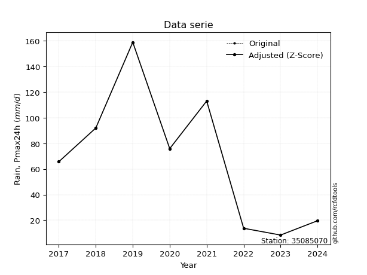</img>

</div>


> The initial value (value_initial) correspond to the initial obtained or null completed value, and value (value) is adjusted only when the initial value is outside the valid range (outlier) definite through the Z-Score value. If Z-Score is active, values out of range or outliers are replaced with the station mean value. A Z-Score (or standard score) measures how many standard deviations a data point is from the mean of a dataset, indicating its relative position; positive scores mean above the mean, negative mean below, and a score of zero is exactly at the mean, allowing for comparison of values from different distributions. It´s calculated using the formula $z=(x–μ)/σ$, where $x$ is the data point, $μ$ is the mean, and $σ$ is the standard deviation, helping identify outliers and understand probability.
>
> <sub>**Note**: In this study, "completing" (filling gaps in) and "extending" (forecasting or lengthening the historical record) rainfall data series are avoided for certain critical analyses because they introduce artificial bias and uncertainty, which can distort the statistics of rare events (extremes), alter day-to-day variability, and compromise the integrity and homogeneity of the original data. Some reasons against Completing/Extending rainfall data are: **Distortion of Extremes and Variability**: The primary issue is that most gap-filling or extension methods rely on averaging or regression with nearby stations, which inherently smooths the data. Rainfall is highly variable in space and time, with a large percentage of zero values and occasional large storms. Infilling methods often underestimate the highest values and overestimate the lowest (zero) values, which severely distorts analyses focused on flood frequency, drought severity, and intensity-duration-frequency (IDF) curves, **Loss of Data Homogeneity**: Infilled or extended data are synthetic estimates, not actual measurements. Combining these estimates with observed data can violate the assumption of data homogeneity, which requires that the data properties do not change over time. Inhomogeneity can lead to incorrect conclusions about long-term trends or changes in climate patterns, **Propagation of Errors**: Errors and biases from the original data (e.g., wind-induced undercatch, instrument errors, site changes) or the data used for imputation can propagate through the analysis, leading to unreliable hydrological models and inaccurate predictions, **Compromised Statistical Integrity**: For statistical analyses, especially those involving the frequency of events, using artificial data can introduce time bias or autocorrelation that doesn´t exist in reality, making it difficult to assess the true probability of events, **Difficulty in Validation**: It is difficult to accurately validate the quality of filled or extended data, especially for past periods where ground-truth measurements are unavailable. The reliability of imputation techniques heavily depends on the density of the surrounding station network and the complexity of the local topography.</sub>


### 4. Active continuous probability distributions from SciPy (44 of 104 available)

A Probability Density Function (PDF) describes the relative likelihood of a continuous random variable falling within a specific range, where the total area under its curve equals 1, and the area over any interval gives the actual probability for that range. Unlike discrete probabilities (like rolling a die), a PDF shows density, not direct probability for a single point (which is zero), with higher points indicating higher likelihood, often visualized as a bell curve for normal distributions.

A log of a probability density function (log-PDF) is simply the logarithm of the PDF´s value, denoted as $log(f(x))$, useful for converting multiplication of probabilities into addition, improving numerical stability with tiny numbers, and connecting to information theory concepts like entropy. Instead of dealing with very small probabilities (e.g., 0.000001), log-PDFs use negative numbers (e.g., $log(0.00001) ≈ -11.51$ that are easier for computers to handle, preventing underflow errors and simplifying complex calculations. In this study, each active probability distribution from SciPy is also evaluated in the $log$ form.

[scipy.stats](https://docs.scipy.org/doc/scipy/reference/stats.html) is a Python´s powerful submodule within the SciPy library for comprehensive statistical analysis, offering over 130 probability distributions (like Normal, Poisson), functions for descriptive stats (mean, variance), hypothesis testing (t-tests, chi-square), random variable generation, and statistical tests, making it essential for data science, modeling, and research. It provides tools to explore, model, and draw conclusions from data efficiently, working seamlessly with NumPy.

<div align="center">

|   id | p_dist             |   n_parameter | fit_method   | label                                                                       | active   | ref                                                                                                        |
|-----:|:-------------------|--------------:|:-------------|:----------------------------------------------------------------------------|:---------|:-----------------------------------------------------------------------------------------------------------|
|    0 | alpha              |             3 | MLE          | Alpha                                                                       | True     | [:mortar_board:](https://docs.scipy.org/doc/scipy/reference/generated/scipy.stats.alpha.html)              |
|    1 | betaprime          |             4 | MLE          | Beta prime                                                                  | True     | [:mortar_board:](https://docs.scipy.org/doc/scipy/reference/generated/scipy.stats.betaprime.html)          |
|    2 | chi2               |             3 | MLE          | Chi²                                                                        | True     | [:mortar_board:](https://docs.scipy.org/doc/scipy/reference/generated/scipy.stats.chi2.html)               |
|    3 | crystalball        |             4 | MLE          | Crystalball                                                                 | True     | [:mortar_board:](https://docs.scipy.org/doc/scipy/reference/generated/scipy.stats.crystalball.html)        |
|    4 | erlang             |             3 | MLE          | Erlang                                                                      | True     | [:mortar_board:](https://docs.scipy.org/doc/scipy/reference/generated/scipy.stats.erlang.html)             |
|    5 | expon              |             2 | MLE          | Exponential                                                                 | True     | [:mortar_board:](https://docs.scipy.org/doc/scipy/reference/generated/scipy.stats.expon.html)              |
|    6 | exponnorm          |             3 | MLE          | Exponentially modified Normal                                               | True     | [:mortar_board:](https://docs.scipy.org/doc/scipy/reference/generated/scipy.stats.exponnorm.html)          |
|    7 | f                  |             4 | MLE          | F                                                                           | True     | [:mortar_board:](https://docs.scipy.org/doc/scipy/reference/generated/scipy.stats.f.html)                  |
|    8 | fatiguelife        |             3 | MLE          | Fatigue-life (Birnbaum-Saunders)                                            | True     | [:mortar_board:](https://docs.scipy.org/doc/scipy/reference/generated/scipy.stats.fatiguelife.html)        |
|    9 | fisk               |             3 | MLE          | Fisk                                                                        | True     | [:mortar_board:](https://docs.scipy.org/doc/scipy/reference/generated/scipy.stats.fisk.html)               |
|   10 | gamma              |             3 | MLE          | Gamma                                                                       | True     | [:mortar_board:](https://docs.scipy.org/doc/scipy/reference/generated/scipy.stats.gamma.html)              |
|   11 | genexpon           |             5 | MLE          | Generalized exponential                                                     | True     | [:mortar_board:](https://docs.scipy.org/doc/scipy/reference/generated/scipy.stats.genexpon.html)           |
|   12 | genlogistic        |             3 | MLE          | Generalized logistic                                                        | True     | [:mortar_board:](https://docs.scipy.org/doc/scipy/reference/generated/scipy.stats.genlogistic.html)        |
|   13 | gibrat             |             2 | MM           | Gibrat                                                                      | True     | [:mortar_board:](https://docs.scipy.org/doc/scipy/reference/generated/scipy.stats.gibrat.html)             |
|   14 | gompertz           |             3 | MLE          | Gompertz (or truncated Gumbel)                                              | True     | [:mortar_board:](https://docs.scipy.org/doc/scipy/reference/generated/scipy.stats.gompertz.html)           |
|   15 | gumbel_l           |             2 | MM           | Gumbel Left Skew                                                            | True     | [:mortar_board:](https://docs.scipy.org/doc/scipy/reference/generated/scipy.stats.gumbel_l.html)           |
|   16 | gumbel_r           |             2 | MM           | Gumbel Right Skew                                                           | True     | [:mortar_board:](https://docs.scipy.org/doc/scipy/reference/generated/scipy.stats.gumbel_r.html)           |
|   17 | halflogistic       |             2 | MM           | Half-logistic                                                               | True     | [:mortar_board:](https://docs.scipy.org/doc/scipy/reference/generated/scipy.stats.halflogistic.html)       |
|   18 | halfnorm           |             2 | MM           | Half Normal                                                                 | True     | [:mortar_board:](https://docs.scipy.org/doc/scipy/reference/generated/scipy.stats.halfnorm.html)           |
|   19 | hypsecant          |             2 | MM           | hyperbolic secant                                                           | True     | [:mortar_board:](https://docs.scipy.org/doc/scipy/reference/generated/scipy.stats.hypsecant.html)          |
|   20 | invgamma           |             3 | MLE          | Inverted gamma                                                              | True     | [:mortar_board:](https://docs.scipy.org/doc/scipy/reference/generated/scipy.stats.invgamma.html)           |
|   21 | invgauss           |             3 | MLE          | Inverse Gaussian                                                            | True     | [:mortar_board:](https://docs.scipy.org/doc/scipy/reference/generated/scipy.stats.invgauss.html)           |
|   22 | invweibull         |             3 | MLE          | Inverted Weibull                                                            | True     | [:mortar_board:](https://docs.scipy.org/doc/scipy/reference/generated/scipy.stats.invweibull.html)         |
|   23 | johnsonsu          |             4 | MLE          | Johnson Su                                                                  | True     | [:mortar_board:](https://docs.scipy.org/doc/scipy/reference/generated/scipy.stats.johnsonsu.html)          |
|   24 | kstwobign          |             2 | MLE          | Limiting distribution of scaled Kolmogorov-Smirnov two-sided test statistic | True     | [:mortar_board:](https://docs.scipy.org/doc/scipy/reference/generated/scipy.stats.kstwobign.html)          |
|   25 | laplace            |             2 | MM           | Laplace                                                                     | True     | [:mortar_board:](https://docs.scipy.org/doc/scipy/reference/generated/scipy.stats.laplace.html)            |
|   26 | laplace_asymmetric |             3 | MLE          | Asymmetric Laplace                                                          | True     | [:mortar_board:](https://docs.scipy.org/doc/scipy/reference/generated/scipy.stats.laplace_asymmetric.html) |
|   27 | loggamma           |             3 | MLE          | Log gamma                                                                   | True     | [:mortar_board:](https://docs.scipy.org/doc/scipy/reference/generated/scipy.stats.loggamma.html)           |
|   28 | logistic           |             2 | MM           | Logistic (or Sech-squared)                                                  | True     | [:mortar_board:](https://docs.scipy.org/doc/scipy/reference/generated/scipy.stats.logistic.html)           |
|   29 | lognorm            |             3 | MLE          | Log Normal                                                                  | True     | [:mortar_board:](https://docs.scipy.org/doc/scipy/reference/generated/scipy.stats.lognorm.html)            |
|   30 | maxwell            |             2 | MM           | Maxwell                                                                     | True     | [:mortar_board:](https://docs.scipy.org/doc/scipy/reference/generated/scipy.stats.maxwell.html)            |
|   31 | mielke             |             4 | MLE          | Mielke Beta-Kappa / Dagum                                                   | True     | [:mortar_board:](https://docs.scipy.org/doc/scipy/reference/generated/scipy.stats.mielke.html)             |
|   32 | moyal              |             2 | MM           | Moyal                                                                       | True     | [:mortar_board:](https://docs.scipy.org/doc/scipy/reference/generated/scipy.stats.moyal.html)              |
|   33 | nakagami           |             3 | MLE          | Nakagami                                                                    | True     | [:mortar_board:](https://docs.scipy.org/doc/scipy/reference/generated/scipy.stats.nakagami.html)           |
|   34 | ncf                |             5 | MLE          | Non-central F distribution                                                  | True     | [:mortar_board:](https://docs.scipy.org/doc/scipy/reference/generated/scipy.stats.ncf.html)                |
|   35 | nct                |             4 | MLE          | Non-central Student’s t                                                     | True     | [:mortar_board:](https://docs.scipy.org/doc/scipy/reference/generated/scipy.stats.nct.html)                |
|   36 | norm               |             2 | MM           | Normal                                                                      | True     | [:mortar_board:](https://docs.scipy.org/doc/scipy/reference/generated/scipy.stats.norm.html)               |
|   37 | pearson3           |             3 | MM           | Pearson type III                                                            | True     | [:mortar_board:](https://docs.scipy.org/doc/scipy/reference/generated/scipy.stats.pearson3.html)           |
|   38 | rayleigh           |             2 | MM           | Rayleigh                                                                    | True     | [:mortar_board:](https://docs.scipy.org/doc/scipy/reference/generated/scipy.stats.rayleigh.html)           |
|   39 | rice               |             3 | MLE          | Rice                                                                        | True     | [:mortar_board:](https://docs.scipy.org/doc/scipy/reference/generated/scipy.stats.rice.html)               |
|   40 | t                  |             3 | MLE          | Student’s t                                                                 | True     | [:mortar_board:](https://docs.scipy.org/doc/scipy/reference/generated/scipy.stats.t.html)                  |
|   41 | truncnorm          |             4 | MLE          | Truncated normal                                                            | True     | [:mortar_board:](https://docs.scipy.org/doc/scipy/reference/generated/scipy.stats.truncnorm.html)          |
|   42 | wald               |             2 | MM           | Wald                                                                        | True     | [:mortar_board:](https://docs.scipy.org/doc/scipy/reference/generated/scipy.stats.wald.html)               |
|   43 | weibull_min        |             3 | MLE          | Weibull minimum                                                             | True     | [:mortar_board:](https://docs.scipy.org/doc/scipy/reference/generated/scipy.stats.weibull_min.html)        |

</div>

> **n_parameter:** # arguments & localization & scale.
>
> **Fit methods:** (MLE) maximum likelihood, (MM) L-moments.
>
>**Inactive** (With the only purpose of prevent loops, zero divisions, infinite values, over high estimated values or horizontal trending for recurrence intervals estimations, the follow distributions were disabled.)**:** foldnorm, gennorm, norminvgauss, powernorm, powerlognorm, skewnorm, genextreme, anglit, arcsine, argus, beta, bradford, burr, burr12, cauchy, cosine, halfcauchy, foldcauchy, skewcauchy, wrapcauchy, dgamma, gengamma, exponweib, exponpow, truncexpon, gausshyper, genhalflogistic, genhyperbolic, geninvgauss, halfgennorm, johnsonsb, kappa4, kappa3, ksone, kstwo, loglaplace, levy, levy_l, levy_stable, ncx2, pareto, genpareto, truncpareto, lomax, powerlaw, rdist, rel_breitwigner, recipinvgauss, semicircular, studentized_range, trapezoid, triang, truncweibull_min, tukeylambda, uniform, loguniform, vonmises, vonmises_line, weibull_max, dweibull, 


## B. Probability (PDF) vs. Empirical (EDF) distributions functions

A continuous probability distribution (CPD) describes probabilities for variables that can take any value within a range (like rain any time), unlike discrete variables with specific outcomes (like temperature). It uses a Probability Density Function (PDF), a curve where the total area under it equals 1, and the probability of the variable falling within an interval (a to b) is found by calculating the area under the curve between those points. A key feature is that the probability of hitting any single exact value is zero, so probabilities are always expressed for ranges, e.g., $P(a ≤ X ≤ b)$.

<div align="center">

Distributions parameters from station values
|    |   station | p_dist                |   n |              loc |          scale | shape                  | shape1                 | shape2             | shape3   |
|---:|----------:|:----------------------|----:|-----------------:|---------------:|:-----------------------|:-----------------------|:-------------------|:---------|
|  0 |  35085070 | alpha                 |   8 |     -0.049654    |   18.8561      | 4.738540813704513e-11  |                        |                    |          |
|  1 |  35085070 | betaprime             |   8 |      8.39933     |  195.419       | 0.5402169132962539     | 2.824694624090582      |                    |          |
|  2 |  35085070 | chi2                  |   8 |      8.4         |    4.44016     | 1.232631398985188      |                        |                    |          |
|  3 |  35085070 | crystalball           |   8 |     68.425       |   49.75        | 6118.32791958083       | 297.66100179625505     |                    |          |
|  4 |  35085070 | erlang                |   8 |      8.4         |   55.4192      | 0.559201505475911      |                        |                    |          |
|  5 |  35085070 | expon                 |   8 |      8.4         |   60.025       |                        |                        |                    |          |
|  6 |  35085070 | exponnorm             |   8 |     42.9424      |   43.1452      | 0.5906237885113697     |                        |                    |          |
|  7 |  35085070 | f                     |   8 |    -80.6709      |  133.032       | 28889.869545064277     | 17.830349857109802     |                    |          |
|  8 |  35085070 | fatiguelife           |   8 |      8.4         |    2.88252e-05 | 1277.1855953891181     |                        |                    |          |
|  9 |  35085070 | fisk                  |   8 |      8.4         |   28.0751      | 0.8452743056043315     |                        |                    |          |
| 10 |  35085070 | gamma                 |   8 |      8.4         |   52.1172      | 0.7245938620464376     |                        |                    |          |
| 11 |  35085070 | genexpon              |   8 |      8.39999     |    2.76726     | 0.0460731853433968     | 2.0249611846908798e-07 | 3.8037606026373987 |          |
| 12 |  35085070 | genlogistic           |   8 |   -239.117       |   40.9766      | 1014.9351240068959     |                        |                    |          |
| 13 |  35085070 | gibrat                |   8 |     30.4721      |   23.0196      |                        |                        |                    |          |
| 14 |  35085070 | gompertz              |   8 |      8.4         |  156.264       | 1.8284613786603772     |                        |                    |          |
| 15 |  35085070 | gumbel_l              |   8 |     90.8151      |   38.7899      |                        |                        |                    |          |
| 16 |  35085070 | gumbel_r              |   8 |     46.0349      |   38.7899      |                        |                        |                    |          |
| 17 |  35085070 | halflogistic          |   8 |      9.45974     |   42.5345      |                        |                        |                    |          |
| 18 |  35085070 | halfnorm              |   8 |      2.57554     |   82.5301      |                        |                        |                    |          |
| 19 |  35085070 | hypsecant             |   8 |     68.425       |   31.6718      |                        |                        |                    |          |
| 20 |  35085070 | invgamma              |   8 |    -80.7131      | 1186.37        | 8.915355062178485      |                        |                    |          |
| 21 |  35085070 | invgauss              |   8 |     -4.73607     |   70.3971      | 1.0392630286683666     |                        |                    |          |
| 22 |  35085070 | invweibull            |   8 |     -5.72133e+08 |    5.72133e+08 | 13969841.114177607     |                        |                    |          |
| 23 |  35085070 | johnsonsu             |   8 |      6.11515     |    0.132109    | -4.43914672977694      | 0.714939499643857      |                    |          |
| 24 |  35085070 | kstwobign             |   8 |    -96.1582      |  188.085       |                        |                        |                    |          |
| 25 |  35085070 | laplace               |   8 |     68.425       |   35.1785      |                        |                        |                    |          |
| 26 |  35085070 | laplace_asymmetric    |   8 |     65.7         |   41.5078      | 0.9677123608566726     |                        |                    |          |
| 27 |  35085070 | loggamma              |   8 | -14850.2         | 2021.16        | 1606.0086769938935     |                        |                    |          |
| 28 |  35085070 | logistic              |   8 |     68.425       |   27.4286      |                        |                        |                    |          |
| 29 |  35085070 | lognorm               |   8 |      8.4         |    0.390218    | 12.527972762263326     |                        |                    |          |
| 30 |  35085070 | maxwell               |   8 |    -49.4615      |   73.8744      |                        |                        |                    |          |
| 31 |  35085070 | mielke                |   8 |     -1.04319     |  162.825       | 0.749834615707416      | 185.68691387208008     |                    |          |
| 32 |  35085070 | moyal                 |   8 |     39.9748      |   22.3954      |                        |                        |                    |          |
| 33 |  35085070 | nakagami              |   8 |      8.4         |  104.481       | 0.1617560336826022     |                        |                    |          |
| 34 |  35085070 | ncf                   |   8 |     -0.109498    |    9.13658e-08 | 9.465138874297846e-09  | 53.7020919771049       | 6.765812041171277  |          |
| 35 |  35085070 | nct                   |   8 |      0.00108004  |    0.945691    | 0.7509141671960948     | 19.90598329013865      |                    |          |
| 36 |  35085070 | norm                  |   8 |     68.425       |   49.75        |                        |                        |                    |          |
| 37 |  35085070 | pearson3              |   8 |     68.425       |   49.75        | 0.3544671464828107     |                        |                    |          |
| 38 |  35085070 | rayleigh              |   8 |    -26.7496      |   75.9383      |                        |                        |                    |          |
| 39 |  35085070 | rice                  |   8 |    -18.7993      |   68.1367      | 0.4145684119815673     |                        |                    |          |
| 40 |  35085070 | t                     |   8 |     68.4249      |   49.7497      | 114678.03667538814     |                        |                    |          |
| 41 |  35085070 | truncnorm             |   8 |     68.425       |   49.75        | -597.7971607164404     | 14.908907408496392     |                    |          |
| 42 |  35085070 | wald                  |   8 |     18.6751      |   49.7499      |                        |                        |                    |          |
| 43 |  35085070 | weibull_min           |   8 |      8.4         |  156.169       | 0.1919237774730535     |                        |                    |          |
| 44 |  35085070 | logalpha              |   8 |    -17.8004      |  440.189       | 20.41959339371543      |                        |                    |          |
| 45 |  35085070 | logbetaprime          |   8 |     -0.106451    |    3.3189e+06  | 12.204531398852499     | 10290099.470186062     |                    |          |
| 46 |  35085070 | logchi2               |   8 |      2.12823     |    1.03353     | 1.13002116080759       |                        |                    |          |
| 47 |  35085070 | logcrystalball        |   8 |      3.81933     |    1.01806     | 7.635075720323199      | 614.0336424267718      |                    |          |
| 48 |  35085070 | logerlang             |   8 |    -11.6294      |    0.0699149   | 220.8042686147984      |                        |                    |          |
| 49 |  35085070 | logexpon              |   8 |      2.12823     |    1.6911      |                        |                        |                    |          |
| 50 |  35085070 | logexponnorm          |   8 |      3.81869     |    1.01806     | 0.0006279188206187438  |                        |                    |          |
| 51 |  35085070 | logf                  |   8 |   -644.744       |  648.563       | 2472490.455197551      | 1207366.6603705524     |                    |          |
| 52 |  35085070 | logfatiguelife        |   8 |   -319.438       |  323.258       | 0.0031434706242420094  |                        |                    |          |
| 53 |  35085070 | logfisk               |   8 |     -2.67238e+07 |    2.67238e+07 | 42914572.1620549       |                        |                    |          |
| 54 |  35085070 | loggamma              |   8 |    -10.7092      |    0.0741691   | 195.9480445990538      |                        |                    |          |
| 55 |  35085070 | loggenexpon           |   8 |      2.12823     |    3.03573e+06 | 949690.7680409341      | 4301894.9118795395     | 567551.5040864903  |          |
| 56 |  35085070 | loggenlogistic        |   8 |      5.06895     |    3.8832e-06  | 3.1064829790881728e-06 |                        |                    |          |
| 57 |  35085070 | loggibrat             |   8 |      3.04265     |    0.47108     |                        |                        |                    |          |
| 58 |  35085070 | loggompertz           |   8 |      2.12823     |    1.06335     | 0.16474124026866188    |                        |                    |          |
| 59 |  35085070 | loggumbel_l           |   8 |      4.27751     |    0.793775    |                        |                        |                    |          |
| 60 |  35085070 | loggumbel_r           |   8 |      3.36115     |    0.793775    |                        |                        |                    |          |
| 61 |  35085070 | loghalflogistic       |   8 |      2.61269     |    0.870407    |                        |                        |                    |          |
| 62 |  35085070 | loghalfnorm           |   8 |      2.47185     |    1.68882     |                        |                        |                    |          |
| 63 |  35085070 | loghypsecant          |   8 |      3.81933     |    0.648114    |                        |                        |                    |          |
| 64 |  35085070 | loginvgamma           |   8 |    -12.1798      | 3704.25        | 232.76249980551046     |                        |                    |          |
| 65 |  35085070 | loginvgauss           |   8 |     -4.20263     |  443.623       | 0.01805974136022212    |                        |                    |          |
| 66 |  35085070 | loginvweibull         |   8 |     -9.44924e+07 |    9.44924e+07 | 94699239.03987212      |                        |                    |          |
| 67 |  35085070 | logjohnsonsu          |   8 |      5.41525     |    0.0125739   | 7.341372294694079      | 1.3849886967281009     |                    |          |
| 68 |  35085070 | logkstwobign          |   8 |     -0.139327    |    4.50655     |                        |                        |                    |          |
| 69 |  35085070 | loglaplace            |   8 |      3.81933     |    0.719874    |                        |                        |                    |          |
| 70 |  35085070 | loglaplace_asymmetric |   8 |      4.72827     |    0.53023     | 2.174211810678119      |                        |                    |          |
| 71 |  35085070 | logloggamma           |   8 |      5.06918     |    4.08785e-06 | 3.263199495629149e-06  |                        |                    |          |
| 72 |  35085070 | loglogistic           |   8 |      3.81933     |    0.561283    |                        |                        |                    |          |
| 73 |  35085070 | loglognorm            |   8 |      2.12823     |    0.0187461   | 11.87255485254774      |                        |                    |          |
| 74 |  35085070 | logmaxwell            |   8 |      1.40697     |    1.51172     |                        |                        |                    |          |
| 75 |  35085070 | logmielke             |   8 |      2.12823     |    2.91974     | 0.2676912392580174     | 491.9547735543915      |                    |          |
| 76 |  35085070 | logmoyal              |   8 |      3.23714     |    0.458286    |                        |                        |                    |          |
| 77 |  35085070 | lognakagami           |   8 |      2.6174      |    1.50359     | 0.31855261288034287    |                        |                    |          |
| 78 |  35085070 | logncf                |   8 |     -0.997434    |    2.09059e-06 | 4.8887571264032885e-05 | 134.9026908750297      | 111.14943980308959 |          |
| 79 |  35085070 | lognct                |   8 |    -61.6745      |    1.00701     | 85975.53945454417      | 65.03773228676499      |                    |          |
| 80 |  35085070 | lognorm               |   8 |      3.81933     |    1.01806     |                        |                        |                    |          |
| 81 |  35085070 | logpearson3           |   8 |      3.81933     |    1.01805     | -0.4670863393070164    |                        |                    |          |
| 82 |  35085070 | lograyleigh           |   8 |      1.87173     |    1.55396     |                        |                        |                    |          |
| 83 |  35085070 | logrice               |   8 |      1.59735     |    1.15914     | 1.5639557379486877     |                        |                    |          |
| 84 |  35085070 | logt                  |   8 |      3.81933     |    1.01805     | 13782752481.481384     |                        |                    |          |
| 85 |  35085070 | logtruncnorm          |   8 |     -0.0989113   |    2.88686     | 0.7714754191965079     | 1.7901156243199754     |                    |          |
| 86 |  35085070 | logwald               |   8 |      2.80128     |    1.01805     |                        |                        |                    |          |
| 87 |  35085070 | logweibull_min        |   8 |     -4.06052e+07 |    4.06052e+07 | 51713320.722366914     |                        |                    |          |

</div>

> **loc** (Location parameter): This shifts the distribution along the x-axis. For many common distributions, like the normal (Gaussian) distribution, loc represents the mean $μ$. For others, like the uniform distribution, it might represent the minimum value, or for the beta distribution, the left end of the support interval.
>
> **scale** (Scale parameter): This determines the width or spread of the distribution. For the normal distribution, scale represents the standard deviation $σ$. For a uniform distribution, it defines the length of the interval (from $loc$ to $loc + scale$).
>
> **shape** (Shape parameters): Refers to parameters that define the specific form of a probability distribution, distinct from its location (loc) and scale (scale). These parameters are required arguments for most distribution functions. For example, a normal (Gaussian) distribution is fully defined by its location (mean) and scale (standard deviation), so it has no specific shape parameters beyond loc and scale. However, other distributions have intrinsic properties that need specification, as Gamma distribution that takes a shape parameter, often named $a$ or $alpha$.


### 0. Cumulative distribution values - CDF (88 evaluated)

Cumulative Distribution Function (CDF), denoted as $F$<sub>$X$</sub>$(x)$, is a function that gives the probability that a random variable $X$ will take a value less than or equal to a specific value, $x$ (i.e., $(P(X≥x)$. It essentially "accumulates" probabilities from a given point up to the far right (positive infinity), providing a complete picture of the distribution´s probabilities for both discrete (like rain) and continuous (like temperature) variables, helping to find probabilities over ranges or above certain values. Each station is evaluated separately ordering the $x$ values ascending, calculating the CDF and PDF values for the activated distributions and their logarithmic forms.

<div align="center">

CDF ordered by x ascending and calculating $log(f(x))$ separately
|   id |   Station |   date |     x |   count |   mean |    std |     zscore |   Value_initial |   station |   m |     alpha |   alpha_pdf |   betaprime |   betaprime_pdf |        chi2 |        chi2_pdf |   crystalball |   crystalball_pdf |      erlang |      erlang_pdf |     expon |   expon_pdf |   exponnorm |   exponnorm_pdf |         f |      f_pdf |   fatiguelife |   fatiguelife_pdf |        fisk |    fisk_pdf |       gamma |     gamma_pdf |   genexpon |   genexpon_pdf |   genlogistic |   genlogistic_pdf |   gibrat |   gibrat_pdf |   gompertz |   gompertz_pdf |   gumbel_l |   gumbel_l_pdf |   gumbel_r |   gumbel_r_pdf |   halflogistic |   halflogistic_pdf |   halfnorm |   halfnorm_pdf |   hypsecant |   hypsecant_pdf |   invgamma |   invgamma_pdf |   invgauss |   invgauss_pdf |   invweibull |   invweibull_pdf |   johnsonsu |   johnsonsu_pdf |   kstwobign |   kstwobign_pdf |   laplace |   laplace_pdf |   laplace_asymmetric |   laplace_asymmetric_pdf |   loggamma |   loggamma_pdf |   logistic |   logistic_pdf |   lognorm |   lognorm_pdf |   maxwell |   maxwell_pdf |   mielke |   mielke_pdf |     moyal |   moyal_pdf |    nakagami |   nakagami_pdf |       ncf |    ncf_pdf |       nct |     nct_pdf |     norm |   norm_pdf |   pearson3 |   pearson3_pdf |   rayleigh |   rayleigh_pdf |      rice |   rice_pdf |        t |      t_pdf |   truncnorm |   truncnorm_pdf |        wald |    wald_pdf |   weibull_min |   weibull_min_pdf |   logalpha |   logalpha_pdf |   logbetaprime |   logbetaprime_pdf |     logchi2 |   logchi2_pdf |   logcrystalball |   logcrystalball_pdf |   logerlang |   logerlang_pdf |   logexpon |   logexpon_pdf |   logexponnorm |   logexponnorm_pdf |      logf |   logf_pdf |   logfatiguelife |   logfatiguelife_pdf |   logfisk |   logfisk_pdf |   loggenexpon |   loggenexpon_pdf |   loggenlogistic |   loggenlogistic_pdf |   loggibrat |   loggibrat_pdf |   loggompertz |   loggompertz_pdf |   loggumbel_l |   loggumbel_l_pdf |   loggumbel_r |   loggumbel_r_pdf |   loghalflogistic |   loghalflogistic_pdf |   loghalfnorm |   loghalfnorm_pdf |   loghypsecant |   loghypsecant_pdf |   loginvgamma |   loginvgamma_pdf |   loginvgauss |   loginvgauss_pdf |   loginvweibull |   loginvweibull_pdf |   logjohnsonsu |   logjohnsonsu_pdf |   logkstwobign |   logkstwobign_pdf |   loglaplace |   loglaplace_pdf |   loglaplace_asymmetric |   loglaplace_asymmetric_pdf |   logloggamma |   logloggamma_pdf |   loglogistic |   loglogistic_pdf |   loglognorm |   loglognorm_pdf |   logmaxwell |   logmaxwell_pdf |   logmielke |   logmielke_pdf |    logmoyal |   logmoyal_pdf |   lognakagami |   lognakagami_pdf |    logncf |   logncf_pdf |    lognct |   lognct_pdf |   logpearson3 |   logpearson3_pdf |   lograyleigh |   lograyleigh_pdf |   logrice |   logrice_pdf |      logt |   logt_pdf |   logtruncnorm |   logtruncnorm_pdf |   logwald |   logwald_pdf |   logweibull_min |   logweibull_min_pdf |
|-----:|----------:|-------:|------:|--------:|-------:|-------:|-----------:|----------------:|----------:|----:|----------:|------------:|------------:|----------------:|------------:|----------------:|--------------:|------------------:|------------:|----------------:|----------:|------------:|------------:|----------------:|----------:|-----------:|--------------:|------------------:|------------:|------------:|------------:|--------------:|-----------:|---------------:|--------------:|------------------:|---------:|-------------:|-----------:|---------------:|-----------:|---------------:|-----------:|---------------:|---------------:|-------------------:|-----------:|---------------:|------------:|----------------:|-----------:|---------------:|-----------:|---------------:|-------------:|-----------------:|------------:|----------------:|------------:|----------------:|----------:|--------------:|---------------------:|-------------------------:|-----------:|---------------:|-----------:|---------------:|----------:|--------------:|----------:|--------------:|---------:|-------------:|----------:|------------:|------------:|---------------:|----------:|-----------:|----------:|------------:|---------:|-----------:|-----------:|---------------:|-----------:|---------------:|----------:|-----------:|---------:|-----------:|------------:|----------------:|------------:|------------:|--------------:|------------------:|-----------:|---------------:|---------------:|-------------------:|------------:|--------------:|-----------------:|---------------------:|------------:|----------------:|-----------:|---------------:|---------------:|-------------------:|----------:|-----------:|-----------------:|---------------------:|----------:|--------------:|--------------:|------------------:|-----------------:|---------------------:|------------:|----------------:|--------------:|------------------:|--------------:|------------------:|--------------:|------------------:|------------------:|----------------------:|--------------:|------------------:|---------------:|-------------------:|--------------:|------------------:|--------------:|------------------:|----------------:|--------------------:|---------------:|-------------------:|---------------:|-------------------:|-------------:|-----------------:|------------------------:|----------------------------:|--------------:|------------------:|--------------:|------------------:|-------------:|-----------------:|-------------:|-----------------:|------------:|----------------:|------------:|---------------:|--------------:|------------------:|----------:|-------------:|----------:|-------------:|--------------:|------------------:|--------------:|------------------:|----------:|--------------:|----------:|-----------:|---------------:|-------------------:|----------:|--------------:|-----------------:|---------------------:|
|    0 |  35085070 |   2023 |   8.4 |       8 | 68.425 | 53.185 | -1.12861   |             8.4 |  35085070 |   1 | 0.0256425 | 0.0174714   |  0.00210277 |     1.70403     | 2.35764e-10 | 81799.5         |      0.113806 |        0.00387268 | 6.71855e-10 | 211502          | 0         |  0.0166597  |    0.108894 |      0.00403356 | 0.0821356 | 0.00581563 |     0.0186723 |       1.16625e+10 | 2.03039e-14 | 9.66153     | 1.27957e-12 | 521.949       | 2.4597e-07 |     0.0166494  |     0.0895311 |        0.00526634 | 0        |  0           | 5.3065e-14 |     0.0117011  |   0.112613 |    0.00273318  |  0.0714659 |     0.0048612  |      0         |         0          |   0.056263 |     0.00964376 |   0.0949641 |      0.0029541  |  0.0821348 |     0.00581558 |  0.0504172 |     0.0115785  |    0.0892789 |       0.0052667  |    0.028383 |      0.020299   |   0.0832426 |      0.00556034 | 0.0907685 |    0.00258022 |             0.116132 |               0.00289118 |  0.0467107 |       0.102217 |   0.100796 |     0.00330445 | 0.0483461 |     0.0986211 |  0.106658 |    0.00487556 | 0.118237 |   0.00938858 | 0.0429984 |  0.00465141 | 3.01133e-06 |    5.48427e+08 | 0.0917009 | 0.00752318 | 0.0354099 | 0.0194678   | 0.113806 | 0.00387267 |   0.10658  |     0.00434075 |   0.101586 |     0.00547614 | 0.0705151 | 0.00499851 | 0.113806 | 0.00387266 |    0.113806 |      0.00387268 | 0           | 0           |   0.000559641 |       6.04486e+10 |  0.0475849 |       0.109878 |      0.0438149 |           0.120914 | 1.57784e-09 |   2.00748e+06 |        0.0483461 |            0.0986211 |   0.0487629 |        0.105102 |   0        |       0.591332 |      0.0483462 |          0.0986213 | 0.0481033 |  0.0984828 |        0.0475402 |            0.0979985 | 0.0540965 |     0.0821719 |   3.63898e-09 |          0.312838 |         0        |            0.0761017 |    0        |       0         |   2.49094e-09 |          0.154926 |     0.0645169 |         0.0785984 |    0.00885529 |         0.0527312 |        0          |              0        |     0         |          0        |      0.0467639 |          0.0718946 |     0.0470442 |          0.108546 |     0.0451954 |          0.112843 |       0.0404901 |            0.130124 |       0.092149 |          0.0696309 |      0.0381182 |           0.147017 |    0.0477247 |        0.0662959 |               0.0865318 |                   0.0750602 |     0.0955923 |         0.0763082 |     0.0468459 |         0.0795523 |    0.0041143 |      2.30435e+12 |    0.0269912 |         0.107221 | 5.83034e-05 |     3.51445e+10 | 0.000799522 |      0.0105672 |   0           |          0        | 0.0413861 |     0.111953 | 0.0484633 |    0.0988093 |     0.0593256 |         0.0933452 |     0.0135305 |          0.104784 | 0.0311943 |      0.118593 | 0.0483457 |  0.0986207 |    2.67011e-07 |           0.559267 | 0         |      0        |        0.0611176 |            0.0754086 |
|    1 |  35085070 |   2022 |  13.7 |       8 | 68.425 | 53.185 | -1.02896   |            13.7 |  35085070 |   2 | 0.170254  | 0.0310756   |  0.260765   |     0.0250616   | 0.657273    |     0.0520159   |      0.135666 |        0.00437894 | 0.292454    |      0.0290092  | 0.0845106 |  0.0152518  |    0.131764 |      0.00459907 | 0.115961  | 0.00692439 |     0.631464  |       0.0119434   | 0.196357    | 0.025167    | 0.200269    |   0.0258002   | 0.0844609  |     0.0152432  |     0.119948  |        0.0062013  | 0        |  0           | 0.0611313  |     0.0113648  |   0.128    |    0.00307901  |  0.100102  |     0.00593946 |      0.0498037 |         0.011726   |   0.107224 |     0.00958038 |   0.111935  |      0.00346181 |  0.11596   |     0.00692433 |  0.121332  |     0.0145297  |    0.119706  |       0.00620443 |    0.147359 |      0.0217146  |   0.115377  |      0.00654548 | 0.105528  |    0.00299977 |             0.132512 |               0.00329898 |  0.120575  |       0.204839 |   0.11971  |     0.00384195 | 0.118877  |     0.195194  |  0.134111 |    0.00547808 | 0.16513  |   0.00839846 | 0.0721949 |  0.00636221 | 0.305492    |    0.0186406   | 0.133473  | 0.008203   | 0.169836  | 0.0266148   | 0.135666 | 0.00437894 |   0.131193 |     0.00494697 |   0.132262 |     0.00608668 | 0.09914   | 0.00578928 | 0.135666 | 0.00437892 |    0.135666 |      0.00437894 | 0           | 0           |   0.406904    |       0.0112197   |  0.127237  |       0.220066 |      0.132696  |           0.243799 | 0.458057    |   0.453703    |        0.118877  |            0.195194  |   0.124174  |        0.208082 |   0.251181 |       0.4428   |      0.118878  |          0.195194  | 0.118607  |  0.195227  |        0.117884  |            0.195129  | 0.111467  |     0.159048  |   0.167882    |          0.363373 |         0        |            0.112549  |    0        |       0         |   0.0917418   |          0.222905 |     0.116189  |         0.137522  |    0.0779043  |         0.250491  |        0.00270587 |              0.57444  |     0.0686774 |          0.470699 |      0.0988478 |          0.150077  |     0.125953  |          0.218618 |     0.128094  |          0.229739 |       0.14029   |            0.276138 |       0.134693 |          0.107308  |      0.151599  |           0.307621 |    0.0941569 |        0.130796  |               0.132268  |                   0.114733  |     0.141256  |         0.11276   |     0.105137  |         0.167622  |    0.608237  |      0.0661488   |    0.11304   |         0.245576 | 0.619871    |     0.339219    | 0.0492637   |      0.247661  |   9.90761e-11 |     142138        | 0.125514  |     0.235434 | 0.11909   |    0.195367  |     0.122395  |         0.169407  |     0.108747  |          0.275211 | 0.117096  |      0.232537 | 0.118877  |  0.195194  |    0.255265    |           0.483741 | 0         |      0        |        0.110934  |            0.133138  |
|    2 |  35085070 |   2024 |  19.6 |       8 | 68.425 | 53.185 | -0.918023  |            19.6 |  35085070 |   3 | 0.337249  | 0.0245878   |  0.377753   |     0.016117    | 0.851758    |     0.0200872   |      0.163196 |        0.00495415 | 0.428346    |      0.0187528  | 0.170215  |  0.013824   |    0.160782 |      0.00523752 | 0.159963  | 0.00794926 |     0.687244  |       0.00771628  | 0.315014    | 0.0162851   | 0.328926    |   0.0187485   | 0.17012    |     0.013817   |     0.159363  |        0.00713619 | 0        |  0           | 0.127038   |     0.0109736  |   0.147402 |    0.00350506  |  0.138509  |     0.00705874 |      0.118639  |         0.0115897  |   0.163429 |     0.00946428 |   0.134237  |      0.00411385 |  0.159962  |     0.0079492  |  0.2084    |     0.0146404  |    0.159147  |       0.00714203 |    0.262232 |      0.0172721  |   0.156824  |      0.00747    | 0.124797  |    0.00354753 |             0.153478 |               0.00382094 |  0.209007  |       0.288133 |   0.144294 |     0.00450162 | 0.203599  |     0.277949  |  0.16829  |    0.00609755 | 0.21254  |   0.00772021 | 0.115026  |  0.00810894 | 0.389077    |    0.0112205   | 0.183491  | 0.00871079 | 0.309716  | 0.020437    | 0.163196 | 0.00495415 |   0.162346 |     0.00560904 |   0.169949 |     0.00667157 | 0.13564   | 0.00656418 | 0.163196 | 0.00495414 |    0.163196 |      0.00495415 | 6.01948e-13 | 1.78108e-11 |   0.45287     |       0.00565416  |  0.221269  |       0.302957 |      0.234565  |           0.320548 | 0.589771    |   0.300432    |        0.203599  |            0.277949  |   0.213685  |        0.290787 |   0.394096 |       0.35829  |      0.203599  |          0.277949  | 0.20336   |  0.278078  |        0.202684  |            0.27845   | 0.182317  |     0.239397  |   0.299064    |          0.364795 |         0        |            0.149889  |    0        |       0         |   0.181869    |          0.281191 |     0.176288  |         0.201248  |    0.196816   |         0.403038  |        0.205467   |              0.550193 |     0.234482  |          0.451899 |      0.169074  |          0.248776  |     0.21964   |          0.302666 |     0.225775  |          0.312701 |       0.253662  |            0.348723 |       0.180153 |          0.149038  |      0.274143  |           0.366549 |    0.15485   |        0.215107  |               0.180455  |                   0.156532  |     0.188004  |         0.150077  |     0.181928  |         0.26516   |    0.625894  |      0.0376665   |    0.217277  |         0.331698 | 0.718071    |     0.226864    | 0.183411    |      0.478004  |   0.309838    |          0.543679 | 0.225622  |     0.319751 | 0.203851  |    0.277979  |     0.195597  |         0.240975  |     0.222967  |          0.355181 | 0.214373  |      0.308275 | 0.203598  |  0.277949  |    0.418374    |           0.427147 | 0.0397173 |      0.743835 |        0.169342  |            0.196279  |
|    3 |  35085070 |   2017 |  65.7 |       8 | 68.425 | 53.185 | -0.0512363 |            65.7 |  35085070 |   4 | 0.774276  | 0.00333999  |  0.731405   |     0.00386381  | 0.999496    |     5.97557e-05 |      0.478159 |        0.00800693 | 0.826927    |      0.00397469 | 0.615035  |  0.00641341 |    0.491868 |      0.0082094  | 0.566732  | 0.00774842 |     0.865186  |       0.00208949  | 0.64635     | 0.00337197  | 0.77805     |   0.0049382   | 0.614808   |     0.00641323 |     0.550685  |        0.00801525 | 0.664761 |  0.0103445   | 0.555103   |     0.00751169 |   0.40748  |    0.00799454  |  0.54754   |     0.00850207 |      0.579104  |         0.00781294 |   0.555649 |     0.00721593 |   0.472647  |      0.0100132  |  0.566731  |     0.00774845 |  0.655534  |     0.0056584  |    0.55084   |       0.00802034 |    0.664869 |      0.00437195 |   0.550582  |      0.007932   | 0.462731  |    0.0131538  |             0.483596 |               0.0120394  |  0.643797  |       0.353143 |   0.475183 |     0.00909212 | 0.640308  |     0.367374  |  0.511946 |    0.00778718 | 0.512364 |   0.00575622 | 0.573384  |  0.00855994 | 0.655517    |    0.00354899  | 0.575462  | 0.00718485 | 0.697973  | 0.00337495  | 0.478159 | 0.00800693 |   0.501683 |     0.0080642  |   0.523395 |     0.00764084 | 0.506683  | 0.00826124 | 0.47816  | 0.00800694 |    0.478159 |      0.00800692 | 0.645322    | 0.00871214  |   0.561744    |       0.00121096  |  0.654595  |       0.335679 |      0.655831  |           0.307773 | 0.815776    |   0.11378     |        0.640308  |            0.367374  |   0.648915  |        0.351197 |   0.703673 |       0.175228 |      0.640308  |          0.367374  | 0.640048  |  0.36713   |        0.640261  |            0.367663  | 0.608656  |     0.382506  |   0.67969     |          0.245111 |         0        |            0.394463  |    0.812165 |       0.235857  |   0.62287     |          0.404281 |     0.589386  |         0.460443  |    0.701764   |         0.313106  |        0.717883   |              0.278401 |     0.689638  |          0.282411 |      0.670801  |          0.422108  |     0.656194  |          0.339829 |     0.658741  |          0.326326 |       0.664881  |            0.271963 |       0.513385 |          0.448879  |      0.684141  |           0.265796 |    0.699182  |        0.417876  |               0.515273  |                   0.446963  |     0.493746  |         0.394141  |     0.657386  |         0.401276  |    0.653836  |      0.0151063   |    0.662962  |         0.329361 | 0.910487    |     0.118495    | 0.722219    |      0.290513  |   0.736545    |          0.22914  | 0.658267  |     0.318777 | 0.640166  |    0.366869  |     0.614609  |         0.39767   |     0.669815  |          0.316317 | 0.650782  |      0.343646 | 0.640308  |  0.367375  |    0.824567    |           0.250419 | 0.779926  |      0.235807 |        0.579309  |            0.463906  |
|    4 |  35085070 |   2020 |  75.9 |       8 | 68.425 | 53.185 |  0.140547  |            75.9 |  35085070 |   5 | 0.803925  | 0.00252904  |  0.766927   |     0.00313675  | 0.999849    |     1.77929e-05 |      0.559717 |        0.00792894 | 0.862655    |      0.00307615 | 0.675195  |  0.00541116 |    0.574644 |      0.00796171 | 0.640643  | 0.00673593 |     0.884571  |       0.00172727  | 0.677327    | 0.00273688  | 0.822785    |   0.0038813   | 0.67497    |     0.00541157 |     0.628036  |        0.00712769 | 0.751678 |  0.00697016  | 0.627633   |     0.00671116 |   0.49378  |    0.00888444  |  0.629361  |     0.00751293 |      0.65329   |         0.00673821 |   0.625705 |     0.0065151  |   0.574438  |      0.0097767  |  0.640641  |     0.00673596 |  0.70763   |     0.00460166 |    0.628231  |       0.00713057 |    0.704973 |      0.00353499 |   0.627366  |      0.00710521 | 0.595715  |    0.0114924  |             0.592888 |               0.00949139 |  0.693192  |       0.330608 |   0.567713 |     0.00894741 | 0.691829  |     0.345641  |  0.589445 |    0.00737017 | 0.570021 |   0.00555503 | 0.653864  |  0.00722367 | 0.689425    |    0.00311732  | 0.64437   | 0.00632322 | 0.728422  | 0.00264181  | 0.559717 | 0.00792894 |   0.582358 |     0.0077046  |   0.598927 |     0.00713934 | 0.588433  | 0.00772917 | 0.559718 | 0.00792895 |    0.559717 |      0.00792894 | 0.721864    | 0.00643675  |   0.573141    |       0.00103322  |  0.701364  |       0.311877 |      0.698628  |           0.285005 | 0.831405    |   0.103023    |        0.691829  |            0.345641  |   0.698002  |        0.328295 |   0.727912 |       0.160894 |      0.691829  |          0.345641  | 0.691532  |  0.345386  |        0.69181   |            0.345753  | 0.662269  |     0.359181  |   0.713714    |          0.226427 |         0        |            0.442737  |    0.842518 |       0.187131  |   0.680456    |          0.392342 |     0.65616   |         0.462444  |    0.744322   |         0.276886  |        0.755723   |              0.246369 |     0.728632  |          0.258016 |      0.728059  |          0.370378  |     0.703538  |          0.315669 |     0.704124  |          0.302143 |       0.702447  |            0.248637 |       0.581752 |          0.498097  |      0.720899  |           0.243627 |    0.753828  |        0.341965  |               0.583989  |                   0.506569  |     0.554034  |         0.442267  |     0.712752  |         0.364765  |    0.655941  |      0.0140838   |    0.708727  |         0.304431 | 0.927166    |     0.112755    | 0.761352    |      0.252463  |   0.768043    |          0.207615 | 0.702528  |     0.294234 | 0.691617  |    0.345186  |     0.671228  |         0.385509  |     0.713688  |          0.291398 | 0.698823  |      0.321446 | 0.691829  |  0.345642  |    0.859385    |           0.232223 | 0.810975  |      0.195991 |        0.646744  |            0.468143  |
|    5 |  35085070 |   2018 |  92   |       8 | 68.425 | 53.185 |  0.443264  |            92   |  35085070 |   6 | 0.837692  | 0.00173874  |  0.810472   |     0.00232761  | 0.999977    |     2.6744e-06  |      0.682204 |        0.00716731 | 0.903697    |      0.00209357 | 0.751609  |  0.00413812 |    0.695463 |      0.0069371  | 0.736296  | 0.00517244 |     0.908801  |       0.00130784  | 0.715517    | 0.00205811  | 0.875015    |   0.00268676  | 0.751396   |     0.00413912 |     0.730484  |        0.00559761 | 0.837232 |  0.00399898  | 0.725696   |     0.00548029 |   0.643356 |    0.00947943  |  0.736568  |     0.00580585 |      0.748825  |         0.00516359 |   0.72143  |     0.00537508 |   0.71767   |      0.00779053 |  0.736295  |     0.00517248 |  0.771322  |     0.00338763 |    0.730703  |       0.0055978  |    0.754013 |      0.00262255 |   0.73042   |      0.00569286 | 0.744185  |    0.00727191 |             0.720296 |               0.00652102 |  0.753407  |       0.29447  |   0.702557 |     0.00761871 | 0.754903  |     0.308855  |  0.700237 |    0.00633135 | 0.657299 |   0.00529717 | 0.754273  |  0.00530928 | 0.735251    |    0.00260183  | 0.735348  | 0.00499599 | 0.764477  | 0.00190038  | 0.682204 | 0.00716731 |   0.698447 |     0.00663384 |   0.705559 |     0.00606328 | 0.703595  | 0.00652018 | 0.682204 | 0.00716731 |    0.682204 |      0.00716731 | 0.805459    | 0.00415284  |   0.588102    |       0.000838737 |  0.757958  |       0.2759   |      0.750361  |           0.252582 | 0.849989    |   0.0905084   |        0.754903  |            0.308855  |   0.757736  |        0.291817 |   0.757168 |       0.143594 |      0.754903  |          0.308855  | 0.754559  |  0.308627  |        0.754886  |            0.308774  | 0.727573  |     0.318298  |   0.754908    |          0.201976 |         0        |            0.516394  |    0.873727 |       0.140158  |   0.753347    |          0.362902 |     0.74343   |         0.439704  |    0.793159   |         0.231552  |        0.799301   |              0.207442 |     0.775186  |          0.226161 |      0.792331  |          0.298168  |     0.760793  |          0.278923 |     0.758876  |          0.266645 |       0.747325  |            0.218139 |       0.683115 |          0.55201   |      0.764967  |           0.214712 |    0.811556  |        0.261773  |               0.690041  |                   0.598561  |     0.645994  |         0.515675  |     0.777563  |         0.308148  |    0.658535  |      0.0129149   |    0.763847  |         0.268229 | 0.948196    |     0.106045    | 0.805521    |      0.207928  |   0.805393    |          0.181093 | 0.755779  |     0.259103 | 0.754614  |    0.308507  |     0.742784  |         0.355996  |     0.766395  |          0.256365 | 0.757388  |      0.286607 | 0.754903  |  0.308855  |    0.90182     |           0.209194 | 0.84454   |      0.154931 |        0.735375  |            0.448044  |
|    6 |  35085070 |   2021 | 113.1 |       8 | 68.425 | 53.185 |  0.839993  |           113.1 |  35085070 |   7 | 0.867647  | 0.00115892  |  0.851793   |     0.00164225  | 0.999998    |     2.27942e-07 |      0.815405 |        0.00535812 | 0.938716    |      0.00129555 | 0.825228  |  0.00291165 |    0.821583 |      0.00496223 | 0.826762  | 0.00348438 |     0.932179  |       0.000933771 | 0.752607    | 0.00150317  | 0.92026     |   0.00168455  | 0.82504    |     0.00291299 |     0.828889  |        0.00379588 | 0.899375 |  0.00213363  | 0.825331   |     0.00399421 |   0.830728 |    0.00775123  |  0.837383  |     0.00383124 |      0.839155  |         0.00347741 |   0.819495 |     0.0039435  |   0.847638  |      0.00462905 |  0.826762  |     0.00348441 |  0.830918  |     0.00234098 |    0.829089  |       0.00379427 |    0.80073  |      0.00186677 |   0.831883  |      0.00397074 | 0.859577  |    0.00399172 |             0.828975 |               0.00398726 |  0.809793  |       0.251223 |   0.836002 |     0.00499854 | 0.814024  |     0.263053  |  0.81628  |    0.00464528 | 0.766165 |   0.00503313 | 0.845063  |  0.00341532 | 0.784654    |    0.00210664  | 0.824405  | 0.00350255 | 0.798012  | 0.00133092  | 0.815405 | 0.00535812 |   0.819304 |     0.00479011 |   0.816544 |     0.00444908 | 0.821792  | 0.00467448 | 0.815405 | 0.0053581  |    0.815405 |      0.00535812 | 0.873596    | 0.00247981  |   0.603917    |       0.000672421 |  0.810703  |       0.234819 |      0.798851  |           0.217151 | 0.867459    |   0.0790085   |        0.814024  |            0.263053  |   0.813553  |        0.248396 |   0.785079 |       0.127089 |      0.814024  |          0.263053  | 0.81364   |  0.262904  |        0.813976  |            0.262849  | 0.788169  |     0.268111  |   0.793993    |          0.176833 |         0        |            0.609142  |    0.898821 |       0.105008  |   0.823613    |          0.315138 |     0.828729  |         0.380724  |    0.836395   |         0.188247  |        0.838258   |              0.170796 |     0.818481  |          0.193516 |      0.846443  |          0.227845  |     0.814055  |          0.236786 |     0.809848  |          0.227034 |       0.78914   |            0.187287 |       0.799645 |          0.564924  |      0.806227  |           0.185263 |    0.858547  |        0.196497  |               0.825395  |                   0.715971  |     0.76175   |         0.60808   |     0.834712  |         0.245807  |    0.661089  |      0.0118552   |    0.815083  |         0.228025 | 0.969433    |     0.0998095   | 0.844183    |      0.167822  |   0.840069    |          0.155219 | 0.80531   |     0.220734 | 0.813678  |    0.262853  |     0.811744  |         0.309771  |     0.815398  |          0.218372 | 0.812346  |      0.245303 | 0.814024  |  0.263053  |    0.942601    |           0.186088 | 0.872956  |      0.121907 |        0.822596  |            0.390716  |
|    7 |  35085070 |   2019 | 159   |       8 | 68.425 | 53.185 |  1.70302   |           159   |  35085070 |   8 | 0.905628  | 0.000590574 |  0.906728   |     0.000860751 | 1           |     1.12849e-09 |      0.965666 |        0.00152884 | 0.976305    |      0.00048213 | 0.918647  |  0.00135532 |    0.959348 |      0.00145504 | 0.931087  | 0.00136736 |     0.963246  |       0.000477887 | 0.805314    | 0.000879979 | 0.969382    |   0.000631708 | 0.918521   |     0.00135659 |     0.94061   |        0.00140541 | 0.957266 |  0.000707382 | 0.948434   |     0.00158178 |   0.996971 |    0.000452817 |  0.947096  |     0.00132712 |      0.942265  |         0.00131819 |   0.941956 |     0.00160416 |   0.963574  |      0.0011476  |  0.931088  |     0.00136736 |  0.907119  |     0.00114915 |    0.940722  |       0.00140364 |    0.864217 |      0.00101935 |   0.949596  |      0.00145416 | 0.961913  |    0.00108269 |             0.941344 |               0.00136751 |  0.882975  |       0.179202 |   0.964505 |     0.00124817 | 0.890166  |     0.1845    |  0.953212 |    0.00160479 | 0.987003 |   0.00444312 | 0.944088  |  0.00124625 | 0.863449    |    0.00138477  | 0.932139  | 0.00144544 | 0.843379  | 0.000736841 | 0.965666 | 0.00152884 |   0.956613 |     0.00153732 |   0.949793 |     0.00161722 | 0.956774  | 0.00153484 | 0.965666 | 0.00152883 |    0.965666 |      0.00152884 | 0.945476    | 0.000940645 |   0.629557    |       0.000468812 |  0.879305  |       0.169052 |      0.863238  |           0.161957 | 0.891623    |   0.063511    |        0.890166  |            0.1845    |   0.885776  |        0.176463 |   0.824289 |       0.103904 |      0.890166  |          0.1845    | 0.889762  |  0.184538  |        0.890041  |            0.184285  | 0.865406  |     0.187048  |   0.847638    |          0.138978 |         0.999964 |            0.799944  |    0.927706 |       0.0679251 |   0.913916    |          0.211874 |     0.933473  |         0.22714   |    0.890193   |         0.130446  |        0.887698   |              0.121778 |     0.8759    |          0.144826 |      0.908057  |          0.139898  |     0.883012  |          0.169194 |     0.876371  |          0.164732 |       0.84508   |            0.142558 |       0.963155 |          0.322057  |      0.861721  |           0.141706 |    0.911873  |        0.122421  |               0.956803  |                   0.177129  |     0.999779  |         0.798091  |     0.902585  |         0.156651  |    0.664875  |      0.0104363   |    0.881779  |         0.164727 | 0.999984    |     0.00263318  | 0.892186    |      0.116909  |   0.886428    |          0.118104 | 0.87019   |     0.161502 | 0.889795  |    0.184547  |     0.90136   |         0.214143  |     0.87955   |          0.159475 | 0.884064  |      0.176398 | 0.890167  |  0.1845    |    1           |           0.151708 | 0.907559  |      0.084056 |        0.930649  |            0.235695  |


</div>

An Empirical Distribution Function (EDF) is a step-function estimate of a true cumulative distribution function (CDF) based on observed sample data, representing the proportion of data points less than or equal to a given value. It is calculated by ordering your data and jumping up by $1/n$ (where $n$ is sample size) at each unique data point, allowing analysis without assuming an underlying population distribution, and it gets closer to the true CDF as the sample size grows. For the empirical probability calculations, the parameter $m$ correspond to the order number which means the position of the $x$ values in an ascending order list.

The Kolmogorov-Smirnov (K-S) test is a non-parametric statistical test used to determine if a sample data set comes from a specific theoretical distribution (one-sample) or if two different samples come from the same underlying distribution (two-sample), by comparing their cumulative distribution functions (CDFs). It calculates the maximum vertical difference (D statistic) between these functions, with a small p-value indicating a significant difference and rejection of the null hypothesis (that the data/samples match).


### 1. EDF California (1923)

California´s estimates the true probability distribution of water-related data (like rainfall, streamflow) using observed samples, crucial for risk assessment.

<div align="center">


$P=m/n$


</div>


**1.1. Empirical values**

<div align="center">

|                | 0                  | 1                  | 2              | 3              | 4                  | 5              | 6              | 7              |
|:---------------|:-------------------|:-------------------|:---------------|:---------------|:-------------------|:---------------|:---------------|:---------------|
| date           | 2023               | 2022               | 2024           | 2017           | 2020               | 2018           | 2021           | 2019           |
| x              | 8.4                | 13.7               | 19.6           | 65.7           | 75.9               | 92.0           | 113.1          | 159.0          |
| m              | 1                  | 2                  | 3              | 4              | 5                  | 6              | 7              | 8              |
| empirical_dist | edf_california     | edf_california     | edf_california | edf_california | edf_california     | edf_california | edf_california | edf_california |
| empirical      | 0.125              | 0.25               | 0.375          | 0.5            | 0.625              | 0.75           | 0.875          | 1.0            |
| empirical_tr   | 1.1428571428571428 | 1.3333333333333333 | 1.6            | 2.0            | 2.6666666666666665 | 4.0            | 8.0            | inf            |

</div>


**1.2. Kolmogorov-Smirnov fit test (sorted by Δ)**


<div align="center">

|                | 0                   | 1                   | 2                   | 3                  | 4                  | 5                   | 6                  | 7                  | 8                  | 9                   | 10                  | 11                  | 12                  | 13                  | 14                 | 15                  | 16                  | 17                  | 18                 | 19                 | 20                  | 21                  | 22                  | 23                  | 24                  | 25                  | 26                  | 27                  | 28                  | 29                 | 30                  | 31                 | 32                 | 33                    | 34                  | 35                  | 36                  | 37                 | 38                  | 39                  | 40                  | 41                  | 42                  | 43                  | 44                 | 45                  | 46                  | 47                  | 48                 | 49                  | 50                  | 51                 | 52                  | 53                  | 54                  | 55                  | 56                  | 57                  | 58                 | 59                 | 60                  | 61                 | 62                 | 63                 | 64                  | 65                  | 66                  | 67                  | 68                  | 69                  | 70                  | 71                  | 72                  | 73                  | 74                  | 75                 | 76                 | 77                 | 78                 | 79                 | 80                  | 81                  | 82                 | 83                 | 84                 | 85                 | 86                  | 87                 |
|:---------------|:--------------------|:--------------------|:--------------------|:-------------------|:-------------------|:--------------------|:-------------------|:-------------------|:-------------------|:--------------------|:--------------------|:--------------------|:--------------------|:--------------------|:-------------------|:--------------------|:--------------------|:--------------------|:-------------------|:-------------------|:--------------------|:--------------------|:--------------------|:--------------------|:--------------------|:--------------------|:--------------------|:--------------------|:--------------------|:-------------------|:--------------------|:-------------------|:-------------------|:----------------------|:--------------------|:--------------------|:--------------------|:-------------------|:--------------------|:--------------------|:--------------------|:--------------------|:--------------------|:--------------------|:-------------------|:--------------------|:--------------------|:--------------------|:-------------------|:--------------------|:--------------------|:-------------------|:--------------------|:--------------------|:--------------------|:--------------------|:--------------------|:--------------------|:-------------------|:-------------------|:--------------------|:-------------------|:-------------------|:-------------------|:--------------------|:--------------------|:--------------------|:--------------------|:--------------------|:--------------------|:--------------------|:--------------------|:--------------------|:--------------------|:--------------------|:-------------------|:-------------------|:-------------------|:-------------------|:-------------------|:--------------------|:--------------------|:-------------------|:-------------------|:-------------------|:-------------------|:--------------------|:-------------------|
| station        | 35085070            | 35085070            | 35085070            | 35085070           | 35085070           | 35085070            | 35085070           | 35085070           | 35085070           | 35085070            | 35085070            | 35085070            | 35085070            | 35085070            | 35085070           | 35085070            | 35085070            | 35085070            | 35085070           | 35085070           | 35085070            | 35085070            | 35085070            | 35085070            | 35085070            | 35085070            | 35085070            | 35085070            | 35085070            | 35085070           | 35085070            | 35085070           | 35085070           | 35085070              | 35085070            | 35085070            | 35085070            | 35085070           | 35085070            | 35085070            | 35085070            | 35085070            | 35085070            | 35085070            | 35085070           | 35085070            | 35085070            | 35085070            | 35085070           | 35085070            | 35085070            | 35085070           | 35085070            | 35085070            | 35085070            | 35085070            | 35085070            | 35085070            | 35085070           | 35085070           | 35085070            | 35085070           | 35085070           | 35085070           | 35085070            | 35085070            | 35085070            | 35085070            | 35085070            | 35085070            | 35085070            | 35085070            | 35085070            | 35085070            | 35085070            | 35085070           | 35085070           | 35085070           | 35085070           | 35085070           | 35085070            | 35085070            | 35085070           | 35085070           | 35085070           | 35085070           | 35085070            | 35085070           |
| empirical_dist | edf_california      | edf_california      | edf_california      | edf_california     | edf_california     | edf_california      | edf_california     | edf_california     | edf_california     | edf_california      | edf_california      | edf_california      | edf_california      | edf_california      | edf_california     | edf_california      | edf_california      | edf_california      | edf_california     | edf_california     | edf_california      | edf_california      | edf_california      | edf_california      | edf_california      | edf_california      | edf_california      | edf_california      | edf_california      | edf_california     | edf_california      | edf_california     | edf_california     | edf_california        | edf_california      | edf_california      | edf_california      | edf_california     | edf_california      | edf_california      | edf_california      | edf_california      | edf_california      | edf_california      | edf_california     | edf_california      | edf_california      | edf_california      | edf_california     | edf_california      | edf_california      | edf_california     | edf_california      | edf_california      | edf_california      | edf_california      | edf_california      | edf_california      | edf_california     | edf_california     | edf_california      | edf_california     | edf_california     | edf_california     | edf_california      | edf_california      | edf_california      | edf_california      | edf_california      | edf_california      | edf_california      | edf_california      | edf_california      | edf_california      | edf_california      | edf_california     | edf_california     | edf_california     | edf_california     | edf_california     | edf_california      | edf_california      | edf_california     | edf_california     | edf_california     | edf_california     | edf_california      | edf_california     |
| p_dist         | logalpha            | nakagami            | logbetaprime        | loginvgamma        | logncf             | loginvgauss         | logrice            | logerlang          | mielke             | logmaxwell          | johnsonsu           | loginvweibull       | loggamma            | loggamma            | invgauss           | lograyleigh         | lognct              | logexponnorm        | lognorm            | lognorm            | logcrystalball      | logt                | logf                | logfatiguelife      | logpearson3         | loggenexpon         | logkstwobign        | logloggamma         | loghalfnorm         | ncf                | logfisk             | loglogistic        | loggompertz        | loglaplace_asymmetric | fisk                | logjohnsonsu        | nct                 | loggumbel_l        | loggumbel_r         | logexpon            | expon               | genexpon            | rayleigh            | logweibull_min      | loghypsecant       | maxwell             | halfnorm            | t                   | truncnorm          | crystalball         | norm                | pearson3           | exponnorm           | f                   | invgamma            | genlogistic         | invweibull          | kstwobign           | loglaplace         | laplace_asymmetric | logmoyal            | gumbel_l           | logistic           | betaprime          | gumbel_r            | rice                | hypsecant           | loghalflogistic     | gompertz            | lognakagami         | laplace             | halflogistic        | moyal               | alpha               | gamma               | logchi2            | logtruncnorm       | erlang             | logwald            | loglognorm         | weibull_min         | wald                | gibrat             | loggibrat          | fatiguelife        | logmielke          | chi2                | loggenlogistic     |
| delta          | 0.15459469687835625 | 0.15551742591956763 | 0.15583115613888143 | 0.1561936010297944 | 0.1582674877565683 | 0.15874090328512602 | 0.1606270797273907 | 0.1613154417854704 | 0.1624601040641466 | 0.16296243390349396 | 0.16486852729445756 | 0.16488116136713682 | 0.16599299771218473 | 0.16599299771218473 | 0.1665997243356084 | 0.16981540771822257 | 0.17114882192203376 | 0.17140095611174738 | 0.1714011811744654 | 0.1714011811744654 | 0.17140118206155133 | 0.17140179759923074 | 0.17164014787132004 | 0.17231557903228628 | 0.17940328136222064 | 0.17969021126247897 | 0.18414134903099555 | 0.18699618529557419 | 0.18963796409524758 | 0.1915085162578659 | 0.19268337402826763 | 0.1930722239985394 | 0.1931313510135067 | 0.19454477411625187   | 0.19468574685193352 | 0.19484655048960542 | 0.19797301080685403 | 0.1987123940769613 | 0.20176429857171585 | 0.20367277490037816 | 0.20478477314422186 | 0.20488027753736265 | 0.20505060025615812 | 0.20565801294509686 | 0.2059261812969508 | 0.20671045308330419 | 0.21157068294479695 | 0.21180378896598256 | 0.2118041040488989 | 0.21180411839037644 | 0.21180412358113587 | 0.2126543467403096 | 0.21421846357889152 | 0.21503695051580818 | 0.21503834201678862 | 0.21563658084978368 | 0.21585268513161657 | 0.21817612715059348 | 0.2201498238115133 | 0.2215217213007396 | 0.22221866802524137 | 0.2275983217149444 | 0.2307063217568733 | 0.2314052382880376 | 0.23649074710981496 | 0.23935987586968477 | 0.24076326917361582 | 0.24729413310603462 | 0.24796193320587287 | 0.24999999990092392 | 0.25020304172050967 | 0.25636087268480096 | 0.25997362182876965 | 0.27427589390682183 | 0.27804953744250005 | 0.3157761014173438 | 0.3245672319652526 | 0.3269267947397899 | 0.3352826670281761 | 0.358236974399993  | 0.37044340818699895 | 0.37499999999939804 | 0.375              | 0.375              | 0.3814641936802139 | 0.4104871754093794 | 0.49949582982508356 | 0.875              |
| deltao         | 0.4472608134160001  | 0.4472608134160001  | 0.4472608134160001  | 0.4472608134160001 | 0.4472608134160001 | 0.4472608134160001  | 0.4472608134160001 | 0.4472608134160001 | 0.4472608134160001 | 0.4472608134160001  | 0.4472608134160001  | 0.4472608134160001  | 0.4472608134160001  | 0.4472608134160001  | 0.4472608134160001 | 0.4472608134160001  | 0.4472608134160001  | 0.4472608134160001  | 0.4472608134160001 | 0.4472608134160001 | 0.4472608134160001  | 0.4472608134160001  | 0.4472608134160001  | 0.4472608134160001  | 0.4472608134160001  | 0.4472608134160001  | 0.4472608134160001  | 0.4472608134160001  | 0.4472608134160001  | 0.4472608134160001 | 0.4472608134160001  | 0.4472608134160001 | 0.4472608134160001 | 0.4472608134160001    | 0.4472608134160001  | 0.4472608134160001  | 0.4472608134160001  | 0.4472608134160001 | 0.4472608134160001  | 0.4472608134160001  | 0.4472608134160001  | 0.4472608134160001  | 0.4472608134160001  | 0.4472608134160001  | 0.4472608134160001 | 0.4472608134160001  | 0.4472608134160001  | 0.4472608134160001  | 0.4472608134160001 | 0.4472608134160001  | 0.4472608134160001  | 0.4472608134160001 | 0.4472608134160001  | 0.4472608134160001  | 0.4472608134160001  | 0.4472608134160001  | 0.4472608134160001  | 0.4472608134160001  | 0.4472608134160001 | 0.4472608134160001 | 0.4472608134160001  | 0.4472608134160001 | 0.4472608134160001 | 0.4472608134160001 | 0.4472608134160001  | 0.4472608134160001  | 0.4472608134160001  | 0.4472608134160001  | 0.4472608134160001  | 0.4472608134160001  | 0.4472608134160001  | 0.4472608134160001  | 0.4472608134160001  | 0.4472608134160001  | 0.4472608134160001  | 0.4472608134160001 | 0.4472608134160001 | 0.4472608134160001 | 0.4472608134160001 | 0.4472608134160001 | 0.4472608134160001  | 0.4472608134160001  | 0.4472608134160001 | 0.4472608134160001 | 0.4472608134160001 | 0.4472608134160001 | 0.4472608134160001  | 0.4472608134160001 |
| eval           | Δo > Δ              | Δo > Δ              | Δo > Δ              | Δo > Δ             | Δo > Δ             | Δo > Δ              | Δo > Δ             | Δo > Δ             | Δo > Δ             | Δo > Δ              | Δo > Δ              | Δo > Δ              | Δo > Δ              | Δo > Δ              | Δo > Δ             | Δo > Δ              | Δo > Δ              | Δo > Δ              | Δo > Δ             | Δo > Δ             | Δo > Δ              | Δo > Δ              | Δo > Δ              | Δo > Δ              | Δo > Δ              | Δo > Δ              | Δo > Δ              | Δo > Δ              | Δo > Δ              | Δo > Δ             | Δo > Δ              | Δo > Δ             | Δo > Δ             | Δo > Δ                | Δo > Δ              | Δo > Δ              | Δo > Δ              | Δo > Δ             | Δo > Δ              | Δo > Δ              | Δo > Δ              | Δo > Δ              | Δo > Δ              | Δo > Δ              | Δo > Δ             | Δo > Δ              | Δo > Δ              | Δo > Δ              | Δo > Δ             | Δo > Δ              | Δo > Δ              | Δo > Δ             | Δo > Δ              | Δo > Δ              | Δo > Δ              | Δo > Δ              | Δo > Δ              | Δo > Δ              | Δo > Δ             | Δo > Δ             | Δo > Δ              | Δo > Δ             | Δo > Δ             | Δo > Δ             | Δo > Δ              | Δo > Δ              | Δo > Δ              | Δo > Δ              | Δo > Δ              | Δo > Δ              | Δo > Δ              | Δo > Δ              | Δo > Δ              | Δo > Δ              | Δo > Δ              | Δo > Δ             | Δo > Δ             | Δo > Δ             | Δo > Δ             | Δo > Δ             | Δo > Δ              | Δo > Δ              | Δo > Δ             | Δo > Δ             | Δo > Δ             | Δo > Δ             | Δo <= Δ             | Δo <= Δ            |
| fit            | 1                   | 1                   | 1                   | 1                  | 1                  | 1                   | 1                  | 1                  | 1                  | 1                   | 1                   | 1                   | 1                   | 1                   | 1                  | 1                   | 1                   | 1                   | 1                  | 1                  | 1                   | 1                   | 1                   | 1                   | 1                   | 1                   | 1                   | 1                   | 1                   | 1                  | 1                   | 1                  | 1                  | 1                     | 1                   | 1                   | 1                   | 1                  | 1                   | 1                   | 1                   | 1                   | 1                   | 1                   | 1                  | 1                   | 1                   | 1                   | 1                  | 1                   | 1                   | 1                  | 1                   | 1                   | 1                   | 1                   | 1                   | 1                   | 1                  | 1                  | 1                   | 1                  | 1                  | 1                  | 1                   | 1                   | 1                   | 1                   | 1                   | 1                   | 1                   | 1                   | 1                   | 1                   | 1                   | 1                  | 1                  | 1                  | 1                  | 1                  | 1                   | 1                   | 1                  | 1                  | 1                  | 1                  | 0                   | 0                  |
| n              | 8                   | 8                   | 8                   | 8                  | 8                  | 8                   | 8                  | 8                  | 8                  | 8                   | 8                   | 8                   | 8                   | 8                   | 8                  | 8                   | 8                   | 8                   | 8                  | 8                  | 8                   | 8                   | 8                   | 8                   | 8                   | 8                   | 8                   | 8                   | 8                   | 8                  | 8                   | 8                  | 8                  | 8                     | 8                   | 8                   | 8                   | 8                  | 8                   | 8                   | 8                   | 8                   | 8                   | 8                   | 8                  | 8                   | 8                   | 8                   | 8                  | 8                   | 8                   | 8                  | 8                   | 8                   | 8                   | 8                   | 8                   | 8                   | 8                  | 8                  | 8                   | 8                  | 8                  | 8                  | 8                   | 8                   | 8                   | 8                   | 8                   | 8                   | 8                   | 8                   | 8                   | 8                   | 8                   | 8                  | 8                  | 8                  | 8                  | 8                  | 8                   | 8                   | 8                  | 8                  | 8                  | 8                  | 8                   | 8                  |
| best_fit       | 1                   | 0                   | 0                   | 0                  | 0                  | 0                   | 0                  | 0                  | 0                  | 0                   | 0                   | 0                   | 0                   | 0                   | 0                  | 0                   | 0                   | 0                   | 0                  | 0                  | 0                   | 0                   | 0                   | 0                   | 0                   | 0                   | 0                   | 0                   | 0                   | 0                  | 0                   | 0                  | 0                  | 0                     | 0                   | 0                   | 0                   | 0                  | 0                   | 0                   | 0                   | 0                   | 0                   | 0                   | 0                  | 0                   | 0                   | 0                   | 0                  | 0                   | 0                   | 0                  | 0                   | 0                   | 0                   | 0                   | 0                   | 0                   | 0                  | 0                  | 0                   | 0                  | 0                  | 0                  | 0                   | 0                   | 0                   | 0                   | 0                   | 0                   | 0                   | 0                   | 0                   | 0                   | 0                   | 0                  | 0                  | 0                  | 0                  | 0                  | 0                   | 0                   | 0                  | 0                  | 0                  | 0                  | 0                   | 0                  |
| best_fit_sort  | 1                   | 2                   | 3                   | 4                  | 5                  | 6                   | 7                  | 8                  | 9                  | 10                  | 11                  | 12                  | 13                  | 14                  | 15                 | 16                  | 17                  | 18                  | 19                 | 20                 | 21                  | 22                  | 23                  | 24                  | 25                  | 26                  | 27                  | 28                  | 29                  | 30                 | 31                  | 32                 | 33                 | 34                    | 35                  | 36                  | 37                  | 38                 | 39                  | 40                  | 41                  | 42                  | 43                  | 44                  | 45                 | 46                  | 47                  | 48                  | 49                 | 50                  | 51                  | 52                 | 53                  | 54                  | 55                  | 56                  | 57                  | 58                  | 59                 | 60                 | 61                  | 62                 | 63                 | 64                 | 65                  | 66                  | 67                  | 68                  | 69                  | 70                  | 71                  | 72                  | 73                  | 74                  | 75                  | 76                 | 77                 | 78                 | 79                 | 80                 | 81                  | 82                  | 83                 | 84                 | 85                 | 86                 | 87                  | 88                 |

</div>


**1.3. Best fit**

<div align="center">

|   id |   station | empirical_dist   | p_dist   |    delta |   deltao | eval   |   fit |   n |   best_fit |   best_fit_sort |
|-----:|----------:|:-----------------|:---------|---------:|---------:|:-------|------:|----:|-----------:|----------------:|
|    0 |  35085070 | edf_california   | logalpha | 0.154595 | 0.447261 | Δo > Δ |     1 |   8 |          1 |               1 |

</div>


<div align="center">

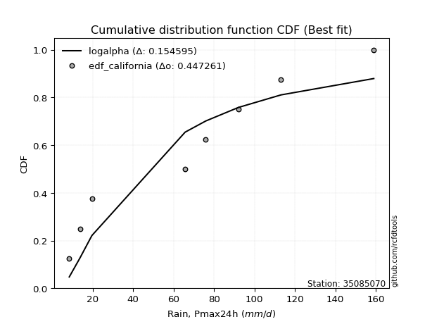</img>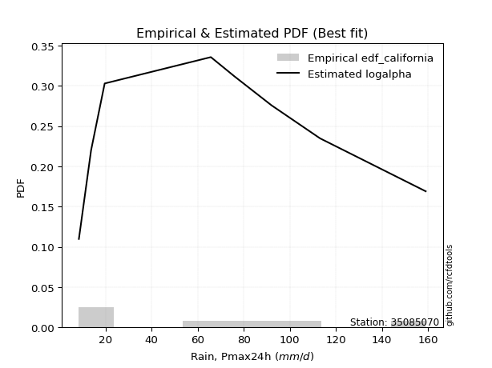</img>

</div>


### 2. EDF Hazen (1930)

Hazen method for plotting positions is a formula used to estimate the empirical cumulative probability distribution of flood events or other hydrological data. This formula often results in biased estimations, particularly when extrapolating to extreme events (high return periods).

<div align="center">


$P=(m-0.5)/n$


</div>


**2.1. Empirical values**

<div align="center">

|                | 0                  | 1                  | 2                  | 3                  | 4                  | 5         | 6                 | 7         |
|:---------------|:-------------------|:-------------------|:-------------------|:-------------------|:-------------------|:----------|:------------------|:----------|
| date           | 2023               | 2022               | 2024               | 2017               | 2020               | 2018      | 2021              | 2019      |
| x              | 8.4                | 13.7               | 19.6               | 65.7               | 75.9               | 92.0      | 113.1             | 159.0     |
| m              | 1                  | 2                  | 3                  | 4                  | 5                  | 6         | 7                 | 8         |
| empirical_dist | edf_hazen          | edf_hazen          | edf_hazen          | edf_hazen          | edf_hazen          | edf_hazen | edf_hazen         | edf_hazen |
| empirical      | 0.0625             | 0.1875             | 0.3125             | 0.4375             | 0.5625             | 0.6875    | 0.8125            | 0.9375    |
| empirical_tr   | 1.0666666666666667 | 1.2307692307692308 | 1.4545454545454546 | 1.7777777777777777 | 2.2857142857142856 | 3.2       | 5.333333333333333 | 16.0      |

</div>


**2.2. Kolmogorov-Smirnov fit test (sorted by Δ)**


<div align="center">

|                | 0                  | 1                   | 2                     | 3                   | 4                   | 5                   | 6                   | 7                   | 8                   | 9                   | 10                 | 11                  | 12                  | 13                 | 14                  | 15                 | 16                  | 17                  | 18                  | 19                  | 20                  | 21                 | 22                 | 23                 | 24                 | 25                  | 26                  | 27                  | 28                 | 29                  | 30                  | 31                  | 32                  | 33                  | 34                  | 35                  | 36                  | 37                  | 38                  | 39                 | 40                 | 41                 | 42                 | 43                  | 44                 | 45                 | 46                  | 47                  | 48                  | 49                  | 50                  | 51                  | 52                  | 53                 | 54                  | 55                 | 56                  | 57                  | 58                  | 59                  | 60                  | 61                  | 62                  | 63                  | 64                 | 65                  | 66                 | 67                  | 68                  | 69                 | 70                 | 71                 | 72                  | 73                  | 74                  | 75                 | 76                  | 77                  | 78                  | 79                 | 80                 | 81                 | 82                 | 83                 | 84                 | 85                 | 86                 | 87                 |
|:---------------|:-------------------|:--------------------|:----------------------|:--------------------|:--------------------|:--------------------|:--------------------|:--------------------|:--------------------|:--------------------|:-------------------|:--------------------|:--------------------|:-------------------|:--------------------|:-------------------|:--------------------|:--------------------|:--------------------|:--------------------|:--------------------|:-------------------|:-------------------|:-------------------|:-------------------|:--------------------|:--------------------|:--------------------|:-------------------|:--------------------|:--------------------|:--------------------|:--------------------|:--------------------|:--------------------|:--------------------|:--------------------|:--------------------|:--------------------|:-------------------|:-------------------|:-------------------|:-------------------|:--------------------|:-------------------|:-------------------|:--------------------|:--------------------|:--------------------|:--------------------|:--------------------|:--------------------|:--------------------|:-------------------|:--------------------|:-------------------|:--------------------|:--------------------|:--------------------|:--------------------|:--------------------|:--------------------|:--------------------|:--------------------|:-------------------|:--------------------|:-------------------|:--------------------|:--------------------|:-------------------|:-------------------|:-------------------|:--------------------|:--------------------|:--------------------|:-------------------|:--------------------|:--------------------|:--------------------|:-------------------|:-------------------|:-------------------|:-------------------|:-------------------|:-------------------|:-------------------|:-------------------|:-------------------|
| station        | 35085070           | 35085070            | 35085070              | 35085070            | 35085070            | 35085070            | 35085070            | 35085070            | 35085070            | 35085070            | 35085070           | 35085070            | 35085070            | 35085070           | 35085070            | 35085070           | 35085070            | 35085070            | 35085070            | 35085070            | 35085070            | 35085070           | 35085070           | 35085070           | 35085070           | 35085070            | 35085070            | 35085070            | 35085070           | 35085070            | 35085070            | 35085070            | 35085070            | 35085070            | 35085070            | 35085070            | 35085070            | 35085070            | 35085070            | 35085070           | 35085070           | 35085070           | 35085070           | 35085070            | 35085070           | 35085070           | 35085070            | 35085070            | 35085070            | 35085070            | 35085070            | 35085070            | 35085070            | 35085070           | 35085070            | 35085070           | 35085070            | 35085070            | 35085070            | 35085070            | 35085070            | 35085070            | 35085070            | 35085070            | 35085070           | 35085070            | 35085070           | 35085070            | 35085070            | 35085070           | 35085070           | 35085070           | 35085070            | 35085070            | 35085070            | 35085070           | 35085070            | 35085070            | 35085070            | 35085070           | 35085070           | 35085070           | 35085070           | 35085070           | 35085070           | 35085070           | 35085070           | 35085070           |
| empirical_dist | edf_hazen          | edf_hazen           | edf_hazen             | edf_hazen           | edf_hazen           | edf_hazen           | edf_hazen           | edf_hazen           | edf_hazen           | edf_hazen           | edf_hazen          | edf_hazen           | edf_hazen           | edf_hazen          | edf_hazen           | edf_hazen          | edf_hazen           | edf_hazen           | edf_hazen           | edf_hazen           | edf_hazen           | edf_hazen          | edf_hazen          | edf_hazen          | edf_hazen          | edf_hazen           | edf_hazen           | edf_hazen           | edf_hazen          | edf_hazen           | edf_hazen           | edf_hazen           | edf_hazen           | edf_hazen           | edf_hazen           | edf_hazen           | edf_hazen           | edf_hazen           | edf_hazen           | edf_hazen          | edf_hazen          | edf_hazen          | edf_hazen          | edf_hazen           | edf_hazen          | edf_hazen          | edf_hazen           | edf_hazen           | edf_hazen           | edf_hazen           | edf_hazen           | edf_hazen           | edf_hazen           | edf_hazen          | edf_hazen           | edf_hazen          | edf_hazen           | edf_hazen           | edf_hazen           | edf_hazen           | edf_hazen           | edf_hazen           | edf_hazen           | edf_hazen           | edf_hazen          | edf_hazen           | edf_hazen          | edf_hazen           | edf_hazen           | edf_hazen          | edf_hazen          | edf_hazen          | edf_hazen           | edf_hazen           | edf_hazen           | edf_hazen          | edf_hazen           | edf_hazen           | edf_hazen           | edf_hazen          | edf_hazen          | edf_hazen          | edf_hazen          | edf_hazen          | edf_hazen          | edf_hazen          | edf_hazen          | edf_hazen          |
| p_dist         | mielke             | logloggamma         | loglaplace_asymmetric | logjohnsonsu        | ncf                 | rayleigh            | logweibull_min      | maxwell             | halfnorm            | t                   | truncnorm          | crystalball         | norm                | pearson3           | exponnorm           | loggumbel_l        | f                   | invgamma            | genlogistic         | invweibull          | kstwobign           | laplace_asymmetric | gumbel_l           | logistic           | logfisk            | gumbel_r            | rice                | logpearson3         | genexpon           | expon               | hypsecant           | loggompertz         | gompertz            | laplace             | halflogistic        | moyal               | logf                | lognct              | logfatiguelife      | logexponnorm       | lognorm            | lognorm            | logcrystalball     | logt                | loggamma           | loggamma           | fisk                | logerlang           | logrice             | logalpha            | nakagami            | invgauss            | logbetaprime        | loginvgamma        | loglogistic         | logncf             | loginvgauss         | logmaxwell          | johnsonsu           | loginvweibull       | lograyleigh         | loghypsecant        | loggenexpon         | logkstwobign        | loghalfnorm        | nct                 | loglaplace         | loggumbel_r         | logexpon            | loghalflogistic    | logmoyal           | betaprime          | lognakagami         | weibull_min         | wald                | gibrat             | alpha               | gamma               | logwald             | loggibrat          | logchi2            | logtruncnorm       | erlang             | loglognorm         | fatiguelife        | logmielke          | chi2               | loggenlogistic     |
| delta          | 0.0999601040641466 | 0.12449618529557419 | 0.13204477411625187   | 0.13234655048960542 | 0.13796248841198377 | 0.14255060025615812 | 0.14315801294509686 | 0.14421045308330419 | 0.14907068294479695 | 0.14930378896598256 | 0.1493041040488989 | 0.14930411839037644 | 0.14930412358113587 | 0.1501543467403096 | 0.15171846357889152 | 0.1518864623909868 | 0.15253695051580818 | 0.15253834201678862 | 0.15313658084978368 | 0.15335268513161657 | 0.15567612715059348 | 0.1590217213007396 | 0.1650983217149444 | 0.1682063217568733 | 0.1711561067892131 | 0.17399074710981496 | 0.17685987586968477 | 0.17710854846143254 | 0.1773077248750372 | 0.17753476561212012 | 0.17826326917361582 | 0.18536953750735274 | 0.18546193320587287 | 0.18770304172050967 | 0.19386087268480096 | 0.19747362182876965 | 0.20254751146583894 | 0.20266614121608528 | 0.20276066534106485 | 0.2028078821173579 | 0.2028080137534024 | 0.2028080137534024 | 0.2028080145598924 | 0.20280805723792894 | 0.2062968193621092 | 0.2062968193621092 | 0.20885030202499455 | 0.21141534315263666 | 0.21328202894657677 | 0.21709469687835625 | 0.21801742591956763 | 0.21803387173797972 | 0.21833115613888143 | 0.2186936010297944 | 0.21988576348141076 | 0.2207674877565683 | 0.22124090328512602 | 0.22546243390349396 | 0.22736852729445756 | 0.22738116136713682 | 0.23231540771822257 | 0.23330056412673694 | 0.24219021126247897 | 0.24664134903099555 | 0.2521379640952476 | 0.26047301080685403 | 0.2616817362877646 | 0.26426429857171585 | 0.26617277490037816 | 0.2803831277713821 | 0.2847186680252414 | 0.2939052382880376 | 0.29904467360319664 | 0.30794340818699895 | 0.31249999999939804 | 0.3125             | 0.33677589390682183 | 0.34054953744250005 | 0.34242582179130654 | 0.3746654371279623 | 0.3782761014173438 | 0.3870672319652526 | 0.3894267947397899 | 0.420736974399993  | 0.4439641936802139 | 0.4729871754093794 | 0.5619958298250836 | 0.8125             |
| deltao         | 0.4472608134160001 | 0.4472608134160001  | 0.4472608134160001    | 0.4472608134160001  | 0.4472608134160001  | 0.4472608134160001  | 0.4472608134160001  | 0.4472608134160001  | 0.4472608134160001  | 0.4472608134160001  | 0.4472608134160001 | 0.4472608134160001  | 0.4472608134160001  | 0.4472608134160001 | 0.4472608134160001  | 0.4472608134160001 | 0.4472608134160001  | 0.4472608134160001  | 0.4472608134160001  | 0.4472608134160001  | 0.4472608134160001  | 0.4472608134160001 | 0.4472608134160001 | 0.4472608134160001 | 0.4472608134160001 | 0.4472608134160001  | 0.4472608134160001  | 0.4472608134160001  | 0.4472608134160001 | 0.4472608134160001  | 0.4472608134160001  | 0.4472608134160001  | 0.4472608134160001  | 0.4472608134160001  | 0.4472608134160001  | 0.4472608134160001  | 0.4472608134160001  | 0.4472608134160001  | 0.4472608134160001  | 0.4472608134160001 | 0.4472608134160001 | 0.4472608134160001 | 0.4472608134160001 | 0.4472608134160001  | 0.4472608134160001 | 0.4472608134160001 | 0.4472608134160001  | 0.4472608134160001  | 0.4472608134160001  | 0.4472608134160001  | 0.4472608134160001  | 0.4472608134160001  | 0.4472608134160001  | 0.4472608134160001 | 0.4472608134160001  | 0.4472608134160001 | 0.4472608134160001  | 0.4472608134160001  | 0.4472608134160001  | 0.4472608134160001  | 0.4472608134160001  | 0.4472608134160001  | 0.4472608134160001  | 0.4472608134160001  | 0.4472608134160001 | 0.4472608134160001  | 0.4472608134160001 | 0.4472608134160001  | 0.4472608134160001  | 0.4472608134160001 | 0.4472608134160001 | 0.4472608134160001 | 0.4472608134160001  | 0.4472608134160001  | 0.4472608134160001  | 0.4472608134160001 | 0.4472608134160001  | 0.4472608134160001  | 0.4472608134160001  | 0.4472608134160001 | 0.4472608134160001 | 0.4472608134160001 | 0.4472608134160001 | 0.4472608134160001 | 0.4472608134160001 | 0.4472608134160001 | 0.4472608134160001 | 0.4472608134160001 |
| eval           | Δo > Δ             | Δo > Δ              | Δo > Δ                | Δo > Δ              | Δo > Δ              | Δo > Δ              | Δo > Δ              | Δo > Δ              | Δo > Δ              | Δo > Δ              | Δo > Δ             | Δo > Δ              | Δo > Δ              | Δo > Δ             | Δo > Δ              | Δo > Δ             | Δo > Δ              | Δo > Δ              | Δo > Δ              | Δo > Δ              | Δo > Δ              | Δo > Δ             | Δo > Δ             | Δo > Δ             | Δo > Δ             | Δo > Δ              | Δo > Δ              | Δo > Δ              | Δo > Δ             | Δo > Δ              | Δo > Δ              | Δo > Δ              | Δo > Δ              | Δo > Δ              | Δo > Δ              | Δo > Δ              | Δo > Δ              | Δo > Δ              | Δo > Δ              | Δo > Δ             | Δo > Δ             | Δo > Δ             | Δo > Δ             | Δo > Δ              | Δo > Δ             | Δo > Δ             | Δo > Δ              | Δo > Δ              | Δo > Δ              | Δo > Δ              | Δo > Δ              | Δo > Δ              | Δo > Δ              | Δo > Δ             | Δo > Δ              | Δo > Δ             | Δo > Δ              | Δo > Δ              | Δo > Δ              | Δo > Δ              | Δo > Δ              | Δo > Δ              | Δo > Δ              | Δo > Δ              | Δo > Δ             | Δo > Δ              | Δo > Δ             | Δo > Δ              | Δo > Δ              | Δo > Δ             | Δo > Δ             | Δo > Δ             | Δo > Δ              | Δo > Δ              | Δo > Δ              | Δo > Δ             | Δo > Δ              | Δo > Δ              | Δo > Δ              | Δo > Δ             | Δo > Δ             | Δo > Δ             | Δo > Δ             | Δo > Δ             | Δo > Δ             | Δo <= Δ            | Δo <= Δ            | Δo <= Δ            |
| fit            | 1                  | 1                   | 1                     | 1                   | 1                   | 1                   | 1                   | 1                   | 1                   | 1                   | 1                  | 1                   | 1                   | 1                  | 1                   | 1                  | 1                   | 1                   | 1                   | 1                   | 1                   | 1                  | 1                  | 1                  | 1                  | 1                   | 1                   | 1                   | 1                  | 1                   | 1                   | 1                   | 1                   | 1                   | 1                   | 1                   | 1                   | 1                   | 1                   | 1                  | 1                  | 1                  | 1                  | 1                   | 1                  | 1                  | 1                   | 1                   | 1                   | 1                   | 1                   | 1                   | 1                   | 1                  | 1                   | 1                  | 1                   | 1                   | 1                   | 1                   | 1                   | 1                   | 1                   | 1                   | 1                  | 1                   | 1                  | 1                   | 1                   | 1                  | 1                  | 1                  | 1                   | 1                   | 1                   | 1                  | 1                   | 1                   | 1                   | 1                  | 1                  | 1                  | 1                  | 1                  | 1                  | 0                  | 0                  | 0                  |
| n              | 8                  | 8                   | 8                     | 8                   | 8                   | 8                   | 8                   | 8                   | 8                   | 8                   | 8                  | 8                   | 8                   | 8                  | 8                   | 8                  | 8                   | 8                   | 8                   | 8                   | 8                   | 8                  | 8                  | 8                  | 8                  | 8                   | 8                   | 8                   | 8                  | 8                   | 8                   | 8                   | 8                   | 8                   | 8                   | 8                   | 8                   | 8                   | 8                   | 8                  | 8                  | 8                  | 8                  | 8                   | 8                  | 8                  | 8                   | 8                   | 8                   | 8                   | 8                   | 8                   | 8                   | 8                  | 8                   | 8                  | 8                   | 8                   | 8                   | 8                   | 8                   | 8                   | 8                   | 8                   | 8                  | 8                   | 8                  | 8                   | 8                   | 8                  | 8                  | 8                  | 8                   | 8                   | 8                   | 8                  | 8                   | 8                   | 8                   | 8                  | 8                  | 8                  | 8                  | 8                  | 8                  | 8                  | 8                  | 8                  |
| best_fit       | 1                  | 0                   | 0                     | 0                   | 0                   | 0                   | 0                   | 0                   | 0                   | 0                   | 0                  | 0                   | 0                   | 0                  | 0                   | 0                  | 0                   | 0                   | 0                   | 0                   | 0                   | 0                  | 0                  | 0                  | 0                  | 0                   | 0                   | 0                   | 0                  | 0                   | 0                   | 0                   | 0                   | 0                   | 0                   | 0                   | 0                   | 0                   | 0                   | 0                  | 0                  | 0                  | 0                  | 0                   | 0                  | 0                  | 0                   | 0                   | 0                   | 0                   | 0                   | 0                   | 0                   | 0                  | 0                   | 0                  | 0                   | 0                   | 0                   | 0                   | 0                   | 0                   | 0                   | 0                   | 0                  | 0                   | 0                  | 0                   | 0                   | 0                  | 0                  | 0                  | 0                   | 0                   | 0                   | 0                  | 0                   | 0                   | 0                   | 0                  | 0                  | 0                  | 0                  | 0                  | 0                  | 0                  | 0                  | 0                  |
| best_fit_sort  | 1                  | 2                   | 3                     | 4                   | 5                   | 6                   | 7                   | 8                   | 9                   | 10                  | 11                 | 12                  | 13                  | 14                 | 15                  | 16                 | 17                  | 18                  | 19                  | 20                  | 21                  | 22                 | 23                 | 24                 | 25                 | 26                  | 27                  | 28                  | 29                 | 30                  | 31                  | 32                  | 33                  | 34                  | 35                  | 36                  | 37                  | 38                  | 39                  | 40                 | 41                 | 42                 | 43                 | 44                  | 45                 | 46                 | 47                  | 48                  | 49                  | 50                  | 51                  | 52                  | 53                  | 54                 | 55                  | 56                 | 57                  | 58                  | 59                  | 60                  | 61                  | 62                  | 63                  | 64                  | 65                 | 66                  | 67                 | 68                  | 69                  | 70                 | 71                 | 72                 | 73                  | 74                  | 75                  | 76                 | 77                  | 78                  | 79                  | 80                 | 81                 | 82                 | 83                 | 84                 | 85                 | 86                 | 87                 | 88                 |

</div>


**2.3. Best fit**

<div align="center">

|   id |   station | empirical_dist   | p_dist   |     delta |   deltao | eval   |   fit |   n |   best_fit |   best_fit_sort |
|-----:|----------:|:-----------------|:---------|----------:|---------:|:-------|------:|----:|-----------:|----------------:|
|    0 |  35085070 | edf_hazen        | mielke   | 0.0999601 | 0.447261 | Δo > Δ |     1 |   8 |          1 |               1 |

</div>


<div align="center">

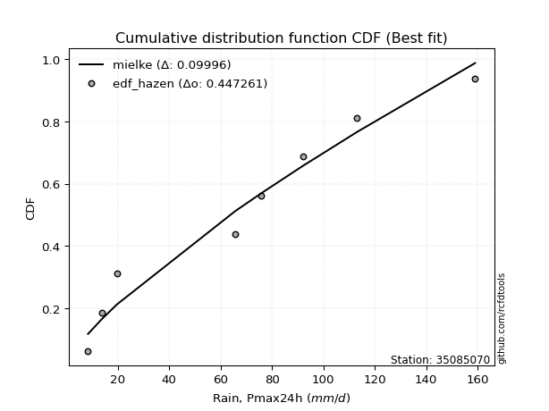</img>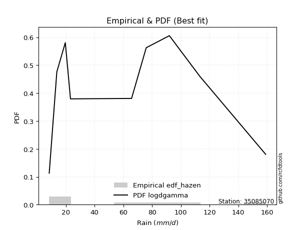</img>

</div>


### 3. EDF Weibull (1939)

Weibull plotting position formula is an empirical method used to estimate the non-exceedance probability or plotting position for a set of observed data, is often recommended or widely used in practice, particularly in flood frequency analysis.

<div align="center">


$P=m/(n+1)$


</div>


**3.1. Empirical values**

<div align="center">

|                | 0                  | 1                  | 2                  | 3                  | 4                  | 5                  | 6                  | 7                  |
|:---------------|:-------------------|:-------------------|:-------------------|:-------------------|:-------------------|:-------------------|:-------------------|:-------------------|
| date           | 2023               | 2022               | 2024               | 2017               | 2020               | 2018               | 2021               | 2019               |
| x              | 8.4                | 13.7               | 19.6               | 65.7               | 75.9               | 92.0               | 113.1              | 159.0              |
| m              | 1                  | 2                  | 3                  | 4                  | 5                  | 6                  | 7                  | 8                  |
| empirical_dist | edf_weibull        | edf_weibull        | edf_weibull        | edf_weibull        | edf_weibull        | edf_weibull        | edf_weibull        | edf_weibull        |
| empirical      | 0.1111111111111111 | 0.2222222222222222 | 0.3333333333333333 | 0.4444444444444444 | 0.5555555555555556 | 0.6666666666666666 | 0.7777777777777778 | 0.8888888888888888 |
| empirical_tr   | 1.125              | 1.2857142857142856 | 1.4999999999999998 | 1.7999999999999998 | 2.25               | 2.9999999999999996 | 4.5                | 8.999999999999996  |

</div>


**3.2. Kolmogorov-Smirnov fit test (sorted by Δ)**


<div align="center">

|                | 0                   | 1                  | 2                   | 3                     | 4                   | 5                   | 6                   | 7                   | 8                  | 9                  | 10                  | 11                  | 12                  | 13                  | 14                 | 15                  | 16                 | 17                 | 18                  | 19                  | 20                 | 21                  | 22                 | 23                  | 24                 | 25                  | 26                  | 27                  | 28                  | 29                  | 30                  | 31                  | 32                  | 33                  | 34                  | 35                  | 36                  | 37                  | 38                  | 39                  | 40                  | 41                  | 42                  | 43                  | 44                  | 45                  | 46                  | 47                  | 48                 | 49                 | 50                 | 51                  | 52                  | 53                  | 54                 | 55                  | 56                  | 57                  | 58                  | 59                 | 60                  | 61                  | 62                  | 63                  | 64                  | 65                 | 66                  | 67                  | 68                  | 69                 | 70                  | 71                  | 72                 | 73                 | 74                 | 75                  | 76                 | 77                  | 78                 | 79                 | 80                 | 81                 | 82                 | 83                 | 84                 | 85                 | 86                 | 87                 |
|:---------------|:--------------------|:-------------------|:--------------------|:----------------------|:--------------------|:--------------------|:--------------------|:--------------------|:-------------------|:-------------------|:--------------------|:--------------------|:--------------------|:--------------------|:-------------------|:--------------------|:-------------------|:-------------------|:--------------------|:--------------------|:-------------------|:--------------------|:-------------------|:--------------------|:-------------------|:--------------------|:--------------------|:--------------------|:--------------------|:--------------------|:--------------------|:--------------------|:--------------------|:--------------------|:--------------------|:--------------------|:--------------------|:--------------------|:--------------------|:--------------------|:--------------------|:--------------------|:--------------------|:--------------------|:--------------------|:--------------------|:--------------------|:--------------------|:-------------------|:-------------------|:-------------------|:--------------------|:--------------------|:--------------------|:-------------------|:--------------------|:--------------------|:--------------------|:--------------------|:-------------------|:--------------------|:--------------------|:--------------------|:--------------------|:--------------------|:-------------------|:--------------------|:--------------------|:--------------------|:-------------------|:--------------------|:--------------------|:-------------------|:-------------------|:-------------------|:--------------------|:-------------------|:--------------------|:-------------------|:-------------------|:-------------------|:-------------------|:-------------------|:-------------------|:-------------------|:-------------------|:-------------------|:-------------------|
| station        | 35085070            | 35085070           | 35085070            | 35085070              | 35085070            | 35085070            | 35085070            | 35085070            | 35085070           | 35085070           | 35085070            | 35085070            | 35085070            | 35085070            | 35085070           | 35085070            | 35085070           | 35085070           | 35085070            | 35085070            | 35085070           | 35085070            | 35085070           | 35085070            | 35085070           | 35085070            | 35085070            | 35085070            | 35085070            | 35085070            | 35085070            | 35085070            | 35085070            | 35085070            | 35085070            | 35085070            | 35085070            | 35085070            | 35085070            | 35085070            | 35085070            | 35085070            | 35085070            | 35085070            | 35085070            | 35085070            | 35085070            | 35085070            | 35085070           | 35085070           | 35085070           | 35085070            | 35085070            | 35085070            | 35085070           | 35085070            | 35085070            | 35085070            | 35085070            | 35085070           | 35085070            | 35085070            | 35085070            | 35085070            | 35085070            | 35085070           | 35085070            | 35085070            | 35085070            | 35085070           | 35085070            | 35085070            | 35085070           | 35085070           | 35085070           | 35085070            | 35085070           | 35085070            | 35085070           | 35085070           | 35085070           | 35085070           | 35085070           | 35085070           | 35085070           | 35085070           | 35085070           | 35085070           |
| empirical_dist | edf_weibull         | edf_weibull        | edf_weibull         | edf_weibull           | edf_weibull         | edf_weibull         | edf_weibull         | edf_weibull         | edf_weibull        | edf_weibull        | edf_weibull         | edf_weibull         | edf_weibull         | edf_weibull         | edf_weibull        | edf_weibull         | edf_weibull        | edf_weibull        | edf_weibull         | edf_weibull         | edf_weibull        | edf_weibull         | edf_weibull        | edf_weibull         | edf_weibull        | edf_weibull         | edf_weibull         | edf_weibull         | edf_weibull         | edf_weibull         | edf_weibull         | edf_weibull         | edf_weibull         | edf_weibull         | edf_weibull         | edf_weibull         | edf_weibull         | edf_weibull         | edf_weibull         | edf_weibull         | edf_weibull         | edf_weibull         | edf_weibull         | edf_weibull         | edf_weibull         | edf_weibull         | edf_weibull         | edf_weibull         | edf_weibull        | edf_weibull        | edf_weibull        | edf_weibull         | edf_weibull         | edf_weibull         | edf_weibull        | edf_weibull         | edf_weibull         | edf_weibull         | edf_weibull         | edf_weibull        | edf_weibull         | edf_weibull         | edf_weibull         | edf_weibull         | edf_weibull         | edf_weibull        | edf_weibull         | edf_weibull         | edf_weibull         | edf_weibull        | edf_weibull         | edf_weibull         | edf_weibull        | edf_weibull        | edf_weibull        | edf_weibull         | edf_weibull        | edf_weibull         | edf_weibull        | edf_weibull        | edf_weibull        | edf_weibull        | edf_weibull        | edf_weibull        | edf_weibull        | edf_weibull        | edf_weibull        | edf_weibull        |
| p_dist         | mielke              | logloggamma        | ncf                 | loglaplace_asymmetric | logjohnsonsu        | loggumbel_l         | rayleigh            | logweibull_min      | logfisk            | maxwell            | halfnorm            | t                   | truncnorm           | crystalball         | norm               | logpearson3         | genexpon           | expon              | pearson3            | exponnorm           | f                  | invgamma            | genlogistic        | invweibull          | kstwobign          | loggompertz         | laplace_asymmetric  | gumbel_l            | logistic            | gumbel_r            | logf                | lognct              | logfatiguelife      | logexponnorm        | lognorm             | lognorm             | logcrystalball      | logt                | rice                | hypsecant           | loggamma            | loggamma            | fisk                | logerlang           | gompertz            | logrice             | laplace             | logalpha            | nakagami           | invgauss           | logbetaprime       | loginvgamma         | loglogistic         | logncf              | loginvgauss        | halflogistic        | moyal               | logmaxwell          | johnsonsu           | loginvweibull      | lograyleigh         | loghypsecant        | loggenexpon         | logkstwobign        | loghalfnorm         | nct                | loglaplace          | loggumbel_r         | logexpon            | weibull_min        | loghalflogistic     | logmoyal            | betaprime          | lognakagami        | alpha              | wald                | gibrat             | gamma               | logwald            | loggibrat          | logchi2            | logtruncnorm       | erlang             | loglognorm         | fatiguelife        | logmielke          | chi2               | loggenlogistic     |
| delta          | 0.12079343739747991 | 0.1453295186289075 | 0.14984184959119923 | 0.1528781074495852    | 0.15317988382293873 | 0.15704572741029463 | 0.16338393358949144 | 0.16399134627843018 | 0.1642116623447687 | 0.1650437864166375 | 0.16990401627813026 | 0.17013712229931588 | 0.17013743738223222 | 0.17013745172370975 | 0.1701374569144692 | 0.17016410401698812 | 0.1703632804305928 | 0.1705903211676757 | 0.17098768007364293 | 0.17255179691222483 | 0.1733702838491415 | 0.17337167535012193 | 0.173969914183117  | 0.17418601846494988 | 0.1765094604839268 | 0.17842509306290832 | 0.17985505463407292 | 0.18593165504827772 | 0.18903965509020662 | 0.19482408044314828 | 0.19560306702139452 | 0.19572169677164086 | 0.19581622089662043 | 0.19586343767291348 | 0.19586356930895799 | 0.19586356930895799 | 0.19586357011544797 | 0.19586361279348452 | 0.19769320920301808 | 0.19909660250694913 | 0.19935237491766478 | 0.19935237491766478 | 0.20190585758055013 | 0.20447089870819224 | 0.20629526653920618 | 0.20633758450213235 | 0.20853637505384298 | 0.21015025243391183 | 0.2110729814751232 | 0.2110894272935353 | 0.211386711694437  | 0.21174915658534998 | 0.21294131903696634 | 0.21382304331212387 | 0.2142964588406816 | 0.21469420601813427 | 0.21830695516210297 | 0.21851798945904954 | 0.22042408285001314 | 0.2204367169226924 | 0.22537096327377815 | 0.22635611968229252 | 0.23524576681803455 | 0.23969690458655113 | 0.24519351965080316 | 0.2535285663624096 | 0.25473729184332017 | 0.25731985412727143 | 0.25922833045593374 | 0.2593322970758878 | 0.27343868332693766 | 0.27777422358079695 | 0.2869607938435932 | 0.2921002291587522 | 0.3298314494623774 | 0.33333333333273135 | 0.3333333333333333 | 0.33360509299805563 | 0.3354813773468621 | 0.3677209926835179 | 0.3713316569728994 | 0.3801227875208082 | 0.3824823502953455 | 0.3860147521777708 | 0.4207410765883204 | 0.466042730964935  | 0.5550513853806391 | 0.7777777777777778 |
| deltao         | 0.4472608134160001  | 0.4472608134160001 | 0.4472608134160001  | 0.4472608134160001    | 0.4472608134160001  | 0.4472608134160001  | 0.4472608134160001  | 0.4472608134160001  | 0.4472608134160001 | 0.4472608134160001 | 0.4472608134160001  | 0.4472608134160001  | 0.4472608134160001  | 0.4472608134160001  | 0.4472608134160001 | 0.4472608134160001  | 0.4472608134160001 | 0.4472608134160001 | 0.4472608134160001  | 0.4472608134160001  | 0.4472608134160001 | 0.4472608134160001  | 0.4472608134160001 | 0.4472608134160001  | 0.4472608134160001 | 0.4472608134160001  | 0.4472608134160001  | 0.4472608134160001  | 0.4472608134160001  | 0.4472608134160001  | 0.4472608134160001  | 0.4472608134160001  | 0.4472608134160001  | 0.4472608134160001  | 0.4472608134160001  | 0.4472608134160001  | 0.4472608134160001  | 0.4472608134160001  | 0.4472608134160001  | 0.4472608134160001  | 0.4472608134160001  | 0.4472608134160001  | 0.4472608134160001  | 0.4472608134160001  | 0.4472608134160001  | 0.4472608134160001  | 0.4472608134160001  | 0.4472608134160001  | 0.4472608134160001 | 0.4472608134160001 | 0.4472608134160001 | 0.4472608134160001  | 0.4472608134160001  | 0.4472608134160001  | 0.4472608134160001 | 0.4472608134160001  | 0.4472608134160001  | 0.4472608134160001  | 0.4472608134160001  | 0.4472608134160001 | 0.4472608134160001  | 0.4472608134160001  | 0.4472608134160001  | 0.4472608134160001  | 0.4472608134160001  | 0.4472608134160001 | 0.4472608134160001  | 0.4472608134160001  | 0.4472608134160001  | 0.4472608134160001 | 0.4472608134160001  | 0.4472608134160001  | 0.4472608134160001 | 0.4472608134160001 | 0.4472608134160001 | 0.4472608134160001  | 0.4472608134160001 | 0.4472608134160001  | 0.4472608134160001 | 0.4472608134160001 | 0.4472608134160001 | 0.4472608134160001 | 0.4472608134160001 | 0.4472608134160001 | 0.4472608134160001 | 0.4472608134160001 | 0.4472608134160001 | 0.4472608134160001 |
| eval           | Δo > Δ              | Δo > Δ             | Δo > Δ              | Δo > Δ                | Δo > Δ              | Δo > Δ              | Δo > Δ              | Δo > Δ              | Δo > Δ             | Δo > Δ             | Δo > Δ              | Δo > Δ              | Δo > Δ              | Δo > Δ              | Δo > Δ             | Δo > Δ              | Δo > Δ             | Δo > Δ             | Δo > Δ              | Δo > Δ              | Δo > Δ             | Δo > Δ              | Δo > Δ             | Δo > Δ              | Δo > Δ             | Δo > Δ              | Δo > Δ              | Δo > Δ              | Δo > Δ              | Δo > Δ              | Δo > Δ              | Δo > Δ              | Δo > Δ              | Δo > Δ              | Δo > Δ              | Δo > Δ              | Δo > Δ              | Δo > Δ              | Δo > Δ              | Δo > Δ              | Δo > Δ              | Δo > Δ              | Δo > Δ              | Δo > Δ              | Δo > Δ              | Δo > Δ              | Δo > Δ              | Δo > Δ              | Δo > Δ             | Δo > Δ             | Δo > Δ             | Δo > Δ              | Δo > Δ              | Δo > Δ              | Δo > Δ             | Δo > Δ              | Δo > Δ              | Δo > Δ              | Δo > Δ              | Δo > Δ             | Δo > Δ              | Δo > Δ              | Δo > Δ              | Δo > Δ              | Δo > Δ              | Δo > Δ             | Δo > Δ              | Δo > Δ              | Δo > Δ              | Δo > Δ             | Δo > Δ              | Δo > Δ              | Δo > Δ             | Δo > Δ             | Δo > Δ             | Δo > Δ              | Δo > Δ             | Δo > Δ              | Δo > Δ             | Δo > Δ             | Δo > Δ             | Δo > Δ             | Δo > Δ             | Δo > Δ             | Δo > Δ             | Δo <= Δ            | Δo <= Δ            | Δo <= Δ            |
| fit            | 1                   | 1                  | 1                   | 1                     | 1                   | 1                   | 1                   | 1                   | 1                  | 1                  | 1                   | 1                   | 1                   | 1                   | 1                  | 1                   | 1                  | 1                  | 1                   | 1                   | 1                  | 1                   | 1                  | 1                   | 1                  | 1                   | 1                   | 1                   | 1                   | 1                   | 1                   | 1                   | 1                   | 1                   | 1                   | 1                   | 1                   | 1                   | 1                   | 1                   | 1                   | 1                   | 1                   | 1                   | 1                   | 1                   | 1                   | 1                   | 1                  | 1                  | 1                  | 1                   | 1                   | 1                   | 1                  | 1                   | 1                   | 1                   | 1                   | 1                  | 1                   | 1                   | 1                   | 1                   | 1                   | 1                  | 1                   | 1                   | 1                   | 1                  | 1                   | 1                   | 1                  | 1                  | 1                  | 1                   | 1                  | 1                   | 1                  | 1                  | 1                  | 1                  | 1                  | 1                  | 1                  | 0                  | 0                  | 0                  |
| n              | 8                   | 8                  | 8                   | 8                     | 8                   | 8                   | 8                   | 8                   | 8                  | 8                  | 8                   | 8                   | 8                   | 8                   | 8                  | 8                   | 8                  | 8                  | 8                   | 8                   | 8                  | 8                   | 8                  | 8                   | 8                  | 8                   | 8                   | 8                   | 8                   | 8                   | 8                   | 8                   | 8                   | 8                   | 8                   | 8                   | 8                   | 8                   | 8                   | 8                   | 8                   | 8                   | 8                   | 8                   | 8                   | 8                   | 8                   | 8                   | 8                  | 8                  | 8                  | 8                   | 8                   | 8                   | 8                  | 8                   | 8                   | 8                   | 8                   | 8                  | 8                   | 8                   | 8                   | 8                   | 8                   | 8                  | 8                   | 8                   | 8                   | 8                  | 8                   | 8                   | 8                  | 8                  | 8                  | 8                   | 8                  | 8                   | 8                  | 8                  | 8                  | 8                  | 8                  | 8                  | 8                  | 8                  | 8                  | 8                  |
| best_fit       | 1                   | 0                  | 0                   | 0                     | 0                   | 0                   | 0                   | 0                   | 0                  | 0                  | 0                   | 0                   | 0                   | 0                   | 0                  | 0                   | 0                  | 0                  | 0                   | 0                   | 0                  | 0                   | 0                  | 0                   | 0                  | 0                   | 0                   | 0                   | 0                   | 0                   | 0                   | 0                   | 0                   | 0                   | 0                   | 0                   | 0                   | 0                   | 0                   | 0                   | 0                   | 0                   | 0                   | 0                   | 0                   | 0                   | 0                   | 0                   | 0                  | 0                  | 0                  | 0                   | 0                   | 0                   | 0                  | 0                   | 0                   | 0                   | 0                   | 0                  | 0                   | 0                   | 0                   | 0                   | 0                   | 0                  | 0                   | 0                   | 0                   | 0                  | 0                   | 0                   | 0                  | 0                  | 0                  | 0                   | 0                  | 0                   | 0                  | 0                  | 0                  | 0                  | 0                  | 0                  | 0                  | 0                  | 0                  | 0                  |
| best_fit_sort  | 1                   | 2                  | 3                   | 4                     | 5                   | 6                   | 7                   | 8                   | 9                  | 10                 | 11                  | 12                  | 13                  | 14                  | 15                 | 16                  | 17                 | 18                 | 19                  | 20                  | 21                 | 22                  | 23                 | 24                  | 25                 | 26                  | 27                  | 28                  | 29                  | 30                  | 31                  | 32                  | 33                  | 34                  | 35                  | 36                  | 37                  | 38                  | 39                  | 40                  | 41                  | 42                  | 43                  | 44                  | 45                  | 46                  | 47                  | 48                  | 49                 | 50                 | 51                 | 52                  | 53                  | 54                  | 55                 | 56                  | 57                  | 58                  | 59                  | 60                 | 61                  | 62                  | 63                  | 64                  | 65                  | 66                 | 67                  | 68                  | 69                  | 70                 | 71                  | 72                  | 73                 | 74                 | 75                 | 76                  | 77                 | 78                  | 79                 | 80                 | 81                 | 82                 | 83                 | 84                 | 85                 | 86                 | 87                 | 88                 |

</div>


**3.3. Best fit**

<div align="center">

|   id |   station | empirical_dist   | p_dist   |    delta |   deltao | eval   |   fit |   n |   best_fit |   best_fit_sort |
|-----:|----------:|:-----------------|:---------|---------:|---------:|:-------|------:|----:|-----------:|----------------:|
|    0 |  35085070 | edf_weibull      | mielke   | 0.120793 | 0.447261 | Δo > Δ |     1 |   8 |          1 |               1 |

</div>


<div align="center">

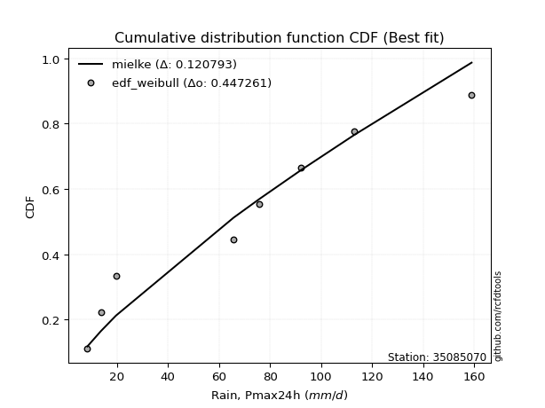</img></img>

</div>


### 4. EDF Beard (1943)

The Beard formula (or Beard´s plotting position formula) in hydrology is used to estimate the empirical non-exceedance probability _(P)_ of a flood event (or other extreme hydrological data point) within a given dataset.

<div align="center">


$P=(m-0.31)/(n+0.38)$


</div>


**4.1. Empirical values**

<div align="center">

|                | 0                   | 1                   | 2                  | 3                   | 4                  | 5                  | 6                  | 7                  |
|:---------------|:--------------------|:--------------------|:-------------------|:--------------------|:-------------------|:-------------------|:-------------------|:-------------------|
| date           | 2023                | 2022                | 2024               | 2017                | 2020               | 2018               | 2021               | 2019               |
| x              | 8.4                 | 13.7                | 19.6               | 65.7                | 75.9               | 92.0               | 113.1              | 159.0              |
| m              | 1                   | 2                   | 3                  | 4                   | 5                  | 6                  | 7                  | 8                  |
| empirical_dist | edf_beard           | edf_beard           | edf_beard          | edf_beard           | edf_beard          | edf_beard          | edf_beard          | edf_beard          |
| empirical      | 0.08233890214797135 | 0.20167064439140808 | 0.3210023866348448 | 0.44033412887828155 | 0.5596658711217184 | 0.6789976133651551 | 0.7983293556085919 | 0.9176610978520287 |
| empirical_tr   | 1.0897269180754225  | 1.2526158445440956  | 1.4727592267135323 | 1.7867803837953091  | 2.2710027100271004 | 3.115241635687732  | 4.958579881656804  | 12.144927536231886 |

</div>


**4.2. Kolmogorov-Smirnov fit test (sorted by Δ)**


<div align="center">

|                | 0                   | 1                  | 2                   | 3                     | 4                   | 5                   | 6                   | 7                   | 8                  | 9                   | 10                  | 11                  | 12                  | 13                 | 14                  | 15                  | 16                 | 17                  | 18                 | 19                  | 20                 | 21                  | 22                  | 23                  | 24                  | 25                  | 26                  | 27                  | 28                  | 29                 | 30                  | 31                  | 32                  | 33                  | 34                 | 35                  | 36                 | 37                  | 38                  | 39                  | 40                  | 41                 | 42                  | 43                  | 44                  | 45                  | 46                 | 47                 | 48                  | 49                 | 50                  | 51                  | 52                  | 53                  | 54                 | 55                  | 56                  | 57                  | 58                 | 59                  | 60                  | 61                 | 62                  | 63                 | 64                  | 65                 | 66                  | 67                 | 68                 | 69                  | 70                 | 71                 | 72                  | 73                 | 74                  | 75                 | 76                 | 77                 | 78                 | 79                  | 80                  | 81                  | 82                  | 83                  | 84                 | 85                  | 86                 | 87                 |
|:---------------|:--------------------|:-------------------|:--------------------|:----------------------|:--------------------|:--------------------|:--------------------|:--------------------|:-------------------|:--------------------|:--------------------|:--------------------|:--------------------|:-------------------|:--------------------|:--------------------|:-------------------|:--------------------|:-------------------|:--------------------|:-------------------|:--------------------|:--------------------|:--------------------|:--------------------|:--------------------|:--------------------|:--------------------|:--------------------|:-------------------|:--------------------|:--------------------|:--------------------|:--------------------|:-------------------|:--------------------|:-------------------|:--------------------|:--------------------|:--------------------|:--------------------|:-------------------|:--------------------|:--------------------|:--------------------|:--------------------|:-------------------|:-------------------|:--------------------|:-------------------|:--------------------|:--------------------|:--------------------|:--------------------|:-------------------|:--------------------|:--------------------|:--------------------|:-------------------|:--------------------|:--------------------|:-------------------|:--------------------|:-------------------|:--------------------|:-------------------|:--------------------|:-------------------|:-------------------|:--------------------|:-------------------|:-------------------|:--------------------|:-------------------|:--------------------|:-------------------|:-------------------|:-------------------|:-------------------|:--------------------|:--------------------|:--------------------|:--------------------|:--------------------|:-------------------|:--------------------|:-------------------|:-------------------|
| station        | 35085070            | 35085070           | 35085070            | 35085070              | 35085070            | 35085070            | 35085070            | 35085070            | 35085070           | 35085070            | 35085070            | 35085070            | 35085070            | 35085070           | 35085070            | 35085070            | 35085070           | 35085070            | 35085070           | 35085070            | 35085070           | 35085070            | 35085070            | 35085070            | 35085070            | 35085070            | 35085070            | 35085070            | 35085070            | 35085070           | 35085070            | 35085070            | 35085070            | 35085070            | 35085070           | 35085070            | 35085070           | 35085070            | 35085070            | 35085070            | 35085070            | 35085070           | 35085070            | 35085070            | 35085070            | 35085070            | 35085070           | 35085070           | 35085070            | 35085070           | 35085070            | 35085070            | 35085070            | 35085070            | 35085070           | 35085070            | 35085070            | 35085070            | 35085070           | 35085070            | 35085070            | 35085070           | 35085070            | 35085070           | 35085070            | 35085070           | 35085070            | 35085070           | 35085070           | 35085070            | 35085070           | 35085070           | 35085070            | 35085070           | 35085070            | 35085070           | 35085070           | 35085070           | 35085070           | 35085070            | 35085070            | 35085070            | 35085070            | 35085070            | 35085070           | 35085070            | 35085070           | 35085070           |
| empirical_dist | edf_beard           | edf_beard          | edf_beard           | edf_beard             | edf_beard           | edf_beard           | edf_beard           | edf_beard           | edf_beard          | edf_beard           | edf_beard           | edf_beard           | edf_beard           | edf_beard          | edf_beard           | edf_beard           | edf_beard          | edf_beard           | edf_beard          | edf_beard           | edf_beard          | edf_beard           | edf_beard           | edf_beard           | edf_beard           | edf_beard           | edf_beard           | edf_beard           | edf_beard           | edf_beard          | edf_beard           | edf_beard           | edf_beard           | edf_beard           | edf_beard          | edf_beard           | edf_beard          | edf_beard           | edf_beard           | edf_beard           | edf_beard           | edf_beard          | edf_beard           | edf_beard           | edf_beard           | edf_beard           | edf_beard          | edf_beard          | edf_beard           | edf_beard          | edf_beard           | edf_beard           | edf_beard           | edf_beard           | edf_beard          | edf_beard           | edf_beard           | edf_beard           | edf_beard          | edf_beard           | edf_beard           | edf_beard          | edf_beard           | edf_beard          | edf_beard           | edf_beard          | edf_beard           | edf_beard          | edf_beard          | edf_beard           | edf_beard          | edf_beard          | edf_beard           | edf_beard          | edf_beard           | edf_beard          | edf_beard          | edf_beard          | edf_beard          | edf_beard           | edf_beard           | edf_beard           | edf_beard           | edf_beard           | edf_beard          | edf_beard           | edf_beard          | edf_beard          |
| p_dist         | mielke              | logloggamma        | ncf                 | loglaplace_asymmetric | logjohnsonsu        | loggumbel_l         | rayleigh            | logweibull_min      | maxwell            | halfnorm            | t                   | truncnorm           | crystalball         | norm               | pearson3            | exponnorm           | f                  | invgamma            | genlogistic        | invweibull          | kstwobign          | laplace_asymmetric  | logfisk             | gumbel_l            | logpearson3         | genexpon            | expon               | logistic            | gumbel_r            | loggompertz        | rice                | hypsecant           | gompertz            | laplace             | logf               | lognct              | logfatiguelife     | logexponnorm        | lognorm             | lognorm             | logcrystalball      | logt               | halflogistic        | loggamma            | loggamma            | moyal               | fisk               | logerlang          | logrice             | logalpha           | nakagami            | invgauss            | logbetaprime        | loginvgamma         | loglogistic        | logncf              | loginvgauss         | logmaxwell          | johnsonsu          | loginvweibull       | lograyleigh         | loghypsecant       | loggenexpon         | logkstwobign       | loghalfnorm         | nct                | loglaplace          | loggumbel_r        | logexpon           | loghalflogistic     | logmoyal           | weibull_min        | betaprime           | lognakagami        | wald                | gibrat             | alpha              | gamma              | logwald            | loggibrat           | logchi2             | logtruncnorm        | erlang              | loglognorm          | fatiguelife        | logmielke           | chi2               | loggenlogistic     |
| delta          | 0.10846249069899142 | 0.132998571930419  | 0.13751090289271073 | 0.1405471607510967    | 0.14084893712445024 | 0.14905233351270525 | 0.15105298689100294 | 0.15166039957994168 | 0.152712839718149  | 0.15757306957964176 | 0.15780617560082738 | 0.15780649068374372 | 0.15780650502522126 | 0.1578065102159807 | 0.15865673337515443 | 0.16022085021373633 | 0.161039337150653  | 0.16104072865163344 | 0.1616389674846285 | 0.16185507176646138 | 0.1641785137854383 | 0.16752410793558442 | 0.16832197791093156 | 0.17360070834978922 | 0.17427441958315099 | 0.17447359599675566 | 0.17470063673383857 | 0.17670870839171812 | 0.18249313374465978 | 0.1825354086290712 | 0.18536226250452958 | 0.18676565580846063 | 0.19396431984071769 | 0.19620542835535448 | 0.1997133825875574 | 0.19983201233780373 | 0.1999265364627833 | 0.19997375323907635 | 0.19997388487512086 | 0.19997388487512086 | 0.19997388568161084 | 0.1999739283596474 | 0.20236325931964577 | 0.20346269048382765 | 0.20346269048382765 | 0.20597600846361447 | 0.206016173146713  | 0.2085812142743551 | 0.21044790006829522 | 0.2142605680000747 | 0.21518329704128608 | 0.21519974285969817 | 0.21549702726059988 | 0.21585947215151285 | 0.2170516346031292 | 0.21793335887828674 | 0.21840677440684447 | 0.22262830502521241 | 0.224534398416176  | 0.22454703248885527 | 0.22948127883994102 | 0.2304664352484554 | 0.23935608238419742 | 0.243807220152714  | 0.24930383521696603 | 0.2576388819285725 | 0.25884760740948304 | 0.2614301696934343 | 0.2633386460220966 | 0.27754899889310053 | 0.2818845391469598 | 0.2881045060390276 | 0.29107110940975606 | 0.2962105447249151 | 0.32100238663424285 | 0.3210023866348448 | 0.3339417650285403 | 0.3377154085642185 | 0.339591692913025  | 0.37183130824968075 | 0.37544197253906225 | 0.38423310308697106 | 0.38659266586150837 | 0.40656633000858494 | 0.4297935492888058 | 0.47015304653109785 | 0.559161700946802  | 0.7983293556085919 |
| deltao         | 0.4472608134160001  | 0.4472608134160001 | 0.4472608134160001  | 0.4472608134160001    | 0.4472608134160001  | 0.4472608134160001  | 0.4472608134160001  | 0.4472608134160001  | 0.4472608134160001 | 0.4472608134160001  | 0.4472608134160001  | 0.4472608134160001  | 0.4472608134160001  | 0.4472608134160001 | 0.4472608134160001  | 0.4472608134160001  | 0.4472608134160001 | 0.4472608134160001  | 0.4472608134160001 | 0.4472608134160001  | 0.4472608134160001 | 0.4472608134160001  | 0.4472608134160001  | 0.4472608134160001  | 0.4472608134160001  | 0.4472608134160001  | 0.4472608134160001  | 0.4472608134160001  | 0.4472608134160001  | 0.4472608134160001 | 0.4472608134160001  | 0.4472608134160001  | 0.4472608134160001  | 0.4472608134160001  | 0.4472608134160001 | 0.4472608134160001  | 0.4472608134160001 | 0.4472608134160001  | 0.4472608134160001  | 0.4472608134160001  | 0.4472608134160001  | 0.4472608134160001 | 0.4472608134160001  | 0.4472608134160001  | 0.4472608134160001  | 0.4472608134160001  | 0.4472608134160001 | 0.4472608134160001 | 0.4472608134160001  | 0.4472608134160001 | 0.4472608134160001  | 0.4472608134160001  | 0.4472608134160001  | 0.4472608134160001  | 0.4472608134160001 | 0.4472608134160001  | 0.4472608134160001  | 0.4472608134160001  | 0.4472608134160001 | 0.4472608134160001  | 0.4472608134160001  | 0.4472608134160001 | 0.4472608134160001  | 0.4472608134160001 | 0.4472608134160001  | 0.4472608134160001 | 0.4472608134160001  | 0.4472608134160001 | 0.4472608134160001 | 0.4472608134160001  | 0.4472608134160001 | 0.4472608134160001 | 0.4472608134160001  | 0.4472608134160001 | 0.4472608134160001  | 0.4472608134160001 | 0.4472608134160001 | 0.4472608134160001 | 0.4472608134160001 | 0.4472608134160001  | 0.4472608134160001  | 0.4472608134160001  | 0.4472608134160001  | 0.4472608134160001  | 0.4472608134160001 | 0.4472608134160001  | 0.4472608134160001 | 0.4472608134160001 |
| eval           | Δo > Δ              | Δo > Δ             | Δo > Δ              | Δo > Δ                | Δo > Δ              | Δo > Δ              | Δo > Δ              | Δo > Δ              | Δo > Δ             | Δo > Δ              | Δo > Δ              | Δo > Δ              | Δo > Δ              | Δo > Δ             | Δo > Δ              | Δo > Δ              | Δo > Δ             | Δo > Δ              | Δo > Δ             | Δo > Δ              | Δo > Δ             | Δo > Δ              | Δo > Δ              | Δo > Δ              | Δo > Δ              | Δo > Δ              | Δo > Δ              | Δo > Δ              | Δo > Δ              | Δo > Δ             | Δo > Δ              | Δo > Δ              | Δo > Δ              | Δo > Δ              | Δo > Δ             | Δo > Δ              | Δo > Δ             | Δo > Δ              | Δo > Δ              | Δo > Δ              | Δo > Δ              | Δo > Δ             | Δo > Δ              | Δo > Δ              | Δo > Δ              | Δo > Δ              | Δo > Δ             | Δo > Δ             | Δo > Δ              | Δo > Δ             | Δo > Δ              | Δo > Δ              | Δo > Δ              | Δo > Δ              | Δo > Δ             | Δo > Δ              | Δo > Δ              | Δo > Δ              | Δo > Δ             | Δo > Δ              | Δo > Δ              | Δo > Δ             | Δo > Δ              | Δo > Δ             | Δo > Δ              | Δo > Δ             | Δo > Δ              | Δo > Δ             | Δo > Δ             | Δo > Δ              | Δo > Δ             | Δo > Δ             | Δo > Δ              | Δo > Δ             | Δo > Δ              | Δo > Δ             | Δo > Δ             | Δo > Δ             | Δo > Δ             | Δo > Δ              | Δo > Δ              | Δo > Δ              | Δo > Δ              | Δo > Δ              | Δo > Δ             | Δo <= Δ             | Δo <= Δ            | Δo <= Δ            |
| fit            | 1                   | 1                  | 1                   | 1                     | 1                   | 1                   | 1                   | 1                   | 1                  | 1                   | 1                   | 1                   | 1                   | 1                  | 1                   | 1                   | 1                  | 1                   | 1                  | 1                   | 1                  | 1                   | 1                   | 1                   | 1                   | 1                   | 1                   | 1                   | 1                   | 1                  | 1                   | 1                   | 1                   | 1                   | 1                  | 1                   | 1                  | 1                   | 1                   | 1                   | 1                   | 1                  | 1                   | 1                   | 1                   | 1                   | 1                  | 1                  | 1                   | 1                  | 1                   | 1                   | 1                   | 1                   | 1                  | 1                   | 1                   | 1                   | 1                  | 1                   | 1                   | 1                  | 1                   | 1                  | 1                   | 1                  | 1                   | 1                  | 1                  | 1                   | 1                  | 1                  | 1                   | 1                  | 1                   | 1                  | 1                  | 1                  | 1                  | 1                   | 1                   | 1                   | 1                   | 1                   | 1                  | 0                   | 0                  | 0                  |
| n              | 8                   | 8                  | 8                   | 8                     | 8                   | 8                   | 8                   | 8                   | 8                  | 8                   | 8                   | 8                   | 8                   | 8                  | 8                   | 8                   | 8                  | 8                   | 8                  | 8                   | 8                  | 8                   | 8                   | 8                   | 8                   | 8                   | 8                   | 8                   | 8                   | 8                  | 8                   | 8                   | 8                   | 8                   | 8                  | 8                   | 8                  | 8                   | 8                   | 8                   | 8                   | 8                  | 8                   | 8                   | 8                   | 8                   | 8                  | 8                  | 8                   | 8                  | 8                   | 8                   | 8                   | 8                   | 8                  | 8                   | 8                   | 8                   | 8                  | 8                   | 8                   | 8                  | 8                   | 8                  | 8                   | 8                  | 8                   | 8                  | 8                  | 8                   | 8                  | 8                  | 8                   | 8                  | 8                   | 8                  | 8                  | 8                  | 8                  | 8                   | 8                   | 8                   | 8                   | 8                   | 8                  | 8                   | 8                  | 8                  |
| best_fit       | 1                   | 0                  | 0                   | 0                     | 0                   | 0                   | 0                   | 0                   | 0                  | 0                   | 0                   | 0                   | 0                   | 0                  | 0                   | 0                   | 0                  | 0                   | 0                  | 0                   | 0                  | 0                   | 0                   | 0                   | 0                   | 0                   | 0                   | 0                   | 0                   | 0                  | 0                   | 0                   | 0                   | 0                   | 0                  | 0                   | 0                  | 0                   | 0                   | 0                   | 0                   | 0                  | 0                   | 0                   | 0                   | 0                   | 0                  | 0                  | 0                   | 0                  | 0                   | 0                   | 0                   | 0                   | 0                  | 0                   | 0                   | 0                   | 0                  | 0                   | 0                   | 0                  | 0                   | 0                  | 0                   | 0                  | 0                   | 0                  | 0                  | 0                   | 0                  | 0                  | 0                   | 0                  | 0                   | 0                  | 0                  | 0                  | 0                  | 0                   | 0                   | 0                   | 0                   | 0                   | 0                  | 0                   | 0                  | 0                  |
| best_fit_sort  | 1                   | 2                  | 3                   | 4                     | 5                   | 6                   | 7                   | 8                   | 9                  | 10                  | 11                  | 12                  | 13                  | 14                 | 15                  | 16                  | 17                 | 18                  | 19                 | 20                  | 21                 | 22                  | 23                  | 24                  | 25                  | 26                  | 27                  | 28                  | 29                  | 30                 | 31                  | 32                  | 33                  | 34                  | 35                 | 36                  | 37                 | 38                  | 39                  | 40                  | 41                  | 42                 | 43                  | 44                  | 45                  | 46                  | 47                 | 48                 | 49                  | 50                 | 51                  | 52                  | 53                  | 54                  | 55                 | 56                  | 57                  | 58                  | 59                 | 60                  | 61                  | 62                 | 63                  | 64                 | 65                  | 66                 | 67                  | 68                 | 69                 | 70                  | 71                 | 72                 | 73                  | 74                 | 75                  | 76                 | 77                 | 78                 | 79                 | 80                  | 81                  | 82                  | 83                  | 84                  | 85                 | 86                  | 87                 | 88                 |

</div>


**4.3. Best fit**

<div align="center">

|   id |   station | empirical_dist   | p_dist   |    delta |   deltao | eval   |   fit |   n |   best_fit |   best_fit_sort |
|-----:|----------:|:-----------------|:---------|---------:|---------:|:-------|------:|----:|-----------:|----------------:|
|    0 |  35085070 | edf_beard        | mielke   | 0.108462 | 0.447261 | Δo > Δ |     1 |   8 |          1 |               1 |

</div>


<div align="center">

</img>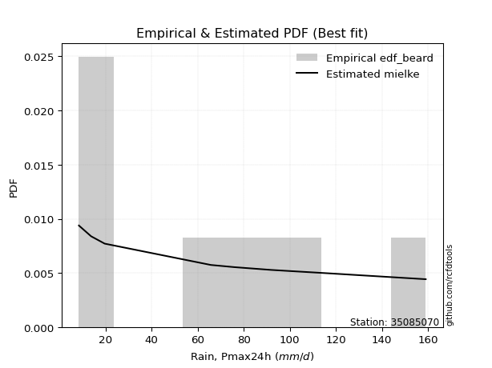</img>

</div>


### 5. EDF Chegodayev (1955)

The Chegodayev formula is an empirical plotting position formula used in hydrological frequency analysis to estimate the exceedance probability or return period of a specific event from a set of observed data. It is primarily used for plotting observed data points on probability paper to fit a theoretical distribution, particularly for analyzing extreme events like maximum flood flows or rainfall intensities. The constant _b_ value in the generalized plotting position formula is 0.3.

<div align="center">


$P=(m-b)/(n+1-2b)$


</div>


**5.1. Empirical values**

<div align="center">

|                | 0                   | 1                   | 2                   | 3                   | 4                  | 5                  | 6                  | 7                  |
|:---------------|:--------------------|:--------------------|:--------------------|:--------------------|:-------------------|:-------------------|:-------------------|:-------------------|
| date           | 2023                | 2022                | 2024                | 2017                | 2020               | 2018               | 2021               | 2019               |
| x              | 8.4                 | 13.7                | 19.6                | 65.7                | 75.9               | 92.0               | 113.1              | 159.0              |
| m              | 1                   | 2                   | 3                   | 4                   | 5                  | 6                  | 7                  | 8                  |
| empirical_dist | edf_chegodayev      | edf_chegodayev      | edf_chegodayev      | edf_chegodayev      | edf_chegodayev     | edf_chegodayev     | edf_chegodayev     | edf_chegodayev     |
| empirical      | 0.08333333333333333 | 0.20238095238095236 | 0.32142857142857145 | 0.44047619047619047 | 0.5595238095238095 | 0.6785714285714286 | 0.7976190476190476 | 0.9166666666666666 |
| empirical_tr   | 1.090909090909091   | 1.253731343283582   | 1.4736842105263157  | 1.7872340425531914  | 2.27027027027027   | 3.1111111111111116 | 4.941176470588234  | 11.999999999999995 |

</div>


**5.2. Kolmogorov-Smirnov fit test (sorted by Δ)**


<div align="center">

|                | 0                   | 1                   | 2                   | 3                     | 4                   | 5                   | 6                   | 7                   | 8                   | 9                  | 10                  | 11                  | 12                 | 13                  | 14                  | 15                  | 16                  | 17                  | 18                  | 19                  | 20                  | 21                  | 22                  | 23                  | 24                  | 25                  | 26                  | 27                  | 28                  | 29                  | 30                  | 31                  | 32                  | 33                  | 34                  | 35                  | 36                  | 37                  | 38                  | 39                  | 40                  | 41                  | 42                 | 43                  | 44                  | 45                  | 46                 | 47                 | 48                 | 49                 | 50                  | 51                  | 52                  | 53                  | 54                 | 55                  | 56                  | 57                 | 58                 | 59                  | 60                 | 61                  | 62                 | 63                  | 64                  | 65                  | 66                 | 67                 | 68                 | 69                 | 70                 | 71                 | 72                  | 73                 | 74                 | 75                  | 76                  | 77                 | 78                 | 79                  | 80                  | 81                  | 82                  | 83                 | 84                  | 85                  | 86                 | 87                 |
|:---------------|:--------------------|:--------------------|:--------------------|:----------------------|:--------------------|:--------------------|:--------------------|:--------------------|:--------------------|:-------------------|:--------------------|:--------------------|:-------------------|:--------------------|:--------------------|:--------------------|:--------------------|:--------------------|:--------------------|:--------------------|:--------------------|:--------------------|:--------------------|:--------------------|:--------------------|:--------------------|:--------------------|:--------------------|:--------------------|:--------------------|:--------------------|:--------------------|:--------------------|:--------------------|:--------------------|:--------------------|:--------------------|:--------------------|:--------------------|:--------------------|:--------------------|:--------------------|:-------------------|:--------------------|:--------------------|:--------------------|:-------------------|:-------------------|:-------------------|:-------------------|:--------------------|:--------------------|:--------------------|:--------------------|:-------------------|:--------------------|:--------------------|:-------------------|:-------------------|:--------------------|:-------------------|:--------------------|:-------------------|:--------------------|:--------------------|:--------------------|:-------------------|:-------------------|:-------------------|:-------------------|:-------------------|:-------------------|:--------------------|:-------------------|:-------------------|:--------------------|:--------------------|:-------------------|:-------------------|:--------------------|:--------------------|:--------------------|:--------------------|:-------------------|:--------------------|:--------------------|:-------------------|:-------------------|
| station        | 35085070            | 35085070            | 35085070            | 35085070              | 35085070            | 35085070            | 35085070            | 35085070            | 35085070            | 35085070           | 35085070            | 35085070            | 35085070           | 35085070            | 35085070            | 35085070            | 35085070            | 35085070            | 35085070            | 35085070            | 35085070            | 35085070            | 35085070            | 35085070            | 35085070            | 35085070            | 35085070            | 35085070            | 35085070            | 35085070            | 35085070            | 35085070            | 35085070            | 35085070            | 35085070            | 35085070            | 35085070            | 35085070            | 35085070            | 35085070            | 35085070            | 35085070            | 35085070           | 35085070            | 35085070            | 35085070            | 35085070           | 35085070           | 35085070           | 35085070           | 35085070            | 35085070            | 35085070            | 35085070            | 35085070           | 35085070            | 35085070            | 35085070           | 35085070           | 35085070            | 35085070           | 35085070            | 35085070           | 35085070            | 35085070            | 35085070            | 35085070           | 35085070           | 35085070           | 35085070           | 35085070           | 35085070           | 35085070            | 35085070           | 35085070           | 35085070            | 35085070            | 35085070           | 35085070           | 35085070            | 35085070            | 35085070            | 35085070            | 35085070           | 35085070            | 35085070            | 35085070           | 35085070           |
| empirical_dist | edf_chegodayev      | edf_chegodayev      | edf_chegodayev      | edf_chegodayev        | edf_chegodayev      | edf_chegodayev      | edf_chegodayev      | edf_chegodayev      | edf_chegodayev      | edf_chegodayev     | edf_chegodayev      | edf_chegodayev      | edf_chegodayev     | edf_chegodayev      | edf_chegodayev      | edf_chegodayev      | edf_chegodayev      | edf_chegodayev      | edf_chegodayev      | edf_chegodayev      | edf_chegodayev      | edf_chegodayev      | edf_chegodayev      | edf_chegodayev      | edf_chegodayev      | edf_chegodayev      | edf_chegodayev      | edf_chegodayev      | edf_chegodayev      | edf_chegodayev      | edf_chegodayev      | edf_chegodayev      | edf_chegodayev      | edf_chegodayev      | edf_chegodayev      | edf_chegodayev      | edf_chegodayev      | edf_chegodayev      | edf_chegodayev      | edf_chegodayev      | edf_chegodayev      | edf_chegodayev      | edf_chegodayev     | edf_chegodayev      | edf_chegodayev      | edf_chegodayev      | edf_chegodayev     | edf_chegodayev     | edf_chegodayev     | edf_chegodayev     | edf_chegodayev      | edf_chegodayev      | edf_chegodayev      | edf_chegodayev      | edf_chegodayev     | edf_chegodayev      | edf_chegodayev      | edf_chegodayev     | edf_chegodayev     | edf_chegodayev      | edf_chegodayev     | edf_chegodayev      | edf_chegodayev     | edf_chegodayev      | edf_chegodayev      | edf_chegodayev      | edf_chegodayev     | edf_chegodayev     | edf_chegodayev     | edf_chegodayev     | edf_chegodayev     | edf_chegodayev     | edf_chegodayev      | edf_chegodayev     | edf_chegodayev     | edf_chegodayev      | edf_chegodayev      | edf_chegodayev     | edf_chegodayev     | edf_chegodayev      | edf_chegodayev      | edf_chegodayev      | edf_chegodayev      | edf_chegodayev     | edf_chegodayev      | edf_chegodayev      | edf_chegodayev     | edf_chegodayev     |
| p_dist         | mielke              | logloggamma         | ncf                 | loglaplace_asymmetric | logjohnsonsu        | loggumbel_l         | rayleigh            | logweibull_min      | maxwell             | halfnorm           | t                   | truncnorm           | crystalball        | norm                | pearson3            | exponnorm           | f                   | invgamma            | genlogistic         | invweibull          | kstwobign           | laplace_asymmetric  | logfisk             | gumbel_l            | logpearson3         | genexpon            | expon               | logistic            | loggompertz         | gumbel_r            | rice                | hypsecant           | gompertz            | laplace             | logf                | lognct              | logfatiguelife      | logexponnorm        | lognorm             | lognorm             | logcrystalball      | logt                | halflogistic       | loggamma            | loggamma            | fisk                | moyal              | logerlang          | logrice            | logalpha           | nakagami            | invgauss            | logbetaprime        | loginvgamma         | loglogistic        | logncf              | loginvgauss         | logmaxwell         | johnsonsu          | loginvweibull       | lograyleigh        | loghypsecant        | loggenexpon        | logkstwobign        | loghalfnorm         | nct                 | loglaplace         | loggumbel_r        | logexpon           | loghalflogistic    | logmoyal           | weibull_min        | betaprime           | lognakagami        | wald               | gibrat              | alpha               | gamma              | logwald            | loggibrat           | logchi2             | logtruncnorm        | erlang              | loglognorm         | fatiguelife         | logmielke           | chi2               | loggenlogistic     |
| delta          | 0.10888867549271805 | 0.13342475672414564 | 0.13793708768643737 | 0.14097334554482333   | 0.14127512191817687 | 0.14891027191479633 | 0.15147917168472957 | 0.15208658437366832 | 0.15313902451187564 | 0.1579992543733684 | 0.15823236039455402 | 0.15823267547747036 | 0.1582326898189479 | 0.15823269500970732 | 0.15908291816888107 | 0.16064703500746297 | 0.16146552194437963 | 0.16146691344536007 | 0.16206515227835513 | 0.16228125656018802 | 0.16460469857916493 | 0.16795029272931106 | 0.16817991631302265 | 0.17402689314351585 | 0.17413235798524207 | 0.17433153439884674 | 0.17455857513592965 | 0.17713489318544476 | 0.18239334703116228 | 0.18291931853838642 | 0.18578844729825622 | 0.18719184060218727 | 0.19439050463444432 | 0.19663161314908112 | 0.19957132098964847 | 0.19968995073989482 | 0.19978447486487438 | 0.19983169164116743 | 0.19983182327721194 | 0.19983182327721194 | 0.19983182408370193 | 0.19983186676173847 | 0.2027894441133724 | 0.20332062888591873 | 0.20332062888591873 | 0.20587411154880408 | 0.2064021932573411 | 0.2084391526764462 | 0.2103058384703863 | 0.2141185064021658 | 0.21504123544337717 | 0.21505768126178926 | 0.21535496566269097 | 0.21571741055360394 | 0.2169095730052203 | 0.21779129728037783 | 0.21826471280893556 | 0.2224862434273035 | 0.2243923368182671 | 0.22440497089094635 | 0.2293392172420321 | 0.23032437365054648 | 0.2392140207862885 | 0.24366515855480508 | 0.24916177361905711 | 0.25749682033066357 | 0.2587055458115741 | 0.2612881080955254 | 0.2631965844241877 | 0.2774069372951916 | 0.2817424775490509 | 0.2871100748536656 | 0.29092904781184714 | 0.2960684831270062 | 0.3214285714279695 | 0.32142857142857145 | 0.33379970343063137 | 0.3375733469663096 | 0.3394496313151161 | 0.37168924665177183 | 0.37529991094115334 | 0.38409104148906215 | 0.38645060426359945 | 0.4058560220190407 | 0.42908324129926156 | 0.47001098493318894 | 0.5590196393488931 | 0.7976190476190476 |
| deltao         | 0.4472608134160001  | 0.4472608134160001  | 0.4472608134160001  | 0.4472608134160001    | 0.4472608134160001  | 0.4472608134160001  | 0.4472608134160001  | 0.4472608134160001  | 0.4472608134160001  | 0.4472608134160001 | 0.4472608134160001  | 0.4472608134160001  | 0.4472608134160001 | 0.4472608134160001  | 0.4472608134160001  | 0.4472608134160001  | 0.4472608134160001  | 0.4472608134160001  | 0.4472608134160001  | 0.4472608134160001  | 0.4472608134160001  | 0.4472608134160001  | 0.4472608134160001  | 0.4472608134160001  | 0.4472608134160001  | 0.4472608134160001  | 0.4472608134160001  | 0.4472608134160001  | 0.4472608134160001  | 0.4472608134160001  | 0.4472608134160001  | 0.4472608134160001  | 0.4472608134160001  | 0.4472608134160001  | 0.4472608134160001  | 0.4472608134160001  | 0.4472608134160001  | 0.4472608134160001  | 0.4472608134160001  | 0.4472608134160001  | 0.4472608134160001  | 0.4472608134160001  | 0.4472608134160001 | 0.4472608134160001  | 0.4472608134160001  | 0.4472608134160001  | 0.4472608134160001 | 0.4472608134160001 | 0.4472608134160001 | 0.4472608134160001 | 0.4472608134160001  | 0.4472608134160001  | 0.4472608134160001  | 0.4472608134160001  | 0.4472608134160001 | 0.4472608134160001  | 0.4472608134160001  | 0.4472608134160001 | 0.4472608134160001 | 0.4472608134160001  | 0.4472608134160001 | 0.4472608134160001  | 0.4472608134160001 | 0.4472608134160001  | 0.4472608134160001  | 0.4472608134160001  | 0.4472608134160001 | 0.4472608134160001 | 0.4472608134160001 | 0.4472608134160001 | 0.4472608134160001 | 0.4472608134160001 | 0.4472608134160001  | 0.4472608134160001 | 0.4472608134160001 | 0.4472608134160001  | 0.4472608134160001  | 0.4472608134160001 | 0.4472608134160001 | 0.4472608134160001  | 0.4472608134160001  | 0.4472608134160001  | 0.4472608134160001  | 0.4472608134160001 | 0.4472608134160001  | 0.4472608134160001  | 0.4472608134160001 | 0.4472608134160001 |
| eval           | Δo > Δ              | Δo > Δ              | Δo > Δ              | Δo > Δ                | Δo > Δ              | Δo > Δ              | Δo > Δ              | Δo > Δ              | Δo > Δ              | Δo > Δ             | Δo > Δ              | Δo > Δ              | Δo > Δ             | Δo > Δ              | Δo > Δ              | Δo > Δ              | Δo > Δ              | Δo > Δ              | Δo > Δ              | Δo > Δ              | Δo > Δ              | Δo > Δ              | Δo > Δ              | Δo > Δ              | Δo > Δ              | Δo > Δ              | Δo > Δ              | Δo > Δ              | Δo > Δ              | Δo > Δ              | Δo > Δ              | Δo > Δ              | Δo > Δ              | Δo > Δ              | Δo > Δ              | Δo > Δ              | Δo > Δ              | Δo > Δ              | Δo > Δ              | Δo > Δ              | Δo > Δ              | Δo > Δ              | Δo > Δ             | Δo > Δ              | Δo > Δ              | Δo > Δ              | Δo > Δ             | Δo > Δ             | Δo > Δ             | Δo > Δ             | Δo > Δ              | Δo > Δ              | Δo > Δ              | Δo > Δ              | Δo > Δ             | Δo > Δ              | Δo > Δ              | Δo > Δ             | Δo > Δ             | Δo > Δ              | Δo > Δ             | Δo > Δ              | Δo > Δ             | Δo > Δ              | Δo > Δ              | Δo > Δ              | Δo > Δ             | Δo > Δ             | Δo > Δ             | Δo > Δ             | Δo > Δ             | Δo > Δ             | Δo > Δ              | Δo > Δ             | Δo > Δ             | Δo > Δ              | Δo > Δ              | Δo > Δ             | Δo > Δ             | Δo > Δ              | Δo > Δ              | Δo > Δ              | Δo > Δ              | Δo > Δ             | Δo > Δ              | Δo <= Δ             | Δo <= Δ            | Δo <= Δ            |
| fit            | 1                   | 1                   | 1                   | 1                     | 1                   | 1                   | 1                   | 1                   | 1                   | 1                  | 1                   | 1                   | 1                  | 1                   | 1                   | 1                   | 1                   | 1                   | 1                   | 1                   | 1                   | 1                   | 1                   | 1                   | 1                   | 1                   | 1                   | 1                   | 1                   | 1                   | 1                   | 1                   | 1                   | 1                   | 1                   | 1                   | 1                   | 1                   | 1                   | 1                   | 1                   | 1                   | 1                  | 1                   | 1                   | 1                   | 1                  | 1                  | 1                  | 1                  | 1                   | 1                   | 1                   | 1                   | 1                  | 1                   | 1                   | 1                  | 1                  | 1                   | 1                  | 1                   | 1                  | 1                   | 1                   | 1                   | 1                  | 1                  | 1                  | 1                  | 1                  | 1                  | 1                   | 1                  | 1                  | 1                   | 1                   | 1                  | 1                  | 1                   | 1                   | 1                   | 1                   | 1                  | 1                   | 0                   | 0                  | 0                  |
| n              | 8                   | 8                   | 8                   | 8                     | 8                   | 8                   | 8                   | 8                   | 8                   | 8                  | 8                   | 8                   | 8                  | 8                   | 8                   | 8                   | 8                   | 8                   | 8                   | 8                   | 8                   | 8                   | 8                   | 8                   | 8                   | 8                   | 8                   | 8                   | 8                   | 8                   | 8                   | 8                   | 8                   | 8                   | 8                   | 8                   | 8                   | 8                   | 8                   | 8                   | 8                   | 8                   | 8                  | 8                   | 8                   | 8                   | 8                  | 8                  | 8                  | 8                  | 8                   | 8                   | 8                   | 8                   | 8                  | 8                   | 8                   | 8                  | 8                  | 8                   | 8                  | 8                   | 8                  | 8                   | 8                   | 8                   | 8                  | 8                  | 8                  | 8                  | 8                  | 8                  | 8                   | 8                  | 8                  | 8                   | 8                   | 8                  | 8                  | 8                   | 8                   | 8                   | 8                   | 8                  | 8                   | 8                   | 8                  | 8                  |
| best_fit       | 1                   | 0                   | 0                   | 0                     | 0                   | 0                   | 0                   | 0                   | 0                   | 0                  | 0                   | 0                   | 0                  | 0                   | 0                   | 0                   | 0                   | 0                   | 0                   | 0                   | 0                   | 0                   | 0                   | 0                   | 0                   | 0                   | 0                   | 0                   | 0                   | 0                   | 0                   | 0                   | 0                   | 0                   | 0                   | 0                   | 0                   | 0                   | 0                   | 0                   | 0                   | 0                   | 0                  | 0                   | 0                   | 0                   | 0                  | 0                  | 0                  | 0                  | 0                   | 0                   | 0                   | 0                   | 0                  | 0                   | 0                   | 0                  | 0                  | 0                   | 0                  | 0                   | 0                  | 0                   | 0                   | 0                   | 0                  | 0                  | 0                  | 0                  | 0                  | 0                  | 0                   | 0                  | 0                  | 0                   | 0                   | 0                  | 0                  | 0                   | 0                   | 0                   | 0                   | 0                  | 0                   | 0                   | 0                  | 0                  |
| best_fit_sort  | 1                   | 2                   | 3                   | 4                     | 5                   | 6                   | 7                   | 8                   | 9                   | 10                 | 11                  | 12                  | 13                 | 14                  | 15                  | 16                  | 17                  | 18                  | 19                  | 20                  | 21                  | 22                  | 23                  | 24                  | 25                  | 26                  | 27                  | 28                  | 29                  | 30                  | 31                  | 32                  | 33                  | 34                  | 35                  | 36                  | 37                  | 38                  | 39                  | 40                  | 41                  | 42                  | 43                 | 44                  | 45                  | 46                  | 47                 | 48                 | 49                 | 50                 | 51                  | 52                  | 53                  | 54                  | 55                 | 56                  | 57                  | 58                 | 59                 | 60                  | 61                 | 62                  | 63                 | 64                  | 65                  | 66                  | 67                 | 68                 | 69                 | 70                 | 71                 | 72                 | 73                  | 74                 | 75                 | 76                  | 77                  | 78                 | 79                 | 80                  | 81                  | 82                  | 83                  | 84                 | 85                  | 86                  | 87                 | 88                 |

</div>


**5.3. Best fit**

<div align="center">

|   id |   station | empirical_dist   | p_dist   |    delta |   deltao | eval   |   fit |   n |   best_fit |   best_fit_sort |
|-----:|----------:|:-----------------|:---------|---------:|---------:|:-------|------:|----:|-----------:|----------------:|
|    0 |  35085070 | edf_chegodayev   | mielke   | 0.108889 | 0.447261 | Δo > Δ |     1 |   8 |          1 |               1 |

</div>


<div align="center">

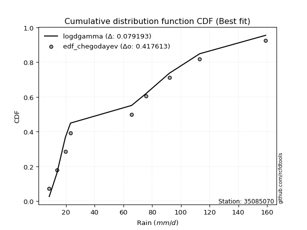</img></img>

</div>


### 6. EDF Blom (1958)

The Blom formula is a specific "plotting position" formula used in hydrology and statistical analysis to estimate the empirical cumulative probability (or non-exceedance probability) of a data series. It is particularly recommended for data that are approximately normally distributed. The constant _a_ is set to 0.375 (or 3/8).

<div align="center">


$P=(m-a)/(n+1-2a)$


</div>


**6.1. Empirical values**

<div align="center">

|                | 0                   | 1                   | 2                  | 3                  | 4                  | 5                  | 6                 | 7                  |
|:---------------|:--------------------|:--------------------|:-------------------|:-------------------|:-------------------|:-------------------|:------------------|:-------------------|
| date           | 2023                | 2022                | 2024               | 2017               | 2020               | 2018               | 2021              | 2019               |
| x              | 8.4                 | 13.7                | 19.6               | 65.7               | 75.9               | 92.0               | 113.1             | 159.0              |
| m              | 1                   | 2                   | 3                  | 4                  | 5                  | 6                  | 7                 | 8                  |
| empirical_dist | edf_blom            | edf_blom            | edf_blom           | edf_blom           | edf_blom           | edf_blom           | edf_blom          | edf_blom           |
| empirical      | 0.07575757575757576 | 0.19696969696969696 | 0.3181818181818182 | 0.4393939393939394 | 0.5606060606060606 | 0.6818181818181818 | 0.803030303030303 | 0.9242424242424242 |
| empirical_tr   | 1.0819672131147542  | 1.2452830188679247  | 1.4666666666666666 | 1.783783783783784  | 2.275862068965517  | 3.1428571428571423 | 5.076923076923076 | 13.199999999999992 |

</div>


**6.2. Kolmogorov-Smirnov fit test (sorted by Δ)**


<div align="center">

|                | 0                   | 1                   | 2                   | 3                     | 4                  | 5                  | 6                   | 7                   | 8                  | 9                   | 10                  | 11                  | 12                  | 13                  | 14                 | 15                 | 16                  | 17                 | 18                  | 19                  | 20                  | 21                  | 22                  | 23                  | 24                  | 25                  | 26                  | 27                  | 28                  | 29                  | 30                  | 31                 | 32                  | 33                  | 34                  | 35                  | 36                 | 37                  | 38                 | 39                 | 40                 | 41                 | 42                  | 43                  | 44                 | 45                 | 46                  | 47                  | 48                  | 49                  | 50                  | 51                  | 52                  | 53                 | 54                  | 55                 | 56                  | 57                  | 58                  | 59                  | 60                  | 61                  | 62                  | 63                  | 64                 | 65                  | 66                 | 67                  | 68                  | 69                 | 70                 | 71                 | 72                  | 73                  | 74                 | 75                 | 76                  | 77                  | 78                  | 79                 | 80                 | 81                 | 82                 | 83                  | 84                  | 85                 | 86                 | 87                 |
|:---------------|:--------------------|:--------------------|:--------------------|:----------------------|:-------------------|:-------------------|:--------------------|:--------------------|:-------------------|:--------------------|:--------------------|:--------------------|:--------------------|:--------------------|:-------------------|:-------------------|:--------------------|:-------------------|:--------------------|:--------------------|:--------------------|:--------------------|:--------------------|:--------------------|:--------------------|:--------------------|:--------------------|:--------------------|:--------------------|:--------------------|:--------------------|:-------------------|:--------------------|:--------------------|:--------------------|:--------------------|:-------------------|:--------------------|:-------------------|:-------------------|:-------------------|:-------------------|:--------------------|:--------------------|:-------------------|:-------------------|:--------------------|:--------------------|:--------------------|:--------------------|:--------------------|:--------------------|:--------------------|:-------------------|:--------------------|:-------------------|:--------------------|:--------------------|:--------------------|:--------------------|:--------------------|:--------------------|:--------------------|:--------------------|:-------------------|:--------------------|:-------------------|:--------------------|:--------------------|:-------------------|:-------------------|:-------------------|:--------------------|:--------------------|:-------------------|:-------------------|:--------------------|:--------------------|:--------------------|:-------------------|:-------------------|:-------------------|:-------------------|:--------------------|:--------------------|:-------------------|:-------------------|:-------------------|
| station        | 35085070            | 35085070            | 35085070            | 35085070              | 35085070           | 35085070           | 35085070            | 35085070            | 35085070           | 35085070            | 35085070            | 35085070            | 35085070            | 35085070            | 35085070           | 35085070           | 35085070            | 35085070           | 35085070            | 35085070            | 35085070            | 35085070            | 35085070            | 35085070            | 35085070            | 35085070            | 35085070            | 35085070            | 35085070            | 35085070            | 35085070            | 35085070           | 35085070            | 35085070            | 35085070            | 35085070            | 35085070           | 35085070            | 35085070           | 35085070           | 35085070           | 35085070           | 35085070            | 35085070            | 35085070           | 35085070           | 35085070            | 35085070            | 35085070            | 35085070            | 35085070            | 35085070            | 35085070            | 35085070           | 35085070            | 35085070           | 35085070            | 35085070            | 35085070            | 35085070            | 35085070            | 35085070            | 35085070            | 35085070            | 35085070           | 35085070            | 35085070           | 35085070            | 35085070            | 35085070           | 35085070           | 35085070           | 35085070            | 35085070            | 35085070           | 35085070           | 35085070            | 35085070            | 35085070            | 35085070           | 35085070           | 35085070           | 35085070           | 35085070            | 35085070            | 35085070           | 35085070           | 35085070           |
| empirical_dist | edf_blom            | edf_blom            | edf_blom            | edf_blom              | edf_blom           | edf_blom           | edf_blom            | edf_blom            | edf_blom           | edf_blom            | edf_blom            | edf_blom            | edf_blom            | edf_blom            | edf_blom           | edf_blom           | edf_blom            | edf_blom           | edf_blom            | edf_blom            | edf_blom            | edf_blom            | edf_blom            | edf_blom            | edf_blom            | edf_blom            | edf_blom            | edf_blom            | edf_blom            | edf_blom            | edf_blom            | edf_blom           | edf_blom            | edf_blom            | edf_blom            | edf_blom            | edf_blom           | edf_blom            | edf_blom           | edf_blom           | edf_blom           | edf_blom           | edf_blom            | edf_blom            | edf_blom           | edf_blom           | edf_blom            | edf_blom            | edf_blom            | edf_blom            | edf_blom            | edf_blom            | edf_blom            | edf_blom           | edf_blom            | edf_blom           | edf_blom            | edf_blom            | edf_blom            | edf_blom            | edf_blom            | edf_blom            | edf_blom            | edf_blom            | edf_blom           | edf_blom            | edf_blom           | edf_blom            | edf_blom            | edf_blom           | edf_blom           | edf_blom           | edf_blom            | edf_blom            | edf_blom           | edf_blom           | edf_blom            | edf_blom            | edf_blom            | edf_blom           | edf_blom           | edf_blom           | edf_blom           | edf_blom            | edf_blom            | edf_blom           | edf_blom           | edf_blom           |
| p_dist         | mielke              | logloggamma         | ncf                 | loglaplace_asymmetric | logjohnsonsu       | rayleigh           | logweibull_min      | maxwell             | loggumbel_l        | halfnorm            | t                   | truncnorm           | crystalball         | norm                | pearson3           | exponnorm          | f                   | invgamma           | genlogistic         | invweibull          | kstwobign           | laplace_asymmetric  | logfisk             | gumbel_l            | logistic            | logpearson3         | genexpon            | expon               | gumbel_r            | rice                | loggompertz         | hypsecant          | gompertz            | laplace             | halflogistic        | logf                | lognct             | logfatiguelife      | logexponnorm       | lognorm            | lognorm            | logcrystalball     | logt                | moyal               | loggamma           | loggamma           | fisk                | logerlang           | logrice             | logalpha            | nakagami            | invgauss            | logbetaprime        | loginvgamma        | loglogistic         | logncf             | loginvgauss         | logmaxwell          | johnsonsu           | loginvweibull       | lograyleigh         | loghypsecant        | loggenexpon         | logkstwobign        | loghalfnorm        | nct                 | loglaplace         | loggumbel_r         | logexpon            | loghalflogistic    | logmoyal           | betaprime          | weibull_min         | lognakagami         | wald               | gibrat             | alpha               | gamma               | logwald             | loggibrat          | logchi2            | logtruncnorm       | erlang             | loglognorm          | fatiguelife         | logmielke          | chi2               | loggenlogistic     |
| delta          | 0.10564192224596478 | 0.13017800347739236 | 0.13606854901804438 | 0.13772659229807005   | 0.1380283686714236 | 0.1482324184379763 | 0.14883983112691504 | 0.14989227126512236 | 0.1499925229970474 | 0.15475250112661512 | 0.15498560714780074 | 0.15498592223071708 | 0.15498593657219462 | 0.15498594176295405 | 0.1558361649221278 | 0.1574002817607097 | 0.15821876869762636 | 0.1582201601986068 | 0.15881839903160186 | 0.15903450331343474 | 0.16135794533241166 | 0.16470353948255778 | 0.16926216739527372 | 0.17078013989676258 | 0.17388813993869148 | 0.17521460906749314 | 0.17541378548109782 | 0.17564082621818072 | 0.17967256529163314 | 0.18254169405150295 | 0.18347559811341335 | 0.183945087355434  | 0.19114375138769105 | 0.19338485990232784 | 0.19954269086661913 | 0.20065357207189954 | 0.2007722018221459 | 0.20086672594712546 | 0.2009139427234185 | 0.200914074359463  | 0.200914074359463  | 0.200914075165953  | 0.20091411784398955 | 0.20315544001058783 | 0.2044028799681698 | 0.2044028799681698 | 0.20695636263105516 | 0.20952140375869727 | 0.21138808955263738 | 0.21520075748441686 | 0.21612348652562824 | 0.21613993234404033 | 0.21643721674494204 | 0.216799661635855  | 0.21799182408747136 | 0.2188735483626289 | 0.21934696389118663 | 0.22356849450955457 | 0.22547458790051816 | 0.22548722197319743 | 0.23042146832428317 | 0.23140662473279755 | 0.24029627186853958 | 0.24474740963705616 | 0.2502440247013082 | 0.25857907141291464 | 0.2597877968938252 | 0.26237035917777646 | 0.26427883550643877 | 0.2784891883774427 | 0.282824728631302  | 0.2920112988940982 | 0.29468583242942314 | 0.29715073420925725 | 0.3181818181812162 | 0.3181818181818182 | 0.33488195451288244 | 0.33865559804856066 | 0.34053188239736715 | 0.3727714977340229 | 0.3763821620234044 | 0.3851732925713132 | 0.3875328553458505 | 0.41126727743029606 | 0.43449449671051693 | 0.47109323601544   | 0.5601018904311441 | 0.803030303030303  |
| deltao         | 0.4472608134160001  | 0.4472608134160001  | 0.4472608134160001  | 0.4472608134160001    | 0.4472608134160001 | 0.4472608134160001 | 0.4472608134160001  | 0.4472608134160001  | 0.4472608134160001 | 0.4472608134160001  | 0.4472608134160001  | 0.4472608134160001  | 0.4472608134160001  | 0.4472608134160001  | 0.4472608134160001 | 0.4472608134160001 | 0.4472608134160001  | 0.4472608134160001 | 0.4472608134160001  | 0.4472608134160001  | 0.4472608134160001  | 0.4472608134160001  | 0.4472608134160001  | 0.4472608134160001  | 0.4472608134160001  | 0.4472608134160001  | 0.4472608134160001  | 0.4472608134160001  | 0.4472608134160001  | 0.4472608134160001  | 0.4472608134160001  | 0.4472608134160001 | 0.4472608134160001  | 0.4472608134160001  | 0.4472608134160001  | 0.4472608134160001  | 0.4472608134160001 | 0.4472608134160001  | 0.4472608134160001 | 0.4472608134160001 | 0.4472608134160001 | 0.4472608134160001 | 0.4472608134160001  | 0.4472608134160001  | 0.4472608134160001 | 0.4472608134160001 | 0.4472608134160001  | 0.4472608134160001  | 0.4472608134160001  | 0.4472608134160001  | 0.4472608134160001  | 0.4472608134160001  | 0.4472608134160001  | 0.4472608134160001 | 0.4472608134160001  | 0.4472608134160001 | 0.4472608134160001  | 0.4472608134160001  | 0.4472608134160001  | 0.4472608134160001  | 0.4472608134160001  | 0.4472608134160001  | 0.4472608134160001  | 0.4472608134160001  | 0.4472608134160001 | 0.4472608134160001  | 0.4472608134160001 | 0.4472608134160001  | 0.4472608134160001  | 0.4472608134160001 | 0.4472608134160001 | 0.4472608134160001 | 0.4472608134160001  | 0.4472608134160001  | 0.4472608134160001 | 0.4472608134160001 | 0.4472608134160001  | 0.4472608134160001  | 0.4472608134160001  | 0.4472608134160001 | 0.4472608134160001 | 0.4472608134160001 | 0.4472608134160001 | 0.4472608134160001  | 0.4472608134160001  | 0.4472608134160001 | 0.4472608134160001 | 0.4472608134160001 |
| eval           | Δo > Δ              | Δo > Δ              | Δo > Δ              | Δo > Δ                | Δo > Δ             | Δo > Δ             | Δo > Δ              | Δo > Δ              | Δo > Δ             | Δo > Δ              | Δo > Δ              | Δo > Δ              | Δo > Δ              | Δo > Δ              | Δo > Δ             | Δo > Δ             | Δo > Δ              | Δo > Δ             | Δo > Δ              | Δo > Δ              | Δo > Δ              | Δo > Δ              | Δo > Δ              | Δo > Δ              | Δo > Δ              | Δo > Δ              | Δo > Δ              | Δo > Δ              | Δo > Δ              | Δo > Δ              | Δo > Δ              | Δo > Δ             | Δo > Δ              | Δo > Δ              | Δo > Δ              | Δo > Δ              | Δo > Δ             | Δo > Δ              | Δo > Δ             | Δo > Δ             | Δo > Δ             | Δo > Δ             | Δo > Δ              | Δo > Δ              | Δo > Δ             | Δo > Δ             | Δo > Δ              | Δo > Δ              | Δo > Δ              | Δo > Δ              | Δo > Δ              | Δo > Δ              | Δo > Δ              | Δo > Δ             | Δo > Δ              | Δo > Δ             | Δo > Δ              | Δo > Δ              | Δo > Δ              | Δo > Δ              | Δo > Δ              | Δo > Δ              | Δo > Δ              | Δo > Δ              | Δo > Δ             | Δo > Δ              | Δo > Δ             | Δo > Δ              | Δo > Δ              | Δo > Δ             | Δo > Δ             | Δo > Δ             | Δo > Δ              | Δo > Δ              | Δo > Δ             | Δo > Δ             | Δo > Δ              | Δo > Δ              | Δo > Δ              | Δo > Δ             | Δo > Δ             | Δo > Δ             | Δo > Δ             | Δo > Δ              | Δo > Δ              | Δo <= Δ            | Δo <= Δ            | Δo <= Δ            |
| fit            | 1                   | 1                   | 1                   | 1                     | 1                  | 1                  | 1                   | 1                   | 1                  | 1                   | 1                   | 1                   | 1                   | 1                   | 1                  | 1                  | 1                   | 1                  | 1                   | 1                   | 1                   | 1                   | 1                   | 1                   | 1                   | 1                   | 1                   | 1                   | 1                   | 1                   | 1                   | 1                  | 1                   | 1                   | 1                   | 1                   | 1                  | 1                   | 1                  | 1                  | 1                  | 1                  | 1                   | 1                   | 1                  | 1                  | 1                   | 1                   | 1                   | 1                   | 1                   | 1                   | 1                   | 1                  | 1                   | 1                  | 1                   | 1                   | 1                   | 1                   | 1                   | 1                   | 1                   | 1                   | 1                  | 1                   | 1                  | 1                   | 1                   | 1                  | 1                  | 1                  | 1                   | 1                   | 1                  | 1                  | 1                   | 1                   | 1                   | 1                  | 1                  | 1                  | 1                  | 1                   | 1                   | 0                  | 0                  | 0                  |
| n              | 8                   | 8                   | 8                   | 8                     | 8                  | 8                  | 8                   | 8                   | 8                  | 8                   | 8                   | 8                   | 8                   | 8                   | 8                  | 8                  | 8                   | 8                  | 8                   | 8                   | 8                   | 8                   | 8                   | 8                   | 8                   | 8                   | 8                   | 8                   | 8                   | 8                   | 8                   | 8                  | 8                   | 8                   | 8                   | 8                   | 8                  | 8                   | 8                  | 8                  | 8                  | 8                  | 8                   | 8                   | 8                  | 8                  | 8                   | 8                   | 8                   | 8                   | 8                   | 8                   | 8                   | 8                  | 8                   | 8                  | 8                   | 8                   | 8                   | 8                   | 8                   | 8                   | 8                   | 8                   | 8                  | 8                   | 8                  | 8                   | 8                   | 8                  | 8                  | 8                  | 8                   | 8                   | 8                  | 8                  | 8                   | 8                   | 8                   | 8                  | 8                  | 8                  | 8                  | 8                   | 8                   | 8                  | 8                  | 8                  |
| best_fit       | 1                   | 0                   | 0                   | 0                     | 0                  | 0                  | 0                   | 0                   | 0                  | 0                   | 0                   | 0                   | 0                   | 0                   | 0                  | 0                  | 0                   | 0                  | 0                   | 0                   | 0                   | 0                   | 0                   | 0                   | 0                   | 0                   | 0                   | 0                   | 0                   | 0                   | 0                   | 0                  | 0                   | 0                   | 0                   | 0                   | 0                  | 0                   | 0                  | 0                  | 0                  | 0                  | 0                   | 0                   | 0                  | 0                  | 0                   | 0                   | 0                   | 0                   | 0                   | 0                   | 0                   | 0                  | 0                   | 0                  | 0                   | 0                   | 0                   | 0                   | 0                   | 0                   | 0                   | 0                   | 0                  | 0                   | 0                  | 0                   | 0                   | 0                  | 0                  | 0                  | 0                   | 0                   | 0                  | 0                  | 0                   | 0                   | 0                   | 0                  | 0                  | 0                  | 0                  | 0                   | 0                   | 0                  | 0                  | 0                  |
| best_fit_sort  | 1                   | 2                   | 3                   | 4                     | 5                  | 6                  | 7                   | 8                   | 9                  | 10                  | 11                  | 12                  | 13                  | 14                  | 15                 | 16                 | 17                  | 18                 | 19                  | 20                  | 21                  | 22                  | 23                  | 24                  | 25                  | 26                  | 27                  | 28                  | 29                  | 30                  | 31                  | 32                 | 33                  | 34                  | 35                  | 36                  | 37                 | 38                  | 39                 | 40                 | 41                 | 42                 | 43                  | 44                  | 45                 | 46                 | 47                  | 48                  | 49                  | 50                  | 51                  | 52                  | 53                  | 54                 | 55                  | 56                 | 57                  | 58                  | 59                  | 60                  | 61                  | 62                  | 63                  | 64                  | 65                 | 66                  | 67                 | 68                  | 69                  | 70                 | 71                 | 72                 | 73                  | 74                  | 75                 | 76                 | 77                  | 78                  | 79                  | 80                 | 81                 | 82                 | 83                 | 84                  | 85                  | 86                 | 87                 | 88                 |

</div>


**6.3. Best fit**

<div align="center">

|   id |   station | empirical_dist   | p_dist   |    delta |   deltao | eval   |   fit |   n |   best_fit |   best_fit_sort |
|-----:|----------:|:-----------------|:---------|---------:|---------:|:-------|------:|----:|-----------:|----------------:|
|    0 |  35085070 | edf_blom         | mielke   | 0.105642 | 0.447261 | Δo > Δ |     1 |   8 |          1 |               1 |

</div>


<div align="center">

</img></img>

</div>


### 7. EDF Tukey (1962)

In hydrology, the Tukey formula is used as a plotting position formula to estimate the empirical probability or frequency of a flood event (or other hydrological data). The formula parameter is given as _c=0.333_ (or 1/3).

<div align="center">


$P=(m-c)/(n+1-2c)$


</div>


**7.1. Empirical values**

<div align="center">

|                | 0                  | 1         | 2                  | 3                  | 4                 | 5                  | 6                 | 7                  |
|:---------------|:-------------------|:----------|:-------------------|:-------------------|:------------------|:-------------------|:------------------|:-------------------|
| date           | 2023               | 2022      | 2024               | 2017               | 2020              | 2018               | 2021              | 2019               |
| x              | 8.4                | 13.7      | 19.6               | 65.7               | 75.9              | 92.0               | 113.1             | 159.0              |
| m              | 1                  | 2         | 3                  | 4                  | 5                 | 6                  | 7                 | 8                  |
| empirical_dist | edf_tukey          | edf_tukey | edf_tukey          | edf_tukey          | edf_tukey         | edf_tukey          | edf_tukey         | edf_tukey          |
| empirical      | 0.08               | 0.2       | 0.32               | 0.44               | 0.56              | 0.68               | 0.8               | 0.92               |
| empirical_tr   | 1.0869565217391304 | 1.25      | 1.4705882352941178 | 1.7857142857142856 | 2.272727272727273 | 3.1250000000000004 | 5.000000000000001 | 12.500000000000007 |

</div>


**7.2. Kolmogorov-Smirnov fit test (sorted by Δ)**


<div align="center">

|                | 0                  | 1                  | 2                   | 3                     | 4                   | 5                  | 6                   | 7                   | 8                  | 9                   | 10                  | 11                 | 12                  | 13                  | 14                  | 15                  | 16                  | 17                  | 18                 | 19                  | 20                 | 21                 | 22                 | 23                 | 24                  | 25                 | 26                 | 27                 | 28                  | 29                  | 30                  | 31                  | 32                  | 33                  | 34                  | 35                  | 36                  | 37                 | 38                 | 39                 | 40                 | 41                  | 42                  | 43                 | 44                 | 45                  | 46                  | 47                  | 48                  | 49                  | 50                  | 51                  | 52                  | 53                 | 54                  | 55                 | 56                  | 57                  | 58                  | 59                  | 60                  | 61                  | 62                  | 63                  | 64                  | 65                  | 66                 | 67                  | 68                  | 69                 | 70                  | 71                 | 72                 | 73                  | 74                  | 75                 | 76                  | 77                  | 78                  | 79                 | 80                 | 81                 | 82                 | 83                 | 84                 | 85                 | 86                 | 87                 |
|:---------------|:-------------------|:-------------------|:--------------------|:----------------------|:--------------------|:-------------------|:--------------------|:--------------------|:-------------------|:--------------------|:--------------------|:-------------------|:--------------------|:--------------------|:--------------------|:--------------------|:--------------------|:--------------------|:-------------------|:--------------------|:-------------------|:-------------------|:-------------------|:-------------------|:--------------------|:-------------------|:-------------------|:-------------------|:--------------------|:--------------------|:--------------------|:--------------------|:--------------------|:--------------------|:--------------------|:--------------------|:--------------------|:-------------------|:-------------------|:-------------------|:-------------------|:--------------------|:--------------------|:-------------------|:-------------------|:--------------------|:--------------------|:--------------------|:--------------------|:--------------------|:--------------------|:--------------------|:--------------------|:-------------------|:--------------------|:-------------------|:--------------------|:--------------------|:--------------------|:--------------------|:--------------------|:--------------------|:--------------------|:--------------------|:--------------------|:--------------------|:-------------------|:--------------------|:--------------------|:-------------------|:--------------------|:-------------------|:-------------------|:--------------------|:--------------------|:-------------------|:--------------------|:--------------------|:--------------------|:-------------------|:-------------------|:-------------------|:-------------------|:-------------------|:-------------------|:-------------------|:-------------------|:-------------------|
| station        | 35085070           | 35085070           | 35085070            | 35085070              | 35085070            | 35085070           | 35085070            | 35085070            | 35085070           | 35085070            | 35085070            | 35085070           | 35085070            | 35085070            | 35085070            | 35085070            | 35085070            | 35085070            | 35085070           | 35085070            | 35085070           | 35085070           | 35085070           | 35085070           | 35085070            | 35085070           | 35085070           | 35085070           | 35085070            | 35085070            | 35085070            | 35085070            | 35085070            | 35085070            | 35085070            | 35085070            | 35085070            | 35085070           | 35085070           | 35085070           | 35085070           | 35085070            | 35085070            | 35085070           | 35085070           | 35085070            | 35085070            | 35085070            | 35085070            | 35085070            | 35085070            | 35085070            | 35085070            | 35085070           | 35085070            | 35085070           | 35085070            | 35085070            | 35085070            | 35085070            | 35085070            | 35085070            | 35085070            | 35085070            | 35085070            | 35085070            | 35085070           | 35085070            | 35085070            | 35085070           | 35085070            | 35085070           | 35085070           | 35085070            | 35085070            | 35085070           | 35085070            | 35085070            | 35085070            | 35085070           | 35085070           | 35085070           | 35085070           | 35085070           | 35085070           | 35085070           | 35085070           | 35085070           |
| empirical_dist | edf_tukey          | edf_tukey          | edf_tukey           | edf_tukey             | edf_tukey           | edf_tukey          | edf_tukey           | edf_tukey           | edf_tukey          | edf_tukey           | edf_tukey           | edf_tukey          | edf_tukey           | edf_tukey           | edf_tukey           | edf_tukey           | edf_tukey           | edf_tukey           | edf_tukey          | edf_tukey           | edf_tukey          | edf_tukey          | edf_tukey          | edf_tukey          | edf_tukey           | edf_tukey          | edf_tukey          | edf_tukey          | edf_tukey           | edf_tukey           | edf_tukey           | edf_tukey           | edf_tukey           | edf_tukey           | edf_tukey           | edf_tukey           | edf_tukey           | edf_tukey          | edf_tukey          | edf_tukey          | edf_tukey          | edf_tukey           | edf_tukey           | edf_tukey          | edf_tukey          | edf_tukey           | edf_tukey           | edf_tukey           | edf_tukey           | edf_tukey           | edf_tukey           | edf_tukey           | edf_tukey           | edf_tukey          | edf_tukey           | edf_tukey          | edf_tukey           | edf_tukey           | edf_tukey           | edf_tukey           | edf_tukey           | edf_tukey           | edf_tukey           | edf_tukey           | edf_tukey           | edf_tukey           | edf_tukey          | edf_tukey           | edf_tukey           | edf_tukey          | edf_tukey           | edf_tukey          | edf_tukey          | edf_tukey           | edf_tukey           | edf_tukey          | edf_tukey           | edf_tukey           | edf_tukey           | edf_tukey          | edf_tukey          | edf_tukey          | edf_tukey          | edf_tukey          | edf_tukey          | edf_tukey          | edf_tukey          | edf_tukey          |
| p_dist         | mielke             | logloggamma        | ncf                 | loglaplace_asymmetric | logjohnsonsu        | loggumbel_l        | rayleigh            | logweibull_min      | maxwell            | halfnorm            | t                   | truncnorm          | crystalball         | norm                | pearson3            | exponnorm           | f                   | invgamma            | genlogistic        | invweibull          | kstwobign          | laplace_asymmetric | logfisk            | gumbel_l           | logpearson3         | genexpon           | expon              | logistic           | gumbel_r            | loggompertz         | rice                | hypsecant           | gompertz            | laplace             | logf                | lognct              | logfatiguelife      | logexponnorm       | lognorm            | lognorm            | logcrystalball     | logt                | halflogistic        | loggamma           | loggamma           | moyal               | fisk                | logerlang           | logrice             | logalpha            | nakagami            | invgauss            | logbetaprime        | loginvgamma        | loglogistic         | logncf             | loginvgauss         | logmaxwell          | johnsonsu           | loginvweibull       | lograyleigh         | loghypsecant        | loggenexpon         | logkstwobign        | loghalfnorm         | nct                 | loglaplace         | loggumbel_r         | logexpon            | loghalflogistic    | logmoyal            | weibull_min        | betaprime          | lognakagami         | wald                | gibrat             | alpha               | gamma               | logwald             | loggibrat          | logchi2            | logtruncnorm       | erlang             | loglognorm         | fatiguelife        | logmielke          | chi2               | loggenlogistic     |
| delta          | 0.1074601040641466 | 0.1319961852955742 | 0.13650851625786592 | 0.13954477411625188   | 0.13984655048960543 | 0.1493864623909868 | 0.15005060025615813 | 0.15065801294509687 | 0.1517104530833042 | 0.15657068294479695 | 0.15680378896598257 | 0.1568041040488989 | 0.15680411839037645 | 0.15680412358113588 | 0.15765434674030962 | 0.15921846357889152 | 0.16003695051580819 | 0.16003834201678863 | 0.1606365808497837 | 0.16085268513161657 | 0.1631761271505935 | 0.1665217213007396 | 0.1686561067892131 | 0.1725983217149444 | 0.17460854846143253 | 0.1748077248750372 | 0.1750347656121201 | 0.1757063217568733 | 0.18149074710981497 | 0.18286953750735274 | 0.18435987586968478 | 0.18576326917361582 | 0.19296193320587288 | 0.19520304172050967 | 0.20004751146583893 | 0.20016614121608528 | 0.20026066534106485 | 0.2003078821173579 | 0.2003080137534024 | 0.2003080137534024 | 0.2003080145598924 | 0.20030805723792894 | 0.20136087268480096 | 0.2037968193621092 | 0.2037968193621092 | 0.20497362182876966 | 0.20635030202499455 | 0.20891534315263666 | 0.21078202894657677 | 0.21459469687835625 | 0.21551742591956763 | 0.21553387173797972 | 0.21583115613888143 | 0.2161936010297944 | 0.21738576348141075 | 0.2182674877565683 | 0.21874090328512602 | 0.22296243390349396 | 0.22486852729445755 | 0.22488116136713682 | 0.22981540771822256 | 0.23080056412673694 | 0.23969021126247897 | 0.24414134903099555 | 0.24963796409524758 | 0.25797301080685403 | 0.2591817362877646 | 0.26176429857171585 | 0.26367277490037816 | 0.2778831277713821 | 0.28221866802524137 | 0.290443408186999  | 0.2914052382880376 | 0.29654467360319664 | 0.31999999999939804 | 0.32               | 0.33427589390682183 | 0.33804953744250005 | 0.33992582179130654 | 0.3721654371279623 | 0.3757761014173438 | 0.3845672319652526 | 0.3869267947397899 | 0.408236974399993  | 0.4314641936802139 | 0.4704871754093794 | 0.5594958298250836 | 0.8                |
| deltao         | 0.4472608134160001 | 0.4472608134160001 | 0.4472608134160001  | 0.4472608134160001    | 0.4472608134160001  | 0.4472608134160001 | 0.4472608134160001  | 0.4472608134160001  | 0.4472608134160001 | 0.4472608134160001  | 0.4472608134160001  | 0.4472608134160001 | 0.4472608134160001  | 0.4472608134160001  | 0.4472608134160001  | 0.4472608134160001  | 0.4472608134160001  | 0.4472608134160001  | 0.4472608134160001 | 0.4472608134160001  | 0.4472608134160001 | 0.4472608134160001 | 0.4472608134160001 | 0.4472608134160001 | 0.4472608134160001  | 0.4472608134160001 | 0.4472608134160001 | 0.4472608134160001 | 0.4472608134160001  | 0.4472608134160001  | 0.4472608134160001  | 0.4472608134160001  | 0.4472608134160001  | 0.4472608134160001  | 0.4472608134160001  | 0.4472608134160001  | 0.4472608134160001  | 0.4472608134160001 | 0.4472608134160001 | 0.4472608134160001 | 0.4472608134160001 | 0.4472608134160001  | 0.4472608134160001  | 0.4472608134160001 | 0.4472608134160001 | 0.4472608134160001  | 0.4472608134160001  | 0.4472608134160001  | 0.4472608134160001  | 0.4472608134160001  | 0.4472608134160001  | 0.4472608134160001  | 0.4472608134160001  | 0.4472608134160001 | 0.4472608134160001  | 0.4472608134160001 | 0.4472608134160001  | 0.4472608134160001  | 0.4472608134160001  | 0.4472608134160001  | 0.4472608134160001  | 0.4472608134160001  | 0.4472608134160001  | 0.4472608134160001  | 0.4472608134160001  | 0.4472608134160001  | 0.4472608134160001 | 0.4472608134160001  | 0.4472608134160001  | 0.4472608134160001 | 0.4472608134160001  | 0.4472608134160001 | 0.4472608134160001 | 0.4472608134160001  | 0.4472608134160001  | 0.4472608134160001 | 0.4472608134160001  | 0.4472608134160001  | 0.4472608134160001  | 0.4472608134160001 | 0.4472608134160001 | 0.4472608134160001 | 0.4472608134160001 | 0.4472608134160001 | 0.4472608134160001 | 0.4472608134160001 | 0.4472608134160001 | 0.4472608134160001 |
| eval           | Δo > Δ             | Δo > Δ             | Δo > Δ              | Δo > Δ                | Δo > Δ              | Δo > Δ             | Δo > Δ              | Δo > Δ              | Δo > Δ             | Δo > Δ              | Δo > Δ              | Δo > Δ             | Δo > Δ              | Δo > Δ              | Δo > Δ              | Δo > Δ              | Δo > Δ              | Δo > Δ              | Δo > Δ             | Δo > Δ              | Δo > Δ             | Δo > Δ             | Δo > Δ             | Δo > Δ             | Δo > Δ              | Δo > Δ             | Δo > Δ             | Δo > Δ             | Δo > Δ              | Δo > Δ              | Δo > Δ              | Δo > Δ              | Δo > Δ              | Δo > Δ              | Δo > Δ              | Δo > Δ              | Δo > Δ              | Δo > Δ             | Δo > Δ             | Δo > Δ             | Δo > Δ             | Δo > Δ              | Δo > Δ              | Δo > Δ             | Δo > Δ             | Δo > Δ              | Δo > Δ              | Δo > Δ              | Δo > Δ              | Δo > Δ              | Δo > Δ              | Δo > Δ              | Δo > Δ              | Δo > Δ             | Δo > Δ              | Δo > Δ             | Δo > Δ              | Δo > Δ              | Δo > Δ              | Δo > Δ              | Δo > Δ              | Δo > Δ              | Δo > Δ              | Δo > Δ              | Δo > Δ              | Δo > Δ              | Δo > Δ             | Δo > Δ              | Δo > Δ              | Δo > Δ             | Δo > Δ              | Δo > Δ             | Δo > Δ             | Δo > Δ              | Δo > Δ              | Δo > Δ             | Δo > Δ              | Δo > Δ              | Δo > Δ              | Δo > Δ             | Δo > Δ             | Δo > Δ             | Δo > Δ             | Δo > Δ             | Δo > Δ             | Δo <= Δ            | Δo <= Δ            | Δo <= Δ            |
| fit            | 1                  | 1                  | 1                   | 1                     | 1                   | 1                  | 1                   | 1                   | 1                  | 1                   | 1                   | 1                  | 1                   | 1                   | 1                   | 1                   | 1                   | 1                   | 1                  | 1                   | 1                  | 1                  | 1                  | 1                  | 1                   | 1                  | 1                  | 1                  | 1                   | 1                   | 1                   | 1                   | 1                   | 1                   | 1                   | 1                   | 1                   | 1                  | 1                  | 1                  | 1                  | 1                   | 1                   | 1                  | 1                  | 1                   | 1                   | 1                   | 1                   | 1                   | 1                   | 1                   | 1                   | 1                  | 1                   | 1                  | 1                   | 1                   | 1                   | 1                   | 1                   | 1                   | 1                   | 1                   | 1                   | 1                   | 1                  | 1                   | 1                   | 1                  | 1                   | 1                  | 1                  | 1                   | 1                   | 1                  | 1                   | 1                   | 1                   | 1                  | 1                  | 1                  | 1                  | 1                  | 1                  | 0                  | 0                  | 0                  |
| n              | 8                  | 8                  | 8                   | 8                     | 8                   | 8                  | 8                   | 8                   | 8                  | 8                   | 8                   | 8                  | 8                   | 8                   | 8                   | 8                   | 8                   | 8                   | 8                  | 8                   | 8                  | 8                  | 8                  | 8                  | 8                   | 8                  | 8                  | 8                  | 8                   | 8                   | 8                   | 8                   | 8                   | 8                   | 8                   | 8                   | 8                   | 8                  | 8                  | 8                  | 8                  | 8                   | 8                   | 8                  | 8                  | 8                   | 8                   | 8                   | 8                   | 8                   | 8                   | 8                   | 8                   | 8                  | 8                   | 8                  | 8                   | 8                   | 8                   | 8                   | 8                   | 8                   | 8                   | 8                   | 8                   | 8                   | 8                  | 8                   | 8                   | 8                  | 8                   | 8                  | 8                  | 8                   | 8                   | 8                  | 8                   | 8                   | 8                   | 8                  | 8                  | 8                  | 8                  | 8                  | 8                  | 8                  | 8                  | 8                  |
| best_fit       | 1                  | 0                  | 0                   | 0                     | 0                   | 0                  | 0                   | 0                   | 0                  | 0                   | 0                   | 0                  | 0                   | 0                   | 0                   | 0                   | 0                   | 0                   | 0                  | 0                   | 0                  | 0                  | 0                  | 0                  | 0                   | 0                  | 0                  | 0                  | 0                   | 0                   | 0                   | 0                   | 0                   | 0                   | 0                   | 0                   | 0                   | 0                  | 0                  | 0                  | 0                  | 0                   | 0                   | 0                  | 0                  | 0                   | 0                   | 0                   | 0                   | 0                   | 0                   | 0                   | 0                   | 0                  | 0                   | 0                  | 0                   | 0                   | 0                   | 0                   | 0                   | 0                   | 0                   | 0                   | 0                   | 0                   | 0                  | 0                   | 0                   | 0                  | 0                   | 0                  | 0                  | 0                   | 0                   | 0                  | 0                   | 0                   | 0                   | 0                  | 0                  | 0                  | 0                  | 0                  | 0                  | 0                  | 0                  | 0                  |
| best_fit_sort  | 1                  | 2                  | 3                   | 4                     | 5                   | 6                  | 7                   | 8                   | 9                  | 10                  | 11                  | 12                 | 13                  | 14                  | 15                  | 16                  | 17                  | 18                  | 19                 | 20                  | 21                 | 22                 | 23                 | 24                 | 25                  | 26                 | 27                 | 28                 | 29                  | 30                  | 31                  | 32                  | 33                  | 34                  | 35                  | 36                  | 37                  | 38                 | 39                 | 40                 | 41                 | 42                  | 43                  | 44                 | 45                 | 46                  | 47                  | 48                  | 49                  | 50                  | 51                  | 52                  | 53                  | 54                 | 55                  | 56                 | 57                  | 58                  | 59                  | 60                  | 61                  | 62                  | 63                  | 64                  | 65                  | 66                  | 67                 | 68                  | 69                  | 70                 | 71                  | 72                 | 73                 | 74                  | 75                  | 76                 | 77                  | 78                  | 79                  | 80                 | 81                 | 82                 | 83                 | 84                 | 85                 | 86                 | 87                 | 88                 |

</div>


**7.3. Best fit**

<div align="center">

|   id |   station | empirical_dist   | p_dist   |   delta |   deltao | eval   |   fit |   n |   best_fit |   best_fit_sort |
|-----:|----------:|:-----------------|:---------|--------:|---------:|:-------|------:|----:|-----------:|----------------:|
|    0 |  35085070 | edf_tukey        | mielke   | 0.10746 | 0.447261 | Δo > Δ |     1 |   8 |          1 |               1 |

</div>


<div align="center">

</img>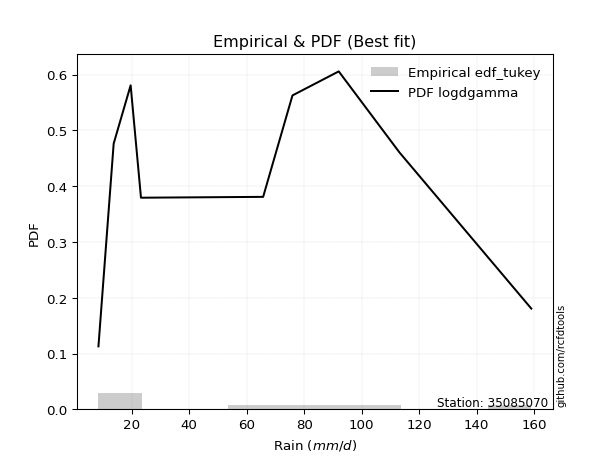</img>

</div>


### 8. EDF Gringorten (1963)

Gringorten plotting position formula is essential for estimating the probability and return periods of extreme events like floods and heavy rainfall. The constant _a=0.44_.

<div align="center">


$P=(m-a)/(n+1-2a)$


</div>


**8.1. Empirical values**

<div align="center">

|                | 0                   | 1                   | 2                  | 3                  | 4                  | 5                  | 6                  | 7                  |
|:---------------|:--------------------|:--------------------|:-------------------|:-------------------|:-------------------|:-------------------|:-------------------|:-------------------|
| date           | 2023                | 2022                | 2024               | 2017               | 2020               | 2018               | 2021               | 2019               |
| x              | 8.4                 | 13.7                | 19.6               | 65.7               | 75.9               | 92.0               | 113.1              | 159.0              |
| m              | 1                   | 2                   | 3                  | 4                  | 5                  | 6                  | 7                  | 8                  |
| empirical_dist | edf_gringorten      | edf_gringorten      | edf_gringorten     | edf_gringorten     | edf_gringorten     | edf_gringorten     | edf_gringorten     | edf_gringorten     |
| empirical      | 0.06896551724137932 | 0.19211822660098524 | 0.3152709359605912 | 0.4384236453201971 | 0.5615763546798029 | 0.6847290640394089 | 0.8078817733990148 | 0.9310344827586208 |
| empirical_tr   | 1.0740740740740742  | 1.2378048780487805  | 1.460431654676259  | 1.780701754385965  | 2.2808988764044944 | 3.1718750000000004 | 5.205128205128205  | 14.500000000000018 |

</div>


**8.2. Kolmogorov-Smirnov fit test (sorted by Δ)**


<div align="center">

|                | 0                   | 1                   | 2                     | 3                  | 4                   | 5                   | 6                   | 7                   | 8                   | 9                   | 10                  | 11                 | 12                  | 13                  | 14                 | 15                 | 16                  | 17                 | 18                  | 19                  | 20                  | 21                 | 22                 | 23                 | 24                 | 25                  | 26                 | 27                 | 28                  | 29                  | 30                 | 31                  | 32                  | 33                  | 34                  | 35                  | 36                  | 37                  | 38                  | 39                  | 40                  | 41                  | 42                  | 43                  | 44                  | 45                  | 46                  | 47                  | 48                  | 49                  | 50                 | 51                 | 52                 | 53                  | 54                  | 55                  | 56                 | 57                  | 58                  | 59                 | 60                  | 61                  | 62                  | 63                  | 64                  | 65                 | 66                  | 67                  | 68                  | 69                  | 70                  | 71                 | 72                 | 73                 | 74                  | 75                 | 76                 | 77                  | 78                 | 79                 | 80                 | 81                 | 82                 | 83                 | 84                 | 85                 | 86                 | 87                 |
|:---------------|:--------------------|:--------------------|:----------------------|:-------------------|:--------------------|:--------------------|:--------------------|:--------------------|:--------------------|:--------------------|:--------------------|:-------------------|:--------------------|:--------------------|:-------------------|:-------------------|:--------------------|:-------------------|:--------------------|:--------------------|:--------------------|:-------------------|:-------------------|:-------------------|:-------------------|:--------------------|:-------------------|:-------------------|:--------------------|:--------------------|:-------------------|:--------------------|:--------------------|:--------------------|:--------------------|:--------------------|:--------------------|:--------------------|:--------------------|:--------------------|:--------------------|:--------------------|:--------------------|:--------------------|:--------------------|:--------------------|:--------------------|:--------------------|:--------------------|:--------------------|:-------------------|:-------------------|:-------------------|:--------------------|:--------------------|:--------------------|:-------------------|:--------------------|:--------------------|:-------------------|:--------------------|:--------------------|:--------------------|:--------------------|:--------------------|:-------------------|:--------------------|:--------------------|:--------------------|:--------------------|:--------------------|:-------------------|:-------------------|:-------------------|:--------------------|:-------------------|:-------------------|:--------------------|:-------------------|:-------------------|:-------------------|:-------------------|:-------------------|:-------------------|:-------------------|:-------------------|:-------------------|:-------------------|
| station        | 35085070            | 35085070            | 35085070              | 35085070           | 35085070            | 35085070            | 35085070            | 35085070            | 35085070            | 35085070            | 35085070            | 35085070           | 35085070            | 35085070            | 35085070           | 35085070           | 35085070            | 35085070           | 35085070            | 35085070            | 35085070            | 35085070           | 35085070           | 35085070           | 35085070           | 35085070            | 35085070           | 35085070           | 35085070            | 35085070            | 35085070           | 35085070            | 35085070            | 35085070            | 35085070            | 35085070            | 35085070            | 35085070            | 35085070            | 35085070            | 35085070            | 35085070            | 35085070            | 35085070            | 35085070            | 35085070            | 35085070            | 35085070            | 35085070            | 35085070            | 35085070           | 35085070           | 35085070           | 35085070            | 35085070            | 35085070            | 35085070           | 35085070            | 35085070            | 35085070           | 35085070            | 35085070            | 35085070            | 35085070            | 35085070            | 35085070           | 35085070            | 35085070            | 35085070            | 35085070            | 35085070            | 35085070           | 35085070           | 35085070           | 35085070            | 35085070           | 35085070           | 35085070            | 35085070           | 35085070           | 35085070           | 35085070           | 35085070           | 35085070           | 35085070           | 35085070           | 35085070           | 35085070           |
| empirical_dist | edf_gringorten      | edf_gringorten      | edf_gringorten        | edf_gringorten     | edf_gringorten      | edf_gringorten      | edf_gringorten      | edf_gringorten      | edf_gringorten      | edf_gringorten      | edf_gringorten      | edf_gringorten     | edf_gringorten      | edf_gringorten      | edf_gringorten     | edf_gringorten     | edf_gringorten      | edf_gringorten     | edf_gringorten      | edf_gringorten      | edf_gringorten      | edf_gringorten     | edf_gringorten     | edf_gringorten     | edf_gringorten     | edf_gringorten      | edf_gringorten     | edf_gringorten     | edf_gringorten      | edf_gringorten      | edf_gringorten     | edf_gringorten      | edf_gringorten      | edf_gringorten      | edf_gringorten      | edf_gringorten      | edf_gringorten      | edf_gringorten      | edf_gringorten      | edf_gringorten      | edf_gringorten      | edf_gringorten      | edf_gringorten      | edf_gringorten      | edf_gringorten      | edf_gringorten      | edf_gringorten      | edf_gringorten      | edf_gringorten      | edf_gringorten      | edf_gringorten     | edf_gringorten     | edf_gringorten     | edf_gringorten      | edf_gringorten      | edf_gringorten      | edf_gringorten     | edf_gringorten      | edf_gringorten      | edf_gringorten     | edf_gringorten      | edf_gringorten      | edf_gringorten      | edf_gringorten      | edf_gringorten      | edf_gringorten     | edf_gringorten      | edf_gringorten      | edf_gringorten      | edf_gringorten      | edf_gringorten      | edf_gringorten     | edf_gringorten     | edf_gringorten     | edf_gringorten      | edf_gringorten     | edf_gringorten     | edf_gringorten      | edf_gringorten     | edf_gringorten     | edf_gringorten     | edf_gringorten     | edf_gringorten     | edf_gringorten     | edf_gringorten     | edf_gringorten     | edf_gringorten     | edf_gringorten     |
| p_dist         | mielke              | logloggamma         | loglaplace_asymmetric | logjohnsonsu       | ncf                 | rayleigh            | logweibull_min      | maxwell             | loggumbel_l         | halfnorm            | t                   | truncnorm          | crystalball         | norm                | pearson3           | exponnorm          | f                   | invgamma           | genlogistic         | invweibull          | kstwobign           | laplace_asymmetric | gumbel_l           | logfisk            | logistic           | logpearson3         | genexpon           | expon              | gumbel_r            | rice                | hypsecant          | loggompertz         | gompertz            | laplace             | halflogistic        | moyal               | logf                | lognct              | logfatiguelife      | logexponnorm        | lognorm             | lognorm             | logcrystalball      | logt                | loggamma            | loggamma            | fisk                | logerlang           | logrice             | logalpha            | nakagami           | invgauss           | logbetaprime       | loginvgamma         | loglogistic         | logncf              | loginvgauss        | logmaxwell          | johnsonsu           | loginvweibull      | lograyleigh         | loghypsecant        | loggenexpon         | logkstwobign        | loghalfnorm         | nct                | loglaplace          | loggumbel_r         | logexpon            | loghalflogistic     | logmoyal            | betaprime          | lognakagami        | weibull_min        | wald                | gibrat             | alpha              | gamma               | logwald            | loggibrat          | logchi2            | logtruncnorm       | erlang             | loglognorm         | fatiguelife        | logmielke          | chi2               | loggenlogistic     |
| delta          | 0.10273104002473779 | 0.12726712125616538 | 0.13481571007684306   | 0.1351174864501966 | 0.13703884309178666 | 0.14532153621674931 | 0.14592894890568806 | 0.14698138904389538 | 0.15096281707078968 | 0.15184161890538814 | 0.15207472492657376 | 0.1520750400094901 | 0.15207505435096763 | 0.15207505954172706 | 0.1529252827009008 | 0.1544893995394827 | 0.15530788647639937 | 0.1553092779773798 | 0.15590751681037487 | 0.15612362109220776 | 0.15844706311118467 | 0.1617926572613308 | 0.1678692576755356 | 0.170232461469016  | 0.1709772577174645 | 0.17618490314123542 | 0.1763840795548401 | 0.176611120291923  | 0.17676168307040616 | 0.17963081183027596 | 0.181034205134207  | 0.18444589218715562 | 0.18823286916646406 | 0.19047397768110086 | 0.19663180864539215 | 0.20024455778936084 | 0.20162386614564182 | 0.20174249589588816 | 0.20183702002086773 | 0.20188423679716078 | 0.20188436843320529 | 0.20188436843320529 | 0.20188436923969527 | 0.20188441191773182 | 0.20537317404191208 | 0.20537317404191208 | 0.20792665670479743 | 0.21049169783243954 | 0.21235838362637965 | 0.21617105155815913 | 0.2170937805993705 | 0.2171102264177826 | 0.2174075108186843 | 0.21776995570959728 | 0.21896211816121364 | 0.21984384243637117 | 0.2203172579649289 | 0.22453878858329684 | 0.22644488197426044 | 0.2264575160469397 | 0.23139176239802545 | 0.23237691880653982 | 0.24126656594228185 | 0.24571770371079843 | 0.25121431877505046 | 0.2595493654866569 | 0.26075809096756747 | 0.26334065325151873 | 0.26524912958018104 | 0.27945948245118496 | 0.28379502270504425 | 0.2929815929678405 | 0.2981210282829995 | 0.3014778909456197 | 0.31527093595998923 | 0.3152709359605912 | 0.3358522485866247 | 0.33962589212230293 | 0.3415021764711094 | 0.3737417918077652 | 0.3773524560971467 | 0.3861435866450555 | 0.3885031494195928 | 0.4161187477990078 | 0.4393459670792287 | 0.4720635300891823 | 0.5610721845048865 | 0.8078817733990148 |
| deltao         | 0.4472608134160001  | 0.4472608134160001  | 0.4472608134160001    | 0.4472608134160001 | 0.4472608134160001  | 0.4472608134160001  | 0.4472608134160001  | 0.4472608134160001  | 0.4472608134160001  | 0.4472608134160001  | 0.4472608134160001  | 0.4472608134160001 | 0.4472608134160001  | 0.4472608134160001  | 0.4472608134160001 | 0.4472608134160001 | 0.4472608134160001  | 0.4472608134160001 | 0.4472608134160001  | 0.4472608134160001  | 0.4472608134160001  | 0.4472608134160001 | 0.4472608134160001 | 0.4472608134160001 | 0.4472608134160001 | 0.4472608134160001  | 0.4472608134160001 | 0.4472608134160001 | 0.4472608134160001  | 0.4472608134160001  | 0.4472608134160001 | 0.4472608134160001  | 0.4472608134160001  | 0.4472608134160001  | 0.4472608134160001  | 0.4472608134160001  | 0.4472608134160001  | 0.4472608134160001  | 0.4472608134160001  | 0.4472608134160001  | 0.4472608134160001  | 0.4472608134160001  | 0.4472608134160001  | 0.4472608134160001  | 0.4472608134160001  | 0.4472608134160001  | 0.4472608134160001  | 0.4472608134160001  | 0.4472608134160001  | 0.4472608134160001  | 0.4472608134160001 | 0.4472608134160001 | 0.4472608134160001 | 0.4472608134160001  | 0.4472608134160001  | 0.4472608134160001  | 0.4472608134160001 | 0.4472608134160001  | 0.4472608134160001  | 0.4472608134160001 | 0.4472608134160001  | 0.4472608134160001  | 0.4472608134160001  | 0.4472608134160001  | 0.4472608134160001  | 0.4472608134160001 | 0.4472608134160001  | 0.4472608134160001  | 0.4472608134160001  | 0.4472608134160001  | 0.4472608134160001  | 0.4472608134160001 | 0.4472608134160001 | 0.4472608134160001 | 0.4472608134160001  | 0.4472608134160001 | 0.4472608134160001 | 0.4472608134160001  | 0.4472608134160001 | 0.4472608134160001 | 0.4472608134160001 | 0.4472608134160001 | 0.4472608134160001 | 0.4472608134160001 | 0.4472608134160001 | 0.4472608134160001 | 0.4472608134160001 | 0.4472608134160001 |
| eval           | Δo > Δ              | Δo > Δ              | Δo > Δ                | Δo > Δ             | Δo > Δ              | Δo > Δ              | Δo > Δ              | Δo > Δ              | Δo > Δ              | Δo > Δ              | Δo > Δ              | Δo > Δ             | Δo > Δ              | Δo > Δ              | Δo > Δ             | Δo > Δ             | Δo > Δ              | Δo > Δ             | Δo > Δ              | Δo > Δ              | Δo > Δ              | Δo > Δ             | Δo > Δ             | Δo > Δ             | Δo > Δ             | Δo > Δ              | Δo > Δ             | Δo > Δ             | Δo > Δ              | Δo > Δ              | Δo > Δ             | Δo > Δ              | Δo > Δ              | Δo > Δ              | Δo > Δ              | Δo > Δ              | Δo > Δ              | Δo > Δ              | Δo > Δ              | Δo > Δ              | Δo > Δ              | Δo > Δ              | Δo > Δ              | Δo > Δ              | Δo > Δ              | Δo > Δ              | Δo > Δ              | Δo > Δ              | Δo > Δ              | Δo > Δ              | Δo > Δ             | Δo > Δ             | Δo > Δ             | Δo > Δ              | Δo > Δ              | Δo > Δ              | Δo > Δ             | Δo > Δ              | Δo > Δ              | Δo > Δ             | Δo > Δ              | Δo > Δ              | Δo > Δ              | Δo > Δ              | Δo > Δ              | Δo > Δ             | Δo > Δ              | Δo > Δ              | Δo > Δ              | Δo > Δ              | Δo > Δ              | Δo > Δ             | Δo > Δ             | Δo > Δ             | Δo > Δ              | Δo > Δ             | Δo > Δ             | Δo > Δ              | Δo > Δ             | Δo > Δ             | Δo > Δ             | Δo > Δ             | Δo > Δ             | Δo > Δ             | Δo > Δ             | Δo <= Δ            | Δo <= Δ            | Δo <= Δ            |
| fit            | 1                   | 1                   | 1                     | 1                  | 1                   | 1                   | 1                   | 1                   | 1                   | 1                   | 1                   | 1                  | 1                   | 1                   | 1                  | 1                  | 1                   | 1                  | 1                   | 1                   | 1                   | 1                  | 1                  | 1                  | 1                  | 1                   | 1                  | 1                  | 1                   | 1                   | 1                  | 1                   | 1                   | 1                   | 1                   | 1                   | 1                   | 1                   | 1                   | 1                   | 1                   | 1                   | 1                   | 1                   | 1                   | 1                   | 1                   | 1                   | 1                   | 1                   | 1                  | 1                  | 1                  | 1                   | 1                   | 1                   | 1                  | 1                   | 1                   | 1                  | 1                   | 1                   | 1                   | 1                   | 1                   | 1                  | 1                   | 1                   | 1                   | 1                   | 1                   | 1                  | 1                  | 1                  | 1                   | 1                  | 1                  | 1                   | 1                  | 1                  | 1                  | 1                  | 1                  | 1                  | 1                  | 0                  | 0                  | 0                  |
| n              | 8                   | 8                   | 8                     | 8                  | 8                   | 8                   | 8                   | 8                   | 8                   | 8                   | 8                   | 8                  | 8                   | 8                   | 8                  | 8                  | 8                   | 8                  | 8                   | 8                   | 8                   | 8                  | 8                  | 8                  | 8                  | 8                   | 8                  | 8                  | 8                   | 8                   | 8                  | 8                   | 8                   | 8                   | 8                   | 8                   | 8                   | 8                   | 8                   | 8                   | 8                   | 8                   | 8                   | 8                   | 8                   | 8                   | 8                   | 8                   | 8                   | 8                   | 8                  | 8                  | 8                  | 8                   | 8                   | 8                   | 8                  | 8                   | 8                   | 8                  | 8                   | 8                   | 8                   | 8                   | 8                   | 8                  | 8                   | 8                   | 8                   | 8                   | 8                   | 8                  | 8                  | 8                  | 8                   | 8                  | 8                  | 8                   | 8                  | 8                  | 8                  | 8                  | 8                  | 8                  | 8                  | 8                  | 8                  | 8                  |
| best_fit       | 1                   | 0                   | 0                     | 0                  | 0                   | 0                   | 0                   | 0                   | 0                   | 0                   | 0                   | 0                  | 0                   | 0                   | 0                  | 0                  | 0                   | 0                  | 0                   | 0                   | 0                   | 0                  | 0                  | 0                  | 0                  | 0                   | 0                  | 0                  | 0                   | 0                   | 0                  | 0                   | 0                   | 0                   | 0                   | 0                   | 0                   | 0                   | 0                   | 0                   | 0                   | 0                   | 0                   | 0                   | 0                   | 0                   | 0                   | 0                   | 0                   | 0                   | 0                  | 0                  | 0                  | 0                   | 0                   | 0                   | 0                  | 0                   | 0                   | 0                  | 0                   | 0                   | 0                   | 0                   | 0                   | 0                  | 0                   | 0                   | 0                   | 0                   | 0                   | 0                  | 0                  | 0                  | 0                   | 0                  | 0                  | 0                   | 0                  | 0                  | 0                  | 0                  | 0                  | 0                  | 0                  | 0                  | 0                  | 0                  |
| best_fit_sort  | 1                   | 2                   | 3                     | 4                  | 5                   | 6                   | 7                   | 8                   | 9                   | 10                  | 11                  | 12                 | 13                  | 14                  | 15                 | 16                 | 17                  | 18                 | 19                  | 20                  | 21                  | 22                 | 23                 | 24                 | 25                 | 26                  | 27                 | 28                 | 29                  | 30                  | 31                 | 32                  | 33                  | 34                  | 35                  | 36                  | 37                  | 38                  | 39                  | 40                  | 41                  | 42                  | 43                  | 44                  | 45                  | 46                  | 47                  | 48                  | 49                  | 50                  | 51                 | 52                 | 53                 | 54                  | 55                  | 56                  | 57                 | 58                  | 59                  | 60                 | 61                  | 62                  | 63                  | 64                  | 65                  | 66                 | 67                  | 68                  | 69                  | 70                  | 71                  | 72                 | 73                 | 74                 | 75                  | 76                 | 77                 | 78                  | 79                 | 80                 | 81                 | 82                 | 83                 | 84                 | 85                 | 86                 | 87                 | 88                 |

</div>


**8.3. Best fit**

<div align="center">

|   id |   station | empirical_dist   | p_dist   |    delta |   deltao | eval   |   fit |   n |   best_fit |   best_fit_sort |
|-----:|----------:|:-----------------|:---------|---------:|---------:|:-------|------:|----:|-----------:|----------------:|
|    0 |  35085070 | edf_gringorten   | mielke   | 0.102731 | 0.447261 | Δo > Δ |     1 |   8 |          1 |               1 |

</div>


<div align="center">

</img>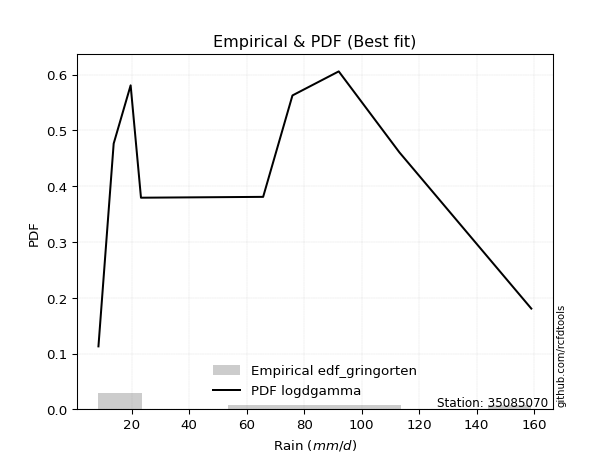</img>

</div>


### 9. EDF Filliben (1975)

The specific values of the constants (0.3175) (often denoted as $alpha$) and (0.365) are derived from a method proposed by James J. Filliben in a 1975 paper. This particular formula is the mean value of the $i$-th order statistic of the normal distribution and is considered a robust and effective plotting position formula for the normal probability plot correlation coefficient test for normality.

<div align="center">


$P=(m-0.3175)/(n+0.365)$


</div>


**9.1. Empirical values**

<div align="center">

|                | 0                  | 1                   | 2                  | 3                   | 4                  | 5                  | 6                  | 7                  |
|:---------------|:-------------------|:--------------------|:-------------------|:--------------------|:-------------------|:-------------------|:-------------------|:-------------------|
| date           | 2023               | 2022                | 2024               | 2017                | 2020               | 2018               | 2021               | 2019               |
| x              | 8.4                | 13.7                | 19.6               | 65.7                | 75.9               | 92.0               | 113.1              | 159.0              |
| m              | 1                  | 2                   | 3                  | 4                   | 5                  | 6                  | 7                  | 8                  |
| empirical_dist | edf_filliben       | edf_filliben        | edf_filliben       | edf_filliben        | edf_filliben       | edf_filliben       | edf_filliben       | edf_filliben       |
| empirical      | 0.0815899581589958 | 0.20113568439928273 | 0.3206814106395696 | 0.44022713687985654 | 0.5597728631201434 | 0.6793185893604303 | 0.7988643156007172 | 0.9184100418410042 |
| empirical_tr   | 1.0888382687927107 | 1.2517770295548074  | 1.4720633523977125 | 1.7864388681260008  | 2.271554650373387  | 3.118359739049394  | 4.971768202080237  | 12.256410256410254 |

</div>


**9.2. Kolmogorov-Smirnov fit test (sorted by Δ)**


<div align="center">

|                | 0                   | 1                  | 2                   | 3                     | 4                   | 5                   | 6                   | 7                   | 8                  | 9                   | 10                  | 11                  | 12                  | 13                 | 14                  | 15                  | 16                 | 17                  | 18                 | 19                 | 20                 | 21                  | 22                  | 23                  | 24                 | 25                  | 26                  | 27                  | 28                  | 29                 | 30                 | 31                  | 32                 | 33                 | 34                 | 35                  | 36                 | 37                  | 38                  | 39                  | 40                  | 41                 | 42                  | 43                  | 44                  | 45                  | 46                 | 47                  | 48                  | 49                 | 50                 | 51                  | 52                 | 53                  | 54                  | 55                  | 56                  | 57                  | 58                  | 59                  | 60                  | 61                 | 62                  | 63                 | 64                  | 65                 | 66                  | 67                 | 68                 | 69                  | 70                  | 71                 | 72                  | 73                 | 74                  | 75                 | 76                 | 77                 | 78                 | 79                  | 80                  | 81                  | 82                 | 83                  | 84                  | 85                  | 86                 | 87                 |
|:---------------|:--------------------|:-------------------|:--------------------|:----------------------|:--------------------|:--------------------|:--------------------|:--------------------|:-------------------|:--------------------|:--------------------|:--------------------|:--------------------|:-------------------|:--------------------|:--------------------|:-------------------|:--------------------|:-------------------|:-------------------|:-------------------|:--------------------|:--------------------|:--------------------|:-------------------|:--------------------|:--------------------|:--------------------|:--------------------|:-------------------|:-------------------|:--------------------|:-------------------|:-------------------|:-------------------|:--------------------|:-------------------|:--------------------|:--------------------|:--------------------|:--------------------|:-------------------|:--------------------|:--------------------|:--------------------|:--------------------|:-------------------|:--------------------|:--------------------|:-------------------|:-------------------|:--------------------|:-------------------|:--------------------|:--------------------|:--------------------|:--------------------|:--------------------|:--------------------|:--------------------|:--------------------|:-------------------|:--------------------|:-------------------|:--------------------|:-------------------|:--------------------|:-------------------|:-------------------|:--------------------|:--------------------|:-------------------|:--------------------|:-------------------|:--------------------|:-------------------|:-------------------|:-------------------|:-------------------|:--------------------|:--------------------|:--------------------|:-------------------|:--------------------|:--------------------|:--------------------|:-------------------|:-------------------|
| station        | 35085070            | 35085070           | 35085070            | 35085070              | 35085070            | 35085070            | 35085070            | 35085070            | 35085070           | 35085070            | 35085070            | 35085070            | 35085070            | 35085070           | 35085070            | 35085070            | 35085070           | 35085070            | 35085070           | 35085070           | 35085070           | 35085070            | 35085070            | 35085070            | 35085070           | 35085070            | 35085070            | 35085070            | 35085070            | 35085070           | 35085070           | 35085070            | 35085070           | 35085070           | 35085070           | 35085070            | 35085070           | 35085070            | 35085070            | 35085070            | 35085070            | 35085070           | 35085070            | 35085070            | 35085070            | 35085070            | 35085070           | 35085070            | 35085070            | 35085070           | 35085070           | 35085070            | 35085070           | 35085070            | 35085070            | 35085070            | 35085070            | 35085070            | 35085070            | 35085070            | 35085070            | 35085070           | 35085070            | 35085070           | 35085070            | 35085070           | 35085070            | 35085070           | 35085070           | 35085070            | 35085070            | 35085070           | 35085070            | 35085070           | 35085070            | 35085070           | 35085070           | 35085070           | 35085070           | 35085070            | 35085070            | 35085070            | 35085070           | 35085070            | 35085070            | 35085070            | 35085070           | 35085070           |
| empirical_dist | edf_filliben        | edf_filliben       | edf_filliben        | edf_filliben          | edf_filliben        | edf_filliben        | edf_filliben        | edf_filliben        | edf_filliben       | edf_filliben        | edf_filliben        | edf_filliben        | edf_filliben        | edf_filliben       | edf_filliben        | edf_filliben        | edf_filliben       | edf_filliben        | edf_filliben       | edf_filliben       | edf_filliben       | edf_filliben        | edf_filliben        | edf_filliben        | edf_filliben       | edf_filliben        | edf_filliben        | edf_filliben        | edf_filliben        | edf_filliben       | edf_filliben       | edf_filliben        | edf_filliben       | edf_filliben       | edf_filliben       | edf_filliben        | edf_filliben       | edf_filliben        | edf_filliben        | edf_filliben        | edf_filliben        | edf_filliben       | edf_filliben        | edf_filliben        | edf_filliben        | edf_filliben        | edf_filliben       | edf_filliben        | edf_filliben        | edf_filliben       | edf_filliben       | edf_filliben        | edf_filliben       | edf_filliben        | edf_filliben        | edf_filliben        | edf_filliben        | edf_filliben        | edf_filliben        | edf_filliben        | edf_filliben        | edf_filliben       | edf_filliben        | edf_filliben       | edf_filliben        | edf_filliben       | edf_filliben        | edf_filliben       | edf_filliben       | edf_filliben        | edf_filliben        | edf_filliben       | edf_filliben        | edf_filliben       | edf_filliben        | edf_filliben       | edf_filliben       | edf_filliben       | edf_filliben       | edf_filliben        | edf_filliben        | edf_filliben        | edf_filliben       | edf_filliben        | edf_filliben        | edf_filliben        | edf_filliben       | edf_filliben       |
| p_dist         | mielke              | logloggamma        | ncf                 | loglaplace_asymmetric | logjohnsonsu        | loggumbel_l         | rayleigh            | logweibull_min      | maxwell            | halfnorm            | t                   | truncnorm           | crystalball         | norm               | pearson3            | exponnorm           | f                  | invgamma            | genlogistic        | invweibull         | kstwobign          | laplace_asymmetric  | logfisk             | gumbel_l            | logpearson3        | genexpon            | expon               | logistic            | gumbel_r            | loggompertz        | rice               | hypsecant           | gompertz           | laplace            | logf               | lognct              | logfatiguelife     | logexponnorm        | lognorm             | lognorm             | logcrystalball      | logt               | halflogistic        | loggamma            | loggamma            | moyal               | fisk               | logerlang           | logrice             | logalpha           | nakagami           | invgauss            | logbetaprime       | loginvgamma         | loglogistic         | logncf              | loginvgauss         | logmaxwell          | johnsonsu           | loginvweibull       | lograyleigh         | loghypsecant       | loggenexpon         | logkstwobign       | loghalfnorm         | nct                | loglaplace          | loggumbel_r        | logexpon           | loghalflogistic     | logmoyal            | weibull_min        | betaprime           | lognakagami        | wald                | gibrat             | alpha              | gamma              | logwald            | loggibrat           | logchi2             | logtruncnorm        | erlang             | loglognorm          | fatiguelife         | logmielke           | chi2               | loggenlogistic     |
| delta          | 0.10814151470371622 | 0.1326775959351438 | 0.13718992689743553 | 0.1402261847558215    | 0.14052796112917504 | 0.14915932551113026 | 0.15073201089572774 | 0.15133942358466648 | 0.1523918637228738 | 0.15725209358436656 | 0.15748519960555218 | 0.15748551468846853 | 0.15748552902994606 | 0.1574855342207055 | 0.15833575737987923 | 0.15989987421846114 | 0.1607183611553778 | 0.16071975265635824 | 0.1613179914893533 | 0.1615340957711862 | 0.1638575377901631 | 0.16720313194030922 | 0.16842896990935657 | 0.17327973235451402 | 0.174381411581576  | 0.17458058799518067 | 0.17480762873226358 | 0.17638773239644293 | 0.18217215774938458 | 0.1826424006274962 | 0.1850412865092544 | 0.18644467981318544 | 0.1936433438454425 | 0.1958844523600793 | 0.1998203745859824 | 0.19993900433622874 | 0.2000335284612083 | 0.20008074523750136 | 0.20008087687354587 | 0.20008087687354587 | 0.20008087768003585 | 0.2000809203580724 | 0.20204228332437058 | 0.20356968248225266 | 0.20356968248225266 | 0.20565503246833927 | 0.206123165145138  | 0.20868820627278012 | 0.21055489206672023 | 0.2143675599984997 | 0.2152902890397111 | 0.21530673485812318 | 0.2156040192590249 | 0.21596646414993786 | 0.21715862660155422 | 0.21804035087671175 | 0.21851376640526948 | 0.22273529702363742 | 0.22464139041460102 | 0.22465402448728028 | 0.22958827083836603 | 0.2305734272468804 | 0.23946307438262243 | 0.243914212151139  | 0.24941082721539104 | 0.2577458739269975 | 0.25895459940790805 | 0.2615371616918593 | 0.2634456380205216 | 0.27765599089152554 | 0.28199153114538483 | 0.2888534500280031 | 0.29117810140818107 | 0.2963175367233401 | 0.32068141063896766 | 0.3206814106395696 | 0.3340487570269653 | 0.3378224005626435 | 0.33969868491145   | 0.37193830024810576 | 0.37554896453748726 | 0.38434009508539607 | 0.3866996578599334 | 0.40710129000071027 | 0.43032850928093114 | 0.47026003852952286 | 0.5592686929452271 | 0.7988643156007172 |
| deltao         | 0.4472608134160001  | 0.4472608134160001 | 0.4472608134160001  | 0.4472608134160001    | 0.4472608134160001  | 0.4472608134160001  | 0.4472608134160001  | 0.4472608134160001  | 0.4472608134160001 | 0.4472608134160001  | 0.4472608134160001  | 0.4472608134160001  | 0.4472608134160001  | 0.4472608134160001 | 0.4472608134160001  | 0.4472608134160001  | 0.4472608134160001 | 0.4472608134160001  | 0.4472608134160001 | 0.4472608134160001 | 0.4472608134160001 | 0.4472608134160001  | 0.4472608134160001  | 0.4472608134160001  | 0.4472608134160001 | 0.4472608134160001  | 0.4472608134160001  | 0.4472608134160001  | 0.4472608134160001  | 0.4472608134160001 | 0.4472608134160001 | 0.4472608134160001  | 0.4472608134160001 | 0.4472608134160001 | 0.4472608134160001 | 0.4472608134160001  | 0.4472608134160001 | 0.4472608134160001  | 0.4472608134160001  | 0.4472608134160001  | 0.4472608134160001  | 0.4472608134160001 | 0.4472608134160001  | 0.4472608134160001  | 0.4472608134160001  | 0.4472608134160001  | 0.4472608134160001 | 0.4472608134160001  | 0.4472608134160001  | 0.4472608134160001 | 0.4472608134160001 | 0.4472608134160001  | 0.4472608134160001 | 0.4472608134160001  | 0.4472608134160001  | 0.4472608134160001  | 0.4472608134160001  | 0.4472608134160001  | 0.4472608134160001  | 0.4472608134160001  | 0.4472608134160001  | 0.4472608134160001 | 0.4472608134160001  | 0.4472608134160001 | 0.4472608134160001  | 0.4472608134160001 | 0.4472608134160001  | 0.4472608134160001 | 0.4472608134160001 | 0.4472608134160001  | 0.4472608134160001  | 0.4472608134160001 | 0.4472608134160001  | 0.4472608134160001 | 0.4472608134160001  | 0.4472608134160001 | 0.4472608134160001 | 0.4472608134160001 | 0.4472608134160001 | 0.4472608134160001  | 0.4472608134160001  | 0.4472608134160001  | 0.4472608134160001 | 0.4472608134160001  | 0.4472608134160001  | 0.4472608134160001  | 0.4472608134160001 | 0.4472608134160001 |
| eval           | Δo > Δ              | Δo > Δ             | Δo > Δ              | Δo > Δ                | Δo > Δ              | Δo > Δ              | Δo > Δ              | Δo > Δ              | Δo > Δ             | Δo > Δ              | Δo > Δ              | Δo > Δ              | Δo > Δ              | Δo > Δ             | Δo > Δ              | Δo > Δ              | Δo > Δ             | Δo > Δ              | Δo > Δ             | Δo > Δ             | Δo > Δ             | Δo > Δ              | Δo > Δ              | Δo > Δ              | Δo > Δ             | Δo > Δ              | Δo > Δ              | Δo > Δ              | Δo > Δ              | Δo > Δ             | Δo > Δ             | Δo > Δ              | Δo > Δ             | Δo > Δ             | Δo > Δ             | Δo > Δ              | Δo > Δ             | Δo > Δ              | Δo > Δ              | Δo > Δ              | Δo > Δ              | Δo > Δ             | Δo > Δ              | Δo > Δ              | Δo > Δ              | Δo > Δ              | Δo > Δ             | Δo > Δ              | Δo > Δ              | Δo > Δ             | Δo > Δ             | Δo > Δ              | Δo > Δ             | Δo > Δ              | Δo > Δ              | Δo > Δ              | Δo > Δ              | Δo > Δ              | Δo > Δ              | Δo > Δ              | Δo > Δ              | Δo > Δ             | Δo > Δ              | Δo > Δ             | Δo > Δ              | Δo > Δ             | Δo > Δ              | Δo > Δ             | Δo > Δ             | Δo > Δ              | Δo > Δ              | Δo > Δ             | Δo > Δ              | Δo > Δ             | Δo > Δ              | Δo > Δ             | Δo > Δ             | Δo > Δ             | Δo > Δ             | Δo > Δ              | Δo > Δ              | Δo > Δ              | Δo > Δ             | Δo > Δ              | Δo > Δ              | Δo <= Δ             | Δo <= Δ            | Δo <= Δ            |
| fit            | 1                   | 1                  | 1                   | 1                     | 1                   | 1                   | 1                   | 1                   | 1                  | 1                   | 1                   | 1                   | 1                   | 1                  | 1                   | 1                   | 1                  | 1                   | 1                  | 1                  | 1                  | 1                   | 1                   | 1                   | 1                  | 1                   | 1                   | 1                   | 1                   | 1                  | 1                  | 1                   | 1                  | 1                  | 1                  | 1                   | 1                  | 1                   | 1                   | 1                   | 1                   | 1                  | 1                   | 1                   | 1                   | 1                   | 1                  | 1                   | 1                   | 1                  | 1                  | 1                   | 1                  | 1                   | 1                   | 1                   | 1                   | 1                   | 1                   | 1                   | 1                   | 1                  | 1                   | 1                  | 1                   | 1                  | 1                   | 1                  | 1                  | 1                   | 1                   | 1                  | 1                   | 1                  | 1                   | 1                  | 1                  | 1                  | 1                  | 1                   | 1                   | 1                   | 1                  | 1                   | 1                   | 0                   | 0                  | 0                  |
| n              | 8                   | 8                  | 8                   | 8                     | 8                   | 8                   | 8                   | 8                   | 8                  | 8                   | 8                   | 8                   | 8                   | 8                  | 8                   | 8                   | 8                  | 8                   | 8                  | 8                  | 8                  | 8                   | 8                   | 8                   | 8                  | 8                   | 8                   | 8                   | 8                   | 8                  | 8                  | 8                   | 8                  | 8                  | 8                  | 8                   | 8                  | 8                   | 8                   | 8                   | 8                   | 8                  | 8                   | 8                   | 8                   | 8                   | 8                  | 8                   | 8                   | 8                  | 8                  | 8                   | 8                  | 8                   | 8                   | 8                   | 8                   | 8                   | 8                   | 8                   | 8                   | 8                  | 8                   | 8                  | 8                   | 8                  | 8                   | 8                  | 8                  | 8                   | 8                   | 8                  | 8                   | 8                  | 8                   | 8                  | 8                  | 8                  | 8                  | 8                   | 8                   | 8                   | 8                  | 8                   | 8                   | 8                   | 8                  | 8                  |
| best_fit       | 1                   | 0                  | 0                   | 0                     | 0                   | 0                   | 0                   | 0                   | 0                  | 0                   | 0                   | 0                   | 0                   | 0                  | 0                   | 0                   | 0                  | 0                   | 0                  | 0                  | 0                  | 0                   | 0                   | 0                   | 0                  | 0                   | 0                   | 0                   | 0                   | 0                  | 0                  | 0                   | 0                  | 0                  | 0                  | 0                   | 0                  | 0                   | 0                   | 0                   | 0                   | 0                  | 0                   | 0                   | 0                   | 0                   | 0                  | 0                   | 0                   | 0                  | 0                  | 0                   | 0                  | 0                   | 0                   | 0                   | 0                   | 0                   | 0                   | 0                   | 0                   | 0                  | 0                   | 0                  | 0                   | 0                  | 0                   | 0                  | 0                  | 0                   | 0                   | 0                  | 0                   | 0                  | 0                   | 0                  | 0                  | 0                  | 0                  | 0                   | 0                   | 0                   | 0                  | 0                   | 0                   | 0                   | 0                  | 0                  |
| best_fit_sort  | 1                   | 2                  | 3                   | 4                     | 5                   | 6                   | 7                   | 8                   | 9                  | 10                  | 11                  | 12                  | 13                  | 14                 | 15                  | 16                  | 17                 | 18                  | 19                 | 20                 | 21                 | 22                  | 23                  | 24                  | 25                 | 26                  | 27                  | 28                  | 29                  | 30                 | 31                 | 32                  | 33                 | 34                 | 35                 | 36                  | 37                 | 38                  | 39                  | 40                  | 41                  | 42                 | 43                  | 44                  | 45                  | 46                  | 47                 | 48                  | 49                  | 50                 | 51                 | 52                  | 53                 | 54                  | 55                  | 56                  | 57                  | 58                  | 59                  | 60                  | 61                  | 62                 | 63                  | 64                 | 65                  | 66                 | 67                  | 68                 | 69                 | 70                  | 71                  | 72                 | 73                  | 74                 | 75                  | 76                 | 77                 | 78                 | 79                 | 80                  | 81                  | 82                  | 83                 | 84                  | 85                  | 86                  | 87                 | 88                 |

</div>


**9.3. Best fit**

<div align="center">

|   id |   station | empirical_dist   | p_dist   |    delta |   deltao | eval   |   fit |   n |   best_fit |   best_fit_sort |
|-----:|----------:|:-----------------|:---------|---------:|---------:|:-------|------:|----:|-----------:|----------------:|
|    0 |  35085070 | edf_filliben     | mielke   | 0.108142 | 0.447261 | Δo > Δ |     1 |   8 |          1 |               1 |

</div>


<div align="center">

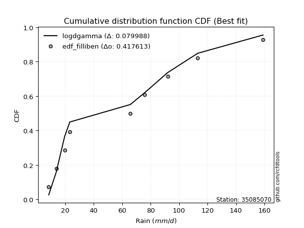</img>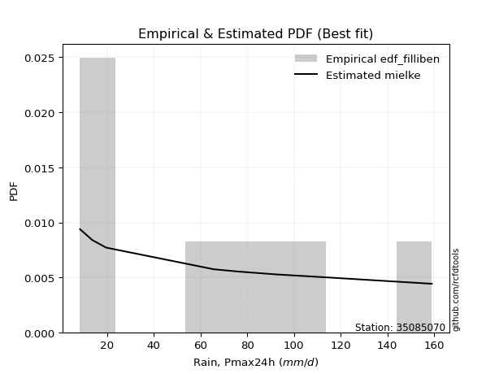</img>

</div>


### 10. EDF Jenkinson (1977)

The Jenkinson formula in hydrology is an empirical plotting position formula used to estimate the non-exceedance probability _(P)_ or return period _(T)_ of a given ordered observation within a sample. It is a widely used method in the frequency analysis of extreme events such as floods and rainfall, as it provides a distribution-free way to plot data. _a≈0.31_ and _b≈0.38_ are constants derived to approximate the median of the probability distribution for the given rank.

<div align="center">


$P=(m-a)/(n+b)$


</div>


**10.1. Empirical values**

<div align="center">

|                | 0                   | 1                   | 2                  | 3                   | 4                  | 5                  | 6                  | 7                  |
|:---------------|:--------------------|:--------------------|:-------------------|:--------------------|:-------------------|:-------------------|:-------------------|:-------------------|
| date           | 2023                | 2022                | 2024               | 2017                | 2020               | 2018               | 2021               | 2019               |
| x              | 8.4                 | 13.7                | 19.6               | 65.7                | 75.9               | 92.0               | 113.1              | 159.0              |
| m              | 1                   | 2                   | 3                  | 4                   | 5                  | 6                  | 7                  | 8                  |
| empirical_dist | edf_jenkinson       | edf_jenkinson       | edf_jenkinson      | edf_jenkinson       | edf_jenkinson      | edf_jenkinson      | edf_jenkinson      | edf_jenkinson      |
| empirical      | 0.08233890214797135 | 0.20167064439140808 | 0.3210023866348448 | 0.44033412887828155 | 0.5596658711217184 | 0.6789976133651551 | 0.7983293556085919 | 0.9176610978520287 |
| empirical_tr   | 1.0897269180754225  | 1.2526158445440956  | 1.4727592267135323 | 1.7867803837953091  | 2.2710027100271004 | 3.115241635687732  | 4.958579881656804  | 12.144927536231886 |

</div>


**10.2. Kolmogorov-Smirnov fit test (sorted by Δ)**


<div align="center">

|                | 0                   | 1                  | 2                   | 3                     | 4                   | 5                   | 6                   | 7                   | 8                  | 9                   | 10                  | 11                  | 12                  | 13                 | 14                  | 15                  | 16                 | 17                  | 18                 | 19                  | 20                 | 21                  | 22                  | 23                  | 24                  | 25                  | 26                  | 27                  | 28                  | 29                 | 30                  | 31                  | 32                  | 33                  | 34                 | 35                  | 36                 | 37                  | 38                  | 39                  | 40                  | 41                 | 42                  | 43                  | 44                  | 45                  | 46                 | 47                 | 48                  | 49                 | 50                  | 51                  | 52                  | 53                  | 54                 | 55                  | 56                  | 57                  | 58                 | 59                  | 60                  | 61                 | 62                  | 63                 | 64                  | 65                 | 66                  | 67                 | 68                 | 69                  | 70                 | 71                 | 72                  | 73                 | 74                  | 75                 | 76                 | 77                 | 78                 | 79                  | 80                  | 81                  | 82                  | 83                  | 84                 | 85                  | 86                 | 87                 |
|:---------------|:--------------------|:-------------------|:--------------------|:----------------------|:--------------------|:--------------------|:--------------------|:--------------------|:-------------------|:--------------------|:--------------------|:--------------------|:--------------------|:-------------------|:--------------------|:--------------------|:-------------------|:--------------------|:-------------------|:--------------------|:-------------------|:--------------------|:--------------------|:--------------------|:--------------------|:--------------------|:--------------------|:--------------------|:--------------------|:-------------------|:--------------------|:--------------------|:--------------------|:--------------------|:-------------------|:--------------------|:-------------------|:--------------------|:--------------------|:--------------------|:--------------------|:-------------------|:--------------------|:--------------------|:--------------------|:--------------------|:-------------------|:-------------------|:--------------------|:-------------------|:--------------------|:--------------------|:--------------------|:--------------------|:-------------------|:--------------------|:--------------------|:--------------------|:-------------------|:--------------------|:--------------------|:-------------------|:--------------------|:-------------------|:--------------------|:-------------------|:--------------------|:-------------------|:-------------------|:--------------------|:-------------------|:-------------------|:--------------------|:-------------------|:--------------------|:-------------------|:-------------------|:-------------------|:-------------------|:--------------------|:--------------------|:--------------------|:--------------------|:--------------------|:-------------------|:--------------------|:-------------------|:-------------------|
| station        | 35085070            | 35085070           | 35085070            | 35085070              | 35085070            | 35085070            | 35085070            | 35085070            | 35085070           | 35085070            | 35085070            | 35085070            | 35085070            | 35085070           | 35085070            | 35085070            | 35085070           | 35085070            | 35085070           | 35085070            | 35085070           | 35085070            | 35085070            | 35085070            | 35085070            | 35085070            | 35085070            | 35085070            | 35085070            | 35085070           | 35085070            | 35085070            | 35085070            | 35085070            | 35085070           | 35085070            | 35085070           | 35085070            | 35085070            | 35085070            | 35085070            | 35085070           | 35085070            | 35085070            | 35085070            | 35085070            | 35085070           | 35085070           | 35085070            | 35085070           | 35085070            | 35085070            | 35085070            | 35085070            | 35085070           | 35085070            | 35085070            | 35085070            | 35085070           | 35085070            | 35085070            | 35085070           | 35085070            | 35085070           | 35085070            | 35085070           | 35085070            | 35085070           | 35085070           | 35085070            | 35085070           | 35085070           | 35085070            | 35085070           | 35085070            | 35085070           | 35085070           | 35085070           | 35085070           | 35085070            | 35085070            | 35085070            | 35085070            | 35085070            | 35085070           | 35085070            | 35085070           | 35085070           |
| empirical_dist | edf_jenkinson       | edf_jenkinson      | edf_jenkinson       | edf_jenkinson         | edf_jenkinson       | edf_jenkinson       | edf_jenkinson       | edf_jenkinson       | edf_jenkinson      | edf_jenkinson       | edf_jenkinson       | edf_jenkinson       | edf_jenkinson       | edf_jenkinson      | edf_jenkinson       | edf_jenkinson       | edf_jenkinson      | edf_jenkinson       | edf_jenkinson      | edf_jenkinson       | edf_jenkinson      | edf_jenkinson       | edf_jenkinson       | edf_jenkinson       | edf_jenkinson       | edf_jenkinson       | edf_jenkinson       | edf_jenkinson       | edf_jenkinson       | edf_jenkinson      | edf_jenkinson       | edf_jenkinson       | edf_jenkinson       | edf_jenkinson       | edf_jenkinson      | edf_jenkinson       | edf_jenkinson      | edf_jenkinson       | edf_jenkinson       | edf_jenkinson       | edf_jenkinson       | edf_jenkinson      | edf_jenkinson       | edf_jenkinson       | edf_jenkinson       | edf_jenkinson       | edf_jenkinson      | edf_jenkinson      | edf_jenkinson       | edf_jenkinson      | edf_jenkinson       | edf_jenkinson       | edf_jenkinson       | edf_jenkinson       | edf_jenkinson      | edf_jenkinson       | edf_jenkinson       | edf_jenkinson       | edf_jenkinson      | edf_jenkinson       | edf_jenkinson       | edf_jenkinson      | edf_jenkinson       | edf_jenkinson      | edf_jenkinson       | edf_jenkinson      | edf_jenkinson       | edf_jenkinson      | edf_jenkinson      | edf_jenkinson       | edf_jenkinson      | edf_jenkinson      | edf_jenkinson       | edf_jenkinson      | edf_jenkinson       | edf_jenkinson      | edf_jenkinson      | edf_jenkinson      | edf_jenkinson      | edf_jenkinson       | edf_jenkinson       | edf_jenkinson       | edf_jenkinson       | edf_jenkinson       | edf_jenkinson      | edf_jenkinson       | edf_jenkinson      | edf_jenkinson      |
| p_dist         | mielke              | logloggamma        | ncf                 | loglaplace_asymmetric | logjohnsonsu        | loggumbel_l         | rayleigh            | logweibull_min      | maxwell            | halfnorm            | t                   | truncnorm           | crystalball         | norm               | pearson3            | exponnorm           | f                  | invgamma            | genlogistic        | invweibull          | kstwobign          | laplace_asymmetric  | logfisk             | gumbel_l            | logpearson3         | genexpon            | expon               | logistic            | gumbel_r            | loggompertz        | rice                | hypsecant           | gompertz            | laplace             | logf               | lognct              | logfatiguelife     | logexponnorm        | lognorm             | lognorm             | logcrystalball      | logt               | halflogistic        | loggamma            | loggamma            | moyal               | fisk               | logerlang          | logrice             | logalpha           | nakagami            | invgauss            | logbetaprime        | loginvgamma         | loglogistic        | logncf              | loginvgauss         | logmaxwell          | johnsonsu          | loginvweibull       | lograyleigh         | loghypsecant       | loggenexpon         | logkstwobign       | loghalfnorm         | nct                | loglaplace          | loggumbel_r        | logexpon           | loghalflogistic     | logmoyal           | weibull_min        | betaprime           | lognakagami        | wald                | gibrat             | alpha              | gamma              | logwald            | loggibrat           | logchi2             | logtruncnorm        | erlang              | loglognorm          | fatiguelife        | logmielke           | chi2               | loggenlogistic     |
| delta          | 0.10846249069899142 | 0.132998571930419  | 0.13751090289271073 | 0.1405471607510967    | 0.14084893712445024 | 0.14905233351270525 | 0.15105298689100294 | 0.15166039957994168 | 0.152712839718149  | 0.15757306957964176 | 0.15780617560082738 | 0.15780649068374372 | 0.15780650502522126 | 0.1578065102159807 | 0.15865673337515443 | 0.16022085021373633 | 0.161039337150653  | 0.16104072865163344 | 0.1616389674846285 | 0.16185507176646138 | 0.1641785137854383 | 0.16752410793558442 | 0.16832197791093156 | 0.17360070834978922 | 0.17427441958315099 | 0.17447359599675566 | 0.17470063673383857 | 0.17670870839171812 | 0.18249313374465978 | 0.1825354086290712 | 0.18536226250452958 | 0.18676565580846063 | 0.19396431984071769 | 0.19620542835535448 | 0.1997133825875574 | 0.19983201233780373 | 0.1999265364627833 | 0.19997375323907635 | 0.19997388487512086 | 0.19997388487512086 | 0.19997388568161084 | 0.1999739283596474 | 0.20236325931964577 | 0.20346269048382765 | 0.20346269048382765 | 0.20597600846361447 | 0.206016173146713  | 0.2085812142743551 | 0.21044790006829522 | 0.2142605680000747 | 0.21518329704128608 | 0.21519974285969817 | 0.21549702726059988 | 0.21585947215151285 | 0.2170516346031292 | 0.21793335887828674 | 0.21840677440684447 | 0.22262830502521241 | 0.224534398416176  | 0.22454703248885527 | 0.22948127883994102 | 0.2304664352484554 | 0.23935608238419742 | 0.243807220152714  | 0.24930383521696603 | 0.2576388819285725 | 0.25884760740948304 | 0.2614301696934343 | 0.2633386460220966 | 0.27754899889310053 | 0.2818845391469598 | 0.2881045060390276 | 0.29107110940975606 | 0.2962105447249151 | 0.32100238663424285 | 0.3210023866348448 | 0.3339417650285403 | 0.3377154085642185 | 0.339591692913025  | 0.37183130824968075 | 0.37544197253906225 | 0.38423310308697106 | 0.38659266586150837 | 0.40656633000858494 | 0.4297935492888058 | 0.47015304653109785 | 0.559161700946802  | 0.7983293556085919 |
| deltao         | 0.4472608134160001  | 0.4472608134160001 | 0.4472608134160001  | 0.4472608134160001    | 0.4472608134160001  | 0.4472608134160001  | 0.4472608134160001  | 0.4472608134160001  | 0.4472608134160001 | 0.4472608134160001  | 0.4472608134160001  | 0.4472608134160001  | 0.4472608134160001  | 0.4472608134160001 | 0.4472608134160001  | 0.4472608134160001  | 0.4472608134160001 | 0.4472608134160001  | 0.4472608134160001 | 0.4472608134160001  | 0.4472608134160001 | 0.4472608134160001  | 0.4472608134160001  | 0.4472608134160001  | 0.4472608134160001  | 0.4472608134160001  | 0.4472608134160001  | 0.4472608134160001  | 0.4472608134160001  | 0.4472608134160001 | 0.4472608134160001  | 0.4472608134160001  | 0.4472608134160001  | 0.4472608134160001  | 0.4472608134160001 | 0.4472608134160001  | 0.4472608134160001 | 0.4472608134160001  | 0.4472608134160001  | 0.4472608134160001  | 0.4472608134160001  | 0.4472608134160001 | 0.4472608134160001  | 0.4472608134160001  | 0.4472608134160001  | 0.4472608134160001  | 0.4472608134160001 | 0.4472608134160001 | 0.4472608134160001  | 0.4472608134160001 | 0.4472608134160001  | 0.4472608134160001  | 0.4472608134160001  | 0.4472608134160001  | 0.4472608134160001 | 0.4472608134160001  | 0.4472608134160001  | 0.4472608134160001  | 0.4472608134160001 | 0.4472608134160001  | 0.4472608134160001  | 0.4472608134160001 | 0.4472608134160001  | 0.4472608134160001 | 0.4472608134160001  | 0.4472608134160001 | 0.4472608134160001  | 0.4472608134160001 | 0.4472608134160001 | 0.4472608134160001  | 0.4472608134160001 | 0.4472608134160001 | 0.4472608134160001  | 0.4472608134160001 | 0.4472608134160001  | 0.4472608134160001 | 0.4472608134160001 | 0.4472608134160001 | 0.4472608134160001 | 0.4472608134160001  | 0.4472608134160001  | 0.4472608134160001  | 0.4472608134160001  | 0.4472608134160001  | 0.4472608134160001 | 0.4472608134160001  | 0.4472608134160001 | 0.4472608134160001 |
| eval           | Δo > Δ              | Δo > Δ             | Δo > Δ              | Δo > Δ                | Δo > Δ              | Δo > Δ              | Δo > Δ              | Δo > Δ              | Δo > Δ             | Δo > Δ              | Δo > Δ              | Δo > Δ              | Δo > Δ              | Δo > Δ             | Δo > Δ              | Δo > Δ              | Δo > Δ             | Δo > Δ              | Δo > Δ             | Δo > Δ              | Δo > Δ             | Δo > Δ              | Δo > Δ              | Δo > Δ              | Δo > Δ              | Δo > Δ              | Δo > Δ              | Δo > Δ              | Δo > Δ              | Δo > Δ             | Δo > Δ              | Δo > Δ              | Δo > Δ              | Δo > Δ              | Δo > Δ             | Δo > Δ              | Δo > Δ             | Δo > Δ              | Δo > Δ              | Δo > Δ              | Δo > Δ              | Δo > Δ             | Δo > Δ              | Δo > Δ              | Δo > Δ              | Δo > Δ              | Δo > Δ             | Δo > Δ             | Δo > Δ              | Δo > Δ             | Δo > Δ              | Δo > Δ              | Δo > Δ              | Δo > Δ              | Δo > Δ             | Δo > Δ              | Δo > Δ              | Δo > Δ              | Δo > Δ             | Δo > Δ              | Δo > Δ              | Δo > Δ             | Δo > Δ              | Δo > Δ             | Δo > Δ              | Δo > Δ             | Δo > Δ              | Δo > Δ             | Δo > Δ             | Δo > Δ              | Δo > Δ             | Δo > Δ             | Δo > Δ              | Δo > Δ             | Δo > Δ              | Δo > Δ             | Δo > Δ             | Δo > Δ             | Δo > Δ             | Δo > Δ              | Δo > Δ              | Δo > Δ              | Δo > Δ              | Δo > Δ              | Δo > Δ             | Δo <= Δ             | Δo <= Δ            | Δo <= Δ            |
| fit            | 1                   | 1                  | 1                   | 1                     | 1                   | 1                   | 1                   | 1                   | 1                  | 1                   | 1                   | 1                   | 1                   | 1                  | 1                   | 1                   | 1                  | 1                   | 1                  | 1                   | 1                  | 1                   | 1                   | 1                   | 1                   | 1                   | 1                   | 1                   | 1                   | 1                  | 1                   | 1                   | 1                   | 1                   | 1                  | 1                   | 1                  | 1                   | 1                   | 1                   | 1                   | 1                  | 1                   | 1                   | 1                   | 1                   | 1                  | 1                  | 1                   | 1                  | 1                   | 1                   | 1                   | 1                   | 1                  | 1                   | 1                   | 1                   | 1                  | 1                   | 1                   | 1                  | 1                   | 1                  | 1                   | 1                  | 1                   | 1                  | 1                  | 1                   | 1                  | 1                  | 1                   | 1                  | 1                   | 1                  | 1                  | 1                  | 1                  | 1                   | 1                   | 1                   | 1                   | 1                   | 1                  | 0                   | 0                  | 0                  |
| n              | 8                   | 8                  | 8                   | 8                     | 8                   | 8                   | 8                   | 8                   | 8                  | 8                   | 8                   | 8                   | 8                   | 8                  | 8                   | 8                   | 8                  | 8                   | 8                  | 8                   | 8                  | 8                   | 8                   | 8                   | 8                   | 8                   | 8                   | 8                   | 8                   | 8                  | 8                   | 8                   | 8                   | 8                   | 8                  | 8                   | 8                  | 8                   | 8                   | 8                   | 8                   | 8                  | 8                   | 8                   | 8                   | 8                   | 8                  | 8                  | 8                   | 8                  | 8                   | 8                   | 8                   | 8                   | 8                  | 8                   | 8                   | 8                   | 8                  | 8                   | 8                   | 8                  | 8                   | 8                  | 8                   | 8                  | 8                   | 8                  | 8                  | 8                   | 8                  | 8                  | 8                   | 8                  | 8                   | 8                  | 8                  | 8                  | 8                  | 8                   | 8                   | 8                   | 8                   | 8                   | 8                  | 8                   | 8                  | 8                  |
| best_fit       | 1                   | 0                  | 0                   | 0                     | 0                   | 0                   | 0                   | 0                   | 0                  | 0                   | 0                   | 0                   | 0                   | 0                  | 0                   | 0                   | 0                  | 0                   | 0                  | 0                   | 0                  | 0                   | 0                   | 0                   | 0                   | 0                   | 0                   | 0                   | 0                   | 0                  | 0                   | 0                   | 0                   | 0                   | 0                  | 0                   | 0                  | 0                   | 0                   | 0                   | 0                   | 0                  | 0                   | 0                   | 0                   | 0                   | 0                  | 0                  | 0                   | 0                  | 0                   | 0                   | 0                   | 0                   | 0                  | 0                   | 0                   | 0                   | 0                  | 0                   | 0                   | 0                  | 0                   | 0                  | 0                   | 0                  | 0                   | 0                  | 0                  | 0                   | 0                  | 0                  | 0                   | 0                  | 0                   | 0                  | 0                  | 0                  | 0                  | 0                   | 0                   | 0                   | 0                   | 0                   | 0                  | 0                   | 0                  | 0                  |
| best_fit_sort  | 1                   | 2                  | 3                   | 4                     | 5                   | 6                   | 7                   | 8                   | 9                  | 10                  | 11                  | 12                  | 13                  | 14                 | 15                  | 16                  | 17                 | 18                  | 19                 | 20                  | 21                 | 22                  | 23                  | 24                  | 25                  | 26                  | 27                  | 28                  | 29                  | 30                 | 31                  | 32                  | 33                  | 34                  | 35                 | 36                  | 37                 | 38                  | 39                  | 40                  | 41                  | 42                 | 43                  | 44                  | 45                  | 46                  | 47                 | 48                 | 49                  | 50                 | 51                  | 52                  | 53                  | 54                  | 55                 | 56                  | 57                  | 58                  | 59                 | 60                  | 61                  | 62                 | 63                  | 64                 | 65                  | 66                 | 67                  | 68                 | 69                 | 70                  | 71                 | 72                 | 73                  | 74                 | 75                  | 76                 | 77                 | 78                 | 79                 | 80                  | 81                  | 82                  | 83                  | 84                  | 85                 | 86                  | 87                 | 88                 |

</div>


**10.3. Best fit**

<div align="center">

|   id |   station | empirical_dist   | p_dist   |    delta |   deltao | eval   |   fit |   n |   best_fit |   best_fit_sort |
|-----:|----------:|:-----------------|:---------|---------:|---------:|:-------|------:|----:|-----------:|----------------:|
|    0 |  35085070 | edf_jenkinson    | mielke   | 0.108462 | 0.447261 | Δo > Δ |     1 |   8 |          1 |               1 |

</div>


<div align="center">

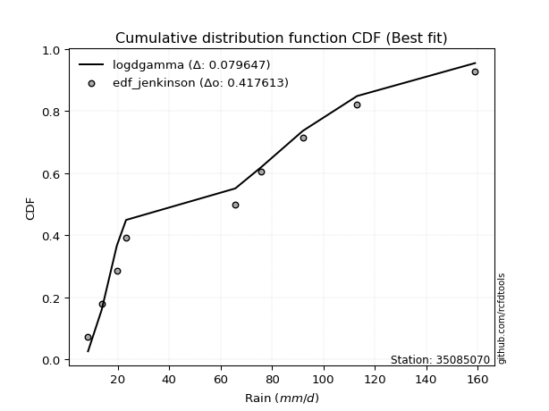</img></img>

</div>


### 11. EDF Cunnane (1978)

Cunnane´s work in statistical hydrology has focused on the performance and evaluation of different probability distributions (such as GEV, Gumbel, Lognormal) for flood frequency estimation. _b_ is a constant, typically set to 0.4.

<div align="center">


$P=(m-b)/(n+1-2b)$


</div>


**11.1. Empirical values**

<div align="center">

|                | 0                   | 1                   | 2                  | 3                  | 4                  | 5                  | 6                  | 7                  |
|:---------------|:--------------------|:--------------------|:-------------------|:-------------------|:-------------------|:-------------------|:-------------------|:-------------------|
| date           | 2023                | 2022                | 2024               | 2017               | 2020               | 2018               | 2021               | 2019               |
| x              | 8.4                 | 13.7                | 19.6               | 65.7               | 75.9               | 92.0               | 113.1              | 159.0              |
| m              | 1                   | 2                   | 3                  | 4                  | 5                  | 6                  | 7                  | 8                  |
| empirical_dist | edf_cunnane         | edf_cunnane         | edf_cunnane        | edf_cunnane        | edf_cunnane        | edf_cunnane        | edf_cunnane        | edf_cunnane        |
| empirical      | 0.07317073170731708 | 0.19512195121951223 | 0.3170731707317074 | 0.4390243902439025 | 0.5609756097560976 | 0.6829268292682927 | 0.8048780487804879 | 0.926829268292683  |
| empirical_tr   | 1.0789473684210527  | 1.2424242424242424  | 1.4642857142857144 | 1.782608695652174  | 2.277777777777778  | 3.153846153846154  | 5.125000000000001  | 13.666666666666675 |

</div>


**11.2. Kolmogorov-Smirnov fit test (sorted by Δ)**


<div align="center">

|                | 0                   | 1                   | 2                   | 3                     | 4                  | 5                  | 6                   | 7                   | 8                  | 9                   | 10                  | 11                  | 12                  | 13                  | 14                 | 15                 | 16                  | 17                 | 18                  | 19                  | 20                  | 21                  | 22                  | 23                  | 24                  | 25                  | 26                 | 27                  | 28                  | 29                  | 30                 | 31                  | 32                  | 33                  | 34                  | 35                  | 36                 | 37                  | 38                 | 39                 | 40                 | 41                 | 42                  | 43                  | 44                 | 45                 | 46                  | 47                  | 48                  | 49                  | 50                  | 51                  | 52                  | 53                 | 54                  | 55                 | 56                  | 57                  | 58                  | 59                  | 60                  | 61                  | 62                  | 63                  | 64                 | 65                  | 66                 | 67                  | 68                  | 69                 | 70                 | 71                 | 72                 | 73                  | 74                 | 75                 | 76                  | 77                  | 78                  | 79                 | 80                 | 81                 | 82                 | 83                  | 84                  | 85                 | 86                 | 87                 |
|:---------------|:--------------------|:--------------------|:--------------------|:----------------------|:-------------------|:-------------------|:--------------------|:--------------------|:-------------------|:--------------------|:--------------------|:--------------------|:--------------------|:--------------------|:-------------------|:-------------------|:--------------------|:-------------------|:--------------------|:--------------------|:--------------------|:--------------------|:--------------------|:--------------------|:--------------------|:--------------------|:-------------------|:--------------------|:--------------------|:--------------------|:-------------------|:--------------------|:--------------------|:--------------------|:--------------------|:--------------------|:-------------------|:--------------------|:-------------------|:-------------------|:-------------------|:-------------------|:--------------------|:--------------------|:-------------------|:-------------------|:--------------------|:--------------------|:--------------------|:--------------------|:--------------------|:--------------------|:--------------------|:-------------------|:--------------------|:-------------------|:--------------------|:--------------------|:--------------------|:--------------------|:--------------------|:--------------------|:--------------------|:--------------------|:-------------------|:--------------------|:-------------------|:--------------------|:--------------------|:-------------------|:-------------------|:-------------------|:-------------------|:--------------------|:-------------------|:-------------------|:--------------------|:--------------------|:--------------------|:-------------------|:-------------------|:-------------------|:-------------------|:--------------------|:--------------------|:-------------------|:-------------------|:-------------------|
| station        | 35085070            | 35085070            | 35085070            | 35085070              | 35085070           | 35085070           | 35085070            | 35085070            | 35085070           | 35085070            | 35085070            | 35085070            | 35085070            | 35085070            | 35085070           | 35085070           | 35085070            | 35085070           | 35085070            | 35085070            | 35085070            | 35085070            | 35085070            | 35085070            | 35085070            | 35085070            | 35085070           | 35085070            | 35085070            | 35085070            | 35085070           | 35085070            | 35085070            | 35085070            | 35085070            | 35085070            | 35085070           | 35085070            | 35085070           | 35085070           | 35085070           | 35085070           | 35085070            | 35085070            | 35085070           | 35085070           | 35085070            | 35085070            | 35085070            | 35085070            | 35085070            | 35085070            | 35085070            | 35085070           | 35085070            | 35085070           | 35085070            | 35085070            | 35085070            | 35085070            | 35085070            | 35085070            | 35085070            | 35085070            | 35085070           | 35085070            | 35085070           | 35085070            | 35085070            | 35085070           | 35085070           | 35085070           | 35085070           | 35085070            | 35085070           | 35085070           | 35085070            | 35085070            | 35085070            | 35085070           | 35085070           | 35085070           | 35085070           | 35085070            | 35085070            | 35085070           | 35085070           | 35085070           |
| empirical_dist | edf_cunnane         | edf_cunnane         | edf_cunnane         | edf_cunnane           | edf_cunnane        | edf_cunnane        | edf_cunnane         | edf_cunnane         | edf_cunnane        | edf_cunnane         | edf_cunnane         | edf_cunnane         | edf_cunnane         | edf_cunnane         | edf_cunnane        | edf_cunnane        | edf_cunnane         | edf_cunnane        | edf_cunnane         | edf_cunnane         | edf_cunnane         | edf_cunnane         | edf_cunnane         | edf_cunnane         | edf_cunnane         | edf_cunnane         | edf_cunnane        | edf_cunnane         | edf_cunnane         | edf_cunnane         | edf_cunnane        | edf_cunnane         | edf_cunnane         | edf_cunnane         | edf_cunnane         | edf_cunnane         | edf_cunnane        | edf_cunnane         | edf_cunnane        | edf_cunnane        | edf_cunnane        | edf_cunnane        | edf_cunnane         | edf_cunnane         | edf_cunnane        | edf_cunnane        | edf_cunnane         | edf_cunnane         | edf_cunnane         | edf_cunnane         | edf_cunnane         | edf_cunnane         | edf_cunnane         | edf_cunnane        | edf_cunnane         | edf_cunnane        | edf_cunnane         | edf_cunnane         | edf_cunnane         | edf_cunnane         | edf_cunnane         | edf_cunnane         | edf_cunnane         | edf_cunnane         | edf_cunnane        | edf_cunnane         | edf_cunnane        | edf_cunnane         | edf_cunnane         | edf_cunnane        | edf_cunnane        | edf_cunnane        | edf_cunnane        | edf_cunnane         | edf_cunnane        | edf_cunnane        | edf_cunnane         | edf_cunnane         | edf_cunnane         | edf_cunnane        | edf_cunnane        | edf_cunnane        | edf_cunnane        | edf_cunnane         | edf_cunnane         | edf_cunnane        | edf_cunnane        | edf_cunnane        |
| p_dist         | mielke              | logloggamma         | ncf                 | loglaplace_asymmetric | logjohnsonsu       | rayleigh           | logweibull_min      | maxwell             | loggumbel_l        | halfnorm            | t                   | truncnorm           | crystalball         | norm                | pearson3           | exponnorm          | f                   | invgamma           | genlogistic         | invweibull          | kstwobign           | laplace_asymmetric  | logfisk             | gumbel_l            | logistic            | logpearson3         | genexpon           | expon               | gumbel_r            | rice                | hypsecant          | loggompertz         | gompertz            | laplace             | halflogistic        | logf                | lognct             | logfatiguelife      | logexponnorm       | lognorm            | lognorm            | logcrystalball     | logt                | moyal               | loggamma           | loggamma           | fisk                | logerlang           | logrice             | logalpha            | nakagami            | invgauss            | logbetaprime        | loginvgamma        | loglogistic         | logncf             | loginvgauss         | logmaxwell          | johnsonsu           | loginvweibull       | lograyleigh         | loghypsecant        | loggenexpon         | logkstwobign        | loghalfnorm        | nct                 | loglaplace         | loggumbel_r         | logexpon            | loghalflogistic    | logmoyal           | betaprime          | weibull_min        | lognakagami         | wald               | gibrat             | alpha               | gamma               | logwald             | loggibrat          | logchi2            | logtruncnorm       | erlang             | loglognorm          | fatiguelife         | logmielke          | chi2               | loggenlogistic     |
| delta          | 0.10453327479585398 | 0.12906935602728156 | 0.13643809816808128 | 0.13661794484795925   | 0.1369197212213128 | 0.1471237709878655 | 0.14773118367680424 | 0.14878362381501156 | 0.1503620721470843 | 0.15364385367650432 | 0.15387695969768994 | 0.15387727478060628 | 0.15387728912208382 | 0.15387729431284325 | 0.154727517472017  | 0.1562916343105989 | 0.15711012124751556 | 0.157111512748496  | 0.15770975158149106 | 0.15792585586332394 | 0.16024929788230086 | 0.16359489203244698 | 0.16963171654531062 | 0.16967149244665178 | 0.17277949248858068 | 0.17558415821753004 | 0.1757833346311347 | 0.17601037536821762 | 0.17856391784152234 | 0.18143304660139215 | 0.1828364399053232 | 0.18384514726345025 | 0.19003510393758025 | 0.19227621245221704 | 0.19843404341650833 | 0.20102312122193644 | 0.2011417509721828 | 0.20123627509716235 | 0.2012834918734554 | 0.2012836235094999 | 0.2012836235094999 | 0.2012836243159899 | 0.20128366699402644 | 0.20204679256047703 | 0.2047724291182067 | 0.2047724291182067 | 0.20732591178109205 | 0.20989095290873416 | 0.21175763870267428 | 0.21557030663445376 | 0.21649303567566514 | 0.21650948149407723 | 0.21680676589497894 | 0.2171692107858919 | 0.21836137323750826 | 0.2192430975126658 | 0.21971651304122353 | 0.22393804365959147 | 0.22584413705055506 | 0.22585677112323432 | 0.23079101747432007 | 0.23177617388283445 | 0.24066582101857648 | 0.24511695878709305 | 0.2506135738513451 | 0.25894862056295154 | 0.2601573460438621 | 0.26273990832781335 | 0.26464838465647567 | 0.2788587375274796 | 0.2831942777813389 | 0.2923808480441351 | 0.2972726764796819 | 0.29752028335929415 | 0.3170731707311054 | 0.3170731707317074 | 0.33525150366291934 | 0.33902514719859755 | 0.34090143154740404 | 0.3731410468840598 | 0.3767517111734413 | 0.3855428417213501 | 0.3879024044958874 | 0.41311502318048077 | 0.43634224246070163 | 0.4714627851654769 | 0.5604714395811811 | 0.8048780487804879 |
| deltao         | 0.4472608134160001  | 0.4472608134160001  | 0.4472608134160001  | 0.4472608134160001    | 0.4472608134160001 | 0.4472608134160001 | 0.4472608134160001  | 0.4472608134160001  | 0.4472608134160001 | 0.4472608134160001  | 0.4472608134160001  | 0.4472608134160001  | 0.4472608134160001  | 0.4472608134160001  | 0.4472608134160001 | 0.4472608134160001 | 0.4472608134160001  | 0.4472608134160001 | 0.4472608134160001  | 0.4472608134160001  | 0.4472608134160001  | 0.4472608134160001  | 0.4472608134160001  | 0.4472608134160001  | 0.4472608134160001  | 0.4472608134160001  | 0.4472608134160001 | 0.4472608134160001  | 0.4472608134160001  | 0.4472608134160001  | 0.4472608134160001 | 0.4472608134160001  | 0.4472608134160001  | 0.4472608134160001  | 0.4472608134160001  | 0.4472608134160001  | 0.4472608134160001 | 0.4472608134160001  | 0.4472608134160001 | 0.4472608134160001 | 0.4472608134160001 | 0.4472608134160001 | 0.4472608134160001  | 0.4472608134160001  | 0.4472608134160001 | 0.4472608134160001 | 0.4472608134160001  | 0.4472608134160001  | 0.4472608134160001  | 0.4472608134160001  | 0.4472608134160001  | 0.4472608134160001  | 0.4472608134160001  | 0.4472608134160001 | 0.4472608134160001  | 0.4472608134160001 | 0.4472608134160001  | 0.4472608134160001  | 0.4472608134160001  | 0.4472608134160001  | 0.4472608134160001  | 0.4472608134160001  | 0.4472608134160001  | 0.4472608134160001  | 0.4472608134160001 | 0.4472608134160001  | 0.4472608134160001 | 0.4472608134160001  | 0.4472608134160001  | 0.4472608134160001 | 0.4472608134160001 | 0.4472608134160001 | 0.4472608134160001 | 0.4472608134160001  | 0.4472608134160001 | 0.4472608134160001 | 0.4472608134160001  | 0.4472608134160001  | 0.4472608134160001  | 0.4472608134160001 | 0.4472608134160001 | 0.4472608134160001 | 0.4472608134160001 | 0.4472608134160001  | 0.4472608134160001  | 0.4472608134160001 | 0.4472608134160001 | 0.4472608134160001 |
| eval           | Δo > Δ              | Δo > Δ              | Δo > Δ              | Δo > Δ                | Δo > Δ             | Δo > Δ             | Δo > Δ              | Δo > Δ              | Δo > Δ             | Δo > Δ              | Δo > Δ              | Δo > Δ              | Δo > Δ              | Δo > Δ              | Δo > Δ             | Δo > Δ             | Δo > Δ              | Δo > Δ             | Δo > Δ              | Δo > Δ              | Δo > Δ              | Δo > Δ              | Δo > Δ              | Δo > Δ              | Δo > Δ              | Δo > Δ              | Δo > Δ             | Δo > Δ              | Δo > Δ              | Δo > Δ              | Δo > Δ             | Δo > Δ              | Δo > Δ              | Δo > Δ              | Δo > Δ              | Δo > Δ              | Δo > Δ             | Δo > Δ              | Δo > Δ             | Δo > Δ             | Δo > Δ             | Δo > Δ             | Δo > Δ              | Δo > Δ              | Δo > Δ             | Δo > Δ             | Δo > Δ              | Δo > Δ              | Δo > Δ              | Δo > Δ              | Δo > Δ              | Δo > Δ              | Δo > Δ              | Δo > Δ             | Δo > Δ              | Δo > Δ             | Δo > Δ              | Δo > Δ              | Δo > Δ              | Δo > Δ              | Δo > Δ              | Δo > Δ              | Δo > Δ              | Δo > Δ              | Δo > Δ             | Δo > Δ              | Δo > Δ             | Δo > Δ              | Δo > Δ              | Δo > Δ             | Δo > Δ             | Δo > Δ             | Δo > Δ             | Δo > Δ              | Δo > Δ             | Δo > Δ             | Δo > Δ              | Δo > Δ              | Δo > Δ              | Δo > Δ             | Δo > Δ             | Δo > Δ             | Δo > Δ             | Δo > Δ              | Δo > Δ              | Δo <= Δ            | Δo <= Δ            | Δo <= Δ            |
| fit            | 1                   | 1                   | 1                   | 1                     | 1                  | 1                  | 1                   | 1                   | 1                  | 1                   | 1                   | 1                   | 1                   | 1                   | 1                  | 1                  | 1                   | 1                  | 1                   | 1                   | 1                   | 1                   | 1                   | 1                   | 1                   | 1                   | 1                  | 1                   | 1                   | 1                   | 1                  | 1                   | 1                   | 1                   | 1                   | 1                   | 1                  | 1                   | 1                  | 1                  | 1                  | 1                  | 1                   | 1                   | 1                  | 1                  | 1                   | 1                   | 1                   | 1                   | 1                   | 1                   | 1                   | 1                  | 1                   | 1                  | 1                   | 1                   | 1                   | 1                   | 1                   | 1                   | 1                   | 1                   | 1                  | 1                   | 1                  | 1                   | 1                   | 1                  | 1                  | 1                  | 1                  | 1                   | 1                  | 1                  | 1                   | 1                   | 1                   | 1                  | 1                  | 1                  | 1                  | 1                   | 1                   | 0                  | 0                  | 0                  |
| n              | 8                   | 8                   | 8                   | 8                     | 8                  | 8                  | 8                   | 8                   | 8                  | 8                   | 8                   | 8                   | 8                   | 8                   | 8                  | 8                  | 8                   | 8                  | 8                   | 8                   | 8                   | 8                   | 8                   | 8                   | 8                   | 8                   | 8                  | 8                   | 8                   | 8                   | 8                  | 8                   | 8                   | 8                   | 8                   | 8                   | 8                  | 8                   | 8                  | 8                  | 8                  | 8                  | 8                   | 8                   | 8                  | 8                  | 8                   | 8                   | 8                   | 8                   | 8                   | 8                   | 8                   | 8                  | 8                   | 8                  | 8                   | 8                   | 8                   | 8                   | 8                   | 8                   | 8                   | 8                   | 8                  | 8                   | 8                  | 8                   | 8                   | 8                  | 8                  | 8                  | 8                  | 8                   | 8                  | 8                  | 8                   | 8                   | 8                   | 8                  | 8                  | 8                  | 8                  | 8                   | 8                   | 8                  | 8                  | 8                  |
| best_fit       | 1                   | 0                   | 0                   | 0                     | 0                  | 0                  | 0                   | 0                   | 0                  | 0                   | 0                   | 0                   | 0                   | 0                   | 0                  | 0                  | 0                   | 0                  | 0                   | 0                   | 0                   | 0                   | 0                   | 0                   | 0                   | 0                   | 0                  | 0                   | 0                   | 0                   | 0                  | 0                   | 0                   | 0                   | 0                   | 0                   | 0                  | 0                   | 0                  | 0                  | 0                  | 0                  | 0                   | 0                   | 0                  | 0                  | 0                   | 0                   | 0                   | 0                   | 0                   | 0                   | 0                   | 0                  | 0                   | 0                  | 0                   | 0                   | 0                   | 0                   | 0                   | 0                   | 0                   | 0                   | 0                  | 0                   | 0                  | 0                   | 0                   | 0                  | 0                  | 0                  | 0                  | 0                   | 0                  | 0                  | 0                   | 0                   | 0                   | 0                  | 0                  | 0                  | 0                  | 0                   | 0                   | 0                  | 0                  | 0                  |
| best_fit_sort  | 1                   | 2                   | 3                   | 4                     | 5                  | 6                  | 7                   | 8                   | 9                  | 10                  | 11                  | 12                  | 13                  | 14                  | 15                 | 16                 | 17                  | 18                 | 19                  | 20                  | 21                  | 22                  | 23                  | 24                  | 25                  | 26                  | 27                 | 28                  | 29                  | 30                  | 31                 | 32                  | 33                  | 34                  | 35                  | 36                  | 37                 | 38                  | 39                 | 40                 | 41                 | 42                 | 43                  | 44                  | 45                 | 46                 | 47                  | 48                  | 49                  | 50                  | 51                  | 52                  | 53                  | 54                 | 55                  | 56                 | 57                  | 58                  | 59                  | 60                  | 61                  | 62                  | 63                  | 64                  | 65                 | 66                  | 67                 | 68                  | 69                  | 70                 | 71                 | 72                 | 73                 | 74                  | 75                 | 76                 | 77                  | 78                  | 79                  | 80                 | 81                 | 82                 | 83                 | 84                  | 85                  | 86                 | 87                 | 88                 |

</div>


**11.3. Best fit**

<div align="center">

|   id |   station | empirical_dist   | p_dist   |    delta |   deltao | eval   |   fit |   n |   best_fit |   best_fit_sort |
|-----:|----------:|:-----------------|:---------|---------:|---------:|:-------|------:|----:|-----------:|----------------:|
|    0 |  35085070 | edf_cunnane      | mielke   | 0.104533 | 0.447261 | Δo > Δ |     1 |   8 |          1 |               1 |

</div>


<div align="center">

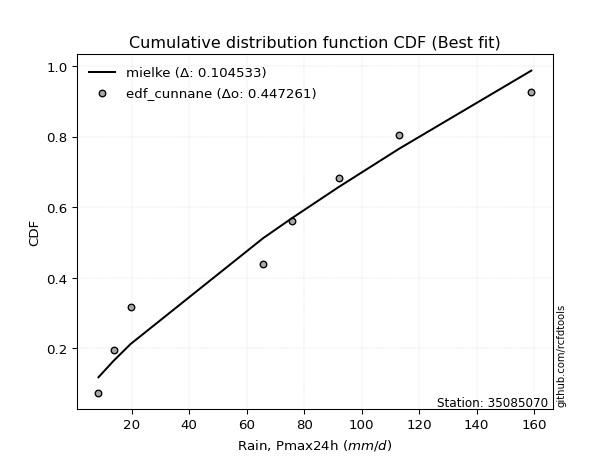</img></img>

</div>


### 12. EDF Adamowski (1981)

The Adamowski formula in hydrology refers to a specific plotting position formula used for estimating the non-parametric empirical distribution of hydrological events (like flood peaks) to calculate their return periods. This formula provides an alternative to traditional parametric methods (like the Gumbel or Log Pearson Type III distributions). 

<div align="center">


$P=(m-0.25)/(n+0.5)$


</div>


**12.1. Empirical values**

<div align="center">

|                | 0                   | 1                   | 2                  | 3                  | 4                  | 5                  | 6                  | 7                  |
|:---------------|:--------------------|:--------------------|:-------------------|:-------------------|:-------------------|:-------------------|:-------------------|:-------------------|
| date           | 2023                | 2022                | 2024               | 2017               | 2020               | 2018               | 2021               | 2019               |
| x              | 8.4                 | 13.7                | 19.6               | 65.7               | 75.9               | 92.0               | 113.1              | 159.0              |
| m              | 1                   | 2                   | 3                  | 4                  | 5                  | 6                  | 7                  | 8                  |
| empirical_dist | edf_adamowski       | edf_adamowski       | edf_adamowski      | edf_adamowski      | edf_adamowski      | edf_adamowski      | edf_adamowski      | edf_adamowski      |
| empirical      | 0.08823529411764706 | 0.20588235294117646 | 0.3235294117647059 | 0.4411764705882353 | 0.5588235294117647 | 0.6764705882352942 | 0.7941176470588235 | 0.9117647058823529 |
| empirical_tr   | 1.096774193548387   | 1.259259259259259   | 1.4782608695652173 | 1.7894736842105263 | 2.2666666666666666 | 3.0909090909090913 | 4.857142857142856  | 11.33333333333333  |

</div>


**12.2. Kolmogorov-Smirnov fit test (sorted by Δ)**


<div align="center">

|                | 0                  | 1                   | 2                  | 3                     | 4                   | 5                   | 6                   | 7                   | 8                   | 9                   | 10                  | 11                 | 12                  | 13                  | 14                 | 15                  | 16                  | 17                  | 18                  | 19                  | 20                  | 21                  | 22                 | 23                  | 24                  | 25                  | 26                 | 27                 | 28                  | 29                  | 30                  | 31                  | 32                  | 33                  | 34                  | 35                 | 36                  | 37                  | 38                  | 39                  | 40                 | 41                  | 42                  | 43                  | 44                  | 45                  | 46                  | 47                  | 48                 | 49                  | 50                  | 51                  | 52                  | 53                  | 54                  | 55                 | 56                  | 57                  | 58                  | 59                  | 60                  | 61                  | 62                 | 63                  | 64                 | 65                  | 66                 | 67                  | 68                 | 69                 | 70                 | 71                  | 72                 | 73                  | 74                  | 75                 | 76                  | 77                  | 78                  | 79                 | 80                 | 81                  | 82                  | 83                  | 84                  | 85                 | 86                 | 87                 |
|:---------------|:-------------------|:--------------------|:-------------------|:----------------------|:--------------------|:--------------------|:--------------------|:--------------------|:--------------------|:--------------------|:--------------------|:-------------------|:--------------------|:--------------------|:-------------------|:--------------------|:--------------------|:--------------------|:--------------------|:--------------------|:--------------------|:--------------------|:-------------------|:--------------------|:--------------------|:--------------------|:-------------------|:-------------------|:--------------------|:--------------------|:--------------------|:--------------------|:--------------------|:--------------------|:--------------------|:-------------------|:--------------------|:--------------------|:--------------------|:--------------------|:-------------------|:--------------------|:--------------------|:--------------------|:--------------------|:--------------------|:--------------------|:--------------------|:-------------------|:--------------------|:--------------------|:--------------------|:--------------------|:--------------------|:--------------------|:-------------------|:--------------------|:--------------------|:--------------------|:--------------------|:--------------------|:--------------------|:-------------------|:--------------------|:-------------------|:--------------------|:-------------------|:--------------------|:-------------------|:-------------------|:-------------------|:--------------------|:-------------------|:--------------------|:--------------------|:-------------------|:--------------------|:--------------------|:--------------------|:-------------------|:-------------------|:--------------------|:--------------------|:--------------------|:--------------------|:-------------------|:-------------------|:-------------------|
| station        | 35085070           | 35085070            | 35085070           | 35085070              | 35085070            | 35085070            | 35085070            | 35085070            | 35085070            | 35085070            | 35085070            | 35085070           | 35085070            | 35085070            | 35085070           | 35085070            | 35085070            | 35085070            | 35085070            | 35085070            | 35085070            | 35085070            | 35085070           | 35085070            | 35085070            | 35085070            | 35085070           | 35085070           | 35085070            | 35085070            | 35085070            | 35085070            | 35085070            | 35085070            | 35085070            | 35085070           | 35085070            | 35085070            | 35085070            | 35085070            | 35085070           | 35085070            | 35085070            | 35085070            | 35085070            | 35085070            | 35085070            | 35085070            | 35085070           | 35085070            | 35085070            | 35085070            | 35085070            | 35085070            | 35085070            | 35085070           | 35085070            | 35085070            | 35085070            | 35085070            | 35085070            | 35085070            | 35085070           | 35085070            | 35085070           | 35085070            | 35085070           | 35085070            | 35085070           | 35085070           | 35085070           | 35085070            | 35085070           | 35085070            | 35085070            | 35085070           | 35085070            | 35085070            | 35085070            | 35085070           | 35085070           | 35085070            | 35085070            | 35085070            | 35085070            | 35085070           | 35085070           | 35085070           |
| empirical_dist | edf_adamowski      | edf_adamowski       | edf_adamowski      | edf_adamowski         | edf_adamowski       | edf_adamowski       | edf_adamowski       | edf_adamowski       | edf_adamowski       | edf_adamowski       | edf_adamowski       | edf_adamowski      | edf_adamowski       | edf_adamowski       | edf_adamowski      | edf_adamowski       | edf_adamowski       | edf_adamowski       | edf_adamowski       | edf_adamowski       | edf_adamowski       | edf_adamowski       | edf_adamowski      | edf_adamowski       | edf_adamowski       | edf_adamowski       | edf_adamowski      | edf_adamowski      | edf_adamowski       | edf_adamowski       | edf_adamowski       | edf_adamowski       | edf_adamowski       | edf_adamowski       | edf_adamowski       | edf_adamowski      | edf_adamowski       | edf_adamowski       | edf_adamowski       | edf_adamowski       | edf_adamowski      | edf_adamowski       | edf_adamowski       | edf_adamowski       | edf_adamowski       | edf_adamowski       | edf_adamowski       | edf_adamowski       | edf_adamowski      | edf_adamowski       | edf_adamowski       | edf_adamowski       | edf_adamowski       | edf_adamowski       | edf_adamowski       | edf_adamowski      | edf_adamowski       | edf_adamowski       | edf_adamowski       | edf_adamowski       | edf_adamowski       | edf_adamowski       | edf_adamowski      | edf_adamowski       | edf_adamowski      | edf_adamowski       | edf_adamowski      | edf_adamowski       | edf_adamowski      | edf_adamowski      | edf_adamowski      | edf_adamowski       | edf_adamowski      | edf_adamowski       | edf_adamowski       | edf_adamowski      | edf_adamowski       | edf_adamowski       | edf_adamowski       | edf_adamowski      | edf_adamowski      | edf_adamowski       | edf_adamowski       | edf_adamowski       | edf_adamowski       | edf_adamowski      | edf_adamowski      | edf_adamowski      |
| p_dist         | mielke             | logloggamma         | ncf                | loglaplace_asymmetric | logjohnsonsu        | loggumbel_l         | rayleigh            | logweibull_min      | maxwell             | halfnorm            | t                   | truncnorm          | crystalball         | norm                | pearson3           | exponnorm           | f                   | invgamma            | genlogistic         | invweibull          | kstwobign           | logfisk             | laplace_asymmetric | logpearson3         | genexpon            | expon               | gumbel_l           | logistic           | loggompertz         | gumbel_r            | rice                | hypsecant           | gompertz            | laplace             | logf                | lognct             | logfatiguelife      | logexponnorm        | lognorm             | lognorm             | logcrystalball     | logt                | loggamma            | loggamma            | halflogistic        | fisk                | logerlang           | moyal               | logrice            | logalpha            | nakagami            | invgauss            | logbetaprime        | loginvgamma         | loglogistic         | logncf             | loginvgauss         | logmaxwell          | johnsonsu           | loginvweibull       | lograyleigh         | loghypsecant        | loggenexpon        | logkstwobign        | loghalfnorm        | nct                 | loglaplace         | loggumbel_r         | logexpon           | loghalflogistic    | logmoyal           | weibull_min         | betaprime          | lognakagami         | wald                | gibrat             | alpha               | gamma               | logwald             | loggibrat          | logchi2            | logtruncnorm        | erlang              | loglognorm          | fatiguelife         | logmielke          | chi2               | loggenlogistic     |
| delta          | 0.1109895158288525 | 0.13552559706028008 | 0.1400379280225718 | 0.14307418588095777   | 0.14337596225431132 | 0.14820999180275152 | 0.15358001202086402 | 0.15418742470980276 | 0.15523986484801008 | 0.16010009470950284 | 0.16033320073068846 | 0.1603335158136048 | 0.16033353015508234 | 0.16033353534584177 | 0.1611837585050155 | 0.16274787534359741 | 0.16356636228051408 | 0.16356775378149452 | 0.16416599261448958 | 0.16438209689632247 | 0.16670553891529938 | 0.16747963620097783 | 0.1700511330654455 | 0.17343207787319725 | 0.17363125428680193 | 0.17385829502388483 | 0.1761277334796503 | 0.1792357335215792 | 0.18169306691911746 | 0.18502015887452086 | 0.18788928763439067 | 0.18929268093832172 | 0.19649134497057877 | 0.19873245348521557 | 0.19887104087760366 | 0.19898967062785   | 0.19908419475282957 | 0.19913141152912262 | 0.19913154316516712 | 0.19913154316516712 | 0.1991315439716571 | 0.19913158664969366 | 0.20262034877387392 | 0.20262034877387392 | 0.20489028444950685 | 0.20517383143675927 | 0.20773887256440138 | 0.20850303359347555 | 0.2096055583583415 | 0.21341822629012097 | 0.21434095533133235 | 0.21435740114974444 | 0.21465468555064615 | 0.21501713044155912 | 0.21620929289317548 | 0.217091017168333  | 0.21756443269689074 | 0.22178596331525868 | 0.22369205670622228 | 0.22370469077890154 | 0.22863893712998729 | 0.22962409353850166 | 0.2385137406742437 | 0.24296487844276027 | 0.2484614935070123 | 0.25679654021861875 | 0.2580052656995293 | 0.26058782798348057 | 0.2624963043121429 | 0.2767066571831468 | 0.2810421974370061 | 0.28220811406935187 | 0.2902287676998023 | 0.29536820301496136 | 0.32352941176410394 | 0.3235294117647059 | 0.33309942331858655 | 0.33687306685426477 | 0.33874935120307126 | 0.370988966539727  | 0.3745996308291085 | 0.38339076137701733 | 0.38575032415155464 | 0.40235462145881656 | 0.42558184073903743 | 0.4693107048211441 | 0.5583193592368483 | 0.7941176470588235 |
| deltao         | 0.4472608134160001 | 0.4472608134160001  | 0.4472608134160001 | 0.4472608134160001    | 0.4472608134160001  | 0.4472608134160001  | 0.4472608134160001  | 0.4472608134160001  | 0.4472608134160001  | 0.4472608134160001  | 0.4472608134160001  | 0.4472608134160001 | 0.4472608134160001  | 0.4472608134160001  | 0.4472608134160001 | 0.4472608134160001  | 0.4472608134160001  | 0.4472608134160001  | 0.4472608134160001  | 0.4472608134160001  | 0.4472608134160001  | 0.4472608134160001  | 0.4472608134160001 | 0.4472608134160001  | 0.4472608134160001  | 0.4472608134160001  | 0.4472608134160001 | 0.4472608134160001 | 0.4472608134160001  | 0.4472608134160001  | 0.4472608134160001  | 0.4472608134160001  | 0.4472608134160001  | 0.4472608134160001  | 0.4472608134160001  | 0.4472608134160001 | 0.4472608134160001  | 0.4472608134160001  | 0.4472608134160001  | 0.4472608134160001  | 0.4472608134160001 | 0.4472608134160001  | 0.4472608134160001  | 0.4472608134160001  | 0.4472608134160001  | 0.4472608134160001  | 0.4472608134160001  | 0.4472608134160001  | 0.4472608134160001 | 0.4472608134160001  | 0.4472608134160001  | 0.4472608134160001  | 0.4472608134160001  | 0.4472608134160001  | 0.4472608134160001  | 0.4472608134160001 | 0.4472608134160001  | 0.4472608134160001  | 0.4472608134160001  | 0.4472608134160001  | 0.4472608134160001  | 0.4472608134160001  | 0.4472608134160001 | 0.4472608134160001  | 0.4472608134160001 | 0.4472608134160001  | 0.4472608134160001 | 0.4472608134160001  | 0.4472608134160001 | 0.4472608134160001 | 0.4472608134160001 | 0.4472608134160001  | 0.4472608134160001 | 0.4472608134160001  | 0.4472608134160001  | 0.4472608134160001 | 0.4472608134160001  | 0.4472608134160001  | 0.4472608134160001  | 0.4472608134160001 | 0.4472608134160001 | 0.4472608134160001  | 0.4472608134160001  | 0.4472608134160001  | 0.4472608134160001  | 0.4472608134160001 | 0.4472608134160001 | 0.4472608134160001 |
| eval           | Δo > Δ             | Δo > Δ              | Δo > Δ             | Δo > Δ                | Δo > Δ              | Δo > Δ              | Δo > Δ              | Δo > Δ              | Δo > Δ              | Δo > Δ              | Δo > Δ              | Δo > Δ             | Δo > Δ              | Δo > Δ              | Δo > Δ             | Δo > Δ              | Δo > Δ              | Δo > Δ              | Δo > Δ              | Δo > Δ              | Δo > Δ              | Δo > Δ              | Δo > Δ             | Δo > Δ              | Δo > Δ              | Δo > Δ              | Δo > Δ             | Δo > Δ             | Δo > Δ              | Δo > Δ              | Δo > Δ              | Δo > Δ              | Δo > Δ              | Δo > Δ              | Δo > Δ              | Δo > Δ             | Δo > Δ              | Δo > Δ              | Δo > Δ              | Δo > Δ              | Δo > Δ             | Δo > Δ              | Δo > Δ              | Δo > Δ              | Δo > Δ              | Δo > Δ              | Δo > Δ              | Δo > Δ              | Δo > Δ             | Δo > Δ              | Δo > Δ              | Δo > Δ              | Δo > Δ              | Δo > Δ              | Δo > Δ              | Δo > Δ             | Δo > Δ              | Δo > Δ              | Δo > Δ              | Δo > Δ              | Δo > Δ              | Δo > Δ              | Δo > Δ             | Δo > Δ              | Δo > Δ             | Δo > Δ              | Δo > Δ             | Δo > Δ              | Δo > Δ             | Δo > Δ             | Δo > Δ             | Δo > Δ              | Δo > Δ             | Δo > Δ              | Δo > Δ              | Δo > Δ             | Δo > Δ              | Δo > Δ              | Δo > Δ              | Δo > Δ             | Δo > Δ             | Δo > Δ              | Δo > Δ              | Δo > Δ              | Δo > Δ              | Δo <= Δ            | Δo <= Δ            | Δo <= Δ            |
| fit            | 1                  | 1                   | 1                  | 1                     | 1                   | 1                   | 1                   | 1                   | 1                   | 1                   | 1                   | 1                  | 1                   | 1                   | 1                  | 1                   | 1                   | 1                   | 1                   | 1                   | 1                   | 1                   | 1                  | 1                   | 1                   | 1                   | 1                  | 1                  | 1                   | 1                   | 1                   | 1                   | 1                   | 1                   | 1                   | 1                  | 1                   | 1                   | 1                   | 1                   | 1                  | 1                   | 1                   | 1                   | 1                   | 1                   | 1                   | 1                   | 1                  | 1                   | 1                   | 1                   | 1                   | 1                   | 1                   | 1                  | 1                   | 1                   | 1                   | 1                   | 1                   | 1                   | 1                  | 1                   | 1                  | 1                   | 1                  | 1                   | 1                  | 1                  | 1                  | 1                   | 1                  | 1                   | 1                   | 1                  | 1                   | 1                   | 1                   | 1                  | 1                  | 1                   | 1                   | 1                   | 1                   | 0                  | 0                  | 0                  |
| n              | 8                  | 8                   | 8                  | 8                     | 8                   | 8                   | 8                   | 8                   | 8                   | 8                   | 8                   | 8                  | 8                   | 8                   | 8                  | 8                   | 8                   | 8                   | 8                   | 8                   | 8                   | 8                   | 8                  | 8                   | 8                   | 8                   | 8                  | 8                  | 8                   | 8                   | 8                   | 8                   | 8                   | 8                   | 8                   | 8                  | 8                   | 8                   | 8                   | 8                   | 8                  | 8                   | 8                   | 8                   | 8                   | 8                   | 8                   | 8                   | 8                  | 8                   | 8                   | 8                   | 8                   | 8                   | 8                   | 8                  | 8                   | 8                   | 8                   | 8                   | 8                   | 8                   | 8                  | 8                   | 8                  | 8                   | 8                  | 8                   | 8                  | 8                  | 8                  | 8                   | 8                  | 8                   | 8                   | 8                  | 8                   | 8                   | 8                   | 8                  | 8                  | 8                   | 8                   | 8                   | 8                   | 8                  | 8                  | 8                  |
| best_fit       | 1                  | 0                   | 0                  | 0                     | 0                   | 0                   | 0                   | 0                   | 0                   | 0                   | 0                   | 0                  | 0                   | 0                   | 0                  | 0                   | 0                   | 0                   | 0                   | 0                   | 0                   | 0                   | 0                  | 0                   | 0                   | 0                   | 0                  | 0                  | 0                   | 0                   | 0                   | 0                   | 0                   | 0                   | 0                   | 0                  | 0                   | 0                   | 0                   | 0                   | 0                  | 0                   | 0                   | 0                   | 0                   | 0                   | 0                   | 0                   | 0                  | 0                   | 0                   | 0                   | 0                   | 0                   | 0                   | 0                  | 0                   | 0                   | 0                   | 0                   | 0                   | 0                   | 0                  | 0                   | 0                  | 0                   | 0                  | 0                   | 0                  | 0                  | 0                  | 0                   | 0                  | 0                   | 0                   | 0                  | 0                   | 0                   | 0                   | 0                  | 0                  | 0                   | 0                   | 0                   | 0                   | 0                  | 0                  | 0                  |
| best_fit_sort  | 1                  | 2                   | 3                  | 4                     | 5                   | 6                   | 7                   | 8                   | 9                   | 10                  | 11                  | 12                 | 13                  | 14                  | 15                 | 16                  | 17                  | 18                  | 19                  | 20                  | 21                  | 22                  | 23                 | 24                  | 25                  | 26                  | 27                 | 28                 | 29                  | 30                  | 31                  | 32                  | 33                  | 34                  | 35                  | 36                 | 37                  | 38                  | 39                  | 40                  | 41                 | 42                  | 43                  | 44                  | 45                  | 46                  | 47                  | 48                  | 49                 | 50                  | 51                  | 52                  | 53                  | 54                  | 55                  | 56                 | 57                  | 58                  | 59                  | 60                  | 61                  | 62                  | 63                 | 64                  | 65                 | 66                  | 67                 | 68                  | 69                 | 70                 | 71                 | 72                  | 73                 | 74                  | 75                  | 76                 | 77                  | 78                  | 79                  | 80                 | 81                 | 82                  | 83                  | 84                  | 85                  | 86                 | 87                 | 88                 |

</div>


**12.3. Best fit**

<div align="center">

|   id |   station | empirical_dist   | p_dist   |   delta |   deltao | eval   |   fit |   n |   best_fit |   best_fit_sort |
|-----:|----------:|:-----------------|:---------|--------:|---------:|:-------|------:|----:|-----------:|----------------:|
|    0 |  35085070 | edf_adamowski    | mielke   | 0.11099 | 0.447261 | Δo > Δ |     1 |   8 |          1 |               1 |

</div>


<div align="center">

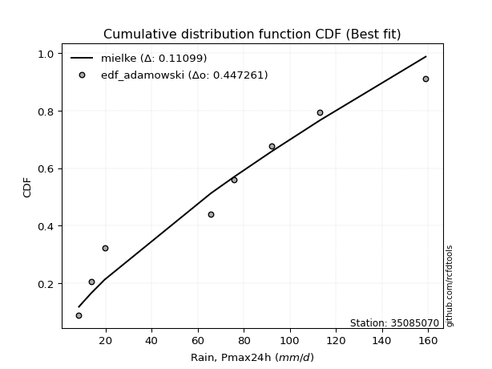</img></img>

</div>


## C. Best fit & Estimate extreme values for specific return periods - Tr

Best fit in probability distribution analysis means finding the theoretical distribution (like Normal, Poisson, Exponential) that most accurately mirrors your real-world data´s patterns (shape, center, spread) for better predictions, using methods like visual checks (Q-Q plots), goodness-of-fit tests (Kolmogorov-Smirnov, Chi-Squared), and information criteria (AIC) to score and select the simplest, most representative model.


### 1. Best fit (ordered by delta Δ)

<div align="center">

|   id |   station | empirical_dist   | p_dist   |     delta |   deltao | eval   |   fit |   n |   best_fit |   best_fit_sort |
|-----:|----------:|:-----------------|:---------|----------:|---------:|:-------|------:|----:|-----------:|----------------:|
|    0 |  35085070 | edf_hazen        | mielke   | 0.0999601 | 0.447261 | Δo > Δ |     1 |   8 |          1 |               1 |
|    1 |  35085070 | edf_gringorten   | mielke   | 0.102731  | 0.447261 | Δo > Δ |     1 |   8 |          1 |               2 |
|    2 |  35085070 | edf_cunnane      | mielke   | 0.104533  | 0.447261 | Δo > Δ |     1 |   8 |          1 |               3 |
|    3 |  35085070 | edf_blom         | mielke   | 0.105642  | 0.447261 | Δo > Δ |     1 |   8 |          1 |               4 |
|    4 |  35085070 | edf_tukey        | mielke   | 0.10746   | 0.447261 | Δo > Δ |     1 |   8 |          1 |               5 |
|    5 |  35085070 | edf_filliben     | mielke   | 0.108142  | 0.447261 | Δo > Δ |     1 |   8 |          1 |               6 |
|    6 |  35085070 | edf_beard        | mielke   | 0.108462  | 0.447261 | Δo > Δ |     1 |   8 |          1 |               7 |
|    7 |  35085070 | edf_jenkinson    | mielke   | 0.108462  | 0.447261 | Δo > Δ |     1 |   8 |          1 |               8 |
|    8 |  35085070 | edf_chegodayev   | mielke   | 0.108889  | 0.447261 | Δo > Δ |     1 |   8 |          1 |               9 |
|    9 |  35085070 | edf_adamowski    | mielke   | 0.11099   | 0.447261 | Δo > Δ |     1 |   8 |          1 |              10 |
|   10 |  35085070 | edf_weibull      | mielke   | 0.120793  | 0.447261 | Δo > Δ |     1 |   8 |          1 |              11 |
|   11 |  35085070 | edf_california   | logalpha | 0.154595  | 0.447261 | Δo > Δ |     1 |   8 |          1 |              12 |

</div>

:file_folder:Tables: [bestfit_35085070.csv](table/bestfit_35085070.csv) | [extreme_35085070.csv](table/extreme_35085070.csv)


### 2. Extreme values

In hydrology, a return period (or recurrence interval $Tr$) is the statistical average time between extreme events like floods or droughts of a specific magnitude, indicating how rare an event is, with a 100-year flood, for example, having a 1% chance of occurring in any given year, not that it happens exactly every century. It is a key tool for infrastructure design (like bridges or dams) and risk assessment, calculated from historical data to determine the probability of future events, although it is important to remember it is statistical average, and events can cluster or be missed.

> risk_rate: assuming the return period as the project useful life.

|   id |      tr |   prob_l |     prob_g |      alpha |   betaprime |    chi2 |   crystalball |   erlang |    expon |   exponnorm |        f |   fatiguelife |       fisk |    gamma |   genexpon |   genlogistic |   gibrat |   gompertz |   gumbel_l |   gumbel_r |   halflogistic |   halfnorm |   hypsecant |   invgamma |   invgauss |   invweibull |   johnsonsu |   kstwobign |   laplace |   laplace_asymmetric |   loggamma |   logistic |   lognorm |   maxwell |   mielke |    moyal |   nakagami |      ncf |         nct |     norm |   pearson3 |   rayleigh |     rice |        t |   truncnorm |     wald |      weibull_min |   logalpha |   logbetaprime |     logchi2 |   logcrystalball |   logerlang |    logexpon |   logexponnorm |      logf |   logfatiguelife |   logfisk |   loggenexpon |   loggenlogistic |   loggibrat |   loggompertz |   loggumbel_l |   loggumbel_r |   loghalflogistic |   loghalfnorm |   loghypsecant |   loginvgamma |   loginvgauss |   loginvweibull |   logjohnsonsu |   logkstwobign |   loglaplace |   loglaplace_asymmetric |   logloggamma |   loglogistic |     loglognorm |   logmaxwell |   logmielke |   logmoyal |   lognakagami |    logncf |    lognct |   logpearson3 |   lograyleigh |   logrice |      logt |   logtruncnorm |    logwald |   logweibull_min |   station |   n |   risk_rate |
|-----:|--------:|---------:|-----------:|-----------:|------------:|--------:|--------------:|---------:|---------:|------------:|---------:|--------------:|-----------:|---------:|-----------:|--------------:|---------:|-----------:|-----------:|-----------:|---------------:|-----------:|------------:|-----------:|-----------:|-------------:|------------:|------------:|----------:|---------------------:|-----------:|-----------:|----------:|----------:|---------:|---------:|-----------:|---------:|------------:|---------:|-----------:|-----------:|---------:|---------:|------------:|---------:|-----------------:|-----------:|---------------:|------------:|-----------------:|------------:|------------:|---------------:|----------:|-----------------:|----------:|--------------:|-----------------:|------------:|--------------:|--------------:|--------------:|------------------:|--------------:|---------------:|--------------:|--------------:|----------------:|---------------:|---------------:|-------------:|------------------------:|--------------:|--------------:|---------------:|-------------:|------------:|-----------:|--------------:|----------:|----------:|--------------:|--------------:|----------:|----------:|---------------:|-----------:|-----------------:|----------:|----:|------------:|
|    0 |    2    | 0.5      | 0.5        |    27.9064 |     29.0868 | 11.3347 |       68.425  |  23.872  |  50.0062 |     66.6911 |  57.4884 |       8.40003 |    36.4751 |  30.8289 |    50.0319 |       59.5512 |  53.4917 |    58.6266 |    76.5981 |    60.2519 |        56.1886 |    58.2412 |      68.425 |    57.4886 |    44.1016 |      59.5371 |     38.9615 |     59.4956 |   68.425  |              67.0847 |    44.6741 |    68.425  |   45.5737 |   64.1701 |  63.5607 |  57.6133 |    32.7915 |  55.7519 |     32.4505 |  68.425  |    65.4914 |     62.661 |  64.8925 |  68.4249 |     68.425  |  52.2981 |     31.5331      |    42.813  |        41.3861 |     15.1195 |          45.5737 |     44.0254 |     27.1238 |        45.5737 |   45.596  |          45.6013 |   49.9022 |       34.9661 |          inf     |     33.5732 |       48.5632 |       53.8703 |       38.5547 |           35.4784 |       37.001  |        45.5737 |       42.8335 |       41.9923 |         38.731  |        63.7474 |        36.2404 |      45.5737 |                 63.4601 |       66.7441 |       45.5737 |   8.55895      |      41.7734 |      8.4    |    36.5282 |       29.836  |   41.7623 |   45.5683 |       49.3196 |       40.5031 |   43.485  |   45.5737 |        23.8995 |    32.7638 |          55.1695 |  35085070 |   8 |    0.75     |
|    1 |    2.33 | 0.570815 | 0.429185   |    33.215  |     36.8315 | 12.2582 |       77.3029 |  29.1387 |  59.1732 |     75.4197 |  66.2287 |       9.89739 |    47.7408 |  37.0571 |    59.2046 |       68.244  |  57.9889 |    67.8152 |    84.322  |    68.4782 |        64.6466 |    67.8228 |      75.53  |    66.2289 |    52.6982 |      68.2226 |     48.274  |     68.2828 |   73.7975 |              73.6353 |    53.7998 |    76.2471 |   54.6529 |   73.3936 |  76.043  |  65.4006 |    45.3121 |  65.0556 |     40.4057 |  77.3029 |    74.4088 |     72.021 |  73.6409 |  77.3028 |     77.3029 |  58.1195 |     73.6851      |    51.7744 |        50.6142 |     18.4371 |          54.6529 |     53.0236 |     35.1167 |        54.6529 |   54.6841 |          54.6703 |   59.5997 |       43.9571 |          inf     |     36.8096 |       57.8053 |       63.0948 |       45.6233 |           42.1825 |       45.0158 |        52.7056 |       51.6922 |       50.8951 |         47.8587 |        74.2397 |        44.7334 |      50.8698 |                 73.9296 |       78.7909 |       53.4847 |   9.81783      |      50.4511 |      8.4    |    42.8386 |       36.336  |   50.7192 |   54.6595 |       58.8829 |       49.0537 |   52.5242 |   54.6529 |        28.7709 |    36.9087 |          64.5061 |  35085070 |   8 |    0.729209 |
|    2 |    5    | 0.8      | 0.2        |    74.3783 |     87.6712 | 17.4202 |      110.296  |  59.4608 | 105.007  |    108.923  | 105.941  |      41.7054  |   153.139  |  70.399  |   105.066  |      106.005  |  83.8805 |   107.063  |   109.275  |   104.217  |       102.917  |   108.342  |     104.03  |   105.941  |   101.188  |     105.956  |    112.71   |    105.609  |  100.659  |             106.387  |   108.844  |   106.449  |  107.356  |  109.697  | 119.871  | 101.472  |   120.648  | 106.528  |    114.611  | 110.296  |   109.212  |    109.493 | 108.625  | 110.296  |    110.296  |  90.7074 |   1872.43        |   108.153  |       113.701  |     57.5565 |         107.356  |    107.226  |    127.734  |       107.356  |  107.502  |         107.37   |  118.313  |      117.054  |          inf     |     62.5278 |      105.164  |      105.136  |       94.7996 |           92.3112 |      103.148  |        94.4362 |      106.737  |      108.382  |        120.012  |       113.171  |       109.407  |      88.1415 |                109.098  |      120.259  |       99.2293 |   7.16135e+178 |     106.048  |     29.8692 |    89.6209 |       89.3291 |  110.438  |  107.487  |      108.954  |      105.607  |  107.658  |  107.355  |        59.7023 |    71.9023 |         106.896  |  35085070 |   8 |    0.67232  |
|    3 |   10    | 0.9      | 0.1        |   150.005  |    151.553  | 22.5487 |      132.182  |  90.2697 | 146.613  |    132.483  | 140.367  |      85.6242  |   386.177  | 102.425  |   146.698  |      136.757  | 113.394  |   135.764  |   123.167  |   133.326  |       134.7    |   138.325  |     126.788 |   140.367  |   153.068  |     136.69   |    203.346  |    134.029  |  125.043  |             136.118  |   175.831  |   128.692  |  168.009  |  135.245  | 140.437  | 132.878  |   189.126  | 140.629  |    289.376  | 132.182  |   133.771  |    136.212 | 133.526  | 132.182  |    132.182  | 125.291  |  12055.6         |   181.343  |       205.464  |    182.472  |         168.009  |    173.043  |    412.456  |       168.01   |  168.401  |         168.143  |  196.04   |      248.233  |          inf     |    114.386  |      149.337  |      139.706  |      171.99   |          176.893  |      190.512  |       150.45   |      176.875  |      185.778  |        253.758  |       136.417  |       216.157  |     145.172  |                129.567  |      139.379  |      156.428  | inf            |     178.877  |     60.2186 |   170.419  |      179.435  |  195.111  |  168.369  |      157.998  |      182.45   |  174.894  |  168.009  |        91.2049 |   145.912  |         141.61   |  35085070 |   8 |    0.651322 |
|    4 |   15    | 0.933333 | 0.0666667  |   225.362  |    197.819  | 25.6605 |      143.104  | 109.127  | 170.951  |    144.819  | 160.671  |     114.348   |   645.555  | 121.6    |   171.051  |      154.107  | 133.751  |   150.394  |   129.459  |   149.749  |       152.686  |   153.929  |     139.775 |   160.671  |   186.521  |     154.03   |    274.238  |    149.116  |  139.306  |             153.509  |   224.194  |   140.811  |  210.086  |  148.354  | 147.469  | 151.105  |   226.448  | 159.833  |    496.743  | 143.104  |   146.473  |    149.978 | 146.34   | 143.104  |    143.104  | 147.499  |  28057           |   236.819  |       280.709  |    369.498  |         210.086  |    220.481  |    818.776  |       210.087  |  210.705  |         210.371  |  258.129  |      371.573  |          inf     |    173.499  |      175.563  |      158.902  |      240.689  |          255.597  |      262.174  |       196.253  |      229.299  |      245.944  |        387.161  |       146.785  |       310.287  |     194.378  |                143.033  |      145.875  |      200.455  | inf            |     233.911  |     80.2073 |   247.458  |      258.986  |  263.686  |  210.643  |      188.194  |      241.818  |  223.217  |  210.086  |       107.681  |   229.856  |         160.844  |  35085070 |   8 |    0.644736 |
|    5 |   20    | 0.95     | 0.05       |   300.653  |    235.199  | 27.9046 |      150.256  | 122.776  | 188.219  |    153.159  | 175.295  |     135.614   |   922.824  | 135.347  |   188.33   |      166.254  | 149.719  |   160.002  |   133.375  |   161.248  |       165.287  |   164.331  |     148.938 |   175.295  |   211.5    |     166.171  |    333.958  |    159.279  |  149.427  |             165.849  |   263.212  |   149.187  |  243.199  |  157.053  | 151.016  | 164.013  |   251.635  | 173.257  |    728.717  | 150.256  |   154.955  |    159.128 | 154.851  | 150.257  |    150.256  | 164.048  |  47472.8         |   283.006  |       346.476  |    615.618  |         243.199  |    258.712  |   1331.83   |       243.2    |  244.024  |         243.638  |  312.194  |      488.723  |          inf     |    240.557  |      194.315  |      172.161  |      304.544  |          330.787  |      324.369  |       236.724  |      272.548  |      296.819  |        520.42   |       153.089  |       395.841  |     239.104  |                153.429  |      149.146  |      237.934  | inf            |     279.49   |     93.5829 |   322.27   |      331.013  |  323.289  |  243.931  |      210.243  |      291.614  |  262.027  |  243.199  |       117.743  |   322.502  |         174.113  |  35085070 |   8 |    0.641514 |
|    6 |   25    | 0.96     | 0.04       |   375.918  |    267.059  | 29.6624 |      155.522  | 133.491  | 201.613  |    159.451  | 186.802  |     152.511   |  1213.93   | 146.078  |   201.732  |      175.611  | 163.032  |   167.068  |   136.162  |   170.106  |       174.996  |   172.072  |     156.028 |   186.801  |   231.532  |     175.522  |    386.265  |    166.892  |  157.276  |             175.42   |   296.411  |   155.595  |  270.866  |  163.512  | 153.154  | 174.018  |   270.468  | 183.587  |    980.918  | 155.522  |   161.281  |    165.927 | 161.171  | 155.522  |    155.522  | 177.304  |  69022.7         |   323.235  |       405.816  |    918.995  |         270.866  |    291.214  |   1942.37   |       270.867  |  271.88   |         271.457  |  361.081  |      600.929  |          inf     |    315.887  |      208.936  |      182.264  |      365.061  |          403.491  |      380.037  |       273.691  |      309.963  |      341.633  |        653.588  |       157.481  |       475.047  |     280.77   |                162.009  |      151.115  |      271.271  | inf            |     318.981  |    103.029  |   395.493  |      397.406  |  376.897  |  271.756  |      227.684  |      335.14   |  294.917  |  270.865  |       124.514  |   422.997  |         184.218  |  35085070 |   8 |    0.639603 |
|    7 |   50    | 0.98     | 0.02       |   752.121  |    384.308  | 35.1999 |      170.599  | 167.352  | 243.219  |    178.298  | 223.669  |     206.724   |  2813.21   | 179.717  |   243.364  |      204.435  | 209.958  |   187.176  |   143.727  |   197.391  |       204.911  |   194.569  |     178.013 |   223.668  |   297.058  |     204.33   |    586.949  |    189.246  |  181.66   |             205.151  |   417.823  |   175.172  |  368.765  |  182.243  | 157.459  | 205.079  |   325.413  | 215.383  |   2469.08   | 170.599  |   179.788  |    185.661 | 179.502  | 170.6    |    170.599  | 220.584  | 190662           |   476.975  |       647.694  |   3258.35   |         368.765  |    409.904  |   6271.97   |       368.766  |  370.559  |         370.038  |  563.168  |     1111.29   |          inf     |    825.254  |      254.726  |      212.78   |      638.046  |          744.2    |      602.23   |       429.18   |      451.112  |      516.403  |       1318.62   |       168.9    |       811.621  |     462.439  |                191.846  |      155.069  |      404.942  | inf            |     467.985  |    125.931  |   746.757  |      676.4    |  594.639  |  370.284  |      283.593  |      501.893  |  414.183  |  368.764  |       140.07   |  1025.58   |         214.701  |  35085070 |   8 |    0.63583  |
|    8 |   75    | 0.986667 | 0.0133333  |  1128.27   |    467.798  | 38.483  |      178.689  | 187.487  | 267.557  |    188.996  | 246.165  |     239.374   |  4576.25   | 199.568  |   267.717  |      221.188  | 241.652  |   197.841  |   147.552  |   213.25   |       222.3    |   206.816  |     190.861 |   246.163  |   337.45   |     221.074  |    735.292  |    201.546  |  195.924  |             222.543  |   503.309  |   186.479  |  435.158  |  192.427  | 158.924  | 223.243  |   355.346  | 233.877  |   4236.82   | 178.689  |   189.958  |    196.398 | 189.464  | 178.69   |    178.689  | 247.216  | 318726           |   590.857  |       840.014  |   6914.27   |         435.158  |    493.33   |  12450.6    |       435.159  |  437.568  |         437.011  |  727.993  |     1567.29   |          inf     |   1578.59   |      281.748  |      230.106  |      882.661  |         1062.26   |      773.749  |       558.237  |      554.115  |      648.776  |       1982.86   |       174.342  |      1089.78   |     619.181  |                211.786  |      156.392  |      510.367  | inf            |     576.418  |    134.987  |  1082.94   |      903.545  |  767.536  |  437.158  |      317.403  |      625.212  |  497.242  |  435.157  |       145.957  |  1768.71   |         231.988  |  35085070 |   8 |    0.634587 |
|    9 |  100    | 0.99     | 0.01       |  1504.41   |    534.846  | 40.8283 |      184.161  | 201.891  | 284.825  |    196.495  | 262.599  |     262.866   |  6453.84   | 213.715  |   284.996  |      233.045  | 266.204  |   204.99   |   150.054  |   224.474  |       234.608  |   215.159  |     199.974 |   262.597  |   366.925  |     232.925  |    856.556  |    209.973  |  206.044  |             234.882  |   571.278  |   194.463  |  486.716  |  199.363  | 159.689  | 236.129  |   375.717  | 246.987  |   6214.74   | 184.161  |   196.933  |    203.712 | 196.247  | 184.162  |    184.161  | 266.634  | 446047           |   684.419  |      1005.18   |  11843.2    |         486.716  |    559.588  |  20252.3    |       486.717  |  489.645  |         489.077  |  872.652  |     1988.55   |          inf     |   2609.01   |      301.016  |      242.195  |     1110.57   |         1366.51   |      917.791  |       672.684  |      637.917  |      759.037  |       2646.6    |       177.763  |      1333.6    |     761.654  |                227.178  |      157.054  |      600.939  | inf            |     664.33   |    139.825  |  1409.7    |     1100.49   |  916.133  |  489.116  |      341.837  |      726.16   |  562.777  |  486.714  |       149.052  |  2631.62   |         244.04   |  35085070 |   8 |    0.633968 |
|   10 |  200    | 0.995    | 0.005      |  3008.93   |    727.723  | 46.5246 |      196.572  | 236.934  | 326.431  |    214.374  | 303.982  |     320.372   | 14730.6    | 247.982  |   326.628  |      261.551  | 333.001  |   220.979  |   155.493  |   251.459  |       264.197  |   234.24   |     221.929 |   303.98   |   440.417  |     261.416  |   1211.69   |    229.382  |  230.428  |             264.613  |   763.195  |   213.613  |  627.452  |  215.233  | 160.994  | 267.177  |   422.205  | 278.625  |  15642.6    | 196.572  |   213.043  |    220.448 | 211.755  | 196.574  |    196.572  | 315      | 926083           |   961.721  |      1527.08   |  43850.1    |         627.452  |    746.375  |  65395.3    |       627.453  |  631.964  |         631.432  | 1347.91   |     3469.01   |          inf     |  10236.1    |      347.734  |      270.708  |     1929.14   |         2503.69   |     1356.19   |      1054.22   |      882.691  |     1092.29   |       5298.47   |       184.789  |      2123.23   |    1254.47   |                269.017  |      158.048  |      889.246  | inf            |     919.226  |    147.498  |  2661.03   |     1727.05   | 1387.27   |  631.046  |      402.062  |     1022.75   |  745.631  |  627.449  |       153.896  |  7080.55   |         272.442  |  35085070 |   8 |    0.633042 |
|   11 |  250    | 0.996    | 0.004      |  3761.18   |    800.656  | 48.3702 |      200.365  | 248.303  | 339.826  |    220.095  | 317.884  |     339.113   | 19201.2    | 259.06   |   340.031  |      270.715  | 356.968  |   225.796  |   157.093  |   260.134  |       273.71   |   240.11   |     228.997 |   317.882  |   464.75   |     270.575  |   1347.35   |    235.389  |  238.278  |             274.184  |   834.361  |   219.761  |  678.092  |  220.118  | 161.318  | 277.171  |   436.47   | 288.845  |  21055.4    | 200.365  |   218.046  |    225.6   | 216.525  | 200.367  |    200.365  | 331.002  |      1.14815e+06 |  1069.11   |      1740.58   |  67046.9    |         678.092  |    815.54   |  95374.2    |       678.094  |  683.227  |         682.731  | 1549.82   |     4130.93   |          inf     |  16716.3    |      362.857  |      279.719  |     2303.89   |         3041.73   |     1529.29   |      1218.26   |      976.247  |     1223.53   |       6623.18   |       186.744  |      2451.89   |    1473.07   |                284.062  |      158.248  |     1008.46   | inf            |    1015.87   |    149.096  |  3264.94   |     1983.67   | 1580.9    |  682.149  |      421.818  |     1136.46   |  812.682  |  678.089  |       154.895  |  9823.61   |         281.412  |  35085070 |   8 |    0.632858 |
|   12 |  500    | 0.998    | 0.002      |  7522.44   |   1067.88   | 54.1334 |      211.613  | 283.843  | 381.432  |    237.811  | 363.043  |     397.904   | 43690.4    | 293.593  |   381.662  |      299.159  | 439.797  |   239.879  |   161.68   |   287.06   |       303.235  |   257.613  |     250.95  |   363.04   |   542.167  |     299.004  |   1846.24   |    253.39   |  262.662  |             303.915  |  1088.78   |   238.828  |  853.596  |  234.696  | 162.171  | 308.218  |   478.886  | 320.764  |  52996.7    | 211.613  |   233.105  |    240.972 | 230.748  | 211.616  |    211.613  | 381.88   |      2.12619e+06 |  1471.3    |      2587.8    | 252812      |         853.596  |   1062.44   | 307966      |       853.598  |  861.078  |         860.788  | 2389.35   |     7021.97   |          158.61  |  91051      |      410.066  |      307.249  |     3997.22   |         5565.67   |     2187.92   |      1909.17   |     1321.68   |     1723.57   |      13239.6    |       192.049  |      3774.11   |    2426.21   |                336.377  |      158.646  |     1489.75   | inf            |    1368.96   |    152.379  |  6163.01   |     2997.05   | 2354.84   |  859.369  |      484.165  |     1556.55   | 1049.45   |  853.591  |       156.926  | 27825      |         308.794  |  35085070 |   8 |    0.632489 |
|   13 |  750    | 0.998667 | 0.00133333 | 11283.7    |   1257.54   | 57.5233 |      217.862  | 304.771  | 405.77   |    248.155  | 390.941  |     432.64    | 70635.3    | 313.867  |   406.016  |      315.788  | 494.575  |   247.565  |   164.132  |   302.801  |       320.495  |   267.39   |     263.792 |   390.937  |   588.614  |     315.623  |   2199.63   |    263.502  |  276.926  |             321.307  |  1263.71   |   249.968  |  970.026  |  242.849  | 162.606  | 326.379  |   502.503  | 339.588  |  90939.3    | 217.862  |   241.614  |    249.567 | 238.695  | 217.864  |    217.862  | 412.386  |      2.95544e+06 |  1763.18   |      3243.48   | 552304      |         970.026  |   1231.9    | 611350      |       970.028  |  979.211  |         979.124  | 3076.92   |     9506.79   |          158.742 | 279335      |      437.836  |      323.056  |     5516.32   |         7923.46   |     2672.55   |      2482.98   |     1568.23   |     2093.44   |      19848.4    |       194.698  |      4808.87   |    3248.57   |                371.338  |      158.778  |     1871.17   | inf            |    1617.52   |    153.545  |  8937.03   |     3773.22   | 2959.95   |  977.025  |      521.239  |     1855.9    | 1209.86   |  970.02   |       157.612  | 51944.8    |         324.506  |  35085070 |   8 |    0.632366 |
|   14 | 1000    | 0.999    | 0.001      | 15044.9    |   1409.65   | 59.9357 |      222.164  | 319.673  | 423.038  |    255.49   | 411.443  |     457.418   | 99308.7    | 328.281  |   423.294  |      327.583  | 536.494  |   252.797  |   165.782  |   313.967  |       332.739  |   274.143  |     272.904 |   411.439  |   622.036  |     327.412  |   2481.66   |    270.508  |  287.046  |             333.646  |  1400.89   |   257.868  | 1059.29   |  248.485  | 162.898  | 339.265  |   518.779  | 353.025  | 133393      | 222.164  |   247.533  |    255.507 | 244.184  | 222.167  |    222.164  | 434.329  |      3.68876e+06 |  2000.19   |      3797.89   | 963450      |        1059.29   |   1364.66   | 994428      |      1059.3    | 1069.85   |        1069.96   | 3681.36   |    11752.2    |          158.808 | 658688      |      457.603  |      334.151  |     6932.35   |        10179.5    |     3068.57   |      2991.91   |     1766.27   |     2397.34   |      26452.3    |       196.407  |      5687.79   |    3996.06   |                398.326  |      158.845  |     2199.48   | inf            |    1815.23   |    154.178  | 11633.5    |     4423.23   | 3475.63   | 1067.27   |      547.774  |     2095.77   | 1334.43   | 1059.29   |       157.958  | 81387.4    |         335.528  |  35085070 |   8 |    0.632305 |

<div align="center">

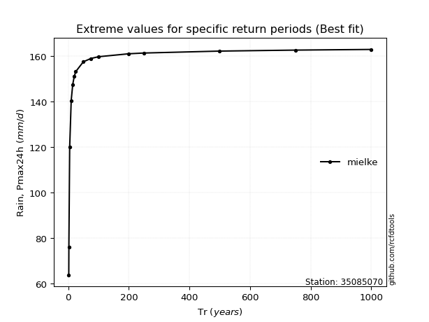</img>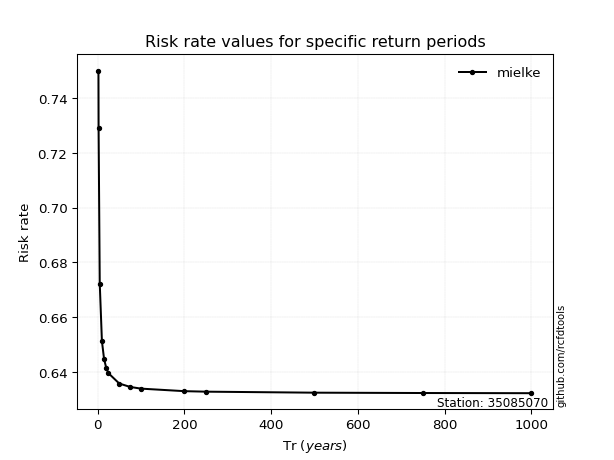</img>

</div>


<sub>**APP DISCLAIMER**: NO WARRANTY - This software is provided by [github.com/rcfdtools](https://github.com/rcfdtools) "as is", without any express or implied warranty, including warranties of merchantability, fitness for a particular purpose, or non-infringement. There is no guarantee that the software will be error-free or operate without interruption. LIMITATION OF LIABILITY - Neither the authors nor copyright holders will be liable for claims or damages arising from the software or its use. You are responsible for determining if the software is appropriate for your use and assume all associated risks, including errors, legal compliance, and data loss. NO PROFESSIONAL ADVICE - The software provides general information and does not offer professional advice. It should not replace consultation with professional advisors.</sub>