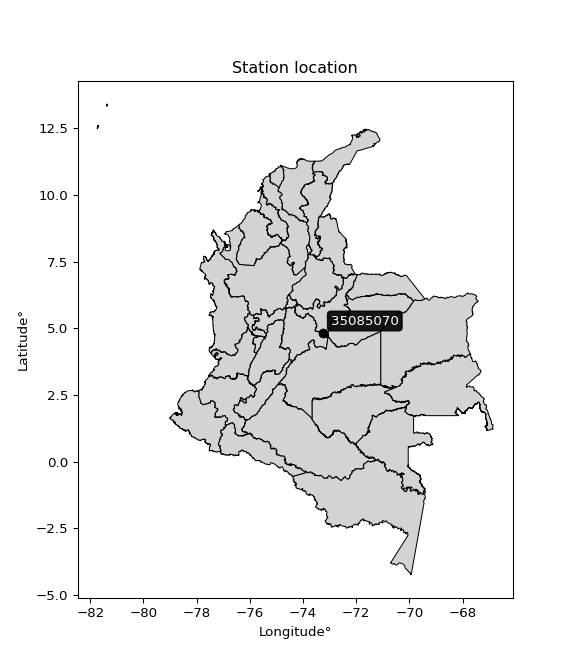

<div align="center">


</div>

# PMax24h Station (Rain, Pmax24h): 35085070

Maximum Precipitation in 24 hours (PMax24h) is the greatest amount of rainfall for a specific duration that is meteorologically possible for a given location, acting as a "worst-case" scenario for extreme storms, crucial for designing safety-critical infrastructure like bridges, river deviations, dams, spillways, and nuclear plants to prevent catastrophic failure. The PMax24h is related with the Probable Maximum Precipitation (PMP) and it is calculated by hydrologists using meteorological data to determine the upper limit of extreme rainfall, often leading to the Probable Maximum Flood (PMF) for flood control design, and is increasingly being studied for climate change impacts. Probable Maximum Precipitation (PMP) is the theoretical upper limit of rainfall, a deterministic estimate for extreme events, while probability distributions (like GEV, Gumbel) describe the likelihood and frequency of various precipitation amounts, including rare ones, showing how often events occur, with PMP representing the extreme end of these distributions, used for critical infrastructure design to ensure safety against the worst conceivable weather, unlike standard statistical forecasts which cover typical probabilities.

The most common probability distributions in hydrology, used for analyzing floods, rainfall, and streamflow, include the Normal, Log-Normal, Gumbel, Gamma (including Log-Pearson Type III), and Generalized Extreme Value (GEV) distributions, often chosen based on the data´s skewness and whether modeling extremes or general conditions, with Gumbel and GEV popular for extreme events like floods, while the Normal distribution serves as a baseline, though often requiring transformations for skewed hydrological data. These distributions help in designing water infrastructure, managing water resources, and forecasting hydrologic events.

> Hydrological data often isn´t perfectly normal (it´s skewed), so different distributions are needed for different applications, such as: **Flood Frequency Analysis**: Using Gumbel, GEV, or Log-Pearson Type III for predicting extreme flood magnitudes and their return periods, **Rainfall Analysis**: Normal for annual totals, but Log-Normal, Weibull, or GEV for intensity or extreme daily rainfall, **Streamflow Modeling**: Gamma and Log-Normal for maximum flows, GEV for minimum flows, and Kappa for daily flows.

<div align="center">

</img>

</div>


## A. General information


### 1. General running parameters

• app_version: _v20260225_. • runtime: _2026-02-27 14:50:08.749431_. • Python version: _3.14.0_. • SciPy version: _1.16.3_. • Pandas version: _2.3.3_. • NumPy version: _2.3.5_. • Stations dataset (station_dataset_file): _dataset/pmax24h_in/automatic_colombia_2003_2025.csv_. • Stations catalog (station_catalog_file): _dataset/CNE.xls_. • Minimum year to eval til year_max (date_min): _1900_. • Maximum year to eval since year_min (date_max): _2025_. • Creates, save and include plots into reports (create_plot): _False_. • Plot only fit distributions with Δo > Δ (plot_only_fit): _True_. • Plot only simple graphs avoiding multiple CDFs and multiple Extreme values plots (plot_only_simple): _False_. • Eval low extreme values, if False, evaluates high extreme values (low_extreme): _False_. • Eval every SciPy distribution as logarithmic (pdist_logarithmic_on): _True_. • Standard deviation normalized (ddof): _1.0_. • Return periods to eval in years (Tr): _[2, 2.33, 5, 10, 15, 20, 25, 50, 75, 100, 200, 250, 500, 750, 1000]_. • Minimum data sample per station, 0 means any (minimum_sample): _5_. • Z-Score maximum threshold to adjust a value, 0 means disable (zscore_max): _3.5_. • Z-Score minimum threshold to adjust a value, 0 means disable (zscore_min): _-2.5_. • Avoid zeros, e.g. rain = 0 (avoid_zeros): _True_. • Avoid null values (avoid_nans): _True_. 

:file_folder:Table: [dataset.csv](../../dataset/pmax24h_in/automatic_colombia_2003_2025.csv)

> Delta Degrees of Freedom (DDOF): is a parameter used in the formulas for calculating variance and standard deviation. When ddof=0, the divisor is $N$ (the total number of observations) and this is used when your data set is the entire population. When ddof=1, the divisor is $N-1$ and this is used when your data set is a sample drawn from a larger population. Using $N-1$ provides an unbiased estimate of the population variance (known as Bessel´s correction).


### 2. Station info and location

|   id |   CODIGO | NOMBRE                       | CATEGORIA               | TECNOLOGIA                | ESTADO   | FECHA_INSTALACION   |   FECHA_SUSPENSION |   ALTITUD |   LATITUD |   LONGITUD | DEPARTAMENTO   | MUNICIPIO   | AREA_OPERATIVA                              | ENTIDAD                                                     | AREA_HIDROGRAFICA   | ZONA_HIDROGRAFICA   | SUBZONA_HIDROGRAFICA   |   CORRIENTE | Catalogo   |   Version |
|-----:|---------:|:-----------------------------|:------------------------|:--------------------------|:---------|:--------------------|-------------------:|----------:|----------:|-----------:|:---------------|:------------|:--------------------------------------------|:------------------------------------------------------------|:--------------------|:--------------------|:-----------------------|------------:|:-----------|----------:|
|    0 | 35085070 | SANTA MARIA - AUT [35085070] | Climatológica Principal | Automática con Telemetría | Activa   | 10/03/2005          |                nan |      1300 |   4.84125 |   -73.2567 | Boyacá         | Santa María | Area Operativa 06 - Boyacá-Casanare-Vichada | INSTITUTO DE HIDROLOGIA METEOROLOGIA Y ESTUDIOS AMBIENTALES | Orinoco             | Meta                | Río Garagoa            |         nan | CNE_IDEAM  |  20251226 |

<div align="center">

Dynamic map: [:earth_americas:Google](http://maps.google.com/maps?q=4.84125,-73.25669444) [:earth_americas:OSM](https://www.openstreetmap.org/#map=18/4.84125/-73.25669444&layers=P) [:earth_americas:Bing](https://www.bing.com/maps?cp=4.84125~-73.25669444&lvl=18) [:earth_americas:Apple](https://maps.apple.com/frame?center=4.84125%2C-73.25669444&span=0.003%2C0.006)

</div>


<div align="center">

```geojson
{
  "type": "Feature",
  "geometry": {
    "type": "Point", 
    "coordinates": [-73.25669444, 4.84125]
  }, 
  "properties": {
    "Name": "35085070"
  }
}
```

</div>


### 3. Discrete values table and plot

<div align="center">

|               |            0 |           1 |          2 |          3 |           4 |           5 |          6 |          7 |           8 |
|:--------------|-------------:|------------:|-----------:|-----------:|------------:|------------:|-----------:|-----------:|------------:|
| Date          | 2017         | 2018        | 2019       | 2020       | 2021        | 2022        | 2023       | 2024       | 2025        |
| Value         |   65.7       |   92        |  159       |   75.9     |  113.1      |   13.7      |    8.4     |   19.6     |   23.2      |
| Value_initial |   65.7       |   92        |  159       |   75.9     |  113.1      |   13.7      |    8.4     |   19.6     |   23.2      |
| count         |    9         |    9        |    9       |    9       |    9        |    9        |    9       |    9       |    9        |
| mean          |   63.4       |   63.4      |   63.4     |   63.4     |   63.4      |   63.4      |   63.4     |   63.4     |   63.4      |
| std           |   51.9838    |   51.9838   |   51.9838  |   51.9838  |   51.9838   |   51.9838   |   51.9838  |   51.9838  |   51.9838   |
| zscore        |    0.0442446 |    0.550171 |    1.83903 |    0.24046 |    0.956067 |   -0.956067 |   -1.05802 |   -0.84257 |   -0.773318 |


</div>


> The initial value (value_initial) correspond to the initial obtained or null completed value, and value (value) is adjusted only when the initial value is outside the valid range (outlier) definite through the Z-Score value. If Z-Score is active, values out of range or outliers are replaced with the station mean value. A Z-Score (or standard score) measures how many standard deviations a data point is from the mean of a dataset, indicating its relative position; positive scores mean above the mean, negative mean below, and a score of zero is exactly at the mean, allowing for comparison of values from different distributions. It´s calculated using the formula $z=(x–μ)/σ$, where $x$ is the data point, $μ$ is the mean, and $σ$ is the standard deviation, helping identify outliers and understand probability.
>
> <sub>**Note**: In this study, "completing" (filling gaps in) and "extending" (forecasting or lengthening the historical record) rainfall data series are avoided for certain critical analyses because they introduce artificial bias and uncertainty, which can distort the statistics of rare events (extremes), alter day-to-day variability, and compromise the integrity and homogeneity of the original data. Some reasons against Completing/Extending rainfall data are: **Distortion of Extremes and Variability**: The primary issue is that most gap-filling or extension methods rely on averaging or regression with nearby stations, which inherently smooths the data. Rainfall is highly variable in space and time, with a large percentage of zero values and occasional large storms. Infilling methods often underestimate the highest values and overestimate the lowest (zero) values, which severely distorts analyses focused on flood frequency, drought severity, and intensity-duration-frequency (IDF) curves, **Loss of Data Homogeneity**: Infilled or extended data are synthetic estimates, not actual measurements. Combining these estimates with observed data can violate the assumption of data homogeneity, which requires that the data properties do not change over time. Inhomogeneity can lead to incorrect conclusions about long-term trends or changes in climate patterns, **Propagation of Errors**: Errors and biases from the original data (e.g., wind-induced undercatch, instrument errors, site changes) or the data used for imputation can propagate through the analysis, leading to unreliable hydrological models and inaccurate predictions, **Compromised Statistical Integrity**: For statistical analyses, especially those involving the frequency of events, using artificial data can introduce time bias or autocorrelation that doesn´t exist in reality, making it difficult to assess the true probability of events, **Difficulty in Validation**: It is difficult to accurately validate the quality of filled or extended data, especially for past periods where ground-truth measurements are unavailable. The reliability of imputation techniques heavily depends on the density of the surrounding station network and the complexity of the local topography.</sub>


### 4. Active continuous probability distributions from SciPy (80 of 104 available)

A Probability Density Function (PDF) describes the relative likelihood of a continuous random variable falling within a specific range, where the total area under its curve equals 1, and the area over any interval gives the actual probability for that range. Unlike discrete probabilities (like rolling a die), a PDF shows density, not direct probability for a single point (which is zero), with higher points indicating higher likelihood, often visualized as a bell curve for normal distributions.

A log of a probability density function (log-PDF) is simply the logarithm of the PDF´s value, denoted as $log(f(x))$, useful for converting multiplication of probabilities into addition, improving numerical stability with tiny numbers, and connecting to information theory concepts like entropy. Instead of dealing with very small probabilities (e.g., 0.000001), log-PDFs use negative numbers (e.g., $log(0.00001) ≈ -11.51$ that are easier for computers to handle, preventing underflow errors and simplifying complex calculations. In this study, each active probability distribution from SciPy is also evaluated in the $log$ form.

[scipy.stats](https://docs.scipy.org/doc/scipy/reference/stats.html) is a Python´s powerful submodule within the SciPy library for comprehensive statistical analysis, offering over 130 probability distributions (like Normal, Poisson, etc.), functions for descriptive stats (mean, variance), hypothesis testing (t-tests, chi-square), random variable generation, and statistical tests, making it essential for data science, modeling, and research. It provides tools to explore, model, and draw conclusions from data efficiently, working seamlessly with [NumPy](https://numpy.org/).

<div align="center">

|   id | p_dist           |   n_parameter | fit_method   | label                                                                       | active   | ref                                                                                                      |
|-----:|:-----------------|--------------:|:-------------|:----------------------------------------------------------------------------|:---------|:---------------------------------------------------------------------------------------------------------|
|    0 | alpha            |             3 | MLE          | Alpha                                                                       | True     | [:mortar_board:](https://docs.scipy.org/doc/scipy/reference/generated/scipy.stats.alpha.html)            |
|    1 | anglit           |             2 | MM           | Anglit                                                                      | True     | [:mortar_board:](https://docs.scipy.org/doc/scipy/reference/generated/scipy.stats.anglit.html)           |
|    2 | arcsine          |             2 | MM           | Arcsine                                                                     | True     | [:mortar_board:](https://docs.scipy.org/doc/scipy/reference/generated/scipy.stats.arcsine.html)          |
|    3 | argus            |             3 | MLE          | Argus                                                                       | True     | [:mortar_board:](https://docs.scipy.org/doc/scipy/reference/generated/scipy.stats.argus.html)            |
|    4 | beta             |             4 | MLE          | Beta                                                                        | True     | [:mortar_board:](https://docs.scipy.org/doc/scipy/reference/generated/scipy.stats.beta.html)             |
|    5 | betaprime        |             4 | MLE          | Beta prime                                                                  | True     | [:mortar_board:](https://docs.scipy.org/doc/scipy/reference/generated/scipy.stats.betaprime.html)        |
|    6 | bradford         |             3 | MLE          | Bradford                                                                    | True     | [:mortar_board:](https://docs.scipy.org/doc/scipy/reference/generated/scipy.stats.bradford.html)         |
|    7 | burr             |             4 | MLE          | Burr (Type III)                                                             | True     | [:mortar_board:](https://docs.scipy.org/doc/scipy/reference/generated/scipy.stats.burr.html)             |
|    8 | burr12           |             4 | MLE          | Burr (Type III) 12                                                          | True     | [:mortar_board:](https://docs.scipy.org/doc/scipy/reference/generated/scipy.stats.burr12.html)           |
|    9 | cosine           |             2 | MLE          | Cosine                                                                      | True     | [:mortar_board:](https://docs.scipy.org/doc/scipy/reference/generated/scipy.stats.cosine.html)           |
|   10 | crystalball      |             4 | MLE          | Crystalball                                                                 | True     | [:mortar_board:](https://docs.scipy.org/doc/scipy/reference/generated/scipy.stats.crystalball.html)      |
|   11 | dgamma           |             3 | MLE          | Double gamma                                                                | True     | [:mortar_board:](https://docs.scipy.org/doc/scipy/reference/generated/scipy.stats.dgamma.html)           |
|   12 | dweibull         |             3 | MLE          | Double Weibull                                                              | True     | [:mortar_board:](https://docs.scipy.org/doc/scipy/reference/generated/scipy.stats.dweibull.html)         |
|   13 | erlang           |             3 | MLE          | Erlang                                                                      | True     | [:mortar_board:](https://docs.scipy.org/doc/scipy/reference/generated/scipy.stats.erlang.html)           |
|   14 | exponnorm        |             3 | MLE          | Exponentially modified Normal                                               | True     | [:mortar_board:](https://docs.scipy.org/doc/scipy/reference/generated/scipy.stats.exponnorm.html)        |
|   15 | exponpow         |             3 | MLE          | Exponential power                                                           | True     | [:mortar_board:](https://docs.scipy.org/doc/scipy/reference/generated/scipy.stats.exponpow.html)         |
|   16 | exponweib        |             4 | MLE          | Exponentiated Weibull                                                       | True     | [:mortar_board:](https://docs.scipy.org/doc/scipy/reference/generated/scipy.stats.exponweib.html)        |
|   17 | f                |             4 | MLE          | F                                                                           | True     | [:mortar_board:](https://docs.scipy.org/doc/scipy/reference/generated/scipy.stats.f.html)                |
|   18 | fatiguelife      |             3 | MLE          | Fatigue-life (Birnbaum-Saunders)                                            | True     | [:mortar_board:](https://docs.scipy.org/doc/scipy/reference/generated/scipy.stats.fatiguelife.html)      |
|   19 | foldnorm         |             3 | MM           | Fold Normal                                                                 | True     | [:mortar_board:](https://docs.scipy.org/doc/scipy/reference/generated/scipy.stats.foldnorm.html)         |
|   20 | gamma            |             3 | MLE          | Gamma                                                                       | True     | [:mortar_board:](https://docs.scipy.org/doc/scipy/reference/generated/scipy.stats.gamma.html)            |
|   21 | gausshyper       |             6 | MLE          | Gauss hypergeometric                                                        | True     | [:mortar_board:](https://docs.scipy.org/doc/scipy/reference/generated/scipy.stats.gausshyper.html)       |
|   22 | genexpon         |             5 | MLE          | Generalized exponential                                                     | True     | [:mortar_board:](https://docs.scipy.org/doc/scipy/reference/generated/scipy.stats.genexpon.html)         |
|   23 | genextreme       |             3 | MLE          | Generalized exponential                                                     | True     | [:mortar_board:](https://docs.scipy.org/doc/scipy/reference/generated/scipy.stats.genextreme.html)       |
|   24 | gengamma         |             4 | MLE          | Generalized gamma                                                           | True     | [:mortar_board:](https://docs.scipy.org/doc/scipy/reference/generated/scipy.stats.gengamma.html)         |
|   25 | genhalflogistic  |             3 | MLE          | Generalized half-logistic                                                   | True     | [:mortar_board:](https://docs.scipy.org/doc/scipy/reference/generated/scipy.stats.genhalflogistic.html)  |
|   26 | genlogistic      |             3 | MLE          | Generalized logistic                                                        | True     | [:mortar_board:](https://docs.scipy.org/doc/scipy/reference/generated/scipy.stats.genlogistic.html)      |
|   27 | gennorm          |             3 | MLE          | Generalized Normal                                                          | True     | [:mortar_board:](https://docs.scipy.org/doc/scipy/reference/generated/scipy.stats.gennorm.html)          |
|   28 | genpareto        |             3 | MLE          | Generalized Pareto                                                          | True     | [:mortar_board:](https://docs.scipy.org/doc/scipy/reference/generated/scipy.stats.genpareto.html)        |
|   29 | gompertz         |             3 | MLE          | Gompertz (or truncated Gumbel)                                              | True     | [:mortar_board:](https://docs.scipy.org/doc/scipy/reference/generated/scipy.stats.gompertz.html)         |
|   30 | gumbel_l         |             2 | MM           | Gumbel Left Skew                                                            | True     | [:mortar_board:](https://docs.scipy.org/doc/scipy/reference/generated/scipy.stats.gumbel_l.html)         |
|   31 | gumbel_r         |             2 | MM           | Gumbel Right Skew                                                           | True     | [:mortar_board:](https://docs.scipy.org/doc/scipy/reference/generated/scipy.stats.gumbel_r.html)         |
|   32 | halfgennorm      |             3 | MLE          | Upper half of a generalized normal                                          | True     | [:mortar_board:](https://docs.scipy.org/doc/scipy/reference/generated/scipy.stats.halfgennorm.html)      |
|   33 | halflogistic     |             2 | MM           | Half-logistic                                                               | True     | [:mortar_board:](https://docs.scipy.org/doc/scipy/reference/generated/scipy.stats.halflogistic.html)     |
|   34 | halfnorm         |             2 | MM           | Half Normal                                                                 | True     | [:mortar_board:](https://docs.scipy.org/doc/scipy/reference/generated/scipy.stats.halfnorm.html)         |
|   35 | hypsecant        |             2 | MM           | hyperbolic secant                                                           | True     | [:mortar_board:](https://docs.scipy.org/doc/scipy/reference/generated/scipy.stats.hypsecant.html)        |
|   36 | invgamma         |             3 | MLE          | Inverted gamma                                                              | True     | [:mortar_board:](https://docs.scipy.org/doc/scipy/reference/generated/scipy.stats.invgamma.html)         |
|   37 | invgauss         |             3 | MLE          | Inverse Gaussian                                                            | True     | [:mortar_board:](https://docs.scipy.org/doc/scipy/reference/generated/scipy.stats.invgauss.html)         |
|   38 | invweibull       |             3 | MLE          | Inverted Weibull                                                            | True     | [:mortar_board:](https://docs.scipy.org/doc/scipy/reference/generated/scipy.stats.invweibull.html)       |
|   39 | johnsonsb        |             4 | MLE          | Johnson SB                                                                  | True     | [:mortar_board:](https://docs.scipy.org/doc/scipy/reference/generated/scipy.stats.johnsonsb.html)        |
|   40 | johnsonsu        |             4 | MLE          | Johnson Su                                                                  | True     | [:mortar_board:](https://docs.scipy.org/doc/scipy/reference/generated/scipy.stats.johnsonsu.html)        |
|   41 | kappa3           |             3 | MLE          | Kappa 3                                                                     | True     | [:mortar_board:](https://docs.scipy.org/doc/scipy/reference/generated/scipy.stats.kappa3.html)           |
|   42 | kappa4           |             4 | MLE          | Kappa 4                                                                     | True     | [:mortar_board:](https://docs.scipy.org/doc/scipy/reference/generated/scipy.stats.kappa4.html)           |
|   43 | ksone            |             3 | MLE          | Kolmogorov-Smirnov one-sided test statistic distribution                    | True     | [:mortar_board:](https://docs.scipy.org/doc/scipy/reference/generated/scipy.stats.ksone.html)            |
|   44 | kstwobign        |             2 | MLE          | Limiting distribution of scaled Kolmogorov-Smirnov two-sided test statistic | True     | [:mortar_board:](https://docs.scipy.org/doc/scipy/reference/generated/scipy.stats.kstwobign.html)        |
|   45 | laplace          |             2 | MM           | Laplace                                                                     | True     | [:mortar_board:](https://docs.scipy.org/doc/scipy/reference/generated/scipy.stats.laplace.html)          |
|   46 | levy_l           |             2 | MLE          | Left-skewed Levy                                                            | True     | [:mortar_board:](https://docs.scipy.org/doc/scipy/reference/generated/scipy.stats.levy_l.html)           |
|   47 | loggamma         |             3 | MLE          | Log gamma                                                                   | True     | [:mortar_board:](https://docs.scipy.org/doc/scipy/reference/generated/scipy.stats.loggamma.html)         |
|   48 | logistic         |             2 | MM           | Logistic (or Sech-squared)                                                  | True     | [:mortar_board:](https://docs.scipy.org/doc/scipy/reference/generated/scipy.stats.logistic.html)         |
|   49 | loglaplace       |             3 | MLE          | Log-Laplace                                                                 | True     | [:mortar_board:](https://docs.scipy.org/doc/scipy/reference/generated/scipy.stats.loglaplace.html)       |
|   50 | lomax            |             3 | MLE          | Lomax (Pareto of the second kind)                                           | True     | [:mortar_board:](https://docs.scipy.org/doc/scipy/reference/generated/scipy.stats.lomax.html)            |
|   51 | maxwell          |             2 | MM           | Maxwell                                                                     | True     | [:mortar_board:](https://docs.scipy.org/doc/scipy/reference/generated/scipy.stats.maxwell.html)          |
|   52 | mielke           |             4 | MLE          | Mielke Beta-Kappa / Dagum                                                   | True     | [:mortar_board:](https://docs.scipy.org/doc/scipy/reference/generated/scipy.stats.mielke.html)           |
|   53 | moyal            |             2 | MM           | Moyal                                                                       | True     | [:mortar_board:](https://docs.scipy.org/doc/scipy/reference/generated/scipy.stats.moyal.html)            |
|   54 | nakagami         |             3 | MLE          | Nakagami                                                                    | True     | [:mortar_board:](https://docs.scipy.org/doc/scipy/reference/generated/scipy.stats.nakagami.html)         |
|   55 | ncf              |             5 | MLE          | Non-central F distribution                                                  | True     | [:mortar_board:](https://docs.scipy.org/doc/scipy/reference/generated/scipy.stats.ncf.html)              |
|   56 | nct              |             4 | MLE          | Non-central Student’s t                                                     | True     | [:mortar_board:](https://docs.scipy.org/doc/scipy/reference/generated/scipy.stats.nct.html)              |
|   57 | norm             |             2 | MM           | Normal                                                                      | True     | [:mortar_board:](https://docs.scipy.org/doc/scipy/reference/generated/scipy.stats.norm.html)             |
|   58 | pearson3         |             3 | MM           | Pearson type III                                                            | True     | [:mortar_board:](https://docs.scipy.org/doc/scipy/reference/generated/scipy.stats.pearson3.html)         |
|   59 | powerlaw         |             3 | MLE          | Power-function                                                              | True     | [:mortar_board:](https://docs.scipy.org/doc/scipy/reference/generated/scipy.stats.powerlaw.html)         |
|   60 | rayleigh         |             2 | MM           | Rayleigh                                                                    | True     | [:mortar_board:](https://docs.scipy.org/doc/scipy/reference/generated/scipy.stats.rayleigh.html)         |
|   61 | rdist            |             3 | MLE          | R-distributed (symmetric beta)                                              | True     | [:mortar_board:](https://docs.scipy.org/doc/scipy/reference/generated/scipy.stats.rdist.html)            |
|   62 | rice             |             3 | MLE          | Rice                                                                        | True     | [:mortar_board:](https://docs.scipy.org/doc/scipy/reference/generated/scipy.stats.rice.html)             |
|   63 | semicircular     |             2 | MM           | Semicircular                                                                | True     | [:mortar_board:](https://docs.scipy.org/doc/scipy/reference/generated/scipy.stats.semicircular.html)     |
|   64 | skewnorm         |             3 | MLE          | Skew normal                                                                 | True     | [:mortar_board:](https://docs.scipy.org/doc/scipy/reference/generated/scipy.stats.skewnorm.html)         |
|   65 | t                |             3 | MLE          | Student’s t                                                                 | True     | [:mortar_board:](https://docs.scipy.org/doc/scipy/reference/generated/scipy.stats.t.html)                |
|   66 | trapezoid        |             4 | MLE          | Trapezoid                                                                   | True     | [:mortar_board:](https://docs.scipy.org/doc/scipy/reference/generated/scipy.stats.trapezoid.html)        |
|   67 | triang           |             3 | MLE          | Triangular                                                                  | True     | [:mortar_board:](https://docs.scipy.org/doc/scipy/reference/generated/scipy.stats.triang.html)           |
|   68 | truncexpon       |             3 | MLE          | Truncated exponential                                                       | True     | [:mortar_board:](https://docs.scipy.org/doc/scipy/reference/generated/scipy.stats.truncexpon.html)       |
|   69 | truncnorm        |             4 | MLE          | Truncated normal                                                            | True     | [:mortar_board:](https://docs.scipy.org/doc/scipy/reference/generated/scipy.stats.truncnorm.html)        |
|   70 | truncpareto      |             4 | MLE          | Upper truncated Pareto                                                      | True     | [:mortar_board:](https://docs.scipy.org/doc/scipy/reference/generated/scipy.stats.truncpareto.html)      |
|   71 | truncweibull_min |             5 | MLE          | Doubly truncated Weibull minimum                                            | True     | [:mortar_board:](https://docs.scipy.org/doc/scipy/reference/generated/scipy.stats.truncweibull_min.html) |
|   72 | tukeylambda      |             3 | MLE          | Tukey-Lamdba                                                                | True     | [:mortar_board:](https://docs.scipy.org/doc/scipy/reference/generated/scipy.stats.tukeylambda.html)      |
|   73 | uniform          |             2 | MLE          | Uniform                                                                     | True     | [:mortar_board:](https://docs.scipy.org/doc/scipy/reference/generated/scipy.stats.uniform.html)          |
|   74 | vonmises         |             3 | MLE          | Von Mises                                                                   | True     | [:mortar_board:](https://docs.scipy.org/doc/scipy/reference/generated/scipy.stats.vonmises.html)         |
|   75 | vonmises_line    |             3 | MLE          | Von Mises line                                                              | True     | [:mortar_board:](https://docs.scipy.org/doc/scipy/reference/generated/scipy.stats.vonmises_line.html)    |
|   76 | wald             |             2 | MM           | Wald                                                                        | True     | [:mortar_board:](https://docs.scipy.org/doc/scipy/reference/generated/scipy.stats.wald.html)             |
|   77 | weibull_max      |             3 | MLE          | Weibull maximum                                                             | True     | [:mortar_board:](https://docs.scipy.org/doc/scipy/reference/generated/scipy.stats.weibull_max.html)      |
|   78 | weibull_min      |             3 | MLE          | Weibull minimum                                                             | True     | [:mortar_board:](https://docs.scipy.org/doc/scipy/reference/generated/scipy.stats.weibull_min.html)      |
|   79 | wrapcauchy       |             3 | MLE          | Wrapped  Cauchy                                                             | True     | [:mortar_board:](https://docs.scipy.org/doc/scipy/reference/generated/scipy.stats.wrapcauchy.html)       |

</div>

> **n_parameter:** # arguments & localization & scale.
>
> **Fit methods:** (MLE) maximum likelihood, (MM) L-moments.
>
>**Inactive** (With the only purpose of prevent loops, zero divisions, infinite values, over high estimated values or horizontal trending for recurrence intervals estimations, the follow distributions were disabled.)**:** lognorm, norminvgauss, powernorm, powerlognorm, cauchy, halfcauchy, foldcauchy, skewcauchy, chi2, expon, fisk, genhyperbolic, geninvgauss, gibrat, kstwo, laplace_asymmetric, levy, levy_stable, ncx2, pareto, rel_breitwigner, recipinvgauss, studentized_range, loguniform, 


## B. Probability (PDF) vs. Empirical (EDF) distributions functions

A continuous probability distribution (CPD) describes probabilities for variables that can take any value within a range (like rain any time), unlike discrete variables with specific outcomes (like temperature). It uses a Probability Density Function (PDF), a curve where the total area under it equals 1, and the probability of the variable falling within an interval (a to b) is found by calculating the area under the curve between those points. A key feature is that the probability of hitting any single exact value is zero, so probabilities are always expressed for ranges, e.g., $P(a ≤ X ≤ b)$.

<div align="center">

Distributions parameters from station values
|     |   station | p_dist              |   n |              loc |          scale | shape                  | shape1                | shape2                | shape3             |
|----:|----------:|:--------------------|----:|-----------------:|---------------:|:-----------------------|:----------------------|:----------------------|:-------------------|
|   0 |  35085070 | alpha               |   9 |     -5.62015     |   28.5254      | 0.005131575146201606   |                       |                       |                    |
|   1 |  35085070 | anglit              |   9 |     63.4         |  143.376       |                        |                       |                       |                    |
|   2 |  35085070 | arcsine             |   9 |     -5.91174     |  138.623       |                        |                       |                       |                    |
|   3 |  35085070 | argus               |   9 |    -47.8605      |  213.805       | 0.020311122594241497   |                       |                       |                    |
|   4 |  35085070 | beta                |   9 |      2.14223     |  156.858       | 0.6141805409528647     | 0.8373736183507638    |                       |                    |
|   5 |  35085070 | betaprime           |   9 |      8.4         | 2864.18        | 0.5135860969408931     | 62.12281689958272     |                       |                    |
|   6 |  35085070 | bradford            |   9 |      8.4         |  155.833       | 5.942005973719899      |                       |                       |                    |
|   7 |  35085070 | burr                |   9 |     -0.760267    |  142.697       | 7.464265904201454      | 0.11074950675616302   |                       |                    |
|   8 |  35085070 | burr12              |   9 |     -0.83158     |    9.0935      | 247.6078036824744      | 0.0025767481881757833 |                       |                    |
|   9 |  35085070 | cosine              |   9 |     68.204       |   41.1589      |                        |                       |                       |                    |
|  10 |  35085070 | crystalball         |   9 |     63.4         |   49.0108      | 3922.35955693273       | 3819.682374312229     |                       |                    |
|  11 |  35085070 | dgamma              |   9 |     50.2744      |   12.3094      | 3.525081273887632      |                       |                       |                    |
|  12 |  35085070 | dweibull            |   9 |     53.5404      |   48.7193      | 1.8218432188650855     |                       |                       |                    |
|  13 |  35085070 | erlang              |   9 |      8.4         |   72.9412      | 0.2072888003289825     |                       |                       |                    |
|  14 |  35085070 | exponnorm           |   9 |      8.31578     |    0.0270648   | 2028.5063664089894     |                       |                       |                    |
|  15 |  35085070 | exponpow            |   9 |      8.4         |  101.474       | 0.21319282253952881    |                       |                       |                    |
|  16 |  35085070 | exponweib           |   9 |      8.4         |    0.478262    | 1.8790366417428155     | 0.22619744614943255   |                       |                    |
|  17 |  35085070 | f                   |   9 |      8.03066     |   60.0282      | 1.6684330881252003     | 2760.470341134191     |                       |                    |
|  18 |  35085070 | fatiguelife         |   9 |      8.4         |    9.27613e-05 | 659.0528102814196      |                       |                       |                    |
|  19 |  35085070 | foldnorm            |   9 |    -13.576       |   57.192       | 1.2433294574808584     |                       |                       |                    |
|  20 |  35085070 | gamma               |   9 |      8.4         |   79.9712      | 0.20183177825823928    |                       |                       |                    |
|  21 |  35085070 | gausshyper          |   9 |     -6.32226     |  165.322       | 1.1006288472621844     | 0.7629919307751377    | 1.421645034240861     | 1.2215042742413225 |
|  22 |  35085070 | genexpon            |   9 |      8.39995     |   85.3848      | 1.3862690135944173     | 1.8503987162527198    | 0.16713590396465958   |                    |
|  23 |  35085070 | genextreme          |   9 |      9.25302     |    5.1825      | -6.075404857929591     |                       |                       |                    |
|  24 |  35085070 | gengamma            |   9 |      8.4         |    3.67236     | 1.44531128128944       | 0.14421808937340114   |                       |                    |
|  25 |  35085070 | genhalflogistic     |   9 |     -6.88001     |  172.891       | 1.0422660815292328     |                       |                       |                    |
|  26 |  35085070 | genlogistic         |   9 |   -227.079       |   37.9764      | 1144.0104744241044     |                       |                       |                    |
|  27 |  35085070 | gennorm             |   9 |     83.7         |   75.3001      | 14699803.281892221     |                       |                       |                    |
|  28 |  35085070 | genpareto           |   9 |      8.4         |   81.9854      | -0.4215431774975137    |                       |                       |                    |
|  29 |  35085070 | gompertz            |   9 |      8.4         |  150.141       | 1.915535937498393      |                       |                       |                    |
|  30 |  35085070 | gumbel_l            |   9 |     85.4575      |   38.2136      |                        |                       |                       |                    |
|  31 |  35085070 | gumbel_r            |   9 |     41.3425      |   38.2136      |                        |                       |                       |                    |
|  32 |  35085070 | halfgennorm         |   9 |      8.4         |    6.14577     | 0.4439297027993674     |                       |                       |                    |
|  33 |  35085070 | halflogistic        |   9 |      5.31082     |   41.9025      |                        |                       |                       |                    |
|  34 |  35085070 | halfnorm            |   9 |     -1.47108     |   81.3038      |                        |                       |                       |                    |
|  35 |  35085070 | hypsecant           |   9 |     63.4         |   31.2012      |                        |                       |                       |                    |
|  36 |  35085070 | invgamma            |   9 |     -7.9095      |   72.43        | 1.8177257182475342     |                       |                       |                    |
|  37 |  35085070 | invgauss            |   9 |      0.437957    |   43.0923      | 1.461097733196649      |                       |                       |                    |
|  38 |  35085070 | invweibull          |   9 |     -6.05081     |   33.7753      | 1.3259700487079562     |                       |                       |                    |
|  39 |  35085070 | johnsonsb           |   9 |      8.4         |  151.565       | 0.5694070316073956     | 0.08464876716374634   |                       |                    |
|  40 |  35085070 | johnsonsu           |   9 |      6.0962      |    0.0864017   | -4.92394619593653      | 0.7501662824915547    |                       |                    |
|  41 |  35085070 | kappa3              |   9 |      8.4         |   80.9094      | 4.855899430343966      |                       |                       |                    |
|  42 |  35085070 | kappa4              |   9 |     -6.73521     |  169.139       | 1.098352356673697      | 1.0148287692080868    |                       |                    |
|  43 |  35085070 | ksone               |   9 |     -6.66        |  180.72        | 1.0                    |                       |                       |                    |
|  44 |  35085070 | kstwobign           |   9 |    -90.6685      |  176.379       |                        |                       |                       |                    |
|  45 |  35085070 | laplace             |   9 |     63.4         |   34.6559      |                        |                       |                       |                    |
|  46 |  35085070 | levy_l              |   9 |    169.551       |   52.3814      |                        |                       |                       |                    |
|  47 |  35085070 | loggamma            |   9 | -13461.2         | 1863.75        | 1417.8666459893025     |                       |                       |                    |
|  48 |  35085070 | logistic            |   9 |     63.4         |   27.0211      |                        |                       |                       |                    |
|  49 |  35085070 | loglaplace          |   9 |     -0.177005    |   65.877       | 1.162860362118872      |                       |                       |                    |
|  50 |  35085070 | lomax               |   9 |      8.4         |  253.59        | 5.559951151404224      |                       |                       |                    |
|  51 |  35085070 | maxwell             |   9 |    -52.735       |   72.7768      |                        |                       |                       |                    |
|  52 |  35085070 | mielke              |   9 |     -0.841408    |  142.537       | 0.8292558506372941     | 7.444693002661729     |                       |                    |
|  53 |  35085070 | moyal               |   9 |     35.3725      |   22.0626      |                        |                       |                       |                    |
|  54 |  35085070 | nakagami            |   9 |      8.4         |  109.305       | 0.1274616698358837     |                       |                       |                    |
|  55 |  35085070 | ncf                 |   9 |     -0.556504    |   43.3093      | 2.6890957643458453     | 142.81554501011647    | 1.2309652349981453    |                    |
|  56 |  35085070 | nct                 |   9 |    -23.107       |    1.89111     | 1.8945278878363387     | 28.294343023369407    |                       |                    |
|  57 |  35085070 | norm                |   9 |     63.4         |   49.0108      |                        |                       |                       |                    |
|  58 |  35085070 | pearson3            |   9 |     63.4         |   49.0108      | 0.5509094872216909     |                       |                       |                    |
|  59 |  35085070 | powerlaw            |   9 |      8.4         |  150.6         | 0.1801246039645031     |                       |                       |                    |
|  60 |  35085070 | rayleigh            |   9 |    -30.3605      |   74.8101      |                        |                       |                       |                    |
|  61 |  35085070 | rdist               |   9 |     -5.69374     |   81.5937      | 1.1475363616707224     |                       |                       |                    |
|  62 |  35085070 | rice                |   9 |    -18.9534      |   67.7648      | 0.0006652271799450266  |                       |                       |                    |
|  63 |  35085070 | semicircular        |   9 |     63.4         |   98.0216      |                        |                       |                       |                    |
|  64 |  35085070 | skewnorm            |   9 |      8.39995     |   73.6769      | 8050558.274991769      |                       |                       |                    |
|  65 |  35085070 | t                   |   9 |     63.3975      |   49.0113      | 8370131.72880211       |                       |                       |                    |
|  66 |  35085070 | trapezoid           |   9 |     -6.993       |  180.72        | 1.0                    | 1.0                   |                       |                    |
|  67 |  35085070 | triang              |   9 |    -65.4291      |  224.569       | 0.9999999999998991     |                       |                       |                    |
|  68 |  35085070 | truncexpon          |   9 |      8.39999     |  193.269       | 0.7792235262799496     |                       |                       |                    |
|  69 |  35085070 | truncnorm           |   9 |     63.4         |   49.0108      | -589.0105728875869     | 20.86758824798412     |                       |                    |
|  70 |  35085070 | truncpareto         |   9 |     -0.975512    |    9.37551     | 4.577771278101861e-09  | 17.063122365224537    |                       |                    |
|  71 |  35085070 | truncweibull_min    |   9 |     -1.1896      |  131.087       | 1.1222970082787853     | 9.558497268282387e-06 | 1.2220120006147148    |                    |
|  72 |  35085070 | tukeylambda         |   9 |     -5.72083     |   85.7164      | 1.0501775563873874     |                       |                       |                    |
|  73 |  35085070 | uniform             |   9 |      8.4         |  150.6         |                        |                       |                       |                    |
|  74 |  35085070 | vonmises            |   9 |      1.47759     |    1           | 0.5613706482138289     |                       |                       |                    |
|  75 |  35085070 | vonmises_line       |   9 |     83.7         |   23.9687      | 0.007439084167636259   |                       |                       |                    |
|  76 |  35085070 | wald                |   9 |     14.3892      |   49.0108      |                        |                       |                       |                    |
|  77 |  35085070 | weibull_max         |   9 |    159           |    1.66437     | 0.2017065543955309     |                       |                       |                    |
|  78 |  35085070 | weibull_min         |   9 |      8.4         |   51.4243      | 0.22439700264519072    |                       |                       |                    |
|  79 |  35085070 | wrapcauchy          |   9 |      8.39995     |   23.9687      | 0.3893759996880839     |                       |                       |                    |
|  80 |  35085070 | logalpha            |   9 |    -16.4345      |  403.027       | 20.04195698021946      |                       |                       |                    |
|  81 |  35085070 | loganglit           |   9 |      3.74431     |    2.87568     |                        |                       |                       |                    |
|  82 |  35085070 | logarcsine          |   9 |      2.35414     |    2.78034     |                        |                       |                       |                    |
|  83 |  35085070 | logargus            |   9 |      1.43103     |    3.75932     | 1.156984735788099      |                       |                       |                    |
|  84 |  35085070 | logbeta             |   9 |      1.86506     |    3.20385     | 0.6232143088394204     | 0.4706022166966548    |                       |                    |
|  85 |  35085070 | logbetaprime        |   9 |    -13.7627      |  297.497       | 329.6569416157463      | 5604.419941185748     |                       |                    |
|  86 |  35085070 | logbradford         |   9 |      2.12823     |    2.94068     | 1.0741489184518351     |                       |                       |                    |
|  87 |  35085070 | logburr             |   9 |      0.70361     |    4.3886      | 630.8597947123917      | 0.00370148827853964   |                       |                    |
|  88 |  35085070 | logburr12           |   9 |     -8.87143     |   21.2358      | 15.683541742963058     | 2043.2394737289897    |                       |                    |
|  89 |  35085070 | logcosine           |   9 |      3.70348     |    0.791744    |                        |                       |                       |                    |
|  90 |  35085070 | logcrystalball      |   9 |      3.74431     |    0.983006    | 2474.048357614727      | 26.815073524975993    |                       |                    |
|  91 |  35085070 | logdgamma           |   9 |      3.66414     |    0.128069    | 7.20448033149925       |                       |                       |                    |
|  92 |  35085070 | logdweibull         |   9 |      3.64489     |    1.04101     | 2.903122704630228      |                       |                       |                    |
|  93 |  35085070 | logerlang           |   9 |    -13.6269      |    0.0569968   | 304.71336976990005     |                       |                       |                    |
|  94 |  35085070 | logexponnorm        |   9 |      3.74378     |    0.983007    | 0.0005429763735153637  |                       |                       |                    |
|  95 |  35085070 | logexponpow         |   9 |      2.12823     |    1.43111     | 0.45466279992194003    |                       |                       |                    |
|  96 |  35085070 | logexponweib        |   9 |      2.12823     |    3.50507     | 0.053580053256258364   | 3.8269694256854274    |                       |                    |
|  97 |  35085070 | logf                |   9 |   -487.295       |  491.041       | 1519562.7941520372     | 737798.5126920261     |                       |                    |
|  98 |  35085070 | logfatiguelife      |   9 |   -163.116       |  166.86        | 0.005878716995968494   |                       |                       |                    |
|  99 |  35085070 | logfoldnorm         |   9 |     -3.5744      |    0.966921    | 7.571771470033918      |                       |                       |                    |
| 100 |  35085070 | loggamma            |   9 |    -12.6666      |    0.0604237   | 271.512621227802       |                       |                       |                    |
| 101 |  35085070 | loggausshyper       |   9 |      2.11079     |    2.95811     | 1.0258422759965642     | 0.9256209241383639    | 1.032725508343458     | 0.8609962177931196 |
| 102 |  35085070 | loggenexpon         |   9 |      2.11296     |    0.0137036   | 0.0034512734779838334  | 2.425229770691213     | 2.513524031310028e-05 |                    |
| 103 |  35085070 | loggenextreme       |   9 |      3.83549     |    1.28702     | 1.0434619047278173     |                       |                       |                    |
| 104 |  35085070 | loggengamma         |   9 |    -20.1506      |    2.15386     | 139.36290287893098     | 2.0510574425306807    |                       |                    |
| 105 |  35085070 | loggenhalflogistic  |   9 |      2.12823     |    2.75811     | 0.933509910921456      |                       |                       |                    |
| 106 |  35085070 | loggenlogistic      |   9 |      5.06899     |    7.05027e-06 | 5.289028060766101e-06  |                       |                       |                    |
| 107 |  35085070 | loggennorm          |   9 |      3.59857     |    1.47034     | 6181270.087465197      |                       |                       |                    |
| 108 |  35085070 | loggenpareto        |   9 |     -0.191539    |    9.44103     | -1.7947219695863783    |                       |                       |                    |
| 109 |  35085070 | loggompertz         |   9 |      2.12823     |    1.14978     | 0.21780823821870138    |                       |                       |                    |
| 110 |  35085070 | loggumbel_l         |   9 |      4.18672     |    0.766447    |                        |                       |                       |                    |
| 111 |  35085070 | loggumbel_r         |   9 |      3.30191     |    0.766447    |                        |                       |                       |                    |
| 112 |  35085070 | loghalfgennorm      |   9 |      2.12823     |    3.03862     | 57.80175061882704      |                       |                       |                    |
| 113 |  35085070 | loghalflogistic     |   9 |      2.57918     |    0.840462    |                        |                       |                       |                    |
| 114 |  35085070 | loghalfnorm         |   9 |      2.44322     |    1.63067     |                        |                       |                       |                    |
| 115 |  35085070 | loghypsecant        |   9 |      3.74431     |    0.625801    |                        |                       |                       |                    |
| 116 |  35085070 | loginvgamma         |   9 |    -12.1462      | 3945.42        | 249.3153205686969      |                       |                       |                    |
| 117 |  35085070 | loginvgauss         |   9 |     -3.73883     |  403.788       | 0.018493688488369346   |                       |                       |                    |
| 118 |  35085070 | loginvweibull       |   9 |     -9.53468e+07 |    9.53468e+07 | 102750394.54911935     |                       |                       |                    |
| 119 |  35085070 | logjohnsonsb        |   9 |      2.12823     |    2.94067     | 1.0434584528859059     | 0.10676128856271003   |                       |                    |
| 120 |  35085070 | logjohnsonsu        |   9 |      5.78531     |    0.0431472   | 8.415838864310452      | 1.903929982800642     |                       |                    |
| 121 |  35085070 | logkappa3           |   9 |      2.12823     |    2.94065     | 300335.689063702       |                       |                       |                    |
| 122 |  35085070 | logkappa4           |   9 |      2.1279      |    3.08583     | 0.9838067289455544     | 1.049242817293036     |                       |                    |
| 123 |  35085070 | logksone            |   9 |      2.04169     |    3.40523     | 1.0                    |                       |                       |                    |
| 124 |  35085070 | logkstwobign        |   9 |      0.0353354   |    4.22779     |                        |                       |                       |                    |
| 125 |  35085070 | loglaplace          |   9 |      3.74431     |    0.69509     |                        |                       |                       |                    |
| 126 |  35085070 | loglevy_l           |   9 |      5.17942     |    0.541167    |                        |                       |                       |                    |
| 127 |  35085070 | logloggamma         |   9 |      5.06898     |    6.90902e-06 | 5.202665671066028e-06  |                       |                       |                    |
| 128 |  35085070 | loglogistic         |   9 |      3.74431     |    0.54196     |                        |                       |                       |                    |
| 129 |  35085070 | logloglaplace       |   9 |     -0.0419245   |    4.22703     | 4.161511198106113      |                       |                       |                    |
| 130 |  35085070 | loglomax            |   9 |      2.12823     |  134.933       | 83.74433109923977      |                       |                       |                    |
| 131 |  35085070 | logmaxwell          |   9 |      1.415       |    1.45968     |                        |                       |                       |                    |
| 132 |  35085070 | logmielke           |   9 |      2.12823     |    2.9668      | 0.5838114212725662     | 858.6060958270873     |                       |                    |
| 133 |  35085070 | logmoyal            |   9 |      3.18216     |    0.442508    |                        |                       |                       |                    |
| 134 |  35085070 | lognakagami         |   9 |      2.6174      |    1.52345     | 0.23768944415544913    |                       |                       |                    |
| 135 |  35085070 | logncf              |   9 |     -1.50744     |    8.60822e-05 | 0.002191796174651479   | 275.9810348404807     | 132.80392909142682    |                    |
| 136 |  35085070 | lognct              |   9 |    -48.3643      |    0.932624    | 13710.260417575955     | 55.869464613744526    |                       |                    |
| 137 |  35085070 | lognorm             |   9 |      3.74431     |    0.983006    |                        |                       |                       |                    |
| 138 |  35085070 | logpearson3         |   9 |      3.74431     |    0.983009    | -0.26785232015103644   |                       |                       |                    |
| 139 |  35085070 | logpowerlaw         |   9 |      2.12823     |    2.94067     | 0.21683564932146718    |                       |                       |                    |
| 140 |  35085070 | lograyleigh         |   9 |      1.86376     |    1.50046     |                        |                       |                       |                    |
| 141 |  35085070 | logrdist            |   9 |      2.97945     |    1.74882     | 1.0180039969925572     |                       |                       |                    |
| 142 |  35085070 | logrice             |   9 |      1.66929     |    1.14119     | 1.431120016841359      |                       |                       |                    |
| 143 |  35085070 | logsemicircular     |   9 |      3.74431     |    1.96601     |                        |                       |                       |                    |
| 144 |  35085070 | logskewnorm         |   9 |      5.06891     |    1.64938     | -5397712.20436341      |                       |                       |                    |
| 145 |  35085070 | logt                |   9 |      3.74431     |    0.983007    | 26940657464.416477     |                       |                       |                    |
| 146 |  35085070 | logtrapezoid        |   9 |      0.963949    |    4.17054     | 1.0                    | 1.0                   |                       |                    |
| 147 |  35085070 | logtriang           |   9 |      0.94245     |    4.12647     | 0.9999980574989733     |                       |                       |                    |
| 148 |  35085070 | logtruncexpon       |   9 |      2.12823     |    3.94912     | 0.7446414589745491     |                       |                       |                    |
| 149 |  35085070 | logtruncnorm        |   9 |      1.29209     |    1.93974     | 0.6832304119590304     | 37.80509889583739     |                       |                    |
| 150 |  35085070 | logtruncpareto      |   9 |      2.12804     |    0.00019482  | 0.12517236027640125    | 15095.29513795821     |                       |                    |
| 151 |  35085070 | logtruncweibull_min |   9 |      2.12582     |    3.72045     | 0.9349281901514394     | 0.0006488001020786846 | 0.7910570081601125    |                    |
| 152 |  35085070 | logtukeylambda      |   9 |      3.60967     |    1.67598     | 1.131315049476684      |                       |                       |                    |
| 153 |  35085070 | loguniform          |   9 |      2.12823     |    2.94067     |                        |                       |                       |                    |
| 154 |  35085070 | logvonmises         |   9 |     -2.47697     |    1           | 1.4220274137938433     |                       |                       |                    |
| 155 |  35085070 | logvonmises_line    |   9 |      3.59964     |    0.468374    | 2.4522327953816183e-05 |                       |                       |                    |
| 156 |  35085070 | logwald             |   9 |      2.76133     |    0.982982    |                        |                       |                       |                    |
| 157 |  35085070 | logweibull_max      |   9 |      5.0689      |    0.609493    | 0.404878014733663      |                       |                       |                    |
| 158 |  35085070 | logweibull_min      |   9 |     -7.8259      |   12.0138      | 14.381517397919819     |                       |                       |                    |
| 159 |  35085070 | logwrapcauchy       |   9 |      2.12823     |    0.468023    | 0.5                    |                       |                       |                    |

</div>

> **loc** (Location parameter): This shifts the distribution along the x-axis. For many common distributions, like the normal (Gaussian) distribution, loc represents the mean $μ$. For others, like the uniform distribution, it might represent the minimum value, or for the beta distribution, the left end of the support interval.
>
> **scale** (Scale parameter): This determines the width or spread of the distribution. For the normal distribution, scale represents the standard deviation $σ$. For a uniform distribution, it defines the length of the interval (from $loc$ to $loc + scale$).
>
> **shape** (Shape parameters): Refers to parameters that define the specific form of a probability distribution, distinct from its location (loc) and scale (scale). These parameters are required arguments for most distribution functions. For example, a normal (Gaussian) distribution is fully defined by its location (mean) and scale (standard deviation), so it has no specific shape parameters beyond loc and scale. However, other distributions have intrinsic properties that need specification, as Gamma distribution that takes a shape parameter, often named $a$ or $alpha$.


### 0. Cumulative distribution values - CDF (160 evaluated)

Cumulative Distribution Function (CDF), denoted as $F$<sub>$X$</sub>$(x)$, is a function that gives the probability that a random variable $X$ will take a value less than or equal to a specific value, $x$ (i.e., $(P(X≥x)$. It essentially "accumulates" probabilities from a given point up to the far right (positive infinity), providing a complete picture of the distribution´s probabilities for both discrete (like rain) and continuous (like temperature) variables, helping to find probabilities over ranges or above certain values. Each station is evaluated separately ordering the $x$ values ascending, calculating the CDF and PDF values for the activated distributions and their logarithmic forms.

<div align="center">

CDF ordered by x ascending and calculating $log(f(x))$ separately
|   id |   Station |   date |     x |   count |   mean |     std |     zscore |   Value_initial |   station |   m |     alpha |   alpha_pdf |   anglit |   anglit_pdf |   arcsine |   arcsine_pdf |    argus |   argus_pdf |     beta |   beta_pdf |   betaprime |   betaprime_pdf |    bradford |   bradford_pdf |     burr |   burr_pdf |     burr12 |   burr12_pdf |   cosine |   cosine_pdf |   crystalball |   crystalball_pdf |   dgamma |   dgamma_pdf |   dweibull |   dweibull_pdf |      erlang |   erlang_pdf |   exponnorm |   exponnorm_pdf |    exponpow |   exponpow_pdf |   exponweib |   exponweib_pdf |         f |      f_pdf |   fatiguelife |   fatiguelife_pdf |   foldnorm |   foldnorm_pdf |       gamma |   gamma_pdf |   gausshyper |   gausshyper_pdf |    genexpon |   genexpon_pdf |   genextreme |   genextreme_pdf |    gengamma |   gengamma_pdf |   genhalflogistic |   genhalflogistic_pdf |   genlogistic |   genlogistic_pdf |     gennorm |   gennorm_pdf |   genpareto |   genpareto_pdf |    gompertz |   gompertz_pdf |   gumbel_l |   gumbel_l_pdf |   gumbel_r |   gumbel_r_pdf |   halfgennorm |   halfgennorm_pdf |   halflogistic |   halflogistic_pdf |   halfnorm |   halfnorm_pdf |   hypsecant |   hypsecant_pdf |   invgamma |   invgamma_pdf |   invgauss |   invgauss_pdf |   invweibull |   invweibull_pdf |   johnsonsb |   johnsonsb_pdf |   johnsonsu |   johnsonsu_pdf |     kappa3 |   kappa3_pdf |      kappa4 |   kappa4_pdf |     ksone |   ksone_pdf |   kstwobign |   kstwobign_pdf |   laplace |   laplace_pdf |   levy_l |   levy_l_pdf |   loggamma |   loggamma_pdf |   logistic |   logistic_pdf |   loglaplace |   loglaplace_pdf |       lomax |   lomax_pdf |   maxwell |   maxwell_pdf |   mielke |   mielke_pdf |     moyal |   moyal_pdf |    nakagami |   nakagami_pdf |       ncf |    ncf_pdf |      nct |     nct_pdf |     norm |   norm_pdf |   pearson3 |   pearson3_pdf |    powerlaw |   powerlaw_pdf |   rayleigh |   rayleigh_pdf |    rdist |      rdist_pdf |      rice |   rice_pdf |   semicircular |   semicircular_pdf |   skewnorm |   skewnorm_pdf |        t |      t_pdf |   trapezoid |   trapezoid_pdf |   triang |   triang_pdf |   truncexpon |   truncexpon_pdf |   truncnorm |   truncnorm_pdf |   truncpareto |   truncpareto_pdf |   truncweibull_min |   truncweibull_min_pdf |   tukeylambda |   tukeylambda_pdf |   uniform |   uniform_pdf |   vonmises |   vonmises_pdf |   vonmises_line |   vonmises_line_pdf |       wald |    wald_pdf |   weibull_max |   weibull_max_pdf |   weibull_min |   weibull_min_pdf |   wrapcauchy |   wrapcauchy_pdf |   logalpha |   logalpha_pdf |   loganglit |   loganglit_pdf |   logarcsine |   logarcsine_pdf |   logargus |   logargus_pdf |   logbeta |   logbeta_pdf |   logbetaprime |   logbetaprime_pdf |   logbradford |   logbradford_pdf |   logburr |   logburr_pdf |   logburr12 |   logburr12_pdf |   logcosine |   logcosine_pdf |   logcrystalball |   logcrystalball_pdf |   logdgamma |   logdgamma_pdf |   logdweibull |   logdweibull_pdf |   logerlang |   logerlang_pdf |   logexponnorm |   logexponnorm_pdf |   logexponpow |   logexponpow_pdf |   logexponweib |   logexponweib_pdf |      logf |   logf_pdf |   logfatiguelife |   logfatiguelife_pdf |   logfoldnorm |   logfoldnorm_pdf |   loggausshyper |   loggausshyper_pdf |   loggenexpon |   loggenexpon_pdf |   loggenextreme |   loggenextreme_pdf |   loggengamma |   loggengamma_pdf |   loggenhalflogistic |   loggenhalflogistic_pdf |   loggenlogistic |   loggenlogistic_pdf |   loggennorm |   loggennorm_pdf |   loggenpareto |   loggenpareto_pdf |   loggompertz |   loggompertz_pdf |   loggumbel_l |   loggumbel_l_pdf |   loggumbel_r |   loggumbel_r_pdf |   loghalfgennorm |   loghalfgennorm_pdf |   loghalflogistic |   loghalflogistic_pdf |   loghalfnorm |   loghalfnorm_pdf |   loghypsecant |   loghypsecant_pdf |   loginvgamma |   loginvgamma_pdf |   loginvgauss |   loginvgauss_pdf |   loginvweibull |   loginvweibull_pdf |   logjohnsonsb |   logjohnsonsb_pdf |   logjohnsonsu |   logjohnsonsu_pdf |   logkappa3 |   logkappa3_pdf |   logkappa4 |   logkappa4_pdf |   logksone |   logksone_pdf |   logkstwobign |   logkstwobign_pdf |   loglevy_l |   loglevy_l_pdf |   logloggamma |   logloggamma_pdf |   loglogistic |   loglogistic_pdf |   logloglaplace |   logloglaplace_pdf |   loglomax |   loglomax_pdf |   logmaxwell |   logmaxwell_pdf |   logmielke |   logmielke_pdf |   logmoyal |   logmoyal_pdf |   lognakagami |   lognakagami_pdf |    logncf |   logncf_pdf |   lognct |   lognct_pdf |   lognorm |   lognorm_pdf |   logpearson3 |   logpearson3_pdf |   logpowerlaw |   logpowerlaw_pdf |   lograyleigh |   lograyleigh_pdf |   logrdist |   logrdist_pdf |   logrice |   logrice_pdf |   logsemicircular |   logsemicircular_pdf |   logskewnorm |   logskewnorm_pdf |      logt |   logt_pdf |   logtrapezoid |   logtrapezoid_pdf |   logtriang |   logtriang_pdf |   logtruncexpon |   logtruncexpon_pdf |   logtruncnorm |   logtruncnorm_pdf |   logtruncpareto |   logtruncpareto_pdf |   logtruncweibull_min |   logtruncweibull_min_pdf |   logtukeylambda |   logtukeylambda_pdf |   loguniform |   loguniform_pdf |   logvonmises |   logvonmises_pdf |   logvonmises_line |   logvonmises_line_pdf |   logwald |   logwald_pdf |   logweibull_max |   logweibull_max_pdf |   logweibull_min |   logweibull_min_pdf |   logwrapcauchy |   logwrapcauchy_pdf |
|-----:|----------:|-------:|------:|--------:|-------:|--------:|-----------:|----------------:|----------:|----:|----------:|------------:|---------:|-------------:|----------:|--------------:|---------:|------------:|---------:|-----------:|------------:|----------------:|------------:|---------------:|---------:|-----------:|-----------:|-------------:|---------:|-------------:|--------------:|------------------:|---------:|-------------:|-----------:|---------------:|------------:|-------------:|------------:|----------------:|------------:|---------------:|------------:|----------------:|----------:|-----------:|--------------:|------------------:|-----------:|---------------:|------------:|------------:|-------------:|-----------------:|------------:|---------------:|-------------:|-----------------:|------------:|---------------:|------------------:|----------------------:|--------------:|------------------:|------------:|--------------:|------------:|----------------:|------------:|---------------:|-----------:|---------------:|-----------:|---------------:|--------------:|------------------:|---------------:|-------------------:|-----------:|---------------:|------------:|----------------:|-----------:|---------------:|-----------:|---------------:|-------------:|-----------------:|------------:|----------------:|------------:|----------------:|-----------:|-------------:|------------:|-------------:|----------:|------------:|------------:|----------------:|----------:|--------------:|---------:|-------------:|-----------:|---------------:|-----------:|---------------:|-------------:|-----------------:|------------:|------------:|----------:|--------------:|---------:|-------------:|----------:|------------:|------------:|---------------:|----------:|-----------:|---------:|------------:|---------:|-----------:|-----------:|---------------:|------------:|---------------:|-----------:|---------------:|---------:|---------------:|----------:|-----------:|---------------:|-------------------:|-----------:|---------------:|---------:|-----------:|------------:|----------------:|---------:|-------------:|-------------:|-----------------:|------------:|----------------:|--------------:|------------------:|-------------------:|-----------------------:|--------------:|------------------:|----------:|--------------:|-----------:|---------------:|----------------:|--------------------:|-----------:|------------:|--------------:|------------------:|--------------:|------------------:|-------------:|-----------------:|-----------:|---------------:|------------:|----------------:|-------------:|-----------------:|-----------:|---------------:|----------:|--------------:|---------------:|-------------------:|--------------:|------------------:|----------:|--------------:|------------:|----------------:|------------:|----------------:|-----------------:|---------------------:|------------:|----------------:|--------------:|------------------:|------------:|----------------:|---------------:|-------------------:|--------------:|------------------:|---------------:|-------------------:|----------:|-----------:|-----------------:|---------------------:|--------------:|------------------:|----------------:|--------------------:|--------------:|------------------:|----------------:|--------------------:|--------------:|------------------:|---------------------:|-------------------------:|-----------------:|---------------------:|-------------:|-----------------:|---------------:|-------------------:|--------------:|------------------:|--------------:|------------------:|--------------:|------------------:|-----------------:|---------------------:|------------------:|----------------------:|--------------:|------------------:|---------------:|-------------------:|--------------:|------------------:|--------------:|------------------:|----------------:|--------------------:|---------------:|-------------------:|---------------:|-------------------:|------------:|----------------:|------------:|----------------:|-----------:|---------------:|---------------:|-------------------:|------------:|----------------:|--------------:|------------------:|--------------:|------------------:|----------------:|--------------------:|-----------:|---------------:|-------------:|-----------------:|------------:|----------------:|-----------:|---------------:|--------------:|------------------:|----------:|-------------:|---------:|-------------:|----------:|--------------:|--------------:|------------------:|--------------:|------------------:|--------------:|------------------:|-----------:|---------------:|----------:|--------------:|------------------:|----------------------:|--------------:|------------------:|----------:|-----------:|---------------:|-------------------:|------------:|----------------:|----------------:|--------------------:|---------------:|-------------------:|-----------------:|---------------------:|----------------------:|--------------------------:|-----------------:|---------------------:|-------------:|-----------------:|--------------:|------------------:|-------------------:|-----------------------:|----------:|--------------:|-----------------:|---------------------:|-----------------:|---------------------:|----------------:|--------------------:|
|    0 |  35085070 |   2023 |   8.4 |       9 |   63.4 | 51.9838 | -1.05802   |             8.4 |  35085070 |   1 | 0.0422375 | 0.0147068   | 0.152934 |   0.0050207  |  0.208248 |    0.00754654 | 0.102037 |  0.00356188 | 0.121922 | 0.0120157  | 1.14634e-05 |   670.037       | 8.12184e-08 |     0.0196794  | 0.103323 | 0.00932434 | 0.00962928 |  0.066846    | 0.110696 |   0.00432128 |      0.130888 |        0.00433667 | 0.227577 |  0.00871601  |   0.209429 |    0.00735552  | 0.000392823 |  4.58398e+10 |  0.00153287 |      0.0181697  | 0.000267649 |    3.21224e+10 | 7.35342e-07 |     1.75899e+08 | 0.0130421 | 0.0293756  |     0.0393743 |       1.08219e+09 |   0.143341 |     0.006678   | 0.000474374 | 5.38989e+10 |    0.0975364 |       0.00687724 | 7.42128e-07 |     0.0162355  |  0.000702274 |    167.473       | 0.000499817 |    5.8501e+10  |         0.0463261 |            0.00317858 |      0.09849  |        0.00600502 | 4.70424e-07 |     0.0066401 | 1.12607e-10 |      0.0121973  | 2.98042e-12 |     0.0127583  |   0.124641 |    0.00304941  |  0.0936638 |     0.00580422 |      1.22e-11 |        0.0636573  |      0.0368448 |         0.0119163  |  0.0966335 |     0.00974155 |    0.108173 |     0.0034006   |  0.0501806 |    0.0115994   |  0.0383162 |    0.0147832   |    0.0458473 |      0.0129673   |  0.00316053 |     4.56941e+11 |   0.0261485 |     0.0197465   | 2.5248e-12 |   0.00892635 | 2.97899e-15 |   0.158862   | 0.0833333 |  0.00553342 |   0.0893908 |      0.00615467 |  0.102266 |    0.00295089 | 0.431409 |   0.00119968 |  0.0490822 |       0.109369 |   0.115531 |     0.00378163 |    0.0488922 |        0.0703393 | 1.55397e-14 |  0.021925   |  0.128127 |    0.00543637 | 0.103439 |   0.00928189 | 0.0653622 |  0.00610006 | 4.29057e-05 |    6.15736e+09 | 0.0740397 | 0.0103803  | 0.059786 | 0.0103936   | 0.130888 | 0.00433667 |   0.121004 |     0.00526285 | 0.000892889 |     9.054e+10  |   0.125605 |     0.00605587 | 0.560671 |     0.00434212 | 0.0782374 | 0.00549063 |       0.162539 |         0.00537596 |  0         |     0.0108295  | 0.130902 | 0.00433694 |  0.00725494 |     0.000942629 | 0.108082 |   0.00292791 |  1.24175e-07 |       0.0095598  |    0.130888 |      0.00433667 |      0        |        0.0375974  |           0.07245  |             0.00825613 |      0.585305 |        0.00604389 | 0         |    0.00664011 |    1.6591  |      0.231164  |     1.27103e-07 |          0.0065908  | 0          | 0           |     0.0836466 |       0.000277969 |   0.000202308 |       2.55539e+10 |  7.09666e-07 |       0.0151085  |   0.047496 |       0.115777 |   0.0490905 |        0.150265 |     0        |         0        |  0.0389717 |       0.112099 |  0.121184 |   0.295164    |      0.0484683 |           0.108561 |   1.84368e-06 |          0.50068  | 0.0722768 |    nan        |   0.0653288 |       0.0900346 |   0.0379454 |        0.119271 |        0.0500864 |             0.105063 |   0.0266604 |        0.112778 |     0.0253527 |          0.1447   |   0.0490046 |        0.108876 |      0.0500863 |           0.105063 |   8.89194e-08 |       9.10365e+07 |    0.000549903 |        2.53907e+11 | 0.0500161 |   0.105078 |        0.0489687 |             0.104419 |     0.0470602 |          0.101619 |       0.0067748 |            0.397551 |    0.00387756 |          0.255815 |        0.100315 |           0.0751735 |     0.0501649 |          0.107122 |          1.11059e-06 |                 0.181284 |         0        |            0.0826156 |  9.74288e-07 |         0.340056 |       0.276785 |        0.137033    |   9.63005e-09 |          0.189434 |     0.0658984 |         0.0830819 |    0.00981085 |         0.0591926 |         0        |             0.332319 |         0         |              0        |      0        |          0        |      0.0480315 |          0.0764611 |     0.0467095 |          0.111836 |     0.0432185 |          0.116112 |       0.0359842 |            0.128925 |     0.00221525 |         1.6723e+12 |      0.0873903 |          0.0827046 | 1.57739e-07 |        0.340047 |    0.015232 |        0.302833 |  0.0254132 |       0.293666 |      0.0329669 |           0.142848 |    0.32635  |       0.0503916 |      0.109213 |         0.0822402 |     0.0482495 |         0.0847324 |       0.031191  |           0.0598121 | 1.7364e-14 |      0.620638  |    0.0288966 |         0.115821 |  1.1688e-06 |     3334.14     | 0.00100217 |      0.0132394 |   0           |       0           | 0.0422738 |     0.112977 | 0.050042 |     0.105494 | 0.0500864 |      0.105063 |     0.0569721 |          0.101958 |   0.000371064 |       1.81179e+11 |     0.0154136 |          0.115659 |   0.336305 |    0.210439    | 0.0290544 |      0.126599 |         0.0438484 |              0.184403 |     0.0746031 |         0.0987117 | 0.0500865 |   0.105063 |      0.0779349 |           0.133876 |   0.0825759 |        0.139277 |     3.24994e-07 |            0.482238 |    0           |           0        |         0        |          917.682     |           2.20719e-07 |                  0.73445  |      7.10543e-15 |             0.588504 |     0        |         0.340058 |       1.06102 |         0.0868924 |        1.06429e-05 |               0.339795 | 0         |     0         |         0.150899 |          0.0392906   |        0.0646984 |            0.0903836 |        0        |            1.02017  |
|    1 |  35085070 |   2022 |  13.7 |       9 |   63.4 | 51.9838 | -0.956067  |            13.7 |  35085070 |   2 | 0.140627  | 0.0205729   | 0.180468 |   0.00536458 |  0.245492 |    0.00658866 | 0.121731 |  0.00386873 | 0.178106 | 0.0095384  | 0.356464    |     0.0319798   | 0.0949963   |     0.016371   | 0.150695 | 0.00861491 | 0.258501   |  0.0325562   | 0.1349   |   0.00481063 |      0.155277 |        0.00486767 | 0.276073 |  0.00952592  |   0.250005 |    0.00792407  | 0.626028    |  0.0230506   |  0.0934156  |      0.016513   | 0.505356    |    0.0180679   | 0.691062    |     0.0207522   | 0.123135  | 0.0173518  |     0.641579  |       0.0127815   |   0.179022 |     0.00678874 | 0.623221    | 0.0224568   |    0.133828  |       0.00680942 | 0.0829955   |     0.0150932  |  0.476959    |      0.0109661   | 0.470566    |    0.0115549   |         0.0634608 |            0.00328831 |      0.133167 |        0.00706356 | 0.5         |     0.0066401 | 0.0634411   |      0.0117435  | 0.0665114   |     0.0123376  |   0.141807 |    0.00343438  |  0.12728   |     0.0068659  |      0.180487 |        0.0249569  |      0.0997706 |         0.0118137  |  0.148024  |     0.00964424 |    0.127708 |     0.00398411  |  0.124084  |    0.0156003   |  0.134556  |    0.0197039   |    0.130432  |      0.0178363   |  0.613544   |     0.00633332  |   0.147976  |     0.0227934   | 0.0473096  |   0.00892634 | 0.0466071   |   0.00800845 | 0.11266   |  0.00553342 |   0.124958  |      0.00723976 |  0.119165 |    0.00343852 | 0.43791  |   0.00125444 |  0.128585  |       0.22107  |   0.137133 |     0.0043791  |    0.0988259 |        0.142177  | 0.108638    |  0.019143   |  0.158516 |    0.00602287 | 0.15064  |   0.00859057 | 0.102215  |  0.0077739  | 0.377898    |    0.0181716   | 0.13123   | 0.0110719  | 0.124637 | 0.0136959   | 0.155276 | 0.00486767 |   0.150717 |     0.00594294 | 0.547243    |     0.0185985  |   0.159232 |     0.0066192  | 0.583814 |     0.00439399 | 0.109611  | 0.0063314  |       0.191634 |         0.00559795 |  0.0573475 |     0.0108015  | 0.155291 | 0.00486792 |  0.013111   |     0.00126719  | 0.124157 |   0.0031381  |  0.0499787   |       0.0093012  |    0.155276 |      0.00486767 |      0.157946 |        0.0240193  |           0.116739 |             0.00842194 |      0.617347 |        0.0060478  | 0.0351926 |    0.00664011 |    2.41214 |      0.249906  |     0.0349335   |          0.00659199 | 0          | 0           |     0.0851544 |       0.00029119  |   0.451486    |       0.0139467   |  0.0787561   |       0.0143773  |   0.13303  |       0.238653 |   0.147029  |        0.246296 |     0.199123 |         0.391035 |  0.11338   |       0.192412 |  0.241585 |   0.218783    |      0.127628  |           0.22061  |   0.225337    |          0.424781 | 0.143995  |      0.175696 |   0.125125  |       0.159642  |   0.125664  |        0.240763 |        0.125816  |             0.210365 |   0.159733  |        0.476249 |     0.190916  |          0.519343 |   0.128142  |        0.220114 |      0.125815  |           0.210364 |   0.571489    |       0.451642    |    0.66777     |        0.279843    | 0.125748  |   0.210317 |        0.124635  |             0.210853 |     0.121372  |          0.208547 |       0.201463  |            0.383408 |    0.154927   |          0.35115  |        0.144927 |           0.109431  |     0.127489  |          0.214655 |          0.0966435   |                 0.215224 |         0        |            0.119243  |  0.5         |         0.340058 |       0.346505 |        0.148529    |   0.109076    |          0.258265 |     0.121073  |         0.147993  |    0.0869279  |         0.27704   |         0.162558 |             0.332319 |         0.0227319 |              0.594604 |      0.08506  |          0.486514 |      0.104212  |          0.163567  |     0.129232  |          0.230601 |     0.131105  |          0.24756  |       0.140505  |            0.297154 |     0.808228   |         0.0714497  |      0.139263  |          0.133278  | 0.166339    |        0.340047 |    0.167977 |        0.317536 |  0.169064  |       0.293666 |      0.150244  |           0.326726 |    0.354192 |       0.0643922 |      0.157851 |         0.118866  |     0.111122  |         0.182253  |       0.0726785 |           0.113733  | 0.261434   |      0.456727  |    0.121762  |         0.264191 |  0.349119   |        0.416669 | 0.0583625  |      0.284462  |   3.22052e-08 |       3.44743e+07 | 0.127945  |     0.241945 | 0.126128 |     0.211356 | 0.125816  |      0.210365 |     0.127855  |          0.193423 |   0.677777    |       0.300444    |     0.118506  |          0.295074 |   0.432804 |    0.188282    | 0.123306  |      0.256598 |         0.156196  |              0.265338 |     0.137194  |         0.16029   | 0.125816  |   0.210365 |      0.157179  |           0.190123 |   0.164757  |        0.196732 |     0.221869    |            0.426056 |    1.13332e-05 |           0.658713 |         0.892211 |            0.137124  |           0.252008    |                  0.44742  |      0.17271     |             0.337202 |     0.166344 |         0.340058 |       1.12222 |         0.171893  |        0.166227    |               0.339799 | 0         |     0         |         0.172588 |          0.0500767   |        0.124833  |            0.160702  |        0.333011 |            0.340855 |
|    2 |  35085070 |   2024 |  19.6 |       9 |   63.4 | 51.9838 | -0.84257   |            19.6 |  35085070 |   3 | 0.259136  | 0.018907    | 0.213165 |   0.00571285 |  0.282264 |    0.00592552 | 0.145542 |  0.00420085 | 0.230019 | 0.00819025 | 0.502115    |     0.0195409   | 0.183537    |     0.0137901  | 0.199962 | 0.0081188  | 0.403391   |  0.0186305   | 0.164847 |   0.00533665 |      0.185746 |        0.00545997 | 0.333647 |  0.00986617  |   0.297973 |    0.00827885  | 0.721388    |  0.0117481   |  0.18579    |      0.0148305  | 0.580387    |    0.00932876  | 0.769872    |     0.00890378  | 0.215263  | 0.0142024  |     0.700984  |       0.00817165  |   0.219465 |     0.00692136 | 0.716226    | 0.0114802   |    0.173675  |       0.00669347 | 0.168464    |     0.0138912  |  0.51968     |      0.00499897  | 0.517269    |    0.0056674   |         0.0832392 |            0.0034175  |      0.177949 |        0.00808276 | 0.5         |     0.0066401 | 0.131251    |      0.0112439  | 0.137877    |     0.0118511  |   0.16344  |    0.00390673  |  0.170938  |     0.00790175 |      0.302072 |        0.0172575  |      0.168872  |         0.0115922  |  0.204492  |     0.00948951 |    0.153358 |     0.00472716  |  0.219367  |    0.0162153   |  0.247606  |    0.0181187   |    0.236858  |      0.0176349   |  0.63885    |     0.00305652  |   0.269498  |     0.0183506   | 0.0999748  |   0.0089262  | 0.0921327   |   0.00749378 | 0.145308  |  0.00553342 |   0.170707  |      0.00822495 |  0.141281 |    0.00407669 | 0.445503 |   0.00132044 |  0.223951  |       0.310116 |   0.165073 |     0.00510061 |    0.165437  |        0.238008  | 0.213601    |  0.0165125  |  0.195819 |    0.00660905 | 0.199798 |   0.00810528 | 0.15281   |  0.00930352 | 0.457255    |    0.0103953   | 0.197142  | 0.0111905  | 0.210054 | 0.0148839   | 0.185746 | 0.00545997 |   0.187874 |     0.00663972 | 0.626196    |     0.0100708  |   0.199885 |     0.00714265 | 0.609964 |     0.00447504 | 0.149423  | 0.00714114 |       0.225305 |         0.00581024 |  0.120825  |     0.0107051  | 0.185763 | 0.00546021 |  0.0216532  |     0.00162849  | 0.143362 |   0.00337208 |  0.104027    |       0.00902155 |    0.185746 |      0.00545997 |      0.277061 |        0.0171318  |           0.166523 |             0.00843257 |      0.653046 |        0.00605381 | 0.0743692 |    0.00664011 |    3.32088 |      0.224075  |     0.0738368   |          0.00659606 | 0.00561957 | 0.00548924  |     0.086919  |       0.000307225 |   0.508518    |       0.00699466  |  0.157974    |       0.0123445  |   0.235188 |       0.32888  |   0.245219  |        0.29921  |     0.313478 |         0.27482  |  0.192963  |       0.252088 |  0.317075 |   0.205405    |      0.222949  |           0.310373 |   0.3696      |          0.382346 | 0.214937  |      0.220917 |   0.194532  |       0.230665  |   0.227099  |        0.32289  |        0.217086  |             0.298909 |   0.366427  |        0.580652 |     0.378854  |          0.455905 |   0.223154  |        0.30917  |      0.217086  |           0.298908 |   0.698473    |       0.28034     |    0.747315    |        0.180458    | 0.216962  |   0.298611 |        0.216245  |             0.300254 |     0.212503  |          0.300137 |       0.334432  |            0.359555 |    0.286762   |          0.379183 |        0.190094 |           0.144482  |     0.220374  |          0.303289 |          0.179066    |                 0.246026 |         0        |            0.155996  |  0.5         |         0.340058 |       0.401552 |        0.159288    |   0.211245    |          0.312205 |     0.186103  |         0.21867   |    0.21635    |         0.432125  |         0.281573 |             0.332319 |         0.231519  |              0.563023 |      0.255903 |          0.46391  |      0.181298  |          0.274294  |     0.228358  |          0.320593 |     0.236921  |          0.339342 |       0.263386  |            0.378678 |     0.828154   |         0.0451015  |      0.196206  |          0.187501  | 0.288121    |        0.340047 |    0.282632 |        0.322605 |  0.274236  |       0.293666 |      0.281196  |           0.39228  |    0.379774 |       0.0793359 |      0.206714 |         0.155661  |     0.194894  |         0.289524  |       0.122956  |           0.169574  | 0.407984   |      0.365135  |    0.233284  |         0.352795 |  0.481127   |        0.33151  | 0.206593   |      0.512871  |   0.391836    |       0.51462     | 0.231714  |     0.333891 | 0.217776 |     0.299942 | 0.217086  |      0.298909 |     0.211681  |          0.27557  |   0.763519    |       0.195395    |     0.240051  |          0.375275 |   0.499277 |    0.184276    | 0.229969  |      0.335298 |         0.257557  |              0.298029 |     0.204373  |         0.216187  | 0.217087  |   0.298909 |      0.232643  |           0.231304 |   0.242746  |        0.238796 |     0.36774     |            0.389119 |    0.220432    |           0.570834 |         0.927825 |            0.073918  |           0.401517    |                  0.390407 |      0.292068    |             0.330303 |     0.288131 |         0.340058 |       1.19971 |         0.263954  |        0.287921    |               0.339805 | 0.0804724 |     0.980439  |         0.192429 |          0.0613355   |        0.194709  |            0.232187  |        0.418523 |            0.171481 |
|    3 |  35085070 |   2025 |  23.2 |       9 |   63.4 | 51.9838 | -0.773318  |            23.2 |  35085070 |   4 | 0.323475  | 0.0168065   | 0.234084 |   0.00590649 |  0.303057 |    0.00563749 | 0.161021 |  0.00439816 | 0.25849  | 0.00765122 | 0.565247    |     0.0157772   | 0.230936    |     0.0125801  | 0.22877  | 0.00789287 | 0.462075   |  0.0142816   | 0.184615 |   0.00564346 |      0.206043 |        0.0058147  | 0.368879 |  0.00964403  |   0.327876 |    0.00830774  | 0.758258    |  0.00896563  |  0.237467   |      0.0138892  | 0.609883    |    0.00723688  | 0.796957    |     0.00638647  | 0.263989  | 0.0129157  |     0.727767  |       0.00679806  |   0.244528 |     0.00700267 | 0.752302    | 0.00878586  |    0.197628  |       0.00661297 | 0.217208    |     0.0131935  |  0.535158    |      0.003721    | 0.535051    |    0.00433162  |         0.0956902 |            0.00350023 |      0.207995 |        0.00859424 | 0.5         |     0.0066401 | 0.171185    |      0.010942   | 0.179993    |     0.0115457  |   0.178059 |    0.00421766  |  0.20036   |     0.00842912 |      0.359026 |        0.0145316  |      0.210278  |         0.0114049  |  0.238448  |     0.00937205 |    0.171267 |     0.00522806  |  0.276691  |    0.0155507   |  0.309765  |    0.0163948   |    0.298167  |      0.016356    |  0.648465   |     0.00235148  |   0.331038  |     0.0159035   | 0.132108   |   0.00892577 | 0.118766    |   0.00731173 | 0.165228  |  0.00553342 |   0.201191  |      0.0086931  |  0.156747 |    0.00452295 | 0.450334 |   0.00136359 |  0.279367  |       0.346125 |   0.184263 |     0.0055627  |    0.210858  |        0.303353  | 0.270484    |  0.0151126  |  0.220191 |    0.00692536 | 0.228566 |   0.00788386 | 0.187615  |  0.0100009  | 0.49087     |    0.00843751  | 0.237246  | 0.0110713  | 0.263463 | 0.0147029   | 0.206043 | 0.0058147  |   0.212476 |     0.00702166 | 0.658435    |     0.00801354 |   0.226086 |     0.00740657 | 0.626185 |     0.00453834 | 0.17591   | 0.00756482 |       0.246429 |         0.00592338 |  0.159206  |     0.0106132  | 0.20606  | 0.00581493 |  0.0279126  |     0.00184894  | 0.155759 |   0.00351485 |  0.136204    |       0.00885507 |    0.206043 |      0.0058147  |      0.333897 |        0.0145807  |           0.196809 |             0.0083878  |      0.674848 |        0.00605842 | 0.0982736 |    0.00664011 |    3.97726 |      0.0857445 |     0.0975892   |          0.00659986 | 0.0464539  | 0.0164397   |     0.0880438 |       0.000317769 |   0.530541    |       0.00538239  |  0.199821    |       0.0109034  |   0.293552 |       0.361946 |   0.297307  |        0.317888 |     0.357908 |         0.253847 |  0.237842  |       0.280189 |  0.351527 |   0.203604    |      0.278442  |           0.346776 |   0.432602    |          0.36517  | 0.25405   |      0.243076 |   0.236627  |       0.269021  |   0.28425   |        0.353926 |        0.270754  |             0.336831 |   0.449459  |        0.379236 |     0.443696  |          0.307325 |   0.278423  |        0.345344 |      0.270754  |           0.33683  |   0.741563    |       0.232897    |    0.77556     |        0.155852    | 0.270566  |   0.336361 |        0.27016   |             0.338392 |     0.266519  |          0.339731 |       0.394188  |            0.349323 |    0.350916   |          0.380544 |        0.216135 |           0.164851  |     0.274726  |          0.340479 |          0.221935    |                 0.262676 |         0        |            0.177032  |  0.5         |         0.340058 |       0.42891  |        0.165323    |   0.265956    |          0.336444 |     0.226319  |         0.259017  |    0.292721   |         0.469202  |         0.337609 |             0.332319 |         0.323999  |              0.53246  |      0.332688 |          0.446121 |      0.233002  |          0.339956  |     0.285413  |          0.354844 |     0.296942  |          0.370906 |       0.328752  |            0.394119 |     0.835279   |         0.0398116  |      0.230429  |          0.21909   | 0.345461    |        0.340047 |    0.337217 |        0.324806 |  0.323754  |       0.293666 |      0.348103  |           0.398989 |    0.393901 |       0.0884922 |      0.234701 |         0.176736  |     0.248359  |         0.344448  |       0.154179  |           0.201381  | 0.466426   |      0.328682  |    0.29524   |         0.380286 |  0.534907   |        0.307391 | 0.296538   |      0.545779  |   0.469349    |       0.413945    | 0.290879  |     0.366275 | 0.271606 |     0.337689 | 0.270754  |      0.336831 |     0.261409  |          0.313897 |   0.794166    |       0.169505    |     0.30517   |          0.395159 |   0.530394 |    0.185084    | 0.288935  |      0.362838 |         0.308723  |              0.308356 |     0.243228  |         0.244856  | 0.270754  |   0.336831 |      0.273281  |           0.250693 |   0.284682  |        0.258602 |     0.431973    |            0.372853 |    0.313032    |           0.527356 |         0.939064 |            0.0602669 |           0.465456    |                  0.368354 |      0.347609    |             0.32858  |     0.345472 |         0.340058 |       1.24816 |         0.310565  |        0.345221    |               0.339808 | 0.259942  |     1.03476   |         0.203328 |          0.0681309   |        0.237071  |            0.270641  |        0.444589 |            0.140556 |
|    4 |  35085070 |   2017 |  65.7 |       9 |   63.4 | 51.9838 |  0.0442446 |            65.7 |  35085070 |   5 | 0.690142  | 0.00412213  | 0.516039 |   0.00697107 |  0.510565 |    0.00459497 | 0.391723 |  0.0063144  | 0.520066 | 0.00531058 | 0.878386    |     0.00326165  | 0.597865    |     0.006179   | 0.531506 | 0.00658916 | 0.719095   |  0.00269381  | 0.480641 |   0.00772652 |      0.518715 |        0.00813093 | 0.535569 |  0.0060024   |   0.538334 |    0.00551753  | 0.923484    |  0.00171201  |  0.648388   |      0.00640445 | 0.759175    |    0.00192256  | 0.904127    |     0.00109096  | 0.630752  | 0.00573324 |     0.883475  |       0.00203884  |   0.552503 |     0.0071246  | 0.916718    | 0.00175285  |    0.45833   |       0.00570694 | 0.631164    |     0.00683632 |  0.606337    |      0.000871429 | 0.62302     |    0.00113979  |         0.26925   |            0.00476898 |      0.59868  |        0.00808583 | 0.5         |     0.0066401 | 0.563056    |      0.00755554 | 0.589396    |     0.00767291 |   0.449149 |    0.00859557  |  0.589392  |     0.00815391 |      0.690623 |        0.00430324 |      0.617276  |         0.00738585 |  0.591294  |     0.00697609 |    0.523443 |     0.0101742   |  0.688307  |    0.00526752  |  0.704357  |    0.0049651   |    0.691966  |      0.00470866  |  0.700996   |     0.000824622 |   0.691275  |     0.00443223  | 0.50751    |   0.00852825 | 0.408239    |   0.00651094 | 0.400398  |  0.00553342 |   0.588431  |      0.0080508  |  0.532106 |    0.0135011  | 0.522422 |   0.00212009 |  0.678699  |       0.353382 |   0.521267 |     0.0092353  |    0.734806  |        0.381525  | 0.67783     |  0.00576169 |  0.550922 |    0.00772398 | 0.531478 |   0.00660068 | 0.615014  |  0.00801374 | 0.690624    |    0.00297846  | 0.623573  | 0.00680621 | 0.68395  | 0.00561759  | 0.518715 | 0.00813093 |   0.555121 |     0.00797664 | 0.840247    |     0.00264135 |   0.561503 |     0.00752646 | 0.861044 |     0.00795509 | 0.541722  | 0.00844821 |       0.514936 |         0.0064929  |  0.563266  |     0.00800327 | 0.518735 | 0.00813082 |  0.161798   |     0.00445154  | 0.340956 |   0.00520031 |  0.474039    |       0.00710706 |    0.518715 |      0.00813093 |      0.691502 |        0.00528672 |           0.525051 |             0.00690101 |      0.934923 |        0.00624366 | 0.380478  |    0.00664011 |   10.8077  |      0.162915  |     0.379669    |          0.00667622 | 0.686183   | 0.00759077  |     0.105111  |       0.000511915 |   0.641051    |       0.00144025  |  0.445396    |       0.00327351 |   0.69011  |       0.334369 |   0.650892  |        0.33153  |     0.6027   |         0.24143  |  0.613581  |       0.429297 |  0.576091 |   0.245639    |      0.679126  |           0.354589 |   0.7681      |          0.285888 | 0.582342  |      0.390591 |   0.629757  |       0.441782  |   0.687766  |        0.365978 |        0.673071  |             0.367022 |   0.550908  |        0.380747 |     0.569178  |          0.344771 |   0.677913  |        0.35436  |      0.67307   |           0.367022 |   0.894821    |       0.0891658   |    0.89338     |        0.0833957   | 0.672013  |   0.36625  |        0.673417  |             0.366673 |     0.674791  |          0.372325 |       0.731276  |            0.303583 |    0.704151   |          0.273136 |        0.483564 |           0.380977  |     0.676054  |          0.361893 |          0.563584    |                 0.407147 |         0        |            0.38654   |  0.5         |         0.340058 |       0.629861 |        0.233352    |   0.66221     |          0.382844 |     0.631345  |         0.479979  |    0.729131   |         0.300522  |         0.683535 |             0.332319 |         0.742209  |              0.26719  |      0.714566 |          0.276567 |      0.707678  |          0.404171  |     0.682075  |          0.341178 |     0.693226  |          0.32677  |       0.696055  |            0.271782 |     0.871527   |         0.0362362  |      0.585651  |          0.463511  | 0.699431    |        0.340047 |    0.682964 |        0.340762 |  0.629445  |       0.293666 |      0.70969   |           0.267096 |    0.539326 |       0.225477  |      0.513974 |         0.387035  |     0.692817  |         0.392689  |       0.499998  |           0.492249  | 0.718307   |      0.172204  |    0.692158  |         0.325174 |  0.80747    |        0.229189 | 0.747461   |      0.275624  |   0.756746    |       0.186846    | 0.68659   |     0.329873 | 0.673609 |     0.365667 | 0.673071  |      0.367022 |     0.660132  |          0.388247 |   0.925419    |       0.097558    |     0.69782   |          0.311569 |   0.744684 |    0.25292     | 0.683148  |      0.338264 |         0.641528  |              0.315569 |     0.592068  |         0.419055  | 0.673071  |   0.367022 |      0.596536  |           0.370387 |   0.617509  |        0.380867 |     0.773155    |            0.286459 |    0.725266    |           0.273553 |         0.980403 |            0.0272542 |           0.791872    |                  0.266611 |      0.688558    |             0.329622 |     0.699455 |         0.340058 |       1.6537  |         0.379169  |        0.698945    |               0.339806 | 0.800113  |     0.217209  |         0.312746 |          0.166533    |        0.630866  |            0.440482  |        0.57537  |            0.163252 |
|    5 |  35085070 |   2020 |  75.9 |       9 |   63.4 | 51.9838 |  0.24046   |            75.9 |  35085070 |   6 | 0.727277  | 0.00321406  | 0.586742 |   0.0068689  |  0.557721 |    0.00466899 | 0.457766 |  0.00662296 | 0.573154 | 0.00510952 | 0.907122    |     0.00242114  | 0.657329    |     0.00550655 | 0.597675 | 0.00638324 | 0.74353    |  0.00213254  | 0.559345 |   0.00766627 |      0.600656 |        0.0078794  | 0.617286 |  0.00944198  |   0.607465 |    0.00773944  | 0.938762    |  0.00130729  |  0.708005   |      0.00531857 | 0.77713     |    0.00161405  | 0.914025    |     0.000864094 | 0.684543  | 0.004843   |     0.902226  |       0.00165515  |   0.623459 |     0.00676028 | 0.932447    | 0.00135383  |    0.515725  |       0.00555216 | 0.695298    |     0.0057643  |  0.614462    |      0.000729714 | 0.633712    |    0.000966219 |         0.319953  |            0.00518188 |      0.675563 |        0.00697582 | 0.5         |     0.0066401 | 0.636228    |      0.00679552 | 0.662893    |     0.00674231 |   0.541006 |    0.00935341  |  0.6671    |     0.00706692 |      0.730282 |        0.00351179 |      0.687027  |         0.00630027 |  0.658715  |     0.00623995 |    0.624242 |     0.00943453  |  0.735875  |    0.00411917  |  0.749558  |    0.0039503   |    0.734388  |      0.00366833  |  0.709125   |     0.000775042 |   0.731703  |     0.00354211  | 0.592442   |   0.00808615 | 0.474205    |   0.00642647 | 0.456839  |  0.00553342 |   0.665563  |      0.00706028 |  0.651402 |    0.0100588  | 0.545468 |   0.00240865 |  0.727752  |       0.325682 |   0.613631 |     0.00877419 |    0.784527  |        0.309993  | 0.730763    |  0.00466207 |  0.627123 |    0.00718254 | 0.597771 |   0.00639574 | 0.689797  |  0.00666462 | 0.718992    |    0.00260065  | 0.687733  | 0.00579106 | 0.734664 | 0.00438723  | 0.600656 | 0.0078794  |   0.63336  |     0.00732637 | 0.865412    |     0.00230936 |   0.635334 |     0.00692384 | 1        | 14991          | 0.624554  | 0.00775517 |       0.580963 |         0.00644166 |  0.640419  |     0.00711779 | 0.600675 | 0.00787922 |  0.210389   |     0.00507616  | 0.396062 |   0.00560482 |  0.544651    |       0.00674171 |    0.600656 |      0.0078794  |      0.74168  |        0.00458527 |           0.593265 |             0.00647454 |      1        |        0.00976254 | 0.448207  |    0.00664011 |   12.2679  |      0.201792  |     0.447828    |          0.00668698 | 0.753061   | 0.00564123  |     0.110721  |       0.000591451 |   0.654562    |       0.00122066  |  0.477074    |       0.00298142 |   0.736311 |       0.305413 |   0.697898  |        0.319346 |     0.638281 |         0.252418 |  0.676327  |       0.439364 |  0.612787 |   0.263884    |      0.728337  |           0.326639 |   0.80875     |          0.277534 | 0.640278  |      0.412357 |   0.692873  |       0.430625  |   0.738944  |        0.342422 |        0.724152  |             0.339955 |   0.620226  |        0.562537 |     0.628147  |          0.46698  |   0.727114  |        0.326731 |      0.724151  |           0.339955 |   0.906932    |       0.0788945   |    0.904978    |        0.0773962   | 0.722997  |   0.33938  |        0.724426  |             0.33932  |     0.726558  |          0.34412  |       0.774822  |            0.300051 |    0.741926   |          0.250303 |        0.542016 |           0.430212  |     0.726368  |          0.334511 |          0.624254    |                 0.433906 |         0        |            0.430739  |  0.5         |         0.340058 |       0.664862 |        0.25252     |   0.716235    |          0.364625 |     0.700202  |         0.471201  |    0.769754   |         0.262813  |         0.731495 |             0.332319 |         0.778376  |              0.234473 |      0.752603 |          0.250635 |      0.761835  |          0.346047  |     0.729322  |          0.313024 |     0.7383    |          0.297504 |       0.733345  |            0.2451   |     0.876958   |         0.0392675  |      0.65404   |          0.482109  | 0.748506    |        0.340047 |    0.73237  |        0.344014 |  0.671826  |       0.293666 |      0.746431  |           0.242167 |    0.575079 |       0.272392  |      0.572978 |         0.431467  |     0.746421  |         0.349245  |       0.565193  |           0.413936  | 0.742083   |      0.157504  |    0.737071  |         0.296907 |  0.840079   |        0.222811 | 0.784438   |      0.237554  |   0.782474    |       0.169968    | 0.732152  |     0.301117 | 0.724489 |     0.338533 | 0.724152  |      0.339955 |     0.714592  |          0.365173 |   0.939127    |       0.0925121   |     0.740801  |          0.283868 |   0.783473 |    0.287519    | 0.730097  |      0.311814 |         0.68663   |              0.30914  |     0.653905  |         0.437492  | 0.724152  |   0.339954 |      0.651187  |           0.386982 |   0.673698  |        0.397818 |     0.813749    |            0.27618  |    0.762599    |           0.244146 |         0.984188 |            0.0252522 |           0.82955     |                  0.255642 |      0.736254    |             0.331474 |     0.748531 |         0.340058 |       1.70616 |         0.346749  |        0.747984    |               0.339803 | 0.828693  |     0.18026   |         0.339114 |          0.200786    |        0.693753  |            0.428774  |        0.601538 |            0.20254  |
|    6 |  35085070 |   2018 |  92   |       9 |   63.4 | 51.9838 |  0.550171  |            92   |  35085070 |   7 | 0.770897  | 0.00228256  | 0.694226 |   0.00642694 |  0.635389 |    0.00504165 | 0.567271 |  0.00694249 | 0.653596 | 0.00490351 | 0.938491    |     0.00154828  | 0.739143    |     0.00469931 | 0.69739  | 0.00597507 | 0.772879   |  0.00156098  | 0.678989 |   0.00710522 |      0.720237 |        0.00686553 | 0.771124 |  0.00874307  |   0.738973 |    0.00803701  | 0.956136    |  0.000884848 |  0.78222    |      0.00396676 | 0.800208    |    0.00127622  | 0.925921    |     0.000632901 | 0.753193  | 0.00373795 |     0.92513   |       0.00121791  |   0.72563  |     0.00587614 | 0.950593    | 0.000933208 |    0.60357   |       0.00537485 | 0.77637     |     0.00436233 |  0.624902    |      0.000578464 | 0.647644    |    0.000777734 |         0.409412  |            0.0059599  |      0.7736   |        0.00522853 | 0.5         |     0.0066401 | 0.736271    |      0.00564194 | 0.760035    |     0.00534268 |   0.694785 |    0.00947858  |  0.766721  |     0.00532968 |      0.779253 |        0.00263133 |      0.775673  |         0.00475307 |  0.749713  |     0.00506787 |    0.757837 |     0.00703402  |  0.7915    |    0.00288577  |  0.80363   |    0.00284741  |    0.783979  |      0.00258024  |  0.721376   |     0.000758285 |   0.780434  |     0.00258275  | 0.713742   |   0.00687744 | 0.576799    |   0.00632349 | 0.545927  |  0.00553342 |   0.766281  |      0.00546293 |  0.780939 |    0.00632104 | 0.58884  |   0.0030161  |  0.78641   |       0.283394 |   0.742391 |     0.00707768 |    0.83662   |        0.235049  | 0.794885    |  0.00338216 |  0.73365  |    0.00600153 | 0.697677 |   0.00598559 | 0.781695  |  0.00482206 | 0.757121    |    0.00216069  | 0.769483  | 0.00441118 | 0.793714 | 0.00304927  | 0.720237 | 0.00686553 |   0.740774 |     0.00597407 | 0.899408    |     0.00193787 |   0.73753  |     0.00573853 | 1        |     0          | 0.738266  | 0.00632401 |       0.683078 |         0.00621209 |  0.743492  |     0.00568892 | 0.720252 | 0.00686528 |  0.300052   |     0.00606209  | 0.491439 |   0.00624331 |  0.648794    |       0.00620286 |    0.720237 |      0.00686553 |      0.808706 |        0.00379127 |           0.692157 |             0.00581442 |      1        |        0          | 0.555113  |    0.00664011 |   14.9494  |      0.0922214 |     0.555515    |          0.00668664 | 0.826606   | 0.0036684   |     0.121579  |       0.000771273 |   0.672153    |       0.000981382 |  0.524419    |       0.00298989 |   0.791085 |       0.26368  |   0.757379  |        0.298133 |     0.688917 |         0.276207 |  0.761362  |       0.442285 |  0.666804 |   0.300874    |      0.787142  |           0.283974 |   0.861127    |          0.267129 | 0.72243   |      0.441824 |   0.772605  |       0.394237  |   0.801227  |        0.303894 |        0.785504  |             0.296836 |   0.73635   |        0.605617 |     0.727707  |          0.547849 |   0.785973  |        0.284428 |      0.785503  |           0.296837 |   0.920944    |       0.067119    |    0.919142    |        0.0699483   | 0.784269  |   0.296586 |        0.785632  |             0.295984 |     0.788547  |          0.299269 |       0.832219  |            0.297067 |    0.78713    |          0.219698 |        0.632007 |           0.507974  |     0.786682  |          0.2916   |          0.711328    |                 0.471665 |         0        |            0.49761   |  0.5         |         0.340058 |       0.716656 |        0.288561    |   0.783178    |          0.329346 |     0.787398  |         0.429487  |    0.81579    |         0.216705  |         0.795423 |             0.332318 |         0.819627  |              0.195257 |      0.797572 |          0.217149 |      0.821074  |          0.271094  |     0.785603  |          0.271593 |     0.791588  |          0.256297 |       0.777189  |            0.211119 |     0.885129   |         0.0464966  |      0.747273  |          0.481313  | 0.813922    |        0.340047 |    0.799043 |        0.349406 |  0.728319  |       0.293666 |      0.789913  |           0.210192 |    0.635667 |       0.364679  |      0.662293 |         0.498723  |     0.807612  |         0.286691  |       0.636536  |           0.331432  | 0.770651   |      0.139862  |    0.79038   |         0.257093 |  0.882192   |        0.215175 | 0.825793   |      0.193682  |   0.813183    |       0.14968     | 0.786174  |     0.260264 | 0.785572 |     0.295495 | 0.785505  |      0.296836 |     0.781019  |          0.323644 |   0.956344    |       0.0866366   |     0.791759  |          0.245853 |   0.846628 |    0.385669    | 0.78635   |      0.272439 |         0.745032  |              0.297417 |     0.740108  |         0.457853  | 0.785504  |   0.296836 |      0.727759  |           0.409102 |   0.7524    |        0.420413 |     0.865605    |            0.263049 |    0.806032    |           0.208004 |         0.988821 |            0.0229806 |           0.87739     |                  0.241882 |      0.800345    |             0.335114 |     0.813949 |         0.340058 |       1.76806 |         0.295905  |        0.813353    |               0.3398   | 0.859533  |     0.142198  |         0.383956 |          0.271983    |        0.773083  |            0.391992  |        0.648554 |            0.296935 |
|    7 |  35085070 |   2021 | 113.1 |       9 |   63.4 | 51.9838 |  0.956067  |           113.1 |  35085070 |   8 | 0.810778  | 0.00156438  | 0.819532 |   0.00536458 |  0.754508 |    0.00658866 | 0.714823 |  0.00695316 | 0.755695 | 0.00480705 | 0.963491    |     0.000887743 | 0.829841    |     0.00394197 | 0.814272 | 0.00498713 | 0.8007     |  0.00111609  | 0.814775 |   0.00565246 |      0.844724 |        0.00486767 | 0.909742 |  0.00442607  |   0.881769 |    0.0052149   | 0.970998    |  0.000554318 |  0.851712   |      0.002701   | 0.823871    |    0.000987997 | 0.937199    |     0.000452097 | 0.820315  | 0.00268652 |     0.946521  |       0.000837579 |   0.834102 |     0.00436864 | 0.966444    | 0.000598933 |    0.715825  |       0.00530172 | 0.852992    |     0.00297712 |  0.635679    |      0.000452765 | 0.662244    |    0.000617986 |         0.548581  |            0.00730622 |      0.863051 |        0.00334691 | 0.5         |     0.0066401 | 0.840153    |      0.0042232  | 0.855092    |     0.00371311 |   0.87272  |    0.0068659   |  0.858193  |     0.00343438 |      0.826272 |        0.00188274 |      0.858126  |         0.00314564 |  0.841216  |     0.00363601 |    0.872292 |     0.00398411  |  0.841143  |    0.00190849  |  0.853383  |    0.00194398  |    0.828659  |      0.00173319  |  0.738084   |     0.00085133  |   0.825986  |     0.0018007   | 0.835827   |   0.0046413  | 0.709165    |   0.00623006 | 0.662683  |  0.00553342 |   0.861456  |      0.00362625 |  0.880835 |    0.00343852 | 0.664593 |   0.00428053 |  0.839953  |       0.235067 |   0.862867 |     0.0043791  |    0.878609  |        0.174641  | 0.853635    |  0.00227129 |  0.84176  |    0.00424427 | 0.814686 |   0.00498753 | 0.863608  |  0.00306074 | 0.798144    |    0.00175129  | 0.84706   | 0.00301658 | 0.845819 | 0.00198679  | 0.844724 | 0.00486767 |   0.846747 |     0.00409303 | 0.936617    |     0.00161135 |   0.840979 |     0.00407632 | 1        |     0          | 0.85024   | 0.00430663 |       0.808366 |         0.00559795 |  0.844704  |     0.00394542 | 0.844733 | 0.00486741 |  0.441594   |     0.0073542   | 0.632001 |   0.00708009 |  0.772783    |       0.00556132 |    0.844723 |      0.00486767 |      0.8808   |        0.00309001 |           0.806143 |             0.00500172 |      1        |        0          | 0.695219  |    0.00664011 |   18.1789  |      0.155451  |     0.696334    |          0.0066567  | 0.887008   | 0.00220617  |     0.141932  |       0.00121775  |   0.690555    |       0.000777934 |  0.595493    |       0.00398288 |   0.84082  |       0.218218 |   0.816078  |        0.269446 |     0.750312 |         0.324133 |  0.851277  |       0.423793 |  0.735693 |   0.37591     |      0.840763  |           0.235245 |   0.915204    |          0.256796 | 0.816973  |      0.47401  |   0.847794  |       0.330283  |   0.859113  |        0.255885 |        0.84158   |             0.245914 |   0.84841   |        0.460538 |     0.837319  |          0.489472 |   0.839718  |        0.235968 |      0.841579  |           0.245915 |   0.933674    |       0.0564981   |    0.932804    |        0.0624589   | 0.840331  |   0.246037 |        0.841526  |             0.245047 |     0.844932  |          0.246511 |       0.893515  |            0.297521 |    0.829167   |          0.18771  |        0.747235 |           0.61256   |     0.841757  |          0.241553 |          0.812961    |                 0.512326 |         0        |            0.580981  |  0.5         |         0.340058 |       0.782405 |        0.355931    |   0.846222    |          0.279534 |     0.868277  |         0.348374  |    0.855974   |         0.17368   |         0.86404  |             0.332278 |         0.85609   |              0.158907 |      0.838873 |          0.183307 |      0.869712  |          0.202429  |     0.836932  |          0.225626 |     0.839933  |          0.212247 |       0.817272  |            0.177717 |     0.896246   |         0.0639023  |      0.842652  |          0.433114  | 0.884136    |        0.340047 |    0.871986 |        0.357769 |  0.788956  |       0.293666 |      0.829967  |           0.178241 |    0.726585 |       0.531645  |      0.773709 |         0.582622  |     0.860033  |         0.222113  |       0.697667  |           0.263755  | 0.797767   |      0.123141  |    0.83902   |         0.214229 |  0.925856   |        0.207891 | 0.86163    |      0.15477   |   0.842046    |       0.130267    | 0.835347  |     0.216243 | 0.841395 |     0.244837 | 0.84158   |      0.245914 |     0.842402  |          0.26978  |   0.973658    |       0.0812002   |     0.838348  |          0.205676 |   1        |    6.36106e+06 | 0.838022  |      0.227934 |         0.804767  |              0.280339 |     0.836383  |         0.473541  | 0.84158   |   0.245914 |      0.814684  |           0.432845 |   0.841713  |        0.444666 |     0.918525    |            0.249648 |    0.84532     |           0.173235 |         0.993349 |            0.0209378 |           0.925896    |                  0.228108 |      0.870145    |             0.341584 |     0.884165 |         0.340058 |       1.82326 |         0.238883  |        0.883516    |               0.339797 | 0.885585  |     0.111625  |         0.45379  |          0.426174    |        0.847816  |            0.328215  |        0.728846 |            0.506675 |
|    8 |  35085070 |   2019 | 159   |       9 |   63.4 | 51.9838 |  1.83903   |           159   |  35085070 |   9 | 0.862933  | 0.000824693 | 0.985995 |   0.0016392  |  1        |    0          | 0.983844 |  0.00343223 | 1        | 1.20993    | 0.987667    |     0.000284543 | 0.984949    |     0.00291872 | 0.961134 | 0.0014964  | 0.839415   |  0.000641031 | 0.979207 |   0.00157253 |      0.974447 |        0.00121455 | 0.993005 |  0.000424681 |   0.991575 |    0.000594333 | 0.987507    |  0.000221471 |  0.935729   |      0.00117067 | 0.860235    |    0.000638758 | 0.952828    |     0.000257328 | 0.90893   | 0.00133739 |     0.973403  |       0.000395102 |   0.961971 |     0.0014465  | 0.98469     | 0.000252405 |    1         |      16.386      | 0.943986    |     0.00121935 |  0.652628    |      0.000304394 | 0.685639    |    0.000424728 |         1         |            0.0513156  |      0.956973 |        0.00110825 | 1           |     0.0066401 | 0.970742    |      0.00158145 | 0.963388    |     0.00127361 |   0.998942 |    0.000189619 |  0.955035  |     0.00114983 |      0.89011  |        0.00101625 |      0.950205  |         0.00115876 |  0.951586  |     0.00139932 |    0.970291 |     0.000950806 |  0.902056  |    0.000909172 |  0.916637  |    0.000958863 |    0.885143  |      0.000867584 |  0.840594   |     0.0214268   |   0.886128  |     0.000945633 | 0.957034   |   0.00122043 | 0.993966    |   0.00638159 | 0.916667  |  0.00553342 |   0.963639  |      0.00116722 |  0.968308 |    0.00091447 | 0.974128 |   0.00703906 |  0.906779  |       0.158942 |   0.971749 |     0.00101597 |    0.925637  |        0.106984  | 0.92512     |  0.00103004 |  0.962673 |    0.00134745 | 0.961232 |   0.0014901  | 0.951595  |  0.00109565 | 0.864229    |    0.00117878  | 0.939426  | 0.00124489 | 0.908275 | 0.000914524 | 0.974447 | 0.00121455 |   0.961636 |     0.00127971 | 1           |     0.00119605 |   0.959381 |     0.00137434 | 1        |     0          | 0.968193  | 0.00123261 |       0.997678 |         0.00143471 |  0.959052  |     0.00134069 | 0.974449 | 0.00121446 |  0.843659   |     0.010165    | 0.998753 |   0.00890039 |  1           |       0.00438567 |    0.974447 |      0.00121455 |      1        |        0.00220343 |           1        |             0.00351166 |      1        |        0          | 1         |    0.00664011 |   25.6123  |      0.24465   |     1           |          0.0065908  | 0.951194   | 0.000842835 |     0.99833   |       1.18394e+10 |   0.719918    |       0.000531122 |  1           |       0.0151085  |   0.903115 |       0.149461 |   0.898175  |        0.210327 |     0.901841 |         0.754411 |  0.977016  |       0.274483 |  1        |   3.07402e+07 |      0.907556  |           0.158612 |   0.999999    |          0.241391 | 0.987518  |      0.510503 |   0.937604  |       0.194617  |   0.931751  |        0.170228 |        0.911089  |             0.163709 |   0.954378  |        0.180492 |     0.95826   |          0.211302 |   0.906793  |        0.159487 |      0.911088  |           0.163709 |   0.950435    |       0.0425761   |    0.952084    |        0.0508713   | 0.909975  |   0.164339 |        0.910788  |             0.163175 |     0.914222  |          0.162034 |       1         |            3.69149  |    0.884685   |          0.139393 |        1        |           3.58881   |     0.910141  |          0.161526 |          0.993609    |                 0.491822 |         0.999932 |            0.750135  |  0.999999    |         0.340057 |       1        |        1.22982e+06 |   0.9252      |          0.182856 |     0.957633  |         0.174752  |    0.905096   |         0.117753  |         0.974831 |             0.28589  |         0.901686  |              0.111226 |      0.892641 |          0.133838 |      0.923696  |          0.120766  |     0.901439  |          0.154876 |     0.900711  |          0.146569 |       0.869544  |            0.130989 |     0.999888   |    929654          |      0.959514  |          0.230855  | 0.999966    |        0.340032 |    1        |        1.81721  |  0.888988  |       0.293666 |      0.882589  |           0.132177 |    0.973092 |       0.690442  |      0.999945 |         0.752973  |     0.920128  |         0.135606  |       0.773104  |           0.184751  | 0.835606   |      0.0998529 |    0.900644  |         0.149282 |  0.99485    |        0.197408 | 0.90558    |      0.106188  |   0.88158     |       0.102713    | 0.897417  |     0.150077 | 0.910642 |     0.163257 | 0.911089  |      0.163709 |     0.918183  |          0.175755 |   1           |       0.0737368   |     0.897867  |          0.145401 |   1        |    0           | 0.903441  |      0.157526 |         0.893794  |              0.239285 |     0.999999  |         0.483748  | 0.911089  |   0.163709 |      0.968795  |           0.472013 |   0.999994  |        0.484675 |     0.999999    |            0.229017 |    0.895794    |           0.12498  |         1        |            0.0182295 |           1           |                  0.207382 |      0.991018    |             0.388102 |     1        |         0.340058 |       1.88988 |         0.155718  |        0.999261    |               0.339795 | 0.917208  |     0.0766452 |         0.999999 |          4.48604e+08 |        0.937139  |            0.193978  |        1        |            1.02017  |


</div>

An Empirical Distribution Function (EDF) is a step-function estimate of a true cumulative distribution function (CDF) based on observed sample data, representing the proportion of data points less than or equal to a given value. It is calculated by ordering your data and jumping up by $1/n$ (where $n$ is sample size) at each unique data point, allowing analysis without assuming an underlying population distribution, and it gets closer to the true CDF as the sample size grows. For the empirical probability calculations, the parameter $m$ correspond to the order number which means the position of the $x$ values in an ascending order list.

The Kolmogorov-Smirnov (K-S) test is a non-parametric statistical test used to determine if a sample data set comes from a specific theoretical distribution (one-sample) or if two different samples come from the same underlying distribution (two-sample), by comparing their cumulative distribution functions (CDFs). It calculates the maximum vertical difference (D statistic) between these functions, with a small p-value indicating a significant difference and rejection of the null hypothesis (that the data/samples match).


### 1. EDF California (1923)

California´s estimates the true probability distribution of water-related data (like rainfall, streamflow) using observed samples, crucial for risk assessment.

<div align="center">


$P=m/n$


</div>


**1.1. Empirical values**

<div align="center">

|                | 0                  | 1                  | 2                  | 3                  | 4                  | 5                  | 6                  | 7                  | 8              |
|:---------------|:-------------------|:-------------------|:-------------------|:-------------------|:-------------------|:-------------------|:-------------------|:-------------------|:---------------|
| date           | 2023               | 2022               | 2024               | 2025               | 2017               | 2020               | 2018               | 2021               | 2019           |
| x              | 8.4                | 13.7               | 19.6               | 23.2               | 65.7               | 75.9               | 92.0               | 113.1              | 159.0          |
| m              | 1                  | 2                  | 3                  | 4                  | 5                  | 6                  | 7                  | 8                  | 9              |
| empirical_dist | edf_california     | edf_california     | edf_california     | edf_california     | edf_california     | edf_california     | edf_california     | edf_california     | edf_california |
| empirical      | 0.1111111111111111 | 0.2222222222222222 | 0.3333333333333333 | 0.4444444444444444 | 0.5555555555555556 | 0.6666666666666666 | 0.7777777777777778 | 0.8888888888888888 | 1.0            |
| empirical_tr   | 1.125              | 1.2857142857142856 | 1.4999999999999998 | 1.7999999999999998 | 2.25               | 2.9999999999999996 | 4.5                | 8.999999999999996  | inf            |

</div>


**1.2. Kolmogorov-Smirnov fit test (sorted by Δ)**


<div align="center">

|                | 0                   | 1                   | 2                   | 3                   | 4                   | 5                   | 6                   | 7                   | 8                   | 9                   | 10                  | 11                  | 12                  | 13                  | 14                  | 15                  | 16                  | 17                  | 18                  | 19                  | 20                  | 21                  | 22                  | 23                  | 24                  | 25                  | 26                  | 27                  | 28                  | 29                  | 30                  | 31                  | 32                  | 33                  | 34                  | 35                  | 36                  | 37                  | 38                  | 39                  | 40                  | 41                  | 42                  | 43                  | 44                  | 45                  | 46                  | 47                  | 48                  | 49                  | 50                  | 51                  | 52                  | 53                  | 54                  | 55                  | 56                  | 57                  | 58                  | 59                  | 60                  | 61                  | 62                  | 63                  | 64                  | 65                  | 66                  | 67                  | 68                  | 69                  | 70                  | 71                  | 72                  | 73                  | 74                  | 75                  | 76                  | 77                  | 78                  | 79                  | 80                  | 81                  | 82                  | 83                  | 84                  | 85                  | 86                  | 87                  | 88                  | 89                  | 90                  | 91                  | 92                  | 93                  | 94                  | 95                  | 96                  | 97                  | 98                  | 99                  | 100                 | 101                 | 102                 | 103                 | 104                 | 105                 | 106                 | 107                 | 108                 | 109                 | 110                 | 111                 | 112                 | 113                 | 114                 | 115                 | 116                 | 117                 | 118                 | 119                 | 120                 | 121                 | 122                 | 123                 | 124                 | 125                 | 126                 | 127                 | 128                 | 129                 | 130                 | 131                 | 132                 | 133                 | 134                 | 135                 | 136                 | 137                 | 138                 | 139                 | 140                 | 141                 | 142                 | 143                 | 144                 | 145                 | 146                 | 147                 | 148                 | 149                 | 150                 | 151                 | 152                 | 153                 | 154                 | 155                 | 156                 | 157                 | 158                 | 159                 |
|:---------------|:--------------------|:--------------------|:--------------------|:--------------------|:--------------------|:--------------------|:--------------------|:--------------------|:--------------------|:--------------------|:--------------------|:--------------------|:--------------------|:--------------------|:--------------------|:--------------------|:--------------------|:--------------------|:--------------------|:--------------------|:--------------------|:--------------------|:--------------------|:--------------------|:--------------------|:--------------------|:--------------------|:--------------------|:--------------------|:--------------------|:--------------------|:--------------------|:--------------------|:--------------------|:--------------------|:--------------------|:--------------------|:--------------------|:--------------------|:--------------------|:--------------------|:--------------------|:--------------------|:--------------------|:--------------------|:--------------------|:--------------------|:--------------------|:--------------------|:--------------------|:--------------------|:--------------------|:--------------------|:--------------------|:--------------------|:--------------------|:--------------------|:--------------------|:--------------------|:--------------------|:--------------------|:--------------------|:--------------------|:--------------------|:--------------------|:--------------------|:--------------------|:--------------------|:--------------------|:--------------------|:--------------------|:--------------------|:--------------------|:--------------------|:--------------------|:--------------------|:--------------------|:--------------------|:--------------------|:--------------------|:--------------------|:--------------------|:--------------------|:--------------------|:--------------------|:--------------------|:--------------------|:--------------------|:--------------------|:--------------------|:--------------------|:--------------------|:--------------------|:--------------------|:--------------------|:--------------------|:--------------------|:--------------------|:--------------------|:--------------------|:--------------------|:--------------------|:--------------------|:--------------------|:--------------------|:--------------------|:--------------------|:--------------------|:--------------------|:--------------------|:--------------------|:--------------------|:--------------------|:--------------------|:--------------------|:--------------------|:--------------------|:--------------------|:--------------------|:--------------------|:--------------------|:--------------------|:--------------------|:--------------------|:--------------------|:--------------------|:--------------------|:--------------------|:--------------------|:--------------------|:--------------------|:--------------------|:--------------------|:--------------------|:--------------------|:--------------------|:--------------------|:--------------------|:--------------------|:--------------------|:--------------------|:--------------------|:--------------------|:--------------------|:--------------------|:--------------------|:--------------------|:--------------------|:--------------------|:--------------------|:--------------------|:--------------------|:--------------------|:--------------------|:--------------------|:--------------------|:--------------------|:--------------------|:--------------------|:--------------------|
| station        | 35085070            | 35085070            | 35085070            | 35085070            | 35085070            | 35085070            | 35085070            | 35085070            | 35085070            | 35085070            | 35085070            | 35085070            | 35085070            | 35085070            | 35085070            | 35085070            | 35085070            | 35085070            | 35085070            | 35085070            | 35085070            | 35085070            | 35085070            | 35085070            | 35085070            | 35085070            | 35085070            | 35085070            | 35085070            | 35085070            | 35085070            | 35085070            | 35085070            | 35085070            | 35085070            | 35085070            | 35085070            | 35085070            | 35085070            | 35085070            | 35085070            | 35085070            | 35085070            | 35085070            | 35085070            | 35085070            | 35085070            | 35085070            | 35085070            | 35085070            | 35085070            | 35085070            | 35085070            | 35085070            | 35085070            | 35085070            | 35085070            | 35085070            | 35085070            | 35085070            | 35085070            | 35085070            | 35085070            | 35085070            | 35085070            | 35085070            | 35085070            | 35085070            | 35085070            | 35085070            | 35085070            | 35085070            | 35085070            | 35085070            | 35085070            | 35085070            | 35085070            | 35085070            | 35085070            | 35085070            | 35085070            | 35085070            | 35085070            | 35085070            | 35085070            | 35085070            | 35085070            | 35085070            | 35085070            | 35085070            | 35085070            | 35085070            | 35085070            | 35085070            | 35085070            | 35085070            | 35085070            | 35085070            | 35085070            | 35085070            | 35085070            | 35085070            | 35085070            | 35085070            | 35085070            | 35085070            | 35085070            | 35085070            | 35085070            | 35085070            | 35085070            | 35085070            | 35085070            | 35085070            | 35085070            | 35085070            | 35085070            | 35085070            | 35085070            | 35085070            | 35085070            | 35085070            | 35085070            | 35085070            | 35085070            | 35085070            | 35085070            | 35085070            | 35085070            | 35085070            | 35085070            | 35085070            | 35085070            | 35085070            | 35085070            | 35085070            | 35085070            | 35085070            | 35085070            | 35085070            | 35085070            | 35085070            | 35085070            | 35085070            | 35085070            | 35085070            | 35085070            | 35085070            | 35085070            | 35085070            | 35085070            | 35085070            | 35085070            | 35085070            | 35085070            | 35085070            | 35085070            | 35085070            | 35085070            | 35085070            |
| empirical_dist | edf_california      | edf_california      | edf_california      | edf_california      | edf_california      | edf_california      | edf_california      | edf_california      | edf_california      | edf_california      | edf_california      | edf_california      | edf_california      | edf_california      | edf_california      | edf_california      | edf_california      | edf_california      | edf_california      | edf_california      | edf_california      | edf_california      | edf_california      | edf_california      | edf_california      | edf_california      | edf_california      | edf_california      | edf_california      | edf_california      | edf_california      | edf_california      | edf_california      | edf_california      | edf_california      | edf_california      | edf_california      | edf_california      | edf_california      | edf_california      | edf_california      | edf_california      | edf_california      | edf_california      | edf_california      | edf_california      | edf_california      | edf_california      | edf_california      | edf_california      | edf_california      | edf_california      | edf_california      | edf_california      | edf_california      | edf_california      | edf_california      | edf_california      | edf_california      | edf_california      | edf_california      | edf_california      | edf_california      | edf_california      | edf_california      | edf_california      | edf_california      | edf_california      | edf_california      | edf_california      | edf_california      | edf_california      | edf_california      | edf_california      | edf_california      | edf_california      | edf_california      | edf_california      | edf_california      | edf_california      | edf_california      | edf_california      | edf_california      | edf_california      | edf_california      | edf_california      | edf_california      | edf_california      | edf_california      | edf_california      | edf_california      | edf_california      | edf_california      | edf_california      | edf_california      | edf_california      | edf_california      | edf_california      | edf_california      | edf_california      | edf_california      | edf_california      | edf_california      | edf_california      | edf_california      | edf_california      | edf_california      | edf_california      | edf_california      | edf_california      | edf_california      | edf_california      | edf_california      | edf_california      | edf_california      | edf_california      | edf_california      | edf_california      | edf_california      | edf_california      | edf_california      | edf_california      | edf_california      | edf_california      | edf_california      | edf_california      | edf_california      | edf_california      | edf_california      | edf_california      | edf_california      | edf_california      | edf_california      | edf_california      | edf_california      | edf_california      | edf_california      | edf_california      | edf_california      | edf_california      | edf_california      | edf_california      | edf_california      | edf_california      | edf_california      | edf_california      | edf_california      | edf_california      | edf_california      | edf_california      | edf_california      | edf_california      | edf_california      | edf_california      | edf_california      | edf_california      | edf_california      | edf_california      | edf_california      | edf_california      |
| p_dist         | logdgamma           | logdweibull         | dgamma              | dweibull            | logksone            | logkappa4           | loghalfgennorm      | logtukeylambda      | halfgennorm         | johnsonsu           | logsemicircular     | truncpareto         | alpha               | logarcsine          | loginvweibull       | lograyleigh         | arcsine             | logvonmises_line    | logkappa3           | loguniform          | invweibull          | loganglit           | loginvgauss         | loggenexpon         | invgauss            | logmaxwell          | logalpha            | logbeta             | logncf              | logkstwobign        | logrice             | nakagami            | loghalfnorm         | loginvgamma         | logtriang           | logwrapcauchy       | logcosine           | burr12              | loglomax            | loggamma            | loggamma            | loggenpareto        | logbetaprime        | logerlang           | invgamma            | loggengamma         | logtrapezoid        | lognct              | loggumbel_r         | logt                | lognorm             | logcrystalball      | logexponnorm        | logf                | lomax               | logfatiguelife      | loggausshyper       | logfoldnorm         | loggompertz         | f                   | nct                 | logpearson3         | beta                | logburr             | logmoyal            | loglogistic         | semicircular        | loghalflogistic     | foldnorm            | logskewnorm         | halfnorm            | logargus            | exponnorm           | ncf                 | logweibull_min      | logburr12           | logloggamma         | anglit              | loghypsecant        | logbradford         | bradford            | logjohnsonsu        | loglevy_l           | burr                | mielke              | logtruncexpon       | loggumbel_l         | rayleigh            | logtruncnorm        | lognakagami         | loggenhalflogistic  | maxwell             | logrdist            | genexpon            | loggenextreme       | pearson3            | loglaplace          | loglaplace          | halflogistic        | logtruncweibull_min | genlogistic         | t                   | crystalball         | norm                | truncnorm           | kstwobign           | gumbel_r            | gausshyper          | truncweibull_min    | logmielke           | logwald             | moyal               | cosine              | logistic            | gompertz            | gumbel_l            | rice                | hypsecant           | genpareto           | ksone               | weibull_min         | exponpow            | argus               | skewnorm            | laplace             | triang              | logloglaplace       | wrapcauchy          | truncexpon          | kappa3              | gengamma            | levy_l              | betaprime           | powerlaw            | kappa4              | uniform             | vonmises_line       | genextreme          | logexponpow         | genhalflogistic     | loggennorm          | gennorm             | johnsonsb           | wald                | gamma               | erlang              | fatiguelife         | logweibull_max      | logexponweib        | rdist               | logpowerlaw         | exponweib           | tukeylambda         | trapezoid           | logjohnsonsb        | logtruncpareto      | weibull_max         | loggenlogistic      | logvonmises         | vonmises            |
| delta          | 0.08445070992760141 | 0.0857584204930496  | 0.11646564144122512 | 0.11656822874342965 | 0.12069018560025252 | 0.12740816219935724 | 0.12797953180052835 | 0.1330020007283481  | 0.13506717698719606 | 0.13571934914512007 | 0.1357211924810927  | 0.1359468015325509  | 0.13706689160459196 | 0.13857721540785617 | 0.14049937087188324 | 0.14226473684082697 | 0.14238850618124332 | 0.14338897779343296 | 0.14387574994499974 | 0.14389915154958577 | 0.146277545206058   | 0.1471377033407567  | 0.14750272930486724 | 0.14859529720652564 | 0.14880113270992956 | 0.14920456017008754 | 0.1508922235394996  | 0.15319571058089398 | 0.15356561531519025 | 0.15413415721855606 | 0.15550987048223985 | 0.15567573786750716 | 0.15901087862920882 | 0.1590317220723193  | 0.1597619632127808  | 0.16004328209418217 | 0.16019427997037072 | 0.16353978890699605 | 0.16439379297085188 | 0.16507745690112924 | 0.16507745690112924 | 0.16567374160001802 | 0.16600264765630807 | 0.1660210824437386  | 0.16775341126357812 | 0.1697188507318818  | 0.1711636858920137  | 0.1728388499670151  | 0.1735752425457341  | 0.17368997800110625 | 0.1736901012329395  | 0.17369011533903217 | 0.17369093466163388 | 0.17387877829415194 | 0.17396065447249065 | 0.17428459013194925 | 0.1757205309977682  | 0.17792589537806291 | 0.17848825853125638 | 0.18045527728216426 | 0.18098108852258266 | 0.18303516045412654 | 0.18595454717522014 | 0.19039460408948455 | 0.1919056939013134  | 0.19608565259168778 | 0.1980153914164116  | 0.1994903548061597  | 0.19991597978822317 | 0.20121629512582329 | 0.20599672978944514 | 0.20660211734675504 | 0.20697746963660835 | 0.2071985189875215  | 0.207373117172977   | 0.2078170409838965  | 0.20974294868637508 | 0.21036060808253612 | 0.21144241316547488 | 0.21254482854880163 | 0.21350809739059973 | 0.2140152483416337  | 0.21523925239423353 | 0.21567485828851443 | 0.21587883085375958 | 0.21759902133560227 | 0.21812564764161688 | 0.21835843406260858 | 0.22221088897399233 | 0.2222221900170303  | 0.22250993857597245 | 0.22425334391081286 | 0.22519415904492368 | 0.2272365443490402  | 0.22830973233707097 | 0.23196892574191808 | 0.2335866749239295  | 0.2335866749239295  | 0.23416660584811771 | 0.23631631442209022 | 0.23644957051640744 | 0.23838402050963325 | 0.23840122363001917 | 0.23840123189371626 | 0.2384012580078738  | 0.24325369562594942 | 0.24408444727120357 | 0.2468161434245352  | 0.24763577413272067 | 0.2519146462046945  | 0.25286096005499    | 0.25682908872962795 | 0.25982946757678704 | 0.2601814763368583  | 0.2644513944410881  | 0.26638540424323226 | 0.268534101491394   | 0.2731778241591014  | 0.2732595546643     | 0.2792164674634794  | 0.2800824369540551  | 0.2831338074678381  | 0.2834233946466771  | 0.2852386407803449  | 0.28769772712091646 | 0.2886856641927257  | 0.2902656942207148  | 0.29339635959032084 | 0.3082408641635471  | 0.31233597723062134 | 0.31436077646157123 | 0.3202974800393302  | 0.32283024368615654 | 0.3250205617601726  | 0.32567858241871606 | 0.34617087206728636 | 0.3468552465180984  | 0.34737170905656556 | 0.36513944179841223 | 0.36836599760259725 | 0.38888888888888884 | 0.38888888888888884 | 0.39132127811794126 | 0.3979905933544218  | 0.4009991234056728  | 0.40380561793706704 | 0.4193567802992232  | 0.43509924914437165 | 0.4455480326364989  | 0.4495599150596277  | 0.4555546588698176  | 0.4688395356189059  | 0.47419354884184944 | 0.4777257709301008  | 0.586005737490903   | 0.6699884951456159  | 0.7469571357999485  | 0.8888888888888888  | 1.0981396380086472  | 24.61230818889403   |
| deltao         | 0.41761268023100007 | 0.41761268023100007 | 0.41761268023100007 | 0.41761268023100007 | 0.41761268023100007 | 0.41761268023100007 | 0.41761268023100007 | 0.41761268023100007 | 0.41761268023100007 | 0.41761268023100007 | 0.41761268023100007 | 0.41761268023100007 | 0.41761268023100007 | 0.41761268023100007 | 0.41761268023100007 | 0.41761268023100007 | 0.41761268023100007 | 0.41761268023100007 | 0.41761268023100007 | 0.41761268023100007 | 0.41761268023100007 | 0.41761268023100007 | 0.41761268023100007 | 0.41761268023100007 | 0.41761268023100007 | 0.41761268023100007 | 0.41761268023100007 | 0.41761268023100007 | 0.41761268023100007 | 0.41761268023100007 | 0.41761268023100007 | 0.41761268023100007 | 0.41761268023100007 | 0.41761268023100007 | 0.41761268023100007 | 0.41761268023100007 | 0.41761268023100007 | 0.41761268023100007 | 0.41761268023100007 | 0.41761268023100007 | 0.41761268023100007 | 0.41761268023100007 | 0.41761268023100007 | 0.41761268023100007 | 0.41761268023100007 | 0.41761268023100007 | 0.41761268023100007 | 0.41761268023100007 | 0.41761268023100007 | 0.41761268023100007 | 0.41761268023100007 | 0.41761268023100007 | 0.41761268023100007 | 0.41761268023100007 | 0.41761268023100007 | 0.41761268023100007 | 0.41761268023100007 | 0.41761268023100007 | 0.41761268023100007 | 0.41761268023100007 | 0.41761268023100007 | 0.41761268023100007 | 0.41761268023100007 | 0.41761268023100007 | 0.41761268023100007 | 0.41761268023100007 | 0.41761268023100007 | 0.41761268023100007 | 0.41761268023100007 | 0.41761268023100007 | 0.41761268023100007 | 0.41761268023100007 | 0.41761268023100007 | 0.41761268023100007 | 0.41761268023100007 | 0.41761268023100007 | 0.41761268023100007 | 0.41761268023100007 | 0.41761268023100007 | 0.41761268023100007 | 0.41761268023100007 | 0.41761268023100007 | 0.41761268023100007 | 0.41761268023100007 | 0.41761268023100007 | 0.41761268023100007 | 0.41761268023100007 | 0.41761268023100007 | 0.41761268023100007 | 0.41761268023100007 | 0.41761268023100007 | 0.41761268023100007 | 0.41761268023100007 | 0.41761268023100007 | 0.41761268023100007 | 0.41761268023100007 | 0.41761268023100007 | 0.41761268023100007 | 0.41761268023100007 | 0.41761268023100007 | 0.41761268023100007 | 0.41761268023100007 | 0.41761268023100007 | 0.41761268023100007 | 0.41761268023100007 | 0.41761268023100007 | 0.41761268023100007 | 0.41761268023100007 | 0.41761268023100007 | 0.41761268023100007 | 0.41761268023100007 | 0.41761268023100007 | 0.41761268023100007 | 0.41761268023100007 | 0.41761268023100007 | 0.41761268023100007 | 0.41761268023100007 | 0.41761268023100007 | 0.41761268023100007 | 0.41761268023100007 | 0.41761268023100007 | 0.41761268023100007 | 0.41761268023100007 | 0.41761268023100007 | 0.41761268023100007 | 0.41761268023100007 | 0.41761268023100007 | 0.41761268023100007 | 0.41761268023100007 | 0.41761268023100007 | 0.41761268023100007 | 0.41761268023100007 | 0.41761268023100007 | 0.41761268023100007 | 0.41761268023100007 | 0.41761268023100007 | 0.41761268023100007 | 0.41761268023100007 | 0.41761268023100007 | 0.41761268023100007 | 0.41761268023100007 | 0.41761268023100007 | 0.41761268023100007 | 0.41761268023100007 | 0.41761268023100007 | 0.41761268023100007 | 0.41761268023100007 | 0.41761268023100007 | 0.41761268023100007 | 0.41761268023100007 | 0.41761268023100007 | 0.41761268023100007 | 0.41761268023100007 | 0.41761268023100007 | 0.41761268023100007 | 0.41761268023100007 | 0.41761268023100007 | 0.41761268023100007 | 0.41761268023100007 | 0.41761268023100007 |
| eval           | Δo > Δ              | Δo > Δ              | Δo > Δ              | Δo > Δ              | Δo > Δ              | Δo > Δ              | Δo > Δ              | Δo > Δ              | Δo > Δ              | Δo > Δ              | Δo > Δ              | Δo > Δ              | Δo > Δ              | Δo > Δ              | Δo > Δ              | Δo > Δ              | Δo > Δ              | Δo > Δ              | Δo > Δ              | Δo > Δ              | Δo > Δ              | Δo > Δ              | Δo > Δ              | Δo > Δ              | Δo > Δ              | Δo > Δ              | Δo > Δ              | Δo > Δ              | Δo > Δ              | Δo > Δ              | Δo > Δ              | Δo > Δ              | Δo > Δ              | Δo > Δ              | Δo > Δ              | Δo > Δ              | Δo > Δ              | Δo > Δ              | Δo > Δ              | Δo > Δ              | Δo > Δ              | Δo > Δ              | Δo > Δ              | Δo > Δ              | Δo > Δ              | Δo > Δ              | Δo > Δ              | Δo > Δ              | Δo > Δ              | Δo > Δ              | Δo > Δ              | Δo > Δ              | Δo > Δ              | Δo > Δ              | Δo > Δ              | Δo > Δ              | Δo > Δ              | Δo > Δ              | Δo > Δ              | Δo > Δ              | Δo > Δ              | Δo > Δ              | Δo > Δ              | Δo > Δ              | Δo > Δ              | Δo > Δ              | Δo > Δ              | Δo > Δ              | Δo > Δ              | Δo > Δ              | Δo > Δ              | Δo > Δ              | Δo > Δ              | Δo > Δ              | Δo > Δ              | Δo > Δ              | Δo > Δ              | Δo > Δ              | Δo > Δ              | Δo > Δ              | Δo > Δ              | Δo > Δ              | Δo > Δ              | Δo > Δ              | Δo > Δ              | Δo > Δ              | Δo > Δ              | Δo > Δ              | Δo > Δ              | Δo > Δ              | Δo > Δ              | Δo > Δ              | Δo > Δ              | Δo > Δ              | Δo > Δ              | Δo > Δ              | Δo > Δ              | Δo > Δ              | Δo > Δ              | Δo > Δ              | Δo > Δ              | Δo > Δ              | Δo > Δ              | Δo > Δ              | Δo > Δ              | Δo > Δ              | Δo > Δ              | Δo > Δ              | Δo > Δ              | Δo > Δ              | Δo > Δ              | Δo > Δ              | Δo > Δ              | Δo > Δ              | Δo > Δ              | Δo > Δ              | Δo > Δ              | Δo > Δ              | Δo > Δ              | Δo > Δ              | Δo > Δ              | Δo > Δ              | Δo > Δ              | Δo > Δ              | Δo > Δ              | Δo > Δ              | Δo > Δ              | Δo > Δ              | Δo > Δ              | Δo > Δ              | Δo > Δ              | Δo > Δ              | Δo > Δ              | Δo > Δ              | Δo > Δ              | Δo > Δ              | Δo > Δ              | Δo > Δ              | Δo > Δ              | Δo > Δ              | Δo > Δ              | Δo > Δ              | Δo > Δ              | Δo > Δ              | Δo > Δ              | Δo > Δ              | Δo <= Δ             | Δo <= Δ             | Δo <= Δ             | Δo <= Δ             | Δo <= Δ             | Δo <= Δ             | Δo <= Δ             | Δo <= Δ             | Δo <= Δ             | Δo <= Δ             | Δo <= Δ             | Δo <= Δ             | Δo <= Δ             | Δo <= Δ             |
| fit            | 1                   | 1                   | 1                   | 1                   | 1                   | 1                   | 1                   | 1                   | 1                   | 1                   | 1                   | 1                   | 1                   | 1                   | 1                   | 1                   | 1                   | 1                   | 1                   | 1                   | 1                   | 1                   | 1                   | 1                   | 1                   | 1                   | 1                   | 1                   | 1                   | 1                   | 1                   | 1                   | 1                   | 1                   | 1                   | 1                   | 1                   | 1                   | 1                   | 1                   | 1                   | 1                   | 1                   | 1                   | 1                   | 1                   | 1                   | 1                   | 1                   | 1                   | 1                   | 1                   | 1                   | 1                   | 1                   | 1                   | 1                   | 1                   | 1                   | 1                   | 1                   | 1                   | 1                   | 1                   | 1                   | 1                   | 1                   | 1                   | 1                   | 1                   | 1                   | 1                   | 1                   | 1                   | 1                   | 1                   | 1                   | 1                   | 1                   | 1                   | 1                   | 1                   | 1                   | 1                   | 1                   | 1                   | 1                   | 1                   | 1                   | 1                   | 1                   | 1                   | 1                   | 1                   | 1                   | 1                   | 1                   | 1                   | 1                   | 1                   | 1                   | 1                   | 1                   | 1                   | 1                   | 1                   | 1                   | 1                   | 1                   | 1                   | 1                   | 1                   | 1                   | 1                   | 1                   | 1                   | 1                   | 1                   | 1                   | 1                   | 1                   | 1                   | 1                   | 1                   | 1                   | 1                   | 1                   | 1                   | 1                   | 1                   | 1                   | 1                   | 1                   | 1                   | 1                   | 1                   | 1                   | 1                   | 1                   | 1                   | 1                   | 1                   | 1                   | 1                   | 1                   | 1                   | 0                   | 0                   | 0                   | 0                   | 0                   | 0                   | 0                   | 0                   | 0                   | 0                   | 0                   | 0                   | 0                   | 0                   |
| n              | 9                   | 9                   | 9                   | 9                   | 9                   | 9                   | 9                   | 9                   | 9                   | 9                   | 9                   | 9                   | 9                   | 9                   | 9                   | 9                   | 9                   | 9                   | 9                   | 9                   | 9                   | 9                   | 9                   | 9                   | 9                   | 9                   | 9                   | 9                   | 9                   | 9                   | 9                   | 9                   | 9                   | 9                   | 9                   | 9                   | 9                   | 9                   | 9                   | 9                   | 9                   | 9                   | 9                   | 9                   | 9                   | 9                   | 9                   | 9                   | 9                   | 9                   | 9                   | 9                   | 9                   | 9                   | 9                   | 9                   | 9                   | 9                   | 9                   | 9                   | 9                   | 9                   | 9                   | 9                   | 9                   | 9                   | 9                   | 9                   | 9                   | 9                   | 9                   | 9                   | 9                   | 9                   | 9                   | 9                   | 9                   | 9                   | 9                   | 9                   | 9                   | 9                   | 9                   | 9                   | 9                   | 9                   | 9                   | 9                   | 9                   | 9                   | 9                   | 9                   | 9                   | 9                   | 9                   | 9                   | 9                   | 9                   | 9                   | 9                   | 9                   | 9                   | 9                   | 9                   | 9                   | 9                   | 9                   | 9                   | 9                   | 9                   | 9                   | 9                   | 9                   | 9                   | 9                   | 9                   | 9                   | 9                   | 9                   | 9                   | 9                   | 9                   | 9                   | 9                   | 9                   | 9                   | 9                   | 9                   | 9                   | 9                   | 9                   | 9                   | 9                   | 9                   | 9                   | 9                   | 9                   | 9                   | 9                   | 9                   | 9                   | 9                   | 9                   | 9                   | 9                   | 9                   | 9                   | 9                   | 9                   | 9                   | 9                   | 9                   | 9                   | 9                   | 9                   | 9                   | 9                   | 9                   | 9                   | 9                   |
| best_fit       | 1                   | 0                   | 0                   | 0                   | 0                   | 0                   | 0                   | 0                   | 0                   | 0                   | 0                   | 0                   | 0                   | 0                   | 0                   | 0                   | 0                   | 0                   | 0                   | 0                   | 0                   | 0                   | 0                   | 0                   | 0                   | 0                   | 0                   | 0                   | 0                   | 0                   | 0                   | 0                   | 0                   | 0                   | 0                   | 0                   | 0                   | 0                   | 0                   | 0                   | 0                   | 0                   | 0                   | 0                   | 0                   | 0                   | 0                   | 0                   | 0                   | 0                   | 0                   | 0                   | 0                   | 0                   | 0                   | 0                   | 0                   | 0                   | 0                   | 0                   | 0                   | 0                   | 0                   | 0                   | 0                   | 0                   | 0                   | 0                   | 0                   | 0                   | 0                   | 0                   | 0                   | 0                   | 0                   | 0                   | 0                   | 0                   | 0                   | 0                   | 0                   | 0                   | 0                   | 0                   | 0                   | 0                   | 0                   | 0                   | 0                   | 0                   | 0                   | 0                   | 0                   | 0                   | 0                   | 0                   | 0                   | 0                   | 0                   | 0                   | 0                   | 0                   | 0                   | 0                   | 0                   | 0                   | 0                   | 0                   | 0                   | 0                   | 0                   | 0                   | 0                   | 0                   | 0                   | 0                   | 0                   | 0                   | 0                   | 0                   | 0                   | 0                   | 0                   | 0                   | 0                   | 0                   | 0                   | 0                   | 0                   | 0                   | 0                   | 0                   | 0                   | 0                   | 0                   | 0                   | 0                   | 0                   | 0                   | 0                   | 0                   | 0                   | 0                   | 0                   | 0                   | 0                   | 0                   | 0                   | 0                   | 0                   | 0                   | 0                   | 0                   | 0                   | 0                   | 0                   | 0                   | 0                   | 0                   | 0                   |
| best_fit_sort  | 1                   | 2                   | 3                   | 4                   | 5                   | 6                   | 7                   | 8                   | 9                   | 10                  | 11                  | 12                  | 13                  | 14                  | 15                  | 16                  | 17                  | 18                  | 19                  | 20                  | 21                  | 22                  | 23                  | 24                  | 25                  | 26                  | 27                  | 28                  | 29                  | 30                  | 31                  | 32                  | 33                  | 34                  | 35                  | 36                  | 37                  | 38                  | 39                  | 40                  | 41                  | 42                  | 43                  | 44                  | 45                  | 46                  | 47                  | 48                  | 49                  | 50                  | 51                  | 52                  | 53                  | 54                  | 55                  | 56                  | 57                  | 58                  | 59                  | 60                  | 61                  | 62                  | 63                  | 64                  | 65                  | 66                  | 67                  | 68                  | 69                  | 70                  | 71                  | 72                  | 73                  | 74                  | 75                  | 76                  | 77                  | 78                  | 79                  | 80                  | 81                  | 82                  | 83                  | 84                  | 85                  | 86                  | 87                  | 88                  | 89                  | 90                  | 91                  | 92                  | 93                  | 94                  | 95                  | 96                  | 97                  | 98                  | 99                  | 100                 | 101                 | 102                 | 103                 | 104                 | 105                 | 106                 | 107                 | 108                 | 109                 | 110                 | 111                 | 112                 | 113                 | 114                 | 115                 | 116                 | 117                 | 118                 | 119                 | 120                 | 121                 | 122                 | 123                 | 124                 | 125                 | 126                 | 127                 | 128                 | 129                 | 130                 | 131                 | 132                 | 133                 | 134                 | 135                 | 136                 | 137                 | 138                 | 139                 | 140                 | 141                 | 142                 | 143                 | 144                 | 145                 | 146                 | 147                 | 148                 | 149                 | 150                 | 151                 | 152                 | 153                 | 154                 | 155                 | 156                 | 157                 | 158                 | 159                 | 160                 |

</div>


**1.3. Best fit**

<div align="center">

|   id |   station | empirical_dist   | p_dist    |     delta |   deltao | eval   |   fit |   n |   best_fit |   best_fit_sort |
|-----:|----------:|:-----------------|:----------|----------:|---------:|:-------|------:|----:|-----------:|----------------:|
|    0 |  35085070 | edf_california   | logdgamma | 0.0844507 | 0.417613 | Δo > Δ |     1 |   9 |          1 |               1 |

</div>


### 2. EDF Hazen (1930)

Hazen method for plotting positions is a formula used to estimate the empirical cumulative probability distribution of flood events or other hydrological data. This formula often results in biased estimations, particularly when extrapolating to extreme events (high return periods).

<div align="center">


$P=(m-0.5)/n$


</div>


**2.1. Empirical values**

<div align="center">

|                | 0                   | 1                   | 2                  | 3                  | 4         | 5                  | 6                  | 7                  | 8                  |
|:---------------|:--------------------|:--------------------|:-------------------|:-------------------|:----------|:-------------------|:-------------------|:-------------------|:-------------------|
| date           | 2023                | 2022                | 2024               | 2025               | 2017      | 2020               | 2018               | 2021               | 2019               |
| x              | 8.4                 | 13.7                | 19.6               | 23.2               | 65.7      | 75.9               | 92.0               | 113.1              | 159.0              |
| m              | 1                   | 2                   | 3                  | 4                  | 5         | 6                  | 7                  | 8                  | 9                  |
| empirical_dist | edf_hazen           | edf_hazen           | edf_hazen          | edf_hazen          | edf_hazen | edf_hazen          | edf_hazen          | edf_hazen          | edf_hazen          |
| empirical      | 0.05555555555555555 | 0.16666666666666666 | 0.2777777777777778 | 0.3888888888888889 | 0.5       | 0.6111111111111112 | 0.7222222222222222 | 0.8333333333333334 | 0.9444444444444444 |
| empirical_tr   | 1.0588235294117647  | 1.2                 | 1.3846153846153846 | 1.6363636363636362 | 2.0       | 2.5714285714285716 | 3.5999999999999996 | 6.000000000000002  | 17.999999999999993 |

</div>


**2.2. Kolmogorov-Smirnov fit test (sorted by Δ)**


<div align="center">

|                | 0                   | 1                   | 2                   | 3                   | 4                   | 5                   | 6                   | 7                   | 8                   | 9                   | 10                  | 11                  | 12                  | 13                  | 14                  | 15                  | 16                  | 17                  | 18                  | 19                  | 20                  | 21                  | 22                  | 23                  | 24                  | 25                  | 26                  | 27                  | 28                  | 29                  | 30                  | 31                  | 32                  | 33                  | 34                  | 35                  | 36                  | 37                  | 38                  | 39                  | 40                  | 41                  | 42                  | 43                  | 44                  | 45                  | 46                  | 47                  | 48                  | 49                  | 50                  | 51                  | 52                  | 53                  | 54                  | 55                  | 56                  | 57                  | 58                  | 59                  | 60                  | 61                  | 62                  | 63                  | 64                  | 65                  | 66                  | 67                  | 68                  | 69                  | 70                  | 71                  | 72                  | 73                  | 74                  | 75                  | 76                  | 77                  | 78                  | 79                  | 80                  | 81                  | 82                  | 83                  | 84                  | 85                  | 86                  | 87                  | 88                  | 89                  | 90                  | 91                  | 92                  | 93                  | 94                  | 95                  | 96                  | 97                  | 98                  | 99                  | 100                 | 101                 | 102                 | 103                 | 104                 | 105                 | 106                 | 107                 | 108                 | 109                 | 110                 | 111                 | 112                 | 113                 | 114                 | 115                 | 116                 | 117                 | 118                 | 119                 | 120                 | 121                 | 122                 | 123                 | 124                 | 125                 | 126                 | 127                 | 128                 | 129                 | 130                 | 131                 | 132                 | 133                 | 134                 | 135                 | 136                 | 137                 | 138                 | 139                 | 140                 | 141                 | 142                 | 143                 | 144                 | 145                 | 146                 | 147                 | 148                 | 149                 | 150                 | 151                 | 152                 | 153                 | 154                 | 155                 | 156                 | 157                 | 158                 | 159                 |
|:---------------|:--------------------|:--------------------|:--------------------|:--------------------|:--------------------|:--------------------|:--------------------|:--------------------|:--------------------|:--------------------|:--------------------|:--------------------|:--------------------|:--------------------|:--------------------|:--------------------|:--------------------|:--------------------|:--------------------|:--------------------|:--------------------|:--------------------|:--------------------|:--------------------|:--------------------|:--------------------|:--------------------|:--------------------|:--------------------|:--------------------|:--------------------|:--------------------|:--------------------|:--------------------|:--------------------|:--------------------|:--------------------|:--------------------|:--------------------|:--------------------|:--------------------|:--------------------|:--------------------|:--------------------|:--------------------|:--------------------|:--------------------|:--------------------|:--------------------|:--------------------|:--------------------|:--------------------|:--------------------|:--------------------|:--------------------|:--------------------|:--------------------|:--------------------|:--------------------|:--------------------|:--------------------|:--------------------|:--------------------|:--------------------|:--------------------|:--------------------|:--------------------|:--------------------|:--------------------|:--------------------|:--------------------|:--------------------|:--------------------|:--------------------|:--------------------|:--------------------|:--------------------|:--------------------|:--------------------|:--------------------|:--------------------|:--------------------|:--------------------|:--------------------|:--------------------|:--------------------|:--------------------|:--------------------|:--------------------|:--------------------|:--------------------|:--------------------|:--------------------|:--------------------|:--------------------|:--------------------|:--------------------|:--------------------|:--------------------|:--------------------|:--------------------|:--------------------|:--------------------|:--------------------|:--------------------|:--------------------|:--------------------|:--------------------|:--------------------|:--------------------|:--------------------|:--------------------|:--------------------|:--------------------|:--------------------|:--------------------|:--------------------|:--------------------|:--------------------|:--------------------|:--------------------|:--------------------|:--------------------|:--------------------|:--------------------|:--------------------|:--------------------|:--------------------|:--------------------|:--------------------|:--------------------|:--------------------|:--------------------|:--------------------|:--------------------|:--------------------|:--------------------|:--------------------|:--------------------|:--------------------|:--------------------|:--------------------|:--------------------|:--------------------|:--------------------|:--------------------|:--------------------|:--------------------|:--------------------|:--------------------|:--------------------|:--------------------|:--------------------|:--------------------|:--------------------|:--------------------|:--------------------|:--------------------|:--------------------|:--------------------|
| station        | 35085070            | 35085070            | 35085070            | 35085070            | 35085070            | 35085070            | 35085070            | 35085070            | 35085070            | 35085070            | 35085070            | 35085070            | 35085070            | 35085070            | 35085070            | 35085070            | 35085070            | 35085070            | 35085070            | 35085070            | 35085070            | 35085070            | 35085070            | 35085070            | 35085070            | 35085070            | 35085070            | 35085070            | 35085070            | 35085070            | 35085070            | 35085070            | 35085070            | 35085070            | 35085070            | 35085070            | 35085070            | 35085070            | 35085070            | 35085070            | 35085070            | 35085070            | 35085070            | 35085070            | 35085070            | 35085070            | 35085070            | 35085070            | 35085070            | 35085070            | 35085070            | 35085070            | 35085070            | 35085070            | 35085070            | 35085070            | 35085070            | 35085070            | 35085070            | 35085070            | 35085070            | 35085070            | 35085070            | 35085070            | 35085070            | 35085070            | 35085070            | 35085070            | 35085070            | 35085070            | 35085070            | 35085070            | 35085070            | 35085070            | 35085070            | 35085070            | 35085070            | 35085070            | 35085070            | 35085070            | 35085070            | 35085070            | 35085070            | 35085070            | 35085070            | 35085070            | 35085070            | 35085070            | 35085070            | 35085070            | 35085070            | 35085070            | 35085070            | 35085070            | 35085070            | 35085070            | 35085070            | 35085070            | 35085070            | 35085070            | 35085070            | 35085070            | 35085070            | 35085070            | 35085070            | 35085070            | 35085070            | 35085070            | 35085070            | 35085070            | 35085070            | 35085070            | 35085070            | 35085070            | 35085070            | 35085070            | 35085070            | 35085070            | 35085070            | 35085070            | 35085070            | 35085070            | 35085070            | 35085070            | 35085070            | 35085070            | 35085070            | 35085070            | 35085070            | 35085070            | 35085070            | 35085070            | 35085070            | 35085070            | 35085070            | 35085070            | 35085070            | 35085070            | 35085070            | 35085070            | 35085070            | 35085070            | 35085070            | 35085070            | 35085070            | 35085070            | 35085070            | 35085070            | 35085070            | 35085070            | 35085070            | 35085070            | 35085070            | 35085070            | 35085070            | 35085070            | 35085070            | 35085070            | 35085070            | 35085070            |
| empirical_dist | edf_hazen           | edf_hazen           | edf_hazen           | edf_hazen           | edf_hazen           | edf_hazen           | edf_hazen           | edf_hazen           | edf_hazen           | edf_hazen           | edf_hazen           | edf_hazen           | edf_hazen           | edf_hazen           | edf_hazen           | edf_hazen           | edf_hazen           | edf_hazen           | edf_hazen           | edf_hazen           | edf_hazen           | edf_hazen           | edf_hazen           | edf_hazen           | edf_hazen           | edf_hazen           | edf_hazen           | edf_hazen           | edf_hazen           | edf_hazen           | edf_hazen           | edf_hazen           | edf_hazen           | edf_hazen           | edf_hazen           | edf_hazen           | edf_hazen           | edf_hazen           | edf_hazen           | edf_hazen           | edf_hazen           | edf_hazen           | edf_hazen           | edf_hazen           | edf_hazen           | edf_hazen           | edf_hazen           | edf_hazen           | edf_hazen           | edf_hazen           | edf_hazen           | edf_hazen           | edf_hazen           | edf_hazen           | edf_hazen           | edf_hazen           | edf_hazen           | edf_hazen           | edf_hazen           | edf_hazen           | edf_hazen           | edf_hazen           | edf_hazen           | edf_hazen           | edf_hazen           | edf_hazen           | edf_hazen           | edf_hazen           | edf_hazen           | edf_hazen           | edf_hazen           | edf_hazen           | edf_hazen           | edf_hazen           | edf_hazen           | edf_hazen           | edf_hazen           | edf_hazen           | edf_hazen           | edf_hazen           | edf_hazen           | edf_hazen           | edf_hazen           | edf_hazen           | edf_hazen           | edf_hazen           | edf_hazen           | edf_hazen           | edf_hazen           | edf_hazen           | edf_hazen           | edf_hazen           | edf_hazen           | edf_hazen           | edf_hazen           | edf_hazen           | edf_hazen           | edf_hazen           | edf_hazen           | edf_hazen           | edf_hazen           | edf_hazen           | edf_hazen           | edf_hazen           | edf_hazen           | edf_hazen           | edf_hazen           | edf_hazen           | edf_hazen           | edf_hazen           | edf_hazen           | edf_hazen           | edf_hazen           | edf_hazen           | edf_hazen           | edf_hazen           | edf_hazen           | edf_hazen           | edf_hazen           | edf_hazen           | edf_hazen           | edf_hazen           | edf_hazen           | edf_hazen           | edf_hazen           | edf_hazen           | edf_hazen           | edf_hazen           | edf_hazen           | edf_hazen           | edf_hazen           | edf_hazen           | edf_hazen           | edf_hazen           | edf_hazen           | edf_hazen           | edf_hazen           | edf_hazen           | edf_hazen           | edf_hazen           | edf_hazen           | edf_hazen           | edf_hazen           | edf_hazen           | edf_hazen           | edf_hazen           | edf_hazen           | edf_hazen           | edf_hazen           | edf_hazen           | edf_hazen           | edf_hazen           | edf_hazen           | edf_hazen           | edf_hazen           | edf_hazen           | edf_hazen           | edf_hazen           | edf_hazen           | edf_hazen           |
| p_dist         | logdgamma           | logbeta             | logdweibull         | logarcsine          | logtrapezoid        | logtriang           | logksone            | beta                | f                   | logburr             | logsemicircular     | semicircular        | foldnorm            | logskewnorm         | halfnorm            | loganglit           | logargus            | exponnorm           | ncf                 | logweibull_min      | logburr12           | arcsine             | dweibull            | logloggamma         | anglit              | bradford            | logjohnsonsu        | burr                | logpearson3         | mielke              | loggompertz         | loggumbel_l         | rayleigh            | logwrapcauchy       | loggenhalflogistic  | maxwell             | genexpon            | logf                | dgamma              | loggenextreme       | logexponnorm        | logt                | logcrystalball      | lognorm             | logfatiguelife      | lognct              | logfoldnorm         | loggengamma         | pearson3            | lomax               | logerlang           | halflogistic        | loggamma            | loggamma            | logbetaprime        | genlogistic         | loginvgamma         | t                   | crystalball         | norm                | truncnorm           | logkappa4           | logrice             | loghalfgennorm      | nct                 | logncf              | kstwobign           | logcosine           | invgamma            | gumbel_r            | logtukeylambda      | logalpha            | alpha               | halfgennorm         | gausshyper          | johnsonsu           | truncpareto         | invweibull          | truncweibull_min    | logmaxwell          | loglogistic         | loginvgauss         | loginvweibull       | lograyleigh         | logvonmises_line    | logkappa3           | loguniform          | moyal               | loggenexpon         | cosine              | invgauss            | logistic            | loghypsecant        | gompertz            | logkstwobign        | gumbel_l            | nakagami            | rice                | loghalfnorm         | hypsecant           | genpareto           | loglomax            | burr12              | loggenpareto        | ksone               | logtruncnorm        | argus               | loggumbel_r         | skewnorm            | loggausshyper       | laplace             | triang              | logloglaplace       | loglaplace          | loglaplace          | wrapcauchy          | loghalflogistic     | logmoyal            | truncexpon          | lognakagami         | kappa3              | logbradford         | kappa4              | loglevy_l           | logtruncexpon       | logrdist            | weibull_min         | uniform             | vonmises_line       | logtruncweibull_min | logwald             | gengamma            | logmielke           | genextreme          | genhalflogistic     | gennorm             | loggennorm          | exponpow            | wald                | levy_l              | betaprime           | logweibull_max      | powerlaw            | logexponpow         | trapezoid           | johnsonsb           | gamma               | erlang              | fatiguelife         | logexponweib        | rdist               | logpowerlaw         | exponweib           | tukeylambda         | logjohnsonsb        | weibull_max         | logtruncpareto      | loggenlogistic      | logvonmises         | vonmises            |
| delta          | 0.08864920907794538 | 0.09764015502533852 | 0.1010765411277349  | 0.10270036114433678 | 0.11560813033645817 | 0.11750910948379545 | 0.12944458233426093 | 0.13039899161966462 | 0.1307516735194445  | 0.13483904853392903 | 0.1415280840738753  | 0.1424598358608561  | 0.14436042423266765 | 0.14566073957026776 | 0.1504411742338896  | 0.15089171058521855 | 0.15104656179119952 | 0.15142191408105282 | 0.15164296343196598 | 0.15181756161742146 | 0.15226148542834098 | 0.15269255619058963 | 0.15387299923913186 | 0.15418739313081956 | 0.1548050525269806  | 0.1579525418350442  | 0.1584596927860782  | 0.1601193027329589  | 0.16013243523857956 | 0.16032327529820406 | 0.16221037055893417 | 0.16257009208606135 | 0.16280287850705305 | 0.1663439290699074  | 0.16695438302041693 | 0.16869778835525734 | 0.17168098879348467 | 0.17201326682544105 | 0.17202119699678067 | 0.17275417678151544 | 0.17306960149998807 | 0.17307077538814597 | 0.17307101807457803 | 0.1730710435451368  | 0.1734167677574785  | 0.17360923653408644 | 0.17479080647029022 | 0.17605445188502133 | 0.17641337018636255 | 0.17782995605308205 | 0.1779127139801665  | 0.1786110502925622  | 0.17869870412852085 | 0.17869870412852085 | 0.17912615610043137 | 0.18089401496085192 | 0.18207483223992327 | 0.18282846495407773 | 0.18284566807446365 | 0.18284567633816073 | 0.18284570245231827 | 0.18296371775491282 | 0.18314756263897192 | 0.18353508735608393 | 0.1839496344814049  | 0.18659048403650935 | 0.1876981400703939  | 0.18776571843025602 | 0.18830714623938405 | 0.18852889171564804 | 0.1885575562839037  | 0.1901099849331196  | 0.19014154177188625 | 0.19062273254275164 | 0.19126058786897968 | 0.19127490470067565 | 0.19150235708810648 | 0.191965668751498   | 0.19208021857716515 | 0.19215776579516752 | 0.19281743925592054 | 0.1932261985820013  | 0.19605492642743882 | 0.19782029239638255 | 0.19894453334898854 | 0.19943130550055532 | 0.19945470710514135 | 0.20127353317407243 | 0.20415085276208123 | 0.20427391202123152 | 0.20435668826548514 | 0.2046259207813028  | 0.20767833879624942 | 0.20889583888553262 | 0.20968971277411164 | 0.21082984868767674 | 0.2112312934230627  | 0.21297854593583845 | 0.2145664341847644  | 0.2176222686035459  | 0.2177039991087445  | 0.2183073004683831  | 0.21909534446255163 | 0.22122929715557357 | 0.22366091190792387 | 0.2252656112412348  | 0.22786783909112157 | 0.22913079810128967 | 0.22968308522478936 | 0.23127608655332377 | 0.23214217156536096 | 0.23313010863717012 | 0.2347101386651593  | 0.23480597045007778 | 0.23480597045007778 | 0.23784080403476537 | 0.24220889909857002 | 0.24746124945686898 | 0.25268530860799154 | 0.2567459814444326  | 0.2567804216750659  | 0.2681003841043572  | 0.27012302686316053 | 0.27079480794978905 | 0.27315457689115785 | 0.28074971460047926 | 0.28481968178165495 | 0.2906153165117309  | 0.2912996909625429  | 0.2918718699776458  | 0.30011311759359227 | 0.30389974102816586 | 0.3074702017602501  | 0.3102922543617719  | 0.31281044204704167 | 0.33333333333333337 | 0.33333333333333337 | 0.3386893630233937  | 0.34243503779886625 | 0.3758530355948857  | 0.3783857992417121  | 0.3795436935888162  | 0.38057611731572816 | 0.42069499735396776 | 0.42217021537454524 | 0.44687683367349684 | 0.45655467896122837 | 0.4593611734926226  | 0.47491233585477877 | 0.5011035881920545  | 0.5051154706151832  | 0.5111102144253732  | 0.5243950911744615  | 0.529749104397405   | 0.6415612930464586  | 0.691401580244393   | 0.7255440507011715  | 0.8333333333333334  | 1.1536951935642028  | 24.667863744449587  |
| deltao         | 0.41761268023100007 | 0.41761268023100007 | 0.41761268023100007 | 0.41761268023100007 | 0.41761268023100007 | 0.41761268023100007 | 0.41761268023100007 | 0.41761268023100007 | 0.41761268023100007 | 0.41761268023100007 | 0.41761268023100007 | 0.41761268023100007 | 0.41761268023100007 | 0.41761268023100007 | 0.41761268023100007 | 0.41761268023100007 | 0.41761268023100007 | 0.41761268023100007 | 0.41761268023100007 | 0.41761268023100007 | 0.41761268023100007 | 0.41761268023100007 | 0.41761268023100007 | 0.41761268023100007 | 0.41761268023100007 | 0.41761268023100007 | 0.41761268023100007 | 0.41761268023100007 | 0.41761268023100007 | 0.41761268023100007 | 0.41761268023100007 | 0.41761268023100007 | 0.41761268023100007 | 0.41761268023100007 | 0.41761268023100007 | 0.41761268023100007 | 0.41761268023100007 | 0.41761268023100007 | 0.41761268023100007 | 0.41761268023100007 | 0.41761268023100007 | 0.41761268023100007 | 0.41761268023100007 | 0.41761268023100007 | 0.41761268023100007 | 0.41761268023100007 | 0.41761268023100007 | 0.41761268023100007 | 0.41761268023100007 | 0.41761268023100007 | 0.41761268023100007 | 0.41761268023100007 | 0.41761268023100007 | 0.41761268023100007 | 0.41761268023100007 | 0.41761268023100007 | 0.41761268023100007 | 0.41761268023100007 | 0.41761268023100007 | 0.41761268023100007 | 0.41761268023100007 | 0.41761268023100007 | 0.41761268023100007 | 0.41761268023100007 | 0.41761268023100007 | 0.41761268023100007 | 0.41761268023100007 | 0.41761268023100007 | 0.41761268023100007 | 0.41761268023100007 | 0.41761268023100007 | 0.41761268023100007 | 0.41761268023100007 | 0.41761268023100007 | 0.41761268023100007 | 0.41761268023100007 | 0.41761268023100007 | 0.41761268023100007 | 0.41761268023100007 | 0.41761268023100007 | 0.41761268023100007 | 0.41761268023100007 | 0.41761268023100007 | 0.41761268023100007 | 0.41761268023100007 | 0.41761268023100007 | 0.41761268023100007 | 0.41761268023100007 | 0.41761268023100007 | 0.41761268023100007 | 0.41761268023100007 | 0.41761268023100007 | 0.41761268023100007 | 0.41761268023100007 | 0.41761268023100007 | 0.41761268023100007 | 0.41761268023100007 | 0.41761268023100007 | 0.41761268023100007 | 0.41761268023100007 | 0.41761268023100007 | 0.41761268023100007 | 0.41761268023100007 | 0.41761268023100007 | 0.41761268023100007 | 0.41761268023100007 | 0.41761268023100007 | 0.41761268023100007 | 0.41761268023100007 | 0.41761268023100007 | 0.41761268023100007 | 0.41761268023100007 | 0.41761268023100007 | 0.41761268023100007 | 0.41761268023100007 | 0.41761268023100007 | 0.41761268023100007 | 0.41761268023100007 | 0.41761268023100007 | 0.41761268023100007 | 0.41761268023100007 | 0.41761268023100007 | 0.41761268023100007 | 0.41761268023100007 | 0.41761268023100007 | 0.41761268023100007 | 0.41761268023100007 | 0.41761268023100007 | 0.41761268023100007 | 0.41761268023100007 | 0.41761268023100007 | 0.41761268023100007 | 0.41761268023100007 | 0.41761268023100007 | 0.41761268023100007 | 0.41761268023100007 | 0.41761268023100007 | 0.41761268023100007 | 0.41761268023100007 | 0.41761268023100007 | 0.41761268023100007 | 0.41761268023100007 | 0.41761268023100007 | 0.41761268023100007 | 0.41761268023100007 | 0.41761268023100007 | 0.41761268023100007 | 0.41761268023100007 | 0.41761268023100007 | 0.41761268023100007 | 0.41761268023100007 | 0.41761268023100007 | 0.41761268023100007 | 0.41761268023100007 | 0.41761268023100007 | 0.41761268023100007 | 0.41761268023100007 | 0.41761268023100007 | 0.41761268023100007 | 0.41761268023100007 |
| eval           | Δo > Δ              | Δo > Δ              | Δo > Δ              | Δo > Δ              | Δo > Δ              | Δo > Δ              | Δo > Δ              | Δo > Δ              | Δo > Δ              | Δo > Δ              | Δo > Δ              | Δo > Δ              | Δo > Δ              | Δo > Δ              | Δo > Δ              | Δo > Δ              | Δo > Δ              | Δo > Δ              | Δo > Δ              | Δo > Δ              | Δo > Δ              | Δo > Δ              | Δo > Δ              | Δo > Δ              | Δo > Δ              | Δo > Δ              | Δo > Δ              | Δo > Δ              | Δo > Δ              | Δo > Δ              | Δo > Δ              | Δo > Δ              | Δo > Δ              | Δo > Δ              | Δo > Δ              | Δo > Δ              | Δo > Δ              | Δo > Δ              | Δo > Δ              | Δo > Δ              | Δo > Δ              | Δo > Δ              | Δo > Δ              | Δo > Δ              | Δo > Δ              | Δo > Δ              | Δo > Δ              | Δo > Δ              | Δo > Δ              | Δo > Δ              | Δo > Δ              | Δo > Δ              | Δo > Δ              | Δo > Δ              | Δo > Δ              | Δo > Δ              | Δo > Δ              | Δo > Δ              | Δo > Δ              | Δo > Δ              | Δo > Δ              | Δo > Δ              | Δo > Δ              | Δo > Δ              | Δo > Δ              | Δo > Δ              | Δo > Δ              | Δo > Δ              | Δo > Δ              | Δo > Δ              | Δo > Δ              | Δo > Δ              | Δo > Δ              | Δo > Δ              | Δo > Δ              | Δo > Δ              | Δo > Δ              | Δo > Δ              | Δo > Δ              | Δo > Δ              | Δo > Δ              | Δo > Δ              | Δo > Δ              | Δo > Δ              | Δo > Δ              | Δo > Δ              | Δo > Δ              | Δo > Δ              | Δo > Δ              | Δo > Δ              | Δo > Δ              | Δo > Δ              | Δo > Δ              | Δo > Δ              | Δo > Δ              | Δo > Δ              | Δo > Δ              | Δo > Δ              | Δo > Δ              | Δo > Δ              | Δo > Δ              | Δo > Δ              | Δo > Δ              | Δo > Δ              | Δo > Δ              | Δo > Δ              | Δo > Δ              | Δo > Δ              | Δo > Δ              | Δo > Δ              | Δo > Δ              | Δo > Δ              | Δo > Δ              | Δo > Δ              | Δo > Δ              | Δo > Δ              | Δo > Δ              | Δo > Δ              | Δo > Δ              | Δo > Δ              | Δo > Δ              | Δo > Δ              | Δo > Δ              | Δo > Δ              | Δo > Δ              | Δo > Δ              | Δo > Δ              | Δo > Δ              | Δo > Δ              | Δo > Δ              | Δo > Δ              | Δo > Δ              | Δo > Δ              | Δo > Δ              | Δo > Δ              | Δo > Δ              | Δo > Δ              | Δo > Δ              | Δo > Δ              | Δo > Δ              | Δo > Δ              | Δo > Δ              | Δo > Δ              | Δo <= Δ             | Δo <= Δ             | Δo <= Δ             | Δo <= Δ             | Δo <= Δ             | Δo <= Δ             | Δo <= Δ             | Δo <= Δ             | Δo <= Δ             | Δo <= Δ             | Δo <= Δ             | Δo <= Δ             | Δo <= Δ             | Δo <= Δ             | Δo <= Δ             | Δo <= Δ             | Δo <= Δ             |
| fit            | 1                   | 1                   | 1                   | 1                   | 1                   | 1                   | 1                   | 1                   | 1                   | 1                   | 1                   | 1                   | 1                   | 1                   | 1                   | 1                   | 1                   | 1                   | 1                   | 1                   | 1                   | 1                   | 1                   | 1                   | 1                   | 1                   | 1                   | 1                   | 1                   | 1                   | 1                   | 1                   | 1                   | 1                   | 1                   | 1                   | 1                   | 1                   | 1                   | 1                   | 1                   | 1                   | 1                   | 1                   | 1                   | 1                   | 1                   | 1                   | 1                   | 1                   | 1                   | 1                   | 1                   | 1                   | 1                   | 1                   | 1                   | 1                   | 1                   | 1                   | 1                   | 1                   | 1                   | 1                   | 1                   | 1                   | 1                   | 1                   | 1                   | 1                   | 1                   | 1                   | 1                   | 1                   | 1                   | 1                   | 1                   | 1                   | 1                   | 1                   | 1                   | 1                   | 1                   | 1                   | 1                   | 1                   | 1                   | 1                   | 1                   | 1                   | 1                   | 1                   | 1                   | 1                   | 1                   | 1                   | 1                   | 1                   | 1                   | 1                   | 1                   | 1                   | 1                   | 1                   | 1                   | 1                   | 1                   | 1                   | 1                   | 1                   | 1                   | 1                   | 1                   | 1                   | 1                   | 1                   | 1                   | 1                   | 1                   | 1                   | 1                   | 1                   | 1                   | 1                   | 1                   | 1                   | 1                   | 1                   | 1                   | 1                   | 1                   | 1                   | 1                   | 1                   | 1                   | 1                   | 1                   | 1                   | 1                   | 1                   | 1                   | 1                   | 1                   | 0                   | 0                   | 0                   | 0                   | 0                   | 0                   | 0                   | 0                   | 0                   | 0                   | 0                   | 0                   | 0                   | 0                   | 0                   | 0                   | 0                   |
| n              | 9                   | 9                   | 9                   | 9                   | 9                   | 9                   | 9                   | 9                   | 9                   | 9                   | 9                   | 9                   | 9                   | 9                   | 9                   | 9                   | 9                   | 9                   | 9                   | 9                   | 9                   | 9                   | 9                   | 9                   | 9                   | 9                   | 9                   | 9                   | 9                   | 9                   | 9                   | 9                   | 9                   | 9                   | 9                   | 9                   | 9                   | 9                   | 9                   | 9                   | 9                   | 9                   | 9                   | 9                   | 9                   | 9                   | 9                   | 9                   | 9                   | 9                   | 9                   | 9                   | 9                   | 9                   | 9                   | 9                   | 9                   | 9                   | 9                   | 9                   | 9                   | 9                   | 9                   | 9                   | 9                   | 9                   | 9                   | 9                   | 9                   | 9                   | 9                   | 9                   | 9                   | 9                   | 9                   | 9                   | 9                   | 9                   | 9                   | 9                   | 9                   | 9                   | 9                   | 9                   | 9                   | 9                   | 9                   | 9                   | 9                   | 9                   | 9                   | 9                   | 9                   | 9                   | 9                   | 9                   | 9                   | 9                   | 9                   | 9                   | 9                   | 9                   | 9                   | 9                   | 9                   | 9                   | 9                   | 9                   | 9                   | 9                   | 9                   | 9                   | 9                   | 9                   | 9                   | 9                   | 9                   | 9                   | 9                   | 9                   | 9                   | 9                   | 9                   | 9                   | 9                   | 9                   | 9                   | 9                   | 9                   | 9                   | 9                   | 9                   | 9                   | 9                   | 9                   | 9                   | 9                   | 9                   | 9                   | 9                   | 9                   | 9                   | 9                   | 9                   | 9                   | 9                   | 9                   | 9                   | 9                   | 9                   | 9                   | 9                   | 9                   | 9                   | 9                   | 9                   | 9                   | 9                   | 9                   | 9                   |
| best_fit       | 1                   | 0                   | 0                   | 0                   | 0                   | 0                   | 0                   | 0                   | 0                   | 0                   | 0                   | 0                   | 0                   | 0                   | 0                   | 0                   | 0                   | 0                   | 0                   | 0                   | 0                   | 0                   | 0                   | 0                   | 0                   | 0                   | 0                   | 0                   | 0                   | 0                   | 0                   | 0                   | 0                   | 0                   | 0                   | 0                   | 0                   | 0                   | 0                   | 0                   | 0                   | 0                   | 0                   | 0                   | 0                   | 0                   | 0                   | 0                   | 0                   | 0                   | 0                   | 0                   | 0                   | 0                   | 0                   | 0                   | 0                   | 0                   | 0                   | 0                   | 0                   | 0                   | 0                   | 0                   | 0                   | 0                   | 0                   | 0                   | 0                   | 0                   | 0                   | 0                   | 0                   | 0                   | 0                   | 0                   | 0                   | 0                   | 0                   | 0                   | 0                   | 0                   | 0                   | 0                   | 0                   | 0                   | 0                   | 0                   | 0                   | 0                   | 0                   | 0                   | 0                   | 0                   | 0                   | 0                   | 0                   | 0                   | 0                   | 0                   | 0                   | 0                   | 0                   | 0                   | 0                   | 0                   | 0                   | 0                   | 0                   | 0                   | 0                   | 0                   | 0                   | 0                   | 0                   | 0                   | 0                   | 0                   | 0                   | 0                   | 0                   | 0                   | 0                   | 0                   | 0                   | 0                   | 0                   | 0                   | 0                   | 0                   | 0                   | 0                   | 0                   | 0                   | 0                   | 0                   | 0                   | 0                   | 0                   | 0                   | 0                   | 0                   | 0                   | 0                   | 0                   | 0                   | 0                   | 0                   | 0                   | 0                   | 0                   | 0                   | 0                   | 0                   | 0                   | 0                   | 0                   | 0                   | 0                   | 0                   |
| best_fit_sort  | 1                   | 2                   | 3                   | 4                   | 5                   | 6                   | 7                   | 8                   | 9                   | 10                  | 11                  | 12                  | 13                  | 14                  | 15                  | 16                  | 17                  | 18                  | 19                  | 20                  | 21                  | 22                  | 23                  | 24                  | 25                  | 26                  | 27                  | 28                  | 29                  | 30                  | 31                  | 32                  | 33                  | 34                  | 35                  | 36                  | 37                  | 38                  | 39                  | 40                  | 41                  | 42                  | 43                  | 44                  | 45                  | 46                  | 47                  | 48                  | 49                  | 50                  | 51                  | 52                  | 53                  | 54                  | 55                  | 56                  | 57                  | 58                  | 59                  | 60                  | 61                  | 62                  | 63                  | 64                  | 65                  | 66                  | 67                  | 68                  | 69                  | 70                  | 71                  | 72                  | 73                  | 74                  | 75                  | 76                  | 77                  | 78                  | 79                  | 80                  | 81                  | 82                  | 83                  | 84                  | 85                  | 86                  | 87                  | 88                  | 89                  | 90                  | 91                  | 92                  | 93                  | 94                  | 95                  | 96                  | 97                  | 98                  | 99                  | 100                 | 101                 | 102                 | 103                 | 104                 | 105                 | 106                 | 107                 | 108                 | 109                 | 110                 | 111                 | 112                 | 113                 | 114                 | 115                 | 116                 | 117                 | 118                 | 119                 | 120                 | 121                 | 122                 | 123                 | 124                 | 125                 | 126                 | 127                 | 128                 | 129                 | 130                 | 131                 | 132                 | 133                 | 134                 | 135                 | 136                 | 137                 | 138                 | 139                 | 140                 | 141                 | 142                 | 143                 | 144                 | 145                 | 146                 | 147                 | 148                 | 149                 | 150                 | 151                 | 152                 | 153                 | 154                 | 155                 | 156                 | 157                 | 158                 | 159                 | 160                 |

</div>


**2.3. Best fit**

<div align="center">

|   id |   station | empirical_dist   | p_dist    |     delta |   deltao | eval   |   fit |   n |   best_fit |   best_fit_sort |
|-----:|----------:|:-----------------|:----------|----------:|---------:|:-------|------:|----:|-----------:|----------------:|
|    0 |  35085070 | edf_hazen        | logdgamma | 0.0886492 | 0.417613 | Δo > Δ |     1 |   9 |          1 |               1 |

</div>


### 3. EDF Weibull (1939)

Weibull plotting position formula is an empirical method used to estimate the non-exceedance probability or plotting position for a set of observed data, is often recommended or widely used in practice, particularly in flood frequency analysis.

<div align="center">


$P=m/(n+1)$


</div>


**3.1. Empirical values**

<div align="center">

|                | 0                  | 1           | 2                  | 3                  | 4           | 5           | 6                 | 7                 | 8                  |
|:---------------|:-------------------|:------------|:-------------------|:-------------------|:------------|:------------|:------------------|:------------------|:-------------------|
| date           | 2023               | 2022        | 2024               | 2025               | 2017        | 2020        | 2018              | 2021              | 2019               |
| x              | 8.4                | 13.7        | 19.6               | 23.2               | 65.7        | 75.9        | 92.0              | 113.1             | 159.0              |
| m              | 1                  | 2           | 3                  | 4                  | 5           | 6           | 7                 | 8                 | 9                  |
| empirical_dist | edf_weibull        | edf_weibull | edf_weibull        | edf_weibull        | edf_weibull | edf_weibull | edf_weibull       | edf_weibull       | edf_weibull        |
| empirical      | 0.1                | 0.2         | 0.3                | 0.4                | 0.5         | 0.6         | 0.7               | 0.8               | 0.9                |
| empirical_tr   | 1.1111111111111112 | 1.25        | 1.4285714285714286 | 1.6666666666666667 | 2.0         | 2.5         | 3.333333333333333 | 5.000000000000001 | 10.000000000000002 |

</div>


**3.2. Kolmogorov-Smirnov fit test (sorted by Δ)**


<div align="center">

|                | 0                   | 1                   | 2                   | 3                   | 4                   | 5                   | 6                   | 7                   | 8                   | 9                   | 10                  | 11                  | 12                  | 13                  | 14                  | 15                  | 16                  | 17                  | 18                  | 19                  | 20                  | 21                  | 22                  | 23                  | 24                  | 25                  | 26                  | 27                  | 28                  | 29                  | 30                  | 31                  | 32                  | 33                  | 34                  | 35                  | 36                  | 37                  | 38                  | 39                  | 40                  | 41                  | 42                  | 43                  | 44                  | 45                  | 46                  | 47                  | 48                  | 49                  | 50                  | 51                  | 52                  | 53                  | 54                  | 55                  | 56                  | 57                  | 58                  | 59                  | 60                  | 61                  | 62                  | 63                  | 64                  | 65                  | 66                  | 67                  | 68                  | 69                  | 70                  | 71                  | 72                  | 73                  | 74                  | 75                  | 76                  | 77                  | 78                  | 79                  | 80                  | 81                  | 82                  | 83                  | 84                  | 85                  | 86                  | 87                  | 88                  | 89                  | 90                  | 91                  | 92                  | 93                  | 94                  | 95                  | 96                  | 97                  | 98                  | 99                  | 100                 | 101                 | 102                 | 103                 | 104                 | 105                 | 106                 | 107                 | 108                 | 109                 | 110                 | 111                 | 112                 | 113                 | 114                 | 115                 | 116                 | 117                 | 118                 | 119                 | 120                 | 121                 | 122                 | 123                 | 124                 | 125                 | 126                 | 127                 | 128                 | 129                 | 130                 | 131                 | 132                 | 133                 | 134                 | 135                 | 136                 | 137                 | 138                 | 139                 | 140                 | 141                 | 142                 | 143                 | 144                 | 145                 | 146                 | 147                 | 148                 | 149                 | 150                 | 151                 | 152                 | 153                 | 154                 | 155                 | 156                 | 157                 | 158                 | 159                 |
|:---------------|:--------------------|:--------------------|:--------------------|:--------------------|:--------------------|:--------------------|:--------------------|:--------------------|:--------------------|:--------------------|:--------------------|:--------------------|:--------------------|:--------------------|:--------------------|:--------------------|:--------------------|:--------------------|:--------------------|:--------------------|:--------------------|:--------------------|:--------------------|:--------------------|:--------------------|:--------------------|:--------------------|:--------------------|:--------------------|:--------------------|:--------------------|:--------------------|:--------------------|:--------------------|:--------------------|:--------------------|:--------------------|:--------------------|:--------------------|:--------------------|:--------------------|:--------------------|:--------------------|:--------------------|:--------------------|:--------------------|:--------------------|:--------------------|:--------------------|:--------------------|:--------------------|:--------------------|:--------------------|:--------------------|:--------------------|:--------------------|:--------------------|:--------------------|:--------------------|:--------------------|:--------------------|:--------------------|:--------------------|:--------------------|:--------------------|:--------------------|:--------------------|:--------------------|:--------------------|:--------------------|:--------------------|:--------------------|:--------------------|:--------------------|:--------------------|:--------------------|:--------------------|:--------------------|:--------------------|:--------------------|:--------------------|:--------------------|:--------------------|:--------------------|:--------------------|:--------------------|:--------------------|:--------------------|:--------------------|:--------------------|:--------------------|:--------------------|:--------------------|:--------------------|:--------------------|:--------------------|:--------------------|:--------------------|:--------------------|:--------------------|:--------------------|:--------------------|:--------------------|:--------------------|:--------------------|:--------------------|:--------------------|:--------------------|:--------------------|:--------------------|:--------------------|:--------------------|:--------------------|:--------------------|:--------------------|:--------------------|:--------------------|:--------------------|:--------------------|:--------------------|:--------------------|:--------------------|:--------------------|:--------------------|:--------------------|:--------------------|:--------------------|:--------------------|:--------------------|:--------------------|:--------------------|:--------------------|:--------------------|:--------------------|:--------------------|:--------------------|:--------------------|:--------------------|:--------------------|:--------------------|:--------------------|:--------------------|:--------------------|:--------------------|:--------------------|:--------------------|:--------------------|:--------------------|:--------------------|:--------------------|:--------------------|:--------------------|:--------------------|:--------------------|:--------------------|:--------------------|:--------------------|:--------------------|:--------------------|:--------------------|
| station        | 35085070            | 35085070            | 35085070            | 35085070            | 35085070            | 35085070            | 35085070            | 35085070            | 35085070            | 35085070            | 35085070            | 35085070            | 35085070            | 35085070            | 35085070            | 35085070            | 35085070            | 35085070            | 35085070            | 35085070            | 35085070            | 35085070            | 35085070            | 35085070            | 35085070            | 35085070            | 35085070            | 35085070            | 35085070            | 35085070            | 35085070            | 35085070            | 35085070            | 35085070            | 35085070            | 35085070            | 35085070            | 35085070            | 35085070            | 35085070            | 35085070            | 35085070            | 35085070            | 35085070            | 35085070            | 35085070            | 35085070            | 35085070            | 35085070            | 35085070            | 35085070            | 35085070            | 35085070            | 35085070            | 35085070            | 35085070            | 35085070            | 35085070            | 35085070            | 35085070            | 35085070            | 35085070            | 35085070            | 35085070            | 35085070            | 35085070            | 35085070            | 35085070            | 35085070            | 35085070            | 35085070            | 35085070            | 35085070            | 35085070            | 35085070            | 35085070            | 35085070            | 35085070            | 35085070            | 35085070            | 35085070            | 35085070            | 35085070            | 35085070            | 35085070            | 35085070            | 35085070            | 35085070            | 35085070            | 35085070            | 35085070            | 35085070            | 35085070            | 35085070            | 35085070            | 35085070            | 35085070            | 35085070            | 35085070            | 35085070            | 35085070            | 35085070            | 35085070            | 35085070            | 35085070            | 35085070            | 35085070            | 35085070            | 35085070            | 35085070            | 35085070            | 35085070            | 35085070            | 35085070            | 35085070            | 35085070            | 35085070            | 35085070            | 35085070            | 35085070            | 35085070            | 35085070            | 35085070            | 35085070            | 35085070            | 35085070            | 35085070            | 35085070            | 35085070            | 35085070            | 35085070            | 35085070            | 35085070            | 35085070            | 35085070            | 35085070            | 35085070            | 35085070            | 35085070            | 35085070            | 35085070            | 35085070            | 35085070            | 35085070            | 35085070            | 35085070            | 35085070            | 35085070            | 35085070            | 35085070            | 35085070            | 35085070            | 35085070            | 35085070            | 35085070            | 35085070            | 35085070            | 35085070            | 35085070            | 35085070            |
| empirical_dist | edf_weibull         | edf_weibull         | edf_weibull         | edf_weibull         | edf_weibull         | edf_weibull         | edf_weibull         | edf_weibull         | edf_weibull         | edf_weibull         | edf_weibull         | edf_weibull         | edf_weibull         | edf_weibull         | edf_weibull         | edf_weibull         | edf_weibull         | edf_weibull         | edf_weibull         | edf_weibull         | edf_weibull         | edf_weibull         | edf_weibull         | edf_weibull         | edf_weibull         | edf_weibull         | edf_weibull         | edf_weibull         | edf_weibull         | edf_weibull         | edf_weibull         | edf_weibull         | edf_weibull         | edf_weibull         | edf_weibull         | edf_weibull         | edf_weibull         | edf_weibull         | edf_weibull         | edf_weibull         | edf_weibull         | edf_weibull         | edf_weibull         | edf_weibull         | edf_weibull         | edf_weibull         | edf_weibull         | edf_weibull         | edf_weibull         | edf_weibull         | edf_weibull         | edf_weibull         | edf_weibull         | edf_weibull         | edf_weibull         | edf_weibull         | edf_weibull         | edf_weibull         | edf_weibull         | edf_weibull         | edf_weibull         | edf_weibull         | edf_weibull         | edf_weibull         | edf_weibull         | edf_weibull         | edf_weibull         | edf_weibull         | edf_weibull         | edf_weibull         | edf_weibull         | edf_weibull         | edf_weibull         | edf_weibull         | edf_weibull         | edf_weibull         | edf_weibull         | edf_weibull         | edf_weibull         | edf_weibull         | edf_weibull         | edf_weibull         | edf_weibull         | edf_weibull         | edf_weibull         | edf_weibull         | edf_weibull         | edf_weibull         | edf_weibull         | edf_weibull         | edf_weibull         | edf_weibull         | edf_weibull         | edf_weibull         | edf_weibull         | edf_weibull         | edf_weibull         | edf_weibull         | edf_weibull         | edf_weibull         | edf_weibull         | edf_weibull         | edf_weibull         | edf_weibull         | edf_weibull         | edf_weibull         | edf_weibull         | edf_weibull         | edf_weibull         | edf_weibull         | edf_weibull         | edf_weibull         | edf_weibull         | edf_weibull         | edf_weibull         | edf_weibull         | edf_weibull         | edf_weibull         | edf_weibull         | edf_weibull         | edf_weibull         | edf_weibull         | edf_weibull         | edf_weibull         | edf_weibull         | edf_weibull         | edf_weibull         | edf_weibull         | edf_weibull         | edf_weibull         | edf_weibull         | edf_weibull         | edf_weibull         | edf_weibull         | edf_weibull         | edf_weibull         | edf_weibull         | edf_weibull         | edf_weibull         | edf_weibull         | edf_weibull         | edf_weibull         | edf_weibull         | edf_weibull         | edf_weibull         | edf_weibull         | edf_weibull         | edf_weibull         | edf_weibull         | edf_weibull         | edf_weibull         | edf_weibull         | edf_weibull         | edf_weibull         | edf_weibull         | edf_weibull         | edf_weibull         | edf_weibull         | edf_weibull         | edf_weibull         |
| p_dist         | logdgamma           | logdweibull         | logbeta             | logarcsine          | arcsine             | dweibull            | logtriang           | logtrapezoid        | dgamma              | logksone            | logwrapcauchy       | f                   | beta                | logsemicircular     | logburr             | loganglit           | semicircular        | foldnorm            | logskewnorm         | logpearson3         | halfnorm            | logargus            | loggompertz         | exponnorm           | ncf                 | logweibull_min      | logburr12           | logloggamma         | anglit              | bradford            | logjohnsonsu        | burr                | mielke              | logf                | logexponnorm        | logt                | logcrystalball      | lognorm             | logfatiguelife      | lognct              | loggumbel_l         | rayleigh            | logfoldnorm         | loggengamma         | loggenpareto        | lomax               | logerlang           | loggenhalflogistic  | loggamma            | loggamma            | logbetaprime        | maxwell             | loginvgamma         | genexpon            | logkappa4           | logrice             | loghalfgennorm      | loggenextreme       | nct                 | logncf              | pearson3            | logcosine           | invgamma            | logtukeylambda      | halflogistic        | logalpha            | alpha               | halfgennorm         | nakagami            | johnsonsu           | truncpareto         | invweibull          | genlogistic         | logmaxwell          | loglogistic         | loginvgauss         | t                   | crystalball         | norm                | truncnorm           | loginvweibull       | lograyleigh         | kstwobign           | logvonmises_line    | logkappa3           | loguniform          | gumbel_r            | gausshyper          | truncweibull_min    | loggenexpon         | invgauss            | wrapcauchy          | loghypsecant        | logkstwobign        | moyal               | loghalfnorm         | cosine              | logistic            | loglomax            | burr12              | gompertz            | gumbel_l            | rice                | logtruncnorm        | loglevy_l           | hypsecant           | genpareto           | loggumbel_r         | loggausshyper       | ksone               | loglaplace          | loglaplace          | argus               | skewnorm            | loghalflogistic     | laplace             | triang              | logrdist            | logloglaplace       | logmoyal            | weibull_min         | lognakagami         | truncexpon          | kappa3              | logbradford         | gengamma            | logtruncexpon       | genextreme          | kappa4              | logtruncweibull_min | gennorm             | loggennorm          | logwald             | uniform             | vonmises_line       | genhalflogistic     | exponpow            | logmielke           | levy_l              | logweibull_max      | powerlaw            | wald                | betaprime           | logexponpow         | trapezoid           | johnsonsb           | gamma               | erlang              | fatiguelife         | rdist               | logexponweib        | logpowerlaw         | tukeylambda         | exponweib           | logjohnsonsb        | weibull_max         | logtruncpareto      | loggenlogistic      | logvonmises         | vonmises            |
| delta          | 0.07333959881649031 | 0.0788543189055127  | 0.09999997676546346 | 0.10270036114433678 | 0.10824811174614518 | 0.10942855479468741 | 0.11750910948379545 | 0.1267192414475693  | 0.12757675255233622 | 0.12944458233426093 | 0.13301059573657403 | 0.13601083283771986 | 0.14151010273077574 | 0.1415280840738753  | 0.14595015964504016 | 0.15089171058521855 | 0.15357094697196721 | 0.15547153534377878 | 0.1567718506813789  | 0.16013243523857956 | 0.16155228534500074 | 0.16215767290231065 | 0.16221037055893417 | 0.16253302519216395 | 0.1627540745430771  | 0.1629286727285326  | 0.1633725965394521  | 0.16529850424193068 | 0.16591616363809172 | 0.16906365294615533 | 0.16957080389718932 | 0.17123041384407003 | 0.1714343864093152  | 0.17201326682544105 | 0.17306960149998807 | 0.17307077538814597 | 0.17307101807457803 | 0.1730710435451368  | 0.1734167677574785  | 0.17360923653408644 | 0.17368120319717248 | 0.17391398961816418 | 0.17479080647029022 | 0.17605445188502133 | 0.17678485271112912 | 0.17782995605308205 | 0.1779127139801665  | 0.17806549413152806 | 0.17869870412852085 | 0.17869870412852085 | 0.17912615610043137 | 0.17980889946636847 | 0.18207483223992327 | 0.1827920999045958  | 0.18296371775491282 | 0.18314756263897192 | 0.18353508735608393 | 0.18386528789262657 | 0.1839496344814049  | 0.18659048403650935 | 0.18752448129747368 | 0.18776571843025602 | 0.18830714623938405 | 0.1885575562839037  | 0.18972216140367332 | 0.1901099849331196  | 0.19014154177188625 | 0.19062273254275164 | 0.19062421112044092 | 0.19127490470067565 | 0.19150235708810648 | 0.191965668751498   | 0.19200512607196304 | 0.19215776579516752 | 0.19281743925592054 | 0.1932261985820013  | 0.19393957606518886 | 0.19395677918557477 | 0.19395678744927186 | 0.1939568135634294  | 0.19605492642743882 | 0.19782029239638255 | 0.19880925118150503 | 0.19894453334898854 | 0.19943130550055532 | 0.19945470710514135 | 0.19964000282675917 | 0.2023716989800908  | 0.20319132968827627 | 0.20415085276208123 | 0.20435668826548514 | 0.20450747070143205 | 0.20767833879624942 | 0.20968971277411164 | 0.21238464428518355 | 0.2145664341847644  | 0.21538502313234265 | 0.21573703189241392 | 0.2183073004683831  | 0.21909534446255163 | 0.22000694999664375 | 0.22194095979878786 | 0.22408965704694958 | 0.2252656112412348  | 0.22635036350534463 | 0.22873337971465701 | 0.22881511021985562 | 0.22913079810128967 | 0.23127608655332377 | 0.234772023019035   | 0.23480597045007778 | 0.23480597045007778 | 0.2389789502022327  | 0.2407941963359005  | 0.24220889909857002 | 0.2432532826764721  | 0.24424121974828125 | 0.24468378508632993 | 0.24582124977627043 | 0.24746124945686898 | 0.2514863484483216  | 0.2567459814444326  | 0.2637964197191027  | 0.26789153278617694 | 0.2681003841043572  | 0.2705664076948325  | 0.27315457689115785 | 0.27695892102843855 | 0.28123413797427166 | 0.2918718699776458  | 0.30000000000000004 | 0.30000000000000004 | 0.30011311759359227 | 0.30172642762284196 | 0.302410802073654   | 0.30430979141285636 | 0.3053560296900603  | 0.3074702017602501  | 0.3314085911504413  | 0.34621036025548285 | 0.3472427839823948  | 0.3535461489099774  | 0.3783857992417121  | 0.39847277513174556 | 0.399947993152323   | 0.41354350034016346 | 0.423221345627895   | 0.42602784015928924 | 0.4415790025214454  | 0.46067102617073885 | 0.4677702548587211  | 0.4777768810920398  | 0.48530465995296057 | 0.4910617578411281  | 0.6082279597131253  | 0.6580682469110597  | 0.692210717367838   | 0.8                 | 1.1536951935642028  | 24.71230818889403   |
| deltao         | 0.41761268023100007 | 0.41761268023100007 | 0.41761268023100007 | 0.41761268023100007 | 0.41761268023100007 | 0.41761268023100007 | 0.41761268023100007 | 0.41761268023100007 | 0.41761268023100007 | 0.41761268023100007 | 0.41761268023100007 | 0.41761268023100007 | 0.41761268023100007 | 0.41761268023100007 | 0.41761268023100007 | 0.41761268023100007 | 0.41761268023100007 | 0.41761268023100007 | 0.41761268023100007 | 0.41761268023100007 | 0.41761268023100007 | 0.41761268023100007 | 0.41761268023100007 | 0.41761268023100007 | 0.41761268023100007 | 0.41761268023100007 | 0.41761268023100007 | 0.41761268023100007 | 0.41761268023100007 | 0.41761268023100007 | 0.41761268023100007 | 0.41761268023100007 | 0.41761268023100007 | 0.41761268023100007 | 0.41761268023100007 | 0.41761268023100007 | 0.41761268023100007 | 0.41761268023100007 | 0.41761268023100007 | 0.41761268023100007 | 0.41761268023100007 | 0.41761268023100007 | 0.41761268023100007 | 0.41761268023100007 | 0.41761268023100007 | 0.41761268023100007 | 0.41761268023100007 | 0.41761268023100007 | 0.41761268023100007 | 0.41761268023100007 | 0.41761268023100007 | 0.41761268023100007 | 0.41761268023100007 | 0.41761268023100007 | 0.41761268023100007 | 0.41761268023100007 | 0.41761268023100007 | 0.41761268023100007 | 0.41761268023100007 | 0.41761268023100007 | 0.41761268023100007 | 0.41761268023100007 | 0.41761268023100007 | 0.41761268023100007 | 0.41761268023100007 | 0.41761268023100007 | 0.41761268023100007 | 0.41761268023100007 | 0.41761268023100007 | 0.41761268023100007 | 0.41761268023100007 | 0.41761268023100007 | 0.41761268023100007 | 0.41761268023100007 | 0.41761268023100007 | 0.41761268023100007 | 0.41761268023100007 | 0.41761268023100007 | 0.41761268023100007 | 0.41761268023100007 | 0.41761268023100007 | 0.41761268023100007 | 0.41761268023100007 | 0.41761268023100007 | 0.41761268023100007 | 0.41761268023100007 | 0.41761268023100007 | 0.41761268023100007 | 0.41761268023100007 | 0.41761268023100007 | 0.41761268023100007 | 0.41761268023100007 | 0.41761268023100007 | 0.41761268023100007 | 0.41761268023100007 | 0.41761268023100007 | 0.41761268023100007 | 0.41761268023100007 | 0.41761268023100007 | 0.41761268023100007 | 0.41761268023100007 | 0.41761268023100007 | 0.41761268023100007 | 0.41761268023100007 | 0.41761268023100007 | 0.41761268023100007 | 0.41761268023100007 | 0.41761268023100007 | 0.41761268023100007 | 0.41761268023100007 | 0.41761268023100007 | 0.41761268023100007 | 0.41761268023100007 | 0.41761268023100007 | 0.41761268023100007 | 0.41761268023100007 | 0.41761268023100007 | 0.41761268023100007 | 0.41761268023100007 | 0.41761268023100007 | 0.41761268023100007 | 0.41761268023100007 | 0.41761268023100007 | 0.41761268023100007 | 0.41761268023100007 | 0.41761268023100007 | 0.41761268023100007 | 0.41761268023100007 | 0.41761268023100007 | 0.41761268023100007 | 0.41761268023100007 | 0.41761268023100007 | 0.41761268023100007 | 0.41761268023100007 | 0.41761268023100007 | 0.41761268023100007 | 0.41761268023100007 | 0.41761268023100007 | 0.41761268023100007 | 0.41761268023100007 | 0.41761268023100007 | 0.41761268023100007 | 0.41761268023100007 | 0.41761268023100007 | 0.41761268023100007 | 0.41761268023100007 | 0.41761268023100007 | 0.41761268023100007 | 0.41761268023100007 | 0.41761268023100007 | 0.41761268023100007 | 0.41761268023100007 | 0.41761268023100007 | 0.41761268023100007 | 0.41761268023100007 | 0.41761268023100007 | 0.41761268023100007 | 0.41761268023100007 | 0.41761268023100007 | 0.41761268023100007 |
| eval           | Δo > Δ              | Δo > Δ              | Δo > Δ              | Δo > Δ              | Δo > Δ              | Δo > Δ              | Δo > Δ              | Δo > Δ              | Δo > Δ              | Δo > Δ              | Δo > Δ              | Δo > Δ              | Δo > Δ              | Δo > Δ              | Δo > Δ              | Δo > Δ              | Δo > Δ              | Δo > Δ              | Δo > Δ              | Δo > Δ              | Δo > Δ              | Δo > Δ              | Δo > Δ              | Δo > Δ              | Δo > Δ              | Δo > Δ              | Δo > Δ              | Δo > Δ              | Δo > Δ              | Δo > Δ              | Δo > Δ              | Δo > Δ              | Δo > Δ              | Δo > Δ              | Δo > Δ              | Δo > Δ              | Δo > Δ              | Δo > Δ              | Δo > Δ              | Δo > Δ              | Δo > Δ              | Δo > Δ              | Δo > Δ              | Δo > Δ              | Δo > Δ              | Δo > Δ              | Δo > Δ              | Δo > Δ              | Δo > Δ              | Δo > Δ              | Δo > Δ              | Δo > Δ              | Δo > Δ              | Δo > Δ              | Δo > Δ              | Δo > Δ              | Δo > Δ              | Δo > Δ              | Δo > Δ              | Δo > Δ              | Δo > Δ              | Δo > Δ              | Δo > Δ              | Δo > Δ              | Δo > Δ              | Δo > Δ              | Δo > Δ              | Δo > Δ              | Δo > Δ              | Δo > Δ              | Δo > Δ              | Δo > Δ              | Δo > Δ              | Δo > Δ              | Δo > Δ              | Δo > Δ              | Δo > Δ              | Δo > Δ              | Δo > Δ              | Δo > Δ              | Δo > Δ              | Δo > Δ              | Δo > Δ              | Δo > Δ              | Δo > Δ              | Δo > Δ              | Δo > Δ              | Δo > Δ              | Δo > Δ              | Δo > Δ              | Δo > Δ              | Δo > Δ              | Δo > Δ              | Δo > Δ              | Δo > Δ              | Δo > Δ              | Δo > Δ              | Δo > Δ              | Δo > Δ              | Δo > Δ              | Δo > Δ              | Δo > Δ              | Δo > Δ              | Δo > Δ              | Δo > Δ              | Δo > Δ              | Δo > Δ              | Δo > Δ              | Δo > Δ              | Δo > Δ              | Δo > Δ              | Δo > Δ              | Δo > Δ              | Δo > Δ              | Δo > Δ              | Δo > Δ              | Δo > Δ              | Δo > Δ              | Δo > Δ              | Δo > Δ              | Δo > Δ              | Δo > Δ              | Δo > Δ              | Δo > Δ              | Δo > Δ              | Δo > Δ              | Δo > Δ              | Δo > Δ              | Δo > Δ              | Δo > Δ              | Δo > Δ              | Δo > Δ              | Δo > Δ              | Δo > Δ              | Δo > Δ              | Δo > Δ              | Δo > Δ              | Δo > Δ              | Δo > Δ              | Δo > Δ              | Δo > Δ              | Δo > Δ              | Δo > Δ              | Δo > Δ              | Δo > Δ              | Δo > Δ              | Δo <= Δ             | Δo <= Δ             | Δo <= Δ             | Δo <= Δ             | Δo <= Δ             | Δo <= Δ             | Δo <= Δ             | Δo <= Δ             | Δo <= Δ             | Δo <= Δ             | Δo <= Δ             | Δo <= Δ             | Δo <= Δ             | Δo <= Δ             |
| fit            | 1                   | 1                   | 1                   | 1                   | 1                   | 1                   | 1                   | 1                   | 1                   | 1                   | 1                   | 1                   | 1                   | 1                   | 1                   | 1                   | 1                   | 1                   | 1                   | 1                   | 1                   | 1                   | 1                   | 1                   | 1                   | 1                   | 1                   | 1                   | 1                   | 1                   | 1                   | 1                   | 1                   | 1                   | 1                   | 1                   | 1                   | 1                   | 1                   | 1                   | 1                   | 1                   | 1                   | 1                   | 1                   | 1                   | 1                   | 1                   | 1                   | 1                   | 1                   | 1                   | 1                   | 1                   | 1                   | 1                   | 1                   | 1                   | 1                   | 1                   | 1                   | 1                   | 1                   | 1                   | 1                   | 1                   | 1                   | 1                   | 1                   | 1                   | 1                   | 1                   | 1                   | 1                   | 1                   | 1                   | 1                   | 1                   | 1                   | 1                   | 1                   | 1                   | 1                   | 1                   | 1                   | 1                   | 1                   | 1                   | 1                   | 1                   | 1                   | 1                   | 1                   | 1                   | 1                   | 1                   | 1                   | 1                   | 1                   | 1                   | 1                   | 1                   | 1                   | 1                   | 1                   | 1                   | 1                   | 1                   | 1                   | 1                   | 1                   | 1                   | 1                   | 1                   | 1                   | 1                   | 1                   | 1                   | 1                   | 1                   | 1                   | 1                   | 1                   | 1                   | 1                   | 1                   | 1                   | 1                   | 1                   | 1                   | 1                   | 1                   | 1                   | 1                   | 1                   | 1                   | 1                   | 1                   | 1                   | 1                   | 1                   | 1                   | 1                   | 1                   | 1                   | 1                   | 0                   | 0                   | 0                   | 0                   | 0                   | 0                   | 0                   | 0                   | 0                   | 0                   | 0                   | 0                   | 0                   | 0                   |
| n              | 9                   | 9                   | 9                   | 9                   | 9                   | 9                   | 9                   | 9                   | 9                   | 9                   | 9                   | 9                   | 9                   | 9                   | 9                   | 9                   | 9                   | 9                   | 9                   | 9                   | 9                   | 9                   | 9                   | 9                   | 9                   | 9                   | 9                   | 9                   | 9                   | 9                   | 9                   | 9                   | 9                   | 9                   | 9                   | 9                   | 9                   | 9                   | 9                   | 9                   | 9                   | 9                   | 9                   | 9                   | 9                   | 9                   | 9                   | 9                   | 9                   | 9                   | 9                   | 9                   | 9                   | 9                   | 9                   | 9                   | 9                   | 9                   | 9                   | 9                   | 9                   | 9                   | 9                   | 9                   | 9                   | 9                   | 9                   | 9                   | 9                   | 9                   | 9                   | 9                   | 9                   | 9                   | 9                   | 9                   | 9                   | 9                   | 9                   | 9                   | 9                   | 9                   | 9                   | 9                   | 9                   | 9                   | 9                   | 9                   | 9                   | 9                   | 9                   | 9                   | 9                   | 9                   | 9                   | 9                   | 9                   | 9                   | 9                   | 9                   | 9                   | 9                   | 9                   | 9                   | 9                   | 9                   | 9                   | 9                   | 9                   | 9                   | 9                   | 9                   | 9                   | 9                   | 9                   | 9                   | 9                   | 9                   | 9                   | 9                   | 9                   | 9                   | 9                   | 9                   | 9                   | 9                   | 9                   | 9                   | 9                   | 9                   | 9                   | 9                   | 9                   | 9                   | 9                   | 9                   | 9                   | 9                   | 9                   | 9                   | 9                   | 9                   | 9                   | 9                   | 9                   | 9                   | 9                   | 9                   | 9                   | 9                   | 9                   | 9                   | 9                   | 9                   | 9                   | 9                   | 9                   | 9                   | 9                   | 9                   |
| best_fit       | 1                   | 0                   | 0                   | 0                   | 0                   | 0                   | 0                   | 0                   | 0                   | 0                   | 0                   | 0                   | 0                   | 0                   | 0                   | 0                   | 0                   | 0                   | 0                   | 0                   | 0                   | 0                   | 0                   | 0                   | 0                   | 0                   | 0                   | 0                   | 0                   | 0                   | 0                   | 0                   | 0                   | 0                   | 0                   | 0                   | 0                   | 0                   | 0                   | 0                   | 0                   | 0                   | 0                   | 0                   | 0                   | 0                   | 0                   | 0                   | 0                   | 0                   | 0                   | 0                   | 0                   | 0                   | 0                   | 0                   | 0                   | 0                   | 0                   | 0                   | 0                   | 0                   | 0                   | 0                   | 0                   | 0                   | 0                   | 0                   | 0                   | 0                   | 0                   | 0                   | 0                   | 0                   | 0                   | 0                   | 0                   | 0                   | 0                   | 0                   | 0                   | 0                   | 0                   | 0                   | 0                   | 0                   | 0                   | 0                   | 0                   | 0                   | 0                   | 0                   | 0                   | 0                   | 0                   | 0                   | 0                   | 0                   | 0                   | 0                   | 0                   | 0                   | 0                   | 0                   | 0                   | 0                   | 0                   | 0                   | 0                   | 0                   | 0                   | 0                   | 0                   | 0                   | 0                   | 0                   | 0                   | 0                   | 0                   | 0                   | 0                   | 0                   | 0                   | 0                   | 0                   | 0                   | 0                   | 0                   | 0                   | 0                   | 0                   | 0                   | 0                   | 0                   | 0                   | 0                   | 0                   | 0                   | 0                   | 0                   | 0                   | 0                   | 0                   | 0                   | 0                   | 0                   | 0                   | 0                   | 0                   | 0                   | 0                   | 0                   | 0                   | 0                   | 0                   | 0                   | 0                   | 0                   | 0                   | 0                   |
| best_fit_sort  | 1                   | 2                   | 3                   | 4                   | 5                   | 6                   | 7                   | 8                   | 9                   | 10                  | 11                  | 12                  | 13                  | 14                  | 15                  | 16                  | 17                  | 18                  | 19                  | 20                  | 21                  | 22                  | 23                  | 24                  | 25                  | 26                  | 27                  | 28                  | 29                  | 30                  | 31                  | 32                  | 33                  | 34                  | 35                  | 36                  | 37                  | 38                  | 39                  | 40                  | 41                  | 42                  | 43                  | 44                  | 45                  | 46                  | 47                  | 48                  | 49                  | 50                  | 51                  | 52                  | 53                  | 54                  | 55                  | 56                  | 57                  | 58                  | 59                  | 60                  | 61                  | 62                  | 63                  | 64                  | 65                  | 66                  | 67                  | 68                  | 69                  | 70                  | 71                  | 72                  | 73                  | 74                  | 75                  | 76                  | 77                  | 78                  | 79                  | 80                  | 81                  | 82                  | 83                  | 84                  | 85                  | 86                  | 87                  | 88                  | 89                  | 90                  | 91                  | 92                  | 93                  | 94                  | 95                  | 96                  | 97                  | 98                  | 99                  | 100                 | 101                 | 102                 | 103                 | 104                 | 105                 | 106                 | 107                 | 108                 | 109                 | 110                 | 111                 | 112                 | 113                 | 114                 | 115                 | 116                 | 117                 | 118                 | 119                 | 120                 | 121                 | 122                 | 123                 | 124                 | 125                 | 126                 | 127                 | 128                 | 129                 | 130                 | 131                 | 132                 | 133                 | 134                 | 135                 | 136                 | 137                 | 138                 | 139                 | 140                 | 141                 | 142                 | 143                 | 144                 | 145                 | 146                 | 147                 | 148                 | 149                 | 150                 | 151                 | 152                 | 153                 | 154                 | 155                 | 156                 | 157                 | 158                 | 159                 | 160                 |

</div>


**3.3. Best fit**

<div align="center">

|   id |   station | empirical_dist   | p_dist    |     delta |   deltao | eval   |   fit |   n |   best_fit |   best_fit_sort |
|-----:|----------:|:-----------------|:----------|----------:|---------:|:-------|------:|----:|-----------:|----------------:|
|    0 |  35085070 | edf_weibull      | logdgamma | 0.0733396 | 0.417613 | Δo > Δ |     1 |   9 |          1 |               1 |

</div>


### 4. EDF Beard (1943)

The Beard formula (or Beard´s plotting position formula) in hydrology is used to estimate the empirical non-exceedance probability _(P)_ of a flood event (or other extreme hydrological data point) within a given dataset.

<div align="center">


$P=(m-0.31)/(n+0.38)$


</div>


**4.1. Empirical values**

<div align="center">

|                | 0                   | 1                   | 2                  | 3                   | 4         | 5                  | 6                  | 7                  | 8                  |
|:---------------|:--------------------|:--------------------|:-------------------|:--------------------|:----------|:-------------------|:-------------------|:-------------------|:-------------------|
| date           | 2023                | 2022                | 2024               | 2025                | 2017      | 2020               | 2018               | 2021               | 2019               |
| x              | 8.4                 | 13.7                | 19.6               | 23.2                | 65.7      | 75.9               | 92.0               | 113.1              | 159.0              |
| m              | 1                   | 2                   | 3                  | 4                   | 5         | 6                  | 7                  | 8                  | 9                  |
| empirical_dist | edf_beard           | edf_beard           | edf_beard          | edf_beard           | edf_beard | edf_beard          | edf_beard          | edf_beard          | edf_beard          |
| empirical      | 0.07356076759061833 | 0.18017057569296374 | 0.2867803837953091 | 0.39339019189765456 | 0.5       | 0.6066098081023454 | 0.7132196162046908 | 0.8198294243070362 | 0.9264392324093815 |
| empirical_tr   | 1.0794016110471807  | 1.2197659297789336  | 1.4020926756352765 | 1.6485061511423549  | 2.0       | 2.542005420054201  | 3.486988847583642  | 5.550295857988164  | 13.5942028985507   |

</div>


**4.2. Kolmogorov-Smirnov fit test (sorted by Δ)**


<div align="center">

|                | 0                   | 1                   | 2                   | 3                   | 4                   | 5                   | 6                   | 7                   | 8                   | 9                   | 10                  | 11                  | 12                  | 13                  | 14                  | 15                  | 16                  | 17                  | 18                  | 19                  | 20                  | 21                  | 22                  | 23                  | 24                  | 25                  | 26                  | 27                  | 28                  | 29                  | 30                  | 31                  | 32                  | 33                  | 34                  | 35                  | 36                  | 37                  | 38                  | 39                  | 40                  | 41                  | 42                  | 43                  | 44                  | 45                  | 46                  | 47                  | 48                  | 49                  | 50                  | 51                  | 52                  | 53                  | 54                  | 55                  | 56                  | 57                  | 58                  | 59                  | 60                  | 61                  | 62                  | 63                  | 64                  | 65                  | 66                  | 67                  | 68                  | 69                  | 70                  | 71                  | 72                  | 73                  | 74                  | 75                  | 76                  | 77                  | 78                  | 79                  | 80                  | 81                  | 82                  | 83                  | 84                  | 85                  | 86                  | 87                  | 88                  | 89                  | 90                  | 91                  | 92                  | 93                  | 94                  | 95                  | 96                  | 97                  | 98                  | 99                  | 100                 | 101                 | 102                 | 103                 | 104                 | 105                 | 106                 | 107                 | 108                 | 109                 | 110                 | 111                 | 112                 | 113                 | 114                 | 115                 | 116                 | 117                 | 118                 | 119                 | 120                 | 121                 | 122                 | 123                 | 124                 | 125                 | 126                 | 127                 | 128                 | 129                 | 130                 | 131                 | 132                 | 133                 | 134                 | 135                 | 136                 | 137                 | 138                 | 139                 | 140                 | 141                 | 142                 | 143                 | 144                 | 145                 | 146                 | 147                 | 148                 | 149                 | 150                 | 151                 | 152                 | 153                 | 154                 | 155                 | 156                 | 157                 | 158                 | 159                 |
|:---------------|:--------------------|:--------------------|:--------------------|:--------------------|:--------------------|:--------------------|:--------------------|:--------------------|:--------------------|:--------------------|:--------------------|:--------------------|:--------------------|:--------------------|:--------------------|:--------------------|:--------------------|:--------------------|:--------------------|:--------------------|:--------------------|:--------------------|:--------------------|:--------------------|:--------------------|:--------------------|:--------------------|:--------------------|:--------------------|:--------------------|:--------------------|:--------------------|:--------------------|:--------------------|:--------------------|:--------------------|:--------------------|:--------------------|:--------------------|:--------------------|:--------------------|:--------------------|:--------------------|:--------------------|:--------------------|:--------------------|:--------------------|:--------------------|:--------------------|:--------------------|:--------------------|:--------------------|:--------------------|:--------------------|:--------------------|:--------------------|:--------------------|:--------------------|:--------------------|:--------------------|:--------------------|:--------------------|:--------------------|:--------------------|:--------------------|:--------------------|:--------------------|:--------------------|:--------------------|:--------------------|:--------------------|:--------------------|:--------------------|:--------------------|:--------------------|:--------------------|:--------------------|:--------------------|:--------------------|:--------------------|:--------------------|:--------------------|:--------------------|:--------------------|:--------------------|:--------------------|:--------------------|:--------------------|:--------------------|:--------------------|:--------------------|:--------------------|:--------------------|:--------------------|:--------------------|:--------------------|:--------------------|:--------------------|:--------------------|:--------------------|:--------------------|:--------------------|:--------------------|:--------------------|:--------------------|:--------------------|:--------------------|:--------------------|:--------------------|:--------------------|:--------------------|:--------------------|:--------------------|:--------------------|:--------------------|:--------------------|:--------------------|:--------------------|:--------------------|:--------------------|:--------------------|:--------------------|:--------------------|:--------------------|:--------------------|:--------------------|:--------------------|:--------------------|:--------------------|:--------------------|:--------------------|:--------------------|:--------------------|:--------------------|:--------------------|:--------------------|:--------------------|:--------------------|:--------------------|:--------------------|:--------------------|:--------------------|:--------------------|:--------------------|:--------------------|:--------------------|:--------------------|:--------------------|:--------------------|:--------------------|:--------------------|:--------------------|:--------------------|:--------------------|:--------------------|:--------------------|:--------------------|:--------------------|:--------------------|:--------------------|
| station        | 35085070            | 35085070            | 35085070            | 35085070            | 35085070            | 35085070            | 35085070            | 35085070            | 35085070            | 35085070            | 35085070            | 35085070            | 35085070            | 35085070            | 35085070            | 35085070            | 35085070            | 35085070            | 35085070            | 35085070            | 35085070            | 35085070            | 35085070            | 35085070            | 35085070            | 35085070            | 35085070            | 35085070            | 35085070            | 35085070            | 35085070            | 35085070            | 35085070            | 35085070            | 35085070            | 35085070            | 35085070            | 35085070            | 35085070            | 35085070            | 35085070            | 35085070            | 35085070            | 35085070            | 35085070            | 35085070            | 35085070            | 35085070            | 35085070            | 35085070            | 35085070            | 35085070            | 35085070            | 35085070            | 35085070            | 35085070            | 35085070            | 35085070            | 35085070            | 35085070            | 35085070            | 35085070            | 35085070            | 35085070            | 35085070            | 35085070            | 35085070            | 35085070            | 35085070            | 35085070            | 35085070            | 35085070            | 35085070            | 35085070            | 35085070            | 35085070            | 35085070            | 35085070            | 35085070            | 35085070            | 35085070            | 35085070            | 35085070            | 35085070            | 35085070            | 35085070            | 35085070            | 35085070            | 35085070            | 35085070            | 35085070            | 35085070            | 35085070            | 35085070            | 35085070            | 35085070            | 35085070            | 35085070            | 35085070            | 35085070            | 35085070            | 35085070            | 35085070            | 35085070            | 35085070            | 35085070            | 35085070            | 35085070            | 35085070            | 35085070            | 35085070            | 35085070            | 35085070            | 35085070            | 35085070            | 35085070            | 35085070            | 35085070            | 35085070            | 35085070            | 35085070            | 35085070            | 35085070            | 35085070            | 35085070            | 35085070            | 35085070            | 35085070            | 35085070            | 35085070            | 35085070            | 35085070            | 35085070            | 35085070            | 35085070            | 35085070            | 35085070            | 35085070            | 35085070            | 35085070            | 35085070            | 35085070            | 35085070            | 35085070            | 35085070            | 35085070            | 35085070            | 35085070            | 35085070            | 35085070            | 35085070            | 35085070            | 35085070            | 35085070            | 35085070            | 35085070            | 35085070            | 35085070            | 35085070            | 35085070            |
| empirical_dist | edf_beard           | edf_beard           | edf_beard           | edf_beard           | edf_beard           | edf_beard           | edf_beard           | edf_beard           | edf_beard           | edf_beard           | edf_beard           | edf_beard           | edf_beard           | edf_beard           | edf_beard           | edf_beard           | edf_beard           | edf_beard           | edf_beard           | edf_beard           | edf_beard           | edf_beard           | edf_beard           | edf_beard           | edf_beard           | edf_beard           | edf_beard           | edf_beard           | edf_beard           | edf_beard           | edf_beard           | edf_beard           | edf_beard           | edf_beard           | edf_beard           | edf_beard           | edf_beard           | edf_beard           | edf_beard           | edf_beard           | edf_beard           | edf_beard           | edf_beard           | edf_beard           | edf_beard           | edf_beard           | edf_beard           | edf_beard           | edf_beard           | edf_beard           | edf_beard           | edf_beard           | edf_beard           | edf_beard           | edf_beard           | edf_beard           | edf_beard           | edf_beard           | edf_beard           | edf_beard           | edf_beard           | edf_beard           | edf_beard           | edf_beard           | edf_beard           | edf_beard           | edf_beard           | edf_beard           | edf_beard           | edf_beard           | edf_beard           | edf_beard           | edf_beard           | edf_beard           | edf_beard           | edf_beard           | edf_beard           | edf_beard           | edf_beard           | edf_beard           | edf_beard           | edf_beard           | edf_beard           | edf_beard           | edf_beard           | edf_beard           | edf_beard           | edf_beard           | edf_beard           | edf_beard           | edf_beard           | edf_beard           | edf_beard           | edf_beard           | edf_beard           | edf_beard           | edf_beard           | edf_beard           | edf_beard           | edf_beard           | edf_beard           | edf_beard           | edf_beard           | edf_beard           | edf_beard           | edf_beard           | edf_beard           | edf_beard           | edf_beard           | edf_beard           | edf_beard           | edf_beard           | edf_beard           | edf_beard           | edf_beard           | edf_beard           | edf_beard           | edf_beard           | edf_beard           | edf_beard           | edf_beard           | edf_beard           | edf_beard           | edf_beard           | edf_beard           | edf_beard           | edf_beard           | edf_beard           | edf_beard           | edf_beard           | edf_beard           | edf_beard           | edf_beard           | edf_beard           | edf_beard           | edf_beard           | edf_beard           | edf_beard           | edf_beard           | edf_beard           | edf_beard           | edf_beard           | edf_beard           | edf_beard           | edf_beard           | edf_beard           | edf_beard           | edf_beard           | edf_beard           | edf_beard           | edf_beard           | edf_beard           | edf_beard           | edf_beard           | edf_beard           | edf_beard           | edf_beard           | edf_beard           | edf_beard           | edf_beard           |
| p_dist         | logdgamma           | logbeta             | logdweibull         | logarcsine          | logtriang           | logtrapezoid        | logksone            | f                   | arcsine             | beta                | dweibull            | logburr             | logsemicircular     | semicircular        | foldnorm            | logskewnorm         | loganglit           | logwrapcauchy       | dgamma              | halfnorm            | logargus            | exponnorm           | ncf                 | logweibull_min      | logburr12           | logloggamma         | anglit              | logpearson3         | loggompertz         | bradford            | logjohnsonsu        | burr                | mielke              | loggumbel_l         | rayleigh            | loggenhalflogistic  | logf                | logexponnorm        | logt                | logcrystalball      | lognorm             | maxwell             | logfatiguelife      | lognct              | logfoldnorm         | loggengamma         | genexpon            | loggenextreme       | lomax               | logerlang           | loggamma            | loggamma            | logbetaprime        | pearson3            | loginvgamma         | logkappa4           | halflogistic        | logrice             | loghalfgennorm      | nct                 | genlogistic         | logncf              | t                   | crystalball         | norm                | truncnorm           | logcosine           | invgamma            | logtukeylambda      | logalpha            | alpha               | halfgennorm         | johnsonsu           | truncpareto         | invweibull          | logmaxwell          | kstwobign           | loglogistic         | gumbel_r            | loginvgauss         | gausshyper          | loginvweibull       | truncweibull_min    | nakagami            | lograyleigh         | logvonmises_line    | logkappa3           | loguniform          | loggenpareto        | loggenexpon         | invgauss            | moyal               | loghypsecant        | cosine              | logistic            | logkstwobign        | gompertz            | loghalfnorm         | gumbel_l            | rice                | loglomax            | burr12              | hypsecant           | genpareto           | wrapcauchy          | logtruncnorm        | ksone               | loggumbel_r         | loggausshyper       | argus               | skewnorm            | loglaplace          | loglaplace          | laplace             | triang              | logloglaplace       | loghalflogistic     | logmoyal            | loglevy_l           | lognakagami         | truncexpon          | kappa3              | logrdist            | logbradford         | weibull_min         | logtruncexpon       | kappa4              | gengamma            | logtruncweibull_min | uniform             | vonmises_line       | genextreme          | logwald             | genhalflogistic     | logmielke           | gennorm             | loggennorm          | exponpow            | wald                | levy_l              | logweibull_max      | powerlaw            | betaprime           | logexponpow         | trapezoid           | johnsonsb           | gamma               | erlang              | fatiguelife         | rdist               | logexponweib        | logpowerlaw         | exponweib           | tukeylambda         | logjohnsonsb        | weibull_max         | logtruncpareto      | loggenlogistic      | logvonmises         | vonmises            |
| delta          | 0.07964660306041405 | 0.08413624599904135 | 0.09207393511020356 | 0.10270036114433678 | 0.11750910948379545 | 0.12010943334522384 | 0.12944458233426093 | 0.1307516735194445  | 0.13468734415552686 | 0.13490029462843028 | 0.13586778720406908 | 0.1393403515426947  | 0.1415280840738753  | 0.14696113886962175 | 0.14886172724143332 | 0.15016204257903343 | 0.15089171058521855 | 0.1528400200436103  | 0.1540159849617179  | 0.15494247724265528 | 0.15554786479996519 | 0.1559232170898185  | 0.15614426644073165 | 0.15631886462618713 | 0.15676278843710664 | 0.15868869613958522 | 0.15930635553574626 | 0.16013243523857956 | 0.16221037055893417 | 0.16245384484380987 | 0.16296099579484385 | 0.16462060574172457 | 0.16482457830696973 | 0.16707139509482702 | 0.16730418151581872 | 0.1714556860291826  | 0.17201326682544105 | 0.17306960149998807 | 0.17307077538814597 | 0.17307101807457803 | 0.1730710435451368  | 0.173199091364023   | 0.1734167677574785  | 0.17360923653408644 | 0.17479080647029022 | 0.17605445188502133 | 0.17618229180225034 | 0.1772554797902811  | 0.17782995605308205 | 0.1779127139801665  | 0.17869870412852085 | 0.17869870412852085 | 0.17912615610043137 | 0.18091467319512822 | 0.18207483223992327 | 0.18296371775491282 | 0.18311235330132786 | 0.18314756263897192 | 0.18353508735608393 | 0.1839496344814049  | 0.18539531796961758 | 0.18659048403650935 | 0.1873297679628434  | 0.1873469710832293  | 0.1873469793469264  | 0.18734700546108393 | 0.18776571843025602 | 0.18830714623938405 | 0.1885575562839037  | 0.1901099849331196  | 0.19014154177188625 | 0.19062273254275164 | 0.19127490470067565 | 0.19150235708810648 | 0.191965668751498   | 0.19215776579516752 | 0.19219944307915957 | 0.19281743925592054 | 0.1930301947244137  | 0.1932261985820013  | 0.19576189087774534 | 0.19605492642743882 | 0.1965815215859308  | 0.19772738439676563 | 0.19782029239638255 | 0.19894453334898854 | 0.19943130550055532 | 0.19945470710514135 | 0.2032240851205108  | 0.20415085276208123 | 0.20435668826548514 | 0.2057748361828381  | 0.20767833879624942 | 0.20877521502999719 | 0.20912722379006846 | 0.20968971277411164 | 0.2133971418942983  | 0.2145664341847644  | 0.2153311516964424  | 0.21747984894460412 | 0.2183073004683831  | 0.21909534446255163 | 0.22212357161231155 | 0.22220530211751016 | 0.2243368950084682  | 0.2252656112412348  | 0.22816221491668953 | 0.22913079810128967 | 0.23127608655332377 | 0.23236914209988724 | 0.23418438823355503 | 0.23480597045007778 | 0.23480597045007778 | 0.23664347457412663 | 0.2376314116459358  | 0.23921144167392497 | 0.24220889909857002 | 0.24746124945686898 | 0.2527895959147263  | 0.2567459814444326  | 0.25718661161675727 | 0.2612817246838315  | 0.2627445025654165  | 0.2681003841043572  | 0.27131577275535784 | 0.27315457689115785 | 0.2746243298719262  | 0.29039583200186875 | 0.2918718699776458  | 0.2951166195204965  | 0.29580099397130855 | 0.2967883453354748  | 0.30011311759359227 | 0.3038078360295102  | 0.3074702017602501  | 0.31982942430703626 | 0.31982942430703626 | 0.3251854539970966  | 0.3469363408076319  | 0.3578478235598229  | 0.366039784562519   | 0.36707220828943105 | 0.3783857992417121  | 0.4116923913364364  | 0.4131676093570138  | 0.43337292464719973 | 0.44305076993493125 | 0.4458572644663255  | 0.46140842682848165 | 0.48711025858012047 | 0.48759967916575736 | 0.4976063053990761  | 0.5108911821481643  | 0.5117438923623422  | 0.6280573840201615  | 0.6778976712180959  | 0.7120401416748743  | 0.8198294243070362  | 1.1536951935642028  | 24.685868956484647  |
| deltao         | 0.41761268023100007 | 0.41761268023100007 | 0.41761268023100007 | 0.41761268023100007 | 0.41761268023100007 | 0.41761268023100007 | 0.41761268023100007 | 0.41761268023100007 | 0.41761268023100007 | 0.41761268023100007 | 0.41761268023100007 | 0.41761268023100007 | 0.41761268023100007 | 0.41761268023100007 | 0.41761268023100007 | 0.41761268023100007 | 0.41761268023100007 | 0.41761268023100007 | 0.41761268023100007 | 0.41761268023100007 | 0.41761268023100007 | 0.41761268023100007 | 0.41761268023100007 | 0.41761268023100007 | 0.41761268023100007 | 0.41761268023100007 | 0.41761268023100007 | 0.41761268023100007 | 0.41761268023100007 | 0.41761268023100007 | 0.41761268023100007 | 0.41761268023100007 | 0.41761268023100007 | 0.41761268023100007 | 0.41761268023100007 | 0.41761268023100007 | 0.41761268023100007 | 0.41761268023100007 | 0.41761268023100007 | 0.41761268023100007 | 0.41761268023100007 | 0.41761268023100007 | 0.41761268023100007 | 0.41761268023100007 | 0.41761268023100007 | 0.41761268023100007 | 0.41761268023100007 | 0.41761268023100007 | 0.41761268023100007 | 0.41761268023100007 | 0.41761268023100007 | 0.41761268023100007 | 0.41761268023100007 | 0.41761268023100007 | 0.41761268023100007 | 0.41761268023100007 | 0.41761268023100007 | 0.41761268023100007 | 0.41761268023100007 | 0.41761268023100007 | 0.41761268023100007 | 0.41761268023100007 | 0.41761268023100007 | 0.41761268023100007 | 0.41761268023100007 | 0.41761268023100007 | 0.41761268023100007 | 0.41761268023100007 | 0.41761268023100007 | 0.41761268023100007 | 0.41761268023100007 | 0.41761268023100007 | 0.41761268023100007 | 0.41761268023100007 | 0.41761268023100007 | 0.41761268023100007 | 0.41761268023100007 | 0.41761268023100007 | 0.41761268023100007 | 0.41761268023100007 | 0.41761268023100007 | 0.41761268023100007 | 0.41761268023100007 | 0.41761268023100007 | 0.41761268023100007 | 0.41761268023100007 | 0.41761268023100007 | 0.41761268023100007 | 0.41761268023100007 | 0.41761268023100007 | 0.41761268023100007 | 0.41761268023100007 | 0.41761268023100007 | 0.41761268023100007 | 0.41761268023100007 | 0.41761268023100007 | 0.41761268023100007 | 0.41761268023100007 | 0.41761268023100007 | 0.41761268023100007 | 0.41761268023100007 | 0.41761268023100007 | 0.41761268023100007 | 0.41761268023100007 | 0.41761268023100007 | 0.41761268023100007 | 0.41761268023100007 | 0.41761268023100007 | 0.41761268023100007 | 0.41761268023100007 | 0.41761268023100007 | 0.41761268023100007 | 0.41761268023100007 | 0.41761268023100007 | 0.41761268023100007 | 0.41761268023100007 | 0.41761268023100007 | 0.41761268023100007 | 0.41761268023100007 | 0.41761268023100007 | 0.41761268023100007 | 0.41761268023100007 | 0.41761268023100007 | 0.41761268023100007 | 0.41761268023100007 | 0.41761268023100007 | 0.41761268023100007 | 0.41761268023100007 | 0.41761268023100007 | 0.41761268023100007 | 0.41761268023100007 | 0.41761268023100007 | 0.41761268023100007 | 0.41761268023100007 | 0.41761268023100007 | 0.41761268023100007 | 0.41761268023100007 | 0.41761268023100007 | 0.41761268023100007 | 0.41761268023100007 | 0.41761268023100007 | 0.41761268023100007 | 0.41761268023100007 | 0.41761268023100007 | 0.41761268023100007 | 0.41761268023100007 | 0.41761268023100007 | 0.41761268023100007 | 0.41761268023100007 | 0.41761268023100007 | 0.41761268023100007 | 0.41761268023100007 | 0.41761268023100007 | 0.41761268023100007 | 0.41761268023100007 | 0.41761268023100007 | 0.41761268023100007 | 0.41761268023100007 | 0.41761268023100007 | 0.41761268023100007 |
| eval           | Δo > Δ              | Δo > Δ              | Δo > Δ              | Δo > Δ              | Δo > Δ              | Δo > Δ              | Δo > Δ              | Δo > Δ              | Δo > Δ              | Δo > Δ              | Δo > Δ              | Δo > Δ              | Δo > Δ              | Δo > Δ              | Δo > Δ              | Δo > Δ              | Δo > Δ              | Δo > Δ              | Δo > Δ              | Δo > Δ              | Δo > Δ              | Δo > Δ              | Δo > Δ              | Δo > Δ              | Δo > Δ              | Δo > Δ              | Δo > Δ              | Δo > Δ              | Δo > Δ              | Δo > Δ              | Δo > Δ              | Δo > Δ              | Δo > Δ              | Δo > Δ              | Δo > Δ              | Δo > Δ              | Δo > Δ              | Δo > Δ              | Δo > Δ              | Δo > Δ              | Δo > Δ              | Δo > Δ              | Δo > Δ              | Δo > Δ              | Δo > Δ              | Δo > Δ              | Δo > Δ              | Δo > Δ              | Δo > Δ              | Δo > Δ              | Δo > Δ              | Δo > Δ              | Δo > Δ              | Δo > Δ              | Δo > Δ              | Δo > Δ              | Δo > Δ              | Δo > Δ              | Δo > Δ              | Δo > Δ              | Δo > Δ              | Δo > Δ              | Δo > Δ              | Δo > Δ              | Δo > Δ              | Δo > Δ              | Δo > Δ              | Δo > Δ              | Δo > Δ              | Δo > Δ              | Δo > Δ              | Δo > Δ              | Δo > Δ              | Δo > Δ              | Δo > Δ              | Δo > Δ              | Δo > Δ              | Δo > Δ              | Δo > Δ              | Δo > Δ              | Δo > Δ              | Δo > Δ              | Δo > Δ              | Δo > Δ              | Δo > Δ              | Δo > Δ              | Δo > Δ              | Δo > Δ              | Δo > Δ              | Δo > Δ              | Δo > Δ              | Δo > Δ              | Δo > Δ              | Δo > Δ              | Δo > Δ              | Δo > Δ              | Δo > Δ              | Δo > Δ              | Δo > Δ              | Δo > Δ              | Δo > Δ              | Δo > Δ              | Δo > Δ              | Δo > Δ              | Δo > Δ              | Δo > Δ              | Δo > Δ              | Δo > Δ              | Δo > Δ              | Δo > Δ              | Δo > Δ              | Δo > Δ              | Δo > Δ              | Δo > Δ              | Δo > Δ              | Δo > Δ              | Δo > Δ              | Δo > Δ              | Δo > Δ              | Δo > Δ              | Δo > Δ              | Δo > Δ              | Δo > Δ              | Δo > Δ              | Δo > Δ              | Δo > Δ              | Δo > Δ              | Δo > Δ              | Δo > Δ              | Δo > Δ              | Δo > Δ              | Δo > Δ              | Δo > Δ              | Δo > Δ              | Δo > Δ              | Δo > Δ              | Δo > Δ              | Δo > Δ              | Δo > Δ              | Δo > Δ              | Δo > Δ              | Δo > Δ              | Δo > Δ              | Δo > Δ              | Δo > Δ              | Δo <= Δ             | Δo <= Δ             | Δo <= Δ             | Δo <= Δ             | Δo <= Δ             | Δo <= Δ             | Δo <= Δ             | Δo <= Δ             | Δo <= Δ             | Δo <= Δ             | Δo <= Δ             | Δo <= Δ             | Δo <= Δ             | Δo <= Δ             | Δo <= Δ             |
| fit            | 1                   | 1                   | 1                   | 1                   | 1                   | 1                   | 1                   | 1                   | 1                   | 1                   | 1                   | 1                   | 1                   | 1                   | 1                   | 1                   | 1                   | 1                   | 1                   | 1                   | 1                   | 1                   | 1                   | 1                   | 1                   | 1                   | 1                   | 1                   | 1                   | 1                   | 1                   | 1                   | 1                   | 1                   | 1                   | 1                   | 1                   | 1                   | 1                   | 1                   | 1                   | 1                   | 1                   | 1                   | 1                   | 1                   | 1                   | 1                   | 1                   | 1                   | 1                   | 1                   | 1                   | 1                   | 1                   | 1                   | 1                   | 1                   | 1                   | 1                   | 1                   | 1                   | 1                   | 1                   | 1                   | 1                   | 1                   | 1                   | 1                   | 1                   | 1                   | 1                   | 1                   | 1                   | 1                   | 1                   | 1                   | 1                   | 1                   | 1                   | 1                   | 1                   | 1                   | 1                   | 1                   | 1                   | 1                   | 1                   | 1                   | 1                   | 1                   | 1                   | 1                   | 1                   | 1                   | 1                   | 1                   | 1                   | 1                   | 1                   | 1                   | 1                   | 1                   | 1                   | 1                   | 1                   | 1                   | 1                   | 1                   | 1                   | 1                   | 1                   | 1                   | 1                   | 1                   | 1                   | 1                   | 1                   | 1                   | 1                   | 1                   | 1                   | 1                   | 1                   | 1                   | 1                   | 1                   | 1                   | 1                   | 1                   | 1                   | 1                   | 1                   | 1                   | 1                   | 1                   | 1                   | 1                   | 1                   | 1                   | 1                   | 1                   | 1                   | 1                   | 1                   | 0                   | 0                   | 0                   | 0                   | 0                   | 0                   | 0                   | 0                   | 0                   | 0                   | 0                   | 0                   | 0                   | 0                   | 0                   |
| n              | 9                   | 9                   | 9                   | 9                   | 9                   | 9                   | 9                   | 9                   | 9                   | 9                   | 9                   | 9                   | 9                   | 9                   | 9                   | 9                   | 9                   | 9                   | 9                   | 9                   | 9                   | 9                   | 9                   | 9                   | 9                   | 9                   | 9                   | 9                   | 9                   | 9                   | 9                   | 9                   | 9                   | 9                   | 9                   | 9                   | 9                   | 9                   | 9                   | 9                   | 9                   | 9                   | 9                   | 9                   | 9                   | 9                   | 9                   | 9                   | 9                   | 9                   | 9                   | 9                   | 9                   | 9                   | 9                   | 9                   | 9                   | 9                   | 9                   | 9                   | 9                   | 9                   | 9                   | 9                   | 9                   | 9                   | 9                   | 9                   | 9                   | 9                   | 9                   | 9                   | 9                   | 9                   | 9                   | 9                   | 9                   | 9                   | 9                   | 9                   | 9                   | 9                   | 9                   | 9                   | 9                   | 9                   | 9                   | 9                   | 9                   | 9                   | 9                   | 9                   | 9                   | 9                   | 9                   | 9                   | 9                   | 9                   | 9                   | 9                   | 9                   | 9                   | 9                   | 9                   | 9                   | 9                   | 9                   | 9                   | 9                   | 9                   | 9                   | 9                   | 9                   | 9                   | 9                   | 9                   | 9                   | 9                   | 9                   | 9                   | 9                   | 9                   | 9                   | 9                   | 9                   | 9                   | 9                   | 9                   | 9                   | 9                   | 9                   | 9                   | 9                   | 9                   | 9                   | 9                   | 9                   | 9                   | 9                   | 9                   | 9                   | 9                   | 9                   | 9                   | 9                   | 9                   | 9                   | 9                   | 9                   | 9                   | 9                   | 9                   | 9                   | 9                   | 9                   | 9                   | 9                   | 9                   | 9                   | 9                   |
| best_fit       | 1                   | 0                   | 0                   | 0                   | 0                   | 0                   | 0                   | 0                   | 0                   | 0                   | 0                   | 0                   | 0                   | 0                   | 0                   | 0                   | 0                   | 0                   | 0                   | 0                   | 0                   | 0                   | 0                   | 0                   | 0                   | 0                   | 0                   | 0                   | 0                   | 0                   | 0                   | 0                   | 0                   | 0                   | 0                   | 0                   | 0                   | 0                   | 0                   | 0                   | 0                   | 0                   | 0                   | 0                   | 0                   | 0                   | 0                   | 0                   | 0                   | 0                   | 0                   | 0                   | 0                   | 0                   | 0                   | 0                   | 0                   | 0                   | 0                   | 0                   | 0                   | 0                   | 0                   | 0                   | 0                   | 0                   | 0                   | 0                   | 0                   | 0                   | 0                   | 0                   | 0                   | 0                   | 0                   | 0                   | 0                   | 0                   | 0                   | 0                   | 0                   | 0                   | 0                   | 0                   | 0                   | 0                   | 0                   | 0                   | 0                   | 0                   | 0                   | 0                   | 0                   | 0                   | 0                   | 0                   | 0                   | 0                   | 0                   | 0                   | 0                   | 0                   | 0                   | 0                   | 0                   | 0                   | 0                   | 0                   | 0                   | 0                   | 0                   | 0                   | 0                   | 0                   | 0                   | 0                   | 0                   | 0                   | 0                   | 0                   | 0                   | 0                   | 0                   | 0                   | 0                   | 0                   | 0                   | 0                   | 0                   | 0                   | 0                   | 0                   | 0                   | 0                   | 0                   | 0                   | 0                   | 0                   | 0                   | 0                   | 0                   | 0                   | 0                   | 0                   | 0                   | 0                   | 0                   | 0                   | 0                   | 0                   | 0                   | 0                   | 0                   | 0                   | 0                   | 0                   | 0                   | 0                   | 0                   | 0                   |
| best_fit_sort  | 1                   | 2                   | 3                   | 4                   | 5                   | 6                   | 7                   | 8                   | 9                   | 10                  | 11                  | 12                  | 13                  | 14                  | 15                  | 16                  | 17                  | 18                  | 19                  | 20                  | 21                  | 22                  | 23                  | 24                  | 25                  | 26                  | 27                  | 28                  | 29                  | 30                  | 31                  | 32                  | 33                  | 34                  | 35                  | 36                  | 37                  | 38                  | 39                  | 40                  | 41                  | 42                  | 43                  | 44                  | 45                  | 46                  | 47                  | 48                  | 49                  | 50                  | 51                  | 52                  | 53                  | 54                  | 55                  | 56                  | 57                  | 58                  | 59                  | 60                  | 61                  | 62                  | 63                  | 64                  | 65                  | 66                  | 67                  | 68                  | 69                  | 70                  | 71                  | 72                  | 73                  | 74                  | 75                  | 76                  | 77                  | 78                  | 79                  | 80                  | 81                  | 82                  | 83                  | 84                  | 85                  | 86                  | 87                  | 88                  | 89                  | 90                  | 91                  | 92                  | 93                  | 94                  | 95                  | 96                  | 97                  | 98                  | 99                  | 100                 | 101                 | 102                 | 103                 | 104                 | 105                 | 106                 | 107                 | 108                 | 109                 | 110                 | 111                 | 112                 | 113                 | 114                 | 115                 | 116                 | 117                 | 118                 | 119                 | 120                 | 121                 | 122                 | 123                 | 124                 | 125                 | 126                 | 127                 | 128                 | 129                 | 130                 | 131                 | 132                 | 133                 | 134                 | 135                 | 136                 | 137                 | 138                 | 139                 | 140                 | 141                 | 142                 | 143                 | 144                 | 145                 | 146                 | 147                 | 148                 | 149                 | 150                 | 151                 | 152                 | 153                 | 154                 | 155                 | 156                 | 157                 | 158                 | 159                 | 160                 |

</div>


**4.3. Best fit**

<div align="center">

|   id |   station | empirical_dist   | p_dist    |     delta |   deltao | eval   |   fit |   n |   best_fit |   best_fit_sort |
|-----:|----------:|:-----------------|:----------|----------:|---------:|:-------|------:|----:|-----------:|----------------:|
|    0 |  35085070 | edf_beard        | logdgamma | 0.0796466 | 0.417613 | Δo > Δ |     1 |   9 |          1 |               1 |

</div>


### 5. EDF Chegodayev (1955)

The Chegodayev formula is an empirical plotting position formula used in hydrological frequency analysis to estimate the exceedance probability or return period of a specific event from a set of observed data. It is primarily used for plotting observed data points on probability paper to fit a theoretical distribution, particularly for analyzing extreme events like maximum flood flows or rainfall intensities. The constant _b_ value in the generalized plotting position formula is 0.3.

<div align="center">


$P=(m-b)/(n+1-2b)$


</div>


**5.1. Empirical values**

<div align="center">

|                | 0                   | 1                   | 2                  | 3                   | 4              | 5                  | 6                  | 7                  | 8                  |
|:---------------|:--------------------|:--------------------|:-------------------|:--------------------|:---------------|:-------------------|:-------------------|:-------------------|:-------------------|
| date           | 2023                | 2022                | 2024               | 2025                | 2017           | 2020               | 2018               | 2021               | 2019               |
| x              | 8.4                 | 13.7                | 19.6               | 23.2                | 65.7           | 75.9               | 92.0               | 113.1              | 159.0              |
| m              | 1                   | 2                   | 3                  | 4                   | 5              | 6                  | 7                  | 8                  | 9                  |
| empirical_dist | edf_chegodayev      | edf_chegodayev      | edf_chegodayev     | edf_chegodayev      | edf_chegodayev | edf_chegodayev     | edf_chegodayev     | edf_chegodayev     | edf_chegodayev     |
| empirical      | 0.07446808510638298 | 0.18085106382978722 | 0.2872340425531915 | 0.39361702127659576 | 0.5            | 0.6063829787234043 | 0.7127659574468085 | 0.8191489361702128 | 0.9255319148936169 |
| empirical_tr   | 1.0804597701149425  | 1.2207792207792207  | 1.4029850746268657 | 1.6491228070175437  | 2.0            | 2.540540540540541  | 3.481481481481481  | 5.529411764705883  | 13.428571428571399 |

</div>


**5.2. Kolmogorov-Smirnov fit test (sorted by Δ)**


<div align="center">

|                | 0                   | 1                   | 2                   | 3                   | 4                   | 5                   | 6                   | 7                   | 8                   | 9                   | 10                  | 11                  | 12                  | 13                  | 14                  | 15                  | 16                  | 17                  | 18                  | 19                  | 20                  | 21                  | 22                  | 23                  | 24                  | 25                  | 26                  | 27                  | 28                  | 29                  | 30                  | 31                  | 32                  | 33                  | 34                  | 35                  | 36                  | 37                  | 38                  | 39                  | 40                  | 41                  | 42                  | 43                  | 44                  | 45                  | 46                  | 47                  | 48                  | 49                  | 50                  | 51                  | 52                  | 53                  | 54                  | 55                  | 56                  | 57                  | 58                  | 59                  | 60                  | 61                  | 62                  | 63                  | 64                  | 65                  | 66                  | 67                  | 68                  | 69                  | 70                  | 71                  | 72                  | 73                  | 74                  | 75                  | 76                  | 77                  | 78                  | 79                  | 80                  | 81                  | 82                  | 83                  | 84                  | 85                  | 86                  | 87                  | 88                  | 89                  | 90                  | 91                  | 92                  | 93                  | 94                  | 95                  | 96                  | 97                  | 98                  | 99                  | 100                 | 101                 | 102                 | 103                 | 104                 | 105                 | 106                 | 107                 | 108                 | 109                 | 110                 | 111                 | 112                 | 113                 | 114                 | 115                 | 116                 | 117                 | 118                 | 119                 | 120                 | 121                 | 122                 | 123                 | 124                 | 125                 | 126                 | 127                 | 128                 | 129                 | 130                 | 131                 | 132                 | 133                 | 134                 | 135                 | 136                 | 137                 | 138                 | 139                 | 140                 | 141                 | 142                 | 143                 | 144                 | 145                 | 146                 | 147                 | 148                 | 149                 | 150                 | 151                 | 152                 | 153                 | 154                 | 155                 | 156                 | 157                 | 158                 | 159                 |
|:---------------|:--------------------|:--------------------|:--------------------|:--------------------|:--------------------|:--------------------|:--------------------|:--------------------|:--------------------|:--------------------|:--------------------|:--------------------|:--------------------|:--------------------|:--------------------|:--------------------|:--------------------|:--------------------|:--------------------|:--------------------|:--------------------|:--------------------|:--------------------|:--------------------|:--------------------|:--------------------|:--------------------|:--------------------|:--------------------|:--------------------|:--------------------|:--------------------|:--------------------|:--------------------|:--------------------|:--------------------|:--------------------|:--------------------|:--------------------|:--------------------|:--------------------|:--------------------|:--------------------|:--------------------|:--------------------|:--------------------|:--------------------|:--------------------|:--------------------|:--------------------|:--------------------|:--------------------|:--------------------|:--------------------|:--------------------|:--------------------|:--------------------|:--------------------|:--------------------|:--------------------|:--------------------|:--------------------|:--------------------|:--------------------|:--------------------|:--------------------|:--------------------|:--------------------|:--------------------|:--------------------|:--------------------|:--------------------|:--------------------|:--------------------|:--------------------|:--------------------|:--------------------|:--------------------|:--------------------|:--------------------|:--------------------|:--------------------|:--------------------|:--------------------|:--------------------|:--------------------|:--------------------|:--------------------|:--------------------|:--------------------|:--------------------|:--------------------|:--------------------|:--------------------|:--------------------|:--------------------|:--------------------|:--------------------|:--------------------|:--------------------|:--------------------|:--------------------|:--------------------|:--------------------|:--------------------|:--------------------|:--------------------|:--------------------|:--------------------|:--------------------|:--------------------|:--------------------|:--------------------|:--------------------|:--------------------|:--------------------|:--------------------|:--------------------|:--------------------|:--------------------|:--------------------|:--------------------|:--------------------|:--------------------|:--------------------|:--------------------|:--------------------|:--------------------|:--------------------|:--------------------|:--------------------|:--------------------|:--------------------|:--------------------|:--------------------|:--------------------|:--------------------|:--------------------|:--------------------|:--------------------|:--------------------|:--------------------|:--------------------|:--------------------|:--------------------|:--------------------|:--------------------|:--------------------|:--------------------|:--------------------|:--------------------|:--------------------|:--------------------|:--------------------|:--------------------|:--------------------|:--------------------|:--------------------|:--------------------|:--------------------|
| station        | 35085070            | 35085070            | 35085070            | 35085070            | 35085070            | 35085070            | 35085070            | 35085070            | 35085070            | 35085070            | 35085070            | 35085070            | 35085070            | 35085070            | 35085070            | 35085070            | 35085070            | 35085070            | 35085070            | 35085070            | 35085070            | 35085070            | 35085070            | 35085070            | 35085070            | 35085070            | 35085070            | 35085070            | 35085070            | 35085070            | 35085070            | 35085070            | 35085070            | 35085070            | 35085070            | 35085070            | 35085070            | 35085070            | 35085070            | 35085070            | 35085070            | 35085070            | 35085070            | 35085070            | 35085070            | 35085070            | 35085070            | 35085070            | 35085070            | 35085070            | 35085070            | 35085070            | 35085070            | 35085070            | 35085070            | 35085070            | 35085070            | 35085070            | 35085070            | 35085070            | 35085070            | 35085070            | 35085070            | 35085070            | 35085070            | 35085070            | 35085070            | 35085070            | 35085070            | 35085070            | 35085070            | 35085070            | 35085070            | 35085070            | 35085070            | 35085070            | 35085070            | 35085070            | 35085070            | 35085070            | 35085070            | 35085070            | 35085070            | 35085070            | 35085070            | 35085070            | 35085070            | 35085070            | 35085070            | 35085070            | 35085070            | 35085070            | 35085070            | 35085070            | 35085070            | 35085070            | 35085070            | 35085070            | 35085070            | 35085070            | 35085070            | 35085070            | 35085070            | 35085070            | 35085070            | 35085070            | 35085070            | 35085070            | 35085070            | 35085070            | 35085070            | 35085070            | 35085070            | 35085070            | 35085070            | 35085070            | 35085070            | 35085070            | 35085070            | 35085070            | 35085070            | 35085070            | 35085070            | 35085070            | 35085070            | 35085070            | 35085070            | 35085070            | 35085070            | 35085070            | 35085070            | 35085070            | 35085070            | 35085070            | 35085070            | 35085070            | 35085070            | 35085070            | 35085070            | 35085070            | 35085070            | 35085070            | 35085070            | 35085070            | 35085070            | 35085070            | 35085070            | 35085070            | 35085070            | 35085070            | 35085070            | 35085070            | 35085070            | 35085070            | 35085070            | 35085070            | 35085070            | 35085070            | 35085070            | 35085070            |
| empirical_dist | edf_chegodayev      | edf_chegodayev      | edf_chegodayev      | edf_chegodayev      | edf_chegodayev      | edf_chegodayev      | edf_chegodayev      | edf_chegodayev      | edf_chegodayev      | edf_chegodayev      | edf_chegodayev      | edf_chegodayev      | edf_chegodayev      | edf_chegodayev      | edf_chegodayev      | edf_chegodayev      | edf_chegodayev      | edf_chegodayev      | edf_chegodayev      | edf_chegodayev      | edf_chegodayev      | edf_chegodayev      | edf_chegodayev      | edf_chegodayev      | edf_chegodayev      | edf_chegodayev      | edf_chegodayev      | edf_chegodayev      | edf_chegodayev      | edf_chegodayev      | edf_chegodayev      | edf_chegodayev      | edf_chegodayev      | edf_chegodayev      | edf_chegodayev      | edf_chegodayev      | edf_chegodayev      | edf_chegodayev      | edf_chegodayev      | edf_chegodayev      | edf_chegodayev      | edf_chegodayev      | edf_chegodayev      | edf_chegodayev      | edf_chegodayev      | edf_chegodayev      | edf_chegodayev      | edf_chegodayev      | edf_chegodayev      | edf_chegodayev      | edf_chegodayev      | edf_chegodayev      | edf_chegodayev      | edf_chegodayev      | edf_chegodayev      | edf_chegodayev      | edf_chegodayev      | edf_chegodayev      | edf_chegodayev      | edf_chegodayev      | edf_chegodayev      | edf_chegodayev      | edf_chegodayev      | edf_chegodayev      | edf_chegodayev      | edf_chegodayev      | edf_chegodayev      | edf_chegodayev      | edf_chegodayev      | edf_chegodayev      | edf_chegodayev      | edf_chegodayev      | edf_chegodayev      | edf_chegodayev      | edf_chegodayev      | edf_chegodayev      | edf_chegodayev      | edf_chegodayev      | edf_chegodayev      | edf_chegodayev      | edf_chegodayev      | edf_chegodayev      | edf_chegodayev      | edf_chegodayev      | edf_chegodayev      | edf_chegodayev      | edf_chegodayev      | edf_chegodayev      | edf_chegodayev      | edf_chegodayev      | edf_chegodayev      | edf_chegodayev      | edf_chegodayev      | edf_chegodayev      | edf_chegodayev      | edf_chegodayev      | edf_chegodayev      | edf_chegodayev      | edf_chegodayev      | edf_chegodayev      | edf_chegodayev      | edf_chegodayev      | edf_chegodayev      | edf_chegodayev      | edf_chegodayev      | edf_chegodayev      | edf_chegodayev      | edf_chegodayev      | edf_chegodayev      | edf_chegodayev      | edf_chegodayev      | edf_chegodayev      | edf_chegodayev      | edf_chegodayev      | edf_chegodayev      | edf_chegodayev      | edf_chegodayev      | edf_chegodayev      | edf_chegodayev      | edf_chegodayev      | edf_chegodayev      | edf_chegodayev      | edf_chegodayev      | edf_chegodayev      | edf_chegodayev      | edf_chegodayev      | edf_chegodayev      | edf_chegodayev      | edf_chegodayev      | edf_chegodayev      | edf_chegodayev      | edf_chegodayev      | edf_chegodayev      | edf_chegodayev      | edf_chegodayev      | edf_chegodayev      | edf_chegodayev      | edf_chegodayev      | edf_chegodayev      | edf_chegodayev      | edf_chegodayev      | edf_chegodayev      | edf_chegodayev      | edf_chegodayev      | edf_chegodayev      | edf_chegodayev      | edf_chegodayev      | edf_chegodayev      | edf_chegodayev      | edf_chegodayev      | edf_chegodayev      | edf_chegodayev      | edf_chegodayev      | edf_chegodayev      | edf_chegodayev      | edf_chegodayev      | edf_chegodayev      | edf_chegodayev      | edf_chegodayev      | edf_chegodayev      |
| p_dist         | logdgamma           | logbeta             | logdweibull         | logarcsine          | logtriang           | logtrapezoid        | logksone            | f                   | arcsine             | dweibull            | beta                | logburr             | logsemicircular     | semicircular        | foldnorm            | logskewnorm         | loganglit           | logwrapcauchy       | dgamma              | halfnorm            | logargus            | exponnorm           | ncf                 | logweibull_min      | logburr12           | logloggamma         | anglit              | logpearson3         | loggompertz         | bradford            | logjohnsonsu        | burr                | mielke              | loggumbel_l         | rayleigh            | loggenhalflogistic  | logf                | logexponnorm        | logt                | logcrystalball      | lognorm             | logfatiguelife      | maxwell             | lognct              | logfoldnorm         | loggengamma         | genexpon            | loggenextreme       | lomax               | logerlang           | loggamma            | loggamma            | logbetaprime        | pearson3            | loginvgamma         | logkappa4           | logrice             | halflogistic        | loghalfgennorm      | nct                 | genlogistic         | logncf              | t                   | crystalball         | norm                | truncnorm           | logcosine           | invgamma            | logtukeylambda      | logalpha            | alpha               | halfgennorm         | johnsonsu           | truncpareto         | invweibull          | logmaxwell          | kstwobign           | loglogistic         | loginvgauss         | gumbel_r            | gausshyper          | loginvweibull       | truncweibull_min    | nakagami            | lograyleigh         | logvonmises_line    | logkappa3           | loguniform          | loggenpareto        | loggenexpon         | invgauss            | moyal               | loghypsecant        | cosine              | logistic            | logkstwobign        | gompertz            | loghalfnorm         | gumbel_l            | rice                | loglomax            | burr12              | hypsecant           | genpareto           | wrapcauchy          | logtruncnorm        | ksone               | loggumbel_r         | loggausshyper       | argus               | skewnorm            | loglaplace          | loglaplace          | laplace             | triang              | logloglaplace       | loghalflogistic     | logmoyal            | loglevy_l           | lognakagami         | truncexpon          | kappa3              | logrdist            | logbradford         | weibull_min         | logtruncexpon       | kappa4              | gengamma            | logtruncweibull_min | uniform             | vonmises_line       | genextreme          | logwald             | genhalflogistic     | logmielke           | gennorm             | loggennorm          | exponpow            | wald                | levy_l              | logweibull_max      | powerlaw            | betaprime           | logexponpow         | trapezoid           | johnsonsb           | gamma               | erlang              | fatiguelife         | rdist               | logexponweib        | logpowerlaw         | exponweib           | tukeylambda         | logjohnsonsb        | weibull_max         | logtruncpareto      | loggenlogistic      | logvonmises         | vonmises            |
| delta          | 0.07919294430253165 | 0.08345575786221793 | 0.09162027635232117 | 0.10270036114433678 | 0.11750910948379545 | 0.12033626272416503 | 0.12944458233426093 | 0.1307516735194445  | 0.1337800266397622  | 0.13496046968830444 | 0.13512712400737148 | 0.1395671809216359  | 0.1415280840738753  | 0.14718796824856295 | 0.1490885566203745  | 0.15038887195797462 | 0.15089171058521855 | 0.15215953190678683 | 0.15310866744595325 | 0.15516930662159648 | 0.15577469417890638 | 0.15615004646875968 | 0.15637109581967285 | 0.15654569400512833 | 0.15698961781604784 | 0.15891552551852642 | 0.15953318491468746 | 0.16013243523857956 | 0.16221037055893417 | 0.16268067422275106 | 0.16318782517378505 | 0.16484743512066577 | 0.16505140768591092 | 0.16729822447376821 | 0.1675310108947599  | 0.1716825154081238  | 0.17201326682544105 | 0.17306960149998807 | 0.17307077538814597 | 0.17307101807457803 | 0.1730710435451368  | 0.1734167677574785  | 0.1734259207429642  | 0.17360923653408644 | 0.17479080647029022 | 0.17605445188502133 | 0.17640912118119154 | 0.1774823091692223  | 0.17782995605308205 | 0.1779127139801665  | 0.17869870412852085 | 0.17869870412852085 | 0.17912615610043137 | 0.1811415025740694  | 0.18207483223992327 | 0.18296371775491282 | 0.18314756263897192 | 0.18333918268026905 | 0.18353508735608393 | 0.1839496344814049  | 0.18562214734855878 | 0.18659048403650935 | 0.1875565973417846  | 0.1875738004621705  | 0.1875738087258676  | 0.18757383484002513 | 0.18776571843025602 | 0.18830714623938405 | 0.1885575562839037  | 0.1901099849331196  | 0.19014154177188625 | 0.19062273254275164 | 0.19127490470067565 | 0.19150235708810648 | 0.191965668751498   | 0.19215776579516752 | 0.19242627245810076 | 0.19281743925592054 | 0.1932261985820013  | 0.1932570241033549  | 0.19598872025668654 | 0.19605492642743882 | 0.196808350964872   | 0.19704689625994215 | 0.19782029239638255 | 0.19894453334898854 | 0.19943130550055532 | 0.19945470710514135 | 0.20231676760474615 | 0.20415085276208123 | 0.20435668826548514 | 0.2060016655617793  | 0.20767833879624942 | 0.20900204440893838 | 0.20935405316900965 | 0.20968971277411164 | 0.21362397127323948 | 0.2145664341847644  | 0.2155579810753836  | 0.21770667832354532 | 0.2183073004683831  | 0.21909534446255163 | 0.22235040099125275 | 0.22243213149645136 | 0.2236564068716448  | 0.2252656112412348  | 0.22838904429563073 | 0.22913079810128967 | 0.23127608655332377 | 0.23259597147882843 | 0.23441121761249623 | 0.23480597045007778 | 0.23480597045007778 | 0.23687030395306782 | 0.237858241024877   | 0.23943827105286616 | 0.24220889909857002 | 0.24746124945686898 | 0.25188227839896166 | 0.2567459814444326  | 0.2574134409956984  | 0.26150855406277274 | 0.2618371850496518  | 0.2681003841043572  | 0.27063528461853437 | 0.27315457689115785 | 0.2748511592508674  | 0.28971534386504527 | 0.2918718699776458  | 0.29534344889943775 | 0.29602782335024974 | 0.29610785719865135 | 0.30011311759359227 | 0.30335417727162794 | 0.3074702017602501  | 0.3191489361702128  | 0.3191489361702128  | 0.3245049658602731  | 0.3471631701865731  | 0.3569405060440583  | 0.3653592964256956  | 0.36639172015260757 | 0.3783857992417121  | 0.41123873257855403 | 0.4127139505991315  | 0.43269243651037625 | 0.4423702817981078  | 0.44517677632950203 | 0.4607279386916582  | 0.48620294106435585 | 0.4869191910289339  | 0.4969258172622526  | 0.5102106940113409  | 0.5108365748465775  | 0.627376895883338   | 0.6772171830812724  | 0.7113596535380509  | 0.8191489361702128  | 1.1536951935642028  | 24.68677627400041   |
| deltao         | 0.41761268023100007 | 0.41761268023100007 | 0.41761268023100007 | 0.41761268023100007 | 0.41761268023100007 | 0.41761268023100007 | 0.41761268023100007 | 0.41761268023100007 | 0.41761268023100007 | 0.41761268023100007 | 0.41761268023100007 | 0.41761268023100007 | 0.41761268023100007 | 0.41761268023100007 | 0.41761268023100007 | 0.41761268023100007 | 0.41761268023100007 | 0.41761268023100007 | 0.41761268023100007 | 0.41761268023100007 | 0.41761268023100007 | 0.41761268023100007 | 0.41761268023100007 | 0.41761268023100007 | 0.41761268023100007 | 0.41761268023100007 | 0.41761268023100007 | 0.41761268023100007 | 0.41761268023100007 | 0.41761268023100007 | 0.41761268023100007 | 0.41761268023100007 | 0.41761268023100007 | 0.41761268023100007 | 0.41761268023100007 | 0.41761268023100007 | 0.41761268023100007 | 0.41761268023100007 | 0.41761268023100007 | 0.41761268023100007 | 0.41761268023100007 | 0.41761268023100007 | 0.41761268023100007 | 0.41761268023100007 | 0.41761268023100007 | 0.41761268023100007 | 0.41761268023100007 | 0.41761268023100007 | 0.41761268023100007 | 0.41761268023100007 | 0.41761268023100007 | 0.41761268023100007 | 0.41761268023100007 | 0.41761268023100007 | 0.41761268023100007 | 0.41761268023100007 | 0.41761268023100007 | 0.41761268023100007 | 0.41761268023100007 | 0.41761268023100007 | 0.41761268023100007 | 0.41761268023100007 | 0.41761268023100007 | 0.41761268023100007 | 0.41761268023100007 | 0.41761268023100007 | 0.41761268023100007 | 0.41761268023100007 | 0.41761268023100007 | 0.41761268023100007 | 0.41761268023100007 | 0.41761268023100007 | 0.41761268023100007 | 0.41761268023100007 | 0.41761268023100007 | 0.41761268023100007 | 0.41761268023100007 | 0.41761268023100007 | 0.41761268023100007 | 0.41761268023100007 | 0.41761268023100007 | 0.41761268023100007 | 0.41761268023100007 | 0.41761268023100007 | 0.41761268023100007 | 0.41761268023100007 | 0.41761268023100007 | 0.41761268023100007 | 0.41761268023100007 | 0.41761268023100007 | 0.41761268023100007 | 0.41761268023100007 | 0.41761268023100007 | 0.41761268023100007 | 0.41761268023100007 | 0.41761268023100007 | 0.41761268023100007 | 0.41761268023100007 | 0.41761268023100007 | 0.41761268023100007 | 0.41761268023100007 | 0.41761268023100007 | 0.41761268023100007 | 0.41761268023100007 | 0.41761268023100007 | 0.41761268023100007 | 0.41761268023100007 | 0.41761268023100007 | 0.41761268023100007 | 0.41761268023100007 | 0.41761268023100007 | 0.41761268023100007 | 0.41761268023100007 | 0.41761268023100007 | 0.41761268023100007 | 0.41761268023100007 | 0.41761268023100007 | 0.41761268023100007 | 0.41761268023100007 | 0.41761268023100007 | 0.41761268023100007 | 0.41761268023100007 | 0.41761268023100007 | 0.41761268023100007 | 0.41761268023100007 | 0.41761268023100007 | 0.41761268023100007 | 0.41761268023100007 | 0.41761268023100007 | 0.41761268023100007 | 0.41761268023100007 | 0.41761268023100007 | 0.41761268023100007 | 0.41761268023100007 | 0.41761268023100007 | 0.41761268023100007 | 0.41761268023100007 | 0.41761268023100007 | 0.41761268023100007 | 0.41761268023100007 | 0.41761268023100007 | 0.41761268023100007 | 0.41761268023100007 | 0.41761268023100007 | 0.41761268023100007 | 0.41761268023100007 | 0.41761268023100007 | 0.41761268023100007 | 0.41761268023100007 | 0.41761268023100007 | 0.41761268023100007 | 0.41761268023100007 | 0.41761268023100007 | 0.41761268023100007 | 0.41761268023100007 | 0.41761268023100007 | 0.41761268023100007 | 0.41761268023100007 | 0.41761268023100007 | 0.41761268023100007 |
| eval           | Δo > Δ              | Δo > Δ              | Δo > Δ              | Δo > Δ              | Δo > Δ              | Δo > Δ              | Δo > Δ              | Δo > Δ              | Δo > Δ              | Δo > Δ              | Δo > Δ              | Δo > Δ              | Δo > Δ              | Δo > Δ              | Δo > Δ              | Δo > Δ              | Δo > Δ              | Δo > Δ              | Δo > Δ              | Δo > Δ              | Δo > Δ              | Δo > Δ              | Δo > Δ              | Δo > Δ              | Δo > Δ              | Δo > Δ              | Δo > Δ              | Δo > Δ              | Δo > Δ              | Δo > Δ              | Δo > Δ              | Δo > Δ              | Δo > Δ              | Δo > Δ              | Δo > Δ              | Δo > Δ              | Δo > Δ              | Δo > Δ              | Δo > Δ              | Δo > Δ              | Δo > Δ              | Δo > Δ              | Δo > Δ              | Δo > Δ              | Δo > Δ              | Δo > Δ              | Δo > Δ              | Δo > Δ              | Δo > Δ              | Δo > Δ              | Δo > Δ              | Δo > Δ              | Δo > Δ              | Δo > Δ              | Δo > Δ              | Δo > Δ              | Δo > Δ              | Δo > Δ              | Δo > Δ              | Δo > Δ              | Δo > Δ              | Δo > Δ              | Δo > Δ              | Δo > Δ              | Δo > Δ              | Δo > Δ              | Δo > Δ              | Δo > Δ              | Δo > Δ              | Δo > Δ              | Δo > Δ              | Δo > Δ              | Δo > Δ              | Δo > Δ              | Δo > Δ              | Δo > Δ              | Δo > Δ              | Δo > Δ              | Δo > Δ              | Δo > Δ              | Δo > Δ              | Δo > Δ              | Δo > Δ              | Δo > Δ              | Δo > Δ              | Δo > Δ              | Δo > Δ              | Δo > Δ              | Δo > Δ              | Δo > Δ              | Δo > Δ              | Δo > Δ              | Δo > Δ              | Δo > Δ              | Δo > Δ              | Δo > Δ              | Δo > Δ              | Δo > Δ              | Δo > Δ              | Δo > Δ              | Δo > Δ              | Δo > Δ              | Δo > Δ              | Δo > Δ              | Δo > Δ              | Δo > Δ              | Δo > Δ              | Δo > Δ              | Δo > Δ              | Δo > Δ              | Δo > Δ              | Δo > Δ              | Δo > Δ              | Δo > Δ              | Δo > Δ              | Δo > Δ              | Δo > Δ              | Δo > Δ              | Δo > Δ              | Δo > Δ              | Δo > Δ              | Δo > Δ              | Δo > Δ              | Δo > Δ              | Δo > Δ              | Δo > Δ              | Δo > Δ              | Δo > Δ              | Δo > Δ              | Δo > Δ              | Δo > Δ              | Δo > Δ              | Δo > Δ              | Δo > Δ              | Δo > Δ              | Δo > Δ              | Δo > Δ              | Δo > Δ              | Δo > Δ              | Δo > Δ              | Δo > Δ              | Δo > Δ              | Δo > Δ              | Δo > Δ              | Δo > Δ              | Δo <= Δ             | Δo <= Δ             | Δo <= Δ             | Δo <= Δ             | Δo <= Δ             | Δo <= Δ             | Δo <= Δ             | Δo <= Δ             | Δo <= Δ             | Δo <= Δ             | Δo <= Δ             | Δo <= Δ             | Δo <= Δ             | Δo <= Δ             | Δo <= Δ             |
| fit            | 1                   | 1                   | 1                   | 1                   | 1                   | 1                   | 1                   | 1                   | 1                   | 1                   | 1                   | 1                   | 1                   | 1                   | 1                   | 1                   | 1                   | 1                   | 1                   | 1                   | 1                   | 1                   | 1                   | 1                   | 1                   | 1                   | 1                   | 1                   | 1                   | 1                   | 1                   | 1                   | 1                   | 1                   | 1                   | 1                   | 1                   | 1                   | 1                   | 1                   | 1                   | 1                   | 1                   | 1                   | 1                   | 1                   | 1                   | 1                   | 1                   | 1                   | 1                   | 1                   | 1                   | 1                   | 1                   | 1                   | 1                   | 1                   | 1                   | 1                   | 1                   | 1                   | 1                   | 1                   | 1                   | 1                   | 1                   | 1                   | 1                   | 1                   | 1                   | 1                   | 1                   | 1                   | 1                   | 1                   | 1                   | 1                   | 1                   | 1                   | 1                   | 1                   | 1                   | 1                   | 1                   | 1                   | 1                   | 1                   | 1                   | 1                   | 1                   | 1                   | 1                   | 1                   | 1                   | 1                   | 1                   | 1                   | 1                   | 1                   | 1                   | 1                   | 1                   | 1                   | 1                   | 1                   | 1                   | 1                   | 1                   | 1                   | 1                   | 1                   | 1                   | 1                   | 1                   | 1                   | 1                   | 1                   | 1                   | 1                   | 1                   | 1                   | 1                   | 1                   | 1                   | 1                   | 1                   | 1                   | 1                   | 1                   | 1                   | 1                   | 1                   | 1                   | 1                   | 1                   | 1                   | 1                   | 1                   | 1                   | 1                   | 1                   | 1                   | 1                   | 1                   | 0                   | 0                   | 0                   | 0                   | 0                   | 0                   | 0                   | 0                   | 0                   | 0                   | 0                   | 0                   | 0                   | 0                   | 0                   |
| n              | 9                   | 9                   | 9                   | 9                   | 9                   | 9                   | 9                   | 9                   | 9                   | 9                   | 9                   | 9                   | 9                   | 9                   | 9                   | 9                   | 9                   | 9                   | 9                   | 9                   | 9                   | 9                   | 9                   | 9                   | 9                   | 9                   | 9                   | 9                   | 9                   | 9                   | 9                   | 9                   | 9                   | 9                   | 9                   | 9                   | 9                   | 9                   | 9                   | 9                   | 9                   | 9                   | 9                   | 9                   | 9                   | 9                   | 9                   | 9                   | 9                   | 9                   | 9                   | 9                   | 9                   | 9                   | 9                   | 9                   | 9                   | 9                   | 9                   | 9                   | 9                   | 9                   | 9                   | 9                   | 9                   | 9                   | 9                   | 9                   | 9                   | 9                   | 9                   | 9                   | 9                   | 9                   | 9                   | 9                   | 9                   | 9                   | 9                   | 9                   | 9                   | 9                   | 9                   | 9                   | 9                   | 9                   | 9                   | 9                   | 9                   | 9                   | 9                   | 9                   | 9                   | 9                   | 9                   | 9                   | 9                   | 9                   | 9                   | 9                   | 9                   | 9                   | 9                   | 9                   | 9                   | 9                   | 9                   | 9                   | 9                   | 9                   | 9                   | 9                   | 9                   | 9                   | 9                   | 9                   | 9                   | 9                   | 9                   | 9                   | 9                   | 9                   | 9                   | 9                   | 9                   | 9                   | 9                   | 9                   | 9                   | 9                   | 9                   | 9                   | 9                   | 9                   | 9                   | 9                   | 9                   | 9                   | 9                   | 9                   | 9                   | 9                   | 9                   | 9                   | 9                   | 9                   | 9                   | 9                   | 9                   | 9                   | 9                   | 9                   | 9                   | 9                   | 9                   | 9                   | 9                   | 9                   | 9                   | 9                   |
| best_fit       | 1                   | 0                   | 0                   | 0                   | 0                   | 0                   | 0                   | 0                   | 0                   | 0                   | 0                   | 0                   | 0                   | 0                   | 0                   | 0                   | 0                   | 0                   | 0                   | 0                   | 0                   | 0                   | 0                   | 0                   | 0                   | 0                   | 0                   | 0                   | 0                   | 0                   | 0                   | 0                   | 0                   | 0                   | 0                   | 0                   | 0                   | 0                   | 0                   | 0                   | 0                   | 0                   | 0                   | 0                   | 0                   | 0                   | 0                   | 0                   | 0                   | 0                   | 0                   | 0                   | 0                   | 0                   | 0                   | 0                   | 0                   | 0                   | 0                   | 0                   | 0                   | 0                   | 0                   | 0                   | 0                   | 0                   | 0                   | 0                   | 0                   | 0                   | 0                   | 0                   | 0                   | 0                   | 0                   | 0                   | 0                   | 0                   | 0                   | 0                   | 0                   | 0                   | 0                   | 0                   | 0                   | 0                   | 0                   | 0                   | 0                   | 0                   | 0                   | 0                   | 0                   | 0                   | 0                   | 0                   | 0                   | 0                   | 0                   | 0                   | 0                   | 0                   | 0                   | 0                   | 0                   | 0                   | 0                   | 0                   | 0                   | 0                   | 0                   | 0                   | 0                   | 0                   | 0                   | 0                   | 0                   | 0                   | 0                   | 0                   | 0                   | 0                   | 0                   | 0                   | 0                   | 0                   | 0                   | 0                   | 0                   | 0                   | 0                   | 0                   | 0                   | 0                   | 0                   | 0                   | 0                   | 0                   | 0                   | 0                   | 0                   | 0                   | 0                   | 0                   | 0                   | 0                   | 0                   | 0                   | 0                   | 0                   | 0                   | 0                   | 0                   | 0                   | 0                   | 0                   | 0                   | 0                   | 0                   | 0                   |
| best_fit_sort  | 1                   | 2                   | 3                   | 4                   | 5                   | 6                   | 7                   | 8                   | 9                   | 10                  | 11                  | 12                  | 13                  | 14                  | 15                  | 16                  | 17                  | 18                  | 19                  | 20                  | 21                  | 22                  | 23                  | 24                  | 25                  | 26                  | 27                  | 28                  | 29                  | 30                  | 31                  | 32                  | 33                  | 34                  | 35                  | 36                  | 37                  | 38                  | 39                  | 40                  | 41                  | 42                  | 43                  | 44                  | 45                  | 46                  | 47                  | 48                  | 49                  | 50                  | 51                  | 52                  | 53                  | 54                  | 55                  | 56                  | 57                  | 58                  | 59                  | 60                  | 61                  | 62                  | 63                  | 64                  | 65                  | 66                  | 67                  | 68                  | 69                  | 70                  | 71                  | 72                  | 73                  | 74                  | 75                  | 76                  | 77                  | 78                  | 79                  | 80                  | 81                  | 82                  | 83                  | 84                  | 85                  | 86                  | 87                  | 88                  | 89                  | 90                  | 91                  | 92                  | 93                  | 94                  | 95                  | 96                  | 97                  | 98                  | 99                  | 100                 | 101                 | 102                 | 103                 | 104                 | 105                 | 106                 | 107                 | 108                 | 109                 | 110                 | 111                 | 112                 | 113                 | 114                 | 115                 | 116                 | 117                 | 118                 | 119                 | 120                 | 121                 | 122                 | 123                 | 124                 | 125                 | 126                 | 127                 | 128                 | 129                 | 130                 | 131                 | 132                 | 133                 | 134                 | 135                 | 136                 | 137                 | 138                 | 139                 | 140                 | 141                 | 142                 | 143                 | 144                 | 145                 | 146                 | 147                 | 148                 | 149                 | 150                 | 151                 | 152                 | 153                 | 154                 | 155                 | 156                 | 157                 | 158                 | 159                 | 160                 |

</div>


**5.3. Best fit**

<div align="center">

|   id |   station | empirical_dist   | p_dist    |     delta |   deltao | eval   |   fit |   n |   best_fit |   best_fit_sort |
|-----:|----------:|:-----------------|:----------|----------:|---------:|:-------|------:|----:|-----------:|----------------:|
|    0 |  35085070 | edf_chegodayev   | logdgamma | 0.0791929 | 0.417613 | Δo > Δ |     1 |   9 |          1 |               1 |

</div>


### 6. EDF Blom (1958)

The Blom formula is a specific "plotting position" formula used in hydrology and statistical analysis to estimate the empirical cumulative probability (or non-exceedance probability) of a data series. It is particularly recommended for data that are approximately normally distributed. The constant _a_ is set to 0.375 (or 3/8).

<div align="center">


$P=(m-a)/(n+1-2a)$


</div>


**6.1. Empirical values**

<div align="center">

|                | 0                   | 1                   | 2                   | 3                  | 4        | 5                  | 6                  | 7                  | 8                  |
|:---------------|:--------------------|:--------------------|:--------------------|:-------------------|:---------|:-------------------|:-------------------|:-------------------|:-------------------|
| date           | 2023                | 2022                | 2024                | 2025               | 2017     | 2020               | 2018               | 2021               | 2019               |
| x              | 8.4                 | 13.7                | 19.6                | 23.2               | 65.7     | 75.9               | 92.0               | 113.1              | 159.0              |
| m              | 1                   | 2                   | 3                   | 4                  | 5        | 6                  | 7                  | 8                  | 9                  |
| empirical_dist | edf_blom            | edf_blom            | edf_blom            | edf_blom           | edf_blom | edf_blom           | edf_blom           | edf_blom           | edf_blom           |
| empirical      | 0.06756756756756757 | 0.17567567567567569 | 0.28378378378378377 | 0.3918918918918919 | 0.5      | 0.6081081081081081 | 0.7162162162162162 | 0.8243243243243243 | 0.9324324324324325 |
| empirical_tr   | 1.072463768115942   | 1.2131147540983607  | 1.3962264150943395  | 1.6444444444444444 | 2.0      | 2.5517241379310347 | 3.523809523809524  | 5.6923076923076925 | 14.800000000000006 |

</div>


**6.2. Kolmogorov-Smirnov fit test (sorted by Δ)**


<div align="center">

|                | 0                   | 1                   | 2                   | 3                   | 4                   | 5                   | 6                   | 7                   | 8                   | 9                   | 10                  | 11                  | 12                  | 13                  | 14                  | 15                  | 16                  | 17                  | 18                  | 19                  | 20                  | 21                  | 22                  | 23                  | 24                  | 25                  | 26                  | 27                  | 28                  | 29                  | 30                  | 31                  | 32                  | 33                  | 34                  | 35                  | 36                  | 37                  | 38                  | 39                  | 40                  | 41                  | 42                  | 43                  | 44                  | 45                  | 46                  | 47                  | 48                  | 49                  | 50                  | 51                  | 52                  | 53                  | 54                  | 55                  | 56                  | 57                  | 58                  | 59                  | 60                  | 61                  | 62                  | 63                  | 64                  | 65                  | 66                  | 67                  | 68                  | 69                  | 70                  | 71                  | 72                  | 73                  | 74                  | 75                  | 76                  | 77                  | 78                  | 79                  | 80                  | 81                  | 82                  | 83                  | 84                  | 85                  | 86                  | 87                  | 88                  | 89                  | 90                  | 91                  | 92                  | 93                  | 94                  | 95                  | 96                  | 97                  | 98                  | 99                  | 100                 | 101                 | 102                 | 103                 | 104                 | 105                 | 106                 | 107                 | 108                 | 109                 | 110                 | 111                 | 112                 | 113                 | 114                 | 115                 | 116                 | 117                 | 118                 | 119                 | 120                 | 121                 | 122                 | 123                 | 124                 | 125                 | 126                 | 127                 | 128                 | 129                 | 130                 | 131                 | 132                 | 133                 | 134                 | 135                 | 136                 | 137                 | 138                 | 139                 | 140                 | 141                 | 142                 | 143                 | 144                 | 145                 | 146                 | 147                 | 148                 | 149                 | 150                 | 151                 | 152                 | 153                 | 154                 | 155                 | 156                 | 157                 | 158                 | 159                 |
|:---------------|:--------------------|:--------------------|:--------------------|:--------------------|:--------------------|:--------------------|:--------------------|:--------------------|:--------------------|:--------------------|:--------------------|:--------------------|:--------------------|:--------------------|:--------------------|:--------------------|:--------------------|:--------------------|:--------------------|:--------------------|:--------------------|:--------------------|:--------------------|:--------------------|:--------------------|:--------------------|:--------------------|:--------------------|:--------------------|:--------------------|:--------------------|:--------------------|:--------------------|:--------------------|:--------------------|:--------------------|:--------------------|:--------------------|:--------------------|:--------------------|:--------------------|:--------------------|:--------------------|:--------------------|:--------------------|:--------------------|:--------------------|:--------------------|:--------------------|:--------------------|:--------------------|:--------------------|:--------------------|:--------------------|:--------------------|:--------------------|:--------------------|:--------------------|:--------------------|:--------------------|:--------------------|:--------------------|:--------------------|:--------------------|:--------------------|:--------------------|:--------------------|:--------------------|:--------------------|:--------------------|:--------------------|:--------------------|:--------------------|:--------------------|:--------------------|:--------------------|:--------------------|:--------------------|:--------------------|:--------------------|:--------------------|:--------------------|:--------------------|:--------------------|:--------------------|:--------------------|:--------------------|:--------------------|:--------------------|:--------------------|:--------------------|:--------------------|:--------------------|:--------------------|:--------------------|:--------------------|:--------------------|:--------------------|:--------------------|:--------------------|:--------------------|:--------------------|:--------------------|:--------------------|:--------------------|:--------------------|:--------------------|:--------------------|:--------------------|:--------------------|:--------------------|:--------------------|:--------------------|:--------------------|:--------------------|:--------------------|:--------------------|:--------------------|:--------------------|:--------------------|:--------------------|:--------------------|:--------------------|:--------------------|:--------------------|:--------------------|:--------------------|:--------------------|:--------------------|:--------------------|:--------------------|:--------------------|:--------------------|:--------------------|:--------------------|:--------------------|:--------------------|:--------------------|:--------------------|:--------------------|:--------------------|:--------------------|:--------------------|:--------------------|:--------------------|:--------------------|:--------------------|:--------------------|:--------------------|:--------------------|:--------------------|:--------------------|:--------------------|:--------------------|:--------------------|:--------------------|:--------------------|:--------------------|:--------------------|:--------------------|
| station        | 35085070            | 35085070            | 35085070            | 35085070            | 35085070            | 35085070            | 35085070            | 35085070            | 35085070            | 35085070            | 35085070            | 35085070            | 35085070            | 35085070            | 35085070            | 35085070            | 35085070            | 35085070            | 35085070            | 35085070            | 35085070            | 35085070            | 35085070            | 35085070            | 35085070            | 35085070            | 35085070            | 35085070            | 35085070            | 35085070            | 35085070            | 35085070            | 35085070            | 35085070            | 35085070            | 35085070            | 35085070            | 35085070            | 35085070            | 35085070            | 35085070            | 35085070            | 35085070            | 35085070            | 35085070            | 35085070            | 35085070            | 35085070            | 35085070            | 35085070            | 35085070            | 35085070            | 35085070            | 35085070            | 35085070            | 35085070            | 35085070            | 35085070            | 35085070            | 35085070            | 35085070            | 35085070            | 35085070            | 35085070            | 35085070            | 35085070            | 35085070            | 35085070            | 35085070            | 35085070            | 35085070            | 35085070            | 35085070            | 35085070            | 35085070            | 35085070            | 35085070            | 35085070            | 35085070            | 35085070            | 35085070            | 35085070            | 35085070            | 35085070            | 35085070            | 35085070            | 35085070            | 35085070            | 35085070            | 35085070            | 35085070            | 35085070            | 35085070            | 35085070            | 35085070            | 35085070            | 35085070            | 35085070            | 35085070            | 35085070            | 35085070            | 35085070            | 35085070            | 35085070            | 35085070            | 35085070            | 35085070            | 35085070            | 35085070            | 35085070            | 35085070            | 35085070            | 35085070            | 35085070            | 35085070            | 35085070            | 35085070            | 35085070            | 35085070            | 35085070            | 35085070            | 35085070            | 35085070            | 35085070            | 35085070            | 35085070            | 35085070            | 35085070            | 35085070            | 35085070            | 35085070            | 35085070            | 35085070            | 35085070            | 35085070            | 35085070            | 35085070            | 35085070            | 35085070            | 35085070            | 35085070            | 35085070            | 35085070            | 35085070            | 35085070            | 35085070            | 35085070            | 35085070            | 35085070            | 35085070            | 35085070            | 35085070            | 35085070            | 35085070            | 35085070            | 35085070            | 35085070            | 35085070            | 35085070            | 35085070            |
| empirical_dist | edf_blom            | edf_blom            | edf_blom            | edf_blom            | edf_blom            | edf_blom            | edf_blom            | edf_blom            | edf_blom            | edf_blom            | edf_blom            | edf_blom            | edf_blom            | edf_blom            | edf_blom            | edf_blom            | edf_blom            | edf_blom            | edf_blom            | edf_blom            | edf_blom            | edf_blom            | edf_blom            | edf_blom            | edf_blom            | edf_blom            | edf_blom            | edf_blom            | edf_blom            | edf_blom            | edf_blom            | edf_blom            | edf_blom            | edf_blom            | edf_blom            | edf_blom            | edf_blom            | edf_blom            | edf_blom            | edf_blom            | edf_blom            | edf_blom            | edf_blom            | edf_blom            | edf_blom            | edf_blom            | edf_blom            | edf_blom            | edf_blom            | edf_blom            | edf_blom            | edf_blom            | edf_blom            | edf_blom            | edf_blom            | edf_blom            | edf_blom            | edf_blom            | edf_blom            | edf_blom            | edf_blom            | edf_blom            | edf_blom            | edf_blom            | edf_blom            | edf_blom            | edf_blom            | edf_blom            | edf_blom            | edf_blom            | edf_blom            | edf_blom            | edf_blom            | edf_blom            | edf_blom            | edf_blom            | edf_blom            | edf_blom            | edf_blom            | edf_blom            | edf_blom            | edf_blom            | edf_blom            | edf_blom            | edf_blom            | edf_blom            | edf_blom            | edf_blom            | edf_blom            | edf_blom            | edf_blom            | edf_blom            | edf_blom            | edf_blom            | edf_blom            | edf_blom            | edf_blom            | edf_blom            | edf_blom            | edf_blom            | edf_blom            | edf_blom            | edf_blom            | edf_blom            | edf_blom            | edf_blom            | edf_blom            | edf_blom            | edf_blom            | edf_blom            | edf_blom            | edf_blom            | edf_blom            | edf_blom            | edf_blom            | edf_blom            | edf_blom            | edf_blom            | edf_blom            | edf_blom            | edf_blom            | edf_blom            | edf_blom            | edf_blom            | edf_blom            | edf_blom            | edf_blom            | edf_blom            | edf_blom            | edf_blom            | edf_blom            | edf_blom            | edf_blom            | edf_blom            | edf_blom            | edf_blom            | edf_blom            | edf_blom            | edf_blom            | edf_blom            | edf_blom            | edf_blom            | edf_blom            | edf_blom            | edf_blom            | edf_blom            | edf_blom            | edf_blom            | edf_blom            | edf_blom            | edf_blom            | edf_blom            | edf_blom            | edf_blom            | edf_blom            | edf_blom            | edf_blom            | edf_blom            | edf_blom            | edf_blom            |
| p_dist         | logdgamma           | logbeta             | logdweibull         | logarcsine          | logtriang           | logtrapezoid        | logksone            | f                   | beta                | logburr             | arcsine             | logsemicircular     | dweibull            | semicircular        | foldnorm            | logskewnorm         | loganglit           | halfnorm            | logargus            | exponnorm           | ncf                 | logweibull_min      | logburr12           | logloggamma         | logwrapcauchy       | anglit              | dgamma              | logpearson3         | bradford            | logjohnsonsu        | loggompertz         | burr                | mielke              | loggumbel_l         | rayleigh            | loggenhalflogistic  | maxwell             | logf                | logexponnorm        | logt                | logcrystalball      | lognorm             | logfatiguelife      | lognct              | genexpon            | logfoldnorm         | loggenextreme       | loggengamma         | lomax               | logerlang           | loggamma            | loggamma            | logbetaprime        | pearson3            | halflogistic        | loginvgamma         | logkappa4           | logrice             | loghalfgennorm      | genlogistic         | nct                 | t                   | crystalball         | norm                | truncnorm           | logncf              | logcosine           | invgamma            | logtukeylambda      | logalpha            | alpha               | halfgennorm         | kstwobign           | johnsonsu           | truncpareto         | gumbel_r            | invweibull          | logmaxwell          | loglogistic         | loginvgauss         | gausshyper          | truncweibull_min    | loginvweibull       | lograyleigh         | logvonmises_line    | logkappa3           | loguniform          | nakagami            | loggenexpon         | moyal               | invgauss            | cosine              | logistic            | loghypsecant        | loggenpareto        | logkstwobign        | gompertz            | gumbel_l            | loghalfnorm         | rice                | loglomax            | burr12              | hypsecant           | genpareto           | logtruncnorm        | ksone               | wrapcauchy          | loggumbel_r         | argus               | loggausshyper       | skewnorm            | loglaplace          | loglaplace          | laplace             | triang              | logloglaplace       | loghalflogistic     | logmoyal            | truncexpon          | lognakagami         | loglevy_l           | kappa3              | logbradford         | logrdist            | kappa4              | logtruncexpon       | weibull_min         | logtruncweibull_min | uniform             | vonmises_line       | gengamma            | logwald             | genextreme          | genhalflogistic     | logmielke           | gennorm             | loggennorm          | exponpow            | wald                | levy_l              | logweibull_max      | powerlaw            | betaprime           | logexponpow         | trapezoid           | johnsonsb           | gamma               | erlang              | fatiguelife         | logexponweib        | rdist               | logpowerlaw         | exponweib           | tukeylambda         | logjohnsonsb        | weibull_max         | logtruncpareto      | loggenlogistic      | logvonmises         | vonmises            |
| delta          | 0.0826432030719394  | 0.08863114601632949 | 0.09507053512172892 | 0.10270036114433678 | 0.11750910948379545 | 0.11861113333946116 | 0.12944458233426093 | 0.1307516735194445  | 0.1334019946226676  | 0.13784205153693202 | 0.14068054417857762 | 0.1415280840738753  | 0.14186098722711984 | 0.14546283886385908 | 0.14736342723567064 | 0.14866374257327075 | 0.15089171058521855 | 0.1534441772368926  | 0.1540495647942025  | 0.1544249170840558  | 0.15464596643496897 | 0.15482056462042446 | 0.15526448843134397 | 0.15719039613382255 | 0.15733492006089836 | 0.1578080555299836  | 0.16000918498476865 | 0.16013243523857956 | 0.1609555448380472  | 0.16146269578908118 | 0.16221037055893417 | 0.1631223057359619  | 0.16332627830120705 | 0.16557309508906434 | 0.16580588151005604 | 0.16995738602341992 | 0.17170079135826033 | 0.17201326682544105 | 0.17306960149998807 | 0.17307077538814597 | 0.17307101807457803 | 0.1730710435451368  | 0.1734167677574785  | 0.17360923653408644 | 0.17468399179648766 | 0.17479080647029022 | 0.17575717978451844 | 0.17605445188502133 | 0.17782995605308205 | 0.1779127139801665  | 0.17869870412852085 | 0.17869870412852085 | 0.17912615610043137 | 0.17941637318936554 | 0.18161405329556518 | 0.18207483223992327 | 0.18296371775491282 | 0.18314756263897192 | 0.18353508735608393 | 0.1838970179638549  | 0.1839496344814049  | 0.18583146795708072 | 0.18584867107746664 | 0.18584867934116373 | 0.18584870545532126 | 0.18659048403650935 | 0.18776571843025602 | 0.18830714623938405 | 0.1885575562839037  | 0.1901099849331196  | 0.19014154177188625 | 0.19062273254275164 | 0.1907011430733969  | 0.19127490470067565 | 0.19150235708810648 | 0.19153189471865104 | 0.191965668751498   | 0.19215776579516752 | 0.19281743925592054 | 0.1932261985820013  | 0.19426359087198267 | 0.19508322158016814 | 0.19605492642743882 | 0.19782029239638255 | 0.19894453334898854 | 0.19943130550055532 | 0.19945470710514135 | 0.20222228441405368 | 0.20415085276208123 | 0.20427653617707542 | 0.20435668826548514 | 0.2072769150242345  | 0.20762892378430578 | 0.20767833879624942 | 0.20921728514356155 | 0.20968971277411164 | 0.2118988418885356  | 0.21383285169067973 | 0.2145664341847644  | 0.21598154893884144 | 0.2183073004683831  | 0.21909534446255163 | 0.22062527160654888 | 0.22070700211174749 | 0.2252656112412348  | 0.22666391491092686 | 0.22883179502575635 | 0.22913079810128967 | 0.23087084209412456 | 0.23127608655332377 | 0.23268608822779235 | 0.23480597045007778 | 0.23480597045007778 | 0.23514517456836395 | 0.23613311164017312 | 0.2377131416681623  | 0.24220889909857002 | 0.24746124945686898 | 0.2556883116109946  | 0.2567459814444326  | 0.2587827959377771  | 0.2597834246780688  | 0.2681003841043572  | 0.2687377025884672  | 0.2731260298661635  | 0.27315457689115785 | 0.2758106727726459  | 0.2918718699776458  | 0.2936183195147338  | 0.29430269396554587 | 0.29489073201915683 | 0.30011311759359227 | 0.30128324535276285 | 0.3068044360410357  | 0.3074702017602501  | 0.32432432432432434 | 0.32432432432432434 | 0.32968035401438467 | 0.34543804080186924 | 0.36384102358287373 | 0.37053468457980715 | 0.37156710830671913 | 0.3783857992417121  | 0.4146889913479618  | 0.41616420936853926 | 0.4378678246644878  | 0.44754566995221934 | 0.4503521644836136  | 0.46590332684576974 | 0.49209457918304544 | 0.4931034586031713  | 0.5021012054163642  | 0.5153860821654525  | 0.517737092385393   | 0.6325522840374496  | 0.682392571235384   | 0.7165350416921624  | 0.8243243243243243  | 1.1536951935642028  | 24.6798757564616    |
| deltao         | 0.41761268023100007 | 0.41761268023100007 | 0.41761268023100007 | 0.41761268023100007 | 0.41761268023100007 | 0.41761268023100007 | 0.41761268023100007 | 0.41761268023100007 | 0.41761268023100007 | 0.41761268023100007 | 0.41761268023100007 | 0.41761268023100007 | 0.41761268023100007 | 0.41761268023100007 | 0.41761268023100007 | 0.41761268023100007 | 0.41761268023100007 | 0.41761268023100007 | 0.41761268023100007 | 0.41761268023100007 | 0.41761268023100007 | 0.41761268023100007 | 0.41761268023100007 | 0.41761268023100007 | 0.41761268023100007 | 0.41761268023100007 | 0.41761268023100007 | 0.41761268023100007 | 0.41761268023100007 | 0.41761268023100007 | 0.41761268023100007 | 0.41761268023100007 | 0.41761268023100007 | 0.41761268023100007 | 0.41761268023100007 | 0.41761268023100007 | 0.41761268023100007 | 0.41761268023100007 | 0.41761268023100007 | 0.41761268023100007 | 0.41761268023100007 | 0.41761268023100007 | 0.41761268023100007 | 0.41761268023100007 | 0.41761268023100007 | 0.41761268023100007 | 0.41761268023100007 | 0.41761268023100007 | 0.41761268023100007 | 0.41761268023100007 | 0.41761268023100007 | 0.41761268023100007 | 0.41761268023100007 | 0.41761268023100007 | 0.41761268023100007 | 0.41761268023100007 | 0.41761268023100007 | 0.41761268023100007 | 0.41761268023100007 | 0.41761268023100007 | 0.41761268023100007 | 0.41761268023100007 | 0.41761268023100007 | 0.41761268023100007 | 0.41761268023100007 | 0.41761268023100007 | 0.41761268023100007 | 0.41761268023100007 | 0.41761268023100007 | 0.41761268023100007 | 0.41761268023100007 | 0.41761268023100007 | 0.41761268023100007 | 0.41761268023100007 | 0.41761268023100007 | 0.41761268023100007 | 0.41761268023100007 | 0.41761268023100007 | 0.41761268023100007 | 0.41761268023100007 | 0.41761268023100007 | 0.41761268023100007 | 0.41761268023100007 | 0.41761268023100007 | 0.41761268023100007 | 0.41761268023100007 | 0.41761268023100007 | 0.41761268023100007 | 0.41761268023100007 | 0.41761268023100007 | 0.41761268023100007 | 0.41761268023100007 | 0.41761268023100007 | 0.41761268023100007 | 0.41761268023100007 | 0.41761268023100007 | 0.41761268023100007 | 0.41761268023100007 | 0.41761268023100007 | 0.41761268023100007 | 0.41761268023100007 | 0.41761268023100007 | 0.41761268023100007 | 0.41761268023100007 | 0.41761268023100007 | 0.41761268023100007 | 0.41761268023100007 | 0.41761268023100007 | 0.41761268023100007 | 0.41761268023100007 | 0.41761268023100007 | 0.41761268023100007 | 0.41761268023100007 | 0.41761268023100007 | 0.41761268023100007 | 0.41761268023100007 | 0.41761268023100007 | 0.41761268023100007 | 0.41761268023100007 | 0.41761268023100007 | 0.41761268023100007 | 0.41761268023100007 | 0.41761268023100007 | 0.41761268023100007 | 0.41761268023100007 | 0.41761268023100007 | 0.41761268023100007 | 0.41761268023100007 | 0.41761268023100007 | 0.41761268023100007 | 0.41761268023100007 | 0.41761268023100007 | 0.41761268023100007 | 0.41761268023100007 | 0.41761268023100007 | 0.41761268023100007 | 0.41761268023100007 | 0.41761268023100007 | 0.41761268023100007 | 0.41761268023100007 | 0.41761268023100007 | 0.41761268023100007 | 0.41761268023100007 | 0.41761268023100007 | 0.41761268023100007 | 0.41761268023100007 | 0.41761268023100007 | 0.41761268023100007 | 0.41761268023100007 | 0.41761268023100007 | 0.41761268023100007 | 0.41761268023100007 | 0.41761268023100007 | 0.41761268023100007 | 0.41761268023100007 | 0.41761268023100007 | 0.41761268023100007 | 0.41761268023100007 | 0.41761268023100007 | 0.41761268023100007 |
| eval           | Δo > Δ              | Δo > Δ              | Δo > Δ              | Δo > Δ              | Δo > Δ              | Δo > Δ              | Δo > Δ              | Δo > Δ              | Δo > Δ              | Δo > Δ              | Δo > Δ              | Δo > Δ              | Δo > Δ              | Δo > Δ              | Δo > Δ              | Δo > Δ              | Δo > Δ              | Δo > Δ              | Δo > Δ              | Δo > Δ              | Δo > Δ              | Δo > Δ              | Δo > Δ              | Δo > Δ              | Δo > Δ              | Δo > Δ              | Δo > Δ              | Δo > Δ              | Δo > Δ              | Δo > Δ              | Δo > Δ              | Δo > Δ              | Δo > Δ              | Δo > Δ              | Δo > Δ              | Δo > Δ              | Δo > Δ              | Δo > Δ              | Δo > Δ              | Δo > Δ              | Δo > Δ              | Δo > Δ              | Δo > Δ              | Δo > Δ              | Δo > Δ              | Δo > Δ              | Δo > Δ              | Δo > Δ              | Δo > Δ              | Δo > Δ              | Δo > Δ              | Δo > Δ              | Δo > Δ              | Δo > Δ              | Δo > Δ              | Δo > Δ              | Δo > Δ              | Δo > Δ              | Δo > Δ              | Δo > Δ              | Δo > Δ              | Δo > Δ              | Δo > Δ              | Δo > Δ              | Δo > Δ              | Δo > Δ              | Δo > Δ              | Δo > Δ              | Δo > Δ              | Δo > Δ              | Δo > Δ              | Δo > Δ              | Δo > Δ              | Δo > Δ              | Δo > Δ              | Δo > Δ              | Δo > Δ              | Δo > Δ              | Δo > Δ              | Δo > Δ              | Δo > Δ              | Δo > Δ              | Δo > Δ              | Δo > Δ              | Δo > Δ              | Δo > Δ              | Δo > Δ              | Δo > Δ              | Δo > Δ              | Δo > Δ              | Δo > Δ              | Δo > Δ              | Δo > Δ              | Δo > Δ              | Δo > Δ              | Δo > Δ              | Δo > Δ              | Δo > Δ              | Δo > Δ              | Δo > Δ              | Δo > Δ              | Δo > Δ              | Δo > Δ              | Δo > Δ              | Δo > Δ              | Δo > Δ              | Δo > Δ              | Δo > Δ              | Δo > Δ              | Δo > Δ              | Δo > Δ              | Δo > Δ              | Δo > Δ              | Δo > Δ              | Δo > Δ              | Δo > Δ              | Δo > Δ              | Δo > Δ              | Δo > Δ              | Δo > Δ              | Δo > Δ              | Δo > Δ              | Δo > Δ              | Δo > Δ              | Δo > Δ              | Δo > Δ              | Δo > Δ              | Δo > Δ              | Δo > Δ              | Δo > Δ              | Δo > Δ              | Δo > Δ              | Δo > Δ              | Δo > Δ              | Δo > Δ              | Δo > Δ              | Δo > Δ              | Δo > Δ              | Δo > Δ              | Δo > Δ              | Δo > Δ              | Δo > Δ              | Δo > Δ              | Δo > Δ              | Δo > Δ              | Δo <= Δ             | Δo <= Δ             | Δo <= Δ             | Δo <= Δ             | Δo <= Δ             | Δo <= Δ             | Δo <= Δ             | Δo <= Δ             | Δo <= Δ             | Δo <= Δ             | Δo <= Δ             | Δo <= Δ             | Δo <= Δ             | Δo <= Δ             | Δo <= Δ             |
| fit            | 1                   | 1                   | 1                   | 1                   | 1                   | 1                   | 1                   | 1                   | 1                   | 1                   | 1                   | 1                   | 1                   | 1                   | 1                   | 1                   | 1                   | 1                   | 1                   | 1                   | 1                   | 1                   | 1                   | 1                   | 1                   | 1                   | 1                   | 1                   | 1                   | 1                   | 1                   | 1                   | 1                   | 1                   | 1                   | 1                   | 1                   | 1                   | 1                   | 1                   | 1                   | 1                   | 1                   | 1                   | 1                   | 1                   | 1                   | 1                   | 1                   | 1                   | 1                   | 1                   | 1                   | 1                   | 1                   | 1                   | 1                   | 1                   | 1                   | 1                   | 1                   | 1                   | 1                   | 1                   | 1                   | 1                   | 1                   | 1                   | 1                   | 1                   | 1                   | 1                   | 1                   | 1                   | 1                   | 1                   | 1                   | 1                   | 1                   | 1                   | 1                   | 1                   | 1                   | 1                   | 1                   | 1                   | 1                   | 1                   | 1                   | 1                   | 1                   | 1                   | 1                   | 1                   | 1                   | 1                   | 1                   | 1                   | 1                   | 1                   | 1                   | 1                   | 1                   | 1                   | 1                   | 1                   | 1                   | 1                   | 1                   | 1                   | 1                   | 1                   | 1                   | 1                   | 1                   | 1                   | 1                   | 1                   | 1                   | 1                   | 1                   | 1                   | 1                   | 1                   | 1                   | 1                   | 1                   | 1                   | 1                   | 1                   | 1                   | 1                   | 1                   | 1                   | 1                   | 1                   | 1                   | 1                   | 1                   | 1                   | 1                   | 1                   | 1                   | 1                   | 1                   | 0                   | 0                   | 0                   | 0                   | 0                   | 0                   | 0                   | 0                   | 0                   | 0                   | 0                   | 0                   | 0                   | 0                   | 0                   |
| n              | 9                   | 9                   | 9                   | 9                   | 9                   | 9                   | 9                   | 9                   | 9                   | 9                   | 9                   | 9                   | 9                   | 9                   | 9                   | 9                   | 9                   | 9                   | 9                   | 9                   | 9                   | 9                   | 9                   | 9                   | 9                   | 9                   | 9                   | 9                   | 9                   | 9                   | 9                   | 9                   | 9                   | 9                   | 9                   | 9                   | 9                   | 9                   | 9                   | 9                   | 9                   | 9                   | 9                   | 9                   | 9                   | 9                   | 9                   | 9                   | 9                   | 9                   | 9                   | 9                   | 9                   | 9                   | 9                   | 9                   | 9                   | 9                   | 9                   | 9                   | 9                   | 9                   | 9                   | 9                   | 9                   | 9                   | 9                   | 9                   | 9                   | 9                   | 9                   | 9                   | 9                   | 9                   | 9                   | 9                   | 9                   | 9                   | 9                   | 9                   | 9                   | 9                   | 9                   | 9                   | 9                   | 9                   | 9                   | 9                   | 9                   | 9                   | 9                   | 9                   | 9                   | 9                   | 9                   | 9                   | 9                   | 9                   | 9                   | 9                   | 9                   | 9                   | 9                   | 9                   | 9                   | 9                   | 9                   | 9                   | 9                   | 9                   | 9                   | 9                   | 9                   | 9                   | 9                   | 9                   | 9                   | 9                   | 9                   | 9                   | 9                   | 9                   | 9                   | 9                   | 9                   | 9                   | 9                   | 9                   | 9                   | 9                   | 9                   | 9                   | 9                   | 9                   | 9                   | 9                   | 9                   | 9                   | 9                   | 9                   | 9                   | 9                   | 9                   | 9                   | 9                   | 9                   | 9                   | 9                   | 9                   | 9                   | 9                   | 9                   | 9                   | 9                   | 9                   | 9                   | 9                   | 9                   | 9                   | 9                   |
| best_fit       | 1                   | 0                   | 0                   | 0                   | 0                   | 0                   | 0                   | 0                   | 0                   | 0                   | 0                   | 0                   | 0                   | 0                   | 0                   | 0                   | 0                   | 0                   | 0                   | 0                   | 0                   | 0                   | 0                   | 0                   | 0                   | 0                   | 0                   | 0                   | 0                   | 0                   | 0                   | 0                   | 0                   | 0                   | 0                   | 0                   | 0                   | 0                   | 0                   | 0                   | 0                   | 0                   | 0                   | 0                   | 0                   | 0                   | 0                   | 0                   | 0                   | 0                   | 0                   | 0                   | 0                   | 0                   | 0                   | 0                   | 0                   | 0                   | 0                   | 0                   | 0                   | 0                   | 0                   | 0                   | 0                   | 0                   | 0                   | 0                   | 0                   | 0                   | 0                   | 0                   | 0                   | 0                   | 0                   | 0                   | 0                   | 0                   | 0                   | 0                   | 0                   | 0                   | 0                   | 0                   | 0                   | 0                   | 0                   | 0                   | 0                   | 0                   | 0                   | 0                   | 0                   | 0                   | 0                   | 0                   | 0                   | 0                   | 0                   | 0                   | 0                   | 0                   | 0                   | 0                   | 0                   | 0                   | 0                   | 0                   | 0                   | 0                   | 0                   | 0                   | 0                   | 0                   | 0                   | 0                   | 0                   | 0                   | 0                   | 0                   | 0                   | 0                   | 0                   | 0                   | 0                   | 0                   | 0                   | 0                   | 0                   | 0                   | 0                   | 0                   | 0                   | 0                   | 0                   | 0                   | 0                   | 0                   | 0                   | 0                   | 0                   | 0                   | 0                   | 0                   | 0                   | 0                   | 0                   | 0                   | 0                   | 0                   | 0                   | 0                   | 0                   | 0                   | 0                   | 0                   | 0                   | 0                   | 0                   | 0                   |
| best_fit_sort  | 1                   | 2                   | 3                   | 4                   | 5                   | 6                   | 7                   | 8                   | 9                   | 10                  | 11                  | 12                  | 13                  | 14                  | 15                  | 16                  | 17                  | 18                  | 19                  | 20                  | 21                  | 22                  | 23                  | 24                  | 25                  | 26                  | 27                  | 28                  | 29                  | 30                  | 31                  | 32                  | 33                  | 34                  | 35                  | 36                  | 37                  | 38                  | 39                  | 40                  | 41                  | 42                  | 43                  | 44                  | 45                  | 46                  | 47                  | 48                  | 49                  | 50                  | 51                  | 52                  | 53                  | 54                  | 55                  | 56                  | 57                  | 58                  | 59                  | 60                  | 61                  | 62                  | 63                  | 64                  | 65                  | 66                  | 67                  | 68                  | 69                  | 70                  | 71                  | 72                  | 73                  | 74                  | 75                  | 76                  | 77                  | 78                  | 79                  | 80                  | 81                  | 82                  | 83                  | 84                  | 85                  | 86                  | 87                  | 88                  | 89                  | 90                  | 91                  | 92                  | 93                  | 94                  | 95                  | 96                  | 97                  | 98                  | 99                  | 100                 | 101                 | 102                 | 103                 | 104                 | 105                 | 106                 | 107                 | 108                 | 109                 | 110                 | 111                 | 112                 | 113                 | 114                 | 115                 | 116                 | 117                 | 118                 | 119                 | 120                 | 121                 | 122                 | 123                 | 124                 | 125                 | 126                 | 127                 | 128                 | 129                 | 130                 | 131                 | 132                 | 133                 | 134                 | 135                 | 136                 | 137                 | 138                 | 139                 | 140                 | 141                 | 142                 | 143                 | 144                 | 145                 | 146                 | 147                 | 148                 | 149                 | 150                 | 151                 | 152                 | 153                 | 154                 | 155                 | 156                 | 157                 | 158                 | 159                 | 160                 |

</div>


**6.3. Best fit**

<div align="center">

|   id |   station | empirical_dist   | p_dist    |     delta |   deltao | eval   |   fit |   n |   best_fit |   best_fit_sort |
|-----:|----------:|:-----------------|:----------|----------:|---------:|:-------|------:|----:|-----------:|----------------:|
|    0 |  35085070 | edf_blom         | logdgamma | 0.0826432 | 0.417613 | Δo > Δ |     1 |   9 |          1 |               1 |

</div>


### 7. EDF Tukey (1962)

In hydrology, the Tukey formula is used as a plotting position formula to estimate the empirical probability or frequency of a flood event (or other hydrological data). The formula parameter is given as _c=0.333_ (or 1/3).

<div align="center">


$P=(m-c)/(n+1-2c)$


</div>


**7.1. Empirical values**

<div align="center">

|                | 0                   | 1                   | 2                  | 3                   | 4         | 5                  | 6                  | 7                  | 8                  |
|:---------------|:--------------------|:--------------------|:-------------------|:--------------------|:----------|:-------------------|:-------------------|:-------------------|:-------------------|
| date           | 2023                | 2022                | 2024               | 2025                | 2017      | 2020               | 2018               | 2021               | 2019               |
| x              | 8.4                 | 13.7                | 19.6               | 23.2                | 65.7      | 75.9               | 92.0               | 113.1              | 159.0              |
| m              | 1                   | 2                   | 3                  | 4                   | 5         | 6                  | 7                  | 8                  | 9                  |
| empirical_dist | edf_tukey           | edf_tukey           | edf_tukey          | edf_tukey           | edf_tukey | edf_tukey          | edf_tukey          | edf_tukey          | edf_tukey          |
| empirical      | 0.07142857142857142 | 0.17857142857142858 | 0.2857142857142857 | 0.39285714285714285 | 0.5       | 0.6071428571428571 | 0.7142857142857143 | 0.8214285714285714 | 0.9285714285714286 |
| empirical_tr   | 1.0769230769230769  | 1.2173913043478262  | 1.4                | 1.6470588235294117  | 2.0       | 2.545454545454545  | 3.5                | 5.599999999999999  | 14.000000000000007 |

</div>


**7.2. Kolmogorov-Smirnov fit test (sorted by Δ)**


<div align="center">

|                | 0                   | 1                   | 2                   | 3                   | 4                   | 5                   | 6                   | 7                   | 8                   | 9                   | 10                  | 11                  | 12                  | 13                  | 14                  | 15                  | 16                  | 17                  | 18                  | 19                  | 20                  | 21                  | 22                  | 23                  | 24                  | 25                  | 26                  | 27                  | 28                  | 29                  | 30                  | 31                  | 32                  | 33                  | 34                  | 35                  | 36                  | 37                  | 38                  | 39                  | 40                  | 41                  | 42                  | 43                  | 44                  | 45                  | 46                  | 47                  | 48                  | 49                  | 50                  | 51                  | 52                  | 53                  | 54                  | 55                  | 56                  | 57                  | 58                  | 59                  | 60                  | 61                  | 62                  | 63                  | 64                  | 65                  | 66                  | 67                  | 68                  | 69                  | 70                  | 71                  | 72                  | 73                  | 74                  | 75                  | 76                  | 77                  | 78                  | 79                  | 80                  | 81                  | 82                  | 83                  | 84                  | 85                  | 86                  | 87                  | 88                  | 89                  | 90                  | 91                  | 92                  | 93                  | 94                  | 95                  | 96                  | 97                  | 98                  | 99                  | 100                 | 101                 | 102                 | 103                 | 104                 | 105                 | 106                 | 107                 | 108                 | 109                 | 110                 | 111                 | 112                 | 113                 | 114                 | 115                 | 116                 | 117                 | 118                 | 119                 | 120                 | 121                 | 122                 | 123                 | 124                 | 125                 | 126                 | 127                 | 128                 | 129                 | 130                 | 131                 | 132                 | 133                 | 134                 | 135                 | 136                 | 137                 | 138                 | 139                 | 140                 | 141                 | 142                 | 143                 | 144                 | 145                 | 146                 | 147                 | 148                 | 149                 | 150                 | 151                 | 152                 | 153                 | 154                 | 155                 | 156                 | 157                 | 158                 | 159                 |
|:---------------|:--------------------|:--------------------|:--------------------|:--------------------|:--------------------|:--------------------|:--------------------|:--------------------|:--------------------|:--------------------|:--------------------|:--------------------|:--------------------|:--------------------|:--------------------|:--------------------|:--------------------|:--------------------|:--------------------|:--------------------|:--------------------|:--------------------|:--------------------|:--------------------|:--------------------|:--------------------|:--------------------|:--------------------|:--------------------|:--------------------|:--------------------|:--------------------|:--------------------|:--------------------|:--------------------|:--------------------|:--------------------|:--------------------|:--------------------|:--------------------|:--------------------|:--------------------|:--------------------|:--------------------|:--------------------|:--------------------|:--------------------|:--------------------|:--------------------|:--------------------|:--------------------|:--------------------|:--------------------|:--------------------|:--------------------|:--------------------|:--------------------|:--------------------|:--------------------|:--------------------|:--------------------|:--------------------|:--------------------|:--------------------|:--------------------|:--------------------|:--------------------|:--------------------|:--------------------|:--------------------|:--------------------|:--------------------|:--------------------|:--------------------|:--------------------|:--------------------|:--------------------|:--------------------|:--------------------|:--------------------|:--------------------|:--------------------|:--------------------|:--------------------|:--------------------|:--------------------|:--------------------|:--------------------|:--------------------|:--------------------|:--------------------|:--------------------|:--------------------|:--------------------|:--------------------|:--------------------|:--------------------|:--------------------|:--------------------|:--------------------|:--------------------|:--------------------|:--------------------|:--------------------|:--------------------|:--------------------|:--------------------|:--------------------|:--------------------|:--------------------|:--------------------|:--------------------|:--------------------|:--------------------|:--------------------|:--------------------|:--------------------|:--------------------|:--------------------|:--------------------|:--------------------|:--------------------|:--------------------|:--------------------|:--------------------|:--------------------|:--------------------|:--------------------|:--------------------|:--------------------|:--------------------|:--------------------|:--------------------|:--------------------|:--------------------|:--------------------|:--------------------|:--------------------|:--------------------|:--------------------|:--------------------|:--------------------|:--------------------|:--------------------|:--------------------|:--------------------|:--------------------|:--------------------|:--------------------|:--------------------|:--------------------|:--------------------|:--------------------|:--------------------|:--------------------|:--------------------|:--------------------|:--------------------|:--------------------|:--------------------|
| station        | 35085070            | 35085070            | 35085070            | 35085070            | 35085070            | 35085070            | 35085070            | 35085070            | 35085070            | 35085070            | 35085070            | 35085070            | 35085070            | 35085070            | 35085070            | 35085070            | 35085070            | 35085070            | 35085070            | 35085070            | 35085070            | 35085070            | 35085070            | 35085070            | 35085070            | 35085070            | 35085070            | 35085070            | 35085070            | 35085070            | 35085070            | 35085070            | 35085070            | 35085070            | 35085070            | 35085070            | 35085070            | 35085070            | 35085070            | 35085070            | 35085070            | 35085070            | 35085070            | 35085070            | 35085070            | 35085070            | 35085070            | 35085070            | 35085070            | 35085070            | 35085070            | 35085070            | 35085070            | 35085070            | 35085070            | 35085070            | 35085070            | 35085070            | 35085070            | 35085070            | 35085070            | 35085070            | 35085070            | 35085070            | 35085070            | 35085070            | 35085070            | 35085070            | 35085070            | 35085070            | 35085070            | 35085070            | 35085070            | 35085070            | 35085070            | 35085070            | 35085070            | 35085070            | 35085070            | 35085070            | 35085070            | 35085070            | 35085070            | 35085070            | 35085070            | 35085070            | 35085070            | 35085070            | 35085070            | 35085070            | 35085070            | 35085070            | 35085070            | 35085070            | 35085070            | 35085070            | 35085070            | 35085070            | 35085070            | 35085070            | 35085070            | 35085070            | 35085070            | 35085070            | 35085070            | 35085070            | 35085070            | 35085070            | 35085070            | 35085070            | 35085070            | 35085070            | 35085070            | 35085070            | 35085070            | 35085070            | 35085070            | 35085070            | 35085070            | 35085070            | 35085070            | 35085070            | 35085070            | 35085070            | 35085070            | 35085070            | 35085070            | 35085070            | 35085070            | 35085070            | 35085070            | 35085070            | 35085070            | 35085070            | 35085070            | 35085070            | 35085070            | 35085070            | 35085070            | 35085070            | 35085070            | 35085070            | 35085070            | 35085070            | 35085070            | 35085070            | 35085070            | 35085070            | 35085070            | 35085070            | 35085070            | 35085070            | 35085070            | 35085070            | 35085070            | 35085070            | 35085070            | 35085070            | 35085070            | 35085070            |
| empirical_dist | edf_tukey           | edf_tukey           | edf_tukey           | edf_tukey           | edf_tukey           | edf_tukey           | edf_tukey           | edf_tukey           | edf_tukey           | edf_tukey           | edf_tukey           | edf_tukey           | edf_tukey           | edf_tukey           | edf_tukey           | edf_tukey           | edf_tukey           | edf_tukey           | edf_tukey           | edf_tukey           | edf_tukey           | edf_tukey           | edf_tukey           | edf_tukey           | edf_tukey           | edf_tukey           | edf_tukey           | edf_tukey           | edf_tukey           | edf_tukey           | edf_tukey           | edf_tukey           | edf_tukey           | edf_tukey           | edf_tukey           | edf_tukey           | edf_tukey           | edf_tukey           | edf_tukey           | edf_tukey           | edf_tukey           | edf_tukey           | edf_tukey           | edf_tukey           | edf_tukey           | edf_tukey           | edf_tukey           | edf_tukey           | edf_tukey           | edf_tukey           | edf_tukey           | edf_tukey           | edf_tukey           | edf_tukey           | edf_tukey           | edf_tukey           | edf_tukey           | edf_tukey           | edf_tukey           | edf_tukey           | edf_tukey           | edf_tukey           | edf_tukey           | edf_tukey           | edf_tukey           | edf_tukey           | edf_tukey           | edf_tukey           | edf_tukey           | edf_tukey           | edf_tukey           | edf_tukey           | edf_tukey           | edf_tukey           | edf_tukey           | edf_tukey           | edf_tukey           | edf_tukey           | edf_tukey           | edf_tukey           | edf_tukey           | edf_tukey           | edf_tukey           | edf_tukey           | edf_tukey           | edf_tukey           | edf_tukey           | edf_tukey           | edf_tukey           | edf_tukey           | edf_tukey           | edf_tukey           | edf_tukey           | edf_tukey           | edf_tukey           | edf_tukey           | edf_tukey           | edf_tukey           | edf_tukey           | edf_tukey           | edf_tukey           | edf_tukey           | edf_tukey           | edf_tukey           | edf_tukey           | edf_tukey           | edf_tukey           | edf_tukey           | edf_tukey           | edf_tukey           | edf_tukey           | edf_tukey           | edf_tukey           | edf_tukey           | edf_tukey           | edf_tukey           | edf_tukey           | edf_tukey           | edf_tukey           | edf_tukey           | edf_tukey           | edf_tukey           | edf_tukey           | edf_tukey           | edf_tukey           | edf_tukey           | edf_tukey           | edf_tukey           | edf_tukey           | edf_tukey           | edf_tukey           | edf_tukey           | edf_tukey           | edf_tukey           | edf_tukey           | edf_tukey           | edf_tukey           | edf_tukey           | edf_tukey           | edf_tukey           | edf_tukey           | edf_tukey           | edf_tukey           | edf_tukey           | edf_tukey           | edf_tukey           | edf_tukey           | edf_tukey           | edf_tukey           | edf_tukey           | edf_tukey           | edf_tukey           | edf_tukey           | edf_tukey           | edf_tukey           | edf_tukey           | edf_tukey           | edf_tukey           | edf_tukey           | edf_tukey           |
| p_dist         | logdgamma           | logbeta             | logdweibull         | logarcsine          | logtriang           | logtrapezoid        | logksone            | f                   | beta                | arcsine             | dweibull            | logburr             | logsemicircular     | semicircular        | foldnorm            | logskewnorm         | loganglit           | halfnorm            | logwrapcauchy       | logargus            | exponnorm           | ncf                 | logweibull_min      | dgamma              | logburr12           | logloggamma         | anglit              | logpearson3         | bradford            | loggompertz         | logjohnsonsu        | burr                | mielke              | loggumbel_l         | rayleigh            | loggenhalflogistic  | logf                | maxwell             | logexponnorm        | logt                | logcrystalball      | lognorm             | logfatiguelife      | lognct              | logfoldnorm         | genexpon            | loggengamma         | loggenextreme       | lomax               | logerlang           | loggamma            | loggamma            | logbetaprime        | pearson3            | loginvgamma         | halflogistic        | logkappa4           | logrice             | loghalfgennorm      | nct                 | genlogistic         | logncf              | t                   | crystalball         | norm                | truncnorm           | logcosine           | invgamma            | logtukeylambda      | logalpha            | alpha               | halfgennorm         | johnsonsu           | truncpareto         | kstwobign           | invweibull          | logmaxwell          | gumbel_r            | loglogistic         | loginvgauss         | gausshyper          | truncweibull_min    | loginvweibull       | lograyleigh         | logvonmises_line    | nakagami            | logkappa3           | loguniform          | loggenexpon         | invgauss            | moyal               | loggenpareto        | loghypsecant        | cosine              | logistic            | logkstwobign        | gompertz            | loghalfnorm         | gumbel_l            | rice                | loglomax            | burr12              | hypsecant           | genpareto           | logtruncnorm        | wrapcauchy          | ksone               | loggumbel_r         | loggausshyper       | argus               | skewnorm            | loglaplace          | loglaplace          | laplace             | triang              | logloglaplace       | loghalflogistic     | logmoyal            | loglevy_l           | truncexpon          | lognakagami         | kappa3              | logrdist            | logbradford         | weibull_min         | logtruncexpon       | kappa4              | logtruncweibull_min | gengamma            | uniform             | vonmises_line       | genextreme          | logwald             | genhalflogistic     | logmielke           | gennorm             | loggennorm          | exponpow            | wald                | levy_l              | logweibull_max      | powerlaw            | betaprime           | logexponpow         | trapezoid           | johnsonsb           | gamma               | erlang              | fatiguelife         | logexponweib        | rdist               | logpowerlaw         | exponweib           | tukeylambda         | logjohnsonsb        | weibull_max         | logtruncpareto      | loggenlogistic      | logvonmises         | vonmises            |
| delta          | 0.08071270114143747 | 0.08573539312057654 | 0.09314003319122699 | 0.10270036114433678 | 0.11750910948379545 | 0.11957638430471212 | 0.12944458233426093 | 0.1307516735194445  | 0.13436724558791857 | 0.13681954031757376 | 0.137999983366116   | 0.13880730250218298 | 0.1415280840738753  | 0.14642808982911004 | 0.1483286782009216  | 0.14962899353852172 | 0.15089171058521855 | 0.15440942820214357 | 0.15443916716514547 | 0.15501481575945347 | 0.15539016804930678 | 0.15561121740021994 | 0.15578581558567542 | 0.1561481811237648  | 0.15622973939659493 | 0.1581556470990735  | 0.15877330649523455 | 0.16013243523857956 | 0.16192079580329816 | 0.16221037055893417 | 0.16242794675433214 | 0.16408755670121286 | 0.16429152926645801 | 0.1665383460543153  | 0.166771132475307   | 0.17092263698867088 | 0.17201326682544105 | 0.1726660423235113  | 0.17306960149998807 | 0.17307077538814597 | 0.17307101807457803 | 0.1730710435451368  | 0.1734167677574785  | 0.17360923653408644 | 0.17479080647029022 | 0.17564924276173863 | 0.17605445188502133 | 0.1767224307497694  | 0.17782995605308205 | 0.1779127139801665  | 0.17869870412852085 | 0.17869870412852085 | 0.17912615610043137 | 0.1803816241546165  | 0.18207483223992327 | 0.18257930426081614 | 0.18296371775491282 | 0.18314756263897192 | 0.18353508735608393 | 0.1839496344814049  | 0.18486226892910587 | 0.18659048403650935 | 0.18679671892233168 | 0.1868139220427176  | 0.1868139303064147  | 0.18681395642057222 | 0.18776571843025602 | 0.18830714623938405 | 0.1885575562839037  | 0.1901099849331196  | 0.19014154177188625 | 0.19062273254275164 | 0.19127490470067565 | 0.19150235708810648 | 0.19166639403864785 | 0.191965668751498   | 0.19215776579516752 | 0.192497145683902   | 0.19281743925592054 | 0.1932261985820013  | 0.19522884183723363 | 0.1960484725454191  | 0.19605492642743882 | 0.19782029239638255 | 0.19894453334898854 | 0.1993265315183008  | 0.19943130550055532 | 0.19945470710514135 | 0.20415085276208123 | 0.20435668826548514 | 0.20524178714232638 | 0.2053562812825577  | 0.20767833879624942 | 0.20824216598948547 | 0.20859417474955674 | 0.20968971277411164 | 0.21286409285378657 | 0.2145664341847644  | 0.2147981026559307  | 0.2169467999040924  | 0.2183073004683831  | 0.21909534446255163 | 0.22159052257179984 | 0.22167225307699845 | 0.2252656112412348  | 0.2259360421300034  | 0.22762916587617782 | 0.22913079810128967 | 0.23127608655332377 | 0.23183609305937553 | 0.23365133919304332 | 0.23480597045007778 | 0.23480597045007778 | 0.23611042553361491 | 0.23709836260542408 | 0.23867839263341326 | 0.24220889909857002 | 0.24746124945686898 | 0.25492179207677323 | 0.2566535625762455  | 0.2567459814444326  | 0.2607486756433198  | 0.26487669872746333 | 0.2681003841043572  | 0.272914919876893   | 0.27315457689115785 | 0.2740912808314145  | 0.2918718699776458  | 0.2919949791234039  | 0.29458357047998485 | 0.29526794493079683 | 0.29838749245701    | 0.30011311759359227 | 0.30487393411053376 | 0.3074702017602501  | 0.3214285714285714  | 0.3214285714285714  | 0.3267846011186317  | 0.3464032917671202  | 0.3599800197218699  | 0.3676389316840542  | 0.3686713554109662  | 0.3783857992417121  | 0.41275848941745985 | 0.41423370743803734 | 0.43497207176873487 | 0.4446499170564664  | 0.44745641158786065 | 0.4630075739500168  | 0.4891988262872925  | 0.48924245474216743 | 0.4992054525206112  | 0.5124903292696995  | 0.5138760885243892  | 0.6296565311416966  | 0.679496818339631   | 0.7136392887964095  | 0.8214285714285714  | 1.1536951935642028  | 24.683736760322603  |
| deltao         | 0.41761268023100007 | 0.41761268023100007 | 0.41761268023100007 | 0.41761268023100007 | 0.41761268023100007 | 0.41761268023100007 | 0.41761268023100007 | 0.41761268023100007 | 0.41761268023100007 | 0.41761268023100007 | 0.41761268023100007 | 0.41761268023100007 | 0.41761268023100007 | 0.41761268023100007 | 0.41761268023100007 | 0.41761268023100007 | 0.41761268023100007 | 0.41761268023100007 | 0.41761268023100007 | 0.41761268023100007 | 0.41761268023100007 | 0.41761268023100007 | 0.41761268023100007 | 0.41761268023100007 | 0.41761268023100007 | 0.41761268023100007 | 0.41761268023100007 | 0.41761268023100007 | 0.41761268023100007 | 0.41761268023100007 | 0.41761268023100007 | 0.41761268023100007 | 0.41761268023100007 | 0.41761268023100007 | 0.41761268023100007 | 0.41761268023100007 | 0.41761268023100007 | 0.41761268023100007 | 0.41761268023100007 | 0.41761268023100007 | 0.41761268023100007 | 0.41761268023100007 | 0.41761268023100007 | 0.41761268023100007 | 0.41761268023100007 | 0.41761268023100007 | 0.41761268023100007 | 0.41761268023100007 | 0.41761268023100007 | 0.41761268023100007 | 0.41761268023100007 | 0.41761268023100007 | 0.41761268023100007 | 0.41761268023100007 | 0.41761268023100007 | 0.41761268023100007 | 0.41761268023100007 | 0.41761268023100007 | 0.41761268023100007 | 0.41761268023100007 | 0.41761268023100007 | 0.41761268023100007 | 0.41761268023100007 | 0.41761268023100007 | 0.41761268023100007 | 0.41761268023100007 | 0.41761268023100007 | 0.41761268023100007 | 0.41761268023100007 | 0.41761268023100007 | 0.41761268023100007 | 0.41761268023100007 | 0.41761268023100007 | 0.41761268023100007 | 0.41761268023100007 | 0.41761268023100007 | 0.41761268023100007 | 0.41761268023100007 | 0.41761268023100007 | 0.41761268023100007 | 0.41761268023100007 | 0.41761268023100007 | 0.41761268023100007 | 0.41761268023100007 | 0.41761268023100007 | 0.41761268023100007 | 0.41761268023100007 | 0.41761268023100007 | 0.41761268023100007 | 0.41761268023100007 | 0.41761268023100007 | 0.41761268023100007 | 0.41761268023100007 | 0.41761268023100007 | 0.41761268023100007 | 0.41761268023100007 | 0.41761268023100007 | 0.41761268023100007 | 0.41761268023100007 | 0.41761268023100007 | 0.41761268023100007 | 0.41761268023100007 | 0.41761268023100007 | 0.41761268023100007 | 0.41761268023100007 | 0.41761268023100007 | 0.41761268023100007 | 0.41761268023100007 | 0.41761268023100007 | 0.41761268023100007 | 0.41761268023100007 | 0.41761268023100007 | 0.41761268023100007 | 0.41761268023100007 | 0.41761268023100007 | 0.41761268023100007 | 0.41761268023100007 | 0.41761268023100007 | 0.41761268023100007 | 0.41761268023100007 | 0.41761268023100007 | 0.41761268023100007 | 0.41761268023100007 | 0.41761268023100007 | 0.41761268023100007 | 0.41761268023100007 | 0.41761268023100007 | 0.41761268023100007 | 0.41761268023100007 | 0.41761268023100007 | 0.41761268023100007 | 0.41761268023100007 | 0.41761268023100007 | 0.41761268023100007 | 0.41761268023100007 | 0.41761268023100007 | 0.41761268023100007 | 0.41761268023100007 | 0.41761268023100007 | 0.41761268023100007 | 0.41761268023100007 | 0.41761268023100007 | 0.41761268023100007 | 0.41761268023100007 | 0.41761268023100007 | 0.41761268023100007 | 0.41761268023100007 | 0.41761268023100007 | 0.41761268023100007 | 0.41761268023100007 | 0.41761268023100007 | 0.41761268023100007 | 0.41761268023100007 | 0.41761268023100007 | 0.41761268023100007 | 0.41761268023100007 | 0.41761268023100007 | 0.41761268023100007 | 0.41761268023100007 | 0.41761268023100007 |
| eval           | Δo > Δ              | Δo > Δ              | Δo > Δ              | Δo > Δ              | Δo > Δ              | Δo > Δ              | Δo > Δ              | Δo > Δ              | Δo > Δ              | Δo > Δ              | Δo > Δ              | Δo > Δ              | Δo > Δ              | Δo > Δ              | Δo > Δ              | Δo > Δ              | Δo > Δ              | Δo > Δ              | Δo > Δ              | Δo > Δ              | Δo > Δ              | Δo > Δ              | Δo > Δ              | Δo > Δ              | Δo > Δ              | Δo > Δ              | Δo > Δ              | Δo > Δ              | Δo > Δ              | Δo > Δ              | Δo > Δ              | Δo > Δ              | Δo > Δ              | Δo > Δ              | Δo > Δ              | Δo > Δ              | Δo > Δ              | Δo > Δ              | Δo > Δ              | Δo > Δ              | Δo > Δ              | Δo > Δ              | Δo > Δ              | Δo > Δ              | Δo > Δ              | Δo > Δ              | Δo > Δ              | Δo > Δ              | Δo > Δ              | Δo > Δ              | Δo > Δ              | Δo > Δ              | Δo > Δ              | Δo > Δ              | Δo > Δ              | Δo > Δ              | Δo > Δ              | Δo > Δ              | Δo > Δ              | Δo > Δ              | Δo > Δ              | Δo > Δ              | Δo > Δ              | Δo > Δ              | Δo > Δ              | Δo > Δ              | Δo > Δ              | Δo > Δ              | Δo > Δ              | Δo > Δ              | Δo > Δ              | Δo > Δ              | Δo > Δ              | Δo > Δ              | Δo > Δ              | Δo > Δ              | Δo > Δ              | Δo > Δ              | Δo > Δ              | Δo > Δ              | Δo > Δ              | Δo > Δ              | Δo > Δ              | Δo > Δ              | Δo > Δ              | Δo > Δ              | Δo > Δ              | Δo > Δ              | Δo > Δ              | Δo > Δ              | Δo > Δ              | Δo > Δ              | Δo > Δ              | Δo > Δ              | Δo > Δ              | Δo > Δ              | Δo > Δ              | Δo > Δ              | Δo > Δ              | Δo > Δ              | Δo > Δ              | Δo > Δ              | Δo > Δ              | Δo > Δ              | Δo > Δ              | Δo > Δ              | Δo > Δ              | Δo > Δ              | Δo > Δ              | Δo > Δ              | Δo > Δ              | Δo > Δ              | Δo > Δ              | Δo > Δ              | Δo > Δ              | Δo > Δ              | Δo > Δ              | Δo > Δ              | Δo > Δ              | Δo > Δ              | Δo > Δ              | Δo > Δ              | Δo > Δ              | Δo > Δ              | Δo > Δ              | Δo > Δ              | Δo > Δ              | Δo > Δ              | Δo > Δ              | Δo > Δ              | Δo > Δ              | Δo > Δ              | Δo > Δ              | Δo > Δ              | Δo > Δ              | Δo > Δ              | Δo > Δ              | Δo > Δ              | Δo > Δ              | Δo > Δ              | Δo > Δ              | Δo > Δ              | Δo > Δ              | Δo > Δ              | Δo > Δ              | Δo <= Δ             | Δo <= Δ             | Δo <= Δ             | Δo <= Δ             | Δo <= Δ             | Δo <= Δ             | Δo <= Δ             | Δo <= Δ             | Δo <= Δ             | Δo <= Δ             | Δo <= Δ             | Δo <= Δ             | Δo <= Δ             | Δo <= Δ             | Δo <= Δ             |
| fit            | 1                   | 1                   | 1                   | 1                   | 1                   | 1                   | 1                   | 1                   | 1                   | 1                   | 1                   | 1                   | 1                   | 1                   | 1                   | 1                   | 1                   | 1                   | 1                   | 1                   | 1                   | 1                   | 1                   | 1                   | 1                   | 1                   | 1                   | 1                   | 1                   | 1                   | 1                   | 1                   | 1                   | 1                   | 1                   | 1                   | 1                   | 1                   | 1                   | 1                   | 1                   | 1                   | 1                   | 1                   | 1                   | 1                   | 1                   | 1                   | 1                   | 1                   | 1                   | 1                   | 1                   | 1                   | 1                   | 1                   | 1                   | 1                   | 1                   | 1                   | 1                   | 1                   | 1                   | 1                   | 1                   | 1                   | 1                   | 1                   | 1                   | 1                   | 1                   | 1                   | 1                   | 1                   | 1                   | 1                   | 1                   | 1                   | 1                   | 1                   | 1                   | 1                   | 1                   | 1                   | 1                   | 1                   | 1                   | 1                   | 1                   | 1                   | 1                   | 1                   | 1                   | 1                   | 1                   | 1                   | 1                   | 1                   | 1                   | 1                   | 1                   | 1                   | 1                   | 1                   | 1                   | 1                   | 1                   | 1                   | 1                   | 1                   | 1                   | 1                   | 1                   | 1                   | 1                   | 1                   | 1                   | 1                   | 1                   | 1                   | 1                   | 1                   | 1                   | 1                   | 1                   | 1                   | 1                   | 1                   | 1                   | 1                   | 1                   | 1                   | 1                   | 1                   | 1                   | 1                   | 1                   | 1                   | 1                   | 1                   | 1                   | 1                   | 1                   | 1                   | 1                   | 0                   | 0                   | 0                   | 0                   | 0                   | 0                   | 0                   | 0                   | 0                   | 0                   | 0                   | 0                   | 0                   | 0                   | 0                   |
| n              | 9                   | 9                   | 9                   | 9                   | 9                   | 9                   | 9                   | 9                   | 9                   | 9                   | 9                   | 9                   | 9                   | 9                   | 9                   | 9                   | 9                   | 9                   | 9                   | 9                   | 9                   | 9                   | 9                   | 9                   | 9                   | 9                   | 9                   | 9                   | 9                   | 9                   | 9                   | 9                   | 9                   | 9                   | 9                   | 9                   | 9                   | 9                   | 9                   | 9                   | 9                   | 9                   | 9                   | 9                   | 9                   | 9                   | 9                   | 9                   | 9                   | 9                   | 9                   | 9                   | 9                   | 9                   | 9                   | 9                   | 9                   | 9                   | 9                   | 9                   | 9                   | 9                   | 9                   | 9                   | 9                   | 9                   | 9                   | 9                   | 9                   | 9                   | 9                   | 9                   | 9                   | 9                   | 9                   | 9                   | 9                   | 9                   | 9                   | 9                   | 9                   | 9                   | 9                   | 9                   | 9                   | 9                   | 9                   | 9                   | 9                   | 9                   | 9                   | 9                   | 9                   | 9                   | 9                   | 9                   | 9                   | 9                   | 9                   | 9                   | 9                   | 9                   | 9                   | 9                   | 9                   | 9                   | 9                   | 9                   | 9                   | 9                   | 9                   | 9                   | 9                   | 9                   | 9                   | 9                   | 9                   | 9                   | 9                   | 9                   | 9                   | 9                   | 9                   | 9                   | 9                   | 9                   | 9                   | 9                   | 9                   | 9                   | 9                   | 9                   | 9                   | 9                   | 9                   | 9                   | 9                   | 9                   | 9                   | 9                   | 9                   | 9                   | 9                   | 9                   | 9                   | 9                   | 9                   | 9                   | 9                   | 9                   | 9                   | 9                   | 9                   | 9                   | 9                   | 9                   | 9                   | 9                   | 9                   | 9                   |
| best_fit       | 1                   | 0                   | 0                   | 0                   | 0                   | 0                   | 0                   | 0                   | 0                   | 0                   | 0                   | 0                   | 0                   | 0                   | 0                   | 0                   | 0                   | 0                   | 0                   | 0                   | 0                   | 0                   | 0                   | 0                   | 0                   | 0                   | 0                   | 0                   | 0                   | 0                   | 0                   | 0                   | 0                   | 0                   | 0                   | 0                   | 0                   | 0                   | 0                   | 0                   | 0                   | 0                   | 0                   | 0                   | 0                   | 0                   | 0                   | 0                   | 0                   | 0                   | 0                   | 0                   | 0                   | 0                   | 0                   | 0                   | 0                   | 0                   | 0                   | 0                   | 0                   | 0                   | 0                   | 0                   | 0                   | 0                   | 0                   | 0                   | 0                   | 0                   | 0                   | 0                   | 0                   | 0                   | 0                   | 0                   | 0                   | 0                   | 0                   | 0                   | 0                   | 0                   | 0                   | 0                   | 0                   | 0                   | 0                   | 0                   | 0                   | 0                   | 0                   | 0                   | 0                   | 0                   | 0                   | 0                   | 0                   | 0                   | 0                   | 0                   | 0                   | 0                   | 0                   | 0                   | 0                   | 0                   | 0                   | 0                   | 0                   | 0                   | 0                   | 0                   | 0                   | 0                   | 0                   | 0                   | 0                   | 0                   | 0                   | 0                   | 0                   | 0                   | 0                   | 0                   | 0                   | 0                   | 0                   | 0                   | 0                   | 0                   | 0                   | 0                   | 0                   | 0                   | 0                   | 0                   | 0                   | 0                   | 0                   | 0                   | 0                   | 0                   | 0                   | 0                   | 0                   | 0                   | 0                   | 0                   | 0                   | 0                   | 0                   | 0                   | 0                   | 0                   | 0                   | 0                   | 0                   | 0                   | 0                   | 0                   |
| best_fit_sort  | 1                   | 2                   | 3                   | 4                   | 5                   | 6                   | 7                   | 8                   | 9                   | 10                  | 11                  | 12                  | 13                  | 14                  | 15                  | 16                  | 17                  | 18                  | 19                  | 20                  | 21                  | 22                  | 23                  | 24                  | 25                  | 26                  | 27                  | 28                  | 29                  | 30                  | 31                  | 32                  | 33                  | 34                  | 35                  | 36                  | 37                  | 38                  | 39                  | 40                  | 41                  | 42                  | 43                  | 44                  | 45                  | 46                  | 47                  | 48                  | 49                  | 50                  | 51                  | 52                  | 53                  | 54                  | 55                  | 56                  | 57                  | 58                  | 59                  | 60                  | 61                  | 62                  | 63                  | 64                  | 65                  | 66                  | 67                  | 68                  | 69                  | 70                  | 71                  | 72                  | 73                  | 74                  | 75                  | 76                  | 77                  | 78                  | 79                  | 80                  | 81                  | 82                  | 83                  | 84                  | 85                  | 86                  | 87                  | 88                  | 89                  | 90                  | 91                  | 92                  | 93                  | 94                  | 95                  | 96                  | 97                  | 98                  | 99                  | 100                 | 101                 | 102                 | 103                 | 104                 | 105                 | 106                 | 107                 | 108                 | 109                 | 110                 | 111                 | 112                 | 113                 | 114                 | 115                 | 116                 | 117                 | 118                 | 119                 | 120                 | 121                 | 122                 | 123                 | 124                 | 125                 | 126                 | 127                 | 128                 | 129                 | 130                 | 131                 | 132                 | 133                 | 134                 | 135                 | 136                 | 137                 | 138                 | 139                 | 140                 | 141                 | 142                 | 143                 | 144                 | 145                 | 146                 | 147                 | 148                 | 149                 | 150                 | 151                 | 152                 | 153                 | 154                 | 155                 | 156                 | 157                 | 158                 | 159                 | 160                 |

</div>


**7.3. Best fit**

<div align="center">

|   id |   station | empirical_dist   | p_dist    |     delta |   deltao | eval   |   fit |   n |   best_fit |   best_fit_sort |
|-----:|----------:|:-----------------|:----------|----------:|---------:|:-------|------:|----:|-----------:|----------------:|
|    0 |  35085070 | edf_tukey        | logdgamma | 0.0807127 | 0.417613 | Δo > Δ |     1 |   9 |          1 |               1 |

</div>


### 8. EDF Gringorten (1963)

Gringorten plotting position formula is essential for estimating the probability and return periods of extreme events like floods and heavy rainfall. The constant _a=0.44_.

<div align="center">


$P=(m-a)/(n+1-2a)$


</div>


**8.1. Empirical values**

<div align="center">

|                | 0                    | 1                  | 2                   | 3                  | 4              | 5                  | 6                  | 7                  | 8                  |
|:---------------|:---------------------|:-------------------|:--------------------|:-------------------|:---------------|:-------------------|:-------------------|:-------------------|:-------------------|
| date           | 2023                 | 2022               | 2024                | 2025               | 2017           | 2020               | 2018               | 2021               | 2019               |
| x              | 8.4                  | 13.7               | 19.6                | 23.2               | 65.7           | 75.9               | 92.0               | 113.1              | 159.0              |
| m              | 1                    | 2                  | 3                   | 4                  | 5              | 6                  | 7                  | 8                  | 9                  |
| empirical_dist | edf_gringorten       | edf_gringorten     | edf_gringorten      | edf_gringorten     | edf_gringorten | edf_gringorten     | edf_gringorten     | edf_gringorten     | edf_gringorten     |
| empirical      | 0.061403508771929835 | 0.1710526315789474 | 0.28070175438596495 | 0.3903508771929825 | 0.5            | 0.6096491228070176 | 0.7192982456140351 | 0.8289473684210527 | 0.9385964912280703 |
| empirical_tr   | 1.0654205607476634   | 1.2063492063492063 | 1.3902439024390243  | 1.6402877697841727 | 2.0            | 2.561797752808989  | 3.5625             | 5.846153846153847  | 16.285714285714324 |

</div>


**8.2. Kolmogorov-Smirnov fit test (sorted by Δ)**


<div align="center">

|                | 0                   | 1                   | 2                   | 3                   | 4                   | 5                   | 6                   | 7                   | 8                   | 9                   | 10                  | 11                  | 12                  | 13                  | 14                  | 15                  | 16                  | 17                  | 18                  | 19                  | 20                  | 21                  | 22                  | 23                  | 24                  | 25                  | 26                  | 27                  | 28                  | 29                  | 30                  | 31                  | 32                  | 33                  | 34                  | 35                  | 36                  | 37                  | 38                  | 39                  | 40                  | 41                  | 42                  | 43                  | 44                  | 45                  | 46                  | 47                  | 48                  | 49                  | 50                  | 51                  | 52                  | 53                  | 54                  | 55                  | 56                  | 57                  | 58                  | 59                  | 60                  | 61                  | 62                  | 63                  | 64                  | 65                  | 66                  | 67                  | 68                  | 69                  | 70                  | 71                  | 72                  | 73                  | 74                  | 75                  | 76                  | 77                  | 78                  | 79                  | 80                  | 81                  | 82                  | 83                  | 84                  | 85                  | 86                  | 87                  | 88                  | 89                  | 90                  | 91                  | 92                  | 93                  | 94                  | 95                  | 96                  | 97                  | 98                  | 99                  | 100                 | 101                 | 102                 | 103                 | 104                 | 105                 | 106                 | 107                 | 108                 | 109                 | 110                 | 111                 | 112                 | 113                 | 114                 | 115                 | 116                 | 117                 | 118                 | 119                 | 120                 | 121                 | 122                 | 123                 | 124                 | 125                 | 126                 | 127                 | 128                 | 129                 | 130                 | 131                 | 132                 | 133                 | 134                 | 135                 | 136                 | 137                 | 138                 | 139                 | 140                 | 141                 | 142                 | 143                 | 144                 | 145                 | 146                 | 147                 | 148                 | 149                 | 150                 | 151                 | 152                 | 153                 | 154                 | 155                 | 156                 | 157                 | 158                 | 159                 |
|:---------------|:--------------------|:--------------------|:--------------------|:--------------------|:--------------------|:--------------------|:--------------------|:--------------------|:--------------------|:--------------------|:--------------------|:--------------------|:--------------------|:--------------------|:--------------------|:--------------------|:--------------------|:--------------------|:--------------------|:--------------------|:--------------------|:--------------------|:--------------------|:--------------------|:--------------------|:--------------------|:--------------------|:--------------------|:--------------------|:--------------------|:--------------------|:--------------------|:--------------------|:--------------------|:--------------------|:--------------------|:--------------------|:--------------------|:--------------------|:--------------------|:--------------------|:--------------------|:--------------------|:--------------------|:--------------------|:--------------------|:--------------------|:--------------------|:--------------------|:--------------------|:--------------------|:--------------------|:--------------------|:--------------------|:--------------------|:--------------------|:--------------------|:--------------------|:--------------------|:--------------------|:--------------------|:--------------------|:--------------------|:--------------------|:--------------------|:--------------------|:--------------------|:--------------------|:--------------------|:--------------------|:--------------------|:--------------------|:--------------------|:--------------------|:--------------------|:--------------------|:--------------------|:--------------------|:--------------------|:--------------------|:--------------------|:--------------------|:--------------------|:--------------------|:--------------------|:--------------------|:--------------------|:--------------------|:--------------------|:--------------------|:--------------------|:--------------------|:--------------------|:--------------------|:--------------------|:--------------------|:--------------------|:--------------------|:--------------------|:--------------------|:--------------------|:--------------------|:--------------------|:--------------------|:--------------------|:--------------------|:--------------------|:--------------------|:--------------------|:--------------------|:--------------------|:--------------------|:--------------------|:--------------------|:--------------------|:--------------------|:--------------------|:--------------------|:--------------------|:--------------------|:--------------------|:--------------------|:--------------------|:--------------------|:--------------------|:--------------------|:--------------------|:--------------------|:--------------------|:--------------------|:--------------------|:--------------------|:--------------------|:--------------------|:--------------------|:--------------------|:--------------------|:--------------------|:--------------------|:--------------------|:--------------------|:--------------------|:--------------------|:--------------------|:--------------------|:--------------------|:--------------------|:--------------------|:--------------------|:--------------------|:--------------------|:--------------------|:--------------------|:--------------------|:--------------------|:--------------------|:--------------------|:--------------------|:--------------------|:--------------------|
| station        | 35085070            | 35085070            | 35085070            | 35085070            | 35085070            | 35085070            | 35085070            | 35085070            | 35085070            | 35085070            | 35085070            | 35085070            | 35085070            | 35085070            | 35085070            | 35085070            | 35085070            | 35085070            | 35085070            | 35085070            | 35085070            | 35085070            | 35085070            | 35085070            | 35085070            | 35085070            | 35085070            | 35085070            | 35085070            | 35085070            | 35085070            | 35085070            | 35085070            | 35085070            | 35085070            | 35085070            | 35085070            | 35085070            | 35085070            | 35085070            | 35085070            | 35085070            | 35085070            | 35085070            | 35085070            | 35085070            | 35085070            | 35085070            | 35085070            | 35085070            | 35085070            | 35085070            | 35085070            | 35085070            | 35085070            | 35085070            | 35085070            | 35085070            | 35085070            | 35085070            | 35085070            | 35085070            | 35085070            | 35085070            | 35085070            | 35085070            | 35085070            | 35085070            | 35085070            | 35085070            | 35085070            | 35085070            | 35085070            | 35085070            | 35085070            | 35085070            | 35085070            | 35085070            | 35085070            | 35085070            | 35085070            | 35085070            | 35085070            | 35085070            | 35085070            | 35085070            | 35085070            | 35085070            | 35085070            | 35085070            | 35085070            | 35085070            | 35085070            | 35085070            | 35085070            | 35085070            | 35085070            | 35085070            | 35085070            | 35085070            | 35085070            | 35085070            | 35085070            | 35085070            | 35085070            | 35085070            | 35085070            | 35085070            | 35085070            | 35085070            | 35085070            | 35085070            | 35085070            | 35085070            | 35085070            | 35085070            | 35085070            | 35085070            | 35085070            | 35085070            | 35085070            | 35085070            | 35085070            | 35085070            | 35085070            | 35085070            | 35085070            | 35085070            | 35085070            | 35085070            | 35085070            | 35085070            | 35085070            | 35085070            | 35085070            | 35085070            | 35085070            | 35085070            | 35085070            | 35085070            | 35085070            | 35085070            | 35085070            | 35085070            | 35085070            | 35085070            | 35085070            | 35085070            | 35085070            | 35085070            | 35085070            | 35085070            | 35085070            | 35085070            | 35085070            | 35085070            | 35085070            | 35085070            | 35085070            | 35085070            |
| empirical_dist | edf_gringorten      | edf_gringorten      | edf_gringorten      | edf_gringorten      | edf_gringorten      | edf_gringorten      | edf_gringorten      | edf_gringorten      | edf_gringorten      | edf_gringorten      | edf_gringorten      | edf_gringorten      | edf_gringorten      | edf_gringorten      | edf_gringorten      | edf_gringorten      | edf_gringorten      | edf_gringorten      | edf_gringorten      | edf_gringorten      | edf_gringorten      | edf_gringorten      | edf_gringorten      | edf_gringorten      | edf_gringorten      | edf_gringorten      | edf_gringorten      | edf_gringorten      | edf_gringorten      | edf_gringorten      | edf_gringorten      | edf_gringorten      | edf_gringorten      | edf_gringorten      | edf_gringorten      | edf_gringorten      | edf_gringorten      | edf_gringorten      | edf_gringorten      | edf_gringorten      | edf_gringorten      | edf_gringorten      | edf_gringorten      | edf_gringorten      | edf_gringorten      | edf_gringorten      | edf_gringorten      | edf_gringorten      | edf_gringorten      | edf_gringorten      | edf_gringorten      | edf_gringorten      | edf_gringorten      | edf_gringorten      | edf_gringorten      | edf_gringorten      | edf_gringorten      | edf_gringorten      | edf_gringorten      | edf_gringorten      | edf_gringorten      | edf_gringorten      | edf_gringorten      | edf_gringorten      | edf_gringorten      | edf_gringorten      | edf_gringorten      | edf_gringorten      | edf_gringorten      | edf_gringorten      | edf_gringorten      | edf_gringorten      | edf_gringorten      | edf_gringorten      | edf_gringorten      | edf_gringorten      | edf_gringorten      | edf_gringorten      | edf_gringorten      | edf_gringorten      | edf_gringorten      | edf_gringorten      | edf_gringorten      | edf_gringorten      | edf_gringorten      | edf_gringorten      | edf_gringorten      | edf_gringorten      | edf_gringorten      | edf_gringorten      | edf_gringorten      | edf_gringorten      | edf_gringorten      | edf_gringorten      | edf_gringorten      | edf_gringorten      | edf_gringorten      | edf_gringorten      | edf_gringorten      | edf_gringorten      | edf_gringorten      | edf_gringorten      | edf_gringorten      | edf_gringorten      | edf_gringorten      | edf_gringorten      | edf_gringorten      | edf_gringorten      | edf_gringorten      | edf_gringorten      | edf_gringorten      | edf_gringorten      | edf_gringorten      | edf_gringorten      | edf_gringorten      | edf_gringorten      | edf_gringorten      | edf_gringorten      | edf_gringorten      | edf_gringorten      | edf_gringorten      | edf_gringorten      | edf_gringorten      | edf_gringorten      | edf_gringorten      | edf_gringorten      | edf_gringorten      | edf_gringorten      | edf_gringorten      | edf_gringorten      | edf_gringorten      | edf_gringorten      | edf_gringorten      | edf_gringorten      | edf_gringorten      | edf_gringorten      | edf_gringorten      | edf_gringorten      | edf_gringorten      | edf_gringorten      | edf_gringorten      | edf_gringorten      | edf_gringorten      | edf_gringorten      | edf_gringorten      | edf_gringorten      | edf_gringorten      | edf_gringorten      | edf_gringorten      | edf_gringorten      | edf_gringorten      | edf_gringorten      | edf_gringorten      | edf_gringorten      | edf_gringorten      | edf_gringorten      | edf_gringorten      | edf_gringorten      | edf_gringorten      | edf_gringorten      |
| p_dist         | logdgamma           | logbeta             | logdweibull         | logarcsine          | logtrapezoid        | logtriang           | logksone            | f                   | beta                | logburr             | logsemicircular     | semicircular        | foldnorm            | arcsine             | logskewnorm         | dweibull            | loganglit           | halfnorm            | logargus            | exponnorm           | ncf                 | logweibull_min      | logburr12           | logloggamma         | anglit              | bradford            | logjohnsonsu        | logpearson3         | burr                | mielke              | logwrapcauchy       | loggompertz         | loggumbel_l         | rayleigh            | dgamma              | loggenhalflogistic  | maxwell             | logf                | logexponnorm        | logt                | logcrystalball      | lognorm             | genexpon            | logfatiguelife      | lognct              | loggenextreme       | logfoldnorm         | loggengamma         | lomax               | pearson3            | logerlang           | loggamma            | loggamma            | logbetaprime        | halflogistic        | loginvgamma         | genlogistic         | logkappa4           | logrice             | loghalfgennorm      | nct                 | t                   | crystalball         | norm                | truncnorm           | logncf              | logcosine           | invgamma            | logtukeylambda      | kstwobign           | gumbel_r            | logalpha            | alpha               | halfgennorm         | johnsonsu           | truncpareto         | invweibull          | logmaxwell          | gausshyper          | loglogistic         | loginvgauss         | truncweibull_min    | loginvweibull       | lograyleigh         | logvonmises_line    | logkappa3           | loguniform          | moyal               | loggenexpon         | invgauss            | cosine              | logistic            | nakagami            | loghypsecant        | logkstwobign        | gompertz            | gumbel_l            | rice                | loghalfnorm         | loggenpareto        | loglomax            | hypsecant           | burr12              | genpareto           | ksone               | logtruncnorm        | loggumbel_r         | argus               | skewnorm            | loggausshyper       | wrapcauchy          | laplace             | triang              | loglaplace          | loglaplace          | logloglaplace       | loghalflogistic     | logmoyal            | truncexpon          | lognakagami         | kappa3              | loglevy_l           | logbradford         | kappa4              | logtruncexpon       | logrdist            | weibull_min         | logtruncweibull_min | uniform             | vonmises_line       | gengamma            | logwald             | genextreme          | logmielke           | genhalflogistic     | gennorm             | loggennorm          | exponpow            | wald                | levy_l              | logweibull_max      | powerlaw            | betaprime           | logexponpow         | trapezoid           | johnsonsb           | gamma               | erlang              | fatiguelife         | logexponweib        | rdist               | logpowerlaw         | exponweib           | tukeylambda         | logjohnsonsb        | weibull_max         | logtruncpareto      | loggenlogistic      | logvonmises         | vonmises            |
| delta          | 0.08572523246975822 | 0.0932541901130578  | 0.09815256451954774 | 0.10270036114433678 | 0.11707011864055178 | 0.11750910948379545 | 0.12944458233426093 | 0.1307516735194445  | 0.13186097992375823 | 0.13630103683802264 | 0.1415280840738753  | 0.1439218241649497  | 0.14582241253676126 | 0.14684460297421537 | 0.14712272787436137 | 0.14802504602275757 | 0.15089171058521855 | 0.15190316253798322 | 0.15250855009529313 | 0.15288390238514643 | 0.1531049517360596  | 0.15327954992151507 | 0.15372347373243458 | 0.15564938143491316 | 0.1562670408310742  | 0.1594145301391378  | 0.1599216810901718  | 0.16013243523857956 | 0.16158129103705252 | 0.16178526360229767 | 0.16195796415762664 | 0.16221037055893417 | 0.16403208039015496 | 0.16426486681114666 | 0.16617324378040638 | 0.16841637132451054 | 0.17015977665935095 | 0.17201326682544105 | 0.17306960149998807 | 0.17307077538814597 | 0.17307101807457803 | 0.1730710435451368  | 0.17314297709757828 | 0.1734167677574785  | 0.17360923653408644 | 0.17421616508560905 | 0.17479080647029022 | 0.17605445188502133 | 0.17782995605308205 | 0.17787535849045616 | 0.1779127139801665  | 0.17869870412852085 | 0.17869870412852085 | 0.17912615610043137 | 0.1800730385966558  | 0.18207483223992327 | 0.18235600326494553 | 0.18296371775491282 | 0.18314756263897192 | 0.18353508735608393 | 0.1839496344814049  | 0.18429045325817134 | 0.18430765637855726 | 0.18430766464225434 | 0.18430769075641187 | 0.18659048403650935 | 0.18776571843025602 | 0.18830714623938405 | 0.1885575562839037  | 0.1891601283744875  | 0.18999088001974165 | 0.1901099849331196  | 0.19014154177188625 | 0.19062273254275164 | 0.19127490470067565 | 0.19150235708810648 | 0.191965668751498   | 0.19215776579516752 | 0.19272257617307328 | 0.19281743925592054 | 0.1932261985820013  | 0.19354220688125875 | 0.19605492642743882 | 0.19782029239638255 | 0.19894453334898854 | 0.19943130550055532 | 0.19945470710514135 | 0.20273552147816604 | 0.20415085276208123 | 0.20435668826548514 | 0.20573590032532513 | 0.2060879090853964  | 0.20684532851078197 | 0.20767833879624942 | 0.20968971277411164 | 0.21035782718962623 | 0.21229183699177034 | 0.21444053423993206 | 0.2145664341847644  | 0.21538134393919928 | 0.2183073004683831  | 0.2190842569076395  | 0.21909534446255163 | 0.2191659874128381  | 0.22512290021201747 | 0.2252656112412348  | 0.22913079810128967 | 0.22932982739521518 | 0.23114507352888297 | 0.23127608655332377 | 0.23345483912248466 | 0.23360415986945457 | 0.23459209694126373 | 0.23480597045007778 | 0.23480597045007778 | 0.2361721269692529  | 0.24220889909857002 | 0.24746124945686898 | 0.25414729691208515 | 0.2567459814444326  | 0.2582424099791595  | 0.2649468547334148  | 0.2681003841043572  | 0.27158501516725414 | 0.27315457689115785 | 0.27490176138410494 | 0.2804337168693742  | 0.2918718699776458  | 0.2920773048158245  | 0.2927616792666365  | 0.2995137761158851  | 0.30011311759359227 | 0.30590628944949116 | 0.3074702017602501  | 0.30988646543885456 | 0.32894736842105265 | 0.32894736842105265 | 0.3343033981111129  | 0.34389702610295986 | 0.37000508237851143 | 0.37515772867653546 | 0.3761901524034474  | 0.3783857992417121  | 0.4177710207457806  | 0.41924623876635814 | 0.44249086876121607 | 0.4521687140489476  | 0.45497520858034185 | 0.470526370942498   | 0.4967176232797737  | 0.499267517398809   | 0.5067242495130924  | 0.5200091262621807  | 0.5239011511810308  | 0.6371753281341779  | 0.6870156153321123  | 0.7211580857888906  | 0.8289473684210527  | 1.1536951935642028  | 24.673711697665958  |
| deltao         | 0.41761268023100007 | 0.41761268023100007 | 0.41761268023100007 | 0.41761268023100007 | 0.41761268023100007 | 0.41761268023100007 | 0.41761268023100007 | 0.41761268023100007 | 0.41761268023100007 | 0.41761268023100007 | 0.41761268023100007 | 0.41761268023100007 | 0.41761268023100007 | 0.41761268023100007 | 0.41761268023100007 | 0.41761268023100007 | 0.41761268023100007 | 0.41761268023100007 | 0.41761268023100007 | 0.41761268023100007 | 0.41761268023100007 | 0.41761268023100007 | 0.41761268023100007 | 0.41761268023100007 | 0.41761268023100007 | 0.41761268023100007 | 0.41761268023100007 | 0.41761268023100007 | 0.41761268023100007 | 0.41761268023100007 | 0.41761268023100007 | 0.41761268023100007 | 0.41761268023100007 | 0.41761268023100007 | 0.41761268023100007 | 0.41761268023100007 | 0.41761268023100007 | 0.41761268023100007 | 0.41761268023100007 | 0.41761268023100007 | 0.41761268023100007 | 0.41761268023100007 | 0.41761268023100007 | 0.41761268023100007 | 0.41761268023100007 | 0.41761268023100007 | 0.41761268023100007 | 0.41761268023100007 | 0.41761268023100007 | 0.41761268023100007 | 0.41761268023100007 | 0.41761268023100007 | 0.41761268023100007 | 0.41761268023100007 | 0.41761268023100007 | 0.41761268023100007 | 0.41761268023100007 | 0.41761268023100007 | 0.41761268023100007 | 0.41761268023100007 | 0.41761268023100007 | 0.41761268023100007 | 0.41761268023100007 | 0.41761268023100007 | 0.41761268023100007 | 0.41761268023100007 | 0.41761268023100007 | 0.41761268023100007 | 0.41761268023100007 | 0.41761268023100007 | 0.41761268023100007 | 0.41761268023100007 | 0.41761268023100007 | 0.41761268023100007 | 0.41761268023100007 | 0.41761268023100007 | 0.41761268023100007 | 0.41761268023100007 | 0.41761268023100007 | 0.41761268023100007 | 0.41761268023100007 | 0.41761268023100007 | 0.41761268023100007 | 0.41761268023100007 | 0.41761268023100007 | 0.41761268023100007 | 0.41761268023100007 | 0.41761268023100007 | 0.41761268023100007 | 0.41761268023100007 | 0.41761268023100007 | 0.41761268023100007 | 0.41761268023100007 | 0.41761268023100007 | 0.41761268023100007 | 0.41761268023100007 | 0.41761268023100007 | 0.41761268023100007 | 0.41761268023100007 | 0.41761268023100007 | 0.41761268023100007 | 0.41761268023100007 | 0.41761268023100007 | 0.41761268023100007 | 0.41761268023100007 | 0.41761268023100007 | 0.41761268023100007 | 0.41761268023100007 | 0.41761268023100007 | 0.41761268023100007 | 0.41761268023100007 | 0.41761268023100007 | 0.41761268023100007 | 0.41761268023100007 | 0.41761268023100007 | 0.41761268023100007 | 0.41761268023100007 | 0.41761268023100007 | 0.41761268023100007 | 0.41761268023100007 | 0.41761268023100007 | 0.41761268023100007 | 0.41761268023100007 | 0.41761268023100007 | 0.41761268023100007 | 0.41761268023100007 | 0.41761268023100007 | 0.41761268023100007 | 0.41761268023100007 | 0.41761268023100007 | 0.41761268023100007 | 0.41761268023100007 | 0.41761268023100007 | 0.41761268023100007 | 0.41761268023100007 | 0.41761268023100007 | 0.41761268023100007 | 0.41761268023100007 | 0.41761268023100007 | 0.41761268023100007 | 0.41761268023100007 | 0.41761268023100007 | 0.41761268023100007 | 0.41761268023100007 | 0.41761268023100007 | 0.41761268023100007 | 0.41761268023100007 | 0.41761268023100007 | 0.41761268023100007 | 0.41761268023100007 | 0.41761268023100007 | 0.41761268023100007 | 0.41761268023100007 | 0.41761268023100007 | 0.41761268023100007 | 0.41761268023100007 | 0.41761268023100007 | 0.41761268023100007 | 0.41761268023100007 | 0.41761268023100007 |
| eval           | Δo > Δ              | Δo > Δ              | Δo > Δ              | Δo > Δ              | Δo > Δ              | Δo > Δ              | Δo > Δ              | Δo > Δ              | Δo > Δ              | Δo > Δ              | Δo > Δ              | Δo > Δ              | Δo > Δ              | Δo > Δ              | Δo > Δ              | Δo > Δ              | Δo > Δ              | Δo > Δ              | Δo > Δ              | Δo > Δ              | Δo > Δ              | Δo > Δ              | Δo > Δ              | Δo > Δ              | Δo > Δ              | Δo > Δ              | Δo > Δ              | Δo > Δ              | Δo > Δ              | Δo > Δ              | Δo > Δ              | Δo > Δ              | Δo > Δ              | Δo > Δ              | Δo > Δ              | Δo > Δ              | Δo > Δ              | Δo > Δ              | Δo > Δ              | Δo > Δ              | Δo > Δ              | Δo > Δ              | Δo > Δ              | Δo > Δ              | Δo > Δ              | Δo > Δ              | Δo > Δ              | Δo > Δ              | Δo > Δ              | Δo > Δ              | Δo > Δ              | Δo > Δ              | Δo > Δ              | Δo > Δ              | Δo > Δ              | Δo > Δ              | Δo > Δ              | Δo > Δ              | Δo > Δ              | Δo > Δ              | Δo > Δ              | Δo > Δ              | Δo > Δ              | Δo > Δ              | Δo > Δ              | Δo > Δ              | Δo > Δ              | Δo > Δ              | Δo > Δ              | Δo > Δ              | Δo > Δ              | Δo > Δ              | Δo > Δ              | Δo > Δ              | Δo > Δ              | Δo > Δ              | Δo > Δ              | Δo > Δ              | Δo > Δ              | Δo > Δ              | Δo > Δ              | Δo > Δ              | Δo > Δ              | Δo > Δ              | Δo > Δ              | Δo > Δ              | Δo > Δ              | Δo > Δ              | Δo > Δ              | Δo > Δ              | Δo > Δ              | Δo > Δ              | Δo > Δ              | Δo > Δ              | Δo > Δ              | Δo > Δ              | Δo > Δ              | Δo > Δ              | Δo > Δ              | Δo > Δ              | Δo > Δ              | Δo > Δ              | Δo > Δ              | Δo > Δ              | Δo > Δ              | Δo > Δ              | Δo > Δ              | Δo > Δ              | Δo > Δ              | Δo > Δ              | Δo > Δ              | Δo > Δ              | Δo > Δ              | Δo > Δ              | Δo > Δ              | Δo > Δ              | Δo > Δ              | Δo > Δ              | Δo > Δ              | Δo > Δ              | Δo > Δ              | Δo > Δ              | Δo > Δ              | Δo > Δ              | Δo > Δ              | Δo > Δ              | Δo > Δ              | Δo > Δ              | Δo > Δ              | Δo > Δ              | Δo > Δ              | Δo > Δ              | Δo > Δ              | Δo > Δ              | Δo > Δ              | Δo > Δ              | Δo > Δ              | Δo > Δ              | Δo > Δ              | Δo > Δ              | Δo > Δ              | Δo > Δ              | Δo > Δ              | Δo <= Δ             | Δo <= Δ             | Δo <= Δ             | Δo <= Δ             | Δo <= Δ             | Δo <= Δ             | Δo <= Δ             | Δo <= Δ             | Δo <= Δ             | Δo <= Δ             | Δo <= Δ             | Δo <= Δ             | Δo <= Δ             | Δo <= Δ             | Δo <= Δ             | Δo <= Δ             | Δo <= Δ             |
| fit            | 1                   | 1                   | 1                   | 1                   | 1                   | 1                   | 1                   | 1                   | 1                   | 1                   | 1                   | 1                   | 1                   | 1                   | 1                   | 1                   | 1                   | 1                   | 1                   | 1                   | 1                   | 1                   | 1                   | 1                   | 1                   | 1                   | 1                   | 1                   | 1                   | 1                   | 1                   | 1                   | 1                   | 1                   | 1                   | 1                   | 1                   | 1                   | 1                   | 1                   | 1                   | 1                   | 1                   | 1                   | 1                   | 1                   | 1                   | 1                   | 1                   | 1                   | 1                   | 1                   | 1                   | 1                   | 1                   | 1                   | 1                   | 1                   | 1                   | 1                   | 1                   | 1                   | 1                   | 1                   | 1                   | 1                   | 1                   | 1                   | 1                   | 1                   | 1                   | 1                   | 1                   | 1                   | 1                   | 1                   | 1                   | 1                   | 1                   | 1                   | 1                   | 1                   | 1                   | 1                   | 1                   | 1                   | 1                   | 1                   | 1                   | 1                   | 1                   | 1                   | 1                   | 1                   | 1                   | 1                   | 1                   | 1                   | 1                   | 1                   | 1                   | 1                   | 1                   | 1                   | 1                   | 1                   | 1                   | 1                   | 1                   | 1                   | 1                   | 1                   | 1                   | 1                   | 1                   | 1                   | 1                   | 1                   | 1                   | 1                   | 1                   | 1                   | 1                   | 1                   | 1                   | 1                   | 1                   | 1                   | 1                   | 1                   | 1                   | 1                   | 1                   | 1                   | 1                   | 1                   | 1                   | 1                   | 1                   | 1                   | 1                   | 1                   | 1                   | 0                   | 0                   | 0                   | 0                   | 0                   | 0                   | 0                   | 0                   | 0                   | 0                   | 0                   | 0                   | 0                   | 0                   | 0                   | 0                   | 0                   |
| n              | 9                   | 9                   | 9                   | 9                   | 9                   | 9                   | 9                   | 9                   | 9                   | 9                   | 9                   | 9                   | 9                   | 9                   | 9                   | 9                   | 9                   | 9                   | 9                   | 9                   | 9                   | 9                   | 9                   | 9                   | 9                   | 9                   | 9                   | 9                   | 9                   | 9                   | 9                   | 9                   | 9                   | 9                   | 9                   | 9                   | 9                   | 9                   | 9                   | 9                   | 9                   | 9                   | 9                   | 9                   | 9                   | 9                   | 9                   | 9                   | 9                   | 9                   | 9                   | 9                   | 9                   | 9                   | 9                   | 9                   | 9                   | 9                   | 9                   | 9                   | 9                   | 9                   | 9                   | 9                   | 9                   | 9                   | 9                   | 9                   | 9                   | 9                   | 9                   | 9                   | 9                   | 9                   | 9                   | 9                   | 9                   | 9                   | 9                   | 9                   | 9                   | 9                   | 9                   | 9                   | 9                   | 9                   | 9                   | 9                   | 9                   | 9                   | 9                   | 9                   | 9                   | 9                   | 9                   | 9                   | 9                   | 9                   | 9                   | 9                   | 9                   | 9                   | 9                   | 9                   | 9                   | 9                   | 9                   | 9                   | 9                   | 9                   | 9                   | 9                   | 9                   | 9                   | 9                   | 9                   | 9                   | 9                   | 9                   | 9                   | 9                   | 9                   | 9                   | 9                   | 9                   | 9                   | 9                   | 9                   | 9                   | 9                   | 9                   | 9                   | 9                   | 9                   | 9                   | 9                   | 9                   | 9                   | 9                   | 9                   | 9                   | 9                   | 9                   | 9                   | 9                   | 9                   | 9                   | 9                   | 9                   | 9                   | 9                   | 9                   | 9                   | 9                   | 9                   | 9                   | 9                   | 9                   | 9                   | 9                   |
| best_fit       | 1                   | 0                   | 0                   | 0                   | 0                   | 0                   | 0                   | 0                   | 0                   | 0                   | 0                   | 0                   | 0                   | 0                   | 0                   | 0                   | 0                   | 0                   | 0                   | 0                   | 0                   | 0                   | 0                   | 0                   | 0                   | 0                   | 0                   | 0                   | 0                   | 0                   | 0                   | 0                   | 0                   | 0                   | 0                   | 0                   | 0                   | 0                   | 0                   | 0                   | 0                   | 0                   | 0                   | 0                   | 0                   | 0                   | 0                   | 0                   | 0                   | 0                   | 0                   | 0                   | 0                   | 0                   | 0                   | 0                   | 0                   | 0                   | 0                   | 0                   | 0                   | 0                   | 0                   | 0                   | 0                   | 0                   | 0                   | 0                   | 0                   | 0                   | 0                   | 0                   | 0                   | 0                   | 0                   | 0                   | 0                   | 0                   | 0                   | 0                   | 0                   | 0                   | 0                   | 0                   | 0                   | 0                   | 0                   | 0                   | 0                   | 0                   | 0                   | 0                   | 0                   | 0                   | 0                   | 0                   | 0                   | 0                   | 0                   | 0                   | 0                   | 0                   | 0                   | 0                   | 0                   | 0                   | 0                   | 0                   | 0                   | 0                   | 0                   | 0                   | 0                   | 0                   | 0                   | 0                   | 0                   | 0                   | 0                   | 0                   | 0                   | 0                   | 0                   | 0                   | 0                   | 0                   | 0                   | 0                   | 0                   | 0                   | 0                   | 0                   | 0                   | 0                   | 0                   | 0                   | 0                   | 0                   | 0                   | 0                   | 0                   | 0                   | 0                   | 0                   | 0                   | 0                   | 0                   | 0                   | 0                   | 0                   | 0                   | 0                   | 0                   | 0                   | 0                   | 0                   | 0                   | 0                   | 0                   | 0                   |
| best_fit_sort  | 1                   | 2                   | 3                   | 4                   | 5                   | 6                   | 7                   | 8                   | 9                   | 10                  | 11                  | 12                  | 13                  | 14                  | 15                  | 16                  | 17                  | 18                  | 19                  | 20                  | 21                  | 22                  | 23                  | 24                  | 25                  | 26                  | 27                  | 28                  | 29                  | 30                  | 31                  | 32                  | 33                  | 34                  | 35                  | 36                  | 37                  | 38                  | 39                  | 40                  | 41                  | 42                  | 43                  | 44                  | 45                  | 46                  | 47                  | 48                  | 49                  | 50                  | 51                  | 52                  | 53                  | 54                  | 55                  | 56                  | 57                  | 58                  | 59                  | 60                  | 61                  | 62                  | 63                  | 64                  | 65                  | 66                  | 67                  | 68                  | 69                  | 70                  | 71                  | 72                  | 73                  | 74                  | 75                  | 76                  | 77                  | 78                  | 79                  | 80                  | 81                  | 82                  | 83                  | 84                  | 85                  | 86                  | 87                  | 88                  | 89                  | 90                  | 91                  | 92                  | 93                  | 94                  | 95                  | 96                  | 97                  | 98                  | 99                  | 100                 | 101                 | 102                 | 103                 | 104                 | 105                 | 106                 | 107                 | 108                 | 109                 | 110                 | 111                 | 112                 | 113                 | 114                 | 115                 | 116                 | 117                 | 118                 | 119                 | 120                 | 121                 | 122                 | 123                 | 124                 | 125                 | 126                 | 127                 | 128                 | 129                 | 130                 | 131                 | 132                 | 133                 | 134                 | 135                 | 136                 | 137                 | 138                 | 139                 | 140                 | 141                 | 142                 | 143                 | 144                 | 145                 | 146                 | 147                 | 148                 | 149                 | 150                 | 151                 | 152                 | 153                 | 154                 | 155                 | 156                 | 157                 | 158                 | 159                 | 160                 |

</div>


**8.3. Best fit**

<div align="center">

|   id |   station | empirical_dist   | p_dist    |     delta |   deltao | eval   |   fit |   n |   best_fit |   best_fit_sort |
|-----:|----------:|:-----------------|:----------|----------:|---------:|:-------|------:|----:|-----------:|----------------:|
|    0 |  35085070 | edf_gringorten   | logdgamma | 0.0857252 | 0.417613 | Δo > Δ |     1 |   9 |          1 |               1 |

</div>


### 9. EDF Filliben (1975)

The specific values of the constants (0.3175) (often denoted as $alpha$) and (0.365) are derived from a method proposed by James J. Filliben in a 1975 paper. This particular formula is the mean value of the $i$-th order statistic of the normal distribution and is considered a robust and effective plotting position formula for the normal probability plot correlation coefficient test for normality.

<div align="center">


$P=(m-0.3175)/(n+0.365)$


</div>


**9.1. Empirical values**

<div align="center">

|                | 0                   | 1                  | 2                   | 3                   | 4            | 5                  | 6                  | 7                  | 8                  |
|:---------------|:--------------------|:-------------------|:--------------------|:--------------------|:-------------|:-------------------|:-------------------|:-------------------|:-------------------|
| date           | 2023                | 2022               | 2024                | 2025                | 2017         | 2020               | 2018               | 2021               | 2019               |
| x              | 8.4                 | 13.7               | 19.6                | 23.2                | 65.7         | 75.9               | 92.0               | 113.1              | 159.0              |
| m              | 1                   | 2                  | 3                   | 4                   | 5            | 6                  | 7                  | 8                  | 9                  |
| empirical_dist | edf_filliben        | edf_filliben       | edf_filliben        | edf_filliben        | edf_filliben | edf_filliben       | edf_filliben       | edf_filliben       | edf_filliben       |
| empirical      | 0.07287773625200214 | 0.1796583021890016 | 0.28643886812600106 | 0.39321943406300053 | 0.5          | 0.6067805659369995 | 0.7135611318739989 | 0.8203416978109984 | 0.9271222637479978 |
| empirical_tr   | 1.0786063921681543  | 1.219004230393752  | 1.401421623643846   | 1.6480422349318082  | 2.0          | 2.5431093007467753 | 3.491146318732526  | 5.566121842496286  | 13.721611721611705 |

</div>


**9.2. Kolmogorov-Smirnov fit test (sorted by Δ)**


<div align="center">

|                | 0                   | 1                   | 2                   | 3                   | 4                   | 5                   | 6                   | 7                   | 8                   | 9                   | 10                  | 11                  | 12                  | 13                  | 14                  | 15                  | 16                  | 17                  | 18                  | 19                  | 20                  | 21                  | 22                  | 23                  | 24                  | 25                  | 26                  | 27                  | 28                  | 29                  | 30                  | 31                  | 32                  | 33                  | 34                  | 35                  | 36                  | 37                  | 38                  | 39                  | 40                  | 41                  | 42                  | 43                  | 44                  | 45                  | 46                  | 47                  | 48                  | 49                  | 50                  | 51                  | 52                  | 53                  | 54                  | 55                  | 56                  | 57                  | 58                  | 59                  | 60                  | 61                  | 62                  | 63                  | 64                  | 65                  | 66                  | 67                  | 68                  | 69                  | 70                  | 71                  | 72                  | 73                  | 74                  | 75                  | 76                  | 77                  | 78                  | 79                  | 80                  | 81                  | 82                  | 83                  | 84                  | 85                  | 86                  | 87                  | 88                  | 89                  | 90                  | 91                  | 92                  | 93                  | 94                  | 95                  | 96                  | 97                  | 98                  | 99                  | 100                 | 101                 | 102                 | 103                 | 104                 | 105                 | 106                 | 107                 | 108                 | 109                 | 110                 | 111                 | 112                 | 113                 | 114                 | 115                 | 116                 | 117                 | 118                 | 119                 | 120                 | 121                 | 122                 | 123                 | 124                 | 125                 | 126                 | 127                 | 128                 | 129                 | 130                 | 131                 | 132                 | 133                 | 134                 | 135                 | 136                 | 137                 | 138                 | 139                 | 140                 | 141                 | 142                 | 143                 | 144                 | 145                 | 146                 | 147                 | 148                 | 149                 | 150                 | 151                 | 152                 | 153                 | 154                 | 155                 | 156                 | 157                 | 158                 | 159                 |
|:---------------|:--------------------|:--------------------|:--------------------|:--------------------|:--------------------|:--------------------|:--------------------|:--------------------|:--------------------|:--------------------|:--------------------|:--------------------|:--------------------|:--------------------|:--------------------|:--------------------|:--------------------|:--------------------|:--------------------|:--------------------|:--------------------|:--------------------|:--------------------|:--------------------|:--------------------|:--------------------|:--------------------|:--------------------|:--------------------|:--------------------|:--------------------|:--------------------|:--------------------|:--------------------|:--------------------|:--------------------|:--------------------|:--------------------|:--------------------|:--------------------|:--------------------|:--------------------|:--------------------|:--------------------|:--------------------|:--------------------|:--------------------|:--------------------|:--------------------|:--------------------|:--------------------|:--------------------|:--------------------|:--------------------|:--------------------|:--------------------|:--------------------|:--------------------|:--------------------|:--------------------|:--------------------|:--------------------|:--------------------|:--------------------|:--------------------|:--------------------|:--------------------|:--------------------|:--------------------|:--------------------|:--------------------|:--------------------|:--------------------|:--------------------|:--------------------|:--------------------|:--------------------|:--------------------|:--------------------|:--------------------|:--------------------|:--------------------|:--------------------|:--------------------|:--------------------|:--------------------|:--------------------|:--------------------|:--------------------|:--------------------|:--------------------|:--------------------|:--------------------|:--------------------|:--------------------|:--------------------|:--------------------|:--------------------|:--------------------|:--------------------|:--------------------|:--------------------|:--------------------|:--------------------|:--------------------|:--------------------|:--------------------|:--------------------|:--------------------|:--------------------|:--------------------|:--------------------|:--------------------|:--------------------|:--------------------|:--------------------|:--------------------|:--------------------|:--------------------|:--------------------|:--------------------|:--------------------|:--------------------|:--------------------|:--------------------|:--------------------|:--------------------|:--------------------|:--------------------|:--------------------|:--------------------|:--------------------|:--------------------|:--------------------|:--------------------|:--------------------|:--------------------|:--------------------|:--------------------|:--------------------|:--------------------|:--------------------|:--------------------|:--------------------|:--------------------|:--------------------|:--------------------|:--------------------|:--------------------|:--------------------|:--------------------|:--------------------|:--------------------|:--------------------|:--------------------|:--------------------|:--------------------|:--------------------|:--------------------|:--------------------|
| station        | 35085070            | 35085070            | 35085070            | 35085070            | 35085070            | 35085070            | 35085070            | 35085070            | 35085070            | 35085070            | 35085070            | 35085070            | 35085070            | 35085070            | 35085070            | 35085070            | 35085070            | 35085070            | 35085070            | 35085070            | 35085070            | 35085070            | 35085070            | 35085070            | 35085070            | 35085070            | 35085070            | 35085070            | 35085070            | 35085070            | 35085070            | 35085070            | 35085070            | 35085070            | 35085070            | 35085070            | 35085070            | 35085070            | 35085070            | 35085070            | 35085070            | 35085070            | 35085070            | 35085070            | 35085070            | 35085070            | 35085070            | 35085070            | 35085070            | 35085070            | 35085070            | 35085070            | 35085070            | 35085070            | 35085070            | 35085070            | 35085070            | 35085070            | 35085070            | 35085070            | 35085070            | 35085070            | 35085070            | 35085070            | 35085070            | 35085070            | 35085070            | 35085070            | 35085070            | 35085070            | 35085070            | 35085070            | 35085070            | 35085070            | 35085070            | 35085070            | 35085070            | 35085070            | 35085070            | 35085070            | 35085070            | 35085070            | 35085070            | 35085070            | 35085070            | 35085070            | 35085070            | 35085070            | 35085070            | 35085070            | 35085070            | 35085070            | 35085070            | 35085070            | 35085070            | 35085070            | 35085070            | 35085070            | 35085070            | 35085070            | 35085070            | 35085070            | 35085070            | 35085070            | 35085070            | 35085070            | 35085070            | 35085070            | 35085070            | 35085070            | 35085070            | 35085070            | 35085070            | 35085070            | 35085070            | 35085070            | 35085070            | 35085070            | 35085070            | 35085070            | 35085070            | 35085070            | 35085070            | 35085070            | 35085070            | 35085070            | 35085070            | 35085070            | 35085070            | 35085070            | 35085070            | 35085070            | 35085070            | 35085070            | 35085070            | 35085070            | 35085070            | 35085070            | 35085070            | 35085070            | 35085070            | 35085070            | 35085070            | 35085070            | 35085070            | 35085070            | 35085070            | 35085070            | 35085070            | 35085070            | 35085070            | 35085070            | 35085070            | 35085070            | 35085070            | 35085070            | 35085070            | 35085070            | 35085070            | 35085070            |
| empirical_dist | edf_filliben        | edf_filliben        | edf_filliben        | edf_filliben        | edf_filliben        | edf_filliben        | edf_filliben        | edf_filliben        | edf_filliben        | edf_filliben        | edf_filliben        | edf_filliben        | edf_filliben        | edf_filliben        | edf_filliben        | edf_filliben        | edf_filliben        | edf_filliben        | edf_filliben        | edf_filliben        | edf_filliben        | edf_filliben        | edf_filliben        | edf_filliben        | edf_filliben        | edf_filliben        | edf_filliben        | edf_filliben        | edf_filliben        | edf_filliben        | edf_filliben        | edf_filliben        | edf_filliben        | edf_filliben        | edf_filliben        | edf_filliben        | edf_filliben        | edf_filliben        | edf_filliben        | edf_filliben        | edf_filliben        | edf_filliben        | edf_filliben        | edf_filliben        | edf_filliben        | edf_filliben        | edf_filliben        | edf_filliben        | edf_filliben        | edf_filliben        | edf_filliben        | edf_filliben        | edf_filliben        | edf_filliben        | edf_filliben        | edf_filliben        | edf_filliben        | edf_filliben        | edf_filliben        | edf_filliben        | edf_filliben        | edf_filliben        | edf_filliben        | edf_filliben        | edf_filliben        | edf_filliben        | edf_filliben        | edf_filliben        | edf_filliben        | edf_filliben        | edf_filliben        | edf_filliben        | edf_filliben        | edf_filliben        | edf_filliben        | edf_filliben        | edf_filliben        | edf_filliben        | edf_filliben        | edf_filliben        | edf_filliben        | edf_filliben        | edf_filliben        | edf_filliben        | edf_filliben        | edf_filliben        | edf_filliben        | edf_filliben        | edf_filliben        | edf_filliben        | edf_filliben        | edf_filliben        | edf_filliben        | edf_filliben        | edf_filliben        | edf_filliben        | edf_filliben        | edf_filliben        | edf_filliben        | edf_filliben        | edf_filliben        | edf_filliben        | edf_filliben        | edf_filliben        | edf_filliben        | edf_filliben        | edf_filliben        | edf_filliben        | edf_filliben        | edf_filliben        | edf_filliben        | edf_filliben        | edf_filliben        | edf_filliben        | edf_filliben        | edf_filliben        | edf_filliben        | edf_filliben        | edf_filliben        | edf_filliben        | edf_filliben        | edf_filliben        | edf_filliben        | edf_filliben        | edf_filliben        | edf_filliben        | edf_filliben        | edf_filliben        | edf_filliben        | edf_filliben        | edf_filliben        | edf_filliben        | edf_filliben        | edf_filliben        | edf_filliben        | edf_filliben        | edf_filliben        | edf_filliben        | edf_filliben        | edf_filliben        | edf_filliben        | edf_filliben        | edf_filliben        | edf_filliben        | edf_filliben        | edf_filliben        | edf_filliben        | edf_filliben        | edf_filliben        | edf_filliben        | edf_filliben        | edf_filliben        | edf_filliben        | edf_filliben        | edf_filliben        | edf_filliben        | edf_filliben        | edf_filliben        | edf_filliben        | edf_filliben        |
| p_dist         | logdgamma           | logbeta             | logdweibull         | logarcsine          | logtriang           | logtrapezoid        | logksone            | f                   | beta                | arcsine             | dweibull            | logburr             | logsemicircular     | semicircular        | foldnorm            | logskewnorm         | loganglit           | logwrapcauchy       | dgamma              | halfnorm            | logargus            | exponnorm           | ncf                 | logweibull_min      | logburr12           | logloggamma         | anglit              | logpearson3         | loggompertz         | bradford            | logjohnsonsu        | burr                | mielke              | loggumbel_l         | rayleigh            | loggenhalflogistic  | logf                | maxwell             | logexponnorm        | logt                | logcrystalball      | lognorm             | logfatiguelife      | lognct              | logfoldnorm         | genexpon            | loggengamma         | loggenextreme       | lomax               | logerlang           | loggamma            | loggamma            | logbetaprime        | pearson3            | loginvgamma         | halflogistic        | logkappa4           | logrice             | loghalfgennorm      | nct                 | genlogistic         | logncf              | t                   | crystalball         | norm                | truncnorm           | logcosine           | invgamma            | logtukeylambda      | logalpha            | alpha               | halfgennorm         | johnsonsu           | truncpareto         | invweibull          | kstwobign           | logmaxwell          | loglogistic         | gumbel_r            | loginvgauss         | gausshyper          | loginvweibull       | truncweibull_min    | lograyleigh         | nakagami            | logvonmises_line    | logkappa3           | loguniform          | loggenpareto        | loggenexpon         | invgauss            | moyal               | loghypsecant        | cosine              | logistic            | logkstwobign        | gompertz            | loghalfnorm         | gumbel_l            | rice                | loglomax            | burr12              | hypsecant           | genpareto           | wrapcauchy          | logtruncnorm        | ksone               | loggumbel_r         | loggausshyper       | argus               | skewnorm            | loglaplace          | loglaplace          | laplace             | triang              | logloglaplace       | loghalflogistic     | logmoyal            | loglevy_l           | lognakagami         | truncexpon          | kappa3              | logrdist            | logbradford         | weibull_min         | logtruncexpon       | kappa4              | gengamma            | logtruncweibull_min | uniform             | vonmises_line       | genextreme          | logwald             | genhalflogistic     | logmielke           | gennorm             | loggennorm          | exponpow            | wald                | levy_l              | logweibull_max      | powerlaw            | betaprime           | logexponpow         | trapezoid           | johnsonsb           | gamma               | erlang              | fatiguelife         | rdist               | logexponweib        | logpowerlaw         | exponweib           | tukeylambda         | logjohnsonsb        | weibull_max         | logtruncpareto      | loggenlogistic      | logvonmises         | vonmises            |
| delta          | 0.07998811872972211 | 0.08464851950300356 | 0.09241545077951163 | 0.10270036114433678 | 0.11750910948379545 | 0.1199386755105698  | 0.12944458233426093 | 0.1307516735194445  | 0.13472953679377625 | 0.13537037549414305 | 0.13655081854268528 | 0.13916959370804066 | 0.1415280840738753  | 0.14679038103496772 | 0.14869096940677928 | 0.1499912847443794  | 0.15089171058521855 | 0.15335229354757243 | 0.15469901630033409 | 0.15477171940800125 | 0.15537710696531115 | 0.15575245925516445 | 0.15597350860607762 | 0.1561481067915331  | 0.1565920306024526  | 0.1585179383049312  | 0.15913559770109223 | 0.16013243523857956 | 0.16221037055893417 | 0.16228308700915584 | 0.16279023796018982 | 0.16444984790707054 | 0.1646538204723157  | 0.16690063726017298 | 0.16713342368116468 | 0.17128492819452856 | 0.17201326682544105 | 0.17302833352936897 | 0.17306960149998807 | 0.17307077538814597 | 0.17307101807457803 | 0.1730710435451368  | 0.1734167677574785  | 0.17360923653408644 | 0.17479080647029022 | 0.1760115339675963  | 0.17605445188502133 | 0.17708472195562708 | 0.17782995605308205 | 0.1779127139801665  | 0.17869870412852085 | 0.17869870412852085 | 0.17912615610043137 | 0.18074391536047418 | 0.18207483223992327 | 0.18294159546667382 | 0.18296371775491282 | 0.18314756263897192 | 0.18353508735608393 | 0.1839496344814049  | 0.18522456013496355 | 0.18659048403650935 | 0.18715901012818936 | 0.18717621324857528 | 0.18717622151227237 | 0.1871762476264299  | 0.18776571843025602 | 0.18830714623938405 | 0.1885575562839037  | 0.1901099849331196  | 0.19014154177188625 | 0.19062273254275164 | 0.19127490470067565 | 0.19150235708810648 | 0.191965668751498   | 0.19202868524450553 | 0.19215776579516752 | 0.19281743925592054 | 0.19285943688975968 | 0.1932261985820013  | 0.1955911330430913  | 0.19605492642743882 | 0.19641076375127678 | 0.19782029239638255 | 0.19823965790072776 | 0.19894453334898854 | 0.19943130550055532 | 0.19945470710514135 | 0.20390711645912699 | 0.20415085276208123 | 0.20435668826548514 | 0.20560407834818406 | 0.20767833879624942 | 0.20860445719534315 | 0.20895646595541442 | 0.20968971277411164 | 0.21322638405964425 | 0.2145664341847644  | 0.21516039386178837 | 0.2173090911099501  | 0.2183073004683831  | 0.21909534446255163 | 0.22195281377765752 | 0.22203454428285613 | 0.22484916851243042 | 0.2252656112412348  | 0.2279914570820355  | 0.22913079810128967 | 0.23127608655332377 | 0.2321983842652332  | 0.234013630398901   | 0.23480597045007778 | 0.23480597045007778 | 0.2364727167394726  | 0.23746065381128176 | 0.23904068383927093 | 0.24220889909857002 | 0.24746124945686898 | 0.2534726272533425  | 0.2567459814444326  | 0.25701585378210323 | 0.26111096684917745 | 0.2634275339040326  | 0.2681003841043572  | 0.27182804625932    | 0.27315457689115785 | 0.27445357203727216 | 0.2909081055058309  | 0.2918718699776458  | 0.29494586168584247 | 0.2956302361366545  | 0.2973006188394369  | 0.30011311759359227 | 0.3041493516988184  | 0.3074702017602501  | 0.3203416978109984  | 0.3203416978109984  | 0.32569772750105874 | 0.3467655829729779  | 0.35853085489843917 | 0.3665520580664812  | 0.3675844817933932  | 0.3783857992417121  | 0.4120339070057445  | 0.413509125026322   | 0.4338851981511619  | 0.4435630434388934  | 0.44636953797028767 | 0.4619207003324438  | 0.4877932899187367  | 0.4881119526697195  | 0.49811857890303823 | 0.5114034556521265  | 0.5124269237009584  | 0.6285696575241236  | 0.6784099447220581  | 0.7125524151788365  | 0.8203416978109984  | 1.1536951935642028  | 24.685185925146033  |
| deltao         | 0.41761268023100007 | 0.41761268023100007 | 0.41761268023100007 | 0.41761268023100007 | 0.41761268023100007 | 0.41761268023100007 | 0.41761268023100007 | 0.41761268023100007 | 0.41761268023100007 | 0.41761268023100007 | 0.41761268023100007 | 0.41761268023100007 | 0.41761268023100007 | 0.41761268023100007 | 0.41761268023100007 | 0.41761268023100007 | 0.41761268023100007 | 0.41761268023100007 | 0.41761268023100007 | 0.41761268023100007 | 0.41761268023100007 | 0.41761268023100007 | 0.41761268023100007 | 0.41761268023100007 | 0.41761268023100007 | 0.41761268023100007 | 0.41761268023100007 | 0.41761268023100007 | 0.41761268023100007 | 0.41761268023100007 | 0.41761268023100007 | 0.41761268023100007 | 0.41761268023100007 | 0.41761268023100007 | 0.41761268023100007 | 0.41761268023100007 | 0.41761268023100007 | 0.41761268023100007 | 0.41761268023100007 | 0.41761268023100007 | 0.41761268023100007 | 0.41761268023100007 | 0.41761268023100007 | 0.41761268023100007 | 0.41761268023100007 | 0.41761268023100007 | 0.41761268023100007 | 0.41761268023100007 | 0.41761268023100007 | 0.41761268023100007 | 0.41761268023100007 | 0.41761268023100007 | 0.41761268023100007 | 0.41761268023100007 | 0.41761268023100007 | 0.41761268023100007 | 0.41761268023100007 | 0.41761268023100007 | 0.41761268023100007 | 0.41761268023100007 | 0.41761268023100007 | 0.41761268023100007 | 0.41761268023100007 | 0.41761268023100007 | 0.41761268023100007 | 0.41761268023100007 | 0.41761268023100007 | 0.41761268023100007 | 0.41761268023100007 | 0.41761268023100007 | 0.41761268023100007 | 0.41761268023100007 | 0.41761268023100007 | 0.41761268023100007 | 0.41761268023100007 | 0.41761268023100007 | 0.41761268023100007 | 0.41761268023100007 | 0.41761268023100007 | 0.41761268023100007 | 0.41761268023100007 | 0.41761268023100007 | 0.41761268023100007 | 0.41761268023100007 | 0.41761268023100007 | 0.41761268023100007 | 0.41761268023100007 | 0.41761268023100007 | 0.41761268023100007 | 0.41761268023100007 | 0.41761268023100007 | 0.41761268023100007 | 0.41761268023100007 | 0.41761268023100007 | 0.41761268023100007 | 0.41761268023100007 | 0.41761268023100007 | 0.41761268023100007 | 0.41761268023100007 | 0.41761268023100007 | 0.41761268023100007 | 0.41761268023100007 | 0.41761268023100007 | 0.41761268023100007 | 0.41761268023100007 | 0.41761268023100007 | 0.41761268023100007 | 0.41761268023100007 | 0.41761268023100007 | 0.41761268023100007 | 0.41761268023100007 | 0.41761268023100007 | 0.41761268023100007 | 0.41761268023100007 | 0.41761268023100007 | 0.41761268023100007 | 0.41761268023100007 | 0.41761268023100007 | 0.41761268023100007 | 0.41761268023100007 | 0.41761268023100007 | 0.41761268023100007 | 0.41761268023100007 | 0.41761268023100007 | 0.41761268023100007 | 0.41761268023100007 | 0.41761268023100007 | 0.41761268023100007 | 0.41761268023100007 | 0.41761268023100007 | 0.41761268023100007 | 0.41761268023100007 | 0.41761268023100007 | 0.41761268023100007 | 0.41761268023100007 | 0.41761268023100007 | 0.41761268023100007 | 0.41761268023100007 | 0.41761268023100007 | 0.41761268023100007 | 0.41761268023100007 | 0.41761268023100007 | 0.41761268023100007 | 0.41761268023100007 | 0.41761268023100007 | 0.41761268023100007 | 0.41761268023100007 | 0.41761268023100007 | 0.41761268023100007 | 0.41761268023100007 | 0.41761268023100007 | 0.41761268023100007 | 0.41761268023100007 | 0.41761268023100007 | 0.41761268023100007 | 0.41761268023100007 | 0.41761268023100007 | 0.41761268023100007 | 0.41761268023100007 | 0.41761268023100007 |
| eval           | Δo > Δ              | Δo > Δ              | Δo > Δ              | Δo > Δ              | Δo > Δ              | Δo > Δ              | Δo > Δ              | Δo > Δ              | Δo > Δ              | Δo > Δ              | Δo > Δ              | Δo > Δ              | Δo > Δ              | Δo > Δ              | Δo > Δ              | Δo > Δ              | Δo > Δ              | Δo > Δ              | Δo > Δ              | Δo > Δ              | Δo > Δ              | Δo > Δ              | Δo > Δ              | Δo > Δ              | Δo > Δ              | Δo > Δ              | Δo > Δ              | Δo > Δ              | Δo > Δ              | Δo > Δ              | Δo > Δ              | Δo > Δ              | Δo > Δ              | Δo > Δ              | Δo > Δ              | Δo > Δ              | Δo > Δ              | Δo > Δ              | Δo > Δ              | Δo > Δ              | Δo > Δ              | Δo > Δ              | Δo > Δ              | Δo > Δ              | Δo > Δ              | Δo > Δ              | Δo > Δ              | Δo > Δ              | Δo > Δ              | Δo > Δ              | Δo > Δ              | Δo > Δ              | Δo > Δ              | Δo > Δ              | Δo > Δ              | Δo > Δ              | Δo > Δ              | Δo > Δ              | Δo > Δ              | Δo > Δ              | Δo > Δ              | Δo > Δ              | Δo > Δ              | Δo > Δ              | Δo > Δ              | Δo > Δ              | Δo > Δ              | Δo > Δ              | Δo > Δ              | Δo > Δ              | Δo > Δ              | Δo > Δ              | Δo > Δ              | Δo > Δ              | Δo > Δ              | Δo > Δ              | Δo > Δ              | Δo > Δ              | Δo > Δ              | Δo > Δ              | Δo > Δ              | Δo > Δ              | Δo > Δ              | Δo > Δ              | Δo > Δ              | Δo > Δ              | Δo > Δ              | Δo > Δ              | Δo > Δ              | Δo > Δ              | Δo > Δ              | Δo > Δ              | Δo > Δ              | Δo > Δ              | Δo > Δ              | Δo > Δ              | Δo > Δ              | Δo > Δ              | Δo > Δ              | Δo > Δ              | Δo > Δ              | Δo > Δ              | Δo > Δ              | Δo > Δ              | Δo > Δ              | Δo > Δ              | Δo > Δ              | Δo > Δ              | Δo > Δ              | Δo > Δ              | Δo > Δ              | Δo > Δ              | Δo > Δ              | Δo > Δ              | Δo > Δ              | Δo > Δ              | Δo > Δ              | Δo > Δ              | Δo > Δ              | Δo > Δ              | Δo > Δ              | Δo > Δ              | Δo > Δ              | Δo > Δ              | Δo > Δ              | Δo > Δ              | Δo > Δ              | Δo > Δ              | Δo > Δ              | Δo > Δ              | Δo > Δ              | Δo > Δ              | Δo > Δ              | Δo > Δ              | Δo > Δ              | Δo > Δ              | Δo > Δ              | Δo > Δ              | Δo > Δ              | Δo > Δ              | Δo > Δ              | Δo > Δ              | Δo > Δ              | Δo > Δ              | Δo > Δ              | Δo <= Δ             | Δo <= Δ             | Δo <= Δ             | Δo <= Δ             | Δo <= Δ             | Δo <= Δ             | Δo <= Δ             | Δo <= Δ             | Δo <= Δ             | Δo <= Δ             | Δo <= Δ             | Δo <= Δ             | Δo <= Δ             | Δo <= Δ             | Δo <= Δ             |
| fit            | 1                   | 1                   | 1                   | 1                   | 1                   | 1                   | 1                   | 1                   | 1                   | 1                   | 1                   | 1                   | 1                   | 1                   | 1                   | 1                   | 1                   | 1                   | 1                   | 1                   | 1                   | 1                   | 1                   | 1                   | 1                   | 1                   | 1                   | 1                   | 1                   | 1                   | 1                   | 1                   | 1                   | 1                   | 1                   | 1                   | 1                   | 1                   | 1                   | 1                   | 1                   | 1                   | 1                   | 1                   | 1                   | 1                   | 1                   | 1                   | 1                   | 1                   | 1                   | 1                   | 1                   | 1                   | 1                   | 1                   | 1                   | 1                   | 1                   | 1                   | 1                   | 1                   | 1                   | 1                   | 1                   | 1                   | 1                   | 1                   | 1                   | 1                   | 1                   | 1                   | 1                   | 1                   | 1                   | 1                   | 1                   | 1                   | 1                   | 1                   | 1                   | 1                   | 1                   | 1                   | 1                   | 1                   | 1                   | 1                   | 1                   | 1                   | 1                   | 1                   | 1                   | 1                   | 1                   | 1                   | 1                   | 1                   | 1                   | 1                   | 1                   | 1                   | 1                   | 1                   | 1                   | 1                   | 1                   | 1                   | 1                   | 1                   | 1                   | 1                   | 1                   | 1                   | 1                   | 1                   | 1                   | 1                   | 1                   | 1                   | 1                   | 1                   | 1                   | 1                   | 1                   | 1                   | 1                   | 1                   | 1                   | 1                   | 1                   | 1                   | 1                   | 1                   | 1                   | 1                   | 1                   | 1                   | 1                   | 1                   | 1                   | 1                   | 1                   | 1                   | 1                   | 0                   | 0                   | 0                   | 0                   | 0                   | 0                   | 0                   | 0                   | 0                   | 0                   | 0                   | 0                   | 0                   | 0                   | 0                   |
| n              | 9                   | 9                   | 9                   | 9                   | 9                   | 9                   | 9                   | 9                   | 9                   | 9                   | 9                   | 9                   | 9                   | 9                   | 9                   | 9                   | 9                   | 9                   | 9                   | 9                   | 9                   | 9                   | 9                   | 9                   | 9                   | 9                   | 9                   | 9                   | 9                   | 9                   | 9                   | 9                   | 9                   | 9                   | 9                   | 9                   | 9                   | 9                   | 9                   | 9                   | 9                   | 9                   | 9                   | 9                   | 9                   | 9                   | 9                   | 9                   | 9                   | 9                   | 9                   | 9                   | 9                   | 9                   | 9                   | 9                   | 9                   | 9                   | 9                   | 9                   | 9                   | 9                   | 9                   | 9                   | 9                   | 9                   | 9                   | 9                   | 9                   | 9                   | 9                   | 9                   | 9                   | 9                   | 9                   | 9                   | 9                   | 9                   | 9                   | 9                   | 9                   | 9                   | 9                   | 9                   | 9                   | 9                   | 9                   | 9                   | 9                   | 9                   | 9                   | 9                   | 9                   | 9                   | 9                   | 9                   | 9                   | 9                   | 9                   | 9                   | 9                   | 9                   | 9                   | 9                   | 9                   | 9                   | 9                   | 9                   | 9                   | 9                   | 9                   | 9                   | 9                   | 9                   | 9                   | 9                   | 9                   | 9                   | 9                   | 9                   | 9                   | 9                   | 9                   | 9                   | 9                   | 9                   | 9                   | 9                   | 9                   | 9                   | 9                   | 9                   | 9                   | 9                   | 9                   | 9                   | 9                   | 9                   | 9                   | 9                   | 9                   | 9                   | 9                   | 9                   | 9                   | 9                   | 9                   | 9                   | 9                   | 9                   | 9                   | 9                   | 9                   | 9                   | 9                   | 9                   | 9                   | 9                   | 9                   | 9                   |
| best_fit       | 1                   | 0                   | 0                   | 0                   | 0                   | 0                   | 0                   | 0                   | 0                   | 0                   | 0                   | 0                   | 0                   | 0                   | 0                   | 0                   | 0                   | 0                   | 0                   | 0                   | 0                   | 0                   | 0                   | 0                   | 0                   | 0                   | 0                   | 0                   | 0                   | 0                   | 0                   | 0                   | 0                   | 0                   | 0                   | 0                   | 0                   | 0                   | 0                   | 0                   | 0                   | 0                   | 0                   | 0                   | 0                   | 0                   | 0                   | 0                   | 0                   | 0                   | 0                   | 0                   | 0                   | 0                   | 0                   | 0                   | 0                   | 0                   | 0                   | 0                   | 0                   | 0                   | 0                   | 0                   | 0                   | 0                   | 0                   | 0                   | 0                   | 0                   | 0                   | 0                   | 0                   | 0                   | 0                   | 0                   | 0                   | 0                   | 0                   | 0                   | 0                   | 0                   | 0                   | 0                   | 0                   | 0                   | 0                   | 0                   | 0                   | 0                   | 0                   | 0                   | 0                   | 0                   | 0                   | 0                   | 0                   | 0                   | 0                   | 0                   | 0                   | 0                   | 0                   | 0                   | 0                   | 0                   | 0                   | 0                   | 0                   | 0                   | 0                   | 0                   | 0                   | 0                   | 0                   | 0                   | 0                   | 0                   | 0                   | 0                   | 0                   | 0                   | 0                   | 0                   | 0                   | 0                   | 0                   | 0                   | 0                   | 0                   | 0                   | 0                   | 0                   | 0                   | 0                   | 0                   | 0                   | 0                   | 0                   | 0                   | 0                   | 0                   | 0                   | 0                   | 0                   | 0                   | 0                   | 0                   | 0                   | 0                   | 0                   | 0                   | 0                   | 0                   | 0                   | 0                   | 0                   | 0                   | 0                   | 0                   |
| best_fit_sort  | 1                   | 2                   | 3                   | 4                   | 5                   | 6                   | 7                   | 8                   | 9                   | 10                  | 11                  | 12                  | 13                  | 14                  | 15                  | 16                  | 17                  | 18                  | 19                  | 20                  | 21                  | 22                  | 23                  | 24                  | 25                  | 26                  | 27                  | 28                  | 29                  | 30                  | 31                  | 32                  | 33                  | 34                  | 35                  | 36                  | 37                  | 38                  | 39                  | 40                  | 41                  | 42                  | 43                  | 44                  | 45                  | 46                  | 47                  | 48                  | 49                  | 50                  | 51                  | 52                  | 53                  | 54                  | 55                  | 56                  | 57                  | 58                  | 59                  | 60                  | 61                  | 62                  | 63                  | 64                  | 65                  | 66                  | 67                  | 68                  | 69                  | 70                  | 71                  | 72                  | 73                  | 74                  | 75                  | 76                  | 77                  | 78                  | 79                  | 80                  | 81                  | 82                  | 83                  | 84                  | 85                  | 86                  | 87                  | 88                  | 89                  | 90                  | 91                  | 92                  | 93                  | 94                  | 95                  | 96                  | 97                  | 98                  | 99                  | 100                 | 101                 | 102                 | 103                 | 104                 | 105                 | 106                 | 107                 | 108                 | 109                 | 110                 | 111                 | 112                 | 113                 | 114                 | 115                 | 116                 | 117                 | 118                 | 119                 | 120                 | 121                 | 122                 | 123                 | 124                 | 125                 | 126                 | 127                 | 128                 | 129                 | 130                 | 131                 | 132                 | 133                 | 134                 | 135                 | 136                 | 137                 | 138                 | 139                 | 140                 | 141                 | 142                 | 143                 | 144                 | 145                 | 146                 | 147                 | 148                 | 149                 | 150                 | 151                 | 152                 | 153                 | 154                 | 155                 | 156                 | 157                 | 158                 | 159                 | 160                 |

</div>


**9.3. Best fit**

<div align="center">

|   id |   station | empirical_dist   | p_dist    |     delta |   deltao | eval   |   fit |   n |   best_fit |   best_fit_sort |
|-----:|----------:|:-----------------|:----------|----------:|---------:|:-------|------:|----:|-----------:|----------------:|
|    0 |  35085070 | edf_filliben     | logdgamma | 0.0799881 | 0.417613 | Δo > Δ |     1 |   9 |          1 |               1 |

</div>


### 10. EDF Jenkinson (1977)

The Jenkinson formula in hydrology is an empirical plotting position formula used to estimate the non-exceedance probability _(P)_ or return period _(T)_ of a given ordered observation within a sample. It is a widely used method in the frequency analysis of extreme events such as floods and rainfall, as it provides a distribution-free way to plot data. _a≈0.31_ and _b≈0.38_ are constants derived to approximate the median of the probability distribution for the given rank.

<div align="center">


$P=(m-a)/(n+b)$


</div>


**10.1. Empirical values**

<div align="center">

|                | 0                   | 1                   | 2                  | 3                   | 4             | 5                  | 6                  | 7                  | 8                  |
|:---------------|:--------------------|:--------------------|:-------------------|:--------------------|:--------------|:-------------------|:-------------------|:-------------------|:-------------------|
| date           | 2023                | 2022                | 2024               | 2025                | 2017          | 2020               | 2018               | 2021               | 2019               |
| x              | 8.4                 | 13.7                | 19.6               | 23.2                | 65.7          | 75.9               | 92.0               | 113.1              | 159.0              |
| m              | 1                   | 2                   | 3                  | 4                   | 5             | 6                  | 7                  | 8                  | 9                  |
| empirical_dist | edf_jenkinson       | edf_jenkinson       | edf_jenkinson      | edf_jenkinson       | edf_jenkinson | edf_jenkinson      | edf_jenkinson      | edf_jenkinson      | edf_jenkinson      |
| empirical      | 0.07356076759061833 | 0.18017057569296374 | 0.2867803837953091 | 0.39339019189765456 | 0.5           | 0.6066098081023454 | 0.7132196162046908 | 0.8198294243070362 | 0.9264392324093815 |
| empirical_tr   | 1.0794016110471807  | 1.2197659297789336  | 1.4020926756352765 | 1.6485061511423549  | 2.0           | 2.542005420054201  | 3.486988847583642  | 5.550295857988164  | 13.5942028985507   |

</div>


**10.2. Kolmogorov-Smirnov fit test (sorted by Δ)**


<div align="center">

|                | 0                   | 1                   | 2                   | 3                   | 4                   | 5                   | 6                   | 7                   | 8                   | 9                   | 10                  | 11                  | 12                  | 13                  | 14                  | 15                  | 16                  | 17                  | 18                  | 19                  | 20                  | 21                  | 22                  | 23                  | 24                  | 25                  | 26                  | 27                  | 28                  | 29                  | 30                  | 31                  | 32                  | 33                  | 34                  | 35                  | 36                  | 37                  | 38                  | 39                  | 40                  | 41                  | 42                  | 43                  | 44                  | 45                  | 46                  | 47                  | 48                  | 49                  | 50                  | 51                  | 52                  | 53                  | 54                  | 55                  | 56                  | 57                  | 58                  | 59                  | 60                  | 61                  | 62                  | 63                  | 64                  | 65                  | 66                  | 67                  | 68                  | 69                  | 70                  | 71                  | 72                  | 73                  | 74                  | 75                  | 76                  | 77                  | 78                  | 79                  | 80                  | 81                  | 82                  | 83                  | 84                  | 85                  | 86                  | 87                  | 88                  | 89                  | 90                  | 91                  | 92                  | 93                  | 94                  | 95                  | 96                  | 97                  | 98                  | 99                  | 100                 | 101                 | 102                 | 103                 | 104                 | 105                 | 106                 | 107                 | 108                 | 109                 | 110                 | 111                 | 112                 | 113                 | 114                 | 115                 | 116                 | 117                 | 118                 | 119                 | 120                 | 121                 | 122                 | 123                 | 124                 | 125                 | 126                 | 127                 | 128                 | 129                 | 130                 | 131                 | 132                 | 133                 | 134                 | 135                 | 136                 | 137                 | 138                 | 139                 | 140                 | 141                 | 142                 | 143                 | 144                 | 145                 | 146                 | 147                 | 148                 | 149                 | 150                 | 151                 | 152                 | 153                 | 154                 | 155                 | 156                 | 157                 | 158                 | 159                 |
|:---------------|:--------------------|:--------------------|:--------------------|:--------------------|:--------------------|:--------------------|:--------------------|:--------------------|:--------------------|:--------------------|:--------------------|:--------------------|:--------------------|:--------------------|:--------------------|:--------------------|:--------------------|:--------------------|:--------------------|:--------------------|:--------------------|:--------------------|:--------------------|:--------------------|:--------------------|:--------------------|:--------------------|:--------------------|:--------------------|:--------------------|:--------------------|:--------------------|:--------------------|:--------------------|:--------------------|:--------------------|:--------------------|:--------------------|:--------------------|:--------------------|:--------------------|:--------------------|:--------------------|:--------------------|:--------------------|:--------------------|:--------------------|:--------------------|:--------------------|:--------------------|:--------------------|:--------------------|:--------------------|:--------------------|:--------------------|:--------------------|:--------------------|:--------------------|:--------------------|:--------------------|:--------------------|:--------------------|:--------------------|:--------------------|:--------------------|:--------------------|:--------------------|:--------------------|:--------------------|:--------------------|:--------------------|:--------------------|:--------------------|:--------------------|:--------------------|:--------------------|:--------------------|:--------------------|:--------------------|:--------------------|:--------------------|:--------------------|:--------------------|:--------------------|:--------------------|:--------------------|:--------------------|:--------------------|:--------------------|:--------------------|:--------------------|:--------------------|:--------------------|:--------------------|:--------------------|:--------------------|:--------------------|:--------------------|:--------------------|:--------------------|:--------------------|:--------------------|:--------------------|:--------------------|:--------------------|:--------------------|:--------------------|:--------------------|:--------------------|:--------------------|:--------------------|:--------------------|:--------------------|:--------------------|:--------------------|:--------------------|:--------------------|:--------------------|:--------------------|:--------------------|:--------------------|:--------------------|:--------------------|:--------------------|:--------------------|:--------------------|:--------------------|:--------------------|:--------------------|:--------------------|:--------------------|:--------------------|:--------------------|:--------------------|:--------------------|:--------------------|:--------------------|:--------------------|:--------------------|:--------------------|:--------------------|:--------------------|:--------------------|:--------------------|:--------------------|:--------------------|:--------------------|:--------------------|:--------------------|:--------------------|:--------------------|:--------------------|:--------------------|:--------------------|:--------------------|:--------------------|:--------------------|:--------------------|:--------------------|:--------------------|
| station        | 35085070            | 35085070            | 35085070            | 35085070            | 35085070            | 35085070            | 35085070            | 35085070            | 35085070            | 35085070            | 35085070            | 35085070            | 35085070            | 35085070            | 35085070            | 35085070            | 35085070            | 35085070            | 35085070            | 35085070            | 35085070            | 35085070            | 35085070            | 35085070            | 35085070            | 35085070            | 35085070            | 35085070            | 35085070            | 35085070            | 35085070            | 35085070            | 35085070            | 35085070            | 35085070            | 35085070            | 35085070            | 35085070            | 35085070            | 35085070            | 35085070            | 35085070            | 35085070            | 35085070            | 35085070            | 35085070            | 35085070            | 35085070            | 35085070            | 35085070            | 35085070            | 35085070            | 35085070            | 35085070            | 35085070            | 35085070            | 35085070            | 35085070            | 35085070            | 35085070            | 35085070            | 35085070            | 35085070            | 35085070            | 35085070            | 35085070            | 35085070            | 35085070            | 35085070            | 35085070            | 35085070            | 35085070            | 35085070            | 35085070            | 35085070            | 35085070            | 35085070            | 35085070            | 35085070            | 35085070            | 35085070            | 35085070            | 35085070            | 35085070            | 35085070            | 35085070            | 35085070            | 35085070            | 35085070            | 35085070            | 35085070            | 35085070            | 35085070            | 35085070            | 35085070            | 35085070            | 35085070            | 35085070            | 35085070            | 35085070            | 35085070            | 35085070            | 35085070            | 35085070            | 35085070            | 35085070            | 35085070            | 35085070            | 35085070            | 35085070            | 35085070            | 35085070            | 35085070            | 35085070            | 35085070            | 35085070            | 35085070            | 35085070            | 35085070            | 35085070            | 35085070            | 35085070            | 35085070            | 35085070            | 35085070            | 35085070            | 35085070            | 35085070            | 35085070            | 35085070            | 35085070            | 35085070            | 35085070            | 35085070            | 35085070            | 35085070            | 35085070            | 35085070            | 35085070            | 35085070            | 35085070            | 35085070            | 35085070            | 35085070            | 35085070            | 35085070            | 35085070            | 35085070            | 35085070            | 35085070            | 35085070            | 35085070            | 35085070            | 35085070            | 35085070            | 35085070            | 35085070            | 35085070            | 35085070            | 35085070            |
| empirical_dist | edf_jenkinson       | edf_jenkinson       | edf_jenkinson       | edf_jenkinson       | edf_jenkinson       | edf_jenkinson       | edf_jenkinson       | edf_jenkinson       | edf_jenkinson       | edf_jenkinson       | edf_jenkinson       | edf_jenkinson       | edf_jenkinson       | edf_jenkinson       | edf_jenkinson       | edf_jenkinson       | edf_jenkinson       | edf_jenkinson       | edf_jenkinson       | edf_jenkinson       | edf_jenkinson       | edf_jenkinson       | edf_jenkinson       | edf_jenkinson       | edf_jenkinson       | edf_jenkinson       | edf_jenkinson       | edf_jenkinson       | edf_jenkinson       | edf_jenkinson       | edf_jenkinson       | edf_jenkinson       | edf_jenkinson       | edf_jenkinson       | edf_jenkinson       | edf_jenkinson       | edf_jenkinson       | edf_jenkinson       | edf_jenkinson       | edf_jenkinson       | edf_jenkinson       | edf_jenkinson       | edf_jenkinson       | edf_jenkinson       | edf_jenkinson       | edf_jenkinson       | edf_jenkinson       | edf_jenkinson       | edf_jenkinson       | edf_jenkinson       | edf_jenkinson       | edf_jenkinson       | edf_jenkinson       | edf_jenkinson       | edf_jenkinson       | edf_jenkinson       | edf_jenkinson       | edf_jenkinson       | edf_jenkinson       | edf_jenkinson       | edf_jenkinson       | edf_jenkinson       | edf_jenkinson       | edf_jenkinson       | edf_jenkinson       | edf_jenkinson       | edf_jenkinson       | edf_jenkinson       | edf_jenkinson       | edf_jenkinson       | edf_jenkinson       | edf_jenkinson       | edf_jenkinson       | edf_jenkinson       | edf_jenkinson       | edf_jenkinson       | edf_jenkinson       | edf_jenkinson       | edf_jenkinson       | edf_jenkinson       | edf_jenkinson       | edf_jenkinson       | edf_jenkinson       | edf_jenkinson       | edf_jenkinson       | edf_jenkinson       | edf_jenkinson       | edf_jenkinson       | edf_jenkinson       | edf_jenkinson       | edf_jenkinson       | edf_jenkinson       | edf_jenkinson       | edf_jenkinson       | edf_jenkinson       | edf_jenkinson       | edf_jenkinson       | edf_jenkinson       | edf_jenkinson       | edf_jenkinson       | edf_jenkinson       | edf_jenkinson       | edf_jenkinson       | edf_jenkinson       | edf_jenkinson       | edf_jenkinson       | edf_jenkinson       | edf_jenkinson       | edf_jenkinson       | edf_jenkinson       | edf_jenkinson       | edf_jenkinson       | edf_jenkinson       | edf_jenkinson       | edf_jenkinson       | edf_jenkinson       | edf_jenkinson       | edf_jenkinson       | edf_jenkinson       | edf_jenkinson       | edf_jenkinson       | edf_jenkinson       | edf_jenkinson       | edf_jenkinson       | edf_jenkinson       | edf_jenkinson       | edf_jenkinson       | edf_jenkinson       | edf_jenkinson       | edf_jenkinson       | edf_jenkinson       | edf_jenkinson       | edf_jenkinson       | edf_jenkinson       | edf_jenkinson       | edf_jenkinson       | edf_jenkinson       | edf_jenkinson       | edf_jenkinson       | edf_jenkinson       | edf_jenkinson       | edf_jenkinson       | edf_jenkinson       | edf_jenkinson       | edf_jenkinson       | edf_jenkinson       | edf_jenkinson       | edf_jenkinson       | edf_jenkinson       | edf_jenkinson       | edf_jenkinson       | edf_jenkinson       | edf_jenkinson       | edf_jenkinson       | edf_jenkinson       | edf_jenkinson       | edf_jenkinson       | edf_jenkinson       | edf_jenkinson       | edf_jenkinson       |
| p_dist         | logdgamma           | logbeta             | logdweibull         | logarcsine          | logtriang           | logtrapezoid        | logksone            | f                   | arcsine             | beta                | dweibull            | logburr             | logsemicircular     | semicircular        | foldnorm            | logskewnorm         | loganglit           | logwrapcauchy       | dgamma              | halfnorm            | logargus            | exponnorm           | ncf                 | logweibull_min      | logburr12           | logloggamma         | anglit              | logpearson3         | loggompertz         | bradford            | logjohnsonsu        | burr                | mielke              | loggumbel_l         | rayleigh            | loggenhalflogistic  | logf                | logexponnorm        | logt                | logcrystalball      | lognorm             | maxwell             | logfatiguelife      | lognct              | logfoldnorm         | loggengamma         | genexpon            | loggenextreme       | lomax               | logerlang           | loggamma            | loggamma            | logbetaprime        | pearson3            | loginvgamma         | logkappa4           | halflogistic        | logrice             | loghalfgennorm      | nct                 | genlogistic         | logncf              | t                   | crystalball         | norm                | truncnorm           | logcosine           | invgamma            | logtukeylambda      | logalpha            | alpha               | halfgennorm         | johnsonsu           | truncpareto         | invweibull          | logmaxwell          | kstwobign           | loglogistic         | gumbel_r            | loginvgauss         | gausshyper          | loginvweibull       | truncweibull_min    | nakagami            | lograyleigh         | logvonmises_line    | logkappa3           | loguniform          | loggenpareto        | loggenexpon         | invgauss            | moyal               | loghypsecant        | cosine              | logistic            | logkstwobign        | gompertz            | loghalfnorm         | gumbel_l            | rice                | loglomax            | burr12              | hypsecant           | genpareto           | wrapcauchy          | logtruncnorm        | ksone               | loggumbel_r         | loggausshyper       | argus               | skewnorm            | loglaplace          | loglaplace          | laplace             | triang              | logloglaplace       | loghalflogistic     | logmoyal            | loglevy_l           | lognakagami         | truncexpon          | kappa3              | logrdist            | logbradford         | weibull_min         | logtruncexpon       | kappa4              | gengamma            | logtruncweibull_min | uniform             | vonmises_line       | genextreme          | logwald             | genhalflogistic     | logmielke           | gennorm             | loggennorm          | exponpow            | wald                | levy_l              | logweibull_max      | powerlaw            | betaprime           | logexponpow         | trapezoid           | johnsonsb           | gamma               | erlang              | fatiguelife         | rdist               | logexponweib        | logpowerlaw         | exponweib           | tukeylambda         | logjohnsonsb        | weibull_max         | logtruncpareto      | loggenlogistic      | logvonmises         | vonmises            |
| delta          | 0.07964660306041405 | 0.08413624599904135 | 0.09207393511020356 | 0.10270036114433678 | 0.11750910948379545 | 0.12010943334522384 | 0.12944458233426093 | 0.1307516735194445  | 0.13468734415552686 | 0.13490029462843028 | 0.13586778720406908 | 0.1393403515426947  | 0.1415280840738753  | 0.14696113886962175 | 0.14886172724143332 | 0.15016204257903343 | 0.15089171058521855 | 0.1528400200436103  | 0.1540159849617179  | 0.15494247724265528 | 0.15554786479996519 | 0.1559232170898185  | 0.15614426644073165 | 0.15631886462618713 | 0.15676278843710664 | 0.15868869613958522 | 0.15930635553574626 | 0.16013243523857956 | 0.16221037055893417 | 0.16245384484380987 | 0.16296099579484385 | 0.16462060574172457 | 0.16482457830696973 | 0.16707139509482702 | 0.16730418151581872 | 0.1714556860291826  | 0.17201326682544105 | 0.17306960149998807 | 0.17307077538814597 | 0.17307101807457803 | 0.1730710435451368  | 0.173199091364023   | 0.1734167677574785  | 0.17360923653408644 | 0.17479080647029022 | 0.17605445188502133 | 0.17618229180225034 | 0.1772554797902811  | 0.17782995605308205 | 0.1779127139801665  | 0.17869870412852085 | 0.17869870412852085 | 0.17912615610043137 | 0.18091467319512822 | 0.18207483223992327 | 0.18296371775491282 | 0.18311235330132786 | 0.18314756263897192 | 0.18353508735608393 | 0.1839496344814049  | 0.18539531796961758 | 0.18659048403650935 | 0.1873297679628434  | 0.1873469710832293  | 0.1873469793469264  | 0.18734700546108393 | 0.18776571843025602 | 0.18830714623938405 | 0.1885575562839037  | 0.1901099849331196  | 0.19014154177188625 | 0.19062273254275164 | 0.19127490470067565 | 0.19150235708810648 | 0.191965668751498   | 0.19215776579516752 | 0.19219944307915957 | 0.19281743925592054 | 0.1930301947244137  | 0.1932261985820013  | 0.19576189087774534 | 0.19605492642743882 | 0.1965815215859308  | 0.19772738439676563 | 0.19782029239638255 | 0.19894453334898854 | 0.19943130550055532 | 0.19945470710514135 | 0.2032240851205108  | 0.20415085276208123 | 0.20435668826548514 | 0.2057748361828381  | 0.20767833879624942 | 0.20877521502999719 | 0.20912722379006846 | 0.20968971277411164 | 0.2133971418942983  | 0.2145664341847644  | 0.2153311516964424  | 0.21747984894460412 | 0.2183073004683831  | 0.21909534446255163 | 0.22212357161231155 | 0.22220530211751016 | 0.2243368950084682  | 0.2252656112412348  | 0.22816221491668953 | 0.22913079810128967 | 0.23127608655332377 | 0.23236914209988724 | 0.23418438823355503 | 0.23480597045007778 | 0.23480597045007778 | 0.23664347457412663 | 0.2376314116459358  | 0.23921144167392497 | 0.24220889909857002 | 0.24746124945686898 | 0.2527895959147263  | 0.2567459814444326  | 0.25718661161675727 | 0.2612817246838315  | 0.2627445025654165  | 0.2681003841043572  | 0.27131577275535784 | 0.27315457689115785 | 0.2746243298719262  | 0.29039583200186875 | 0.2918718699776458  | 0.2951166195204965  | 0.29580099397130855 | 0.2967883453354748  | 0.30011311759359227 | 0.3038078360295102  | 0.3074702017602501  | 0.31982942430703626 | 0.31982942430703626 | 0.3251854539970966  | 0.3469363408076319  | 0.3578478235598229  | 0.366039784562519   | 0.36707220828943105 | 0.3783857992417121  | 0.4116923913364364  | 0.4131676093570138  | 0.43337292464719973 | 0.44305076993493125 | 0.4458572644663255  | 0.46140842682848165 | 0.48711025858012047 | 0.48759967916575736 | 0.4976063053990761  | 0.5108911821481643  | 0.5117438923623422  | 0.6280573840201615  | 0.6778976712180959  | 0.7120401416748743  | 0.8198294243070362  | 1.1536951935642028  | 24.685868956484647  |
| deltao         | 0.41761268023100007 | 0.41761268023100007 | 0.41761268023100007 | 0.41761268023100007 | 0.41761268023100007 | 0.41761268023100007 | 0.41761268023100007 | 0.41761268023100007 | 0.41761268023100007 | 0.41761268023100007 | 0.41761268023100007 | 0.41761268023100007 | 0.41761268023100007 | 0.41761268023100007 | 0.41761268023100007 | 0.41761268023100007 | 0.41761268023100007 | 0.41761268023100007 | 0.41761268023100007 | 0.41761268023100007 | 0.41761268023100007 | 0.41761268023100007 | 0.41761268023100007 | 0.41761268023100007 | 0.41761268023100007 | 0.41761268023100007 | 0.41761268023100007 | 0.41761268023100007 | 0.41761268023100007 | 0.41761268023100007 | 0.41761268023100007 | 0.41761268023100007 | 0.41761268023100007 | 0.41761268023100007 | 0.41761268023100007 | 0.41761268023100007 | 0.41761268023100007 | 0.41761268023100007 | 0.41761268023100007 | 0.41761268023100007 | 0.41761268023100007 | 0.41761268023100007 | 0.41761268023100007 | 0.41761268023100007 | 0.41761268023100007 | 0.41761268023100007 | 0.41761268023100007 | 0.41761268023100007 | 0.41761268023100007 | 0.41761268023100007 | 0.41761268023100007 | 0.41761268023100007 | 0.41761268023100007 | 0.41761268023100007 | 0.41761268023100007 | 0.41761268023100007 | 0.41761268023100007 | 0.41761268023100007 | 0.41761268023100007 | 0.41761268023100007 | 0.41761268023100007 | 0.41761268023100007 | 0.41761268023100007 | 0.41761268023100007 | 0.41761268023100007 | 0.41761268023100007 | 0.41761268023100007 | 0.41761268023100007 | 0.41761268023100007 | 0.41761268023100007 | 0.41761268023100007 | 0.41761268023100007 | 0.41761268023100007 | 0.41761268023100007 | 0.41761268023100007 | 0.41761268023100007 | 0.41761268023100007 | 0.41761268023100007 | 0.41761268023100007 | 0.41761268023100007 | 0.41761268023100007 | 0.41761268023100007 | 0.41761268023100007 | 0.41761268023100007 | 0.41761268023100007 | 0.41761268023100007 | 0.41761268023100007 | 0.41761268023100007 | 0.41761268023100007 | 0.41761268023100007 | 0.41761268023100007 | 0.41761268023100007 | 0.41761268023100007 | 0.41761268023100007 | 0.41761268023100007 | 0.41761268023100007 | 0.41761268023100007 | 0.41761268023100007 | 0.41761268023100007 | 0.41761268023100007 | 0.41761268023100007 | 0.41761268023100007 | 0.41761268023100007 | 0.41761268023100007 | 0.41761268023100007 | 0.41761268023100007 | 0.41761268023100007 | 0.41761268023100007 | 0.41761268023100007 | 0.41761268023100007 | 0.41761268023100007 | 0.41761268023100007 | 0.41761268023100007 | 0.41761268023100007 | 0.41761268023100007 | 0.41761268023100007 | 0.41761268023100007 | 0.41761268023100007 | 0.41761268023100007 | 0.41761268023100007 | 0.41761268023100007 | 0.41761268023100007 | 0.41761268023100007 | 0.41761268023100007 | 0.41761268023100007 | 0.41761268023100007 | 0.41761268023100007 | 0.41761268023100007 | 0.41761268023100007 | 0.41761268023100007 | 0.41761268023100007 | 0.41761268023100007 | 0.41761268023100007 | 0.41761268023100007 | 0.41761268023100007 | 0.41761268023100007 | 0.41761268023100007 | 0.41761268023100007 | 0.41761268023100007 | 0.41761268023100007 | 0.41761268023100007 | 0.41761268023100007 | 0.41761268023100007 | 0.41761268023100007 | 0.41761268023100007 | 0.41761268023100007 | 0.41761268023100007 | 0.41761268023100007 | 0.41761268023100007 | 0.41761268023100007 | 0.41761268023100007 | 0.41761268023100007 | 0.41761268023100007 | 0.41761268023100007 | 0.41761268023100007 | 0.41761268023100007 | 0.41761268023100007 | 0.41761268023100007 | 0.41761268023100007 | 0.41761268023100007 |
| eval           | Δo > Δ              | Δo > Δ              | Δo > Δ              | Δo > Δ              | Δo > Δ              | Δo > Δ              | Δo > Δ              | Δo > Δ              | Δo > Δ              | Δo > Δ              | Δo > Δ              | Δo > Δ              | Δo > Δ              | Δo > Δ              | Δo > Δ              | Δo > Δ              | Δo > Δ              | Δo > Δ              | Δo > Δ              | Δo > Δ              | Δo > Δ              | Δo > Δ              | Δo > Δ              | Δo > Δ              | Δo > Δ              | Δo > Δ              | Δo > Δ              | Δo > Δ              | Δo > Δ              | Δo > Δ              | Δo > Δ              | Δo > Δ              | Δo > Δ              | Δo > Δ              | Δo > Δ              | Δo > Δ              | Δo > Δ              | Δo > Δ              | Δo > Δ              | Δo > Δ              | Δo > Δ              | Δo > Δ              | Δo > Δ              | Δo > Δ              | Δo > Δ              | Δo > Δ              | Δo > Δ              | Δo > Δ              | Δo > Δ              | Δo > Δ              | Δo > Δ              | Δo > Δ              | Δo > Δ              | Δo > Δ              | Δo > Δ              | Δo > Δ              | Δo > Δ              | Δo > Δ              | Δo > Δ              | Δo > Δ              | Δo > Δ              | Δo > Δ              | Δo > Δ              | Δo > Δ              | Δo > Δ              | Δo > Δ              | Δo > Δ              | Δo > Δ              | Δo > Δ              | Δo > Δ              | Δo > Δ              | Δo > Δ              | Δo > Δ              | Δo > Δ              | Δo > Δ              | Δo > Δ              | Δo > Δ              | Δo > Δ              | Δo > Δ              | Δo > Δ              | Δo > Δ              | Δo > Δ              | Δo > Δ              | Δo > Δ              | Δo > Δ              | Δo > Δ              | Δo > Δ              | Δo > Δ              | Δo > Δ              | Δo > Δ              | Δo > Δ              | Δo > Δ              | Δo > Δ              | Δo > Δ              | Δo > Δ              | Δo > Δ              | Δo > Δ              | Δo > Δ              | Δo > Δ              | Δo > Δ              | Δo > Δ              | Δo > Δ              | Δo > Δ              | Δo > Δ              | Δo > Δ              | Δo > Δ              | Δo > Δ              | Δo > Δ              | Δo > Δ              | Δo > Δ              | Δo > Δ              | Δo > Δ              | Δo > Δ              | Δo > Δ              | Δo > Δ              | Δo > Δ              | Δo > Δ              | Δo > Δ              | Δo > Δ              | Δo > Δ              | Δo > Δ              | Δo > Δ              | Δo > Δ              | Δo > Δ              | Δo > Δ              | Δo > Δ              | Δo > Δ              | Δo > Δ              | Δo > Δ              | Δo > Δ              | Δo > Δ              | Δo > Δ              | Δo > Δ              | Δo > Δ              | Δo > Δ              | Δo > Δ              | Δo > Δ              | Δo > Δ              | Δo > Δ              | Δo > Δ              | Δo > Δ              | Δo > Δ              | Δo > Δ              | Δo > Δ              | Δo > Δ              | Δo <= Δ             | Δo <= Δ             | Δo <= Δ             | Δo <= Δ             | Δo <= Δ             | Δo <= Δ             | Δo <= Δ             | Δo <= Δ             | Δo <= Δ             | Δo <= Δ             | Δo <= Δ             | Δo <= Δ             | Δo <= Δ             | Δo <= Δ             | Δo <= Δ             |
| fit            | 1                   | 1                   | 1                   | 1                   | 1                   | 1                   | 1                   | 1                   | 1                   | 1                   | 1                   | 1                   | 1                   | 1                   | 1                   | 1                   | 1                   | 1                   | 1                   | 1                   | 1                   | 1                   | 1                   | 1                   | 1                   | 1                   | 1                   | 1                   | 1                   | 1                   | 1                   | 1                   | 1                   | 1                   | 1                   | 1                   | 1                   | 1                   | 1                   | 1                   | 1                   | 1                   | 1                   | 1                   | 1                   | 1                   | 1                   | 1                   | 1                   | 1                   | 1                   | 1                   | 1                   | 1                   | 1                   | 1                   | 1                   | 1                   | 1                   | 1                   | 1                   | 1                   | 1                   | 1                   | 1                   | 1                   | 1                   | 1                   | 1                   | 1                   | 1                   | 1                   | 1                   | 1                   | 1                   | 1                   | 1                   | 1                   | 1                   | 1                   | 1                   | 1                   | 1                   | 1                   | 1                   | 1                   | 1                   | 1                   | 1                   | 1                   | 1                   | 1                   | 1                   | 1                   | 1                   | 1                   | 1                   | 1                   | 1                   | 1                   | 1                   | 1                   | 1                   | 1                   | 1                   | 1                   | 1                   | 1                   | 1                   | 1                   | 1                   | 1                   | 1                   | 1                   | 1                   | 1                   | 1                   | 1                   | 1                   | 1                   | 1                   | 1                   | 1                   | 1                   | 1                   | 1                   | 1                   | 1                   | 1                   | 1                   | 1                   | 1                   | 1                   | 1                   | 1                   | 1                   | 1                   | 1                   | 1                   | 1                   | 1                   | 1                   | 1                   | 1                   | 1                   | 0                   | 0                   | 0                   | 0                   | 0                   | 0                   | 0                   | 0                   | 0                   | 0                   | 0                   | 0                   | 0                   | 0                   | 0                   |
| n              | 9                   | 9                   | 9                   | 9                   | 9                   | 9                   | 9                   | 9                   | 9                   | 9                   | 9                   | 9                   | 9                   | 9                   | 9                   | 9                   | 9                   | 9                   | 9                   | 9                   | 9                   | 9                   | 9                   | 9                   | 9                   | 9                   | 9                   | 9                   | 9                   | 9                   | 9                   | 9                   | 9                   | 9                   | 9                   | 9                   | 9                   | 9                   | 9                   | 9                   | 9                   | 9                   | 9                   | 9                   | 9                   | 9                   | 9                   | 9                   | 9                   | 9                   | 9                   | 9                   | 9                   | 9                   | 9                   | 9                   | 9                   | 9                   | 9                   | 9                   | 9                   | 9                   | 9                   | 9                   | 9                   | 9                   | 9                   | 9                   | 9                   | 9                   | 9                   | 9                   | 9                   | 9                   | 9                   | 9                   | 9                   | 9                   | 9                   | 9                   | 9                   | 9                   | 9                   | 9                   | 9                   | 9                   | 9                   | 9                   | 9                   | 9                   | 9                   | 9                   | 9                   | 9                   | 9                   | 9                   | 9                   | 9                   | 9                   | 9                   | 9                   | 9                   | 9                   | 9                   | 9                   | 9                   | 9                   | 9                   | 9                   | 9                   | 9                   | 9                   | 9                   | 9                   | 9                   | 9                   | 9                   | 9                   | 9                   | 9                   | 9                   | 9                   | 9                   | 9                   | 9                   | 9                   | 9                   | 9                   | 9                   | 9                   | 9                   | 9                   | 9                   | 9                   | 9                   | 9                   | 9                   | 9                   | 9                   | 9                   | 9                   | 9                   | 9                   | 9                   | 9                   | 9                   | 9                   | 9                   | 9                   | 9                   | 9                   | 9                   | 9                   | 9                   | 9                   | 9                   | 9                   | 9                   | 9                   | 9                   |
| best_fit       | 1                   | 0                   | 0                   | 0                   | 0                   | 0                   | 0                   | 0                   | 0                   | 0                   | 0                   | 0                   | 0                   | 0                   | 0                   | 0                   | 0                   | 0                   | 0                   | 0                   | 0                   | 0                   | 0                   | 0                   | 0                   | 0                   | 0                   | 0                   | 0                   | 0                   | 0                   | 0                   | 0                   | 0                   | 0                   | 0                   | 0                   | 0                   | 0                   | 0                   | 0                   | 0                   | 0                   | 0                   | 0                   | 0                   | 0                   | 0                   | 0                   | 0                   | 0                   | 0                   | 0                   | 0                   | 0                   | 0                   | 0                   | 0                   | 0                   | 0                   | 0                   | 0                   | 0                   | 0                   | 0                   | 0                   | 0                   | 0                   | 0                   | 0                   | 0                   | 0                   | 0                   | 0                   | 0                   | 0                   | 0                   | 0                   | 0                   | 0                   | 0                   | 0                   | 0                   | 0                   | 0                   | 0                   | 0                   | 0                   | 0                   | 0                   | 0                   | 0                   | 0                   | 0                   | 0                   | 0                   | 0                   | 0                   | 0                   | 0                   | 0                   | 0                   | 0                   | 0                   | 0                   | 0                   | 0                   | 0                   | 0                   | 0                   | 0                   | 0                   | 0                   | 0                   | 0                   | 0                   | 0                   | 0                   | 0                   | 0                   | 0                   | 0                   | 0                   | 0                   | 0                   | 0                   | 0                   | 0                   | 0                   | 0                   | 0                   | 0                   | 0                   | 0                   | 0                   | 0                   | 0                   | 0                   | 0                   | 0                   | 0                   | 0                   | 0                   | 0                   | 0                   | 0                   | 0                   | 0                   | 0                   | 0                   | 0                   | 0                   | 0                   | 0                   | 0                   | 0                   | 0                   | 0                   | 0                   | 0                   |
| best_fit_sort  | 1                   | 2                   | 3                   | 4                   | 5                   | 6                   | 7                   | 8                   | 9                   | 10                  | 11                  | 12                  | 13                  | 14                  | 15                  | 16                  | 17                  | 18                  | 19                  | 20                  | 21                  | 22                  | 23                  | 24                  | 25                  | 26                  | 27                  | 28                  | 29                  | 30                  | 31                  | 32                  | 33                  | 34                  | 35                  | 36                  | 37                  | 38                  | 39                  | 40                  | 41                  | 42                  | 43                  | 44                  | 45                  | 46                  | 47                  | 48                  | 49                  | 50                  | 51                  | 52                  | 53                  | 54                  | 55                  | 56                  | 57                  | 58                  | 59                  | 60                  | 61                  | 62                  | 63                  | 64                  | 65                  | 66                  | 67                  | 68                  | 69                  | 70                  | 71                  | 72                  | 73                  | 74                  | 75                  | 76                  | 77                  | 78                  | 79                  | 80                  | 81                  | 82                  | 83                  | 84                  | 85                  | 86                  | 87                  | 88                  | 89                  | 90                  | 91                  | 92                  | 93                  | 94                  | 95                  | 96                  | 97                  | 98                  | 99                  | 100                 | 101                 | 102                 | 103                 | 104                 | 105                 | 106                 | 107                 | 108                 | 109                 | 110                 | 111                 | 112                 | 113                 | 114                 | 115                 | 116                 | 117                 | 118                 | 119                 | 120                 | 121                 | 122                 | 123                 | 124                 | 125                 | 126                 | 127                 | 128                 | 129                 | 130                 | 131                 | 132                 | 133                 | 134                 | 135                 | 136                 | 137                 | 138                 | 139                 | 140                 | 141                 | 142                 | 143                 | 144                 | 145                 | 146                 | 147                 | 148                 | 149                 | 150                 | 151                 | 152                 | 153                 | 154                 | 155                 | 156                 | 157                 | 158                 | 159                 | 160                 |

</div>


**10.3. Best fit**

<div align="center">

|   id |   station | empirical_dist   | p_dist    |     delta |   deltao | eval   |   fit |   n |   best_fit |   best_fit_sort |
|-----:|----------:|:-----------------|:----------|----------:|---------:|:-------|------:|----:|-----------:|----------------:|
|    0 |  35085070 | edf_jenkinson    | logdgamma | 0.0796466 | 0.417613 | Δo > Δ |     1 |   9 |          1 |               1 |

</div>


### 11. EDF Cunnane (1978)

Cunnane´s work in statistical hydrology has focused on the performance and evaluation of different probability distributions (such as GEV, Gumbel, Lognormal) for flood frequency estimation. _b_ is a constant, typically set to 0.4.

<div align="center">


$P=(m-b)/(n+1-2b)$


</div>


**11.1. Empirical values**

<div align="center">

|                | 0                   | 1                  | 2                   | 3                  | 4           | 5                  | 6                 | 7                  | 8                  |
|:---------------|:--------------------|:-------------------|:--------------------|:-------------------|:------------|:-------------------|:------------------|:-------------------|:-------------------|
| date           | 2023                | 2022               | 2024                | 2025               | 2017        | 2020               | 2018              | 2021               | 2019               |
| x              | 8.4                 | 13.7               | 19.6                | 23.2               | 65.7        | 75.9               | 92.0              | 113.1              | 159.0              |
| m              | 1                   | 2                  | 3                   | 4                  | 5           | 6                  | 7                 | 8                  | 9                  |
| empirical_dist | edf_cunnane         | edf_cunnane        | edf_cunnane         | edf_cunnane        | edf_cunnane | edf_cunnane        | edf_cunnane       | edf_cunnane        | edf_cunnane        |
| empirical      | 0.06521739130434782 | 0.1739130434782609 | 0.28260869565217395 | 0.391304347826087  | 0.5         | 0.6086956521739131 | 0.717391304347826 | 0.8260869565217391 | 0.9347826086956522 |
| empirical_tr   | 1.069767441860465   | 1.2105263157894737 | 1.393939393939394   | 1.6428571428571428 | 2.0         | 2.555555555555556  | 3.538461538461538 | 5.75               | 15.333333333333343 |

</div>


**11.2. Kolmogorov-Smirnov fit test (sorted by Δ)**


<div align="center">

|                | 0                   | 1                   | 2                   | 3                   | 4                   | 5                   | 6                   | 7                   | 8                   | 9                   | 10                  | 11                  | 12                  | 13                  | 14                  | 15                  | 16                  | 17                  | 18                  | 19                  | 20                  | 21                  | 22                  | 23                  | 24                  | 25                  | 26                  | 27                  | 28                  | 29                  | 30                  | 31                  | 32                  | 33                  | 34                  | 35                  | 36                  | 37                  | 38                  | 39                  | 40                  | 41                  | 42                  | 43                  | 44                  | 45                  | 46                  | 47                  | 48                  | 49                  | 50                  | 51                  | 52                  | 53                  | 54                  | 55                  | 56                  | 57                  | 58                  | 59                  | 60                  | 61                  | 62                  | 63                  | 64                  | 65                  | 66                  | 67                  | 68                  | 69                  | 70                  | 71                  | 72                  | 73                  | 74                  | 75                  | 76                  | 77                  | 78                  | 79                  | 80                  | 81                  | 82                  | 83                  | 84                  | 85                  | 86                  | 87                  | 88                  | 89                  | 90                  | 91                  | 92                  | 93                  | 94                  | 95                  | 96                  | 97                  | 98                  | 99                  | 100                 | 101                 | 102                 | 103                 | 104                 | 105                 | 106                 | 107                 | 108                 | 109                 | 110                 | 111                 | 112                 | 113                 | 114                 | 115                 | 116                 | 117                 | 118                 | 119                 | 120                 | 121                 | 122                 | 123                 | 124                 | 125                 | 126                 | 127                 | 128                 | 129                 | 130                 | 131                 | 132                 | 133                 | 134                 | 135                 | 136                 | 137                 | 138                 | 139                 | 140                 | 141                 | 142                 | 143                 | 144                 | 145                 | 146                 | 147                 | 148                 | 149                 | 150                 | 151                 | 152                 | 153                 | 154                 | 155                 | 156                 | 157                 | 158                 | 159                 |
|:---------------|:--------------------|:--------------------|:--------------------|:--------------------|:--------------------|:--------------------|:--------------------|:--------------------|:--------------------|:--------------------|:--------------------|:--------------------|:--------------------|:--------------------|:--------------------|:--------------------|:--------------------|:--------------------|:--------------------|:--------------------|:--------------------|:--------------------|:--------------------|:--------------------|:--------------------|:--------------------|:--------------------|:--------------------|:--------------------|:--------------------|:--------------------|:--------------------|:--------------------|:--------------------|:--------------------|:--------------------|:--------------------|:--------------------|:--------------------|:--------------------|:--------------------|:--------------------|:--------------------|:--------------------|:--------------------|:--------------------|:--------------------|:--------------------|:--------------------|:--------------------|:--------------------|:--------------------|:--------------------|:--------------------|:--------------------|:--------------------|:--------------------|:--------------------|:--------------------|:--------------------|:--------------------|:--------------------|:--------------------|:--------------------|:--------------------|:--------------------|:--------------------|:--------------------|:--------------------|:--------------------|:--------------------|:--------------------|:--------------------|:--------------------|:--------------------|:--------------------|:--------------------|:--------------------|:--------------------|:--------------------|:--------------------|:--------------------|:--------------------|:--------------------|:--------------------|:--------------------|:--------------------|:--------------------|:--------------------|:--------------------|:--------------------|:--------------------|:--------------------|:--------------------|:--------------------|:--------------------|:--------------------|:--------------------|:--------------------|:--------------------|:--------------------|:--------------------|:--------------------|:--------------------|:--------------------|:--------------------|:--------------------|:--------------------|:--------------------|:--------------------|:--------------------|:--------------------|:--------------------|:--------------------|:--------------------|:--------------------|:--------------------|:--------------------|:--------------------|:--------------------|:--------------------|:--------------------|:--------------------|:--------------------|:--------------------|:--------------------|:--------------------|:--------------------|:--------------------|:--------------------|:--------------------|:--------------------|:--------------------|:--------------------|:--------------------|:--------------------|:--------------------|:--------------------|:--------------------|:--------------------|:--------------------|:--------------------|:--------------------|:--------------------|:--------------------|:--------------------|:--------------------|:--------------------|:--------------------|:--------------------|:--------------------|:--------------------|:--------------------|:--------------------|:--------------------|:--------------------|:--------------------|:--------------------|:--------------------|:--------------------|
| station        | 35085070            | 35085070            | 35085070            | 35085070            | 35085070            | 35085070            | 35085070            | 35085070            | 35085070            | 35085070            | 35085070            | 35085070            | 35085070            | 35085070            | 35085070            | 35085070            | 35085070            | 35085070            | 35085070            | 35085070            | 35085070            | 35085070            | 35085070            | 35085070            | 35085070            | 35085070            | 35085070            | 35085070            | 35085070            | 35085070            | 35085070            | 35085070            | 35085070            | 35085070            | 35085070            | 35085070            | 35085070            | 35085070            | 35085070            | 35085070            | 35085070            | 35085070            | 35085070            | 35085070            | 35085070            | 35085070            | 35085070            | 35085070            | 35085070            | 35085070            | 35085070            | 35085070            | 35085070            | 35085070            | 35085070            | 35085070            | 35085070            | 35085070            | 35085070            | 35085070            | 35085070            | 35085070            | 35085070            | 35085070            | 35085070            | 35085070            | 35085070            | 35085070            | 35085070            | 35085070            | 35085070            | 35085070            | 35085070            | 35085070            | 35085070            | 35085070            | 35085070            | 35085070            | 35085070            | 35085070            | 35085070            | 35085070            | 35085070            | 35085070            | 35085070            | 35085070            | 35085070            | 35085070            | 35085070            | 35085070            | 35085070            | 35085070            | 35085070            | 35085070            | 35085070            | 35085070            | 35085070            | 35085070            | 35085070            | 35085070            | 35085070            | 35085070            | 35085070            | 35085070            | 35085070            | 35085070            | 35085070            | 35085070            | 35085070            | 35085070            | 35085070            | 35085070            | 35085070            | 35085070            | 35085070            | 35085070            | 35085070            | 35085070            | 35085070            | 35085070            | 35085070            | 35085070            | 35085070            | 35085070            | 35085070            | 35085070            | 35085070            | 35085070            | 35085070            | 35085070            | 35085070            | 35085070            | 35085070            | 35085070            | 35085070            | 35085070            | 35085070            | 35085070            | 35085070            | 35085070            | 35085070            | 35085070            | 35085070            | 35085070            | 35085070            | 35085070            | 35085070            | 35085070            | 35085070            | 35085070            | 35085070            | 35085070            | 35085070            | 35085070            | 35085070            | 35085070            | 35085070            | 35085070            | 35085070            | 35085070            |
| empirical_dist | edf_cunnane         | edf_cunnane         | edf_cunnane         | edf_cunnane         | edf_cunnane         | edf_cunnane         | edf_cunnane         | edf_cunnane         | edf_cunnane         | edf_cunnane         | edf_cunnane         | edf_cunnane         | edf_cunnane         | edf_cunnane         | edf_cunnane         | edf_cunnane         | edf_cunnane         | edf_cunnane         | edf_cunnane         | edf_cunnane         | edf_cunnane         | edf_cunnane         | edf_cunnane         | edf_cunnane         | edf_cunnane         | edf_cunnane         | edf_cunnane         | edf_cunnane         | edf_cunnane         | edf_cunnane         | edf_cunnane         | edf_cunnane         | edf_cunnane         | edf_cunnane         | edf_cunnane         | edf_cunnane         | edf_cunnane         | edf_cunnane         | edf_cunnane         | edf_cunnane         | edf_cunnane         | edf_cunnane         | edf_cunnane         | edf_cunnane         | edf_cunnane         | edf_cunnane         | edf_cunnane         | edf_cunnane         | edf_cunnane         | edf_cunnane         | edf_cunnane         | edf_cunnane         | edf_cunnane         | edf_cunnane         | edf_cunnane         | edf_cunnane         | edf_cunnane         | edf_cunnane         | edf_cunnane         | edf_cunnane         | edf_cunnane         | edf_cunnane         | edf_cunnane         | edf_cunnane         | edf_cunnane         | edf_cunnane         | edf_cunnane         | edf_cunnane         | edf_cunnane         | edf_cunnane         | edf_cunnane         | edf_cunnane         | edf_cunnane         | edf_cunnane         | edf_cunnane         | edf_cunnane         | edf_cunnane         | edf_cunnane         | edf_cunnane         | edf_cunnane         | edf_cunnane         | edf_cunnane         | edf_cunnane         | edf_cunnane         | edf_cunnane         | edf_cunnane         | edf_cunnane         | edf_cunnane         | edf_cunnane         | edf_cunnane         | edf_cunnane         | edf_cunnane         | edf_cunnane         | edf_cunnane         | edf_cunnane         | edf_cunnane         | edf_cunnane         | edf_cunnane         | edf_cunnane         | edf_cunnane         | edf_cunnane         | edf_cunnane         | edf_cunnane         | edf_cunnane         | edf_cunnane         | edf_cunnane         | edf_cunnane         | edf_cunnane         | edf_cunnane         | edf_cunnane         | edf_cunnane         | edf_cunnane         | edf_cunnane         | edf_cunnane         | edf_cunnane         | edf_cunnane         | edf_cunnane         | edf_cunnane         | edf_cunnane         | edf_cunnane         | edf_cunnane         | edf_cunnane         | edf_cunnane         | edf_cunnane         | edf_cunnane         | edf_cunnane         | edf_cunnane         | edf_cunnane         | edf_cunnane         | edf_cunnane         | edf_cunnane         | edf_cunnane         | edf_cunnane         | edf_cunnane         | edf_cunnane         | edf_cunnane         | edf_cunnane         | edf_cunnane         | edf_cunnane         | edf_cunnane         | edf_cunnane         | edf_cunnane         | edf_cunnane         | edf_cunnane         | edf_cunnane         | edf_cunnane         | edf_cunnane         | edf_cunnane         | edf_cunnane         | edf_cunnane         | edf_cunnane         | edf_cunnane         | edf_cunnane         | edf_cunnane         | edf_cunnane         | edf_cunnane         | edf_cunnane         | edf_cunnane         | edf_cunnane         | edf_cunnane         |
| p_dist         | logdgamma           | logbeta             | logdweibull         | logarcsine          | logtriang           | logtrapezoid        | logksone            | f                   | beta                | logburr             | logsemicircular     | arcsine             | dweibull            | semicircular        | foldnorm            | logskewnorm         | loganglit           | halfnorm            | logargus            | exponnorm           | ncf                 | logweibull_min      | logburr12           | logloggamma         | anglit              | logwrapcauchy       | logpearson3         | bradford            | logjohnsonsu        | loggompertz         | dgamma              | burr                | mielke              | loggumbel_l         | rayleigh            | loggenhalflogistic  | maxwell             | logf                | logexponnorm        | logt                | logcrystalball      | lognorm             | logfatiguelife      | lognct              | genexpon            | logfoldnorm         | loggenextreme       | loggengamma         | lomax               | logerlang           | loggamma            | loggamma            | pearson3            | logbetaprime        | halflogistic        | loginvgamma         | logkappa4           | logrice             | genlogistic         | loghalfgennorm      | nct                 | t                   | crystalball         | norm                | truncnorm           | logncf              | logcosine           | invgamma            | logtukeylambda      | logalpha            | kstwobign           | alpha               | halfgennorm         | gumbel_r            | johnsonsu           | truncpareto         | invweibull          | logmaxwell          | loglogistic         | loginvgauss         | gausshyper          | truncweibull_min    | loginvweibull       | lograyleigh         | logvonmises_line    | logkappa3           | loguniform          | moyal               | nakagami            | loggenexpon         | invgauss            | cosine              | logistic            | loghypsecant        | logkstwobign        | gompertz            | loggenpareto        | gumbel_l            | loghalfnorm         | rice                | loglomax            | burr12              | hypsecant           | genpareto           | logtruncnorm        | ksone               | loggumbel_r         | argus               | wrapcauchy          | loggausshyper       | skewnorm            | laplace             | loglaplace          | loglaplace          | triang              | logloglaplace       | loghalflogistic     | logmoyal            | truncexpon          | lognakagami         | kappa3              | loglevy_l           | logbradford         | logrdist            | kappa4              | logtruncexpon       | weibull_min         | logtruncweibull_min | uniform             | vonmises_line       | gengamma            | logwald             | genextreme          | logmielke           | genhalflogistic     | gennorm             | loggennorm          | exponpow            | wald                | levy_l              | logweibull_max      | powerlaw            | betaprime           | logexponpow         | trapezoid           | johnsonsb           | gamma               | erlang              | fatiguelife         | logexponweib        | rdist               | logpowerlaw         | exponweib           | tukeylambda         | logjohnsonsb        | weibull_max         | logtruncpareto      | loggenlogistic      | logvonmises         | vonmises            |
| delta          | 0.08381829120354922 | 0.09039377821374428 | 0.09624562325333874 | 0.10270036114433678 | 0.11750910948379545 | 0.11802358927365625 | 0.12944458233426093 | 0.1307516735194445  | 0.1328144505568627  | 0.1372545074711271  | 0.1415280840738753  | 0.14303072044179738 | 0.14421116349033958 | 0.14487529479805417 | 0.14677588316986573 | 0.14807619850746584 | 0.15089171058521855 | 0.1528566331710877  | 0.1534620207283976  | 0.1538373730182509  | 0.15405842236916406 | 0.15423302055461954 | 0.15467694436553905 | 0.15660285206801763 | 0.15722051146417867 | 0.15909755225831315 | 0.16013243523857956 | 0.16036800077224228 | 0.16087515172327627 | 0.16221037055893417 | 0.1623593612479884  | 0.16253476167015699 | 0.16273873423540214 | 0.16498555102325943 | 0.16521833744425113 | 0.169369841957615   | 0.17111324729245542 | 0.17201326682544105 | 0.17306960149998807 | 0.17307077538814597 | 0.17307101807457803 | 0.1730710435451368  | 0.1734167677574785  | 0.17360923653408644 | 0.17409644773068275 | 0.17479080647029022 | 0.17516963571871352 | 0.17605445188502133 | 0.17782995605308205 | 0.1779127139801665  | 0.17869870412852085 | 0.17869870412852085 | 0.17882882912356063 | 0.17912615610043137 | 0.18102650922976027 | 0.18207483223992327 | 0.18296371775491282 | 0.18314756263897192 | 0.18330947389805    | 0.18353508735608393 | 0.1839496344814049  | 0.1852439238912758  | 0.18526112701166172 | 0.1852611352753588  | 0.18526116138951634 | 0.18659048403650935 | 0.18776571843025602 | 0.18830714623938405 | 0.1885575562839037  | 0.1901099849331196  | 0.19011359900759198 | 0.19014154177188625 | 0.19062273254275164 | 0.19094435065284612 | 0.19127490470067565 | 0.19150235708810648 | 0.191965668751498   | 0.19215776579516752 | 0.19281743925592054 | 0.1932261985820013  | 0.19367604680617775 | 0.19449567751436322 | 0.19605492642743882 | 0.19782029239638255 | 0.19894453334898854 | 0.19943130550055532 | 0.19945470710514135 | 0.2036889921112705  | 0.20398491661146848 | 0.20415085276208123 | 0.20435668826548514 | 0.2066893709584296  | 0.20704137971850087 | 0.20767833879624942 | 0.20968971277411164 | 0.2113112978227307  | 0.2115674614067813  | 0.2132453076248748  | 0.2145664341847644  | 0.21539400487303653 | 0.2183073004683831  | 0.21909534446255163 | 0.22003772754074397 | 0.22011945804594257 | 0.2252656112412348  | 0.22607637084512194 | 0.22913079810128967 | 0.23028329802831965 | 0.23059442722317114 | 0.23127608655332377 | 0.23209854416198744 | 0.23455763050255904 | 0.23480597045007778 | 0.23480597045007778 | 0.2355455675743682  | 0.23712559760235738 | 0.24220889909857002 | 0.24746124945686898 | 0.2551007675451896  | 0.2567459814444326  | 0.25919588061226395 | 0.2611329722009968  | 0.2681003841043572  | 0.27108787885168695 | 0.2725384858003586  | 0.27315457689115785 | 0.2775733049700607  | 0.2918718699776458  | 0.29303077544892897 | 0.29371514989974096 | 0.2966533642165716  | 0.30011311759359227 | 0.30304587755017764 | 0.3074702017602501  | 0.3079795241726455  | 0.32608695652173914 | 0.32608695652173914 | 0.33144298621179946 | 0.3448504967360643  | 0.36619119984609344 | 0.37229731677722194 | 0.3733297405041339  | 0.3783857992417121  | 0.4158640794795716  | 0.4173392975001491  | 0.4396304568619026  | 0.44930830214963413 | 0.4521147966810284  | 0.46766595904318453 | 0.49385721138046024 | 0.495453634866391   | 0.503863837613779   | 0.5171487143628672  | 0.5200872686486128  | 0.6343149162348644  | 0.6841552034327988  | 0.7182976738895772  | 0.8260869565217391  | 1.1536951935642028  | 24.677525580198377  |
| deltao         | 0.41761268023100007 | 0.41761268023100007 | 0.41761268023100007 | 0.41761268023100007 | 0.41761268023100007 | 0.41761268023100007 | 0.41761268023100007 | 0.41761268023100007 | 0.41761268023100007 | 0.41761268023100007 | 0.41761268023100007 | 0.41761268023100007 | 0.41761268023100007 | 0.41761268023100007 | 0.41761268023100007 | 0.41761268023100007 | 0.41761268023100007 | 0.41761268023100007 | 0.41761268023100007 | 0.41761268023100007 | 0.41761268023100007 | 0.41761268023100007 | 0.41761268023100007 | 0.41761268023100007 | 0.41761268023100007 | 0.41761268023100007 | 0.41761268023100007 | 0.41761268023100007 | 0.41761268023100007 | 0.41761268023100007 | 0.41761268023100007 | 0.41761268023100007 | 0.41761268023100007 | 0.41761268023100007 | 0.41761268023100007 | 0.41761268023100007 | 0.41761268023100007 | 0.41761268023100007 | 0.41761268023100007 | 0.41761268023100007 | 0.41761268023100007 | 0.41761268023100007 | 0.41761268023100007 | 0.41761268023100007 | 0.41761268023100007 | 0.41761268023100007 | 0.41761268023100007 | 0.41761268023100007 | 0.41761268023100007 | 0.41761268023100007 | 0.41761268023100007 | 0.41761268023100007 | 0.41761268023100007 | 0.41761268023100007 | 0.41761268023100007 | 0.41761268023100007 | 0.41761268023100007 | 0.41761268023100007 | 0.41761268023100007 | 0.41761268023100007 | 0.41761268023100007 | 0.41761268023100007 | 0.41761268023100007 | 0.41761268023100007 | 0.41761268023100007 | 0.41761268023100007 | 0.41761268023100007 | 0.41761268023100007 | 0.41761268023100007 | 0.41761268023100007 | 0.41761268023100007 | 0.41761268023100007 | 0.41761268023100007 | 0.41761268023100007 | 0.41761268023100007 | 0.41761268023100007 | 0.41761268023100007 | 0.41761268023100007 | 0.41761268023100007 | 0.41761268023100007 | 0.41761268023100007 | 0.41761268023100007 | 0.41761268023100007 | 0.41761268023100007 | 0.41761268023100007 | 0.41761268023100007 | 0.41761268023100007 | 0.41761268023100007 | 0.41761268023100007 | 0.41761268023100007 | 0.41761268023100007 | 0.41761268023100007 | 0.41761268023100007 | 0.41761268023100007 | 0.41761268023100007 | 0.41761268023100007 | 0.41761268023100007 | 0.41761268023100007 | 0.41761268023100007 | 0.41761268023100007 | 0.41761268023100007 | 0.41761268023100007 | 0.41761268023100007 | 0.41761268023100007 | 0.41761268023100007 | 0.41761268023100007 | 0.41761268023100007 | 0.41761268023100007 | 0.41761268023100007 | 0.41761268023100007 | 0.41761268023100007 | 0.41761268023100007 | 0.41761268023100007 | 0.41761268023100007 | 0.41761268023100007 | 0.41761268023100007 | 0.41761268023100007 | 0.41761268023100007 | 0.41761268023100007 | 0.41761268023100007 | 0.41761268023100007 | 0.41761268023100007 | 0.41761268023100007 | 0.41761268023100007 | 0.41761268023100007 | 0.41761268023100007 | 0.41761268023100007 | 0.41761268023100007 | 0.41761268023100007 | 0.41761268023100007 | 0.41761268023100007 | 0.41761268023100007 | 0.41761268023100007 | 0.41761268023100007 | 0.41761268023100007 | 0.41761268023100007 | 0.41761268023100007 | 0.41761268023100007 | 0.41761268023100007 | 0.41761268023100007 | 0.41761268023100007 | 0.41761268023100007 | 0.41761268023100007 | 0.41761268023100007 | 0.41761268023100007 | 0.41761268023100007 | 0.41761268023100007 | 0.41761268023100007 | 0.41761268023100007 | 0.41761268023100007 | 0.41761268023100007 | 0.41761268023100007 | 0.41761268023100007 | 0.41761268023100007 | 0.41761268023100007 | 0.41761268023100007 | 0.41761268023100007 | 0.41761268023100007 | 0.41761268023100007 | 0.41761268023100007 |
| eval           | Δo > Δ              | Δo > Δ              | Δo > Δ              | Δo > Δ              | Δo > Δ              | Δo > Δ              | Δo > Δ              | Δo > Δ              | Δo > Δ              | Δo > Δ              | Δo > Δ              | Δo > Δ              | Δo > Δ              | Δo > Δ              | Δo > Δ              | Δo > Δ              | Δo > Δ              | Δo > Δ              | Δo > Δ              | Δo > Δ              | Δo > Δ              | Δo > Δ              | Δo > Δ              | Δo > Δ              | Δo > Δ              | Δo > Δ              | Δo > Δ              | Δo > Δ              | Δo > Δ              | Δo > Δ              | Δo > Δ              | Δo > Δ              | Δo > Δ              | Δo > Δ              | Δo > Δ              | Δo > Δ              | Δo > Δ              | Δo > Δ              | Δo > Δ              | Δo > Δ              | Δo > Δ              | Δo > Δ              | Δo > Δ              | Δo > Δ              | Δo > Δ              | Δo > Δ              | Δo > Δ              | Δo > Δ              | Δo > Δ              | Δo > Δ              | Δo > Δ              | Δo > Δ              | Δo > Δ              | Δo > Δ              | Δo > Δ              | Δo > Δ              | Δo > Δ              | Δo > Δ              | Δo > Δ              | Δo > Δ              | Δo > Δ              | Δo > Δ              | Δo > Δ              | Δo > Δ              | Δo > Δ              | Δo > Δ              | Δo > Δ              | Δo > Δ              | Δo > Δ              | Δo > Δ              | Δo > Δ              | Δo > Δ              | Δo > Δ              | Δo > Δ              | Δo > Δ              | Δo > Δ              | Δo > Δ              | Δo > Δ              | Δo > Δ              | Δo > Δ              | Δo > Δ              | Δo > Δ              | Δo > Δ              | Δo > Δ              | Δo > Δ              | Δo > Δ              | Δo > Δ              | Δo > Δ              | Δo > Δ              | Δo > Δ              | Δo > Δ              | Δo > Δ              | Δo > Δ              | Δo > Δ              | Δo > Δ              | Δo > Δ              | Δo > Δ              | Δo > Δ              | Δo > Δ              | Δo > Δ              | Δo > Δ              | Δo > Δ              | Δo > Δ              | Δo > Δ              | Δo > Δ              | Δo > Δ              | Δo > Δ              | Δo > Δ              | Δo > Δ              | Δo > Δ              | Δo > Δ              | Δo > Δ              | Δo > Δ              | Δo > Δ              | Δo > Δ              | Δo > Δ              | Δo > Δ              | Δo > Δ              | Δo > Δ              | Δo > Δ              | Δo > Δ              | Δo > Δ              | Δo > Δ              | Δo > Δ              | Δo > Δ              | Δo > Δ              | Δo > Δ              | Δo > Δ              | Δo > Δ              | Δo > Δ              | Δo > Δ              | Δo > Δ              | Δo > Δ              | Δo > Δ              | Δo > Δ              | Δo > Δ              | Δo > Δ              | Δo > Δ              | Δo > Δ              | Δo > Δ              | Δo > Δ              | Δo > Δ              | Δo > Δ              | Δo > Δ              | Δo > Δ              | Δo <= Δ             | Δo <= Δ             | Δo <= Δ             | Δo <= Δ             | Δo <= Δ             | Δo <= Δ             | Δo <= Δ             | Δo <= Δ             | Δo <= Δ             | Δo <= Δ             | Δo <= Δ             | Δo <= Δ             | Δo <= Δ             | Δo <= Δ             | Δo <= Δ             |
| fit            | 1                   | 1                   | 1                   | 1                   | 1                   | 1                   | 1                   | 1                   | 1                   | 1                   | 1                   | 1                   | 1                   | 1                   | 1                   | 1                   | 1                   | 1                   | 1                   | 1                   | 1                   | 1                   | 1                   | 1                   | 1                   | 1                   | 1                   | 1                   | 1                   | 1                   | 1                   | 1                   | 1                   | 1                   | 1                   | 1                   | 1                   | 1                   | 1                   | 1                   | 1                   | 1                   | 1                   | 1                   | 1                   | 1                   | 1                   | 1                   | 1                   | 1                   | 1                   | 1                   | 1                   | 1                   | 1                   | 1                   | 1                   | 1                   | 1                   | 1                   | 1                   | 1                   | 1                   | 1                   | 1                   | 1                   | 1                   | 1                   | 1                   | 1                   | 1                   | 1                   | 1                   | 1                   | 1                   | 1                   | 1                   | 1                   | 1                   | 1                   | 1                   | 1                   | 1                   | 1                   | 1                   | 1                   | 1                   | 1                   | 1                   | 1                   | 1                   | 1                   | 1                   | 1                   | 1                   | 1                   | 1                   | 1                   | 1                   | 1                   | 1                   | 1                   | 1                   | 1                   | 1                   | 1                   | 1                   | 1                   | 1                   | 1                   | 1                   | 1                   | 1                   | 1                   | 1                   | 1                   | 1                   | 1                   | 1                   | 1                   | 1                   | 1                   | 1                   | 1                   | 1                   | 1                   | 1                   | 1                   | 1                   | 1                   | 1                   | 1                   | 1                   | 1                   | 1                   | 1                   | 1                   | 1                   | 1                   | 1                   | 1                   | 1                   | 1                   | 1                   | 1                   | 0                   | 0                   | 0                   | 0                   | 0                   | 0                   | 0                   | 0                   | 0                   | 0                   | 0                   | 0                   | 0                   | 0                   | 0                   |
| n              | 9                   | 9                   | 9                   | 9                   | 9                   | 9                   | 9                   | 9                   | 9                   | 9                   | 9                   | 9                   | 9                   | 9                   | 9                   | 9                   | 9                   | 9                   | 9                   | 9                   | 9                   | 9                   | 9                   | 9                   | 9                   | 9                   | 9                   | 9                   | 9                   | 9                   | 9                   | 9                   | 9                   | 9                   | 9                   | 9                   | 9                   | 9                   | 9                   | 9                   | 9                   | 9                   | 9                   | 9                   | 9                   | 9                   | 9                   | 9                   | 9                   | 9                   | 9                   | 9                   | 9                   | 9                   | 9                   | 9                   | 9                   | 9                   | 9                   | 9                   | 9                   | 9                   | 9                   | 9                   | 9                   | 9                   | 9                   | 9                   | 9                   | 9                   | 9                   | 9                   | 9                   | 9                   | 9                   | 9                   | 9                   | 9                   | 9                   | 9                   | 9                   | 9                   | 9                   | 9                   | 9                   | 9                   | 9                   | 9                   | 9                   | 9                   | 9                   | 9                   | 9                   | 9                   | 9                   | 9                   | 9                   | 9                   | 9                   | 9                   | 9                   | 9                   | 9                   | 9                   | 9                   | 9                   | 9                   | 9                   | 9                   | 9                   | 9                   | 9                   | 9                   | 9                   | 9                   | 9                   | 9                   | 9                   | 9                   | 9                   | 9                   | 9                   | 9                   | 9                   | 9                   | 9                   | 9                   | 9                   | 9                   | 9                   | 9                   | 9                   | 9                   | 9                   | 9                   | 9                   | 9                   | 9                   | 9                   | 9                   | 9                   | 9                   | 9                   | 9                   | 9                   | 9                   | 9                   | 9                   | 9                   | 9                   | 9                   | 9                   | 9                   | 9                   | 9                   | 9                   | 9                   | 9                   | 9                   | 9                   |
| best_fit       | 1                   | 0                   | 0                   | 0                   | 0                   | 0                   | 0                   | 0                   | 0                   | 0                   | 0                   | 0                   | 0                   | 0                   | 0                   | 0                   | 0                   | 0                   | 0                   | 0                   | 0                   | 0                   | 0                   | 0                   | 0                   | 0                   | 0                   | 0                   | 0                   | 0                   | 0                   | 0                   | 0                   | 0                   | 0                   | 0                   | 0                   | 0                   | 0                   | 0                   | 0                   | 0                   | 0                   | 0                   | 0                   | 0                   | 0                   | 0                   | 0                   | 0                   | 0                   | 0                   | 0                   | 0                   | 0                   | 0                   | 0                   | 0                   | 0                   | 0                   | 0                   | 0                   | 0                   | 0                   | 0                   | 0                   | 0                   | 0                   | 0                   | 0                   | 0                   | 0                   | 0                   | 0                   | 0                   | 0                   | 0                   | 0                   | 0                   | 0                   | 0                   | 0                   | 0                   | 0                   | 0                   | 0                   | 0                   | 0                   | 0                   | 0                   | 0                   | 0                   | 0                   | 0                   | 0                   | 0                   | 0                   | 0                   | 0                   | 0                   | 0                   | 0                   | 0                   | 0                   | 0                   | 0                   | 0                   | 0                   | 0                   | 0                   | 0                   | 0                   | 0                   | 0                   | 0                   | 0                   | 0                   | 0                   | 0                   | 0                   | 0                   | 0                   | 0                   | 0                   | 0                   | 0                   | 0                   | 0                   | 0                   | 0                   | 0                   | 0                   | 0                   | 0                   | 0                   | 0                   | 0                   | 0                   | 0                   | 0                   | 0                   | 0                   | 0                   | 0                   | 0                   | 0                   | 0                   | 0                   | 0                   | 0                   | 0                   | 0                   | 0                   | 0                   | 0                   | 0                   | 0                   | 0                   | 0                   | 0                   |
| best_fit_sort  | 1                   | 2                   | 3                   | 4                   | 5                   | 6                   | 7                   | 8                   | 9                   | 10                  | 11                  | 12                  | 13                  | 14                  | 15                  | 16                  | 17                  | 18                  | 19                  | 20                  | 21                  | 22                  | 23                  | 24                  | 25                  | 26                  | 27                  | 28                  | 29                  | 30                  | 31                  | 32                  | 33                  | 34                  | 35                  | 36                  | 37                  | 38                  | 39                  | 40                  | 41                  | 42                  | 43                  | 44                  | 45                  | 46                  | 47                  | 48                  | 49                  | 50                  | 51                  | 52                  | 53                  | 54                  | 55                  | 56                  | 57                  | 58                  | 59                  | 60                  | 61                  | 62                  | 63                  | 64                  | 65                  | 66                  | 67                  | 68                  | 69                  | 70                  | 71                  | 72                  | 73                  | 74                  | 75                  | 76                  | 77                  | 78                  | 79                  | 80                  | 81                  | 82                  | 83                  | 84                  | 85                  | 86                  | 87                  | 88                  | 89                  | 90                  | 91                  | 92                  | 93                  | 94                  | 95                  | 96                  | 97                  | 98                  | 99                  | 100                 | 101                 | 102                 | 103                 | 104                 | 105                 | 106                 | 107                 | 108                 | 109                 | 110                 | 111                 | 112                 | 113                 | 114                 | 115                 | 116                 | 117                 | 118                 | 119                 | 120                 | 121                 | 122                 | 123                 | 124                 | 125                 | 126                 | 127                 | 128                 | 129                 | 130                 | 131                 | 132                 | 133                 | 134                 | 135                 | 136                 | 137                 | 138                 | 139                 | 140                 | 141                 | 142                 | 143                 | 144                 | 145                 | 146                 | 147                 | 148                 | 149                 | 150                 | 151                 | 152                 | 153                 | 154                 | 155                 | 156                 | 157                 | 158                 | 159                 | 160                 |

</div>


**11.3. Best fit**

<div align="center">

|   id |   station | empirical_dist   | p_dist    |     delta |   deltao | eval   |   fit |   n |   best_fit |   best_fit_sort |
|-----:|----------:|:-----------------|:----------|----------:|---------:|:-------|------:|----:|-----------:|----------------:|
|    0 |  35085070 | edf_cunnane      | logdgamma | 0.0838183 | 0.417613 | Δo > Δ |     1 |   9 |          1 |               1 |

</div>


### 12. EDF Adamowski (1981)

The Adamowski formula in hydrology refers to a specific plotting position formula used for estimating the non-parametric empirical distribution of hydrological events (like flood peaks) to calculate their return periods. This formula provides an alternative to traditional parametric methods (like the Gumbel or Log Pearson Type III distributions). 

<div align="center">


$P=(m-0.25)/(n+0.5)$


</div>


**12.1. Empirical values**

<div align="center">

|                | 0                   | 1                   | 2                  | 3                   | 4             | 5                  | 6                  | 7                  | 8                  |
|:---------------|:--------------------|:--------------------|:-------------------|:--------------------|:--------------|:-------------------|:-------------------|:-------------------|:-------------------|
| date           | 2023                | 2022                | 2024               | 2025                | 2017          | 2020               | 2018               | 2021               | 2019               |
| x              | 8.4                 | 13.7                | 19.6               | 23.2                | 65.7          | 75.9               | 92.0               | 113.1              | 159.0              |
| m              | 1                   | 2                   | 3                  | 4                   | 5             | 6                  | 7                  | 8                  | 9                  |
| empirical_dist | edf_adamowski       | edf_adamowski       | edf_adamowski      | edf_adamowski       | edf_adamowski | edf_adamowski      | edf_adamowski      | edf_adamowski      | edf_adamowski      |
| empirical      | 0.07894736842105263 | 0.18421052631578946 | 0.2894736842105263 | 0.39473684210526316 | 0.5           | 0.6052631578947368 | 0.7105263157894737 | 0.8157894736842105 | 0.9210526315789473 |
| empirical_tr   | 1.0857142857142856  | 1.2258064516129032  | 1.4074074074074074 | 1.6521739130434783  | 2.0           | 2.533333333333333  | 3.4545454545454546 | 5.428571428571428  | 12.666666666666663 |

</div>


**12.2. Kolmogorov-Smirnov fit test (sorted by Δ)**


<div align="center">

|                | 0                   | 1                   | 2                   | 3                   | 4                   | 5                   | 6                   | 7                   | 8                   | 9                   | 10                  | 11                  | 12                  | 13                  | 14                  | 15                  | 16                  | 17                  | 18                  | 19                  | 20                  | 21                  | 22                  | 23                  | 24                  | 25                  | 26                  | 27                  | 28                  | 29                  | 30                  | 31                  | 32                  | 33                  | 34                  | 35                  | 36                  | 37                  | 38                  | 39                  | 40                  | 41                  | 42                  | 43                  | 44                  | 45                  | 46                  | 47                  | 48                  | 49                  | 50                  | 51                  | 52                  | 53                  | 54                  | 55                  | 56                  | 57                  | 58                  | 59                  | 60                  | 61                  | 62                  | 63                  | 64                  | 65                  | 66                  | 67                  | 68                  | 69                  | 70                  | 71                  | 72                  | 73                  | 74                  | 75                  | 76                  | 77                  | 78                  | 79                  | 80                  | 81                  | 82                  | 83                  | 84                  | 85                  | 86                  | 87                  | 88                  | 89                  | 90                  | 91                  | 92                  | 93                  | 94                  | 95                  | 96                  | 97                  | 98                  | 99                  | 100                 | 101                 | 102                 | 103                 | 104                 | 105                 | 106                 | 107                 | 108                 | 109                 | 110                 | 111                 | 112                 | 113                 | 114                 | 115                 | 116                 | 117                 | 118                 | 119                 | 120                 | 121                 | 122                 | 123                 | 124                 | 125                 | 126                 | 127                 | 128                 | 129                 | 130                 | 131                 | 132                 | 133                 | 134                 | 135                 | 136                 | 137                 | 138                 | 139                 | 140                 | 141                 | 142                 | 143                 | 144                 | 145                 | 146                 | 147                 | 148                 | 149                 | 150                 | 151                 | 152                 | 153                 | 154                 | 155                 | 156                 | 157                 | 158                 | 159                 |
|:---------------|:--------------------|:--------------------|:--------------------|:--------------------|:--------------------|:--------------------|:--------------------|:--------------------|:--------------------|:--------------------|:--------------------|:--------------------|:--------------------|:--------------------|:--------------------|:--------------------|:--------------------|:--------------------|:--------------------|:--------------------|:--------------------|:--------------------|:--------------------|:--------------------|:--------------------|:--------------------|:--------------------|:--------------------|:--------------------|:--------------------|:--------------------|:--------------------|:--------------------|:--------------------|:--------------------|:--------------------|:--------------------|:--------------------|:--------------------|:--------------------|:--------------------|:--------------------|:--------------------|:--------------------|:--------------------|:--------------------|:--------------------|:--------------------|:--------------------|:--------------------|:--------------------|:--------------------|:--------------------|:--------------------|:--------------------|:--------------------|:--------------------|:--------------------|:--------------------|:--------------------|:--------------------|:--------------------|:--------------------|:--------------------|:--------------------|:--------------------|:--------------------|:--------------------|:--------------------|:--------------------|:--------------------|:--------------------|:--------------------|:--------------------|:--------------------|:--------------------|:--------------------|:--------------------|:--------------------|:--------------------|:--------------------|:--------------------|:--------------------|:--------------------|:--------------------|:--------------------|:--------------------|:--------------------|:--------------------|:--------------------|:--------------------|:--------------------|:--------------------|:--------------------|:--------------------|:--------------------|:--------------------|:--------------------|:--------------------|:--------------------|:--------------------|:--------------------|:--------------------|:--------------------|:--------------------|:--------------------|:--------------------|:--------------------|:--------------------|:--------------------|:--------------------|:--------------------|:--------------------|:--------------------|:--------------------|:--------------------|:--------------------|:--------------------|:--------------------|:--------------------|:--------------------|:--------------------|:--------------------|:--------------------|:--------------------|:--------------------|:--------------------|:--------------------|:--------------------|:--------------------|:--------------------|:--------------------|:--------------------|:--------------------|:--------------------|:--------------------|:--------------------|:--------------------|:--------------------|:--------------------|:--------------------|:--------------------|:--------------------|:--------------------|:--------------------|:--------------------|:--------------------|:--------------------|:--------------------|:--------------------|:--------------------|:--------------------|:--------------------|:--------------------|:--------------------|:--------------------|:--------------------|:--------------------|:--------------------|:--------------------|
| station        | 35085070            | 35085070            | 35085070            | 35085070            | 35085070            | 35085070            | 35085070            | 35085070            | 35085070            | 35085070            | 35085070            | 35085070            | 35085070            | 35085070            | 35085070            | 35085070            | 35085070            | 35085070            | 35085070            | 35085070            | 35085070            | 35085070            | 35085070            | 35085070            | 35085070            | 35085070            | 35085070            | 35085070            | 35085070            | 35085070            | 35085070            | 35085070            | 35085070            | 35085070            | 35085070            | 35085070            | 35085070            | 35085070            | 35085070            | 35085070            | 35085070            | 35085070            | 35085070            | 35085070            | 35085070            | 35085070            | 35085070            | 35085070            | 35085070            | 35085070            | 35085070            | 35085070            | 35085070            | 35085070            | 35085070            | 35085070            | 35085070            | 35085070            | 35085070            | 35085070            | 35085070            | 35085070            | 35085070            | 35085070            | 35085070            | 35085070            | 35085070            | 35085070            | 35085070            | 35085070            | 35085070            | 35085070            | 35085070            | 35085070            | 35085070            | 35085070            | 35085070            | 35085070            | 35085070            | 35085070            | 35085070            | 35085070            | 35085070            | 35085070            | 35085070            | 35085070            | 35085070            | 35085070            | 35085070            | 35085070            | 35085070            | 35085070            | 35085070            | 35085070            | 35085070            | 35085070            | 35085070            | 35085070            | 35085070            | 35085070            | 35085070            | 35085070            | 35085070            | 35085070            | 35085070            | 35085070            | 35085070            | 35085070            | 35085070            | 35085070            | 35085070            | 35085070            | 35085070            | 35085070            | 35085070            | 35085070            | 35085070            | 35085070            | 35085070            | 35085070            | 35085070            | 35085070            | 35085070            | 35085070            | 35085070            | 35085070            | 35085070            | 35085070            | 35085070            | 35085070            | 35085070            | 35085070            | 35085070            | 35085070            | 35085070            | 35085070            | 35085070            | 35085070            | 35085070            | 35085070            | 35085070            | 35085070            | 35085070            | 35085070            | 35085070            | 35085070            | 35085070            | 35085070            | 35085070            | 35085070            | 35085070            | 35085070            | 35085070            | 35085070            | 35085070            | 35085070            | 35085070            | 35085070            | 35085070            | 35085070            |
| empirical_dist | edf_adamowski       | edf_adamowski       | edf_adamowski       | edf_adamowski       | edf_adamowski       | edf_adamowski       | edf_adamowski       | edf_adamowski       | edf_adamowski       | edf_adamowski       | edf_adamowski       | edf_adamowski       | edf_adamowski       | edf_adamowski       | edf_adamowski       | edf_adamowski       | edf_adamowski       | edf_adamowski       | edf_adamowski       | edf_adamowski       | edf_adamowski       | edf_adamowski       | edf_adamowski       | edf_adamowski       | edf_adamowski       | edf_adamowski       | edf_adamowski       | edf_adamowski       | edf_adamowski       | edf_adamowski       | edf_adamowski       | edf_adamowski       | edf_adamowski       | edf_adamowski       | edf_adamowski       | edf_adamowski       | edf_adamowski       | edf_adamowski       | edf_adamowski       | edf_adamowski       | edf_adamowski       | edf_adamowski       | edf_adamowski       | edf_adamowski       | edf_adamowski       | edf_adamowski       | edf_adamowski       | edf_adamowski       | edf_adamowski       | edf_adamowski       | edf_adamowski       | edf_adamowski       | edf_adamowski       | edf_adamowski       | edf_adamowski       | edf_adamowski       | edf_adamowski       | edf_adamowski       | edf_adamowski       | edf_adamowski       | edf_adamowski       | edf_adamowski       | edf_adamowski       | edf_adamowski       | edf_adamowski       | edf_adamowski       | edf_adamowski       | edf_adamowski       | edf_adamowski       | edf_adamowski       | edf_adamowski       | edf_adamowski       | edf_adamowski       | edf_adamowski       | edf_adamowski       | edf_adamowski       | edf_adamowski       | edf_adamowski       | edf_adamowski       | edf_adamowski       | edf_adamowski       | edf_adamowski       | edf_adamowski       | edf_adamowski       | edf_adamowski       | edf_adamowski       | edf_adamowski       | edf_adamowski       | edf_adamowski       | edf_adamowski       | edf_adamowski       | edf_adamowski       | edf_adamowski       | edf_adamowski       | edf_adamowski       | edf_adamowski       | edf_adamowski       | edf_adamowski       | edf_adamowski       | edf_adamowski       | edf_adamowski       | edf_adamowski       | edf_adamowski       | edf_adamowski       | edf_adamowski       | edf_adamowski       | edf_adamowski       | edf_adamowski       | edf_adamowski       | edf_adamowski       | edf_adamowski       | edf_adamowski       | edf_adamowski       | edf_adamowski       | edf_adamowski       | edf_adamowski       | edf_adamowski       | edf_adamowski       | edf_adamowski       | edf_adamowski       | edf_adamowski       | edf_adamowski       | edf_adamowski       | edf_adamowski       | edf_adamowski       | edf_adamowski       | edf_adamowski       | edf_adamowski       | edf_adamowski       | edf_adamowski       | edf_adamowski       | edf_adamowski       | edf_adamowski       | edf_adamowski       | edf_adamowski       | edf_adamowski       | edf_adamowski       | edf_adamowski       | edf_adamowski       | edf_adamowski       | edf_adamowski       | edf_adamowski       | edf_adamowski       | edf_adamowski       | edf_adamowski       | edf_adamowski       | edf_adamowski       | edf_adamowski       | edf_adamowski       | edf_adamowski       | edf_adamowski       | edf_adamowski       | edf_adamowski       | edf_adamowski       | edf_adamowski       | edf_adamowski       | edf_adamowski       | edf_adamowski       | edf_adamowski       | edf_adamowski       |
| p_dist         | logdgamma           | logbeta             | logdweibull         | logarcsine          | logtriang           | logtrapezoid        | arcsine             | logksone            | dweibull            | f                   | beta                | logburr             | logsemicircular     | semicircular        | dgamma              | logwrapcauchy       | foldnorm            | loganglit           | logskewnorm         | halfnorm            | logargus            | exponnorm           | ncf                 | logweibull_min      | logburr12           | logloggamma         | logpearson3         | anglit              | loggompertz         | bradford            | logjohnsonsu        | burr                | mielke              | loggumbel_l         | rayleigh            | logf                | loggenhalflogistic  | logexponnorm        | logt                | logcrystalball      | lognorm             | logfatiguelife      | lognct              | maxwell             | logfoldnorm         | loggengamma         | genexpon            | lomax               | logerlang           | loggenextreme       | loggamma            | loggamma            | logbetaprime        | loginvgamma         | pearson3            | logkappa4           | logrice             | loghalfgennorm      | nct                 | halflogistic        | logncf              | genlogistic         | logcosine           | invgamma            | logtukeylambda      | t                   | crystalball         | norm                | truncnorm           | logalpha            | alpha               | halfgennorm         | johnsonsu           | truncpareto         | invweibull          | logmaxwell          | loglogistic         | loginvgauss         | kstwobign           | nakagami            | gumbel_r            | loginvweibull       | gausshyper          | lograyleigh         | loggenpareto        | truncweibull_min    | logvonmises_line    | logkappa3           | loguniform          | loggenexpon         | invgauss            | moyal               | loghypsecant        | logkstwobign        | cosine              | logistic            | loghalfnorm         | gompertz            | gumbel_l            | loglomax            | rice                | burr12              | wrapcauchy          | hypsecant           | genpareto           | logtruncnorm        | loggumbel_r         | ksone               | loggausshyper       | argus               | loglaplace          | loglaplace          | skewnorm            | laplace             | triang              | logloglaplace       | loghalflogistic     | loglevy_l           | logmoyal            | lognakagami         | logrdist            | truncexpon          | kappa3              | weibull_min         | logbradford         | logtruncexpon       | kappa4              | gengamma            | logtruncweibull_min | genextreme          | uniform             | vonmises_line       | logwald             | genhalflogistic     | logmielke           | gennorm             | loggennorm          | exponpow            | wald                | levy_l              | logweibull_max      | powerlaw            | betaprime           | logexponpow         | trapezoid           | johnsonsb           | gamma               | erlang              | fatiguelife         | rdist               | logexponweib        | logpowerlaw         | tukeylambda         | exponweib           | logjohnsonsb        | weibull_max         | logtruncpareto      | loggenlogistic      | logvonmises         | vonmises            |
| delta          | 0.07695330264519684 | 0.08009629537621565 | 0.08938063469498636 | 0.10270036114433678 | 0.11750910948379545 | 0.12145608355283244 | 0.12930074332509256 | 0.12944458233426093 | 0.1304811863736348  | 0.1307516735194445  | 0.13624694483603889 | 0.1406870017503033  | 0.1415280840738753  | 0.14830778907723036 | 0.1486293841312836  | 0.14880006942078458 | 0.15020837744904192 | 0.15089171058521855 | 0.15150869278664203 | 0.15628912745026388 | 0.1568945150075738  | 0.1572698672974271  | 0.15749091664834025 | 0.15766551483379573 | 0.15810943864471524 | 0.16003534634719382 | 0.16013243523857956 | 0.16065300574335487 | 0.16221037055893417 | 0.16380049505141847 | 0.16430764600245246 | 0.16596725594933318 | 0.16617122851457833 | 0.16841804530243562 | 0.16865083172342732 | 0.17201326682544105 | 0.1728023362367912  | 0.17306960149998807 | 0.17307077538814597 | 0.17307101807457803 | 0.1730710435451368  | 0.1734167677574785  | 0.17360923653408644 | 0.1745457415716316  | 0.17479080647029022 | 0.17605445188502133 | 0.17752894200985894 | 0.17782995605308205 | 0.1779127139801665  | 0.1786021299978897  | 0.17869870412852085 | 0.17869870412852085 | 0.17912615610043137 | 0.18207483223992327 | 0.18226132340273682 | 0.18296371775491282 | 0.18314756263897192 | 0.18353508735608393 | 0.1839496344814049  | 0.18445900350893646 | 0.18659048403650935 | 0.1867419681772262  | 0.18776571843025602 | 0.18830714623938405 | 0.1885575562839037  | 0.188676418170452   | 0.18869362129083792 | 0.188693629554535   | 0.18869365566869253 | 0.1901099849331196  | 0.19014154177188625 | 0.19062273254275164 | 0.19127490470067565 | 0.19150235708810648 | 0.191965668751498   | 0.19215776579516752 | 0.19281743925592054 | 0.1932261985820013  | 0.19354609328676817 | 0.1936874337739399  | 0.1943768449320223  | 0.19605492642743882 | 0.19710854108535394 | 0.19782029239638255 | 0.1978374842900765  | 0.19792817179353941 | 0.19894453334898854 | 0.19943130550055532 | 0.19945470710514135 | 0.20415085276208123 | 0.20435668826548514 | 0.2071214863904467  | 0.20767833879624942 | 0.20968971277411164 | 0.2101218652376058  | 0.21047387399767706 | 0.2145664341847644  | 0.2147437921019069  | 0.216677801904051   | 0.2183073004683831  | 0.21882649915221272 | 0.21909534446255163 | 0.2202969443856425  | 0.22347022181992016 | 0.22355195232511876 | 0.2252656112412348  | 0.22913079810128967 | 0.22950886512429813 | 0.23127608655332377 | 0.23371579230749584 | 0.23480597045007778 | 0.23480597045007778 | 0.23553103844116363 | 0.23799012478173523 | 0.2389780618535444  | 0.24055809188153357 | 0.24220889909857002 | 0.247402995084292   | 0.24746124945686898 | 0.2567459814444326  | 0.2573579017349822  | 0.25853326182436587 | 0.2626283748914401  | 0.2672758221325321  | 0.2681003841043572  | 0.27315457689115785 | 0.2759709800795348  | 0.286355881379043   | 0.2918718699776458  | 0.29274839471264913 | 0.2964632697281051  | 0.29714764417891715 | 0.30011311759359227 | 0.30111453561429313 | 0.3074702017602501  | 0.3157894736842105  | 0.3157894736842105  | 0.32114550337427084 | 0.3482829910152405  | 0.3524612227293886  | 0.3619998339396933  | 0.3630322576666053  | 0.3783857992417121  | 0.4089990909212192  | 0.4104743089417967  | 0.429332974024374   | 0.4390108193121055  | 0.44181731384349976 | 0.4573684762056559  | 0.4817236577496862  | 0.4835597285429316  | 0.4935663547762503  | 0.5063572915319079  | 0.5068512315253386  | 0.6240174333973357  | 0.6738577205952702  | 0.7080001910520486  | 0.8157894736842105  | 1.1536951935642028  | 24.69125555731508   |
| deltao         | 0.41761268023100007 | 0.41761268023100007 | 0.41761268023100007 | 0.41761268023100007 | 0.41761268023100007 | 0.41761268023100007 | 0.41761268023100007 | 0.41761268023100007 | 0.41761268023100007 | 0.41761268023100007 | 0.41761268023100007 | 0.41761268023100007 | 0.41761268023100007 | 0.41761268023100007 | 0.41761268023100007 | 0.41761268023100007 | 0.41761268023100007 | 0.41761268023100007 | 0.41761268023100007 | 0.41761268023100007 | 0.41761268023100007 | 0.41761268023100007 | 0.41761268023100007 | 0.41761268023100007 | 0.41761268023100007 | 0.41761268023100007 | 0.41761268023100007 | 0.41761268023100007 | 0.41761268023100007 | 0.41761268023100007 | 0.41761268023100007 | 0.41761268023100007 | 0.41761268023100007 | 0.41761268023100007 | 0.41761268023100007 | 0.41761268023100007 | 0.41761268023100007 | 0.41761268023100007 | 0.41761268023100007 | 0.41761268023100007 | 0.41761268023100007 | 0.41761268023100007 | 0.41761268023100007 | 0.41761268023100007 | 0.41761268023100007 | 0.41761268023100007 | 0.41761268023100007 | 0.41761268023100007 | 0.41761268023100007 | 0.41761268023100007 | 0.41761268023100007 | 0.41761268023100007 | 0.41761268023100007 | 0.41761268023100007 | 0.41761268023100007 | 0.41761268023100007 | 0.41761268023100007 | 0.41761268023100007 | 0.41761268023100007 | 0.41761268023100007 | 0.41761268023100007 | 0.41761268023100007 | 0.41761268023100007 | 0.41761268023100007 | 0.41761268023100007 | 0.41761268023100007 | 0.41761268023100007 | 0.41761268023100007 | 0.41761268023100007 | 0.41761268023100007 | 0.41761268023100007 | 0.41761268023100007 | 0.41761268023100007 | 0.41761268023100007 | 0.41761268023100007 | 0.41761268023100007 | 0.41761268023100007 | 0.41761268023100007 | 0.41761268023100007 | 0.41761268023100007 | 0.41761268023100007 | 0.41761268023100007 | 0.41761268023100007 | 0.41761268023100007 | 0.41761268023100007 | 0.41761268023100007 | 0.41761268023100007 | 0.41761268023100007 | 0.41761268023100007 | 0.41761268023100007 | 0.41761268023100007 | 0.41761268023100007 | 0.41761268023100007 | 0.41761268023100007 | 0.41761268023100007 | 0.41761268023100007 | 0.41761268023100007 | 0.41761268023100007 | 0.41761268023100007 | 0.41761268023100007 | 0.41761268023100007 | 0.41761268023100007 | 0.41761268023100007 | 0.41761268023100007 | 0.41761268023100007 | 0.41761268023100007 | 0.41761268023100007 | 0.41761268023100007 | 0.41761268023100007 | 0.41761268023100007 | 0.41761268023100007 | 0.41761268023100007 | 0.41761268023100007 | 0.41761268023100007 | 0.41761268023100007 | 0.41761268023100007 | 0.41761268023100007 | 0.41761268023100007 | 0.41761268023100007 | 0.41761268023100007 | 0.41761268023100007 | 0.41761268023100007 | 0.41761268023100007 | 0.41761268023100007 | 0.41761268023100007 | 0.41761268023100007 | 0.41761268023100007 | 0.41761268023100007 | 0.41761268023100007 | 0.41761268023100007 | 0.41761268023100007 | 0.41761268023100007 | 0.41761268023100007 | 0.41761268023100007 | 0.41761268023100007 | 0.41761268023100007 | 0.41761268023100007 | 0.41761268023100007 | 0.41761268023100007 | 0.41761268023100007 | 0.41761268023100007 | 0.41761268023100007 | 0.41761268023100007 | 0.41761268023100007 | 0.41761268023100007 | 0.41761268023100007 | 0.41761268023100007 | 0.41761268023100007 | 0.41761268023100007 | 0.41761268023100007 | 0.41761268023100007 | 0.41761268023100007 | 0.41761268023100007 | 0.41761268023100007 | 0.41761268023100007 | 0.41761268023100007 | 0.41761268023100007 | 0.41761268023100007 | 0.41761268023100007 | 0.41761268023100007 |
| eval           | Δo > Δ              | Δo > Δ              | Δo > Δ              | Δo > Δ              | Δo > Δ              | Δo > Δ              | Δo > Δ              | Δo > Δ              | Δo > Δ              | Δo > Δ              | Δo > Δ              | Δo > Δ              | Δo > Δ              | Δo > Δ              | Δo > Δ              | Δo > Δ              | Δo > Δ              | Δo > Δ              | Δo > Δ              | Δo > Δ              | Δo > Δ              | Δo > Δ              | Δo > Δ              | Δo > Δ              | Δo > Δ              | Δo > Δ              | Δo > Δ              | Δo > Δ              | Δo > Δ              | Δo > Δ              | Δo > Δ              | Δo > Δ              | Δo > Δ              | Δo > Δ              | Δo > Δ              | Δo > Δ              | Δo > Δ              | Δo > Δ              | Δo > Δ              | Δo > Δ              | Δo > Δ              | Δo > Δ              | Δo > Δ              | Δo > Δ              | Δo > Δ              | Δo > Δ              | Δo > Δ              | Δo > Δ              | Δo > Δ              | Δo > Δ              | Δo > Δ              | Δo > Δ              | Δo > Δ              | Δo > Δ              | Δo > Δ              | Δo > Δ              | Δo > Δ              | Δo > Δ              | Δo > Δ              | Δo > Δ              | Δo > Δ              | Δo > Δ              | Δo > Δ              | Δo > Δ              | Δo > Δ              | Δo > Δ              | Δo > Δ              | Δo > Δ              | Δo > Δ              | Δo > Δ              | Δo > Δ              | Δo > Δ              | Δo > Δ              | Δo > Δ              | Δo > Δ              | Δo > Δ              | Δo > Δ              | Δo > Δ              | Δo > Δ              | Δo > Δ              | Δo > Δ              | Δo > Δ              | Δo > Δ              | Δo > Δ              | Δo > Δ              | Δo > Δ              | Δo > Δ              | Δo > Δ              | Δo > Δ              | Δo > Δ              | Δo > Δ              | Δo > Δ              | Δo > Δ              | Δo > Δ              | Δo > Δ              | Δo > Δ              | Δo > Δ              | Δo > Δ              | Δo > Δ              | Δo > Δ              | Δo > Δ              | Δo > Δ              | Δo > Δ              | Δo > Δ              | Δo > Δ              | Δo > Δ              | Δo > Δ              | Δo > Δ              | Δo > Δ              | Δo > Δ              | Δo > Δ              | Δo > Δ              | Δo > Δ              | Δo > Δ              | Δo > Δ              | Δo > Δ              | Δo > Δ              | Δo > Δ              | Δo > Δ              | Δo > Δ              | Δo > Δ              | Δo > Δ              | Δo > Δ              | Δo > Δ              | Δo > Δ              | Δo > Δ              | Δo > Δ              | Δo > Δ              | Δo > Δ              | Δo > Δ              | Δo > Δ              | Δo > Δ              | Δo > Δ              | Δo > Δ              | Δo > Δ              | Δo > Δ              | Δo > Δ              | Δo > Δ              | Δo > Δ              | Δo > Δ              | Δo > Δ              | Δo > Δ              | Δo > Δ              | Δo > Δ              | Δo > Δ              | Δo <= Δ             | Δo <= Δ             | Δo <= Δ             | Δo <= Δ             | Δo <= Δ             | Δo <= Δ             | Δo <= Δ             | Δo <= Δ             | Δo <= Δ             | Δo <= Δ             | Δo <= Δ             | Δo <= Δ             | Δo <= Δ             | Δo <= Δ             | Δo <= Δ             |
| fit            | 1                   | 1                   | 1                   | 1                   | 1                   | 1                   | 1                   | 1                   | 1                   | 1                   | 1                   | 1                   | 1                   | 1                   | 1                   | 1                   | 1                   | 1                   | 1                   | 1                   | 1                   | 1                   | 1                   | 1                   | 1                   | 1                   | 1                   | 1                   | 1                   | 1                   | 1                   | 1                   | 1                   | 1                   | 1                   | 1                   | 1                   | 1                   | 1                   | 1                   | 1                   | 1                   | 1                   | 1                   | 1                   | 1                   | 1                   | 1                   | 1                   | 1                   | 1                   | 1                   | 1                   | 1                   | 1                   | 1                   | 1                   | 1                   | 1                   | 1                   | 1                   | 1                   | 1                   | 1                   | 1                   | 1                   | 1                   | 1                   | 1                   | 1                   | 1                   | 1                   | 1                   | 1                   | 1                   | 1                   | 1                   | 1                   | 1                   | 1                   | 1                   | 1                   | 1                   | 1                   | 1                   | 1                   | 1                   | 1                   | 1                   | 1                   | 1                   | 1                   | 1                   | 1                   | 1                   | 1                   | 1                   | 1                   | 1                   | 1                   | 1                   | 1                   | 1                   | 1                   | 1                   | 1                   | 1                   | 1                   | 1                   | 1                   | 1                   | 1                   | 1                   | 1                   | 1                   | 1                   | 1                   | 1                   | 1                   | 1                   | 1                   | 1                   | 1                   | 1                   | 1                   | 1                   | 1                   | 1                   | 1                   | 1                   | 1                   | 1                   | 1                   | 1                   | 1                   | 1                   | 1                   | 1                   | 1                   | 1                   | 1                   | 1                   | 1                   | 1                   | 1                   | 0                   | 0                   | 0                   | 0                   | 0                   | 0                   | 0                   | 0                   | 0                   | 0                   | 0                   | 0                   | 0                   | 0                   | 0                   |
| n              | 9                   | 9                   | 9                   | 9                   | 9                   | 9                   | 9                   | 9                   | 9                   | 9                   | 9                   | 9                   | 9                   | 9                   | 9                   | 9                   | 9                   | 9                   | 9                   | 9                   | 9                   | 9                   | 9                   | 9                   | 9                   | 9                   | 9                   | 9                   | 9                   | 9                   | 9                   | 9                   | 9                   | 9                   | 9                   | 9                   | 9                   | 9                   | 9                   | 9                   | 9                   | 9                   | 9                   | 9                   | 9                   | 9                   | 9                   | 9                   | 9                   | 9                   | 9                   | 9                   | 9                   | 9                   | 9                   | 9                   | 9                   | 9                   | 9                   | 9                   | 9                   | 9                   | 9                   | 9                   | 9                   | 9                   | 9                   | 9                   | 9                   | 9                   | 9                   | 9                   | 9                   | 9                   | 9                   | 9                   | 9                   | 9                   | 9                   | 9                   | 9                   | 9                   | 9                   | 9                   | 9                   | 9                   | 9                   | 9                   | 9                   | 9                   | 9                   | 9                   | 9                   | 9                   | 9                   | 9                   | 9                   | 9                   | 9                   | 9                   | 9                   | 9                   | 9                   | 9                   | 9                   | 9                   | 9                   | 9                   | 9                   | 9                   | 9                   | 9                   | 9                   | 9                   | 9                   | 9                   | 9                   | 9                   | 9                   | 9                   | 9                   | 9                   | 9                   | 9                   | 9                   | 9                   | 9                   | 9                   | 9                   | 9                   | 9                   | 9                   | 9                   | 9                   | 9                   | 9                   | 9                   | 9                   | 9                   | 9                   | 9                   | 9                   | 9                   | 9                   | 9                   | 9                   | 9                   | 9                   | 9                   | 9                   | 9                   | 9                   | 9                   | 9                   | 9                   | 9                   | 9                   | 9                   | 9                   | 9                   |
| best_fit       | 1                   | 0                   | 0                   | 0                   | 0                   | 0                   | 0                   | 0                   | 0                   | 0                   | 0                   | 0                   | 0                   | 0                   | 0                   | 0                   | 0                   | 0                   | 0                   | 0                   | 0                   | 0                   | 0                   | 0                   | 0                   | 0                   | 0                   | 0                   | 0                   | 0                   | 0                   | 0                   | 0                   | 0                   | 0                   | 0                   | 0                   | 0                   | 0                   | 0                   | 0                   | 0                   | 0                   | 0                   | 0                   | 0                   | 0                   | 0                   | 0                   | 0                   | 0                   | 0                   | 0                   | 0                   | 0                   | 0                   | 0                   | 0                   | 0                   | 0                   | 0                   | 0                   | 0                   | 0                   | 0                   | 0                   | 0                   | 0                   | 0                   | 0                   | 0                   | 0                   | 0                   | 0                   | 0                   | 0                   | 0                   | 0                   | 0                   | 0                   | 0                   | 0                   | 0                   | 0                   | 0                   | 0                   | 0                   | 0                   | 0                   | 0                   | 0                   | 0                   | 0                   | 0                   | 0                   | 0                   | 0                   | 0                   | 0                   | 0                   | 0                   | 0                   | 0                   | 0                   | 0                   | 0                   | 0                   | 0                   | 0                   | 0                   | 0                   | 0                   | 0                   | 0                   | 0                   | 0                   | 0                   | 0                   | 0                   | 0                   | 0                   | 0                   | 0                   | 0                   | 0                   | 0                   | 0                   | 0                   | 0                   | 0                   | 0                   | 0                   | 0                   | 0                   | 0                   | 0                   | 0                   | 0                   | 0                   | 0                   | 0                   | 0                   | 0                   | 0                   | 0                   | 0                   | 0                   | 0                   | 0                   | 0                   | 0                   | 0                   | 0                   | 0                   | 0                   | 0                   | 0                   | 0                   | 0                   | 0                   |
| best_fit_sort  | 1                   | 2                   | 3                   | 4                   | 5                   | 6                   | 7                   | 8                   | 9                   | 10                  | 11                  | 12                  | 13                  | 14                  | 15                  | 16                  | 17                  | 18                  | 19                  | 20                  | 21                  | 22                  | 23                  | 24                  | 25                  | 26                  | 27                  | 28                  | 29                  | 30                  | 31                  | 32                  | 33                  | 34                  | 35                  | 36                  | 37                  | 38                  | 39                  | 40                  | 41                  | 42                  | 43                  | 44                  | 45                  | 46                  | 47                  | 48                  | 49                  | 50                  | 51                  | 52                  | 53                  | 54                  | 55                  | 56                  | 57                  | 58                  | 59                  | 60                  | 61                  | 62                  | 63                  | 64                  | 65                  | 66                  | 67                  | 68                  | 69                  | 70                  | 71                  | 72                  | 73                  | 74                  | 75                  | 76                  | 77                  | 78                  | 79                  | 80                  | 81                  | 82                  | 83                  | 84                  | 85                  | 86                  | 87                  | 88                  | 89                  | 90                  | 91                  | 92                  | 93                  | 94                  | 95                  | 96                  | 97                  | 98                  | 99                  | 100                 | 101                 | 102                 | 103                 | 104                 | 105                 | 106                 | 107                 | 108                 | 109                 | 110                 | 111                 | 112                 | 113                 | 114                 | 115                 | 116                 | 117                 | 118                 | 119                 | 120                 | 121                 | 122                 | 123                 | 124                 | 125                 | 126                 | 127                 | 128                 | 129                 | 130                 | 131                 | 132                 | 133                 | 134                 | 135                 | 136                 | 137                 | 138                 | 139                 | 140                 | 141                 | 142                 | 143                 | 144                 | 145                 | 146                 | 147                 | 148                 | 149                 | 150                 | 151                 | 152                 | 153                 | 154                 | 155                 | 156                 | 157                 | 158                 | 159                 | 160                 |

</div>


**12.3. Best fit**

<div align="center">

|   id |   station | empirical_dist   | p_dist    |     delta |   deltao | eval   |   fit |   n |   best_fit |   best_fit_sort |
|-----:|----------:|:-----------------|:----------|----------:|---------:|:-------|------:|----:|-----------:|----------------:|
|    0 |  35085070 | edf_adamowski    | logdgamma | 0.0769533 | 0.417613 | Δo > Δ |     1 |   9 |          1 |               1 |

</div>


## C. Best fit & Estimate extreme values for specific return periods - Tr

Best fit in probability distribution analysis means finding the theoretical distribution (like Normal, Poisson, Exponential, etc.) that most accurately mirrors your real-world data´s patterns (shape, center, spread) for better predictions, using methods like visual checks (Q-Q plots), goodness-of-fit tests (Kolmogorov-Smirnov, Chi-Squared), and information criteria (AIC) to score and select the simplest, most representative model.


### 1. Best fit (ordered by delta Δ)

:file_folder:Table: [bestfit_35085070.csv](table/bestfit_35085070.csv)

<div align="center">

|   id |   station | empirical_dist   | p_dist    |     delta |   deltao | eval   |   fit |   n |   best_fit |   best_fit_sort |
|-----:|----------:|:-----------------|:----------|----------:|---------:|:-------|------:|----:|-----------:|----------------:|
|    0 |  35085070 | edf_weibull      | logdgamma | 0.0733396 | 0.417613 | Δo > Δ |     1 |   9 |          1 |               1 |
|    1 |  35085070 | edf_adamowski    | logdgamma | 0.0769533 | 0.417613 | Δo > Δ |     1 |   9 |          1 |               2 |
|    2 |  35085070 | edf_chegodayev   | logdgamma | 0.0791929 | 0.417613 | Δo > Δ |     1 |   9 |          1 |               3 |
|    3 |  35085070 | edf_jenkinson    | logdgamma | 0.0796466 | 0.417613 | Δo > Δ |     1 |   9 |          1 |               4 |
|    4 |  35085070 | edf_beard        | logdgamma | 0.0796466 | 0.417613 | Δo > Δ |     1 |   9 |          1 |               5 |
|    5 |  35085070 | edf_filliben     | logdgamma | 0.0799881 | 0.417613 | Δo > Δ |     1 |   9 |          1 |               6 |
|    6 |  35085070 | edf_tukey        | logdgamma | 0.0807127 | 0.417613 | Δo > Δ |     1 |   9 |          1 |               7 |
|    7 |  35085070 | edf_blom         | logdgamma | 0.0826432 | 0.417613 | Δo > Δ |     1 |   9 |          1 |               8 |
|    8 |  35085070 | edf_cunnane      | logdgamma | 0.0838183 | 0.417613 | Δo > Δ |     1 |   9 |          1 |               9 |
|    9 |  35085070 | edf_california   | logdgamma | 0.0844507 | 0.417613 | Δo > Δ |     1 |   9 |          1 |              10 |
|   10 |  35085070 | edf_gringorten   | logdgamma | 0.0857252 | 0.417613 | Δo > Δ |     1 |   9 |          1 |              11 |
|   11 |  35085070 | edf_hazen        | logdgamma | 0.0886492 | 0.417613 | Δo > Δ |     1 |   9 |          1 |              12 |

</div>


### 2. Extreme values and % difference analysis

In hydrology, a return period (or recurrence interval $Tr$) is the statistical average time between extreme events like floods or droughts of a specific magnitude, indicating how rare an event is, with a 100-year flood, for example, having a 1% chance of occurring in any given year, not that it happens exactly every century. It is a key tool for infrastructure design (like bridges or dams) and risk assessment, calculated from historical data to determine the probability of future events, although it is important to remember it is statistical average, and events can cluster or be missed.

The extreme value porcentage difference is evaluated as $pdiff = 1 - (ETrBf / ETr) * 100$, where _ETrBf_ correspond to the bestfit extreme value for a specific recurrence interval and _ETr_ correspond to the extreme value for one of the most used PDFsused in hydrology.

> risk_rate: assuming the return period as the project useful life.

:file_folder:Table: [extreme_35085070.csv](table/extreme_35085070.csv), all PDFs.  
:file_folder:Table: [extremepdiff_35085070.csv](table/extremepdiff_35085070.csv), % difference between bestfit and most used PDFs in Hydrology.

<div align="center">

Extreme values table for only best fit PDFs
|   id |      tr |   prob_l |     prob_g |      alpha |   anglit |   arcsine |    argus |     beta |   betaprime |   bradford |     burr |   burr12 |   cosine |   crystalball |   dgamma |   dweibull |   erlang |   exponnorm |   exponpow |   exponweib |        f |   fatiguelife |   foldnorm |    gamma |   gausshyper |   genexpon |       genextreme |         gengamma |   genhalflogistic |   genlogistic |   gennorm |   genpareto |   gompertz |   gumbel_l |   gumbel_r |   halfgennorm |   halflogistic |   halfnorm |   hypsecant |   invgamma |   invgauss |   invweibull |   johnsonsb |   johnsonsu |   kappa3 |   kappa4 |    ksone |   kstwobign |   laplace |   levy_l |   loggamma |   logistic |   loglaplace |    lomax |   maxwell |   mielke |    moyal |   nakagami |      ncf |       nct |    norm |   pearson3 |   powerlaw |   rayleigh |    rdist |     rice |   semicircular |   skewnorm |        t |   trapezoid |   triang |   truncexpon |   truncnorm |   truncpareto |   truncweibull_min |   tukeylambda |   uniform |   vonmises |   vonmises_line |     wald |   weibull_max |   weibull_min |   wrapcauchy |   logalpha |   loganglit |   logarcsine |   logargus |   logbeta |   logbetaprime |   logbradford |   logburr |   logburr12 |   logcosine |   logcrystalball |   logdgamma |   logdweibull |   logerlang |   logexponnorm |   logexponpow |   logexponweib |     logf |   logfatiguelife |   logfoldnorm |   loggausshyper |   loggenexpon |   loggenextreme |   loggengamma |   loggenhalflogistic |   loggenlogistic |   loggennorm |   loggenpareto |   loggompertz |   loggumbel_l |   loggumbel_r |   loghalfgennorm |   loghalflogistic |   loghalfnorm |   loghypsecant |   loginvgamma |   loginvgauss |   loginvweibull |   logjohnsonsb |   logjohnsonsu |   logkappa3 |   logkappa4 |   logksone |   logkstwobign |   loglevy_l |   logloggamma |   loglogistic |    logloglaplace |    loglomax |   logmaxwell |   logmielke |   logmoyal |   lognakagami |    logncf |   lognct |   lognorm |   logpearson3 |   logpowerlaw |   lograyleigh |   logrdist |   logrice |   logsemicircular |   logskewnorm |     logt |   logtrapezoid |   logtriang |   logtruncexpon |   logtruncnorm |   logtruncpareto |   logtruncweibull_min |   logtukeylambda |   loguniform |   logvonmises |   logvonmises_line |    logwald |   logweibull_max |   logweibull_min |   logwrapcauchy |   station |   n |   risk_rate |
|-----:|--------:|---------:|-----------:|-----------:|---------:|----------:|---------:|---------:|------------:|-----------:|---------:|---------:|---------:|--------------:|---------:|-----------:|---------:|------------:|-----------:|------------:|---------:|--------------:|-----------:|---------:|-------------:|-----------:|-----------------:|-----------------:|------------------:|--------------:|----------:|------------:|-----------:|-----------:|-----------:|--------------:|---------------:|-----------:|------------:|-----------:|-----------:|-------------:|------------:|------------:|---------:|---------:|---------:|------------:|----------:|---------:|-----------:|-----------:|-------------:|---------:|----------:|---------:|---------:|-----------:|---------:|----------:|--------:|-----------:|-----------:|-----------:|---------:|---------:|---------------:|-----------:|---------:|------------:|---------:|-------------:|------------:|--------------:|-------------------:|--------------:|----------:|-----------:|----------------:|---------:|--------------:|--------------:|-------------:|-----------:|------------:|-------------:|-----------:|----------:|---------------:|--------------:|----------:|------------:|------------:|-----------------:|------------:|--------------:|------------:|---------------:|--------------:|---------------:|---------:|-----------------:|--------------:|----------------:|--------------:|----------------:|--------------:|---------------------:|-----------------:|-------------:|---------------:|--------------:|--------------:|--------------:|-----------------:|------------------:|--------------:|---------------:|--------------:|--------------:|----------------:|---------------:|---------------:|------------:|------------:|-----------:|---------------:|------------:|--------------:|--------------:|-----------------:|------------:|-------------:|------------:|-----------:|--------------:|----------:|---------:|----------:|--------------:|--------------:|--------------:|-----------:|----------:|------------------:|--------------:|---------:|---------------:|------------:|----------------:|---------------:|-----------------:|----------------------:|-----------------:|-------------:|--------------:|-------------------:|-----------:|-----------------:|-----------------:|----------------:|----------:|----:|------------:|
|    0 |    2    | 0.5      | 0.5        |    36.552  |  63.4    |   63.4    |  82.2022 |  61.9532 |     19.4922 |    51.2728 |  60.9527 |  26.1178 |  68.204  |        63.4   |  50.2744 |    53.5404 |  10.1218 |     46.3703 |    13.4106 |     9.37952 |  46.4552 |       8.40009 |    58.4175 |  10.1152 |      73.0778 |    48.9961 |     16.307       |     16.9192      |           106.215 |       54.2695 |      83.7 |     57.6784 |    54.7707 |    71.4517 |    55.3483 |       35.412  |        51.3454 |    53.3675 |     63.4    |    40.46   |    37.5859 |      38.4782 |     8.58143 |     36.724  |  64.8208 |  79.9231 |  83.7    |     55.2981 |   63.4    |  54.4111 |    41.2249 |    63.4    |      42.2798 |  42.0697 |   59.2083 |  60.9649 |  52.7489 |    24.3121 |  49.6036 |   41.8627 |  63.4   |    58.9207 |    11.6107 |    57.7216 | -5.69374 |  60.8336 |        63.4    |    58.0943 |  63.3975 |     120.795 |  93.3652 |      69.3879 |      63.4   |       37.7524 |            62.1089 |      -5.72083 |   83.7    |    1.47759 |         83.7    |  47.5127 |       158.73  |       18.4421 |       83.7   |    39.4343 |     42.2798 |      42.2799 |    49.9711 |   47.2909 |        41.25   |       28.0316 |   52.7239 |     48.8465 |     40.5885 |          42.2798 |     39.0226 |       38.2785 |     41.3387 |        42.28   |       11.9106 |        9.46427 |  42.3476 |          42.2549 |       42.3898 |         31.6505 |       34.6359 |         68.5443 |       41.7975 |              55.885  |          inf     |      36.5459 |        34.9075 |       43.5292 |       49.6899 |       35.9748 |          37.819  |           33.199  |       34.5738 |        42.2798 |       40.4459 |       38.8763 |         35.9865 |        8.40141 |         54.187 |       8.4   |     38.1036 |    42.2798 |        34.2656 |     54.0482 |       63.3385 |       42.2798 |     65.7003      |     25.7825 |      38.8706 |      8.4    |    34.1473 |       25.0601 |   39.612  |  42.1773 |   42.2798 |       44.1744 |       9.47354 |       37.7286 |    19.6771 |   40.0956 |           42.2798 |       52.2697 |  42.2798 |        50.0472 |     47.4797 |         27.9649 |        34.3488 |          8.44967 |               25.5193 |          36.954  |      36.5459 |     0.0839976 |            36.5851 |    30.7433 |          124.263 |          48.6982 |         36.5459 |  35085070 |   9 |    0.75     |
|    1 |    2.33 | 0.570815 | 0.429185   |    44.5524 |  73.5875 |   78.6931 |  92.5103 |  75.4427 |     23.5564 |    61.4352 |  71.7204 |  33.406  |  77.3989 |        72.146 |  70.6523 |    70.9083 |  11.7212 |     54.7549 |    18.6153 |    10.2312  |  56.0754 |       9.68323 |    68.2838 |  11.7628 |      85.9366 |    57.4543 |     37.0799      |     34.1465      |           116.096 |       62.3255 |      83.7 |     66.7323 |    63.3127 |    79.0608 |    63.4525 |       44.1178 |        59.6778 |    62.8067 |     70.3994 |    48.084  |    45.1143 |      46.2013 |     9.88086 |     44.9494 |  73.2485 |  91.0542 |  96.4978 |     63.5385 |   68.6927 |  85.7448 |    49.2658 |    71.1058 |      47.0149 |  50.0695 |   68.2948 |  71.7137 |  60.4206 |    35.2127 |  58.3684 |   49.4215 |  72.146 |    67.6807 |    15.0982 |    66.9425 | 10.7309  |  69.1861 |        74.3263 |    66.648  |  72.1436 |     129.545 | 104.238  |      79.8205 |      72.146 |       46.3694 |            72.4705 |       6.0024  |   94.3648 |    1.75374 |         94.2885 |  53.2476 |       158.905 |       32.7894 |      106.487 |    47.2425 |     51.8648 |      57.4574 |    59.4045 |   64.2975 |        49.2623 |       34.5492 |   63.7787 |     57.498  |     48.4416 |          50.3867 |     68.913  |       66.0108 |     49.3944 |        50.3869 |       13.6796 |       10.5468  |  50.4907 |          50.343  |       50.373  |         39.2973 |       42.4689 |         81.0055 |       49.8609 |              66.8728 |          inf     |      36.5459 |        50.2089 |       52.0206 |       57.8827 |       42.3243 |          46.8011 |           39.238  |       41.7799 |        48.6522 |       48.449  |       46.6057 |         43.8134 |        8.40748 |         63.618 |       8.4   |     47.1304 |    53.8097 |        41.7485 |     74.7085 |       75.5198 |       49.3464 |     76.9465      |     33.0506 |      46.6412 |      8.4    |    39.8273 |       30.7127 |   47.5152 |  50.2792 |   50.3867 |       52.5391 |      10.4832  |       45.3932 |    28.8098 |   48.1422 |           52.639  |       62.4242 |  50.3868 |        61.2455 |     57.9796 |         34.3044 |        40.9319 |          8.49533 |               31.3308 |          45.8929 |      45.0068 |     0.0995631 |            45.0619 |    34.4908 |          137.402 |          57.3357 |         63.8598 |  35085070 |   9 |    0.729209 |
|    2 |    5    | 0.8      | 0.2        |   106.578  | 109.531  |  119.474  | 125.575  | 122.299  |     47.7517 |   105.745  | 110.288  | 112.475  | 110.534  |       104.649 |  95.4307 |    99.9771 |  28.6902 |     96.6757 |    91.8372 |    23.686   | 105.95   |      36.9393  |   105.755  |  29.7701 |     128.825  |    97.695  |   7745.5         |   1009.74        |           142.203 |       97.3208 |      83.7 |    104.204  |    99.9671 |   103.643  |    98.6606 |      100.451  |        97.38   |   102.724  |     98.4757 |    95.0395 |    90.7405 |      98.6317 |   154.118   |    100.146  | 105.98   | 127.731  | 137.916  |     98.5419 |   95.1548 | 137.657  |    96.6136 |   100.859  |      79.9351 |  93.535  |  104.059  | 110.208  |  95.9562 |   114.165  |  99.3766 |   94.1085 | 104.649 |   102.8    |    52.0323 |   103.858  | 56.9548  | 102.625  |       111.613  |   102.821  | 104.646  |     154.648 | 135.432  |     118.057  |     104.649 |       89.7317 |           111.877  |      43.7911  |  128.88   |    2.82152 |        128.71   |  85.3513 |       158.999 |      437.135  |      144.184 |    95.2109 |    106.651  |     130.188  |   100.435  |  131.384  |        96.3455 |       73.5517 |  109.098  |     98.7892 |     91.6297 |          96.7015 |    102.715  |      105.111  |     96.7505 |        96.7019 |       30.9961 |       27.4174  |  97.1264 |          96.6728 |       95.6495 |         82.5628 |       97.676  |        122.86   |       96.3843 |             110.262  |          inf     |      36.5459 |       118.642  |       96.9082 |       94.7702 |       85.758  |          93.2758 |           83.5848 |       93.0389 |        85.4406 |       97.1253 |       95.1142 |        103.018  |       12.3542  |        102.846 |       8.4   |     92.2523 |   117.434  |        96.6109 |    127.73   |      118.232  |       89.6242 |    186.091       |    115.181  |      95.564  |     63.5999 |    81.2302 |       84.4528 |   97.1381 |  96.7008 |   96.7015 |       97.6908 |      24.0234  |       95.1802 |    80.2463 |   96.8259 |          111.198  |      104.694  |  96.7016 |       109.311  |    102.85   |         72.2364 |        89.4018 |          9.63825 |               67.7431 |          91.9054 |      88.3026 |     0.192554  |            88.4549 |    65.6658 |          156.633 |          98.705  |        127.293  |  35085070 |   9 |    0.67232  |
|    3 |   10    | 0.9      | 0.1        |   220.522  | 129.876  |  129.319  | 141.519  | 142.458  |     73.0758 |   132.164  | 133.351  | inf      | 130.553  |       126.21  | 110.992  |   116.803  |  54.1287 |    134.73   |   242.151  |    62.0858  | 152.636  |      74.573   |   130.854  |  57.2196 |     146.296  |   131.831  | 738919           |   8180.69        |           151.291 |      125.821  |      83.7 |    129.208  |   126.92   |   117.329  |   127.337  |      169.351  |       128.69   |   132.262  |    120.895  |   156.774  |   143.502  |     178.307  |   159.931   |    175.159  | 130.134  | 143.908  | 155.988  |    125.193  |  119.176  | 150.19   |   152.533  |   122.771  |     129.414  | 138.508  |  129.227  | 133.258  | 126.895  |   193.805  | 134.39   |  150.522  | 126.21  |   128.387  |    92.3059 |   130.179  | 70.1073  | 126.468  |       130.746  |   129.588  | 126.208  |     164.453 | 147.616  |     137.446  |     126.21  |      119.486  |           133.316  |      60.0791  |  143.94   |    3.54813 |        143.835  | 119.421  |       159     |     2123.56   |      152.2   |   155.761  |    160.391  |     158.609  |   127.318  |  152.115  |       151.817  |      106.633  |  134.101  |    134.848  |    134.673  |         149.02   |    128.616  |      130.493  |    152.542  |       149.021  |       69.7323 |       71.2466  | 149.987  |         149.242  |      146.36   |        115.59   |      178.571  |        141.325  |      149.696  |             133.44   |          inf     |      36.5459 |       146.132  |      140.266  |      124.706  |      152.428  |         126.032  |          156.627  |      168.249  |       133.953  |      157.538  |      158.232  |        206.698  |      119.514   |        130.465 |       8.4   |    122.254  |   165.076  |       183.003  |    145.387  |      138.25   |      139.089  |    483.483       |    361.309  |     158.318  |     99.9973 |   151.084  |      192.672  |  161.789  | 149.368  |  149.02   |      144.394  |      51.2731  |      161.37   |   103.353  |  155.609  |          163.213  |      129.236  | 149.021  |       137.067  |    128.658  |        105.084  |       164.538  |         14.5574  |              101.143  |         123.367  |     118.491  |     0.317842  |           118.722  |   130.047  |          158.627 |         134.999  |        143.727  |  35085070 |   9 |    0.651322 |
|    4 |   15    | 0.933333 | 0.0666667  |   334.057  | 138.564  |  131.197  | 147.581  | 148.716  |     88.8107 |   142.171  | 144.749  | inf      | 139.672  |       136.969 | 119.139  |   125.106  |  71.9542 |    156.991  |   369.156  |   105.05    | 180.303  |      99.1861  |   143.398  |  76.56   |     151.44   |   150.955  |      9.67607e+06 |  21470.9         |           154.039 |      141.9    |      83.7 |    140.784  |   140.7    |   123.527  |   143.516  |      217.34   |       146.409  |   147.633  |    133.69   |   205.064  |   178.902  |     247.656  |   159.963   |    232.635  | 143.835  | 149.294  | 162.012  |    139.341  |  133.228  | 153.976  |   192.142  |   134.71   |     171.546  | 167.535  |  142.141  | 144.663  | 144.851  |   238.253  | 154.329  |  193.735  | 136.969 |   141.856  |   111.078  |   143.741  | 73.0284  | 138.752  |       138.207  |   143.517  | 136.968  |     167.599 | 151.525  |     144.367  |     136.969 |      131.433  |           141.317  |      65.4453  |  148.96   |    3.86648 |        148.887  | 141.299  |       159     |     4366.07   |      154.535 |   200.877  |    190.921  |     164.696  |   138.957  |  156.048  |       191.05   |      121.43   |  143.229  |    155.623  |    160.495  |         184.913  |    144.053  |      144.028  |    191.99   |       184.914  |      112.421  |      114.064   | 186.335  |         185.431  |      180.972  |        129.188  |      244.122  |        147.399  |      186.642  |             141.93   |          inf     |      36.5459 |       152.649  |      166.51   |      141.213  |      210.86   |         139.392  |          223.467  |      229.005  |       173.143  |      201.944  |      206.268  |        306.169  |      152.781   |        144.14  |       8.4   |    133.916  |   184.918  |       256.887  |    151.186  |      145.09   |      176.721  |    914.019       |    708.307  |     205.124  |    117.254  |   216.583  |      298.815  |  211.063  | 185.613  |  184.913  |      174.417  |      71.3421  |      211.814  |   108.576  |  197.6    |          189.559  |      138.509  | 184.914  |       147.389  |    138.24   |        120.066  |       227.836  |         21.1975  |              116.866  |         135.731  |     130.694  |     0.422695  |           130.959  |   201.681  |          158.869 |         155.97   |        148.814  |  35085070 |   9 |    0.644736 |
|    5 |   20    | 0.95     | 0.05       |   447.492  | 143.674  |  131.858  | 150.908  | 151.676  |    100.292  |   147.422  | 152.422  | inf      | 145.28   |       144.016 | 124.655  |   130.546  |  85.5749 |    172.785  |   476.32   |   148.613   | 200.05   |     117.409   |   151.615  |  91.3692 |     153.786  |   164.198  |      5.85961e+07 |  39338.1         |           155.357 |      153.159  |      83.7 |    147.877  |   149.763  |   127.385  |   154.844  |      254.812  |       158.823  |   157.882  |    142.716  |   246.377  |   205.847  |     311.217  |   159.965   |    280.49   | 153.703  | 151.981  | 165.024  |    148.872  |  143.198  | 155.915  |   223.74   |   142.962  |     209.519  | 189.453  |  150.711  | 152.345  | 157.568  |   268.433  | 168.308  |  230.294  | 144.016 |   150.933  |   121.68   |   152.756  | 74.1574  | 146.918  |       142.345  |   152.804  | 144.014  |     169.151 | 153.454  |     147.923  |     144.016 |      137.844  |           145.512  |      68.1082  |  151.47   |    4.04234 |        151.415  | 157.603  |       159     |     6842.02   |      155.668 |   238.069  |    211.529  |     166.895  |   145.702  |  157.39   |       222.323  |      129.737  |  147.948  |    170.271  |    178.777  |         212.983  |    155.336  |      153.293  |    223.426  |       212.984  |      157.389  |      152.7     | 214.801  |         213.795  |      207.961  |        136.463  |      300.671  |        150.4    |      215.716  |             146.368  |          inf     |      36.5459 |       155.179  |      185.469  |      152.574  |      264.648  |         146.701  |          286.65   |      281.262  |       207.504  |      238.22   |      246.385  |        403.114  |      157.342   |        152.95  |       8.4   |    140.046  |   195.716  |       322.818  |    154.245  |      148.541  |      208.529  |   1493.44        |   1144.2    |     243.595  |    127.165  |   279.507  |      401.071  |  252.266  | 214.014  |  212.983  |      196.957  |      85.5783  |      253.79   |   110.502  |  231.207  |          205.965  |      143.377  | 212.983  |       152.763  |    143.227  |        128.561  |       283.771  |         28.3688  |              125.908  |         142.254  |     137.259  |     0.517236  |           137.542  |   279.689  |          158.937 |         170.779  |        151.34   |  35085070 |   9 |    0.641514 |
|    6 |   25    | 0.96     | 0.04       |   560.886  | 147.137  |  132.165  | 153.053  | 153.376  |    109.355  |   150.656  | 158.253  | inf      | 149.213  |       149.203 | 128.814  |   134.556  |  96.6026 |    185.036  |   568.877  |   191.637   | 215.422  |     131.888   |   157.665  | 103.373  |     155.096  |   174.301  |      2.34609e+08 |  60660           |           156.128 |      161.83   |      83.7 |    152.816  |   156.434  |   130.13   |   163.57   |      285.834  |       168.388  |   165.507  |    149.702  |   283.196  |   227.716  |     370.839  |   159.965   |    322.064  | 161.528  | 153.589  | 166.831  |    156.011  |  150.931  | 157.132  |   250.413  |   149.274  |     244.672  | 207.251  |  157.074  | 158.186  | 167.424  |   291.057  | 179.072  |  262.629  | 149.203 |   157.745  |   128.46   |   159.453  | 74.7178  | 152.984  |       145.03   |   159.714  | 149.201  |     170.076 | 154.603  |     150.088  |     149.203 |      141.839  |           148.097  |      69.6969  |  152.976  |    4.15275 |        152.931  | 170.661  |       159     |     9420.7    |      156.341 |   270.241  |    226.745  |     167.925  |   150.189  |  157.996  |       248.705  |      135.044  |  150.83   |    181.591  |    192.826  |         236.334  |    164.325  |      160.335  |    249.939  |       236.335  |      203.881  |      187.385   | 238.506  |         237.429  |      230.369  |        140.961  |      351.091  |        152.184  |      240.012  |             149.109  |          inf     |      36.5459 |       156.43   |      200.353  |      161.211  |      315.264  |         151.378  |          347.271  |      327.74   |       238.713  |      269.384  |      281.414  |        498.252  |      158.381   |        159.336 |       8.4   |    143.807  |   202.495  |       383.066  |    156.197  |      150.621  |      236.675  |   2238.92        |   1661.69   |     276.752  |    133.575  |   340.604  |      499.52   |  288.281  | 237.674  |  236.334  |      215.156  |      95.9932  |      290.278  |   111.416  |  259.62   |          217.359  |      146.377  | 236.334  |       156.058  |    146.283  |        134.022  |       334.521  |         35.4855  |              131.765  |         146.266  |     141.355  |     0.604071  |           141.65   |   363.431  |          158.964 |         182.237  |        152.858  |  35085070 |   9 |    0.639603 |
|    7 |   50    | 0.98     | 0.02       |  1127.68   | 155.663  |  132.575  | 157.918  | 156.531  |    138.26   |   157.313  | 176.26   | inf      | 159.511  |       164.056 | 141.226  |   146.091  | 132.928  |    223.09   |   906.211  |   391.788   | 263.429  |     178.343   |   174.994  | 142.971  |     157.417  |   204.831  |      1.68379e+10 | 198355           |           157.62  |      188.543  |      83.7 |    165.503  |   175.447  |   137.583  |   190.449  |      393.115  |       197.858  |   187.67   |    171.36   |   430.942  |   300.506  |     634.568  |   159.965   |    479.352  | 187.276  | 156.79   | 170.446  |    176.974  |  174.953  | 159.872  |   346.605  |   168.561  |     396.121  | 267.323  |  175.527  | 176.231  | 198.024  |   357.198  | 212.178  |  390.703  | 164.056 |   177.872  |   143.022  |   178.894  | 75.5463  | 170.595  |       151.163  |   179.798  | 164.054  |     171.911 | 156.883  |     154.493  |     164.056 |      150.176  |           153.43   |      72.8451  |  155.988  |    4.38243 |        155.966  | 213.298  |       159     |    22454.4    |      157.675 |   391.716  |    269.028  |     169.311  |   160.773  |  158.769  |       343.755  |      146.446  |  156.716  |    216.589  |    235.07   |         318.352  |    193.832  |      181.645  |    345.417  |       318.354  |      448.567  |      320.615   | 321.92   |         320.695  |      308.809  |        150.155  |      551.15   |        155.691  |      326.053  |             154.821  |          inf     |      36.5459 |       158.255  |      247.479  |      187.202  |      540.521  |         161.993  |          627.16   |      511.19   |       368.578  |      385.503  |      415.932  |        957.023  |      158.964   |        177.033 |       8.4   |    151.469  |   216.767  |       633.142  |    160.682  |      154.802  |      348.459  |   9130.34        |   5329.44   |     400.707  |    147.543  |   629.198  |      946.551  |  426.898  | 320.992  |  318.352  |      275.713  |     122.4     |      428.707  |   112.666  |  362.228  |          245.811  |      152.56   | 318.353  |       162.808  |    152.542  |        145.843  |       542.396  |         64.7393  |              144.565  |         154.457  |     149.918  |     0.943951  |           150.238  |   854.682  |          158.994 |         217.723  |        155.91   |  35085070 |   9 |    0.63583  |
|    8 |   75    | 0.986667 | 0.0133333  |  1694.39   | 159.415  |  132.651  | 159.847  | 157.477  |    155.626  |   159.59   | 187.015  | inf      | 164.429  |       172.026 | 148.208  |   152.318  | 155.337  |    245.351  |  1136.24   |   568.882   | 291.659  |     206.32    |   184.293  | 167.43   |     158.068  |   222.158  |      2.01851e+11 | 362914           |           158.099 |      204.07   |      83.7 |    171.377  |   185.546  |   141.351  |   206.073  |      463.548  |       214.989  |   199.735  |    184.016  |   547.29   |   346.115  |     865.934  |   159.965   |    593.908  | 203.658  | 157.849  | 171.65   |    188.508  |  189.005  | 160.998  |   413.303  |   179.7    |     525.082  | 306.095  |  185.559  | 187.013  | 215.917  |   393.257  | 231.369  |  490.19   | 172.026 |   189.053  |   148.185  |   189.471  | 75.7255  | 180.176  |       153.613  |   190.731  | 172.024  |     172.518 | 157.638  |     155.983  |     172.026 |      153.062  |           155.26   |      73.8812  |  156.992  |    4.46089 |        156.977  | 239.535  |       159     |    34842.5    |      158.117 |   480.548  |    290.055  |     169.569  |   165.132  |  158.902  |       409.591  |      150.497  |  158.736  |    236.981  |    258.394  |         373.534  |    212.377  |      193.835  |    411.508  |       373.536  |      702.818  |      415.587   | 378.157  |         376.913  |      361.39   |        153.225  |      704.754  |        156.832  |      384.48   |             156.824  |          inf     |      36.5459 |       158.64   |      275.616  |      201.901  |      739.438  |         166.366  |          884.307  |      651.136  |       475.091  |      469.104  |      516.144  |       1398.58   |      158.992   |        186.107 |       8.4   |    154.038  |   221.744  |       834.773  |    162.562  |      156.202  |      435.694  |  23316           |  10585.1    |     490.023  |    152.565  |   900.852  |     1340.57   |  530.47   | 377.214  |  373.534  |      313.986  |     133.271   |      530.019  |   112.904  |  433.373  |          258.191  |      154.677  | 373.535  |       165.107  |    154.673  |        150.072  |       707.587  |         83.9368  |              149.184  |         157.21   |     152.886  |     1.16378   |           153.215  |  1446.56   |          158.998 |         238.439  |        156.934  |  35085070 |   9 |    0.634587 |
|    9 |  100    | 0.99     | 0.01       |  2261.08   | 161.646  |  132.678  | 160.924  | 157.919  |    168.128  |   160.739  | 194.843  | inf      | 167.511  |       177.416 | 153.064  |   156.548  | 171.651  |    261.145  |  1313.03   |   728.539   | 311.742  |     226.45    |   190.583  | 185.247  |     158.361  |   234.239  |      1.17092e+12 | 539744           |           158.334 |      215.059  |      83.7 |    174.976  |   192.32   |   143.816  |   217.131  |      516.972  |       227.113  |   207.954  |    192.995  |   647.044  |   379.67   |    1078.59   |   159.965   |    686.727  | 216.001  | 158.376  | 172.253  |    196.41   |  198.975  | 161.656  |   465.838  |   187.565  |     641.314  | 335.37   |  192.393  | 194.863  | 228.612  |   417.795  | 244.93   |  574.78   | 177.416 |   196.767  |   150.827  |   196.677  | 75.7943  | 186.703  |       154.985  |   198.179  | 177.415  |     172.821 | 158.014  |     156.733  |     177.416 |      154.525  |           156.184  |      74.3952  |  157.494  |    4.50034 |        157.483  | 258.664  |       159     |    46443.7    |      158.338 |   552.965  |    303.329  |     169.66   |   167.606  |  158.947  |       461.415  |      152.572  |  159.786  |    251.424  |    274.178  |         416.183  |    226.183  |      202.402  |    463.511  |       416.185  |      960.949  |      490.199   | 421.677  |         420.46   |      401.941  |        154.744  |      833.397  |        157.394  |      429.9    |             157.854  |          inf     |      36.5459 |       158.785  |      295.812  |      212.134  |      923.041  |         168.932  |         1127.77   |      767.826  |       568.828  |      536.56   |      598.779  |       1829.37   |      158.997   |        192.057 |       8.4   |    155.316  |   224.275  |      1008.87   |    163.671  |      156.903  |      510.137  |  48036.4         |  17259.1    |     562.006  |    155.15   |  1162.08   |     1699.01   |  616.06   | 420.749  |  416.183  |      342.426  |     139.173   |      612.433  |   112.989  |  489.363  |          265.395  |      155.747  | 416.184  |       166.265  |    155.747  |        152.244  |       848.917  |         96.9025  |              151.563  |         158.583  |     154.392  |     1.30974   |           154.725  |  2123.04   |          158.999 |         253.13   |        157.449  |  35085070 |   9 |    0.633968 |
|   10 |  200    | 0.995    | 0.005      |  4527.8    | 165.861  |  132.703  | 162.795  | 158.527  |    198.806  |   162.477  | 214.612  | inf      | 173.778  |       189.643 | 164.49   |   166.196  | 212.122  |    299.199  |  1781.85   |  1257.5     | 360.292  |     275.726   |   204.85   | 229.472  |     158.742  |   262.694  |      8.01757e+13 |      1.28518e+06 |           158.677 |      241.478  |      83.7 |    182.048  |   207.487  |   149.174  |   243.714  |      657.517  |       256.263  |   226.752  |    214.623  |   963.318  |   464.126  |    1826.83   |   159.965   |    955.267  | 248.586  | 159.162  | 173.156  |    214.612  |  222.996  | 162.903  |   612.244  |   206.431  |    1038.28   | 412.453  |  208.027  | 214.693  | 259.199  |   473.756  | 277.465  |  839.784  | 189.643 |   214.725  |   154.867  |   213.165  | 75.8684  | 201.638  |       157.377  |   215.214  | 189.642  |     173.275 | 158.578  |     157.863  |     189.643 |      156.747  |           157.584  |      75.1586  |  158.247  |    4.5597  |        158.241  | 306.312  |       159     |    86746.2    |      158.669 |   765.284  |    330.087  |     169.747  |   171.976  |  158.988  |       605.714  |      155.747  |  161.559  |    286.173  |    309.308  |         531.852  |    261.89   |      222.852  |    608.211  |       531.856  |     2001.78   |      693.496   | 539.923  |         538.946  |      511.595  |        156.971  |     1223.66   |        158.221  |      554.107  |             159.454  |          inf     |      36.5459 |       158.938  |      345.199  |      236.2    |     1573.19   |         173.86   |         2023.68   |     1119.44   |       877.774  |      731.296  |      845.009  |       3488.64   |      159       |        204.959 |       8.4   |    157.209  |   228.126  |      1560.67   |    165.793  |      157.957  |      744.764  | 341460           |  56441.4    |     768.995  |    159.121  |  2146.14   |     2919.04   |  872.011  | 539.135  |  531.852  |      415.359  |     148.666   |      852.464  |   113.071  |  645.029  |          278.438  |      157.365  | 531.854  |       168.015  |    157.368  |        155.576  |      1290.93   |        122.544   |              155.225  |         160.621  |     156.679  |     1.58683   |           157.019  |  5520.7    |          159     |         288.527  |        158.223  |  35085070 |   9 |    0.633042 |
|   11 |  250    | 0.996    | 0.004      |  5661.15   | 166.933  |  132.706  | 163.234  | 158.638  |    208.837  |   162.827  | 221.299  | inf      | 175.496  |       193.38  | 168.098  |   169.16   | 225.449  |    311.45   |  1944.82   |  1479.42    | 375.963  |     291.785   |   209.211  | 244.041  |     158.807  |   271.674  |      3.11986e+14 |      1.66095e+06 |           158.744 |      249.971  |      83.7 |    183.919  |   212.061  |   150.751  |   252.261  |      706.335  |       265.634  |   232.535  |    221.586  |  1093.59   |   492.291  |    2163.58   |   159.965   |   1056.81   | 260.033  | 159.318  | 173.337  |    220.244  |  230.729  | 163.228  |   665.918  |   212.487  |    1212.48   | 439.383  |  212.84   | 221.402  | 269.045  |   490.915  | 287.91   |  947.837  | 193.38  |   220.341  |   155.686  |   218.24   | 75.8786  | 206.235  |       157.938  |   220.454  | 193.379  |     173.365 | 158.69   |     158.09   |     193.38  |      157.195  |           157.866  |      75.3097  |  158.398  |    4.57159 |        158.393  | 322.076  |       159     |   104252      |      158.735 |   846.755  |    337.266  |     169.758  |   173.012  |  158.992  |       658.577  |      156.392  |  161.993  |    297.351  |    319.701  |         573.244  |    274.181  |      229.398  |    661.188  |       573.247  |     2520.31   |      765.793   | 582.305  |         581.469  |      550.734  |        157.403  |     1377.4    |        158.383  |      598.88   |             159.785  |          inf     |      36.5459 |       158.958  |      361.303  |      243.788  |     1867.35   |         175.167  |         2442.16   |     1257.11   |      1009.32   |      804.979  |      940.808  |       4293.24   |      159       |        208.731 |       8.4   |    157.581  |   228.905  |      1786.28   |    166.35   |      158.168  |      840.962  | 690468           |  82825.3    |     846.924  |    159.93   |  2614.73   |     3447      |  971.934  | 581.599  |  573.243  |      440.17   |     150.663   |      943.81   |   113.082  |  701.939  |          281.589  |      157.691  | 573.245  |       168.366  |    157.694  |        156.254  |      1469.61   |        128.819   |              155.971  |         161.023  |     157.141  |     1.65161   |           157.481  |  7573.55   |          159     |         299.927  |        158.378  |  35085070 |   9 |    0.632858 |
|   12 |  500    | 0.998    | 0.002      | 11327.9    | 169.593  |  132.71   | 164.241  | 158.842  |    240.438  |   163.529  | 243.237  | inf      | 180.068  |       204.461 | 179.126  |   177.995  | 267.6    |    349.505  |  2485.14   |  2367.54    | 424.755  |     342.163   |   222.141  | 290.139  |     158.922  |   299.068  |      2.1167e+16  |      3.47546e+06 |           158.876 |      276.333  |      83.7 |    188.725  |   225.441  |   155.27   |   278.787  |      869.145  |       294.721  |   249.777  |    243.213  |  1617.05   |   582.419  |    3656.13   |   159.965   |   1426.38   | 298.994  | 159.628  | 173.699  |    237.125  |  254.751  | 164.066  |   855.603  |   231.271  |    1962.99   | 530.276  |  227.201  | 243.417  | 299.63   |   541.898  | 320.302  | 1377.31   | 204.461 |   237.35   |   157.335  |   233.383  | 75.8936  | 219.952  |       159.23   |   236.079  | 204.46   |     173.546 | 158.915  |     158.545  |     204.461 |      158.095  |           158.432  |      75.6091  |  158.699  |    4.59538 |        158.697  | 372.198  |       159     |   176583      |      158.868 |  1149.06   |    355.747  |     169.772  |   175.412  |  158.998  |       845.265  |      157.69   |  163.125  |    332.062  |    349.093  |         715.914  |    315.085  |      249.669  |    848.147  |       715.919  |     5063.68   |     1011.03    | 728.63   |         728.483  |      685.306  |        158.242  |     1961.3    |        158.701  |      754.371  |             160.469  |          158.591 |      36.5459 |       158.988  |      411.913  |      266.917  |     3178.94   |         178.622  |         4376.66   |     1776.48   |      1557.47   |     1074.22   |     1301.34   |       8175.77   |      159       |        219.431 |     158.083 |    158.313  |   230.469  |      2677.17   |    167.796  |      158.589  |     1225.73   |      7.95622e+06 | 274412      |    1129.63   |    161.589  |  4828.85   |     5654.22   | 1349.53   | 728.329  |  715.914  |      521.4    |     154.76    |     1278.76   |   113.095  |  902.3    |          288.982  |      158.344  | 715.916  |       169.071  |    158.347  |        157.62   |      2166.64   |        142.802   |              157.476  |         161.815  |     158.068  |     1.79105   |           158.411  | 20696      |          159     |         335.376  |        158.689  |  35085070 |   9 |    0.632489 |
|   13 |  750    | 0.998667 | 0.00133333 | 16994.6    | 170.771  |  132.711  | 164.645  | 158.902  |    259.216  |   163.763  | 256.974  | inf      | 182.284  |       210.617 | 185.467  |   182.931  | 292.713  |    371.765  |  2823.42   |  3051.29    | 453.366  |     371.928   |   229.324  | 317.613  |     158.954  |   314.768  |      2.49095e+17 |      5.16632e+06 |           158.919 |      291.743  |      83.7 |    190.951  |   232.748  |   157.685  |   294.294  |      972.261  |       311.725  |   259.409  |    255.865  |  2029.61   |   636.803  |    4967.32   |   159.965   |   1685.23   | 324.428  | 159.73   | 173.819  |    246.608  |  268.803  | 164.463  |   984.335  |   242.245  |    2602.06   | 588.94   |  235.233  | 257.205  | 317.522  |   570.258  | 339.232  | 1711.73   | 210.617 |   247.028  |   157.889  |   241.851  | 75.8968  | 227.623  |       159.75   |   244.808  | 210.616  |     173.606 | 158.99   |     158.696  |     210.617 |      158.396  |           158.621  |      75.7076  |  158.799  |    4.60331 |        158.798  | 402.251  |       159     |   234028      |      158.912 |  1366.2    |    364.25   |     169.774  |   176.384  |  158.999  |       971.864  |      158.126  |  163.698  |    352.37   |    364.293  |         809.991  |    341.076  |      261.51   |    974.824  |       809.997  |     7524.44   |     1168.79    | 825.298  |         825.764  |      773.795  |        158.511  |     2390.26   |        158.804  |      857.791  |             160.706  |          158.732 |      36.5459 |       158.994  |      441.906  |      280.166  |     4338.68   |         180.317  |         6155.49   |     2155.08   |      2007.32   |     1264.16   |     1564.37   |      11914.2    |      159       |        225.059 |     158.393 |    158.551  |   230.993  |      3360.43   |    168.487  |      158.73   |     1527.52   |      4.06224e+07 | 555554      |    1327.09   |    162.191  |  6913.34   |     7450.94   | 1626.41   | 825.357  |  809.991  |      571.843  |     156.158   |     1515.48   |   113.098  | 1037.59   |          292.011  |      158.563  | 809.993  |       169.306  |    158.565  |        158.078  |      2694.04   |        147.935   |              157.982  |         162.074  |     158.378  |     1.84049   |           158.722  | 37814.2    |          159     |         356.144  |        158.792  |  35085070 |   9 |    0.632366 |
|   14 | 1000    | 0.999    | 0.001      | 22661.3    | 171.473  |  132.711  | 164.873  | 158.931  |    272.664  |   163.88   | 267.161  | inf      | 183.682  |       214.855 | 189.924  |   186.342  | 310.706  |    387.559  |  3072.61   |  3622.61    | 473.694  |     393.16    |   234.27   | 337.302  |     158.969  |   325.775  |      1.43172e+18 |      6.75093e+06 |           158.94  |      302.675  |      83.7 |    192.314  |   237.724  |   159.311  |   305.293  |     1048.97   |       323.787  |   266.061  |    264.841  |  2383.44   |   676.053  |    6173.12   |   159.965   |   1890.39   | 343.784  | 159.781  | 173.879  |    253.178  |  278.773  | 164.713  |  1084.47   |   250.028  |    3178.05   | 633.236  |  240.784  | 267.432  | 330.216  |   589.791  | 352.663  | 1996.33   | 214.855 |   253.788  |   158.166  |   247.703  | 75.8981  | 232.923  |       160.042  |   250.836  | 214.854  |     173.637 | 159.028  |     158.772  |     214.855 |      158.547  |           158.716  |      75.7566  |  158.849  |    4.60728 |        158.848  | 423.868  |       159     |   282874      |      158.934 |  1541.41   |    369.413  |     169.775  |   176.932  |  159      |      1070.3    |      158.344  |  164.08   |    366.783  |    374.22   |         881.854  |    360.515  |      269.914  |   1073.27   |       881.861  |     9914.26   |     1287.09    | 899.229  |         900.241  |      841.277  |        158.641  |     2740.55   |        158.855  |      937.221  |             160.827  |          158.802 |      36.5459 |       158.997  |      463.349  |      289.45   |     5409.69   |         181.407  |         7840.25   |     2462.67   |      2403.28   |     1415.63   |     1778.66   |      15562.2    |      159       |        228.802 |     158.549 |    158.668  |   231.255  |      3933.56   |    168.922  |      158.8    |     1785.57   |      1.42779e+08 | 918263      |    1483.4    |    162.527  |  8917.86   |     9013.04   | 1852.76   | 899.609  |  881.854  |      608.947  |     156.862   |     1704.21   |   113.099  | 1142.45   |          293.728  |      158.672  | 881.857  |       169.424  |    158.674  |        158.308  |      3132.66   |        150.599   |              158.236  |         162.202  |     158.533  |     1.86576   |           158.878  | 58338      |          159     |         370.896  |        158.844  |  35085070 |   9 |    0.632305 |


</div>


<sub>**APP DISCLAIMER**: NO WARRANTY - This software is provided by [github.com/rcfdtools](https://github.com/rcfdtools) "as is", without any express or implied warranty, including warranties of merchantability, fitness for a particular purpose, or non-infringement. There is no guarantee that the software will be error-free or operate without interruption. LIMITATION OF LIABILITY - Neither the authors nor copyright holders will be liable for claims or damages arising from the software or its use. You are responsible for determining if the software is appropriate for your use and assume all associated risks, including errors, legal compliance, and data loss. NO PROFESSIONAL ADVICE - The software provides general information and does not offer professional advice. It should not replace consultation with professional advisors.</sub>