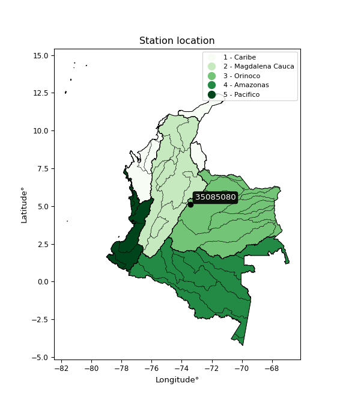

<div align="center">


</div>

# PMax24h Station (Rain, Pmax24h): 35085080

Maximum Precipitation in 24 hours (PMax24h) is the greatest amount of rainfall for a specific duration that is meteorologically possible for a given location, acting as a "worst-case" scenario for extreme storms, crucial for designing safety-critical infrastructure like bridges, river deviations, dams, spillways, and nuclear plants to prevent catastrophic failure. The PMax24h is related with the Probable Maximum Precipitation (PMP) and it is calculated by hydrologists using meteorological data to determine the upper limit of extreme rainfall, often leading to the Probable Maximum Flood (PMF) for flood control design, and is increasingly being studied for climate change impacts. Probable Maximum Precipitation (PMP) is the theoretical upper limit of rainfall, a deterministic estimate for extreme events, while probability distributions (like GEV, Gumbel) describe the likelihood and frequency of various precipitation amounts, including rare ones, showing how often events occur, with PMP representing the extreme end of these distributions, used for critical infrastructure design to ensure safety against the worst conceivable weather, unlike standard statistical forecasts which cover typical probabilities.

The most common probability distributions in hydrology, used for analyzing floods, rainfall, and streamflow, include the Normal, Log-Normal, Gumbel, Gamma (including Log-Pearson Type III), and Generalized Extreme Value (GEV) distributions, often chosen based on the data´s skewness and whether modeling extremes or general conditions, with Gumbel and GEV popular for extreme events like floods, while the Normal distribution serves as a baseline, though often requiring transformations for skewed hydrological data. These distributions help in designing water infrastructure, managing water resources, and forecasting hydrologic events.

> Hydrological data often isn´t perfectly normal (it´s skewed), so different distributions are needed for different applications, such as: **Flood Frequency Analysis**: Using Gumbel, GEV, or Log-Pearson Type III for predicting extreme flood magnitudes and their return periods, **Rainfall Analysis**: Normal for annual totals, but Log-Normal, Weibull, or GEV for intensity or extreme daily rainfall, **Streamflow Modeling**: Gamma and Log-Normal for maximum flows, GEV for minimum flows, and Kappa for daily flows.

<div align="center">

</img>

</div>


## A. General information


### 1. General running parameters

• app_version: _v20260225_. • runtime: _2026-02-27 14:50:08.749431_. • Python version: _3.14.0_. • SciPy version: _1.16.3_. • Pandas version: _2.3.3_. • NumPy version: _2.3.5_. • Stations dataset (station_dataset_file): _dataset/pmax24h_in/automatic_colombia_2003_2025.csv_. • Stations catalog (station_catalog_file): _dataset/CNE.xls_. • Minimum year to eval til year_max (date_min): _1900_. • Maximum year to eval since year_min (date_max): _2025_. • Creates, save and include plots into reports (create_plot): _False_. • Plot only fit distributions with Δo > Δ (plot_only_fit): _True_. • Plot only simple graphs avoiding multiple CDFs and multiple Extreme values plots (plot_only_simple): _False_. • Eval low extreme values, if False, evaluates high extreme values (low_extreme): _False_. • Eval every SciPy distribution as logarithmic (pdist_logarithmic_on): _True_. • Standard deviation normalized (ddof): _1.0_. • Return periods to eval in years (Tr): _[2, 2.33, 5, 10, 15, 20, 25, 50, 75, 100, 200, 250, 500, 750, 1000]_. • Minimum data sample per station, 0 means any (minimum_sample): _5_. • Z-Score maximum threshold to adjust a value, 0 means disable (zscore_max): _3.5_. • Z-Score minimum threshold to adjust a value, 0 means disable (zscore_min): _-2.5_. • Avoid zeros, e.g. rain = 0 (avoid_zeros): _True_. • Avoid null values (avoid_nans): _True_. 

:file_folder:Table: [dataset.csv](../../dataset/pmax24h_in/automatic_colombia_2003_2025.csv)

> Delta Degrees of Freedom (DDOF): is a parameter used in the formulas for calculating variance and standard deviation. When ddof=0, the divisor is $N$ (the total number of observations) and this is used when your data set is the entire population. When ddof=1, the divisor is $N-1$ and this is used when your data set is a sample drawn from a larger population. Using $N-1$ provides an unbiased estimate of the population variance (known as Bessel´s correction).


### 2. Station info and location

|   id |   CODIGO | NOMBRE                      | CATEGORIA               | TECNOLOGIA                | ESTADO   | FECHA_INSTALACION   |   FECHA_SUSPENSION |   ALTITUD |   LATITUD |   LONGITUD | DEPARTAMENTO   | MUNICIPIO   | AREA_OPERATIVA                              | ENTIDAD                                                     | AREA_HIDROGRAFICA   | ZONA_HIDROGRAFICA   | SUBZONA_HIDROGRAFICA   |   CORRIENTE | Catalogo   |   Version |
|-----:|---------:|:----------------------------|:------------------------|:--------------------------|:---------|:--------------------|-------------------:|----------:|----------:|-----------:|:---------------|:------------|:--------------------------------------------|:------------------------------------------------------------|:--------------------|:--------------------|:-----------------------|------------:|:-----------|----------:|
|    0 | 35085080 | LA CAPILLA - AUT [35085080] | Climatológica Principal | Automática con Telemetría | Activa   | 08/03/2005          |                nan |      1917 |   5.09919 |    -73.436 | Boyacá         | La Capilla  | Area Operativa 06 - Boyacá-Casanare-Vichada | INSTITUTO DE HIDROLOGIA METEOROLOGIA Y ESTUDIOS AMBIENTALES | Orinoco             | Meta                | Río Garagoa            |         nan | CNE_IDEAM  |  20251226 |

<div align="center">

Dynamic map: [:earth_americas:Google](http://maps.google.com/maps?q=5.099194444,-73.436) [:earth_americas:OSM](https://www.openstreetmap.org/#map=18/5.099194444/-73.436&layers=P) [:earth_americas:Bing](https://www.bing.com/maps?cp=5.099194444~-73.436&lvl=18) [:earth_americas:Apple](https://maps.apple.com/frame?center=5.099194444%2C-73.436&span=0.003%2C0.006)

</div>


<div align="center">

```geojson
{
  "type": "Feature",
  "geometry": {
    "type": "Point", 
    "coordinates": [-73.436, 5.099194444]
  }, 
  "properties": {
    "Name": "35085080"
  }
}
```

</div>


### 3. Discrete values table and plot

<div align="center">

|               |          0 |           1 |          2 |           3 |           4 |           5 |           6 |           7 |           8 |
|:--------------|-----------:|------------:|-----------:|------------:|------------:|------------:|------------:|------------:|------------:|
| Date          | 2017       | 2018        | 2019       | 2020        | 2021        | 2022        | 2023        | 2024        | 2025        |
| Value         |   47.5     |    5.7      |   49.5     |   26.7      |   32.5      |    8.5      |    6.4      |    8.8      |    7.4      |
| Value_initial |   47.5     |    5.7      |   49.5     |   26.7      |   32.5      |    8.5      |    6.4      |    8.8      |    7.4      |
| count         |    9       |    9        |    9       |    9        |    9        |    9        |    9        |    9        |    9        |
| mean          |   21.4444  |   21.4444   |   21.4444  |   21.4444   |   21.4444   |   21.4444   |   21.4444   |   21.4444   |   21.4444   |
| std           |   18.0789  |   18.0789   |   18.0789  |   18.0789   |   18.0789   |   18.0789   |   18.0789   |   18.0789   |   18.0789   |
| zscore        |    1.44122 |   -0.870876 |    1.55184 |    0.290702 |    0.611518 |   -0.715999 |   -0.832157 |   -0.699405 |   -0.776843 |


</div>


> The initial value (value_initial) correspond to the initial obtained or null completed value, and value (value) is adjusted only when the initial value is outside the valid range (outlier) definite through the Z-Score value. If Z-Score is active, values out of range or outliers are replaced with the station mean value. A Z-Score (or standard score) measures how many standard deviations a data point is from the mean of a dataset, indicating its relative position; positive scores mean above the mean, negative mean below, and a score of zero is exactly at the mean, allowing for comparison of values from different distributions. It´s calculated using the formula $z=(x–μ)/σ$, where $x$ is the data point, $μ$ is the mean, and $σ$ is the standard deviation, helping identify outliers and understand probability.
>
> <sub>**Note**: In this study, "completing" (filling gaps in) and "extending" (forecasting or lengthening the historical record) rainfall data series are avoided for certain critical analyses because they introduce artificial bias and uncertainty, which can distort the statistics of rare events (extremes), alter day-to-day variability, and compromise the integrity and homogeneity of the original data. Some reasons against Completing/Extending rainfall data are: **Distortion of Extremes and Variability**: The primary issue is that most gap-filling or extension methods rely on averaging or regression with nearby stations, which inherently smooths the data. Rainfall is highly variable in space and time, with a large percentage of zero values and occasional large storms. Infilling methods often underestimate the highest values and overestimate the lowest (zero) values, which severely distorts analyses focused on flood frequency, drought severity, and intensity-duration-frequency (IDF) curves, **Loss of Data Homogeneity**: Infilled or extended data are synthetic estimates, not actual measurements. Combining these estimates with observed data can violate the assumption of data homogeneity, which requires that the data properties do not change over time. Inhomogeneity can lead to incorrect conclusions about long-term trends or changes in climate patterns, **Propagation of Errors**: Errors and biases from the original data (e.g., wind-induced undercatch, instrument errors, site changes) or the data used for imputation can propagate through the analysis, leading to unreliable hydrological models and inaccurate predictions, **Compromised Statistical Integrity**: For statistical analyses, especially those involving the frequency of events, using artificial data can introduce time bias or autocorrelation that doesn´t exist in reality, making it difficult to assess the true probability of events, **Difficulty in Validation**: It is difficult to accurately validate the quality of filled or extended data, especially for past periods where ground-truth measurements are unavailable. The reliability of imputation techniques heavily depends on the density of the surrounding station network and the complexity of the local topography.</sub>


### 4. Active continuous probability distributions from SciPy (80 of 104 available)

A Probability Density Function (PDF) describes the relative likelihood of a continuous random variable falling within a specific range, where the total area under its curve equals 1, and the area over any interval gives the actual probability for that range. Unlike discrete probabilities (like rolling a die), a PDF shows density, not direct probability for a single point (which is zero), with higher points indicating higher likelihood, often visualized as a bell curve for normal distributions.

A log of a probability density function (log-PDF) is simply the logarithm of the PDF´s value, denoted as $log(f(x))$, useful for converting multiplication of probabilities into addition, improving numerical stability with tiny numbers, and connecting to information theory concepts like entropy. Instead of dealing with very small probabilities (e.g., 0.000001), log-PDFs use negative numbers (e.g., $log(0.00001) ≈ -11.51$ that are easier for computers to handle, preventing underflow errors and simplifying complex calculations. In this study, each active probability distribution from SciPy is also evaluated in the $log$ form.

[scipy.stats](https://docs.scipy.org/doc/scipy/reference/stats.html) is a Python´s powerful submodule within the SciPy library for comprehensive statistical analysis, offering over 130 probability distributions (like Normal, Poisson, etc.), functions for descriptive stats (mean, variance), hypothesis testing (t-tests, chi-square), random variable generation, and statistical tests, making it essential for data science, modeling, and research. It provides tools to explore, model, and draw conclusions from data efficiently, working seamlessly with [NumPy](https://numpy.org/).

<div align="center">

|   id | p_dist           |   n_parameter | fit_method   | label                                                                       | active   | ref                                                                                                      |
|-----:|:-----------------|--------------:|:-------------|:----------------------------------------------------------------------------|:---------|:---------------------------------------------------------------------------------------------------------|
|    0 | alpha            |             3 | MLE          | Alpha                                                                       | True     | [:mortar_board:](https://docs.scipy.org/doc/scipy/reference/generated/scipy.stats.alpha.html)            |
|    1 | anglit           |             2 | MM           | Anglit                                                                      | True     | [:mortar_board:](https://docs.scipy.org/doc/scipy/reference/generated/scipy.stats.anglit.html)           |
|    2 | arcsine          |             2 | MM           | Arcsine                                                                     | True     | [:mortar_board:](https://docs.scipy.org/doc/scipy/reference/generated/scipy.stats.arcsine.html)          |
|    3 | argus            |             3 | MLE          | Argus                                                                       | True     | [:mortar_board:](https://docs.scipy.org/doc/scipy/reference/generated/scipy.stats.argus.html)            |
|    4 | beta             |             4 | MLE          | Beta                                                                        | True     | [:mortar_board:](https://docs.scipy.org/doc/scipy/reference/generated/scipy.stats.beta.html)             |
|    5 | betaprime        |             4 | MLE          | Beta prime                                                                  | True     | [:mortar_board:](https://docs.scipy.org/doc/scipy/reference/generated/scipy.stats.betaprime.html)        |
|    6 | bradford         |             3 | MLE          | Bradford                                                                    | True     | [:mortar_board:](https://docs.scipy.org/doc/scipy/reference/generated/scipy.stats.bradford.html)         |
|    7 | burr             |             4 | MLE          | Burr (Type III)                                                             | True     | [:mortar_board:](https://docs.scipy.org/doc/scipy/reference/generated/scipy.stats.burr.html)             |
|    8 | burr12           |             4 | MLE          | Burr (Type III) 12                                                          | True     | [:mortar_board:](https://docs.scipy.org/doc/scipy/reference/generated/scipy.stats.burr12.html)           |
|    9 | cosine           |             2 | MLE          | Cosine                                                                      | True     | [:mortar_board:](https://docs.scipy.org/doc/scipy/reference/generated/scipy.stats.cosine.html)           |
|   10 | crystalball      |             4 | MLE          | Crystalball                                                                 | True     | [:mortar_board:](https://docs.scipy.org/doc/scipy/reference/generated/scipy.stats.crystalball.html)      |
|   11 | dgamma           |             3 | MLE          | Double gamma                                                                | True     | [:mortar_board:](https://docs.scipy.org/doc/scipy/reference/generated/scipy.stats.dgamma.html)           |
|   12 | dweibull         |             3 | MLE          | Double Weibull                                                              | True     | [:mortar_board:](https://docs.scipy.org/doc/scipy/reference/generated/scipy.stats.dweibull.html)         |
|   13 | erlang           |             3 | MLE          | Erlang                                                                      | True     | [:mortar_board:](https://docs.scipy.org/doc/scipy/reference/generated/scipy.stats.erlang.html)           |
|   14 | exponnorm        |             3 | MLE          | Exponentially modified Normal                                               | True     | [:mortar_board:](https://docs.scipy.org/doc/scipy/reference/generated/scipy.stats.exponnorm.html)        |
|   15 | exponpow         |             3 | MLE          | Exponential power                                                           | True     | [:mortar_board:](https://docs.scipy.org/doc/scipy/reference/generated/scipy.stats.exponpow.html)         |
|   16 | exponweib        |             4 | MLE          | Exponentiated Weibull                                                       | True     | [:mortar_board:](https://docs.scipy.org/doc/scipy/reference/generated/scipy.stats.exponweib.html)        |
|   17 | f                |             4 | MLE          | F                                                                           | True     | [:mortar_board:](https://docs.scipy.org/doc/scipy/reference/generated/scipy.stats.f.html)                |
|   18 | fatiguelife      |             3 | MLE          | Fatigue-life (Birnbaum-Saunders)                                            | True     | [:mortar_board:](https://docs.scipy.org/doc/scipy/reference/generated/scipy.stats.fatiguelife.html)      |
|   19 | foldnorm         |             3 | MM           | Fold Normal                                                                 | True     | [:mortar_board:](https://docs.scipy.org/doc/scipy/reference/generated/scipy.stats.foldnorm.html)         |
|   20 | gamma            |             3 | MLE          | Gamma                                                                       | True     | [:mortar_board:](https://docs.scipy.org/doc/scipy/reference/generated/scipy.stats.gamma.html)            |
|   21 | gausshyper       |             6 | MLE          | Gauss hypergeometric                                                        | True     | [:mortar_board:](https://docs.scipy.org/doc/scipy/reference/generated/scipy.stats.gausshyper.html)       |
|   22 | genexpon         |             5 | MLE          | Generalized exponential                                                     | True     | [:mortar_board:](https://docs.scipy.org/doc/scipy/reference/generated/scipy.stats.genexpon.html)         |
|   23 | genextreme       |             3 | MLE          | Generalized exponential                                                     | True     | [:mortar_board:](https://docs.scipy.org/doc/scipy/reference/generated/scipy.stats.genextreme.html)       |
|   24 | gengamma         |             4 | MLE          | Generalized gamma                                                           | True     | [:mortar_board:](https://docs.scipy.org/doc/scipy/reference/generated/scipy.stats.gengamma.html)         |
|   25 | genhalflogistic  |             3 | MLE          | Generalized half-logistic                                                   | True     | [:mortar_board:](https://docs.scipy.org/doc/scipy/reference/generated/scipy.stats.genhalflogistic.html)  |
|   26 | genlogistic      |             3 | MLE          | Generalized logistic                                                        | True     | [:mortar_board:](https://docs.scipy.org/doc/scipy/reference/generated/scipy.stats.genlogistic.html)      |
|   27 | gennorm          |             3 | MLE          | Generalized Normal                                                          | True     | [:mortar_board:](https://docs.scipy.org/doc/scipy/reference/generated/scipy.stats.gennorm.html)          |
|   28 | genpareto        |             3 | MLE          | Generalized Pareto                                                          | True     | [:mortar_board:](https://docs.scipy.org/doc/scipy/reference/generated/scipy.stats.genpareto.html)        |
|   29 | gompertz         |             3 | MLE          | Gompertz (or truncated Gumbel)                                              | True     | [:mortar_board:](https://docs.scipy.org/doc/scipy/reference/generated/scipy.stats.gompertz.html)         |
|   30 | gumbel_l         |             2 | MM           | Gumbel Left Skew                                                            | True     | [:mortar_board:](https://docs.scipy.org/doc/scipy/reference/generated/scipy.stats.gumbel_l.html)         |
|   31 | gumbel_r         |             2 | MM           | Gumbel Right Skew                                                           | True     | [:mortar_board:](https://docs.scipy.org/doc/scipy/reference/generated/scipy.stats.gumbel_r.html)         |
|   32 | halfgennorm      |             3 | MLE          | Upper half of a generalized normal                                          | True     | [:mortar_board:](https://docs.scipy.org/doc/scipy/reference/generated/scipy.stats.halfgennorm.html)      |
|   33 | halflogistic     |             2 | MM           | Half-logistic                                                               | True     | [:mortar_board:](https://docs.scipy.org/doc/scipy/reference/generated/scipy.stats.halflogistic.html)     |
|   34 | halfnorm         |             2 | MM           | Half Normal                                                                 | True     | [:mortar_board:](https://docs.scipy.org/doc/scipy/reference/generated/scipy.stats.halfnorm.html)         |
|   35 | hypsecant        |             2 | MM           | hyperbolic secant                                                           | True     | [:mortar_board:](https://docs.scipy.org/doc/scipy/reference/generated/scipy.stats.hypsecant.html)        |
|   36 | invgamma         |             3 | MLE          | Inverted gamma                                                              | True     | [:mortar_board:](https://docs.scipy.org/doc/scipy/reference/generated/scipy.stats.invgamma.html)         |
|   37 | invgauss         |             3 | MLE          | Inverse Gaussian                                                            | True     | [:mortar_board:](https://docs.scipy.org/doc/scipy/reference/generated/scipy.stats.invgauss.html)         |
|   38 | invweibull       |             3 | MLE          | Inverted Weibull                                                            | True     | [:mortar_board:](https://docs.scipy.org/doc/scipy/reference/generated/scipy.stats.invweibull.html)       |
|   39 | johnsonsb        |             4 | MLE          | Johnson SB                                                                  | True     | [:mortar_board:](https://docs.scipy.org/doc/scipy/reference/generated/scipy.stats.johnsonsb.html)        |
|   40 | johnsonsu        |             4 | MLE          | Johnson Su                                                                  | True     | [:mortar_board:](https://docs.scipy.org/doc/scipy/reference/generated/scipy.stats.johnsonsu.html)        |
|   41 | kappa3           |             3 | MLE          | Kappa 3                                                                     | True     | [:mortar_board:](https://docs.scipy.org/doc/scipy/reference/generated/scipy.stats.kappa3.html)           |
|   42 | kappa4           |             4 | MLE          | Kappa 4                                                                     | True     | [:mortar_board:](https://docs.scipy.org/doc/scipy/reference/generated/scipy.stats.kappa4.html)           |
|   43 | ksone            |             3 | MLE          | Kolmogorov-Smirnov one-sided test statistic distribution                    | True     | [:mortar_board:](https://docs.scipy.org/doc/scipy/reference/generated/scipy.stats.ksone.html)            |
|   44 | kstwobign        |             2 | MLE          | Limiting distribution of scaled Kolmogorov-Smirnov two-sided test statistic | True     | [:mortar_board:](https://docs.scipy.org/doc/scipy/reference/generated/scipy.stats.kstwobign.html)        |
|   45 | laplace          |             2 | MM           | Laplace                                                                     | True     | [:mortar_board:](https://docs.scipy.org/doc/scipy/reference/generated/scipy.stats.laplace.html)          |
|   46 | levy_l           |             2 | MLE          | Left-skewed Levy                                                            | True     | [:mortar_board:](https://docs.scipy.org/doc/scipy/reference/generated/scipy.stats.levy_l.html)           |
|   47 | loggamma         |             3 | MLE          | Log gamma                                                                   | True     | [:mortar_board:](https://docs.scipy.org/doc/scipy/reference/generated/scipy.stats.loggamma.html)         |
|   48 | logistic         |             2 | MM           | Logistic (or Sech-squared)                                                  | True     | [:mortar_board:](https://docs.scipy.org/doc/scipy/reference/generated/scipy.stats.logistic.html)         |
|   49 | loglaplace       |             3 | MLE          | Log-Laplace                                                                 | True     | [:mortar_board:](https://docs.scipy.org/doc/scipy/reference/generated/scipy.stats.loglaplace.html)       |
|   50 | lomax            |             3 | MLE          | Lomax (Pareto of the second kind)                                           | True     | [:mortar_board:](https://docs.scipy.org/doc/scipy/reference/generated/scipy.stats.lomax.html)            |
|   51 | maxwell          |             2 | MM           | Maxwell                                                                     | True     | [:mortar_board:](https://docs.scipy.org/doc/scipy/reference/generated/scipy.stats.maxwell.html)          |
|   52 | mielke           |             4 | MLE          | Mielke Beta-Kappa / Dagum                                                   | True     | [:mortar_board:](https://docs.scipy.org/doc/scipy/reference/generated/scipy.stats.mielke.html)           |
|   53 | moyal            |             2 | MM           | Moyal                                                                       | True     | [:mortar_board:](https://docs.scipy.org/doc/scipy/reference/generated/scipy.stats.moyal.html)            |
|   54 | nakagami         |             3 | MLE          | Nakagami                                                                    | True     | [:mortar_board:](https://docs.scipy.org/doc/scipy/reference/generated/scipy.stats.nakagami.html)         |
|   55 | ncf              |             5 | MLE          | Non-central F distribution                                                  | True     | [:mortar_board:](https://docs.scipy.org/doc/scipy/reference/generated/scipy.stats.ncf.html)              |
|   56 | nct              |             4 | MLE          | Non-central Student’s t                                                     | True     | [:mortar_board:](https://docs.scipy.org/doc/scipy/reference/generated/scipy.stats.nct.html)              |
|   57 | norm             |             2 | MM           | Normal                                                                      | True     | [:mortar_board:](https://docs.scipy.org/doc/scipy/reference/generated/scipy.stats.norm.html)             |
|   58 | pearson3         |             3 | MM           | Pearson type III                                                            | True     | [:mortar_board:](https://docs.scipy.org/doc/scipy/reference/generated/scipy.stats.pearson3.html)         |
|   59 | powerlaw         |             3 | MLE          | Power-function                                                              | True     | [:mortar_board:](https://docs.scipy.org/doc/scipy/reference/generated/scipy.stats.powerlaw.html)         |
|   60 | rayleigh         |             2 | MM           | Rayleigh                                                                    | True     | [:mortar_board:](https://docs.scipy.org/doc/scipy/reference/generated/scipy.stats.rayleigh.html)         |
|   61 | rdist            |             3 | MLE          | R-distributed (symmetric beta)                                              | True     | [:mortar_board:](https://docs.scipy.org/doc/scipy/reference/generated/scipy.stats.rdist.html)            |
|   62 | rice             |             3 | MLE          | Rice                                                                        | True     | [:mortar_board:](https://docs.scipy.org/doc/scipy/reference/generated/scipy.stats.rice.html)             |
|   63 | semicircular     |             2 | MM           | Semicircular                                                                | True     | [:mortar_board:](https://docs.scipy.org/doc/scipy/reference/generated/scipy.stats.semicircular.html)     |
|   64 | skewnorm         |             3 | MLE          | Skew normal                                                                 | True     | [:mortar_board:](https://docs.scipy.org/doc/scipy/reference/generated/scipy.stats.skewnorm.html)         |
|   65 | t                |             3 | MLE          | Student’s t                                                                 | True     | [:mortar_board:](https://docs.scipy.org/doc/scipy/reference/generated/scipy.stats.t.html)                |
|   66 | trapezoid        |             4 | MLE          | Trapezoid                                                                   | True     | [:mortar_board:](https://docs.scipy.org/doc/scipy/reference/generated/scipy.stats.trapezoid.html)        |
|   67 | triang           |             3 | MLE          | Triangular                                                                  | True     | [:mortar_board:](https://docs.scipy.org/doc/scipy/reference/generated/scipy.stats.triang.html)           |
|   68 | truncexpon       |             3 | MLE          | Truncated exponential                                                       | True     | [:mortar_board:](https://docs.scipy.org/doc/scipy/reference/generated/scipy.stats.truncexpon.html)       |
|   69 | truncnorm        |             4 | MLE          | Truncated normal                                                            | True     | [:mortar_board:](https://docs.scipy.org/doc/scipy/reference/generated/scipy.stats.truncnorm.html)        |
|   70 | truncpareto      |             4 | MLE          | Upper truncated Pareto                                                      | True     | [:mortar_board:](https://docs.scipy.org/doc/scipy/reference/generated/scipy.stats.truncpareto.html)      |
|   71 | truncweibull_min |             5 | MLE          | Doubly truncated Weibull minimum                                            | True     | [:mortar_board:](https://docs.scipy.org/doc/scipy/reference/generated/scipy.stats.truncweibull_min.html) |
|   72 | tukeylambda      |             3 | MLE          | Tukey-Lamdba                                                                | True     | [:mortar_board:](https://docs.scipy.org/doc/scipy/reference/generated/scipy.stats.tukeylambda.html)      |
|   73 | uniform          |             2 | MLE          | Uniform                                                                     | True     | [:mortar_board:](https://docs.scipy.org/doc/scipy/reference/generated/scipy.stats.uniform.html)          |
|   74 | vonmises         |             3 | MLE          | Von Mises                                                                   | True     | [:mortar_board:](https://docs.scipy.org/doc/scipy/reference/generated/scipy.stats.vonmises.html)         |
|   75 | vonmises_line    |             3 | MLE          | Von Mises line                                                              | True     | [:mortar_board:](https://docs.scipy.org/doc/scipy/reference/generated/scipy.stats.vonmises_line.html)    |
|   76 | wald             |             2 | MM           | Wald                                                                        | True     | [:mortar_board:](https://docs.scipy.org/doc/scipy/reference/generated/scipy.stats.wald.html)             |
|   77 | weibull_max      |             3 | MLE          | Weibull maximum                                                             | True     | [:mortar_board:](https://docs.scipy.org/doc/scipy/reference/generated/scipy.stats.weibull_max.html)      |
|   78 | weibull_min      |             3 | MLE          | Weibull minimum                                                             | True     | [:mortar_board:](https://docs.scipy.org/doc/scipy/reference/generated/scipy.stats.weibull_min.html)      |
|   79 | wrapcauchy       |             3 | MLE          | Wrapped  Cauchy                                                             | True     | [:mortar_board:](https://docs.scipy.org/doc/scipy/reference/generated/scipy.stats.wrapcauchy.html)       |

</div>

> **n_parameter:** # arguments & localization & scale.
>
> **Fit methods:** (MLE) maximum likelihood, (MM) L-moments.
>
>**Inactive** (With the only purpose of prevent loops, zero divisions, infinite values, over high estimated values or horizontal trending for recurrence intervals estimations, the follow distributions were disabled.)**:** lognorm, norminvgauss, powernorm, powerlognorm, cauchy, halfcauchy, foldcauchy, skewcauchy, chi2, expon, fisk, genhyperbolic, geninvgauss, gibrat, kstwo, laplace_asymmetric, levy, levy_stable, ncx2, pareto, rel_breitwigner, recipinvgauss, studentized_range, loguniform, 


## B. Probability (PDF) vs. Empirical (EDF) distributions functions

A continuous probability distribution (CPD) describes probabilities for variables that can take any value within a range (like rain any time), unlike discrete variables with specific outcomes (like temperature). It uses a Probability Density Function (PDF), a curve where the total area under it equals 1, and the probability of the variable falling within an interval (a to b) is found by calculating the area under the curve between those points. A key feature is that the probability of hitting any single exact value is zero, so probabilities are always expressed for ranges, e.g., $P(a ≤ X ≤ b)$.

<div align="center">

Distributions parameters from station values
|     |   station | p_dist              |   n |             loc |            scale | shape                  | shape1                | shape2                 | shape3             |
|----:|----------:|:--------------------|----:|----------------:|-----------------:|:-----------------------|:----------------------|:-----------------------|:-------------------|
|   0 |  35085080 | alpha               |   9 |     3.38447     |      4.54939     | 4.4343394733278404e-05 |                       |                        |                    |
|   1 |  35085080 | anglit              |   9 |    21.4444      |     49.8632      |                        |                       |                        |                    |
|   2 |  35085080 | arcsine             |   9 |    -2.66068     |     48.2103      |                        |                       |                        |                    |
|   3 |  35085080 | argus               |   9 |   -13.7428      |     66.3044      | 6.616174583080174e-06  |                       |                        |                    |
|   4 |  35085080 | beta                |   9 |     1.29645     |     48.2036      | 0.2140664589989728     | 0.38674015682589      |                        |                    |
|   5 |  35085080 | betaprime           |   9 |     2.66119     |      0.462497    | 14.932437444071155     | 1.1020648487977205    |                        |                    |
|   6 |  35085080 | bradford            |   9 |    -4.82519     |     54.3252      | 0.2567823895818583     |                       |                        |                    |
|   7 |  35085080 | burr                |   9 |     5.65814     |      4.95075     | 0.8034848853057257     | 0.9265591978758296    |                        |                    |
|   8 |  35085080 | burr12              |   9 |    -0.664605    |      6.29912     | 342.0804683256349      | 0.0031348493056400544 |                        |                    |
|   9 |  35085080 | cosine              |   9 |    22.9475      |     13.7159      |                        |                       |                        |                    |
|  10 |  35085080 | crystalball         |   9 |    21.4444      |     17.0449      | 2972.4733864547243     | 3830.0512275216074    |                        |                    |
|  11 |  35085080 | dgamma              |   9 |    20.3196      |      2.8927      | 5.366736505278709      |                       |                        |                    |
|  12 |  35085080 | dweibull            |   9 |    22.0927      |     17.7198      | 2.5501895452421657     |                       |                        |                    |
|  13 |  35085080 | erlang              |   9 |     5.7         |      9.8173      | 0.6731796269373431     |                       |                        |                    |
|  14 |  35085080 | exponnorm           |   9 |     5.68758     |      0.00405943  | 3883.340523641169      |                       |                        |                    |
|  15 |  35085080 | exponpow            |   9 |     5.7         |     29.4814      | 0.5603738326082681     |                       |                        |                    |
|  16 |  35085080 | exponweib           |   9 |     5.7         |     20.737       | 0.669781094787544      | 0.7869872529734875    |                        |                    |
|  17 |  35085080 | f                   |   9 |     5.69231     |      4.60185     | 0.9125450357287344     | 2.1871352359406235    |                        |                    |
|  18 |  35085080 | fatiguelife         |   9 |     5.49261     |      4.16509     | 2.273399015225981      |                       |                        |                    |
|  19 |  35085080 | foldnorm            |   9 |    -4.56849     |     20.3651      | 1.1541557859253173     |                       |                        |                    |
|  20 |  35085080 | gamma               |   9 |     5.7         |     14.6065      | 0.49003399959849236    |                       |                        |                    |
|  21 |  35085080 | gausshyper          |   9 |    -3.48961     |     52.9896      | 1.3163448996224292     | 0.8039286789468492    | 0.7507732141265611     | 1.1352786923616878 |
|  22 |  35085080 | genexpon            |   9 |     5.7         |     24.6404      | 1.565196580595975      | 0.012334914429508943  | 5.956585637758083e-07  |                    |
|  23 |  35085080 | genextreme          |   9 |     7.94376     |      4.02621     | -1.5376097776308137    |                       |                        |                    |
|  24 |  35085080 | gengamma            |   9 |     5.7         |     20.5897      | 0.6799126796413015     | 0.7793572436497324    |                        |                    |
|  25 |  35085080 | genhalflogistic     |   9 |     1.24261     |     52.3634      | 1.0850858032627568     |                       |                        |                    |
|  26 |  35085080 | genlogistic         |   9 |   -78.5911      |     12.3096      | 1785.221943719322      |                       |                        |                    |
|  27 |  35085080 | gennorm             |   9 |     8.5         |      0.0825324   | 0.29136625206996203    |                       |                        |                    |
|  28 |  35085080 | genpareto           |   9 |    -0.0162043   |     69.8566      | -1.410783463715596     |                       |                        |                    |
|  29 |  35085080 | gompertz            |   9 |     5.69999     | 181202           | 11518.657384464004     |                       |                        |                    |
|  30 |  35085080 | gumbel_l            |   9 |    29.1156      |     13.2899      |                        |                       |                        |                    |
|  31 |  35085080 | gumbel_r            |   9 |    13.7733      |     13.2899      |                        |                       |                        |                    |
|  32 |  35085080 | halfgennorm         |   9 |     5.7         |      0.128632    | 0.3012016910532451     |                       |                        |                    |
|  33 |  35085080 | halflogistic        |   9 |     1.24226     |     14.5728      |                        |                       |                        |                    |
|  34 |  35085080 | halfnorm            |   9 |    -1.11634     |     28.2758      |                        |                       |                        |                    |
|  35 |  35085080 | hypsecant           |   9 |    21.4444      |     10.8511      |                        |                       |                        |                    |
|  36 |  35085080 | invgamma            |   9 |     5.0283      |      1.78761     | 0.6596627971565795     |                       |                        |                    |
|  37 |  35085080 | invgauss            |   9 |     5.04195     |      3.19684     | 5.13080363984483       |                       |                        |                    |
|  38 |  35085080 | invweibull          |   9 |     5.32525     |      2.61852     | 0.6503702863814962     |                       |                        |                    |
|  39 |  35085080 | johnsonsb           |   9 |     5.7         |     43.8         | -0.43834324254533474   | 0.10894737621627801   |                        |                    |
|  40 |  35085080 | johnsonsu           |   9 |     5.7         |      5.74938e-06 | -2.6919499129920466    | 0.2204601357234851    |                        |                    |
|  41 |  35085080 | kappa3              |   9 |     5.69992     |     43.7471      | 2076.7323059413616     |                       |                        |                    |
|  42 |  35085080 | kappa4              |   9 |    -7.46921     |     55.0874      | 1.3101357865693015     | 0.9238780682099663    |                        |                    |
|  43 |  35085080 | ksone               |   9 |    -8.07821     |     59.0453      | 1.0                    |                       |                        |                    |
|  44 |  35085080 | kstwobign           |   9 |   -28.8407      |     57.6106      |                        |                       |                        |                    |
|  45 |  35085080 | laplace             |   9 |    21.4444      |     12.0526      |                        |                       |                        |                    |
|  46 |  35085080 | levy_l              |   9 |    51.731       |     10.1203      |                        |                       |                        |                    |
|  47 |  35085080 | loggamma            |   9 | -5386.24        |    723.746       | 1758.2513368039517     |                       |                        |                    |
|  48 |  35085080 | logistic            |   9 |    21.4444      |      9.39735     |                        |                       |                        |                    |
|  49 |  35085080 | loglaplace          |   9 |    -0.0465597   |      8.84656     | 1.3299662344687941     |                       |                        |                    |
|  50 |  35085080 | lomax               |   9 |     5.7         |      2.06014e+11 | 10341403471.019676     |                       |                        |                    |
|  51 |  35085080 | maxwell             |   9 |   -18.9448      |     25.3102      |                        |                       |                        |                    |
|  52 |  35085080 | mielke              |   9 |     3.92472     |      0.199279    | 37.872069209555335     | 1.1190607451270376    |                        |                    |
|  53 |  35085080 | moyal               |   9 |    11.6971      |      7.67291     |                        |                       |                        |                    |
|  54 |  35085080 | nakagami            |   9 |     5.7         |     32.4257      | 0.07906825817024679    |                       |                        |                    |
|  55 |  35085080 | ncf                 |   9 |    -0.0581265   |     12.0598      | 24.920896776721367     | 3.857300651416476     | 4.3554328596325317e-07 |                    |
|  56 |  35085080 | nct                 |   9 |     1.55375     |      0.287988    | 0.9430199701529167     | 24.553981862313634    |                        |                    |
|  57 |  35085080 | norm                |   9 |    21.4444      |     17.0449      |                        |                       |                        |                    |
|  58 |  35085080 | pearson3            |   9 |    21.4444      |     17.0449      | 0.6058202801933703     |                       |                        |                    |
|  59 |  35085080 | powerlaw            |   9 |     5.7         |     43.8         | 0.1714493606710551     |                       |                        |                    |
|  60 |  35085080 | rayleigh            |   9 |   -11.1635      |     26.0174      |                        |                       |                        |                    |
|  61 |  35085080 | rdist               |   9 |     2.30204     |     24.398       | 1.1011778484445784     |                       |                        |                    |
|  62 |  35085080 | rice                |   9 |    -5.88293     |     22.774       | 0.00080130141204689    |                       |                        |                    |
|  63 |  35085080 | semicircular        |   9 |    21.4444      |     34.0898      |                        |                       |                        |                    |
|  64 |  35085080 | skewnorm            |   9 |     5.7         |     23.2032      | 30303196.087662123     |                       |                        |                    |
|  65 |  35085080 | t                   |   9 |    21.4444      |     17.0449      | 316985735.4098021      |                       |                        |                    |
|  66 |  35085080 | trapezoid           |   9 |     1.32        |     52.56        | 1.0                    | 1.0                   |                        |                    |
|  67 |  35085080 | triang              |   9 |   -15.1565      |     68.0222      | 0.9505211856704214     |                       |                        |                    |
|  68 |  35085080 | truncexpon          |   9 |     5.69999     |     53.5475      | 0.8179666623732131     |                       |                        |                    |
|  69 |  35085080 | truncnorm           |   9 |  -583.546       |    100.019       | 5.891353178029359      | 70.4927414500811      |                        |                    |
|  70 |  35085080 | truncpareto         |   9 |     1.53965     |      4.16035     | 0.8803411104476921     | 11.527950674447858    |                        |                    |
|  71 |  35085080 | truncweibull_min    |   9 |     4.28792     |     67.5555      | 0.028317387235586813   | 0.020902438318475505  | 0.6692694832704684     |                    |
|  72 |  35085080 | tukeylambda         |   9 |    27.7563      |     24.891       | 1.1285247861704197     |                       |                        |                    |
|  73 |  35085080 | uniform             |   9 |     5.7         |     43.8         |                        |                       |                        |                    |
|  74 |  35085080 | vonmises            |   9 |     1.17525     |      1           | 0.6798530813903457     |                       |                        |                    |
|  75 |  35085080 | vonmises_line       |   9 |    27.5999      |      6.97103     | 2.170491210121874e-05  |                       |                        |                    |
|  76 |  35085080 | wald                |   9 |     4.39953     |     17.0449      |                        |                       |                        |                    |
|  77 |  35085080 | weibull_max         |   9 |    49.5         |      1.46863     | 0.3061648978785443     |                       |                        |                    |
|  78 |  35085080 | weibull_min         |   9 |     5.7         |     21.5301      | 0.21378967913912306    |                       |                        |                    |
|  79 |  35085080 | wrapcauchy          |   9 |     5.69104     |      6.97241     | 0.7674028333156477     |                       |                        |                    |
|  80 |  35085080 | logalpha            |   9 |     1.48841     |      0.52757     | 6.348701175365814e-07  |                       |                        |                    |
|  81 |  35085080 | loganglit           |   9 |     2.71574     |      2.47689     |                        |                       |                        |                    |
|  82 |  35085080 | logarcsine          |   9 |     1.51835     |      2.39478     |                        |                       |                        |                    |
|  83 |  35085080 | logargus            |   9 |     1.01351     |      3.0635      | 6.842036066873405e-05  |                       |                        |                    |
|  84 |  35085080 | logbeta             |   9 |     1.74047     |      2.23308     | 0.8994417676584165     | 0.9087844684688713    |                        |                    |
|  85 |  35085080 | logbetaprime        |   9 |     1.45114     |      0.0141977   | 99.74219394503014      | 1.9371450940236354    |                        |                    |
|  86 |  35085080 | logbradford         |   9 |     1.74046     |      2.16151     | 1.1314107162654836     |                       |                        |                    |
|  87 |  35085080 | logburr             |   9 |     1.40193     |      0.0122275   | 1.5386650253140297     | 522.4916244043159     |                        |                    |
|  88 |  35085080 | logburr12           |   9 |     0.715724    |      2.34638     | 3.0434378252490126     | 1.7907873587803333    |                        |                    |
|  89 |  35085080 | logcosine           |   9 |     2.74906     |      0.664113    |                        |                       |                        |                    |
|  90 |  35085080 | logcrystalball      |   9 |     2.71574     |      0.846683    | 117.26861056485865     | 579.7863300705048     |                        |                    |
|  91 |  35085080 | logdgamma           |   9 |     2.78069     |      0.0574623   | 14.301632536648697     |                       |                        |                    |
|  92 |  35085080 | logdweibull         |   9 |     2.81872     |      0.907841    | 4.575494855890701      |                       |                        |                    |
|  93 |  35085080 | logerlang           |   9 |     1.74047     |      1.16183     | 0.5985104440320206     |                       |                        |                    |
|  94 |  35085080 | logexponnorm        |   9 |     2.56711     |      0.833575    | 0.17830268780038455    |                       |                        |                    |
|  95 |  35085080 | logexponpow         |   9 |     1.74047     |      1.52894     | 0.8590149994959662     |                       |                        |                    |
|  96 |  35085080 | logexponweib        |   9 |     1.74047     |      1.34464     | 0.6377573890918329     | 0.3350837652732258    |                        |                    |
|  97 |  35085080 | logf                |   9 |     1.44479     |      0.733973    | 2410.2689068627215     | 3.8731371909067303    |                        |                    |
|  98 |  35085080 | logfatiguelife      |   9 |     1.6556      |      0.596711    | 1.2170331251920525     |                       |                        |                    |
|  99 |  35085080 | logfoldnorm         |   9 |     1.10929     |      0.899108    | 1.754748665175685      |                       |                        |                    |
| 100 |  35085080 | loggamma            |   9 |     1.74047     |      0.864598    | 0.7114937355240556     |                       |                        |                    |
| 101 |  35085080 | loggausshyper       |   9 |     1.74047     |      2.92969     | 0.21251878558414922    | 0.9293529441705861    | 1.466592414761554      | 1.011537973877712  |
| 102 |  35085080 | loggenexpon         |   9 |     1.74043     |      0.0217895   | 0.018948073131843643   | 3.981294324945427     | 2.155355223742044e-05  |                    |
| 103 |  35085080 | loggenextreme       |   9 |     2.11571     |      0.464384    | -0.649256498865173     |                       |                        |                    |
| 104 |  35085080 | loggengamma         |   9 |     1.74047     |      1.1991      | 0.5836755935650819     | 0.3807875948196115    |                        |                    |
| 105 |  35085080 | loggenhalflogistic  |   9 |     1.64938     |      2.39513     | 1.0632757739070104     |                       |                        |                    |
| 106 |  35085080 | loggenlogistic      |   9 |    -2.47723     |      0.668217    | 1287.907505451933      |                       |                        |                    |
| 107 |  35085080 | loggennorm          |   9 |     2.17475     |      0.0627278   | 0.4236814879213465     |                       |                        |                    |
| 108 |  35085080 | loggenpareto        |   9 |    -0.00722397  |      7.39637     | -1.8920433269317052    |                       |                        |                    |
| 109 |  35085080 | loggompertz         |   9 |     1.74047     |      3.07845     | 2.3450214258051787     |                       |                        |                    |
| 110 |  35085080 | loggumbel_l         |   9 |     3.09679     |      0.660156    |                        |                       |                        |                    |
| 111 |  35085080 | loggumbel_r         |   9 |     2.33469     |      0.660156    |                        |                       |                        |                    |
| 112 |  35085080 | loghalfgennorm      |   9 |     1.74047     |      1.03629     | 1.0404240238259936     |                       |                        |                    |
| 113 |  35085080 | loghalflogistic     |   9 |     1.71222     |      0.723884    |                        |                       |                        |                    |
| 114 |  35085080 | loghalfnorm         |   9 |     1.59506     |      1.40456     |                        |                       |                        |                    |
| 115 |  35085080 | loghypsecant        |   9 |     2.71574     |      0.539015    |                        |                       |                        |                    |
| 116 |  35085080 | loginvgamma         |   9 |     1.44421     |      1.42187     | 1.9365078378702993     |                       |                        |                    |
| 117 |  35085080 | loginvgauss         |   9 |     1.57719     |      0.938632    | 1.2129905107330408     |                       |                        |                    |
| 118 |  35085080 | loginvweibull       |   9 |     1.4004      |      0.715328    | 1.5403569827992918     |                       |                        |                    |
| 119 |  35085080 | logjohnsonsb        |   9 |     1.74047     |      2.76303     | 1.051299852263666      | 0.10081935974145628   |                        |                    |
| 120 |  35085080 | logjohnsonsu        |   9 |     1.59136e+07 |  13835.5         | 148189270.28883597     | 19143836.016380195    |                        |                    |
| 121 |  35085080 | logkappa3           |   9 |     1.74047     |      2.15917     | 2033.3822483993054     |                       |                        |                    |
| 122 |  35085080 | logkappa4           |   9 |     1.44158     |      2.49109     | 1.1364072944353683     | 1.0070621239023012    |                        |                    |
| 123 |  35085080 | logksone            |   9 |     1.24924     |      2.933       | 1.0                    |                       |                        |                    |
| 124 |  35085080 | logkstwobign        |   9 |     0.0393126   |      3.05367     |                        |                       |                        |                    |
| 125 |  35085080 | loglaplace          |   9 |     2.71574     |      0.598695    |                        |                       |                        |                    |
| 126 |  35085080 | loglevy_l           |   9 |     3.97645     |      0.320733    |                        |                       |                        |                    |
| 127 |  35085080 | logloggamma         |   9 |  -143.395       |     22.3505      | 690.7996633402338      |                       |                        |                    |
| 128 |  35085080 | loglogistic         |   9 |     2.71574     |      0.466801    |                        |                       |                        |                    |
| 129 |  35085080 | logloglaplace       |   9 |    -0.0123508   |      2.18711     | 3.5306047590256897     |                       |                        |                    |
| 130 |  35085080 | loglomax            |   9 |     1.74047     |     75.1292      | 77.7672109822658       |                       |                        |                    |
| 131 |  35085080 | logmaxwell          |   9 |     0.709458    |      1.25725     |                        |                       |                        |                    |
| 132 |  35085080 | logmielke           |   9 |     1.41531     |      0.0615737   | 64.36379424835854      | 1.5325685302008152    |                        |                    |
| 133 |  35085080 | logmoyal            |   9 |     2.23155     |      0.381141    |                        |                       |                        |                    |
| 134 |  35085080 | lognakagami         |   9 |     1.74047     |      2.10126     | 0.08770984553314225    |                       |                        |                    |
| 135 |  35085080 | logncf              |   9 |    -0.436856    |      2.98116     | 131.99646149639273     | 35.89010401300965     | 0.00029206547039811466 |                    |
| 136 |  35085080 | lognct              |   9 |     0.557133    |      0.0114979   | 3.909684750181345      | 149.78611661245844    |                        |                    |
| 137 |  35085080 | lognorm             |   9 |     2.71574     |      0.846683    |                        |                       |                        |                    |
| 138 |  35085080 | logpearson3         |   9 |     2.71574     |      0.846681    | 0.27957772437595874    |                       |                        |                    |
| 139 |  35085080 | logpowerlaw         |   9 |     1.74047     |      2.16151     | 0.19685097690716175    |                       |                        |                    |
| 140 |  35085080 | lograyleigh         |   9 |     1.09599     |      1.29238     |                        |                       |                        |                    |
| 141 |  35085080 | logrdist            |   9 |     2.84115     |      1.10069     | 1.0402736919203646     |                       |                        |                    |
| 142 |  35085080 | logrice             |   9 |     1.27894     |      1.12369     | 0.45021798762196164    |                       |                        |                    |
| 143 |  35085080 | logsemicircular     |   9 |     2.71574     |      1.69337     |                        |                       |                        |                    |
| 144 |  35085080 | logskewnorm         |   9 |     1.74046     |      1.29143     | 1617284.5974628804     |                       |                        |                    |
| 145 |  35085080 | logt                |   9 |     2.71574     |      0.846683    | 18435911433.814903     |                       |                        |                    |
| 146 |  35085080 | logtrapezoid        |   9 |     0.32096     |      3.59217     | 1.0                    | 1.0                   |                        |                    |
| 147 |  35085080 | logtriang           |   9 |     0.316892    |      3.5851      | 0.9999994916294128     |                       |                        |                    |
| 148 |  35085080 | logtruncexpon       |   9 |     1.74046     |      2.1225      | 1.0183839094605212     |                       |                        |                    |
| 149 |  35085080 | logtruncnorm        |   9 |     1.45863     |      1.44554     | 0.375528246711964      | 20.663531040783884    |                        |                    |
| 150 |  35085080 | logtruncpareto      |   9 |     1.74038     |      8.91983e-05 | 0.1252436075691736     | 24233.58618924375     |                        |                    |
| 151 |  35085080 | logtruncweibull_min |   9 |     1.73923     |      1.77223     | 0.6638480537705641     | 0.0006985807999546875 | 1.2203496132366425     |                    |
| 152 |  35085080 | logtukeylambda      |   9 |     2.82166     |      1.29398     | 1.1968068618190073     |                       |                        |                    |
| 153 |  35085080 | loguniform          |   9 |     1.74047     |      2.16151     |                        |                       |                        |                    |
| 154 |  35085080 | logvonmises         |   9 |     2.67745     |      1           | 1.836761543554278      |                       |                        |                    |
| 155 |  35085080 | logvonmises_line    |   9 |     2.81326     |      0.346553    | 1.2548353291908196e-06 |                       |                        |                    |
| 156 |  35085080 | logwald             |   9 |     1.86904     |      0.846704    |                        |                       |                        |                    |
| 157 |  35085080 | logweibull_max      |   9 |     3.90197     |      0.275886    | 0.574395450240976      |                       |                        |                    |
| 158 |  35085080 | logweibull_min      |   9 |     1.74047     |      1.00492     | 0.23659979211479307    |                       |                        |                    |
| 159 |  35085080 | logwrapcauchy       |   9 |     1.74047     |      0.344014    | 0.5249999999999999     |                       |                        |                    |

</div>

> **loc** (Location parameter): This shifts the distribution along the x-axis. For many common distributions, like the normal (Gaussian) distribution, loc represents the mean $μ$. For others, like the uniform distribution, it might represent the minimum value, or for the beta distribution, the left end of the support interval.
>
> **scale** (Scale parameter): This determines the width or spread of the distribution. For the normal distribution, scale represents the standard deviation $σ$. For a uniform distribution, it defines the length of the interval (from $loc$ to $loc + scale$).
>
> **shape** (Shape parameters): Refers to parameters that define the specific form of a probability distribution, distinct from its location (loc) and scale (scale). These parameters are required arguments for most distribution functions. For example, a normal (Gaussian) distribution is fully defined by its location (mean) and scale (standard deviation), so it has no specific shape parameters beyond loc and scale. However, other distributions have intrinsic properties that need specification, as Gamma distribution that takes a shape parameter, often named $a$ or $alpha$.


### 0. Cumulative distribution values - CDF (160 evaluated)

Cumulative Distribution Function (CDF), denoted as $F$<sub>$X$</sub>$(x)$, is a function that gives the probability that a random variable $X$ will take a value less than or equal to a specific value, $x$ (i.e., $(P(X≥x)$. It essentially "accumulates" probabilities from a given point up to the far right (positive infinity), providing a complete picture of the distribution´s probabilities for both discrete (like rain) and continuous (like temperature) variables, helping to find probabilities over ranges or above certain values. Each station is evaluated separately ordering the $x$ values ascending, calculating the CDF and PDF values for the activated distributions and their logarithmic forms.

<div align="center">

CDF ordered by x ascending and calculating $log(f(x))$ separately
|   id |   Station |   date |    x |   count |    mean |     std |    zscore |   Value_initial |   station |   m |     alpha |   alpha_pdf |   anglit |   anglit_pdf |   arcsine |   arcsine_pdf |    argus |   argus_pdf |     beta |    beta_pdf |   betaprime |   betaprime_pdf |   bradford |   bradford_pdf |      burr |   burr_pdf |    burr12 |   burr12_pdf |   cosine |   cosine_pdf |   crystalball |   crystalball_pdf |   dgamma |   dgamma_pdf |   dweibull |   dweibull_pdf |      erlang |      erlang_pdf |   exponnorm |   exponnorm_pdf |    exponpow |    exponpow_pdf |   exponweib |   exponweib_pdf |         f |      f_pdf |   fatiguelife |   fatiguelife_pdf |   foldnorm |   foldnorm_pdf |       gamma |   gamma_pdf |   gausshyper |   gausshyper_pdf |    genexpon |   genexpon_pdf |   genextreme |   genextreme_pdf |    gengamma |   gengamma_pdf |   genhalflogistic |   genhalflogistic_pdf |   genlogistic |   genlogistic_pdf |   gennorm |   gennorm_pdf |   genpareto |   genpareto_pdf |   gompertz |   gompertz_pdf |   gumbel_l |   gumbel_l_pdf |   gumbel_r |   gumbel_r_pdf |   halfgennorm |   halfgennorm_pdf |   halflogistic |   halflogistic_pdf |   halfnorm |   halfnorm_pdf |   hypsecant |   hypsecant_pdf |   invgamma |   invgamma_pdf |   invgauss |   invgauss_pdf |   invweibull |   invweibull_pdf |   johnsonsb |   johnsonsb_pdf |   johnsonsu |   johnsonsu_pdf |      kappa3 |   kappa3_pdf |      kappa4 |   kappa4_pdf |    ksone |   ksone_pdf |   kstwobign |   kstwobign_pdf |   laplace |   laplace_pdf |   levy_l |   levy_l_pdf |    loggamma |   loggamma_pdf |   logistic |   logistic_pdf |   loglaplace |   loglaplace_pdf |       lomax |   lomax_pdf |   maxwell |   maxwell_pdf |    mielke |   mielke_pdf |    moyal |   moyal_pdf |   nakagami |   nakagami_pdf |      ncf |    ncf_pdf |       nct |    nct_pdf |     norm |   norm_pdf |   pearson3 |   pearson3_pdf |   powerlaw |   powerlaw_pdf |   rayleigh |   rayleigh_pdf |    rdist |     rdist_pdf |     rice |   rice_pdf |   semicircular |   semicircular_pdf |   skewnorm |   skewnorm_pdf |        t |      t_pdf |   trapezoid |   trapezoid_pdf |    triang |   triang_pdf |   truncexpon |   truncexpon_pdf |   truncnorm |   truncnorm_pdf |   truncpareto |   truncpareto_pdf |   truncweibull_min |   truncweibull_min_pdf |   tukeylambda |   tukeylambda_pdf |   uniform |   uniform_pdf |   vonmises |   vonmises_pdf |   vonmises_line |   vonmises_line_pdf |        wald |   wald_pdf |   weibull_max |   weibull_max_pdf |   weibull_min |   weibull_min_pdf |   wrapcauchy |   wrapcauchy_pdf |   logalpha |   logalpha_pdf |   loganglit |   loganglit_pdf |   logarcsine |   logarcsine_pdf |   logargus |   logargus_pdf |     logbeta |   logbeta_pdf |   logbetaprime |   logbetaprime_pdf |   logbradford |   logbradford_pdf |   logburr |   logburr_pdf |   logburr12 |   logburr12_pdf |   logcosine |   logcosine_pdf |   logcrystalball |   logcrystalball_pdf |   logdgamma |   logdgamma_pdf |   logdweibull |   logdweibull_pdf |   logerlang |   logerlang_pdf |   logexponnorm |   logexponnorm_pdf |   logexponpow |   logexponpow_pdf |   logexponweib |   logexponweib_pdf |     logf |   logf_pdf |   logfatiguelife |   logfatiguelife_pdf |   logfoldnorm |   logfoldnorm_pdf |   loggausshyper |   loggausshyper_pdf |   loggenexpon |   loggenexpon_pdf |   loggenextreme |   loggenextreme_pdf |   loggengamma |   loggengamma_pdf |   loggenhalflogistic |   loggenhalflogistic_pdf |   loggenlogistic |   loggenlogistic_pdf |   loggennorm |   loggennorm_pdf |   loggenpareto |   loggenpareto_pdf |   loggompertz |   loggompertz_pdf |   loggumbel_l |   loggumbel_l_pdf |   loggumbel_r |   loggumbel_r_pdf |   loghalfgennorm |   loghalfgennorm_pdf |   loghalflogistic |   loghalflogistic_pdf |   loghalfnorm |   loghalfnorm_pdf |   loghypsecant |   loghypsecant_pdf |   loginvgamma |   loginvgamma_pdf |   loginvgauss |   loginvgauss_pdf |   loginvweibull |   loginvweibull_pdf |   logjohnsonsb |   logjohnsonsb_pdf |   logjohnsonsu |   logjohnsonsu_pdf |   logkappa3 |   logkappa3_pdf |   logkappa4 |   logkappa4_pdf |   logksone |   logksone_pdf |   logkstwobign |   logkstwobign_pdf |   loglevy_l |   loglevy_l_pdf |   logloggamma |   logloggamma_pdf |   loglogistic |   loglogistic_pdf |   logloglaplace |   logloglaplace_pdf |    loglomax |   loglomax_pdf |   logmaxwell |   logmaxwell_pdf |   logmielke |   logmielke_pdf |   logmoyal |   logmoyal_pdf |   lognakagami |   lognakagami_pdf |   logncf |   logncf_pdf |   lognct |   lognct_pdf |   lognorm |   lognorm_pdf |   logpearson3 |   logpearson3_pdf |   logpowerlaw |   logpowerlaw_pdf |   lograyleigh |   lograyleigh_pdf |    logrdist |   logrdist_pdf |   logrice |   logrice_pdf |   logsemicircular |   logsemicircular_pdf |   logskewnorm |   logskewnorm_pdf |     logt |   logt_pdf |   logtrapezoid |   logtrapezoid_pdf |   logtriang |   logtriang_pdf |   logtruncexpon |   logtruncexpon_pdf |   logtruncnorm |   logtruncnorm_pdf |   logtruncpareto |   logtruncpareto_pdf |   logtruncweibull_min |   logtruncweibull_min_pdf |   logtukeylambda |   logtukeylambda_pdf |   loguniform |   loguniform_pdf |   logvonmises |   logvonmises_pdf |   logvonmises_line |   logvonmises_line_pdf |   logwald |   logwald_pdf |   logweibull_max |   logweibull_max_pdf |   logweibull_min |   logweibull_min_pdf |   logwrapcauchy |   logwrapcauchy_pdf |
|-----:|----------:|-------:|-----:|--------:|--------:|--------:|----------:|----------------:|----------:|----:|----------:|------------:|---------:|-------------:|----------:|--------------:|---------:|------------:|---------:|------------:|------------:|----------------:|-----------:|---------------:|----------:|-----------:|----------:|-------------:|---------:|-------------:|--------------:|------------------:|---------:|-------------:|-----------:|---------------:|------------:|----------------:|------------:|----------------:|------------:|----------------:|------------:|----------------:|----------:|-----------:|--------------:|------------------:|-----------:|---------------:|------------:|------------:|-------------:|-----------------:|------------:|---------------:|-------------:|-----------------:|------------:|---------------:|------------------:|----------------------:|--------------:|------------------:|----------:|--------------:|------------:|----------------:|-----------:|---------------:|-----------:|---------------:|-----------:|---------------:|--------------:|------------------:|---------------:|-------------------:|-----------:|---------------:|------------:|----------------:|-----------:|---------------:|-----------:|---------------:|-------------:|-----------------:|------------:|----------------:|------------:|----------------:|------------:|-------------:|------------:|-------------:|---------:|------------:|------------:|----------------:|----------:|--------------:|---------:|-------------:|------------:|---------------:|-----------:|---------------:|-------------:|-----------------:|------------:|------------:|----------:|--------------:|----------:|-------------:|---------:|------------:|-----------:|---------------:|---------:|-----------:|----------:|-----------:|---------:|-----------:|-----------:|---------------:|-----------:|---------------:|-----------:|---------------:|---------:|--------------:|---------:|-----------:|---------------:|-------------------:|-----------:|---------------:|---------:|-----------:|------------:|----------------:|----------:|-------------:|-------------:|-----------------:|------------:|----------------:|--------------:|------------------:|-------------------:|-----------------------:|--------------:|------------------:|----------:|--------------:|-----------:|---------------:|----------------:|--------------------:|------------:|-----------:|--------------:|------------------:|--------------:|------------------:|-------------:|-----------------:|-----------:|---------------:|------------:|----------------:|-------------:|-----------------:|-----------:|---------------:|------------:|--------------:|---------------:|-------------------:|--------------:|------------------:|----------:|--------------:|------------:|----------------:|------------:|----------------:|-----------------:|---------------------:|------------:|----------------:|--------------:|------------------:|------------:|----------------:|---------------:|-------------------:|--------------:|------------------:|---------------:|-------------------:|---------:|-----------:|-----------------:|---------------------:|--------------:|------------------:|----------------:|--------------------:|--------------:|------------------:|----------------:|--------------------:|--------------:|------------------:|---------------------:|-------------------------:|-----------------:|---------------------:|-------------:|-----------------:|---------------:|-------------------:|--------------:|------------------:|--------------:|------------------:|--------------:|------------------:|-----------------:|---------------------:|------------------:|----------------------:|--------------:|------------------:|---------------:|-------------------:|--------------:|------------------:|--------------:|------------------:|----------------:|--------------------:|---------------:|-------------------:|---------------:|-------------------:|------------:|----------------:|------------:|----------------:|-----------:|---------------:|---------------:|-------------------:|------------:|----------------:|--------------:|------------------:|--------------:|------------------:|----------------:|--------------------:|------------:|---------------:|-------------:|-----------------:|------------:|----------------:|-----------:|---------------:|--------------:|------------------:|---------:|-------------:|---------:|-------------:|----------:|--------------:|--------------:|------------------:|--------------:|------------------:|--------------:|------------------:|------------:|---------------:|----------:|--------------:|------------------:|----------------------:|--------------:|------------------:|---------:|-----------:|---------------:|-------------------:|------------:|----------------:|----------------:|--------------------:|---------------:|-------------------:|-----------------:|---------------------:|----------------------:|--------------------------:|-----------------:|---------------------:|-------------:|-----------------:|--------------:|------------------:|-------------------:|-----------------------:|----------:|--------------:|-----------------:|---------------------:|-----------------:|---------------------:|----------------:|--------------------:|
|    0 |  35085080 |   2018 |  5.7 |       9 | 21.4444 | 18.0789 | -0.870876 |             5.7 |  35085080 |   1 | 0.0494487 |  0.0982631  | 0.20482  |   0.0161871  |  0.273444 |     0.0174388 | 0.126167 |   0.0126845 | 0.428697 | 0.0218756   |    0.140948 |      0.0885779  |   0.212431 |      0.019701  | 0.0280693 | 0.488599   | 0.0111182 |   0.161909   | 0.148459 |   0.0151801  |      0.17782  |        0.015277   | 0.248515 |   0.0308279  |   0.22023  |     0.0280917  | 1.75292e-11 | 13285.9         | 0.000787814 |      0.063315   | 5.52124e-10 | 348349          | 2.35585e-09 |     1.39813e+06 | 0.0381612 | 2.26252    |     0.0305265 |        0.344409   |   0.209246 |     0.0208122  | 1.27696e-08 | 7.04538e+06 |     0.105882 |        0.0145751 | 3.60765e-10 |     0.0635215  |    0.0289855 |       0.178131   | 2.35261e-09 |    1.40358e+06 |         0.0446281 |             0.0104994 |      0.150324 |        0.0231288  |  0.286831 |    0.0350564  |   0.0832761 |       0.0148356 | 4.3167e-07 |     0.0635679  |   0.157782 |      0.0108822 |   0.159486 |     0.0220306  |    6.8311e-15 |        0.85455    |       0.151766 |         0.0335202  |   0.190497 |     0.0274099  |    0.146546 |      0.0130331  |  0.0333034 |     0.145126   |  0.0333381 |     0.142533   |    0.0289856 |       0.178126   | 0.000293581 |     2.43312e+06 |  0.00530249 |    487.712      | 1.75039e-06 |    0.0227747 | 6.64028e-13 |  106.364     | 0.23335  |   0.0169361 |    0.135129 |      0.0229412  |  0.135408 |    0.0112348  | 0.360853 |   0.00364075 | 8.87343e-12 |  28433         |   0.157704 |     0.0141352  |    0.0980628 |         0.163794 | 4.21015e-12 |  0.0501976  |  0.186196 |    0.0186047  | 0.0603112 |   0.102453   | 0.139366 |  0.025776   | 0.00204842 |    3.64712e+11 | 0.113656 | 0.0497574  | 0.0910039 | 0.0755989  | 0.17782  | 0.015277   |   0.177831 |     0.0190253  | 0.00137404 |    2.65238e+11 |   0.189462 |     0.0201927  | 0.547505 |     0.0140629 | 0.121323 | 0.0196231  |       0.216792 |          0.0165637 |  0         |     0.0343869  | 0.17782  | 0.0152771  |  0.00694444 |      0.00317098 | 0.0989057 |   0.00948438 |  2.63217e-07 |        0.0334275 | 6.10127e-06 |      0.0605131  |   2.51245e-16 |        0.23943    |        1.12509e-09 |             0.203565   |   7.10543e-15 |         0.0395739 | 0         |     0.0228311 |    1.12318 |      0.125297  |     4.60828e-06 |           0.0228304 | 0.000773246 | 0.00414185 |     0.059139  |       0.001169    |   0.000314112 |       7.55968e+10 |   0.00155454 |       0.173443   |  0.0363408 |      0.74115   |    0.145704 |        0.284881 |     0.197011 |         0.458209 |   0.083264 |       0.225741 | 3.69753e-15 |     14.9777   |      0.0437793 |          0.59448   |   2.44988e-06 |          0.691655 | 0.0430741 |     0.613823  |    0.12926  |        0.344459 |   0.0993499 |        0.252126 |         0.124686 |             0.242702 |   0.0776157 |        0.468821 |     0.0555651 |          0.518036 | 2.46868e-09 |  369678         |       0.124505 |           0.243361 |   2.48292e-14 |         96.0556   |    0.000423952 |        4.08022e+11 | 0.043779 |  0.594515  |        0.0308176 |            1.02013   |      0.139219 |          0.276642 |     0.000440467 |         4.21571e+11 |   3.43355e-05 |          0.869575 |       0.0431204 |           0.614083  |   0.000357364 |       3.57705e+11 |            0.0194083 |                 0.217472 |        0.0968126 |             0.33799  |     0.218248 |        0.288144  |       0.268873 |        0.178774    |   1.34403e-11 |          0.761755 |      0.120278 |          0.170772 |     0.0854428 |          0.318381 |      1.52522e-07 |             0.980479 |         0.0195044 |              0.690456 |     0.0824507 |          0.565032 |       0.103335 |           0.18836  |     0.0437774 |         0.594512  |      0.035902 |         0.710916  |       0.0431194 |           0.614027  |      0.0036258 |        4.92579e+12 |       0.120346 |           0.241135 | 5.42746e-12 |        0.461409 | 1.68034e-14 |       30.406    |   0.167482 |       0.340948 |      0.0844752 |           0.345148 |    0.295117 |       0.0628973 |      0.1268   |          0.240923 |      0.110144 |          0.209966 |        0.228855 |           0.460971  | 1.47282e-12 |       1.03511  |     0.120343 |         0.304909 |   0.0425743 |       0.610179  |  0.0568419 |       0.325066 |    0.00133086 |       1.05141e+12 | 0.103583 |     0.327409 | 0.077385 |     0.440542 |  0.124686 |      0.242702 |      0.120402 |          0.266315 |   0.000712335 |       6.31512e+11 |      0.11692  |          0.340746 | 3.25183e-09 |    6.92057e+06 | 0.0734007 |      0.30617  |          0.154768 |              0.307336 |   2.24495e-06 |          0.617826 | 0.124686 |   0.242703 |       0.156157 |           0.220015 |    0.157673 |        0.221517 |     4.88121e-06 |            0.737515 |    0           |           0        |         0        |         1956.69      |           1.97724e-08 |                  6.35508  |      7.10543e-15 |             0.771541 |    0         |          0.46264 |      0.136338 |          0.231658 |         0.00731989 |               0.459251 | 0         |     0         |        0.0382998 |           0.0332029  |      0.000197617 |           2.1055e+11 |        0        |            1.48532  |
|    1 |  35085080 |   2023 |  6.4 |       9 | 21.4444 | 18.0789 | -0.832157 |             6.4 |  35085080 |   2 | 0.131394  |  0.127922   | 0.216265 |   0.0165131  |  0.285458 |     0.0169008 | 0.13519  |   0.0130958 | 0.443205 | 0.0196742   |    0.20224  |      0.0855977  |   0.2262   |      0.0196391 | 0.202801  | 0.167145   | 0.115725  |   0.134228   | 0.159281 |   0.0157386  |      0.188717 |        0.0158543  | 0.270416 |   0.0316949  |   0.240094 |     0.0286221  | 0.181756    |     0.167461    | 0.0441866   |      0.0606321  | 0.122623    |      0.0976471  | 0.16377     |     0.119087    | 0.291571  | 0.175942   |     0.23053   |        0.192284   |   0.223839 |     0.0208838  | 0.250736    | 0.169955    |     0.116173 |        0.0148255 | 0.043491    |     0.0607589  |    0.167873  |       0.181286   | 0.178928    |    0.129759    |         0.0520345 |             0.0106623 |      0.166916 |        0.0242635  |  0.314239 |    0.0438802  |   0.0936853 |       0.0149053 | 0.0435225  |     0.0608015  |   0.165567 |      0.0113647 |   0.175239 |     0.0229646  |    0.174979   |        0.161569   |       0.17514  |         0.0332581  |   0.209624 |     0.0272384  |    0.155936 |      0.0138026  |  0.154554  |     0.172558   |  0.151041  |     0.167446   |    0.167871  |       0.181285   | 0.187478    |     0.042569    |  0.516908   |      0.125531   | 0.0159441   |    0.0227747 | 0.0431896   |    0.0470644 | 0.245205 |   0.0169361 |    0.151587 |      0.0240627  |  0.143505 |    0.0119066  | 0.363429 |   0.00371908 | 0.248646    |      1.41117   |   0.167853 |     0.0148636  |    0.118995  |         0.198757 | 0.0345281   |  0.0484644  |  0.19941  |    0.0191465  | 0.140773  |   0.121233   | 0.157878 |  0.0270878  | 0.464636   |    0.104962    | 0.149508 | 0.0523598  | 0.146198  | 0.0805413  | 0.188717 | 0.0158543  |   0.19138  |     0.0196821  | 0.492054   |    0.120518    |   0.203763 |     0.0206598  | 0.557368 |     0.0141201 | 0.135361 | 0.0204765  |       0.228455 |          0.0167578 |  0.0240673 |     0.0343712  | 0.188716 | 0.0158544  |  0.0093415  |      0.00367776 | 0.105656  |   0.0098027  |  0.0232472   |        0.0329934 | 0.0415036   |      0.0580674  |   0.144771    |        0.178725   |        0.115796    |             0.136251   |   0.0183925   |         0.0251727 | 0.0159817 |     0.0228311 |    1.23506 |      0.198501  |     0.0159859   |           0.0228304 | 0.00908529  | 0.0210681  |     0.0599676 |       0.0011987   |   0.381662    |       0.0907835   |   0.117438   |       0.151281   |  0.151554  |      1.11231   |    0.180203 |        0.310354 |     0.245166 |         0.381791 |   0.11135  |       0.259009 | 0.0640228   |      0.498425 |      0.131585  |          0.869242  |   0.0777833   |          0.652117 | 0.135087  |     0.913995  |    0.172224 |        0.396212 |   0.130958  |        0.293468 |         0.155036 |             0.28148  |   0.147096  |        0.731935 |     0.135422  |          0.84096  | 0.271433    |       1.31712   |       0.154943 |           0.282329 |   0.108777    |          0.80337  |    0.517347    |        0.759938    | 0.131593 |  0.869336  |        0.173538  |            1.20943   |      0.172905 |          0.305242 |     0.585431    |         1.02675     |   0.0969476   |          0.804203 |       0.13514   |           0.913902  |   0.577618    |       0.848831    |            0.0452798 |                 0.229401 |        0.140346  |             0.412111 |     0.256597 |        0.381093  |       0.289849 |        0.183478    |   0.0859925   |          0.722946 |      0.141637 |          0.198584 |     0.126941  |          0.396891 |      0.108065    |             0.885136 |         0.0991869 |              0.683923 |     0.147547  |          0.558327 |       0.127511 |           0.230287 |     0.131592  |         0.869341  |      0.141404 |         1.00552   |       0.135132  |           0.913842  |      0.769081  |        0.276474    |       0.150588 |           0.28122  | 0.0534458   |        0.461409 | 0.0752795   |        0.572004 |   0.206974 |       0.340948 |      0.129189  |           0.424411 |    0.302684 |       0.0678552 |      0.156892 |          0.278811 |      0.136917 |          0.253151 |        0.286867 |           0.542003  | 0.112908    |       0.916827 |     0.158219 |         0.348335 |   0.13448   |       0.915626  |  0.101831  |       0.449155 |    0.507977   |       0.769109    | 0.14524  |     0.390528 | 0.13601  |     0.563831 |  0.155036 |      0.28148  |      0.153792 |          0.310093 |   0.562104    |       0.95527     |      0.158905 |          0.382876 | 0.141039    |    0.644269    | 0.112472  |      0.366947 |          0.191357 |              0.32393  |   0.0714705   |          0.615348 | 0.155037 |   0.281481 |       0.182681 |           0.237969 |    0.184376 |        0.239542 |     0.0831434   |            0.698345 |    0           |           0        |         0.825826 |            0.613384  |           0.213827    |                  1.1775   |      0.0606769   |             0.494171 |    0.0535885 |          0.46264 |      0.165532 |          0.272877 |         0.0605157  |               0.459251 | 0         |     0         |        0.0423953 |           0.0376251  |      0.451072    |           0.672512   |        0.158999 |            1.17759  |
|    2 |  35085080 |   2025 |  7.4 |       9 | 21.4444 | 18.0789 | -0.776843 |             7.4 |  35085080 |   3 | 0.257245  |  0.118492   | 0.233002 |   0.0169561  |  0.302022 |     0.0162477 | 0.148577 |   0.0136746 | 0.461649 | 0.017341    |    0.283196 |      0.0758161  |   0.245795 |      0.0195513 | 0.329435  | 0.0983242  | 0.23276   |   0.102022   | 0.175411 |   0.0165174  |      0.204979 |        0.0166682  | 0.302497 |   0.0323399  |   0.268922 |     0.028948   | 0.317382    |     0.113171    | 0.102936    |      0.0569054  | 0.200695    |      0.0651881  | 0.255461    |     0.0738066   | 0.418891  | 0.0960118  |     0.362293  |        0.0931414  |   0.244773 |     0.020983   | 0.378869    | 0.100945    |     0.131166 |        0.0151541 | 0.10236     |     0.0570194  |    0.312409  |       0.113936   | 0.278363    |    0.079606    |         0.062816  |             0.010902  |      0.191927 |        0.0257242  |  0.36847  |    0.0681963  |   0.108642  |       0.0150076 | 0.102432   |     0.0570571  |   0.177288 |      0.0120807 |   0.198817 |     0.024166   |    0.298256   |        0.096988   |       0.208187 |         0.0328234  |   0.23673  |     0.0269667  |    0.170311 |      0.014957   |  0.300767  |     0.120477   |  0.294468  |     0.119843   |    0.312407  |       0.113937   | 0.215348    |     0.0194999   |  0.594063   |      0.0502909  | 0.0387188   |    0.0227747 | 0.0849592   |    0.0380867 | 0.262141 |   0.0169361 |    0.176376 |      0.0254786  |  0.15592  |    0.0129367  | 0.367206 |   0.00383596 | 0.414679    |      0.943755  |   0.183246 |     0.0159265  |    0.151651  |         0.253302 | 0.0817962   |  0.0460916  |  0.218923 |    0.0198692  | 0.258375  |   0.110374   | 0.185785 |  0.0286678  | 0.53462    |    0.0497211   | 0.202562 | 0.0532904  | 0.225436  | 0.0765588  | 0.204979 | 0.0166682  |   0.211507 |     0.0205583  | 0.572902   |    0.0577787   |   0.22473  |     0.0212611  | 0.571537 |     0.0142221 | 0.156411 | 0.0216045  |       0.245344 |          0.0170163 |  0.0584056 |     0.0342947  | 0.204979 | 0.0166683  |  0.0133812  |      0.00440172 | 0.115686  |   0.0102574  |  0.0559344   |        0.0323829 | 0.097891    |      0.0547393  |   0.294618    |        0.125718   |        0.227397    |             0.0925593  |   0.0429936   |         0.0241767 | 0.0388128 |     0.0228311 |    1.4836  |      0.280394  |     0.0388163   |           0.0228304 | 0.0434782   | 0.0460717  |     0.0611883 |       0.00124319  |   0.440736    |       0.0408725   |   0.239465   |       0.0938626  |  0.303824  |      0.942487  |    0.227352 |        0.338427 |     0.296552 |         0.331218 |   0.151878 |       0.29894  | 0.133347    |      0.46231  |      0.261525  |          0.880342  |   0.169221    |          0.608517 | 0.2705    |     0.906519  |    0.233754 |        0.448727 |   0.177194  |        0.342833 |         0.199447 |             0.330107 |   0.27206   |        0.943506 |     0.269475  |          0.932585 | 0.421991    |       0.838876  |       0.199491 |           0.331142 |   0.217196    |          0.702466 |    0.591203    |        0.357682    | 0.261545 |  0.880401  |        0.325035  |            0.887034  |      0.219892 |          0.341989 |     0.687851    |         0.50729     |   0.207981    |          0.726103 |       0.270533  |           0.906378  |   0.659089    |       0.388815    |            0.0797578 |                 0.245859 |        0.205891  |             0.486657 |     0.325648 |        0.599118  |       0.316949 |        0.189957    |   0.187388    |          0.673785 |      0.173286 |          0.238308 |     0.190795  |          0.478769 |      0.228264    |             0.772648 |         0.197177  |              0.663864 |     0.22769   |          0.544777 |       0.165372 |           0.293187 |     0.261545  |         0.880403  |      0.282494 |         0.904908  |       0.270519  |           0.906363  |      0.794865  |        0.121243    |       0.195098 |           0.331776 | 0.120434    |        0.461409 | 0.153906    |        0.519106 |   0.256474 |       0.340948 |      0.196562  |           0.498478 |    0.313043 |       0.0750547 |      0.200843 |          0.326487 |      0.177976 |          0.313411 |        0.373601 |           0.65499   | 0.2364      |       0.787676 |     0.212314 |         0.395266 |   0.27035   |       0.91032   |  0.176273  |       0.567272 |    0.585733   |       0.393165    | 0.206848 |     0.454904 | 0.224806 |     0.645767 |  0.199447 |      0.330107 |      0.20266  |          0.362332 |   0.659588    |       0.497447    |      0.217647 |          0.42414  | 0.217712    |    0.45164     | 0.170473  |      0.429364 |          0.239664 |              0.340869 |   0.160173    |          0.605337 | 0.199447 |   0.330108 |       0.218863 |           0.260471 |    0.220793 |        0.262133 |     0.181141    |            0.652174 |    7.77149e-06 |           0.727283 |         0.880724 |            0.245989  |           0.352628    |                  0.799044 |      0.130449    |             0.470474 |    0.120756  |          0.46264 |      0.209071 |          0.327128 |         0.127191   |               0.459251 | 0.0292351 |     0.783152  |        0.0483225 |           0.0442503  |      0.516598    |           0.318521   |        0.288891 |            0.652466 |
|    3 |  35085080 |   2022 |  8.5 |       9 | 21.4444 | 18.0789 | -0.715999 |             8.5 |  35085080 |   4 | 0.373836  |  0.0934051  | 0.251908 |   0.017412   |  0.319558 |     0.0156536 | 0.163963 |   0.0142989 | 0.479644 | 0.0154727   |    0.360076 |      0.0640976  |   0.267249 |      0.0194557 | 0.418235  | 0.0667997  | 0.331068  |   0.0782732  | 0.194038 |   0.0173437  |      0.223797 |        0.017542   | 0.338026 |   0.0320722  |   0.300683 |     0.0286887  | 0.425479    |     0.0859507   | 0.163398    |      0.05307    | 0.263979    |      0.0514514  | 0.325137    |     0.0550959   | 0.504944  | 0.0644403  |     0.442796  |        0.058517   |   0.267911 |     0.0210847  | 0.472462    | 0.0725878   |     0.148019 |        0.0154822 | 0.162941    |     0.0531713  |    0.413849  |       0.0747968  | 0.353142    |    0.058819    |         0.0749577 |             0.0111757 |      0.220999 |        0.0270908  |  0.5      |    0.571671   |   0.125213  |       0.0151237 | 0.163051   |     0.0532039  |   0.191026 |      0.012904  |   0.226039 |     0.0252923  |    0.387235   |        0.0681472  |       0.243994 |         0.0322679  |   0.266212 |     0.0266324  |    0.187494 |      0.0162968  |  0.409785  |     0.0812787  |  0.404401  |     0.0831765  |    0.413848  |       0.0747976  | 0.232465    |     0.012697    |  0.636086   |      0.0295653  | 0.063771    |    0.0227747 | 0.124247    |    0.0337822 | 0.280771 |   0.0169361 |    0.20514  |      0.0267723  |  0.17082  |    0.0141729  | 0.371499 |   0.00397174 | 0.528089    |      0.711023  |   0.201418 |     0.0171164  |    0.19115   |         0.319278 | 0.131123    |  0.0436155  |  0.241183 |    0.0205899  | 0.367845  |   0.0886626  | 0.218089 |  0.0299942  | 0.5785     |    0.0326543   | 0.260557 | 0.0518272  | 0.304569  | 0.0669825  | 0.223797 | 0.017542   |   0.23461  |     0.0214297  | 0.624073   |    0.0382132   |   0.24844  |     0.0218322  | 0.587257 |     0.0143639 | 0.1808   | 0.0227173  |       0.264207 |          0.0172761 |  0.0960502 |     0.0341374  | 0.223797 | 0.017542   |  0.0186611  |      0.00519809 | 0.127245  |   0.0107577  |  0.0911923   |        0.0317245 | 0.156188    |      0.0512923  |   0.412224    |        0.0909746  |        0.31461     |             0.0684337  |   0.0692596   |         0.0236275 | 0.0639269 |     0.0228311 |    1.76158 |      0.200485  |     0.0639298   |           0.0228305 | 0.102993    | 0.0598234  |     0.0625841 |       0.00129512  |   0.476153    |       0.0258606   |   0.317774   |       0.0530224  |  0.418177  |      0.71427   |    0.275861 |        0.360894 |     0.340356 |         0.303174 |   0.195824 |       0.334881 | 0.196174    |      0.445882 |      0.375921  |          0.762304  |   0.250971    |          0.572011 | 0.386823  |     0.765157  |    0.298458 |        0.482075 |   0.227718  |        0.385405 |         0.248278 |             0.373942 |   0.396135  |        0.777765 |     0.383933  |          0.683721 | 0.522285    |       0.627529  |       0.248474 |           0.375065 |   0.31019     |          0.642162 |    0.631337    |        0.237601    | 0.375946 |  0.762315  |        0.431902  |            0.670361  |      0.269634 |          0.37536  |     0.74524     |         0.341882    |   0.303687    |          0.655796 |       0.386842  |           0.765104  |   0.702285    |       0.25299     |            0.115022  |                 0.263364 |        0.276778  |             0.531796 |     0.443139 |        1.28108   |       0.343744 |        0.196861    |   0.277499    |          0.626653 |      0.20923  |          0.281193 |     0.261094  |          0.531112 |      0.328555    |             0.676551 |         0.287206  |              0.633743 |     0.302001  |          0.526873 |       0.210749 |           0.363043 |     0.375945  |         0.762314  |      0.396381 |         0.739544  |       0.386828  |           0.765114  |      0.808424  |        0.0804483   |       0.244298 |           0.377593 | 0.184379    |        0.461409 | 0.223929    |        0.493481 |   0.303725 |       0.340948 |      0.268799  |           0.53914  |    0.323993 |       0.0831979 |      0.249127 |          0.369724 |      0.225616 |          0.374278 |        0.472558 |           0.775136  | 0.33803     |       0.681589 |     0.269628 |         0.430087 |   0.387157  |       0.768152  |  0.259524  |       0.625013 |    0.631077   |       0.276229    | 0.27299  |     0.49609  | 0.315651 |     0.655855 |  0.248278 |      0.373942 |      0.255995 |          0.406087 |   0.71727     |       0.353341    |      0.278434 |          0.451057 | 0.274877    |    0.381486    | 0.233199  |      0.473221 |          0.28782  |              0.353558 |   0.243003    |          0.588948 | 0.248279 |   0.373943 |       0.25645  |           0.281951 |    0.258615 |        0.283698 |     0.268636    |            0.610952 |    0.0988562   |           0.698347 |         0.907355 |            0.152351  |           0.450754    |                  0.632261 |      0.194799    |             0.459184 |    0.184871  |          0.46264 |      0.257976 |          0.378178 |         0.190836   |               0.459251 | 0.187275  |     1.26375   |        0.0549732 |           0.0519892  |      0.552452    |           0.213044   |        0.358951 |            0.390662 |
|    4 |  35085080 |   2024 |  8.8 |       9 | 21.4444 | 18.0789 | -0.699405 |             8.8 |  35085080 |   5 | 0.400883  |  0.0869701  | 0.257149 |   0.0175305  |  0.324232 |     0.0155102 | 0.168278 |   0.0144668 | 0.484222 | 0.0150521   |    0.378855 |      0.0611116  |   0.273082 |      0.0194298 | 0.437411  | 0.0611862  | 0.35378   |   0.0732189  | 0.199274 |   0.0175629  |      0.229095 |        0.0177753  | 0.347609 |   0.031799   |   0.309263 |     0.0285039  | 0.450452    |     0.0806365   | 0.179168    |      0.0520696  | 0.279032    |      0.048956   | 0.341152    |     0.0517507   | 0.523436  | 0.0589859  |     0.459517  |        0.0531356  |   0.274241 |     0.0211106  | 0.493459    | 0.0675152   |     0.152676 |        0.0155665 | 0.178741    |     0.0521676  |    0.435206  |       0.0677669  | 0.370217    |    0.0551017   |         0.0783219 |             0.0112522 |      0.229176 |        0.0274173  |  0.557645 |    0.133307   |   0.129755  |       0.0151561 | 0.178861   |     0.052199   |   0.194932 |      0.0131349 |   0.233668 |     0.0255623  |    0.406886   |        0.0629876  |       0.25365  |         0.032103   |   0.274188 |     0.026535   |    0.19244  |      0.0166738  |  0.433019  |     0.0737945  |  0.42826   |     0.0760422  |    0.435205  |       0.0677677  | 0.236112    |     0.0116528   |  0.644478   |      0.0264897  | 0.0706034   |    0.0227747 | 0.134256    |    0.0329614 | 0.285852 |   0.0169361 |    0.213218 |      0.0270765  |  0.175125 |    0.0145301  | 0.372697 |   0.00401016 | 0.551973    |      0.666855  |   0.206602 |     0.0174429  |    0.202552  |         0.338322 | 0.144109    |  0.0429636  |  0.247388 |    0.0207723  | 0.3936    |   0.0830906  | 0.227131 |  0.0302815  | 0.58788    |    0.0299688   | 0.276004 | 0.0511384  | 0.324246  | 0.0641976  | 0.229095 | 0.0177753  |   0.241072 |     0.0216493  | 0.635059   |    0.0351227   |   0.255011 |     0.0219715  | 0.591573 |     0.0144082 | 0.187658 | 0.022997   |       0.2694   |          0.0173426 |  0.106283  |     0.0340813  | 0.229095 | 0.0177753  |  0.0202531  |      0.00541528 | 0.130492  |   0.0108941  |  0.100683    |        0.0315473 | 0.17144     |      0.0503895  |   0.438454    |        0.084035   |        0.334444    |             0.0638929  |   0.0763311   |         0.0235176 | 0.0707763 |     0.0228311 |    1.81649 |      0.166     |     0.070779    |           0.0228305 | 0.121204    | 0.0614593  |     0.0629749 |       0.00130986  |   0.483551    |       0.0235347   |   0.332587   |       0.0459612  |  0.442087  |      0.665029  |    0.288465 |        0.365821 |     0.35078  |         0.297984 |   0.207589 |       0.3435   | 0.211587    |      0.442937 |      0.401771  |          0.728169  |   0.270664    |          0.563549 | 0.412693  |     0.726593  |    0.315278 |        0.487576 |   0.241256  |        0.395137 |         0.261427 |             0.384182 |   0.421435  |        0.678324 |     0.406196  |          0.599647 | 0.543372    |       0.589053  |       0.261662 |           0.38531  |   0.332233    |          0.62894  |    0.639248    |        0.219059    | 0.401796 |  0.728171  |        0.454421  |            0.628809  |      0.282789 |          0.383132 |     0.756632    |         0.31562     |   0.32614     |          0.638873 |       0.412711  |           0.72656   |   0.710689    |       0.232159    |            0.124238  |                 0.268053 |        0.29535   |             0.538802 |     0.5      |        2.78772   |       0.350604 |        0.198715    |   0.299031    |          0.614867 |      0.219181 |          0.292633 |     0.279671  |          0.539782 |      0.351632    |             0.654219 |         0.309033  |              0.624754 |     0.320187  |          0.521689 |       0.223663 |           0.381635 |     0.401795  |         0.728169  |      0.421355 |         0.700768  |       0.412697  |           0.726574  |      0.811108  |        0.0744773   |       0.257582 |           0.388326 | 0.200383    |        0.461409 | 0.24096     |        0.488639 |   0.315551 |       0.340948 |      0.287604  |           0.544862 |    0.326918 |       0.0854682 |      0.262128 |          0.379875 |      0.238862 |          0.389474 |        0.499997 |           0.807137  | 0.361249    |       0.65738  |     0.284669 |         0.437085 |   0.413126  |       0.729283  |  0.281319  |       0.631162 |    0.64033    |       0.257757    | 0.290322 |     0.503033 | 0.338314 |     0.650467 |  0.261427 |      0.384182 |      0.270249 |          0.415723 |   0.729119    |       0.330492    |      0.294165 |          0.455881 | 0.287904    |    0.369984    | 0.249763  |      0.481704 |          0.30013  |              0.356247 |   0.263343    |          0.583863 | 0.261428 |   0.384183 |       0.266322 |           0.287327 |    0.268549 |        0.289095 |     0.289655    |            0.601049 |    0.12294     |           0.690294 |         0.912396 |            0.138732  |           0.472151    |                  0.60202  |      0.21069     |             0.457142 |    0.200918  |          0.46264 |      0.271305 |          0.390342 |         0.206766   |               0.459251 | 0.230665  |     1.23391   |        0.0568143 |           0.054187   |      0.559552    |           0.196756   |        0.371779 |            0.350211 |
|    5 |  35085080 |   2020 | 26.7 |       9 | 21.4444 | 18.0789 |  0.290702 |            26.7 |  35085080 |   6 | 0.845302  |  0.00655124 | 0.604621 |   0.0196109  |  0.569962 |     0.0135306 | 0.502389 |   0.0218696 | 0.66505  | 0.00823524  |    0.792829 |      0.00818603 |   0.607743 |      0.017999  | 0.777183  | 0.00654961 | 0.793022  |   0.00811111 | 0.586545 |   0.0227758  |      0.621087 |        0.0223188  | 0.525152 |   0.0142404  |   0.515852 |     0.00863389 | 0.938611    |     0.00696845  | 0.736295    |      0.0167281  | 0.723672    |      0.013939   | 0.738335    |     0.0107231   | 0.846742  | 0.00587273 |     0.787455  |        0.00812597 |   0.644909 |     0.0187427  | 0.912497    | 0.00747263  |     0.464379 |        0.0189919 | 0.736566    |     0.0167337  |    0.774721  |       0.00601683 | 0.773876    |    0.0102058   |         0.332376  |             0.0179775 |      0.708742 |        0.0198195  |  0.899976 |    0.00462687 |   0.42289   |       0.0179417 | 0.736843   |     0.0167303  |   0.565605 |      0.0272538 |   0.685181 |     0.0194921  |    0.795249   |        0.00825363 |       0.703132 |         0.0173476  |   0.674763 |     0.0173931  |    0.648471 |      0.0262007  |  0.792962  |     0.00599462 |  0.824143  |     0.00702346 |    0.774724  |       0.00601686 | 0.327328    |     0.00359749  |  0.785884   |      0.0030601  | 0.478271    |    0.0227747 | 0.569744    |    0.0201495 | 0.589009 |   0.0169361 |    0.689483 |      0.0205483  |  0.676708 |    0.0268235  | 0.47513  |   0.00827934 | 0.900766    |      0.128105  |   0.636281 |     0.0246269  |    0.806682  |         0.322899 | 0.651511    |  0.0174933  |  0.645664 |    0.0201654  | 0.845338  |   0.00696147 | 0.706774 |  0.0182234  | 0.793694   |    0.00579577  | 0.764524 | 0.0119182  | 0.763408  | 0.00864899 | 0.621087 | 0.0223188  |   0.655295 |     0.020313   | 0.881585   |    0.00719748  |   0.653188 |     0.0193994  | 1        | 81014.3       | 0.64065  | 0.022575   |       0.597756 |          0.0184515 |  0.63456   |     0.022831   | 0.621087 | 0.0223188  |  0.23317    |      0.0183743  | 0.398349  |   0.019034   |  0.580689    |        0.0225831 | 0.725361    |      0.0171821  |   0.899451    |        0.0081195  |        0.797153    |             0.0128938  |   0.476804    |         0.0219619 | 0.479452  |     0.0228311 |    4.60817 |      0.26661   |     0.479454    |           0.0228314 | 0.767269    | 0.0150819  |     0.0987146 |       0.00306938  |   0.63016     |       0.00374513  |   0.497306   |       0.00301625 |  0.768982  |      0.124955  |    0.721699 |        0.361876 |     0.657601 |         0.302117 |   0.697743 |       0.48722  | 0.683955    |      0.425563 |      0.803482  |          0.156199  |   0.78276     |          0.382492 | 0.798498  |     0.146812  |    0.778027 |        0.26773  |   0.743244  |        0.405498 |         0.74919  |             0.375963 |   0.526387  |        0.344866 |     0.523085  |          0.221376 | 0.868692    |       0.136168  |       0.749607 |           0.374915 |   0.824771    |          0.269539 |    0.759156    |        0.0594715   | 0.803478 |  0.156182  |        0.805202  |            0.156869  |      0.746874 |          0.355825 |     0.925849    |         0.0794654   |   0.789497    |          0.24176  |       0.798559  |           0.146839  |   0.832082    |       0.0567681   |            0.543224  |                 0.536975 |        0.793146  |             0.275051 |     0.893778 |        0.0951342 |       0.623002 |        0.322779    |   0.782926    |          0.273069 |      0.735314 |          0.53294  |     0.788864  |          0.283399 |      0.792238    |             0.21566  |         0.795455  |              0.253667 |     0.771     |          0.275534 |       0.786788 |           0.366636 |     0.803475  |         0.156181  |      0.810481 |         0.161741  |       0.798562  |           0.146845  |      0.858847  |        0.0331269   |       0.753137 |           0.379718 | 0.712506    |        0.461409 | 0.737534    |        0.422482 |   0.693973 |       0.340948 |      0.791321  |           0.289513 |    0.504069 |       0.311423  |      0.748054 |          0.378337 |      0.771847 |          0.377247 |        0.882609 |           0.125709  | 0.79448     |       0.208452 |     0.758883 |         0.326787 |   0.799277  |       0.146422  |  0.801663  |       0.254762 |    0.797143   |       0.0866925   | 0.776837 |     0.287362 | 0.805421 |     0.210461 |  0.74919  |      0.375963 |      0.75749  |          0.347686 |   0.935943    |       0.119312    |      0.761651 |          0.312332 | 0.635502    |    0.323557    | 0.764212  |      0.340879 |          0.709791 |              0.354096 |   0.768196    |          0.302273 | 0.749191 |   0.375963 |       0.680699 |           0.459357 |    0.685265 |        0.461805 |     0.809152    |            0.356292 |    0.708018    |           0.351414 |         0.983071 |            0.0332906 |           0.878259    |                  0.234004 |      0.706019    |             0.449392 |    0.714408  |          0.46264 |      0.767549 |          0.352809 |         0.716495   |               0.459251 | 0.841658  |     0.190421  |        0.204291  |           0.301901   |      0.669447    |           0.0560655  |        0.577556 |            0.22216  |
|    6 |  35085080 |   2021 | 32.5 |       9 | 21.4444 | 18.0789 |  0.611518 |            32.5 |  35085080 |   7 | 0.875837  |  0.0042299  | 0.714523 |   0.0181152  |  0.651663 |     0.0148601 | 0.631937 |   0.0226146 | 0.712912 | 0.00838817  |    0.831808 |      0.00551256 |   0.710911 |      0.0175796 | 0.808953  | 0.00458896 | 0.831579  |   0.00544587 | 0.712943 |   0.0205051  |      0.741706 |        0.0189654  | 0.673586 |   0.0322838  |   0.613467 |     0.024379   | 0.968012    |     0.00356404  | 0.817471    |      0.0115787  | 0.794119    |      0.0105305  | 0.791899    |     0.00794248  | 0.874766  | 0.0039744  |     0.82827   |        0.00609615 |   0.745839 |     0.0159275  | 0.946186    | 0.00443618  |     0.577715 |        0.0201368 | 0.81775     |     0.0115768  |    0.803841  |       0.00420067 | 0.824195    |    0.00735754  |         0.446853  |             0.0216931 |      0.806606 |        0.0140821  |  0.921904 |    0.003088   |   0.531302  |       0.0195427 | 0.818      |     0.0115711  |   0.724737 |      0.0267194 |   0.783202 |     0.014401   |    0.835369   |        0.00579491 |       0.79039  |         0.0128762  |   0.765511 |     0.0139189  |    0.779441 |      0.018738   |  0.821735  |     0.00411521 |  0.857898  |     0.00482815 |    0.803844  |       0.00420068 | 0.34873     |     0.00387436  |  0.80122    |      0.00229453 | 0.610365    |    0.0227747 | 0.682134    |    0.0186536 | 0.687238 |   0.0169361 |    0.793063 |      0.0152472  |  0.800197 |    0.0165776  | 0.531813 |   0.0115673  | 0.922913    |      0.0985853 |   0.76431  |     0.0191693  |    0.860788  |         0.232525 | 0.739537    |  0.0130746  |  0.752374 |    0.0165054  | 0.877727  |   0.00447433 | 0.796569 |  0.0129654  | 0.823667   |    0.00462264  | 0.821097 | 0.0079378  | 0.804676  | 0.00585272 | 0.741706 | 0.0189654  |   0.761168 |     0.0161132  | 0.919228   |    0.00588063  |   0.75543  |     0.015776   | 1        |     0         | 0.758347 | 0.0178834  |       0.702782 |          0.0176654 |  0.751915  |     0.0176484  | 0.741707 | 0.0189654  |  0.351918   |      0.0225733  | 0.516395  |   0.0216715  |  0.704827    |        0.0202649 | 0.809252    |      0.0120417  |   0.938184    |        0.00549707 |        0.863667    |             0.0102449  |   0.604254    |         0.0220139 | 0.611872  |     0.0228311 |    5.47443 |      0.279928  |     0.611876    |           0.0228313 | 0.837845    | 0.00973251 |     0.120453  |       0.00459136  |   0.649334    |       0.00293139  |   0.51536    |       0.00340064 |  0.791214  |      0.102344  |    0.78975  |        0.329031 |     0.720778 |         0.345712 |   0.791938 |       0.467429 | 0.768311    |      0.433551 |      0.830964  |          0.124921  |   0.855888    |          0.3619   | 0.824365  |     0.117799  |    0.825284 |        0.214343 |   0.817485  |        0.347823 |         0.817033 |             0.313103 |   0.654503  |        0.900549 |     0.605348  |          0.644874 | 0.892739    |       0.109573  |       0.817232 |           0.311975 |   0.872348    |          0.215374 |    0.770102    |        0.0521842   | 0.830957 |  0.124907  |        0.833344  |            0.130486  |      0.811476 |          0.300394 |     0.940357    |         0.0685966   |   0.832623    |          0.198167 |       0.824431  |           0.117817  |   0.842459    |       0.0491254   |            0.65784   |                 0.634001 |        0.841399  |             0.217431 |     0.91036  |        0.0747128 |       0.692149 |        0.386726    |   0.831845    |          0.225479 |      0.833082 |          0.452658 |     0.838547  |          0.223668 |      0.830645    |             0.17638  |         0.840211  |              0.203102 |     0.820694  |          0.230571 |       0.849042 |           0.269681 |     0.830954  |         0.124907  |      0.839183 |         0.131598  |       0.824435  |           0.117822  |      0.865413  |        0.0339166   |       0.821442 |           0.314072 | 0.803208    |        0.461409 | 0.820076    |        0.417505 |   0.760996 |       0.340948 |      0.842488  |           0.232217 |    0.579055 |       0.468988  |      0.816419 |          0.315915 |      0.837519 |          0.291518 |        0.904316 |           0.0966974 | 0.831588    |       0.170378 |     0.817692 |         0.271497 |   0.825068  |       0.117423  |  0.846101  |       0.19937  |    0.813255   |       0.0775353   | 0.827668 |     0.230955 | 0.842188 |     0.165491 |  0.817033 |      0.313103 |      0.819841 |          0.286393 |   0.958282    |       0.108365    |      0.817897 |          0.26006  | 0.702463    |    0.362284    | 0.825029  |      0.278111 |          0.777662 |              0.335343 |   0.822322    |          0.249071 | 0.817034 |   0.313103 |       0.773993 |           0.489826 |    0.779052 |        0.492393 |     0.876045    |            0.324776 |    0.771303    |           0.293223 |         0.989184 |            0.0290916 |           0.921667    |                  0.208418 |      0.795106    |             0.457861 |    0.805352  |          0.46264 |      0.829673 |          0.279271 |         0.806773   |               0.459251 | 0.874346  |     0.144687  |        0.279625  |           0.486468   |      0.679804    |           0.0495614  |        0.633068 |            0.365153 |
|    7 |  35085080 |   2017 | 47.5 |       9 | 21.4444 | 18.0789 |  1.44122  |            47.5 |  35085080 |   8 | 0.917867  |  0.00185519 | 0.932483 |   0.0100642  |  1        |     0         | 0.943726 |   0.016015  | 0.884435 | 0.0228909   |    0.888042 |      0.00254216 |   0.966964 |      0.0165803 | 0.857837  | 0.00232803 | 0.88712   |   0.00251323 | 0.940243 |   0.00907955 |      0.936823 |        0.00727609 | 0.97078  |   0.00601433 |   0.959231 |     0.0102575  | 0.993832    |     0.000668787 | 0.929516    |      0.00447114 | 0.906892    |      0.00512155 | 0.878251    |     0.00411256  | 0.915579  | 0.00186026 |     0.895881  |        0.00330298 |   0.919527 |     0.00734553 | 0.9838      | 0.0012664   |     0.925045 |        0.0301799 | 0.929715    |     0.0044646  |    0.848687  |       0.00214716 | 0.90203     |    0.0035907   |         0.898982  |             0.0441971 |      0.938432 |        0.00484432 |  0.953164 |    0.00139664 |   0.897175  |       0.0364424 | 0.929873   |     0.00445886 |   0.981467 |      0.0055616 |   0.924001 |     0.00549554 |    0.896325   |        0.00283372 |       0.919708 |         0.00528855 |   0.914452 |     0.00643564 |    0.942473 |      0.0052727  |  0.865052  |     0.00204334 |  0.90834   |     0.00234462 |    0.84869   |       0.00214715 | 0.457327    |     0.0226413   |  0.82741    |      0.00134761 | 0.951986    |    0.0227747 | 0.936052    |    0.015018  | 0.941281 |   0.0169361 |    0.940319 |      0.00549048 |  0.942443 |    0.00477553 | 0.878039 |   0.0441     | 0.952383    |      0.0600456 |   0.94118  |     0.00589107 |    0.926143  |         0.123364 | 0.87733     |  0.00615773 |  0.924571 |    0.00692544 | 0.921831  |   0.00192456 | 0.922729 |  0.00501956 | 0.878851   |    0.00294286  | 0.899362 | 0.00335385 | 0.864866  | 0.00275247 | 0.936823 | 0.00727609 |   0.924922 |     0.00645855 | 0.992019   |    0.00406892  |   0.921293 |     0.00682112 | 1        |     0         | 0.935895 | 0.00659807 |       0.933808 |          0.0120422 |  0.928372  |     0.00678703 | 0.936824 | 0.00727604 |  0.771964   |      0.0334328  | 0.892626  |   0.0284927  |  0.969936    |        0.0153139 | 0.926812    |      0.00472755 |   0.994975    |        0.00261521 |        0.986915    |             0.0066901  |   0.942307    |         0.0238363 | 0.954338  |     0.0228311 |    7.9381  |      0.0885375 |     0.954338    |           0.0228304 | 0.929648    | 0.00366705 |     0.33315   |       0.0560566   |   0.684119    |       0.0018618   |   0.735237   |       0.0803322  |  0.824013  |      0.0729685 |    0.899172 |        0.243129 |     0.905481 |         0.908549 |   0.949729 |       0.335903 | 0.939812    |      0.486175 |      0.870024  |          0.0844037 |   0.986547    |          0.327827 | 0.861365  |     0.0804306 |    0.890508 |        0.134569 |   0.924721  |        0.214983 |         0.911864 |             0.188832 |   0.939382  |        0.386444 |     0.923619  |          0.630159 | 0.926873    |       0.0730235 |       0.911696 |           0.188122 |   0.936674    |          0.127731 |    0.787833    |        0.0419397   | 0.870013 |  0.0843964 |        0.875364  |            0.093487  |      0.904128 |          0.189256 |     0.963365    |         0.0537713   |   0.894579    |          0.13203  |       0.861436  |           0.0804377 |   0.858951    |       0.0385176   |            0.954594  |                 1.01191  |        0.906769  |             0.1328   |     0.93347  |        0.049435  |       0.909794 |        1.15599     |   0.90216     |          0.148406 |      0.958457 |          0.200178 |     0.905653  |          0.135952 |      0.886067    |             0.119338 |         0.902217  |              0.128477 |     0.893273  |          0.15466  |       0.924267 |           0.139181 |     0.87001   |         0.0843966 |      0.880824 |         0.0909862 |       0.861441  |           0.0804401 |      0.879327  |        0.0410504   |       0.915805 |           0.185864 | 0.978308    |        0.461409 | 0.977345    |        0.413608 |   0.890382 |       0.340948 |      0.912754  |           0.14298  |    0.904057 |       1.43555   |      0.912192 |          0.190685 |      0.920769 |          0.156284 |        0.933515 |           0.0606058 | 0.885171    |       0.115598 |     0.90135  |         0.172359 |   0.861937  |       0.0801147 |  0.906083  |       0.122634 |    0.839971   |       0.0640082   | 0.897885 |     0.144192 | 0.892628 |     0.105289 |  0.911864 |      0.188832 |      0.906808 |          0.175408 |   0.996215    |       0.0924913   |      0.898555 |          0.167922 | 0.883135    |    0.758379    | 0.909209  |      0.169636 |          0.894928 |              0.276982 |   0.899367    |          0.160528 | 0.911865 |   0.188831 |       0.971037 |           0.548644 |    0.977114 |        0.551444 |     0.988904    |            0.271603 |    0.863466    |           0.196202 |         0.999049 |            0.0233023 |           0.993067    |                  0.169882 |      0.976686    |             0.524789 |    0.980919  |          0.46264 |      0.91104  |          0.156272 |         0.981053   |               0.459251 | 0.917566  |     0.0885382 |        0.714863  |           3.34187    |      0.696756    |           0.0403772  |        0.93941  |            1.43731  |
|    8 |  35085080 |   2019 | 49.5 |       9 | 21.4444 | 18.0789 |  1.55184  |            49.5 |  35085080 |   9 | 0.921417  |  0.00169853 | 0.951199 |   0.00864174 |  1        |     0         | 0.972902 |   0.0129626 | 1        | 1.91405e+07 |    0.892915 |      0.00233562 |   1        |      0.0164556 | 0.862325  | 0.00216337 | 0.891939  |   0.00231002 | 0.956772 |   0.0074607  |      0.950116 |        0.00603963 | 0.980799 |   0.00410741 |   0.976107 |     0.00676072 | 0.995033    |     0.000537253 | 0.937915    |      0.00393839 | 0.916645    |      0.00463911 | 0.886157    |     0.00379857  | 0.919148  | 0.00171211 |     0.902249  |        0.00306928 |   0.933226 |     0.00636601 | 0.98614     | 0.00107833  |     1        |       21.2613    | 0.9381      |     0.00393195 |    0.85283   |       0.00199881 | 0.908909    |    0.00329353  |         1         |             0.680869  |      0.947417 |        0.00415731 |  0.955837 |    0.00127862 |   1         |     632.928     | 0.938247   |     0.00392646 |   0.990303 |      0.0033827 |   0.934262 |     0.00478024 |    0.901767   |        0.0026134  |       0.929642 |         0.00465818 |   0.926562 |     0.00568446 |    0.952116 |      0.00439622 |  0.868989  |     0.00189669 |  0.912847  |     0.00216602 |    0.852833  |       0.0019988  | 0.998961    |     9.08817e+08 |  0.83003    |      0.00127356 | 0.997532    |    0.02264   | 0.965326    |    0.0142031 | 0.975153 |   0.0169361 |    0.950469 |      0.00467627 |  0.951243 |    0.00404534 | 0.966816 |   0.0394207  | 0.954794    |      0.0569313 |   0.951914 |     0.00487096 |    0.931059  |         0.115152 | 0.889048    |  0.00556955 |  0.937434 |    0.00595331 | 0.925509  |   0.00175717 | 0.932146 |  0.00441096 | 0.884585   |    0.00279312  | 0.905747 | 0.00303866 | 0.87015   | 0.0025361  | 0.950116 | 0.00603963 |   0.936924 |     0.00556022 | 1          |    0.00391437  |   0.934014 |     0.00591365 | 1        |     0         | 0.948022 | 0.0055503  |       0.956507 |          0.0106083 |  0.94093   |     0.00578935 | 0.950117 | 0.00603959 |  0.840278   |      0.0348808  | 0.950521  |   0.0294022  |  0.999999    |        0.0147525 | 0.935694    |      0.00416637 |   1           |        0.00241392 |        0.999995    |             0.00639426 |   0.991513    |         0.0260768 | 1         |     0.0228311 |    8.10165 |      0.111241  |     0.999999    |           0.0228304 | 0.936565    | 0.00325909 |     0.999959  |       1.78442e+09 |   0.687753    |       0.00177398  |   0.999999   |       0.173448   |  0.826973  |      0.0705552 |    0.908976 |        0.232262 |     0.956509 |         1.95174  |   0.963016 |       0.307628 | 0.960234    |      0.505799 |      0.873436  |          0.0811084 |   0.999999    |          0.324507 | 0.864619  |     0.0773966 |    0.895915 |        0.127711 |   0.933283  |        0.200236 |         0.919398 |             0.176584 |   0.953716  |        0.31036  |     0.946985  |          0.502499 | 0.929821    |       0.0699337 |       0.919202 |           0.175945 |   0.941776    |          0.119738 |    0.789544    |        0.0410441   | 0.873426 |  0.0811016 |        0.879153  |            0.0902862 |      0.911702 |          0.178068 |     0.965557    |         0.0525232   |   0.899902    |          0.126109 |       0.864691  |           0.0774028 |   0.860521    |       0.0375993   |            1         |                 7.43296  |        0.912097  |             0.125586 |     0.935467 |        0.0474252 |       1        |        4.49889e+06 |   0.908132    |          0.141227 |      0.96616  |          0.173575 |     0.911105  |          0.128487 |      0.890886    |             0.114356 |         0.907382  |              0.122021 |     0.899502  |          0.147442 |       0.929799 |           0.129187 |     0.873423  |         0.0811018 |      0.884506 |         0.0875817 |       0.864696  |           0.077405  |      0.881051  |        0.0425937   |       0.923211 |           0.173373 | 0.997336    |        0.459375 | 0.994449    |        0.416745 |   0.904444 |       0.340948 |      0.918486  |           0.135034 |    0.962037 |       1.29061   |      0.919799 |          0.178252 |      0.92698  |          0.145005 |        0.935956 |           0.057766  | 0.88984     |       0.110839 |     0.908262 |         0.162849 |   0.865179  |       0.0770878 |  0.911008  |       0.116259 |    0.842585   |       0.0627788   | 0.903674 |     0.13658  | 0.896868 |     0.100366 |  0.919398 |      0.176584 |      0.913824 |          0.164872 |   1           |       0.0910712   |      0.905298 |          0.159099 | 0.919484    |    1.05655     | 0.915995  |      0.159513 |          0.906175 |              0.268291 |   0.905816    |          0.152251 | 0.919399 |   0.176583 |       0.993797 |           0.555037 |    0.99999  |        0.557862 |     0.999998    |            0.266376 |    0.871368    |           0.187041 |         1        |            0.0228026 |           1           |                  0.166357 |      0.999427    |             0.62827  |    1         |          0.46264 |      0.917263 |          0.145604 |         0.999994   |               0.459251 | 0.921126  |     0.0841539 |        1         |           4.1168e+06 |      0.698405    |           0.0395714  |        1        |            1.48532  |


</div>

An Empirical Distribution Function (EDF) is a step-function estimate of a true cumulative distribution function (CDF) based on observed sample data, representing the proportion of data points less than or equal to a given value. It is calculated by ordering your data and jumping up by $1/n$ (where $n$ is sample size) at each unique data point, allowing analysis without assuming an underlying population distribution, and it gets closer to the true CDF as the sample size grows. For the empirical probability calculations, the parameter $m$ correspond to the order number which means the position of the $x$ values in an ascending order list.

The Kolmogorov-Smirnov (K-S) test is a non-parametric statistical test used to determine if a sample data set comes from a specific theoretical distribution (one-sample) or if two different samples come from the same underlying distribution (two-sample), by comparing their cumulative distribution functions (CDFs). It calculates the maximum vertical difference (D statistic) between these functions, with a small p-value indicating a significant difference and rejection of the null hypothesis (that the data/samples match).


### 1. EDF California (1923)

California´s estimates the true probability distribution of water-related data (like rainfall, streamflow) using observed samples, crucial for risk assessment.

<div align="center">


$P=m/n$


</div>


**1.1. Empirical values**

<div align="center">

|                | 0                  | 1                  | 2                  | 3                  | 4                  | 5                  | 6                  | 7                  | 8              |
|:---------------|:-------------------|:-------------------|:-------------------|:-------------------|:-------------------|:-------------------|:-------------------|:-------------------|:---------------|
| date           | 2018               | 2023               | 2025               | 2022               | 2024               | 2020               | 2021               | 2017               | 2019           |
| x              | 5.7                | 6.4                | 7.4                | 8.5                | 8.8                | 26.7               | 32.5               | 47.5               | 49.5           |
| m              | 1                  | 2                  | 3                  | 4                  | 5                  | 6                  | 7                  | 8                  | 9              |
| empirical_dist | edf_california     | edf_california     | edf_california     | edf_california     | edf_california     | edf_california     | edf_california     | edf_california     | edf_california |
| empirical      | 0.1111111111111111 | 0.2222222222222222 | 0.3333333333333333 | 0.4444444444444444 | 0.5555555555555556 | 0.6666666666666666 | 0.7777777777777778 | 0.8888888888888888 | 1.0            |
| empirical_tr   | 1.125              | 1.2857142857142856 | 1.4999999999999998 | 1.7999999999999998 | 2.25               | 2.9999999999999996 | 4.5                | 8.999999999999996  | inf            |

</div>


**1.2. Kolmogorov-Smirnov fit test (sorted by Δ)**


<div align="center">

|                | 0                   | 1                   | 2                   | 3                   | 4                   | 5                   | 6                   | 7                   | 8                   | 9                   | 10                  | 11                  | 12                  | 13                  | 14                  | 15                  | 16                  | 17                  | 18                  | 19                  | 20                  | 21                  | 22                  | 23                  | 24                  | 25                  | 26                  | 27                  | 28                  | 29                  | 30                  | 31                  | 32                  | 33                  | 34                  | 35                  | 36                  | 37                  | 38                  | 39                  | 40                  | 41                  | 42                  | 43                  | 44                  | 45                  | 46                  | 47                  | 48                  | 49                  | 50                  | 51                  | 52                  | 53                  | 54                  | 55                  | 56                  | 57                  | 58                  | 59                  | 60                  | 61                  | 62                  | 63                  | 64                  | 65                  | 66                  | 67                  | 68                  | 69                  | 70                  | 71                  | 72                  | 73                  | 74                  | 75                  | 76                  | 77                  | 78                  | 79                  | 80                  | 81                  | 82                  | 83                  | 84                  | 85                  | 86                  | 87                  | 88                  | 89                  | 90                  | 91                  | 92                  | 93                  | 94                  | 95                  | 96                  | 97                  | 98                  | 99                  | 100                 | 101                 | 102                 | 103                 | 104                 | 105                 | 106                 | 107                 | 108                 | 109                 | 110                 | 111                 | 112                 | 113                 | 114                 | 115                 | 116                 | 117                 | 118                 | 119                 | 120                 | 121                 | 122                 | 123                 | 124                 | 125                 | 126                 | 127                 | 128                 | 129                 | 130                 | 131                 | 132                 | 133                 | 134                 | 135                 | 136                 | 137                 | 138                 | 139                 | 140                 | 141                 | 142                 | 143                 | 144                 | 145                 | 146                 | 147                 | 148                 | 149                 | 150                 | 151                 | 152                 | 153                 | 154                 | 155                 | 156                 | 157                 | 158                 | 159                 |
|:---------------|:--------------------|:--------------------|:--------------------|:--------------------|:--------------------|:--------------------|:--------------------|:--------------------|:--------------------|:--------------------|:--------------------|:--------------------|:--------------------|:--------------------|:--------------------|:--------------------|:--------------------|:--------------------|:--------------------|:--------------------|:--------------------|:--------------------|:--------------------|:--------------------|:--------------------|:--------------------|:--------------------|:--------------------|:--------------------|:--------------------|:--------------------|:--------------------|:--------------------|:--------------------|:--------------------|:--------------------|:--------------------|:--------------------|:--------------------|:--------------------|:--------------------|:--------------------|:--------------------|:--------------------|:--------------------|:--------------------|:--------------------|:--------------------|:--------------------|:--------------------|:--------------------|:--------------------|:--------------------|:--------------------|:--------------------|:--------------------|:--------------------|:--------------------|:--------------------|:--------------------|:--------------------|:--------------------|:--------------------|:--------------------|:--------------------|:--------------------|:--------------------|:--------------------|:--------------------|:--------------------|:--------------------|:--------------------|:--------------------|:--------------------|:--------------------|:--------------------|:--------------------|:--------------------|:--------------------|:--------------------|:--------------------|:--------------------|:--------------------|:--------------------|:--------------------|:--------------------|:--------------------|:--------------------|:--------------------|:--------------------|:--------------------|:--------------------|:--------------------|:--------------------|:--------------------|:--------------------|:--------------------|:--------------------|:--------------------|:--------------------|:--------------------|:--------------------|:--------------------|:--------------------|:--------------------|:--------------------|:--------------------|:--------------------|:--------------------|:--------------------|:--------------------|:--------------------|:--------------------|:--------------------|:--------------------|:--------------------|:--------------------|:--------------------|:--------------------|:--------------------|:--------------------|:--------------------|:--------------------|:--------------------|:--------------------|:--------------------|:--------------------|:--------------------|:--------------------|:--------------------|:--------------------|:--------------------|:--------------------|:--------------------|:--------------------|:--------------------|:--------------------|:--------------------|:--------------------|:--------------------|:--------------------|:--------------------|:--------------------|:--------------------|:--------------------|:--------------------|:--------------------|:--------------------|:--------------------|:--------------------|:--------------------|:--------------------|:--------------------|:--------------------|:--------------------|:--------------------|:--------------------|:--------------------|:--------------------|:--------------------|
| station        | 35085080            | 35085080            | 35085080            | 35085080            | 35085080            | 35085080            | 35085080            | 35085080            | 35085080            | 35085080            | 35085080            | 35085080            | 35085080            | 35085080            | 35085080            | 35085080            | 35085080            | 35085080            | 35085080            | 35085080            | 35085080            | 35085080            | 35085080            | 35085080            | 35085080            | 35085080            | 35085080            | 35085080            | 35085080            | 35085080            | 35085080            | 35085080            | 35085080            | 35085080            | 35085080            | 35085080            | 35085080            | 35085080            | 35085080            | 35085080            | 35085080            | 35085080            | 35085080            | 35085080            | 35085080            | 35085080            | 35085080            | 35085080            | 35085080            | 35085080            | 35085080            | 35085080            | 35085080            | 35085080            | 35085080            | 35085080            | 35085080            | 35085080            | 35085080            | 35085080            | 35085080            | 35085080            | 35085080            | 35085080            | 35085080            | 35085080            | 35085080            | 35085080            | 35085080            | 35085080            | 35085080            | 35085080            | 35085080            | 35085080            | 35085080            | 35085080            | 35085080            | 35085080            | 35085080            | 35085080            | 35085080            | 35085080            | 35085080            | 35085080            | 35085080            | 35085080            | 35085080            | 35085080            | 35085080            | 35085080            | 35085080            | 35085080            | 35085080            | 35085080            | 35085080            | 35085080            | 35085080            | 35085080            | 35085080            | 35085080            | 35085080            | 35085080            | 35085080            | 35085080            | 35085080            | 35085080            | 35085080            | 35085080            | 35085080            | 35085080            | 35085080            | 35085080            | 35085080            | 35085080            | 35085080            | 35085080            | 35085080            | 35085080            | 35085080            | 35085080            | 35085080            | 35085080            | 35085080            | 35085080            | 35085080            | 35085080            | 35085080            | 35085080            | 35085080            | 35085080            | 35085080            | 35085080            | 35085080            | 35085080            | 35085080            | 35085080            | 35085080            | 35085080            | 35085080            | 35085080            | 35085080            | 35085080            | 35085080            | 35085080            | 35085080            | 35085080            | 35085080            | 35085080            | 35085080            | 35085080            | 35085080            | 35085080            | 35085080            | 35085080            | 35085080            | 35085080            | 35085080            | 35085080            | 35085080            | 35085080            |
| empirical_dist | edf_california      | edf_california      | edf_california      | edf_california      | edf_california      | edf_california      | edf_california      | edf_california      | edf_california      | edf_california      | edf_california      | edf_california      | edf_california      | edf_california      | edf_california      | edf_california      | edf_california      | edf_california      | edf_california      | edf_california      | edf_california      | edf_california      | edf_california      | edf_california      | edf_california      | edf_california      | edf_california      | edf_california      | edf_california      | edf_california      | edf_california      | edf_california      | edf_california      | edf_california      | edf_california      | edf_california      | edf_california      | edf_california      | edf_california      | edf_california      | edf_california      | edf_california      | edf_california      | edf_california      | edf_california      | edf_california      | edf_california      | edf_california      | edf_california      | edf_california      | edf_california      | edf_california      | edf_california      | edf_california      | edf_california      | edf_california      | edf_california      | edf_california      | edf_california      | edf_california      | edf_california      | edf_california      | edf_california      | edf_california      | edf_california      | edf_california      | edf_california      | edf_california      | edf_california      | edf_california      | edf_california      | edf_california      | edf_california      | edf_california      | edf_california      | edf_california      | edf_california      | edf_california      | edf_california      | edf_california      | edf_california      | edf_california      | edf_california      | edf_california      | edf_california      | edf_california      | edf_california      | edf_california      | edf_california      | edf_california      | edf_california      | edf_california      | edf_california      | edf_california      | edf_california      | edf_california      | edf_california      | edf_california      | edf_california      | edf_california      | edf_california      | edf_california      | edf_california      | edf_california      | edf_california      | edf_california      | edf_california      | edf_california      | edf_california      | edf_california      | edf_california      | edf_california      | edf_california      | edf_california      | edf_california      | edf_california      | edf_california      | edf_california      | edf_california      | edf_california      | edf_california      | edf_california      | edf_california      | edf_california      | edf_california      | edf_california      | edf_california      | edf_california      | edf_california      | edf_california      | edf_california      | edf_california      | edf_california      | edf_california      | edf_california      | edf_california      | edf_california      | edf_california      | edf_california      | edf_california      | edf_california      | edf_california      | edf_california      | edf_california      | edf_california      | edf_california      | edf_california      | edf_california      | edf_california      | edf_california      | edf_california      | edf_california      | edf_california      | edf_california      | edf_california      | edf_california      | edf_california      | edf_california      | edf_california      | edf_california      |
| p_dist         | fatiguelife         | invgamma            | burr                | logfatiguelife      | logdgamma           | logmielke           | loggenextreme       | loginvweibull       | logburr             | loginvgauss         | invweibull          | genextreme          | halfgennorm         | logf                | loginvgamma         | logbetaprime        | invgauss            | logdweibull         | logalpha            | betaprime           | alpha               | mielke              | f                   | logwrapcauchy       | gengamma            | loglomax            | burr12              | logerlang           | loghalfgennorm      | logarcsine          | loggenpareto        | dgamma              | logtruncweibull_min | exponweib           | logloglaplace       | lognct              | truncweibull_min    | logexponpow         | loggennorm          | loglevy_l           | loggenexpon         | nct                 | arcsine             | truncpareto         | gennorm             | loggamma            | loggamma            | loghalfnorm         | logksone            | logburr12           | nakagami            | gamma               | dweibull            | loghalflogistic     | levy_l              | logsemicircular     | loggompertz         | loggenlogistic      | lograyleigh         | wrapcauchy          | logncf              | logtruncexpon       | loganglit           | logrdist            | logkstwobign        | ksone               | powerlaw            | logmaxwell          | erlang              | logfoldnorm         | logmoyal            | loggumbel_r         | exponpow            | ncf                 | foldnorm            | halfnorm            | bradford            | logvonmises         | logbradford         | logpearson3         | lognakagami         | semicircular        | logtriang           | logtrapezoid        | logskewnorm         | logloggamma         | logexponnorm        | logt                | logcrystalball      | lognorm             | johnsonsu           | logexponweib        | logjohnsonsu        | anglit              | rayleigh            | logweibull_min      | halflogistic        | logrice             | maxwell             | weibull_min         | logcosine           | pearson3            | logkappa4           | loglogistic         | beta                | gumbel_r            | logwald             | genlogistic         | norm                | crystalball         | t                   | moyal               | loghypsecant        | loggumbel_l         | logpowerlaw         | kstwobign           | logbeta             | logtukeylambda      | logargus            | logvonmises_line    | logistic            | loglaplace          | loglaplace          | loguniform          | logkappa3           | loggengamma         | cosine              | gumbel_l            | hypsecant           | loggausshyper       | rice                | exponnorm           | gompertz            | genexpon            | laplace             | truncnorm           | argus               | gausshyper          | lomax               | kappa4              | triang              | genpareto           | loggenhalflogistic  | johnsonsb           | logtruncnorm        | wald                | rdist               | skewnorm            | truncexpon          | genhalflogistic     | tukeylambda         | vonmises_line       | uniform             | kappa3              | logweibull_max      | trapezoid           | logjohnsonsb        | logtruncpareto      | weibull_max         | vonmises            |
| delta          | 0.12078822241133602 | 0.13101110039862862 | 0.13767467114577314 | 0.13853488285755222 | 0.1402792827638445  | 0.14243003323991466 | 0.14284490971302077 | 0.1428587886244626  | 0.14286257272323571 | 0.1438143520273637  | 0.1471666887034596  | 0.14716951949541712 | 0.14866984524024085 | 0.1537594450141827  | 0.15376025473061022 | 0.15378457874796386 | 0.1574760244236445  | 0.17242982541922214 | 0.17302728039510917 | 0.17670100597292832 | 0.17863493605452097 | 0.17867125206981127 | 0.18007581817348095 | 0.18377663199079552 | 0.18533897424973172 | 0.19430666732037088 | 0.20177592863024446 | 0.2020248898378305  | 0.20392327944448474 | 0.20477590462527318 | 0.20495181008821017 | 0.20794661493728672 | 0.21159257981877888 | 0.2144037641089842  | 0.2159418437976316  | 0.21724134062312755 | 0.2211117018874169  | 0.22332252779528633 | 0.22711104430303308 | 0.22863803505541558 | 0.22941577589132123 | 0.23130953896812534 | 0.23132354359249963 | 0.23278458795629742 | 0.2333095902965977  | 0.23409898327415102 | 0.23409898327415102 | 0.23536865469711687 | 0.24000489179038503 | 0.24027752086039805 | 0.2424139159850442  | 0.24583078153914417 | 0.2462927802209972  | 0.24652256921856047 | 0.2497418287323046  | 0.2554253245210898  | 0.25652497096876525 | 0.26020568817875767 | 0.2613906288942387  | 0.2624173302086329  | 0.2652335875204336  | 0.2659010375393777  | 0.26709024752911475 | 0.26765108874803917 | 0.2679515916531787  | 0.2697036841220311  | 0.26983144305738854 | 0.27088642203594226 | 0.27194390884830366 | 0.27276608484268194 | 0.27423674675932497 | 0.2758840674297586  | 0.27652394365478095 | 0.279551615091064   | 0.2813150294054105  | 0.281368016819447   | 0.28247386951236914 | 0.2842502680138139  | 0.2848913005137241  | 0.28530652227275227 | 0.2857543214695273  | 0.2861555916953994  | 0.2870064924206581  | 0.2892330758729675  | 0.292212118947355   | 0.29342740754438573 | 0.2938938618608483  | 0.2941274672163081  | 0.2941281438378265  | 0.2941282303469789  | 0.294685567436366   | 0.29512504652372196 | 0.29797340883409634 | 0.2984063380369758  | 0.3005450290933449  | 0.30159520952648755 | 0.3019056021649503  | 0.30579250714399475 | 0.30816791630022733 | 0.3122465595804682  | 0.3142993739574081  | 0.3144837708407845  | 0.31459510534065593 | 0.31669367498403544 | 0.3175863420545106  | 0.32188805082215166 | 0.32489037734315135 | 0.3263798149867339  | 0.32646065074123626 | 0.3264606555494177  | 0.32646078486200913 | 0.3284243800129869  | 0.3318929478852515  | 0.33637490231134826 | 0.3398814822886145  | 0.34233778849079033 | 0.3439680604958802  | 0.3448659215171601  | 0.34796636812863413 | 0.34878970556813027 | 0.34895382190010954 | 0.35300397273602135 | 0.35300397273602135 | 0.35463756261791585 | 0.35517246950146564 | 0.35539620456428767 | 0.3562812817459483  | 0.3606239611712953  | 0.36311595063540014 | 0.36320888453252664 | 0.36789799799519796 | 0.37638754787545414 | 0.3766947301867606  | 0.37681461894365675 | 0.3804304145719178  | 0.3841152814053138  | 0.38727751306968417 | 0.4028794671387603  | 0.41144636613464336 | 0.4212995455303227  | 0.42506321066096575 | 0.42580024959639207 | 0.4313180075293227  | 0.4315620485561696  | 0.4326155680542981  | 0.4343520466589882  | 0.43639396829874816 | 0.44927240961303316 | 0.45487252430794506 | 0.4772336497569998  | 0.47922449709851933 | 0.48477657851565836 | 0.484779299847793   | 0.4849521141556908  | 0.49874128896058856 | 0.5353024100600257  | 0.5468589838512358  | 0.6036041236829082  | 0.6573246766461511  | 7.101654705435349   |
| deltao         | 0.41761268023100007 | 0.41761268023100007 | 0.41761268023100007 | 0.41761268023100007 | 0.41761268023100007 | 0.41761268023100007 | 0.41761268023100007 | 0.41761268023100007 | 0.41761268023100007 | 0.41761268023100007 | 0.41761268023100007 | 0.41761268023100007 | 0.41761268023100007 | 0.41761268023100007 | 0.41761268023100007 | 0.41761268023100007 | 0.41761268023100007 | 0.41761268023100007 | 0.41761268023100007 | 0.41761268023100007 | 0.41761268023100007 | 0.41761268023100007 | 0.41761268023100007 | 0.41761268023100007 | 0.41761268023100007 | 0.41761268023100007 | 0.41761268023100007 | 0.41761268023100007 | 0.41761268023100007 | 0.41761268023100007 | 0.41761268023100007 | 0.41761268023100007 | 0.41761268023100007 | 0.41761268023100007 | 0.41761268023100007 | 0.41761268023100007 | 0.41761268023100007 | 0.41761268023100007 | 0.41761268023100007 | 0.41761268023100007 | 0.41761268023100007 | 0.41761268023100007 | 0.41761268023100007 | 0.41761268023100007 | 0.41761268023100007 | 0.41761268023100007 | 0.41761268023100007 | 0.41761268023100007 | 0.41761268023100007 | 0.41761268023100007 | 0.41761268023100007 | 0.41761268023100007 | 0.41761268023100007 | 0.41761268023100007 | 0.41761268023100007 | 0.41761268023100007 | 0.41761268023100007 | 0.41761268023100007 | 0.41761268023100007 | 0.41761268023100007 | 0.41761268023100007 | 0.41761268023100007 | 0.41761268023100007 | 0.41761268023100007 | 0.41761268023100007 | 0.41761268023100007 | 0.41761268023100007 | 0.41761268023100007 | 0.41761268023100007 | 0.41761268023100007 | 0.41761268023100007 | 0.41761268023100007 | 0.41761268023100007 | 0.41761268023100007 | 0.41761268023100007 | 0.41761268023100007 | 0.41761268023100007 | 0.41761268023100007 | 0.41761268023100007 | 0.41761268023100007 | 0.41761268023100007 | 0.41761268023100007 | 0.41761268023100007 | 0.41761268023100007 | 0.41761268023100007 | 0.41761268023100007 | 0.41761268023100007 | 0.41761268023100007 | 0.41761268023100007 | 0.41761268023100007 | 0.41761268023100007 | 0.41761268023100007 | 0.41761268023100007 | 0.41761268023100007 | 0.41761268023100007 | 0.41761268023100007 | 0.41761268023100007 | 0.41761268023100007 | 0.41761268023100007 | 0.41761268023100007 | 0.41761268023100007 | 0.41761268023100007 | 0.41761268023100007 | 0.41761268023100007 | 0.41761268023100007 | 0.41761268023100007 | 0.41761268023100007 | 0.41761268023100007 | 0.41761268023100007 | 0.41761268023100007 | 0.41761268023100007 | 0.41761268023100007 | 0.41761268023100007 | 0.41761268023100007 | 0.41761268023100007 | 0.41761268023100007 | 0.41761268023100007 | 0.41761268023100007 | 0.41761268023100007 | 0.41761268023100007 | 0.41761268023100007 | 0.41761268023100007 | 0.41761268023100007 | 0.41761268023100007 | 0.41761268023100007 | 0.41761268023100007 | 0.41761268023100007 | 0.41761268023100007 | 0.41761268023100007 | 0.41761268023100007 | 0.41761268023100007 | 0.41761268023100007 | 0.41761268023100007 | 0.41761268023100007 | 0.41761268023100007 | 0.41761268023100007 | 0.41761268023100007 | 0.41761268023100007 | 0.41761268023100007 | 0.41761268023100007 | 0.41761268023100007 | 0.41761268023100007 | 0.41761268023100007 | 0.41761268023100007 | 0.41761268023100007 | 0.41761268023100007 | 0.41761268023100007 | 0.41761268023100007 | 0.41761268023100007 | 0.41761268023100007 | 0.41761268023100007 | 0.41761268023100007 | 0.41761268023100007 | 0.41761268023100007 | 0.41761268023100007 | 0.41761268023100007 | 0.41761268023100007 | 0.41761268023100007 | 0.41761268023100007 | 0.41761268023100007 |
| eval           | Δo > Δ              | Δo > Δ              | Δo > Δ              | Δo > Δ              | Δo > Δ              | Δo > Δ              | Δo > Δ              | Δo > Δ              | Δo > Δ              | Δo > Δ              | Δo > Δ              | Δo > Δ              | Δo > Δ              | Δo > Δ              | Δo > Δ              | Δo > Δ              | Δo > Δ              | Δo > Δ              | Δo > Δ              | Δo > Δ              | Δo > Δ              | Δo > Δ              | Δo > Δ              | Δo > Δ              | Δo > Δ              | Δo > Δ              | Δo > Δ              | Δo > Δ              | Δo > Δ              | Δo > Δ              | Δo > Δ              | Δo > Δ              | Δo > Δ              | Δo > Δ              | Δo > Δ              | Δo > Δ              | Δo > Δ              | Δo > Δ              | Δo > Δ              | Δo > Δ              | Δo > Δ              | Δo > Δ              | Δo > Δ              | Δo > Δ              | Δo > Δ              | Δo > Δ              | Δo > Δ              | Δo > Δ              | Δo > Δ              | Δo > Δ              | Δo > Δ              | Δo > Δ              | Δo > Δ              | Δo > Δ              | Δo > Δ              | Δo > Δ              | Δo > Δ              | Δo > Δ              | Δo > Δ              | Δo > Δ              | Δo > Δ              | Δo > Δ              | Δo > Δ              | Δo > Δ              | Δo > Δ              | Δo > Δ              | Δo > Δ              | Δo > Δ              | Δo > Δ              | Δo > Δ              | Δo > Δ              | Δo > Δ              | Δo > Δ              | Δo > Δ              | Δo > Δ              | Δo > Δ              | Δo > Δ              | Δo > Δ              | Δo > Δ              | Δo > Δ              | Δo > Δ              | Δo > Δ              | Δo > Δ              | Δo > Δ              | Δo > Δ              | Δo > Δ              | Δo > Δ              | Δo > Δ              | Δo > Δ              | Δo > Δ              | Δo > Δ              | Δo > Δ              | Δo > Δ              | Δo > Δ              | Δo > Δ              | Δo > Δ              | Δo > Δ              | Δo > Δ              | Δo > Δ              | Δo > Δ              | Δo > Δ              | Δo > Δ              | Δo > Δ              | Δo > Δ              | Δo > Δ              | Δo > Δ              | Δo > Δ              | Δo > Δ              | Δo > Δ              | Δo > Δ              | Δo > Δ              | Δo > Δ              | Δo > Δ              | Δo > Δ              | Δo > Δ              | Δo > Δ              | Δo > Δ              | Δo > Δ              | Δo > Δ              | Δo > Δ              | Δo > Δ              | Δo > Δ              | Δo > Δ              | Δo > Δ              | Δo > Δ              | Δo > Δ              | Δo > Δ              | Δo > Δ              | Δo > Δ              | Δo > Δ              | Δo > Δ              | Δo > Δ              | Δo > Δ              | Δo > Δ              | Δo > Δ              | Δo > Δ              | Δo > Δ              | Δo > Δ              | Δo > Δ              | Δo <= Δ             | Δo <= Δ             | Δo <= Δ             | Δo <= Δ             | Δo <= Δ             | Δo <= Δ             | Δo <= Δ             | Δo <= Δ             | Δo <= Δ             | Δo <= Δ             | Δo <= Δ             | Δo <= Δ             | Δo <= Δ             | Δo <= Δ             | Δo <= Δ             | Δo <= Δ             | Δo <= Δ             | Δo <= Δ             | Δo <= Δ             | Δo <= Δ             | Δo <= Δ             |
| fit            | 1                   | 1                   | 1                   | 1                   | 1                   | 1                   | 1                   | 1                   | 1                   | 1                   | 1                   | 1                   | 1                   | 1                   | 1                   | 1                   | 1                   | 1                   | 1                   | 1                   | 1                   | 1                   | 1                   | 1                   | 1                   | 1                   | 1                   | 1                   | 1                   | 1                   | 1                   | 1                   | 1                   | 1                   | 1                   | 1                   | 1                   | 1                   | 1                   | 1                   | 1                   | 1                   | 1                   | 1                   | 1                   | 1                   | 1                   | 1                   | 1                   | 1                   | 1                   | 1                   | 1                   | 1                   | 1                   | 1                   | 1                   | 1                   | 1                   | 1                   | 1                   | 1                   | 1                   | 1                   | 1                   | 1                   | 1                   | 1                   | 1                   | 1                   | 1                   | 1                   | 1                   | 1                   | 1                   | 1                   | 1                   | 1                   | 1                   | 1                   | 1                   | 1                   | 1                   | 1                   | 1                   | 1                   | 1                   | 1                   | 1                   | 1                   | 1                   | 1                   | 1                   | 1                   | 1                   | 1                   | 1                   | 1                   | 1                   | 1                   | 1                   | 1                   | 1                   | 1                   | 1                   | 1                   | 1                   | 1                   | 1                   | 1                   | 1                   | 1                   | 1                   | 1                   | 1                   | 1                   | 1                   | 1                   | 1                   | 1                   | 1                   | 1                   | 1                   | 1                   | 1                   | 1                   | 1                   | 1                   | 1                   | 1                   | 1                   | 1                   | 1                   | 1                   | 1                   | 1                   | 1                   | 1                   | 1                   | 0                   | 0                   | 0                   | 0                   | 0                   | 0                   | 0                   | 0                   | 0                   | 0                   | 0                   | 0                   | 0                   | 0                   | 0                   | 0                   | 0                   | 0                   | 0                   | 0                   | 0                   |
| n              | 9                   | 9                   | 9                   | 9                   | 9                   | 9                   | 9                   | 9                   | 9                   | 9                   | 9                   | 9                   | 9                   | 9                   | 9                   | 9                   | 9                   | 9                   | 9                   | 9                   | 9                   | 9                   | 9                   | 9                   | 9                   | 9                   | 9                   | 9                   | 9                   | 9                   | 9                   | 9                   | 9                   | 9                   | 9                   | 9                   | 9                   | 9                   | 9                   | 9                   | 9                   | 9                   | 9                   | 9                   | 9                   | 9                   | 9                   | 9                   | 9                   | 9                   | 9                   | 9                   | 9                   | 9                   | 9                   | 9                   | 9                   | 9                   | 9                   | 9                   | 9                   | 9                   | 9                   | 9                   | 9                   | 9                   | 9                   | 9                   | 9                   | 9                   | 9                   | 9                   | 9                   | 9                   | 9                   | 9                   | 9                   | 9                   | 9                   | 9                   | 9                   | 9                   | 9                   | 9                   | 9                   | 9                   | 9                   | 9                   | 9                   | 9                   | 9                   | 9                   | 9                   | 9                   | 9                   | 9                   | 9                   | 9                   | 9                   | 9                   | 9                   | 9                   | 9                   | 9                   | 9                   | 9                   | 9                   | 9                   | 9                   | 9                   | 9                   | 9                   | 9                   | 9                   | 9                   | 9                   | 9                   | 9                   | 9                   | 9                   | 9                   | 9                   | 9                   | 9                   | 9                   | 9                   | 9                   | 9                   | 9                   | 9                   | 9                   | 9                   | 9                   | 9                   | 9                   | 9                   | 9                   | 9                   | 9                   | 9                   | 9                   | 9                   | 9                   | 9                   | 9                   | 9                   | 9                   | 9                   | 9                   | 9                   | 9                   | 9                   | 9                   | 9                   | 9                   | 9                   | 9                   | 9                   | 9                   | 9                   |
| best_fit       | 1                   | 0                   | 0                   | 0                   | 0                   | 0                   | 0                   | 0                   | 0                   | 0                   | 0                   | 0                   | 0                   | 0                   | 0                   | 0                   | 0                   | 0                   | 0                   | 0                   | 0                   | 0                   | 0                   | 0                   | 0                   | 0                   | 0                   | 0                   | 0                   | 0                   | 0                   | 0                   | 0                   | 0                   | 0                   | 0                   | 0                   | 0                   | 0                   | 0                   | 0                   | 0                   | 0                   | 0                   | 0                   | 0                   | 0                   | 0                   | 0                   | 0                   | 0                   | 0                   | 0                   | 0                   | 0                   | 0                   | 0                   | 0                   | 0                   | 0                   | 0                   | 0                   | 0                   | 0                   | 0                   | 0                   | 0                   | 0                   | 0                   | 0                   | 0                   | 0                   | 0                   | 0                   | 0                   | 0                   | 0                   | 0                   | 0                   | 0                   | 0                   | 0                   | 0                   | 0                   | 0                   | 0                   | 0                   | 0                   | 0                   | 0                   | 0                   | 0                   | 0                   | 0                   | 0                   | 0                   | 0                   | 0                   | 0                   | 0                   | 0                   | 0                   | 0                   | 0                   | 0                   | 0                   | 0                   | 0                   | 0                   | 0                   | 0                   | 0                   | 0                   | 0                   | 0                   | 0                   | 0                   | 0                   | 0                   | 0                   | 0                   | 0                   | 0                   | 0                   | 0                   | 0                   | 0                   | 0                   | 0                   | 0                   | 0                   | 0                   | 0                   | 0                   | 0                   | 0                   | 0                   | 0                   | 0                   | 0                   | 0                   | 0                   | 0                   | 0                   | 0                   | 0                   | 0                   | 0                   | 0                   | 0                   | 0                   | 0                   | 0                   | 0                   | 0                   | 0                   | 0                   | 0                   | 0                   | 0                   |
| best_fit_sort  | 1                   | 2                   | 3                   | 4                   | 5                   | 6                   | 7                   | 8                   | 9                   | 10                  | 11                  | 12                  | 13                  | 14                  | 15                  | 16                  | 17                  | 18                  | 19                  | 20                  | 21                  | 22                  | 23                  | 24                  | 25                  | 26                  | 27                  | 28                  | 29                  | 30                  | 31                  | 32                  | 33                  | 34                  | 35                  | 36                  | 37                  | 38                  | 39                  | 40                  | 41                  | 42                  | 43                  | 44                  | 45                  | 46                  | 47                  | 48                  | 49                  | 50                  | 51                  | 52                  | 53                  | 54                  | 55                  | 56                  | 57                  | 58                  | 59                  | 60                  | 61                  | 62                  | 63                  | 64                  | 65                  | 66                  | 67                  | 68                  | 69                  | 70                  | 71                  | 72                  | 73                  | 74                  | 75                  | 76                  | 77                  | 78                  | 79                  | 80                  | 81                  | 82                  | 83                  | 84                  | 85                  | 86                  | 87                  | 88                  | 89                  | 90                  | 91                  | 92                  | 93                  | 94                  | 95                  | 96                  | 97                  | 98                  | 99                  | 100                 | 101                 | 102                 | 103                 | 104                 | 105                 | 106                 | 107                 | 108                 | 109                 | 110                 | 111                 | 112                 | 113                 | 114                 | 115                 | 116                 | 117                 | 118                 | 119                 | 120                 | 121                 | 122                 | 123                 | 124                 | 125                 | 126                 | 127                 | 128                 | 129                 | 130                 | 131                 | 132                 | 133                 | 134                 | 135                 | 136                 | 137                 | 138                 | 139                 | 140                 | 141                 | 142                 | 143                 | 144                 | 145                 | 146                 | 147                 | 148                 | 149                 | 150                 | 151                 | 152                 | 153                 | 154                 | 155                 | 156                 | 157                 | 158                 | 159                 | 160                 |

</div>


**1.3. Best fit**

<div align="center">

|   id |   station | empirical_dist   | p_dist      |    delta |   deltao | eval   |   fit |   n |   best_fit |   best_fit_sort |
|-----:|----------:|:-----------------|:------------|---------:|---------:|:-------|------:|----:|-----------:|----------------:|
|    0 |  35085080 | edf_california   | fatiguelife | 0.120788 | 0.417613 | Δo > Δ |     1 |   9 |          1 |               1 |

</div>


### 2. EDF Hazen (1930)

Hazen method for plotting positions is a formula used to estimate the empirical cumulative probability distribution of flood events or other hydrological data. This formula often results in biased estimations, particularly when extrapolating to extreme events (high return periods).

<div align="center">


$P=(m-0.5)/n$


</div>


**2.1. Empirical values**

<div align="center">

|                | 0                   | 1                   | 2                  | 3                  | 4         | 5                  | 6                  | 7                  | 8                  |
|:---------------|:--------------------|:--------------------|:-------------------|:-------------------|:----------|:-------------------|:-------------------|:-------------------|:-------------------|
| date           | 2018                | 2023                | 2025               | 2022               | 2024      | 2020               | 2021               | 2017               | 2019               |
| x              | 5.7                 | 6.4                 | 7.4                | 8.5                | 8.8       | 26.7               | 32.5               | 47.5               | 49.5               |
| m              | 1                   | 2                   | 3                  | 4                  | 5         | 6                  | 7                  | 8                  | 9                  |
| empirical_dist | edf_hazen           | edf_hazen           | edf_hazen          | edf_hazen          | edf_hazen | edf_hazen          | edf_hazen          | edf_hazen          | edf_hazen          |
| empirical      | 0.05555555555555555 | 0.16666666666666666 | 0.2777777777777778 | 0.3888888888888889 | 0.5       | 0.6111111111111112 | 0.7222222222222222 | 0.8333333333333334 | 0.9444444444444444 |
| empirical_tr   | 1.0588235294117647  | 1.2                 | 1.3846153846153846 | 1.6363636363636362 | 2.0       | 2.5714285714285716 | 3.5999999999999996 | 6.000000000000002  | 17.999999999999993 |

</div>


**2.2. Kolmogorov-Smirnov fit test (sorted by Δ)**


<div align="center">

|                | 0                   | 1                   | 2                   | 3                   | 4                   | 5                   | 6                   | 7                   | 8                   | 9                   | 10                  | 11                  | 12                  | 13                  | 14                  | 15                  | 16                  | 17                  | 18                  | 19                  | 20                  | 21                  | 22                  | 23                  | 24                  | 25                  | 26                  | 27                  | 28                  | 29                  | 30                  | 31                  | 32                  | 33                  | 34                  | 35                  | 36                  | 37                  | 38                  | 39                  | 40                  | 41                  | 42                  | 43                  | 44                  | 45                  | 46                  | 47                  | 48                  | 49                  | 50                  | 51                  | 52                  | 53                  | 54                  | 55                  | 56                  | 57                  | 58                  | 59                  | 60                  | 61                  | 62                  | 63                  | 64                  | 65                  | 66                  | 67                  | 68                  | 69                  | 70                  | 71                  | 72                  | 73                  | 74                  | 75                  | 76                  | 77                  | 78                  | 79                  | 80                  | 81                  | 82                  | 83                  | 84                  | 85                  | 86                  | 87                  | 88                  | 89                  | 90                  | 91                  | 92                  | 93                  | 94                  | 95                  | 96                  | 97                  | 98                  | 99                  | 100                 | 101                 | 102                 | 103                 | 104                 | 105                 | 106                 | 107                 | 108                 | 109                 | 110                 | 111                 | 112                 | 113                 | 114                 | 115                 | 116                 | 117                 | 118                 | 119                 | 120                 | 121                 | 122                 | 123                 | 124                 | 125                 | 126                 | 127                 | 128                 | 129                 | 130                 | 131                 | 132                 | 133                 | 134                 | 135                 | 136                 | 137                 | 138                 | 139                 | 140                 | 141                 | 142                 | 143                 | 144                 | 145                 | 146                 | 147                 | 148                 | 149                 | 150                 | 151                 | 152                 | 153                 | 154                 | 155                 | 156                 | 157                 | 158                 | 159                 |
|:---------------|:--------------------|:--------------------|:--------------------|:--------------------|:--------------------|:--------------------|:--------------------|:--------------------|:--------------------|:--------------------|:--------------------|:--------------------|:--------------------|:--------------------|:--------------------|:--------------------|:--------------------|:--------------------|:--------------------|:--------------------|:--------------------|:--------------------|:--------------------|:--------------------|:--------------------|:--------------------|:--------------------|:--------------------|:--------------------|:--------------------|:--------------------|:--------------------|:--------------------|:--------------------|:--------------------|:--------------------|:--------------------|:--------------------|:--------------------|:--------------------|:--------------------|:--------------------|:--------------------|:--------------------|:--------------------|:--------------------|:--------------------|:--------------------|:--------------------|:--------------------|:--------------------|:--------------------|:--------------------|:--------------------|:--------------------|:--------------------|:--------------------|:--------------------|:--------------------|:--------------------|:--------------------|:--------------------|:--------------------|:--------------------|:--------------------|:--------------------|:--------------------|:--------------------|:--------------------|:--------------------|:--------------------|:--------------------|:--------------------|:--------------------|:--------------------|:--------------------|:--------------------|:--------------------|:--------------------|:--------------------|:--------------------|:--------------------|:--------------------|:--------------------|:--------------------|:--------------------|:--------------------|:--------------------|:--------------------|:--------------------|:--------------------|:--------------------|:--------------------|:--------------------|:--------------------|:--------------------|:--------------------|:--------------------|:--------------------|:--------------------|:--------------------|:--------------------|:--------------------|:--------------------|:--------------------|:--------------------|:--------------------|:--------------------|:--------------------|:--------------------|:--------------------|:--------------------|:--------------------|:--------------------|:--------------------|:--------------------|:--------------------|:--------------------|:--------------------|:--------------------|:--------------------|:--------------------|:--------------------|:--------------------|:--------------------|:--------------------|:--------------------|:--------------------|:--------------------|:--------------------|:--------------------|:--------------------|:--------------------|:--------------------|:--------------------|:--------------------|:--------------------|:--------------------|:--------------------|:--------------------|:--------------------|:--------------------|:--------------------|:--------------------|:--------------------|:--------------------|:--------------------|:--------------------|:--------------------|:--------------------|:--------------------|:--------------------|:--------------------|:--------------------|:--------------------|:--------------------|:--------------------|:--------------------|:--------------------|:--------------------|
| station        | 35085080            | 35085080            | 35085080            | 35085080            | 35085080            | 35085080            | 35085080            | 35085080            | 35085080            | 35085080            | 35085080            | 35085080            | 35085080            | 35085080            | 35085080            | 35085080            | 35085080            | 35085080            | 35085080            | 35085080            | 35085080            | 35085080            | 35085080            | 35085080            | 35085080            | 35085080            | 35085080            | 35085080            | 35085080            | 35085080            | 35085080            | 35085080            | 35085080            | 35085080            | 35085080            | 35085080            | 35085080            | 35085080            | 35085080            | 35085080            | 35085080            | 35085080            | 35085080            | 35085080            | 35085080            | 35085080            | 35085080            | 35085080            | 35085080            | 35085080            | 35085080            | 35085080            | 35085080            | 35085080            | 35085080            | 35085080            | 35085080            | 35085080            | 35085080            | 35085080            | 35085080            | 35085080            | 35085080            | 35085080            | 35085080            | 35085080            | 35085080            | 35085080            | 35085080            | 35085080            | 35085080            | 35085080            | 35085080            | 35085080            | 35085080            | 35085080            | 35085080            | 35085080            | 35085080            | 35085080            | 35085080            | 35085080            | 35085080            | 35085080            | 35085080            | 35085080            | 35085080            | 35085080            | 35085080            | 35085080            | 35085080            | 35085080            | 35085080            | 35085080            | 35085080            | 35085080            | 35085080            | 35085080            | 35085080            | 35085080            | 35085080            | 35085080            | 35085080            | 35085080            | 35085080            | 35085080            | 35085080            | 35085080            | 35085080            | 35085080            | 35085080            | 35085080            | 35085080            | 35085080            | 35085080            | 35085080            | 35085080            | 35085080            | 35085080            | 35085080            | 35085080            | 35085080            | 35085080            | 35085080            | 35085080            | 35085080            | 35085080            | 35085080            | 35085080            | 35085080            | 35085080            | 35085080            | 35085080            | 35085080            | 35085080            | 35085080            | 35085080            | 35085080            | 35085080            | 35085080            | 35085080            | 35085080            | 35085080            | 35085080            | 35085080            | 35085080            | 35085080            | 35085080            | 35085080            | 35085080            | 35085080            | 35085080            | 35085080            | 35085080            | 35085080            | 35085080            | 35085080            | 35085080            | 35085080            | 35085080            |
| empirical_dist | edf_hazen           | edf_hazen           | edf_hazen           | edf_hazen           | edf_hazen           | edf_hazen           | edf_hazen           | edf_hazen           | edf_hazen           | edf_hazen           | edf_hazen           | edf_hazen           | edf_hazen           | edf_hazen           | edf_hazen           | edf_hazen           | edf_hazen           | edf_hazen           | edf_hazen           | edf_hazen           | edf_hazen           | edf_hazen           | edf_hazen           | edf_hazen           | edf_hazen           | edf_hazen           | edf_hazen           | edf_hazen           | edf_hazen           | edf_hazen           | edf_hazen           | edf_hazen           | edf_hazen           | edf_hazen           | edf_hazen           | edf_hazen           | edf_hazen           | edf_hazen           | edf_hazen           | edf_hazen           | edf_hazen           | edf_hazen           | edf_hazen           | edf_hazen           | edf_hazen           | edf_hazen           | edf_hazen           | edf_hazen           | edf_hazen           | edf_hazen           | edf_hazen           | edf_hazen           | edf_hazen           | edf_hazen           | edf_hazen           | edf_hazen           | edf_hazen           | edf_hazen           | edf_hazen           | edf_hazen           | edf_hazen           | edf_hazen           | edf_hazen           | edf_hazen           | edf_hazen           | edf_hazen           | edf_hazen           | edf_hazen           | edf_hazen           | edf_hazen           | edf_hazen           | edf_hazen           | edf_hazen           | edf_hazen           | edf_hazen           | edf_hazen           | edf_hazen           | edf_hazen           | edf_hazen           | edf_hazen           | edf_hazen           | edf_hazen           | edf_hazen           | edf_hazen           | edf_hazen           | edf_hazen           | edf_hazen           | edf_hazen           | edf_hazen           | edf_hazen           | edf_hazen           | edf_hazen           | edf_hazen           | edf_hazen           | edf_hazen           | edf_hazen           | edf_hazen           | edf_hazen           | edf_hazen           | edf_hazen           | edf_hazen           | edf_hazen           | edf_hazen           | edf_hazen           | edf_hazen           | edf_hazen           | edf_hazen           | edf_hazen           | edf_hazen           | edf_hazen           | edf_hazen           | edf_hazen           | edf_hazen           | edf_hazen           | edf_hazen           | edf_hazen           | edf_hazen           | edf_hazen           | edf_hazen           | edf_hazen           | edf_hazen           | edf_hazen           | edf_hazen           | edf_hazen           | edf_hazen           | edf_hazen           | edf_hazen           | edf_hazen           | edf_hazen           | edf_hazen           | edf_hazen           | edf_hazen           | edf_hazen           | edf_hazen           | edf_hazen           | edf_hazen           | edf_hazen           | edf_hazen           | edf_hazen           | edf_hazen           | edf_hazen           | edf_hazen           | edf_hazen           | edf_hazen           | edf_hazen           | edf_hazen           | edf_hazen           | edf_hazen           | edf_hazen           | edf_hazen           | edf_hazen           | edf_hazen           | edf_hazen           | edf_hazen           | edf_hazen           | edf_hazen           | edf_hazen           | edf_hazen           | edf_hazen           | edf_hazen           |
| p_dist         | logdgamma           | logdweibull         | logwrapcauchy       | logarcsine          | logalpha            | exponweib           | gengamma            | genextreme          | invweibull          | burr                | nct                 | fatiguelife         | loggenexpon         | loghalfnorm         | loghalfgennorm      | betaprime           | invgamma            | burr12              | loglomax            | halfgennorm         | logksone            | logburr12           | truncweibull_min    | logburr             | loggenextreme       | loginvweibull       | logmielke           | dweibull            | loghalflogistic     | loginvgamma         | logf                | logbetaprime        | dgamma              | logfatiguelife      | lognct              | loginvgauss         | logsemicircular     | loggompertz         | loggenlogistic      | lograyleigh         | wrapcauchy          | logncf              | logtruncexpon       | loganglit           | logrdist            | logkstwobign        | invgauss            | loggenpareto        | logexponpow         | ksone               | logmaxwell          | logfoldnorm         | arcsine             | logmoyal            | loggumbel_r         | exponpow            | ncf                 | foldnorm            | halfnorm            | bradford            | logvonmises         | logbradford         | logpearson3         | semicircular        | logtriang           | logtrapezoid        | alpha               | mielke              | f                   | logskewnorm         | logloggamma         | logexponnorm        | logt                | logcrystalball      | lognorm             | loglevy_l           | logjohnsonsu        | anglit              | rayleigh            | halflogistic        | logrice             | maxwell             | weibull_min         | logerlang           | logcosine           | pearson3            | logkappa4           | loglogistic         | gumbel_r            | logtruncweibull_min | logwald             | genlogistic         | norm                | crystalball         | t                   | logloglaplace       | moyal               | loghypsecant        | loggumbel_l         | loggennorm          | logweibull_min      | kstwobign           | truncpareto         | logbeta             | gennorm             | logtukeylambda      | loggamma            | loggamma            | logargus            | logvonmises_line    | logistic            | loglaplace          | loglaplace          | nakagami            | loguniform          | logkappa3           | cosine              | gamma               | gumbel_l            | levy_l              | hypsecant           | rice                | exponnorm           | gompertz            | genexpon            | laplace             | powerlaw            | erlang              | truncnorm           | argus               | lognakagami         | gausshyper          | johnsonsu           | logexponweib        | lomax               | kappa4              | triang              | genpareto           | beta                | loggenhalflogistic  | johnsonsb           | logtruncnorm        | wald                | skewnorm            | logpowerlaw         | truncexpon          | loggengamma         | loggausshyper       | genhalflogistic     | tukeylambda         | vonmises_line       | uniform             | kappa3              | logweibull_max      | trapezoid           | rdist               | weibull_max         | logjohnsonsb        | logtruncpareto      | vonmises            |
| delta          | 0.10604819576681723 | 0.11687426986366656 | 0.12822107643523994 | 0.1492203490697176  | 0.15787131336545124 | 0.15884820855342863 | 0.16276490716179004 | 0.16361012543848374 | 0.16361283304581942 | 0.16607205709953443 | 0.17575398341256976 | 0.1763437779668915  | 0.17838579779328523 | 0.1798130991415613  | 0.18112736811739016 | 0.18171786220092634 | 0.1818509734042465  | 0.18191059972926205 | 0.18336928307632017 | 0.18413836186042098 | 0.18444933623482945 | 0.18472196530484247 | 0.18604139392028263 | 0.18738645636139672 | 0.18744827715198376 | 0.18745117968837632 | 0.18816603388016484 | 0.19073722466544163 | 0.1909670136630049  | 0.1923642545228761  | 0.1923673128707437  | 0.1923709354948988  | 0.19295986809949214 | 0.1940904384131077  | 0.19431028775432313 | 0.19936990758291917 | 0.1998697689655342  | 0.20096941541320967 | 0.20465013262320209 | 0.20583507333868312 | 0.2068617746530773  | 0.209678031964878   | 0.21034548198382214 | 0.21153469197355917 | 0.2120955331924836  | 0.21239603609762314 | 0.21303157997919997 | 0.21331699919887534 | 0.21365976110224538 | 0.21414812856647553 | 0.21533086648038668 | 0.21721052928712636 | 0.21788838720830148 | 0.2186811912037694  | 0.220328511874203   | 0.22096838809922537 | 0.22399605953550844 | 0.2257594738498549  | 0.22581246126389143 | 0.22691831395681356 | 0.22869471245825834 | 0.2293357449581685  | 0.2297509667171967  | 0.2306000361398438  | 0.23145093686510254 | 0.2336775203174119  | 0.23419049161007643 | 0.23422680762536674 | 0.23563137372903642 | 0.2366565633917994  | 0.23787185198883015 | 0.23833830630529274 | 0.23857191166075253 | 0.2385725882822709  | 0.2385726747914233  | 0.23956146624171495 | 0.24241785327854076 | 0.24285078248142022 | 0.24498947353778933 | 0.24635004660939475 | 0.25023695158843917 | 0.25261236074467175 | 0.25669100402491263 | 0.257580445393386   | 0.2587438184018525  | 0.2589282152852289  | 0.25903954978510035 | 0.26113811942847986 | 0.2663324952665961  | 0.26714813537433435 | 0.26933482178759577 | 0.2708242594311783  | 0.2709050951856807  | 0.27090509999386214 | 0.27090522930645355 | 0.27149739935318706 | 0.2728688244574313  | 0.2763373923296959  | 0.2808193467557927  | 0.28266659985858855 | 0.28440551131507896 | 0.28678223293523475 | 0.2883401435118529  | 0.2884125049403246  | 0.28886514585215317 | 0.28931036596160453 | 0.2896545388297065  | 0.2896545388297065  | 0.29241081257307855 | 0.2932341500125747  | 0.29339826634455396 | 0.2974484171804658  | 0.2974484171804658  | 0.2979694715405997  | 0.29908200706236027 | 0.29961691394591006 | 0.30072572619039273 | 0.30138633709469964 | 0.3050684056157397  | 0.30529738428786013 | 0.30756039507984456 | 0.3123424424396424  | 0.32083199231989856 | 0.321139174631205   | 0.3212590633881012  | 0.3248748590163622  | 0.32538699861294407 | 0.32749946440385913 | 0.32855972584975823 | 0.3317219575141286  | 0.34130987702508286 | 0.34732391158320475 | 0.35024112299192156 | 0.35068060207927754 | 0.3558908105790878  | 0.36574398997476715 | 0.36950765510541017 | 0.3702446940408365  | 0.3731418976100661  | 0.3757624519737671  | 0.3760064930006141  | 0.37706001249874255 | 0.3787964911034326  | 0.3937168540574776  | 0.39543703784417006 | 0.3993169687523895  | 0.41095176011984325 | 0.4187644400880822  | 0.4216780942014442  | 0.42366894154296375 | 0.4292210229601028  | 0.4292237442922374  | 0.4293965586001352  | 0.443185733405033   | 0.4797468545044701  | 0.4919495238543037  | 0.6017691210905955  | 0.6024145394067913  | 0.6591596792384637  | 7.1572102609909045  |
| deltao         | 0.41761268023100007 | 0.41761268023100007 | 0.41761268023100007 | 0.41761268023100007 | 0.41761268023100007 | 0.41761268023100007 | 0.41761268023100007 | 0.41761268023100007 | 0.41761268023100007 | 0.41761268023100007 | 0.41761268023100007 | 0.41761268023100007 | 0.41761268023100007 | 0.41761268023100007 | 0.41761268023100007 | 0.41761268023100007 | 0.41761268023100007 | 0.41761268023100007 | 0.41761268023100007 | 0.41761268023100007 | 0.41761268023100007 | 0.41761268023100007 | 0.41761268023100007 | 0.41761268023100007 | 0.41761268023100007 | 0.41761268023100007 | 0.41761268023100007 | 0.41761268023100007 | 0.41761268023100007 | 0.41761268023100007 | 0.41761268023100007 | 0.41761268023100007 | 0.41761268023100007 | 0.41761268023100007 | 0.41761268023100007 | 0.41761268023100007 | 0.41761268023100007 | 0.41761268023100007 | 0.41761268023100007 | 0.41761268023100007 | 0.41761268023100007 | 0.41761268023100007 | 0.41761268023100007 | 0.41761268023100007 | 0.41761268023100007 | 0.41761268023100007 | 0.41761268023100007 | 0.41761268023100007 | 0.41761268023100007 | 0.41761268023100007 | 0.41761268023100007 | 0.41761268023100007 | 0.41761268023100007 | 0.41761268023100007 | 0.41761268023100007 | 0.41761268023100007 | 0.41761268023100007 | 0.41761268023100007 | 0.41761268023100007 | 0.41761268023100007 | 0.41761268023100007 | 0.41761268023100007 | 0.41761268023100007 | 0.41761268023100007 | 0.41761268023100007 | 0.41761268023100007 | 0.41761268023100007 | 0.41761268023100007 | 0.41761268023100007 | 0.41761268023100007 | 0.41761268023100007 | 0.41761268023100007 | 0.41761268023100007 | 0.41761268023100007 | 0.41761268023100007 | 0.41761268023100007 | 0.41761268023100007 | 0.41761268023100007 | 0.41761268023100007 | 0.41761268023100007 | 0.41761268023100007 | 0.41761268023100007 | 0.41761268023100007 | 0.41761268023100007 | 0.41761268023100007 | 0.41761268023100007 | 0.41761268023100007 | 0.41761268023100007 | 0.41761268023100007 | 0.41761268023100007 | 0.41761268023100007 | 0.41761268023100007 | 0.41761268023100007 | 0.41761268023100007 | 0.41761268023100007 | 0.41761268023100007 | 0.41761268023100007 | 0.41761268023100007 | 0.41761268023100007 | 0.41761268023100007 | 0.41761268023100007 | 0.41761268023100007 | 0.41761268023100007 | 0.41761268023100007 | 0.41761268023100007 | 0.41761268023100007 | 0.41761268023100007 | 0.41761268023100007 | 0.41761268023100007 | 0.41761268023100007 | 0.41761268023100007 | 0.41761268023100007 | 0.41761268023100007 | 0.41761268023100007 | 0.41761268023100007 | 0.41761268023100007 | 0.41761268023100007 | 0.41761268023100007 | 0.41761268023100007 | 0.41761268023100007 | 0.41761268023100007 | 0.41761268023100007 | 0.41761268023100007 | 0.41761268023100007 | 0.41761268023100007 | 0.41761268023100007 | 0.41761268023100007 | 0.41761268023100007 | 0.41761268023100007 | 0.41761268023100007 | 0.41761268023100007 | 0.41761268023100007 | 0.41761268023100007 | 0.41761268023100007 | 0.41761268023100007 | 0.41761268023100007 | 0.41761268023100007 | 0.41761268023100007 | 0.41761268023100007 | 0.41761268023100007 | 0.41761268023100007 | 0.41761268023100007 | 0.41761268023100007 | 0.41761268023100007 | 0.41761268023100007 | 0.41761268023100007 | 0.41761268023100007 | 0.41761268023100007 | 0.41761268023100007 | 0.41761268023100007 | 0.41761268023100007 | 0.41761268023100007 | 0.41761268023100007 | 0.41761268023100007 | 0.41761268023100007 | 0.41761268023100007 | 0.41761268023100007 | 0.41761268023100007 | 0.41761268023100007 | 0.41761268023100007 |
| eval           | Δo > Δ              | Δo > Δ              | Δo > Δ              | Δo > Δ              | Δo > Δ              | Δo > Δ              | Δo > Δ              | Δo > Δ              | Δo > Δ              | Δo > Δ              | Δo > Δ              | Δo > Δ              | Δo > Δ              | Δo > Δ              | Δo > Δ              | Δo > Δ              | Δo > Δ              | Δo > Δ              | Δo > Δ              | Δo > Δ              | Δo > Δ              | Δo > Δ              | Δo > Δ              | Δo > Δ              | Δo > Δ              | Δo > Δ              | Δo > Δ              | Δo > Δ              | Δo > Δ              | Δo > Δ              | Δo > Δ              | Δo > Δ              | Δo > Δ              | Δo > Δ              | Δo > Δ              | Δo > Δ              | Δo > Δ              | Δo > Δ              | Δo > Δ              | Δo > Δ              | Δo > Δ              | Δo > Δ              | Δo > Δ              | Δo > Δ              | Δo > Δ              | Δo > Δ              | Δo > Δ              | Δo > Δ              | Δo > Δ              | Δo > Δ              | Δo > Δ              | Δo > Δ              | Δo > Δ              | Δo > Δ              | Δo > Δ              | Δo > Δ              | Δo > Δ              | Δo > Δ              | Δo > Δ              | Δo > Δ              | Δo > Δ              | Δo > Δ              | Δo > Δ              | Δo > Δ              | Δo > Δ              | Δo > Δ              | Δo > Δ              | Δo > Δ              | Δo > Δ              | Δo > Δ              | Δo > Δ              | Δo > Δ              | Δo > Δ              | Δo > Δ              | Δo > Δ              | Δo > Δ              | Δo > Δ              | Δo > Δ              | Δo > Δ              | Δo > Δ              | Δo > Δ              | Δo > Δ              | Δo > Δ              | Δo > Δ              | Δo > Δ              | Δo > Δ              | Δo > Δ              | Δo > Δ              | Δo > Δ              | Δo > Δ              | Δo > Δ              | Δo > Δ              | Δo > Δ              | Δo > Δ              | Δo > Δ              | Δo > Δ              | Δo > Δ              | Δo > Δ              | Δo > Δ              | Δo > Δ              | Δo > Δ              | Δo > Δ              | Δo > Δ              | Δo > Δ              | Δo > Δ              | Δo > Δ              | Δo > Δ              | Δo > Δ              | Δo > Δ              | Δo > Δ              | Δo > Δ              | Δo > Δ              | Δo > Δ              | Δo > Δ              | Δo > Δ              | Δo > Δ              | Δo > Δ              | Δo > Δ              | Δo > Δ              | Δo > Δ              | Δo > Δ              | Δo > Δ              | Δo > Δ              | Δo > Δ              | Δo > Δ              | Δo > Δ              | Δo > Δ              | Δo > Δ              | Δo > Δ              | Δo > Δ              | Δo > Δ              | Δo > Δ              | Δo > Δ              | Δo > Δ              | Δo > Δ              | Δo > Δ              | Δo > Δ              | Δo > Δ              | Δo > Δ              | Δo > Δ              | Δo > Δ              | Δo > Δ              | Δo > Δ              | Δo > Δ              | Δo > Δ              | Δo > Δ              | Δo > Δ              | Δo <= Δ             | Δo <= Δ             | Δo <= Δ             | Δo <= Δ             | Δo <= Δ             | Δo <= Δ             | Δo <= Δ             | Δo <= Δ             | Δo <= Δ             | Δo <= Δ             | Δo <= Δ             | Δo <= Δ             | Δo <= Δ             |
| fit            | 1                   | 1                   | 1                   | 1                   | 1                   | 1                   | 1                   | 1                   | 1                   | 1                   | 1                   | 1                   | 1                   | 1                   | 1                   | 1                   | 1                   | 1                   | 1                   | 1                   | 1                   | 1                   | 1                   | 1                   | 1                   | 1                   | 1                   | 1                   | 1                   | 1                   | 1                   | 1                   | 1                   | 1                   | 1                   | 1                   | 1                   | 1                   | 1                   | 1                   | 1                   | 1                   | 1                   | 1                   | 1                   | 1                   | 1                   | 1                   | 1                   | 1                   | 1                   | 1                   | 1                   | 1                   | 1                   | 1                   | 1                   | 1                   | 1                   | 1                   | 1                   | 1                   | 1                   | 1                   | 1                   | 1                   | 1                   | 1                   | 1                   | 1                   | 1                   | 1                   | 1                   | 1                   | 1                   | 1                   | 1                   | 1                   | 1                   | 1                   | 1                   | 1                   | 1                   | 1                   | 1                   | 1                   | 1                   | 1                   | 1                   | 1                   | 1                   | 1                   | 1                   | 1                   | 1                   | 1                   | 1                   | 1                   | 1                   | 1                   | 1                   | 1                   | 1                   | 1                   | 1                   | 1                   | 1                   | 1                   | 1                   | 1                   | 1                   | 1                   | 1                   | 1                   | 1                   | 1                   | 1                   | 1                   | 1                   | 1                   | 1                   | 1                   | 1                   | 1                   | 1                   | 1                   | 1                   | 1                   | 1                   | 1                   | 1                   | 1                   | 1                   | 1                   | 1                   | 1                   | 1                   | 1                   | 1                   | 1                   | 1                   | 1                   | 1                   | 1                   | 1                   | 1                   | 1                   | 0                   | 0                   | 0                   | 0                   | 0                   | 0                   | 0                   | 0                   | 0                   | 0                   | 0                   | 0                   | 0                   |
| n              | 9                   | 9                   | 9                   | 9                   | 9                   | 9                   | 9                   | 9                   | 9                   | 9                   | 9                   | 9                   | 9                   | 9                   | 9                   | 9                   | 9                   | 9                   | 9                   | 9                   | 9                   | 9                   | 9                   | 9                   | 9                   | 9                   | 9                   | 9                   | 9                   | 9                   | 9                   | 9                   | 9                   | 9                   | 9                   | 9                   | 9                   | 9                   | 9                   | 9                   | 9                   | 9                   | 9                   | 9                   | 9                   | 9                   | 9                   | 9                   | 9                   | 9                   | 9                   | 9                   | 9                   | 9                   | 9                   | 9                   | 9                   | 9                   | 9                   | 9                   | 9                   | 9                   | 9                   | 9                   | 9                   | 9                   | 9                   | 9                   | 9                   | 9                   | 9                   | 9                   | 9                   | 9                   | 9                   | 9                   | 9                   | 9                   | 9                   | 9                   | 9                   | 9                   | 9                   | 9                   | 9                   | 9                   | 9                   | 9                   | 9                   | 9                   | 9                   | 9                   | 9                   | 9                   | 9                   | 9                   | 9                   | 9                   | 9                   | 9                   | 9                   | 9                   | 9                   | 9                   | 9                   | 9                   | 9                   | 9                   | 9                   | 9                   | 9                   | 9                   | 9                   | 9                   | 9                   | 9                   | 9                   | 9                   | 9                   | 9                   | 9                   | 9                   | 9                   | 9                   | 9                   | 9                   | 9                   | 9                   | 9                   | 9                   | 9                   | 9                   | 9                   | 9                   | 9                   | 9                   | 9                   | 9                   | 9                   | 9                   | 9                   | 9                   | 9                   | 9                   | 9                   | 9                   | 9                   | 9                   | 9                   | 9                   | 9                   | 9                   | 9                   | 9                   | 9                   | 9                   | 9                   | 9                   | 9                   | 9                   |
| best_fit       | 1                   | 0                   | 0                   | 0                   | 0                   | 0                   | 0                   | 0                   | 0                   | 0                   | 0                   | 0                   | 0                   | 0                   | 0                   | 0                   | 0                   | 0                   | 0                   | 0                   | 0                   | 0                   | 0                   | 0                   | 0                   | 0                   | 0                   | 0                   | 0                   | 0                   | 0                   | 0                   | 0                   | 0                   | 0                   | 0                   | 0                   | 0                   | 0                   | 0                   | 0                   | 0                   | 0                   | 0                   | 0                   | 0                   | 0                   | 0                   | 0                   | 0                   | 0                   | 0                   | 0                   | 0                   | 0                   | 0                   | 0                   | 0                   | 0                   | 0                   | 0                   | 0                   | 0                   | 0                   | 0                   | 0                   | 0                   | 0                   | 0                   | 0                   | 0                   | 0                   | 0                   | 0                   | 0                   | 0                   | 0                   | 0                   | 0                   | 0                   | 0                   | 0                   | 0                   | 0                   | 0                   | 0                   | 0                   | 0                   | 0                   | 0                   | 0                   | 0                   | 0                   | 0                   | 0                   | 0                   | 0                   | 0                   | 0                   | 0                   | 0                   | 0                   | 0                   | 0                   | 0                   | 0                   | 0                   | 0                   | 0                   | 0                   | 0                   | 0                   | 0                   | 0                   | 0                   | 0                   | 0                   | 0                   | 0                   | 0                   | 0                   | 0                   | 0                   | 0                   | 0                   | 0                   | 0                   | 0                   | 0                   | 0                   | 0                   | 0                   | 0                   | 0                   | 0                   | 0                   | 0                   | 0                   | 0                   | 0                   | 0                   | 0                   | 0                   | 0                   | 0                   | 0                   | 0                   | 0                   | 0                   | 0                   | 0                   | 0                   | 0                   | 0                   | 0                   | 0                   | 0                   | 0                   | 0                   | 0                   |
| best_fit_sort  | 1                   | 2                   | 3                   | 4                   | 5                   | 6                   | 7                   | 8                   | 9                   | 10                  | 11                  | 12                  | 13                  | 14                  | 15                  | 16                  | 17                  | 18                  | 19                  | 20                  | 21                  | 22                  | 23                  | 24                  | 25                  | 26                  | 27                  | 28                  | 29                  | 30                  | 31                  | 32                  | 33                  | 34                  | 35                  | 36                  | 37                  | 38                  | 39                  | 40                  | 41                  | 42                  | 43                  | 44                  | 45                  | 46                  | 47                  | 48                  | 49                  | 50                  | 51                  | 52                  | 53                  | 54                  | 55                  | 56                  | 57                  | 58                  | 59                  | 60                  | 61                  | 62                  | 63                  | 64                  | 65                  | 66                  | 67                  | 68                  | 69                  | 70                  | 71                  | 72                  | 73                  | 74                  | 75                  | 76                  | 77                  | 78                  | 79                  | 80                  | 81                  | 82                  | 83                  | 84                  | 85                  | 86                  | 87                  | 88                  | 89                  | 90                  | 91                  | 92                  | 93                  | 94                  | 95                  | 96                  | 97                  | 98                  | 99                  | 100                 | 101                 | 102                 | 103                 | 104                 | 105                 | 106                 | 107                 | 108                 | 109                 | 110                 | 111                 | 112                 | 113                 | 114                 | 115                 | 116                 | 117                 | 118                 | 119                 | 120                 | 121                 | 122                 | 123                 | 124                 | 125                 | 126                 | 127                 | 128                 | 129                 | 130                 | 131                 | 132                 | 133                 | 134                 | 135                 | 136                 | 137                 | 138                 | 139                 | 140                 | 141                 | 142                 | 143                 | 144                 | 145                 | 146                 | 147                 | 148                 | 149                 | 150                 | 151                 | 152                 | 153                 | 154                 | 155                 | 156                 | 157                 | 158                 | 159                 | 160                 |

</div>


**2.3. Best fit**

<div align="center">

|   id |   station | empirical_dist   | p_dist    |    delta |   deltao | eval   |   fit |   n |   best_fit |   best_fit_sort |
|-----:|----------:|:-----------------|:----------|---------:|---------:|:-------|------:|----:|-----------:|----------------:|
|    0 |  35085080 | edf_hazen        | logdgamma | 0.106048 | 0.417613 | Δo > Δ |     1 |   9 |          1 |               1 |

</div>


### 3. EDF Weibull (1939)

Weibull plotting position formula is an empirical method used to estimate the non-exceedance probability or plotting position for a set of observed data, is often recommended or widely used in practice, particularly in flood frequency analysis.

<div align="center">


$P=m/(n+1)$


</div>


**3.1. Empirical values**

<div align="center">

|                | 0                  | 1           | 2                  | 3                  | 4           | 5           | 6                 | 7                 | 8                  |
|:---------------|:-------------------|:------------|:-------------------|:-------------------|:------------|:------------|:------------------|:------------------|:-------------------|
| date           | 2018               | 2023        | 2025               | 2022               | 2024        | 2020        | 2021              | 2017              | 2019               |
| x              | 5.7                | 6.4         | 7.4                | 8.5                | 8.8         | 26.7        | 32.5              | 47.5              | 49.5               |
| m              | 1                  | 2           | 3                  | 4                  | 5           | 6           | 7                 | 8                 | 9                  |
| empirical_dist | edf_weibull        | edf_weibull | edf_weibull        | edf_weibull        | edf_weibull | edf_weibull | edf_weibull       | edf_weibull       | edf_weibull        |
| empirical      | 0.1                | 0.2         | 0.3                | 0.4                | 0.5         | 0.6         | 0.7               | 0.8               | 0.9                |
| empirical_tr   | 1.1111111111111112 | 1.25        | 1.4285714285714286 | 1.6666666666666667 | 2.0         | 2.5         | 3.333333333333333 | 5.000000000000001 | 10.000000000000002 |

</div>


**3.2. Kolmogorov-Smirnov fit test (sorted by Δ)**


<div align="center">

|                | 0                   | 1                   | 2                   | 3                   | 4                   | 5                   | 6                   | 7                   | 8                   | 9                   | 10                  | 11                  | 12                  | 13                  | 14                  | 15                  | 16                  | 17                  | 18                  | 19                  | 20                  | 21                  | 22                  | 23                  | 24                  | 25                  | 26                  | 27                  | 28                  | 29                  | 30                  | 31                  | 32                  | 33                  | 34                  | 35                  | 36                  | 37                  | 38                  | 39                  | 40                  | 41                  | 42                  | 43                  | 44                  | 45                  | 46                  | 47                  | 48                  | 49                  | 50                  | 51                  | 52                  | 53                  | 54                  | 55                  | 56                  | 57                  | 58                  | 59                  | 60                  | 61                  | 62                  | 63                  | 64                  | 65                  | 66                  | 67                  | 68                  | 69                  | 70                  | 71                  | 72                  | 73                  | 74                  | 75                  | 76                  | 77                  | 78                  | 79                  | 80                  | 81                  | 82                  | 83                  | 84                  | 85                  | 86                  | 87                  | 88                  | 89                  | 90                  | 91                  | 92                  | 93                  | 94                  | 95                  | 96                  | 97                  | 98                  | 99                  | 100                 | 101                 | 102                 | 103                 | 104                 | 105                 | 106                 | 107                 | 108                 | 109                 | 110                 | 111                 | 112                 | 113                 | 114                 | 115                 | 116                 | 117                 | 118                 | 119                 | 120                 | 121                 | 122                 | 123                 | 124                 | 125                 | 126                 | 127                 | 128                 | 129                 | 130                 | 131                 | 132                 | 133                 | 134                 | 135                 | 136                 | 137                 | 138                 | 139                 | 140                 | 141                 | 142                 | 143                 | 144                 | 145                 | 146                 | 147                 | 148                 | 149                 | 150                 | 151                 | 152                 | 153                 | 154                 | 155                 | 156                 | 157                 | 158                 | 159                 |
|:---------------|:--------------------|:--------------------|:--------------------|:--------------------|:--------------------|:--------------------|:--------------------|:--------------------|:--------------------|:--------------------|:--------------------|:--------------------|:--------------------|:--------------------|:--------------------|:--------------------|:--------------------|:--------------------|:--------------------|:--------------------|:--------------------|:--------------------|:--------------------|:--------------------|:--------------------|:--------------------|:--------------------|:--------------------|:--------------------|:--------------------|:--------------------|:--------------------|:--------------------|:--------------------|:--------------------|:--------------------|:--------------------|:--------------------|:--------------------|:--------------------|:--------------------|:--------------------|:--------------------|:--------------------|:--------------------|:--------------------|:--------------------|:--------------------|:--------------------|:--------------------|:--------------------|:--------------------|:--------------------|:--------------------|:--------------------|:--------------------|:--------------------|:--------------------|:--------------------|:--------------------|:--------------------|:--------------------|:--------------------|:--------------------|:--------------------|:--------------------|:--------------------|:--------------------|:--------------------|:--------------------|:--------------------|:--------------------|:--------------------|:--------------------|:--------------------|:--------------------|:--------------------|:--------------------|:--------------------|:--------------------|:--------------------|:--------------------|:--------------------|:--------------------|:--------------------|:--------------------|:--------------------|:--------------------|:--------------------|:--------------------|:--------------------|:--------------------|:--------------------|:--------------------|:--------------------|:--------------------|:--------------------|:--------------------|:--------------------|:--------------------|:--------------------|:--------------------|:--------------------|:--------------------|:--------------------|:--------------------|:--------------------|:--------------------|:--------------------|:--------------------|:--------------------|:--------------------|:--------------------|:--------------------|:--------------------|:--------------------|:--------------------|:--------------------|:--------------------|:--------------------|:--------------------|:--------------------|:--------------------|:--------------------|:--------------------|:--------------------|:--------------------|:--------------------|:--------------------|:--------------------|:--------------------|:--------------------|:--------------------|:--------------------|:--------------------|:--------------------|:--------------------|:--------------------|:--------------------|:--------------------|:--------------------|:--------------------|:--------------------|:--------------------|:--------------------|:--------------------|:--------------------|:--------------------|:--------------------|:--------------------|:--------------------|:--------------------|:--------------------|:--------------------|:--------------------|:--------------------|:--------------------|:--------------------|:--------------------|:--------------------|
| station        | 35085080            | 35085080            | 35085080            | 35085080            | 35085080            | 35085080            | 35085080            | 35085080            | 35085080            | 35085080            | 35085080            | 35085080            | 35085080            | 35085080            | 35085080            | 35085080            | 35085080            | 35085080            | 35085080            | 35085080            | 35085080            | 35085080            | 35085080            | 35085080            | 35085080            | 35085080            | 35085080            | 35085080            | 35085080            | 35085080            | 35085080            | 35085080            | 35085080            | 35085080            | 35085080            | 35085080            | 35085080            | 35085080            | 35085080            | 35085080            | 35085080            | 35085080            | 35085080            | 35085080            | 35085080            | 35085080            | 35085080            | 35085080            | 35085080            | 35085080            | 35085080            | 35085080            | 35085080            | 35085080            | 35085080            | 35085080            | 35085080            | 35085080            | 35085080            | 35085080            | 35085080            | 35085080            | 35085080            | 35085080            | 35085080            | 35085080            | 35085080            | 35085080            | 35085080            | 35085080            | 35085080            | 35085080            | 35085080            | 35085080            | 35085080            | 35085080            | 35085080            | 35085080            | 35085080            | 35085080            | 35085080            | 35085080            | 35085080            | 35085080            | 35085080            | 35085080            | 35085080            | 35085080            | 35085080            | 35085080            | 35085080            | 35085080            | 35085080            | 35085080            | 35085080            | 35085080            | 35085080            | 35085080            | 35085080            | 35085080            | 35085080            | 35085080            | 35085080            | 35085080            | 35085080            | 35085080            | 35085080            | 35085080            | 35085080            | 35085080            | 35085080            | 35085080            | 35085080            | 35085080            | 35085080            | 35085080            | 35085080            | 35085080            | 35085080            | 35085080            | 35085080            | 35085080            | 35085080            | 35085080            | 35085080            | 35085080            | 35085080            | 35085080            | 35085080            | 35085080            | 35085080            | 35085080            | 35085080            | 35085080            | 35085080            | 35085080            | 35085080            | 35085080            | 35085080            | 35085080            | 35085080            | 35085080            | 35085080            | 35085080            | 35085080            | 35085080            | 35085080            | 35085080            | 35085080            | 35085080            | 35085080            | 35085080            | 35085080            | 35085080            | 35085080            | 35085080            | 35085080            | 35085080            | 35085080            | 35085080            |
| empirical_dist | edf_weibull         | edf_weibull         | edf_weibull         | edf_weibull         | edf_weibull         | edf_weibull         | edf_weibull         | edf_weibull         | edf_weibull         | edf_weibull         | edf_weibull         | edf_weibull         | edf_weibull         | edf_weibull         | edf_weibull         | edf_weibull         | edf_weibull         | edf_weibull         | edf_weibull         | edf_weibull         | edf_weibull         | edf_weibull         | edf_weibull         | edf_weibull         | edf_weibull         | edf_weibull         | edf_weibull         | edf_weibull         | edf_weibull         | edf_weibull         | edf_weibull         | edf_weibull         | edf_weibull         | edf_weibull         | edf_weibull         | edf_weibull         | edf_weibull         | edf_weibull         | edf_weibull         | edf_weibull         | edf_weibull         | edf_weibull         | edf_weibull         | edf_weibull         | edf_weibull         | edf_weibull         | edf_weibull         | edf_weibull         | edf_weibull         | edf_weibull         | edf_weibull         | edf_weibull         | edf_weibull         | edf_weibull         | edf_weibull         | edf_weibull         | edf_weibull         | edf_weibull         | edf_weibull         | edf_weibull         | edf_weibull         | edf_weibull         | edf_weibull         | edf_weibull         | edf_weibull         | edf_weibull         | edf_weibull         | edf_weibull         | edf_weibull         | edf_weibull         | edf_weibull         | edf_weibull         | edf_weibull         | edf_weibull         | edf_weibull         | edf_weibull         | edf_weibull         | edf_weibull         | edf_weibull         | edf_weibull         | edf_weibull         | edf_weibull         | edf_weibull         | edf_weibull         | edf_weibull         | edf_weibull         | edf_weibull         | edf_weibull         | edf_weibull         | edf_weibull         | edf_weibull         | edf_weibull         | edf_weibull         | edf_weibull         | edf_weibull         | edf_weibull         | edf_weibull         | edf_weibull         | edf_weibull         | edf_weibull         | edf_weibull         | edf_weibull         | edf_weibull         | edf_weibull         | edf_weibull         | edf_weibull         | edf_weibull         | edf_weibull         | edf_weibull         | edf_weibull         | edf_weibull         | edf_weibull         | edf_weibull         | edf_weibull         | edf_weibull         | edf_weibull         | edf_weibull         | edf_weibull         | edf_weibull         | edf_weibull         | edf_weibull         | edf_weibull         | edf_weibull         | edf_weibull         | edf_weibull         | edf_weibull         | edf_weibull         | edf_weibull         | edf_weibull         | edf_weibull         | edf_weibull         | edf_weibull         | edf_weibull         | edf_weibull         | edf_weibull         | edf_weibull         | edf_weibull         | edf_weibull         | edf_weibull         | edf_weibull         | edf_weibull         | edf_weibull         | edf_weibull         | edf_weibull         | edf_weibull         | edf_weibull         | edf_weibull         | edf_weibull         | edf_weibull         | edf_weibull         | edf_weibull         | edf_weibull         | edf_weibull         | edf_weibull         | edf_weibull         | edf_weibull         | edf_weibull         | edf_weibull         | edf_weibull         | edf_weibull         |
| p_dist         | logdweibull         | logdgamma           | logwrapcauchy       | logarcsine          | exponweib           | loggenpareto        | logalpha            | dgamma              | gengamma            | genextreme          | invweibull          | nct                 | burr                | loghalfnorm         | logksone            | wrapcauchy          | logburr12           | fatiguelife         | loggenexpon         | dweibull            | loghalfgennorm      | betaprime           | invgamma            | burr12              | loglomax            | loglevy_l           | halfgennorm         | loghalflogistic     | truncweibull_min    | logburr             | loggenextreme       | loginvweibull       | logmielke           | logsemicircular     | arcsine             | loggompertz         | loginvgamma         | logf                | logbetaprime        | loggenlogistic      | logfatiguelife      | lognct              | lograyleigh         | logncf              | logtruncexpon       | loginvgauss         | loganglit           | logrdist            | weibull_min         | logkstwobign        | ksone               | logmaxwell          | logfoldnorm         | logmoyal            | loggumbel_r         | exponpow            | ncf                 | invgauss            | logexponpow         | foldnorm            | halfnorm            | bradford            | logvonmises         | logbradford         | logpearson3         | semicircular        | logtriang           | logtrapezoid        | logskewnorm         | logloggamma         | logexponnorm        | logt                | logcrystalball      | lognorm             | logjohnsonsu        | anglit              | rayleigh            | alpha               | mielke              | halflogistic        | f                   | logrice             | logweibull_min      | maxwell             | logcosine           | pearson3            | logkappa4           | levy_l              | loglogistic         | nakagami            | gumbel_r            | logerlang           | logwald             | genlogistic         | norm                | crystalball         | t                   | moyal               | loghypsecant        | logtruncweibull_min | loggumbel_l         | logloglaplace       | kstwobign           | logbeta             | logtukeylambda      | powerlaw            | logargus            | logvonmises_line    | logistic            | loggennorm          | loglaplace          | loglaplace          | loguniform          | truncpareto         | logkappa3           | gennorm             | cosine              | loggamma            | loggamma            | gumbel_l            | hypsecant           | lognakagami         | rice                | gamma               | johnsonsu           | logexponweib        | exponnorm           | gompertz            | genexpon            | laplace             | truncnorm           | beta                | argus               | erlang              | gausshyper          | johnsonsb           | lomax               | logpowerlaw         | kappa4              | triang              | genpareto           | loggenhalflogistic  | logtruncnorm        | loggengamma         | wald                | loggausshyper       | skewnorm            | truncexpon          | genhalflogistic     | tukeylambda         | vonmises_line       | uniform             | kappa3              | logweibull_max      | rdist               | trapezoid           | logjohnsonsb        | weibull_max         | logtruncpareto      | vonmises            |
| delta          | 0.12361866322421211 | 0.13938152910015056 | 0.13941011902285583 | 0.1492203490697176  | 0.15884820855342863 | 0.1688725547544309  | 0.16898242447656242 | 0.1707802427002234  | 0.17387601827290122 | 0.17472123654959493 | 0.1747239441569306  | 0.17575398341256976 | 0.17718316821064561 | 0.1798130991415613  | 0.18444933623482945 | 0.18463955243085506 | 0.18472196530484247 | 0.18745488907800267 | 0.1894969089043964  | 0.19073722466544163 | 0.19223847922850135 | 0.19282897331203752 | 0.19296208451535768 | 0.19302171084037323 | 0.19448039418743135 | 0.1951170217972705  | 0.19524947297153217 | 0.1954548989188608  | 0.1971525050313938  | 0.1984975674725079  | 0.19855938826309494 | 0.1985622907994875  | 0.19927714499127602 | 0.1998697689655342  | 0.19999999999999996 | 0.20096941541320967 | 0.20347536563398727 | 0.2034784239818549  | 0.20348204660601    | 0.20465013262320209 | 0.20520154952421887 | 0.2054213988654343  | 0.20583507333868312 | 0.209678031964878   | 0.21034548198382214 | 0.21048101869403035 | 0.21153469197355917 | 0.2120955331924836  | 0.21224655958046823 | 0.21239603609762314 | 0.21414812856647553 | 0.21533086648038668 | 0.21721052928712636 | 0.2186811912037694  | 0.220328511874203   | 0.22096838809922537 | 0.22399605953550844 | 0.22414269109031115 | 0.22477087221335657 | 0.2257594738498549  | 0.22581246126389143 | 0.22691831395681356 | 0.22869471245825834 | 0.2293357449581685  | 0.2297509667171967  | 0.2306000361398438  | 0.23145093686510254 | 0.2336775203174119  | 0.2366565633917994  | 0.23787185198883015 | 0.23833830630529274 | 0.23857191166075253 | 0.2385725882822709  | 0.2385726747914233  | 0.24241785327854076 | 0.24285078248142022 | 0.24498947353778933 | 0.24530160272118762 | 0.24533791873647792 | 0.24635004660939475 | 0.2467424848401476  | 0.25023695158843917 | 0.2510721779817456  | 0.25261236074467175 | 0.2587438184018525  | 0.2589282152852289  | 0.25903954978510035 | 0.26085293984341573 | 0.26113811942847986 | 0.2646361382072664  | 0.2663324952665961  | 0.26869155650449716 | 0.27076485675662    | 0.2708242594311783  | 0.2709050951856807  | 0.27090509999386214 | 0.27090522930645355 | 0.2728688244574313  | 0.2763373923296959  | 0.27825924648544553 | 0.2808193467557927  | 0.28260851046429825 | 0.28678223293523475 | 0.2884125049403246  | 0.28931036596160453 | 0.29205366527961074 | 0.29241081257307855 | 0.2932341500125747  | 0.29339826634455396 | 0.29377771096969973 | 0.2974484171804658  | 0.2974484171804658  | 0.29908200706236027 | 0.29945125462296407 | 0.29961691394591006 | 0.29997625696326435 | 0.30072572619039273 | 0.30076564994081767 | 0.30076564994081767 | 0.3050684056157397  | 0.30756039507984456 | 0.3079765436917495  | 0.3123424424396424  | 0.3124974482058108  | 0.3169077896585882  | 0.31734726874594416 | 0.32083199231989856 | 0.321139174631205   | 0.3212590633881012  | 0.3248748590163622  | 0.32855972584975823 | 0.3286974531656217  | 0.3317219575141286  | 0.3386105755149703  | 0.34732391158320475 | 0.3512700628984833  | 0.3558908105790878  | 0.3621037045108367  | 0.36574398997476715 | 0.36950765510541017 | 0.3702446940408365  | 0.3757624519737671  | 0.37706001249874255 | 0.37761842678650986 | 0.3787964911034326  | 0.38785057501398384 | 0.3937168540574776  | 0.3993169687523895  | 0.4216780942014442  | 0.42366894154296375 | 0.4292210229601028  | 0.4292237442922374  | 0.4293965586001352  | 0.443185733405033   | 0.4475050794098593  | 0.4797468545044701  | 0.569081206073458   | 0.5795468988683732  | 0.6258263459051303  | 7.201654705435349   |
| deltao         | 0.41761268023100007 | 0.41761268023100007 | 0.41761268023100007 | 0.41761268023100007 | 0.41761268023100007 | 0.41761268023100007 | 0.41761268023100007 | 0.41761268023100007 | 0.41761268023100007 | 0.41761268023100007 | 0.41761268023100007 | 0.41761268023100007 | 0.41761268023100007 | 0.41761268023100007 | 0.41761268023100007 | 0.41761268023100007 | 0.41761268023100007 | 0.41761268023100007 | 0.41761268023100007 | 0.41761268023100007 | 0.41761268023100007 | 0.41761268023100007 | 0.41761268023100007 | 0.41761268023100007 | 0.41761268023100007 | 0.41761268023100007 | 0.41761268023100007 | 0.41761268023100007 | 0.41761268023100007 | 0.41761268023100007 | 0.41761268023100007 | 0.41761268023100007 | 0.41761268023100007 | 0.41761268023100007 | 0.41761268023100007 | 0.41761268023100007 | 0.41761268023100007 | 0.41761268023100007 | 0.41761268023100007 | 0.41761268023100007 | 0.41761268023100007 | 0.41761268023100007 | 0.41761268023100007 | 0.41761268023100007 | 0.41761268023100007 | 0.41761268023100007 | 0.41761268023100007 | 0.41761268023100007 | 0.41761268023100007 | 0.41761268023100007 | 0.41761268023100007 | 0.41761268023100007 | 0.41761268023100007 | 0.41761268023100007 | 0.41761268023100007 | 0.41761268023100007 | 0.41761268023100007 | 0.41761268023100007 | 0.41761268023100007 | 0.41761268023100007 | 0.41761268023100007 | 0.41761268023100007 | 0.41761268023100007 | 0.41761268023100007 | 0.41761268023100007 | 0.41761268023100007 | 0.41761268023100007 | 0.41761268023100007 | 0.41761268023100007 | 0.41761268023100007 | 0.41761268023100007 | 0.41761268023100007 | 0.41761268023100007 | 0.41761268023100007 | 0.41761268023100007 | 0.41761268023100007 | 0.41761268023100007 | 0.41761268023100007 | 0.41761268023100007 | 0.41761268023100007 | 0.41761268023100007 | 0.41761268023100007 | 0.41761268023100007 | 0.41761268023100007 | 0.41761268023100007 | 0.41761268023100007 | 0.41761268023100007 | 0.41761268023100007 | 0.41761268023100007 | 0.41761268023100007 | 0.41761268023100007 | 0.41761268023100007 | 0.41761268023100007 | 0.41761268023100007 | 0.41761268023100007 | 0.41761268023100007 | 0.41761268023100007 | 0.41761268023100007 | 0.41761268023100007 | 0.41761268023100007 | 0.41761268023100007 | 0.41761268023100007 | 0.41761268023100007 | 0.41761268023100007 | 0.41761268023100007 | 0.41761268023100007 | 0.41761268023100007 | 0.41761268023100007 | 0.41761268023100007 | 0.41761268023100007 | 0.41761268023100007 | 0.41761268023100007 | 0.41761268023100007 | 0.41761268023100007 | 0.41761268023100007 | 0.41761268023100007 | 0.41761268023100007 | 0.41761268023100007 | 0.41761268023100007 | 0.41761268023100007 | 0.41761268023100007 | 0.41761268023100007 | 0.41761268023100007 | 0.41761268023100007 | 0.41761268023100007 | 0.41761268023100007 | 0.41761268023100007 | 0.41761268023100007 | 0.41761268023100007 | 0.41761268023100007 | 0.41761268023100007 | 0.41761268023100007 | 0.41761268023100007 | 0.41761268023100007 | 0.41761268023100007 | 0.41761268023100007 | 0.41761268023100007 | 0.41761268023100007 | 0.41761268023100007 | 0.41761268023100007 | 0.41761268023100007 | 0.41761268023100007 | 0.41761268023100007 | 0.41761268023100007 | 0.41761268023100007 | 0.41761268023100007 | 0.41761268023100007 | 0.41761268023100007 | 0.41761268023100007 | 0.41761268023100007 | 0.41761268023100007 | 0.41761268023100007 | 0.41761268023100007 | 0.41761268023100007 | 0.41761268023100007 | 0.41761268023100007 | 0.41761268023100007 | 0.41761268023100007 | 0.41761268023100007 | 0.41761268023100007 |
| eval           | Δo > Δ              | Δo > Δ              | Δo > Δ              | Δo > Δ              | Δo > Δ              | Δo > Δ              | Δo > Δ              | Δo > Δ              | Δo > Δ              | Δo > Δ              | Δo > Δ              | Δo > Δ              | Δo > Δ              | Δo > Δ              | Δo > Δ              | Δo > Δ              | Δo > Δ              | Δo > Δ              | Δo > Δ              | Δo > Δ              | Δo > Δ              | Δo > Δ              | Δo > Δ              | Δo > Δ              | Δo > Δ              | Δo > Δ              | Δo > Δ              | Δo > Δ              | Δo > Δ              | Δo > Δ              | Δo > Δ              | Δo > Δ              | Δo > Δ              | Δo > Δ              | Δo > Δ              | Δo > Δ              | Δo > Δ              | Δo > Δ              | Δo > Δ              | Δo > Δ              | Δo > Δ              | Δo > Δ              | Δo > Δ              | Δo > Δ              | Δo > Δ              | Δo > Δ              | Δo > Δ              | Δo > Δ              | Δo > Δ              | Δo > Δ              | Δo > Δ              | Δo > Δ              | Δo > Δ              | Δo > Δ              | Δo > Δ              | Δo > Δ              | Δo > Δ              | Δo > Δ              | Δo > Δ              | Δo > Δ              | Δo > Δ              | Δo > Δ              | Δo > Δ              | Δo > Δ              | Δo > Δ              | Δo > Δ              | Δo > Δ              | Δo > Δ              | Δo > Δ              | Δo > Δ              | Δo > Δ              | Δo > Δ              | Δo > Δ              | Δo > Δ              | Δo > Δ              | Δo > Δ              | Δo > Δ              | Δo > Δ              | Δo > Δ              | Δo > Δ              | Δo > Δ              | Δo > Δ              | Δo > Δ              | Δo > Δ              | Δo > Δ              | Δo > Δ              | Δo > Δ              | Δo > Δ              | Δo > Δ              | Δo > Δ              | Δo > Δ              | Δo > Δ              | Δo > Δ              | Δo > Δ              | Δo > Δ              | Δo > Δ              | Δo > Δ              | Δo > Δ              | Δo > Δ              | Δo > Δ              | Δo > Δ              | Δo > Δ              | Δo > Δ              | Δo > Δ              | Δo > Δ              | Δo > Δ              | Δo > Δ              | Δo > Δ              | Δo > Δ              | Δo > Δ              | Δo > Δ              | Δo > Δ              | Δo > Δ              | Δo > Δ              | Δo > Δ              | Δo > Δ              | Δo > Δ              | Δo > Δ              | Δo > Δ              | Δo > Δ              | Δo > Δ              | Δo > Δ              | Δo > Δ              | Δo > Δ              | Δo > Δ              | Δo > Δ              | Δo > Δ              | Δo > Δ              | Δo > Δ              | Δo > Δ              | Δo > Δ              | Δo > Δ              | Δo > Δ              | Δo > Δ              | Δo > Δ              | Δo > Δ              | Δo > Δ              | Δo > Δ              | Δo > Δ              | Δo > Δ              | Δo > Δ              | Δo > Δ              | Δo > Δ              | Δo > Δ              | Δo > Δ              | Δo > Δ              | Δo > Δ              | Δo > Δ              | Δo <= Δ             | Δo <= Δ             | Δo <= Δ             | Δo <= Δ             | Δo <= Δ             | Δo <= Δ             | Δo <= Δ             | Δo <= Δ             | Δo <= Δ             | Δo <= Δ             | Δo <= Δ             | Δo <= Δ             |
| fit            | 1                   | 1                   | 1                   | 1                   | 1                   | 1                   | 1                   | 1                   | 1                   | 1                   | 1                   | 1                   | 1                   | 1                   | 1                   | 1                   | 1                   | 1                   | 1                   | 1                   | 1                   | 1                   | 1                   | 1                   | 1                   | 1                   | 1                   | 1                   | 1                   | 1                   | 1                   | 1                   | 1                   | 1                   | 1                   | 1                   | 1                   | 1                   | 1                   | 1                   | 1                   | 1                   | 1                   | 1                   | 1                   | 1                   | 1                   | 1                   | 1                   | 1                   | 1                   | 1                   | 1                   | 1                   | 1                   | 1                   | 1                   | 1                   | 1                   | 1                   | 1                   | 1                   | 1                   | 1                   | 1                   | 1                   | 1                   | 1                   | 1                   | 1                   | 1                   | 1                   | 1                   | 1                   | 1                   | 1                   | 1                   | 1                   | 1                   | 1                   | 1                   | 1                   | 1                   | 1                   | 1                   | 1                   | 1                   | 1                   | 1                   | 1                   | 1                   | 1                   | 1                   | 1                   | 1                   | 1                   | 1                   | 1                   | 1                   | 1                   | 1                   | 1                   | 1                   | 1                   | 1                   | 1                   | 1                   | 1                   | 1                   | 1                   | 1                   | 1                   | 1                   | 1                   | 1                   | 1                   | 1                   | 1                   | 1                   | 1                   | 1                   | 1                   | 1                   | 1                   | 1                   | 1                   | 1                   | 1                   | 1                   | 1                   | 1                   | 1                   | 1                   | 1                   | 1                   | 1                   | 1                   | 1                   | 1                   | 1                   | 1                   | 1                   | 1                   | 1                   | 1                   | 1                   | 1                   | 1                   | 0                   | 0                   | 0                   | 0                   | 0                   | 0                   | 0                   | 0                   | 0                   | 0                   | 0                   | 0                   |
| n              | 9                   | 9                   | 9                   | 9                   | 9                   | 9                   | 9                   | 9                   | 9                   | 9                   | 9                   | 9                   | 9                   | 9                   | 9                   | 9                   | 9                   | 9                   | 9                   | 9                   | 9                   | 9                   | 9                   | 9                   | 9                   | 9                   | 9                   | 9                   | 9                   | 9                   | 9                   | 9                   | 9                   | 9                   | 9                   | 9                   | 9                   | 9                   | 9                   | 9                   | 9                   | 9                   | 9                   | 9                   | 9                   | 9                   | 9                   | 9                   | 9                   | 9                   | 9                   | 9                   | 9                   | 9                   | 9                   | 9                   | 9                   | 9                   | 9                   | 9                   | 9                   | 9                   | 9                   | 9                   | 9                   | 9                   | 9                   | 9                   | 9                   | 9                   | 9                   | 9                   | 9                   | 9                   | 9                   | 9                   | 9                   | 9                   | 9                   | 9                   | 9                   | 9                   | 9                   | 9                   | 9                   | 9                   | 9                   | 9                   | 9                   | 9                   | 9                   | 9                   | 9                   | 9                   | 9                   | 9                   | 9                   | 9                   | 9                   | 9                   | 9                   | 9                   | 9                   | 9                   | 9                   | 9                   | 9                   | 9                   | 9                   | 9                   | 9                   | 9                   | 9                   | 9                   | 9                   | 9                   | 9                   | 9                   | 9                   | 9                   | 9                   | 9                   | 9                   | 9                   | 9                   | 9                   | 9                   | 9                   | 9                   | 9                   | 9                   | 9                   | 9                   | 9                   | 9                   | 9                   | 9                   | 9                   | 9                   | 9                   | 9                   | 9                   | 9                   | 9                   | 9                   | 9                   | 9                   | 9                   | 9                   | 9                   | 9                   | 9                   | 9                   | 9                   | 9                   | 9                   | 9                   | 9                   | 9                   | 9                   |
| best_fit       | 1                   | 0                   | 0                   | 0                   | 0                   | 0                   | 0                   | 0                   | 0                   | 0                   | 0                   | 0                   | 0                   | 0                   | 0                   | 0                   | 0                   | 0                   | 0                   | 0                   | 0                   | 0                   | 0                   | 0                   | 0                   | 0                   | 0                   | 0                   | 0                   | 0                   | 0                   | 0                   | 0                   | 0                   | 0                   | 0                   | 0                   | 0                   | 0                   | 0                   | 0                   | 0                   | 0                   | 0                   | 0                   | 0                   | 0                   | 0                   | 0                   | 0                   | 0                   | 0                   | 0                   | 0                   | 0                   | 0                   | 0                   | 0                   | 0                   | 0                   | 0                   | 0                   | 0                   | 0                   | 0                   | 0                   | 0                   | 0                   | 0                   | 0                   | 0                   | 0                   | 0                   | 0                   | 0                   | 0                   | 0                   | 0                   | 0                   | 0                   | 0                   | 0                   | 0                   | 0                   | 0                   | 0                   | 0                   | 0                   | 0                   | 0                   | 0                   | 0                   | 0                   | 0                   | 0                   | 0                   | 0                   | 0                   | 0                   | 0                   | 0                   | 0                   | 0                   | 0                   | 0                   | 0                   | 0                   | 0                   | 0                   | 0                   | 0                   | 0                   | 0                   | 0                   | 0                   | 0                   | 0                   | 0                   | 0                   | 0                   | 0                   | 0                   | 0                   | 0                   | 0                   | 0                   | 0                   | 0                   | 0                   | 0                   | 0                   | 0                   | 0                   | 0                   | 0                   | 0                   | 0                   | 0                   | 0                   | 0                   | 0                   | 0                   | 0                   | 0                   | 0                   | 0                   | 0                   | 0                   | 0                   | 0                   | 0                   | 0                   | 0                   | 0                   | 0                   | 0                   | 0                   | 0                   | 0                   | 0                   |
| best_fit_sort  | 1                   | 2                   | 3                   | 4                   | 5                   | 6                   | 7                   | 8                   | 9                   | 10                  | 11                  | 12                  | 13                  | 14                  | 15                  | 16                  | 17                  | 18                  | 19                  | 20                  | 21                  | 22                  | 23                  | 24                  | 25                  | 26                  | 27                  | 28                  | 29                  | 30                  | 31                  | 32                  | 33                  | 34                  | 35                  | 36                  | 37                  | 38                  | 39                  | 40                  | 41                  | 42                  | 43                  | 44                  | 45                  | 46                  | 47                  | 48                  | 49                  | 50                  | 51                  | 52                  | 53                  | 54                  | 55                  | 56                  | 57                  | 58                  | 59                  | 60                  | 61                  | 62                  | 63                  | 64                  | 65                  | 66                  | 67                  | 68                  | 69                  | 70                  | 71                  | 72                  | 73                  | 74                  | 75                  | 76                  | 77                  | 78                  | 79                  | 80                  | 81                  | 82                  | 83                  | 84                  | 85                  | 86                  | 87                  | 88                  | 89                  | 90                  | 91                  | 92                  | 93                  | 94                  | 95                  | 96                  | 97                  | 98                  | 99                  | 100                 | 101                 | 102                 | 103                 | 104                 | 105                 | 106                 | 107                 | 108                 | 109                 | 110                 | 111                 | 112                 | 113                 | 114                 | 115                 | 116                 | 117                 | 118                 | 119                 | 120                 | 121                 | 122                 | 123                 | 124                 | 125                 | 126                 | 127                 | 128                 | 129                 | 130                 | 131                 | 132                 | 133                 | 134                 | 135                 | 136                 | 137                 | 138                 | 139                 | 140                 | 141                 | 142                 | 143                 | 144                 | 145                 | 146                 | 147                 | 148                 | 149                 | 150                 | 151                 | 152                 | 153                 | 154                 | 155                 | 156                 | 157                 | 158                 | 159                 | 160                 |

</div>


**3.3. Best fit**

<div align="center">

|   id |   station | empirical_dist   | p_dist      |    delta |   deltao | eval   |   fit |   n |   best_fit |   best_fit_sort |
|-----:|----------:|:-----------------|:------------|---------:|---------:|:-------|------:|----:|-----------:|----------------:|
|    0 |  35085080 | edf_weibull      | logdweibull | 0.123619 | 0.417613 | Δo > Δ |     1 |   9 |          1 |               1 |

</div>


### 4. EDF Beard (1943)

The Beard formula (or Beard´s plotting position formula) in hydrology is used to estimate the empirical non-exceedance probability _(P)_ of a flood event (or other extreme hydrological data point) within a given dataset.

<div align="center">


$P=(m-0.31)/(n+0.38)$


</div>


**4.1. Empirical values**

<div align="center">

|                | 0                   | 1                   | 2                  | 3                   | 4         | 5                  | 6                  | 7                  | 8                  |
|:---------------|:--------------------|:--------------------|:-------------------|:--------------------|:----------|:-------------------|:-------------------|:-------------------|:-------------------|
| date           | 2018                | 2023                | 2025               | 2022                | 2024      | 2020               | 2021               | 2017               | 2019               |
| x              | 5.7                 | 6.4                 | 7.4                | 8.5                 | 8.8       | 26.7               | 32.5               | 47.5               | 49.5               |
| m              | 1                   | 2                   | 3                  | 4                   | 5         | 6                  | 7                  | 8                  | 9                  |
| empirical_dist | edf_beard           | edf_beard           | edf_beard          | edf_beard           | edf_beard | edf_beard          | edf_beard          | edf_beard          | edf_beard          |
| empirical      | 0.07356076759061833 | 0.18017057569296374 | 0.2867803837953091 | 0.39339019189765456 | 0.5       | 0.6066098081023454 | 0.7132196162046908 | 0.8198294243070362 | 0.9264392324093815 |
| empirical_tr   | 1.0794016110471807  | 1.2197659297789336  | 1.4020926756352765 | 1.6485061511423549  | 2.0       | 2.542005420054201  | 3.486988847583642  | 5.550295857988164  | 13.5942028985507   |

</div>


**4.2. Kolmogorov-Smirnov fit test (sorted by Δ)**


<div align="center">

|                | 0                   | 1                   | 2                   | 3                   | 4                   | 5                   | 6                   | 7                   | 8                   | 9                   | 10                  | 11                  | 12                  | 13                  | 14                  | 15                  | 16                  | 17                  | 18                  | 19                  | 20                  | 21                  | 22                  | 23                  | 24                  | 25                  | 26                  | 27                  | 28                  | 29                  | 30                  | 31                  | 32                  | 33                  | 34                  | 35                  | 36                  | 37                  | 38                  | 39                  | 40                  | 41                  | 42                  | 43                  | 44                  | 45                  | 46                  | 47                  | 48                  | 49                  | 50                  | 51                  | 52                  | 53                  | 54                  | 55                  | 56                  | 57                  | 58                  | 59                  | 60                  | 61                  | 62                  | 63                  | 64                  | 65                  | 66                  | 67                  | 68                  | 69                  | 70                  | 71                  | 72                  | 73                  | 74                  | 75                  | 76                  | 77                  | 78                  | 79                  | 80                  | 81                  | 82                  | 83                  | 84                  | 85                  | 86                  | 87                  | 88                  | 89                  | 90                  | 91                  | 92                  | 93                  | 94                  | 95                  | 96                  | 97                  | 98                  | 99                  | 100                 | 101                 | 102                 | 103                 | 104                 | 105                 | 106                 | 107                 | 108                 | 109                 | 110                 | 111                 | 112                 | 113                 | 114                 | 115                 | 116                 | 117                 | 118                 | 119                 | 120                 | 121                 | 122                 | 123                 | 124                 | 125                 | 126                 | 127                 | 128                 | 129                 | 130                 | 131                 | 132                 | 133                 | 134                 | 135                 | 136                 | 137                 | 138                 | 139                 | 140                 | 141                 | 142                 | 143                 | 144                 | 145                 | 146                 | 147                 | 148                 | 149                 | 150                 | 151                 | 152                 | 153                 | 154                 | 155                 | 156                 | 157                 | 158                 | 159                 |
|:---------------|:--------------------|:--------------------|:--------------------|:--------------------|:--------------------|:--------------------|:--------------------|:--------------------|:--------------------|:--------------------|:--------------------|:--------------------|:--------------------|:--------------------|:--------------------|:--------------------|:--------------------|:--------------------|:--------------------|:--------------------|:--------------------|:--------------------|:--------------------|:--------------------|:--------------------|:--------------------|:--------------------|:--------------------|:--------------------|:--------------------|:--------------------|:--------------------|:--------------------|:--------------------|:--------------------|:--------------------|:--------------------|:--------------------|:--------------------|:--------------------|:--------------------|:--------------------|:--------------------|:--------------------|:--------------------|:--------------------|:--------------------|:--------------------|:--------------------|:--------------------|:--------------------|:--------------------|:--------------------|:--------------------|:--------------------|:--------------------|:--------------------|:--------------------|:--------------------|:--------------------|:--------------------|:--------------------|:--------------------|:--------------------|:--------------------|:--------------------|:--------------------|:--------------------|:--------------------|:--------------------|:--------------------|:--------------------|:--------------------|:--------------------|:--------------------|:--------------------|:--------------------|:--------------------|:--------------------|:--------------------|:--------------------|:--------------------|:--------------------|:--------------------|:--------------------|:--------------------|:--------------------|:--------------------|:--------------------|:--------------------|:--------------------|:--------------------|:--------------------|:--------------------|:--------------------|:--------------------|:--------------------|:--------------------|:--------------------|:--------------------|:--------------------|:--------------------|:--------------------|:--------------------|:--------------------|:--------------------|:--------------------|:--------------------|:--------------------|:--------------------|:--------------------|:--------------------|:--------------------|:--------------------|:--------------------|:--------------------|:--------------------|:--------------------|:--------------------|:--------------------|:--------------------|:--------------------|:--------------------|:--------------------|:--------------------|:--------------------|:--------------------|:--------------------|:--------------------|:--------------------|:--------------------|:--------------------|:--------------------|:--------------------|:--------------------|:--------------------|:--------------------|:--------------------|:--------------------|:--------------------|:--------------------|:--------------------|:--------------------|:--------------------|:--------------------|:--------------------|:--------------------|:--------------------|:--------------------|:--------------------|:--------------------|:--------------------|:--------------------|:--------------------|:--------------------|:--------------------|:--------------------|:--------------------|:--------------------|:--------------------|
| station        | 35085080            | 35085080            | 35085080            | 35085080            | 35085080            | 35085080            | 35085080            | 35085080            | 35085080            | 35085080            | 35085080            | 35085080            | 35085080            | 35085080            | 35085080            | 35085080            | 35085080            | 35085080            | 35085080            | 35085080            | 35085080            | 35085080            | 35085080            | 35085080            | 35085080            | 35085080            | 35085080            | 35085080            | 35085080            | 35085080            | 35085080            | 35085080            | 35085080            | 35085080            | 35085080            | 35085080            | 35085080            | 35085080            | 35085080            | 35085080            | 35085080            | 35085080            | 35085080            | 35085080            | 35085080            | 35085080            | 35085080            | 35085080            | 35085080            | 35085080            | 35085080            | 35085080            | 35085080            | 35085080            | 35085080            | 35085080            | 35085080            | 35085080            | 35085080            | 35085080            | 35085080            | 35085080            | 35085080            | 35085080            | 35085080            | 35085080            | 35085080            | 35085080            | 35085080            | 35085080            | 35085080            | 35085080            | 35085080            | 35085080            | 35085080            | 35085080            | 35085080            | 35085080            | 35085080            | 35085080            | 35085080            | 35085080            | 35085080            | 35085080            | 35085080            | 35085080            | 35085080            | 35085080            | 35085080            | 35085080            | 35085080            | 35085080            | 35085080            | 35085080            | 35085080            | 35085080            | 35085080            | 35085080            | 35085080            | 35085080            | 35085080            | 35085080            | 35085080            | 35085080            | 35085080            | 35085080            | 35085080            | 35085080            | 35085080            | 35085080            | 35085080            | 35085080            | 35085080            | 35085080            | 35085080            | 35085080            | 35085080            | 35085080            | 35085080            | 35085080            | 35085080            | 35085080            | 35085080            | 35085080            | 35085080            | 35085080            | 35085080            | 35085080            | 35085080            | 35085080            | 35085080            | 35085080            | 35085080            | 35085080            | 35085080            | 35085080            | 35085080            | 35085080            | 35085080            | 35085080            | 35085080            | 35085080            | 35085080            | 35085080            | 35085080            | 35085080            | 35085080            | 35085080            | 35085080            | 35085080            | 35085080            | 35085080            | 35085080            | 35085080            | 35085080            | 35085080            | 35085080            | 35085080            | 35085080            | 35085080            |
| empirical_dist | edf_beard           | edf_beard           | edf_beard           | edf_beard           | edf_beard           | edf_beard           | edf_beard           | edf_beard           | edf_beard           | edf_beard           | edf_beard           | edf_beard           | edf_beard           | edf_beard           | edf_beard           | edf_beard           | edf_beard           | edf_beard           | edf_beard           | edf_beard           | edf_beard           | edf_beard           | edf_beard           | edf_beard           | edf_beard           | edf_beard           | edf_beard           | edf_beard           | edf_beard           | edf_beard           | edf_beard           | edf_beard           | edf_beard           | edf_beard           | edf_beard           | edf_beard           | edf_beard           | edf_beard           | edf_beard           | edf_beard           | edf_beard           | edf_beard           | edf_beard           | edf_beard           | edf_beard           | edf_beard           | edf_beard           | edf_beard           | edf_beard           | edf_beard           | edf_beard           | edf_beard           | edf_beard           | edf_beard           | edf_beard           | edf_beard           | edf_beard           | edf_beard           | edf_beard           | edf_beard           | edf_beard           | edf_beard           | edf_beard           | edf_beard           | edf_beard           | edf_beard           | edf_beard           | edf_beard           | edf_beard           | edf_beard           | edf_beard           | edf_beard           | edf_beard           | edf_beard           | edf_beard           | edf_beard           | edf_beard           | edf_beard           | edf_beard           | edf_beard           | edf_beard           | edf_beard           | edf_beard           | edf_beard           | edf_beard           | edf_beard           | edf_beard           | edf_beard           | edf_beard           | edf_beard           | edf_beard           | edf_beard           | edf_beard           | edf_beard           | edf_beard           | edf_beard           | edf_beard           | edf_beard           | edf_beard           | edf_beard           | edf_beard           | edf_beard           | edf_beard           | edf_beard           | edf_beard           | edf_beard           | edf_beard           | edf_beard           | edf_beard           | edf_beard           | edf_beard           | edf_beard           | edf_beard           | edf_beard           | edf_beard           | edf_beard           | edf_beard           | edf_beard           | edf_beard           | edf_beard           | edf_beard           | edf_beard           | edf_beard           | edf_beard           | edf_beard           | edf_beard           | edf_beard           | edf_beard           | edf_beard           | edf_beard           | edf_beard           | edf_beard           | edf_beard           | edf_beard           | edf_beard           | edf_beard           | edf_beard           | edf_beard           | edf_beard           | edf_beard           | edf_beard           | edf_beard           | edf_beard           | edf_beard           | edf_beard           | edf_beard           | edf_beard           | edf_beard           | edf_beard           | edf_beard           | edf_beard           | edf_beard           | edf_beard           | edf_beard           | edf_beard           | edf_beard           | edf_beard           | edf_beard           | edf_beard           | edf_beard           |
| p_dist         | logdweibull         | logdgamma           | logwrapcauchy       | logarcsine          | exponweib           | logalpha            | gengamma            | genextreme          | invweibull          | burr                | dgamma              | nct                 | loghalfnorm         | fatiguelife         | loggenexpon         | logksone            | logburr12           | loghalfgennorm      | betaprime           | invgamma            | burr12              | loglomax            | halfgennorm         | truncweibull_min    | dweibull            | loghalflogistic     | logburr             | loggenextreme       | loginvweibull       | logmielke           | loggenpareto        | loginvgamma         | logf                | logbetaprime        | wrapcauchy          | logfatiguelife      | lognct              | logsemicircular     | arcsine             | loggompertz         | loginvgauss         | loggenlogistic      | lograyleigh         | logncf              | logtruncexpon       | loganglit           | logrdist            | logkstwobign        | ksone               | logmaxwell          | logfoldnorm         | invgauss            | logexponpow         | logmoyal            | loggumbel_r         | exponpow            | loglevy_l           | ncf                 | foldnorm            | halfnorm            | bradford            | logvonmises         | logbradford         | logpearson3         | semicircular        | logtriang           | logtrapezoid        | logskewnorm         | logloggamma         | logexponnorm        | logt                | logcrystalball      | lognorm             | weibull_min         | alpha               | mielke              | f                   | logjohnsonsu        | anglit              | rayleigh            | halflogistic        | logrice             | maxwell             | logcosine           | pearson3            | logkappa4           | loglogistic         | logerlang           | gumbel_r            | logwald             | genlogistic         | logweibull_min      | norm                | crystalball         | t                   | logtruncweibull_min | moyal               | logloglaplace       | loghypsecant        | loggumbel_l         | nakagami            | kstwobign           | loggennorm          | levy_l              | logbeta             | logtukeylambda      | logargus            | truncpareto         | logvonmises_line    | gennorm             | logistic            | loggamma            | loggamma            | loglaplace          | loglaplace          | loguniform          | logkappa3           | cosine              | gumbel_l            | gamma               | hypsecant           | powerlaw            | rice                | exponnorm           | gompertz            | genexpon            | laplace             | lognakagami         | truncnorm           | argus               | erlang              | johnsonsu           | logexponweib        | gausshyper          | beta                | lomax               | johnsonsb           | kappa4              | triang              | genpareto           | loggenhalflogistic  | logtruncnorm        | wald                | logpowerlaw         | skewnorm            | loggengamma         | truncexpon          | loggausshyper       | genhalflogistic     | tukeylambda         | vonmises_line       | uniform             | kappa3              | logweibull_max      | rdist               | trapezoid           | logjohnsonsb        | weibull_max         | logtruncpareto      | vonmises            |
| delta          | 0.10787166384613511 | 0.1195521047931144  | 0.12822107643523994 | 0.1492203490697176  | 0.15884820855342863 | 0.16237261637421696 | 0.16726621017055576 | 0.16811142844724947 | 0.16811413605458514 | 0.17057336010830015 | 0.17495465606442936 | 0.17575398341256976 | 0.1798130991415613  | 0.1808450809756572  | 0.18288710080205095 | 0.18444933623482945 | 0.18472196530484247 | 0.1856286711261559  | 0.18621916520969206 | 0.18635227641301222 | 0.18641190273802777 | 0.1878705860850859  | 0.1886396648691867  | 0.19054269692904835 | 0.19073722466544163 | 0.1909670136630049  | 0.19188775937016245 | 0.19194958016074948 | 0.19195248269714205 | 0.19266733688893056 | 0.19531178716381256 | 0.1968655575316418  | 0.19686861587950943 | 0.19687223850366453 | 0.19785916863554587 | 0.1985917414218734  | 0.19881159076308885 | 0.1998697689655342  | 0.1998831751732387  | 0.20096941541320967 | 0.2038712105916849  | 0.20465013262320209 | 0.20583507333868312 | 0.209678031964878   | 0.21034548198382214 | 0.21153469197355917 | 0.2120955331924836  | 0.21239603609762314 | 0.21414812856647553 | 0.21533086648038668 | 0.21721052928712636 | 0.2175328829879657  | 0.2181610641110111  | 0.2186811912037694  | 0.220328511874203   | 0.22096838809922537 | 0.22155625420665218 | 0.22399605953550844 | 0.2257594738498549  | 0.22581246126389143 | 0.22691831395681356 | 0.22869471245825834 | 0.2293357449581685  | 0.2297509667171967  | 0.2306000361398438  | 0.23145093686510254 | 0.2336775203174119  | 0.2366565633917994  | 0.23787185198883015 | 0.23833830630529274 | 0.23857191166075253 | 0.2385725882822709  | 0.2385726747914233  | 0.23868579198984974 | 0.23869179461884216 | 0.23872811063413246 | 0.24013267673780214 | 0.24241785327854076 | 0.24285078248142022 | 0.24498947353778933 | 0.24635004660939475 | 0.25023695158843917 | 0.25261236074467175 | 0.2587438184018525  | 0.2589282152852289  | 0.25903954978510035 | 0.26113811942847986 | 0.2620817484021517  | 0.2663324952665961  | 0.26933482178759577 | 0.2708242594311783  | 0.27090160228878185 | 0.2709050951856807  | 0.27090509999386214 | 0.27090522930645355 | 0.2716494383831001  | 0.2728688244574313  | 0.2759987023619528  | 0.2763373923296959  | 0.2808193467557927  | 0.28446556251430266 | 0.28678223293523475 | 0.2871679028673543  | 0.28729217225279735 | 0.2884125049403246  | 0.28931036596160453 | 0.29241081257307855 | 0.2928414465206186  | 0.2932341500125747  | 0.2933664488609189  | 0.29339826634455396 | 0.2941558418384722  | 0.2941558418384722  | 0.2974484171804658  | 0.2974484171804658  | 0.29908200706236027 | 0.29961691394591006 | 0.30072572619039273 | 0.3050684056157397  | 0.30588764010346536 | 0.30756039507984456 | 0.311883089586647   | 0.3123424424396424  | 0.32083199231989856 | 0.321139174631205   | 0.3212590633881012  | 0.3248748590163622  | 0.32780596799878575 | 0.32855972584975823 | 0.3317219575141286  | 0.33200076741262485 | 0.33673721396562445 | 0.3371766930529804  | 0.34732391158320475 | 0.35513668557500333 | 0.3558908105790878  | 0.3644896791031741  | 0.36574398997476715 | 0.36950765510541017 | 0.3702446940408365  | 0.3757624519737671  | 0.37706001249874255 | 0.3787964911034326  | 0.38193312881787295 | 0.3937168540574776  | 0.39744785109354613 | 0.3993169687523895  | 0.4052605310617851  | 0.4216780942014442  | 0.42366894154296375 | 0.4292210229601028  | 0.4292237442922374  | 0.4293965586001352  | 0.443185733405033   | 0.4739443118192409  | 0.4797468545044701  | 0.5889106303804943  | 0.5927665150730641  | 0.6456557702121666  | 7.175215473025967   |
| deltao         | 0.41761268023100007 | 0.41761268023100007 | 0.41761268023100007 | 0.41761268023100007 | 0.41761268023100007 | 0.41761268023100007 | 0.41761268023100007 | 0.41761268023100007 | 0.41761268023100007 | 0.41761268023100007 | 0.41761268023100007 | 0.41761268023100007 | 0.41761268023100007 | 0.41761268023100007 | 0.41761268023100007 | 0.41761268023100007 | 0.41761268023100007 | 0.41761268023100007 | 0.41761268023100007 | 0.41761268023100007 | 0.41761268023100007 | 0.41761268023100007 | 0.41761268023100007 | 0.41761268023100007 | 0.41761268023100007 | 0.41761268023100007 | 0.41761268023100007 | 0.41761268023100007 | 0.41761268023100007 | 0.41761268023100007 | 0.41761268023100007 | 0.41761268023100007 | 0.41761268023100007 | 0.41761268023100007 | 0.41761268023100007 | 0.41761268023100007 | 0.41761268023100007 | 0.41761268023100007 | 0.41761268023100007 | 0.41761268023100007 | 0.41761268023100007 | 0.41761268023100007 | 0.41761268023100007 | 0.41761268023100007 | 0.41761268023100007 | 0.41761268023100007 | 0.41761268023100007 | 0.41761268023100007 | 0.41761268023100007 | 0.41761268023100007 | 0.41761268023100007 | 0.41761268023100007 | 0.41761268023100007 | 0.41761268023100007 | 0.41761268023100007 | 0.41761268023100007 | 0.41761268023100007 | 0.41761268023100007 | 0.41761268023100007 | 0.41761268023100007 | 0.41761268023100007 | 0.41761268023100007 | 0.41761268023100007 | 0.41761268023100007 | 0.41761268023100007 | 0.41761268023100007 | 0.41761268023100007 | 0.41761268023100007 | 0.41761268023100007 | 0.41761268023100007 | 0.41761268023100007 | 0.41761268023100007 | 0.41761268023100007 | 0.41761268023100007 | 0.41761268023100007 | 0.41761268023100007 | 0.41761268023100007 | 0.41761268023100007 | 0.41761268023100007 | 0.41761268023100007 | 0.41761268023100007 | 0.41761268023100007 | 0.41761268023100007 | 0.41761268023100007 | 0.41761268023100007 | 0.41761268023100007 | 0.41761268023100007 | 0.41761268023100007 | 0.41761268023100007 | 0.41761268023100007 | 0.41761268023100007 | 0.41761268023100007 | 0.41761268023100007 | 0.41761268023100007 | 0.41761268023100007 | 0.41761268023100007 | 0.41761268023100007 | 0.41761268023100007 | 0.41761268023100007 | 0.41761268023100007 | 0.41761268023100007 | 0.41761268023100007 | 0.41761268023100007 | 0.41761268023100007 | 0.41761268023100007 | 0.41761268023100007 | 0.41761268023100007 | 0.41761268023100007 | 0.41761268023100007 | 0.41761268023100007 | 0.41761268023100007 | 0.41761268023100007 | 0.41761268023100007 | 0.41761268023100007 | 0.41761268023100007 | 0.41761268023100007 | 0.41761268023100007 | 0.41761268023100007 | 0.41761268023100007 | 0.41761268023100007 | 0.41761268023100007 | 0.41761268023100007 | 0.41761268023100007 | 0.41761268023100007 | 0.41761268023100007 | 0.41761268023100007 | 0.41761268023100007 | 0.41761268023100007 | 0.41761268023100007 | 0.41761268023100007 | 0.41761268023100007 | 0.41761268023100007 | 0.41761268023100007 | 0.41761268023100007 | 0.41761268023100007 | 0.41761268023100007 | 0.41761268023100007 | 0.41761268023100007 | 0.41761268023100007 | 0.41761268023100007 | 0.41761268023100007 | 0.41761268023100007 | 0.41761268023100007 | 0.41761268023100007 | 0.41761268023100007 | 0.41761268023100007 | 0.41761268023100007 | 0.41761268023100007 | 0.41761268023100007 | 0.41761268023100007 | 0.41761268023100007 | 0.41761268023100007 | 0.41761268023100007 | 0.41761268023100007 | 0.41761268023100007 | 0.41761268023100007 | 0.41761268023100007 | 0.41761268023100007 | 0.41761268023100007 | 0.41761268023100007 |
| eval           | Δo > Δ              | Δo > Δ              | Δo > Δ              | Δo > Δ              | Δo > Δ              | Δo > Δ              | Δo > Δ              | Δo > Δ              | Δo > Δ              | Δo > Δ              | Δo > Δ              | Δo > Δ              | Δo > Δ              | Δo > Δ              | Δo > Δ              | Δo > Δ              | Δo > Δ              | Δo > Δ              | Δo > Δ              | Δo > Δ              | Δo > Δ              | Δo > Δ              | Δo > Δ              | Δo > Δ              | Δo > Δ              | Δo > Δ              | Δo > Δ              | Δo > Δ              | Δo > Δ              | Δo > Δ              | Δo > Δ              | Δo > Δ              | Δo > Δ              | Δo > Δ              | Δo > Δ              | Δo > Δ              | Δo > Δ              | Δo > Δ              | Δo > Δ              | Δo > Δ              | Δo > Δ              | Δo > Δ              | Δo > Δ              | Δo > Δ              | Δo > Δ              | Δo > Δ              | Δo > Δ              | Δo > Δ              | Δo > Δ              | Δo > Δ              | Δo > Δ              | Δo > Δ              | Δo > Δ              | Δo > Δ              | Δo > Δ              | Δo > Δ              | Δo > Δ              | Δo > Δ              | Δo > Δ              | Δo > Δ              | Δo > Δ              | Δo > Δ              | Δo > Δ              | Δo > Δ              | Δo > Δ              | Δo > Δ              | Δo > Δ              | Δo > Δ              | Δo > Δ              | Δo > Δ              | Δo > Δ              | Δo > Δ              | Δo > Δ              | Δo > Δ              | Δo > Δ              | Δo > Δ              | Δo > Δ              | Δo > Δ              | Δo > Δ              | Δo > Δ              | Δo > Δ              | Δo > Δ              | Δo > Δ              | Δo > Δ              | Δo > Δ              | Δo > Δ              | Δo > Δ              | Δo > Δ              | Δo > Δ              | Δo > Δ              | Δo > Δ              | Δo > Δ              | Δo > Δ              | Δo > Δ              | Δo > Δ              | Δo > Δ              | Δo > Δ              | Δo > Δ              | Δo > Δ              | Δo > Δ              | Δo > Δ              | Δo > Δ              | Δo > Δ              | Δo > Δ              | Δo > Δ              | Δo > Δ              | Δo > Δ              | Δo > Δ              | Δo > Δ              | Δo > Δ              | Δo > Δ              | Δo > Δ              | Δo > Δ              | Δo > Δ              | Δo > Δ              | Δo > Δ              | Δo > Δ              | Δo > Δ              | Δo > Δ              | Δo > Δ              | Δo > Δ              | Δo > Δ              | Δo > Δ              | Δo > Δ              | Δo > Δ              | Δo > Δ              | Δo > Δ              | Δo > Δ              | Δo > Δ              | Δo > Δ              | Δo > Δ              | Δo > Δ              | Δo > Δ              | Δo > Δ              | Δo > Δ              | Δo > Δ              | Δo > Δ              | Δo > Δ              | Δo > Δ              | Δo > Δ              | Δo > Δ              | Δo > Δ              | Δo > Δ              | Δo > Δ              | Δo > Δ              | Δo > Δ              | Δo > Δ              | Δo > Δ              | Δo <= Δ             | Δo <= Δ             | Δo <= Δ             | Δo <= Δ             | Δo <= Δ             | Δo <= Δ             | Δo <= Δ             | Δo <= Δ             | Δo <= Δ             | Δo <= Δ             | Δo <= Δ             | Δo <= Δ             |
| fit            | 1                   | 1                   | 1                   | 1                   | 1                   | 1                   | 1                   | 1                   | 1                   | 1                   | 1                   | 1                   | 1                   | 1                   | 1                   | 1                   | 1                   | 1                   | 1                   | 1                   | 1                   | 1                   | 1                   | 1                   | 1                   | 1                   | 1                   | 1                   | 1                   | 1                   | 1                   | 1                   | 1                   | 1                   | 1                   | 1                   | 1                   | 1                   | 1                   | 1                   | 1                   | 1                   | 1                   | 1                   | 1                   | 1                   | 1                   | 1                   | 1                   | 1                   | 1                   | 1                   | 1                   | 1                   | 1                   | 1                   | 1                   | 1                   | 1                   | 1                   | 1                   | 1                   | 1                   | 1                   | 1                   | 1                   | 1                   | 1                   | 1                   | 1                   | 1                   | 1                   | 1                   | 1                   | 1                   | 1                   | 1                   | 1                   | 1                   | 1                   | 1                   | 1                   | 1                   | 1                   | 1                   | 1                   | 1                   | 1                   | 1                   | 1                   | 1                   | 1                   | 1                   | 1                   | 1                   | 1                   | 1                   | 1                   | 1                   | 1                   | 1                   | 1                   | 1                   | 1                   | 1                   | 1                   | 1                   | 1                   | 1                   | 1                   | 1                   | 1                   | 1                   | 1                   | 1                   | 1                   | 1                   | 1                   | 1                   | 1                   | 1                   | 1                   | 1                   | 1                   | 1                   | 1                   | 1                   | 1                   | 1                   | 1                   | 1                   | 1                   | 1                   | 1                   | 1                   | 1                   | 1                   | 1                   | 1                   | 1                   | 1                   | 1                   | 1                   | 1                   | 1                   | 1                   | 1                   | 1                   | 0                   | 0                   | 0                   | 0                   | 0                   | 0                   | 0                   | 0                   | 0                   | 0                   | 0                   | 0                   |
| n              | 9                   | 9                   | 9                   | 9                   | 9                   | 9                   | 9                   | 9                   | 9                   | 9                   | 9                   | 9                   | 9                   | 9                   | 9                   | 9                   | 9                   | 9                   | 9                   | 9                   | 9                   | 9                   | 9                   | 9                   | 9                   | 9                   | 9                   | 9                   | 9                   | 9                   | 9                   | 9                   | 9                   | 9                   | 9                   | 9                   | 9                   | 9                   | 9                   | 9                   | 9                   | 9                   | 9                   | 9                   | 9                   | 9                   | 9                   | 9                   | 9                   | 9                   | 9                   | 9                   | 9                   | 9                   | 9                   | 9                   | 9                   | 9                   | 9                   | 9                   | 9                   | 9                   | 9                   | 9                   | 9                   | 9                   | 9                   | 9                   | 9                   | 9                   | 9                   | 9                   | 9                   | 9                   | 9                   | 9                   | 9                   | 9                   | 9                   | 9                   | 9                   | 9                   | 9                   | 9                   | 9                   | 9                   | 9                   | 9                   | 9                   | 9                   | 9                   | 9                   | 9                   | 9                   | 9                   | 9                   | 9                   | 9                   | 9                   | 9                   | 9                   | 9                   | 9                   | 9                   | 9                   | 9                   | 9                   | 9                   | 9                   | 9                   | 9                   | 9                   | 9                   | 9                   | 9                   | 9                   | 9                   | 9                   | 9                   | 9                   | 9                   | 9                   | 9                   | 9                   | 9                   | 9                   | 9                   | 9                   | 9                   | 9                   | 9                   | 9                   | 9                   | 9                   | 9                   | 9                   | 9                   | 9                   | 9                   | 9                   | 9                   | 9                   | 9                   | 9                   | 9                   | 9                   | 9                   | 9                   | 9                   | 9                   | 9                   | 9                   | 9                   | 9                   | 9                   | 9                   | 9                   | 9                   | 9                   | 9                   |
| best_fit       | 1                   | 0                   | 0                   | 0                   | 0                   | 0                   | 0                   | 0                   | 0                   | 0                   | 0                   | 0                   | 0                   | 0                   | 0                   | 0                   | 0                   | 0                   | 0                   | 0                   | 0                   | 0                   | 0                   | 0                   | 0                   | 0                   | 0                   | 0                   | 0                   | 0                   | 0                   | 0                   | 0                   | 0                   | 0                   | 0                   | 0                   | 0                   | 0                   | 0                   | 0                   | 0                   | 0                   | 0                   | 0                   | 0                   | 0                   | 0                   | 0                   | 0                   | 0                   | 0                   | 0                   | 0                   | 0                   | 0                   | 0                   | 0                   | 0                   | 0                   | 0                   | 0                   | 0                   | 0                   | 0                   | 0                   | 0                   | 0                   | 0                   | 0                   | 0                   | 0                   | 0                   | 0                   | 0                   | 0                   | 0                   | 0                   | 0                   | 0                   | 0                   | 0                   | 0                   | 0                   | 0                   | 0                   | 0                   | 0                   | 0                   | 0                   | 0                   | 0                   | 0                   | 0                   | 0                   | 0                   | 0                   | 0                   | 0                   | 0                   | 0                   | 0                   | 0                   | 0                   | 0                   | 0                   | 0                   | 0                   | 0                   | 0                   | 0                   | 0                   | 0                   | 0                   | 0                   | 0                   | 0                   | 0                   | 0                   | 0                   | 0                   | 0                   | 0                   | 0                   | 0                   | 0                   | 0                   | 0                   | 0                   | 0                   | 0                   | 0                   | 0                   | 0                   | 0                   | 0                   | 0                   | 0                   | 0                   | 0                   | 0                   | 0                   | 0                   | 0                   | 0                   | 0                   | 0                   | 0                   | 0                   | 0                   | 0                   | 0                   | 0                   | 0                   | 0                   | 0                   | 0                   | 0                   | 0                   | 0                   |
| best_fit_sort  | 1                   | 2                   | 3                   | 4                   | 5                   | 6                   | 7                   | 8                   | 9                   | 10                  | 11                  | 12                  | 13                  | 14                  | 15                  | 16                  | 17                  | 18                  | 19                  | 20                  | 21                  | 22                  | 23                  | 24                  | 25                  | 26                  | 27                  | 28                  | 29                  | 30                  | 31                  | 32                  | 33                  | 34                  | 35                  | 36                  | 37                  | 38                  | 39                  | 40                  | 41                  | 42                  | 43                  | 44                  | 45                  | 46                  | 47                  | 48                  | 49                  | 50                  | 51                  | 52                  | 53                  | 54                  | 55                  | 56                  | 57                  | 58                  | 59                  | 60                  | 61                  | 62                  | 63                  | 64                  | 65                  | 66                  | 67                  | 68                  | 69                  | 70                  | 71                  | 72                  | 73                  | 74                  | 75                  | 76                  | 77                  | 78                  | 79                  | 80                  | 81                  | 82                  | 83                  | 84                  | 85                  | 86                  | 87                  | 88                  | 89                  | 90                  | 91                  | 92                  | 93                  | 94                  | 95                  | 96                  | 97                  | 98                  | 99                  | 100                 | 101                 | 102                 | 103                 | 104                 | 105                 | 106                 | 107                 | 108                 | 109                 | 110                 | 111                 | 112                 | 113                 | 114                 | 115                 | 116                 | 117                 | 118                 | 119                 | 120                 | 121                 | 122                 | 123                 | 124                 | 125                 | 126                 | 127                 | 128                 | 129                 | 130                 | 131                 | 132                 | 133                 | 134                 | 135                 | 136                 | 137                 | 138                 | 139                 | 140                 | 141                 | 142                 | 143                 | 144                 | 145                 | 146                 | 147                 | 148                 | 149                 | 150                 | 151                 | 152                 | 153                 | 154                 | 155                 | 156                 | 157                 | 158                 | 159                 | 160                 |

</div>


**4.3. Best fit**

<div align="center">

|   id |   station | empirical_dist   | p_dist      |    delta |   deltao | eval   |   fit |   n |   best_fit |   best_fit_sort |
|-----:|----------:|:-----------------|:------------|---------:|---------:|:-------|------:|----:|-----------:|----------------:|
|    0 |  35085080 | edf_beard        | logdweibull | 0.107872 | 0.417613 | Δo > Δ |     1 |   9 |          1 |               1 |

</div>


### 5. EDF Chegodayev (1955)

The Chegodayev formula is an empirical plotting position formula used in hydrological frequency analysis to estimate the exceedance probability or return period of a specific event from a set of observed data. It is primarily used for plotting observed data points on probability paper to fit a theoretical distribution, particularly for analyzing extreme events like maximum flood flows or rainfall intensities. The constant _b_ value in the generalized plotting position formula is 0.3.

<div align="center">


$P=(m-b)/(n+1-2b)$


</div>


**5.1. Empirical values**

<div align="center">

|                | 0                   | 1                   | 2                  | 3                   | 4              | 5                  | 6                  | 7                  | 8                  |
|:---------------|:--------------------|:--------------------|:-------------------|:--------------------|:---------------|:-------------------|:-------------------|:-------------------|:-------------------|
| date           | 2018                | 2023                | 2025               | 2022                | 2024           | 2020               | 2021               | 2017               | 2019               |
| x              | 5.7                 | 6.4                 | 7.4                | 8.5                 | 8.8            | 26.7               | 32.5               | 47.5               | 49.5               |
| m              | 1                   | 2                   | 3                  | 4                   | 5              | 6                  | 7                  | 8                  | 9                  |
| empirical_dist | edf_chegodayev      | edf_chegodayev      | edf_chegodayev     | edf_chegodayev      | edf_chegodayev | edf_chegodayev     | edf_chegodayev     | edf_chegodayev     | edf_chegodayev     |
| empirical      | 0.07446808510638298 | 0.18085106382978722 | 0.2872340425531915 | 0.39361702127659576 | 0.5            | 0.6063829787234043 | 0.7127659574468085 | 0.8191489361702128 | 0.9255319148936169 |
| empirical_tr   | 1.0804597701149425  | 1.2207792207792207  | 1.4029850746268657 | 1.6491228070175437  | 2.0            | 2.540540540540541  | 3.481481481481481  | 5.529411764705883  | 13.428571428571399 |

</div>


**5.2. Kolmogorov-Smirnov fit test (sorted by Δ)**


<div align="center">

|                | 0                   | 1                   | 2                   | 3                   | 4                   | 5                   | 6                   | 7                   | 8                   | 9                   | 10                  | 11                  | 12                  | 13                  | 14                  | 15                  | 16                  | 17                  | 18                  | 19                  | 20                  | 21                  | 22                  | 23                  | 24                  | 25                  | 26                  | 27                  | 28                  | 29                  | 30                  | 31                  | 32                  | 33                  | 34                  | 35                  | 36                  | 37                  | 38                  | 39                  | 40                  | 41                  | 42                  | 43                  | 44                  | 45                  | 46                  | 47                  | 48                  | 49                  | 50                  | 51                  | 52                  | 53                  | 54                  | 55                  | 56                  | 57                  | 58                  | 59                  | 60                  | 61                  | 62                  | 63                  | 64                  | 65                  | 66                  | 67                  | 68                  | 69                  | 70                  | 71                  | 72                  | 73                  | 74                  | 75                  | 76                  | 77                  | 78                  | 79                  | 80                  | 81                  | 82                  | 83                  | 84                  | 85                  | 86                  | 87                  | 88                  | 89                  | 90                  | 91                  | 92                  | 93                  | 94                  | 95                  | 96                  | 97                  | 98                  | 99                  | 100                 | 101                 | 102                 | 103                 | 104                 | 105                 | 106                 | 107                 | 108                 | 109                 | 110                 | 111                 | 112                 | 113                 | 114                 | 115                 | 116                 | 117                 | 118                 | 119                 | 120                 | 121                 | 122                 | 123                 | 124                 | 125                 | 126                 | 127                 | 128                 | 129                 | 130                 | 131                 | 132                 | 133                 | 134                 | 135                 | 136                 | 137                 | 138                 | 139                 | 140                 | 141                 | 142                 | 143                 | 144                 | 145                 | 146                 | 147                 | 148                 | 149                 | 150                 | 151                 | 152                 | 153                 | 154                 | 155                 | 156                 | 157                 | 158                 | 159                 |
|:---------------|:--------------------|:--------------------|:--------------------|:--------------------|:--------------------|:--------------------|:--------------------|:--------------------|:--------------------|:--------------------|:--------------------|:--------------------|:--------------------|:--------------------|:--------------------|:--------------------|:--------------------|:--------------------|:--------------------|:--------------------|:--------------------|:--------------------|:--------------------|:--------------------|:--------------------|:--------------------|:--------------------|:--------------------|:--------------------|:--------------------|:--------------------|:--------------------|:--------------------|:--------------------|:--------------------|:--------------------|:--------------------|:--------------------|:--------------------|:--------------------|:--------------------|:--------------------|:--------------------|:--------------------|:--------------------|:--------------------|:--------------------|:--------------------|:--------------------|:--------------------|:--------------------|:--------------------|:--------------------|:--------------------|:--------------------|:--------------------|:--------------------|:--------------------|:--------------------|:--------------------|:--------------------|:--------------------|:--------------------|:--------------------|:--------------------|:--------------------|:--------------------|:--------------------|:--------------------|:--------------------|:--------------------|:--------------------|:--------------------|:--------------------|:--------------------|:--------------------|:--------------------|:--------------------|:--------------------|:--------------------|:--------------------|:--------------------|:--------------------|:--------------------|:--------------------|:--------------------|:--------------------|:--------------------|:--------------------|:--------------------|:--------------------|:--------------------|:--------------------|:--------------------|:--------------------|:--------------------|:--------------------|:--------------------|:--------------------|:--------------------|:--------------------|:--------------------|:--------------------|:--------------------|:--------------------|:--------------------|:--------------------|:--------------------|:--------------------|:--------------------|:--------------------|:--------------------|:--------------------|:--------------------|:--------------------|:--------------------|:--------------------|:--------------------|:--------------------|:--------------------|:--------------------|:--------------------|:--------------------|:--------------------|:--------------------|:--------------------|:--------------------|:--------------------|:--------------------|:--------------------|:--------------------|:--------------------|:--------------------|:--------------------|:--------------------|:--------------------|:--------------------|:--------------------|:--------------------|:--------------------|:--------------------|:--------------------|:--------------------|:--------------------|:--------------------|:--------------------|:--------------------|:--------------------|:--------------------|:--------------------|:--------------------|:--------------------|:--------------------|:--------------------|:--------------------|:--------------------|:--------------------|:--------------------|:--------------------|:--------------------|
| station        | 35085080            | 35085080            | 35085080            | 35085080            | 35085080            | 35085080            | 35085080            | 35085080            | 35085080            | 35085080            | 35085080            | 35085080            | 35085080            | 35085080            | 35085080            | 35085080            | 35085080            | 35085080            | 35085080            | 35085080            | 35085080            | 35085080            | 35085080            | 35085080            | 35085080            | 35085080            | 35085080            | 35085080            | 35085080            | 35085080            | 35085080            | 35085080            | 35085080            | 35085080            | 35085080            | 35085080            | 35085080            | 35085080            | 35085080            | 35085080            | 35085080            | 35085080            | 35085080            | 35085080            | 35085080            | 35085080            | 35085080            | 35085080            | 35085080            | 35085080            | 35085080            | 35085080            | 35085080            | 35085080            | 35085080            | 35085080            | 35085080            | 35085080            | 35085080            | 35085080            | 35085080            | 35085080            | 35085080            | 35085080            | 35085080            | 35085080            | 35085080            | 35085080            | 35085080            | 35085080            | 35085080            | 35085080            | 35085080            | 35085080            | 35085080            | 35085080            | 35085080            | 35085080            | 35085080            | 35085080            | 35085080            | 35085080            | 35085080            | 35085080            | 35085080            | 35085080            | 35085080            | 35085080            | 35085080            | 35085080            | 35085080            | 35085080            | 35085080            | 35085080            | 35085080            | 35085080            | 35085080            | 35085080            | 35085080            | 35085080            | 35085080            | 35085080            | 35085080            | 35085080            | 35085080            | 35085080            | 35085080            | 35085080            | 35085080            | 35085080            | 35085080            | 35085080            | 35085080            | 35085080            | 35085080            | 35085080            | 35085080            | 35085080            | 35085080            | 35085080            | 35085080            | 35085080            | 35085080            | 35085080            | 35085080            | 35085080            | 35085080            | 35085080            | 35085080            | 35085080            | 35085080            | 35085080            | 35085080            | 35085080            | 35085080            | 35085080            | 35085080            | 35085080            | 35085080            | 35085080            | 35085080            | 35085080            | 35085080            | 35085080            | 35085080            | 35085080            | 35085080            | 35085080            | 35085080            | 35085080            | 35085080            | 35085080            | 35085080            | 35085080            | 35085080            | 35085080            | 35085080            | 35085080            | 35085080            | 35085080            |
| empirical_dist | edf_chegodayev      | edf_chegodayev      | edf_chegodayev      | edf_chegodayev      | edf_chegodayev      | edf_chegodayev      | edf_chegodayev      | edf_chegodayev      | edf_chegodayev      | edf_chegodayev      | edf_chegodayev      | edf_chegodayev      | edf_chegodayev      | edf_chegodayev      | edf_chegodayev      | edf_chegodayev      | edf_chegodayev      | edf_chegodayev      | edf_chegodayev      | edf_chegodayev      | edf_chegodayev      | edf_chegodayev      | edf_chegodayev      | edf_chegodayev      | edf_chegodayev      | edf_chegodayev      | edf_chegodayev      | edf_chegodayev      | edf_chegodayev      | edf_chegodayev      | edf_chegodayev      | edf_chegodayev      | edf_chegodayev      | edf_chegodayev      | edf_chegodayev      | edf_chegodayev      | edf_chegodayev      | edf_chegodayev      | edf_chegodayev      | edf_chegodayev      | edf_chegodayev      | edf_chegodayev      | edf_chegodayev      | edf_chegodayev      | edf_chegodayev      | edf_chegodayev      | edf_chegodayev      | edf_chegodayev      | edf_chegodayev      | edf_chegodayev      | edf_chegodayev      | edf_chegodayev      | edf_chegodayev      | edf_chegodayev      | edf_chegodayev      | edf_chegodayev      | edf_chegodayev      | edf_chegodayev      | edf_chegodayev      | edf_chegodayev      | edf_chegodayev      | edf_chegodayev      | edf_chegodayev      | edf_chegodayev      | edf_chegodayev      | edf_chegodayev      | edf_chegodayev      | edf_chegodayev      | edf_chegodayev      | edf_chegodayev      | edf_chegodayev      | edf_chegodayev      | edf_chegodayev      | edf_chegodayev      | edf_chegodayev      | edf_chegodayev      | edf_chegodayev      | edf_chegodayev      | edf_chegodayev      | edf_chegodayev      | edf_chegodayev      | edf_chegodayev      | edf_chegodayev      | edf_chegodayev      | edf_chegodayev      | edf_chegodayev      | edf_chegodayev      | edf_chegodayev      | edf_chegodayev      | edf_chegodayev      | edf_chegodayev      | edf_chegodayev      | edf_chegodayev      | edf_chegodayev      | edf_chegodayev      | edf_chegodayev      | edf_chegodayev      | edf_chegodayev      | edf_chegodayev      | edf_chegodayev      | edf_chegodayev      | edf_chegodayev      | edf_chegodayev      | edf_chegodayev      | edf_chegodayev      | edf_chegodayev      | edf_chegodayev      | edf_chegodayev      | edf_chegodayev      | edf_chegodayev      | edf_chegodayev      | edf_chegodayev      | edf_chegodayev      | edf_chegodayev      | edf_chegodayev      | edf_chegodayev      | edf_chegodayev      | edf_chegodayev      | edf_chegodayev      | edf_chegodayev      | edf_chegodayev      | edf_chegodayev      | edf_chegodayev      | edf_chegodayev      | edf_chegodayev      | edf_chegodayev      | edf_chegodayev      | edf_chegodayev      | edf_chegodayev      | edf_chegodayev      | edf_chegodayev      | edf_chegodayev      | edf_chegodayev      | edf_chegodayev      | edf_chegodayev      | edf_chegodayev      | edf_chegodayev      | edf_chegodayev      | edf_chegodayev      | edf_chegodayev      | edf_chegodayev      | edf_chegodayev      | edf_chegodayev      | edf_chegodayev      | edf_chegodayev      | edf_chegodayev      | edf_chegodayev      | edf_chegodayev      | edf_chegodayev      | edf_chegodayev      | edf_chegodayev      | edf_chegodayev      | edf_chegodayev      | edf_chegodayev      | edf_chegodayev      | edf_chegodayev      | edf_chegodayev      | edf_chegodayev      | edf_chegodayev      | edf_chegodayev      |
| p_dist         | logdweibull         | logdgamma           | logwrapcauchy       | logarcsine          | exponweib           | logalpha            | gengamma            | genextreme          | invweibull          | burr                | dgamma              | nct                 | loghalfnorm         | fatiguelife         | loggenexpon         | logksone            | logburr12           | loghalfgennorm      | betaprime           | invgamma            | burr12              | loglomax            | halfgennorm         | dweibull            | truncweibull_min    | loghalflogistic     | logburr             | loggenextreme       | loginvweibull       | logmielke           | loggenpareto        | loginvgamma         | logf                | logbetaprime        | wrapcauchy          | logfatiguelife      | arcsine             | lognct              | logsemicircular     | loggompertz         | loginvgauss         | loggenlogistic      | lograyleigh         | logncf              | logtruncexpon       | loganglit           | logrdist            | logkstwobign        | ksone               | logmaxwell          | logfoldnorm         | invgauss            | logexponpow         | logmoyal            | loggumbel_r         | loglevy_l           | exponpow            | ncf                 | foldnorm            | halfnorm            | bradford            | logvonmises         | logbradford         | logpearson3         | semicircular        | logtriang           | logtrapezoid        | logskewnorm         | weibull_min         | logloggamma         | logexponnorm        | logt                | logcrystalball      | lognorm             | alpha               | mielke              | f                   | logjohnsonsu        | anglit              | rayleigh            | halflogistic        | logrice             | maxwell             | logcosine           | pearson3            | logkappa4           | loglogistic         | logerlang           | gumbel_r            | logwald             | logweibull_min      | genlogistic         | norm                | crystalball         | t                   | logtruncweibull_min | moyal               | logloglaplace       | loghypsecant        | loggumbel_l         | nakagami            | levy_l              | kstwobign           | loggennorm          | logbeta             | logtukeylambda      | logargus            | truncpareto         | logvonmises_line    | logistic            | gennorm             | loggamma            | loggamma            | loglaplace          | loglaplace          | loguniform          | logkappa3           | cosine              | gumbel_l            | gamma               | hypsecant           | powerlaw            | rice                | exponnorm           | gompertz            | genexpon            | laplace             | lognakagami         | truncnorm           | argus               | erlang              | johnsonsu           | logexponweib        | gausshyper          | beta                | lomax               | johnsonsb           | kappa4              | triang              | genpareto           | loggenhalflogistic  | logtruncnorm        | wald                | logpowerlaw         | skewnorm            | loggengamma         | truncexpon          | loggausshyper       | genhalflogistic     | tukeylambda         | vonmises_line       | uniform             | kappa3              | logweibull_max      | rdist               | trapezoid           | logjohnsonsb        | weibull_max         | logtruncpareto      | vonmises            |
| delta          | 0.10741800508825283 | 0.12023259292993782 | 0.12822107643523994 | 0.1492203490697176  | 0.15884820855342863 | 0.1625994457531581  | 0.1674930395494969  | 0.1683382578261906  | 0.16834096543352628 | 0.1708001894872413  | 0.17404733854866472 | 0.17575398341256976 | 0.1798130991415613  | 0.18107191035459835 | 0.1831139301809921  | 0.18444933623482945 | 0.18472196530484247 | 0.18585550050509703 | 0.1864459945886332  | 0.18657910579195336 | 0.1866387321169689  | 0.18809741546402703 | 0.18886649424812785 | 0.19073722466544163 | 0.1907695263079895  | 0.1909670136630049  | 0.1921145887491036  | 0.19217640953969062 | 0.1921793120760832  | 0.1928941662678717  | 0.19440446964804792 | 0.19709238691058295 | 0.19709544525845057 | 0.19709906788260567 | 0.1974055098776636  | 0.19881857080081455 | 0.19897585765747405 | 0.19903842014203    | 0.1998697689655342  | 0.20096941541320967 | 0.20409803997062603 | 0.20465013262320209 | 0.20583507333868312 | 0.209678031964878   | 0.21034548198382214 | 0.21153469197355917 | 0.2120955331924836  | 0.21239603609762314 | 0.21414812856647553 | 0.21533086648038668 | 0.21721052928712636 | 0.21775971236690683 | 0.21838789348995225 | 0.2186811912037694  | 0.220328511874203   | 0.22064893669088753 | 0.22096838809922537 | 0.22399605953550844 | 0.2257594738498549  | 0.22581246126389143 | 0.22691831395681356 | 0.22869471245825834 | 0.2293357449581685  | 0.2297509667171967  | 0.2306000361398438  | 0.23145093686510254 | 0.2336775203174119  | 0.2366565633917994  | 0.23777847447408507 | 0.23787185198883015 | 0.23833830630529274 | 0.23857191166075253 | 0.2385725882822709  | 0.2385726747914233  | 0.2389186239977833  | 0.2389549400130736  | 0.24035950611674328 | 0.24241785327854076 | 0.24285078248142022 | 0.24498947353778933 | 0.24635004660939475 | 0.25023695158843917 | 0.25261236074467175 | 0.2587438184018525  | 0.2589282152852289  | 0.25903954978510035 | 0.26113811942847986 | 0.26230857778109284 | 0.2663324952665961  | 0.26933482178759577 | 0.2702211141519584  | 0.2708242594311783  | 0.2709050951856807  | 0.27090509999386214 | 0.27090522930645355 | 0.2718762677620412  | 0.2728688244574313  | 0.2762255317408939  | 0.2763373923296959  | 0.2808193467557927  | 0.2837850743774792  | 0.28638485473703273 | 0.28678223293523475 | 0.2873947322462954  | 0.2884125049403246  | 0.28931036596160453 | 0.29241081257307855 | 0.29306827589955975 | 0.2932341500125747  | 0.29339826634455396 | 0.29359327823986003 | 0.29438267121741335 | 0.29438267121741335 | 0.2974484171804658  | 0.2974484171804658  | 0.29908200706236027 | 0.29961691394591006 | 0.30072572619039273 | 0.3050684056157397  | 0.3061144694824065  | 0.30756039507984456 | 0.31120260144982353 | 0.3123424424396424  | 0.32083199231989856 | 0.321139174631205   | 0.3212590633881012  | 0.3248748590163622  | 0.3271254798619623  | 0.32855972584975823 | 0.3317219575141286  | 0.332227596791566   | 0.336056725828801   | 0.33649620491615695 | 0.34732391158320475 | 0.3542293680592387  | 0.3558908105790878  | 0.3640360203452918  | 0.36574398997476715 | 0.36950765510541017 | 0.3702446940408365  | 0.3757624519737671  | 0.37706001249874255 | 0.3787964911034326  | 0.38125264068104947 | 0.3937168540574776  | 0.39676736295672266 | 0.3993169687523895  | 0.40458004292496164 | 0.4216780942014442  | 0.42366894154296375 | 0.4292210229601028  | 0.4292237442922374  | 0.4293965586001352  | 0.443185733405033   | 0.4730369943034763  | 0.4797468545044701  | 0.5882301422436708  | 0.5923128563151818  | 0.6449752820753432  | 7.176122790541732   |
| deltao         | 0.41761268023100007 | 0.41761268023100007 | 0.41761268023100007 | 0.41761268023100007 | 0.41761268023100007 | 0.41761268023100007 | 0.41761268023100007 | 0.41761268023100007 | 0.41761268023100007 | 0.41761268023100007 | 0.41761268023100007 | 0.41761268023100007 | 0.41761268023100007 | 0.41761268023100007 | 0.41761268023100007 | 0.41761268023100007 | 0.41761268023100007 | 0.41761268023100007 | 0.41761268023100007 | 0.41761268023100007 | 0.41761268023100007 | 0.41761268023100007 | 0.41761268023100007 | 0.41761268023100007 | 0.41761268023100007 | 0.41761268023100007 | 0.41761268023100007 | 0.41761268023100007 | 0.41761268023100007 | 0.41761268023100007 | 0.41761268023100007 | 0.41761268023100007 | 0.41761268023100007 | 0.41761268023100007 | 0.41761268023100007 | 0.41761268023100007 | 0.41761268023100007 | 0.41761268023100007 | 0.41761268023100007 | 0.41761268023100007 | 0.41761268023100007 | 0.41761268023100007 | 0.41761268023100007 | 0.41761268023100007 | 0.41761268023100007 | 0.41761268023100007 | 0.41761268023100007 | 0.41761268023100007 | 0.41761268023100007 | 0.41761268023100007 | 0.41761268023100007 | 0.41761268023100007 | 0.41761268023100007 | 0.41761268023100007 | 0.41761268023100007 | 0.41761268023100007 | 0.41761268023100007 | 0.41761268023100007 | 0.41761268023100007 | 0.41761268023100007 | 0.41761268023100007 | 0.41761268023100007 | 0.41761268023100007 | 0.41761268023100007 | 0.41761268023100007 | 0.41761268023100007 | 0.41761268023100007 | 0.41761268023100007 | 0.41761268023100007 | 0.41761268023100007 | 0.41761268023100007 | 0.41761268023100007 | 0.41761268023100007 | 0.41761268023100007 | 0.41761268023100007 | 0.41761268023100007 | 0.41761268023100007 | 0.41761268023100007 | 0.41761268023100007 | 0.41761268023100007 | 0.41761268023100007 | 0.41761268023100007 | 0.41761268023100007 | 0.41761268023100007 | 0.41761268023100007 | 0.41761268023100007 | 0.41761268023100007 | 0.41761268023100007 | 0.41761268023100007 | 0.41761268023100007 | 0.41761268023100007 | 0.41761268023100007 | 0.41761268023100007 | 0.41761268023100007 | 0.41761268023100007 | 0.41761268023100007 | 0.41761268023100007 | 0.41761268023100007 | 0.41761268023100007 | 0.41761268023100007 | 0.41761268023100007 | 0.41761268023100007 | 0.41761268023100007 | 0.41761268023100007 | 0.41761268023100007 | 0.41761268023100007 | 0.41761268023100007 | 0.41761268023100007 | 0.41761268023100007 | 0.41761268023100007 | 0.41761268023100007 | 0.41761268023100007 | 0.41761268023100007 | 0.41761268023100007 | 0.41761268023100007 | 0.41761268023100007 | 0.41761268023100007 | 0.41761268023100007 | 0.41761268023100007 | 0.41761268023100007 | 0.41761268023100007 | 0.41761268023100007 | 0.41761268023100007 | 0.41761268023100007 | 0.41761268023100007 | 0.41761268023100007 | 0.41761268023100007 | 0.41761268023100007 | 0.41761268023100007 | 0.41761268023100007 | 0.41761268023100007 | 0.41761268023100007 | 0.41761268023100007 | 0.41761268023100007 | 0.41761268023100007 | 0.41761268023100007 | 0.41761268023100007 | 0.41761268023100007 | 0.41761268023100007 | 0.41761268023100007 | 0.41761268023100007 | 0.41761268023100007 | 0.41761268023100007 | 0.41761268023100007 | 0.41761268023100007 | 0.41761268023100007 | 0.41761268023100007 | 0.41761268023100007 | 0.41761268023100007 | 0.41761268023100007 | 0.41761268023100007 | 0.41761268023100007 | 0.41761268023100007 | 0.41761268023100007 | 0.41761268023100007 | 0.41761268023100007 | 0.41761268023100007 | 0.41761268023100007 | 0.41761268023100007 | 0.41761268023100007 |
| eval           | Δo > Δ              | Δo > Δ              | Δo > Δ              | Δo > Δ              | Δo > Δ              | Δo > Δ              | Δo > Δ              | Δo > Δ              | Δo > Δ              | Δo > Δ              | Δo > Δ              | Δo > Δ              | Δo > Δ              | Δo > Δ              | Δo > Δ              | Δo > Δ              | Δo > Δ              | Δo > Δ              | Δo > Δ              | Δo > Δ              | Δo > Δ              | Δo > Δ              | Δo > Δ              | Δo > Δ              | Δo > Δ              | Δo > Δ              | Δo > Δ              | Δo > Δ              | Δo > Δ              | Δo > Δ              | Δo > Δ              | Δo > Δ              | Δo > Δ              | Δo > Δ              | Δo > Δ              | Δo > Δ              | Δo > Δ              | Δo > Δ              | Δo > Δ              | Δo > Δ              | Δo > Δ              | Δo > Δ              | Δo > Δ              | Δo > Δ              | Δo > Δ              | Δo > Δ              | Δo > Δ              | Δo > Δ              | Δo > Δ              | Δo > Δ              | Δo > Δ              | Δo > Δ              | Δo > Δ              | Δo > Δ              | Δo > Δ              | Δo > Δ              | Δo > Δ              | Δo > Δ              | Δo > Δ              | Δo > Δ              | Δo > Δ              | Δo > Δ              | Δo > Δ              | Δo > Δ              | Δo > Δ              | Δo > Δ              | Δo > Δ              | Δo > Δ              | Δo > Δ              | Δo > Δ              | Δo > Δ              | Δo > Δ              | Δo > Δ              | Δo > Δ              | Δo > Δ              | Δo > Δ              | Δo > Δ              | Δo > Δ              | Δo > Δ              | Δo > Δ              | Δo > Δ              | Δo > Δ              | Δo > Δ              | Δo > Δ              | Δo > Δ              | Δo > Δ              | Δo > Δ              | Δo > Δ              | Δo > Δ              | Δo > Δ              | Δo > Δ              | Δo > Δ              | Δo > Δ              | Δo > Δ              | Δo > Δ              | Δo > Δ              | Δo > Δ              | Δo > Δ              | Δo > Δ              | Δo > Δ              | Δo > Δ              | Δo > Δ              | Δo > Δ              | Δo > Δ              | Δo > Δ              | Δo > Δ              | Δo > Δ              | Δo > Δ              | Δo > Δ              | Δo > Δ              | Δo > Δ              | Δo > Δ              | Δo > Δ              | Δo > Δ              | Δo > Δ              | Δo > Δ              | Δo > Δ              | Δo > Δ              | Δo > Δ              | Δo > Δ              | Δo > Δ              | Δo > Δ              | Δo > Δ              | Δo > Δ              | Δo > Δ              | Δo > Δ              | Δo > Δ              | Δo > Δ              | Δo > Δ              | Δo > Δ              | Δo > Δ              | Δo > Δ              | Δo > Δ              | Δo > Δ              | Δo > Δ              | Δo > Δ              | Δo > Δ              | Δo > Δ              | Δo > Δ              | Δo > Δ              | Δo > Δ              | Δo > Δ              | Δo > Δ              | Δo > Δ              | Δo > Δ              | Δo > Δ              | Δo > Δ              | Δo > Δ              | Δo <= Δ             | Δo <= Δ             | Δo <= Δ             | Δo <= Δ             | Δo <= Δ             | Δo <= Δ             | Δo <= Δ             | Δo <= Δ             | Δo <= Δ             | Δo <= Δ             | Δo <= Δ             | Δo <= Δ             |
| fit            | 1                   | 1                   | 1                   | 1                   | 1                   | 1                   | 1                   | 1                   | 1                   | 1                   | 1                   | 1                   | 1                   | 1                   | 1                   | 1                   | 1                   | 1                   | 1                   | 1                   | 1                   | 1                   | 1                   | 1                   | 1                   | 1                   | 1                   | 1                   | 1                   | 1                   | 1                   | 1                   | 1                   | 1                   | 1                   | 1                   | 1                   | 1                   | 1                   | 1                   | 1                   | 1                   | 1                   | 1                   | 1                   | 1                   | 1                   | 1                   | 1                   | 1                   | 1                   | 1                   | 1                   | 1                   | 1                   | 1                   | 1                   | 1                   | 1                   | 1                   | 1                   | 1                   | 1                   | 1                   | 1                   | 1                   | 1                   | 1                   | 1                   | 1                   | 1                   | 1                   | 1                   | 1                   | 1                   | 1                   | 1                   | 1                   | 1                   | 1                   | 1                   | 1                   | 1                   | 1                   | 1                   | 1                   | 1                   | 1                   | 1                   | 1                   | 1                   | 1                   | 1                   | 1                   | 1                   | 1                   | 1                   | 1                   | 1                   | 1                   | 1                   | 1                   | 1                   | 1                   | 1                   | 1                   | 1                   | 1                   | 1                   | 1                   | 1                   | 1                   | 1                   | 1                   | 1                   | 1                   | 1                   | 1                   | 1                   | 1                   | 1                   | 1                   | 1                   | 1                   | 1                   | 1                   | 1                   | 1                   | 1                   | 1                   | 1                   | 1                   | 1                   | 1                   | 1                   | 1                   | 1                   | 1                   | 1                   | 1                   | 1                   | 1                   | 1                   | 1                   | 1                   | 1                   | 1                   | 1                   | 0                   | 0                   | 0                   | 0                   | 0                   | 0                   | 0                   | 0                   | 0                   | 0                   | 0                   | 0                   |
| n              | 9                   | 9                   | 9                   | 9                   | 9                   | 9                   | 9                   | 9                   | 9                   | 9                   | 9                   | 9                   | 9                   | 9                   | 9                   | 9                   | 9                   | 9                   | 9                   | 9                   | 9                   | 9                   | 9                   | 9                   | 9                   | 9                   | 9                   | 9                   | 9                   | 9                   | 9                   | 9                   | 9                   | 9                   | 9                   | 9                   | 9                   | 9                   | 9                   | 9                   | 9                   | 9                   | 9                   | 9                   | 9                   | 9                   | 9                   | 9                   | 9                   | 9                   | 9                   | 9                   | 9                   | 9                   | 9                   | 9                   | 9                   | 9                   | 9                   | 9                   | 9                   | 9                   | 9                   | 9                   | 9                   | 9                   | 9                   | 9                   | 9                   | 9                   | 9                   | 9                   | 9                   | 9                   | 9                   | 9                   | 9                   | 9                   | 9                   | 9                   | 9                   | 9                   | 9                   | 9                   | 9                   | 9                   | 9                   | 9                   | 9                   | 9                   | 9                   | 9                   | 9                   | 9                   | 9                   | 9                   | 9                   | 9                   | 9                   | 9                   | 9                   | 9                   | 9                   | 9                   | 9                   | 9                   | 9                   | 9                   | 9                   | 9                   | 9                   | 9                   | 9                   | 9                   | 9                   | 9                   | 9                   | 9                   | 9                   | 9                   | 9                   | 9                   | 9                   | 9                   | 9                   | 9                   | 9                   | 9                   | 9                   | 9                   | 9                   | 9                   | 9                   | 9                   | 9                   | 9                   | 9                   | 9                   | 9                   | 9                   | 9                   | 9                   | 9                   | 9                   | 9                   | 9                   | 9                   | 9                   | 9                   | 9                   | 9                   | 9                   | 9                   | 9                   | 9                   | 9                   | 9                   | 9                   | 9                   | 9                   |
| best_fit       | 1                   | 0                   | 0                   | 0                   | 0                   | 0                   | 0                   | 0                   | 0                   | 0                   | 0                   | 0                   | 0                   | 0                   | 0                   | 0                   | 0                   | 0                   | 0                   | 0                   | 0                   | 0                   | 0                   | 0                   | 0                   | 0                   | 0                   | 0                   | 0                   | 0                   | 0                   | 0                   | 0                   | 0                   | 0                   | 0                   | 0                   | 0                   | 0                   | 0                   | 0                   | 0                   | 0                   | 0                   | 0                   | 0                   | 0                   | 0                   | 0                   | 0                   | 0                   | 0                   | 0                   | 0                   | 0                   | 0                   | 0                   | 0                   | 0                   | 0                   | 0                   | 0                   | 0                   | 0                   | 0                   | 0                   | 0                   | 0                   | 0                   | 0                   | 0                   | 0                   | 0                   | 0                   | 0                   | 0                   | 0                   | 0                   | 0                   | 0                   | 0                   | 0                   | 0                   | 0                   | 0                   | 0                   | 0                   | 0                   | 0                   | 0                   | 0                   | 0                   | 0                   | 0                   | 0                   | 0                   | 0                   | 0                   | 0                   | 0                   | 0                   | 0                   | 0                   | 0                   | 0                   | 0                   | 0                   | 0                   | 0                   | 0                   | 0                   | 0                   | 0                   | 0                   | 0                   | 0                   | 0                   | 0                   | 0                   | 0                   | 0                   | 0                   | 0                   | 0                   | 0                   | 0                   | 0                   | 0                   | 0                   | 0                   | 0                   | 0                   | 0                   | 0                   | 0                   | 0                   | 0                   | 0                   | 0                   | 0                   | 0                   | 0                   | 0                   | 0                   | 0                   | 0                   | 0                   | 0                   | 0                   | 0                   | 0                   | 0                   | 0                   | 0                   | 0                   | 0                   | 0                   | 0                   | 0                   | 0                   |
| best_fit_sort  | 1                   | 2                   | 3                   | 4                   | 5                   | 6                   | 7                   | 8                   | 9                   | 10                  | 11                  | 12                  | 13                  | 14                  | 15                  | 16                  | 17                  | 18                  | 19                  | 20                  | 21                  | 22                  | 23                  | 24                  | 25                  | 26                  | 27                  | 28                  | 29                  | 30                  | 31                  | 32                  | 33                  | 34                  | 35                  | 36                  | 37                  | 38                  | 39                  | 40                  | 41                  | 42                  | 43                  | 44                  | 45                  | 46                  | 47                  | 48                  | 49                  | 50                  | 51                  | 52                  | 53                  | 54                  | 55                  | 56                  | 57                  | 58                  | 59                  | 60                  | 61                  | 62                  | 63                  | 64                  | 65                  | 66                  | 67                  | 68                  | 69                  | 70                  | 71                  | 72                  | 73                  | 74                  | 75                  | 76                  | 77                  | 78                  | 79                  | 80                  | 81                  | 82                  | 83                  | 84                  | 85                  | 86                  | 87                  | 88                  | 89                  | 90                  | 91                  | 92                  | 93                  | 94                  | 95                  | 96                  | 97                  | 98                  | 99                  | 100                 | 101                 | 102                 | 103                 | 104                 | 105                 | 106                 | 107                 | 108                 | 109                 | 110                 | 111                 | 112                 | 113                 | 114                 | 115                 | 116                 | 117                 | 118                 | 119                 | 120                 | 121                 | 122                 | 123                 | 124                 | 125                 | 126                 | 127                 | 128                 | 129                 | 130                 | 131                 | 132                 | 133                 | 134                 | 135                 | 136                 | 137                 | 138                 | 139                 | 140                 | 141                 | 142                 | 143                 | 144                 | 145                 | 146                 | 147                 | 148                 | 149                 | 150                 | 151                 | 152                 | 153                 | 154                 | 155                 | 156                 | 157                 | 158                 | 159                 | 160                 |

</div>


**5.3. Best fit**

<div align="center">

|   id |   station | empirical_dist   | p_dist      |    delta |   deltao | eval   |   fit |   n |   best_fit |   best_fit_sort |
|-----:|----------:|:-----------------|:------------|---------:|---------:|:-------|------:|----:|-----------:|----------------:|
|    0 |  35085080 | edf_chegodayev   | logdweibull | 0.107418 | 0.417613 | Δo > Δ |     1 |   9 |          1 |               1 |

</div>


### 6. EDF Blom (1958)

The Blom formula is a specific "plotting position" formula used in hydrology and statistical analysis to estimate the empirical cumulative probability (or non-exceedance probability) of a data series. It is particularly recommended for data that are approximately normally distributed. The constant _a_ is set to 0.375 (or 3/8).

<div align="center">


$P=(m-a)/(n+1-2a)$


</div>


**6.1. Empirical values**

<div align="center">

|                | 0                   | 1                   | 2                   | 3                  | 4        | 5                  | 6                  | 7                  | 8                  |
|:---------------|:--------------------|:--------------------|:--------------------|:-------------------|:---------|:-------------------|:-------------------|:-------------------|:-------------------|
| date           | 2018                | 2023                | 2025                | 2022               | 2024     | 2020               | 2021               | 2017               | 2019               |
| x              | 5.7                 | 6.4                 | 7.4                 | 8.5                | 8.8      | 26.7               | 32.5               | 47.5               | 49.5               |
| m              | 1                   | 2                   | 3                   | 4                  | 5        | 6                  | 7                  | 8                  | 9                  |
| empirical_dist | edf_blom            | edf_blom            | edf_blom            | edf_blom           | edf_blom | edf_blom           | edf_blom           | edf_blom           | edf_blom           |
| empirical      | 0.06756756756756757 | 0.17567567567567569 | 0.28378378378378377 | 0.3918918918918919 | 0.5      | 0.6081081081081081 | 0.7162162162162162 | 0.8243243243243243 | 0.9324324324324325 |
| empirical_tr   | 1.072463768115942   | 1.2131147540983607  | 1.3962264150943395  | 1.6444444444444444 | 2.0      | 2.5517241379310347 | 3.523809523809524  | 5.6923076923076925 | 14.800000000000006 |

</div>


**6.2. Kolmogorov-Smirnov fit test (sorted by Δ)**


<div align="center">

|                | 0                   | 1                   | 2                   | 3                   | 4                   | 5                   | 6                   | 7                   | 8                   | 9                   | 10                  | 11                  | 12                  | 13                  | 14                  | 15                  | 16                  | 17                  | 18                  | 19                  | 20                  | 21                  | 22                  | 23                  | 24                  | 25                  | 26                  | 27                  | 28                  | 29                  | 30                  | 31                  | 32                  | 33                  | 34                  | 35                  | 36                  | 37                  | 38                  | 39                  | 40                  | 41                  | 42                  | 43                  | 44                  | 45                  | 46                  | 47                  | 48                  | 49                  | 50                  | 51                  | 52                  | 53                  | 54                  | 55                  | 56                  | 57                  | 58                  | 59                  | 60                  | 61                  | 62                  | 63                  | 64                  | 65                  | 66                  | 67                  | 68                  | 69                  | 70                  | 71                  | 72                  | 73                  | 74                  | 75                  | 76                  | 77                  | 78                  | 79                  | 80                  | 81                  | 82                  | 83                  | 84                  | 85                  | 86                  | 87                  | 88                  | 89                  | 90                  | 91                  | 92                  | 93                  | 94                  | 95                  | 96                  | 97                  | 98                  | 99                  | 100                 | 101                 | 102                 | 103                 | 104                 | 105                 | 106                 | 107                 | 108                 | 109                 | 110                 | 111                 | 112                 | 113                 | 114                 | 115                 | 116                 | 117                 | 118                 | 119                 | 120                 | 121                 | 122                 | 123                 | 124                 | 125                 | 126                 | 127                 | 128                 | 129                 | 130                 | 131                 | 132                 | 133                 | 134                 | 135                 | 136                 | 137                 | 138                 | 139                 | 140                 | 141                 | 142                 | 143                 | 144                 | 145                 | 146                 | 147                 | 148                 | 149                 | 150                 | 151                 | 152                 | 153                 | 154                 | 155                 | 156                 | 157                 | 158                 | 159                 |
|:---------------|:--------------------|:--------------------|:--------------------|:--------------------|:--------------------|:--------------------|:--------------------|:--------------------|:--------------------|:--------------------|:--------------------|:--------------------|:--------------------|:--------------------|:--------------------|:--------------------|:--------------------|:--------------------|:--------------------|:--------------------|:--------------------|:--------------------|:--------------------|:--------------------|:--------------------|:--------------------|:--------------------|:--------------------|:--------------------|:--------------------|:--------------------|:--------------------|:--------------------|:--------------------|:--------------------|:--------------------|:--------------------|:--------------------|:--------------------|:--------------------|:--------------------|:--------------------|:--------------------|:--------------------|:--------------------|:--------------------|:--------------------|:--------------------|:--------------------|:--------------------|:--------------------|:--------------------|:--------------------|:--------------------|:--------------------|:--------------------|:--------------------|:--------------------|:--------------------|:--------------------|:--------------------|:--------------------|:--------------------|:--------------------|:--------------------|:--------------------|:--------------------|:--------------------|:--------------------|:--------------------|:--------------------|:--------------------|:--------------------|:--------------------|:--------------------|:--------------------|:--------------------|:--------------------|:--------------------|:--------------------|:--------------------|:--------------------|:--------------------|:--------------------|:--------------------|:--------------------|:--------------------|:--------------------|:--------------------|:--------------------|:--------------------|:--------------------|:--------------------|:--------------------|:--------------------|:--------------------|:--------------------|:--------------------|:--------------------|:--------------------|:--------------------|:--------------------|:--------------------|:--------------------|:--------------------|:--------------------|:--------------------|:--------------------|:--------------------|:--------------------|:--------------------|:--------------------|:--------------------|:--------------------|:--------------------|:--------------------|:--------------------|:--------------------|:--------------------|:--------------------|:--------------------|:--------------------|:--------------------|:--------------------|:--------------------|:--------------------|:--------------------|:--------------------|:--------------------|:--------------------|:--------------------|:--------------------|:--------------------|:--------------------|:--------------------|:--------------------|:--------------------|:--------------------|:--------------------|:--------------------|:--------------------|:--------------------|:--------------------|:--------------------|:--------------------|:--------------------|:--------------------|:--------------------|:--------------------|:--------------------|:--------------------|:--------------------|:--------------------|:--------------------|:--------------------|:--------------------|:--------------------|:--------------------|:--------------------|:--------------------|
| station        | 35085080            | 35085080            | 35085080            | 35085080            | 35085080            | 35085080            | 35085080            | 35085080            | 35085080            | 35085080            | 35085080            | 35085080            | 35085080            | 35085080            | 35085080            | 35085080            | 35085080            | 35085080            | 35085080            | 35085080            | 35085080            | 35085080            | 35085080            | 35085080            | 35085080            | 35085080            | 35085080            | 35085080            | 35085080            | 35085080            | 35085080            | 35085080            | 35085080            | 35085080            | 35085080            | 35085080            | 35085080            | 35085080            | 35085080            | 35085080            | 35085080            | 35085080            | 35085080            | 35085080            | 35085080            | 35085080            | 35085080            | 35085080            | 35085080            | 35085080            | 35085080            | 35085080            | 35085080            | 35085080            | 35085080            | 35085080            | 35085080            | 35085080            | 35085080            | 35085080            | 35085080            | 35085080            | 35085080            | 35085080            | 35085080            | 35085080            | 35085080            | 35085080            | 35085080            | 35085080            | 35085080            | 35085080            | 35085080            | 35085080            | 35085080            | 35085080            | 35085080            | 35085080            | 35085080            | 35085080            | 35085080            | 35085080            | 35085080            | 35085080            | 35085080            | 35085080            | 35085080            | 35085080            | 35085080            | 35085080            | 35085080            | 35085080            | 35085080            | 35085080            | 35085080            | 35085080            | 35085080            | 35085080            | 35085080            | 35085080            | 35085080            | 35085080            | 35085080            | 35085080            | 35085080            | 35085080            | 35085080            | 35085080            | 35085080            | 35085080            | 35085080            | 35085080            | 35085080            | 35085080            | 35085080            | 35085080            | 35085080            | 35085080            | 35085080            | 35085080            | 35085080            | 35085080            | 35085080            | 35085080            | 35085080            | 35085080            | 35085080            | 35085080            | 35085080            | 35085080            | 35085080            | 35085080            | 35085080            | 35085080            | 35085080            | 35085080            | 35085080            | 35085080            | 35085080            | 35085080            | 35085080            | 35085080            | 35085080            | 35085080            | 35085080            | 35085080            | 35085080            | 35085080            | 35085080            | 35085080            | 35085080            | 35085080            | 35085080            | 35085080            | 35085080            | 35085080            | 35085080            | 35085080            | 35085080            | 35085080            |
| empirical_dist | edf_blom            | edf_blom            | edf_blom            | edf_blom            | edf_blom            | edf_blom            | edf_blom            | edf_blom            | edf_blom            | edf_blom            | edf_blom            | edf_blom            | edf_blom            | edf_blom            | edf_blom            | edf_blom            | edf_blom            | edf_blom            | edf_blom            | edf_blom            | edf_blom            | edf_blom            | edf_blom            | edf_blom            | edf_blom            | edf_blom            | edf_blom            | edf_blom            | edf_blom            | edf_blom            | edf_blom            | edf_blom            | edf_blom            | edf_blom            | edf_blom            | edf_blom            | edf_blom            | edf_blom            | edf_blom            | edf_blom            | edf_blom            | edf_blom            | edf_blom            | edf_blom            | edf_blom            | edf_blom            | edf_blom            | edf_blom            | edf_blom            | edf_blom            | edf_blom            | edf_blom            | edf_blom            | edf_blom            | edf_blom            | edf_blom            | edf_blom            | edf_blom            | edf_blom            | edf_blom            | edf_blom            | edf_blom            | edf_blom            | edf_blom            | edf_blom            | edf_blom            | edf_blom            | edf_blom            | edf_blom            | edf_blom            | edf_blom            | edf_blom            | edf_blom            | edf_blom            | edf_blom            | edf_blom            | edf_blom            | edf_blom            | edf_blom            | edf_blom            | edf_blom            | edf_blom            | edf_blom            | edf_blom            | edf_blom            | edf_blom            | edf_blom            | edf_blom            | edf_blom            | edf_blom            | edf_blom            | edf_blom            | edf_blom            | edf_blom            | edf_blom            | edf_blom            | edf_blom            | edf_blom            | edf_blom            | edf_blom            | edf_blom            | edf_blom            | edf_blom            | edf_blom            | edf_blom            | edf_blom            | edf_blom            | edf_blom            | edf_blom            | edf_blom            | edf_blom            | edf_blom            | edf_blom            | edf_blom            | edf_blom            | edf_blom            | edf_blom            | edf_blom            | edf_blom            | edf_blom            | edf_blom            | edf_blom            | edf_blom            | edf_blom            | edf_blom            | edf_blom            | edf_blom            | edf_blom            | edf_blom            | edf_blom            | edf_blom            | edf_blom            | edf_blom            | edf_blom            | edf_blom            | edf_blom            | edf_blom            | edf_blom            | edf_blom            | edf_blom            | edf_blom            | edf_blom            | edf_blom            | edf_blom            | edf_blom            | edf_blom            | edf_blom            | edf_blom            | edf_blom            | edf_blom            | edf_blom            | edf_blom            | edf_blom            | edf_blom            | edf_blom            | edf_blom            | edf_blom            | edf_blom            | edf_blom            | edf_blom            |
| p_dist         | logdweibull         | logdgamma           | logwrapcauchy       | logarcsine          | exponweib           | logalpha            | gengamma            | genextreme          | invweibull          | burr                | nct                 | fatiguelife         | loghalfnorm         | dgamma              | loggenexpon         | loghalfgennorm      | logksone            | betaprime           | logburr12           | invgamma            | burr12              | loglomax            | halfgennorm         | truncweibull_min    | logburr             | loggenextreme       | loginvweibull       | dweibull            | loghalflogistic     | logmielke           | loginvgamma         | logf                | logbetaprime        | logfatiguelife      | lognct              | logsemicircular     | wrapcauchy          | loggompertz         | loggenpareto        | loginvgauss         | loggenlogistic      | lograyleigh         | arcsine             | logncf              | logtruncexpon       | loganglit           | logrdist            | logkstwobign        | ksone               | logmaxwell          | invgauss            | logexponpow         | logfoldnorm         | logmoyal            | loggumbel_r         | exponpow            | ncf                 | foldnorm            | halfnorm            | bradford            | loglevy_l           | logvonmises         | logbradford         | logpearson3         | semicircular        | logtriang           | logtrapezoid        | logskewnorm         | alpha               | mielke              | logloggamma         | logexponnorm        | logt                | logcrystalball      | lognorm             | f                   | logjohnsonsu        | anglit              | weibull_min         | rayleigh            | halflogistic        | logrice             | maxwell             | logcosine           | pearson3            | logkappa4           | logerlang           | loglogistic         | gumbel_r            | logwald             | logtruncweibull_min | genlogistic         | norm                | crystalball         | t                   | moyal               | logloglaplace       | logweibull_min      | loghypsecant        | loggumbel_l         | loggennorm          | kstwobign           | logbeta             | nakagami            | logtukeylambda      | truncpareto         | gennorm             | logargus            | loggamma            | loggamma            | logvonmises_line    | levy_l              | logistic            | loglaplace          | loglaplace          | loguniform          | logkappa3           | cosine              | gamma               | gumbel_l            | hypsecant           | rice                | powerlaw            | exponnorm           | gompertz            | genexpon            | laplace             | truncnorm           | erlang              | argus               | lognakagami         | johnsonsu           | logexponweib        | gausshyper          | lomax               | beta                | kappa4              | johnsonsb           | triang              | genpareto           | loggenhalflogistic  | logtruncnorm        | wald                | logpowerlaw         | skewnorm            | truncexpon          | loggengamma         | loggausshyper       | genhalflogistic     | tukeylambda         | vonmises_line       | uniform             | kappa3              | logweibull_max      | trapezoid           | rdist               | logjohnsonsb        | weibull_max         | logtruncpareto      | vonmises            |
| delta          | 0.11086826385766058 | 0.11505720477582626 | 0.12822107643523994 | 0.1492203490697176  | 0.15884820855342863 | 0.16087431636845428 | 0.1657679101647931  | 0.1666131284414868  | 0.16661583604882246 | 0.16907506010253748 | 0.17575398341256976 | 0.17934678096989454 | 0.1798130991415613  | 0.18094785608748012 | 0.18138880079628827 | 0.1841303711203932  | 0.18444933623482945 | 0.18472086520392939 | 0.18472196530484247 | 0.18485397640724954 | 0.1849136027322651  | 0.1863722860793232  | 0.18714136486342403 | 0.18904439692328567 | 0.19038945936439977 | 0.1904512801549868  | 0.19045418269137937 | 0.19073722466544163 | 0.1909670136630049  | 0.1911690368831679  | 0.19536725752587913 | 0.19537031587374676 | 0.19537393849790186 | 0.19709344141611074 | 0.19731329075732618 | 0.1998697689655342  | 0.20085576864707133 | 0.20096941541320967 | 0.20130498718686332 | 0.20237291058592222 | 0.20465013262320209 | 0.20583507333868312 | 0.20587637519628946 | 0.209678031964878   | 0.21034548198382214 | 0.21153469197355917 | 0.2120955331924836  | 0.21239603609762314 | 0.21414812856647553 | 0.21533086648038668 | 0.21603458298220302 | 0.21666276410524843 | 0.21721052928712636 | 0.2186811912037694  | 0.220328511874203   | 0.22096838809922537 | 0.22399605953550844 | 0.2257594738498549  | 0.22581246126389143 | 0.22691831395681356 | 0.22754945422970294 | 0.22869471245825834 | 0.2293357449581685  | 0.2297509667171967  | 0.2306000361398438  | 0.23145093686510254 | 0.2336775203174119  | 0.2366565633917994  | 0.23719349461307948 | 0.23722981062836979 | 0.23787185198883015 | 0.23833830630529274 | 0.23857191166075253 | 0.2385725882822709  | 0.2385726747914233  | 0.23863437673203947 | 0.24241785327854076 | 0.24285078248142022 | 0.24467899201290066 | 0.24498947353778933 | 0.24635004660939475 | 0.25023695158843917 | 0.25261236074467175 | 0.2587438184018525  | 0.2589282152852289  | 0.25903954978510035 | 0.26058344839638903 | 0.26113811942847986 | 0.2663324952665961  | 0.26933482178759577 | 0.2701511383773374  | 0.2708242594311783  | 0.2709050951856807  | 0.27090509999386214 | 0.27090522930645355 | 0.2728688244574313  | 0.2745004023561901  | 0.27539650230606993 | 0.2763373923296959  | 0.2808193467557927  | 0.2856696028615916  | 0.28678223293523475 | 0.2884125049403246  | 0.2889604625315907  | 0.28931036596160453 | 0.29134314651485593 | 0.2918681488551562  | 0.29241081257307855 | 0.29265754183270953 | 0.29265754183270953 | 0.2932341500125747  | 0.29328537227584817 | 0.29339826634455396 | 0.2974484171804658  | 0.2974484171804658  | 0.29908200706236027 | 0.29961691394591006 | 0.30072572619039273 | 0.3043893400977027  | 0.3050684056157397  | 0.30756039507984456 | 0.3123424424396424  | 0.31637798960393504 | 0.32083199231989856 | 0.321139174631205   | 0.3212590633881012  | 0.3248748590163622  | 0.32855972584975823 | 0.3305024674068622  | 0.3317219575141286  | 0.33230086801607384 | 0.34123211398291253 | 0.3416715930702685  | 0.34732391158320475 | 0.3558908105790878  | 0.36112988559805415 | 0.36574398997476715 | 0.36748627911469955 | 0.36950765510541017 | 0.3702446940408365  | 0.3757624519737671  | 0.37706001249874255 | 0.3787964911034326  | 0.38642802883516103 | 0.3937168540574776  | 0.3993169687523895  | 0.4019427511108342  | 0.4097554310790732  | 0.4216780942014442  | 0.42366894154296375 | 0.4292210229601028  | 0.4292237442922374  | 0.4293965586001352  | 0.443185733405033   | 0.4797468545044701  | 0.4799375118422917  | 0.5934055303977823  | 0.5957631150845895  | 0.6501506702294547  | 7.169222273002917   |
| deltao         | 0.41761268023100007 | 0.41761268023100007 | 0.41761268023100007 | 0.41761268023100007 | 0.41761268023100007 | 0.41761268023100007 | 0.41761268023100007 | 0.41761268023100007 | 0.41761268023100007 | 0.41761268023100007 | 0.41761268023100007 | 0.41761268023100007 | 0.41761268023100007 | 0.41761268023100007 | 0.41761268023100007 | 0.41761268023100007 | 0.41761268023100007 | 0.41761268023100007 | 0.41761268023100007 | 0.41761268023100007 | 0.41761268023100007 | 0.41761268023100007 | 0.41761268023100007 | 0.41761268023100007 | 0.41761268023100007 | 0.41761268023100007 | 0.41761268023100007 | 0.41761268023100007 | 0.41761268023100007 | 0.41761268023100007 | 0.41761268023100007 | 0.41761268023100007 | 0.41761268023100007 | 0.41761268023100007 | 0.41761268023100007 | 0.41761268023100007 | 0.41761268023100007 | 0.41761268023100007 | 0.41761268023100007 | 0.41761268023100007 | 0.41761268023100007 | 0.41761268023100007 | 0.41761268023100007 | 0.41761268023100007 | 0.41761268023100007 | 0.41761268023100007 | 0.41761268023100007 | 0.41761268023100007 | 0.41761268023100007 | 0.41761268023100007 | 0.41761268023100007 | 0.41761268023100007 | 0.41761268023100007 | 0.41761268023100007 | 0.41761268023100007 | 0.41761268023100007 | 0.41761268023100007 | 0.41761268023100007 | 0.41761268023100007 | 0.41761268023100007 | 0.41761268023100007 | 0.41761268023100007 | 0.41761268023100007 | 0.41761268023100007 | 0.41761268023100007 | 0.41761268023100007 | 0.41761268023100007 | 0.41761268023100007 | 0.41761268023100007 | 0.41761268023100007 | 0.41761268023100007 | 0.41761268023100007 | 0.41761268023100007 | 0.41761268023100007 | 0.41761268023100007 | 0.41761268023100007 | 0.41761268023100007 | 0.41761268023100007 | 0.41761268023100007 | 0.41761268023100007 | 0.41761268023100007 | 0.41761268023100007 | 0.41761268023100007 | 0.41761268023100007 | 0.41761268023100007 | 0.41761268023100007 | 0.41761268023100007 | 0.41761268023100007 | 0.41761268023100007 | 0.41761268023100007 | 0.41761268023100007 | 0.41761268023100007 | 0.41761268023100007 | 0.41761268023100007 | 0.41761268023100007 | 0.41761268023100007 | 0.41761268023100007 | 0.41761268023100007 | 0.41761268023100007 | 0.41761268023100007 | 0.41761268023100007 | 0.41761268023100007 | 0.41761268023100007 | 0.41761268023100007 | 0.41761268023100007 | 0.41761268023100007 | 0.41761268023100007 | 0.41761268023100007 | 0.41761268023100007 | 0.41761268023100007 | 0.41761268023100007 | 0.41761268023100007 | 0.41761268023100007 | 0.41761268023100007 | 0.41761268023100007 | 0.41761268023100007 | 0.41761268023100007 | 0.41761268023100007 | 0.41761268023100007 | 0.41761268023100007 | 0.41761268023100007 | 0.41761268023100007 | 0.41761268023100007 | 0.41761268023100007 | 0.41761268023100007 | 0.41761268023100007 | 0.41761268023100007 | 0.41761268023100007 | 0.41761268023100007 | 0.41761268023100007 | 0.41761268023100007 | 0.41761268023100007 | 0.41761268023100007 | 0.41761268023100007 | 0.41761268023100007 | 0.41761268023100007 | 0.41761268023100007 | 0.41761268023100007 | 0.41761268023100007 | 0.41761268023100007 | 0.41761268023100007 | 0.41761268023100007 | 0.41761268023100007 | 0.41761268023100007 | 0.41761268023100007 | 0.41761268023100007 | 0.41761268023100007 | 0.41761268023100007 | 0.41761268023100007 | 0.41761268023100007 | 0.41761268023100007 | 0.41761268023100007 | 0.41761268023100007 | 0.41761268023100007 | 0.41761268023100007 | 0.41761268023100007 | 0.41761268023100007 | 0.41761268023100007 | 0.41761268023100007 | 0.41761268023100007 |
| eval           | Δo > Δ              | Δo > Δ              | Δo > Δ              | Δo > Δ              | Δo > Δ              | Δo > Δ              | Δo > Δ              | Δo > Δ              | Δo > Δ              | Δo > Δ              | Δo > Δ              | Δo > Δ              | Δo > Δ              | Δo > Δ              | Δo > Δ              | Δo > Δ              | Δo > Δ              | Δo > Δ              | Δo > Δ              | Δo > Δ              | Δo > Δ              | Δo > Δ              | Δo > Δ              | Δo > Δ              | Δo > Δ              | Δo > Δ              | Δo > Δ              | Δo > Δ              | Δo > Δ              | Δo > Δ              | Δo > Δ              | Δo > Δ              | Δo > Δ              | Δo > Δ              | Δo > Δ              | Δo > Δ              | Δo > Δ              | Δo > Δ              | Δo > Δ              | Δo > Δ              | Δo > Δ              | Δo > Δ              | Δo > Δ              | Δo > Δ              | Δo > Δ              | Δo > Δ              | Δo > Δ              | Δo > Δ              | Δo > Δ              | Δo > Δ              | Δo > Δ              | Δo > Δ              | Δo > Δ              | Δo > Δ              | Δo > Δ              | Δo > Δ              | Δo > Δ              | Δo > Δ              | Δo > Δ              | Δo > Δ              | Δo > Δ              | Δo > Δ              | Δo > Δ              | Δo > Δ              | Δo > Δ              | Δo > Δ              | Δo > Δ              | Δo > Δ              | Δo > Δ              | Δo > Δ              | Δo > Δ              | Δo > Δ              | Δo > Δ              | Δo > Δ              | Δo > Δ              | Δo > Δ              | Δo > Δ              | Δo > Δ              | Δo > Δ              | Δo > Δ              | Δo > Δ              | Δo > Δ              | Δo > Δ              | Δo > Δ              | Δo > Δ              | Δo > Δ              | Δo > Δ              | Δo > Δ              | Δo > Δ              | Δo > Δ              | Δo > Δ              | Δo > Δ              | Δo > Δ              | Δo > Δ              | Δo > Δ              | Δo > Δ              | Δo > Δ              | Δo > Δ              | Δo > Δ              | Δo > Δ              | Δo > Δ              | Δo > Δ              | Δo > Δ              | Δo > Δ              | Δo > Δ              | Δo > Δ              | Δo > Δ              | Δo > Δ              | Δo > Δ              | Δo > Δ              | Δo > Δ              | Δo > Δ              | Δo > Δ              | Δo > Δ              | Δo > Δ              | Δo > Δ              | Δo > Δ              | Δo > Δ              | Δo > Δ              | Δo > Δ              | Δo > Δ              | Δo > Δ              | Δo > Δ              | Δo > Δ              | Δo > Δ              | Δo > Δ              | Δo > Δ              | Δo > Δ              | Δo > Δ              | Δo > Δ              | Δo > Δ              | Δo > Δ              | Δo > Δ              | Δo > Δ              | Δo > Δ              | Δo > Δ              | Δo > Δ              | Δo > Δ              | Δo > Δ              | Δo > Δ              | Δo > Δ              | Δo > Δ              | Δo > Δ              | Δo > Δ              | Δo > Δ              | Δo > Δ              | Δo > Δ              | Δo > Δ              | Δo <= Δ             | Δo <= Δ             | Δo <= Δ             | Δo <= Δ             | Δo <= Δ             | Δo <= Δ             | Δo <= Δ             | Δo <= Δ             | Δo <= Δ             | Δo <= Δ             | Δo <= Δ             | Δo <= Δ             |
| fit            | 1                   | 1                   | 1                   | 1                   | 1                   | 1                   | 1                   | 1                   | 1                   | 1                   | 1                   | 1                   | 1                   | 1                   | 1                   | 1                   | 1                   | 1                   | 1                   | 1                   | 1                   | 1                   | 1                   | 1                   | 1                   | 1                   | 1                   | 1                   | 1                   | 1                   | 1                   | 1                   | 1                   | 1                   | 1                   | 1                   | 1                   | 1                   | 1                   | 1                   | 1                   | 1                   | 1                   | 1                   | 1                   | 1                   | 1                   | 1                   | 1                   | 1                   | 1                   | 1                   | 1                   | 1                   | 1                   | 1                   | 1                   | 1                   | 1                   | 1                   | 1                   | 1                   | 1                   | 1                   | 1                   | 1                   | 1                   | 1                   | 1                   | 1                   | 1                   | 1                   | 1                   | 1                   | 1                   | 1                   | 1                   | 1                   | 1                   | 1                   | 1                   | 1                   | 1                   | 1                   | 1                   | 1                   | 1                   | 1                   | 1                   | 1                   | 1                   | 1                   | 1                   | 1                   | 1                   | 1                   | 1                   | 1                   | 1                   | 1                   | 1                   | 1                   | 1                   | 1                   | 1                   | 1                   | 1                   | 1                   | 1                   | 1                   | 1                   | 1                   | 1                   | 1                   | 1                   | 1                   | 1                   | 1                   | 1                   | 1                   | 1                   | 1                   | 1                   | 1                   | 1                   | 1                   | 1                   | 1                   | 1                   | 1                   | 1                   | 1                   | 1                   | 1                   | 1                   | 1                   | 1                   | 1                   | 1                   | 1                   | 1                   | 1                   | 1                   | 1                   | 1                   | 1                   | 1                   | 1                   | 0                   | 0                   | 0                   | 0                   | 0                   | 0                   | 0                   | 0                   | 0                   | 0                   | 0                   | 0                   |
| n              | 9                   | 9                   | 9                   | 9                   | 9                   | 9                   | 9                   | 9                   | 9                   | 9                   | 9                   | 9                   | 9                   | 9                   | 9                   | 9                   | 9                   | 9                   | 9                   | 9                   | 9                   | 9                   | 9                   | 9                   | 9                   | 9                   | 9                   | 9                   | 9                   | 9                   | 9                   | 9                   | 9                   | 9                   | 9                   | 9                   | 9                   | 9                   | 9                   | 9                   | 9                   | 9                   | 9                   | 9                   | 9                   | 9                   | 9                   | 9                   | 9                   | 9                   | 9                   | 9                   | 9                   | 9                   | 9                   | 9                   | 9                   | 9                   | 9                   | 9                   | 9                   | 9                   | 9                   | 9                   | 9                   | 9                   | 9                   | 9                   | 9                   | 9                   | 9                   | 9                   | 9                   | 9                   | 9                   | 9                   | 9                   | 9                   | 9                   | 9                   | 9                   | 9                   | 9                   | 9                   | 9                   | 9                   | 9                   | 9                   | 9                   | 9                   | 9                   | 9                   | 9                   | 9                   | 9                   | 9                   | 9                   | 9                   | 9                   | 9                   | 9                   | 9                   | 9                   | 9                   | 9                   | 9                   | 9                   | 9                   | 9                   | 9                   | 9                   | 9                   | 9                   | 9                   | 9                   | 9                   | 9                   | 9                   | 9                   | 9                   | 9                   | 9                   | 9                   | 9                   | 9                   | 9                   | 9                   | 9                   | 9                   | 9                   | 9                   | 9                   | 9                   | 9                   | 9                   | 9                   | 9                   | 9                   | 9                   | 9                   | 9                   | 9                   | 9                   | 9                   | 9                   | 9                   | 9                   | 9                   | 9                   | 9                   | 9                   | 9                   | 9                   | 9                   | 9                   | 9                   | 9                   | 9                   | 9                   | 9                   |
| best_fit       | 1                   | 0                   | 0                   | 0                   | 0                   | 0                   | 0                   | 0                   | 0                   | 0                   | 0                   | 0                   | 0                   | 0                   | 0                   | 0                   | 0                   | 0                   | 0                   | 0                   | 0                   | 0                   | 0                   | 0                   | 0                   | 0                   | 0                   | 0                   | 0                   | 0                   | 0                   | 0                   | 0                   | 0                   | 0                   | 0                   | 0                   | 0                   | 0                   | 0                   | 0                   | 0                   | 0                   | 0                   | 0                   | 0                   | 0                   | 0                   | 0                   | 0                   | 0                   | 0                   | 0                   | 0                   | 0                   | 0                   | 0                   | 0                   | 0                   | 0                   | 0                   | 0                   | 0                   | 0                   | 0                   | 0                   | 0                   | 0                   | 0                   | 0                   | 0                   | 0                   | 0                   | 0                   | 0                   | 0                   | 0                   | 0                   | 0                   | 0                   | 0                   | 0                   | 0                   | 0                   | 0                   | 0                   | 0                   | 0                   | 0                   | 0                   | 0                   | 0                   | 0                   | 0                   | 0                   | 0                   | 0                   | 0                   | 0                   | 0                   | 0                   | 0                   | 0                   | 0                   | 0                   | 0                   | 0                   | 0                   | 0                   | 0                   | 0                   | 0                   | 0                   | 0                   | 0                   | 0                   | 0                   | 0                   | 0                   | 0                   | 0                   | 0                   | 0                   | 0                   | 0                   | 0                   | 0                   | 0                   | 0                   | 0                   | 0                   | 0                   | 0                   | 0                   | 0                   | 0                   | 0                   | 0                   | 0                   | 0                   | 0                   | 0                   | 0                   | 0                   | 0                   | 0                   | 0                   | 0                   | 0                   | 0                   | 0                   | 0                   | 0                   | 0                   | 0                   | 0                   | 0                   | 0                   | 0                   | 0                   |
| best_fit_sort  | 1                   | 2                   | 3                   | 4                   | 5                   | 6                   | 7                   | 8                   | 9                   | 10                  | 11                  | 12                  | 13                  | 14                  | 15                  | 16                  | 17                  | 18                  | 19                  | 20                  | 21                  | 22                  | 23                  | 24                  | 25                  | 26                  | 27                  | 28                  | 29                  | 30                  | 31                  | 32                  | 33                  | 34                  | 35                  | 36                  | 37                  | 38                  | 39                  | 40                  | 41                  | 42                  | 43                  | 44                  | 45                  | 46                  | 47                  | 48                  | 49                  | 50                  | 51                  | 52                  | 53                  | 54                  | 55                  | 56                  | 57                  | 58                  | 59                  | 60                  | 61                  | 62                  | 63                  | 64                  | 65                  | 66                  | 67                  | 68                  | 69                  | 70                  | 71                  | 72                  | 73                  | 74                  | 75                  | 76                  | 77                  | 78                  | 79                  | 80                  | 81                  | 82                  | 83                  | 84                  | 85                  | 86                  | 87                  | 88                  | 89                  | 90                  | 91                  | 92                  | 93                  | 94                  | 95                  | 96                  | 97                  | 98                  | 99                  | 100                 | 101                 | 102                 | 103                 | 104                 | 105                 | 106                 | 107                 | 108                 | 109                 | 110                 | 111                 | 112                 | 113                 | 114                 | 115                 | 116                 | 117                 | 118                 | 119                 | 120                 | 121                 | 122                 | 123                 | 124                 | 125                 | 126                 | 127                 | 128                 | 129                 | 130                 | 131                 | 132                 | 133                 | 134                 | 135                 | 136                 | 137                 | 138                 | 139                 | 140                 | 141                 | 142                 | 143                 | 144                 | 145                 | 146                 | 147                 | 148                 | 149                 | 150                 | 151                 | 152                 | 153                 | 154                 | 155                 | 156                 | 157                 | 158                 | 159                 | 160                 |

</div>


**6.3. Best fit**

<div align="center">

|   id |   station | empirical_dist   | p_dist      |    delta |   deltao | eval   |   fit |   n |   best_fit |   best_fit_sort |
|-----:|----------:|:-----------------|:------------|---------:|---------:|:-------|------:|----:|-----------:|----------------:|
|    0 |  35085080 | edf_blom         | logdweibull | 0.110868 | 0.417613 | Δo > Δ |     1 |   9 |          1 |               1 |

</div>


### 7. EDF Tukey (1962)

In hydrology, the Tukey formula is used as a plotting position formula to estimate the empirical probability or frequency of a flood event (or other hydrological data). The formula parameter is given as _c=0.333_ (or 1/3).

<div align="center">


$P=(m-c)/(n+1-2c)$


</div>


**7.1. Empirical values**

<div align="center">

|                | 0                   | 1                   | 2                  | 3                   | 4         | 5                  | 6                  | 7                  | 8                  |
|:---------------|:--------------------|:--------------------|:-------------------|:--------------------|:----------|:-------------------|:-------------------|:-------------------|:-------------------|
| date           | 2018                | 2023                | 2025               | 2022                | 2024      | 2020               | 2021               | 2017               | 2019               |
| x              | 5.7                 | 6.4                 | 7.4                | 8.5                 | 8.8       | 26.7               | 32.5               | 47.5               | 49.5               |
| m              | 1                   | 2                   | 3                  | 4                   | 5         | 6                  | 7                  | 8                  | 9                  |
| empirical_dist | edf_tukey           | edf_tukey           | edf_tukey          | edf_tukey           | edf_tukey | edf_tukey          | edf_tukey          | edf_tukey          | edf_tukey          |
| empirical      | 0.07142857142857142 | 0.17857142857142858 | 0.2857142857142857 | 0.39285714285714285 | 0.5       | 0.6071428571428571 | 0.7142857142857143 | 0.8214285714285714 | 0.9285714285714286 |
| empirical_tr   | 1.0769230769230769  | 1.2173913043478262  | 1.4                | 1.6470588235294117  | 2.0       | 2.545454545454545  | 3.5                | 5.599999999999999  | 14.000000000000007 |

</div>


**7.2. Kolmogorov-Smirnov fit test (sorted by Δ)**


<div align="center">

|                | 0                   | 1                   | 2                   | 3                   | 4                   | 5                   | 6                   | 7                   | 8                   | 9                   | 10                  | 11                  | 12                  | 13                  | 14                  | 15                  | 16                  | 17                  | 18                  | 19                  | 20                  | 21                  | 22                  | 23                  | 24                  | 25                  | 26                  | 27                  | 28                  | 29                  | 30                  | 31                  | 32                  | 33                  | 34                  | 35                  | 36                  | 37                  | 38                  | 39                  | 40                  | 41                  | 42                  | 43                  | 44                  | 45                  | 46                  | 47                  | 48                  | 49                  | 50                  | 51                  | 52                  | 53                  | 54                  | 55                  | 56                  | 57                  | 58                  | 59                  | 60                  | 61                  | 62                  | 63                  | 64                  | 65                  | 66                  | 67                  | 68                  | 69                  | 70                  | 71                  | 72                  | 73                  | 74                  | 75                  | 76                  | 77                  | 78                  | 79                  | 80                  | 81                  | 82                  | 83                  | 84                  | 85                  | 86                  | 87                  | 88                  | 89                  | 90                  | 91                  | 92                  | 93                  | 94                  | 95                  | 96                  | 97                  | 98                  | 99                  | 100                 | 101                 | 102                 | 103                 | 104                 | 105                 | 106                 | 107                 | 108                 | 109                 | 110                 | 111                 | 112                 | 113                 | 114                 | 115                 | 116                 | 117                 | 118                 | 119                 | 120                 | 121                 | 122                 | 123                 | 124                 | 125                 | 126                 | 127                 | 128                 | 129                 | 130                 | 131                 | 132                 | 133                 | 134                 | 135                 | 136                 | 137                 | 138                 | 139                 | 140                 | 141                 | 142                 | 143                 | 144                 | 145                 | 146                 | 147                 | 148                 | 149                 | 150                 | 151                 | 152                 | 153                 | 154                 | 155                 | 156                 | 157                 | 158                 | 159                 |
|:---------------|:--------------------|:--------------------|:--------------------|:--------------------|:--------------------|:--------------------|:--------------------|:--------------------|:--------------------|:--------------------|:--------------------|:--------------------|:--------------------|:--------------------|:--------------------|:--------------------|:--------------------|:--------------------|:--------------------|:--------------------|:--------------------|:--------------------|:--------------------|:--------------------|:--------------------|:--------------------|:--------------------|:--------------------|:--------------------|:--------------------|:--------------------|:--------------------|:--------------------|:--------------------|:--------------------|:--------------------|:--------------------|:--------------------|:--------------------|:--------------------|:--------------------|:--------------------|:--------------------|:--------------------|:--------------------|:--------------------|:--------------------|:--------------------|:--------------------|:--------------------|:--------------------|:--------------------|:--------------------|:--------------------|:--------------------|:--------------------|:--------------------|:--------------------|:--------------------|:--------------------|:--------------------|:--------------------|:--------------------|:--------------------|:--------------------|:--------------------|:--------------------|:--------------------|:--------------------|:--------------------|:--------------------|:--------------------|:--------------------|:--------------------|:--------------------|:--------------------|:--------------------|:--------------------|:--------------------|:--------------------|:--------------------|:--------------------|:--------------------|:--------------------|:--------------------|:--------------------|:--------------------|:--------------------|:--------------------|:--------------------|:--------------------|:--------------------|:--------------------|:--------------------|:--------------------|:--------------------|:--------------------|:--------------------|:--------------------|:--------------------|:--------------------|:--------------------|:--------------------|:--------------------|:--------------------|:--------------------|:--------------------|:--------------------|:--------------------|:--------------------|:--------------------|:--------------------|:--------------------|:--------------------|:--------------------|:--------------------|:--------------------|:--------------------|:--------------------|:--------------------|:--------------------|:--------------------|:--------------------|:--------------------|:--------------------|:--------------------|:--------------------|:--------------------|:--------------------|:--------------------|:--------------------|:--------------------|:--------------------|:--------------------|:--------------------|:--------------------|:--------------------|:--------------------|:--------------------|:--------------------|:--------------------|:--------------------|:--------------------|:--------------------|:--------------------|:--------------------|:--------------------|:--------------------|:--------------------|:--------------------|:--------------------|:--------------------|:--------------------|:--------------------|:--------------------|:--------------------|:--------------------|:--------------------|:--------------------|:--------------------|
| station        | 35085080            | 35085080            | 35085080            | 35085080            | 35085080            | 35085080            | 35085080            | 35085080            | 35085080            | 35085080            | 35085080            | 35085080            | 35085080            | 35085080            | 35085080            | 35085080            | 35085080            | 35085080            | 35085080            | 35085080            | 35085080            | 35085080            | 35085080            | 35085080            | 35085080            | 35085080            | 35085080            | 35085080            | 35085080            | 35085080            | 35085080            | 35085080            | 35085080            | 35085080            | 35085080            | 35085080            | 35085080            | 35085080            | 35085080            | 35085080            | 35085080            | 35085080            | 35085080            | 35085080            | 35085080            | 35085080            | 35085080            | 35085080            | 35085080            | 35085080            | 35085080            | 35085080            | 35085080            | 35085080            | 35085080            | 35085080            | 35085080            | 35085080            | 35085080            | 35085080            | 35085080            | 35085080            | 35085080            | 35085080            | 35085080            | 35085080            | 35085080            | 35085080            | 35085080            | 35085080            | 35085080            | 35085080            | 35085080            | 35085080            | 35085080            | 35085080            | 35085080            | 35085080            | 35085080            | 35085080            | 35085080            | 35085080            | 35085080            | 35085080            | 35085080            | 35085080            | 35085080            | 35085080            | 35085080            | 35085080            | 35085080            | 35085080            | 35085080            | 35085080            | 35085080            | 35085080            | 35085080            | 35085080            | 35085080            | 35085080            | 35085080            | 35085080            | 35085080            | 35085080            | 35085080            | 35085080            | 35085080            | 35085080            | 35085080            | 35085080            | 35085080            | 35085080            | 35085080            | 35085080            | 35085080            | 35085080            | 35085080            | 35085080            | 35085080            | 35085080            | 35085080            | 35085080            | 35085080            | 35085080            | 35085080            | 35085080            | 35085080            | 35085080            | 35085080            | 35085080            | 35085080            | 35085080            | 35085080            | 35085080            | 35085080            | 35085080            | 35085080            | 35085080            | 35085080            | 35085080            | 35085080            | 35085080            | 35085080            | 35085080            | 35085080            | 35085080            | 35085080            | 35085080            | 35085080            | 35085080            | 35085080            | 35085080            | 35085080            | 35085080            | 35085080            | 35085080            | 35085080            | 35085080            | 35085080            | 35085080            |
| empirical_dist | edf_tukey           | edf_tukey           | edf_tukey           | edf_tukey           | edf_tukey           | edf_tukey           | edf_tukey           | edf_tukey           | edf_tukey           | edf_tukey           | edf_tukey           | edf_tukey           | edf_tukey           | edf_tukey           | edf_tukey           | edf_tukey           | edf_tukey           | edf_tukey           | edf_tukey           | edf_tukey           | edf_tukey           | edf_tukey           | edf_tukey           | edf_tukey           | edf_tukey           | edf_tukey           | edf_tukey           | edf_tukey           | edf_tukey           | edf_tukey           | edf_tukey           | edf_tukey           | edf_tukey           | edf_tukey           | edf_tukey           | edf_tukey           | edf_tukey           | edf_tukey           | edf_tukey           | edf_tukey           | edf_tukey           | edf_tukey           | edf_tukey           | edf_tukey           | edf_tukey           | edf_tukey           | edf_tukey           | edf_tukey           | edf_tukey           | edf_tukey           | edf_tukey           | edf_tukey           | edf_tukey           | edf_tukey           | edf_tukey           | edf_tukey           | edf_tukey           | edf_tukey           | edf_tukey           | edf_tukey           | edf_tukey           | edf_tukey           | edf_tukey           | edf_tukey           | edf_tukey           | edf_tukey           | edf_tukey           | edf_tukey           | edf_tukey           | edf_tukey           | edf_tukey           | edf_tukey           | edf_tukey           | edf_tukey           | edf_tukey           | edf_tukey           | edf_tukey           | edf_tukey           | edf_tukey           | edf_tukey           | edf_tukey           | edf_tukey           | edf_tukey           | edf_tukey           | edf_tukey           | edf_tukey           | edf_tukey           | edf_tukey           | edf_tukey           | edf_tukey           | edf_tukey           | edf_tukey           | edf_tukey           | edf_tukey           | edf_tukey           | edf_tukey           | edf_tukey           | edf_tukey           | edf_tukey           | edf_tukey           | edf_tukey           | edf_tukey           | edf_tukey           | edf_tukey           | edf_tukey           | edf_tukey           | edf_tukey           | edf_tukey           | edf_tukey           | edf_tukey           | edf_tukey           | edf_tukey           | edf_tukey           | edf_tukey           | edf_tukey           | edf_tukey           | edf_tukey           | edf_tukey           | edf_tukey           | edf_tukey           | edf_tukey           | edf_tukey           | edf_tukey           | edf_tukey           | edf_tukey           | edf_tukey           | edf_tukey           | edf_tukey           | edf_tukey           | edf_tukey           | edf_tukey           | edf_tukey           | edf_tukey           | edf_tukey           | edf_tukey           | edf_tukey           | edf_tukey           | edf_tukey           | edf_tukey           | edf_tukey           | edf_tukey           | edf_tukey           | edf_tukey           | edf_tukey           | edf_tukey           | edf_tukey           | edf_tukey           | edf_tukey           | edf_tukey           | edf_tukey           | edf_tukey           | edf_tukey           | edf_tukey           | edf_tukey           | edf_tukey           | edf_tukey           | edf_tukey           | edf_tukey           | edf_tukey           | edf_tukey           |
| p_dist         | logdweibull         | logdgamma           | logwrapcauchy       | logarcsine          | exponweib           | logalpha            | gengamma            | genextreme          | invweibull          | burr                | nct                 | dgamma              | loghalfnorm         | fatiguelife         | loggenexpon         | logksone            | logburr12           | loghalfgennorm      | betaprime           | invgamma            | burr12              | loglomax            | halfgennorm         | truncweibull_min    | dweibull            | loghalflogistic     | logburr             | loggenextreme       | loginvweibull       | logmielke           | loginvgamma         | logf                | logbetaprime        | loggenpareto        | logfatiguelife      | lognct              | wrapcauchy          | logsemicircular     | loggompertz         | arcsine             | loginvgauss         | loggenlogistic      | lograyleigh         | logncf              | logtruncexpon       | loganglit           | logrdist            | logkstwobign        | ksone               | logmaxwell          | invgauss            | logfoldnorm         | logexponpow         | logmoyal            | loggumbel_r         | exponpow            | loglevy_l           | ncf                 | foldnorm            | halfnorm            | bradford            | logvonmises         | logbradford         | logpearson3         | semicircular        | logtriang           | logtrapezoid        | logskewnorm         | logloggamma         | alpha               | mielke              | logexponnorm        | logt                | logcrystalball      | lognorm             | f                   | weibull_min         | logjohnsonsu        | anglit              | rayleigh            | halflogistic        | logrice             | maxwell             | logcosine           | pearson3            | logkappa4           | loglogistic         | logerlang           | gumbel_r            | logwald             | genlogistic         | norm                | crystalball         | t                   | logtruncweibull_min | logweibull_min      | moyal               | logloglaplace       | loghypsecant        | loggumbel_l         | nakagami            | loggennorm          | kstwobign           | logbeta             | logtukeylambda      | levy_l              | truncpareto         | logargus            | gennorm             | logvonmises_line    | logistic            | loggamma            | loggamma            | loglaplace          | loglaplace          | loguniform          | logkappa3           | cosine              | gumbel_l            | gamma               | hypsecant           | rice                | powerlaw            | exponnorm           | gompertz            | genexpon            | laplace             | truncnorm           | lognakagami         | erlang              | argus               | johnsonsu           | logexponweib        | gausshyper          | lomax               | beta                | johnsonsb           | kappa4              | triang              | genpareto           | loggenhalflogistic  | logtruncnorm        | wald                | logpowerlaw         | skewnorm            | loggengamma         | truncexpon          | loggausshyper       | genhalflogistic     | tukeylambda         | vonmises_line       | uniform             | kappa3              | logweibull_max      | rdist               | trapezoid           | logjohnsonsb        | weibull_max         | logtruncpareto      | vonmises            |
| delta          | 0.10893776192715865 | 0.1179529576715792  | 0.12822107643523994 | 0.1492203490697176  | 0.15884820855342863 | 0.1618395673337053  | 0.1667331611300441  | 0.1675783794067378  | 0.16758108701407348 | 0.1700403110677885  | 0.17575398341256976 | 0.17708685222647627 | 0.1798130991415613  | 0.18031203193514556 | 0.1823540517615393  | 0.18444933623482945 | 0.18472196530484247 | 0.18509562208564423 | 0.1856861161691804  | 0.18581922737250056 | 0.1858788536975161  | 0.18733753704457423 | 0.18810661582867505 | 0.1900096478885367  | 0.19073722466544163 | 0.1909670136630049  | 0.1913547103296508  | 0.19141653112023782 | 0.1914194336566304  | 0.1921342878484189  | 0.19633250849113015 | 0.19633556683899778 | 0.19633918946315287 | 0.19744398332585947 | 0.19805869238136176 | 0.1982785417225772  | 0.1989252667165694  | 0.1998697689655342  | 0.20096941541320967 | 0.2020153713352856  | 0.20333816155117324 | 0.20465013262320209 | 0.20583507333868312 | 0.209678031964878   | 0.21034548198382214 | 0.21153469197355917 | 0.2120955331924836  | 0.21239603609762314 | 0.21414812856647553 | 0.21533086648038668 | 0.21699983394745403 | 0.21721052928712636 | 0.21762801507049945 | 0.2186811912037694  | 0.220328511874203   | 0.22096838809922537 | 0.22368845036869908 | 0.22399605953550844 | 0.2257594738498549  | 0.22581246126389143 | 0.22691831395681356 | 0.22869471245825834 | 0.2293357449581685  | 0.2297509667171967  | 0.2306000361398438  | 0.23145093686510254 | 0.2336775203174119  | 0.2366565633917994  | 0.23787185198883015 | 0.2381587455783305  | 0.2381950615936208  | 0.23833830630529274 | 0.23857191166075253 | 0.2385725882822709  | 0.2385726747914233  | 0.23959962769729048 | 0.2408179881518968  | 0.24241785327854076 | 0.24285078248142022 | 0.24498947353778933 | 0.24635004660939475 | 0.25023695158843917 | 0.25261236074467175 | 0.2587438184018525  | 0.2589282152852289  | 0.25903954978510035 | 0.26113811942847986 | 0.26154869936164005 | 0.2663324952665961  | 0.26933482178759577 | 0.2708242594311783  | 0.2709050951856807  | 0.27090509999386214 | 0.27090522930645355 | 0.2711163893425884  | 0.272500749410317   | 0.2728688244574313  | 0.27546565332144113 | 0.2763373923296959  | 0.2808193467557927  | 0.28606470963583785 | 0.2866348538268426  | 0.28678223293523475 | 0.2884125049403246  | 0.28931036596160453 | 0.2894243684148443  | 0.29230839748010695 | 0.29241081257307855 | 0.29283339982040724 | 0.2932341500125747  | 0.29339826634455396 | 0.29362279279796055 | 0.29362279279796055 | 0.2974484171804658  | 0.2974484171804658  | 0.29908200706236027 | 0.29961691394591006 | 0.30072572619039273 | 0.3050684056157397  | 0.3053545910629537  | 0.30756039507984456 | 0.3123424424396424  | 0.3134822367081822  | 0.32083199231989856 | 0.321139174631205   | 0.3212590633881012  | 0.3248748590163622  | 0.32855972584975823 | 0.3294051151203209  | 0.3314677183721132  | 0.3317219575141286  | 0.3383363610871596  | 0.33877584017451556 | 0.34732391158320475 | 0.3558908105790878  | 0.3572688817370503  | 0.36555577718419763 | 0.36574398997476715 | 0.36950765510541017 | 0.3702446940408365  | 0.3757624519737671  | 0.37706001249874255 | 0.3787964911034326  | 0.3835322759394081  | 0.3937168540574776  | 0.39904699821508127 | 0.3993169687523895  | 0.40685967818332025 | 0.4216780942014442  | 0.42366894154296375 | 0.4292210229601028  | 0.4292237442922374  | 0.4293965586001352  | 0.443185733405033   | 0.47607650798128787 | 0.4797468545044701  | 0.5905097775020294  | 0.5938326131540876  | 0.6472549173337018  | 7.17308327686392    |
| deltao         | 0.41761268023100007 | 0.41761268023100007 | 0.41761268023100007 | 0.41761268023100007 | 0.41761268023100007 | 0.41761268023100007 | 0.41761268023100007 | 0.41761268023100007 | 0.41761268023100007 | 0.41761268023100007 | 0.41761268023100007 | 0.41761268023100007 | 0.41761268023100007 | 0.41761268023100007 | 0.41761268023100007 | 0.41761268023100007 | 0.41761268023100007 | 0.41761268023100007 | 0.41761268023100007 | 0.41761268023100007 | 0.41761268023100007 | 0.41761268023100007 | 0.41761268023100007 | 0.41761268023100007 | 0.41761268023100007 | 0.41761268023100007 | 0.41761268023100007 | 0.41761268023100007 | 0.41761268023100007 | 0.41761268023100007 | 0.41761268023100007 | 0.41761268023100007 | 0.41761268023100007 | 0.41761268023100007 | 0.41761268023100007 | 0.41761268023100007 | 0.41761268023100007 | 0.41761268023100007 | 0.41761268023100007 | 0.41761268023100007 | 0.41761268023100007 | 0.41761268023100007 | 0.41761268023100007 | 0.41761268023100007 | 0.41761268023100007 | 0.41761268023100007 | 0.41761268023100007 | 0.41761268023100007 | 0.41761268023100007 | 0.41761268023100007 | 0.41761268023100007 | 0.41761268023100007 | 0.41761268023100007 | 0.41761268023100007 | 0.41761268023100007 | 0.41761268023100007 | 0.41761268023100007 | 0.41761268023100007 | 0.41761268023100007 | 0.41761268023100007 | 0.41761268023100007 | 0.41761268023100007 | 0.41761268023100007 | 0.41761268023100007 | 0.41761268023100007 | 0.41761268023100007 | 0.41761268023100007 | 0.41761268023100007 | 0.41761268023100007 | 0.41761268023100007 | 0.41761268023100007 | 0.41761268023100007 | 0.41761268023100007 | 0.41761268023100007 | 0.41761268023100007 | 0.41761268023100007 | 0.41761268023100007 | 0.41761268023100007 | 0.41761268023100007 | 0.41761268023100007 | 0.41761268023100007 | 0.41761268023100007 | 0.41761268023100007 | 0.41761268023100007 | 0.41761268023100007 | 0.41761268023100007 | 0.41761268023100007 | 0.41761268023100007 | 0.41761268023100007 | 0.41761268023100007 | 0.41761268023100007 | 0.41761268023100007 | 0.41761268023100007 | 0.41761268023100007 | 0.41761268023100007 | 0.41761268023100007 | 0.41761268023100007 | 0.41761268023100007 | 0.41761268023100007 | 0.41761268023100007 | 0.41761268023100007 | 0.41761268023100007 | 0.41761268023100007 | 0.41761268023100007 | 0.41761268023100007 | 0.41761268023100007 | 0.41761268023100007 | 0.41761268023100007 | 0.41761268023100007 | 0.41761268023100007 | 0.41761268023100007 | 0.41761268023100007 | 0.41761268023100007 | 0.41761268023100007 | 0.41761268023100007 | 0.41761268023100007 | 0.41761268023100007 | 0.41761268023100007 | 0.41761268023100007 | 0.41761268023100007 | 0.41761268023100007 | 0.41761268023100007 | 0.41761268023100007 | 0.41761268023100007 | 0.41761268023100007 | 0.41761268023100007 | 0.41761268023100007 | 0.41761268023100007 | 0.41761268023100007 | 0.41761268023100007 | 0.41761268023100007 | 0.41761268023100007 | 0.41761268023100007 | 0.41761268023100007 | 0.41761268023100007 | 0.41761268023100007 | 0.41761268023100007 | 0.41761268023100007 | 0.41761268023100007 | 0.41761268023100007 | 0.41761268023100007 | 0.41761268023100007 | 0.41761268023100007 | 0.41761268023100007 | 0.41761268023100007 | 0.41761268023100007 | 0.41761268023100007 | 0.41761268023100007 | 0.41761268023100007 | 0.41761268023100007 | 0.41761268023100007 | 0.41761268023100007 | 0.41761268023100007 | 0.41761268023100007 | 0.41761268023100007 | 0.41761268023100007 | 0.41761268023100007 | 0.41761268023100007 | 0.41761268023100007 | 0.41761268023100007 |
| eval           | Δo > Δ              | Δo > Δ              | Δo > Δ              | Δo > Δ              | Δo > Δ              | Δo > Δ              | Δo > Δ              | Δo > Δ              | Δo > Δ              | Δo > Δ              | Δo > Δ              | Δo > Δ              | Δo > Δ              | Δo > Δ              | Δo > Δ              | Δo > Δ              | Δo > Δ              | Δo > Δ              | Δo > Δ              | Δo > Δ              | Δo > Δ              | Δo > Δ              | Δo > Δ              | Δo > Δ              | Δo > Δ              | Δo > Δ              | Δo > Δ              | Δo > Δ              | Δo > Δ              | Δo > Δ              | Δo > Δ              | Δo > Δ              | Δo > Δ              | Δo > Δ              | Δo > Δ              | Δo > Δ              | Δo > Δ              | Δo > Δ              | Δo > Δ              | Δo > Δ              | Δo > Δ              | Δo > Δ              | Δo > Δ              | Δo > Δ              | Δo > Δ              | Δo > Δ              | Δo > Δ              | Δo > Δ              | Δo > Δ              | Δo > Δ              | Δo > Δ              | Δo > Δ              | Δo > Δ              | Δo > Δ              | Δo > Δ              | Δo > Δ              | Δo > Δ              | Δo > Δ              | Δo > Δ              | Δo > Δ              | Δo > Δ              | Δo > Δ              | Δo > Δ              | Δo > Δ              | Δo > Δ              | Δo > Δ              | Δo > Δ              | Δo > Δ              | Δo > Δ              | Δo > Δ              | Δo > Δ              | Δo > Δ              | Δo > Δ              | Δo > Δ              | Δo > Δ              | Δo > Δ              | Δo > Δ              | Δo > Δ              | Δo > Δ              | Δo > Δ              | Δo > Δ              | Δo > Δ              | Δo > Δ              | Δo > Δ              | Δo > Δ              | Δo > Δ              | Δo > Δ              | Δo > Δ              | Δo > Δ              | Δo > Δ              | Δo > Δ              | Δo > Δ              | Δo > Δ              | Δo > Δ              | Δo > Δ              | Δo > Δ              | Δo > Δ              | Δo > Δ              | Δo > Δ              | Δo > Δ              | Δo > Δ              | Δo > Δ              | Δo > Δ              | Δo > Δ              | Δo > Δ              | Δo > Δ              | Δo > Δ              | Δo > Δ              | Δo > Δ              | Δo > Δ              | Δo > Δ              | Δo > Δ              | Δo > Δ              | Δo > Δ              | Δo > Δ              | Δo > Δ              | Δo > Δ              | Δo > Δ              | Δo > Δ              | Δo > Δ              | Δo > Δ              | Δo > Δ              | Δo > Δ              | Δo > Δ              | Δo > Δ              | Δo > Δ              | Δo > Δ              | Δo > Δ              | Δo > Δ              | Δo > Δ              | Δo > Δ              | Δo > Δ              | Δo > Δ              | Δo > Δ              | Δo > Δ              | Δo > Δ              | Δo > Δ              | Δo > Δ              | Δo > Δ              | Δo > Δ              | Δo > Δ              | Δo > Δ              | Δo > Δ              | Δo > Δ              | Δo > Δ              | Δo > Δ              | Δo > Δ              | Δo > Δ              | Δo <= Δ             | Δo <= Δ             | Δo <= Δ             | Δo <= Δ             | Δo <= Δ             | Δo <= Δ             | Δo <= Δ             | Δo <= Δ             | Δo <= Δ             | Δo <= Δ             | Δo <= Δ             | Δo <= Δ             |
| fit            | 1                   | 1                   | 1                   | 1                   | 1                   | 1                   | 1                   | 1                   | 1                   | 1                   | 1                   | 1                   | 1                   | 1                   | 1                   | 1                   | 1                   | 1                   | 1                   | 1                   | 1                   | 1                   | 1                   | 1                   | 1                   | 1                   | 1                   | 1                   | 1                   | 1                   | 1                   | 1                   | 1                   | 1                   | 1                   | 1                   | 1                   | 1                   | 1                   | 1                   | 1                   | 1                   | 1                   | 1                   | 1                   | 1                   | 1                   | 1                   | 1                   | 1                   | 1                   | 1                   | 1                   | 1                   | 1                   | 1                   | 1                   | 1                   | 1                   | 1                   | 1                   | 1                   | 1                   | 1                   | 1                   | 1                   | 1                   | 1                   | 1                   | 1                   | 1                   | 1                   | 1                   | 1                   | 1                   | 1                   | 1                   | 1                   | 1                   | 1                   | 1                   | 1                   | 1                   | 1                   | 1                   | 1                   | 1                   | 1                   | 1                   | 1                   | 1                   | 1                   | 1                   | 1                   | 1                   | 1                   | 1                   | 1                   | 1                   | 1                   | 1                   | 1                   | 1                   | 1                   | 1                   | 1                   | 1                   | 1                   | 1                   | 1                   | 1                   | 1                   | 1                   | 1                   | 1                   | 1                   | 1                   | 1                   | 1                   | 1                   | 1                   | 1                   | 1                   | 1                   | 1                   | 1                   | 1                   | 1                   | 1                   | 1                   | 1                   | 1                   | 1                   | 1                   | 1                   | 1                   | 1                   | 1                   | 1                   | 1                   | 1                   | 1                   | 1                   | 1                   | 1                   | 1                   | 1                   | 1                   | 0                   | 0                   | 0                   | 0                   | 0                   | 0                   | 0                   | 0                   | 0                   | 0                   | 0                   | 0                   |
| n              | 9                   | 9                   | 9                   | 9                   | 9                   | 9                   | 9                   | 9                   | 9                   | 9                   | 9                   | 9                   | 9                   | 9                   | 9                   | 9                   | 9                   | 9                   | 9                   | 9                   | 9                   | 9                   | 9                   | 9                   | 9                   | 9                   | 9                   | 9                   | 9                   | 9                   | 9                   | 9                   | 9                   | 9                   | 9                   | 9                   | 9                   | 9                   | 9                   | 9                   | 9                   | 9                   | 9                   | 9                   | 9                   | 9                   | 9                   | 9                   | 9                   | 9                   | 9                   | 9                   | 9                   | 9                   | 9                   | 9                   | 9                   | 9                   | 9                   | 9                   | 9                   | 9                   | 9                   | 9                   | 9                   | 9                   | 9                   | 9                   | 9                   | 9                   | 9                   | 9                   | 9                   | 9                   | 9                   | 9                   | 9                   | 9                   | 9                   | 9                   | 9                   | 9                   | 9                   | 9                   | 9                   | 9                   | 9                   | 9                   | 9                   | 9                   | 9                   | 9                   | 9                   | 9                   | 9                   | 9                   | 9                   | 9                   | 9                   | 9                   | 9                   | 9                   | 9                   | 9                   | 9                   | 9                   | 9                   | 9                   | 9                   | 9                   | 9                   | 9                   | 9                   | 9                   | 9                   | 9                   | 9                   | 9                   | 9                   | 9                   | 9                   | 9                   | 9                   | 9                   | 9                   | 9                   | 9                   | 9                   | 9                   | 9                   | 9                   | 9                   | 9                   | 9                   | 9                   | 9                   | 9                   | 9                   | 9                   | 9                   | 9                   | 9                   | 9                   | 9                   | 9                   | 9                   | 9                   | 9                   | 9                   | 9                   | 9                   | 9                   | 9                   | 9                   | 9                   | 9                   | 9                   | 9                   | 9                   | 9                   |
| best_fit       | 1                   | 0                   | 0                   | 0                   | 0                   | 0                   | 0                   | 0                   | 0                   | 0                   | 0                   | 0                   | 0                   | 0                   | 0                   | 0                   | 0                   | 0                   | 0                   | 0                   | 0                   | 0                   | 0                   | 0                   | 0                   | 0                   | 0                   | 0                   | 0                   | 0                   | 0                   | 0                   | 0                   | 0                   | 0                   | 0                   | 0                   | 0                   | 0                   | 0                   | 0                   | 0                   | 0                   | 0                   | 0                   | 0                   | 0                   | 0                   | 0                   | 0                   | 0                   | 0                   | 0                   | 0                   | 0                   | 0                   | 0                   | 0                   | 0                   | 0                   | 0                   | 0                   | 0                   | 0                   | 0                   | 0                   | 0                   | 0                   | 0                   | 0                   | 0                   | 0                   | 0                   | 0                   | 0                   | 0                   | 0                   | 0                   | 0                   | 0                   | 0                   | 0                   | 0                   | 0                   | 0                   | 0                   | 0                   | 0                   | 0                   | 0                   | 0                   | 0                   | 0                   | 0                   | 0                   | 0                   | 0                   | 0                   | 0                   | 0                   | 0                   | 0                   | 0                   | 0                   | 0                   | 0                   | 0                   | 0                   | 0                   | 0                   | 0                   | 0                   | 0                   | 0                   | 0                   | 0                   | 0                   | 0                   | 0                   | 0                   | 0                   | 0                   | 0                   | 0                   | 0                   | 0                   | 0                   | 0                   | 0                   | 0                   | 0                   | 0                   | 0                   | 0                   | 0                   | 0                   | 0                   | 0                   | 0                   | 0                   | 0                   | 0                   | 0                   | 0                   | 0                   | 0                   | 0                   | 0                   | 0                   | 0                   | 0                   | 0                   | 0                   | 0                   | 0                   | 0                   | 0                   | 0                   | 0                   | 0                   |
| best_fit_sort  | 1                   | 2                   | 3                   | 4                   | 5                   | 6                   | 7                   | 8                   | 9                   | 10                  | 11                  | 12                  | 13                  | 14                  | 15                  | 16                  | 17                  | 18                  | 19                  | 20                  | 21                  | 22                  | 23                  | 24                  | 25                  | 26                  | 27                  | 28                  | 29                  | 30                  | 31                  | 32                  | 33                  | 34                  | 35                  | 36                  | 37                  | 38                  | 39                  | 40                  | 41                  | 42                  | 43                  | 44                  | 45                  | 46                  | 47                  | 48                  | 49                  | 50                  | 51                  | 52                  | 53                  | 54                  | 55                  | 56                  | 57                  | 58                  | 59                  | 60                  | 61                  | 62                  | 63                  | 64                  | 65                  | 66                  | 67                  | 68                  | 69                  | 70                  | 71                  | 72                  | 73                  | 74                  | 75                  | 76                  | 77                  | 78                  | 79                  | 80                  | 81                  | 82                  | 83                  | 84                  | 85                  | 86                  | 87                  | 88                  | 89                  | 90                  | 91                  | 92                  | 93                  | 94                  | 95                  | 96                  | 97                  | 98                  | 99                  | 100                 | 101                 | 102                 | 103                 | 104                 | 105                 | 106                 | 107                 | 108                 | 109                 | 110                 | 111                 | 112                 | 113                 | 114                 | 115                 | 116                 | 117                 | 118                 | 119                 | 120                 | 121                 | 122                 | 123                 | 124                 | 125                 | 126                 | 127                 | 128                 | 129                 | 130                 | 131                 | 132                 | 133                 | 134                 | 135                 | 136                 | 137                 | 138                 | 139                 | 140                 | 141                 | 142                 | 143                 | 144                 | 145                 | 146                 | 147                 | 148                 | 149                 | 150                 | 151                 | 152                 | 153                 | 154                 | 155                 | 156                 | 157                 | 158                 | 159                 | 160                 |

</div>


**7.3. Best fit**

<div align="center">

|   id |   station | empirical_dist   | p_dist      |    delta |   deltao | eval   |   fit |   n |   best_fit |   best_fit_sort |
|-----:|----------:|:-----------------|:------------|---------:|---------:|:-------|------:|----:|-----------:|----------------:|
|    0 |  35085080 | edf_tukey        | logdweibull | 0.108938 | 0.417613 | Δo > Δ |     1 |   9 |          1 |               1 |

</div>


### 8. EDF Gringorten (1963)

Gringorten plotting position formula is essential for estimating the probability and return periods of extreme events like floods and heavy rainfall. The constant _a=0.44_.

<div align="center">


$P=(m-a)/(n+1-2a)$


</div>


**8.1. Empirical values**

<div align="center">

|                | 0                    | 1                  | 2                   | 3                  | 4              | 5                  | 6                  | 7                  | 8                  |
|:---------------|:---------------------|:-------------------|:--------------------|:-------------------|:---------------|:-------------------|:-------------------|:-------------------|:-------------------|
| date           | 2018                 | 2023               | 2025                | 2022               | 2024           | 2020               | 2021               | 2017               | 2019               |
| x              | 5.7                  | 6.4                | 7.4                 | 8.5                | 8.8            | 26.7               | 32.5               | 47.5               | 49.5               |
| m              | 1                    | 2                  | 3                   | 4                  | 5              | 6                  | 7                  | 8                  | 9                  |
| empirical_dist | edf_gringorten       | edf_gringorten     | edf_gringorten      | edf_gringorten     | edf_gringorten | edf_gringorten     | edf_gringorten     | edf_gringorten     | edf_gringorten     |
| empirical      | 0.061403508771929835 | 0.1710526315789474 | 0.28070175438596495 | 0.3903508771929825 | 0.5            | 0.6096491228070176 | 0.7192982456140351 | 0.8289473684210527 | 0.9385964912280703 |
| empirical_tr   | 1.0654205607476634   | 1.2063492063492063 | 1.3902439024390243  | 1.6402877697841727 | 2.0            | 2.561797752808989  | 3.5625             | 5.846153846153847  | 16.285714285714324 |

</div>


**8.2. Kolmogorov-Smirnov fit test (sorted by Δ)**


<div align="center">

|                | 0                   | 1                   | 2                   | 3                   | 4                   | 5                   | 6                   | 7                   | 8                   | 9                   | 10                  | 11                  | 12                  | 13                  | 14                  | 15                  | 16                  | 17                  | 18                  | 19                  | 20                  | 21                  | 22                  | 23                  | 24                  | 25                  | 26                  | 27                  | 28                  | 29                  | 30                  | 31                  | 32                  | 33                  | 34                  | 35                  | 36                  | 37                  | 38                  | 39                  | 40                  | 41                  | 42                  | 43                  | 44                  | 45                  | 46                  | 47                  | 48                  | 49                  | 50                  | 51                  | 52                  | 53                  | 54                  | 55                  | 56                  | 57                  | 58                  | 59                  | 60                  | 61                  | 62                  | 63                  | 64                  | 65                  | 66                  | 67                  | 68                  | 69                  | 70                  | 71                  | 72                  | 73                  | 74                  | 75                  | 76                  | 77                  | 78                  | 79                  | 80                  | 81                  | 82                  | 83                  | 84                  | 85                  | 86                  | 87                  | 88                  | 89                  | 90                  | 91                  | 92                  | 93                  | 94                  | 95                  | 96                  | 97                  | 98                  | 99                  | 100                 | 101                 | 102                 | 103                 | 104                 | 105                 | 106                 | 107                 | 108                 | 109                 | 110                 | 111                 | 112                 | 113                 | 114                 | 115                 | 116                 | 117                 | 118                 | 119                 | 120                 | 121                 | 122                 | 123                 | 124                 | 125                 | 126                 | 127                 | 128                 | 129                 | 130                 | 131                 | 132                 | 133                 | 134                 | 135                 | 136                 | 137                 | 138                 | 139                 | 140                 | 141                 | 142                 | 143                 | 144                 | 145                 | 146                 | 147                 | 148                 | 149                 | 150                 | 151                 | 152                 | 153                 | 154                 | 155                 | 156                 | 157                 | 158                 | 159                 |
|:---------------|:--------------------|:--------------------|:--------------------|:--------------------|:--------------------|:--------------------|:--------------------|:--------------------|:--------------------|:--------------------|:--------------------|:--------------------|:--------------------|:--------------------|:--------------------|:--------------------|:--------------------|:--------------------|:--------------------|:--------------------|:--------------------|:--------------------|:--------------------|:--------------------|:--------------------|:--------------------|:--------------------|:--------------------|:--------------------|:--------------------|:--------------------|:--------------------|:--------------------|:--------------------|:--------------------|:--------------------|:--------------------|:--------------------|:--------------------|:--------------------|:--------------------|:--------------------|:--------------------|:--------------------|:--------------------|:--------------------|:--------------------|:--------------------|:--------------------|:--------------------|:--------------------|:--------------------|:--------------------|:--------------------|:--------------------|:--------------------|:--------------------|:--------------------|:--------------------|:--------------------|:--------------------|:--------------------|:--------------------|:--------------------|:--------------------|:--------------------|:--------------------|:--------------------|:--------------------|:--------------------|:--------------------|:--------------------|:--------------------|:--------------------|:--------------------|:--------------------|:--------------------|:--------------------|:--------------------|:--------------------|:--------------------|:--------------------|:--------------------|:--------------------|:--------------------|:--------------------|:--------------------|:--------------------|:--------------------|:--------------------|:--------------------|:--------------------|:--------------------|:--------------------|:--------------------|:--------------------|:--------------------|:--------------------|:--------------------|:--------------------|:--------------------|:--------------------|:--------------------|:--------------------|:--------------------|:--------------------|:--------------------|:--------------------|:--------------------|:--------------------|:--------------------|:--------------------|:--------------------|:--------------------|:--------------------|:--------------------|:--------------------|:--------------------|:--------------------|:--------------------|:--------------------|:--------------------|:--------------------|:--------------------|:--------------------|:--------------------|:--------------------|:--------------------|:--------------------|:--------------------|:--------------------|:--------------------|:--------------------|:--------------------|:--------------------|:--------------------|:--------------------|:--------------------|:--------------------|:--------------------|:--------------------|:--------------------|:--------------------|:--------------------|:--------------------|:--------------------|:--------------------|:--------------------|:--------------------|:--------------------|:--------------------|:--------------------|:--------------------|:--------------------|:--------------------|:--------------------|:--------------------|:--------------------|:--------------------|:--------------------|
| station        | 35085080            | 35085080            | 35085080            | 35085080            | 35085080            | 35085080            | 35085080            | 35085080            | 35085080            | 35085080            | 35085080            | 35085080            | 35085080            | 35085080            | 35085080            | 35085080            | 35085080            | 35085080            | 35085080            | 35085080            | 35085080            | 35085080            | 35085080            | 35085080            | 35085080            | 35085080            | 35085080            | 35085080            | 35085080            | 35085080            | 35085080            | 35085080            | 35085080            | 35085080            | 35085080            | 35085080            | 35085080            | 35085080            | 35085080            | 35085080            | 35085080            | 35085080            | 35085080            | 35085080            | 35085080            | 35085080            | 35085080            | 35085080            | 35085080            | 35085080            | 35085080            | 35085080            | 35085080            | 35085080            | 35085080            | 35085080            | 35085080            | 35085080            | 35085080            | 35085080            | 35085080            | 35085080            | 35085080            | 35085080            | 35085080            | 35085080            | 35085080            | 35085080            | 35085080            | 35085080            | 35085080            | 35085080            | 35085080            | 35085080            | 35085080            | 35085080            | 35085080            | 35085080            | 35085080            | 35085080            | 35085080            | 35085080            | 35085080            | 35085080            | 35085080            | 35085080            | 35085080            | 35085080            | 35085080            | 35085080            | 35085080            | 35085080            | 35085080            | 35085080            | 35085080            | 35085080            | 35085080            | 35085080            | 35085080            | 35085080            | 35085080            | 35085080            | 35085080            | 35085080            | 35085080            | 35085080            | 35085080            | 35085080            | 35085080            | 35085080            | 35085080            | 35085080            | 35085080            | 35085080            | 35085080            | 35085080            | 35085080            | 35085080            | 35085080            | 35085080            | 35085080            | 35085080            | 35085080            | 35085080            | 35085080            | 35085080            | 35085080            | 35085080            | 35085080            | 35085080            | 35085080            | 35085080            | 35085080            | 35085080            | 35085080            | 35085080            | 35085080            | 35085080            | 35085080            | 35085080            | 35085080            | 35085080            | 35085080            | 35085080            | 35085080            | 35085080            | 35085080            | 35085080            | 35085080            | 35085080            | 35085080            | 35085080            | 35085080            | 35085080            | 35085080            | 35085080            | 35085080            | 35085080            | 35085080            | 35085080            |
| empirical_dist | edf_gringorten      | edf_gringorten      | edf_gringorten      | edf_gringorten      | edf_gringorten      | edf_gringorten      | edf_gringorten      | edf_gringorten      | edf_gringorten      | edf_gringorten      | edf_gringorten      | edf_gringorten      | edf_gringorten      | edf_gringorten      | edf_gringorten      | edf_gringorten      | edf_gringorten      | edf_gringorten      | edf_gringorten      | edf_gringorten      | edf_gringorten      | edf_gringorten      | edf_gringorten      | edf_gringorten      | edf_gringorten      | edf_gringorten      | edf_gringorten      | edf_gringorten      | edf_gringorten      | edf_gringorten      | edf_gringorten      | edf_gringorten      | edf_gringorten      | edf_gringorten      | edf_gringorten      | edf_gringorten      | edf_gringorten      | edf_gringorten      | edf_gringorten      | edf_gringorten      | edf_gringorten      | edf_gringorten      | edf_gringorten      | edf_gringorten      | edf_gringorten      | edf_gringorten      | edf_gringorten      | edf_gringorten      | edf_gringorten      | edf_gringorten      | edf_gringorten      | edf_gringorten      | edf_gringorten      | edf_gringorten      | edf_gringorten      | edf_gringorten      | edf_gringorten      | edf_gringorten      | edf_gringorten      | edf_gringorten      | edf_gringorten      | edf_gringorten      | edf_gringorten      | edf_gringorten      | edf_gringorten      | edf_gringorten      | edf_gringorten      | edf_gringorten      | edf_gringorten      | edf_gringorten      | edf_gringorten      | edf_gringorten      | edf_gringorten      | edf_gringorten      | edf_gringorten      | edf_gringorten      | edf_gringorten      | edf_gringorten      | edf_gringorten      | edf_gringorten      | edf_gringorten      | edf_gringorten      | edf_gringorten      | edf_gringorten      | edf_gringorten      | edf_gringorten      | edf_gringorten      | edf_gringorten      | edf_gringorten      | edf_gringorten      | edf_gringorten      | edf_gringorten      | edf_gringorten      | edf_gringorten      | edf_gringorten      | edf_gringorten      | edf_gringorten      | edf_gringorten      | edf_gringorten      | edf_gringorten      | edf_gringorten      | edf_gringorten      | edf_gringorten      | edf_gringorten      | edf_gringorten      | edf_gringorten      | edf_gringorten      | edf_gringorten      | edf_gringorten      | edf_gringorten      | edf_gringorten      | edf_gringorten      | edf_gringorten      | edf_gringorten      | edf_gringorten      | edf_gringorten      | edf_gringorten      | edf_gringorten      | edf_gringorten      | edf_gringorten      | edf_gringorten      | edf_gringorten      | edf_gringorten      | edf_gringorten      | edf_gringorten      | edf_gringorten      | edf_gringorten      | edf_gringorten      | edf_gringorten      | edf_gringorten      | edf_gringorten      | edf_gringorten      | edf_gringorten      | edf_gringorten      | edf_gringorten      | edf_gringorten      | edf_gringorten      | edf_gringorten      | edf_gringorten      | edf_gringorten      | edf_gringorten      | edf_gringorten      | edf_gringorten      | edf_gringorten      | edf_gringorten      | edf_gringorten      | edf_gringorten      | edf_gringorten      | edf_gringorten      | edf_gringorten      | edf_gringorten      | edf_gringorten      | edf_gringorten      | edf_gringorten      | edf_gringorten      | edf_gringorten      | edf_gringorten      | edf_gringorten      | edf_gringorten      | edf_gringorten      |
| p_dist         | logdgamma           | logdweibull         | logwrapcauchy       | logarcsine          | exponweib           | logalpha            | gengamma            | genextreme          | invweibull          | burr                | nct                 | fatiguelife         | loghalfnorm         | loggenexpon         | loghalfgennorm      | betaprime           | invgamma            | burr12              | logksone            | logburr12           | loglomax            | halfgennorm         | dgamma              | truncweibull_min    | logburr             | loggenextreme       | loginvweibull       | logmielke           | dweibull            | loghalflogistic     | loginvgamma         | logf                | logbetaprime        | logfatiguelife      | lognct              | logsemicircular     | loginvgauss         | loggompertz         | wrapcauchy          | loggenlogistic      | lograyleigh         | loggenpareto        | logncf              | logtruncexpon       | loganglit           | arcsine             | logrdist            | logkstwobign        | ksone               | invgauss            | logexponpow         | logmaxwell          | logfoldnorm         | logmoyal            | loggumbel_r         | exponpow            | ncf                 | foldnorm            | halfnorm            | bradford            | logvonmises         | logbradford         | logpearson3         | semicircular        | logtriang           | logtrapezoid        | loglevy_l           | alpha               | mielke              | logskewnorm         | f                   | logloggamma         | logexponnorm        | logt                | logcrystalball      | lognorm             | logjohnsonsu        | anglit              | rayleigh            | halflogistic        | logrice             | weibull_min         | maxwell             | logcosine           | pearson3            | logkappa4           | logerlang           | loglogistic         | gumbel_r            | logtruncweibull_min | logwald             | genlogistic         | norm                | crystalball         | t                   | moyal               | logloglaplace       | loghypsecant        | logweibull_min      | loggumbel_l         | loggennorm          | kstwobign           | logbeta             | logtukeylambda      | truncpareto         | gennorm             | loggamma            | loggamma            | logargus            | logvonmises_line    | logistic            | nakagami            | loglaplace          | loglaplace          | loguniform          | levy_l              | logkappa3           | cosine              | gamma               | gumbel_l            | hypsecant           | rice                | exponnorm           | powerlaw            | gompertz            | genexpon            | laplace             | truncnorm           | erlang              | argus               | lognakagami         | johnsonsu           | logexponweib        | gausshyper          | lomax               | kappa4              | beta                | triang              | genpareto           | johnsonsb           | loggenhalflogistic  | logtruncnorm        | wald                | logpowerlaw         | skewnorm            | truncexpon          | loggengamma         | loggausshyper       | genhalflogistic     | tukeylambda         | vonmises_line       | uniform             | kappa3              | logweibull_max      | trapezoid           | rdist               | logjohnsonsb        | weibull_max         | logtruncpareto      | vonmises            |
| delta          | 0.11043416067909795 | 0.11395029325547945 | 0.12822107643523994 | 0.1492203490697176  | 0.15884820855342863 | 0.15933330166954485 | 0.16422689546588365 | 0.16507211374257735 | 0.16507482134991303 | 0.16753404540362804 | 0.17575398341256976 | 0.1778057662709851  | 0.1798130991415613  | 0.17984778609737884 | 0.18258935642148377 | 0.18317985050501995 | 0.1833129617083401  | 0.18337258803335565 | 0.18444933623482945 | 0.18472196530484247 | 0.18483127138041378 | 0.1856003501645146  | 0.18711191488311785 | 0.18750338222437624 | 0.18884844466549033 | 0.18891026545607736 | 0.18891316799246993 | 0.18962802218425845 | 0.19073722466544163 | 0.1909670136630049  | 0.1938262428269697  | 0.19382930117483732 | 0.19383292379899242 | 0.1955524267172013  | 0.19577227605841674 | 0.1998697689655342  | 0.20083189588701278 | 0.20096941541320967 | 0.2039377980448902  | 0.20465013262320209 | 0.20583507333868312 | 0.20746904598250104 | 0.209678031964878   | 0.21034548198382214 | 0.21153469197355917 | 0.21204043399192718 | 0.2120955331924836  | 0.21239603609762314 | 0.21414812856647553 | 0.21449356828329358 | 0.215121749406339   | 0.21533086648038668 | 0.21721052928712636 | 0.2186811912037694  | 0.220328511874203   | 0.22096838809922537 | 0.22399605953550844 | 0.2257594738498549  | 0.22581246126389143 | 0.22691831395681356 | 0.22869471245825834 | 0.2293357449581685  | 0.2297509667171967  | 0.2306000361398438  | 0.23145093686510254 | 0.2336775203174119  | 0.23371351302534066 | 0.23565247991417004 | 0.23568879592946035 | 0.2366565633917994  | 0.23709336203313003 | 0.23787185198883015 | 0.23833830630529274 | 0.23857191166075253 | 0.2385725882822709  | 0.2385726747914233  | 0.24241785327854076 | 0.24285078248142022 | 0.24498947353778933 | 0.24635004660939475 | 0.25023695158843917 | 0.2508430508085385  | 0.25261236074467175 | 0.2587438184018525  | 0.2589282152852289  | 0.25903954978510035 | 0.2590424336974796  | 0.26113811942847986 | 0.2663324952665961  | 0.26861012367842796 | 0.26933482178759577 | 0.2708242594311783  | 0.2709050951856807  | 0.27090509999386214 | 0.27090522930645355 | 0.2728688244574313  | 0.27295938765728067 | 0.2763373923296959  | 0.2800195464027982  | 0.2808193467557927  | 0.28412858816268216 | 0.28678223293523475 | 0.2884125049403246  | 0.28931036596160453 | 0.2898021318159465  | 0.2903271341562468  | 0.2911165271338001  | 0.2911165271338001  | 0.29241081257307855 | 0.2932341500125747  | 0.29339826634455396 | 0.293583506628319   | 0.2974484171804658  | 0.2974484171804658  | 0.29908200706236027 | 0.29944943107148586 | 0.29961691394591006 | 0.30072572619039273 | 0.30284832539879325 | 0.3050684056157397  | 0.30756039507984456 | 0.3123424424396424  | 0.32083199231989856 | 0.32100103370066335 | 0.321139174631205   | 0.3212590633881012  | 0.3248748590163622  | 0.32855972584975823 | 0.32896145270795274 | 0.3317219575141286  | 0.3369239121128021  | 0.3458551580796408  | 0.34629463716699677 | 0.34732391158320475 | 0.3558908105790878  | 0.36574398997476715 | 0.36729394439369184 | 0.36950765510541017 | 0.3702446940408365  | 0.3716205280883334  | 0.3757624519737671  | 0.37706001249874255 | 0.3787964911034326  | 0.3910510729318893  | 0.3937168540574776  | 0.3993169687523895  | 0.4065657952075625  | 0.41437847517580145 | 0.4216780942014442  | 0.42366894154296375 | 0.4292210229601028  | 0.4292237442922374  | 0.4293965586001352  | 0.443185733405033   | 0.4797468545044701  | 0.4861015706379294  | 0.5980285744945106  | 0.5988451444824083  | 0.6547737143261829  | 7.163058214207279   |
| deltao         | 0.41761268023100007 | 0.41761268023100007 | 0.41761268023100007 | 0.41761268023100007 | 0.41761268023100007 | 0.41761268023100007 | 0.41761268023100007 | 0.41761268023100007 | 0.41761268023100007 | 0.41761268023100007 | 0.41761268023100007 | 0.41761268023100007 | 0.41761268023100007 | 0.41761268023100007 | 0.41761268023100007 | 0.41761268023100007 | 0.41761268023100007 | 0.41761268023100007 | 0.41761268023100007 | 0.41761268023100007 | 0.41761268023100007 | 0.41761268023100007 | 0.41761268023100007 | 0.41761268023100007 | 0.41761268023100007 | 0.41761268023100007 | 0.41761268023100007 | 0.41761268023100007 | 0.41761268023100007 | 0.41761268023100007 | 0.41761268023100007 | 0.41761268023100007 | 0.41761268023100007 | 0.41761268023100007 | 0.41761268023100007 | 0.41761268023100007 | 0.41761268023100007 | 0.41761268023100007 | 0.41761268023100007 | 0.41761268023100007 | 0.41761268023100007 | 0.41761268023100007 | 0.41761268023100007 | 0.41761268023100007 | 0.41761268023100007 | 0.41761268023100007 | 0.41761268023100007 | 0.41761268023100007 | 0.41761268023100007 | 0.41761268023100007 | 0.41761268023100007 | 0.41761268023100007 | 0.41761268023100007 | 0.41761268023100007 | 0.41761268023100007 | 0.41761268023100007 | 0.41761268023100007 | 0.41761268023100007 | 0.41761268023100007 | 0.41761268023100007 | 0.41761268023100007 | 0.41761268023100007 | 0.41761268023100007 | 0.41761268023100007 | 0.41761268023100007 | 0.41761268023100007 | 0.41761268023100007 | 0.41761268023100007 | 0.41761268023100007 | 0.41761268023100007 | 0.41761268023100007 | 0.41761268023100007 | 0.41761268023100007 | 0.41761268023100007 | 0.41761268023100007 | 0.41761268023100007 | 0.41761268023100007 | 0.41761268023100007 | 0.41761268023100007 | 0.41761268023100007 | 0.41761268023100007 | 0.41761268023100007 | 0.41761268023100007 | 0.41761268023100007 | 0.41761268023100007 | 0.41761268023100007 | 0.41761268023100007 | 0.41761268023100007 | 0.41761268023100007 | 0.41761268023100007 | 0.41761268023100007 | 0.41761268023100007 | 0.41761268023100007 | 0.41761268023100007 | 0.41761268023100007 | 0.41761268023100007 | 0.41761268023100007 | 0.41761268023100007 | 0.41761268023100007 | 0.41761268023100007 | 0.41761268023100007 | 0.41761268023100007 | 0.41761268023100007 | 0.41761268023100007 | 0.41761268023100007 | 0.41761268023100007 | 0.41761268023100007 | 0.41761268023100007 | 0.41761268023100007 | 0.41761268023100007 | 0.41761268023100007 | 0.41761268023100007 | 0.41761268023100007 | 0.41761268023100007 | 0.41761268023100007 | 0.41761268023100007 | 0.41761268023100007 | 0.41761268023100007 | 0.41761268023100007 | 0.41761268023100007 | 0.41761268023100007 | 0.41761268023100007 | 0.41761268023100007 | 0.41761268023100007 | 0.41761268023100007 | 0.41761268023100007 | 0.41761268023100007 | 0.41761268023100007 | 0.41761268023100007 | 0.41761268023100007 | 0.41761268023100007 | 0.41761268023100007 | 0.41761268023100007 | 0.41761268023100007 | 0.41761268023100007 | 0.41761268023100007 | 0.41761268023100007 | 0.41761268023100007 | 0.41761268023100007 | 0.41761268023100007 | 0.41761268023100007 | 0.41761268023100007 | 0.41761268023100007 | 0.41761268023100007 | 0.41761268023100007 | 0.41761268023100007 | 0.41761268023100007 | 0.41761268023100007 | 0.41761268023100007 | 0.41761268023100007 | 0.41761268023100007 | 0.41761268023100007 | 0.41761268023100007 | 0.41761268023100007 | 0.41761268023100007 | 0.41761268023100007 | 0.41761268023100007 | 0.41761268023100007 | 0.41761268023100007 | 0.41761268023100007 |
| eval           | Δo > Δ              | Δo > Δ              | Δo > Δ              | Δo > Δ              | Δo > Δ              | Δo > Δ              | Δo > Δ              | Δo > Δ              | Δo > Δ              | Δo > Δ              | Δo > Δ              | Δo > Δ              | Δo > Δ              | Δo > Δ              | Δo > Δ              | Δo > Δ              | Δo > Δ              | Δo > Δ              | Δo > Δ              | Δo > Δ              | Δo > Δ              | Δo > Δ              | Δo > Δ              | Δo > Δ              | Δo > Δ              | Δo > Δ              | Δo > Δ              | Δo > Δ              | Δo > Δ              | Δo > Δ              | Δo > Δ              | Δo > Δ              | Δo > Δ              | Δo > Δ              | Δo > Δ              | Δo > Δ              | Δo > Δ              | Δo > Δ              | Δo > Δ              | Δo > Δ              | Δo > Δ              | Δo > Δ              | Δo > Δ              | Δo > Δ              | Δo > Δ              | Δo > Δ              | Δo > Δ              | Δo > Δ              | Δo > Δ              | Δo > Δ              | Δo > Δ              | Δo > Δ              | Δo > Δ              | Δo > Δ              | Δo > Δ              | Δo > Δ              | Δo > Δ              | Δo > Δ              | Δo > Δ              | Δo > Δ              | Δo > Δ              | Δo > Δ              | Δo > Δ              | Δo > Δ              | Δo > Δ              | Δo > Δ              | Δo > Δ              | Δo > Δ              | Δo > Δ              | Δo > Δ              | Δo > Δ              | Δo > Δ              | Δo > Δ              | Δo > Δ              | Δo > Δ              | Δo > Δ              | Δo > Δ              | Δo > Δ              | Δo > Δ              | Δo > Δ              | Δo > Δ              | Δo > Δ              | Δo > Δ              | Δo > Δ              | Δo > Δ              | Δo > Δ              | Δo > Δ              | Δo > Δ              | Δo > Δ              | Δo > Δ              | Δo > Δ              | Δo > Δ              | Δo > Δ              | Δo > Δ              | Δo > Δ              | Δo > Δ              | Δo > Δ              | Δo > Δ              | Δo > Δ              | Δo > Δ              | Δo > Δ              | Δo > Δ              | Δo > Δ              | Δo > Δ              | Δo > Δ              | Δo > Δ              | Δo > Δ              | Δo > Δ              | Δo > Δ              | Δo > Δ              | Δo > Δ              | Δo > Δ              | Δo > Δ              | Δo > Δ              | Δo > Δ              | Δo > Δ              | Δo > Δ              | Δo > Δ              | Δo > Δ              | Δo > Δ              | Δo > Δ              | Δo > Δ              | Δo > Δ              | Δo > Δ              | Δo > Δ              | Δo > Δ              | Δo > Δ              | Δo > Δ              | Δo > Δ              | Δo > Δ              | Δo > Δ              | Δo > Δ              | Δo > Δ              | Δo > Δ              | Δo > Δ              | Δo > Δ              | Δo > Δ              | Δo > Δ              | Δo > Δ              | Δo > Δ              | Δo > Δ              | Δo > Δ              | Δo > Δ              | Δo > Δ              | Δo > Δ              | Δo > Δ              | Δo > Δ              | Δo > Δ              | Δo <= Δ             | Δo <= Δ             | Δo <= Δ             | Δo <= Δ             | Δo <= Δ             | Δo <= Δ             | Δo <= Δ             | Δo <= Δ             | Δo <= Δ             | Δo <= Δ             | Δo <= Δ             | Δo <= Δ             |
| fit            | 1                   | 1                   | 1                   | 1                   | 1                   | 1                   | 1                   | 1                   | 1                   | 1                   | 1                   | 1                   | 1                   | 1                   | 1                   | 1                   | 1                   | 1                   | 1                   | 1                   | 1                   | 1                   | 1                   | 1                   | 1                   | 1                   | 1                   | 1                   | 1                   | 1                   | 1                   | 1                   | 1                   | 1                   | 1                   | 1                   | 1                   | 1                   | 1                   | 1                   | 1                   | 1                   | 1                   | 1                   | 1                   | 1                   | 1                   | 1                   | 1                   | 1                   | 1                   | 1                   | 1                   | 1                   | 1                   | 1                   | 1                   | 1                   | 1                   | 1                   | 1                   | 1                   | 1                   | 1                   | 1                   | 1                   | 1                   | 1                   | 1                   | 1                   | 1                   | 1                   | 1                   | 1                   | 1                   | 1                   | 1                   | 1                   | 1                   | 1                   | 1                   | 1                   | 1                   | 1                   | 1                   | 1                   | 1                   | 1                   | 1                   | 1                   | 1                   | 1                   | 1                   | 1                   | 1                   | 1                   | 1                   | 1                   | 1                   | 1                   | 1                   | 1                   | 1                   | 1                   | 1                   | 1                   | 1                   | 1                   | 1                   | 1                   | 1                   | 1                   | 1                   | 1                   | 1                   | 1                   | 1                   | 1                   | 1                   | 1                   | 1                   | 1                   | 1                   | 1                   | 1                   | 1                   | 1                   | 1                   | 1                   | 1                   | 1                   | 1                   | 1                   | 1                   | 1                   | 1                   | 1                   | 1                   | 1                   | 1                   | 1                   | 1                   | 1                   | 1                   | 1                   | 1                   | 1                   | 1                   | 0                   | 0                   | 0                   | 0                   | 0                   | 0                   | 0                   | 0                   | 0                   | 0                   | 0                   | 0                   |
| n              | 9                   | 9                   | 9                   | 9                   | 9                   | 9                   | 9                   | 9                   | 9                   | 9                   | 9                   | 9                   | 9                   | 9                   | 9                   | 9                   | 9                   | 9                   | 9                   | 9                   | 9                   | 9                   | 9                   | 9                   | 9                   | 9                   | 9                   | 9                   | 9                   | 9                   | 9                   | 9                   | 9                   | 9                   | 9                   | 9                   | 9                   | 9                   | 9                   | 9                   | 9                   | 9                   | 9                   | 9                   | 9                   | 9                   | 9                   | 9                   | 9                   | 9                   | 9                   | 9                   | 9                   | 9                   | 9                   | 9                   | 9                   | 9                   | 9                   | 9                   | 9                   | 9                   | 9                   | 9                   | 9                   | 9                   | 9                   | 9                   | 9                   | 9                   | 9                   | 9                   | 9                   | 9                   | 9                   | 9                   | 9                   | 9                   | 9                   | 9                   | 9                   | 9                   | 9                   | 9                   | 9                   | 9                   | 9                   | 9                   | 9                   | 9                   | 9                   | 9                   | 9                   | 9                   | 9                   | 9                   | 9                   | 9                   | 9                   | 9                   | 9                   | 9                   | 9                   | 9                   | 9                   | 9                   | 9                   | 9                   | 9                   | 9                   | 9                   | 9                   | 9                   | 9                   | 9                   | 9                   | 9                   | 9                   | 9                   | 9                   | 9                   | 9                   | 9                   | 9                   | 9                   | 9                   | 9                   | 9                   | 9                   | 9                   | 9                   | 9                   | 9                   | 9                   | 9                   | 9                   | 9                   | 9                   | 9                   | 9                   | 9                   | 9                   | 9                   | 9                   | 9                   | 9                   | 9                   | 9                   | 9                   | 9                   | 9                   | 9                   | 9                   | 9                   | 9                   | 9                   | 9                   | 9                   | 9                   | 9                   |
| best_fit       | 1                   | 0                   | 0                   | 0                   | 0                   | 0                   | 0                   | 0                   | 0                   | 0                   | 0                   | 0                   | 0                   | 0                   | 0                   | 0                   | 0                   | 0                   | 0                   | 0                   | 0                   | 0                   | 0                   | 0                   | 0                   | 0                   | 0                   | 0                   | 0                   | 0                   | 0                   | 0                   | 0                   | 0                   | 0                   | 0                   | 0                   | 0                   | 0                   | 0                   | 0                   | 0                   | 0                   | 0                   | 0                   | 0                   | 0                   | 0                   | 0                   | 0                   | 0                   | 0                   | 0                   | 0                   | 0                   | 0                   | 0                   | 0                   | 0                   | 0                   | 0                   | 0                   | 0                   | 0                   | 0                   | 0                   | 0                   | 0                   | 0                   | 0                   | 0                   | 0                   | 0                   | 0                   | 0                   | 0                   | 0                   | 0                   | 0                   | 0                   | 0                   | 0                   | 0                   | 0                   | 0                   | 0                   | 0                   | 0                   | 0                   | 0                   | 0                   | 0                   | 0                   | 0                   | 0                   | 0                   | 0                   | 0                   | 0                   | 0                   | 0                   | 0                   | 0                   | 0                   | 0                   | 0                   | 0                   | 0                   | 0                   | 0                   | 0                   | 0                   | 0                   | 0                   | 0                   | 0                   | 0                   | 0                   | 0                   | 0                   | 0                   | 0                   | 0                   | 0                   | 0                   | 0                   | 0                   | 0                   | 0                   | 0                   | 0                   | 0                   | 0                   | 0                   | 0                   | 0                   | 0                   | 0                   | 0                   | 0                   | 0                   | 0                   | 0                   | 0                   | 0                   | 0                   | 0                   | 0                   | 0                   | 0                   | 0                   | 0                   | 0                   | 0                   | 0                   | 0                   | 0                   | 0                   | 0                   | 0                   |
| best_fit_sort  | 1                   | 2                   | 3                   | 4                   | 5                   | 6                   | 7                   | 8                   | 9                   | 10                  | 11                  | 12                  | 13                  | 14                  | 15                  | 16                  | 17                  | 18                  | 19                  | 20                  | 21                  | 22                  | 23                  | 24                  | 25                  | 26                  | 27                  | 28                  | 29                  | 30                  | 31                  | 32                  | 33                  | 34                  | 35                  | 36                  | 37                  | 38                  | 39                  | 40                  | 41                  | 42                  | 43                  | 44                  | 45                  | 46                  | 47                  | 48                  | 49                  | 50                  | 51                  | 52                  | 53                  | 54                  | 55                  | 56                  | 57                  | 58                  | 59                  | 60                  | 61                  | 62                  | 63                  | 64                  | 65                  | 66                  | 67                  | 68                  | 69                  | 70                  | 71                  | 72                  | 73                  | 74                  | 75                  | 76                  | 77                  | 78                  | 79                  | 80                  | 81                  | 82                  | 83                  | 84                  | 85                  | 86                  | 87                  | 88                  | 89                  | 90                  | 91                  | 92                  | 93                  | 94                  | 95                  | 96                  | 97                  | 98                  | 99                  | 100                 | 101                 | 102                 | 103                 | 104                 | 105                 | 106                 | 107                 | 108                 | 109                 | 110                 | 111                 | 112                 | 113                 | 114                 | 115                 | 116                 | 117                 | 118                 | 119                 | 120                 | 121                 | 122                 | 123                 | 124                 | 125                 | 126                 | 127                 | 128                 | 129                 | 130                 | 131                 | 132                 | 133                 | 134                 | 135                 | 136                 | 137                 | 138                 | 139                 | 140                 | 141                 | 142                 | 143                 | 144                 | 145                 | 146                 | 147                 | 148                 | 149                 | 150                 | 151                 | 152                 | 153                 | 154                 | 155                 | 156                 | 157                 | 158                 | 159                 | 160                 |

</div>


**8.3. Best fit**

<div align="center">

|   id |   station | empirical_dist   | p_dist    |    delta |   deltao | eval   |   fit |   n |   best_fit |   best_fit_sort |
|-----:|----------:|:-----------------|:----------|---------:|---------:|:-------|------:|----:|-----------:|----------------:|
|    0 |  35085080 | edf_gringorten   | logdgamma | 0.110434 | 0.417613 | Δo > Δ |     1 |   9 |          1 |               1 |

</div>


### 9. EDF Filliben (1975)

The specific values of the constants (0.3175) (often denoted as $alpha$) and (0.365) are derived from a method proposed by James J. Filliben in a 1975 paper. This particular formula is the mean value of the $i$-th order statistic of the normal distribution and is considered a robust and effective plotting position formula for the normal probability plot correlation coefficient test for normality.

<div align="center">


$P=(m-0.3175)/(n+0.365)$


</div>


**9.1. Empirical values**

<div align="center">

|                | 0                   | 1                  | 2                   | 3                   | 4            | 5                  | 6                  | 7                  | 8                  |
|:---------------|:--------------------|:-------------------|:--------------------|:--------------------|:-------------|:-------------------|:-------------------|:-------------------|:-------------------|
| date           | 2018                | 2023               | 2025                | 2022                | 2024         | 2020               | 2021               | 2017               | 2019               |
| x              | 5.7                 | 6.4                | 7.4                 | 8.5                 | 8.8          | 26.7               | 32.5               | 47.5               | 49.5               |
| m              | 1                   | 2                  | 3                   | 4                   | 5            | 6                  | 7                  | 8                  | 9                  |
| empirical_dist | edf_filliben        | edf_filliben       | edf_filliben        | edf_filliben        | edf_filliben | edf_filliben       | edf_filliben       | edf_filliben       | edf_filliben       |
| empirical      | 0.07287773625200214 | 0.1796583021890016 | 0.28643886812600106 | 0.39321943406300053 | 0.5          | 0.6067805659369995 | 0.7135611318739989 | 0.8203416978109984 | 0.9271222637479978 |
| empirical_tr   | 1.0786063921681543  | 1.219004230393752  | 1.401421623643846   | 1.6480422349318082  | 2.0          | 2.5431093007467753 | 3.491146318732526  | 5.566121842496286  | 13.721611721611705 |

</div>


**9.2. Kolmogorov-Smirnov fit test (sorted by Δ)**


<div align="center">

|                | 0                   | 1                   | 2                   | 3                   | 4                   | 5                   | 6                   | 7                   | 8                   | 9                   | 10                  | 11                  | 12                  | 13                  | 14                  | 15                  | 16                  | 17                  | 18                  | 19                  | 20                  | 21                  | 22                  | 23                  | 24                  | 25                  | 26                  | 27                  | 28                  | 29                  | 30                  | 31                  | 32                  | 33                  | 34                  | 35                  | 36                  | 37                  | 38                  | 39                  | 40                  | 41                  | 42                  | 43                  | 44                  | 45                  | 46                  | 47                  | 48                  | 49                  | 50                  | 51                  | 52                  | 53                  | 54                  | 55                  | 56                  | 57                  | 58                  | 59                  | 60                  | 61                  | 62                  | 63                  | 64                  | 65                  | 66                  | 67                  | 68                  | 69                  | 70                  | 71                  | 72                  | 73                  | 74                  | 75                  | 76                  | 77                  | 78                  | 79                  | 80                  | 81                  | 82                  | 83                  | 84                  | 85                  | 86                  | 87                  | 88                  | 89                  | 90                  | 91                  | 92                  | 93                  | 94                  | 95                  | 96                  | 97                  | 98                  | 99                  | 100                 | 101                 | 102                 | 103                 | 104                 | 105                 | 106                 | 107                 | 108                 | 109                 | 110                 | 111                 | 112                 | 113                 | 114                 | 115                 | 116                 | 117                 | 118                 | 119                 | 120                 | 121                 | 122                 | 123                 | 124                 | 125                 | 126                 | 127                 | 128                 | 129                 | 130                 | 131                 | 132                 | 133                 | 134                 | 135                 | 136                 | 137                 | 138                 | 139                 | 140                 | 141                 | 142                 | 143                 | 144                 | 145                 | 146                 | 147                 | 148                 | 149                 | 150                 | 151                 | 152                 | 153                 | 154                 | 155                 | 156                 | 157                 | 158                 | 159                 |
|:---------------|:--------------------|:--------------------|:--------------------|:--------------------|:--------------------|:--------------------|:--------------------|:--------------------|:--------------------|:--------------------|:--------------------|:--------------------|:--------------------|:--------------------|:--------------------|:--------------------|:--------------------|:--------------------|:--------------------|:--------------------|:--------------------|:--------------------|:--------------------|:--------------------|:--------------------|:--------------------|:--------------------|:--------------------|:--------------------|:--------------------|:--------------------|:--------------------|:--------------------|:--------------------|:--------------------|:--------------------|:--------------------|:--------------------|:--------------------|:--------------------|:--------------------|:--------------------|:--------------------|:--------------------|:--------------------|:--------------------|:--------------------|:--------------------|:--------------------|:--------------------|:--------------------|:--------------------|:--------------------|:--------------------|:--------------------|:--------------------|:--------------------|:--------------------|:--------------------|:--------------------|:--------------------|:--------------------|:--------------------|:--------------------|:--------------------|:--------------------|:--------------------|:--------------------|:--------------------|:--------------------|:--------------------|:--------------------|:--------------------|:--------------------|:--------------------|:--------------------|:--------------------|:--------------------|:--------------------|:--------------------|:--------------------|:--------------------|:--------------------|:--------------------|:--------------------|:--------------------|:--------------------|:--------------------|:--------------------|:--------------------|:--------------------|:--------------------|:--------------------|:--------------------|:--------------------|:--------------------|:--------------------|:--------------------|:--------------------|:--------------------|:--------------------|:--------------------|:--------------------|:--------------------|:--------------------|:--------------------|:--------------------|:--------------------|:--------------------|:--------------------|:--------------------|:--------------------|:--------------------|:--------------------|:--------------------|:--------------------|:--------------------|:--------------------|:--------------------|:--------------------|:--------------------|:--------------------|:--------------------|:--------------------|:--------------------|:--------------------|:--------------------|:--------------------|:--------------------|:--------------------|:--------------------|:--------------------|:--------------------|:--------------------|:--------------------|:--------------------|:--------------------|:--------------------|:--------------------|:--------------------|:--------------------|:--------------------|:--------------------|:--------------------|:--------------------|:--------------------|:--------------------|:--------------------|:--------------------|:--------------------|:--------------------|:--------------------|:--------------------|:--------------------|:--------------------|:--------------------|:--------------------|:--------------------|:--------------------|:--------------------|
| station        | 35085080            | 35085080            | 35085080            | 35085080            | 35085080            | 35085080            | 35085080            | 35085080            | 35085080            | 35085080            | 35085080            | 35085080            | 35085080            | 35085080            | 35085080            | 35085080            | 35085080            | 35085080            | 35085080            | 35085080            | 35085080            | 35085080            | 35085080            | 35085080            | 35085080            | 35085080            | 35085080            | 35085080            | 35085080            | 35085080            | 35085080            | 35085080            | 35085080            | 35085080            | 35085080            | 35085080            | 35085080            | 35085080            | 35085080            | 35085080            | 35085080            | 35085080            | 35085080            | 35085080            | 35085080            | 35085080            | 35085080            | 35085080            | 35085080            | 35085080            | 35085080            | 35085080            | 35085080            | 35085080            | 35085080            | 35085080            | 35085080            | 35085080            | 35085080            | 35085080            | 35085080            | 35085080            | 35085080            | 35085080            | 35085080            | 35085080            | 35085080            | 35085080            | 35085080            | 35085080            | 35085080            | 35085080            | 35085080            | 35085080            | 35085080            | 35085080            | 35085080            | 35085080            | 35085080            | 35085080            | 35085080            | 35085080            | 35085080            | 35085080            | 35085080            | 35085080            | 35085080            | 35085080            | 35085080            | 35085080            | 35085080            | 35085080            | 35085080            | 35085080            | 35085080            | 35085080            | 35085080            | 35085080            | 35085080            | 35085080            | 35085080            | 35085080            | 35085080            | 35085080            | 35085080            | 35085080            | 35085080            | 35085080            | 35085080            | 35085080            | 35085080            | 35085080            | 35085080            | 35085080            | 35085080            | 35085080            | 35085080            | 35085080            | 35085080            | 35085080            | 35085080            | 35085080            | 35085080            | 35085080            | 35085080            | 35085080            | 35085080            | 35085080            | 35085080            | 35085080            | 35085080            | 35085080            | 35085080            | 35085080            | 35085080            | 35085080            | 35085080            | 35085080            | 35085080            | 35085080            | 35085080            | 35085080            | 35085080            | 35085080            | 35085080            | 35085080            | 35085080            | 35085080            | 35085080            | 35085080            | 35085080            | 35085080            | 35085080            | 35085080            | 35085080            | 35085080            | 35085080            | 35085080            | 35085080            | 35085080            |
| empirical_dist | edf_filliben        | edf_filliben        | edf_filliben        | edf_filliben        | edf_filliben        | edf_filliben        | edf_filliben        | edf_filliben        | edf_filliben        | edf_filliben        | edf_filliben        | edf_filliben        | edf_filliben        | edf_filliben        | edf_filliben        | edf_filliben        | edf_filliben        | edf_filliben        | edf_filliben        | edf_filliben        | edf_filliben        | edf_filliben        | edf_filliben        | edf_filliben        | edf_filliben        | edf_filliben        | edf_filliben        | edf_filliben        | edf_filliben        | edf_filliben        | edf_filliben        | edf_filliben        | edf_filliben        | edf_filliben        | edf_filliben        | edf_filliben        | edf_filliben        | edf_filliben        | edf_filliben        | edf_filliben        | edf_filliben        | edf_filliben        | edf_filliben        | edf_filliben        | edf_filliben        | edf_filliben        | edf_filliben        | edf_filliben        | edf_filliben        | edf_filliben        | edf_filliben        | edf_filliben        | edf_filliben        | edf_filliben        | edf_filliben        | edf_filliben        | edf_filliben        | edf_filliben        | edf_filliben        | edf_filliben        | edf_filliben        | edf_filliben        | edf_filliben        | edf_filliben        | edf_filliben        | edf_filliben        | edf_filliben        | edf_filliben        | edf_filliben        | edf_filliben        | edf_filliben        | edf_filliben        | edf_filliben        | edf_filliben        | edf_filliben        | edf_filliben        | edf_filliben        | edf_filliben        | edf_filliben        | edf_filliben        | edf_filliben        | edf_filliben        | edf_filliben        | edf_filliben        | edf_filliben        | edf_filliben        | edf_filliben        | edf_filliben        | edf_filliben        | edf_filliben        | edf_filliben        | edf_filliben        | edf_filliben        | edf_filliben        | edf_filliben        | edf_filliben        | edf_filliben        | edf_filliben        | edf_filliben        | edf_filliben        | edf_filliben        | edf_filliben        | edf_filliben        | edf_filliben        | edf_filliben        | edf_filliben        | edf_filliben        | edf_filliben        | edf_filliben        | edf_filliben        | edf_filliben        | edf_filliben        | edf_filliben        | edf_filliben        | edf_filliben        | edf_filliben        | edf_filliben        | edf_filliben        | edf_filliben        | edf_filliben        | edf_filliben        | edf_filliben        | edf_filliben        | edf_filliben        | edf_filliben        | edf_filliben        | edf_filliben        | edf_filliben        | edf_filliben        | edf_filliben        | edf_filliben        | edf_filliben        | edf_filliben        | edf_filliben        | edf_filliben        | edf_filliben        | edf_filliben        | edf_filliben        | edf_filliben        | edf_filliben        | edf_filliben        | edf_filliben        | edf_filliben        | edf_filliben        | edf_filliben        | edf_filliben        | edf_filliben        | edf_filliben        | edf_filliben        | edf_filliben        | edf_filliben        | edf_filliben        | edf_filliben        | edf_filliben        | edf_filliben        | edf_filliben        | edf_filliben        | edf_filliben        | edf_filliben        | edf_filliben        |
| p_dist         | logdweibull         | logdgamma           | logwrapcauchy       | logarcsine          | exponweib           | logalpha            | gengamma            | genextreme          | invweibull          | burr                | dgamma              | nct                 | loghalfnorm         | fatiguelife         | loggenexpon         | logksone            | logburr12           | loghalfgennorm      | betaprime           | invgamma            | burr12              | loglomax            | halfgennorm         | truncweibull_min    | dweibull            | loghalflogistic     | logburr             | loggenextreme       | loginvweibull       | logmielke           | loggenpareto        | loginvgamma         | logf                | logbetaprime        | wrapcauchy          | logfatiguelife      | lognct              | logsemicircular     | arcsine             | loggompertz         | loginvgauss         | loggenlogistic      | lograyleigh         | logncf              | logtruncexpon       | loganglit           | logrdist            | logkstwobign        | ksone               | logmaxwell          | logfoldnorm         | invgauss            | logexponpow         | logmoyal            | loggumbel_r         | exponpow            | loglevy_l           | ncf                 | foldnorm            | halfnorm            | bradford            | logvonmises         | logbradford         | logpearson3         | semicircular        | logtriang           | logtrapezoid        | logskewnorm         | logloggamma         | logexponnorm        | alpha               | mielke              | logt                | logcrystalball      | lognorm             | weibull_min         | f                   | logjohnsonsu        | anglit              | rayleigh            | halflogistic        | logrice             | maxwell             | logcosine           | pearson3            | logkappa4           | loglogistic         | logerlang           | gumbel_r            | logwald             | genlogistic         | norm                | crystalball         | t                   | logweibull_min      | logtruncweibull_min | moyal               | logloglaplace       | loghypsecant        | loggumbel_l         | nakagami            | kstwobign           | loggennorm          | levy_l              | logbeta             | logtukeylambda      | logargus            | truncpareto         | gennorm             | logvonmises_line    | logistic            | loggamma            | loggamma            | loglaplace          | loglaplace          | loguniform          | logkappa3           | cosine              | gumbel_l            | gamma               | hypsecant           | rice                | powerlaw            | exponnorm           | gompertz            | genexpon            | laplace             | lognakagami         | truncnorm           | argus               | erlang              | johnsonsu           | logexponweib        | gausshyper          | beta                | lomax               | johnsonsb           | kappa4              | triang              | genpareto           | loggenhalflogistic  | logtruncnorm        | wald                | logpowerlaw         | skewnorm            | loggengamma         | truncexpon          | loggausshyper       | genhalflogistic     | tukeylambda         | vonmises_line       | uniform             | kappa3              | logweibull_max      | rdist               | trapezoid           | logjohnsonsb        | weibull_max         | logtruncpareto      | vonmises            |
| delta          | 0.10821317951544329 | 0.11903983128915219 | 0.12822107643523994 | 0.1492203490697176  | 0.15884820855342863 | 0.16220185853956293 | 0.16709545233590173 | 0.16794067061259543 | 0.1679433782199311  | 0.17040260227364612 | 0.17563768740304556 | 0.17575398341256976 | 0.1798130991415613  | 0.18067432314100318 | 0.18271634296739692 | 0.18444933623482945 | 0.18472196530484247 | 0.18545791329150185 | 0.18604840737503803 | 0.18618151857835818 | 0.18624114490337373 | 0.18769982825043185 | 0.18846890703453267 | 0.19037193909439432 | 0.19073722466544163 | 0.1909670136630049  | 0.1917170015355084  | 0.19177882232609544 | 0.191781724862488   | 0.19249657905427653 | 0.19599481850242875 | 0.19669479969698778 | 0.1966978580448554  | 0.1967014806690105  | 0.19820068430485405 | 0.19842098358721938 | 0.19864083292843482 | 0.1998697689655342  | 0.2005662065118549  | 0.20096941541320967 | 0.20370045275703086 | 0.20465013262320209 | 0.20583507333868312 | 0.209678031964878   | 0.21034548198382214 | 0.21153469197355917 | 0.2120955331924836  | 0.21239603609762314 | 0.21414812856647553 | 0.21533086648038668 | 0.21721052928712636 | 0.21736212515331166 | 0.21799030627635707 | 0.2186811912037694  | 0.220328511874203   | 0.22096838809922537 | 0.22223928554526837 | 0.22399605953550844 | 0.2257594738498549  | 0.22581246126389143 | 0.22691831395681356 | 0.22869471245825834 | 0.2293357449581685  | 0.2297509667171967  | 0.2306000361398438  | 0.23145093686510254 | 0.2336775203174119  | 0.2366565633917994  | 0.23787185198883015 | 0.23833830630529274 | 0.23852103678418812 | 0.23855735279947843 | 0.23857191166075253 | 0.2385725882822709  | 0.2385726747914233  | 0.23936882332846598 | 0.2399619189031481  | 0.24241785327854076 | 0.24285078248142022 | 0.24498947353778933 | 0.24635004660939475 | 0.25023695158843917 | 0.25261236074467175 | 0.2587438184018525  | 0.2589282152852289  | 0.25903954978510035 | 0.26113811942847986 | 0.26191099056749767 | 0.2663324952665961  | 0.26933482178759577 | 0.2708242594311783  | 0.2709050951856807  | 0.27090509999386214 | 0.27090522930645355 | 0.271413875792744   | 0.27147868054844604 | 0.2728688244574313  | 0.27582794452729875 | 0.2763373923296959  | 0.2808193467557927  | 0.28497783601826476 | 0.28678223293523475 | 0.28699714503270024 | 0.2879752035914136  | 0.2884125049403246  | 0.28931036596160453 | 0.29241081257307855 | 0.2926706886859646  | 0.29319569102626486 | 0.2932341500125747  | 0.29339826634455396 | 0.2939850840038182  | 0.2939850840038182  | 0.2974484171804658  | 0.2974484171804658  | 0.29908200706236027 | 0.29961691394591006 | 0.30072572619039273 | 0.3050684056157397  | 0.30571688226881133 | 0.30756039507984456 | 0.3123424424396424  | 0.3123953630906091  | 0.32083199231989856 | 0.321139174631205   | 0.3212590633881012  | 0.3248748590163622  | 0.3283182415027479  | 0.32855972584975823 | 0.3317219575141286  | 0.3318300095779708  | 0.3372494874695866  | 0.3376889665569426  | 0.34732391158320475 | 0.3558197169136196  | 0.3558908105790878  | 0.36483119477248227 | 0.36574398997476715 | 0.36950765510541017 | 0.3702446940408365  | 0.3757624519737671  | 0.37706001249874255 | 0.3787964911034326  | 0.3824454023218351  | 0.3937168540574776  | 0.3979601245975083  | 0.3993169687523895  | 0.40577280456574727 | 0.4216780942014442  | 0.42366894154296375 | 0.4292210229601028  | 0.4292237442922374  | 0.4293965586001352  | 0.443185733405033   | 0.47462734315785715 | 0.4797468545044701  | 0.5894229038844564  | 0.5931080307423722  | 0.6461680437161288  | 7.174532441687352   |
| deltao         | 0.41761268023100007 | 0.41761268023100007 | 0.41761268023100007 | 0.41761268023100007 | 0.41761268023100007 | 0.41761268023100007 | 0.41761268023100007 | 0.41761268023100007 | 0.41761268023100007 | 0.41761268023100007 | 0.41761268023100007 | 0.41761268023100007 | 0.41761268023100007 | 0.41761268023100007 | 0.41761268023100007 | 0.41761268023100007 | 0.41761268023100007 | 0.41761268023100007 | 0.41761268023100007 | 0.41761268023100007 | 0.41761268023100007 | 0.41761268023100007 | 0.41761268023100007 | 0.41761268023100007 | 0.41761268023100007 | 0.41761268023100007 | 0.41761268023100007 | 0.41761268023100007 | 0.41761268023100007 | 0.41761268023100007 | 0.41761268023100007 | 0.41761268023100007 | 0.41761268023100007 | 0.41761268023100007 | 0.41761268023100007 | 0.41761268023100007 | 0.41761268023100007 | 0.41761268023100007 | 0.41761268023100007 | 0.41761268023100007 | 0.41761268023100007 | 0.41761268023100007 | 0.41761268023100007 | 0.41761268023100007 | 0.41761268023100007 | 0.41761268023100007 | 0.41761268023100007 | 0.41761268023100007 | 0.41761268023100007 | 0.41761268023100007 | 0.41761268023100007 | 0.41761268023100007 | 0.41761268023100007 | 0.41761268023100007 | 0.41761268023100007 | 0.41761268023100007 | 0.41761268023100007 | 0.41761268023100007 | 0.41761268023100007 | 0.41761268023100007 | 0.41761268023100007 | 0.41761268023100007 | 0.41761268023100007 | 0.41761268023100007 | 0.41761268023100007 | 0.41761268023100007 | 0.41761268023100007 | 0.41761268023100007 | 0.41761268023100007 | 0.41761268023100007 | 0.41761268023100007 | 0.41761268023100007 | 0.41761268023100007 | 0.41761268023100007 | 0.41761268023100007 | 0.41761268023100007 | 0.41761268023100007 | 0.41761268023100007 | 0.41761268023100007 | 0.41761268023100007 | 0.41761268023100007 | 0.41761268023100007 | 0.41761268023100007 | 0.41761268023100007 | 0.41761268023100007 | 0.41761268023100007 | 0.41761268023100007 | 0.41761268023100007 | 0.41761268023100007 | 0.41761268023100007 | 0.41761268023100007 | 0.41761268023100007 | 0.41761268023100007 | 0.41761268023100007 | 0.41761268023100007 | 0.41761268023100007 | 0.41761268023100007 | 0.41761268023100007 | 0.41761268023100007 | 0.41761268023100007 | 0.41761268023100007 | 0.41761268023100007 | 0.41761268023100007 | 0.41761268023100007 | 0.41761268023100007 | 0.41761268023100007 | 0.41761268023100007 | 0.41761268023100007 | 0.41761268023100007 | 0.41761268023100007 | 0.41761268023100007 | 0.41761268023100007 | 0.41761268023100007 | 0.41761268023100007 | 0.41761268023100007 | 0.41761268023100007 | 0.41761268023100007 | 0.41761268023100007 | 0.41761268023100007 | 0.41761268023100007 | 0.41761268023100007 | 0.41761268023100007 | 0.41761268023100007 | 0.41761268023100007 | 0.41761268023100007 | 0.41761268023100007 | 0.41761268023100007 | 0.41761268023100007 | 0.41761268023100007 | 0.41761268023100007 | 0.41761268023100007 | 0.41761268023100007 | 0.41761268023100007 | 0.41761268023100007 | 0.41761268023100007 | 0.41761268023100007 | 0.41761268023100007 | 0.41761268023100007 | 0.41761268023100007 | 0.41761268023100007 | 0.41761268023100007 | 0.41761268023100007 | 0.41761268023100007 | 0.41761268023100007 | 0.41761268023100007 | 0.41761268023100007 | 0.41761268023100007 | 0.41761268023100007 | 0.41761268023100007 | 0.41761268023100007 | 0.41761268023100007 | 0.41761268023100007 | 0.41761268023100007 | 0.41761268023100007 | 0.41761268023100007 | 0.41761268023100007 | 0.41761268023100007 | 0.41761268023100007 | 0.41761268023100007 | 0.41761268023100007 |
| eval           | Δo > Δ              | Δo > Δ              | Δo > Δ              | Δo > Δ              | Δo > Δ              | Δo > Δ              | Δo > Δ              | Δo > Δ              | Δo > Δ              | Δo > Δ              | Δo > Δ              | Δo > Δ              | Δo > Δ              | Δo > Δ              | Δo > Δ              | Δo > Δ              | Δo > Δ              | Δo > Δ              | Δo > Δ              | Δo > Δ              | Δo > Δ              | Δo > Δ              | Δo > Δ              | Δo > Δ              | Δo > Δ              | Δo > Δ              | Δo > Δ              | Δo > Δ              | Δo > Δ              | Δo > Δ              | Δo > Δ              | Δo > Δ              | Δo > Δ              | Δo > Δ              | Δo > Δ              | Δo > Δ              | Δo > Δ              | Δo > Δ              | Δo > Δ              | Δo > Δ              | Δo > Δ              | Δo > Δ              | Δo > Δ              | Δo > Δ              | Δo > Δ              | Δo > Δ              | Δo > Δ              | Δo > Δ              | Δo > Δ              | Δo > Δ              | Δo > Δ              | Δo > Δ              | Δo > Δ              | Δo > Δ              | Δo > Δ              | Δo > Δ              | Δo > Δ              | Δo > Δ              | Δo > Δ              | Δo > Δ              | Δo > Δ              | Δo > Δ              | Δo > Δ              | Δo > Δ              | Δo > Δ              | Δo > Δ              | Δo > Δ              | Δo > Δ              | Δo > Δ              | Δo > Δ              | Δo > Δ              | Δo > Δ              | Δo > Δ              | Δo > Δ              | Δo > Δ              | Δo > Δ              | Δo > Δ              | Δo > Δ              | Δo > Δ              | Δo > Δ              | Δo > Δ              | Δo > Δ              | Δo > Δ              | Δo > Δ              | Δo > Δ              | Δo > Δ              | Δo > Δ              | Δo > Δ              | Δo > Δ              | Δo > Δ              | Δo > Δ              | Δo > Δ              | Δo > Δ              | Δo > Δ              | Δo > Δ              | Δo > Δ              | Δo > Δ              | Δo > Δ              | Δo > Δ              | Δo > Δ              | Δo > Δ              | Δo > Δ              | Δo > Δ              | Δo > Δ              | Δo > Δ              | Δo > Δ              | Δo > Δ              | Δo > Δ              | Δo > Δ              | Δo > Δ              | Δo > Δ              | Δo > Δ              | Δo > Δ              | Δo > Δ              | Δo > Δ              | Δo > Δ              | Δo > Δ              | Δo > Δ              | Δo > Δ              | Δo > Δ              | Δo > Δ              | Δo > Δ              | Δo > Δ              | Δo > Δ              | Δo > Δ              | Δo > Δ              | Δo > Δ              | Δo > Δ              | Δo > Δ              | Δo > Δ              | Δo > Δ              | Δo > Δ              | Δo > Δ              | Δo > Δ              | Δo > Δ              | Δo > Δ              | Δo > Δ              | Δo > Δ              | Δo > Δ              | Δo > Δ              | Δo > Δ              | Δo > Δ              | Δo > Δ              | Δo > Δ              | Δo > Δ              | Δo > Δ              | Δo > Δ              | Δo > Δ              | Δo <= Δ             | Δo <= Δ             | Δo <= Δ             | Δo <= Δ             | Δo <= Δ             | Δo <= Δ             | Δo <= Δ             | Δo <= Δ             | Δo <= Δ             | Δo <= Δ             | Δo <= Δ             | Δo <= Δ             |
| fit            | 1                   | 1                   | 1                   | 1                   | 1                   | 1                   | 1                   | 1                   | 1                   | 1                   | 1                   | 1                   | 1                   | 1                   | 1                   | 1                   | 1                   | 1                   | 1                   | 1                   | 1                   | 1                   | 1                   | 1                   | 1                   | 1                   | 1                   | 1                   | 1                   | 1                   | 1                   | 1                   | 1                   | 1                   | 1                   | 1                   | 1                   | 1                   | 1                   | 1                   | 1                   | 1                   | 1                   | 1                   | 1                   | 1                   | 1                   | 1                   | 1                   | 1                   | 1                   | 1                   | 1                   | 1                   | 1                   | 1                   | 1                   | 1                   | 1                   | 1                   | 1                   | 1                   | 1                   | 1                   | 1                   | 1                   | 1                   | 1                   | 1                   | 1                   | 1                   | 1                   | 1                   | 1                   | 1                   | 1                   | 1                   | 1                   | 1                   | 1                   | 1                   | 1                   | 1                   | 1                   | 1                   | 1                   | 1                   | 1                   | 1                   | 1                   | 1                   | 1                   | 1                   | 1                   | 1                   | 1                   | 1                   | 1                   | 1                   | 1                   | 1                   | 1                   | 1                   | 1                   | 1                   | 1                   | 1                   | 1                   | 1                   | 1                   | 1                   | 1                   | 1                   | 1                   | 1                   | 1                   | 1                   | 1                   | 1                   | 1                   | 1                   | 1                   | 1                   | 1                   | 1                   | 1                   | 1                   | 1                   | 1                   | 1                   | 1                   | 1                   | 1                   | 1                   | 1                   | 1                   | 1                   | 1                   | 1                   | 1                   | 1                   | 1                   | 1                   | 1                   | 1                   | 1                   | 1                   | 1                   | 0                   | 0                   | 0                   | 0                   | 0                   | 0                   | 0                   | 0                   | 0                   | 0                   | 0                   | 0                   |
| n              | 9                   | 9                   | 9                   | 9                   | 9                   | 9                   | 9                   | 9                   | 9                   | 9                   | 9                   | 9                   | 9                   | 9                   | 9                   | 9                   | 9                   | 9                   | 9                   | 9                   | 9                   | 9                   | 9                   | 9                   | 9                   | 9                   | 9                   | 9                   | 9                   | 9                   | 9                   | 9                   | 9                   | 9                   | 9                   | 9                   | 9                   | 9                   | 9                   | 9                   | 9                   | 9                   | 9                   | 9                   | 9                   | 9                   | 9                   | 9                   | 9                   | 9                   | 9                   | 9                   | 9                   | 9                   | 9                   | 9                   | 9                   | 9                   | 9                   | 9                   | 9                   | 9                   | 9                   | 9                   | 9                   | 9                   | 9                   | 9                   | 9                   | 9                   | 9                   | 9                   | 9                   | 9                   | 9                   | 9                   | 9                   | 9                   | 9                   | 9                   | 9                   | 9                   | 9                   | 9                   | 9                   | 9                   | 9                   | 9                   | 9                   | 9                   | 9                   | 9                   | 9                   | 9                   | 9                   | 9                   | 9                   | 9                   | 9                   | 9                   | 9                   | 9                   | 9                   | 9                   | 9                   | 9                   | 9                   | 9                   | 9                   | 9                   | 9                   | 9                   | 9                   | 9                   | 9                   | 9                   | 9                   | 9                   | 9                   | 9                   | 9                   | 9                   | 9                   | 9                   | 9                   | 9                   | 9                   | 9                   | 9                   | 9                   | 9                   | 9                   | 9                   | 9                   | 9                   | 9                   | 9                   | 9                   | 9                   | 9                   | 9                   | 9                   | 9                   | 9                   | 9                   | 9                   | 9                   | 9                   | 9                   | 9                   | 9                   | 9                   | 9                   | 9                   | 9                   | 9                   | 9                   | 9                   | 9                   | 9                   |
| best_fit       | 1                   | 0                   | 0                   | 0                   | 0                   | 0                   | 0                   | 0                   | 0                   | 0                   | 0                   | 0                   | 0                   | 0                   | 0                   | 0                   | 0                   | 0                   | 0                   | 0                   | 0                   | 0                   | 0                   | 0                   | 0                   | 0                   | 0                   | 0                   | 0                   | 0                   | 0                   | 0                   | 0                   | 0                   | 0                   | 0                   | 0                   | 0                   | 0                   | 0                   | 0                   | 0                   | 0                   | 0                   | 0                   | 0                   | 0                   | 0                   | 0                   | 0                   | 0                   | 0                   | 0                   | 0                   | 0                   | 0                   | 0                   | 0                   | 0                   | 0                   | 0                   | 0                   | 0                   | 0                   | 0                   | 0                   | 0                   | 0                   | 0                   | 0                   | 0                   | 0                   | 0                   | 0                   | 0                   | 0                   | 0                   | 0                   | 0                   | 0                   | 0                   | 0                   | 0                   | 0                   | 0                   | 0                   | 0                   | 0                   | 0                   | 0                   | 0                   | 0                   | 0                   | 0                   | 0                   | 0                   | 0                   | 0                   | 0                   | 0                   | 0                   | 0                   | 0                   | 0                   | 0                   | 0                   | 0                   | 0                   | 0                   | 0                   | 0                   | 0                   | 0                   | 0                   | 0                   | 0                   | 0                   | 0                   | 0                   | 0                   | 0                   | 0                   | 0                   | 0                   | 0                   | 0                   | 0                   | 0                   | 0                   | 0                   | 0                   | 0                   | 0                   | 0                   | 0                   | 0                   | 0                   | 0                   | 0                   | 0                   | 0                   | 0                   | 0                   | 0                   | 0                   | 0                   | 0                   | 0                   | 0                   | 0                   | 0                   | 0                   | 0                   | 0                   | 0                   | 0                   | 0                   | 0                   | 0                   | 0                   |
| best_fit_sort  | 1                   | 2                   | 3                   | 4                   | 5                   | 6                   | 7                   | 8                   | 9                   | 10                  | 11                  | 12                  | 13                  | 14                  | 15                  | 16                  | 17                  | 18                  | 19                  | 20                  | 21                  | 22                  | 23                  | 24                  | 25                  | 26                  | 27                  | 28                  | 29                  | 30                  | 31                  | 32                  | 33                  | 34                  | 35                  | 36                  | 37                  | 38                  | 39                  | 40                  | 41                  | 42                  | 43                  | 44                  | 45                  | 46                  | 47                  | 48                  | 49                  | 50                  | 51                  | 52                  | 53                  | 54                  | 55                  | 56                  | 57                  | 58                  | 59                  | 60                  | 61                  | 62                  | 63                  | 64                  | 65                  | 66                  | 67                  | 68                  | 69                  | 70                  | 71                  | 72                  | 73                  | 74                  | 75                  | 76                  | 77                  | 78                  | 79                  | 80                  | 81                  | 82                  | 83                  | 84                  | 85                  | 86                  | 87                  | 88                  | 89                  | 90                  | 91                  | 92                  | 93                  | 94                  | 95                  | 96                  | 97                  | 98                  | 99                  | 100                 | 101                 | 102                 | 103                 | 104                 | 105                 | 106                 | 107                 | 108                 | 109                 | 110                 | 111                 | 112                 | 113                 | 114                 | 115                 | 116                 | 117                 | 118                 | 119                 | 120                 | 121                 | 122                 | 123                 | 124                 | 125                 | 126                 | 127                 | 128                 | 129                 | 130                 | 131                 | 132                 | 133                 | 134                 | 135                 | 136                 | 137                 | 138                 | 139                 | 140                 | 141                 | 142                 | 143                 | 144                 | 145                 | 146                 | 147                 | 148                 | 149                 | 150                 | 151                 | 152                 | 153                 | 154                 | 155                 | 156                 | 157                 | 158                 | 159                 | 160                 |

</div>


**9.3. Best fit**

<div align="center">

|   id |   station | empirical_dist   | p_dist      |    delta |   deltao | eval   |   fit |   n |   best_fit |   best_fit_sort |
|-----:|----------:|:-----------------|:------------|---------:|---------:|:-------|------:|----:|-----------:|----------------:|
|    0 |  35085080 | edf_filliben     | logdweibull | 0.108213 | 0.417613 | Δo > Δ |     1 |   9 |          1 |               1 |

</div>


### 10. EDF Jenkinson (1977)

The Jenkinson formula in hydrology is an empirical plotting position formula used to estimate the non-exceedance probability _(P)_ or return period _(T)_ of a given ordered observation within a sample. It is a widely used method in the frequency analysis of extreme events such as floods and rainfall, as it provides a distribution-free way to plot data. _a≈0.31_ and _b≈0.38_ are constants derived to approximate the median of the probability distribution for the given rank.

<div align="center">


$P=(m-a)/(n+b)$


</div>


**10.1. Empirical values**

<div align="center">

|                | 0                   | 1                   | 2                  | 3                   | 4             | 5                  | 6                  | 7                  | 8                  |
|:---------------|:--------------------|:--------------------|:-------------------|:--------------------|:--------------|:-------------------|:-------------------|:-------------------|:-------------------|
| date           | 2018                | 2023                | 2025               | 2022                | 2024          | 2020               | 2021               | 2017               | 2019               |
| x              | 5.7                 | 6.4                 | 7.4                | 8.5                 | 8.8           | 26.7               | 32.5               | 47.5               | 49.5               |
| m              | 1                   | 2                   | 3                  | 4                   | 5             | 6                  | 7                  | 8                  | 9                  |
| empirical_dist | edf_jenkinson       | edf_jenkinson       | edf_jenkinson      | edf_jenkinson       | edf_jenkinson | edf_jenkinson      | edf_jenkinson      | edf_jenkinson      | edf_jenkinson      |
| empirical      | 0.07356076759061833 | 0.18017057569296374 | 0.2867803837953091 | 0.39339019189765456 | 0.5           | 0.6066098081023454 | 0.7132196162046908 | 0.8198294243070362 | 0.9264392324093815 |
| empirical_tr   | 1.0794016110471807  | 1.2197659297789336  | 1.4020926756352765 | 1.6485061511423549  | 2.0           | 2.542005420054201  | 3.486988847583642  | 5.550295857988164  | 13.5942028985507   |

</div>


**10.2. Kolmogorov-Smirnov fit test (sorted by Δ)**


<div align="center">

|                | 0                   | 1                   | 2                   | 3                   | 4                   | 5                   | 6                   | 7                   | 8                   | 9                   | 10                  | 11                  | 12                  | 13                  | 14                  | 15                  | 16                  | 17                  | 18                  | 19                  | 20                  | 21                  | 22                  | 23                  | 24                  | 25                  | 26                  | 27                  | 28                  | 29                  | 30                  | 31                  | 32                  | 33                  | 34                  | 35                  | 36                  | 37                  | 38                  | 39                  | 40                  | 41                  | 42                  | 43                  | 44                  | 45                  | 46                  | 47                  | 48                  | 49                  | 50                  | 51                  | 52                  | 53                  | 54                  | 55                  | 56                  | 57                  | 58                  | 59                  | 60                  | 61                  | 62                  | 63                  | 64                  | 65                  | 66                  | 67                  | 68                  | 69                  | 70                  | 71                  | 72                  | 73                  | 74                  | 75                  | 76                  | 77                  | 78                  | 79                  | 80                  | 81                  | 82                  | 83                  | 84                  | 85                  | 86                  | 87                  | 88                  | 89                  | 90                  | 91                  | 92                  | 93                  | 94                  | 95                  | 96                  | 97                  | 98                  | 99                  | 100                 | 101                 | 102                 | 103                 | 104                 | 105                 | 106                 | 107                 | 108                 | 109                 | 110                 | 111                 | 112                 | 113                 | 114                 | 115                 | 116                 | 117                 | 118                 | 119                 | 120                 | 121                 | 122                 | 123                 | 124                 | 125                 | 126                 | 127                 | 128                 | 129                 | 130                 | 131                 | 132                 | 133                 | 134                 | 135                 | 136                 | 137                 | 138                 | 139                 | 140                 | 141                 | 142                 | 143                 | 144                 | 145                 | 146                 | 147                 | 148                 | 149                 | 150                 | 151                 | 152                 | 153                 | 154                 | 155                 | 156                 | 157                 | 158                 | 159                 |
|:---------------|:--------------------|:--------------------|:--------------------|:--------------------|:--------------------|:--------------------|:--------------------|:--------------------|:--------------------|:--------------------|:--------------------|:--------------------|:--------------------|:--------------------|:--------------------|:--------------------|:--------------------|:--------------------|:--------------------|:--------------------|:--------------------|:--------------------|:--------------------|:--------------------|:--------------------|:--------------------|:--------------------|:--------------------|:--------------------|:--------------------|:--------------------|:--------------------|:--------------------|:--------------------|:--------------------|:--------------------|:--------------------|:--------------------|:--------------------|:--------------------|:--------------------|:--------------------|:--------------------|:--------------------|:--------------------|:--------------------|:--------------------|:--------------------|:--------------------|:--------------------|:--------------------|:--------------------|:--------------------|:--------------------|:--------------------|:--------------------|:--------------------|:--------------------|:--------------------|:--------------------|:--------------------|:--------------------|:--------------------|:--------------------|:--------------------|:--------------------|:--------------------|:--------------------|:--------------------|:--------------------|:--------------------|:--------------------|:--------------------|:--------------------|:--------------------|:--------------------|:--------------------|:--------------------|:--------------------|:--------------------|:--------------------|:--------------------|:--------------------|:--------------------|:--------------------|:--------------------|:--------------------|:--------------------|:--------------------|:--------------------|:--------------------|:--------------------|:--------------------|:--------------------|:--------------------|:--------------------|:--------------------|:--------------------|:--------------------|:--------------------|:--------------------|:--------------------|:--------------------|:--------------------|:--------------------|:--------------------|:--------------------|:--------------------|:--------------------|:--------------------|:--------------------|:--------------------|:--------------------|:--------------------|:--------------------|:--------------------|:--------------------|:--------------------|:--------------------|:--------------------|:--------------------|:--------------------|:--------------------|:--------------------|:--------------------|:--------------------|:--------------------|:--------------------|:--------------------|:--------------------|:--------------------|:--------------------|:--------------------|:--------------------|:--------------------|:--------------------|:--------------------|:--------------------|:--------------------|:--------------------|:--------------------|:--------------------|:--------------------|:--------------------|:--------------------|:--------------------|:--------------------|:--------------------|:--------------------|:--------------------|:--------------------|:--------------------|:--------------------|:--------------------|:--------------------|:--------------------|:--------------------|:--------------------|:--------------------|:--------------------|
| station        | 35085080            | 35085080            | 35085080            | 35085080            | 35085080            | 35085080            | 35085080            | 35085080            | 35085080            | 35085080            | 35085080            | 35085080            | 35085080            | 35085080            | 35085080            | 35085080            | 35085080            | 35085080            | 35085080            | 35085080            | 35085080            | 35085080            | 35085080            | 35085080            | 35085080            | 35085080            | 35085080            | 35085080            | 35085080            | 35085080            | 35085080            | 35085080            | 35085080            | 35085080            | 35085080            | 35085080            | 35085080            | 35085080            | 35085080            | 35085080            | 35085080            | 35085080            | 35085080            | 35085080            | 35085080            | 35085080            | 35085080            | 35085080            | 35085080            | 35085080            | 35085080            | 35085080            | 35085080            | 35085080            | 35085080            | 35085080            | 35085080            | 35085080            | 35085080            | 35085080            | 35085080            | 35085080            | 35085080            | 35085080            | 35085080            | 35085080            | 35085080            | 35085080            | 35085080            | 35085080            | 35085080            | 35085080            | 35085080            | 35085080            | 35085080            | 35085080            | 35085080            | 35085080            | 35085080            | 35085080            | 35085080            | 35085080            | 35085080            | 35085080            | 35085080            | 35085080            | 35085080            | 35085080            | 35085080            | 35085080            | 35085080            | 35085080            | 35085080            | 35085080            | 35085080            | 35085080            | 35085080            | 35085080            | 35085080            | 35085080            | 35085080            | 35085080            | 35085080            | 35085080            | 35085080            | 35085080            | 35085080            | 35085080            | 35085080            | 35085080            | 35085080            | 35085080            | 35085080            | 35085080            | 35085080            | 35085080            | 35085080            | 35085080            | 35085080            | 35085080            | 35085080            | 35085080            | 35085080            | 35085080            | 35085080            | 35085080            | 35085080            | 35085080            | 35085080            | 35085080            | 35085080            | 35085080            | 35085080            | 35085080            | 35085080            | 35085080            | 35085080            | 35085080            | 35085080            | 35085080            | 35085080            | 35085080            | 35085080            | 35085080            | 35085080            | 35085080            | 35085080            | 35085080            | 35085080            | 35085080            | 35085080            | 35085080            | 35085080            | 35085080            | 35085080            | 35085080            | 35085080            | 35085080            | 35085080            | 35085080            |
| empirical_dist | edf_jenkinson       | edf_jenkinson       | edf_jenkinson       | edf_jenkinson       | edf_jenkinson       | edf_jenkinson       | edf_jenkinson       | edf_jenkinson       | edf_jenkinson       | edf_jenkinson       | edf_jenkinson       | edf_jenkinson       | edf_jenkinson       | edf_jenkinson       | edf_jenkinson       | edf_jenkinson       | edf_jenkinson       | edf_jenkinson       | edf_jenkinson       | edf_jenkinson       | edf_jenkinson       | edf_jenkinson       | edf_jenkinson       | edf_jenkinson       | edf_jenkinson       | edf_jenkinson       | edf_jenkinson       | edf_jenkinson       | edf_jenkinson       | edf_jenkinson       | edf_jenkinson       | edf_jenkinson       | edf_jenkinson       | edf_jenkinson       | edf_jenkinson       | edf_jenkinson       | edf_jenkinson       | edf_jenkinson       | edf_jenkinson       | edf_jenkinson       | edf_jenkinson       | edf_jenkinson       | edf_jenkinson       | edf_jenkinson       | edf_jenkinson       | edf_jenkinson       | edf_jenkinson       | edf_jenkinson       | edf_jenkinson       | edf_jenkinson       | edf_jenkinson       | edf_jenkinson       | edf_jenkinson       | edf_jenkinson       | edf_jenkinson       | edf_jenkinson       | edf_jenkinson       | edf_jenkinson       | edf_jenkinson       | edf_jenkinson       | edf_jenkinson       | edf_jenkinson       | edf_jenkinson       | edf_jenkinson       | edf_jenkinson       | edf_jenkinson       | edf_jenkinson       | edf_jenkinson       | edf_jenkinson       | edf_jenkinson       | edf_jenkinson       | edf_jenkinson       | edf_jenkinson       | edf_jenkinson       | edf_jenkinson       | edf_jenkinson       | edf_jenkinson       | edf_jenkinson       | edf_jenkinson       | edf_jenkinson       | edf_jenkinson       | edf_jenkinson       | edf_jenkinson       | edf_jenkinson       | edf_jenkinson       | edf_jenkinson       | edf_jenkinson       | edf_jenkinson       | edf_jenkinson       | edf_jenkinson       | edf_jenkinson       | edf_jenkinson       | edf_jenkinson       | edf_jenkinson       | edf_jenkinson       | edf_jenkinson       | edf_jenkinson       | edf_jenkinson       | edf_jenkinson       | edf_jenkinson       | edf_jenkinson       | edf_jenkinson       | edf_jenkinson       | edf_jenkinson       | edf_jenkinson       | edf_jenkinson       | edf_jenkinson       | edf_jenkinson       | edf_jenkinson       | edf_jenkinson       | edf_jenkinson       | edf_jenkinson       | edf_jenkinson       | edf_jenkinson       | edf_jenkinson       | edf_jenkinson       | edf_jenkinson       | edf_jenkinson       | edf_jenkinson       | edf_jenkinson       | edf_jenkinson       | edf_jenkinson       | edf_jenkinson       | edf_jenkinson       | edf_jenkinson       | edf_jenkinson       | edf_jenkinson       | edf_jenkinson       | edf_jenkinson       | edf_jenkinson       | edf_jenkinson       | edf_jenkinson       | edf_jenkinson       | edf_jenkinson       | edf_jenkinson       | edf_jenkinson       | edf_jenkinson       | edf_jenkinson       | edf_jenkinson       | edf_jenkinson       | edf_jenkinson       | edf_jenkinson       | edf_jenkinson       | edf_jenkinson       | edf_jenkinson       | edf_jenkinson       | edf_jenkinson       | edf_jenkinson       | edf_jenkinson       | edf_jenkinson       | edf_jenkinson       | edf_jenkinson       | edf_jenkinson       | edf_jenkinson       | edf_jenkinson       | edf_jenkinson       | edf_jenkinson       | edf_jenkinson       | edf_jenkinson       | edf_jenkinson       |
| p_dist         | logdweibull         | logdgamma           | logwrapcauchy       | logarcsine          | exponweib           | logalpha            | gengamma            | genextreme          | invweibull          | burr                | dgamma              | nct                 | loghalfnorm         | fatiguelife         | loggenexpon         | logksone            | logburr12           | loghalfgennorm      | betaprime           | invgamma            | burr12              | loglomax            | halfgennorm         | truncweibull_min    | dweibull            | loghalflogistic     | logburr             | loggenextreme       | loginvweibull       | logmielke           | loggenpareto        | loginvgamma         | logf                | logbetaprime        | wrapcauchy          | logfatiguelife      | lognct              | logsemicircular     | arcsine             | loggompertz         | loginvgauss         | loggenlogistic      | lograyleigh         | logncf              | logtruncexpon       | loganglit           | logrdist            | logkstwobign        | ksone               | logmaxwell          | logfoldnorm         | invgauss            | logexponpow         | logmoyal            | loggumbel_r         | exponpow            | loglevy_l           | ncf                 | foldnorm            | halfnorm            | bradford            | logvonmises         | logbradford         | logpearson3         | semicircular        | logtriang           | logtrapezoid        | logskewnorm         | logloggamma         | logexponnorm        | logt                | logcrystalball      | lognorm             | weibull_min         | alpha               | mielke              | f                   | logjohnsonsu        | anglit              | rayleigh            | halflogistic        | logrice             | maxwell             | logcosine           | pearson3            | logkappa4           | loglogistic         | logerlang           | gumbel_r            | logwald             | genlogistic         | logweibull_min      | norm                | crystalball         | t                   | logtruncweibull_min | moyal               | logloglaplace       | loghypsecant        | loggumbel_l         | nakagami            | kstwobign           | loggennorm          | levy_l              | logbeta             | logtukeylambda      | logargus            | truncpareto         | logvonmises_line    | gennorm             | logistic            | loggamma            | loggamma            | loglaplace          | loglaplace          | loguniform          | logkappa3           | cosine              | gumbel_l            | gamma               | hypsecant           | powerlaw            | rice                | exponnorm           | gompertz            | genexpon            | laplace             | lognakagami         | truncnorm           | argus               | erlang              | johnsonsu           | logexponweib        | gausshyper          | beta                | lomax               | johnsonsb           | kappa4              | triang              | genpareto           | loggenhalflogistic  | logtruncnorm        | wald                | logpowerlaw         | skewnorm            | loggengamma         | truncexpon          | loggausshyper       | genhalflogistic     | tukeylambda         | vonmises_line       | uniform             | kappa3              | logweibull_max      | rdist               | trapezoid           | logjohnsonsb        | weibull_max         | logtruncpareto      | vonmises            |
| delta          | 0.10787166384613511 | 0.1195521047931144  | 0.12822107643523994 | 0.1492203490697176  | 0.15884820855342863 | 0.16237261637421696 | 0.16726621017055576 | 0.16811142844724947 | 0.16811413605458514 | 0.17057336010830015 | 0.17495465606442936 | 0.17575398341256976 | 0.1798130991415613  | 0.1808450809756572  | 0.18288710080205095 | 0.18444933623482945 | 0.18472196530484247 | 0.1856286711261559  | 0.18621916520969206 | 0.18635227641301222 | 0.18641190273802777 | 0.1878705860850859  | 0.1886396648691867  | 0.19054269692904835 | 0.19073722466544163 | 0.1909670136630049  | 0.19188775937016245 | 0.19194958016074948 | 0.19195248269714205 | 0.19266733688893056 | 0.19531178716381256 | 0.1968655575316418  | 0.19686861587950943 | 0.19687223850366453 | 0.19785916863554587 | 0.1985917414218734  | 0.19881159076308885 | 0.1998697689655342  | 0.1998831751732387  | 0.20096941541320967 | 0.2038712105916849  | 0.20465013262320209 | 0.20583507333868312 | 0.209678031964878   | 0.21034548198382214 | 0.21153469197355917 | 0.2120955331924836  | 0.21239603609762314 | 0.21414812856647553 | 0.21533086648038668 | 0.21721052928712636 | 0.2175328829879657  | 0.2181610641110111  | 0.2186811912037694  | 0.220328511874203   | 0.22096838809922537 | 0.22155625420665218 | 0.22399605953550844 | 0.2257594738498549  | 0.22581246126389143 | 0.22691831395681356 | 0.22869471245825834 | 0.2293357449581685  | 0.2297509667171967  | 0.2306000361398438  | 0.23145093686510254 | 0.2336775203174119  | 0.2366565633917994  | 0.23787185198883015 | 0.23833830630529274 | 0.23857191166075253 | 0.2385725882822709  | 0.2385726747914233  | 0.23868579198984974 | 0.23869179461884216 | 0.23872811063413246 | 0.24013267673780214 | 0.24241785327854076 | 0.24285078248142022 | 0.24498947353778933 | 0.24635004660939475 | 0.25023695158843917 | 0.25261236074467175 | 0.2587438184018525  | 0.2589282152852289  | 0.25903954978510035 | 0.26113811942847986 | 0.2620817484021517  | 0.2663324952665961  | 0.26933482178759577 | 0.2708242594311783  | 0.27090160228878185 | 0.2709050951856807  | 0.27090509999386214 | 0.27090522930645355 | 0.2716494383831001  | 0.2728688244574313  | 0.2759987023619528  | 0.2763373923296959  | 0.2808193467557927  | 0.28446556251430266 | 0.28678223293523475 | 0.2871679028673543  | 0.28729217225279735 | 0.2884125049403246  | 0.28931036596160453 | 0.29241081257307855 | 0.2928414465206186  | 0.2932341500125747  | 0.2933664488609189  | 0.29339826634455396 | 0.2941558418384722  | 0.2941558418384722  | 0.2974484171804658  | 0.2974484171804658  | 0.29908200706236027 | 0.29961691394591006 | 0.30072572619039273 | 0.3050684056157397  | 0.30588764010346536 | 0.30756039507984456 | 0.311883089586647   | 0.3123424424396424  | 0.32083199231989856 | 0.321139174631205   | 0.3212590633881012  | 0.3248748590163622  | 0.32780596799878575 | 0.32855972584975823 | 0.3317219575141286  | 0.33200076741262485 | 0.33673721396562445 | 0.3371766930529804  | 0.34732391158320475 | 0.35513668557500333 | 0.3558908105790878  | 0.3644896791031741  | 0.36574398997476715 | 0.36950765510541017 | 0.3702446940408365  | 0.3757624519737671  | 0.37706001249874255 | 0.3787964911034326  | 0.38193312881787295 | 0.3937168540574776  | 0.39744785109354613 | 0.3993169687523895  | 0.4052605310617851  | 0.4216780942014442  | 0.42366894154296375 | 0.4292210229601028  | 0.4292237442922374  | 0.4293965586001352  | 0.443185733405033   | 0.4739443118192409  | 0.4797468545044701  | 0.5889106303804943  | 0.5927665150730641  | 0.6456557702121666  | 7.175215473025967   |
| deltao         | 0.41761268023100007 | 0.41761268023100007 | 0.41761268023100007 | 0.41761268023100007 | 0.41761268023100007 | 0.41761268023100007 | 0.41761268023100007 | 0.41761268023100007 | 0.41761268023100007 | 0.41761268023100007 | 0.41761268023100007 | 0.41761268023100007 | 0.41761268023100007 | 0.41761268023100007 | 0.41761268023100007 | 0.41761268023100007 | 0.41761268023100007 | 0.41761268023100007 | 0.41761268023100007 | 0.41761268023100007 | 0.41761268023100007 | 0.41761268023100007 | 0.41761268023100007 | 0.41761268023100007 | 0.41761268023100007 | 0.41761268023100007 | 0.41761268023100007 | 0.41761268023100007 | 0.41761268023100007 | 0.41761268023100007 | 0.41761268023100007 | 0.41761268023100007 | 0.41761268023100007 | 0.41761268023100007 | 0.41761268023100007 | 0.41761268023100007 | 0.41761268023100007 | 0.41761268023100007 | 0.41761268023100007 | 0.41761268023100007 | 0.41761268023100007 | 0.41761268023100007 | 0.41761268023100007 | 0.41761268023100007 | 0.41761268023100007 | 0.41761268023100007 | 0.41761268023100007 | 0.41761268023100007 | 0.41761268023100007 | 0.41761268023100007 | 0.41761268023100007 | 0.41761268023100007 | 0.41761268023100007 | 0.41761268023100007 | 0.41761268023100007 | 0.41761268023100007 | 0.41761268023100007 | 0.41761268023100007 | 0.41761268023100007 | 0.41761268023100007 | 0.41761268023100007 | 0.41761268023100007 | 0.41761268023100007 | 0.41761268023100007 | 0.41761268023100007 | 0.41761268023100007 | 0.41761268023100007 | 0.41761268023100007 | 0.41761268023100007 | 0.41761268023100007 | 0.41761268023100007 | 0.41761268023100007 | 0.41761268023100007 | 0.41761268023100007 | 0.41761268023100007 | 0.41761268023100007 | 0.41761268023100007 | 0.41761268023100007 | 0.41761268023100007 | 0.41761268023100007 | 0.41761268023100007 | 0.41761268023100007 | 0.41761268023100007 | 0.41761268023100007 | 0.41761268023100007 | 0.41761268023100007 | 0.41761268023100007 | 0.41761268023100007 | 0.41761268023100007 | 0.41761268023100007 | 0.41761268023100007 | 0.41761268023100007 | 0.41761268023100007 | 0.41761268023100007 | 0.41761268023100007 | 0.41761268023100007 | 0.41761268023100007 | 0.41761268023100007 | 0.41761268023100007 | 0.41761268023100007 | 0.41761268023100007 | 0.41761268023100007 | 0.41761268023100007 | 0.41761268023100007 | 0.41761268023100007 | 0.41761268023100007 | 0.41761268023100007 | 0.41761268023100007 | 0.41761268023100007 | 0.41761268023100007 | 0.41761268023100007 | 0.41761268023100007 | 0.41761268023100007 | 0.41761268023100007 | 0.41761268023100007 | 0.41761268023100007 | 0.41761268023100007 | 0.41761268023100007 | 0.41761268023100007 | 0.41761268023100007 | 0.41761268023100007 | 0.41761268023100007 | 0.41761268023100007 | 0.41761268023100007 | 0.41761268023100007 | 0.41761268023100007 | 0.41761268023100007 | 0.41761268023100007 | 0.41761268023100007 | 0.41761268023100007 | 0.41761268023100007 | 0.41761268023100007 | 0.41761268023100007 | 0.41761268023100007 | 0.41761268023100007 | 0.41761268023100007 | 0.41761268023100007 | 0.41761268023100007 | 0.41761268023100007 | 0.41761268023100007 | 0.41761268023100007 | 0.41761268023100007 | 0.41761268023100007 | 0.41761268023100007 | 0.41761268023100007 | 0.41761268023100007 | 0.41761268023100007 | 0.41761268023100007 | 0.41761268023100007 | 0.41761268023100007 | 0.41761268023100007 | 0.41761268023100007 | 0.41761268023100007 | 0.41761268023100007 | 0.41761268023100007 | 0.41761268023100007 | 0.41761268023100007 | 0.41761268023100007 | 0.41761268023100007 | 0.41761268023100007 |
| eval           | Δo > Δ              | Δo > Δ              | Δo > Δ              | Δo > Δ              | Δo > Δ              | Δo > Δ              | Δo > Δ              | Δo > Δ              | Δo > Δ              | Δo > Δ              | Δo > Δ              | Δo > Δ              | Δo > Δ              | Δo > Δ              | Δo > Δ              | Δo > Δ              | Δo > Δ              | Δo > Δ              | Δo > Δ              | Δo > Δ              | Δo > Δ              | Δo > Δ              | Δo > Δ              | Δo > Δ              | Δo > Δ              | Δo > Δ              | Δo > Δ              | Δo > Δ              | Δo > Δ              | Δo > Δ              | Δo > Δ              | Δo > Δ              | Δo > Δ              | Δo > Δ              | Δo > Δ              | Δo > Δ              | Δo > Δ              | Δo > Δ              | Δo > Δ              | Δo > Δ              | Δo > Δ              | Δo > Δ              | Δo > Δ              | Δo > Δ              | Δo > Δ              | Δo > Δ              | Δo > Δ              | Δo > Δ              | Δo > Δ              | Δo > Δ              | Δo > Δ              | Δo > Δ              | Δo > Δ              | Δo > Δ              | Δo > Δ              | Δo > Δ              | Δo > Δ              | Δo > Δ              | Δo > Δ              | Δo > Δ              | Δo > Δ              | Δo > Δ              | Δo > Δ              | Δo > Δ              | Δo > Δ              | Δo > Δ              | Δo > Δ              | Δo > Δ              | Δo > Δ              | Δo > Δ              | Δo > Δ              | Δo > Δ              | Δo > Δ              | Δo > Δ              | Δo > Δ              | Δo > Δ              | Δo > Δ              | Δo > Δ              | Δo > Δ              | Δo > Δ              | Δo > Δ              | Δo > Δ              | Δo > Δ              | Δo > Δ              | Δo > Δ              | Δo > Δ              | Δo > Δ              | Δo > Δ              | Δo > Δ              | Δo > Δ              | Δo > Δ              | Δo > Δ              | Δo > Δ              | Δo > Δ              | Δo > Δ              | Δo > Δ              | Δo > Δ              | Δo > Δ              | Δo > Δ              | Δo > Δ              | Δo > Δ              | Δo > Δ              | Δo > Δ              | Δo > Δ              | Δo > Δ              | Δo > Δ              | Δo > Δ              | Δo > Δ              | Δo > Δ              | Δo > Δ              | Δo > Δ              | Δo > Δ              | Δo > Δ              | Δo > Δ              | Δo > Δ              | Δo > Δ              | Δo > Δ              | Δo > Δ              | Δo > Δ              | Δo > Δ              | Δo > Δ              | Δo > Δ              | Δo > Δ              | Δo > Δ              | Δo > Δ              | Δo > Δ              | Δo > Δ              | Δo > Δ              | Δo > Δ              | Δo > Δ              | Δo > Δ              | Δo > Δ              | Δo > Δ              | Δo > Δ              | Δo > Δ              | Δo > Δ              | Δo > Δ              | Δo > Δ              | Δo > Δ              | Δo > Δ              | Δo > Δ              | Δo > Δ              | Δo > Δ              | Δo > Δ              | Δo > Δ              | Δo > Δ              | Δo > Δ              | Δo > Δ              | Δo <= Δ             | Δo <= Δ             | Δo <= Δ             | Δo <= Δ             | Δo <= Δ             | Δo <= Δ             | Δo <= Δ             | Δo <= Δ             | Δo <= Δ             | Δo <= Δ             | Δo <= Δ             | Δo <= Δ             |
| fit            | 1                   | 1                   | 1                   | 1                   | 1                   | 1                   | 1                   | 1                   | 1                   | 1                   | 1                   | 1                   | 1                   | 1                   | 1                   | 1                   | 1                   | 1                   | 1                   | 1                   | 1                   | 1                   | 1                   | 1                   | 1                   | 1                   | 1                   | 1                   | 1                   | 1                   | 1                   | 1                   | 1                   | 1                   | 1                   | 1                   | 1                   | 1                   | 1                   | 1                   | 1                   | 1                   | 1                   | 1                   | 1                   | 1                   | 1                   | 1                   | 1                   | 1                   | 1                   | 1                   | 1                   | 1                   | 1                   | 1                   | 1                   | 1                   | 1                   | 1                   | 1                   | 1                   | 1                   | 1                   | 1                   | 1                   | 1                   | 1                   | 1                   | 1                   | 1                   | 1                   | 1                   | 1                   | 1                   | 1                   | 1                   | 1                   | 1                   | 1                   | 1                   | 1                   | 1                   | 1                   | 1                   | 1                   | 1                   | 1                   | 1                   | 1                   | 1                   | 1                   | 1                   | 1                   | 1                   | 1                   | 1                   | 1                   | 1                   | 1                   | 1                   | 1                   | 1                   | 1                   | 1                   | 1                   | 1                   | 1                   | 1                   | 1                   | 1                   | 1                   | 1                   | 1                   | 1                   | 1                   | 1                   | 1                   | 1                   | 1                   | 1                   | 1                   | 1                   | 1                   | 1                   | 1                   | 1                   | 1                   | 1                   | 1                   | 1                   | 1                   | 1                   | 1                   | 1                   | 1                   | 1                   | 1                   | 1                   | 1                   | 1                   | 1                   | 1                   | 1                   | 1                   | 1                   | 1                   | 1                   | 0                   | 0                   | 0                   | 0                   | 0                   | 0                   | 0                   | 0                   | 0                   | 0                   | 0                   | 0                   |
| n              | 9                   | 9                   | 9                   | 9                   | 9                   | 9                   | 9                   | 9                   | 9                   | 9                   | 9                   | 9                   | 9                   | 9                   | 9                   | 9                   | 9                   | 9                   | 9                   | 9                   | 9                   | 9                   | 9                   | 9                   | 9                   | 9                   | 9                   | 9                   | 9                   | 9                   | 9                   | 9                   | 9                   | 9                   | 9                   | 9                   | 9                   | 9                   | 9                   | 9                   | 9                   | 9                   | 9                   | 9                   | 9                   | 9                   | 9                   | 9                   | 9                   | 9                   | 9                   | 9                   | 9                   | 9                   | 9                   | 9                   | 9                   | 9                   | 9                   | 9                   | 9                   | 9                   | 9                   | 9                   | 9                   | 9                   | 9                   | 9                   | 9                   | 9                   | 9                   | 9                   | 9                   | 9                   | 9                   | 9                   | 9                   | 9                   | 9                   | 9                   | 9                   | 9                   | 9                   | 9                   | 9                   | 9                   | 9                   | 9                   | 9                   | 9                   | 9                   | 9                   | 9                   | 9                   | 9                   | 9                   | 9                   | 9                   | 9                   | 9                   | 9                   | 9                   | 9                   | 9                   | 9                   | 9                   | 9                   | 9                   | 9                   | 9                   | 9                   | 9                   | 9                   | 9                   | 9                   | 9                   | 9                   | 9                   | 9                   | 9                   | 9                   | 9                   | 9                   | 9                   | 9                   | 9                   | 9                   | 9                   | 9                   | 9                   | 9                   | 9                   | 9                   | 9                   | 9                   | 9                   | 9                   | 9                   | 9                   | 9                   | 9                   | 9                   | 9                   | 9                   | 9                   | 9                   | 9                   | 9                   | 9                   | 9                   | 9                   | 9                   | 9                   | 9                   | 9                   | 9                   | 9                   | 9                   | 9                   | 9                   |
| best_fit       | 1                   | 0                   | 0                   | 0                   | 0                   | 0                   | 0                   | 0                   | 0                   | 0                   | 0                   | 0                   | 0                   | 0                   | 0                   | 0                   | 0                   | 0                   | 0                   | 0                   | 0                   | 0                   | 0                   | 0                   | 0                   | 0                   | 0                   | 0                   | 0                   | 0                   | 0                   | 0                   | 0                   | 0                   | 0                   | 0                   | 0                   | 0                   | 0                   | 0                   | 0                   | 0                   | 0                   | 0                   | 0                   | 0                   | 0                   | 0                   | 0                   | 0                   | 0                   | 0                   | 0                   | 0                   | 0                   | 0                   | 0                   | 0                   | 0                   | 0                   | 0                   | 0                   | 0                   | 0                   | 0                   | 0                   | 0                   | 0                   | 0                   | 0                   | 0                   | 0                   | 0                   | 0                   | 0                   | 0                   | 0                   | 0                   | 0                   | 0                   | 0                   | 0                   | 0                   | 0                   | 0                   | 0                   | 0                   | 0                   | 0                   | 0                   | 0                   | 0                   | 0                   | 0                   | 0                   | 0                   | 0                   | 0                   | 0                   | 0                   | 0                   | 0                   | 0                   | 0                   | 0                   | 0                   | 0                   | 0                   | 0                   | 0                   | 0                   | 0                   | 0                   | 0                   | 0                   | 0                   | 0                   | 0                   | 0                   | 0                   | 0                   | 0                   | 0                   | 0                   | 0                   | 0                   | 0                   | 0                   | 0                   | 0                   | 0                   | 0                   | 0                   | 0                   | 0                   | 0                   | 0                   | 0                   | 0                   | 0                   | 0                   | 0                   | 0                   | 0                   | 0                   | 0                   | 0                   | 0                   | 0                   | 0                   | 0                   | 0                   | 0                   | 0                   | 0                   | 0                   | 0                   | 0                   | 0                   | 0                   |
| best_fit_sort  | 1                   | 2                   | 3                   | 4                   | 5                   | 6                   | 7                   | 8                   | 9                   | 10                  | 11                  | 12                  | 13                  | 14                  | 15                  | 16                  | 17                  | 18                  | 19                  | 20                  | 21                  | 22                  | 23                  | 24                  | 25                  | 26                  | 27                  | 28                  | 29                  | 30                  | 31                  | 32                  | 33                  | 34                  | 35                  | 36                  | 37                  | 38                  | 39                  | 40                  | 41                  | 42                  | 43                  | 44                  | 45                  | 46                  | 47                  | 48                  | 49                  | 50                  | 51                  | 52                  | 53                  | 54                  | 55                  | 56                  | 57                  | 58                  | 59                  | 60                  | 61                  | 62                  | 63                  | 64                  | 65                  | 66                  | 67                  | 68                  | 69                  | 70                  | 71                  | 72                  | 73                  | 74                  | 75                  | 76                  | 77                  | 78                  | 79                  | 80                  | 81                  | 82                  | 83                  | 84                  | 85                  | 86                  | 87                  | 88                  | 89                  | 90                  | 91                  | 92                  | 93                  | 94                  | 95                  | 96                  | 97                  | 98                  | 99                  | 100                 | 101                 | 102                 | 103                 | 104                 | 105                 | 106                 | 107                 | 108                 | 109                 | 110                 | 111                 | 112                 | 113                 | 114                 | 115                 | 116                 | 117                 | 118                 | 119                 | 120                 | 121                 | 122                 | 123                 | 124                 | 125                 | 126                 | 127                 | 128                 | 129                 | 130                 | 131                 | 132                 | 133                 | 134                 | 135                 | 136                 | 137                 | 138                 | 139                 | 140                 | 141                 | 142                 | 143                 | 144                 | 145                 | 146                 | 147                 | 148                 | 149                 | 150                 | 151                 | 152                 | 153                 | 154                 | 155                 | 156                 | 157                 | 158                 | 159                 | 160                 |

</div>


**10.3. Best fit**

<div align="center">

|   id |   station | empirical_dist   | p_dist      |    delta |   deltao | eval   |   fit |   n |   best_fit |   best_fit_sort |
|-----:|----------:|:-----------------|:------------|---------:|---------:|:-------|------:|----:|-----------:|----------------:|
|    0 |  35085080 | edf_jenkinson    | logdweibull | 0.107872 | 0.417613 | Δo > Δ |     1 |   9 |          1 |               1 |

</div>


### 11. EDF Cunnane (1978)

Cunnane´s work in statistical hydrology has focused on the performance and evaluation of different probability distributions (such as GEV, Gumbel, Lognormal) for flood frequency estimation. _b_ is a constant, typically set to 0.4.

<div align="center">


$P=(m-b)/(n+1-2b)$


</div>


**11.1. Empirical values**

<div align="center">

|                | 0                   | 1                  | 2                   | 3                  | 4           | 5                  | 6                 | 7                  | 8                  |
|:---------------|:--------------------|:-------------------|:--------------------|:-------------------|:------------|:-------------------|:------------------|:-------------------|:-------------------|
| date           | 2018                | 2023               | 2025                | 2022               | 2024        | 2020               | 2021              | 2017               | 2019               |
| x              | 5.7                 | 6.4                | 7.4                 | 8.5                | 8.8         | 26.7               | 32.5              | 47.5               | 49.5               |
| m              | 1                   | 2                  | 3                   | 4                  | 5           | 6                  | 7                 | 8                  | 9                  |
| empirical_dist | edf_cunnane         | edf_cunnane        | edf_cunnane         | edf_cunnane        | edf_cunnane | edf_cunnane        | edf_cunnane       | edf_cunnane        | edf_cunnane        |
| empirical      | 0.06521739130434782 | 0.1739130434782609 | 0.28260869565217395 | 0.391304347826087  | 0.5         | 0.6086956521739131 | 0.717391304347826 | 0.8260869565217391 | 0.9347826086956522 |
| empirical_tr   | 1.069767441860465   | 1.2105263157894737 | 1.393939393939394   | 1.6428571428571428 | 2.0         | 2.555555555555556  | 3.538461538461538 | 5.75               | 15.333333333333343 |

</div>


**11.2. Kolmogorov-Smirnov fit test (sorted by Δ)**


<div align="center">

|                | 0                   | 1                   | 2                   | 3                   | 4                   | 5                   | 6                   | 7                   | 8                   | 9                   | 10                  | 11                  | 12                  | 13                  | 14                  | 15                  | 16                  | 17                  | 18                  | 19                  | 20                  | 21                  | 22                  | 23                  | 24                  | 25                  | 26                  | 27                  | 28                  | 29                  | 30                  | 31                  | 32                  | 33                  | 34                  | 35                  | 36                  | 37                  | 38                  | 39                  | 40                  | 41                  | 42                  | 43                  | 44                  | 45                  | 46                  | 47                  | 48                  | 49                  | 50                  | 51                  | 52                  | 53                  | 54                  | 55                  | 56                  | 57                  | 58                  | 59                  | 60                  | 61                  | 62                  | 63                  | 64                  | 65                  | 66                  | 67                  | 68                  | 69                  | 70                  | 71                  | 72                  | 73                  | 74                  | 75                  | 76                  | 77                  | 78                  | 79                  | 80                  | 81                  | 82                  | 83                  | 84                  | 85                  | 86                  | 87                  | 88                  | 89                  | 90                  | 91                  | 92                  | 93                  | 94                  | 95                  | 96                  | 97                  | 98                  | 99                  | 100                 | 101                 | 102                 | 103                 | 104                 | 105                 | 106                 | 107                 | 108                 | 109                 | 110                 | 111                 | 112                 | 113                 | 114                 | 115                 | 116                 | 117                 | 118                 | 119                 | 120                 | 121                 | 122                 | 123                 | 124                 | 125                 | 126                 | 127                 | 128                 | 129                 | 130                 | 131                 | 132                 | 133                 | 134                 | 135                 | 136                 | 137                 | 138                 | 139                 | 140                 | 141                 | 142                 | 143                 | 144                 | 145                 | 146                 | 147                 | 148                 | 149                 | 150                 | 151                 | 152                 | 153                 | 154                 | 155                 | 156                 | 157                 | 158                 | 159                 |
|:---------------|:--------------------|:--------------------|:--------------------|:--------------------|:--------------------|:--------------------|:--------------------|:--------------------|:--------------------|:--------------------|:--------------------|:--------------------|:--------------------|:--------------------|:--------------------|:--------------------|:--------------------|:--------------------|:--------------------|:--------------------|:--------------------|:--------------------|:--------------------|:--------------------|:--------------------|:--------------------|:--------------------|:--------------------|:--------------------|:--------------------|:--------------------|:--------------------|:--------------------|:--------------------|:--------------------|:--------------------|:--------------------|:--------------------|:--------------------|:--------------------|:--------------------|:--------------------|:--------------------|:--------------------|:--------------------|:--------------------|:--------------------|:--------------------|:--------------------|:--------------------|:--------------------|:--------------------|:--------------------|:--------------------|:--------------------|:--------------------|:--------------------|:--------------------|:--------------------|:--------------------|:--------------------|:--------------------|:--------------------|:--------------------|:--------------------|:--------------------|:--------------------|:--------------------|:--------------------|:--------------------|:--------------------|:--------------------|:--------------------|:--------------------|:--------------------|:--------------------|:--------------------|:--------------------|:--------------------|:--------------------|:--------------------|:--------------------|:--------------------|:--------------------|:--------------------|:--------------------|:--------------------|:--------------------|:--------------------|:--------------------|:--------------------|:--------------------|:--------------------|:--------------------|:--------------------|:--------------------|:--------------------|:--------------------|:--------------------|:--------------------|:--------------------|:--------------------|:--------------------|:--------------------|:--------------------|:--------------------|:--------------------|:--------------------|:--------------------|:--------------------|:--------------------|:--------------------|:--------------------|:--------------------|:--------------------|:--------------------|:--------------------|:--------------------|:--------------------|:--------------------|:--------------------|:--------------------|:--------------------|:--------------------|:--------------------|:--------------------|:--------------------|:--------------------|:--------------------|:--------------------|:--------------------|:--------------------|:--------------------|:--------------------|:--------------------|:--------------------|:--------------------|:--------------------|:--------------------|:--------------------|:--------------------|:--------------------|:--------------------|:--------------------|:--------------------|:--------------------|:--------------------|:--------------------|:--------------------|:--------------------|:--------------------|:--------------------|:--------------------|:--------------------|:--------------------|:--------------------|:--------------------|:--------------------|:--------------------|:--------------------|
| station        | 35085080            | 35085080            | 35085080            | 35085080            | 35085080            | 35085080            | 35085080            | 35085080            | 35085080            | 35085080            | 35085080            | 35085080            | 35085080            | 35085080            | 35085080            | 35085080            | 35085080            | 35085080            | 35085080            | 35085080            | 35085080            | 35085080            | 35085080            | 35085080            | 35085080            | 35085080            | 35085080            | 35085080            | 35085080            | 35085080            | 35085080            | 35085080            | 35085080            | 35085080            | 35085080            | 35085080            | 35085080            | 35085080            | 35085080            | 35085080            | 35085080            | 35085080            | 35085080            | 35085080            | 35085080            | 35085080            | 35085080            | 35085080            | 35085080            | 35085080            | 35085080            | 35085080            | 35085080            | 35085080            | 35085080            | 35085080            | 35085080            | 35085080            | 35085080            | 35085080            | 35085080            | 35085080            | 35085080            | 35085080            | 35085080            | 35085080            | 35085080            | 35085080            | 35085080            | 35085080            | 35085080            | 35085080            | 35085080            | 35085080            | 35085080            | 35085080            | 35085080            | 35085080            | 35085080            | 35085080            | 35085080            | 35085080            | 35085080            | 35085080            | 35085080            | 35085080            | 35085080            | 35085080            | 35085080            | 35085080            | 35085080            | 35085080            | 35085080            | 35085080            | 35085080            | 35085080            | 35085080            | 35085080            | 35085080            | 35085080            | 35085080            | 35085080            | 35085080            | 35085080            | 35085080            | 35085080            | 35085080            | 35085080            | 35085080            | 35085080            | 35085080            | 35085080            | 35085080            | 35085080            | 35085080            | 35085080            | 35085080            | 35085080            | 35085080            | 35085080            | 35085080            | 35085080            | 35085080            | 35085080            | 35085080            | 35085080            | 35085080            | 35085080            | 35085080            | 35085080            | 35085080            | 35085080            | 35085080            | 35085080            | 35085080            | 35085080            | 35085080            | 35085080            | 35085080            | 35085080            | 35085080            | 35085080            | 35085080            | 35085080            | 35085080            | 35085080            | 35085080            | 35085080            | 35085080            | 35085080            | 35085080            | 35085080            | 35085080            | 35085080            | 35085080            | 35085080            | 35085080            | 35085080            | 35085080            | 35085080            |
| empirical_dist | edf_cunnane         | edf_cunnane         | edf_cunnane         | edf_cunnane         | edf_cunnane         | edf_cunnane         | edf_cunnane         | edf_cunnane         | edf_cunnane         | edf_cunnane         | edf_cunnane         | edf_cunnane         | edf_cunnane         | edf_cunnane         | edf_cunnane         | edf_cunnane         | edf_cunnane         | edf_cunnane         | edf_cunnane         | edf_cunnane         | edf_cunnane         | edf_cunnane         | edf_cunnane         | edf_cunnane         | edf_cunnane         | edf_cunnane         | edf_cunnane         | edf_cunnane         | edf_cunnane         | edf_cunnane         | edf_cunnane         | edf_cunnane         | edf_cunnane         | edf_cunnane         | edf_cunnane         | edf_cunnane         | edf_cunnane         | edf_cunnane         | edf_cunnane         | edf_cunnane         | edf_cunnane         | edf_cunnane         | edf_cunnane         | edf_cunnane         | edf_cunnane         | edf_cunnane         | edf_cunnane         | edf_cunnane         | edf_cunnane         | edf_cunnane         | edf_cunnane         | edf_cunnane         | edf_cunnane         | edf_cunnane         | edf_cunnane         | edf_cunnane         | edf_cunnane         | edf_cunnane         | edf_cunnane         | edf_cunnane         | edf_cunnane         | edf_cunnane         | edf_cunnane         | edf_cunnane         | edf_cunnane         | edf_cunnane         | edf_cunnane         | edf_cunnane         | edf_cunnane         | edf_cunnane         | edf_cunnane         | edf_cunnane         | edf_cunnane         | edf_cunnane         | edf_cunnane         | edf_cunnane         | edf_cunnane         | edf_cunnane         | edf_cunnane         | edf_cunnane         | edf_cunnane         | edf_cunnane         | edf_cunnane         | edf_cunnane         | edf_cunnane         | edf_cunnane         | edf_cunnane         | edf_cunnane         | edf_cunnane         | edf_cunnane         | edf_cunnane         | edf_cunnane         | edf_cunnane         | edf_cunnane         | edf_cunnane         | edf_cunnane         | edf_cunnane         | edf_cunnane         | edf_cunnane         | edf_cunnane         | edf_cunnane         | edf_cunnane         | edf_cunnane         | edf_cunnane         | edf_cunnane         | edf_cunnane         | edf_cunnane         | edf_cunnane         | edf_cunnane         | edf_cunnane         | edf_cunnane         | edf_cunnane         | edf_cunnane         | edf_cunnane         | edf_cunnane         | edf_cunnane         | edf_cunnane         | edf_cunnane         | edf_cunnane         | edf_cunnane         | edf_cunnane         | edf_cunnane         | edf_cunnane         | edf_cunnane         | edf_cunnane         | edf_cunnane         | edf_cunnane         | edf_cunnane         | edf_cunnane         | edf_cunnane         | edf_cunnane         | edf_cunnane         | edf_cunnane         | edf_cunnane         | edf_cunnane         | edf_cunnane         | edf_cunnane         | edf_cunnane         | edf_cunnane         | edf_cunnane         | edf_cunnane         | edf_cunnane         | edf_cunnane         | edf_cunnane         | edf_cunnane         | edf_cunnane         | edf_cunnane         | edf_cunnane         | edf_cunnane         | edf_cunnane         | edf_cunnane         | edf_cunnane         | edf_cunnane         | edf_cunnane         | edf_cunnane         | edf_cunnane         | edf_cunnane         | edf_cunnane         | edf_cunnane         | edf_cunnane         |
| p_dist         | logdweibull         | logdgamma           | logwrapcauchy       | logarcsine          | exponweib           | logalpha            | gengamma            | genextreme          | invweibull          | burr                | nct                 | fatiguelife         | loghalfnorm         | loggenexpon         | dgamma              | loghalfgennorm      | betaprime           | invgamma            | burr12              | logksone            | logburr12           | loglomax            | halfgennorm         | truncweibull_min    | logburr             | loggenextreme       | loginvweibull       | logmielke           | dweibull            | loghalflogistic     | loginvgamma         | logf                | logbetaprime        | logfatiguelife      | lognct              | logsemicircular     | loggompertz         | loginvgauss         | wrapcauchy          | loggenpareto        | loggenlogistic      | lograyleigh         | arcsine             | logncf              | logtruncexpon       | loganglit           | logrdist            | logkstwobign        | ksone               | logmaxwell          | invgauss            | logexponpow         | logfoldnorm         | logmoyal            | loggumbel_r         | exponpow            | ncf                 | foldnorm            | halfnorm            | bradford            | logvonmises         | logbradford         | logpearson3         | loglevy_l           | semicircular        | logtriang           | logtrapezoid        | alpha               | mielke              | logskewnorm         | logloggamma         | f                   | logexponnorm        | logt                | logcrystalball      | lognorm             | logjohnsonsu        | anglit              | rayleigh            | halflogistic        | weibull_min         | logrice             | maxwell             | logcosine           | pearson3            | logkappa4           | logerlang           | loglogistic         | gumbel_r            | logwald             | logtruncweibull_min | genlogistic         | norm                | crystalball         | t                   | moyal               | logloglaplace       | loghypsecant        | logweibull_min      | loggumbel_l         | loggennorm          | kstwobign           | logbeta             | logtukeylambda      | nakagami            | truncpareto         | gennorm             | loggamma            | loggamma            | logargus            | logvonmises_line    | logistic            | levy_l              | loglaplace          | loglaplace          | loguniform          | logkappa3           | cosine              | gamma               | gumbel_l            | hypsecant           | rice                | powerlaw            | exponnorm           | gompertz            | genexpon            | laplace             | truncnorm           | erlang              | argus               | lognakagami         | johnsonsu           | logexponweib        | gausshyper          | lomax               | beta                | kappa4              | johnsonsb           | triang              | genpareto           | loggenhalflogistic  | logtruncnorm        | wald                | logpowerlaw         | skewnorm            | truncexpon          | loggengamma         | loggausshyper       | genhalflogistic     | tukeylambda         | vonmises_line       | uniform             | kappa3              | logweibull_max      | trapezoid           | rdist               | logjohnsonsb        | weibull_max         | logtruncpareto      | vonmises            |
| delta          | 0.1120433519892704  | 0.11329457257841147 | 0.12822107643523994 | 0.1492203490697176  | 0.15884820855342863 | 0.16028677230264932 | 0.16518036609898812 | 0.16602558437568182 | 0.1660282919830175  | 0.1684875160367325  | 0.17575398341256976 | 0.17875923690408957 | 0.1798130991415613  | 0.1808012567304833  | 0.18329803235069986 | 0.18354282705458824 | 0.18413332113812442 | 0.18426643234144457 | 0.18432605866646012 | 0.18444933623482945 | 0.18472196530484247 | 0.18578474201351824 | 0.18655382079761906 | 0.1884568528574807  | 0.1898019152985948  | 0.18986373608918183 | 0.1898666386255744  | 0.19058149281736292 | 0.19073722466544163 | 0.1909670136630049  | 0.19477971346007417 | 0.1947827718079418  | 0.1947863944320969  | 0.19650589735030577 | 0.1967257466915212  | 0.1998697689655342  | 0.20096941541320967 | 0.20178536652011725 | 0.20203085677868116 | 0.20365516345008305 | 0.20465013262320209 | 0.20583507333868312 | 0.2082265514595092  | 0.209678031964878   | 0.21034548198382214 | 0.21153469197355917 | 0.2120955331924836  | 0.21239603609762314 | 0.21414812856647553 | 0.21533086648038668 | 0.21544703891639805 | 0.21607522003944346 | 0.21721052928712636 | 0.2186811912037694  | 0.220328511874203   | 0.22096838809922537 | 0.22399605953550844 | 0.2257594738498549  | 0.22581246126389143 | 0.22691831395681356 | 0.22869471245825834 | 0.2293357449581685  | 0.2297509667171967  | 0.22989963049292267 | 0.2306000361398438  | 0.23145093686510254 | 0.2336775203174119  | 0.2366059505472745  | 0.23664226656256482 | 0.2366565633917994  | 0.23787185198883015 | 0.2380468326662345  | 0.23833830630529274 | 0.23857191166075253 | 0.2385725882822709  | 0.2385726747914233  | 0.24241785327854076 | 0.24285078248142022 | 0.24498947353778933 | 0.24635004660939475 | 0.24702916827612043 | 0.25023695158843917 | 0.25261236074467175 | 0.2587438184018525  | 0.2589282152852289  | 0.25903954978510035 | 0.25999590433058406 | 0.26113811942847986 | 0.2663324952665961  | 0.26933482178759577 | 0.26956359431153243 | 0.2708242594311783  | 0.2709050951856807  | 0.27090509999386214 | 0.27090522930645355 | 0.2728688244574313  | 0.27391285829038514 | 0.2763373923296959  | 0.2771591345034847  | 0.2808193467557927  | 0.28508205879578663 | 0.28678223293523475 | 0.2884125049403246  | 0.28931036596160453 | 0.2907230947290055  | 0.29075560244905096 | 0.29128060478935125 | 0.29206999776690457 | 0.29206999776690457 | 0.29241081257307855 | 0.2932341500125747  | 0.29339826634455396 | 0.29563554853906787 | 0.2974484171804658  | 0.2974484171804658  | 0.29908200706236027 | 0.29961691394591006 | 0.30072572619039273 | 0.3038017960318977  | 0.3050684056157397  | 0.30756039507984456 | 0.3123424424396424  | 0.31814062180134983 | 0.32083199231989856 | 0.321139174631205   | 0.3212590633881012  | 0.3248748590163622  | 0.32855972584975823 | 0.3299149233410572  | 0.3317219575141286  | 0.33406350021348863 | 0.3429947461803273  | 0.3434342252676833  | 0.34732391158320475 | 0.3558908105790878  | 0.36348006186127385 | 0.36574398997476715 | 0.3687601161890199  | 0.36950765510541017 | 0.3702446940408365  | 0.3757624519737671  | 0.37706001249874255 | 0.3787964911034326  | 0.3881906610325758  | 0.3937168540574776  | 0.3993169687523895  | 0.403705383308249   | 0.411518063276488   | 0.4216780942014442  | 0.42366894154296375 | 0.4292210229601028  | 0.4292237442922374  | 0.4293965586001352  | 0.443185733405033   | 0.4797468545044701  | 0.4822876881055114  | 0.5951681625951971  | 0.5969382032161994  | 0.6519133024268695  | 7.166872096739697   |
| deltao         | 0.41761268023100007 | 0.41761268023100007 | 0.41761268023100007 | 0.41761268023100007 | 0.41761268023100007 | 0.41761268023100007 | 0.41761268023100007 | 0.41761268023100007 | 0.41761268023100007 | 0.41761268023100007 | 0.41761268023100007 | 0.41761268023100007 | 0.41761268023100007 | 0.41761268023100007 | 0.41761268023100007 | 0.41761268023100007 | 0.41761268023100007 | 0.41761268023100007 | 0.41761268023100007 | 0.41761268023100007 | 0.41761268023100007 | 0.41761268023100007 | 0.41761268023100007 | 0.41761268023100007 | 0.41761268023100007 | 0.41761268023100007 | 0.41761268023100007 | 0.41761268023100007 | 0.41761268023100007 | 0.41761268023100007 | 0.41761268023100007 | 0.41761268023100007 | 0.41761268023100007 | 0.41761268023100007 | 0.41761268023100007 | 0.41761268023100007 | 0.41761268023100007 | 0.41761268023100007 | 0.41761268023100007 | 0.41761268023100007 | 0.41761268023100007 | 0.41761268023100007 | 0.41761268023100007 | 0.41761268023100007 | 0.41761268023100007 | 0.41761268023100007 | 0.41761268023100007 | 0.41761268023100007 | 0.41761268023100007 | 0.41761268023100007 | 0.41761268023100007 | 0.41761268023100007 | 0.41761268023100007 | 0.41761268023100007 | 0.41761268023100007 | 0.41761268023100007 | 0.41761268023100007 | 0.41761268023100007 | 0.41761268023100007 | 0.41761268023100007 | 0.41761268023100007 | 0.41761268023100007 | 0.41761268023100007 | 0.41761268023100007 | 0.41761268023100007 | 0.41761268023100007 | 0.41761268023100007 | 0.41761268023100007 | 0.41761268023100007 | 0.41761268023100007 | 0.41761268023100007 | 0.41761268023100007 | 0.41761268023100007 | 0.41761268023100007 | 0.41761268023100007 | 0.41761268023100007 | 0.41761268023100007 | 0.41761268023100007 | 0.41761268023100007 | 0.41761268023100007 | 0.41761268023100007 | 0.41761268023100007 | 0.41761268023100007 | 0.41761268023100007 | 0.41761268023100007 | 0.41761268023100007 | 0.41761268023100007 | 0.41761268023100007 | 0.41761268023100007 | 0.41761268023100007 | 0.41761268023100007 | 0.41761268023100007 | 0.41761268023100007 | 0.41761268023100007 | 0.41761268023100007 | 0.41761268023100007 | 0.41761268023100007 | 0.41761268023100007 | 0.41761268023100007 | 0.41761268023100007 | 0.41761268023100007 | 0.41761268023100007 | 0.41761268023100007 | 0.41761268023100007 | 0.41761268023100007 | 0.41761268023100007 | 0.41761268023100007 | 0.41761268023100007 | 0.41761268023100007 | 0.41761268023100007 | 0.41761268023100007 | 0.41761268023100007 | 0.41761268023100007 | 0.41761268023100007 | 0.41761268023100007 | 0.41761268023100007 | 0.41761268023100007 | 0.41761268023100007 | 0.41761268023100007 | 0.41761268023100007 | 0.41761268023100007 | 0.41761268023100007 | 0.41761268023100007 | 0.41761268023100007 | 0.41761268023100007 | 0.41761268023100007 | 0.41761268023100007 | 0.41761268023100007 | 0.41761268023100007 | 0.41761268023100007 | 0.41761268023100007 | 0.41761268023100007 | 0.41761268023100007 | 0.41761268023100007 | 0.41761268023100007 | 0.41761268023100007 | 0.41761268023100007 | 0.41761268023100007 | 0.41761268023100007 | 0.41761268023100007 | 0.41761268023100007 | 0.41761268023100007 | 0.41761268023100007 | 0.41761268023100007 | 0.41761268023100007 | 0.41761268023100007 | 0.41761268023100007 | 0.41761268023100007 | 0.41761268023100007 | 0.41761268023100007 | 0.41761268023100007 | 0.41761268023100007 | 0.41761268023100007 | 0.41761268023100007 | 0.41761268023100007 | 0.41761268023100007 | 0.41761268023100007 | 0.41761268023100007 | 0.41761268023100007 | 0.41761268023100007 |
| eval           | Δo > Δ              | Δo > Δ              | Δo > Δ              | Δo > Δ              | Δo > Δ              | Δo > Δ              | Δo > Δ              | Δo > Δ              | Δo > Δ              | Δo > Δ              | Δo > Δ              | Δo > Δ              | Δo > Δ              | Δo > Δ              | Δo > Δ              | Δo > Δ              | Δo > Δ              | Δo > Δ              | Δo > Δ              | Δo > Δ              | Δo > Δ              | Δo > Δ              | Δo > Δ              | Δo > Δ              | Δo > Δ              | Δo > Δ              | Δo > Δ              | Δo > Δ              | Δo > Δ              | Δo > Δ              | Δo > Δ              | Δo > Δ              | Δo > Δ              | Δo > Δ              | Δo > Δ              | Δo > Δ              | Δo > Δ              | Δo > Δ              | Δo > Δ              | Δo > Δ              | Δo > Δ              | Δo > Δ              | Δo > Δ              | Δo > Δ              | Δo > Δ              | Δo > Δ              | Δo > Δ              | Δo > Δ              | Δo > Δ              | Δo > Δ              | Δo > Δ              | Δo > Δ              | Δo > Δ              | Δo > Δ              | Δo > Δ              | Δo > Δ              | Δo > Δ              | Δo > Δ              | Δo > Δ              | Δo > Δ              | Δo > Δ              | Δo > Δ              | Δo > Δ              | Δo > Δ              | Δo > Δ              | Δo > Δ              | Δo > Δ              | Δo > Δ              | Δo > Δ              | Δo > Δ              | Δo > Δ              | Δo > Δ              | Δo > Δ              | Δo > Δ              | Δo > Δ              | Δo > Δ              | Δo > Δ              | Δo > Δ              | Δo > Δ              | Δo > Δ              | Δo > Δ              | Δo > Δ              | Δo > Δ              | Δo > Δ              | Δo > Δ              | Δo > Δ              | Δo > Δ              | Δo > Δ              | Δo > Δ              | Δo > Δ              | Δo > Δ              | Δo > Δ              | Δo > Δ              | Δo > Δ              | Δo > Δ              | Δo > Δ              | Δo > Δ              | Δo > Δ              | Δo > Δ              | Δo > Δ              | Δo > Δ              | Δo > Δ              | Δo > Δ              | Δo > Δ              | Δo > Δ              | Δo > Δ              | Δo > Δ              | Δo > Δ              | Δo > Δ              | Δo > Δ              | Δo > Δ              | Δo > Δ              | Δo > Δ              | Δo > Δ              | Δo > Δ              | Δo > Δ              | Δo > Δ              | Δo > Δ              | Δo > Δ              | Δo > Δ              | Δo > Δ              | Δo > Δ              | Δo > Δ              | Δo > Δ              | Δo > Δ              | Δo > Δ              | Δo > Δ              | Δo > Δ              | Δo > Δ              | Δo > Δ              | Δo > Δ              | Δo > Δ              | Δo > Δ              | Δo > Δ              | Δo > Δ              | Δo > Δ              | Δo > Δ              | Δo > Δ              | Δo > Δ              | Δo > Δ              | Δo > Δ              | Δo > Δ              | Δo > Δ              | Δo > Δ              | Δo > Δ              | Δo > Δ              | Δo > Δ              | Δo > Δ              | Δo <= Δ             | Δo <= Δ             | Δo <= Δ             | Δo <= Δ             | Δo <= Δ             | Δo <= Δ             | Δo <= Δ             | Δo <= Δ             | Δo <= Δ             | Δo <= Δ             | Δo <= Δ             | Δo <= Δ             |
| fit            | 1                   | 1                   | 1                   | 1                   | 1                   | 1                   | 1                   | 1                   | 1                   | 1                   | 1                   | 1                   | 1                   | 1                   | 1                   | 1                   | 1                   | 1                   | 1                   | 1                   | 1                   | 1                   | 1                   | 1                   | 1                   | 1                   | 1                   | 1                   | 1                   | 1                   | 1                   | 1                   | 1                   | 1                   | 1                   | 1                   | 1                   | 1                   | 1                   | 1                   | 1                   | 1                   | 1                   | 1                   | 1                   | 1                   | 1                   | 1                   | 1                   | 1                   | 1                   | 1                   | 1                   | 1                   | 1                   | 1                   | 1                   | 1                   | 1                   | 1                   | 1                   | 1                   | 1                   | 1                   | 1                   | 1                   | 1                   | 1                   | 1                   | 1                   | 1                   | 1                   | 1                   | 1                   | 1                   | 1                   | 1                   | 1                   | 1                   | 1                   | 1                   | 1                   | 1                   | 1                   | 1                   | 1                   | 1                   | 1                   | 1                   | 1                   | 1                   | 1                   | 1                   | 1                   | 1                   | 1                   | 1                   | 1                   | 1                   | 1                   | 1                   | 1                   | 1                   | 1                   | 1                   | 1                   | 1                   | 1                   | 1                   | 1                   | 1                   | 1                   | 1                   | 1                   | 1                   | 1                   | 1                   | 1                   | 1                   | 1                   | 1                   | 1                   | 1                   | 1                   | 1                   | 1                   | 1                   | 1                   | 1                   | 1                   | 1                   | 1                   | 1                   | 1                   | 1                   | 1                   | 1                   | 1                   | 1                   | 1                   | 1                   | 1                   | 1                   | 1                   | 1                   | 1                   | 1                   | 1                   | 0                   | 0                   | 0                   | 0                   | 0                   | 0                   | 0                   | 0                   | 0                   | 0                   | 0                   | 0                   |
| n              | 9                   | 9                   | 9                   | 9                   | 9                   | 9                   | 9                   | 9                   | 9                   | 9                   | 9                   | 9                   | 9                   | 9                   | 9                   | 9                   | 9                   | 9                   | 9                   | 9                   | 9                   | 9                   | 9                   | 9                   | 9                   | 9                   | 9                   | 9                   | 9                   | 9                   | 9                   | 9                   | 9                   | 9                   | 9                   | 9                   | 9                   | 9                   | 9                   | 9                   | 9                   | 9                   | 9                   | 9                   | 9                   | 9                   | 9                   | 9                   | 9                   | 9                   | 9                   | 9                   | 9                   | 9                   | 9                   | 9                   | 9                   | 9                   | 9                   | 9                   | 9                   | 9                   | 9                   | 9                   | 9                   | 9                   | 9                   | 9                   | 9                   | 9                   | 9                   | 9                   | 9                   | 9                   | 9                   | 9                   | 9                   | 9                   | 9                   | 9                   | 9                   | 9                   | 9                   | 9                   | 9                   | 9                   | 9                   | 9                   | 9                   | 9                   | 9                   | 9                   | 9                   | 9                   | 9                   | 9                   | 9                   | 9                   | 9                   | 9                   | 9                   | 9                   | 9                   | 9                   | 9                   | 9                   | 9                   | 9                   | 9                   | 9                   | 9                   | 9                   | 9                   | 9                   | 9                   | 9                   | 9                   | 9                   | 9                   | 9                   | 9                   | 9                   | 9                   | 9                   | 9                   | 9                   | 9                   | 9                   | 9                   | 9                   | 9                   | 9                   | 9                   | 9                   | 9                   | 9                   | 9                   | 9                   | 9                   | 9                   | 9                   | 9                   | 9                   | 9                   | 9                   | 9                   | 9                   | 9                   | 9                   | 9                   | 9                   | 9                   | 9                   | 9                   | 9                   | 9                   | 9                   | 9                   | 9                   | 9                   |
| best_fit       | 1                   | 0                   | 0                   | 0                   | 0                   | 0                   | 0                   | 0                   | 0                   | 0                   | 0                   | 0                   | 0                   | 0                   | 0                   | 0                   | 0                   | 0                   | 0                   | 0                   | 0                   | 0                   | 0                   | 0                   | 0                   | 0                   | 0                   | 0                   | 0                   | 0                   | 0                   | 0                   | 0                   | 0                   | 0                   | 0                   | 0                   | 0                   | 0                   | 0                   | 0                   | 0                   | 0                   | 0                   | 0                   | 0                   | 0                   | 0                   | 0                   | 0                   | 0                   | 0                   | 0                   | 0                   | 0                   | 0                   | 0                   | 0                   | 0                   | 0                   | 0                   | 0                   | 0                   | 0                   | 0                   | 0                   | 0                   | 0                   | 0                   | 0                   | 0                   | 0                   | 0                   | 0                   | 0                   | 0                   | 0                   | 0                   | 0                   | 0                   | 0                   | 0                   | 0                   | 0                   | 0                   | 0                   | 0                   | 0                   | 0                   | 0                   | 0                   | 0                   | 0                   | 0                   | 0                   | 0                   | 0                   | 0                   | 0                   | 0                   | 0                   | 0                   | 0                   | 0                   | 0                   | 0                   | 0                   | 0                   | 0                   | 0                   | 0                   | 0                   | 0                   | 0                   | 0                   | 0                   | 0                   | 0                   | 0                   | 0                   | 0                   | 0                   | 0                   | 0                   | 0                   | 0                   | 0                   | 0                   | 0                   | 0                   | 0                   | 0                   | 0                   | 0                   | 0                   | 0                   | 0                   | 0                   | 0                   | 0                   | 0                   | 0                   | 0                   | 0                   | 0                   | 0                   | 0                   | 0                   | 0                   | 0                   | 0                   | 0                   | 0                   | 0                   | 0                   | 0                   | 0                   | 0                   | 0                   | 0                   |
| best_fit_sort  | 1                   | 2                   | 3                   | 4                   | 5                   | 6                   | 7                   | 8                   | 9                   | 10                  | 11                  | 12                  | 13                  | 14                  | 15                  | 16                  | 17                  | 18                  | 19                  | 20                  | 21                  | 22                  | 23                  | 24                  | 25                  | 26                  | 27                  | 28                  | 29                  | 30                  | 31                  | 32                  | 33                  | 34                  | 35                  | 36                  | 37                  | 38                  | 39                  | 40                  | 41                  | 42                  | 43                  | 44                  | 45                  | 46                  | 47                  | 48                  | 49                  | 50                  | 51                  | 52                  | 53                  | 54                  | 55                  | 56                  | 57                  | 58                  | 59                  | 60                  | 61                  | 62                  | 63                  | 64                  | 65                  | 66                  | 67                  | 68                  | 69                  | 70                  | 71                  | 72                  | 73                  | 74                  | 75                  | 76                  | 77                  | 78                  | 79                  | 80                  | 81                  | 82                  | 83                  | 84                  | 85                  | 86                  | 87                  | 88                  | 89                  | 90                  | 91                  | 92                  | 93                  | 94                  | 95                  | 96                  | 97                  | 98                  | 99                  | 100                 | 101                 | 102                 | 103                 | 104                 | 105                 | 106                 | 107                 | 108                 | 109                 | 110                 | 111                 | 112                 | 113                 | 114                 | 115                 | 116                 | 117                 | 118                 | 119                 | 120                 | 121                 | 122                 | 123                 | 124                 | 125                 | 126                 | 127                 | 128                 | 129                 | 130                 | 131                 | 132                 | 133                 | 134                 | 135                 | 136                 | 137                 | 138                 | 139                 | 140                 | 141                 | 142                 | 143                 | 144                 | 145                 | 146                 | 147                 | 148                 | 149                 | 150                 | 151                 | 152                 | 153                 | 154                 | 155                 | 156                 | 157                 | 158                 | 159                 | 160                 |

</div>


**11.3. Best fit**

<div align="center">

|   id |   station | empirical_dist   | p_dist      |    delta |   deltao | eval   |   fit |   n |   best_fit |   best_fit_sort |
|-----:|----------:|:-----------------|:------------|---------:|---------:|:-------|------:|----:|-----------:|----------------:|
|    0 |  35085080 | edf_cunnane      | logdweibull | 0.112043 | 0.417613 | Δo > Δ |     1 |   9 |          1 |               1 |

</div>


### 12. EDF Adamowski (1981)

The Adamowski formula in hydrology refers to a specific plotting position formula used for estimating the non-parametric empirical distribution of hydrological events (like flood peaks) to calculate their return periods. This formula provides an alternative to traditional parametric methods (like the Gumbel or Log Pearson Type III distributions). 

<div align="center">


$P=(m-0.25)/(n+0.5)$


</div>


**12.1. Empirical values**

<div align="center">

|                | 0                   | 1                   | 2                  | 3                   | 4             | 5                  | 6                  | 7                  | 8                  |
|:---------------|:--------------------|:--------------------|:-------------------|:--------------------|:--------------|:-------------------|:-------------------|:-------------------|:-------------------|
| date           | 2018                | 2023                | 2025               | 2022                | 2024          | 2020               | 2021               | 2017               | 2019               |
| x              | 5.7                 | 6.4                 | 7.4                | 8.5                 | 8.8           | 26.7               | 32.5               | 47.5               | 49.5               |
| m              | 1                   | 2                   | 3                  | 4                   | 5             | 6                  | 7                  | 8                  | 9                  |
| empirical_dist | edf_adamowski       | edf_adamowski       | edf_adamowski      | edf_adamowski       | edf_adamowski | edf_adamowski      | edf_adamowski      | edf_adamowski      | edf_adamowski      |
| empirical      | 0.07894736842105263 | 0.18421052631578946 | 0.2894736842105263 | 0.39473684210526316 | 0.5           | 0.6052631578947368 | 0.7105263157894737 | 0.8157894736842105 | 0.9210526315789473 |
| empirical_tr   | 1.0857142857142856  | 1.2258064516129032  | 1.4074074074074074 | 1.6521739130434783  | 2.0           | 2.533333333333333  | 3.4545454545454546 | 5.428571428571428  | 12.666666666666663 |

</div>


**12.2. Kolmogorov-Smirnov fit test (sorted by Δ)**


<div align="center">

|                | 0                   | 1                   | 2                   | 3                   | 4                   | 5                   | 6                   | 7                   | 8                   | 9                   | 10                  | 11                  | 12                  | 13                  | 14                  | 15                  | 16                  | 17                  | 18                  | 19                  | 20                  | 21                  | 22                  | 23                  | 24                  | 25                  | 26                  | 27                  | 28                  | 29                  | 30                  | 31                  | 32                  | 33                  | 34                  | 35                  | 36                  | 37                  | 38                  | 39                  | 40                  | 41                  | 42                  | 43                  | 44                  | 45                  | 46                  | 47                  | 48                  | 49                  | 50                  | 51                  | 52                  | 53                  | 54                  | 55                  | 56                  | 57                  | 58                  | 59                  | 60                  | 61                  | 62                  | 63                  | 64                  | 65                  | 66                  | 67                  | 68                  | 69                  | 70                  | 71                  | 72                  | 73                  | 74                  | 75                  | 76                  | 77                  | 78                  | 79                  | 80                  | 81                  | 82                  | 83                  | 84                  | 85                  | 86                  | 87                  | 88                  | 89                  | 90                  | 91                  | 92                  | 93                  | 94                  | 95                  | 96                  | 97                  | 98                  | 99                  | 100                 | 101                 | 102                 | 103                 | 104                 | 105                 | 106                 | 107                 | 108                 | 109                 | 110                 | 111                 | 112                 | 113                 | 114                 | 115                 | 116                 | 117                 | 118                 | 119                 | 120                 | 121                 | 122                 | 123                 | 124                 | 125                 | 126                 | 127                 | 128                 | 129                 | 130                 | 131                 | 132                 | 133                 | 134                 | 135                 | 136                 | 137                 | 138                 | 139                 | 140                 | 141                 | 142                 | 143                 | 144                 | 145                 | 146                 | 147                 | 148                 | 149                 | 150                 | 151                 | 152                 | 153                 | 154                 | 155                 | 156                 | 157                 | 158                 | 159                 |
|:---------------|:--------------------|:--------------------|:--------------------|:--------------------|:--------------------|:--------------------|:--------------------|:--------------------|:--------------------|:--------------------|:--------------------|:--------------------|:--------------------|:--------------------|:--------------------|:--------------------|:--------------------|:--------------------|:--------------------|:--------------------|:--------------------|:--------------------|:--------------------|:--------------------|:--------------------|:--------------------|:--------------------|:--------------------|:--------------------|:--------------------|:--------------------|:--------------------|:--------------------|:--------------------|:--------------------|:--------------------|:--------------------|:--------------------|:--------------------|:--------------------|:--------------------|:--------------------|:--------------------|:--------------------|:--------------------|:--------------------|:--------------------|:--------------------|:--------------------|:--------------------|:--------------------|:--------------------|:--------------------|:--------------------|:--------------------|:--------------------|:--------------------|:--------------------|:--------------------|:--------------------|:--------------------|:--------------------|:--------------------|:--------------------|:--------------------|:--------------------|:--------------------|:--------------------|:--------------------|:--------------------|:--------------------|:--------------------|:--------------------|:--------------------|:--------------------|:--------------------|:--------------------|:--------------------|:--------------------|:--------------------|:--------------------|:--------------------|:--------------------|:--------------------|:--------------------|:--------------------|:--------------------|:--------------------|:--------------------|:--------------------|:--------------------|:--------------------|:--------------------|:--------------------|:--------------------|:--------------------|:--------------------|:--------------------|:--------------------|:--------------------|:--------------------|:--------------------|:--------------------|:--------------------|:--------------------|:--------------------|:--------------------|:--------------------|:--------------------|:--------------------|:--------------------|:--------------------|:--------------------|:--------------------|:--------------------|:--------------------|:--------------------|:--------------------|:--------------------|:--------------------|:--------------------|:--------------------|:--------------------|:--------------------|:--------------------|:--------------------|:--------------------|:--------------------|:--------------------|:--------------------|:--------------------|:--------------------|:--------------------|:--------------------|:--------------------|:--------------------|:--------------------|:--------------------|:--------------------|:--------------------|:--------------------|:--------------------|:--------------------|:--------------------|:--------------------|:--------------------|:--------------------|:--------------------|:--------------------|:--------------------|:--------------------|:--------------------|:--------------------|:--------------------|:--------------------|:--------------------|:--------------------|:--------------------|:--------------------|:--------------------|
| station        | 35085080            | 35085080            | 35085080            | 35085080            | 35085080            | 35085080            | 35085080            | 35085080            | 35085080            | 35085080            | 35085080            | 35085080            | 35085080            | 35085080            | 35085080            | 35085080            | 35085080            | 35085080            | 35085080            | 35085080            | 35085080            | 35085080            | 35085080            | 35085080            | 35085080            | 35085080            | 35085080            | 35085080            | 35085080            | 35085080            | 35085080            | 35085080            | 35085080            | 35085080            | 35085080            | 35085080            | 35085080            | 35085080            | 35085080            | 35085080            | 35085080            | 35085080            | 35085080            | 35085080            | 35085080            | 35085080            | 35085080            | 35085080            | 35085080            | 35085080            | 35085080            | 35085080            | 35085080            | 35085080            | 35085080            | 35085080            | 35085080            | 35085080            | 35085080            | 35085080            | 35085080            | 35085080            | 35085080            | 35085080            | 35085080            | 35085080            | 35085080            | 35085080            | 35085080            | 35085080            | 35085080            | 35085080            | 35085080            | 35085080            | 35085080            | 35085080            | 35085080            | 35085080            | 35085080            | 35085080            | 35085080            | 35085080            | 35085080            | 35085080            | 35085080            | 35085080            | 35085080            | 35085080            | 35085080            | 35085080            | 35085080            | 35085080            | 35085080            | 35085080            | 35085080            | 35085080            | 35085080            | 35085080            | 35085080            | 35085080            | 35085080            | 35085080            | 35085080            | 35085080            | 35085080            | 35085080            | 35085080            | 35085080            | 35085080            | 35085080            | 35085080            | 35085080            | 35085080            | 35085080            | 35085080            | 35085080            | 35085080            | 35085080            | 35085080            | 35085080            | 35085080            | 35085080            | 35085080            | 35085080            | 35085080            | 35085080            | 35085080            | 35085080            | 35085080            | 35085080            | 35085080            | 35085080            | 35085080            | 35085080            | 35085080            | 35085080            | 35085080            | 35085080            | 35085080            | 35085080            | 35085080            | 35085080            | 35085080            | 35085080            | 35085080            | 35085080            | 35085080            | 35085080            | 35085080            | 35085080            | 35085080            | 35085080            | 35085080            | 35085080            | 35085080            | 35085080            | 35085080            | 35085080            | 35085080            | 35085080            |
| empirical_dist | edf_adamowski       | edf_adamowski       | edf_adamowski       | edf_adamowski       | edf_adamowski       | edf_adamowski       | edf_adamowski       | edf_adamowski       | edf_adamowski       | edf_adamowski       | edf_adamowski       | edf_adamowski       | edf_adamowski       | edf_adamowski       | edf_adamowski       | edf_adamowski       | edf_adamowski       | edf_adamowski       | edf_adamowski       | edf_adamowski       | edf_adamowski       | edf_adamowski       | edf_adamowski       | edf_adamowski       | edf_adamowski       | edf_adamowski       | edf_adamowski       | edf_adamowski       | edf_adamowski       | edf_adamowski       | edf_adamowski       | edf_adamowski       | edf_adamowski       | edf_adamowski       | edf_adamowski       | edf_adamowski       | edf_adamowski       | edf_adamowski       | edf_adamowski       | edf_adamowski       | edf_adamowski       | edf_adamowski       | edf_adamowski       | edf_adamowski       | edf_adamowski       | edf_adamowski       | edf_adamowski       | edf_adamowski       | edf_adamowski       | edf_adamowski       | edf_adamowski       | edf_adamowski       | edf_adamowski       | edf_adamowski       | edf_adamowski       | edf_adamowski       | edf_adamowski       | edf_adamowski       | edf_adamowski       | edf_adamowski       | edf_adamowski       | edf_adamowski       | edf_adamowski       | edf_adamowski       | edf_adamowski       | edf_adamowski       | edf_adamowski       | edf_adamowski       | edf_adamowski       | edf_adamowski       | edf_adamowski       | edf_adamowski       | edf_adamowski       | edf_adamowski       | edf_adamowski       | edf_adamowski       | edf_adamowski       | edf_adamowski       | edf_adamowski       | edf_adamowski       | edf_adamowski       | edf_adamowski       | edf_adamowski       | edf_adamowski       | edf_adamowski       | edf_adamowski       | edf_adamowski       | edf_adamowski       | edf_adamowski       | edf_adamowski       | edf_adamowski       | edf_adamowski       | edf_adamowski       | edf_adamowski       | edf_adamowski       | edf_adamowski       | edf_adamowski       | edf_adamowski       | edf_adamowski       | edf_adamowski       | edf_adamowski       | edf_adamowski       | edf_adamowski       | edf_adamowski       | edf_adamowski       | edf_adamowski       | edf_adamowski       | edf_adamowski       | edf_adamowski       | edf_adamowski       | edf_adamowski       | edf_adamowski       | edf_adamowski       | edf_adamowski       | edf_adamowski       | edf_adamowski       | edf_adamowski       | edf_adamowski       | edf_adamowski       | edf_adamowski       | edf_adamowski       | edf_adamowski       | edf_adamowski       | edf_adamowski       | edf_adamowski       | edf_adamowski       | edf_adamowski       | edf_adamowski       | edf_adamowski       | edf_adamowski       | edf_adamowski       | edf_adamowski       | edf_adamowski       | edf_adamowski       | edf_adamowski       | edf_adamowski       | edf_adamowski       | edf_adamowski       | edf_adamowski       | edf_adamowski       | edf_adamowski       | edf_adamowski       | edf_adamowski       | edf_adamowski       | edf_adamowski       | edf_adamowski       | edf_adamowski       | edf_adamowski       | edf_adamowski       | edf_adamowski       | edf_adamowski       | edf_adamowski       | edf_adamowski       | edf_adamowski       | edf_adamowski       | edf_adamowski       | edf_adamowski       | edf_adamowski       | edf_adamowski       | edf_adamowski       |
| p_dist         | logdweibull         | logdgamma           | logwrapcauchy       | logarcsine          | exponweib           | logalpha            | gengamma            | genextreme          | invweibull          | dgamma              | burr                | nct                 | loghalfnorm         | fatiguelife         | loggenexpon         | logksone            | logburr12           | loghalfgennorm      | betaprime           | invgamma            | burr12              | loglomax            | loggenpareto        | halfgennorm         | dweibull            | loghalflogistic     | truncweibull_min    | logburr             | loggenextreme       | loginvweibull       | logmielke           | arcsine             | wrapcauchy          | loginvgamma         | logf                | logbetaprime        | logsemicircular     | logfatiguelife      | lognct              | loggompertz         | loggenlogistic      | loginvgauss         | lograyleigh         | logncf              | logtruncexpon       | loganglit           | logrdist            | logkstwobign        | ksone               | logmaxwell          | loglevy_l           | logfoldnorm         | logmoyal            | invgauss            | logexponpow         | loggumbel_r         | exponpow            | ncf                 | foldnorm            | halfnorm            | bradford            | logvonmises         | logbradford         | logpearson3         | semicircular        | logtriang           | weibull_min         | logtrapezoid        | logskewnorm         | logloggamma         | logexponnorm        | logt                | logcrystalball      | lognorm             | alpha               | mielke              | f                   | logjohnsonsu        | anglit              | rayleigh            | halflogistic        | logrice             | maxwell             | logcosine           | pearson3            | logkappa4           | loglogistic         | logerlang           | gumbel_r            | logweibull_min      | logwald             | genlogistic         | norm                | crystalball         | t                   | moyal               | logtruncweibull_min | loghypsecant        | logloglaplace       | nakagami            | loggumbel_l         | levy_l              | kstwobign           | logbeta             | loggennorm          | logtukeylambda      | logargus            | logvonmises_line    | logistic            | truncpareto         | gennorm             | loggamma            | loggamma            | loglaplace          | loglaplace          | loguniform          | logkappa3           | cosine              | gumbel_l            | gamma               | hypsecant           | powerlaw            | rice                | exponnorm           | gompertz            | genexpon            | lognakagami         | laplace             | truncnorm           | argus               | johnsonsu           | logexponweib        | erlang              | gausshyper          | beta                | lomax               | johnsonsb           | kappa4              | triang              | genpareto           | loggenhalflogistic  | logtruncnorm        | logpowerlaw         | wald                | loggengamma         | skewnorm            | truncexpon          | loggausshyper       | genhalflogistic     | tukeylambda         | vonmises_line       | uniform             | kappa3              | logweibull_max      | rdist               | trapezoid           | logjohnsonsb        | weibull_max         | logtruncpareto      | vonmises            |
| delta          | 0.10782918954000165 | 0.1235920554159401  | 0.12822107643523994 | 0.1492203490697176  | 0.15884820855342863 | 0.16371926658182556 | 0.16861286037816436 | 0.16945807865485807 | 0.16946078626219374 | 0.16956805523399507 | 0.17192001031590876 | 0.17575398341256976 | 0.1798130991415613  | 0.18219173118326581 | 0.18423375100965955 | 0.18444933623482945 | 0.18472196530484247 | 0.1869753213337645  | 0.18756581541730066 | 0.18769892662062082 | 0.18775855294563637 | 0.1892172362926945  | 0.18992518633337827 | 0.1899863150767953  | 0.19073722466544163 | 0.1909670136630049  | 0.19188934713665695 | 0.19323440957777105 | 0.19329623036835808 | 0.19329913290475065 | 0.19401398709653916 | 0.1944965743428044  | 0.19516586822032878 | 0.1982122077392504  | 0.19821526608711804 | 0.19821888871127313 | 0.1998697689655342  | 0.19993839162948202 | 0.20015824097069745 | 0.20096941541320967 | 0.20465013262320209 | 0.2052178607992935  | 0.20583507333868312 | 0.209678031964878   | 0.21034548198382214 | 0.21153469197355917 | 0.2120955331924836  | 0.21239603609762314 | 0.21414812856647553 | 0.21533086648038668 | 0.21616965337621788 | 0.21721052928712636 | 0.2186811912037694  | 0.2188795331955743  | 0.2195077143186197  | 0.220328511874203   | 0.22096838809922537 | 0.22399605953550844 | 0.2257594738498549  | 0.22581246126389143 | 0.22691831395681356 | 0.22869471245825834 | 0.2293357449581685  | 0.2297509667171967  | 0.2306000361398438  | 0.23145093686510254 | 0.23329919115941555 | 0.2336775203174119  | 0.2366565633917994  | 0.23787185198883015 | 0.23833830630529274 | 0.23857191166075253 | 0.2385725882822709  | 0.2385726747914233  | 0.24003844482645076 | 0.24007476084174106 | 0.24147932694541074 | 0.24241785327854076 | 0.24285078248142022 | 0.24498947353778933 | 0.24635004660939475 | 0.25023695158843917 | 0.25261236074467175 | 0.2587438184018525  | 0.2589282152852289  | 0.25903954978510035 | 0.26113811942847986 | 0.2634283986097603  | 0.2663324952665961  | 0.2668616516659561  | 0.26933482178759577 | 0.2708242594311783  | 0.2709050951856807  | 0.27090509999386214 | 0.27090522930645355 | 0.2728688244574313  | 0.2729960885907087  | 0.2763373923296959  | 0.2773453525695614  | 0.28042561189147697 | 0.2808193467557927  | 0.28190557142236305 | 0.28678223293523475 | 0.2884125049403246  | 0.2885145530749629  | 0.28931036596160453 | 0.29241081257307855 | 0.2932341500125747  | 0.29339826634455396 | 0.2941880967282272  | 0.2947130990685275  | 0.2955024920460808  | 0.2955024920460808  | 0.2974484171804658  | 0.2974484171804658  | 0.29908200706236027 | 0.29961691394591006 | 0.30072572619039273 | 0.3050684056157397  | 0.30723429031107397 | 0.30756039507984456 | 0.3078431389638213  | 0.3123424424396424  | 0.32083199231989856 | 0.321139174631205   | 0.3212590633881012  | 0.32376601737596    | 0.3248748590163622  | 0.32855972584975823 | 0.3317219575141286  | 0.3326972633427987  | 0.3331367424301547  | 0.33334741762023345 | 0.34732391158320475 | 0.34975008474456903 | 0.3558908105790878  | 0.361796378687957   | 0.36574398997476715 | 0.36950765510541017 | 0.3702446940408365  | 0.3757624519737671  | 0.37706001249874255 | 0.3778931781950472  | 0.3787964911034326  | 0.3934079004707204  | 0.3937168540574776  | 0.3993169687523895  | 0.40122058043895936 | 0.4216780942014442  | 0.42366894154296375 | 0.4292210229601028  | 0.4292237442922374  | 0.4293965586001352  | 0.443185733405033   | 0.4685577109888066  | 0.4797468545044701  | 0.5848706797576685  | 0.5900732146578469  | 0.6416158195893409  | 7.180602073856402   |
| deltao         | 0.41761268023100007 | 0.41761268023100007 | 0.41761268023100007 | 0.41761268023100007 | 0.41761268023100007 | 0.41761268023100007 | 0.41761268023100007 | 0.41761268023100007 | 0.41761268023100007 | 0.41761268023100007 | 0.41761268023100007 | 0.41761268023100007 | 0.41761268023100007 | 0.41761268023100007 | 0.41761268023100007 | 0.41761268023100007 | 0.41761268023100007 | 0.41761268023100007 | 0.41761268023100007 | 0.41761268023100007 | 0.41761268023100007 | 0.41761268023100007 | 0.41761268023100007 | 0.41761268023100007 | 0.41761268023100007 | 0.41761268023100007 | 0.41761268023100007 | 0.41761268023100007 | 0.41761268023100007 | 0.41761268023100007 | 0.41761268023100007 | 0.41761268023100007 | 0.41761268023100007 | 0.41761268023100007 | 0.41761268023100007 | 0.41761268023100007 | 0.41761268023100007 | 0.41761268023100007 | 0.41761268023100007 | 0.41761268023100007 | 0.41761268023100007 | 0.41761268023100007 | 0.41761268023100007 | 0.41761268023100007 | 0.41761268023100007 | 0.41761268023100007 | 0.41761268023100007 | 0.41761268023100007 | 0.41761268023100007 | 0.41761268023100007 | 0.41761268023100007 | 0.41761268023100007 | 0.41761268023100007 | 0.41761268023100007 | 0.41761268023100007 | 0.41761268023100007 | 0.41761268023100007 | 0.41761268023100007 | 0.41761268023100007 | 0.41761268023100007 | 0.41761268023100007 | 0.41761268023100007 | 0.41761268023100007 | 0.41761268023100007 | 0.41761268023100007 | 0.41761268023100007 | 0.41761268023100007 | 0.41761268023100007 | 0.41761268023100007 | 0.41761268023100007 | 0.41761268023100007 | 0.41761268023100007 | 0.41761268023100007 | 0.41761268023100007 | 0.41761268023100007 | 0.41761268023100007 | 0.41761268023100007 | 0.41761268023100007 | 0.41761268023100007 | 0.41761268023100007 | 0.41761268023100007 | 0.41761268023100007 | 0.41761268023100007 | 0.41761268023100007 | 0.41761268023100007 | 0.41761268023100007 | 0.41761268023100007 | 0.41761268023100007 | 0.41761268023100007 | 0.41761268023100007 | 0.41761268023100007 | 0.41761268023100007 | 0.41761268023100007 | 0.41761268023100007 | 0.41761268023100007 | 0.41761268023100007 | 0.41761268023100007 | 0.41761268023100007 | 0.41761268023100007 | 0.41761268023100007 | 0.41761268023100007 | 0.41761268023100007 | 0.41761268023100007 | 0.41761268023100007 | 0.41761268023100007 | 0.41761268023100007 | 0.41761268023100007 | 0.41761268023100007 | 0.41761268023100007 | 0.41761268023100007 | 0.41761268023100007 | 0.41761268023100007 | 0.41761268023100007 | 0.41761268023100007 | 0.41761268023100007 | 0.41761268023100007 | 0.41761268023100007 | 0.41761268023100007 | 0.41761268023100007 | 0.41761268023100007 | 0.41761268023100007 | 0.41761268023100007 | 0.41761268023100007 | 0.41761268023100007 | 0.41761268023100007 | 0.41761268023100007 | 0.41761268023100007 | 0.41761268023100007 | 0.41761268023100007 | 0.41761268023100007 | 0.41761268023100007 | 0.41761268023100007 | 0.41761268023100007 | 0.41761268023100007 | 0.41761268023100007 | 0.41761268023100007 | 0.41761268023100007 | 0.41761268023100007 | 0.41761268023100007 | 0.41761268023100007 | 0.41761268023100007 | 0.41761268023100007 | 0.41761268023100007 | 0.41761268023100007 | 0.41761268023100007 | 0.41761268023100007 | 0.41761268023100007 | 0.41761268023100007 | 0.41761268023100007 | 0.41761268023100007 | 0.41761268023100007 | 0.41761268023100007 | 0.41761268023100007 | 0.41761268023100007 | 0.41761268023100007 | 0.41761268023100007 | 0.41761268023100007 | 0.41761268023100007 | 0.41761268023100007 | 0.41761268023100007 |
| eval           | Δo > Δ              | Δo > Δ              | Δo > Δ              | Δo > Δ              | Δo > Δ              | Δo > Δ              | Δo > Δ              | Δo > Δ              | Δo > Δ              | Δo > Δ              | Δo > Δ              | Δo > Δ              | Δo > Δ              | Δo > Δ              | Δo > Δ              | Δo > Δ              | Δo > Δ              | Δo > Δ              | Δo > Δ              | Δo > Δ              | Δo > Δ              | Δo > Δ              | Δo > Δ              | Δo > Δ              | Δo > Δ              | Δo > Δ              | Δo > Δ              | Δo > Δ              | Δo > Δ              | Δo > Δ              | Δo > Δ              | Δo > Δ              | Δo > Δ              | Δo > Δ              | Δo > Δ              | Δo > Δ              | Δo > Δ              | Δo > Δ              | Δo > Δ              | Δo > Δ              | Δo > Δ              | Δo > Δ              | Δo > Δ              | Δo > Δ              | Δo > Δ              | Δo > Δ              | Δo > Δ              | Δo > Δ              | Δo > Δ              | Δo > Δ              | Δo > Δ              | Δo > Δ              | Δo > Δ              | Δo > Δ              | Δo > Δ              | Δo > Δ              | Δo > Δ              | Δo > Δ              | Δo > Δ              | Δo > Δ              | Δo > Δ              | Δo > Δ              | Δo > Δ              | Δo > Δ              | Δo > Δ              | Δo > Δ              | Δo > Δ              | Δo > Δ              | Δo > Δ              | Δo > Δ              | Δo > Δ              | Δo > Δ              | Δo > Δ              | Δo > Δ              | Δo > Δ              | Δo > Δ              | Δo > Δ              | Δo > Δ              | Δo > Δ              | Δo > Δ              | Δo > Δ              | Δo > Δ              | Δo > Δ              | Δo > Δ              | Δo > Δ              | Δo > Δ              | Δo > Δ              | Δo > Δ              | Δo > Δ              | Δo > Δ              | Δo > Δ              | Δo > Δ              | Δo > Δ              | Δo > Δ              | Δo > Δ              | Δo > Δ              | Δo > Δ              | Δo > Δ              | Δo > Δ              | Δo > Δ              | Δo > Δ              | Δo > Δ              | Δo > Δ              | Δo > Δ              | Δo > Δ              | Δo > Δ              | Δo > Δ              | Δo > Δ              | Δo > Δ              | Δo > Δ              | Δo > Δ              | Δo > Δ              | Δo > Δ              | Δo > Δ              | Δo > Δ              | Δo > Δ              | Δo > Δ              | Δo > Δ              | Δo > Δ              | Δo > Δ              | Δo > Δ              | Δo > Δ              | Δo > Δ              | Δo > Δ              | Δo > Δ              | Δo > Δ              | Δo > Δ              | Δo > Δ              | Δo > Δ              | Δo > Δ              | Δo > Δ              | Δo > Δ              | Δo > Δ              | Δo > Δ              | Δo > Δ              | Δo > Δ              | Δo > Δ              | Δo > Δ              | Δo > Δ              | Δo > Δ              | Δo > Δ              | Δo > Δ              | Δo > Δ              | Δo > Δ              | Δo > Δ              | Δo > Δ              | Δo > Δ              | Δo > Δ              | Δo <= Δ             | Δo <= Δ             | Δo <= Δ             | Δo <= Δ             | Δo <= Δ             | Δo <= Δ             | Δo <= Δ             | Δo <= Δ             | Δo <= Δ             | Δo <= Δ             | Δo <= Δ             | Δo <= Δ             |
| fit            | 1                   | 1                   | 1                   | 1                   | 1                   | 1                   | 1                   | 1                   | 1                   | 1                   | 1                   | 1                   | 1                   | 1                   | 1                   | 1                   | 1                   | 1                   | 1                   | 1                   | 1                   | 1                   | 1                   | 1                   | 1                   | 1                   | 1                   | 1                   | 1                   | 1                   | 1                   | 1                   | 1                   | 1                   | 1                   | 1                   | 1                   | 1                   | 1                   | 1                   | 1                   | 1                   | 1                   | 1                   | 1                   | 1                   | 1                   | 1                   | 1                   | 1                   | 1                   | 1                   | 1                   | 1                   | 1                   | 1                   | 1                   | 1                   | 1                   | 1                   | 1                   | 1                   | 1                   | 1                   | 1                   | 1                   | 1                   | 1                   | 1                   | 1                   | 1                   | 1                   | 1                   | 1                   | 1                   | 1                   | 1                   | 1                   | 1                   | 1                   | 1                   | 1                   | 1                   | 1                   | 1                   | 1                   | 1                   | 1                   | 1                   | 1                   | 1                   | 1                   | 1                   | 1                   | 1                   | 1                   | 1                   | 1                   | 1                   | 1                   | 1                   | 1                   | 1                   | 1                   | 1                   | 1                   | 1                   | 1                   | 1                   | 1                   | 1                   | 1                   | 1                   | 1                   | 1                   | 1                   | 1                   | 1                   | 1                   | 1                   | 1                   | 1                   | 1                   | 1                   | 1                   | 1                   | 1                   | 1                   | 1                   | 1                   | 1                   | 1                   | 1                   | 1                   | 1                   | 1                   | 1                   | 1                   | 1                   | 1                   | 1                   | 1                   | 1                   | 1                   | 1                   | 1                   | 1                   | 1                   | 0                   | 0                   | 0                   | 0                   | 0                   | 0                   | 0                   | 0                   | 0                   | 0                   | 0                   | 0                   |
| n              | 9                   | 9                   | 9                   | 9                   | 9                   | 9                   | 9                   | 9                   | 9                   | 9                   | 9                   | 9                   | 9                   | 9                   | 9                   | 9                   | 9                   | 9                   | 9                   | 9                   | 9                   | 9                   | 9                   | 9                   | 9                   | 9                   | 9                   | 9                   | 9                   | 9                   | 9                   | 9                   | 9                   | 9                   | 9                   | 9                   | 9                   | 9                   | 9                   | 9                   | 9                   | 9                   | 9                   | 9                   | 9                   | 9                   | 9                   | 9                   | 9                   | 9                   | 9                   | 9                   | 9                   | 9                   | 9                   | 9                   | 9                   | 9                   | 9                   | 9                   | 9                   | 9                   | 9                   | 9                   | 9                   | 9                   | 9                   | 9                   | 9                   | 9                   | 9                   | 9                   | 9                   | 9                   | 9                   | 9                   | 9                   | 9                   | 9                   | 9                   | 9                   | 9                   | 9                   | 9                   | 9                   | 9                   | 9                   | 9                   | 9                   | 9                   | 9                   | 9                   | 9                   | 9                   | 9                   | 9                   | 9                   | 9                   | 9                   | 9                   | 9                   | 9                   | 9                   | 9                   | 9                   | 9                   | 9                   | 9                   | 9                   | 9                   | 9                   | 9                   | 9                   | 9                   | 9                   | 9                   | 9                   | 9                   | 9                   | 9                   | 9                   | 9                   | 9                   | 9                   | 9                   | 9                   | 9                   | 9                   | 9                   | 9                   | 9                   | 9                   | 9                   | 9                   | 9                   | 9                   | 9                   | 9                   | 9                   | 9                   | 9                   | 9                   | 9                   | 9                   | 9                   | 9                   | 9                   | 9                   | 9                   | 9                   | 9                   | 9                   | 9                   | 9                   | 9                   | 9                   | 9                   | 9                   | 9                   | 9                   |
| best_fit       | 1                   | 0                   | 0                   | 0                   | 0                   | 0                   | 0                   | 0                   | 0                   | 0                   | 0                   | 0                   | 0                   | 0                   | 0                   | 0                   | 0                   | 0                   | 0                   | 0                   | 0                   | 0                   | 0                   | 0                   | 0                   | 0                   | 0                   | 0                   | 0                   | 0                   | 0                   | 0                   | 0                   | 0                   | 0                   | 0                   | 0                   | 0                   | 0                   | 0                   | 0                   | 0                   | 0                   | 0                   | 0                   | 0                   | 0                   | 0                   | 0                   | 0                   | 0                   | 0                   | 0                   | 0                   | 0                   | 0                   | 0                   | 0                   | 0                   | 0                   | 0                   | 0                   | 0                   | 0                   | 0                   | 0                   | 0                   | 0                   | 0                   | 0                   | 0                   | 0                   | 0                   | 0                   | 0                   | 0                   | 0                   | 0                   | 0                   | 0                   | 0                   | 0                   | 0                   | 0                   | 0                   | 0                   | 0                   | 0                   | 0                   | 0                   | 0                   | 0                   | 0                   | 0                   | 0                   | 0                   | 0                   | 0                   | 0                   | 0                   | 0                   | 0                   | 0                   | 0                   | 0                   | 0                   | 0                   | 0                   | 0                   | 0                   | 0                   | 0                   | 0                   | 0                   | 0                   | 0                   | 0                   | 0                   | 0                   | 0                   | 0                   | 0                   | 0                   | 0                   | 0                   | 0                   | 0                   | 0                   | 0                   | 0                   | 0                   | 0                   | 0                   | 0                   | 0                   | 0                   | 0                   | 0                   | 0                   | 0                   | 0                   | 0                   | 0                   | 0                   | 0                   | 0                   | 0                   | 0                   | 0                   | 0                   | 0                   | 0                   | 0                   | 0                   | 0                   | 0                   | 0                   | 0                   | 0                   | 0                   |
| best_fit_sort  | 1                   | 2                   | 3                   | 4                   | 5                   | 6                   | 7                   | 8                   | 9                   | 10                  | 11                  | 12                  | 13                  | 14                  | 15                  | 16                  | 17                  | 18                  | 19                  | 20                  | 21                  | 22                  | 23                  | 24                  | 25                  | 26                  | 27                  | 28                  | 29                  | 30                  | 31                  | 32                  | 33                  | 34                  | 35                  | 36                  | 37                  | 38                  | 39                  | 40                  | 41                  | 42                  | 43                  | 44                  | 45                  | 46                  | 47                  | 48                  | 49                  | 50                  | 51                  | 52                  | 53                  | 54                  | 55                  | 56                  | 57                  | 58                  | 59                  | 60                  | 61                  | 62                  | 63                  | 64                  | 65                  | 66                  | 67                  | 68                  | 69                  | 70                  | 71                  | 72                  | 73                  | 74                  | 75                  | 76                  | 77                  | 78                  | 79                  | 80                  | 81                  | 82                  | 83                  | 84                  | 85                  | 86                  | 87                  | 88                  | 89                  | 90                  | 91                  | 92                  | 93                  | 94                  | 95                  | 96                  | 97                  | 98                  | 99                  | 100                 | 101                 | 102                 | 103                 | 104                 | 105                 | 106                 | 107                 | 108                 | 109                 | 110                 | 111                 | 112                 | 113                 | 114                 | 115                 | 116                 | 117                 | 118                 | 119                 | 120                 | 121                 | 122                 | 123                 | 124                 | 125                 | 126                 | 127                 | 128                 | 129                 | 130                 | 131                 | 132                 | 133                 | 134                 | 135                 | 136                 | 137                 | 138                 | 139                 | 140                 | 141                 | 142                 | 143                 | 144                 | 145                 | 146                 | 147                 | 148                 | 149                 | 150                 | 151                 | 152                 | 153                 | 154                 | 155                 | 156                 | 157                 | 158                 | 159                 | 160                 |

</div>


**12.3. Best fit**

<div align="center">

|   id |   station | empirical_dist   | p_dist      |    delta |   deltao | eval   |   fit |   n |   best_fit |   best_fit_sort |
|-----:|----------:|:-----------------|:------------|---------:|---------:|:-------|------:|----:|-----------:|----------------:|
|    0 |  35085080 | edf_adamowski    | logdweibull | 0.107829 | 0.417613 | Δo > Δ |     1 |   9 |          1 |               1 |

</div>


## C. Best fit & Estimate extreme values for specific return periods - Tr

Best fit in probability distribution analysis means finding the theoretical distribution (like Normal, Poisson, Exponential, etc.) that most accurately mirrors your real-world data´s patterns (shape, center, spread) for better predictions, using methods like visual checks (Q-Q plots), goodness-of-fit tests (Kolmogorov-Smirnov, Chi-Squared), and information criteria (AIC) to score and select the simplest, most representative model.


### 1. Best fit (ordered by delta Δ)

:file_folder:Table: [bestfit_35085080.csv](table/bestfit_35085080.csv)

<div align="center">

|   id |   station | empirical_dist   | p_dist      |    delta |   deltao | eval   |   fit |   n |   best_fit |   best_fit_sort |
|-----:|----------:|:-----------------|:------------|---------:|---------:|:-------|------:|----:|-----------:|----------------:|
|    0 |  35085080 | edf_hazen        | logdgamma   | 0.106048 | 0.417613 | Δo > Δ |     1 |   9 |          1 |               1 |
|    1 |  35085080 | edf_chegodayev   | logdweibull | 0.107418 | 0.417613 | Δo > Δ |     1 |   9 |          1 |               2 |
|    2 |  35085080 | edf_adamowski    | logdweibull | 0.107829 | 0.417613 | Δo > Δ |     1 |   9 |          1 |               3 |
|    3 |  35085080 | edf_jenkinson    | logdweibull | 0.107872 | 0.417613 | Δo > Δ |     1 |   9 |          1 |               4 |
|    4 |  35085080 | edf_beard        | logdweibull | 0.107872 | 0.417613 | Δo > Δ |     1 |   9 |          1 |               5 |
|    5 |  35085080 | edf_filliben     | logdweibull | 0.108213 | 0.417613 | Δo > Δ |     1 |   9 |          1 |               6 |
|    6 |  35085080 | edf_tukey        | logdweibull | 0.108938 | 0.417613 | Δo > Δ |     1 |   9 |          1 |               7 |
|    7 |  35085080 | edf_gringorten   | logdgamma   | 0.110434 | 0.417613 | Δo > Δ |     1 |   9 |          1 |               8 |
|    8 |  35085080 | edf_blom         | logdweibull | 0.110868 | 0.417613 | Δo > Δ |     1 |   9 |          1 |               9 |
|    9 |  35085080 | edf_cunnane      | logdweibull | 0.112043 | 0.417613 | Δo > Δ |     1 |   9 |          1 |              10 |
|   10 |  35085080 | edf_california   | fatiguelife | 0.120788 | 0.417613 | Δo > Δ |     1 |   9 |          1 |              11 |
|   11 |  35085080 | edf_weibull      | logdweibull | 0.123619 | 0.417613 | Δo > Δ |     1 |   9 |          1 |              12 |

</div>


### 2. Extreme values and % difference analysis

In hydrology, a return period (or recurrence interval $Tr$) is the statistical average time between extreme events like floods or droughts of a specific magnitude, indicating how rare an event is, with a 100-year flood, for example, having a 1% chance of occurring in any given year, not that it happens exactly every century. It is a key tool for infrastructure design (like bridges or dams) and risk assessment, calculated from historical data to determine the probability of future events, although it is important to remember it is statistical average, and events can cluster or be missed.

The extreme value porcentage difference is evaluated as $pdiff = 1 - (ETrBf / ETr) * 100$, where _ETrBf_ correspond to the bestfit extreme value for a specific recurrence interval and _ETr_ correspond to the extreme value for one of the most used PDFsused in hydrology.

> risk_rate: assuming the return period as the project useful life.

:file_folder:Table: [extreme_35085080.csv](table/extreme_35085080.csv), all PDFs.  
:file_folder:Table: [extremepdiff_35085080.csv](table/extremepdiff_35085080.csv), % difference between bestfit and most used PDFs in Hydrology.

<div align="center">

Extreme values table for only best fit PDFs
|   id |      tr |   prob_l |     prob_g |     alpha |   anglit |   arcsine |   argus |     beta |   betaprime |   bradford |        burr |   burr12 |   cosine |   crystalball |   dgamma |   dweibull |   erlang |   exponnorm |   exponpow |   exponweib |          f |   fatiguelife |   foldnorm |    gamma |   gausshyper |   genexpon |   genextreme |   gengamma |   genhalflogistic |   genlogistic |   gennorm |   genpareto |   gompertz |   gumbel_l |   gumbel_r |   halfgennorm |   halflogistic |   halfnorm |   hypsecant |    invgamma |   invgauss |   invweibull |   johnsonsb |    johnsonsu |   kappa3 |   kappa4 |   ksone |   kstwobign |   laplace |   levy_l |   loggamma |   logistic |   loglaplace |    lomax |   maxwell |    mielke |    moyal |   nakagami |      ncf |       nct |    norm |   pearson3 |   powerlaw |   rayleigh |    rdist |    rice |   semicircular |   skewnorm |       t |   trapezoid |   triang |   truncexpon |   truncnorm |   truncpareto |   truncweibull_min |   tukeylambda |   uniform |   vonmises |   vonmises_line |     wald |   weibull_max |   weibull_min |   wrapcauchy |          logalpha |   loganglit |   logarcsine |   logargus |   logbeta |     logbetaprime |   logbradford |          logburr |   logburr12 |   logcosine |   logcrystalball |   logdgamma |   logdweibull |   logerlang |   logexponnorm |   logexponpow |     logexponweib |             logf |   logfatiguelife |   logfoldnorm |   loggausshyper |   loggenexpon |    loggenextreme |      loggengamma |   loggenhalflogistic |   loggenlogistic |       loggennorm |   loggenpareto |   loggompertz |   loggumbel_l |   loggumbel_r |   loghalfgennorm |   loghalflogistic |   loghalfnorm |   loghypsecant |      loginvgamma |   loginvgauss |    loginvweibull |   logjohnsonsb |   logjohnsonsu |   logkappa3 |   logkappa4 |   logksone |   logkstwobign |   loglevy_l |   logloggamma |   loglogistic |   logloglaplace |   loglomax |   logmaxwell |        logmielke |   logmoyal |      lognakagami |    logncf |      lognct |   lognorm |   logpearson3 |   logpowerlaw |   lograyleigh |   logrdist |   logrice |   logsemicircular |   logskewnorm |     logt |   logtrapezoid |   logtriang |   logtruncexpon |   logtruncnorm |   logtruncpareto |   logtruncweibull_min |   logtukeylambda |   loguniform |   logvonmises |   logvonmises_line |   logwald |   logweibull_max |   logweibull_min |   logwrapcauchy |   station |   n |   risk_rate |
|-----:|--------:|---------:|-----------:|----------:|---------:|----------:|--------:|---------:|------------:|-----------:|------------:|---------:|---------:|--------------:|---------:|-----------:|---------:|------------:|-----------:|------------:|-----------:|--------------:|-----------:|---------:|-------------:|-----------:|-------------:|-----------:|------------------:|--------------:|----------:|------------:|-----------:|-----------:|-----------:|--------------:|---------------:|-----------:|------------:|------------:|-----------:|-------------:|------------:|-------------:|---------:|---------:|--------:|------------:|----------:|---------:|-----------:|-----------:|-------------:|---------:|----------:|----------:|---------:|-----------:|---------:|----------:|--------:|-----------:|-----------:|-----------:|---------:|--------:|---------------:|-----------:|--------:|------------:|---------:|-------------:|------------:|--------------:|-------------------:|--------------:|----------:|-----------:|----------------:|---------:|--------------:|--------------:|-------------:|------------------:|------------:|-------------:|-----------:|----------:|-----------------:|--------------:|-----------------:|------------:|------------:|-----------------:|------------:|--------------:|------------:|---------------:|--------------:|-----------------:|-----------------:|-----------------:|--------------:|----------------:|--------------:|-----------------:|-----------------:|---------------------:|-----------------:|-----------------:|---------------:|--------------:|--------------:|--------------:|-----------------:|------------------:|--------------:|---------------:|-----------------:|--------------:|-----------------:|---------------:|---------------:|------------:|------------:|-----------:|---------------:|------------:|--------------:|--------------:|----------------:|-----------:|-------------:|-----------------:|-----------:|-----------------:|----------:|------------:|----------:|--------------:|--------------:|--------------:|-----------:|----------:|------------------:|--------------:|---------:|---------------:|------------:|----------------:|---------------:|-----------------:|----------------------:|-----------------:|-------------:|--------------:|-------------------:|----------:|-----------------:|-----------------:|----------------:|----------:|----:|------------:|
|    0 |    2    | 0.5      | 0.5        |   10.1292 |  21.4444 |   21.4444 | 26.5907 |  9.89777 |     11.1781 |    20.7871 |     9.99151 |  11.3579 |  22.9475 |       21.4444 |  20.3196 |    22.0927 |  9.45577 |     16.6145 |    15.0866 |     12.9834 |    8.42417 |        9.6577 |    19.4377 |  8.89799 |      28.5592 |    16.612  |      9.92571 |    11.8265 |           34.8497 |       18.0841 |   8.5     |     30.8766 |    16.6037 |    24.2447 |    18.6442 |       10.5999 |        17.2521 |    17.9554 |     21.4444 |     9.85833 |    9.89315 |      9.92571 |     48.7301 |      6.27754 |  5.69992 |  23.3241 | 21.4444 |     18.8362 |   21.4444 |  29.4854 |    8.18232 |    21.4444 |      15.1158 |  19.5084 |   19.9867 |   10.2994 |  17.7402 |    6.81317 |  14.0205 |   12.3197 | 21.4444 |    19.7331 |    6.46856 |    19.4696 |  2.30204 | 20.9315 |        21.4444 |    21.3503 | 21.4444 |     38.4855 |  31.7374 |      23.2412 |     17.0505 |       9.60894 |            12.2981 |       27.7563 |   27.6    |    1.17525 |         27.5999 |  15.9192 |       49.0564 |        9.5771 |      27.5955 |      9.68511      |     15.1158 |      15.1158 |    17.762  |   17.2661 |     10.2216      |       13.7241 |     10.0533      |     12.8068 |     15.628  |          15.1158 |     16.1302 |       16.7554 |     8.21283 |        15.0938 |       11.7653 |     6.26767      |     10.2212      |          9.50969 |       14.6949 |         6.0153  |       11.9484 |     10.053       |      5.99964     |              24.5701 |          12.8385 |      8.8         |        17.266  |       12.6501 |       17.3716 |       13.1529 |          11.3712 |           12.2741 |       12.7105 |        15.1158 |     10.2213      |       9.95533 |     10.0532      |        5.70047 |        15.116  |      5.7    |     15.4067 |    15.1158 |        13.0195 |     26.3492 |       15.1587 |       15.1158 |         8.80004 |    11.1685 |      14.0599 |     10.0411      |    12.5754 |      6.33635     |   13.2659 |     11.4861 |   15.1158 |       14.5317 |       6.07614 |       13.7034 |    17.1355 |   14.4324 |           15.1158 |       13.6198 |  15.1158 |        17.4791 |     17.3213 |         12.8995 |        16.4357 |          5.71719 |               9.23043 |          16.8048 |      16.7973 |       14.548  |            16.6641 |   11.4877 |          42.7864 |     7.05653      |         16.7973 |  35085080 |   9 |    0.75     |
|    1 |    2.33 | 0.570815 | 0.429185   |   11.41   |  24.9874 |   26.7631 | 29.7875 | 16.041   |     13.1045 |    24.657  |    11.8871  |  13.198  |  26.0116 |       24.4861 |  29.0202 |    30.5737 | 10.5588  |     19.022  |    18.0084 |     15.7911 |    9.70442 |       11.7246 |    22.8905 | 10.1145  |      32.1567 |    19.0162 |     11.6994  |    14.2063 |           37.693  |       20.6951 |   8.90582 |     34.4863 |    19.006  |    26.891  |    21.4627 |       12.5403 |        20.1499 |    21.2381 |     23.8787 |    11.4346  |   11.3677  |     11.6993  |     49.3482 |      6.99755 |  5.69992 |  26.7532 | 25.6258 |     21.5278 |   23.2851 |  35.5392 |    9.05896 |    24.1244 |      16.563  |  22.5508 |   23.1467 |   11.6431 |  20.4083 |    8.27286 |  16.2952 |   14.4707 | 24.4861 |    22.7751 |    7.3642  |    22.6765 |  7.34922 | 23.7385 |        25.2444 |    24.0441 | 24.4861 |     41.0303 |  34.9483 |      26.2646 |     19.5241 |      10.7762  |            14.5252 |       30.9799 |   30.7017 |    1.42935 |         30.7016 |  17.9136 |       49.2781 |       15.5402 |      42.1525 |     11.2359       |     18.0245 |      19.6866 |    20.5891 |   20.4313 |     11.6793      |       16.0018 |     11.4946      |     14.9336 |     18.1275 |          17.5812 |     29.2212 |       30.5936 |     9.23825 |        17.5549 |       13.5352 |     7.02864      |     11.6789      |         10.9873  |       17.2481 |         6.31405 |       13.8846 |     11.494       |      6.35052     |              28.0789 |          14.7937 |      9.21562     |        22.4895 |       14.7117 |       19.812  |       15.1295 |          13.2075 |           14.1744 |       14.9617 |        17.0587 |     11.6789      |      11.3994  |     11.4942      |        5.70274 |        17.5331 |      5.7    |     18.0992 |    18.6052 |        15.016  |     31.922  |       17.6403 |       17.2681 |         9.69333 |    12.963  |      16.4496 |     11.4735      |    14.3575 |      7.14024     |   15.3925 |     13.171  |   17.5812 |       16.9135 |       6.46053 |       16.0698 |    21.7075 |   16.6889 |           18.2561 |       15.8229 |  17.5812 |        20.7995 |     20.6047 |         14.9271 |        19.0273 |          5.73376 |              10.5731  |          19.7169 |      19.5757 |       16.8261 |            19.4424 |   12.6841 |          44.7557 |     9.35368      |         25.8782 |  35085080 |   9 |    0.729209 |
|    2 |    5    | 0.8      | 0.2        |   21.3411 |  37.488  |   40.9459 | 40.0416 | 41.821   |     27.6057 |    37.6197 |    30.6494  |  27.5893 |  37.0536 |       35.7898 |  36.5889 |    39.2154 | 16.5758  |     31.059  |    33.0661 |     33.5461 |   20.5565  |       28.3104 |    36.1347 | 17.4446  |      42.7461 |    31.0369 |     31.6082  |    29.4742 |           45.0524 |       32.0378 |  15.0014  |     44.3873 |    31.0166 |    35.44   |    33.7073 |       27.2868 |        33.262  |    35.1205 |     33.643  |    27.9263  |   23.6418  |     31.6076  |     49.4997 |     31.9745  | 40.8266  |  39.0837 | 39.158  |     32.9609 |   32.4881 |  45.569  |   15.6596  |    34.4719 |      26.1623 |  37.7621 |   35.5846 |   21.5864 |  32.7668 |   27.814   |  30.0543 |   31.7202 | 35.7898 |    35.0628 |   17.6188  |    35.5148 | 21.3401  | 34.9765 |        38.2119 |    35.4361 | 35.7897 |     48.3311 |  44.1601 |      37.4153 |     31.7493 |      18.3185  |            26.9219 |       41.3154 |   40.74   |    2.42059 |         40.7399 |  29.0787 |       49.4891 |      205.117  |      48.1707 |     35.5455       |     33.538  |      39.8232 |    33.0672 |   34.9517 |     26.1189      |       27.9392 |     26.9763      |     29.0981 |     30.9407 |          30.825  |     38.0523 |       40.8285 |    17.9333  |        30.8009 |       24.4571 |    65.0064       |     26.1194      |         25.8426  |       31.3034 |        10.3386  |       27.9125 |     26.9648      |     16.8398      |              39.8121 |          27.3837 |     14.5432      |        41.0969 |       28.4773 |       30.2941 |       27.7957 |          27.6972 |           27.1876 |       29.817  |        27.7071 |     26.1199      |      25.0793  |     26.9642      |        7.74762 |        30.4279 |     32.2748 |     30.9762 |    36.439  |        27.5261 |     43.8669 |       30.8956 |       28.8718 |        16.8245  |    27.4265 |      30.5125 |     26.8325      |    26.527  |     27.6034      |   29.0486 |     26.0314 |   30.825  |       30.399  |      11.4297  |       30.4069 |    41.2148 |   29.8275 |           34.7661 |       29.8297 |  30.825  |        34.2572 |     33.9029 |         26.0269 |        36.0226 |          6.182   |              19.7155  |          32.849  |      32.1262 |       29.4182 |            32.0242 |   22.0866 |          48.5072 | 10410.8          |         42.4722 |  35085080 |   9 |    0.67232  |
|    3 |   10    | 0.9      | 0.1        |   39.5869 |  44.5634 |   44.3698 | 44.9864 | 48.1139  |     52.7376 |    43.492  |    74.6461  | inf      |  43.7249 |       43.2884 |  41.0246 |    43.4479 | 22.4416  |     41.9859 |    46.1969 |     53.4299 |   40.3846  |       48.7767 |    45.0542 | 25.146   |      46.6394 |    41.9489 |     88.6532  |    46.9415 |           47.523  |       41.2757 |  26.7051  |     47.5771 |    41.9188 |    40.1997 |    43.6804 |       48.8327 |        44.151  |    45.3931 |     41.4401 |    72.5554  |   44.1811  |     88.6497  |     49.5    |    198.974   | 45.2174  |  45.1564 | 45.0626 |     41.6658 |   40.8423 |  47.9904 |   26.5415  |    42.0925 |      39.6188 |  51.5704 |   44.3378 |   38.5138 |  43.5268 |   55.4443  |  47.6912 |   64.897  | 43.2884 |    44.0935 |   29.3912  |    44.6689 | 25.1413  | 42.9894 |        44.8658 |    43.8658 | 43.2883 |     51.1828 |  47.7583 |      43.1175 |     42.65   |      26.7678  |            36.2789 |       45.6993 |   45.12   |    3.13093 |         45.1199 |  40.9274 |       49.4991 |     1070.6    |      48.9041 |    294.936        |     47.6624 |      47.2063 |    41.5545 |   43.6724 |     73.1166      |       36.7886 |     88.6877      |     51.1429 |     42.738  |          44.7374 |     43.7115 |       45.8818 |    34.814   |        44.7639 |       37.3833 | 40776            |     73.1328      |         63.9648  |       46.4908 |        20.0238  |       49.5386 |     88.5529      |    218.71        |              44.861  |          45.215  |     28.5871      |        47.08   |       46.8196 |       38.3742 |       45.6171 |          53.7934 |           46.6959 |       49.6679 |        40.813  |     73.1366      |      60.0286  |     88.5414      |       69.9644  |        43.8625 |     40.0855 |     39.3917 |    48.859  |        43.6647 |     47.3658 |       44.6926 |       42.1573 |        31.12    |    54.5001 |      47.1312 |     87.9274      |    45.2704 |    158.18        |   48.2087 |     51.0983 |   44.7374 |       45.7405 |      20.2085  |       47.9128 |    48.4991 |   45.0821 |           48.3838 |       47.6882 |  44.7372 |        41.6288 |     41.1826 |         35.0337 |        58.6181 |          8.12473 |              29.3788  |          40.6926 |      39.8779 |       44.433  |            39.8148 |   39.7875 |          49.2292 |     3.76215e+15  |         46.1814 |  35085080 |   9 |    0.651322 |
|    4 |   15    | 0.933333 | 0.0666667  |   57.7676 |  47.5848 |   45.0228 | 46.8663 | 49.009   |     76.6323 |    45.4794 |   125.44    | inf      |  46.7637 |       47.0303 |  43.2922 |    45.4147 | 25.9745  |     48.3777 |    53.4662 |     66.25   |   59.4683  |       62.0209 |    49.5168 | 29.9198  |      47.7709 |    48.332  |    165.103   |    58.3721 |           48.2505 |       46.4875 |  36.6948  |     48.4147 |    48.2959 |    42.3553 |    49.3071 |       65.5066 |        50.3132 |    50.739  |     45.8899 |   130.809   |   61.0989  |    165.095   |     49.5    |    528.871   | 46.681   |  47.3194 | 47.0307 |     46.2871 |   45.7292 |  48.7219 |   36.4185  |    46.2446 |      50.5041 |  59.6478 |   48.8289 |   54.4442 |  49.7715 |   72.2224  |  61.243  |   99.038  | 47.0303 |    48.8696 |   34.9894  |    49.3855 | 25.95    | 47.118  |        47.4606 |    48.2526 | 47.0302 |     52.0978 |  48.9128 |      45.1616 |     48.9433 |      31.6406  |            40.1891 |       47.1222 |   46.58   |    3.46452 |         46.58   |  48.5361 |       49.4998 |     2279.72   |      49.11   |   2428.8          |     55.3804 |      48.7627 |    45.3252 |   46.8681 |    161.082       |       40.5134 |    235.522       |     71.4661 |     49.5125 |          53.876  |     46.7898 |       48.2681 |    52.1208  |        53.9625 |       46.2974 |     3.68697e+07  |    161.154       |        112.674   |       56.6356 |        29.4431  |       67.8611 |    234.873       |   2876.39        |              46.4884 |          60.0003 |     47.3693      |        48.3612 |       60.5697 |       42.7111 |       60.3271 |          79.0942 |           63.4185 |       64.7742 |        50.9088 |    161.168       |     106.423   |    234.814       |       87.5273  |        52.6439 |     43.0886 |     42.699  |    53.8771 |        55.7842 |     48.4766 |       53.6929 |       51.8137 |        47.3578  |    81.6742 |      58.9109 |    233.152       |    61.7348 |    445.301       |   63.9891 |     79.0541 |   53.876  |       56.4192 |      26.1257  |       60.5623 |    50.1018 |   55.7547 |           55.0399 |       60.8763 |  53.8758 |        44.3152 |     43.8347 |         39.0716 |        75.7875 |         10.5911  |              34.4022  |          43.5917 |      42.8571 |       55.9588 |            42.8121 |   58.0622 |          49.3702 |     1.47949e+30  |         47.2989 |  35085080 |   9 |    0.644736 |
|    5 |   20    | 0.95     | 0.05       |   75.9322 |  49.3621 |   45.2528 | 47.8981 | 49.2659  |     99.7751 |    46.4788 |   180.983   | inf      |  48.6325 |       49.4808 |  44.8109 |    46.6678 | 28.514   |     52.9127 |    58.4346 |     75.7837 |   78.035   |       71.8023 |    52.4413 | 33.3937  |      48.2905 |    52.8609 |    257.368   |    66.9465 |           48.594  |       50.1367 |  45.3439  |     48.7768 |    52.8203 |    43.6971 |    53.2468 |       79.3192 |        54.6306 |    54.3031 |     49.029  |   200.161   |   75.3697  |    257.353   |     49.5    |   1009.99    | 47.4128  |  48.4392 | 48.0148 |     49.4001 |   49.1965 |  49.0965 |   45.6971  |    49.1144 |      59.9966 |  65.3788 |   51.8095 |   69.7824 |  54.194  |   83.8703  |  72.7074 |  133.863  | 49.4808 |    52.0962 |   38.1746  |    52.5204 | 26.2544  | 49.8622 |        48.8998 |    51.1774 | 49.4807 |     52.5492 |  49.4823 |      46.2137 |     53.3724 |      34.7993  |            42.3198 |       47.8216 |   47.31   |    3.65644 |         47.31   |  54.2061 |       49.4999 |     3652.28   |      49.2094 |  19964.2          |     60.492  |      49.323  |    47.5384 |   48.4972 |    314.051       |       42.5541 |    558.063       |     91.1738 |     54.2017 |          60.8499 |     48.9294 |       49.8036 |    69.7482  |        60.9959 |       53.2371 |     2.59344e+10  |    314.261       |        170.378   |       64.4506 |        37.6799  |       84.1642 |    555.81        |  32230.3         |              47.2836 |          73.145  |     71.174       |        48.836  |       71.8263 |       45.6548 |       73.3675 |         103.863  |           78.5879 |       77.3199 |        59.4994 |    314.298       |     163.787   |    555.603       |       89.6441  |        59.3266 |     44.6734 |     44.4576 |    56.5762 |        65.792  |     49.0556 |       60.5312 |       59.7523 |        65.7776  |   108.967  |      68.3119 |    552.108       |    76.902  |    909.349       |   77.9764 |    110.255  |   60.8499 |       64.8697 |      30.149   |       70.7674 |    50.6953 |   64.2032 |           59.1189 |       71.6382 |  60.8497 |        45.7035 |     45.2053 |         41.3518 |        90.0432 |         13.0949  |              37.4366  |          45.0828 |      44.4292 |       65.9455 |            44.3943 |   76.9511 |          49.4225 |     6.67837e+45  |         47.8494 |  35085080 |   9 |    0.641514 |
|    6 |   25    | 0.96     | 0.04       |   94.0906 |  50.5665 |   45.3595 | 48.5635 | 49.3684  |    122.378  |    47.0803 |   240.266   | inf      |  49.943  |       51.2847 |  45.9485 |    47.5755 | 30.4993  |     56.4304 |    62.183  |     83.4029 |   96.2163  |       79.5655 |    54.5948 | 36.1296  |      48.5834 |    56.3738 |    363.383   |    73.8404 |           48.7928 |       52.9475 |  53.0046  |     48.9721 |    56.3297 |    44.6518 |    56.2814 |       91.2272 |        57.957  |    56.955  |     51.4584 |   279.14    |   87.718   |    363.36    |     49.5    |   1628.79    | 47.8519  |  49.1274 | 48.6053 |     51.7319 |   51.886  |  49.3316 |   54.5579  |    51.3097 |      68.5719 |  69.8241 |   54.0223 |   84.7007 |  57.622  |   92.683   |  82.8408 |  169.214  | 51.2847 |    54.5217 |   40.2198  |    54.8496 | 26.4026  | 51.901  |        49.8335 |    53.3535 | 51.2846 |     52.8181 |  49.8395 |      46.8551 |     56.7877 |      37.0107  |            43.6584 |       48.2361 |   47.748  |    3.77966 |         47.748  |  58.7476 |       49.5    |     5108.74   |      49.2682 | 163979            |     64.2217 |      49.5851 |    49.0226 |   49.4771 |    566.413       |       43.8406 |   1226.61        |    110.645  |     57.7526 |          66.5543 |     50.5755 |       50.924  |    87.6402  |        66.7574 |       58.9752 |     1.29006e+13  |    566.916       |        236.132   |       70.8846 |        44.6682  |       99.0495 |   1220.06        | 305520           |              47.7527 |          85.2021 |    100.374       |        49.0637 |       81.4718 |       47.8723 |       85.3039 |         128.23   |           92.7076 |       88.2062 |        67.1309 |    567           |     231.861   |   1219.45        |       90.0902  |        64.7823 |     45.6522 |     45.5474 |    58.2602 |        74.4475 |     49.4225 |       66.1065 |       66.6369 |        86.5056  |   136.375  |      76.2487 |   1213.43        |    91.1776 |   1558.5         |   90.7904 |    144.828  |   66.5542 |       71.968  |      33.0214  |       79.4477 |    50.9787 |   71.2938 |           61.9253 |       80.8621 |  66.554  |        46.5513 |     46.0421 |         42.8151 |       102.414  |         15.4614  |              39.4609  |          45.9866 |      45.4    |       75.0257 |            45.3716 |   96.4255 |          49.4479 |     6.52876e+61  |         48.1785 |  35085080 |   9 |    0.639603 |
|    7 |   50    | 0.98     | 0.02       |  184.854  |  53.5315 |   45.502  | 50.0722 | 49.478   |    230.338  |    48.2874 |   576.597   | inf      |  53.3747 |       56.4504 |  49.309  |    50.1177 | 36.7367  |     67.3573 |    73.2721 |    108.176  |  183.428   |      104.444  |    60.7636 | 44.8137  |      49.1128 |    67.2858 |   1061.34    |    96.479  |           49.1703 |       61.6062 |  82.5464  |     49.3015 |    67.2304 |    47.2437 |    65.6296 |      135.32   |        68.206  |    64.6629 |     58.9906 |   790.945   |  132.856   |   1061.25    |     49.5    |   6423.11    | 48.7301  |  50.5555 | 49.7862 |     58.5791 |   60.2402 |  49.861  |   95.1184  |    58.0173 |     103.842  |  83.6325 |   60.4398 |  155.415  |  68.2637 |  118.654   | 122.884  |  351.294  | 56.4504 |    61.7061 |   44.6313  |    61.611  | 26.6155  | 57.8195 |        51.9665 |    59.6787 | 56.4503 |     53.3517 |  50.7258 |      48.1612 |     67.2874 |      42.3756  |            46.4786 |       49.0485 |   48.624  |    4.04171 |         48.624  |  73.5758 |       49.5    |    12711.4    |      49.3845 |      6.11002e+09  |     74.4122 |      49.9373 |    52.5616 |   51.4144 |   5809.46        |       46.5631 |  33574.1         |    208.618  |     68.1921 |          86.0231 |     55.6694 |       54.1003 |   180.057   |        86.4784 |       78.8048 |     4.3834e+24   |   5820.73        |        667.453   |       93.0875 |        66.6219  |      160.903  |  33177.4         |      3.49953e+09 |              48.665  |         136.327  |    341.55        |        49.3821 |      116.944  |       54.45   |      135.718  |         246.089  |          154.247  |      129.355  |        97.5918 |   5822.4         |     729.032   |  33140.6         |       90.32    |        83.3424 |     47.6745 |     47.8058 |    61.78   |       107.022  |     50.2586 |       85.0235 |       92.9857 |       228.242   |   274.914  |     104.876  |  33335.1         |   154.69   |   7596.48        |  145.165  |    371.065  |   86.023  |       97.3935 |      40.0906  |      111.159  |    51.3716 |   96.5976 |           68.8466 |      114.984  |  86.0228 |        48.2805 |     47.749  |         45.9795 |       149.206  |         24.4212  |              44.0487  |          47.7995 |      47.4057 |      113.232  |            47.3912 |  201.413  |          49.4847 |     9.63081e+139 |         48.8372 |  35085080 |   9 |    0.63583  |
|    8 |   75    | 0.986667 | 0.0133333  |  275.604  |  54.8363 |   45.5284 | 50.6705 | 49.4923  |    333.171  |    48.691  |   959.682   | inf      |  55.0136 |       59.2222 |  51.1802 |    51.4522 | 40.4252  |     73.7491 |    79.3979 |    123.356  |  266.837   |      119.415  |    64.0744 | 49.9986  |      49.2662 |    73.6689 |   1985.42    |   110.5    |           49.2884 |       66.639  | 104.2     |     49.3879 |    73.6066 |    48.5543 |    71.0631 |      166.442  |        74.1637 |    68.8588 |     63.3923 |  1459.12    |  163.652   |   1985.24    |     49.5    |  13424.1     | 49.0228  |  51.0548 | 50.1798 |     62.3464 |   65.1271 |  50.0785 |  132.068   |    61.8913 |     132.372  |  91.7099 |   63.9289 |  222.243  |  74.4868 |  132.866   | 153.882  |  539.196  | 59.2222 |    65.7082 |   46.2016  |    65.2894 | 26.6595  | 61.0394 |        52.8185 |    63.1218 | 59.222  |     53.5284 |  51.1185 |      48.6038 |     73.3547 |      44.5172  |            47.4629 |       49.3121 |   48.916  |    4.13255 |         48.916  |  82.7003 |       49.5    |    20158.5    |      49.4231 |      2.2733e+14   |     79.3951 |      50.0029 |    54.0349 |   52.0401 |  35138.5         |       47.5174 | 522711           |    310.874  |     73.8236 |          98.721  |     58.6652 |       55.7919 |   276.039   |        99.3864 |       91.831  |     8.53316e+33  |  35240.5         |       1243.31    |      107.743  |        77.58    |      210.968  | 513249           |      5.30308e+12 |              48.9577 |         179.156  |    781.061       |        49.4452 |      141.881  |       58.1128 |      177.768  |         359.689  |          207.369  |      159.331  |       121.443  |  35255           |    1484.69    | 512377           |       90.3296  |        95.4052 |     48.3683 |     48.5815 |    62.9998 |       130.676  |     50.6063 |       97.2775 |      112.717  |       442.649   |   415.488  |     124.723  | 522497           |   210.723  |  18055.3         |  190.952  |    693.502  |   98.721  |      114.924  |      42.9267  |      133.444  |    51.4482 |  113.93   |           71.8231 |      139.272  |  98.7207 |        48.8671 |     48.3279 |         47.111  |       183.335  |         29.8763  |              45.7603  |          48.3982 |      48.0938 |      143.85   |            48.0841 |  316.911  |          49.4925 |     9.59636e+211 |         49.0574 |  35085080 |   9 |    0.634587 |
|    9 |  100    | 0.99     | 0.01       |  366.351  |  55.6122 |   45.5377 | 51.0045 | 49.4963  |    432.813  |    48.893  |  1376.38    | inf      |  56.0407 |       61.0968 |  52.4745 |    52.3449 | 43.0567  |     78.2841 |    83.5959 |    134.403  |  347.86    |      130.183  |    66.3138 | 53.7155  |      49.3365 |    78.1978 |   3095.03    |   120.764  |           49.3454 |       70.201  | 121.684   |     49.4253 |    78.1304 |    49.4116 |    74.9087 |      191.073  |        78.3805 |    71.7172 |     66.5147 |  2254.62    |  187.276   |   3094.73    |     49.5    |  22104.3     | 49.1691  |  51.3116 | 50.3767 |     64.9276 |   68.5944 |  50.2057 |  166.88    |    64.6264 |     157.252  |  97.4409 |   66.3054 |  286.679  |  78.9018 |  142.539   | 180.17   |  730.99   | 61.0968 |    68.4739 |   47.0063  |    67.7954 | 26.676   | 63.233  |        53.2957 |    65.4674 | 61.0967 |     53.6165 |  51.3526 |      48.8265 |     77.6272 |      45.669   |            47.9636 |       49.4417 |   49.062  |    4.17839 |         49.062  |  89.353  |       49.5    |    27256.1    |      49.4423 |      8.45495e+18  |     82.5149 |      50.0259 |    54.8753 |   52.3449 | 161487           |       48.0037 |      5.96289e+06 |    418.641  |     77.5881 |         108.356  |     60.8082 |       56.9332 |   374.617   |       109.204  |      101.721  |     6.53936e+41  | 162101           |       1943.09    |      118.942  |        83.9918  |      254.362  |      5.81875e+06 |      2.40794e+15 |              49.1008 |         217.373  |   1476.81        |        49.4682 |      161.599  |       60.6409 |      215.186  |         470.511  |          255.689  |      183.639  |       141.818  | 162186           |    2499.51    |      5.80555e+06 |       90.3312  |       104.539  |     48.719  |     48.9734 |    63.6188 |       149.836  |     50.8106 |      106.535  |      129.121  |       743.276   |   557.681  |     140.352  |      6.00895e+06 |   262.397  |  32545           |  232.074  |   1123.02   |  108.356  |      128.7    |      44.4509  |      151.133  |    51.4759 |  127.476  |           73.5458 |      158.694  | 108.355  |        49.1622 |     48.6193 |         47.6922 |       211.039  |         33.4325  |              46.6541  |          48.6943 |      48.4415 |      168.637  |            48.4344 |  441.02   |          49.4955 |     1.53227e+278 |         49.1678 |  35085080 |   9 |    0.633968 |
|   10 |  200    | 0.995    | 0.005      |  729.332  |  57.0781 |   45.5466 | 51.585  | 49.4994  |    812.574  |    49.1963 |  3274.83    | inf      |  58.1293 |       65.3492 |  55.4999 |    54.3433 | 49.4385  |     89.211  |    93.2469 |    161.877  |  657.815   |      156.535  |    71.3939 | 62.7789  |      49.431  |    89.1098 |   9009.91    |   146.49   |           49.4273 |       78.7643 | 171.599   |     49.4719 |    89.0297 |    51.2749 |    84.154  |      259.674  |        88.5182 |    78.2547 |     74.0368 |  6440.45    |  249.586   |   9008.88    |     49.5    |  68527.7     | 49.3887  |  51.7111 | 50.6719 |     70.8727 |   76.9486 |  50.4466 |  294.161   |    71.1875 |     238.134  | 111.249  |   71.7427 |  530.447  |  89.539  |  164.578   | 262.181  | 1522.84   | 65.3492 |    74.9246 |   48.238   |    73.5294 | 26.6932  | 68.2522 |        54.1276 |    70.8321 | 65.3491 |     53.7484 |  51.7958 |      49.1622 |     87.8144 |      47.5096  |            48.7255 |       49.6323 |   49.281  |    4.2475  |         49.281  | 105.924  |       49.5    |    52510.2    |      49.4712 |      1.61633e+37  |     88.7474 |      50.0481 |    56.367  |   52.7849 |      1.8711e+07  |       48.7448 |      1.99793e+10 |    907.736  |     85.8446 |         133.841  |     66.0559 |       59.5177 |   786.758   |       135.265  |      127.79   |     5.5865e+65   |      1.88415e+07 |       5780.97    |      148.851  |        94.8783  |      392.924  |      1.90453e+10 |      1.89995e+23 |              49.3091 |         346.011  |   8144.56        |        49.4914 |      216.54   |       66.5218 |      340.614  |         896.695  |          423.07   |      254.096  |       206.065  |      1.88588e+07 |    9209.77    |      1.89615e+10 |       90.3319  |       128.631  |     49.2498 |     49.5655 |    64.5586 |       205.339  |     51.2001 |      130.873  |      178.87   |      3127.02    |  1138.48   |     183.871  |      2.09074e+10 |   445.077  | 124619           |  372.615  |   4161.78   |  133.841  |      167.016  |      46.8817  |      200.937  |    51.5034 |  164.798  |           76.6485 |      213.912  | 133.84   |        49.6074 |     49.0587 |         48.5839 |       291.483  |         40.2336  |              48.0453  |          49.1308 |      48.9679 |      229.287  |            48.9646 | 1004.51   |          49.4986 |   inf            |         49.3336 |  35085080 |   9 |    0.633042 |
|   11 |  250    | 0.996    | 0.004      |  910.821  |  57.4512 |   45.5477 | 51.7209 | 49.4997  |    995.139  |    49.257  |  4326.96    | inf      |  58.7018 |       66.6487 |  56.4499 |    54.9472 | 51.5037  |     92.7287 |    96.2245 |    170.961  |  807.274   |      165.121  |    72.9464 | 65.7247  |      49.4477 |    92.6227 |  12705.5     |   155.051  |           49.443  |       81.5173 | 190.159   |     49.4795 |    92.5384 |    51.8232 |    87.1262 |      284.689  |        91.7773 |    80.2659 |     76.4582 |  9031.26    |  271.103   |  12703.9     |     49.5    |  96837.8     | 49.4326  |  51.7941 | 50.7309 |     72.7126 |   79.6381 |  50.5093 |  353.34    |    73.2939 |     272.171  | 115.695  |   73.4164 |  646.933  |  92.9634 |  171.327   | 295.494  | 1928.98   | 66.6487 |    76.9453 |   48.488   |    75.2945 | 26.6955  | 69.7973 |        54.3227 |    72.4825 | 66.6486 |     53.7748 |  51.9087 |      49.2296 |     91.0625 |      47.8951  |            48.8795 |       49.6696 |   49.3248 |    4.26136 |         49.3248 | 111.406  |       49.5    |    63685.1    |      49.4769 |      2.23444e+46  |     90.4074 |      50.0507 |    56.722  |   52.8691 |      1.28718e+08 |       48.8947 |      6.55854e+11 |   1186.82   |     88.2577 |         142.766  |     67.7759 |       60.3071 |  1000.67    |       144.422  |      136.864  |     1.1803e+75   |      1.29799e+08 |       8242.43    |      159.412  |        97.2281  |      449.997  |      6.18314e+11 |      2.01122e+26 |              49.3494 |         401.784  |  14872           |        49.4944 |      236.598  |       68.3584 |      394.805  |        1102.91   |          497.418  |      280.792  |       232.403  |      1.29941e+08 |   14202.8     |      6.14976e+11 |       90.332   |       137.046  |     49.3567 |     49.6844 |    64.7483 |       226.373  |     51.3019 |      139.348  |      198.6    |      5290.7     |  1434.47   |     199.812  |      7.00284e+11 |   527.604  | 188011           |  434.602  |   6668.77   |  142.765  |      181.053  |      47.3898  |      219.35   |    51.5069 |  178.34   |           77.3951 |      234.492  | 142.765  |        49.6968 |     49.1469 |         48.7652 |       322.017  |         41.8587  |              48.331   |          49.2163 |      49.0739 |      246.4    |            49.0713 | 1318.94   |          49.4991 |   inf            |         49.3669 |  35085080 |   9 |    0.632858 |
|   12 |  500    | 0.998    | 0.002      | 1818.26   |  58.3762 |   45.5491 | 52.0332 | 49.4999  |   1867.29   |    49.3785 | 10271.6     | inf      |  60.2255 |       70.5025 |  59.3394 |    56.7217 | 57.9466  |    103.656  |   105.11   |    199.864  | 1523.75    |      192.052  |    77.5505 | 74.947   |      49.4779 |   103.535  |  36932.4     |   182.449  |           49.4732 |       90.0621 | 256.167   |     49.4923 |   103.437  |    53.3949 |    96.3513 |      372.114  |       101.893  |    86.2623 |     83.9797 | 25820.5     |  341.855   |  36927.3     |     49.5    | 270033       | 49.5207  |  51.9657 | 50.849  |     78.2263 |   87.9923 |  50.6712 |  625.742   |    79.8265 |     412.161  | 129.503  |   78.4108 | 1199.62   | 103.6    |  191.342   | 427.338  | 4021.29   | 70.5025 |    83.0748 |   48.9915  |    80.561  | 26.6987  | 74.4072 |        54.772  |    77.4032 | 70.5023 |     53.8274 |  52.189  |      49.3647 |    101.058  |      48.6847  |            49.1891 |       49.7429 |   49.4124 |    4.28909 |         49.4124 | 128.838  |       49.5    |   110728      |      49.4885 |      1.12775e+92  |     94.6585 |      50.0543 |    57.5465 |   53.0309 |      2.63507e+11 |       49.1963 |      1.60863e+18 |   2917.35   |     95.0149 |         172.886  |     73.2319 |       62.6494 |  2121.13    |       175.441  |      167.199  |     4.33397e+109 |      2.67359e+11 |      25046.4     |      195.347  |       102.044   |      677.456  |      1.44077e+18 |      2.13514e+37 |              49.428  |         638.907  | 113854           |        49.4985 |      306.839  |       73.909  |      624.305  |        2094.17   |          822.142  |      378.222  |       337.679  |      2.6785e+11  |   56554.4     |      1.42637e+18 |       90.332   |       165.383  |     49.572  |     49.9225 |    65.1292 |       303.214  |     51.5659 |      167.789  |      274.73   |     34071.5     |  2953.28   |     256.075  |      1.90444e+18 |   894.91   | 636938           |  705.054  |  34483.4    |  172.886  |      230.68   |      48.4291  |      284.938  |    51.5116 |  225.68   |           79.1421 |      308.369  | 172.885  |        49.8759 |     49.3237 |         49.1308 |       433.679  |         45.4327  |              48.9102  |          49.3843 |      49.2865 |      287.004  |            49.2855 | 3135.35   |          49.4997 |   inf            |         49.4334 |  35085080 |   9 |    0.632489 |
|   13 |  750    | 0.998667 | 0.00133333 | 2725.7    |  58.7857 |   45.5494 | 52.1587 | 49.5     |   2698.1    |    49.419  | 17024.6     | inf      |  60.9638 |       72.6433 |  60.9923 |    57.6975 | 61.7325  |    110.047  |   110.072  |    217.222  | 2208.8     |      207.962  |    80.1082 | 80.3857  |      49.4867 |   109.918  |  68922.5     |   199.005  |           49.4827 |       95.0573 | 301       |     49.4956 |   109.812  |    54.2348 |   101.744  |      430.428  |       107.807  |    89.6123 |     88.3795 | 47739.2     |  385.68    |  68912.4     |     49.5    | 477345       | 49.551   |  52.0255 | 50.8884 |     81.3237 |   92.8792 |  50.748  |  875.283   |    83.6431 |     525.402  | 137.58   |   81.2042 | 1722.27   | 109.823  |  202.452   | 529.505  | 6180.7    | 72.6433 |    86.569  |   49.1605  |    83.5059 | 26.6994  | 76.985  |        54.9529 |    80.1522 | 72.6431 |     53.8449 |  52.3132 |      49.4097 |    106.84   |      48.9536  |            49.2927 |       49.7668 |   49.4416 |    4.29834 |         49.4416 | 139.289  |       49.5    |   148814      |      49.4923 |      5.69109e+137 |     96.6039 |      50.0549 |    57.8812 |   53.0819 |      9.62693e+13 |       49.2973 |      3.28938e+23 |   5198.03   |     98.4731 |         192.284  |     76.5117 |       63.9524 |  3300.23    |       195.508  |      186.468  |     1.2823e+134  |      9.81903e+13 |      48263.7     |      218.7    |       103.659   |      853.874  |      2.81122e+23 |      9.9105e+44  |              49.4532 |         837.918  | 420984           |        49.4993 |      353.824  |       77.058  |      816.094  |        3043.74   |         1102.86   |      446.699  |       420.166  |      9.8432e+13  |  129842       |      2.77143e+23 |       90.332   |       183.583  |     49.6464 |     50.0017 |    65.2567 |       357.316  |     51.6915 |      185.984  |      332.079  |    121513       |  4519.15   |     294.191  |      4.31562e+23 |  1219.02   |      1.25422e+06 |  940.146  | 103775      |  192.284  |      264.408  |      48.7825  |      329.824  |    51.5125 |  257.401  |           79.8562 |      359.351  | 192.283  |        49.9357 |     49.3827 |         49.2536 |       512.353  |         46.7297  |              49.1056  |          49.439  |      49.3575 |      302.542  |            49.3571 | 5269.42   |          49.4999 |   inf            |         49.4556 |  35085080 |   9 |    0.632366 |
|   14 | 1000    | 0.999    | 0.001      | 3633.14   |  59.0298 |   45.5495 | 52.2292 | 49.5     |   3503.14   |    49.4392 | 24362.2     | inf      |  61.4296 |       74.1172 |  62.1505 |    58.3654 | 64.4252  |    114.582  |   113.495  |    229.727  | 2874.2     |      219.311  |    81.8692 | 84.2617  |      49.4907 |   114.447  | 107292       |   210.975  |           49.4874 |       98.6006 | 335.765   |     49.4971 |   114.335  |    54.8002 |   105.57   |      475.182  |       112.001  |    91.9258 |     91.5012 | 73834.6     |  417.736   | 107275       |     49.5    | 706609       | 49.5671  |  52.0562 | 50.9081 |     83.4696 |   96.3465 |  50.7963 | 1111.17    |    86.3497 |     624.154  | 143.311  |   83.1349 | 2226.32   | 114.237  |  210.093   | 616.181  | 8384.88   | 74.1172 |    89.0119 |   49.2451  |    85.541  | 26.6996  | 78.7664 |        55.0545 |    82.0507 | 74.117  |     53.8537 |  52.3872 |      49.4323 |    110.914  |      49.0891  |            49.3447 |       49.7786 |   49.4562 |    4.30297 |         49.4562 | 146.807  |       49.5    |   181574      |      49.4942 |      2.87184e+183 |     97.7823 |      50.0552 |    58.07   |   53.1065 |      1.43194e+16 |       49.348  |      1.69751e+28 |   8032.38   |    100.719  |         206.89   |     78.8819 |       64.8506 |  4520.55    |       210.663  |      200.831  |     3.35916e+153 |      1.46741e+16 |      77040.5     |      236.382  |       104.459   |     1003      |      1.38827e+28 |      1.03293e+51 |              49.4655 |        1015.63   |      1.12258e+06 |        49.4996 |      389.955  |       79.2526 |      986.886  |        3966.61   |         1358.36   |      501.1    |       490.642  |      1.47184e+16 |  236316       |      1.36322e+28 |       90.332   |       197.265  |     49.6861 |     50.0413 |    65.3205 |       400.36   |     51.7707 |      199.626  |      379.866  |    328650       |  6119.63   |     323.802  |      2.46341e+28 |  1517.92   |      1.99918e+06 | 1155.84   | 243446      |  206.89   |      290.686  |      48.9605  |      364.91   |    51.5128 |  281.876  |           80.2603 |      399.4    | 206.889  |        49.9656 |     49.4122 |         49.3151 |       574.958  |         47.3996  |              49.2038  |          49.466  |      49.3931 |      310.693  |            49.3929 | 7655.17   |          49.4999 |   inf            |         49.4667 |  35085080 |   9 |    0.632305 |


</div>


<sub>**APP DISCLAIMER**: NO WARRANTY - This software is provided by [github.com/rcfdtools](https://github.com/rcfdtools) "as is", without any express or implied warranty, including warranties of merchantability, fitness for a particular purpose, or non-infringement. There is no guarantee that the software will be error-free or operate without interruption. LIMITATION OF LIABILITY - Neither the authors nor copyright holders will be liable for claims or damages arising from the software or its use. You are responsible for determining if the software is appropriate for your use and assume all associated risks, including errors, legal compliance, and data loss. NO PROFESSIONAL ADVICE - The software provides general information and does not offer professional advice. It should not replace consultation with professional advisors.</sub>