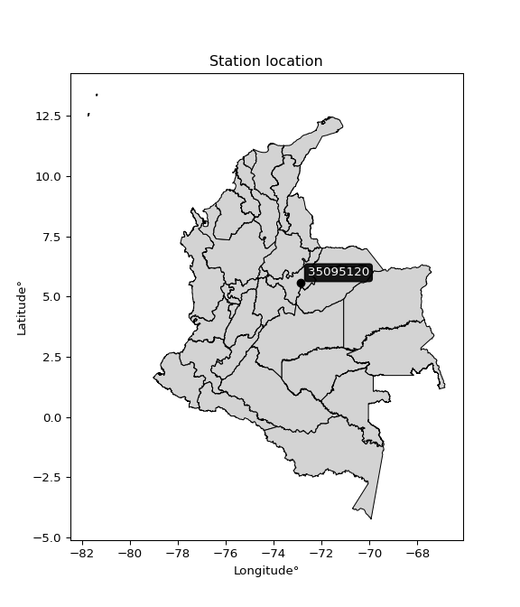

<div align="center">


</div>

# Station (rain, Pmax24h): 35095120

Probable Maximum Precipitation (PMP) is the greatest amount of rainfall for a specific duration that is meteorologically possible for a given location, acting as a "worst-case" scenario for extreme storms, crucial for designing safety-critical infrastructure like bridges, river deviations, dams, spillways, and nuclear plants to prevent catastrophic failure. PMP is calculated by hydrologists using meteorological data to determine the upper limit of extreme rainfall, often leading to the Probable Maximum Flood (PMF) for flood control design, and is increasingly being studied for climate change impacts.

<div align="center">

</img>

</div>


## A. General information


### 1. General running parameters

• app_version: _v20251226_. • runtime: _2025-12-26 15:38:16.554582_. • Python version: _3.14.0_. • SciPy version: _1.16.3_. • Pandas version: _2.3.3_. • NumPy version: _2.3.5_. • Stations dataset (station_dataset_file): _dataset/pmax24h_in/automatic_colombia_2003_2024.csv_. • Stations catalog (station_catalog_file): _dataset/CNE_IDEAM.xls_. • Minimum year to eval til year_max (date_min): _2003_. • Maximum year to eval since year_min (date_max): _2024_. • Creates, save and include plots into reports (create_plot): _False_. • Plot only fit distributions with Δo > Δ (plot_only_fit): _True_. • Eval low extreme values, if False, evaluates high extreme values (low_extreme): _False_. • Eval every SciPy distribution as logarithmic (pdist_logarithmic_on): _True_. • Standard deviation normalized (ddof): _1.0_. • Return periods to eval in years (Tr): _[2, 2.33, 5, 10, 15, 20, 25, 50, 75, 100, 200, 250, 500, 750, 1000]_. • Minimum data sample per station, 0 means any (minimum_sample): _5_. • Z-Score threshold to adjust a value, 0 means disable (zscore): _3.5_. • Avoid zeros, e.g. rain = 0 (avoid_zeros): _True_. • Avoid null values (avoid_nans): _True_. [:file_folder:Dataset file.](../../dataset/pmax24h_in/automatic_colombia_2003_2024.csv)


### 2. Station info and location

|   id |   CODIGO | NOMBRE                     | CATEGORIA               | TECNOLOGIA                | ESTADO   | FECHA_INSTALACION   |   FECHA_SUSPENSION |   ALTITUD |   LATITUD |   LONGITUD | DEPARTAMENTO   | MUNICIPIO   | AREA_OPERATIVA                              | ENTIDAD                                                     | AREA_HIDROGRAFICA   | ZONA_HIDROGRAFICA   | SUBZONA_HIDROGRAFICA   |   CORRIENTE | OBSERVACION                                                                                                      | SUBRED                                                   | Catalogo   |
|-----:|---------:|:---------------------------|:------------------------|:--------------------------|:---------|:--------------------|-------------------:|----------:|----------:|-----------:|:---------------|:------------|:--------------------------------------------|:------------------------------------------------------------|:--------------------|:--------------------|:-----------------------|------------:|:-----------------------------------------------------------------------------------------------------------------|:---------------------------------------------------------|:-----------|
|    0 | 35095120 | AQUITANIA - AUT [35095120] | Climatológica Principal | Automática con Telemetría | Activa   | 06/12/2004          |                nan |      3026 |   5.55663 |   -72.8817 | Boyacá         | Aquitania   | Area Operativa 06 - Boyacá-Casanare-Vichada | INSTITUTO DE HIDROLOGIA METEOROLOGIA Y ESTUDIOS AMBIENTALES | Orinoco             | Meta                | Lago de Tota           |         nan | |24/09/2024$mvelez$ACTIVA 24/09/2024   mediante correo electrónico Ing. Padilla coordinador grupo automatización | Radición Global,Radiación Visible,Radiación Ultravioleta | CNE_IDEAM  |

<div align="center">

Map location in: [:earth_americas:Google](http://maps.google.com/maps?q=5.55663,-72.88175) [:earth_americas:OSM](https://www.openstreetmap.org/#map=18/5.55663/-72.88175&layers=P) [:earth_americas:Bing](https://www.bing.com/maps?cp=5.55663~-72.88175&lvl=18) [:earth_americas:Apple](https://maps.apple.com/frame?center=5.55663%2C-72.88175&span=0.003%2C0.006)

</div>


<div align="center">

```geojson
{
  "type": "Feature",
  "geometry": {
    "type": "Point", 
    "coordinates": [-72.88175, 5.55663]
  }, 
  "properties": {
    "Name": "35095120"
  }
}
```

</div>


### 3. Discrete values table and plot

|               |           0 |          1 |          2 |          3 |            4 |           5 |         6 |           7 |
|:--------------|------------:|-----------:|-----------:|-----------:|-------------:|------------:|----------:|------------:|
| Date          | 2017        | 2018       | 2019       | 2020       | 2021         | 2022        | 2023      | 2024        |
| Value         |   27.7      |   19.7     |   58.5     |   27.6     |   23.2       |    6.4      |    4.9    |   11.8      |
| Value_initial |   27.7      |   19.7     |   58.5     |   27.6     |   23.2       |    6.4      |    4.9    |   11.8      |
| count         |    8        |    8       |    8       |    8       |    8         |    8        |    8      |    8        |
| mean          |   22.475    |   22.475   |   22.475   |   22.475   |   22.475     |   22.475    |   22.475  |   22.475    |
| std           |   17.0748   |   17.0748  |   17.0748  |   17.0748  |   17.0748    |   17.0748   |   17.0748 |   17.0748   |
| zscore        |    0.306007 |   -0.16252 |    2.10984 |    0.30015 |    0.0424603 |   -0.941447 |   -1.0293 |   -0.625191 |
> If Z-Score is active, values out of range or outliers are replaced with the station mean value.


### 4. Active continuous probability distributions from SciPy (45 of 104 available)

[scipy.stats](https://docs.scipy.org/doc/scipy/reference/stats.html) is a Python´s powerful submodule within the SciPy library for comprehensive statistical analysis, offering over 130 probability distributions (like Normal, Poisson), functions for descriptive stats (mean, variance), hypothesis testing (t-tests, chi-square), random variable generation, and statistical tests, making it essential for data science, modeling, and research. It provides tools to explore, model, and draw conclusions from data efficiently, working seamlessly with NumPy.

<div align="center">

|   id | p_dist             |   n_parameter | fit_method   | label                                                                       | active   | ref                                                                                                        |
|-----:|:-------------------|--------------:|:-------------|:----------------------------------------------------------------------------|:---------|:-----------------------------------------------------------------------------------------------------------|
|    0 | alpha              |             3 | MLE          | Alpha                                                                       | True     | [:mortar_board:](https://docs.scipy.org/doc/scipy/reference/generated/scipy.stats.alpha.html)              |
|    1 | betaprime          |             4 | MLE          | Beta prime                                                                  | True     | [:mortar_board:](https://docs.scipy.org/doc/scipy/reference/generated/scipy.stats.betaprime.html)          |
|    2 | chi2               |             3 | MLE          | Chi²                                                                        | True     | [:mortar_board:](https://docs.scipy.org/doc/scipy/reference/generated/scipy.stats.chi2.html)               |
|    3 | crystalball        |             4 | MLE          | Crystalball                                                                 | True     | [:mortar_board:](https://docs.scipy.org/doc/scipy/reference/generated/scipy.stats.crystalball.html)        |
|    4 | erlang             |             3 | MLE          | Erlang                                                                      | True     | [:mortar_board:](https://docs.scipy.org/doc/scipy/reference/generated/scipy.stats.erlang.html)             |
|    5 | expon              |             2 | MLE          | Exponential                                                                 | True     | [:mortar_board:](https://docs.scipy.org/doc/scipy/reference/generated/scipy.stats.expon.html)              |
|    6 | exponnorm          |             3 | MLE          | Exponentially modified Normal                                               | True     | [:mortar_board:](https://docs.scipy.org/doc/scipy/reference/generated/scipy.stats.exponnorm.html)          |
|    7 | f                  |             4 | MLE          | F                                                                           | True     | [:mortar_board:](https://docs.scipy.org/doc/scipy/reference/generated/scipy.stats.f.html)                  |
|    8 | fatiguelife        |             3 | MLE          | Fatigue-life (Birnbaum-Saunders)                                            | True     | [:mortar_board:](https://docs.scipy.org/doc/scipy/reference/generated/scipy.stats.fatiguelife.html)        |
|    9 | fisk               |             3 | MLE          | Fisk                                                                        | True     | [:mortar_board:](https://docs.scipy.org/doc/scipy/reference/generated/scipy.stats.fisk.html)               |
|   10 | gamma              |             3 | MLE          | Gamma                                                                       | True     | [:mortar_board:](https://docs.scipy.org/doc/scipy/reference/generated/scipy.stats.gamma.html)              |
|   11 | genexpon           |             5 | MLE          | Generalized exponential                                                     | True     | [:mortar_board:](https://docs.scipy.org/doc/scipy/reference/generated/scipy.stats.genexpon.html)           |
|   12 | genlogistic        |             3 | MLE          | Generalized logistic                                                        | True     | [:mortar_board:](https://docs.scipy.org/doc/scipy/reference/generated/scipy.stats.genlogistic.html)        |
|   13 | gibrat             |             2 | MM           | Gibrat                                                                      | True     | [:mortar_board:](https://docs.scipy.org/doc/scipy/reference/generated/scipy.stats.gibrat.html)             |
|   14 | gompertz           |             3 | MLE          | Gompertz (or truncated Gumbel)                                              | True     | [:mortar_board:](https://docs.scipy.org/doc/scipy/reference/generated/scipy.stats.gompertz.html)           |
|   15 | gumbel_l           |             2 | MM           | Gumbel Left Skew                                                            | True     | [:mortar_board:](https://docs.scipy.org/doc/scipy/reference/generated/scipy.stats.gumbel_l.html)           |
|   16 | gumbel_r           |             2 | MM           | Gumbel Right Skew                                                           | True     | [:mortar_board:](https://docs.scipy.org/doc/scipy/reference/generated/scipy.stats.gumbel_r.html)           |
|   17 | halflogistic       |             2 | MM           | Half-logistic                                                               | True     | [:mortar_board:](https://docs.scipy.org/doc/scipy/reference/generated/scipy.stats.halflogistic.html)       |
|   18 | halfnorm           |             2 | MM           | Half Normal                                                                 | True     | [:mortar_board:](https://docs.scipy.org/doc/scipy/reference/generated/scipy.stats.halfnorm.html)           |
|   19 | hypsecant          |             2 | MM           | hyperbolic secant                                                           | True     | [:mortar_board:](https://docs.scipy.org/doc/scipy/reference/generated/scipy.stats.hypsecant.html)          |
|   20 | invgamma           |             3 | MLE          | Inverted gamma                                                              | True     | [:mortar_board:](https://docs.scipy.org/doc/scipy/reference/generated/scipy.stats.invgamma.html)           |
|   21 | invgauss           |             3 | MLE          | Inverse Gaussian                                                            | True     | [:mortar_board:](https://docs.scipy.org/doc/scipy/reference/generated/scipy.stats.invgauss.html)           |
|   22 | invweibull         |             3 | MLE          | Inverted Weibull                                                            | True     | [:mortar_board:](https://docs.scipy.org/doc/scipy/reference/generated/scipy.stats.invweibull.html)         |
|   23 | johnsonsu          |             4 | MLE          | Johnson Su                                                                  | True     | [:mortar_board:](https://docs.scipy.org/doc/scipy/reference/generated/scipy.stats.johnsonsu.html)          |
|   24 | kstwobign          |             2 | MLE          | Limiting distribution of scaled Kolmogorov-Smirnov two-sided test statistic | True     | [:mortar_board:](https://docs.scipy.org/doc/scipy/reference/generated/scipy.stats.kstwobign.html)          |
|   25 | laplace            |             2 | MM           | Laplace                                                                     | True     | [:mortar_board:](https://docs.scipy.org/doc/scipy/reference/generated/scipy.stats.laplace.html)            |
|   26 | laplace_asymmetric |             3 | MLE          | Asymmetric Laplace                                                          | True     | [:mortar_board:](https://docs.scipy.org/doc/scipy/reference/generated/scipy.stats.laplace_asymmetric.html) |
|   27 | loggamma           |             3 | MLE          | Log gamma                                                                   | True     | [:mortar_board:](https://docs.scipy.org/doc/scipy/reference/generated/scipy.stats.loggamma.html)           |
|   28 | logistic           |             2 | MM           | Logistic (or Sech-squared)                                                  | True     | [:mortar_board:](https://docs.scipy.org/doc/scipy/reference/generated/scipy.stats.logistic.html)           |
|   29 | lognorm            |             3 | MLE          | Log Normal                                                                  | True     | [:mortar_board:](https://docs.scipy.org/doc/scipy/reference/generated/scipy.stats.lognorm.html)            |
|   30 | maxwell            |             2 | MM           | Maxwell                                                                     | True     | [:mortar_board:](https://docs.scipy.org/doc/scipy/reference/generated/scipy.stats.maxwell.html)            |
|   31 | mielke             |             4 | MLE          | Mielke Beta-Kappa / Dagum                                                   | True     | [:mortar_board:](https://docs.scipy.org/doc/scipy/reference/generated/scipy.stats.mielke.html)             |
|   32 | moyal              |             2 | MM           | Moyal                                                                       | True     | [:mortar_board:](https://docs.scipy.org/doc/scipy/reference/generated/scipy.stats.moyal.html)              |
|   33 | nakagami           |             3 | MLE          | Nakagami                                                                    | True     | [:mortar_board:](https://docs.scipy.org/doc/scipy/reference/generated/scipy.stats.nakagami.html)           |
|   34 | ncf                |             5 | MLE          | Non-central F distribution                                                  | True     | [:mortar_board:](https://docs.scipy.org/doc/scipy/reference/generated/scipy.stats.ncf.html)                |
|   35 | nct                |             4 | MLE          | Non-central Student’s t                                                     | True     | [:mortar_board:](https://docs.scipy.org/doc/scipy/reference/generated/scipy.stats.nct.html)                |
|   36 | norm               |             2 | MM           | Normal                                                                      | True     | [:mortar_board:](https://docs.scipy.org/doc/scipy/reference/generated/scipy.stats.norm.html)               |
|   37 | pareto             |             3 | MLE          | Pareto                                                                      | True     | [:mortar_board:](https://docs.scipy.org/doc/scipy/reference/generated/scipy.stats.pareto.html)             |
|   38 | pearson3           |             3 | MM           | Pearson type III                                                            | True     | [:mortar_board:](https://docs.scipy.org/doc/scipy/reference/generated/scipy.stats.pearson3.html)           |
|   39 | rayleigh           |             2 | MM           | Rayleigh                                                                    | True     | [:mortar_board:](https://docs.scipy.org/doc/scipy/reference/generated/scipy.stats.rayleigh.html)           |
|   40 | rice               |             3 | MLE          | Rice                                                                        | True     | [:mortar_board:](https://docs.scipy.org/doc/scipy/reference/generated/scipy.stats.rice.html)               |
|   41 | t                  |             3 | MLE          | Student’s t                                                                 | True     | [:mortar_board:](https://docs.scipy.org/doc/scipy/reference/generated/scipy.stats.t.html)                  |
|   42 | truncnorm          |             4 | MLE          | Truncated normal                                                            | True     | [:mortar_board:](https://docs.scipy.org/doc/scipy/reference/generated/scipy.stats.truncnorm.html)          |
|   43 | wald               |             2 | MM           | Wald                                                                        | True     | [:mortar_board:](https://docs.scipy.org/doc/scipy/reference/generated/scipy.stats.wald.html)               |
|   44 | weibull_min        |             3 | MLE          | Weibull minimum                                                             | True     | [:mortar_board:](https://docs.scipy.org/doc/scipy/reference/generated/scipy.stats.weibull_min.html)        |

</div>

> **n_parameter:** # arguments & localization & scale.
>
> **Fit methods:** (MLE) maximum likelihood, (MM) L-moments.
>
>**Inactive:** foldnorm, gennorm, norminvgauss, powernorm, powerlognorm, skewnorm, genextreme, anglit, arcsine, argus, beta, bradford, burr, burr12, cauchy, cosine, halfcauchy, foldcauchy, skewcauchy, wrapcauchy, dgamma, gengamma, exponweib, exponpow, truncexpon, gausshyper, genhalflogistic, genhyperbolic, geninvgauss, halfgennorm, johnsonsb, kappa4, kappa3, ksone, kstwo, loglaplace, levy, levy_l, levy_stable, ncx2, genpareto, truncpareto, lomax, powerlaw, rdist, rel_breitwigner, recipinvgauss, semicircular, studentized_range, trapezoid, triang, truncweibull_min, tukeylambda, uniform, loguniform, vonmises, vonmises_line, weibull_max, dweibull, 


## B. Probability distributions vs. Empirical distributions

A continuous probability distribution (CPD) describes probabilities for variables that can take any value within a range (like rain any time), unlike discrete variables with specific outcomes (like temperature). It uses a Probability Density Function (PDF), a curve where the total area under it equals 1, and the probability of the variable falling within an interval (a to b) is found by calculating the area under the curve between those points. A key feature is that the probability of hitting any single exact value is zero, so probabilities are always expressed for ranges, e.g., $P(a ≤ X ≤ b)$.

<div align="center">

Distributions parameters
|    |   station | p_dist                |   n |               loc |            scale | shape                  | shape1             | shape2                | shape3   |
|---:|----------:|:----------------------|----:|------------------:|-----------------:|:-----------------------|:-------------------|:----------------------|:---------|
|  0 |  35095120 | alpha                 |   8 |      -0.020753    |      9.99834     | 6.688439887850973e-09  |                    |                       |          |
|  1 |  35095120 | betaprime             |   8 |       4.9         |     80.8036      | 0.589349657782297      | 4.9187570493596615 |                       |          |
|  2 |  35095120 | chi2                  |   8 |       4.9         |      9.17826     | 1.427034618451642      |                    |                       |          |
|  3 |  35095120 | crystalball           |   8 |      22.475       |     15.972       | 3013.1115320559193     | 4174.768155766905  |                       |          |
|  4 |  35095120 | erlang                |   8 |       4.9         |     15.8274      | 0.7330399374911891     |                    |                       |          |
|  5 |  35095120 | expon                 |   8 |       4.9         |     17.575       |                        |                    |                       |          |
|  6 |  35095120 | exponnorm             |   8 |       4.87519     |      0.00763272  | 2285.71590056092       |                    |                       |          |
|  7 |  35095120 | f                     |   8 |       4.9         |     20.3123      | 1.038663603118617      | 43.21870935742601  |                       |          |
|  8 |  35095120 | fatiguelife           |   8 |       2.99629     |     11.4102      | 1.1553218810501251     |                    |                       |          |
|  9 |  35095120 | fisk                  |   8 |       4.9         |      8.16317     | 0.8884375815576526     |                    |                       |          |
| 10 |  35095120 | gamma                 |   8 |       4.9         |     20.4517      | 0.5873061903406142     |                    |                       |          |
| 11 |  35095120 | genexpon              |   8 |       4.89962     |      1.53499     | 0.0781664990520835     | 2.537750717692937  | 0.0003503029103079677 |          |
| 12 |  35095120 | genlogistic           |   8 |     -66.1596      |     11.4324      | 1258.898823690905      |                    |                       |          |
| 13 |  35095120 | gibrat                |   8 |      10.2904      |      7.39035     |                        |                    |                       |          |
| 14 |  35095120 | gompertz              |   8 |       4.9         |  10090           | 486.79978813207475     |                    |                       |          |
| 15 |  35095120 | gumbel_l              |   8 |      29.6632      |     12.4533      |                        |                    |                       |          |
| 16 |  35095120 | gumbel_r              |   8 |      15.2868      |     12.4533      |                        |                    |                       |          |
| 17 |  35095120 | halflogistic          |   8 |       3.54448     |     13.6555      |                        |                    |                       |          |
| 18 |  35095120 | halfnorm              |   8 |       1.33435     |     26.4959      |                        |                    |                       |          |
| 19 |  35095120 | hypsecant             |   8 |      22.475       |     10.1681      |                        |                    |                       |          |
| 20 |  35095120 | invgamma              |   8 |      -8.47034     |    107.665       | 4.424348983974317      |                    |                       |          |
| 21 |  35095120 | invgauss              |   8 |      -0.447213    |     32.5505      | 0.7042045912770867     |                    |                       |          |
| 22 |  35095120 | invweibull            |   8 |     -32.3392      |     46.475       | 4.536422332443207      |                    |                       |          |
| 23 |  35095120 | johnsonsu             |   8 |       1.34511     |      0.154928    | -6.11335615803598      | 1.1570447127952534 |                       |          |
| 24 |  35095120 | kstwobign             |   8 |     -25.6799      |     55.5824      |                        |                    |                       |          |
| 25 |  35095120 | laplace               |   8 |      22.475       |     11.2939      |                        |                    |                       |          |
| 26 |  35095120 | laplace_asymmetric    |   8 |      19.7         |     11.526       | 0.886840344564537      |                    |                       |          |
| 27 |  35095120 | loggamma              |   8 |   -5077.55        |    682.375       | 1762.0904979915613     |                    |                       |          |
| 28 |  35095120 | logistic              |   8 |      22.475       |      8.80582     |                        |                    |                       |          |
| 29 |  35095120 | lognorm               |   8 |       4.9         |      0.127324    | 12.359889060040262     |                    |                       |          |
| 30 |  35095120 | maxwell               |   8 |     -15.3719      |     23.717       |                        |                    |                       |          |
| 31 |  35095120 | mielke                |   8 |       4.9         |     31.307       | 0.7539275578736158     | 4.397103626172938  |                       |          |
| 32 |  35095120 | moyal                 |   8 |      13.3412      |      7.18992     |                        |                    |                       |          |
| 33 |  35095120 | nakagami              |   8 |       4.9         |     24.3975      | 0.17268556289036693    |                    |                       |          |
| 34 |  35095120 | ncf                   |   8 |       4.9         |      1.00693     | 0.3508503334132763     | 1170.9715155655408 | 5.361276569590455     |          |
| 35 |  35095120 | nct                   |   8 |     -15.1387      |      2.63862     | 4.0195572309929375     | 11.520063405775801 |                       |          |
| 36 |  35095120 | norm                  |   8 |      22.475       |     15.972       |                        |                    |                       |          |
| 37 |  35095120 | pareto                |   8 |       4.8953      |      0.00470435  | 0.14365504767377482    |                    |                       |          |
| 38 |  35095120 | pearson3              |   8 |      22.475       |     15.972       | 1.1108929975035444     |                    |                       |          |
| 39 |  35095120 | rayleigh              |   8 |      -8.08034     |     24.3796      |                        |                    |                       |          |
| 40 |  35095120 | rice                  |   8 |      -3.47488     |     21.5465      | 0.00035762838435911585 |                    |                       |          |
| 41 |  35095120 | t                     |   8 |      22.474       |     15.9709      | 19469.832982997978     |                    |                       |          |
| 42 |  35095120 | truncnorm             |   8 |      23.2281      |     16.7999      | -80.71590481983085     | 2.099534512315068  |                       |          |
| 43 |  35095120 | wald                  |   8 |       6.50298     |     15.972       |                        |                    |                       |          |
| 44 |  35095120 | weibull_min           |   8 |       4.9         |     16.9433      | 0.7827533838481741     |                    |                       |          |
| 45 |  35095120 | logalpha              |   8 |     -15.545       |    428.734       | 23.362730461833323     |                    |                       |          |
| 46 |  35095120 | logbetaprime          |   8 |     -10.5372      |     49.1008      | 372.0583034504574      | 1366.8905056012277 |                       |          |
| 47 |  35095120 | logchi2               |   8 |       1.58924     |      0.979648    | 1.1821777324141416     |                    |                       |          |
| 48 |  35095120 | logcrystalball        |   8 |       2.84333     |      0.77081     | 23.465962176733342     | 65.06435958136272  |                       |          |
| 49 |  35095120 | logerlang             |   8 |     -11.1094      |      0.0435577   | 320.34524703509055     |                    |                       |          |
| 50 |  35095120 | logexpon              |   8 |       1.58924     |      1.2541      |                        |                    |                       |          |
| 51 |  35095120 | logexponnorm          |   8 |       2.84268     |      0.770809    | 0.0008551001411501655  |                    |                       |          |
| 52 |  35095120 | logf                  |   8 |    -275.938       |    278.782       | 325735.4487392196      | 1309473.6842117151 |                       |          |
| 53 |  35095120 | logfatiguelife        |   8 |     -98.3596      |    101.199       | 0.007588030051266986   |                    |                       |          |
| 54 |  35095120 | logfisk               |   8 |      -3.69723e+07 |      3.69723e+07 | 81015017.65470996      |                    |                       |          |
| 55 |  35095120 | loggamma              |   8 |     -11.262       |      0.042689    | 330.39723347760355     |                    |                       |          |
| 56 |  35095120 | loggenexpon           |   8 |       1.58785     |      0.00470148  | 0.0017261035596325205  | 1.2900302542031854 | 8.500327917571782e-06 |          |
| 57 |  35095120 | loggenlogistic        |   8 |       3.38052     |      0.291876    | 0.42090527554213464    |                    |                       |          |
| 58 |  35095120 | loggibrat             |   8 |       2.25532     |      0.356651    |                        |                    |                       |          |
| 59 |  35095120 | loggompertz           |   8 |       1.58924     |      0.989898    | 0.2724730205876966     |                    |                       |          |
| 60 |  35095120 | loggumbel_l           |   8 |       3.19024     |      0.600998    |                        |                    |                       |          |
| 61 |  35095120 | loggumbel_r           |   8 |       2.49643     |      0.600998    |                        |                    |                       |          |
| 62 |  35095120 | loghalflogistic       |   8 |       1.92969     |      0.65905     |                        |                    |                       |          |
| 63 |  35095120 | loghalfnorm           |   8 |       1.82312     |      1.27866     |                        |                    |                       |          |
| 64 |  35095120 | loghypsecant          |   8 |       2.84333     |      0.490713    |                        |                    |                       |          |
| 65 |  35095120 | loginvgamma           |   8 |      -9.52513     |   3078.99        | 249.9893031611369      |                    |                       |          |
| 66 |  35095120 | loginvgauss           |   8 |      -2.8536      |    293.587       | 0.01938649743987987    |                    |                       |          |
| 67 |  35095120 | loginvweibull         |   8 | -200619           | 200621           | 270247.1927661098      |                    |                       |          |
| 68 |  35095120 | logjohnsonsu          |   8 |       7.08671     |      0.985625    | 12.126714928365795     | 5.638063817609446  |                       |          |
| 69 |  35095120 | logkstwobign          |   8 |      -0.123965    |      3.38475     |                        |                    |                       |          |
| 70 |  35095120 | loglaplace            |   8 |       2.84333     |      0.545045    |                        |                    |                       |          |
| 71 |  35095120 | loglaplace_asymmetric |   8 |       3.31782     |      0.510908    | 1.5668515163802361     |                    |                       |          |
| 72 |  35095120 | logloggamma           |   8 |       0.549535    |      1.59674     | 4.696303408832944      |                    |                       |          |
| 73 |  35095120 | loglogistic           |   8 |       2.84333     |      0.42497     |                        |                    |                       |          |
| 74 |  35095120 | loglognorm            |   8 |       1.58924     |      0.0130423   | 11.999899675601608     |                    |                       |          |
| 75 |  35095120 | logmaxwell            |   8 |       1.01684     |      1.14459     |                        |                    |                       |          |
| 76 |  35095120 | logmielke             |   8 |       1.58924     |      2.32293     | 0.6957394057186244     | 10.033744584488588 |                       |          |
| 77 |  35095120 | logmoyal              |   8 |       2.40254     |      0.346986    |                        |                    |                       |          |
| 78 |  35095120 | lognakagami           |   8 |       1.58924     |      1.66147     | 0.31464097371212096    |                    |                       |          |
| 79 |  35095120 | logncf                |   8 |     -13.4568      |     16.2838      | 1560.8081620357018     | 1948.7889071213758 | 9.001908838266469e-08 |          |
| 80 |  35095120 | lognct                |   8 |     -41.7917      |      0.755867    | 42212.2776409654       | 59.05006801558733  |                       |          |
| 81 |  35095120 | lognorm               |   8 |       2.84333     |      0.770809    |                        |                    |                       |          |
| 82 |  35095120 | logpareto             |   8 |       1.58882     |      0.00041791  | 0.1433893161202048     |                    |                       |          |
| 83 |  35095120 | logpearson3           |   8 |       2.84333     |      0.770808    | -0.2454963207219722    |                    |                       |          |
| 84 |  35095120 | lograyleigh           |   8 |       1.36873     |      1.17656     |                        |                    |                       |          |
| 85 |  35095120 | logrice               |   8 |       1.18249     |      0.880195    | 1.525527117453393      |                    |                       |          |
| 86 |  35095120 | logt                  |   8 |       2.84333     |      0.770809    | 5986227976408.197      |                    |                       |          |
| 87 |  35095120 | logtruncnorm          |   8 |       0.747377    |      1.88666     | 0.5877699140287236     | 22.12742797186033  |                       |          |
| 88 |  35095120 | logwald               |   8 |       2.0725      |      0.770831    |                        |                    |                       |          |
| 89 |  35095120 | logweibull_min        |   8 |       0.0258239   |      3.10579     | 4.2743893582658465     |                    |                       |          |

</div>

> **loc** (Location parameter): This shifts the distribution along the x-axis. For many common distributions, like the normal (Gaussian) distribution, loc represents the mean $μ$. For others, like the uniform distribution, it might represent the minimum value, or for the beta distribution, the left end of the support interval.
>
> **scale** (Scale parameter): This determines the width or spread of the distribution. For the normal distribution, scale represents the standard deviation $σ$. For a uniform distribution, it defines the length of the interval (from $loc$ to $loc + scale$).
>
> **shape** (Shape parameters): Refers to parameters that define the specific form of a probability distribution, distinct from its location (loc) and scale (scale). These parameters are required arguments for most distribution functions. For example, a normal (Gaussian) distribution is fully defined by its location (mean) and scale (standard deviation), so it has no specific shape parameters beyond loc and scale. However, other distributions have intrinsic properties that need specification, as Gamma distribution that takes a shape parameter, often named $a$ or $alpha$.


### 0. Cumulative distribution values - CDF (90 evaluated)

> Ordered by x ascending and calculating $log(f(x))$ separately. 

|   id |   Station |   date |    x |   count |   mean |     std |     zscore |   Value_initial |   station |   m |     alpha |   alpha_pdf |   betaprime |   betaprime_pdf |        chi2 |      chi2_pdf |   crystalball |   crystalball_pdf |      erlang |    erlang_pdf |     expon |   expon_pdf |   exponnorm |   exponnorm_pdf |           f |       f_pdf |   fatiguelife |   fatiguelife_pdf |       fisk |   fisk_pdf |       gamma |      gamma_pdf |    genexpon |   genexpon_pdf |   genlogistic |   genlogistic_pdf |    gibrat |   gibrat_pdf |    gompertz |   gompertz_pdf |   gumbel_l |   gumbel_l_pdf |   gumbel_r |   gumbel_r_pdf |   halflogistic |   halflogistic_pdf |   halfnorm |   halfnorm_pdf |   hypsecant |   hypsecant_pdf |   invgamma |   invgamma_pdf |   invgauss |   invgauss_pdf |   invweibull |   invweibull_pdf |   johnsonsu |   johnsonsu_pdf |   kstwobign |   kstwobign_pdf |   laplace |   laplace_pdf |   laplace_asymmetric |   laplace_asymmetric_pdf |   loggamma |   loggamma_pdf |   logistic |   logistic_pdf |   lognorm |   lognorm_pdf |   maxwell |   maxwell_pdf |     mielke |   mielke_pdf |     moyal |   moyal_pdf |    nakagami |   nakagami_pdf |         ncf |     ncf_pdf |       nct |    nct_pdf |     norm |   norm_pdf |   pareto |   pareto_pdf |   pearson3 |   pearson3_pdf |   rayleigh |   rayleigh_pdf |      rice |   rice_pdf |        t |      t_pdf |   truncnorm |   truncnorm_pdf |     wald |   wald_pdf |   weibull_min |   weibull_min_pdf |   logalpha |   logalpha_pdf |   logbetaprime |   logbetaprime_pdf |     logchi2 |    logchi2_pdf |   logcrystalball |   logcrystalball_pdf |   logerlang |   logerlang_pdf |   logexpon |   logexpon_pdf |   logexponnorm |   logexponnorm_pdf |      logf |   logf_pdf |   logfatiguelife |   logfatiguelife_pdf |   logfisk |   logfisk_pdf |   loggenexpon |   loggenexpon_pdf |   loggenlogistic |   loggenlogistic_pdf |   loggibrat |   loggibrat_pdf |   loggompertz |   loggompertz_pdf |   loggumbel_l |   loggumbel_l_pdf |   loggumbel_r |   loggumbel_r_pdf |   loghalflogistic |   loghalflogistic_pdf |   loghalfnorm |   loghalfnorm_pdf |   loghypsecant |   loghypsecant_pdf |   loginvgamma |   loginvgamma_pdf |   loginvgauss |   loginvgauss_pdf |   loginvweibull |   loginvweibull_pdf |   logjohnsonsu |   logjohnsonsu_pdf |   logkstwobign |   logkstwobign_pdf |   loglaplace |   loglaplace_pdf |   loglaplace_asymmetric |   loglaplace_asymmetric_pdf |   logloggamma |   logloggamma_pdf |   loglogistic |   loglogistic_pdf |   loglognorm |   loglognorm_pdf |   logmaxwell |   logmaxwell_pdf |   logmielke |   logmielke_pdf |   logmoyal |   logmoyal_pdf |   lognakagami |   lognakagami_pdf |    logncf |   logncf_pdf |    lognct |   lognct_pdf |   logpareto |   logpareto_pdf |   logpearson3 |   logpearson3_pdf |   lograyleigh |   lograyleigh_pdf |   logrice |   logrice_pdf |      logt |   logt_pdf |   logtruncnorm |   logtruncnorm_pdf |   logwald |   logwald_pdf |   logweibull_min |   logweibull_min_pdf |
|-----:|----------:|-------:|-----:|--------:|-------:|--------:|-----------:|----------------:|----------:|----:|----------:|------------:|------------:|----------------:|------------:|--------------:|--------------:|------------------:|------------:|--------------:|----------:|------------:|------------:|----------------:|------------:|------------:|--------------:|------------------:|-----------:|-----------:|------------:|---------------:|------------:|---------------:|--------------:|------------------:|----------:|-------------:|------------:|---------------:|-----------:|---------------:|-----------:|---------------:|---------------:|-------------------:|-----------:|---------------:|------------:|----------------:|-----------:|---------------:|-----------:|---------------:|-------------:|-----------------:|------------:|----------------:|------------:|----------------:|----------:|--------------:|---------------------:|-------------------------:|-----------:|---------------:|-----------:|---------------:|----------:|--------------:|----------:|--------------:|-----------:|-------------:|----------:|------------:|------------:|---------------:|------------:|------------:|----------:|-----------:|---------:|-----------:|---------:|-------------:|-----------:|---------------:|-----------:|---------------:|----------:|-----------:|---------:|-----------:|------------:|----------------:|---------:|-----------:|--------------:|------------------:|-----------:|---------------:|---------------:|-------------------:|------------:|---------------:|-----------------:|---------------------:|------------:|----------------:|-----------:|---------------:|---------------:|-------------------:|----------:|-----------:|-----------------:|---------------------:|----------:|--------------:|--------------:|------------------:|-----------------:|---------------------:|------------:|----------------:|--------------:|------------------:|--------------:|------------------:|--------------:|------------------:|------------------:|----------------------:|--------------:|------------------:|---------------:|-------------------:|--------------:|------------------:|--------------:|------------------:|----------------:|--------------------:|---------------:|-------------------:|---------------:|-------------------:|-------------:|-----------------:|------------------------:|----------------------------:|--------------:|------------------:|--------------:|------------------:|-------------:|-----------------:|-------------:|-----------------:|------------:|----------------:|-----------:|---------------:|--------------:|------------------:|----------:|-------------:|----------:|-------------:|------------:|----------------:|--------------:|------------------:|--------------:|------------------:|----------:|--------------:|----------:|-----------:|---------------:|-------------------:|----------:|--------------:|-----------------:|---------------------:|
|    0 |  35095120 |   2023 |  4.9 |       8 | 22.475 | 17.0748 | -1.0293    |             4.9 |  35095120 |   1 | 0.0421666 |  0.041813   | 2.41953e-06 |    342.031      | 2.50675e-12 | 2013.8        |      0.135587 |        0.0136342  | 1.33618e-12 | 1102.78       | 0         |  0.056899   |  0.00142111 |      0.0572045  | 2.54627e-09 | 1.48884e+06 |     0.0387388 |        0.0545229  | 6.5698e-15 | 6.57172    | 2.75375e-10 | 182091         | 1.95921e-05 |     0.0509222  |      0.081049 |        0.0177958  | 0         |   0          | 2.57106e-16 |     0.048246   |   0.127945 |    0.00958673  |  0.0999946 |     0.0184892  |       0.049592 |         0.0365253  |   0.107051 |     0.0298421  |    0.111872 |      0.0107772  |  0.0606156 |     0.0231488  |  0.0493243 |     0.0307556  |    0.0650854 |       0.0216614  |   0.0459323 |       0.0313344 |   0.0773567 |      0.018091   |  0.105473 |    0.00933897 |             0.103485 |               0.010124   |  0.0497958 |       0.140982 |   0.11964  |     0.011961   | 0.0518696 |      0.137769 |  0.134012 |     0.0170571 | 1.0783e-09 |  20.3465     | 0.0720799 |  0.0197993  | 1.67581e-06 |    6.51643e+08 | 0.000186839 | 3.69027e+09 | 0.0658214 | 0.0221313  | 0.135587 | 0.0136342  | 0        | 30.5367      |   0.101565 |     0.0212451  |   0.132152 |     0.0189529  | 0.072757  | 0.0167271  | 0.135592 | 0.0136346  |    0.14015  |      0.0133349  | 0        | 0          |   1.80462e-13 |      159.042      |  0.0485299 |       0.147067 |      0.0509108 |           0.144775 | 6.33876e-10 | 843698         |        0.0518698 |             0.13777  |   0.0503183 |        0.141607 |   0        |       0.797385 |      0.0518694 |           0.137769 | 0.0519045 |   0.138138 |        0.0506818 |             0.137467 | 0.0552081 |      0.114295 |   0.000507937 |          0.36764  |        0.0754669 |             0.108594 |    0        |       0         |   3.38989e-09 |          0.275254 |     0.0673032 |         0.10813   |     0.0108414 |         0.0816155 |          0        |              0        |     0         |          0        |      0.0493283 |           0.100122 |     0.0471672 |          0.144937 |     0.0428367 |          0.148768 |        0.041295 |            0.177283 |      0.0646853 |           0.127514 |      0.0401268 |           0.20216  |    0.0500837 |        0.0918892 |               0.0820011 |                   0.102435  |     0.0635007 |          0.127602 |     0.0496876 |          0.111111 |   0.00412054 |      4.56598e+12 |    0.0308753 |         0.153844 | 7.15378e-12 |   22415.2       | 0.00124535 |      0.0202535 |   7.95684e-11 |     225500        | 0.0503869 |     0.143079 | 0.0519047 |     0.138051 |    0        |     343.111     |     0.0581995 |          0.133711 |     0.0174086 |          0.156516 | 0.0336019 |      0.166268 | 0.0518696 |   0.13777  |    0           |           0        |  0        |     0         |        0.0517976 |             0.137883 |
|    1 |  35095120 |   2022 |  6.4 |       8 | 22.475 | 17.0748 | -0.941447  |             6.4 |  35095120 |   2 | 0.119425  |  0.0575636  | 0.257078    |      0.0947371  | 0.17767     |    0.0805538  |      0.1571   |        0.015052   | 0.186664    |    0.0863323  | 0.0818078 |  0.0522442  |  0.08369    |      0.052522   | 0.203366    | 0.0686103   |     0.133062  |        0.0649746  | 0.181657   | 0.0880487  | 0.235235    |      0.0879231 | 0.0739517   |     0.0476814  |      0.110361 |        0.0212573  | 0         |   0          | 0.0698174   |     0.0448842  |   0.143093 |    0.010626    |  0.129855  |     0.0212857  |       0.104176 |         0.036218   |   0.15162  |     0.0295682  |    0.129203 |      0.0123606  |  0.100133  |     0.0292958  |  0.102765  |     0.0394677  |    0.10188   |       0.0272483  |   0.100518  |       0.0403038 |   0.106995  |      0.0213694  |  0.120455 |    0.0106655  |             0.119842 |               0.0117242  |  0.0997273 |       0.236909 |   0.138776 |     0.0135725  | 0.100181  |      0.227982 |  0.160771 |     0.0186021 | 0.101194   |   0.0508619  | 0.105136  |  0.0241894  | 0.304335    |    0.0700334   | 0.0918304   | 0.033309    | 0.103336  | 0.0277194  | 0.1571   | 0.015052   | 0.563332 |  0.0416889   |   0.135404 |     0.0237888  |   0.161709 |     0.020423   | 0.0996955 | 0.01915    | 0.157105 | 0.0150526  |    0.161131 |      0.0146408  | 0        | 0          |   0.139216    |        0.0673383  |  0.101109  |       0.25049  |      0.102081  |           0.242228 | 0.328217    |      0.666245  |        0.100182  |             0.227982 |   0.100362  |        0.237045 |   0.191805 |       0.644442 |      0.100181  |           0.227981 | 0.100346  |   0.228567 |        0.0991151 |             0.229293 | 0.0949484 |      0.1883   |   0.109907    |          0.445299 |        0.110771  |             0.158882 |    0        |       0         |   0.0809194   |          0.331325 |     0.102963  |         0.162181  |     0.0549587 |         0.2653    |          0        |              0        |     0.0206994 |          0.623792 |      0.0846746 |           0.170526 |     0.0992299 |          0.248909 |     0.0975149 |          0.264577 |        0.108169 |            0.324066 |      0.107405  |           0.195794 |      0.116567  |           0.365464 |    0.0817511 |        0.14999   |               0.114474  |                   0.143     |     0.106432  |          0.197406 |     0.0892679 |          0.191306 |   0.599328   |      0.120607    |    0.0895104 |         0.286543 | 0.222027    |       0.578415  | 0.0280164  |      0.226077  |   0.245232    |          0.574279 | 0.100983  |     0.23965  | 0.100317  |     0.228447 |    0.604069 |       0.212248  |     0.103943  |          0.212498 |     0.0822803 |          0.323231 | 0.0929318 |      0.277878 | 0.100181  |   0.227982 |    1.66915e-11 |           0.639172 |  0        |     0         |        0.0991051 |             0.219557 |
|    2 |  35095120 |   2024 | 11.8 |       8 | 22.475 | 17.0748 | -0.625191  |            11.8 |  35095120 |   3 | 0.397648  |  0.0399231  | 0.558379    |      0.0356732  | 0.469772    |    0.0387667  |      0.251953 |        0.019978   | 0.498512    |    0.0408386  | 0.324703  |  0.0384237  |  0.327614   |      0.0385405  | 0.428684    | 0.0286236   |     0.41095   |        0.0385637  | 0.46273    | 0.0320109  | 0.52529     |      0.0359681 | 0.302579    |     0.0373291  |      0.252906 |        0.0303952  | 0.0561095 |   0.0748581  | 0.283238    |     0.0346045  |   0.211998 |    0.0150759   |  0.266305  |     0.0282938  |       0.293396 |         0.0334634  |   0.307151 |     0.0278537  |    0.214328 |      0.0195214  |  0.290043  |     0.0375558  |  0.329756  |     0.0398074  |    0.282649  |       0.0367053  |   0.330703  |       0.0401088 |   0.246539  |      0.0291169  |  0.194301 |    0.0172041  |             0.203254 |               0.0198846  |  0.31983   |       0.469069 |   0.2293   |     0.0200687  | 0.313198  |      0.45973  |  0.273848 |     0.0229076 | 0.319691   |   0.0348858  | 0.265652  |  0.033241   | 0.51453     |    0.0254525   | 0.279148    | 0.0354588   | 0.28551   | 0.0367153  | 0.251953 | 0.019978   | 0.649171 |  0.00729913  |   0.279971 |     0.028665   |   0.282856 |     0.023987   | 0.222202  | 0.0255913  | 0.251963 | 0.0199791  |    0.252693 |      0.0191849  | 0.199602 | 0.0666901  |   0.390433    |        0.0342301  |  0.330531  |       0.478824 |      0.324913  |           0.470669 | 0.595721    |      0.299564  |        0.313198  |             0.459731 |   0.319891  |        0.46704  |   0.503808 |       0.395656 |      0.313197  |           0.45973  | 0.313666  |   0.459845 |        0.31401   |             0.463687 | 0.286171  |      0.447619 |   0.40266     |          0.479952 |        0.263461  |             0.363956 |    0.302746 |       1.6408    |   0.322671    |          0.453017 |     0.259716  |         0.370417  |     0.350545  |         0.611424  |          0.387178 |              0.644939 |     0.386032  |          0.549459 |      0.277348  |           0.496345 |     0.328733  |          0.480895 |     0.339222  |          0.495561 |        0.376999 |            0.495401 |      0.290194  |           0.408786 |      0.399365  |           0.494154 |    0.251177  |        0.460838  |               0.245821  |                   0.307078  |     0.291527  |          0.414167 |     0.292563  |          0.487023 |   0.637158   |      0.0355695   |    0.342345  |         0.501634 | 0.50853     |       0.402546  | 0.362901   |      0.691524  |   0.509254    |          0.340913 | 0.322065  |     0.468253 | 0.313619  |     0.459992 |    0.666181 |       0.0544376 |     0.302171  |          0.435227 |     0.353732  |          0.513245 | 0.331499  |      0.478738 | 0.313198  |   0.45973  |    0.350185    |           0.501194 |  0.376472 |     1.11749   |        0.300907  |             0.437989 |
|    3 |  35095120 |   2018 | 19.7 |       8 | 22.475 | 17.0748 | -0.16252   |            19.7 |  35095120 |   4 | 0.612158  |  0.0180387  | 0.748861    |      0.0162155  | 0.691964    |    0.0202586  |      0.431034 |        0.0246035  | 0.727262    |    0.0202221  | 0.569197  |  0.0245122  |  0.572475   |      0.0245053  | 0.596979    | 0.0161709   |     0.630011  |        0.0199211  | 0.62916    | 0.014006   | 0.725489    |      0.0178397 | 0.5484      |     0.0255144  |      0.502068 |        0.0302509  | 0.59544   |   0.0411781  | 0.510595    |     0.0236465  |   0.36193  |    0.0230212   |  0.495788  |     0.0279322  |       0.531002 |         0.0262912  |   0.511785 |     0.0236827  |    0.414188 |      0.0301741  |  0.555465  |     0.0279423  |  0.583731  |     0.0248728  |    0.549525  |       0.0286801  |   0.584414  |       0.0245823 |   0.482365  |      0.0287165  |  0.391075 |    0.0346271  |             0.440242 |               0.0430694  |  0.577705  |       0.501038 |   0.421862 |     0.027697   | 0.570679  |      0.509419 |  0.465436 |     0.0246509 | 0.564905   |   0.0277477  | 0.520471  |  0.0290046  | 0.664872    |    0.0146953   | 0.540437    | 0.029355    | 0.551009  | 0.0284473  | 0.431034 | 0.0246035  | 0.685581 |  0.00305091  |   0.503239 |     0.0265145  |   0.477546 |     0.0244192  | 0.439223  | 0.0279934  | 0.431056 | 0.024605   |    0.424421 |      0.0236518  | 0.588709 | 0.0326545  |   0.593247    |        0.0193517  |  0.587072  |       0.486451 |      0.581555  |           0.495101 | 0.718502    |      0.191116  |        0.57068   |             0.509418 |   0.576591  |        0.498972 |   0.670266 |       0.262925 |      0.570679  |           0.509419 | 0.570904  |   0.508419 |        0.572865  |             0.510121 | 0.55206   |      0.541871 |   0.629203    |          0.392013 |        0.510699  |             0.587253 |    0.761092 |       0.42755   |   0.567705    |          0.485234 |     0.506159  |         0.579745  |     0.639671  |         0.475552  |          0.662529 |              0.425655 |     0.634664  |          0.41423  |      0.587912  |           0.624086 |     0.586832  |          0.489841 |     0.597733  |          0.477471 |        0.613176 |            0.403988 |      0.537426  |           0.53031  |      0.63061   |           0.392639 |    0.61133   |        0.713098  |               0.466304  |                   0.582504  |     0.540813  |          0.531206 |     0.580066  |          0.573193 |   0.65142    |      0.0221513   |    0.599607  |         0.470946 | 0.699778    |       0.34788   | 0.66375    |      0.454766  |   0.659764    |          0.251813 | 0.57817   |     0.4956   | 0.571026  |     0.508875 |    0.687455 |       0.0321997 |     0.555043  |          0.52003  |     0.608764  |          0.455557 | 0.585752  |      0.482783 | 0.570679  |   0.509419 |    0.57511     |           0.377033 |  0.730609 |     0.399327  |        0.554308  |             0.521028 |
|    4 |  35095120 |   2021 | 23.2 |       8 | 22.475 | 17.0748 |  0.0424603 |            23.2 |  35095120 |   5 | 0.666775  |  0.0134852  | 0.798134    |      0.0121917  | 0.754589    |    0.0157541  |      0.518103 |        0.0249519  | 0.788996    |    0.0153171  | 0.646987  |  0.0200861  |  0.650188   |      0.0200509  | 0.648384    | 0.0133472   |     0.691919  |        0.0156925  | 0.671992   | 0.010701   | 0.780419    |      0.0137727 | 0.630278    |     0.0213749  |      0.602091 |        0.0267142  | 0.71151   |   0.0264504  | 0.58675     |     0.0199738  |   0.448502 |    0.0263549   |  0.588778  |     0.0250439  |       0.616719 |         0.022689   |   0.590769 |     0.0214229  |    0.522677 |      0.0312254  |  0.643735  |     0.0225845  |  0.661532  |     0.0197797  |    0.640423  |       0.0233105  |   0.660977  |       0.0193767 |   0.578227  |      0.025913   |  0.531088 |    0.041519   |             0.572393 |               0.0329013  |  0.657114  |       0.467053 |   0.520571 |     0.0283423  | 0.651829  |      0.479613 |  0.550341 |     0.0237111 | 0.65687    |   0.0247292  | 0.61441   |  0.0246219  | 0.712024    |    0.0123661   | 0.635807    | 0.0250979   | 0.641165  | 0.0231237  | 0.518103 | 0.0249519  | 0.695021 |  0.00239347  |   0.591327 |     0.0237228  |   0.560937 |     0.023107   | 0.53529   | 0.0267013  | 0.518129 | 0.0249532  |    0.508426 |      0.0241792  | 0.685611 | 0.0233455  |   0.654289    |        0.0157063  |  0.663678  |       0.447869 |      0.65989   |           0.460019 | 0.747813    |      0.168002  |        0.651829  |             0.479612 |   0.655705  |        0.465549 |   0.710577 |       0.230781 |      0.651828  |           0.479613 | 0.651876  |   0.478472 |        0.654009  |             0.478871 | 0.638148  |      0.50599  |   0.690132    |          0.352671 |        0.609099  |             0.607887 |    0.819417 |       0.295819  |   0.645922    |          0.46883  |     0.603937  |         0.610362  |     0.711513  |         0.40295   |          0.726547 |              0.358189 |     0.698461  |          0.365939 |      0.683945  |           0.543339 |     0.663967  |          0.450899 |     0.672396  |          0.433558 |        0.675433 |            0.357022 |      0.624193  |           0.526434 |      0.691218  |           0.348388 |    0.712077  |        0.528257  |               0.571991  |                   0.714527  |     0.62747   |          0.524157 |     0.669927  |          0.520331 |   0.654839   |      0.0197495   |    0.673268  |         0.428111 | 0.755406    |       0.332086  | 0.731244   |      0.372281  |   0.699031    |          0.228737 | 0.656662  |     0.46142  | 0.652072  |     0.478914 |    0.692395 |       0.0283587 |     0.638922  |          0.501845 |     0.679708  |          0.410787 | 0.66204   |      0.447767 | 0.651829  |   0.479613 |    0.633638    |           0.338992 |  0.787212 |     0.298896  |        0.638454  |             0.504189 |
|    5 |  35095120 |   2020 | 27.6 |       8 | 22.475 | 17.0748 |  0.30015   |            27.6 |  35095120 |   6 | 0.717362  |  0.00979362 | 0.843761    |      0.00878459 | 0.814369    |    0.0116543  |      0.625847 |        0.0237243  | 0.846192    |    0.0109513  | 0.725171  |  0.0156375  |  0.728166   |      0.0155813  | 0.7011      | 0.0107539   |     0.752244  |        0.0119571  | 0.712721   | 0.00801355 | 0.832589    |      0.0101617 | 0.714358    |     0.0169859  |      0.708014 |        0.0213811  | 0.80264   |   0.0160447  | 0.665934    |     0.0161536  |   0.571437 |    0.0291592   |  0.689326  |     0.0205935  |       0.70682  |         0.0183225  |   0.678466 |     0.0184235  |    0.654046 |      0.0277099  |  0.730072  |     0.0168829  |  0.737242  |     0.0148853  |    0.729549  |       0.0174109  |   0.734789  |       0.0144403 |   0.682928  |      0.0216073  |  0.68239  |    0.0281222  |             0.6952   |               0.0234522  |  0.733809  |       0.413807 |   0.641528 |     0.0261157  | 0.730908  |      0.428235 |  0.649961 |     0.0213929 | 0.756007   |   0.0201959  | 0.710646  |  0.0192159  | 0.761418    |    0.0101917   | 0.734348    | 0.0197495   | 0.729625  | 0.0172937  | 0.625847 | 0.0237243  | 0.704315 |  0.00187083  |   0.687004 |     0.0197323  |   0.657321 |     0.0205713  | 0.646548  | 0.0236585  | 0.625878 | 0.0237249  |    0.613633 |      0.0233742  | 0.770465 | 0.0158246  |   0.715574    |        0.0123311  |  0.73687   |       0.393256 |      0.735342  |           0.406718 | 0.775136    |      0.147237  |        0.730909  |             0.428235 |   0.732204  |        0.413058 |   0.748004 |       0.200937 |      0.730908  |           0.428236 | 0.730759  |   0.427144 |        0.732848  |             0.426281 | 0.720688  |      0.44109  |   0.747595    |          0.308951 |        0.712211  |             0.568475 |    0.862499 |       0.206932  |   0.724616    |          0.434557 |     0.709597  |         0.597472  |     0.774959  |         0.328741  |          0.78302  |              0.293514 |     0.757579  |          0.315111 |      0.768674  |           0.430996 |     0.73763   |          0.395612 |     0.742844  |          0.376527 |        0.733042 |            0.306652 |      0.713138  |           0.492874 |      0.747625  |           0.301432 |    0.790636  |        0.384122  |               0.710566  |                   0.887634  |     0.715734  |          0.487412 |     0.75334   |          0.437252 |   0.658085   |      0.0177023   |    0.742967  |         0.373464 | 0.811316    |       0.310541  | 0.789138   |      0.296673  |   0.736763    |          0.206093 | 0.732425  |     0.408833 | 0.731025  |     0.427495 |    0.697028 |       0.0251261 |     0.722604  |          0.457998 |     0.746438  |          0.357013 | 0.735554  |      0.396954 | 0.730908  |   0.428235 |    0.689121    |           0.300306 |  0.832248 |     0.224151  |        0.722678  |             0.461831 |
|    6 |  35095120 |   2017 | 27.7 |       8 | 22.475 | 17.0748 |  0.306007  |            27.7 |  35095120 |   7 | 0.718338  |  0.00972768 | 0.844636    |      0.00872223 | 0.81553     |    0.0115764  |      0.628217 |        0.0236762  | 0.847283    |    0.0108695  | 0.726731  |  0.0155488  |  0.729719   |      0.0154922  | 0.702173    | 0.0107039   |     0.753436  |        0.0118869  | 0.713519   | 0.00796513 | 0.833602    |      0.0100938 | 0.716053    |     0.0168958  |      0.710146 |        0.0212588  | 0.804236  |   0.0158742  | 0.667545    |     0.0160759  |   0.574355 |    0.0291942   |  0.691381  |     0.0204897  |       0.708648 |         0.0182278  |   0.680305 |     0.0183546  |    0.656811 |      0.0275823  |  0.731754  |     0.016769   |  0.738726  |     0.0147907  |    0.731284  |       0.0172919  |   0.736228  |       0.0143458 |   0.685084  |      0.0215061  |  0.68519  |    0.0278743  |             0.697536 |               0.0232724  |  0.735304  |       0.412559 |   0.644135 |     0.0260311  | 0.732455  |      0.426995 |  0.652097 |     0.0213289 | 0.758021   |   0.0200842  | 0.712562  |  0.0191009  | 0.762435    |    0.010149    | 0.736317    | 0.0196331   | 0.731349  | 0.0171763  | 0.628217 | 0.0236762  | 0.704501 |  0.00186145  |   0.688973 |     0.0196405  |   0.659375 |     0.0205053  | 0.64891   | 0.0235761  | 0.628248 | 0.0236768  |    0.615969 |      0.0233376  | 0.772041 | 0.0156916  |   0.716803    |        0.012266   |  0.73829   |       0.392018 |      0.736811  |           0.40548  | 0.775668    |      0.14684   |        0.732455  |             0.426995 |   0.733695  |        0.411826 |   0.74873  |       0.200359 |      0.732454  |           0.426996 | 0.732301  |   0.425908 |        0.734387  |             0.425021 | 0.72228   |      0.439544 |   0.748711    |          0.308035 |        0.714264  |             0.566958 |    0.863245 |       0.205465  |   0.726186    |          0.433661 |     0.711756  |         0.596609  |     0.776145  |         0.327269  |          0.784079 |              0.292254 |     0.758716  |          0.31407  |      0.770228  |           0.428624 |     0.739059  |          0.394357 |     0.744204  |          0.375273 |        0.734149 |            0.305623 |      0.714919  |           0.491859 |      0.748713  |           0.300471 |    0.792021  |        0.381581  |               0.713759  |                   0.877843  |     0.717494  |          0.486341 |     0.754918  |          0.435365 |   0.658149   |      0.0176641   |    0.744316  |         0.372265 | 0.812439    |       0.309999  | 0.790209   |      0.29524   |   0.737507    |          0.20564  | 0.733901  |     0.407607 | 0.732569  |     0.426256 |    0.697119 |       0.0250661 |     0.724258  |          0.456848 |     0.747727  |          0.355857 | 0.736988  |      0.395785 | 0.732455  |   0.426995 |    0.690206    |           0.299522 |  0.833056 |     0.222855  |        0.724346  |             0.460706 |
|    7 |  35095120 |   2019 | 58.5 |       8 | 22.475 | 17.0748 |  2.10984   |            58.5 |  35095120 |   8 | 0.864341  |  0.00229567 | 0.963275    |      0.00146409 | 0.971171    |    0.00169251 |      0.987949 |        0.00196269 | 0.981614    |    0.00123588 | 0.952631  |  0.00269525 |  0.953751   |      0.00265094 | 0.889558    | 0.00328093  |     0.935313  |        0.00261895 | 0.841838   | 0.00220696 | 0.971347    |      0.0015733 | 0.961966    |     0.00270128 |      0.977123 |        0.00197796 | 0.96963   |   0.00142579 | 0.925195    |     0.00362828 |   0.99996  |    3.24018e-05 |  0.969363  |     0.00242209 |       0.96488  |         0.00252667 |   0.969036 |     0.00293735 |    0.981589 |      0.00180965 |  0.950909  |     0.00233272 |  0.946635  |     0.00254286 |    0.9533    |       0.00227681 |   0.936673  |       0.0025153 |   0.979643  |      0.00221878 |  0.979409 |    0.00182316 |             0.971721 |               0.00217588 |  0.94009   |       0.145062 |   0.983553 |     0.00183699 | 0.944098  |      0.146184 |  0.978718 |     0.0025531 | 0.984712   |   0.00119022 | 0.965491  |  0.00239834 | 0.942308    |    0.00293041  | 0.982133    | 0.00173537  | 0.952665  | 0.00228186 | 0.987949 | 0.00196269 | 0.738643 |  0.000700409 |   0.968726 |     0.00259076 |   0.975986 |     0.00268999 | 0.984024  | 0.00213274 | 0.987951 | 0.00196224 |    1        |      0.00266838 | 0.962148 | 0.00194666 |   0.914842    |        0.00306333 |  0.93374   |       0.143422 |      0.938529  |           0.144503 | 0.860573    |      0.0865803 |        0.944098  |             0.146183 |   0.938945  |        0.146464 |   0.861564 |       0.110387 |      0.944098  |           0.146184 | 0.943617  |   0.146443 |        0.944256  |             0.144655 | 0.930472  |      0.14176  |   0.912464    |          0.139645 |        0.962698  |             0.119891 |    0.948064 |       0.0586102 |   0.953295    |          0.157416 |     0.98664   |         0.0959313 |     0.929557  |         0.112982  |          0.925065 |              0.109441 |     0.920989  |          0.133431 |      0.947745  |           0.106011 |     0.934996  |          0.142727 |     0.93071   |          0.139183 |        0.893246 |            0.135837 |      0.961235  |           0.149188 |      0.907092  |           0.135973 |    0.947237  |        0.0968055 |               0.971092  |                   0.0886546 |     0.959479  |          0.148032 |     0.947059  |          0.11798  |   0.669058   |      0.012184    |    0.931555  |         0.141613 | 0.971424    |       0.0931342 | 0.927816   |      0.103731  |   0.859742    |          0.125739 | 0.937432  |     0.146528 | 0.943897  |     0.146177 |    0.712304 |       0.0166327 |     0.952105  |          0.149554 |     0.928186  |          0.140085 | 0.936793  |      0.146838 | 0.944098  |   0.146184 |    0.859335    |           0.161266 |  0.933373 |     0.0762081 |        0.954396  |             0.148865 |

An Empirical Distribution Function (EDF) is a step-function estimate of a true cumulative distribution function (CDF) based on observed sample data, representing the proportion of data points less than or equal to a given value. It is calculated by ordering your data and jumping up by $1/n$ (where $n$ is sample size) at each unique data point, allowing analysis without assuming an underlying population distribution, and it gets closer to the true CDF as the sample size grows.


### 1. Empirical - EDF California (1923)

California´s estimates the true probability distribution of water-related data (like rainfall, streamflow) using observed samples, crucial for risk assessment.

<div align="center">


$P=m/n$


</div>


**1.1. Empirical values**

<div align="center">

|                | 0                  | 1                  | 2              | 3              | 4                  | 5              | 6              | 7              |
|:---------------|:-------------------|:-------------------|:---------------|:---------------|:-------------------|:---------------|:---------------|:---------------|
| date           | 2023               | 2022               | 2024           | 2018           | 2021               | 2020           | 2017           | 2019           |
| x              | 4.9                | 6.4                | 11.8           | 19.7           | 23.2               | 27.6           | 27.7           | 58.5           |
| m              | 1                  | 2                  | 3              | 4              | 5                  | 6              | 7              | 8              |
| empirical_dist | edf_california     | edf_california     | edf_california | edf_california | edf_california     | edf_california | edf_california | edf_california |
| empirical      | 0.125              | 0.25               | 0.375          | 0.5            | 0.625              | 0.75           | 0.875          | 1.0            |
| empirical_tr   | 1.1428571428571428 | 1.3333333333333333 | 1.6            | 2.0            | 2.6666666666666665 | 4.0            | 8.0            | inf            |

</div>


**1.2. Kolmogorov-Smirnov fit test (sorted by Δ)**


<div align="center">

|                | 0                   | 1                   | 2                  | 3                   | 4                   | 5                   | 6                   | 7                   | 8                   | 9                  | 10                  | 11                 | 12                  | 13                  | 14                  | 15                  | 16                  | 17                  | 18                  | 19                  | 20                 | 21                  | 22                  | 23                  | 24                 | 25                  | 26                 | 27                  | 28                  | 29                  | 30                 | 31                  | 32                  | 33                  | 34                  | 35                  | 36                 | 37                 | 38                  | 39                    | 40                  | 41                  | 42                  | 43                  | 44                  | 45                 | 46                  | 47                  | 48                  | 49                  | 50                  | 51                  | 52                  | 53                  | 54                 | 55                  | 56                  | 57                  | 58                  | 59                 | 60                 | 61                  | 62                  | 63                  | 64                  | 65                 | 66                 | 67                  | 68                  | 69                  | 70                 | 71                  | 72                  | 73                  | 74                  | 75                  | 76                  | 77                 | 78                  | 79                  | 80                 | 81                 | 82                 | 83                 | 84                  | 85                  | 86                  | 87                 | 88                  | 89                 |
|:---------------|:--------------------|:--------------------|:-------------------|:--------------------|:--------------------|:--------------------|:--------------------|:--------------------|:--------------------|:-------------------|:--------------------|:-------------------|:--------------------|:--------------------|:--------------------|:--------------------|:--------------------|:--------------------|:--------------------|:--------------------|:-------------------|:--------------------|:--------------------|:--------------------|:-------------------|:--------------------|:-------------------|:--------------------|:--------------------|:--------------------|:-------------------|:--------------------|:--------------------|:--------------------|:--------------------|:--------------------|:-------------------|:-------------------|:--------------------|:----------------------|:--------------------|:--------------------|:--------------------|:--------------------|:--------------------|:-------------------|:--------------------|:--------------------|:--------------------|:--------------------|:--------------------|:--------------------|:--------------------|:--------------------|:-------------------|:--------------------|:--------------------|:--------------------|:--------------------|:-------------------|:-------------------|:--------------------|:--------------------|:--------------------|:--------------------|:-------------------|:-------------------|:--------------------|:--------------------|:--------------------|:-------------------|:--------------------|:--------------------|:--------------------|:--------------------|:--------------------|:--------------------|:-------------------|:--------------------|:--------------------|:-------------------|:-------------------|:-------------------|:-------------------|:--------------------|:--------------------|:--------------------|:-------------------|:--------------------|:-------------------|
| station        | 35095120            | 35095120            | 35095120           | 35095120            | 35095120            | 35095120            | 35095120            | 35095120            | 35095120            | 35095120           | 35095120            | 35095120           | 35095120            | 35095120            | 35095120            | 35095120            | 35095120            | 35095120            | 35095120            | 35095120            | 35095120           | 35095120            | 35095120            | 35095120            | 35095120           | 35095120            | 35095120           | 35095120            | 35095120            | 35095120            | 35095120           | 35095120            | 35095120            | 35095120            | 35095120            | 35095120            | 35095120           | 35095120           | 35095120            | 35095120              | 35095120            | 35095120            | 35095120            | 35095120            | 35095120            | 35095120           | 35095120            | 35095120            | 35095120            | 35095120            | 35095120            | 35095120            | 35095120            | 35095120            | 35095120           | 35095120            | 35095120            | 35095120            | 35095120            | 35095120           | 35095120           | 35095120            | 35095120            | 35095120            | 35095120            | 35095120           | 35095120           | 35095120            | 35095120            | 35095120            | 35095120           | 35095120            | 35095120            | 35095120            | 35095120            | 35095120            | 35095120            | 35095120           | 35095120            | 35095120            | 35095120           | 35095120           | 35095120           | 35095120           | 35095120            | 35095120            | 35095120            | 35095120           | 35095120            | 35095120           |
| empirical_dist | edf_california      | edf_california      | edf_california     | edf_california      | edf_california      | edf_california      | edf_california      | edf_california      | edf_california      | edf_california     | edf_california      | edf_california     | edf_california      | edf_california      | edf_california      | edf_california      | edf_california      | edf_california      | edf_california      | edf_california      | edf_california     | edf_california      | edf_california      | edf_california      | edf_california     | edf_california      | edf_california     | edf_california      | edf_california      | edf_california      | edf_california     | edf_california      | edf_california      | edf_california      | edf_california      | edf_california      | edf_california     | edf_california     | edf_california      | edf_california        | edf_california      | edf_california      | edf_california      | edf_california      | edf_california      | edf_california     | edf_california      | edf_california      | edf_california      | edf_california      | edf_california      | edf_california      | edf_california      | edf_california      | edf_california     | edf_california      | edf_california      | edf_california      | edf_california      | edf_california     | edf_california     | edf_california      | edf_california      | edf_california      | edf_california      | edf_california     | edf_california     | edf_california      | edf_california      | edf_california      | edf_california     | edf_california      | edf_california      | edf_california      | edf_california      | edf_california      | edf_california      | edf_california     | edf_california      | edf_california      | edf_california     | edf_california     | edf_california     | edf_california     | edf_california      | edf_california      | edf_california      | edf_california     | edf_california      | edf_california     |
| p_dist         | fatiguelife         | logkstwobign        | loggenexpon        | loginvweibull       | nct                 | invgauss            | logbetaprime        | invweibull          | mielke              | logalpha           | logncf              | johnsonsu          | logerlang           | logf                | lognct              | logcrystalball      | logt                | lognorm             | lognorm             | logexponnorm        | invgamma           | loggamma            | loggamma            | logpearson3         | loginvgamma        | logfatiguelife      | logweibull_min     | loginvgauss         | logfisk             | alpha               | logrice            | logloggamma         | ncf                 | weibull_min         | lognakagami         | logjohnsonsu        | logmaxwell         | loglogistic        | loggenlogistic      | loglaplace_asymmetric | fisk                | moyal               | loggumbel_l         | genlogistic         | nakagami            | loghypsecant       | exponnorm           | halflogistic        | lograyleigh         | expon               | loglaplace          | loggompertz         | logexpon            | f                   | genexpon           | laplace_asymmetric  | gumbel_r            | pearson3            | laplace             | kstwobign          | chi2               | halfnorm            | loggumbel_r         | logmielke           | gompertz            | rayleigh           | hypsecant          | logchi2             | logmoyal            | maxwell             | gamma              | rice                | erlang              | loghalfnorm         | logistic            | t                   | norm                | crystalball        | betaprime           | logtruncnorm        | wald               | loghalflogistic    | logwald            | truncnorm          | loggibrat           | gumbel_l            | pareto              | gibrat             | loglognorm          | logpareto          |
| delta          | 0.13001079929714154 | 0.13343260162888107 | 0.1400928898338027 | 0.14183126880089436 | 0.14666446246377218 | 0.14723508413667438 | 0.14791904290316743 | 0.14812006088897778 | 0.14880599709336947 | 0.1488910618671927 | 0.14901724600605828 | 0.1494817553795505 | 0.14963765740157253 | 0.14965423995667393 | 0.14968286785633794 | 0.14981849970225652 | 0.14981880614387516 | 0.14981883261887596 | 0.14981883261887596 | 0.14981907927722038 | 0.1498673410664194 | 0.15027266587946278 | 0.15027266587946278 | 0.15074193560567062 | 0.1507701120331635 | 0.15088489753456197 | 0.1508948570683818 | 0.15248507585802384 | 0.15505155555451633 | 0.15666188428211947 | 0.1570682070131694 | 0.15750559762840366 | 0.15816955069281535 | 0.15819664378147236 | 0.15976350879580614 | 0.16008112383947593 | 0.1604895777013124 | 0.1607320545844153 | 0.16073592999958597 | 0.1612410999855558    | 0.16148056207843398 | 0.16243836438620152 | 0.16324371291406115 | 0.16485375721012707 | 0.16487182614618667 | 0.1653254422174638 | 0.16631002311999377 | 0.16635223227279705 | 0.16771972964010362 | 0.16819223276408113 | 0.16824888692464715 | 0.16908064610223272 | 0.17026567640872203 | 0.17282697080135434 | 0.1760483306372102 | 0.17746406102710766 | 0.18361942266057396 | 0.18602748398897329 | 0.18980990904169126 | 0.1899164280971939 | 0.1919641250805798 | 0.19469490113991073 | 0.19504125805432992 | 0.19977758389609435 | 0.20745464911784672 | 0.2156252630886104 | 0.2181893101145116 | 0.22072080649433223 | 0.22198360771779047 | 0.22290324289385366 | 0.2254889418540471 | 0.22609010305636323 | 0.22726165871847903 | 0.22930058599369685 | 0.23086481211014176 | 0.24675199798639835 | 0.24678279639439105 | 0.2467828007994748 | 0.24886052256876123 | 0.24999999998330846 | 0.25               | 0.25               | 0.25               | 0.2590312754069918 | 0.26109235071337533 | 0.30064481763895334 | 0.31333236221860195 | 0.3188905282031009 | 0.34932846642063264 | 0.3540690048846491 |
| deltao         | 0.4472608134160001  | 0.4472608134160001  | 0.4472608134160001 | 0.4472608134160001  | 0.4472608134160001  | 0.4472608134160001  | 0.4472608134160001  | 0.4472608134160001  | 0.4472608134160001  | 0.4472608134160001 | 0.4472608134160001  | 0.4472608134160001 | 0.4472608134160001  | 0.4472608134160001  | 0.4472608134160001  | 0.4472608134160001  | 0.4472608134160001  | 0.4472608134160001  | 0.4472608134160001  | 0.4472608134160001  | 0.4472608134160001 | 0.4472608134160001  | 0.4472608134160001  | 0.4472608134160001  | 0.4472608134160001 | 0.4472608134160001  | 0.4472608134160001 | 0.4472608134160001  | 0.4472608134160001  | 0.4472608134160001  | 0.4472608134160001 | 0.4472608134160001  | 0.4472608134160001  | 0.4472608134160001  | 0.4472608134160001  | 0.4472608134160001  | 0.4472608134160001 | 0.4472608134160001 | 0.4472608134160001  | 0.4472608134160001    | 0.4472608134160001  | 0.4472608134160001  | 0.4472608134160001  | 0.4472608134160001  | 0.4472608134160001  | 0.4472608134160001 | 0.4472608134160001  | 0.4472608134160001  | 0.4472608134160001  | 0.4472608134160001  | 0.4472608134160001  | 0.4472608134160001  | 0.4472608134160001  | 0.4472608134160001  | 0.4472608134160001 | 0.4472608134160001  | 0.4472608134160001  | 0.4472608134160001  | 0.4472608134160001  | 0.4472608134160001 | 0.4472608134160001 | 0.4472608134160001  | 0.4472608134160001  | 0.4472608134160001  | 0.4472608134160001  | 0.4472608134160001 | 0.4472608134160001 | 0.4472608134160001  | 0.4472608134160001  | 0.4472608134160001  | 0.4472608134160001 | 0.4472608134160001  | 0.4472608134160001  | 0.4472608134160001  | 0.4472608134160001  | 0.4472608134160001  | 0.4472608134160001  | 0.4472608134160001 | 0.4472608134160001  | 0.4472608134160001  | 0.4472608134160001 | 0.4472608134160001 | 0.4472608134160001 | 0.4472608134160001 | 0.4472608134160001  | 0.4472608134160001  | 0.4472608134160001  | 0.4472608134160001 | 0.4472608134160001  | 0.4472608134160001 |
| eval           | Δo > Δ              | Δo > Δ              | Δo > Δ             | Δo > Δ              | Δo > Δ              | Δo > Δ              | Δo > Δ              | Δo > Δ              | Δo > Δ              | Δo > Δ             | Δo > Δ              | Δo > Δ             | Δo > Δ              | Δo > Δ              | Δo > Δ              | Δo > Δ              | Δo > Δ              | Δo > Δ              | Δo > Δ              | Δo > Δ              | Δo > Δ             | Δo > Δ              | Δo > Δ              | Δo > Δ              | Δo > Δ             | Δo > Δ              | Δo > Δ             | Δo > Δ              | Δo > Δ              | Δo > Δ              | Δo > Δ             | Δo > Δ              | Δo > Δ              | Δo > Δ              | Δo > Δ              | Δo > Δ              | Δo > Δ             | Δo > Δ             | Δo > Δ              | Δo > Δ                | Δo > Δ              | Δo > Δ              | Δo > Δ              | Δo > Δ              | Δo > Δ              | Δo > Δ             | Δo > Δ              | Δo > Δ              | Δo > Δ              | Δo > Δ              | Δo > Δ              | Δo > Δ              | Δo > Δ              | Δo > Δ              | Δo > Δ             | Δo > Δ              | Δo > Δ              | Δo > Δ              | Δo > Δ              | Δo > Δ             | Δo > Δ             | Δo > Δ              | Δo > Δ              | Δo > Δ              | Δo > Δ              | Δo > Δ             | Δo > Δ             | Δo > Δ              | Δo > Δ              | Δo > Δ              | Δo > Δ             | Δo > Δ              | Δo > Δ              | Δo > Δ              | Δo > Δ              | Δo > Δ              | Δo > Δ              | Δo > Δ             | Δo > Δ              | Δo > Δ              | Δo > Δ             | Δo > Δ             | Δo > Δ             | Δo > Δ             | Δo > Δ              | Δo > Δ              | Δo > Δ              | Δo > Δ             | Δo > Δ              | Δo > Δ             |
| fit            | 1                   | 1                   | 1                  | 1                   | 1                   | 1                   | 1                   | 1                   | 1                   | 1                  | 1                   | 1                  | 1                   | 1                   | 1                   | 1                   | 1                   | 1                   | 1                   | 1                   | 1                  | 1                   | 1                   | 1                   | 1                  | 1                   | 1                  | 1                   | 1                   | 1                   | 1                  | 1                   | 1                   | 1                   | 1                   | 1                   | 1                  | 1                  | 1                   | 1                     | 1                   | 1                   | 1                   | 1                   | 1                   | 1                  | 1                   | 1                   | 1                   | 1                   | 1                   | 1                   | 1                   | 1                   | 1                  | 1                   | 1                   | 1                   | 1                   | 1                  | 1                  | 1                   | 1                   | 1                   | 1                   | 1                  | 1                  | 1                   | 1                   | 1                   | 1                  | 1                   | 1                   | 1                   | 1                   | 1                   | 1                   | 1                  | 1                   | 1                   | 1                  | 1                  | 1                  | 1                  | 1                   | 1                   | 1                   | 1                  | 1                   | 1                  |
| n              | 8                   | 8                   | 8                  | 8                   | 8                   | 8                   | 8                   | 8                   | 8                   | 8                  | 8                   | 8                  | 8                   | 8                   | 8                   | 8                   | 8                   | 8                   | 8                   | 8                   | 8                  | 8                   | 8                   | 8                   | 8                  | 8                   | 8                  | 8                   | 8                   | 8                   | 8                  | 8                   | 8                   | 8                   | 8                   | 8                   | 8                  | 8                  | 8                   | 8                     | 8                   | 8                   | 8                   | 8                   | 8                   | 8                  | 8                   | 8                   | 8                   | 8                   | 8                   | 8                   | 8                   | 8                   | 8                  | 8                   | 8                   | 8                   | 8                   | 8                  | 8                  | 8                   | 8                   | 8                   | 8                   | 8                  | 8                  | 8                   | 8                   | 8                   | 8                  | 8                   | 8                   | 8                   | 8                   | 8                   | 8                   | 8                  | 8                   | 8                   | 8                  | 8                  | 8                  | 8                  | 8                   | 8                   | 8                   | 8                  | 8                   | 8                  |
| best_fit       | 1                   | 0                   | 0                  | 0                   | 0                   | 0                   | 0                   | 0                   | 0                   | 0                  | 0                   | 0                  | 0                   | 0                   | 0                   | 0                   | 0                   | 0                   | 0                   | 0                   | 0                  | 0                   | 0                   | 0                   | 0                  | 0                   | 0                  | 0                   | 0                   | 0                   | 0                  | 0                   | 0                   | 0                   | 0                   | 0                   | 0                  | 0                  | 0                   | 0                     | 0                   | 0                   | 0                   | 0                   | 0                   | 0                  | 0                   | 0                   | 0                   | 0                   | 0                   | 0                   | 0                   | 0                   | 0                  | 0                   | 0                   | 0                   | 0                   | 0                  | 0                  | 0                   | 0                   | 0                   | 0                   | 0                  | 0                  | 0                   | 0                   | 0                   | 0                  | 0                   | 0                   | 0                   | 0                   | 0                   | 0                   | 0                  | 0                   | 0                   | 0                  | 0                  | 0                  | 0                  | 0                   | 0                   | 0                   | 0                  | 0                   | 0                  |
| best_fit_sort  | 1                   | 2                   | 3                  | 4                   | 5                   | 6                   | 7                   | 8                   | 9                   | 10                 | 11                  | 12                 | 13                  | 14                  | 15                  | 16                  | 17                  | 18                  | 19                  | 20                  | 21                 | 22                  | 23                  | 24                  | 25                 | 26                  | 27                 | 28                  | 29                  | 30                  | 31                 | 32                  | 33                  | 34                  | 35                  | 36                  | 37                 | 38                 | 39                  | 40                    | 41                  | 42                  | 43                  | 44                  | 45                  | 46                 | 47                  | 48                  | 49                  | 50                  | 51                  | 52                  | 53                  | 54                  | 55                 | 56                  | 57                  | 58                  | 59                  | 60                 | 61                 | 62                  | 63                  | 64                  | 65                  | 66                 | 67                 | 68                  | 69                  | 70                  | 71                 | 72                  | 73                  | 74                  | 75                  | 76                  | 77                  | 78                 | 79                  | 80                  | 81                 | 82                 | 83                 | 84                 | 85                  | 86                  | 87                  | 88                 | 89                  | 90                 |

</div>


**1.3. Best fit**

<div align="center">

|   id |   station | empirical_dist   | p_dist      |    delta |   deltao | eval   |   fit |   n |   best_fit |   best_fit_sort |
|-----:|----------:|:-----------------|:------------|---------:|---------:|:-------|------:|----:|-----------:|----------------:|
|    0 |  35095120 | edf_california   | fatiguelife | 0.130011 | 0.447261 | Δo > Δ |     1 |   8 |          1 |               1 |

</div>


### 2. Empirical - EDF Hazen (1930)

Hazen method for plotting positions is a formula used to estimate the empirical cumulative probability distribution of flood events or other hydrological data. This formula often results in biased estimations, particularly when extrapolating to extreme events (high return periods).

<div align="center">


$P=(m-0.5)/n$


</div>


**2.1. Empirical values**

<div align="center">

|                | 0                  | 1                  | 2                  | 3                  | 4                  | 5         | 6                 | 7         |
|:---------------|:-------------------|:-------------------|:-------------------|:-------------------|:-------------------|:----------|:------------------|:----------|
| date           | 2023               | 2022               | 2024               | 2018               | 2021               | 2020      | 2017              | 2019      |
| x              | 4.9                | 6.4                | 11.8               | 19.7               | 23.2               | 27.6      | 27.7              | 58.5      |
| m              | 1                  | 2                  | 3                  | 4                  | 5                  | 6         | 7                 | 8         |
| empirical_dist | edf_hazen          | edf_hazen          | edf_hazen          | edf_hazen          | edf_hazen          | edf_hazen | edf_hazen         | edf_hazen |
| empirical      | 0.0625             | 0.1875             | 0.3125             | 0.4375             | 0.5625             | 0.6875    | 0.8125            | 0.9375    |
| empirical_tr   | 1.0666666666666667 | 1.2307692307692308 | 1.4545454545454546 | 1.7777777777777777 | 2.2857142857142856 | 3.2       | 5.333333333333333 | 16.0      |

</div>


**2.2. Kolmogorov-Smirnov fit test (sorted by Δ)**


<div align="center">

|                | 0                   | 1                     | 2                   | 3                   | 4                   | 5                   | 6                   | 7                   | 8                   | 9                   | 10                  | 11                  | 12                  | 13                  | 14                  | 15                  | 16                 | 17                  | 18                  | 19                  | 20                  | 21                 | 22                 | 23                  | 24                  | 25                  | 26                  | 27                  | 28                  | 29                 | 30                  | 31                  | 32                 | 33                  | 34                  | 35                  | 36                  | 37                  | 38                  | 39                  | 40                  | 41                  | 42                  | 43                  | 44                  | 45                  | 46                 | 47                 | 48                 | 49                 | 50                 | 51                  | 52                  | 53                  | 54                  | 55                  | 56                 | 57                  | 58                  | 59                  | 60                  | 61                  | 62                 | 63                  | 64                 | 65                 | 66                 | 67                  | 68                  | 69                  | 70                  | 71                  | 72                  | 73                 | 74                  | 75                  | 76                  | 77                  | 78                 | 79                 | 80                  | 81                  | 82                 | 83                  | 84                  | 85                  | 86                  | 87                  | 88                  | 89                 |
|:---------------|:--------------------|:----------------------|:--------------------|:--------------------|:--------------------|:--------------------|:--------------------|:--------------------|:--------------------|:--------------------|:--------------------|:--------------------|:--------------------|:--------------------|:--------------------|:--------------------|:-------------------|:--------------------|:--------------------|:--------------------|:--------------------|:-------------------|:-------------------|:--------------------|:--------------------|:--------------------|:--------------------|:--------------------|:--------------------|:-------------------|:--------------------|:--------------------|:-------------------|:--------------------|:--------------------|:--------------------|:--------------------|:--------------------|:--------------------|:--------------------|:--------------------|:--------------------|:--------------------|:--------------------|:--------------------|:--------------------|:-------------------|:-------------------|:-------------------|:-------------------|:-------------------|:--------------------|:--------------------|:--------------------|:--------------------|:--------------------|:-------------------|:--------------------|:--------------------|:--------------------|:--------------------|:--------------------|:-------------------|:--------------------|:-------------------|:-------------------|:-------------------|:--------------------|:--------------------|:--------------------|:--------------------|:--------------------|:--------------------|:-------------------|:--------------------|:--------------------|:--------------------|:--------------------|:-------------------|:-------------------|:--------------------|:--------------------|:-------------------|:--------------------|:--------------------|:--------------------|:--------------------|:--------------------|:--------------------|:-------------------|
| station        | 35095120            | 35095120              | 35095120            | 35095120            | 35095120            | 35095120            | 35095120            | 35095120            | 35095120            | 35095120            | 35095120            | 35095120            | 35095120            | 35095120            | 35095120            | 35095120            | 35095120           | 35095120            | 35095120            | 35095120            | 35095120            | 35095120           | 35095120           | 35095120            | 35095120            | 35095120            | 35095120            | 35095120            | 35095120            | 35095120           | 35095120            | 35095120            | 35095120           | 35095120            | 35095120            | 35095120            | 35095120            | 35095120            | 35095120            | 35095120            | 35095120            | 35095120            | 35095120            | 35095120            | 35095120            | 35095120            | 35095120           | 35095120           | 35095120           | 35095120           | 35095120           | 35095120            | 35095120            | 35095120            | 35095120            | 35095120            | 35095120           | 35095120            | 35095120            | 35095120            | 35095120            | 35095120            | 35095120           | 35095120            | 35095120           | 35095120           | 35095120           | 35095120            | 35095120            | 35095120            | 35095120            | 35095120            | 35095120            | 35095120           | 35095120            | 35095120            | 35095120            | 35095120            | 35095120           | 35095120           | 35095120            | 35095120            | 35095120           | 35095120            | 35095120            | 35095120            | 35095120            | 35095120            | 35095120            | 35095120           |
| empirical_dist | edf_hazen           | edf_hazen             | edf_hazen           | edf_hazen           | edf_hazen           | edf_hazen           | edf_hazen           | edf_hazen           | edf_hazen           | edf_hazen           | edf_hazen           | edf_hazen           | edf_hazen           | edf_hazen           | edf_hazen           | edf_hazen           | edf_hazen          | edf_hazen           | edf_hazen           | edf_hazen           | edf_hazen           | edf_hazen          | edf_hazen          | edf_hazen           | edf_hazen           | edf_hazen           | edf_hazen           | edf_hazen           | edf_hazen           | edf_hazen          | edf_hazen           | edf_hazen           | edf_hazen          | edf_hazen           | edf_hazen           | edf_hazen           | edf_hazen           | edf_hazen           | edf_hazen           | edf_hazen           | edf_hazen           | edf_hazen           | edf_hazen           | edf_hazen           | edf_hazen           | edf_hazen           | edf_hazen          | edf_hazen          | edf_hazen          | edf_hazen          | edf_hazen          | edf_hazen           | edf_hazen           | edf_hazen           | edf_hazen           | edf_hazen           | edf_hazen          | edf_hazen           | edf_hazen           | edf_hazen           | edf_hazen           | edf_hazen           | edf_hazen          | edf_hazen           | edf_hazen          | edf_hazen          | edf_hazen          | edf_hazen           | edf_hazen           | edf_hazen           | edf_hazen           | edf_hazen           | edf_hazen           | edf_hazen          | edf_hazen           | edf_hazen           | edf_hazen           | edf_hazen           | edf_hazen          | edf_hazen          | edf_hazen           | edf_hazen           | edf_hazen          | edf_hazen           | edf_hazen           | edf_hazen           | edf_hazen           | edf_hazen           | edf_hazen           | edf_hazen          |
| p_dist         | loggenlogistic      | loglaplace_asymmetric | logjohnsonsu        | moyal               | loggumbel_l         | genlogistic         | ncf                 | logloggamma         | halflogistic        | invweibull          | nct                 | genexpon            | logfisk             | laplace_asymmetric  | logweibull_min      | logpearson3         | invgamma           | gumbel_r            | pearson3            | laplace             | mielke              | kstwobign          | loggompertz        | expon               | halfnorm            | logexponnorm        | lognorm             | lognorm             | logt                | logcrystalball     | logf                | lognct              | exponnorm          | logfatiguelife      | logerlang           | loggamma            | loggamma            | logncf              | loglogistic         | logbetaprime        | gompertz            | invgauss            | johnsonsu           | logrice             | loginvgamma         | logalpha            | loghypsecant       | rayleigh           | hypsecant          | weibull_min        | f                  | loginvgauss         | maxwell             | logmaxwell          | rice                | logistic            | lograyleigh        | loglaplace          | alpha               | loginvweibull       | t                   | norm                | crystalball        | logtruncnorm        | wald               | fisk               | loggenexpon        | fatiguelife         | logkstwobign        | truncnorm           | loghalfnorm         | loggumbel_r         | lognakagami         | loghalflogistic    | logmoyal            | nakagami            | logexpon            | gumbel_l            | chi2               | gibrat             | logmielke           | logchi2             | gamma              | erlang              | logwald             | betaprime           | loggibrat           | pareto              | loglognorm          | logpareto          |
| delta          | 0.09823592999958597 | 0.0987410999855558    | 0.09992620072090352 | 0.09993836438620152 | 0.10074371291406115 | 0.10235375721012707 | 0.10293724477568267 | 0.10331292742355713 | 0.10385223227279705 | 0.11202472019733101 | 0.11350910701459105 | 0.11354833063721022 | 0.11455955627019687 | 0.11496406102710766 | 0.11680826784589537 | 0.11754280698562491 | 0.1179649909615208 | 0.12111942266057396 | 0.12352748398897329 | 0.12730990904169126 | 0.12740499249582338 | 0.1274164280971939 | 0.1302045486393668 | 0.13169738480256465 | 0.13219490113991073 | 0.13317850782057583 | 0.13317913193897457 | 0.13317913193897457 | 0.13317915492143273 | 0.1331796906629733 | 0.13340381210257546 | 0.13352579172077816 | 0.1349751597478419 | 0.13536511586382982 | 0.13909124523240401 | 0.14020540494539346 | 0.14020540494539346 | 0.14067000502467208 | 0.14256589824004573 | 0.14405510219252826 | 0.14495464911784672 | 0.14623079464168498 | 0.14691449339923368 | 0.14825236027249378 | 0.14933195472496708 | 0.14957234227330274 | 0.1504122980051622 | 0.1531252630886104 | 0.1556893101145116 | 0.155746780951179  | 0.1594793516171229 | 0.16023321600157236 | 0.16040324289385366 | 0.16210717109874817 | 0.16359010305636323 | 0.16836481211014176 | 0.1712641763916558 | 0.17382955860498694 | 0.17465765616668927 | 0.17567600299769615 | 0.18425199798639835 | 0.18428279639439105 | 0.1842828007994748 | 0.18749999998330846 | 0.1875             | 0.1916601365537075 | 0.1917034905706787 | 0.19251079929714154 | 0.19311012022863228 | 0.19653127540699178 | 0.19716382525333664 | 0.20217125737506925 | 0.22226350879580614 | 0.2250288805920625 | 0.22625036686941336 | 0.22737182614618667 | 0.23276567640872203 | 0.23814481763895334 | 0.2544641250805798 | 0.2563905282031009 | 0.26227758389609435 | 0.28322080649433223 | 0.2879889418540471 | 0.28976165871847903 | 0.29310902447527365 | 0.31136052256876123 | 0.32359235071337533 | 0.37583236221860195 | 0.41182846642063264 | 0.4165690048846491 |
| deltao         | 0.4472608134160001  | 0.4472608134160001    | 0.4472608134160001  | 0.4472608134160001  | 0.4472608134160001  | 0.4472608134160001  | 0.4472608134160001  | 0.4472608134160001  | 0.4472608134160001  | 0.4472608134160001  | 0.4472608134160001  | 0.4472608134160001  | 0.4472608134160001  | 0.4472608134160001  | 0.4472608134160001  | 0.4472608134160001  | 0.4472608134160001 | 0.4472608134160001  | 0.4472608134160001  | 0.4472608134160001  | 0.4472608134160001  | 0.4472608134160001 | 0.4472608134160001 | 0.4472608134160001  | 0.4472608134160001  | 0.4472608134160001  | 0.4472608134160001  | 0.4472608134160001  | 0.4472608134160001  | 0.4472608134160001 | 0.4472608134160001  | 0.4472608134160001  | 0.4472608134160001 | 0.4472608134160001  | 0.4472608134160001  | 0.4472608134160001  | 0.4472608134160001  | 0.4472608134160001  | 0.4472608134160001  | 0.4472608134160001  | 0.4472608134160001  | 0.4472608134160001  | 0.4472608134160001  | 0.4472608134160001  | 0.4472608134160001  | 0.4472608134160001  | 0.4472608134160001 | 0.4472608134160001 | 0.4472608134160001 | 0.4472608134160001 | 0.4472608134160001 | 0.4472608134160001  | 0.4472608134160001  | 0.4472608134160001  | 0.4472608134160001  | 0.4472608134160001  | 0.4472608134160001 | 0.4472608134160001  | 0.4472608134160001  | 0.4472608134160001  | 0.4472608134160001  | 0.4472608134160001  | 0.4472608134160001 | 0.4472608134160001  | 0.4472608134160001 | 0.4472608134160001 | 0.4472608134160001 | 0.4472608134160001  | 0.4472608134160001  | 0.4472608134160001  | 0.4472608134160001  | 0.4472608134160001  | 0.4472608134160001  | 0.4472608134160001 | 0.4472608134160001  | 0.4472608134160001  | 0.4472608134160001  | 0.4472608134160001  | 0.4472608134160001 | 0.4472608134160001 | 0.4472608134160001  | 0.4472608134160001  | 0.4472608134160001 | 0.4472608134160001  | 0.4472608134160001  | 0.4472608134160001  | 0.4472608134160001  | 0.4472608134160001  | 0.4472608134160001  | 0.4472608134160001 |
| eval           | Δo > Δ              | Δo > Δ                | Δo > Δ              | Δo > Δ              | Δo > Δ              | Δo > Δ              | Δo > Δ              | Δo > Δ              | Δo > Δ              | Δo > Δ              | Δo > Δ              | Δo > Δ              | Δo > Δ              | Δo > Δ              | Δo > Δ              | Δo > Δ              | Δo > Δ             | Δo > Δ              | Δo > Δ              | Δo > Δ              | Δo > Δ              | Δo > Δ             | Δo > Δ             | Δo > Δ              | Δo > Δ              | Δo > Δ              | Δo > Δ              | Δo > Δ              | Δo > Δ              | Δo > Δ             | Δo > Δ              | Δo > Δ              | Δo > Δ             | Δo > Δ              | Δo > Δ              | Δo > Δ              | Δo > Δ              | Δo > Δ              | Δo > Δ              | Δo > Δ              | Δo > Δ              | Δo > Δ              | Δo > Δ              | Δo > Δ              | Δo > Δ              | Δo > Δ              | Δo > Δ             | Δo > Δ             | Δo > Δ             | Δo > Δ             | Δo > Δ             | Δo > Δ              | Δo > Δ              | Δo > Δ              | Δo > Δ              | Δo > Δ              | Δo > Δ             | Δo > Δ              | Δo > Δ              | Δo > Δ              | Δo > Δ              | Δo > Δ              | Δo > Δ             | Δo > Δ              | Δo > Δ             | Δo > Δ             | Δo > Δ             | Δo > Δ              | Δo > Δ              | Δo > Δ              | Δo > Δ              | Δo > Δ              | Δo > Δ              | Δo > Δ             | Δo > Δ              | Δo > Δ              | Δo > Δ              | Δo > Δ              | Δo > Δ             | Δo > Δ             | Δo > Δ              | Δo > Δ              | Δo > Δ             | Δo > Δ              | Δo > Δ              | Δo > Δ              | Δo > Δ              | Δo > Δ              | Δo > Δ              | Δo > Δ             |
| fit            | 1                   | 1                     | 1                   | 1                   | 1                   | 1                   | 1                   | 1                   | 1                   | 1                   | 1                   | 1                   | 1                   | 1                   | 1                   | 1                   | 1                  | 1                   | 1                   | 1                   | 1                   | 1                  | 1                  | 1                   | 1                   | 1                   | 1                   | 1                   | 1                   | 1                  | 1                   | 1                   | 1                  | 1                   | 1                   | 1                   | 1                   | 1                   | 1                   | 1                   | 1                   | 1                   | 1                   | 1                   | 1                   | 1                   | 1                  | 1                  | 1                  | 1                  | 1                  | 1                   | 1                   | 1                   | 1                   | 1                   | 1                  | 1                   | 1                   | 1                   | 1                   | 1                   | 1                  | 1                   | 1                  | 1                  | 1                  | 1                   | 1                   | 1                   | 1                   | 1                   | 1                   | 1                  | 1                   | 1                   | 1                   | 1                   | 1                  | 1                  | 1                   | 1                   | 1                  | 1                   | 1                   | 1                   | 1                   | 1                   | 1                   | 1                  |
| n              | 8                   | 8                     | 8                   | 8                   | 8                   | 8                   | 8                   | 8                   | 8                   | 8                   | 8                   | 8                   | 8                   | 8                   | 8                   | 8                   | 8                  | 8                   | 8                   | 8                   | 8                   | 8                  | 8                  | 8                   | 8                   | 8                   | 8                   | 8                   | 8                   | 8                  | 8                   | 8                   | 8                  | 8                   | 8                   | 8                   | 8                   | 8                   | 8                   | 8                   | 8                   | 8                   | 8                   | 8                   | 8                   | 8                   | 8                  | 8                  | 8                  | 8                  | 8                  | 8                   | 8                   | 8                   | 8                   | 8                   | 8                  | 8                   | 8                   | 8                   | 8                   | 8                   | 8                  | 8                   | 8                  | 8                  | 8                  | 8                   | 8                   | 8                   | 8                   | 8                   | 8                   | 8                  | 8                   | 8                   | 8                   | 8                   | 8                  | 8                  | 8                   | 8                   | 8                  | 8                   | 8                   | 8                   | 8                   | 8                   | 8                   | 8                  |
| best_fit       | 1                   | 0                     | 0                   | 0                   | 0                   | 0                   | 0                   | 0                   | 0                   | 0                   | 0                   | 0                   | 0                   | 0                   | 0                   | 0                   | 0                  | 0                   | 0                   | 0                   | 0                   | 0                  | 0                  | 0                   | 0                   | 0                   | 0                   | 0                   | 0                   | 0                  | 0                   | 0                   | 0                  | 0                   | 0                   | 0                   | 0                   | 0                   | 0                   | 0                   | 0                   | 0                   | 0                   | 0                   | 0                   | 0                   | 0                  | 0                  | 0                  | 0                  | 0                  | 0                   | 0                   | 0                   | 0                   | 0                   | 0                  | 0                   | 0                   | 0                   | 0                   | 0                   | 0                  | 0                   | 0                  | 0                  | 0                  | 0                   | 0                   | 0                   | 0                   | 0                   | 0                   | 0                  | 0                   | 0                   | 0                   | 0                   | 0                  | 0                  | 0                   | 0                   | 0                  | 0                   | 0                   | 0                   | 0                   | 0                   | 0                   | 0                  |
| best_fit_sort  | 1                   | 2                     | 3                   | 4                   | 5                   | 6                   | 7                   | 8                   | 9                   | 10                  | 11                  | 12                  | 13                  | 14                  | 15                  | 16                  | 17                 | 18                  | 19                  | 20                  | 21                  | 22                 | 23                 | 24                  | 25                  | 26                  | 27                  | 28                  | 29                  | 30                 | 31                  | 32                  | 33                 | 34                  | 35                  | 36                  | 37                  | 38                  | 39                  | 40                  | 41                  | 42                  | 43                  | 44                  | 45                  | 46                  | 47                 | 48                 | 49                 | 50                 | 51                 | 52                  | 53                  | 54                  | 55                  | 56                  | 57                 | 58                  | 59                  | 60                  | 61                  | 62                  | 63                 | 64                  | 65                 | 66                 | 67                 | 68                  | 69                  | 70                  | 71                  | 72                  | 73                  | 74                 | 75                  | 76                  | 77                  | 78                  | 79                 | 80                 | 81                  | 82                  | 83                 | 84                  | 85                  | 86                  | 87                  | 88                  | 89                  | 90                 |

</div>


**2.3. Best fit**

<div align="center">

|   id |   station | empirical_dist   | p_dist         |     delta |   deltao | eval   |   fit |   n |   best_fit |   best_fit_sort |
|-----:|----------:|:-----------------|:---------------|----------:|---------:|:-------|------:|----:|-----------:|----------------:|
|    0 |  35095120 | edf_hazen        | loggenlogistic | 0.0982359 | 0.447261 | Δo > Δ |     1 |   8 |          1 |               1 |

</div>


### 3. Empirical - EDF Weibull (1939)

Weibull plotting position formula is an empirical method used to estimate the non-exceedance probability or plotting position for a set of observed data, is often recommended or widely used in practice, particularly in flood frequency analysis.

<div align="center">


$P=m/(n+1)$


</div>


**3.1. Empirical values**

<div align="center">

|                | 0                  | 1                  | 2                  | 3                  | 4                  | 5                  | 6                  | 7                  |
|:---------------|:-------------------|:-------------------|:-------------------|:-------------------|:-------------------|:-------------------|:-------------------|:-------------------|
| date           | 2023               | 2022               | 2024               | 2018               | 2021               | 2020               | 2017               | 2019               |
| x              | 4.9                | 6.4                | 11.8               | 19.7               | 23.2               | 27.6               | 27.7               | 58.5               |
| m              | 1                  | 2                  | 3                  | 4                  | 5                  | 6                  | 7                  | 8                  |
| empirical_dist | edf_weibull        | edf_weibull        | edf_weibull        | edf_weibull        | edf_weibull        | edf_weibull        | edf_weibull        | edf_weibull        |
| empirical      | 0.1111111111111111 | 0.2222222222222222 | 0.3333333333333333 | 0.4444444444444444 | 0.5555555555555556 | 0.6666666666666666 | 0.7777777777777778 | 0.8888888888888888 |
| empirical_tr   | 1.125              | 1.2857142857142856 | 1.4999999999999998 | 1.7999999999999998 | 2.25               | 2.9999999999999996 | 4.5                | 8.999999999999996  |

</div>


**3.2. Kolmogorov-Smirnov fit test (sorted by Δ)**


<div align="center">

|                | 0                   | 1                   | 2                   | 3                     | 4                   | 5                  | 6                   | 7                   | 8                   | 9                  | 10                  | 11                  | 12                 | 13                 | 14                  | 15                  | 16                  | 17                  | 18                  | 19                 | 20                  | 21                 | 22                  | 23                  | 24                 | 25                  | 26                  | 27                  | 28                  | 29                 | 30                  | 31                 | 32                  | 33                 | 34                  | 35                  | 36                  | 37                  | 38                 | 39                  | 40                  | 41                 | 42                  | 43                  | 44                  | 45                  | 46                  | 47                  | 48                  | 49                  | 50                  | 51                  | 52                  | 53                  | 54                  | 55                  | 56                  | 57                  | 58                  | 59                  | 60                 | 61                  | 62                  | 63                  | 64                  | 65                  | 66                  | 67                  | 68                  | 69                  | 70                  | 71                  | 72                  | 73                  | 74                  | 75                 | 76                 | 77                 | 78                 | 79                 | 80                  | 81                 | 82                 | 83                 | 84                  | 85                 | 86                 | 87                  | 88                  | 89                 |
|:---------------|:--------------------|:--------------------|:--------------------|:----------------------|:--------------------|:-------------------|:--------------------|:--------------------|:--------------------|:-------------------|:--------------------|:--------------------|:-------------------|:-------------------|:--------------------|:--------------------|:--------------------|:--------------------|:--------------------|:-------------------|:--------------------|:-------------------|:--------------------|:--------------------|:-------------------|:--------------------|:--------------------|:--------------------|:--------------------|:-------------------|:--------------------|:-------------------|:--------------------|:-------------------|:--------------------|:--------------------|:--------------------|:--------------------|:-------------------|:--------------------|:--------------------|:-------------------|:--------------------|:--------------------|:--------------------|:--------------------|:--------------------|:--------------------|:--------------------|:--------------------|:--------------------|:--------------------|:--------------------|:--------------------|:--------------------|:--------------------|:--------------------|:--------------------|:--------------------|:--------------------|:-------------------|:--------------------|:--------------------|:--------------------|:--------------------|:--------------------|:--------------------|:--------------------|:--------------------|:--------------------|:--------------------|:--------------------|:--------------------|:--------------------|:--------------------|:-------------------|:-------------------|:-------------------|:-------------------|:-------------------|:--------------------|:-------------------|:-------------------|:-------------------|:--------------------|:-------------------|:-------------------|:--------------------|:--------------------|:-------------------|
| station        | 35095120            | 35095120            | 35095120            | 35095120              | 35095120            | 35095120           | 35095120            | 35095120            | 35095120            | 35095120           | 35095120            | 35095120            | 35095120           | 35095120           | 35095120            | 35095120            | 35095120            | 35095120            | 35095120            | 35095120           | 35095120            | 35095120           | 35095120            | 35095120            | 35095120           | 35095120            | 35095120            | 35095120            | 35095120            | 35095120           | 35095120            | 35095120           | 35095120            | 35095120           | 35095120            | 35095120            | 35095120            | 35095120            | 35095120           | 35095120            | 35095120            | 35095120           | 35095120            | 35095120            | 35095120            | 35095120            | 35095120            | 35095120            | 35095120            | 35095120            | 35095120            | 35095120            | 35095120            | 35095120            | 35095120            | 35095120            | 35095120            | 35095120            | 35095120            | 35095120            | 35095120           | 35095120            | 35095120            | 35095120            | 35095120            | 35095120            | 35095120            | 35095120            | 35095120            | 35095120            | 35095120            | 35095120            | 35095120            | 35095120            | 35095120            | 35095120           | 35095120           | 35095120           | 35095120           | 35095120           | 35095120            | 35095120           | 35095120           | 35095120           | 35095120            | 35095120           | 35095120           | 35095120            | 35095120            | 35095120           |
| empirical_dist | edf_weibull         | edf_weibull         | edf_weibull         | edf_weibull           | edf_weibull         | edf_weibull        | edf_weibull         | edf_weibull         | edf_weibull         | edf_weibull        | edf_weibull         | edf_weibull         | edf_weibull        | edf_weibull        | edf_weibull         | edf_weibull         | edf_weibull         | edf_weibull         | edf_weibull         | edf_weibull        | edf_weibull         | edf_weibull        | edf_weibull         | edf_weibull         | edf_weibull        | edf_weibull         | edf_weibull         | edf_weibull         | edf_weibull         | edf_weibull        | edf_weibull         | edf_weibull        | edf_weibull         | edf_weibull        | edf_weibull         | edf_weibull         | edf_weibull         | edf_weibull         | edf_weibull        | edf_weibull         | edf_weibull         | edf_weibull        | edf_weibull         | edf_weibull         | edf_weibull         | edf_weibull         | edf_weibull         | edf_weibull         | edf_weibull         | edf_weibull         | edf_weibull         | edf_weibull         | edf_weibull         | edf_weibull         | edf_weibull         | edf_weibull         | edf_weibull         | edf_weibull         | edf_weibull         | edf_weibull         | edf_weibull        | edf_weibull         | edf_weibull         | edf_weibull         | edf_weibull         | edf_weibull         | edf_weibull         | edf_weibull         | edf_weibull         | edf_weibull         | edf_weibull         | edf_weibull         | edf_weibull         | edf_weibull         | edf_weibull         | edf_weibull        | edf_weibull        | edf_weibull        | edf_weibull        | edf_weibull        | edf_weibull         | edf_weibull        | edf_weibull        | edf_weibull        | edf_weibull         | edf_weibull        | edf_weibull        | edf_weibull         | edf_weibull         | edf_weibull        |
| p_dist         | pearson3            | gumbel_r            | halfnorm            | loglaplace_asymmetric | loggenlogistic      | genlogistic        | logjohnsonsu        | kstwobign           | logloggamma         | moyal              | halflogistic        | logpearson3         | rayleigh           | nct                | loggumbel_l         | invweibull          | hypsecant           | mielke              | invgamma            | logweibull_min     | maxwell             | logexponnorm       | lognorm             | lognorm             | logt               | logcrystalball      | logf                | lognct              | logfisk             | logfatiguelife     | rice                | laplace_asymmetric | ncf                 | logerlang          | loggamma            | loggamma            | logistic            | logncf              | loglogistic        | logbetaprime        | exponnorm           | laplace            | invgauss            | johnsonsu           | expon               | loggompertz         | logrice             | loginvgamma         | logalpha            | loghypsecant        | genexpon            | weibull_min         | t                   | norm                | crystalball         | gompertz            | f                   | loginvgauss         | logmaxwell          | truncnorm           | lograyleigh        | loglaplace          | alpha               | loginvweibull       | fisk                | loggenexpon         | fatiguelife         | logkstwobign        | loggumbel_r         | loghalfnorm         | gumbel_l            | lognakagami         | logmoyal            | nakagami            | logtruncnorm        | wald               | loghalflogistic    | logexpon           | chi2               | logmielke          | logchi2             | gibrat             | gamma              | erlang             | logwald             | betaprime          | loggibrat          | pareto              | loglognorm          | logpareto          |
| delta          | 0.08880526176675108 | 0.09236753601743825 | 0.09747267891768852 | 0.10774852004252003   | 0.11145162079593612 | 0.1118616112841828 | 0.11481733172141873 | 0.11522720920903348 | 0.11579057677552669 | 0.1170862691475325 | 0.11804587533434029 | 0.11827959734505884 | 0.1184030408663882 | 0.1188866846859944 | 0.11925901906648799 | 0.12034228311119999 | 0.12096708789228938 | 0.12102821931559168 | 0.12208956328864161 | 0.123117079290604  | 0.12568102067163145 | 0.1262340633761314 | 0.12623468749453015 | 0.12623468749453015 | 0.1262347104769883 | 0.12623524621852888 | 0.12645936765813104 | 0.12658134727633374 | 0.12727377777673854 | 0.1284206714193854 | 0.12886788083414102 | 0.1300789602460179 | 0.13039177291503756 | 0.1321468007879596 | 0.13326096050094904 | 0.13326096050094904 | 0.13364258988791955 | 0.13372556058022766 | 0.1356214537956013 | 0.13711065774808384 | 0.13853224534221598 | 0.1390325029522863 | 0.13928635019724056 | 0.13997004895478926 | 0.14041445498630334 | 0.14130286832445493 | 0.14130791582804936 | 0.14238751028052266 | 0.14262789782885832 | 0.14346785356071778 | 0.14827055285943241 | 0.14880233650673458 | 0.14952977576417614 | 0.14956057417216884 | 0.14956057857725258 | 0.15240485701782497 | 0.15253490717267848 | 0.15328877155712795 | 0.15516272665430375 | 0.16180905318476957 | 0.1643197319472114 | 0.16688511416054252 | 0.16771321172224485 | 0.16873155855325173 | 0.18471569210926309 | 0.18475904612623428 | 0.18556635485269712 | 0.18616567578418786 | 0.19522681293062483 | 0.20152280821591906 | 0.20342259541673113 | 0.21531906435136172 | 0.21930592242496894 | 0.22042738170174225 | 0.22222222220553067 | 0.2222222222222222 | 0.2222222222222222 | 0.2258212319642776 | 0.2475196806361354 | 0.2553331394516499 | 0.27405753249481624 | 0.2772238615364342 | 0.2810444974096027 | 0.2828172142740346 | 0.28616458003082923 | 0.3044160781243168 | 0.3166479062689309 | 0.34111013999637974 | 0.37710624419841043 | 0.3818467826624269 |
| deltao         | 0.4472608134160001  | 0.4472608134160001  | 0.4472608134160001  | 0.4472608134160001    | 0.4472608134160001  | 0.4472608134160001 | 0.4472608134160001  | 0.4472608134160001  | 0.4472608134160001  | 0.4472608134160001 | 0.4472608134160001  | 0.4472608134160001  | 0.4472608134160001 | 0.4472608134160001 | 0.4472608134160001  | 0.4472608134160001  | 0.4472608134160001  | 0.4472608134160001  | 0.4472608134160001  | 0.4472608134160001 | 0.4472608134160001  | 0.4472608134160001 | 0.4472608134160001  | 0.4472608134160001  | 0.4472608134160001 | 0.4472608134160001  | 0.4472608134160001  | 0.4472608134160001  | 0.4472608134160001  | 0.4472608134160001 | 0.4472608134160001  | 0.4472608134160001 | 0.4472608134160001  | 0.4472608134160001 | 0.4472608134160001  | 0.4472608134160001  | 0.4472608134160001  | 0.4472608134160001  | 0.4472608134160001 | 0.4472608134160001  | 0.4472608134160001  | 0.4472608134160001 | 0.4472608134160001  | 0.4472608134160001  | 0.4472608134160001  | 0.4472608134160001  | 0.4472608134160001  | 0.4472608134160001  | 0.4472608134160001  | 0.4472608134160001  | 0.4472608134160001  | 0.4472608134160001  | 0.4472608134160001  | 0.4472608134160001  | 0.4472608134160001  | 0.4472608134160001  | 0.4472608134160001  | 0.4472608134160001  | 0.4472608134160001  | 0.4472608134160001  | 0.4472608134160001 | 0.4472608134160001  | 0.4472608134160001  | 0.4472608134160001  | 0.4472608134160001  | 0.4472608134160001  | 0.4472608134160001  | 0.4472608134160001  | 0.4472608134160001  | 0.4472608134160001  | 0.4472608134160001  | 0.4472608134160001  | 0.4472608134160001  | 0.4472608134160001  | 0.4472608134160001  | 0.4472608134160001 | 0.4472608134160001 | 0.4472608134160001 | 0.4472608134160001 | 0.4472608134160001 | 0.4472608134160001  | 0.4472608134160001 | 0.4472608134160001 | 0.4472608134160001 | 0.4472608134160001  | 0.4472608134160001 | 0.4472608134160001 | 0.4472608134160001  | 0.4472608134160001  | 0.4472608134160001 |
| eval           | Δo > Δ              | Δo > Δ              | Δo > Δ              | Δo > Δ                | Δo > Δ              | Δo > Δ             | Δo > Δ              | Δo > Δ              | Δo > Δ              | Δo > Δ             | Δo > Δ              | Δo > Δ              | Δo > Δ             | Δo > Δ             | Δo > Δ              | Δo > Δ              | Δo > Δ              | Δo > Δ              | Δo > Δ              | Δo > Δ             | Δo > Δ              | Δo > Δ             | Δo > Δ              | Δo > Δ              | Δo > Δ             | Δo > Δ              | Δo > Δ              | Δo > Δ              | Δo > Δ              | Δo > Δ             | Δo > Δ              | Δo > Δ             | Δo > Δ              | Δo > Δ             | Δo > Δ              | Δo > Δ              | Δo > Δ              | Δo > Δ              | Δo > Δ             | Δo > Δ              | Δo > Δ              | Δo > Δ             | Δo > Δ              | Δo > Δ              | Δo > Δ              | Δo > Δ              | Δo > Δ              | Δo > Δ              | Δo > Δ              | Δo > Δ              | Δo > Δ              | Δo > Δ              | Δo > Δ              | Δo > Δ              | Δo > Δ              | Δo > Δ              | Δo > Δ              | Δo > Δ              | Δo > Δ              | Δo > Δ              | Δo > Δ             | Δo > Δ              | Δo > Δ              | Δo > Δ              | Δo > Δ              | Δo > Δ              | Δo > Δ              | Δo > Δ              | Δo > Δ              | Δo > Δ              | Δo > Δ              | Δo > Δ              | Δo > Δ              | Δo > Δ              | Δo > Δ              | Δo > Δ             | Δo > Δ             | Δo > Δ             | Δo > Δ             | Δo > Δ             | Δo > Δ              | Δo > Δ             | Δo > Δ             | Δo > Δ             | Δo > Δ              | Δo > Δ             | Δo > Δ             | Δo > Δ              | Δo > Δ              | Δo > Δ             |
| fit            | 1                   | 1                   | 1                   | 1                     | 1                   | 1                  | 1                   | 1                   | 1                   | 1                  | 1                   | 1                   | 1                  | 1                  | 1                   | 1                   | 1                   | 1                   | 1                   | 1                  | 1                   | 1                  | 1                   | 1                   | 1                  | 1                   | 1                   | 1                   | 1                   | 1                  | 1                   | 1                  | 1                   | 1                  | 1                   | 1                   | 1                   | 1                   | 1                  | 1                   | 1                   | 1                  | 1                   | 1                   | 1                   | 1                   | 1                   | 1                   | 1                   | 1                   | 1                   | 1                   | 1                   | 1                   | 1                   | 1                   | 1                   | 1                   | 1                   | 1                   | 1                  | 1                   | 1                   | 1                   | 1                   | 1                   | 1                   | 1                   | 1                   | 1                   | 1                   | 1                   | 1                   | 1                   | 1                   | 1                  | 1                  | 1                  | 1                  | 1                  | 1                   | 1                  | 1                  | 1                  | 1                   | 1                  | 1                  | 1                   | 1                   | 1                  |
| n              | 8                   | 8                   | 8                   | 8                     | 8                   | 8                  | 8                   | 8                   | 8                   | 8                  | 8                   | 8                   | 8                  | 8                  | 8                   | 8                   | 8                   | 8                   | 8                   | 8                  | 8                   | 8                  | 8                   | 8                   | 8                  | 8                   | 8                   | 8                   | 8                   | 8                  | 8                   | 8                  | 8                   | 8                  | 8                   | 8                   | 8                   | 8                   | 8                  | 8                   | 8                   | 8                  | 8                   | 8                   | 8                   | 8                   | 8                   | 8                   | 8                   | 8                   | 8                   | 8                   | 8                   | 8                   | 8                   | 8                   | 8                   | 8                   | 8                   | 8                   | 8                  | 8                   | 8                   | 8                   | 8                   | 8                   | 8                   | 8                   | 8                   | 8                   | 8                   | 8                   | 8                   | 8                   | 8                   | 8                  | 8                  | 8                  | 8                  | 8                  | 8                   | 8                  | 8                  | 8                  | 8                   | 8                  | 8                  | 8                   | 8                   | 8                  |
| best_fit       | 1                   | 0                   | 0                   | 0                     | 0                   | 0                  | 0                   | 0                   | 0                   | 0                  | 0                   | 0                   | 0                  | 0                  | 0                   | 0                   | 0                   | 0                   | 0                   | 0                  | 0                   | 0                  | 0                   | 0                   | 0                  | 0                   | 0                   | 0                   | 0                   | 0                  | 0                   | 0                  | 0                   | 0                  | 0                   | 0                   | 0                   | 0                   | 0                  | 0                   | 0                   | 0                  | 0                   | 0                   | 0                   | 0                   | 0                   | 0                   | 0                   | 0                   | 0                   | 0                   | 0                   | 0                   | 0                   | 0                   | 0                   | 0                   | 0                   | 0                   | 0                  | 0                   | 0                   | 0                   | 0                   | 0                   | 0                   | 0                   | 0                   | 0                   | 0                   | 0                   | 0                   | 0                   | 0                   | 0                  | 0                  | 0                  | 0                  | 0                  | 0                   | 0                  | 0                  | 0                  | 0                   | 0                  | 0                  | 0                   | 0                   | 0                  |
| best_fit_sort  | 1                   | 2                   | 3                   | 4                     | 5                   | 6                  | 7                   | 8                   | 9                   | 10                 | 11                  | 12                  | 13                 | 14                 | 15                  | 16                  | 17                  | 18                  | 19                  | 20                 | 21                  | 22                 | 23                  | 24                  | 25                 | 26                  | 27                  | 28                  | 29                  | 30                 | 31                  | 32                 | 33                  | 34                 | 35                  | 36                  | 37                  | 38                  | 39                 | 40                  | 41                  | 42                 | 43                  | 44                  | 45                  | 46                  | 47                  | 48                  | 49                  | 50                  | 51                  | 52                  | 53                  | 54                  | 55                  | 56                  | 57                  | 58                  | 59                  | 60                  | 61                 | 62                  | 63                  | 64                  | 65                  | 66                  | 67                  | 68                  | 69                  | 70                  | 71                  | 72                  | 73                  | 74                  | 75                  | 76                 | 77                 | 78                 | 79                 | 80                 | 81                  | 82                 | 83                 | 84                 | 85                  | 86                 | 87                 | 88                  | 89                  | 90                 |

</div>


**3.3. Best fit**

<div align="center">

|   id |   station | empirical_dist   | p_dist   |     delta |   deltao | eval   |   fit |   n |   best_fit |   best_fit_sort |
|-----:|----------:|:-----------------|:---------|----------:|---------:|:-------|------:|----:|-----------:|----------------:|
|    0 |  35095120 | edf_weibull      | pearson3 | 0.0888053 | 0.447261 | Δo > Δ |     1 |   8 |          1 |               1 |

</div>


### 4. Empirical - EDF Beard (1943)

The Beard formula (or Beard´s plotting position formula) in hydrology is used to estimate the empirical non-exceedance probability _(P)_ of a flood event (or other extreme hydrological data point) within a given dataset.

<div align="center">


$P=(m-0.31)/(n+0.38)$


</div>


**4.1. Empirical values**

<div align="center">

|                | 0                   | 1                   | 2                  | 3                   | 4                  | 5                  | 6                  | 7                  |
|:---------------|:--------------------|:--------------------|:-------------------|:--------------------|:-------------------|:-------------------|:-------------------|:-------------------|
| date           | 2023                | 2022                | 2024               | 2018                | 2021               | 2020               | 2017               | 2019               |
| x              | 4.9                 | 6.4                 | 11.8               | 19.7                | 23.2               | 27.6               | 27.7               | 58.5               |
| m              | 1                   | 2                   | 3                  | 4                   | 5                  | 6                  | 7                  | 8                  |
| empirical_dist | edf_beard           | edf_beard           | edf_beard          | edf_beard           | edf_beard          | edf_beard          | edf_beard          | edf_beard          |
| empirical      | 0.08233890214797135 | 0.20167064439140808 | 0.3210023866348448 | 0.44033412887828155 | 0.5596658711217184 | 0.6789976133651551 | 0.7983293556085919 | 0.9176610978520287 |
| empirical_tr   | 1.0897269180754225  | 1.2526158445440956  | 1.4727592267135323 | 1.7867803837953091  | 2.2710027100271004 | 3.115241635687732  | 4.958579881656804  | 12.144927536231886 |

</div>


**4.2. Kolmogorov-Smirnov fit test (sorted by Δ)**


<div align="center">

|                | 0                     | 1                  | 2                   | 3                   | 4                   | 5                   | 6                   | 7                   | 8                   | 9                   | 10                  | 11                  | 12                 | 13                  | 14                  | 15                  | 16                  | 17                  | 18                 | 19                  | 20                  | 21                 | 22                  | 23                 | 24                 | 25                  | 26                  | 27                  | 28                  | 29                  | 30                 | 31                  | 32                  | 33                  | 34                  | 35                  | 36                 | 37                 | 38                  | 39                  | 40                  | 41                 | 42                  | 43                  | 44                  | 45                  | 46                  | 47                  | 48                 | 49                  | 50                 | 51                  | 52                  | 53                  | 54                  | 55                  | 56                  | 57                  | 58                 | 59                  | 60                 | 61                  | 62                 | 63                  | 64                  | 65                  | 66                 | 67                  | 68                 | 69                 | 70                  | 71                  | 72                 | 73                  | 74                 | 75                 | 76                  | 77                  | 78                  | 79                 | 80                 | 81                 | 82                  | 83                 | 84                 | 85                 | 86                 | 87                  | 88                  | 89                 |
|:---------------|:----------------------|:-------------------|:--------------------|:--------------------|:--------------------|:--------------------|:--------------------|:--------------------|:--------------------|:--------------------|:--------------------|:--------------------|:-------------------|:--------------------|:--------------------|:--------------------|:--------------------|:--------------------|:-------------------|:--------------------|:--------------------|:-------------------|:--------------------|:-------------------|:-------------------|:--------------------|:--------------------|:--------------------|:--------------------|:--------------------|:-------------------|:--------------------|:--------------------|:--------------------|:--------------------|:--------------------|:-------------------|:-------------------|:--------------------|:--------------------|:--------------------|:-------------------|:--------------------|:--------------------|:--------------------|:--------------------|:--------------------|:--------------------|:-------------------|:--------------------|:-------------------|:--------------------|:--------------------|:--------------------|:--------------------|:--------------------|:--------------------|:--------------------|:-------------------|:--------------------|:-------------------|:--------------------|:-------------------|:--------------------|:--------------------|:--------------------|:-------------------|:--------------------|:-------------------|:-------------------|:--------------------|:--------------------|:-------------------|:--------------------|:-------------------|:-------------------|:--------------------|:--------------------|:--------------------|:-------------------|:-------------------|:-------------------|:--------------------|:-------------------|:-------------------|:-------------------|:-------------------|:--------------------|:--------------------|:-------------------|
| station        | 35095120              | 35095120           | 35095120            | 35095120            | 35095120            | 35095120            | 35095120            | 35095120            | 35095120            | 35095120            | 35095120            | 35095120            | 35095120           | 35095120            | 35095120            | 35095120            | 35095120            | 35095120            | 35095120           | 35095120            | 35095120            | 35095120           | 35095120            | 35095120           | 35095120           | 35095120            | 35095120            | 35095120            | 35095120            | 35095120            | 35095120           | 35095120            | 35095120            | 35095120            | 35095120            | 35095120            | 35095120           | 35095120           | 35095120            | 35095120            | 35095120            | 35095120           | 35095120            | 35095120            | 35095120            | 35095120            | 35095120            | 35095120            | 35095120           | 35095120            | 35095120           | 35095120            | 35095120            | 35095120            | 35095120            | 35095120            | 35095120            | 35095120            | 35095120           | 35095120            | 35095120           | 35095120            | 35095120           | 35095120            | 35095120            | 35095120            | 35095120           | 35095120            | 35095120           | 35095120           | 35095120            | 35095120            | 35095120           | 35095120            | 35095120           | 35095120           | 35095120            | 35095120            | 35095120            | 35095120           | 35095120           | 35095120           | 35095120            | 35095120           | 35095120           | 35095120           | 35095120           | 35095120            | 35095120            | 35095120           |
| empirical_dist | edf_beard             | edf_beard          | edf_beard           | edf_beard           | edf_beard           | edf_beard           | edf_beard           | edf_beard           | edf_beard           | edf_beard           | edf_beard           | edf_beard           | edf_beard          | edf_beard           | edf_beard           | edf_beard           | edf_beard           | edf_beard           | edf_beard          | edf_beard           | edf_beard           | edf_beard          | edf_beard           | edf_beard          | edf_beard          | edf_beard           | edf_beard           | edf_beard           | edf_beard           | edf_beard           | edf_beard          | edf_beard           | edf_beard           | edf_beard           | edf_beard           | edf_beard           | edf_beard          | edf_beard          | edf_beard           | edf_beard           | edf_beard           | edf_beard          | edf_beard           | edf_beard           | edf_beard           | edf_beard           | edf_beard           | edf_beard           | edf_beard          | edf_beard           | edf_beard          | edf_beard           | edf_beard           | edf_beard           | edf_beard           | edf_beard           | edf_beard           | edf_beard           | edf_beard          | edf_beard           | edf_beard          | edf_beard           | edf_beard          | edf_beard           | edf_beard           | edf_beard           | edf_beard          | edf_beard           | edf_beard          | edf_beard          | edf_beard           | edf_beard           | edf_beard          | edf_beard           | edf_beard          | edf_beard          | edf_beard           | edf_beard           | edf_beard           | edf_beard          | edf_beard          | edf_beard          | edf_beard           | edf_beard          | edf_beard          | edf_beard          | edf_beard          | edf_beard           | edf_beard           | edf_beard          |
| p_dist         | loglaplace_asymmetric | loggenlogistic     | genlogistic         | moyal               | logjohnsonsu        | halflogistic        | loggumbel_l         | logloggamma         | gumbel_r            | invweibull          | pearson3            | ncf                 | nct                | logfisk             | kstwobign           | logweibull_min      | logpearson3         | invgamma            | laplace_asymmetric | halfnorm            | mielke              | laplace            | loggompertz         | genexpon           | expon              | logexponnorm        | lognorm             | lognorm             | logt                | logcrystalball      | logf               | lognct              | gompertz            | exponnorm           | logfatiguelife      | logerlang           | loggamma           | loggamma           | logncf              | rayleigh            | loglogistic         | logbetaprime       | hypsecant           | invgauss            | johnsonsu           | logrice             | maxwell             | loginvgamma         | logalpha           | loghypsecant        | rice               | weibull_min         | logistic            | f                   | loginvgauss         | logmaxwell          | lograyleigh         | t                   | norm               | crystalball         | loglaplace         | alpha               | loginvweibull      | truncnorm           | fisk                | loggenexpon         | fatiguelife        | logkstwobign        | loghalfnorm        | loggumbel_r        | logtruncnorm        | wald                | lognakagami        | loghalflogistic     | logmoyal           | gumbel_l           | nakagami            | logexpon            | chi2                | logmielke          | gibrat             | logchi2            | gamma               | erlang             | logwald            | betaprime          | loggibrat          | pareto              | loglognorm          | logpareto          |
| delta          | 0.0871969422117059    | 0.090900042965122  | 0.09131003345336867 | 0.09653469131671838 | 0.09709207184262197 | 0.09749429750352616 | 0.09870744123567386 | 0.10047879854527558 | 0.10694877826916582 | 0.10919059131904946 | 0.10935683959756515 | 0.10984019508422344 | 0.1106749781363095 | 0.11172542739191532 | 0.11324578370578575 | 0.11397413896761383 | 0.11470867810734336 | 0.11513086208323925 | 0.1177480135475294 | 0.11802425674850259 | 0.12457086361754183 | 0.1267015562537978 | 0.12737041976108526 | 0.1277189750286183 | 0.1288632559242831 | 0.13034437894229428 | 0.13034500306069302 | 0.13034500306069302 | 0.13034502604315118 | 0.13034556178469175 | 0.1305696832242939 | 0.13069166284249661 | 0.13185327918701084 | 0.13214103086956036 | 0.13253098698554827 | 0.13625711635412247 | 0.1373712760671119 | 0.1373712760671119 | 0.13783587614639053 | 0.13895461869720227 | 0.13973176936176418 | 0.1412209733142467 | 0.14151866572310345 | 0.14339666576340343 | 0.14408036452095213 | 0.14541823139421223 | 0.14623259850244552 | 0.14649782584668553 | 0.1467382133950212 | 0.14757816912688065 | 0.1494194586649551 | 0.15291265207289745 | 0.15419416771873362 | 0.15664522273884135 | 0.15739908712329082 | 0.15927304222046662 | 0.16843004751337426 | 0.17008135359499021 | 0.1701121520029829 | 0.17011215640806665 | 0.1709954297267054 | 0.17182352728840772 | 0.1728418741194146 | 0.18236063101558364 | 0.18882600767542596 | 0.18886936169239715 | 0.18967667041886   | 0.19027599135035073 | 0.1943296963750551 | 0.1993371284967877 | 0.20167064437471655 | 0.20167064439140808 | 0.2194293799175246 | 0.22219475171378095 | 0.2234162379911318 | 0.2239741732475452 | 0.22453769726790512 | 0.22993154753044048 | 0.25162999620229826 | 0.2594434550178128 | 0.2648929148379457 | 0.2781678480609791 | 0.28515481297576556 | 0.2869275298401975 | 0.2902748955969921 | 0.3085263936904797 | 0.3207582218350938 | 0.36166171782719386 | 0.39765782202922456 | 0.402398360493241  |
| deltao         | 0.4472608134160001    | 0.4472608134160001 | 0.4472608134160001  | 0.4472608134160001  | 0.4472608134160001  | 0.4472608134160001  | 0.4472608134160001  | 0.4472608134160001  | 0.4472608134160001  | 0.4472608134160001  | 0.4472608134160001  | 0.4472608134160001  | 0.4472608134160001 | 0.4472608134160001  | 0.4472608134160001  | 0.4472608134160001  | 0.4472608134160001  | 0.4472608134160001  | 0.4472608134160001 | 0.4472608134160001  | 0.4472608134160001  | 0.4472608134160001 | 0.4472608134160001  | 0.4472608134160001 | 0.4472608134160001 | 0.4472608134160001  | 0.4472608134160001  | 0.4472608134160001  | 0.4472608134160001  | 0.4472608134160001  | 0.4472608134160001 | 0.4472608134160001  | 0.4472608134160001  | 0.4472608134160001  | 0.4472608134160001  | 0.4472608134160001  | 0.4472608134160001 | 0.4472608134160001 | 0.4472608134160001  | 0.4472608134160001  | 0.4472608134160001  | 0.4472608134160001 | 0.4472608134160001  | 0.4472608134160001  | 0.4472608134160001  | 0.4472608134160001  | 0.4472608134160001  | 0.4472608134160001  | 0.4472608134160001 | 0.4472608134160001  | 0.4472608134160001 | 0.4472608134160001  | 0.4472608134160001  | 0.4472608134160001  | 0.4472608134160001  | 0.4472608134160001  | 0.4472608134160001  | 0.4472608134160001  | 0.4472608134160001 | 0.4472608134160001  | 0.4472608134160001 | 0.4472608134160001  | 0.4472608134160001 | 0.4472608134160001  | 0.4472608134160001  | 0.4472608134160001  | 0.4472608134160001 | 0.4472608134160001  | 0.4472608134160001 | 0.4472608134160001 | 0.4472608134160001  | 0.4472608134160001  | 0.4472608134160001 | 0.4472608134160001  | 0.4472608134160001 | 0.4472608134160001 | 0.4472608134160001  | 0.4472608134160001  | 0.4472608134160001  | 0.4472608134160001 | 0.4472608134160001 | 0.4472608134160001 | 0.4472608134160001  | 0.4472608134160001 | 0.4472608134160001 | 0.4472608134160001 | 0.4472608134160001 | 0.4472608134160001  | 0.4472608134160001  | 0.4472608134160001 |
| eval           | Δo > Δ                | Δo > Δ             | Δo > Δ              | Δo > Δ              | Δo > Δ              | Δo > Δ              | Δo > Δ              | Δo > Δ              | Δo > Δ              | Δo > Δ              | Δo > Δ              | Δo > Δ              | Δo > Δ             | Δo > Δ              | Δo > Δ              | Δo > Δ              | Δo > Δ              | Δo > Δ              | Δo > Δ             | Δo > Δ              | Δo > Δ              | Δo > Δ             | Δo > Δ              | Δo > Δ             | Δo > Δ             | Δo > Δ              | Δo > Δ              | Δo > Δ              | Δo > Δ              | Δo > Δ              | Δo > Δ             | Δo > Δ              | Δo > Δ              | Δo > Δ              | Δo > Δ              | Δo > Δ              | Δo > Δ             | Δo > Δ             | Δo > Δ              | Δo > Δ              | Δo > Δ              | Δo > Δ             | Δo > Δ              | Δo > Δ              | Δo > Δ              | Δo > Δ              | Δo > Δ              | Δo > Δ              | Δo > Δ             | Δo > Δ              | Δo > Δ             | Δo > Δ              | Δo > Δ              | Δo > Δ              | Δo > Δ              | Δo > Δ              | Δo > Δ              | Δo > Δ              | Δo > Δ             | Δo > Δ              | Δo > Δ             | Δo > Δ              | Δo > Δ             | Δo > Δ              | Δo > Δ              | Δo > Δ              | Δo > Δ             | Δo > Δ              | Δo > Δ             | Δo > Δ             | Δo > Δ              | Δo > Δ              | Δo > Δ             | Δo > Δ              | Δo > Δ             | Δo > Δ             | Δo > Δ              | Δo > Δ              | Δo > Δ              | Δo > Δ             | Δo > Δ             | Δo > Δ             | Δo > Δ              | Δo > Δ             | Δo > Δ             | Δo > Δ             | Δo > Δ             | Δo > Δ              | Δo > Δ              | Δo > Δ             |
| fit            | 1                     | 1                  | 1                   | 1                   | 1                   | 1                   | 1                   | 1                   | 1                   | 1                   | 1                   | 1                   | 1                  | 1                   | 1                   | 1                   | 1                   | 1                   | 1                  | 1                   | 1                   | 1                  | 1                   | 1                  | 1                  | 1                   | 1                   | 1                   | 1                   | 1                   | 1                  | 1                   | 1                   | 1                   | 1                   | 1                   | 1                  | 1                  | 1                   | 1                   | 1                   | 1                  | 1                   | 1                   | 1                   | 1                   | 1                   | 1                   | 1                  | 1                   | 1                  | 1                   | 1                   | 1                   | 1                   | 1                   | 1                   | 1                   | 1                  | 1                   | 1                  | 1                   | 1                  | 1                   | 1                   | 1                   | 1                  | 1                   | 1                  | 1                  | 1                   | 1                   | 1                  | 1                   | 1                  | 1                  | 1                   | 1                   | 1                   | 1                  | 1                  | 1                  | 1                   | 1                  | 1                  | 1                  | 1                  | 1                   | 1                   | 1                  |
| n              | 8                     | 8                  | 8                   | 8                   | 8                   | 8                   | 8                   | 8                   | 8                   | 8                   | 8                   | 8                   | 8                  | 8                   | 8                   | 8                   | 8                   | 8                   | 8                  | 8                   | 8                   | 8                  | 8                   | 8                  | 8                  | 8                   | 8                   | 8                   | 8                   | 8                   | 8                  | 8                   | 8                   | 8                   | 8                   | 8                   | 8                  | 8                  | 8                   | 8                   | 8                   | 8                  | 8                   | 8                   | 8                   | 8                   | 8                   | 8                   | 8                  | 8                   | 8                  | 8                   | 8                   | 8                   | 8                   | 8                   | 8                   | 8                   | 8                  | 8                   | 8                  | 8                   | 8                  | 8                   | 8                   | 8                   | 8                  | 8                   | 8                  | 8                  | 8                   | 8                   | 8                  | 8                   | 8                  | 8                  | 8                   | 8                   | 8                   | 8                  | 8                  | 8                  | 8                   | 8                  | 8                  | 8                  | 8                  | 8                   | 8                   | 8                  |
| best_fit       | 1                     | 0                  | 0                   | 0                   | 0                   | 0                   | 0                   | 0                   | 0                   | 0                   | 0                   | 0                   | 0                  | 0                   | 0                   | 0                   | 0                   | 0                   | 0                  | 0                   | 0                   | 0                  | 0                   | 0                  | 0                  | 0                   | 0                   | 0                   | 0                   | 0                   | 0                  | 0                   | 0                   | 0                   | 0                   | 0                   | 0                  | 0                  | 0                   | 0                   | 0                   | 0                  | 0                   | 0                   | 0                   | 0                   | 0                   | 0                   | 0                  | 0                   | 0                  | 0                   | 0                   | 0                   | 0                   | 0                   | 0                   | 0                   | 0                  | 0                   | 0                  | 0                   | 0                  | 0                   | 0                   | 0                   | 0                  | 0                   | 0                  | 0                  | 0                   | 0                   | 0                  | 0                   | 0                  | 0                  | 0                   | 0                   | 0                   | 0                  | 0                  | 0                  | 0                   | 0                  | 0                  | 0                  | 0                  | 0                   | 0                   | 0                  |
| best_fit_sort  | 1                     | 2                  | 3                   | 4                   | 5                   | 6                   | 7                   | 8                   | 9                   | 10                  | 11                  | 12                  | 13                 | 14                  | 15                  | 16                  | 17                  | 18                  | 19                 | 20                  | 21                  | 22                 | 23                  | 24                 | 25                 | 26                  | 27                  | 28                  | 29                  | 30                  | 31                 | 32                  | 33                  | 34                  | 35                  | 36                  | 37                 | 38                 | 39                  | 40                  | 41                  | 42                 | 43                  | 44                  | 45                  | 46                  | 47                  | 48                  | 49                 | 50                  | 51                 | 52                  | 53                  | 54                  | 55                  | 56                  | 57                  | 58                  | 59                 | 60                  | 61                 | 62                  | 63                 | 64                  | 65                  | 66                  | 67                 | 68                  | 69                 | 70                 | 71                  | 72                  | 73                 | 74                  | 75                 | 76                 | 77                  | 78                  | 79                  | 80                 | 81                 | 82                 | 83                  | 84                 | 85                 | 86                 | 87                 | 88                  | 89                  | 90                 |

</div>


**4.3. Best fit**

<div align="center">

|   id |   station | empirical_dist   | p_dist                |     delta |   deltao | eval   |   fit |   n |   best_fit |   best_fit_sort |
|-----:|----------:|:-----------------|:----------------------|----------:|---------:|:-------|------:|----:|-----------:|----------------:|
|    0 |  35095120 | edf_beard        | loglaplace_asymmetric | 0.0871969 | 0.447261 | Δo > Δ |     1 |   8 |          1 |               1 |

</div>


### 5. Empirical - EDF Chegodayev (1955)

The Chegodayev formula is an empirical plotting position formula used in hydrological frequency analysis to estimate the exceedance probability or return period of a specific event from a set of observed data. It is primarily used for plotting observed data points on probability paper to fit a theoretical distribution, particularly for analyzing extreme events like maximum flood flows or rainfall intensities. The constant _b_ value in the generalized plotting position formula is 0.3.

<div align="center">


$P=(m-b)/(n+1-2b)$


</div>


**5.1. Empirical values**

<div align="center">

|                | 0                   | 1                   | 2                   | 3                   | 4                  | 5                  | 6                  | 7                  |
|:---------------|:--------------------|:--------------------|:--------------------|:--------------------|:-------------------|:-------------------|:-------------------|:-------------------|
| date           | 2023                | 2022                | 2024                | 2018                | 2021               | 2020               | 2017               | 2019               |
| x              | 4.9                 | 6.4                 | 11.8                | 19.7                | 23.2               | 27.6               | 27.7               | 58.5               |
| m              | 1                   | 2                   | 3                   | 4                   | 5                  | 6                  | 7                  | 8                  |
| empirical_dist | edf_chegodayev      | edf_chegodayev      | edf_chegodayev      | edf_chegodayev      | edf_chegodayev     | edf_chegodayev     | edf_chegodayev     | edf_chegodayev     |
| empirical      | 0.08333333333333333 | 0.20238095238095236 | 0.32142857142857145 | 0.44047619047619047 | 0.5595238095238095 | 0.6785714285714286 | 0.7976190476190476 | 0.9166666666666666 |
| empirical_tr   | 1.090909090909091   | 1.253731343283582   | 1.4736842105263157  | 1.7872340425531914  | 2.27027027027027   | 3.1111111111111116 | 4.941176470588234  | 11.999999999999995 |

</div>


**5.2. Kolmogorov-Smirnov fit test (sorted by Δ)**


<div align="center">

|                | 0                     | 1                   | 2                   | 3                   | 4                   | 5                   | 6                   | 7                   | 8                   | 9                   | 10                  | 11                  | 12                  | 13                 | 14                  | 15                  | 16                  | 17                  | 18                  | 19                  | 20                  | 21                  | 22                  | 23                 | 24                 | 25                  | 26                 | 27                 | 28                  | 29                  | 30                 | 31                 | 32                  | 33                  | 34                 | 35                  | 36                 | 37                 | 38                  | 39                  | 40                  | 41                  | 42                 | 43                  | 44                  | 45                 | 46                  | 47                 | 48                  | 49                  | 50                 | 51                  | 52                  | 53                  | 54                 | 55                 | 56                  | 57                 | 58                 | 59                  | 60                  | 61                 | 62                  | 63                  | 64                  | 65                  | 66                  | 67                 | 68                  | 69                  | 70                  | 71                  | 72                  | 73                  | 74                 | 75                 | 76                 | 77                  | 78                  | 79                 | 80                  | 81                 | 82                  | 83                  | 84                 | 85                  | 86                  | 87                 | 88                 | 89                  |
|:---------------|:----------------------|:--------------------|:--------------------|:--------------------|:--------------------|:--------------------|:--------------------|:--------------------|:--------------------|:--------------------|:--------------------|:--------------------|:--------------------|:-------------------|:--------------------|:--------------------|:--------------------|:--------------------|:--------------------|:--------------------|:--------------------|:--------------------|:--------------------|:-------------------|:-------------------|:--------------------|:-------------------|:-------------------|:--------------------|:--------------------|:-------------------|:-------------------|:--------------------|:--------------------|:-------------------|:--------------------|:-------------------|:-------------------|:--------------------|:--------------------|:--------------------|:--------------------|:-------------------|:--------------------|:--------------------|:-------------------|:--------------------|:-------------------|:--------------------|:--------------------|:-------------------|:--------------------|:--------------------|:--------------------|:-------------------|:-------------------|:--------------------|:-------------------|:-------------------|:--------------------|:--------------------|:-------------------|:--------------------|:--------------------|:--------------------|:--------------------|:--------------------|:-------------------|:--------------------|:--------------------|:--------------------|:--------------------|:--------------------|:--------------------|:-------------------|:-------------------|:-------------------|:--------------------|:--------------------|:-------------------|:--------------------|:-------------------|:--------------------|:--------------------|:-------------------|:--------------------|:--------------------|:-------------------|:-------------------|:--------------------|
| station        | 35095120              | 35095120            | 35095120            | 35095120            | 35095120            | 35095120            | 35095120            | 35095120            | 35095120            | 35095120            | 35095120            | 35095120            | 35095120            | 35095120           | 35095120            | 35095120            | 35095120            | 35095120            | 35095120            | 35095120            | 35095120            | 35095120            | 35095120            | 35095120           | 35095120           | 35095120            | 35095120           | 35095120           | 35095120            | 35095120            | 35095120           | 35095120           | 35095120            | 35095120            | 35095120           | 35095120            | 35095120           | 35095120           | 35095120            | 35095120            | 35095120            | 35095120            | 35095120           | 35095120            | 35095120            | 35095120           | 35095120            | 35095120           | 35095120            | 35095120            | 35095120           | 35095120            | 35095120            | 35095120            | 35095120           | 35095120           | 35095120            | 35095120           | 35095120           | 35095120            | 35095120            | 35095120           | 35095120            | 35095120            | 35095120            | 35095120            | 35095120            | 35095120           | 35095120            | 35095120            | 35095120            | 35095120            | 35095120            | 35095120            | 35095120           | 35095120           | 35095120           | 35095120            | 35095120            | 35095120           | 35095120            | 35095120           | 35095120            | 35095120            | 35095120           | 35095120            | 35095120            | 35095120           | 35095120           | 35095120            |
| empirical_dist | edf_chegodayev        | edf_chegodayev      | edf_chegodayev      | edf_chegodayev      | edf_chegodayev      | edf_chegodayev      | edf_chegodayev      | edf_chegodayev      | edf_chegodayev      | edf_chegodayev      | edf_chegodayev      | edf_chegodayev      | edf_chegodayev      | edf_chegodayev     | edf_chegodayev      | edf_chegodayev      | edf_chegodayev      | edf_chegodayev      | edf_chegodayev      | edf_chegodayev      | edf_chegodayev      | edf_chegodayev      | edf_chegodayev      | edf_chegodayev     | edf_chegodayev     | edf_chegodayev      | edf_chegodayev     | edf_chegodayev     | edf_chegodayev      | edf_chegodayev      | edf_chegodayev     | edf_chegodayev     | edf_chegodayev      | edf_chegodayev      | edf_chegodayev     | edf_chegodayev      | edf_chegodayev     | edf_chegodayev     | edf_chegodayev      | edf_chegodayev      | edf_chegodayev      | edf_chegodayev      | edf_chegodayev     | edf_chegodayev      | edf_chegodayev      | edf_chegodayev     | edf_chegodayev      | edf_chegodayev     | edf_chegodayev      | edf_chegodayev      | edf_chegodayev     | edf_chegodayev      | edf_chegodayev      | edf_chegodayev      | edf_chegodayev     | edf_chegodayev     | edf_chegodayev      | edf_chegodayev     | edf_chegodayev     | edf_chegodayev      | edf_chegodayev      | edf_chegodayev     | edf_chegodayev      | edf_chegodayev      | edf_chegodayev      | edf_chegodayev      | edf_chegodayev      | edf_chegodayev     | edf_chegodayev      | edf_chegodayev      | edf_chegodayev      | edf_chegodayev      | edf_chegodayev      | edf_chegodayev      | edf_chegodayev     | edf_chegodayev     | edf_chegodayev     | edf_chegodayev      | edf_chegodayev      | edf_chegodayev     | edf_chegodayev      | edf_chegodayev     | edf_chegodayev      | edf_chegodayev      | edf_chegodayev     | edf_chegodayev      | edf_chegodayev      | edf_chegodayev     | edf_chegodayev     | edf_chegodayev      |
| p_dist         | loglaplace_asymmetric | loggenlogistic      | genlogistic         | logjohnsonsu        | moyal               | halflogistic        | loggumbel_l         | logloggamma         | gumbel_r            | pearson3            | invweibull          | nct                 | ncf                 | logfisk            | kstwobign           | logweibull_min      | logpearson3         | invgamma            | halfnorm            | laplace_asymmetric  | mielke              | laplace             | loggompertz         | genexpon           | expon              | logexponnorm        | lognorm            | lognorm            | logt                | logcrystalball      | logf               | lognct             | exponnorm           | logfatiguelife      | gompertz           | logerlang           | loggamma           | loggamma           | logncf              | rayleigh            | loglogistic         | hypsecant           | logbetaprime       | invgauss            | johnsonsu           | logrice            | maxwell             | loginvgamma        | logalpha            | loghypsecant        | rice               | weibull_min         | logistic            | f                   | loginvgauss        | logmaxwell         | lograyleigh         | t                  | norm               | crystalball         | loglaplace          | alpha              | loginvweibull       | truncnorm           | fisk                | loggenexpon         | fatiguelife         | logkstwobign       | loghalfnorm         | loggumbel_r         | logtruncnorm        | wald                | lognakagami         | loghalflogistic     | gumbel_l           | logmoyal           | nakagami           | logexpon            | chi2                | logmielke          | gibrat              | logchi2            | gamma               | erlang              | logwald            | betaprime           | loggibrat           | pareto             | loglognorm         | logpareto           |
| delta          | 0.08790725020125018   | 0.09161035095466627 | 0.09202034144291295 | 0.09695001024471306 | 0.09724499930626265 | 0.09820460549307043 | 0.09941774922521814 | 0.10033673694736667 | 0.10623847027962152 | 0.10864653160802085 | 0.10904852972114054 | 0.11053291653840058 | 0.11055050307376771 | 0.1115833657940064 | 0.11253547571624145 | 0.11383207736970491 | 0.11456661650943445 | 0.11498880048533033 | 0.11731394875895829 | 0.11817419834125603 | 0.12442880201963291 | 0.12712774104752445 | 0.12722835816317635 | 0.1284292830181626 | 0.1287211943263742 | 0.13020231734438537 | 0.1302029414627841 | 0.1302029414627841 | 0.13020296444524226 | 0.13020350018678284 | 0.130427621626385  | 0.1305496012445877 | 0.13199896927165145 | 0.13238892538763936 | 0.1325635871765551 | 0.13611505475621355 | 0.137229214469203  | 0.137229214469203  | 0.13769381454848162 | 0.13824431070765797 | 0.13958970776385526 | 0.14080835773355915 | 0.1410789117163378 | 0.14325460416549451 | 0.14393830292304322 | 0.1452761697963033 | 0.14552229051290122 | 0.1463557642487766 | 0.14659615179711227 | 0.14743610752897174 | 0.1487091506754108 | 0.15277059047498853 | 0.15348385972918932 | 0.15650316114093243 | 0.1572570255253819 | 0.1591309806225577 | 0.16828798591546534 | 0.1693710456054459 | 0.1694018440134386 | 0.16940184841852235 | 0.17085336812879648 | 0.1716814656904988 | 0.17269981252150568 | 0.18165032302603934 | 0.18868394607751704 | 0.18872730009448824 | 0.18953460882095108 | 0.1901339297524418 | 0.19418763477714618 | 0.19919506689887878 | 0.20238095236426082 | 0.20238095238095236 | 0.21928731831961568 | 0.22205269011587203 | 0.2232638652580009 | 0.2232741763932229 | 0.2243956356699962 | 0.22978948593253157 | 0.25148793460438934 | 0.2593013934199039 | 0.26531909963167233 | 0.2780257864630702 | 0.28501275137785664 | 0.28678546824228857 | 0.2901328339990832 | 0.30838433209257077 | 0.32061616023718487 | 0.3609514098376496 | 0.3969475140396803 | 0.40168805250369677 |
| deltao         | 0.4472608134160001    | 0.4472608134160001  | 0.4472608134160001  | 0.4472608134160001  | 0.4472608134160001  | 0.4472608134160001  | 0.4472608134160001  | 0.4472608134160001  | 0.4472608134160001  | 0.4472608134160001  | 0.4472608134160001  | 0.4472608134160001  | 0.4472608134160001  | 0.4472608134160001 | 0.4472608134160001  | 0.4472608134160001  | 0.4472608134160001  | 0.4472608134160001  | 0.4472608134160001  | 0.4472608134160001  | 0.4472608134160001  | 0.4472608134160001  | 0.4472608134160001  | 0.4472608134160001 | 0.4472608134160001 | 0.4472608134160001  | 0.4472608134160001 | 0.4472608134160001 | 0.4472608134160001  | 0.4472608134160001  | 0.4472608134160001 | 0.4472608134160001 | 0.4472608134160001  | 0.4472608134160001  | 0.4472608134160001 | 0.4472608134160001  | 0.4472608134160001 | 0.4472608134160001 | 0.4472608134160001  | 0.4472608134160001  | 0.4472608134160001  | 0.4472608134160001  | 0.4472608134160001 | 0.4472608134160001  | 0.4472608134160001  | 0.4472608134160001 | 0.4472608134160001  | 0.4472608134160001 | 0.4472608134160001  | 0.4472608134160001  | 0.4472608134160001 | 0.4472608134160001  | 0.4472608134160001  | 0.4472608134160001  | 0.4472608134160001 | 0.4472608134160001 | 0.4472608134160001  | 0.4472608134160001 | 0.4472608134160001 | 0.4472608134160001  | 0.4472608134160001  | 0.4472608134160001 | 0.4472608134160001  | 0.4472608134160001  | 0.4472608134160001  | 0.4472608134160001  | 0.4472608134160001  | 0.4472608134160001 | 0.4472608134160001  | 0.4472608134160001  | 0.4472608134160001  | 0.4472608134160001  | 0.4472608134160001  | 0.4472608134160001  | 0.4472608134160001 | 0.4472608134160001 | 0.4472608134160001 | 0.4472608134160001  | 0.4472608134160001  | 0.4472608134160001 | 0.4472608134160001  | 0.4472608134160001 | 0.4472608134160001  | 0.4472608134160001  | 0.4472608134160001 | 0.4472608134160001  | 0.4472608134160001  | 0.4472608134160001 | 0.4472608134160001 | 0.4472608134160001  |
| eval           | Δo > Δ                | Δo > Δ              | Δo > Δ              | Δo > Δ              | Δo > Δ              | Δo > Δ              | Δo > Δ              | Δo > Δ              | Δo > Δ              | Δo > Δ              | Δo > Δ              | Δo > Δ              | Δo > Δ              | Δo > Δ             | Δo > Δ              | Δo > Δ              | Δo > Δ              | Δo > Δ              | Δo > Δ              | Δo > Δ              | Δo > Δ              | Δo > Δ              | Δo > Δ              | Δo > Δ             | Δo > Δ             | Δo > Δ              | Δo > Δ             | Δo > Δ             | Δo > Δ              | Δo > Δ              | Δo > Δ             | Δo > Δ             | Δo > Δ              | Δo > Δ              | Δo > Δ             | Δo > Δ              | Δo > Δ             | Δo > Δ             | Δo > Δ              | Δo > Δ              | Δo > Δ              | Δo > Δ              | Δo > Δ             | Δo > Δ              | Δo > Δ              | Δo > Δ             | Δo > Δ              | Δo > Δ             | Δo > Δ              | Δo > Δ              | Δo > Δ             | Δo > Δ              | Δo > Δ              | Δo > Δ              | Δo > Δ             | Δo > Δ             | Δo > Δ              | Δo > Δ             | Δo > Δ             | Δo > Δ              | Δo > Δ              | Δo > Δ             | Δo > Δ              | Δo > Δ              | Δo > Δ              | Δo > Δ              | Δo > Δ              | Δo > Δ             | Δo > Δ              | Δo > Δ              | Δo > Δ              | Δo > Δ              | Δo > Δ              | Δo > Δ              | Δo > Δ             | Δo > Δ             | Δo > Δ             | Δo > Δ              | Δo > Δ              | Δo > Δ             | Δo > Δ              | Δo > Δ             | Δo > Δ              | Δo > Δ              | Δo > Δ             | Δo > Δ              | Δo > Δ              | Δo > Δ             | Δo > Δ             | Δo > Δ              |
| fit            | 1                     | 1                   | 1                   | 1                   | 1                   | 1                   | 1                   | 1                   | 1                   | 1                   | 1                   | 1                   | 1                   | 1                  | 1                   | 1                   | 1                   | 1                   | 1                   | 1                   | 1                   | 1                   | 1                   | 1                  | 1                  | 1                   | 1                  | 1                  | 1                   | 1                   | 1                  | 1                  | 1                   | 1                   | 1                  | 1                   | 1                  | 1                  | 1                   | 1                   | 1                   | 1                   | 1                  | 1                   | 1                   | 1                  | 1                   | 1                  | 1                   | 1                   | 1                  | 1                   | 1                   | 1                   | 1                  | 1                  | 1                   | 1                  | 1                  | 1                   | 1                   | 1                  | 1                   | 1                   | 1                   | 1                   | 1                   | 1                  | 1                   | 1                   | 1                   | 1                   | 1                   | 1                   | 1                  | 1                  | 1                  | 1                   | 1                   | 1                  | 1                   | 1                  | 1                   | 1                   | 1                  | 1                   | 1                   | 1                  | 1                  | 1                   |
| n              | 8                     | 8                   | 8                   | 8                   | 8                   | 8                   | 8                   | 8                   | 8                   | 8                   | 8                   | 8                   | 8                   | 8                  | 8                   | 8                   | 8                   | 8                   | 8                   | 8                   | 8                   | 8                   | 8                   | 8                  | 8                  | 8                   | 8                  | 8                  | 8                   | 8                   | 8                  | 8                  | 8                   | 8                   | 8                  | 8                   | 8                  | 8                  | 8                   | 8                   | 8                   | 8                   | 8                  | 8                   | 8                   | 8                  | 8                   | 8                  | 8                   | 8                   | 8                  | 8                   | 8                   | 8                   | 8                  | 8                  | 8                   | 8                  | 8                  | 8                   | 8                   | 8                  | 8                   | 8                   | 8                   | 8                   | 8                   | 8                  | 8                   | 8                   | 8                   | 8                   | 8                   | 8                   | 8                  | 8                  | 8                  | 8                   | 8                   | 8                  | 8                   | 8                  | 8                   | 8                   | 8                  | 8                   | 8                   | 8                  | 8                  | 8                   |
| best_fit       | 1                     | 0                   | 0                   | 0                   | 0                   | 0                   | 0                   | 0                   | 0                   | 0                   | 0                   | 0                   | 0                   | 0                  | 0                   | 0                   | 0                   | 0                   | 0                   | 0                   | 0                   | 0                   | 0                   | 0                  | 0                  | 0                   | 0                  | 0                  | 0                   | 0                   | 0                  | 0                  | 0                   | 0                   | 0                  | 0                   | 0                  | 0                  | 0                   | 0                   | 0                   | 0                   | 0                  | 0                   | 0                   | 0                  | 0                   | 0                  | 0                   | 0                   | 0                  | 0                   | 0                   | 0                   | 0                  | 0                  | 0                   | 0                  | 0                  | 0                   | 0                   | 0                  | 0                   | 0                   | 0                   | 0                   | 0                   | 0                  | 0                   | 0                   | 0                   | 0                   | 0                   | 0                   | 0                  | 0                  | 0                  | 0                   | 0                   | 0                  | 0                   | 0                  | 0                   | 0                   | 0                  | 0                   | 0                   | 0                  | 0                  | 0                   |
| best_fit_sort  | 1                     | 2                   | 3                   | 4                   | 5                   | 6                   | 7                   | 8                   | 9                   | 10                  | 11                  | 12                  | 13                  | 14                 | 15                  | 16                  | 17                  | 18                  | 19                  | 20                  | 21                  | 22                  | 23                  | 24                 | 25                 | 26                  | 27                 | 28                 | 29                  | 30                  | 31                 | 32                 | 33                  | 34                  | 35                 | 36                  | 37                 | 38                 | 39                  | 40                  | 41                  | 42                  | 43                 | 44                  | 45                  | 46                 | 47                  | 48                 | 49                  | 50                  | 51                 | 52                  | 53                  | 54                  | 55                 | 56                 | 57                  | 58                 | 59                 | 60                  | 61                  | 62                 | 63                  | 64                  | 65                  | 66                  | 67                  | 68                 | 69                  | 70                  | 71                  | 72                  | 73                  | 74                  | 75                 | 76                 | 77                 | 78                  | 79                  | 80                 | 81                  | 82                 | 83                  | 84                  | 85                 | 86                  | 87                  | 88                 | 89                 | 90                  |

</div>


**5.3. Best fit**

<div align="center">

|   id |   station | empirical_dist   | p_dist                |     delta |   deltao | eval   |   fit |   n |   best_fit |   best_fit_sort |
|-----:|----------:|:-----------------|:----------------------|----------:|---------:|:-------|------:|----:|-----------:|----------------:|
|    0 |  35095120 | edf_chegodayev   | loglaplace_asymmetric | 0.0879073 | 0.447261 | Δo > Δ |     1 |   8 |          1 |               1 |

</div>


### 6. Empirical - EDF Blom (1958)

The Blom formula is a specific "plotting position" formula used in hydrology and statistical analysis to estimate the empirical cumulative probability (or non-exceedance probability) of a data series. It is particularly recommended for data that are approximately normally distributed. The constant _a_ is set to 0.375 (or 3/8).

<div align="center">


$P=(m-a)/(n+1-2a)$


</div>


**6.1. Empirical values**

<div align="center">

|                | 0                   | 1                   | 2                  | 3                  | 4                  | 5                  | 6                 | 7                  |
|:---------------|:--------------------|:--------------------|:-------------------|:-------------------|:-------------------|:-------------------|:------------------|:-------------------|
| date           | 2023                | 2022                | 2024               | 2018               | 2021               | 2020               | 2017              | 2019               |
| x              | 4.9                 | 6.4                 | 11.8               | 19.7               | 23.2               | 27.6               | 27.7              | 58.5               |
| m              | 1                   | 2                   | 3                  | 4                  | 5                  | 6                  | 7                 | 8                  |
| empirical_dist | edf_blom            | edf_blom            | edf_blom           | edf_blom           | edf_blom           | edf_blom           | edf_blom          | edf_blom           |
| empirical      | 0.07575757575757576 | 0.19696969696969696 | 0.3181818181818182 | 0.4393939393939394 | 0.5606060606060606 | 0.6818181818181818 | 0.803030303030303 | 0.9242424242424242 |
| empirical_tr   | 1.0819672131147542  | 1.2452830188679247  | 1.4666666666666666 | 1.783783783783784  | 2.275862068965517  | 3.1428571428571423 | 5.076923076923076 | 13.199999999999992 |

</div>


**6.2. Kolmogorov-Smirnov fit test (sorted by Δ)**


<div align="center">

|                | 0                   | 1                     | 2                   | 3                   | 4                   | 5                   | 6                   | 7                   | 8                   | 9                   | 10                  | 11                  | 12                  | 13                  | 14                  | 15                  | 16                  | 17                  | 18                  | 19                  | 20                  | 21                  | 22                  | 23                  | 24                  | 25                  | 26                  | 27                  | 28                  | 29                 | 30                  | 31                  | 32                  | 33                  | 34                 | 35                  | 36                  | 37                  | 38                 | 39                  | 40                  | 41                 | 42                 | 43                 | 44                  | 45                  | 46                  | 47                  | 48                 | 49                  | 50                 | 51                  | 52                 | 53                  | 54                  | 55                  | 56                  | 57                  | 58                  | 59                  | 60                  | 61                  | 62                  | 63                  | 64                 | 65                 | 66                  | 67                  | 68                  | 69                  | 70                  | 71                  | 72                  | 73                 | 74                  | 75                  | 76                  | 77                  | 78                 | 79                  | 80                  | 81                  | 82                 | 83                  | 84                  | 85                  | 86                  | 87                 | 88                 | 89                  |
|:---------------|:--------------------|:----------------------|:--------------------|:--------------------|:--------------------|:--------------------|:--------------------|:--------------------|:--------------------|:--------------------|:--------------------|:--------------------|:--------------------|:--------------------|:--------------------|:--------------------|:--------------------|:--------------------|:--------------------|:--------------------|:--------------------|:--------------------|:--------------------|:--------------------|:--------------------|:--------------------|:--------------------|:--------------------|:--------------------|:-------------------|:--------------------|:--------------------|:--------------------|:--------------------|:-------------------|:--------------------|:--------------------|:--------------------|:-------------------|:--------------------|:--------------------|:-------------------|:-------------------|:-------------------|:--------------------|:--------------------|:--------------------|:--------------------|:-------------------|:--------------------|:-------------------|:--------------------|:-------------------|:--------------------|:--------------------|:--------------------|:--------------------|:--------------------|:--------------------|:--------------------|:--------------------|:--------------------|:--------------------|:--------------------|:-------------------|:-------------------|:--------------------|:--------------------|:--------------------|:--------------------|:--------------------|:--------------------|:--------------------|:-------------------|:--------------------|:--------------------|:--------------------|:--------------------|:-------------------|:--------------------|:--------------------|:--------------------|:-------------------|:--------------------|:--------------------|:--------------------|:--------------------|:-------------------|:-------------------|:--------------------|
| station        | 35095120            | 35095120              | 35095120            | 35095120            | 35095120            | 35095120            | 35095120            | 35095120            | 35095120            | 35095120            | 35095120            | 35095120            | 35095120            | 35095120            | 35095120            | 35095120            | 35095120            | 35095120            | 35095120            | 35095120            | 35095120            | 35095120            | 35095120            | 35095120            | 35095120            | 35095120            | 35095120            | 35095120            | 35095120            | 35095120           | 35095120            | 35095120            | 35095120            | 35095120            | 35095120           | 35095120            | 35095120            | 35095120            | 35095120           | 35095120            | 35095120            | 35095120           | 35095120           | 35095120           | 35095120            | 35095120            | 35095120            | 35095120            | 35095120           | 35095120            | 35095120           | 35095120            | 35095120           | 35095120            | 35095120            | 35095120            | 35095120            | 35095120            | 35095120            | 35095120            | 35095120            | 35095120            | 35095120            | 35095120            | 35095120           | 35095120           | 35095120            | 35095120            | 35095120            | 35095120            | 35095120            | 35095120            | 35095120            | 35095120           | 35095120            | 35095120            | 35095120            | 35095120            | 35095120           | 35095120            | 35095120            | 35095120            | 35095120           | 35095120            | 35095120            | 35095120            | 35095120            | 35095120           | 35095120           | 35095120            |
| empirical_dist | edf_blom            | edf_blom              | edf_blom            | edf_blom            | edf_blom            | edf_blom            | edf_blom            | edf_blom            | edf_blom            | edf_blom            | edf_blom            | edf_blom            | edf_blom            | edf_blom            | edf_blom            | edf_blom            | edf_blom            | edf_blom            | edf_blom            | edf_blom            | edf_blom            | edf_blom            | edf_blom            | edf_blom            | edf_blom            | edf_blom            | edf_blom            | edf_blom            | edf_blom            | edf_blom           | edf_blom            | edf_blom            | edf_blom            | edf_blom            | edf_blom           | edf_blom            | edf_blom            | edf_blom            | edf_blom           | edf_blom            | edf_blom            | edf_blom           | edf_blom           | edf_blom           | edf_blom            | edf_blom            | edf_blom            | edf_blom            | edf_blom           | edf_blom            | edf_blom           | edf_blom            | edf_blom           | edf_blom            | edf_blom            | edf_blom            | edf_blom            | edf_blom            | edf_blom            | edf_blom            | edf_blom            | edf_blom            | edf_blom            | edf_blom            | edf_blom           | edf_blom           | edf_blom            | edf_blom            | edf_blom            | edf_blom            | edf_blom            | edf_blom            | edf_blom            | edf_blom           | edf_blom            | edf_blom            | edf_blom            | edf_blom            | edf_blom           | edf_blom            | edf_blom            | edf_blom            | edf_blom           | edf_blom            | edf_blom            | edf_blom            | edf_blom            | edf_blom           | edf_blom           | edf_blom            |
| p_dist         | loggenlogistic      | loglaplace_asymmetric | moyal               | genlogistic         | loggumbel_l         | halflogistic        | logjohnsonsu        | logloggamma         | ncf                 | invweibull          | nct                 | gumbel_r            | logfisk             | pearson3            | logweibull_min      | laplace_asymmetric  | logpearson3         | invgamma            | kstwobign           | halfnorm            | genexpon            | laplace             | mielke              | loggompertz         | expon               | logexponnorm        | lognorm             | lognorm             | logt                | logcrystalball     | logf                | lognct              | exponnorm           | logfatiguelife      | gompertz           | logerlang           | loggamma            | loggamma            | logncf             | loglogistic         | logbetaprime        | rayleigh           | invgauss           | johnsonsu          | hypsecant           | logrice             | loginvgamma         | logalpha            | loghypsecant       | maxwell             | weibull_min        | rice                | f                  | loginvgauss         | logistic            | logmaxwell          | lograyleigh         | loglaplace          | alpha               | loginvweibull       | t                   | norm                | crystalball         | truncnorm           | fisk               | loggenexpon        | fatiguelife         | logkstwobign        | loghalfnorm         | logtruncnorm        | wald                | loggumbel_r         | lognakagami         | loghalflogistic    | logmoyal            | nakagami            | gumbel_l            | logexpon            | chi2               | logmielke           | gibrat              | logchi2             | gamma              | erlang              | logwald             | betaprime           | loggibrat           | pareto             | loglognorm         | logpareto           |
| delta          | 0.08876623302988895 | 0.08927140301585879   | 0.09183374389500726 | 0.09288406024043006 | 0.09400649381396274 | 0.09438253530310003 | 0.09803226132696413 | 0.10141898802961774 | 0.10513924766251231 | 0.11013078080339161 | 0.11161516762065166 | 0.11164972569087694 | 0.11266561687625748 | 0.11405778701927627 | 0.11491432845195598 | 0.11492744509450276 | 0.11564886759168552 | 0.11607105156758141 | 0.11794673112749687 | 0.12272520417021371 | 0.12301802760690718 | 0.12388098780077117 | 0.12551105310188398 | 0.12831060924542742 | 0.12980344540862526 | 0.13128456842663644 | 0.13128519254503518 | 0.13128519254503518 | 0.13128521552749334 | 0.1312857512690339 | 0.13150987270863607 | 0.13163185232683877 | 0.13308122035390252 | 0.13347117646989043 | 0.1354849521481497 | 0.13719730583846462 | 0.13831146555145407 | 0.13831146555145407 | 0.1387760656307327 | 0.14067195884610634 | 0.14216116279858887 | 0.1436555661189134 | 0.1443368552477456 | 0.1450205540052943 | 0.14621961314481458 | 0.14635842087855438 | 0.14743801533102768 | 0.14767840287936335 | 0.1485183586112228 | 0.15093354592415664 | 0.1538528415572396 | 0.15412040608666622 | 0.1575854122231835 | 0.15833927660763297 | 0.15889511514044474 | 0.16021323170480878 | 0.16937023699771642 | 0.17193561921104755 | 0.17276371677274988 | 0.17378206360375675 | 0.17478230101670134 | 0.17481309942469403 | 0.17481310382977777 | 0.18706157843729476 | 0.1897661971597681 | 0.1898095511767393 | 0.19061685990320215 | 0.19121618083469288 | 0.19526988585939725 | 0.19696969695300542 | 0.19696969696969696 | 0.20027731798112985 | 0.22036956940186675 | 0.2231349411981231 | 0.22435642747547396 | 0.22547788675224728 | 0.22867512066925633 | 0.23087173701478264 | 0.2525701856866404 | 0.26038364450215495 | 0.26207234638491905 | 0.27910803754532126 | 0.2860950024601077 | 0.28786771932453964 | 0.29121508508133426 | 0.30946658317482184 | 0.32169841131943594 | 0.366362665248905  | 0.4023587694509357 | 0.40709930791495214 |
| deltao         | 0.4472608134160001  | 0.4472608134160001    | 0.4472608134160001  | 0.4472608134160001  | 0.4472608134160001  | 0.4472608134160001  | 0.4472608134160001  | 0.4472608134160001  | 0.4472608134160001  | 0.4472608134160001  | 0.4472608134160001  | 0.4472608134160001  | 0.4472608134160001  | 0.4472608134160001  | 0.4472608134160001  | 0.4472608134160001  | 0.4472608134160001  | 0.4472608134160001  | 0.4472608134160001  | 0.4472608134160001  | 0.4472608134160001  | 0.4472608134160001  | 0.4472608134160001  | 0.4472608134160001  | 0.4472608134160001  | 0.4472608134160001  | 0.4472608134160001  | 0.4472608134160001  | 0.4472608134160001  | 0.4472608134160001 | 0.4472608134160001  | 0.4472608134160001  | 0.4472608134160001  | 0.4472608134160001  | 0.4472608134160001 | 0.4472608134160001  | 0.4472608134160001  | 0.4472608134160001  | 0.4472608134160001 | 0.4472608134160001  | 0.4472608134160001  | 0.4472608134160001 | 0.4472608134160001 | 0.4472608134160001 | 0.4472608134160001  | 0.4472608134160001  | 0.4472608134160001  | 0.4472608134160001  | 0.4472608134160001 | 0.4472608134160001  | 0.4472608134160001 | 0.4472608134160001  | 0.4472608134160001 | 0.4472608134160001  | 0.4472608134160001  | 0.4472608134160001  | 0.4472608134160001  | 0.4472608134160001  | 0.4472608134160001  | 0.4472608134160001  | 0.4472608134160001  | 0.4472608134160001  | 0.4472608134160001  | 0.4472608134160001  | 0.4472608134160001 | 0.4472608134160001 | 0.4472608134160001  | 0.4472608134160001  | 0.4472608134160001  | 0.4472608134160001  | 0.4472608134160001  | 0.4472608134160001  | 0.4472608134160001  | 0.4472608134160001 | 0.4472608134160001  | 0.4472608134160001  | 0.4472608134160001  | 0.4472608134160001  | 0.4472608134160001 | 0.4472608134160001  | 0.4472608134160001  | 0.4472608134160001  | 0.4472608134160001 | 0.4472608134160001  | 0.4472608134160001  | 0.4472608134160001  | 0.4472608134160001  | 0.4472608134160001 | 0.4472608134160001 | 0.4472608134160001  |
| eval           | Δo > Δ              | Δo > Δ                | Δo > Δ              | Δo > Δ              | Δo > Δ              | Δo > Δ              | Δo > Δ              | Δo > Δ              | Δo > Δ              | Δo > Δ              | Δo > Δ              | Δo > Δ              | Δo > Δ              | Δo > Δ              | Δo > Δ              | Δo > Δ              | Δo > Δ              | Δo > Δ              | Δo > Δ              | Δo > Δ              | Δo > Δ              | Δo > Δ              | Δo > Δ              | Δo > Δ              | Δo > Δ              | Δo > Δ              | Δo > Δ              | Δo > Δ              | Δo > Δ              | Δo > Δ             | Δo > Δ              | Δo > Δ              | Δo > Δ              | Δo > Δ              | Δo > Δ             | Δo > Δ              | Δo > Δ              | Δo > Δ              | Δo > Δ             | Δo > Δ              | Δo > Δ              | Δo > Δ             | Δo > Δ             | Δo > Δ             | Δo > Δ              | Δo > Δ              | Δo > Δ              | Δo > Δ              | Δo > Δ             | Δo > Δ              | Δo > Δ             | Δo > Δ              | Δo > Δ             | Δo > Δ              | Δo > Δ              | Δo > Δ              | Δo > Δ              | Δo > Δ              | Δo > Δ              | Δo > Δ              | Δo > Δ              | Δo > Δ              | Δo > Δ              | Δo > Δ              | Δo > Δ             | Δo > Δ             | Δo > Δ              | Δo > Δ              | Δo > Δ              | Δo > Δ              | Δo > Δ              | Δo > Δ              | Δo > Δ              | Δo > Δ             | Δo > Δ              | Δo > Δ              | Δo > Δ              | Δo > Δ              | Δo > Δ             | Δo > Δ              | Δo > Δ              | Δo > Δ              | Δo > Δ             | Δo > Δ              | Δo > Δ              | Δo > Δ              | Δo > Δ              | Δo > Δ             | Δo > Δ             | Δo > Δ              |
| fit            | 1                   | 1                     | 1                   | 1                   | 1                   | 1                   | 1                   | 1                   | 1                   | 1                   | 1                   | 1                   | 1                   | 1                   | 1                   | 1                   | 1                   | 1                   | 1                   | 1                   | 1                   | 1                   | 1                   | 1                   | 1                   | 1                   | 1                   | 1                   | 1                   | 1                  | 1                   | 1                   | 1                   | 1                   | 1                  | 1                   | 1                   | 1                   | 1                  | 1                   | 1                   | 1                  | 1                  | 1                  | 1                   | 1                   | 1                   | 1                   | 1                  | 1                   | 1                  | 1                   | 1                  | 1                   | 1                   | 1                   | 1                   | 1                   | 1                   | 1                   | 1                   | 1                   | 1                   | 1                   | 1                  | 1                  | 1                   | 1                   | 1                   | 1                   | 1                   | 1                   | 1                   | 1                  | 1                   | 1                   | 1                   | 1                   | 1                  | 1                   | 1                   | 1                   | 1                  | 1                   | 1                   | 1                   | 1                   | 1                  | 1                  | 1                   |
| n              | 8                   | 8                     | 8                   | 8                   | 8                   | 8                   | 8                   | 8                   | 8                   | 8                   | 8                   | 8                   | 8                   | 8                   | 8                   | 8                   | 8                   | 8                   | 8                   | 8                   | 8                   | 8                   | 8                   | 8                   | 8                   | 8                   | 8                   | 8                   | 8                   | 8                  | 8                   | 8                   | 8                   | 8                   | 8                  | 8                   | 8                   | 8                   | 8                  | 8                   | 8                   | 8                  | 8                  | 8                  | 8                   | 8                   | 8                   | 8                   | 8                  | 8                   | 8                  | 8                   | 8                  | 8                   | 8                   | 8                   | 8                   | 8                   | 8                   | 8                   | 8                   | 8                   | 8                   | 8                   | 8                  | 8                  | 8                   | 8                   | 8                   | 8                   | 8                   | 8                   | 8                   | 8                  | 8                   | 8                   | 8                   | 8                   | 8                  | 8                   | 8                   | 8                   | 8                  | 8                   | 8                   | 8                   | 8                   | 8                  | 8                  | 8                   |
| best_fit       | 1                   | 0                     | 0                   | 0                   | 0                   | 0                   | 0                   | 0                   | 0                   | 0                   | 0                   | 0                   | 0                   | 0                   | 0                   | 0                   | 0                   | 0                   | 0                   | 0                   | 0                   | 0                   | 0                   | 0                   | 0                   | 0                   | 0                   | 0                   | 0                   | 0                  | 0                   | 0                   | 0                   | 0                   | 0                  | 0                   | 0                   | 0                   | 0                  | 0                   | 0                   | 0                  | 0                  | 0                  | 0                   | 0                   | 0                   | 0                   | 0                  | 0                   | 0                  | 0                   | 0                  | 0                   | 0                   | 0                   | 0                   | 0                   | 0                   | 0                   | 0                   | 0                   | 0                   | 0                   | 0                  | 0                  | 0                   | 0                   | 0                   | 0                   | 0                   | 0                   | 0                   | 0                  | 0                   | 0                   | 0                   | 0                   | 0                  | 0                   | 0                   | 0                   | 0                  | 0                   | 0                   | 0                   | 0                   | 0                  | 0                  | 0                   |
| best_fit_sort  | 1                   | 2                     | 3                   | 4                   | 5                   | 6                   | 7                   | 8                   | 9                   | 10                  | 11                  | 12                  | 13                  | 14                  | 15                  | 16                  | 17                  | 18                  | 19                  | 20                  | 21                  | 22                  | 23                  | 24                  | 25                  | 26                  | 27                  | 28                  | 29                  | 30                 | 31                  | 32                  | 33                  | 34                  | 35                 | 36                  | 37                  | 38                  | 39                 | 40                  | 41                  | 42                 | 43                 | 44                 | 45                  | 46                  | 47                  | 48                  | 49                 | 50                  | 51                 | 52                  | 53                 | 54                  | 55                  | 56                  | 57                  | 58                  | 59                  | 60                  | 61                  | 62                  | 63                  | 64                  | 65                 | 66                 | 67                  | 68                  | 69                  | 70                  | 71                  | 72                  | 73                  | 74                 | 75                  | 76                  | 77                  | 78                  | 79                 | 80                  | 81                  | 82                  | 83                 | 84                  | 85                  | 86                  | 87                  | 88                 | 89                 | 90                  |

</div>


**6.3. Best fit**

<div align="center">

|   id |   station | empirical_dist   | p_dist         |     delta |   deltao | eval   |   fit |   n |   best_fit |   best_fit_sort |
|-----:|----------:|:-----------------|:---------------|----------:|---------:|:-------|------:|----:|-----------:|----------------:|
|    0 |  35095120 | edf_blom         | loggenlogistic | 0.0887662 | 0.447261 | Δo > Δ |     1 |   8 |          1 |               1 |

</div>


### 7. Empirical - EDF Tukey (1962)

In hydrology, the Tukey formula is used as a plotting position formula to estimate the empirical probability or frequency of a flood event (or other hydrological data). The formula parameter is given as _c=0.333_ (or 1/3).

<div align="center">


$P=(m-c)/(n+1-2c)$


</div>


**7.1. Empirical values**

<div align="center">

|                | 0                  | 1         | 2                  | 3                  | 4                 | 5                  | 6                 | 7                  |
|:---------------|:-------------------|:----------|:-------------------|:-------------------|:------------------|:-------------------|:------------------|:-------------------|
| date           | 2023               | 2022      | 2024               | 2018               | 2021              | 2020               | 2017              | 2019               |
| x              | 4.9                | 6.4       | 11.8               | 19.7               | 23.2              | 27.6               | 27.7              | 58.5               |
| m              | 1                  | 2         | 3                  | 4                  | 5                 | 6                  | 7                 | 8                  |
| empirical_dist | edf_tukey          | edf_tukey | edf_tukey          | edf_tukey          | edf_tukey         | edf_tukey          | edf_tukey         | edf_tukey          |
| empirical      | 0.08               | 0.2       | 0.32               | 0.44               | 0.56              | 0.68               | 0.8               | 0.92               |
| empirical_tr   | 1.0869565217391304 | 1.25      | 1.4705882352941178 | 1.7857142857142856 | 2.272727272727273 | 3.1250000000000004 | 5.000000000000001 | 12.500000000000007 |

</div>


**7.2. Kolmogorov-Smirnov fit test (sorted by Δ)**


<div align="center">

|                | 0                     | 1                   | 2                   | 3                   | 4                   | 5                   | 6                   | 7                   | 8                   | 9                  | 10                 | 11                  | 12                  | 13                  | 14                  | 15                  | 16                  | 17                 | 18                  | 19                  | 20                  | 21                 | 22                  | 23                 | 24                  | 25                  | 26                  | 27                  | 28                  | 29                 | 30                  | 31                  | 32                  | 33                 | 34                  | 35                 | 36                  | 37                  | 38                  | 39                  | 40                  | 41                  | 42                  | 43                  | 44                  | 45                  | 46                  | 47                  | 48                 | 49                 | 50                  | 51                 | 52                 | 53                 | 54                  | 55                  | 56                 | 57                  | 58                 | 59                 | 60                  | 61                  | 62                  | 63                  | 64                 | 65                 | 66                  | 67                  | 68                  | 69                  | 70                  | 71                 | 72                  | 73                 | 74                  | 75                  | 76                 | 77                  | 78                 | 79                  | 80                 | 81                  | 82                 | 83                  | 84                  | 85                  | 86                  | 87                  | 88                  | 89                 |
|:---------------|:----------------------|:--------------------|:--------------------|:--------------------|:--------------------|:--------------------|:--------------------|:--------------------|:--------------------|:-------------------|:-------------------|:--------------------|:--------------------|:--------------------|:--------------------|:--------------------|:--------------------|:-------------------|:--------------------|:--------------------|:--------------------|:-------------------|:--------------------|:-------------------|:--------------------|:--------------------|:--------------------|:--------------------|:--------------------|:-------------------|:--------------------|:--------------------|:--------------------|:-------------------|:--------------------|:-------------------|:--------------------|:--------------------|:--------------------|:--------------------|:--------------------|:--------------------|:--------------------|:--------------------|:--------------------|:--------------------|:--------------------|:--------------------|:-------------------|:-------------------|:--------------------|:-------------------|:-------------------|:-------------------|:--------------------|:--------------------|:-------------------|:--------------------|:-------------------|:-------------------|:--------------------|:--------------------|:--------------------|:--------------------|:-------------------|:-------------------|:--------------------|:--------------------|:--------------------|:--------------------|:--------------------|:-------------------|:--------------------|:-------------------|:--------------------|:--------------------|:-------------------|:--------------------|:-------------------|:--------------------|:-------------------|:--------------------|:-------------------|:--------------------|:--------------------|:--------------------|:--------------------|:--------------------|:--------------------|:-------------------|
| station        | 35095120              | 35095120            | 35095120            | 35095120            | 35095120            | 35095120            | 35095120            | 35095120            | 35095120            | 35095120           | 35095120           | 35095120            | 35095120            | 35095120            | 35095120            | 35095120            | 35095120            | 35095120           | 35095120            | 35095120            | 35095120            | 35095120           | 35095120            | 35095120           | 35095120            | 35095120            | 35095120            | 35095120            | 35095120            | 35095120           | 35095120            | 35095120            | 35095120            | 35095120           | 35095120            | 35095120           | 35095120            | 35095120            | 35095120            | 35095120            | 35095120            | 35095120            | 35095120            | 35095120            | 35095120            | 35095120            | 35095120            | 35095120            | 35095120           | 35095120           | 35095120            | 35095120           | 35095120           | 35095120           | 35095120            | 35095120            | 35095120           | 35095120            | 35095120           | 35095120           | 35095120            | 35095120            | 35095120            | 35095120            | 35095120           | 35095120           | 35095120            | 35095120            | 35095120            | 35095120            | 35095120            | 35095120           | 35095120            | 35095120           | 35095120            | 35095120            | 35095120           | 35095120            | 35095120           | 35095120            | 35095120           | 35095120            | 35095120           | 35095120            | 35095120            | 35095120            | 35095120            | 35095120            | 35095120            | 35095120           |
| empirical_dist | edf_tukey             | edf_tukey           | edf_tukey           | edf_tukey           | edf_tukey           | edf_tukey           | edf_tukey           | edf_tukey           | edf_tukey           | edf_tukey          | edf_tukey          | edf_tukey           | edf_tukey           | edf_tukey           | edf_tukey           | edf_tukey           | edf_tukey           | edf_tukey          | edf_tukey           | edf_tukey           | edf_tukey           | edf_tukey          | edf_tukey           | edf_tukey          | edf_tukey           | edf_tukey           | edf_tukey           | edf_tukey           | edf_tukey           | edf_tukey          | edf_tukey           | edf_tukey           | edf_tukey           | edf_tukey          | edf_tukey           | edf_tukey          | edf_tukey           | edf_tukey           | edf_tukey           | edf_tukey           | edf_tukey           | edf_tukey           | edf_tukey           | edf_tukey           | edf_tukey           | edf_tukey           | edf_tukey           | edf_tukey           | edf_tukey          | edf_tukey          | edf_tukey           | edf_tukey          | edf_tukey          | edf_tukey          | edf_tukey           | edf_tukey           | edf_tukey          | edf_tukey           | edf_tukey          | edf_tukey          | edf_tukey           | edf_tukey           | edf_tukey           | edf_tukey           | edf_tukey          | edf_tukey          | edf_tukey           | edf_tukey           | edf_tukey           | edf_tukey           | edf_tukey           | edf_tukey          | edf_tukey           | edf_tukey          | edf_tukey           | edf_tukey           | edf_tukey          | edf_tukey           | edf_tukey          | edf_tukey           | edf_tukey          | edf_tukey           | edf_tukey          | edf_tukey           | edf_tukey           | edf_tukey           | edf_tukey           | edf_tukey           | edf_tukey           | edf_tukey          |
| p_dist         | loglaplace_asymmetric | loggenlogistic      | genlogistic         | moyal               | halflogistic        | loggumbel_l         | logjohnsonsu        | logloggamma         | ncf                 | gumbel_r           | invweibull         | nct                 | pearson3            | logfisk             | logweibull_min      | kstwobign           | logpearson3         | invgamma           | laplace_asymmetric  | halfnorm            | mielke              | laplace            | genexpon            | loggompertz        | expon               | logexponnorm        | lognorm             | lognorm             | logt                | logcrystalball     | logf                | lognct              | gompertz            | exponnorm          | logfatiguelife      | logerlang          | loggamma            | loggamma            | logncf              | loglogistic         | rayleigh            | logbetaprime        | hypsecant           | invgauss            | johnsonsu           | logrice             | loginvgamma         | logalpha            | maxwell            | loghypsecant       | rice                | weibull_min        | logistic           | f                  | loginvgauss         | logmaxwell          | lograyleigh        | loglaplace          | t                  | norm               | crystalball         | alpha               | loginvweibull       | truncnorm           | fisk               | loggenexpon        | fatiguelife         | logkstwobign        | loghalfnorm         | loggumbel_r         | logtruncnorm        | wald               | lognakagami         | loghalflogistic    | logmoyal            | nakagami            | gumbel_l           | logexpon            | chi2               | logmielke           | gibrat             | logchi2             | gamma              | erlang              | logwald             | betaprime           | loggibrat           | pareto              | loglognorm          | logpareto          |
| delta          | 0.08624109998555585   | 0.08922939857371393 | 0.08985375721012712 | 0.09486404692531031 | 0.09582365311211809 | 0.09703679684426579 | 0.09742620072090352 | 0.10081292742355713 | 0.10816955069281536 | 0.108619422660574  | 0.109524720197331  | 0.11100910701459105 | 0.11102748398897333 | 0.11205955627019687 | 0.11430826784589537 | 0.11491642809719393 | 0.11504280698562491 | 0.1154649909615208 | 0.11674562691268459 | 0.11969490113991077 | 0.12490499249582337 | 0.125699169618953  | 0.12604833063721022 | 0.1277045486393668 | 0.12919738480256465 | 0.13067850782057583 | 0.13067913193897457 | 0.13067913193897457 | 0.13067915492143273 | 0.1306796906629733 | 0.13090381210257546 | 0.13102579172077816 | 0.13245464911784677 | 0.1324751597478419 | 0.13286511586382982 | 0.136591245232404  | 0.13770540494539346 | 0.13770540494539346 | 0.13817000502467208 | 0.14006589824004573 | 0.14062526308861045 | 0.14155510219252826 | 0.14318931011451164 | 0.14373079464168498 | 0.14441449339923368 | 0.14575236027249378 | 0.14683195472496707 | 0.14707234227330274 | 0.1479032428938537 | 0.1479122980051622 | 0.15109010305636328 | 0.153246780951179  | 0.1558648121101418 | 0.1569793516171229 | 0.15773321600157236 | 0.15960717109874817 | 0.1687641763916558 | 0.17132955860498694 | 0.1717519979863984 | 0.1717827963943911 | 0.17178280079947483 | 0.17215765616668927 | 0.17317600299769614 | 0.18403127540699182 | 0.1891601365537075 | 0.1892034905706787 | 0.19001079929714154 | 0.19061012022863227 | 0.19466382525333664 | 0.19967125737506924 | 0.19999999998330847 | 0.2                | 0.21976350879580614 | 0.2225288805920625 | 0.22375036686941335 | 0.22487182614618667 | 0.2256448176389534 | 0.23026567640872203 | 0.2519641250805798 | 0.25977758389609434 | 0.2638905282031009 | 0.27850197693926065 | 0.2854889418540471 | 0.28726165871847903 | 0.29060902447527365 | 0.30886052256876123 | 0.32109235071337533 | 0.36333236221860193 | 0.39932846642063263 | 0.4040690048846491 |
| deltao         | 0.4472608134160001    | 0.4472608134160001  | 0.4472608134160001  | 0.4472608134160001  | 0.4472608134160001  | 0.4472608134160001  | 0.4472608134160001  | 0.4472608134160001  | 0.4472608134160001  | 0.4472608134160001 | 0.4472608134160001 | 0.4472608134160001  | 0.4472608134160001  | 0.4472608134160001  | 0.4472608134160001  | 0.4472608134160001  | 0.4472608134160001  | 0.4472608134160001 | 0.4472608134160001  | 0.4472608134160001  | 0.4472608134160001  | 0.4472608134160001 | 0.4472608134160001  | 0.4472608134160001 | 0.4472608134160001  | 0.4472608134160001  | 0.4472608134160001  | 0.4472608134160001  | 0.4472608134160001  | 0.4472608134160001 | 0.4472608134160001  | 0.4472608134160001  | 0.4472608134160001  | 0.4472608134160001 | 0.4472608134160001  | 0.4472608134160001 | 0.4472608134160001  | 0.4472608134160001  | 0.4472608134160001  | 0.4472608134160001  | 0.4472608134160001  | 0.4472608134160001  | 0.4472608134160001  | 0.4472608134160001  | 0.4472608134160001  | 0.4472608134160001  | 0.4472608134160001  | 0.4472608134160001  | 0.4472608134160001 | 0.4472608134160001 | 0.4472608134160001  | 0.4472608134160001 | 0.4472608134160001 | 0.4472608134160001 | 0.4472608134160001  | 0.4472608134160001  | 0.4472608134160001 | 0.4472608134160001  | 0.4472608134160001 | 0.4472608134160001 | 0.4472608134160001  | 0.4472608134160001  | 0.4472608134160001  | 0.4472608134160001  | 0.4472608134160001 | 0.4472608134160001 | 0.4472608134160001  | 0.4472608134160001  | 0.4472608134160001  | 0.4472608134160001  | 0.4472608134160001  | 0.4472608134160001 | 0.4472608134160001  | 0.4472608134160001 | 0.4472608134160001  | 0.4472608134160001  | 0.4472608134160001 | 0.4472608134160001  | 0.4472608134160001 | 0.4472608134160001  | 0.4472608134160001 | 0.4472608134160001  | 0.4472608134160001 | 0.4472608134160001  | 0.4472608134160001  | 0.4472608134160001  | 0.4472608134160001  | 0.4472608134160001  | 0.4472608134160001  | 0.4472608134160001 |
| eval           | Δo > Δ                | Δo > Δ              | Δo > Δ              | Δo > Δ              | Δo > Δ              | Δo > Δ              | Δo > Δ              | Δo > Δ              | Δo > Δ              | Δo > Δ             | Δo > Δ             | Δo > Δ              | Δo > Δ              | Δo > Δ              | Δo > Δ              | Δo > Δ              | Δo > Δ              | Δo > Δ             | Δo > Δ              | Δo > Δ              | Δo > Δ              | Δo > Δ             | Δo > Δ              | Δo > Δ             | Δo > Δ              | Δo > Δ              | Δo > Δ              | Δo > Δ              | Δo > Δ              | Δo > Δ             | Δo > Δ              | Δo > Δ              | Δo > Δ              | Δo > Δ             | Δo > Δ              | Δo > Δ             | Δo > Δ              | Δo > Δ              | Δo > Δ              | Δo > Δ              | Δo > Δ              | Δo > Δ              | Δo > Δ              | Δo > Δ              | Δo > Δ              | Δo > Δ              | Δo > Δ              | Δo > Δ              | Δo > Δ             | Δo > Δ             | Δo > Δ              | Δo > Δ             | Δo > Δ             | Δo > Δ             | Δo > Δ              | Δo > Δ              | Δo > Δ             | Δo > Δ              | Δo > Δ             | Δo > Δ             | Δo > Δ              | Δo > Δ              | Δo > Δ              | Δo > Δ              | Δo > Δ             | Δo > Δ             | Δo > Δ              | Δo > Δ              | Δo > Δ              | Δo > Δ              | Δo > Δ              | Δo > Δ             | Δo > Δ              | Δo > Δ             | Δo > Δ              | Δo > Δ              | Δo > Δ             | Δo > Δ              | Δo > Δ             | Δo > Δ              | Δo > Δ             | Δo > Δ              | Δo > Δ             | Δo > Δ              | Δo > Δ              | Δo > Δ              | Δo > Δ              | Δo > Δ              | Δo > Δ              | Δo > Δ             |
| fit            | 1                     | 1                   | 1                   | 1                   | 1                   | 1                   | 1                   | 1                   | 1                   | 1                  | 1                  | 1                   | 1                   | 1                   | 1                   | 1                   | 1                   | 1                  | 1                   | 1                   | 1                   | 1                  | 1                   | 1                  | 1                   | 1                   | 1                   | 1                   | 1                   | 1                  | 1                   | 1                   | 1                   | 1                  | 1                   | 1                  | 1                   | 1                   | 1                   | 1                   | 1                   | 1                   | 1                   | 1                   | 1                   | 1                   | 1                   | 1                   | 1                  | 1                  | 1                   | 1                  | 1                  | 1                  | 1                   | 1                   | 1                  | 1                   | 1                  | 1                  | 1                   | 1                   | 1                   | 1                   | 1                  | 1                  | 1                   | 1                   | 1                   | 1                   | 1                   | 1                  | 1                   | 1                  | 1                   | 1                   | 1                  | 1                   | 1                  | 1                   | 1                  | 1                   | 1                  | 1                   | 1                   | 1                   | 1                   | 1                   | 1                   | 1                  |
| n              | 8                     | 8                   | 8                   | 8                   | 8                   | 8                   | 8                   | 8                   | 8                   | 8                  | 8                  | 8                   | 8                   | 8                   | 8                   | 8                   | 8                   | 8                  | 8                   | 8                   | 8                   | 8                  | 8                   | 8                  | 8                   | 8                   | 8                   | 8                   | 8                   | 8                  | 8                   | 8                   | 8                   | 8                  | 8                   | 8                  | 8                   | 8                   | 8                   | 8                   | 8                   | 8                   | 8                   | 8                   | 8                   | 8                   | 8                   | 8                   | 8                  | 8                  | 8                   | 8                  | 8                  | 8                  | 8                   | 8                   | 8                  | 8                   | 8                  | 8                  | 8                   | 8                   | 8                   | 8                   | 8                  | 8                  | 8                   | 8                   | 8                   | 8                   | 8                   | 8                  | 8                   | 8                  | 8                   | 8                   | 8                  | 8                   | 8                  | 8                   | 8                  | 8                   | 8                  | 8                   | 8                   | 8                   | 8                   | 8                   | 8                   | 8                  |
| best_fit       | 1                     | 0                   | 0                   | 0                   | 0                   | 0                   | 0                   | 0                   | 0                   | 0                  | 0                  | 0                   | 0                   | 0                   | 0                   | 0                   | 0                   | 0                  | 0                   | 0                   | 0                   | 0                  | 0                   | 0                  | 0                   | 0                   | 0                   | 0                   | 0                   | 0                  | 0                   | 0                   | 0                   | 0                  | 0                   | 0                  | 0                   | 0                   | 0                   | 0                   | 0                   | 0                   | 0                   | 0                   | 0                   | 0                   | 0                   | 0                   | 0                  | 0                  | 0                   | 0                  | 0                  | 0                  | 0                   | 0                   | 0                  | 0                   | 0                  | 0                  | 0                   | 0                   | 0                   | 0                   | 0                  | 0                  | 0                   | 0                   | 0                   | 0                   | 0                   | 0                  | 0                   | 0                  | 0                   | 0                   | 0                  | 0                   | 0                  | 0                   | 0                  | 0                   | 0                  | 0                   | 0                   | 0                   | 0                   | 0                   | 0                   | 0                  |
| best_fit_sort  | 1                     | 2                   | 3                   | 4                   | 5                   | 6                   | 7                   | 8                   | 9                   | 10                 | 11                 | 12                  | 13                  | 14                  | 15                  | 16                  | 17                  | 18                 | 19                  | 20                  | 21                  | 22                 | 23                  | 24                 | 25                  | 26                  | 27                  | 28                  | 29                  | 30                 | 31                  | 32                  | 33                  | 34                 | 35                  | 36                 | 37                  | 38                  | 39                  | 40                  | 41                  | 42                  | 43                  | 44                  | 45                  | 46                  | 47                  | 48                  | 49                 | 50                 | 51                  | 52                 | 53                 | 54                 | 55                  | 56                  | 57                 | 58                  | 59                 | 60                 | 61                  | 62                  | 63                  | 64                  | 65                 | 66                 | 67                  | 68                  | 69                  | 70                  | 71                  | 72                 | 73                  | 74                 | 75                  | 76                  | 77                 | 78                  | 79                 | 80                  | 81                 | 82                  | 83                 | 84                  | 85                  | 86                  | 87                  | 88                  | 89                  | 90                 |

</div>


**7.3. Best fit**

<div align="center">

|   id |   station | empirical_dist   | p_dist                |     delta |   deltao | eval   |   fit |   n |   best_fit |   best_fit_sort |
|-----:|----------:|:-----------------|:----------------------|----------:|---------:|:-------|------:|----:|-----------:|----------------:|
|    0 |  35095120 | edf_tukey        | loglaplace_asymmetric | 0.0862411 | 0.447261 | Δo > Δ |     1 |   8 |          1 |               1 |

</div>


### 8. Empirical - EDF Gringorten (1963)

Gringorten plotting position formula is essential for estimating the probability and return periods of extreme events like floods and heavy rainfall. The constant _a=0.44_.

<div align="center">


$P=(m-a)/(n+1-2a)$


</div>


**8.1. Empirical values**

<div align="center">

|                | 0                   | 1                   | 2                  | 3                  | 4                  | 5                  | 6                  | 7                  |
|:---------------|:--------------------|:--------------------|:-------------------|:-------------------|:-------------------|:-------------------|:-------------------|:-------------------|
| date           | 2023                | 2022                | 2024               | 2018               | 2021               | 2020               | 2017               | 2019               |
| x              | 4.9                 | 6.4                 | 11.8               | 19.7               | 23.2               | 27.6               | 27.7               | 58.5               |
| m              | 1                   | 2                   | 3                  | 4                  | 5                  | 6                  | 7                  | 8                  |
| empirical_dist | edf_gringorten      | edf_gringorten      | edf_gringorten     | edf_gringorten     | edf_gringorten     | edf_gringorten     | edf_gringorten     | edf_gringorten     |
| empirical      | 0.06896551724137932 | 0.19211822660098524 | 0.3152709359605912 | 0.4384236453201971 | 0.5615763546798029 | 0.6847290640394089 | 0.8078817733990148 | 0.9310344827586208 |
| empirical_tr   | 1.0740740740740742  | 1.2378048780487805  | 1.460431654676259  | 1.780701754385965  | 2.2808988764044944 | 3.1718750000000004 | 5.205128205128205  | 14.500000000000018 |

</div>


**8.2. Kolmogorov-Smirnov fit test (sorted by Δ)**


<div align="center">

|                | 0                   | 1                     | 2                   | 3                   | 4                   | 5                  | 6                   | 7                   | 8                   | 9                   | 10                  | 11                  | 12                  | 13                  | 14                  | 15                 | 16                  | 17                  | 18                  | 19                  | 20                  | 21                  | 22                  | 23                 | 24                  | 25                 | 26                  | 27                  | 28                 | 29                  | 30                  | 31                  | 32                 | 33                 | 34                 | 35                  | 36                  | 37                  | 38                  | 39                 | 40                  | 41                  | 42                  | 43                  | 44                  | 45                 | 46                  | 47                  | 48                  | 49                  | 50                  | 51                  | 52                  | 53                  | 54                  | 55                  | 56                 | 57                  | 58                  | 59                  | 60                  | 61                  | 62                  | 63                  | 64                  | 65                  | 66                  | 67                 | 68                  | 69                  | 70                  | 71                  | 72                  | 73                  | 74                  | 75                  | 76                 | 77                  | 78                 | 79                  | 80                 | 81                  | 82                 | 83                 | 84                  | 85                 | 86                 | 87                  | 88                  | 89                 |
|:---------------|:--------------------|:----------------------|:--------------------|:--------------------|:--------------------|:-------------------|:--------------------|:--------------------|:--------------------|:--------------------|:--------------------|:--------------------|:--------------------|:--------------------|:--------------------|:-------------------|:--------------------|:--------------------|:--------------------|:--------------------|:--------------------|:--------------------|:--------------------|:-------------------|:--------------------|:-------------------|:--------------------|:--------------------|:-------------------|:--------------------|:--------------------|:--------------------|:-------------------|:-------------------|:-------------------|:--------------------|:--------------------|:--------------------|:--------------------|:-------------------|:--------------------|:--------------------|:--------------------|:--------------------|:--------------------|:-------------------|:--------------------|:--------------------|:--------------------|:--------------------|:--------------------|:--------------------|:--------------------|:--------------------|:--------------------|:--------------------|:-------------------|:--------------------|:--------------------|:--------------------|:--------------------|:--------------------|:--------------------|:--------------------|:--------------------|:--------------------|:--------------------|:-------------------|:--------------------|:--------------------|:--------------------|:--------------------|:--------------------|:--------------------|:--------------------|:--------------------|:-------------------|:--------------------|:-------------------|:--------------------|:-------------------|:--------------------|:-------------------|:-------------------|:--------------------|:-------------------|:-------------------|:--------------------|:--------------------|:-------------------|
| station        | 35095120            | 35095120              | 35095120            | 35095120            | 35095120            | 35095120           | 35095120            | 35095120            | 35095120            | 35095120            | 35095120            | 35095120            | 35095120            | 35095120            | 35095120            | 35095120           | 35095120            | 35095120            | 35095120            | 35095120            | 35095120            | 35095120            | 35095120            | 35095120           | 35095120            | 35095120           | 35095120            | 35095120            | 35095120           | 35095120            | 35095120            | 35095120            | 35095120           | 35095120           | 35095120           | 35095120            | 35095120            | 35095120            | 35095120            | 35095120           | 35095120            | 35095120            | 35095120            | 35095120            | 35095120            | 35095120           | 35095120            | 35095120            | 35095120            | 35095120            | 35095120            | 35095120            | 35095120            | 35095120            | 35095120            | 35095120            | 35095120           | 35095120            | 35095120            | 35095120            | 35095120            | 35095120            | 35095120            | 35095120            | 35095120            | 35095120            | 35095120            | 35095120           | 35095120            | 35095120            | 35095120            | 35095120            | 35095120            | 35095120            | 35095120            | 35095120            | 35095120           | 35095120            | 35095120           | 35095120            | 35095120           | 35095120            | 35095120           | 35095120           | 35095120            | 35095120           | 35095120           | 35095120            | 35095120            | 35095120           |
| empirical_dist | edf_gringorten      | edf_gringorten        | edf_gringorten      | edf_gringorten      | edf_gringorten      | edf_gringorten     | edf_gringorten      | edf_gringorten      | edf_gringorten      | edf_gringorten      | edf_gringorten      | edf_gringorten      | edf_gringorten      | edf_gringorten      | edf_gringorten      | edf_gringorten     | edf_gringorten      | edf_gringorten      | edf_gringorten      | edf_gringorten      | edf_gringorten      | edf_gringorten      | edf_gringorten      | edf_gringorten     | edf_gringorten      | edf_gringorten     | edf_gringorten      | edf_gringorten      | edf_gringorten     | edf_gringorten      | edf_gringorten      | edf_gringorten      | edf_gringorten     | edf_gringorten     | edf_gringorten     | edf_gringorten      | edf_gringorten      | edf_gringorten      | edf_gringorten      | edf_gringorten     | edf_gringorten      | edf_gringorten      | edf_gringorten      | edf_gringorten      | edf_gringorten      | edf_gringorten     | edf_gringorten      | edf_gringorten      | edf_gringorten      | edf_gringorten      | edf_gringorten      | edf_gringorten      | edf_gringorten      | edf_gringorten      | edf_gringorten      | edf_gringorten      | edf_gringorten     | edf_gringorten      | edf_gringorten      | edf_gringorten      | edf_gringorten      | edf_gringorten      | edf_gringorten      | edf_gringorten      | edf_gringorten      | edf_gringorten      | edf_gringorten      | edf_gringorten     | edf_gringorten      | edf_gringorten      | edf_gringorten      | edf_gringorten      | edf_gringorten      | edf_gringorten      | edf_gringorten      | edf_gringorten      | edf_gringorten     | edf_gringorten      | edf_gringorten     | edf_gringorten      | edf_gringorten     | edf_gringorten      | edf_gringorten     | edf_gringorten     | edf_gringorten      | edf_gringorten     | edf_gringorten     | edf_gringorten      | edf_gringorten      | edf_gringorten     |
| p_dist         | loggenlogistic      | loglaplace_asymmetric | moyal               | loggumbel_l         | genlogistic         | logjohnsonsu       | halflogistic        | ncf                 | logloggamma         | invweibull          | laplace_asymmetric  | nct                 | logfisk             | logweibull_min      | gumbel_r            | logpearson3        | invgamma            | genexpon            | pearson3            | laplace             | kstwobign           | mielke              | halfnorm            | loggompertz        | expon               | logexponnorm       | lognorm             | lognorm             | logt               | logcrystalball      | logf                | lognct              | exponnorm          | logfatiguelife     | logerlang          | loggamma            | loggamma            | logncf              | gompertz            | loglogistic        | logbetaprime        | invgauss            | johnsonsu           | logrice             | loginvgamma         | rayleigh           | logalpha            | loghypsecant        | hypsecant           | weibull_min         | maxwell             | f                   | rice                | loginvgauss         | logmaxwell          | logistic            | lograyleigh        | loglaplace          | alpha               | loginvweibull       | t                   | norm                | crystalball         | fisk                | loggenexpon         | fatiguelife         | truncnorm           | logtruncnorm       | wald                | logkstwobign        | loghalfnorm         | loggumbel_r         | lognakagami         | loghalflogistic     | logmoyal            | nakagami            | logexpon           | gumbel_l            | chi2               | gibrat              | logmielke          | logchi2             | gamma              | erlang             | logwald             | betaprime          | loggibrat          | pareto              | loglognorm          | logpareto          |
| delta          | 0.09361770339860076 | 0.0941228733845706    | 0.09532013778521631 | 0.09612548631307594 | 0.09773553060914186 | 0.0990025554007064 | 0.09923400567181184 | 0.10201359945548555 | 0.10238928210336001 | 0.11110107487713389 | 0.11201656287327577 | 0.11258546169439393 | 0.11363591094999975 | 0.11588462252569826 | 0.11650119605958875 | 0.1166191616654278 | 0.11704134564132368 | 0.11816655723819545 | 0.11890925738798808 | 0.12269168244070605 | 0.12279820149620868 | 0.12648134717562626 | 0.12757667453892552 | 0.1292809033191697 | 0.13077373948236753 | 0.1322548625003787 | 0.13225548661877745 | 0.13225548661877745 | 0.1322555096012356 | 0.13225604534277619 | 0.13248016678237834 | 0.13260214640058104 | 0.1340515144276448 | 0.1344414705436327 | 0.1381675999122069 | 0.13928175962519634 | 0.13928175962519634 | 0.13974635970447497 | 0.14033642251686151 | 0.1416422529198486 | 0.14313145687233114 | 0.14530714932148786 | 0.14599084807903656 | 0.14732871495229666 | 0.14840830940476996 | 0.1485070364876252 | 0.14864869695310562 | 0.14948865268496508 | 0.15107108351352638 | 0.15482313563098188 | 0.15578501629286845 | 0.15855570629692578 | 0.15897187645537803 | 0.15930957068137525 | 0.16118352577855105 | 0.16374658550915655 | 0.1703405310714587 | 0.17290591328478983 | 0.17373401084649215 | 0.17475235767749903 | 0.17963377138541314 | 0.17966456979340584 | 0.17966457419848958 | 0.19073649123351039 | 0.19077984525048158 | 0.19158715397694442 | 0.19191304880600657 | 0.1921182265842937 | 0.19211822660098524 | 0.19218647490843516 | 0.19624017993313952 | 0.20124761205487213 | 0.22133986347560902 | 0.22410523527186538 | 0.22532672154921624 | 0.22644818082598955 | 0.2318420310885249 | 0.23352659103796813 | 0.2535404797603827 | 0.25916146416369207 | 0.2613539385758972 | 0.28044987053374104 | 0.28706529653385   | 0.2888380133982819 | 0.29218537915507653 | 0.3104368772485641 | 0.3226687053931782 | 0.37121413561761674 | 0.40721023981964743 | 0.4119507782836639 |
| deltao         | 0.4472608134160001  | 0.4472608134160001    | 0.4472608134160001  | 0.4472608134160001  | 0.4472608134160001  | 0.4472608134160001 | 0.4472608134160001  | 0.4472608134160001  | 0.4472608134160001  | 0.4472608134160001  | 0.4472608134160001  | 0.4472608134160001  | 0.4472608134160001  | 0.4472608134160001  | 0.4472608134160001  | 0.4472608134160001 | 0.4472608134160001  | 0.4472608134160001  | 0.4472608134160001  | 0.4472608134160001  | 0.4472608134160001  | 0.4472608134160001  | 0.4472608134160001  | 0.4472608134160001 | 0.4472608134160001  | 0.4472608134160001 | 0.4472608134160001  | 0.4472608134160001  | 0.4472608134160001 | 0.4472608134160001  | 0.4472608134160001  | 0.4472608134160001  | 0.4472608134160001 | 0.4472608134160001 | 0.4472608134160001 | 0.4472608134160001  | 0.4472608134160001  | 0.4472608134160001  | 0.4472608134160001  | 0.4472608134160001 | 0.4472608134160001  | 0.4472608134160001  | 0.4472608134160001  | 0.4472608134160001  | 0.4472608134160001  | 0.4472608134160001 | 0.4472608134160001  | 0.4472608134160001  | 0.4472608134160001  | 0.4472608134160001  | 0.4472608134160001  | 0.4472608134160001  | 0.4472608134160001  | 0.4472608134160001  | 0.4472608134160001  | 0.4472608134160001  | 0.4472608134160001 | 0.4472608134160001  | 0.4472608134160001  | 0.4472608134160001  | 0.4472608134160001  | 0.4472608134160001  | 0.4472608134160001  | 0.4472608134160001  | 0.4472608134160001  | 0.4472608134160001  | 0.4472608134160001  | 0.4472608134160001 | 0.4472608134160001  | 0.4472608134160001  | 0.4472608134160001  | 0.4472608134160001  | 0.4472608134160001  | 0.4472608134160001  | 0.4472608134160001  | 0.4472608134160001  | 0.4472608134160001 | 0.4472608134160001  | 0.4472608134160001 | 0.4472608134160001  | 0.4472608134160001 | 0.4472608134160001  | 0.4472608134160001 | 0.4472608134160001 | 0.4472608134160001  | 0.4472608134160001 | 0.4472608134160001 | 0.4472608134160001  | 0.4472608134160001  | 0.4472608134160001 |
| eval           | Δo > Δ              | Δo > Δ                | Δo > Δ              | Δo > Δ              | Δo > Δ              | Δo > Δ             | Δo > Δ              | Δo > Δ              | Δo > Δ              | Δo > Δ              | Δo > Δ              | Δo > Δ              | Δo > Δ              | Δo > Δ              | Δo > Δ              | Δo > Δ             | Δo > Δ              | Δo > Δ              | Δo > Δ              | Δo > Δ              | Δo > Δ              | Δo > Δ              | Δo > Δ              | Δo > Δ             | Δo > Δ              | Δo > Δ             | Δo > Δ              | Δo > Δ              | Δo > Δ             | Δo > Δ              | Δo > Δ              | Δo > Δ              | Δo > Δ             | Δo > Δ             | Δo > Δ             | Δo > Δ              | Δo > Δ              | Δo > Δ              | Δo > Δ              | Δo > Δ             | Δo > Δ              | Δo > Δ              | Δo > Δ              | Δo > Δ              | Δo > Δ              | Δo > Δ             | Δo > Δ              | Δo > Δ              | Δo > Δ              | Δo > Δ              | Δo > Δ              | Δo > Δ              | Δo > Δ              | Δo > Δ              | Δo > Δ              | Δo > Δ              | Δo > Δ             | Δo > Δ              | Δo > Δ              | Δo > Δ              | Δo > Δ              | Δo > Δ              | Δo > Δ              | Δo > Δ              | Δo > Δ              | Δo > Δ              | Δo > Δ              | Δo > Δ             | Δo > Δ              | Δo > Δ              | Δo > Δ              | Δo > Δ              | Δo > Δ              | Δo > Δ              | Δo > Δ              | Δo > Δ              | Δo > Δ             | Δo > Δ              | Δo > Δ             | Δo > Δ              | Δo > Δ             | Δo > Δ              | Δo > Δ             | Δo > Δ             | Δo > Δ              | Δo > Δ             | Δo > Δ             | Δo > Δ              | Δo > Δ              | Δo > Δ             |
| fit            | 1                   | 1                     | 1                   | 1                   | 1                   | 1                  | 1                   | 1                   | 1                   | 1                   | 1                   | 1                   | 1                   | 1                   | 1                   | 1                  | 1                   | 1                   | 1                   | 1                   | 1                   | 1                   | 1                   | 1                  | 1                   | 1                  | 1                   | 1                   | 1                  | 1                   | 1                   | 1                   | 1                  | 1                  | 1                  | 1                   | 1                   | 1                   | 1                   | 1                  | 1                   | 1                   | 1                   | 1                   | 1                   | 1                  | 1                   | 1                   | 1                   | 1                   | 1                   | 1                   | 1                   | 1                   | 1                   | 1                   | 1                  | 1                   | 1                   | 1                   | 1                   | 1                   | 1                   | 1                   | 1                   | 1                   | 1                   | 1                  | 1                   | 1                   | 1                   | 1                   | 1                   | 1                   | 1                   | 1                   | 1                  | 1                   | 1                  | 1                   | 1                  | 1                   | 1                  | 1                  | 1                   | 1                  | 1                  | 1                   | 1                   | 1                  |
| n              | 8                   | 8                     | 8                   | 8                   | 8                   | 8                  | 8                   | 8                   | 8                   | 8                   | 8                   | 8                   | 8                   | 8                   | 8                   | 8                  | 8                   | 8                   | 8                   | 8                   | 8                   | 8                   | 8                   | 8                  | 8                   | 8                  | 8                   | 8                   | 8                  | 8                   | 8                   | 8                   | 8                  | 8                  | 8                  | 8                   | 8                   | 8                   | 8                   | 8                  | 8                   | 8                   | 8                   | 8                   | 8                   | 8                  | 8                   | 8                   | 8                   | 8                   | 8                   | 8                   | 8                   | 8                   | 8                   | 8                   | 8                  | 8                   | 8                   | 8                   | 8                   | 8                   | 8                   | 8                   | 8                   | 8                   | 8                   | 8                  | 8                   | 8                   | 8                   | 8                   | 8                   | 8                   | 8                   | 8                   | 8                  | 8                   | 8                  | 8                   | 8                  | 8                   | 8                  | 8                  | 8                   | 8                  | 8                  | 8                   | 8                   | 8                  |
| best_fit       | 1                   | 0                     | 0                   | 0                   | 0                   | 0                  | 0                   | 0                   | 0                   | 0                   | 0                   | 0                   | 0                   | 0                   | 0                   | 0                  | 0                   | 0                   | 0                   | 0                   | 0                   | 0                   | 0                   | 0                  | 0                   | 0                  | 0                   | 0                   | 0                  | 0                   | 0                   | 0                   | 0                  | 0                  | 0                  | 0                   | 0                   | 0                   | 0                   | 0                  | 0                   | 0                   | 0                   | 0                   | 0                   | 0                  | 0                   | 0                   | 0                   | 0                   | 0                   | 0                   | 0                   | 0                   | 0                   | 0                   | 0                  | 0                   | 0                   | 0                   | 0                   | 0                   | 0                   | 0                   | 0                   | 0                   | 0                   | 0                  | 0                   | 0                   | 0                   | 0                   | 0                   | 0                   | 0                   | 0                   | 0                  | 0                   | 0                  | 0                   | 0                  | 0                   | 0                  | 0                  | 0                   | 0                  | 0                  | 0                   | 0                   | 0                  |
| best_fit_sort  | 1                   | 2                     | 3                   | 4                   | 5                   | 6                  | 7                   | 8                   | 9                   | 10                  | 11                  | 12                  | 13                  | 14                  | 15                  | 16                 | 17                  | 18                  | 19                  | 20                  | 21                  | 22                  | 23                  | 24                 | 25                  | 26                 | 27                  | 28                  | 29                 | 30                  | 31                  | 32                  | 33                 | 34                 | 35                 | 36                  | 37                  | 38                  | 39                  | 40                 | 41                  | 42                  | 43                  | 44                  | 45                  | 46                 | 47                  | 48                  | 49                  | 50                  | 51                  | 52                  | 53                  | 54                  | 55                  | 56                  | 57                 | 58                  | 59                  | 60                  | 61                  | 62                  | 63                  | 64                  | 65                  | 66                  | 67                  | 68                 | 69                  | 70                  | 71                  | 72                  | 73                  | 74                  | 75                  | 76                  | 77                 | 78                  | 79                 | 80                  | 81                 | 82                  | 83                 | 84                 | 85                  | 86                 | 87                 | 88                  | 89                  | 90                 |

</div>


**8.3. Best fit**

<div align="center">

|   id |   station | empirical_dist   | p_dist         |     delta |   deltao | eval   |   fit |   n |   best_fit |   best_fit_sort |
|-----:|----------:|:-----------------|:---------------|----------:|---------:|:-------|------:|----:|-----------:|----------------:|
|    0 |  35095120 | edf_gringorten   | loggenlogistic | 0.0936177 | 0.447261 | Δo > Δ |     1 |   8 |          1 |               1 |

</div>


### 9. Empirical - EDF Filliben (1975)

The specific values of the constants (0.3175) (often denoted as $alpha$) and (0.365) are derived from a method proposed by James J. Filliben in a 1975 paper. This particular formula is the mean value of the $i$-th order statistic of the normal distribution and is considered a robust and effective plotting position formula for the normal probability plot correlation coefficient test for normality.

<div align="center">


$P=(m-0.3175)/(n+0.365)$


</div>


**9.1. Empirical values**

<div align="center">

|                | 0                  | 1                   | 2                  | 3                   | 4                  | 5                  | 6                  | 7                  |
|:---------------|:-------------------|:--------------------|:-------------------|:--------------------|:-------------------|:-------------------|:-------------------|:-------------------|
| date           | 2023               | 2022                | 2024               | 2018                | 2021               | 2020               | 2017               | 2019               |
| x              | 4.9                | 6.4                 | 11.8               | 19.7                | 23.2               | 27.6               | 27.7               | 58.5               |
| m              | 1                  | 2                   | 3                  | 4                   | 5                  | 6                  | 7                  | 8                  |
| empirical_dist | edf_filliben       | edf_filliben        | edf_filliben       | edf_filliben        | edf_filliben       | edf_filliben       | edf_filliben       | edf_filliben       |
| empirical      | 0.0815899581589958 | 0.20113568439928273 | 0.3206814106395696 | 0.44022713687985654 | 0.5597728631201434 | 0.6793185893604303 | 0.7988643156007172 | 0.9184100418410042 |
| empirical_tr   | 1.0888382687927107 | 1.2517770295548074  | 1.4720633523977125 | 1.7864388681260008  | 2.271554650373387  | 3.118359739049394  | 4.971768202080237  | 12.256410256410254 |

</div>


**9.2. Kolmogorov-Smirnov fit test (sorted by Δ)**


<div align="center">

|                | 0                     | 1                   | 2                   | 3                   | 4                  | 5                   | 6                  | 7                   | 8                  | 9                   | 10                  | 11                  | 12                  | 13                  | 14                  | 15                  | 16                  | 17                  | 18                 | 19                  | 20                  | 21                 | 22                  | 23                  | 24                  | 25                 | 26                  | 27                  | 28                 | 29                  | 30                  | 31                  | 32                  | 33                  | 34                  | 35                  | 36                  | 37                  | 38                  | 39                  | 40                 | 41                  | 42                  | 43                  | 44                  | 45                  | 46                  | 47                 | 48                 | 49                  | 50                  | 51                  | 52                 | 53                  | 54                  | 55                  | 56                  | 57                 | 58                 | 59                  | 60                 | 61                  | 62                 | 63                  | 64                  | 65                  | 66                 | 67                  | 68                 | 69                 | 70                 | 71                  | 72                 | 73                  | 74                  | 75                 | 76                  | 77                 | 78                  | 79                 | 80                 | 81                 | 82                  | 83                 | 84                 | 85                 | 86                 | 87                 | 88                 | 89                  |
|:---------------|:----------------------|:--------------------|:--------------------|:--------------------|:-------------------|:--------------------|:-------------------|:--------------------|:-------------------|:--------------------|:--------------------|:--------------------|:--------------------|:--------------------|:--------------------|:--------------------|:--------------------|:--------------------|:-------------------|:--------------------|:--------------------|:-------------------|:--------------------|:--------------------|:--------------------|:-------------------|:--------------------|:--------------------|:-------------------|:--------------------|:--------------------|:--------------------|:--------------------|:--------------------|:--------------------|:--------------------|:--------------------|:--------------------|:--------------------|:--------------------|:-------------------|:--------------------|:--------------------|:--------------------|:--------------------|:--------------------|:--------------------|:-------------------|:-------------------|:--------------------|:--------------------|:--------------------|:-------------------|:--------------------|:--------------------|:--------------------|:--------------------|:-------------------|:-------------------|:--------------------|:-------------------|:--------------------|:-------------------|:--------------------|:--------------------|:--------------------|:-------------------|:--------------------|:-------------------|:-------------------|:-------------------|:--------------------|:-------------------|:--------------------|:--------------------|:-------------------|:--------------------|:-------------------|:--------------------|:-------------------|:-------------------|:-------------------|:--------------------|:-------------------|:-------------------|:-------------------|:-------------------|:-------------------|:-------------------|:--------------------|
| station        | 35095120              | 35095120            | 35095120            | 35095120            | 35095120           | 35095120            | 35095120           | 35095120            | 35095120           | 35095120            | 35095120            | 35095120            | 35095120            | 35095120            | 35095120            | 35095120            | 35095120            | 35095120            | 35095120           | 35095120            | 35095120            | 35095120           | 35095120            | 35095120            | 35095120            | 35095120           | 35095120            | 35095120            | 35095120           | 35095120            | 35095120            | 35095120            | 35095120            | 35095120            | 35095120            | 35095120            | 35095120            | 35095120            | 35095120            | 35095120            | 35095120           | 35095120            | 35095120            | 35095120            | 35095120            | 35095120            | 35095120            | 35095120           | 35095120           | 35095120            | 35095120            | 35095120            | 35095120           | 35095120            | 35095120            | 35095120            | 35095120            | 35095120           | 35095120           | 35095120            | 35095120           | 35095120            | 35095120           | 35095120            | 35095120            | 35095120            | 35095120           | 35095120            | 35095120           | 35095120           | 35095120           | 35095120            | 35095120           | 35095120            | 35095120            | 35095120           | 35095120            | 35095120           | 35095120            | 35095120           | 35095120           | 35095120           | 35095120            | 35095120           | 35095120           | 35095120           | 35095120           | 35095120           | 35095120           | 35095120            |
| empirical_dist | edf_filliben          | edf_filliben        | edf_filliben        | edf_filliben        | edf_filliben       | edf_filliben        | edf_filliben       | edf_filliben        | edf_filliben       | edf_filliben        | edf_filliben        | edf_filliben        | edf_filliben        | edf_filliben        | edf_filliben        | edf_filliben        | edf_filliben        | edf_filliben        | edf_filliben       | edf_filliben        | edf_filliben        | edf_filliben       | edf_filliben        | edf_filliben        | edf_filliben        | edf_filliben       | edf_filliben        | edf_filliben        | edf_filliben       | edf_filliben        | edf_filliben        | edf_filliben        | edf_filliben        | edf_filliben        | edf_filliben        | edf_filliben        | edf_filliben        | edf_filliben        | edf_filliben        | edf_filliben        | edf_filliben       | edf_filliben        | edf_filliben        | edf_filliben        | edf_filliben        | edf_filliben        | edf_filliben        | edf_filliben       | edf_filliben       | edf_filliben        | edf_filliben        | edf_filliben        | edf_filliben       | edf_filliben        | edf_filliben        | edf_filliben        | edf_filliben        | edf_filliben       | edf_filliben       | edf_filliben        | edf_filliben       | edf_filliben        | edf_filliben       | edf_filliben        | edf_filliben        | edf_filliben        | edf_filliben       | edf_filliben        | edf_filliben       | edf_filliben       | edf_filliben       | edf_filliben        | edf_filliben       | edf_filliben        | edf_filliben        | edf_filliben       | edf_filliben        | edf_filliben       | edf_filliben        | edf_filliben       | edf_filliben       | edf_filliben       | edf_filliben        | edf_filliben       | edf_filliben       | edf_filliben       | edf_filliben       | edf_filliben       | edf_filliben       | edf_filliben        |
| p_dist         | loglaplace_asymmetric | loggenlogistic      | genlogistic         | moyal               | halflogistic       | logjohnsonsu        | loggumbel_l        | logloggamma         | gumbel_r           | invweibull          | ncf                 | pearson3            | nct                 | logfisk             | kstwobign           | logweibull_min      | logpearson3         | invgamma            | laplace_asymmetric | halfnorm            | mielke              | laplace            | genexpon            | loggompertz         | expon               | logexponnorm       | lognorm             | lognorm             | logt               | logcrystalball      | logf                | lognct              | gompertz            | exponnorm           | logfatiguelife      | logerlang           | loggamma            | loggamma            | logncf              | rayleigh            | loglogistic        | logbetaprime        | hypsecant           | invgauss            | johnsonsu           | logrice             | loginvgamma         | maxwell            | logalpha           | loghypsecant        | rice                | weibull_min         | logistic           | f                   | loginvgauss         | logmaxwell          | lograyleigh         | t                  | norm               | crystalball         | loglaplace         | alpha               | loginvweibull      | truncnorm           | fisk                | loggenexpon         | fatiguelife        | logkstwobign        | loghalfnorm        | loggumbel_r        | logtruncnorm       | wald                | lognakagami        | loghalflogistic     | logmoyal            | gumbel_l           | nakagami            | logexpon           | chi2                | logmielke          | gibrat             | logchi2            | gamma               | erlang             | logwald            | betaprime          | loggibrat          | pareto             | loglognorm         | logpareto           |
| delta          | 0.08666198221958055   | 0.09036508297299664 | 0.09077507346124332 | 0.09599973132459302 | 0.0969593375114008 | 0.09719906384104698 | 0.0981724812435485 | 0.10058579054370059 | 0.1074837382612912 | 0.10929758331747447 | 0.10930523509209808 | 0.10989179958969053 | 0.11078197013473451 | 0.11183241939034033 | 0.11378074369791114 | 0.11408113096603884 | 0.11481567010576837 | 0.11523785408166426 | 0.1174270375522542 | 0.11855921674062797 | 0.12467785561596684 | 0.1263805802585226 | 0.12718401503649296 | 0.12747741175951027 | 0.12897024792270811 | 0.1304513709407193 | 0.13045199505911803 | 0.13045199505911803 | 0.1304520180415762 | 0.13045255378311676 | 0.13067667522271892 | 0.13079865484092162 | 0.13131896471856397 | 0.13224802286798537 | 0.13263797898397328 | 0.13636410835254748 | 0.13747826806553692 | 0.13747826806553692 | 0.13794286814481554 | 0.13948957868932765 | 0.1398387613601892 | 0.14132796531267172 | 0.14205362571522884 | 0.14350365776182844 | 0.14418735651937714 | 0.14552522339263724 | 0.14660481784511054 | 0.1467675584945709 | 0.1468452053934462 | 0.14768516112530566 | 0.14995441865708048 | 0.15301964407132246 | 0.154729127710859  | 0.15675221473726636 | 0.15750607912171583 | 0.15938003421889163 | 0.16853703951179927 | 0.1706163135871156 | 0.1706471119951083 | 0.17064711640019203 | 0.1711024217251304 | 0.17193051928683273 | 0.1729488661178396 | 0.18289559100770902 | 0.18893299967385097 | 0.18897635369082216 | 0.189783662417285  | 0.19038298334877574 | 0.1944366883734801 | 0.1994441204952127 | 0.2011356843825912 | 0.20113568439928273 | 0.2195363719159496 | 0.22230174371220596 | 0.22352322998955682 | 0.2245091332396706 | 0.22464468926633013 | 0.2300385395288655 | 0.25173698820072327 | 0.2595504470162378 | 0.2645719388426705 | 0.2782748400594041 | 0.28526180497419057 | 0.2870345218386225 | 0.2903818875954171 | 0.3086333856889047 | 0.3208652138335188 | 0.3621966778193192 | 0.3981927820213499 | 0.40293332048536634 |
| deltao         | 0.4472608134160001    | 0.4472608134160001  | 0.4472608134160001  | 0.4472608134160001  | 0.4472608134160001 | 0.4472608134160001  | 0.4472608134160001 | 0.4472608134160001  | 0.4472608134160001 | 0.4472608134160001  | 0.4472608134160001  | 0.4472608134160001  | 0.4472608134160001  | 0.4472608134160001  | 0.4472608134160001  | 0.4472608134160001  | 0.4472608134160001  | 0.4472608134160001  | 0.4472608134160001 | 0.4472608134160001  | 0.4472608134160001  | 0.4472608134160001 | 0.4472608134160001  | 0.4472608134160001  | 0.4472608134160001  | 0.4472608134160001 | 0.4472608134160001  | 0.4472608134160001  | 0.4472608134160001 | 0.4472608134160001  | 0.4472608134160001  | 0.4472608134160001  | 0.4472608134160001  | 0.4472608134160001  | 0.4472608134160001  | 0.4472608134160001  | 0.4472608134160001  | 0.4472608134160001  | 0.4472608134160001  | 0.4472608134160001  | 0.4472608134160001 | 0.4472608134160001  | 0.4472608134160001  | 0.4472608134160001  | 0.4472608134160001  | 0.4472608134160001  | 0.4472608134160001  | 0.4472608134160001 | 0.4472608134160001 | 0.4472608134160001  | 0.4472608134160001  | 0.4472608134160001  | 0.4472608134160001 | 0.4472608134160001  | 0.4472608134160001  | 0.4472608134160001  | 0.4472608134160001  | 0.4472608134160001 | 0.4472608134160001 | 0.4472608134160001  | 0.4472608134160001 | 0.4472608134160001  | 0.4472608134160001 | 0.4472608134160001  | 0.4472608134160001  | 0.4472608134160001  | 0.4472608134160001 | 0.4472608134160001  | 0.4472608134160001 | 0.4472608134160001 | 0.4472608134160001 | 0.4472608134160001  | 0.4472608134160001 | 0.4472608134160001  | 0.4472608134160001  | 0.4472608134160001 | 0.4472608134160001  | 0.4472608134160001 | 0.4472608134160001  | 0.4472608134160001 | 0.4472608134160001 | 0.4472608134160001 | 0.4472608134160001  | 0.4472608134160001 | 0.4472608134160001 | 0.4472608134160001 | 0.4472608134160001 | 0.4472608134160001 | 0.4472608134160001 | 0.4472608134160001  |
| eval           | Δo > Δ                | Δo > Δ              | Δo > Δ              | Δo > Δ              | Δo > Δ             | Δo > Δ              | Δo > Δ             | Δo > Δ              | Δo > Δ             | Δo > Δ              | Δo > Δ              | Δo > Δ              | Δo > Δ              | Δo > Δ              | Δo > Δ              | Δo > Δ              | Δo > Δ              | Δo > Δ              | Δo > Δ             | Δo > Δ              | Δo > Δ              | Δo > Δ             | Δo > Δ              | Δo > Δ              | Δo > Δ              | Δo > Δ             | Δo > Δ              | Δo > Δ              | Δo > Δ             | Δo > Δ              | Δo > Δ              | Δo > Δ              | Δo > Δ              | Δo > Δ              | Δo > Δ              | Δo > Δ              | Δo > Δ              | Δo > Δ              | Δo > Δ              | Δo > Δ              | Δo > Δ             | Δo > Δ              | Δo > Δ              | Δo > Δ              | Δo > Δ              | Δo > Δ              | Δo > Δ              | Δo > Δ             | Δo > Δ             | Δo > Δ              | Δo > Δ              | Δo > Δ              | Δo > Δ             | Δo > Δ              | Δo > Δ              | Δo > Δ              | Δo > Δ              | Δo > Δ             | Δo > Δ             | Δo > Δ              | Δo > Δ             | Δo > Δ              | Δo > Δ             | Δo > Δ              | Δo > Δ              | Δo > Δ              | Δo > Δ             | Δo > Δ              | Δo > Δ             | Δo > Δ             | Δo > Δ             | Δo > Δ              | Δo > Δ             | Δo > Δ              | Δo > Δ              | Δo > Δ             | Δo > Δ              | Δo > Δ             | Δo > Δ              | Δo > Δ             | Δo > Δ             | Δo > Δ             | Δo > Δ              | Δo > Δ             | Δo > Δ             | Δo > Δ             | Δo > Δ             | Δo > Δ             | Δo > Δ             | Δo > Δ              |
| fit            | 1                     | 1                   | 1                   | 1                   | 1                  | 1                   | 1                  | 1                   | 1                  | 1                   | 1                   | 1                   | 1                   | 1                   | 1                   | 1                   | 1                   | 1                   | 1                  | 1                   | 1                   | 1                  | 1                   | 1                   | 1                   | 1                  | 1                   | 1                   | 1                  | 1                   | 1                   | 1                   | 1                   | 1                   | 1                   | 1                   | 1                   | 1                   | 1                   | 1                   | 1                  | 1                   | 1                   | 1                   | 1                   | 1                   | 1                   | 1                  | 1                  | 1                   | 1                   | 1                   | 1                  | 1                   | 1                   | 1                   | 1                   | 1                  | 1                  | 1                   | 1                  | 1                   | 1                  | 1                   | 1                   | 1                   | 1                  | 1                   | 1                  | 1                  | 1                  | 1                   | 1                  | 1                   | 1                   | 1                  | 1                   | 1                  | 1                   | 1                  | 1                  | 1                  | 1                   | 1                  | 1                  | 1                  | 1                  | 1                  | 1                  | 1                   |
| n              | 8                     | 8                   | 8                   | 8                   | 8                  | 8                   | 8                  | 8                   | 8                  | 8                   | 8                   | 8                   | 8                   | 8                   | 8                   | 8                   | 8                   | 8                   | 8                  | 8                   | 8                   | 8                  | 8                   | 8                   | 8                   | 8                  | 8                   | 8                   | 8                  | 8                   | 8                   | 8                   | 8                   | 8                   | 8                   | 8                   | 8                   | 8                   | 8                   | 8                   | 8                  | 8                   | 8                   | 8                   | 8                   | 8                   | 8                   | 8                  | 8                  | 8                   | 8                   | 8                   | 8                  | 8                   | 8                   | 8                   | 8                   | 8                  | 8                  | 8                   | 8                  | 8                   | 8                  | 8                   | 8                   | 8                   | 8                  | 8                   | 8                  | 8                  | 8                  | 8                   | 8                  | 8                   | 8                   | 8                  | 8                   | 8                  | 8                   | 8                  | 8                  | 8                  | 8                   | 8                  | 8                  | 8                  | 8                  | 8                  | 8                  | 8                   |
| best_fit       | 1                     | 0                   | 0                   | 0                   | 0                  | 0                   | 0                  | 0                   | 0                  | 0                   | 0                   | 0                   | 0                   | 0                   | 0                   | 0                   | 0                   | 0                   | 0                  | 0                   | 0                   | 0                  | 0                   | 0                   | 0                   | 0                  | 0                   | 0                   | 0                  | 0                   | 0                   | 0                   | 0                   | 0                   | 0                   | 0                   | 0                   | 0                   | 0                   | 0                   | 0                  | 0                   | 0                   | 0                   | 0                   | 0                   | 0                   | 0                  | 0                  | 0                   | 0                   | 0                   | 0                  | 0                   | 0                   | 0                   | 0                   | 0                  | 0                  | 0                   | 0                  | 0                   | 0                  | 0                   | 0                   | 0                   | 0                  | 0                   | 0                  | 0                  | 0                  | 0                   | 0                  | 0                   | 0                   | 0                  | 0                   | 0                  | 0                   | 0                  | 0                  | 0                  | 0                   | 0                  | 0                  | 0                  | 0                  | 0                  | 0                  | 0                   |
| best_fit_sort  | 1                     | 2                   | 3                   | 4                   | 5                  | 6                   | 7                  | 8                   | 9                  | 10                  | 11                  | 12                  | 13                  | 14                  | 15                  | 16                  | 17                  | 18                  | 19                 | 20                  | 21                  | 22                 | 23                  | 24                  | 25                  | 26                 | 27                  | 28                  | 29                 | 30                  | 31                  | 32                  | 33                  | 34                  | 35                  | 36                  | 37                  | 38                  | 39                  | 40                  | 41                 | 42                  | 43                  | 44                  | 45                  | 46                  | 47                  | 48                 | 49                 | 50                  | 51                  | 52                  | 53                 | 54                  | 55                  | 56                  | 57                  | 58                 | 59                 | 60                  | 61                 | 62                  | 63                 | 64                  | 65                  | 66                  | 67                 | 68                  | 69                 | 70                 | 71                 | 72                  | 73                 | 74                  | 75                  | 76                 | 77                  | 78                 | 79                  | 80                 | 81                 | 82                 | 83                  | 84                 | 85                 | 86                 | 87                 | 88                 | 89                 | 90                  |

</div>


**9.3. Best fit**

<div align="center">

|   id |   station | empirical_dist   | p_dist                |    delta |   deltao | eval   |   fit |   n |   best_fit |   best_fit_sort |
|-----:|----------:|:-----------------|:----------------------|---------:|---------:|:-------|------:|----:|-----------:|----------------:|
|    0 |  35095120 | edf_filliben     | loglaplace_asymmetric | 0.086662 | 0.447261 | Δo > Δ |     1 |   8 |          1 |               1 |

</div>


### 10. Empirical - EDF Jenkinson (1977)

The Jenkinson formula in hydrology is an empirical plotting position formula used to estimate the non-exceedance probability _(P)_ or return period _(T)_ of a given ordered observation within a sample. It is a widely used method in the frequency analysis of extreme events such as floods and rainfall, as it provides a distribution-free way to plot data. _a≈0.31_ and _b≈0.38_ are constants derived to approximate the median of the probability distribution for the given rank.

<div align="center">


$P=(m-a)/(n+b)$


</div>


**10.1. Empirical values**

<div align="center">

|                | 0                   | 1                   | 2                  | 3                   | 4                  | 5                  | 6                  | 7                  |
|:---------------|:--------------------|:--------------------|:-------------------|:--------------------|:-------------------|:-------------------|:-------------------|:-------------------|
| date           | 2023                | 2022                | 2024               | 2018                | 2021               | 2020               | 2017               | 2019               |
| x              | 4.9                 | 6.4                 | 11.8               | 19.7                | 23.2               | 27.6               | 27.7               | 58.5               |
| m              | 1                   | 2                   | 3                  | 4                   | 5                  | 6                  | 7                  | 8                  |
| empirical_dist | edf_jenkinson       | edf_jenkinson       | edf_jenkinson      | edf_jenkinson       | edf_jenkinson      | edf_jenkinson      | edf_jenkinson      | edf_jenkinson      |
| empirical      | 0.08233890214797135 | 0.20167064439140808 | 0.3210023866348448 | 0.44033412887828155 | 0.5596658711217184 | 0.6789976133651551 | 0.7983293556085919 | 0.9176610978520287 |
| empirical_tr   | 1.0897269180754225  | 1.2526158445440956  | 1.4727592267135323 | 1.7867803837953091  | 2.2710027100271004 | 3.115241635687732  | 4.958579881656804  | 12.144927536231886 |

</div>


**10.2. Kolmogorov-Smirnov fit test (sorted by Δ)**


<div align="center">

|                | 0                     | 1                  | 2                   | 3                   | 4                   | 5                   | 6                   | 7                   | 8                   | 9                   | 10                  | 11                  | 12                 | 13                  | 14                  | 15                  | 16                  | 17                  | 18                 | 19                  | 20                  | 21                 | 22                  | 23                 | 24                 | 25                  | 26                  | 27                  | 28                  | 29                  | 30                 | 31                  | 32                  | 33                  | 34                  | 35                  | 36                 | 37                 | 38                  | 39                  | 40                  | 41                 | 42                  | 43                  | 44                  | 45                  | 46                  | 47                  | 48                 | 49                  | 50                 | 51                  | 52                  | 53                  | 54                  | 55                  | 56                  | 57                  | 58                 | 59                  | 60                 | 61                  | 62                 | 63                  | 64                  | 65                  | 66                 | 67                  | 68                 | 69                 | 70                  | 71                  | 72                 | 73                  | 74                 | 75                 | 76                  | 77                  | 78                  | 79                 | 80                 | 81                 | 82                  | 83                 | 84                 | 85                 | 86                 | 87                  | 88                  | 89                 |
|:---------------|:----------------------|:-------------------|:--------------------|:--------------------|:--------------------|:--------------------|:--------------------|:--------------------|:--------------------|:--------------------|:--------------------|:--------------------|:-------------------|:--------------------|:--------------------|:--------------------|:--------------------|:--------------------|:-------------------|:--------------------|:--------------------|:-------------------|:--------------------|:-------------------|:-------------------|:--------------------|:--------------------|:--------------------|:--------------------|:--------------------|:-------------------|:--------------------|:--------------------|:--------------------|:--------------------|:--------------------|:-------------------|:-------------------|:--------------------|:--------------------|:--------------------|:-------------------|:--------------------|:--------------------|:--------------------|:--------------------|:--------------------|:--------------------|:-------------------|:--------------------|:-------------------|:--------------------|:--------------------|:--------------------|:--------------------|:--------------------|:--------------------|:--------------------|:-------------------|:--------------------|:-------------------|:--------------------|:-------------------|:--------------------|:--------------------|:--------------------|:-------------------|:--------------------|:-------------------|:-------------------|:--------------------|:--------------------|:-------------------|:--------------------|:-------------------|:-------------------|:--------------------|:--------------------|:--------------------|:-------------------|:-------------------|:-------------------|:--------------------|:-------------------|:-------------------|:-------------------|:-------------------|:--------------------|:--------------------|:-------------------|
| station        | 35095120              | 35095120           | 35095120            | 35095120            | 35095120            | 35095120            | 35095120            | 35095120            | 35095120            | 35095120            | 35095120            | 35095120            | 35095120           | 35095120            | 35095120            | 35095120            | 35095120            | 35095120            | 35095120           | 35095120            | 35095120            | 35095120           | 35095120            | 35095120           | 35095120           | 35095120            | 35095120            | 35095120            | 35095120            | 35095120            | 35095120           | 35095120            | 35095120            | 35095120            | 35095120            | 35095120            | 35095120           | 35095120           | 35095120            | 35095120            | 35095120            | 35095120           | 35095120            | 35095120            | 35095120            | 35095120            | 35095120            | 35095120            | 35095120           | 35095120            | 35095120           | 35095120            | 35095120            | 35095120            | 35095120            | 35095120            | 35095120            | 35095120            | 35095120           | 35095120            | 35095120           | 35095120            | 35095120           | 35095120            | 35095120            | 35095120            | 35095120           | 35095120            | 35095120           | 35095120           | 35095120            | 35095120            | 35095120           | 35095120            | 35095120           | 35095120           | 35095120            | 35095120            | 35095120            | 35095120           | 35095120           | 35095120           | 35095120            | 35095120           | 35095120           | 35095120           | 35095120           | 35095120            | 35095120            | 35095120           |
| empirical_dist | edf_jenkinson         | edf_jenkinson      | edf_jenkinson       | edf_jenkinson       | edf_jenkinson       | edf_jenkinson       | edf_jenkinson       | edf_jenkinson       | edf_jenkinson       | edf_jenkinson       | edf_jenkinson       | edf_jenkinson       | edf_jenkinson      | edf_jenkinson       | edf_jenkinson       | edf_jenkinson       | edf_jenkinson       | edf_jenkinson       | edf_jenkinson      | edf_jenkinson       | edf_jenkinson       | edf_jenkinson      | edf_jenkinson       | edf_jenkinson      | edf_jenkinson      | edf_jenkinson       | edf_jenkinson       | edf_jenkinson       | edf_jenkinson       | edf_jenkinson       | edf_jenkinson      | edf_jenkinson       | edf_jenkinson       | edf_jenkinson       | edf_jenkinson       | edf_jenkinson       | edf_jenkinson      | edf_jenkinson      | edf_jenkinson       | edf_jenkinson       | edf_jenkinson       | edf_jenkinson      | edf_jenkinson       | edf_jenkinson       | edf_jenkinson       | edf_jenkinson       | edf_jenkinson       | edf_jenkinson       | edf_jenkinson      | edf_jenkinson       | edf_jenkinson      | edf_jenkinson       | edf_jenkinson       | edf_jenkinson       | edf_jenkinson       | edf_jenkinson       | edf_jenkinson       | edf_jenkinson       | edf_jenkinson      | edf_jenkinson       | edf_jenkinson      | edf_jenkinson       | edf_jenkinson      | edf_jenkinson       | edf_jenkinson       | edf_jenkinson       | edf_jenkinson      | edf_jenkinson       | edf_jenkinson      | edf_jenkinson      | edf_jenkinson       | edf_jenkinson       | edf_jenkinson      | edf_jenkinson       | edf_jenkinson      | edf_jenkinson      | edf_jenkinson       | edf_jenkinson       | edf_jenkinson       | edf_jenkinson      | edf_jenkinson      | edf_jenkinson      | edf_jenkinson       | edf_jenkinson      | edf_jenkinson      | edf_jenkinson      | edf_jenkinson      | edf_jenkinson       | edf_jenkinson       | edf_jenkinson      |
| p_dist         | loglaplace_asymmetric | loggenlogistic     | genlogistic         | moyal               | logjohnsonsu        | halflogistic        | loggumbel_l         | logloggamma         | gumbel_r            | invweibull          | pearson3            | ncf                 | nct                | logfisk             | kstwobign           | logweibull_min      | logpearson3         | invgamma            | laplace_asymmetric | halfnorm            | mielke              | laplace            | loggompertz         | genexpon           | expon              | logexponnorm        | lognorm             | lognorm             | logt                | logcrystalball      | logf               | lognct              | gompertz            | exponnorm           | logfatiguelife      | logerlang           | loggamma           | loggamma           | logncf              | rayleigh            | loglogistic         | logbetaprime       | hypsecant           | invgauss            | johnsonsu           | logrice             | maxwell             | loginvgamma         | logalpha           | loghypsecant        | rice               | weibull_min         | logistic            | f                   | loginvgauss         | logmaxwell          | lograyleigh         | t                   | norm               | crystalball         | loglaplace         | alpha               | loginvweibull      | truncnorm           | fisk                | loggenexpon         | fatiguelife        | logkstwobign        | loghalfnorm        | loggumbel_r        | logtruncnorm        | wald                | lognakagami        | loghalflogistic     | logmoyal           | gumbel_l           | nakagami            | logexpon            | chi2                | logmielke          | gibrat             | logchi2            | gamma               | erlang             | logwald            | betaprime          | loggibrat          | pareto              | loglognorm          | logpareto          |
| delta          | 0.0871969422117059    | 0.090900042965122  | 0.09131003345336867 | 0.09653469131671838 | 0.09709207184262197 | 0.09749429750352616 | 0.09870744123567386 | 0.10047879854527558 | 0.10694877826916582 | 0.10919059131904946 | 0.10935683959756515 | 0.10984019508422344 | 0.1106749781363095 | 0.11172542739191532 | 0.11324578370578575 | 0.11397413896761383 | 0.11470867810734336 | 0.11513086208323925 | 0.1177480135475294 | 0.11802425674850259 | 0.12457086361754183 | 0.1267015562537978 | 0.12737041976108526 | 0.1277189750286183 | 0.1288632559242831 | 0.13034437894229428 | 0.13034500306069302 | 0.13034500306069302 | 0.13034502604315118 | 0.13034556178469175 | 0.1305696832242939 | 0.13069166284249661 | 0.13185327918701084 | 0.13214103086956036 | 0.13253098698554827 | 0.13625711635412247 | 0.1373712760671119 | 0.1373712760671119 | 0.13783587614639053 | 0.13895461869720227 | 0.13973176936176418 | 0.1412209733142467 | 0.14151866572310345 | 0.14339666576340343 | 0.14408036452095213 | 0.14541823139421223 | 0.14623259850244552 | 0.14649782584668553 | 0.1467382133950212 | 0.14757816912688065 | 0.1494194586649551 | 0.15291265207289745 | 0.15419416771873362 | 0.15664522273884135 | 0.15739908712329082 | 0.15927304222046662 | 0.16843004751337426 | 0.17008135359499021 | 0.1701121520029829 | 0.17011215640806665 | 0.1709954297267054 | 0.17182352728840772 | 0.1728418741194146 | 0.18236063101558364 | 0.18882600767542596 | 0.18886936169239715 | 0.18967667041886   | 0.19027599135035073 | 0.1943296963750551 | 0.1993371284967877 | 0.20167064437471655 | 0.20167064439140808 | 0.2194293799175246 | 0.22219475171378095 | 0.2234162379911318 | 0.2239741732475452 | 0.22453769726790512 | 0.22993154753044048 | 0.25162999620229826 | 0.2594434550178128 | 0.2648929148379457 | 0.2781678480609791 | 0.28515481297576556 | 0.2869275298401975 | 0.2902748955969921 | 0.3085263936904797 | 0.3207582218350938 | 0.36166171782719386 | 0.39765782202922456 | 0.402398360493241  |
| deltao         | 0.4472608134160001    | 0.4472608134160001 | 0.4472608134160001  | 0.4472608134160001  | 0.4472608134160001  | 0.4472608134160001  | 0.4472608134160001  | 0.4472608134160001  | 0.4472608134160001  | 0.4472608134160001  | 0.4472608134160001  | 0.4472608134160001  | 0.4472608134160001 | 0.4472608134160001  | 0.4472608134160001  | 0.4472608134160001  | 0.4472608134160001  | 0.4472608134160001  | 0.4472608134160001 | 0.4472608134160001  | 0.4472608134160001  | 0.4472608134160001 | 0.4472608134160001  | 0.4472608134160001 | 0.4472608134160001 | 0.4472608134160001  | 0.4472608134160001  | 0.4472608134160001  | 0.4472608134160001  | 0.4472608134160001  | 0.4472608134160001 | 0.4472608134160001  | 0.4472608134160001  | 0.4472608134160001  | 0.4472608134160001  | 0.4472608134160001  | 0.4472608134160001 | 0.4472608134160001 | 0.4472608134160001  | 0.4472608134160001  | 0.4472608134160001  | 0.4472608134160001 | 0.4472608134160001  | 0.4472608134160001  | 0.4472608134160001  | 0.4472608134160001  | 0.4472608134160001  | 0.4472608134160001  | 0.4472608134160001 | 0.4472608134160001  | 0.4472608134160001 | 0.4472608134160001  | 0.4472608134160001  | 0.4472608134160001  | 0.4472608134160001  | 0.4472608134160001  | 0.4472608134160001  | 0.4472608134160001  | 0.4472608134160001 | 0.4472608134160001  | 0.4472608134160001 | 0.4472608134160001  | 0.4472608134160001 | 0.4472608134160001  | 0.4472608134160001  | 0.4472608134160001  | 0.4472608134160001 | 0.4472608134160001  | 0.4472608134160001 | 0.4472608134160001 | 0.4472608134160001  | 0.4472608134160001  | 0.4472608134160001 | 0.4472608134160001  | 0.4472608134160001 | 0.4472608134160001 | 0.4472608134160001  | 0.4472608134160001  | 0.4472608134160001  | 0.4472608134160001 | 0.4472608134160001 | 0.4472608134160001 | 0.4472608134160001  | 0.4472608134160001 | 0.4472608134160001 | 0.4472608134160001 | 0.4472608134160001 | 0.4472608134160001  | 0.4472608134160001  | 0.4472608134160001 |
| eval           | Δo > Δ                | Δo > Δ             | Δo > Δ              | Δo > Δ              | Δo > Δ              | Δo > Δ              | Δo > Δ              | Δo > Δ              | Δo > Δ              | Δo > Δ              | Δo > Δ              | Δo > Δ              | Δo > Δ             | Δo > Δ              | Δo > Δ              | Δo > Δ              | Δo > Δ              | Δo > Δ              | Δo > Δ             | Δo > Δ              | Δo > Δ              | Δo > Δ             | Δo > Δ              | Δo > Δ             | Δo > Δ             | Δo > Δ              | Δo > Δ              | Δo > Δ              | Δo > Δ              | Δo > Δ              | Δo > Δ             | Δo > Δ              | Δo > Δ              | Δo > Δ              | Δo > Δ              | Δo > Δ              | Δo > Δ             | Δo > Δ             | Δo > Δ              | Δo > Δ              | Δo > Δ              | Δo > Δ             | Δo > Δ              | Δo > Δ              | Δo > Δ              | Δo > Δ              | Δo > Δ              | Δo > Δ              | Δo > Δ             | Δo > Δ              | Δo > Δ             | Δo > Δ              | Δo > Δ              | Δo > Δ              | Δo > Δ              | Δo > Δ              | Δo > Δ              | Δo > Δ              | Δo > Δ             | Δo > Δ              | Δo > Δ             | Δo > Δ              | Δo > Δ             | Δo > Δ              | Δo > Δ              | Δo > Δ              | Δo > Δ             | Δo > Δ              | Δo > Δ             | Δo > Δ             | Δo > Δ              | Δo > Δ              | Δo > Δ             | Δo > Δ              | Δo > Δ             | Δo > Δ             | Δo > Δ              | Δo > Δ              | Δo > Δ              | Δo > Δ             | Δo > Δ             | Δo > Δ             | Δo > Δ              | Δo > Δ             | Δo > Δ             | Δo > Δ             | Δo > Δ             | Δo > Δ              | Δo > Δ              | Δo > Δ             |
| fit            | 1                     | 1                  | 1                   | 1                   | 1                   | 1                   | 1                   | 1                   | 1                   | 1                   | 1                   | 1                   | 1                  | 1                   | 1                   | 1                   | 1                   | 1                   | 1                  | 1                   | 1                   | 1                  | 1                   | 1                  | 1                  | 1                   | 1                   | 1                   | 1                   | 1                   | 1                  | 1                   | 1                   | 1                   | 1                   | 1                   | 1                  | 1                  | 1                   | 1                   | 1                   | 1                  | 1                   | 1                   | 1                   | 1                   | 1                   | 1                   | 1                  | 1                   | 1                  | 1                   | 1                   | 1                   | 1                   | 1                   | 1                   | 1                   | 1                  | 1                   | 1                  | 1                   | 1                  | 1                   | 1                   | 1                   | 1                  | 1                   | 1                  | 1                  | 1                   | 1                   | 1                  | 1                   | 1                  | 1                  | 1                   | 1                   | 1                   | 1                  | 1                  | 1                  | 1                   | 1                  | 1                  | 1                  | 1                  | 1                   | 1                   | 1                  |
| n              | 8                     | 8                  | 8                   | 8                   | 8                   | 8                   | 8                   | 8                   | 8                   | 8                   | 8                   | 8                   | 8                  | 8                   | 8                   | 8                   | 8                   | 8                   | 8                  | 8                   | 8                   | 8                  | 8                   | 8                  | 8                  | 8                   | 8                   | 8                   | 8                   | 8                   | 8                  | 8                   | 8                   | 8                   | 8                   | 8                   | 8                  | 8                  | 8                   | 8                   | 8                   | 8                  | 8                   | 8                   | 8                   | 8                   | 8                   | 8                   | 8                  | 8                   | 8                  | 8                   | 8                   | 8                   | 8                   | 8                   | 8                   | 8                   | 8                  | 8                   | 8                  | 8                   | 8                  | 8                   | 8                   | 8                   | 8                  | 8                   | 8                  | 8                  | 8                   | 8                   | 8                  | 8                   | 8                  | 8                  | 8                   | 8                   | 8                   | 8                  | 8                  | 8                  | 8                   | 8                  | 8                  | 8                  | 8                  | 8                   | 8                   | 8                  |
| best_fit       | 1                     | 0                  | 0                   | 0                   | 0                   | 0                   | 0                   | 0                   | 0                   | 0                   | 0                   | 0                   | 0                  | 0                   | 0                   | 0                   | 0                   | 0                   | 0                  | 0                   | 0                   | 0                  | 0                   | 0                  | 0                  | 0                   | 0                   | 0                   | 0                   | 0                   | 0                  | 0                   | 0                   | 0                   | 0                   | 0                   | 0                  | 0                  | 0                   | 0                   | 0                   | 0                  | 0                   | 0                   | 0                   | 0                   | 0                   | 0                   | 0                  | 0                   | 0                  | 0                   | 0                   | 0                   | 0                   | 0                   | 0                   | 0                   | 0                  | 0                   | 0                  | 0                   | 0                  | 0                   | 0                   | 0                   | 0                  | 0                   | 0                  | 0                  | 0                   | 0                   | 0                  | 0                   | 0                  | 0                  | 0                   | 0                   | 0                   | 0                  | 0                  | 0                  | 0                   | 0                  | 0                  | 0                  | 0                  | 0                   | 0                   | 0                  |
| best_fit_sort  | 1                     | 2                  | 3                   | 4                   | 5                   | 6                   | 7                   | 8                   | 9                   | 10                  | 11                  | 12                  | 13                 | 14                  | 15                  | 16                  | 17                  | 18                  | 19                 | 20                  | 21                  | 22                 | 23                  | 24                 | 25                 | 26                  | 27                  | 28                  | 29                  | 30                  | 31                 | 32                  | 33                  | 34                  | 35                  | 36                  | 37                 | 38                 | 39                  | 40                  | 41                  | 42                 | 43                  | 44                  | 45                  | 46                  | 47                  | 48                  | 49                 | 50                  | 51                 | 52                  | 53                  | 54                  | 55                  | 56                  | 57                  | 58                  | 59                 | 60                  | 61                 | 62                  | 63                 | 64                  | 65                  | 66                  | 67                 | 68                  | 69                 | 70                 | 71                  | 72                  | 73                 | 74                  | 75                 | 76                 | 77                  | 78                  | 79                  | 80                 | 81                 | 82                 | 83                  | 84                 | 85                 | 86                 | 87                 | 88                  | 89                  | 90                 |

</div>


**10.3. Best fit**

<div align="center">

|   id |   station | empirical_dist   | p_dist                |     delta |   deltao | eval   |   fit |   n |   best_fit |   best_fit_sort |
|-----:|----------:|:-----------------|:----------------------|----------:|---------:|:-------|------:|----:|-----------:|----------------:|
|    0 |  35095120 | edf_jenkinson    | loglaplace_asymmetric | 0.0871969 | 0.447261 | Δo > Δ |     1 |   8 |          1 |               1 |

</div>


### 11. Empirical - EDF Cunnane (1978)

Cunnane´s work in statistical hydrology has focused on the performance and evaluation of different probability distributions (such as GEV, Gumbel, Lognormal) for flood frequency estimation. _b_ is a constant, typically set to 0.4.

<div align="center">


$P=(m-b)/(n+1-2b)$


</div>


**11.1. Empirical values**

<div align="center">

|                | 0                   | 1                   | 2                  | 3                  | 4                  | 5                  | 6                  | 7                  |
|:---------------|:--------------------|:--------------------|:-------------------|:-------------------|:-------------------|:-------------------|:-------------------|:-------------------|
| date           | 2023                | 2022                | 2024               | 2018               | 2021               | 2020               | 2017               | 2019               |
| x              | 4.9                 | 6.4                 | 11.8               | 19.7               | 23.2               | 27.6               | 27.7               | 58.5               |
| m              | 1                   | 2                   | 3                  | 4                  | 5                  | 6                  | 7                  | 8                  |
| empirical_dist | edf_cunnane         | edf_cunnane         | edf_cunnane        | edf_cunnane        | edf_cunnane        | edf_cunnane        | edf_cunnane        | edf_cunnane        |
| empirical      | 0.07317073170731708 | 0.19512195121951223 | 0.3170731707317074 | 0.4390243902439025 | 0.5609756097560976 | 0.6829268292682927 | 0.8048780487804879 | 0.926829268292683  |
| empirical_tr   | 1.0789473684210527  | 1.2424242424242424  | 1.4642857142857144 | 1.782608695652174  | 2.277777777777778  | 3.153846153846154  | 5.125000000000001  | 13.666666666666675 |

</div>


**11.2. Kolmogorov-Smirnov fit test (sorted by Δ)**


<div align="center">

|                | 0                   | 1                     | 2                   | 3                  | 4                   | 5                  | 6                   | 7                   | 8                   | 9                   | 10                  | 11                  | 12                  | 13                  | 14                  | 15                  | 16                  | 17                 | 18                  | 19                  | 20                  | 21                  | 22                  | 23                  | 24                  | 25                  | 26                  | 27                  | 28                  | 29                 | 30                  | 31                  | 32                  | 33                  | 34                  | 35                  | 36                  | 37                  | 38                 | 39                  | 40                  | 41                  | 42                  | 43                  | 44                  | 45                  | 46                  | 47                  | 48                 | 49                 | 50                 | 51                 | 52                 | 53                  | 54                  | 55                 | 56                 | 57                  | 58                  | 59                  | 60                 | 61                 | 62                  | 63                  | 64                 | 65                 | 66                  | 67                  | 68                 | 69                  | 70                  | 71                  | 72                  | 73                 | 74                  | 75                  | 76                 | 77                  | 78                 | 79                  | 80                  | 81                  | 82                 | 83                  | 84                  | 85                  | 86                  | 87                 | 88                 | 89                  |
|:---------------|:--------------------|:----------------------|:--------------------|:-------------------|:--------------------|:-------------------|:--------------------|:--------------------|:--------------------|:--------------------|:--------------------|:--------------------|:--------------------|:--------------------|:--------------------|:--------------------|:--------------------|:-------------------|:--------------------|:--------------------|:--------------------|:--------------------|:--------------------|:--------------------|:--------------------|:--------------------|:--------------------|:--------------------|:--------------------|:-------------------|:--------------------|:--------------------|:--------------------|:--------------------|:--------------------|:--------------------|:--------------------|:--------------------|:-------------------|:--------------------|:--------------------|:--------------------|:--------------------|:--------------------|:--------------------|:--------------------|:--------------------|:--------------------|:-------------------|:-------------------|:-------------------|:-------------------|:-------------------|:--------------------|:--------------------|:-------------------|:-------------------|:--------------------|:--------------------|:--------------------|:-------------------|:-------------------|:--------------------|:--------------------|:-------------------|:-------------------|:--------------------|:--------------------|:-------------------|:--------------------|:--------------------|:--------------------|:--------------------|:-------------------|:--------------------|:--------------------|:-------------------|:--------------------|:-------------------|:--------------------|:--------------------|:--------------------|:-------------------|:--------------------|:--------------------|:--------------------|:--------------------|:-------------------|:-------------------|:--------------------|
| station        | 35095120            | 35095120              | 35095120            | 35095120           | 35095120            | 35095120           | 35095120            | 35095120            | 35095120            | 35095120            | 35095120            | 35095120            | 35095120            | 35095120            | 35095120            | 35095120            | 35095120            | 35095120           | 35095120            | 35095120            | 35095120            | 35095120            | 35095120            | 35095120            | 35095120            | 35095120            | 35095120            | 35095120            | 35095120            | 35095120           | 35095120            | 35095120            | 35095120            | 35095120            | 35095120            | 35095120            | 35095120            | 35095120            | 35095120           | 35095120            | 35095120            | 35095120            | 35095120            | 35095120            | 35095120            | 35095120            | 35095120            | 35095120            | 35095120           | 35095120           | 35095120           | 35095120           | 35095120           | 35095120            | 35095120            | 35095120           | 35095120           | 35095120            | 35095120            | 35095120            | 35095120           | 35095120           | 35095120            | 35095120            | 35095120           | 35095120           | 35095120            | 35095120            | 35095120           | 35095120            | 35095120            | 35095120            | 35095120            | 35095120           | 35095120            | 35095120            | 35095120           | 35095120            | 35095120           | 35095120            | 35095120            | 35095120            | 35095120           | 35095120            | 35095120            | 35095120            | 35095120            | 35095120           | 35095120           | 35095120            |
| empirical_dist | edf_cunnane         | edf_cunnane           | edf_cunnane         | edf_cunnane        | edf_cunnane         | edf_cunnane        | edf_cunnane         | edf_cunnane         | edf_cunnane         | edf_cunnane         | edf_cunnane         | edf_cunnane         | edf_cunnane         | edf_cunnane         | edf_cunnane         | edf_cunnane         | edf_cunnane         | edf_cunnane        | edf_cunnane         | edf_cunnane         | edf_cunnane         | edf_cunnane         | edf_cunnane         | edf_cunnane         | edf_cunnane         | edf_cunnane         | edf_cunnane         | edf_cunnane         | edf_cunnane         | edf_cunnane        | edf_cunnane         | edf_cunnane         | edf_cunnane         | edf_cunnane         | edf_cunnane         | edf_cunnane         | edf_cunnane         | edf_cunnane         | edf_cunnane        | edf_cunnane         | edf_cunnane         | edf_cunnane         | edf_cunnane         | edf_cunnane         | edf_cunnane         | edf_cunnane         | edf_cunnane         | edf_cunnane         | edf_cunnane        | edf_cunnane        | edf_cunnane        | edf_cunnane        | edf_cunnane        | edf_cunnane         | edf_cunnane         | edf_cunnane        | edf_cunnane        | edf_cunnane         | edf_cunnane         | edf_cunnane         | edf_cunnane        | edf_cunnane        | edf_cunnane         | edf_cunnane         | edf_cunnane        | edf_cunnane        | edf_cunnane         | edf_cunnane         | edf_cunnane        | edf_cunnane         | edf_cunnane         | edf_cunnane         | edf_cunnane         | edf_cunnane        | edf_cunnane         | edf_cunnane         | edf_cunnane        | edf_cunnane         | edf_cunnane        | edf_cunnane         | edf_cunnane         | edf_cunnane         | edf_cunnane        | edf_cunnane         | edf_cunnane         | edf_cunnane         | edf_cunnane         | edf_cunnane        | edf_cunnane        | edf_cunnane         |
| p_dist         | loggenlogistic      | loglaplace_asymmetric | moyal               | loggumbel_l        | genlogistic         | halflogistic       | logjohnsonsu        | logloggamma         | ncf                 | invweibull          | nct                 | logfisk             | gumbel_r            | laplace_asymmetric  | logweibull_min      | pearson3            | logpearson3         | invgamma           | kstwobign           | genexpon            | laplace             | halfnorm            | mielke              | loggompertz         | expon               | logexponnorm        | lognorm             | lognorm             | logt                | logcrystalball     | logf                | lognct              | exponnorm           | logfatiguelife      | gompertz            | logerlang           | loggamma            | loggamma            | logncf             | loglogistic         | logbetaprime        | invgauss            | johnsonsu           | rayleigh            | logrice             | loginvgamma         | logalpha            | hypsecant           | loghypsecant       | maxwell            | weibull_min        | rice               | f                  | loginvgauss         | logmaxwell          | logistic           | lograyleigh        | loglaplace          | alpha               | loginvweibull       | t                  | norm               | crystalball         | truncnorm           | fisk               | loggenexpon        | fatiguelife         | logkstwobign        | logtruncnorm       | wald                | loghalfnorm         | loggumbel_r         | lognakagami         | loghalflogistic    | logmoyal            | nakagami            | gumbel_l           | logexpon            | chi2               | logmielke           | gibrat              | logchi2             | gamma              | erlang              | logwald             | betaprime           | loggibrat           | pareto             | loglognorm         | logpareto           |
| delta          | 0.09061397878007382 | 0.09111914876604366   | 0.09231641316668937 | 0.093121761694549  | 0.09473180599061493 | 0.0962302810532849 | 0.09840181047700103 | 0.10178853717965464 | 0.10329150191232758 | 0.11050032995342851 | 0.11198471677068855 | 0.11303516602629438 | 0.11349747144106181 | 0.11381879764439196 | 0.11528387760199288 | 0.11590553276946114 | 0.11601841674172242 | 0.1164406007176183 | 0.11979447687768174 | 0.12117028185672245 | 0.12277234035066037 | 0.12457294992039858 | 0.12588060225192088 | 0.12868015839546432 | 0.13017299455866216 | 0.13165411757667334 | 0.13165474169507208 | 0.13165474169507208 | 0.13165476467753023 | 0.1316553004190708 | 0.13187942185867296 | 0.13200140147687567 | 0.13345076950393941 | 0.13384072561992733 | 0.13733269789833458 | 0.13756685498850152 | 0.13868101470149097 | 0.13868101470149097 | 0.1391456147807696 | 0.14104150799614323 | 0.14253071194862577 | 0.14470640439778248 | 0.14539010315533119 | 0.14550331186909826 | 0.14672797002859128 | 0.14780756448106458 | 0.14804795202940024 | 0.14806735889499945 | 0.1488879077612597 | 0.1527812916743415 | 0.1542223907072765 | 0.1559681518368511 | 0.1579549613732204 | 0.15870882575766987 | 0.16058278085484567 | 0.1607428608906296 | 0.1697397861477533 | 0.17230516836108445 | 0.17313326592278677 | 0.17415161275379365 | 0.1766300467668862 | 0.1766608451748789 | 0.17666084957996264 | 0.18890932418747963 | 0.190135746309805  | 0.1901791003267762 | 0.19098640905323905 | 0.19158572998472978 | 0.1951219512028207 | 0.19512195121951223 | 0.19563943500943415 | 0.20064686713116675 | 0.22073911855190365 | 0.22350449034816   | 0.22472597662551086 | 0.22584743590228418 | 0.2305228664194412 | 0.23124128616481954 | 0.2529397348366773 | 0.26075319365219185 | 0.26096369893480825 | 0.27947758669535816 | 0.2864645516101446 | 0.28823726847457654 | 0.29158463423137115 | 0.30983613232485874 | 0.32206796046947284 | 0.3682104109990897 | 0.4042065152011204 | 0.40894705366513684 |
| deltao         | 0.4472608134160001  | 0.4472608134160001    | 0.4472608134160001  | 0.4472608134160001 | 0.4472608134160001  | 0.4472608134160001 | 0.4472608134160001  | 0.4472608134160001  | 0.4472608134160001  | 0.4472608134160001  | 0.4472608134160001  | 0.4472608134160001  | 0.4472608134160001  | 0.4472608134160001  | 0.4472608134160001  | 0.4472608134160001  | 0.4472608134160001  | 0.4472608134160001 | 0.4472608134160001  | 0.4472608134160001  | 0.4472608134160001  | 0.4472608134160001  | 0.4472608134160001  | 0.4472608134160001  | 0.4472608134160001  | 0.4472608134160001  | 0.4472608134160001  | 0.4472608134160001  | 0.4472608134160001  | 0.4472608134160001 | 0.4472608134160001  | 0.4472608134160001  | 0.4472608134160001  | 0.4472608134160001  | 0.4472608134160001  | 0.4472608134160001  | 0.4472608134160001  | 0.4472608134160001  | 0.4472608134160001 | 0.4472608134160001  | 0.4472608134160001  | 0.4472608134160001  | 0.4472608134160001  | 0.4472608134160001  | 0.4472608134160001  | 0.4472608134160001  | 0.4472608134160001  | 0.4472608134160001  | 0.4472608134160001 | 0.4472608134160001 | 0.4472608134160001 | 0.4472608134160001 | 0.4472608134160001 | 0.4472608134160001  | 0.4472608134160001  | 0.4472608134160001 | 0.4472608134160001 | 0.4472608134160001  | 0.4472608134160001  | 0.4472608134160001  | 0.4472608134160001 | 0.4472608134160001 | 0.4472608134160001  | 0.4472608134160001  | 0.4472608134160001 | 0.4472608134160001 | 0.4472608134160001  | 0.4472608134160001  | 0.4472608134160001 | 0.4472608134160001  | 0.4472608134160001  | 0.4472608134160001  | 0.4472608134160001  | 0.4472608134160001 | 0.4472608134160001  | 0.4472608134160001  | 0.4472608134160001 | 0.4472608134160001  | 0.4472608134160001 | 0.4472608134160001  | 0.4472608134160001  | 0.4472608134160001  | 0.4472608134160001 | 0.4472608134160001  | 0.4472608134160001  | 0.4472608134160001  | 0.4472608134160001  | 0.4472608134160001 | 0.4472608134160001 | 0.4472608134160001  |
| eval           | Δo > Δ              | Δo > Δ                | Δo > Δ              | Δo > Δ             | Δo > Δ              | Δo > Δ             | Δo > Δ              | Δo > Δ              | Δo > Δ              | Δo > Δ              | Δo > Δ              | Δo > Δ              | Δo > Δ              | Δo > Δ              | Δo > Δ              | Δo > Δ              | Δo > Δ              | Δo > Δ             | Δo > Δ              | Δo > Δ              | Δo > Δ              | Δo > Δ              | Δo > Δ              | Δo > Δ              | Δo > Δ              | Δo > Δ              | Δo > Δ              | Δo > Δ              | Δo > Δ              | Δo > Δ             | Δo > Δ              | Δo > Δ              | Δo > Δ              | Δo > Δ              | Δo > Δ              | Δo > Δ              | Δo > Δ              | Δo > Δ              | Δo > Δ             | Δo > Δ              | Δo > Δ              | Δo > Δ              | Δo > Δ              | Δo > Δ              | Δo > Δ              | Δo > Δ              | Δo > Δ              | Δo > Δ              | Δo > Δ             | Δo > Δ             | Δo > Δ             | Δo > Δ             | Δo > Δ             | Δo > Δ              | Δo > Δ              | Δo > Δ             | Δo > Δ             | Δo > Δ              | Δo > Δ              | Δo > Δ              | Δo > Δ             | Δo > Δ             | Δo > Δ              | Δo > Δ              | Δo > Δ             | Δo > Δ             | Δo > Δ              | Δo > Δ              | Δo > Δ             | Δo > Δ              | Δo > Δ              | Δo > Δ              | Δo > Δ              | Δo > Δ             | Δo > Δ              | Δo > Δ              | Δo > Δ             | Δo > Δ              | Δo > Δ             | Δo > Δ              | Δo > Δ              | Δo > Δ              | Δo > Δ             | Δo > Δ              | Δo > Δ              | Δo > Δ              | Δo > Δ              | Δo > Δ             | Δo > Δ             | Δo > Δ              |
| fit            | 1                   | 1                     | 1                   | 1                  | 1                   | 1                  | 1                   | 1                   | 1                   | 1                   | 1                   | 1                   | 1                   | 1                   | 1                   | 1                   | 1                   | 1                  | 1                   | 1                   | 1                   | 1                   | 1                   | 1                   | 1                   | 1                   | 1                   | 1                   | 1                   | 1                  | 1                   | 1                   | 1                   | 1                   | 1                   | 1                   | 1                   | 1                   | 1                  | 1                   | 1                   | 1                   | 1                   | 1                   | 1                   | 1                   | 1                   | 1                   | 1                  | 1                  | 1                  | 1                  | 1                  | 1                   | 1                   | 1                  | 1                  | 1                   | 1                   | 1                   | 1                  | 1                  | 1                   | 1                   | 1                  | 1                  | 1                   | 1                   | 1                  | 1                   | 1                   | 1                   | 1                   | 1                  | 1                   | 1                   | 1                  | 1                   | 1                  | 1                   | 1                   | 1                   | 1                  | 1                   | 1                   | 1                   | 1                   | 1                  | 1                  | 1                   |
| n              | 8                   | 8                     | 8                   | 8                  | 8                   | 8                  | 8                   | 8                   | 8                   | 8                   | 8                   | 8                   | 8                   | 8                   | 8                   | 8                   | 8                   | 8                  | 8                   | 8                   | 8                   | 8                   | 8                   | 8                   | 8                   | 8                   | 8                   | 8                   | 8                   | 8                  | 8                   | 8                   | 8                   | 8                   | 8                   | 8                   | 8                   | 8                   | 8                  | 8                   | 8                   | 8                   | 8                   | 8                   | 8                   | 8                   | 8                   | 8                   | 8                  | 8                  | 8                  | 8                  | 8                  | 8                   | 8                   | 8                  | 8                  | 8                   | 8                   | 8                   | 8                  | 8                  | 8                   | 8                   | 8                  | 8                  | 8                   | 8                   | 8                  | 8                   | 8                   | 8                   | 8                   | 8                  | 8                   | 8                   | 8                  | 8                   | 8                  | 8                   | 8                   | 8                   | 8                  | 8                   | 8                   | 8                   | 8                   | 8                  | 8                  | 8                   |
| best_fit       | 1                   | 0                     | 0                   | 0                  | 0                   | 0                  | 0                   | 0                   | 0                   | 0                   | 0                   | 0                   | 0                   | 0                   | 0                   | 0                   | 0                   | 0                  | 0                   | 0                   | 0                   | 0                   | 0                   | 0                   | 0                   | 0                   | 0                   | 0                   | 0                   | 0                  | 0                   | 0                   | 0                   | 0                   | 0                   | 0                   | 0                   | 0                   | 0                  | 0                   | 0                   | 0                   | 0                   | 0                   | 0                   | 0                   | 0                   | 0                   | 0                  | 0                  | 0                  | 0                  | 0                  | 0                   | 0                   | 0                  | 0                  | 0                   | 0                   | 0                   | 0                  | 0                  | 0                   | 0                   | 0                  | 0                  | 0                   | 0                   | 0                  | 0                   | 0                   | 0                   | 0                   | 0                  | 0                   | 0                   | 0                  | 0                   | 0                  | 0                   | 0                   | 0                   | 0                  | 0                   | 0                   | 0                   | 0                   | 0                  | 0                  | 0                   |
| best_fit_sort  | 1                   | 2                     | 3                   | 4                  | 5                   | 6                  | 7                   | 8                   | 9                   | 10                  | 11                  | 12                  | 13                  | 14                  | 15                  | 16                  | 17                  | 18                 | 19                  | 20                  | 21                  | 22                  | 23                  | 24                  | 25                  | 26                  | 27                  | 28                  | 29                  | 30                 | 31                  | 32                  | 33                  | 34                  | 35                  | 36                  | 37                  | 38                  | 39                 | 40                  | 41                  | 42                  | 43                  | 44                  | 45                  | 46                  | 47                  | 48                  | 49                 | 50                 | 51                 | 52                 | 53                 | 54                  | 55                  | 56                 | 57                 | 58                  | 59                  | 60                  | 61                 | 62                 | 63                  | 64                  | 65                 | 66                 | 67                  | 68                  | 69                 | 70                  | 71                  | 72                  | 73                  | 74                 | 75                  | 76                  | 77                 | 78                  | 79                 | 80                  | 81                  | 82                  | 83                 | 84                  | 85                  | 86                  | 87                  | 88                 | 89                 | 90                  |

</div>


**11.3. Best fit**

<div align="center">

|   id |   station | empirical_dist   | p_dist         |    delta |   deltao | eval   |   fit |   n |   best_fit |   best_fit_sort |
|-----:|----------:|:-----------------|:---------------|---------:|---------:|:-------|------:|----:|-----------:|----------------:|
|    0 |  35095120 | edf_cunnane      | loggenlogistic | 0.090614 | 0.447261 | Δo > Δ |     1 |   8 |          1 |               1 |

</div>


### 12. Empirical - EDF Adamowski (1981)

The Adamowski formula in hydrology refers to a specific plotting position formula used for estimating the non-parametric empirical distribution of hydrological events (like flood peaks) to calculate their return periods. This formula provides an alternative to traditional parametric methods (like the Gumbel or Log Pearson Type III distributions). 

<div align="center">


$P=(m-0.25)/(n+0.5)$


</div>


**12.1. Empirical values**

<div align="center">

|                | 0                   | 1                   | 2                  | 3                  | 4                  | 5                  | 6                  | 7                  |
|:---------------|:--------------------|:--------------------|:-------------------|:-------------------|:-------------------|:-------------------|:-------------------|:-------------------|
| date           | 2023                | 2022                | 2024               | 2018               | 2021               | 2020               | 2017               | 2019               |
| x              | 4.9                 | 6.4                 | 11.8               | 19.7               | 23.2               | 27.6               | 27.7               | 58.5               |
| m              | 1                   | 2                   | 3                  | 4                  | 5                  | 6                  | 7                  | 8                  |
| empirical_dist | edf_adamowski       | edf_adamowski       | edf_adamowski      | edf_adamowski      | edf_adamowski      | edf_adamowski      | edf_adamowski      | edf_adamowski      |
| empirical      | 0.08823529411764706 | 0.20588235294117646 | 0.3235294117647059 | 0.4411764705882353 | 0.5588235294117647 | 0.6764705882352942 | 0.7941176470588235 | 0.9117647058823529 |
| empirical_tr   | 1.096774193548387   | 1.259259259259259   | 1.4782608695652173 | 1.7894736842105263 | 2.2666666666666666 | 3.0909090909090913 | 4.857142857142856  | 11.33333333333333  |

</div>


**12.2. Kolmogorov-Smirnov fit test (sorted by Δ)**


<div align="center">

|                | 0                     | 1                   | 2                   | 3                   | 4                   | 5                   | 6                   | 7                   | 8                   | 9                   | 10                  | 11                  | 12                  | 13                 | 14                 | 15                  | 16                  | 17                  | 18                  | 19                  | 20                 | 21                  | 22                  | 23                 | 24                  | 25                 | 26                 | 27                  | 28                  | 29                  | 30                  | 31                  | 32                  | 33                  | 34                 | 35                  | 36                  | 37                  | 38                  | 39                 | 40                  | 41                  | 42                  | 43                  | 44                 | 45                 | 46                 | 47                  | 48                 | 49                  | 50                  | 51                  | 52                  | 53                  | 54                  | 55                 | 56                  | 57                  | 58                  | 59                  | 60                  | 61                 | 62                  | 63                  | 64                  | 65                  | 66                  | 67                 | 68                  | 69                  | 70                  | 71                  | 72                  | 73                  | 74                  | 75                  | 76                 | 77                  | 78                 | 79                  | 80                 | 81                 | 82                  | 83                  | 84                  | 85                  | 86                  | 87                 | 88                 | 89                  |
|:---------------|:----------------------|:--------------------|:--------------------|:--------------------|:--------------------|:--------------------|:--------------------|:--------------------|:--------------------|:--------------------|:--------------------|:--------------------|:--------------------|:-------------------|:-------------------|:--------------------|:--------------------|:--------------------|:--------------------|:--------------------|:-------------------|:--------------------|:--------------------|:-------------------|:--------------------|:-------------------|:-------------------|:--------------------|:--------------------|:--------------------|:--------------------|:--------------------|:--------------------|:--------------------|:-------------------|:--------------------|:--------------------|:--------------------|:--------------------|:-------------------|:--------------------|:--------------------|:--------------------|:--------------------|:-------------------|:-------------------|:-------------------|:--------------------|:-------------------|:--------------------|:--------------------|:--------------------|:--------------------|:--------------------|:--------------------|:-------------------|:--------------------|:--------------------|:--------------------|:--------------------|:--------------------|:-------------------|:--------------------|:--------------------|:--------------------|:--------------------|:--------------------|:-------------------|:--------------------|:--------------------|:--------------------|:--------------------|:--------------------|:--------------------|:--------------------|:--------------------|:-------------------|:--------------------|:-------------------|:--------------------|:-------------------|:-------------------|:--------------------|:--------------------|:--------------------|:--------------------|:--------------------|:-------------------|:-------------------|:--------------------|
| station        | 35095120              | 35095120            | 35095120            | 35095120            | 35095120            | 35095120            | 35095120            | 35095120            | 35095120            | 35095120            | 35095120            | 35095120            | 35095120            | 35095120           | 35095120           | 35095120            | 35095120            | 35095120            | 35095120            | 35095120            | 35095120           | 35095120            | 35095120            | 35095120           | 35095120            | 35095120           | 35095120           | 35095120            | 35095120            | 35095120            | 35095120            | 35095120            | 35095120            | 35095120            | 35095120           | 35095120            | 35095120            | 35095120            | 35095120            | 35095120           | 35095120            | 35095120            | 35095120            | 35095120            | 35095120           | 35095120           | 35095120           | 35095120            | 35095120           | 35095120            | 35095120            | 35095120            | 35095120            | 35095120            | 35095120            | 35095120           | 35095120            | 35095120            | 35095120            | 35095120            | 35095120            | 35095120           | 35095120            | 35095120            | 35095120            | 35095120            | 35095120            | 35095120           | 35095120            | 35095120            | 35095120            | 35095120            | 35095120            | 35095120            | 35095120            | 35095120            | 35095120           | 35095120            | 35095120           | 35095120            | 35095120           | 35095120           | 35095120            | 35095120            | 35095120            | 35095120            | 35095120            | 35095120           | 35095120           | 35095120            |
| empirical_dist | edf_adamowski         | edf_adamowski       | edf_adamowski       | edf_adamowski       | edf_adamowski       | edf_adamowski       | edf_adamowski       | edf_adamowski       | edf_adamowski       | edf_adamowski       | edf_adamowski       | edf_adamowski       | edf_adamowski       | edf_adamowski      | edf_adamowski      | edf_adamowski       | edf_adamowski       | edf_adamowski       | edf_adamowski       | edf_adamowski       | edf_adamowski      | edf_adamowski       | edf_adamowski       | edf_adamowski      | edf_adamowski       | edf_adamowski      | edf_adamowski      | edf_adamowski       | edf_adamowski       | edf_adamowski       | edf_adamowski       | edf_adamowski       | edf_adamowski       | edf_adamowski       | edf_adamowski      | edf_adamowski       | edf_adamowski       | edf_adamowski       | edf_adamowski       | edf_adamowski      | edf_adamowski       | edf_adamowski       | edf_adamowski       | edf_adamowski       | edf_adamowski      | edf_adamowski      | edf_adamowski      | edf_adamowski       | edf_adamowski      | edf_adamowski       | edf_adamowski       | edf_adamowski       | edf_adamowski       | edf_adamowski       | edf_adamowski       | edf_adamowski      | edf_adamowski       | edf_adamowski       | edf_adamowski       | edf_adamowski       | edf_adamowski       | edf_adamowski      | edf_adamowski       | edf_adamowski       | edf_adamowski       | edf_adamowski       | edf_adamowski       | edf_adamowski      | edf_adamowski       | edf_adamowski       | edf_adamowski       | edf_adamowski       | edf_adamowski       | edf_adamowski       | edf_adamowski       | edf_adamowski       | edf_adamowski      | edf_adamowski       | edf_adamowski      | edf_adamowski       | edf_adamowski      | edf_adamowski      | edf_adamowski       | edf_adamowski       | edf_adamowski       | edf_adamowski       | edf_adamowski       | edf_adamowski      | edf_adamowski      | edf_adamowski       |
| p_dist         | loglaplace_asymmetric | loggenlogistic      | genlogistic         | logjohnsonsu        | logloggamma         | moyal               | halflogistic        | gumbel_r            | loggumbel_l         | pearson3            | invweibull          | kstwobign           | nct                 | logfisk            | logweibull_min     | halfnorm            | logpearson3         | ncf                 | invgamma            | laplace_asymmetric  | mielke             | loggompertz         | expon               | laplace            | logexponnorm        | lognorm            | lognorm            | logt                | logcrystalball      | logf                | lognct              | exponnorm           | logfatiguelife      | genexpon            | rayleigh           | logerlang           | gompertz            | loggamma            | loggamma            | logncf             | hypsecant           | loglogistic         | logbetaprime        | maxwell             | invgauss           | johnsonsu          | logrice            | rice                | loginvgamma        | logalpha            | loghypsecant        | logistic            | weibull_min         | f                   | loginvgauss         | logmaxwell         | t                   | norm                | crystalball         | lograyleigh         | loglaplace          | alpha              | loginvweibull       | truncnorm           | fisk                | loggenexpon         | fatiguelife         | logkstwobign       | loghalfnorm         | loggumbel_r         | logtruncnorm        | wald                | lognakagami         | gumbel_l            | loghalflogistic     | logmoyal            | nakagami           | logexpon            | chi2               | logmielke           | gibrat             | logchi2            | gamma               | erlang              | logwald             | betaprime           | loggibrat           | pareto             | loglognorm         | logpareto           |
| delta          | 0.09140865076147428   | 0.09511175151489037 | 0.09552174200313705 | 0.09847746244037298 | 0.09963645683532185 | 0.10074639986648676 | 0.10170600605329454 | 0.10273706971939744 | 0.10291914978544224 | 0.10514513104779677 | 0.10834824960909573 | 0.10903407515601737 | 0.10983263642635577 | 0.1109339084956928 | 0.1131317972576601 | 0.11381254819873421 | 0.11386633639738963 | 0.11405190363399181 | 0.11428852037328552 | 0.12027503867739048 | 0.1237285219075881 | 0.12652807805113153 | 0.12802091421432937 | 0.1292285813836589 | 0.12950203723234055 | 0.1295026613507393 | 0.1295026613507393 | 0.12950268433319745 | 0.12950322007473802 | 0.12972734151434018 | 0.12984932113254288 | 0.13129868915960663 | 0.13168864527559454 | 0.13193068357838666 | 0.1347429101474339 | 0.13541477464416873 | 0.13606498773677922 | 0.13652893435715818 | 0.13652893435715818 | 0.1369935344364368 | 0.13730695717333508 | 0.13888942765181045 | 0.14037863160429298 | 0.14202088995267714 | 0.1425543240534497 | 0.1432380228109984 | 0.1445758896842585 | 0.14520775011518672 | 0.1456554841367318 | 0.14589587168506746 | 0.14673582741692692 | 0.14998245916896524 | 0.15207031036294372 | 0.15580288102888762 | 0.15655674541333708 | 0.1584307005105129 | 0.16586964504522184 | 0.16590044345321453 | 0.16590044785829827 | 0.16758770580342053 | 0.17015308801675166 | 0.170981185578454  | 0.17199953240946086 | 0.17814892246581526 | 0.18798366596547222 | 0.18802701998244342 | 0.18883432870890626 | 0.189433649640397  | 0.19348735466510136 | 0.19849478678683397 | 0.20588235292448492 | 0.20588235294117646 | 0.21858703820757086 | 0.21976246469777683 | 0.22135241000382722 | 0.22257389628117807 | 0.2236953555579514 | 0.22908920582048675 | 0.2507876544923445 | 0.25860111330785907 | 0.2674199399678068 | 0.2773255063510254 | 0.28431247126581183 | 0.28608518813024375 | 0.28943255388703837 | 0.30768405198052595 | 0.31991588012514005 | 0.3574500092774255 | 0.3934461134794562 | 0.39818665194347264 |
| deltao         | 0.4472608134160001    | 0.4472608134160001  | 0.4472608134160001  | 0.4472608134160001  | 0.4472608134160001  | 0.4472608134160001  | 0.4472608134160001  | 0.4472608134160001  | 0.4472608134160001  | 0.4472608134160001  | 0.4472608134160001  | 0.4472608134160001  | 0.4472608134160001  | 0.4472608134160001 | 0.4472608134160001 | 0.4472608134160001  | 0.4472608134160001  | 0.4472608134160001  | 0.4472608134160001  | 0.4472608134160001  | 0.4472608134160001 | 0.4472608134160001  | 0.4472608134160001  | 0.4472608134160001 | 0.4472608134160001  | 0.4472608134160001 | 0.4472608134160001 | 0.4472608134160001  | 0.4472608134160001  | 0.4472608134160001  | 0.4472608134160001  | 0.4472608134160001  | 0.4472608134160001  | 0.4472608134160001  | 0.4472608134160001 | 0.4472608134160001  | 0.4472608134160001  | 0.4472608134160001  | 0.4472608134160001  | 0.4472608134160001 | 0.4472608134160001  | 0.4472608134160001  | 0.4472608134160001  | 0.4472608134160001  | 0.4472608134160001 | 0.4472608134160001 | 0.4472608134160001 | 0.4472608134160001  | 0.4472608134160001 | 0.4472608134160001  | 0.4472608134160001  | 0.4472608134160001  | 0.4472608134160001  | 0.4472608134160001  | 0.4472608134160001  | 0.4472608134160001 | 0.4472608134160001  | 0.4472608134160001  | 0.4472608134160001  | 0.4472608134160001  | 0.4472608134160001  | 0.4472608134160001 | 0.4472608134160001  | 0.4472608134160001  | 0.4472608134160001  | 0.4472608134160001  | 0.4472608134160001  | 0.4472608134160001 | 0.4472608134160001  | 0.4472608134160001  | 0.4472608134160001  | 0.4472608134160001  | 0.4472608134160001  | 0.4472608134160001  | 0.4472608134160001  | 0.4472608134160001  | 0.4472608134160001 | 0.4472608134160001  | 0.4472608134160001 | 0.4472608134160001  | 0.4472608134160001 | 0.4472608134160001 | 0.4472608134160001  | 0.4472608134160001  | 0.4472608134160001  | 0.4472608134160001  | 0.4472608134160001  | 0.4472608134160001 | 0.4472608134160001 | 0.4472608134160001  |
| eval           | Δo > Δ                | Δo > Δ              | Δo > Δ              | Δo > Δ              | Δo > Δ              | Δo > Δ              | Δo > Δ              | Δo > Δ              | Δo > Δ              | Δo > Δ              | Δo > Δ              | Δo > Δ              | Δo > Δ              | Δo > Δ             | Δo > Δ             | Δo > Δ              | Δo > Δ              | Δo > Δ              | Δo > Δ              | Δo > Δ              | Δo > Δ             | Δo > Δ              | Δo > Δ              | Δo > Δ             | Δo > Δ              | Δo > Δ             | Δo > Δ             | Δo > Δ              | Δo > Δ              | Δo > Δ              | Δo > Δ              | Δo > Δ              | Δo > Δ              | Δo > Δ              | Δo > Δ             | Δo > Δ              | Δo > Δ              | Δo > Δ              | Δo > Δ              | Δo > Δ             | Δo > Δ              | Δo > Δ              | Δo > Δ              | Δo > Δ              | Δo > Δ             | Δo > Δ             | Δo > Δ             | Δo > Δ              | Δo > Δ             | Δo > Δ              | Δo > Δ              | Δo > Δ              | Δo > Δ              | Δo > Δ              | Δo > Δ              | Δo > Δ             | Δo > Δ              | Δo > Δ              | Δo > Δ              | Δo > Δ              | Δo > Δ              | Δo > Δ             | Δo > Δ              | Δo > Δ              | Δo > Δ              | Δo > Δ              | Δo > Δ              | Δo > Δ             | Δo > Δ              | Δo > Δ              | Δo > Δ              | Δo > Δ              | Δo > Δ              | Δo > Δ              | Δo > Δ              | Δo > Δ              | Δo > Δ             | Δo > Δ              | Δo > Δ             | Δo > Δ              | Δo > Δ             | Δo > Δ             | Δo > Δ              | Δo > Δ              | Δo > Δ              | Δo > Δ              | Δo > Δ              | Δo > Δ             | Δo > Δ             | Δo > Δ              |
| fit            | 1                     | 1                   | 1                   | 1                   | 1                   | 1                   | 1                   | 1                   | 1                   | 1                   | 1                   | 1                   | 1                   | 1                  | 1                  | 1                   | 1                   | 1                   | 1                   | 1                   | 1                  | 1                   | 1                   | 1                  | 1                   | 1                  | 1                  | 1                   | 1                   | 1                   | 1                   | 1                   | 1                   | 1                   | 1                  | 1                   | 1                   | 1                   | 1                   | 1                  | 1                   | 1                   | 1                   | 1                   | 1                  | 1                  | 1                  | 1                   | 1                  | 1                   | 1                   | 1                   | 1                   | 1                   | 1                   | 1                  | 1                   | 1                   | 1                   | 1                   | 1                   | 1                  | 1                   | 1                   | 1                   | 1                   | 1                   | 1                  | 1                   | 1                   | 1                   | 1                   | 1                   | 1                   | 1                   | 1                   | 1                  | 1                   | 1                  | 1                   | 1                  | 1                  | 1                   | 1                   | 1                   | 1                   | 1                   | 1                  | 1                  | 1                   |
| n              | 8                     | 8                   | 8                   | 8                   | 8                   | 8                   | 8                   | 8                   | 8                   | 8                   | 8                   | 8                   | 8                   | 8                  | 8                  | 8                   | 8                   | 8                   | 8                   | 8                   | 8                  | 8                   | 8                   | 8                  | 8                   | 8                  | 8                  | 8                   | 8                   | 8                   | 8                   | 8                   | 8                   | 8                   | 8                  | 8                   | 8                   | 8                   | 8                   | 8                  | 8                   | 8                   | 8                   | 8                   | 8                  | 8                  | 8                  | 8                   | 8                  | 8                   | 8                   | 8                   | 8                   | 8                   | 8                   | 8                  | 8                   | 8                   | 8                   | 8                   | 8                   | 8                  | 8                   | 8                   | 8                   | 8                   | 8                   | 8                  | 8                   | 8                   | 8                   | 8                   | 8                   | 8                   | 8                   | 8                   | 8                  | 8                   | 8                  | 8                   | 8                  | 8                  | 8                   | 8                   | 8                   | 8                   | 8                   | 8                  | 8                  | 8                   |
| best_fit       | 1                     | 0                   | 0                   | 0                   | 0                   | 0                   | 0                   | 0                   | 0                   | 0                   | 0                   | 0                   | 0                   | 0                  | 0                  | 0                   | 0                   | 0                   | 0                   | 0                   | 0                  | 0                   | 0                   | 0                  | 0                   | 0                  | 0                  | 0                   | 0                   | 0                   | 0                   | 0                   | 0                   | 0                   | 0                  | 0                   | 0                   | 0                   | 0                   | 0                  | 0                   | 0                   | 0                   | 0                   | 0                  | 0                  | 0                  | 0                   | 0                  | 0                   | 0                   | 0                   | 0                   | 0                   | 0                   | 0                  | 0                   | 0                   | 0                   | 0                   | 0                   | 0                  | 0                   | 0                   | 0                   | 0                   | 0                   | 0                  | 0                   | 0                   | 0                   | 0                   | 0                   | 0                   | 0                   | 0                   | 0                  | 0                   | 0                  | 0                   | 0                  | 0                  | 0                   | 0                   | 0                   | 0                   | 0                   | 0                  | 0                  | 0                   |
| best_fit_sort  | 1                     | 2                   | 3                   | 4                   | 5                   | 6                   | 7                   | 8                   | 9                   | 10                  | 11                  | 12                  | 13                  | 14                 | 15                 | 16                  | 17                  | 18                  | 19                  | 20                  | 21                 | 22                  | 23                  | 24                 | 25                  | 26                 | 27                 | 28                  | 29                  | 30                  | 31                  | 32                  | 33                  | 34                  | 35                 | 36                  | 37                  | 38                  | 39                  | 40                 | 41                  | 42                  | 43                  | 44                  | 45                 | 46                 | 47                 | 48                  | 49                 | 50                  | 51                  | 52                  | 53                  | 54                  | 55                  | 56                 | 57                  | 58                  | 59                  | 60                  | 61                  | 62                 | 63                  | 64                  | 65                  | 66                  | 67                  | 68                 | 69                  | 70                  | 71                  | 72                  | 73                  | 74                  | 75                  | 76                  | 77                 | 78                  | 79                 | 80                  | 81                 | 82                 | 83                  | 84                  | 85                  | 86                  | 87                  | 88                 | 89                 | 90                  |

</div>


**12.3. Best fit**

<div align="center">

|   id |   station | empirical_dist   | p_dist                |     delta |   deltao | eval   |   fit |   n |   best_fit |   best_fit_sort |
|-----:|----------:|:-----------------|:----------------------|----------:|---------:|:-------|------:|----:|-----------:|----------------:|
|    0 |  35095120 | edf_adamowski    | loglaplace_asymmetric | 0.0914087 | 0.447261 | Δo > Δ |     1 |   8 |          1 |               1 |

</div>


## C. Best fit & Estimate extreme values for specific return periods - Tr


### 1. Best fit (ordered by delta Δ)

<div align="center">

|   id |   station | empirical_dist   | p_dist                |     delta |   deltao | eval   |   fit |   n |   best_fit |   best_fit_sort |
|-----:|----------:|:-----------------|:----------------------|----------:|---------:|:-------|------:|----:|-----------:|----------------:|
|    0 |  35095120 | edf_tukey        | loglaplace_asymmetric | 0.0862411 | 0.447261 | Δo > Δ |     1 |   8 |          1 |               1 |
|    1 |  35095120 | edf_filliben     | loglaplace_asymmetric | 0.086662  | 0.447261 | Δo > Δ |     1 |   8 |          1 |               2 |
|    2 |  35095120 | edf_jenkinson    | loglaplace_asymmetric | 0.0871969 | 0.447261 | Δo > Δ |     1 |   8 |          1 |               3 |
|    3 |  35095120 | edf_beard        | loglaplace_asymmetric | 0.0871969 | 0.447261 | Δo > Δ |     1 |   8 |          1 |               4 |
|    4 |  35095120 | edf_chegodayev   | loglaplace_asymmetric | 0.0879073 | 0.447261 | Δo > Δ |     1 |   8 |          1 |               5 |
|    5 |  35095120 | edf_blom         | loggenlogistic        | 0.0887662 | 0.447261 | Δo > Δ |     1 |   8 |          1 |               6 |
|    6 |  35095120 | edf_weibull      | pearson3              | 0.0888053 | 0.447261 | Δo > Δ |     1 |   8 |          1 |               7 |
|    7 |  35095120 | edf_cunnane      | loggenlogistic        | 0.090614  | 0.447261 | Δo > Δ |     1 |   8 |          1 |               8 |
|    8 |  35095120 | edf_adamowski    | loglaplace_asymmetric | 0.0914087 | 0.447261 | Δo > Δ |     1 |   8 |          1 |               9 |
|    9 |  35095120 | edf_gringorten   | loggenlogistic        | 0.0936177 | 0.447261 | Δo > Δ |     1 |   8 |          1 |              10 |
|   10 |  35095120 | edf_hazen        | loggenlogistic        | 0.0982359 | 0.447261 | Δo > Δ |     1 |   8 |          1 |              11 |
|   11 |  35095120 | edf_california   | fatiguelife           | 0.130011  | 0.447261 | Δo > Δ |     1 |   8 |          1 |              12 |

</div>

:file_folder:Tables: [bestfit_35095120.csv](table/bestfit_35095120.csv) | [extreme_35095120.csv](table/extreme_35095120.csv)


### 2. Extreme values

In hydrology, a return period (or recurrence interval $Tr$) is the statistical average time between extreme events like floods or droughts of a specific magnitude, indicating how rare an event is, with a 100-year flood, for example, having a 1% chance of occurring in any given year, not that it happens exactly every century. It is a key tool for infrastructure design (like bridges or dams) and risk assessment, calculated from historical data to determine the probability of future events, although it is important to remember it is statistical average, and events can cluster or be missed.

> risk_rate: assuming the return period as the project useful life.

|   id |      tr |   prob_l |     prob_g |     alpha |   betaprime |     chi2 |   crystalball |   erlang |    expon |   exponnorm |        f |   fatiguelife |       fisk |    gamma |   genexpon |   genlogistic |   gibrat |   gompertz |   gumbel_l |   gumbel_r |   halflogistic |   halfnorm |   hypsecant |   invgamma |   invgauss |   invweibull |   johnsonsu |   kstwobign |   laplace |   laplace_asymmetric |   loggamma |   logistic |   lognorm |   maxwell |   mielke |    moyal |   nakagami |     ncf |      nct |    norm |           pareto |   pearson3 |   rayleigh |    rice |       t |   truncnorm |     wald |   weibull_min |   logalpha |   logbetaprime |      logchi2 |   logcrystalball |   logerlang |   logexpon |   logexponnorm |     logf |   logfatiguelife |   logfisk |   loggenexpon |   loggenlogistic |   loggibrat |   loggompertz |   loggumbel_l |   loggumbel_r |   loghalflogistic |   loghalfnorm |   loghypsecant |   loginvgamma |   loginvgauss |   loginvweibull |   logjohnsonsu |   logkstwobign |   loglaplace |   loglaplace_asymmetric |   logloggamma |   loglogistic |     loglognorm |   logmaxwell |   logmielke |   logmoyal |   lognakagami |   logncf |   lognct |     logpareto |   logpearson3 |   lograyleigh |   logrice |     logt |   logtruncnorm |   logwald |   logweibull_min |   station |   n |   risk_rate |
|-----:|--------:|---------:|-----------:|----------:|------------:|---------:|--------------:|---------:|---------:|------------:|---------:|--------------:|-----------:|---------:|-----------:|--------------:|---------:|-----------:|-----------:|-----------:|---------------:|-----------:|------------:|-----------:|-----------:|-------------:|------------:|------------:|----------:|---------------------:|-----------:|-----------:|----------:|----------:|---------:|---------:|-----------:|--------:|---------:|--------:|-----------------:|-----------:|-----------:|--------:|--------:|------------:|---------:|--------------:|-----------:|---------------:|-------------:|-----------------:|------------:|-----------:|---------------:|---------:|-----------------:|----------:|--------------:|-----------------:|------------:|--------------:|--------------:|--------------:|------------------:|--------------:|---------------:|--------------:|--------------:|----------------:|---------------:|---------------:|-------------:|------------------------:|--------------:|--------------:|---------------:|-------------:|------------:|-----------:|--------------:|---------:|---------:|--------------:|--------------:|--------------:|----------:|---------:|---------------:|----------:|-----------------:|----------:|----:|------------:|
|    0 |    2    | 0.5      | 0.5        |   14.8028 |     10.3137 |  12.61   |       22.475  |  11.8365 |  17.0821 |     16.968  |  14.6119 |       14.4065 |    13.0632 |  11.1229 |    17.887  |       19.6317 |  17.6807 |    19.2567 |    25.0989 |    19.8511 |        18.5466 |    19.2055 |     22.475  |    17.816  |    16.655  |      18.0465 |     16.6111 |     20.3186 |   22.475  |              21.1673 |    16.9125 |    22.475  |   17.1729 |   21.109  |  17.4345 |  19.004  |    11.2451 | 18.3575 |  17.986  | 22.475  |      5.48144     |    19.578  |    20.6245 | 21.8941 | 22.474  |     22.8515 |  17.2975 |       15.5083 |    16.5461 |        16.76   |      8.95362 |          17.1729 |     16.9381 |    11.6874 |        17.173  |  17.1614 |          17.1068 |   17.9079 |       14.529  |          19.3428 |     13.6259 |       17.1446 |       19.4913 |       15.1304 |           14.2069 |       14.6665 |        17.1729 |       16.5732 |       16.1751 |         15.2074 |        18.3509 |        14.5438 |      17.1729 |                 20.8316 |       18.2368 |       17.1729 |   4.96433      |      16.0773 |     11.5535 |    14.5243 |       11.4866 |  16.8716 |  17.1594 |   5.16216     |       17.7227 |       15.7058 |   16.5611 |  17.1729 |        16.3235 |   13.376  |          17.7503 |  35095120 |   8 |    0.75     |
|    1 |    2.33 | 0.570815 | 0.429185   |   17.6176 |     12.1562 |  14.7759 |       25.3252 |  13.746  |  19.7661 |     19.6324 |  18.1552 |       17.0139 |    16.1529 |  13.1583 |    20.5984 |       22.0568 |  19.1245 |    22.4172 |    27.5787 |    22.4921 |        21.262  |    22.2817 |     24.756  |    20.2582 |    19.1894 |      20.4579 |     19.1569 |     22.9154 |   24.1998 |              23.1521 |    19.4315 |    24.9862 |   19.7053 |   24.0701 |  19.9137 |  21.504  |    14.2654 | 20.7573 |  20.41   | 25.3252 |      6.5924      |    22.3485 |    23.6295 | 24.5499 | 25.324  |     25.7902 |  19.1664 |       18.5812 |    19.0564 |        19.2787 |     10.8939  |          19.7053 |     19.4737 |    14.1546 |        19.7053 |  19.6966 |          19.621  |   20.397  |       17.0731 |          21.7833 |     14.6092 |       19.8268 |       21.9691 |       17.1871 |           16.1963 |       17.0136 |        19.1714 |       19.07   |       18.6332 |         17.8003 |        20.9774 |        17.0355 |      18.6636 |                 23.1618 |       20.8435 |       19.3855 |   5.47527      |      18.5472 |     13.8308 |    16.3868 |       14.2878 |  19.4105 |  19.6919 |   5.70437     |       20.3075 |       18.1569 |   19.1028 |  19.7053 |        19.4777 |   14.6385 |          20.3349 |  35095120 |   8 |    0.729209 |
|    2 |    5    | 0.8      | 0.2        |   39.4442 |     23.354  |  26.4156 |       35.9174 |  23.9392 |  33.1859 |     32.9538 |  39.3653 |       32.1368 |    43.7616 |  24.6985 |    33.4845 |       32.5916 |  27.4369 |    38.204  |    35.5896 |    33.966  |        33.5486 |    35.2902 |     33.9057 |    32.4654 |    32.501  |      32.3477 |     32.9412 |     33.9461 |   32.8235 |              33.076  |    32.8136 |    34.6825 |   32.8537 |   35.7251 |  29.9308 |  33.0846 |    31.7158 | 31.3172 |  32.3748 | 35.9174 |    350.129       |    34.3582 |    35.6597 | 35.1821 | 35.9157 |     36.5262 |  29.6287 |       36.0195 |    32.8497 |        32.7778 |     33.0558  |          32.8537 |     32.9707 |    36.8786 |        32.8537 |  32.8829 |          32.7148 |   33.7134 |       33.1536 |          32.6211 |     21.8194 |       33.1889 |       32.3381 |       29.9009 |           29.3053 |       31.8739 |        29.8141 |       32.7415 |       32.5321 |         35.2758 |        33.3176 |        33.3489 |      28.297  |                 31.1351 |       33.2107 |       30.9529 |   3.06889e+138 |      32.5503 |     26.6204 |    28.6558 |       38.7932 |  33.0173 |  32.8543 |   1.94417e+14 |       33.1001 |       32.4477 |   32.8909 |  32.8537 |        42.5778 |   24.2539 |          33.0288 |  35095120 |   8 |    0.67232  |
|    3 |   10    | 0.9      | 0.1        |   79.545  |     36.0125 |  37.6299 |       42.9439 |  33.7079 |  45.3679 |     45.0466 |  61.8648 |       47.9329 |   101.712  |  36.2897 |    44.3642 |       41.1713 |  36.912  |    52.5134 |    40.0497 |    43.3113 |        43.7522 |    44.9162 |     41.212  |    44.5115 |    45.6926 |      43.9843 |     47.5579 |     42.3445 |   40.6518 |              42.0846 |    46.7771 |    41.8234 |   46.1163 |   43.9273 |  37.3969 |  43.1674 |    47.2174 | 39.7528 |  44.1009 | 42.9439 |  43019.8         |    43.8921 |    44.2375 | 42.7631 | 42.9422 |     43.2994 |  40.7315 |       54.0748 |    48.001  |        47.0448 |    100.628   |          46.1163 |     47.0893 |    87.9621 |        46.1164 |  46.2172 |          45.988  |   48.8118 |       53.7571 |          42.4139 |     34.469  |       45.2694 |       40.1046 |       46.9412 |           47.9529 |       50.7203 |        42.4185 |       47.6804 |       48.4497 |         61.577  |        44.047  |        55.6153 |      41.2871 |                 39.0308 |       44.1548 |       43.6886 | inf            |      48.3576 |     37.9201 |    46.6163 |       84.2749 |  47.3972 |  46.1505 | inf           |       45.0917 |       49.0871 |   47.5113 |  46.1163 |        78.0792 |   41.447  |          44.7367 |  35095120 |   8 |    0.651322 |
|    4 |   15    | 0.933333 | 0.0666667  |  119.503  |     44.4962 |  44.3525 |       46.4503 |  39.5516 |  52.494  |     52.1205 |  76.0172 |       57.7565 |   164.087  |  43.3528 |    50.4268 |       46.0118 |  43.4476 |    60.8745 |    42.0696 |    48.5838 |        49.5265 |    49.9255 |     45.3817 |    52.25   |    53.875  |      51.4506 |     57.2133 |     46.8031 |   45.2311 |              47.3543 |    55.9476 |    45.7141 |   54.6192 |   48.1357 |  41.6297 |  49.0189 |    55.6229 | 44.3907 |  51.6418 | 46.4503 | 723460           |    49.1381 |    48.6572 | 46.6692 | 46.4487 |     46.4594 |  47.8613 |       65.397  |    58.3348 |        56.4997 |    198.225   |          54.6192 |     56.3761 |   146.262  |        54.6193 |  54.7809 |          54.5298 |   59.7166 |       69.0934 |          48.623  |     47.2503 |       52.3201 |       44.2109 |       60.5427 |           63.3645 |       64.5907 |        51.8738 |       57.8293 |       59.6315 |         84.3181 |        50.2467 |        72.964  |      51.4982 |                 44.5478 |       50.5677 |       52.7126 | inf            |      59.2474 |     44.3408 |    61.8274 |      126.777  |  56.9265 |  54.6837 | inf           |       52.3833 |       60.7575 |   57.1658 |  54.6192 |       107.788  |   58.4697 |          51.769  |  35095120 |   8 |    0.644736 |
|    5 |   20    | 0.95     | 0.05       |  159.425  |     51.0186 |  49.1747 |       48.7466 |  43.7394 |  57.55   |     57.1394 |  86.43   |       64.9198 |   229.385  |  48.4555 |    54.6087 |       49.4009 |  48.5742 |    66.8026 |    43.3269 |    52.2755 |        53.5722 |    53.2653 |     48.3232 |    58.1145 |    59.8708 |      57.1089 |     64.6048 |     49.8065 |   48.4802 |              51.0932 |    62.9544 |    48.4032 |   61.0201 |   50.9287 |  44.6825 |  53.1631 |    61.2879 | 47.583  |  57.3703 | 48.7466 |      5.35951e+06 |    52.7538 |    51.5948 | 49.2654 | 48.745  |     48.4041 |  53.1744 |       73.7255 |    66.4215 |        63.7642 |    323.459   |          61.0201 |     63.4782 |   209.806  |        61.0202 |  61.2344 |          60.9754 |   68.6468 |       81.682  |          53.3516 |     60.5134 |       57.3167 |       46.9765 |       72.3496 |           77.0271 |       75.8869 |        59.7859 |       65.751  |       68.5432 |        105.074  |        54.6292 |        87.6072 |      60.2406 |                 48.9289 |       55.1415 |       60.0172 | inf            |      67.7965 |     48.9682 |    75.516  |      166.586  |  64.2481 |  61.1115 | inf           |       57.6955 |       70.0116 |   64.5555 |  61.0201 |       133.927  |   75.5599 |          56.8551 |  35095120 |   8 |    0.641514 |
|    6 |   25    | 0.96     | 0.04       |  199.334  |     56.3773 |  52.9401 |       50.4369 |  47.0076 |  61.4717 |     61.0324 |  94.7017 |       70.5686 |   296.902  |  52.4568 |    57.789  |       52.0114 |  52.8481 |    71.3984 |    44.2216 |    55.1191 |        56.6892 |    55.7502 |     50.5997 |    62.8995 |    64.6232 |      61.7265 |     70.664  |     52.0562 |   51.0003 |              53.9933 |    68.6936 |    50.4604 |   66.2066 |   53.0022 |  47.1081 |  56.3752 |    65.5215 | 50.0115 |  62.0556 | 50.4369 |      2.53354e+07 |    55.5078 |    53.7774 | 51.1944 | 50.4355 |     49.7549 |  57.4301 |       80.3415 |    73.1631 |        69.7386 |    474.85    |          66.2066 |     69.2991 |   277.557  |        66.2067 |  66.4675 |          66.2073 |   76.3698 |       92.5211 |          57.2397 |     74.3748 |       61.1893 |       49.0493 |       82.9917 |           89.5315 |       85.5553 |        66.7286 |       72.3424 |       76.072  |        124.484  |        58.0231 |       100.47   |      68.0314 |                 52.6217 |       58.7071 |       66.2815 | inf            |      74.9318 |     52.6628 |    88.1785 |      204.171  |  70.2695 |  66.3222 | inf           |       61.8984 |       77.7885 |   70.6126 |  66.2066 |       157.567  |   92.7874 |          60.8587 |  35095120 |   8 |    0.639603 |
|    7 |   50    | 0.98     | 0.02       |  398.814  |     74.7989 |  64.7489 |       55.2775 |  57.2488 |  73.6538 |     73.1252 | 121.395  |       88.5332 |   656.972  |  65.0815 |    67.3447 |       60.0531 |  67.9135 |    85.6609 |    46.6502 |    63.8788 |        66.2931 |    62.973  |     57.6577 |    79.2433 |    79.9012 |      77.5036 |     91.4204 |     58.6623 |   58.8287 |              63.0019 |    88.3491 |    56.7457 |   83.6285 |   59.0157 |  55.1325 |  66.3471 |    77.8677 | 57.3352 |  78.1487 | 55.2775 |      3.1567e+09  |    63.8326 |    60.1131 | 56.7938 | 55.2764 |     53.1341 |  71.3249 |      101.686  |    97.0115 |        90.3504 |   1594.12    |          83.6284 |     89.2566 |   662.024  |        83.6286 |  84.0698 |          83.8384 |  105.776  |      132.972  |          70.7951 |    153.878  |       73.2034 |       55.1487 |      126.657  |          142.323  |      121.234  |        93.8084 |       95.5758 |      103.354  |        209.845  |        68.5533 |       150.227  |      99.2623 |                 65.9664 |       69.9031 |       89.769  | inf            |     100.162  |     65.182  |   142.68   |      369.023  |  91.0435 |  83.8395 | inf           |       75.4279 |      105.61   |   91.3614 |  83.6285 |       253.815  |  181.434  |          73.637  |  35095120 |   8 |    0.63583  |
|    8 |   75    | 0.986667 | 0.0133333  |  598.266  |     86.918  |  71.7205 |       57.8747 |  63.2903 |  80.7799 |     80.1991 | 137.664  |       99.2785 |  1041.98   |  72.5772 |    72.7281 |       64.7272 |  78.0887 |    93.9946 |    47.8784 |    68.9703 |        71.8758 |    66.9047 |     61.7824 |    89.9728 |    89.1643 |      87.863  |    105.013  |     62.297  |   63.4079 |              68.2716 |   101.233  |    60.3758 |   94.7961 |   62.2852 |  60.2797 |  72.1785 |    84.5927 | 61.4914 |  88.7954 | 57.8747 |      5.30915e+10 |    68.5709 |    63.56   | 59.8401 | 57.874  |     54.5865 |  79.8751 |      114.682  |   113.245  |       103.976  |   3271.5     |          94.796  |    102.354  |  1100.8    |        94.7962 |  95.3705 |          95.1827 |  127.671  |      162.064  |          79.9569 |    251.44   |       80.2215 |       58.5162 |      161.936  |          186.333  |      146.564  |       114.47   |      111.323  |      122.437  |        284.258  |        74.7134 |       187.446  |     123.812  |                 75.2908 |       76.547  |      106.957  | inf            |     117.282  |     73.5901 |   189.053  |      509.337  | 104.776  |  95.0789 | inf           |       83.6814 |      124.724  |  104.95   |  94.7961 |       329.794  |  274.112  |          81.3603 |  35095120 |   8 |    0.634587 |
|    9 |  100    | 0.99     | 0.01       |  797.711  |     96.1698 |  76.6902 |       59.6314 |  67.5954 |  85.8359 |     85.218  | 149.485  |      106.988  |  1443.99   |  77.9357 |    76.4637 |       68.0354 |  85.971  |    99.9033 |    48.6817 |    72.5738 |        75.8271 |    69.5832 |     64.7082 |    98.1735 |    95.8674 |      95.7802 |    115.35   |     64.7873 |   66.657  |              72.0105 |   111.045  |    62.9388 |  103.183  |   64.5121 |  64.1806 |  76.3156 |    89.1698 | 64.3923 |  96.9778 | 59.6314 |      3.93314e+11 |    71.8844 |    65.9083 | 61.9155 | 59.6309 |     55.4104 |  86.109  |      124.112  |   125.908  |       114.407  |   5469.27    |         103.183  |    112.337  |  1579.05   |       103.183  | 103.866  |         103.723  |  145.807  |      185.485  |          87.1057 |    367.821  |       85.1972 |       60.8293 |      192.695  |          225.482  |      166.788  |       131.83   |      123.573  |      137.58   |        352.377  |        79.0869 |       218.14   |     144.83   |                 82.6953 |       81.3067 |      121.04   | inf            |     130.588  |     80.2173 |   230.831  |      634.328  | 115.291  | 103.525  | inf           |       89.6913 |      139.691  |  115.285  | 103.183  |       394.524  |  370.33   |          86.9543 |  35095120 |   8 |    0.633968 |
|   10 |  200    | 0.995    | 0.005      | 1595.47   |    120.892  |  88.7306 |       63.6161 |  78.0207 |  98.0179 |     97.3109 | 178.88   |      125.806  |  3162.68   |  90.961  |    85.2018 |       75.9885 | 107.416  |   114.126  |    50.4278 |    81.2371 |        85.3266 |    75.7092 |     71.7568 |   120.178  |   112.419  |     117.014  |    142.784  |     70.5232 |   74.4853 |              81.0192 |   137.153  |    69.0869 |  125.062  |   69.6071 |  74.5761 |  86.2832 |    99.6165 | 71.2425 | 119.125  | 63.6161 |      4.90055e+13 |    79.7292 |    71.2814 | 66.6642 | 63.6164 |     56.8137 | 101.637  |      147.498  |   160.799  |       142.375  |  19070.9     |         125.062  |    138.925  |  3766.32   |       125.062  | 126.057  |         126.076  |  200.519  |      252.725  |         106.903  |   1035.36   |       97.1738 |       66.1773 |      292.715  |          356.634  |      224.159  |       185.245  |      157.185  |      180.333  |        590.603  |        89.6386 |       309.336  |     211.317  |                103.667  |       92.9377 |      162.85   | inf            |     166.99   |     99.1367 |   373.428  |     1047.46   | 143.481  | 125.575  | inf           |      104.699  |      181.043  |  142.72   | 125.062  |       595.734  |  783.521  |         100.829  |  35095120 |   8 |    0.633042 |
|   11 |  250    | 0.996    | 0.004      | 1994.35   |    129.64   |  92.6239 |       64.8338 |  81.3906 | 101.94   |    101.204  | 188.612  |      131.927  |  4068.89   |  95.1839 |    87.9413 |       78.5453 | 115.11   |   118.7    |    50.9415 |    84.0223 |        88.3806 |    77.5938 |     74.0258 |   128.005  |   117.857  |     124.561  |    152.417  |     72.2983 |   77.0055 |              83.9193 |   146.348  |    71.0607 |  132.632  |   71.1755 |  78.2607 |  89.492  |   102.823  | 73.4108 | 127.068  | 64.8338 |      2.31658e+14 |    82.2182 |    72.9354 | 68.126  | 64.8343 |     57.1245 | 106.774  |      155.215  |   173.483  |       152.293  |  28590.3     |         132.632  |    148.298  |  4982.55   |       132.632  | 133.744  |         133.834  |  222.117  |      278.005  |         114.154  |   1500.92   |      101.026  |       67.8385 |      334.826  |          413.271  |      245.502  |       206.682  |      169.358  |      196.215  |        697.271  |        93.0406 |       344.648  |     238.646  |                111.491  |       96.7322 |      179.125  | inf            |     180.12   |    106.328  |   435.974  |     1222.06   | 153.479  | 133.21   | inf           |      109.69   |      196.087  |  152.357  | 132.632  |       676.643  | 1003.97   |         105.416  |  35095120 |   8 |    0.632858 |
|   12 |  500    | 0.998    | 0.002      | 3988.74   |    159.538  | 104.762  |       68.445  |  91.8939 | 114.122  |    113.297  | 219.665  |      151.1    |  8892.08   | 108.378  |    96.243  |       86.4811 | 141.702  |   132.896  |    52.4142 |    92.6667 |        97.8595 |    83.2128 |     81.0739 |   154.938  |   135.054  |     150.504  |    185.019  |     77.6178 |   84.8338 |              92.9279 |   177.584  |    77.1821 |  157.882  |   75.8555 |  90.9207 |  99.4594 |   112.358  | 80.048  | 154.648  | 68.445  |      2.88638e+16 |    89.8543 |    77.8703 | 72.4874 | 68.4463 |     57.7833 | 123.108  |      179.73   |   218.015  |       186.22   | 101298       |         157.882  |    180.165  | 11884.3    |       157.882  | 159.418  |         159.795  |  305.041  |      369.595  |         139.889  |   5416.1    |      112.983  |       72.8356 |      508.158  |          653.003  |      321.973  |       290.418  |      211.918  |      253.223  |       1167.36   |       103.625  |       476.5    |     348.2    |                139.764  |      108.678  |      240.688  | inf            |     225.762  |    133.186  |   705.29   |     1934.4    | 187.681  | 158.697  | inf           |      125.686  |      248.817  |  184.98   | 157.882  |       990.53   | 2208.43   |         120.044  |  35095120 |   8 |    0.632489 |
|   13 |  750    | 0.998667 | 0.00133333 | 5983.12   |    179.112  | 111.89   |       70.451  |  98.0597 | 121.248  |    120.371  | 238.401  |      162.414  | 14042.5    | 116.143  |   100.963  |       91.1204 | 159.288  |   141.19   |    53.2013 |    97.7203 |       103.401  |    86.3519 |     85.1967 |   172.729  |   145.307  |     167.614  |    206.079  |     80.6063 |   89.4131 |              98.1976 |   197.86   |    80.7584 |  173.931  |   78.4731 |  99.2791 | 105.29   |   117.669  | 83.8692 | 173.065  | 70.451  |      4.85451e+17 |    94.262  |    80.6299 | 74.9263 | 70.4529 |     58.0152 | 132.902  |      194.432  |   248.063  |       208.424  | 213255       |         173.931  |    200.872  | 19761      |       173.932  | 175.759  |         176.356  |  367.157  |      433.472  |         157.515  |  12655.2    |      119.971  |       75.6555 |      648.51   |          853.225  |      374.637  |       354.352  |      240.495  |      292.678  |       1577.75   |       109.829  |       571.606  |     434.317  |                159.52   |      115.779  |      286.03   | inf            |     256.161  |    152.888  |   934.48   |     2499.48   | 210.067  | 174.911  | inf           |      135.388  |      284.261  |  206.063  | 173.931  |      1226.57   | 3542.88   |         128.869  |  35095120 |   8 |    0.632366 |
|   14 | 1000    | 0.999    | 0.001      | 7977.5    |    194.023  | 116.958  |       71.8322 | 102.443  | 126.304  |    125.389  | 251.951  |      170.479  | 19417.5    | 121.67   |   104.255  |       94.4112 | 172.746  |   147.072  |    53.7311 |   101.305  |       107.332  |    88.5197 |     88.1219 |   186.365  |   152.661  |     180.713  |    221.967  |     82.6766 |   92.6622 |             101.936  |   213.208  |    83.2946 |  185.92   |   80.2822 | 105.686  | 109.427  |   121.329  | 86.556  | 187.283  | 71.8322 |      3.59632e+18 |    97.366  |    82.5369 | 76.6117 | 71.8345 |     58.1337 | 139.947  |      205.017  |   271.377  |       225.318  | 362272       |         185.92   |    216.556  | 28346.2    |       185.92   | 187.977  |         188.756  |  418.731  |      483.988  |         171.341  |  24228.6    |      124.927  |       77.6146 |      770.989  |         1031.46   |      415.955  |       408.078  |      262.598  |      323.783  |       1953.63   |       114.236  |       648.411  |     508.047  |                175.208  |      120.867  |      323.272  | inf            |     279.532  |    169.134  |  1140.97   |     2983.07   | 227.101  | 187.029  | inf           |      142.426  |      311.664  |  221.973  | 185.92   |      1422.11   | 4977.53   |         135.252  |  35095120 |   8 |    0.632305 |

<sub>**APP DISCLAIMER**: NO WARRANTY - This software is provided by [github.com/rcfdtools](https://github.com/rcfdtools) "as is", without any express or implied warranty, including warranties of merchantability, fitness for a particular purpose, or non-infringement. There is no guarantee that the software will be error-free or operate without interruption. LIMITATION OF LIABILITY - Neither the authors nor copyright holders will be liable for claims or damages arising from the software or its use. You are responsible for determining if the software is appropriate for your use and assume all associated risks, including errors, legal compliance, and data loss. NO PROFESSIONAL ADVICE - The software provides general information and does not offer professional advice. It should not replace consultation with professional advisors.</sub>