<div align="center">


</div>

# PMax24h Station (Rain): 35095130

Maximum Precipitation in 24 hours (PMax24h) is the greatest amount of rainfall for a specific duration that is meteorologically possible for a given location, acting as a "worst-case" scenario for extreme storms, crucial for designing safety-critical infrastructure like bridges, river deviations, dams, spillways, and nuclear plants to prevent catastrophic failure. The PMax24h is related with the Probable Maximum Precipitation (PMP) and it is calculated by hydrologists using meteorological data to determine the upper limit of extreme rainfall, often leading to the Probable Maximum Flood (PMF) for flood control design, and is increasingly being studied for climate change impacts. Probable Maximum Precipitation (PMP) is the theoretical upper limit of rainfall, a deterministic estimate for extreme events, while probability distributions (like GEV, Gumbel) describe the likelihood and frequency of various precipitation amounts, including rare ones, showing how often events occur, with PMP representing the extreme end of these distributions, used for critical infrastructure design to ensure safety against the worst conceivable weather, unlike standard statistical forecasts which cover typical probabilities.

The most common probability distributions in hydrology, used for analyzing floods, rainfall, and streamflow, include the Normal, Log-Normal, Gumbel, Gamma (including Log-Pearson Type III), and Generalized Extreme Value (GEV) distributions, often chosen based on the data´s skewness and whether modeling extremes or general conditions, with Gumbel and GEV popular for extreme events like floods, while the Normal distribution serves as a baseline, though often requiring transformations for skewed hydrological data. These distributions help in designing water infrastructure, managing water resources, and forecasting hydrologic events.

> Hydrological data often isn´t perfectly normal (it´s skewed), so different distributions are needed for different applications, such as: **Flood Frequency Analysis**: Using Gumbel, GEV, or Log-Pearson Type III for predicting extreme flood magnitudes and their return periods, **Rainfall Analysis**: Normal for annual totals, but Log-Normal, Weibull, or GEV for intensity or extreme daily rainfall, **Streamflow Modeling**: Gamma and Log-Normal for maximum flows, GEV for minimum flows, and Kappa for daily flows.

<div align="center">

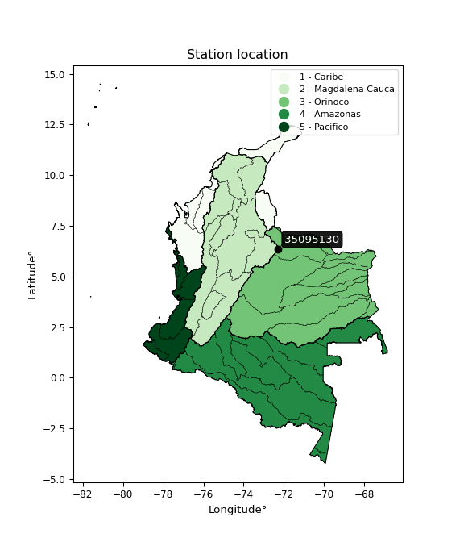</img>

</div>


## A. General information


### 1. General running parameters

• app_version: _v20260312_. • runtime: _2026-03-12 07:15:23.203550_. • Python version: _3.14.0_. • SciPy version: _1.16.3_. • Pandas version: _2.3.3_. • NumPy version: _2.3.5_. • Stations dataset (station_dataset_file): _dataset/pmax24h_in/automatic_colombia_2003_2025.csv_. • Stations catalog (station_catalog_file): _dataset/CNE.xls_. • Minimum year to eval til year_max (date_min): _1900_. • Maximum year to eval since year_min (date_max): _2025_. • Creates, save and include plots into reports (create_plot): _True_. • Plot only fit distributions with Δo > Δ (plot_only_fit): _True_. • Plot only simple graphs avoiding multiple CDFs and multiple Extreme values plots (plot_only_simple): _True_. • Eval low extreme values, if False, evaluates high extreme values (low_extreme): _False_. • Eval every SciPy distribution as logarithmic (pdist_logarithmic_on): _True_. • Standard deviation normalized (ddof): _1.0_. • Return periods to eval in years (Tr): _[2, 2.33, 5, 10, 15, 20, 25, 50, 75, 100, 200, 250, 500, 750, 1000]_. • Minimum data sample per station, 0 means any (minimum_sample): _5_. • Z-Score maximum threshold to adjust a value, 0 means disable (zscore_max): _3.5_. • Z-Score minimum threshold to adjust a value, 0 means disable (zscore_min): _-2.5_. • Avoid zeros, e.g. rain = 0 (avoid_zeros): _True_. • Avoid null values (avoid_nans): _True_. 

:file_folder:Table: [dataset.csv](../../dataset/pmax24h_in/automatic_colombia_2003_2025.csv)

> Delta Degrees of Freedom (DDOF): is a parameter used in the formulas for calculating variance and standard deviation. When ddof=0, the divisor is $N$ (the total number of observations) and this is used when your data set is the entire population. When ddof=1, the divisor is $N-1$ and this is used when your data set is a sample drawn from a larger population. Using $N-1$ provides an unbiased estimate of the population variance (known as Bessel´s correction).


### 2. Station info and location

|   id |   CODIGO | NOMBRE                     | CATEGORIA               | TECNOLOGIA                | ESTADO   | FECHA_INSTALACION   |   FECHA_SUSPENSION |   ALTITUD |   LATITUD |   LONGITUD | DEPARTAMENTO   | MUNICIPIO   | AREA_OPERATIVA                              | ENTIDAD                                                     | AREA_HIDROGRAFICA   | ZONA_HIDROGRAFICA   | SUBZONA_HIDROGRAFICA   |   CORRIENTE | Catalogo   |   Version |
|-----:|---------:|:---------------------------|:------------------------|:--------------------------|:---------|:--------------------|-------------------:|----------:|----------:|-----------:|:---------------|:------------|:--------------------------------------------|:------------------------------------------------------------|:--------------------|:--------------------|:-----------------------|------------:|:-----------|----------:|
|    0 | 35095130 | LAGUNA LA PLAZA [35095130] | Climatológica Principal | Automática con Telemetría | Activa   | 17/09/2010          |                nan |      4378 |     6.362 |    -72.282 | Arauca         | Saravena    | Area Operativa 06 - Boyacá-Casanare-Vichada | INSTITUTO DE HIDROLOGIA METEOROLOGIA Y ESTUDIOS AMBIENTALES | Orinoco             | Casanare            | Río Casanare           |         nan | CNE_IDEAM  |  20251226 |

<div align="center">

Dynamic map: [:earth_americas:Google](http://maps.google.com/maps?q=6.362,-72.28201667) [:earth_americas:OSM](https://www.openstreetmap.org/#map=18/6.362/-72.28201667&layers=P) [:earth_americas:Bing](https://www.bing.com/maps?cp=6.362~-72.28201667&lvl=18) [:earth_americas:Apple](https://maps.apple.com/frame?center=6.362%2C-72.28201667&span=0.003%2C0.006)

</div>


<div align="center">

```geojson
{
  "type": "Feature",
  "geometry": {
    "type": "Point", 
    "coordinates": [-72.28201667, 6.362]
  }, 
  "properties": {
    "Name": "35095130"
  }
}
```

</div>


### 3. Discrete values table and plot

<div align="center">

|               |          0 |            1 |           2 |           3 |           4 |           5 |           6 |           7 |           8 |
|:--------------|-----------:|-------------:|------------:|------------:|------------:|------------:|------------:|------------:|------------:|
| Date          | 2017       | 2018         | 2019        | 2020        | 2021        | 2022        | 2023        | 2024        | 2025        |
| Value         |  376.26    |  131.4       |  209.1      |  104.8      |   86.5      |   60.5      |  152.1      |   45.8      |   29.3      |
| Value_initial |  376.26    |  131.4       |  209.1      |  104.8      |   86.5      |   60.5      |  152.1      |   45.8      |   29.3      |
| count         |    9       |    9         |    9        |    9        |    9        |    9        |    9        |    9        |    9        |
| mean          |  132.862   |  132.862     |  132.862    |  132.862    |  132.862    |  132.862    |  132.862    |  132.862    |  132.862    |
| std           |  107.183   |  107.183     |  107.183    |  107.183    |  107.183    |  107.183    |  107.183    |  107.183    |  107.183    |
| zscore        |    2.27087 |   -0.0136423 |    0.711288 |   -0.261817 |   -0.432553 |   -0.675129 |    0.179486 |   -0.812278 |   -0.966221 |


</div>


<div align="center">

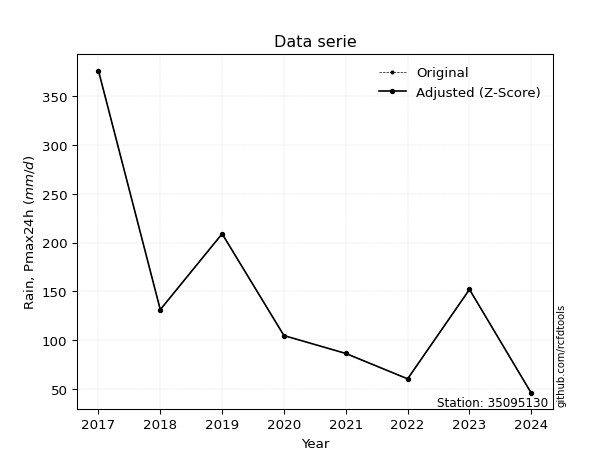</img>

</div>


> The initial value (value_initial) correspond to the initial obtained or null completed value, and value (value) is adjusted only when the initial value is outside the valid range (outlier) definite through the Z-Score value. If Z-Score is active, values out of range or outliers are replaced with the station mean value. A Z-Score (or standard score) measures how many standard deviations a data point is from the mean of a dataset, indicating its relative position; positive scores mean above the mean, negative mean below, and a score of zero is exactly at the mean, allowing for comparison of values from different distributions. It´s calculated using the formula $z=(x–μ)/σ$, where $x$ is the data point, $μ$ is the mean, and $σ$ is the standard deviation, helping identify outliers and understand probability.
>
> <sub>**Note**: In this study, "completing" (filling gaps in) and "extending" (forecasting or lengthening the historical record) rainfall data series are avoided for certain critical analyses because they introduce artificial bias and uncertainty, which can distort the statistics of rare events (extremes), alter day-to-day variability, and compromise the integrity and homogeneity of the original data. Some reasons against Completing/Extending rainfall data are: **Distortion of Extremes and Variability**: The primary issue is that most gap-filling or extension methods rely on averaging or regression with nearby stations, which inherently smooths the data. Rainfall is highly variable in space and time, with a large percentage of zero values and occasional large storms. Infilling methods often underestimate the highest values and overestimate the lowest (zero) values, which severely distorts analyses focused on flood frequency, drought severity, and intensity-duration-frequency (IDF) curves, **Loss of Data Homogeneity**: Infilled or extended data are synthetic estimates, not actual measurements. Combining these estimates with observed data can violate the assumption of data homogeneity, which requires that the data properties do not change over time. Inhomogeneity can lead to incorrect conclusions about long-term trends or changes in climate patterns, **Propagation of Errors**: Errors and biases from the original data (e.g., wind-induced undercatch, instrument errors, site changes) or the data used for imputation can propagate through the analysis, leading to unreliable hydrological models and inaccurate predictions, **Compromised Statistical Integrity**: For statistical analyses, especially those involving the frequency of events, using artificial data can introduce time bias or autocorrelation that doesn´t exist in reality, making it difficult to assess the true probability of events, **Difficulty in Validation**: It is difficult to accurately validate the quality of filled or extended data, especially for past periods where ground-truth measurements are unavailable. The reliability of imputation techniques heavily depends on the density of the surrounding station network and the complexity of the local topography.</sub>


### 4. Active continuous probability distributions from SciPy (80 of 104 available)

A Probability Density Function (PDF) describes the relative likelihood of a continuous random variable falling within a specific range, where the total area under its curve equals 1, and the area over any interval gives the actual probability for that range. Unlike discrete probabilities (like rolling a die), a PDF shows density, not direct probability for a single point (which is zero), with higher points indicating higher likelihood, often visualized as a bell curve for normal distributions.

A log of a probability density function (log-PDF) is simply the logarithm of the PDF´s value, denoted as $log(f(x))$, useful for converting multiplication of probabilities into addition, improving numerical stability with tiny numbers, and connecting to information theory concepts like entropy. Instead of dealing with very small probabilities (e.g., 0.000001), log-PDFs use negative numbers (e.g., $log(0.00001) ≈ -11.51$ that are easier for computers to handle, preventing underflow errors and simplifying complex calculations. In this study, each active probability distribution from SciPy is also evaluated in the $log$ form.

[scipy.stats](https://docs.scipy.org/doc/scipy/reference/stats.html) is a Python´s powerful submodule within the SciPy library for comprehensive statistical analysis, offering over 130 probability distributions (like Normal, Poisson, etc.), functions for descriptive stats (mean, variance), hypothesis testing (t-tests, chi-square), random variable generation, and statistical tests, making it essential for data science, modeling, and research. It provides tools to explore, model, and draw conclusions from data efficiently, working seamlessly with [NumPy](https://numpy.org/).

<div align="center">

|   id | p_dist           |   n_parameter | fit_method   | label                                                                       | active   | ref                                                                                                      |
|-----:|:-----------------|--------------:|:-------------|:----------------------------------------------------------------------------|:---------|:---------------------------------------------------------------------------------------------------------|
|    0 | alpha            |             3 | MLE          | Alpha                                                                       | True     | [:mortar_board:](https://docs.scipy.org/doc/scipy/reference/generated/scipy.stats.alpha.html)            |
|    1 | anglit           |             2 | MM           | Anglit                                                                      | True     | [:mortar_board:](https://docs.scipy.org/doc/scipy/reference/generated/scipy.stats.anglit.html)           |
|    2 | arcsine          |             2 | MM           | Arcsine                                                                     | True     | [:mortar_board:](https://docs.scipy.org/doc/scipy/reference/generated/scipy.stats.arcsine.html)          |
|    3 | argus            |             3 | MLE          | Argus                                                                       | True     | [:mortar_board:](https://docs.scipy.org/doc/scipy/reference/generated/scipy.stats.argus.html)            |
|    4 | beta             |             4 | MLE          | Beta                                                                        | True     | [:mortar_board:](https://docs.scipy.org/doc/scipy/reference/generated/scipy.stats.beta.html)             |
|    5 | betaprime        |             4 | MLE          | Beta prime                                                                  | True     | [:mortar_board:](https://docs.scipy.org/doc/scipy/reference/generated/scipy.stats.betaprime.html)        |
|    6 | bradford         |             3 | MLE          | Bradford                                                                    | True     | [:mortar_board:](https://docs.scipy.org/doc/scipy/reference/generated/scipy.stats.bradford.html)         |
|    7 | burr             |             4 | MLE          | Burr (Type III)                                                             | True     | [:mortar_board:](https://docs.scipy.org/doc/scipy/reference/generated/scipy.stats.burr.html)             |
|    8 | burr12           |             4 | MLE          | Burr (Type III) 12                                                          | True     | [:mortar_board:](https://docs.scipy.org/doc/scipy/reference/generated/scipy.stats.burr12.html)           |
|    9 | cosine           |             2 | MLE          | Cosine                                                                      | True     | [:mortar_board:](https://docs.scipy.org/doc/scipy/reference/generated/scipy.stats.cosine.html)           |
|   10 | crystalball      |             4 | MLE          | Crystalball                                                                 | True     | [:mortar_board:](https://docs.scipy.org/doc/scipy/reference/generated/scipy.stats.crystalball.html)      |
|   11 | dgamma           |             3 | MLE          | Double gamma                                                                | True     | [:mortar_board:](https://docs.scipy.org/doc/scipy/reference/generated/scipy.stats.dgamma.html)           |
|   12 | dweibull         |             3 | MLE          | Double Weibull                                                              | True     | [:mortar_board:](https://docs.scipy.org/doc/scipy/reference/generated/scipy.stats.dweibull.html)         |
|   13 | erlang           |             3 | MLE          | Erlang                                                                      | True     | [:mortar_board:](https://docs.scipy.org/doc/scipy/reference/generated/scipy.stats.erlang.html)           |
|   14 | exponnorm        |             3 | MLE          | Exponentially modified Normal                                               | True     | [:mortar_board:](https://docs.scipy.org/doc/scipy/reference/generated/scipy.stats.exponnorm.html)        |
|   15 | exponpow         |             3 | MLE          | Exponential power                                                           | True     | [:mortar_board:](https://docs.scipy.org/doc/scipy/reference/generated/scipy.stats.exponpow.html)         |
|   16 | exponweib        |             4 | MLE          | Exponentiated Weibull                                                       | True     | [:mortar_board:](https://docs.scipy.org/doc/scipy/reference/generated/scipy.stats.exponweib.html)        |
|   17 | f                |             4 | MLE          | F                                                                           | True     | [:mortar_board:](https://docs.scipy.org/doc/scipy/reference/generated/scipy.stats.f.html)                |
|   18 | fatiguelife      |             3 | MLE          | Fatigue-life (Birnbaum-Saunders)                                            | True     | [:mortar_board:](https://docs.scipy.org/doc/scipy/reference/generated/scipy.stats.fatiguelife.html)      |
|   19 | foldnorm         |             3 | MM           | Fold Normal                                                                 | True     | [:mortar_board:](https://docs.scipy.org/doc/scipy/reference/generated/scipy.stats.foldnorm.html)         |
|   20 | gamma            |             3 | MLE          | Gamma                                                                       | True     | [:mortar_board:](https://docs.scipy.org/doc/scipy/reference/generated/scipy.stats.gamma.html)            |
|   21 | gausshyper       |             6 | MLE          | Gauss hypergeometric                                                        | True     | [:mortar_board:](https://docs.scipy.org/doc/scipy/reference/generated/scipy.stats.gausshyper.html)       |
|   22 | genexpon         |             5 | MLE          | Generalized exponential                                                     | True     | [:mortar_board:](https://docs.scipy.org/doc/scipy/reference/generated/scipy.stats.genexpon.html)         |
|   23 | genextreme       |             3 | MLE          | Generalized exponential                                                     | True     | [:mortar_board:](https://docs.scipy.org/doc/scipy/reference/generated/scipy.stats.genextreme.html)       |
|   24 | gengamma         |             4 | MLE          | Generalized gamma                                                           | True     | [:mortar_board:](https://docs.scipy.org/doc/scipy/reference/generated/scipy.stats.gengamma.html)         |
|   25 | genhalflogistic  |             3 | MLE          | Generalized half-logistic                                                   | True     | [:mortar_board:](https://docs.scipy.org/doc/scipy/reference/generated/scipy.stats.genhalflogistic.html)  |
|   26 | genlogistic      |             3 | MLE          | Generalized logistic                                                        | True     | [:mortar_board:](https://docs.scipy.org/doc/scipy/reference/generated/scipy.stats.genlogistic.html)      |
|   27 | gennorm          |             3 | MLE          | Generalized Normal                                                          | True     | [:mortar_board:](https://docs.scipy.org/doc/scipy/reference/generated/scipy.stats.gennorm.html)          |
|   28 | genpareto        |             3 | MLE          | Generalized Pareto                                                          | True     | [:mortar_board:](https://docs.scipy.org/doc/scipy/reference/generated/scipy.stats.genpareto.html)        |
|   29 | gompertz         |             3 | MLE          | Gompertz (or truncated Gumbel)                                              | True     | [:mortar_board:](https://docs.scipy.org/doc/scipy/reference/generated/scipy.stats.gompertz.html)         |
|   30 | gumbel_l         |             2 | MM           | Gumbel Left Skew                                                            | True     | [:mortar_board:](https://docs.scipy.org/doc/scipy/reference/generated/scipy.stats.gumbel_l.html)         |
|   31 | gumbel_r         |             2 | MM           | Gumbel Right Skew                                                           | True     | [:mortar_board:](https://docs.scipy.org/doc/scipy/reference/generated/scipy.stats.gumbel_r.html)         |
|   32 | halfgennorm      |             3 | MLE          | Upper half of a generalized normal                                          | True     | [:mortar_board:](https://docs.scipy.org/doc/scipy/reference/generated/scipy.stats.halfgennorm.html)      |
|   33 | halflogistic     |             2 | MM           | Half-logistic                                                               | True     | [:mortar_board:](https://docs.scipy.org/doc/scipy/reference/generated/scipy.stats.halflogistic.html)     |
|   34 | halfnorm         |             2 | MM           | Half Normal                                                                 | True     | [:mortar_board:](https://docs.scipy.org/doc/scipy/reference/generated/scipy.stats.halfnorm.html)         |
|   35 | hypsecant        |             2 | MM           | hyperbolic secant                                                           | True     | [:mortar_board:](https://docs.scipy.org/doc/scipy/reference/generated/scipy.stats.hypsecant.html)        |
|   36 | invgamma         |             3 | MLE          | Inverted gamma                                                              | True     | [:mortar_board:](https://docs.scipy.org/doc/scipy/reference/generated/scipy.stats.invgamma.html)         |
|   37 | invgauss         |             3 | MLE          | Inverse Gaussian                                                            | True     | [:mortar_board:](https://docs.scipy.org/doc/scipy/reference/generated/scipy.stats.invgauss.html)         |
|   38 | invweibull       |             3 | MLE          | Inverted Weibull                                                            | True     | [:mortar_board:](https://docs.scipy.org/doc/scipy/reference/generated/scipy.stats.invweibull.html)       |
|   39 | johnsonsb        |             4 | MLE          | Johnson SB                                                                  | True     | [:mortar_board:](https://docs.scipy.org/doc/scipy/reference/generated/scipy.stats.johnsonsb.html)        |
|   40 | johnsonsu        |             4 | MLE          | Johnson Su                                                                  | True     | [:mortar_board:](https://docs.scipy.org/doc/scipy/reference/generated/scipy.stats.johnsonsu.html)        |
|   41 | kappa3           |             3 | MLE          | Kappa 3                                                                     | True     | [:mortar_board:](https://docs.scipy.org/doc/scipy/reference/generated/scipy.stats.kappa3.html)           |
|   42 | kappa4           |             4 | MLE          | Kappa 4                                                                     | True     | [:mortar_board:](https://docs.scipy.org/doc/scipy/reference/generated/scipy.stats.kappa4.html)           |
|   43 | ksone            |             3 | MLE          | Kolmogorov-Smirnov one-sided test statistic distribution                    | True     | [:mortar_board:](https://docs.scipy.org/doc/scipy/reference/generated/scipy.stats.ksone.html)            |
|   44 | kstwobign        |             2 | MLE          | Limiting distribution of scaled Kolmogorov-Smirnov two-sided test statistic | True     | [:mortar_board:](https://docs.scipy.org/doc/scipy/reference/generated/scipy.stats.kstwobign.html)        |
|   45 | laplace          |             2 | MM           | Laplace                                                                     | True     | [:mortar_board:](https://docs.scipy.org/doc/scipy/reference/generated/scipy.stats.laplace.html)          |
|   46 | levy_l           |             2 | MLE          | Left-skewed Levy                                                            | True     | [:mortar_board:](https://docs.scipy.org/doc/scipy/reference/generated/scipy.stats.levy_l.html)           |
|   47 | loggamma         |             3 | MLE          | Log gamma                                                                   | True     | [:mortar_board:](https://docs.scipy.org/doc/scipy/reference/generated/scipy.stats.loggamma.html)         |
|   48 | logistic         |             2 | MM           | Logistic (or Sech-squared)                                                  | True     | [:mortar_board:](https://docs.scipy.org/doc/scipy/reference/generated/scipy.stats.logistic.html)         |
|   49 | loglaplace       |             3 | MLE          | Log-Laplace                                                                 | True     | [:mortar_board:](https://docs.scipy.org/doc/scipy/reference/generated/scipy.stats.loglaplace.html)       |
|   50 | lomax            |             3 | MLE          | Lomax (Pareto of the second kind)                                           | True     | [:mortar_board:](https://docs.scipy.org/doc/scipy/reference/generated/scipy.stats.lomax.html)            |
|   51 | maxwell          |             2 | MM           | Maxwell                                                                     | True     | [:mortar_board:](https://docs.scipy.org/doc/scipy/reference/generated/scipy.stats.maxwell.html)          |
|   52 | mielke           |             4 | MLE          | Mielke Beta-Kappa / Dagum                                                   | True     | [:mortar_board:](https://docs.scipy.org/doc/scipy/reference/generated/scipy.stats.mielke.html)           |
|   53 | moyal            |             2 | MM           | Moyal                                                                       | True     | [:mortar_board:](https://docs.scipy.org/doc/scipy/reference/generated/scipy.stats.moyal.html)            |
|   54 | nakagami         |             3 | MLE          | Nakagami                                                                    | True     | [:mortar_board:](https://docs.scipy.org/doc/scipy/reference/generated/scipy.stats.nakagami.html)         |
|   55 | ncf              |             5 | MLE          | Non-central F distribution                                                  | True     | [:mortar_board:](https://docs.scipy.org/doc/scipy/reference/generated/scipy.stats.ncf.html)              |
|   56 | nct              |             4 | MLE          | Non-central Student’s t                                                     | True     | [:mortar_board:](https://docs.scipy.org/doc/scipy/reference/generated/scipy.stats.nct.html)              |
|   57 | norm             |             2 | MM           | Normal                                                                      | True     | [:mortar_board:](https://docs.scipy.org/doc/scipy/reference/generated/scipy.stats.norm.html)             |
|   58 | pearson3         |             3 | MM           | Pearson type III                                                            | True     | [:mortar_board:](https://docs.scipy.org/doc/scipy/reference/generated/scipy.stats.pearson3.html)         |
|   59 | powerlaw         |             3 | MLE          | Power-function                                                              | True     | [:mortar_board:](https://docs.scipy.org/doc/scipy/reference/generated/scipy.stats.powerlaw.html)         |
|   60 | rayleigh         |             2 | MM           | Rayleigh                                                                    | True     | [:mortar_board:](https://docs.scipy.org/doc/scipy/reference/generated/scipy.stats.rayleigh.html)         |
|   61 | rdist            |             3 | MLE          | R-distributed (symmetric beta)                                              | True     | [:mortar_board:](https://docs.scipy.org/doc/scipy/reference/generated/scipy.stats.rdist.html)            |
|   62 | rice             |             3 | MLE          | Rice                                                                        | True     | [:mortar_board:](https://docs.scipy.org/doc/scipy/reference/generated/scipy.stats.rice.html)             |
|   63 | semicircular     |             2 | MM           | Semicircular                                                                | True     | [:mortar_board:](https://docs.scipy.org/doc/scipy/reference/generated/scipy.stats.semicircular.html)     |
|   64 | skewnorm         |             3 | MLE          | Skew normal                                                                 | True     | [:mortar_board:](https://docs.scipy.org/doc/scipy/reference/generated/scipy.stats.skewnorm.html)         |
|   65 | t                |             3 | MLE          | Student’s t                                                                 | True     | [:mortar_board:](https://docs.scipy.org/doc/scipy/reference/generated/scipy.stats.t.html)                |
|   66 | trapezoid        |             4 | MLE          | Trapezoid                                                                   | True     | [:mortar_board:](https://docs.scipy.org/doc/scipy/reference/generated/scipy.stats.trapezoid.html)        |
|   67 | triang           |             3 | MLE          | Triangular                                                                  | True     | [:mortar_board:](https://docs.scipy.org/doc/scipy/reference/generated/scipy.stats.triang.html)           |
|   68 | truncexpon       |             3 | MLE          | Truncated exponential                                                       | True     | [:mortar_board:](https://docs.scipy.org/doc/scipy/reference/generated/scipy.stats.truncexpon.html)       |
|   69 | truncnorm        |             4 | MLE          | Truncated normal                                                            | True     | [:mortar_board:](https://docs.scipy.org/doc/scipy/reference/generated/scipy.stats.truncnorm.html)        |
|   70 | truncpareto      |             4 | MLE          | Upper truncated Pareto                                                      | True     | [:mortar_board:](https://docs.scipy.org/doc/scipy/reference/generated/scipy.stats.truncpareto.html)      |
|   71 | truncweibull_min |             5 | MLE          | Doubly truncated Weibull minimum                                            | True     | [:mortar_board:](https://docs.scipy.org/doc/scipy/reference/generated/scipy.stats.truncweibull_min.html) |
|   72 | tukeylambda      |             3 | MLE          | Tukey-Lamdba                                                                | True     | [:mortar_board:](https://docs.scipy.org/doc/scipy/reference/generated/scipy.stats.tukeylambda.html)      |
|   73 | uniform          |             2 | MLE          | Uniform                                                                     | True     | [:mortar_board:](https://docs.scipy.org/doc/scipy/reference/generated/scipy.stats.uniform.html)          |
|   74 | vonmises         |             3 | MLE          | Von Mises                                                                   | True     | [:mortar_board:](https://docs.scipy.org/doc/scipy/reference/generated/scipy.stats.vonmises.html)         |
|   75 | vonmises_line    |             3 | MLE          | Von Mises line                                                              | True     | [:mortar_board:](https://docs.scipy.org/doc/scipy/reference/generated/scipy.stats.vonmises_line.html)    |
|   76 | wald             |             2 | MM           | Wald                                                                        | True     | [:mortar_board:](https://docs.scipy.org/doc/scipy/reference/generated/scipy.stats.wald.html)             |
|   77 | weibull_max      |             3 | MLE          | Weibull maximum                                                             | True     | [:mortar_board:](https://docs.scipy.org/doc/scipy/reference/generated/scipy.stats.weibull_max.html)      |
|   78 | weibull_min      |             3 | MLE          | Weibull minimum                                                             | True     | [:mortar_board:](https://docs.scipy.org/doc/scipy/reference/generated/scipy.stats.weibull_min.html)      |
|   79 | wrapcauchy       |             3 | MLE          | Wrapped  Cauchy                                                             | True     | [:mortar_board:](https://docs.scipy.org/doc/scipy/reference/generated/scipy.stats.wrapcauchy.html)       |

</div>

> **n_parameter:** # arguments & localization & scale.
>
> **Fit methods:** (MLE) maximum likelihood, (MM) L-moments.
>
>**Inactive** (With the only purpose of prevent loops, zero divisions, infinite values, over high estimated values or horizontal trending for recurrence intervals estimations, the follow distributions were disabled.)**:** lognorm, norminvgauss, powernorm, powerlognorm, cauchy, halfcauchy, foldcauchy, skewcauchy, chi2, expon, fisk, genhyperbolic, geninvgauss, gibrat, kstwo, laplace_asymmetric, levy, levy_stable, ncx2, pareto, rel_breitwigner, recipinvgauss, studentized_range, loguniform, 


## B. Probability (PDF) vs. Empirical (EDF) distributions functions

A continuous probability distribution (CPD) describes probabilities for variables that can take any value within a range (like rain any time), unlike discrete variables with specific outcomes (like temperature). It uses a Probability Density Function (PDF), a curve where the total area under it equals 1, and the probability of the variable falling within an interval (a to b) is found by calculating the area under the curve between those points. A key feature is that the probability of hitting any single exact value is zero, so probabilities are always expressed for ranges, e.g., $P(a ≤ X ≤ b)$.

<div align="center">

Distributions parameters from station values
|     |   station | p_dist              |   n |              loc |          scale | shape                  | shape1                 | shape2                | shape3             |
|----:|----------:|:--------------------|----:|-----------------:|---------------:|:-----------------------|:-----------------------|:----------------------|:-------------------|
|   0 |  35095130 | alpha               |   9 |    -89.7412      |  526.73        | 2.7652318982540445     |                        |                       |                    |
|   1 |  35095130 | anglit              |   9 |    132.862       |  295.62        |                        |                        |                       |                    |
|   2 |  35095130 | arcsine             |   9 |    -10.0481      |  285.821       |                        |                        |                       |                    |
|   3 |  35095130 | argus               |   9 |   -115.718       |  507.264       | 1.0417125559351197e-06 |                        |                       |                    |
|   4 |  35095130 | beta                |   9 |     -4.79636     |  381.056       | 0.6285142848669334     | 0.8190857661503883     |                       |                    |
|   5 |  35095130 | betaprime           |   9 |     -0.619518    |   75.7679      | 4.7430325952664205     | 3.632364402281437      |                       |                    |
|   6 |  35095130 | bradford            |   9 |     29.2999      |  346.96        | 14.356789442973612     |                        |                       |                    |
|   7 |  35095130 | burr                |   9 |     -0.309761    |   79.8822      | 2.0677934121975214     | 1.4134207655264133     |                       |                    |
|   8 |  35095130 | burr12              |   9 |     -0.878338    |   29.7902      | 279.61450687235117     | 0.0028880404094160667  |                       |                    |
|   9 |  35095130 | cosine              |   9 |    154.551       |   93.0922      |                        |                        |                       |                    |
|  10 |  35095130 | crystalball         |   9 |    132.862       |  101.053       | 8299.720620710255      | 26508.706438914698     |                       |                    |
|  11 |  35095130 | dgamma              |   9 |    104.8         |   67.7218      | 0.781504290890936      |                        |                       |                    |
|  12 |  35095130 | dweibull            |   9 |    114.589       |   76.4712      | 1.1226279987532755     |                        |                       |                    |
|  13 |  35095130 | erlang              |   9 |     29.3         |  112.732       | 0.22379038431592946    |                        |                       |                    |
|  14 |  35095130 | exponnorm           |   9 |     29.1885      |    0.0341333   | 3011.426693114663      |                        |                       |                    |
|  15 |  35095130 | exponpow            |   9 |     29.3         |  190.398       | 0.5684733667779476     |                        |                       |                    |
|  16 |  35095130 | exponweib           |   9 |     29.3         |   66.722       | 0.7421146767784812     | 0.7814050404650135     |                       |                    |
|  17 |  35095130 | f                   |   9 |     29.3         |   84.4144      | 1.1746916133102916     | 15.73331283049982      |                       |                    |
|  18 |  35095130 | fatiguelife         |   9 |     29.3         |    0.000131181 | 867.621543477487       |                        |                       |                    |
|  19 |  35095130 | foldnorm            |   9 |     -6.69258     |  173.48        | 0.024365252491756337   |                        |                       |                    |
|  20 |  35095130 | gamma               |   9 |     29.3         |  102.824       | 0.6680278424303852     |                        |                       |                    |
|  21 |  35095130 | gausshyper          |   9 |     -5.58544     |  381.845       | 0.9928242657954551     | 0.8894643549173229     | 1.0974119652606755    | 1.0923934144497887 |
|  22 |  35095130 | genexpon            |   9 |     29.3         |  122.054       | 1.178135453517816      | 3.5534257649845864e-07 | 1.8445868075502043    |                    |
|  23 |  35095130 | genextreme          |   9 |     77.5266      |   52.4669      | -0.398594521790686     |                        |                       |                    |
|  24 |  35095130 | gengamma            |   9 |     23.8385      |    0.474618    | 6.406036972431075      | 0.3630967881252404     |                       |                    |
|  25 |  35095130 | genhalflogistic     |   9 |     -5.58        |  396.924       | 1.0395029692682805     |                        |                       |                    |
|  26 |  35095130 | genlogistic         |   9 |   -393.642       |   65.8903      | 1540.3701152084222     |                        |                       |                    |
|  27 |  35095130 | gennorm             |   9 |    104.8         |   55.8578      | 0.8558270861279071     |                        |                       |                    |
|  28 |  35095130 | genpareto           |   9 |     29.2974      |  108.875       | -0.04689367870740592   |                        |                       |                    |
|  29 |  35095130 | gompertz            |   9 |     29.3         |  408.595       | 2.9425163254046627     |                        |                       |                    |
|  30 |  35095130 | gumbel_l            |   9 |    178.341       |   78.7906      |                        |                        |                       |                    |
|  31 |  35095130 | gumbel_r            |   9 |     87.3831      |   78.7906      |                        |                        |                       |                    |
|  32 |  35095130 | halfgennorm         |   9 |     29.3         |   13.3756      | 0.4586251125197257     |                        |                       |                    |
|  33 |  35095130 | halflogistic        |   9 |     13.0911      |   86.3966      |                        |                        |                       |                    |
|  34 |  35095130 | halfnorm            |   9 |     -0.892148    |  167.636       |                        |                        |                       |                    |
|  35 |  35095130 | hypsecant           |   9 |    132.862       |   64.3322      |                        |                        |                       |                    |
|  36 |  35095130 | invgamma            |   9 |    -16.6007      |  293.971       | 2.886743017849555      |                        |                       |                    |
|  37 |  35095130 | invgauss            |   9 |      5.86424     |  149.802       | 0.8477706045797399     |                        |                       |                    |
|  38 |  35095130 | invweibull          |   9 |    -54.1032      |  131.63        | 2.508816764645356      |                        |                       |                    |
|  39 |  35095130 | johnsonsb           |   9 |     28.8481      |  347.412       | -1.1375130703256746    | 0.10513882285519663    |                       |                    |
|  40 |  35095130 | johnsonsu           |   9 |     14.1512      |    0.647506    | -6.073272216478355     | 1.0974453502975399     |                       |                    |
|  41 |  35095130 | kappa3              |   9 |     29.2999      |   94.5848      | 2.345380995329661      |                        |                       |                    |
|  42 |  35095130 | kappa4              |   9 |     -5.6107      |  383.249       | 1.1000109151557047     | 0.9593929419466679     |                       |                    |
|  43 |  35095130 | ksone               |   9 |     -5.396       |  416.352       | 1.0                    |                        |                       |                    |
|  44 |  35095130 | kstwobign           |   9 |   -152.307       |  330.576       |                        |                        |                       |                    |
|  45 |  35095130 | laplace             |   9 |    132.862       |   71.4552      |                        |                        |                       |                    |
|  46 |  35095130 | levy_l              |   9 |    405.508       |  145.932       |                        |                        |                       |                    |
|  47 |  35095130 | loggamma            |   9 | -36827.6         | 4813.23        | 2162.7465214637778     |                        |                       |                    |
|  48 |  35095130 | logistic            |   9 |    132.862       |   55.7134      |                        |                        |                       |                    |
|  49 |  35095130 | loglaplace          |   9 |     -0.324559    |  105.125       | 1.6686917199750047     |                        |                       |                    |
|  50 |  35095130 | lomax               |   9 |     29.3         | 2353.05        | 23.320630599609316     |                        |                       |                    |
|  51 |  35095130 | maxwell             |   9 |   -106.591       |  150.055       |                        |                        |                       |                    |
|  52 |  35095130 | mielke              |   9 |     -0.349972    |   79.7338      | 2.9317515918055204     | 2.0670072769723875     |                       |                    |
|  53 |  35095130 | moyal               |   9 |     75.0737      |   45.4898      |                        |                        |                       |                    |
|  54 |  35095130 | nakagami            |   9 |     29.3         |  154.068       | 0.23306569986790396    |                        |                       |                    |
|  55 |  35095130 | ncf                 |   9 |     -0.385419    |   98.1212      | 9.099680498869066      | 7.436288263821693      | 0.12304184020916237   |                    |
|  56 |  35095130 | nct                 |   9 |     -0.0731503   |   26.7479      | 1.8442848564214116     | 2.9630656688582864     |                       |                    |
|  57 |  35095130 | norm                |   9 |    132.862       |  101.053       |                        |                        |                       |                    |
|  58 |  35095130 | pearson3            |   9 |    132.862       |  101.053       | 1.3565251599765045     |                        |                       |                    |
|  59 |  35095130 | powerlaw            |   9 |     29.3         |  346.96        | 0.17708893846739943    |                        |                       |                    |
|  60 |  35095130 | rayleigh            |   9 |    -60.4578      |  154.247       |                        |                        |                       |                    |
|  61 |  35095130 | rdist               |   9 |     -4.46071     |  213.561       | 1.0773642364811487     |                        |                       |                    |
|  62 |  35095130 | rice                |   9 |    -23.3767      |  131.572       | 0.00029589639473583893 |                        |                       |                    |
|  63 |  35095130 | semicircular        |   9 |    132.862       |  202.106       |                        |                        |                       |                    |
|  64 |  35095130 | skewnorm            |   9 |     29.3         |  144.697       | 22052919.627489917     |                        |                       |                    |
|  65 |  35095130 | t                   |   9 |    103.413       |   59.3257      | 2.355287794422978      |                        |                       |                    |
|  66 |  35095130 | trapezoid           |   9 |     -5.6658      |  416.352       | 1.0                    | 1.0                    |                       |                    |
|  67 |  35095130 | triang              |   9 |     -5.44331     |  381.703       | 0.9999999566797522     |                        |                       |                    |
|  68 |  35095130 | truncexpon          |   9 |     -5.62392     |  350.271       | 1.090252650700549      |                        |                       |                    |
|  69 |  35095130 | truncnorm           |   9 |    132.862       |  101.053       | -11569.648544486115    | 296.80927354014415     |                       |                    |
|  70 |  35095130 | truncpareto         |   9 |      6.57267     |   22.7273      | 3.3335940354719004e-08 | 16.26619933304687      |                       |                    |
|  71 |  35095130 | truncweibull_min    |   9 |     24.7453      |  326.852       | 0.5072433068065132     | 0.013935044788445188   | 1.0754553126027284    |                    |
|  72 |  35095130 | tukeylambda         |   9 |     -4.53286     |  214.084       | 1.0021113117486502     |                        |                       |                    |
|  73 |  35095130 | uniform             |   9 |     29.3         |  346.96        |                        |                        |                       |                    |
|  74 |  35095130 | vonmises            |   9 |     -1.62568     |    1           | 0.39646773795193135    |                        |                       |                    |
|  75 |  35095130 | vonmises_line       |   9 |    118.967       |   81.8988      | 1.0676407195210924     |                        |                       |                    |
|  76 |  35095130 | wald                |   9 |     31.8094      |  101.053       |                        |                        |                       |                    |
|  77 |  35095130 | weibull_max         |   9 |    376.26        |    1.7084      | 0.15169096920474107    |                        |                       |                    |
|  78 |  35095130 | weibull_min         |   9 |     29.3         |  100.634       | 0.8961623179980751     |                        |                       |                    |
|  79 |  35095130 | wrapcauchy          |   9 |     29.3         |   55.2421      | 0.34661660318469645    |                        |                       |                    |
|  80 |  35095130 | logalpha            |   9 |     -8.25108     |  219.521       | 17.114059548794625     |                        |                       |                    |
|  81 |  35095130 | loganglit           |   9 |      4.6214      |    2.16748     |                        |                        |                       |                    |
|  82 |  35095130 | logarcsine          |   9 |      3.5736      |    2.09559     |                        |                        |                       |                    |
|  83 |  35095130 | logargus            |   9 |      2.85697     |    3.18294     | 6.148636978205803e-05  |                        |                       |                    |
|  84 |  35095130 | logbeta             |   9 |      3.37633     |    2.55395     | 0.8974660170902642     | 0.7436294331842119     |                       |                    |
|  85 |  35095130 | logbetaprime        |   9 |     -5.87548     |   21.2531      | 293.3301935082783      | 595.1909161256536      |                       |                    |
|  86 |  35095130 | logbradford         |   9 |      3.37759     |    2.5527      | 0.9025515709954557     |                        |                       |                    |
|  87 |  35095130 | logburr             |   9 |      3.37759     |    2.12713     | 10.119414224571793     | 0.07953407302129262    |                       |                    |
|  88 |  35095130 | logburr12           |   9 |      2.82648     |   10.7731      | 2.640679780124966      | 83.8615857834242       |                       |                    |
|  89 |  35095130 | logcosine           |   9 |      4.62908     |    0.626886    |                        |                        |                       |                    |
|  90 |  35095130 | logcrystalball      |   9 |      4.6214      |    0.740916    | 17.329529485624818     | 61.959162555172334     |                       |                    |
|  91 |  35095130 | logdgamma           |   9 |      4.74388     |    0.377628    | 1.6191673900007535     |                        |                       |                    |
|  92 |  35095130 | logdweibull         |   9 |      4.562       |    0.669774    | 1.4035886651505418     |                        |                       |                    |
|  93 |  35095130 | logerlang           |   9 |    -35.4252      |    0.0137019   | 2922.701035473383      |                        |                       |                    |
|  94 |  35095130 | logexponnorm        |   9 |      4.58715     |    0.740124    | 0.046276221630972024   |                        |                       |                    |
|  95 |  35095130 | logexponpow         |   9 |      3.29636     |    2.01543     | 1.306262435658025      |                        |                       |                    |
|  96 |  35095130 | logexponweib        |   9 |      3.37759     |    1.26116     | 0.9445022027814772     | 0.9352407983935416     |                       |                    |
|  97 |  35095130 | logf                |   9 |    -28.9704      |   33.5852      | 6913.918208769419      | 10141.23719491865      |                       |                    |
|  98 |  35095130 | logfatiguelife      |   9 |    -27.4529      |   32.0657      | 0.02310268848737459    |                        |                       |                    |
|  99 |  35095130 | logfoldnorm         |   9 |      2.62102     |    0.745201    | 2.6821156708301013     |                        |                       |                    |
| 100 |  35095130 | loggamma            |   9 |    -35.5512      |    0.0136603   | 2940.81884672046       |                        |                       |                    |
| 101 |  35095130 | loggausshyper       |   9 |      3.36667     |    2.56361     | 1.0206538903218836     | 0.8194577361139659     | 1.0368055181208051    | 1.175830522585372  |
| 102 |  35095130 | loggenexpon         |   9 |      3.37264     |    0.0128297   | 0.0039312552685547945  | 1.615223222790249      | 5.975008382693556e-05 |                    |
| 103 |  35095130 | loggenextreme       |   9 |      4.37344     |    0.743272    | 0.3199319945150877     |                        |                       |                    |
| 104 |  35095130 | loggengamma         |   9 |      3.37759     |    0.979072    | 1.057508634808646      | 0.9387965484079464     |                       |                    |
| 105 |  35095130 | loggenhalflogistic  |   9 |      3.14773     |    2.94303     | 1.0576739326105329     |                        |                       |                    |
| 106 |  35095130 | loggenlogistic      |   9 |      4.39477     |    0.481971    | 1.3783608732163488     |                        |                       |                    |
| 107 |  35095130 | loggennorm          |   9 |      4.65393     |    1.27635     | 52153717.06528297      |                        |                       |                    |
| 108 |  35095130 | loggenpareto        |   9 |     -0.00663826  |    8.17967     | -1.3777633453943003    |                        |                       |                    |
| 109 |  35095130 | loggompertz         |   9 |      3.37759     |    1.04654     | 0.31298730927470964    |                        |                       |                    |
| 110 |  35095130 | loggumbel_l         |   9 |      4.95485     |    0.57769     |                        |                        |                       |                    |
| 111 |  35095130 | loggumbel_r         |   9 |      4.28795     |    0.57769     |                        |                        |                       |                    |
| 112 |  35095130 | loghalfgennorm      |   9 |      3.37759     |    2.30746     | 2.0013244868789766     |                        |                       |                    |
| 113 |  35095130 | loghalflogistic     |   9 |      3.74321     |    0.633474    |                        |                        |                       |                    |
| 114 |  35095130 | loghalfnorm         |   9 |      3.64074     |    1.22907     |                        |                        |                       |                    |
| 115 |  35095130 | loghypsecant        |   9 |      4.6214      |    0.471682    |                        |                        |                       |                    |
| 116 |  35095130 | loginvgamma         |   9 |     -6.70208     | 2613.79        | 231.89922428360478     |                        |                       |                    |
| 117 |  35095130 | loginvgauss         |   9 |     -0.301915    |  206.561       | 0.023794149682740254   |                        |                       |                    |
| 118 |  35095130 | loginvweibull       |   9 |     -6.58377e+07 |    6.58377e+07 | 95786652.77148359      |                        |                       |                    |
| 119 |  35095130 | logjohnsonsb        |   9 |      3.37759     |    2.55269     | 0.7304168929675483     | 0.17345367594819178    |                       |                    |
| 120 |  35095130 | logjohnsonsu        |   9 |    -17.0578      |   23.1083      | -35.8061939101042      | 42.79083192701407      |                       |                    |
| 121 |  35095130 | logkappa3           |   9 |      3.37759     |    2.55116     | 3665.268248927352      |                        |                       |                    |
| 122 |  35095130 | logkappa4           |   9 |      3.21814     |    2.87032     | 1.0556733486629797     | 1.0583237307996818     |                       |                    |
| 123 |  35095130 | logksone            |   9 |      3.12232     |    3.06323     | 1.0                    |                        |                       |                    |
| 124 |  35095130 | logkstwobign        |   9 |      1.82908     |    3.19503     |                        |                        |                       |                    |
| 125 |  35095130 | loglaplace          |   9 |      4.6214      |    0.523907    |                        |                        |                       |                    |
| 126 |  35095130 | loglevy_l           |   9 |      6.07024     |    0.694175    |                        |                        |                       |                    |
| 127 |  35095130 | logloggamma         |   9 |   -131.549       |   20.5186      | 762.9558535895185      |                        |                       |                    |
| 128 |  35095130 | loglogistic         |   9 |      4.6214      |    0.408488    |                        |                        |                       |                    |
| 129 |  35095130 | logloglaplace       |   9 |     -0.0153272   |    4.66738     | 7.584434369693883      |                        |                       |                    |
| 130 |  35095130 | loglomax            |   9 |      3.37759     |   70.6526      | 57.028674364177405     |                        |                       |                    |
| 131 |  35095130 | logmaxwell          |   9 |      2.86574     |    1.1002      |                        |                        |                       |                    |
| 132 |  35095130 | logmielke           |   9 |      3.37758     |    1.88631     | 0.9336140778631847     | 6.64443485448361       |                       |                    |
| 133 |  35095130 | logmoyal            |   9 |      4.1977      |    0.333529    |                        |                        |                       |                    |
| 134 |  35095130 | lognakagami         |   9 |      3.82428     |    1.10891     | 0.3698218279503776     |                        |                       |                    |
| 135 |  35095130 | logncf              |   9 |    -11.9809      |   16.3562      | 1306.4598358149865     | 4192.618796687893      | 19.06366316319742     |                    |
| 136 |  35095130 | lognct              |   9 |     23.9858      |    0.731957    | 14142.211239411026     | -26.453907894304052    |                       |                    |
| 137 |  35095130 | lognorm             |   9 |      4.6214      |    0.740916    |                        |                        |                       |                    |
| 138 |  35095130 | logpearson3         |   9 |      4.6214      |    0.740919    | 0.03427065002671615    |                        |                       |                    |
| 139 |  35095130 | logpowerlaw         |   9 |      3.37759     |    2.55269     | 0.21391498127217046    |                        |                       |                    |
| 140 |  35095130 | lograyleigh         |   9 |      3.20398     |    1.13093     |                        |                        |                       |                    |
| 141 |  35095130 | logrdist            |   9 |      4.36476     |    0.98717     | 1.199433767989621      |                        |                       |                    |
| 142 |  35095130 | logrice             |   9 |      3.04032     |    0.858011    | 1.463333234257055      |                        |                       |                    |
| 143 |  35095130 | logsemicircular     |   9 |      4.6214      |    1.48183     |                        |                        |                       |                    |
| 144 |  35095130 | logskewnorm         |   9 |      4.46705     |    0.756822    | 0.2643774802025658     |                        |                       |                    |
| 145 |  35095130 | logt                |   9 |      4.6214      |    0.740908    | 135442552.38353342     |                        |                       |                    |
| 146 |  35095130 | logtrapezoid        |   9 |      3.12232     |    3.06323     | 1.0                    | 1.0                    |                       |                    |
| 147 |  35095130 | logtriang           |   9 |      2.64056     |    3.28972     | 0.9999999682154935     |                        |                       |                    |
| 148 |  35095130 | logtruncexpon       |   9 |      3.37749     |    3.08234     | 0.8281988487696277     |                        |                       |                    |
| 149 |  35095130 | logtruncnorm        |   9 |      1.63922     |    1.86181     | 1.1735887009368131     | 44.29311264364182      |                       |                    |
| 150 |  35095130 | logtruncpareto      |   9 |    -11.8443      |   15.2218      | 3.7598791531753865e-06 | 1.1676992945082223     |                       |                    |
| 151 |  35095130 | logtruncweibull_min |   9 |      3.37371     |    3.10877     | 0.8969261562369797     | 0.0012471345067814677  | 0.8223726001266993    |                    |
| 152 |  35095130 | logtukeylambda      |   9 |      4.3597      |    1.14101     | 1.1606045727744636     |                        |                       |                    |
| 153 |  35095130 | loguniform          |   9 |      3.37759     |    2.55269     |                        |                        |                       |                    |
| 154 |  35095130 | logvonmises         |   9 |     -1.66406     |    1           | 2.3894996803687794     |                        |                       |                    |
| 155 |  35095130 | logvonmises_line    |   9 |      4.65393     |    0.406274    | 0.22046766749878266    |                        |                       |                    |
| 156 |  35095130 | logwald             |   9 |      3.88047     |    0.740927    |                        |                        |                       |                    |
| 157 |  35095130 | logweibull_max      |   9 |      5.93028     |    1.46844     | 0.9079867611622892     |                        |                       |                    |
| 158 |  35095130 | logweibull_min      |   9 |      2.81849     |    2.03061     | 2.664141173240451      |                        |                       |                    |
| 159 |  35095130 | logwrapcauchy       |   9 |      3.37759     |    0.406274    | 0.5000000000000001     |                        |                       |                    |

</div>

> **loc** (Location parameter): This shifts the distribution along the x-axis. For many common distributions, like the normal (Gaussian) distribution, loc represents the mean $μ$. For others, like the uniform distribution, it might represent the minimum value, or for the beta distribution, the left end of the support interval.
>
> **scale** (Scale parameter): This determines the width or spread of the distribution. For the normal distribution, scale represents the standard deviation $σ$. For a uniform distribution, it defines the length of the interval (from $loc$ to $loc + scale$).
>
> **shape** (Shape parameters): Refers to parameters that define the specific form of a probability distribution, distinct from its location (loc) and scale (scale). These parameters are required arguments for most distribution functions. For example, a normal (Gaussian) distribution is fully defined by its location (mean) and scale (standard deviation), so it has no specific shape parameters beyond loc and scale. However, other distributions have intrinsic properties that need specification, as Gamma distribution that takes a shape parameter, often named $a$ or $alpha$.


### 0. Cumulative distribution values - CDF (160 evaluated)

Cumulative Distribution Function (CDF), denoted as $F$<sub>$X$</sub>$(x)$, is a function that gives the probability that a random variable $X$ will take a value less than or equal to a specific value, $x$ (i.e., $(P(X≥x)$. It essentially "accumulates" probabilities from a given point up to the far right (positive infinity), providing a complete picture of the distribution´s probabilities for both discrete (like rain) and continuous (like temperature) variables, helping to find probabilities over ranges or above certain values. Each station is evaluated separately ordering the $x$ values ascending, calculating the CDF and PDF values for the activated distributions and their logarithmic forms.

<div align="center">

CDF ordered by x ascending and calculating $log(f(x))$ separately
|   id |   Station |   date |      x |   count |    mean |     std |     zscore |   Value_initial |   station |   m |     alpha |   alpha_pdf |   anglit |   anglit_pdf |   arcsine |   arcsine_pdf |    argus |   argus_pdf |     beta |   beta_pdf |   betaprime |   betaprime_pdf |    bradford |   bradford_pdf |     burr |    burr_pdf |   burr12 |   burr12_pdf |   cosine |   cosine_pdf |   crystalball |   crystalball_pdf |   dgamma |   dgamma_pdf |   dweibull |   dweibull_pdf |      erlang |   erlang_pdf |   exponnorm |   exponnorm_pdf |    exponpow |    exponpow_pdf |   exponweib |   exponweib_pdf |          f |        f_pdf |   fatiguelife |   fatiguelife_pdf |   foldnorm |   foldnorm_pdf |       gamma |      gamma_pdf |   gausshyper |   gausshyper_pdf |    genexpon |   genexpon_pdf |   genextreme |   genextreme_pdf |   gengamma |   gengamma_pdf |   genhalflogistic |   genhalflogistic_pdf |   genlogistic |   genlogistic_pdf |   gennorm |   gennorm_pdf |   genpareto |   genpareto_pdf |    gompertz |   gompertz_pdf |   gumbel_l |   gumbel_l_pdf |   gumbel_r |   gumbel_r_pdf |   halfgennorm |   halfgennorm_pdf |   halflogistic |   halflogistic_pdf |   halfnorm |   halfnorm_pdf |   hypsecant |   hypsecant_pdf |   invgamma |   invgamma_pdf |   invgauss |   invgauss_pdf |   invweibull |   invweibull_pdf |   johnsonsb |   johnsonsb_pdf |   johnsonsu |   johnsonsu_pdf |      kappa3 |   kappa3_pdf |      kappa4 |   kappa4_pdf |     ksone |   ksone_pdf |   kstwobign |   kstwobign_pdf |   laplace |   laplace_pdf |   levy_l |   levy_l_pdf |   loggamma |   loggamma_pdf |   logistic |   logistic_pdf |   loglaplace |   loglaplace_pdf |      lomax |   lomax_pdf |   maxwell |   maxwell_pdf |    mielke |   mielke_pdf |     moyal |   moyal_pdf |    nakagami |   nakagami_pdf |       ncf |     ncf_pdf |      nct |     nct_pdf |     norm |    norm_pdf |   pearson3 |   pearson3_pdf |    powerlaw |   powerlaw_pdf |   rayleigh |   rayleigh_pdf |    rdist |      rdist_pdf |      rice |    rice_pdf |   semicircular |   semicircular_pdf |   skewnorm |   skewnorm_pdf |        t |       t_pdf |   trapezoid |   trapezoid_pdf |     triang |   triang_pdf |   truncexpon |   truncexpon_pdf |   truncnorm |   truncnorm_pdf |   truncpareto |   truncpareto_pdf |   truncweibull_min |   truncweibull_min_pdf |   tukeylambda |   tukeylambda_pdf |   uniform |   uniform_pdf |   vonmises |   vonmises_pdf |   vonmises_line |   vonmises_line_pdf |      wald |    wald_pdf |   weibull_max |   weibull_max_pdf |   weibull_min |   weibull_min_pdf |   wrapcauchy |   wrapcauchy_pdf |   logalpha |   logalpha_pdf |   loganglit |   loganglit_pdf |   logarcsine |   logarcsine_pdf |   logargus |   logargus_pdf |     logbeta |   logbeta_pdf |   logbetaprime |   logbetaprime_pdf |   logbradford |   logbradford_pdf |     logburr |   logburr_pdf |   logburr12 |   logburr12_pdf |   logcosine |   logcosine_pdf |   logcrystalball |   logcrystalball_pdf |   logdgamma |   logdgamma_pdf |   logdweibull |   logdweibull_pdf |   logerlang |   logerlang_pdf |   logexponnorm |   logexponnorm_pdf |   logexponpow |   logexponpow_pdf |   logexponweib |   logexponweib_pdf |      logf |   logf_pdf |   logfatiguelife |   logfatiguelife_pdf |   logfoldnorm |   logfoldnorm_pdf |   loggausshyper |   loggausshyper_pdf |   loggenexpon |   loggenexpon_pdf |   loggenextreme |   loggenextreme_pdf |   loggengamma |   loggengamma_pdf |   loggenhalflogistic |   loggenhalflogistic_pdf |   loggenlogistic |   loggenlogistic_pdf |   loggennorm |   loggennorm_pdf |   loggenpareto |   loggenpareto_pdf |   loggompertz |   loggompertz_pdf |   loggumbel_l |   loggumbel_l_pdf |   loggumbel_r |   loggumbel_r_pdf |   loghalfgennorm |   loghalfgennorm_pdf |   loghalflogistic |   loghalflogistic_pdf |   loghalfnorm |   loghalfnorm_pdf |   loghypsecant |   loghypsecant_pdf |   loginvgamma |   loginvgamma_pdf |   loginvgauss |   loginvgauss_pdf |   loginvweibull |   loginvweibull_pdf |   logjohnsonsb |   logjohnsonsb_pdf |   logjohnsonsu |   logjohnsonsu_pdf |   logkappa3 |   logkappa3_pdf |   logkappa4 |   logkappa4_pdf |   logksone |   logksone_pdf |   logkstwobign |   logkstwobign_pdf |   loglevy_l |   loglevy_l_pdf |   logloggamma |   logloggamma_pdf |   loglogistic |   loglogistic_pdf |   logloglaplace |   logloglaplace_pdf |    loglomax |   loglomax_pdf |   logmaxwell |   logmaxwell_pdf |   logmielke |   logmielke_pdf |   logmoyal |   logmoyal_pdf |   lognakagami |   lognakagami_pdf |    logncf |   logncf_pdf |    lognct |   lognct_pdf |   lognorm |   lognorm_pdf |   logpearson3 |   logpearson3_pdf |   logpowerlaw |   logpowerlaw_pdf |   lograyleigh |   lograyleigh_pdf |    logrdist |   logrdist_pdf |   logrice |   logrice_pdf |   logsemicircular |   logsemicircular_pdf |   logskewnorm |   logskewnorm_pdf |      logt |   logt_pdf |   logtrapezoid |   logtrapezoid_pdf |   logtriang |   logtriang_pdf |   logtruncexpon |   logtruncexpon_pdf |   logtruncnorm |   logtruncnorm_pdf |   logtruncpareto |   logtruncpareto_pdf |   logtruncweibull_min |   logtruncweibull_min_pdf |   logtukeylambda |   logtukeylambda_pdf |   loguniform |   loguniform_pdf |   logvonmises |   logvonmises_pdf |   logvonmises_line |   logvonmises_line_pdf |   logwald |   logwald_pdf |   logweibull_max |   logweibull_max_pdf |   logweibull_min |   logweibull_min_pdf |   logwrapcauchy |   logwrapcauchy_pdf |
|-----:|----------:|-------:|-------:|--------:|--------:|--------:|-----------:|----------------:|----------:|----:|----------:|------------:|---------:|-------------:|----------:|--------------:|---------:|------------:|---------:|-----------:|------------:|----------------:|------------:|---------------:|---------:|------------:|---------:|-------------:|---------:|-------------:|--------------:|------------------:|---------:|-------------:|-----------:|---------------:|------------:|-------------:|------------:|----------------:|------------:|----------------:|------------:|----------------:|-----------:|-------------:|--------------:|------------------:|-----------:|---------------:|------------:|---------------:|-------------:|-----------------:|------------:|---------------:|-------------:|-----------------:|-----------:|---------------:|------------------:|----------------------:|--------------:|------------------:|----------:|--------------:|------------:|----------------:|------------:|---------------:|-----------:|---------------:|-----------:|---------------:|--------------:|------------------:|---------------:|-------------------:|-----------:|---------------:|------------:|----------------:|-----------:|---------------:|-----------:|---------------:|-------------:|-----------------:|------------:|----------------:|------------:|----------------:|------------:|-------------:|------------:|-------------:|----------:|------------:|------------:|----------------:|----------:|--------------:|---------:|-------------:|-----------:|---------------:|-----------:|---------------:|-------------:|-----------------:|-----------:|------------:|----------:|--------------:|----------:|-------------:|----------:|------------:|------------:|---------------:|----------:|------------:|---------:|------------:|---------:|------------:|-----------:|---------------:|------------:|---------------:|-----------:|---------------:|---------:|---------------:|----------:|------------:|---------------:|-------------------:|-----------:|---------------:|---------:|------------:|------------:|----------------:|-----------:|-------------:|-------------:|-----------------:|------------:|----------------:|--------------:|------------------:|-------------------:|-----------------------:|--------------:|------------------:|----------:|--------------:|-----------:|---------------:|----------------:|--------------------:|----------:|------------:|--------------:|------------------:|--------------:|------------------:|-------------:|-----------------:|-----------:|---------------:|------------:|----------------:|-------------:|-----------------:|-----------:|---------------:|------------:|--------------:|---------------:|-------------------:|--------------:|------------------:|------------:|--------------:|------------:|----------------:|------------:|----------------:|-----------------:|---------------------:|------------:|----------------:|--------------:|------------------:|------------:|----------------:|---------------:|-------------------:|--------------:|------------------:|---------------:|-------------------:|----------:|-----------:|-----------------:|---------------------:|--------------:|------------------:|----------------:|--------------------:|--------------:|------------------:|----------------:|--------------------:|--------------:|------------------:|---------------------:|-------------------------:|-----------------:|---------------------:|-------------:|-----------------:|---------------:|-------------------:|--------------:|------------------:|--------------:|------------------:|--------------:|------------------:|-----------------:|---------------------:|------------------:|----------------------:|--------------:|------------------:|---------------:|-------------------:|--------------:|------------------:|--------------:|------------------:|----------------:|--------------------:|---------------:|-------------------:|---------------:|-------------------:|------------:|----------------:|------------:|----------------:|-----------:|---------------:|---------------:|-------------------:|------------:|----------------:|--------------:|------------------:|--------------:|------------------:|----------------:|--------------------:|------------:|---------------:|-------------:|-----------------:|------------:|----------------:|-----------:|---------------:|--------------:|------------------:|----------:|-------------:|----------:|-------------:|----------:|--------------:|--------------:|------------------:|--------------:|------------------:|--------------:|------------------:|------------:|---------------:|----------:|--------------:|------------------:|----------------------:|--------------:|------------------:|----------:|-----------:|---------------:|-------------------:|------------:|----------------:|----------------:|--------------------:|---------------:|-------------------:|-----------------:|---------------------:|----------------------:|--------------------------:|-----------------:|---------------------:|-------------:|-----------------:|--------------:|------------------:|-------------------:|-----------------------:|----------:|--------------:|-----------------:|---------------------:|-----------------:|---------------------:|----------------:|--------------------:|
|    0 |  35095130 |   2025 |  29.3  |       9 | 132.862 | 107.183 | -0.966221  |           29.3  |  35095130 |   1 | 0.0486421 | 0.00375235  | 0.177645 |   0.00258584 |  0.241994 |    0.00323224 | 0.120054 |  0.00162017 | 0.190628 | 0.00355108 |    0.045309 |     0.0042952   | 1.01893e-06 |    0.0151484   | 0.046356 | 0.00405477  | 0.010475 |  0.0257877   | 0.130733 |  0.00209165  |      0.152721 |       0.00233505  | 0.12011  |  0.00199428  |   0.161463 |     0.00240227 | 0.000222349 |  1.40061e+10 |  0.00108439 |     0.00971274  | 3.08994e-10 | 49442.5         | 6.91326e-10 | 37613.9         | 1.0788e-05 | 14.9328      |    0.00978008 |       9.54426e+08 |   0.164312 |    0.00450007  | 1.11574e-11 | 2097.97        |     0.123432 |       0.00335311 | 2.23925e-07 |    0.00965261  |    0.0432058 |       0.00408323 |  0.0241569 |    0.00707502  |         0.0460434 |            0.00138339 |     0.0813111 |       0.00309426  |  0.168244 |   0.00226494  | 2.43085e-05 |     0.00918467  | 9.48949e-14 |    0.00720155  |   0.140005 |    0.00164628  |   0.123682 |    0.00328086  |   8.99965e-12 |       0.0314495   |       0.093531 |        0.00573664  |   0.14293  |    0.00468305  |    0.125621 |     0.0019024   |  0.0406296 |    0.0042472   |  0.0341483 |     0.00513864 |    0.0432057 |       0.00408323 |   0.0331794 |     0.0172258   |   0.0319894 |     0.00519349  | 3.85691e-07 |  0.00735073  | 3.13308e-15 |   0.0733499  | 0.0833333 |  0.00240181 |    0.076547 |     0.00302449  |  0.117364 |   0.00164248  | 0.466596 |  0.000544015 |  0.0454884 |       0.131807 |   0.134838 |    0.00209388  |    0.0465487 |        0.0888493 | 3.9562e-07 |  0.0099108  |  0.155352 |   0.00289389  | 0.0462917 |  0.00405278  | 0.0981529 | 0.00369433  | 1.37535e-08 |    1.80452e+06 | 0.0458049 | 0.00429742  | 0.040411 | 0.00367103  | 0.152721 | 0.00233505  |   0.111284 |     0.00427132 | 0.000980186 |    4.88585e+10 |   0.155752 |    0.00318499  | 0.553174 |     0.00158736 | 0.0770183 | 0.00280857  |       0.188684 |         0.00270497 |  0         |    0.00551418  | 0.160681 | 0.00258427  |  0.00705287 |     0.000403415 | 0.00828496 |  0.000476924 |     0.142944 |       0.00389235 |    0.152721 |     0.00233505  |      0        |       0.0157757   |        1.77929e-12 |            0.0211468   |      0.579134 |        0.00233902 | 0         |    0.00288218 |    5.39016 |       0.217181 |        0.177812 |          0.00242699 | 0         | 0           |      0.106564 |       0.000104315 |   1.80373e-15 |       0.454987    |  8.40209e-09 |       0.0059378  |  0.0389063 |       0.136772 |   0.0440879 |        0.189428 |     0        |         0        |  0.0398603 |       0.152087 | 0.000816154 |      0.581587 |      0.0430386 |           0.136447 |   1.66503e-08 |          0.549704 | 6.45996e-10 |    64.018     |   0.0321372 |        0.151458 |    0.037309 |        0.149068 |        0.0466003 |             0.131576 |   0.0384366 |       0.0879344 |     0.0539881 |         0.142406  |   0.0454735 |        0.131788 |      0.0465944 |           0.131576 |     0.0150737 |          0.242374 |     2.2363e-14 |         44.4821    | 0.0447372 |   0.131898 |        0.0445161 |             0.131949 |     0.0476616 |          0.134022 |      0.00495848 |            0.462605 |    0.00152324 |          0.308851 |       0.0473759 |            0.13606  |   5.70603e-16 |         1.27561   |            0.0407366 |                 0.184884 |        0.0465778 |             0.118808 |  1.37462e-07 |         0.391743 |       0.458069 |           0.154089 |   2.56822e-09 |          0.299068 |     0.0631201 |         0.10574   |     0.0079474 |         0.0665149 |       3.1956e-09 |             0.48902  |         0         |             0         |      0        |          0        |      0.0454902 |          0.0961146 |     0.0395915 |          0.134038 |     0.0349655 |          0.137889 |       0.0280918 |            0.146    |    1.31973e-08 |         2.9554e+07 |      0.0450873 |           0.131689 | 6.57394e-13 |        0.391102 |   0.0041616 |        0.474311 |  0.0833333 |       0.326453 |      0.0270826 |           0.166224 |    0.388367 |       0.0661293 |     0.0478774 |          0.131403 |     0.0454376 |         0.106179  |       0.0445168 |           0.0995117 | 4.39467e-13 |       0.80717  |    0.0251077 |         0.140868 | 5.09013e-06 |       1.17744   |  0.0006278 |      0.0118276 |     0         |          0        | 0.0437959 |     0.132907 | 0.0467524 |     0.131485 | 0.0466006 |      0.131576 |     0.0455726 |          0.131781 |   0.000425403 |       2.04914e+11 |     0.0117128 |          0.134143 | 1.23026e-10 |  673196        | 0.0265399 |      0.157638 |         0.0376944 |              0.23352  |     0.0464855 |          0.131586 | 0.0465981 |   0.131572 |     0.00694444 |          0.0544088 |   0.0501935 |        0.136206 |     5.58425e-05 |            0.576064 |    0           |           0        |         0        |             0.423742 |           5.20551e-09 |                  1.01402  |      0.000695991 |             0.668514 |     0        |         0.391743 |       1.05027 |         0.113921  |        2.48929e-10 |               0.31045  |  0        |     0         |         0.19164  |             0.112619 |        0.0316765 |             0.148525 |        0        |            1.17523  |
|    1 |  35095130 |   2024 |  45.8  |       9 | 132.862 | 107.183 | -0.812278  |           45.8  |  35095130 |   2 | 0.131541  | 0.00612025  | 0.222229 |   0.00281269 |  0.291487 |    0.00280872 | 0.148155 |  0.00178509 | 0.245097 | 0.00309394 |    0.137883 |     0.00659591  | 0.190525    |    0.00900217  | 0.135394 | 0.00649653  | 0.304181 |  0.0120377   | 0.167643 |  0.00237949  |      0.194467 |       0.00272383  | 0.158392 |  0.00268534  |   0.205752 |     0.00298156 | 0.694744    |  0.00835477  |  0.149224   |     0.00827684  | 0.246275    |     0.00829379  | 0.394054    |     0.0116547   | 0.296023   |  0.00974961  |    0.658644   |       0.00454562  |   0.237726 |    0.0043923   | 0.306264    |    0.0112493   |     0.177557 |       0.00321034 | 0.147232    |    0.00823143  |    0.13567   |       0.00680561 |  0.16966   |    0.00907565  |         0.0694003 |            0.00144853 |     0.141718  |       0.00419985  |  0.210588 |   0.0028973   | 0.141111    |     0.00794527  | 0.114194    |    0.00664205  |   0.169697 |    0.00195971  |   0.183573 |    0.00394949  |   0.252067    |       0.0104576   |       0.187066 |        0.00558475  |   0.219396 |    0.00457853  |    0.16097  |     0.00239687  |  0.136734  |    0.00700155  |  0.149817  |     0.0080135  |    0.13567   |       0.0068056  |   0.0735591 |     0.000909415 |   0.14821   |     0.0080187   | 0.120922    |  0.00727694  | 0.0622183   |   0.00342459 | 0.122963  |  0.00240181 |    0.134763 |     0.00399336  |  0.147849 |   0.00206911  | 0.475838 |  0.000576719 |  0.140779  |       0.30565  |   0.173262 |    0.00257106  |    0.109194  |        0.208423  | 0.150373   |  0.00836185 |  0.206339 |   0.00327451  | 0.135332  |  0.00649843  | 0.167723  | 0.00467161  | 0.276082    |    0.00778254  | 0.138041  | 0.00655924  | 0.131455 | 0.0071102   | 0.194467 | 0.00272383  |   0.186983 |     0.00483015 | 0.583106    |    0.00625828  |   0.211228 |    0.00352272  | 0.579544 |     0.00161073 | 0.129091  | 0.00348022  |       0.234495 |         0.00284269 |  0.0907874 |    0.00547844  | 0.210189 | 0.0034465   |  0.0152797  |     0.000593783 | 0.0180228  |  0.000703421 |     0.205679 |       0.00371325 |    0.194467 |     0.00272383  |      0.195693 |       0.00914005  |        0.208597    |            0.00869487  |      0.617729 |        0.00233909 | 0.0475559 |    0.00288218 |    8.03126 |       0.104837 |        0.221774 |          0.00290565 | 0.0184813 | 0.00525082  |      0.108336 |       0.000110524 |   0.179486    |       0.00881593  |  0.0957154   |       0.00553952 |  0.143394  |       0.340566 |   0.164512  |        0.342094 |     0.224829 |         0.468061 |  0.135288  |       0.272891 | 0.162583    |      0.334553 |      0.143757  |           0.324445 |   0.227987    |          0.474727 | 0.284771    |     0.513087  |   0.14488   |        0.353871 |    0.14303  |        0.325747 |        0.140996  |             0.301857 |   0.104066  |       0.224607  |     0.159073  |         0.346612  |   0.140759  |        0.305649 |      0.140995  |           0.301876 |     0.17288   |          0.42318  |     0.33619    |          0.546821  | 0.140598  |   0.308119 |        0.140562  |             0.308891 |     0.142879  |          0.302894 |      0.206804   |            0.426835 |    0.179755   |          0.468321 |       0.143555  |            0.303217 |   0.353065    |         0.616012  |            0.130939  |                 0.220623 |        0.135384  |             0.296424 |  0.5         |         0.391743 |       0.528688 |           0.162434 |   0.153489    |          0.387947 |     0.131749  |         0.212332  |     0.107381  |         0.414768  |       0.215752   |             0.471071 |         0.0639012 |             0.786076  |      0.11871  |          0.641977 |      0.116169  |          0.240855  |     0.141208  |          0.331349 |     0.144091  |          0.359054 |       0.154882  |            0.420273 |    0.677762    |         0.168804   |      0.14056   |           0.306627 | 0.174704    |        0.391102 |   0.185357  |        0.388039 |  0.229159  |       0.326453 |      0.16968   |           0.453051 |    0.421754 |       0.0846113 |     0.141306  |          0.297571 |     0.124403  |         0.266659  |       0.113741  |           0.224674  | 0.301922    |       0.559927 |    0.140771  |         0.376637 | 0.260574    |       0.544567  |  0.0800663 |      0.452529  |     3.181e-12 |       5298.05     | 0.141062  |     0.313172 | 0.140981  |     0.301198 | 0.140997  |      0.301858 |     0.140783  |          0.30531  |   0.688762    |       0.329836    |     0.139652  |          0.417255 | 0.293634    |       0.420949 | 0.143116  |      0.360546 |         0.174865  |              0.362164 |     0.140965  |          0.302229 | 0.140993  |   0.301855 |     0.0525137  |          0.149619  |   0.129474  |        0.218757 |     0.239605    |            0.498347 |    5.52398e-05 |           0.894716 |         0.18656  |             0.411662 |           0.282307    |                  0.521724 |      0.235957    |             0.50061  |     0.17499  |         0.391743 |       1.13457 |         0.280475  |        0.144695    |               0.35016  |  0        |     0         |         0.249732 |             0.149378 |        0.142607  |             0.349423 |        0.341413 |            0.369125 |
|    2 |  35095130 |   2022 |  60.5  |       9 | 132.862 | 107.183 | -0.675129  |           60.5  |  35095130 |   3 | 0.230103  | 0.00709633  | 0.26488  |   0.00298538 |  0.330995 |    0.00258293 | 0.175443 |  0.00192654 | 0.288578 | 0.00283751 |    0.24022  |     0.007133    | 0.303489    |    0.00661208  | 0.238388 | 0.00730303  | 0.442198 |  0.00733885  | 0.204403 |  0.00261851  |      0.23697  |       0.00305502  | 0.203871 |  0.0035519   |   0.25384  |     0.00357154 | 0.783711    |  0.00447249  |  0.262594   |     0.00717391  | 0.349469    |     0.0060619   | 0.52927     |     0.00737008  | 0.414118   |  0.0067308   |    0.712975   |       0.00306854  |   0.301397 |    0.00426584  | 0.443947    |    0.00789206  |     0.223895 |       0.00309592 | 0.260042    |    0.00714253  |    0.242793  |       0.00752372 |  0.294774  |    0.00786294  |         0.0911454 |            0.00151065 |     0.209422  |       0.00496652  |  0.258385 |   0.00363894  | 0.25064     |     0.00697654  | 0.208234    |    0.00615439  |   0.200771 |    0.00227329  |   0.244968 |    0.00437335  |   0.378979    |       0.00719728  |       0.267684 |        0.00537258  |   0.285801 |    0.00445091  |    0.19988  |     0.00290679  |  0.245519  |    0.00755452  |  0.267287  |     0.00774741 |    0.242793  |       0.00752371 |   0.0838932 |     0.000563137 |   0.265811  |     0.00776683  | 0.226318    |  0.00703138  | 0.110938    |   0.00322623 | 0.15827   |  0.00240181 |    0.198369 |     0.00461793  |  0.18162  |   0.00254173  | 0.484547 |  0.000608684 |  0.242931  |       0.4261   |   0.214362 |    0.00302281  |    0.185757  |        0.354562  | 0.264486   |  0.00719415 |  0.256561 |   0.00354685  | 0.238363  |  0.00730571  | 0.240503  | 0.00516908  | 0.371056    |    0.0055008   | 0.239797  | 0.00709465  | 0.246371 | 0.00817686  | 0.23697  | 0.00305502  |   0.259583 |     0.00500484 | 0.652744    |    0.00370493  |   0.264696 |    0.00373824  | 0.603432 |     0.00164081 | 0.183886  | 0.00395427  |       0.277032 |         0.00294111 |  0.170719  |    0.00538747  | 0.267276 | 0.00433093  |  0.0252549  |     0.000763383 | 0.0298462  |  0.000905209 |     0.259134 |       0.00356064 |    0.23697  |     0.00305502  |      0.309803 |       0.00664858  |        0.315655    |            0.00620353  |      0.652114 |        0.00233919 | 0.0899239 |    0.00288218 |   10.3443  |       0.206978 |        0.26766  |          0.00333484 | 0.148495  | 0.0105777   |      0.110005 |       0.000116644 |   0.295399    |       0.00708592  |  0.17155     |       0.00474198 |  0.25605   |       0.462877 |   0.269699  |        0.409512 |     0.335134 |         0.34965  |  0.220707  |       0.339445 | 0.254873    |      0.330163 |      0.251433  |           0.445135 |   0.354815    |          0.437538 | 0.420532    |     0.466797  |   0.258797  |        0.458501 |    0.247857 |        0.423381 |        0.241915  |             0.421397 |   0.186348  |       0.375496  |     0.277437  |         0.499319  |   0.242913  |        0.426117 |      0.241919  |           0.421421 |     0.297286  |          0.465394 |     0.469335   |          0.418248  | 0.243551  |   0.429136 |        0.243761  |             0.430054 |     0.243871  |          0.420815 |      0.321544   |            0.398535 |    0.315961   |          0.501889 |       0.24379   |            0.41462  |   0.502566    |         0.465993  |            0.196137  |                 0.248709 |        0.238004  |             0.440418 |  0.5         |         0.391743 |       0.574772 |           0.168872 |   0.268587    |          0.437337 |     0.204459  |         0.31499   |     0.252036  |         0.601277  |       0.343257   |             0.443111 |         0.276323  |             0.729032  |      0.292944 |          0.604913 |      0.204606  |          0.40452   |     0.25141   |          0.455554 |     0.262223  |          0.481692 |       0.288231  |            0.521661 |    0.715679    |         0.113309   |      0.243053  |           0.427478 | 0.283571    |        0.391102 |   0.292313  |        0.381289 |  0.32003   |       0.326453 |      0.308141  |           0.524885 |    0.44747  |       0.100956  |     0.24077   |          0.415593 |     0.219268  |         0.41908   |       0.193398  |           0.356199  | 0.441366    |       0.446332 |    0.26229   |         0.487233 | 0.409469    |       0.526331  |  0.24885   |      0.70943   |     0.278258  |          0.726888 | 0.245507  |     0.43427  | 0.241688  |     0.420598 | 0.241915  |      0.421398 |     0.242822  |          0.425661 |   0.763956    |       0.225392    |     0.270728  |          0.512402 | 0.403402    |       0.375833 | 0.258246  |      0.460851 |         0.281774  |              0.402431 |     0.242007  |          0.42188  | 0.241911  |   0.421397 |     0.102419   |          0.208949  |   0.197527  |        0.270199 |     0.372245    |            0.455315 |    0.22767     |           0.74238  |         0.300144 |             0.404476 |           0.417175    |                  0.4513   |      0.373909    |             0.49198  |     0.284036 |         0.391743 |       1.23197 |         0.420188  |        0.249574    |               0.405565 |  0.165571 |     1.44802   |         0.295289 |             0.178948 |        0.255462  |             0.455656 |        0.41644  |            0.200932 |
|    3 |  35095130 |   2021 |  86.5  |       9 | 132.862 | 107.183 | -0.432553  |           86.5  |  35095130 |   4 | 0.412765  | 0.00661725  | 0.345728 |   0.00321768 |  0.394833 |    0.00235469 | 0.228639 |  0.00216218 | 0.358225 | 0.00254457 |    0.417322 |     0.0062649   | 0.444429    |    0.00449926  | 0.421728 | 0.00649032  | 0.580615 |  0.00387589  | 0.277401 |  0.00298248  |      0.323192 |       0.00355348  | 0.327067 |  0.0063254   |   0.361314 |     0.0046912  | 0.86534     |  0.00221848  |  0.427395   |     0.00557063  | 0.481402    |     0.00430997  | 0.674264    |     0.00424734  | 0.554053   |  0.00434691  |    0.776696   |       0.00198672  |   0.408757 |    0.00398047  | 0.607207    |    0.00501171  |     0.302005 |       0.00291718 | 0.424278    |    0.00555723  |    0.428481  |       0.00647962 |  0.469226  |    0.00564912  |         0.131957  |            0.00163109 |     0.348598  |       0.0055735   |  0.376392 |   0.00562336  | 0.41256     |     0.00553187  | 0.35735     |    0.00532351  |   0.267816 |    0.00289678  |   0.363756 |    0.00466878  |   0.5262      |       0.00448665  |       0.400997 |        0.00485668  |   0.397856 |    0.00415487  |    0.288217 |     0.00389257  |  0.429838  |    0.00638658  |  0.446173  |     0.0059582  |    0.42848   |       0.00647962 |   0.09556   |     0.000371167 |   0.445568  |     0.00599482  | 0.398952    |  0.00616646  | 0.192195    |   0.00304323 | 0.220717  |  0.00240181 |    0.326299 |     0.005094    |  0.261329 |   0.00365724  | 0.501184 |  0.000672895 |  0.41622   |       0.528026 |   0.303189 |    0.00379201  |    0.367534  |        0.701525  | 0.428858   |  0.00552614 |  0.353208 |   0.00384723  | 0.42175   |  0.00649111  | 0.37779   | 0.0052425   | 0.490124    |    0.00389124  | 0.416216  | 0.0062521   | 0.445699 | 0.00678492  | 0.323192 | 0.00355348  |   0.388439 |     0.00482581 | 0.726708    |    0.00224986  |   0.364828 |    0.00392329  | 0.647048 |     0.00172072 | 0.294397  | 0.00447858  |       0.355253 |         0.00306594 |  0.307385  |    0.00509973  | 0.399369 | 0.00572833  |  0.0490025  |     0.00106336  | 0.0580214  |  0.00126211  |     0.348358 |       0.00330591 |    0.323192 |     0.00355348  |      0.450882 |       0.00448582  |        0.448319    |            0.00427106  |      0.712936 |        0.00233945 | 0.164861  |    0.00288218 |   14.5366  |       0.226398 |        0.363282 |          0.00398416 | 0.400075  | 0.00816321  |      0.113194 |       0.000129102 |   0.452689    |       0.00516837  |  0.275397    |       0.00330715 |  0.438094  |       0.535476 |   0.425877  |        0.456268 |     0.450817 |         0.307453 |  0.355269  |       0.410114 | 0.3735      |      0.335074 |      0.429187  |           0.531549 |   0.503858    |          0.397542 | 0.580589    |     0.431181  |   0.436714  |        0.520816 |    0.414735 |        0.4986   |        0.413853  |             0.525841 |   0.361039  |       0.584123  |     0.465677  |         0.45634   |   0.416211  |        0.528055 |      0.413865  |           0.525855 |     0.466948  |          0.475715 |     0.597562   |          0.306405  | 0.417693  |   0.529315 |        0.418155  |             0.529676 |     0.415211  |          0.523212 |      0.458764   |            0.370693 |    0.493061   |          0.47776  |       0.411514  |            0.510652 |   0.64318     |         0.329196  |            0.292787  |                 0.293994 |        0.421014  |             0.561248 |  0.5         |         0.391743 |       0.636914 |           0.179257 |   0.433109    |          0.47699  |     0.34604   |         0.480781  |     0.476045  |         0.611645  |       0.493037   |             0.392492 |         0.512321  |             0.582129  |      0.495025 |          0.519813 |      0.393239  |          0.637237  |     0.432472  |          0.538125 |     0.448793  |          0.540293 |       0.477358  |            0.513577 |    0.750903    |         0.088239   |      0.416771  |           0.528834 | 0.42339     |        0.391102 |   0.427875  |        0.377791 |  0.436737  |       0.326453 |      0.493554  |           0.494959 |    0.48857  |       0.131144  |     0.410854  |          0.522065 |     0.402572  |         0.588775  |       0.363641  |           0.61625   | 0.579866    |       0.334002 |    0.448124  |         0.53294  | 0.593395    |       0.499278  |  0.499847  |      0.642758  |     0.499493  |          0.531342 | 0.420803  |     0.52993  | 0.413395  |     0.525456 | 0.413854  |      0.525842 |     0.415976  |          0.527764 |   0.832351    |       0.164474    |     0.460363  |          0.529996 | 0.534859    |       0.366367 | 0.436521  |      0.521061 |         0.430859  |              0.427065 |     0.41409   |          0.526091 | 0.41385   |   0.525846 |     0.190739   |          0.285148  |   0.305933  |        0.336267 |     0.525935    |            0.405453 |    0.460697    |           0.565303 |         0.443148 |             0.395607 |           0.566128    |                  0.385219 |      0.549211    |             0.490132 |     0.424084 |         0.391743 |       1.40967 |         0.556826  |        0.407266    |               0.470761 |  0.564996 |     0.75488   |         0.367494 |             0.22721  |        0.433069  |             0.522138 |        0.47426  |            0.137397 |
|    4 |  35095130 |   2020 | 104.8  |       9 | 132.862 | 107.183 | -0.261817  |          104.8  |  35095130 |   5 | 0.524491  | 0.00555891  | 0.405643 |   0.00332194 |  0.437087 |    0.00227156 | 0.269625 |  0.00231533 | 0.40346  | 0.00240583 |    0.522703 |     0.00524295  | 0.518696    |    0.00367315  | 0.530043 | 0.00533247  | 0.640313 |  0.00274854  | 0.333877 |  0.0031809   |      0.390622 |       0.00379853  | 0.5      | 16.5912      |   0.452652 |     0.00516445 | 0.898982    |  0.00152049  |  0.520778   |     0.00466214  | 0.553319    |     0.00358998  | 0.740914    |     0.00312082  | 0.624448   |  0.00340644  |    0.809048   |       0.00157623  |   0.479446 |    0.00374045  | 0.687407    |    0.00382537  |     0.35436  |       0.00280659 | 0.517499    |    0.00465739  |    0.536068  |       0.00527702 |  0.561333  |    0.00446885  |         0.162653  |            0.00172502 |     0.450074  |       0.0054518   |  0.5      |   0.00826253  | 0.505896    |     0.00469083  | 0.449646    |    0.00476779  |   0.325122 |    0.00336814  |   0.448578 |    0.00456416  |   0.59811     |       0.00344435  |       0.485949 |        0.00442062  |   0.471623 |    0.0039017   |    0.365356 |     0.00451181  |  0.535822  |    0.00520151  |  0.544111  |     0.00478174 |    0.536067  |       0.00527702 |   0.101788  |     0.000314954 |   0.54403   |     0.00480025  | 0.504385    |  0.00533882  | 0.24709     |   0.00296001 | 0.26467   |  0.00240181 |    0.419278 |     0.00502111  |  0.337607 |   0.00472474  | 0.513966 |  0.000725081 |  0.519049  |       0.537643 |   0.376674 |    0.00421426  |    0.528417  |        0.900129  | 0.521219   |  0.00459758 |  0.424389 |   0.00391212  | 0.530068  |  0.0053322   | 0.470741  | 0.00487673  | 0.555357    |    0.00327623  | 0.521509  | 0.00524516  | 0.556023 | 0.00529181  | 0.390622 | 0.00379853  |   0.47377  |     0.00447979 | 0.763323    |    0.00179041  |   0.436694 |    0.00391267  | 0.679263 |     0.0018047  | 0.377822  | 0.00460679  |       0.411891 |         0.00311942 |  0.398177  |    0.0048124   | 0.508409 | 0.00606145  |  0.0703938  |     0.00127449  | 0.0834166  |  0.00151332  |     0.407303 |       0.00313763 |    0.390622 |     0.00379853  |      0.524801 |       0.0036501   |        0.519319    |            0.00353794  |      0.75575  |        0.0023397  | 0.217604  |    0.00288218 |   17.4125  |       0.220939 |        0.439007 |          0.00425967 | 0.529729  | 0.00609677  |      0.115649 |       0.000139407 |   0.538359    |       0.00423551  |  0.328939    |       0.00258758 |  0.540245  |       0.523333 |   0.514141  |        0.461182 |     0.509314 |         0.30392  |  0.436859  |       0.438957 | 0.438381    |      0.341551 |      0.531581  |           0.529678 |   0.578337    |          0.378947 | 0.661847    |     0.415632  |   0.536387  |        0.513149 |    0.511661 |        0.507593 |        0.5165    |             0.537984 |   0.46989   |       0.482898  |     0.529034  |         0.439136  |   0.519045  |        0.53767  |      0.516513  |           0.537984 |     0.557081  |          0.461288 |     0.651917   |          0.261457  | 0.52061   |   0.537257 |        0.521094  |             0.537116 |     0.517295  |          0.534846 |      0.528794   |            0.359569 |    0.581453   |          0.441292 |       0.511304  |            0.524323 |   0.700899    |         0.274109  |            0.352012  |                 0.32401  |        0.529389  |             0.559601 |  0.5         |         0.391743 |       0.671968 |           0.186266 |   0.525178    |          0.479931 |     0.446812  |         0.566946  |     0.587169  |         0.541179  |       0.565333   |             0.360532 |         0.615263  |             0.490511  |      0.589392 |          0.462748 |      0.520673  |          0.673418  |     0.535689  |          0.531558 |     0.550999  |          0.519317 |       0.571588  |            0.465143 |    0.767276    |         0.0830746  |      0.51969   |           0.537751 | 0.498446    |        0.391102 |   0.500326  |        0.377413 |  0.499386  |       0.326453 |      0.584162  |           0.447123 |    0.515842 |       0.154084  |     0.513022  |          0.536875 |     0.518752  |         0.611152  |       0.500001  |           0.812493  | 0.63924     |       0.286035 |    0.548818  |         0.511688 | 0.68655     |       0.468329  |  0.612828  |      0.532544  |     0.59407   |          0.455894 | 0.523516  |     0.534538 | 0.516007  |     0.538012 | 0.516501  |      0.537984 |     0.518774  |          0.537588 |   0.861923    |       0.144671    |     0.559453  |          0.498778 | 0.606091    |       0.378156 | 0.536221  |      0.513219 |         0.513169  |              0.429525 |     0.516761  |          0.537975 | 0.516498  |   0.53799  |     0.249387   |          0.326052  |   0.373869  |        0.371733 |     0.601373    |            0.380979 |    0.560966    |           0.481002 |         0.518625 |             0.391005 |           0.637225    |                  0.356334 |      0.643471    |             0.492648 |     0.499263 |         0.391743 |       1.51889 |         0.573118  |        0.499093    |               0.482488 |  0.684108 |     0.506254  |         0.4141   |             0.259341 |        0.53322   |             0.516738 |        0.499754 |            0.130582 |
|    5 |  35095130 |   2018 | 131.4  |       9 | 132.862 | 107.183 | -0.0136423 |          131.4  |  35095130 |   6 | 0.651126  | 0.00400389  | 0.495054 |   0.00338256 |  0.496743 |    0.00222746 | 0.333945 |  0.0025161  | 0.465409 | 0.00226105 |    0.643223 |     0.0038643   | 0.6053      |    0.00289934  | 0.650504 | 0.0037864   | 0.699954 |  0.00183173  | 0.421246 |  0.0033667   |      0.494228 |       0.00394744  | 0.720298 |  0.00515669  |   0.583435 |     0.00507859 | 0.931059    |  0.000950085 |  0.630044   |     0.00359914  | 0.638384    |     0.00284987  | 0.809359    |     0.00211376  | 0.702128   |  0.00250102  |    0.845382   |       0.00118464  |   0.573839 |    0.00335004  | 0.772689    |    0.00267183  |     0.427083 |       0.00266477 | 0.626759    |    0.00360275  |    0.655173  |       0.00374685 |  0.662628  |    0.00322719  |         0.21052   |            0.00187733 |     0.586716  |       0.00474715  |  0.667024 |   0.00486352  | 0.616742    |     0.00368211  | 0.566255    |    0.00401035  |   0.423705 |    0.00403115  |   0.564409 |    0.0040973   |   0.67586     |       0.00248033  |       0.594557 |        0.00374148  |   0.569983 |    0.00348608  |    0.492766 |     0.00494663  |  0.653597  |    0.00372146  |  0.652868  |     0.00347123 |    0.655172  |       0.00374685 |   0.109533  |     0.000272684 |   0.652827  |     0.00345657  | 0.629554    |  0.00408318  | 0.324553    |   0.00286863 | 0.328559  |  0.00240181 |    0.547082 |     0.00453163  |  0.489872 |   0.00685566  | 0.534396 |  0.000813758 |  0.637722  |       0.503967 |   0.493439 |    0.00448648  |    0.693764  |        0.584523  | 0.62863    |  0.00352752 |  0.527499 |   0.00380261  | 0.650514  |  0.00378565  | 0.590285  | 0.00408479  | 0.63383     |    0.00266226  | 0.642251  | 0.00387674  | 0.672406 | 0.00356693  | 0.494228 | 0.00394744  |   0.584599 |     0.00383761 | 0.805232    |    0.00139665  |   0.538633 |    0.00372042  | 0.729552 |     0.00199309 | 0.499386  | 0.00447593  |       0.495394 |         0.00314985 |  0.519571  |    0.00429898  | 0.661369 | 0.0052115   |  0.108377   |     0.00158139  | 0.128527   |  0.00187846  |     0.487673 |       0.00290817 |    0.494228 |     0.00394744  |      0.610724 |       0.00287229  |        0.603511    |            0.00284466  |      0.817993 |        0.00234023 | 0.29427   |    0.00288218 |   21.7288  |       0.184611 |        0.55359  |          0.00427528 | 0.662266  | 0.00403469  |      0.119587 |       0.000157333 |   0.636889    |       0.00322872  |  0.388229    |       0.00193503 |  0.653266  |       0.470074 |   0.617394  |        0.448469 |     0.57883  |         0.31335  |  0.539034  |       0.46236  | 0.516852    |      0.353077 |      0.647163  |           0.485513 |   0.661772    |          0.359147 | 0.753459    |     0.392597  |   0.648211  |        0.470078 |    0.624863 |        0.487973 |        0.635576  |             0.507044 |   0.552131  |       0.546123  |     0.647229  |         0.546101  |   0.637724  |        0.503986 |      0.635588  |           0.507029 |     0.657859  |          0.426728 |     0.705966   |          0.217956  | 0.638986  |   0.501824 |        0.639376  |             0.501173 |     0.635666  |          0.504087 |      0.608966   |            0.349975 |    0.675138   |          0.385321 |       0.628145  |            0.502051 |   0.756718    |         0.221411  |            0.429924  |                 0.366298 |        0.650101  |             0.498868 |  0.5         |         0.391743 |       0.715208 |           0.196482 |   0.632131    |          0.461536 |     0.583476  |         0.631474  |     0.69772   |         0.434723  |       0.642383   |             0.320437 |         0.714286  |             0.386596  |      0.685997 |          0.391044 |      0.66535   |          0.58582   |     0.651072  |          0.482117 |     0.662213  |          0.458885 |       0.668654  |            0.391548 |    0.785827    |         0.0817643  |      0.638292  |           0.50326  | 0.58691     |        0.391102 |   0.585753  |        0.378152 |  0.573227  |       0.326453 |      0.677821  |           0.380027 |    0.554614 |       0.190887  |     0.632231  |          0.509247 |     0.652212  |         0.555295  |       0.650789  |           0.541234  | 0.698385    |       0.238392 |    0.658717  |         0.455424 | 0.785582    |       0.401004  |  0.718463  |      0.404087  |     0.688066  |          0.376666 | 0.640909  |     0.496145 | 0.635144  |     0.507529 | 0.635577  |      0.507044 |     0.637463  |          0.504155 |   0.892578    |       0.127235    |     0.665738  |          0.437559 | 0.695101    |       0.414125 | 0.648045  |      0.469987 |         0.609791  |              0.423114 |     0.6358    |          0.506741 | 0.635576  |   0.50705  |     0.32859    |          0.374263  |   0.462679  |        0.413534 |     0.684461    |            0.354023 |    0.659508    |           0.392248 |         0.606466 |             0.385716 |           0.714367    |                  0.326415 |      0.755608    |             0.499816 |     0.587873 |         0.391743 |       1.64483 |         0.529862  |        0.607046    |               0.46694  |  0.77687  |     0.329513  |         0.477709 |             0.304588 |        0.646084  |             0.475478 |        0.52997  |            0.139814 |
|    6 |  35095130 |   2023 | 152.1  |       9 | 132.862 | 107.183 |  0.179486  |          152.1  |  35095130 |   7 | 0.723534  | 0.00303244  | 0.564892 |   0.00335411 |  0.54298  |    0.0022478  | 0.387466 |  0.00265177 | 0.511333 | 0.00217984 |    0.714015 |     0.00300895  | 0.660876    |    0.00249098  | 0.718959 | 0.0028704   | 0.733192 |  0.00140842  | 0.491619 |  0.0034187   |      0.575492 |       0.00387696  | 0.806477 |  0.00334968  |   0.681026 |     0.00429101 | 0.947797    |  0.000685151 |  0.697524   |     0.00294266  | 0.69273     |     0.00241668  | 0.847586    |     0.00160916  | 0.748605   |  0.00201322  |    0.867607   |       0.000972703 |   0.639842 |    0.00302507  | 0.821284    |    0.00205477  |     0.481223 |       0.00256805 | 0.694358    |    0.00295024  |    0.723044  |       0.00285276 |  0.721976  |    0.00253999  |         0.250738  |            0.00201088 |     0.677409  |       0.00400368  |  0.752277 |   0.00347082  | 0.686154    |     0.00304362  | 0.643571    |    0.00346675  |   0.511655 |    0.00444232  |   0.644149 |    0.00359577  |   0.721764    |       0.00198175  |       0.666535 |        0.00321617  |   0.63857  |    0.00313838  |    0.593799 |     0.00473463  |  0.721251  |    0.00285488  |  0.716683  |     0.00272888 |    0.723043  |       0.00285277 |   0.114992  |     0.000256605 |   0.716132  |     0.00269572  | 0.704827    |  0.00321278  | 0.383327    |   0.00281148 | 0.378276  |  0.00240181 |    0.635391 |     0.00398691  |  0.618016 |   0.00534579  | 0.552067 |  0.000895785 |  0.708423  |       0.460176 |   0.585477 |    0.00435611  |    0.768375  |        0.442112  | 0.694667   |  0.002876   |  0.604051 |   0.00357578  | 0.718954  |  0.00286971  | 0.668028  | 0.00343061  | 0.685106    |    0.00230461  | 0.713324  | 0.00302302  | 0.736116 | 0.00264181  | 0.575492 | 0.00387696  |   0.658567 |     0.00331002 | 0.831991    |    0.00119981  |   0.613062 |    0.00345689  | 0.773139 |     0.00223906 | 0.589086  | 0.00416529  |       0.560506 |         0.00313563 |  0.603936  |    0.00384665  | 0.756706 | 0.00397653  |  0.143583   |     0.00182021  | 0.170352   |  0.00216261  |     0.546128 |       0.00274129 |    0.575492 |     0.00387696  |      0.665735 |       0.00246373  |        0.658347    |            0.00247117  |      0.866441 |        0.00234085 | 0.353931  |    0.00288218 |   24.9781  |       0.103897 |        0.639364 |          0.00397071 | 0.734353  | 0.00299382  |      0.123015 |       0.000174436 |   0.697387    |       0.00263969  |  0.425028    |       0.00164512 |  0.718502  |       0.42037  |   0.681735  |        0.429812 |     0.625712 |         0.329125 |  0.607315  |       0.470023 | 0.569228    |      0.363414 |      0.714888  |           0.438491 |   0.713444    |          0.347406 | 0.809227    |     0.367835  |   0.713941  |        0.42692  |    0.694269 |        0.458902 |        0.706816  |             0.464359 |   0.63716   |       0.58494   |     0.724147  |         0.497851  |   0.708427  |        0.460187 |      0.706825  |           0.464338 |     0.718052  |          0.395044 |     0.736076   |          0.194197  | 0.709318  |   0.457357 |        0.709597  |             0.456519 |     0.706507  |          0.461914 |      0.659852   |            0.346025 |    0.728584   |          0.345039 |       0.699244  |            0.467616 |   0.786987    |         0.193077  |            0.485827  |                 0.398741 |        0.718754  |             0.437922 |  0.5         |         0.391743 |       0.744535 |           0.204716 |   0.697906    |          0.435876 |     0.676388  |         0.632004  |     0.756227  |         0.365767  |       0.68732    |             0.293885 |         0.766319  |             0.325787  |      0.739786 |          0.344431 |      0.743936  |          0.486187  |     0.718118  |          0.432773 |     0.725638  |          0.407138 |       0.722292  |            0.34187  |    0.797896    |         0.0836223  |      0.70886   |           0.459108 | 0.644125    |        0.391102 |   0.641155  |        0.379372 |  0.620985  |       0.326453 |      0.730143  |           0.335376 |    0.584792 |       0.223041  |     0.703919  |          0.468188 |     0.728476  |         0.484221  |       0.720706  |           0.420306  | 0.731287    |       0.211956 |    0.7219    |         0.407279 | 0.83983     |       0.338623  |  0.772184  |      0.332087  |     0.739698  |          0.329751 | 0.710339  |     0.450871 | 0.70647   |     0.465037 | 0.706817  |      0.464359 |     0.7082    |          0.460477 |   0.910517    |       0.118263    |     0.726293  |          0.389597 | 0.758854    |       0.462567 | 0.713749  |      0.426647 |         0.671035  |              0.413412 |     0.706985  |          0.463929 | 0.706816  |   0.464364 |     0.385622   |          0.405444  |   0.525154  |        0.44057  |     0.735042    |            0.337613 |    0.713088    |           0.341077 |         0.662648 |             0.382371 |           0.760828    |                  0.308999 |      0.829313    |             0.508598 |     0.645182 |         0.391743 |       1.71839 |         0.472811  |        0.673702    |               0.442933 |  0.819336 |     0.25497   |         0.524742 |             0.339218 |        0.712644  |             0.432754 |        0.551598 |            0.157791 |
|    7 |  35095130 |   2019 | 209.1  |       9 | 132.862 | 107.183 |  0.711288  |          209.1  |  35095130 |   8 | 0.844389  | 0.00142742  | 0.746608 |   0.00294265 |  0.679111 |    0.00263335 | 0.546843 |  0.00290877 | 0.631295 | 0.0020487  |    0.838161 |     0.00152717  | 0.780863    |    0.00179486  | 0.834755 | 0.00139757  | 0.793402 |  0.000794538 | 0.681273 |  0.00313409  |      0.774706 |       0.00297008  | 0.925088 |  0.00121459  |   0.859363 |     0.00211894 | 0.97441     |  0.000307371 |  0.826275   |     0.00169009  | 0.804576    |     0.00157449  | 0.913935    |     0.000824588 | 0.836979   |  0.00118108  |    0.91139    |       0.00060234  |   0.786329 |    0.00212212  | 0.905888    |    0.00104002  |     0.621175 |       0.00235489 | 0.823695    |    0.0017018   |    0.838791  |       0.00140551 |  0.83      |    0.00138933  |         0.377662  |            0.00246707 |     0.84875   |       0.0021123   |  0.885126 |   0.00149968  | 0.82074     |     0.00178469  | 0.803394    |    0.00219853  |   0.771804 |    0.00427933  |   0.807872 |    0.00218758  |   0.808724    |       0.00116851  |       0.812505 |        0.00196672  |   0.789673 |    0.00217186  |    0.811113 |     0.00276681  |  0.838024  |    0.00143009  |  0.832223  |     0.00147567 |    0.838791  |       0.00140552 |   0.129326  |     0.000255525 |   0.829183  |     0.00142891  | 0.836524    |  0.00159147  | 0.539847    |   0.00268609 | 0.515179  |  0.00240181 |    0.816965 |     0.00241572  |  0.827969 |   0.00240754  | 0.6113   |  0.00120755  |  0.835086  |       0.331027 |   0.79712  |    0.00290271  |    0.873831  |        0.240823  | 0.820425   |  0.00165339 |  0.781025 |   0.00257391  | 0.834723  |  0.00139731  | 0.818711  | 0.00195798  | 0.794629    |    0.00158725  | 0.838162  | 0.00153646  | 0.841383 | 0.0012621   | 0.774706 | 0.00297008  |   0.80903  |     0.00202955 | 0.890108    |    0.000876687 |   0.782815 |    0.00246064  | 1        | 18967.2        | 0.790074  | 0.00281916  |       0.734321 |         0.00291723 |  0.785984  |    0.00254797  | 0.901296 | 0.00144883  |  0.266078   |     0.00247784  | 0.315921   |  0.00294505  |     0.690331 |       0.0023296  |    0.774706 |     0.00297008  |      0.784237 |       0.00177033  |        0.778539    |            0.00181209  |      1        |        0.00241582 | 0.518215  |    0.00288218 |   34.0247  |       0.104142 |        0.823314 |          0.00241392 | 0.854319  | 0.00144447  |      0.134764 |       0.000245103 |   0.814033    |       0.00155922  |  0.508746    |       0.00140132 |  0.832865  |       0.297342 |   0.808794  |        0.362866 |     0.741732 |         0.418886 |  0.756393  |       0.459729 | 0.689921    |      0.398788 |      0.834839  |           0.31262  |   0.82026     |          0.32434  | 0.911007    |     0.257516  |   0.831869  |        0.311273 |    0.825718 |        0.360241 |        0.834891  |             0.335179 |   0.797195  |       0.402631  |     0.855342  |         0.322509  |   0.835091  |        0.331025 |      0.834892  |           0.335156 |     0.830283  |          0.306525 |     0.790834   |          0.151805  | 0.835051  |   0.328351 |        0.835058  |             0.327574 |     0.834054  |          0.334343 |      0.769575   |            0.345745 |    0.824157   |          0.25608  |       0.831176  |            0.354841 |   0.840182    |         0.143715  |            0.626265  |                 0.489091 |        0.834894  |             0.292989 |  0.5         |         0.391743 |       0.813421 |           0.230518 |   0.823374    |          0.345425 |     0.858763  |         0.478536  |     0.851245  |         0.237321  |       0.771712   |             0.236794 |         0.851769  |             0.216655  |      0.833898 |          0.248841 |      0.864173  |          0.279304  |     0.83594   |          0.305837 |     0.835853  |          0.28561  |       0.814854  |            0.242732 |    0.826358    |         0.0983734  |      0.835143  |           0.329862 | 0.768603    |        0.391102 |   0.762641  |        0.384797 |  0.724886  |       0.326453 |      0.822086  |           0.244438 |    0.671371 |       0.332462  |     0.833472  |          0.34004  |     0.853967  |         0.305291  |       0.82447   |           0.248463  | 0.790831    |       0.164266 |    0.833199  |         0.291508 | 0.923523    |       0.189679  |  0.857416  |      0.21146   |     0.829799  |          0.239095 | 0.83413   |     0.323259 | 0.834779  |     0.335886 | 0.834892  |      0.335178 |     0.834976  |          0.33139  |   0.945589    |       0.102927    |     0.832761  |          0.279666 | 0.972565    |       1.80736  | 0.831526  |      0.310643 |         0.797211  |              0.375267 |     0.834911  |          0.334731 | 0.834892  |   0.33518  |     0.52546    |          0.473282  |   0.674736  |        0.499388 |     0.837134    |            0.304491 |    0.805975    |           0.246327 |         0.783213 |             0.37529  |           0.853679    |                  0.275355 |      1           |             0.870867 |     0.769864 |         0.391743 |       1.84424 |         0.315295  |        0.80421     |               0.376549 |  0.882539 |     0.152729  |         0.647104 |             0.435318 |        0.832321  |             0.31601  |        0.614971 |            0.261042 |
|    8 |  35095130 |   2017 | 376.26 |       9 | 132.862 | 107.183 |  2.27087   |          376.26 |  35095130 |   9 | 0.951673  | 0.000254999 | 1        |   0          |  1        |    0          | 0.985538 |  0.00139748 | 1        | 1.09644    |    0.957601 |     0.000288536 | 1           |    0.000986432 | 0.945418 | 0.000285673 | 0.87125  |  0.000275683 | 0.988688 |  0.000470421 |      0.991993 |       0.000217067 | 0.99459  |  8.34985e-05 |   0.990648 |     0.00015965 | 0.996081    |  4.18879e-05 |  0.965834   |     0.000332391 | 0.954124    |     0.000431538 | 0.980186    |     0.000162401 | 0.945357   |  0.000326341 |    0.969566   |       0.000186    |   0.972673 |    0.000402759 | 0.984334    |    0.000164527 |     1        |       0.0934121  | 0.964883    |    0.000338971 |    0.95009   |       0.00028357 |  0.949089  |    0.000328202 |         1         |            0.0203529  |     0.98711   |       0.000194358 |  0.98534  |   0.000172468 | 0.968308    |     0.000342235 | 0.980476    |    0.000328684 |   0.999996 |    6.91862e-07 |   0.974755 |    0.000316322 |   0.92054     |       0.000366836 |       0.970554 |        0.000335807 |   0.97554  |    0.000378822 |    0.985523 |     0.000224955 |  0.951819  |    0.000288727 |  0.955992  |     0.0003259  |    0.95009   |       0.00028357 |   0.996784  |     2.65474e+10 |   0.948501  |     0.000320015 | 0.956016    |  0.000275876 | 0.961321    |   0.0022953  | 0.916667  |  0.00240181 |    0.987966 |     0.000232831 |  0.983418 |   0.000232059 | 0.974497 |  0.00251418  |  0.960321  |       0.113127 |   0.987491 |    0.000221709 |    0.958888  |        0.0784718 | 0.959546   |  0.00034941 |  0.984218 |   0.000310729 | 0.945382  |  0.000285736 | 0.970885  | 0.000319876 | 0.952157    |    0.000470711 | 0.958133  | 0.000288404 | 0.942778 | 0.000271575 | 0.991993 | 0.000217067 |   0.971808 |     0.00033978 | 1           |    0.000510402 |   0.981832 |    0.000333483 | 1        |     0          | 0.990077  | 0.000229075 |       1        |         0          |  0.983508  |    0.000311145 | 0.983947 | 0.000127794 |  0.841466   |     0.00440644  | 1          |  0.00523967  |     1        |       0.00144552 |    0.991993 |     0.000217067 |      1        |       0.000969846 |        1           |            0.000986872 |      1        |        0          | 1         |    0.00288218 |   60.6937  |       0.196192 |        1        |          0.00051163 | 0.966592  | 0.000267862 |      0.990023 |       1.32459e+10 |   0.951777    |       0.000377639 |  0.999189    |       0.00593777 |  0.948924  |       0.114503 |   0.967409  |        0.163843 |     1        |         0        |  0.982385  |       0.236789 | 1           |   2745.31     |      0.955062  |           0.113833 |   0.999998    |          0.28893  | 0.988404    |     0.0425068 |   0.953997  |        0.118325 |    0.96965  |        0.131085 |        0.96135   |             0.113103 |   0.942207  |       0.129744  |     0.967246  |         0.0915781 |   0.960322  |        0.113121 |      0.961344  |           0.113103 |     0.956325  |          0.126925 |     0.862841   |          0.0976063 | 0.959539  |   0.113252 |        0.959328  |             0.113278 |     0.960681  |          0.114035 |      1          |          155.657    |    0.93238    |          0.121522 |       0.969255  |            0.123445 |   0.905453    |         0.0839857 |            1         |                 5.03759  |        0.945694  |             0.107369 |  1           |         0.391743 |       1        |        2895.93     |   0.962181    |          0.129658 |     0.995534  |         0.0418299 |     0.94341   |         0.095134  |       0.88243    |             0.143794 |         0.938611  |             0.0939338 |      0.937512 |          0.11451  |      0.960355  |          0.0838323 |     0.953686  |          0.112606 |     0.947819  |          0.112072 |       0.916584  |            0.116152 |    1           |      6182.66       |      0.960013  |           0.113098 | 0.998362    |        0.390141 |   1         |        2.63827  |  0.916667  |       0.326453 |      0.925894  |           0.119072 |    0.974059 |       0.531637  |     0.961786  |          0.114154 |     0.960992  |         0.0917679 |       0.920261  |           0.101718  | 0.867888    |       0.102918 |    0.94873   |         0.116272 | 0.982489    |       0.0424523 |  0.940636  |      0.0888295 |     0.931177  |          0.115739 | 0.957514  |     0.114236 | 0.961468  |     0.113162 | 0.96135   |      0.113103 |     0.960349  |          0.113211 |   1           |       0.0837997   |     0.945286  |          0.116626 | 1           |       0        | 0.953393  |      0.118312 |         0.976491  |              0.201419 |     0.961235  |          0.113103 | 0.961351  |   0.113102 |     0.840278   |          0.598497  |   1         |        0.607955 |     1           |            0.251653 |    0.911959    |           0.125111 |         1        |             0.362886 |           1           |                  0.224968 |      1           |             0        |     1        |         0.391743 |       1.95707 |         0.0971599 |        1           |               0.31045  |  0.942879 |     0.0665709 |         1        |            15.5422   |        0.955758  |             0.118105 |        1        |            1.17523  |


</div>

An Empirical Distribution Function (EDF) is a step-function estimate of a true cumulative distribution function (CDF) based on observed sample data, representing the proportion of data points less than or equal to a given value. It is calculated by ordering your data and jumping up by $1/n$ (where $n$ is sample size) at each unique data point, allowing analysis without assuming an underlying population distribution, and it gets closer to the true CDF as the sample size grows. For the empirical probability calculations, the parameter $m$ correspond to the order number which means the position of the $x$ values in an ascending order list.

The Kolmogorov-Smirnov (K-S) test is a non-parametric statistical test used to determine if a sample data set comes from a specific theoretical distribution (one-sample) or if two different samples come from the same underlying distribution (two-sample), by comparing their cumulative distribution functions (CDFs). It calculates the maximum vertical difference (D statistic) between these functions, with a small p-value indicating a significant difference and rejection of the null hypothesis (that the data/samples match).


### 1. EDF California (1923)

California´s estimates the true probability distribution of water-related data (like rainfall, streamflow) using observed samples, crucial for risk assessment.

<div align="center">


$P=m/n$


</div>


**1.1. Empirical values**

<div align="center">

|                | 0                  | 1                  | 2                  | 3                  | 4                  | 5                  | 6                  | 7                  | 8              |
|:---------------|:-------------------|:-------------------|:-------------------|:-------------------|:-------------------|:-------------------|:-------------------|:-------------------|:---------------|
| date           | 2025               | 2024               | 2022               | 2021               | 2020               | 2018               | 2023               | 2019               | 2017           |
| x              | 29.3               | 45.8               | 60.5               | 86.5               | 104.8              | 131.4              | 152.1              | 209.1              | 376.26         |
| m              | 1                  | 2                  | 3                  | 4                  | 5                  | 6                  | 7                  | 8                  | 9              |
| empirical_dist | edf_california     | edf_california     | edf_california     | edf_california     | edf_california     | edf_california     | edf_california     | edf_california     | edf_california |
| empirical      | 0.1111111111111111 | 0.2222222222222222 | 0.3333333333333333 | 0.4444444444444444 | 0.5555555555555556 | 0.6666666666666666 | 0.7777777777777778 | 0.8888888888888888 | 1.0            |
| empirical_tr   | 1.125              | 1.2857142857142856 | 1.4999999999999998 | 1.7999999999999998 | 2.25               | 2.9999999999999996 | 4.5                | 8.999999999999996  | inf            |

</div>


**1.2. Kolmogorov-Smirnov fit test (sorted by Δ)**


<div align="center">

|                | 0                   | 1                   | 2                   | 3                   | 4                   | 5                   | 6                   | 7                   | 8                   | 9                   | 10                  | 11                  | 12                  | 13                  | 14                  | 15                  | 16                  | 17                  | 18                  | 19                  | 20                  | 21                  | 22                  | 23                  | 24                  | 25                  | 26                  | 27                  | 28                  | 29                  | 30                  | 31                  | 32                  | 33                  | 34                  | 35                  | 36                  | 37                  | 38                  | 39                  | 40                  | 41                  | 42                  | 43                  | 44                  | 45                  | 46                  | 47                  | 48                  | 49                  | 50                  | 51                  | 52                  | 53                  | 54                  | 55                  | 56                  | 57                  | 58                  | 59                  | 60                  | 61                  | 62                  | 63                  | 64                  | 65                  | 66                  | 67                  | 68                  | 69                  | 70                  | 71                  | 72                  | 73                  | 74                  | 75                  | 76                  | 77                  | 78                  | 79                  | 80                  | 81                  | 82                  | 83                  | 84                  | 85                  | 86                  | 87                  | 88                  | 89                  | 90                  | 91                  | 92                  | 93                  | 94                  | 95                  | 96                  | 97                  | 98                  | 99                  | 100                 | 101                 | 102                 | 103                 | 104                 | 105                 | 106                 | 107                 | 108                 | 109                 | 110                 | 111                 | 112                 | 113                 | 114                 | 115                 | 116                 | 117                 | 118                 | 119                 | 120                 | 121                 | 122                 | 123                 | 124                 | 125                 | 126                 | 127                 | 128                 | 129                 | 130                 | 131                 | 132                 | 133                 | 134                 | 135                 | 136                 | 137                 | 138                 | 139                 | 140                 | 141                 | 142                 | 143                 | 144                 | 145                 | 146                 | 147                 | 148                 | 149                 | 150                 | 151                 | 152                 | 153                 | 154                 | 155                 | 156                 | 157                 | 158                 | 159                 |
|:---------------|:--------------------|:--------------------|:--------------------|:--------------------|:--------------------|:--------------------|:--------------------|:--------------------|:--------------------|:--------------------|:--------------------|:--------------------|:--------------------|:--------------------|:--------------------|:--------------------|:--------------------|:--------------------|:--------------------|:--------------------|:--------------------|:--------------------|:--------------------|:--------------------|:--------------------|:--------------------|:--------------------|:--------------------|:--------------------|:--------------------|:--------------------|:--------------------|:--------------------|:--------------------|:--------------------|:--------------------|:--------------------|:--------------------|:--------------------|:--------------------|:--------------------|:--------------------|:--------------------|:--------------------|:--------------------|:--------------------|:--------------------|:--------------------|:--------------------|:--------------------|:--------------------|:--------------------|:--------------------|:--------------------|:--------------------|:--------------------|:--------------------|:--------------------|:--------------------|:--------------------|:--------------------|:--------------------|:--------------------|:--------------------|:--------------------|:--------------------|:--------------------|:--------------------|:--------------------|:--------------------|:--------------------|:--------------------|:--------------------|:--------------------|:--------------------|:--------------------|:--------------------|:--------------------|:--------------------|:--------------------|:--------------------|:--------------------|:--------------------|:--------------------|:--------------------|:--------------------|:--------------------|:--------------------|:--------------------|:--------------------|:--------------------|:--------------------|:--------------------|:--------------------|:--------------------|:--------------------|:--------------------|:--------------------|:--------------------|:--------------------|:--------------------|:--------------------|:--------------------|:--------------------|:--------------------|:--------------------|:--------------------|:--------------------|:--------------------|:--------------------|:--------------------|:--------------------|:--------------------|:--------------------|:--------------------|:--------------------|:--------------------|:--------------------|:--------------------|:--------------------|:--------------------|:--------------------|:--------------------|:--------------------|:--------------------|:--------------------|:--------------------|:--------------------|:--------------------|:--------------------|:--------------------|:--------------------|:--------------------|:--------------------|:--------------------|:--------------------|:--------------------|:--------------------|:--------------------|:--------------------|:--------------------|:--------------------|:--------------------|:--------------------|:--------------------|:--------------------|:--------------------|:--------------------|:--------------------|:--------------------|:--------------------|:--------------------|:--------------------|:--------------------|:--------------------|:--------------------|:--------------------|:--------------------|:--------------------|:--------------------|
| station        | 35095130            | 35095130            | 35095130            | 35095130            | 35095130            | 35095130            | 35095130            | 35095130            | 35095130            | 35095130            | 35095130            | 35095130            | 35095130            | 35095130            | 35095130            | 35095130            | 35095130            | 35095130            | 35095130            | 35095130            | 35095130            | 35095130            | 35095130            | 35095130            | 35095130            | 35095130            | 35095130            | 35095130            | 35095130            | 35095130            | 35095130            | 35095130            | 35095130            | 35095130            | 35095130            | 35095130            | 35095130            | 35095130            | 35095130            | 35095130            | 35095130            | 35095130            | 35095130            | 35095130            | 35095130            | 35095130            | 35095130            | 35095130            | 35095130            | 35095130            | 35095130            | 35095130            | 35095130            | 35095130            | 35095130            | 35095130            | 35095130            | 35095130            | 35095130            | 35095130            | 35095130            | 35095130            | 35095130            | 35095130            | 35095130            | 35095130            | 35095130            | 35095130            | 35095130            | 35095130            | 35095130            | 35095130            | 35095130            | 35095130            | 35095130            | 35095130            | 35095130            | 35095130            | 35095130            | 35095130            | 35095130            | 35095130            | 35095130            | 35095130            | 35095130            | 35095130            | 35095130            | 35095130            | 35095130            | 35095130            | 35095130            | 35095130            | 35095130            | 35095130            | 35095130            | 35095130            | 35095130            | 35095130            | 35095130            | 35095130            | 35095130            | 35095130            | 35095130            | 35095130            | 35095130            | 35095130            | 35095130            | 35095130            | 35095130            | 35095130            | 35095130            | 35095130            | 35095130            | 35095130            | 35095130            | 35095130            | 35095130            | 35095130            | 35095130            | 35095130            | 35095130            | 35095130            | 35095130            | 35095130            | 35095130            | 35095130            | 35095130            | 35095130            | 35095130            | 35095130            | 35095130            | 35095130            | 35095130            | 35095130            | 35095130            | 35095130            | 35095130            | 35095130            | 35095130            | 35095130            | 35095130            | 35095130            | 35095130            | 35095130            | 35095130            | 35095130            | 35095130            | 35095130            | 35095130            | 35095130            | 35095130            | 35095130            | 35095130            | 35095130            | 35095130            | 35095130            | 35095130            | 35095130            | 35095130            | 35095130            |
| empirical_dist | edf_california      | edf_california      | edf_california      | edf_california      | edf_california      | edf_california      | edf_california      | edf_california      | edf_california      | edf_california      | edf_california      | edf_california      | edf_california      | edf_california      | edf_california      | edf_california      | edf_california      | edf_california      | edf_california      | edf_california      | edf_california      | edf_california      | edf_california      | edf_california      | edf_california      | edf_california      | edf_california      | edf_california      | edf_california      | edf_california      | edf_california      | edf_california      | edf_california      | edf_california      | edf_california      | edf_california      | edf_california      | edf_california      | edf_california      | edf_california      | edf_california      | edf_california      | edf_california      | edf_california      | edf_california      | edf_california      | edf_california      | edf_california      | edf_california      | edf_california      | edf_california      | edf_california      | edf_california      | edf_california      | edf_california      | edf_california      | edf_california      | edf_california      | edf_california      | edf_california      | edf_california      | edf_california      | edf_california      | edf_california      | edf_california      | edf_california      | edf_california      | edf_california      | edf_california      | edf_california      | edf_california      | edf_california      | edf_california      | edf_california      | edf_california      | edf_california      | edf_california      | edf_california      | edf_california      | edf_california      | edf_california      | edf_california      | edf_california      | edf_california      | edf_california      | edf_california      | edf_california      | edf_california      | edf_california      | edf_california      | edf_california      | edf_california      | edf_california      | edf_california      | edf_california      | edf_california      | edf_california      | edf_california      | edf_california      | edf_california      | edf_california      | edf_california      | edf_california      | edf_california      | edf_california      | edf_california      | edf_california      | edf_california      | edf_california      | edf_california      | edf_california      | edf_california      | edf_california      | edf_california      | edf_california      | edf_california      | edf_california      | edf_california      | edf_california      | edf_california      | edf_california      | edf_california      | edf_california      | edf_california      | edf_california      | edf_california      | edf_california      | edf_california      | edf_california      | edf_california      | edf_california      | edf_california      | edf_california      | edf_california      | edf_california      | edf_california      | edf_california      | edf_california      | edf_california      | edf_california      | edf_california      | edf_california      | edf_california      | edf_california      | edf_california      | edf_california      | edf_california      | edf_california      | edf_california      | edf_california      | edf_california      | edf_california      | edf_california      | edf_california      | edf_california      | edf_california      | edf_california      | edf_california      | edf_california      | edf_california      |
| p_dist         | logdweibull         | t                   | gennorm             | invgauss            | loginvgauss         | logalpha            | logburr12           | johnsonsu           | logweibull_min      | logbetaprime        | loginvgamma         | loginvweibull       | logkstwobign        | logrice             | logcosine           | logmaxwell          | gengamma            | invgamma            | logncf              | logfoldnorm         | loggenextreme       | logfatiguelife      | logf                | logjohnsonsu        | loggamma            | loggamma            | logerlang           | logpearson3         | genextreme          | invweibull          | nct                 | logskewnorm         | logexponnorm        | lognorm             | logcrystalball      | logt                | lognct              | logloggamma         | betaprime           | ncf                 | burr                | mielke              | loggenlogistic      | logexponpow         | loganglit           | lograyleigh         | dweibull            | alpha               | logsemicircular     | loggenexpon         | moyal               | exponnorm           | logtruncexpon       | genpareto           | f                   | lomax               | kappa3              | genexpon            | logbradford         | nakagami            | loggompertz         | exponpow            | logvonmises_line    | logrdist            | halfgennorm         | logtukeylambda      | weibull_min         | loghalfnorm         | halflogistic        | truncpareto         | loglogistic         | loggumbel_r         | logtruncpareto      | bradford            | loghalfgennorm      | pearson3            | loggausshyper       | truncweibull_min    | logtruncweibull_min | genlogistic         | loghypsecant        | loggumbel_l         | dgamma              | loguniform          | gumbel_r            | logkappa3           | gompertz            | loglomax            | logburr             | burr12              | logkappa4           | foldnorm            | vonmises_line       | halfnorm            | logloglaplace       | logmoyal            | kstwobign           | logdgamma           | loglaplace          | loglaplace          | logmielke           | logarcsine          | logexponweib        | loghalflogistic     | gamma               | logksone            | rayleigh            | logargus            | maxwell             | skewnorm            | rice                | hypsecant           | logistic            | loggengamma         | truncnorm           | norm                | crystalball         | wald                | logbeta             | anglit              | semicircular        | laplace             | logtruncnorm        | lognakagami         | logwald             | exponweib           | truncexpon          | arcsine             | logtriang           | logweibull_max      | gumbel_l            | beta                | logwrapcauchy       | loglevy_l           | cosine              | loggenhalflogistic  | gausshyper          | loggenpareto        | levy_l              | powerlaw            | wrapcauchy          | loggennorm          | argus               | logtrapezoid        | kappa4              | ksone               | uniform             | fatiguelife         | rdist               | logjohnsonsb        | logpowerlaw         | tukeylambda         | erlang              | genhalflogistic     | triang              | trapezoid           | weibull_max         | johnsonsb           | logvonmises         | vonmises            |
| delta          | 0.06314919144564632 | 0.06605753030707767 | 0.0749485501797515  | 0.07696278337777734 | 0.07813097776682207 | 0.0788283397524916  | 0.07897395245737968 | 0.07912168120124216 | 0.07961516189965318 | 0.0819003927803082  | 0.08192329211446187 | 0.08341584196730889 | 0.08402852941083301 | 0.0845712051916265  | 0.08547676632730417 | 0.08600340194223233 | 0.08695418530265572 | 0.08781390263848152 | 0.08782592851171406 | 0.08946203431732319 | 0.08954365997254435 | 0.08957186084358548 | 0.08978230585454089 | 0.09027996113491488 | 0.09040265233645123 | 0.09040265233645123 | 0.09042069064231897 | 0.09051113082984863 | 0.0905402364850667  | 0.09054054077911969 | 0.09076740674494058 | 0.09132589212008585 | 0.09141404220006144 | 0.09141787183196537 | 0.09141880941241484 | 0.09142261972086813 | 0.09164544973990829 | 0.09256316757334587 | 0.09311302098430499 | 0.09353665310074838 | 0.0949449802806211  | 0.09497026743550738 | 0.09532920986619475 | 0.09603744771960666 | 0.09604287397356814 | 0.09939833062632668 | 0.10290394618215604 | 0.10322997039807055 | 0.10674326925356359 | 0.10958787555160737 | 0.1097500490772102  | 0.11002672245943351 | 0.11105526857784692 | 0.11108680263157532 | 0.11110032311729018 | 0.11111071549074544 | 0.11111072542038936 | 0.11111088718660685 | 0.11111109446080622 | 0.11111109735762416 | 0.1111111085428874  | 0.11111111080211686 | 0.11111111086218199 | 0.111111110988085   | 0.11111111110211146 | 0.11111111111108984 | 0.1111111111111093  | 0.1111111111111111  | 0.1112431615146694  | 0.11204231644578211 | 0.11406572396499318 | 0.11484110238449931 | 0.11512949101118441 | 0.11690154290261179 | 0.11756977625589149 | 0.1192105400112704  | 0.11931387494907042 | 0.11943054927041008 | 0.12168373257678511 | 0.1239113156142998  | 0.12872727141852391 | 0.12887399323639212 | 0.1294619009664545  | 0.13259609627151847 | 0.13362843710846062 | 0.13365252963069352 | 0.13420723182802463 | 0.13542127081070054 | 0.13614432192730175 | 0.13617063253687478 | 0.1366230020935182  | 0.1379358206545095  | 0.1384137068627982  | 0.13920778235638798 | 0.13993483975144408 | 0.14215589739441517 | 0.1423872500304061  | 0.14698549782594295 | 0.14757615373390257 | 0.14757615373390257 | 0.1489507535739094  | 0.15206604055930917 | 0.1531178312138579  | 0.15832097995371402 | 0.1627623674337053  | 0.16400263330191012 | 0.1647161617147378  | 0.17046323361490046 | 0.17372667215381188 | 0.17384224656519398 | 0.18869169965183774 | 0.190200023607963   | 0.19230059097898877 | 0.19873589012663062 | 0.20228602945352947 | 0.202286035827571   | 0.20228603753851448 | 0.2037409000668611  | 0.20854937329104217 | 0.21288533114952868 | 0.2172716680257739  | 0.217948334746643   | 0.22216698242035782 | 0.2222222222190412  | 0.2222222222222222  | 0.22981924618915273 | 0.23164936794456725 | 0.23479820828115416 | 0.2526242436065873  | 0.2530354841680562  | 0.2661229801380105  | 0.26644457896922746 | 0.27391750616393895 | 0.2772559447881409  | 0.28615868619315143 | 0.2919505609624098  | 0.2965546225709294  | 0.3469581781553579  | 0.35548480729594695 | 0.3608838383207247  | 0.38014258676675294 | 0.38888888888888884 | 0.3903122090480404  | 0.3921557371857668  | 0.3944509608545265  | 0.3995017036866242  | 0.42384648886839343 | 0.4364215389535048  | 0.4420631568371463  | 0.4555393312897088  | 0.46654007517130736 | 0.4680230793341554  | 0.4725218295795175  | 0.5270398171805527  | 0.6074254647165898  | 0.634194316745839   | 0.7541247788963696  | 0.7595633573290641  | 0.9781617470353078  | 59.693677130599255  |
| deltao         | 0.41761268023100007 | 0.41761268023100007 | 0.41761268023100007 | 0.41761268023100007 | 0.41761268023100007 | 0.41761268023100007 | 0.41761268023100007 | 0.41761268023100007 | 0.41761268023100007 | 0.41761268023100007 | 0.41761268023100007 | 0.41761268023100007 | 0.41761268023100007 | 0.41761268023100007 | 0.41761268023100007 | 0.41761268023100007 | 0.41761268023100007 | 0.41761268023100007 | 0.41761268023100007 | 0.41761268023100007 | 0.41761268023100007 | 0.41761268023100007 | 0.41761268023100007 | 0.41761268023100007 | 0.41761268023100007 | 0.41761268023100007 | 0.41761268023100007 | 0.41761268023100007 | 0.41761268023100007 | 0.41761268023100007 | 0.41761268023100007 | 0.41761268023100007 | 0.41761268023100007 | 0.41761268023100007 | 0.41761268023100007 | 0.41761268023100007 | 0.41761268023100007 | 0.41761268023100007 | 0.41761268023100007 | 0.41761268023100007 | 0.41761268023100007 | 0.41761268023100007 | 0.41761268023100007 | 0.41761268023100007 | 0.41761268023100007 | 0.41761268023100007 | 0.41761268023100007 | 0.41761268023100007 | 0.41761268023100007 | 0.41761268023100007 | 0.41761268023100007 | 0.41761268023100007 | 0.41761268023100007 | 0.41761268023100007 | 0.41761268023100007 | 0.41761268023100007 | 0.41761268023100007 | 0.41761268023100007 | 0.41761268023100007 | 0.41761268023100007 | 0.41761268023100007 | 0.41761268023100007 | 0.41761268023100007 | 0.41761268023100007 | 0.41761268023100007 | 0.41761268023100007 | 0.41761268023100007 | 0.41761268023100007 | 0.41761268023100007 | 0.41761268023100007 | 0.41761268023100007 | 0.41761268023100007 | 0.41761268023100007 | 0.41761268023100007 | 0.41761268023100007 | 0.41761268023100007 | 0.41761268023100007 | 0.41761268023100007 | 0.41761268023100007 | 0.41761268023100007 | 0.41761268023100007 | 0.41761268023100007 | 0.41761268023100007 | 0.41761268023100007 | 0.41761268023100007 | 0.41761268023100007 | 0.41761268023100007 | 0.41761268023100007 | 0.41761268023100007 | 0.41761268023100007 | 0.41761268023100007 | 0.41761268023100007 | 0.41761268023100007 | 0.41761268023100007 | 0.41761268023100007 | 0.41761268023100007 | 0.41761268023100007 | 0.41761268023100007 | 0.41761268023100007 | 0.41761268023100007 | 0.41761268023100007 | 0.41761268023100007 | 0.41761268023100007 | 0.41761268023100007 | 0.41761268023100007 | 0.41761268023100007 | 0.41761268023100007 | 0.41761268023100007 | 0.41761268023100007 | 0.41761268023100007 | 0.41761268023100007 | 0.41761268023100007 | 0.41761268023100007 | 0.41761268023100007 | 0.41761268023100007 | 0.41761268023100007 | 0.41761268023100007 | 0.41761268023100007 | 0.41761268023100007 | 0.41761268023100007 | 0.41761268023100007 | 0.41761268023100007 | 0.41761268023100007 | 0.41761268023100007 | 0.41761268023100007 | 0.41761268023100007 | 0.41761268023100007 | 0.41761268023100007 | 0.41761268023100007 | 0.41761268023100007 | 0.41761268023100007 | 0.41761268023100007 | 0.41761268023100007 | 0.41761268023100007 | 0.41761268023100007 | 0.41761268023100007 | 0.41761268023100007 | 0.41761268023100007 | 0.41761268023100007 | 0.41761268023100007 | 0.41761268023100007 | 0.41761268023100007 | 0.41761268023100007 | 0.41761268023100007 | 0.41761268023100007 | 0.41761268023100007 | 0.41761268023100007 | 0.41761268023100007 | 0.41761268023100007 | 0.41761268023100007 | 0.41761268023100007 | 0.41761268023100007 | 0.41761268023100007 | 0.41761268023100007 | 0.41761268023100007 | 0.41761268023100007 | 0.41761268023100007 | 0.41761268023100007 | 0.41761268023100007 | 0.41761268023100007 |
| eval           | Δo > Δ              | Δo > Δ              | Δo > Δ              | Δo > Δ              | Δo > Δ              | Δo > Δ              | Δo > Δ              | Δo > Δ              | Δo > Δ              | Δo > Δ              | Δo > Δ              | Δo > Δ              | Δo > Δ              | Δo > Δ              | Δo > Δ              | Δo > Δ              | Δo > Δ              | Δo > Δ              | Δo > Δ              | Δo > Δ              | Δo > Δ              | Δo > Δ              | Δo > Δ              | Δo > Δ              | Δo > Δ              | Δo > Δ              | Δo > Δ              | Δo > Δ              | Δo > Δ              | Δo > Δ              | Δo > Δ              | Δo > Δ              | Δo > Δ              | Δo > Δ              | Δo > Δ              | Δo > Δ              | Δo > Δ              | Δo > Δ              | Δo > Δ              | Δo > Δ              | Δo > Δ              | Δo > Δ              | Δo > Δ              | Δo > Δ              | Δo > Δ              | Δo > Δ              | Δo > Δ              | Δo > Δ              | Δo > Δ              | Δo > Δ              | Δo > Δ              | Δo > Δ              | Δo > Δ              | Δo > Δ              | Δo > Δ              | Δo > Δ              | Δo > Δ              | Δo > Δ              | Δo > Δ              | Δo > Δ              | Δo > Δ              | Δo > Δ              | Δo > Δ              | Δo > Δ              | Δo > Δ              | Δo > Δ              | Δo > Δ              | Δo > Δ              | Δo > Δ              | Δo > Δ              | Δo > Δ              | Δo > Δ              | Δo > Δ              | Δo > Δ              | Δo > Δ              | Δo > Δ              | Δo > Δ              | Δo > Δ              | Δo > Δ              | Δo > Δ              | Δo > Δ              | Δo > Δ              | Δo > Δ              | Δo > Δ              | Δo > Δ              | Δo > Δ              | Δo > Δ              | Δo > Δ              | Δo > Δ              | Δo > Δ              | Δo > Δ              | Δo > Δ              | Δo > Δ              | Δo > Δ              | Δo > Δ              | Δo > Δ              | Δo > Δ              | Δo > Δ              | Δo > Δ              | Δo > Δ              | Δo > Δ              | Δo > Δ              | Δo > Δ              | Δo > Δ              | Δo > Δ              | Δo > Δ              | Δo > Δ              | Δo > Δ              | Δo > Δ              | Δo > Δ              | Δo > Δ              | Δo > Δ              | Δo > Δ              | Δo > Δ              | Δo > Δ              | Δo > Δ              | Δo > Δ              | Δo > Δ              | Δo > Δ              | Δo > Δ              | Δo > Δ              | Δo > Δ              | Δo > Δ              | Δo > Δ              | Δo > Δ              | Δo > Δ              | Δo > Δ              | Δo > Δ              | Δo > Δ              | Δo > Δ              | Δo > Δ              | Δo > Δ              | Δo > Δ              | Δo > Δ              | Δo > Δ              | Δo > Δ              | Δo > Δ              | Δo > Δ              | Δo > Δ              | Δo > Δ              | Δo > Δ              | Δo > Δ              | Δo > Δ              | Δo > Δ              | Δo > Δ              | Δo > Δ              | Δo <= Δ             | Δo <= Δ             | Δo <= Δ             | Δo <= Δ             | Δo <= Δ             | Δo <= Δ             | Δo <= Δ             | Δo <= Δ             | Δo <= Δ             | Δo <= Δ             | Δo <= Δ             | Δo <= Δ             | Δo <= Δ             | Δo <= Δ             |
| fit            | 1                   | 1                   | 1                   | 1                   | 1                   | 1                   | 1                   | 1                   | 1                   | 1                   | 1                   | 1                   | 1                   | 1                   | 1                   | 1                   | 1                   | 1                   | 1                   | 1                   | 1                   | 1                   | 1                   | 1                   | 1                   | 1                   | 1                   | 1                   | 1                   | 1                   | 1                   | 1                   | 1                   | 1                   | 1                   | 1                   | 1                   | 1                   | 1                   | 1                   | 1                   | 1                   | 1                   | 1                   | 1                   | 1                   | 1                   | 1                   | 1                   | 1                   | 1                   | 1                   | 1                   | 1                   | 1                   | 1                   | 1                   | 1                   | 1                   | 1                   | 1                   | 1                   | 1                   | 1                   | 1                   | 1                   | 1                   | 1                   | 1                   | 1                   | 1                   | 1                   | 1                   | 1                   | 1                   | 1                   | 1                   | 1                   | 1                   | 1                   | 1                   | 1                   | 1                   | 1                   | 1                   | 1                   | 1                   | 1                   | 1                   | 1                   | 1                   | 1                   | 1                   | 1                   | 1                   | 1                   | 1                   | 1                   | 1                   | 1                   | 1                   | 1                   | 1                   | 1                   | 1                   | 1                   | 1                   | 1                   | 1                   | 1                   | 1                   | 1                   | 1                   | 1                   | 1                   | 1                   | 1                   | 1                   | 1                   | 1                   | 1                   | 1                   | 1                   | 1                   | 1                   | 1                   | 1                   | 1                   | 1                   | 1                   | 1                   | 1                   | 1                   | 1                   | 1                   | 1                   | 1                   | 1                   | 1                   | 1                   | 1                   | 1                   | 1                   | 1                   | 1                   | 1                   | 0                   | 0                   | 0                   | 0                   | 0                   | 0                   | 0                   | 0                   | 0                   | 0                   | 0                   | 0                   | 0                   | 0                   |
| n              | 9                   | 9                   | 9                   | 9                   | 9                   | 9                   | 9                   | 9                   | 9                   | 9                   | 9                   | 9                   | 9                   | 9                   | 9                   | 9                   | 9                   | 9                   | 9                   | 9                   | 9                   | 9                   | 9                   | 9                   | 9                   | 9                   | 9                   | 9                   | 9                   | 9                   | 9                   | 9                   | 9                   | 9                   | 9                   | 9                   | 9                   | 9                   | 9                   | 9                   | 9                   | 9                   | 9                   | 9                   | 9                   | 9                   | 9                   | 9                   | 9                   | 9                   | 9                   | 9                   | 9                   | 9                   | 9                   | 9                   | 9                   | 9                   | 9                   | 9                   | 9                   | 9                   | 9                   | 9                   | 9                   | 9                   | 9                   | 9                   | 9                   | 9                   | 9                   | 9                   | 9                   | 9                   | 9                   | 9                   | 9                   | 9                   | 9                   | 9                   | 9                   | 9                   | 9                   | 9                   | 9                   | 9                   | 9                   | 9                   | 9                   | 9                   | 9                   | 9                   | 9                   | 9                   | 9                   | 9                   | 9                   | 9                   | 9                   | 9                   | 9                   | 9                   | 9                   | 9                   | 9                   | 9                   | 9                   | 9                   | 9                   | 9                   | 9                   | 9                   | 9                   | 9                   | 9                   | 9                   | 9                   | 9                   | 9                   | 9                   | 9                   | 9                   | 9                   | 9                   | 9                   | 9                   | 9                   | 9                   | 9                   | 9                   | 9                   | 9                   | 9                   | 9                   | 9                   | 9                   | 9                   | 9                   | 9                   | 9                   | 9                   | 9                   | 9                   | 9                   | 9                   | 9                   | 9                   | 9                   | 9                   | 9                   | 9                   | 9                   | 9                   | 9                   | 9                   | 9                   | 9                   | 9                   | 9                   | 9                   |
| best_fit       | 1                   | 0                   | 0                   | 0                   | 0                   | 0                   | 0                   | 0                   | 0                   | 0                   | 0                   | 0                   | 0                   | 0                   | 0                   | 0                   | 0                   | 0                   | 0                   | 0                   | 0                   | 0                   | 0                   | 0                   | 0                   | 0                   | 0                   | 0                   | 0                   | 0                   | 0                   | 0                   | 0                   | 0                   | 0                   | 0                   | 0                   | 0                   | 0                   | 0                   | 0                   | 0                   | 0                   | 0                   | 0                   | 0                   | 0                   | 0                   | 0                   | 0                   | 0                   | 0                   | 0                   | 0                   | 0                   | 0                   | 0                   | 0                   | 0                   | 0                   | 0                   | 0                   | 0                   | 0                   | 0                   | 0                   | 0                   | 0                   | 0                   | 0                   | 0                   | 0                   | 0                   | 0                   | 0                   | 0                   | 0                   | 0                   | 0                   | 0                   | 0                   | 0                   | 0                   | 0                   | 0                   | 0                   | 0                   | 0                   | 0                   | 0                   | 0                   | 0                   | 0                   | 0                   | 0                   | 0                   | 0                   | 0                   | 0                   | 0                   | 0                   | 0                   | 0                   | 0                   | 0                   | 0                   | 0                   | 0                   | 0                   | 0                   | 0                   | 0                   | 0                   | 0                   | 0                   | 0                   | 0                   | 0                   | 0                   | 0                   | 0                   | 0                   | 0                   | 0                   | 0                   | 0                   | 0                   | 0                   | 0                   | 0                   | 0                   | 0                   | 0                   | 0                   | 0                   | 0                   | 0                   | 0                   | 0                   | 0                   | 0                   | 0                   | 0                   | 0                   | 0                   | 0                   | 0                   | 0                   | 0                   | 0                   | 0                   | 0                   | 0                   | 0                   | 0                   | 0                   | 0                   | 0                   | 0                   | 0                   |
| best_fit_sort  | 1                   | 2                   | 3                   | 4                   | 5                   | 6                   | 7                   | 8                   | 9                   | 10                  | 11                  | 12                  | 13                  | 14                  | 15                  | 16                  | 17                  | 18                  | 19                  | 20                  | 21                  | 22                  | 23                  | 24                  | 25                  | 26                  | 27                  | 28                  | 29                  | 30                  | 31                  | 32                  | 33                  | 34                  | 35                  | 36                  | 37                  | 38                  | 39                  | 40                  | 41                  | 42                  | 43                  | 44                  | 45                  | 46                  | 47                  | 48                  | 49                  | 50                  | 51                  | 52                  | 53                  | 54                  | 55                  | 56                  | 57                  | 58                  | 59                  | 60                  | 61                  | 62                  | 63                  | 64                  | 65                  | 66                  | 67                  | 68                  | 69                  | 70                  | 71                  | 72                  | 73                  | 74                  | 75                  | 76                  | 77                  | 78                  | 79                  | 80                  | 81                  | 82                  | 83                  | 84                  | 85                  | 86                  | 87                  | 88                  | 89                  | 90                  | 91                  | 92                  | 93                  | 94                  | 95                  | 96                  | 97                  | 98                  | 99                  | 100                 | 101                 | 102                 | 103                 | 104                 | 105                 | 106                 | 107                 | 108                 | 109                 | 110                 | 111                 | 112                 | 113                 | 114                 | 115                 | 116                 | 117                 | 118                 | 119                 | 120                 | 121                 | 122                 | 123                 | 124                 | 125                 | 126                 | 127                 | 128                 | 129                 | 130                 | 131                 | 132                 | 133                 | 134                 | 135                 | 136                 | 137                 | 138                 | 139                 | 140                 | 141                 | 142                 | 143                 | 144                 | 145                 | 146                 | 147                 | 148                 | 149                 | 150                 | 151                 | 152                 | 153                 | 154                 | 155                 | 156                 | 157                 | 158                 | 159                 | 160                 |

</div>


**1.3. Best fit**

<div align="center">

|   id |   station | empirical_dist   | p_dist      |     delta |   deltao | eval   |   fit |   n |   best_fit |   best_fit_sort |
|-----:|----------:|:-----------------|:------------|----------:|---------:|:-------|------:|----:|-----------:|----------------:|
|    0 |  35095130 | edf_california   | logdweibull | 0.0631492 | 0.417613 | Δo > Δ |     1 |   9 |          1 |               1 |

</div>


<div align="center">

</img>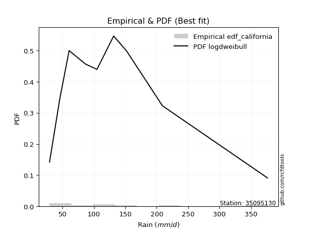</img>

</div>


### 2. EDF Hazen (1930)

Hazen method for plotting positions is a formula used to estimate the empirical cumulative probability distribution of flood events or other hydrological data. This formula often results in biased estimations, particularly when extrapolating to extreme events (high return periods).

<div align="center">


$P=(m-0.5)/n$


</div>


**2.1. Empirical values**

<div align="center">

|                | 0                   | 1                   | 2                  | 3                  | 4         | 5                  | 6                  | 7                  | 8                  |
|:---------------|:--------------------|:--------------------|:-------------------|:-------------------|:----------|:-------------------|:-------------------|:-------------------|:-------------------|
| date           | 2025                | 2024                | 2022               | 2021               | 2020      | 2018               | 2023               | 2019               | 2017               |
| x              | 29.3                | 45.8                | 60.5               | 86.5               | 104.8     | 131.4              | 152.1              | 209.1              | 376.26             |
| m              | 1                   | 2                   | 3                  | 4                  | 5         | 6                  | 7                  | 8                  | 9                  |
| empirical_dist | edf_hazen           | edf_hazen           | edf_hazen          | edf_hazen          | edf_hazen | edf_hazen          | edf_hazen          | edf_hazen          | edf_hazen          |
| empirical      | 0.05555555555555555 | 0.16666666666666666 | 0.2777777777777778 | 0.3888888888888889 | 0.5       | 0.6111111111111112 | 0.7222222222222222 | 0.8333333333333334 | 0.9444444444444444 |
| empirical_tr   | 1.0588235294117647  | 1.2                 | 1.3846153846153846 | 1.6363636363636362 | 2.0       | 2.5714285714285716 | 3.5999999999999996 | 6.000000000000002  | 17.999999999999993 |

</div>


**2.2. Kolmogorov-Smirnov fit test (sorted by Δ)**


<div align="center">

|                | 0                   | 1                   | 2                   | 3                    | 4                   | 5                    | 6                   | 7                   | 8                   | 9                   | 10                   | 11                   | 12                   | 13                   | 14                  | 15                  | 16                   | 17                  | 18                   | 19                   | 20                  | 21                  | 22                  | 23                   | 24                  | 25                   | 26                   | 27                   | 28                  | 29                   | 30                  | 31                  | 32                  | 33                  | 34                  | 35                  | 36                  | 37                  | 38                  | 39                  | 40                   | 41                  | 42                  | 43                  | 44                  | 45                   | 46                  | 47                  | 48                   | 49                   | 50                  | 51                  | 52                  | 53                  | 54                  | 55                  | 56                  | 57                  | 58                  | 59                  | 60                  | 61                  | 62                  | 63                  | 64                  | 65                  | 66                  | 67                  | 68                  | 69                  | 70                  | 71                  | 72                  | 73                  | 74                  | 75                  | 76                  | 77                  | 78                  | 79                  | 80                  | 81                  | 82                  | 83                  | 84                  | 85                  | 86                  | 87                  | 88                  | 89                  | 90                  | 91                  | 92                  | 93                  | 94                  | 95                  | 96                  | 97                  | 98                  | 99                  | 100                 | 101                 | 102                 | 103                 | 104                 | 105                 | 106                 | 107                 | 108                 | 109                 | 110                 | 111                 | 112                 | 113                 | 114                 | 115                 | 116                 | 117                 | 118                 | 119                 | 120                 | 121                 | 122                 | 123                 | 124                 | 125                 | 126                 | 127                 | 128                 | 129                 | 130                 | 131                 | 132                 | 133                 | 134                 | 135                 | 136                 | 137                 | 138                 | 139                 | 140                 | 141                 | 142                 | 143                 | 144                 | 145                 | 146                 | 147                 | 148                 | 149                 | 150                 | 151                 | 152                 | 153                 | 154                 | 155                 | 156                 | 157                 | 158                 | 159                 |
|:---------------|:--------------------|:--------------------|:--------------------|:---------------------|:--------------------|:---------------------|:--------------------|:--------------------|:--------------------|:--------------------|:---------------------|:---------------------|:---------------------|:---------------------|:--------------------|:--------------------|:---------------------|:--------------------|:---------------------|:---------------------|:--------------------|:--------------------|:--------------------|:---------------------|:--------------------|:---------------------|:---------------------|:---------------------|:--------------------|:---------------------|:--------------------|:--------------------|:--------------------|:--------------------|:--------------------|:--------------------|:--------------------|:--------------------|:--------------------|:--------------------|:---------------------|:--------------------|:--------------------|:--------------------|:--------------------|:---------------------|:--------------------|:--------------------|:---------------------|:---------------------|:--------------------|:--------------------|:--------------------|:--------------------|:--------------------|:--------------------|:--------------------|:--------------------|:--------------------|:--------------------|:--------------------|:--------------------|:--------------------|:--------------------|:--------------------|:--------------------|:--------------------|:--------------------|:--------------------|:--------------------|:--------------------|:--------------------|:--------------------|:--------------------|:--------------------|:--------------------|:--------------------|:--------------------|:--------------------|:--------------------|:--------------------|:--------------------|:--------------------|:--------------------|:--------------------|:--------------------|:--------------------|:--------------------|:--------------------|:--------------------|:--------------------|:--------------------|:--------------------|:--------------------|:--------------------|:--------------------|:--------------------|:--------------------|:--------------------|:--------------------|:--------------------|:--------------------|:--------------------|:--------------------|:--------------------|:--------------------|:--------------------|:--------------------|:--------------------|:--------------------|:--------------------|:--------------------|:--------------------|:--------------------|:--------------------|:--------------------|:--------------------|:--------------------|:--------------------|:--------------------|:--------------------|:--------------------|:--------------------|:--------------------|:--------------------|:--------------------|:--------------------|:--------------------|:--------------------|:--------------------|:--------------------|:--------------------|:--------------------|:--------------------|:--------------------|:--------------------|:--------------------|:--------------------|:--------------------|:--------------------|:--------------------|:--------------------|:--------------------|:--------------------|:--------------------|:--------------------|:--------------------|:--------------------|:--------------------|:--------------------|:--------------------|:--------------------|:--------------------|:--------------------|:--------------------|:--------------------|:--------------------|:--------------------|:--------------------|:--------------------|
| station        | 35095130            | 35095130            | 35095130            | 35095130             | 35095130            | 35095130             | 35095130            | 35095130            | 35095130            | 35095130            | 35095130             | 35095130             | 35095130             | 35095130             | 35095130            | 35095130            | 35095130             | 35095130            | 35095130             | 35095130             | 35095130            | 35095130            | 35095130            | 35095130             | 35095130            | 35095130             | 35095130             | 35095130             | 35095130            | 35095130             | 35095130            | 35095130            | 35095130            | 35095130            | 35095130            | 35095130            | 35095130            | 35095130            | 35095130            | 35095130            | 35095130             | 35095130            | 35095130            | 35095130            | 35095130            | 35095130             | 35095130            | 35095130            | 35095130             | 35095130             | 35095130            | 35095130            | 35095130            | 35095130            | 35095130            | 35095130            | 35095130            | 35095130            | 35095130            | 35095130            | 35095130            | 35095130            | 35095130            | 35095130            | 35095130            | 35095130            | 35095130            | 35095130            | 35095130            | 35095130            | 35095130            | 35095130            | 35095130            | 35095130            | 35095130            | 35095130            | 35095130            | 35095130            | 35095130            | 35095130            | 35095130            | 35095130            | 35095130            | 35095130            | 35095130            | 35095130            | 35095130            | 35095130            | 35095130            | 35095130            | 35095130            | 35095130            | 35095130            | 35095130            | 35095130            | 35095130            | 35095130            | 35095130            | 35095130            | 35095130            | 35095130            | 35095130            | 35095130            | 35095130            | 35095130            | 35095130            | 35095130            | 35095130            | 35095130            | 35095130            | 35095130            | 35095130            | 35095130            | 35095130            | 35095130            | 35095130            | 35095130            | 35095130            | 35095130            | 35095130            | 35095130            | 35095130            | 35095130            | 35095130            | 35095130            | 35095130            | 35095130            | 35095130            | 35095130            | 35095130            | 35095130            | 35095130            | 35095130            | 35095130            | 35095130            | 35095130            | 35095130            | 35095130            | 35095130            | 35095130            | 35095130            | 35095130            | 35095130            | 35095130            | 35095130            | 35095130            | 35095130            | 35095130            | 35095130            | 35095130            | 35095130            | 35095130            | 35095130            | 35095130            | 35095130            | 35095130            | 35095130            | 35095130            | 35095130            | 35095130            |
| empirical_dist | edf_hazen           | edf_hazen           | edf_hazen           | edf_hazen            | edf_hazen           | edf_hazen            | edf_hazen           | edf_hazen           | edf_hazen           | edf_hazen           | edf_hazen            | edf_hazen            | edf_hazen            | edf_hazen            | edf_hazen           | edf_hazen           | edf_hazen            | edf_hazen           | edf_hazen            | edf_hazen            | edf_hazen           | edf_hazen           | edf_hazen           | edf_hazen            | edf_hazen           | edf_hazen            | edf_hazen            | edf_hazen            | edf_hazen           | edf_hazen            | edf_hazen           | edf_hazen           | edf_hazen           | edf_hazen           | edf_hazen           | edf_hazen           | edf_hazen           | edf_hazen           | edf_hazen           | edf_hazen           | edf_hazen            | edf_hazen           | edf_hazen           | edf_hazen           | edf_hazen           | edf_hazen            | edf_hazen           | edf_hazen           | edf_hazen            | edf_hazen            | edf_hazen           | edf_hazen           | edf_hazen           | edf_hazen           | edf_hazen           | edf_hazen           | edf_hazen           | edf_hazen           | edf_hazen           | edf_hazen           | edf_hazen           | edf_hazen           | edf_hazen           | edf_hazen           | edf_hazen           | edf_hazen           | edf_hazen           | edf_hazen           | edf_hazen           | edf_hazen           | edf_hazen           | edf_hazen           | edf_hazen           | edf_hazen           | edf_hazen           | edf_hazen           | edf_hazen           | edf_hazen           | edf_hazen           | edf_hazen           | edf_hazen           | edf_hazen           | edf_hazen           | edf_hazen           | edf_hazen           | edf_hazen           | edf_hazen           | edf_hazen           | edf_hazen           | edf_hazen           | edf_hazen           | edf_hazen           | edf_hazen           | edf_hazen           | edf_hazen           | edf_hazen           | edf_hazen           | edf_hazen           | edf_hazen           | edf_hazen           | edf_hazen           | edf_hazen           | edf_hazen           | edf_hazen           | edf_hazen           | edf_hazen           | edf_hazen           | edf_hazen           | edf_hazen           | edf_hazen           | edf_hazen           | edf_hazen           | edf_hazen           | edf_hazen           | edf_hazen           | edf_hazen           | edf_hazen           | edf_hazen           | edf_hazen           | edf_hazen           | edf_hazen           | edf_hazen           | edf_hazen           | edf_hazen           | edf_hazen           | edf_hazen           | edf_hazen           | edf_hazen           | edf_hazen           | edf_hazen           | edf_hazen           | edf_hazen           | edf_hazen           | edf_hazen           | edf_hazen           | edf_hazen           | edf_hazen           | edf_hazen           | edf_hazen           | edf_hazen           | edf_hazen           | edf_hazen           | edf_hazen           | edf_hazen           | edf_hazen           | edf_hazen           | edf_hazen           | edf_hazen           | edf_hazen           | edf_hazen           | edf_hazen           | edf_hazen           | edf_hazen           | edf_hazen           | edf_hazen           | edf_hazen           | edf_hazen           | edf_hazen           | edf_hazen           | edf_hazen           |
| p_dist         | logcosine           | logncf              | logfoldnorm         | loggenextreme        | logfatiguelife      | logf                 | logjohnsonsu        | loggamma            | loggamma            | logerlang           | logpearson3          | logskewnorm          | logexponnorm         | lognorm              | logcrystalball      | logt                | lognct               | logloggamma         | betaprime            | ncf                  | burr                | mielke              | loggenlogistic      | logbetaprime         | loganglit           | invgamma             | loginvgamma          | invweibull           | genextreme          | logweibull_min       | logrice             | alpha               | logburr12           | logalpha            | logsemicircular     | moyal               | exponnorm           | genpareto           | lomax               | kappa3              | genexpon             | loggompertz         | logvonmises_line    | halflogistic        | johnsonsu           | invgauss             | loglogistic         | logmaxwell          | logtruncpareto       | loginvgauss          | nct                 | bradford            | truncpareto         | pearson3            | weibull_min         | truncweibull_min    | genlogistic         | loggausshyper       | lograyleigh         | loghypsecant        | loggumbel_l         | logdweibull         | loguniform          | logexponpow         | gumbel_r            | logkappa3           | gompertz            | gengamma            | logkappa4           | logloglaplace       | kstwobign           | loggumbel_r         | halfnorm            | loginvweibull       | logdgamma           | loglaplace          | loglaplace          | exponpow            | logarcsine          | loghalfgennorm      | loggenexpon         | logkstwobign        | t                   | dweibull            | loghalfnorm         | logksone            | foldnorm            | rayleigh            | dgamma              | nakagami            | gennorm             | logmoyal            | logargus            | logbradford         | maxwell             | skewnorm            | vonmises_line       | loghalflogistic     | rice                | hypsecant           | logistic            | logtruncexpon       | halfgennorm         | logrdist            | truncnorm           | norm                | crystalball         | wald                | logbeta             | anglit              | semicircular        | laplace             | f                   | logtruncnorm        | lognakagami         | logtukeylambda      | truncexpon          | logtruncweibull_min | logwald             | arcsine             | loglomax            | logburr             | burr12              | logtriang           | logweibull_max      | logmielke           | logexponweib        | gumbel_l            | beta                | gamma               | logwrapcauchy       | cosine              | loggenhalflogistic  | gausshyper          | loggengamma         | exponweib           | wrapcauchy          | loglevy_l           | loggennorm          | argus               | logtrapezoid        | kappa4              | ksone               | uniform             | loggenpareto        | levy_l              | powerlaw            | genhalflogistic     | fatiguelife         | rdist               | logjohnsonsb        | logpowerlaw         | tukeylambda         | erlang              | triang              | trapezoid           | weibull_max         | johnsonsb           | logvonmises         | vonmises            |
| delta          | 0.02992121077174864 | 0.03227037295615853 | 0.03390647876176767 | 0.033988104416988824 | 0.03401630528802996 | 0.034226750298985364 | 0.03472440557935935 | 0.0348470967808957  | 0.0348470967808957  | 0.03486513508676345 | 0.034955575274293105 | 0.035770336564530325 | 0.035858486644505916 | 0.035862316276409845 | 0.03586325385685932 | 0.0358670641653126  | 0.036089894184352767 | 0.03700761201779035 | 0.037557465428749465 | 0.037981097545192855 | 0.03939289123946754 | 0.03941471187995185 | 0.03977365431063923 | 0.040298015224681516 | 0.04048731841801256 | 0.042485796952257404 | 0.043582790998346665 | 0.044061163784081425 | 0.04406147876902389 | 0.044180358382820584 | 0.04763195961928196 | 0.04767441484251503 | 0.04782491649551718 | 0.04920463959550325 | 0.05118771369800801 | 0.05419449352165462 | 0.05447116690387796 | 0.05553124707601976 | 0.05555515993518989 | 0.05555516986483381 | 0.055555331631051294 | 0.05555555298733185 | 0.05555555530662643 | 0.05568760595911382 | 0.05667870340145681 | 0.057284308863295164 | 0.05851016840943765 | 0.05923507068908351 | 0.059573935455628835 | 0.059904223354708075 | 0.06129521513253611 | 0.06134598734705621 | 0.06199291481478297 | 0.06365498445571482 | 0.06379974178187625 | 0.0638749937148545  | 0.06835576005874427 | 0.06987558623894369 | 0.07147450494782509 | 0.07317171586296839 | 0.0733184376808366  | 0.07678857016710966 | 0.07704054071596289 | 0.07805878973905572 | 0.07807288155290504 | 0.07809697407513794 | 0.07865167627246905 | 0.08033712544711441 | 0.0810674465379626  | 0.08437928419588855 | 0.08683169447485051 | 0.08716899701286684 | 0.08737441383929051 | 0.08846927677601513 | 0.09142994227038742 | 0.09202059817834704 | 0.09202059817834704 | 0.09251317403227016 | 0.09651048500375359 | 0.10414829307974188 | 0.10417191801362652 | 0.10466500944283713 | 0.10512573010267892 | 0.10590717052984303 | 0.10613615860999875 | 0.10844707774635465 | 0.10875645598257036 | 0.10916060615918222 | 0.10918673395364009 | 0.10941564700864384 | 0.11268848411888077 | 0.11282753166720172 | 0.11490767805934488 | 0.11496870030461354 | 0.1181711165982563  | 0.1182866910096384  | 0.12225607129256932 | 0.12343254932745534 | 0.13313614409628216 | 0.13464446805240743 | 0.1367450354234332  | 0.13704640937395035 | 0.1373106721863872  | 0.145970495140531   | 0.1467304738979739  | 0.1467304802720154  | 0.1467304819829589  | 0.14818534451130555 | 0.1529938177354866  | 0.1573297755939731  | 0.16171611247021833 | 0.1623927791910874  | 0.16516367328891196 | 0.16661142686480226 | 0.16666666666348565 | 0.1666666666666453  | 0.17609381238901167 | 0.17723928813234063 | 0.18410791856391073 | 0.18643862422417667 | 0.19097682636625607 | 0.19169987748285727 | 0.1917261880924303  | 0.19706868805103173 | 0.19747992861250063 | 0.20450630912946494 | 0.20867338676941344 | 0.21056742458245492 | 0.21088902341367188 | 0.21831792298926084 | 0.21836195060838348 | 0.23060313063759585 | 0.2363950054068542  | 0.24099906701537382 | 0.25429144568218615 | 0.28537480174470825 | 0.3245870312111975  | 0.33281150034369644 | 0.33333333333333337 | 0.33475665349248485 | 0.3366001816302112  | 0.33889540529897094 | 0.3439461481310686  | 0.36829093331283785 | 0.4025137337109135  | 0.41104036285150247 | 0.41643939387628026 | 0.4714842616249971  | 0.49197709450906035 | 0.49761871239270183 | 0.5110948868452644  | 0.5220956307268629  | 0.5235786348897109  | 0.5280773851350731  | 0.5518699091610342  | 0.5786387611902835  | 0.6985692233408141  | 0.7040078017735087  | 1.0337173025908633  | 59.74923268615481   |
| deltao         | 0.41761268023100007 | 0.41761268023100007 | 0.41761268023100007 | 0.41761268023100007  | 0.41761268023100007 | 0.41761268023100007  | 0.41761268023100007 | 0.41761268023100007 | 0.41761268023100007 | 0.41761268023100007 | 0.41761268023100007  | 0.41761268023100007  | 0.41761268023100007  | 0.41761268023100007  | 0.41761268023100007 | 0.41761268023100007 | 0.41761268023100007  | 0.41761268023100007 | 0.41761268023100007  | 0.41761268023100007  | 0.41761268023100007 | 0.41761268023100007 | 0.41761268023100007 | 0.41761268023100007  | 0.41761268023100007 | 0.41761268023100007  | 0.41761268023100007  | 0.41761268023100007  | 0.41761268023100007 | 0.41761268023100007  | 0.41761268023100007 | 0.41761268023100007 | 0.41761268023100007 | 0.41761268023100007 | 0.41761268023100007 | 0.41761268023100007 | 0.41761268023100007 | 0.41761268023100007 | 0.41761268023100007 | 0.41761268023100007 | 0.41761268023100007  | 0.41761268023100007 | 0.41761268023100007 | 0.41761268023100007 | 0.41761268023100007 | 0.41761268023100007  | 0.41761268023100007 | 0.41761268023100007 | 0.41761268023100007  | 0.41761268023100007  | 0.41761268023100007 | 0.41761268023100007 | 0.41761268023100007 | 0.41761268023100007 | 0.41761268023100007 | 0.41761268023100007 | 0.41761268023100007 | 0.41761268023100007 | 0.41761268023100007 | 0.41761268023100007 | 0.41761268023100007 | 0.41761268023100007 | 0.41761268023100007 | 0.41761268023100007 | 0.41761268023100007 | 0.41761268023100007 | 0.41761268023100007 | 0.41761268023100007 | 0.41761268023100007 | 0.41761268023100007 | 0.41761268023100007 | 0.41761268023100007 | 0.41761268023100007 | 0.41761268023100007 | 0.41761268023100007 | 0.41761268023100007 | 0.41761268023100007 | 0.41761268023100007 | 0.41761268023100007 | 0.41761268023100007 | 0.41761268023100007 | 0.41761268023100007 | 0.41761268023100007 | 0.41761268023100007 | 0.41761268023100007 | 0.41761268023100007 | 0.41761268023100007 | 0.41761268023100007 | 0.41761268023100007 | 0.41761268023100007 | 0.41761268023100007 | 0.41761268023100007 | 0.41761268023100007 | 0.41761268023100007 | 0.41761268023100007 | 0.41761268023100007 | 0.41761268023100007 | 0.41761268023100007 | 0.41761268023100007 | 0.41761268023100007 | 0.41761268023100007 | 0.41761268023100007 | 0.41761268023100007 | 0.41761268023100007 | 0.41761268023100007 | 0.41761268023100007 | 0.41761268023100007 | 0.41761268023100007 | 0.41761268023100007 | 0.41761268023100007 | 0.41761268023100007 | 0.41761268023100007 | 0.41761268023100007 | 0.41761268023100007 | 0.41761268023100007 | 0.41761268023100007 | 0.41761268023100007 | 0.41761268023100007 | 0.41761268023100007 | 0.41761268023100007 | 0.41761268023100007 | 0.41761268023100007 | 0.41761268023100007 | 0.41761268023100007 | 0.41761268023100007 | 0.41761268023100007 | 0.41761268023100007 | 0.41761268023100007 | 0.41761268023100007 | 0.41761268023100007 | 0.41761268023100007 | 0.41761268023100007 | 0.41761268023100007 | 0.41761268023100007 | 0.41761268023100007 | 0.41761268023100007 | 0.41761268023100007 | 0.41761268023100007 | 0.41761268023100007 | 0.41761268023100007 | 0.41761268023100007 | 0.41761268023100007 | 0.41761268023100007 | 0.41761268023100007 | 0.41761268023100007 | 0.41761268023100007 | 0.41761268023100007 | 0.41761268023100007 | 0.41761268023100007 | 0.41761268023100007 | 0.41761268023100007 | 0.41761268023100007 | 0.41761268023100007 | 0.41761268023100007 | 0.41761268023100007 | 0.41761268023100007 | 0.41761268023100007 | 0.41761268023100007 | 0.41761268023100007 | 0.41761268023100007 |
| eval           | Δo > Δ              | Δo > Δ              | Δo > Δ              | Δo > Δ               | Δo > Δ              | Δo > Δ               | Δo > Δ              | Δo > Δ              | Δo > Δ              | Δo > Δ              | Δo > Δ               | Δo > Δ               | Δo > Δ               | Δo > Δ               | Δo > Δ              | Δo > Δ              | Δo > Δ               | Δo > Δ              | Δo > Δ               | Δo > Δ               | Δo > Δ              | Δo > Δ              | Δo > Δ              | Δo > Δ               | Δo > Δ              | Δo > Δ               | Δo > Δ               | Δo > Δ               | Δo > Δ              | Δo > Δ               | Δo > Δ              | Δo > Δ              | Δo > Δ              | Δo > Δ              | Δo > Δ              | Δo > Δ              | Δo > Δ              | Δo > Δ              | Δo > Δ              | Δo > Δ              | Δo > Δ               | Δo > Δ              | Δo > Δ              | Δo > Δ              | Δo > Δ              | Δo > Δ               | Δo > Δ              | Δo > Δ              | Δo > Δ               | Δo > Δ               | Δo > Δ              | Δo > Δ              | Δo > Δ              | Δo > Δ              | Δo > Δ              | Δo > Δ              | Δo > Δ              | Δo > Δ              | Δo > Δ              | Δo > Δ              | Δo > Δ              | Δo > Δ              | Δo > Δ              | Δo > Δ              | Δo > Δ              | Δo > Δ              | Δo > Δ              | Δo > Δ              | Δo > Δ              | Δo > Δ              | Δo > Δ              | Δo > Δ              | Δo > Δ              | Δo > Δ              | Δo > Δ              | Δo > Δ              | Δo > Δ              | Δo > Δ              | Δo > Δ              | Δo > Δ              | Δo > Δ              | Δo > Δ              | Δo > Δ              | Δo > Δ              | Δo > Δ              | Δo > Δ              | Δo > Δ              | Δo > Δ              | Δo > Δ              | Δo > Δ              | Δo > Δ              | Δo > Δ              | Δo > Δ              | Δo > Δ              | Δo > Δ              | Δo > Δ              | Δo > Δ              | Δo > Δ              | Δo > Δ              | Δo > Δ              | Δo > Δ              | Δo > Δ              | Δo > Δ              | Δo > Δ              | Δo > Δ              | Δo > Δ              | Δo > Δ              | Δo > Δ              | Δo > Δ              | Δo > Δ              | Δo > Δ              | Δo > Δ              | Δo > Δ              | Δo > Δ              | Δo > Δ              | Δo > Δ              | Δo > Δ              | Δo > Δ              | Δo > Δ              | Δo > Δ              | Δo > Δ              | Δo > Δ              | Δo > Δ              | Δo > Δ              | Δo > Δ              | Δo > Δ              | Δo > Δ              | Δo > Δ              | Δo > Δ              | Δo > Δ              | Δo > Δ              | Δo > Δ              | Δo > Δ              | Δo > Δ              | Δo > Δ              | Δo > Δ              | Δo > Δ              | Δo > Δ              | Δo > Δ              | Δo > Δ              | Δo > Δ              | Δo > Δ              | Δo > Δ              | Δo > Δ              | Δo > Δ              | Δo > Δ              | Δo > Δ              | Δo <= Δ             | Δo <= Δ             | Δo <= Δ             | Δo <= Δ             | Δo <= Δ             | Δo <= Δ             | Δo <= Δ             | Δo <= Δ             | Δo <= Δ             | Δo <= Δ             | Δo <= Δ             | Δo <= Δ             | Δo <= Δ             |
| fit            | 1                   | 1                   | 1                   | 1                    | 1                   | 1                    | 1                   | 1                   | 1                   | 1                   | 1                    | 1                    | 1                    | 1                    | 1                   | 1                   | 1                    | 1                   | 1                    | 1                    | 1                   | 1                   | 1                   | 1                    | 1                   | 1                    | 1                    | 1                    | 1                   | 1                    | 1                   | 1                   | 1                   | 1                   | 1                   | 1                   | 1                   | 1                   | 1                   | 1                   | 1                    | 1                   | 1                   | 1                   | 1                   | 1                    | 1                   | 1                   | 1                    | 1                    | 1                   | 1                   | 1                   | 1                   | 1                   | 1                   | 1                   | 1                   | 1                   | 1                   | 1                   | 1                   | 1                   | 1                   | 1                   | 1                   | 1                   | 1                   | 1                   | 1                   | 1                   | 1                   | 1                   | 1                   | 1                   | 1                   | 1                   | 1                   | 1                   | 1                   | 1                   | 1                   | 1                   | 1                   | 1                   | 1                   | 1                   | 1                   | 1                   | 1                   | 1                   | 1                   | 1                   | 1                   | 1                   | 1                   | 1                   | 1                   | 1                   | 1                   | 1                   | 1                   | 1                   | 1                   | 1                   | 1                   | 1                   | 1                   | 1                   | 1                   | 1                   | 1                   | 1                   | 1                   | 1                   | 1                   | 1                   | 1                   | 1                   | 1                   | 1                   | 1                   | 1                   | 1                   | 1                   | 1                   | 1                   | 1                   | 1                   | 1                   | 1                   | 1                   | 1                   | 1                   | 1                   | 1                   | 1                   | 1                   | 1                   | 1                   | 1                   | 1                   | 1                   | 1                   | 1                   | 1                   | 1                   | 0                   | 0                   | 0                   | 0                   | 0                   | 0                   | 0                   | 0                   | 0                   | 0                   | 0                   | 0                   | 0                   |
| n              | 9                   | 9                   | 9                   | 9                    | 9                   | 9                    | 9                   | 9                   | 9                   | 9                   | 9                    | 9                    | 9                    | 9                    | 9                   | 9                   | 9                    | 9                   | 9                    | 9                    | 9                   | 9                   | 9                   | 9                    | 9                   | 9                    | 9                    | 9                    | 9                   | 9                    | 9                   | 9                   | 9                   | 9                   | 9                   | 9                   | 9                   | 9                   | 9                   | 9                   | 9                    | 9                   | 9                   | 9                   | 9                   | 9                    | 9                   | 9                   | 9                    | 9                    | 9                   | 9                   | 9                   | 9                   | 9                   | 9                   | 9                   | 9                   | 9                   | 9                   | 9                   | 9                   | 9                   | 9                   | 9                   | 9                   | 9                   | 9                   | 9                   | 9                   | 9                   | 9                   | 9                   | 9                   | 9                   | 9                   | 9                   | 9                   | 9                   | 9                   | 9                   | 9                   | 9                   | 9                   | 9                   | 9                   | 9                   | 9                   | 9                   | 9                   | 9                   | 9                   | 9                   | 9                   | 9                   | 9                   | 9                   | 9                   | 9                   | 9                   | 9                   | 9                   | 9                   | 9                   | 9                   | 9                   | 9                   | 9                   | 9                   | 9                   | 9                   | 9                   | 9                   | 9                   | 9                   | 9                   | 9                   | 9                   | 9                   | 9                   | 9                   | 9                   | 9                   | 9                   | 9                   | 9                   | 9                   | 9                   | 9                   | 9                   | 9                   | 9                   | 9                   | 9                   | 9                   | 9                   | 9                   | 9                   | 9                   | 9                   | 9                   | 9                   | 9                   | 9                   | 9                   | 9                   | 9                   | 9                   | 9                   | 9                   | 9                   | 9                   | 9                   | 9                   | 9                   | 9                   | 9                   | 9                   | 9                   | 9                   |
| best_fit       | 1                   | 0                   | 0                   | 0                    | 0                   | 0                    | 0                   | 0                   | 0                   | 0                   | 0                    | 0                    | 0                    | 0                    | 0                   | 0                   | 0                    | 0                   | 0                    | 0                    | 0                   | 0                   | 0                   | 0                    | 0                   | 0                    | 0                    | 0                    | 0                   | 0                    | 0                   | 0                   | 0                   | 0                   | 0                   | 0                   | 0                   | 0                   | 0                   | 0                   | 0                    | 0                   | 0                   | 0                   | 0                   | 0                    | 0                   | 0                   | 0                    | 0                    | 0                   | 0                   | 0                   | 0                   | 0                   | 0                   | 0                   | 0                   | 0                   | 0                   | 0                   | 0                   | 0                   | 0                   | 0                   | 0                   | 0                   | 0                   | 0                   | 0                   | 0                   | 0                   | 0                   | 0                   | 0                   | 0                   | 0                   | 0                   | 0                   | 0                   | 0                   | 0                   | 0                   | 0                   | 0                   | 0                   | 0                   | 0                   | 0                   | 0                   | 0                   | 0                   | 0                   | 0                   | 0                   | 0                   | 0                   | 0                   | 0                   | 0                   | 0                   | 0                   | 0                   | 0                   | 0                   | 0                   | 0                   | 0                   | 0                   | 0                   | 0                   | 0                   | 0                   | 0                   | 0                   | 0                   | 0                   | 0                   | 0                   | 0                   | 0                   | 0                   | 0                   | 0                   | 0                   | 0                   | 0                   | 0                   | 0                   | 0                   | 0                   | 0                   | 0                   | 0                   | 0                   | 0                   | 0                   | 0                   | 0                   | 0                   | 0                   | 0                   | 0                   | 0                   | 0                   | 0                   | 0                   | 0                   | 0                   | 0                   | 0                   | 0                   | 0                   | 0                   | 0                   | 0                   | 0                   | 0                   | 0                   | 0                   |
| best_fit_sort  | 1                   | 2                   | 3                   | 4                    | 5                   | 6                    | 7                   | 8                   | 9                   | 10                  | 11                   | 12                   | 13                   | 14                   | 15                  | 16                  | 17                   | 18                  | 19                   | 20                   | 21                  | 22                  | 23                  | 24                   | 25                  | 26                   | 27                   | 28                   | 29                  | 30                   | 31                  | 32                  | 33                  | 34                  | 35                  | 36                  | 37                  | 38                  | 39                  | 40                  | 41                   | 42                  | 43                  | 44                  | 45                  | 46                   | 47                  | 48                  | 49                   | 50                   | 51                  | 52                  | 53                  | 54                  | 55                  | 56                  | 57                  | 58                  | 59                  | 60                  | 61                  | 62                  | 63                  | 64                  | 65                  | 66                  | 67                  | 68                  | 69                  | 70                  | 71                  | 72                  | 73                  | 74                  | 75                  | 76                  | 77                  | 78                  | 79                  | 80                  | 81                  | 82                  | 83                  | 84                  | 85                  | 86                  | 87                  | 88                  | 89                  | 90                  | 91                  | 92                  | 93                  | 94                  | 95                  | 96                  | 97                  | 98                  | 99                  | 100                 | 101                 | 102                 | 103                 | 104                 | 105                 | 106                 | 107                 | 108                 | 109                 | 110                 | 111                 | 112                 | 113                 | 114                 | 115                 | 116                 | 117                 | 118                 | 119                 | 120                 | 121                 | 122                 | 123                 | 124                 | 125                 | 126                 | 127                 | 128                 | 129                 | 130                 | 131                 | 132                 | 133                 | 134                 | 135                 | 136                 | 137                 | 138                 | 139                 | 140                 | 141                 | 142                 | 143                 | 144                 | 145                 | 146                 | 147                 | 148                 | 149                 | 150                 | 151                 | 152                 | 153                 | 154                 | 155                 | 156                 | 157                 | 158                 | 159                 | 160                 |

</div>


**2.3. Best fit**

<div align="center">

|   id |   station | empirical_dist   | p_dist    |     delta |   deltao | eval   |   fit |   n |   best_fit |   best_fit_sort |
|-----:|----------:|:-----------------|:----------|----------:|---------:|:-------|------:|----:|-----------:|----------------:|
|    0 |  35095130 | edf_hazen        | logcosine | 0.0299212 | 0.417613 | Δo > Δ |     1 |   9 |          1 |               1 |

</div>


<div align="center">

</img>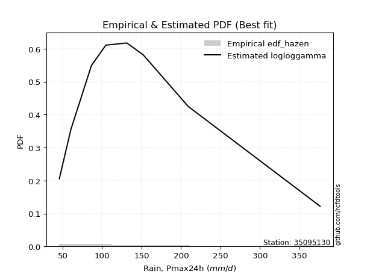</img>

</div>


### 3. EDF Weibull (1939)

Weibull plotting position formula is an empirical method used to estimate the non-exceedance probability or plotting position for a set of observed data, is often recommended or widely used in practice, particularly in flood frequency analysis.

<div align="center">


$P=m/(n+1)$


</div>


**3.1. Empirical values**

<div align="center">

|                | 0                  | 1           | 2                  | 3                  | 4           | 5           | 6                 | 7                 | 8                  |
|:---------------|:-------------------|:------------|:-------------------|:-------------------|:------------|:------------|:------------------|:------------------|:-------------------|
| date           | 2025               | 2024        | 2022               | 2021               | 2020        | 2018        | 2023              | 2019              | 2017               |
| x              | 29.3               | 45.8        | 60.5               | 86.5               | 104.8       | 131.4       | 152.1             | 209.1             | 376.26             |
| m              | 1                  | 2           | 3                  | 4                  | 5           | 6           | 7                 | 8                 | 9                  |
| empirical_dist | edf_weibull        | edf_weibull | edf_weibull        | edf_weibull        | edf_weibull | edf_weibull | edf_weibull       | edf_weibull       | edf_weibull        |
| empirical      | 0.1                | 0.2         | 0.3                | 0.4                | 0.5         | 0.6         | 0.7               | 0.8               | 0.9                |
| empirical_tr   | 1.1111111111111112 | 1.25        | 1.4285714285714286 | 1.6666666666666667 | 2.0         | 2.5         | 3.333333333333333 | 5.000000000000001 | 10.000000000000002 |

</div>


**3.2. Kolmogorov-Smirnov fit test (sorted by Δ)**


<div align="center">

|                | 0                    | 1                   | 2                    | 3                   | 4                   | 5                   | 6                   | 7                   | 8                    | 9                    | 10                   | 11                   | 12                  | 13                  | 14                  | 15                  | 16                   | 17                   | 18                  | 19                  | 20                   | 21                  | 22                  | 23                  | 24                  | 25                  | 26                  | 27                  | 28                  | 29                  | 30                  | 31                  | 32                  | 33                  | 34                  | 35                  | 36                  | 37                  | 38                  | 39                  | 40                  | 41                  | 42                  | 43                  | 44                  | 45                  | 46                  | 47                  | 48                  | 49                  | 50                  | 51                  | 52                  | 53                  | 54                  | 55                  | 56                  | 57                  | 58                  | 59                  | 60                  | 61                  | 62                  | 63                  | 64                  | 65                  | 66                  | 67                  | 68                  | 69                  | 70                  | 71                  | 72                  | 73                  | 74                  | 75                  | 76                  | 77                  | 78                  | 79                  | 80                  | 81                  | 82                  | 83                  | 84                  | 85                  | 86                  | 87                  | 88                  | 89                  | 90                  | 91                  | 92                  | 93                  | 94                  | 95                  | 96                  | 97                  | 98                  | 99                  | 100                 | 101                 | 102                 | 103                 | 104                 | 105                 | 106                 | 107                 | 108                 | 109                 | 110                 | 111                 | 112                 | 113                 | 114                 | 115                 | 116                 | 117                 | 118                 | 119                 | 120                 | 121                 | 122                 | 123                 | 124                 | 125                 | 126                 | 127                 | 128                 | 129                 | 130                 | 131                 | 132                 | 133                 | 134                 | 135                 | 136                 | 137                 | 138                 | 139                 | 140                 | 141                 | 142                 | 143                 | 144                 | 145                 | 146                 | 147                 | 148                 | 149                 | 150                 | 151                 | 152                 | 153                 | 154                 | 155                 | 156                 | 157                 | 158                 | 159                 |
|:---------------|:---------------------|:--------------------|:---------------------|:--------------------|:--------------------|:--------------------|:--------------------|:--------------------|:---------------------|:---------------------|:---------------------|:---------------------|:--------------------|:--------------------|:--------------------|:--------------------|:---------------------|:---------------------|:--------------------|:--------------------|:---------------------|:--------------------|:--------------------|:--------------------|:--------------------|:--------------------|:--------------------|:--------------------|:--------------------|:--------------------|:--------------------|:--------------------|:--------------------|:--------------------|:--------------------|:--------------------|:--------------------|:--------------------|:--------------------|:--------------------|:--------------------|:--------------------|:--------------------|:--------------------|:--------------------|:--------------------|:--------------------|:--------------------|:--------------------|:--------------------|:--------------------|:--------------------|:--------------------|:--------------------|:--------------------|:--------------------|:--------------------|:--------------------|:--------------------|:--------------------|:--------------------|:--------------------|:--------------------|:--------------------|:--------------------|:--------------------|:--------------------|:--------------------|:--------------------|:--------------------|:--------------------|:--------------------|:--------------------|:--------------------|:--------------------|:--------------------|:--------------------|:--------------------|:--------------------|:--------------------|:--------------------|:--------------------|:--------------------|:--------------------|:--------------------|:--------------------|:--------------------|:--------------------|:--------------------|:--------------------|:--------------------|:--------------------|:--------------------|:--------------------|:--------------------|:--------------------|:--------------------|:--------------------|:--------------------|:--------------------|:--------------------|:--------------------|:--------------------|:--------------------|:--------------------|:--------------------|:--------------------|:--------------------|:--------------------|:--------------------|:--------------------|:--------------------|:--------------------|:--------------------|:--------------------|:--------------------|:--------------------|:--------------------|:--------------------|:--------------------|:--------------------|:--------------------|:--------------------|:--------------------|:--------------------|:--------------------|:--------------------|:--------------------|:--------------------|:--------------------|:--------------------|:--------------------|:--------------------|:--------------------|:--------------------|:--------------------|:--------------------|:--------------------|:--------------------|:--------------------|:--------------------|:--------------------|:--------------------|:--------------------|:--------------------|:--------------------|:--------------------|:--------------------|:--------------------|:--------------------|:--------------------|:--------------------|:--------------------|:--------------------|:--------------------|:--------------------|:--------------------|:--------------------|:--------------------|:--------------------|
| station        | 35095130             | 35095130            | 35095130             | 35095130            | 35095130            | 35095130            | 35095130            | 35095130            | 35095130             | 35095130             | 35095130             | 35095130             | 35095130            | 35095130            | 35095130            | 35095130            | 35095130             | 35095130             | 35095130            | 35095130            | 35095130             | 35095130            | 35095130            | 35095130            | 35095130            | 35095130            | 35095130            | 35095130            | 35095130            | 35095130            | 35095130            | 35095130            | 35095130            | 35095130            | 35095130            | 35095130            | 35095130            | 35095130            | 35095130            | 35095130            | 35095130            | 35095130            | 35095130            | 35095130            | 35095130            | 35095130            | 35095130            | 35095130            | 35095130            | 35095130            | 35095130            | 35095130            | 35095130            | 35095130            | 35095130            | 35095130            | 35095130            | 35095130            | 35095130            | 35095130            | 35095130            | 35095130            | 35095130            | 35095130            | 35095130            | 35095130            | 35095130            | 35095130            | 35095130            | 35095130            | 35095130            | 35095130            | 35095130            | 35095130            | 35095130            | 35095130            | 35095130            | 35095130            | 35095130            | 35095130            | 35095130            | 35095130            | 35095130            | 35095130            | 35095130            | 35095130            | 35095130            | 35095130            | 35095130            | 35095130            | 35095130            | 35095130            | 35095130            | 35095130            | 35095130            | 35095130            | 35095130            | 35095130            | 35095130            | 35095130            | 35095130            | 35095130            | 35095130            | 35095130            | 35095130            | 35095130            | 35095130            | 35095130            | 35095130            | 35095130            | 35095130            | 35095130            | 35095130            | 35095130            | 35095130            | 35095130            | 35095130            | 35095130            | 35095130            | 35095130            | 35095130            | 35095130            | 35095130            | 35095130            | 35095130            | 35095130            | 35095130            | 35095130            | 35095130            | 35095130            | 35095130            | 35095130            | 35095130            | 35095130            | 35095130            | 35095130            | 35095130            | 35095130            | 35095130            | 35095130            | 35095130            | 35095130            | 35095130            | 35095130            | 35095130            | 35095130            | 35095130            | 35095130            | 35095130            | 35095130            | 35095130            | 35095130            | 35095130            | 35095130            | 35095130            | 35095130            | 35095130            | 35095130            | 35095130            | 35095130            |
| empirical_dist | edf_weibull          | edf_weibull         | edf_weibull          | edf_weibull         | edf_weibull         | edf_weibull         | edf_weibull         | edf_weibull         | edf_weibull          | edf_weibull          | edf_weibull          | edf_weibull          | edf_weibull         | edf_weibull         | edf_weibull         | edf_weibull         | edf_weibull          | edf_weibull          | edf_weibull         | edf_weibull         | edf_weibull          | edf_weibull         | edf_weibull         | edf_weibull         | edf_weibull         | edf_weibull         | edf_weibull         | edf_weibull         | edf_weibull         | edf_weibull         | edf_weibull         | edf_weibull         | edf_weibull         | edf_weibull         | edf_weibull         | edf_weibull         | edf_weibull         | edf_weibull         | edf_weibull         | edf_weibull         | edf_weibull         | edf_weibull         | edf_weibull         | edf_weibull         | edf_weibull         | edf_weibull         | edf_weibull         | edf_weibull         | edf_weibull         | edf_weibull         | edf_weibull         | edf_weibull         | edf_weibull         | edf_weibull         | edf_weibull         | edf_weibull         | edf_weibull         | edf_weibull         | edf_weibull         | edf_weibull         | edf_weibull         | edf_weibull         | edf_weibull         | edf_weibull         | edf_weibull         | edf_weibull         | edf_weibull         | edf_weibull         | edf_weibull         | edf_weibull         | edf_weibull         | edf_weibull         | edf_weibull         | edf_weibull         | edf_weibull         | edf_weibull         | edf_weibull         | edf_weibull         | edf_weibull         | edf_weibull         | edf_weibull         | edf_weibull         | edf_weibull         | edf_weibull         | edf_weibull         | edf_weibull         | edf_weibull         | edf_weibull         | edf_weibull         | edf_weibull         | edf_weibull         | edf_weibull         | edf_weibull         | edf_weibull         | edf_weibull         | edf_weibull         | edf_weibull         | edf_weibull         | edf_weibull         | edf_weibull         | edf_weibull         | edf_weibull         | edf_weibull         | edf_weibull         | edf_weibull         | edf_weibull         | edf_weibull         | edf_weibull         | edf_weibull         | edf_weibull         | edf_weibull         | edf_weibull         | edf_weibull         | edf_weibull         | edf_weibull         | edf_weibull         | edf_weibull         | edf_weibull         | edf_weibull         | edf_weibull         | edf_weibull         | edf_weibull         | edf_weibull         | edf_weibull         | edf_weibull         | edf_weibull         | edf_weibull         | edf_weibull         | edf_weibull         | edf_weibull         | edf_weibull         | edf_weibull         | edf_weibull         | edf_weibull         | edf_weibull         | edf_weibull         | edf_weibull         | edf_weibull         | edf_weibull         | edf_weibull         | edf_weibull         | edf_weibull         | edf_weibull         | edf_weibull         | edf_weibull         | edf_weibull         | edf_weibull         | edf_weibull         | edf_weibull         | edf_weibull         | edf_weibull         | edf_weibull         | edf_weibull         | edf_weibull         | edf_weibull         | edf_weibull         | edf_weibull         | edf_weibull         | edf_weibull         | edf_weibull         |
| p_dist         | logbetaprime         | logncf              | logfatiguelife       | logf                | logjohnsonsu        | loggamma            | loggamma            | logerlang           | logpearson3          | loginvgamma          | logfoldnorm          | logalpha             | logskewnorm         | logexponnorm        | logcrystalball      | lognorm             | logt                 | lognct               | logloggamma         | ncf                 | betaprime            | invgamma            | genextreme          | invweibull          | burr                | loggenlogistic      | mielke              | loginvgauss         | invgauss            | logdweibull         | loganglit           | logburr12           | johnsonsu           | logweibull_min      | loggenextreme       | logcosine           | alpha               | halflogistic        | moyal               | pearson3            | nct                 | foldnorm            | logrice             | gumbel_r            | logmaxwell          | halfnorm            | gengamma            | logsemicircular     | loginvweibull       | logksone            | loglogistic         | logexponpow         | gennorm             | rayleigh            | lograyleigh         | genlogistic         | dweibull            | logargus            | logkstwobign        | loghypsecant        | loggumbel_l         | maxwell             | loggumbel_r         | loggenexpon         | exponnorm           | genpareto           | lomax               | kappa3              | genexpon            | nakagami            | bradford            | loghalfgennorm      | loggompertz         | exponpow            | logvonmises_line    | truncweibull_min    | logkappa3           | gompertz            | vonmises_line       | weibull_min         | logkappa4           | truncpareto         | logtruncpareto      | loguniform          | logarcsine          | loghalfnorm         | loggausshyper       | t                   | kstwobign           | logbradford         | logloglaplace       | logdgamma           | loglaplace          | loglaplace          | logmoyal            | rice                | logistic            | truncnorm           | norm                | crystalball         | dgamma              | logtruncexpon       | halfgennorm         | skewnorm            | logbeta             | hypsecant           | anglit              | loghalflogistic     | semicircular        | truncexpon          | f                   | arcsine             | laplace             | logtruncweibull_min | logrdist            | logtriang           | logweibull_max      | loglomax            | logburr             | burr12              | wald                | logwrapcauchy       | gumbel_l            | beta                | logmielke           | logexponweib        | logtruncnorm        | lognakagami         | logtukeylambda      | logwald             | gamma               | cosine              | loggenhalflogistic  | gausshyper          | loggengamma         | exponweib           | loglevy_l           | wrapcauchy          | loggennorm          | argus               | logtrapezoid        | kappa4              | ksone               | uniform             | loggenpareto        | levy_l              | powerlaw            | genhalflogistic     | rdist               | fatiguelife         | logjohnsonsb        | tukeylambda         | logpowerlaw         | erlang              | triang              | trapezoid           | weibull_max         | johnsonsb           | logvonmises         | vonmises            |
| delta          | 0.056961355985851024 | 0.05893827878435437 | 0.059437628389568176 | 0.05953926205017068 | 0.06001322036666101 | 0.06032054493860961 | 0.06032054493860961 | 0.06032238274230051 | 0.060348639000135984 | 0.060408510055326874 | 0.060680923782668095 | 0.061093712945667726 | 0.06123490515820418 | 0.06134406680886084 | 0.06134969791084288 | 0.06135002607705109 | 0.061350900602558434 | 0.061468275120024285 | 0.06178551098193541 | 0.06195857267889954 | 0.062116720148884114 | 0.0632656031044127  | 0.0643297890891375  | 0.06432998254446984 | 0.06460621565022295 | 0.06461567502675128 | 0.06466845653540926 | 0.06503451682532124 | 0.06585167226666624 | 0.06724570393042273 | 0.06740924591091735 | 0.06786284134626858 | 0.06801057009013106 | 0.06832348849398379 | 0.0692551675391343  | 0.0696495225446272  | 0.06989663706473723 | 0.07055392557272111 | 0.07088487369585195 | 0.07180806877446844 | 0.07240632624364729 | 0.07267314900554511 | 0.0734600940805154  | 0.07475547952957817 | 0.07489229083112123 | 0.07553991954908601 | 0.07584307419154462 | 0.07649093228993331 | 0.077358165664904   | 0.07901526541145065 | 0.08073239063165985 | 0.08492633660849556 | 0.08534017635473534 | 0.08693838393695996 | 0.08828721951521558 | 0.09057798228096647 | 0.09064774244691376 | 0.09268545583712262 | 0.093553898331726   | 0.09539393808519059 | 0.0955406599030588  | 0.09594889437603404 | 0.09772033826994686 | 0.09847676444049627 | 0.09891561134832241 | 0.09997569152046422 | 0.09999960437963434 | 0.09999961430927826 | 0.09999977607549575 | 0.09999998624651306 | 0.09999999164339235 | 0.09999999680439797 | 0.0999999974317763  | 0.09999999969100576 | 0.09999999975107089 | 0.09999999999822072 | 0.09999999999934261 | 0.09999999999990511 | 0.09999999999997522 | 0.0999999999999982  | 0.09999999999999909 | 0.1                 | 0.1                 | 0.1                 | 0.1                 | 0.1                 | 0.10000000000058773 | 0.10129643258375554 | 0.10163052805507031 | 0.10385758919350241 | 0.10660150641811075 | 0.11365216449260962 | 0.11424282040056924 | 0.11424282040056924 | 0.11993367517219297 | 0.12217828236507033 | 0.12332594127895796 | 0.12450825167575164 | 0.12450825804979315 | 0.12450825976073665 | 0.12508751024464881 | 0.12593529826283922 | 0.12619956107527608 | 0.12928131673359816 | 0.13077159551326434 | 0.13464446805240743 | 0.13510755337175084 | 0.13609875773149183 | 0.13949389024799608 | 0.15387159016678942 | 0.15405256217780083 | 0.15702043050337633 | 0.1623927791910874  | 0.1661281770212295  | 0.17256535493641711 | 0.17484646582880947 | 0.17525770639027838 | 0.17986571525514494 | 0.18058876637174615 | 0.18061507698131918 | 0.1815186778446389  | 0.18502861727505016 | 0.18834520236023267 | 0.18866680119144963 | 0.1933951980183538  | 0.1975622756583023  | 0.19994476019813562 | 0.199999999996819   | 0.19999999999997864 | 0.2                 | 0.2072068118781497  | 0.2083809084153736  | 0.21417278318463195 | 0.21877684479315157 | 0.24318033457107502 | 0.2742636906335971  | 0.28836705589925204 | 0.29125369787786415 | 0.30000000000000004 | 0.3125344312702626  | 0.31437795940798896 | 0.3166731830767487  | 0.32172392590884635 | 0.3460687110906156  | 0.35806928926646897 | 0.3665959184070581  | 0.3831060605429469  | 0.44926203940277487 | 0.45317426794825744 | 0.45864376117572697 | 0.477761553511931   | 0.4791341904452665  | 0.48876229739352955 | 0.4947440518017397  | 0.529647686938812   | 0.5564165389680612  | 0.6652358900074808  | 0.6706744684401753  | 1.0570655379495881  | 59.79367713059926   |
| deltao         | 0.41761268023100007  | 0.41761268023100007 | 0.41761268023100007  | 0.41761268023100007 | 0.41761268023100007 | 0.41761268023100007 | 0.41761268023100007 | 0.41761268023100007 | 0.41761268023100007  | 0.41761268023100007  | 0.41761268023100007  | 0.41761268023100007  | 0.41761268023100007 | 0.41761268023100007 | 0.41761268023100007 | 0.41761268023100007 | 0.41761268023100007  | 0.41761268023100007  | 0.41761268023100007 | 0.41761268023100007 | 0.41761268023100007  | 0.41761268023100007 | 0.41761268023100007 | 0.41761268023100007 | 0.41761268023100007 | 0.41761268023100007 | 0.41761268023100007 | 0.41761268023100007 | 0.41761268023100007 | 0.41761268023100007 | 0.41761268023100007 | 0.41761268023100007 | 0.41761268023100007 | 0.41761268023100007 | 0.41761268023100007 | 0.41761268023100007 | 0.41761268023100007 | 0.41761268023100007 | 0.41761268023100007 | 0.41761268023100007 | 0.41761268023100007 | 0.41761268023100007 | 0.41761268023100007 | 0.41761268023100007 | 0.41761268023100007 | 0.41761268023100007 | 0.41761268023100007 | 0.41761268023100007 | 0.41761268023100007 | 0.41761268023100007 | 0.41761268023100007 | 0.41761268023100007 | 0.41761268023100007 | 0.41761268023100007 | 0.41761268023100007 | 0.41761268023100007 | 0.41761268023100007 | 0.41761268023100007 | 0.41761268023100007 | 0.41761268023100007 | 0.41761268023100007 | 0.41761268023100007 | 0.41761268023100007 | 0.41761268023100007 | 0.41761268023100007 | 0.41761268023100007 | 0.41761268023100007 | 0.41761268023100007 | 0.41761268023100007 | 0.41761268023100007 | 0.41761268023100007 | 0.41761268023100007 | 0.41761268023100007 | 0.41761268023100007 | 0.41761268023100007 | 0.41761268023100007 | 0.41761268023100007 | 0.41761268023100007 | 0.41761268023100007 | 0.41761268023100007 | 0.41761268023100007 | 0.41761268023100007 | 0.41761268023100007 | 0.41761268023100007 | 0.41761268023100007 | 0.41761268023100007 | 0.41761268023100007 | 0.41761268023100007 | 0.41761268023100007 | 0.41761268023100007 | 0.41761268023100007 | 0.41761268023100007 | 0.41761268023100007 | 0.41761268023100007 | 0.41761268023100007 | 0.41761268023100007 | 0.41761268023100007 | 0.41761268023100007 | 0.41761268023100007 | 0.41761268023100007 | 0.41761268023100007 | 0.41761268023100007 | 0.41761268023100007 | 0.41761268023100007 | 0.41761268023100007 | 0.41761268023100007 | 0.41761268023100007 | 0.41761268023100007 | 0.41761268023100007 | 0.41761268023100007 | 0.41761268023100007 | 0.41761268023100007 | 0.41761268023100007 | 0.41761268023100007 | 0.41761268023100007 | 0.41761268023100007 | 0.41761268023100007 | 0.41761268023100007 | 0.41761268023100007 | 0.41761268023100007 | 0.41761268023100007 | 0.41761268023100007 | 0.41761268023100007 | 0.41761268023100007 | 0.41761268023100007 | 0.41761268023100007 | 0.41761268023100007 | 0.41761268023100007 | 0.41761268023100007 | 0.41761268023100007 | 0.41761268023100007 | 0.41761268023100007 | 0.41761268023100007 | 0.41761268023100007 | 0.41761268023100007 | 0.41761268023100007 | 0.41761268023100007 | 0.41761268023100007 | 0.41761268023100007 | 0.41761268023100007 | 0.41761268023100007 | 0.41761268023100007 | 0.41761268023100007 | 0.41761268023100007 | 0.41761268023100007 | 0.41761268023100007 | 0.41761268023100007 | 0.41761268023100007 | 0.41761268023100007 | 0.41761268023100007 | 0.41761268023100007 | 0.41761268023100007 | 0.41761268023100007 | 0.41761268023100007 | 0.41761268023100007 | 0.41761268023100007 | 0.41761268023100007 | 0.41761268023100007 | 0.41761268023100007 | 0.41761268023100007 |
| eval           | Δo > Δ               | Δo > Δ              | Δo > Δ               | Δo > Δ              | Δo > Δ              | Δo > Δ              | Δo > Δ              | Δo > Δ              | Δo > Δ               | Δo > Δ               | Δo > Δ               | Δo > Δ               | Δo > Δ              | Δo > Δ              | Δo > Δ              | Δo > Δ              | Δo > Δ               | Δo > Δ               | Δo > Δ              | Δo > Δ              | Δo > Δ               | Δo > Δ              | Δo > Δ              | Δo > Δ              | Δo > Δ              | Δo > Δ              | Δo > Δ              | Δo > Δ              | Δo > Δ              | Δo > Δ              | Δo > Δ              | Δo > Δ              | Δo > Δ              | Δo > Δ              | Δo > Δ              | Δo > Δ              | Δo > Δ              | Δo > Δ              | Δo > Δ              | Δo > Δ              | Δo > Δ              | Δo > Δ              | Δo > Δ              | Δo > Δ              | Δo > Δ              | Δo > Δ              | Δo > Δ              | Δo > Δ              | Δo > Δ              | Δo > Δ              | Δo > Δ              | Δo > Δ              | Δo > Δ              | Δo > Δ              | Δo > Δ              | Δo > Δ              | Δo > Δ              | Δo > Δ              | Δo > Δ              | Δo > Δ              | Δo > Δ              | Δo > Δ              | Δo > Δ              | Δo > Δ              | Δo > Δ              | Δo > Δ              | Δo > Δ              | Δo > Δ              | Δo > Δ              | Δo > Δ              | Δo > Δ              | Δo > Δ              | Δo > Δ              | Δo > Δ              | Δo > Δ              | Δo > Δ              | Δo > Δ              | Δo > Δ              | Δo > Δ              | Δo > Δ              | Δo > Δ              | Δo > Δ              | Δo > Δ              | Δo > Δ              | Δo > Δ              | Δo > Δ              | Δo > Δ              | Δo > Δ              | Δo > Δ              | Δo > Δ              | Δo > Δ              | Δo > Δ              | Δo > Δ              | Δo > Δ              | Δo > Δ              | Δo > Δ              | Δo > Δ              | Δo > Δ              | Δo > Δ              | Δo > Δ              | Δo > Δ              | Δo > Δ              | Δo > Δ              | Δo > Δ              | Δo > Δ              | Δo > Δ              | Δo > Δ              | Δo > Δ              | Δo > Δ              | Δo > Δ              | Δo > Δ              | Δo > Δ              | Δo > Δ              | Δo > Δ              | Δo > Δ              | Δo > Δ              | Δo > Δ              | Δo > Δ              | Δo > Δ              | Δo > Δ              | Δo > Δ              | Δo > Δ              | Δo > Δ              | Δo > Δ              | Δo > Δ              | Δo > Δ              | Δo > Δ              | Δo > Δ              | Δo > Δ              | Δo > Δ              | Δo > Δ              | Δo > Δ              | Δo > Δ              | Δo > Δ              | Δo > Δ              | Δo > Δ              | Δo > Δ              | Δo > Δ              | Δo > Δ              | Δo > Δ              | Δo > Δ              | Δo > Δ              | Δo > Δ              | Δo > Δ              | Δo > Δ              | Δo > Δ              | Δo > Δ              | Δo <= Δ             | Δo <= Δ             | Δo <= Δ             | Δo <= Δ             | Δo <= Δ             | Δo <= Δ             | Δo <= Δ             | Δo <= Δ             | Δo <= Δ             | Δo <= Δ             | Δo <= Δ             | Δo <= Δ             | Δo <= Δ             |
| fit            | 1                    | 1                   | 1                    | 1                   | 1                   | 1                   | 1                   | 1                   | 1                    | 1                    | 1                    | 1                    | 1                   | 1                   | 1                   | 1                   | 1                    | 1                    | 1                   | 1                   | 1                    | 1                   | 1                   | 1                   | 1                   | 1                   | 1                   | 1                   | 1                   | 1                   | 1                   | 1                   | 1                   | 1                   | 1                   | 1                   | 1                   | 1                   | 1                   | 1                   | 1                   | 1                   | 1                   | 1                   | 1                   | 1                   | 1                   | 1                   | 1                   | 1                   | 1                   | 1                   | 1                   | 1                   | 1                   | 1                   | 1                   | 1                   | 1                   | 1                   | 1                   | 1                   | 1                   | 1                   | 1                   | 1                   | 1                   | 1                   | 1                   | 1                   | 1                   | 1                   | 1                   | 1                   | 1                   | 1                   | 1                   | 1                   | 1                   | 1                   | 1                   | 1                   | 1                   | 1                   | 1                   | 1                   | 1                   | 1                   | 1                   | 1                   | 1                   | 1                   | 1                   | 1                   | 1                   | 1                   | 1                   | 1                   | 1                   | 1                   | 1                   | 1                   | 1                   | 1                   | 1                   | 1                   | 1                   | 1                   | 1                   | 1                   | 1                   | 1                   | 1                   | 1                   | 1                   | 1                   | 1                   | 1                   | 1                   | 1                   | 1                   | 1                   | 1                   | 1                   | 1                   | 1                   | 1                   | 1                   | 1                   | 1                   | 1                   | 1                   | 1                   | 1                   | 1                   | 1                   | 1                   | 1                   | 1                   | 1                   | 1                   | 1                   | 1                   | 1                   | 1                   | 1                   | 1                   | 0                   | 0                   | 0                   | 0                   | 0                   | 0                   | 0                   | 0                   | 0                   | 0                   | 0                   | 0                   | 0                   |
| n              | 9                    | 9                   | 9                    | 9                   | 9                   | 9                   | 9                   | 9                   | 9                    | 9                    | 9                    | 9                    | 9                   | 9                   | 9                   | 9                   | 9                    | 9                    | 9                   | 9                   | 9                    | 9                   | 9                   | 9                   | 9                   | 9                   | 9                   | 9                   | 9                   | 9                   | 9                   | 9                   | 9                   | 9                   | 9                   | 9                   | 9                   | 9                   | 9                   | 9                   | 9                   | 9                   | 9                   | 9                   | 9                   | 9                   | 9                   | 9                   | 9                   | 9                   | 9                   | 9                   | 9                   | 9                   | 9                   | 9                   | 9                   | 9                   | 9                   | 9                   | 9                   | 9                   | 9                   | 9                   | 9                   | 9                   | 9                   | 9                   | 9                   | 9                   | 9                   | 9                   | 9                   | 9                   | 9                   | 9                   | 9                   | 9                   | 9                   | 9                   | 9                   | 9                   | 9                   | 9                   | 9                   | 9                   | 9                   | 9                   | 9                   | 9                   | 9                   | 9                   | 9                   | 9                   | 9                   | 9                   | 9                   | 9                   | 9                   | 9                   | 9                   | 9                   | 9                   | 9                   | 9                   | 9                   | 9                   | 9                   | 9                   | 9                   | 9                   | 9                   | 9                   | 9                   | 9                   | 9                   | 9                   | 9                   | 9                   | 9                   | 9                   | 9                   | 9                   | 9                   | 9                   | 9                   | 9                   | 9                   | 9                   | 9                   | 9                   | 9                   | 9                   | 9                   | 9                   | 9                   | 9                   | 9                   | 9                   | 9                   | 9                   | 9                   | 9                   | 9                   | 9                   | 9                   | 9                   | 9                   | 9                   | 9                   | 9                   | 9                   | 9                   | 9                   | 9                   | 9                   | 9                   | 9                   | 9                   | 9                   |
| best_fit       | 1                    | 0                   | 0                    | 0                   | 0                   | 0                   | 0                   | 0                   | 0                    | 0                    | 0                    | 0                    | 0                   | 0                   | 0                   | 0                   | 0                    | 0                    | 0                   | 0                   | 0                    | 0                   | 0                   | 0                   | 0                   | 0                   | 0                   | 0                   | 0                   | 0                   | 0                   | 0                   | 0                   | 0                   | 0                   | 0                   | 0                   | 0                   | 0                   | 0                   | 0                   | 0                   | 0                   | 0                   | 0                   | 0                   | 0                   | 0                   | 0                   | 0                   | 0                   | 0                   | 0                   | 0                   | 0                   | 0                   | 0                   | 0                   | 0                   | 0                   | 0                   | 0                   | 0                   | 0                   | 0                   | 0                   | 0                   | 0                   | 0                   | 0                   | 0                   | 0                   | 0                   | 0                   | 0                   | 0                   | 0                   | 0                   | 0                   | 0                   | 0                   | 0                   | 0                   | 0                   | 0                   | 0                   | 0                   | 0                   | 0                   | 0                   | 0                   | 0                   | 0                   | 0                   | 0                   | 0                   | 0                   | 0                   | 0                   | 0                   | 0                   | 0                   | 0                   | 0                   | 0                   | 0                   | 0                   | 0                   | 0                   | 0                   | 0                   | 0                   | 0                   | 0                   | 0                   | 0                   | 0                   | 0                   | 0                   | 0                   | 0                   | 0                   | 0                   | 0                   | 0                   | 0                   | 0                   | 0                   | 0                   | 0                   | 0                   | 0                   | 0                   | 0                   | 0                   | 0                   | 0                   | 0                   | 0                   | 0                   | 0                   | 0                   | 0                   | 0                   | 0                   | 0                   | 0                   | 0                   | 0                   | 0                   | 0                   | 0                   | 0                   | 0                   | 0                   | 0                   | 0                   | 0                   | 0                   | 0                   |
| best_fit_sort  | 1                    | 2                   | 3                    | 4                   | 5                   | 6                   | 7                   | 8                   | 9                    | 10                   | 11                   | 12                   | 13                  | 14                  | 15                  | 16                  | 17                   | 18                   | 19                  | 20                  | 21                   | 22                  | 23                  | 24                  | 25                  | 26                  | 27                  | 28                  | 29                  | 30                  | 31                  | 32                  | 33                  | 34                  | 35                  | 36                  | 37                  | 38                  | 39                  | 40                  | 41                  | 42                  | 43                  | 44                  | 45                  | 46                  | 47                  | 48                  | 49                  | 50                  | 51                  | 52                  | 53                  | 54                  | 55                  | 56                  | 57                  | 58                  | 59                  | 60                  | 61                  | 62                  | 63                  | 64                  | 65                  | 66                  | 67                  | 68                  | 69                  | 70                  | 71                  | 72                  | 73                  | 74                  | 75                  | 76                  | 77                  | 78                  | 79                  | 80                  | 81                  | 82                  | 83                  | 84                  | 85                  | 86                  | 87                  | 88                  | 89                  | 90                  | 91                  | 92                  | 93                  | 94                  | 95                  | 96                  | 97                  | 98                  | 99                  | 100                 | 101                 | 102                 | 103                 | 104                 | 105                 | 106                 | 107                 | 108                 | 109                 | 110                 | 111                 | 112                 | 113                 | 114                 | 115                 | 116                 | 117                 | 118                 | 119                 | 120                 | 121                 | 122                 | 123                 | 124                 | 125                 | 126                 | 127                 | 128                 | 129                 | 130                 | 131                 | 132                 | 133                 | 134                 | 135                 | 136                 | 137                 | 138                 | 139                 | 140                 | 141                 | 142                 | 143                 | 144                 | 145                 | 146                 | 147                 | 148                 | 149                 | 150                 | 151                 | 152                 | 153                 | 154                 | 155                 | 156                 | 157                 | 158                 | 159                 | 160                 |

</div>


**3.3. Best fit**

<div align="center">

|   id |   station | empirical_dist   | p_dist       |     delta |   deltao | eval   |   fit |   n |   best_fit |   best_fit_sort |
|-----:|----------:|:-----------------|:-------------|----------:|---------:|:-------|------:|----:|-----------:|----------------:|
|    0 |  35095130 | edf_weibull      | logbetaprime | 0.0569614 | 0.417613 | Δo > Δ |     1 |   9 |          1 |               1 |

</div>


<div align="center">

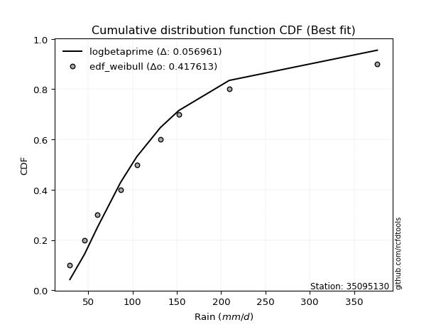</img>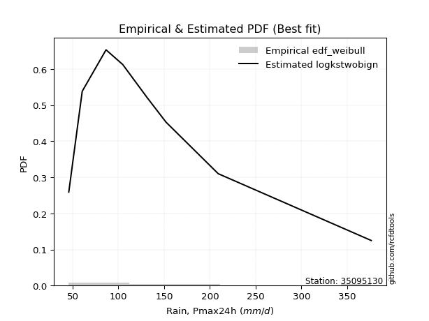</img>

</div>


### 4. EDF Beard (1943)

The Beard formula (or Beard´s plotting position formula) in hydrology is used to estimate the empirical non-exceedance probability _(P)_ of a flood event (or other extreme hydrological data point) within a given dataset.

<div align="center">


$P=(m-0.31)/(n+0.38)$


</div>


**4.1. Empirical values**

<div align="center">

|                | 0                   | 1                   | 2                  | 3                   | 4         | 5                  | 6                  | 7                  | 8                  |
|:---------------|:--------------------|:--------------------|:-------------------|:--------------------|:----------|:-------------------|:-------------------|:-------------------|:-------------------|
| date           | 2025                | 2024                | 2022               | 2021                | 2020      | 2018               | 2023               | 2019               | 2017               |
| x              | 29.3                | 45.8                | 60.5               | 86.5                | 104.8     | 131.4              | 152.1              | 209.1              | 376.26             |
| m              | 1                   | 2                   | 3                  | 4                   | 5         | 6                  | 7                  | 8                  | 9                  |
| empirical_dist | edf_beard           | edf_beard           | edf_beard          | edf_beard           | edf_beard | edf_beard          | edf_beard          | edf_beard          | edf_beard          |
| empirical      | 0.07356076759061833 | 0.18017057569296374 | 0.2867803837953091 | 0.39339019189765456 | 0.5       | 0.6066098081023454 | 0.7132196162046908 | 0.8198294243070362 | 0.9264392324093815 |
| empirical_tr   | 1.0794016110471807  | 1.2197659297789336  | 1.4020926756352765 | 1.6485061511423549  | 2.0       | 2.542005420054201  | 3.486988847583642  | 5.550295857988164  | 13.5942028985507   |

</div>


**4.2. Kolmogorov-Smirnov fit test (sorted by Δ)**


<div align="center">

|                | 0                   | 1                   | 2                   | 3                   | 4                   | 5                   | 6                   | 7                   | 8                   | 9                   | 10                   | 11                  | 12                  | 13                  | 14                  | 15                  | 16                  | 17                  | 18                  | 19                  | 20                   | 21                  | 22                  | 23                  | 24                  | 25                  | 26                  | 27                  | 28                  | 29                  | 30                  | 31                   | 32                  | 33                  | 34                  | 35                  | 36                  | 37                  | 38                  | 39                   | 40                  | 41                  | 42                  | 43                  | 44                  | 45                  | 46                  | 47                  | 48                  | 49                  | 50                  | 51                  | 52                  | 53                  | 54                  | 55                  | 56                  | 57                  | 58                  | 59                  | 60                  | 61                  | 62                  | 63                  | 64                  | 65                  | 66                  | 67                  | 68                  | 69                  | 70                  | 71                  | 72                  | 73                  | 74                  | 75                  | 76                  | 77                  | 78                  | 79                  | 80                  | 81                  | 82                  | 83                  | 84                  | 85                  | 86                  | 87                  | 88                  | 89                  | 90                  | 91                  | 92                  | 93                  | 94                  | 95                  | 96                  | 97                  | 98                  | 99                  | 100                 | 101                 | 102                 | 103                 | 104                 | 105                 | 106                 | 107                 | 108                 | 109                 | 110                 | 111                 | 112                 | 113                 | 114                 | 115                 | 116                 | 117                 | 118                 | 119                 | 120                 | 121                 | 122                 | 123                 | 124                 | 125                 | 126                 | 127                 | 128                 | 129                 | 130                 | 131                 | 132                 | 133                 | 134                 | 135                 | 136                 | 137                 | 138                 | 139                 | 140                 | 141                 | 142                 | 143                 | 144                 | 145                 | 146                 | 147                 | 148                 | 149                 | 150                 | 151                 | 152                 | 153                 | 154                 | 155                 | 156                 | 157                 | 158                 | 159                 |
|:---------------|:--------------------|:--------------------|:--------------------|:--------------------|:--------------------|:--------------------|:--------------------|:--------------------|:--------------------|:--------------------|:---------------------|:--------------------|:--------------------|:--------------------|:--------------------|:--------------------|:--------------------|:--------------------|:--------------------|:--------------------|:---------------------|:--------------------|:--------------------|:--------------------|:--------------------|:--------------------|:--------------------|:--------------------|:--------------------|:--------------------|:--------------------|:---------------------|:--------------------|:--------------------|:--------------------|:--------------------|:--------------------|:--------------------|:--------------------|:---------------------|:--------------------|:--------------------|:--------------------|:--------------------|:--------------------|:--------------------|:--------------------|:--------------------|:--------------------|:--------------------|:--------------------|:--------------------|:--------------------|:--------------------|:--------------------|:--------------------|:--------------------|:--------------------|:--------------------|:--------------------|:--------------------|:--------------------|:--------------------|:--------------------|:--------------------|:--------------------|:--------------------|:--------------------|:--------------------|:--------------------|:--------------------|:--------------------|:--------------------|:--------------------|:--------------------|:--------------------|:--------------------|:--------------------|:--------------------|:--------------------|:--------------------|:--------------------|:--------------------|:--------------------|:--------------------|:--------------------|:--------------------|:--------------------|:--------------------|:--------------------|:--------------------|:--------------------|:--------------------|:--------------------|:--------------------|:--------------------|:--------------------|:--------------------|:--------------------|:--------------------|:--------------------|:--------------------|:--------------------|:--------------------|:--------------------|:--------------------|:--------------------|:--------------------|:--------------------|:--------------------|:--------------------|:--------------------|:--------------------|:--------------------|:--------------------|:--------------------|:--------------------|:--------------------|:--------------------|:--------------------|:--------------------|:--------------------|:--------------------|:--------------------|:--------------------|:--------------------|:--------------------|:--------------------|:--------------------|:--------------------|:--------------------|:--------------------|:--------------------|:--------------------|:--------------------|:--------------------|:--------------------|:--------------------|:--------------------|:--------------------|:--------------------|:--------------------|:--------------------|:--------------------|:--------------------|:--------------------|:--------------------|:--------------------|:--------------------|:--------------------|:--------------------|:--------------------|:--------------------|:--------------------|:--------------------|:--------------------|:--------------------|:--------------------|:--------------------|:--------------------|
| station        | 35095130            | 35095130            | 35095130            | 35095130            | 35095130            | 35095130            | 35095130            | 35095130            | 35095130            | 35095130            | 35095130             | 35095130            | 35095130            | 35095130            | 35095130            | 35095130            | 35095130            | 35095130            | 35095130            | 35095130            | 35095130             | 35095130            | 35095130            | 35095130            | 35095130            | 35095130            | 35095130            | 35095130            | 35095130            | 35095130            | 35095130            | 35095130             | 35095130            | 35095130            | 35095130            | 35095130            | 35095130            | 35095130            | 35095130            | 35095130             | 35095130            | 35095130            | 35095130            | 35095130            | 35095130            | 35095130            | 35095130            | 35095130            | 35095130            | 35095130            | 35095130            | 35095130            | 35095130            | 35095130            | 35095130            | 35095130            | 35095130            | 35095130            | 35095130            | 35095130            | 35095130            | 35095130            | 35095130            | 35095130            | 35095130            | 35095130            | 35095130            | 35095130            | 35095130            | 35095130            | 35095130            | 35095130            | 35095130            | 35095130            | 35095130            | 35095130            | 35095130            | 35095130            | 35095130            | 35095130            | 35095130            | 35095130            | 35095130            | 35095130            | 35095130            | 35095130            | 35095130            | 35095130            | 35095130            | 35095130            | 35095130            | 35095130            | 35095130            | 35095130            | 35095130            | 35095130            | 35095130            | 35095130            | 35095130            | 35095130            | 35095130            | 35095130            | 35095130            | 35095130            | 35095130            | 35095130            | 35095130            | 35095130            | 35095130            | 35095130            | 35095130            | 35095130            | 35095130            | 35095130            | 35095130            | 35095130            | 35095130            | 35095130            | 35095130            | 35095130            | 35095130            | 35095130            | 35095130            | 35095130            | 35095130            | 35095130            | 35095130            | 35095130            | 35095130            | 35095130            | 35095130            | 35095130            | 35095130            | 35095130            | 35095130            | 35095130            | 35095130            | 35095130            | 35095130            | 35095130            | 35095130            | 35095130            | 35095130            | 35095130            | 35095130            | 35095130            | 35095130            | 35095130            | 35095130            | 35095130            | 35095130            | 35095130            | 35095130            | 35095130            | 35095130            | 35095130            | 35095130            | 35095130            | 35095130            | 35095130            |
| empirical_dist | edf_beard           | edf_beard           | edf_beard           | edf_beard           | edf_beard           | edf_beard           | edf_beard           | edf_beard           | edf_beard           | edf_beard           | edf_beard            | edf_beard           | edf_beard           | edf_beard           | edf_beard           | edf_beard           | edf_beard           | edf_beard           | edf_beard           | edf_beard           | edf_beard            | edf_beard           | edf_beard           | edf_beard           | edf_beard           | edf_beard           | edf_beard           | edf_beard           | edf_beard           | edf_beard           | edf_beard           | edf_beard            | edf_beard           | edf_beard           | edf_beard           | edf_beard           | edf_beard           | edf_beard           | edf_beard           | edf_beard            | edf_beard           | edf_beard           | edf_beard           | edf_beard           | edf_beard           | edf_beard           | edf_beard           | edf_beard           | edf_beard           | edf_beard           | edf_beard           | edf_beard           | edf_beard           | edf_beard           | edf_beard           | edf_beard           | edf_beard           | edf_beard           | edf_beard           | edf_beard           | edf_beard           | edf_beard           | edf_beard           | edf_beard           | edf_beard           | edf_beard           | edf_beard           | edf_beard           | edf_beard           | edf_beard           | edf_beard           | edf_beard           | edf_beard           | edf_beard           | edf_beard           | edf_beard           | edf_beard           | edf_beard           | edf_beard           | edf_beard           | edf_beard           | edf_beard           | edf_beard           | edf_beard           | edf_beard           | edf_beard           | edf_beard           | edf_beard           | edf_beard           | edf_beard           | edf_beard           | edf_beard           | edf_beard           | edf_beard           | edf_beard           | edf_beard           | edf_beard           | edf_beard           | edf_beard           | edf_beard           | edf_beard           | edf_beard           | edf_beard           | edf_beard           | edf_beard           | edf_beard           | edf_beard           | edf_beard           | edf_beard           | edf_beard           | edf_beard           | edf_beard           | edf_beard           | edf_beard           | edf_beard           | edf_beard           | edf_beard           | edf_beard           | edf_beard           | edf_beard           | edf_beard           | edf_beard           | edf_beard           | edf_beard           | edf_beard           | edf_beard           | edf_beard           | edf_beard           | edf_beard           | edf_beard           | edf_beard           | edf_beard           | edf_beard           | edf_beard           | edf_beard           | edf_beard           | edf_beard           | edf_beard           | edf_beard           | edf_beard           | edf_beard           | edf_beard           | edf_beard           | edf_beard           | edf_beard           | edf_beard           | edf_beard           | edf_beard           | edf_beard           | edf_beard           | edf_beard           | edf_beard           | edf_beard           | edf_beard           | edf_beard           | edf_beard           | edf_beard           | edf_beard           | edf_beard           | edf_beard           |
| p_dist         | logbetaprime        | loganglit           | logncf              | logweibull_min      | logfoldnorm         | loggenextreme       | logfatiguelife      | logcosine           | logf                | logburr12           | logjohnsonsu         | loggamma            | loggamma            | logerlang           | logpearson3         | loginvgamma         | logskewnorm         | logexponnorm        | lognorm             | logcrystalball      | logt                 | lognct              | logloggamma         | moyal               | betaprime           | logalpha            | halflogistic        | ncf                 | invgamma            | logrice             | burr                | mielke               | invweibull          | genextreme          | loggenlogistic      | logsemicircular     | johnsonsu           | invgauss            | pearson3            | logmaxwell           | loginvgauss         | alpha               | nct                 | lograyleigh         | loglogistic         | gumbel_r            | logdweibull         | exponnorm           | genpareto           | logexponpow         | lomax               | kappa3              | genexpon            | bradford            | loggompertz         | logvonmises_line    | truncweibull_min    | logkappa3           | weibull_min         | logkappa4           | logtruncpareto      | loguniform          | truncpareto         | loggausshyper       | halfnorm            | gengamma            | genlogistic         | gompertz            | loghypsecant        | loggumbel_l         | loginvweibull       | t                   | logarcsine          | dweibull            | exponpow            | kstwobign           | foldnorm            | loggumbel_r         | logloglaplace       | gennorm             | logksone            | nakagami            | loghalfgennorm      | loggenexpon         | rayleigh            | logkstwobign        | logdgamma           | loglaplace          | loglaplace          | loghalfnorm         | vonmises_line       | logargus            | maxwell             | logbradford         | logmoyal            | dgamma              | skewnorm            | loghalflogistic     | rice                | logistic            | logtruncexpon       | halfgennorm         | hypsecant           | truncnorm           | norm                | crystalball         | logbeta             | anglit              | semicircular        | logrdist            | f                   | wald                | laplace             | truncexpon          | arcsine             | logtruncweibull_min | logtruncnorm        | lognakagami         | logtukeylambda      | logwald             | loglomax            | logburr             | burr12              | logtriang           | logweibull_max      | logmielke           | gumbel_l            | beta                | logexponweib        | logwrapcauchy       | gamma               | cosine              | loggenhalflogistic  | gausshyper          | loggengamma         | exponweib           | wrapcauchy          | loglevy_l           | loggennorm          | argus               | logtrapezoid        | kappa4              | ksone               | uniform             | loggenpareto        | levy_l              | powerlaw            | genhalflogistic     | fatiguelife         | rdist               | logjohnsonsb        | tukeylambda         | logpowerlaw         | erlang              | triang              | trapezoid           | weibull_max         | johnsonsb           | logvonmises         | vonmises            |
| delta          | 0.04055276455389145 | 0.04097001350153584 | 0.04127297897368987 | 0.04188425608460211 | 0.042909084779299   | 0.04299071043452016 | 0.04301891130556129 | 0.04321029013524569 | 0.0432293563165167  | 0.04332361348675151 | 0.043727011596890686 | 0.04384970279842704 | 0.04384970279842704 | 0.04386774110429478 | 0.04395818129182444 | 0.04446251456000583 | 0.04477294258206166 | 0.04486109266203725 | 0.04486492229394118 | 0.04486585987439065 | 0.044869670182843935 | 0.0450925002018841  | 0.04601021803532168 | 0.04627721096923054 | 0.0465600714462808  | 0.04665573471284035 | 0.04668499994158237 | 0.04698370356272419 | 0.04698709996102313 | 0.04702086167113373 | 0.0483920307425969  | 0.048417317897483186 | 0.04856246679284715 | 0.04856278177778961 | 0.04877626032817056 | 0.0500516998805518  | 0.05217740039269114 | 0.0527830058545295  | 0.05465237843818338 | 0.054733767680317846 | 0.05560270600189432 | 0.05667702086004636 | 0.06579651814130183 | 0.06697320193905942 | 0.06751277442696899 | 0.0690702755353736  | 0.07228726715834399 | 0.07247637893894074 | 0.07353645911108254 | 0.07355748673029006 | 0.07356037197025267 | 0.07356038189989658 | 0.07356054366611407 | 0.07356075923401084 | 0.07356076502239463 | 0.07356076734168922 | 0.07356076758883905 | 0.07356076758996094 | 0.07356076759061653 | 0.07356076759061758 | 0.07356076759061847 | 0.07356076759061847 | 0.07356076759061847 | 0.07356076759120622 | 0.07464962078330095 | 0.07583582243834874 | 0.07735836607627561 | 0.07854640706755628 | 0.08217432188049972 | 0.08232104369836793 | 0.08396797376724946 | 0.08712051806761614 | 0.08750787898622214 | 0.08790195849478025 | 0.0880118710235045  | 0.08841091185037944 | 0.09075124394750758 | 0.0911105301676014  | 0.09338189021341989 | 0.094683272083818   | 0.09494316872005748 | 0.09673399697846286 | 0.09964699007097622 | 0.09967061500486085 | 0.10015800014165077 | 0.10016370643407146 | 0.10043254828791875 | 0.10102320419587837 | 0.10102320419587837 | 0.10163485560123309 | 0.10425085925750655 | 0.10590507204181343 | 0.10916851058072485 | 0.11046739729584787 | 0.11282753166720172 | 0.11368803696240581 | 0.1160617005289073  | 0.11893124631868968 | 0.12413353807875072 | 0.12774242940590175 | 0.13254510636518468 | 0.13280936917762154 | 0.13464446805240743 | 0.13772786788044244 | 0.13772787425448396 | 0.13772787596542746 | 0.14399121171795515 | 0.14832716957644165 | 0.1527135064526869  | 0.15273593062938096 | 0.1606623702801463  | 0.16168925353760263 | 0.1623927791910874  | 0.16709120637148023 | 0.17024004670806714 | 0.17273798512357497 | 0.18011533589109935 | 0.18017057568978273 | 0.18017057569294248 | 0.18410791856391073 | 0.1864755233574904  | 0.1871985744740916  | 0.18722488508366464 | 0.18806608203350028 | 0.1884773225949692  | 0.20000500612069927 | 0.20156481856492348 | 0.20188641739614044 | 0.20417208376064777 | 0.20485804158208631 | 0.21381661998049517 | 0.2216005246200644  | 0.22739239938932276 | 0.23199646099784238 | 0.24979014267342048 | 0.2808734987359426  | 0.3110831221849003  | 0.31480628830863366 | 0.31982942430703626 | 0.3257540474749534  | 0.32759757561267977 | 0.3298927992814395  | 0.33494354211353716 | 0.3592883272953064  | 0.3845085216758507  | 0.3930351508164397  | 0.40293548484998315 | 0.4624816556074657  | 0.47847318548276324 | 0.47961350035763906 | 0.4975909778189673  | 0.5055734228546481  | 0.5085917217005658  | 0.5145734761087759  | 0.5428673031435027  | 0.569636155172752   | 0.6850653143145169  | 0.6905038927472116  | 1.038218605599629   | 59.767237898189876  |
| deltao         | 0.41761268023100007 | 0.41761268023100007 | 0.41761268023100007 | 0.41761268023100007 | 0.41761268023100007 | 0.41761268023100007 | 0.41761268023100007 | 0.41761268023100007 | 0.41761268023100007 | 0.41761268023100007 | 0.41761268023100007  | 0.41761268023100007 | 0.41761268023100007 | 0.41761268023100007 | 0.41761268023100007 | 0.41761268023100007 | 0.41761268023100007 | 0.41761268023100007 | 0.41761268023100007 | 0.41761268023100007 | 0.41761268023100007  | 0.41761268023100007 | 0.41761268023100007 | 0.41761268023100007 | 0.41761268023100007 | 0.41761268023100007 | 0.41761268023100007 | 0.41761268023100007 | 0.41761268023100007 | 0.41761268023100007 | 0.41761268023100007 | 0.41761268023100007  | 0.41761268023100007 | 0.41761268023100007 | 0.41761268023100007 | 0.41761268023100007 | 0.41761268023100007 | 0.41761268023100007 | 0.41761268023100007 | 0.41761268023100007  | 0.41761268023100007 | 0.41761268023100007 | 0.41761268023100007 | 0.41761268023100007 | 0.41761268023100007 | 0.41761268023100007 | 0.41761268023100007 | 0.41761268023100007 | 0.41761268023100007 | 0.41761268023100007 | 0.41761268023100007 | 0.41761268023100007 | 0.41761268023100007 | 0.41761268023100007 | 0.41761268023100007 | 0.41761268023100007 | 0.41761268023100007 | 0.41761268023100007 | 0.41761268023100007 | 0.41761268023100007 | 0.41761268023100007 | 0.41761268023100007 | 0.41761268023100007 | 0.41761268023100007 | 0.41761268023100007 | 0.41761268023100007 | 0.41761268023100007 | 0.41761268023100007 | 0.41761268023100007 | 0.41761268023100007 | 0.41761268023100007 | 0.41761268023100007 | 0.41761268023100007 | 0.41761268023100007 | 0.41761268023100007 | 0.41761268023100007 | 0.41761268023100007 | 0.41761268023100007 | 0.41761268023100007 | 0.41761268023100007 | 0.41761268023100007 | 0.41761268023100007 | 0.41761268023100007 | 0.41761268023100007 | 0.41761268023100007 | 0.41761268023100007 | 0.41761268023100007 | 0.41761268023100007 | 0.41761268023100007 | 0.41761268023100007 | 0.41761268023100007 | 0.41761268023100007 | 0.41761268023100007 | 0.41761268023100007 | 0.41761268023100007 | 0.41761268023100007 | 0.41761268023100007 | 0.41761268023100007 | 0.41761268023100007 | 0.41761268023100007 | 0.41761268023100007 | 0.41761268023100007 | 0.41761268023100007 | 0.41761268023100007 | 0.41761268023100007 | 0.41761268023100007 | 0.41761268023100007 | 0.41761268023100007 | 0.41761268023100007 | 0.41761268023100007 | 0.41761268023100007 | 0.41761268023100007 | 0.41761268023100007 | 0.41761268023100007 | 0.41761268023100007 | 0.41761268023100007 | 0.41761268023100007 | 0.41761268023100007 | 0.41761268023100007 | 0.41761268023100007 | 0.41761268023100007 | 0.41761268023100007 | 0.41761268023100007 | 0.41761268023100007 | 0.41761268023100007 | 0.41761268023100007 | 0.41761268023100007 | 0.41761268023100007 | 0.41761268023100007 | 0.41761268023100007 | 0.41761268023100007 | 0.41761268023100007 | 0.41761268023100007 | 0.41761268023100007 | 0.41761268023100007 | 0.41761268023100007 | 0.41761268023100007 | 0.41761268023100007 | 0.41761268023100007 | 0.41761268023100007 | 0.41761268023100007 | 0.41761268023100007 | 0.41761268023100007 | 0.41761268023100007 | 0.41761268023100007 | 0.41761268023100007 | 0.41761268023100007 | 0.41761268023100007 | 0.41761268023100007 | 0.41761268023100007 | 0.41761268023100007 | 0.41761268023100007 | 0.41761268023100007 | 0.41761268023100007 | 0.41761268023100007 | 0.41761268023100007 | 0.41761268023100007 | 0.41761268023100007 | 0.41761268023100007 | 0.41761268023100007 |
| eval           | Δo > Δ              | Δo > Δ              | Δo > Δ              | Δo > Δ              | Δo > Δ              | Δo > Δ              | Δo > Δ              | Δo > Δ              | Δo > Δ              | Δo > Δ              | Δo > Δ               | Δo > Δ              | Δo > Δ              | Δo > Δ              | Δo > Δ              | Δo > Δ              | Δo > Δ              | Δo > Δ              | Δo > Δ              | Δo > Δ              | Δo > Δ               | Δo > Δ              | Δo > Δ              | Δo > Δ              | Δo > Δ              | Δo > Δ              | Δo > Δ              | Δo > Δ              | Δo > Δ              | Δo > Δ              | Δo > Δ              | Δo > Δ               | Δo > Δ              | Δo > Δ              | Δo > Δ              | Δo > Δ              | Δo > Δ              | Δo > Δ              | Δo > Δ              | Δo > Δ               | Δo > Δ              | Δo > Δ              | Δo > Δ              | Δo > Δ              | Δo > Δ              | Δo > Δ              | Δo > Δ              | Δo > Δ              | Δo > Δ              | Δo > Δ              | Δo > Δ              | Δo > Δ              | Δo > Δ              | Δo > Δ              | Δo > Δ              | Δo > Δ              | Δo > Δ              | Δo > Δ              | Δo > Δ              | Δo > Δ              | Δo > Δ              | Δo > Δ              | Δo > Δ              | Δo > Δ              | Δo > Δ              | Δo > Δ              | Δo > Δ              | Δo > Δ              | Δo > Δ              | Δo > Δ              | Δo > Δ              | Δo > Δ              | Δo > Δ              | Δo > Δ              | Δo > Δ              | Δo > Δ              | Δo > Δ              | Δo > Δ              | Δo > Δ              | Δo > Δ              | Δo > Δ              | Δo > Δ              | Δo > Δ              | Δo > Δ              | Δo > Δ              | Δo > Δ              | Δo > Δ              | Δo > Δ              | Δo > Δ              | Δo > Δ              | Δo > Δ              | Δo > Δ              | Δo > Δ              | Δo > Δ              | Δo > Δ              | Δo > Δ              | Δo > Δ              | Δo > Δ              | Δo > Δ              | Δo > Δ              | Δo > Δ              | Δo > Δ              | Δo > Δ              | Δo > Δ              | Δo > Δ              | Δo > Δ              | Δo > Δ              | Δo > Δ              | Δo > Δ              | Δo > Δ              | Δo > Δ              | Δo > Δ              | Δo > Δ              | Δo > Δ              | Δo > Δ              | Δo > Δ              | Δo > Δ              | Δo > Δ              | Δo > Δ              | Δo > Δ              | Δo > Δ              | Δo > Δ              | Δo > Δ              | Δo > Δ              | Δo > Δ              | Δo > Δ              | Δo > Δ              | Δo > Δ              | Δo > Δ              | Δo > Δ              | Δo > Δ              | Δo > Δ              | Δo > Δ              | Δo > Δ              | Δo > Δ              | Δo > Δ              | Δo > Δ              | Δo > Δ              | Δo > Δ              | Δo > Δ              | Δo > Δ              | Δo > Δ              | Δo > Δ              | Δo > Δ              | Δo > Δ              | Δo > Δ              | Δo > Δ              | Δo <= Δ             | Δo <= Δ             | Δo <= Δ             | Δo <= Δ             | Δo <= Δ             | Δo <= Δ             | Δo <= Δ             | Δo <= Δ             | Δo <= Δ             | Δo <= Δ             | Δo <= Δ             | Δo <= Δ             | Δo <= Δ             |
| fit            | 1                   | 1                   | 1                   | 1                   | 1                   | 1                   | 1                   | 1                   | 1                   | 1                   | 1                    | 1                   | 1                   | 1                   | 1                   | 1                   | 1                   | 1                   | 1                   | 1                   | 1                    | 1                   | 1                   | 1                   | 1                   | 1                   | 1                   | 1                   | 1                   | 1                   | 1                   | 1                    | 1                   | 1                   | 1                   | 1                   | 1                   | 1                   | 1                   | 1                    | 1                   | 1                   | 1                   | 1                   | 1                   | 1                   | 1                   | 1                   | 1                   | 1                   | 1                   | 1                   | 1                   | 1                   | 1                   | 1                   | 1                   | 1                   | 1                   | 1                   | 1                   | 1                   | 1                   | 1                   | 1                   | 1                   | 1                   | 1                   | 1                   | 1                   | 1                   | 1                   | 1                   | 1                   | 1                   | 1                   | 1                   | 1                   | 1                   | 1                   | 1                   | 1                   | 1                   | 1                   | 1                   | 1                   | 1                   | 1                   | 1                   | 1                   | 1                   | 1                   | 1                   | 1                   | 1                   | 1                   | 1                   | 1                   | 1                   | 1                   | 1                   | 1                   | 1                   | 1                   | 1                   | 1                   | 1                   | 1                   | 1                   | 1                   | 1                   | 1                   | 1                   | 1                   | 1                   | 1                   | 1                   | 1                   | 1                   | 1                   | 1                   | 1                   | 1                   | 1                   | 1                   | 1                   | 1                   | 1                   | 1                   | 1                   | 1                   | 1                   | 1                   | 1                   | 1                   | 1                   | 1                   | 1                   | 1                   | 1                   | 1                   | 1                   | 1                   | 1                   | 1                   | 1                   | 1                   | 0                   | 0                   | 0                   | 0                   | 0                   | 0                   | 0                   | 0                   | 0                   | 0                   | 0                   | 0                   | 0                   |
| n              | 9                   | 9                   | 9                   | 9                   | 9                   | 9                   | 9                   | 9                   | 9                   | 9                   | 9                    | 9                   | 9                   | 9                   | 9                   | 9                   | 9                   | 9                   | 9                   | 9                   | 9                    | 9                   | 9                   | 9                   | 9                   | 9                   | 9                   | 9                   | 9                   | 9                   | 9                   | 9                    | 9                   | 9                   | 9                   | 9                   | 9                   | 9                   | 9                   | 9                    | 9                   | 9                   | 9                   | 9                   | 9                   | 9                   | 9                   | 9                   | 9                   | 9                   | 9                   | 9                   | 9                   | 9                   | 9                   | 9                   | 9                   | 9                   | 9                   | 9                   | 9                   | 9                   | 9                   | 9                   | 9                   | 9                   | 9                   | 9                   | 9                   | 9                   | 9                   | 9                   | 9                   | 9                   | 9                   | 9                   | 9                   | 9                   | 9                   | 9                   | 9                   | 9                   | 9                   | 9                   | 9                   | 9                   | 9                   | 9                   | 9                   | 9                   | 9                   | 9                   | 9                   | 9                   | 9                   | 9                   | 9                   | 9                   | 9                   | 9                   | 9                   | 9                   | 9                   | 9                   | 9                   | 9                   | 9                   | 9                   | 9                   | 9                   | 9                   | 9                   | 9                   | 9                   | 9                   | 9                   | 9                   | 9                   | 9                   | 9                   | 9                   | 9                   | 9                   | 9                   | 9                   | 9                   | 9                   | 9                   | 9                   | 9                   | 9                   | 9                   | 9                   | 9                   | 9                   | 9                   | 9                   | 9                   | 9                   | 9                   | 9                   | 9                   | 9                   | 9                   | 9                   | 9                   | 9                   | 9                   | 9                   | 9                   | 9                   | 9                   | 9                   | 9                   | 9                   | 9                   | 9                   | 9                   | 9                   | 9                   |
| best_fit       | 1                   | 0                   | 0                   | 0                   | 0                   | 0                   | 0                   | 0                   | 0                   | 0                   | 0                    | 0                   | 0                   | 0                   | 0                   | 0                   | 0                   | 0                   | 0                   | 0                   | 0                    | 0                   | 0                   | 0                   | 0                   | 0                   | 0                   | 0                   | 0                   | 0                   | 0                   | 0                    | 0                   | 0                   | 0                   | 0                   | 0                   | 0                   | 0                   | 0                    | 0                   | 0                   | 0                   | 0                   | 0                   | 0                   | 0                   | 0                   | 0                   | 0                   | 0                   | 0                   | 0                   | 0                   | 0                   | 0                   | 0                   | 0                   | 0                   | 0                   | 0                   | 0                   | 0                   | 0                   | 0                   | 0                   | 0                   | 0                   | 0                   | 0                   | 0                   | 0                   | 0                   | 0                   | 0                   | 0                   | 0                   | 0                   | 0                   | 0                   | 0                   | 0                   | 0                   | 0                   | 0                   | 0                   | 0                   | 0                   | 0                   | 0                   | 0                   | 0                   | 0                   | 0                   | 0                   | 0                   | 0                   | 0                   | 0                   | 0                   | 0                   | 0                   | 0                   | 0                   | 0                   | 0                   | 0                   | 0                   | 0                   | 0                   | 0                   | 0                   | 0                   | 0                   | 0                   | 0                   | 0                   | 0                   | 0                   | 0                   | 0                   | 0                   | 0                   | 0                   | 0                   | 0                   | 0                   | 0                   | 0                   | 0                   | 0                   | 0                   | 0                   | 0                   | 0                   | 0                   | 0                   | 0                   | 0                   | 0                   | 0                   | 0                   | 0                   | 0                   | 0                   | 0                   | 0                   | 0                   | 0                   | 0                   | 0                   | 0                   | 0                   | 0                   | 0                   | 0                   | 0                   | 0                   | 0                   | 0                   |
| best_fit_sort  | 1                   | 2                   | 3                   | 4                   | 5                   | 6                   | 7                   | 8                   | 9                   | 10                  | 11                   | 12                  | 13                  | 14                  | 15                  | 16                  | 17                  | 18                  | 19                  | 20                  | 21                   | 22                  | 23                  | 24                  | 25                  | 26                  | 27                  | 28                  | 29                  | 30                  | 31                  | 32                   | 33                  | 34                  | 35                  | 36                  | 37                  | 38                  | 39                  | 40                   | 41                  | 42                  | 43                  | 44                  | 45                  | 46                  | 47                  | 48                  | 49                  | 50                  | 51                  | 52                  | 53                  | 54                  | 55                  | 56                  | 57                  | 58                  | 59                  | 60                  | 61                  | 62                  | 63                  | 64                  | 65                  | 66                  | 67                  | 68                  | 69                  | 70                  | 71                  | 72                  | 73                  | 74                  | 75                  | 76                  | 77                  | 78                  | 79                  | 80                  | 81                  | 82                  | 83                  | 84                  | 85                  | 86                  | 87                  | 88                  | 89                  | 90                  | 91                  | 92                  | 93                  | 94                  | 95                  | 96                  | 97                  | 98                  | 99                  | 100                 | 101                 | 102                 | 103                 | 104                 | 105                 | 106                 | 107                 | 108                 | 109                 | 110                 | 111                 | 112                 | 113                 | 114                 | 115                 | 116                 | 117                 | 118                 | 119                 | 120                 | 121                 | 122                 | 123                 | 124                 | 125                 | 126                 | 127                 | 128                 | 129                 | 130                 | 131                 | 132                 | 133                 | 134                 | 135                 | 136                 | 137                 | 138                 | 139                 | 140                 | 141                 | 142                 | 143                 | 144                 | 145                 | 146                 | 147                 | 148                 | 149                 | 150                 | 151                 | 152                 | 153                 | 154                 | 155                 | 156                 | 157                 | 158                 | 159                 | 160                 |

</div>


**4.3. Best fit**

<div align="center">

|   id |   station | empirical_dist   | p_dist       |     delta |   deltao | eval   |   fit |   n |   best_fit |   best_fit_sort |
|-----:|----------:|:-----------------|:-------------|----------:|---------:|:-------|------:|----:|-----------:|----------------:|
|    0 |  35095130 | edf_beard        | logbetaprime | 0.0405528 | 0.417613 | Δo > Δ |     1 |   9 |          1 |               1 |

</div>


<div align="center">

</img>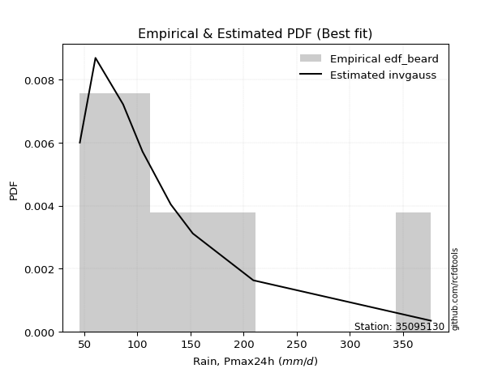</img>

</div>


### 5. EDF Chegodayev (1955)

The Chegodayev formula is an empirical plotting position formula used in hydrological frequency analysis to estimate the exceedance probability or return period of a specific event from a set of observed data. It is primarily used for plotting observed data points on probability paper to fit a theoretical distribution, particularly for analyzing extreme events like maximum flood flows or rainfall intensities. The constant _b_ value in the generalized plotting position formula is 0.3.

<div align="center">


$P=(m-b)/(n+1-2b)$


</div>


**5.1. Empirical values**

<div align="center">

|                | 0                   | 1                   | 2                  | 3                   | 4              | 5                  | 6                  | 7                  | 8                  |
|:---------------|:--------------------|:--------------------|:-------------------|:--------------------|:---------------|:-------------------|:-------------------|:-------------------|:-------------------|
| date           | 2025                | 2024                | 2022               | 2021                | 2020           | 2018               | 2023               | 2019               | 2017               |
| x              | 29.3                | 45.8                | 60.5               | 86.5                | 104.8          | 131.4              | 152.1              | 209.1              | 376.26             |
| m              | 1                   | 2                   | 3                  | 4                   | 5              | 6                  | 7                  | 8                  | 9                  |
| empirical_dist | edf_chegodayev      | edf_chegodayev      | edf_chegodayev     | edf_chegodayev      | edf_chegodayev | edf_chegodayev     | edf_chegodayev     | edf_chegodayev     | edf_chegodayev     |
| empirical      | 0.07446808510638298 | 0.18085106382978722 | 0.2872340425531915 | 0.39361702127659576 | 0.5            | 0.6063829787234043 | 0.7127659574468085 | 0.8191489361702128 | 0.9255319148936169 |
| empirical_tr   | 1.0804597701149425  | 1.2207792207792207  | 1.4029850746268657 | 1.6491228070175437  | 2.0            | 2.540540540540541  | 3.481481481481481  | 5.529411764705883  | 13.428571428571399 |

</div>


**5.2. Kolmogorov-Smirnov fit test (sorted by Δ)**


<div align="center">

|                | 0                   | 1                   | 2                   | 3                    | 4                    | 5                   | 6                   | 7                   | 8                   | 9                   | 10                  | 11                  | 12                  | 13                   | 14                  | 15                  | 16                  | 17                  | 18                  | 19                  | 20                   | 21                  | 22                  | 23                  | 24                   | 25                  | 26                  | 27                  | 28                  | 29                  | 30                  | 31                  | 32                   | 33                  | 34                  | 35                   | 36                  | 37                  | 38                  | 39                  | 40                  | 41                   | 42                  | 43                  | 44                  | 45                  | 46                  | 47                  | 48                  | 49                  | 50                  | 51                  | 52                  | 53                  | 54                  | 55                  | 56                  | 57                  | 58                  | 59                  | 60                  | 61                  | 62                  | 63                  | 64                  | 65                  | 66                  | 67                  | 68                  | 69                  | 70                  | 71                  | 72                  | 73                  | 74                  | 75                  | 76                  | 77                  | 78                  | 79                  | 80                  | 81                  | 82                  | 83                  | 84                  | 85                  | 86                  | 87                  | 88                  | 89                  | 90                  | 91                  | 92                  | 93                  | 94                  | 95                  | 96                  | 97                  | 98                  | 99                  | 100                 | 101                 | 102                 | 103                 | 104                 | 105                 | 106                 | 107                 | 108                 | 109                 | 110                 | 111                 | 112                 | 113                 | 114                 | 115                 | 116                 | 117                 | 118                 | 119                 | 120                 | 121                 | 122                 | 123                 | 124                 | 125                 | 126                 | 127                 | 128                 | 129                 | 130                 | 131                 | 132                 | 133                 | 134                 | 135                 | 136                 | 137                 | 138                 | 139                 | 140                 | 141                 | 142                 | 143                 | 144                 | 145                 | 146                 | 147                 | 148                 | 149                 | 150                 | 151                 | 152                 | 153                 | 154                 | 155                 | 156                 | 157                 | 158                 | 159                 |
|:---------------|:--------------------|:--------------------|:--------------------|:---------------------|:---------------------|:--------------------|:--------------------|:--------------------|:--------------------|:--------------------|:--------------------|:--------------------|:--------------------|:---------------------|:--------------------|:--------------------|:--------------------|:--------------------|:--------------------|:--------------------|:---------------------|:--------------------|:--------------------|:--------------------|:---------------------|:--------------------|:--------------------|:--------------------|:--------------------|:--------------------|:--------------------|:--------------------|:---------------------|:--------------------|:--------------------|:---------------------|:--------------------|:--------------------|:--------------------|:--------------------|:--------------------|:---------------------|:--------------------|:--------------------|:--------------------|:--------------------|:--------------------|:--------------------|:--------------------|:--------------------|:--------------------|:--------------------|:--------------------|:--------------------|:--------------------|:--------------------|:--------------------|:--------------------|:--------------------|:--------------------|:--------------------|:--------------------|:--------------------|:--------------------|:--------------------|:--------------------|:--------------------|:--------------------|:--------------------|:--------------------|:--------------------|:--------------------|:--------------------|:--------------------|:--------------------|:--------------------|:--------------------|:--------------------|:--------------------|:--------------------|:--------------------|:--------------------|:--------------------|:--------------------|:--------------------|:--------------------|:--------------------|:--------------------|:--------------------|:--------------------|:--------------------|:--------------------|:--------------------|:--------------------|:--------------------|:--------------------|:--------------------|:--------------------|:--------------------|:--------------------|:--------------------|:--------------------|:--------------------|:--------------------|:--------------------|:--------------------|:--------------------|:--------------------|:--------------------|:--------------------|:--------------------|:--------------------|:--------------------|:--------------------|:--------------------|:--------------------|:--------------------|:--------------------|:--------------------|:--------------------|:--------------------|:--------------------|:--------------------|:--------------------|:--------------------|:--------------------|:--------------------|:--------------------|:--------------------|:--------------------|:--------------------|:--------------------|:--------------------|:--------------------|:--------------------|:--------------------|:--------------------|:--------------------|:--------------------|:--------------------|:--------------------|:--------------------|:--------------------|:--------------------|:--------------------|:--------------------|:--------------------|:--------------------|:--------------------|:--------------------|:--------------------|:--------------------|:--------------------|:--------------------|:--------------------|:--------------------|:--------------------|:--------------------|:--------------------|:--------------------|
| station        | 35095130            | 35095130            | 35095130            | 35095130             | 35095130             | 35095130            | 35095130            | 35095130            | 35095130            | 35095130            | 35095130            | 35095130            | 35095130            | 35095130             | 35095130            | 35095130            | 35095130            | 35095130            | 35095130            | 35095130            | 35095130             | 35095130            | 35095130            | 35095130            | 35095130             | 35095130            | 35095130            | 35095130            | 35095130            | 35095130            | 35095130            | 35095130            | 35095130             | 35095130            | 35095130            | 35095130             | 35095130            | 35095130            | 35095130            | 35095130            | 35095130            | 35095130             | 35095130            | 35095130            | 35095130            | 35095130            | 35095130            | 35095130            | 35095130            | 35095130            | 35095130            | 35095130            | 35095130            | 35095130            | 35095130            | 35095130            | 35095130            | 35095130            | 35095130            | 35095130            | 35095130            | 35095130            | 35095130            | 35095130            | 35095130            | 35095130            | 35095130            | 35095130            | 35095130            | 35095130            | 35095130            | 35095130            | 35095130            | 35095130            | 35095130            | 35095130            | 35095130            | 35095130            | 35095130            | 35095130            | 35095130            | 35095130            | 35095130            | 35095130            | 35095130            | 35095130            | 35095130            | 35095130            | 35095130            | 35095130            | 35095130            | 35095130            | 35095130            | 35095130            | 35095130            | 35095130            | 35095130            | 35095130            | 35095130            | 35095130            | 35095130            | 35095130            | 35095130            | 35095130            | 35095130            | 35095130            | 35095130            | 35095130            | 35095130            | 35095130            | 35095130            | 35095130            | 35095130            | 35095130            | 35095130            | 35095130            | 35095130            | 35095130            | 35095130            | 35095130            | 35095130            | 35095130            | 35095130            | 35095130            | 35095130            | 35095130            | 35095130            | 35095130            | 35095130            | 35095130            | 35095130            | 35095130            | 35095130            | 35095130            | 35095130            | 35095130            | 35095130            | 35095130            | 35095130            | 35095130            | 35095130            | 35095130            | 35095130            | 35095130            | 35095130            | 35095130            | 35095130            | 35095130            | 35095130            | 35095130            | 35095130            | 35095130            | 35095130            | 35095130            | 35095130            | 35095130            | 35095130            | 35095130            | 35095130            | 35095130            |
| empirical_dist | edf_chegodayev      | edf_chegodayev      | edf_chegodayev      | edf_chegodayev       | edf_chegodayev       | edf_chegodayev      | edf_chegodayev      | edf_chegodayev      | edf_chegodayev      | edf_chegodayev      | edf_chegodayev      | edf_chegodayev      | edf_chegodayev      | edf_chegodayev       | edf_chegodayev      | edf_chegodayev      | edf_chegodayev      | edf_chegodayev      | edf_chegodayev      | edf_chegodayev      | edf_chegodayev       | edf_chegodayev      | edf_chegodayev      | edf_chegodayev      | edf_chegodayev       | edf_chegodayev      | edf_chegodayev      | edf_chegodayev      | edf_chegodayev      | edf_chegodayev      | edf_chegodayev      | edf_chegodayev      | edf_chegodayev       | edf_chegodayev      | edf_chegodayev      | edf_chegodayev       | edf_chegodayev      | edf_chegodayev      | edf_chegodayev      | edf_chegodayev      | edf_chegodayev      | edf_chegodayev       | edf_chegodayev      | edf_chegodayev      | edf_chegodayev      | edf_chegodayev      | edf_chegodayev      | edf_chegodayev      | edf_chegodayev      | edf_chegodayev      | edf_chegodayev      | edf_chegodayev      | edf_chegodayev      | edf_chegodayev      | edf_chegodayev      | edf_chegodayev      | edf_chegodayev      | edf_chegodayev      | edf_chegodayev      | edf_chegodayev      | edf_chegodayev      | edf_chegodayev      | edf_chegodayev      | edf_chegodayev      | edf_chegodayev      | edf_chegodayev      | edf_chegodayev      | edf_chegodayev      | edf_chegodayev      | edf_chegodayev      | edf_chegodayev      | edf_chegodayev      | edf_chegodayev      | edf_chegodayev      | edf_chegodayev      | edf_chegodayev      | edf_chegodayev      | edf_chegodayev      | edf_chegodayev      | edf_chegodayev      | edf_chegodayev      | edf_chegodayev      | edf_chegodayev      | edf_chegodayev      | edf_chegodayev      | edf_chegodayev      | edf_chegodayev      | edf_chegodayev      | edf_chegodayev      | edf_chegodayev      | edf_chegodayev      | edf_chegodayev      | edf_chegodayev      | edf_chegodayev      | edf_chegodayev      | edf_chegodayev      | edf_chegodayev      | edf_chegodayev      | edf_chegodayev      | edf_chegodayev      | edf_chegodayev      | edf_chegodayev      | edf_chegodayev      | edf_chegodayev      | edf_chegodayev      | edf_chegodayev      | edf_chegodayev      | edf_chegodayev      | edf_chegodayev      | edf_chegodayev      | edf_chegodayev      | edf_chegodayev      | edf_chegodayev      | edf_chegodayev      | edf_chegodayev      | edf_chegodayev      | edf_chegodayev      | edf_chegodayev      | edf_chegodayev      | edf_chegodayev      | edf_chegodayev      | edf_chegodayev      | edf_chegodayev      | edf_chegodayev      | edf_chegodayev      | edf_chegodayev      | edf_chegodayev      | edf_chegodayev      | edf_chegodayev      | edf_chegodayev      | edf_chegodayev      | edf_chegodayev      | edf_chegodayev      | edf_chegodayev      | edf_chegodayev      | edf_chegodayev      | edf_chegodayev      | edf_chegodayev      | edf_chegodayev      | edf_chegodayev      | edf_chegodayev      | edf_chegodayev      | edf_chegodayev      | edf_chegodayev      | edf_chegodayev      | edf_chegodayev      | edf_chegodayev      | edf_chegodayev      | edf_chegodayev      | edf_chegodayev      | edf_chegodayev      | edf_chegodayev      | edf_chegodayev      | edf_chegodayev      | edf_chegodayev      | edf_chegodayev      | edf_chegodayev      | edf_chegodayev      | edf_chegodayev      | edf_chegodayev      |
| p_dist         | logbetaprime        | logncf              | loganglit           | logweibull_min       | logburr12            | logfoldnorm         | logfatiguelife      | logf                | loggenextreme       | logcosine           | logjohnsonsu        | loggamma            | loggamma            | logerlang            | logpearson3         | loginvgamma         | logskewnorm         | logexponnorm        | lognorm             | logcrystalball      | logt                 | lognct              | halflogistic        | logloggamma         | moyal                | logalpha            | betaprime           | invgamma            | ncf                 | logrice             | invweibull          | genextreme          | burr                 | mielke              | loggenlogistic      | logsemicircular      | johnsonsu           | invgauss            | pearson3            | logmaxwell          | loginvgauss         | alpha                | nct                 | lograyleigh         | loglogistic         | gumbel_r            | logdweibull         | logexponpow         | exponnorm           | halfnorm            | genpareto           | lomax               | kappa3              | genexpon            | bradford            | loggompertz         | logvonmises_line    | truncweibull_min    | logkappa3           | weibull_min         | logkappa4           | truncpareto         | logtruncpareto      | loguniform          | loggausshyper       | gengamma            | genlogistic         | gompertz            | loghypsecant        | loggumbel_l         | loginvweibull       | t                   | dweibull            | logarcsine          | exponpow            | kstwobign           | foldnorm            | loggumbel_r         | gennorm             | logloglaplace       | logksone            | nakagami            | loghalfgennorm      | loggenexpon         | rayleigh            | logkstwobign        | logdgamma           | loghalfnorm         | loglaplace          | loglaplace          | vonmises_line       | logargus            | maxwell             | logbradford         | logmoyal            | dgamma              | skewnorm            | loghalflogistic     | rice                | logistic            | logtruncexpon       | halfgennorm         | hypsecant           | truncnorm           | norm                | crystalball         | logbeta             | anglit              | semicircular        | logrdist            | f                   | wald                | laplace             | truncexpon          | arcsine             | logtruncweibull_min | logtruncnorm        | lognakagami         | logtukeylambda      | logwald             | loglomax            | logburr             | burr12              | logtriang           | logweibull_max      | logmielke           | gumbel_l            | beta                | logexponweib        | logwrapcauchy       | gamma               | cosine              | loggenhalflogistic  | gausshyper          | loggengamma         | exponweib           | wrapcauchy          | loglevy_l           | loggennorm          | argus               | logtrapezoid        | kappa4              | ksone               | uniform             | loggenpareto        | levy_l              | powerlaw            | genhalflogistic     | fatiguelife         | rdist               | logjohnsonsb        | tukeylambda         | logpowerlaw         | erlang              | triang              | trapezoid           | weibull_max         | johnsonsb           | logvonmises         | vonmises            |
| delta          | 0.04077959393283259 | 0.04172663773157226 | 0.04187733101730051 | 0.042791573600366756 | 0.043096784107810315 | 0.04336274353718139 | 0.04347257006344368 | 0.04368301507439909 | 0.04372325264551746 | 0.04411760765101036 | 0.04418067035477308 | 0.04430336155630943 | 0.04430336155630943 | 0.044321399862177174 | 0.04441184004970683 | 0.04468934393894697 | 0.04522660133994405 | 0.04531475141991964 | 0.04531858105182357 | 0.04531951863227304 | 0.045323328940726326 | 0.04554615895976649 | 0.04623134118370009 | 0.04646387679320407 | 0.046730869727112934 | 0.04688256409178149 | 0.04701373020416319 | 0.04721392933996427 | 0.04743736232060658 | 0.04792817918689837 | 0.04878929617178829 | 0.04878961115673075 | 0.048845689500479295 | 0.04887097665536558 | 0.04922991908605295 | 0.050959017396316475 | 0.05195057101374995 | 0.0525561764755883  | 0.0541987196803011  | 0.05450693830137665 | 0.05582953538083546 | 0.057130679617928753 | 0.06602334752024297 | 0.06674637256011823 | 0.06796643318485138 | 0.06861661677749131 | 0.0720604377794028  | 0.07333065735134886 | 0.07338369645470538 | 0.07419596202541867 | 0.07444377662684719 | 0.07446768948601731 | 0.07446769941566123 | 0.07446786118187872 | 0.07446807674977551 | 0.07446808253815927 | 0.07446808485745386 | 0.07446808510460369 | 0.07446808510572558 | 0.07446808510638117 | 0.07446808510638225 | 0.07446808510638314 | 0.07446808510638314 | 0.07446808510638314 | 0.0744680851069709  | 0.07560899305940755 | 0.077812024834158   | 0.07900006582543867 | 0.08262798063838211 | 0.08277470245625032 | 0.08374114438830826 | 0.0862132005518515  | 0.0869946409790156  | 0.08705422022833986 | 0.0877850416445633  | 0.08886457060826183 | 0.08984392643174294 | 0.09133735954654254 | 0.09377595456805335 | 0.09383554897130228 | 0.09426268058323406 | 0.09650716759952166 | 0.09942016069203502 | 0.09944378562591966 | 0.09970434138376849 | 0.09993687705513027 | 0.10088620704580115 | 0.10140802622229189 | 0.10147686295376077 | 0.10147686295376077 | 0.1033435417417419  | 0.10545141328393115 | 0.10871485182284257 | 0.11024056791690667 | 0.11282753166720172 | 0.11391486634134695 | 0.11651535928678969 | 0.11870441693974848 | 0.12367987932086844 | 0.12728877064801947 | 0.1323182769862435  | 0.13258253979868034 | 0.13464446805240743 | 0.13727420912256016 | 0.13727421549660168 | 0.13727421720754518 | 0.14353755296007287 | 0.14787351081855937 | 0.1522598476948046  | 0.15341641876620438 | 0.1604355409012051  | 0.1623697416744261  | 0.1623927791910874  | 0.16663754761359795 | 0.16978638795018486 | 0.17251115574463377 | 0.18079582402792282 | 0.1808510638266062  | 0.1808510638297659  | 0.18410791856391073 | 0.1862486939785492  | 0.1869717450951504  | 0.18699805570472344 | 0.187612423275618   | 0.1880236638370869  | 0.19977817674175807 | 0.2011111598070412  | 0.20143275863825816 | 0.20394525438170658 | 0.2041775534452629  | 0.21358979060155397 | 0.22114686586218213 | 0.22693874063144048 | 0.2315428022399601  | 0.24956331329447928 | 0.2806466693570014  | 0.3104026340480769  | 0.31389897079286905 | 0.3191489361702128  | 0.3253003887170711  | 0.3271439168547975  | 0.3294391405235572  | 0.3344898833556549  | 0.35883466853742413 | 0.38360120416008603 | 0.3921278333006751  | 0.4022549967131597  | 0.4620279968495834  | 0.47779269734593977 | 0.47870618284187444 | 0.4969104896821438  | 0.5046661053388835  | 0.5079112335637423  | 0.5138929879719525  | 0.5424136443856205  | 0.5691824964148697  | 0.6843848261776935  | 0.6898234046103882  | 1.0384454349785701  | 59.76814521570564   |
| deltao         | 0.41761268023100007 | 0.41761268023100007 | 0.41761268023100007 | 0.41761268023100007  | 0.41761268023100007  | 0.41761268023100007 | 0.41761268023100007 | 0.41761268023100007 | 0.41761268023100007 | 0.41761268023100007 | 0.41761268023100007 | 0.41761268023100007 | 0.41761268023100007 | 0.41761268023100007  | 0.41761268023100007 | 0.41761268023100007 | 0.41761268023100007 | 0.41761268023100007 | 0.41761268023100007 | 0.41761268023100007 | 0.41761268023100007  | 0.41761268023100007 | 0.41761268023100007 | 0.41761268023100007 | 0.41761268023100007  | 0.41761268023100007 | 0.41761268023100007 | 0.41761268023100007 | 0.41761268023100007 | 0.41761268023100007 | 0.41761268023100007 | 0.41761268023100007 | 0.41761268023100007  | 0.41761268023100007 | 0.41761268023100007 | 0.41761268023100007  | 0.41761268023100007 | 0.41761268023100007 | 0.41761268023100007 | 0.41761268023100007 | 0.41761268023100007 | 0.41761268023100007  | 0.41761268023100007 | 0.41761268023100007 | 0.41761268023100007 | 0.41761268023100007 | 0.41761268023100007 | 0.41761268023100007 | 0.41761268023100007 | 0.41761268023100007 | 0.41761268023100007 | 0.41761268023100007 | 0.41761268023100007 | 0.41761268023100007 | 0.41761268023100007 | 0.41761268023100007 | 0.41761268023100007 | 0.41761268023100007 | 0.41761268023100007 | 0.41761268023100007 | 0.41761268023100007 | 0.41761268023100007 | 0.41761268023100007 | 0.41761268023100007 | 0.41761268023100007 | 0.41761268023100007 | 0.41761268023100007 | 0.41761268023100007 | 0.41761268023100007 | 0.41761268023100007 | 0.41761268023100007 | 0.41761268023100007 | 0.41761268023100007 | 0.41761268023100007 | 0.41761268023100007 | 0.41761268023100007 | 0.41761268023100007 | 0.41761268023100007 | 0.41761268023100007 | 0.41761268023100007 | 0.41761268023100007 | 0.41761268023100007 | 0.41761268023100007 | 0.41761268023100007 | 0.41761268023100007 | 0.41761268023100007 | 0.41761268023100007 | 0.41761268023100007 | 0.41761268023100007 | 0.41761268023100007 | 0.41761268023100007 | 0.41761268023100007 | 0.41761268023100007 | 0.41761268023100007 | 0.41761268023100007 | 0.41761268023100007 | 0.41761268023100007 | 0.41761268023100007 | 0.41761268023100007 | 0.41761268023100007 | 0.41761268023100007 | 0.41761268023100007 | 0.41761268023100007 | 0.41761268023100007 | 0.41761268023100007 | 0.41761268023100007 | 0.41761268023100007 | 0.41761268023100007 | 0.41761268023100007 | 0.41761268023100007 | 0.41761268023100007 | 0.41761268023100007 | 0.41761268023100007 | 0.41761268023100007 | 0.41761268023100007 | 0.41761268023100007 | 0.41761268023100007 | 0.41761268023100007 | 0.41761268023100007 | 0.41761268023100007 | 0.41761268023100007 | 0.41761268023100007 | 0.41761268023100007 | 0.41761268023100007 | 0.41761268023100007 | 0.41761268023100007 | 0.41761268023100007 | 0.41761268023100007 | 0.41761268023100007 | 0.41761268023100007 | 0.41761268023100007 | 0.41761268023100007 | 0.41761268023100007 | 0.41761268023100007 | 0.41761268023100007 | 0.41761268023100007 | 0.41761268023100007 | 0.41761268023100007 | 0.41761268023100007 | 0.41761268023100007 | 0.41761268023100007 | 0.41761268023100007 | 0.41761268023100007 | 0.41761268023100007 | 0.41761268023100007 | 0.41761268023100007 | 0.41761268023100007 | 0.41761268023100007 | 0.41761268023100007 | 0.41761268023100007 | 0.41761268023100007 | 0.41761268023100007 | 0.41761268023100007 | 0.41761268023100007 | 0.41761268023100007 | 0.41761268023100007 | 0.41761268023100007 | 0.41761268023100007 | 0.41761268023100007 | 0.41761268023100007 |
| eval           | Δo > Δ              | Δo > Δ              | Δo > Δ              | Δo > Δ               | Δo > Δ               | Δo > Δ              | Δo > Δ              | Δo > Δ              | Δo > Δ              | Δo > Δ              | Δo > Δ              | Δo > Δ              | Δo > Δ              | Δo > Δ               | Δo > Δ              | Δo > Δ              | Δo > Δ              | Δo > Δ              | Δo > Δ              | Δo > Δ              | Δo > Δ               | Δo > Δ              | Δo > Δ              | Δo > Δ              | Δo > Δ               | Δo > Δ              | Δo > Δ              | Δo > Δ              | Δo > Δ              | Δo > Δ              | Δo > Δ              | Δo > Δ              | Δo > Δ               | Δo > Δ              | Δo > Δ              | Δo > Δ               | Δo > Δ              | Δo > Δ              | Δo > Δ              | Δo > Δ              | Δo > Δ              | Δo > Δ               | Δo > Δ              | Δo > Δ              | Δo > Δ              | Δo > Δ              | Δo > Δ              | Δo > Δ              | Δo > Δ              | Δo > Δ              | Δo > Δ              | Δo > Δ              | Δo > Δ              | Δo > Δ              | Δo > Δ              | Δo > Δ              | Δo > Δ              | Δo > Δ              | Δo > Δ              | Δo > Δ              | Δo > Δ              | Δo > Δ              | Δo > Δ              | Δo > Δ              | Δo > Δ              | Δo > Δ              | Δo > Δ              | Δo > Δ              | Δo > Δ              | Δo > Δ              | Δo > Δ              | Δo > Δ              | Δo > Δ              | Δo > Δ              | Δo > Δ              | Δo > Δ              | Δo > Δ              | Δo > Δ              | Δo > Δ              | Δo > Δ              | Δo > Δ              | Δo > Δ              | Δo > Δ              | Δo > Δ              | Δo > Δ              | Δo > Δ              | Δo > Δ              | Δo > Δ              | Δo > Δ              | Δo > Δ              | Δo > Δ              | Δo > Δ              | Δo > Δ              | Δo > Δ              | Δo > Δ              | Δo > Δ              | Δo > Δ              | Δo > Δ              | Δo > Δ              | Δo > Δ              | Δo > Δ              | Δo > Δ              | Δo > Δ              | Δo > Δ              | Δo > Δ              | Δo > Δ              | Δo > Δ              | Δo > Δ              | Δo > Δ              | Δo > Δ              | Δo > Δ              | Δo > Δ              | Δo > Δ              | Δo > Δ              | Δo > Δ              | Δo > Δ              | Δo > Δ              | Δo > Δ              | Δo > Δ              | Δo > Δ              | Δo > Δ              | Δo > Δ              | Δo > Δ              | Δo > Δ              | Δo > Δ              | Δo > Δ              | Δo > Δ              | Δo > Δ              | Δo > Δ              | Δo > Δ              | Δo > Δ              | Δo > Δ              | Δo > Δ              | Δo > Δ              | Δo > Δ              | Δo > Δ              | Δo > Δ              | Δo > Δ              | Δo > Δ              | Δo > Δ              | Δo > Δ              | Δo > Δ              | Δo > Δ              | Δo > Δ              | Δo > Δ              | Δo > Δ              | Δo > Δ              | Δo <= Δ             | Δo <= Δ             | Δo <= Δ             | Δo <= Δ             | Δo <= Δ             | Δo <= Δ             | Δo <= Δ             | Δo <= Δ             | Δo <= Δ             | Δo <= Δ             | Δo <= Δ             | Δo <= Δ             | Δo <= Δ             |
| fit            | 1                   | 1                   | 1                   | 1                    | 1                    | 1                   | 1                   | 1                   | 1                   | 1                   | 1                   | 1                   | 1                   | 1                    | 1                   | 1                   | 1                   | 1                   | 1                   | 1                   | 1                    | 1                   | 1                   | 1                   | 1                    | 1                   | 1                   | 1                   | 1                   | 1                   | 1                   | 1                   | 1                    | 1                   | 1                   | 1                    | 1                   | 1                   | 1                   | 1                   | 1                   | 1                    | 1                   | 1                   | 1                   | 1                   | 1                   | 1                   | 1                   | 1                   | 1                   | 1                   | 1                   | 1                   | 1                   | 1                   | 1                   | 1                   | 1                   | 1                   | 1                   | 1                   | 1                   | 1                   | 1                   | 1                   | 1                   | 1                   | 1                   | 1                   | 1                   | 1                   | 1                   | 1                   | 1                   | 1                   | 1                   | 1                   | 1                   | 1                   | 1                   | 1                   | 1                   | 1                   | 1                   | 1                   | 1                   | 1                   | 1                   | 1                   | 1                   | 1                   | 1                   | 1                   | 1                   | 1                   | 1                   | 1                   | 1                   | 1                   | 1                   | 1                   | 1                   | 1                   | 1                   | 1                   | 1                   | 1                   | 1                   | 1                   | 1                   | 1                   | 1                   | 1                   | 1                   | 1                   | 1                   | 1                   | 1                   | 1                   | 1                   | 1                   | 1                   | 1                   | 1                   | 1                   | 1                   | 1                   | 1                   | 1                   | 1                   | 1                   | 1                   | 1                   | 1                   | 1                   | 1                   | 1                   | 1                   | 1                   | 1                   | 1                   | 1                   | 1                   | 1                   | 1                   | 1                   | 0                   | 0                   | 0                   | 0                   | 0                   | 0                   | 0                   | 0                   | 0                   | 0                   | 0                   | 0                   | 0                   |
| n              | 9                   | 9                   | 9                   | 9                    | 9                    | 9                   | 9                   | 9                   | 9                   | 9                   | 9                   | 9                   | 9                   | 9                    | 9                   | 9                   | 9                   | 9                   | 9                   | 9                   | 9                    | 9                   | 9                   | 9                   | 9                    | 9                   | 9                   | 9                   | 9                   | 9                   | 9                   | 9                   | 9                    | 9                   | 9                   | 9                    | 9                   | 9                   | 9                   | 9                   | 9                   | 9                    | 9                   | 9                   | 9                   | 9                   | 9                   | 9                   | 9                   | 9                   | 9                   | 9                   | 9                   | 9                   | 9                   | 9                   | 9                   | 9                   | 9                   | 9                   | 9                   | 9                   | 9                   | 9                   | 9                   | 9                   | 9                   | 9                   | 9                   | 9                   | 9                   | 9                   | 9                   | 9                   | 9                   | 9                   | 9                   | 9                   | 9                   | 9                   | 9                   | 9                   | 9                   | 9                   | 9                   | 9                   | 9                   | 9                   | 9                   | 9                   | 9                   | 9                   | 9                   | 9                   | 9                   | 9                   | 9                   | 9                   | 9                   | 9                   | 9                   | 9                   | 9                   | 9                   | 9                   | 9                   | 9                   | 9                   | 9                   | 9                   | 9                   | 9                   | 9                   | 9                   | 9                   | 9                   | 9                   | 9                   | 9                   | 9                   | 9                   | 9                   | 9                   | 9                   | 9                   | 9                   | 9                   | 9                   | 9                   | 9                   | 9                   | 9                   | 9                   | 9                   | 9                   | 9                   | 9                   | 9                   | 9                   | 9                   | 9                   | 9                   | 9                   | 9                   | 9                   | 9                   | 9                   | 9                   | 9                   | 9                   | 9                   | 9                   | 9                   | 9                   | 9                   | 9                   | 9                   | 9                   | 9                   | 9                   |
| best_fit       | 1                   | 0                   | 0                   | 0                    | 0                    | 0                   | 0                   | 0                   | 0                   | 0                   | 0                   | 0                   | 0                   | 0                    | 0                   | 0                   | 0                   | 0                   | 0                   | 0                   | 0                    | 0                   | 0                   | 0                   | 0                    | 0                   | 0                   | 0                   | 0                   | 0                   | 0                   | 0                   | 0                    | 0                   | 0                   | 0                    | 0                   | 0                   | 0                   | 0                   | 0                   | 0                    | 0                   | 0                   | 0                   | 0                   | 0                   | 0                   | 0                   | 0                   | 0                   | 0                   | 0                   | 0                   | 0                   | 0                   | 0                   | 0                   | 0                   | 0                   | 0                   | 0                   | 0                   | 0                   | 0                   | 0                   | 0                   | 0                   | 0                   | 0                   | 0                   | 0                   | 0                   | 0                   | 0                   | 0                   | 0                   | 0                   | 0                   | 0                   | 0                   | 0                   | 0                   | 0                   | 0                   | 0                   | 0                   | 0                   | 0                   | 0                   | 0                   | 0                   | 0                   | 0                   | 0                   | 0                   | 0                   | 0                   | 0                   | 0                   | 0                   | 0                   | 0                   | 0                   | 0                   | 0                   | 0                   | 0                   | 0                   | 0                   | 0                   | 0                   | 0                   | 0                   | 0                   | 0                   | 0                   | 0                   | 0                   | 0                   | 0                   | 0                   | 0                   | 0                   | 0                   | 0                   | 0                   | 0                   | 0                   | 0                   | 0                   | 0                   | 0                   | 0                   | 0                   | 0                   | 0                   | 0                   | 0                   | 0                   | 0                   | 0                   | 0                   | 0                   | 0                   | 0                   | 0                   | 0                   | 0                   | 0                   | 0                   | 0                   | 0                   | 0                   | 0                   | 0                   | 0                   | 0                   | 0                   | 0                   |
| best_fit_sort  | 1                   | 2                   | 3                   | 4                    | 5                    | 6                   | 7                   | 8                   | 9                   | 10                  | 11                  | 12                  | 13                  | 14                   | 15                  | 16                  | 17                  | 18                  | 19                  | 20                  | 21                   | 22                  | 23                  | 24                  | 25                   | 26                  | 27                  | 28                  | 29                  | 30                  | 31                  | 32                  | 33                   | 34                  | 35                  | 36                   | 37                  | 38                  | 39                  | 40                  | 41                  | 42                   | 43                  | 44                  | 45                  | 46                  | 47                  | 48                  | 49                  | 50                  | 51                  | 52                  | 53                  | 54                  | 55                  | 56                  | 57                  | 58                  | 59                  | 60                  | 61                  | 62                  | 63                  | 64                  | 65                  | 66                  | 67                  | 68                  | 69                  | 70                  | 71                  | 72                  | 73                  | 74                  | 75                  | 76                  | 77                  | 78                  | 79                  | 80                  | 81                  | 82                  | 83                  | 84                  | 85                  | 86                  | 87                  | 88                  | 89                  | 90                  | 91                  | 92                  | 93                  | 94                  | 95                  | 96                  | 97                  | 98                  | 99                  | 100                 | 101                 | 102                 | 103                 | 104                 | 105                 | 106                 | 107                 | 108                 | 109                 | 110                 | 111                 | 112                 | 113                 | 114                 | 115                 | 116                 | 117                 | 118                 | 119                 | 120                 | 121                 | 122                 | 123                 | 124                 | 125                 | 126                 | 127                 | 128                 | 129                 | 130                 | 131                 | 132                 | 133                 | 134                 | 135                 | 136                 | 137                 | 138                 | 139                 | 140                 | 141                 | 142                 | 143                 | 144                 | 145                 | 146                 | 147                 | 148                 | 149                 | 150                 | 151                 | 152                 | 153                 | 154                 | 155                 | 156                 | 157                 | 158                 | 159                 | 160                 |

</div>


**5.3. Best fit**

<div align="center">

|   id |   station | empirical_dist   | p_dist       |     delta |   deltao | eval   |   fit |   n |   best_fit |   best_fit_sort |
|-----:|----------:|:-----------------|:-------------|----------:|---------:|:-------|------:|----:|-----------:|----------------:|
|    0 |  35095130 | edf_chegodayev   | logbetaprime | 0.0407796 | 0.417613 | Δo > Δ |     1 |   9 |          1 |               1 |

</div>


<div align="center">

</img>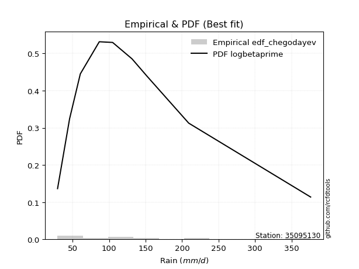</img>

</div>


### 6. EDF Blom (1958)

The Blom formula is a specific "plotting position" formula used in hydrology and statistical analysis to estimate the empirical cumulative probability (or non-exceedance probability) of a data series. It is particularly recommended for data that are approximately normally distributed. The constant _a_ is set to 0.375 (or 3/8).

<div align="center">


$P=(m-a)/(n+1-2a)$


</div>


**6.1. Empirical values**

<div align="center">

|                | 0                   | 1                   | 2                   | 3                  | 4        | 5                  | 6                  | 7                  | 8                  |
|:---------------|:--------------------|:--------------------|:--------------------|:-------------------|:---------|:-------------------|:-------------------|:-------------------|:-------------------|
| date           | 2025                | 2024                | 2022                | 2021               | 2020     | 2018               | 2023               | 2019               | 2017               |
| x              | 29.3                | 45.8                | 60.5                | 86.5               | 104.8    | 131.4              | 152.1              | 209.1              | 376.26             |
| m              | 1                   | 2                   | 3                   | 4                  | 5        | 6                  | 7                  | 8                  | 9                  |
| empirical_dist | edf_blom            | edf_blom            | edf_blom            | edf_blom           | edf_blom | edf_blom           | edf_blom           | edf_blom           | edf_blom           |
| empirical      | 0.06756756756756757 | 0.17567567567567569 | 0.28378378378378377 | 0.3918918918918919 | 0.5      | 0.6081081081081081 | 0.7162162162162162 | 0.8243243243243243 | 0.9324324324324325 |
| empirical_tr   | 1.072463768115942   | 1.2131147540983607  | 1.3962264150943395  | 1.6444444444444444 | 2.0      | 2.5517241379310347 | 3.523809523809524  | 5.6923076923076925 | 14.800000000000006 |

</div>


**6.2. Kolmogorov-Smirnov fit test (sorted by Δ)**


<div align="center">

|                | 0                    | 1                   | 2                    | 3                    | 4                   | 5                    | 6                   | 7                    | 8                    | 9                    | 10                   | 11                  | 12                   | 13                  | 14                  | 15                  | 16                   | 17                  | 18                  | 19                  | 20                  | 21                  | 22                   | 23                   | 24                  | 25                  | 26                  | 27                  | 28                   | 29                  | 30                  | 31                  | 32                  | 33                   | 34                  | 35                   | 36                  | 37                  | 38                  | 39                  | 40                   | 41                  | 42                  | 43                  | 44                  | 45                  | 46                  | 47                  | 48                  | 49                  | 50                  | 51                  | 52                  | 53                  | 54                  | 55                  | 56                  | 57                  | 58                  | 59                  | 60                  | 61                  | 62                  | 63                  | 64                  | 65                  | 66                  | 67                  | 68                  | 69                  | 70                  | 71                  | 72                  | 73                  | 74                  | 75                  | 76                  | 77                  | 78                  | 79                  | 80                  | 81                  | 82                  | 83                  | 84                  | 85                  | 86                  | 87                  | 88                  | 89                  | 90                  | 91                  | 92                  | 93                  | 94                  | 95                  | 96                  | 97                  | 98                  | 99                  | 100                 | 101                 | 102                 | 103                 | 104                 | 105                 | 106                 | 107                 | 108                 | 109                 | 110                 | 111                 | 112                 | 113                 | 114                 | 115                 | 116                 | 117                 | 118                 | 119                 | 120                 | 121                 | 122                 | 123                 | 124                 | 125                 | 126                 | 127                 | 128                 | 129                 | 130                 | 131                 | 132                 | 133                 | 134                 | 135                 | 136                 | 137                 | 138                 | 139                 | 140                 | 141                 | 142                 | 143                 | 144                 | 145                 | 146                 | 147                 | 148                 | 149                 | 150                 | 151                 | 152                 | 153                 | 154                 | 155                 | 156                 | 157                 | 158                 | 159                 |
|:---------------|:---------------------|:--------------------|:---------------------|:---------------------|:--------------------|:---------------------|:--------------------|:---------------------|:---------------------|:---------------------|:---------------------|:--------------------|:---------------------|:--------------------|:--------------------|:--------------------|:---------------------|:--------------------|:--------------------|:--------------------|:--------------------|:--------------------|:---------------------|:---------------------|:--------------------|:--------------------|:--------------------|:--------------------|:---------------------|:--------------------|:--------------------|:--------------------|:--------------------|:---------------------|:--------------------|:---------------------|:--------------------|:--------------------|:--------------------|:--------------------|:---------------------|:--------------------|:--------------------|:--------------------|:--------------------|:--------------------|:--------------------|:--------------------|:--------------------|:--------------------|:--------------------|:--------------------|:--------------------|:--------------------|:--------------------|:--------------------|:--------------------|:--------------------|:--------------------|:--------------------|:--------------------|:--------------------|:--------------------|:--------------------|:--------------------|:--------------------|:--------------------|:--------------------|:--------------------|:--------------------|:--------------------|:--------------------|:--------------------|:--------------------|:--------------------|:--------------------|:--------------------|:--------------------|:--------------------|:--------------------|:--------------------|:--------------------|:--------------------|:--------------------|:--------------------|:--------------------|:--------------------|:--------------------|:--------------------|:--------------------|:--------------------|:--------------------|:--------------------|:--------------------|:--------------------|:--------------------|:--------------------|:--------------------|:--------------------|:--------------------|:--------------------|:--------------------|:--------------------|:--------------------|:--------------------|:--------------------|:--------------------|:--------------------|:--------------------|:--------------------|:--------------------|:--------------------|:--------------------|:--------------------|:--------------------|:--------------------|:--------------------|:--------------------|:--------------------|:--------------------|:--------------------|:--------------------|:--------------------|:--------------------|:--------------------|:--------------------|:--------------------|:--------------------|:--------------------|:--------------------|:--------------------|:--------------------|:--------------------|:--------------------|:--------------------|:--------------------|:--------------------|:--------------------|:--------------------|:--------------------|:--------------------|:--------------------|:--------------------|:--------------------|:--------------------|:--------------------|:--------------------|:--------------------|:--------------------|:--------------------|:--------------------|:--------------------|:--------------------|:--------------------|:--------------------|:--------------------|:--------------------|:--------------------|:--------------------|:--------------------|
| station        | 35095130             | 35095130            | 35095130             | 35095130             | 35095130            | 35095130             | 35095130            | 35095130             | 35095130             | 35095130             | 35095130             | 35095130            | 35095130             | 35095130            | 35095130            | 35095130            | 35095130             | 35095130            | 35095130            | 35095130            | 35095130            | 35095130            | 35095130             | 35095130             | 35095130            | 35095130            | 35095130            | 35095130            | 35095130             | 35095130            | 35095130            | 35095130            | 35095130            | 35095130             | 35095130            | 35095130             | 35095130            | 35095130            | 35095130            | 35095130            | 35095130             | 35095130            | 35095130            | 35095130            | 35095130            | 35095130            | 35095130            | 35095130            | 35095130            | 35095130            | 35095130            | 35095130            | 35095130            | 35095130            | 35095130            | 35095130            | 35095130            | 35095130            | 35095130            | 35095130            | 35095130            | 35095130            | 35095130            | 35095130            | 35095130            | 35095130            | 35095130            | 35095130            | 35095130            | 35095130            | 35095130            | 35095130            | 35095130            | 35095130            | 35095130            | 35095130            | 35095130            | 35095130            | 35095130            | 35095130            | 35095130            | 35095130            | 35095130            | 35095130            | 35095130            | 35095130            | 35095130            | 35095130            | 35095130            | 35095130            | 35095130            | 35095130            | 35095130            | 35095130            | 35095130            | 35095130            | 35095130            | 35095130            | 35095130            | 35095130            | 35095130            | 35095130            | 35095130            | 35095130            | 35095130            | 35095130            | 35095130            | 35095130            | 35095130            | 35095130            | 35095130            | 35095130            | 35095130            | 35095130            | 35095130            | 35095130            | 35095130            | 35095130            | 35095130            | 35095130            | 35095130            | 35095130            | 35095130            | 35095130            | 35095130            | 35095130            | 35095130            | 35095130            | 35095130            | 35095130            | 35095130            | 35095130            | 35095130            | 35095130            | 35095130            | 35095130            | 35095130            | 35095130            | 35095130            | 35095130            | 35095130            | 35095130            | 35095130            | 35095130            | 35095130            | 35095130            | 35095130            | 35095130            | 35095130            | 35095130            | 35095130            | 35095130            | 35095130            | 35095130            | 35095130            | 35095130            | 35095130            | 35095130            | 35095130            | 35095130            |
| empirical_dist | edf_blom             | edf_blom            | edf_blom             | edf_blom             | edf_blom            | edf_blom             | edf_blom            | edf_blom             | edf_blom             | edf_blom             | edf_blom             | edf_blom            | edf_blom             | edf_blom            | edf_blom            | edf_blom            | edf_blom             | edf_blom            | edf_blom            | edf_blom            | edf_blom            | edf_blom            | edf_blom             | edf_blom             | edf_blom            | edf_blom            | edf_blom            | edf_blom            | edf_blom             | edf_blom            | edf_blom            | edf_blom            | edf_blom            | edf_blom             | edf_blom            | edf_blom             | edf_blom            | edf_blom            | edf_blom            | edf_blom            | edf_blom             | edf_blom            | edf_blom            | edf_blom            | edf_blom            | edf_blom            | edf_blom            | edf_blom            | edf_blom            | edf_blom            | edf_blom            | edf_blom            | edf_blom            | edf_blom            | edf_blom            | edf_blom            | edf_blom            | edf_blom            | edf_blom            | edf_blom            | edf_blom            | edf_blom            | edf_blom            | edf_blom            | edf_blom            | edf_blom            | edf_blom            | edf_blom            | edf_blom            | edf_blom            | edf_blom            | edf_blom            | edf_blom            | edf_blom            | edf_blom            | edf_blom            | edf_blom            | edf_blom            | edf_blom            | edf_blom            | edf_blom            | edf_blom            | edf_blom            | edf_blom            | edf_blom            | edf_blom            | edf_blom            | edf_blom            | edf_blom            | edf_blom            | edf_blom            | edf_blom            | edf_blom            | edf_blom            | edf_blom            | edf_blom            | edf_blom            | edf_blom            | edf_blom            | edf_blom            | edf_blom            | edf_blom            | edf_blom            | edf_blom            | edf_blom            | edf_blom            | edf_blom            | edf_blom            | edf_blom            | edf_blom            | edf_blom            | edf_blom            | edf_blom            | edf_blom            | edf_blom            | edf_blom            | edf_blom            | edf_blom            | edf_blom            | edf_blom            | edf_blom            | edf_blom            | edf_blom            | edf_blom            | edf_blom            | edf_blom            | edf_blom            | edf_blom            | edf_blom            | edf_blom            | edf_blom            | edf_blom            | edf_blom            | edf_blom            | edf_blom            | edf_blom            | edf_blom            | edf_blom            | edf_blom            | edf_blom            | edf_blom            | edf_blom            | edf_blom            | edf_blom            | edf_blom            | edf_blom            | edf_blom            | edf_blom            | edf_blom            | edf_blom            | edf_blom            | edf_blom            | edf_blom            | edf_blom            | edf_blom            | edf_blom            | edf_blom            | edf_blom            | edf_blom            | edf_blom            |
| p_dist         | loganglit            | logcosine           | logncf               | logbetaprime         | logfoldnorm         | loggenextreme        | logfatiguelife      | logf                 | logjohnsonsu         | loggamma             | loggamma             | logerlang           | logpearson3          | logweibull_min      | logskewnorm         | logexponnorm        | lognorm              | logcrystalball      | logt                | lognct              | loginvgamma         | logloggamma         | betaprime            | ncf                  | logrice             | logburr12           | logsemicircular     | burr                | mielke               | invgamma            | loggenlogistic      | logalpha            | invweibull          | genextreme           | moyal               | halflogistic         | johnsonsu           | alpha               | invgauss            | logmaxwell          | loginvgauss          | pearson3            | nct                 | loglogistic         | exponnorm           | genpareto           | lomax               | kappa3              | genexpon            | bradford            | loggompertz         | logvonmises_line    | truncweibull_min    | weibull_min         | truncpareto         | logtruncpareto      | loggausshyper       | lograyleigh         | loguniform          | gumbel_r            | logkappa3           | logdweibull         | genlogistic         | logexponpow         | logkappa4           | gompertz            | gengamma            | halfnorm            | loghypsecant        | loggumbel_l         | kstwobign           | loginvweibull       | exponpow            | loggumbel_r         | logloglaplace       | logarcsine          | t                   | dweibull            | foldnorm            | logdgamma           | loglaplace          | loglaplace          | logksone            | nakagami            | gennorm             | loghalfgennorm      | loggenexpon         | logkstwobign        | loghalfnorm         | rayleigh            | logargus            | vonmises_line       | logbradford         | maxwell             | dgamma              | logmoyal            | skewnorm            | loghalflogistic     | rice                | logistic            | logtruncexpon       | halfgennorm         | hypsecant           | truncnorm           | norm                | crystalball         | logbeta             | logrdist            | anglit              | semicircular        | wald                | f                   | laplace             | truncexpon          | logtruncweibull_min | arcsine             | logtruncnorm        | lognakagami         | logtukeylambda      | logwald             | loglomax            | logburr             | burr12              | logtriang           | logweibull_max      | logmielke           | gumbel_l            | beta                | logexponweib        | logwrapcauchy       | gamma               | cosine              | loggenhalflogistic  | gausshyper          | loggengamma         | exponweib           | wrapcauchy          | loglevy_l           | loggennorm          | argus               | logtrapezoid        | kappa4              | ksone               | uniform             | loggenpareto        | levy_l              | powerlaw            | genhalflogistic     | fatiguelife         | rdist               | logjohnsonsb        | tukeylambda         | logpowerlaw         | erlang              | triang              | trapezoid           | weibull_max         | johnsonsb           | logvonmises         | vonmises            |
| delta          | 0.034976813478484914 | 0.03721709011219476 | 0.038276378962164515 | 0.039054464548128776 | 0.03991248476777365 | 0.039994110422994805 | 0.04002231129403594 | 0.040232756304991346 | 0.040730411585365334 | 0.040853102786901685 | 0.040853102786901685 | 0.04087114109276943 | 0.040961581280299086 | 0.04117735537981759 | 0.04177634257053631 | 0.0418644926505119  | 0.041868322282415826 | 0.0418692598628653  | 0.04187307017131858 | 0.04209590019035875 | 0.04296421455424315 | 0.04301361802379633 | 0.043563471434755446 | 0.043987103551198836 | 0.04462895661627897 | 0.04482191349251419 | 0.04518170769200203 | 0.04539543073107155 | 0.045420717885957834 | 0.04548879995526045 | 0.04577966031664521 | 0.04620163659250026 | 0.04706416678708447 | 0.047064481772026934 | 0.04818848751564864 | 0.049681599953107836 | 0.05367570039845382 | 0.05368042084852101 | 0.05428130586029217 | 0.05623206768608052 | 0.056901220351705084 | 0.05764897844970884 | 0.06429821813553915 | 0.06451617441544363 | 0.06648317891588998 | 0.06754325908803178 | 0.06756717194720191 | 0.06756718187684582 | 0.06756734364306331 | 0.06756755921095992 | 0.06756756499934387 | 0.06756756731863846 | 0.06756756756578829 | 0.06756756756756577 | 0.06756756756756757 | 0.06756756756756757 | 0.0675675675681553  | 0.0684715019448221  | 0.07103453470995691 | 0.07206687554689906 | 0.07209096806913196 | 0.07378556716410667 | 0.07436176606475026 | 0.07505578673605273 | 0.07506144053195662 | 0.07554980705603093 | 0.07733412244411142 | 0.07764622079482641 | 0.07917772186897437 | 0.07932444368684258 | 0.08541431183885409 | 0.08546627377301214 | 0.08951017102926717 | 0.08961223016183872 | 0.09038529020189454 | 0.0905044789977476  | 0.0931137180906669  | 0.093895158517831   | 0.09674444397055834 | 0.0974359482763934  | 0.09802660418435302 | 0.09802660418435302 | 0.09943806873734562 | 0.10040663799963481 | 0.10067647210686875 | 0.10114529007673889 | 0.10116891501062353 | 0.10166200643983414 | 0.10313315560699576 | 0.10315460015317623 | 0.1089016720533389  | 0.1102440592805573  | 0.11196569730161055 | 0.11216511059225032 | 0.11218973695664314 | 0.11282753166720172 | 0.11306510051738194 | 0.12042954632445235 | 0.12713013809027618 | 0.1307390294174272  | 0.13404340637094736 | 0.13430766918338422 | 0.13464446805240743 | 0.1407244678919679  | 0.14072447426600942 | 0.14072447597695292 | 0.1469878117294806  | 0.14824103061209282 | 0.15132376958796712 | 0.15571010646421235 | 0.15719435352031458 | 0.16216067028590897 | 0.1623927791910874  | 0.1700878063830057  | 0.17423628512933764 | 0.17442661221216466 | 0.1756204358738113  | 0.17567567567249467 | 0.17567567567565434 | 0.18410791856391073 | 0.18797382336325308 | 0.18869687447985428 | 0.18872318508942731 | 0.19106268204502574 | 0.19147392260649465 | 0.20150330612646195 | 0.20456141857644894 | 0.2048830174076659  | 0.20567038376641045 | 0.20935294159937445 | 0.21531491998625785 | 0.22459712463158987 | 0.23038899940084823 | 0.23499306100936784 | 0.25128844267918315 | 0.28237179874170526 | 0.31557802220218845 | 0.3207994883316845  | 0.32432432432432434 | 0.32875064748647886 | 0.33059417562420523 | 0.33288939929296496 | 0.3379401421250626  | 0.36228492730683187 | 0.3905017216989014  | 0.3990283508394905  | 0.40743038486727123 | 0.46547825561899114 | 0.4829680855000513  | 0.48560670038068987 | 0.5020858778362554  | 0.5115666228776989  | 0.5130866217178539  | 0.519068376126064   | 0.5458639031550283  | 0.5726327551842775  | 0.6895602143318051  | 0.6949987927644996  | 1.0367203055938663  | 59.76124469816682   |
| deltao         | 0.41761268023100007  | 0.41761268023100007 | 0.41761268023100007  | 0.41761268023100007  | 0.41761268023100007 | 0.41761268023100007  | 0.41761268023100007 | 0.41761268023100007  | 0.41761268023100007  | 0.41761268023100007  | 0.41761268023100007  | 0.41761268023100007 | 0.41761268023100007  | 0.41761268023100007 | 0.41761268023100007 | 0.41761268023100007 | 0.41761268023100007  | 0.41761268023100007 | 0.41761268023100007 | 0.41761268023100007 | 0.41761268023100007 | 0.41761268023100007 | 0.41761268023100007  | 0.41761268023100007  | 0.41761268023100007 | 0.41761268023100007 | 0.41761268023100007 | 0.41761268023100007 | 0.41761268023100007  | 0.41761268023100007 | 0.41761268023100007 | 0.41761268023100007 | 0.41761268023100007 | 0.41761268023100007  | 0.41761268023100007 | 0.41761268023100007  | 0.41761268023100007 | 0.41761268023100007 | 0.41761268023100007 | 0.41761268023100007 | 0.41761268023100007  | 0.41761268023100007 | 0.41761268023100007 | 0.41761268023100007 | 0.41761268023100007 | 0.41761268023100007 | 0.41761268023100007 | 0.41761268023100007 | 0.41761268023100007 | 0.41761268023100007 | 0.41761268023100007 | 0.41761268023100007 | 0.41761268023100007 | 0.41761268023100007 | 0.41761268023100007 | 0.41761268023100007 | 0.41761268023100007 | 0.41761268023100007 | 0.41761268023100007 | 0.41761268023100007 | 0.41761268023100007 | 0.41761268023100007 | 0.41761268023100007 | 0.41761268023100007 | 0.41761268023100007 | 0.41761268023100007 | 0.41761268023100007 | 0.41761268023100007 | 0.41761268023100007 | 0.41761268023100007 | 0.41761268023100007 | 0.41761268023100007 | 0.41761268023100007 | 0.41761268023100007 | 0.41761268023100007 | 0.41761268023100007 | 0.41761268023100007 | 0.41761268023100007 | 0.41761268023100007 | 0.41761268023100007 | 0.41761268023100007 | 0.41761268023100007 | 0.41761268023100007 | 0.41761268023100007 | 0.41761268023100007 | 0.41761268023100007 | 0.41761268023100007 | 0.41761268023100007 | 0.41761268023100007 | 0.41761268023100007 | 0.41761268023100007 | 0.41761268023100007 | 0.41761268023100007 | 0.41761268023100007 | 0.41761268023100007 | 0.41761268023100007 | 0.41761268023100007 | 0.41761268023100007 | 0.41761268023100007 | 0.41761268023100007 | 0.41761268023100007 | 0.41761268023100007 | 0.41761268023100007 | 0.41761268023100007 | 0.41761268023100007 | 0.41761268023100007 | 0.41761268023100007 | 0.41761268023100007 | 0.41761268023100007 | 0.41761268023100007 | 0.41761268023100007 | 0.41761268023100007 | 0.41761268023100007 | 0.41761268023100007 | 0.41761268023100007 | 0.41761268023100007 | 0.41761268023100007 | 0.41761268023100007 | 0.41761268023100007 | 0.41761268023100007 | 0.41761268023100007 | 0.41761268023100007 | 0.41761268023100007 | 0.41761268023100007 | 0.41761268023100007 | 0.41761268023100007 | 0.41761268023100007 | 0.41761268023100007 | 0.41761268023100007 | 0.41761268023100007 | 0.41761268023100007 | 0.41761268023100007 | 0.41761268023100007 | 0.41761268023100007 | 0.41761268023100007 | 0.41761268023100007 | 0.41761268023100007 | 0.41761268023100007 | 0.41761268023100007 | 0.41761268023100007 | 0.41761268023100007 | 0.41761268023100007 | 0.41761268023100007 | 0.41761268023100007 | 0.41761268023100007 | 0.41761268023100007 | 0.41761268023100007 | 0.41761268023100007 | 0.41761268023100007 | 0.41761268023100007 | 0.41761268023100007 | 0.41761268023100007 | 0.41761268023100007 | 0.41761268023100007 | 0.41761268023100007 | 0.41761268023100007 | 0.41761268023100007 | 0.41761268023100007 | 0.41761268023100007 | 0.41761268023100007 |
| eval           | Δo > Δ               | Δo > Δ              | Δo > Δ               | Δo > Δ               | Δo > Δ              | Δo > Δ               | Δo > Δ              | Δo > Δ               | Δo > Δ               | Δo > Δ               | Δo > Δ               | Δo > Δ              | Δo > Δ               | Δo > Δ              | Δo > Δ              | Δo > Δ              | Δo > Δ               | Δo > Δ              | Δo > Δ              | Δo > Δ              | Δo > Δ              | Δo > Δ              | Δo > Δ               | Δo > Δ               | Δo > Δ              | Δo > Δ              | Δo > Δ              | Δo > Δ              | Δo > Δ               | Δo > Δ              | Δo > Δ              | Δo > Δ              | Δo > Δ              | Δo > Δ               | Δo > Δ              | Δo > Δ               | Δo > Δ              | Δo > Δ              | Δo > Δ              | Δo > Δ              | Δo > Δ               | Δo > Δ              | Δo > Δ              | Δo > Δ              | Δo > Δ              | Δo > Δ              | Δo > Δ              | Δo > Δ              | Δo > Δ              | Δo > Δ              | Δo > Δ              | Δo > Δ              | Δo > Δ              | Δo > Δ              | Δo > Δ              | Δo > Δ              | Δo > Δ              | Δo > Δ              | Δo > Δ              | Δo > Δ              | Δo > Δ              | Δo > Δ              | Δo > Δ              | Δo > Δ              | Δo > Δ              | Δo > Δ              | Δo > Δ              | Δo > Δ              | Δo > Δ              | Δo > Δ              | Δo > Δ              | Δo > Δ              | Δo > Δ              | Δo > Δ              | Δo > Δ              | Δo > Δ              | Δo > Δ              | Δo > Δ              | Δo > Δ              | Δo > Δ              | Δo > Δ              | Δo > Δ              | Δo > Δ              | Δo > Δ              | Δo > Δ              | Δo > Δ              | Δo > Δ              | Δo > Δ              | Δo > Δ              | Δo > Δ              | Δo > Δ              | Δo > Δ              | Δo > Δ              | Δo > Δ              | Δo > Δ              | Δo > Δ              | Δo > Δ              | Δo > Δ              | Δo > Δ              | Δo > Δ              | Δo > Δ              | Δo > Δ              | Δo > Δ              | Δo > Δ              | Δo > Δ              | Δo > Δ              | Δo > Δ              | Δo > Δ              | Δo > Δ              | Δo > Δ              | Δo > Δ              | Δo > Δ              | Δo > Δ              | Δo > Δ              | Δo > Δ              | Δo > Δ              | Δo > Δ              | Δo > Δ              | Δo > Δ              | Δo > Δ              | Δo > Δ              | Δo > Δ              | Δo > Δ              | Δo > Δ              | Δo > Δ              | Δo > Δ              | Δo > Δ              | Δo > Δ              | Δo > Δ              | Δo > Δ              | Δo > Δ              | Δo > Δ              | Δo > Δ              | Δo > Δ              | Δo > Δ              | Δo > Δ              | Δo > Δ              | Δo > Δ              | Δo > Δ              | Δo > Δ              | Δo > Δ              | Δo > Δ              | Δo > Δ              | Δo > Δ              | Δo > Δ              | Δo > Δ              | Δo > Δ              | Δo <= Δ             | Δo <= Δ             | Δo <= Δ             | Δo <= Δ             | Δo <= Δ             | Δo <= Δ             | Δo <= Δ             | Δo <= Δ             | Δo <= Δ             | Δo <= Δ             | Δo <= Δ             | Δo <= Δ             | Δo <= Δ             |
| fit            | 1                    | 1                   | 1                    | 1                    | 1                   | 1                    | 1                   | 1                    | 1                    | 1                    | 1                    | 1                   | 1                    | 1                   | 1                   | 1                   | 1                    | 1                   | 1                   | 1                   | 1                   | 1                   | 1                    | 1                    | 1                   | 1                   | 1                   | 1                   | 1                    | 1                   | 1                   | 1                   | 1                   | 1                    | 1                   | 1                    | 1                   | 1                   | 1                   | 1                   | 1                    | 1                   | 1                   | 1                   | 1                   | 1                   | 1                   | 1                   | 1                   | 1                   | 1                   | 1                   | 1                   | 1                   | 1                   | 1                   | 1                   | 1                   | 1                   | 1                   | 1                   | 1                   | 1                   | 1                   | 1                   | 1                   | 1                   | 1                   | 1                   | 1                   | 1                   | 1                   | 1                   | 1                   | 1                   | 1                   | 1                   | 1                   | 1                   | 1                   | 1                   | 1                   | 1                   | 1                   | 1                   | 1                   | 1                   | 1                   | 1                   | 1                   | 1                   | 1                   | 1                   | 1                   | 1                   | 1                   | 1                   | 1                   | 1                   | 1                   | 1                   | 1                   | 1                   | 1                   | 1                   | 1                   | 1                   | 1                   | 1                   | 1                   | 1                   | 1                   | 1                   | 1                   | 1                   | 1                   | 1                   | 1                   | 1                   | 1                   | 1                   | 1                   | 1                   | 1                   | 1                   | 1                   | 1                   | 1                   | 1                   | 1                   | 1                   | 1                   | 1                   | 1                   | 1                   | 1                   | 1                   | 1                   | 1                   | 1                   | 1                   | 1                   | 1                   | 1                   | 1                   | 1                   | 1                   | 0                   | 0                   | 0                   | 0                   | 0                   | 0                   | 0                   | 0                   | 0                   | 0                   | 0                   | 0                   | 0                   |
| n              | 9                    | 9                   | 9                    | 9                    | 9                   | 9                    | 9                   | 9                    | 9                    | 9                    | 9                    | 9                   | 9                    | 9                   | 9                   | 9                   | 9                    | 9                   | 9                   | 9                   | 9                   | 9                   | 9                    | 9                    | 9                   | 9                   | 9                   | 9                   | 9                    | 9                   | 9                   | 9                   | 9                   | 9                    | 9                   | 9                    | 9                   | 9                   | 9                   | 9                   | 9                    | 9                   | 9                   | 9                   | 9                   | 9                   | 9                   | 9                   | 9                   | 9                   | 9                   | 9                   | 9                   | 9                   | 9                   | 9                   | 9                   | 9                   | 9                   | 9                   | 9                   | 9                   | 9                   | 9                   | 9                   | 9                   | 9                   | 9                   | 9                   | 9                   | 9                   | 9                   | 9                   | 9                   | 9                   | 9                   | 9                   | 9                   | 9                   | 9                   | 9                   | 9                   | 9                   | 9                   | 9                   | 9                   | 9                   | 9                   | 9                   | 9                   | 9                   | 9                   | 9                   | 9                   | 9                   | 9                   | 9                   | 9                   | 9                   | 9                   | 9                   | 9                   | 9                   | 9                   | 9                   | 9                   | 9                   | 9                   | 9                   | 9                   | 9                   | 9                   | 9                   | 9                   | 9                   | 9                   | 9                   | 9                   | 9                   | 9                   | 9                   | 9                   | 9                   | 9                   | 9                   | 9                   | 9                   | 9                   | 9                   | 9                   | 9                   | 9                   | 9                   | 9                   | 9                   | 9                   | 9                   | 9                   | 9                   | 9                   | 9                   | 9                   | 9                   | 9                   | 9                   | 9                   | 9                   | 9                   | 9                   | 9                   | 9                   | 9                   | 9                   | 9                   | 9                   | 9                   | 9                   | 9                   | 9                   | 9                   |
| best_fit       | 1                    | 0                   | 0                    | 0                    | 0                   | 0                    | 0                   | 0                    | 0                    | 0                    | 0                    | 0                   | 0                    | 0                   | 0                   | 0                   | 0                    | 0                   | 0                   | 0                   | 0                   | 0                   | 0                    | 0                    | 0                   | 0                   | 0                   | 0                   | 0                    | 0                   | 0                   | 0                   | 0                   | 0                    | 0                   | 0                    | 0                   | 0                   | 0                   | 0                   | 0                    | 0                   | 0                   | 0                   | 0                   | 0                   | 0                   | 0                   | 0                   | 0                   | 0                   | 0                   | 0                   | 0                   | 0                   | 0                   | 0                   | 0                   | 0                   | 0                   | 0                   | 0                   | 0                   | 0                   | 0                   | 0                   | 0                   | 0                   | 0                   | 0                   | 0                   | 0                   | 0                   | 0                   | 0                   | 0                   | 0                   | 0                   | 0                   | 0                   | 0                   | 0                   | 0                   | 0                   | 0                   | 0                   | 0                   | 0                   | 0                   | 0                   | 0                   | 0                   | 0                   | 0                   | 0                   | 0                   | 0                   | 0                   | 0                   | 0                   | 0                   | 0                   | 0                   | 0                   | 0                   | 0                   | 0                   | 0                   | 0                   | 0                   | 0                   | 0                   | 0                   | 0                   | 0                   | 0                   | 0                   | 0                   | 0                   | 0                   | 0                   | 0                   | 0                   | 0                   | 0                   | 0                   | 0                   | 0                   | 0                   | 0                   | 0                   | 0                   | 0                   | 0                   | 0                   | 0                   | 0                   | 0                   | 0                   | 0                   | 0                   | 0                   | 0                   | 0                   | 0                   | 0                   | 0                   | 0                   | 0                   | 0                   | 0                   | 0                   | 0                   | 0                   | 0                   | 0                   | 0                   | 0                   | 0                   | 0                   |
| best_fit_sort  | 1                    | 2                   | 3                    | 4                    | 5                   | 6                    | 7                   | 8                    | 9                    | 10                   | 11                   | 12                  | 13                   | 14                  | 15                  | 16                  | 17                   | 18                  | 19                  | 20                  | 21                  | 22                  | 23                   | 24                   | 25                  | 26                  | 27                  | 28                  | 29                   | 30                  | 31                  | 32                  | 33                  | 34                   | 35                  | 36                   | 37                  | 38                  | 39                  | 40                  | 41                   | 42                  | 43                  | 44                  | 45                  | 46                  | 47                  | 48                  | 49                  | 50                  | 51                  | 52                  | 53                  | 54                  | 55                  | 56                  | 57                  | 58                  | 59                  | 60                  | 61                  | 62                  | 63                  | 64                  | 65                  | 66                  | 67                  | 68                  | 69                  | 70                  | 71                  | 72                  | 73                  | 74                  | 75                  | 76                  | 77                  | 78                  | 79                  | 80                  | 81                  | 82                  | 83                  | 84                  | 85                  | 86                  | 87                  | 88                  | 89                  | 90                  | 91                  | 92                  | 93                  | 94                  | 95                  | 96                  | 97                  | 98                  | 99                  | 100                 | 101                 | 102                 | 103                 | 104                 | 105                 | 106                 | 107                 | 108                 | 109                 | 110                 | 111                 | 112                 | 113                 | 114                 | 115                 | 116                 | 117                 | 118                 | 119                 | 120                 | 121                 | 122                 | 123                 | 124                 | 125                 | 126                 | 127                 | 128                 | 129                 | 130                 | 131                 | 132                 | 133                 | 134                 | 135                 | 136                 | 137                 | 138                 | 139                 | 140                 | 141                 | 142                 | 143                 | 144                 | 145                 | 146                 | 147                 | 148                 | 149                 | 150                 | 151                 | 152                 | 153                 | 154                 | 155                 | 156                 | 157                 | 158                 | 159                 | 160                 |

</div>


**6.3. Best fit**

<div align="center">

|   id |   station | empirical_dist   | p_dist    |     delta |   deltao | eval   |   fit |   n |   best_fit |   best_fit_sort |
|-----:|----------:|:-----------------|:----------|----------:|---------:|:-------|------:|----:|-----------:|----------------:|
|    0 |  35095130 | edf_blom         | loganglit | 0.0349768 | 0.417613 | Δo > Δ |     1 |   9 |          1 |               1 |

</div>


<div align="center">

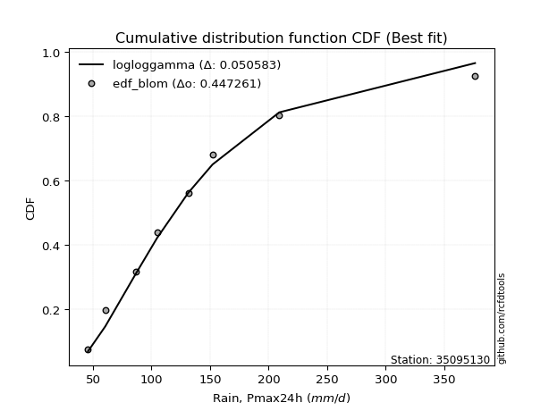</img>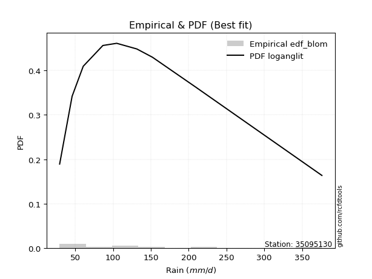</img>

</div>


### 7. EDF Tukey (1962)

In hydrology, the Tukey formula is used as a plotting position formula to estimate the empirical probability or frequency of a flood event (or other hydrological data). The formula parameter is given as _c=0.333_ (or 1/3).

<div align="center">


$P=(m-c)/(n+1-2c)$


</div>


**7.1. Empirical values**

<div align="center">

|                | 0                   | 1                   | 2                  | 3                   | 4         | 5                  | 6                  | 7                  | 8                  |
|:---------------|:--------------------|:--------------------|:-------------------|:--------------------|:----------|:-------------------|:-------------------|:-------------------|:-------------------|
| date           | 2025                | 2024                | 2022               | 2021                | 2020      | 2018               | 2023               | 2019               | 2017               |
| x              | 29.3                | 45.8                | 60.5               | 86.5                | 104.8     | 131.4              | 152.1              | 209.1              | 376.26             |
| m              | 1                   | 2                   | 3                  | 4                   | 5         | 6                  | 7                  | 8                  | 9                  |
| empirical_dist | edf_tukey           | edf_tukey           | edf_tukey          | edf_tukey           | edf_tukey | edf_tukey          | edf_tukey          | edf_tukey          | edf_tukey          |
| empirical      | 0.07142857142857142 | 0.17857142857142858 | 0.2857142857142857 | 0.39285714285714285 | 0.5       | 0.6071428571428571 | 0.7142857142857143 | 0.8214285714285714 | 0.9285714285714286 |
| empirical_tr   | 1.0769230769230769  | 1.2173913043478262  | 1.4                | 1.6470588235294117  | 2.0       | 2.545454545454545  | 3.5                | 5.599999999999999  | 14.000000000000007 |

</div>


**7.2. Kolmogorov-Smirnov fit test (sorted by Δ)**


<div align="center">

|                | 0                   | 1                    | 2                   | 3                   | 4                    | 5                    | 6                   | 7                    | 8                   | 9                   | 10                  | 11                  | 12                  | 13                  | 14                  | 15                   | 16                  | 17                   | 18                  | 19                   | 20                  | 21                   | 22                  | 23                   | 24                  | 25                  | 26                  | 27                  | 28                  | 29                  | 30                  | 31                   | 32                  | 33                  | 34                  | 35                  | 36                   | 37                  | 38                  | 39                  | 40                   | 41                  | 42                  | 43                  | 44                  | 45                  | 46                  | 47                  | 48                  | 49                  | 50                  | 51                  | 52                  | 53                  | 54                  | 55                  | 56                  | 57                  | 58                  | 59                  | 60                  | 61                  | 62                  | 63                  | 64                  | 65                  | 66                  | 67                  | 68                  | 69                  | 70                  | 71                  | 72                  | 73                  | 74                  | 75                  | 76                  | 77                  | 78                  | 79                  | 80                  | 81                  | 82                  | 83                  | 84                  | 85                  | 86                  | 87                  | 88                  | 89                  | 90                  | 91                  | 92                  | 93                  | 94                  | 95                  | 96                  | 97                  | 98                  | 99                  | 100                 | 101                 | 102                 | 103                 | 104                 | 105                 | 106                 | 107                 | 108                 | 109                 | 110                 | 111                 | 112                 | 113                 | 114                 | 115                 | 116                 | 117                 | 118                 | 119                 | 120                 | 121                 | 122                 | 123                 | 124                 | 125                 | 126                 | 127                 | 128                 | 129                 | 130                 | 131                 | 132                 | 133                 | 134                 | 135                 | 136                 | 137                 | 138                 | 139                 | 140                 | 141                 | 142                 | 143                 | 144                 | 145                 | 146                 | 147                 | 148                 | 149                 | 150                 | 151                 | 152                 | 153                 | 154                 | 155                 | 156                 | 157                 | 158                 | 159                 |
|:---------------|:--------------------|:---------------------|:--------------------|:--------------------|:---------------------|:---------------------|:--------------------|:---------------------|:--------------------|:--------------------|:--------------------|:--------------------|:--------------------|:--------------------|:--------------------|:---------------------|:--------------------|:---------------------|:--------------------|:---------------------|:--------------------|:---------------------|:--------------------|:---------------------|:--------------------|:--------------------|:--------------------|:--------------------|:--------------------|:--------------------|:--------------------|:---------------------|:--------------------|:--------------------|:--------------------|:--------------------|:---------------------|:--------------------|:--------------------|:--------------------|:---------------------|:--------------------|:--------------------|:--------------------|:--------------------|:--------------------|:--------------------|:--------------------|:--------------------|:--------------------|:--------------------|:--------------------|:--------------------|:--------------------|:--------------------|:--------------------|:--------------------|:--------------------|:--------------------|:--------------------|:--------------------|:--------------------|:--------------------|:--------------------|:--------------------|:--------------------|:--------------------|:--------------------|:--------------------|:--------------------|:--------------------|:--------------------|:--------------------|:--------------------|:--------------------|:--------------------|:--------------------|:--------------------|:--------------------|:--------------------|:--------------------|:--------------------|:--------------------|:--------------------|:--------------------|:--------------------|:--------------------|:--------------------|:--------------------|:--------------------|:--------------------|:--------------------|:--------------------|:--------------------|:--------------------|:--------------------|:--------------------|:--------------------|:--------------------|:--------------------|:--------------------|:--------------------|:--------------------|:--------------------|:--------------------|:--------------------|:--------------------|:--------------------|:--------------------|:--------------------|:--------------------|:--------------------|:--------------------|:--------------------|:--------------------|:--------------------|:--------------------|:--------------------|:--------------------|:--------------------|:--------------------|:--------------------|:--------------------|:--------------------|:--------------------|:--------------------|:--------------------|:--------------------|:--------------------|:--------------------|:--------------------|:--------------------|:--------------------|:--------------------|:--------------------|:--------------------|:--------------------|:--------------------|:--------------------|:--------------------|:--------------------|:--------------------|:--------------------|:--------------------|:--------------------|:--------------------|:--------------------|:--------------------|:--------------------|:--------------------|:--------------------|:--------------------|:--------------------|:--------------------|:--------------------|:--------------------|:--------------------|:--------------------|:--------------------|:--------------------|
| station        | 35095130            | 35095130             | 35095130            | 35095130            | 35095130             | 35095130             | 35095130            | 35095130             | 35095130            | 35095130            | 35095130            | 35095130            | 35095130            | 35095130            | 35095130            | 35095130             | 35095130            | 35095130             | 35095130            | 35095130             | 35095130            | 35095130             | 35095130            | 35095130             | 35095130            | 35095130            | 35095130            | 35095130            | 35095130            | 35095130            | 35095130            | 35095130             | 35095130            | 35095130            | 35095130            | 35095130            | 35095130             | 35095130            | 35095130            | 35095130            | 35095130             | 35095130            | 35095130            | 35095130            | 35095130            | 35095130            | 35095130            | 35095130            | 35095130            | 35095130            | 35095130            | 35095130            | 35095130            | 35095130            | 35095130            | 35095130            | 35095130            | 35095130            | 35095130            | 35095130            | 35095130            | 35095130            | 35095130            | 35095130            | 35095130            | 35095130            | 35095130            | 35095130            | 35095130            | 35095130            | 35095130            | 35095130            | 35095130            | 35095130            | 35095130            | 35095130            | 35095130            | 35095130            | 35095130            | 35095130            | 35095130            | 35095130            | 35095130            | 35095130            | 35095130            | 35095130            | 35095130            | 35095130            | 35095130            | 35095130            | 35095130            | 35095130            | 35095130            | 35095130            | 35095130            | 35095130            | 35095130            | 35095130            | 35095130            | 35095130            | 35095130            | 35095130            | 35095130            | 35095130            | 35095130            | 35095130            | 35095130            | 35095130            | 35095130            | 35095130            | 35095130            | 35095130            | 35095130            | 35095130            | 35095130            | 35095130            | 35095130            | 35095130            | 35095130            | 35095130            | 35095130            | 35095130            | 35095130            | 35095130            | 35095130            | 35095130            | 35095130            | 35095130            | 35095130            | 35095130            | 35095130            | 35095130            | 35095130            | 35095130            | 35095130            | 35095130            | 35095130            | 35095130            | 35095130            | 35095130            | 35095130            | 35095130            | 35095130            | 35095130            | 35095130            | 35095130            | 35095130            | 35095130            | 35095130            | 35095130            | 35095130            | 35095130            | 35095130            | 35095130            | 35095130            | 35095130            | 35095130            | 35095130            | 35095130            | 35095130            |
| empirical_dist | edf_tukey           | edf_tukey            | edf_tukey           | edf_tukey           | edf_tukey            | edf_tukey            | edf_tukey           | edf_tukey            | edf_tukey           | edf_tukey           | edf_tukey           | edf_tukey           | edf_tukey           | edf_tukey           | edf_tukey           | edf_tukey            | edf_tukey           | edf_tukey            | edf_tukey           | edf_tukey            | edf_tukey           | edf_tukey            | edf_tukey           | edf_tukey            | edf_tukey           | edf_tukey           | edf_tukey           | edf_tukey           | edf_tukey           | edf_tukey           | edf_tukey           | edf_tukey            | edf_tukey           | edf_tukey           | edf_tukey           | edf_tukey           | edf_tukey            | edf_tukey           | edf_tukey           | edf_tukey           | edf_tukey            | edf_tukey           | edf_tukey           | edf_tukey           | edf_tukey           | edf_tukey           | edf_tukey           | edf_tukey           | edf_tukey           | edf_tukey           | edf_tukey           | edf_tukey           | edf_tukey           | edf_tukey           | edf_tukey           | edf_tukey           | edf_tukey           | edf_tukey           | edf_tukey           | edf_tukey           | edf_tukey           | edf_tukey           | edf_tukey           | edf_tukey           | edf_tukey           | edf_tukey           | edf_tukey           | edf_tukey           | edf_tukey           | edf_tukey           | edf_tukey           | edf_tukey           | edf_tukey           | edf_tukey           | edf_tukey           | edf_tukey           | edf_tukey           | edf_tukey           | edf_tukey           | edf_tukey           | edf_tukey           | edf_tukey           | edf_tukey           | edf_tukey           | edf_tukey           | edf_tukey           | edf_tukey           | edf_tukey           | edf_tukey           | edf_tukey           | edf_tukey           | edf_tukey           | edf_tukey           | edf_tukey           | edf_tukey           | edf_tukey           | edf_tukey           | edf_tukey           | edf_tukey           | edf_tukey           | edf_tukey           | edf_tukey           | edf_tukey           | edf_tukey           | edf_tukey           | edf_tukey           | edf_tukey           | edf_tukey           | edf_tukey           | edf_tukey           | edf_tukey           | edf_tukey           | edf_tukey           | edf_tukey           | edf_tukey           | edf_tukey           | edf_tukey           | edf_tukey           | edf_tukey           | edf_tukey           | edf_tukey           | edf_tukey           | edf_tukey           | edf_tukey           | edf_tukey           | edf_tukey           | edf_tukey           | edf_tukey           | edf_tukey           | edf_tukey           | edf_tukey           | edf_tukey           | edf_tukey           | edf_tukey           | edf_tukey           | edf_tukey           | edf_tukey           | edf_tukey           | edf_tukey           | edf_tukey           | edf_tukey           | edf_tukey           | edf_tukey           | edf_tukey           | edf_tukey           | edf_tukey           | edf_tukey           | edf_tukey           | edf_tukey           | edf_tukey           | edf_tukey           | edf_tukey           | edf_tukey           | edf_tukey           | edf_tukey           | edf_tukey           | edf_tukey           | edf_tukey           | edf_tukey           | edf_tukey           |
| p_dist         | loganglit           | logbetaprime         | logncf              | logweibull_min      | logcosine            | logfoldnorm          | loggenextreme       | logfatiguelife       | logf                | logjohnsonsu        | loggamma            | loggamma            | logerlang           | logpearson3         | logskewnorm         | logexponnorm         | lognorm             | logcrystalball       | logt                | logburr12            | loginvgamma         | lognct               | logrice             | logloggamma          | betaprime           | ncf                 | logalpha            | moyal               | invgamma            | burr                | mielke              | loggenlogistic       | halflogistic        | logsemicircular     | invweibull          | genextreme          | johnsonsu            | invgauss            | logmaxwell          | alpha               | pearson3             | loginvgauss         | nct                 | loglogistic         | lograyleigh         | gumbel_r            | exponnorm           | genpareto           | lomax               | kappa3              | genexpon            | bradford            | loggompertz         | logvonmises_line    | truncweibull_min    | logkappa3           | weibull_min         | truncpareto         | logtruncpareto      | loguniform          | loggausshyper       | logdweibull         | logkappa4           | logexponpow         | halfnorm            | genlogistic         | gengamma            | gompertz            | loghypsecant        | loggumbel_l         | loginvweibull       | kstwobign           | exponpow            | logarcsine          | t                   | dweibull            | loggumbel_r         | logloglaplace       | foldnorm            | logksone            | gennorm             | nakagami            | logdgamma           | loglaplace          | loglaplace          | loghalfgennorm      | loggenexpon         | logkstwobign        | rayleigh            | loghalfnorm         | vonmises_line       | logargus            | maxwell             | logbradford         | logmoyal            | dgamma              | skewnorm            | loghalflogistic     | rice                | logistic            | logtruncexpon       | halfgennorm         | hypsecant           | truncnorm           | norm                | crystalball         | logbeta             | anglit              | logrdist            | semicircular        | wald                | f                   | laplace             | truncexpon          | arcsine             | logtruncweibull_min | logtruncnorm        | lognakagami         | logtukeylambda      | logwald             | loglomax            | logburr             | burr12              | logtriang           | logweibull_max      | logmielke           | gumbel_l            | beta                | logexponweib        | logwrapcauchy       | gamma               | cosine              | loggenhalflogistic  | gausshyper          | loggengamma         | exponweib           | wrapcauchy          | loglevy_l           | loggennorm          | argus               | logtrapezoid        | kappa4              | ksone               | uniform             | loggenpareto        | levy_l              | powerlaw            | genhalflogistic     | fatiguelife         | rdist               | logjohnsonsb        | tukeylambda         | logpowerlaw         | erlang              | triang              | trapezoid           | weibull_max         | johnsonsb           | logvonmises         | vonmises            |
| delta          | 0.03883781733948877 | 0.040019715513379794 | 0.04020688089266644 | 0.04021210441456663 | 0.041078093973198615 | 0.041842986698275575 | 0.04192461235349673 | 0.041952813224537866 | 0.04216325823549327 | 0.04266091351586726 | 0.04278360471740361 | 0.04278360471740361 | 0.04280164302327136 | 0.04289208321080101 | 0.04370684450103823 | 0.043794994581013824 | 0.04379882421291775 | 0.043799761793367226 | 0.04380357210182051 | 0.043856662527263224 | 0.04392946551949417 | 0.044026402120860675 | 0.04488866550908682 | 0.044944119954298256 | 0.04549397336525737 | 0.04591760548170076 | 0.04612268567232869 | 0.04625798558514671 | 0.04645405092051147 | 0.04732593266157348 | 0.04735121981645976 | 0.047710162247147136 | 0.04775109802260591 | 0.04791950371850473 | 0.04802941775233549 | 0.04802973273727795 | 0.052710449433202855 | 0.05331605489504121 | 0.05526681672082956 | 0.05561092277902294 | 0.055718476519206916 | 0.05593596938645412 | 0.06526346910079017 | 0.06644667634594556 | 0.06750625097957114 | 0.07013637361639713 | 0.07034418277689383 | 0.07140426294903564 | 0.07142817580820576 | 0.07142818573784968 | 0.07142834750406717 | 0.07142856307196377 | 0.07142856886034772 | 0.07142857117964231 | 0.07142857142679214 | 0.07142857142791403 | 0.07142857142856962 | 0.07142857142857142 | 0.07142857142857142 | 0.07142857142857142 | 0.07142857142915915 | 0.0728203161988557  | 0.0731309386014547  | 0.07409053577080177 | 0.07571571886432449 | 0.07629226799525218 | 0.07636887147886046 | 0.07748030898653285 | 0.0811082237994763  | 0.0812549456173445  | 0.08450102280776117 | 0.08734481376935602 | 0.08854492006401621 | 0.08857397706724568 | 0.08925271422966305 | 0.09003415465682715 | 0.09057748112708974 | 0.09231579213239646 | 0.09288344010955449 | 0.09654231584159267 | 0.0968154682458649  | 0.09751088510388192 | 0.09936645020689533 | 0.09995710611485495 | 0.09995710611485495 | 0.10018003911148793 | 0.10020366404537256 | 0.10069675547458318 | 0.10122409822267431 | 0.1021679046417448  | 0.10638305541955345 | 0.10697117012283697 | 0.11023460866174839 | 0.11100044633635958 | 0.11282753166720172 | 0.11315498792189416 | 0.11499560244788387 | 0.11946429535920139 | 0.12519963615977425 | 0.12880852748692528 | 0.1330781554056964  | 0.13334241821813325 | 0.13464446805240743 | 0.13879396596146598 | 0.1387939723355075  | 0.138793974046451   | 0.14505730979897868 | 0.1493932676574652  | 0.15113678350784576 | 0.15377960453371042 | 0.16009010641606747 | 0.161195419320658   | 0.1623927791910874  | 0.16815730445250376 | 0.17130614478909068 | 0.17327103416408668 | 0.17851618876956418 | 0.17857142856824756 | 0.1785714285714073  | 0.18410791856391073 | 0.18700857239800212 | 0.18773162351460332 | 0.18775793412417635 | 0.18913218011452382 | 0.18954342067599272 | 0.20053805516121098 | 0.202630916645947   | 0.20295251547716397 | 0.20470513280115948 | 0.2064571887036215  | 0.21434966902100688 | 0.22266662270108795 | 0.2284584974703463  | 0.23306255907886592 | 0.2503231917139322  | 0.2814065477764543  | 0.3126822693064355  | 0.3169384844706806  | 0.3214285714285714  | 0.32682014555597694 | 0.3286636736937033  | 0.33095889736246303 | 0.3360096401945607  | 0.36035442537632995 | 0.38664071783789755 | 0.39516734697848666 | 0.4045346319715183  | 0.4635477536884892  | 0.4800723326042984  | 0.481745696519686   | 0.4991901249405024  | 0.5077056190166951  | 0.510190868822101   | 0.5161726232303111  | 0.5439334012245263  | 0.5707022532537755  | 0.6866644614360522  | 0.6921030398687467  | 1.0376855565591172  | 59.765105702027824  |
| deltao         | 0.41761268023100007 | 0.41761268023100007  | 0.41761268023100007 | 0.41761268023100007 | 0.41761268023100007  | 0.41761268023100007  | 0.41761268023100007 | 0.41761268023100007  | 0.41761268023100007 | 0.41761268023100007 | 0.41761268023100007 | 0.41761268023100007 | 0.41761268023100007 | 0.41761268023100007 | 0.41761268023100007 | 0.41761268023100007  | 0.41761268023100007 | 0.41761268023100007  | 0.41761268023100007 | 0.41761268023100007  | 0.41761268023100007 | 0.41761268023100007  | 0.41761268023100007 | 0.41761268023100007  | 0.41761268023100007 | 0.41761268023100007 | 0.41761268023100007 | 0.41761268023100007 | 0.41761268023100007 | 0.41761268023100007 | 0.41761268023100007 | 0.41761268023100007  | 0.41761268023100007 | 0.41761268023100007 | 0.41761268023100007 | 0.41761268023100007 | 0.41761268023100007  | 0.41761268023100007 | 0.41761268023100007 | 0.41761268023100007 | 0.41761268023100007  | 0.41761268023100007 | 0.41761268023100007 | 0.41761268023100007 | 0.41761268023100007 | 0.41761268023100007 | 0.41761268023100007 | 0.41761268023100007 | 0.41761268023100007 | 0.41761268023100007 | 0.41761268023100007 | 0.41761268023100007 | 0.41761268023100007 | 0.41761268023100007 | 0.41761268023100007 | 0.41761268023100007 | 0.41761268023100007 | 0.41761268023100007 | 0.41761268023100007 | 0.41761268023100007 | 0.41761268023100007 | 0.41761268023100007 | 0.41761268023100007 | 0.41761268023100007 | 0.41761268023100007 | 0.41761268023100007 | 0.41761268023100007 | 0.41761268023100007 | 0.41761268023100007 | 0.41761268023100007 | 0.41761268023100007 | 0.41761268023100007 | 0.41761268023100007 | 0.41761268023100007 | 0.41761268023100007 | 0.41761268023100007 | 0.41761268023100007 | 0.41761268023100007 | 0.41761268023100007 | 0.41761268023100007 | 0.41761268023100007 | 0.41761268023100007 | 0.41761268023100007 | 0.41761268023100007 | 0.41761268023100007 | 0.41761268023100007 | 0.41761268023100007 | 0.41761268023100007 | 0.41761268023100007 | 0.41761268023100007 | 0.41761268023100007 | 0.41761268023100007 | 0.41761268023100007 | 0.41761268023100007 | 0.41761268023100007 | 0.41761268023100007 | 0.41761268023100007 | 0.41761268023100007 | 0.41761268023100007 | 0.41761268023100007 | 0.41761268023100007 | 0.41761268023100007 | 0.41761268023100007 | 0.41761268023100007 | 0.41761268023100007 | 0.41761268023100007 | 0.41761268023100007 | 0.41761268023100007 | 0.41761268023100007 | 0.41761268023100007 | 0.41761268023100007 | 0.41761268023100007 | 0.41761268023100007 | 0.41761268023100007 | 0.41761268023100007 | 0.41761268023100007 | 0.41761268023100007 | 0.41761268023100007 | 0.41761268023100007 | 0.41761268023100007 | 0.41761268023100007 | 0.41761268023100007 | 0.41761268023100007 | 0.41761268023100007 | 0.41761268023100007 | 0.41761268023100007 | 0.41761268023100007 | 0.41761268023100007 | 0.41761268023100007 | 0.41761268023100007 | 0.41761268023100007 | 0.41761268023100007 | 0.41761268023100007 | 0.41761268023100007 | 0.41761268023100007 | 0.41761268023100007 | 0.41761268023100007 | 0.41761268023100007 | 0.41761268023100007 | 0.41761268023100007 | 0.41761268023100007 | 0.41761268023100007 | 0.41761268023100007 | 0.41761268023100007 | 0.41761268023100007 | 0.41761268023100007 | 0.41761268023100007 | 0.41761268023100007 | 0.41761268023100007 | 0.41761268023100007 | 0.41761268023100007 | 0.41761268023100007 | 0.41761268023100007 | 0.41761268023100007 | 0.41761268023100007 | 0.41761268023100007 | 0.41761268023100007 | 0.41761268023100007 | 0.41761268023100007 | 0.41761268023100007 |
| eval           | Δo > Δ              | Δo > Δ               | Δo > Δ              | Δo > Δ              | Δo > Δ               | Δo > Δ               | Δo > Δ              | Δo > Δ               | Δo > Δ              | Δo > Δ              | Δo > Δ              | Δo > Δ              | Δo > Δ              | Δo > Δ              | Δo > Δ              | Δo > Δ               | Δo > Δ              | Δo > Δ               | Δo > Δ              | Δo > Δ               | Δo > Δ              | Δo > Δ               | Δo > Δ              | Δo > Δ               | Δo > Δ              | Δo > Δ              | Δo > Δ              | Δo > Δ              | Δo > Δ              | Δo > Δ              | Δo > Δ              | Δo > Δ               | Δo > Δ              | Δo > Δ              | Δo > Δ              | Δo > Δ              | Δo > Δ               | Δo > Δ              | Δo > Δ              | Δo > Δ              | Δo > Δ               | Δo > Δ              | Δo > Δ              | Δo > Δ              | Δo > Δ              | Δo > Δ              | Δo > Δ              | Δo > Δ              | Δo > Δ              | Δo > Δ              | Δo > Δ              | Δo > Δ              | Δo > Δ              | Δo > Δ              | Δo > Δ              | Δo > Δ              | Δo > Δ              | Δo > Δ              | Δo > Δ              | Δo > Δ              | Δo > Δ              | Δo > Δ              | Δo > Δ              | Δo > Δ              | Δo > Δ              | Δo > Δ              | Δo > Δ              | Δo > Δ              | Δo > Δ              | Δo > Δ              | Δo > Δ              | Δo > Δ              | Δo > Δ              | Δo > Δ              | Δo > Δ              | Δo > Δ              | Δo > Δ              | Δo > Δ              | Δo > Δ              | Δo > Δ              | Δo > Δ              | Δo > Δ              | Δo > Δ              | Δo > Δ              | Δo > Δ              | Δo > Δ              | Δo > Δ              | Δo > Δ              | Δo > Δ              | Δo > Δ              | Δo > Δ              | Δo > Δ              | Δo > Δ              | Δo > Δ              | Δo > Δ              | Δo > Δ              | Δo > Δ              | Δo > Δ              | Δo > Δ              | Δo > Δ              | Δo > Δ              | Δo > Δ              | Δo > Δ              | Δo > Δ              | Δo > Δ              | Δo > Δ              | Δo > Δ              | Δo > Δ              | Δo > Δ              | Δo > Δ              | Δo > Δ              | Δo > Δ              | Δo > Δ              | Δo > Δ              | Δo > Δ              | Δo > Δ              | Δo > Δ              | Δo > Δ              | Δo > Δ              | Δo > Δ              | Δo > Δ              | Δo > Δ              | Δo > Δ              | Δo > Δ              | Δo > Δ              | Δo > Δ              | Δo > Δ              | Δo > Δ              | Δo > Δ              | Δo > Δ              | Δo > Δ              | Δo > Δ              | Δo > Δ              | Δo > Δ              | Δo > Δ              | Δo > Δ              | Δo > Δ              | Δo > Δ              | Δo > Δ              | Δo > Δ              | Δo > Δ              | Δo > Δ              | Δo > Δ              | Δo > Δ              | Δo > Δ              | Δo > Δ              | Δo > Δ              | Δo <= Δ             | Δo <= Δ             | Δo <= Δ             | Δo <= Δ             | Δo <= Δ             | Δo <= Δ             | Δo <= Δ             | Δo <= Δ             | Δo <= Δ             | Δo <= Δ             | Δo <= Δ             | Δo <= Δ             | Δo <= Δ             |
| fit            | 1                   | 1                    | 1                   | 1                   | 1                    | 1                    | 1                   | 1                    | 1                   | 1                   | 1                   | 1                   | 1                   | 1                   | 1                   | 1                    | 1                   | 1                    | 1                   | 1                    | 1                   | 1                    | 1                   | 1                    | 1                   | 1                   | 1                   | 1                   | 1                   | 1                   | 1                   | 1                    | 1                   | 1                   | 1                   | 1                   | 1                    | 1                   | 1                   | 1                   | 1                    | 1                   | 1                   | 1                   | 1                   | 1                   | 1                   | 1                   | 1                   | 1                   | 1                   | 1                   | 1                   | 1                   | 1                   | 1                   | 1                   | 1                   | 1                   | 1                   | 1                   | 1                   | 1                   | 1                   | 1                   | 1                   | 1                   | 1                   | 1                   | 1                   | 1                   | 1                   | 1                   | 1                   | 1                   | 1                   | 1                   | 1                   | 1                   | 1                   | 1                   | 1                   | 1                   | 1                   | 1                   | 1                   | 1                   | 1                   | 1                   | 1                   | 1                   | 1                   | 1                   | 1                   | 1                   | 1                   | 1                   | 1                   | 1                   | 1                   | 1                   | 1                   | 1                   | 1                   | 1                   | 1                   | 1                   | 1                   | 1                   | 1                   | 1                   | 1                   | 1                   | 1                   | 1                   | 1                   | 1                   | 1                   | 1                   | 1                   | 1                   | 1                   | 1                   | 1                   | 1                   | 1                   | 1                   | 1                   | 1                   | 1                   | 1                   | 1                   | 1                   | 1                   | 1                   | 1                   | 1                   | 1                   | 1                   | 1                   | 1                   | 1                   | 1                   | 1                   | 1                   | 1                   | 1                   | 0                   | 0                   | 0                   | 0                   | 0                   | 0                   | 0                   | 0                   | 0                   | 0                   | 0                   | 0                   | 0                   |
| n              | 9                   | 9                    | 9                   | 9                   | 9                    | 9                    | 9                   | 9                    | 9                   | 9                   | 9                   | 9                   | 9                   | 9                   | 9                   | 9                    | 9                   | 9                    | 9                   | 9                    | 9                   | 9                    | 9                   | 9                    | 9                   | 9                   | 9                   | 9                   | 9                   | 9                   | 9                   | 9                    | 9                   | 9                   | 9                   | 9                   | 9                    | 9                   | 9                   | 9                   | 9                    | 9                   | 9                   | 9                   | 9                   | 9                   | 9                   | 9                   | 9                   | 9                   | 9                   | 9                   | 9                   | 9                   | 9                   | 9                   | 9                   | 9                   | 9                   | 9                   | 9                   | 9                   | 9                   | 9                   | 9                   | 9                   | 9                   | 9                   | 9                   | 9                   | 9                   | 9                   | 9                   | 9                   | 9                   | 9                   | 9                   | 9                   | 9                   | 9                   | 9                   | 9                   | 9                   | 9                   | 9                   | 9                   | 9                   | 9                   | 9                   | 9                   | 9                   | 9                   | 9                   | 9                   | 9                   | 9                   | 9                   | 9                   | 9                   | 9                   | 9                   | 9                   | 9                   | 9                   | 9                   | 9                   | 9                   | 9                   | 9                   | 9                   | 9                   | 9                   | 9                   | 9                   | 9                   | 9                   | 9                   | 9                   | 9                   | 9                   | 9                   | 9                   | 9                   | 9                   | 9                   | 9                   | 9                   | 9                   | 9                   | 9                   | 9                   | 9                   | 9                   | 9                   | 9                   | 9                   | 9                   | 9                   | 9                   | 9                   | 9                   | 9                   | 9                   | 9                   | 9                   | 9                   | 9                   | 9                   | 9                   | 9                   | 9                   | 9                   | 9                   | 9                   | 9                   | 9                   | 9                   | 9                   | 9                   | 9                   |
| best_fit       | 1                   | 0                    | 0                   | 0                   | 0                    | 0                    | 0                   | 0                    | 0                   | 0                   | 0                   | 0                   | 0                   | 0                   | 0                   | 0                    | 0                   | 0                    | 0                   | 0                    | 0                   | 0                    | 0                   | 0                    | 0                   | 0                   | 0                   | 0                   | 0                   | 0                   | 0                   | 0                    | 0                   | 0                   | 0                   | 0                   | 0                    | 0                   | 0                   | 0                   | 0                    | 0                   | 0                   | 0                   | 0                   | 0                   | 0                   | 0                   | 0                   | 0                   | 0                   | 0                   | 0                   | 0                   | 0                   | 0                   | 0                   | 0                   | 0                   | 0                   | 0                   | 0                   | 0                   | 0                   | 0                   | 0                   | 0                   | 0                   | 0                   | 0                   | 0                   | 0                   | 0                   | 0                   | 0                   | 0                   | 0                   | 0                   | 0                   | 0                   | 0                   | 0                   | 0                   | 0                   | 0                   | 0                   | 0                   | 0                   | 0                   | 0                   | 0                   | 0                   | 0                   | 0                   | 0                   | 0                   | 0                   | 0                   | 0                   | 0                   | 0                   | 0                   | 0                   | 0                   | 0                   | 0                   | 0                   | 0                   | 0                   | 0                   | 0                   | 0                   | 0                   | 0                   | 0                   | 0                   | 0                   | 0                   | 0                   | 0                   | 0                   | 0                   | 0                   | 0                   | 0                   | 0                   | 0                   | 0                   | 0                   | 0                   | 0                   | 0                   | 0                   | 0                   | 0                   | 0                   | 0                   | 0                   | 0                   | 0                   | 0                   | 0                   | 0                   | 0                   | 0                   | 0                   | 0                   | 0                   | 0                   | 0                   | 0                   | 0                   | 0                   | 0                   | 0                   | 0                   | 0                   | 0                   | 0                   | 0                   |
| best_fit_sort  | 1                   | 2                    | 3                   | 4                   | 5                    | 6                    | 7                   | 8                    | 9                   | 10                  | 11                  | 12                  | 13                  | 14                  | 15                  | 16                   | 17                  | 18                   | 19                  | 20                   | 21                  | 22                   | 23                  | 24                   | 25                  | 26                  | 27                  | 28                  | 29                  | 30                  | 31                  | 32                   | 33                  | 34                  | 35                  | 36                  | 37                   | 38                  | 39                  | 40                  | 41                   | 42                  | 43                  | 44                  | 45                  | 46                  | 47                  | 48                  | 49                  | 50                  | 51                  | 52                  | 53                  | 54                  | 55                  | 56                  | 57                  | 58                  | 59                  | 60                  | 61                  | 62                  | 63                  | 64                  | 65                  | 66                  | 67                  | 68                  | 69                  | 70                  | 71                  | 72                  | 73                  | 74                  | 75                  | 76                  | 77                  | 78                  | 79                  | 80                  | 81                  | 82                  | 83                  | 84                  | 85                  | 86                  | 87                  | 88                  | 89                  | 90                  | 91                  | 92                  | 93                  | 94                  | 95                  | 96                  | 97                  | 98                  | 99                  | 100                 | 101                 | 102                 | 103                 | 104                 | 105                 | 106                 | 107                 | 108                 | 109                 | 110                 | 111                 | 112                 | 113                 | 114                 | 115                 | 116                 | 117                 | 118                 | 119                 | 120                 | 121                 | 122                 | 123                 | 124                 | 125                 | 126                 | 127                 | 128                 | 129                 | 130                 | 131                 | 132                 | 133                 | 134                 | 135                 | 136                 | 137                 | 138                 | 139                 | 140                 | 141                 | 142                 | 143                 | 144                 | 145                 | 146                 | 147                 | 148                 | 149                 | 150                 | 151                 | 152                 | 153                 | 154                 | 155                 | 156                 | 157                 | 158                 | 159                 | 160                 |

</div>


**7.3. Best fit**

<div align="center">

|   id |   station | empirical_dist   | p_dist    |     delta |   deltao | eval   |   fit |   n |   best_fit |   best_fit_sort |
|-----:|----------:|:-----------------|:----------|----------:|---------:|:-------|------:|----:|-----------:|----------------:|
|    0 |  35095130 | edf_tukey        | loganglit | 0.0388378 | 0.417613 | Δo > Δ |     1 |   9 |          1 |               1 |

</div>


<div align="center">

</img>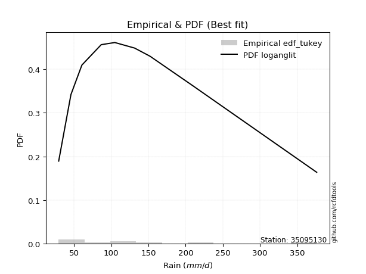</img>

</div>


### 8. EDF Gringorten (1963)

Gringorten plotting position formula is essential for estimating the probability and return periods of extreme events like floods and heavy rainfall. The constant _a=0.44_.

<div align="center">


$P=(m-a)/(n+1-2a)$


</div>


**8.1. Empirical values**

<div align="center">

|                | 0                    | 1                  | 2                   | 3                  | 4              | 5                  | 6                  | 7                  | 8                  |
|:---------------|:---------------------|:-------------------|:--------------------|:-------------------|:---------------|:-------------------|:-------------------|:-------------------|:-------------------|
| date           | 2025                 | 2024               | 2022                | 2021               | 2020           | 2018               | 2023               | 2019               | 2017               |
| x              | 29.3                 | 45.8               | 60.5                | 86.5               | 104.8          | 131.4              | 152.1              | 209.1              | 376.26             |
| m              | 1                    | 2                  | 3                   | 4                  | 5              | 6                  | 7                  | 8                  | 9                  |
| empirical_dist | edf_gringorten       | edf_gringorten     | edf_gringorten      | edf_gringorten     | edf_gringorten | edf_gringorten     | edf_gringorten     | edf_gringorten     | edf_gringorten     |
| empirical      | 0.061403508771929835 | 0.1710526315789474 | 0.28070175438596495 | 0.3903508771929825 | 0.5            | 0.6096491228070176 | 0.7192982456140351 | 0.8289473684210527 | 0.9385964912280703 |
| empirical_tr   | 1.0654205607476634   | 1.2063492063492063 | 1.3902439024390243  | 1.6402877697841727 | 2.0            | 2.561797752808989  | 3.5625             | 5.846153846153847  | 16.285714285714324 |

</div>


**8.2. Kolmogorov-Smirnov fit test (sorted by Δ)**


<div align="center">

|                | 0                   | 1                    | 2                   | 3                    | 4                   | 5                   | 6                   | 7                    | 8                    | 9                    | 10                  | 11                  | 12                  | 13                  | 14                  | 15                  | 16                  | 17                  | 18                  | 19                  | 20                  | 21                  | 22                  | 23                  | 24                   | 25                  | 26                   | 27                  | 28                   | 29                   | 30                  | 31                  | 32                   | 33                  | 34                  | 35                  | 36                  | 37                  | 38                   | 39                   | 40                   | 41                  | 42                  | 43                  | 44                  | 45                  | 46                  | 47                   | 48                  | 49                   | 50                  | 51                   | 52                   | 53                   | 54                  | 55                  | 56                  | 57                  | 58                  | 59                  | 60                  | 61                  | 62                  | 63                  | 64                  | 65                  | 66                  | 67                  | 68                  | 69                  | 70                  | 71                  | 72                  | 73                  | 74                  | 75                  | 76                  | 77                  | 78                  | 79                  | 80                  | 81                  | 82                  | 83                  | 84                  | 85                  | 86                  | 87                  | 88                  | 89                  | 90                  | 91                  | 92                  | 93                  | 94                  | 95                  | 96                  | 97                  | 98                  | 99                  | 100                 | 101                 | 102                 | 103                 | 104                 | 105                 | 106                 | 107                 | 108                 | 109                 | 110                 | 111                 | 112                 | 113                 | 114                 | 115                 | 116                 | 117                 | 118                 | 119                 | 120                 | 121                 | 122                 | 123                 | 124                 | 125                 | 126                 | 127                 | 128                 | 129                 | 130                 | 131                 | 132                 | 133                 | 134                 | 135                 | 136                 | 137                 | 138                 | 139                 | 140                 | 141                 | 142                 | 143                 | 144                 | 145                 | 146                 | 147                 | 148                 | 149                 | 150                 | 151                 | 152                 | 153                 | 154                 | 155                 | 156                 | 157                 | 158                 | 159                 |
|:---------------|:--------------------|:---------------------|:--------------------|:---------------------|:--------------------|:--------------------|:--------------------|:---------------------|:---------------------|:---------------------|:--------------------|:--------------------|:--------------------|:--------------------|:--------------------|:--------------------|:--------------------|:--------------------|:--------------------|:--------------------|:--------------------|:--------------------|:--------------------|:--------------------|:---------------------|:--------------------|:---------------------|:--------------------|:---------------------|:---------------------|:--------------------|:--------------------|:---------------------|:--------------------|:--------------------|:--------------------|:--------------------|:--------------------|:---------------------|:---------------------|:---------------------|:--------------------|:--------------------|:--------------------|:--------------------|:--------------------|:--------------------|:---------------------|:--------------------|:---------------------|:--------------------|:---------------------|:---------------------|:---------------------|:--------------------|:--------------------|:--------------------|:--------------------|:--------------------|:--------------------|:--------------------|:--------------------|:--------------------|:--------------------|:--------------------|:--------------------|:--------------------|:--------------------|:--------------------|:--------------------|:--------------------|:--------------------|:--------------------|:--------------------|:--------------------|:--------------------|:--------------------|:--------------------|:--------------------|:--------------------|:--------------------|:--------------------|:--------------------|:--------------------|:--------------------|:--------------------|:--------------------|:--------------------|:--------------------|:--------------------|:--------------------|:--------------------|:--------------------|:--------------------|:--------------------|:--------------------|:--------------------|:--------------------|:--------------------|:--------------------|:--------------------|:--------------------|:--------------------|:--------------------|:--------------------|:--------------------|:--------------------|:--------------------|:--------------------|:--------------------|:--------------------|:--------------------|:--------------------|:--------------------|:--------------------|:--------------------|:--------------------|:--------------------|:--------------------|:--------------------|:--------------------|:--------------------|:--------------------|:--------------------|:--------------------|:--------------------|:--------------------|:--------------------|:--------------------|:--------------------|:--------------------|:--------------------|:--------------------|:--------------------|:--------------------|:--------------------|:--------------------|:--------------------|:--------------------|:--------------------|:--------------------|:--------------------|:--------------------|:--------------------|:--------------------|:--------------------|:--------------------|:--------------------|:--------------------|:--------------------|:--------------------|:--------------------|:--------------------|:--------------------|:--------------------|:--------------------|:--------------------|:--------------------|:--------------------|:--------------------|
| station        | 35095130            | 35095130             | 35095130            | 35095130             | 35095130            | 35095130            | 35095130            | 35095130             | 35095130             | 35095130             | 35095130            | 35095130            | 35095130            | 35095130            | 35095130            | 35095130            | 35095130            | 35095130            | 35095130            | 35095130            | 35095130            | 35095130            | 35095130            | 35095130            | 35095130             | 35095130            | 35095130             | 35095130            | 35095130             | 35095130             | 35095130            | 35095130            | 35095130             | 35095130            | 35095130            | 35095130            | 35095130            | 35095130            | 35095130             | 35095130             | 35095130             | 35095130            | 35095130            | 35095130            | 35095130            | 35095130            | 35095130            | 35095130             | 35095130            | 35095130             | 35095130            | 35095130             | 35095130             | 35095130             | 35095130            | 35095130            | 35095130            | 35095130            | 35095130            | 35095130            | 35095130            | 35095130            | 35095130            | 35095130            | 35095130            | 35095130            | 35095130            | 35095130            | 35095130            | 35095130            | 35095130            | 35095130            | 35095130            | 35095130            | 35095130            | 35095130            | 35095130            | 35095130            | 35095130            | 35095130            | 35095130            | 35095130            | 35095130            | 35095130            | 35095130            | 35095130            | 35095130            | 35095130            | 35095130            | 35095130            | 35095130            | 35095130            | 35095130            | 35095130            | 35095130            | 35095130            | 35095130            | 35095130            | 35095130            | 35095130            | 35095130            | 35095130            | 35095130            | 35095130            | 35095130            | 35095130            | 35095130            | 35095130            | 35095130            | 35095130            | 35095130            | 35095130            | 35095130            | 35095130            | 35095130            | 35095130            | 35095130            | 35095130            | 35095130            | 35095130            | 35095130            | 35095130            | 35095130            | 35095130            | 35095130            | 35095130            | 35095130            | 35095130            | 35095130            | 35095130            | 35095130            | 35095130            | 35095130            | 35095130            | 35095130            | 35095130            | 35095130            | 35095130            | 35095130            | 35095130            | 35095130            | 35095130            | 35095130            | 35095130            | 35095130            | 35095130            | 35095130            | 35095130            | 35095130            | 35095130            | 35095130            | 35095130            | 35095130            | 35095130            | 35095130            | 35095130            | 35095130            | 35095130            | 35095130            | 35095130            |
| empirical_dist | edf_gringorten      | edf_gringorten       | edf_gringorten      | edf_gringorten       | edf_gringorten      | edf_gringorten      | edf_gringorten      | edf_gringorten       | edf_gringorten       | edf_gringorten       | edf_gringorten      | edf_gringorten      | edf_gringorten      | edf_gringorten      | edf_gringorten      | edf_gringorten      | edf_gringorten      | edf_gringorten      | edf_gringorten      | edf_gringorten      | edf_gringorten      | edf_gringorten      | edf_gringorten      | edf_gringorten      | edf_gringorten       | edf_gringorten      | edf_gringorten       | edf_gringorten      | edf_gringorten       | edf_gringorten       | edf_gringorten      | edf_gringorten      | edf_gringorten       | edf_gringorten      | edf_gringorten      | edf_gringorten      | edf_gringorten      | edf_gringorten      | edf_gringorten       | edf_gringorten       | edf_gringorten       | edf_gringorten      | edf_gringorten      | edf_gringorten      | edf_gringorten      | edf_gringorten      | edf_gringorten      | edf_gringorten       | edf_gringorten      | edf_gringorten       | edf_gringorten      | edf_gringorten       | edf_gringorten       | edf_gringorten       | edf_gringorten      | edf_gringorten      | edf_gringorten      | edf_gringorten      | edf_gringorten      | edf_gringorten      | edf_gringorten      | edf_gringorten      | edf_gringorten      | edf_gringorten      | edf_gringorten      | edf_gringorten      | edf_gringorten      | edf_gringorten      | edf_gringorten      | edf_gringorten      | edf_gringorten      | edf_gringorten      | edf_gringorten      | edf_gringorten      | edf_gringorten      | edf_gringorten      | edf_gringorten      | edf_gringorten      | edf_gringorten      | edf_gringorten      | edf_gringorten      | edf_gringorten      | edf_gringorten      | edf_gringorten      | edf_gringorten      | edf_gringorten      | edf_gringorten      | edf_gringorten      | edf_gringorten      | edf_gringorten      | edf_gringorten      | edf_gringorten      | edf_gringorten      | edf_gringorten      | edf_gringorten      | edf_gringorten      | edf_gringorten      | edf_gringorten      | edf_gringorten      | edf_gringorten      | edf_gringorten      | edf_gringorten      | edf_gringorten      | edf_gringorten      | edf_gringorten      | edf_gringorten      | edf_gringorten      | edf_gringorten      | edf_gringorten      | edf_gringorten      | edf_gringorten      | edf_gringorten      | edf_gringorten      | edf_gringorten      | edf_gringorten      | edf_gringorten      | edf_gringorten      | edf_gringorten      | edf_gringorten      | edf_gringorten      | edf_gringorten      | edf_gringorten      | edf_gringorten      | edf_gringorten      | edf_gringorten      | edf_gringorten      | edf_gringorten      | edf_gringorten      | edf_gringorten      | edf_gringorten      | edf_gringorten      | edf_gringorten      | edf_gringorten      | edf_gringorten      | edf_gringorten      | edf_gringorten      | edf_gringorten      | edf_gringorten      | edf_gringorten      | edf_gringorten      | edf_gringorten      | edf_gringorten      | edf_gringorten      | edf_gringorten      | edf_gringorten      | edf_gringorten      | edf_gringorten      | edf_gringorten      | edf_gringorten      | edf_gringorten      | edf_gringorten      | edf_gringorten      | edf_gringorten      | edf_gringorten      | edf_gringorten      | edf_gringorten      | edf_gringorten      | edf_gringorten      | edf_gringorten      | edf_gringorten      |
| p_dist         | logcosine           | logncf               | logfoldnorm         | loggenextreme        | logfatiguelife      | logf                | loganglit           | logjohnsonsu         | loggamma             | loggamma             | logerlang           | logpearson3         | logskewnorm         | logexponnorm        | lognorm             | logcrystalball      | logt                | logbetaprime        | lognct              | logloggamma         | betaprime           | ncf                 | loginvgamma         | burr                | mielke               | loggenlogistic      | logweibull_min       | invgamma            | invweibull           | genextreme           | logrice             | logburr12           | logalpha             | logsemicircular     | alpha               | moyal               | halflogistic        | johnsonsu           | invgauss             | logmaxwell           | loginvgauss          | exponnorm           | pearson3            | genpareto           | lomax               | kappa3              | genexpon            | bradford             | loggompertz         | logvonmises_line     | truncweibull_min    | truncpareto          | logtruncpareto       | loglogistic          | weibull_min         | nct                 | loggausshyper       | lograyleigh         | genlogistic         | loguniform          | gumbel_r            | logkappa3           | logdweibull         | gompertz            | loghypsecant        | loggumbel_l         | logexponpow         | logkappa4           | gengamma            | halfnorm            | kstwobign           | loginvweibull       | logloglaplace       | loggumbel_r         | exponpow            | logarcsine          | logdgamma           | loglaplace          | loglaplace          | t                   | dweibull            | loghalfgennorm      | loggenexpon         | foldnorm            | logkstwobign        | logksone            | loghalfnorm         | nakagami            | rayleigh            | gennorm             | dgamma              | logargus            | logmoyal            | logbradford         | maxwell             | skewnorm            | vonmises_line       | loghalflogistic     | rice                | logistic            | hypsecant           | logtruncexpon       | halfgennorm         | truncnorm           | norm                | crystalball         | logrdist            | logbeta             | wald                | anglit              | semicircular        | laplace             | f                   | logtruncnorm        | lognakagami         | logtukeylambda      | truncexpon          | logtruncweibull_min | arcsine             | logwald             | loglomax            | logburr             | burr12              | logtriang           | logweibull_max      | logmielke           | logexponweib        | gumbel_l            | beta                | logwrapcauchy       | gamma               | cosine              | loggenhalflogistic  | gausshyper          | loggengamma         | exponweib           | wrapcauchy          | loglevy_l           | loggennorm          | argus               | logtrapezoid        | kappa4              | ksone               | uniform             | loggenpareto        | levy_l              | powerlaw            | genhalflogistic     | fatiguelife         | rdist               | logjohnsonsb        | logpowerlaw         | tukeylambda         | erlang              | triang              | trapezoid           | weibull_max         | johnsonsb           | logvonmises         | vonmises            |
| delta          | 0.0328451873799358  | 0.035194349564345695 | 0.03683045536995483 | 0.036912081025175986 | 0.03694028189621712 | 0.03715072690717253 | 0.03756334180982546 | 0.037648382187546514 | 0.037771073389082865 | 0.037771073389082865 | 0.03778911169495061 | 0.03787955188248027 | 0.03869431317271749 | 0.03878246325269308 | 0.03878629288459701 | 0.03878723046504648 | 0.03879104077349976 | 0.03883602692058791 | 0.03901387079253993 | 0.03993158862597751 | 0.04048144203693663 | 0.04090507415338002 | 0.04212080269425306 | 0.04231340133325273 | 0.042338688488139015 | 0.04269763091882639 | 0.042718370078726975 | 0.04394778525635101 | 0.045523152088175034 | 0.045523467073117496 | 0.04616997131518835 | 0.04636292819142357 | 0.047742651291409643 | 0.0482637370898209  | 0.05059839145070219 | 0.05127051691346751 | 0.05276362935092671 | 0.0552167150973632  | 0.055822320559201555 | 0.057773082384989904 | 0.058442235050614466 | 0.06031912012025224 | 0.06073100784752772 | 0.06137920029239404 | 0.06140311315156417 | 0.06140312308120809 | 0.06140328484742558 | 0.061403500415322054 | 0.06140350620370613 | 0.061403508523000715 | 0.06140350877015054 | 0.061403508771929835 | 0.061403508771929835 | 0.061434145017624814 | 0.06233775347778264 | 0.06275720343662972 | 0.06841359793485008 | 0.07001251664373148 | 0.07127973666693144 | 0.07411656410777578 | 0.07514890494471793 | 0.07517299746695083 | 0.07532658186301605 | 0.07572769966428194 | 0.07609569247115555 | 0.07624241428902376 | 0.07659680143496211 | 0.0781434699297755  | 0.0788751371430208  | 0.08152646062291623 | 0.0839077178666634  | 0.08700728847192152 | 0.08730326080407572 | 0.08807121546292929 | 0.09105118572817655 | 0.09358650839556648 | 0.09435391887857458 | 0.0949445747865342  | 0.0949445747865342  | 0.09927777688630464 | 0.10005921731346874 | 0.10268630477564827 | 0.10270992970953291 | 0.10290850276619608 | 0.10320302113874352 | 0.10406111283407393 | 0.10467417030590515 | 0.1050296820963631  | 0.10623662955099511 | 0.10684053090250649 | 0.1106487222577337  | 0.11198370145115777 | 0.11282753166720172 | 0.11350671200051993 | 0.11524713999006919 | 0.1153627144014513  | 0.11640811807619504 | 0.12197056102336173 | 0.13021216748809505 | 0.13382105881524609 | 0.13464446805240743 | 0.13558442106985674 | 0.1358486838822936  | 0.14380649728978678 | 0.1438065036638283  | 0.1438065053747718  | 0.1445085068364374  | 0.15006984112729949 | 0.1525713094235863  | 0.154405798985786   | 0.15879213586203123 | 0.1623927791910874  | 0.16370168498481835 | 0.170997391777083   | 0.1710526315757664  | 0.17105263157892603 | 0.17316983578082457 | 0.17577729982824702 | 0.1805906710078024  | 0.18410791856391073 | 0.18951483806216246 | 0.19023788917876366 | 0.1902641997883367  | 0.19414471144284462 | 0.19455595200431353 | 0.20304432082537133 | 0.20721139846531983 | 0.20764344797426781 | 0.20796504680548478 | 0.21397598569610277 | 0.21685593468516723 | 0.22767915402940875 | 0.2334710287986671  | 0.23807509040718672 | 0.25282945737809254 | 0.28391281344061464 | 0.32020106629891676 | 0.3269635471273222  | 0.32894736842105265 | 0.33183267688429774 | 0.3336762050220241  | 0.33597142869078384 | 0.3410221715228815  | 0.36536695670465075 | 0.39666578049453916 | 0.4051924096351282  | 0.4120534289639995  | 0.46856028501681    | 0.4875911295967796  | 0.49177075917632757 | 0.5067089219329837  | 0.5177096658145821  | 0.5177306816733367  | 0.5236914202227922  | 0.5489459325528472  | 0.5757147845820964  | 0.6941832584285335  | 0.6996218368612279  | 1.0351792908949569  | 59.75508063937119   |
| deltao         | 0.41761268023100007 | 0.41761268023100007  | 0.41761268023100007 | 0.41761268023100007  | 0.41761268023100007 | 0.41761268023100007 | 0.41761268023100007 | 0.41761268023100007  | 0.41761268023100007  | 0.41761268023100007  | 0.41761268023100007 | 0.41761268023100007 | 0.41761268023100007 | 0.41761268023100007 | 0.41761268023100007 | 0.41761268023100007 | 0.41761268023100007 | 0.41761268023100007 | 0.41761268023100007 | 0.41761268023100007 | 0.41761268023100007 | 0.41761268023100007 | 0.41761268023100007 | 0.41761268023100007 | 0.41761268023100007  | 0.41761268023100007 | 0.41761268023100007  | 0.41761268023100007 | 0.41761268023100007  | 0.41761268023100007  | 0.41761268023100007 | 0.41761268023100007 | 0.41761268023100007  | 0.41761268023100007 | 0.41761268023100007 | 0.41761268023100007 | 0.41761268023100007 | 0.41761268023100007 | 0.41761268023100007  | 0.41761268023100007  | 0.41761268023100007  | 0.41761268023100007 | 0.41761268023100007 | 0.41761268023100007 | 0.41761268023100007 | 0.41761268023100007 | 0.41761268023100007 | 0.41761268023100007  | 0.41761268023100007 | 0.41761268023100007  | 0.41761268023100007 | 0.41761268023100007  | 0.41761268023100007  | 0.41761268023100007  | 0.41761268023100007 | 0.41761268023100007 | 0.41761268023100007 | 0.41761268023100007 | 0.41761268023100007 | 0.41761268023100007 | 0.41761268023100007 | 0.41761268023100007 | 0.41761268023100007 | 0.41761268023100007 | 0.41761268023100007 | 0.41761268023100007 | 0.41761268023100007 | 0.41761268023100007 | 0.41761268023100007 | 0.41761268023100007 | 0.41761268023100007 | 0.41761268023100007 | 0.41761268023100007 | 0.41761268023100007 | 0.41761268023100007 | 0.41761268023100007 | 0.41761268023100007 | 0.41761268023100007 | 0.41761268023100007 | 0.41761268023100007 | 0.41761268023100007 | 0.41761268023100007 | 0.41761268023100007 | 0.41761268023100007 | 0.41761268023100007 | 0.41761268023100007 | 0.41761268023100007 | 0.41761268023100007 | 0.41761268023100007 | 0.41761268023100007 | 0.41761268023100007 | 0.41761268023100007 | 0.41761268023100007 | 0.41761268023100007 | 0.41761268023100007 | 0.41761268023100007 | 0.41761268023100007 | 0.41761268023100007 | 0.41761268023100007 | 0.41761268023100007 | 0.41761268023100007 | 0.41761268023100007 | 0.41761268023100007 | 0.41761268023100007 | 0.41761268023100007 | 0.41761268023100007 | 0.41761268023100007 | 0.41761268023100007 | 0.41761268023100007 | 0.41761268023100007 | 0.41761268023100007 | 0.41761268023100007 | 0.41761268023100007 | 0.41761268023100007 | 0.41761268023100007 | 0.41761268023100007 | 0.41761268023100007 | 0.41761268023100007 | 0.41761268023100007 | 0.41761268023100007 | 0.41761268023100007 | 0.41761268023100007 | 0.41761268023100007 | 0.41761268023100007 | 0.41761268023100007 | 0.41761268023100007 | 0.41761268023100007 | 0.41761268023100007 | 0.41761268023100007 | 0.41761268023100007 | 0.41761268023100007 | 0.41761268023100007 | 0.41761268023100007 | 0.41761268023100007 | 0.41761268023100007 | 0.41761268023100007 | 0.41761268023100007 | 0.41761268023100007 | 0.41761268023100007 | 0.41761268023100007 | 0.41761268023100007 | 0.41761268023100007 | 0.41761268023100007 | 0.41761268023100007 | 0.41761268023100007 | 0.41761268023100007 | 0.41761268023100007 | 0.41761268023100007 | 0.41761268023100007 | 0.41761268023100007 | 0.41761268023100007 | 0.41761268023100007 | 0.41761268023100007 | 0.41761268023100007 | 0.41761268023100007 | 0.41761268023100007 | 0.41761268023100007 | 0.41761268023100007 | 0.41761268023100007 | 0.41761268023100007 |
| eval           | Δo > Δ              | Δo > Δ               | Δo > Δ              | Δo > Δ               | Δo > Δ              | Δo > Δ              | Δo > Δ              | Δo > Δ               | Δo > Δ               | Δo > Δ               | Δo > Δ              | Δo > Δ              | Δo > Δ              | Δo > Δ              | Δo > Δ              | Δo > Δ              | Δo > Δ              | Δo > Δ              | Δo > Δ              | Δo > Δ              | Δo > Δ              | Δo > Δ              | Δo > Δ              | Δo > Δ              | Δo > Δ               | Δo > Δ              | Δo > Δ               | Δo > Δ              | Δo > Δ               | Δo > Δ               | Δo > Δ              | Δo > Δ              | Δo > Δ               | Δo > Δ              | Δo > Δ              | Δo > Δ              | Δo > Δ              | Δo > Δ              | Δo > Δ               | Δo > Δ               | Δo > Δ               | Δo > Δ              | Δo > Δ              | Δo > Δ              | Δo > Δ              | Δo > Δ              | Δo > Δ              | Δo > Δ               | Δo > Δ              | Δo > Δ               | Δo > Δ              | Δo > Δ               | Δo > Δ               | Δo > Δ               | Δo > Δ              | Δo > Δ              | Δo > Δ              | Δo > Δ              | Δo > Δ              | Δo > Δ              | Δo > Δ              | Δo > Δ              | Δo > Δ              | Δo > Δ              | Δo > Δ              | Δo > Δ              | Δo > Δ              | Δo > Δ              | Δo > Δ              | Δo > Δ              | Δo > Δ              | Δo > Δ              | Δo > Δ              | Δo > Δ              | Δo > Δ              | Δo > Δ              | Δo > Δ              | Δo > Δ              | Δo > Δ              | Δo > Δ              | Δo > Δ              | Δo > Δ              | Δo > Δ              | Δo > Δ              | Δo > Δ              | Δo > Δ              | Δo > Δ              | Δo > Δ              | Δo > Δ              | Δo > Δ              | Δo > Δ              | Δo > Δ              | Δo > Δ              | Δo > Δ              | Δo > Δ              | Δo > Δ              | Δo > Δ              | Δo > Δ              | Δo > Δ              | Δo > Δ              | Δo > Δ              | Δo > Δ              | Δo > Δ              | Δo > Δ              | Δo > Δ              | Δo > Δ              | Δo > Δ              | Δo > Δ              | Δo > Δ              | Δo > Δ              | Δo > Δ              | Δo > Δ              | Δo > Δ              | Δo > Δ              | Δo > Δ              | Δo > Δ              | Δo > Δ              | Δo > Δ              | Δo > Δ              | Δo > Δ              | Δo > Δ              | Δo > Δ              | Δo > Δ              | Δo > Δ              | Δo > Δ              | Δo > Δ              | Δo > Δ              | Δo > Δ              | Δo > Δ              | Δo > Δ              | Δo > Δ              | Δo > Δ              | Δo > Δ              | Δo > Δ              | Δo > Δ              | Δo > Δ              | Δo > Δ              | Δo > Δ              | Δo > Δ              | Δo > Δ              | Δo > Δ              | Δo > Δ              | Δo > Δ              | Δo > Δ              | Δo > Δ              | Δo > Δ              | Δo > Δ              | Δo <= Δ             | Δo <= Δ             | Δo <= Δ             | Δo <= Δ             | Δo <= Δ             | Δo <= Δ             | Δo <= Δ             | Δo <= Δ             | Δo <= Δ             | Δo <= Δ             | Δo <= Δ             | Δo <= Δ             | Δo <= Δ             |
| fit            | 1                   | 1                    | 1                   | 1                    | 1                   | 1                   | 1                   | 1                    | 1                    | 1                    | 1                   | 1                   | 1                   | 1                   | 1                   | 1                   | 1                   | 1                   | 1                   | 1                   | 1                   | 1                   | 1                   | 1                   | 1                    | 1                   | 1                    | 1                   | 1                    | 1                    | 1                   | 1                   | 1                    | 1                   | 1                   | 1                   | 1                   | 1                   | 1                    | 1                    | 1                    | 1                   | 1                   | 1                   | 1                   | 1                   | 1                   | 1                    | 1                   | 1                    | 1                   | 1                    | 1                    | 1                    | 1                   | 1                   | 1                   | 1                   | 1                   | 1                   | 1                   | 1                   | 1                   | 1                   | 1                   | 1                   | 1                   | 1                   | 1                   | 1                   | 1                   | 1                   | 1                   | 1                   | 1                   | 1                   | 1                   | 1                   | 1                   | 1                   | 1                   | 1                   | 1                   | 1                   | 1                   | 1                   | 1                   | 1                   | 1                   | 1                   | 1                   | 1                   | 1                   | 1                   | 1                   | 1                   | 1                   | 1                   | 1                   | 1                   | 1                   | 1                   | 1                   | 1                   | 1                   | 1                   | 1                   | 1                   | 1                   | 1                   | 1                   | 1                   | 1                   | 1                   | 1                   | 1                   | 1                   | 1                   | 1                   | 1                   | 1                   | 1                   | 1                   | 1                   | 1                   | 1                   | 1                   | 1                   | 1                   | 1                   | 1                   | 1                   | 1                   | 1                   | 1                   | 1                   | 1                   | 1                   | 1                   | 1                   | 1                   | 1                   | 1                   | 1                   | 1                   | 1                   | 1                   | 0                   | 0                   | 0                   | 0                   | 0                   | 0                   | 0                   | 0                   | 0                   | 0                   | 0                   | 0                   | 0                   |
| n              | 9                   | 9                    | 9                   | 9                    | 9                   | 9                   | 9                   | 9                    | 9                    | 9                    | 9                   | 9                   | 9                   | 9                   | 9                   | 9                   | 9                   | 9                   | 9                   | 9                   | 9                   | 9                   | 9                   | 9                   | 9                    | 9                   | 9                    | 9                   | 9                    | 9                    | 9                   | 9                   | 9                    | 9                   | 9                   | 9                   | 9                   | 9                   | 9                    | 9                    | 9                    | 9                   | 9                   | 9                   | 9                   | 9                   | 9                   | 9                    | 9                   | 9                    | 9                   | 9                    | 9                    | 9                    | 9                   | 9                   | 9                   | 9                   | 9                   | 9                   | 9                   | 9                   | 9                   | 9                   | 9                   | 9                   | 9                   | 9                   | 9                   | 9                   | 9                   | 9                   | 9                   | 9                   | 9                   | 9                   | 9                   | 9                   | 9                   | 9                   | 9                   | 9                   | 9                   | 9                   | 9                   | 9                   | 9                   | 9                   | 9                   | 9                   | 9                   | 9                   | 9                   | 9                   | 9                   | 9                   | 9                   | 9                   | 9                   | 9                   | 9                   | 9                   | 9                   | 9                   | 9                   | 9                   | 9                   | 9                   | 9                   | 9                   | 9                   | 9                   | 9                   | 9                   | 9                   | 9                   | 9                   | 9                   | 9                   | 9                   | 9                   | 9                   | 9                   | 9                   | 9                   | 9                   | 9                   | 9                   | 9                   | 9                   | 9                   | 9                   | 9                   | 9                   | 9                   | 9                   | 9                   | 9                   | 9                   | 9                   | 9                   | 9                   | 9                   | 9                   | 9                   | 9                   | 9                   | 9                   | 9                   | 9                   | 9                   | 9                   | 9                   | 9                   | 9                   | 9                   | 9                   | 9                   | 9                   | 9                   |
| best_fit       | 1                   | 0                    | 0                   | 0                    | 0                   | 0                   | 0                   | 0                    | 0                    | 0                    | 0                   | 0                   | 0                   | 0                   | 0                   | 0                   | 0                   | 0                   | 0                   | 0                   | 0                   | 0                   | 0                   | 0                   | 0                    | 0                   | 0                    | 0                   | 0                    | 0                    | 0                   | 0                   | 0                    | 0                   | 0                   | 0                   | 0                   | 0                   | 0                    | 0                    | 0                    | 0                   | 0                   | 0                   | 0                   | 0                   | 0                   | 0                    | 0                   | 0                    | 0                   | 0                    | 0                    | 0                    | 0                   | 0                   | 0                   | 0                   | 0                   | 0                   | 0                   | 0                   | 0                   | 0                   | 0                   | 0                   | 0                   | 0                   | 0                   | 0                   | 0                   | 0                   | 0                   | 0                   | 0                   | 0                   | 0                   | 0                   | 0                   | 0                   | 0                   | 0                   | 0                   | 0                   | 0                   | 0                   | 0                   | 0                   | 0                   | 0                   | 0                   | 0                   | 0                   | 0                   | 0                   | 0                   | 0                   | 0                   | 0                   | 0                   | 0                   | 0                   | 0                   | 0                   | 0                   | 0                   | 0                   | 0                   | 0                   | 0                   | 0                   | 0                   | 0                   | 0                   | 0                   | 0                   | 0                   | 0                   | 0                   | 0                   | 0                   | 0                   | 0                   | 0                   | 0                   | 0                   | 0                   | 0                   | 0                   | 0                   | 0                   | 0                   | 0                   | 0                   | 0                   | 0                   | 0                   | 0                   | 0                   | 0                   | 0                   | 0                   | 0                   | 0                   | 0                   | 0                   | 0                   | 0                   | 0                   | 0                   | 0                   | 0                   | 0                   | 0                   | 0                   | 0                   | 0                   | 0                   | 0                   | 0                   |
| best_fit_sort  | 1                   | 2                    | 3                   | 4                    | 5                   | 6                   | 7                   | 8                    | 9                    | 10                   | 11                  | 12                  | 13                  | 14                  | 15                  | 16                  | 17                  | 18                  | 19                  | 20                  | 21                  | 22                  | 23                  | 24                  | 25                   | 26                  | 27                   | 28                  | 29                   | 30                   | 31                  | 32                  | 33                   | 34                  | 35                  | 36                  | 37                  | 38                  | 39                   | 40                   | 41                   | 42                  | 43                  | 44                  | 45                  | 46                  | 47                  | 48                   | 49                  | 50                   | 51                  | 52                   | 53                   | 54                   | 55                  | 56                  | 57                  | 58                  | 59                  | 60                  | 61                  | 62                  | 63                  | 64                  | 65                  | 66                  | 67                  | 68                  | 69                  | 70                  | 71                  | 72                  | 73                  | 74                  | 75                  | 76                  | 77                  | 78                  | 79                  | 80                  | 81                  | 82                  | 83                  | 84                  | 85                  | 86                  | 87                  | 88                  | 89                  | 90                  | 91                  | 92                  | 93                  | 94                  | 95                  | 96                  | 97                  | 98                  | 99                  | 100                 | 101                 | 102                 | 103                 | 104                 | 105                 | 106                 | 107                 | 108                 | 109                 | 110                 | 111                 | 112                 | 113                 | 114                 | 115                 | 116                 | 117                 | 118                 | 119                 | 120                 | 121                 | 122                 | 123                 | 124                 | 125                 | 126                 | 127                 | 128                 | 129                 | 130                 | 131                 | 132                 | 133                 | 134                 | 135                 | 136                 | 137                 | 138                 | 139                 | 140                 | 141                 | 142                 | 143                 | 144                 | 145                 | 146                 | 147                 | 148                 | 149                 | 150                 | 151                 | 152                 | 153                 | 154                 | 155                 | 156                 | 157                 | 158                 | 159                 | 160                 |

</div>


**8.3. Best fit**

<div align="center">

|   id |   station | empirical_dist   | p_dist    |     delta |   deltao | eval   |   fit |   n |   best_fit |   best_fit_sort |
|-----:|----------:|:-----------------|:----------|----------:|---------:|:-------|------:|----:|-----------:|----------------:|
|    0 |  35095130 | edf_gringorten   | logcosine | 0.0328452 | 0.417613 | Δo > Δ |     1 |   9 |          1 |               1 |

</div>


<div align="center">

</img>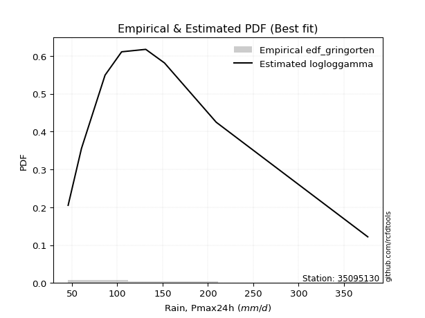</img>

</div>


### 9. EDF Filliben (1975)

The specific values of the constants (0.3175) (often denoted as $alpha$) and (0.365) are derived from a method proposed by James J. Filliben in a 1975 paper. This particular formula is the mean value of the $i$-th order statistic of the normal distribution and is considered a robust and effective plotting position formula for the normal probability plot correlation coefficient test for normality.

<div align="center">


$P=(m-0.3175)/(n+0.365)$


</div>


**9.1. Empirical values**

<div align="center">

|                | 0                   | 1                  | 2                   | 3                   | 4            | 5                  | 6                  | 7                  | 8                  |
|:---------------|:--------------------|:-------------------|:--------------------|:--------------------|:-------------|:-------------------|:-------------------|:-------------------|:-------------------|
| date           | 2025                | 2024               | 2022                | 2021                | 2020         | 2018               | 2023               | 2019               | 2017               |
| x              | 29.3                | 45.8               | 60.5                | 86.5                | 104.8        | 131.4              | 152.1              | 209.1              | 376.26             |
| m              | 1                   | 2                  | 3                   | 4                   | 5            | 6                  | 7                  | 8                  | 9                  |
| empirical_dist | edf_filliben        | edf_filliben       | edf_filliben        | edf_filliben        | edf_filliben | edf_filliben       | edf_filliben       | edf_filliben       | edf_filliben       |
| empirical      | 0.07287773625200214 | 0.1796583021890016 | 0.28643886812600106 | 0.39321943406300053 | 0.5          | 0.6067805659369995 | 0.7135611318739989 | 0.8203416978109984 | 0.9271222637479978 |
| empirical_tr   | 1.0786063921681543  | 1.219004230393752  | 1.401421623643846   | 1.6480422349318082  | 2.0          | 2.5431093007467753 | 3.491146318732526  | 5.566121842496286  | 13.721611721611705 |

</div>


**9.2. Kolmogorov-Smirnov fit test (sorted by Δ)**


<div align="center">

|                | 0                   | 1                   | 2                   | 3                   | 4                   | 5                   | 6                   | 7                    | 8                   | 9                   | 10                   | 11                  | 12                  | 13                   | 14                  | 15                   | 16                  | 17                  | 18                  | 19                  | 20                  | 21                  | 22                   | 23                   | 24                  | 25                  | 26                  | 27                  | 28                  | 29                  | 30                   | 31                  | 32                   | 33                   | 34                   | 35                   | 36                   | 37                  | 38                  | 39                  | 40                  | 41                   | 42                  | 43                  | 44                  | 45                  | 46                  | 47                  | 48                  | 49                  | 50                  | 51                  | 52                  | 53                  | 54                  | 55                  | 56                  | 57                  | 58                  | 59                  | 60                  | 61                  | 62                  | 63                  | 64                  | 65                  | 66                  | 67                  | 68                  | 69                  | 70                  | 71                  | 72                  | 73                  | 74                  | 75                  | 76                  | 77                  | 78                  | 79                  | 80                  | 81                  | 82                  | 83                  | 84                  | 85                  | 86                  | 87                  | 88                  | 89                  | 90                  | 91                  | 92                  | 93                  | 94                  | 95                  | 96                  | 97                  | 98                  | 99                  | 100                 | 101                 | 102                 | 103                 | 104                 | 105                 | 106                 | 107                 | 108                 | 109                 | 110                 | 111                 | 112                 | 113                 | 114                 | 115                 | 116                 | 117                 | 118                 | 119                 | 120                 | 121                 | 122                 | 123                 | 124                 | 125                 | 126                 | 127                 | 128                 | 129                 | 130                 | 131                 | 132                 | 133                 | 134                 | 135                 | 136                 | 137                 | 138                 | 139                 | 140                 | 141                 | 142                 | 143                 | 144                 | 145                 | 146                 | 147                 | 148                 | 149                 | 150                 | 151                 | 152                 | 153                 | 154                 | 155                 | 156                 | 157                 | 158                 | 159                 |
|:---------------|:--------------------|:--------------------|:--------------------|:--------------------|:--------------------|:--------------------|:--------------------|:---------------------|:--------------------|:--------------------|:---------------------|:--------------------|:--------------------|:---------------------|:--------------------|:---------------------|:--------------------|:--------------------|:--------------------|:--------------------|:--------------------|:--------------------|:---------------------|:---------------------|:--------------------|:--------------------|:--------------------|:--------------------|:--------------------|:--------------------|:---------------------|:--------------------|:---------------------|:---------------------|:---------------------|:---------------------|:---------------------|:--------------------|:--------------------|:--------------------|:--------------------|:---------------------|:--------------------|:--------------------|:--------------------|:--------------------|:--------------------|:--------------------|:--------------------|:--------------------|:--------------------|:--------------------|:--------------------|:--------------------|:--------------------|:--------------------|:--------------------|:--------------------|:--------------------|:--------------------|:--------------------|:--------------------|:--------------------|:--------------------|:--------------------|:--------------------|:--------------------|:--------------------|:--------------------|:--------------------|:--------------------|:--------------------|:--------------------|:--------------------|:--------------------|:--------------------|:--------------------|:--------------------|:--------------------|:--------------------|:--------------------|:--------------------|:--------------------|:--------------------|:--------------------|:--------------------|:--------------------|:--------------------|:--------------------|:--------------------|:--------------------|:--------------------|:--------------------|:--------------------|:--------------------|:--------------------|:--------------------|:--------------------|:--------------------|:--------------------|:--------------------|:--------------------|:--------------------|:--------------------|:--------------------|:--------------------|:--------------------|:--------------------|:--------------------|:--------------------|:--------------------|:--------------------|:--------------------|:--------------------|:--------------------|:--------------------|:--------------------|:--------------------|:--------------------|:--------------------|:--------------------|:--------------------|:--------------------|:--------------------|:--------------------|:--------------------|:--------------------|:--------------------|:--------------------|:--------------------|:--------------------|:--------------------|:--------------------|:--------------------|:--------------------|:--------------------|:--------------------|:--------------------|:--------------------|:--------------------|:--------------------|:--------------------|:--------------------|:--------------------|:--------------------|:--------------------|:--------------------|:--------------------|:--------------------|:--------------------|:--------------------|:--------------------|:--------------------|:--------------------|:--------------------|:--------------------|:--------------------|:--------------------|:--------------------|:--------------------|
| station        | 35095130            | 35095130            | 35095130            | 35095130            | 35095130            | 35095130            | 35095130            | 35095130             | 35095130            | 35095130            | 35095130             | 35095130            | 35095130            | 35095130             | 35095130            | 35095130             | 35095130            | 35095130            | 35095130            | 35095130            | 35095130            | 35095130            | 35095130             | 35095130             | 35095130            | 35095130            | 35095130            | 35095130            | 35095130            | 35095130            | 35095130             | 35095130            | 35095130             | 35095130             | 35095130             | 35095130             | 35095130             | 35095130            | 35095130            | 35095130            | 35095130            | 35095130             | 35095130            | 35095130            | 35095130            | 35095130            | 35095130            | 35095130            | 35095130            | 35095130            | 35095130            | 35095130            | 35095130            | 35095130            | 35095130            | 35095130            | 35095130            | 35095130            | 35095130            | 35095130            | 35095130            | 35095130            | 35095130            | 35095130            | 35095130            | 35095130            | 35095130            | 35095130            | 35095130            | 35095130            | 35095130            | 35095130            | 35095130            | 35095130            | 35095130            | 35095130            | 35095130            | 35095130            | 35095130            | 35095130            | 35095130            | 35095130            | 35095130            | 35095130            | 35095130            | 35095130            | 35095130            | 35095130            | 35095130            | 35095130            | 35095130            | 35095130            | 35095130            | 35095130            | 35095130            | 35095130            | 35095130            | 35095130            | 35095130            | 35095130            | 35095130            | 35095130            | 35095130            | 35095130            | 35095130            | 35095130            | 35095130            | 35095130            | 35095130            | 35095130            | 35095130            | 35095130            | 35095130            | 35095130            | 35095130            | 35095130            | 35095130            | 35095130            | 35095130            | 35095130            | 35095130            | 35095130            | 35095130            | 35095130            | 35095130            | 35095130            | 35095130            | 35095130            | 35095130            | 35095130            | 35095130            | 35095130            | 35095130            | 35095130            | 35095130            | 35095130            | 35095130            | 35095130            | 35095130            | 35095130            | 35095130            | 35095130            | 35095130            | 35095130            | 35095130            | 35095130            | 35095130            | 35095130            | 35095130            | 35095130            | 35095130            | 35095130            | 35095130            | 35095130            | 35095130            | 35095130            | 35095130            | 35095130            | 35095130            | 35095130            |
| empirical_dist | edf_filliben        | edf_filliben        | edf_filliben        | edf_filliben        | edf_filliben        | edf_filliben        | edf_filliben        | edf_filliben         | edf_filliben        | edf_filliben        | edf_filliben         | edf_filliben        | edf_filliben        | edf_filliben         | edf_filliben        | edf_filliben         | edf_filliben        | edf_filliben        | edf_filliben        | edf_filliben        | edf_filliben        | edf_filliben        | edf_filliben         | edf_filliben         | edf_filliben        | edf_filliben        | edf_filliben        | edf_filliben        | edf_filliben        | edf_filliben        | edf_filliben         | edf_filliben        | edf_filliben         | edf_filliben         | edf_filliben         | edf_filliben         | edf_filliben         | edf_filliben        | edf_filliben        | edf_filliben        | edf_filliben        | edf_filliben         | edf_filliben        | edf_filliben        | edf_filliben        | edf_filliben        | edf_filliben        | edf_filliben        | edf_filliben        | edf_filliben        | edf_filliben        | edf_filliben        | edf_filliben        | edf_filliben        | edf_filliben        | edf_filliben        | edf_filliben        | edf_filliben        | edf_filliben        | edf_filliben        | edf_filliben        | edf_filliben        | edf_filliben        | edf_filliben        | edf_filliben        | edf_filliben        | edf_filliben        | edf_filliben        | edf_filliben        | edf_filliben        | edf_filliben        | edf_filliben        | edf_filliben        | edf_filliben        | edf_filliben        | edf_filliben        | edf_filliben        | edf_filliben        | edf_filliben        | edf_filliben        | edf_filliben        | edf_filliben        | edf_filliben        | edf_filliben        | edf_filliben        | edf_filliben        | edf_filliben        | edf_filliben        | edf_filliben        | edf_filliben        | edf_filliben        | edf_filliben        | edf_filliben        | edf_filliben        | edf_filliben        | edf_filliben        | edf_filliben        | edf_filliben        | edf_filliben        | edf_filliben        | edf_filliben        | edf_filliben        | edf_filliben        | edf_filliben        | edf_filliben        | edf_filliben        | edf_filliben        | edf_filliben        | edf_filliben        | edf_filliben        | edf_filliben        | edf_filliben        | edf_filliben        | edf_filliben        | edf_filliben        | edf_filliben        | edf_filliben        | edf_filliben        | edf_filliben        | edf_filliben        | edf_filliben        | edf_filliben        | edf_filliben        | edf_filliben        | edf_filliben        | edf_filliben        | edf_filliben        | edf_filliben        | edf_filliben        | edf_filliben        | edf_filliben        | edf_filliben        | edf_filliben        | edf_filliben        | edf_filliben        | edf_filliben        | edf_filliben        | edf_filliben        | edf_filliben        | edf_filliben        | edf_filliben        | edf_filliben        | edf_filliben        | edf_filliben        | edf_filliben        | edf_filliben        | edf_filliben        | edf_filliben        | edf_filliben        | edf_filliben        | edf_filliben        | edf_filliben        | edf_filliben        | edf_filliben        | edf_filliben        | edf_filliben        | edf_filliben        | edf_filliben        | edf_filliben        | edf_filliben        |
| p_dist         | loganglit           | logbetaprime        | logncf              | logweibull_min      | logcosine           | logfoldnorm         | loggenextreme       | logfatiguelife       | logf                | logjohnsonsu        | logburr12            | loggamma            | loggamma            | logerlang            | logpearson3         | loginvgamma          | logskewnorm         | logexponnorm        | lognorm             | logcrystalball      | logt                | lognct              | logloggamma          | moyal                | betaprime           | logrice             | logalpha            | ncf                 | invgamma            | halflogistic        | burr                 | mielke              | invweibull           | genextreme           | loggenlogistic       | logsemicircular      | johnsonsu            | invgauss            | logmaxwell          | pearson3            | loginvgauss         | alpha                | nct                 | lograyleigh         | loglogistic         | gumbel_r            | exponnorm           | logdweibull         | genpareto           | lomax               | kappa3              | genexpon            | bradford            | loggompertz         | logvonmises_line    | truncweibull_min    | logkappa3           | weibull_min         | logkappa4           | logtruncpareto      | truncpareto         | loguniform          | loggausshyper       | logexponpow         | halfnorm            | gengamma            | genlogistic         | gompertz            | loghypsecant        | loggumbel_l         | loginvweibull       | t                   | logarcsine          | kstwobign           | exponpow            | dweibull            | loggumbel_r         | foldnorm            | logloglaplace       | gennorm             | logksone            | nakagami            | loghalfgennorm      | loggenexpon         | logdgamma           | logkstwobign        | rayleigh            | loglaplace          | loglaplace          | loghalfnorm         | vonmises_line       | logargus            | maxwell             | logbradford         | logmoyal            | dgamma              | skewnorm            | loghalflogistic     | rice                | logistic            | logtruncexpon       | halfgennorm         | hypsecant           | truncnorm           | norm                | crystalball         | logbeta             | anglit              | logrdist            | semicircular        | f                   | wald                | laplace             | truncexpon          | arcsine             | logtruncweibull_min | logtruncnorm        | lognakagami         | logtukeylambda      | logwald             | loglomax            | logburr             | burr12              | logtriang           | logweibull_max      | logmielke           | gumbel_l            | beta                | logexponweib        | logwrapcauchy       | gamma               | cosine              | loggenhalflogistic  | gausshyper          | loggengamma         | exponweib           | wrapcauchy          | loglevy_l           | loggennorm          | argus               | logtrapezoid        | kappa4              | ksone               | uniform             | loggenpareto        | levy_l              | powerlaw            | genhalflogistic     | fatiguelife         | rdist               | logjohnsonsb        | tukeylambda         | logpowerlaw         | erlang              | triang              | trapezoid           | weibull_max         | johnsonsb           | logvonmises         | vonmises            |
| delta          | 0.04028698216291959 | 0.04038200671923742 | 0.0409314633043818  | 0.04120122474598592 | 0.04252725879662944 | 0.04256756910999093 | 0.04264919476521209 | 0.042677395636253224 | 0.04288784064720863 | 0.04338549592758262 | 0.043494371321405545 | 0.04350818712911897 | 0.04350818712911897 | 0.043526225434986715 | 0.04361666562251637 | 0.044291756725351794 | 0.04443142691275359 | 0.04451957699272918 | 0.04452340662463311 | 0.04452434420508258 | 0.04452815451353587 | 0.04475098453257603 | 0.045668702366013614 | 0.045935695299922474 | 0.04621855577697273 | 0.04633783033251754 | 0.04648497687818631 | 0.04664218789341612 | 0.04681634212636909 | 0.04702651561089055 | 0.048050515073288835 | 0.04807580222817512 | 0.048391708958193114 | 0.048392023943135576 | 0.048434744658862494 | 0.049368668541935556 | 0.052348158227345176 | 0.05295376368918353 | 0.05490452551497188 | 0.05499389410749156 | 0.05557367818059644 | 0.056335505190738294 | 0.0656257603066478  | 0.06714395977371346 | 0.06717125875766092 | 0.06941179120468177 | 0.07179334760032455 | 0.07245802499299803 | 0.07285342777246635 | 0.07287734063163648 | 0.07287735056128039 | 0.07287751232749788 | 0.0728777278953946  | 0.07287773368377844 | 0.07287773600307303 | 0.07287773625022285 | 0.07287773625134475 | 0.07287773625200034 | 0.07287773625200133 | 0.07287773625200222 | 0.07287773625200222 | 0.07287773625200222 | 0.07287773625258998 | 0.07372824456494409 | 0.07499113645260913 | 0.07600658027300278 | 0.07701685040696754 | 0.07820489139824821 | 0.08183280621119166 | 0.08197952802905986 | 0.0841387316019035  | 0.08780354940623233 | 0.08784939465553032 | 0.08806939618107137 | 0.08818262885815853 | 0.08858498983339644 | 0.09093977233294737 | 0.09143427528612377 | 0.09304037454411182 | 0.09536630342243418 | 0.0954554422240197  | 0.09690475481311689 | 0.09981774790563025 | 0.09984137283951489 | 0.10009103261861069 | 0.1003344642687255  | 0.10049951581095895 | 0.1006816885265703  | 0.1006816885265703  | 0.10180561343588712 | 0.10493389059612274 | 0.10624658771112161 | 0.10951002625003303 | 0.1106381551305019  | 0.11282753166720172 | 0.11351727912775178 | 0.11572018485959923 | 0.11910200415334371 | 0.1244750537480589  | 0.12808394507520993 | 0.13271586419983872 | 0.13298012701227557 | 0.13464446805240743 | 0.13806938354975062 | 0.13806938992379214 | 0.13806939163473564 | 0.14433272738726333 | 0.14866868524574983 | 0.15222365712541874 | 0.15305502212199507 | 0.16083312811480033 | 0.1611769800336405  | 0.1623927791910874  | 0.1674327220407884  | 0.17058156237737532 | 0.172908742958229   | 0.17960306238713722 | 0.1796583021858206  | 0.17965830218898027 | 0.18410791856391073 | 0.18664628119214444 | 0.18736933230874564 | 0.18739564291831867 | 0.18840759770280846 | 0.18881883826427737 | 0.2001757639553533  | 0.20190633423423165 | 0.20222793306544862 | 0.2043428415953018  | 0.20537031508604853 | 0.2139873778151492  | 0.2219420402893726  | 0.22773391505863094 | 0.23233797666715056 | 0.2499609005080745  | 0.2810442565705966  | 0.3115953956888625  | 0.3154893196472499  | 0.3203416978109984  | 0.3260955631442616  | 0.32793909128198795 | 0.3302343149507477  | 0.33528505778284534 | 0.3596298429646146  | 0.38519155301446684 | 0.39371818215505594 | 0.4034477583539453  | 0.46282317127677386 | 0.4789854589867254  | 0.4802965316962553  | 0.49810325132292943 | 0.5062564541932644  | 0.509103995204528   | 0.5150857496127381  | 0.543208818812811   | 0.5699776708420602  | 0.6855775878184791  | 0.6910161662511738  | 1.0380478477649748  | 59.76655486685126   |
| deltao         | 0.41761268023100007 | 0.41761268023100007 | 0.41761268023100007 | 0.41761268023100007 | 0.41761268023100007 | 0.41761268023100007 | 0.41761268023100007 | 0.41761268023100007  | 0.41761268023100007 | 0.41761268023100007 | 0.41761268023100007  | 0.41761268023100007 | 0.41761268023100007 | 0.41761268023100007  | 0.41761268023100007 | 0.41761268023100007  | 0.41761268023100007 | 0.41761268023100007 | 0.41761268023100007 | 0.41761268023100007 | 0.41761268023100007 | 0.41761268023100007 | 0.41761268023100007  | 0.41761268023100007  | 0.41761268023100007 | 0.41761268023100007 | 0.41761268023100007 | 0.41761268023100007 | 0.41761268023100007 | 0.41761268023100007 | 0.41761268023100007  | 0.41761268023100007 | 0.41761268023100007  | 0.41761268023100007  | 0.41761268023100007  | 0.41761268023100007  | 0.41761268023100007  | 0.41761268023100007 | 0.41761268023100007 | 0.41761268023100007 | 0.41761268023100007 | 0.41761268023100007  | 0.41761268023100007 | 0.41761268023100007 | 0.41761268023100007 | 0.41761268023100007 | 0.41761268023100007 | 0.41761268023100007 | 0.41761268023100007 | 0.41761268023100007 | 0.41761268023100007 | 0.41761268023100007 | 0.41761268023100007 | 0.41761268023100007 | 0.41761268023100007 | 0.41761268023100007 | 0.41761268023100007 | 0.41761268023100007 | 0.41761268023100007 | 0.41761268023100007 | 0.41761268023100007 | 0.41761268023100007 | 0.41761268023100007 | 0.41761268023100007 | 0.41761268023100007 | 0.41761268023100007 | 0.41761268023100007 | 0.41761268023100007 | 0.41761268023100007 | 0.41761268023100007 | 0.41761268023100007 | 0.41761268023100007 | 0.41761268023100007 | 0.41761268023100007 | 0.41761268023100007 | 0.41761268023100007 | 0.41761268023100007 | 0.41761268023100007 | 0.41761268023100007 | 0.41761268023100007 | 0.41761268023100007 | 0.41761268023100007 | 0.41761268023100007 | 0.41761268023100007 | 0.41761268023100007 | 0.41761268023100007 | 0.41761268023100007 | 0.41761268023100007 | 0.41761268023100007 | 0.41761268023100007 | 0.41761268023100007 | 0.41761268023100007 | 0.41761268023100007 | 0.41761268023100007 | 0.41761268023100007 | 0.41761268023100007 | 0.41761268023100007 | 0.41761268023100007 | 0.41761268023100007 | 0.41761268023100007 | 0.41761268023100007 | 0.41761268023100007 | 0.41761268023100007 | 0.41761268023100007 | 0.41761268023100007 | 0.41761268023100007 | 0.41761268023100007 | 0.41761268023100007 | 0.41761268023100007 | 0.41761268023100007 | 0.41761268023100007 | 0.41761268023100007 | 0.41761268023100007 | 0.41761268023100007 | 0.41761268023100007 | 0.41761268023100007 | 0.41761268023100007 | 0.41761268023100007 | 0.41761268023100007 | 0.41761268023100007 | 0.41761268023100007 | 0.41761268023100007 | 0.41761268023100007 | 0.41761268023100007 | 0.41761268023100007 | 0.41761268023100007 | 0.41761268023100007 | 0.41761268023100007 | 0.41761268023100007 | 0.41761268023100007 | 0.41761268023100007 | 0.41761268023100007 | 0.41761268023100007 | 0.41761268023100007 | 0.41761268023100007 | 0.41761268023100007 | 0.41761268023100007 | 0.41761268023100007 | 0.41761268023100007 | 0.41761268023100007 | 0.41761268023100007 | 0.41761268023100007 | 0.41761268023100007 | 0.41761268023100007 | 0.41761268023100007 | 0.41761268023100007 | 0.41761268023100007 | 0.41761268023100007 | 0.41761268023100007 | 0.41761268023100007 | 0.41761268023100007 | 0.41761268023100007 | 0.41761268023100007 | 0.41761268023100007 | 0.41761268023100007 | 0.41761268023100007 | 0.41761268023100007 | 0.41761268023100007 | 0.41761268023100007 | 0.41761268023100007 |
| eval           | Δo > Δ              | Δo > Δ              | Δo > Δ              | Δo > Δ              | Δo > Δ              | Δo > Δ              | Δo > Δ              | Δo > Δ               | Δo > Δ              | Δo > Δ              | Δo > Δ               | Δo > Δ              | Δo > Δ              | Δo > Δ               | Δo > Δ              | Δo > Δ               | Δo > Δ              | Δo > Δ              | Δo > Δ              | Δo > Δ              | Δo > Δ              | Δo > Δ              | Δo > Δ               | Δo > Δ               | Δo > Δ              | Δo > Δ              | Δo > Δ              | Δo > Δ              | Δo > Δ              | Δo > Δ              | Δo > Δ               | Δo > Δ              | Δo > Δ               | Δo > Δ               | Δo > Δ               | Δo > Δ               | Δo > Δ               | Δo > Δ              | Δo > Δ              | Δo > Δ              | Δo > Δ              | Δo > Δ               | Δo > Δ              | Δo > Δ              | Δo > Δ              | Δo > Δ              | Δo > Δ              | Δo > Δ              | Δo > Δ              | Δo > Δ              | Δo > Δ              | Δo > Δ              | Δo > Δ              | Δo > Δ              | Δo > Δ              | Δo > Δ              | Δo > Δ              | Δo > Δ              | Δo > Δ              | Δo > Δ              | Δo > Δ              | Δo > Δ              | Δo > Δ              | Δo > Δ              | Δo > Δ              | Δo > Δ              | Δo > Δ              | Δo > Δ              | Δo > Δ              | Δo > Δ              | Δo > Δ              | Δo > Δ              | Δo > Δ              | Δo > Δ              | Δo > Δ              | Δo > Δ              | Δo > Δ              | Δo > Δ              | Δo > Δ              | Δo > Δ              | Δo > Δ              | Δo > Δ              | Δo > Δ              | Δo > Δ              | Δo > Δ              | Δo > Δ              | Δo > Δ              | Δo > Δ              | Δo > Δ              | Δo > Δ              | Δo > Δ              | Δo > Δ              | Δo > Δ              | Δo > Δ              | Δo > Δ              | Δo > Δ              | Δo > Δ              | Δo > Δ              | Δo > Δ              | Δo > Δ              | Δo > Δ              | Δo > Δ              | Δo > Δ              | Δo > Δ              | Δo > Δ              | Δo > Δ              | Δo > Δ              | Δo > Δ              | Δo > Δ              | Δo > Δ              | Δo > Δ              | Δo > Δ              | Δo > Δ              | Δo > Δ              | Δo > Δ              | Δo > Δ              | Δo > Δ              | Δo > Δ              | Δo > Δ              | Δo > Δ              | Δo > Δ              | Δo > Δ              | Δo > Δ              | Δo > Δ              | Δo > Δ              | Δo > Δ              | Δo > Δ              | Δo > Δ              | Δo > Δ              | Δo > Δ              | Δo > Δ              | Δo > Δ              | Δo > Δ              | Δo > Δ              | Δo > Δ              | Δo > Δ              | Δo > Δ              | Δo > Δ              | Δo > Δ              | Δo > Δ              | Δo > Δ              | Δo > Δ              | Δo > Δ              | Δo > Δ              | Δo > Δ              | Δo > Δ              | Δo > Δ              | Δo <= Δ             | Δo <= Δ             | Δo <= Δ             | Δo <= Δ             | Δo <= Δ             | Δo <= Δ             | Δo <= Δ             | Δo <= Δ             | Δo <= Δ             | Δo <= Δ             | Δo <= Δ             | Δo <= Δ             | Δo <= Δ             |
| fit            | 1                   | 1                   | 1                   | 1                   | 1                   | 1                   | 1                   | 1                    | 1                   | 1                   | 1                    | 1                   | 1                   | 1                    | 1                   | 1                    | 1                   | 1                   | 1                   | 1                   | 1                   | 1                   | 1                    | 1                    | 1                   | 1                   | 1                   | 1                   | 1                   | 1                   | 1                    | 1                   | 1                    | 1                    | 1                    | 1                    | 1                    | 1                   | 1                   | 1                   | 1                   | 1                    | 1                   | 1                   | 1                   | 1                   | 1                   | 1                   | 1                   | 1                   | 1                   | 1                   | 1                   | 1                   | 1                   | 1                   | 1                   | 1                   | 1                   | 1                   | 1                   | 1                   | 1                   | 1                   | 1                   | 1                   | 1                   | 1                   | 1                   | 1                   | 1                   | 1                   | 1                   | 1                   | 1                   | 1                   | 1                   | 1                   | 1                   | 1                   | 1                   | 1                   | 1                   | 1                   | 1                   | 1                   | 1                   | 1                   | 1                   | 1                   | 1                   | 1                   | 1                   | 1                   | 1                   | 1                   | 1                   | 1                   | 1                   | 1                   | 1                   | 1                   | 1                   | 1                   | 1                   | 1                   | 1                   | 1                   | 1                   | 1                   | 1                   | 1                   | 1                   | 1                   | 1                   | 1                   | 1                   | 1                   | 1                   | 1                   | 1                   | 1                   | 1                   | 1                   | 1                   | 1                   | 1                   | 1                   | 1                   | 1                   | 1                   | 1                   | 1                   | 1                   | 1                   | 1                   | 1                   | 1                   | 1                   | 1                   | 1                   | 1                   | 1                   | 1                   | 1                   | 1                   | 1                   | 0                   | 0                   | 0                   | 0                   | 0                   | 0                   | 0                   | 0                   | 0                   | 0                   | 0                   | 0                   | 0                   |
| n              | 9                   | 9                   | 9                   | 9                   | 9                   | 9                   | 9                   | 9                    | 9                   | 9                   | 9                    | 9                   | 9                   | 9                    | 9                   | 9                    | 9                   | 9                   | 9                   | 9                   | 9                   | 9                   | 9                    | 9                    | 9                   | 9                   | 9                   | 9                   | 9                   | 9                   | 9                    | 9                   | 9                    | 9                    | 9                    | 9                    | 9                    | 9                   | 9                   | 9                   | 9                   | 9                    | 9                   | 9                   | 9                   | 9                   | 9                   | 9                   | 9                   | 9                   | 9                   | 9                   | 9                   | 9                   | 9                   | 9                   | 9                   | 9                   | 9                   | 9                   | 9                   | 9                   | 9                   | 9                   | 9                   | 9                   | 9                   | 9                   | 9                   | 9                   | 9                   | 9                   | 9                   | 9                   | 9                   | 9                   | 9                   | 9                   | 9                   | 9                   | 9                   | 9                   | 9                   | 9                   | 9                   | 9                   | 9                   | 9                   | 9                   | 9                   | 9                   | 9                   | 9                   | 9                   | 9                   | 9                   | 9                   | 9                   | 9                   | 9                   | 9                   | 9                   | 9                   | 9                   | 9                   | 9                   | 9                   | 9                   | 9                   | 9                   | 9                   | 9                   | 9                   | 9                   | 9                   | 9                   | 9                   | 9                   | 9                   | 9                   | 9                   | 9                   | 9                   | 9                   | 9                   | 9                   | 9                   | 9                   | 9                   | 9                   | 9                   | 9                   | 9                   | 9                   | 9                   | 9                   | 9                   | 9                   | 9                   | 9                   | 9                   | 9                   | 9                   | 9                   | 9                   | 9                   | 9                   | 9                   | 9                   | 9                   | 9                   | 9                   | 9                   | 9                   | 9                   | 9                   | 9                   | 9                   | 9                   | 9                   |
| best_fit       | 1                   | 0                   | 0                   | 0                   | 0                   | 0                   | 0                   | 0                    | 0                   | 0                   | 0                    | 0                   | 0                   | 0                    | 0                   | 0                    | 0                   | 0                   | 0                   | 0                   | 0                   | 0                   | 0                    | 0                    | 0                   | 0                   | 0                   | 0                   | 0                   | 0                   | 0                    | 0                   | 0                    | 0                    | 0                    | 0                    | 0                    | 0                   | 0                   | 0                   | 0                   | 0                    | 0                   | 0                   | 0                   | 0                   | 0                   | 0                   | 0                   | 0                   | 0                   | 0                   | 0                   | 0                   | 0                   | 0                   | 0                   | 0                   | 0                   | 0                   | 0                   | 0                   | 0                   | 0                   | 0                   | 0                   | 0                   | 0                   | 0                   | 0                   | 0                   | 0                   | 0                   | 0                   | 0                   | 0                   | 0                   | 0                   | 0                   | 0                   | 0                   | 0                   | 0                   | 0                   | 0                   | 0                   | 0                   | 0                   | 0                   | 0                   | 0                   | 0                   | 0                   | 0                   | 0                   | 0                   | 0                   | 0                   | 0                   | 0                   | 0                   | 0                   | 0                   | 0                   | 0                   | 0                   | 0                   | 0                   | 0                   | 0                   | 0                   | 0                   | 0                   | 0                   | 0                   | 0                   | 0                   | 0                   | 0                   | 0                   | 0                   | 0                   | 0                   | 0                   | 0                   | 0                   | 0                   | 0                   | 0                   | 0                   | 0                   | 0                   | 0                   | 0                   | 0                   | 0                   | 0                   | 0                   | 0                   | 0                   | 0                   | 0                   | 0                   | 0                   | 0                   | 0                   | 0                   | 0                   | 0                   | 0                   | 0                   | 0                   | 0                   | 0                   | 0                   | 0                   | 0                   | 0                   | 0                   | 0                   |
| best_fit_sort  | 1                   | 2                   | 3                   | 4                   | 5                   | 6                   | 7                   | 8                    | 9                   | 10                  | 11                   | 12                  | 13                  | 14                   | 15                  | 16                   | 17                  | 18                  | 19                  | 20                  | 21                  | 22                  | 23                   | 24                   | 25                  | 26                  | 27                  | 28                  | 29                  | 30                  | 31                   | 32                  | 33                   | 34                   | 35                   | 36                   | 37                   | 38                  | 39                  | 40                  | 41                  | 42                   | 43                  | 44                  | 45                  | 46                  | 47                  | 48                  | 49                  | 50                  | 51                  | 52                  | 53                  | 54                  | 55                  | 56                  | 57                  | 58                  | 59                  | 60                  | 61                  | 62                  | 63                  | 64                  | 65                  | 66                  | 67                  | 68                  | 69                  | 70                  | 71                  | 72                  | 73                  | 74                  | 75                  | 76                  | 77                  | 78                  | 79                  | 80                  | 81                  | 82                  | 83                  | 84                  | 85                  | 86                  | 87                  | 88                  | 89                  | 90                  | 91                  | 92                  | 93                  | 94                  | 95                  | 96                  | 97                  | 98                  | 99                  | 100                 | 101                 | 102                 | 103                 | 104                 | 105                 | 106                 | 107                 | 108                 | 109                 | 110                 | 111                 | 112                 | 113                 | 114                 | 115                 | 116                 | 117                 | 118                 | 119                 | 120                 | 121                 | 122                 | 123                 | 124                 | 125                 | 126                 | 127                 | 128                 | 129                 | 130                 | 131                 | 132                 | 133                 | 134                 | 135                 | 136                 | 137                 | 138                 | 139                 | 140                 | 141                 | 142                 | 143                 | 144                 | 145                 | 146                 | 147                 | 148                 | 149                 | 150                 | 151                 | 152                 | 153                 | 154                 | 155                 | 156                 | 157                 | 158                 | 159                 | 160                 |

</div>


**9.3. Best fit**

<div align="center">

|   id |   station | empirical_dist   | p_dist    |    delta |   deltao | eval   |   fit |   n |   best_fit |   best_fit_sort |
|-----:|----------:|:-----------------|:----------|---------:|---------:|:-------|------:|----:|-----------:|----------------:|
|    0 |  35095130 | edf_filliben     | loganglit | 0.040287 | 0.417613 | Δo > Δ |     1 |   9 |          1 |               1 |

</div>


<div align="center">

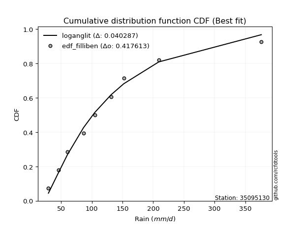</img>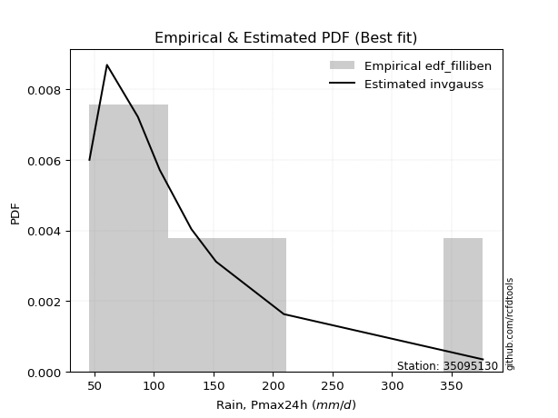</img>

</div>


### 10. EDF Jenkinson (1977)

The Jenkinson formula in hydrology is an empirical plotting position formula used to estimate the non-exceedance probability _(P)_ or return period _(T)_ of a given ordered observation within a sample. It is a widely used method in the frequency analysis of extreme events such as floods and rainfall, as it provides a distribution-free way to plot data. _a≈0.31_ and _b≈0.38_ are constants derived to approximate the median of the probability distribution for the given rank.

<div align="center">


$P=(m-a)/(n+b)$


</div>


**10.1. Empirical values**

<div align="center">

|                | 0                   | 1                   | 2                  | 3                   | 4             | 5                  | 6                  | 7                  | 8                  |
|:---------------|:--------------------|:--------------------|:-------------------|:--------------------|:--------------|:-------------------|:-------------------|:-------------------|:-------------------|
| date           | 2025                | 2024                | 2022               | 2021                | 2020          | 2018               | 2023               | 2019               | 2017               |
| x              | 29.3                | 45.8                | 60.5               | 86.5                | 104.8         | 131.4              | 152.1              | 209.1              | 376.26             |
| m              | 1                   | 2                   | 3                  | 4                   | 5             | 6                  | 7                  | 8                  | 9                  |
| empirical_dist | edf_jenkinson       | edf_jenkinson       | edf_jenkinson      | edf_jenkinson       | edf_jenkinson | edf_jenkinson      | edf_jenkinson      | edf_jenkinson      | edf_jenkinson      |
| empirical      | 0.07356076759061833 | 0.18017057569296374 | 0.2867803837953091 | 0.39339019189765456 | 0.5           | 0.6066098081023454 | 0.7132196162046908 | 0.8198294243070362 | 0.9264392324093815 |
| empirical_tr   | 1.0794016110471807  | 1.2197659297789336  | 1.4020926756352765 | 1.6485061511423549  | 2.0           | 2.542005420054201  | 3.486988847583642  | 5.550295857988164  | 13.5942028985507   |

</div>


**10.2. Kolmogorov-Smirnov fit test (sorted by Δ)**


<div align="center">

|                | 0                   | 1                   | 2                   | 3                   | 4                   | 5                   | 6                   | 7                   | 8                   | 9                   | 10                   | 11                  | 12                  | 13                  | 14                  | 15                  | 16                  | 17                  | 18                  | 19                  | 20                   | 21                  | 22                  | 23                  | 24                  | 25                  | 26                  | 27                  | 28                  | 29                  | 30                  | 31                   | 32                  | 33                  | 34                  | 35                  | 36                  | 37                  | 38                  | 39                   | 40                  | 41                  | 42                  | 43                  | 44                  | 45                  | 46                  | 47                  | 48                  | 49                  | 50                  | 51                  | 52                  | 53                  | 54                  | 55                  | 56                  | 57                  | 58                  | 59                  | 60                  | 61                  | 62                  | 63                  | 64                  | 65                  | 66                  | 67                  | 68                  | 69                  | 70                  | 71                  | 72                  | 73                  | 74                  | 75                  | 76                  | 77                  | 78                  | 79                  | 80                  | 81                  | 82                  | 83                  | 84                  | 85                  | 86                  | 87                  | 88                  | 89                  | 90                  | 91                  | 92                  | 93                  | 94                  | 95                  | 96                  | 97                  | 98                  | 99                  | 100                 | 101                 | 102                 | 103                 | 104                 | 105                 | 106                 | 107                 | 108                 | 109                 | 110                 | 111                 | 112                 | 113                 | 114                 | 115                 | 116                 | 117                 | 118                 | 119                 | 120                 | 121                 | 122                 | 123                 | 124                 | 125                 | 126                 | 127                 | 128                 | 129                 | 130                 | 131                 | 132                 | 133                 | 134                 | 135                 | 136                 | 137                 | 138                 | 139                 | 140                 | 141                 | 142                 | 143                 | 144                 | 145                 | 146                 | 147                 | 148                 | 149                 | 150                 | 151                 | 152                 | 153                 | 154                 | 155                 | 156                 | 157                 | 158                 | 159                 |
|:---------------|:--------------------|:--------------------|:--------------------|:--------------------|:--------------------|:--------------------|:--------------------|:--------------------|:--------------------|:--------------------|:---------------------|:--------------------|:--------------------|:--------------------|:--------------------|:--------------------|:--------------------|:--------------------|:--------------------|:--------------------|:---------------------|:--------------------|:--------------------|:--------------------|:--------------------|:--------------------|:--------------------|:--------------------|:--------------------|:--------------------|:--------------------|:---------------------|:--------------------|:--------------------|:--------------------|:--------------------|:--------------------|:--------------------|:--------------------|:---------------------|:--------------------|:--------------------|:--------------------|:--------------------|:--------------------|:--------------------|:--------------------|:--------------------|:--------------------|:--------------------|:--------------------|:--------------------|:--------------------|:--------------------|:--------------------|:--------------------|:--------------------|:--------------------|:--------------------|:--------------------|:--------------------|:--------------------|:--------------------|:--------------------|:--------------------|:--------------------|:--------------------|:--------------------|:--------------------|:--------------------|:--------------------|:--------------------|:--------------------|:--------------------|:--------------------|:--------------------|:--------------------|:--------------------|:--------------------|:--------------------|:--------------------|:--------------------|:--------------------|:--------------------|:--------------------|:--------------------|:--------------------|:--------------------|:--------------------|:--------------------|:--------------------|:--------------------|:--------------------|:--------------------|:--------------------|:--------------------|:--------------------|:--------------------|:--------------------|:--------------------|:--------------------|:--------------------|:--------------------|:--------------------|:--------------------|:--------------------|:--------------------|:--------------------|:--------------------|:--------------------|:--------------------|:--------------------|:--------------------|:--------------------|:--------------------|:--------------------|:--------------------|:--------------------|:--------------------|:--------------------|:--------------------|:--------------------|:--------------------|:--------------------|:--------------------|:--------------------|:--------------------|:--------------------|:--------------------|:--------------------|:--------------------|:--------------------|:--------------------|:--------------------|:--------------------|:--------------------|:--------------------|:--------------------|:--------------------|:--------------------|:--------------------|:--------------------|:--------------------|:--------------------|:--------------------|:--------------------|:--------------------|:--------------------|:--------------------|:--------------------|:--------------------|:--------------------|:--------------------|:--------------------|:--------------------|:--------------------|:--------------------|:--------------------|:--------------------|:--------------------|
| station        | 35095130            | 35095130            | 35095130            | 35095130            | 35095130            | 35095130            | 35095130            | 35095130            | 35095130            | 35095130            | 35095130             | 35095130            | 35095130            | 35095130            | 35095130            | 35095130            | 35095130            | 35095130            | 35095130            | 35095130            | 35095130             | 35095130            | 35095130            | 35095130            | 35095130            | 35095130            | 35095130            | 35095130            | 35095130            | 35095130            | 35095130            | 35095130             | 35095130            | 35095130            | 35095130            | 35095130            | 35095130            | 35095130            | 35095130            | 35095130             | 35095130            | 35095130            | 35095130            | 35095130            | 35095130            | 35095130            | 35095130            | 35095130            | 35095130            | 35095130            | 35095130            | 35095130            | 35095130            | 35095130            | 35095130            | 35095130            | 35095130            | 35095130            | 35095130            | 35095130            | 35095130            | 35095130            | 35095130            | 35095130            | 35095130            | 35095130            | 35095130            | 35095130            | 35095130            | 35095130            | 35095130            | 35095130            | 35095130            | 35095130            | 35095130            | 35095130            | 35095130            | 35095130            | 35095130            | 35095130            | 35095130            | 35095130            | 35095130            | 35095130            | 35095130            | 35095130            | 35095130            | 35095130            | 35095130            | 35095130            | 35095130            | 35095130            | 35095130            | 35095130            | 35095130            | 35095130            | 35095130            | 35095130            | 35095130            | 35095130            | 35095130            | 35095130            | 35095130            | 35095130            | 35095130            | 35095130            | 35095130            | 35095130            | 35095130            | 35095130            | 35095130            | 35095130            | 35095130            | 35095130            | 35095130            | 35095130            | 35095130            | 35095130            | 35095130            | 35095130            | 35095130            | 35095130            | 35095130            | 35095130            | 35095130            | 35095130            | 35095130            | 35095130            | 35095130            | 35095130            | 35095130            | 35095130            | 35095130            | 35095130            | 35095130            | 35095130            | 35095130            | 35095130            | 35095130            | 35095130            | 35095130            | 35095130            | 35095130            | 35095130            | 35095130            | 35095130            | 35095130            | 35095130            | 35095130            | 35095130            | 35095130            | 35095130            | 35095130            | 35095130            | 35095130            | 35095130            | 35095130            | 35095130            | 35095130            | 35095130            |
| empirical_dist | edf_jenkinson       | edf_jenkinson       | edf_jenkinson       | edf_jenkinson       | edf_jenkinson       | edf_jenkinson       | edf_jenkinson       | edf_jenkinson       | edf_jenkinson       | edf_jenkinson       | edf_jenkinson        | edf_jenkinson       | edf_jenkinson       | edf_jenkinson       | edf_jenkinson       | edf_jenkinson       | edf_jenkinson       | edf_jenkinson       | edf_jenkinson       | edf_jenkinson       | edf_jenkinson        | edf_jenkinson       | edf_jenkinson       | edf_jenkinson       | edf_jenkinson       | edf_jenkinson       | edf_jenkinson       | edf_jenkinson       | edf_jenkinson       | edf_jenkinson       | edf_jenkinson       | edf_jenkinson        | edf_jenkinson       | edf_jenkinson       | edf_jenkinson       | edf_jenkinson       | edf_jenkinson       | edf_jenkinson       | edf_jenkinson       | edf_jenkinson        | edf_jenkinson       | edf_jenkinson       | edf_jenkinson       | edf_jenkinson       | edf_jenkinson       | edf_jenkinson       | edf_jenkinson       | edf_jenkinson       | edf_jenkinson       | edf_jenkinson       | edf_jenkinson       | edf_jenkinson       | edf_jenkinson       | edf_jenkinson       | edf_jenkinson       | edf_jenkinson       | edf_jenkinson       | edf_jenkinson       | edf_jenkinson       | edf_jenkinson       | edf_jenkinson       | edf_jenkinson       | edf_jenkinson       | edf_jenkinson       | edf_jenkinson       | edf_jenkinson       | edf_jenkinson       | edf_jenkinson       | edf_jenkinson       | edf_jenkinson       | edf_jenkinson       | edf_jenkinson       | edf_jenkinson       | edf_jenkinson       | edf_jenkinson       | edf_jenkinson       | edf_jenkinson       | edf_jenkinson       | edf_jenkinson       | edf_jenkinson       | edf_jenkinson       | edf_jenkinson       | edf_jenkinson       | edf_jenkinson       | edf_jenkinson       | edf_jenkinson       | edf_jenkinson       | edf_jenkinson       | edf_jenkinson       | edf_jenkinson       | edf_jenkinson       | edf_jenkinson       | edf_jenkinson       | edf_jenkinson       | edf_jenkinson       | edf_jenkinson       | edf_jenkinson       | edf_jenkinson       | edf_jenkinson       | edf_jenkinson       | edf_jenkinson       | edf_jenkinson       | edf_jenkinson       | edf_jenkinson       | edf_jenkinson       | edf_jenkinson       | edf_jenkinson       | edf_jenkinson       | edf_jenkinson       | edf_jenkinson       | edf_jenkinson       | edf_jenkinson       | edf_jenkinson       | edf_jenkinson       | edf_jenkinson       | edf_jenkinson       | edf_jenkinson       | edf_jenkinson       | edf_jenkinson       | edf_jenkinson       | edf_jenkinson       | edf_jenkinson       | edf_jenkinson       | edf_jenkinson       | edf_jenkinson       | edf_jenkinson       | edf_jenkinson       | edf_jenkinson       | edf_jenkinson       | edf_jenkinson       | edf_jenkinson       | edf_jenkinson       | edf_jenkinson       | edf_jenkinson       | edf_jenkinson       | edf_jenkinson       | edf_jenkinson       | edf_jenkinson       | edf_jenkinson       | edf_jenkinson       | edf_jenkinson       | edf_jenkinson       | edf_jenkinson       | edf_jenkinson       | edf_jenkinson       | edf_jenkinson       | edf_jenkinson       | edf_jenkinson       | edf_jenkinson       | edf_jenkinson       | edf_jenkinson       | edf_jenkinson       | edf_jenkinson       | edf_jenkinson       | edf_jenkinson       | edf_jenkinson       | edf_jenkinson       | edf_jenkinson       | edf_jenkinson       | edf_jenkinson       |
| p_dist         | logbetaprime        | loganglit           | logncf              | logweibull_min      | logfoldnorm         | loggenextreme       | logfatiguelife      | logcosine           | logf                | logburr12           | logjohnsonsu         | loggamma            | loggamma            | logerlang           | logpearson3         | loginvgamma         | logskewnorm         | logexponnorm        | lognorm             | logcrystalball      | logt                 | lognct              | logloggamma         | moyal               | betaprime           | logalpha            | halflogistic        | ncf                 | invgamma            | logrice             | burr                | mielke               | invweibull          | genextreme          | loggenlogistic      | logsemicircular     | johnsonsu           | invgauss            | pearson3            | logmaxwell           | loginvgauss         | alpha               | nct                 | lograyleigh         | loglogistic         | gumbel_r            | logdweibull         | exponnorm           | genpareto           | logexponpow         | lomax               | kappa3              | genexpon            | bradford            | loggompertz         | logvonmises_line    | truncweibull_min    | logkappa3           | weibull_min         | logkappa4           | logtruncpareto      | loguniform          | truncpareto         | loggausshyper       | halfnorm            | gengamma            | genlogistic         | gompertz            | loghypsecant        | loggumbel_l         | loginvweibull       | t                   | logarcsine          | dweibull            | exponpow            | kstwobign           | foldnorm            | loggumbel_r         | logloglaplace       | gennorm             | logksone            | nakagami            | loghalfgennorm      | loggenexpon         | rayleigh            | logkstwobign        | logdgamma           | loglaplace          | loglaplace          | loghalfnorm         | vonmises_line       | logargus            | maxwell             | logbradford         | logmoyal            | dgamma              | skewnorm            | loghalflogistic     | rice                | logistic            | logtruncexpon       | halfgennorm         | hypsecant           | truncnorm           | norm                | crystalball         | logbeta             | anglit              | semicircular        | logrdist            | f                   | wald                | laplace             | truncexpon          | arcsine             | logtruncweibull_min | logtruncnorm        | lognakagami         | logtukeylambda      | logwald             | loglomax            | logburr             | burr12              | logtriang           | logweibull_max      | logmielke           | gumbel_l            | beta                | logexponweib        | logwrapcauchy       | gamma               | cosine              | loggenhalflogistic  | gausshyper          | loggengamma         | exponweib           | wrapcauchy          | loglevy_l           | loggennorm          | argus               | logtrapezoid        | kappa4              | ksone               | uniform             | loggenpareto        | levy_l              | powerlaw            | genhalflogistic     | fatiguelife         | rdist               | logjohnsonsb        | tukeylambda         | logpowerlaw         | erlang              | triang              | trapezoid           | weibull_max         | johnsonsb           | logvonmises         | vonmises            |
| delta          | 0.04055276455389145 | 0.04097001350153584 | 0.04127297897368987 | 0.04188425608460211 | 0.042909084779299   | 0.04299071043452016 | 0.04301891130556129 | 0.04321029013524569 | 0.0432293563165167  | 0.04332361348675151 | 0.043727011596890686 | 0.04384970279842704 | 0.04384970279842704 | 0.04386774110429478 | 0.04395818129182444 | 0.04446251456000583 | 0.04477294258206166 | 0.04486109266203725 | 0.04486492229394118 | 0.04486585987439065 | 0.044869670182843935 | 0.0450925002018841  | 0.04601021803532168 | 0.04627721096923054 | 0.0465600714462808  | 0.04665573471284035 | 0.04668499994158237 | 0.04698370356272419 | 0.04698709996102313 | 0.04702086167113373 | 0.0483920307425969  | 0.048417317897483186 | 0.04856246679284715 | 0.04856278177778961 | 0.04877626032817056 | 0.0500516998805518  | 0.05217740039269114 | 0.0527830058545295  | 0.05465237843818338 | 0.054733767680317846 | 0.05560270600189432 | 0.05667702086004636 | 0.06579651814130183 | 0.06697320193905942 | 0.06751277442696899 | 0.0690702755353736  | 0.07228726715834399 | 0.07247637893894074 | 0.07353645911108254 | 0.07355748673029006 | 0.07356037197025267 | 0.07356038189989658 | 0.07356054366611407 | 0.07356075923401084 | 0.07356076502239463 | 0.07356076734168922 | 0.07356076758883905 | 0.07356076758996094 | 0.07356076759061653 | 0.07356076759061758 | 0.07356076759061847 | 0.07356076759061847 | 0.07356076759061847 | 0.07356076759120622 | 0.07464962078330095 | 0.07583582243834874 | 0.07735836607627561 | 0.07854640706755628 | 0.08217432188049972 | 0.08232104369836793 | 0.08396797376724946 | 0.08712051806761614 | 0.08750787898622214 | 0.08790195849478025 | 0.0880118710235045  | 0.08841091185037944 | 0.09075124394750758 | 0.0911105301676014  | 0.09338189021341989 | 0.094683272083818   | 0.09494316872005748 | 0.09673399697846286 | 0.09964699007097622 | 0.09967061500486085 | 0.10015800014165077 | 0.10016370643407146 | 0.10043254828791875 | 0.10102320419587837 | 0.10102320419587837 | 0.10163485560123309 | 0.10425085925750655 | 0.10590507204181343 | 0.10916851058072485 | 0.11046739729584787 | 0.11282753166720172 | 0.11368803696240581 | 0.1160617005289073  | 0.11893124631868968 | 0.12413353807875072 | 0.12774242940590175 | 0.13254510636518468 | 0.13280936917762154 | 0.13464446805240743 | 0.13772786788044244 | 0.13772787425448396 | 0.13772787596542746 | 0.14399121171795515 | 0.14832716957644165 | 0.1527135064526869  | 0.15273593062938096 | 0.1606623702801463  | 0.16168925353760263 | 0.1623927791910874  | 0.16709120637148023 | 0.17024004670806714 | 0.17273798512357497 | 0.18011533589109935 | 0.18017057568978273 | 0.18017057569294248 | 0.18410791856391073 | 0.1864755233574904  | 0.1871985744740916  | 0.18722488508366464 | 0.18806608203350028 | 0.1884773225949692  | 0.20000500612069927 | 0.20156481856492348 | 0.20188641739614044 | 0.20417208376064777 | 0.20485804158208631 | 0.21381661998049517 | 0.2216005246200644  | 0.22739239938932276 | 0.23199646099784238 | 0.24979014267342048 | 0.2808734987359426  | 0.3110831221849003  | 0.31480628830863366 | 0.31982942430703626 | 0.3257540474749534  | 0.32759757561267977 | 0.3298927992814395  | 0.33494354211353716 | 0.3592883272953064  | 0.3845085216758507  | 0.3930351508164397  | 0.40293548484998315 | 0.4624816556074657  | 0.47847318548276324 | 0.47961350035763906 | 0.4975909778189673  | 0.5055734228546481  | 0.5085917217005658  | 0.5145734761087759  | 0.5428673031435027  | 0.569636155172752   | 0.6850653143145169  | 0.6905038927472116  | 1.038218605599629   | 59.767237898189876  |
| deltao         | 0.41761268023100007 | 0.41761268023100007 | 0.41761268023100007 | 0.41761268023100007 | 0.41761268023100007 | 0.41761268023100007 | 0.41761268023100007 | 0.41761268023100007 | 0.41761268023100007 | 0.41761268023100007 | 0.41761268023100007  | 0.41761268023100007 | 0.41761268023100007 | 0.41761268023100007 | 0.41761268023100007 | 0.41761268023100007 | 0.41761268023100007 | 0.41761268023100007 | 0.41761268023100007 | 0.41761268023100007 | 0.41761268023100007  | 0.41761268023100007 | 0.41761268023100007 | 0.41761268023100007 | 0.41761268023100007 | 0.41761268023100007 | 0.41761268023100007 | 0.41761268023100007 | 0.41761268023100007 | 0.41761268023100007 | 0.41761268023100007 | 0.41761268023100007  | 0.41761268023100007 | 0.41761268023100007 | 0.41761268023100007 | 0.41761268023100007 | 0.41761268023100007 | 0.41761268023100007 | 0.41761268023100007 | 0.41761268023100007  | 0.41761268023100007 | 0.41761268023100007 | 0.41761268023100007 | 0.41761268023100007 | 0.41761268023100007 | 0.41761268023100007 | 0.41761268023100007 | 0.41761268023100007 | 0.41761268023100007 | 0.41761268023100007 | 0.41761268023100007 | 0.41761268023100007 | 0.41761268023100007 | 0.41761268023100007 | 0.41761268023100007 | 0.41761268023100007 | 0.41761268023100007 | 0.41761268023100007 | 0.41761268023100007 | 0.41761268023100007 | 0.41761268023100007 | 0.41761268023100007 | 0.41761268023100007 | 0.41761268023100007 | 0.41761268023100007 | 0.41761268023100007 | 0.41761268023100007 | 0.41761268023100007 | 0.41761268023100007 | 0.41761268023100007 | 0.41761268023100007 | 0.41761268023100007 | 0.41761268023100007 | 0.41761268023100007 | 0.41761268023100007 | 0.41761268023100007 | 0.41761268023100007 | 0.41761268023100007 | 0.41761268023100007 | 0.41761268023100007 | 0.41761268023100007 | 0.41761268023100007 | 0.41761268023100007 | 0.41761268023100007 | 0.41761268023100007 | 0.41761268023100007 | 0.41761268023100007 | 0.41761268023100007 | 0.41761268023100007 | 0.41761268023100007 | 0.41761268023100007 | 0.41761268023100007 | 0.41761268023100007 | 0.41761268023100007 | 0.41761268023100007 | 0.41761268023100007 | 0.41761268023100007 | 0.41761268023100007 | 0.41761268023100007 | 0.41761268023100007 | 0.41761268023100007 | 0.41761268023100007 | 0.41761268023100007 | 0.41761268023100007 | 0.41761268023100007 | 0.41761268023100007 | 0.41761268023100007 | 0.41761268023100007 | 0.41761268023100007 | 0.41761268023100007 | 0.41761268023100007 | 0.41761268023100007 | 0.41761268023100007 | 0.41761268023100007 | 0.41761268023100007 | 0.41761268023100007 | 0.41761268023100007 | 0.41761268023100007 | 0.41761268023100007 | 0.41761268023100007 | 0.41761268023100007 | 0.41761268023100007 | 0.41761268023100007 | 0.41761268023100007 | 0.41761268023100007 | 0.41761268023100007 | 0.41761268023100007 | 0.41761268023100007 | 0.41761268023100007 | 0.41761268023100007 | 0.41761268023100007 | 0.41761268023100007 | 0.41761268023100007 | 0.41761268023100007 | 0.41761268023100007 | 0.41761268023100007 | 0.41761268023100007 | 0.41761268023100007 | 0.41761268023100007 | 0.41761268023100007 | 0.41761268023100007 | 0.41761268023100007 | 0.41761268023100007 | 0.41761268023100007 | 0.41761268023100007 | 0.41761268023100007 | 0.41761268023100007 | 0.41761268023100007 | 0.41761268023100007 | 0.41761268023100007 | 0.41761268023100007 | 0.41761268023100007 | 0.41761268023100007 | 0.41761268023100007 | 0.41761268023100007 | 0.41761268023100007 | 0.41761268023100007 | 0.41761268023100007 | 0.41761268023100007 | 0.41761268023100007 |
| eval           | Δo > Δ              | Δo > Δ              | Δo > Δ              | Δo > Δ              | Δo > Δ              | Δo > Δ              | Δo > Δ              | Δo > Δ              | Δo > Δ              | Δo > Δ              | Δo > Δ               | Δo > Δ              | Δo > Δ              | Δo > Δ              | Δo > Δ              | Δo > Δ              | Δo > Δ              | Δo > Δ              | Δo > Δ              | Δo > Δ              | Δo > Δ               | Δo > Δ              | Δo > Δ              | Δo > Δ              | Δo > Δ              | Δo > Δ              | Δo > Δ              | Δo > Δ              | Δo > Δ              | Δo > Δ              | Δo > Δ              | Δo > Δ               | Δo > Δ              | Δo > Δ              | Δo > Δ              | Δo > Δ              | Δo > Δ              | Δo > Δ              | Δo > Δ              | Δo > Δ               | Δo > Δ              | Δo > Δ              | Δo > Δ              | Δo > Δ              | Δo > Δ              | Δo > Δ              | Δo > Δ              | Δo > Δ              | Δo > Δ              | Δo > Δ              | Δo > Δ              | Δo > Δ              | Δo > Δ              | Δo > Δ              | Δo > Δ              | Δo > Δ              | Δo > Δ              | Δo > Δ              | Δo > Δ              | Δo > Δ              | Δo > Δ              | Δo > Δ              | Δo > Δ              | Δo > Δ              | Δo > Δ              | Δo > Δ              | Δo > Δ              | Δo > Δ              | Δo > Δ              | Δo > Δ              | Δo > Δ              | Δo > Δ              | Δo > Δ              | Δo > Δ              | Δo > Δ              | Δo > Δ              | Δo > Δ              | Δo > Δ              | Δo > Δ              | Δo > Δ              | Δo > Δ              | Δo > Δ              | Δo > Δ              | Δo > Δ              | Δo > Δ              | Δo > Δ              | Δo > Δ              | Δo > Δ              | Δo > Δ              | Δo > Δ              | Δo > Δ              | Δo > Δ              | Δo > Δ              | Δo > Δ              | Δo > Δ              | Δo > Δ              | Δo > Δ              | Δo > Δ              | Δo > Δ              | Δo > Δ              | Δo > Δ              | Δo > Δ              | Δo > Δ              | Δo > Δ              | Δo > Δ              | Δo > Δ              | Δo > Δ              | Δo > Δ              | Δo > Δ              | Δo > Δ              | Δo > Δ              | Δo > Δ              | Δo > Δ              | Δo > Δ              | Δo > Δ              | Δo > Δ              | Δo > Δ              | Δo > Δ              | Δo > Δ              | Δo > Δ              | Δo > Δ              | Δo > Δ              | Δo > Δ              | Δo > Δ              | Δo > Δ              | Δo > Δ              | Δo > Δ              | Δo > Δ              | Δo > Δ              | Δo > Δ              | Δo > Δ              | Δo > Δ              | Δo > Δ              | Δo > Δ              | Δo > Δ              | Δo > Δ              | Δo > Δ              | Δo > Δ              | Δo > Δ              | Δo > Δ              | Δo > Δ              | Δo > Δ              | Δo > Δ              | Δo > Δ              | Δo > Δ              | Δo > Δ              | Δo > Δ              | Δo <= Δ             | Δo <= Δ             | Δo <= Δ             | Δo <= Δ             | Δo <= Δ             | Δo <= Δ             | Δo <= Δ             | Δo <= Δ             | Δo <= Δ             | Δo <= Δ             | Δo <= Δ             | Δo <= Δ             | Δo <= Δ             |
| fit            | 1                   | 1                   | 1                   | 1                   | 1                   | 1                   | 1                   | 1                   | 1                   | 1                   | 1                    | 1                   | 1                   | 1                   | 1                   | 1                   | 1                   | 1                   | 1                   | 1                   | 1                    | 1                   | 1                   | 1                   | 1                   | 1                   | 1                   | 1                   | 1                   | 1                   | 1                   | 1                    | 1                   | 1                   | 1                   | 1                   | 1                   | 1                   | 1                   | 1                    | 1                   | 1                   | 1                   | 1                   | 1                   | 1                   | 1                   | 1                   | 1                   | 1                   | 1                   | 1                   | 1                   | 1                   | 1                   | 1                   | 1                   | 1                   | 1                   | 1                   | 1                   | 1                   | 1                   | 1                   | 1                   | 1                   | 1                   | 1                   | 1                   | 1                   | 1                   | 1                   | 1                   | 1                   | 1                   | 1                   | 1                   | 1                   | 1                   | 1                   | 1                   | 1                   | 1                   | 1                   | 1                   | 1                   | 1                   | 1                   | 1                   | 1                   | 1                   | 1                   | 1                   | 1                   | 1                   | 1                   | 1                   | 1                   | 1                   | 1                   | 1                   | 1                   | 1                   | 1                   | 1                   | 1                   | 1                   | 1                   | 1                   | 1                   | 1                   | 1                   | 1                   | 1                   | 1                   | 1                   | 1                   | 1                   | 1                   | 1                   | 1                   | 1                   | 1                   | 1                   | 1                   | 1                   | 1                   | 1                   | 1                   | 1                   | 1                   | 1                   | 1                   | 1                   | 1                   | 1                   | 1                   | 1                   | 1                   | 1                   | 1                   | 1                   | 1                   | 1                   | 1                   | 1                   | 1                   | 0                   | 0                   | 0                   | 0                   | 0                   | 0                   | 0                   | 0                   | 0                   | 0                   | 0                   | 0                   | 0                   |
| n              | 9                   | 9                   | 9                   | 9                   | 9                   | 9                   | 9                   | 9                   | 9                   | 9                   | 9                    | 9                   | 9                   | 9                   | 9                   | 9                   | 9                   | 9                   | 9                   | 9                   | 9                    | 9                   | 9                   | 9                   | 9                   | 9                   | 9                   | 9                   | 9                   | 9                   | 9                   | 9                    | 9                   | 9                   | 9                   | 9                   | 9                   | 9                   | 9                   | 9                    | 9                   | 9                   | 9                   | 9                   | 9                   | 9                   | 9                   | 9                   | 9                   | 9                   | 9                   | 9                   | 9                   | 9                   | 9                   | 9                   | 9                   | 9                   | 9                   | 9                   | 9                   | 9                   | 9                   | 9                   | 9                   | 9                   | 9                   | 9                   | 9                   | 9                   | 9                   | 9                   | 9                   | 9                   | 9                   | 9                   | 9                   | 9                   | 9                   | 9                   | 9                   | 9                   | 9                   | 9                   | 9                   | 9                   | 9                   | 9                   | 9                   | 9                   | 9                   | 9                   | 9                   | 9                   | 9                   | 9                   | 9                   | 9                   | 9                   | 9                   | 9                   | 9                   | 9                   | 9                   | 9                   | 9                   | 9                   | 9                   | 9                   | 9                   | 9                   | 9                   | 9                   | 9                   | 9                   | 9                   | 9                   | 9                   | 9                   | 9                   | 9                   | 9                   | 9                   | 9                   | 9                   | 9                   | 9                   | 9                   | 9                   | 9                   | 9                   | 9                   | 9                   | 9                   | 9                   | 9                   | 9                   | 9                   | 9                   | 9                   | 9                   | 9                   | 9                   | 9                   | 9                   | 9                   | 9                   | 9                   | 9                   | 9                   | 9                   | 9                   | 9                   | 9                   | 9                   | 9                   | 9                   | 9                   | 9                   | 9                   |
| best_fit       | 1                   | 0                   | 0                   | 0                   | 0                   | 0                   | 0                   | 0                   | 0                   | 0                   | 0                    | 0                   | 0                   | 0                   | 0                   | 0                   | 0                   | 0                   | 0                   | 0                   | 0                    | 0                   | 0                   | 0                   | 0                   | 0                   | 0                   | 0                   | 0                   | 0                   | 0                   | 0                    | 0                   | 0                   | 0                   | 0                   | 0                   | 0                   | 0                   | 0                    | 0                   | 0                   | 0                   | 0                   | 0                   | 0                   | 0                   | 0                   | 0                   | 0                   | 0                   | 0                   | 0                   | 0                   | 0                   | 0                   | 0                   | 0                   | 0                   | 0                   | 0                   | 0                   | 0                   | 0                   | 0                   | 0                   | 0                   | 0                   | 0                   | 0                   | 0                   | 0                   | 0                   | 0                   | 0                   | 0                   | 0                   | 0                   | 0                   | 0                   | 0                   | 0                   | 0                   | 0                   | 0                   | 0                   | 0                   | 0                   | 0                   | 0                   | 0                   | 0                   | 0                   | 0                   | 0                   | 0                   | 0                   | 0                   | 0                   | 0                   | 0                   | 0                   | 0                   | 0                   | 0                   | 0                   | 0                   | 0                   | 0                   | 0                   | 0                   | 0                   | 0                   | 0                   | 0                   | 0                   | 0                   | 0                   | 0                   | 0                   | 0                   | 0                   | 0                   | 0                   | 0                   | 0                   | 0                   | 0                   | 0                   | 0                   | 0                   | 0                   | 0                   | 0                   | 0                   | 0                   | 0                   | 0                   | 0                   | 0                   | 0                   | 0                   | 0                   | 0                   | 0                   | 0                   | 0                   | 0                   | 0                   | 0                   | 0                   | 0                   | 0                   | 0                   | 0                   | 0                   | 0                   | 0                   | 0                   | 0                   |
| best_fit_sort  | 1                   | 2                   | 3                   | 4                   | 5                   | 6                   | 7                   | 8                   | 9                   | 10                  | 11                   | 12                  | 13                  | 14                  | 15                  | 16                  | 17                  | 18                  | 19                  | 20                  | 21                   | 22                  | 23                  | 24                  | 25                  | 26                  | 27                  | 28                  | 29                  | 30                  | 31                  | 32                   | 33                  | 34                  | 35                  | 36                  | 37                  | 38                  | 39                  | 40                   | 41                  | 42                  | 43                  | 44                  | 45                  | 46                  | 47                  | 48                  | 49                  | 50                  | 51                  | 52                  | 53                  | 54                  | 55                  | 56                  | 57                  | 58                  | 59                  | 60                  | 61                  | 62                  | 63                  | 64                  | 65                  | 66                  | 67                  | 68                  | 69                  | 70                  | 71                  | 72                  | 73                  | 74                  | 75                  | 76                  | 77                  | 78                  | 79                  | 80                  | 81                  | 82                  | 83                  | 84                  | 85                  | 86                  | 87                  | 88                  | 89                  | 90                  | 91                  | 92                  | 93                  | 94                  | 95                  | 96                  | 97                  | 98                  | 99                  | 100                 | 101                 | 102                 | 103                 | 104                 | 105                 | 106                 | 107                 | 108                 | 109                 | 110                 | 111                 | 112                 | 113                 | 114                 | 115                 | 116                 | 117                 | 118                 | 119                 | 120                 | 121                 | 122                 | 123                 | 124                 | 125                 | 126                 | 127                 | 128                 | 129                 | 130                 | 131                 | 132                 | 133                 | 134                 | 135                 | 136                 | 137                 | 138                 | 139                 | 140                 | 141                 | 142                 | 143                 | 144                 | 145                 | 146                 | 147                 | 148                 | 149                 | 150                 | 151                 | 152                 | 153                 | 154                 | 155                 | 156                 | 157                 | 158                 | 159                 | 160                 |

</div>


**10.3. Best fit**

<div align="center">

|   id |   station | empirical_dist   | p_dist       |     delta |   deltao | eval   |   fit |   n |   best_fit |   best_fit_sort |
|-----:|----------:|:-----------------|:-------------|----------:|---------:|:-------|------:|----:|-----------:|----------------:|
|    0 |  35095130 | edf_jenkinson    | logbetaprime | 0.0405528 | 0.417613 | Δo > Δ |     1 |   9 |          1 |               1 |

</div>


<div align="center">

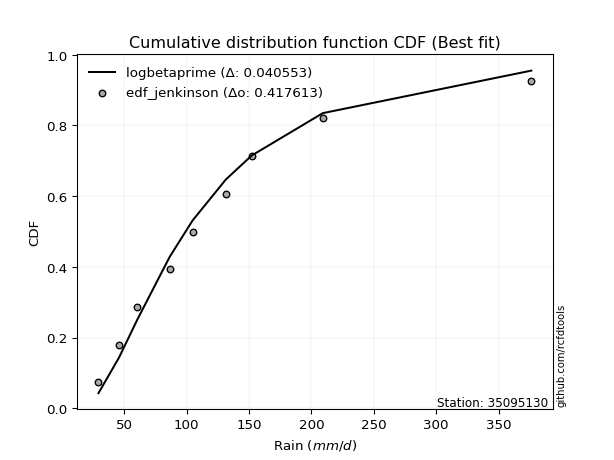</img>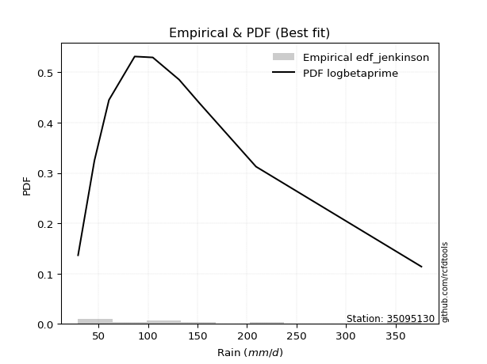</img>

</div>


### 11. EDF Cunnane (1978)

Cunnane´s work in statistical hydrology has focused on the performance and evaluation of different probability distributions (such as GEV, Gumbel, Lognormal) for flood frequency estimation. _b_ is a constant, typically set to 0.4.

<div align="center">


$P=(m-b)/(n+1-2b)$


</div>


**11.1. Empirical values**

<div align="center">

|                | 0                   | 1                  | 2                   | 3                  | 4           | 5                  | 6                 | 7                  | 8                  |
|:---------------|:--------------------|:-------------------|:--------------------|:-------------------|:------------|:-------------------|:------------------|:-------------------|:-------------------|
| date           | 2025                | 2024               | 2022                | 2021               | 2020        | 2018               | 2023              | 2019               | 2017               |
| x              | 29.3                | 45.8               | 60.5                | 86.5               | 104.8       | 131.4              | 152.1             | 209.1              | 376.26             |
| m              | 1                   | 2                  | 3                   | 4                  | 5           | 6                  | 7                 | 8                  | 9                  |
| empirical_dist | edf_cunnane         | edf_cunnane        | edf_cunnane         | edf_cunnane        | edf_cunnane | edf_cunnane        | edf_cunnane       | edf_cunnane        | edf_cunnane        |
| empirical      | 0.06521739130434782 | 0.1739130434782609 | 0.28260869565217395 | 0.391304347826087  | 0.5         | 0.6086956521739131 | 0.717391304347826 | 0.8260869565217391 | 0.9347826086956522 |
| empirical_tr   | 1.069767441860465   | 1.2105263157894737 | 1.393939393939394   | 1.6428571428571428 | 2.0         | 2.555555555555556  | 3.538461538461538 | 5.75               | 15.333333333333343 |

</div>


**11.2. Kolmogorov-Smirnov fit test (sorted by Δ)**


<div align="center">

|                | 0                   | 1                   | 2                   | 3                   | 4                   | 5                   | 6                    | 7                   | 8                   | 9                   | 10                  | 11                   | 12                  | 13                  | 14                  | 15                  | 16                   | 17                  | 18                  | 19                   | 20                   | 21                   | 22                  | 23                  | 24                   | 25                  | 26                   | 27                  | 28                  | 29                  | 30                  | 31                   | 32                   | 33                   | 34                  | 35                  | 36                   | 37                  | 38                   | 39                   | 40                  | 41                  | 42                  | 43                  | 44                  | 45                  | 46                  | 47                  | 48                  | 49                  | 50                  | 51                  | 52                  | 53                  | 54                  | 55                  | 56                  | 57                  | 58                  | 59                  | 60                  | 61                  | 62                  | 63                  | 64                  | 65                  | 66                  | 67                  | 68                  | 69                  | 70                  | 71                  | 72                  | 73                  | 74                  | 75                  | 76                  | 77                  | 78                  | 79                  | 80                  | 81                  | 82                  | 83                  | 84                  | 85                  | 86                  | 87                  | 88                  | 89                  | 90                  | 91                  | 92                  | 93                  | 94                  | 95                  | 96                  | 97                  | 98                  | 99                  | 100                 | 101                 | 102                 | 103                 | 104                 | 105                 | 106                 | 107                 | 108                 | 109                 | 110                 | 111                 | 112                 | 113                 | 114                 | 115                 | 116                 | 117                 | 118                 | 119                 | 120                 | 121                 | 122                 | 123                 | 124                 | 125                 | 126                 | 127                 | 128                 | 129                 | 130                 | 131                 | 132                 | 133                 | 134                 | 135                 | 136                 | 137                 | 138                 | 139                 | 140                 | 141                 | 142                 | 143                 | 144                 | 145                 | 146                 | 147                 | 148                 | 149                 | 150                 | 151                 | 152                 | 153                 | 154                 | 155                 | 156                 | 157                 | 158                 | 159                 |
|:---------------|:--------------------|:--------------------|:--------------------|:--------------------|:--------------------|:--------------------|:---------------------|:--------------------|:--------------------|:--------------------|:--------------------|:---------------------|:--------------------|:--------------------|:--------------------|:--------------------|:---------------------|:--------------------|:--------------------|:---------------------|:---------------------|:---------------------|:--------------------|:--------------------|:---------------------|:--------------------|:---------------------|:--------------------|:--------------------|:--------------------|:--------------------|:---------------------|:---------------------|:---------------------|:--------------------|:--------------------|:---------------------|:--------------------|:---------------------|:---------------------|:--------------------|:--------------------|:--------------------|:--------------------|:--------------------|:--------------------|:--------------------|:--------------------|:--------------------|:--------------------|:--------------------|:--------------------|:--------------------|:--------------------|:--------------------|:--------------------|:--------------------|:--------------------|:--------------------|:--------------------|:--------------------|:--------------------|:--------------------|:--------------------|:--------------------|:--------------------|:--------------------|:--------------------|:--------------------|:--------------------|:--------------------|:--------------------|:--------------------|:--------------------|:--------------------|:--------------------|:--------------------|:--------------------|:--------------------|:--------------------|:--------------------|:--------------------|:--------------------|:--------------------|:--------------------|:--------------------|:--------------------|:--------------------|:--------------------|:--------------------|:--------------------|:--------------------|:--------------------|:--------------------|:--------------------|:--------------------|:--------------------|:--------------------|:--------------------|:--------------------|:--------------------|:--------------------|:--------------------|:--------------------|:--------------------|:--------------------|:--------------------|:--------------------|:--------------------|:--------------------|:--------------------|:--------------------|:--------------------|:--------------------|:--------------------|:--------------------|:--------------------|:--------------------|:--------------------|:--------------------|:--------------------|:--------------------|:--------------------|:--------------------|:--------------------|:--------------------|:--------------------|:--------------------|:--------------------|:--------------------|:--------------------|:--------------------|:--------------------|:--------------------|:--------------------|:--------------------|:--------------------|:--------------------|:--------------------|:--------------------|:--------------------|:--------------------|:--------------------|:--------------------|:--------------------|:--------------------|:--------------------|:--------------------|:--------------------|:--------------------|:--------------------|:--------------------|:--------------------|:--------------------|:--------------------|:--------------------|:--------------------|:--------------------|:--------------------|:--------------------|
| station        | 35095130            | 35095130            | 35095130            | 35095130            | 35095130            | 35095130            | 35095130             | 35095130            | 35095130            | 35095130            | 35095130            | 35095130             | 35095130            | 35095130            | 35095130            | 35095130            | 35095130             | 35095130            | 35095130            | 35095130             | 35095130             | 35095130             | 35095130            | 35095130            | 35095130             | 35095130            | 35095130             | 35095130            | 35095130            | 35095130            | 35095130            | 35095130             | 35095130             | 35095130             | 35095130            | 35095130            | 35095130             | 35095130            | 35095130             | 35095130             | 35095130            | 35095130            | 35095130            | 35095130            | 35095130            | 35095130            | 35095130            | 35095130            | 35095130            | 35095130            | 35095130            | 35095130            | 35095130            | 35095130            | 35095130            | 35095130            | 35095130            | 35095130            | 35095130            | 35095130            | 35095130            | 35095130            | 35095130            | 35095130            | 35095130            | 35095130            | 35095130            | 35095130            | 35095130            | 35095130            | 35095130            | 35095130            | 35095130            | 35095130            | 35095130            | 35095130            | 35095130            | 35095130            | 35095130            | 35095130            | 35095130            | 35095130            | 35095130            | 35095130            | 35095130            | 35095130            | 35095130            | 35095130            | 35095130            | 35095130            | 35095130            | 35095130            | 35095130            | 35095130            | 35095130            | 35095130            | 35095130            | 35095130            | 35095130            | 35095130            | 35095130            | 35095130            | 35095130            | 35095130            | 35095130            | 35095130            | 35095130            | 35095130            | 35095130            | 35095130            | 35095130            | 35095130            | 35095130            | 35095130            | 35095130            | 35095130            | 35095130            | 35095130            | 35095130            | 35095130            | 35095130            | 35095130            | 35095130            | 35095130            | 35095130            | 35095130            | 35095130            | 35095130            | 35095130            | 35095130            | 35095130            | 35095130            | 35095130            | 35095130            | 35095130            | 35095130            | 35095130            | 35095130            | 35095130            | 35095130            | 35095130            | 35095130            | 35095130            | 35095130            | 35095130            | 35095130            | 35095130            | 35095130            | 35095130            | 35095130            | 35095130            | 35095130            | 35095130            | 35095130            | 35095130            | 35095130            | 35095130            | 35095130            | 35095130            | 35095130            |
| empirical_dist | edf_cunnane         | edf_cunnane         | edf_cunnane         | edf_cunnane         | edf_cunnane         | edf_cunnane         | edf_cunnane          | edf_cunnane         | edf_cunnane         | edf_cunnane         | edf_cunnane         | edf_cunnane          | edf_cunnane         | edf_cunnane         | edf_cunnane         | edf_cunnane         | edf_cunnane          | edf_cunnane         | edf_cunnane         | edf_cunnane          | edf_cunnane          | edf_cunnane          | edf_cunnane         | edf_cunnane         | edf_cunnane          | edf_cunnane         | edf_cunnane          | edf_cunnane         | edf_cunnane         | edf_cunnane         | edf_cunnane         | edf_cunnane          | edf_cunnane          | edf_cunnane          | edf_cunnane         | edf_cunnane         | edf_cunnane          | edf_cunnane         | edf_cunnane          | edf_cunnane          | edf_cunnane         | edf_cunnane         | edf_cunnane         | edf_cunnane         | edf_cunnane         | edf_cunnane         | edf_cunnane         | edf_cunnane         | edf_cunnane         | edf_cunnane         | edf_cunnane         | edf_cunnane         | edf_cunnane         | edf_cunnane         | edf_cunnane         | edf_cunnane         | edf_cunnane         | edf_cunnane         | edf_cunnane         | edf_cunnane         | edf_cunnane         | edf_cunnane         | edf_cunnane         | edf_cunnane         | edf_cunnane         | edf_cunnane         | edf_cunnane         | edf_cunnane         | edf_cunnane         | edf_cunnane         | edf_cunnane         | edf_cunnane         | edf_cunnane         | edf_cunnane         | edf_cunnane         | edf_cunnane         | edf_cunnane         | edf_cunnane         | edf_cunnane         | edf_cunnane         | edf_cunnane         | edf_cunnane         | edf_cunnane         | edf_cunnane         | edf_cunnane         | edf_cunnane         | edf_cunnane         | edf_cunnane         | edf_cunnane         | edf_cunnane         | edf_cunnane         | edf_cunnane         | edf_cunnane         | edf_cunnane         | edf_cunnane         | edf_cunnane         | edf_cunnane         | edf_cunnane         | edf_cunnane         | edf_cunnane         | edf_cunnane         | edf_cunnane         | edf_cunnane         | edf_cunnane         | edf_cunnane         | edf_cunnane         | edf_cunnane         | edf_cunnane         | edf_cunnane         | edf_cunnane         | edf_cunnane         | edf_cunnane         | edf_cunnane         | edf_cunnane         | edf_cunnane         | edf_cunnane         | edf_cunnane         | edf_cunnane         | edf_cunnane         | edf_cunnane         | edf_cunnane         | edf_cunnane         | edf_cunnane         | edf_cunnane         | edf_cunnane         | edf_cunnane         | edf_cunnane         | edf_cunnane         | edf_cunnane         | edf_cunnane         | edf_cunnane         | edf_cunnane         | edf_cunnane         | edf_cunnane         | edf_cunnane         | edf_cunnane         | edf_cunnane         | edf_cunnane         | edf_cunnane         | edf_cunnane         | edf_cunnane         | edf_cunnane         | edf_cunnane         | edf_cunnane         | edf_cunnane         | edf_cunnane         | edf_cunnane         | edf_cunnane         | edf_cunnane         | edf_cunnane         | edf_cunnane         | edf_cunnane         | edf_cunnane         | edf_cunnane         | edf_cunnane         | edf_cunnane         | edf_cunnane         | edf_cunnane         | edf_cunnane         | edf_cunnane         |
| p_dist         | logcosine           | loganglit           | logncf              | logbetaprime        | logfoldnorm         | loggenextreme       | logfatiguelife       | logf                | logjohnsonsu        | loggamma            | loggamma            | logerlang            | logpearson3         | logskewnorm         | logexponnorm        | lognorm             | logcrystalball       | logt                | lognct              | logweibull_min       | logloggamma          | loginvgamma          | betaprime           | ncf                 | burr                 | mielke              | loggenlogistic       | invgamma            | logrice             | logburr12           | logsemicircular     | invweibull           | genextreme           | logalpha             | moyal               | halflogistic        | alpha                | johnsonsu           | invgauss             | logmaxwell           | loginvgauss         | pearson3            | loglogistic         | nct                 | exponnorm           | genpareto           | lomax               | kappa3              | genexpon            | bradford            | loggompertz         | logvonmises_line    | truncweibull_min    | weibull_min         | truncpareto         | logtruncpareto      | loggausshyper       | lograyleigh         | loguniform          | genlogistic         | gumbel_r            | logkappa3           | logdweibull         | gompertz            | logexponpow         | logkappa4           | gengamma            | loghypsecant        | loggumbel_l         | halfnorm            | kstwobign           | loginvweibull       | loggumbel_r         | logloglaplace       | exponpow            | logarcsine          | t                   | dweibull            | logdgamma           | loglaplace          | loglaplace          | foldnorm            | logksone            | loghalfgennorm      | loggenexpon         | nakagami            | logkstwobign        | gennorm             | loghalfnorm         | rayleigh            | logargus            | dgamma              | logbradford         | vonmises_line       | logmoyal            | maxwell             | skewnorm            | loghalflogistic     | rice                | logistic            | logtruncexpon       | hypsecant           | halfgennorm         | truncnorm           | norm                | crystalball         | logrdist            | logbeta             | anglit              | wald                | semicircular        | laplace             | f                   | truncexpon          | logtruncnorm        | lognakagami         | logtukeylambda      | logtruncweibull_min | arcsine             | logwald             | loglomax            | logburr             | burr12              | logtriang           | logweibull_max      | logmielke           | gumbel_l            | beta                | logexponweib        | logwrapcauchy       | gamma               | cosine              | loggenhalflogistic  | gausshyper          | loggengamma         | exponweib           | wrapcauchy          | loglevy_l           | loggennorm          | argus               | logtrapezoid        | kappa4              | ksone               | uniform             | loggenpareto        | levy_l              | powerlaw            | genhalflogistic     | fatiguelife         | rdist               | logjohnsonsb        | tukeylambda         | logpowerlaw         | erlang              | triang              | trapezoid           | weibull_max         | johnsonsb           | logvonmises         | vonmises            |
| delta          | 0.034866913848975   | 0.03565640054361641 | 0.03710129083055469 | 0.03846692048232381 | 0.03873739663616382 | 0.03881902229138498 | 0.038847223162426114 | 0.03905766817338152 | 0.03955532345375551 | 0.03967801465529186 | 0.03967801465529186 | 0.039696052961159606 | 0.03978649314868926 | 0.04060125443892648 | 0.04068940451890207 | 0.040693234150806   | 0.040694171731255474 | 0.04069798203970876 | 0.04092081205874892 | 0.041764899445622505 | 0.041838529892186505 | 0.042376670488438184 | 0.04238838330314562 | 0.04281201541958901 | 0.044220342599461726 | 0.04424562975434801 | 0.044604572185035385 | 0.04490125588945548 | 0.04521650068208388 | 0.0454094575583191  | 0.04635679582361185 | 0.046476622721279504 | 0.046476937706221966 | 0.046789180658305174 | 0.04936357564725846 | 0.05085668808471766 | 0.052505332716911185 | 0.05426324446425873 | 0.054868849926097085 | 0.056819611751885435 | 0.05748876441751    | 0.05882406658131867 | 0.06334108628383381 | 0.06371067406973419 | 0.06413300265267023 | 0.06519308282481204 | 0.06521699568398216 | 0.06521700561362608 | 0.06521716737984357 | 0.06521738294774015 | 0.06521738873612412 | 0.06521739105541871 | 0.06521739130256854 | 0.06521739130434602 | 0.06521739130434782 | 0.06521739130434782 | 0.06746012730174561 | 0.06905904601062701 | 0.07220962284156673 | 0.07318667793314043 | 0.07324196367850888 | 0.07326605620074178 | 0.07437311122991158 | 0.0743747189244211  | 0.07564333080185764 | 0.07623652866356645 | 0.07792166650991633 | 0.07800263373736455 | 0.07814935555523275 | 0.07882130892643624 | 0.08423922370724427 | 0.08605381783881705 | 0.08902468609603376 | 0.08921020207028471 | 0.09009771509507208 | 0.09167956712935743 | 0.09546389435388665 | 0.09624533478105075 | 0.09626086014478358 | 0.0968515160527432  | 0.0968515160527432  | 0.09909462023377809 | 0.10120070093476041 | 0.1017328341425438  | 0.10175645907642844 | 0.1021692701970496  | 0.10224955050563905 | 0.1030266483700885  | 0.10372069967280068 | 0.10432968828478606 | 0.11007676018494872 | 0.11160219289083817 | 0.11255324136741546 | 0.11259423554377705 | 0.11282753166720172 | 0.11334019872386014 | 0.11345577313524224 | 0.12101709039025726 | 0.128305226221886   | 0.13191411754903704 | 0.13463095043675227 | 0.13464446805240743 | 0.13489521324918913 | 0.14189955602357773 | 0.14189956239761925 | 0.14189956410856275 | 0.14647839841467802 | 0.14816289986109044 | 0.15249885771957694 | 0.15543172132289979 | 0.15688519459582217 | 0.1623927791910874  | 0.16274821435171388 | 0.17126289451461552 | 0.1738578036763965  | 0.17391304347507988 | 0.17391304347823955 | 0.17482382919514255 | 0.17677678847538442 | 0.18410791856391073 | 0.188561367429058   | 0.1892844185456592  | 0.18931072915523223 | 0.19223777017663557 | 0.19264901073810448 | 0.20209085019226686 | 0.20573650670805876 | 0.20605810553927573 | 0.20625792783221536 | 0.21111557379678925 | 0.21590246405206276 | 0.2257722127631997  | 0.23156408753245805 | 0.23616814914097767 | 0.25187598674498807 | 0.2829593428075102  | 0.31734065439960324 | 0.3231496645949042  | 0.32608695652173914 | 0.3299257356180887  | 0.33176926375581506 | 0.3340644874245748  | 0.33911523025667245 | 0.3634600154384417  | 0.39285189796212117 | 0.4013785271027102  | 0.409193017064686   | 0.46665334375060097 | 0.4847307176974661  | 0.4879568766439096  | 0.5038485100336701  | 0.5139167991409187  | 0.5148492539152687  | 0.5208310083234788  | 0.547038991286638   | 0.5738078433158873  | 0.6913228465292198  | 0.6967614249619145  | 1.0361327615280613  | 59.758894521903606  |
| deltao         | 0.41761268023100007 | 0.41761268023100007 | 0.41761268023100007 | 0.41761268023100007 | 0.41761268023100007 | 0.41761268023100007 | 0.41761268023100007  | 0.41761268023100007 | 0.41761268023100007 | 0.41761268023100007 | 0.41761268023100007 | 0.41761268023100007  | 0.41761268023100007 | 0.41761268023100007 | 0.41761268023100007 | 0.41761268023100007 | 0.41761268023100007  | 0.41761268023100007 | 0.41761268023100007 | 0.41761268023100007  | 0.41761268023100007  | 0.41761268023100007  | 0.41761268023100007 | 0.41761268023100007 | 0.41761268023100007  | 0.41761268023100007 | 0.41761268023100007  | 0.41761268023100007 | 0.41761268023100007 | 0.41761268023100007 | 0.41761268023100007 | 0.41761268023100007  | 0.41761268023100007  | 0.41761268023100007  | 0.41761268023100007 | 0.41761268023100007 | 0.41761268023100007  | 0.41761268023100007 | 0.41761268023100007  | 0.41761268023100007  | 0.41761268023100007 | 0.41761268023100007 | 0.41761268023100007 | 0.41761268023100007 | 0.41761268023100007 | 0.41761268023100007 | 0.41761268023100007 | 0.41761268023100007 | 0.41761268023100007 | 0.41761268023100007 | 0.41761268023100007 | 0.41761268023100007 | 0.41761268023100007 | 0.41761268023100007 | 0.41761268023100007 | 0.41761268023100007 | 0.41761268023100007 | 0.41761268023100007 | 0.41761268023100007 | 0.41761268023100007 | 0.41761268023100007 | 0.41761268023100007 | 0.41761268023100007 | 0.41761268023100007 | 0.41761268023100007 | 0.41761268023100007 | 0.41761268023100007 | 0.41761268023100007 | 0.41761268023100007 | 0.41761268023100007 | 0.41761268023100007 | 0.41761268023100007 | 0.41761268023100007 | 0.41761268023100007 | 0.41761268023100007 | 0.41761268023100007 | 0.41761268023100007 | 0.41761268023100007 | 0.41761268023100007 | 0.41761268023100007 | 0.41761268023100007 | 0.41761268023100007 | 0.41761268023100007 | 0.41761268023100007 | 0.41761268023100007 | 0.41761268023100007 | 0.41761268023100007 | 0.41761268023100007 | 0.41761268023100007 | 0.41761268023100007 | 0.41761268023100007 | 0.41761268023100007 | 0.41761268023100007 | 0.41761268023100007 | 0.41761268023100007 | 0.41761268023100007 | 0.41761268023100007 | 0.41761268023100007 | 0.41761268023100007 | 0.41761268023100007 | 0.41761268023100007 | 0.41761268023100007 | 0.41761268023100007 | 0.41761268023100007 | 0.41761268023100007 | 0.41761268023100007 | 0.41761268023100007 | 0.41761268023100007 | 0.41761268023100007 | 0.41761268023100007 | 0.41761268023100007 | 0.41761268023100007 | 0.41761268023100007 | 0.41761268023100007 | 0.41761268023100007 | 0.41761268023100007 | 0.41761268023100007 | 0.41761268023100007 | 0.41761268023100007 | 0.41761268023100007 | 0.41761268023100007 | 0.41761268023100007 | 0.41761268023100007 | 0.41761268023100007 | 0.41761268023100007 | 0.41761268023100007 | 0.41761268023100007 | 0.41761268023100007 | 0.41761268023100007 | 0.41761268023100007 | 0.41761268023100007 | 0.41761268023100007 | 0.41761268023100007 | 0.41761268023100007 | 0.41761268023100007 | 0.41761268023100007 | 0.41761268023100007 | 0.41761268023100007 | 0.41761268023100007 | 0.41761268023100007 | 0.41761268023100007 | 0.41761268023100007 | 0.41761268023100007 | 0.41761268023100007 | 0.41761268023100007 | 0.41761268023100007 | 0.41761268023100007 | 0.41761268023100007 | 0.41761268023100007 | 0.41761268023100007 | 0.41761268023100007 | 0.41761268023100007 | 0.41761268023100007 | 0.41761268023100007 | 0.41761268023100007 | 0.41761268023100007 | 0.41761268023100007 | 0.41761268023100007 | 0.41761268023100007 | 0.41761268023100007 |
| eval           | Δo > Δ              | Δo > Δ              | Δo > Δ              | Δo > Δ              | Δo > Δ              | Δo > Δ              | Δo > Δ               | Δo > Δ              | Δo > Δ              | Δo > Δ              | Δo > Δ              | Δo > Δ               | Δo > Δ              | Δo > Δ              | Δo > Δ              | Δo > Δ              | Δo > Δ               | Δo > Δ              | Δo > Δ              | Δo > Δ               | Δo > Δ               | Δo > Δ               | Δo > Δ              | Δo > Δ              | Δo > Δ               | Δo > Δ              | Δo > Δ               | Δo > Δ              | Δo > Δ              | Δo > Δ              | Δo > Δ              | Δo > Δ               | Δo > Δ               | Δo > Δ               | Δo > Δ              | Δo > Δ              | Δo > Δ               | Δo > Δ              | Δo > Δ               | Δo > Δ               | Δo > Δ              | Δo > Δ              | Δo > Δ              | Δo > Δ              | Δo > Δ              | Δo > Δ              | Δo > Δ              | Δo > Δ              | Δo > Δ              | Δo > Δ              | Δo > Δ              | Δo > Δ              | Δo > Δ              | Δo > Δ              | Δo > Δ              | Δo > Δ              | Δo > Δ              | Δo > Δ              | Δo > Δ              | Δo > Δ              | Δo > Δ              | Δo > Δ              | Δo > Δ              | Δo > Δ              | Δo > Δ              | Δo > Δ              | Δo > Δ              | Δo > Δ              | Δo > Δ              | Δo > Δ              | Δo > Δ              | Δo > Δ              | Δo > Δ              | Δo > Δ              | Δo > Δ              | Δo > Δ              | Δo > Δ              | Δo > Δ              | Δo > Δ              | Δo > Δ              | Δo > Δ              | Δo > Δ              | Δo > Δ              | Δo > Δ              | Δo > Δ              | Δo > Δ              | Δo > Δ              | Δo > Δ              | Δo > Δ              | Δo > Δ              | Δo > Δ              | Δo > Δ              | Δo > Δ              | Δo > Δ              | Δo > Δ              | Δo > Δ              | Δo > Δ              | Δo > Δ              | Δo > Δ              | Δo > Δ              | Δo > Δ              | Δo > Δ              | Δo > Δ              | Δo > Δ              | Δo > Δ              | Δo > Δ              | Δo > Δ              | Δo > Δ              | Δo > Δ              | Δo > Δ              | Δo > Δ              | Δo > Δ              | Δo > Δ              | Δo > Δ              | Δo > Δ              | Δo > Δ              | Δo > Δ              | Δo > Δ              | Δo > Δ              | Δo > Δ              | Δo > Δ              | Δo > Δ              | Δo > Δ              | Δo > Δ              | Δo > Δ              | Δo > Δ              | Δo > Δ              | Δo > Δ              | Δo > Δ              | Δo > Δ              | Δo > Δ              | Δo > Δ              | Δo > Δ              | Δo > Δ              | Δo > Δ              | Δo > Δ              | Δo > Δ              | Δo > Δ              | Δo > Δ              | Δo > Δ              | Δo > Δ              | Δo > Δ              | Δo > Δ              | Δo > Δ              | Δo > Δ              | Δo > Δ              | Δo > Δ              | Δo <= Δ             | Δo <= Δ             | Δo <= Δ             | Δo <= Δ             | Δo <= Δ             | Δo <= Δ             | Δo <= Δ             | Δo <= Δ             | Δo <= Δ             | Δo <= Δ             | Δo <= Δ             | Δo <= Δ             | Δo <= Δ             |
| fit            | 1                   | 1                   | 1                   | 1                   | 1                   | 1                   | 1                    | 1                   | 1                   | 1                   | 1                   | 1                    | 1                   | 1                   | 1                   | 1                   | 1                    | 1                   | 1                   | 1                    | 1                    | 1                    | 1                   | 1                   | 1                    | 1                   | 1                    | 1                   | 1                   | 1                   | 1                   | 1                    | 1                    | 1                    | 1                   | 1                   | 1                    | 1                   | 1                    | 1                    | 1                   | 1                   | 1                   | 1                   | 1                   | 1                   | 1                   | 1                   | 1                   | 1                   | 1                   | 1                   | 1                   | 1                   | 1                   | 1                   | 1                   | 1                   | 1                   | 1                   | 1                   | 1                   | 1                   | 1                   | 1                   | 1                   | 1                   | 1                   | 1                   | 1                   | 1                   | 1                   | 1                   | 1                   | 1                   | 1                   | 1                   | 1                   | 1                   | 1                   | 1                   | 1                   | 1                   | 1                   | 1                   | 1                   | 1                   | 1                   | 1                   | 1                   | 1                   | 1                   | 1                   | 1                   | 1                   | 1                   | 1                   | 1                   | 1                   | 1                   | 1                   | 1                   | 1                   | 1                   | 1                   | 1                   | 1                   | 1                   | 1                   | 1                   | 1                   | 1                   | 1                   | 1                   | 1                   | 1                   | 1                   | 1                   | 1                   | 1                   | 1                   | 1                   | 1                   | 1                   | 1                   | 1                   | 1                   | 1                   | 1                   | 1                   | 1                   | 1                   | 1                   | 1                   | 1                   | 1                   | 1                   | 1                   | 1                   | 1                   | 1                   | 1                   | 1                   | 1                   | 1                   | 1                   | 1                   | 0                   | 0                   | 0                   | 0                   | 0                   | 0                   | 0                   | 0                   | 0                   | 0                   | 0                   | 0                   | 0                   |
| n              | 9                   | 9                   | 9                   | 9                   | 9                   | 9                   | 9                    | 9                   | 9                   | 9                   | 9                   | 9                    | 9                   | 9                   | 9                   | 9                   | 9                    | 9                   | 9                   | 9                    | 9                    | 9                    | 9                   | 9                   | 9                    | 9                   | 9                    | 9                   | 9                   | 9                   | 9                   | 9                    | 9                    | 9                    | 9                   | 9                   | 9                    | 9                   | 9                    | 9                    | 9                   | 9                   | 9                   | 9                   | 9                   | 9                   | 9                   | 9                   | 9                   | 9                   | 9                   | 9                   | 9                   | 9                   | 9                   | 9                   | 9                   | 9                   | 9                   | 9                   | 9                   | 9                   | 9                   | 9                   | 9                   | 9                   | 9                   | 9                   | 9                   | 9                   | 9                   | 9                   | 9                   | 9                   | 9                   | 9                   | 9                   | 9                   | 9                   | 9                   | 9                   | 9                   | 9                   | 9                   | 9                   | 9                   | 9                   | 9                   | 9                   | 9                   | 9                   | 9                   | 9                   | 9                   | 9                   | 9                   | 9                   | 9                   | 9                   | 9                   | 9                   | 9                   | 9                   | 9                   | 9                   | 9                   | 9                   | 9                   | 9                   | 9                   | 9                   | 9                   | 9                   | 9                   | 9                   | 9                   | 9                   | 9                   | 9                   | 9                   | 9                   | 9                   | 9                   | 9                   | 9                   | 9                   | 9                   | 9                   | 9                   | 9                   | 9                   | 9                   | 9                   | 9                   | 9                   | 9                   | 9                   | 9                   | 9                   | 9                   | 9                   | 9                   | 9                   | 9                   | 9                   | 9                   | 9                   | 9                   | 9                   | 9                   | 9                   | 9                   | 9                   | 9                   | 9                   | 9                   | 9                   | 9                   | 9                   | 9                   |
| best_fit       | 1                   | 0                   | 0                   | 0                   | 0                   | 0                   | 0                    | 0                   | 0                   | 0                   | 0                   | 0                    | 0                   | 0                   | 0                   | 0                   | 0                    | 0                   | 0                   | 0                    | 0                    | 0                    | 0                   | 0                   | 0                    | 0                   | 0                    | 0                   | 0                   | 0                   | 0                   | 0                    | 0                    | 0                    | 0                   | 0                   | 0                    | 0                   | 0                    | 0                    | 0                   | 0                   | 0                   | 0                   | 0                   | 0                   | 0                   | 0                   | 0                   | 0                   | 0                   | 0                   | 0                   | 0                   | 0                   | 0                   | 0                   | 0                   | 0                   | 0                   | 0                   | 0                   | 0                   | 0                   | 0                   | 0                   | 0                   | 0                   | 0                   | 0                   | 0                   | 0                   | 0                   | 0                   | 0                   | 0                   | 0                   | 0                   | 0                   | 0                   | 0                   | 0                   | 0                   | 0                   | 0                   | 0                   | 0                   | 0                   | 0                   | 0                   | 0                   | 0                   | 0                   | 0                   | 0                   | 0                   | 0                   | 0                   | 0                   | 0                   | 0                   | 0                   | 0                   | 0                   | 0                   | 0                   | 0                   | 0                   | 0                   | 0                   | 0                   | 0                   | 0                   | 0                   | 0                   | 0                   | 0                   | 0                   | 0                   | 0                   | 0                   | 0                   | 0                   | 0                   | 0                   | 0                   | 0                   | 0                   | 0                   | 0                   | 0                   | 0                   | 0                   | 0                   | 0                   | 0                   | 0                   | 0                   | 0                   | 0                   | 0                   | 0                   | 0                   | 0                   | 0                   | 0                   | 0                   | 0                   | 0                   | 0                   | 0                   | 0                   | 0                   | 0                   | 0                   | 0                   | 0                   | 0                   | 0                   | 0                   |
| best_fit_sort  | 1                   | 2                   | 3                   | 4                   | 5                   | 6                   | 7                    | 8                   | 9                   | 10                  | 11                  | 12                   | 13                  | 14                  | 15                  | 16                  | 17                   | 18                  | 19                  | 20                   | 21                   | 22                   | 23                  | 24                  | 25                   | 26                  | 27                   | 28                  | 29                  | 30                  | 31                  | 32                   | 33                   | 34                   | 35                  | 36                  | 37                   | 38                  | 39                   | 40                   | 41                  | 42                  | 43                  | 44                  | 45                  | 46                  | 47                  | 48                  | 49                  | 50                  | 51                  | 52                  | 53                  | 54                  | 55                  | 56                  | 57                  | 58                  | 59                  | 60                  | 61                  | 62                  | 63                  | 64                  | 65                  | 66                  | 67                  | 68                  | 69                  | 70                  | 71                  | 72                  | 73                  | 74                  | 75                  | 76                  | 77                  | 78                  | 79                  | 80                  | 81                  | 82                  | 83                  | 84                  | 85                  | 86                  | 87                  | 88                  | 89                  | 90                  | 91                  | 92                  | 93                  | 94                  | 95                  | 96                  | 97                  | 98                  | 99                  | 100                 | 101                 | 102                 | 103                 | 104                 | 105                 | 106                 | 107                 | 108                 | 109                 | 110                 | 111                 | 112                 | 113                 | 114                 | 115                 | 116                 | 117                 | 118                 | 119                 | 120                 | 121                 | 122                 | 123                 | 124                 | 125                 | 126                 | 127                 | 128                 | 129                 | 130                 | 131                 | 132                 | 133                 | 134                 | 135                 | 136                 | 137                 | 138                 | 139                 | 140                 | 141                 | 142                 | 143                 | 144                 | 145                 | 146                 | 147                 | 148                 | 149                 | 150                 | 151                 | 152                 | 153                 | 154                 | 155                 | 156                 | 157                 | 158                 | 159                 | 160                 |

</div>


**11.3. Best fit**

<div align="center">

|   id |   station | empirical_dist   | p_dist    |     delta |   deltao | eval   |   fit |   n |   best_fit |   best_fit_sort |
|-----:|----------:|:-----------------|:----------|----------:|---------:|:-------|------:|----:|-----------:|----------------:|
|    0 |  35095130 | edf_cunnane      | logcosine | 0.0348669 | 0.417613 | Δo > Δ |     1 |   9 |          1 |               1 |

</div>


<div align="center">

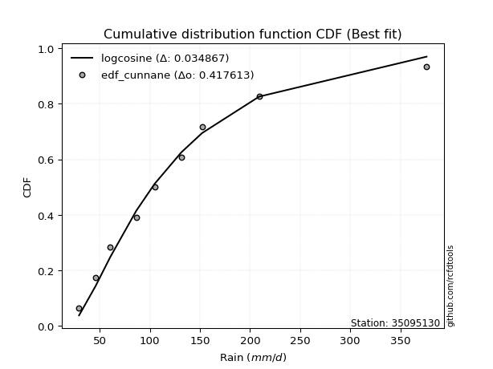</img></img>

</div>


### 12. EDF Adamowski (1981)

The Adamowski formula in hydrology refers to a specific plotting position formula used for estimating the non-parametric empirical distribution of hydrological events (like flood peaks) to calculate their return periods. This formula provides an alternative to traditional parametric methods (like the Gumbel or Log Pearson Type III distributions). 

<div align="center">


$P=(m-0.25)/(n+0.5)$


</div>


**12.1. Empirical values**

<div align="center">

|                | 0                   | 1                   | 2                  | 3                   | 4             | 5                  | 6                  | 7                  | 8                  |
|:---------------|:--------------------|:--------------------|:-------------------|:--------------------|:--------------|:-------------------|:-------------------|:-------------------|:-------------------|
| date           | 2025                | 2024                | 2022               | 2021                | 2020          | 2018               | 2023               | 2019               | 2017               |
| x              | 29.3                | 45.8                | 60.5               | 86.5                | 104.8         | 131.4              | 152.1              | 209.1              | 376.26             |
| m              | 1                   | 2                   | 3                  | 4                   | 5             | 6                  | 7                  | 8                  | 9                  |
| empirical_dist | edf_adamowski       | edf_adamowski       | edf_adamowski      | edf_adamowski       | edf_adamowski | edf_adamowski      | edf_adamowski      | edf_adamowski      | edf_adamowski      |
| empirical      | 0.07894736842105263 | 0.18421052631578946 | 0.2894736842105263 | 0.39473684210526316 | 0.5           | 0.6052631578947368 | 0.7105263157894737 | 0.8157894736842105 | 0.9210526315789473 |
| empirical_tr   | 1.0857142857142856  | 1.2258064516129032  | 1.4074074074074074 | 1.6521739130434783  | 2.0           | 2.533333333333333  | 3.4545454545454546 | 5.428571428571428  | 12.666666666666663 |

</div>


**12.2. Kolmogorov-Smirnov fit test (sorted by Δ)**


<div align="center">

|                | 0                   | 1                   | 2                    | 3                    | 4                   | 5                   | 6                    | 7                   | 8                   | 9                   | 10                   | 11                  | 12                  | 13                  | 14                  | 15                  | 16                  | 17                   | 18                  | 19                   | 20                  | 21                   | 22                  | 23                  | 24                   | 25                  | 26                  | 27                  | 28                   | 29                  | 30                  | 31                  | 32                  | 33                  | 34                   | 35                   | 36                  | 37                   | 38                  | 39                  | 40                  | 41                   | 42                  | 43                  | 44                  | 45                  | 46                  | 47                  | 48                  | 49                  | 50                  | 51                  | 52                  | 53                  | 54                  | 55                  | 56                  | 57                  | 58                  | 59                  | 60                  | 61                  | 62                  | 63                  | 64                  | 65                  | 66                  | 67                  | 68                  | 69                  | 70                  | 71                  | 72                  | 73                  | 74                  | 75                  | 76                  | 77                  | 78                  | 79                  | 80                  | 81                  | 82                  | 83                  | 84                  | 85                  | 86                  | 87                  | 88                  | 89                  | 90                  | 91                  | 92                  | 93                  | 94                  | 95                  | 96                  | 97                  | 98                  | 99                  | 100                 | 101                 | 102                 | 103                 | 104                 | 105                 | 106                 | 107                 | 108                 | 109                 | 110                 | 111                 | 112                 | 113                 | 114                 | 115                 | 116                 | 117                 | 118                 | 119                 | 120                 | 121                 | 122                 | 123                 | 124                 | 125                 | 126                 | 127                 | 128                 | 129                 | 130                 | 131                 | 132                 | 133                 | 134                 | 135                 | 136                 | 137                 | 138                 | 139                 | 140                 | 141                 | 142                 | 143                 | 144                 | 145                 | 146                 | 147                 | 148                 | 149                 | 150                 | 151                 | 152                 | 153                 | 154                 | 155                 | 156                 | 157                 | 158                 | 159                 |
|:---------------|:--------------------|:--------------------|:---------------------|:---------------------|:--------------------|:--------------------|:---------------------|:--------------------|:--------------------|:--------------------|:---------------------|:--------------------|:--------------------|:--------------------|:--------------------|:--------------------|:--------------------|:---------------------|:--------------------|:---------------------|:--------------------|:---------------------|:--------------------|:--------------------|:---------------------|:--------------------|:--------------------|:--------------------|:---------------------|:--------------------|:--------------------|:--------------------|:--------------------|:--------------------|:---------------------|:---------------------|:--------------------|:---------------------|:--------------------|:--------------------|:--------------------|:---------------------|:--------------------|:--------------------|:--------------------|:--------------------|:--------------------|:--------------------|:--------------------|:--------------------|:--------------------|:--------------------|:--------------------|:--------------------|:--------------------|:--------------------|:--------------------|:--------------------|:--------------------|:--------------------|:--------------------|:--------------------|:--------------------|:--------------------|:--------------------|:--------------------|:--------------------|:--------------------|:--------------------|:--------------------|:--------------------|:--------------------|:--------------------|:--------------------|:--------------------|:--------------------|:--------------------|:--------------------|:--------------------|:--------------------|:--------------------|:--------------------|:--------------------|:--------------------|:--------------------|:--------------------|:--------------------|:--------------------|:--------------------|:--------------------|:--------------------|:--------------------|:--------------------|:--------------------|:--------------------|:--------------------|:--------------------|:--------------------|:--------------------|:--------------------|:--------------------|:--------------------|:--------------------|:--------------------|:--------------------|:--------------------|:--------------------|:--------------------|:--------------------|:--------------------|:--------------------|:--------------------|:--------------------|:--------------------|:--------------------|:--------------------|:--------------------|:--------------------|:--------------------|:--------------------|:--------------------|:--------------------|:--------------------|:--------------------|:--------------------|:--------------------|:--------------------|:--------------------|:--------------------|:--------------------|:--------------------|:--------------------|:--------------------|:--------------------|:--------------------|:--------------------|:--------------------|:--------------------|:--------------------|:--------------------|:--------------------|:--------------------|:--------------------|:--------------------|:--------------------|:--------------------|:--------------------|:--------------------|:--------------------|:--------------------|:--------------------|:--------------------|:--------------------|:--------------------|:--------------------|:--------------------|:--------------------|:--------------------|:--------------------|:--------------------|
| station        | 35095130            | 35095130            | 35095130             | 35095130             | 35095130            | 35095130            | 35095130             | 35095130            | 35095130            | 35095130            | 35095130             | 35095130            | 35095130            | 35095130            | 35095130            | 35095130            | 35095130            | 35095130             | 35095130            | 35095130             | 35095130            | 35095130             | 35095130            | 35095130            | 35095130             | 35095130            | 35095130            | 35095130            | 35095130             | 35095130            | 35095130            | 35095130            | 35095130            | 35095130            | 35095130             | 35095130             | 35095130            | 35095130             | 35095130            | 35095130            | 35095130            | 35095130             | 35095130            | 35095130            | 35095130            | 35095130            | 35095130            | 35095130            | 35095130            | 35095130            | 35095130            | 35095130            | 35095130            | 35095130            | 35095130            | 35095130            | 35095130            | 35095130            | 35095130            | 35095130            | 35095130            | 35095130            | 35095130            | 35095130            | 35095130            | 35095130            | 35095130            | 35095130            | 35095130            | 35095130            | 35095130            | 35095130            | 35095130            | 35095130            | 35095130            | 35095130            | 35095130            | 35095130            | 35095130            | 35095130            | 35095130            | 35095130            | 35095130            | 35095130            | 35095130            | 35095130            | 35095130            | 35095130            | 35095130            | 35095130            | 35095130            | 35095130            | 35095130            | 35095130            | 35095130            | 35095130            | 35095130            | 35095130            | 35095130            | 35095130            | 35095130            | 35095130            | 35095130            | 35095130            | 35095130            | 35095130            | 35095130            | 35095130            | 35095130            | 35095130            | 35095130            | 35095130            | 35095130            | 35095130            | 35095130            | 35095130            | 35095130            | 35095130            | 35095130            | 35095130            | 35095130            | 35095130            | 35095130            | 35095130            | 35095130            | 35095130            | 35095130            | 35095130            | 35095130            | 35095130            | 35095130            | 35095130            | 35095130            | 35095130            | 35095130            | 35095130            | 35095130            | 35095130            | 35095130            | 35095130            | 35095130            | 35095130            | 35095130            | 35095130            | 35095130            | 35095130            | 35095130            | 35095130            | 35095130            | 35095130            | 35095130            | 35095130            | 35095130            | 35095130            | 35095130            | 35095130            | 35095130            | 35095130            | 35095130            | 35095130            |
| empirical_dist | edf_adamowski       | edf_adamowski       | edf_adamowski        | edf_adamowski        | edf_adamowski       | edf_adamowski       | edf_adamowski        | edf_adamowski       | edf_adamowski       | edf_adamowski       | edf_adamowski        | edf_adamowski       | edf_adamowski       | edf_adamowski       | edf_adamowski       | edf_adamowski       | edf_adamowski       | edf_adamowski        | edf_adamowski       | edf_adamowski        | edf_adamowski       | edf_adamowski        | edf_adamowski       | edf_adamowski       | edf_adamowski        | edf_adamowski       | edf_adamowski       | edf_adamowski       | edf_adamowski        | edf_adamowski       | edf_adamowski       | edf_adamowski       | edf_adamowski       | edf_adamowski       | edf_adamowski        | edf_adamowski        | edf_adamowski       | edf_adamowski        | edf_adamowski       | edf_adamowski       | edf_adamowski       | edf_adamowski        | edf_adamowski       | edf_adamowski       | edf_adamowski       | edf_adamowski       | edf_adamowski       | edf_adamowski       | edf_adamowski       | edf_adamowski       | edf_adamowski       | edf_adamowski       | edf_adamowski       | edf_adamowski       | edf_adamowski       | edf_adamowski       | edf_adamowski       | edf_adamowski       | edf_adamowski       | edf_adamowski       | edf_adamowski       | edf_adamowski       | edf_adamowski       | edf_adamowski       | edf_adamowski       | edf_adamowski       | edf_adamowski       | edf_adamowski       | edf_adamowski       | edf_adamowski       | edf_adamowski       | edf_adamowski       | edf_adamowski       | edf_adamowski       | edf_adamowski       | edf_adamowski       | edf_adamowski       | edf_adamowski       | edf_adamowski       | edf_adamowski       | edf_adamowski       | edf_adamowski       | edf_adamowski       | edf_adamowski       | edf_adamowski       | edf_adamowski       | edf_adamowski       | edf_adamowski       | edf_adamowski       | edf_adamowski       | edf_adamowski       | edf_adamowski       | edf_adamowski       | edf_adamowski       | edf_adamowski       | edf_adamowski       | edf_adamowski       | edf_adamowski       | edf_adamowski       | edf_adamowski       | edf_adamowski       | edf_adamowski       | edf_adamowski       | edf_adamowski       | edf_adamowski       | edf_adamowski       | edf_adamowski       | edf_adamowski       | edf_adamowski       | edf_adamowski       | edf_adamowski       | edf_adamowski       | edf_adamowski       | edf_adamowski       | edf_adamowski       | edf_adamowski       | edf_adamowski       | edf_adamowski       | edf_adamowski       | edf_adamowski       | edf_adamowski       | edf_adamowski       | edf_adamowski       | edf_adamowski       | edf_adamowski       | edf_adamowski       | edf_adamowski       | edf_adamowski       | edf_adamowski       | edf_adamowski       | edf_adamowski       | edf_adamowski       | edf_adamowski       | edf_adamowski       | edf_adamowski       | edf_adamowski       | edf_adamowski       | edf_adamowski       | edf_adamowski       | edf_adamowski       | edf_adamowski       | edf_adamowski       | edf_adamowski       | edf_adamowski       | edf_adamowski       | edf_adamowski       | edf_adamowski       | edf_adamowski       | edf_adamowski       | edf_adamowski       | edf_adamowski       | edf_adamowski       | edf_adamowski       | edf_adamowski       | edf_adamowski       | edf_adamowski       | edf_adamowski       | edf_adamowski       | edf_adamowski       | edf_adamowski       |
| p_dist         | logbetaprime        | logncf              | logfoldnorm          | logfatiguelife       | loginvgamma         | logf                | loganglit            | logjohnsonsu        | loggamma            | loggamma            | logerlang            | logpearson3         | logburr12           | logweibull_min      | logskewnorm         | logexponnorm        | lognorm             | logcrystalball       | logt                | lognct               | logalpha            | loggenextreme        | invgamma            | logcosine           | logloggamma          | betaprime           | halflogistic        | ncf                 | moyal                | invweibull          | genextreme          | johnsonsu           | burr                | mielke              | invgauss             | loggenlogistic       | pearson3            | logrice              | logmaxwell          | logsemicircular     | loginvgauss         | alpha                | gumbel_r            | nct                 | lograyleigh         | loglogistic         | logdweibull         | halfnorm            | logexponpow         | gengamma            | exponnorm           | genpareto           | lomax               | kappa3              | genexpon            | bradford            | loggompertz         | logvonmises_line    | truncweibull_min    | logkappa3           | weibull_min         | logkappa4           | logtruncpareto      | truncpareto         | loguniform          | loggausshyper       | genlogistic         | gompertz            | dweibull            | loginvweibull       | logarcsine          | loghypsecant        | loggumbel_l         | foldnorm            | t                   | exponpow            | gennorm             | logksone            | kstwobign           | loggumbel_r         | nakagami            | logloglaplace       | rayleigh            | loghalfgennorm      | loggenexpon         | logkstwobign        | vonmises_line       | loghalfnorm         | logdgamma           | logargus            | loglaplace          | loglaplace          | maxwell             | logbradford         | logmoyal            | dgamma              | skewnorm            | loghalflogistic     | rice                | logistic            | logtruncexpon       | halfgennorm         | hypsecant           | truncnorm           | norm                | crystalball         | logbeta             | anglit              | semicircular        | logrdist            | f                   | laplace             | truncexpon          | wald                | arcsine             | logtruncweibull_min | logtruncnorm        | lognakagami         | logtukeylambda      | logwald             | loglomax            | logtriang           | logweibull_max      | logburr             | burr12              | logmielke           | gumbel_l            | beta                | logwrapcauchy       | logexponweib        | gamma               | cosine              | loggenhalflogistic  | gausshyper          | loggengamma         | exponweib           | wrapcauchy          | loglevy_l           | loggennorm          | argus               | logtrapezoid        | kappa4              | ksone               | uniform             | loggenpareto        | levy_l              | powerlaw            | genhalflogistic     | rdist               | fatiguelife         | logjohnsonsb        | tukeylambda         | logpowerlaw         | erlang              | triang              | trapezoid           | weibull_max         | johnsonsb           | logvonmises         | vonmises            |
| delta          | 0.04189941476150005 | 0.04396627938890707 | 0.045602385194516204 | 0.045712211720778495 | 0.04580916476761443 | 0.0459226567317339  | 0.046356614331970025 | 0.04642031201210789 | 0.04654300321364424 | 0.04654300321364424 | 0.046561041519511986 | 0.04665148170704164 | 0.04681020976732119 | 0.04727085691503641 | 0.04746624299727886 | 0.04755439307725445 | 0.04755822270915838 | 0.047559160289607855 | 0.04756297059806114 | 0.047785800617101304 | 0.04800238492044895 | 0.048202535960186976 | 0.04833375016863173 | 0.04859689096567987 | 0.048703518450538885 | 0.049253371861498   | 0.04950129399377379 | 0.04967700397794139 | 0.049832242116904624 | 0.04990911700045575 | 0.04990943198539821 | 0.05083075018508254 | 0.05108533115781411 | 0.05111061831270039 | 0.051436355646920895 | 0.051469560743387766 | 0.05195907802296629 | 0.052407462501568025 | 0.05383965925217385 | 0.05543830071098599 | 0.05694935620950292 | 0.059370321275263566 | 0.0663769751201565  | 0.06714316834891043 | 0.0672345879362682  | 0.07020607484218619 | 0.07094061695073539 | 0.07195632036808386 | 0.07221083652268145 | 0.07448917223074014 | 0.07786297976937503 | 0.07892305994151684 | 0.07894697280068697 | 0.07894698273033088 | 0.07894714449654837 | 0.07894736006444503 | 0.07894736585282892 | 0.07894736817212351 | 0.07894736841927334 | 0.07894736842039524 | 0.07894736842105082 | 0.07894736842105177 | 0.07894736842105265 | 0.07894736842105265 | 0.07894736842105265 | 0.07894736842164041 | 0.08005166649149281 | 0.08123970748277348 | 0.08251535766434595 | 0.08262132355964086 | 0.08481457857100505 | 0.08486762229571693 | 0.08501434411358513 | 0.08536464311707329 | 0.08550695889954507 | 0.0866652208158959  | 0.0892966712533837  | 0.09090321809723179 | 0.09110421226559665 | 0.09245718037521    | 0.09538734677085425 | 0.09607519062863709 | 0.09746469972643368 | 0.09830033986336761 | 0.09832396479725225 | 0.09881705622646286 | 0.09886425842707225 | 0.10028820539362449 | 0.10312584870313596 | 0.10321177162659634 | 0.10371650461109558 | 0.10371650461109558 | 0.10647521016550776 | 0.10912074708823927 | 0.11319995583195641 | 0.11503468717001442 | 0.1187550009441245  | 0.12030928404728128 | 0.12217828236507033 | 0.12504912899068465 | 0.13119845615757608 | 0.13146271897001294 | 0.13464446805240743 | 0.13503456746522535 | 0.13503457383926687 | 0.13503457555021037 | 0.14129791130273806 | 0.14563386916122456 | 0.1500202060374698  | 0.15677588125220665 | 0.1593157200725377  | 0.1623927791910874  | 0.16439790595626314 | 0.16572920416042836 | 0.16754674629285005 | 0.17139133491596636 | 0.18415528651392507 | 0.18421052631260845 | 0.18421052631576817 | 0.18421052631578946 | 0.1851288731498818  | 0.1853727816182832  | 0.1857840221797521  | 0.185851924266483   | 0.18587823487605604 | 0.19865835591309067 | 0.19887151814970638 | 0.19919311698092335 | 0.20081809095926062 | 0.20282543355303917 | 0.21246996977288657 | 0.21890722420484732 | 0.22469909897410567 | 0.2293031605826253  | 0.24844349246581188 | 0.279526848528334   | 0.3070431715620746  | 0.30941968747819937 | 0.3157894736842105  | 0.3230607470597363  | 0.3249042751974627  | 0.3271994988662224  | 0.33225024169832007 | 0.3565950268800893  | 0.3791219208454164  | 0.3876485499860054  | 0.3988955342271574  | 0.4597883551922486  | 0.47422689952720476 | 0.4744332348599375  | 0.4935510271961415  | 0.5001868220242138  | 0.5045517710777401  | 0.5105335254859502  | 0.5401740027282858  | 0.5669428547575349  | 0.6810253636916912  | 0.6864639421243859  | 1.0395652558072377  | 59.77262449902031   |
| deltao         | 0.41761268023100007 | 0.41761268023100007 | 0.41761268023100007  | 0.41761268023100007  | 0.41761268023100007 | 0.41761268023100007 | 0.41761268023100007  | 0.41761268023100007 | 0.41761268023100007 | 0.41761268023100007 | 0.41761268023100007  | 0.41761268023100007 | 0.41761268023100007 | 0.41761268023100007 | 0.41761268023100007 | 0.41761268023100007 | 0.41761268023100007 | 0.41761268023100007  | 0.41761268023100007 | 0.41761268023100007  | 0.41761268023100007 | 0.41761268023100007  | 0.41761268023100007 | 0.41761268023100007 | 0.41761268023100007  | 0.41761268023100007 | 0.41761268023100007 | 0.41761268023100007 | 0.41761268023100007  | 0.41761268023100007 | 0.41761268023100007 | 0.41761268023100007 | 0.41761268023100007 | 0.41761268023100007 | 0.41761268023100007  | 0.41761268023100007  | 0.41761268023100007 | 0.41761268023100007  | 0.41761268023100007 | 0.41761268023100007 | 0.41761268023100007 | 0.41761268023100007  | 0.41761268023100007 | 0.41761268023100007 | 0.41761268023100007 | 0.41761268023100007 | 0.41761268023100007 | 0.41761268023100007 | 0.41761268023100007 | 0.41761268023100007 | 0.41761268023100007 | 0.41761268023100007 | 0.41761268023100007 | 0.41761268023100007 | 0.41761268023100007 | 0.41761268023100007 | 0.41761268023100007 | 0.41761268023100007 | 0.41761268023100007 | 0.41761268023100007 | 0.41761268023100007 | 0.41761268023100007 | 0.41761268023100007 | 0.41761268023100007 | 0.41761268023100007 | 0.41761268023100007 | 0.41761268023100007 | 0.41761268023100007 | 0.41761268023100007 | 0.41761268023100007 | 0.41761268023100007 | 0.41761268023100007 | 0.41761268023100007 | 0.41761268023100007 | 0.41761268023100007 | 0.41761268023100007 | 0.41761268023100007 | 0.41761268023100007 | 0.41761268023100007 | 0.41761268023100007 | 0.41761268023100007 | 0.41761268023100007 | 0.41761268023100007 | 0.41761268023100007 | 0.41761268023100007 | 0.41761268023100007 | 0.41761268023100007 | 0.41761268023100007 | 0.41761268023100007 | 0.41761268023100007 | 0.41761268023100007 | 0.41761268023100007 | 0.41761268023100007 | 0.41761268023100007 | 0.41761268023100007 | 0.41761268023100007 | 0.41761268023100007 | 0.41761268023100007 | 0.41761268023100007 | 0.41761268023100007 | 0.41761268023100007 | 0.41761268023100007 | 0.41761268023100007 | 0.41761268023100007 | 0.41761268023100007 | 0.41761268023100007 | 0.41761268023100007 | 0.41761268023100007 | 0.41761268023100007 | 0.41761268023100007 | 0.41761268023100007 | 0.41761268023100007 | 0.41761268023100007 | 0.41761268023100007 | 0.41761268023100007 | 0.41761268023100007 | 0.41761268023100007 | 0.41761268023100007 | 0.41761268023100007 | 0.41761268023100007 | 0.41761268023100007 | 0.41761268023100007 | 0.41761268023100007 | 0.41761268023100007 | 0.41761268023100007 | 0.41761268023100007 | 0.41761268023100007 | 0.41761268023100007 | 0.41761268023100007 | 0.41761268023100007 | 0.41761268023100007 | 0.41761268023100007 | 0.41761268023100007 | 0.41761268023100007 | 0.41761268023100007 | 0.41761268023100007 | 0.41761268023100007 | 0.41761268023100007 | 0.41761268023100007 | 0.41761268023100007 | 0.41761268023100007 | 0.41761268023100007 | 0.41761268023100007 | 0.41761268023100007 | 0.41761268023100007 | 0.41761268023100007 | 0.41761268023100007 | 0.41761268023100007 | 0.41761268023100007 | 0.41761268023100007 | 0.41761268023100007 | 0.41761268023100007 | 0.41761268023100007 | 0.41761268023100007 | 0.41761268023100007 | 0.41761268023100007 | 0.41761268023100007 | 0.41761268023100007 | 0.41761268023100007 | 0.41761268023100007 |
| eval           | Δo > Δ              | Δo > Δ              | Δo > Δ               | Δo > Δ               | Δo > Δ              | Δo > Δ              | Δo > Δ               | Δo > Δ              | Δo > Δ              | Δo > Δ              | Δo > Δ               | Δo > Δ              | Δo > Δ              | Δo > Δ              | Δo > Δ              | Δo > Δ              | Δo > Δ              | Δo > Δ               | Δo > Δ              | Δo > Δ               | Δo > Δ              | Δo > Δ               | Δo > Δ              | Δo > Δ              | Δo > Δ               | Δo > Δ              | Δo > Δ              | Δo > Δ              | Δo > Δ               | Δo > Δ              | Δo > Δ              | Δo > Δ              | Δo > Δ              | Δo > Δ              | Δo > Δ               | Δo > Δ               | Δo > Δ              | Δo > Δ               | Δo > Δ              | Δo > Δ              | Δo > Δ              | Δo > Δ               | Δo > Δ              | Δo > Δ              | Δo > Δ              | Δo > Δ              | Δo > Δ              | Δo > Δ              | Δo > Δ              | Δo > Δ              | Δo > Δ              | Δo > Δ              | Δo > Δ              | Δo > Δ              | Δo > Δ              | Δo > Δ              | Δo > Δ              | Δo > Δ              | Δo > Δ              | Δo > Δ              | Δo > Δ              | Δo > Δ              | Δo > Δ              | Δo > Δ              | Δo > Δ              | Δo > Δ              | Δo > Δ              | Δo > Δ              | Δo > Δ              | Δo > Δ              | Δo > Δ              | Δo > Δ              | Δo > Δ              | Δo > Δ              | Δo > Δ              | Δo > Δ              | Δo > Δ              | Δo > Δ              | Δo > Δ              | Δo > Δ              | Δo > Δ              | Δo > Δ              | Δo > Δ              | Δo > Δ              | Δo > Δ              | Δo > Δ              | Δo > Δ              | Δo > Δ              | Δo > Δ              | Δo > Δ              | Δo > Δ              | Δo > Δ              | Δo > Δ              | Δo > Δ              | Δo > Δ              | Δo > Δ              | Δo > Δ              | Δo > Δ              | Δo > Δ              | Δo > Δ              | Δo > Δ              | Δo > Δ              | Δo > Δ              | Δo > Δ              | Δo > Δ              | Δo > Δ              | Δo > Δ              | Δo > Δ              | Δo > Δ              | Δo > Δ              | Δo > Δ              | Δo > Δ              | Δo > Δ              | Δo > Δ              | Δo > Δ              | Δo > Δ              | Δo > Δ              | Δo > Δ              | Δo > Δ              | Δo > Δ              | Δo > Δ              | Δo > Δ              | Δo > Δ              | Δo > Δ              | Δo > Δ              | Δo > Δ              | Δo > Δ              | Δo > Δ              | Δo > Δ              | Δo > Δ              | Δo > Δ              | Δo > Δ              | Δo > Δ              | Δo > Δ              | Δo > Δ              | Δo > Δ              | Δo > Δ              | Δo > Δ              | Δo > Δ              | Δo > Δ              | Δo > Δ              | Δo > Δ              | Δo > Δ              | Δo > Δ              | Δo > Δ              | Δo > Δ              | Δo > Δ              | Δo <= Δ             | Δo <= Δ             | Δo <= Δ             | Δo <= Δ             | Δo <= Δ             | Δo <= Δ             | Δo <= Δ             | Δo <= Δ             | Δo <= Δ             | Δo <= Δ             | Δo <= Δ             | Δo <= Δ             | Δo <= Δ             |
| fit            | 1                   | 1                   | 1                    | 1                    | 1                   | 1                   | 1                    | 1                   | 1                   | 1                   | 1                    | 1                   | 1                   | 1                   | 1                   | 1                   | 1                   | 1                    | 1                   | 1                    | 1                   | 1                    | 1                   | 1                   | 1                    | 1                   | 1                   | 1                   | 1                    | 1                   | 1                   | 1                   | 1                   | 1                   | 1                    | 1                    | 1                   | 1                    | 1                   | 1                   | 1                   | 1                    | 1                   | 1                   | 1                   | 1                   | 1                   | 1                   | 1                   | 1                   | 1                   | 1                   | 1                   | 1                   | 1                   | 1                   | 1                   | 1                   | 1                   | 1                   | 1                   | 1                   | 1                   | 1                   | 1                   | 1                   | 1                   | 1                   | 1                   | 1                   | 1                   | 1                   | 1                   | 1                   | 1                   | 1                   | 1                   | 1                   | 1                   | 1                   | 1                   | 1                   | 1                   | 1                   | 1                   | 1                   | 1                   | 1                   | 1                   | 1                   | 1                   | 1                   | 1                   | 1                   | 1                   | 1                   | 1                   | 1                   | 1                   | 1                   | 1                   | 1                   | 1                   | 1                   | 1                   | 1                   | 1                   | 1                   | 1                   | 1                   | 1                   | 1                   | 1                   | 1                   | 1                   | 1                   | 1                   | 1                   | 1                   | 1                   | 1                   | 1                   | 1                   | 1                   | 1                   | 1                   | 1                   | 1                   | 1                   | 1                   | 1                   | 1                   | 1                   | 1                   | 1                   | 1                   | 1                   | 1                   | 1                   | 1                   | 1                   | 1                   | 1                   | 1                   | 1                   | 1                   | 1                   | 0                   | 0                   | 0                   | 0                   | 0                   | 0                   | 0                   | 0                   | 0                   | 0                   | 0                   | 0                   | 0                   |
| n              | 9                   | 9                   | 9                    | 9                    | 9                   | 9                   | 9                    | 9                   | 9                   | 9                   | 9                    | 9                   | 9                   | 9                   | 9                   | 9                   | 9                   | 9                    | 9                   | 9                    | 9                   | 9                    | 9                   | 9                   | 9                    | 9                   | 9                   | 9                   | 9                    | 9                   | 9                   | 9                   | 9                   | 9                   | 9                    | 9                    | 9                   | 9                    | 9                   | 9                   | 9                   | 9                    | 9                   | 9                   | 9                   | 9                   | 9                   | 9                   | 9                   | 9                   | 9                   | 9                   | 9                   | 9                   | 9                   | 9                   | 9                   | 9                   | 9                   | 9                   | 9                   | 9                   | 9                   | 9                   | 9                   | 9                   | 9                   | 9                   | 9                   | 9                   | 9                   | 9                   | 9                   | 9                   | 9                   | 9                   | 9                   | 9                   | 9                   | 9                   | 9                   | 9                   | 9                   | 9                   | 9                   | 9                   | 9                   | 9                   | 9                   | 9                   | 9                   | 9                   | 9                   | 9                   | 9                   | 9                   | 9                   | 9                   | 9                   | 9                   | 9                   | 9                   | 9                   | 9                   | 9                   | 9                   | 9                   | 9                   | 9                   | 9                   | 9                   | 9                   | 9                   | 9                   | 9                   | 9                   | 9                   | 9                   | 9                   | 9                   | 9                   | 9                   | 9                   | 9                   | 9                   | 9                   | 9                   | 9                   | 9                   | 9                   | 9                   | 9                   | 9                   | 9                   | 9                   | 9                   | 9                   | 9                   | 9                   | 9                   | 9                   | 9                   | 9                   | 9                   | 9                   | 9                   | 9                   | 9                   | 9                   | 9                   | 9                   | 9                   | 9                   | 9                   | 9                   | 9                   | 9                   | 9                   | 9                   | 9                   |
| best_fit       | 1                   | 0                   | 0                    | 0                    | 0                   | 0                   | 0                    | 0                   | 0                   | 0                   | 0                    | 0                   | 0                   | 0                   | 0                   | 0                   | 0                   | 0                    | 0                   | 0                    | 0                   | 0                    | 0                   | 0                   | 0                    | 0                   | 0                   | 0                   | 0                    | 0                   | 0                   | 0                   | 0                   | 0                   | 0                    | 0                    | 0                   | 0                    | 0                   | 0                   | 0                   | 0                    | 0                   | 0                   | 0                   | 0                   | 0                   | 0                   | 0                   | 0                   | 0                   | 0                   | 0                   | 0                   | 0                   | 0                   | 0                   | 0                   | 0                   | 0                   | 0                   | 0                   | 0                   | 0                   | 0                   | 0                   | 0                   | 0                   | 0                   | 0                   | 0                   | 0                   | 0                   | 0                   | 0                   | 0                   | 0                   | 0                   | 0                   | 0                   | 0                   | 0                   | 0                   | 0                   | 0                   | 0                   | 0                   | 0                   | 0                   | 0                   | 0                   | 0                   | 0                   | 0                   | 0                   | 0                   | 0                   | 0                   | 0                   | 0                   | 0                   | 0                   | 0                   | 0                   | 0                   | 0                   | 0                   | 0                   | 0                   | 0                   | 0                   | 0                   | 0                   | 0                   | 0                   | 0                   | 0                   | 0                   | 0                   | 0                   | 0                   | 0                   | 0                   | 0                   | 0                   | 0                   | 0                   | 0                   | 0                   | 0                   | 0                   | 0                   | 0                   | 0                   | 0                   | 0                   | 0                   | 0                   | 0                   | 0                   | 0                   | 0                   | 0                   | 0                   | 0                   | 0                   | 0                   | 0                   | 0                   | 0                   | 0                   | 0                   | 0                   | 0                   | 0                   | 0                   | 0                   | 0                   | 0                   | 0                   |
| best_fit_sort  | 1                   | 2                   | 3                    | 4                    | 5                   | 6                   | 7                    | 8                   | 9                   | 10                  | 11                   | 12                  | 13                  | 14                  | 15                  | 16                  | 17                  | 18                   | 19                  | 20                   | 21                  | 22                   | 23                  | 24                  | 25                   | 26                  | 27                  | 28                  | 29                   | 30                  | 31                  | 32                  | 33                  | 34                  | 35                   | 36                   | 37                  | 38                   | 39                  | 40                  | 41                  | 42                   | 43                  | 44                  | 45                  | 46                  | 47                  | 48                  | 49                  | 50                  | 51                  | 52                  | 53                  | 54                  | 55                  | 56                  | 57                  | 58                  | 59                  | 60                  | 61                  | 62                  | 63                  | 64                  | 65                  | 66                  | 67                  | 68                  | 69                  | 70                  | 71                  | 72                  | 73                  | 74                  | 75                  | 76                  | 77                  | 78                  | 79                  | 80                  | 81                  | 82                  | 83                  | 84                  | 85                  | 86                  | 87                  | 88                  | 89                  | 90                  | 91                  | 92                  | 93                  | 94                  | 95                  | 96                  | 97                  | 98                  | 99                  | 100                 | 101                 | 102                 | 103                 | 104                 | 105                 | 106                 | 107                 | 108                 | 109                 | 110                 | 111                 | 112                 | 113                 | 114                 | 115                 | 116                 | 117                 | 118                 | 119                 | 120                 | 121                 | 122                 | 123                 | 124                 | 125                 | 126                 | 127                 | 128                 | 129                 | 130                 | 131                 | 132                 | 133                 | 134                 | 135                 | 136                 | 137                 | 138                 | 139                 | 140                 | 141                 | 142                 | 143                 | 144                 | 145                 | 146                 | 147                 | 148                 | 149                 | 150                 | 151                 | 152                 | 153                 | 154                 | 155                 | 156                 | 157                 | 158                 | 159                 | 160                 |

</div>


**12.3. Best fit**

<div align="center">

|   id |   station | empirical_dist   | p_dist       |     delta |   deltao | eval   |   fit |   n |   best_fit |   best_fit_sort |
|-----:|----------:|:-----------------|:-------------|----------:|---------:|:-------|------:|----:|-----------:|----------------:|
|    0 |  35095130 | edf_adamowski    | logbetaprime | 0.0418994 | 0.417613 | Δo > Δ |     1 |   9 |          1 |               1 |

</div>


<div align="center">

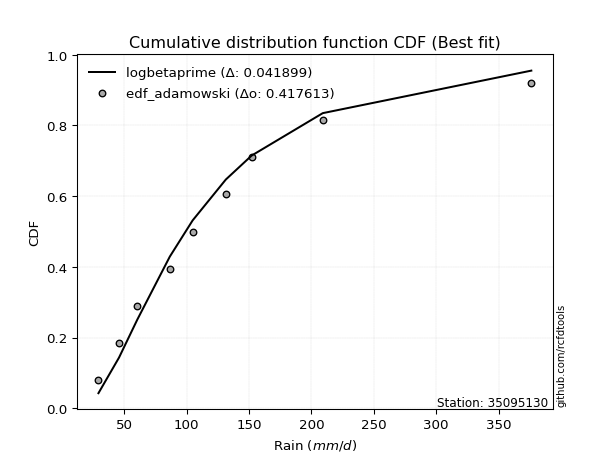</img>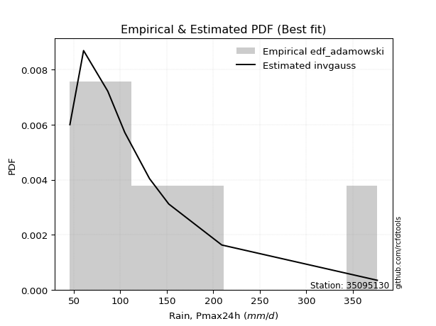</img>

</div>


## C. Best fit & Estimate extreme values for specific return periods - Tr

Best fit in probability distribution analysis means finding the theoretical distribution (like Normal, Poisson, Exponential, etc.) that most accurately mirrors your real-world data´s patterns (shape, center, spread) for better predictions, using methods like visual checks (Q-Q plots), goodness-of-fit tests (Kolmogorov-Smirnov, Chi-Squared), and information criteria (AIC) to score and select the simplest, most representative model.


### 1. Best fit (ordered by delta Δ)

:file_folder:Table: [bestfit_35095130.csv](table/bestfit_35095130.csv)

<div align="center">

|   id |   station | empirical_dist   | p_dist       |     delta |   deltao | eval   |   fit |   n |   best_fit |   best_fit_sort |
|-----:|----------:|:-----------------|:-------------|----------:|---------:|:-------|------:|----:|-----------:|----------------:|
|    0 |  35095130 | edf_hazen        | logcosine    | 0.0299212 | 0.417613 | Δo > Δ |     1 |   9 |          1 |               1 |
|    1 |  35095130 | edf_gringorten   | logcosine    | 0.0328452 | 0.417613 | Δo > Δ |     1 |   9 |          1 |               2 |
|    2 |  35095130 | edf_cunnane      | logcosine    | 0.0348669 | 0.417613 | Δo > Δ |     1 |   9 |          1 |               3 |
|    3 |  35095130 | edf_blom         | loganglit    | 0.0349768 | 0.417613 | Δo > Δ |     1 |   9 |          1 |               4 |
|    4 |  35095130 | edf_tukey        | loganglit    | 0.0388378 | 0.417613 | Δo > Δ |     1 |   9 |          1 |               5 |
|    5 |  35095130 | edf_filliben     | loganglit    | 0.040287  | 0.417613 | Δo > Δ |     1 |   9 |          1 |               6 |
|    6 |  35095130 | edf_beard        | logbetaprime | 0.0405528 | 0.417613 | Δo > Δ |     1 |   9 |          1 |               7 |
|    7 |  35095130 | edf_jenkinson    | logbetaprime | 0.0405528 | 0.417613 | Δo > Δ |     1 |   9 |          1 |               8 |
|    8 |  35095130 | edf_chegodayev   | logbetaprime | 0.0407796 | 0.417613 | Δo > Δ |     1 |   9 |          1 |               9 |
|    9 |  35095130 | edf_adamowski    | logbetaprime | 0.0418994 | 0.417613 | Δo > Δ |     1 |   9 |          1 |              10 |
|   10 |  35095130 | edf_weibull      | logbetaprime | 0.0569614 | 0.417613 | Δo > Δ |     1 |   9 |          1 |              11 |
|   11 |  35095130 | edf_california   | logdweibull  | 0.0631492 | 0.417613 | Δo > Δ |     1 |   9 |          1 |              12 |

</div>


### 2. Extreme values and % difference analysis

In hydrology, a return period (or recurrence interval $Tr$) is the statistical average time between extreme events like floods or droughts of a specific magnitude, indicating how rare an event is, with a 100-year flood, for example, having a 1% chance of occurring in any given year, not that it happens exactly every century. It is a key tool for infrastructure design (like bridges or dams) and risk assessment, calculated from historical data to determine the probability of future events, although it is important to remember it is statistical average, and events can cluster or be missed.

The extreme value porcentage difference is evaluated as $pdiff = 1 - (ETrBf / ETr) * 100$, where _ETrBf_ correspond to the bestfit extreme value for a specific recurrence interval and _ETr_ correspond to the extreme value for one of the most used PDFsused in hydrology.

> risk_rate: assuming the return period as the project useful life.

:file_folder:Table: [extreme_35095130.csv](table/extreme_35095130.csv), all PDFs.  
:file_folder:Table: [extremepdiff_35095130.csv](table/extremepdiff_35095130.csv), % difference between bestfit and most used PDFs in Hydrology.

<div align="center">

Extreme values table for only best fit PDFs
|   id |      tr |   prob_l |     prob_g |    alpha |   anglit |   arcsine |   argus |    beta |   betaprime |   bradford |      burr |   burr12 |   cosine |   crystalball |   dgamma |   dweibull |   erlang |   exponnorm |   exponpow |   exponweib |         f |   fatiguelife |   foldnorm |    gamma |   gausshyper |   genexpon |   genextreme |   gengamma |   genhalflogistic |   genlogistic |   gennorm |   genpareto |   gompertz |   gumbel_l |   gumbel_r |   halfgennorm |   halflogistic |   halfnorm |   hypsecant |   invgamma |   invgauss |   invweibull |   johnsonsb |   johnsonsu |   kappa3 |   kappa4 |   ksone |   kstwobign |   laplace |   levy_l |   loggamma |   logistic |   loglaplace |   lomax |   maxwell |    mielke |   moyal |   nakagami |      ncf |       nct |    norm |   pearson3 |   powerlaw |   rayleigh |     rdist |    rice |   semicircular |   skewnorm |        t |   trapezoid |   triang |   truncexpon |   truncnorm |   truncpareto |   truncweibull_min |   tukeylambda |   uniform |   vonmises |   vonmises_line |    wald |   weibull_max |   weibull_min |   wrapcauchy |   logalpha |   loganglit |   logarcsine |   logargus |   logbeta |   logbetaprime |   logbradford |   logburr |   logburr12 |   logcosine |   logcrystalball |   logdgamma |   logdweibull |   logerlang |   logexponnorm |   logexponpow |   logexponweib |     logf |   logfatiguelife |   logfoldnorm |   loggausshyper |   loggenexpon |   loggenextreme |   loggengamma |   loggenhalflogistic |   loggenlogistic |   loggennorm |   loggenpareto |   loggompertz |   loggumbel_l |   loggumbel_r |   loghalfgennorm |   loghalflogistic |   loghalfnorm |   loghypsecant |   loginvgamma |   loginvgauss |   loginvweibull |   logjohnsonsb |   logjohnsonsu |   logkappa3 |   logkappa4 |   logksone |   logkstwobign |   loglevy_l |   logloggamma |   loglogistic |   logloglaplace |    loglomax |   logmaxwell |   logmielke |   logmoyal |   lognakagami |   logncf |   lognct |   lognorm |   logpearson3 |   logpowerlaw |   lograyleigh |   logrdist |   logrice |   logsemicircular |   logskewnorm |     logt |   logtrapezoid |   logtriang |   logtruncexpon |   logtruncnorm |   logtruncpareto |   logtruncweibull_min |   logtukeylambda |   loguniform |   logvonmises |   logvonmises_line |    logwald |   logweibull_max |   logweibull_min |   logwrapcauchy |   station |   n |   risk_rate |
|-----:|--------:|---------:|-----------:|---------:|---------:|----------:|--------:|--------:|------------:|-----------:|----------:|---------:|---------:|--------------:|---------:|-----------:|---------:|------------:|-----------:|------------:|----------:|--------------:|-----------:|---------:|-------------:|-----------:|-------------:|-----------:|------------------:|--------------:|----------:|------------:|-----------:|-----------:|-----------:|--------------:|---------------:|-----------:|------------:|-----------:|-----------:|-------------:|------------:|------------:|---------:|---------:|--------:|------------:|----------:|---------:|-----------:|-----------:|-------------:|--------:|----------:|----------:|--------:|-----------:|---------:|----------:|--------:|-----------:|-----------:|-----------:|----------:|--------:|---------------:|-----------:|---------:|------------:|---------:|-------------:|------------:|--------------:|-------------------:|--------------:|----------:|-----------:|----------------:|--------:|--------------:|--------------:|-------------:|-----------:|------------:|-------------:|-----------:|----------:|---------------:|--------------:|----------:|------------:|------------:|-----------------:|------------:|--------------:|------------:|---------------:|--------------:|---------------:|---------:|-----------------:|--------------:|----------------:|--------------:|----------------:|--------------:|---------------------:|-----------------:|-------------:|---------------:|--------------:|--------------:|--------------:|-----------------:|------------------:|--------------:|---------------:|--------------:|--------------:|----------------:|---------------:|---------------:|------------:|------------:|-----------:|---------------:|------------:|--------------:|--------------:|----------------:|------------:|-------------:|------------:|-----------:|--------------:|---------:|---------:|----------:|--------------:|--------------:|--------------:|-----------:|----------:|------------------:|--------------:|---------:|---------------:|------------:|----------------:|---------------:|-----------------:|----------------------:|-----------------:|-------------:|--------------:|-------------------:|-----------:|-----------------:|-----------------:|----------------:|----------:|----:|------------:|
|    0 |    2    | 0.5      | 0.5        |  100.497 |  132.862 |   132.862 | 192.855 | 146.922 |     100.566 |    99.8379 |   99.3456 |  69.4043 |  154.551 |       132.862 |  104.8   |    114.589 |  32.7627 |     100.437 |    90.9177 |     56.723  |   75.092  |       29.3001 |    110.353 |  68.148  |      159.458 |    101.109 |       98.232 |    92.1491 |           254.386 |       114.112 |   104.8   |     103.55  |    115.729 |    149.464 |    116.261 |       80.916  |        108.007 |    112.177 |     132.862 |     98.181 |     96.056 |       98.232 |     376.253 |     96.1101 |  103.982 |  194.346 | 202.78  |     121.269 |   132.862 |  84.7336 |    101.156 |    132.862 |      101.636 | 100.288 |   124.22  |   99.3409 | 110.901 |    89.0718 |  100.785 |   94.9402 | 132.862 |    110.743 |    36.2247 |    121.154 |  -4.46071 | 131.537 |        132.862 |    126.897 |  103.413 |     288.74  |  264.462 |      135.664 |     132.862 |       98.2351 |            99.4755 |      -4.53286 |   202.78  |  -1.62568  |         118.967 | 100.105 |       376.108 |       96.1538 |      202.848 |    97.1121 |     101.636 |      101.636 |    120.685 |   125.251 |        98.7611 |       85.6657 |   71.9968 |     97.6714 |     102.42  |          101.636 |     114.879 |       95.7751 |     101.157 |        101.634 |       92.7462 |        65.268  |  100.861 |          100.77  |       101.467 |         96.7801 |       87.7686 |         102.565 |       60.1687 |              157.545 |          99.4667 |      104.997 |        38.3083 |       99.4489 |       114.792 |       89.9882 |          88.0539 |           84.7034 |        87.334 |        101.636 |       98.0381 |       95.1395 |         90.4345 |        30.4137 |        101.037 |      29.3   |     104.71  |    104.997 |        87.6371 |     94.1004 |       102.289 |       101.636 |         104.8   |     69.5165 |      95.3955 |     71.9777 |    86.5206 |       86.5826 |  100.299 |  101.729 |   101.636 |       101.207 |       32.3797 |       93.2754 |    78.6303 |   97.7039 |           101.636 |       101.587 |  101.637 |        198.016 |     143.559 |         81.1933 |        92.9193 |          99.9319 |               73.2906 |          78.2334 |      104.997 |      0.189369 |            104.997 |    79.9356 |          141.111 |          98.3083 |         104.997 |  35095130 |   9 |    0.75     |
|    1 |    2.33 | 0.570815 | 0.429185   |  113.558 |  153.867 |   164.394 | 217.312 | 179.921 |     114.471 |   120.049  |  112.828  |  84.0361 |  175.348 |       150.895 |  110.06  |    128.929 |  35.6904 |     116.135 |   109.787  |     66.5709 |   90.4656 |       32.4449 |    130.499 |  79.6254 |      188.022 |    116.931 |      111.669 |   106.951  |           277.145 |       128.089 |   114.443 |     119.588 |    132.542 |    165.152 |    132.97  |       97.2765 |        125.188 |    131.639 |     147.294 |    111.82  |    110.583 |      111.669 |     376.259 |    110.582  |  118.026 |  220.677 | 232.264 |     136.713 |   143.775 | 172.028  |    115.468 |    148.75  |      110.102 | 116.215 |   142.955 |  112.824  | 126.719 |   109.615  |  114.714 |  107.654  | 150.895 |    127.85  |    43.9299 |    140.166 |  40.3655  | 147.755 |        155.391 |    143.696 |  115.2   |     308.898 |  282.942 |      161.223 |     150.895 |      118.251  |           120.377  |      25.7435  |   227.35  |  -1.31248  |         135.447 | 111.929 |       376.222 |      112.788  |      251.049 |   111.166  |     118.559 |      128.072 |    140.701 |   152.765 |       112.931  |      102.745  |   84.5656 |    112.138  |     117.817 |          116.003 |     135.849 |      114.159  |     115.468 |        116     |      107.979  |        79.5125 |  115.144 |          115.044 |       115.899 |        117.901  |      102.318  |         117.452 |       70.8644 |              185.83  |         112.95   |      104.997 |        59.0966 |      115.3    |       128.786 |      101.717  |         106.412  |           96.0744 |       100.729 |        112.98  |      112.028  |      108.908  |        104.626  |        32.4366 |        115.329 |      29.3   |     126.309 |    130.433 |       101.746  |    142.538  |       116.774 |       114.193 |         115.237 |     84.2123 |     109.442  |     82.6937 |    97.1598 |       99.6904 |  114.579 |  116.108 |   116.003 |       115.528 |       35.2769 |      107.227  |    95.371  |  112.174  |           119.89  |       115.948 |  116.003 |        229.674 |     168.346 |         96.8218 |       106.988  |         119.83   |               87.5617 |          90.3968 |      125.801 |      0.214403 |            121.682 |    87.1751 |          173.093 |         112.78   |         170.446 |  35095130 |   9 |    0.729209 |
|    2 |    5    | 0.8      | 0.2        |  182.934 |  227.978 |   248.479 | 295.762 | 292.206 |     187.161 |   220.046  |  187.343  | 217.712  |  250.292 |       217.91  |  150.202 |    185.331 |  64.3784 |     194.623 |   206.224  |    127.102  |  181.49   |       99.2464 |    215.697 | 142.36   |      288.366 |    196.036 |      185.231 |   189.564  |           337.361 |       188.804 |   167.559 |     198.075 |    207.567 |    215.837 |    205.564 |      201.86   |        202.924 |    213.942 |     205.183 |    185.937 |    189.411 |      185.231 |     376.26  |    190.616  |  188.889 |  309.442 | 327.686 |     202.318 |   198.336 | 316.654  |    189.296 |    210.097 |      164.26  | 197.427 |   216.694 |  187.357  | 199.988 |   212.522  |  187.277 |  181.504  | 217.91  |    204.741 |   127.71   |    216.28  | 163.589   | 212.679 |        232.27  |    214.736 |  164.058 |     366.731 |  335.963 |      259.655 |     217.91  |      218.203  |           221.282  |     123.711   |   306.868 |  -0.130547 |         199.937 | 178.123 |       376.26  |      200.446  |      338.951 |   188.535  |     204.136 |      237.243 |    230.187 |   271.052 |       188.386  |      196.518  |  148.358  |    189.831  |     195.158 |          189.611 |     210.57  |      179.708  |     189.293 |        189.609 |      190.267  |       222.434  |  189.171 |          189.125 |       189.979 |        228.258  |      191.101  |         192.273 |      163.065  |              286.548 |         187.32   |      104.997 |       197.12   |      195.831  |       186.749 |      173.2    |         236.987  |          169.881  |       184.171 |        172.717 |      187.405  |      186.093  |        197.092  |       155.963  |        189.206 |      29.3   |     230.342 |    263.197 |       191.818  |    283.601  |       190.557 |       179.053 |         190.834 |    221.388  |     187.926  |    136.299  |   166.262  |      186.008  |  189.361 |  189.702 |   189.61  |       189.37  |       72.0254 |      187.357  |   165.568  |  189.987  |           210.662 |       189.577 |  189.61  |        351.481 |     265.862 |        185.528  |       204.152  |         218.678  |              173.185  |         143.547  |      225.821 |      0.343805 |            206.782 |   141.635  |          283.954 |         189.85   |         310.199 |  35095130 |   9 |    0.67232  |
|    3 |   10    | 0.9      | 0.1        |  261.85  |  269.926 |   268.778 | 333.592 | 339.157 |     263.007 |   287.551  |  275.041  | inf      |  295.571 |       262.367 |  191.396 |    231.43  | 105.474  |     265.871 |   289.659  |    193.61   |  279.878  |      191.482  |    278.742 | 203.616  |      334.293 |    267.845 |      268.679 |   277.801  |           358.37  |       238.253 |   219.774 |     266.93  |    265.48  |    244.055 |    264.691 |      328.031  |        267.481 |    274.845 |     251.409 |    267.951 |    270.309 |      268.679 |     376.26  |    277.635  |  263.277 |  350.214 | 369.321 |     252.268 |   247.865 | 351.57   |    263.341 |    255.277 |      236.18  | 273.487 |   268.588 |  275.1    | 263.78  |   296.786  |  262.587 |  274.161  | 262.367 |    268.052 |   220.678  |    270.551 | 196.225   | 258.972 |        271.719 |    267.305 |  208.212 |     389.32  |  356.672 |      313.128 |     262.367 |      286.281  |           288.165  |     166.434   |   341.564 |   0.596469 |         249.406 | 248.369 |       376.26  |      284.529  |      359.121 |   274.276  |     277.645 |      275.314 |    291.857 |   330.472 |       267.737  |      269.099  |  200.656  |    270.955  |     264.732 |          262.677 |     293.511 |      245.208  |     263.336 |        262.68  |      272.01   |       588.151  |  263.953 |          264.114 |       263.684 |        301.355  |      300.164  |         261.331 |      353.255  |              332.521 |         274.651  |      104.997 |       293.392  |      270.285  |       229.674 |      267.19   |         428.541  |          272.718  |       287.836 |        242.398 |      268.197  |      273.729  |        330.124  |       339.716  |        263.534 |     292.592 |     297.041 |    357.533 |       310.851  |    334.843  |       263.133 |       249.37  |         315.897 |    538.412  |     274.935  |    187.321  |   265.413  |      299.01   |  266.074 |  262.648 |   262.676 |       263.381 |      139.418  |      278.921  |   195.168  |  271.592  |           281.319 |       262.749 |  262.675 |        415.032 |     317.813 |        258.919  |       343.746  |         286.242  |              248.695  |         174.467  |      291.492 |      0.481881 |            274.531 |   237.058  |          332.657 |         269.227  |         344.68  |  35095130 |   9 |    0.651322 |
|    4 |   15    | 0.933333 | 0.0666667  |  320.368 |  287.838 |   272.65  | 347.974 | 353.459 |     313.483 |   314.473  |  339.737  | inf      |  316.196 |       284.551 |  216.309 |    257.32  | 133.842  |     307.549 |   335.673  |    236.232  |  343.479  |      251.806  |    311.55  | 240.534  |      349.32  |    309.851 |      328.017 |   335.437  |           364.733 |       266.15  |   251.547 |     306.182 |    295.904 |    256.835 |    298.05  |      415.199  |        304.014 |    306.538 |     277.79  |    324.886 |    321.384 |      328.017 |     376.26  |    335.984  |  314.886 |  364.229 | 383.199 |     278.785 |   276.837 | 362.118  |    310.709 |    279.893 |      292.078 | 319.039 |   295.214 |  339.839  | 300.802 |   341.66   |  312.515 |  345.324  | 284.551 |    303.507 |   264.307  |    298.514 | 203.005   | 282.824 |        287.102 |    294.662 |  237.262 |     396.568 |  363.317 |      332.934 |     284.551 |      313.533  |           314.814  |     180.668   |   353.129 |   0.885149 |         276.586 | 293.478 |       376.26  |      335.167  |      365.042 |   333.317  |     316.612 |      283.241 |    319.42  |   348.962 |       320.253  |      300.194  |  229.972  |    323.918  |     304.176 |          309.074 |     352.978 |      288.678  |     310.704 |        309.082 |      322.253  |      1050.72   |  312.044 |          312.406 |       310.551 |        328.175  |      379.24   |         301.584 |      558.36   |              347.674 |         338.995  |      104.997 |       326.355  |      314.286  |       252.235 |      341.227  |         583.258  |          356.49   |       363.13  |        294.125 |      322.452  |      335.033  |        441.632  |       365.26   |        311.197 |     318.623 |     322.53  |    395.968 |       401.659  |    352.072  |       308.915 |       298.695 |         433.684 |    910.063  |     334.206  |    220.923  |   348.184  |      383.429  |  315.946 |  308.92  |   309.073 |       310.704 |      186.149  |      342.39   |   202.761  |  325.113  |           314.908 |       309.253 |  309.071 |        437.764 |     336.545 |        291.82   |       456.042  |         313.411  |              283.678  |         185.812  |      317.38  |      0.578457 |            304.195 |   329.985  |          348.283 |         320.5    |         355.244 |  35095130 |   9 |    0.644736 |
|    5 |   20    | 0.95     | 0.05       |  369.871 |  298.375 |   274.013 | 355.868 | 360.152 |     352.54  |   328.881  |  393.353  | inf      |  328.88  |       299.079 |  234.217 |    275.338 | 155.396  |     337.12  |   367.063  |    267.862  |  391.232  |      296.469  |    333.423 | 267.077  |      356.646 |    339.655 |      375.945 |   379.064  |           367.788 |       285.683 |   274.552 |     333.583 |    316.195 |    264.79  |    321.406 |      482.96   |        329.61  |    327.669 |     296.401 |    370.115 |    359.133 |      375.945 |     376.26  |    381.032  |  356.311 |  371.357 | 390.138 |     296.648 |   297.394 | 367.52   |    346.339 |    296.907 |      339.59  | 351.842 |   312.885 |  393.495  | 327.022 |   371.763  |  351.057 |  405.719  | 299.079 |    328.154 |   289.009  |    317.1   | 205.521   | 298.678 |        295.635 |    312.901 |  260.074 |     400.144 |  366.595 |      343.273 |     299.079 |      328.139  |           329.097  |     187.782   |   358.912 |   1.03761  |         294.591 | 327.093 |       376.26  |      371.641  |      367.923 |   379.846  |     342.043 |      286.087 |    335.64  |   357.486 |       360.598  |      317.345  |  251.039  |    364.171  |     331.298 |          343.814 |     401.241 |      322.263  |     346.333 |        343.827 |      358.825  |      1592.48   |  348.336 |          348.881 |       345.67  |        341.577  |      443.164  |         329.775 |      774.323  |              355.143 |         392.282  |      104.997 |       341.911  |      345.674  |       267.384 |      404.964  |         716.321  |          430.085  |       423.979 |        337.126 |      364.524  |      383.793  |        541.441  |       371.386  |        347.102 |     332.494 |     335.823 |    416.709 |       477.35   |    361.235  |       343.052 |       338.38  |         548.758 |   1323.72   |     380.437  |    247.533  |   421.986  |      452.712  |  353.835 |  343.544 |   343.813 |       346.29  |      218.337  |      392.377  |   205.857  |  365.92   |           335.239 |       344.091 |  343.81  |        449.433 |     346.188 |        310.361  |       552.708  |         328.005  |              303.673  |         191.639  |      331.175 |      0.656943 |            320.582 |   422.216  |          355.86  |         359.198  |         360.475 |  35095130 |   9 |    0.641514 |
|    6 |   25    | 0.96     | 0.04       |  414.12  |  305.516 |   274.646 | 360.959 | 363.968 |     384.885 |   337.847  |  440.107  | inf      |  337.775 |       309.774 |  248.213 |    289.143 | 172.791  |     360.057 |   390.718  |    293.113  |  429.775  |      331.955  |    349.698 | 287.832  |      360.944 |    362.772 |      416.922 |   414.48   |           369.578 |       300.729 |   292.636 |     354.583 |    331.267 |    270.45  |    339.397 |      538.884  |        349.331 |    343.391 |     310.804 |    408.299 |    389.215 |      416.922 |     376.26  |    418.174  |  391.676 |  375.685 | 394.302 |     310.028 |   313.339 | 370.91   |    375.199 |    309.922 |      381.704 | 377.567 |   326.004 |  440.287  | 347.345 |   394.217  |  382.92  |  459.285  | 309.774 |    347.031 |   304.829  |    330.909 | 206.733   | 310.457 |        301.17  |    326.471 |  279.305 |     402.274 |  368.548 |      349.627 |     309.774 |      337.234  |           337.996  |     192.05    |   362.382 |   1.13124  |         307.416 | 354.019 |       376.26  |      400.216  |      369.633 |   418.854  |     360.428 |      287.417 |    346.535 |   362.257 |       393.783  |      328.196  |  267.829  |    396.995  |     351.749 |          371.858 |     442.63  |      350.032  |     375.193 |        371.876 |      387.672  |      2203.21   |  377.801 |          378.513 |       374.036 |        349.474  |      497.618  |         351.317 |      998.997  |              359.571 |         438.726  |      104.997 |       350.685  |      370.109  |       278.715 |      462.066  |         834.656  |          496.995  |       475.778 |        374.675 |      399.373  |      424.936  |        633.45   |       373.598  |        376.216 |     341.106 |     343.941 |    429.671 |       543.249  |    367.108  |       370.527 |       372.262 |         662.786 |   1772.47   |     418.848  |    270.224  |   489.791  |      512.313  |  384.748 |  371.483 |   371.857 |       375.107 |      241.484  |      434.185  |   207.442  |  399.278  |           349.124 |       372.226 |  371.855 |        456.532 |     352.065 |        322.239  |       638.844  |         337.105  |              316.585  |         195.17   |      339.737 |      0.724992 |            330.93  |   514.365  |          360.298 |         390.591  |         363.611 |  35095130 |   9 |    0.639603 |
|    7 |   50    | 0.98     | 0.02       |  597.969 |  323.094 |   275.491 | 372.501 | 370.966 |     498.313 |   356.529  |  620.754  | inf      |  361.066 |       340.399 |  292.14  |    331.232 | 229.855  |     431.305 |   460.571  |    375.123  |  557.997  |      445.81   |    397.002 | 353.054  |      369.187 |    434.581 |      569.356 |   533.362  |           373.043 |       347.077 |   350.012 |     418.433 |    374.827 |    285.816 |    394.819 |      731.285  |        410.094 |    389.088 |     355.459 |    546.973 |    486.695 |      569.356 |     376.26  |    546.673  |  523.542 |  384.503 | 402.629 |     349.318 |   362.867 | 378.543  |    472.114 |    349.689 |      548.831 | 459.062 |   364.051 |  621.098  | 410.436 |   459.605  |  494.305 |  672.681  | 340.399 |    404.57  |   338.852  |    370.994 | 208.445   | 344.649 |        313.816 |    365.915 |  349.788 |     406.502 |  372.424 |      362.69  |     340.399 |      356.203  |           356.575  |     200.581   |   369.321 |   1.32217  |         338.617 | 441.929 |       376.26  |      490.391  |      373.025 |   558.389  |     410.006 |      289.203 |    372.563 |   370.68  |       508.362  |      351.254  |  324.464  |    508.416  |     411.482 |          465.475 |     597.288 |      446.951  |     472.108 |        465.511 |      479.663  |      6101.37   |  477.174 |          478.565 |       468.808 |        364.464  |      697.073  |         415.694 |     2216.85   |              368.234 |         618.015  |      104.997 |       366.205  |      446.453  |       311.953 |      693.713  |        1301.66   |          775.96   |       665.139 |        519.814 |      521.264  |      573.751  |       1027.27   |       375.794  |        474.183 |     359.003 |     360.369 |    456.818 |       794.179  |    380.683  |       461.746 |       498.28  |        1235.97  |   4421.69   |     553.614  |    356.299  |   777.87   |      734.096  |  489.923 |  464.666 |   465.473 |       471.842 |      298.937  |      582.527  |   209.882  |  513.024  |           383.042 |       466.21  |  465.469 |        470.955 |     364.023 |        347.865  |       980.863  |         356.114  |              344.702  |         202.257  |      357.533 |      0.991739 |            352.806 |   979.948  |          368.818 |         496.129  |         369.904 |  35095130 |   9 |    0.63583  |
|    8 |   75    | 0.986667 | 0.0133333  |  753.979 |  330.83  |   275.647 | 377.078 | 373.029 |     575.027 |   362.986  |  757.412  | inf      |  372.189 |       356.832 |  318.081 |    355.38  | 264.936  |     472.983 |   499.087  |    425.342  |  639.127  |      514.379  |    422.753 | 391.631  |      371.767 |    476.587 |      679.705 |   609.198  |           374.157 |       374.016 |   384.336 |     454.832 |    398.308 |    293.586 |    427.032 |      856.911  |        445.415 |    413.964 |     381.555 |    644.592 |    546.251 |      679.705 |     376.26  |    631.726  |  619.674 |  387.517 | 405.405 |     370.935 |   391.84  | 381.68   |    534.243 |    372.656 |      678.725 | 507.868 |   384.736 |  757.894  | 447.33  |   495.209  |  569.365 |  839.611  | 356.832 |    437.601 |   350.933  |    392.802 | 208.792   | 363.251 |        318.867 |    387.387 |  400.445 |     407.901 |  373.707 |      367.155 |     356.832 |      362.765  |           363.01   |     203.423   |   371.634 |   1.38658  |         350.65  | 496.025 |       376.26  |      544.03   |      374.15  |   654.688  |     433.934 |      289.535 |    383.419 |   373.015 |       584.214  |      359.365  |  362.221  |    580.637  |     443.486 |          525.075 |     709.675 |      511.997  |     534.239 |        525.126 |      534.963  |     11141.2    |  541.197 |          543.108 |       529.204 |        369.013  |      837.661  |         451.103 |     3546.62   |              371.032 |         753.518  |      104.997 |       370.475  |      491.39   |       330.241 |      878.524  |        1657.86   |         1005.34   |       798.218 |        629.425 |      603.192  |      677.685  |       1360.59   |       376.077  |        537.136 |     365.175 |     365.834 |    466.243 |       978.715  |    386.406  |       519.455 |       589.668 |        1828.82  |   7586.99   |     644.279  |    421.649  |  1019.5    |      892.892  |  558.373 |  523.935 |   525.073 |       533.827 |      322.152  |      683.53   |   210.437  |  587.143  |           397.495 |       526.094 |  525.067 |        475.83  |     368.071 |        357.004  |      1244.15   |         362.7    |              354.814  |         204.601  |      363.669 |      1.20325  |            360.449 |  1457      |          371.499 |         563.751  |         372.013 |  35095130 |   9 |    0.634587 |
|    9 |  100    | 0.99     | 0.01       |  897.606 |  335.43  |   275.702 | 379.634 | 373.985 |     634.754 |   366.26   |  871.728  | inf      |  379.161 |       367.946 |  336.573 |    372.333 | 290.435  |     502.554 |   525.455  |    461.88   |  699.535  |      563.717  |    440.295 | 419.158  |      373.005 |    506.391 |      769.416 |   665.857  |           374.703 |       393.082 |   408.999 |     480.241 |    414.187 |    298.669 |    449.832 |      951.893  |        470.415 |    430.91  |     400.067 |    722.54  |    589.515 |      769.416 |     376.26  |    696.826  |  698.329 |  389.046 | 406.792 |     385.746 |   412.396 | 383.514  |    580.917 |    388.872 |      789.132 | 543.015 |   398.826 |  872.335  | 473.505 |   519.448  |  627.672 |  982.211  | 367.946 |    460.807 |   357.117  |    407.66  | 208.919   | 375.925 |        321.696 |    402.014 |  441.623 |     408.599 |  374.347 |      369.409 |     367.946 |      366.092  |           366.274  |     204.844   |   372.79  |   1.41886  |         356.908 | 535.466 |       376.26  |      582.446  |      374.712 |   730.518  |     448.819 |      289.652 |    389.616 |   374.053 |       642.36   |      363.504  |  391.803  |    635.227  |     464.803 |          569.655 |     801.204 |      562.32   |     580.914 |        569.717 |      574.792  |     17122.2    |  589.444 |          591.786 |       574.405 |        371.141  |      949.47   |         475.049 |     4957.41   |              372.403 |         866.8    |      104.997 |       372.358  |      523.385  |       342.779 |     1038.37   |        1954.83   |         1207.59   |       903.818 |        720.923 |      666.611  |      760.102  |       1659.98   |       376.163  |        584.5   |     368.3   |     368.542 |    471.028 |      1129.34   |    389.791  |       562.449 |       664.113 |        2446.47  |  11154.5    |     714.396  |    477.218  |  1235.19   |     1020.29   |  610.284 |  568.24  |   569.653 |       580.379 |      334.662  |      762.196  |   210.657  |  643.355  |           405.826 |       570.909 |  569.646 |        478.279 |     370.106 |        361.693  |      1465.22   |         366.041  |              360.019  |         205.762  |      366.777 |      1.3882   |            364.336 |  1945.59   |          372.792 |         614.487  |         373.071 |  35095130 |   9 |    0.633968 |
|   10 |  200    | 0.995    | 0.005      | 1421.75  |  344.121 |   275.755 | 384.075 | 375.283 |     799.279 |   371.226  | 1221.54   | inf      |  393.336 |       393.157 |  381.365 |    412.643 | 353.581  |     573.802 |   586      |    552.752  |  855.218  |      684.487  |    480.417 | 485.92   |      374.765 |    578.2   |     1032.57  |   812.216  |           375.505 |       438.92  |   469.393 |     540.071 |    450.086 |    309.716 |    504.643 |     1200.7    |        530.517 |    469.668 |     444.662 |    945.234 |    696.83  |     1032.57  |     376.26  |    871.074  |  931.615 |  391.383 | 408.874 |     419.86  |   461.925 | 386.988  |    702.756 |    427.77  |     1134.65  | 629.502 |   431.061 | 1222.56   | 536.569 |   574.811  |  787.762 | 1432.13   | 393.157 |    516.06  |   366.577  |    441.654 | 209.05    | 404.922 |        326.628 |    435.469 |  562.907 |     409.644 |  375.305 |      372.818 |     393.157 |      371.14   |           371.23   |     206.973   |   374.525 |   1.46737  |         366.512 | 633.71  |       376.26  |      676.126  |      375.555 |   942.463  |     478.348 |      289.764 |    400.626 |   375.389 |       798.582  |      369.818  |  475.394  |    778.87   |     511.359 |          685.313 |    1070.17  |      699.398  |     702.757 |        685.411 |      672.578  |     48591.7    |  715.949 |          719.568 |       691.767 |        374.052  |     1265.12   |         528.382 |    11161      |              374.407 |        1213.15   |      104.997 |       374.754  |      600.825  |       371.699 |     1551.98   |        2849.51   |         1876.31   |      1200.86  |        999.751 |      839.451  |      992.638  |       2677.71   |       376.237  |        708.403 |     373.039 |     372.533 |    478.298 |      1570.42   |    396.286  |       673.371 |       883.289 |        5169.53  |  28459.6    |     904.864  |    654.853  |  1961.3    |     1384.04   |  747.629 |  683.09  |   685.311 |       701.85  |      354.66   |      977.945  |   210.902  |  791.958  |           420.769 |       687.264 |  685.301 |        481.97  |     373.174 |        368.882  |      2139.16   |         371.113  |              368.02   |         207.475  |      371.488 |      1.98136  |            370.249 |  3998.41   |          374.644 |         746.539  |         374.662 |  35095130 |   9 |    0.633042 |
|   11 |  250    | 0.996    | 0.004      | 1670.17  |  346.332 |   275.761 | 385.114 | 375.516 |     859.186 |   372.227  | 1361.34   | inf      |  397.222 |       400.861 |  395.845 |    425.474 | 374.346  |     596.739 |   604.66   |    582.804  |  908.513  |      723.846  |    492.76  | 507.528  |      375.096 |    601.317 |     1133.89  |   862.325  |           375.661 |       453.656 |   489.108 |     558.923 |    461.003 |    312.966 |    522.264 |     1286.8    |        549.839 |    481.592 |     459.018 |   1028.99  |    732.217 |     1133.89  |     376.26  |    932.722  | 1022.39  |  391.86  | 409.291 |     430.417 |   477.87  | 387.892  |    744.944 |    440.258 |     1275.36  | 657.896 |   440.984 | 1362.53   | 556.871 |   591.817  |  845.883 | 1616.72   | 400.861 |    533.674 |   368.496  |    452.119 | 209.067   | 413.848 |        327.785 |    445.761 |  609.878 |     409.853 |  375.496 |      373.504 |     400.861 |      372.159  |           372.23   |     207.399   |   374.872 |   1.47707  |         368.454 | 666.212 |       376.26  |      706.598  |      375.723 |  1020.55   |     486.168 |      289.778 |    403.247 |   375.615 |       854.104  |      371.096  |  506.847  |    828.942  |     524.916 |          725.139 |    1173.84  |      748.738  |     744.948 |        725.251 |      704.562  |     68127.2    |  759.93  |          764.038 |       732.207 |        374.577  |     1382.09   |         544.187 |    14512.2    |              374.797 |        1351.47   |      104.997 |       375.152  |      625.853  |       380.664 |     1766.02   |        3199.76   |         2161.88   |      1310.57  |       1110.72  |      901.683  |     1078.99   |       3122.65   |       376.245  |        751.391 |     373.994 |     373.314 |    479.765 |      1739.13   |    397.994  |       711.373 |       967.983 |        6676.16  |  38568.9    |     973.151  |    729.604  |  2276.09   |     1520.08   |  795.768 |  722.609 |   725.137 |       743.895 |      358.847  |     1055.93   |   210.937  |  843.975  |           424.353 |       727.358 |  725.126 |        482.71  |     373.79  |        370.342  |      2405.94   |         372.137  |              369.649  |         207.811  |      372.438 |      2.2141   |            371.444 |  5074.37   |          374.996 |         792.11   |         374.981 |  35095130 |   9 |    0.632858 |
|   12 |  500    | 0.998    | 0.002      | 2868.34  |  351.817 |   275.77  | 387.504 | 375.941 |    1070.33  |   374.238  | 1905.17   | inf      |  407.563 |       423.709 |  440.98  |    464.933 | 439.964  |     667.988 |   660.291  |    678.435  | 1084.52   |      847.315  |    529.56  | 574.942  |      375.726 |    673.127 |     1512.56  |  1027.41   |           375.969 |       499.394 |   551.132 |     616.237 |    493.165 |    322.284 |    576.957 |     1572.97   |        609.811 |    517.143 |     503.61  |   1334.38  |    844.438 |     1512.56  |     376.26  |   1142.87   | 1365.78  |  392.831 | 410.123 |     462.056 |   527.399 | 390.227  |    885.82  |    478.987 |     1833.77  | 747.848 |   470.594 | 1907.1    | 619.933 |   642.437  | 1050.11  | 2355.39   | 423.709 |    587.937 |   372.36   |    483.342 | 209.091   | 440.481 |        330.449 |    476.447 |  786.92  |     410.27  |  375.878 |      374.879 |     423.709 |      374.204  |           374.239  |     208.25    |   375.566 |   1.49649  |         372.353 | 769.557 |       376.26  |      802.141  |      376.06  |  1298.77   |     506.116 |      289.796 |    409.339 |   376.006 |      1044.51   |      373.669  |  622.936  |    997.188  |     562.773 |          857.378 |    1561.5   |      920.228  |     885.832 |        857.539 |      805.316  |    195795      |  907.395 |          913.3   |       866.574 |        375.537  |     1799.82   |         589.002 |    32928.6    |              375.557 |        1889.1    |      104.997 |       375.833  |      703.874  |       407.579 |     2637.23   |        4520.9    |         3355.85   |      1700.82  |       1540.27  |     1118.03   |     1388.93   |       5031.9    |       376.256  |        895.225 |     375.912 |     374.842 |    482.713 |      2361.2    |    402.439  |       836.904 |      1285.85  |       15529.6   |  99908.6    |    1209.11   |   1043.56   |  3614.06   |     2010.05   |  958.519 |  853.726 |   857.375 |       884.241 |      367.418  |     1327.57   |   210.99   | 1019.47   |           432.723 |       860.576 |  857.361 |        484.194 |     375.024 |        373.285  |      3425.17   |         374.192  |              372.935  |         208.472  |      374.344 |      2.96716  |            373.844 | 10825.8    |          375.671 |         943.627  |         375.62  |  35095130 |   9 |    0.632489 |
|   13 |  750    | 0.998667 | 0.00133333 | 4040.07  |  354.245 |   275.771 | 388.464 | 376.065 |    1213.72  |   374.911  | 2318.6    | inf      |  412.575 |       436.401 |  467.474 |    487.761 | 479.021  |     709.666 |   691.325  |    735.884  | 1195.19   |      920.265  |    550.12  | 614.559  |      375.921 |    715.132 |     1787.61  |  1130.66   |           376.069 |       526.132 |   587.93  |     648.91  |    510.867 |    327.264 |    608.93  |     1753.51   |        644.871 |    537.003 |     529.695 |   1550.01  |    911.545 |     1787.61  |     376.26  |   1279.72   | 1618.75  |  393.163 | 410.401 |     479.829 |   556.372 | 391.334  |    975.486 |    501.614 |     2267.78  | 801.719 |   487.155 | 2321.13   | 656.822 |   670.659  | 1188.32  | 2935.01   | 436.401 |    619.4   |   373.656  |    500.801 | 209.096   | 455.374 |        331.521 |    493.59  |  916.932 |     410.409 |  376.005 |      375.339 |     436.401 |      374.888  |           374.912  |     208.534   |   375.797 |   1.50297  |         373.654 | 831.52  |       376.26  |      858.616  |      376.172 |  1489.85   |     515.206 |      289.799 |    411.814 |   376.113 |      1169.53   |      374.531  |  706.867  |   1105.01   |     582.088 |          940.993 |    1843.11  |     1034.62   |     975.504 |        941.189 |      865.16   |    364498      | 1001.71  |         1008.87  |       951.597 |        375.819  |     2086.52   |         612.271 |    53308.6    |              375.802 |        2297.45   |      104.997 |       376.016  |      749.695  |       422.735 |     3333.94   |        5483.78   |         4339.54   |      1967.43  |       1864.9   |     1262.38   |     1603.48   |       6650.67   |       376.258  |        986.991 |     376.555 |     375.336 |    483.7   |      2803.73   |    404.565  |       915.802 |      1517.89  |       26404.8   | 175285      |    1365.21   |   1308.65   |  4736.52   |     2349.35   | 1063.61  |  936.559 |   940.989 |       973.528 |      370.335  |     1508.87   |   211.002  | 1132.45   |           436.138 |       944.879 |  940.973 |        484.689 |     375.436 |        374.273  |      4179.35   |         374.88   |              374.039  |         208.688  |      374.982 |      3.35003  |            374.648 | 17051.8    |          375.883 |        1039.52   |         375.833 |  35095130 |   9 |    0.632366 |
|   14 | 1000    | 0.999    | 0.001      | 5202.97  |  355.692 |   275.772 | 389.003 | 376.123 |    1325.55  |   375.248  | 2665.11   | inf      |  415.736 |       445.139 |  486.308 |    503.853 | 506.992  |     739.237 |   712.723  |    777.282  | 1277.36   |      972.303  |    564.318 | 642.738  |      376.015 |    744.936 |     2011.52  |  1206.95   |           376.119 |       545.098 |   614.256 |     671.719 |    522.978 |    330.616 |    631.61  |     1887.5    |        669.74  |    550.719 |     548.202 |   1722.4   |    959.749 |     2011.52  |     376.26  |   1383.48   | 1826.6   |  393.331 | 410.54  |     492.143 |   576.928 | 392.031  |   1042.53  |    517.661 |     2636.68  | 840.513 |   498.602 | 2668.16   | 682.996 |   690.125  | 1295.88  | 3430.72   | 445.139 |    641.613 |   374.305  |    512.866 | 209.097   | 465.665 |        332.124 |    505.429 | 1023.58  |     410.478 |  376.069 |      375.569 |     445.139 |      375.23   |           375.248  |     208.675   |   375.913 |   1.5062   |         374.306 | 876.092 |       376.26  |      898.93   |      376.228 |  1639.85   |     520.701 |      289.8   |    413.209 |   376.16  |      1264.87   |      374.963  |  775.395  |   1185.96   |     594.612 |         1003.25  |    2072.32  |     1122.73   |    1042.55  |       1003.48  |      907.995  |    567410      | 1072.44  |         1080.61  |      1014.94  |        375.949  |     2311.03   |         627.512 |    75109.4    |              375.922 |        2639.51   |      104.997 |       376.096  |      782.282  |       433.252 |     3937.1    |        6265.99   |         5207.57   |      2175.57  |       2135.93  |     1373.59   |     1772.67   |       8105.7    |       376.259  |       1055.71  |     376.881 |     375.579 |    484.194 |      3158.07   |    405.907  |       974.329 |      1707.4   |       39163.3   | 261833      |    1484.73   |   1549.47   |  5738.53   |     2616.43   | 1142.91  |  998.205 |  1003.25  |      1040.27  |      371.805  |     1648.43   |   211.007  | 1217.51   |           438.069 |      1007.69  | 1003.23  |        484.936 |     375.642 |        374.769  |      4798.18   |         375.225  |              374.593  |         208.794  |      375.301 |      3.57375  |            375.05  | 23642.8    |          375.986 |        1110.93   |         375.94  |  35095130 |   9 |    0.632305 |


</div>


<div align="center">

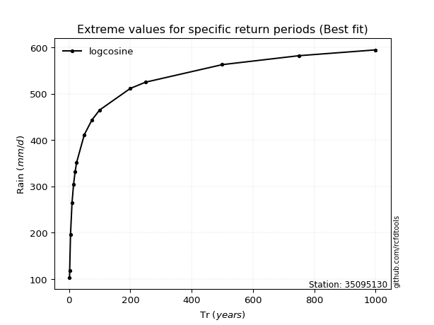</img>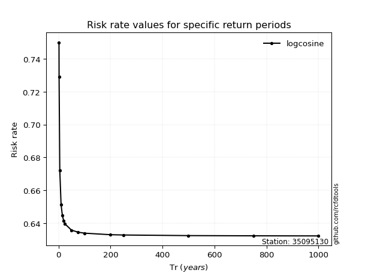</img>

</div>


<sub>**APP DISCLAIMER**: NO WARRANTY - This software is provided by [github.com/rcfdtools](https://github.com/rcfdtools) "as is", without any express or implied warranty, including warranties of merchantability, fitness for a particular purpose, or non-infringement. There is no guarantee that the software will be error-free or operate without interruption. LIMITATION OF LIABILITY - Neither the authors nor copyright holders will be liable for claims or damages arising from the software or its use. You are responsible for determining if the software is appropriate for your use and assume all associated risks, including errors, legal compliance, and data loss. NO PROFESSIONAL ADVICE - The software provides general information and does not offer professional advice. It should not replace consultation with professional advisors.</sub>