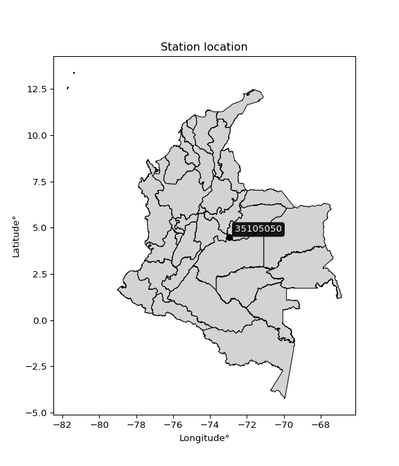

<div align="center">


</div>

# PMax24h Station (Rain): 35105050

Maximum Precipitation in 24 hours (PMax24h) is the greatest amount of rainfall for a specific duration that is meteorologically possible for a given location, acting as a "worst-case" scenario for extreme storms, crucial for designing safety-critical infrastructure like bridges, river deviations, dams, spillways, and nuclear plants to prevent catastrophic failure. The PMax24h is related with the Probable Maximum Precipitation (PMP) and it is calculated by hydrologists using meteorological data to determine the upper limit of extreme rainfall, often leading to the Probable Maximum Flood (PMF) for flood control design, and is increasingly being studied for climate change impacts. Probable Maximum Precipitation (PMP) is the theoretical upper limit of rainfall, a deterministic estimate for extreme events, while probability distributions (like GEV, Gumbel) describe the likelihood and frequency of various precipitation amounts, including rare ones, showing how often events occur, with PMP representing the extreme end of these distributions, used for critical infrastructure design to ensure safety against the worst conceivable weather, unlike standard statistical forecasts which cover typical probabilities.

The most common probability distributions in hydrology, used for analyzing floods, rainfall, and streamflow, include the Normal, Log-Normal, Gumbel, Gamma (including Log-Pearson Type III), and Generalized Extreme Value (GEV) distributions, often chosen based on the data´s skewness and whether modeling extremes or general conditions, with Gumbel and GEV popular for extreme events like floods, while the Normal distribution serves as a baseline, though often requiring transformations for skewed hydrological data. These distributions help in designing water infrastructure, managing water resources, and forecasting hydrologic events.

> Hydrological data often isn´t perfectly normal (it´s skewed), so different distributions are needed for different applications, such as: **Flood Frequency Analysis**: Using Gumbel, GEV, or Log-Pearson Type III for predicting extreme flood magnitudes and their return periods, **Rainfall Analysis**: Normal for annual totals, but Log-Normal, Weibull, or GEV for intensity or extreme daily rainfall, **Streamflow Modeling**: Gamma and Log-Normal for maximum flows, GEV for minimum flows, and Kappa for daily flows.

<div align="center">

</img>

</div>


## A. General information


### 1. General running parameters

• app_version: _v20260225_. • runtime: _2026-02-28 16:54:07.457399_. • Python version: _3.14.0_. • SciPy version: _1.16.3_. • Pandas version: _2.3.3_. • NumPy version: _2.3.5_. • Stations dataset (station_dataset_file): _dataset/pmax24h_in/automatic_colombia_2003_2025.csv_. • Stations catalog (station_catalog_file): _dataset/CNE.xls_. • Minimum year to eval til year_max (date_min): _1900_. • Maximum year to eval since year_min (date_max): _2025_. • Creates, save and include plots into reports (create_plot): _False_. • Plot only fit distributions with Δo > Δ (plot_only_fit): _True_. • Plot only simple graphs avoiding multiple CDFs and multiple Extreme values plots (plot_only_simple): _False_. • Eval low extreme values, if False, evaluates high extreme values (low_extreme): _False_. • Eval every SciPy distribution as logarithmic (pdist_logarithmic_on): _True_. • Standard deviation normalized (ddof): _1.0_. • Return periods to eval in years (Tr): _[2, 2.33, 5, 10, 15, 20, 25, 50, 75, 100, 200, 250, 500, 750, 1000]_. • Minimum data sample per station, 0 means any (minimum_sample): _5_. • Z-Score maximum threshold to adjust a value, 0 means disable (zscore_max): _3.5_. • Z-Score minimum threshold to adjust a value, 0 means disable (zscore_min): _-2.5_. • Avoid zeros, e.g. rain = 0 (avoid_zeros): _True_. • Avoid null values (avoid_nans): _True_. 

:file_folder:Table: [dataset.csv](../../dataset/pmax24h_in/automatic_colombia_2003_2025.csv)

> Delta Degrees of Freedom (DDOF): is a parameter used in the formulas for calculating variance and standard deviation. When ddof=0, the divisor is $N$ (the total number of observations) and this is used when your data set is the entire population. When ddof=1, the divisor is $N-1$ and this is used when your data set is a sample drawn from a larger population. Using $N-1$ provides an unbiased estimate of the population variance (known as Bessel´s correction).


### 2. Station info and location

|   id |   CODIGO | NOMBRE                | CATEGORIA               | TECNOLOGIA   | ESTADO   | FECHA_INSTALACION   |   FECHA_SUSPENSION |   ALTITUD |   LATITUD |   LONGITUD | DEPARTAMENTO   | MUNICIPIO        | AREA_OPERATIVA                            | ENTIDAD                                                     | AREA_HIDROGRAFICA   | ZONA_HIDROGRAFICA   | SUBZONA_HIDROGRAFICA                              |   CORRIENTE | Catalogo   |   Version |
|-----:|---------:|:----------------------|:------------------------|:-------------|:---------|:--------------------|-------------------:|----------:|----------:|-----------:|:---------------|:-----------------|:------------------------------------------|:------------------------------------------------------------|:--------------------|:--------------------|:--------------------------------------------------|------------:|:-----------|----------:|
|    0 | 35105050 | GUAICARAMO [35105050] | Climatológica Ordinaria | Convencional | Activa   | 15/10/1993          |                nan |       199 |   4.46865 |   -72.9536 | Meta           | Barranca De Upía | Area Operativa 03 - Meta-Guaviare-Guainía | INSTITUTO DE HIDROLOGIA METEOROLOGIA Y ESTUDIOS AMBIENTALES | Orinoco             | Meta                | Directos al Río Meta entre ríos Humea y Upia (mi) |         nan | CNE_IDEAM  |  20251226 |

<div align="center">

Dynamic map: [:earth_americas:Google](http://maps.google.com/maps?q=4.46865,-72.95364) [:earth_americas:OSM](https://www.openstreetmap.org/#map=18/4.46865/-72.95364&layers=P) [:earth_americas:Bing](https://www.bing.com/maps?cp=4.46865~-72.95364&lvl=18) [:earth_americas:Apple](https://maps.apple.com/frame?center=4.46865%2C-72.95364&span=0.003%2C0.006)

</div>


<div align="center">

```geojson
{
  "type": "Feature",
  "geometry": {
    "type": "Point", 
    "coordinates": [-72.95364, 4.46865]
  }, 
  "properties": {
    "Name": "35105050"
  }
}
```

</div>


### 3. Discrete values table and plot

<div align="center">

|               |           0 |          1 |           2 |           3 |          4 |
|:--------------|------------:|-----------:|------------:|------------:|-----------:|
| Date          | 2019        | 2020       | 2021        | 2022        | 2023       |
| Value         |   75.2      |  121.6     |   92.4      |   42.4      |    4       |
| Value_initial |   75.2      |  121.6     |   92.4      |   42.4      |    4       |
| count         |    5        |    5       |    5        |    5        |    5       |
| mean          |   67.12     |   67.12    |   67.12     |   67.12     |   67.12    |
| std           |   45.4633   |   45.4633  |   45.4633   |   45.4633   |   45.4633  |
| zscore        |    0.177726 |    1.19833 |    0.556053 |   -0.543735 |   -1.38837 |


</div>


> The initial value (value_initial) correspond to the initial obtained or null completed value, and value (value) is adjusted only when the initial value is outside the valid range (outlier) definite through the Z-Score value. If Z-Score is active, values out of range or outliers are replaced with the station mean value. A Z-Score (or standard score) measures how many standard deviations a data point is from the mean of a dataset, indicating its relative position; positive scores mean above the mean, negative mean below, and a score of zero is exactly at the mean, allowing for comparison of values from different distributions. It´s calculated using the formula $z=(x–μ)/σ$, where $x$ is the data point, $μ$ is the mean, and $σ$ is the standard deviation, helping identify outliers and understand probability.
>
> <sub>**Note**: In this study, "completing" (filling gaps in) and "extending" (forecasting or lengthening the historical record) rainfall data series are avoided for certain critical analyses because they introduce artificial bias and uncertainty, which can distort the statistics of rare events (extremes), alter day-to-day variability, and compromise the integrity and homogeneity of the original data. Some reasons against Completing/Extending rainfall data are: **Distortion of Extremes and Variability**: The primary issue is that most gap-filling or extension methods rely on averaging or regression with nearby stations, which inherently smooths the data. Rainfall is highly variable in space and time, with a large percentage of zero values and occasional large storms. Infilling methods often underestimate the highest values and overestimate the lowest (zero) values, which severely distorts analyses focused on flood frequency, drought severity, and intensity-duration-frequency (IDF) curves, **Loss of Data Homogeneity**: Infilled or extended data are synthetic estimates, not actual measurements. Combining these estimates with observed data can violate the assumption of data homogeneity, which requires that the data properties do not change over time. Inhomogeneity can lead to incorrect conclusions about long-term trends or changes in climate patterns, **Propagation of Errors**: Errors and biases from the original data (e.g., wind-induced undercatch, instrument errors, site changes) or the data used for imputation can propagate through the analysis, leading to unreliable hydrological models and inaccurate predictions, **Compromised Statistical Integrity**: For statistical analyses, especially those involving the frequency of events, using artificial data can introduce time bias or autocorrelation that doesn´t exist in reality, making it difficult to assess the true probability of events, **Difficulty in Validation**: It is difficult to accurately validate the quality of filled or extended data, especially for past periods where ground-truth measurements are unavailable. The reliability of imputation techniques heavily depends on the density of the surrounding station network and the complexity of the local topography.</sub>


### 4. Active continuous probability distributions from SciPy (80 of 104 available)

A Probability Density Function (PDF) describes the relative likelihood of a continuous random variable falling within a specific range, where the total area under its curve equals 1, and the area over any interval gives the actual probability for that range. Unlike discrete probabilities (like rolling a die), a PDF shows density, not direct probability for a single point (which is zero), with higher points indicating higher likelihood, often visualized as a bell curve for normal distributions.

A log of a probability density function (log-PDF) is simply the logarithm of the PDF´s value, denoted as $log(f(x))$, useful for converting multiplication of probabilities into addition, improving numerical stability with tiny numbers, and connecting to information theory concepts like entropy. Instead of dealing with very small probabilities (e.g., 0.000001), log-PDFs use negative numbers (e.g., $log(0.00001) ≈ -11.51$ that are easier for computers to handle, preventing underflow errors and simplifying complex calculations. In this study, each active probability distribution from SciPy is also evaluated in the $log$ form.

[scipy.stats](https://docs.scipy.org/doc/scipy/reference/stats.html) is a Python´s powerful submodule within the SciPy library for comprehensive statistical analysis, offering over 130 probability distributions (like Normal, Poisson, etc.), functions for descriptive stats (mean, variance), hypothesis testing (t-tests, chi-square), random variable generation, and statistical tests, making it essential for data science, modeling, and research. It provides tools to explore, model, and draw conclusions from data efficiently, working seamlessly with [NumPy](https://numpy.org/).

<div align="center">

|   id | p_dist           |   n_parameter | fit_method   | label                                                                       | active   | ref                                                                                                      |
|-----:|:-----------------|--------------:|:-------------|:----------------------------------------------------------------------------|:---------|:---------------------------------------------------------------------------------------------------------|
|    0 | alpha            |             3 | MLE          | Alpha                                                                       | True     | [:mortar_board:](https://docs.scipy.org/doc/scipy/reference/generated/scipy.stats.alpha.html)            |
|    1 | anglit           |             2 | MM           | Anglit                                                                      | True     | [:mortar_board:](https://docs.scipy.org/doc/scipy/reference/generated/scipy.stats.anglit.html)           |
|    2 | arcsine          |             2 | MM           | Arcsine                                                                     | True     | [:mortar_board:](https://docs.scipy.org/doc/scipy/reference/generated/scipy.stats.arcsine.html)          |
|    3 | argus            |             3 | MLE          | Argus                                                                       | True     | [:mortar_board:](https://docs.scipy.org/doc/scipy/reference/generated/scipy.stats.argus.html)            |
|    4 | beta             |             4 | MLE          | Beta                                                                        | True     | [:mortar_board:](https://docs.scipy.org/doc/scipy/reference/generated/scipy.stats.beta.html)             |
|    5 | betaprime        |             4 | MLE          | Beta prime                                                                  | True     | [:mortar_board:](https://docs.scipy.org/doc/scipy/reference/generated/scipy.stats.betaprime.html)        |
|    6 | bradford         |             3 | MLE          | Bradford                                                                    | True     | [:mortar_board:](https://docs.scipy.org/doc/scipy/reference/generated/scipy.stats.bradford.html)         |
|    7 | burr             |             4 | MLE          | Burr (Type III)                                                             | True     | [:mortar_board:](https://docs.scipy.org/doc/scipy/reference/generated/scipy.stats.burr.html)             |
|    8 | burr12           |             4 | MLE          | Burr (Type III) 12                                                          | True     | [:mortar_board:](https://docs.scipy.org/doc/scipy/reference/generated/scipy.stats.burr12.html)           |
|    9 | cosine           |             2 | MLE          | Cosine                                                                      | True     | [:mortar_board:](https://docs.scipy.org/doc/scipy/reference/generated/scipy.stats.cosine.html)           |
|   10 | crystalball      |             4 | MLE          | Crystalball                                                                 | True     | [:mortar_board:](https://docs.scipy.org/doc/scipy/reference/generated/scipy.stats.crystalball.html)      |
|   11 | dgamma           |             3 | MLE          | Double gamma                                                                | True     | [:mortar_board:](https://docs.scipy.org/doc/scipy/reference/generated/scipy.stats.dgamma.html)           |
|   12 | dweibull         |             3 | MLE          | Double Weibull                                                              | True     | [:mortar_board:](https://docs.scipy.org/doc/scipy/reference/generated/scipy.stats.dweibull.html)         |
|   13 | erlang           |             3 | MLE          | Erlang                                                                      | True     | [:mortar_board:](https://docs.scipy.org/doc/scipy/reference/generated/scipy.stats.erlang.html)           |
|   14 | exponnorm        |             3 | MLE          | Exponentially modified Normal                                               | True     | [:mortar_board:](https://docs.scipy.org/doc/scipy/reference/generated/scipy.stats.exponnorm.html)        |
|   15 | exponpow         |             3 | MLE          | Exponential power                                                           | True     | [:mortar_board:](https://docs.scipy.org/doc/scipy/reference/generated/scipy.stats.exponpow.html)         |
|   16 | exponweib        |             4 | MLE          | Exponentiated Weibull                                                       | True     | [:mortar_board:](https://docs.scipy.org/doc/scipy/reference/generated/scipy.stats.exponweib.html)        |
|   17 | f                |             4 | MLE          | F                                                                           | True     | [:mortar_board:](https://docs.scipy.org/doc/scipy/reference/generated/scipy.stats.f.html)                |
|   18 | fatiguelife      |             3 | MLE          | Fatigue-life (Birnbaum-Saunders)                                            | True     | [:mortar_board:](https://docs.scipy.org/doc/scipy/reference/generated/scipy.stats.fatiguelife.html)      |
|   19 | foldnorm         |             3 | MM           | Fold Normal                                                                 | True     | [:mortar_board:](https://docs.scipy.org/doc/scipy/reference/generated/scipy.stats.foldnorm.html)         |
|   20 | gamma            |             3 | MLE          | Gamma                                                                       | True     | [:mortar_board:](https://docs.scipy.org/doc/scipy/reference/generated/scipy.stats.gamma.html)            |
|   21 | gausshyper       |             6 | MLE          | Gauss hypergeometric                                                        | True     | [:mortar_board:](https://docs.scipy.org/doc/scipy/reference/generated/scipy.stats.gausshyper.html)       |
|   22 | genexpon         |             5 | MLE          | Generalized exponential                                                     | True     | [:mortar_board:](https://docs.scipy.org/doc/scipy/reference/generated/scipy.stats.genexpon.html)         |
|   23 | genextreme       |             3 | MLE          | Generalized exponential                                                     | True     | [:mortar_board:](https://docs.scipy.org/doc/scipy/reference/generated/scipy.stats.genextreme.html)       |
|   24 | gengamma         |             4 | MLE          | Generalized gamma                                                           | True     | [:mortar_board:](https://docs.scipy.org/doc/scipy/reference/generated/scipy.stats.gengamma.html)         |
|   25 | genhalflogistic  |             3 | MLE          | Generalized half-logistic                                                   | True     | [:mortar_board:](https://docs.scipy.org/doc/scipy/reference/generated/scipy.stats.genhalflogistic.html)  |
|   26 | genlogistic      |             3 | MLE          | Generalized logistic                                                        | True     | [:mortar_board:](https://docs.scipy.org/doc/scipy/reference/generated/scipy.stats.genlogistic.html)      |
|   27 | gennorm          |             3 | MLE          | Generalized Normal                                                          | True     | [:mortar_board:](https://docs.scipy.org/doc/scipy/reference/generated/scipy.stats.gennorm.html)          |
|   28 | genpareto        |             3 | MLE          | Generalized Pareto                                                          | True     | [:mortar_board:](https://docs.scipy.org/doc/scipy/reference/generated/scipy.stats.genpareto.html)        |
|   29 | gompertz         |             3 | MLE          | Gompertz (or truncated Gumbel)                                              | True     | [:mortar_board:](https://docs.scipy.org/doc/scipy/reference/generated/scipy.stats.gompertz.html)         |
|   30 | gumbel_l         |             2 | MM           | Gumbel Left Skew                                                            | True     | [:mortar_board:](https://docs.scipy.org/doc/scipy/reference/generated/scipy.stats.gumbel_l.html)         |
|   31 | gumbel_r         |             2 | MM           | Gumbel Right Skew                                                           | True     | [:mortar_board:](https://docs.scipy.org/doc/scipy/reference/generated/scipy.stats.gumbel_r.html)         |
|   32 | halfgennorm      |             3 | MLE          | Upper half of a generalized normal                                          | True     | [:mortar_board:](https://docs.scipy.org/doc/scipy/reference/generated/scipy.stats.halfgennorm.html)      |
|   33 | halflogistic     |             2 | MM           | Half-logistic                                                               | True     | [:mortar_board:](https://docs.scipy.org/doc/scipy/reference/generated/scipy.stats.halflogistic.html)     |
|   34 | halfnorm         |             2 | MM           | Half Normal                                                                 | True     | [:mortar_board:](https://docs.scipy.org/doc/scipy/reference/generated/scipy.stats.halfnorm.html)         |
|   35 | hypsecant        |             2 | MM           | hyperbolic secant                                                           | True     | [:mortar_board:](https://docs.scipy.org/doc/scipy/reference/generated/scipy.stats.hypsecant.html)        |
|   36 | invgamma         |             3 | MLE          | Inverted gamma                                                              | True     | [:mortar_board:](https://docs.scipy.org/doc/scipy/reference/generated/scipy.stats.invgamma.html)         |
|   37 | invgauss         |             3 | MLE          | Inverse Gaussian                                                            | True     | [:mortar_board:](https://docs.scipy.org/doc/scipy/reference/generated/scipy.stats.invgauss.html)         |
|   38 | invweibull       |             3 | MLE          | Inverted Weibull                                                            | True     | [:mortar_board:](https://docs.scipy.org/doc/scipy/reference/generated/scipy.stats.invweibull.html)       |
|   39 | johnsonsb        |             4 | MLE          | Johnson SB                                                                  | True     | [:mortar_board:](https://docs.scipy.org/doc/scipy/reference/generated/scipy.stats.johnsonsb.html)        |
|   40 | johnsonsu        |             4 | MLE          | Johnson Su                                                                  | True     | [:mortar_board:](https://docs.scipy.org/doc/scipy/reference/generated/scipy.stats.johnsonsu.html)        |
|   41 | kappa3           |             3 | MLE          | Kappa 3                                                                     | True     | [:mortar_board:](https://docs.scipy.org/doc/scipy/reference/generated/scipy.stats.kappa3.html)           |
|   42 | kappa4           |             4 | MLE          | Kappa 4                                                                     | True     | [:mortar_board:](https://docs.scipy.org/doc/scipy/reference/generated/scipy.stats.kappa4.html)           |
|   43 | ksone            |             3 | MLE          | Kolmogorov-Smirnov one-sided test statistic distribution                    | True     | [:mortar_board:](https://docs.scipy.org/doc/scipy/reference/generated/scipy.stats.ksone.html)            |
|   44 | kstwobign        |             2 | MLE          | Limiting distribution of scaled Kolmogorov-Smirnov two-sided test statistic | True     | [:mortar_board:](https://docs.scipy.org/doc/scipy/reference/generated/scipy.stats.kstwobign.html)        |
|   45 | laplace          |             2 | MM           | Laplace                                                                     | True     | [:mortar_board:](https://docs.scipy.org/doc/scipy/reference/generated/scipy.stats.laplace.html)          |
|   46 | levy_l           |             2 | MLE          | Left-skewed Levy                                                            | True     | [:mortar_board:](https://docs.scipy.org/doc/scipy/reference/generated/scipy.stats.levy_l.html)           |
|   47 | loggamma         |             3 | MLE          | Log gamma                                                                   | True     | [:mortar_board:](https://docs.scipy.org/doc/scipy/reference/generated/scipy.stats.loggamma.html)         |
|   48 | logistic         |             2 | MM           | Logistic (or Sech-squared)                                                  | True     | [:mortar_board:](https://docs.scipy.org/doc/scipy/reference/generated/scipy.stats.logistic.html)         |
|   49 | loglaplace       |             3 | MLE          | Log-Laplace                                                                 | True     | [:mortar_board:](https://docs.scipy.org/doc/scipy/reference/generated/scipy.stats.loglaplace.html)       |
|   50 | lomax            |             3 | MLE          | Lomax (Pareto of the second kind)                                           | True     | [:mortar_board:](https://docs.scipy.org/doc/scipy/reference/generated/scipy.stats.lomax.html)            |
|   51 | maxwell          |             2 | MM           | Maxwell                                                                     | True     | [:mortar_board:](https://docs.scipy.org/doc/scipy/reference/generated/scipy.stats.maxwell.html)          |
|   52 | mielke           |             4 | MLE          | Mielke Beta-Kappa / Dagum                                                   | True     | [:mortar_board:](https://docs.scipy.org/doc/scipy/reference/generated/scipy.stats.mielke.html)           |
|   53 | moyal            |             2 | MM           | Moyal                                                                       | True     | [:mortar_board:](https://docs.scipy.org/doc/scipy/reference/generated/scipy.stats.moyal.html)            |
|   54 | nakagami         |             3 | MLE          | Nakagami                                                                    | True     | [:mortar_board:](https://docs.scipy.org/doc/scipy/reference/generated/scipy.stats.nakagami.html)         |
|   55 | ncf              |             5 | MLE          | Non-central F distribution                                                  | True     | [:mortar_board:](https://docs.scipy.org/doc/scipy/reference/generated/scipy.stats.ncf.html)              |
|   56 | nct              |             4 | MLE          | Non-central Student’s t                                                     | True     | [:mortar_board:](https://docs.scipy.org/doc/scipy/reference/generated/scipy.stats.nct.html)              |
|   57 | norm             |             2 | MM           | Normal                                                                      | True     | [:mortar_board:](https://docs.scipy.org/doc/scipy/reference/generated/scipy.stats.norm.html)             |
|   58 | pearson3         |             3 | MM           | Pearson type III                                                            | True     | [:mortar_board:](https://docs.scipy.org/doc/scipy/reference/generated/scipy.stats.pearson3.html)         |
|   59 | powerlaw         |             3 | MLE          | Power-function                                                              | True     | [:mortar_board:](https://docs.scipy.org/doc/scipy/reference/generated/scipy.stats.powerlaw.html)         |
|   60 | rayleigh         |             2 | MM           | Rayleigh                                                                    | True     | [:mortar_board:](https://docs.scipy.org/doc/scipy/reference/generated/scipy.stats.rayleigh.html)         |
|   61 | rdist            |             3 | MLE          | R-distributed (symmetric beta)                                              | True     | [:mortar_board:](https://docs.scipy.org/doc/scipy/reference/generated/scipy.stats.rdist.html)            |
|   62 | rice             |             3 | MLE          | Rice                                                                        | True     | [:mortar_board:](https://docs.scipy.org/doc/scipy/reference/generated/scipy.stats.rice.html)             |
|   63 | semicircular     |             2 | MM           | Semicircular                                                                | True     | [:mortar_board:](https://docs.scipy.org/doc/scipy/reference/generated/scipy.stats.semicircular.html)     |
|   64 | skewnorm         |             3 | MLE          | Skew normal                                                                 | True     | [:mortar_board:](https://docs.scipy.org/doc/scipy/reference/generated/scipy.stats.skewnorm.html)         |
|   65 | t                |             3 | MLE          | Student’s t                                                                 | True     | [:mortar_board:](https://docs.scipy.org/doc/scipy/reference/generated/scipy.stats.t.html)                |
|   66 | trapezoid        |             4 | MLE          | Trapezoid                                                                   | True     | [:mortar_board:](https://docs.scipy.org/doc/scipy/reference/generated/scipy.stats.trapezoid.html)        |
|   67 | triang           |             3 | MLE          | Triangular                                                                  | True     | [:mortar_board:](https://docs.scipy.org/doc/scipy/reference/generated/scipy.stats.triang.html)           |
|   68 | truncexpon       |             3 | MLE          | Truncated exponential                                                       | True     | [:mortar_board:](https://docs.scipy.org/doc/scipy/reference/generated/scipy.stats.truncexpon.html)       |
|   69 | truncnorm        |             4 | MLE          | Truncated normal                                                            | True     | [:mortar_board:](https://docs.scipy.org/doc/scipy/reference/generated/scipy.stats.truncnorm.html)        |
|   70 | truncpareto      |             4 | MLE          | Upper truncated Pareto                                                      | True     | [:mortar_board:](https://docs.scipy.org/doc/scipy/reference/generated/scipy.stats.truncpareto.html)      |
|   71 | truncweibull_min |             5 | MLE          | Doubly truncated Weibull minimum                                            | True     | [:mortar_board:](https://docs.scipy.org/doc/scipy/reference/generated/scipy.stats.truncweibull_min.html) |
|   72 | tukeylambda      |             3 | MLE          | Tukey-Lamdba                                                                | True     | [:mortar_board:](https://docs.scipy.org/doc/scipy/reference/generated/scipy.stats.tukeylambda.html)      |
|   73 | uniform          |             2 | MLE          | Uniform                                                                     | True     | [:mortar_board:](https://docs.scipy.org/doc/scipy/reference/generated/scipy.stats.uniform.html)          |
|   74 | vonmises         |             3 | MLE          | Von Mises                                                                   | True     | [:mortar_board:](https://docs.scipy.org/doc/scipy/reference/generated/scipy.stats.vonmises.html)         |
|   75 | vonmises_line    |             3 | MLE          | Von Mises line                                                              | True     | [:mortar_board:](https://docs.scipy.org/doc/scipy/reference/generated/scipy.stats.vonmises_line.html)    |
|   76 | wald             |             2 | MM           | Wald                                                                        | True     | [:mortar_board:](https://docs.scipy.org/doc/scipy/reference/generated/scipy.stats.wald.html)             |
|   77 | weibull_max      |             3 | MLE          | Weibull maximum                                                             | True     | [:mortar_board:](https://docs.scipy.org/doc/scipy/reference/generated/scipy.stats.weibull_max.html)      |
|   78 | weibull_min      |             3 | MLE          | Weibull minimum                                                             | True     | [:mortar_board:](https://docs.scipy.org/doc/scipy/reference/generated/scipy.stats.weibull_min.html)      |
|   79 | wrapcauchy       |             3 | MLE          | Wrapped  Cauchy                                                             | True     | [:mortar_board:](https://docs.scipy.org/doc/scipy/reference/generated/scipy.stats.wrapcauchy.html)       |

</div>

> **n_parameter:** # arguments & localization & scale.
>
> **Fit methods:** (MLE) maximum likelihood, (MM) L-moments.
>
>**Inactive** (With the only purpose of prevent loops, zero divisions, infinite values, over high estimated values or horizontal trending for recurrence intervals estimations, the follow distributions were disabled.)**:** lognorm, norminvgauss, powernorm, powerlognorm, cauchy, halfcauchy, foldcauchy, skewcauchy, chi2, expon, fisk, genhyperbolic, geninvgauss, gibrat, kstwo, laplace_asymmetric, levy, levy_stable, ncx2, pareto, rel_breitwigner, recipinvgauss, studentized_range, loguniform, 


## B. Probability (PDF) vs. Empirical (EDF) distributions functions

A continuous probability distribution (CPD) describes probabilities for variables that can take any value within a range (like rain any time), unlike discrete variables with specific outcomes (like temperature). It uses a Probability Density Function (PDF), a curve where the total area under it equals 1, and the probability of the variable falling within an interval (a to b) is found by calculating the area under the curve between those points. A key feature is that the probability of hitting any single exact value is zero, so probabilities are always expressed for ranges, e.g., $P(a ≤ X ≤ b)$.

<div align="center">

Distributions parameters from station values
|     |   station | p_dist              |   n |             loc |           scale | shape                  | shape1                | shape2                | shape3             |
|----:|----------:|:--------------------|----:|----------------:|----------------:|:-----------------------|:----------------------|:----------------------|:-------------------|
|   0 |  35105050 | alpha               |   5 |    -0.021169    |     8.93835     | 1.2070848878840476e-10 |                       |                       |                    |
|   1 |  35105050 | anglit              |   5 |    67.12        |   118.957       |                        |                       |                       |                    |
|   2 |  35105050 | arcsine             |   5 |     9.61295     |   115.014       |                        |                       |                       |                    |
|   3 |  35105050 | argus               |   5 |   -28.4416      |   157.64        | 0.9868370340376285     |                       |                       |                    |
|   4 |  35105050 | beta                |   5 |   -14.1519      |   135.752       | 1.1514679987995082     | 0.81282099804303      |                       |                    |
|   5 |  35105050 | betaprime           |   5 | -1137.98        | 79372.1         | 871.6270189153856      | 57419.33400677256     |                       |                    |
|   6 |  35105050 | bradford            |   5 |   -10.4646      |   132.065       | 7.239614835529229e-06  |                       |                       |                    |
|   7 |  35105050 | burr                |   5 |    -0.242444    |   124.04        | 210.2769899080388      | 0.004528989883586852  |                       |                    |
|   8 |  35105050 | burr12              |   5 |    -1.10642     |     5.00262     | 221.81873725667396     | 0.002042406519244651  |                       |                    |
|   9 |  35105050 | cosine              |   5 |    65.5796      |    33.2286      |                        |                       |                       |                    |
|  10 |  35105050 | crystalball         |   5 |    67.12        |    40.6636      | 1903.3341661046748     | 9288.09073821596      |                       |                    |
|  11 |  35105050 | dgamma              |   5 |    60.0861      |    10.8989      | 3.3528811294811494     |                       |                       |                    |
|  12 |  35105050 | dweibull            |   5 |    60.143       |    41.4724      | 2.0516794343120788     |                       |                       |                    |
|  13 |  35105050 | erlang              |   5 |  -601.857       |     2.50705     | 266.80792195039965     |                       |                       |                    |
|  14 |  35105050 | exponnorm           |   5 |    67.0864      |    40.6635      | 0.0008234698612158999  |                       |                       |                    |
|  15 |  35105050 | exponpow            |   5 |     4           |     4.48341     | 0.14280346934163549    |                       |                       |                    |
|  16 |  35105050 | exponweib           |   5 |  -429.972       |    97.2493      | 6971.116854396594      | 1.3721106350903347    |                       |                    |
|  17 |  35105050 | f                   |   5 | -6052.47        |  6119.36        | 46389.62639716691      | 1579283.434680542     |                       |                    |
|  18 |  35105050 | fatiguelife         |   5 |     4           |     7.20124e-05 | 875.431544542007       |                       |                       |                    |
|  19 |  35105050 | foldnorm            |   5 |  -173.924       |    39.3987      | 6.126000526462235      |                       |                       |                    |
|  20 |  35105050 | gamma               |   5 |  -626.074       |     2.44801     | 283.1106809799644      |                       |                       |                    |
|  21 |  35105050 | gausshyper          |   5 |    -8.2135      |   129.814       | 1.1505061953245863     | 0.8916215563437015    | 1.0282124275392515    | 0.9007026996291214 |
|  22 |  35105050 | genexpon            |   5 |     3.99999     |     2.64237     | 0.042912434833800917   | 9.211030747210038e-08 | 2.4476953170966613    |                    |
|  23 |  35105050 | genextreme          |   5 |    66.9868      |    69.3651      | 1.2701149058064212     |                       |                       |                    |
|  24 |  35105050 | gengamma            |   5 |  -738.553       |    79.8853      | 99.33434270633074      | 1.988815033233717     |                       |                    |
|  25 |  35105050 | genhalflogistic     |   5 |     4           |   117.422       | 0.9982871342894125     |                       |                       |                    |
|  26 |  35105050 | genlogistic         |   5 |   101.696       |    14.2949      | 0.34988877680704833    |                       |                       |                    |
|  27 |  35105050 | gennorm             |   5 |    62.8         |    58.8003      | 2381901.092704362      |                       |                       |                    |
|  28 |  35105050 | genpareto           |   5 |    -0.134483    |   192.814       | -1.583890021448616     |                       |                       |                    |
|  29 |  35105050 | gompertz            |   5 |    42.3999      |    27.9623      | 0.1724878650253745     |                       |                       |                    |
|  30 |  35105050 | gumbel_l            |   5 |    85.4208      |    31.7053      |                        |                       |                       |                    |
|  31 |  35105050 | gumbel_r            |   5 |    48.8192      |    31.7053      |                        |                       |                       |                    |
|  32 |  35105050 | halfgennorm         |   5 |     4           |     4.40656     | 0.39670858910783635    |                       |                       |                    |
|  33 |  35105050 | halflogistic        |   5 |    18.9242      |    34.7659      |                        |                       |                       |                    |
|  34 |  35105050 | halfnorm            |   5 |    13.2973      |    67.4567      |                        |                       |                       |                    |
|  35 |  35105050 | hypsecant           |   5 |    67.12        |    25.8873      |                        |                       |                       |                    |
|  36 |  35105050 | invgamma            |   5 |  -288.214       | 25339.5         | 72.4753399938256       |                       |                       |                    |
|  37 |  35105050 | invgauss            |   5 |  -149.878       |  5427.84        | 0.03982765935031633    |                       |                       |                    |
|  38 |  35105050 | invweibull          |   5 |     4           |     3.07048     | 0.0508168243225018     |                       |                       |                    |
|  39 |  35105050 | johnsonsb           |   5 |    -0.85629     |   122.456       | -0.27432423629850433   | 0.14066396009687618   |                       |                    |
|  40 |  35105050 | johnsonsu           |   5 |   207.112       |    21.7716      | 8.572183762087093      | 3.404530917081882     |                       |                    |
|  41 |  35105050 | kappa3              |   5 |     4           |   117.559       | 4672.742359153892      |                       |                       |                    |
|  42 |  35105050 | kappa4              |   5 |    -3.26136     |   134.763       | 1.0570593849126408     | 1.0652432156305722    |                       |                    |
|  43 |  35105050 | ksone               |   5 |    -3.31145     |   140.863       | 1.0                    |                       |                       |                    |
|  44 |  35105050 | kstwobign           |   5 |   -88.6681      |   177.675       |                        |                       |                       |                    |
|  45 |  35105050 | laplace             |   5 |    67.12        |    28.7535      |                        |                       |                       |                    |
|  46 |  35105050 | levy_l              |   5 |   126.057       |    17.0118      |                        |                       |                       |                    |
|  47 |  35105050 | loggamma            |   5 |    43.938       |    52.607       | 2.027966488751902      |                       |                       |                    |
|  48 |  35105050 | logistic            |   5 |    67.12        |    22.419       |                        |                       |                       |                    |
|  49 |  35105050 | loglaplace          |   5 |    -0.278752    |    75.4787      | 1.2122772899152032     |                       |                       |                    |
|  50 |  35105050 | lomax               |   5 |     3.96563     | 29217.3         | 462.35348340561234     |                       |                       |                    |
|  51 |  35105050 | maxwell             |   5 |   -29.2357      |    60.382       |                        |                       |                       |                    |
|  52 |  35105050 | mielke              |   5 |    -1.6188      |   124.427       | 1.0045206781342024     | 634.0253504935517     |                       |                    |
|  53 |  35105050 | moyal               |   5 |    43.8659      |    18.3051      |                        |                       |                       |                    |
|  54 |  35105050 | nakagami            |   5 |     4           |    72.6001      | 0.22600951298530414    |                       |                       |                    |
|  55 |  35105050 | ncf                 |   5 |    -0.0539011   |     9.06502e-06 | 1.1791978673366398e-06 | 13.598802496880147    | 8.11001160578937      |                    |
|  56 |  35105050 | nct                 |   5 |    -0.18729     |     0.169797    | 0.46699049101622914    | 54.73618606290985     |                       |                    |
|  57 |  35105050 | norm                |   5 |    67.12        |    40.6636      |                        |                       |                       |                    |
|  58 |  35105050 | pearson3            |   5 |    67.12        |    40.6636      | -0.26234887690975706   |                       |                       |                    |
|  59 |  35105050 | powerlaw            |   5 |     4           |   117.6         | 0.11897895090485182    |                       |                       |                    |
|  60 |  35105050 | rayleigh            |   5 |   -10.6719      |    62.0689      |                        |                       |                       |                    |
|  61 |  35105050 | rdist               |   5 |    -7.32841     |    49.7284      | 1.1942900457603827     |                       |                       |                    |
|  62 |  35105050 | rice                |   5 |   -19.7917      |    46.583       | 1.4976578469151671     |                       |                       |                    |
|  63 |  35105050 | semicircular        |   5 |    67.12        |    81.3272      |                        |                       |                       |                    |
|  64 |  35105050 | skewnorm            |   5 |   121.6         |    67.9853      | -12712574.698946152    |                       |                       |                    |
|  65 |  35105050 | t                   |   5 |    67.1192      |    40.6643      | 106233256.09351283     |                       |                       |                    |
|  66 |  35105050 | trapezoid           |   5 |   -50.2888      |   172.521       | 1.0                    | 1.0                   |                       |                    |
|  67 |  35105050 | triang              |   5 |   -31.9813      |   153.581       | 0.999999999981338      |                       |                       |                    |
|  68 |  35105050 | truncexpon          |   5 |    -6.23472     |   174.664       | 0.7318881635669787     |                       |                       |                    |
|  69 |  35105050 | truncnorm           |   5 |    67.12        |    40.6636      | -3646.152351342248     | 88.81530103594078     |                       |                    |
|  70 |  35105050 | truncpareto         |   5 |     3.38049     |     0.61951     | 0.2615757292309455     | 190.82748724924107    |                       |                    |
|  71 |  35105050 | truncweibull_min    |   5 |    -2.17688     |   183.318       | 1.221490367937478      | 0.0009516925987578553 | 0.6752023384865455    |                    |
|  72 |  35105050 | tukeylambda         |   5 |    62.8069      |    67.2095      | 1.1428846115497389     |                       |                       |                    |
|  73 |  35105050 | uniform             |   5 |     4           |   117.6         |                        |                       |                       |                    |
|  74 |  35105050 | vonmises            |   5 |    -1.83023     |     1           | 0.9776223855063679     |                       |                       |                    |
|  75 |  35105050 | vonmises_line       |   5 |    62.7084      |    18.7459      | 1.5134297718584413e-05 |                       |                       |                    |
|  76 |  35105050 | wald                |   5 |    26.4564      |    40.6636      |                        |                       |                       |                    |
|  77 |  35105050 | weibull_max         |   5 |   121.6         |     1.71014     | 0.24058190326397508    |                       |                       |                    |
|  78 |  35105050 | weibull_min         |   5 |  -111.774       |   194.948       | 5.234188225896034      |                       |                       |                    |
|  79 |  35105050 | wrapcauchy          |   5 |     3.99984     |    18.7166      | 0.20164685700402513    |                       |                       |                    |
|  80 |  35105050 | logalpha            |   5 |   -23.4292      |   569.631       | 20.99029387046083      |                       |                       |                    |
|  81 |  35105050 | loganglit           |   5 |     3.75609     |     3.61104     |                        |                       |                       |                    |
|  82 |  35105050 | logarcsine          |   5 |     2.01039     |     3.49139     |                        |                       |                       |                    |
|  83 |  35105050 | logargus            |   5 |    -0.29552     |     5.19939     | 2.797451948245642      |                       |                       |                    |
|  84 |  35105050 | logbeta             |   5 |     1.05601     |     3.74472     | 0.3417756875232546     | 0.11417722252699655   |                       |                    |
|  85 |  35105050 | logbetaprime        |   5 |    -7.30933     | 66422           | 66.0768848259683       | 396394.07667396177    |                       |                    |
|  86 |  35105050 | logbradford         |   5 |     1.33728     |     3.51486     | 2.2107715670386177e-05 |                       |                       |                    |
|  87 |  35105050 | logburr             |   5 |    -8.44154     |    13.2779      | 978.3720876777493      | 0.011815855583435585  |                       |                    |
|  88 |  35105050 | logburr12           |   5 | -4232.18        |  4248.62        | 4852.453806710442      | 1152911.4938053773    |                       |                    |
|  89 |  35105050 | logcosine           |   5 |     3.54786     |     1.05021     |                        |                       |                       |                    |
|  90 |  35105050 | logcrystalball      |   5 |     3.75609     |     1.23438     | 534.7608602423031      | 43.322607474040055    |                       |                    |
|  91 |  35105050 | logdgamma           |   5 |     4.32015     |     0.853266    | 0.9378576525293352     |                       |                       |                    |
|  92 |  35105050 | logdweibull         |   5 |     4.32015     |     0.83269     | 0.9022054579815664     |                       |                       |                    |
|  93 |  35105050 | logerlang           |   5 |   -17.2115      |     0.0771934   | 271.5441767510539      |                       |                       |                    |
|  94 |  35105050 | logexponnorm        |   5 |     3.7553      |     1.23437     | 0.0006453646668842686  |                       |                       |                    |
|  95 |  35105050 | logexponpow         |   5 |     1.38629     |     1.28721     | 0.2678889931885633     |                       |                       |                    |
|  96 |  35105050 | logexponweib        |   5 |     1.38629     |     1.16519     | 0.9872286527263441     | 0.5383084882755456    |                       |                    |
|  97 |  35105050 | logf                |   5 | -2163.75        |  2167.5         | 14750726.53771025      | 10482370.19432797     |                       |                    |
|  98 |  35105050 | logfatiguelife      |   5 |  -954.934       |   958.69        | 0.0012884464916199092  |                       |                       |                    |
|  99 |  35105050 | logfoldnorm         |   5 |    -5.03993     |     1.11532     | 7.906533827083129      |                       |                       |                    |
| 100 |  35105050 | loggamma            |   5 |   -18.3424      |     0.0734093   | 300.7047389649774      |                       |                       |                    |
| 101 |  35105050 | loggausshyper       |   5 |     1.2719      |     3.52884     | 1.1848035575937865     | 0.552441615027247     | 1.0314925958092513    | 1.0923888339792245 |
| 102 |  35105050 | loggenexpon         |   5 |     1.25945     |     0.0285398   | 0.0038555877757402617  | 4.283461458456619     | 3.245311138535068e-05 |                    |
| 103 |  35105050 | loggenextreme       |   5 |     3.76234     |     1.31819     | 1.2694438110215784     |                       |                       |                    |
| 104 |  35105050 | loggengamma         |   5 |     1.38629     |     1.22358     | 1.5189261735580355     | 0.20589322819511896   |                       |                    |
| 105 |  35105050 | loggenhalflogistic  |   5 |     1.09308     |     3.9123      | 1.0551937039044286     |                       |                       |                    |
| 106 |  35105050 | loggenlogistic      |   5 |     4.8008      |     4.04312e-06 | 3.854890992073504e-06  |                       |                       |                    |
| 107 |  35105050 | loggennorm          |   5 |     4.32015     |     0.00427671  | 0.2904580118949942     |                       |                       |                    |
| 108 |  35105050 | loggenpareto        |   5 |    -0.150991    |     8.0339      | -1.6224448179957613    |                       |                       |                    |
| 109 |  35105050 | loggompertz         |   5 |     1.38629     |     1.55759     | 0.21472522210621275    |                       |                       |                    |
| 110 |  35105050 | loggumbel_l         |   5 |     4.31163     |     0.962439    |                        |                       |                       |                    |
| 111 |  35105050 | loggumbel_r         |   5 |     3.20056     |     0.962439    |                        |                       |                       |                    |
| 112 |  35105050 | loghalfgennorm      |   5 |     1.38629     |     1.08732     | 0.6646738019581444     |                       |                       |                    |
| 113 |  35105050 | loghalflogistic     |   5 |     2.29308     |     1.05534     |                        |                       |                       |                    |
| 114 |  35105050 | loghalfnorm         |   5 |     2.12222     |     2.04774     |                        |                       |                       |                    |
| 115 |  35105050 | loghypsecant        |   5 |     3.75609     |     0.785828    |                        |                       |                       |                    |
| 116 |  35105050 | loginvgamma         |   5 |   -19.1377      |  6969.05        | 305.4758952532644      |                       |                       |                    |
| 117 |  35105050 | loginvgauss         |   5 |    -8.82907     |  1061.22        | 0.011805492042135712   |                       |                       |                    |
| 118 |  35105050 | loginvweibull       |   5 |    -5.42856e+06 |     5.42856e+06 | 3843271.7415493573     |                       |                       |                    |
| 119 |  35105050 | logjohnsonsb        |   5 |     1.38629     |     3.41444     | -0.6988188401014318    | 0.22480876683972836   |                       |                    |
| 120 |  35105050 | logjohnsonsu        |   5 |     4.80074     |     1.37991e-17 | 3.1327057552868194     | 0.12691637062803146   |                       |                    |
| 121 |  35105050 | logkappa3           |   5 |     1.35565     |     3.42723     | 315.69098561314576     |                       |                       |                    |
| 122 |  35105050 | logkappa4           |   5 |     1.00677     |     4.22951     | 1.0079436456613489     | 1.1147992002154141    |                       |                    |
| 123 |  35105050 | logksone            |   5 |     1.04485     |     4.09733     | 1.0                    |                       |                       |                    |
| 124 |  35105050 | logkstwobign        |   5 |    -1.85933     |     6.39967     |                        |                       |                       |                    |
| 125 |  35105050 | loglaplace          |   5 |     3.75609     |     0.872836    |                        |                       |                       |                    |
| 126 |  35105050 | loglevy_l           |   5 |     4.85188     |     0.194555    |                        |                       |                       |                    |
| 127 |  35105050 | logloggamma         |   5 |     4.8008      |     4.03189e-06 | 3.830183545058928e-06  |                       |                       |                    |
| 128 |  35105050 | loglogistic         |   5 |     3.75609     |     0.680547    |                        |                       |                       |                    |
| 129 |  35105050 | logloglaplace       |   5 | -2657.41        |  2661.73        | 3155.319092912261      |                       |                       |                    |
| 130 |  35105050 | loglomax            |   5 |     1.38629     |     1.16762e+11 | 50204480420.549965     |                       |                       |                    |
| 131 |  35105050 | logmaxwell          |   5 |     0.831139    |     1.83294     |                        |                       |                       |                    |
| 132 |  35105050 | logmielke           |   5 |    -1.21e+08    |     1.21e+08    | 112107165.14231852     | 18188502068.448578    |                       |                    |
| 133 |  35105050 | logmoyal            |   5 |     3.0502      |     0.555664    |                        |                       |                       |                    |
| 134 |  35105050 | lognakagami         |   5 |     3.74715     |     0.632068    | 0.05010746180852761    |                       |                       |                    |
| 135 |  35105050 | logncf              |   5 |   -75.5752      |    78.6952      | 10943.141423411093     | 29582.074588567608    | 87.72628798413231     |                    |
| 136 |  35105050 | lognct              |   5 |   -70.927       |     1.19777     | 28169.78105273393      | 62.34962794091723     |                       |                    |
| 137 |  35105050 | lognorm             |   5 |     3.75609     |     1.23438     |                        |                       |                       |                    |
| 138 |  35105050 | logpearson3         |   5 |     3.75609     |     1.23437     | -1.2263276667653118    |                       |                       |                    |
| 139 |  35105050 | logpowerlaw         |   5 |     1.38629     |     3.41444     | 0.13200902015353772    |                       |                       |                    |
| 140 |  35105050 | lograyleigh         |   5 |     1.39465     |     1.88416     |                        |                       |                       |                    |
| 141 |  35105050 | logrdist            |   5 |     2.56548     |     1.18167     | 1.1538757073914407     |                       |                       |                    |
| 142 |  35105050 | logrice             |   5 |     0.408615    |     1.32745     | 2.285585177357267      |                       |                       |                    |
| 143 |  35105050 | logsemicircular     |   5 |     3.75609     |     2.46875     |                        |                       |                       |                    |
| 144 |  35105050 | logskewnorm         |   5 |     4.80074     |     1.61687     | -7090114.980559269     |                       |                       |                    |
| 145 |  35105050 | logt                |   5 |     4.41863     |     0.343218    | 1.0014237321739983     |                       |                       |                    |
| 146 |  35105050 | logtrapezoid        |   5 |     0.264749    |     5.23701     | 1.0                    | 1.0                   |                       |                    |
| 147 |  35105050 | logtriang           |   5 |     0.527152    |     4.29902     | 0.9940839717963403     |                       |                       |                    |
| 148 |  35105050 | logtruncexpon       |   5 |     1.38585     |     5.85457     | 0.5832855425159235     |                       |                       |                    |
| 149 |  35105050 | logtruncnorm        |   5 |     0.066296    |     3.69418     | 0.3438013414236433     | 1.2815976078377278    |                       |                    |
| 150 |  35105050 | logtruncpareto      |   5 |     1.3619      |     0.0243919   | 0.26048512051405553    | 140.98254986530543    |                       |                    |
| 151 |  35105050 | logtruncweibull_min |   5 |     1.19921     |     6.57822     | 1.478887959899482      | 7.174728977815825e-05 | 0.5474929112263303    |                    |
| 152 |  35105050 | logtukeylambda      |   5 |     2.56594     |     1.19952     | 1.0155029502027166     |                       |                       |                    |
| 153 |  35105050 | loguniform          |   5 |     1.38629     |     3.41444     |                        |                       |                       |                    |
| 154 |  35105050 | logvonmises         |   5 |    -1.99294     |     1           | 1.3106256541512789     |                       |                       |                    |
| 155 |  35105050 | logvonmises_line    |   5 |     4.05801     |     0.850434    | 1.0163158329448008     |                       |                       |                    |
| 156 |  35105050 | logwald             |   5 |     2.5217      |     1.23439     |                        |                       |                       |                    |
| 157 |  35105050 | logweibull_max      |   5 |     4.80074     |     1.55504     | 0.4491619873030557     |                       |                       |                    |
| 158 |  35105050 | logweibull_min      |   5 |     1.38629     |     1.27913     | 0.6240240158023267     |                       |                       |                    |
| 159 |  35105050 | logwrapcauchy       |   5 |     1.36856     |     0.546248    | 0.5369529129868269     |                       |                       |                    |

</div>

> **loc** (Location parameter): This shifts the distribution along the x-axis. For many common distributions, like the normal (Gaussian) distribution, loc represents the mean $μ$. For others, like the uniform distribution, it might represent the minimum value, or for the beta distribution, the left end of the support interval.
>
> **scale** (Scale parameter): This determines the width or spread of the distribution. For the normal distribution, scale represents the standard deviation $σ$. For a uniform distribution, it defines the length of the interval (from $loc$ to $loc + scale$).
>
> **shape** (Shape parameters): Refers to parameters that define the specific form of a probability distribution, distinct from its location (loc) and scale (scale). These parameters are required arguments for most distribution functions. For example, a normal (Gaussian) distribution is fully defined by its location (mean) and scale (standard deviation), so it has no specific shape parameters beyond loc and scale. However, other distributions have intrinsic properties that need specification, as Gamma distribution that takes a shape parameter, often named $a$ or $alpha$.


### 0. Cumulative distribution values - CDF (160 evaluated)

Cumulative Distribution Function (CDF), denoted as $F$<sub>$X$</sub>$(x)$, is a function that gives the probability that a random variable $X$ will take a value less than or equal to a specific value, $x$ (i.e., $(P(X≥x)$. It essentially "accumulates" probabilities from a given point up to the far right (positive infinity), providing a complete picture of the distribution´s probabilities for both discrete (like rain) and continuous (like temperature) variables, helping to find probabilities over ranges or above certain values. Each station is evaluated separately ordering the $x$ values ascending, calculating the CDF and PDF values for the activated distributions and their logarithmic forms.

<div align="center">

CDF ordered by x ascending and calculating $log(f(x))$ separately
|   id |   Station |   date |     x |   count |   mean |     std |    zscore |   Value_initial |   station |   m |     alpha |   alpha_pdf |    anglit |   anglit_pdf |   arcsine |   arcsine_pdf |     argus |   argus_pdf |      beta |   beta_pdf |   betaprime |   betaprime_pdf |   bradford |   bradford_pdf |      burr |     burr_pdf |     burr12 |   burr12_pdf |    cosine |   cosine_pdf |   crystalball |   crystalball_pdf |    dgamma |   dgamma_pdf |   dweibull |   dweibull_pdf |    erlang |   erlang_pdf |   exponnorm |   exponnorm_pdf |   exponpow |   exponpow_pdf |   exponweib |   exponweib_pdf |        f |      f_pdf |   fatiguelife |   fatiguelife_pdf |   foldnorm |   foldnorm_pdf |     gamma |   gamma_pdf |   gausshyper |   gausshyper_pdf |    genexpon |   genexpon_pdf |   genextreme |   genextreme_pdf |   gengamma |   gengamma_pdf |   genhalflogistic |   genhalflogistic_pdf |   genlogistic |   genlogistic_pdf |     gennorm |   gennorm_pdf |   genpareto |   genpareto_pdf |    gompertz |   gompertz_pdf |   gumbel_l |   gumbel_l_pdf |   gumbel_r |   gumbel_r_pdf |   halfgennorm |   halfgennorm_pdf |   halflogistic |   halflogistic_pdf |   halfnorm |   halfnorm_pdf |   hypsecant |   hypsecant_pdf |   invgamma |   invgamma_pdf |   invgauss |   invgauss_pdf |   invweibull |   invweibull_pdf |   johnsonsb |   johnsonsb_pdf |   johnsonsu |   johnsonsu_pdf |      kappa3 |   kappa3_pdf |      kappa4 |   kappa4_pdf |     ksone |   ksone_pdf |   kstwobign |   kstwobign_pdf |   laplace |   laplace_pdf |   levy_l |   levy_l_pdf |   loggamma |   loggamma_pdf |   logistic |   logistic_pdf |   loglaplace |   loglaplace_pdf |       lomax |   lomax_pdf |   maxwell |   maxwell_pdf |    mielke |   mielke_pdf |      moyal |   moyal_pdf |    nakagami |   nakagami_pdf |      ncf |    ncf_pdf |       nct |     nct_pdf |      norm |   norm_pdf |   pearson3 |   pearson3_pdf |   powerlaw |   powerlaw_pdf |   rayleigh |   rayleigh_pdf |    rdist |     rdist_pdf |      rice |   rice_pdf |   semicircular |   semicircular_pdf |   skewnorm |   skewnorm_pdf |        t |      t_pdf |   trapezoid |   trapezoid_pdf |    triang |   triang_pdf |   truncexpon |   truncexpon_pdf |   truncnorm |   truncnorm_pdf |   truncpareto |   truncpareto_pdf |   truncweibull_min |   truncweibull_min_pdf |   tukeylambda |   tukeylambda_pdf |   uniform |   uniform_pdf |   vonmises |   vonmises_pdf |   vonmises_line |   vonmises_line_pdf |     wald |   wald_pdf |   weibull_max |   weibull_max_pdf |   weibull_min |   weibull_min_pdf |   wrapcauchy |   wrapcauchy_pdf |   logalpha |   logalpha_pdf |   loganglit |   loganglit_pdf |   logarcsine |   logarcsine_pdf |   logargus |   logargus_pdf |   logbeta |   logbeta_pdf |   logbetaprime |   logbetaprime_pdf |   logbradford |   logbradford_pdf |   logburr |   logburr_pdf |   logburr12 |   logburr12_pdf |   logcosine |   logcosine_pdf |   logcrystalball |   logcrystalball_pdf |   logdgamma |   logdgamma_pdf |   logdweibull |   logdweibull_pdf |   logerlang |   logerlang_pdf |   logexponnorm |   logexponnorm_pdf |   logexponpow |   logexponpow_pdf |   logexponweib |   logexponweib_pdf |      logf |   logf_pdf |   logfatiguelife |   logfatiguelife_pdf |   logfoldnorm |   logfoldnorm_pdf |   loggausshyper |   loggausshyper_pdf |   loggenexpon |   loggenexpon_pdf |   loggenextreme |   loggenextreme_pdf |   loggengamma |   loggengamma_pdf |   loggenhalflogistic |   loggenhalflogistic_pdf |   loggenlogistic |   loggenlogistic_pdf |   loggennorm |   loggennorm_pdf |   loggenpareto |   loggenpareto_pdf |   loggompertz |   loggompertz_pdf |   loggumbel_l |   loggumbel_l_pdf |   loggumbel_r |   loggumbel_r_pdf |   loghalfgennorm |   loghalfgennorm_pdf |   loghalflogistic |   loghalflogistic_pdf |   loghalfnorm |   loghalfnorm_pdf |   loghypsecant |   loghypsecant_pdf |   loginvgamma |   loginvgamma_pdf |   loginvgauss |   loginvgauss_pdf |   loginvweibull |   loginvweibull_pdf |   logjohnsonsb |   logjohnsonsb_pdf |   logjohnsonsu |   logjohnsonsu_pdf |   logkappa3 |   logkappa3_pdf |   logkappa4 |   logkappa4_pdf |   logksone |   logksone_pdf |   logkstwobign |   logkstwobign_pdf |   loglevy_l |   loglevy_l_pdf |   logloggamma |   logloggamma_pdf |   loglogistic |   loglogistic_pdf |   logloglaplace |   logloglaplace_pdf |    loglomax |   loglomax_pdf |   logmaxwell |   logmaxwell_pdf |   logmielke |   logmielke_pdf |    logmoyal |   logmoyal_pdf |   lognakagami |   lognakagami_pdf |   logncf |   logncf_pdf |    lognct |   lognct_pdf |   lognorm |   lognorm_pdf |   logpearson3 |   logpearson3_pdf |   logpowerlaw |   logpowerlaw_pdf |   lograyleigh |   lograyleigh_pdf |   logrdist |   logrdist_pdf |   logrice |   logrice_pdf |   logsemicircular |   logsemicircular_pdf |   logskewnorm |   logskewnorm_pdf |      logt |   logt_pdf |   logtrapezoid |   logtrapezoid_pdf |   logtriang |   logtriang_pdf |   logtruncexpon |   logtruncexpon_pdf |   logtruncnorm |   logtruncnorm_pdf |   logtruncpareto |   logtruncpareto_pdf |   logtruncweibull_min |   logtruncweibull_min_pdf |   logtukeylambda |   logtukeylambda_pdf |   loguniform |   loguniform_pdf |   logvonmises |   logvonmises_pdf |   logvonmises_line |   logvonmises_line_pdf |   logwald |   logwald_pdf |   logweibull_max |   logweibull_max_pdf |   logweibull_min |   logweibull_min_pdf |   logwrapcauchy |   logwrapcauchy_pdf |
|-----:|----------:|-------:|------:|--------:|-------:|--------:|----------:|----------------:|----------:|----:|----------:|------------:|----------:|-------------:|----------:|--------------:|----------:|------------:|----------:|-----------:|------------:|----------------:|-----------:|---------------:|----------:|-------------:|-----------:|-------------:|----------:|-------------:|--------------:|------------------:|----------:|-------------:|-----------:|---------------:|----------:|-------------:|------------:|----------------:|-----------:|---------------:|------------:|----------------:|---------:|-----------:|--------------:|------------------:|-----------:|---------------:|----------:|------------:|-------------:|-----------------:|------------:|---------------:|-------------:|-----------------:|-----------:|---------------:|------------------:|----------------------:|--------------:|------------------:|------------:|--------------:|------------:|----------------:|------------:|---------------:|-----------:|---------------:|-----------:|---------------:|--------------:|------------------:|---------------:|-------------------:|-----------:|---------------:|------------:|----------------:|-----------:|---------------:|-----------:|---------------:|-------------:|-----------------:|------------:|----------------:|------------:|----------------:|------------:|-------------:|------------:|-------------:|----------:|------------:|------------:|----------------:|----------:|--------------:|---------:|-------------:|-----------:|---------------:|-----------:|---------------:|-------------:|-----------------:|------------:|------------:|----------:|--------------:|----------:|-------------:|-----------:|------------:|------------:|---------------:|---------:|-----------:|----------:|------------:|----------:|-----------:|-----------:|---------------:|-----------:|---------------:|-----------:|---------------:|---------:|--------------:|----------:|-----------:|---------------:|-------------------:|-----------:|---------------:|---------:|-----------:|------------:|----------------:|----------:|-------------:|-------------:|-----------------:|------------:|----------------:|--------------:|------------------:|-------------------:|-----------------------:|--------------:|------------------:|----------:|--------------:|-----------:|---------------:|----------------:|--------------------:|---------:|-----------:|--------------:|------------------:|--------------:|------------------:|-------------:|-----------------:|-----------:|---------------:|------------:|----------------:|-------------:|-----------------:|-----------:|---------------:|----------:|--------------:|---------------:|-------------------:|--------------:|------------------:|----------:|--------------:|------------:|----------------:|------------:|----------------:|-----------------:|---------------------:|------------:|----------------:|--------------:|------------------:|------------:|----------------:|---------------:|-------------------:|--------------:|------------------:|---------------:|-------------------:|----------:|-----------:|-----------------:|---------------------:|--------------:|------------------:|----------------:|--------------------:|--------------:|------------------:|----------------:|--------------------:|--------------:|------------------:|---------------------:|-------------------------:|-----------------:|---------------------:|-------------:|-----------------:|---------------:|-------------------:|--------------:|------------------:|--------------:|------------------:|--------------:|------------------:|-----------------:|---------------------:|------------------:|----------------------:|--------------:|------------------:|---------------:|-------------------:|--------------:|------------------:|--------------:|------------------:|----------------:|--------------------:|---------------:|-------------------:|---------------:|-------------------:|------------:|----------------:|------------:|----------------:|-----------:|---------------:|---------------:|-------------------:|------------:|----------------:|--------------:|------------------:|--------------:|------------------:|----------------:|--------------------:|------------:|---------------:|-------------:|-----------------:|------------:|----------------:|------------:|---------------:|--------------:|------------------:|---------:|-------------:|----------:|-------------:|----------:|--------------:|--------------:|------------------:|--------------:|------------------:|--------------:|------------------:|-----------:|---------------:|----------:|--------------:|------------------:|----------------------:|--------------:|------------------:|----------:|-----------:|---------------:|-------------------:|------------:|----------------:|----------------:|--------------------:|---------------:|-------------------:|-----------------:|---------------------:|----------------------:|--------------------------:|-----------------:|---------------------:|-------------:|-----------------:|--------------:|------------------:|-------------------:|-----------------------:|----------:|--------------:|-----------------:|---------------------:|-----------------:|---------------------:|----------------:|--------------------:|
|    0 |  35105050 |   2023 |   4   |       5 |  67.12 | 45.4633 | -1.38837  |             4   |  35105050 |   1 | 0.0262277 | 0.037289    | 0.0635241 |   0.00410069 |  0        |    0          | 0.0518339 |  0.00319365 | 0.0797783 | 0.00512586 |   0.0610372 |      0.00304466 |   0.109527 |     0.00757207 | 0.0401715 | nan          | 0.00928178 |  0.0869827   | 0.0522024 |   0.00345493 |     0.0603015 |        0.00294099 | 0.0768082 |   0.00444666 |  0.0777169 |     0.00528689 | 0.0581892 |   0.00303409 |   0.0603017 |      0.002941   | 0.00518265 |    1.66654e+12 |   0.0551058 |      0.00393258 | 0.061032 | 0.00298242 |     0.0870739 |       2.11607e+09 |  0.0536973 |     0.00277045 | 0.0596073 |  0.00306636 |    0.0825364 |       0.00751909 | 1.78658e-07 |     0.0162402  |     0.160538 |       0.00196605 |   0.059242 |     0.00298187 |       1.05344e-09 |            0.00425814 |      0.091482 |        0.00223674 | 2.57447e-06 |    0.00850333 |   0.0215792 |      0.00525283 | 0           |     0          |  0.0738183 |     0.00224014 |  0.0163945 |     0.00212566 |   6.71373e-13 |        0.0667338  |       0        |         0          |   0        |     0          |   0.0554441 |      0.00213094 |  0.0533948 |     0.00336257 |  0.0524706 |     0.00355891 |   0.00211084 |      7.44032e+11 |    0.234956 |     0.00926769  |    0.080724 |      0.00249466 | 3.93502e-11 |   0.00849097 | 8.06545e-16 |   0.054103   | 0.0519047 |   0.0070991 |   0.0515396 |      0.00448864 | 0.0556676 |    0.00193603 | 0.291098 |   0.0011381  |  0.0291768 |      0.0563077 |  0.0564941 |     0.00237756 |    0.0331006 |        0.0379231 | 0.000543819 |  0.015816   | 0.0405304 |    0.00344064 | 0.0445293 |   0.00796088 | 0.00296735 | 0.000784157 | 1.77599e-08 |    9.03853e+06 | 0.03864  | 0.00590934 | 0.0502786 | 0.0400884   | 0.0603015 | 0.00294099 |  0.0666885 |     0.00281236 | 0.00845351 |    2.26484e+12 |  0.0275512 |     0.00370343 | 0.582428 |    0.00738151 | 0.0427576 | 0.00361088 |      0.0613996 |         0.00493611 |  0.0836684 |     0.00262897 | 0.060307 | 0.00294115 |   0.0990229 |      0.00364801 | 0.0548878 |   0.00305091 |     0.109659 |       0.0104035  |   0.0603015 |      0.00294099 |   5.94645e-16 |       0.565375    |          0.0337572 |             0.0067093  |   7.10543e-15 |        0.0147386  |  0        |     0.0085034 |    1.35205 |      0.30579   |      0.00155779 |          0.00849001 | 0        | 0          |     0.0628381 |       0.000355728 |     0.0632917 |        0.00276891 |  2.09025e-06 |       0.0127989  |  0.0247443 |      0.0535983 |   0.0165831 |       0.0707293 |     0        |         0        |  0.0230709 |      0.0325633 |  0.117033 |   0.128737    |      0.0324375 |          0.0626741 |     0.0139457 |          0.284509 | 0.0308615 |     0.0363018 |    0.037371 |       0.0420236 |   0.0318039 |       0.0805692 |        0.0274394 |             0.051181 |   0.0140954 |       0.0167603 |     0.0221879 |         0.0212544 |    0.027902 |       0.0545602 |      0.0274386 |           0.05118  |     5.987e-05 |       7.22311e+10 |    4.42473e-09 |          1.059e+07 | 0.0277179 |   0.05151  |        0.0273814 |            0.0511824 |     0.0159865 |          0.035863 |       0.0151273 |         0.155185    |     0.0183391 |          0.153868 |       0.0777655 |           0.0458231 |   8.86234e-06 |       1.24792e+10 |            0.0390184 |                 0.138566 |         0        |            0.0367649 |    0.0304665 |        0.0138585 |       0.204761 |           0.143552 |   1.82332e-08 |          0.137857 |     0.0467317 |         0.0474028 |    0.00137845 |         0.0094339 |      1.88851e-10 |            0.689652  |          0        |              0        |      0        |          0        |      0.0311777 |          0.0396116 |     0.0286692 |         0.0578159 |     0.0336005 |         0.0677763 |       0.0365448 |           0.0856185 |    4.21548e-06 |          23.2284   |      0.020762  |        0.00185767  |  0.00877914 |        0.28651  |   0.0846294 |        0.243749 |  0.0833333 |       0.244061 |       0.040816 |           0.108065 |    0.187294 |       0.0265202 |     0.0390199 |         0.0370678 |     0.0298231 |         0.0425154 |        0.015407 |           0.0182843 | 2.24267e-13 |       0.429975 |   0.00718946 |         0.038142 |   0.0413863 |       0.0383448 | 7.84983e-06 |    0.000147574 |     0         |       0           | 0.028349 |    0.0530591 | 0.0276988 |    0.0516202 | 0.0274394 |     0.0511811 |     0.0496351 |         0.0497686 |     0.0072977 |        4.3386e+12 |      0        |          0        |  0.0129329 |        3.01183 | 0.0240523 |     0.0572567 |        0.00478756 |             0.0722772 |     0.0347074 |         0.0530753 | 0.0357739 |  0.0117143 |      0.0458634 |          0.0817861 |   0.0401762 |       0.0935263 |      0.00017146 |            0.386465 |      0.0191001 |           0.381587 |      1.53247e-16 |           14.7407    |              0.015322 |                  0.120823 |      0.000696467 |             0.440298 |     0        |         0.292874 |       1.00699 |         0.0301303 |        1.85155e-09 |              0.0531079 |  0        |      0        |         0.240817 |           0.0451019  |      1.46247e-10 |       411005         |       0.0171361 |            0.964541 |
|    1 |  35105050 |   2022 |  42.4 |       5 |  67.12 | 45.4633 | -0.543735 |            42.4 |  35105050 |   2 | 0.833118  | 0.00387607  | 0.298125  |   0.00769074 |  0.358563 |    0.00613044 | 0.246013  |  0.00688074 | 0.305956  | 0.00655625 |   0.278072  |      0.00827296 |   0.400294 |     0.00757206 | 0.361726  |   0.0080785  | 0.624655   |  0.00390857  | 0.286741  |   0.00846051 |     0.271622  |        0.00815559 | 0.419898  |   0.0099738  |  0.419653  |     0.00850069 | 0.277967  |   0.00839813 |   0.271623  |      0.00815561 | 0.944536   |    0.00109092  |   0.329863  |      0.00929499 | 0.274398 | 0.00819874 |     0.797899  |       0.00305985  |  0.262596  |     0.00827502 | 0.279553  |  0.00836462 |    0.381415  |       0.0077557  | 0.464001    |     0.00870472 |     0.261852 |       0.00348807 |   0.274604 |     0.00828273 |       0.195402    |            0.0060807  |      0.232974 |        0.0056137  | 0.5         |    0.00850336 |   0.237688  |      0.00607691 | 4.36775e-07 |     0.00616859 |  0.226986  |     0.00627715 |  0.293929  |     0.0113512  |   0.543582    |        0.00629822 |       0.325357 |         0.0128595  |   0.333842 |     0.010777   |   0.233878  |      0.00824327 |  0.301691  |     0.00914192 |  0.31159   |     0.00927695 |   0.41498    |      0.000483005 |    0.359647 |     0.0018804   |    0.244531 |      0.00643513 | 0.326053    |   0.00849097 | 0.325884    |   0.00813064 | 0.32451   |   0.0070991 |   0.352072  |      0.00949349 | 0.21164   |    0.00736049 | 0.347972 |   0.00194258 |  0.512376  |      0.313071  |  0.249247  |     0.0083466  |    0.494903  |        0.567006  | 0.455458    |  0.00860586 | 0.296219  |    0.00920121 | 0.352113  |   0.00803531 | 0.297943   | 0.013197    | 0.580964    |    0.0064941   | 0.377146 | 0.00926408 | 0.616447  | 0.00416806  | 0.271622  | 0.00815559 |  0.262412  |     0.00761269 | 0.875321   |    0.0027121   |  0.306187  |     0.00955781 | 1        | 8363.6        | 0.287752  | 0.00872714 |      0.309517  |         0.00745751 |  0.244036  |     0.00595427 | 0.271632 | 0.0081556  |   0.288649  |      0.00622835 | 0.234558  |   0.00630692 |     0.468288 |       0.00835027 |   0.271622  |      0.00815559 |   0.885966    |       0.00303716  |          0.352647  |             0.00884072 |   0.33198     |        0.00827424 |  0.326531 |     0.0085034 |    7.58284 |      0.327534  |      0.327577   |          0.0084902  | 0.262621 | 0.0249437  |     0.0807702 |       0.000617341 |     0.253843  |        0.00741768 |  0.378127    |       0.00664734 |  0.511867  |      0.30756   |   0.497523  |       0.276925  |     0.498371 |         0.182342 |  0.344647  |      0.367871  |  0.304361 |   0.0917      |      0.511753  |          0.29289   |     0.685626  |          0.284505 | 0.371788  |     0.35262   |    0.434303 |       0.369182  |   0.560223  |       0.300371  |        0.49711   |             0.323185 |   0.240124  |       0.29511   |     0.244901  |         0.275225  |    0.507193 |       0.313569  |      0.497107  |           0.323186 |     0.893838  |       0.045956    |    0.770924    |          0.0765222 | 0.494117  |   0.322163 |        0.497169  |            0.322967  |     0.488833  |          0.357553 |       0.524925  |         0.267243    |     0.578392  |          0.235706 |       0.363671  |           0.275038  |   0.478489    |       0.0384323   |            0.534335  |                 0.321337 |         0        |            0.349144  |    0.148223  |        0.17185   |       0.614737 |           0.225381 |   0.533662    |          0.292682 |     0.426654  |         0.33138   |    0.567394   |         0.334092  |      0.657582    |            0.129283  |          0.597282 |              0.304762 |      0.572525 |          0.284402 |      0.496378  |          0.405037  |     0.514059  |         0.304153  |     0.535616  |         0.291219  |       0.536834  |           0.236425  |    0.302425    |           0.107687 |      0.0294439 |        0.00807014  |  0.685187   |        0.28651  |   0.682683  |        0.270599 |  0.659526  |       0.244061 |       0.573375 |           0.226531 |    0.325263 |       0.138773  |     0.367535  |         0.349148  |     0.496715  |         0.367336  |        0.253489 |           0.300561  | 0.637636    |       0.155808 |   0.530273   |         0.310804 |   0.368818  |       0.341713  | 0.593258    |    0.332497    |     0.0267889 |       6.04528e+12 | 0.499783 |    0.31785   | 0.497778  |    0.322138  | 0.49711   |     0.323185  |     0.415642  |         0.311877  |     0.952457  |        0.0532574  |      0.541348 |          0.303934 |  1         |   692775       | 0.505701  |     0.314571  |        0.497694   |             0.257869  |     0.514645  |         0.399081  | 0.15027   |  0.192165  |      0.44217   |          0.253946  |   0.564351  |       0.350529  |      0.751022   |            0.258215 |      0.775757  |           0.247591 |      0.961974    |            0.0456869 |              0.64784  |                  0.331679 |      1           |             0.519911 |     0.691432 |         0.292874 |       1.29611 |         0.330751  |        0.376743    |              0.379105  |  0.665198 |      0.326724 |         0.431894 |           0.154585   |      0.769116    |            0.0894566 |       0.565571  |            0.124568 |
|    2 |  35105050 |   2019 |  75.2 |       5 |  67.12 | 45.4633 |  0.177726 |            75.2 |  35105050 |   3 | 0.905412  | 0.00125156  | 0.567715  |   0.00832893 |  0.544872 |    0.0055906  | 0.517332  |  0.00949829 | 0.539857  | 0.00776622 |   0.584236  |      0.00944062 |   0.648658 |     0.00757204 | 0.622795  |   0.00786181 | 0.709006   |  0.00172768  | 0.591516  |   0.00938004 |     0.578753  |        0.00961901 | 0.555973  |   0.00872486 |  0.55879   |     0.00752026 | 0.586572  |   0.00943421 |   0.578754  |      0.00961902 | 0.967004   |    0.000433291 |   0.620694  |      0.00771086 | 0.581511 | 0.00957226 |     0.871986  |       0.00166944  |  0.578146  |     0.00993089 | 0.586475  |  0.0093821  |    0.632026  |       0.00754975 | 0.685352    |     0.00510994 |     0.414959 |       0.00619323 |   0.583203 |     0.00955912 |       0.434669    |            0.00875047 |      0.496859 |        0.0105139  | 0.5         |    0.00850336 |   0.45609   |      0.0074009  | 0.31951     |     0.0135656  |  0.5154    |     0.0110726  |  0.647167  |     0.00888228 |   0.692103    |        0.0032711  |       0.669233 |         0.00794063 |   0.641206 |     0.00776342 |   0.597777  |      0.0117204  |  0.613249  |     0.00884856 |  0.61873   |     0.00852799 |   0.426409   |      0.000259403 |    0.41886  |     0.00190683  |    0.522347 |      0.010143   | 0.604557    |   0.00849097 | 0.59147     |   0.00811327 | 0.557361  |   0.0070991 |   0.6373    |      0.00739291 | 0.622489  |    0.0131292  | 0.436982 |   0.00383821 |  0.683346  |      0.274804  |  0.589139  |     0.0107968  |    0.737993  |        0.300179  | 0.675635    |  0.00512047 | 0.607056  |    0.00885786 | 0.616034  |   0.00805556 | 0.670905   | 0.00846112  | 0.747536    |    0.00396856  | 0.633662 | 0.00622923 | 0.705812  | 0.00181712  | 0.578753  | 0.00961901 |  0.562227  |     0.00985884 | 0.942044   |    0.00157421  |  0.615966  |     0.00855996 | 1        |    0          | 0.593839  | 0.00909381 |      0.563145  |         0.00778915 |  0.494922  |     0.00929772 | 0.578759 | 0.00961882 |   0.529085  |      0.00843238 | 0.487036  |   0.00908809 |     0.717997 |       0.00692062 |   0.578753  |      0.00961901 |   0.952793    |       0.00140669  |          0.637744  |             0.00841999 |   0.601884    |        0.00823529 |  0.605442 |     0.0085034 |   12.8954  |      0.119589  |      0.606057   |          0.00849024 | 0.736859 | 0.00735332 |     0.109434  |       0.00125535  |     0.552309  |        0.010072   |  0.571507    |       0.00600427 |  0.678164  |      0.265176  |   0.653676  |       0.263524  |     0.604731 |         0.192675 |  0.627672  |      0.630488  |  0.37185  |   0.16187     |      0.671214  |          0.256817  |     0.848647  |          0.284504 | 0.632321  |     0.572794  |    0.666541 |       0.419462  |   0.723809  |       0.26393   |        0.67615   |             0.291152 |   0.5       |       4.8077    |     0.5       |        15.775     |    0.678835 |       0.276543  |      0.676148  |           0.291154 |     0.916232  |       0.0331883   |    0.808996    |          0.0576945 | 0.6754    |   0.290427 |        0.676041  |            0.290822  |     0.686432  |          0.317886 |       0.698638  |         0.357537    |     0.702385  |          0.195398 |       0.57982   |           0.518006  |   0.498363    |       0.0314115   |            0.747886  |                 0.434488 |         0        |            0.602936  |    0.5       |       10.8711    |       0.762512 |           0.30458  |   0.698063    |          0.273766 |     0.635379  |         0.382222  |    0.731647   |         0.23753   |      0.722707    |            0.0996703 |          0.744451 |              0.211209 |      0.716882 |          0.219027 |      0.711061  |          0.319233  |     0.679113  |         0.264274  |     0.691498  |         0.246839  |       0.660588  |           0.193911  |    0.385096    |           0.208115 |      0.0367747 |        0.0212499   |  0.849358   |        0.28651  |   0.843192  |        0.292888 |  0.799374  |       0.244061 |       0.691279 |           0.184235 |    0.454748 |       0.377958  |     0.633433  |         0.601744  |     0.696108  |         0.310841  |        0.500023 |           0.592693  | 0.716767    |       0.121783 |   0.694884   |         0.257693 |   0.627156  |       0.581066  | 0.749768    |    0.217633    |     0.873827  |       0.146947    | 0.6753   |    0.284905  | 0.676129  |    0.289928  | 0.67615   |     0.291152  |     0.616955  |         0.382462  |     0.980174  |        0.044103   |      0.700433 |          0.246866 |  1         |        0       | 0.67864   |     0.279864  |        0.644179   |             0.25105   |     0.766289  |         0.47215   | 0.411034  |  0.857166  |      0.599654  |          0.295731  |   0.783076  |       0.412906  |      0.89197    |            0.23414  |      0.906703  |           0.209599 |      0.98479     |            0.0348284 |              0.839399 |                  0.335382 |      1           |             0        |     0.859249 |         0.292874 |       1.51194 |         0.399161  |        0.604602    |              0.386471  |  0.801927 |      0.171067 |         0.554261 |           0.305694   |      0.813386    |            0.0666321 |       0.681245  |            0.343357 |
|    3 |  35105050 |   2021 |  92.4 |       5 |  67.12 | 45.4633 |  0.556053 |            92.4 |  35105050 |   4 | 0.922954  | 0.000831043 | 0.706172  |   0.00765844 |  0.644879 |    0.00616252 | 0.687736  |  0.0101801  | 0.680885  | 0.00869839 |   0.734704  |      0.00785779 |   0.778897 |     0.00757204 | 0.757336  |   0.00778523 | 0.734607   |  0.00128584  | 0.743421  |   0.00810207 |     0.732926  |        0.00808683 | 0.742867  |   0.0107612  |  0.724813  |     0.0104521  | 0.73626   |   0.00778309 |   0.732927  |      0.00808681 | 0.973263   |    0.00030557  |   0.737981  |      0.00591391 | 0.734632 | 0.00801749 |     0.897174  |       0.00128206  |  0.736867  |     0.00828368 | 0.735463  |  0.00775599 |    0.761856  |       0.00757609 | 0.762035    |     0.00386459 |     0.542906 |       0.00894152 |   0.735637 |     0.00795805 |       0.602748    |            0.0109122  |      0.687658 |        0.0110594  | 0.5         |    0.00850336 |   0.593988  |      0.00877872 | 0.57628     |     0.0156256  |  0.712415  |     0.0113041  |  0.776506  |     0.00619512 |   0.741259    |        0.00249636 |       0.784406 |         0.00553282 |   0.759061 |     0.00594727 |   0.770701  |      0.00811117 |  0.749637  |     0.00691347 |  0.749588  |     0.00661969 |   0.430402   |      0.000208581 |    0.455813 |     0.00250806  |    0.699997 |      0.0101382  | 0.750602    |   0.00849097 | 0.7319      |   0.00823576 | 0.679465  |   0.0070991 |   0.749909  |      0.00570388 | 0.792442  |    0.00721853 | 0.522887 |   0.00654522 |  0.737476  |      0.250099  |  0.755398  |     0.00824174 |    0.793069  |        0.237079  | 0.752743    |  0.00390094 | 0.744727  |    0.00704963 | 0.754655  |   0.00806292 | 0.790534   | 0.00558823  | 0.808329    |    0.00313341  | 0.727305 | 0.00470625 | 0.732673  | 0.00134577  | 0.732926  | 0.00808683 |  0.724209  |     0.00869437 | 0.966611   |    0.00130098  |  0.74812   |     0.00673885 | 1        |    0          | 0.737687  | 0.00748248 |      0.694654  |         0.0074401  |  0.667556  |     0.0107021  | 0.732929 | 0.00808664 |   0.684061  |      0.00958816 | 0.655894  |   0.0105465  |     0.831359 |       0.00627159 |   0.732926  |      0.00808683 |   0.973886    |       0.00107292  |          0.778993  |             0.00798994 |   0.744353    |        0.00835131 |  0.751701 |     0.0085034 |   15.4941  |      0.337422  |      0.752088   |          0.00849014 | 0.833304 | 0.00421698 |     0.138185  |       0.00225332  |     0.720245  |        0.0091357  |  0.688235    |       0.00787149 |  0.730333  |      0.240857  |   0.706839  |       0.252122  |     0.645415 |         0.203175 |  0.766469  |      0.709309  |  0.41311  |   0.255256    |      0.721969  |          0.235491  |     0.907248  |          0.284504 | 0.760893  |     0.678314  |    0.751035 |       0.396483  |   0.775977  |       0.241963  |        0.733629  |             0.266047 |   0.620575  |       0.483511  |     0.623455  |         0.4677    |    0.733352 |       0.252103  |      0.733628  |           0.266048 |     0.922711  |       0.0298114   |    0.820342    |          0.0525886 | 0.732752  |   0.265546 |        0.733454  |            0.26574   |     0.748712  |          0.285697 |       0.780448  |         0.449666    |     0.740966  |          0.179141 |       0.704181  |           0.708459  |   0.50463     |       0.0294796   |            0.843542  |                 0.497704 |         0        |            0.733771  |    0.746062  |        0.499182  |       0.831797 |           0.377527 |   0.752713    |          0.255914 |     0.713398  |         0.372133  |    0.777044   |         0.203665  |      0.742344    |            0.0911617 |          0.784889 |              0.181909 |      0.759576 |          0.19562  |      0.771406  |          0.266529  |     0.731177  |         0.240711  |     0.740023  |         0.223958  |       0.698818  |           0.177299  |    0.439966    |           0.351128 |      0.0428639 |        0.0421226   |  0.908372   |        0.28651  |   0.905109  |        0.310089 |  0.849645  |       0.244061 |       0.727611 |           0.168573 |    0.56037  |       0.702113  |     0.770335  |         0.731797  |     0.756115  |         0.270966  |        0.608338 |           0.464256  | 0.740772    |       0.111462 |   0.745339   |         0.231891 |   0.759024  |       0.703243  | 0.79102     |    0.183685    |     0.899677  |       0.107644    | 0.731557 |    0.260508  | 0.733368  |    0.264958  | 0.733629  |     0.266047  |     0.696692  |         0.389278  |     0.988993  |        0.0415805  |      0.748706 |          0.221665 |  1         |        0       | 0.733881  |     0.255759  |        0.695301   |             0.245006  |     0.865135  |         0.486407  | 0.596646  |  0.844856  |      0.662114  |          0.310751  |   0.870434  |       0.435328  |      0.939359   |            0.226046 |      0.948498  |           0.19626  |      0.991665    |            0.0319953 |              0.908417 |                  0.334611 |      1           |             0        |     0.919574 |         0.292874 |       1.59308 |         0.38516   |        0.680615    |              0.348919  |  0.83367  |      0.138551 |         0.631944 |           0.474389   |      0.826454    |            0.060405  |       0.77532   |            0.597083 |
|    4 |  35105050 |   2020 | 121.6 |       5 |  67.12 | 45.4633 |  1.19833  |           121.6 |  35105050 |   5 | 0.941414  | 0.000480846 | 0.896573  |   0.00511974 |  0.896262 |    0.0172885  | 0.962708  |  0.00704937 | 1         | 5.76066    |   0.906862  |      0.00393095 |   1        |     0.00757203 | 0.983017  |   0.00750843 | 0.765351   |  0.000866347 | 0.926422  |   0.00423957 |     0.90984   |        0.00399877 | 0.944271  |   0.00335848 |  0.946826  |     0.00397819 | 0.906232  |   0.00387989 |   0.909841  |      0.00399875 | 0.98027    |    0.000188164 |   0.869748  |      0.00326665 | 0.909872 | 0.00396344 |     0.92782   |       0.000853179 |  0.915412  |     0.00393523 | 0.905297  |  0.0038923  |    1         |       0.296521   | 0.851897    |     0.00240522 |     1        |      35.6382     |   0.909264 |     0.00392966 |       0.999606    |            0.0167788  |      0.925289 |        0.00450745 | 0.999997    |    0.00850335 |   1         |   3948.3        | 0.936542    |     0.00664906 |  0.956293  |     0.00431519 |  0.904198  |     0.00287204 |   0.801169    |        0.00168354 |       0.900843 |         0.00271073 |   0.891619 |     0.00325972 |   0.922774  |      0.002954   |  0.899308  |     0.00347628 |  0.894018  |     0.00341599 |   0.435659   |      0.00015642  |    1        |     2.60865e+07 |    0.933311 |      0.0049903  | 0.998538    |   0.00848186 | 0.983004    |   0.00969008 | 0.886759  |   0.0070991 |   0.878536  |      0.00323396 | 0.92482   |    0.00261463 | 0.949274 |   0.0259345  |  0.801066  |      0.212413  |  0.919092  |     0.0033169  |    0.848926  |        0.173084  | 0.843982    |  0.00245903 | 0.899506  |    0.00364082 | 0.99024   |   0.00805623 | 0.904771   | 0.00258878  | 0.883414    |    0.0020705   | 0.835012 | 0.00281536 | 0.76475   | 0.000901064 | 0.90984   | 0.00399877 |  0.916671  |     0.00429104 | 1          |    0.00101173  |  0.896758  |     0.00354466 | 1        |    0          | 0.903057  | 0.00385889 |      0.891974  |         0.00581192 |  1         |     0.0117361  | 0.90984  | 0.00399872 |   0.992683  |      0.0115503  | 1         |   0.0130224  |     1        |       0.00530608 |   0.90984   |      0.00399877 |   1           |       0.000750128 |          1         |             0.00713064 |   0.999837    |        0.0115553  |  1        |     0.0085034 |   20.0497  |      0.0695744 |      0.999998   |          0.00849001 | 0.916621 | 0.00186791 |     0.99959   |       6.93383e+09 |     0.923027  |        0.00442693 |  1           |       0.0127989  |  0.791614  |      0.205068  |   0.773419  |       0.231855  |     0.704203 |         0.227587 |  0.956468  |      0.588936  |  0.988136 |   3.25835e+12 |      0.782306  |          0.203478  |     0.985376  |          0.284503 | 0.968663  |     0.788485  |    0.851078 |       0.324793  |   0.837799  |       0.20745   |        0.801306  |             0.225912 |   0.730915  |       0.332483  |     0.728059  |         0.310916  |    0.797521 |       0.214599  |      0.801305  |           0.225913 |     0.930358  |       0.0260017   |    0.833959    |          0.0467519 | 0.800337  |   0.225743 |        0.801056  |            0.225682  |     0.820339  |          0.234991 |       1         |         1.92805e+06 |     0.78714   |          0.157146 |       1         |        1846.88      |   0.512411    |       0.0272467   |            1         |                 3.49245  |         0.999943 |            0.953388  |    0.834173  |        0.211284  |       1        |      164434        |   0.81877     |          0.223713 |     0.810297  |         0.327649  |    0.827257   |         0.163003  |      0.765975    |            0.0811794 |          0.829983 |              0.147407 |      0.809137 |          0.165629 |      0.835296  |          0.200365  |     0.792521  |         0.205599  |     0.797053  |         0.191152  |       0.744497  |           0.155514  |    0.999955    |       10114.3      |      0.999134  |        2.71349e+13 |  0.987      |        0.281892 |   1         |       10.3914   |  0.916667  |       0.244061 |       0.771089 |           0.148224 |    0.948873 |       2.27089   |     0.999942  |         0.949917  |     0.822738  |         0.214299  |        0.717153 |           0.335238  | 0.769643    |       0.099048 |   0.804064   |         0.195665 |   0.978745  |       0.879038  | 0.836033    |    0.145447    |     0.924666  |       0.0770151   | 0.797916 |    0.221951  | 0.800785  |    0.225124  | 0.801306  |     0.225912  |     0.801786  |         0.369734  |     1         |        0.038662   |      0.80485  |          0.187237 |  1         |        0       | 0.79905   |     0.218102  |        0.761114   |             0.233647  |     0.999999  |         0.493473  | 0.767154  |  0.41433   |      0.750199  |          0.330776  |   0.994084  |       0.465223  |      1          |            0.215688 |      0.999999  |           0.178919 |      1           |            0.028809  |              1        |                  0.332135 |      1           |             0        |     1        |         0.292874 |       1.69299 |         0.337935  |        0.767474    |              0.281853  |  0.867024 |      0.106114 |         1        |           7.1981e+07 |      0.842036    |            0.0532755 |       1         |            0.967087 |


</div>

An Empirical Distribution Function (EDF) is a step-function estimate of a true cumulative distribution function (CDF) based on observed sample data, representing the proportion of data points less than or equal to a given value. It is calculated by ordering your data and jumping up by $1/n$ (where $n$ is sample size) at each unique data point, allowing analysis without assuming an underlying population distribution, and it gets closer to the true CDF as the sample size grows. For the empirical probability calculations, the parameter $m$ correspond to the order number which means the position of the $x$ values in an ascending order list.

The Kolmogorov-Smirnov (K-S) test is a non-parametric statistical test used to determine if a sample data set comes from a specific theoretical distribution (one-sample) or if two different samples come from the same underlying distribution (two-sample), by comparing their cumulative distribution functions (CDFs). It calculates the maximum vertical difference (D statistic) between these functions, with a small p-value indicating a significant difference and rejection of the null hypothesis (that the data/samples match).


### 1. EDF California (1923)

California´s estimates the true probability distribution of water-related data (like rainfall, streamflow) using observed samples, crucial for risk assessment.

<div align="center">


$P=m/n$


</div>


**1.1. Empirical values**

<div align="center">

|                | 0              | 1                  | 2              | 3                 | 4              |
|:---------------|:---------------|:-------------------|:---------------|:------------------|:---------------|
| date           | 2023           | 2022               | 2019           | 2021              | 2020           |
| x              | 4.0            | 42.4               | 75.2           | 92.4              | 121.6          |
| m              | 1              | 2                  | 3              | 4                 | 5              |
| empirical_dist | edf_california | edf_california     | edf_california | edf_california    | edf_california |
| empirical      | 0.2            | 0.4                | 0.6            | 0.8               | 1.0            |
| empirical_tr   | 1.25           | 1.6666666666666667 | 2.5            | 5.000000000000001 | inf            |

</div>


**1.2. Kolmogorov-Smirnov fit test (sorted by Δ)**


<div align="center">

|                | 0                   | 1                   | 2                   | 3                   | 4                   | 5                   | 6                   | 7                   | 8                   | 9                   | 10                 | 11                  | 12                 | 13                  | 14                  | 15                  | 16                  | 17                 | 18                  | 19                 | 20                 | 21                  | 22                 | 23                  | 24                  | 25                  | 26                  | 27                  | 28                  | 29                  | 30                 | 31                  | 32                  | 33                 | 34                  | 35                  | 36                  | 37                  | 38                  | 39                  | 40                  | 41                  | 42                  | 43                  | 44                 | 45                  | 46                 | 47                 | 48                 | 49                  | 50                 | 51                 | 52                 | 53                  | 54                  | 55                  | 56                  | 57                  | 58                  | 59                  | 60                  | 61                  | 62                  | 63                  | 64                  | 65                 | 66                  | 67                  | 68                 | 69                  | 70                  | 71                 | 72                  | 73                  | 74                  | 75                  | 76                  | 77                  | 78                  | 79                  | 80                  | 81                  | 82                 | 83                  | 84                  | 85                 | 86                 | 87                 | 88                 | 89                 | 90                 | 91                 | 92                 | 93                 | 94                 | 95                 | 96                 | 97                  | 98                 | 99                  | 100                | 101                | 102                | 103                 | 104                | 105                 | 106                 | 107                 | 108                 | 109                 | 110                 | 111                 | 112                 | 113                 | 114                 | 115                 | 116                 | 117                | 118                | 119                 | 120                 | 121                | 122                 | 123                 | 124                 | 125                 | 126                | 127                 | 128                 | 129                 | 130                 | 131                | 132                 | 133                 | 134                | 135                | 136                | 137                | 138                | 139                 | 140                 | 141                | 142                | 143                 | 144                | 145                 | 146                | 147                | 148                | 149                | 150                | 151                | 152                | 153                | 154                | 155                | 156                | 157                | 158                | 159                |
|:---------------|:--------------------|:--------------------|:--------------------|:--------------------|:--------------------|:--------------------|:--------------------|:--------------------|:--------------------|:--------------------|:-------------------|:--------------------|:-------------------|:--------------------|:--------------------|:--------------------|:--------------------|:-------------------|:--------------------|:-------------------|:-------------------|:--------------------|:-------------------|:--------------------|:--------------------|:--------------------|:--------------------|:--------------------|:--------------------|:--------------------|:-------------------|:--------------------|:--------------------|:-------------------|:--------------------|:--------------------|:--------------------|:--------------------|:--------------------|:--------------------|:--------------------|:--------------------|:--------------------|:--------------------|:-------------------|:--------------------|:-------------------|:-------------------|:-------------------|:--------------------|:-------------------|:-------------------|:-------------------|:--------------------|:--------------------|:--------------------|:--------------------|:--------------------|:--------------------|:--------------------|:--------------------|:--------------------|:--------------------|:--------------------|:--------------------|:-------------------|:--------------------|:--------------------|:-------------------|:--------------------|:--------------------|:-------------------|:--------------------|:--------------------|:--------------------|:--------------------|:--------------------|:--------------------|:--------------------|:--------------------|:--------------------|:--------------------|:-------------------|:--------------------|:--------------------|:-------------------|:-------------------|:-------------------|:-------------------|:-------------------|:-------------------|:-------------------|:-------------------|:-------------------|:-------------------|:-------------------|:-------------------|:--------------------|:-------------------|:--------------------|:-------------------|:-------------------|:-------------------|:--------------------|:-------------------|:--------------------|:--------------------|:--------------------|:--------------------|:--------------------|:--------------------|:--------------------|:--------------------|:--------------------|:--------------------|:--------------------|:--------------------|:-------------------|:-------------------|:--------------------|:--------------------|:-------------------|:--------------------|:--------------------|:--------------------|:--------------------|:-------------------|:--------------------|:--------------------|:--------------------|:--------------------|:-------------------|:--------------------|:--------------------|:-------------------|:-------------------|:-------------------|:-------------------|:-------------------|:--------------------|:--------------------|:-------------------|:-------------------|:--------------------|:-------------------|:--------------------|:-------------------|:-------------------|:-------------------|:-------------------|:-------------------|:-------------------|:-------------------|:-------------------|:-------------------|:-------------------|:-------------------|:-------------------|:-------------------|:-------------------|
| station        | 35105050            | 35105050            | 35105050            | 35105050            | 35105050            | 35105050            | 35105050            | 35105050            | 35105050            | 35105050            | 35105050           | 35105050            | 35105050           | 35105050            | 35105050            | 35105050            | 35105050            | 35105050           | 35105050            | 35105050           | 35105050           | 35105050            | 35105050           | 35105050            | 35105050            | 35105050            | 35105050            | 35105050            | 35105050            | 35105050            | 35105050           | 35105050            | 35105050            | 35105050           | 35105050            | 35105050            | 35105050            | 35105050            | 35105050            | 35105050            | 35105050            | 35105050            | 35105050            | 35105050            | 35105050           | 35105050            | 35105050           | 35105050           | 35105050           | 35105050            | 35105050           | 35105050           | 35105050           | 35105050            | 35105050            | 35105050            | 35105050            | 35105050            | 35105050            | 35105050            | 35105050            | 35105050            | 35105050            | 35105050            | 35105050            | 35105050           | 35105050            | 35105050            | 35105050           | 35105050            | 35105050            | 35105050           | 35105050            | 35105050            | 35105050            | 35105050            | 35105050            | 35105050            | 35105050            | 35105050            | 35105050            | 35105050            | 35105050           | 35105050            | 35105050            | 35105050           | 35105050           | 35105050           | 35105050           | 35105050           | 35105050           | 35105050           | 35105050           | 35105050           | 35105050           | 35105050           | 35105050           | 35105050            | 35105050           | 35105050            | 35105050           | 35105050           | 35105050           | 35105050            | 35105050           | 35105050            | 35105050            | 35105050            | 35105050            | 35105050            | 35105050            | 35105050            | 35105050            | 35105050            | 35105050            | 35105050            | 35105050            | 35105050           | 35105050           | 35105050            | 35105050            | 35105050           | 35105050            | 35105050            | 35105050            | 35105050            | 35105050           | 35105050            | 35105050            | 35105050            | 35105050            | 35105050           | 35105050            | 35105050            | 35105050           | 35105050           | 35105050           | 35105050           | 35105050           | 35105050            | 35105050            | 35105050           | 35105050           | 35105050            | 35105050           | 35105050            | 35105050           | 35105050           | 35105050           | 35105050           | 35105050           | 35105050           | 35105050           | 35105050           | 35105050           | 35105050           | 35105050           | 35105050           | 35105050           | 35105050           |
| empirical_dist | edf_california      | edf_california      | edf_california      | edf_california      | edf_california      | edf_california      | edf_california      | edf_california      | edf_california      | edf_california      | edf_california     | edf_california      | edf_california     | edf_california      | edf_california      | edf_california      | edf_california      | edf_california     | edf_california      | edf_california     | edf_california     | edf_california      | edf_california     | edf_california      | edf_california      | edf_california      | edf_california      | edf_california      | edf_california      | edf_california      | edf_california     | edf_california      | edf_california      | edf_california     | edf_california      | edf_california      | edf_california      | edf_california      | edf_california      | edf_california      | edf_california      | edf_california      | edf_california      | edf_california      | edf_california     | edf_california      | edf_california     | edf_california     | edf_california     | edf_california      | edf_california     | edf_california     | edf_california     | edf_california      | edf_california      | edf_california      | edf_california      | edf_california      | edf_california      | edf_california      | edf_california      | edf_california      | edf_california      | edf_california      | edf_california      | edf_california     | edf_california      | edf_california      | edf_california     | edf_california      | edf_california      | edf_california     | edf_california      | edf_california      | edf_california      | edf_california      | edf_california      | edf_california      | edf_california      | edf_california      | edf_california      | edf_california      | edf_california     | edf_california      | edf_california      | edf_california     | edf_california     | edf_california     | edf_california     | edf_california     | edf_california     | edf_california     | edf_california     | edf_california     | edf_california     | edf_california     | edf_california     | edf_california      | edf_california     | edf_california      | edf_california     | edf_california     | edf_california     | edf_california      | edf_california     | edf_california      | edf_california      | edf_california      | edf_california      | edf_california      | edf_california      | edf_california      | edf_california      | edf_california      | edf_california      | edf_california      | edf_california      | edf_california     | edf_california     | edf_california      | edf_california      | edf_california     | edf_california      | edf_california      | edf_california      | edf_california      | edf_california     | edf_california      | edf_california      | edf_california      | edf_california      | edf_california     | edf_california      | edf_california      | edf_california     | edf_california     | edf_california     | edf_california     | edf_california     | edf_california      | edf_california      | edf_california     | edf_california     | edf_california      | edf_california     | edf_california      | edf_california     | edf_california     | edf_california     | edf_california     | edf_california     | edf_california     | edf_california     | edf_california     | edf_california     | edf_california     | edf_california     | edf_california     | edf_california     | edf_california     |
| p_dist         | bradford            | trapezoid           | gausshyper          | truncexpon          | beta                | loggenextreme       | dweibull            | dgamma              | anglit              | pearson3            | semicircular       | betaprime           | f                  | t                   | exponnorm           | crystalball         | norm                | truncnorm          | gamma               | gengamma           | erlang             | exponweib           | weibull_min        | foldnorm            | invgamma            | invgauss            | cosine              | ksone               | kstwobign           | logistic            | argus              | johnsonsu           | mielke              | skewnorm           | rice                | logmielke           | maxwell             | burr                | logloggamma         | loggenhalflogistic  | logburr12           | ncf                 | triang              | hypsecant           | truncweibull_min   | logskewnorm         | loglaplace         | loglaplace         | genlogistic        | logweibull_max      | logcosine          | loghypsecant       | logburr            | rayleigh            | gumbel_l            | logargus            | loglogistic         | logwrapcauchy       | logtriang           | gumbel_r            | logfoldnorm         | loggausshyper       | laplace             | loggumbel_l         | logmaxwell          | moyal              | logpearson3         | vonmises_line       | loggumbel_r        | logcrystalball      | lognorm             | logexponnorm       | loggamma            | loggamma            | logfatiguelife      | lognct              | lomax               | logf                | logmoyal            | wrapcauchy          | genexpon            | loggompertz         | nakagami           | kappa3              | halfgennorm         | tukeylambda        | kappa4             | lograyleigh        | arcsine            | halfnorm           | wald               | halflogistic       | loghalfnorm        | loghalflogistic    | uniform            | logrice            | logncf             | logerlang           | loginvgauss        | genhalflogistic     | genpareto          | loginvgamma        | logalpha           | loggenexpon         | loggenpareto       | logbetaprime        | loganglit           | logkstwobign        | logvonmises_line    | burr12              | nct                 | loglomax            | logsemicircular     | loglevy_l           | logtruncweibull_min | logt                | logtrapezoid        | loggennorm         | loginvweibull      | genextreme          | loghalfgennorm      | logksone           | logwald             | logdgamma           | logdweibull         | levy_l              | logkappa4          | logloglaplace       | logkappa3           | logbradford         | loguniform          | logarcsine         | gennorm             | johnsonsb           | logtruncexpon      | logjohnsonsb       | logweibull_min     | logexponweib       | lognakagami        | logtruncnorm        | logbeta             | fatiguelife        | gompertz           | alpha               | powerlaw           | truncpareto         | loggengamma        | logexponpow        | exponpow           | logpowerlaw        | logtruncpareto     | invweibull         | logrdist           | rdist              | logtukeylambda     | weibull_max        | logjohnsonsu       | loggenlogistic     | logvonmises        | vonmises           |
| delta          | 0.09047307334935213 | 0.11593850522640547 | 0.11746356843531286 | 0.11799718404359272 | 0.12022174475755974 | 0.12223445348240475 | 0.12228308410076114 | 0.12319181695256617 | 0.13647589210882477 | 0.13758818818218677 | 0.1386004368423127 | 0.13896279742893694 | 0.138968026844258  | 0.13969299685068232 | 0.13969829480660786 | 0.13969850401259495 | 0.13969850740870887 | 0.139698507702897  | 0.14039265650085464 | 0.1407580434345229 | 0.1418108311012219 | 0.14489418852217076 | 0.1461567957149562 | 0.14630273740800848 | 0.14660519574425185 | 0.14752937561951296 | 0.14779764319628985 | 0.14809529138645974 | 0.14846036644614552 | 0.15075347635676764 | 0.1539874690846217 | 0.15546929790433084 | 0.15547068006472786 | 0.1559642214552556 | 0.15724241017850088 | 0.15861365360305305 | 0.15946956682198188 | 0.15982854867112498 | 0.16098006290677286 | 0.16098155884575027 | 0.16262903339040546 | 0.16498769577879036 | 0.16544182589707943 | 0.16612152059685173 | 0.1662427814224644 | 0.16628929719814411 | 0.1668993606476731 | 0.1668993606476731 | 0.1670256958447904 | 0.16805586020756524 | 0.1681960529731533 | 0.1688222653767299 | 0.1691384862945226 | 0.17244883962317603 | 0.17301361136169577 | 0.17692912961193058 | 0.17726212544478892 | 0.18286387413126848 | 0.18307596850057395 | 0.18360545448510193 | 0.18401347196379514 | 0.18487268422493242 | 0.18835989529592959 | 0.18970318127392405 | 0.19593578650377796 | 0.1970326469219538 | 0.19821367988095362 | 0.19844220992409486 | 0.1986215529699674 | 0.19869418937137173 | 0.19869429113413872 | 0.1986949959611739 | 0.19893400023489283 | 0.19893400023489283 | 0.19894433025965097 | 0.19921535791314093 | 0.19945618091228942 | 0.19966304389587053 | 0.19999215016736072 | 0.19999790974746337 | 0.19999982134214275 | 0.19999998176684353 | 0.1999999822400681 | 0.19999999996064977 | 0.19999999999932863 | 0.1999999999999929 | 0.1999999999999992 | 0.2                | 0.2                | 0.2                | 0.2                | 0.2                | 0.2                | 0.2                | 0.2                | 0.2009500092112081 | 0.2020838453368473 | 0.20247856545184084 | 0.2029472464947486 | 0.20459849640628688 | 0.2060123631624572 | 0.207479052139387  | 0.2083860310661716 | 0.21286000408651717 | 0.2147368633005785 | 0.21769383929593278 | 0.22658059661802454 | 0.22891083614096885 | 0.23252648377700824 | 0.23464892173262153 | 0.23524955131669545 | 0.23763639352797716 | 0.23888623603980974 | 0.23963037877979798 | 0.24783982493752332 | 0.24972973451990543 | 0.24980124388987557 | 0.2517767639440185 | 0.2555033109400928 | 0.25709436514710904 | 0.25758200858758074 | 0.259526451770287  | 0.26519807426546116 | 0.26908515207588946 | 0.27194143591813913 | 0.27711329003127116 | 0.2826832300838462 | 0.28284718676561926 | 0.28518700223979787 | 0.28562554072727664 | 0.29143174212434453 | 0.2957970689974735 | 0.30000000000000004 | 0.34418693623864516 | 0.3510222618918757 | 0.3600341829534346 | 0.3691162508065359 | 0.3709243550756185 | 0.3732111179987334 | 0.37575749979208073 | 0.38688959361394376 | 0.3978988909258574 | 0.399999563224534  | 0.43311758572577097 | 0.4753206534084877 | 0.48596567721019657 | 0.487589334146464  | 0.4938375043509531 | 0.5445355785113343 | 0.552457188374435  | 0.5619744251782469 | 0.564341336785212  | 0.5999999993698732 | 0.5999999996906941 | 0.5999999999999929 | 0.6618152133324959 | 0.7571360753275151 | 0.8                | 0.9119409119071177 | 19.04966717667728  |
| deltao         | 0.5865427407550001  | 0.5865427407550001  | 0.5865427407550001  | 0.5865427407550001  | 0.5865427407550001  | 0.5865427407550001  | 0.5865427407550001  | 0.5865427407550001  | 0.5865427407550001  | 0.5865427407550001  | 0.5865427407550001 | 0.5865427407550001  | 0.5865427407550001 | 0.5865427407550001  | 0.5865427407550001  | 0.5865427407550001  | 0.5865427407550001  | 0.5865427407550001 | 0.5865427407550001  | 0.5865427407550001 | 0.5865427407550001 | 0.5865427407550001  | 0.5865427407550001 | 0.5865427407550001  | 0.5865427407550001  | 0.5865427407550001  | 0.5865427407550001  | 0.5865427407550001  | 0.5865427407550001  | 0.5865427407550001  | 0.5865427407550001 | 0.5865427407550001  | 0.5865427407550001  | 0.5865427407550001 | 0.5865427407550001  | 0.5865427407550001  | 0.5865427407550001  | 0.5865427407550001  | 0.5865427407550001  | 0.5865427407550001  | 0.5865427407550001  | 0.5865427407550001  | 0.5865427407550001  | 0.5865427407550001  | 0.5865427407550001 | 0.5865427407550001  | 0.5865427407550001 | 0.5865427407550001 | 0.5865427407550001 | 0.5865427407550001  | 0.5865427407550001 | 0.5865427407550001 | 0.5865427407550001 | 0.5865427407550001  | 0.5865427407550001  | 0.5865427407550001  | 0.5865427407550001  | 0.5865427407550001  | 0.5865427407550001  | 0.5865427407550001  | 0.5865427407550001  | 0.5865427407550001  | 0.5865427407550001  | 0.5865427407550001  | 0.5865427407550001  | 0.5865427407550001 | 0.5865427407550001  | 0.5865427407550001  | 0.5865427407550001 | 0.5865427407550001  | 0.5865427407550001  | 0.5865427407550001 | 0.5865427407550001  | 0.5865427407550001  | 0.5865427407550001  | 0.5865427407550001  | 0.5865427407550001  | 0.5865427407550001  | 0.5865427407550001  | 0.5865427407550001  | 0.5865427407550001  | 0.5865427407550001  | 0.5865427407550001 | 0.5865427407550001  | 0.5865427407550001  | 0.5865427407550001 | 0.5865427407550001 | 0.5865427407550001 | 0.5865427407550001 | 0.5865427407550001 | 0.5865427407550001 | 0.5865427407550001 | 0.5865427407550001 | 0.5865427407550001 | 0.5865427407550001 | 0.5865427407550001 | 0.5865427407550001 | 0.5865427407550001  | 0.5865427407550001 | 0.5865427407550001  | 0.5865427407550001 | 0.5865427407550001 | 0.5865427407550001 | 0.5865427407550001  | 0.5865427407550001 | 0.5865427407550001  | 0.5865427407550001  | 0.5865427407550001  | 0.5865427407550001  | 0.5865427407550001  | 0.5865427407550001  | 0.5865427407550001  | 0.5865427407550001  | 0.5865427407550001  | 0.5865427407550001  | 0.5865427407550001  | 0.5865427407550001  | 0.5865427407550001 | 0.5865427407550001 | 0.5865427407550001  | 0.5865427407550001  | 0.5865427407550001 | 0.5865427407550001  | 0.5865427407550001  | 0.5865427407550001  | 0.5865427407550001  | 0.5865427407550001 | 0.5865427407550001  | 0.5865427407550001  | 0.5865427407550001  | 0.5865427407550001  | 0.5865427407550001 | 0.5865427407550001  | 0.5865427407550001  | 0.5865427407550001 | 0.5865427407550001 | 0.5865427407550001 | 0.5865427407550001 | 0.5865427407550001 | 0.5865427407550001  | 0.5865427407550001  | 0.5865427407550001 | 0.5865427407550001 | 0.5865427407550001  | 0.5865427407550001 | 0.5865427407550001  | 0.5865427407550001 | 0.5865427407550001 | 0.5865427407550001 | 0.5865427407550001 | 0.5865427407550001 | 0.5865427407550001 | 0.5865427407550001 | 0.5865427407550001 | 0.5865427407550001 | 0.5865427407550001 | 0.5865427407550001 | 0.5865427407550001 | 0.5865427407550001 | 0.5865427407550001 |
| eval           | Δo > Δ              | Δo > Δ              | Δo > Δ              | Δo > Δ              | Δo > Δ              | Δo > Δ              | Δo > Δ              | Δo > Δ              | Δo > Δ              | Δo > Δ              | Δo > Δ             | Δo > Δ              | Δo > Δ             | Δo > Δ              | Δo > Δ              | Δo > Δ              | Δo > Δ              | Δo > Δ             | Δo > Δ              | Δo > Δ             | Δo > Δ             | Δo > Δ              | Δo > Δ             | Δo > Δ              | Δo > Δ              | Δo > Δ              | Δo > Δ              | Δo > Δ              | Δo > Δ              | Δo > Δ              | Δo > Δ             | Δo > Δ              | Δo > Δ              | Δo > Δ             | Δo > Δ              | Δo > Δ              | Δo > Δ              | Δo > Δ              | Δo > Δ              | Δo > Δ              | Δo > Δ              | Δo > Δ              | Δo > Δ              | Δo > Δ              | Δo > Δ             | Δo > Δ              | Δo > Δ             | Δo > Δ             | Δo > Δ             | Δo > Δ              | Δo > Δ             | Δo > Δ             | Δo > Δ             | Δo > Δ              | Δo > Δ              | Δo > Δ              | Δo > Δ              | Δo > Δ              | Δo > Δ              | Δo > Δ              | Δo > Δ              | Δo > Δ              | Δo > Δ              | Δo > Δ              | Δo > Δ              | Δo > Δ             | Δo > Δ              | Δo > Δ              | Δo > Δ             | Δo > Δ              | Δo > Δ              | Δo > Δ             | Δo > Δ              | Δo > Δ              | Δo > Δ              | Δo > Δ              | Δo > Δ              | Δo > Δ              | Δo > Δ              | Δo > Δ              | Δo > Δ              | Δo > Δ              | Δo > Δ             | Δo > Δ              | Δo > Δ              | Δo > Δ             | Δo > Δ             | Δo > Δ             | Δo > Δ             | Δo > Δ             | Δo > Δ             | Δo > Δ             | Δo > Δ             | Δo > Δ             | Δo > Δ             | Δo > Δ             | Δo > Δ             | Δo > Δ              | Δo > Δ             | Δo > Δ              | Δo > Δ             | Δo > Δ             | Δo > Δ             | Δo > Δ              | Δo > Δ             | Δo > Δ              | Δo > Δ              | Δo > Δ              | Δo > Δ              | Δo > Δ              | Δo > Δ              | Δo > Δ              | Δo > Δ              | Δo > Δ              | Δo > Δ              | Δo > Δ              | Δo > Δ              | Δo > Δ             | Δo > Δ             | Δo > Δ              | Δo > Δ              | Δo > Δ             | Δo > Δ              | Δo > Δ              | Δo > Δ              | Δo > Δ              | Δo > Δ             | Δo > Δ              | Δo > Δ              | Δo > Δ              | Δo > Δ              | Δo > Δ             | Δo > Δ              | Δo > Δ              | Δo > Δ             | Δo > Δ             | Δo > Δ             | Δo > Δ             | Δo > Δ             | Δo > Δ              | Δo > Δ              | Δo > Δ             | Δo > Δ             | Δo > Δ              | Δo > Δ             | Δo > Δ              | Δo > Δ             | Δo > Δ             | Δo > Δ             | Δo > Δ             | Δo > Δ             | Δo > Δ             | Δo <= Δ            | Δo <= Δ            | Δo <= Δ            | Δo <= Δ            | Δo <= Δ            | Δo <= Δ            | Δo <= Δ            | Δo <= Δ            |
| fit            | 1                   | 1                   | 1                   | 1                   | 1                   | 1                   | 1                   | 1                   | 1                   | 1                   | 1                  | 1                   | 1                  | 1                   | 1                   | 1                   | 1                   | 1                  | 1                   | 1                  | 1                  | 1                   | 1                  | 1                   | 1                   | 1                   | 1                   | 1                   | 1                   | 1                   | 1                  | 1                   | 1                   | 1                  | 1                   | 1                   | 1                   | 1                   | 1                   | 1                   | 1                   | 1                   | 1                   | 1                   | 1                  | 1                   | 1                  | 1                  | 1                  | 1                   | 1                  | 1                  | 1                  | 1                   | 1                   | 1                   | 1                   | 1                   | 1                   | 1                   | 1                   | 1                   | 1                   | 1                   | 1                   | 1                  | 1                   | 1                   | 1                  | 1                   | 1                   | 1                  | 1                   | 1                   | 1                   | 1                   | 1                   | 1                   | 1                   | 1                   | 1                   | 1                   | 1                  | 1                   | 1                   | 1                  | 1                  | 1                  | 1                  | 1                  | 1                  | 1                  | 1                  | 1                  | 1                  | 1                  | 1                  | 1                   | 1                  | 1                   | 1                  | 1                  | 1                  | 1                   | 1                  | 1                   | 1                   | 1                   | 1                   | 1                   | 1                   | 1                   | 1                   | 1                   | 1                   | 1                   | 1                   | 1                  | 1                  | 1                   | 1                   | 1                  | 1                   | 1                   | 1                   | 1                   | 1                  | 1                   | 1                   | 1                   | 1                   | 1                  | 1                   | 1                   | 1                  | 1                  | 1                  | 1                  | 1                  | 1                   | 1                   | 1                  | 1                  | 1                   | 1                  | 1                   | 1                  | 1                  | 1                  | 1                  | 1                  | 1                  | 0                  | 0                  | 0                  | 0                  | 0                  | 0                  | 0                  | 0                  |
| n              | 5                   | 5                   | 5                   | 5                   | 5                   | 5                   | 5                   | 5                   | 5                   | 5                   | 5                  | 5                   | 5                  | 5                   | 5                   | 5                   | 5                   | 5                  | 5                   | 5                  | 5                  | 5                   | 5                  | 5                   | 5                   | 5                   | 5                   | 5                   | 5                   | 5                   | 5                  | 5                   | 5                   | 5                  | 5                   | 5                   | 5                   | 5                   | 5                   | 5                   | 5                   | 5                   | 5                   | 5                   | 5                  | 5                   | 5                  | 5                  | 5                  | 5                   | 5                  | 5                  | 5                  | 5                   | 5                   | 5                   | 5                   | 5                   | 5                   | 5                   | 5                   | 5                   | 5                   | 5                   | 5                   | 5                  | 5                   | 5                   | 5                  | 5                   | 5                   | 5                  | 5                   | 5                   | 5                   | 5                   | 5                   | 5                   | 5                   | 5                   | 5                   | 5                   | 5                  | 5                   | 5                   | 5                  | 5                  | 5                  | 5                  | 5                  | 5                  | 5                  | 5                  | 5                  | 5                  | 5                  | 5                  | 5                   | 5                  | 5                   | 5                  | 5                  | 5                  | 5                   | 5                  | 5                   | 5                   | 5                   | 5                   | 5                   | 5                   | 5                   | 5                   | 5                   | 5                   | 5                   | 5                   | 5                  | 5                  | 5                   | 5                   | 5                  | 5                   | 5                   | 5                   | 5                   | 5                  | 5                   | 5                   | 5                   | 5                   | 5                  | 5                   | 5                   | 5                  | 5                  | 5                  | 5                  | 5                  | 5                   | 5                   | 5                  | 5                  | 5                   | 5                  | 5                   | 5                  | 5                  | 5                  | 5                  | 5                  | 5                  | 5                  | 5                  | 5                  | 5                  | 5                  | 5                  | 5                  | 5                  |
| best_fit       | 1                   | 0                   | 0                   | 0                   | 0                   | 0                   | 0                   | 0                   | 0                   | 0                   | 0                  | 0                   | 0                  | 0                   | 0                   | 0                   | 0                   | 0                  | 0                   | 0                  | 0                  | 0                   | 0                  | 0                   | 0                   | 0                   | 0                   | 0                   | 0                   | 0                   | 0                  | 0                   | 0                   | 0                  | 0                   | 0                   | 0                   | 0                   | 0                   | 0                   | 0                   | 0                   | 0                   | 0                   | 0                  | 0                   | 0                  | 0                  | 0                  | 0                   | 0                  | 0                  | 0                  | 0                   | 0                   | 0                   | 0                   | 0                   | 0                   | 0                   | 0                   | 0                   | 0                   | 0                   | 0                   | 0                  | 0                   | 0                   | 0                  | 0                   | 0                   | 0                  | 0                   | 0                   | 0                   | 0                   | 0                   | 0                   | 0                   | 0                   | 0                   | 0                   | 0                  | 0                   | 0                   | 0                  | 0                  | 0                  | 0                  | 0                  | 0                  | 0                  | 0                  | 0                  | 0                  | 0                  | 0                  | 0                   | 0                  | 0                   | 0                  | 0                  | 0                  | 0                   | 0                  | 0                   | 0                   | 0                   | 0                   | 0                   | 0                   | 0                   | 0                   | 0                   | 0                   | 0                   | 0                   | 0                  | 0                  | 0                   | 0                   | 0                  | 0                   | 0                   | 0                   | 0                   | 0                  | 0                   | 0                   | 0                   | 0                   | 0                  | 0                   | 0                   | 0                  | 0                  | 0                  | 0                  | 0                  | 0                   | 0                   | 0                  | 0                  | 0                   | 0                  | 0                   | 0                  | 0                  | 0                  | 0                  | 0                  | 0                  | 0                  | 0                  | 0                  | 0                  | 0                  | 0                  | 0                  | 0                  |
| best_fit_sort  | 1                   | 2                   | 3                   | 4                   | 5                   | 6                   | 7                   | 8                   | 9                   | 10                  | 11                 | 12                  | 13                 | 14                  | 15                  | 16                  | 17                  | 18                 | 19                  | 20                 | 21                 | 22                  | 23                 | 24                  | 25                  | 26                  | 27                  | 28                  | 29                  | 30                  | 31                 | 32                  | 33                  | 34                 | 35                  | 36                  | 37                  | 38                  | 39                  | 40                  | 41                  | 42                  | 43                  | 44                  | 45                 | 46                  | 47                 | 48                 | 49                 | 50                  | 51                 | 52                 | 53                 | 54                  | 55                  | 56                  | 57                  | 58                  | 59                  | 60                  | 61                  | 62                  | 63                  | 64                  | 65                  | 66                 | 67                  | 68                  | 69                 | 70                  | 71                  | 72                 | 73                  | 74                  | 75                  | 76                  | 77                  | 78                  | 79                  | 80                  | 81                  | 82                  | 83                 | 84                  | 85                  | 86                 | 87                 | 88                 | 89                 | 90                 | 91                 | 92                 | 93                 | 94                 | 95                 | 96                 | 97                 | 98                  | 99                 | 100                 | 101                | 102                | 103                | 104                 | 105                | 106                 | 107                 | 108                 | 109                 | 110                 | 111                 | 112                 | 113                 | 114                 | 115                 | 116                 | 117                 | 118                | 119                | 120                 | 121                 | 122                | 123                 | 124                 | 125                 | 126                 | 127                | 128                 | 129                 | 130                 | 131                 | 132                | 133                 | 134                 | 135                | 136                | 137                | 138                | 139                | 140                 | 141                 | 142                | 143                | 144                 | 145                | 146                 | 147                | 148                | 149                | 150                | 151                | 152                | 153                | 154                | 155                | 156                | 157                | 158                | 159                | 160                |

</div>


**1.3. Best fit**

<div align="center">

|   id |   station | empirical_dist   | p_dist   |     delta |   deltao | eval   |   fit |   n |   best_fit |   best_fit_sort |
|-----:|----------:|:-----------------|:---------|----------:|---------:|:-------|------:|----:|-----------:|----------------:|
|    0 |  35105050 | edf_california   | bradford | 0.0904731 | 0.586543 | Δo > Δ |     1 |   5 |          1 |               1 |

</div>


### 2. EDF Hazen (1930)

Hazen method for plotting positions is a formula used to estimate the empirical cumulative probability distribution of flood events or other hydrological data. This formula often results in biased estimations, particularly when extrapolating to extreme events (high return periods).

<div align="center">


$P=(m-0.5)/n$


</div>


**2.1. Empirical values**

<div align="center">

|                | 0                  | 1                  | 2         | 3                 | 4                  |
|:---------------|:-------------------|:-------------------|:----------|:------------------|:-------------------|
| date           | 2023               | 2022               | 2019      | 2021              | 2020               |
| x              | 4.0                | 42.4               | 75.2      | 92.4              | 121.6              |
| m              | 1                  | 2                  | 3         | 4                 | 5                  |
| empirical_dist | edf_hazen          | edf_hazen          | edf_hazen | edf_hazen         | edf_hazen          |
| empirical      | 0.1                | 0.3                | 0.5       | 0.7               | 0.9                |
| empirical_tr   | 1.1111111111111112 | 1.4285714285714286 | 2.0       | 3.333333333333333 | 10.000000000000002 |

</div>


**2.2. Kolmogorov-Smirnov fit test (sorted by Δ)**


<div align="center">

|                | 0                   | 1                    | 2                    | 3                   | 4                   | 5                   | 6                   | 7                   | 8                   | 9                   | 10                  | 11                 | 12                  | 13                  | 14                  | 15                  | 16                  | 17                 | 18                  | 19                  | 20                  | 21                 | 22                  | 23                  | 24                  | 25                  | 26                  | 27                  | 28                  | 29                  | 30                 | 31                 | 32                 | 33                  | 34                  | 35                 | 36                 | 37                  | 38                  | 39                  | 40                  | 41                  | 42                  | 43                  | 44                  | 45                 | 46                  | 47                  | 48                  | 49                  | 50                  | 51                 | 52                  | 53                  | 54                  | 55                 | 56                  | 57                  | 58                 | 59                 | 60                  | 61                  | 62                 | 63                  | 64                 | 65                 | 66                  | 67                  | 68                  | 69                  | 70                 | 71                 | 72                  | 73                  | 74                  | 75                  | 76                  | 77                  | 78                 | 79                  | 80                 | 81                  | 82                 | 83                  | 84                  | 85                  | 86                  | 87                  | 88                  | 89                 | 90                  | 91                  | 92                 | 93                 | 94                 | 95                 | 96                 | 97                 | 98                 | 99                  | 100                 | 101                 | 102                 | 103                | 104                 | 105                 | 106                 | 107                | 108                 | 109                 | 110                 | 111                | 112                | 113                 | 114                | 115                | 116                | 117                 | 118                 | 119                | 120                | 121                 | 122                | 123                 | 124                 | 125                 | 126                | 127                | 128                | 129                 | 130                 | 131                | 132                | 133                 | 134                 | 135                | 136                 | 137                | 138                 | 139                | 140                 | 141                | 142                 | 143                 | 144                 | 145                | 146                | 147                | 148                | 149                | 150                | 151                | 152                | 153                | 154                | 155                | 156                | 157                | 158                | 159                |
|:---------------|:--------------------|:---------------------|:---------------------|:--------------------|:--------------------|:--------------------|:--------------------|:--------------------|:--------------------|:--------------------|:--------------------|:-------------------|:--------------------|:--------------------|:--------------------|:--------------------|:--------------------|:-------------------|:--------------------|:--------------------|:--------------------|:-------------------|:--------------------|:--------------------|:--------------------|:--------------------|:--------------------|:--------------------|:--------------------|:--------------------|:-------------------|:-------------------|:-------------------|:--------------------|:--------------------|:-------------------|:-------------------|:--------------------|:--------------------|:--------------------|:--------------------|:--------------------|:--------------------|:--------------------|:--------------------|:-------------------|:--------------------|:--------------------|:--------------------|:--------------------|:--------------------|:-------------------|:--------------------|:--------------------|:--------------------|:-------------------|:--------------------|:--------------------|:-------------------|:-------------------|:--------------------|:--------------------|:-------------------|:--------------------|:-------------------|:-------------------|:--------------------|:--------------------|:--------------------|:--------------------|:-------------------|:-------------------|:--------------------|:--------------------|:--------------------|:--------------------|:--------------------|:--------------------|:-------------------|:--------------------|:-------------------|:--------------------|:-------------------|:--------------------|:--------------------|:--------------------|:--------------------|:--------------------|:--------------------|:-------------------|:--------------------|:--------------------|:-------------------|:-------------------|:-------------------|:-------------------|:-------------------|:-------------------|:-------------------|:--------------------|:--------------------|:--------------------|:--------------------|:-------------------|:--------------------|:--------------------|:--------------------|:-------------------|:--------------------|:--------------------|:--------------------|:-------------------|:-------------------|:--------------------|:-------------------|:-------------------|:-------------------|:--------------------|:--------------------|:-------------------|:-------------------|:--------------------|:-------------------|:--------------------|:--------------------|:--------------------|:-------------------|:-------------------|:-------------------|:--------------------|:--------------------|:-------------------|:-------------------|:--------------------|:--------------------|:-------------------|:--------------------|:-------------------|:--------------------|:-------------------|:--------------------|:-------------------|:--------------------|:--------------------|:--------------------|:-------------------|:-------------------|:-------------------|:-------------------|:-------------------|:-------------------|:-------------------|:-------------------|:-------------------|:-------------------|:-------------------|:-------------------|:-------------------|:-------------------|:-------------------|
| station        | 35105050            | 35105050             | 35105050             | 35105050            | 35105050            | 35105050            | 35105050            | 35105050            | 35105050            | 35105050            | 35105050            | 35105050           | 35105050            | 35105050            | 35105050            | 35105050            | 35105050            | 35105050           | 35105050            | 35105050            | 35105050            | 35105050           | 35105050            | 35105050            | 35105050            | 35105050            | 35105050            | 35105050            | 35105050            | 35105050            | 35105050           | 35105050           | 35105050           | 35105050            | 35105050            | 35105050           | 35105050           | 35105050            | 35105050            | 35105050            | 35105050            | 35105050            | 35105050            | 35105050            | 35105050            | 35105050           | 35105050            | 35105050            | 35105050            | 35105050            | 35105050            | 35105050           | 35105050            | 35105050            | 35105050            | 35105050           | 35105050            | 35105050            | 35105050           | 35105050           | 35105050            | 35105050            | 35105050           | 35105050            | 35105050           | 35105050           | 35105050            | 35105050            | 35105050            | 35105050            | 35105050           | 35105050           | 35105050            | 35105050            | 35105050            | 35105050            | 35105050            | 35105050            | 35105050           | 35105050            | 35105050           | 35105050            | 35105050           | 35105050            | 35105050            | 35105050            | 35105050            | 35105050            | 35105050            | 35105050           | 35105050            | 35105050            | 35105050           | 35105050           | 35105050           | 35105050           | 35105050           | 35105050           | 35105050           | 35105050            | 35105050            | 35105050            | 35105050            | 35105050           | 35105050            | 35105050            | 35105050            | 35105050           | 35105050            | 35105050            | 35105050            | 35105050           | 35105050           | 35105050            | 35105050           | 35105050           | 35105050           | 35105050            | 35105050            | 35105050           | 35105050           | 35105050            | 35105050           | 35105050            | 35105050            | 35105050            | 35105050           | 35105050           | 35105050           | 35105050            | 35105050            | 35105050           | 35105050           | 35105050            | 35105050            | 35105050           | 35105050            | 35105050           | 35105050            | 35105050           | 35105050            | 35105050           | 35105050            | 35105050            | 35105050            | 35105050           | 35105050           | 35105050           | 35105050           | 35105050           | 35105050           | 35105050           | 35105050           | 35105050           | 35105050           | 35105050           | 35105050           | 35105050           | 35105050           | 35105050           |
| empirical_dist | edf_hazen           | edf_hazen            | edf_hazen            | edf_hazen           | edf_hazen           | edf_hazen           | edf_hazen           | edf_hazen           | edf_hazen           | edf_hazen           | edf_hazen           | edf_hazen          | edf_hazen           | edf_hazen           | edf_hazen           | edf_hazen           | edf_hazen           | edf_hazen          | edf_hazen           | edf_hazen           | edf_hazen           | edf_hazen          | edf_hazen           | edf_hazen           | edf_hazen           | edf_hazen           | edf_hazen           | edf_hazen           | edf_hazen           | edf_hazen           | edf_hazen          | edf_hazen          | edf_hazen          | edf_hazen           | edf_hazen           | edf_hazen          | edf_hazen          | edf_hazen           | edf_hazen           | edf_hazen           | edf_hazen           | edf_hazen           | edf_hazen           | edf_hazen           | edf_hazen           | edf_hazen          | edf_hazen           | edf_hazen           | edf_hazen           | edf_hazen           | edf_hazen           | edf_hazen          | edf_hazen           | edf_hazen           | edf_hazen           | edf_hazen          | edf_hazen           | edf_hazen           | edf_hazen          | edf_hazen          | edf_hazen           | edf_hazen           | edf_hazen          | edf_hazen           | edf_hazen          | edf_hazen          | edf_hazen           | edf_hazen           | edf_hazen           | edf_hazen           | edf_hazen          | edf_hazen          | edf_hazen           | edf_hazen           | edf_hazen           | edf_hazen           | edf_hazen           | edf_hazen           | edf_hazen          | edf_hazen           | edf_hazen          | edf_hazen           | edf_hazen          | edf_hazen           | edf_hazen           | edf_hazen           | edf_hazen           | edf_hazen           | edf_hazen           | edf_hazen          | edf_hazen           | edf_hazen           | edf_hazen          | edf_hazen          | edf_hazen          | edf_hazen          | edf_hazen          | edf_hazen          | edf_hazen          | edf_hazen           | edf_hazen           | edf_hazen           | edf_hazen           | edf_hazen          | edf_hazen           | edf_hazen           | edf_hazen           | edf_hazen          | edf_hazen           | edf_hazen           | edf_hazen           | edf_hazen          | edf_hazen          | edf_hazen           | edf_hazen          | edf_hazen          | edf_hazen          | edf_hazen           | edf_hazen           | edf_hazen          | edf_hazen          | edf_hazen           | edf_hazen          | edf_hazen           | edf_hazen           | edf_hazen           | edf_hazen          | edf_hazen          | edf_hazen          | edf_hazen           | edf_hazen           | edf_hazen          | edf_hazen          | edf_hazen           | edf_hazen           | edf_hazen          | edf_hazen           | edf_hazen          | edf_hazen           | edf_hazen          | edf_hazen           | edf_hazen          | edf_hazen           | edf_hazen           | edf_hazen           | edf_hazen          | edf_hazen          | edf_hazen          | edf_hazen          | edf_hazen          | edf_hazen          | edf_hazen          | edf_hazen          | edf_hazen          | edf_hazen          | edf_hazen          | edf_hazen          | edf_hazen          | edf_hazen          | edf_hazen          |
| p_dist         | weibull_min         | johnsonsu            | ksone                | pearson3            | argus               | semicircular        | genlogistic         | anglit              | gumbel_l            | foldnorm            | truncnorm           | norm               | crystalball         | exponnorm           | t                   | f                   | gengamma            | betaprime          | gamma               | erlang              | logistic            | cosine             | trapezoid           | rice                | hypsecant           | skewnorm            | wrapcauchy          | triang              | loggenextreme       | beta                | kappa4             | arcsine            | tukeylambda        | kappa3              | genhalflogistic     | uniform            | genpareto          | vonmises_line       | maxwell             | invgamma            | rayleigh            | mielke              | logpearson3         | invgauss            | dweibull            | dgamma             | exponweib           | laplace             | burr                | logmielke           | logargus            | gausshyper         | logburr             | logvonmises_line    | logloggamma         | ncf                | loggumbel_l         | kstwobign           | truncweibull_min   | loglevy_l          | logweibull_max      | halfnorm            | gumbel_r           | bradford            | logt               | logtrapezoid       | loggennorm          | genextreme          | logburr12           | logdgamma           | halflogistic       | moyal              | logdweibull         | lomax               | logloglaplace       | genexpon            | logfoldnorm         | levy_l              | logf               | loglogistic         | logexponnorm       | lognorm             | logcrystalball     | logfatiguelife      | loganglit           | logsemicircular     | lognct              | logarcsine          | logncf              | gennorm            | logrice             | logerlang           | loghypsecant       | logbetaprime       | logalpha           | loggamma           | loggamma           | loginvgamma        | truncexpon         | loggausshyper       | logmaxwell          | loggompertz         | loginvgauss         | loginvweibull      | wald                | loglaplace          | loglaplace          | lograyleigh        | halfgennorm         | johnsonsb           | loggenhalflogistic  | logjohnsonsb       | logcosine          | logwrapcauchy       | logskewnorm        | loggumbel_r        | loghalfnorm        | logkstwobign        | loggenexpon         | nakagami           | logtriang          | logbeta             | logmoyal           | loghalflogistic     | gompertz            | loggenpareto        | nct                | burr12             | loglomax           | logtruncweibull_min | loghalfgennorm      | logksone           | logwald            | lognakagami         | logkappa4           | logkappa3          | logbradford         | loggengamma        | loguniform          | logtruncexpon      | invweibull          | logweibull_min     | logexponweib        | logtruncnorm        | fatiguelife         | alpha              | weibull_max        | powerlaw           | truncpareto        | logexponpow        | exponpow           | logpowerlaw        | logjohnsonsu       | logtruncpareto     | logrdist           | rdist              | logtukeylambda     | loggenlogistic     | logvonmises        | vonmises           |
| delta          | 0.05230910343758621 | 0.055469297904330805 | 0.057360740722474546 | 0.06222713662423829 | 0.06270801933335202 | 0.06314505994177488 | 0.06702569584479037 | 0.06771480701996724 | 0.07301361136169573 | 0.07814578442923437 | 0.07875262681638384 | 0.0787526314041408 | 0.07875264020149353 | 0.07875422999793269 | 0.07875907512775204 | 0.08151060903714036 | 0.08320313879420815 | 0.0842364894311669 | 0.08647460577914368 | 0.08657206518571237 | 0.08913923529569878 | 0.0915160189991997 | 0.09268293994795707 | 0.09383941139577434 | 0.09777677750805247 | 0.09999967059618975 | 0.09999999458395503 | 0.09999999897421541 | 0.09999999999972964 | 0.09999999999978637 | 0.0999999999999992 | 0.1                | 0.1018839408599419 | 0.10455696550115234 | 0.10459849640628685 | 0.1054421768707483 | 0.1060123631624571 | 0.10605716076468841 | 0.10705631315431319 | 0.11324875909646304 | 0.11596632586846212 | 0.11603381853809269 | 0.11695530800023612 | 0.11872973638264317 | 0.11965335618023065 | 0.1198978889926306 | 0.12069400370364769 | 0.12248926463190724 | 0.12279504195058044 | 0.12715615140402037 | 0.12767207968184668 | 0.1320264565232293 | 0.13232133571906946 | 0.13252648377700826 | 0.13343318547477467 | 0.1336615536871809 | 0.13537899508384377 | 0.13729996451780313 | 0.137744234025576  | 0.1396303787797979 | 0.14081721398878155 | 0.14120572849965618 | 0.1471670894197057 | 0.14865754320916047 | 0.1497297345199054 | 0.1498012438898756 | 0.15177676394401843 | 0.15709436514710895 | 0.16654108897307518 | 0.16908515207588948 | 0.1692331281506152 | 0.1709046233554501 | 0.17194143591813915 | 0.17563497236866032 | 0.18284718676561929 | 0.18535235684394546 | 0.18883313841863408 | 0.19109848689353467 | 0.1941172724563462 | 0.19671474290099478 | 0.1971074044802083 | 0.19710963543275256 | 0.1971096744399894 | 0.19716869142778826 | 0.19752337956569654 | 0.19769380760476996 | 0.19777848170907397 | 0.19837069106633243 | 0.19978302497122957 | 0.2                | 0.20570058639030903 | 0.20719268736170732 | 0.2110614588468691 | 0.2117530445211438 | 0.2118672354274051 | 0.2123760365000697 | 0.2123760365000697 | 0.2140585175417961 | 0.2179971840435927 | 0.22492458022648082 | 0.23027289234243736 | 0.23366216112834343 | 0.23561610070593192 | 0.2368342465045245 | 0.23685851767299138 | 0.23799332076875335 | 0.23799332076875335 | 0.2413475757304902 | 0.24358235498249842 | 0.24418693623864507 | 0.24788563569760025 | 0.2600341829534345 | 0.2602228230624449 | 0.26557097963689286 | 0.2662892971981441 | 0.2673941781805326 | 0.2725246821655864 | 0.27337545966781646 | 0.27839160268194335 | 0.2809643307260666 | 0.2830759685005739 | 0.28688959361394367 | 0.2932582758112949 | 0.29728234523001856 | 0.29999956322453397 | 0.31473686330057854 | 0.3164467237476399 | 0.3246550269538104 | 0.3376363935279772 | 0.34783982493752336 | 0.35758200858758077 | 0.359526451770287  | 0.3651980742654612 | 0.37382730142530307 | 0.38268323008384625 | 0.3851870022397979 | 0.38562554072727667 | 0.387589334146464  | 0.39143174212434456 | 0.4510222618918757 | 0.46434133678521206 | 0.4691162508065359 | 0.47092435507561853 | 0.47575749979208076 | 0.49789889092585743 | 0.5331175857257711 | 0.5618152133324958 | 0.5753206534084878 | 0.5859656772101967 | 0.5938375043509532 | 0.6445355785113343 | 0.652457188374435  | 0.6571360753275151 | 0.6619744251782469 | 0.6999999993698733 | 0.699999999690694  | 0.6999999999999929 | 0.7                | 1.0119409119071177 | 19.14966717667728  |
| deltao         | 0.5865427407550001  | 0.5865427407550001   | 0.5865427407550001   | 0.5865427407550001  | 0.5865427407550001  | 0.5865427407550001  | 0.5865427407550001  | 0.5865427407550001  | 0.5865427407550001  | 0.5865427407550001  | 0.5865427407550001  | 0.5865427407550001 | 0.5865427407550001  | 0.5865427407550001  | 0.5865427407550001  | 0.5865427407550001  | 0.5865427407550001  | 0.5865427407550001 | 0.5865427407550001  | 0.5865427407550001  | 0.5865427407550001  | 0.5865427407550001 | 0.5865427407550001  | 0.5865427407550001  | 0.5865427407550001  | 0.5865427407550001  | 0.5865427407550001  | 0.5865427407550001  | 0.5865427407550001  | 0.5865427407550001  | 0.5865427407550001 | 0.5865427407550001 | 0.5865427407550001 | 0.5865427407550001  | 0.5865427407550001  | 0.5865427407550001 | 0.5865427407550001 | 0.5865427407550001  | 0.5865427407550001  | 0.5865427407550001  | 0.5865427407550001  | 0.5865427407550001  | 0.5865427407550001  | 0.5865427407550001  | 0.5865427407550001  | 0.5865427407550001 | 0.5865427407550001  | 0.5865427407550001  | 0.5865427407550001  | 0.5865427407550001  | 0.5865427407550001  | 0.5865427407550001 | 0.5865427407550001  | 0.5865427407550001  | 0.5865427407550001  | 0.5865427407550001 | 0.5865427407550001  | 0.5865427407550001  | 0.5865427407550001 | 0.5865427407550001 | 0.5865427407550001  | 0.5865427407550001  | 0.5865427407550001 | 0.5865427407550001  | 0.5865427407550001 | 0.5865427407550001 | 0.5865427407550001  | 0.5865427407550001  | 0.5865427407550001  | 0.5865427407550001  | 0.5865427407550001 | 0.5865427407550001 | 0.5865427407550001  | 0.5865427407550001  | 0.5865427407550001  | 0.5865427407550001  | 0.5865427407550001  | 0.5865427407550001  | 0.5865427407550001 | 0.5865427407550001  | 0.5865427407550001 | 0.5865427407550001  | 0.5865427407550001 | 0.5865427407550001  | 0.5865427407550001  | 0.5865427407550001  | 0.5865427407550001  | 0.5865427407550001  | 0.5865427407550001  | 0.5865427407550001 | 0.5865427407550001  | 0.5865427407550001  | 0.5865427407550001 | 0.5865427407550001 | 0.5865427407550001 | 0.5865427407550001 | 0.5865427407550001 | 0.5865427407550001 | 0.5865427407550001 | 0.5865427407550001  | 0.5865427407550001  | 0.5865427407550001  | 0.5865427407550001  | 0.5865427407550001 | 0.5865427407550001  | 0.5865427407550001  | 0.5865427407550001  | 0.5865427407550001 | 0.5865427407550001  | 0.5865427407550001  | 0.5865427407550001  | 0.5865427407550001 | 0.5865427407550001 | 0.5865427407550001  | 0.5865427407550001 | 0.5865427407550001 | 0.5865427407550001 | 0.5865427407550001  | 0.5865427407550001  | 0.5865427407550001 | 0.5865427407550001 | 0.5865427407550001  | 0.5865427407550001 | 0.5865427407550001  | 0.5865427407550001  | 0.5865427407550001  | 0.5865427407550001 | 0.5865427407550001 | 0.5865427407550001 | 0.5865427407550001  | 0.5865427407550001  | 0.5865427407550001 | 0.5865427407550001 | 0.5865427407550001  | 0.5865427407550001  | 0.5865427407550001 | 0.5865427407550001  | 0.5865427407550001 | 0.5865427407550001  | 0.5865427407550001 | 0.5865427407550001  | 0.5865427407550001 | 0.5865427407550001  | 0.5865427407550001  | 0.5865427407550001  | 0.5865427407550001 | 0.5865427407550001 | 0.5865427407550001 | 0.5865427407550001 | 0.5865427407550001 | 0.5865427407550001 | 0.5865427407550001 | 0.5865427407550001 | 0.5865427407550001 | 0.5865427407550001 | 0.5865427407550001 | 0.5865427407550001 | 0.5865427407550001 | 0.5865427407550001 | 0.5865427407550001 |
| eval           | Δo > Δ              | Δo > Δ               | Δo > Δ               | Δo > Δ              | Δo > Δ              | Δo > Δ              | Δo > Δ              | Δo > Δ              | Δo > Δ              | Δo > Δ              | Δo > Δ              | Δo > Δ             | Δo > Δ              | Δo > Δ              | Δo > Δ              | Δo > Δ              | Δo > Δ              | Δo > Δ             | Δo > Δ              | Δo > Δ              | Δo > Δ              | Δo > Δ             | Δo > Δ              | Δo > Δ              | Δo > Δ              | Δo > Δ              | Δo > Δ              | Δo > Δ              | Δo > Δ              | Δo > Δ              | Δo > Δ             | Δo > Δ             | Δo > Δ             | Δo > Δ              | Δo > Δ              | Δo > Δ             | Δo > Δ             | Δo > Δ              | Δo > Δ              | Δo > Δ              | Δo > Δ              | Δo > Δ              | Δo > Δ              | Δo > Δ              | Δo > Δ              | Δo > Δ             | Δo > Δ              | Δo > Δ              | Δo > Δ              | Δo > Δ              | Δo > Δ              | Δo > Δ             | Δo > Δ              | Δo > Δ              | Δo > Δ              | Δo > Δ             | Δo > Δ              | Δo > Δ              | Δo > Δ             | Δo > Δ             | Δo > Δ              | Δo > Δ              | Δo > Δ             | Δo > Δ              | Δo > Δ             | Δo > Δ             | Δo > Δ              | Δo > Δ              | Δo > Δ              | Δo > Δ              | Δo > Δ             | Δo > Δ             | Δo > Δ              | Δo > Δ              | Δo > Δ              | Δo > Δ              | Δo > Δ              | Δo > Δ              | Δo > Δ             | Δo > Δ              | Δo > Δ             | Δo > Δ              | Δo > Δ             | Δo > Δ              | Δo > Δ              | Δo > Δ              | Δo > Δ              | Δo > Δ              | Δo > Δ              | Δo > Δ             | Δo > Δ              | Δo > Δ              | Δo > Δ             | Δo > Δ             | Δo > Δ             | Δo > Δ             | Δo > Δ             | Δo > Δ             | Δo > Δ             | Δo > Δ              | Δo > Δ              | Δo > Δ              | Δo > Δ              | Δo > Δ             | Δo > Δ              | Δo > Δ              | Δo > Δ              | Δo > Δ             | Δo > Δ              | Δo > Δ              | Δo > Δ              | Δo > Δ             | Δo > Δ             | Δo > Δ              | Δo > Δ             | Δo > Δ             | Δo > Δ             | Δo > Δ              | Δo > Δ              | Δo > Δ             | Δo > Δ             | Δo > Δ              | Δo > Δ             | Δo > Δ              | Δo > Δ              | Δo > Δ              | Δo > Δ             | Δo > Δ             | Δo > Δ             | Δo > Δ              | Δo > Δ              | Δo > Δ             | Δo > Δ             | Δo > Δ              | Δo > Δ              | Δo > Δ             | Δo > Δ              | Δo > Δ             | Δo > Δ              | Δo > Δ             | Δo > Δ              | Δo > Δ             | Δo > Δ              | Δo > Δ              | Δo > Δ              | Δo > Δ             | Δo > Δ             | Δo > Δ             | Δo > Δ             | Δo <= Δ            | Δo <= Δ            | Δo <= Δ            | Δo <= Δ            | Δo <= Δ            | Δo <= Δ            | Δo <= Δ            | Δo <= Δ            | Δo <= Δ            | Δo <= Δ            | Δo <= Δ            |
| fit            | 1                   | 1                    | 1                    | 1                   | 1                   | 1                   | 1                   | 1                   | 1                   | 1                   | 1                   | 1                  | 1                   | 1                   | 1                   | 1                   | 1                   | 1                  | 1                   | 1                   | 1                   | 1                  | 1                   | 1                   | 1                   | 1                   | 1                   | 1                   | 1                   | 1                   | 1                  | 1                  | 1                  | 1                   | 1                   | 1                  | 1                  | 1                   | 1                   | 1                   | 1                   | 1                   | 1                   | 1                   | 1                   | 1                  | 1                   | 1                   | 1                   | 1                   | 1                   | 1                  | 1                   | 1                   | 1                   | 1                  | 1                   | 1                   | 1                  | 1                  | 1                   | 1                   | 1                  | 1                   | 1                  | 1                  | 1                   | 1                   | 1                   | 1                   | 1                  | 1                  | 1                   | 1                   | 1                   | 1                   | 1                   | 1                   | 1                  | 1                   | 1                  | 1                   | 1                  | 1                   | 1                   | 1                   | 1                   | 1                   | 1                   | 1                  | 1                   | 1                   | 1                  | 1                  | 1                  | 1                  | 1                  | 1                  | 1                  | 1                   | 1                   | 1                   | 1                   | 1                  | 1                   | 1                   | 1                   | 1                  | 1                   | 1                   | 1                   | 1                  | 1                  | 1                   | 1                  | 1                  | 1                  | 1                   | 1                   | 1                  | 1                  | 1                   | 1                  | 1                   | 1                   | 1                   | 1                  | 1                  | 1                  | 1                   | 1                   | 1                  | 1                  | 1                   | 1                   | 1                  | 1                   | 1                  | 1                   | 1                  | 1                   | 1                  | 1                   | 1                   | 1                   | 1                  | 1                  | 1                  | 1                  | 0                  | 0                  | 0                  | 0                  | 0                  | 0                  | 0                  | 0                  | 0                  | 0                  | 0                  |
| n              | 5                   | 5                    | 5                    | 5                   | 5                   | 5                   | 5                   | 5                   | 5                   | 5                   | 5                   | 5                  | 5                   | 5                   | 5                   | 5                   | 5                   | 5                  | 5                   | 5                   | 5                   | 5                  | 5                   | 5                   | 5                   | 5                   | 5                   | 5                   | 5                   | 5                   | 5                  | 5                  | 5                  | 5                   | 5                   | 5                  | 5                  | 5                   | 5                   | 5                   | 5                   | 5                   | 5                   | 5                   | 5                   | 5                  | 5                   | 5                   | 5                   | 5                   | 5                   | 5                  | 5                   | 5                   | 5                   | 5                  | 5                   | 5                   | 5                  | 5                  | 5                   | 5                   | 5                  | 5                   | 5                  | 5                  | 5                   | 5                   | 5                   | 5                   | 5                  | 5                  | 5                   | 5                   | 5                   | 5                   | 5                   | 5                   | 5                  | 5                   | 5                  | 5                   | 5                  | 5                   | 5                   | 5                   | 5                   | 5                   | 5                   | 5                  | 5                   | 5                   | 5                  | 5                  | 5                  | 5                  | 5                  | 5                  | 5                  | 5                   | 5                   | 5                   | 5                   | 5                  | 5                   | 5                   | 5                   | 5                  | 5                   | 5                   | 5                   | 5                  | 5                  | 5                   | 5                  | 5                  | 5                  | 5                   | 5                   | 5                  | 5                  | 5                   | 5                  | 5                   | 5                   | 5                   | 5                  | 5                  | 5                  | 5                   | 5                   | 5                  | 5                  | 5                   | 5                   | 5                  | 5                   | 5                  | 5                   | 5                  | 5                   | 5                  | 5                   | 5                   | 5                   | 5                  | 5                  | 5                  | 5                  | 5                  | 5                  | 5                  | 5                  | 5                  | 5                  | 5                  | 5                  | 5                  | 5                  | 5                  |
| best_fit       | 1                   | 0                    | 0                    | 0                   | 0                   | 0                   | 0                   | 0                   | 0                   | 0                   | 0                   | 0                  | 0                   | 0                   | 0                   | 0                   | 0                   | 0                  | 0                   | 0                   | 0                   | 0                  | 0                   | 0                   | 0                   | 0                   | 0                   | 0                   | 0                   | 0                   | 0                  | 0                  | 0                  | 0                   | 0                   | 0                  | 0                  | 0                   | 0                   | 0                   | 0                   | 0                   | 0                   | 0                   | 0                   | 0                  | 0                   | 0                   | 0                   | 0                   | 0                   | 0                  | 0                   | 0                   | 0                   | 0                  | 0                   | 0                   | 0                  | 0                  | 0                   | 0                   | 0                  | 0                   | 0                  | 0                  | 0                   | 0                   | 0                   | 0                   | 0                  | 0                  | 0                   | 0                   | 0                   | 0                   | 0                   | 0                   | 0                  | 0                   | 0                  | 0                   | 0                  | 0                   | 0                   | 0                   | 0                   | 0                   | 0                   | 0                  | 0                   | 0                   | 0                  | 0                  | 0                  | 0                  | 0                  | 0                  | 0                  | 0                   | 0                   | 0                   | 0                   | 0                  | 0                   | 0                   | 0                   | 0                  | 0                   | 0                   | 0                   | 0                  | 0                  | 0                   | 0                  | 0                  | 0                  | 0                   | 0                   | 0                  | 0                  | 0                   | 0                  | 0                   | 0                   | 0                   | 0                  | 0                  | 0                  | 0                   | 0                   | 0                  | 0                  | 0                   | 0                   | 0                  | 0                   | 0                  | 0                   | 0                  | 0                   | 0                  | 0                   | 0                   | 0                   | 0                  | 0                  | 0                  | 0                  | 0                  | 0                  | 0                  | 0                  | 0                  | 0                  | 0                  | 0                  | 0                  | 0                  | 0                  |
| best_fit_sort  | 1                   | 2                    | 3                    | 4                   | 5                   | 6                   | 7                   | 8                   | 9                   | 10                  | 11                  | 12                 | 13                  | 14                  | 15                  | 16                  | 17                  | 18                 | 19                  | 20                  | 21                  | 22                 | 23                  | 24                  | 25                  | 26                  | 27                  | 28                  | 29                  | 30                  | 31                 | 32                 | 33                 | 34                  | 35                  | 36                 | 37                 | 38                  | 39                  | 40                  | 41                  | 42                  | 43                  | 44                  | 45                  | 46                 | 47                  | 48                  | 49                  | 50                  | 51                  | 52                 | 53                  | 54                  | 55                  | 56                 | 57                  | 58                  | 59                 | 60                 | 61                  | 62                  | 63                 | 64                  | 65                 | 66                 | 67                  | 68                  | 69                  | 70                  | 71                 | 72                 | 73                  | 74                  | 75                  | 76                  | 77                  | 78                  | 79                 | 80                  | 81                 | 82                  | 83                 | 84                  | 85                  | 86                  | 87                  | 88                  | 89                  | 90                 | 91                  | 92                  | 93                 | 94                 | 95                 | 96                 | 97                 | 98                 | 99                 | 100                 | 101                 | 102                 | 103                 | 104                | 105                 | 106                 | 107                 | 108                | 109                 | 110                 | 111                 | 112                | 113                | 114                 | 115                | 116                | 117                | 118                 | 119                 | 120                | 121                | 122                 | 123                | 124                 | 125                 | 126                 | 127                | 128                | 129                | 130                 | 131                 | 132                | 133                | 134                 | 135                 | 136                | 137                 | 138                | 139                 | 140                | 141                 | 142                | 143                 | 144                 | 145                 | 146                | 147                | 148                | 149                | 150                | 151                | 152                | 153                | 154                | 155                | 156                | 157                | 158                | 159                | 160                |

</div>


**2.3. Best fit**

<div align="center">

|   id |   station | empirical_dist   | p_dist      |     delta |   deltao | eval   |   fit |   n |   best_fit |   best_fit_sort |
|-----:|----------:|:-----------------|:------------|----------:|---------:|:-------|------:|----:|-----------:|----------------:|
|    0 |  35105050 | edf_hazen        | weibull_min | 0.0523091 | 0.586543 | Δo > Δ |     1 |   5 |          1 |               1 |

</div>


### 3. EDF Weibull (1939)

Weibull plotting position formula is an empirical method used to estimate the non-exceedance probability or plotting position for a set of observed data, is often recommended or widely used in practice, particularly in flood frequency analysis.

<div align="center">


$P=m/(n+1)$


</div>


**3.1. Empirical values**

<div align="center">

|                | 0                   | 1                  | 2           | 3                  | 4                  |
|:---------------|:--------------------|:-------------------|:------------|:-------------------|:-------------------|
| date           | 2023                | 2022               | 2019        | 2021               | 2020               |
| x              | 4.0                 | 42.4               | 75.2        | 92.4               | 121.6              |
| m              | 1                   | 2                  | 3           | 4                  | 5                  |
| empirical_dist | edf_weibull         | edf_weibull        | edf_weibull | edf_weibull        | edf_weibull        |
| empirical      | 0.16666666666666666 | 0.3333333333333333 | 0.5         | 0.6666666666666666 | 0.8333333333333334 |
| empirical_tr   | 1.2                 | 1.4999999999999998 | 2.0         | 2.9999999999999996 | 6.000000000000002  |

</div>


**3.2. Kolmogorov-Smirnov fit test (sorted by Δ)**


<div align="center">

|                | 0                   | 1                   | 2                  | 3                   | 4                   | 5                   | 6                   | 7                   | 8                   | 9                   | 10                 | 11                  | 12                  | 13                  | 14                  | 15                  | 16                 | 17                 | 18                  | 19                  | 20                  | 21                  | 22                 | 23                  | 24                  | 25                 | 26                  | 27                  | 28                  | 29                  | 30                  | 31                  | 32                  | 33                  | 34                 | 35                  | 36                  | 37                  | 38                  | 39                  | 40                  | 41                  | 42                 | 43                  | 44                  | 45                  | 46                  | 47                  | 48                  | 49                  | 50                  | 51                  | 52                  | 53                  | 54                 | 55                  | 56                  | 57                  | 58                 | 59                  | 60                  | 61                 | 62                 | 63                  | 64                 | 65                  | 66                  | 67                  | 68                  | 69                  | 70                  | 71                  | 72                  | 73                  | 74                  | 75                 | 76                 | 77                 | 78                 | 79                  | 80                 | 81                  | 82                  | 83                 | 84                 | 85                  | 86                  | 87                 | 88                 | 89                  | 90                  | 91                  | 92                  | 93                  | 94                  | 95                  | 96                  | 97                  | 98                  | 99                 | 100                | 101                 | 102                 | 103                | 104                 | 105                | 106                | 107                 | 108                 | 109                 | 110                | 111                 | 112                 | 113                 | 114                 | 115                 | 116                 | 117                 | 118                 | 119                 | 120                 | 121                 | 122                | 123                | 124                | 125                 | 126                 | 127                 | 128                 | 129                 | 130                | 131                 | 132                | 133                 | 134                | 135                | 136                 | 137                | 138                 | 139                | 140                | 141                | 142                | 143                 | 144                | 145                | 146                | 147                | 148                | 149                | 150                | 151                | 152                | 153                | 154                | 155                | 156                | 157                | 158                | 159                |
|:---------------|:--------------------|:--------------------|:-------------------|:--------------------|:--------------------|:--------------------|:--------------------|:--------------------|:--------------------|:--------------------|:-------------------|:--------------------|:--------------------|:--------------------|:--------------------|:--------------------|:-------------------|:-------------------|:--------------------|:--------------------|:--------------------|:--------------------|:-------------------|:--------------------|:--------------------|:-------------------|:--------------------|:--------------------|:--------------------|:--------------------|:--------------------|:--------------------|:--------------------|:--------------------|:-------------------|:--------------------|:--------------------|:--------------------|:--------------------|:--------------------|:--------------------|:--------------------|:-------------------|:--------------------|:--------------------|:--------------------|:--------------------|:--------------------|:--------------------|:--------------------|:--------------------|:--------------------|:--------------------|:--------------------|:-------------------|:--------------------|:--------------------|:--------------------|:-------------------|:--------------------|:--------------------|:-------------------|:-------------------|:--------------------|:-------------------|:--------------------|:--------------------|:--------------------|:--------------------|:--------------------|:--------------------|:--------------------|:--------------------|:--------------------|:--------------------|:-------------------|:-------------------|:-------------------|:-------------------|:--------------------|:-------------------|:--------------------|:--------------------|:-------------------|:-------------------|:--------------------|:--------------------|:-------------------|:-------------------|:--------------------|:--------------------|:--------------------|:--------------------|:--------------------|:--------------------|:--------------------|:--------------------|:--------------------|:--------------------|:-------------------|:-------------------|:--------------------|:--------------------|:-------------------|:--------------------|:-------------------|:-------------------|:--------------------|:--------------------|:--------------------|:-------------------|:--------------------|:--------------------|:--------------------|:--------------------|:--------------------|:--------------------|:--------------------|:--------------------|:--------------------|:--------------------|:--------------------|:-------------------|:-------------------|:-------------------|:--------------------|:--------------------|:--------------------|:--------------------|:--------------------|:-------------------|:--------------------|:-------------------|:--------------------|:-------------------|:-------------------|:--------------------|:-------------------|:--------------------|:-------------------|:-------------------|:-------------------|:-------------------|:--------------------|:-------------------|:-------------------|:-------------------|:-------------------|:-------------------|:-------------------|:-------------------|:-------------------|:-------------------|:-------------------|:-------------------|:-------------------|:-------------------|:-------------------|:-------------------|:-------------------|
| station        | 35105050            | 35105050            | 35105050           | 35105050            | 35105050            | 35105050            | 35105050            | 35105050            | 35105050            | 35105050            | 35105050           | 35105050            | 35105050            | 35105050            | 35105050            | 35105050            | 35105050           | 35105050           | 35105050            | 35105050            | 35105050            | 35105050            | 35105050           | 35105050            | 35105050            | 35105050           | 35105050            | 35105050            | 35105050            | 35105050            | 35105050            | 35105050            | 35105050            | 35105050            | 35105050           | 35105050            | 35105050            | 35105050            | 35105050            | 35105050            | 35105050            | 35105050            | 35105050           | 35105050            | 35105050            | 35105050            | 35105050            | 35105050            | 35105050            | 35105050            | 35105050            | 35105050            | 35105050            | 35105050            | 35105050           | 35105050            | 35105050            | 35105050            | 35105050           | 35105050            | 35105050            | 35105050           | 35105050           | 35105050            | 35105050           | 35105050            | 35105050            | 35105050            | 35105050            | 35105050            | 35105050            | 35105050            | 35105050            | 35105050            | 35105050            | 35105050           | 35105050           | 35105050           | 35105050           | 35105050            | 35105050           | 35105050            | 35105050            | 35105050           | 35105050           | 35105050            | 35105050            | 35105050           | 35105050           | 35105050            | 35105050            | 35105050            | 35105050            | 35105050            | 35105050            | 35105050            | 35105050            | 35105050            | 35105050            | 35105050           | 35105050           | 35105050            | 35105050            | 35105050           | 35105050            | 35105050           | 35105050           | 35105050            | 35105050            | 35105050            | 35105050           | 35105050            | 35105050            | 35105050            | 35105050            | 35105050            | 35105050            | 35105050            | 35105050            | 35105050            | 35105050            | 35105050            | 35105050           | 35105050           | 35105050           | 35105050            | 35105050            | 35105050            | 35105050            | 35105050            | 35105050           | 35105050            | 35105050           | 35105050            | 35105050           | 35105050           | 35105050            | 35105050           | 35105050            | 35105050           | 35105050           | 35105050           | 35105050           | 35105050            | 35105050           | 35105050           | 35105050           | 35105050           | 35105050           | 35105050           | 35105050           | 35105050           | 35105050           | 35105050           | 35105050           | 35105050           | 35105050           | 35105050           | 35105050           | 35105050           |
| empirical_dist | edf_weibull         | edf_weibull         | edf_weibull        | edf_weibull         | edf_weibull         | edf_weibull         | edf_weibull         | edf_weibull         | edf_weibull         | edf_weibull         | edf_weibull        | edf_weibull         | edf_weibull         | edf_weibull         | edf_weibull         | edf_weibull         | edf_weibull        | edf_weibull        | edf_weibull         | edf_weibull         | edf_weibull         | edf_weibull         | edf_weibull        | edf_weibull         | edf_weibull         | edf_weibull        | edf_weibull         | edf_weibull         | edf_weibull         | edf_weibull         | edf_weibull         | edf_weibull         | edf_weibull         | edf_weibull         | edf_weibull        | edf_weibull         | edf_weibull         | edf_weibull         | edf_weibull         | edf_weibull         | edf_weibull         | edf_weibull         | edf_weibull        | edf_weibull         | edf_weibull         | edf_weibull         | edf_weibull         | edf_weibull         | edf_weibull         | edf_weibull         | edf_weibull         | edf_weibull         | edf_weibull         | edf_weibull         | edf_weibull        | edf_weibull         | edf_weibull         | edf_weibull         | edf_weibull        | edf_weibull         | edf_weibull         | edf_weibull        | edf_weibull        | edf_weibull         | edf_weibull        | edf_weibull         | edf_weibull         | edf_weibull         | edf_weibull         | edf_weibull         | edf_weibull         | edf_weibull         | edf_weibull         | edf_weibull         | edf_weibull         | edf_weibull        | edf_weibull        | edf_weibull        | edf_weibull        | edf_weibull         | edf_weibull        | edf_weibull         | edf_weibull         | edf_weibull        | edf_weibull        | edf_weibull         | edf_weibull         | edf_weibull        | edf_weibull        | edf_weibull         | edf_weibull         | edf_weibull         | edf_weibull         | edf_weibull         | edf_weibull         | edf_weibull         | edf_weibull         | edf_weibull         | edf_weibull         | edf_weibull        | edf_weibull        | edf_weibull         | edf_weibull         | edf_weibull        | edf_weibull         | edf_weibull        | edf_weibull        | edf_weibull         | edf_weibull         | edf_weibull         | edf_weibull        | edf_weibull         | edf_weibull         | edf_weibull         | edf_weibull         | edf_weibull         | edf_weibull         | edf_weibull         | edf_weibull         | edf_weibull         | edf_weibull         | edf_weibull         | edf_weibull        | edf_weibull        | edf_weibull        | edf_weibull         | edf_weibull         | edf_weibull         | edf_weibull         | edf_weibull         | edf_weibull        | edf_weibull         | edf_weibull        | edf_weibull         | edf_weibull        | edf_weibull        | edf_weibull         | edf_weibull        | edf_weibull         | edf_weibull        | edf_weibull        | edf_weibull        | edf_weibull        | edf_weibull         | edf_weibull        | edf_weibull        | edf_weibull        | edf_weibull        | edf_weibull        | edf_weibull        | edf_weibull        | edf_weibull        | edf_weibull        | edf_weibull        | edf_weibull        | edf_weibull        | edf_weibull        | edf_weibull        | edf_weibull        | edf_weibull        |
| p_dist         | johnsonsu           | pearson3            | genlogistic        | anglit              | weibull_min         | semicircular        | betaprime           | f                   | t                   | exponnorm           | crystalball        | norm                | truncnorm           | gamma               | gengamma            | erlang              | logistic           | dgamma             | hypsecant           | foldnorm            | invgamma            | dweibull            | cosine             | ksone               | loglevy_l           | logpearson3        | invgauss            | exponweib           | logtrapezoid        | gumbel_l            | rice                | laplace             | maxwell             | argus               | ncf                | loggumbel_l         | logburr             | kstwobign           | rayleigh            | logargus            | levy_l              | logdweibull         | logmielke          | burr                | gumbel_r            | logloglaplace       | logdgamma           | mielke              | trapezoid           | loganglit           | logsemicircular     | logburr12           | logloggamma         | vonmises_line       | skewnorm           | logweibull_max      | bradford            | wrapcauchy          | logvonmises_line   | genhalflogistic     | triang              | genpareto          | kappa3             | truncweibull_min    | loggenextreme      | beta                | tukeylambda         | kappa4              | genextreme          | logarcsine          | arcsine             | halfnorm            | uniform             | gennorm             | gausshyper          | halflogistic       | moyal              | logncf             | logf               | lomax               | logfatiguelife     | lognct              | logexponnorm        | lognorm            | logcrystalball     | logbetaprime        | logalpha            | logrice            | logerlang          | loginvgamma         | logt                | loggamma            | loggamma            | loggennorm          | genexpon            | logfoldnorm         | loglogistic         | logmaxwell          | loggausshyper       | loggompertz        | loginvgauss        | loginvweibull       | lograyleigh         | halfgennorm        | johnsonsb           | loghypsecant       | truncexpon         | logjohnsonsb        | logcosine           | logwrapcauchy       | loggumbel_r        | wald                | loglaplace          | loglaplace          | loghalfnorm         | logkstwobign        | loggenexpon         | nakagami            | loggenhalflogistic  | logbeta             | logmoyal            | loghalflogistic     | logskewnorm        | loggenpareto       | logtriang          | nct                 | burr12              | loglomax            | loggengamma         | loghalfgennorm      | logksone           | logwald             | gompertz           | logtruncweibull_min | logkappa4          | logkappa3          | logbradford         | loguniform         | lognakagami         | invweibull         | logtruncexpon      | logweibull_min     | logexponweib       | logtruncnorm        | fatiguelife        | alpha              | weibull_max        | powerlaw           | truncpareto        | logexponpow        | exponpow           | logpowerlaw        | logjohnsonsu       | logtruncpareto     | logrdist           | rdist              | logtukeylambda     | loggenlogistic     | logvonmises        | vonmises           |
| delta          | 0.09997787541864556 | 0.09997813031945574 | 0.1003590291781237 | 0.10314255877549143 | 0.10337501320486282 | 0.10526710350897936 | 0.10562946409560359 | 0.10563469351092464 | 0.10635966351734896 | 0.10636496147327451 | 0.1063651706792616 | 0.10636517407537552 | 0.10636517436956364 | 0.10705932316752129 | 0.10742471010118954 | 0.10847749776788854 | 0.1101725315336648 | 0.1109380304170674 | 0.11122258783258207 | 0.11296940407467512 | 0.11327186241091848 | 0.11349311853400379 | 0.1144643098629565 | 0.11476195805312639 | 0.11553925483336347 | 0.117031562010943  | 0.11872973638264317 | 0.12069400370364769 | 0.12080326758512544 | 0.12295934091614458 | 0.12390907684516753 | 0.12577522614843695 | 0.12613623348864855 | 0.12937468600001867 | 0.1336615536871809 | 0.13537899508384377 | 0.13580515296118928 | 0.13729996451780313 | 0.13911550628984268 | 0.14359579627859723 | 0.14377995669793775 | 0.14447876175780322 | 0.1454112850587871 | 0.14968400154861894 | 0.15027212115176858 | 0.15125964075680443 | 0.15257128574725837 | 0.15690624719513824 | 0.15934960661462372 | 0.16419004623236322 | 0.16436047427143663 | 0.16654108897307518 | 0.16660889747822005 | 0.16666476300649813 | 0.1666663372628564 | 0.16666652433054718 | 0.16666662525144915 | 0.16666666125062168 | 0.1666666648151136 | 0.16666666561322477 | 0.16666666564088206 | 0.1666666665821468 | 0.1666666666273164 | 0.16666666664222873 | 0.1666666666663963 | 0.16666666666645302 | 0.16666666666665955 | 0.16666666666666585 | 0.16666666666666663 | 0.16666666666666666 | 0.16666666666666666 | 0.16666666666666666 | 0.16666666666666666 | 0.16666666666666669 | 0.16666666666712782 | 0.1692331281506152 | 0.1709046233554501 | 0.175300106054601  | 0.1754001031308322 | 0.17563497236866032 | 0.1760406708263237 | 0.17612865923169974 | 0.17614845519832212 | 0.176149865985048  | 0.176149953341589  | 0.17841971118781047 | 0.17853390209407177 | 0.1786397489062319 | 0.178834938380124  | 0.18072518420846279 | 0.18306306785323873 | 0.18334641979003474 | 0.18334641979003474 | 0.18511009727735175 | 0.18535235684394546 | 0.18643209789894122 | 0.19610802581741604 | 0.19693955900910404 | 0.19863806342636015 | 0.2003288277950101 | 0.2022827673725986 | 0.20350091317119118 | 0.20801424239715688 | 0.2102490216491651 | 0.21085360290531174 | 0.2110614588468691 | 0.2179971840435927 | 0.22670084962010117 | 0.22688948972911155 | 0.23223764630355953 | 0.2340608448471993 | 0.23685851767299138 | 0.23799332076875335 | 0.23799332076875335 | 0.23919134883225307 | 0.24004212633448313 | 0.24505826934861002 | 0.24763099739273325 | 0.24788563569760025 | 0.25355626028061035 | 0.25992494247796155 | 0.26394901189668524 | 0.2662892971981441 | 0.2814035299672452 | 0.2830759685005739 | 0.28311339041430655 | 0.29132169362047705 | 0.30430306019464387 | 0.32092266747979736 | 0.32424867525424744 | 0.3261931184369537 | 0.33186474093212787 | 0.3333328965578673 | 0.33939868623642955 | 0.3493498967505129 | 0.3518536689064646 | 0.35229220739394335 | 0.3592491385293015 | 0.37382730142530307 | 0.3976746701185454 | 0.4176889285585424 | 0.4357829174732026 | 0.4375910217422852 | 0.44242416645874744 | 0.4645655575925241 | 0.4997842523924377 | 0.5284818799991625 | 0.5419873200751544 | 0.5526323438768632 | 0.5605041710176197 | 0.611202245178001  | 0.6191238550411018 | 0.6238027419941817 | 0.6286410918449137 | 0.6666666660365399 | 0.6666666663573608 | 0.6666666666666596 | 0.6666666666666666 | 1.0119409119071177 | 19.216333843343946 |
| deltao         | 0.5865427407550001  | 0.5865427407550001  | 0.5865427407550001 | 0.5865427407550001  | 0.5865427407550001  | 0.5865427407550001  | 0.5865427407550001  | 0.5865427407550001  | 0.5865427407550001  | 0.5865427407550001  | 0.5865427407550001 | 0.5865427407550001  | 0.5865427407550001  | 0.5865427407550001  | 0.5865427407550001  | 0.5865427407550001  | 0.5865427407550001 | 0.5865427407550001 | 0.5865427407550001  | 0.5865427407550001  | 0.5865427407550001  | 0.5865427407550001  | 0.5865427407550001 | 0.5865427407550001  | 0.5865427407550001  | 0.5865427407550001 | 0.5865427407550001  | 0.5865427407550001  | 0.5865427407550001  | 0.5865427407550001  | 0.5865427407550001  | 0.5865427407550001  | 0.5865427407550001  | 0.5865427407550001  | 0.5865427407550001 | 0.5865427407550001  | 0.5865427407550001  | 0.5865427407550001  | 0.5865427407550001  | 0.5865427407550001  | 0.5865427407550001  | 0.5865427407550001  | 0.5865427407550001 | 0.5865427407550001  | 0.5865427407550001  | 0.5865427407550001  | 0.5865427407550001  | 0.5865427407550001  | 0.5865427407550001  | 0.5865427407550001  | 0.5865427407550001  | 0.5865427407550001  | 0.5865427407550001  | 0.5865427407550001  | 0.5865427407550001 | 0.5865427407550001  | 0.5865427407550001  | 0.5865427407550001  | 0.5865427407550001 | 0.5865427407550001  | 0.5865427407550001  | 0.5865427407550001 | 0.5865427407550001 | 0.5865427407550001  | 0.5865427407550001 | 0.5865427407550001  | 0.5865427407550001  | 0.5865427407550001  | 0.5865427407550001  | 0.5865427407550001  | 0.5865427407550001  | 0.5865427407550001  | 0.5865427407550001  | 0.5865427407550001  | 0.5865427407550001  | 0.5865427407550001 | 0.5865427407550001 | 0.5865427407550001 | 0.5865427407550001 | 0.5865427407550001  | 0.5865427407550001 | 0.5865427407550001  | 0.5865427407550001  | 0.5865427407550001 | 0.5865427407550001 | 0.5865427407550001  | 0.5865427407550001  | 0.5865427407550001 | 0.5865427407550001 | 0.5865427407550001  | 0.5865427407550001  | 0.5865427407550001  | 0.5865427407550001  | 0.5865427407550001  | 0.5865427407550001  | 0.5865427407550001  | 0.5865427407550001  | 0.5865427407550001  | 0.5865427407550001  | 0.5865427407550001 | 0.5865427407550001 | 0.5865427407550001  | 0.5865427407550001  | 0.5865427407550001 | 0.5865427407550001  | 0.5865427407550001 | 0.5865427407550001 | 0.5865427407550001  | 0.5865427407550001  | 0.5865427407550001  | 0.5865427407550001 | 0.5865427407550001  | 0.5865427407550001  | 0.5865427407550001  | 0.5865427407550001  | 0.5865427407550001  | 0.5865427407550001  | 0.5865427407550001  | 0.5865427407550001  | 0.5865427407550001  | 0.5865427407550001  | 0.5865427407550001  | 0.5865427407550001 | 0.5865427407550001 | 0.5865427407550001 | 0.5865427407550001  | 0.5865427407550001  | 0.5865427407550001  | 0.5865427407550001  | 0.5865427407550001  | 0.5865427407550001 | 0.5865427407550001  | 0.5865427407550001 | 0.5865427407550001  | 0.5865427407550001 | 0.5865427407550001 | 0.5865427407550001  | 0.5865427407550001 | 0.5865427407550001  | 0.5865427407550001 | 0.5865427407550001 | 0.5865427407550001 | 0.5865427407550001 | 0.5865427407550001  | 0.5865427407550001 | 0.5865427407550001 | 0.5865427407550001 | 0.5865427407550001 | 0.5865427407550001 | 0.5865427407550001 | 0.5865427407550001 | 0.5865427407550001 | 0.5865427407550001 | 0.5865427407550001 | 0.5865427407550001 | 0.5865427407550001 | 0.5865427407550001 | 0.5865427407550001 | 0.5865427407550001 | 0.5865427407550001 |
| eval           | Δo > Δ              | Δo > Δ              | Δo > Δ             | Δo > Δ              | Δo > Δ              | Δo > Δ              | Δo > Δ              | Δo > Δ              | Δo > Δ              | Δo > Δ              | Δo > Δ             | Δo > Δ              | Δo > Δ              | Δo > Δ              | Δo > Δ              | Δo > Δ              | Δo > Δ             | Δo > Δ             | Δo > Δ              | Δo > Δ              | Δo > Δ              | Δo > Δ              | Δo > Δ             | Δo > Δ              | Δo > Δ              | Δo > Δ             | Δo > Δ              | Δo > Δ              | Δo > Δ              | Δo > Δ              | Δo > Δ              | Δo > Δ              | Δo > Δ              | Δo > Δ              | Δo > Δ             | Δo > Δ              | Δo > Δ              | Δo > Δ              | Δo > Δ              | Δo > Δ              | Δo > Δ              | Δo > Δ              | Δo > Δ             | Δo > Δ              | Δo > Δ              | Δo > Δ              | Δo > Δ              | Δo > Δ              | Δo > Δ              | Δo > Δ              | Δo > Δ              | Δo > Δ              | Δo > Δ              | Δo > Δ              | Δo > Δ             | Δo > Δ              | Δo > Δ              | Δo > Δ              | Δo > Δ             | Δo > Δ              | Δo > Δ              | Δo > Δ             | Δo > Δ             | Δo > Δ              | Δo > Δ             | Δo > Δ              | Δo > Δ              | Δo > Δ              | Δo > Δ              | Δo > Δ              | Δo > Δ              | Δo > Δ              | Δo > Δ              | Δo > Δ              | Δo > Δ              | Δo > Δ             | Δo > Δ             | Δo > Δ             | Δo > Δ             | Δo > Δ              | Δo > Δ             | Δo > Δ              | Δo > Δ              | Δo > Δ             | Δo > Δ             | Δo > Δ              | Δo > Δ              | Δo > Δ             | Δo > Δ             | Δo > Δ              | Δo > Δ              | Δo > Δ              | Δo > Δ              | Δo > Δ              | Δo > Δ              | Δo > Δ              | Δo > Δ              | Δo > Δ              | Δo > Δ              | Δo > Δ             | Δo > Δ             | Δo > Δ              | Δo > Δ              | Δo > Δ             | Δo > Δ              | Δo > Δ             | Δo > Δ             | Δo > Δ              | Δo > Δ              | Δo > Δ              | Δo > Δ             | Δo > Δ              | Δo > Δ              | Δo > Δ              | Δo > Δ              | Δo > Δ              | Δo > Δ              | Δo > Δ              | Δo > Δ              | Δo > Δ              | Δo > Δ              | Δo > Δ              | Δo > Δ             | Δo > Δ             | Δo > Δ             | Δo > Δ              | Δo > Δ              | Δo > Δ              | Δo > Δ              | Δo > Δ              | Δo > Δ             | Δo > Δ              | Δo > Δ             | Δo > Δ              | Δo > Δ             | Δo > Δ             | Δo > Δ              | Δo > Δ             | Δo > Δ              | Δo > Δ             | Δo > Δ             | Δo > Δ             | Δo > Δ             | Δo > Δ              | Δo > Δ             | Δo > Δ             | Δo > Δ             | Δo > Δ             | Δo > Δ             | Δo > Δ             | Δo <= Δ            | Δo <= Δ            | Δo <= Δ            | Δo <= Δ            | Δo <= Δ            | Δo <= Δ            | Δo <= Δ            | Δo <= Δ            | Δo <= Δ            | Δo <= Δ            |
| fit            | 1                   | 1                   | 1                  | 1                   | 1                   | 1                   | 1                   | 1                   | 1                   | 1                   | 1                  | 1                   | 1                   | 1                   | 1                   | 1                   | 1                  | 1                  | 1                   | 1                   | 1                   | 1                   | 1                  | 1                   | 1                   | 1                  | 1                   | 1                   | 1                   | 1                   | 1                   | 1                   | 1                   | 1                   | 1                  | 1                   | 1                   | 1                   | 1                   | 1                   | 1                   | 1                   | 1                  | 1                   | 1                   | 1                   | 1                   | 1                   | 1                   | 1                   | 1                   | 1                   | 1                   | 1                   | 1                  | 1                   | 1                   | 1                   | 1                  | 1                   | 1                   | 1                  | 1                  | 1                   | 1                  | 1                   | 1                   | 1                   | 1                   | 1                   | 1                   | 1                   | 1                   | 1                   | 1                   | 1                  | 1                  | 1                  | 1                  | 1                   | 1                  | 1                   | 1                   | 1                  | 1                  | 1                   | 1                   | 1                  | 1                  | 1                   | 1                   | 1                   | 1                   | 1                   | 1                   | 1                   | 1                   | 1                   | 1                   | 1                  | 1                  | 1                   | 1                   | 1                  | 1                   | 1                  | 1                  | 1                   | 1                   | 1                   | 1                  | 1                   | 1                   | 1                   | 1                   | 1                   | 1                   | 1                   | 1                   | 1                   | 1                   | 1                   | 1                  | 1                  | 1                  | 1                   | 1                   | 1                   | 1                   | 1                   | 1                  | 1                   | 1                  | 1                   | 1                  | 1                  | 1                   | 1                  | 1                   | 1                  | 1                  | 1                  | 1                  | 1                   | 1                  | 1                  | 1                  | 1                  | 1                  | 1                  | 0                  | 0                  | 0                  | 0                  | 0                  | 0                  | 0                  | 0                  | 0                  | 0                  |
| n              | 5                   | 5                   | 5                  | 5                   | 5                   | 5                   | 5                   | 5                   | 5                   | 5                   | 5                  | 5                   | 5                   | 5                   | 5                   | 5                   | 5                  | 5                  | 5                   | 5                   | 5                   | 5                   | 5                  | 5                   | 5                   | 5                  | 5                   | 5                   | 5                   | 5                   | 5                   | 5                   | 5                   | 5                   | 5                  | 5                   | 5                   | 5                   | 5                   | 5                   | 5                   | 5                   | 5                  | 5                   | 5                   | 5                   | 5                   | 5                   | 5                   | 5                   | 5                   | 5                   | 5                   | 5                   | 5                  | 5                   | 5                   | 5                   | 5                  | 5                   | 5                   | 5                  | 5                  | 5                   | 5                  | 5                   | 5                   | 5                   | 5                   | 5                   | 5                   | 5                   | 5                   | 5                   | 5                   | 5                  | 5                  | 5                  | 5                  | 5                   | 5                  | 5                   | 5                   | 5                  | 5                  | 5                   | 5                   | 5                  | 5                  | 5                   | 5                   | 5                   | 5                   | 5                   | 5                   | 5                   | 5                   | 5                   | 5                   | 5                  | 5                  | 5                   | 5                   | 5                  | 5                   | 5                  | 5                  | 5                   | 5                   | 5                   | 5                  | 5                   | 5                   | 5                   | 5                   | 5                   | 5                   | 5                   | 5                   | 5                   | 5                   | 5                   | 5                  | 5                  | 5                  | 5                   | 5                   | 5                   | 5                   | 5                   | 5                  | 5                   | 5                  | 5                   | 5                  | 5                  | 5                   | 5                  | 5                   | 5                  | 5                  | 5                  | 5                  | 5                   | 5                  | 5                  | 5                  | 5                  | 5                  | 5                  | 5                  | 5                  | 5                  | 5                  | 5                  | 5                  | 5                  | 5                  | 5                  | 5                  |
| best_fit       | 1                   | 0                   | 0                  | 0                   | 0                   | 0                   | 0                   | 0                   | 0                   | 0                   | 0                  | 0                   | 0                   | 0                   | 0                   | 0                   | 0                  | 0                  | 0                   | 0                   | 0                   | 0                   | 0                  | 0                   | 0                   | 0                  | 0                   | 0                   | 0                   | 0                   | 0                   | 0                   | 0                   | 0                   | 0                  | 0                   | 0                   | 0                   | 0                   | 0                   | 0                   | 0                   | 0                  | 0                   | 0                   | 0                   | 0                   | 0                   | 0                   | 0                   | 0                   | 0                   | 0                   | 0                   | 0                  | 0                   | 0                   | 0                   | 0                  | 0                   | 0                   | 0                  | 0                  | 0                   | 0                  | 0                   | 0                   | 0                   | 0                   | 0                   | 0                   | 0                   | 0                   | 0                   | 0                   | 0                  | 0                  | 0                  | 0                  | 0                   | 0                  | 0                   | 0                   | 0                  | 0                  | 0                   | 0                   | 0                  | 0                  | 0                   | 0                   | 0                   | 0                   | 0                   | 0                   | 0                   | 0                   | 0                   | 0                   | 0                  | 0                  | 0                   | 0                   | 0                  | 0                   | 0                  | 0                  | 0                   | 0                   | 0                   | 0                  | 0                   | 0                   | 0                   | 0                   | 0                   | 0                   | 0                   | 0                   | 0                   | 0                   | 0                   | 0                  | 0                  | 0                  | 0                   | 0                   | 0                   | 0                   | 0                   | 0                  | 0                   | 0                  | 0                   | 0                  | 0                  | 0                   | 0                  | 0                   | 0                  | 0                  | 0                  | 0                  | 0                   | 0                  | 0                  | 0                  | 0                  | 0                  | 0                  | 0                  | 0                  | 0                  | 0                  | 0                  | 0                  | 0                  | 0                  | 0                  | 0                  |
| best_fit_sort  | 1                   | 2                   | 3                  | 4                   | 5                   | 6                   | 7                   | 8                   | 9                   | 10                  | 11                 | 12                  | 13                  | 14                  | 15                  | 16                  | 17                 | 18                 | 19                  | 20                  | 21                  | 22                  | 23                 | 24                  | 25                  | 26                 | 27                  | 28                  | 29                  | 30                  | 31                  | 32                  | 33                  | 34                  | 35                 | 36                  | 37                  | 38                  | 39                  | 40                  | 41                  | 42                  | 43                 | 44                  | 45                  | 46                  | 47                  | 48                  | 49                  | 50                  | 51                  | 52                  | 53                  | 54                  | 55                 | 56                  | 57                  | 58                  | 59                 | 60                  | 61                  | 62                 | 63                 | 64                  | 65                 | 66                  | 67                  | 68                  | 69                  | 70                  | 71                  | 72                  | 73                  | 74                  | 75                  | 76                 | 77                 | 78                 | 79                 | 80                  | 81                 | 82                  | 83                  | 84                 | 85                 | 86                  | 87                  | 88                 | 89                 | 90                  | 91                  | 92                  | 93                  | 94                  | 95                  | 96                  | 97                  | 98                  | 99                  | 100                | 101                | 102                 | 103                 | 104                | 105                 | 106                | 107                | 108                 | 109                 | 110                 | 111                | 112                 | 113                 | 114                 | 115                 | 116                 | 117                 | 118                 | 119                 | 120                 | 121                 | 122                 | 123                | 124                | 125                | 126                 | 127                 | 128                 | 129                 | 130                 | 131                | 132                 | 133                | 134                 | 135                | 136                | 137                 | 138                | 139                 | 140                | 141                | 142                | 143                | 144                 | 145                | 146                | 147                | 148                | 149                | 150                | 151                | 152                | 153                | 154                | 155                | 156                | 157                | 158                | 159                | 160                |

</div>


**3.3. Best fit**

<div align="center">

|   id |   station | empirical_dist   | p_dist    |     delta |   deltao | eval   |   fit |   n |   best_fit |   best_fit_sort |
|-----:|----------:|:-----------------|:----------|----------:|---------:|:-------|------:|----:|-----------:|----------------:|
|    0 |  35105050 | edf_weibull      | johnsonsu | 0.0999779 | 0.586543 | Δo > Δ |     1 |   5 |          1 |               1 |

</div>


### 4. EDF Beard (1943)

The Beard formula (or Beard´s plotting position formula) in hydrology is used to estimate the empirical non-exceedance probability _(P)_ of a flood event (or other extreme hydrological data point) within a given dataset.

<div align="center">


$P=(m-0.31)/(n+0.38)$


</div>


**4.1. Empirical values**

<div align="center">

|                | 0                   | 1                  | 2         | 3                  | 4                  |
|:---------------|:--------------------|:-------------------|:----------|:-------------------|:-------------------|
| date           | 2023                | 2022               | 2019      | 2021               | 2020               |
| x              | 4.0                 | 42.4               | 75.2      | 92.4               | 121.6              |
| m              | 1                   | 2                  | 3         | 4                  | 5                  |
| empirical_dist | edf_beard           | edf_beard          | edf_beard | edf_beard          | edf_beard          |
| empirical      | 0.12825278810408922 | 0.3141263940520446 | 0.5       | 0.6858736059479554 | 0.8717472118959109 |
| empirical_tr   | 1.1471215351812367  | 1.4579945799457996 | 2.0       | 3.183431952662722  | 7.797101449275368  |

</div>


**4.2. Kolmogorov-Smirnov fit test (sorted by Δ)**


<div align="center">

|                | 0                   | 1                   | 2                   | 3                   | 4                   | 5                   | 6                   | 7                   | 8                  | 9                   | 10                  | 11                  | 12                 | 13                  | 14                  | 15                 | 16                  | 17                  | 18                  | 19                  | 20                  | 21                 | 22                  | 23                  | 24                  | 25                  | 26                  | 27                  | 28                  | 29                  | 30                  | 31                  | 32                  | 33                  | 34                  | 35                  | 36                  | 37                  | 38                  | 39                  | 40                  | 41                 | 42                 | 43                 | 44                  | 45                  | 46                  | 47                 | 48                  | 49                 | 50                  | 51                 | 52                 | 53                  | 54                  | 55                 | 56                  | 57                  | 58                 | 59                  | 60                  | 61                 | 62                  | 63                  | 64                  | 65                 | 66                 | 67                  | 68                  | 69                  | 70                  | 71                  | 72                  | 73                 | 74                 | 75                  | 76                  | 77                  | 78                  | 79                  | 80                  | 81                 | 82                  | 83                  | 84                 | 85                  | 86                  | 87                  | 88                  | 89                 | 90                  | 91                  | 92                  | 93                  | 94                  | 95                  | 96                  | 97                 | 98                 | 99                  | 100                | 101                | 102                 | 103                 | 104                 | 105                 | 106                 | 107                 | 108                 | 109                 | 110                 | 111                 | 112                 | 113                | 114                | 115                 | 116                | 117                | 118                | 119                 | 120                 | 121                 | 122                | 123                 | 124                | 125                 | 126                 | 127                | 128                 | 129                 | 130                 | 131                | 132                 | 133                 | 134                | 135                 | 136                 | 137                 | 138                 | 139                | 140                | 141                | 142                | 143                 | 144                | 145                | 146                | 147                | 148                | 149                | 150                | 151                | 152                | 153                | 154                | 155                | 156                | 157                | 158                | 159                |
|:---------------|:--------------------|:--------------------|:--------------------|:--------------------|:--------------------|:--------------------|:--------------------|:--------------------|:-------------------|:--------------------|:--------------------|:--------------------|:-------------------|:--------------------|:--------------------|:-------------------|:--------------------|:--------------------|:--------------------|:--------------------|:--------------------|:-------------------|:--------------------|:--------------------|:--------------------|:--------------------|:--------------------|:--------------------|:--------------------|:--------------------|:--------------------|:--------------------|:--------------------|:--------------------|:--------------------|:--------------------|:--------------------|:--------------------|:--------------------|:--------------------|:--------------------|:-------------------|:-------------------|:-------------------|:--------------------|:--------------------|:--------------------|:-------------------|:--------------------|:-------------------|:--------------------|:-------------------|:-------------------|:--------------------|:--------------------|:-------------------|:--------------------|:--------------------|:-------------------|:--------------------|:--------------------|:-------------------|:--------------------|:--------------------|:--------------------|:-------------------|:-------------------|:--------------------|:--------------------|:--------------------|:--------------------|:--------------------|:--------------------|:-------------------|:-------------------|:--------------------|:--------------------|:--------------------|:--------------------|:--------------------|:--------------------|:-------------------|:--------------------|:--------------------|:-------------------|:--------------------|:--------------------|:--------------------|:--------------------|:-------------------|:--------------------|:--------------------|:--------------------|:--------------------|:--------------------|:--------------------|:--------------------|:-------------------|:-------------------|:--------------------|:-------------------|:-------------------|:--------------------|:--------------------|:--------------------|:--------------------|:--------------------|:--------------------|:--------------------|:--------------------|:--------------------|:--------------------|:--------------------|:-------------------|:-------------------|:--------------------|:-------------------|:-------------------|:-------------------|:--------------------|:--------------------|:--------------------|:-------------------|:--------------------|:-------------------|:--------------------|:--------------------|:-------------------|:--------------------|:--------------------|:--------------------|:-------------------|:--------------------|:--------------------|:-------------------|:--------------------|:--------------------|:--------------------|:--------------------|:-------------------|:-------------------|:-------------------|:-------------------|:--------------------|:-------------------|:-------------------|:-------------------|:-------------------|:-------------------|:-------------------|:-------------------|:-------------------|:-------------------|:-------------------|:-------------------|:-------------------|:-------------------|:-------------------|:-------------------|:-------------------|
| station        | 35105050            | 35105050            | 35105050            | 35105050            | 35105050            | 35105050            | 35105050            | 35105050            | 35105050           | 35105050            | 35105050            | 35105050            | 35105050           | 35105050            | 35105050            | 35105050           | 35105050            | 35105050            | 35105050            | 35105050            | 35105050            | 35105050           | 35105050            | 35105050            | 35105050            | 35105050            | 35105050            | 35105050            | 35105050            | 35105050            | 35105050            | 35105050            | 35105050            | 35105050            | 35105050            | 35105050            | 35105050            | 35105050            | 35105050            | 35105050            | 35105050            | 35105050           | 35105050           | 35105050           | 35105050            | 35105050            | 35105050            | 35105050           | 35105050            | 35105050           | 35105050            | 35105050           | 35105050           | 35105050            | 35105050            | 35105050           | 35105050            | 35105050            | 35105050           | 35105050            | 35105050            | 35105050           | 35105050            | 35105050            | 35105050            | 35105050           | 35105050           | 35105050            | 35105050            | 35105050            | 35105050            | 35105050            | 35105050            | 35105050           | 35105050           | 35105050            | 35105050            | 35105050            | 35105050            | 35105050            | 35105050            | 35105050           | 35105050            | 35105050            | 35105050           | 35105050            | 35105050            | 35105050            | 35105050            | 35105050           | 35105050            | 35105050            | 35105050            | 35105050            | 35105050            | 35105050            | 35105050            | 35105050           | 35105050           | 35105050            | 35105050           | 35105050           | 35105050            | 35105050            | 35105050            | 35105050            | 35105050            | 35105050            | 35105050            | 35105050            | 35105050            | 35105050            | 35105050            | 35105050           | 35105050           | 35105050            | 35105050           | 35105050           | 35105050           | 35105050            | 35105050            | 35105050            | 35105050           | 35105050            | 35105050           | 35105050            | 35105050            | 35105050           | 35105050            | 35105050            | 35105050            | 35105050           | 35105050            | 35105050            | 35105050           | 35105050            | 35105050            | 35105050            | 35105050            | 35105050           | 35105050           | 35105050           | 35105050           | 35105050            | 35105050           | 35105050           | 35105050           | 35105050           | 35105050           | 35105050           | 35105050           | 35105050           | 35105050           | 35105050           | 35105050           | 35105050           | 35105050           | 35105050           | 35105050           | 35105050           |
| empirical_dist | edf_beard           | edf_beard           | edf_beard           | edf_beard           | edf_beard           | edf_beard           | edf_beard           | edf_beard           | edf_beard          | edf_beard           | edf_beard           | edf_beard           | edf_beard          | edf_beard           | edf_beard           | edf_beard          | edf_beard           | edf_beard           | edf_beard           | edf_beard           | edf_beard           | edf_beard          | edf_beard           | edf_beard           | edf_beard           | edf_beard           | edf_beard           | edf_beard           | edf_beard           | edf_beard           | edf_beard           | edf_beard           | edf_beard           | edf_beard           | edf_beard           | edf_beard           | edf_beard           | edf_beard           | edf_beard           | edf_beard           | edf_beard           | edf_beard          | edf_beard          | edf_beard          | edf_beard           | edf_beard           | edf_beard           | edf_beard          | edf_beard           | edf_beard          | edf_beard           | edf_beard          | edf_beard          | edf_beard           | edf_beard           | edf_beard          | edf_beard           | edf_beard           | edf_beard          | edf_beard           | edf_beard           | edf_beard          | edf_beard           | edf_beard           | edf_beard           | edf_beard          | edf_beard          | edf_beard           | edf_beard           | edf_beard           | edf_beard           | edf_beard           | edf_beard           | edf_beard          | edf_beard          | edf_beard           | edf_beard           | edf_beard           | edf_beard           | edf_beard           | edf_beard           | edf_beard          | edf_beard           | edf_beard           | edf_beard          | edf_beard           | edf_beard           | edf_beard           | edf_beard           | edf_beard          | edf_beard           | edf_beard           | edf_beard           | edf_beard           | edf_beard           | edf_beard           | edf_beard           | edf_beard          | edf_beard          | edf_beard           | edf_beard          | edf_beard          | edf_beard           | edf_beard           | edf_beard           | edf_beard           | edf_beard           | edf_beard           | edf_beard           | edf_beard           | edf_beard           | edf_beard           | edf_beard           | edf_beard          | edf_beard          | edf_beard           | edf_beard          | edf_beard          | edf_beard          | edf_beard           | edf_beard           | edf_beard           | edf_beard          | edf_beard           | edf_beard          | edf_beard           | edf_beard           | edf_beard          | edf_beard           | edf_beard           | edf_beard           | edf_beard          | edf_beard           | edf_beard           | edf_beard          | edf_beard           | edf_beard           | edf_beard           | edf_beard           | edf_beard          | edf_beard          | edf_beard          | edf_beard          | edf_beard           | edf_beard          | edf_beard          | edf_beard          | edf_beard          | edf_beard          | edf_beard          | edf_beard          | edf_beard          | edf_beard          | edf_beard          | edf_beard          | edf_beard          | edf_beard          | edf_beard          | edf_beard          | edf_beard          |
| p_dist         | pearson3            | weibull_min         | semicircular        | anglit              | johnsonsu           | ksone               | foldnorm            | truncnorm           | norm               | crystalball         | exponnorm           | t                   | genlogistic        | f                   | gengamma            | betaprime          | gamma               | erlang              | gumbel_l            | logistic            | argus               | cosine             | rice                | hypsecant           | dweibull            | dgamma              | maxwell             | invgamma            | rayleigh            | logpearson3         | mielke              | invgauss            | exponweib           | trapezoid           | laplace             | burr                | loglevy_l           | logmielke           | logargus            | logtrapezoid        | vonmises_line       | skewnorm           | logweibull_max     | wrapcauchy         | logvonmises_line    | genhalflogistic     | triang              | genpareto          | kappa3              | loggenextreme      | beta                | tukeylambda        | kappa4             | arcsine             | uniform             | gausshyper         | logburr             | logloggamma         | ncf                | loggumbel_l         | kstwobign           | truncweibull_min   | logdgamma           | halfnorm            | genextreme          | logdweibull        | gumbel_r           | bradford            | logloglaplace       | levy_l              | logt                | loggennorm          | logburr12           | halflogistic       | moyal              | lomax               | logf                | logexponnorm        | lognorm             | logcrystalball      | logfatiguelife      | loganglit          | logsemicircular     | lognct              | logarcsine         | genexpon            | logncf              | gennorm             | logfoldnorm         | logrice            | logerlang           | loglogistic         | logbetaprime        | logalpha            | loggamma            | loggamma            | loginvgamma         | loggausshyper      | loghypsecant       | logmaxwell          | truncexpon         | loggompertz        | loginvgauss         | loginvweibull       | lograyleigh         | halfgennorm         | johnsonsb           | wald                | loglaplace          | loglaplace          | logjohnsonsb        | logcosine           | loggenhalflogistic  | logwrapcauchy      | loggumbel_r        | loghalfnorm         | logkstwobign       | loggenexpon        | logskewnorm        | nakagami            | logbeta             | logmoyal            | logtriang          | loghalflogistic     | loggenpareto       | nct                 | burr12              | gompertz           | loglomax            | logtruncweibull_min | loghalfgennorm      | logksone           | logwald             | loggengamma         | logkappa4          | logkappa3           | logbradford         | lognakagami         | loguniform          | invweibull         | logtruncexpon      | logweibull_min     | logexponweib       | logtruncnorm        | fatiguelife        | alpha              | weibull_max        | powerlaw           | truncpareto        | logexponpow        | exponpow           | logpowerlaw        | logjohnsonsu       | logtruncpareto     | logrdist           | rdist              | logtukeylambda     | loggenlogistic     | logvonmises        | vonmises           |
| delta          | 0.06222713662423829 | 0.06496113464228538 | 0.06685322494640192 | 0.06771480701996724 | 0.06959569195637544 | 0.07634807949054895 | 0.07814578442923437 | 0.07875262681638384 | 0.0787526314041408 | 0.07875264020149353 | 0.07875422999793269 | 0.07875907512775204 | 0.081152089896835  | 0.08151060903714036 | 0.08320313879420815 | 0.0842364894311669 | 0.08647460577914368 | 0.08657206518571237 | 0.08714000541374037 | 0.08913923529569878 | 0.09096080743744117 | 0.0915160189991997 | 0.09383941139577434 | 0.09777677750805247 | 0.10552696212818602 | 0.10577149494058596 | 0.10705631315431319 | 0.11324875909646304 | 0.11596632586846212 | 0.11695530800023612 | 0.11849236863256074 | 0.11872973638264317 | 0.12069400370364769 | 0.12093572805204622 | 0.12248926463190724 | 0.12279504195058044 | 0.12550398472775337 | 0.12715615140402037 | 0.12767207968184668 | 0.12804404099969557 | 0.12825088444392063 | 0.1282524587002789 | 0.1282526457679697 | 0.1282527826880442 | 0.12825278625253617 | 0.12825278705064733 | 0.12825278707830456 | 0.1282527880195693 | 0.12825278806473897 | 0.1282527881038188 | 0.12825278810387553 | 0.1282527881040821 | 0.1282527881040884 | 0.12825278810408922 | 0.12825278810408922 | 0.1320264565232293 | 0.13232133571906946 | 0.13343318547477467 | 0.1336615536871809 | 0.13537899508384377 | 0.13729996451780313 | 0.137744234025576  | 0.14083236397180032 | 0.14120572849965618 | 0.14296797109506443 | 0.14368864781405   | 0.1471670894197057 | 0.14865754320916047 | 0.15459439866153013 | 0.16298689597922655 | 0.16385612857195003 | 0.16590315799606306 | 0.16654108897307518 | 0.1692331281506152 | 0.1709046233554501 | 0.17563497236866032 | 0.17999087840430156 | 0.18298101042816367 | 0.18298324138070793 | 0.18298328038794476 | 0.18304229737574362 | 0.1833969855136519 | 0.18356741355272532 | 0.18365208765702934 | 0.1842442970142878 | 0.18535235684394546 | 0.18565663091918494 | 0.18587360594795543 | 0.18643209789894122 | 0.1915741923382644 | 0.19306629330966268 | 0.19610802581741604 | 0.19762665046909916 | 0.19774084137536047 | 0.19824964244802507 | 0.19824964244802507 | 0.19993212348975148 | 0.2107981861744362 | 0.2110614588468691 | 0.21614649829039273 | 0.2179971840435927 | 0.2195357670762988 | 0.22148970665388729 | 0.22270785245247987 | 0.22722118167844557 | 0.22945596093045378 | 0.23006054218660055 | 0.23685851767299138 | 0.23799332076875335 | 0.23799332076875335 | 0.24590778890138998 | 0.24609642901040024 | 0.24788563569760025 | 0.2514445855848482 | 0.253267784128488  | 0.25839828811354176 | 0.2592490656157718 | 0.2642652086298987 | 0.2662892971981441 | 0.26683793667402195 | 0.27276319956189915 | 0.27913188175925024 | 0.2830759685005739 | 0.28315595117797393 | 0.3006104692485339 | 0.30232032969559525 | 0.31052863290176574 | 0.3141259572765786 | 0.32350999947593256 | 0.33939868623642955 | 0.34345561453553614 | 0.3454000577182424 | 0.35107168021341656 | 0.35933654604237486 | 0.3685568360318016 | 0.37106060818775327 | 0.37149914667523204 | 0.37382730142530307 | 0.37730534807229993 | 0.4360885486811229 | 0.4368958678398311 | 0.4549898567544913 | 0.4567979610235739 | 0.46163110574003613 | 0.4837724968738128 | 0.5189911916737264 | 0.5476888192804513 | 0.5611942593564432 | 0.571839283158152  | 0.5797111102989085 | 0.6304091844592896 | 0.6383307943223904 | 0.6430096812754705 | 0.6478480311262023 | 0.6858736053178287 | 0.6858736056386494 | 0.6858736059479482 | 0.6858736059479554 | 1.0119409119071177 | 19.177919964781367 |
| deltao         | 0.5865427407550001  | 0.5865427407550001  | 0.5865427407550001  | 0.5865427407550001  | 0.5865427407550001  | 0.5865427407550001  | 0.5865427407550001  | 0.5865427407550001  | 0.5865427407550001 | 0.5865427407550001  | 0.5865427407550001  | 0.5865427407550001  | 0.5865427407550001 | 0.5865427407550001  | 0.5865427407550001  | 0.5865427407550001 | 0.5865427407550001  | 0.5865427407550001  | 0.5865427407550001  | 0.5865427407550001  | 0.5865427407550001  | 0.5865427407550001 | 0.5865427407550001  | 0.5865427407550001  | 0.5865427407550001  | 0.5865427407550001  | 0.5865427407550001  | 0.5865427407550001  | 0.5865427407550001  | 0.5865427407550001  | 0.5865427407550001  | 0.5865427407550001  | 0.5865427407550001  | 0.5865427407550001  | 0.5865427407550001  | 0.5865427407550001  | 0.5865427407550001  | 0.5865427407550001  | 0.5865427407550001  | 0.5865427407550001  | 0.5865427407550001  | 0.5865427407550001 | 0.5865427407550001 | 0.5865427407550001 | 0.5865427407550001  | 0.5865427407550001  | 0.5865427407550001  | 0.5865427407550001 | 0.5865427407550001  | 0.5865427407550001 | 0.5865427407550001  | 0.5865427407550001 | 0.5865427407550001 | 0.5865427407550001  | 0.5865427407550001  | 0.5865427407550001 | 0.5865427407550001  | 0.5865427407550001  | 0.5865427407550001 | 0.5865427407550001  | 0.5865427407550001  | 0.5865427407550001 | 0.5865427407550001  | 0.5865427407550001  | 0.5865427407550001  | 0.5865427407550001 | 0.5865427407550001 | 0.5865427407550001  | 0.5865427407550001  | 0.5865427407550001  | 0.5865427407550001  | 0.5865427407550001  | 0.5865427407550001  | 0.5865427407550001 | 0.5865427407550001 | 0.5865427407550001  | 0.5865427407550001  | 0.5865427407550001  | 0.5865427407550001  | 0.5865427407550001  | 0.5865427407550001  | 0.5865427407550001 | 0.5865427407550001  | 0.5865427407550001  | 0.5865427407550001 | 0.5865427407550001  | 0.5865427407550001  | 0.5865427407550001  | 0.5865427407550001  | 0.5865427407550001 | 0.5865427407550001  | 0.5865427407550001  | 0.5865427407550001  | 0.5865427407550001  | 0.5865427407550001  | 0.5865427407550001  | 0.5865427407550001  | 0.5865427407550001 | 0.5865427407550001 | 0.5865427407550001  | 0.5865427407550001 | 0.5865427407550001 | 0.5865427407550001  | 0.5865427407550001  | 0.5865427407550001  | 0.5865427407550001  | 0.5865427407550001  | 0.5865427407550001  | 0.5865427407550001  | 0.5865427407550001  | 0.5865427407550001  | 0.5865427407550001  | 0.5865427407550001  | 0.5865427407550001 | 0.5865427407550001 | 0.5865427407550001  | 0.5865427407550001 | 0.5865427407550001 | 0.5865427407550001 | 0.5865427407550001  | 0.5865427407550001  | 0.5865427407550001  | 0.5865427407550001 | 0.5865427407550001  | 0.5865427407550001 | 0.5865427407550001  | 0.5865427407550001  | 0.5865427407550001 | 0.5865427407550001  | 0.5865427407550001  | 0.5865427407550001  | 0.5865427407550001 | 0.5865427407550001  | 0.5865427407550001  | 0.5865427407550001 | 0.5865427407550001  | 0.5865427407550001  | 0.5865427407550001  | 0.5865427407550001  | 0.5865427407550001 | 0.5865427407550001 | 0.5865427407550001 | 0.5865427407550001 | 0.5865427407550001  | 0.5865427407550001 | 0.5865427407550001 | 0.5865427407550001 | 0.5865427407550001 | 0.5865427407550001 | 0.5865427407550001 | 0.5865427407550001 | 0.5865427407550001 | 0.5865427407550001 | 0.5865427407550001 | 0.5865427407550001 | 0.5865427407550001 | 0.5865427407550001 | 0.5865427407550001 | 0.5865427407550001 | 0.5865427407550001 |
| eval           | Δo > Δ              | Δo > Δ              | Δo > Δ              | Δo > Δ              | Δo > Δ              | Δo > Δ              | Δo > Δ              | Δo > Δ              | Δo > Δ             | Δo > Δ              | Δo > Δ              | Δo > Δ              | Δo > Δ             | Δo > Δ              | Δo > Δ              | Δo > Δ             | Δo > Δ              | Δo > Δ              | Δo > Δ              | Δo > Δ              | Δo > Δ              | Δo > Δ             | Δo > Δ              | Δo > Δ              | Δo > Δ              | Δo > Δ              | Δo > Δ              | Δo > Δ              | Δo > Δ              | Δo > Δ              | Δo > Δ              | Δo > Δ              | Δo > Δ              | Δo > Δ              | Δo > Δ              | Δo > Δ              | Δo > Δ              | Δo > Δ              | Δo > Δ              | Δo > Δ              | Δo > Δ              | Δo > Δ             | Δo > Δ             | Δo > Δ             | Δo > Δ              | Δo > Δ              | Δo > Δ              | Δo > Δ             | Δo > Δ              | Δo > Δ             | Δo > Δ              | Δo > Δ             | Δo > Δ             | Δo > Δ              | Δo > Δ              | Δo > Δ             | Δo > Δ              | Δo > Δ              | Δo > Δ             | Δo > Δ              | Δo > Δ              | Δo > Δ             | Δo > Δ              | Δo > Δ              | Δo > Δ              | Δo > Δ             | Δo > Δ             | Δo > Δ              | Δo > Δ              | Δo > Δ              | Δo > Δ              | Δo > Δ              | Δo > Δ              | Δo > Δ             | Δo > Δ             | Δo > Δ              | Δo > Δ              | Δo > Δ              | Δo > Δ              | Δo > Δ              | Δo > Δ              | Δo > Δ             | Δo > Δ              | Δo > Δ              | Δo > Δ             | Δo > Δ              | Δo > Δ              | Δo > Δ              | Δo > Δ              | Δo > Δ             | Δo > Δ              | Δo > Δ              | Δo > Δ              | Δo > Δ              | Δo > Δ              | Δo > Δ              | Δo > Δ              | Δo > Δ             | Δo > Δ             | Δo > Δ              | Δo > Δ             | Δo > Δ             | Δo > Δ              | Δo > Δ              | Δo > Δ              | Δo > Δ              | Δo > Δ              | Δo > Δ              | Δo > Δ              | Δo > Δ              | Δo > Δ              | Δo > Δ              | Δo > Δ              | Δo > Δ             | Δo > Δ             | Δo > Δ              | Δo > Δ             | Δo > Δ             | Δo > Δ             | Δo > Δ              | Δo > Δ              | Δo > Δ              | Δo > Δ             | Δo > Δ              | Δo > Δ             | Δo > Δ              | Δo > Δ              | Δo > Δ             | Δo > Δ              | Δo > Δ              | Δo > Δ              | Δo > Δ             | Δo > Δ              | Δo > Δ              | Δo > Δ             | Δo > Δ              | Δo > Δ              | Δo > Δ              | Δo > Δ              | Δo > Δ             | Δo > Δ             | Δo > Δ             | Δo > Δ             | Δo > Δ              | Δo > Δ             | Δo > Δ             | Δo > Δ             | Δo > Δ             | Δo > Δ             | Δo > Δ             | Δo <= Δ            | Δo <= Δ            | Δo <= Δ            | Δo <= Δ            | Δo <= Δ            | Δo <= Δ            | Δo <= Δ            | Δo <= Δ            | Δo <= Δ            | Δo <= Δ            |
| fit            | 1                   | 1                   | 1                   | 1                   | 1                   | 1                   | 1                   | 1                   | 1                  | 1                   | 1                   | 1                   | 1                  | 1                   | 1                   | 1                  | 1                   | 1                   | 1                   | 1                   | 1                   | 1                  | 1                   | 1                   | 1                   | 1                   | 1                   | 1                   | 1                   | 1                   | 1                   | 1                   | 1                   | 1                   | 1                   | 1                   | 1                   | 1                   | 1                   | 1                   | 1                   | 1                  | 1                  | 1                  | 1                   | 1                   | 1                   | 1                  | 1                   | 1                  | 1                   | 1                  | 1                  | 1                   | 1                   | 1                  | 1                   | 1                   | 1                  | 1                   | 1                   | 1                  | 1                   | 1                   | 1                   | 1                  | 1                  | 1                   | 1                   | 1                   | 1                   | 1                   | 1                   | 1                  | 1                  | 1                   | 1                   | 1                   | 1                   | 1                   | 1                   | 1                  | 1                   | 1                   | 1                  | 1                   | 1                   | 1                   | 1                   | 1                  | 1                   | 1                   | 1                   | 1                   | 1                   | 1                   | 1                   | 1                  | 1                  | 1                   | 1                  | 1                  | 1                   | 1                   | 1                   | 1                   | 1                   | 1                   | 1                   | 1                   | 1                   | 1                   | 1                   | 1                  | 1                  | 1                   | 1                  | 1                  | 1                  | 1                   | 1                   | 1                   | 1                  | 1                   | 1                  | 1                   | 1                   | 1                  | 1                   | 1                   | 1                   | 1                  | 1                   | 1                   | 1                  | 1                   | 1                   | 1                   | 1                   | 1                  | 1                  | 1                  | 1                  | 1                   | 1                  | 1                  | 1                  | 1                  | 1                  | 1                  | 0                  | 0                  | 0                  | 0                  | 0                  | 0                  | 0                  | 0                  | 0                  | 0                  |
| n              | 5                   | 5                   | 5                   | 5                   | 5                   | 5                   | 5                   | 5                   | 5                  | 5                   | 5                   | 5                   | 5                  | 5                   | 5                   | 5                  | 5                   | 5                   | 5                   | 5                   | 5                   | 5                  | 5                   | 5                   | 5                   | 5                   | 5                   | 5                   | 5                   | 5                   | 5                   | 5                   | 5                   | 5                   | 5                   | 5                   | 5                   | 5                   | 5                   | 5                   | 5                   | 5                  | 5                  | 5                  | 5                   | 5                   | 5                   | 5                  | 5                   | 5                  | 5                   | 5                  | 5                  | 5                   | 5                   | 5                  | 5                   | 5                   | 5                  | 5                   | 5                   | 5                  | 5                   | 5                   | 5                   | 5                  | 5                  | 5                   | 5                   | 5                   | 5                   | 5                   | 5                   | 5                  | 5                  | 5                   | 5                   | 5                   | 5                   | 5                   | 5                   | 5                  | 5                   | 5                   | 5                  | 5                   | 5                   | 5                   | 5                   | 5                  | 5                   | 5                   | 5                   | 5                   | 5                   | 5                   | 5                   | 5                  | 5                  | 5                   | 5                  | 5                  | 5                   | 5                   | 5                   | 5                   | 5                   | 5                   | 5                   | 5                   | 5                   | 5                   | 5                   | 5                  | 5                  | 5                   | 5                  | 5                  | 5                  | 5                   | 5                   | 5                   | 5                  | 5                   | 5                  | 5                   | 5                   | 5                  | 5                   | 5                   | 5                   | 5                  | 5                   | 5                   | 5                  | 5                   | 5                   | 5                   | 5                   | 5                  | 5                  | 5                  | 5                  | 5                   | 5                  | 5                  | 5                  | 5                  | 5                  | 5                  | 5                  | 5                  | 5                  | 5                  | 5                  | 5                  | 5                  | 5                  | 5                  | 5                  |
| best_fit       | 1                   | 0                   | 0                   | 0                   | 0                   | 0                   | 0                   | 0                   | 0                  | 0                   | 0                   | 0                   | 0                  | 0                   | 0                   | 0                  | 0                   | 0                   | 0                   | 0                   | 0                   | 0                  | 0                   | 0                   | 0                   | 0                   | 0                   | 0                   | 0                   | 0                   | 0                   | 0                   | 0                   | 0                   | 0                   | 0                   | 0                   | 0                   | 0                   | 0                   | 0                   | 0                  | 0                  | 0                  | 0                   | 0                   | 0                   | 0                  | 0                   | 0                  | 0                   | 0                  | 0                  | 0                   | 0                   | 0                  | 0                   | 0                   | 0                  | 0                   | 0                   | 0                  | 0                   | 0                   | 0                   | 0                  | 0                  | 0                   | 0                   | 0                   | 0                   | 0                   | 0                   | 0                  | 0                  | 0                   | 0                   | 0                   | 0                   | 0                   | 0                   | 0                  | 0                   | 0                   | 0                  | 0                   | 0                   | 0                   | 0                   | 0                  | 0                   | 0                   | 0                   | 0                   | 0                   | 0                   | 0                   | 0                  | 0                  | 0                   | 0                  | 0                  | 0                   | 0                   | 0                   | 0                   | 0                   | 0                   | 0                   | 0                   | 0                   | 0                   | 0                   | 0                  | 0                  | 0                   | 0                  | 0                  | 0                  | 0                   | 0                   | 0                   | 0                  | 0                   | 0                  | 0                   | 0                   | 0                  | 0                   | 0                   | 0                   | 0                  | 0                   | 0                   | 0                  | 0                   | 0                   | 0                   | 0                   | 0                  | 0                  | 0                  | 0                  | 0                   | 0                  | 0                  | 0                  | 0                  | 0                  | 0                  | 0                  | 0                  | 0                  | 0                  | 0                  | 0                  | 0                  | 0                  | 0                  | 0                  |
| best_fit_sort  | 1                   | 2                   | 3                   | 4                   | 5                   | 6                   | 7                   | 8                   | 9                  | 10                  | 11                  | 12                  | 13                 | 14                  | 15                  | 16                 | 17                  | 18                  | 19                  | 20                  | 21                  | 22                 | 23                  | 24                  | 25                  | 26                  | 27                  | 28                  | 29                  | 30                  | 31                  | 32                  | 33                  | 34                  | 35                  | 36                  | 37                  | 38                  | 39                  | 40                  | 41                  | 42                 | 43                 | 44                 | 45                  | 46                  | 47                  | 48                 | 49                  | 50                 | 51                  | 52                 | 53                 | 54                  | 55                  | 56                 | 57                  | 58                  | 59                 | 60                  | 61                  | 62                 | 63                  | 64                  | 65                  | 66                 | 67                 | 68                  | 69                  | 70                  | 71                  | 72                  | 73                  | 74                 | 75                 | 76                  | 77                  | 78                  | 79                  | 80                  | 81                  | 82                 | 83                  | 84                  | 85                 | 86                  | 87                  | 88                  | 89                  | 90                 | 91                  | 92                  | 93                  | 94                  | 95                  | 96                  | 97                  | 98                 | 99                 | 100                 | 101                | 102                | 103                 | 104                 | 105                 | 106                 | 107                 | 108                 | 109                 | 110                 | 111                 | 112                 | 113                 | 114                | 115                | 116                 | 117                | 118                | 119                | 120                 | 121                 | 122                 | 123                | 124                 | 125                | 126                 | 127                 | 128                | 129                 | 130                 | 131                 | 132                | 133                 | 134                 | 135                | 136                 | 137                 | 138                 | 139                 | 140                | 141                | 142                | 143                | 144                 | 145                | 146                | 147                | 148                | 149                | 150                | 151                | 152                | 153                | 154                | 155                | 156                | 157                | 158                | 159                | 160                |

</div>


**4.3. Best fit**

<div align="center">

|   id |   station | empirical_dist   | p_dist   |     delta |   deltao | eval   |   fit |   n |   best_fit |   best_fit_sort |
|-----:|----------:|:-----------------|:---------|----------:|---------:|:-------|------:|----:|-----------:|----------------:|
|    0 |  35105050 | edf_beard        | pearson3 | 0.0622271 | 0.586543 | Δo > Δ |     1 |   5 |          1 |               1 |

</div>


### 5. EDF Chegodayev (1955)

The Chegodayev formula is an empirical plotting position formula used in hydrological frequency analysis to estimate the exceedance probability or return period of a specific event from a set of observed data. It is primarily used for plotting observed data points on probability paper to fit a theoretical distribution, particularly for analyzing extreme events like maximum flood flows or rainfall intensities. The constant _b_ value in the generalized plotting position formula is 0.3.

<div align="center">


$P=(m-b)/(n+1-2b)$


</div>


**5.1. Empirical values**

<div align="center">

|                | 0                   | 1                   | 2              | 3                  | 4                  |
|:---------------|:--------------------|:--------------------|:---------------|:-------------------|:-------------------|
| date           | 2023                | 2022                | 2019           | 2021               | 2020               |
| x              | 4.0                 | 42.4                | 75.2           | 92.4               | 121.6              |
| m              | 1                   | 2                   | 3              | 4                  | 5                  |
| empirical_dist | edf_chegodayev      | edf_chegodayev      | edf_chegodayev | edf_chegodayev     | edf_chegodayev     |
| empirical      | 0.12962962962962962 | 0.31481481481481477 | 0.5            | 0.6851851851851851 | 0.8703703703703703 |
| empirical_tr   | 1.148936170212766   | 1.4594594594594594  | 2.0            | 3.1764705882352935 | 7.714285714285713  |

</div>


**5.2. Kolmogorov-Smirnov fit test (sorted by Δ)**


<div align="center">

|                | 0                  | 1                   | 2                   | 3                   | 4                   | 5                   | 6                   | 7                   | 8                  | 9                   | 10                  | 11                  | 12                  | 13                  | 14                  | 15                 | 16                  | 17                  | 18                  | 19                  | 20                 | 21                  | 22                  | 23                  | 24                  | 25                  | 26                  | 27                  | 28                  | 29                  | 30                  | 31                  | 32                  | 33                  | 34                  | 35                  | 36                  | 37                  | 38                  | 39                  | 40                  | 41                  | 42                 | 43                 | 44                  | 45                  | 46                  | 47                  | 48                  | 49                 | 50                  | 51                  | 52                  | 53                  | 54                  | 55                 | 56                  | 57                  | 58                 | 59                  | 60                  | 61                 | 62                 | 63                  | 64                 | 65                  | 66                 | 67                  | 68                 | 69                  | 70                  | 71                  | 72                 | 73                 | 74                 | 75                  | 76                 | 77                  | 78                  | 79                 | 80                  | 81                  | 82                  | 83                 | 84                  | 85                 | 86                  | 87                  | 88                  | 89                  | 90                  | 91                  | 92                  | 93                  | 94                  | 95                  | 96                  | 97                  | 98                 | 99                  | 100                | 101                 | 102                 | 103                 | 104                 | 105                 | 106                 | 107                 | 108                 | 109                 | 110                 | 111                | 112                 | 113                | 114                 | 115                | 116                | 117                 | 118                | 119                | 120                 | 121                | 122                | 123                | 124                 | 125                | 126                | 127                 | 128                | 129                 | 130                | 131                 | 132                | 133                 | 134                 | 135                | 136                | 137                 | 138                | 139                | 140                 | 141                | 142                 | 143                | 144                 | 145                | 146                | 147                | 148                | 149                | 150                | 151                | 152                | 153                | 154                | 155                | 156                | 157                | 158                | 159                |
|:---------------|:-------------------|:--------------------|:--------------------|:--------------------|:--------------------|:--------------------|:--------------------|:--------------------|:-------------------|:--------------------|:--------------------|:--------------------|:--------------------|:--------------------|:--------------------|:-------------------|:--------------------|:--------------------|:--------------------|:--------------------|:-------------------|:--------------------|:--------------------|:--------------------|:--------------------|:--------------------|:--------------------|:--------------------|:--------------------|:--------------------|:--------------------|:--------------------|:--------------------|:--------------------|:--------------------|:--------------------|:--------------------|:--------------------|:--------------------|:--------------------|:--------------------|:--------------------|:-------------------|:-------------------|:--------------------|:--------------------|:--------------------|:--------------------|:--------------------|:-------------------|:--------------------|:--------------------|:--------------------|:--------------------|:--------------------|:-------------------|:--------------------|:--------------------|:-------------------|:--------------------|:--------------------|:-------------------|:-------------------|:--------------------|:-------------------|:--------------------|:-------------------|:--------------------|:-------------------|:--------------------|:--------------------|:--------------------|:-------------------|:-------------------|:-------------------|:--------------------|:-------------------|:--------------------|:--------------------|:-------------------|:--------------------|:--------------------|:--------------------|:-------------------|:--------------------|:-------------------|:--------------------|:--------------------|:--------------------|:--------------------|:--------------------|:--------------------|:--------------------|:--------------------|:--------------------|:--------------------|:--------------------|:--------------------|:-------------------|:--------------------|:-------------------|:--------------------|:--------------------|:--------------------|:--------------------|:--------------------|:--------------------|:--------------------|:--------------------|:--------------------|:--------------------|:-------------------|:--------------------|:-------------------|:--------------------|:-------------------|:-------------------|:--------------------|:-------------------|:-------------------|:--------------------|:-------------------|:-------------------|:-------------------|:--------------------|:-------------------|:-------------------|:--------------------|:-------------------|:--------------------|:-------------------|:--------------------|:-------------------|:--------------------|:--------------------|:-------------------|:-------------------|:--------------------|:-------------------|:-------------------|:--------------------|:-------------------|:--------------------|:-------------------|:--------------------|:-------------------|:-------------------|:-------------------|:-------------------|:-------------------|:-------------------|:-------------------|:-------------------|:-------------------|:-------------------|:-------------------|:-------------------|:-------------------|:-------------------|:-------------------|
| station        | 35105050           | 35105050            | 35105050            | 35105050            | 35105050            | 35105050            | 35105050            | 35105050            | 35105050           | 35105050            | 35105050            | 35105050            | 35105050            | 35105050            | 35105050            | 35105050           | 35105050            | 35105050            | 35105050            | 35105050            | 35105050           | 35105050            | 35105050            | 35105050            | 35105050            | 35105050            | 35105050            | 35105050            | 35105050            | 35105050            | 35105050            | 35105050            | 35105050            | 35105050            | 35105050            | 35105050            | 35105050            | 35105050            | 35105050            | 35105050            | 35105050            | 35105050            | 35105050           | 35105050           | 35105050            | 35105050            | 35105050            | 35105050            | 35105050            | 35105050           | 35105050            | 35105050            | 35105050            | 35105050            | 35105050            | 35105050           | 35105050            | 35105050            | 35105050           | 35105050            | 35105050            | 35105050           | 35105050           | 35105050            | 35105050           | 35105050            | 35105050           | 35105050            | 35105050           | 35105050            | 35105050            | 35105050            | 35105050           | 35105050           | 35105050           | 35105050            | 35105050           | 35105050            | 35105050            | 35105050           | 35105050            | 35105050            | 35105050            | 35105050           | 35105050            | 35105050           | 35105050            | 35105050            | 35105050            | 35105050            | 35105050            | 35105050            | 35105050            | 35105050            | 35105050            | 35105050            | 35105050            | 35105050            | 35105050           | 35105050            | 35105050           | 35105050            | 35105050            | 35105050            | 35105050            | 35105050            | 35105050            | 35105050            | 35105050            | 35105050            | 35105050            | 35105050           | 35105050            | 35105050           | 35105050            | 35105050           | 35105050           | 35105050            | 35105050           | 35105050           | 35105050            | 35105050           | 35105050           | 35105050           | 35105050            | 35105050           | 35105050           | 35105050            | 35105050           | 35105050            | 35105050           | 35105050            | 35105050           | 35105050            | 35105050            | 35105050           | 35105050           | 35105050            | 35105050           | 35105050           | 35105050            | 35105050           | 35105050            | 35105050           | 35105050            | 35105050           | 35105050           | 35105050           | 35105050           | 35105050           | 35105050           | 35105050           | 35105050           | 35105050           | 35105050           | 35105050           | 35105050           | 35105050           | 35105050           | 35105050           |
| empirical_dist | edf_chegodayev     | edf_chegodayev      | edf_chegodayev      | edf_chegodayev      | edf_chegodayev      | edf_chegodayev      | edf_chegodayev      | edf_chegodayev      | edf_chegodayev     | edf_chegodayev      | edf_chegodayev      | edf_chegodayev      | edf_chegodayev      | edf_chegodayev      | edf_chegodayev      | edf_chegodayev     | edf_chegodayev      | edf_chegodayev      | edf_chegodayev      | edf_chegodayev      | edf_chegodayev     | edf_chegodayev      | edf_chegodayev      | edf_chegodayev      | edf_chegodayev      | edf_chegodayev      | edf_chegodayev      | edf_chegodayev      | edf_chegodayev      | edf_chegodayev      | edf_chegodayev      | edf_chegodayev      | edf_chegodayev      | edf_chegodayev      | edf_chegodayev      | edf_chegodayev      | edf_chegodayev      | edf_chegodayev      | edf_chegodayev      | edf_chegodayev      | edf_chegodayev      | edf_chegodayev      | edf_chegodayev     | edf_chegodayev     | edf_chegodayev      | edf_chegodayev      | edf_chegodayev      | edf_chegodayev      | edf_chegodayev      | edf_chegodayev     | edf_chegodayev      | edf_chegodayev      | edf_chegodayev      | edf_chegodayev      | edf_chegodayev      | edf_chegodayev     | edf_chegodayev      | edf_chegodayev      | edf_chegodayev     | edf_chegodayev      | edf_chegodayev      | edf_chegodayev     | edf_chegodayev     | edf_chegodayev      | edf_chegodayev     | edf_chegodayev      | edf_chegodayev     | edf_chegodayev      | edf_chegodayev     | edf_chegodayev      | edf_chegodayev      | edf_chegodayev      | edf_chegodayev     | edf_chegodayev     | edf_chegodayev     | edf_chegodayev      | edf_chegodayev     | edf_chegodayev      | edf_chegodayev      | edf_chegodayev     | edf_chegodayev      | edf_chegodayev      | edf_chegodayev      | edf_chegodayev     | edf_chegodayev      | edf_chegodayev     | edf_chegodayev      | edf_chegodayev      | edf_chegodayev      | edf_chegodayev      | edf_chegodayev      | edf_chegodayev      | edf_chegodayev      | edf_chegodayev      | edf_chegodayev      | edf_chegodayev      | edf_chegodayev      | edf_chegodayev      | edf_chegodayev     | edf_chegodayev      | edf_chegodayev     | edf_chegodayev      | edf_chegodayev      | edf_chegodayev      | edf_chegodayev      | edf_chegodayev      | edf_chegodayev      | edf_chegodayev      | edf_chegodayev      | edf_chegodayev      | edf_chegodayev      | edf_chegodayev     | edf_chegodayev      | edf_chegodayev     | edf_chegodayev      | edf_chegodayev     | edf_chegodayev     | edf_chegodayev      | edf_chegodayev     | edf_chegodayev     | edf_chegodayev      | edf_chegodayev     | edf_chegodayev     | edf_chegodayev     | edf_chegodayev      | edf_chegodayev     | edf_chegodayev     | edf_chegodayev      | edf_chegodayev     | edf_chegodayev      | edf_chegodayev     | edf_chegodayev      | edf_chegodayev     | edf_chegodayev      | edf_chegodayev      | edf_chegodayev     | edf_chegodayev     | edf_chegodayev      | edf_chegodayev     | edf_chegodayev     | edf_chegodayev      | edf_chegodayev     | edf_chegodayev      | edf_chegodayev     | edf_chegodayev      | edf_chegodayev     | edf_chegodayev     | edf_chegodayev     | edf_chegodayev     | edf_chegodayev     | edf_chegodayev     | edf_chegodayev     | edf_chegodayev     | edf_chegodayev     | edf_chegodayev     | edf_chegodayev     | edf_chegodayev     | edf_chegodayev     | edf_chegodayev     | edf_chegodayev     |
| p_dist         | pearson3           | weibull_min         | anglit              | semicircular        | johnsonsu           | ksone               | foldnorm            | truncnorm           | norm               | crystalball         | exponnorm           | t                   | f                   | genlogistic         | gengamma            | betaprime          | gamma               | erlang              | gumbel_l            | logistic            | cosine             | argus               | rice                | hypsecant           | dweibull            | dgamma              | maxwell             | invgamma            | rayleigh            | logpearson3         | invgauss            | mielke              | exponweib           | trapezoid           | laplace             | burr                | loglevy_l           | logmielke           | logtrapezoid        | logargus            | vonmises_line       | skewnorm            | logweibull_max     | wrapcauchy         | logvonmises_line    | genhalflogistic     | triang              | genpareto           | kappa3              | loggenextreme      | beta                | tukeylambda         | kappa4              | arcsine             | uniform             | gausshyper         | logburr             | logloggamma         | ncf                | loggumbel_l         | kstwobign           | truncweibull_min   | logdgamma          | halfnorm            | genextreme         | logdweibull         | gumbel_r           | bradford            | logloglaplace      | levy_l              | logt                | logburr12           | loggennorm         | halflogistic       | moyal              | lomax               | logf               | logexponnorm        | lognorm             | logcrystalball     | logfatiguelife      | loganglit           | logsemicircular     | lognct             | logarcsine          | logncf             | gennorm             | genexpon            | logfoldnorm         | logrice             | logerlang           | loglogistic         | logbetaprime        | logalpha            | loggamma            | loggamma            | loginvgamma         | loggausshyper       | loghypsecant       | logmaxwell          | truncexpon         | loggompertz         | loginvgauss         | loginvweibull       | lograyleigh         | halfgennorm         | johnsonsb           | wald                | loglaplace          | loglaplace          | logjohnsonsb        | logcosine          | loggenhalflogistic  | logwrapcauchy      | loggumbel_r         | loghalfnorm        | logkstwobign       | loggenexpon         | nakagami           | logskewnorm        | logbeta             | logmoyal           | loghalflogistic    | logtriang          | loggenpareto        | nct                | burr12             | gompertz            | loglomax           | logtruncweibull_min | loghalfgennorm     | logksone            | logwald            | loggengamma         | logkappa4           | logkappa3          | logbradford        | lognakagami         | loguniform         | invweibull         | logtruncexpon       | logweibull_min     | logexponweib        | logtruncnorm       | fatiguelife         | alpha              | weibull_max        | powerlaw           | truncpareto        | logexponpow        | exponpow           | logpowerlaw        | logjohnsonsu       | logtruncpareto     | logrdist           | rdist              | logtukeylambda     | loggenlogistic     | logvonmises        | vonmises           |
| delta          | 0.0629410932824187 | 0.06633797616782579 | 0.06771480701996724 | 0.06823006647194232 | 0.07028411271914559 | 0.07772492101608935 | 0.07814578442923437 | 0.07875262681638384 | 0.0787526314041408 | 0.07875264020149353 | 0.07875422999793269 | 0.07875907512775204 | 0.08151060903714036 | 0.08184051065960515 | 0.08320313879420815 | 0.0842364894311669 | 0.08647460577914368 | 0.08657206518571237 | 0.08782842617651052 | 0.08913923529569878 | 0.0915160189991997 | 0.09233764896298169 | 0.09383941139577434 | 0.09777677750805247 | 0.10483854136541587 | 0.10508307417781582 | 0.10705631315431319 | 0.11324875909646304 | 0.11596632586846212 | 0.11695530800023612 | 0.11872973638264317 | 0.11986921015810126 | 0.12069400370364769 | 0.12231256957758674 | 0.12248926463190724 | 0.12279504195058044 | 0.12481556396498306 | 0.12715615140402037 | 0.12735562023692543 | 0.12767207968184668 | 0.12962772596946115 | 0.12962930022581942 | 0.1296294872935102 | 0.1296296242135847 | 0.12962962777807657 | 0.12962962857618773 | 0.12962962860384508 | 0.12962962954510981 | 0.12962962959027938 | 0.1296296296293593 | 0.12962962962941604 | 0.12962962962962252 | 0.12962962962962882 | 0.12962962962962962 | 0.12962962962962965 | 0.1320264565232293 | 0.13232133571906946 | 0.13343318547477467 | 0.1336615536871809 | 0.13537899508384377 | 0.13729996451780313 | 0.137744234025576  | 0.1394555224462598 | 0.14120572849965618 | 0.1422795503322941 | 0.14231180628850948 | 0.1471670894197057 | 0.14865754320916047 | 0.1532175571359896 | 0.16229847521645624 | 0.16454454933472018 | 0.16654108897307518 | 0.1665915787588332 | 0.1692331281506152 | 0.1709046233554501 | 0.17563497236866032 | 0.1793024576415314 | 0.18229258966539352 | 0.18229482061793778 | 0.1822948596251746 | 0.18235387661297348 | 0.18270856475088176 | 0.18287899278995517 | 0.1829636668942592 | 0.18355587625151765 | 0.1849682101564148 | 0.18518518518518523 | 0.18535235684394546 | 0.18643209789894122 | 0.19088577157549425 | 0.19237787254689254 | 0.19610802581741604 | 0.19693822970632902 | 0.19705242061259032 | 0.19756122168525492 | 0.19756122168525492 | 0.19924370272698133 | 0.21010976541166604 | 0.2110614588468691 | 0.21545807752762258 | 0.2179971840435927 | 0.21884734631352865 | 0.22080128589111714 | 0.22201943168970972 | 0.22653276091567542 | 0.22876754016768364 | 0.22937212142383023 | 0.23685851767299138 | 0.23799332076875335 | 0.23799332076875335 | 0.24521936813861966 | 0.2454080082476301 | 0.24788563569760025 | 0.2507561648220781 | 0.25257936336571785 | 0.2577098673507716 | 0.2585606448530017 | 0.26357678786712857 | 0.2661495159112518 | 0.2662892971981441 | 0.27207477879912884 | 0.2784434609964801 | 0.2824675304152038 | 0.2830759685005739 | 0.29992204848576376 | 0.3016319089328251 | 0.3098402121389956 | 0.31481437803934875 | 0.3228215787131624 | 0.33939868623642955 | 0.342767193772766  | 0.34471163695547224 | 0.3503832594506464 | 0.35795970451683434 | 0.36786841526903147 | 0.3703721874249831 | 0.3708107259124619 | 0.37382730142530307 | 0.3766169273095298 | 0.4347117071555824 | 0.43620744707706094 | 0.4543014359917211 | 0.45610954026080375 | 0.460942684977266  | 0.48308407611104265 | 0.5183027709109562 | 0.547000398517681  | 0.560505838593673  | 0.5711508623953818 | 0.5790226895361383 | 0.6297207636965195 | 0.6376423735596203 | 0.6423212605127002 | 0.6471596103634322 | 0.6851851845550585 | 0.6851851848758793 | 0.6851851851851781 | 0.6851851851851851 | 1.0119409119071177 | 19.17929680630691  |
| deltao         | 0.5865427407550001 | 0.5865427407550001  | 0.5865427407550001  | 0.5865427407550001  | 0.5865427407550001  | 0.5865427407550001  | 0.5865427407550001  | 0.5865427407550001  | 0.5865427407550001 | 0.5865427407550001  | 0.5865427407550001  | 0.5865427407550001  | 0.5865427407550001  | 0.5865427407550001  | 0.5865427407550001  | 0.5865427407550001 | 0.5865427407550001  | 0.5865427407550001  | 0.5865427407550001  | 0.5865427407550001  | 0.5865427407550001 | 0.5865427407550001  | 0.5865427407550001  | 0.5865427407550001  | 0.5865427407550001  | 0.5865427407550001  | 0.5865427407550001  | 0.5865427407550001  | 0.5865427407550001  | 0.5865427407550001  | 0.5865427407550001  | 0.5865427407550001  | 0.5865427407550001  | 0.5865427407550001  | 0.5865427407550001  | 0.5865427407550001  | 0.5865427407550001  | 0.5865427407550001  | 0.5865427407550001  | 0.5865427407550001  | 0.5865427407550001  | 0.5865427407550001  | 0.5865427407550001 | 0.5865427407550001 | 0.5865427407550001  | 0.5865427407550001  | 0.5865427407550001  | 0.5865427407550001  | 0.5865427407550001  | 0.5865427407550001 | 0.5865427407550001  | 0.5865427407550001  | 0.5865427407550001  | 0.5865427407550001  | 0.5865427407550001  | 0.5865427407550001 | 0.5865427407550001  | 0.5865427407550001  | 0.5865427407550001 | 0.5865427407550001  | 0.5865427407550001  | 0.5865427407550001 | 0.5865427407550001 | 0.5865427407550001  | 0.5865427407550001 | 0.5865427407550001  | 0.5865427407550001 | 0.5865427407550001  | 0.5865427407550001 | 0.5865427407550001  | 0.5865427407550001  | 0.5865427407550001  | 0.5865427407550001 | 0.5865427407550001 | 0.5865427407550001 | 0.5865427407550001  | 0.5865427407550001 | 0.5865427407550001  | 0.5865427407550001  | 0.5865427407550001 | 0.5865427407550001  | 0.5865427407550001  | 0.5865427407550001  | 0.5865427407550001 | 0.5865427407550001  | 0.5865427407550001 | 0.5865427407550001  | 0.5865427407550001  | 0.5865427407550001  | 0.5865427407550001  | 0.5865427407550001  | 0.5865427407550001  | 0.5865427407550001  | 0.5865427407550001  | 0.5865427407550001  | 0.5865427407550001  | 0.5865427407550001  | 0.5865427407550001  | 0.5865427407550001 | 0.5865427407550001  | 0.5865427407550001 | 0.5865427407550001  | 0.5865427407550001  | 0.5865427407550001  | 0.5865427407550001  | 0.5865427407550001  | 0.5865427407550001  | 0.5865427407550001  | 0.5865427407550001  | 0.5865427407550001  | 0.5865427407550001  | 0.5865427407550001 | 0.5865427407550001  | 0.5865427407550001 | 0.5865427407550001  | 0.5865427407550001 | 0.5865427407550001 | 0.5865427407550001  | 0.5865427407550001 | 0.5865427407550001 | 0.5865427407550001  | 0.5865427407550001 | 0.5865427407550001 | 0.5865427407550001 | 0.5865427407550001  | 0.5865427407550001 | 0.5865427407550001 | 0.5865427407550001  | 0.5865427407550001 | 0.5865427407550001  | 0.5865427407550001 | 0.5865427407550001  | 0.5865427407550001 | 0.5865427407550001  | 0.5865427407550001  | 0.5865427407550001 | 0.5865427407550001 | 0.5865427407550001  | 0.5865427407550001 | 0.5865427407550001 | 0.5865427407550001  | 0.5865427407550001 | 0.5865427407550001  | 0.5865427407550001 | 0.5865427407550001  | 0.5865427407550001 | 0.5865427407550001 | 0.5865427407550001 | 0.5865427407550001 | 0.5865427407550001 | 0.5865427407550001 | 0.5865427407550001 | 0.5865427407550001 | 0.5865427407550001 | 0.5865427407550001 | 0.5865427407550001 | 0.5865427407550001 | 0.5865427407550001 | 0.5865427407550001 | 0.5865427407550001 |
| eval           | Δo > Δ             | Δo > Δ              | Δo > Δ              | Δo > Δ              | Δo > Δ              | Δo > Δ              | Δo > Δ              | Δo > Δ              | Δo > Δ             | Δo > Δ              | Δo > Δ              | Δo > Δ              | Δo > Δ              | Δo > Δ              | Δo > Δ              | Δo > Δ             | Δo > Δ              | Δo > Δ              | Δo > Δ              | Δo > Δ              | Δo > Δ             | Δo > Δ              | Δo > Δ              | Δo > Δ              | Δo > Δ              | Δo > Δ              | Δo > Δ              | Δo > Δ              | Δo > Δ              | Δo > Δ              | Δo > Δ              | Δo > Δ              | Δo > Δ              | Δo > Δ              | Δo > Δ              | Δo > Δ              | Δo > Δ              | Δo > Δ              | Δo > Δ              | Δo > Δ              | Δo > Δ              | Δo > Δ              | Δo > Δ             | Δo > Δ             | Δo > Δ              | Δo > Δ              | Δo > Δ              | Δo > Δ              | Δo > Δ              | Δo > Δ             | Δo > Δ              | Δo > Δ              | Δo > Δ              | Δo > Δ              | Δo > Δ              | Δo > Δ             | Δo > Δ              | Δo > Δ              | Δo > Δ             | Δo > Δ              | Δo > Δ              | Δo > Δ             | Δo > Δ             | Δo > Δ              | Δo > Δ             | Δo > Δ              | Δo > Δ             | Δo > Δ              | Δo > Δ             | Δo > Δ              | Δo > Δ              | Δo > Δ              | Δo > Δ             | Δo > Δ             | Δo > Δ             | Δo > Δ              | Δo > Δ             | Δo > Δ              | Δo > Δ              | Δo > Δ             | Δo > Δ              | Δo > Δ              | Δo > Δ              | Δo > Δ             | Δo > Δ              | Δo > Δ             | Δo > Δ              | Δo > Δ              | Δo > Δ              | Δo > Δ              | Δo > Δ              | Δo > Δ              | Δo > Δ              | Δo > Δ              | Δo > Δ              | Δo > Δ              | Δo > Δ              | Δo > Δ              | Δo > Δ             | Δo > Δ              | Δo > Δ             | Δo > Δ              | Δo > Δ              | Δo > Δ              | Δo > Δ              | Δo > Δ              | Δo > Δ              | Δo > Δ              | Δo > Δ              | Δo > Δ              | Δo > Δ              | Δo > Δ             | Δo > Δ              | Δo > Δ             | Δo > Δ              | Δo > Δ             | Δo > Δ             | Δo > Δ              | Δo > Δ             | Δo > Δ             | Δo > Δ              | Δo > Δ             | Δo > Δ             | Δo > Δ             | Δo > Δ              | Δo > Δ             | Δo > Δ             | Δo > Δ              | Δo > Δ             | Δo > Δ              | Δo > Δ             | Δo > Δ              | Δo > Δ             | Δo > Δ              | Δo > Δ              | Δo > Δ             | Δo > Δ             | Δo > Δ              | Δo > Δ             | Δo > Δ             | Δo > Δ              | Δo > Δ             | Δo > Δ              | Δo > Δ             | Δo > Δ              | Δo > Δ             | Δo > Δ             | Δo > Δ             | Δo > Δ             | Δo > Δ             | Δo <= Δ            | Δo <= Δ            | Δo <= Δ            | Δo <= Δ            | Δo <= Δ            | Δo <= Δ            | Δo <= Δ            | Δo <= Δ            | Δo <= Δ            | Δo <= Δ            |
| fit            | 1                  | 1                   | 1                   | 1                   | 1                   | 1                   | 1                   | 1                   | 1                  | 1                   | 1                   | 1                   | 1                   | 1                   | 1                   | 1                  | 1                   | 1                   | 1                   | 1                   | 1                  | 1                   | 1                   | 1                   | 1                   | 1                   | 1                   | 1                   | 1                   | 1                   | 1                   | 1                   | 1                   | 1                   | 1                   | 1                   | 1                   | 1                   | 1                   | 1                   | 1                   | 1                   | 1                  | 1                  | 1                   | 1                   | 1                   | 1                   | 1                   | 1                  | 1                   | 1                   | 1                   | 1                   | 1                   | 1                  | 1                   | 1                   | 1                  | 1                   | 1                   | 1                  | 1                  | 1                   | 1                  | 1                   | 1                  | 1                   | 1                  | 1                   | 1                   | 1                   | 1                  | 1                  | 1                  | 1                   | 1                  | 1                   | 1                   | 1                  | 1                   | 1                   | 1                   | 1                  | 1                   | 1                  | 1                   | 1                   | 1                   | 1                   | 1                   | 1                   | 1                   | 1                   | 1                   | 1                   | 1                   | 1                   | 1                  | 1                   | 1                  | 1                   | 1                   | 1                   | 1                   | 1                   | 1                   | 1                   | 1                   | 1                   | 1                   | 1                  | 1                   | 1                  | 1                   | 1                  | 1                  | 1                   | 1                  | 1                  | 1                   | 1                  | 1                  | 1                  | 1                   | 1                  | 1                  | 1                   | 1                  | 1                   | 1                  | 1                   | 1                  | 1                   | 1                   | 1                  | 1                  | 1                   | 1                  | 1                  | 1                   | 1                  | 1                   | 1                  | 1                   | 1                  | 1                  | 1                  | 1                  | 1                  | 0                  | 0                  | 0                  | 0                  | 0                  | 0                  | 0                  | 0                  | 0                  | 0                  |
| n              | 5                  | 5                   | 5                   | 5                   | 5                   | 5                   | 5                   | 5                   | 5                  | 5                   | 5                   | 5                   | 5                   | 5                   | 5                   | 5                  | 5                   | 5                   | 5                   | 5                   | 5                  | 5                   | 5                   | 5                   | 5                   | 5                   | 5                   | 5                   | 5                   | 5                   | 5                   | 5                   | 5                   | 5                   | 5                   | 5                   | 5                   | 5                   | 5                   | 5                   | 5                   | 5                   | 5                  | 5                  | 5                   | 5                   | 5                   | 5                   | 5                   | 5                  | 5                   | 5                   | 5                   | 5                   | 5                   | 5                  | 5                   | 5                   | 5                  | 5                   | 5                   | 5                  | 5                  | 5                   | 5                  | 5                   | 5                  | 5                   | 5                  | 5                   | 5                   | 5                   | 5                  | 5                  | 5                  | 5                   | 5                  | 5                   | 5                   | 5                  | 5                   | 5                   | 5                   | 5                  | 5                   | 5                  | 5                   | 5                   | 5                   | 5                   | 5                   | 5                   | 5                   | 5                   | 5                   | 5                   | 5                   | 5                   | 5                  | 5                   | 5                  | 5                   | 5                   | 5                   | 5                   | 5                   | 5                   | 5                   | 5                   | 5                   | 5                   | 5                  | 5                   | 5                  | 5                   | 5                  | 5                  | 5                   | 5                  | 5                  | 5                   | 5                  | 5                  | 5                  | 5                   | 5                  | 5                  | 5                   | 5                  | 5                   | 5                  | 5                   | 5                  | 5                   | 5                   | 5                  | 5                  | 5                   | 5                  | 5                  | 5                   | 5                  | 5                   | 5                  | 5                   | 5                  | 5                  | 5                  | 5                  | 5                  | 5                  | 5                  | 5                  | 5                  | 5                  | 5                  | 5                  | 5                  | 5                  | 5                  |
| best_fit       | 1                  | 0                   | 0                   | 0                   | 0                   | 0                   | 0                   | 0                   | 0                  | 0                   | 0                   | 0                   | 0                   | 0                   | 0                   | 0                  | 0                   | 0                   | 0                   | 0                   | 0                  | 0                   | 0                   | 0                   | 0                   | 0                   | 0                   | 0                   | 0                   | 0                   | 0                   | 0                   | 0                   | 0                   | 0                   | 0                   | 0                   | 0                   | 0                   | 0                   | 0                   | 0                   | 0                  | 0                  | 0                   | 0                   | 0                   | 0                   | 0                   | 0                  | 0                   | 0                   | 0                   | 0                   | 0                   | 0                  | 0                   | 0                   | 0                  | 0                   | 0                   | 0                  | 0                  | 0                   | 0                  | 0                   | 0                  | 0                   | 0                  | 0                   | 0                   | 0                   | 0                  | 0                  | 0                  | 0                   | 0                  | 0                   | 0                   | 0                  | 0                   | 0                   | 0                   | 0                  | 0                   | 0                  | 0                   | 0                   | 0                   | 0                   | 0                   | 0                   | 0                   | 0                   | 0                   | 0                   | 0                   | 0                   | 0                  | 0                   | 0                  | 0                   | 0                   | 0                   | 0                   | 0                   | 0                   | 0                   | 0                   | 0                   | 0                   | 0                  | 0                   | 0                  | 0                   | 0                  | 0                  | 0                   | 0                  | 0                  | 0                   | 0                  | 0                  | 0                  | 0                   | 0                  | 0                  | 0                   | 0                  | 0                   | 0                  | 0                   | 0                  | 0                   | 0                   | 0                  | 0                  | 0                   | 0                  | 0                  | 0                   | 0                  | 0                   | 0                  | 0                   | 0                  | 0                  | 0                  | 0                  | 0                  | 0                  | 0                  | 0                  | 0                  | 0                  | 0                  | 0                  | 0                  | 0                  | 0                  |
| best_fit_sort  | 1                  | 2                   | 3                   | 4                   | 5                   | 6                   | 7                   | 8                   | 9                  | 10                  | 11                  | 12                  | 13                  | 14                  | 15                  | 16                 | 17                  | 18                  | 19                  | 20                  | 21                 | 22                  | 23                  | 24                  | 25                  | 26                  | 27                  | 28                  | 29                  | 30                  | 31                  | 32                  | 33                  | 34                  | 35                  | 36                  | 37                  | 38                  | 39                  | 40                  | 41                  | 42                  | 43                 | 44                 | 45                  | 46                  | 47                  | 48                  | 49                  | 50                 | 51                  | 52                  | 53                  | 54                  | 55                  | 56                 | 57                  | 58                  | 59                 | 60                  | 61                  | 62                 | 63                 | 64                  | 65                 | 66                  | 67                 | 68                  | 69                 | 70                  | 71                  | 72                  | 73                 | 74                 | 75                 | 76                  | 77                 | 78                  | 79                  | 80                 | 81                  | 82                  | 83                  | 84                 | 85                  | 86                 | 87                  | 88                  | 89                  | 90                  | 91                  | 92                  | 93                  | 94                  | 95                  | 96                  | 97                  | 98                  | 99                 | 100                 | 101                | 102                 | 103                 | 104                 | 105                 | 106                 | 107                 | 108                 | 109                 | 110                 | 111                 | 112                | 113                 | 114                | 115                 | 116                | 117                | 118                 | 119                | 120                | 121                 | 122                | 123                | 124                | 125                 | 126                | 127                | 128                 | 129                | 130                 | 131                | 132                 | 133                | 134                 | 135                 | 136                | 137                | 138                 | 139                | 140                | 141                 | 142                | 143                 | 144                | 145                 | 146                | 147                | 148                | 149                | 150                | 151                | 152                | 153                | 154                | 155                | 156                | 157                | 158                | 159                | 160                |

</div>


**5.3. Best fit**

<div align="center">

|   id |   station | empirical_dist   | p_dist   |     delta |   deltao | eval   |   fit |   n |   best_fit |   best_fit_sort |
|-----:|----------:|:-----------------|:---------|----------:|---------:|:-------|------:|----:|-----------:|----------------:|
|    0 |  35105050 | edf_chegodayev   | pearson3 | 0.0629411 | 0.586543 | Δo > Δ |     1 |   5 |          1 |               1 |

</div>


### 6. EDF Blom (1958)

The Blom formula is a specific "plotting position" formula used in hydrology and statistical analysis to estimate the empirical cumulative probability (or non-exceedance probability) of a data series. It is particularly recommended for data that are approximately normally distributed. The constant _a_ is set to 0.375 (or 3/8).

<div align="center">


$P=(m-a)/(n+1-2a)$


</div>


**6.1. Empirical values**

<div align="center">

|                | 0                   | 1                   | 2        | 3                  | 4                  |
|:---------------|:--------------------|:--------------------|:---------|:-------------------|:-------------------|
| date           | 2023                | 2022                | 2019     | 2021               | 2020               |
| x              | 4.0                 | 42.4                | 75.2     | 92.4               | 121.6              |
| m              | 1                   | 2                   | 3        | 4                  | 5                  |
| empirical_dist | edf_blom            | edf_blom            | edf_blom | edf_blom           | edf_blom           |
| empirical      | 0.11904761904761904 | 0.30952380952380953 | 0.5      | 0.6904761904761905 | 0.8809523809523809 |
| empirical_tr   | 1.135135135135135   | 1.4482758620689655  | 2.0      | 3.230769230769231  | 8.399999999999999  |

</div>


**6.2. Kolmogorov-Smirnov fit test (sorted by Δ)**


<div align="center">

|                | 0                    | 1                   | 2                   | 3                   | 4                   | 5                   | 6                   | 7                   | 8                   | 9                  | 10                  | 11                  | 12                  | 13                  | 14                  | 15                  | 16                  | 17                 | 18                  | 19                  | 20                  | 21                 | 22                  | 23                  | 24                  | 25                 | 26                  | 27                  | 28                  | 29                  | 30                  | 31                  | 32                  | 33                  | 34                  | 35                  | 36                 | 37                  | 38                 | 39                  | 40                  | 41                  | 42                  | 43                  | 44                  | 45                  | 46                  | 47                  | 48                  | 49                  | 50                  | 51                  | 52                  | 53                 | 54                 | 55                  | 56                  | 57                  | 58                 | 59                  | 60                  | 61                 | 62                  | 63                 | 64                  | 65                  | 66                 | 67                  | 68                  | 69                  | 70                 | 71                  | 72                 | 73                 | 74                  | 75                  | 76                  | 77                  | 78                  | 79                  | 80                  | 81                  | 82                 | 83                 | 84                 | 85                  | 86                  | 87                  | 88                  | 89                  | 90                  | 91                  | 92                  | 93                  | 94                  | 95                  | 96                  | 97                 | 98                  | 99                 | 100                 | 101                 | 102                 | 103                 | 104                 | 105                 | 106                 | 107                 | 108                 | 109                 | 110                 | 111                | 112                 | 113                | 114                | 115                 | 116                | 117                | 118                | 119                 | 120                | 121                | 122                 | 123                | 124                | 125                 | 126                | 127                 | 128                 | 129                 | 130                | 131                | 132                 | 133                | 134                | 135                 | 136                 | 137                | 138                | 139                | 140                 | 141                 | 142                | 143                | 144                | 145                | 146                | 147                | 148                | 149                | 150                | 151                | 152                | 153                | 154                | 155                | 156                | 157                | 158                | 159                |
|:---------------|:---------------------|:--------------------|:--------------------|:--------------------|:--------------------|:--------------------|:--------------------|:--------------------|:--------------------|:-------------------|:--------------------|:--------------------|:--------------------|:--------------------|:--------------------|:--------------------|:--------------------|:-------------------|:--------------------|:--------------------|:--------------------|:-------------------|:--------------------|:--------------------|:--------------------|:-------------------|:--------------------|:--------------------|:--------------------|:--------------------|:--------------------|:--------------------|:--------------------|:--------------------|:--------------------|:--------------------|:-------------------|:--------------------|:-------------------|:--------------------|:--------------------|:--------------------|:--------------------|:--------------------|:--------------------|:--------------------|:--------------------|:--------------------|:--------------------|:--------------------|:--------------------|:--------------------|:--------------------|:-------------------|:-------------------|:--------------------|:--------------------|:--------------------|:-------------------|:--------------------|:--------------------|:-------------------|:--------------------|:-------------------|:--------------------|:--------------------|:-------------------|:--------------------|:--------------------|:--------------------|:-------------------|:--------------------|:-------------------|:-------------------|:--------------------|:--------------------|:--------------------|:--------------------|:--------------------|:--------------------|:--------------------|:--------------------|:-------------------|:-------------------|:-------------------|:--------------------|:--------------------|:--------------------|:--------------------|:--------------------|:--------------------|:--------------------|:--------------------|:--------------------|:--------------------|:--------------------|:--------------------|:-------------------|:--------------------|:-------------------|:--------------------|:--------------------|:--------------------|:--------------------|:--------------------|:--------------------|:--------------------|:--------------------|:--------------------|:--------------------|:--------------------|:-------------------|:--------------------|:-------------------|:-------------------|:--------------------|:-------------------|:-------------------|:-------------------|:--------------------|:-------------------|:-------------------|:--------------------|:-------------------|:-------------------|:--------------------|:-------------------|:--------------------|:--------------------|:--------------------|:-------------------|:-------------------|:--------------------|:-------------------|:-------------------|:--------------------|:--------------------|:-------------------|:-------------------|:-------------------|:--------------------|:--------------------|:-------------------|:-------------------|:-------------------|:-------------------|:-------------------|:-------------------|:-------------------|:-------------------|:-------------------|:-------------------|:-------------------|:-------------------|:-------------------|:-------------------|:-------------------|:-------------------|:-------------------|:-------------------|
| station        | 35105050             | 35105050            | 35105050            | 35105050            | 35105050            | 35105050            | 35105050            | 35105050            | 35105050            | 35105050           | 35105050            | 35105050            | 35105050            | 35105050            | 35105050            | 35105050            | 35105050            | 35105050           | 35105050            | 35105050            | 35105050            | 35105050           | 35105050            | 35105050            | 35105050            | 35105050           | 35105050            | 35105050            | 35105050            | 35105050            | 35105050            | 35105050            | 35105050            | 35105050            | 35105050            | 35105050            | 35105050           | 35105050            | 35105050           | 35105050            | 35105050            | 35105050            | 35105050            | 35105050            | 35105050            | 35105050            | 35105050            | 35105050            | 35105050            | 35105050            | 35105050            | 35105050            | 35105050            | 35105050           | 35105050           | 35105050            | 35105050            | 35105050            | 35105050           | 35105050            | 35105050            | 35105050           | 35105050            | 35105050           | 35105050            | 35105050            | 35105050           | 35105050            | 35105050            | 35105050            | 35105050           | 35105050            | 35105050           | 35105050           | 35105050            | 35105050            | 35105050            | 35105050            | 35105050            | 35105050            | 35105050            | 35105050            | 35105050           | 35105050           | 35105050           | 35105050            | 35105050            | 35105050            | 35105050            | 35105050            | 35105050            | 35105050            | 35105050            | 35105050            | 35105050            | 35105050            | 35105050            | 35105050           | 35105050            | 35105050           | 35105050            | 35105050            | 35105050            | 35105050            | 35105050            | 35105050            | 35105050            | 35105050            | 35105050            | 35105050            | 35105050            | 35105050           | 35105050            | 35105050           | 35105050           | 35105050            | 35105050           | 35105050           | 35105050           | 35105050            | 35105050           | 35105050           | 35105050            | 35105050           | 35105050           | 35105050            | 35105050           | 35105050            | 35105050            | 35105050            | 35105050           | 35105050           | 35105050            | 35105050           | 35105050           | 35105050            | 35105050            | 35105050           | 35105050           | 35105050           | 35105050            | 35105050            | 35105050           | 35105050           | 35105050           | 35105050           | 35105050           | 35105050           | 35105050           | 35105050           | 35105050           | 35105050           | 35105050           | 35105050           | 35105050           | 35105050           | 35105050           | 35105050           | 35105050           | 35105050           |
| empirical_dist | edf_blom             | edf_blom            | edf_blom            | edf_blom            | edf_blom            | edf_blom            | edf_blom            | edf_blom            | edf_blom            | edf_blom           | edf_blom            | edf_blom            | edf_blom            | edf_blom            | edf_blom            | edf_blom            | edf_blom            | edf_blom           | edf_blom            | edf_blom            | edf_blom            | edf_blom           | edf_blom            | edf_blom            | edf_blom            | edf_blom           | edf_blom            | edf_blom            | edf_blom            | edf_blom            | edf_blom            | edf_blom            | edf_blom            | edf_blom            | edf_blom            | edf_blom            | edf_blom           | edf_blom            | edf_blom           | edf_blom            | edf_blom            | edf_blom            | edf_blom            | edf_blom            | edf_blom            | edf_blom            | edf_blom            | edf_blom            | edf_blom            | edf_blom            | edf_blom            | edf_blom            | edf_blom            | edf_blom           | edf_blom           | edf_blom            | edf_blom            | edf_blom            | edf_blom           | edf_blom            | edf_blom            | edf_blom           | edf_blom            | edf_blom           | edf_blom            | edf_blom            | edf_blom           | edf_blom            | edf_blom            | edf_blom            | edf_blom           | edf_blom            | edf_blom           | edf_blom           | edf_blom            | edf_blom            | edf_blom            | edf_blom            | edf_blom            | edf_blom            | edf_blom            | edf_blom            | edf_blom           | edf_blom           | edf_blom           | edf_blom            | edf_blom            | edf_blom            | edf_blom            | edf_blom            | edf_blom            | edf_blom            | edf_blom            | edf_blom            | edf_blom            | edf_blom            | edf_blom            | edf_blom           | edf_blom            | edf_blom           | edf_blom            | edf_blom            | edf_blom            | edf_blom            | edf_blom            | edf_blom            | edf_blom            | edf_blom            | edf_blom            | edf_blom            | edf_blom            | edf_blom           | edf_blom            | edf_blom           | edf_blom           | edf_blom            | edf_blom           | edf_blom           | edf_blom           | edf_blom            | edf_blom           | edf_blom           | edf_blom            | edf_blom           | edf_blom           | edf_blom            | edf_blom           | edf_blom            | edf_blom            | edf_blom            | edf_blom           | edf_blom           | edf_blom            | edf_blom           | edf_blom           | edf_blom            | edf_blom            | edf_blom           | edf_blom           | edf_blom           | edf_blom            | edf_blom            | edf_blom           | edf_blom           | edf_blom           | edf_blom           | edf_blom           | edf_blom           | edf_blom           | edf_blom           | edf_blom           | edf_blom           | edf_blom           | edf_blom           | edf_blom           | edf_blom           | edf_blom           | edf_blom           | edf_blom           | edf_blom           |
| p_dist         | weibull_min          | pearson3            | semicircular        | johnsonsu           | ksone               | anglit              | genlogistic         | foldnorm            | truncnorm           | norm               | crystalball         | exponnorm           | t                   | f                   | argus               | gumbel_l            | gengamma            | betaprime          | gamma               | erlang              | logistic            | cosine             | rice                | hypsecant           | maxwell             | dweibull           | dgamma              | trapezoid           | invgamma            | rayleigh            | mielke              | logpearson3         | invgauss            | vonmises_line       | skewnorm            | wrapcauchy          | logvonmises_line   | genhalflogistic     | triang             | genpareto           | kappa3              | loggenextreme       | beta                | tukeylambda         | kappa4              | arcsine             | uniform             | exponweib           | logweibull_max      | laplace             | burr                | logmielke           | logargus            | loglevy_l          | gausshyper         | logburr             | logtrapezoid        | logloggamma         | ncf                | loggumbel_l         | kstwobign           | truncweibull_min   | halfnorm            | gumbel_r           | genextreme          | bradford            | logdgamma          | logdweibull         | logt                | loggennorm          | logloglaplace      | logburr12           | halflogistic       | moyal              | levy_l              | lomax               | logf                | genexpon            | logfoldnorm         | logexponnorm        | lognorm             | logcrystalball      | logfatiguelife     | loganglit          | logsemicircular    | lognct              | logarcsine          | logncf              | gennorm             | loglogistic         | logrice             | logerlang           | logbetaprime        | logalpha            | loggamma            | loggamma            | loginvgamma         | loghypsecant       | loggausshyper       | truncexpon         | logmaxwell          | loggompertz         | loginvgauss         | loginvweibull       | lograyleigh         | halfgennorm         | johnsonsb           | wald                | loglaplace          | loglaplace          | loggenhalflogistic  | logjohnsonsb       | logcosine           | logwrapcauchy      | loggumbel_r        | loghalfnorm         | logkstwobign       | logskewnorm        | loggenexpon        | nakagami            | logbeta            | logtriang          | logmoyal            | loghalflogistic    | loggenpareto       | nct                 | gompertz           | burr12              | loglomax            | logtruncweibull_min | loghalfgennorm     | logksone           | logwald             | loggengamma        | logkappa4          | lognakagami         | logkappa3           | logbradford        | loguniform         | logtruncexpon      | invweibull          | logweibull_min      | logexponweib       | logtruncnorm       | fatiguelife        | alpha              | weibull_max        | powerlaw           | truncpareto        | logexponpow        | exponpow           | logpowerlaw        | logjohnsonsu       | logtruncpareto     | logrdist           | rdist              | logtukeylambda     | loggenlogistic     | logvonmises        | vonmises           |
| delta          | 0.055755965585815206 | 0.06222713662423829 | 0.06314505994177488 | 0.06499310742814035 | 0.06714291043407877 | 0.06771480701996724 | 0.07654950536859992 | 0.07814578442923437 | 0.07875262681638384 | 0.0787526314041408 | 0.07875264020149353 | 0.07875422999793269 | 0.07875907512775204 | 0.08151060903714036 | 0.08175563838097111 | 0.08253742088550528 | 0.08320313879420815 | 0.0842364894311669 | 0.08647460577914368 | 0.08657206518571237 | 0.08913923529569878 | 0.0915160189991997 | 0.09383941139577434 | 0.09777677750805247 | 0.10705631315431319 | 0.1101295466564211 | 0.11037407946882105 | 0.11173055899557616 | 0.11324875909646304 | 0.11596632586846212 | 0.11603381853809269 | 0.11695530800023612 | 0.11872973638264317 | 0.11904571538745057 | 0.11904728964380884 | 0.11904761363157412 | 0.119047617196066  | 0.11904761799417715 | 0.1190476180218345 | 0.11904761896309923 | 0.11904761900826881 | 0.11904761904734873 | 0.11904761904740546 | 0.11904761904761194 | 0.11904761904761824 | 0.11904761904761904 | 0.11904761904761907 | 0.12069400370364769 | 0.12237007165325936 | 0.12248926463190724 | 0.12279504195058044 | 0.12715615140402037 | 0.12767207968184668 | 0.1301065692559884 | 0.1320264565232293 | 0.13232133571906946 | 0.13264662552793066 | 0.13343318547477467 | 0.1336615536871809 | 0.13537899508384377 | 0.13729996451780313 | 0.137744234025576  | 0.14120572849965618 | 0.1471670894197057 | 0.14757055562329946 | 0.14865754320916047 | 0.1500375330282704 | 0.15289381687052006 | 0.15925354404371495 | 0.16130057346782797 | 0.1637995677180002 | 0.16654108897307518 | 0.1692331281506152 | 0.1709046233554501 | 0.17205086784591564 | 0.17563497236866032 | 0.18459346293253664 | 0.18535235684394546 | 0.18643209789894122 | 0.18758359495639876 | 0.18758582590894302 | 0.18758586491617985 | 0.1876448819039787 | 0.187999570041887  | 0.1881699980809604 | 0.18825467218526443 | 0.18884688154252288 | 0.19025921544742003 | 0.19047619047619047 | 0.19610802581741604 | 0.19617677686649948 | 0.19766887783789777 | 0.20222923499733425 | 0.20234342590359555 | 0.20285222697626015 | 0.20285222697626015 | 0.20453470801798657 | 0.2110614588468691 | 0.21540077070267127 | 0.2179971840435927 | 0.22074908281862782 | 0.22413835160453388 | 0.22609229118212237 | 0.22731043698071496 | 0.23182376620668066 | 0.23405854545868887 | 0.23466312671483558 | 0.23685851767299138 | 0.23799332076875335 | 0.23799332076875335 | 0.24788563569760025 | 0.250510373429625  | 0.25069901353863533 | 0.2560471701130833 | 0.2578703686567231 | 0.26300087264177685 | 0.2638516501440069 | 0.2662892971981441 | 0.2688677931581338 | 0.27144052120225703 | 0.2773657840901342 | 0.2830759685005739 | 0.28373446628748533 | 0.287758535706209  | 0.305213053776769  | 0.30692291422383033 | 0.3095233727483435 | 0.31513121743000083 | 0.32811258400416765 | 0.33939868623642955 | 0.3480581990637712 | 0.3500026422464775 | 0.35567426474165165 | 0.3685417150988449 | 0.3731594205600367 | 0.37382730142530307 | 0.37566319271598836 | 0.3761017312034671 | 0.381907932600535  | 0.4414984523680662 | 0.44529371773759296 | 0.45959244128272636 | 0.461400545551809  | 0.4662336902682712 | 0.4883750814020479 | 0.5235937762019615 | 0.5522914038086864 | 0.5657968438846782 | 0.576441867686387  | 0.5843136948271436 | 0.6350117689875248 | 0.6429333788506255 | 0.6476122658037056 | 0.6524506156544374 | 0.6904761898460637 | 0.6904761901668846 | 0.6904761904761834 | 0.6904761904761905 | 1.0119409119071177 | 19.1687147957249   |
| deltao         | 0.5865427407550001   | 0.5865427407550001  | 0.5865427407550001  | 0.5865427407550001  | 0.5865427407550001  | 0.5865427407550001  | 0.5865427407550001  | 0.5865427407550001  | 0.5865427407550001  | 0.5865427407550001 | 0.5865427407550001  | 0.5865427407550001  | 0.5865427407550001  | 0.5865427407550001  | 0.5865427407550001  | 0.5865427407550001  | 0.5865427407550001  | 0.5865427407550001 | 0.5865427407550001  | 0.5865427407550001  | 0.5865427407550001  | 0.5865427407550001 | 0.5865427407550001  | 0.5865427407550001  | 0.5865427407550001  | 0.5865427407550001 | 0.5865427407550001  | 0.5865427407550001  | 0.5865427407550001  | 0.5865427407550001  | 0.5865427407550001  | 0.5865427407550001  | 0.5865427407550001  | 0.5865427407550001  | 0.5865427407550001  | 0.5865427407550001  | 0.5865427407550001 | 0.5865427407550001  | 0.5865427407550001 | 0.5865427407550001  | 0.5865427407550001  | 0.5865427407550001  | 0.5865427407550001  | 0.5865427407550001  | 0.5865427407550001  | 0.5865427407550001  | 0.5865427407550001  | 0.5865427407550001  | 0.5865427407550001  | 0.5865427407550001  | 0.5865427407550001  | 0.5865427407550001  | 0.5865427407550001  | 0.5865427407550001 | 0.5865427407550001 | 0.5865427407550001  | 0.5865427407550001  | 0.5865427407550001  | 0.5865427407550001 | 0.5865427407550001  | 0.5865427407550001  | 0.5865427407550001 | 0.5865427407550001  | 0.5865427407550001 | 0.5865427407550001  | 0.5865427407550001  | 0.5865427407550001 | 0.5865427407550001  | 0.5865427407550001  | 0.5865427407550001  | 0.5865427407550001 | 0.5865427407550001  | 0.5865427407550001 | 0.5865427407550001 | 0.5865427407550001  | 0.5865427407550001  | 0.5865427407550001  | 0.5865427407550001  | 0.5865427407550001  | 0.5865427407550001  | 0.5865427407550001  | 0.5865427407550001  | 0.5865427407550001 | 0.5865427407550001 | 0.5865427407550001 | 0.5865427407550001  | 0.5865427407550001  | 0.5865427407550001  | 0.5865427407550001  | 0.5865427407550001  | 0.5865427407550001  | 0.5865427407550001  | 0.5865427407550001  | 0.5865427407550001  | 0.5865427407550001  | 0.5865427407550001  | 0.5865427407550001  | 0.5865427407550001 | 0.5865427407550001  | 0.5865427407550001 | 0.5865427407550001  | 0.5865427407550001  | 0.5865427407550001  | 0.5865427407550001  | 0.5865427407550001  | 0.5865427407550001  | 0.5865427407550001  | 0.5865427407550001  | 0.5865427407550001  | 0.5865427407550001  | 0.5865427407550001  | 0.5865427407550001 | 0.5865427407550001  | 0.5865427407550001 | 0.5865427407550001 | 0.5865427407550001  | 0.5865427407550001 | 0.5865427407550001 | 0.5865427407550001 | 0.5865427407550001  | 0.5865427407550001 | 0.5865427407550001 | 0.5865427407550001  | 0.5865427407550001 | 0.5865427407550001 | 0.5865427407550001  | 0.5865427407550001 | 0.5865427407550001  | 0.5865427407550001  | 0.5865427407550001  | 0.5865427407550001 | 0.5865427407550001 | 0.5865427407550001  | 0.5865427407550001 | 0.5865427407550001 | 0.5865427407550001  | 0.5865427407550001  | 0.5865427407550001 | 0.5865427407550001 | 0.5865427407550001 | 0.5865427407550001  | 0.5865427407550001  | 0.5865427407550001 | 0.5865427407550001 | 0.5865427407550001 | 0.5865427407550001 | 0.5865427407550001 | 0.5865427407550001 | 0.5865427407550001 | 0.5865427407550001 | 0.5865427407550001 | 0.5865427407550001 | 0.5865427407550001 | 0.5865427407550001 | 0.5865427407550001 | 0.5865427407550001 | 0.5865427407550001 | 0.5865427407550001 | 0.5865427407550001 | 0.5865427407550001 |
| eval           | Δo > Δ               | Δo > Δ              | Δo > Δ              | Δo > Δ              | Δo > Δ              | Δo > Δ              | Δo > Δ              | Δo > Δ              | Δo > Δ              | Δo > Δ             | Δo > Δ              | Δo > Δ              | Δo > Δ              | Δo > Δ              | Δo > Δ              | Δo > Δ              | Δo > Δ              | Δo > Δ             | Δo > Δ              | Δo > Δ              | Δo > Δ              | Δo > Δ             | Δo > Δ              | Δo > Δ              | Δo > Δ              | Δo > Δ             | Δo > Δ              | Δo > Δ              | Δo > Δ              | Δo > Δ              | Δo > Δ              | Δo > Δ              | Δo > Δ              | Δo > Δ              | Δo > Δ              | Δo > Δ              | Δo > Δ             | Δo > Δ              | Δo > Δ             | Δo > Δ              | Δo > Δ              | Δo > Δ              | Δo > Δ              | Δo > Δ              | Δo > Δ              | Δo > Δ              | Δo > Δ              | Δo > Δ              | Δo > Δ              | Δo > Δ              | Δo > Δ              | Δo > Δ              | Δo > Δ              | Δo > Δ             | Δo > Δ             | Δo > Δ              | Δo > Δ              | Δo > Δ              | Δo > Δ             | Δo > Δ              | Δo > Δ              | Δo > Δ             | Δo > Δ              | Δo > Δ             | Δo > Δ              | Δo > Δ              | Δo > Δ             | Δo > Δ              | Δo > Δ              | Δo > Δ              | Δo > Δ             | Δo > Δ              | Δo > Δ             | Δo > Δ             | Δo > Δ              | Δo > Δ              | Δo > Δ              | Δo > Δ              | Δo > Δ              | Δo > Δ              | Δo > Δ              | Δo > Δ              | Δo > Δ             | Δo > Δ             | Δo > Δ             | Δo > Δ              | Δo > Δ              | Δo > Δ              | Δo > Δ              | Δo > Δ              | Δo > Δ              | Δo > Δ              | Δo > Δ              | Δo > Δ              | Δo > Δ              | Δo > Δ              | Δo > Δ              | Δo > Δ             | Δo > Δ              | Δo > Δ             | Δo > Δ              | Δo > Δ              | Δo > Δ              | Δo > Δ              | Δo > Δ              | Δo > Δ              | Δo > Δ              | Δo > Δ              | Δo > Δ              | Δo > Δ              | Δo > Δ              | Δo > Δ             | Δo > Δ              | Δo > Δ             | Δo > Δ             | Δo > Δ              | Δo > Δ             | Δo > Δ             | Δo > Δ             | Δo > Δ              | Δo > Δ             | Δo > Δ             | Δo > Δ              | Δo > Δ             | Δo > Δ             | Δo > Δ              | Δo > Δ             | Δo > Δ              | Δo > Δ              | Δo > Δ              | Δo > Δ             | Δo > Δ             | Δo > Δ              | Δo > Δ             | Δo > Δ             | Δo > Δ              | Δo > Δ              | Δo > Δ             | Δo > Δ             | Δo > Δ             | Δo > Δ              | Δo > Δ              | Δo > Δ             | Δo > Δ             | Δo > Δ             | Δo > Δ             | Δo > Δ             | Δo > Δ             | Δo > Δ             | Δo > Δ             | Δo <= Δ            | Δo <= Δ            | Δo <= Δ            | Δo <= Δ            | Δo <= Δ            | Δo <= Δ            | Δo <= Δ            | Δo <= Δ            | Δo <= Δ            | Δo <= Δ            |
| fit            | 1                    | 1                   | 1                   | 1                   | 1                   | 1                   | 1                   | 1                   | 1                   | 1                  | 1                   | 1                   | 1                   | 1                   | 1                   | 1                   | 1                   | 1                  | 1                   | 1                   | 1                   | 1                  | 1                   | 1                   | 1                   | 1                  | 1                   | 1                   | 1                   | 1                   | 1                   | 1                   | 1                   | 1                   | 1                   | 1                   | 1                  | 1                   | 1                  | 1                   | 1                   | 1                   | 1                   | 1                   | 1                   | 1                   | 1                   | 1                   | 1                   | 1                   | 1                   | 1                   | 1                   | 1                  | 1                  | 1                   | 1                   | 1                   | 1                  | 1                   | 1                   | 1                  | 1                   | 1                  | 1                   | 1                   | 1                  | 1                   | 1                   | 1                   | 1                  | 1                   | 1                  | 1                  | 1                   | 1                   | 1                   | 1                   | 1                   | 1                   | 1                   | 1                   | 1                  | 1                  | 1                  | 1                   | 1                   | 1                   | 1                   | 1                   | 1                   | 1                   | 1                   | 1                   | 1                   | 1                   | 1                   | 1                  | 1                   | 1                  | 1                   | 1                   | 1                   | 1                   | 1                   | 1                   | 1                   | 1                   | 1                   | 1                   | 1                   | 1                  | 1                   | 1                  | 1                  | 1                   | 1                  | 1                  | 1                  | 1                   | 1                  | 1                  | 1                   | 1                  | 1                  | 1                   | 1                  | 1                   | 1                   | 1                   | 1                  | 1                  | 1                   | 1                  | 1                  | 1                   | 1                   | 1                  | 1                  | 1                  | 1                   | 1                   | 1                  | 1                  | 1                  | 1                  | 1                  | 1                  | 1                  | 1                  | 0                  | 0                  | 0                  | 0                  | 0                  | 0                  | 0                  | 0                  | 0                  | 0                  |
| n              | 5                    | 5                   | 5                   | 5                   | 5                   | 5                   | 5                   | 5                   | 5                   | 5                  | 5                   | 5                   | 5                   | 5                   | 5                   | 5                   | 5                   | 5                  | 5                   | 5                   | 5                   | 5                  | 5                   | 5                   | 5                   | 5                  | 5                   | 5                   | 5                   | 5                   | 5                   | 5                   | 5                   | 5                   | 5                   | 5                   | 5                  | 5                   | 5                  | 5                   | 5                   | 5                   | 5                   | 5                   | 5                   | 5                   | 5                   | 5                   | 5                   | 5                   | 5                   | 5                   | 5                   | 5                  | 5                  | 5                   | 5                   | 5                   | 5                  | 5                   | 5                   | 5                  | 5                   | 5                  | 5                   | 5                   | 5                  | 5                   | 5                   | 5                   | 5                  | 5                   | 5                  | 5                  | 5                   | 5                   | 5                   | 5                   | 5                   | 5                   | 5                   | 5                   | 5                  | 5                  | 5                  | 5                   | 5                   | 5                   | 5                   | 5                   | 5                   | 5                   | 5                   | 5                   | 5                   | 5                   | 5                   | 5                  | 5                   | 5                  | 5                   | 5                   | 5                   | 5                   | 5                   | 5                   | 5                   | 5                   | 5                   | 5                   | 5                   | 5                  | 5                   | 5                  | 5                  | 5                   | 5                  | 5                  | 5                  | 5                   | 5                  | 5                  | 5                   | 5                  | 5                  | 5                   | 5                  | 5                   | 5                   | 5                   | 5                  | 5                  | 5                   | 5                  | 5                  | 5                   | 5                   | 5                  | 5                  | 5                  | 5                   | 5                   | 5                  | 5                  | 5                  | 5                  | 5                  | 5                  | 5                  | 5                  | 5                  | 5                  | 5                  | 5                  | 5                  | 5                  | 5                  | 5                  | 5                  | 5                  |
| best_fit       | 1                    | 0                   | 0                   | 0                   | 0                   | 0                   | 0                   | 0                   | 0                   | 0                  | 0                   | 0                   | 0                   | 0                   | 0                   | 0                   | 0                   | 0                  | 0                   | 0                   | 0                   | 0                  | 0                   | 0                   | 0                   | 0                  | 0                   | 0                   | 0                   | 0                   | 0                   | 0                   | 0                   | 0                   | 0                   | 0                   | 0                  | 0                   | 0                  | 0                   | 0                   | 0                   | 0                   | 0                   | 0                   | 0                   | 0                   | 0                   | 0                   | 0                   | 0                   | 0                   | 0                   | 0                  | 0                  | 0                   | 0                   | 0                   | 0                  | 0                   | 0                   | 0                  | 0                   | 0                  | 0                   | 0                   | 0                  | 0                   | 0                   | 0                   | 0                  | 0                   | 0                  | 0                  | 0                   | 0                   | 0                   | 0                   | 0                   | 0                   | 0                   | 0                   | 0                  | 0                  | 0                  | 0                   | 0                   | 0                   | 0                   | 0                   | 0                   | 0                   | 0                   | 0                   | 0                   | 0                   | 0                   | 0                  | 0                   | 0                  | 0                   | 0                   | 0                   | 0                   | 0                   | 0                   | 0                   | 0                   | 0                   | 0                   | 0                   | 0                  | 0                   | 0                  | 0                  | 0                   | 0                  | 0                  | 0                  | 0                   | 0                  | 0                  | 0                   | 0                  | 0                  | 0                   | 0                  | 0                   | 0                   | 0                   | 0                  | 0                  | 0                   | 0                  | 0                  | 0                   | 0                   | 0                  | 0                  | 0                  | 0                   | 0                   | 0                  | 0                  | 0                  | 0                  | 0                  | 0                  | 0                  | 0                  | 0                  | 0                  | 0                  | 0                  | 0                  | 0                  | 0                  | 0                  | 0                  | 0                  |
| best_fit_sort  | 1                    | 2                   | 3                   | 4                   | 5                   | 6                   | 7                   | 8                   | 9                   | 10                 | 11                  | 12                  | 13                  | 14                  | 15                  | 16                  | 17                  | 18                 | 19                  | 20                  | 21                  | 22                 | 23                  | 24                  | 25                  | 26                 | 27                  | 28                  | 29                  | 30                  | 31                  | 32                  | 33                  | 34                  | 35                  | 36                  | 37                 | 38                  | 39                 | 40                  | 41                  | 42                  | 43                  | 44                  | 45                  | 46                  | 47                  | 48                  | 49                  | 50                  | 51                  | 52                  | 53                  | 54                 | 55                 | 56                  | 57                  | 58                  | 59                 | 60                  | 61                  | 62                 | 63                  | 64                 | 65                  | 66                  | 67                 | 68                  | 69                  | 70                  | 71                 | 72                  | 73                 | 74                 | 75                  | 76                  | 77                  | 78                  | 79                  | 80                  | 81                  | 82                  | 83                 | 84                 | 85                 | 86                  | 87                  | 88                  | 89                  | 90                  | 91                  | 92                  | 93                  | 94                  | 95                  | 96                  | 97                  | 98                 | 99                  | 100                | 101                 | 102                 | 103                 | 104                 | 105                 | 106                 | 107                 | 108                 | 109                 | 110                 | 111                 | 112                | 113                 | 114                | 115                | 116                 | 117                | 118                | 119                | 120                 | 121                | 122                | 123                 | 124                | 125                | 126                 | 127                | 128                 | 129                 | 130                 | 131                | 132                | 133                 | 134                | 135                | 136                 | 137                 | 138                | 139                | 140                | 141                 | 142                 | 143                | 144                | 145                | 146                | 147                | 148                | 149                | 150                | 151                | 152                | 153                | 154                | 155                | 156                | 157                | 158                | 159                | 160                |

</div>


**6.3. Best fit**

<div align="center">

|   id |   station | empirical_dist   | p_dist      |    delta |   deltao | eval   |   fit |   n |   best_fit |   best_fit_sort |
|-----:|----------:|:-----------------|:------------|---------:|---------:|:-------|------:|----:|-----------:|----------------:|
|    0 |  35105050 | edf_blom         | weibull_min | 0.055756 | 0.586543 | Δo > Δ |     1 |   5 |          1 |               1 |

</div>


### 7. EDF Tukey (1962)

In hydrology, the Tukey formula is used as a plotting position formula to estimate the empirical probability or frequency of a flood event (or other hydrological data). The formula parameter is given as _c=0.333_ (or 1/3).

<div align="center">


$P=(m-c)/(n+1-2c)$


</div>


**7.1. Empirical values**

<div align="center">

|                | 0                  | 1                  | 2         | 3         | 4         |
|:---------------|:-------------------|:-------------------|:----------|:----------|:----------|
| date           | 2023               | 2022               | 2019      | 2021      | 2020      |
| x              | 4.0                | 42.4               | 75.2      | 92.4      | 121.6     |
| m              | 1                  | 2                  | 3         | 4         | 5         |
| empirical_dist | edf_tukey          | edf_tukey          | edf_tukey | edf_tukey | edf_tukey |
| empirical      | 0.125              | 0.3125             | 0.5       | 0.6875    | 0.875     |
| empirical_tr   | 1.1428571428571428 | 1.4545454545454546 | 2.0       | 3.2       | 8.0       |

</div>


**7.2. Kolmogorov-Smirnov fit test (sorted by Δ)**


<div align="center">

|                | 0                    | 1                   | 2                  | 3                   | 4                   | 5                   | 6                   | 7                   | 8                  | 9                   | 10                  | 11                  | 12                  | 13                  | 14                  | 15                 | 16                  | 17                  | 18                  | 19                  | 20                  | 21                 | 22                  | 23                  | 24                  | 25                  | 26                  | 27                  | 28                  | 29                  | 30                  | 31                  | 32                  | 33                  | 34                  | 35                  | 36                 | 37                  | 38                  | 39                  | 40                  | 41                  | 42                  | 43                  | 44                  | 45                  | 46                 | 47                 | 48                 | 49                 | 50                 | 51                  | 52                  | 53                  | 54                 | 55                 | 56                  | 57                  | 58                 | 59                  | 60                  | 61                 | 62                  | 63                  | 64                 | 65                  | 66                 | 67                  | 68                  | 69                 | 70                  | 71                  | 72                  | 73                 | 74                 | 75                  | 76                  | 77                 | 78                  | 79                  | 80                  | 81                  | 82                  | 83                  | 84                  | 85                  | 86                  | 87                  | 88                 | 89                  | 90                 | 91                  | 92                  | 93                 | 94                 | 95                 | 96                 | 97                 | 98                 | 99                  | 100                | 101                 | 102                | 103                | 104                | 105                | 106                | 107                 | 108                 | 109                 | 110                 | 111                 | 112                 | 113                 | 114                | 115                | 116                 | 117                 | 118                | 119                 | 120                | 121                 | 122                | 123                 | 124                 | 125                 | 126                 | 127                | 128                | 129                 | 130                 | 131                | 132                | 133                | 134                 | 135                | 136                 | 137                 | 138                 | 139                | 140                 | 141                | 142                | 143                 | 144                | 145                | 146                | 147                | 148                | 149                | 150                | 151                | 152                | 153                | 154                | 155                | 156                | 157                | 158                | 159                |
|:---------------|:---------------------|:--------------------|:-------------------|:--------------------|:--------------------|:--------------------|:--------------------|:--------------------|:-------------------|:--------------------|:--------------------|:--------------------|:--------------------|:--------------------|:--------------------|:-------------------|:--------------------|:--------------------|:--------------------|:--------------------|:--------------------|:-------------------|:--------------------|:--------------------|:--------------------|:--------------------|:--------------------|:--------------------|:--------------------|:--------------------|:--------------------|:--------------------|:--------------------|:--------------------|:--------------------|:--------------------|:-------------------|:--------------------|:--------------------|:--------------------|:--------------------|:--------------------|:--------------------|:--------------------|:--------------------|:--------------------|:-------------------|:-------------------|:-------------------|:-------------------|:-------------------|:--------------------|:--------------------|:--------------------|:-------------------|:-------------------|:--------------------|:--------------------|:-------------------|:--------------------|:--------------------|:-------------------|:--------------------|:--------------------|:-------------------|:--------------------|:-------------------|:--------------------|:--------------------|:-------------------|:--------------------|:--------------------|:--------------------|:-------------------|:-------------------|:--------------------|:--------------------|:-------------------|:--------------------|:--------------------|:--------------------|:--------------------|:--------------------|:--------------------|:--------------------|:--------------------|:--------------------|:--------------------|:-------------------|:--------------------|:-------------------|:--------------------|:--------------------|:-------------------|:-------------------|:-------------------|:-------------------|:-------------------|:-------------------|:--------------------|:-------------------|:--------------------|:-------------------|:-------------------|:-------------------|:-------------------|:-------------------|:--------------------|:--------------------|:--------------------|:--------------------|:--------------------|:--------------------|:--------------------|:-------------------|:-------------------|:--------------------|:--------------------|:-------------------|:--------------------|:-------------------|:--------------------|:-------------------|:--------------------|:--------------------|:--------------------|:--------------------|:-------------------|:-------------------|:--------------------|:--------------------|:-------------------|:-------------------|:-------------------|:--------------------|:-------------------|:--------------------|:--------------------|:--------------------|:-------------------|:--------------------|:-------------------|:-------------------|:--------------------|:-------------------|:-------------------|:-------------------|:-------------------|:-------------------|:-------------------|:-------------------|:-------------------|:-------------------|:-------------------|:-------------------|:-------------------|:-------------------|:-------------------|:-------------------|:-------------------|
| station        | 35105050             | 35105050            | 35105050           | 35105050            | 35105050            | 35105050            | 35105050            | 35105050            | 35105050           | 35105050            | 35105050            | 35105050            | 35105050            | 35105050            | 35105050            | 35105050           | 35105050            | 35105050            | 35105050            | 35105050            | 35105050            | 35105050           | 35105050            | 35105050            | 35105050            | 35105050            | 35105050            | 35105050            | 35105050            | 35105050            | 35105050            | 35105050            | 35105050            | 35105050            | 35105050            | 35105050            | 35105050           | 35105050            | 35105050            | 35105050            | 35105050            | 35105050            | 35105050            | 35105050            | 35105050            | 35105050            | 35105050           | 35105050           | 35105050           | 35105050           | 35105050           | 35105050            | 35105050            | 35105050            | 35105050           | 35105050           | 35105050            | 35105050            | 35105050           | 35105050            | 35105050            | 35105050           | 35105050            | 35105050            | 35105050           | 35105050            | 35105050           | 35105050            | 35105050            | 35105050           | 35105050            | 35105050            | 35105050            | 35105050           | 35105050           | 35105050            | 35105050            | 35105050           | 35105050            | 35105050            | 35105050            | 35105050            | 35105050            | 35105050            | 35105050            | 35105050            | 35105050            | 35105050            | 35105050           | 35105050            | 35105050           | 35105050            | 35105050            | 35105050           | 35105050           | 35105050           | 35105050           | 35105050           | 35105050           | 35105050            | 35105050           | 35105050            | 35105050           | 35105050           | 35105050           | 35105050           | 35105050           | 35105050            | 35105050            | 35105050            | 35105050            | 35105050            | 35105050            | 35105050            | 35105050           | 35105050           | 35105050            | 35105050            | 35105050           | 35105050            | 35105050           | 35105050            | 35105050           | 35105050            | 35105050            | 35105050            | 35105050            | 35105050           | 35105050           | 35105050            | 35105050            | 35105050           | 35105050           | 35105050           | 35105050            | 35105050           | 35105050            | 35105050            | 35105050            | 35105050           | 35105050            | 35105050           | 35105050           | 35105050            | 35105050           | 35105050           | 35105050           | 35105050           | 35105050           | 35105050           | 35105050           | 35105050           | 35105050           | 35105050           | 35105050           | 35105050           | 35105050           | 35105050           | 35105050           | 35105050           |
| empirical_dist | edf_tukey            | edf_tukey           | edf_tukey          | edf_tukey           | edf_tukey           | edf_tukey           | edf_tukey           | edf_tukey           | edf_tukey          | edf_tukey           | edf_tukey           | edf_tukey           | edf_tukey           | edf_tukey           | edf_tukey           | edf_tukey          | edf_tukey           | edf_tukey           | edf_tukey           | edf_tukey           | edf_tukey           | edf_tukey          | edf_tukey           | edf_tukey           | edf_tukey           | edf_tukey           | edf_tukey           | edf_tukey           | edf_tukey           | edf_tukey           | edf_tukey           | edf_tukey           | edf_tukey           | edf_tukey           | edf_tukey           | edf_tukey           | edf_tukey          | edf_tukey           | edf_tukey           | edf_tukey           | edf_tukey           | edf_tukey           | edf_tukey           | edf_tukey           | edf_tukey           | edf_tukey           | edf_tukey          | edf_tukey          | edf_tukey          | edf_tukey          | edf_tukey          | edf_tukey           | edf_tukey           | edf_tukey           | edf_tukey          | edf_tukey          | edf_tukey           | edf_tukey           | edf_tukey          | edf_tukey           | edf_tukey           | edf_tukey          | edf_tukey           | edf_tukey           | edf_tukey          | edf_tukey           | edf_tukey          | edf_tukey           | edf_tukey           | edf_tukey          | edf_tukey           | edf_tukey           | edf_tukey           | edf_tukey          | edf_tukey          | edf_tukey           | edf_tukey           | edf_tukey          | edf_tukey           | edf_tukey           | edf_tukey           | edf_tukey           | edf_tukey           | edf_tukey           | edf_tukey           | edf_tukey           | edf_tukey           | edf_tukey           | edf_tukey          | edf_tukey           | edf_tukey          | edf_tukey           | edf_tukey           | edf_tukey          | edf_tukey          | edf_tukey          | edf_tukey          | edf_tukey          | edf_tukey          | edf_tukey           | edf_tukey          | edf_tukey           | edf_tukey          | edf_tukey          | edf_tukey          | edf_tukey          | edf_tukey          | edf_tukey           | edf_tukey           | edf_tukey           | edf_tukey           | edf_tukey           | edf_tukey           | edf_tukey           | edf_tukey          | edf_tukey          | edf_tukey           | edf_tukey           | edf_tukey          | edf_tukey           | edf_tukey          | edf_tukey           | edf_tukey          | edf_tukey           | edf_tukey           | edf_tukey           | edf_tukey           | edf_tukey          | edf_tukey          | edf_tukey           | edf_tukey           | edf_tukey          | edf_tukey          | edf_tukey          | edf_tukey           | edf_tukey          | edf_tukey           | edf_tukey           | edf_tukey           | edf_tukey          | edf_tukey           | edf_tukey          | edf_tukey          | edf_tukey           | edf_tukey          | edf_tukey          | edf_tukey          | edf_tukey          | edf_tukey          | edf_tukey          | edf_tukey          | edf_tukey          | edf_tukey          | edf_tukey          | edf_tukey          | edf_tukey          | edf_tukey          | edf_tukey          | edf_tukey          | edf_tukey          |
| p_dist         | weibull_min          | pearson3            | semicircular       | anglit              | johnsonsu           | ksone               | foldnorm            | truncnorm           | norm               | crystalball         | exponnorm           | t                   | genlogistic         | f                   | gengamma            | betaprime          | gumbel_l            | gamma               | erlang              | argus               | logistic            | cosine             | rice                | hypsecant           | maxwell             | dweibull            | dgamma              | invgamma            | rayleigh            | mielke              | logpearson3         | trapezoid           | invgauss            | exponweib           | laplace             | burr                | vonmises_line      | skewnorm            | logweibull_max      | wrapcauchy          | logvonmises_line    | genhalflogistic     | triang              | genpareto           | kappa3              | loggenextreme       | beta               | tukeylambda        | kappa4             | arcsine            | uniform            | loglevy_l           | logmielke           | logargus            | logtrapezoid       | gausshyper         | logburr             | logloggamma         | ncf                | loggumbel_l         | kstwobign           | truncweibull_min   | halfnorm            | logdgamma           | genextreme         | logdweibull         | gumbel_r           | bradford            | logloglaplace       | logt               | loggennorm          | levy_l              | logburr12           | halflogistic       | moyal              | lomax               | logf                | logexponnorm       | lognorm             | logcrystalball      | logfatiguelife      | loganglit           | logsemicircular     | lognct              | genexpon            | logarcsine          | logfoldnorm         | logncf              | gennorm            | logrice             | logerlang          | loglogistic         | logbetaprime        | logalpha           | loggamma           | loggamma           | loginvgamma        | loghypsecant       | loggausshyper      | logmaxwell          | truncexpon         | loggompertz         | loginvgauss        | loginvweibull      | lograyleigh        | halfgennorm        | johnsonsb          | wald                | loglaplace          | loglaplace          | logjohnsonsb        | logcosine           | loggenhalflogistic  | logwrapcauchy       | loggumbel_r        | loghalfnorm        | logkstwobign        | loggenexpon         | logskewnorm        | nakagami            | logbeta            | logmoyal            | logtriang          | loghalflogistic     | loggenpareto        | nct                 | burr12              | gompertz           | loglomax           | logtruncweibull_min | loghalfgennorm      | logksone           | logwald            | loggengamma        | logkappa4           | logkappa3          | logbradford         | lognakagami         | loguniform          | logtruncexpon      | invweibull          | logweibull_min     | logexponweib       | logtruncnorm        | fatiguelife        | alpha              | weibull_max        | powerlaw           | truncpareto        | logexponpow        | exponpow           | logpowerlaw        | logjohnsonsu       | logtruncpareto     | logrdist           | rdist              | logtukeylambda     | loggenlogistic     | logvonmises        | vonmises           |
| delta          | 0.061708346538196165 | 0.06222713662423829 | 0.0636004368423127 | 0.06771480701996724 | 0.06796929790433082 | 0.07309529138645973 | 0.07814578442923437 | 0.07875262681638384 | 0.0787526314041408 | 0.07875264020149353 | 0.07875422999793269 | 0.07875907512775204 | 0.07952569584479038 | 0.08151060903714036 | 0.08320313879420815 | 0.0842364894311669 | 0.08551361136169575 | 0.08647460577914368 | 0.08657206518571237 | 0.08770801933335204 | 0.08913923529569878 | 0.0915160189991997 | 0.09383941139577434 | 0.09777677750805247 | 0.10705631315431319 | 0.10715335618023064 | 0.10739788899263059 | 0.11324875909646304 | 0.11596632586846212 | 0.11603381853809269 | 0.11695530800023612 | 0.11768293994795709 | 0.11872973638264317 | 0.12069400370364769 | 0.12248926463190724 | 0.12279504195058044 | 0.1249980963398315 | 0.12499967059618977 | 0.12499985766388055 | 0.12499999458395505 | 0.12499999814844696 | 0.12499999894655811 | 0.12499999897421543 | 0.12499999991548016 | 0.12499999996064977 | 0.12499999999972966 | 0.1249999999997864 | 0.1249999999999929 | 0.1249999999999992 | 0.125              | 0.125              | 0.12713037877979794 | 0.12715615140402037 | 0.12767207968184668 | 0.1296704350517402 | 0.1320264565232293 | 0.13232133571906946 | 0.13343318547477467 | 0.1336615536871809 | 0.13537899508384377 | 0.13729996451780313 | 0.137744234025576  | 0.14120572849965618 | 0.14408515207588946 | 0.144594365147109  | 0.14694143591813913 | 0.1471670894197057 | 0.14865754320916047 | 0.15784718676561926 | 0.1622297345199054 | 0.16427676394401844 | 0.16609848689353468 | 0.16654108897307518 | 0.1692331281506152 | 0.1709046233554501 | 0.17563497236866032 | 0.18161727245634618 | 0.1846074044802083 | 0.18460963543275255 | 0.18460967443998938 | 0.18466869142778825 | 0.18502337956569653 | 0.18519380760476994 | 0.18527848170907396 | 0.18535235684394546 | 0.18587069106633242 | 0.18643209789894122 | 0.18728302497122956 | 0.1875             | 0.19320058639030901 | 0.1946926873617073 | 0.19610802581741604 | 0.19925304452114379 | 0.1993672354274051 | 0.1998760365000697 | 0.1998760365000697 | 0.2015585175417961 | 0.2110614588468691 | 0.2124245802264808 | 0.21777289234243735 | 0.2179971840435927 | 0.22116216112834342 | 0.2231161007059319 | 0.2243342465045245 | 0.2288475757304902 | 0.2310823549824984 | 0.2316869362386451 | 0.23685851767299138 | 0.23799332076875335 | 0.23799332076875335 | 0.24753418295343455 | 0.24772282306244486 | 0.24788563569760025 | 0.25307097963689285 | 0.2548941781805326 | 0.2600246821655864 | 0.26087545966781645 | 0.26589160268194334 | 0.2662892971981441 | 0.26846433072606657 | 0.2743895936139437 | 0.28075827581129487 | 0.2830759685005739 | 0.28478234523001855 | 0.30223686330057853 | 0.30394672374763987 | 0.31215502695381037 | 0.312499563224534  | 0.3251363935279772 | 0.33939868623642955 | 0.34508200858758076 | 0.347026451770287  | 0.3526980742654612 | 0.362589334146464  | 0.37018323008384624 | 0.3726870022397979 | 0.37312554072727666 | 0.37382730142530307 | 0.37893174212434455 | 0.4385222618918757 | 0.43934133678521203 | 0.4566162508065359 | 0.4584243550756185 | 0.46325749979208075 | 0.4853988909258574 | 0.520617585725771  | 0.5493152133324959 | 0.5628206534084877 | 0.5734656772101966 | 0.5813375043509531 | 0.6320355785113343 | 0.639957188374435  | 0.6446360753275151 | 0.6494744251782469 | 0.6874999993698733 | 0.6874999996906941 | 0.6874999999999929 | 0.6875             | 1.0119409119071177 | 19.17466717667728  |
| deltao         | 0.5865427407550001   | 0.5865427407550001  | 0.5865427407550001 | 0.5865427407550001  | 0.5865427407550001  | 0.5865427407550001  | 0.5865427407550001  | 0.5865427407550001  | 0.5865427407550001 | 0.5865427407550001  | 0.5865427407550001  | 0.5865427407550001  | 0.5865427407550001  | 0.5865427407550001  | 0.5865427407550001  | 0.5865427407550001 | 0.5865427407550001  | 0.5865427407550001  | 0.5865427407550001  | 0.5865427407550001  | 0.5865427407550001  | 0.5865427407550001 | 0.5865427407550001  | 0.5865427407550001  | 0.5865427407550001  | 0.5865427407550001  | 0.5865427407550001  | 0.5865427407550001  | 0.5865427407550001  | 0.5865427407550001  | 0.5865427407550001  | 0.5865427407550001  | 0.5865427407550001  | 0.5865427407550001  | 0.5865427407550001  | 0.5865427407550001  | 0.5865427407550001 | 0.5865427407550001  | 0.5865427407550001  | 0.5865427407550001  | 0.5865427407550001  | 0.5865427407550001  | 0.5865427407550001  | 0.5865427407550001  | 0.5865427407550001  | 0.5865427407550001  | 0.5865427407550001 | 0.5865427407550001 | 0.5865427407550001 | 0.5865427407550001 | 0.5865427407550001 | 0.5865427407550001  | 0.5865427407550001  | 0.5865427407550001  | 0.5865427407550001 | 0.5865427407550001 | 0.5865427407550001  | 0.5865427407550001  | 0.5865427407550001 | 0.5865427407550001  | 0.5865427407550001  | 0.5865427407550001 | 0.5865427407550001  | 0.5865427407550001  | 0.5865427407550001 | 0.5865427407550001  | 0.5865427407550001 | 0.5865427407550001  | 0.5865427407550001  | 0.5865427407550001 | 0.5865427407550001  | 0.5865427407550001  | 0.5865427407550001  | 0.5865427407550001 | 0.5865427407550001 | 0.5865427407550001  | 0.5865427407550001  | 0.5865427407550001 | 0.5865427407550001  | 0.5865427407550001  | 0.5865427407550001  | 0.5865427407550001  | 0.5865427407550001  | 0.5865427407550001  | 0.5865427407550001  | 0.5865427407550001  | 0.5865427407550001  | 0.5865427407550001  | 0.5865427407550001 | 0.5865427407550001  | 0.5865427407550001 | 0.5865427407550001  | 0.5865427407550001  | 0.5865427407550001 | 0.5865427407550001 | 0.5865427407550001 | 0.5865427407550001 | 0.5865427407550001 | 0.5865427407550001 | 0.5865427407550001  | 0.5865427407550001 | 0.5865427407550001  | 0.5865427407550001 | 0.5865427407550001 | 0.5865427407550001 | 0.5865427407550001 | 0.5865427407550001 | 0.5865427407550001  | 0.5865427407550001  | 0.5865427407550001  | 0.5865427407550001  | 0.5865427407550001  | 0.5865427407550001  | 0.5865427407550001  | 0.5865427407550001 | 0.5865427407550001 | 0.5865427407550001  | 0.5865427407550001  | 0.5865427407550001 | 0.5865427407550001  | 0.5865427407550001 | 0.5865427407550001  | 0.5865427407550001 | 0.5865427407550001  | 0.5865427407550001  | 0.5865427407550001  | 0.5865427407550001  | 0.5865427407550001 | 0.5865427407550001 | 0.5865427407550001  | 0.5865427407550001  | 0.5865427407550001 | 0.5865427407550001 | 0.5865427407550001 | 0.5865427407550001  | 0.5865427407550001 | 0.5865427407550001  | 0.5865427407550001  | 0.5865427407550001  | 0.5865427407550001 | 0.5865427407550001  | 0.5865427407550001 | 0.5865427407550001 | 0.5865427407550001  | 0.5865427407550001 | 0.5865427407550001 | 0.5865427407550001 | 0.5865427407550001 | 0.5865427407550001 | 0.5865427407550001 | 0.5865427407550001 | 0.5865427407550001 | 0.5865427407550001 | 0.5865427407550001 | 0.5865427407550001 | 0.5865427407550001 | 0.5865427407550001 | 0.5865427407550001 | 0.5865427407550001 | 0.5865427407550001 |
| eval           | Δo > Δ               | Δo > Δ              | Δo > Δ             | Δo > Δ              | Δo > Δ              | Δo > Δ              | Δo > Δ              | Δo > Δ              | Δo > Δ             | Δo > Δ              | Δo > Δ              | Δo > Δ              | Δo > Δ              | Δo > Δ              | Δo > Δ              | Δo > Δ             | Δo > Δ              | Δo > Δ              | Δo > Δ              | Δo > Δ              | Δo > Δ              | Δo > Δ             | Δo > Δ              | Δo > Δ              | Δo > Δ              | Δo > Δ              | Δo > Δ              | Δo > Δ              | Δo > Δ              | Δo > Δ              | Δo > Δ              | Δo > Δ              | Δo > Δ              | Δo > Δ              | Δo > Δ              | Δo > Δ              | Δo > Δ             | Δo > Δ              | Δo > Δ              | Δo > Δ              | Δo > Δ              | Δo > Δ              | Δo > Δ              | Δo > Δ              | Δo > Δ              | Δo > Δ              | Δo > Δ             | Δo > Δ             | Δo > Δ             | Δo > Δ             | Δo > Δ             | Δo > Δ              | Δo > Δ              | Δo > Δ              | Δo > Δ             | Δo > Δ             | Δo > Δ              | Δo > Δ              | Δo > Δ             | Δo > Δ              | Δo > Δ              | Δo > Δ             | Δo > Δ              | Δo > Δ              | Δo > Δ             | Δo > Δ              | Δo > Δ             | Δo > Δ              | Δo > Δ              | Δo > Δ             | Δo > Δ              | Δo > Δ              | Δo > Δ              | Δo > Δ             | Δo > Δ             | Δo > Δ              | Δo > Δ              | Δo > Δ             | Δo > Δ              | Δo > Δ              | Δo > Δ              | Δo > Δ              | Δo > Δ              | Δo > Δ              | Δo > Δ              | Δo > Δ              | Δo > Δ              | Δo > Δ              | Δo > Δ             | Δo > Δ              | Δo > Δ             | Δo > Δ              | Δo > Δ              | Δo > Δ             | Δo > Δ             | Δo > Δ             | Δo > Δ             | Δo > Δ             | Δo > Δ             | Δo > Δ              | Δo > Δ             | Δo > Δ              | Δo > Δ             | Δo > Δ             | Δo > Δ             | Δo > Δ             | Δo > Δ             | Δo > Δ              | Δo > Δ              | Δo > Δ              | Δo > Δ              | Δo > Δ              | Δo > Δ              | Δo > Δ              | Δo > Δ             | Δo > Δ             | Δo > Δ              | Δo > Δ              | Δo > Δ             | Δo > Δ              | Δo > Δ             | Δo > Δ              | Δo > Δ             | Δo > Δ              | Δo > Δ              | Δo > Δ              | Δo > Δ              | Δo > Δ             | Δo > Δ             | Δo > Δ              | Δo > Δ              | Δo > Δ             | Δo > Δ             | Δo > Δ             | Δo > Δ              | Δo > Δ             | Δo > Δ              | Δo > Δ              | Δo > Δ              | Δo > Δ             | Δo > Δ              | Δo > Δ             | Δo > Δ             | Δo > Δ              | Δo > Δ             | Δo > Δ             | Δo > Δ             | Δo > Δ             | Δo > Δ             | Δo > Δ             | Δo <= Δ            | Δo <= Δ            | Δo <= Δ            | Δo <= Δ            | Δo <= Δ            | Δo <= Δ            | Δo <= Δ            | Δo <= Δ            | Δo <= Δ            | Δo <= Δ            |
| fit            | 1                    | 1                   | 1                  | 1                   | 1                   | 1                   | 1                   | 1                   | 1                  | 1                   | 1                   | 1                   | 1                   | 1                   | 1                   | 1                  | 1                   | 1                   | 1                   | 1                   | 1                   | 1                  | 1                   | 1                   | 1                   | 1                   | 1                   | 1                   | 1                   | 1                   | 1                   | 1                   | 1                   | 1                   | 1                   | 1                   | 1                  | 1                   | 1                   | 1                   | 1                   | 1                   | 1                   | 1                   | 1                   | 1                   | 1                  | 1                  | 1                  | 1                  | 1                  | 1                   | 1                   | 1                   | 1                  | 1                  | 1                   | 1                   | 1                  | 1                   | 1                   | 1                  | 1                   | 1                   | 1                  | 1                   | 1                  | 1                   | 1                   | 1                  | 1                   | 1                   | 1                   | 1                  | 1                  | 1                   | 1                   | 1                  | 1                   | 1                   | 1                   | 1                   | 1                   | 1                   | 1                   | 1                   | 1                   | 1                   | 1                  | 1                   | 1                  | 1                   | 1                   | 1                  | 1                  | 1                  | 1                  | 1                  | 1                  | 1                   | 1                  | 1                   | 1                  | 1                  | 1                  | 1                  | 1                  | 1                   | 1                   | 1                   | 1                   | 1                   | 1                   | 1                   | 1                  | 1                  | 1                   | 1                   | 1                  | 1                   | 1                  | 1                   | 1                  | 1                   | 1                   | 1                   | 1                   | 1                  | 1                  | 1                   | 1                   | 1                  | 1                  | 1                  | 1                   | 1                  | 1                   | 1                   | 1                   | 1                  | 1                   | 1                  | 1                  | 1                   | 1                  | 1                  | 1                  | 1                  | 1                  | 1                  | 0                  | 0                  | 0                  | 0                  | 0                  | 0                  | 0                  | 0                  | 0                  | 0                  |
| n              | 5                    | 5                   | 5                  | 5                   | 5                   | 5                   | 5                   | 5                   | 5                  | 5                   | 5                   | 5                   | 5                   | 5                   | 5                   | 5                  | 5                   | 5                   | 5                   | 5                   | 5                   | 5                  | 5                   | 5                   | 5                   | 5                   | 5                   | 5                   | 5                   | 5                   | 5                   | 5                   | 5                   | 5                   | 5                   | 5                   | 5                  | 5                   | 5                   | 5                   | 5                   | 5                   | 5                   | 5                   | 5                   | 5                   | 5                  | 5                  | 5                  | 5                  | 5                  | 5                   | 5                   | 5                   | 5                  | 5                  | 5                   | 5                   | 5                  | 5                   | 5                   | 5                  | 5                   | 5                   | 5                  | 5                   | 5                  | 5                   | 5                   | 5                  | 5                   | 5                   | 5                   | 5                  | 5                  | 5                   | 5                   | 5                  | 5                   | 5                   | 5                   | 5                   | 5                   | 5                   | 5                   | 5                   | 5                   | 5                   | 5                  | 5                   | 5                  | 5                   | 5                   | 5                  | 5                  | 5                  | 5                  | 5                  | 5                  | 5                   | 5                  | 5                   | 5                  | 5                  | 5                  | 5                  | 5                  | 5                   | 5                   | 5                   | 5                   | 5                   | 5                   | 5                   | 5                  | 5                  | 5                   | 5                   | 5                  | 5                   | 5                  | 5                   | 5                  | 5                   | 5                   | 5                   | 5                   | 5                  | 5                  | 5                   | 5                   | 5                  | 5                  | 5                  | 5                   | 5                  | 5                   | 5                   | 5                   | 5                  | 5                   | 5                  | 5                  | 5                   | 5                  | 5                  | 5                  | 5                  | 5                  | 5                  | 5                  | 5                  | 5                  | 5                  | 5                  | 5                  | 5                  | 5                  | 5                  | 5                  |
| best_fit       | 1                    | 0                   | 0                  | 0                   | 0                   | 0                   | 0                   | 0                   | 0                  | 0                   | 0                   | 0                   | 0                   | 0                   | 0                   | 0                  | 0                   | 0                   | 0                   | 0                   | 0                   | 0                  | 0                   | 0                   | 0                   | 0                   | 0                   | 0                   | 0                   | 0                   | 0                   | 0                   | 0                   | 0                   | 0                   | 0                   | 0                  | 0                   | 0                   | 0                   | 0                   | 0                   | 0                   | 0                   | 0                   | 0                   | 0                  | 0                  | 0                  | 0                  | 0                  | 0                   | 0                   | 0                   | 0                  | 0                  | 0                   | 0                   | 0                  | 0                   | 0                   | 0                  | 0                   | 0                   | 0                  | 0                   | 0                  | 0                   | 0                   | 0                  | 0                   | 0                   | 0                   | 0                  | 0                  | 0                   | 0                   | 0                  | 0                   | 0                   | 0                   | 0                   | 0                   | 0                   | 0                   | 0                   | 0                   | 0                   | 0                  | 0                   | 0                  | 0                   | 0                   | 0                  | 0                  | 0                  | 0                  | 0                  | 0                  | 0                   | 0                  | 0                   | 0                  | 0                  | 0                  | 0                  | 0                  | 0                   | 0                   | 0                   | 0                   | 0                   | 0                   | 0                   | 0                  | 0                  | 0                   | 0                   | 0                  | 0                   | 0                  | 0                   | 0                  | 0                   | 0                   | 0                   | 0                   | 0                  | 0                  | 0                   | 0                   | 0                  | 0                  | 0                  | 0                   | 0                  | 0                   | 0                   | 0                   | 0                  | 0                   | 0                  | 0                  | 0                   | 0                  | 0                  | 0                  | 0                  | 0                  | 0                  | 0                  | 0                  | 0                  | 0                  | 0                  | 0                  | 0                  | 0                  | 0                  | 0                  |
| best_fit_sort  | 1                    | 2                   | 3                  | 4                   | 5                   | 6                   | 7                   | 8                   | 9                  | 10                  | 11                  | 12                  | 13                  | 14                  | 15                  | 16                 | 17                  | 18                  | 19                  | 20                  | 21                  | 22                 | 23                  | 24                  | 25                  | 26                  | 27                  | 28                  | 29                  | 30                  | 31                  | 32                  | 33                  | 34                  | 35                  | 36                  | 37                 | 38                  | 39                  | 40                  | 41                  | 42                  | 43                  | 44                  | 45                  | 46                  | 47                 | 48                 | 49                 | 50                 | 51                 | 52                  | 53                  | 54                  | 55                 | 56                 | 57                  | 58                  | 59                 | 60                  | 61                  | 62                 | 63                  | 64                  | 65                 | 66                  | 67                 | 68                  | 69                  | 70                 | 71                  | 72                  | 73                  | 74                 | 75                 | 76                  | 77                  | 78                 | 79                  | 80                  | 81                  | 82                  | 83                  | 84                  | 85                  | 86                  | 87                  | 88                  | 89                 | 90                  | 91                 | 92                  | 93                  | 94                 | 95                 | 96                 | 97                 | 98                 | 99                 | 100                 | 101                | 102                 | 103                | 104                | 105                | 106                | 107                | 108                 | 109                 | 110                 | 111                 | 112                 | 113                 | 114                 | 115                | 116                | 117                 | 118                 | 119                | 120                 | 121                | 122                 | 123                | 124                 | 125                 | 126                 | 127                 | 128                | 129                | 130                 | 131                 | 132                | 133                | 134                | 135                 | 136                | 137                 | 138                 | 139                 | 140                | 141                 | 142                | 143                | 144                 | 145                | 146                | 147                | 148                | 149                | 150                | 151                | 152                | 153                | 154                | 155                | 156                | 157                | 158                | 159                | 160                |

</div>


**7.3. Best fit**

<div align="center">

|   id |   station | empirical_dist   | p_dist      |     delta |   deltao | eval   |   fit |   n |   best_fit |   best_fit_sort |
|-----:|----------:|:-----------------|:------------|----------:|---------:|:-------|------:|----:|-----------:|----------------:|
|    0 |  35105050 | edf_tukey        | weibull_min | 0.0617083 | 0.586543 | Δo > Δ |     1 |   5 |          1 |               1 |

</div>


### 8. EDF Gringorten (1963)

Gringorten plotting position formula is essential for estimating the probability and return periods of extreme events like floods and heavy rainfall. The constant _a=0.44_.

<div align="center">


$P=(m-a)/(n+1-2a)$


</div>


**8.1. Empirical values**

<div align="center">

|                | 0                   | 1                  | 2              | 3                 | 4                  |
|:---------------|:--------------------|:-------------------|:---------------|:------------------|:-------------------|
| date           | 2023                | 2022               | 2019           | 2021              | 2020               |
| x              | 4.0                 | 42.4               | 75.2           | 92.4              | 121.6              |
| m              | 1                   | 2                  | 3              | 4                 | 5                  |
| empirical_dist | edf_gringorten      | edf_gringorten     | edf_gringorten | edf_gringorten    | edf_gringorten     |
| empirical      | 0.10937500000000001 | 0.3046875          | 0.5            | 0.6953125         | 0.8906249999999999 |
| empirical_tr   | 1.1228070175438596  | 1.4382022471910112 | 2.0            | 3.282051282051282 | 9.142857142857133  |

</div>


**8.2. Kolmogorov-Smirnov fit test (sorted by Δ)**


<div align="center">

|                | 0                   | 1                   | 2                    | 3                   | 4                   | 5                   | 6                   | 7                   | 8                   | 9                   | 10                  | 11                 | 12                  | 13                  | 14                  | 15                  | 16                  | 17                 | 18                  | 19                  | 20                  | 21                 | 22                  | 23                  | 24                 | 25                  | 26                  | 27                  | 28                  | 29                  | 30                  | 31                  | 32                  | 33                  | 34                 | 35                  | 36                  | 37                  | 38                  | 39                  | 40                  | 41                  | 42                  | 43                  | 44                  | 45                  | 46                  | 47                  | 48                  | 49                  | 50                  | 51                  | 52                  | 53                 | 54                  | 55                  | 56                 | 57                  | 58                  | 59                  | 60                 | 61                  | 62                  | 63                 | 64                  | 65                 | 66                 | 67                  | 68                  | 69                  | 70                  | 71                 | 72                 | 73                  | 74                  | 75                  | 76                  | 77                  | 78                  | 79                 | 80                  | 81                  | 82                  | 83                  | 84                  | 85                  | 86                  | 87                  | 88                 | 89                  | 90                  | 91                 | 92                  | 93                 | 94                 | 95                 | 96                 | 97                 | 98                 | 99                 | 100                 | 101                 | 102                | 103                | 104                | 105                 | 106                 | 107                 | 108                | 109                | 110                 | 111                 | 112                 | 113                 | 114                | 115                | 116                | 117                 | 118                 | 119                 | 120                | 121                | 122                 | 123                 | 124                | 125                 | 126                 | 127                 | 128                | 129                 | 130                 | 131                | 132                | 133                 | 134                 | 135                | 136                | 137                 | 138                 | 139                | 140                | 141                | 142                | 143                 | 144                | 145                | 146                | 147                | 148                | 149                | 150                | 151                | 152                | 153                | 154                | 155                | 156                | 157                | 158                | 159                |
|:---------------|:--------------------|:--------------------|:---------------------|:--------------------|:--------------------|:--------------------|:--------------------|:--------------------|:--------------------|:--------------------|:--------------------|:-------------------|:--------------------|:--------------------|:--------------------|:--------------------|:--------------------|:-------------------|:--------------------|:--------------------|:--------------------|:-------------------|:--------------------|:--------------------|:-------------------|:--------------------|:--------------------|:--------------------|:--------------------|:--------------------|:--------------------|:--------------------|:--------------------|:--------------------|:-------------------|:--------------------|:--------------------|:--------------------|:--------------------|:--------------------|:--------------------|:--------------------|:--------------------|:--------------------|:--------------------|:--------------------|:--------------------|:--------------------|:--------------------|:--------------------|:--------------------|:--------------------|:--------------------|:-------------------|:--------------------|:--------------------|:-------------------|:--------------------|:--------------------|:--------------------|:-------------------|:--------------------|:--------------------|:-------------------|:--------------------|:-------------------|:-------------------|:--------------------|:--------------------|:--------------------|:--------------------|:-------------------|:-------------------|:--------------------|:--------------------|:--------------------|:--------------------|:--------------------|:--------------------|:-------------------|:--------------------|:--------------------|:--------------------|:--------------------|:--------------------|:--------------------|:--------------------|:--------------------|:-------------------|:--------------------|:--------------------|:-------------------|:--------------------|:-------------------|:-------------------|:-------------------|:-------------------|:-------------------|:-------------------|:-------------------|:--------------------|:--------------------|:-------------------|:-------------------|:-------------------|:--------------------|:--------------------|:--------------------|:-------------------|:-------------------|:--------------------|:--------------------|:--------------------|:--------------------|:-------------------|:-------------------|:-------------------|:--------------------|:--------------------|:--------------------|:-------------------|:-------------------|:--------------------|:--------------------|:-------------------|:--------------------|:--------------------|:--------------------|:-------------------|:--------------------|:--------------------|:-------------------|:-------------------|:--------------------|:--------------------|:-------------------|:-------------------|:--------------------|:--------------------|:-------------------|:-------------------|:-------------------|:-------------------|:--------------------|:-------------------|:-------------------|:-------------------|:-------------------|:-------------------|:-------------------|:-------------------|:-------------------|:-------------------|:-------------------|:-------------------|:-------------------|:-------------------|:-------------------|:-------------------|:-------------------|
| station        | 35105050            | 35105050            | 35105050             | 35105050            | 35105050            | 35105050            | 35105050            | 35105050            | 35105050            | 35105050            | 35105050            | 35105050           | 35105050            | 35105050            | 35105050            | 35105050            | 35105050            | 35105050           | 35105050            | 35105050            | 35105050            | 35105050           | 35105050            | 35105050            | 35105050           | 35105050            | 35105050            | 35105050            | 35105050            | 35105050            | 35105050            | 35105050            | 35105050            | 35105050            | 35105050           | 35105050            | 35105050            | 35105050            | 35105050            | 35105050            | 35105050            | 35105050            | 35105050            | 35105050            | 35105050            | 35105050            | 35105050            | 35105050            | 35105050            | 35105050            | 35105050            | 35105050            | 35105050            | 35105050           | 35105050            | 35105050            | 35105050           | 35105050            | 35105050            | 35105050            | 35105050           | 35105050            | 35105050            | 35105050           | 35105050            | 35105050           | 35105050           | 35105050            | 35105050            | 35105050            | 35105050            | 35105050           | 35105050           | 35105050            | 35105050            | 35105050            | 35105050            | 35105050            | 35105050            | 35105050           | 35105050            | 35105050            | 35105050            | 35105050            | 35105050            | 35105050            | 35105050            | 35105050            | 35105050           | 35105050            | 35105050            | 35105050           | 35105050            | 35105050           | 35105050           | 35105050           | 35105050           | 35105050           | 35105050           | 35105050           | 35105050            | 35105050            | 35105050           | 35105050           | 35105050           | 35105050            | 35105050            | 35105050            | 35105050           | 35105050           | 35105050            | 35105050            | 35105050            | 35105050            | 35105050           | 35105050           | 35105050           | 35105050            | 35105050            | 35105050            | 35105050           | 35105050           | 35105050            | 35105050            | 35105050           | 35105050            | 35105050            | 35105050            | 35105050           | 35105050            | 35105050            | 35105050           | 35105050           | 35105050            | 35105050            | 35105050           | 35105050           | 35105050            | 35105050            | 35105050           | 35105050           | 35105050           | 35105050           | 35105050            | 35105050           | 35105050           | 35105050           | 35105050           | 35105050           | 35105050           | 35105050           | 35105050           | 35105050           | 35105050           | 35105050           | 35105050           | 35105050           | 35105050           | 35105050           | 35105050           |
| empirical_dist | edf_gringorten      | edf_gringorten      | edf_gringorten       | edf_gringorten      | edf_gringorten      | edf_gringorten      | edf_gringorten      | edf_gringorten      | edf_gringorten      | edf_gringorten      | edf_gringorten      | edf_gringorten     | edf_gringorten      | edf_gringorten      | edf_gringorten      | edf_gringorten      | edf_gringorten      | edf_gringorten     | edf_gringorten      | edf_gringorten      | edf_gringorten      | edf_gringorten     | edf_gringorten      | edf_gringorten      | edf_gringorten     | edf_gringorten      | edf_gringorten      | edf_gringorten      | edf_gringorten      | edf_gringorten      | edf_gringorten      | edf_gringorten      | edf_gringorten      | edf_gringorten      | edf_gringorten     | edf_gringorten      | edf_gringorten      | edf_gringorten      | edf_gringorten      | edf_gringorten      | edf_gringorten      | edf_gringorten      | edf_gringorten      | edf_gringorten      | edf_gringorten      | edf_gringorten      | edf_gringorten      | edf_gringorten      | edf_gringorten      | edf_gringorten      | edf_gringorten      | edf_gringorten      | edf_gringorten      | edf_gringorten     | edf_gringorten      | edf_gringorten      | edf_gringorten     | edf_gringorten      | edf_gringorten      | edf_gringorten      | edf_gringorten     | edf_gringorten      | edf_gringorten      | edf_gringorten     | edf_gringorten      | edf_gringorten     | edf_gringorten     | edf_gringorten      | edf_gringorten      | edf_gringorten      | edf_gringorten      | edf_gringorten     | edf_gringorten     | edf_gringorten      | edf_gringorten      | edf_gringorten      | edf_gringorten      | edf_gringorten      | edf_gringorten      | edf_gringorten     | edf_gringorten      | edf_gringorten      | edf_gringorten      | edf_gringorten      | edf_gringorten      | edf_gringorten      | edf_gringorten      | edf_gringorten      | edf_gringorten     | edf_gringorten      | edf_gringorten      | edf_gringorten     | edf_gringorten      | edf_gringorten     | edf_gringorten     | edf_gringorten     | edf_gringorten     | edf_gringorten     | edf_gringorten     | edf_gringorten     | edf_gringorten      | edf_gringorten      | edf_gringorten     | edf_gringorten     | edf_gringorten     | edf_gringorten      | edf_gringorten      | edf_gringorten      | edf_gringorten     | edf_gringorten     | edf_gringorten      | edf_gringorten      | edf_gringorten      | edf_gringorten      | edf_gringorten     | edf_gringorten     | edf_gringorten     | edf_gringorten      | edf_gringorten      | edf_gringorten      | edf_gringorten     | edf_gringorten     | edf_gringorten      | edf_gringorten      | edf_gringorten     | edf_gringorten      | edf_gringorten      | edf_gringorten      | edf_gringorten     | edf_gringorten      | edf_gringorten      | edf_gringorten     | edf_gringorten     | edf_gringorten      | edf_gringorten      | edf_gringorten     | edf_gringorten     | edf_gringorten      | edf_gringorten      | edf_gringorten     | edf_gringorten     | edf_gringorten     | edf_gringorten     | edf_gringorten      | edf_gringorten     | edf_gringorten     | edf_gringorten     | edf_gringorten     | edf_gringorten     | edf_gringorten     | edf_gringorten     | edf_gringorten     | edf_gringorten     | edf_gringorten     | edf_gringorten     | edf_gringorten     | edf_gringorten     | edf_gringorten     | edf_gringorten     | edf_gringorten     |
| p_dist         | weibull_min         | ksone               | johnsonsu            | pearson3            | semicircular        | anglit              | genlogistic         | argus               | gumbel_l            | foldnorm            | truncnorm           | norm               | crystalball         | exponnorm           | t                   | f                   | gengamma            | betaprime          | gamma               | erlang              | logistic            | cosine             | rice                | hypsecant           | trapezoid          | maxwell             | vonmises_line       | skewnorm            | wrapcauchy          | genhalflogistic     | triang              | genpareto           | kappa3              | loggenextreme       | beta               | tukeylambda         | kappa4              | arcsine             | uniform             | invgamma            | dweibull            | dgamma              | rayleigh            | mielke              | logpearson3         | invgauss            | exponweib           | laplace             | burr                | logvonmises_line    | logmielke           | logargus            | logweibull_max      | gausshyper         | logburr             | logloggamma         | ncf                | loglevy_l           | loggumbel_l         | kstwobign           | truncweibull_min   | logtrapezoid        | halfnorm            | gumbel_r           | bradford            | genextreme         | logt               | loggennorm          | logdgamma           | logdweibull         | logburr12           | halflogistic       | moyal              | logloglaplace       | lomax               | levy_l              | genexpon            | logfoldnorm         | logf                | logexponnorm       | lognorm             | logcrystalball      | logfatiguelife      | loganglit           | logsemicircular     | lognct              | logarcsine          | logncf              | gennorm            | loglogistic         | logrice             | logerlang          | logbetaprime        | logalpha           | loggamma           | loggamma           | loginvgamma        | loghypsecant       | truncexpon         | loggausshyper      | logmaxwell          | loggompertz         | loginvgauss        | loginvweibull      | lograyleigh        | wald                | loglaplace          | loglaplace          | halfgennorm        | johnsonsb          | loggenhalflogistic  | logjohnsonsb        | logcosine           | logwrapcauchy       | loggumbel_r        | logskewnorm        | loghalfnorm        | logkstwobign        | loggenexpon         | nakagami            | logbeta            | logtriang          | logmoyal            | loghalflogistic     | gompertz           | loggenpareto        | nct                 | burr12              | loglomax           | logtruncweibull_min | loghalfgennorm      | logksone           | logwald            | lognakagami         | logkappa4           | loggengamma        | logkappa3          | logbradford         | loguniform          | logtruncexpon      | invweibull         | logweibull_min     | logexponweib       | logtruncnorm        | fatiguelife        | alpha              | weibull_max        | powerlaw           | truncpareto        | logexponpow        | exponpow           | logpowerlaw        | logjohnsonsu       | logtruncpareto     | logrdist           | rdist              | logtukeylambda     | loggenlogistic     | logvonmises        | vonmises           |
| delta          | 0.05230910343758621 | 0.05747029138645975 | 0.060156797904330817 | 0.06222713662423829 | 0.06314505994177488 | 0.06771480701996724 | 0.07171319584479038 | 0.07208301933335215 | 0.07770111136169575 | 0.07814578442923437 | 0.07875262681638384 | 0.0787526314041408 | 0.07875264020149353 | 0.07875422999793269 | 0.07875907512775204 | 0.08151060903714036 | 0.08320313879420815 | 0.0842364894311669 | 0.08647460577914368 | 0.08657206518571237 | 0.08913923529569878 | 0.0915160189991997 | 0.09383941139577434 | 0.09777677750805247 | 0.1020579399479572 | 0.10705631315431319 | 0.10937309633983161 | 0.10937467059618988 | 0.10937499458395517 | 0.10937499894655812 | 0.10937499897421554 | 0.10937499991548028 | 0.10937499996064978 | 0.10937499999972977 | 0.1093749999997865 | 0.10937499999999291 | 0.10937499999999921 | 0.10937500000000001 | 0.10937500000000011 | 0.11324875909646304 | 0.11496585618023064 | 0.11521038899263059 | 0.11596632586846212 | 0.11603381853809269 | 0.11695530800023612 | 0.11872973638264317 | 0.12069400370364769 | 0.12248926463190724 | 0.12279504195058044 | 0.12315148377700813 | 0.12715615140402037 | 0.12767207968184668 | 0.13144221398878153 | 0.1320264565232293 | 0.13232133571906946 | 0.13343318547477467 | 0.1336615536871809 | 0.13494287877979794 | 0.13537899508384377 | 0.13729996451780313 | 0.137744234025576  | 0.14042624388987546 | 0.14120572849965618 | 0.1471670894197057 | 0.14865754320916047 | 0.152406865147109  | 0.1544172345199054 | 0.15646426394401844 | 0.15971015207588934 | 0.16256643591813902 | 0.16654108897307518 | 0.1692331281506152 | 0.1709046233554501 | 0.17347218676561915 | 0.17563497236866032 | 0.18172348689353468 | 0.18535235684394546 | 0.18643209789894122 | 0.18942977245634618 | 0.1924199044802083 | 0.19242213543275255 | 0.19242217443998938 | 0.19248119142778825 | 0.19283587956569653 | 0.19300630760476994 | 0.19309098170907396 | 0.19368319106633242 | 0.19509552497122956 | 0.1953125          | 0.19610802581741604 | 0.20101308639030901 | 0.2025051873617073 | 0.20706554452114379 | 0.2071797354274051 | 0.2076885365000697 | 0.2076885365000697 | 0.2093710175417961 | 0.2110614588468691 | 0.2179971840435927 | 0.2202370802264808 | 0.22558539234243735 | 0.22897466112834342 | 0.2309286007059319 | 0.2321467465045245 | 0.2366600757304902 | 0.23685851767299138 | 0.23799332076875335 | 0.23799332076875335 | 0.2388948549824984 | 0.2394994362386451 | 0.24788563569760025 | 0.25534668295343455 | 0.25553532306244486 | 0.26088347963689285 | 0.2627066781805326 | 0.2662892971981441 | 0.2678371821655864 | 0.26868795966781645 | 0.27370410268194334 | 0.27627683072606657 | 0.2822020936139437 | 0.2830759685005739 | 0.28857077581129487 | 0.29259484523001855 | 0.304687063224534  | 0.31004936330057853 | 0.31175922374763987 | 0.31996752695381037 | 0.3329488935279772 | 0.34315232493752335 | 0.35289450858758076 | 0.354838951770287  | 0.3605105742654612 | 0.37382730142530307 | 0.37799573008384624 | 0.3782143341464639 | 0.3804995022397979 | 0.38093804072727666 | 0.38674424212434455 | 0.4463347618918757 | 0.4549663367852119 | 0.4644287508065359 | 0.4662368550756185 | 0.47106999979208075 | 0.4932113909258574 | 0.528430085725771  | 0.5571277133324959 | 0.5706331534084877 | 0.5812781772101966 | 0.5891500043509531 | 0.6398480785113343 | 0.647769688374435  | 0.6524485753275151 | 0.6572869251782469 | 0.6953124993698733 | 0.6953124996906941 | 0.6953124999999929 | 0.6953125          | 1.0119409119071177 | 19.15904217667728  |
| deltao         | 0.5865427407550001  | 0.5865427407550001  | 0.5865427407550001   | 0.5865427407550001  | 0.5865427407550001  | 0.5865427407550001  | 0.5865427407550001  | 0.5865427407550001  | 0.5865427407550001  | 0.5865427407550001  | 0.5865427407550001  | 0.5865427407550001 | 0.5865427407550001  | 0.5865427407550001  | 0.5865427407550001  | 0.5865427407550001  | 0.5865427407550001  | 0.5865427407550001 | 0.5865427407550001  | 0.5865427407550001  | 0.5865427407550001  | 0.5865427407550001 | 0.5865427407550001  | 0.5865427407550001  | 0.5865427407550001 | 0.5865427407550001  | 0.5865427407550001  | 0.5865427407550001  | 0.5865427407550001  | 0.5865427407550001  | 0.5865427407550001  | 0.5865427407550001  | 0.5865427407550001  | 0.5865427407550001  | 0.5865427407550001 | 0.5865427407550001  | 0.5865427407550001  | 0.5865427407550001  | 0.5865427407550001  | 0.5865427407550001  | 0.5865427407550001  | 0.5865427407550001  | 0.5865427407550001  | 0.5865427407550001  | 0.5865427407550001  | 0.5865427407550001  | 0.5865427407550001  | 0.5865427407550001  | 0.5865427407550001  | 0.5865427407550001  | 0.5865427407550001  | 0.5865427407550001  | 0.5865427407550001  | 0.5865427407550001 | 0.5865427407550001  | 0.5865427407550001  | 0.5865427407550001 | 0.5865427407550001  | 0.5865427407550001  | 0.5865427407550001  | 0.5865427407550001 | 0.5865427407550001  | 0.5865427407550001  | 0.5865427407550001 | 0.5865427407550001  | 0.5865427407550001 | 0.5865427407550001 | 0.5865427407550001  | 0.5865427407550001  | 0.5865427407550001  | 0.5865427407550001  | 0.5865427407550001 | 0.5865427407550001 | 0.5865427407550001  | 0.5865427407550001  | 0.5865427407550001  | 0.5865427407550001  | 0.5865427407550001  | 0.5865427407550001  | 0.5865427407550001 | 0.5865427407550001  | 0.5865427407550001  | 0.5865427407550001  | 0.5865427407550001  | 0.5865427407550001  | 0.5865427407550001  | 0.5865427407550001  | 0.5865427407550001  | 0.5865427407550001 | 0.5865427407550001  | 0.5865427407550001  | 0.5865427407550001 | 0.5865427407550001  | 0.5865427407550001 | 0.5865427407550001 | 0.5865427407550001 | 0.5865427407550001 | 0.5865427407550001 | 0.5865427407550001 | 0.5865427407550001 | 0.5865427407550001  | 0.5865427407550001  | 0.5865427407550001 | 0.5865427407550001 | 0.5865427407550001 | 0.5865427407550001  | 0.5865427407550001  | 0.5865427407550001  | 0.5865427407550001 | 0.5865427407550001 | 0.5865427407550001  | 0.5865427407550001  | 0.5865427407550001  | 0.5865427407550001  | 0.5865427407550001 | 0.5865427407550001 | 0.5865427407550001 | 0.5865427407550001  | 0.5865427407550001  | 0.5865427407550001  | 0.5865427407550001 | 0.5865427407550001 | 0.5865427407550001  | 0.5865427407550001  | 0.5865427407550001 | 0.5865427407550001  | 0.5865427407550001  | 0.5865427407550001  | 0.5865427407550001 | 0.5865427407550001  | 0.5865427407550001  | 0.5865427407550001 | 0.5865427407550001 | 0.5865427407550001  | 0.5865427407550001  | 0.5865427407550001 | 0.5865427407550001 | 0.5865427407550001  | 0.5865427407550001  | 0.5865427407550001 | 0.5865427407550001 | 0.5865427407550001 | 0.5865427407550001 | 0.5865427407550001  | 0.5865427407550001 | 0.5865427407550001 | 0.5865427407550001 | 0.5865427407550001 | 0.5865427407550001 | 0.5865427407550001 | 0.5865427407550001 | 0.5865427407550001 | 0.5865427407550001 | 0.5865427407550001 | 0.5865427407550001 | 0.5865427407550001 | 0.5865427407550001 | 0.5865427407550001 | 0.5865427407550001 | 0.5865427407550001 |
| eval           | Δo > Δ              | Δo > Δ              | Δo > Δ               | Δo > Δ              | Δo > Δ              | Δo > Δ              | Δo > Δ              | Δo > Δ              | Δo > Δ              | Δo > Δ              | Δo > Δ              | Δo > Δ             | Δo > Δ              | Δo > Δ              | Δo > Δ              | Δo > Δ              | Δo > Δ              | Δo > Δ             | Δo > Δ              | Δo > Δ              | Δo > Δ              | Δo > Δ             | Δo > Δ              | Δo > Δ              | Δo > Δ             | Δo > Δ              | Δo > Δ              | Δo > Δ              | Δo > Δ              | Δo > Δ              | Δo > Δ              | Δo > Δ              | Δo > Δ              | Δo > Δ              | Δo > Δ             | Δo > Δ              | Δo > Δ              | Δo > Δ              | Δo > Δ              | Δo > Δ              | Δo > Δ              | Δo > Δ              | Δo > Δ              | Δo > Δ              | Δo > Δ              | Δo > Δ              | Δo > Δ              | Δo > Δ              | Δo > Δ              | Δo > Δ              | Δo > Δ              | Δo > Δ              | Δo > Δ              | Δo > Δ             | Δo > Δ              | Δo > Δ              | Δo > Δ             | Δo > Δ              | Δo > Δ              | Δo > Δ              | Δo > Δ             | Δo > Δ              | Δo > Δ              | Δo > Δ             | Δo > Δ              | Δo > Δ             | Δo > Δ             | Δo > Δ              | Δo > Δ              | Δo > Δ              | Δo > Δ              | Δo > Δ             | Δo > Δ             | Δo > Δ              | Δo > Δ              | Δo > Δ              | Δo > Δ              | Δo > Δ              | Δo > Δ              | Δo > Δ             | Δo > Δ              | Δo > Δ              | Δo > Δ              | Δo > Δ              | Δo > Δ              | Δo > Δ              | Δo > Δ              | Δo > Δ              | Δo > Δ             | Δo > Δ              | Δo > Δ              | Δo > Δ             | Δo > Δ              | Δo > Δ             | Δo > Δ             | Δo > Δ             | Δo > Δ             | Δo > Δ             | Δo > Δ             | Δo > Δ             | Δo > Δ              | Δo > Δ              | Δo > Δ             | Δo > Δ             | Δo > Δ             | Δo > Δ              | Δo > Δ              | Δo > Δ              | Δo > Δ             | Δo > Δ             | Δo > Δ              | Δo > Δ              | Δo > Δ              | Δo > Δ              | Δo > Δ             | Δo > Δ             | Δo > Δ             | Δo > Δ              | Δo > Δ              | Δo > Δ              | Δo > Δ             | Δo > Δ             | Δo > Δ              | Δo > Δ              | Δo > Δ             | Δo > Δ              | Δo > Δ              | Δo > Δ              | Δo > Δ             | Δo > Δ              | Δo > Δ              | Δo > Δ             | Δo > Δ             | Δo > Δ              | Δo > Δ              | Δo > Δ             | Δo > Δ             | Δo > Δ              | Δo > Δ              | Δo > Δ             | Δo > Δ             | Δo > Δ             | Δo > Δ             | Δo > Δ              | Δo > Δ             | Δo > Δ             | Δo > Δ             | Δo > Δ             | Δo > Δ             | Δo <= Δ            | Δo <= Δ            | Δo <= Δ            | Δo <= Δ            | Δo <= Δ            | Δo <= Δ            | Δo <= Δ            | Δo <= Δ            | Δo <= Δ            | Δo <= Δ            | Δo <= Δ            |
| fit            | 1                   | 1                   | 1                    | 1                   | 1                   | 1                   | 1                   | 1                   | 1                   | 1                   | 1                   | 1                  | 1                   | 1                   | 1                   | 1                   | 1                   | 1                  | 1                   | 1                   | 1                   | 1                  | 1                   | 1                   | 1                  | 1                   | 1                   | 1                   | 1                   | 1                   | 1                   | 1                   | 1                   | 1                   | 1                  | 1                   | 1                   | 1                   | 1                   | 1                   | 1                   | 1                   | 1                   | 1                   | 1                   | 1                   | 1                   | 1                   | 1                   | 1                   | 1                   | 1                   | 1                   | 1                  | 1                   | 1                   | 1                  | 1                   | 1                   | 1                   | 1                  | 1                   | 1                   | 1                  | 1                   | 1                  | 1                  | 1                   | 1                   | 1                   | 1                   | 1                  | 1                  | 1                   | 1                   | 1                   | 1                   | 1                   | 1                   | 1                  | 1                   | 1                   | 1                   | 1                   | 1                   | 1                   | 1                   | 1                   | 1                  | 1                   | 1                   | 1                  | 1                   | 1                  | 1                  | 1                  | 1                  | 1                  | 1                  | 1                  | 1                   | 1                   | 1                  | 1                  | 1                  | 1                   | 1                   | 1                   | 1                  | 1                  | 1                   | 1                   | 1                   | 1                   | 1                  | 1                  | 1                  | 1                   | 1                   | 1                   | 1                  | 1                  | 1                   | 1                   | 1                  | 1                   | 1                   | 1                   | 1                  | 1                   | 1                   | 1                  | 1                  | 1                   | 1                   | 1                  | 1                  | 1                   | 1                   | 1                  | 1                  | 1                  | 1                  | 1                   | 1                  | 1                  | 1                  | 1                  | 1                  | 0                  | 0                  | 0                  | 0                  | 0                  | 0                  | 0                  | 0                  | 0                  | 0                  | 0                  |
| n              | 5                   | 5                   | 5                    | 5                   | 5                   | 5                   | 5                   | 5                   | 5                   | 5                   | 5                   | 5                  | 5                   | 5                   | 5                   | 5                   | 5                   | 5                  | 5                   | 5                   | 5                   | 5                  | 5                   | 5                   | 5                  | 5                   | 5                   | 5                   | 5                   | 5                   | 5                   | 5                   | 5                   | 5                   | 5                  | 5                   | 5                   | 5                   | 5                   | 5                   | 5                   | 5                   | 5                   | 5                   | 5                   | 5                   | 5                   | 5                   | 5                   | 5                   | 5                   | 5                   | 5                   | 5                  | 5                   | 5                   | 5                  | 5                   | 5                   | 5                   | 5                  | 5                   | 5                   | 5                  | 5                   | 5                  | 5                  | 5                   | 5                   | 5                   | 5                   | 5                  | 5                  | 5                   | 5                   | 5                   | 5                   | 5                   | 5                   | 5                  | 5                   | 5                   | 5                   | 5                   | 5                   | 5                   | 5                   | 5                   | 5                  | 5                   | 5                   | 5                  | 5                   | 5                  | 5                  | 5                  | 5                  | 5                  | 5                  | 5                  | 5                   | 5                   | 5                  | 5                  | 5                  | 5                   | 5                   | 5                   | 5                  | 5                  | 5                   | 5                   | 5                   | 5                   | 5                  | 5                  | 5                  | 5                   | 5                   | 5                   | 5                  | 5                  | 5                   | 5                   | 5                  | 5                   | 5                   | 5                   | 5                  | 5                   | 5                   | 5                  | 5                  | 5                   | 5                   | 5                  | 5                  | 5                   | 5                   | 5                  | 5                  | 5                  | 5                  | 5                   | 5                  | 5                  | 5                  | 5                  | 5                  | 5                  | 5                  | 5                  | 5                  | 5                  | 5                  | 5                  | 5                  | 5                  | 5                  | 5                  |
| best_fit       | 1                   | 0                   | 0                    | 0                   | 0                   | 0                   | 0                   | 0                   | 0                   | 0                   | 0                   | 0                  | 0                   | 0                   | 0                   | 0                   | 0                   | 0                  | 0                   | 0                   | 0                   | 0                  | 0                   | 0                   | 0                  | 0                   | 0                   | 0                   | 0                   | 0                   | 0                   | 0                   | 0                   | 0                   | 0                  | 0                   | 0                   | 0                   | 0                   | 0                   | 0                   | 0                   | 0                   | 0                   | 0                   | 0                   | 0                   | 0                   | 0                   | 0                   | 0                   | 0                   | 0                   | 0                  | 0                   | 0                   | 0                  | 0                   | 0                   | 0                   | 0                  | 0                   | 0                   | 0                  | 0                   | 0                  | 0                  | 0                   | 0                   | 0                   | 0                   | 0                  | 0                  | 0                   | 0                   | 0                   | 0                   | 0                   | 0                   | 0                  | 0                   | 0                   | 0                   | 0                   | 0                   | 0                   | 0                   | 0                   | 0                  | 0                   | 0                   | 0                  | 0                   | 0                  | 0                  | 0                  | 0                  | 0                  | 0                  | 0                  | 0                   | 0                   | 0                  | 0                  | 0                  | 0                   | 0                   | 0                   | 0                  | 0                  | 0                   | 0                   | 0                   | 0                   | 0                  | 0                  | 0                  | 0                   | 0                   | 0                   | 0                  | 0                  | 0                   | 0                   | 0                  | 0                   | 0                   | 0                   | 0                  | 0                   | 0                   | 0                  | 0                  | 0                   | 0                   | 0                  | 0                  | 0                   | 0                   | 0                  | 0                  | 0                  | 0                  | 0                   | 0                  | 0                  | 0                  | 0                  | 0                  | 0                  | 0                  | 0                  | 0                  | 0                  | 0                  | 0                  | 0                  | 0                  | 0                  | 0                  |
| best_fit_sort  | 1                   | 2                   | 3                    | 4                   | 5                   | 6                   | 7                   | 8                   | 9                   | 10                  | 11                  | 12                 | 13                  | 14                  | 15                  | 16                  | 17                  | 18                 | 19                  | 20                  | 21                  | 22                 | 23                  | 24                  | 25                 | 26                  | 27                  | 28                  | 29                  | 30                  | 31                  | 32                  | 33                  | 34                  | 35                 | 36                  | 37                  | 38                  | 39                  | 40                  | 41                  | 42                  | 43                  | 44                  | 45                  | 46                  | 47                  | 48                  | 49                  | 50                  | 51                  | 52                  | 53                  | 54                 | 55                  | 56                  | 57                 | 58                  | 59                  | 60                  | 61                 | 62                  | 63                  | 64                 | 65                  | 66                 | 67                 | 68                  | 69                  | 70                  | 71                  | 72                 | 73                 | 74                  | 75                  | 76                  | 77                  | 78                  | 79                  | 80                 | 81                  | 82                  | 83                  | 84                  | 85                  | 86                  | 87                  | 88                  | 89                 | 90                  | 91                  | 92                 | 93                  | 94                 | 95                 | 96                 | 97                 | 98                 | 99                 | 100                | 101                 | 102                 | 103                | 104                | 105                | 106                 | 107                 | 108                 | 109                | 110                | 111                 | 112                 | 113                 | 114                 | 115                | 116                | 117                | 118                 | 119                 | 120                 | 121                | 122                | 123                 | 124                 | 125                | 126                 | 127                 | 128                 | 129                | 130                 | 131                 | 132                | 133                | 134                 | 135                 | 136                | 137                | 138                 | 139                 | 140                | 141                | 142                | 143                | 144                 | 145                | 146                | 147                | 148                | 149                | 150                | 151                | 152                | 153                | 154                | 155                | 156                | 157                | 158                | 159                | 160                |

</div>


**8.3. Best fit**

<div align="center">

|   id |   station | empirical_dist   | p_dist      |     delta |   deltao | eval   |   fit |   n |   best_fit |   best_fit_sort |
|-----:|----------:|:-----------------|:------------|----------:|---------:|:-------|------:|----:|-----------:|----------------:|
|    0 |  35105050 | edf_gringorten   | weibull_min | 0.0523091 | 0.586543 | Δo > Δ |     1 |   5 |          1 |               1 |

</div>


### 9. EDF Filliben (1975)

The specific values of the constants (0.3175) (often denoted as $alpha$) and (0.365) are derived from a method proposed by James J. Filliben in a 1975 paper. This particular formula is the mean value of the $i$-th order statistic of the normal distribution and is considered a robust and effective plotting position formula for the normal probability plot correlation coefficient test for normality.

<div align="center">


$P=(m-0.3175)/(n+0.365)$


</div>


**9.1. Empirical values**

<div align="center">

|                | 0                   | 1                  | 2            | 3                  | 4                  |
|:---------------|:--------------------|:-------------------|:-------------|:-------------------|:-------------------|
| date           | 2023                | 2022               | 2019         | 2021               | 2020               |
| x              | 4.0                 | 42.4               | 75.2         | 92.4               | 121.6              |
| m              | 1                   | 2                  | 3            | 4                  | 5                  |
| empirical_dist | edf_filliben        | edf_filliben       | edf_filliben | edf_filliben       | edf_filliben       |
| empirical      | 0.12721342031686858 | 0.3136067101584343 | 0.5          | 0.6863932898415657 | 0.8727865796831314 |
| empirical_tr   | 1.1457554725040042  | 1.456890699253225  | 2.0          | 3.188707280832095  | 7.860805860805863  |

</div>


**9.2. Kolmogorov-Smirnov fit test (sorted by Δ)**


<div align="center">

|                | 0                   | 1                   | 2                   | 3                   | 4                   | 5                   | 6                   | 7                   | 8                  | 9                   | 10                  | 11                  | 12                  | 13                  | 14                  | 15                 | 16                  | 17                  | 18                  | 19                  | 20                  | 21                 | 22                  | 23                  | 24                  | 25                  | 26                  | 27                  | 28                  | 29                  | 30                  | 31                  | 32                  | 33                  | 34                  | 35                  | 36                 | 37                  | 38                  | 39                  | 40                 | 41                 | 42                  | 43                 | 44                  | 45                  | 46                  | 47                 | 48                  | 49                  | 50                  | 51                  | 52                  | 53                  | 54                  | 55                 | 56                  | 57                  | 58                 | 59                  | 60                  | 61                 | 62                  | 63                 | 64                  | 65                  | 66                 | 67                  | 68                 | 69                 | 70                 | 71                  | 72                  | 73                 | 74                 | 75                  | 76                 | 77                  | 78                  | 79                 | 80                  | 81                  | 82                  | 83                  | 84                  | 85                  | 86                  | 87                  | 88                  | 89                  | 90                  | 91                  | 92                 | 93                 | 94                 | 95                 | 96                  | 97                 | 98                  | 99                  | 100                | 101                 | 102                 | 103                 | 104                 | 105                 | 106                 | 107                 | 108                 | 109                 | 110                | 111                | 112                 | 113                 | 114                 | 115                | 116                 | 117                 | 118                | 119                | 120                | 121                | 122                | 123                | 124                 | 125                | 126                | 127                 | 128                | 129                 | 130                | 131                 | 132                | 133                 | 134                 | 135                | 136                | 137                 | 138                | 139                | 140                 | 141                | 142                 | 143                | 144                 | 145                | 146                | 147                | 148                | 149                | 150                | 151                | 152                | 153                | 154                | 155                | 156                | 157                | 158                | 159                |
|:---------------|:--------------------|:--------------------|:--------------------|:--------------------|:--------------------|:--------------------|:--------------------|:--------------------|:-------------------|:--------------------|:--------------------|:--------------------|:--------------------|:--------------------|:--------------------|:-------------------|:--------------------|:--------------------|:--------------------|:--------------------|:--------------------|:-------------------|:--------------------|:--------------------|:--------------------|:--------------------|:--------------------|:--------------------|:--------------------|:--------------------|:--------------------|:--------------------|:--------------------|:--------------------|:--------------------|:--------------------|:-------------------|:--------------------|:--------------------|:--------------------|:-------------------|:-------------------|:--------------------|:-------------------|:--------------------|:--------------------|:--------------------|:-------------------|:--------------------|:--------------------|:--------------------|:--------------------|:--------------------|:--------------------|:--------------------|:-------------------|:--------------------|:--------------------|:-------------------|:--------------------|:--------------------|:-------------------|:--------------------|:-------------------|:--------------------|:--------------------|:-------------------|:--------------------|:-------------------|:-------------------|:-------------------|:--------------------|:--------------------|:-------------------|:-------------------|:--------------------|:-------------------|:--------------------|:--------------------|:-------------------|:--------------------|:--------------------|:--------------------|:--------------------|:--------------------|:--------------------|:--------------------|:--------------------|:--------------------|:--------------------|:--------------------|:--------------------|:-------------------|:-------------------|:-------------------|:-------------------|:--------------------|:-------------------|:--------------------|:--------------------|:-------------------|:--------------------|:--------------------|:--------------------|:--------------------|:--------------------|:--------------------|:--------------------|:--------------------|:--------------------|:-------------------|:-------------------|:--------------------|:--------------------|:--------------------|:-------------------|:--------------------|:--------------------|:-------------------|:-------------------|:-------------------|:-------------------|:-------------------|:-------------------|:--------------------|:-------------------|:-------------------|:--------------------|:-------------------|:--------------------|:-------------------|:--------------------|:-------------------|:--------------------|:--------------------|:-------------------|:-------------------|:--------------------|:-------------------|:-------------------|:--------------------|:-------------------|:--------------------|:-------------------|:--------------------|:-------------------|:-------------------|:-------------------|:-------------------|:-------------------|:-------------------|:-------------------|:-------------------|:-------------------|:-------------------|:-------------------|:-------------------|:-------------------|:-------------------|:-------------------|
| station        | 35105050            | 35105050            | 35105050            | 35105050            | 35105050            | 35105050            | 35105050            | 35105050            | 35105050           | 35105050            | 35105050            | 35105050            | 35105050            | 35105050            | 35105050            | 35105050           | 35105050            | 35105050            | 35105050            | 35105050            | 35105050            | 35105050           | 35105050            | 35105050            | 35105050            | 35105050            | 35105050            | 35105050            | 35105050            | 35105050            | 35105050            | 35105050            | 35105050            | 35105050            | 35105050            | 35105050            | 35105050           | 35105050            | 35105050            | 35105050            | 35105050           | 35105050           | 35105050            | 35105050           | 35105050            | 35105050            | 35105050            | 35105050           | 35105050            | 35105050            | 35105050            | 35105050            | 35105050            | 35105050            | 35105050            | 35105050           | 35105050            | 35105050            | 35105050           | 35105050            | 35105050            | 35105050           | 35105050            | 35105050           | 35105050            | 35105050            | 35105050           | 35105050            | 35105050           | 35105050           | 35105050           | 35105050            | 35105050            | 35105050           | 35105050           | 35105050            | 35105050           | 35105050            | 35105050            | 35105050           | 35105050            | 35105050            | 35105050            | 35105050            | 35105050            | 35105050            | 35105050            | 35105050            | 35105050            | 35105050            | 35105050            | 35105050            | 35105050           | 35105050           | 35105050           | 35105050           | 35105050            | 35105050           | 35105050            | 35105050            | 35105050           | 35105050            | 35105050            | 35105050            | 35105050            | 35105050            | 35105050            | 35105050            | 35105050            | 35105050            | 35105050           | 35105050           | 35105050            | 35105050            | 35105050            | 35105050           | 35105050            | 35105050            | 35105050           | 35105050           | 35105050           | 35105050           | 35105050           | 35105050           | 35105050            | 35105050           | 35105050           | 35105050            | 35105050           | 35105050            | 35105050           | 35105050            | 35105050           | 35105050            | 35105050            | 35105050           | 35105050           | 35105050            | 35105050           | 35105050           | 35105050            | 35105050           | 35105050            | 35105050           | 35105050            | 35105050           | 35105050           | 35105050           | 35105050           | 35105050           | 35105050           | 35105050           | 35105050           | 35105050           | 35105050           | 35105050           | 35105050           | 35105050           | 35105050           | 35105050           |
| empirical_dist | edf_filliben        | edf_filliben        | edf_filliben        | edf_filliben        | edf_filliben        | edf_filliben        | edf_filliben        | edf_filliben        | edf_filliben       | edf_filliben        | edf_filliben        | edf_filliben        | edf_filliben        | edf_filliben        | edf_filliben        | edf_filliben       | edf_filliben        | edf_filliben        | edf_filliben        | edf_filliben        | edf_filliben        | edf_filliben       | edf_filliben        | edf_filliben        | edf_filliben        | edf_filliben        | edf_filliben        | edf_filliben        | edf_filliben        | edf_filliben        | edf_filliben        | edf_filliben        | edf_filliben        | edf_filliben        | edf_filliben        | edf_filliben        | edf_filliben       | edf_filliben        | edf_filliben        | edf_filliben        | edf_filliben       | edf_filliben       | edf_filliben        | edf_filliben       | edf_filliben        | edf_filliben        | edf_filliben        | edf_filliben       | edf_filliben        | edf_filliben        | edf_filliben        | edf_filliben        | edf_filliben        | edf_filliben        | edf_filliben        | edf_filliben       | edf_filliben        | edf_filliben        | edf_filliben       | edf_filliben        | edf_filliben        | edf_filliben       | edf_filliben        | edf_filliben       | edf_filliben        | edf_filliben        | edf_filliben       | edf_filliben        | edf_filliben       | edf_filliben       | edf_filliben       | edf_filliben        | edf_filliben        | edf_filliben       | edf_filliben       | edf_filliben        | edf_filliben       | edf_filliben        | edf_filliben        | edf_filliben       | edf_filliben        | edf_filliben        | edf_filliben        | edf_filliben        | edf_filliben        | edf_filliben        | edf_filliben        | edf_filliben        | edf_filliben        | edf_filliben        | edf_filliben        | edf_filliben        | edf_filliben       | edf_filliben       | edf_filliben       | edf_filliben       | edf_filliben        | edf_filliben       | edf_filliben        | edf_filliben        | edf_filliben       | edf_filliben        | edf_filliben        | edf_filliben        | edf_filliben        | edf_filliben        | edf_filliben        | edf_filliben        | edf_filliben        | edf_filliben        | edf_filliben       | edf_filliben       | edf_filliben        | edf_filliben        | edf_filliben        | edf_filliben       | edf_filliben        | edf_filliben        | edf_filliben       | edf_filliben       | edf_filliben       | edf_filliben       | edf_filliben       | edf_filliben       | edf_filliben        | edf_filliben       | edf_filliben       | edf_filliben        | edf_filliben       | edf_filliben        | edf_filliben       | edf_filliben        | edf_filliben       | edf_filliben        | edf_filliben        | edf_filliben       | edf_filliben       | edf_filliben        | edf_filliben       | edf_filliben       | edf_filliben        | edf_filliben       | edf_filliben        | edf_filliben       | edf_filliben        | edf_filliben       | edf_filliben       | edf_filliben       | edf_filliben       | edf_filliben       | edf_filliben       | edf_filliben       | edf_filliben       | edf_filliben       | edf_filliben       | edf_filliben       | edf_filliben       | edf_filliben       | edf_filliben       | edf_filliben       |
| p_dist         | pearson3            | weibull_min         | semicircular        | anglit              | johnsonsu           | ksone               | foldnorm            | truncnorm           | norm               | crystalball         | exponnorm           | t                   | genlogistic         | f                   | gengamma            | betaprime          | gamma               | erlang              | gumbel_l            | logistic            | argus               | cosine             | rice                | hypsecant           | dweibull            | dgamma              | maxwell             | invgamma            | rayleigh            | logpearson3         | mielke              | invgauss            | trapezoid           | exponweib           | laplace             | burr                | loglevy_l          | logmielke           | vonmises_line       | skewnorm            | logweibull_max     | wrapcauchy         | logvonmises_line    | genhalflogistic    | triang              | genpareto           | kappa3              | loggenextreme      | beta                | tukeylambda         | kappa4              | arcsine             | uniform             | logargus            | logtrapezoid        | gausshyper         | logburr             | logloggamma         | ncf                | loggumbel_l         | kstwobign           | truncweibull_min   | halfnorm            | logdgamma          | genextreme          | logdweibull         | gumbel_r           | bradford            | logloglaplace      | logt               | levy_l             | loggennorm          | logburr12           | halflogistic       | moyal              | lomax               | logf               | logexponnorm        | lognorm             | logcrystalball     | logfatiguelife      | loganglit           | logsemicircular     | lognct              | logarcsine          | genexpon            | logncf              | gennorm             | logfoldnorm         | logrice             | logerlang           | loglogistic         | logbetaprime       | logalpha           | loggamma           | loggamma           | loginvgamma         | loghypsecant       | loggausshyper       | logmaxwell          | truncexpon         | loggompertz         | loginvgauss         | loginvweibull       | lograyleigh         | halfgennorm         | johnsonsb           | wald                | loglaplace          | loglaplace          | logjohnsonsb       | logcosine          | loggenhalflogistic  | logwrapcauchy       | loggumbel_r         | loghalfnorm        | logkstwobign        | loggenexpon         | logskewnorm        | nakagami           | logbeta            | logmoyal           | logtriang          | loghalflogistic    | loggenpareto        | nct                | burr12             | gompertz            | loglomax           | logtruncweibull_min | loghalfgennorm     | logksone            | logwald            | loggengamma         | logkappa4           | logkappa3          | logbradford        | lognakagami         | loguniform         | invweibull         | logtruncexpon       | logweibull_min     | logexponweib        | logtruncnorm       | fatiguelife         | alpha              | weibull_max        | powerlaw           | truncpareto        | logexponpow        | exponpow           | logpowerlaw        | logjohnsonsu       | logtruncpareto     | logrdist           | rdist              | logtukeylambda     | loggenlogistic     | logvonmises        | vonmises           |
| delta          | 0.06222713662423829 | 0.06392176685506475 | 0.06581385715918128 | 0.06771480701996724 | 0.06907600806276509 | 0.07530871170332831 | 0.07814578442923437 | 0.07875262681638384 | 0.0787526314041408 | 0.07875264020149353 | 0.07875422999793269 | 0.07875907512775204 | 0.08063240600322466 | 0.08151060903714036 | 0.08320313879420815 | 0.0842364894311669 | 0.08647460577914368 | 0.08657206518571237 | 0.08662032152013002 | 0.08913923529569878 | 0.08992143965022059 | 0.0915160189991997 | 0.09383941139577434 | 0.09777677750805247 | 0.10604664602179636 | 0.10629117883419631 | 0.10705631315431319 | 0.11324875909646304 | 0.11596632586846212 | 0.11695530800023612 | 0.11745300084534016 | 0.11872973638264317 | 0.11989636026482564 | 0.12069400370364769 | 0.12248926463190724 | 0.12279504195058044 | 0.1260236686213636 | 0.12715615140402037 | 0.12721151665670005 | 0.12721309091305832 | 0.1272132779807491 | 0.1272134149008236 | 0.12721341846531553 | 0.1272134192634267 | 0.12721341929108398 | 0.12721342023234872 | 0.12721342027751834 | 0.1272134203165982 | 0.12721342031665495 | 0.12721342031686148 | 0.12721342031686778 | 0.12721342031686858 | 0.12721342031686858 | 0.12767207968184668 | 0.12856372489330592 | 0.1320264565232293 | 0.13232133571906946 | 0.13343318547477467 | 0.1336615536871809 | 0.13537899508384377 | 0.13729996451780313 | 0.137744234025576  | 0.14120572849965618 | 0.1418717317590209 | 0.14348765498867466 | 0.14472801560127058 | 0.1471670894197057 | 0.14865754320916047 | 0.1556337664487507 | 0.1633364446783397 | 0.1638850665766661 | 0.16538347410245272 | 0.16654108897307518 | 0.1692331281506152 | 0.1709046233554501 | 0.17563497236866032 | 0.1805105622979119 | 0.18350069432177402 | 0.18350292527431827 | 0.1835029642815551 | 0.18356198126935397 | 0.18391666940726226 | 0.18408709744633567 | 0.18417177155063968 | 0.18476398090789814 | 0.18535235684394546 | 0.18617631481279528 | 0.18639328984156572 | 0.18643209789894122 | 0.19209387623187474 | 0.19358597720327303 | 0.19610802581741604 | 0.1981463343627095 | 0.1982605252689708 | 0.1987693263416354 | 0.1987693263416354 | 0.20045180738336182 | 0.2110614588468691 | 0.21131787006804653 | 0.21666618218400308 | 0.2179971840435927 | 0.22005545096990914 | 0.22200939054749763 | 0.22322753634609022 | 0.22774086557205592 | 0.22997564482406413 | 0.23058022608021078 | 0.23685851767299138 | 0.23799332076875335 | 0.23799332076875335 | 0.2464274727950002 | 0.2466161129040106 | 0.24788563569760025 | 0.25196426947845857 | 0.25378746802209834 | 0.2589179720071521 | 0.25976874950938217 | 0.26478489252350906 | 0.2662892971981441 | 0.2673576205676323 | 0.2732828834555094 | 0.2796515656528606 | 0.2830759685005739 | 0.2836756350715843 | 0.30113015314214425 | 0.3028400135892056 | 0.3110483167953761 | 0.31360627338296826 | 0.3240296833695429 | 0.33939868623642955 | 0.3439752984291465 | 0.34591974161185274 | 0.3515913641070269 | 0.36037591382959544 | 0.36907651992541196 | 0.3715802920813636 | 0.3720188305688424 | 0.37382730142530307 | 0.3778250319659103 | 0.4371279164683435 | 0.43741555173344143 | 0.4555095406481016 | 0.45731764491718424 | 0.4621507896336465 | 0.48429218076742314 | 0.5195108755673368 | 0.5482085031740616 | 0.5617139432500535 | 0.5723589670517624 | 0.5802307941925189 | 0.6309288683529    | 0.6388504782160007 | 0.6435293651690808 | 0.6483677150198126 | 0.686393289211439  | 0.6863932895322598 | 0.6863932898415586 | 0.6863932898415657 | 1.0119409119071177 | 19.176880596994145 |
| deltao         | 0.5865427407550001  | 0.5865427407550001  | 0.5865427407550001  | 0.5865427407550001  | 0.5865427407550001  | 0.5865427407550001  | 0.5865427407550001  | 0.5865427407550001  | 0.5865427407550001 | 0.5865427407550001  | 0.5865427407550001  | 0.5865427407550001  | 0.5865427407550001  | 0.5865427407550001  | 0.5865427407550001  | 0.5865427407550001 | 0.5865427407550001  | 0.5865427407550001  | 0.5865427407550001  | 0.5865427407550001  | 0.5865427407550001  | 0.5865427407550001 | 0.5865427407550001  | 0.5865427407550001  | 0.5865427407550001  | 0.5865427407550001  | 0.5865427407550001  | 0.5865427407550001  | 0.5865427407550001  | 0.5865427407550001  | 0.5865427407550001  | 0.5865427407550001  | 0.5865427407550001  | 0.5865427407550001  | 0.5865427407550001  | 0.5865427407550001  | 0.5865427407550001 | 0.5865427407550001  | 0.5865427407550001  | 0.5865427407550001  | 0.5865427407550001 | 0.5865427407550001 | 0.5865427407550001  | 0.5865427407550001 | 0.5865427407550001  | 0.5865427407550001  | 0.5865427407550001  | 0.5865427407550001 | 0.5865427407550001  | 0.5865427407550001  | 0.5865427407550001  | 0.5865427407550001  | 0.5865427407550001  | 0.5865427407550001  | 0.5865427407550001  | 0.5865427407550001 | 0.5865427407550001  | 0.5865427407550001  | 0.5865427407550001 | 0.5865427407550001  | 0.5865427407550001  | 0.5865427407550001 | 0.5865427407550001  | 0.5865427407550001 | 0.5865427407550001  | 0.5865427407550001  | 0.5865427407550001 | 0.5865427407550001  | 0.5865427407550001 | 0.5865427407550001 | 0.5865427407550001 | 0.5865427407550001  | 0.5865427407550001  | 0.5865427407550001 | 0.5865427407550001 | 0.5865427407550001  | 0.5865427407550001 | 0.5865427407550001  | 0.5865427407550001  | 0.5865427407550001 | 0.5865427407550001  | 0.5865427407550001  | 0.5865427407550001  | 0.5865427407550001  | 0.5865427407550001  | 0.5865427407550001  | 0.5865427407550001  | 0.5865427407550001  | 0.5865427407550001  | 0.5865427407550001  | 0.5865427407550001  | 0.5865427407550001  | 0.5865427407550001 | 0.5865427407550001 | 0.5865427407550001 | 0.5865427407550001 | 0.5865427407550001  | 0.5865427407550001 | 0.5865427407550001  | 0.5865427407550001  | 0.5865427407550001 | 0.5865427407550001  | 0.5865427407550001  | 0.5865427407550001  | 0.5865427407550001  | 0.5865427407550001  | 0.5865427407550001  | 0.5865427407550001  | 0.5865427407550001  | 0.5865427407550001  | 0.5865427407550001 | 0.5865427407550001 | 0.5865427407550001  | 0.5865427407550001  | 0.5865427407550001  | 0.5865427407550001 | 0.5865427407550001  | 0.5865427407550001  | 0.5865427407550001 | 0.5865427407550001 | 0.5865427407550001 | 0.5865427407550001 | 0.5865427407550001 | 0.5865427407550001 | 0.5865427407550001  | 0.5865427407550001 | 0.5865427407550001 | 0.5865427407550001  | 0.5865427407550001 | 0.5865427407550001  | 0.5865427407550001 | 0.5865427407550001  | 0.5865427407550001 | 0.5865427407550001  | 0.5865427407550001  | 0.5865427407550001 | 0.5865427407550001 | 0.5865427407550001  | 0.5865427407550001 | 0.5865427407550001 | 0.5865427407550001  | 0.5865427407550001 | 0.5865427407550001  | 0.5865427407550001 | 0.5865427407550001  | 0.5865427407550001 | 0.5865427407550001 | 0.5865427407550001 | 0.5865427407550001 | 0.5865427407550001 | 0.5865427407550001 | 0.5865427407550001 | 0.5865427407550001 | 0.5865427407550001 | 0.5865427407550001 | 0.5865427407550001 | 0.5865427407550001 | 0.5865427407550001 | 0.5865427407550001 | 0.5865427407550001 |
| eval           | Δo > Δ              | Δo > Δ              | Δo > Δ              | Δo > Δ              | Δo > Δ              | Δo > Δ              | Δo > Δ              | Δo > Δ              | Δo > Δ             | Δo > Δ              | Δo > Δ              | Δo > Δ              | Δo > Δ              | Δo > Δ              | Δo > Δ              | Δo > Δ             | Δo > Δ              | Δo > Δ              | Δo > Δ              | Δo > Δ              | Δo > Δ              | Δo > Δ             | Δo > Δ              | Δo > Δ              | Δo > Δ              | Δo > Δ              | Δo > Δ              | Δo > Δ              | Δo > Δ              | Δo > Δ              | Δo > Δ              | Δo > Δ              | Δo > Δ              | Δo > Δ              | Δo > Δ              | Δo > Δ              | Δo > Δ             | Δo > Δ              | Δo > Δ              | Δo > Δ              | Δo > Δ             | Δo > Δ             | Δo > Δ              | Δo > Δ             | Δo > Δ              | Δo > Δ              | Δo > Δ              | Δo > Δ             | Δo > Δ              | Δo > Δ              | Δo > Δ              | Δo > Δ              | Δo > Δ              | Δo > Δ              | Δo > Δ              | Δo > Δ             | Δo > Δ              | Δo > Δ              | Δo > Δ             | Δo > Δ              | Δo > Δ              | Δo > Δ             | Δo > Δ              | Δo > Δ             | Δo > Δ              | Δo > Δ              | Δo > Δ             | Δo > Δ              | Δo > Δ             | Δo > Δ             | Δo > Δ             | Δo > Δ              | Δo > Δ              | Δo > Δ             | Δo > Δ             | Δo > Δ              | Δo > Δ             | Δo > Δ              | Δo > Δ              | Δo > Δ             | Δo > Δ              | Δo > Δ              | Δo > Δ              | Δo > Δ              | Δo > Δ              | Δo > Δ              | Δo > Δ              | Δo > Δ              | Δo > Δ              | Δo > Δ              | Δo > Δ              | Δo > Δ              | Δo > Δ             | Δo > Δ             | Δo > Δ             | Δo > Δ             | Δo > Δ              | Δo > Δ             | Δo > Δ              | Δo > Δ              | Δo > Δ             | Δo > Δ              | Δo > Δ              | Δo > Δ              | Δo > Δ              | Δo > Δ              | Δo > Δ              | Δo > Δ              | Δo > Δ              | Δo > Δ              | Δo > Δ             | Δo > Δ             | Δo > Δ              | Δo > Δ              | Δo > Δ              | Δo > Δ             | Δo > Δ              | Δo > Δ              | Δo > Δ             | Δo > Δ             | Δo > Δ             | Δo > Δ             | Δo > Δ             | Δo > Δ             | Δo > Δ              | Δo > Δ             | Δo > Δ             | Δo > Δ              | Δo > Δ             | Δo > Δ              | Δo > Δ             | Δo > Δ              | Δo > Δ             | Δo > Δ              | Δo > Δ              | Δo > Δ             | Δo > Δ             | Δo > Δ              | Δo > Δ             | Δo > Δ             | Δo > Δ              | Δo > Δ             | Δo > Δ              | Δo > Δ             | Δo > Δ              | Δo > Δ             | Δo > Δ             | Δo > Δ             | Δo > Δ             | Δo > Δ             | Δo <= Δ            | Δo <= Δ            | Δo <= Δ            | Δo <= Δ            | Δo <= Δ            | Δo <= Δ            | Δo <= Δ            | Δo <= Δ            | Δo <= Δ            | Δo <= Δ            |
| fit            | 1                   | 1                   | 1                   | 1                   | 1                   | 1                   | 1                   | 1                   | 1                  | 1                   | 1                   | 1                   | 1                   | 1                   | 1                   | 1                  | 1                   | 1                   | 1                   | 1                   | 1                   | 1                  | 1                   | 1                   | 1                   | 1                   | 1                   | 1                   | 1                   | 1                   | 1                   | 1                   | 1                   | 1                   | 1                   | 1                   | 1                  | 1                   | 1                   | 1                   | 1                  | 1                  | 1                   | 1                  | 1                   | 1                   | 1                   | 1                  | 1                   | 1                   | 1                   | 1                   | 1                   | 1                   | 1                   | 1                  | 1                   | 1                   | 1                  | 1                   | 1                   | 1                  | 1                   | 1                  | 1                   | 1                   | 1                  | 1                   | 1                  | 1                  | 1                  | 1                   | 1                   | 1                  | 1                  | 1                   | 1                  | 1                   | 1                   | 1                  | 1                   | 1                   | 1                   | 1                   | 1                   | 1                   | 1                   | 1                   | 1                   | 1                   | 1                   | 1                   | 1                  | 1                  | 1                  | 1                  | 1                   | 1                  | 1                   | 1                   | 1                  | 1                   | 1                   | 1                   | 1                   | 1                   | 1                   | 1                   | 1                   | 1                   | 1                  | 1                  | 1                   | 1                   | 1                   | 1                  | 1                   | 1                   | 1                  | 1                  | 1                  | 1                  | 1                  | 1                  | 1                   | 1                  | 1                  | 1                   | 1                  | 1                   | 1                  | 1                   | 1                  | 1                   | 1                   | 1                  | 1                  | 1                   | 1                  | 1                  | 1                   | 1                  | 1                   | 1                  | 1                   | 1                  | 1                  | 1                  | 1                  | 1                  | 0                  | 0                  | 0                  | 0                  | 0                  | 0                  | 0                  | 0                  | 0                  | 0                  |
| n              | 5                   | 5                   | 5                   | 5                   | 5                   | 5                   | 5                   | 5                   | 5                  | 5                   | 5                   | 5                   | 5                   | 5                   | 5                   | 5                  | 5                   | 5                   | 5                   | 5                   | 5                   | 5                  | 5                   | 5                   | 5                   | 5                   | 5                   | 5                   | 5                   | 5                   | 5                   | 5                   | 5                   | 5                   | 5                   | 5                   | 5                  | 5                   | 5                   | 5                   | 5                  | 5                  | 5                   | 5                  | 5                   | 5                   | 5                   | 5                  | 5                   | 5                   | 5                   | 5                   | 5                   | 5                   | 5                   | 5                  | 5                   | 5                   | 5                  | 5                   | 5                   | 5                  | 5                   | 5                  | 5                   | 5                   | 5                  | 5                   | 5                  | 5                  | 5                  | 5                   | 5                   | 5                  | 5                  | 5                   | 5                  | 5                   | 5                   | 5                  | 5                   | 5                   | 5                   | 5                   | 5                   | 5                   | 5                   | 5                   | 5                   | 5                   | 5                   | 5                   | 5                  | 5                  | 5                  | 5                  | 5                   | 5                  | 5                   | 5                   | 5                  | 5                   | 5                   | 5                   | 5                   | 5                   | 5                   | 5                   | 5                   | 5                   | 5                  | 5                  | 5                   | 5                   | 5                   | 5                  | 5                   | 5                   | 5                  | 5                  | 5                  | 5                  | 5                  | 5                  | 5                   | 5                  | 5                  | 5                   | 5                  | 5                   | 5                  | 5                   | 5                  | 5                   | 5                   | 5                  | 5                  | 5                   | 5                  | 5                  | 5                   | 5                  | 5                   | 5                  | 5                   | 5                  | 5                  | 5                  | 5                  | 5                  | 5                  | 5                  | 5                  | 5                  | 5                  | 5                  | 5                  | 5                  | 5                  | 5                  |
| best_fit       | 1                   | 0                   | 0                   | 0                   | 0                   | 0                   | 0                   | 0                   | 0                  | 0                   | 0                   | 0                   | 0                   | 0                   | 0                   | 0                  | 0                   | 0                   | 0                   | 0                   | 0                   | 0                  | 0                   | 0                   | 0                   | 0                   | 0                   | 0                   | 0                   | 0                   | 0                   | 0                   | 0                   | 0                   | 0                   | 0                   | 0                  | 0                   | 0                   | 0                   | 0                  | 0                  | 0                   | 0                  | 0                   | 0                   | 0                   | 0                  | 0                   | 0                   | 0                   | 0                   | 0                   | 0                   | 0                   | 0                  | 0                   | 0                   | 0                  | 0                   | 0                   | 0                  | 0                   | 0                  | 0                   | 0                   | 0                  | 0                   | 0                  | 0                  | 0                  | 0                   | 0                   | 0                  | 0                  | 0                   | 0                  | 0                   | 0                   | 0                  | 0                   | 0                   | 0                   | 0                   | 0                   | 0                   | 0                   | 0                   | 0                   | 0                   | 0                   | 0                   | 0                  | 0                  | 0                  | 0                  | 0                   | 0                  | 0                   | 0                   | 0                  | 0                   | 0                   | 0                   | 0                   | 0                   | 0                   | 0                   | 0                   | 0                   | 0                  | 0                  | 0                   | 0                   | 0                   | 0                  | 0                   | 0                   | 0                  | 0                  | 0                  | 0                  | 0                  | 0                  | 0                   | 0                  | 0                  | 0                   | 0                  | 0                   | 0                  | 0                   | 0                  | 0                   | 0                   | 0                  | 0                  | 0                   | 0                  | 0                  | 0                   | 0                  | 0                   | 0                  | 0                   | 0                  | 0                  | 0                  | 0                  | 0                  | 0                  | 0                  | 0                  | 0                  | 0                  | 0                  | 0                  | 0                  | 0                  | 0                  |
| best_fit_sort  | 1                   | 2                   | 3                   | 4                   | 5                   | 6                   | 7                   | 8                   | 9                  | 10                  | 11                  | 12                  | 13                  | 14                  | 15                  | 16                 | 17                  | 18                  | 19                  | 20                  | 21                  | 22                 | 23                  | 24                  | 25                  | 26                  | 27                  | 28                  | 29                  | 30                  | 31                  | 32                  | 33                  | 34                  | 35                  | 36                  | 37                 | 38                  | 39                  | 40                  | 41                 | 42                 | 43                  | 44                 | 45                  | 46                  | 47                  | 48                 | 49                  | 50                  | 51                  | 52                  | 53                  | 54                  | 55                  | 56                 | 57                  | 58                  | 59                 | 60                  | 61                  | 62                 | 63                  | 64                 | 65                  | 66                  | 67                 | 68                  | 69                 | 70                 | 71                 | 72                  | 73                  | 74                 | 75                 | 76                  | 77                 | 78                  | 79                  | 80                 | 81                  | 82                  | 83                  | 84                  | 85                  | 86                  | 87                  | 88                  | 89                  | 90                  | 91                  | 92                  | 93                 | 94                 | 95                 | 96                 | 97                  | 98                 | 99                  | 100                 | 101                | 102                 | 103                 | 104                 | 105                 | 106                 | 107                 | 108                 | 109                 | 110                 | 111                | 112                | 113                 | 114                 | 115                 | 116                | 117                 | 118                 | 119                | 120                | 121                | 122                | 123                | 124                | 125                 | 126                | 127                | 128                 | 129                | 130                 | 131                | 132                 | 133                | 134                 | 135                 | 136                | 137                | 138                 | 139                | 140                | 141                 | 142                | 143                 | 144                | 145                 | 146                | 147                | 148                | 149                | 150                | 151                | 152                | 153                | 154                | 155                | 156                | 157                | 158                | 159                | 160                |

</div>


**9.3. Best fit**

<div align="center">

|   id |   station | empirical_dist   | p_dist   |     delta |   deltao | eval   |   fit |   n |   best_fit |   best_fit_sort |
|-----:|----------:|:-----------------|:---------|----------:|---------:|:-------|------:|----:|-----------:|----------------:|
|    0 |  35105050 | edf_filliben     | pearson3 | 0.0622271 | 0.586543 | Δo > Δ |     1 |   5 |          1 |               1 |

</div>


### 10. EDF Jenkinson (1977)

The Jenkinson formula in hydrology is an empirical plotting position formula used to estimate the non-exceedance probability _(P)_ or return period _(T)_ of a given ordered observation within a sample. It is a widely used method in the frequency analysis of extreme events such as floods and rainfall, as it provides a distribution-free way to plot data. _a≈0.31_ and _b≈0.38_ are constants derived to approximate the median of the probability distribution for the given rank.

<div align="center">


$P=(m-a)/(n+b)$


</div>


**10.1. Empirical values**

<div align="center">

|                | 0                   | 1                  | 2             | 3                  | 4                  |
|:---------------|:--------------------|:-------------------|:--------------|:-------------------|:-------------------|
| date           | 2023                | 2022               | 2019          | 2021               | 2020               |
| x              | 4.0                 | 42.4               | 75.2          | 92.4               | 121.6              |
| m              | 1                   | 2                  | 3             | 4                  | 5                  |
| empirical_dist | edf_jenkinson       | edf_jenkinson      | edf_jenkinson | edf_jenkinson      | edf_jenkinson      |
| empirical      | 0.12825278810408922 | 0.3141263940520446 | 0.5           | 0.6858736059479554 | 0.8717472118959109 |
| empirical_tr   | 1.1471215351812367  | 1.4579945799457996 | 2.0           | 3.183431952662722  | 7.797101449275368  |

</div>


**10.2. Kolmogorov-Smirnov fit test (sorted by Δ)**


<div align="center">

|                | 0                   | 1                   | 2                   | 3                   | 4                   | 5                   | 6                   | 7                   | 8                  | 9                   | 10                  | 11                  | 12                 | 13                  | 14                  | 15                 | 16                  | 17                  | 18                  | 19                  | 20                  | 21                 | 22                  | 23                  | 24                  | 25                  | 26                  | 27                  | 28                  | 29                  | 30                  | 31                  | 32                  | 33                  | 34                  | 35                  | 36                  | 37                  | 38                  | 39                  | 40                  | 41                 | 42                 | 43                 | 44                  | 45                  | 46                  | 47                 | 48                  | 49                 | 50                  | 51                 | 52                 | 53                  | 54                  | 55                 | 56                  | 57                  | 58                 | 59                  | 60                  | 61                 | 62                  | 63                  | 64                  | 65                 | 66                 | 67                  | 68                  | 69                  | 70                  | 71                  | 72                  | 73                 | 74                 | 75                  | 76                  | 77                  | 78                  | 79                  | 80                  | 81                 | 82                  | 83                  | 84                 | 85                  | 86                  | 87                  | 88                  | 89                 | 90                  | 91                  | 92                  | 93                  | 94                  | 95                  | 96                  | 97                 | 98                 | 99                  | 100                | 101                | 102                 | 103                 | 104                 | 105                 | 106                 | 107                 | 108                 | 109                 | 110                 | 111                 | 112                 | 113                | 114                | 115                 | 116                | 117                | 118                | 119                 | 120                 | 121                 | 122                | 123                 | 124                | 125                 | 126                 | 127                | 128                 | 129                 | 130                 | 131                | 132                 | 133                 | 134                | 135                 | 136                 | 137                 | 138                 | 139                | 140                | 141                | 142                | 143                 | 144                | 145                | 146                | 147                | 148                | 149                | 150                | 151                | 152                | 153                | 154                | 155                | 156                | 157                | 158                | 159                |
|:---------------|:--------------------|:--------------------|:--------------------|:--------------------|:--------------------|:--------------------|:--------------------|:--------------------|:-------------------|:--------------------|:--------------------|:--------------------|:-------------------|:--------------------|:--------------------|:-------------------|:--------------------|:--------------------|:--------------------|:--------------------|:--------------------|:-------------------|:--------------------|:--------------------|:--------------------|:--------------------|:--------------------|:--------------------|:--------------------|:--------------------|:--------------------|:--------------------|:--------------------|:--------------------|:--------------------|:--------------------|:--------------------|:--------------------|:--------------------|:--------------------|:--------------------|:-------------------|:-------------------|:-------------------|:--------------------|:--------------------|:--------------------|:-------------------|:--------------------|:-------------------|:--------------------|:-------------------|:-------------------|:--------------------|:--------------------|:-------------------|:--------------------|:--------------------|:-------------------|:--------------------|:--------------------|:-------------------|:--------------------|:--------------------|:--------------------|:-------------------|:-------------------|:--------------------|:--------------------|:--------------------|:--------------------|:--------------------|:--------------------|:-------------------|:-------------------|:--------------------|:--------------------|:--------------------|:--------------------|:--------------------|:--------------------|:-------------------|:--------------------|:--------------------|:-------------------|:--------------------|:--------------------|:--------------------|:--------------------|:-------------------|:--------------------|:--------------------|:--------------------|:--------------------|:--------------------|:--------------------|:--------------------|:-------------------|:-------------------|:--------------------|:-------------------|:-------------------|:--------------------|:--------------------|:--------------------|:--------------------|:--------------------|:--------------------|:--------------------|:--------------------|:--------------------|:--------------------|:--------------------|:-------------------|:-------------------|:--------------------|:-------------------|:-------------------|:-------------------|:--------------------|:--------------------|:--------------------|:-------------------|:--------------------|:-------------------|:--------------------|:--------------------|:-------------------|:--------------------|:--------------------|:--------------------|:-------------------|:--------------------|:--------------------|:-------------------|:--------------------|:--------------------|:--------------------|:--------------------|:-------------------|:-------------------|:-------------------|:-------------------|:--------------------|:-------------------|:-------------------|:-------------------|:-------------------|:-------------------|:-------------------|:-------------------|:-------------------|:-------------------|:-------------------|:-------------------|:-------------------|:-------------------|:-------------------|:-------------------|:-------------------|
| station        | 35105050            | 35105050            | 35105050            | 35105050            | 35105050            | 35105050            | 35105050            | 35105050            | 35105050           | 35105050            | 35105050            | 35105050            | 35105050           | 35105050            | 35105050            | 35105050           | 35105050            | 35105050            | 35105050            | 35105050            | 35105050            | 35105050           | 35105050            | 35105050            | 35105050            | 35105050            | 35105050            | 35105050            | 35105050            | 35105050            | 35105050            | 35105050            | 35105050            | 35105050            | 35105050            | 35105050            | 35105050            | 35105050            | 35105050            | 35105050            | 35105050            | 35105050           | 35105050           | 35105050           | 35105050            | 35105050            | 35105050            | 35105050           | 35105050            | 35105050           | 35105050            | 35105050           | 35105050           | 35105050            | 35105050            | 35105050           | 35105050            | 35105050            | 35105050           | 35105050            | 35105050            | 35105050           | 35105050            | 35105050            | 35105050            | 35105050           | 35105050           | 35105050            | 35105050            | 35105050            | 35105050            | 35105050            | 35105050            | 35105050           | 35105050           | 35105050            | 35105050            | 35105050            | 35105050            | 35105050            | 35105050            | 35105050           | 35105050            | 35105050            | 35105050           | 35105050            | 35105050            | 35105050            | 35105050            | 35105050           | 35105050            | 35105050            | 35105050            | 35105050            | 35105050            | 35105050            | 35105050            | 35105050           | 35105050           | 35105050            | 35105050           | 35105050           | 35105050            | 35105050            | 35105050            | 35105050            | 35105050            | 35105050            | 35105050            | 35105050            | 35105050            | 35105050            | 35105050            | 35105050           | 35105050           | 35105050            | 35105050           | 35105050           | 35105050           | 35105050            | 35105050            | 35105050            | 35105050           | 35105050            | 35105050           | 35105050            | 35105050            | 35105050           | 35105050            | 35105050            | 35105050            | 35105050           | 35105050            | 35105050            | 35105050           | 35105050            | 35105050            | 35105050            | 35105050            | 35105050           | 35105050           | 35105050           | 35105050           | 35105050            | 35105050           | 35105050           | 35105050           | 35105050           | 35105050           | 35105050           | 35105050           | 35105050           | 35105050           | 35105050           | 35105050           | 35105050           | 35105050           | 35105050           | 35105050           | 35105050           |
| empirical_dist | edf_jenkinson       | edf_jenkinson       | edf_jenkinson       | edf_jenkinson       | edf_jenkinson       | edf_jenkinson       | edf_jenkinson       | edf_jenkinson       | edf_jenkinson      | edf_jenkinson       | edf_jenkinson       | edf_jenkinson       | edf_jenkinson      | edf_jenkinson       | edf_jenkinson       | edf_jenkinson      | edf_jenkinson       | edf_jenkinson       | edf_jenkinson       | edf_jenkinson       | edf_jenkinson       | edf_jenkinson      | edf_jenkinson       | edf_jenkinson       | edf_jenkinson       | edf_jenkinson       | edf_jenkinson       | edf_jenkinson       | edf_jenkinson       | edf_jenkinson       | edf_jenkinson       | edf_jenkinson       | edf_jenkinson       | edf_jenkinson       | edf_jenkinson       | edf_jenkinson       | edf_jenkinson       | edf_jenkinson       | edf_jenkinson       | edf_jenkinson       | edf_jenkinson       | edf_jenkinson      | edf_jenkinson      | edf_jenkinson      | edf_jenkinson       | edf_jenkinson       | edf_jenkinson       | edf_jenkinson      | edf_jenkinson       | edf_jenkinson      | edf_jenkinson       | edf_jenkinson      | edf_jenkinson      | edf_jenkinson       | edf_jenkinson       | edf_jenkinson      | edf_jenkinson       | edf_jenkinson       | edf_jenkinson      | edf_jenkinson       | edf_jenkinson       | edf_jenkinson      | edf_jenkinson       | edf_jenkinson       | edf_jenkinson       | edf_jenkinson      | edf_jenkinson      | edf_jenkinson       | edf_jenkinson       | edf_jenkinson       | edf_jenkinson       | edf_jenkinson       | edf_jenkinson       | edf_jenkinson      | edf_jenkinson      | edf_jenkinson       | edf_jenkinson       | edf_jenkinson       | edf_jenkinson       | edf_jenkinson       | edf_jenkinson       | edf_jenkinson      | edf_jenkinson       | edf_jenkinson       | edf_jenkinson      | edf_jenkinson       | edf_jenkinson       | edf_jenkinson       | edf_jenkinson       | edf_jenkinson      | edf_jenkinson       | edf_jenkinson       | edf_jenkinson       | edf_jenkinson       | edf_jenkinson       | edf_jenkinson       | edf_jenkinson       | edf_jenkinson      | edf_jenkinson      | edf_jenkinson       | edf_jenkinson      | edf_jenkinson      | edf_jenkinson       | edf_jenkinson       | edf_jenkinson       | edf_jenkinson       | edf_jenkinson       | edf_jenkinson       | edf_jenkinson       | edf_jenkinson       | edf_jenkinson       | edf_jenkinson       | edf_jenkinson       | edf_jenkinson      | edf_jenkinson      | edf_jenkinson       | edf_jenkinson      | edf_jenkinson      | edf_jenkinson      | edf_jenkinson       | edf_jenkinson       | edf_jenkinson       | edf_jenkinson      | edf_jenkinson       | edf_jenkinson      | edf_jenkinson       | edf_jenkinson       | edf_jenkinson      | edf_jenkinson       | edf_jenkinson       | edf_jenkinson       | edf_jenkinson      | edf_jenkinson       | edf_jenkinson       | edf_jenkinson      | edf_jenkinson       | edf_jenkinson       | edf_jenkinson       | edf_jenkinson       | edf_jenkinson      | edf_jenkinson      | edf_jenkinson      | edf_jenkinson      | edf_jenkinson       | edf_jenkinson      | edf_jenkinson      | edf_jenkinson      | edf_jenkinson      | edf_jenkinson      | edf_jenkinson      | edf_jenkinson      | edf_jenkinson      | edf_jenkinson      | edf_jenkinson      | edf_jenkinson      | edf_jenkinson      | edf_jenkinson      | edf_jenkinson      | edf_jenkinson      | edf_jenkinson      |
| p_dist         | pearson3            | weibull_min         | semicircular        | anglit              | johnsonsu           | ksone               | foldnorm            | truncnorm           | norm               | crystalball         | exponnorm           | t                   | genlogistic        | f                   | gengamma            | betaprime          | gamma               | erlang              | gumbel_l            | logistic            | argus               | cosine             | rice                | hypsecant           | dweibull            | dgamma              | maxwell             | invgamma            | rayleigh            | logpearson3         | mielke              | invgauss            | exponweib           | trapezoid           | laplace             | burr                | loglevy_l           | logmielke           | logargus            | logtrapezoid        | vonmises_line       | skewnorm           | logweibull_max     | wrapcauchy         | logvonmises_line    | genhalflogistic     | triang              | genpareto          | kappa3              | loggenextreme      | beta                | tukeylambda        | kappa4             | arcsine             | uniform             | gausshyper         | logburr             | logloggamma         | ncf                | loggumbel_l         | kstwobign           | truncweibull_min   | logdgamma           | halfnorm            | genextreme          | logdweibull        | gumbel_r           | bradford            | logloglaplace       | levy_l              | logt                | loggennorm          | logburr12           | halflogistic       | moyal              | lomax               | logf                | logexponnorm        | lognorm             | logcrystalball      | logfatiguelife      | loganglit          | logsemicircular     | lognct              | logarcsine         | genexpon            | logncf              | gennorm             | logfoldnorm         | logrice            | logerlang           | loglogistic         | logbetaprime        | logalpha            | loggamma            | loggamma            | loginvgamma         | loggausshyper      | loghypsecant       | logmaxwell          | truncexpon         | loggompertz        | loginvgauss         | loginvweibull       | lograyleigh         | halfgennorm         | johnsonsb           | wald                | loglaplace          | loglaplace          | logjohnsonsb        | logcosine           | loggenhalflogistic  | logwrapcauchy      | loggumbel_r        | loghalfnorm         | logkstwobign       | loggenexpon        | logskewnorm        | nakagami            | logbeta             | logmoyal            | logtriang          | loghalflogistic     | loggenpareto       | nct                 | burr12              | gompertz           | loglomax            | logtruncweibull_min | loghalfgennorm      | logksone           | logwald             | loggengamma         | logkappa4          | logkappa3           | logbradford         | lognakagami         | loguniform          | invweibull         | logtruncexpon      | logweibull_min     | logexponweib       | logtruncnorm        | fatiguelife        | alpha              | weibull_max        | powerlaw           | truncpareto        | logexponpow        | exponpow           | logpowerlaw        | logjohnsonsu       | logtruncpareto     | logrdist           | rdist              | logtukeylambda     | loggenlogistic     | logvonmises        | vonmises           |
| delta          | 0.06222713662423829 | 0.06496113464228538 | 0.06685322494640192 | 0.06771480701996724 | 0.06959569195637544 | 0.07634807949054895 | 0.07814578442923437 | 0.07875262681638384 | 0.0787526314041408 | 0.07875264020149353 | 0.07875422999793269 | 0.07875907512775204 | 0.081152089896835  | 0.08151060903714036 | 0.08320313879420815 | 0.0842364894311669 | 0.08647460577914368 | 0.08657206518571237 | 0.08714000541374037 | 0.08913923529569878 | 0.09096080743744117 | 0.0915160189991997 | 0.09383941139577434 | 0.09777677750805247 | 0.10552696212818602 | 0.10577149494058596 | 0.10705631315431319 | 0.11324875909646304 | 0.11596632586846212 | 0.11695530800023612 | 0.11849236863256074 | 0.11872973638264317 | 0.12069400370364769 | 0.12093572805204622 | 0.12248926463190724 | 0.12279504195058044 | 0.12550398472775337 | 0.12715615140402037 | 0.12767207968184668 | 0.12804404099969557 | 0.12825088444392063 | 0.1282524587002789 | 0.1282526457679697 | 0.1282527826880442 | 0.12825278625253617 | 0.12825278705064733 | 0.12825278707830456 | 0.1282527880195693 | 0.12825278806473897 | 0.1282527881038188 | 0.12825278810387553 | 0.1282527881040821 | 0.1282527881040884 | 0.12825278810408922 | 0.12825278810408922 | 0.1320264565232293 | 0.13232133571906946 | 0.13343318547477467 | 0.1336615536871809 | 0.13537899508384377 | 0.13729996451780313 | 0.137744234025576  | 0.14083236397180032 | 0.14120572849965618 | 0.14296797109506443 | 0.14368864781405   | 0.1471670894197057 | 0.14865754320916047 | 0.15459439866153013 | 0.16298689597922655 | 0.16385612857195003 | 0.16590315799606306 | 0.16654108897307518 | 0.1692331281506152 | 0.1709046233554501 | 0.17563497236866032 | 0.17999087840430156 | 0.18298101042816367 | 0.18298324138070793 | 0.18298328038794476 | 0.18304229737574362 | 0.1833969855136519 | 0.18356741355272532 | 0.18365208765702934 | 0.1842442970142878 | 0.18535235684394546 | 0.18565663091918494 | 0.18587360594795543 | 0.18643209789894122 | 0.1915741923382644 | 0.19306629330966268 | 0.19610802581741604 | 0.19762665046909916 | 0.19774084137536047 | 0.19824964244802507 | 0.19824964244802507 | 0.19993212348975148 | 0.2107981861744362 | 0.2110614588468691 | 0.21614649829039273 | 0.2179971840435927 | 0.2195357670762988 | 0.22148970665388729 | 0.22270785245247987 | 0.22722118167844557 | 0.22945596093045378 | 0.23006054218660055 | 0.23685851767299138 | 0.23799332076875335 | 0.23799332076875335 | 0.24590778890138998 | 0.24609642901040024 | 0.24788563569760025 | 0.2514445855848482 | 0.253267784128488  | 0.25839828811354176 | 0.2592490656157718 | 0.2642652086298987 | 0.2662892971981441 | 0.26683793667402195 | 0.27276319956189915 | 0.27913188175925024 | 0.2830759685005739 | 0.28315595117797393 | 0.3006104692485339 | 0.30232032969559525 | 0.31052863290176574 | 0.3141259572765786 | 0.32350999947593256 | 0.33939868623642955 | 0.34345561453553614 | 0.3454000577182424 | 0.35107168021341656 | 0.35933654604237486 | 0.3685568360318016 | 0.37106060818775327 | 0.37149914667523204 | 0.37382730142530307 | 0.37730534807229993 | 0.4360885486811229 | 0.4368958678398311 | 0.4549898567544913 | 0.4567979610235739 | 0.46163110574003613 | 0.4837724968738128 | 0.5189911916737264 | 0.5476888192804513 | 0.5611942593564432 | 0.571839283158152  | 0.5797111102989085 | 0.6304091844592896 | 0.6383307943223904 | 0.6430096812754705 | 0.6478480311262023 | 0.6858736053178287 | 0.6858736056386494 | 0.6858736059479482 | 0.6858736059479554 | 1.0119409119071177 | 19.177919964781367 |
| deltao         | 0.5865427407550001  | 0.5865427407550001  | 0.5865427407550001  | 0.5865427407550001  | 0.5865427407550001  | 0.5865427407550001  | 0.5865427407550001  | 0.5865427407550001  | 0.5865427407550001 | 0.5865427407550001  | 0.5865427407550001  | 0.5865427407550001  | 0.5865427407550001 | 0.5865427407550001  | 0.5865427407550001  | 0.5865427407550001 | 0.5865427407550001  | 0.5865427407550001  | 0.5865427407550001  | 0.5865427407550001  | 0.5865427407550001  | 0.5865427407550001 | 0.5865427407550001  | 0.5865427407550001  | 0.5865427407550001  | 0.5865427407550001  | 0.5865427407550001  | 0.5865427407550001  | 0.5865427407550001  | 0.5865427407550001  | 0.5865427407550001  | 0.5865427407550001  | 0.5865427407550001  | 0.5865427407550001  | 0.5865427407550001  | 0.5865427407550001  | 0.5865427407550001  | 0.5865427407550001  | 0.5865427407550001  | 0.5865427407550001  | 0.5865427407550001  | 0.5865427407550001 | 0.5865427407550001 | 0.5865427407550001 | 0.5865427407550001  | 0.5865427407550001  | 0.5865427407550001  | 0.5865427407550001 | 0.5865427407550001  | 0.5865427407550001 | 0.5865427407550001  | 0.5865427407550001 | 0.5865427407550001 | 0.5865427407550001  | 0.5865427407550001  | 0.5865427407550001 | 0.5865427407550001  | 0.5865427407550001  | 0.5865427407550001 | 0.5865427407550001  | 0.5865427407550001  | 0.5865427407550001 | 0.5865427407550001  | 0.5865427407550001  | 0.5865427407550001  | 0.5865427407550001 | 0.5865427407550001 | 0.5865427407550001  | 0.5865427407550001  | 0.5865427407550001  | 0.5865427407550001  | 0.5865427407550001  | 0.5865427407550001  | 0.5865427407550001 | 0.5865427407550001 | 0.5865427407550001  | 0.5865427407550001  | 0.5865427407550001  | 0.5865427407550001  | 0.5865427407550001  | 0.5865427407550001  | 0.5865427407550001 | 0.5865427407550001  | 0.5865427407550001  | 0.5865427407550001 | 0.5865427407550001  | 0.5865427407550001  | 0.5865427407550001  | 0.5865427407550001  | 0.5865427407550001 | 0.5865427407550001  | 0.5865427407550001  | 0.5865427407550001  | 0.5865427407550001  | 0.5865427407550001  | 0.5865427407550001  | 0.5865427407550001  | 0.5865427407550001 | 0.5865427407550001 | 0.5865427407550001  | 0.5865427407550001 | 0.5865427407550001 | 0.5865427407550001  | 0.5865427407550001  | 0.5865427407550001  | 0.5865427407550001  | 0.5865427407550001  | 0.5865427407550001  | 0.5865427407550001  | 0.5865427407550001  | 0.5865427407550001  | 0.5865427407550001  | 0.5865427407550001  | 0.5865427407550001 | 0.5865427407550001 | 0.5865427407550001  | 0.5865427407550001 | 0.5865427407550001 | 0.5865427407550001 | 0.5865427407550001  | 0.5865427407550001  | 0.5865427407550001  | 0.5865427407550001 | 0.5865427407550001  | 0.5865427407550001 | 0.5865427407550001  | 0.5865427407550001  | 0.5865427407550001 | 0.5865427407550001  | 0.5865427407550001  | 0.5865427407550001  | 0.5865427407550001 | 0.5865427407550001  | 0.5865427407550001  | 0.5865427407550001 | 0.5865427407550001  | 0.5865427407550001  | 0.5865427407550001  | 0.5865427407550001  | 0.5865427407550001 | 0.5865427407550001 | 0.5865427407550001 | 0.5865427407550001 | 0.5865427407550001  | 0.5865427407550001 | 0.5865427407550001 | 0.5865427407550001 | 0.5865427407550001 | 0.5865427407550001 | 0.5865427407550001 | 0.5865427407550001 | 0.5865427407550001 | 0.5865427407550001 | 0.5865427407550001 | 0.5865427407550001 | 0.5865427407550001 | 0.5865427407550001 | 0.5865427407550001 | 0.5865427407550001 | 0.5865427407550001 |
| eval           | Δo > Δ              | Δo > Δ              | Δo > Δ              | Δo > Δ              | Δo > Δ              | Δo > Δ              | Δo > Δ              | Δo > Δ              | Δo > Δ             | Δo > Δ              | Δo > Δ              | Δo > Δ              | Δo > Δ             | Δo > Δ              | Δo > Δ              | Δo > Δ             | Δo > Δ              | Δo > Δ              | Δo > Δ              | Δo > Δ              | Δo > Δ              | Δo > Δ             | Δo > Δ              | Δo > Δ              | Δo > Δ              | Δo > Δ              | Δo > Δ              | Δo > Δ              | Δo > Δ              | Δo > Δ              | Δo > Δ              | Δo > Δ              | Δo > Δ              | Δo > Δ              | Δo > Δ              | Δo > Δ              | Δo > Δ              | Δo > Δ              | Δo > Δ              | Δo > Δ              | Δo > Δ              | Δo > Δ             | Δo > Δ             | Δo > Δ             | Δo > Δ              | Δo > Δ              | Δo > Δ              | Δo > Δ             | Δo > Δ              | Δo > Δ             | Δo > Δ              | Δo > Δ             | Δo > Δ             | Δo > Δ              | Δo > Δ              | Δo > Δ             | Δo > Δ              | Δo > Δ              | Δo > Δ             | Δo > Δ              | Δo > Δ              | Δo > Δ             | Δo > Δ              | Δo > Δ              | Δo > Δ              | Δo > Δ             | Δo > Δ             | Δo > Δ              | Δo > Δ              | Δo > Δ              | Δo > Δ              | Δo > Δ              | Δo > Δ              | Δo > Δ             | Δo > Δ             | Δo > Δ              | Δo > Δ              | Δo > Δ              | Δo > Δ              | Δo > Δ              | Δo > Δ              | Δo > Δ             | Δo > Δ              | Δo > Δ              | Δo > Δ             | Δo > Δ              | Δo > Δ              | Δo > Δ              | Δo > Δ              | Δo > Δ             | Δo > Δ              | Δo > Δ              | Δo > Δ              | Δo > Δ              | Δo > Δ              | Δo > Δ              | Δo > Δ              | Δo > Δ             | Δo > Δ             | Δo > Δ              | Δo > Δ             | Δo > Δ             | Δo > Δ              | Δo > Δ              | Δo > Δ              | Δo > Δ              | Δo > Δ              | Δo > Δ              | Δo > Δ              | Δo > Δ              | Δo > Δ              | Δo > Δ              | Δo > Δ              | Δo > Δ             | Δo > Δ             | Δo > Δ              | Δo > Δ             | Δo > Δ             | Δo > Δ             | Δo > Δ              | Δo > Δ              | Δo > Δ              | Δo > Δ             | Δo > Δ              | Δo > Δ             | Δo > Δ              | Δo > Δ              | Δo > Δ             | Δo > Δ              | Δo > Δ              | Δo > Δ              | Δo > Δ             | Δo > Δ              | Δo > Δ              | Δo > Δ             | Δo > Δ              | Δo > Δ              | Δo > Δ              | Δo > Δ              | Δo > Δ             | Δo > Δ             | Δo > Δ             | Δo > Δ             | Δo > Δ              | Δo > Δ             | Δo > Δ             | Δo > Δ             | Δo > Δ             | Δo > Δ             | Δo > Δ             | Δo <= Δ            | Δo <= Δ            | Δo <= Δ            | Δo <= Δ            | Δo <= Δ            | Δo <= Δ            | Δo <= Δ            | Δo <= Δ            | Δo <= Δ            | Δo <= Δ            |
| fit            | 1                   | 1                   | 1                   | 1                   | 1                   | 1                   | 1                   | 1                   | 1                  | 1                   | 1                   | 1                   | 1                  | 1                   | 1                   | 1                  | 1                   | 1                   | 1                   | 1                   | 1                   | 1                  | 1                   | 1                   | 1                   | 1                   | 1                   | 1                   | 1                   | 1                   | 1                   | 1                   | 1                   | 1                   | 1                   | 1                   | 1                   | 1                   | 1                   | 1                   | 1                   | 1                  | 1                  | 1                  | 1                   | 1                   | 1                   | 1                  | 1                   | 1                  | 1                   | 1                  | 1                  | 1                   | 1                   | 1                  | 1                   | 1                   | 1                  | 1                   | 1                   | 1                  | 1                   | 1                   | 1                   | 1                  | 1                  | 1                   | 1                   | 1                   | 1                   | 1                   | 1                   | 1                  | 1                  | 1                   | 1                   | 1                   | 1                   | 1                   | 1                   | 1                  | 1                   | 1                   | 1                  | 1                   | 1                   | 1                   | 1                   | 1                  | 1                   | 1                   | 1                   | 1                   | 1                   | 1                   | 1                   | 1                  | 1                  | 1                   | 1                  | 1                  | 1                   | 1                   | 1                   | 1                   | 1                   | 1                   | 1                   | 1                   | 1                   | 1                   | 1                   | 1                  | 1                  | 1                   | 1                  | 1                  | 1                  | 1                   | 1                   | 1                   | 1                  | 1                   | 1                  | 1                   | 1                   | 1                  | 1                   | 1                   | 1                   | 1                  | 1                   | 1                   | 1                  | 1                   | 1                   | 1                   | 1                   | 1                  | 1                  | 1                  | 1                  | 1                   | 1                  | 1                  | 1                  | 1                  | 1                  | 1                  | 0                  | 0                  | 0                  | 0                  | 0                  | 0                  | 0                  | 0                  | 0                  | 0                  |
| n              | 5                   | 5                   | 5                   | 5                   | 5                   | 5                   | 5                   | 5                   | 5                  | 5                   | 5                   | 5                   | 5                  | 5                   | 5                   | 5                  | 5                   | 5                   | 5                   | 5                   | 5                   | 5                  | 5                   | 5                   | 5                   | 5                   | 5                   | 5                   | 5                   | 5                   | 5                   | 5                   | 5                   | 5                   | 5                   | 5                   | 5                   | 5                   | 5                   | 5                   | 5                   | 5                  | 5                  | 5                  | 5                   | 5                   | 5                   | 5                  | 5                   | 5                  | 5                   | 5                  | 5                  | 5                   | 5                   | 5                  | 5                   | 5                   | 5                  | 5                   | 5                   | 5                  | 5                   | 5                   | 5                   | 5                  | 5                  | 5                   | 5                   | 5                   | 5                   | 5                   | 5                   | 5                  | 5                  | 5                   | 5                   | 5                   | 5                   | 5                   | 5                   | 5                  | 5                   | 5                   | 5                  | 5                   | 5                   | 5                   | 5                   | 5                  | 5                   | 5                   | 5                   | 5                   | 5                   | 5                   | 5                   | 5                  | 5                  | 5                   | 5                  | 5                  | 5                   | 5                   | 5                   | 5                   | 5                   | 5                   | 5                   | 5                   | 5                   | 5                   | 5                   | 5                  | 5                  | 5                   | 5                  | 5                  | 5                  | 5                   | 5                   | 5                   | 5                  | 5                   | 5                  | 5                   | 5                   | 5                  | 5                   | 5                   | 5                   | 5                  | 5                   | 5                   | 5                  | 5                   | 5                   | 5                   | 5                   | 5                  | 5                  | 5                  | 5                  | 5                   | 5                  | 5                  | 5                  | 5                  | 5                  | 5                  | 5                  | 5                  | 5                  | 5                  | 5                  | 5                  | 5                  | 5                  | 5                  | 5                  |
| best_fit       | 1                   | 0                   | 0                   | 0                   | 0                   | 0                   | 0                   | 0                   | 0                  | 0                   | 0                   | 0                   | 0                  | 0                   | 0                   | 0                  | 0                   | 0                   | 0                   | 0                   | 0                   | 0                  | 0                   | 0                   | 0                   | 0                   | 0                   | 0                   | 0                   | 0                   | 0                   | 0                   | 0                   | 0                   | 0                   | 0                   | 0                   | 0                   | 0                   | 0                   | 0                   | 0                  | 0                  | 0                  | 0                   | 0                   | 0                   | 0                  | 0                   | 0                  | 0                   | 0                  | 0                  | 0                   | 0                   | 0                  | 0                   | 0                   | 0                  | 0                   | 0                   | 0                  | 0                   | 0                   | 0                   | 0                  | 0                  | 0                   | 0                   | 0                   | 0                   | 0                   | 0                   | 0                  | 0                  | 0                   | 0                   | 0                   | 0                   | 0                   | 0                   | 0                  | 0                   | 0                   | 0                  | 0                   | 0                   | 0                   | 0                   | 0                  | 0                   | 0                   | 0                   | 0                   | 0                   | 0                   | 0                   | 0                  | 0                  | 0                   | 0                  | 0                  | 0                   | 0                   | 0                   | 0                   | 0                   | 0                   | 0                   | 0                   | 0                   | 0                   | 0                   | 0                  | 0                  | 0                   | 0                  | 0                  | 0                  | 0                   | 0                   | 0                   | 0                  | 0                   | 0                  | 0                   | 0                   | 0                  | 0                   | 0                   | 0                   | 0                  | 0                   | 0                   | 0                  | 0                   | 0                   | 0                   | 0                   | 0                  | 0                  | 0                  | 0                  | 0                   | 0                  | 0                  | 0                  | 0                  | 0                  | 0                  | 0                  | 0                  | 0                  | 0                  | 0                  | 0                  | 0                  | 0                  | 0                  | 0                  |
| best_fit_sort  | 1                   | 2                   | 3                   | 4                   | 5                   | 6                   | 7                   | 8                   | 9                  | 10                  | 11                  | 12                  | 13                 | 14                  | 15                  | 16                 | 17                  | 18                  | 19                  | 20                  | 21                  | 22                 | 23                  | 24                  | 25                  | 26                  | 27                  | 28                  | 29                  | 30                  | 31                  | 32                  | 33                  | 34                  | 35                  | 36                  | 37                  | 38                  | 39                  | 40                  | 41                  | 42                 | 43                 | 44                 | 45                  | 46                  | 47                  | 48                 | 49                  | 50                 | 51                  | 52                 | 53                 | 54                  | 55                  | 56                 | 57                  | 58                  | 59                 | 60                  | 61                  | 62                 | 63                  | 64                  | 65                  | 66                 | 67                 | 68                  | 69                  | 70                  | 71                  | 72                  | 73                  | 74                 | 75                 | 76                  | 77                  | 78                  | 79                  | 80                  | 81                  | 82                 | 83                  | 84                  | 85                 | 86                  | 87                  | 88                  | 89                  | 90                 | 91                  | 92                  | 93                  | 94                  | 95                  | 96                  | 97                  | 98                 | 99                 | 100                 | 101                | 102                | 103                 | 104                 | 105                 | 106                 | 107                 | 108                 | 109                 | 110                 | 111                 | 112                 | 113                 | 114                | 115                | 116                 | 117                | 118                | 119                | 120                 | 121                 | 122                 | 123                | 124                 | 125                | 126                 | 127                 | 128                | 129                 | 130                 | 131                 | 132                | 133                 | 134                 | 135                | 136                 | 137                 | 138                 | 139                 | 140                | 141                | 142                | 143                | 144                 | 145                | 146                | 147                | 148                | 149                | 150                | 151                | 152                | 153                | 154                | 155                | 156                | 157                | 158                | 159                | 160                |

</div>


**10.3. Best fit**

<div align="center">

|   id |   station | empirical_dist   | p_dist   |     delta |   deltao | eval   |   fit |   n |   best_fit |   best_fit_sort |
|-----:|----------:|:-----------------|:---------|----------:|---------:|:-------|------:|----:|-----------:|----------------:|
|    0 |  35105050 | edf_jenkinson    | pearson3 | 0.0622271 | 0.586543 | Δo > Δ |     1 |   5 |          1 |               1 |

</div>


### 11. EDF Cunnane (1978)

Cunnane´s work in statistical hydrology has focused on the performance and evaluation of different probability distributions (such as GEV, Gumbel, Lognormal) for flood frequency estimation. _b_ is a constant, typically set to 0.4.

<div align="center">


$P=(m-b)/(n+1-2b)$


</div>


**11.1. Empirical values**

<div align="center">

|                | 0                   | 1                  | 2           | 3                  | 4                  |
|:---------------|:--------------------|:-------------------|:------------|:-------------------|:-------------------|
| date           | 2023                | 2022               | 2019        | 2021               | 2020               |
| x              | 4.0                 | 42.4               | 75.2        | 92.4               | 121.6              |
| m              | 1                   | 2                  | 3           | 4                  | 5                  |
| empirical_dist | edf_cunnane         | edf_cunnane        | edf_cunnane | edf_cunnane        | edf_cunnane        |
| empirical      | 0.11538461538461538 | 0.3076923076923077 | 0.5         | 0.6923076923076923 | 0.8846153846153845 |
| empirical_tr   | 1.1304347826086958  | 1.4444444444444444 | 2.0         | 3.25               | 8.666666666666655  |

</div>


**11.2. Kolmogorov-Smirnov fit test (sorted by Δ)**


<div align="center">

|                | 0                  | 1                   | 2                   | 3                   | 4                   | 5                   | 6                  | 7                   | 8                   | 9                   | 10                 | 11                  | 12                  | 13                  | 14                  | 15                  | 16                  | 17                 | 18                  | 19                  | 20                  | 21                 | 22                  | 23                  | 24                  | 25                  | 26                  | 27                  | 28                  | 29                  | 30                 | 31                  | 32                  | 33                  | 34                 | 35                  | 36                  | 37                  | 38                  | 39                  | 40                  | 41                  | 42                  | 43                  | 44                  | 45                  | 46                  | 47                  | 48                  | 49                  | 50                  | 51                  | 52                  | 53                  | 54                 | 55                  | 56                  | 57                 | 58                 | 59                  | 60                  | 61                 | 62                  | 63                 | 64                  | 65                  | 66                  | 67                 | 68                  | 69                  | 70                  | 71                  | 72                 | 73                 | 74                  | 75                  | 76                  | 77                  | 78                  | 79                  | 80                  | 81                  | 82                  | 83                  | 84                  | 85                  | 86                 | 87                  | 88                 | 89                  | 90                 | 91                 | 92                  | 93                  | 94                  | 95                  | 96                 | 97                 | 98                 | 99                 | 100                 | 101                | 102                | 103                 | 104                 | 105                | 106                | 107                 | 108                 | 109                 | 110                 | 111                 | 112                 | 113                 | 114                | 115                | 116                 | 117                | 118                 | 119                 | 120                | 121                | 122                 | 123                 | 124                | 125                | 126                 | 127                 | 128                | 129                 | 130                 | 131                | 132                 | 133                 | 134                 | 135                 | 136                | 137                 | 138                 | 139                | 140                | 141                | 142                | 143                 | 144                | 145                | 146                | 147                | 148                | 149                | 150                | 151                | 152                | 153                | 154                | 155                | 156                | 157                | 158                | 159                |
|:---------------|:-------------------|:--------------------|:--------------------|:--------------------|:--------------------|:--------------------|:-------------------|:--------------------|:--------------------|:--------------------|:-------------------|:--------------------|:--------------------|:--------------------|:--------------------|:--------------------|:--------------------|:-------------------|:--------------------|:--------------------|:--------------------|:-------------------|:--------------------|:--------------------|:--------------------|:--------------------|:--------------------|:--------------------|:--------------------|:--------------------|:-------------------|:--------------------|:--------------------|:--------------------|:-------------------|:--------------------|:--------------------|:--------------------|:--------------------|:--------------------|:--------------------|:--------------------|:--------------------|:--------------------|:--------------------|:--------------------|:--------------------|:--------------------|:--------------------|:--------------------|:--------------------|:--------------------|:--------------------|:--------------------|:-------------------|:--------------------|:--------------------|:-------------------|:-------------------|:--------------------|:--------------------|:-------------------|:--------------------|:-------------------|:--------------------|:--------------------|:--------------------|:-------------------|:--------------------|:--------------------|:--------------------|:--------------------|:-------------------|:-------------------|:--------------------|:--------------------|:--------------------|:--------------------|:--------------------|:--------------------|:--------------------|:--------------------|:--------------------|:--------------------|:--------------------|:--------------------|:-------------------|:--------------------|:-------------------|:--------------------|:-------------------|:-------------------|:--------------------|:--------------------|:--------------------|:--------------------|:-------------------|:-------------------|:-------------------|:-------------------|:--------------------|:-------------------|:-------------------|:--------------------|:--------------------|:-------------------|:-------------------|:--------------------|:--------------------|:--------------------|:--------------------|:--------------------|:--------------------|:--------------------|:-------------------|:-------------------|:--------------------|:-------------------|:--------------------|:--------------------|:-------------------|:-------------------|:--------------------|:--------------------|:-------------------|:-------------------|:--------------------|:--------------------|:-------------------|:--------------------|:--------------------|:-------------------|:--------------------|:--------------------|:--------------------|:--------------------|:-------------------|:--------------------|:--------------------|:-------------------|:-------------------|:-------------------|:-------------------|:--------------------|:-------------------|:-------------------|:-------------------|:-------------------|:-------------------|:-------------------|:-------------------|:-------------------|:-------------------|:-------------------|:-------------------|:-------------------|:-------------------|:-------------------|:-------------------|:-------------------|
| station        | 35105050           | 35105050            | 35105050            | 35105050            | 35105050            | 35105050            | 35105050           | 35105050            | 35105050            | 35105050            | 35105050           | 35105050            | 35105050            | 35105050            | 35105050            | 35105050            | 35105050            | 35105050           | 35105050            | 35105050            | 35105050            | 35105050           | 35105050            | 35105050            | 35105050            | 35105050            | 35105050            | 35105050            | 35105050            | 35105050            | 35105050           | 35105050            | 35105050            | 35105050            | 35105050           | 35105050            | 35105050            | 35105050            | 35105050            | 35105050            | 35105050            | 35105050            | 35105050            | 35105050            | 35105050            | 35105050            | 35105050            | 35105050            | 35105050            | 35105050            | 35105050            | 35105050            | 35105050            | 35105050            | 35105050           | 35105050            | 35105050            | 35105050           | 35105050           | 35105050            | 35105050            | 35105050           | 35105050            | 35105050           | 35105050            | 35105050            | 35105050            | 35105050           | 35105050            | 35105050            | 35105050            | 35105050            | 35105050           | 35105050           | 35105050            | 35105050            | 35105050            | 35105050            | 35105050            | 35105050            | 35105050            | 35105050            | 35105050            | 35105050            | 35105050            | 35105050            | 35105050           | 35105050            | 35105050           | 35105050            | 35105050           | 35105050           | 35105050            | 35105050            | 35105050            | 35105050            | 35105050           | 35105050           | 35105050           | 35105050           | 35105050            | 35105050           | 35105050           | 35105050            | 35105050            | 35105050           | 35105050           | 35105050            | 35105050            | 35105050            | 35105050            | 35105050            | 35105050            | 35105050            | 35105050           | 35105050           | 35105050            | 35105050           | 35105050            | 35105050            | 35105050           | 35105050           | 35105050            | 35105050            | 35105050           | 35105050           | 35105050            | 35105050            | 35105050           | 35105050            | 35105050            | 35105050           | 35105050            | 35105050            | 35105050            | 35105050            | 35105050           | 35105050            | 35105050            | 35105050           | 35105050           | 35105050           | 35105050           | 35105050            | 35105050           | 35105050           | 35105050           | 35105050           | 35105050           | 35105050           | 35105050           | 35105050           | 35105050           | 35105050           | 35105050           | 35105050           | 35105050           | 35105050           | 35105050           | 35105050           |
| empirical_dist | edf_cunnane        | edf_cunnane         | edf_cunnane         | edf_cunnane         | edf_cunnane         | edf_cunnane         | edf_cunnane        | edf_cunnane         | edf_cunnane         | edf_cunnane         | edf_cunnane        | edf_cunnane         | edf_cunnane         | edf_cunnane         | edf_cunnane         | edf_cunnane         | edf_cunnane         | edf_cunnane        | edf_cunnane         | edf_cunnane         | edf_cunnane         | edf_cunnane        | edf_cunnane         | edf_cunnane         | edf_cunnane         | edf_cunnane         | edf_cunnane         | edf_cunnane         | edf_cunnane         | edf_cunnane         | edf_cunnane        | edf_cunnane         | edf_cunnane         | edf_cunnane         | edf_cunnane        | edf_cunnane         | edf_cunnane         | edf_cunnane         | edf_cunnane         | edf_cunnane         | edf_cunnane         | edf_cunnane         | edf_cunnane         | edf_cunnane         | edf_cunnane         | edf_cunnane         | edf_cunnane         | edf_cunnane         | edf_cunnane         | edf_cunnane         | edf_cunnane         | edf_cunnane         | edf_cunnane         | edf_cunnane         | edf_cunnane        | edf_cunnane         | edf_cunnane         | edf_cunnane        | edf_cunnane        | edf_cunnane         | edf_cunnane         | edf_cunnane        | edf_cunnane         | edf_cunnane        | edf_cunnane         | edf_cunnane         | edf_cunnane         | edf_cunnane        | edf_cunnane         | edf_cunnane         | edf_cunnane         | edf_cunnane         | edf_cunnane        | edf_cunnane        | edf_cunnane         | edf_cunnane         | edf_cunnane         | edf_cunnane         | edf_cunnane         | edf_cunnane         | edf_cunnane         | edf_cunnane         | edf_cunnane         | edf_cunnane         | edf_cunnane         | edf_cunnane         | edf_cunnane        | edf_cunnane         | edf_cunnane        | edf_cunnane         | edf_cunnane        | edf_cunnane        | edf_cunnane         | edf_cunnane         | edf_cunnane         | edf_cunnane         | edf_cunnane        | edf_cunnane        | edf_cunnane        | edf_cunnane        | edf_cunnane         | edf_cunnane        | edf_cunnane        | edf_cunnane         | edf_cunnane         | edf_cunnane        | edf_cunnane        | edf_cunnane         | edf_cunnane         | edf_cunnane         | edf_cunnane         | edf_cunnane         | edf_cunnane         | edf_cunnane         | edf_cunnane        | edf_cunnane        | edf_cunnane         | edf_cunnane        | edf_cunnane         | edf_cunnane         | edf_cunnane        | edf_cunnane        | edf_cunnane         | edf_cunnane         | edf_cunnane        | edf_cunnane        | edf_cunnane         | edf_cunnane         | edf_cunnane        | edf_cunnane         | edf_cunnane         | edf_cunnane        | edf_cunnane         | edf_cunnane         | edf_cunnane         | edf_cunnane         | edf_cunnane        | edf_cunnane         | edf_cunnane         | edf_cunnane        | edf_cunnane        | edf_cunnane        | edf_cunnane        | edf_cunnane         | edf_cunnane        | edf_cunnane        | edf_cunnane        | edf_cunnane        | edf_cunnane        | edf_cunnane        | edf_cunnane        | edf_cunnane        | edf_cunnane        | edf_cunnane        | edf_cunnane        | edf_cunnane        | edf_cunnane        | edf_cunnane        | edf_cunnane        | edf_cunnane        |
| p_dist         | weibull_min        | pearson3            | semicircular        | johnsonsu           | ksone               | anglit              | genlogistic        | argus               | foldnorm            | truncnorm           | norm               | crystalball         | exponnorm           | t                   | gumbel_l            | f                   | gengamma            | betaprime          | gamma               | erlang              | logistic            | cosine             | rice                | hypsecant           | maxwell             | trapezoid           | dweibull            | dgamma              | invgamma            | vonmises_line       | skewnorm           | wrapcauchy          | genhalflogistic     | triang              | genpareto          | kappa3              | loggenextreme       | beta                | tukeylambda         | kappa4              | arcsine             | uniform             | rayleigh            | mielke              | logpearson3         | logvonmises_line    | invgauss            | exponweib           | laplace             | burr                | logweibull_max      | logmielke           | logargus            | loglevy_l           | gausshyper         | logburr             | logloggamma         | ncf                | logtrapezoid       | loggumbel_l         | kstwobign           | truncweibull_min   | halfnorm            | gumbel_r           | bradford            | genextreme          | logdgamma           | logdweibull        | logt                | loggennorm          | logburr12           | logloglaplace       | halflogistic       | moyal              | lomax               | levy_l              | genexpon            | logf                | logfoldnorm         | logexponnorm        | lognorm             | logcrystalball      | logfatiguelife      | loganglit           | logsemicircular     | lognct              | logarcsine         | logncf              | gennorm            | loglogistic         | logrice            | logerlang          | logbetaprime        | logalpha            | loggamma            | loggamma            | loginvgamma        | loghypsecant       | loggausshyper      | truncexpon         | logmaxwell          | loggompertz        | loginvgauss        | loginvweibull       | lograyleigh         | halfgennorm        | johnsonsb          | wald                | loglaplace          | loglaplace          | loggenhalflogistic  | logjohnsonsb        | logcosine           | logwrapcauchy       | loggumbel_r        | loghalfnorm        | logkstwobign        | logskewnorm        | loggenexpon         | nakagami            | logbeta            | logtriang          | logmoyal            | loghalflogistic     | loggenpareto       | gompertz           | nct                 | burr12              | loglomax           | logtruncweibull_min | loghalfgennorm      | logksone           | logwald             | loggengamma         | lognakagami         | logkappa4           | logkappa3          | logbradford         | loguniform          | logtruncexpon      | invweibull         | logweibull_min     | logexponweib       | logtruncnorm        | fatiguelife        | alpha              | weibull_max        | powerlaw           | truncpareto        | logexponpow        | exponpow           | logpowerlaw        | logjohnsonsu       | logtruncpareto     | logrdist           | rdist              | logtukeylambda     | loggenlogistic     | logvonmises        | vonmises           |
| delta          | 0.0538491034072639 | 0.06222713662423829 | 0.06314505994177488 | 0.06316160559663853 | 0.06347990677107512 | 0.06771480701996724 | 0.0747180035370981 | 0.07809263471796757 | 0.07814578442923437 | 0.07875262681638384 | 0.0787526314041408 | 0.07875264020149353 | 0.07875422999793269 | 0.07875907512775204 | 0.08070591905400346 | 0.08151060903714036 | 0.08320313879420815 | 0.0842364894311669 | 0.08647460577914368 | 0.08657206518571237 | 0.08913923529569878 | 0.0915160189991997 | 0.09383941139577434 | 0.09777677750805247 | 0.10705631315431319 | 0.10806755533257262 | 0.11196104848792293 | 0.11220558130032288 | 0.11324875909646304 | 0.11538271172444703 | 0.1153842859808053 | 0.11538460996857058 | 0.11538461433117349 | 0.11538461435883096 | 0.1153846153000957 | 0.11538461534526515 | 0.11538461538434519 | 0.11538461538440192 | 0.11538461538460827 | 0.11538461538461457 | 0.11538461538461538 | 0.11538461538461553 | 0.11596632586846212 | 0.11603381853809269 | 0.11695530800023612 | 0.11714186839239271 | 0.11872973638264317 | 0.12069400370364769 | 0.12248926463190724 | 0.12279504195058044 | 0.12543259860416617 | 0.12715615140402037 | 0.12767207968184668 | 0.13193807108749023 | 0.1320264565232293 | 0.13232133571906946 | 0.13343318547477467 | 0.1336615536871809 | 0.1344781273594325 | 0.13537899508384377 | 0.13729996451780313 | 0.137744234025576  | 0.14120572849965618 | 0.1471670894197057 | 0.14865754320916047 | 0.14940205745480128 | 0.15370053669127393 | 0.1565568205335236 | 0.15742204221221312 | 0.15946907163632615 | 0.16654108897307518 | 0.16746257138100373 | 0.1692331281506152 | 0.1709046233554501 | 0.17563497236866032 | 0.17571387150891932 | 0.18535235684394546 | 0.18642496476403847 | 0.18643209789894122 | 0.18941509678790058 | 0.18941732774044484 | 0.18941736674768167 | 0.18947638373548054 | 0.18983107187338882 | 0.19000149991246224 | 0.19008617401676625 | 0.1906783833740247 | 0.19209071727892185 | 0.1923076923076923 | 0.19610802581741604 | 0.1980082786980013 | 0.1995003796693996 | 0.20406073682883608 | 0.20417492773509738 | 0.20468372880776198 | 0.20468372880776198 | 0.2063662098494884 | 0.2110614588468691 | 0.2172322725341731 | 0.2179971840435927 | 0.22258058465012964 | 0.2259698534360357 | 0.2279237930136242 | 0.22914193881221678 | 0.23365526803818248 | 0.2358900472901907 | 0.2364946285463374 | 0.23685851767299138 | 0.23799332076875335 | 0.23799332076875335 | 0.24788563569760025 | 0.25234187526112684 | 0.25253051537013715 | 0.25787867194458514 | 0.2597018704882249 | 0.2648323744732787 | 0.26568315197550874 | 0.2662892971981441 | 0.27069929498963563 | 0.27327202303375886 | 0.279197285921636  | 0.2830759685005739 | 0.28556596811898716 | 0.28959003753771084 | 0.3070445556082708 | 0.3076918709168417 | 0.30875441605533216 | 0.31696271926150266 | 0.3299440858356695 | 0.34014751724521564 | 0.34988970089527305 | 0.3518341440779793 | 0.35750576657315347 | 0.37220471876184846 | 0.37382730142530307 | 0.37499092239153853 | 0.3774946945474902 | 0.37793323303496895 | 0.38373943443203684 | 0.443329954199568  | 0.4489567214005965 | 0.4614239431142282 | 0.4632320473833108 | 0.46806519209977304 | 0.4902065832335497 | 0.5254252780334633 | 0.5541229056401882 | 0.56762834571618   | 0.5782733695178889 | 0.5861451966586454 | 0.6368432708190266 | 0.6447648806821273 | 0.6494437676352074 | 0.6542821174859392 | 0.6923076916775656 | 0.6923076919983864 | 0.6923076923076852 | 0.6923076923076923 | 1.0119409119071177 | 19.165051792061895 |
| deltao         | 0.5865427407550001 | 0.5865427407550001  | 0.5865427407550001  | 0.5865427407550001  | 0.5865427407550001  | 0.5865427407550001  | 0.5865427407550001 | 0.5865427407550001  | 0.5865427407550001  | 0.5865427407550001  | 0.5865427407550001 | 0.5865427407550001  | 0.5865427407550001  | 0.5865427407550001  | 0.5865427407550001  | 0.5865427407550001  | 0.5865427407550001  | 0.5865427407550001 | 0.5865427407550001  | 0.5865427407550001  | 0.5865427407550001  | 0.5865427407550001 | 0.5865427407550001  | 0.5865427407550001  | 0.5865427407550001  | 0.5865427407550001  | 0.5865427407550001  | 0.5865427407550001  | 0.5865427407550001  | 0.5865427407550001  | 0.5865427407550001 | 0.5865427407550001  | 0.5865427407550001  | 0.5865427407550001  | 0.5865427407550001 | 0.5865427407550001  | 0.5865427407550001  | 0.5865427407550001  | 0.5865427407550001  | 0.5865427407550001  | 0.5865427407550001  | 0.5865427407550001  | 0.5865427407550001  | 0.5865427407550001  | 0.5865427407550001  | 0.5865427407550001  | 0.5865427407550001  | 0.5865427407550001  | 0.5865427407550001  | 0.5865427407550001  | 0.5865427407550001  | 0.5865427407550001  | 0.5865427407550001  | 0.5865427407550001  | 0.5865427407550001 | 0.5865427407550001  | 0.5865427407550001  | 0.5865427407550001 | 0.5865427407550001 | 0.5865427407550001  | 0.5865427407550001  | 0.5865427407550001 | 0.5865427407550001  | 0.5865427407550001 | 0.5865427407550001  | 0.5865427407550001  | 0.5865427407550001  | 0.5865427407550001 | 0.5865427407550001  | 0.5865427407550001  | 0.5865427407550001  | 0.5865427407550001  | 0.5865427407550001 | 0.5865427407550001 | 0.5865427407550001  | 0.5865427407550001  | 0.5865427407550001  | 0.5865427407550001  | 0.5865427407550001  | 0.5865427407550001  | 0.5865427407550001  | 0.5865427407550001  | 0.5865427407550001  | 0.5865427407550001  | 0.5865427407550001  | 0.5865427407550001  | 0.5865427407550001 | 0.5865427407550001  | 0.5865427407550001 | 0.5865427407550001  | 0.5865427407550001 | 0.5865427407550001 | 0.5865427407550001  | 0.5865427407550001  | 0.5865427407550001  | 0.5865427407550001  | 0.5865427407550001 | 0.5865427407550001 | 0.5865427407550001 | 0.5865427407550001 | 0.5865427407550001  | 0.5865427407550001 | 0.5865427407550001 | 0.5865427407550001  | 0.5865427407550001  | 0.5865427407550001 | 0.5865427407550001 | 0.5865427407550001  | 0.5865427407550001  | 0.5865427407550001  | 0.5865427407550001  | 0.5865427407550001  | 0.5865427407550001  | 0.5865427407550001  | 0.5865427407550001 | 0.5865427407550001 | 0.5865427407550001  | 0.5865427407550001 | 0.5865427407550001  | 0.5865427407550001  | 0.5865427407550001 | 0.5865427407550001 | 0.5865427407550001  | 0.5865427407550001  | 0.5865427407550001 | 0.5865427407550001 | 0.5865427407550001  | 0.5865427407550001  | 0.5865427407550001 | 0.5865427407550001  | 0.5865427407550001  | 0.5865427407550001 | 0.5865427407550001  | 0.5865427407550001  | 0.5865427407550001  | 0.5865427407550001  | 0.5865427407550001 | 0.5865427407550001  | 0.5865427407550001  | 0.5865427407550001 | 0.5865427407550001 | 0.5865427407550001 | 0.5865427407550001 | 0.5865427407550001  | 0.5865427407550001 | 0.5865427407550001 | 0.5865427407550001 | 0.5865427407550001 | 0.5865427407550001 | 0.5865427407550001 | 0.5865427407550001 | 0.5865427407550001 | 0.5865427407550001 | 0.5865427407550001 | 0.5865427407550001 | 0.5865427407550001 | 0.5865427407550001 | 0.5865427407550001 | 0.5865427407550001 | 0.5865427407550001 |
| eval           | Δo > Δ             | Δo > Δ              | Δo > Δ              | Δo > Δ              | Δo > Δ              | Δo > Δ              | Δo > Δ             | Δo > Δ              | Δo > Δ              | Δo > Δ              | Δo > Δ             | Δo > Δ              | Δo > Δ              | Δo > Δ              | Δo > Δ              | Δo > Δ              | Δo > Δ              | Δo > Δ             | Δo > Δ              | Δo > Δ              | Δo > Δ              | Δo > Δ             | Δo > Δ              | Δo > Δ              | Δo > Δ              | Δo > Δ              | Δo > Δ              | Δo > Δ              | Δo > Δ              | Δo > Δ              | Δo > Δ             | Δo > Δ              | Δo > Δ              | Δo > Δ              | Δo > Δ             | Δo > Δ              | Δo > Δ              | Δo > Δ              | Δo > Δ              | Δo > Δ              | Δo > Δ              | Δo > Δ              | Δo > Δ              | Δo > Δ              | Δo > Δ              | Δo > Δ              | Δo > Δ              | Δo > Δ              | Δo > Δ              | Δo > Δ              | Δo > Δ              | Δo > Δ              | Δo > Δ              | Δo > Δ              | Δo > Δ             | Δo > Δ              | Δo > Δ              | Δo > Δ             | Δo > Δ             | Δo > Δ              | Δo > Δ              | Δo > Δ             | Δo > Δ              | Δo > Δ             | Δo > Δ              | Δo > Δ              | Δo > Δ              | Δo > Δ             | Δo > Δ              | Δo > Δ              | Δo > Δ              | Δo > Δ              | Δo > Δ             | Δo > Δ             | Δo > Δ              | Δo > Δ              | Δo > Δ              | Δo > Δ              | Δo > Δ              | Δo > Δ              | Δo > Δ              | Δo > Δ              | Δo > Δ              | Δo > Δ              | Δo > Δ              | Δo > Δ              | Δo > Δ             | Δo > Δ              | Δo > Δ             | Δo > Δ              | Δo > Δ             | Δo > Δ             | Δo > Δ              | Δo > Δ              | Δo > Δ              | Δo > Δ              | Δo > Δ             | Δo > Δ             | Δo > Δ             | Δo > Δ             | Δo > Δ              | Δo > Δ             | Δo > Δ             | Δo > Δ              | Δo > Δ              | Δo > Δ             | Δo > Δ             | Δo > Δ              | Δo > Δ              | Δo > Δ              | Δo > Δ              | Δo > Δ              | Δo > Δ              | Δo > Δ              | Δo > Δ             | Δo > Δ             | Δo > Δ              | Δo > Δ             | Δo > Δ              | Δo > Δ              | Δo > Δ             | Δo > Δ             | Δo > Δ              | Δo > Δ              | Δo > Δ             | Δo > Δ             | Δo > Δ              | Δo > Δ              | Δo > Δ             | Δo > Δ              | Δo > Δ              | Δo > Δ             | Δo > Δ              | Δo > Δ              | Δo > Δ              | Δo > Δ              | Δo > Δ             | Δo > Δ              | Δo > Δ              | Δo > Δ             | Δo > Δ             | Δo > Δ             | Δo > Δ             | Δo > Δ              | Δo > Δ             | Δo > Δ             | Δo > Δ             | Δo > Δ             | Δo > Δ             | Δo > Δ             | Δo <= Δ            | Δo <= Δ            | Δo <= Δ            | Δo <= Δ            | Δo <= Δ            | Δo <= Δ            | Δo <= Δ            | Δo <= Δ            | Δo <= Δ            | Δo <= Δ            |
| fit            | 1                  | 1                   | 1                   | 1                   | 1                   | 1                   | 1                  | 1                   | 1                   | 1                   | 1                  | 1                   | 1                   | 1                   | 1                   | 1                   | 1                   | 1                  | 1                   | 1                   | 1                   | 1                  | 1                   | 1                   | 1                   | 1                   | 1                   | 1                   | 1                   | 1                   | 1                  | 1                   | 1                   | 1                   | 1                  | 1                   | 1                   | 1                   | 1                   | 1                   | 1                   | 1                   | 1                   | 1                   | 1                   | 1                   | 1                   | 1                   | 1                   | 1                   | 1                   | 1                   | 1                   | 1                   | 1                  | 1                   | 1                   | 1                  | 1                  | 1                   | 1                   | 1                  | 1                   | 1                  | 1                   | 1                   | 1                   | 1                  | 1                   | 1                   | 1                   | 1                   | 1                  | 1                  | 1                   | 1                   | 1                   | 1                   | 1                   | 1                   | 1                   | 1                   | 1                   | 1                   | 1                   | 1                   | 1                  | 1                   | 1                  | 1                   | 1                  | 1                  | 1                   | 1                   | 1                   | 1                   | 1                  | 1                  | 1                  | 1                  | 1                   | 1                  | 1                  | 1                   | 1                   | 1                  | 1                  | 1                   | 1                   | 1                   | 1                   | 1                   | 1                   | 1                   | 1                  | 1                  | 1                   | 1                  | 1                   | 1                   | 1                  | 1                  | 1                   | 1                   | 1                  | 1                  | 1                   | 1                   | 1                  | 1                   | 1                   | 1                  | 1                   | 1                   | 1                   | 1                   | 1                  | 1                   | 1                   | 1                  | 1                  | 1                  | 1                  | 1                   | 1                  | 1                  | 1                  | 1                  | 1                  | 1                  | 0                  | 0                  | 0                  | 0                  | 0                  | 0                  | 0                  | 0                  | 0                  | 0                  |
| n              | 5                  | 5                   | 5                   | 5                   | 5                   | 5                   | 5                  | 5                   | 5                   | 5                   | 5                  | 5                   | 5                   | 5                   | 5                   | 5                   | 5                   | 5                  | 5                   | 5                   | 5                   | 5                  | 5                   | 5                   | 5                   | 5                   | 5                   | 5                   | 5                   | 5                   | 5                  | 5                   | 5                   | 5                   | 5                  | 5                   | 5                   | 5                   | 5                   | 5                   | 5                   | 5                   | 5                   | 5                   | 5                   | 5                   | 5                   | 5                   | 5                   | 5                   | 5                   | 5                   | 5                   | 5                   | 5                  | 5                   | 5                   | 5                  | 5                  | 5                   | 5                   | 5                  | 5                   | 5                  | 5                   | 5                   | 5                   | 5                  | 5                   | 5                   | 5                   | 5                   | 5                  | 5                  | 5                   | 5                   | 5                   | 5                   | 5                   | 5                   | 5                   | 5                   | 5                   | 5                   | 5                   | 5                   | 5                  | 5                   | 5                  | 5                   | 5                  | 5                  | 5                   | 5                   | 5                   | 5                   | 5                  | 5                  | 5                  | 5                  | 5                   | 5                  | 5                  | 5                   | 5                   | 5                  | 5                  | 5                   | 5                   | 5                   | 5                   | 5                   | 5                   | 5                   | 5                  | 5                  | 5                   | 5                  | 5                   | 5                   | 5                  | 5                  | 5                   | 5                   | 5                  | 5                  | 5                   | 5                   | 5                  | 5                   | 5                   | 5                  | 5                   | 5                   | 5                   | 5                   | 5                  | 5                   | 5                   | 5                  | 5                  | 5                  | 5                  | 5                   | 5                  | 5                  | 5                  | 5                  | 5                  | 5                  | 5                  | 5                  | 5                  | 5                  | 5                  | 5                  | 5                  | 5                  | 5                  | 5                  |
| best_fit       | 1                  | 0                   | 0                   | 0                   | 0                   | 0                   | 0                  | 0                   | 0                   | 0                   | 0                  | 0                   | 0                   | 0                   | 0                   | 0                   | 0                   | 0                  | 0                   | 0                   | 0                   | 0                  | 0                   | 0                   | 0                   | 0                   | 0                   | 0                   | 0                   | 0                   | 0                  | 0                   | 0                   | 0                   | 0                  | 0                   | 0                   | 0                   | 0                   | 0                   | 0                   | 0                   | 0                   | 0                   | 0                   | 0                   | 0                   | 0                   | 0                   | 0                   | 0                   | 0                   | 0                   | 0                   | 0                  | 0                   | 0                   | 0                  | 0                  | 0                   | 0                   | 0                  | 0                   | 0                  | 0                   | 0                   | 0                   | 0                  | 0                   | 0                   | 0                   | 0                   | 0                  | 0                  | 0                   | 0                   | 0                   | 0                   | 0                   | 0                   | 0                   | 0                   | 0                   | 0                   | 0                   | 0                   | 0                  | 0                   | 0                  | 0                   | 0                  | 0                  | 0                   | 0                   | 0                   | 0                   | 0                  | 0                  | 0                  | 0                  | 0                   | 0                  | 0                  | 0                   | 0                   | 0                  | 0                  | 0                   | 0                   | 0                   | 0                   | 0                   | 0                   | 0                   | 0                  | 0                  | 0                   | 0                  | 0                   | 0                   | 0                  | 0                  | 0                   | 0                   | 0                  | 0                  | 0                   | 0                   | 0                  | 0                   | 0                   | 0                  | 0                   | 0                   | 0                   | 0                   | 0                  | 0                   | 0                   | 0                  | 0                  | 0                  | 0                  | 0                   | 0                  | 0                  | 0                  | 0                  | 0                  | 0                  | 0                  | 0                  | 0                  | 0                  | 0                  | 0                  | 0                  | 0                  | 0                  | 0                  |
| best_fit_sort  | 1                  | 2                   | 3                   | 4                   | 5                   | 6                   | 7                  | 8                   | 9                   | 10                  | 11                 | 12                  | 13                  | 14                  | 15                  | 16                  | 17                  | 18                 | 19                  | 20                  | 21                  | 22                 | 23                  | 24                  | 25                  | 26                  | 27                  | 28                  | 29                  | 30                  | 31                 | 32                  | 33                  | 34                  | 35                 | 36                  | 37                  | 38                  | 39                  | 40                  | 41                  | 42                  | 43                  | 44                  | 45                  | 46                  | 47                  | 48                  | 49                  | 50                  | 51                  | 52                  | 53                  | 54                  | 55                 | 56                  | 57                  | 58                 | 59                 | 60                  | 61                  | 62                 | 63                  | 64                 | 65                  | 66                  | 67                  | 68                 | 69                  | 70                  | 71                  | 72                  | 73                 | 74                 | 75                  | 76                  | 77                  | 78                  | 79                  | 80                  | 81                  | 82                  | 83                  | 84                  | 85                  | 86                  | 87                 | 88                  | 89                 | 90                  | 91                 | 92                 | 93                  | 94                  | 95                  | 96                  | 97                 | 98                 | 99                 | 100                | 101                 | 102                | 103                | 104                 | 105                 | 106                | 107                | 108                 | 109                 | 110                 | 111                 | 112                 | 113                 | 114                 | 115                | 116                | 117                 | 118                | 119                 | 120                 | 121                | 122                | 123                 | 124                 | 125                | 126                | 127                 | 128                 | 129                | 130                 | 131                 | 132                | 133                 | 134                 | 135                 | 136                 | 137                | 138                 | 139                 | 140                | 141                | 142                | 143                | 144                 | 145                | 146                | 147                | 148                | 149                | 150                | 151                | 152                | 153                | 154                | 155                | 156                | 157                | 158                | 159                | 160                |

</div>


**11.3. Best fit**

<div align="center">

|   id |   station | empirical_dist   | p_dist      |     delta |   deltao | eval   |   fit |   n |   best_fit |   best_fit_sort |
|-----:|----------:|:-----------------|:------------|----------:|---------:|:-------|------:|----:|-----------:|----------------:|
|    0 |  35105050 | edf_cunnane      | weibull_min | 0.0538491 | 0.586543 | Δo > Δ |     1 |   5 |          1 |               1 |

</div>


### 12. EDF Adamowski (1981)

The Adamowski formula in hydrology refers to a specific plotting position formula used for estimating the non-parametric empirical distribution of hydrological events (like flood peaks) to calculate their return periods. This formula provides an alternative to traditional parametric methods (like the Gumbel or Log Pearson Type III distributions). 

<div align="center">


$P=(m-0.25)/(n+0.5)$


</div>


**12.1. Empirical values**

<div align="center">

|                | 0                   | 1                  | 2             | 3                  | 4                  |
|:---------------|:--------------------|:-------------------|:--------------|:-------------------|:-------------------|
| date           | 2023                | 2022               | 2019          | 2021               | 2020               |
| x              | 4.0                 | 42.4               | 75.2          | 92.4               | 121.6              |
| m              | 1                   | 2                  | 3             | 4                  | 5                  |
| empirical_dist | edf_adamowski       | edf_adamowski      | edf_adamowski | edf_adamowski      | edf_adamowski      |
| empirical      | 0.13636363636363635 | 0.3181818181818182 | 0.5           | 0.6818181818181818 | 0.8636363636363636 |
| empirical_tr   | 1.1578947368421053  | 1.4666666666666666 | 2.0           | 3.1428571428571423 | 7.333333333333334  |

</div>


**12.2. Kolmogorov-Smirnov fit test (sorted by Δ)**


<div align="center">

|                | 0                   | 1                   | 2                   | 3                  | 4                   | 5                   | 6                  | 7                   | 8                   | 9                   | 10                  | 11                  | 12                  | 13                 | 14                  | 15                  | 16                  | 17                  | 18                  | 19                 | 20                 | 21                  | 22                  | 23                  | 24                  | 25                  | 26                  | 27                  | 28                  | 29                  | 30                  | 31                  | 32                 | 33                  | 34                  | 35                  | 36                  | 37                  | 38                  | 39                  | 40                  | 41                 | 42                 | 43                  | 44                  | 45                  | 46                  | 47                  | 48                 | 49                 | 50                 | 51                  | 52                  | 53                  | 54                 | 55                  | 56                  | 57                  | 58                  | 59                  | 60                  | 61                  | 62                  | 63                 | 64                  | 65                  | 66                 | 67                 | 68                  | 69                 | 70                  | 71                 | 72                 | 73                  | 74                 | 75                  | 76                 | 77                  | 78                  | 79                 | 80                  | 81                  | 82                  | 83                  | 84                  | 85                  | 86                  | 87                  | 88                  | 89                  | 90                  | 91                 | 92                 | 93                 | 94                 | 95                  | 96                  | 97                  | 98                 | 99                  | 100                 | 101                 | 102                | 103                 | 104                 | 105                 | 106                 | 107                 | 108                 | 109                 | 110                | 111                | 112                 | 113                 | 114                 | 115                | 116                 | 117                 | 118                | 119                | 120                | 121                | 122                | 123                | 124                 | 125                | 126                | 127                 | 128                | 129                 | 130                | 131                 | 132                | 133                 | 134                 | 135                | 136                | 137                | 138                 | 139                | 140                 | 141                | 142                 | 143                | 144                 | 145                | 146                | 147                | 148                | 149                | 150                | 151                | 152                | 153                | 154                | 155                | 156                | 157                | 158                | 159                |
|:---------------|:--------------------|:--------------------|:--------------------|:-------------------|:--------------------|:--------------------|:-------------------|:--------------------|:--------------------|:--------------------|:--------------------|:--------------------|:--------------------|:-------------------|:--------------------|:--------------------|:--------------------|:--------------------|:--------------------|:-------------------|:-------------------|:--------------------|:--------------------|:--------------------|:--------------------|:--------------------|:--------------------|:--------------------|:--------------------|:--------------------|:--------------------|:--------------------|:-------------------|:--------------------|:--------------------|:--------------------|:--------------------|:--------------------|:--------------------|:--------------------|:--------------------|:-------------------|:-------------------|:--------------------|:--------------------|:--------------------|:--------------------|:--------------------|:-------------------|:-------------------|:-------------------|:--------------------|:--------------------|:--------------------|:-------------------|:--------------------|:--------------------|:--------------------|:--------------------|:--------------------|:--------------------|:--------------------|:--------------------|:-------------------|:--------------------|:--------------------|:-------------------|:-------------------|:--------------------|:-------------------|:--------------------|:-------------------|:-------------------|:--------------------|:-------------------|:--------------------|:-------------------|:--------------------|:--------------------|:-------------------|:--------------------|:--------------------|:--------------------|:--------------------|:--------------------|:--------------------|:--------------------|:--------------------|:--------------------|:--------------------|:--------------------|:-------------------|:-------------------|:-------------------|:-------------------|:--------------------|:--------------------|:--------------------|:-------------------|:--------------------|:--------------------|:--------------------|:-------------------|:--------------------|:--------------------|:--------------------|:--------------------|:--------------------|:--------------------|:--------------------|:-------------------|:-------------------|:--------------------|:--------------------|:--------------------|:-------------------|:--------------------|:--------------------|:-------------------|:-------------------|:-------------------|:-------------------|:-------------------|:-------------------|:--------------------|:-------------------|:-------------------|:--------------------|:-------------------|:--------------------|:-------------------|:--------------------|:-------------------|:--------------------|:--------------------|:-------------------|:-------------------|:-------------------|:--------------------|:-------------------|:--------------------|:-------------------|:--------------------|:-------------------|:--------------------|:-------------------|:-------------------|:-------------------|:-------------------|:-------------------|:-------------------|:-------------------|:-------------------|:-------------------|:-------------------|:-------------------|:-------------------|:-------------------|:-------------------|:-------------------|
| station        | 35105050            | 35105050            | 35105050            | 35105050           | 35105050            | 35105050            | 35105050           | 35105050            | 35105050            | 35105050            | 35105050            | 35105050            | 35105050            | 35105050           | 35105050            | 35105050            | 35105050            | 35105050            | 35105050            | 35105050           | 35105050           | 35105050            | 35105050            | 35105050            | 35105050            | 35105050            | 35105050            | 35105050            | 35105050            | 35105050            | 35105050            | 35105050            | 35105050           | 35105050            | 35105050            | 35105050            | 35105050            | 35105050            | 35105050            | 35105050            | 35105050            | 35105050           | 35105050           | 35105050            | 35105050            | 35105050            | 35105050            | 35105050            | 35105050           | 35105050           | 35105050           | 35105050            | 35105050            | 35105050            | 35105050           | 35105050            | 35105050            | 35105050            | 35105050            | 35105050            | 35105050            | 35105050            | 35105050            | 35105050           | 35105050            | 35105050            | 35105050           | 35105050           | 35105050            | 35105050           | 35105050            | 35105050           | 35105050           | 35105050            | 35105050           | 35105050            | 35105050           | 35105050            | 35105050            | 35105050           | 35105050            | 35105050            | 35105050            | 35105050            | 35105050            | 35105050            | 35105050            | 35105050            | 35105050            | 35105050            | 35105050            | 35105050           | 35105050           | 35105050           | 35105050           | 35105050            | 35105050            | 35105050            | 35105050           | 35105050            | 35105050            | 35105050            | 35105050           | 35105050            | 35105050            | 35105050            | 35105050            | 35105050            | 35105050            | 35105050            | 35105050           | 35105050           | 35105050            | 35105050            | 35105050            | 35105050           | 35105050            | 35105050            | 35105050           | 35105050           | 35105050           | 35105050           | 35105050           | 35105050           | 35105050            | 35105050           | 35105050           | 35105050            | 35105050           | 35105050            | 35105050           | 35105050            | 35105050           | 35105050            | 35105050            | 35105050           | 35105050           | 35105050           | 35105050            | 35105050           | 35105050            | 35105050           | 35105050            | 35105050           | 35105050            | 35105050           | 35105050           | 35105050           | 35105050           | 35105050           | 35105050           | 35105050           | 35105050           | 35105050           | 35105050           | 35105050           | 35105050           | 35105050           | 35105050           | 35105050           |
| empirical_dist | edf_adamowski       | edf_adamowski       | edf_adamowski       | edf_adamowski      | edf_adamowski       | edf_adamowski       | edf_adamowski      | edf_adamowski       | edf_adamowski       | edf_adamowski       | edf_adamowski       | edf_adamowski       | edf_adamowski       | edf_adamowski      | edf_adamowski       | edf_adamowski       | edf_adamowski       | edf_adamowski       | edf_adamowski       | edf_adamowski      | edf_adamowski      | edf_adamowski       | edf_adamowski       | edf_adamowski       | edf_adamowski       | edf_adamowski       | edf_adamowski       | edf_adamowski       | edf_adamowski       | edf_adamowski       | edf_adamowski       | edf_adamowski       | edf_adamowski      | edf_adamowski       | edf_adamowski       | edf_adamowski       | edf_adamowski       | edf_adamowski       | edf_adamowski       | edf_adamowski       | edf_adamowski       | edf_adamowski      | edf_adamowski      | edf_adamowski       | edf_adamowski       | edf_adamowski       | edf_adamowski       | edf_adamowski       | edf_adamowski      | edf_adamowski      | edf_adamowski      | edf_adamowski       | edf_adamowski       | edf_adamowski       | edf_adamowski      | edf_adamowski       | edf_adamowski       | edf_adamowski       | edf_adamowski       | edf_adamowski       | edf_adamowski       | edf_adamowski       | edf_adamowski       | edf_adamowski      | edf_adamowski       | edf_adamowski       | edf_adamowski      | edf_adamowski      | edf_adamowski       | edf_adamowski      | edf_adamowski       | edf_adamowski      | edf_adamowski      | edf_adamowski       | edf_adamowski      | edf_adamowski       | edf_adamowski      | edf_adamowski       | edf_adamowski       | edf_adamowski      | edf_adamowski       | edf_adamowski       | edf_adamowski       | edf_adamowski       | edf_adamowski       | edf_adamowski       | edf_adamowski       | edf_adamowski       | edf_adamowski       | edf_adamowski       | edf_adamowski       | edf_adamowski      | edf_adamowski      | edf_adamowski      | edf_adamowski      | edf_adamowski       | edf_adamowski       | edf_adamowski       | edf_adamowski      | edf_adamowski       | edf_adamowski       | edf_adamowski       | edf_adamowski      | edf_adamowski       | edf_adamowski       | edf_adamowski       | edf_adamowski       | edf_adamowski       | edf_adamowski       | edf_adamowski       | edf_adamowski      | edf_adamowski      | edf_adamowski       | edf_adamowski       | edf_adamowski       | edf_adamowski      | edf_adamowski       | edf_adamowski       | edf_adamowski      | edf_adamowski      | edf_adamowski      | edf_adamowski      | edf_adamowski      | edf_adamowski      | edf_adamowski       | edf_adamowski      | edf_adamowski      | edf_adamowski       | edf_adamowski      | edf_adamowski       | edf_adamowski      | edf_adamowski       | edf_adamowski      | edf_adamowski       | edf_adamowski       | edf_adamowski      | edf_adamowski      | edf_adamowski      | edf_adamowski       | edf_adamowski      | edf_adamowski       | edf_adamowski      | edf_adamowski       | edf_adamowski      | edf_adamowski       | edf_adamowski      | edf_adamowski      | edf_adamowski      | edf_adamowski      | edf_adamowski      | edf_adamowski      | edf_adamowski      | edf_adamowski      | edf_adamowski      | edf_adamowski      | edf_adamowski      | edf_adamowski      | edf_adamowski      | edf_adamowski      | edf_adamowski      |
| p_dist         | pearson3            | anglit              | weibull_min         | johnsonsu          | semicircular        | truncnorm           | norm               | crystalball         | exponnorm           | t                   | f                   | foldnorm            | gengamma            | betaprime          | ksone               | genlogistic         | gamma               | erlang              | logistic            | cosine             | gumbel_l           | rice                | hypsecant           | argus               | dweibull            | dgamma              | maxwell             | invgamma            | rayleigh            | logpearson3         | invgauss            | exponweib           | loglevy_l          | laplace             | burr                | logtrapezoid        | mielke              | logmielke           | logargus            | trapezoid           | logburr             | logdgamma          | ncf                | loggumbel_l         | logdweibull         | logloggamma         | vonmises_line       | skewnorm            | logweibull_max     | wrapcauchy         | logvonmises_line   | genhalflogistic     | triang              | genpareto           | kappa3             | loggenextreme       | beta                | tukeylambda         | kappa4              | uniform             | arcsine             | gausshyper          | kstwobign           | truncweibull_min   | genextreme          | halfnorm            | logloglaplace      | gumbel_r           | bradford            | levy_l             | logburr12           | logt               | halflogistic       | loggennorm          | moyal              | lomax               | logf               | logexponnorm        | lognorm             | logcrystalball     | logfatiguelife      | loganglit           | logsemicircular     | lognct              | logarcsine          | logncf              | gennorm             | genexpon            | logfoldnorm         | logrice             | logerlang           | logbetaprime       | logalpha           | loggamma           | loggamma           | loginvgamma         | loglogistic         | loggausshyper       | loghypsecant       | logmaxwell          | loggompertz         | loginvgauss         | truncexpon         | loginvweibull       | lograyleigh         | halfgennorm         | johnsonsb           | wald                | loglaplace          | loglaplace          | logjohnsonsb       | logcosine          | logwrapcauchy       | loggenhalflogistic  | loggumbel_r         | loghalfnorm        | logkstwobign        | loggenexpon         | nakagami           | logskewnorm        | logbeta            | logmoyal           | loghalflogistic    | logtriang          | loggenpareto        | nct                | burr12             | gompertz            | loglomax           | logtruncweibull_min | loghalfgennorm     | logksone            | logwald            | loggengamma         | logkappa4           | logkappa3          | logbradford        | loguniform         | lognakagami         | invweibull         | logtruncexpon       | logweibull_min     | logexponweib        | logtruncnorm       | fatiguelife         | alpha              | weibull_max        | powerlaw           | truncpareto        | logexponpow        | exponpow           | logpowerlaw        | logjohnsonsu       | logtruncpareto     | logrdist           | rdist              | logtukeylambda     | loggenlogistic     | logvonmises        | vonmises           |
| delta          | 0.06967510001642543 | 0.07283952847246113 | 0.07307198290183252 | 0.073651116086149  | 0.07496407320594906 | 0.07875262681638384 | 0.0787526314041408 | 0.07875264020149353 | 0.07875422999793269 | 0.07875907512775204 | 0.08151060903714036 | 0.08266637377164482 | 0.08320313879420815 | 0.0842364894311669 | 0.08445892775009609 | 0.08520751402660856 | 0.08647460577914368 | 0.08657206518571237 | 0.08913923529569878 | 0.0915160189991997 | 0.0926563106131143 | 0.09383941139577434 | 0.09777677750805247 | 0.09907165569698839 | 0.10147153799841246 | 0.10171607081081241 | 0.10705631315431319 | 0.11324875909646304 | 0.11596632586846212 | 0.11695530800023612 | 0.11872973638264317 | 0.12069400370364769 | 0.1214485605979797 | 0.12248926463190724 | 0.12279504195058044 | 0.12398861686992202 | 0.12660321689210796 | 0.12715615140402037 | 0.12767207968184668 | 0.12904657631159344 | 0.13232133571906946 | 0.1327215157122531 | 0.1336615536871809 | 0.13537899508384377 | 0.13557779955450278 | 0.13630586717518978 | 0.13636173270346785 | 0.13636330695982612 | 0.1363634940275169 | 0.1363636309475914 | 0.1363636345120833 | 0.13636363531019446 | 0.13636363533785179 | 0.13636363627911652 | 0.1363636363242861 | 0.13636363636336601 | 0.13636363636342275 | 0.13636363636362925 | 0.13636363636363555 | 0.13636363636363635 | 0.13636363636363635 | 0.13636363636409754 | 0.13729996451780313 | 0.137744234025576  | 0.13891254696529076 | 0.14120572849965618 | 0.1464835504019829 | 0.1471670894197057 | 0.14865754320916047 | 0.1589314718494529 | 0.16654108897307518 | 0.1679115527017236 | 0.1692331281506152 | 0.16995858212583662 | 0.1709046233554501 | 0.17563497236866032 | 0.175935454274528  | 0.17892558629839012 | 0.17892781725093437 | 0.1789278562581712 | 0.17898687324597007 | 0.17934156138387836 | 0.17951198942295177 | 0.17959666352725578 | 0.18018887288451424 | 0.18160120678941138 | 0.18181818181818182 | 0.18535235684394546 | 0.18643209789894122 | 0.18751876820849084 | 0.18901086917988913 | 0.1935712263393256 | 0.1936854172455869 | 0.1941942183182515 | 0.1941942183182515 | 0.19587669935997792 | 0.19610802581741604 | 0.20674276204466263 | 0.2110614588468691 | 0.21209107416061918 | 0.21548034294652524 | 0.21743428252411373 | 0.2179971840435927 | 0.21865242832270632 | 0.22316575754867202 | 0.22540053680068023 | 0.22600511805682688 | 0.23685851767299138 | 0.23799332076875335 | 0.23799332076875335 | 0.2418523647716163 | 0.2420410048806267 | 0.24738916145507467 | 0.24788563569760025 | 0.24921235999871444 | 0.2543428639837682 | 0.25519364148599827 | 0.26020978450012516 | 0.2627825125442484 | 0.2662892971981441 | 0.2687077754321255 | 0.2750764576294767 | 0.2791005270482004 | 0.2830759685005739 | 0.29655504511876035 | 0.2982649055658217 | 0.3064732087719922 | 0.31818138140635216 | 0.319454575346159  | 0.33939868623642955 | 0.3394001904057626 | 0.34134463358846884 | 0.347016256083643  | 0.35122569778282764 | 0.36450141190202806 | 0.3670051840579797 | 0.3674437225454585 | 0.3732499239425264 | 0.37382730142530307 | 0.4279777004215757 | 0.43284044371005753 | 0.4509344326247177 | 0.45274253689380034 | 0.4575756816102626 | 0.47971707274403924 | 0.5149357675439528 | 0.5436333951506777 | 0.5571388352266695 | 0.5677838590283784 | 0.5756556861691349 | 0.6263537603295162 | 0.6342753701926169 | 0.6389542571456969 | 0.6437926069964288 | 0.681818181188055  | 0.681818181508876  | 0.6818181818181748 | 0.6818181818181818 | 1.0119409119071177 | 19.186030813040915 |
| deltao         | 0.5865427407550001  | 0.5865427407550001  | 0.5865427407550001  | 0.5865427407550001 | 0.5865427407550001  | 0.5865427407550001  | 0.5865427407550001 | 0.5865427407550001  | 0.5865427407550001  | 0.5865427407550001  | 0.5865427407550001  | 0.5865427407550001  | 0.5865427407550001  | 0.5865427407550001 | 0.5865427407550001  | 0.5865427407550001  | 0.5865427407550001  | 0.5865427407550001  | 0.5865427407550001  | 0.5865427407550001 | 0.5865427407550001 | 0.5865427407550001  | 0.5865427407550001  | 0.5865427407550001  | 0.5865427407550001  | 0.5865427407550001  | 0.5865427407550001  | 0.5865427407550001  | 0.5865427407550001  | 0.5865427407550001  | 0.5865427407550001  | 0.5865427407550001  | 0.5865427407550001 | 0.5865427407550001  | 0.5865427407550001  | 0.5865427407550001  | 0.5865427407550001  | 0.5865427407550001  | 0.5865427407550001  | 0.5865427407550001  | 0.5865427407550001  | 0.5865427407550001 | 0.5865427407550001 | 0.5865427407550001  | 0.5865427407550001  | 0.5865427407550001  | 0.5865427407550001  | 0.5865427407550001  | 0.5865427407550001 | 0.5865427407550001 | 0.5865427407550001 | 0.5865427407550001  | 0.5865427407550001  | 0.5865427407550001  | 0.5865427407550001 | 0.5865427407550001  | 0.5865427407550001  | 0.5865427407550001  | 0.5865427407550001  | 0.5865427407550001  | 0.5865427407550001  | 0.5865427407550001  | 0.5865427407550001  | 0.5865427407550001 | 0.5865427407550001  | 0.5865427407550001  | 0.5865427407550001 | 0.5865427407550001 | 0.5865427407550001  | 0.5865427407550001 | 0.5865427407550001  | 0.5865427407550001 | 0.5865427407550001 | 0.5865427407550001  | 0.5865427407550001 | 0.5865427407550001  | 0.5865427407550001 | 0.5865427407550001  | 0.5865427407550001  | 0.5865427407550001 | 0.5865427407550001  | 0.5865427407550001  | 0.5865427407550001  | 0.5865427407550001  | 0.5865427407550001  | 0.5865427407550001  | 0.5865427407550001  | 0.5865427407550001  | 0.5865427407550001  | 0.5865427407550001  | 0.5865427407550001  | 0.5865427407550001 | 0.5865427407550001 | 0.5865427407550001 | 0.5865427407550001 | 0.5865427407550001  | 0.5865427407550001  | 0.5865427407550001  | 0.5865427407550001 | 0.5865427407550001  | 0.5865427407550001  | 0.5865427407550001  | 0.5865427407550001 | 0.5865427407550001  | 0.5865427407550001  | 0.5865427407550001  | 0.5865427407550001  | 0.5865427407550001  | 0.5865427407550001  | 0.5865427407550001  | 0.5865427407550001 | 0.5865427407550001 | 0.5865427407550001  | 0.5865427407550001  | 0.5865427407550001  | 0.5865427407550001 | 0.5865427407550001  | 0.5865427407550001  | 0.5865427407550001 | 0.5865427407550001 | 0.5865427407550001 | 0.5865427407550001 | 0.5865427407550001 | 0.5865427407550001 | 0.5865427407550001  | 0.5865427407550001 | 0.5865427407550001 | 0.5865427407550001  | 0.5865427407550001 | 0.5865427407550001  | 0.5865427407550001 | 0.5865427407550001  | 0.5865427407550001 | 0.5865427407550001  | 0.5865427407550001  | 0.5865427407550001 | 0.5865427407550001 | 0.5865427407550001 | 0.5865427407550001  | 0.5865427407550001 | 0.5865427407550001  | 0.5865427407550001 | 0.5865427407550001  | 0.5865427407550001 | 0.5865427407550001  | 0.5865427407550001 | 0.5865427407550001 | 0.5865427407550001 | 0.5865427407550001 | 0.5865427407550001 | 0.5865427407550001 | 0.5865427407550001 | 0.5865427407550001 | 0.5865427407550001 | 0.5865427407550001 | 0.5865427407550001 | 0.5865427407550001 | 0.5865427407550001 | 0.5865427407550001 | 0.5865427407550001 |
| eval           | Δo > Δ              | Δo > Δ              | Δo > Δ              | Δo > Δ             | Δo > Δ              | Δo > Δ              | Δo > Δ             | Δo > Δ              | Δo > Δ              | Δo > Δ              | Δo > Δ              | Δo > Δ              | Δo > Δ              | Δo > Δ             | Δo > Δ              | Δo > Δ              | Δo > Δ              | Δo > Δ              | Δo > Δ              | Δo > Δ             | Δo > Δ             | Δo > Δ              | Δo > Δ              | Δo > Δ              | Δo > Δ              | Δo > Δ              | Δo > Δ              | Δo > Δ              | Δo > Δ              | Δo > Δ              | Δo > Δ              | Δo > Δ              | Δo > Δ             | Δo > Δ              | Δo > Δ              | Δo > Δ              | Δo > Δ              | Δo > Δ              | Δo > Δ              | Δo > Δ              | Δo > Δ              | Δo > Δ             | Δo > Δ             | Δo > Δ              | Δo > Δ              | Δo > Δ              | Δo > Δ              | Δo > Δ              | Δo > Δ             | Δo > Δ             | Δo > Δ             | Δo > Δ              | Δo > Δ              | Δo > Δ              | Δo > Δ             | Δo > Δ              | Δo > Δ              | Δo > Δ              | Δo > Δ              | Δo > Δ              | Δo > Δ              | Δo > Δ              | Δo > Δ              | Δo > Δ             | Δo > Δ              | Δo > Δ              | Δo > Δ             | Δo > Δ             | Δo > Δ              | Δo > Δ             | Δo > Δ              | Δo > Δ             | Δo > Δ             | Δo > Δ              | Δo > Δ             | Δo > Δ              | Δo > Δ             | Δo > Δ              | Δo > Δ              | Δo > Δ             | Δo > Δ              | Δo > Δ              | Δo > Δ              | Δo > Δ              | Δo > Δ              | Δo > Δ              | Δo > Δ              | Δo > Δ              | Δo > Δ              | Δo > Δ              | Δo > Δ              | Δo > Δ             | Δo > Δ             | Δo > Δ             | Δo > Δ             | Δo > Δ              | Δo > Δ              | Δo > Δ              | Δo > Δ             | Δo > Δ              | Δo > Δ              | Δo > Δ              | Δo > Δ             | Δo > Δ              | Δo > Δ              | Δo > Δ              | Δo > Δ              | Δo > Δ              | Δo > Δ              | Δo > Δ              | Δo > Δ             | Δo > Δ             | Δo > Δ              | Δo > Δ              | Δo > Δ              | Δo > Δ             | Δo > Δ              | Δo > Δ              | Δo > Δ             | Δo > Δ             | Δo > Δ             | Δo > Δ             | Δo > Δ             | Δo > Δ             | Δo > Δ              | Δo > Δ             | Δo > Δ             | Δo > Δ              | Δo > Δ             | Δo > Δ              | Δo > Δ             | Δo > Δ              | Δo > Δ             | Δo > Δ              | Δo > Δ              | Δo > Δ             | Δo > Δ             | Δo > Δ             | Δo > Δ              | Δo > Δ             | Δo > Δ              | Δo > Δ             | Δo > Δ              | Δo > Δ             | Δo > Δ              | Δo > Δ             | Δo > Δ             | Δo > Δ             | Δo > Δ             | Δo > Δ             | Δo <= Δ            | Δo <= Δ            | Δo <= Δ            | Δo <= Δ            | Δo <= Δ            | Δo <= Δ            | Δo <= Δ            | Δo <= Δ            | Δo <= Δ            | Δo <= Δ            |
| fit            | 1                   | 1                   | 1                   | 1                  | 1                   | 1                   | 1                  | 1                   | 1                   | 1                   | 1                   | 1                   | 1                   | 1                  | 1                   | 1                   | 1                   | 1                   | 1                   | 1                  | 1                  | 1                   | 1                   | 1                   | 1                   | 1                   | 1                   | 1                   | 1                   | 1                   | 1                   | 1                   | 1                  | 1                   | 1                   | 1                   | 1                   | 1                   | 1                   | 1                   | 1                   | 1                  | 1                  | 1                   | 1                   | 1                   | 1                   | 1                   | 1                  | 1                  | 1                  | 1                   | 1                   | 1                   | 1                  | 1                   | 1                   | 1                   | 1                   | 1                   | 1                   | 1                   | 1                   | 1                  | 1                   | 1                   | 1                  | 1                  | 1                   | 1                  | 1                   | 1                  | 1                  | 1                   | 1                  | 1                   | 1                  | 1                   | 1                   | 1                  | 1                   | 1                   | 1                   | 1                   | 1                   | 1                   | 1                   | 1                   | 1                   | 1                   | 1                   | 1                  | 1                  | 1                  | 1                  | 1                   | 1                   | 1                   | 1                  | 1                   | 1                   | 1                   | 1                  | 1                   | 1                   | 1                   | 1                   | 1                   | 1                   | 1                   | 1                  | 1                  | 1                   | 1                   | 1                   | 1                  | 1                   | 1                   | 1                  | 1                  | 1                  | 1                  | 1                  | 1                  | 1                   | 1                  | 1                  | 1                   | 1                  | 1                   | 1                  | 1                   | 1                  | 1                   | 1                   | 1                  | 1                  | 1                  | 1                   | 1                  | 1                   | 1                  | 1                   | 1                  | 1                   | 1                  | 1                  | 1                  | 1                  | 1                  | 0                  | 0                  | 0                  | 0                  | 0                  | 0                  | 0                  | 0                  | 0                  | 0                  |
| n              | 5                   | 5                   | 5                   | 5                  | 5                   | 5                   | 5                  | 5                   | 5                   | 5                   | 5                   | 5                   | 5                   | 5                  | 5                   | 5                   | 5                   | 5                   | 5                   | 5                  | 5                  | 5                   | 5                   | 5                   | 5                   | 5                   | 5                   | 5                   | 5                   | 5                   | 5                   | 5                   | 5                  | 5                   | 5                   | 5                   | 5                   | 5                   | 5                   | 5                   | 5                   | 5                  | 5                  | 5                   | 5                   | 5                   | 5                   | 5                   | 5                  | 5                  | 5                  | 5                   | 5                   | 5                   | 5                  | 5                   | 5                   | 5                   | 5                   | 5                   | 5                   | 5                   | 5                   | 5                  | 5                   | 5                   | 5                  | 5                  | 5                   | 5                  | 5                   | 5                  | 5                  | 5                   | 5                  | 5                   | 5                  | 5                   | 5                   | 5                  | 5                   | 5                   | 5                   | 5                   | 5                   | 5                   | 5                   | 5                   | 5                   | 5                   | 5                   | 5                  | 5                  | 5                  | 5                  | 5                   | 5                   | 5                   | 5                  | 5                   | 5                   | 5                   | 5                  | 5                   | 5                   | 5                   | 5                   | 5                   | 5                   | 5                   | 5                  | 5                  | 5                   | 5                   | 5                   | 5                  | 5                   | 5                   | 5                  | 5                  | 5                  | 5                  | 5                  | 5                  | 5                   | 5                  | 5                  | 5                   | 5                  | 5                   | 5                  | 5                   | 5                  | 5                   | 5                   | 5                  | 5                  | 5                  | 5                   | 5                  | 5                   | 5                  | 5                   | 5                  | 5                   | 5                  | 5                  | 5                  | 5                  | 5                  | 5                  | 5                  | 5                  | 5                  | 5                  | 5                  | 5                  | 5                  | 5                  | 5                  |
| best_fit       | 1                   | 0                   | 0                   | 0                  | 0                   | 0                   | 0                  | 0                   | 0                   | 0                   | 0                   | 0                   | 0                   | 0                  | 0                   | 0                   | 0                   | 0                   | 0                   | 0                  | 0                  | 0                   | 0                   | 0                   | 0                   | 0                   | 0                   | 0                   | 0                   | 0                   | 0                   | 0                   | 0                  | 0                   | 0                   | 0                   | 0                   | 0                   | 0                   | 0                   | 0                   | 0                  | 0                  | 0                   | 0                   | 0                   | 0                   | 0                   | 0                  | 0                  | 0                  | 0                   | 0                   | 0                   | 0                  | 0                   | 0                   | 0                   | 0                   | 0                   | 0                   | 0                   | 0                   | 0                  | 0                   | 0                   | 0                  | 0                  | 0                   | 0                  | 0                   | 0                  | 0                  | 0                   | 0                  | 0                   | 0                  | 0                   | 0                   | 0                  | 0                   | 0                   | 0                   | 0                   | 0                   | 0                   | 0                   | 0                   | 0                   | 0                   | 0                   | 0                  | 0                  | 0                  | 0                  | 0                   | 0                   | 0                   | 0                  | 0                   | 0                   | 0                   | 0                  | 0                   | 0                   | 0                   | 0                   | 0                   | 0                   | 0                   | 0                  | 0                  | 0                   | 0                   | 0                   | 0                  | 0                   | 0                   | 0                  | 0                  | 0                  | 0                  | 0                  | 0                  | 0                   | 0                  | 0                  | 0                   | 0                  | 0                   | 0                  | 0                   | 0                  | 0                   | 0                   | 0                  | 0                  | 0                  | 0                   | 0                  | 0                   | 0                  | 0                   | 0                  | 0                   | 0                  | 0                  | 0                  | 0                  | 0                  | 0                  | 0                  | 0                  | 0                  | 0                  | 0                  | 0                  | 0                  | 0                  | 0                  |
| best_fit_sort  | 1                   | 2                   | 3                   | 4                  | 5                   | 6                   | 7                  | 8                   | 9                   | 10                  | 11                  | 12                  | 13                  | 14                 | 15                  | 16                  | 17                  | 18                  | 19                  | 20                 | 21                 | 22                  | 23                  | 24                  | 25                  | 26                  | 27                  | 28                  | 29                  | 30                  | 31                  | 32                  | 33                 | 34                  | 35                  | 36                  | 37                  | 38                  | 39                  | 40                  | 41                  | 42                 | 43                 | 44                  | 45                  | 46                  | 47                  | 48                  | 49                 | 50                 | 51                 | 52                  | 53                  | 54                  | 55                 | 56                  | 57                  | 58                  | 59                  | 60                  | 61                  | 62                  | 63                  | 64                 | 65                  | 66                  | 67                 | 68                 | 69                  | 70                 | 71                  | 72                 | 73                 | 74                  | 75                 | 76                  | 77                 | 78                  | 79                  | 80                 | 81                  | 82                  | 83                  | 84                  | 85                  | 86                  | 87                  | 88                  | 89                  | 90                  | 91                  | 92                 | 93                 | 94                 | 95                 | 96                  | 97                  | 98                  | 99                 | 100                 | 101                 | 102                 | 103                | 104                 | 105                 | 106                 | 107                 | 108                 | 109                 | 110                 | 111                | 112                | 113                 | 114                 | 115                 | 116                | 117                 | 118                 | 119                | 120                | 121                | 122                | 123                | 124                | 125                 | 126                | 127                | 128                 | 129                | 130                 | 131                | 132                 | 133                | 134                 | 135                 | 136                | 137                | 138                | 139                 | 140                | 141                 | 142                | 143                 | 144                | 145                 | 146                | 147                | 148                | 149                | 150                | 151                | 152                | 153                | 154                | 155                | 156                | 157                | 158                | 159                | 160                |

</div>


**12.3. Best fit**

<div align="center">

|   id |   station | empirical_dist   | p_dist   |     delta |   deltao | eval   |   fit |   n |   best_fit |   best_fit_sort |
|-----:|----------:|:-----------------|:---------|----------:|---------:|:-------|------:|----:|-----------:|----------------:|
|    0 |  35105050 | edf_adamowski    | pearson3 | 0.0696751 | 0.586543 | Δo > Δ |     1 |   5 |          1 |               1 |

</div>


## C. Best fit & Estimate extreme values for specific return periods - Tr

Best fit in probability distribution analysis means finding the theoretical distribution (like Normal, Poisson, Exponential, etc.) that most accurately mirrors your real-world data´s patterns (shape, center, spread) for better predictions, using methods like visual checks (Q-Q plots), goodness-of-fit tests (Kolmogorov-Smirnov, Chi-Squared), and information criteria (AIC) to score and select the simplest, most representative model.


### 1. Best fit (ordered by delta Δ)

:file_folder:Table: [bestfit_35105050.csv](table/bestfit_35105050.csv)

<div align="center">

|   id |   station | empirical_dist   | p_dist      |     delta |   deltao | eval   |   fit |   n |   best_fit |   best_fit_sort |
|-----:|----------:|:-----------------|:------------|----------:|---------:|:-------|------:|----:|-----------:|----------------:|
|    0 |  35105050 | edf_gringorten   | weibull_min | 0.0523091 | 0.586543 | Δo > Δ |     1 |   5 |          1 |               1 |
|    1 |  35105050 | edf_hazen        | weibull_min | 0.0523091 | 0.586543 | Δo > Δ |     1 |   5 |          1 |               2 |
|    2 |  35105050 | edf_cunnane      | weibull_min | 0.0538491 | 0.586543 | Δo > Δ |     1 |   5 |          1 |               3 |
|    3 |  35105050 | edf_blom         | weibull_min | 0.055756  | 0.586543 | Δo > Δ |     1 |   5 |          1 |               4 |
|    4 |  35105050 | edf_tukey        | weibull_min | 0.0617083 | 0.586543 | Δo > Δ |     1 |   5 |          1 |               5 |
|    5 |  35105050 | edf_jenkinson    | pearson3    | 0.0622271 | 0.586543 | Δo > Δ |     1 |   5 |          1 |               6 |
|    6 |  35105050 | edf_beard        | pearson3    | 0.0622271 | 0.586543 | Δo > Δ |     1 |   5 |          1 |               7 |
|    7 |  35105050 | edf_filliben     | pearson3    | 0.0622271 | 0.586543 | Δo > Δ |     1 |   5 |          1 |               8 |
|    8 |  35105050 | edf_chegodayev   | pearson3    | 0.0629411 | 0.586543 | Δo > Δ |     1 |   5 |          1 |               9 |
|    9 |  35105050 | edf_adamowski    | pearson3    | 0.0696751 | 0.586543 | Δo > Δ |     1 |   5 |          1 |              10 |
|   10 |  35105050 | edf_california   | bradford    | 0.0904731 | 0.586543 | Δo > Δ |     1 |   5 |          1 |              11 |
|   11 |  35105050 | edf_weibull      | johnsonsu   | 0.0999779 | 0.586543 | Δo > Δ |     1 |   5 |          1 |              12 |

</div>


### 2. Extreme values and % difference analysis

In hydrology, a return period (or recurrence interval $Tr$) is the statistical average time between extreme events like floods or droughts of a specific magnitude, indicating how rare an event is, with a 100-year flood, for example, having a 1% chance of occurring in any given year, not that it happens exactly every century. It is a key tool for infrastructure design (like bridges or dams) and risk assessment, calculated from historical data to determine the probability of future events, although it is important to remember it is statistical average, and events can cluster or be missed.

The extreme value porcentage difference is evaluated as $pdiff = 1 - (ETrBf / ETr) * 100$, where _ETrBf_ correspond to the bestfit extreme value for a specific recurrence interval and _ETr_ correspond to the extreme value for one of the most used PDFsused in hydrology.

> risk_rate: assuming the return period as the project useful life.

:file_folder:Table: [extreme_35105050.csv](table/extreme_35105050.csv), all PDFs.  
:file_folder:Table: [extremepdiff_35105050.csv](table/extremepdiff_35105050.csv), % difference between bestfit and most used PDFs in Hydrology.

<div align="center">

Extreme values table for only best fit PDFs
|   id |      tr |   prob_l |     prob_g |     alpha |   anglit |   arcsine |    argus |     beta |   betaprime |   bradford |     burr |   burr12 |   cosine |   crystalball |   dgamma |   dweibull |   erlang |   exponnorm |   exponpow |   exponweib |        f |   fatiguelife |   foldnorm |    gamma |   gausshyper |   genexpon |   genextreme |   gengamma |   genhalflogistic |   genlogistic |   gennorm |   genpareto |   gompertz |   gumbel_l |   gumbel_r |   halfgennorm |   halflogistic |   halfnorm |   hypsecant |   invgamma |   invgauss |       invweibull |   johnsonsb |   johnsonsu |   kappa3 |   kappa4 |    ksone |   kstwobign |   laplace |   levy_l |   loggamma |   logistic |   loglaplace |    lomax |   maxwell |   mielke |    moyal |   nakagami |      ncf |              nct |     norm |   pearson3 |   powerlaw |   rayleigh |    rdist |     rice |   semicircular |   skewnorm |        t |   trapezoid |   triang |   truncexpon |   truncnorm |   truncpareto |   truncweibull_min |   tukeylambda |   uniform |   vonmises |   vonmises_line |     wald |   weibull_max |   weibull_min |   wrapcauchy |   logalpha |   loganglit |   logarcsine |   logargus |   logbeta |   logbetaprime |   logbradford |   logburr |   logburr12 |   logcosine |   logcrystalball |   logdgamma |   logdweibull |   logerlang |   logexponnorm |     logexponpow |     logexponweib |      logf |   logfatiguelife |   logfoldnorm |   loggausshyper |   loggenexpon |   loggenextreme |     loggengamma |   loggenhalflogistic |   loggenlogistic |       loggennorm |   loggenpareto |   loggompertz |   loggumbel_l |   loggumbel_r |   loghalfgennorm |   loghalflogistic |   loghalfnorm |   loghypsecant |   loginvgamma |   loginvgauss |   loginvweibull |   logjohnsonsb |   logjohnsonsu |   logkappa3 |   logkappa4 |   logksone |   logkstwobign |   loglevy_l |   logloggamma |   loglogistic |   logloglaplace |         loglomax |   logmaxwell |   logmielke |   logmoyal |   lognakagami |    logncf |    lognct |   lognorm |   logpearson3 |   logpowerlaw |   lograyleigh |   logrdist |   logrice |   logsemicircular |   logskewnorm |             logt |   logtrapezoid |   logtriang |   logtruncexpon |   logtruncnorm |   logtruncpareto |   logtruncweibull_min |   logtukeylambda |   loguniform |   logvonmises |   logvonmises_line |     logwald |   logweibull_max |   logweibull_min |   logwrapcauchy |   station |   n |   risk_rate |
|-----:|--------:|---------:|-----------:|----------:|---------:|----------:|---------:|---------:|------------:|-----------:|---------:|---------:|---------:|--------------:|---------:|-----------:|---------:|------------:|-----------:|------------:|---------:|--------------:|-----------:|---------:|-------------:|-----------:|-------------:|-----------:|------------------:|--------------:|----------:|------------:|-----------:|-----------:|-----------:|--------------:|---------------:|-----------:|------------:|-----------:|-----------:|-----------------:|------------:|------------:|---------:|---------:|---------:|------------:|----------:|---------:|-----------:|-----------:|-------------:|---------:|----------:|---------:|---------:|-----------:|---------:|-----------------:|---------:|-----------:|-----------:|-----------:|---------:|---------:|---------------:|-----------:|---------:|------------:|---------:|-------------:|------------:|--------------:|-------------------:|--------------:|----------:|-----------:|----------------:|---------:|--------------:|--------------:|-------------:|-----------:|------------:|-------------:|-----------:|----------:|---------------:|--------------:|----------:|------------:|------------:|-----------------:|------------:|--------------:|------------:|---------------:|----------------:|-----------------:|----------:|-----------------:|--------------:|----------------:|--------------:|----------------:|----------------:|---------------------:|-----------------:|-----------------:|---------------:|--------------:|--------------:|--------------:|-----------------:|------------------:|--------------:|---------------:|--------------:|--------------:|----------------:|---------------:|---------------:|------------:|------------:|-----------:|---------------:|------------:|--------------:|--------------:|----------------:|-----------------:|-------------:|------------:|-----------:|--------------:|----------:|----------:|----------:|--------------:|--------------:|--------------:|-----------:|----------:|------------------:|--------------:|-----------------:|---------------:|------------:|----------------:|---------------:|-----------------:|----------------------:|-----------------:|-------------:|--------------:|-------------------:|------------:|-----------------:|-----------------:|----------------:|----------:|----:|------------:|
|    0 |    2    | 0.5      | 0.5        |   13.2308 |  67.12   |   67.12   |  73.3643 |  69.9924 |     66.4325 |    55.5676 |  59.6632 |  21.9961 |  65.5796 |       67.12   |  60.0861 |    60.143  |  66.2091 |     67.1198 |    4.05025 |     60.7689 |  66.8081 |       4.00007 |    67.4325 |  66.1678 |      57.8044 |    46.681  |      87.3131 |    66.6385 |           82.3418 |       75.4982 |      62.8 |     80.9917 |    87.507  |    73.8004 |    60.4396 |       36.0229 |        57.1185 |    58.7962 |     67.12   |    63.0296 |    62.092  |   4168.15        |     106.35  |     72.9812 |    4     |  63.903  |  67.12   |     58.3714 |   67.12   |  88.6627 |    40.7581 |    67.12   |      42.7809 |  47.8003 |   63.6422 |  60.7893 |  58.283  |    31.2053 |  56.5096 |     23.7178      |  67.12   |    68.8962 |    4.34697 |    62.4087 | -7.32841 |  65.1583 |        67.12   |    75.7447 |  67.1192 |     71.7021 |  76.6171 |      46.2396 |     67.12   |       7.08021 |            59.1451 |       62.8069 |   62.8    |  -1.83023  |         62.7084 |  53.9385 |       121.227 |       69.9899 |      62.7999 |    40.7978 |     42.7809 |      42.7806 |    60.2624 |   113.402 |        40.7347 |       22.0806 |   58.182  |     50.3184 |     34.7388 |          42.7809 |     75.2    |       75.2    |     41.4389 |        42.7812 |     4.4986      |      7.11441     |   42.8098 |          42.7733 |       43.7447 |         38.5719 |       30.7677 |         63.3489 |   79.2571       |              37.9992 |          inf     |     75.2         |        24.349  |        37.786 |       52.3986 |       34.9285 |     16.3511      |           31.5788 |       33.2284 |        42.7809 |       40.4881 |       37.5534 |         36.391  |        105.082 |          121.6 |     22.2156 |     21.1916 |    22.0545 |        31.0896 |     83.4482 |       58.6242 |       42.7809 |         75.197  |     20.0526      |      38.4947 |     58.8853 |    32.7151 |       42.4908 |   42.429  |   42.6934 |   42.7809 |       54.7066 |       4.07226 |       37.0798 |    13.0069 |   41.6387 |           42.7809 |       40.8609 |     82.9823      |        52.8722 |     35.0933 |         17.2492 |        15.8385 |          4.47738 |               26.9826 |          13.0128 |      22.0545 |      0.136294 |            57.8591 |     28.6728 |          61.1358 |      8.14367     |         21.8598 |  35105050 |   5 |    0.75     |
|    1 |    2.33 | 0.570815 | 0.429185   |   15.7473 |  75.5724 |   79.8085 |  80.739  |  79.1407 |     73.7838 |    64.9198 |  68.6025 |  31.2574 |  73.0029 |       74.3764 |  76.8216 |    76.7384 |  73.5381 |     74.3763 |    4.14555 |     68.9733 |  74.0858 |       5.75761 |    74.4632 |  73.5391 |      67.1086 |    56.0849 |      95.4094 |    73.9085 |           89.4144 |       82.0031 |      62.8 |     89.7168 |    92.0503 |    80.1136 |    67.1635 |       46.9633 |        64.0317 |    66.6278 |     72.9273 |    70.5108 |    69.7386 | 270388           |     116.89  |     79.9227 |    4     |  72.6528 |  77.0953 |     66.6723 |   71.5113 |  98.8389 |    51.1852 |    73.5134 |      48.8812 |  57.4672 |   71.1811 |  69.5857 |  64.648  |    40.8585 |  65.8046 |     33.1952      |  74.3764 |    76.0718 |    5.05631 |    70.0592 |  2.42223 |  72.6893 |        76.1854 |    83.0625 |  74.3758 |     80.0549 |  84.053  |      55.1313 |     74.3764 |       8.56338 |            67.3291 |       71.4247 |   71.1279 |  -1.61886  |         71.0492 |  58.6966 |       121.446 |       77.0378 |      75.0848 |    51.4866 |     55.2944 |      62.882  |    68.4864 |   119.375 |        51.9995 |       28.3211 |   67.2007 |     59.8717 |     43.9245 |          53.3229 |     83.9803 |       83.4198 |     52.0328 |        53.3233 |     4.92031     |      9.22791     |   53.3984 |          53.3229 |       53.3781 |         50.0988 |       41.0641 |         73.889  | 2264.3          |              47.3574 |          inf     |     76.8326      |        34.6554 |        48.14  |       63.4671 |       42.8374 |     23.7189      |           38.9524 |       42.1462 |        51.0282 |       51.208  |       47.9063 |         49.1008 |        113.652 |          121.6 |     28.4446 |     27.8388 |    29.4788 |        41.9243 |     93.7476 |       67.3957 |       51.9442 |         85.5367 |     28.604       |      48.3938 |     67.9353 |    39.6881 |       42.7416 |   53.0948 |   53.2545 |   53.3229 |       66.552  |       4.20018 |       46.7732 |    16.4856 |   52.2338 |           56.3329 |       48.6286 |     89.6798      |        68.1312 |     43.187  |         21.9291 |        19.9872 |          4.71676 |               33.5646 |          15.3944 |      28.0871 |      0.162936 |            68.9886 |     33.1282 |          79.1929 |     10.6384      |         44.1802 |  35105050 |   5 |    0.729209 |
|    2 |    5    | 0.8      | 0.2        |   35.2599 | 105.395  |  113.644  | 103.459  | 105.311  |    101.369  |    95.187  |  97.8877 | inf      |  99.7538 |      101.343  |  98.0592 |    99.8854 | 101.243  |    101.343  |    7.34749 |    104.055  | 101.183  |      43.0919  |   100.591  | 101.391  |      97.4191 |   103.102  |     113.473  |   101.116  |          108.505  |      103.326  |      62.8 |    112.087  |   107.695  |   100.509  |    96.3752 |      120.908  |        95.3127 |    99.7466 |     96.2219 |   100.246  |   100.625  |      2.02351e+13 |     121.556 |    102.797  |    4     | 100.616  | 109.379  |    101.933  |   93.4666 | 115.698  |   120.992  |    98.1994 |      95.1888 | 105.847  |  100.854  |  98.0232 |  94.1314 |    89.7894 | 110.371  |    172.272       | 101.343  |   101.758  |   22.0258  |   100.687  | 30.2472  | 101.38   |       107.122  |   104.376  | 101.343  |    104.019  | 105.386  |      87.4701 |    101.343  |      23.4631  |            95.0412 |       99.0309 |   98.08   |  -0.790661 |         98.0432 |  85.3327 |       121.597 |      101.729  |     104.766  |   126.747  |    136.722  |     175.631  |    96.8434 |   121.597 |       132.963  |       63.3808 |   97.7555 |    104.986  |    102.304  |         120.901  |    154.847  |      160.123  |    123.018  |       120.901  |    12.0355      |     64.6906      |  121.419  |         121.033  |      111.838  |         96.3654 |      132.204  |        104.174  |    1.21903e+34  |              84.4217 |          inf     |    106.216       |        84.526  |       112.032 |      117.876  |      103.976  |    192.616       |          100.675  |      115.182  |       103.493  |      126.16   |      123.499  |        180.417  |        121.162 |          121.6 |     63.2995 |     64.7511 |    75.393  |       149.294  |    113.684  |       96.1494 |      109.896  |        162.907  |    168.915       |     119.117  |     97.7952 |    97.1295 |       53.5608 |  122.751  |  121.177  |  120.901  |      121.014  |       7.50895 |      118.517  |    32.1623 |  122.132  |          144.081  |       80.7298 |    133.041       |       141.016  |     78.3291 |         51.4169 |        46.8237 |          7.69786 |               66.8655 |          26.502  |      61.4269 |      0.326399 |           137.411  |     74.3625 |         115.077  |     62.0888      |         96.0927 |  35105050 |   5 |    0.67232  |
|    3 |   10    | 0.9      | 0.1        |   71.1093 | 122.274  |  121.812  | 113.89   | 114.7    |    119.9    |   108.394  | 110.807  | inf      | 115.916  |      119.233  | 111.523  |   112.442  | 120.033  |    119.232  |   19.5825  |    132.006  | 119.204  |      94.641   |   117.924  | 120.267  |     110.283  |   145.783  |     118.467  |   119.327  |          115.401  |      116.647  |      62.8 |    118.427  |   116.883  |   111.864  |   120.168  |      215.866  |       121.29   |   124.254  |    114.823  |   121.8    |   123.394  |      5.24157e+19 |     121.598 |    115.733  |  109.995 | 112.395  | 123.465  |    128.78   |  113.397  | 119.769  |   216.679  |   116.38   |     174.315  | 149.835  |  121.736  | 110.419  | 119.801  |   130.13   | 151.422  |    760.868       | 119.233  |   117.957  |   52.509   |   122.526  | 38.5076  | 120.817  |       122.996  |   113.057  | 119.233  |    113.379  | 113.719  |     103.703  |    119.233  |      47.388   |           107.973  |      110.71   |  109.84   |  -0.158629 |        109.822  | 113.6    |       121.6   |      116.849  |     113.641  |   238.234  |    228.227  |     225.054  |   111.447  |   121.6   |       254.832  |       90.0757 |  111.703  |    143.531  |    170.503  |         208.098  |    274.387  |      308.357  |    220.471  |       208.098  |    48.7627      |    914.829       |  209.423  |         208.559  |      182.675  |        113.714  |      306.618  |        114.557  |    4.31327e+141 |             103.014  |          inf     |    198.087       |       108.053  |       185.015 |      166.39   |      214.09   |   1713.75        |          221.508  |      242.369  |       182.028  |      235.497  |      240.403  |        520.733  |        121.538 |          121.6 |     89.7391 |     90.8856 |   113.573  |       392.643  |    119.101  |      108.841  |      190.834  |        292.402  |    846.796       |     224.529  |    111.052  |   211.722  |       92.6781 |  214.913  |  209.205  |  208.098  |      162.337  |      18.6039  |      229.978  |    38.9429 |  215.49   |          233.281  |       99.2418 |    238.254       |       187.357  |     98.8375 |         77.8316 |        72.8446 |         15.8855  |               90.1053 |          33.5593 |      86.4264 |      0.555184 |           232.822  |    175.393  |         120.345  |    520.333       |        109.304  |  35105050 |   5 |    0.651322 |
|    4 |   15    | 0.933333 | 0.0666667  |  106.831  | 129.482  |  123.37   | 117.764  | 117.417  |    129.218  |   112.796  | 115.129  | inf      | 123.278  |      128.16   | 118.595  |   118.495  | 129.532  |    128.159  |   33.7846  |    147.549  | 128.211  |     128.355   |   126.573  | 129.807  |     114.377  |   170.75   |     119.77   |   128.462  |          117.544  |      123.473  |      62.8 |    119.93   |   121.125  |   117.007  |   133.591  |      283.937  |       135.991  |   137.007  |    125.439  |   133.149  |   135.476  |      2.17683e+23 |     121.6   |    121.604  |  113.921 | 116.194  | 128.161  |    143.032  |  125.056  | 120.998  |   290.846  |   126.285  |     248.333  | 175.597  |  132.45   | 114.55   | 134.699  |   151.645  | 176.491  |   1813.23        | 128.16   |   125.795  |   69.8523  |   133.778  | 40.4163  | 130.596  |       129.186  |   115.913  | 128.16   |    116.382  | 116.392  |     109.467  |    128.16   |      62.8959  |           112.431  |      114.492  |  113.76   |   0.180378 |        113.748  | 131.752  |       121.6   |      124.045  |     116.348  |   329.911  |    284.049  |     235.953  |   117.138  |   121.6   |       355.53   |      101.272  |  116.436  |    165.37   |    215.171  |         272.87   |    384.495  |      459.579  |    296.102  |       272.87   |   136.788       |   6239.35        |  274.907  |         273.659  |      233.355  |        117.74   |      473.668  |        117.434  |    1.49089e+274 |             109.352  |          inf     |    337.41        |       114.383  |       233.469 |      194.501  |      321.784  |   6857.61        |          346.095  |      356.955  |       251.24   |      324.165  |      339.132  |        946.965  |        121.577 |          121.6 |    100.811  |    101.033  |   130.194  |       656.059  |    120.788  |      113.089  |      257.777  |        411.728  |   2174.29        |     310.83   |    115.498  |   332.788  |      137.121  |  284.565  |  274.789  |  272.87   |      182.939  |      30.2926  |      323.615  |    40.6428 |  286.353  |          281.507  |      106.217  |    415.743       |       205.241  |    106.495  |         89.9749 |        85.6111 |         24.8216  |               99.5486 |          36.2962 |      96.8446 |      0.750388 |           309.92   |    304.311  |         121.11   |   2207.18        |        113.394  |  35105050 |   5 |    0.644736 |
|    5 |   20    | 0.95     | 0.05       |  142.521  | 133.722  |  123.919  | 119.87   | 118.666  |    135.344  |   114.997  | 117.294  | inf      | 127.805  |      134.006  | 123.389  |   122.417  | 135.798  |    134.005  |   47.9165  |    158.34   | 134.114  |     153.316   |   132.238  | 136.098  |     116.355  |   188.464  |     120.344  |   134.461  |          118.589  |      128.082  |      62.8 |    120.541  |   123.787  |   120.207  |   142.99   |      337.953  |       146.291  |   145.51   |    132.928  |   140.808  |   143.658  |      7.43546e+25 |     121.6   |    125.255  |  115.884 | 118.053  | 130.508  |    152.633  |  133.327  | 121.628  |   353.145  |   133.131  |     319.217  | 193.888  |  139.561  | 116.615  | 145.25   |   166.084  | 194.903  |   3357.49        | 134.006  |   130.839  |   80.4148  |   141.257  | 41.1723  | 137.024  |       132.62   |   117.337  | 134.006  |    117.864  | 117.711  |     112.422  |    134.006  |      73.2487  |           114.691  |      116.349  |  115.72   |   0.398479 |        115.711  | 145.279  |       121.6   |      128.637  |     117.675  |   409.949  |    323.067  |     239.916  |   120.293  |   121.6   |       443.514  |      107.382  |  118.831  |    180.611  |    248.272  |         325.857  |    488.866  |      613.33   |    359.683  |       325.857  |   308.191       |  28624.4         |  328.53   |         326.956  |      273.94   |        119.29   |      632.695  |        118.725  |  inf            |             112.514  |          inf     |    535.239       |       117.023  |       270.23  |      214.349  |      428.028  |  19176.6         |          473.132  |      462.075  |       315.367  |      400.821  |      426.671  |       1439.4    |        121.588 |          121.6 |    106.849  |    106.301  |   139.395  |       927.101  |    121.661  |      115.215  |      317.323  |        524.9    |   4245.12        |     385.715  |    117.726  |   458.419  |      182.253  |  342.15   |  328.538  |  325.857  |      196.068  |      40.504   |      406.094  |    41.3219 |  345.056  |          312.431  |      109.876  |    720.832       |       214.682  |    110.488  |         96.8722 |        93.1109 |         33.1896  |              104.644  |          37.7436 |     102.516  |      0.926339 |           373.44   |    458.825  |         121.346  |   6688.45        |        115.428  |  35105050 |   5 |    0.641514 |
|    6 |   25    | 0.96     | 0.04       |  178.198  | 136.596  |  124.174  | 121.22   | 119.371  |    139.867  |   116.317  | 118.593  | inf      | 130.98   |      138.309  | 127.008  |   125.289  | 140.433  |    138.309  |   61.4979  |    166.601  | 138.462  |     173.149   |   136.407  | 140.751  |     117.509  |   202.204  |     120.66   |   138.886  |          119.207  |      131.565  |      62.8 |    120.857  |   125.69   |   122.485  |   150.23   |      383.167  |       154.227  |   151.836  |    138.724  |   146.564  |   149.819  |      6.64899e+27 |     121.6   |    127.849  |  117.061 | 119.151  | 131.917  |    159.824  |  139.744  | 122.023  |   407.651  |   138.369  |     387.857  | 208.085  |  144.84   | 117.853  | 153.428  |   176.856  | 209.586  |   5414.33        | 138.309  |   134.508  |   87.4449  |   146.814  | 41.5543  | 141.766  |       134.847  |   118.19   | 138.31   |    118.747  | 118.497  |     114.22   |    138.309  |      80.5626  |           116.057  |      117.448  |  116.896  |   0.549878 |        116.889  | 156.113  |       121.6   |      131.96   |     118.466  |   482.029  |    352.512  |     241.777  |   122.339  |   121.6   |       522.722  |      111.224  |  120.294  |    192.305  |    274.478  |         371.332  |    589.172  |      769.308  |    415.347  |       371.332  |   602.928       | 102167           |  374.584  |         372.724  |      308.26   |        120.052  |      784.663  |        119.442  |  inf            |             114.4    |          inf     |    805.593       |       118.395  |       300.047 |      229.694  |      533.229  |  43622.5         |          602.004  |      559.91   |       376.032  |      469.33   |      506.359  |       1987.25   |        121.592 |          121.6 |    110.645  |    109.495  |   145.226  |      1201.21   |    122.212  |      116.492  |      372.005  |        633.708  |   7133.06        |     452.753  |    119.065  |   587.591  |      226.975  |  391.951  |  374.727  |  371.332  |      205.454  |      49.0343  |      480.71   |    41.664  |  395.882  |          334.287  |      112.129  |   1246.54        |       220.512  |    112.937  |        101.308  |        98.0332 |         40.6265  |              107.829  |          38.6379 |     106.076  |      1.08609  |           425.659  |    637.507  |         121.447  |  16543.4         |        116.65   |  35105050 |   5 |    0.639603 |
|    7 |   50    | 0.98     | 0.02       |  356.53   | 143.669  |  124.514  | 124.257  | 120.651  |    152.879  |   118.959  | 121.201  | inf      | 139.294  |      150.633  | 137.82   |   133.462  | 153.811  |    150.633  |  120.183   |    191.789  | 150.924  |     236.781   |   148.347  | 154.179  |     119.714  |   244.885  |     121.215  |   151.596  |          120.426  |      142.047  |      62.8 |    121.352  |   130.89   |   128.669  |   172.531  |      542.434  |       178.678  |   170.225  |    156.693  |   163.621  |   168.124  |      6.82719e+33 |     121.6   |    134.862  |  119.417 | 121.288  | 134.734  |    180.941  |  159.674  | 122.913  |   616.8    |   154.371  |     710.267  | 252.225  |  160.15   | 120.331  | 178.815  |   208.227  | 257.725  |  23887.6         | 150.633  |   144.809  |  103.235   |   162.944  | 42.1347  | 155.389  |       139.936  |   119.896  | 150.633  |    120.498  | 120.056  |     117.871  |    150.633  |      98.3366  |           118.812  |      119.599  |  119.248  |   0.903834 |        119.245  | 191.488  |       121.6   |      141.213  |     120.036  |   774.208  |    436.942  |     244.285  |   127.009  |   121.6   |       842.934  |      119.324  |  123.449  |    228.011  |    356.963  |         539.795  |   1053.57   |     1575.89   |    629.188  |       539.794  |  5905.19        |      8.73685e+06 |  545.404  |         542.456  |      432.229  |        121.156  |     1466.88   |        120.712  |  inf            |             118.117  |          inf     |   3902.68        |       120.55   |       399.554 |      277.119  |     1049.36   | 636808           |         1264.56   |      978.468  |       648.813  |      742.848  |      835.504  |       5367.18   |        121.598 |          121.6 |    118.646  |    115.852  |   157.627  |      2570.13   |    123.462  |      119.049  |      604.655  |       1137.78   |  35759.1         |     720.609  |    121.774  |  1269.9    |      438.242  |  579.017  |  546.243  |  539.795  |      230.583  |      74.9043  |      784.396  |    42.177  |  587.092  |          390.125  |      116.77   |  19033.1         |       232.555  |    117.961  |        110.912  |       108.969  |         65.7952  |              114.501  |          40.4848 |     113.573  |      1.6787   |           580.994  |   1865.74   |         121.568  | 351103           |        119.108  |  35105050 |   5 |    0.63583  |
|    8 |   75    | 0.986667 | 0.0133333  |  534.837  | 146.782  |  124.577  | 125.452  | 121.024  |    159.897  |   119.839  | 122.092  | inf      | 143.264  |      157.245  | 143.91   |   137.827  | 161.055  |    157.245  |  167.317   |    206.255  | 157.618  |     275.103   |   154.754  | 161.448  |     120.402  |   269.852  |     121.371  |   158.439  |          120.827  |      148.031  |      62.8 |    121.47   |   133.537  |   131.795  |   185.494  |      649.072  |       192.891  |   180.235  |    167.194  |   173.138  |   178.36   |      2.12984e+37 |     121.6   |    138.385  |  120.202 | 121.975  | 135.673  |    192.56   |  171.333  | 123.279  |   771.751  |   163.613  |    1011.86   | 278.077  |  168.474  | 121.157  | 193.662  |   225.309  | 287.866  |  56918.3         | 157.245  |   150.21   |  109.054   |   171.72   | 42.2654  | 162.722  |       141.968  |   120.464  | 157.246  |    121.078  | 120.573  |     119.105  |    157.245  |     105.39    |           119.738  |      120.295  |  120.032  |   1.03565  |        120.03   | 213.257  |       121.6   |      146.024  |     120.558  |  1004.65   |    480.246  |     244.753  |   128.874  |   121.6   |      1094.18   |      122.153  |  124.73   |    248.518  |    404.688  |         659.786  |   1481.42   |     2416.69   |    787.83   |       659.785  | 25237.6         |      1.65999e+08 |  667.24   |         663.497  |      518.18   |        121.387  |     2062.49   |        121.071  |  inf            |             119.326  |          inf     |  12416.9         |       121.055  |       462.352 |      304.71   |     1555.3    |      3.32663e+06 |         1946.78   |     1325.91   |       892.4    |      954.744  |     1100.16   |       9561.94   |        121.599 |          121.6 |    121.456  |    117.91   |   161.993  |      3905.74   |    123.979  |      119.901  |      800.479  |       1602.38   |  91817.5         |     927.761  |    122.735  |  1992.94   |      630.246  |  714.335  |  668.731  |  659.787  |      242.778  |      87.4105  |     1023.83   |    42.2894 |  725.557  |          414.956  |      118.358  | 288631           |       236.686  |    119.673  |        114.348  |       112.975  |         79.4119  |              116.818  |          41.1172 |     116.188  |      2.03129  |           653.438  |   3612.7    |         121.587  |      2.46485e+06 |        119.934  |  35105050 |   5 |    0.634587 |
|    9 |  100    | 0.99     | 0.01       |  713.137  | 148.633  |  124.599  | 126.118  | 121.196  |    164.658  |   120.279  | 122.563  | inf      | 145.753  |      161.718  | 148.148  |   140.773  | 165.98   |    161.717  |  206.976   |    216.421  | 162.148  |     302.677   |   159.087  | 166.39   |     120.732  |   287.566  |     121.442  |   163.077  |          121.027  |      152.237  |      62.8 |    121.517  |   135.273  |   133.84   |   194.668  |      730.894  |       202.951  |   187.054  |    174.643  |   179.725  |   185.451  |      6.32908e+39 |     121.6   |    140.678  |  120.594 | 122.311  | 136.143  |    200.521  |  179.604  | 123.493  |   898.746  |   170.138  |    1300.68   | 296.433  |  174.144  | 121.57   | 204.195  |   236.939  | 310.229  | 105388           | 161.718  |   153.815  |  112.074   |   177.698  | 42.3169  | 167.69   |       143.107  |   120.748  | 161.719  |    121.368  | 120.83   |     119.725  |    161.718  |     109.166   |           120.202  |      120.638  |  120.424  |   1.10347  |        120.422  | 229.128  |       121.6   |      149.221  |     120.819  |  1201.34   |    508.004  |     244.917  |   129.917  |   121.6   |      1307.64   |      123.593  |  125.503  |    262.92   |    437.801  |         755.726  |   1887.2    |     3283.69   |    917.964  |       755.724  | 73949.9         |      1.55886e+09 |  764.736  |         760.349  |      585.807  |        121.473  |     2601.85   |        121.233  |  inf            |             119.92   |          inf     |  31625.7         |       121.258  |       508.865 |      324.227  |     2054.77   |      1.11465e+07 |         2642.03   |     1630.86   |      1118.82   |     1133.44   |     1328.66   |      14389.7    |        121.599 |          121.6 |    122.916  |    118.911  |   164.22   |      5202.7    |    124.283  |      120.328  |      975.829  |       2043.09   | 179266           |    1102      |    123.263  |  2743.79   |      807.417  |  823.579  |  766.828  |  755.727  |      250.453  |      94.6733  |     1227.56   |    42.3328 |  837.38   |          429.546  |      119.161  |      4.36601e+06 |       238.773  |    120.536  |        116.112  |       115.052  |         87.7616  |              117.995  |          41.4362 |     117.518  |      2.25405  |           694.343  |   5848.83   |         121.593  |      1.0527e+07  |        120.349  |  35105050 |   5 |    0.633968 |
|   10 |  200    | 0.995    | 0.005      | 1426.32   | 152.13   |  124.62   | 127.27   | 121.428  |    175.502  |   120.94   | 123.382  | inf      | 150.812  |      171.863  | 158.129  |   147.446  | 177.23   |    171.862  |  324.994   |    240.62   | 172.432  |     370.173   |   168.917  | 177.674  |     121.201  |   330.247  |     121.535  |   173.625  |          121.326  |      162.285  |      62.8 |    121.572  |   139.062  |   138.286  |   216.724  |      949.473  |       227.136  |   202.651  |    192.588  |   195.133  |   202.044  |      5.58041e+45 |     121.6   |    145.627  |  121.183 | 122.8    | 136.847  |    218.856  |  199.535  | 123.897  |  1272.6    |   185.791  |    2381.89   | 340.706  |  187.115  | 122.198  | 229.571  |   263.499  | 367.764  | 464955           | 171.863  |   161.845  |  116.748   |   191.378  | 42.374   | 178.981  |       145.091  |   121.174  | 171.863  |    121.8    | 121.216  |     120.66   |    171.863  |     115.165   |           120.9    |      121.14   |  121.012  |   1.20687  |        121.011  | 268.661  |       121.6   |      156.307  |     121.209  |  1816.54   |    564.898  |     245.075  |   131.736  |   121.6   |      1969.6    |      125.784  |  127.099  |    297.169  |    513.722  |        1028.27   |   3384.5    |     6940.85   |   1301.56   |      1028.27   |     1.1216e+06  |      5.70481e+11 | 1042.02   |        1035.79   |      773.745  |        121.564  |     4428.88   |        121.448  |  inf            |             120.791  |          inf     | 456987           |       121.489  |       627.327 |      371.069  |     4013.64   |      2.30994e+08 |         5505.24   |     2618.38   |      1929.04   |     1682.11   |     2054.6    |      38441.1    |        121.6   |          121.6 |    125.338  |    120.351  |   167.619  |     10070.3    |    124.86   |      120.967  |     1569.38   |       3669.18   | 898689           |    1633.76   |    124.239  |  5927.95   |     1419.8    | 1138.24   | 1046.16   | 1028.27   |      266.058  |     107.074   |     1859.46   |    42.3798 | 1159.48   |          456.218  |      120.374  |      2.26067e+11 |       241.931  |    121.85   |        118.819  |       118.266  |        102.777   |              119.784  |          41.9178 |     119.542  |      2.65802  |           761.869  |  19420.2    |         121.599  |      4.36273e+08 |        120.973  |  35105050 |   5 |    0.633042 |
|   11 |  250    | 0.996    | 0.004      | 1782.91   | 153.02   |  124.623  | 127.539  | 121.469  |    178.828  |   121.072  | 123.59   | inf      | 152.199  |      174.963  | 161.284  |   149.483  | 180.69   |    174.962  |  370.012   |    248.331  | 175.577  |     392.17    |   171.92   | 181.144  |     121.289  |   343.987  |     121.551  |   176.856  |          121.385  |      165.502  |      62.8 |    121.581  |   140.179  |   139.594  |   223.815  |     1026.4    |       234.911  |   207.449  |    198.365  |   199.974  |   207.257  |      4.54989e+47 |     121.6   |    147.073  |  121.301 | 122.894  | 136.988  |    224.53   |  205.951  | 124.003  |  1416.21   |   190.816  |    2894.06   | 354.973  |  191.108  | 122.329  | 237.741  |   271.656  | 387.467  | 749775           | 174.963  |   164.259  |  117.704   |   195.589  | 42.3821  | 182.437  |       145.557  |   121.259  | 174.964  |    121.887  | 121.293  |     120.848  |    174.963  |     116.416   |           121.04   |      121.238  |  121.13   |   1.22771  |        121.129  | 281.74   |       121.6   |      158.428  |     121.287  |  2065.84   |    580.368  |     245.094  |   132.163  |   121.6   |      2235.56   |      126.227  |  127.564  |    308.071  |    536.744  |        1129.74   |   4085.52   |     8855.87   |   1449.08   |      1129.73   |     2.78371e+06 |      4.43418e+12 | 1145.36   |        1138.43   |      842.417  |        121.576  |     5217.32   |        121.486  |  inf            |             120.96   |          inf     |      1.23417e+06 |       121.523  |       667.32  |      386.098  |     4977.57   |      6.34243e+08 |         6970.74   |     3028.92   |      2298.78   |     1900.78   |     2352.53   |      52721.5    |        121.6   |          121.6 |    125.917  |    120.625  |   168.307  |     12353.9    |    125.01   |      121.095  |     1828      |       4430.38   |      1.51006e+06 |    1844.29   |    124.5    |  7596.34   |     1687.35   | 1256.81   | 1150.37   | 1129.74   |      270.319  |     109.796   |     2113      |    42.3863 | 1280.83   |          462.711  |      120.618  |      5.12462e+13 |       242.567  |    122.151  |        119.369  |       118.923  |        106.203   |              120.145  |          42.0144 |     119.951  |      2.74968  |           776.277  |  28885.2    |         121.599  |      1.54552e+09 |        121.098  |  35105050 |   5 |    0.632858 |
|   12 |  500    | 0.998    | 0.002      | 3565.86   | 155.227  |  124.626  | 128.157  | 121.544  |    188.724  |   121.336  | 124.145  | inf      | 155.891  |      184.156  | 170.93   |   155.519  | 191.008  |    184.156  |  532.52    |    272.059  | 184.911  |     461.175   |   180.828  | 191.491  |     121.457  |   386.668  |     121.58   |   186.458  |          121.504  |      175.466  |      62.8 |    121.594  |   143.392  |   143.343  |   245.823  |     1286.2    |       259.044  |   221.754  |    216.309  |   214.712  |   223.12   |      3.89399e+53 |     121.6   |    151.185  |  121.537 | 123.079  | 137.27   |    241.535  |  225.881  | 124.275  |  1947.99   |   206.401  |    5299.77   | 399.334  |  203.023  | 122.626  | 263.117  |   295.937  | 452.69   |      3.30787e+06 | 184.156  |   171.308  |  119.638   |   208.153  | 42.3944  | 192.7    |       146.629  |   121.43   | 184.158  |    122.06   | 121.446  |     121.223  |    184.156  |     118.971   |           121.32   |      121.431  |  121.365  |   1.2695   |        121.365  | 323.326  |       121.6   |      164.603  |     121.444  |  3044.35   |    620.579  |     245.12   |   133.145  |   121.6   |      3268.13   |      127.117  |  128.928  |    341.591  |    603.161  |        1493.42   |   7335.32   |    19020.9    |   1996      |      1493.41   |     5.11308e+07 |      4.10445e+15 | 1516.12   |        1506.7    |     1084.03   |        121.593  |     8508.5    |        121.553  |  inf            |             121.292  |          121.352 |      4.23276e+07 |       121.575  |       797.079 |      432.641  |     9708.67   |      1.61798e+10 |        14501.9    |     4676.14   |      3963.32   |     2743.16   |     3536.58   |     140541      |        121.6   |          121.6 |    127.4    |    121.149  |   169.692  |     22793.2    |    125.4    |      121.351  |     2933.83   |       7957.88   |      7.57018e+06 |    2647.95   |    125.222  | 16411.5    |     2813.29   | 1687.17   | 1524.66   | 1493.42   |      281.575  |     115.509   |     3094.11   |    42.3959 | 1720.97   |          478.016  |      121.108  |      3.00645e+25 |       243.843  |    122.901  |        120.479  |       120.252  |        113.544   |              120.87   |          42.2078 |     120.772  |      2.94426  |           805.999  | 102076      |         121.6    |      9.56842e+10 |        121.349  |  35105050 |   5 |    0.632489 |
|   13 |  750    | 0.998667 | 0.00133333 | 5348.8    | 156.204  |  124.627  | 128.404  | 121.566  |    194.243  |   121.424  | 124.431  | inf      | 157.679  |      189.264  | 176.48   |   158.871  | 196.778  |    189.263  |  643.834   |    285.793  | 190.1    |     501.946   |   185.777  | 197.276  |     121.509  |   411.635  |     121.588  |   191.805  |          121.544  |      181.281  |      62.8 |    121.597  |   145.113  |   145.347  |   258.689  |     1453.05   |       273.152  |   229.746  |    226.805  |   223.151  |   232.194  |      1.1441e+57  |     121.6   |    153.361  |  121.615 | 123.138  | 137.364  |    251.088  |  237.54   | 124.404  |  2328.03   |   215.506  |    7550.16   | 425.315  |  209.687  | 122.754  | 277.961  |   309.473  | 493.877  |      7.88179e+06 | 189.264  |   175.153  |  120.289   |   215.178  | 42.3972  | 198.41   |       147.06   |   121.486  | 189.265  |    122.117  | 121.498  |     121.349  |    189.264  |     119.839   |           121.413  |      121.494  |  121.443  |   1.28345  |        121.443  | 348.26   |       121.6   |      167.96   |     121.496  |  3792.03   |    639.26   |     245.124  |   133.54   |   121.6   |      4046.39   |      127.415  |  129.693  |    360.977  |    638.242  |        1743.86   |  10333.2    |    29894.1    |   2387.42   |      1743.85   |     2.95738e+08 |      3.07144e+17 | 1771.74   |        1760.6    |     1247.03   |        121.597  |    11186.5    |        121.572  |  inf            |             121.399  |          121.437 |      4.67639e+08 |       121.587  |       876.74  |      459.776  |    14347.5    |      1.15288e+11 |        22254.3    |     5960.04   |      5450.51   |     3372.94   |     4453.17   |     249307      |        121.6   |          121.6 |    128.136  |    121.313  |   170.156  |     32154.2    |    125.585  |      121.437  |     3867.86   |      11210.2    |      1.94377e+07 |    3241.65   |    125.608  | 25754      |     3733.95   | 1987.79   | 1783.04   | 1743.87   |      286.965  |     117.496   |     3829.65   |    42.398  | 2028.1    |          484.318  |      121.272  |      1.72777e+37 |       244.269  |    123.235  |        120.851  |       120.699  |        116.146   |              121.113  |          42.2721 |     121.048  |      3.01248  |           816.173  | 217591      |         121.6    |      1.22215e+12 |        121.432  |  35105050 |   5 |    0.632366 |
|   14 | 1000    | 0.999    | 0.001      | 7131.75   | 156.786  |  124.627  | 128.543  | 121.576  |    198.052  |   121.468  | 124.625  | inf      | 158.808  |      192.78   | 180.382  |   161.178  | 200.767  |    192.78   |  730.212   |    295.475  | 193.674  |     531.029   |   189.184  | 201.275  |     121.534  |   429.349  |     121.592  |   195.492  |          121.564  |      185.402  |      62.8 |    121.598  |   146.273  |   146.696  |   267.816  |     1578.22   |       283.159  |   235.265  |    234.253  |   229.07   |   238.552  |      3.29988e+59 |     121.6   |    154.817  |  121.655 | 123.167  | 137.411  |    257.706  |  245.812  | 124.485  |  2633.2    |   221.963  |    9705.26   | 443.762  |  214.293  | 122.834  | 288.493  |   318.808  | 524.562  |      1.45937e+07 | 192.78   |   177.772  |  120.615   |   220.034  | 42.3982  | 202.344  |       147.303  |   121.515  | 192.781  |    122.146  | 121.523  |     121.412  |    192.78   |     120.276   |           121.46   |      121.525  |  121.482  |   1.29043  |        121.482  | 366.195  |       121.6   |      170.243  |     121.522  |  4418.92   |    650.66   |     245.126  |   133.762  |   121.6   |      4692.68   |      127.565  |  130.227  |    374.641  |    661.414  |        1940.3    |  13178.7    |    41285.1    |   2702      |      1940.29   |     1.04815e+09 |      7.56011e+18 | 1972.37   |        1959.88   |     1373.29   |        121.598  |    13515.8    |        121.58   |  inf            |             121.452  |          121.48  |      3.01411e+09 |       121.592  |       934.889 |      478.99   |    18927.5    |      4.78446e+11 |        30153.9    |     7047.15   |      6833.1    |     3893.45   |     5227.61   |     374379      |        121.6   |          121.6 |    128.625  |    121.391  |   170.389  |     40809.7    |    125.702  |      121.479  |     4705.39   |      14295.8    |      3.79505e+07 |    3728.11   |    125.872  | 35456.3    |     4535.45   | 2225.71   | 1986.01   | 1940.3    |      290.334  |     118.505   |     4437.77   |    42.3988 | 2270.97   |          487.894  |      121.354  |      9.79905e+48 |       244.482  |    123.435  |        121.038  |       120.924  |        117.477   |              121.234  |          42.3043 |     121.186  |      3.04722  |           821.31   | 375055      |         121.6    |      7.89474e+12 |        121.474  |  35105050 |   5 |    0.632305 |


</div>


<sub>**APP DISCLAIMER**: NO WARRANTY - This software is provided by [github.com/rcfdtools](https://github.com/rcfdtools) "as is", without any express or implied warranty, including warranties of merchantability, fitness for a particular purpose, or non-infringement. There is no guarantee that the software will be error-free or operate without interruption. LIMITATION OF LIABILITY - Neither the authors nor copyright holders will be liable for claims or damages arising from the software or its use. You are responsible for determining if the software is appropriate for your use and assume all associated risks, including errors, legal compliance, and data loss. NO PROFESSIONAL ADVICE - The software provides general information and does not offer professional advice. It should not replace consultation with professional advisors.</sub>