<div align="center">


</div>

# PMP Station (Rain, Pmax24h): 35160000

Probable Maximum Precipitation (PMP) is the greatest amount of rainfall for a specific duration that is meteorologically possible for a given location, acting as a "worst-case" scenario for extreme storms, crucial for designing safety-critical infrastructure like bridges, river deviations, dams, spillways, and nuclear plants to prevent catastrophic failure. PMP is calculated by hydrologists using meteorological data to determine the upper limit of extreme rainfall, often leading to the Probable Maximum Flood (PMF) for flood control design, and is increasingly being studied for climate change impacts. Probable Maximum Precipitation (PMP) is the theoretical upper limit of rainfall, a deterministic estimate for extreme events, while probability distributions (like GEV, Gumbel) describe the likelihood and frequency of various precipitation amounts, including rare ones, showing how often events occur, with PMP representing the extreme end of these distributions, used for critical infrastructure design to ensure safety against the worst conceivable weather, unlike standard statistical forecasts which cover typical probabilities.

The most common probability distributions in hydrology, used for analyzing floods, rainfall, and streamflow, include the Normal, Log-Normal, Gumbel, Gamma (including Log-Pearson Type III), and Generalized Extreme Value (GEV) distributions, often chosen based on the data´s skewness and whether modeling extremes or general conditions, with Gumbel and GEV popular for extreme events like floods, while the Normal distribution serves as a baseline, though often requiring transformations for skewed hydrological data. These distributions help in designing water infrastructure, managing water resources, and forecasting hydrologic events.

> Hydrological data often isn´t perfectly normal (it´s skewed), so different distributions are needed for different applications, such as: **Flood Frequency Analysis**: Using Gumbel, GEV, or Log-Pearson Type III for predicting extreme flood magnitudes and their return periods, **Rainfall Analysis**: Normal for annual totals, but Log-Normal, Weibull, or GEV for intensity or extreme daily rainfall, **Streamflow Modeling**: Gamma and Log-Normal for maximum flows, GEV for minimum flows, and Kappa for daily flows.

<div align="center">

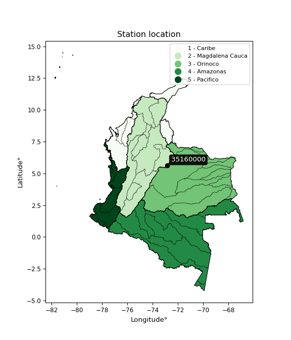</img>

</div>


## A. General information


### 1. General running parameters

• app_version: _v20260103_. • runtime: _2026-01-05 16:20:51.132608_. • Python version: _3.14.0_. • SciPy version: _1.16.3_. • Pandas version: _2.3.3_. • NumPy version: _2.3.5_. • Stations dataset (station_dataset_file): _dataset/pmax24h_in/automatic_colombia_2003_2024.csv_. • Stations catalog (station_catalog_file): _dataset/CNE.xls_. • Minimum year to eval til year_max (date_min): _1900_. • Maximum year to eval since year_min (date_max): _2024_. • Creates, save and include plots into reports (create_plot): _True_. • Plot only fit distributions with Δo > Δ (plot_only_fit): _True_. • Plot only simple graphs avoiding multiple CDFs and multiple Extreme values plots (plot_only_simple): _True_. • Eval low extreme values, if False, evaluates high extreme values (low_extreme): _False_. • Eval every SciPy distribution as logarithmic (pdist_logarithmic_on): _True_. • Standard deviation normalized (ddof): _1.0_. • Return periods to eval in years (Tr): _[2, 2.33, 5, 10, 15, 20, 25, 50, 75, 100, 200, 250, 500, 750, 1000]_. • Minimum data sample per station, 0 means any (minimum_sample): _5_. • Z-Score maximum threshold to adjust a value, 0 means disable (zscore_max): _3.5_. • Z-Score minimum threshold to adjust a value, 0 means disable (zscore_min): _-2.5_. • Avoid zeros, e.g. rain = 0 (avoid_zeros): _True_. • Avoid null values (avoid_nans): _True_. 

[:file_folder:Dataset file](../../dataset/pmax24h_in/automatic_colombia_2003_2024.csv)

> Delta Degrees of Freedom (DDOF): is a parameter used in the formulas for calculating variance and standard deviation. When ddof=0, the divisor is $N$ (the total number of observations) and this is used when your data set is the entire population. When ddof=1, the divisor is $N-1$ and this is used when your data set is a sample drawn from a larger population. Using $N-1$ provides an unbiased estimate of the population variance (known as Bessel´s correction).


### 2. Station info and location

|   id |   CODIGO | NOMBRE                | CATEGORIA     | TECNOLOGIA                | ESTADO   | FECHA_INSTALACION   |   FECHA_SUSPENSION |   ALTITUD |   LATITUD |   LONGITUD | DEPARTAMENTO   | MUNICIPIO   | AREA_OPERATIVA                              | ENTIDAD                                                     | AREA_HIDROGRAFICA   | ZONA_HIDROGRAFICA   | SUBZONA_HIDROGRAFICA   |   CORRIENTE | Catalogo   |   Version |
|-----:|---------:|:----------------------|:--------------|:--------------------------|:---------|:--------------------|-------------------:|----------:|----------:|-----------:|:---------------|:------------|:--------------------------------------------|:------------------------------------------------------------|:--------------------|:--------------------|:-----------------------|------------:|:-----------|----------:|
|    0 | 35160000 | LAS CINTAS [35160000] | Pluviométrica | Automática con Telemetría | Activa   | 31/12/2016          |                nan |      3400 |   5.61428 |   -72.8675 | Boyacá         | Sogamoso    | Area Operativa 06 - Boyacá-Casanare-Vichada | INSTITUTO DE HIDROLOGIA METEOROLOGIA Y ESTUDIOS AMBIENTALES | Orinoco             | Meta                | Lago de Tota           |         nan | CNE_IDEAM  |  20251226 |

<div align="center">

Dynamic map: [:earth_americas:Google](http://maps.google.com/maps?q=5.614277778,-72.86747222) [:earth_americas:OSM](https://www.openstreetmap.org/#map=18/5.614277778/-72.86747222&layers=P) [:earth_americas:Bing](https://www.bing.com/maps?cp=5.614277778~-72.86747222&lvl=18) [:earth_americas:Apple](https://maps.apple.com/frame?center=5.614277778%2C-72.86747222&span=0.003%2C0.006)

</div>


<div align="center">

```geojson
{
  "type": "Feature",
  "geometry": {
    "type": "Point", 
    "coordinates": [-72.86747222, 5.614277778]
  }, 
  "properties": {
    "Name": "35160000"
  }
}
```

</div>


### 3. Discrete values table and plot

<div align="center">

|               |           0 |           1 |            2 |          3 |           4 |          5 |           6 |            7 |
|:--------------|------------:|------------:|-------------:|-----------:|------------:|-----------:|------------:|-------------:|
| Date          | 2017        | 2018        | 2019         | 2020       | 2021        | 2022       | 2023        | 2024         |
| Value         |   38.01     |   30.6      |   78.93      |   49.59    |   24.52     |  277.01    |   29.1      |   77.2       |
| Value_initial |   38.01     |   30.6      |   78.93      |   49.59    |   24.52     |  277.01    |   29.1      |   77.2       |
| count         |    8        |    8        |    8         |    8       |    8        |    8       |    8        |    8         |
| mean          |   75.62     |   75.62     |   75.62      |   75.62    |   75.62     |   75.62    |   75.62     |   75.62      |
| std           |   84.0625   |   84.0625   |   84.0625    |   84.0625  |   84.0625   |   84.0625  |   84.0625   |   84.0625    |
| zscore        |   -0.447405 |   -0.535554 |    0.0393754 |   -0.30965 |   -0.607881 |    2.39572 |   -0.553397 |    0.0187955 |


</div>


<div align="center">

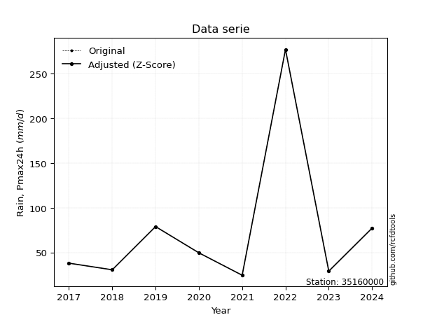</img>

</div>


> The initial value (value_initial) correspond to the initial obtained or null completed value, and value (value) is adjusted only when the initial value is outside the valid range (outlier) definite through the Z-Score value. If Z-Score is active, values out of range or outliers are replaced with the station mean value. A Z-Score (or standard score) measures how many standard deviations a data point is from the mean of a dataset, indicating its relative position; positive scores mean above the mean, negative mean below, and a score of zero is exactly at the mean, allowing for comparison of values from different distributions. It´s calculated using the formula $z=(x–μ)/σ$, where $x$ is the data point, $μ$ is the mean, and $σ$ is the standard deviation, helping identify outliers and understand probability.
>
> <sub>**Note**: In this study, "completing" (filling gaps in) and "extending" (forecasting or lengthening the historical record) rainfall data series are avoided for certain critical analyses because they introduce artificial bias and uncertainty, which can distort the statistics of rare events (extremes), alter day-to-day variability, and compromise the integrity and homogeneity of the original data. Some reasons against Completing/Extending rainfall data are: **Distortion of Extremes and Variability**: The primary issue is that most gap-filling or extension methods rely on averaging or regression with nearby stations, which inherently smooths the data. Rainfall is highly variable in space and time, with a large percentage of zero values and occasional large storms. Infilling methods often underestimate the highest values and overestimate the lowest (zero) values, which severely distorts analyses focused on flood frequency, drought severity, and intensity-duration-frequency (IDF) curves, **Loss of Data Homogeneity**: Infilled or extended data are synthetic estimates, not actual measurements. Combining these estimates with observed data can violate the assumption of data homogeneity, which requires that the data properties do not change over time. Inhomogeneity can lead to incorrect conclusions about long-term trends or changes in climate patterns, **Propagation of Errors**: Errors and biases from the original data (e.g., wind-induced undercatch, instrument errors, site changes) or the data used for imputation can propagate through the analysis, leading to unreliable hydrological models and inaccurate predictions, **Compromised Statistical Integrity**: For statistical analyses, especially those involving the frequency of events, using artificial data can introduce time bias or autocorrelation that doesn´t exist in reality, making it difficult to assess the true probability of events, **Difficulty in Validation**: It is difficult to accurately validate the quality of filled or extended data, especially for past periods where ground-truth measurements are unavailable. The reliability of imputation techniques heavily depends on the density of the surrounding station network and the complexity of the local topography.</sub>


### 4. Active continuous probability distributions from SciPy (44 of 104 available)

A Probability Density Function (PDF) describes the relative likelihood of a continuous random variable falling within a specific range, where the total area under its curve equals 1, and the area over any interval gives the actual probability for that range. Unlike discrete probabilities (like rolling a die), a PDF shows density, not direct probability for a single point (which is zero), with higher points indicating higher likelihood, often visualized as a bell curve for normal distributions.

A log of a probability density function (log-PDF) is simply the logarithm of the PDF´s value, denoted as $log(f(x))$, useful for converting multiplication of probabilities into addition, improving numerical stability with tiny numbers, and connecting to information theory concepts like entropy. Instead of dealing with very small probabilities (e.g., 0.000001), log-PDFs use negative numbers (e.g., $log(0.00001) ≈ -11.51$ that are easier for computers to handle, preventing underflow errors and simplifying complex calculations. In this study, each active probability distribution from SciPy is also evaluated in the $log$ form.

[scipy.stats](https://docs.scipy.org/doc/scipy/reference/stats.html) is a Python´s powerful submodule within the SciPy library for comprehensive statistical analysis, offering over 130 probability distributions (like Normal, Poisson), functions for descriptive stats (mean, variance), hypothesis testing (t-tests, chi-square), random variable generation, and statistical tests, making it essential for data science, modeling, and research. It provides tools to explore, model, and draw conclusions from data efficiently, working seamlessly with NumPy.

<div align="center">

|   id | p_dist             |   n_parameter | fit_method   | label                                                                       | active   | ref                                                                                                        |
|-----:|:-------------------|--------------:|:-------------|:----------------------------------------------------------------------------|:---------|:-----------------------------------------------------------------------------------------------------------|
|    0 | alpha              |             3 | MLE          | Alpha                                                                       | True     | [:mortar_board:](https://docs.scipy.org/doc/scipy/reference/generated/scipy.stats.alpha.html)              |
|    1 | betaprime          |             4 | MLE          | Beta prime                                                                  | True     | [:mortar_board:](https://docs.scipy.org/doc/scipy/reference/generated/scipy.stats.betaprime.html)          |
|    2 | chi2               |             3 | MLE          | Chi²                                                                        | True     | [:mortar_board:](https://docs.scipy.org/doc/scipy/reference/generated/scipy.stats.chi2.html)               |
|    3 | crystalball        |             4 | MLE          | Crystalball                                                                 | True     | [:mortar_board:](https://docs.scipy.org/doc/scipy/reference/generated/scipy.stats.crystalball.html)        |
|    4 | erlang             |             3 | MLE          | Erlang                                                                      | True     | [:mortar_board:](https://docs.scipy.org/doc/scipy/reference/generated/scipy.stats.erlang.html)             |
|    5 | expon              |             2 | MLE          | Exponential                                                                 | True     | [:mortar_board:](https://docs.scipy.org/doc/scipy/reference/generated/scipy.stats.expon.html)              |
|    6 | exponnorm          |             3 | MLE          | Exponentially modified Normal                                               | True     | [:mortar_board:](https://docs.scipy.org/doc/scipy/reference/generated/scipy.stats.exponnorm.html)          |
|    7 | f                  |             4 | MLE          | F                                                                           | True     | [:mortar_board:](https://docs.scipy.org/doc/scipy/reference/generated/scipy.stats.f.html)                  |
|    8 | fatiguelife        |             3 | MLE          | Fatigue-life (Birnbaum-Saunders)                                            | True     | [:mortar_board:](https://docs.scipy.org/doc/scipy/reference/generated/scipy.stats.fatiguelife.html)        |
|    9 | fisk               |             3 | MLE          | Fisk                                                                        | True     | [:mortar_board:](https://docs.scipy.org/doc/scipy/reference/generated/scipy.stats.fisk.html)               |
|   10 | gamma              |             3 | MLE          | Gamma                                                                       | True     | [:mortar_board:](https://docs.scipy.org/doc/scipy/reference/generated/scipy.stats.gamma.html)              |
|   11 | genexpon           |             5 | MLE          | Generalized exponential                                                     | True     | [:mortar_board:](https://docs.scipy.org/doc/scipy/reference/generated/scipy.stats.genexpon.html)           |
|   12 | genlogistic        |             3 | MLE          | Generalized logistic                                                        | True     | [:mortar_board:](https://docs.scipy.org/doc/scipy/reference/generated/scipy.stats.genlogistic.html)        |
|   13 | gibrat             |             2 | MM           | Gibrat                                                                      | True     | [:mortar_board:](https://docs.scipy.org/doc/scipy/reference/generated/scipy.stats.gibrat.html)             |
|   14 | gompertz           |             3 | MLE          | Gompertz (or truncated Gumbel)                                              | True     | [:mortar_board:](https://docs.scipy.org/doc/scipy/reference/generated/scipy.stats.gompertz.html)           |
|   15 | gumbel_l           |             2 | MM           | Gumbel Left Skew                                                            | True     | [:mortar_board:](https://docs.scipy.org/doc/scipy/reference/generated/scipy.stats.gumbel_l.html)           |
|   16 | gumbel_r           |             2 | MM           | Gumbel Right Skew                                                           | True     | [:mortar_board:](https://docs.scipy.org/doc/scipy/reference/generated/scipy.stats.gumbel_r.html)           |
|   17 | halflogistic       |             2 | MM           | Half-logistic                                                               | True     | [:mortar_board:](https://docs.scipy.org/doc/scipy/reference/generated/scipy.stats.halflogistic.html)       |
|   18 | halfnorm           |             2 | MM           | Half Normal                                                                 | True     | [:mortar_board:](https://docs.scipy.org/doc/scipy/reference/generated/scipy.stats.halfnorm.html)           |
|   19 | hypsecant          |             2 | MM           | hyperbolic secant                                                           | True     | [:mortar_board:](https://docs.scipy.org/doc/scipy/reference/generated/scipy.stats.hypsecant.html)          |
|   20 | invgamma           |             3 | MLE          | Inverted gamma                                                              | True     | [:mortar_board:](https://docs.scipy.org/doc/scipy/reference/generated/scipy.stats.invgamma.html)           |
|   21 | invgauss           |             3 | MLE          | Inverse Gaussian                                                            | True     | [:mortar_board:](https://docs.scipy.org/doc/scipy/reference/generated/scipy.stats.invgauss.html)           |
|   22 | invweibull         |             3 | MLE          | Inverted Weibull                                                            | True     | [:mortar_board:](https://docs.scipy.org/doc/scipy/reference/generated/scipy.stats.invweibull.html)         |
|   23 | johnsonsu          |             4 | MLE          | Johnson Su                                                                  | True     | [:mortar_board:](https://docs.scipy.org/doc/scipy/reference/generated/scipy.stats.johnsonsu.html)          |
|   24 | kstwobign          |             2 | MLE          | Limiting distribution of scaled Kolmogorov-Smirnov two-sided test statistic | True     | [:mortar_board:](https://docs.scipy.org/doc/scipy/reference/generated/scipy.stats.kstwobign.html)          |
|   25 | laplace            |             2 | MM           | Laplace                                                                     | True     | [:mortar_board:](https://docs.scipy.org/doc/scipy/reference/generated/scipy.stats.laplace.html)            |
|   26 | laplace_asymmetric |             3 | MLE          | Asymmetric Laplace                                                          | True     | [:mortar_board:](https://docs.scipy.org/doc/scipy/reference/generated/scipy.stats.laplace_asymmetric.html) |
|   27 | loggamma           |             3 | MLE          | Log gamma                                                                   | True     | [:mortar_board:](https://docs.scipy.org/doc/scipy/reference/generated/scipy.stats.loggamma.html)           |
|   28 | logistic           |             2 | MM           | Logistic (or Sech-squared)                                                  | True     | [:mortar_board:](https://docs.scipy.org/doc/scipy/reference/generated/scipy.stats.logistic.html)           |
|   29 | lognorm            |             3 | MLE          | Log Normal                                                                  | True     | [:mortar_board:](https://docs.scipy.org/doc/scipy/reference/generated/scipy.stats.lognorm.html)            |
|   30 | maxwell            |             2 | MM           | Maxwell                                                                     | True     | [:mortar_board:](https://docs.scipy.org/doc/scipy/reference/generated/scipy.stats.maxwell.html)            |
|   31 | mielke             |             4 | MLE          | Mielke Beta-Kappa / Dagum                                                   | True     | [:mortar_board:](https://docs.scipy.org/doc/scipy/reference/generated/scipy.stats.mielke.html)             |
|   32 | moyal              |             2 | MM           | Moyal                                                                       | True     | [:mortar_board:](https://docs.scipy.org/doc/scipy/reference/generated/scipy.stats.moyal.html)              |
|   33 | nakagami           |             3 | MLE          | Nakagami                                                                    | True     | [:mortar_board:](https://docs.scipy.org/doc/scipy/reference/generated/scipy.stats.nakagami.html)           |
|   34 | ncf                |             5 | MLE          | Non-central F distribution                                                  | True     | [:mortar_board:](https://docs.scipy.org/doc/scipy/reference/generated/scipy.stats.ncf.html)                |
|   35 | nct                |             4 | MLE          | Non-central Student’s t                                                     | True     | [:mortar_board:](https://docs.scipy.org/doc/scipy/reference/generated/scipy.stats.nct.html)                |
|   36 | norm               |             2 | MM           | Normal                                                                      | True     | [:mortar_board:](https://docs.scipy.org/doc/scipy/reference/generated/scipy.stats.norm.html)               |
|   37 | pearson3           |             3 | MM           | Pearson type III                                                            | True     | [:mortar_board:](https://docs.scipy.org/doc/scipy/reference/generated/scipy.stats.pearson3.html)           |
|   38 | rayleigh           |             2 | MM           | Rayleigh                                                                    | True     | [:mortar_board:](https://docs.scipy.org/doc/scipy/reference/generated/scipy.stats.rayleigh.html)           |
|   39 | rice               |             3 | MLE          | Rice                                                                        | True     | [:mortar_board:](https://docs.scipy.org/doc/scipy/reference/generated/scipy.stats.rice.html)               |
|   40 | t                  |             3 | MLE          | Student’s t                                                                 | True     | [:mortar_board:](https://docs.scipy.org/doc/scipy/reference/generated/scipy.stats.t.html)                  |
|   41 | truncnorm          |             4 | MLE          | Truncated normal                                                            | True     | [:mortar_board:](https://docs.scipy.org/doc/scipy/reference/generated/scipy.stats.truncnorm.html)          |
|   42 | wald               |             2 | MM           | Wald                                                                        | True     | [:mortar_board:](https://docs.scipy.org/doc/scipy/reference/generated/scipy.stats.wald.html)               |
|   43 | weibull_min        |             3 | MLE          | Weibull minimum                                                             | True     | [:mortar_board:](https://docs.scipy.org/doc/scipy/reference/generated/scipy.stats.weibull_min.html)        |

</div>

> **n_parameter:** # arguments & localization & scale.
>
> **Fit methods:** (MLE) maximum likelihood, (MM) L-moments.
>
>**Inactive** (With the only purpose of prevent loops, zero divisions, infinite values, over high estimated values or horizontal trending for recurrence intervals estimations, the follow distributions were disabled.)**:** foldnorm, gennorm, norminvgauss, powernorm, powerlognorm, skewnorm, genextreme, anglit, arcsine, argus, beta, bradford, burr, burr12, cauchy, cosine, halfcauchy, foldcauchy, skewcauchy, wrapcauchy, dgamma, gengamma, exponweib, exponpow, truncexpon, gausshyper, genhalflogistic, genhyperbolic, geninvgauss, halfgennorm, johnsonsb, kappa4, kappa3, ksone, kstwo, loglaplace, levy, levy_l, levy_stable, ncx2, pareto, genpareto, truncpareto, lomax, powerlaw, rdist, rel_breitwigner, recipinvgauss, semicircular, studentized_range, trapezoid, triang, truncweibull_min, tukeylambda, uniform, loguniform, vonmises, vonmises_line, weibull_max, dweibull, 


## B. Probability (PDF) vs. Empirical (EDF) distributions functions

A continuous probability distribution (CPD) describes probabilities for variables that can take any value within a range (like rain any time), unlike discrete variables with specific outcomes (like temperature). It uses a Probability Density Function (PDF), a curve where the total area under it equals 1, and the probability of the variable falling within an interval (a to b) is found by calculating the area under the curve between those points. A key feature is that the probability of hitting any single exact value is zero, so probabilities are always expressed for ranges, e.g., $P(a ≤ X ≤ b)$.

<div align="center">

Distributions parameters from station values
|    |   station | p_dist                |   n |            loc |          scale | shape                  | shape1              | shape2                | shape3   |
|---:|----------:|:----------------------|----:|---------------:|---------------:|:-----------------------|:--------------------|:----------------------|:---------|
|  0 |  35160000 | alpha                 |   8 |     16.678     |   15.9192      | 5.639233420842195e-10  |                     |                       |          |
|  1 |  35160000 | betaprime             |   8 |     20.6973    |    0.00996044  | 1207.9313487388422     | 0.9207677402535259  |                       |          |
|  2 |  35160000 | chi2                  |   8 |     24.52      |   51.7565      | 0.9721887975019579     |                     |                       |          |
|  3 |  35160000 | crystalball           |   8 |     75.62      |   78.6333      | 5375.246096190266      | 6187.633475964997   |                       |          |
|  4 |  35160000 | erlang                |   8 |     24.52      |   47.237       | 0.5663304932006286     |                     |                       |          |
|  5 |  35160000 | expon                 |   8 |     24.52      |   51.1         |                        |                     |                       |          |
|  6 |  35160000 | exponnorm             |   8 |     24.4671    |    0.0156155   | 3274.4564997112684     |                     |                       |          |
|  7 |  35160000 | f                     |   8 |     21.1915    |   12.976       | 23.01250469750083      | 1.8253504882464422  |                       |          |
|  8 |  35160000 | fatiguelife           |   8 |     23.4137    |   17.1075      | 1.993263851455183      |                     |                       |          |
|  9 |  35160000 | fisk                  |   8 |     24.52      |   23.6299      | 0.5324796674083856     |                     |                       |          |
| 10 |  35160000 | gamma                 |   8 |     24.52      |   48.2229      | 0.5572814255372536     |                     |                       |          |
| 11 |  35160000 | genexpon              |   8 |     24.52      |   97.5128      | 1.9082792180973054     | 1.9410372934344498  | 2.756676067695239e-12 |          |
| 12 |  35160000 | genlogistic           |   8 |   -250.637     |   37.9932      | 2511.2672058978396     |                     |                       |          |
| 13 |  35160000 | gibrat                |   8 |     15.6327    |   36.3841      |                        |                     |                       |          |
| 14 |  35160000 | gompertz              |   8 |     24.52      |    1.78059e+12 | 33669777666.306046     |                     |                       |          |
| 15 |  35160000 | gumbel_l              |   8 |    111.009     |   61.3101      |                        |                     |                       |          |
| 16 |  35160000 | gumbel_r              |   8 |     40.2308    |   61.3101      |                        |                     |                       |          |
| 17 |  35160000 | halflogistic          |   8 |    -17.5787    |   67.2287      |                        |                     |                       |          |
| 18 |  35160000 | halfnorm              |   8 |    -28.4597    |  130.445       |                        |                     |                       |          |
| 19 |  35160000 | hypsecant             |   8 |     75.62      |   50.0595      |                        |                     |                       |          |
| 20 |  35160000 | invgamma              |   8 |     20.6922    |   12.0319      | 0.9207872370985102     |                     |                       |          |
| 21 |  35160000 | invgauss              |   8 |     21.8923    |   12.8427      | 4.183503858873348      |                     |                       |          |
| 22 |  35160000 | invweibull            |   8 |     21.4535    |   12.2505      | 0.8732278980778857     |                     |                       |          |
| 23 |  35160000 | johnsonsu             |   8 |     24.5198    |    0.000138953 | -2.885985191676661     | 0.26603604764042643 |                       |          |
| 24 |  35160000 | kstwobign             |   8 |   -111.943     |  221.343       |                        |                     |                       |          |
| 25 |  35160000 | laplace               |   8 |     75.62      |   55.6021      |                        |                     |                       |          |
| 26 |  35160000 | laplace_asymmetric    |   8 |     24.52      |    6.11645e-05 | 1.196959066042838e-06  |                     |                       |          |
| 27 |  35160000 | loggamma              |   8 | -24077.4       | 3265.62        | 1630.672663287568      |                     |                       |          |
| 28 |  35160000 | logistic              |   8 |     75.62      |   43.3528      |                        |                     |                       |          |
| 29 |  35160000 | lognorm               |   8 |     24.52      |    0.264855    | 12.133885622806305     |                     |                       |          |
| 30 |  35160000 | maxwell               |   8 |   -110.708     |  116.764       |                        |                     |                       |          |
| 31 |  35160000 | mielke                |   8 |      9.06935   |    0.146972    | 12430.666953516346     | 1.7081774775752026  |                       |          |
| 32 |  35160000 | moyal                 |   8 |     30.6524    |   35.3974      |                        |                     |                       |          |
| 33 |  35160000 | nakagami              |   8 |     24.52      |  162.043       | 0.18530129683098748    |                     |                       |          |
| 34 |  35160000 | ncf                   |   8 |     -1.46435   |    0.127043    | 0.4400336269116365     | 5.379411901177287   | 159.57001328334587    |          |
| 35 |  35160000 | nct                   |   8 |     -0.216315  |    0.766342    | 1.7925394802655177     | 50.630881402783075  |                       |          |
| 36 |  35160000 | norm                  |   8 |     75.62      |   78.6333      |                        |                     |                       |          |
| 37 |  35160000 | pearson3              |   8 |     75.62      |   78.6334      | 1.998072165219806      |                     |                       |          |
| 38 |  35160000 | rayleigh              |   8 |    -74.8101    |  120.026       |                        |                     |                       |          |
| 39 |  35160000 | rice                  |   8 |    -32.9866    |   94.8118      | 0.002096647282652698   |                     |                       |          |
| 40 |  35160000 | t                     |   8 |     35.6407    |   13.0745      | 0.8759242234314204     |                     |                       |          |
| 41 |  35160000 | truncnorm             |   8 | -47491.3       | 1936.6         | 24.53576969933305      | 24.66614940223137   |                       |          |
| 42 |  35160000 | wald                  |   8 |     -3.01331   |   78.6333      |                        |                     |                       |          |
| 43 |  35160000 | weibull_min           |   8 |     24.52      |   34.127       | 0.7781989083511269     |                     |                       |          |
| 44 |  35160000 | logalpha              |   8 |      2.29559   |    3.88925     | 2.6934758678556907     |                     |                       |          |
| 45 |  35160000 | logbetaprime          |   8 |      2.88361   |    0.0275534   | 71.71510437401545      | 2.6996142741845794  |                       |          |
| 46 |  35160000 | logchi2               |   8 |      3.19949   |    0.950587    | 1.0658456068871747     |                     |                       |          |
| 47 |  35160000 | logcrystalball        |   8 |      3.98399   |    0.741937    | 11.214951457829718     | 149.91891195522277  |                       |          |
| 48 |  35160000 | logerlang             |   8 |      3.19949   |    1.03115     | 0.5022636879096056     |                     |                       |          |
| 49 |  35160000 | logexpon              |   8 |      3.19949   |    0.784496    |                        |                     |                       |          |
| 50 |  35160000 | logexponnorm          |   8 |      3.19882   |    0.000207631 | 3746.322197862638      |                     |                       |          |
| 51 |  35160000 | logf                  |   8 |      2.87201   |    0.739863    | 416.14728907174276     | 5.353676813267107   |                       |          |
| 52 |  35160000 | logfatiguelife        |   8 |      3.08827   |    0.585752    | 1.0169177632314097     |                     |                       |          |
| 53 |  35160000 | logfisk               |   8 |      3.15656   |    0.538044    | 1.4667761664379637     |                     |                       |          |
| 54 |  35160000 | loggamma              |   8 |      3.19949   |    0.76397     | 0.47347617687781707    |                     |                       |          |
| 55 |  35160000 | loggenexpon           |   8 |      3.19949   |    0.874435    | 1.0596744834070155     | 1.369136782778562   | 0.04920521793256148   |          |
| 56 |  35160000 | loggenlogistic        |   8 |     -0.0842563 |    0.511793    | 1501.3455874723777     |                     |                       |          |
| 57 |  35160000 | loggibrat             |   8 |      3.41802   |    0.343279    |                        |                     |                       |          |
| 58 |  35160000 | loggompertz           |   8 |      3.19949   |    9.80874     | 11.56679108515457      |                     |                       |          |
| 59 |  35160000 | loggumbel_l           |   8 |      4.3179    |    0.578486    |                        |                     |                       |          |
| 60 |  35160000 | loggumbel_r           |   8 |      3.65007   |    0.578486    |                        |                     |                       |          |
| 61 |  35160000 | loghalflogistic       |   8 |      3.10462   |    0.63433     |                        |                     |                       |          |
| 62 |  35160000 | loghalfnorm           |   8 |      3.00195   |    1.2308      |                        |                     |                       |          |
| 63 |  35160000 | loghypsecant          |   8 |      3.98399   |    0.472332    |                        |                     |                       |          |
| 64 |  35160000 | loginvgamma           |   8 |      2.8673    |    1.98815     | 2.676616444333967      |                     |                       |          |
| 65 |  35160000 | loginvgauss           |   8 |      3.02731   |    1.05751     | 0.9046443145527903     |                     |                       |          |
| 66 |  35160000 | loginvweibull         |   8 |      2.6513    |    0.900906    | 2.2653238707400116     |                     |                       |          |
| 67 |  35160000 | logjohnsonsu          |   8 |      3.09612   |    0.00381049  | -5.9941216212092066    | 1.0429316262546529  |                       |          |
| 68 |  35160000 | logkstwobign          |   8 |      1.82337   |    2.49379     |                        |                     |                       |          |
| 69 |  35160000 | loglaplace            |   8 |      3.98399   |    0.524629    |                        |                     |                       |          |
| 70 |  35160000 | loglaplace_asymmetric |   8 |      3.37074   |    0.321963    | 0.4286159826671979     |                     |                       |          |
| 71 |  35160000 | logloggamma           |   8 |   -260.447     |   34.6757      | 2050.85497343679       |                     |                       |          |
| 72 |  35160000 | loglogistic           |   8 |      3.98399   |    0.409051    |                        |                     |                       |          |
| 73 |  35160000 | loglognorm            |   8 |      3.19949   |    0.00800776  | 11.566377425509586     |                     |                       |          |
| 74 |  35160000 | logmaxwell            |   8 |      2.22591   |    1.10171     |                        |                     |                       |          |
| 75 |  35160000 | logmielke             |   8 |      2.6501    |    0.141135    | 158.06370113187901     | 2.279526035908151   |                       |          |
| 76 |  35160000 | logmoyal              |   8 |      3.5597    |    0.333989    |                        |                     |                       |          |
| 77 |  35160000 | lognakagami           |   8 |      3.19949   |    1.45926     | 0.2865062420930811     |                     |                       |          |
| 78 |  35160000 | logncf                |   8 |      0.345032  |    3.53219     | 349.3379930898427      | 69.29110719316844   | 0.0004725433459003988 |          |
| 79 |  35160000 | lognct                |   8 |      2.662     |    0.00896738  | 2.4277448371435906     | 101.30403310951007  |                       |          |
| 80 |  35160000 | lognorm               |   8 |      3.98399   |    0.741937    |                        |                     |                       |          |
| 81 |  35160000 | logpearson3           |   8 |      3.98399   |    0.741937    | 1.0963483569221877     |                     |                       |          |
| 82 |  35160000 | lograyleigh           |   8 |      2.56462   |    1.13249     |                        |                     |                       |          |
| 83 |  35160000 | logrice               |   8 |      2.80847   |    0.982931    | 0.00037116161180194754 |                     |                       |          |
| 84 |  35160000 | logt                  |   8 |      3.84484   |    0.577531    | 4.410968616978073      |                     |                       |          |
| 85 |  35160000 | logtruncnorm          |   8 |     -6.14343   |    2.92032     | 3.199270109588247      | 4.029513548150399   |                       |          |
| 86 |  35160000 | logwald               |   8 |      3.24203   |    0.741951    |                        |                     |                       |          |
| 87 |  35160000 | logweibull_min        |   8 |      3.19949   |    0.524869    | 0.8489219804163386     |                     |                       |          |

</div>

> **loc** (Location parameter): This shifts the distribution along the x-axis. For many common distributions, like the normal (Gaussian) distribution, loc represents the mean $μ$. For others, like the uniform distribution, it might represent the minimum value, or for the beta distribution, the left end of the support interval.
>
> **scale** (Scale parameter): This determines the width or spread of the distribution. For the normal distribution, scale represents the standard deviation $σ$. For a uniform distribution, it defines the length of the interval (from $loc$ to $loc + scale$).
>
> **shape** (Shape parameters): Refers to parameters that define the specific form of a probability distribution, distinct from its location (loc) and scale (scale). These parameters are required arguments for most distribution functions. For example, a normal (Gaussian) distribution is fully defined by its location (mean) and scale (standard deviation), so it has no specific shape parameters beyond loc and scale. However, other distributions have intrinsic properties that need specification, as Gamma distribution that takes a shape parameter, often named $a$ or $alpha$.


### 0. Cumulative distribution values - CDF (88 evaluated)

Cumulative Distribution Function (CDF), denoted as $F$<sub>$X$</sub>$(x)$, is a function that gives the probability that a random variable $X$ will take a value less than or equal to a specific value, $x$ (i.e., $(P(X≥x)$. It essentially "accumulates" probabilities from a given point up to the far right (positive infinity), providing a complete picture of the distribution´s probabilities for both discrete (like rain) and continuous (like temperature) variables, helping to find probabilities over ranges or above certain values. Each station is evaluated separately ordering the $x$ values ascending, calculating the CDF and PDF values for the activated distributions and their logarithmic forms.

<div align="center">

CDF ordered by x ascending and calculating $log(f(x))$ separately
|   id |   Station |   date |      x |   count |   mean |     std |     zscore |   Value_initial |   station |   m |     alpha |   alpha_pdf |   betaprime |   betaprime_pdf |        chi2 |    chi2_pdf |   crystalball |   crystalball_pdf |     erlang |      erlang_pdf |     expon |   expon_pdf |   exponnorm |   exponnorm_pdf |         f |       f_pdf |   fatiguelife |   fatiguelife_pdf |        fisk |        fisk_pdf |       gamma |        gamma_pdf |    genexpon |   genexpon_pdf |   genlogistic |   genlogistic_pdf |    gibrat |   gibrat_pdf |    gompertz |   gompertz_pdf |   gumbel_l |   gumbel_l_pdf |   gumbel_r |   gumbel_r_pdf |   halflogistic |   halflogistic_pdf |   halfnorm |   halfnorm_pdf |   hypsecant |   hypsecant_pdf |   invgamma |   invgamma_pdf |   invgauss |   invgauss_pdf |   invweibull |   invweibull_pdf |   johnsonsu |   johnsonsu_pdf |   kstwobign |   kstwobign_pdf |   laplace |   laplace_pdf |   laplace_asymmetric |   laplace_asymmetric_pdf |    loggamma |   loggamma_pdf |   logistic |   logistic_pdf |   lognorm |   lognorm_pdf |   maxwell |   maxwell_pdf |   mielke |   mielke_pdf |    moyal |   moyal_pdf |    nakagami |   nakagami_pdf |      ncf |     ncf_pdf |       nct |     nct_pdf |     norm |    norm_pdf |   pearson3 |   pearson3_pdf |   rayleigh |   rayleigh_pdf |     rice |   rice_pdf |        t |       t_pdf |   truncnorm |   truncnorm_pdf |     wald |    wald_pdf |   weibull_min |   weibull_min_pdf |   logalpha |   logalpha_pdf |   logbetaprime |   logbetaprime_pdf |     logchi2 |   logchi2_pdf |   logcrystalball |   logcrystalball_pdf |   logerlang |   logerlang_pdf |   logexpon |   logexpon_pdf |   logexponnorm |   logexponnorm_pdf |      logf |   logf_pdf |   logfatiguelife |   logfatiguelife_pdf |   logfisk |   logfisk_pdf |   loggenexpon |   loggenexpon_pdf |   loggenlogistic |   loggenlogistic_pdf |   loggibrat |   loggibrat_pdf |   loggompertz |   loggompertz_pdf |   loggumbel_l |   loggumbel_l_pdf |   loggumbel_r |   loggumbel_r_pdf |   loghalflogistic |   loghalflogistic_pdf |   loghalfnorm |   loghalfnorm_pdf |   loghypsecant |   loghypsecant_pdf |   loginvgamma |   loginvgamma_pdf |   loginvgauss |   loginvgauss_pdf |   loginvweibull |   loginvweibull_pdf |   logjohnsonsu |   logjohnsonsu_pdf |   logkstwobign |   logkstwobign_pdf |   loglaplace |   loglaplace_pdf |   loglaplace_asymmetric |   loglaplace_asymmetric_pdf |   logloggamma |   logloggamma_pdf |   loglogistic |   loglogistic_pdf |   loglognorm |   loglognorm_pdf |   logmaxwell |   logmaxwell_pdf |   logmielke |   logmielke_pdf |   logmoyal |   logmoyal_pdf |   lognakagami |   lognakagami_pdf |   logncf |   logncf_pdf |   lognct |   lognct_pdf |   logpearson3 |   logpearson3_pdf |   lograyleigh |   lograyleigh_pdf |   logrice |   logrice_pdf |     logt |   logt_pdf |   logtruncnorm |   logtruncnorm_pdf |   logwald |   logwald_pdf |   logweibull_min |   logweibull_min_pdf |
|-----:|----------:|-------:|-------:|--------:|-------:|--------:|-----------:|----------------:|----------:|----:|----------:|------------:|------------:|----------------:|------------:|------------:|--------------:|------------------:|-----------:|----------------:|----------:|------------:|------------:|----------------:|----------:|------------:|--------------:|------------------:|------------:|----------------:|------------:|-----------------:|------------:|---------------:|--------------:|------------------:|----------:|-------------:|------------:|---------------:|-----------:|---------------:|-----------:|---------------:|---------------:|-------------------:|-----------:|---------------:|------------:|----------------:|-----------:|---------------:|-----------:|---------------:|-------------:|-----------------:|------------:|----------------:|------------:|----------------:|----------:|--------------:|---------------------:|-------------------------:|------------:|---------------:|-----------:|---------------:|----------:|--------------:|----------:|--------------:|---------:|-------------:|---------:|------------:|------------:|---------------:|---------:|------------:|----------:|------------:|---------:|------------:|-----------:|---------------:|-----------:|---------------:|---------:|-----------:|---------:|------------:|------------:|----------------:|---------:|------------:|--------------:|------------------:|-----------:|---------------:|---------------:|-------------------:|------------:|--------------:|-----------------:|---------------------:|------------:|----------------:|-----------:|---------------:|---------------:|-------------------:|----------:|-----------:|-----------------:|---------------------:|----------:|--------------:|--------------:|------------------:|-----------------:|---------------------:|------------:|----------------:|--------------:|------------------:|--------------:|------------------:|--------------:|------------------:|------------------:|----------------------:|--------------:|------------------:|---------------:|-------------------:|--------------:|------------------:|--------------:|------------------:|----------------:|--------------------:|---------------:|-------------------:|---------------:|-------------------:|-------------:|-----------------:|------------------------:|----------------------------:|--------------:|------------------:|--------------:|------------------:|-------------:|-----------------:|-------------:|-----------------:|------------:|----------------:|-----------:|---------------:|--------------:|------------------:|---------:|-------------:|---------:|-------------:|--------------:|------------------:|--------------:|------------------:|----------:|--------------:|---------:|-----------:|---------------:|-------------------:|----------:|--------------:|-----------------:|---------------------:|
|    0 |  35160000 |   2021 |  24.52 |       8 |  75.62 | 84.0625 | -0.607881  |           24.52 |  35160000 |   1 | 0.0423567 | 0.0263129   |   0.0367038 |     0.0307442   | 1.12038e-08 | 1.53295e+06 |      0.257894 |       0.00410772  | 8.3018e-10 | 132337          | 0         | 0.0195695   |  0.00103423 |     0.01953     | 0.0381397 | 0.0317253   |     0.0325026 |       0.0690139   | 3.75515e-09 | 562820          | 1.14932e-09 | 180284           | 1.64635e-12 |    0.0195695   |      0.165861 |       0.00784036  | 0.0793423 |  0.0166238   | 4.72064e-12 |    0.0189094   |   0.216494 |    0.00311787  |   0.274699 |    0.00578914  |       0.303256 |        0.00675334  |   0.315366 |    0.00563241  |    0.220163 |     0.00405566  |  0.0367016 |    0.0307422   |  0.0342028 |    0.0368006   |    0.0350281 |       0.033431   |  0.00428724 |    16.0274      |    0.15832  |     0.00637103  |  0.199453 |   0.00358715  |          5.20595e-12 |              0.0195695   | 6.90295e-08 |    7.35975e+07 |   0.235286 |     0.00415028 |  0.145173 |     0.307446  |  0.280643 |   0.00468701  |      nan |          nan | 0.2755   | 0.00678166  | 5.31636e-07 |    5.54578e+07 | 0.121904 | 0.0143958   | 0.0918515 | 0.0168971   | 0.257894 | 0.00410772  |   0.295445 |    0.00894919  |   0.289963 |     0.00489567 | 0.168016 | 0.0053224  | 0.283459 | 0.0134757   |  7.6509e-06 |     0.0132226   | 0.219211 | 0.0133976   |   3.65096e-13 |      79.9718      |  0.0539714 |      0.522066  |      0.0421254 |           0.592055 | 5.26387e-09 |   6.31683e+06 |         0.145173 |            0.307446  | 2.16127e-08 |     2.44439e+07 |   0        |      1.2747    |    0.000864809 |          1.28371   | 0.0436676 |  0.600418  |        0.0337524 |            0.905429  | 0.0239239 |     0.797906  |   2.22695e-10 |          1.21184  |        0.0860723 |            0.412131  | 0           |       0         |   1.00024e-13 |         1.17923   |      0.134688 |        0.216393   |      0.113145 |         0.426204  |         0.0746423 |             0.783842  |      0.12751  |         0.639971  |       0.119513 |          0.247125  |     0.0436673 |         0.600414  |     0.0368138 |         0.728226  |       0.0458999 |           0.584441  |       0.033726 |          0.755722  |       0.07902  |           0.407876 |     0.112087 |        0.21365   |               0.0448698 |                   0.325147  |      0.153488 |         0.306851  |      0.128102 |         0.273052  |   0.00415809 |      2.38787e+12 |     0.145976 |        0.382741  |   0.0468326 |       0.581904  |  0.0863959 |      0.470868  |   9.98085e-10 |       1.28784e+06 | 0.112701 |    0.376894  | 0.046891 |    0.574439  |      0.11747  |         0.480068  |      0.145411 |         0.423032  | 0.0760768 |     0.373928  | 0.160474 |  0.332693  |    1.57579e-05 |          1.23806   | 0         |     0         |       1.6016e-13 |          306.163     |
|    1 |  35160000 |   2023 |  29.1  |       8 |  75.62 | 84.0625 | -0.553397  |           29.1  |  35160000 |   2 | 0.200005  | 0.0362119   |   0.212918  |     0.0375807   | 0.244429    | 0.0251791   |      0.277057 |       0.00425895  | 0.289439   |      0.0336275  | 0.0857289 | 0.0178918   |  0.0866227  |     0.017863    | 0.216605  | 0.0376583   |     0.280639  |       0.0343561   | 0.294485    |      0.024155   | 0.292785    |      0.033504    | 0.0857291   |    0.0178918   |      0.203388 |       0.00852315  | 0.160144  |  0.0180774   | 0.0829606   |    0.0173406   |   0.231181 |    0.00329672  |   0.301473 |    0.00589607  |       0.333858 |        0.00660833  |   0.340974 |    0.00554924  |    0.239397 |     0.00434399  |  0.212909  |    0.03758     |  0.228768  |    0.0378858   |    0.221091  |       0.0381044  |  0.526319   |     0.0231219   |    0.188477 |     0.0067841   |  0.216578 |   0.00389513  |          0.0857291   |              0.0178918   | 0.518679    |    1.229       |   0.254822 |     0.00438006 |  0.204247 |     0.382113  |  0.302337 |   0.0047837   |      nan |          nan | 0.3067   | 0.00683249  | 0.211604    |    0.0171203   | 0.191548 | 0.0157464   | 0.177484  | 0.0198308   | 0.277057 | 0.00425895  |   0.335266 |    0.00844486  |   0.312535 |     0.00495859 | 0.192981 | 0.00557386 | 0.356889 | 0.0187259   |  0.0588435  |     0.0124771   | 0.279013 | 0.0126645   |   0.189028    |       0.0288709   |  0.178395  |      0.879046  |      0.188043  |           1.00227  | 0.302802    |   0.888215    |         0.204246 |            0.382113  | 0.43373     |     1.13759     |   0.196109 |      1.02472   |    0.1983      |          1.03066   | 0.189741  |  0.997153  |        0.231713  |            1.13287   | 0.205689  |     1.11891   |   0.188454    |          0.99565  |        0.172818  |            0.592443  | 0           |       0         |   0.184306    |         0.978835  |      0.176757 |        0.276798   |      0.197755 |         0.554044  |         0.206742  |             0.754542  |      0.235543 |         0.619809  |       0.169654 |          0.342418  |     0.189742  |         0.997169  |     0.208297  |         1.08279   |       0.189285  |           0.992052  |       0.208996 |          1.09134   |       0.163951 |           0.573084 |     0.155352 |        0.296118  |               0.1552    |                   1.12465   |      0.212016 |         0.376254  |      0.182546 |         0.364802  |   0.604416   |      0.194473    |     0.21805  |        0.455765  |   0.189006  |       0.98416   |  0.184525  |      0.657174  |   0.227424    |       0.758648    | 0.187618 |    0.494209  | 0.186821 |    0.970562  |      0.209299 |         0.581356  |      0.223795 |         0.487873  | 0.150928  |     0.494131  | 0.226878 |  0.444498  |    0.193226    |          1.02451   | 0.0414849 |     1.03883   |       0.320518   |            1.30161   |
|    2 |  35160000 |   2018 |  30.6  |       8 |  75.62 | 84.0625 | -0.535554  |           30.6  |  35160000 |   3 | 0.252848  | 0.0340831   |   0.266683  |     0.0340494   | 0.27921     | 0.0214545   |      0.283481 |       0.0043065   | 0.336039   |      0.0288102  | 0.112177  | 0.0173742   |  0.113028   |     0.0173466   | 0.270386  | 0.0340046   |     0.326752  |       0.0275866   | 0.326767    |      0.0192665  | 0.339168    |      0.0286494   | 0.112177    |    0.0173743   |      0.216319 |       0.00871429  | 0.187199  |  0.0179653   | 0.108606    |    0.0168557   |   0.236171 |    0.00335645  |   0.310338 |    0.00592275  |       0.343733 |        0.00655857  |   0.349276 |    0.00552079  |    0.245984 |     0.00443915  |  0.266674  |    0.0340491   |  0.281987  |    0.0331526   |    0.27509   |       0.0338966  |  0.556218   |     0.017282    |    0.198742 |     0.00690092  |  0.2225   |   0.00400164  |          0.112177    |              0.0173743   | 0.574468    |    1.00492     |   0.261448 |     0.00445399 |  0.223985 |     0.403193  |  0.309534 |   0.0048119   |      nan |          nan | 0.316952 | 0.00683582  | 0.235025    |    0.0143226   | 0.215278 | 0.0158715   | 0.207413  | 0.0200239   | 0.283481 | 0.0043065   |   0.347814 |    0.00828587  |   0.319986 |     0.00497565 | 0.201398 | 0.00564898 | 0.386297 | 0.0204629   |  0.0773824  |     0.0122422   | 0.297792 | 0.0123718   |   0.229875    |       0.025747    |  0.223713  |      0.919356  |      0.238829  |           1.01259  | 0.344219    |   0.767066    |         0.223985 |            0.403193  | 0.485993    |     0.953202    |   0.245998 |      0.961129  |    0.248465    |          0.966166  | 0.240223  |  1.00578   |        0.286509  |            1.0464    | 0.260783  |     1.06928   |   0.237069    |          0.939347 |        0.203642  |            0.632879  | 1.03632e-06 |       0.0017177 |   0.232168    |         0.926133  |      0.191164 |        0.296639   |      0.226309 |         0.58128   |         0.244339  |             0.741174  |      0.266497 |         0.611761  |       0.187668 |          0.374702  |     0.240224  |         1.00579   |     0.26183   |         1.04309   |       0.239694  |           1.00765   |       0.262834 |          1.04703   |       0.19365  |           0.607492 |     0.170972 |        0.32589   |               0.209877  |                   1.05186   |      0.23142  |         0.395755  |      0.201601 |         0.393491  |   0.612961   |      0.149426    |     0.241403 |        0.473174  |   0.239053  |       1.00122   |  0.21841   |      0.689321  |   0.263405    |       0.677897    | 0.213197 |    0.523085  | 0.236256 |    0.990652  |      0.238977 |         0.59867   |      0.248673 |         0.50168   | 0.176481  |     0.522102  | 0.250067 |  0.478145  |    0.243301    |          0.968505  | 0.103652  |     1.37601   |       0.381699   |            1.13925   |
|    3 |  35160000 |   2017 |  38.01 |       8 |  75.62 | 84.0625 | -0.447405  |           38.01 |  35160000 |   4 | 0.45551   | 0.0211285   |   0.460187  |     0.019586    | 0.402033    | 0.0132605   |      0.31622  |       0.00452509  | 0.500053   |      0.017431   | 0.23202   | 0.015029    |  0.232687   |     0.0150064   | 0.46291   | 0.0194356   |     0.468228  |       0.0137116   | 0.425927    |      0.00965147 | 0.50189     |      0.0172645   | 0.232021    |    0.015029    |      0.283715 |       0.00940512  | 0.313453  |  0.0158414   | 0.225151    |    0.0146519   |   0.262156 |    0.00365879  |   0.354557 |    0.00599632  |       0.391381 |        0.00629806  |   0.389642 |    0.00537194  |    0.280618 |     0.00490727  |  0.460178  |    0.0195862   |  0.464326  |    0.018176    |    0.463605  |       0.0187964  |  0.638105   |     0.00739118  |    0.251656 |     0.00734404  |  0.254219 |   0.0045721   |          0.232021    |              0.015029    | 0.731945    |    0.528177    |   0.295768 |     0.00480451 |  0.320418 |     0.48226   |  0.345639 |   0.00492585  |      nan |          nan | 0.367434 | 0.0067672   | 0.315728    |    0.0086644   | 0.331016 | 0.0150497   | 0.350576  | 0.0180408   | 0.31622  | 0.00452509  |   0.406417 |    0.00754293  |   0.357101 |     0.00503477 | 0.24449  | 0.00596694 | 0.555518 | 0.0228993   |  0.163968   |     0.011145    | 0.383739 | 0.0108131   |   0.3847      |       0.0172379   |  0.420642  |      0.846441  |      0.442095  |           0.826337 | 0.476814    |   0.497552    |         0.320418 |            0.482259  | 0.641945    |     0.549929    |   0.428093 |      0.729012  |    0.431308    |          0.731105  | 0.441893  |  0.819729  |        0.475002  |            0.712795  | 0.459213  |     0.756833  |   0.417029    |          0.728707 |        0.352769  |            0.717942  | 0.327912    |       1.64319   |   0.410602    |         0.726804  |      0.265559 |        0.391853   |      0.360106 |         0.635792  |         0.397193  |             0.66388   |      0.394603 |         0.56727   |       0.285185 |          0.526186  |     0.441897  |         0.819731  |     0.458766  |         0.76779   |       0.443059  |           0.828177  |       0.459621 |          0.764088  |       0.335064 |           0.676002 |     0.258484 |        0.4927    |               0.408     |                   0.788105  |      0.325552 |         0.468777  |      0.300232 |         0.51361   |   0.63535    |      0.07411     |     0.350202 |        0.523252  |   0.441773  |       0.828022  |  0.373687  |      0.715358  |   0.387823    |       0.496853    | 0.336814 |    0.604496  | 0.438385 |    0.832077  |      0.372352 |         0.617599  |      0.361761 |         0.53408   | 0.299516  |     0.601319  | 0.368272 |  0.604215  |    0.429572    |          0.757332  | 0.393664  |     1.1253    |       0.576083   |            0.704555  |
|    4 |  35160000 |   2020 |  49.59 |       8 |  75.62 | 84.0625 | -0.30965   |           49.59 |  35160000 |   5 | 0.628605  | 0.0104316   |   0.620008  |     0.00967663  | 0.524788    | 0.00862309  |      0.370311 |       0.00480295  | 0.655717   |      0.0104265  | 0.387745  | 0.0119815   |  0.388189   |     0.0119653   | 0.621359  | 0.00958947  |     0.585117  |       0.00764094  | 0.507875    |      0.00530861 | 0.65598     |      0.0103207   | 0.387746    |    0.0119815   |      0.394999 |       0.00965531  | 0.472483  |  0.0117204   | 0.377529    |    0.0117705   |   0.307347 |    0.00414874  |   0.423828 |    0.00593418  |       0.461766 |        0.00585146  |   0.450384 |    0.00511416  |    0.341476 |     0.00558625  |  0.620001  |    0.00967685  |  0.614362  |    0.00928838  |    0.616438  |       0.00925572 |  0.697864   |     0.00370142  |    0.33875  |     0.00761848  |  0.313081 |   0.00563073  |          0.387746    |              0.0119815   | 0.836641    |    0.29052     |   0.354247 |     0.00527661 |  0.456962 |     0.534572  |  0.403319 |   0.005019    |      nan |          nan | 0.444098 | 0.00643559  | 0.397049    |    0.00584753  | 0.487648 | 0.0118791   | 0.527628  | 0.0125962   | 0.370311 | 0.00480295  |   0.487651 |    0.00651223  |   0.415564 |     0.00504671 | 0.315645 | 0.00628655 | 0.750816 | 0.0108545   |  0.284003   |     0.00962358  | 0.49541  | 0.00854326  |   0.544619    |       0.0111193   |  0.610536  |      0.579695  |      0.621727  |           0.537251 | 0.586896    |   0.346661    |         0.456962 |            0.534572  | 0.756284    |     0.335584    |   0.592524 |      0.519411  |    0.595986    |          0.519396  | 0.620268  |  0.534281  |        0.62813   |            0.46228   | 0.618157  |     0.463335  |   0.583165    |          0.530497 |        0.538065  |            0.651457  | 0.635777    |       0.773221  |   0.577294    |         0.535577  |      0.386625 |        0.518257   |      0.52469  |         0.584971  |         0.558007  |             0.5428    |      0.536275 |         0.495644  |       0.446213 |          0.664313  |     0.620271  |         0.534274  |     0.624391  |         0.497847  |       0.622465  |           0.533716  |       0.623671 |          0.49019   |       0.510432 |           0.624508 |     0.429124 |        0.817957  |               0.584504  |                   0.553132  |      0.45793  |         0.51768   |      0.451143 |         0.605335  |   0.650641   |      0.0454385   |     0.491197 |        0.526737  |   0.621512  |       0.535621  |  0.550223  |      0.596978  |   0.504359    |       0.389533    | 0.499471 |    0.600776  | 0.620149 |    0.54471   |      0.529667 |         0.554095  |      0.502994 |         0.518952  | 0.462527  |     0.609328  | 0.538413 |  0.648855  |    0.602938    |          0.555931  | 0.621244  |     0.634168  |       0.722948   |            0.428632  |
|    5 |  35160000 |   2024 |  77.2  |       8 |  75.62 | 84.0625 |  0.0187955 |           77.2  |  35160000 |   6 | 0.792526  | 0.00334975  |   0.775304  |     0.00327083  | 0.695906    | 0.00450914  |      0.508016 |       0.00507243  | 0.84128    |      0.00421152 | 0.643321  | 0.00698001  |  0.643458   |     0.00697293  | 0.775339  | 0.00324667  |     0.727951  |       0.00361754  | 0.605134    |      0.00241523 | 0.839994    |      0.00419065  | 0.643322    |    0.00698001  |      0.63817  |       0.00754369  | 0.700555  |  0.00564262  | 0.6307      |    0.00698323  |   0.437923 |    0.0052817   |   0.578582 |    0.00516368  |       0.607468 |        0.00469281  |   0.582058 |    0.004406    |    0.510045 |     0.00635546  |  0.775302  |    0.00327091  |  0.770268  |    0.00347549  |    0.766214  |       0.0031961  |  0.762947   |     0.00155934  |    0.541525 |     0.0068114   |  0.514008 |   0.00874052  |          0.643322    |              0.00698001  | 0.922879    |    0.12591     |   0.50911  |     0.00576472 |  0.687392 |     0.477233  |  0.540728 |   0.00484761  |      nan |          nan | 0.604357 | 0.00510613  | 0.521598    |    0.00360926  | 0.721643 | 0.00574376  | 0.753451  | 0.00505765  | 0.508016 | 0.00507243  |   0.639317 |    0.00458612  |   0.551561 |     0.00473179 | 0.491    | 0.00623908 | 0.889208 | 0.00221215  |  0.508187   |     0.006781    | 0.675999 | 0.00492332  |   0.75388     |       0.00509707  |  0.790078  |      0.269474  |      0.789069  |           0.25666  | 0.70872     |   0.218717    |         0.687391 |            0.477234  | 0.863381    |     0.171387    |   0.768221 |      0.29545   |    0.771295    |          0.294021  | 0.787076  |  0.256606  |        0.779411  |            0.248925  | 0.762073  |     0.22352   |   0.764629    |          0.308265 |        0.770254  |            0.392826  | 0.840107    |       0.261967  |   0.761818    |         0.315711  |      0.650239 |        0.63515    |      0.740758 |         0.384257  |         0.752552  |             0.341829  |      0.725316 |         0.356987  |       0.723288 |          0.514792  |     0.787076  |         0.256601  |     0.784104  |         0.255656  |       0.787531  |           0.251381  |       0.779607 |          0.247242  |       0.742357 |           0.415397 |     0.749413 |        0.477646  |               0.769502  |                   0.306853  |      0.681943 |         0.467437  |      0.708061 |         0.505341  |   0.666115   |      0.0274271   |     0.704816 |        0.420894  |   0.787305  |       0.252574  |  0.758101  |      0.350831  |   0.651414    |       0.283297    | 0.731944 |    0.429731  | 0.789228 |    0.257738  |      0.735924 |         0.373736  |      0.709944 |         0.402963  | 0.705961  |     0.468053  | 0.785074 |  0.426043  |    0.794044    |          0.326267  | 0.808447  |     0.273286  |       0.856546   |            0.206178  |
|    6 |  35160000 |   2019 |  78.93 |       8 |  75.62 | 84.0625 |  0.0393754 |           78.93 |  35160000 |   7 | 0.798165  | 0.00317216  |   0.780819  |     0.00310634  | 0.703578    | 0.00436138  |      0.516788 |       0.00506896  | 0.848384   |      0.00400357 | 0.655195  | 0.00674766  |  0.655319   |     0.00674096  | 0.780813  | 0.00308379  |     0.734101  |       0.00349362  | 0.609237    |      0.00232983 | 0.847064    |      0.00398555  | 0.655196    |    0.00674766  |      0.651057 |       0.0073535   | 0.710111  |  0.0054069   | 0.642585    |    0.00675849  |   0.447115 |    0.00534402  |   0.587458 |    0.00509702  |       0.615523 |        0.00461954  |   0.589639 |    0.00435854  |    0.521032 |     0.00634475  |  0.780816  |    0.00310642  |  0.776142  |    0.00331749  |    0.771606  |       0.00303951 |  0.765593   |     0.00150044  |    0.55323  |     0.00671884  |  0.528896 |   0.00847276  |          0.655195    |              0.00674766  | 0.925615    |    0.121084    |   0.519078 |     0.00575824 |  0.69789  |     0.470111  |  0.549091 |   0.00482043  |      nan |          nan | 0.613111 | 0.00501487  | 0.527775    |    0.00353198  | 0.731358 | 0.00548912  | 0.761977  | 0.00480152  | 0.516788 | 0.00506896  |   0.647164 |    0.00448641  |   0.559719 |     0.00469859 | 0.501763 | 0.00620304 | 0.892903 | 0.0020613   |  0.519791   |     0.00663382  | 0.684378 | 0.00476512  |   0.762511    |       0.00488319  |  0.795938  |      0.259462  |      0.794659  |           0.247809 | 0.713518    |   0.214259    |         0.697889 |            0.470111  | 0.867121    |     0.166153    |   0.774677 |      0.28722   |    0.777719    |          0.285762  | 0.792665  |  0.247821  |        0.784849  |            0.241897  | 0.766947  |     0.216313  |   0.771367    |          0.299858 |        0.778821  |            0.380366  | 0.845777    |       0.249854  |   0.76872     |         0.307255  |      0.664298 |        0.633428   |      0.74916  |         0.374009  |         0.760029  |             0.332915  |      0.73315  |         0.349977  |       0.734524 |          0.499124  |     0.792665  |         0.247815  |     0.789682  |         0.247809  |       0.793004  |           0.242616  |       0.785    |          0.239488  |       0.751442 |           0.404539 |     0.759778 |        0.457889  |               0.776203  |                   0.297932  |      0.692232 |         0.460961  |      0.719133 |         0.493778  |   0.666717   |      0.026888    |     0.714061 |        0.413334  |   0.792804  |       0.243763  |  0.76576   |      0.340417  |   0.657646    |       0.279058    | 0.74135  |    0.419112  | 0.794839 |    0.248702  |      0.744106 |         0.364648  |      0.718792 |         0.39553   | 0.716225  |     0.458223  | 0.794352 |  0.411205  |    0.801177    |          0.317484  | 0.814389  |     0.263062  |       0.861036   |            0.199147  |
|    7 |  35160000 |   2022 | 277.01 |       8 |  75.62 | 84.0625 |  2.39572   |          277.01 |  35160000 |   8 | 0.95124   | 0.000187066 |   0.939646  |     0.000211556 | 0.973978    | 0.000292426 |      0.994783 |       0.000190964 | 0.998629   |      3.1063e-05 | 0.992853  | 0.000139858 |  0.992838   |     0.000140062 | 0.939015  | 0.000211956 |     0.964171  |       0.000320217 | 0.779262    |      0.00036276 | 0.998507    |      3.32265e-05 | 0.992853    |    0.000139857 |      0.997667 |       6.13352e-05 | 0.975686  |  0.000218448 | 0.991557    |    0.000159651 |   1        |    7.53576e-08 |   0.979193 |    0.000335811 |       0.975305 |        0.000362788 |   0.980807 |    0.000394198 |    0.988606 |     0.000227553 |  0.939646  |    0.000211558 |  0.958818  |    0.000246344 |    0.931968  |       0.00022437 |  0.871336   |     0.000221305 |    0.995842 |     0.000132054 |  0.986635 |   0.000240365 |          0.992853    |              0.000139857 | 0.989262    |    0.0159433   |   0.990485 |     0.00021738 |  0.986466 |     0.0467168 |  0.988414 |   0.000303944 |      nan |          nan | 0.97542  | 0.000347088 | 0.876666    |    0.000875332 | 0.979176 | 0.000176137 | 0.972421  | 0.000176674 | 0.994783 | 0.000190964 |   0.971604 |    0.000361303 |   0.986377 |     0.0003327  | 0.995229 | 0.00016454 | 0.975715 | 8.79839e-05 |  0.999999   |     0.000534991 | 0.970452 | 0.000300573 |   0.991318    |       0.000127016 |  0.939692  |      0.0439365 |      0.939832  |           0.047915 | 0.880009    |   0.0787361   |         0.986466 |            0.0467169 | 0.969672    |     0.0342016   |   0.954525 |      0.0579666 |    0.955748    |          0.0568895 | 0.938539  |  0.0484899 |        0.942188  |            0.0574597 | 0.903255  |     0.0519454 |   0.958653    |          0.058362 |        0.978724  |            0.0411255 | 0.968586    |       0.0320424 |   0.960973    |         0.0589273 |      0.99993  |        0.00116196 |      0.967573 |         0.0551365 |         0.963018  |             0.0572228 |      0.966862 |         0.0670192 |       0.980242 |          0.0418044 |     0.938537  |         0.0484898 |     0.944095  |         0.0538897 |       0.935282  |           0.0476856 |       0.933854 |          0.0530242 |       0.980791 |           0.046958 |     0.978057 |        0.0418262 |               0.957929  |                   0.0560072 |      0.984529 |         0.0515961 |      0.98218  |         0.0427883 |   0.689323   |      0.0125922   |     0.976814 |        0.0592044 |   0.935584  |       0.0477262 |  0.963724  |      0.0542702 |   0.890538    |       0.111376    | 0.978296 |    0.0481095 | 0.939229 |    0.0472799 |      0.966986 |         0.0590053 |      0.973985 |         0.0620582 | 0.983471  |     0.0481703 | 0.9838   |  0.0292504 |    1           |          0.0615896 | 0.960719  |     0.0436705 |       0.974418   |            0.0328352 |


</div>

An Empirical Distribution Function (EDF) is a step-function estimate of a true cumulative distribution function (CDF) based on observed sample data, representing the proportion of data points less than or equal to a given value. It is calculated by ordering your data and jumping up by $1/n$ (where $n$ is sample size) at each unique data point, allowing analysis without assuming an underlying population distribution, and it gets closer to the true CDF as the sample size grows. For the empirical probability calculations, the parameter $m$ correspond to the order number which means the position of the $x$ values in an ascending order list.

The Kolmogorov-Smirnov (K-S) test is a non-parametric statistical test used to determine if a sample data set comes from a specific theoretical distribution (one-sample) or if two different samples come from the same underlying distribution (two-sample), by comparing their cumulative distribution functions (CDFs). It calculates the maximum vertical difference (D statistic) between these functions, with a small p-value indicating a significant difference and rejection of the null hypothesis (that the data/samples match).


### 1. EDF California (1923)

California´s estimates the true probability distribution of water-related data (like rainfall, streamflow) using observed samples, crucial for risk assessment.

<div align="center">


$P=m/n$


</div>


**1.1. Empirical values**

<div align="center">

|                | 0                  | 1                  | 2              | 3              | 4                  | 5              | 6              | 7              |
|:---------------|:-------------------|:-------------------|:---------------|:---------------|:-------------------|:---------------|:---------------|:---------------|
| date           | 2021               | 2023               | 2018           | 2017           | 2020               | 2024           | 2019           | 2022           |
| x              | 24.52              | 29.1               | 30.6           | 38.01          | 49.59              | 77.2           | 78.93          | 277.01         |
| m              | 1                  | 2                  | 3              | 4              | 5                  | 6              | 7              | 8              |
| empirical_dist | edf_california     | edf_california     | edf_california | edf_california | edf_california     | edf_california | edf_california | edf_california |
| empirical      | 0.125              | 0.25               | 0.375          | 0.5            | 0.625              | 0.75           | 0.875          | 1.0            |
| empirical_tr   | 1.1428571428571428 | 1.3333333333333333 | 1.6            | 2.0            | 2.6666666666666665 | 4.0            | 8.0            | inf            |

</div>


**1.2. Kolmogorov-Smirnov fit test (sorted by Δ)**


<div align="center">

|                | 0                   | 1                   | 2                   | 3                   | 4                  | 5                  | 6                   | 7                   | 8                   | 9                   | 10                  | 11                  | 12                  | 13                  | 14                  | 15                 | 16                 | 17                  | 18                  | 19                  | 20                  | 21                  | 22                  | 23                  | 24                  | 25                  | 26                  | 27                 | 28                 | 29                  | 30                  | 31                 | 32                  | 33                  | 34                  | 35                 | 36                  | 37                  | 38                    | 39                  | 40                  | 41                  | 42                  | 43                  | 44                  | 45                 | 46                 | 47                 | 48                  | 49                  | 50                  | 51                  | 52                  | 53                 | 54                  | 55                 | 56                  | 57                  | 58                  | 59                 | 60                 | 61                 | 62                 | 63                  | 64                 | 65                 | 66                  | 67                  | 68                 | 69                  | 70                 | 71                 | 72                  | 73                  | 74                 | 75                 | 76                  | 77                  | 78                  | 79                  | 80                  | 81                 | 82                 | 83                  | 84                 | 85                  | 86                 | 87                 |
|:---------------|:--------------------|:--------------------|:--------------------|:--------------------|:-------------------|:-------------------|:--------------------|:--------------------|:--------------------|:--------------------|:--------------------|:--------------------|:--------------------|:--------------------|:--------------------|:-------------------|:-------------------|:--------------------|:--------------------|:--------------------|:--------------------|:--------------------|:--------------------|:--------------------|:--------------------|:--------------------|:--------------------|:-------------------|:-------------------|:--------------------|:--------------------|:-------------------|:--------------------|:--------------------|:--------------------|:-------------------|:--------------------|:--------------------|:----------------------|:--------------------|:--------------------|:--------------------|:--------------------|:--------------------|:--------------------|:-------------------|:-------------------|:-------------------|:--------------------|:--------------------|:--------------------|:--------------------|:--------------------|:-------------------|:--------------------|:-------------------|:--------------------|:--------------------|:--------------------|:-------------------|:-------------------|:-------------------|:-------------------|:--------------------|:-------------------|:-------------------|:--------------------|:--------------------|:-------------------|:--------------------|:-------------------|:-------------------|:--------------------|:--------------------|:-------------------|:-------------------|:--------------------|:--------------------|:--------------------|:--------------------|:--------------------|:-------------------|:-------------------|:--------------------|:-------------------|:--------------------|:-------------------|:-------------------|
| station        | 35160000            | 35160000            | 35160000            | 35160000            | 35160000           | 35160000           | 35160000            | 35160000            | 35160000            | 35160000            | 35160000            | 35160000            | 35160000            | 35160000            | 35160000            | 35160000           | 35160000           | 35160000            | 35160000            | 35160000            | 35160000            | 35160000            | 35160000            | 35160000            | 35160000            | 35160000            | 35160000            | 35160000           | 35160000           | 35160000            | 35160000            | 35160000           | 35160000            | 35160000            | 35160000            | 35160000           | 35160000            | 35160000            | 35160000              | 35160000            | 35160000            | 35160000            | 35160000            | 35160000            | 35160000            | 35160000           | 35160000           | 35160000           | 35160000            | 35160000            | 35160000            | 35160000            | 35160000            | 35160000           | 35160000            | 35160000           | 35160000            | 35160000            | 35160000            | 35160000           | 35160000           | 35160000           | 35160000           | 35160000            | 35160000           | 35160000           | 35160000            | 35160000            | 35160000           | 35160000            | 35160000           | 35160000           | 35160000            | 35160000            | 35160000           | 35160000           | 35160000            | 35160000            | 35160000            | 35160000            | 35160000            | 35160000           | 35160000           | 35160000            | 35160000           | 35160000            | 35160000           | 35160000           |
| empirical_dist | edf_california      | edf_california      | edf_california      | edf_california      | edf_california     | edf_california     | edf_california      | edf_california      | edf_california      | edf_california      | edf_california      | edf_california      | edf_california      | edf_california      | edf_california      | edf_california     | edf_california     | edf_california      | edf_california      | edf_california      | edf_california      | edf_california      | edf_california      | edf_california      | edf_california      | edf_california      | edf_california      | edf_california     | edf_california     | edf_california      | edf_california      | edf_california     | edf_california      | edf_california      | edf_california      | edf_california     | edf_california      | edf_california      | edf_california        | edf_california      | edf_california      | edf_california      | edf_california      | edf_california      | edf_california      | edf_california     | edf_california     | edf_california     | edf_california      | edf_california      | edf_california      | edf_california      | edf_california      | edf_california     | edf_california      | edf_california     | edf_california      | edf_california      | edf_california      | edf_california     | edf_california     | edf_california     | edf_california     | edf_california      | edf_california     | edf_california     | edf_california      | edf_california      | edf_california     | edf_california      | edf_california     | edf_california     | edf_california      | edf_california      | edf_california     | edf_california     | edf_california      | edf_california      | edf_california      | edf_california      | edf_california      | edf_california     | edf_california     | edf_california      | edf_california     | edf_california      | edf_california     | edf_california     |
| p_dist         | logfatiguelife      | invgauss            | invweibull          | f                   | betaprime          | invgamma           | logjohnsonsu        | loginvgauss         | logfisk             | alpha               | gamma               | erlang              | logweibull_min      | logexponnorm        | logexpon            | loghalflogistic    | logtruncnorm       | logt                | loginvgamma         | logf                | loginvweibull       | logmielke           | logpearson3         | logbetaprime        | loggenexpon         | lognct              | fatiguelife         | loghalfnorm        | loggompertz        | weibull_min         | loggumbel_r         | logalpha           | lograyleigh         | logmoyal            | t                   | logmaxwell         | logchi2             | logncf              | loglaplace_asymmetric | nct                 | ncf                 | loggenlogistic      | chi2                | lognorm             | lognorm             | logcrystalball     | logkstwobign       | logloggamma        | logerlang           | gibrat              | wald                | loglogistic         | logrice             | loghypsecant       | lognakagami         | pearson3           | genlogistic         | loggumbel_l         | loglaplace          | halflogistic       | moyal              | fisk               | exponnorm          | genexpon            | laplace_asymmetric | expon              | loggamma            | loggamma            | logwald            | gompertz            | johnsonsu          | halfnorm           | gumbel_r            | rayleigh            | kstwobign          | maxwell            | laplace             | nakagami            | hypsecant           | loglognorm          | truncnorm           | logistic           | crystalball        | norm                | rice               | loggibrat           | gumbel_l           | mielke             |
| delta          | 0.09124758284905822 | 0.09885764359711502 | 0.10339394665424673 | 0.10461426919100913 | 0.1083166110654269 | 0.108326389433476  | 0.11216605092939713 | 0.11316996716911465 | 0.11421665617074578 | 0.12215201398839698 | 0.12499999885067771 | 0.12499999916982028 | 0.12499999999983984 | 0.12653506584840146 | 0.12900158864797936 | 0.1306608080564562 | 0.1316992454472183 | 0.13172766472489283 | 0.13477550237892522 | 0.13477743399785264 | 0.13530551769792776 | 0.13594682557779325 | 0.13602270776314176 | 0.13617072632023758 | 0.13793053216150045 | 0.13874432464547384 | 0.14089917606129487 | 0.1418500766376547 | 0.1428316638242408 | 0.14512478174409554 | 0.14869056970365027 | 0.1512873816017115 | 0.15620759574408183 | 0.15659018744284403 | 0.15845852403205624 | 0.1609394857592198 | 0.16148229538802406 | 0.16318625196355707 | 0.16512319554635702   | 0.16758725143859118 | 0.16898419832741413 | 0.17135793594637275 | 0.17142235238691195 | 0.17958179326199125 | 0.17958179326199125 | 0.1795821359558476 | 0.1813502397927061 | 0.1827684161384141 | 0.18372962694510625 | 0.18780083091615118 | 0.19062169431192522 | 0.19976755477590985 | 0.20048366213880942 | 0.2148151973575263 | 0.21735422984105424 | 0.2278357134091582 | 0.23000121040040544 | 0.23837527172278677 | 0.24151555748798859 | 0.259477234277794  | 0.2618885059499192 | 0.2657627767605645 | 0.2673133516805617 | 0.26797902475907637 | 0.2679790860104513 | 0.2679795512147918 | 0.26867876510083466 | 0.26867876510083466 | 0.2713481283498054 | 0.27484896387708346 | 0.2763186361405233 | 0.2853605365311638 | 0.28754241253668544 | 0.31528124987568906 | 0.32177049402903   | 0.3259088581530951 | 0.34610359752331576 | 0.34722504974351576 | 0.35396825931478415 | 0.35441595403813086 | 0.35520932585091636 | 0.3559216946533046 | 0.3582118259837799 | 0.35821183353188024 | 0.3732367365616772 | 0.37499896368254354 | 0.4278853547039271 | nan                |
| deltao         | 0.4472608134160001  | 0.4472608134160001  | 0.4472608134160001  | 0.4472608134160001  | 0.4472608134160001 | 0.4472608134160001 | 0.4472608134160001  | 0.4472608134160001  | 0.4472608134160001  | 0.4472608134160001  | 0.4472608134160001  | 0.4472608134160001  | 0.4472608134160001  | 0.4472608134160001  | 0.4472608134160001  | 0.4472608134160001 | 0.4472608134160001 | 0.4472608134160001  | 0.4472608134160001  | 0.4472608134160001  | 0.4472608134160001  | 0.4472608134160001  | 0.4472608134160001  | 0.4472608134160001  | 0.4472608134160001  | 0.4472608134160001  | 0.4472608134160001  | 0.4472608134160001 | 0.4472608134160001 | 0.4472608134160001  | 0.4472608134160001  | 0.4472608134160001 | 0.4472608134160001  | 0.4472608134160001  | 0.4472608134160001  | 0.4472608134160001 | 0.4472608134160001  | 0.4472608134160001  | 0.4472608134160001    | 0.4472608134160001  | 0.4472608134160001  | 0.4472608134160001  | 0.4472608134160001  | 0.4472608134160001  | 0.4472608134160001  | 0.4472608134160001 | 0.4472608134160001 | 0.4472608134160001 | 0.4472608134160001  | 0.4472608134160001  | 0.4472608134160001  | 0.4472608134160001  | 0.4472608134160001  | 0.4472608134160001 | 0.4472608134160001  | 0.4472608134160001 | 0.4472608134160001  | 0.4472608134160001  | 0.4472608134160001  | 0.4472608134160001 | 0.4472608134160001 | 0.4472608134160001 | 0.4472608134160001 | 0.4472608134160001  | 0.4472608134160001 | 0.4472608134160001 | 0.4472608134160001  | 0.4472608134160001  | 0.4472608134160001 | 0.4472608134160001  | 0.4472608134160001 | 0.4472608134160001 | 0.4472608134160001  | 0.4472608134160001  | 0.4472608134160001 | 0.4472608134160001 | 0.4472608134160001  | 0.4472608134160001  | 0.4472608134160001  | 0.4472608134160001  | 0.4472608134160001  | 0.4472608134160001 | 0.4472608134160001 | 0.4472608134160001  | 0.4472608134160001 | 0.4472608134160001  | 0.4472608134160001 | 0.4472608134160001 |
| eval           | Δo > Δ              | Δo > Δ              | Δo > Δ              | Δo > Δ              | Δo > Δ             | Δo > Δ             | Δo > Δ              | Δo > Δ              | Δo > Δ              | Δo > Δ              | Δo > Δ              | Δo > Δ              | Δo > Δ              | Δo > Δ              | Δo > Δ              | Δo > Δ             | Δo > Δ             | Δo > Δ              | Δo > Δ              | Δo > Δ              | Δo > Δ              | Δo > Δ              | Δo > Δ              | Δo > Δ              | Δo > Δ              | Δo > Δ              | Δo > Δ              | Δo > Δ             | Δo > Δ             | Δo > Δ              | Δo > Δ              | Δo > Δ             | Δo > Δ              | Δo > Δ              | Δo > Δ              | Δo > Δ             | Δo > Δ              | Δo > Δ              | Δo > Δ                | Δo > Δ              | Δo > Δ              | Δo > Δ              | Δo > Δ              | Δo > Δ              | Δo > Δ              | Δo > Δ             | Δo > Δ             | Δo > Δ             | Δo > Δ              | Δo > Δ              | Δo > Δ              | Δo > Δ              | Δo > Δ              | Δo > Δ             | Δo > Δ              | Δo > Δ             | Δo > Δ              | Δo > Δ              | Δo > Δ              | Δo > Δ             | Δo > Δ             | Δo > Δ             | Δo > Δ             | Δo > Δ              | Δo > Δ             | Δo > Δ             | Δo > Δ              | Δo > Δ              | Δo > Δ             | Δo > Δ              | Δo > Δ             | Δo > Δ             | Δo > Δ              | Δo > Δ              | Δo > Δ             | Δo > Δ             | Δo > Δ              | Δo > Δ              | Δo > Δ              | Δo > Δ              | Δo > Δ              | Δo > Δ             | Δo > Δ             | Δo > Δ              | Δo > Δ             | Δo > Δ              | Δo > Δ             | Δo <= Δ            |
| fit            | 1                   | 1                   | 1                   | 1                   | 1                  | 1                  | 1                   | 1                   | 1                   | 1                   | 1                   | 1                   | 1                   | 1                   | 1                   | 1                  | 1                  | 1                   | 1                   | 1                   | 1                   | 1                   | 1                   | 1                   | 1                   | 1                   | 1                   | 1                  | 1                  | 1                   | 1                   | 1                  | 1                   | 1                   | 1                   | 1                  | 1                   | 1                   | 1                     | 1                   | 1                   | 1                   | 1                   | 1                   | 1                   | 1                  | 1                  | 1                  | 1                   | 1                   | 1                   | 1                   | 1                   | 1                  | 1                   | 1                  | 1                   | 1                   | 1                   | 1                  | 1                  | 1                  | 1                  | 1                   | 1                  | 1                  | 1                   | 1                   | 1                  | 1                   | 1                  | 1                  | 1                   | 1                   | 1                  | 1                  | 1                   | 1                   | 1                   | 1                   | 1                   | 1                  | 1                  | 1                   | 1                  | 1                   | 1                  | 0                  |
| n              | 8                   | 8                   | 8                   | 8                   | 8                  | 8                  | 8                   | 8                   | 8                   | 8                   | 8                   | 8                   | 8                   | 8                   | 8                   | 8                  | 8                  | 8                   | 8                   | 8                   | 8                   | 8                   | 8                   | 8                   | 8                   | 8                   | 8                   | 8                  | 8                  | 8                   | 8                   | 8                  | 8                   | 8                   | 8                   | 8                  | 8                   | 8                   | 8                     | 8                   | 8                   | 8                   | 8                   | 8                   | 8                   | 8                  | 8                  | 8                  | 8                   | 8                   | 8                   | 8                   | 8                   | 8                  | 8                   | 8                  | 8                   | 8                   | 8                   | 8                  | 8                  | 8                  | 8                  | 8                   | 8                  | 8                  | 8                   | 8                   | 8                  | 8                   | 8                  | 8                  | 8                   | 8                   | 8                  | 8                  | 8                   | 8                   | 8                   | 8                   | 8                   | 8                  | 8                  | 8                   | 8                  | 8                   | 8                  | 8                  |
| best_fit       | 1                   | 0                   | 0                   | 0                   | 0                  | 0                  | 0                   | 0                   | 0                   | 0                   | 0                   | 0                   | 0                   | 0                   | 0                   | 0                  | 0                  | 0                   | 0                   | 0                   | 0                   | 0                   | 0                   | 0                   | 0                   | 0                   | 0                   | 0                  | 0                  | 0                   | 0                   | 0                  | 0                   | 0                   | 0                   | 0                  | 0                   | 0                   | 0                     | 0                   | 0                   | 0                   | 0                   | 0                   | 0                   | 0                  | 0                  | 0                  | 0                   | 0                   | 0                   | 0                   | 0                   | 0                  | 0                   | 0                  | 0                   | 0                   | 0                   | 0                  | 0                  | 0                  | 0                  | 0                   | 0                  | 0                  | 0                   | 0                   | 0                  | 0                   | 0                  | 0                  | 0                   | 0                   | 0                  | 0                  | 0                   | 0                   | 0                   | 0                   | 0                   | 0                  | 0                  | 0                   | 0                  | 0                   | 0                  | 0                  |
| best_fit_sort  | 1                   | 2                   | 3                   | 4                   | 5                  | 6                  | 7                   | 8                   | 9                   | 10                  | 11                  | 12                  | 13                  | 14                  | 15                  | 16                 | 17                 | 18                  | 19                  | 20                  | 21                  | 22                  | 23                  | 24                  | 25                  | 26                  | 27                  | 28                 | 29                 | 30                  | 31                  | 32                 | 33                  | 34                  | 35                  | 36                 | 37                  | 38                  | 39                    | 40                  | 41                  | 42                  | 43                  | 44                  | 45                  | 46                 | 47                 | 48                 | 49                  | 50                  | 51                  | 52                  | 53                  | 54                 | 55                  | 56                 | 57                  | 58                  | 59                  | 60                 | 61                 | 62                 | 63                 | 64                  | 65                 | 66                 | 67                  | 68                  | 69                 | 70                  | 71                 | 72                 | 73                  | 74                  | 75                 | 76                 | 77                  | 78                  | 79                  | 80                  | 81                  | 82                 | 83                 | 84                  | 85                 | 86                  | 87                 | 88                 |

</div>


**1.3. Best fit**

<div align="center">

|   id |   station | empirical_dist   | p_dist         |     delta |   deltao | eval   |   fit |   n |   best_fit |   best_fit_sort |
|-----:|----------:|:-----------------|:---------------|----------:|---------:|:-------|------:|----:|-----------:|----------------:|
|    0 |  35160000 | edf_california   | logfatiguelife | 0.0912476 | 0.447261 | Δo > Δ |     1 |   8 |          1 |               1 |

</div>


<div align="center">

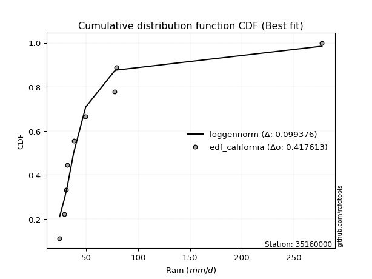</img>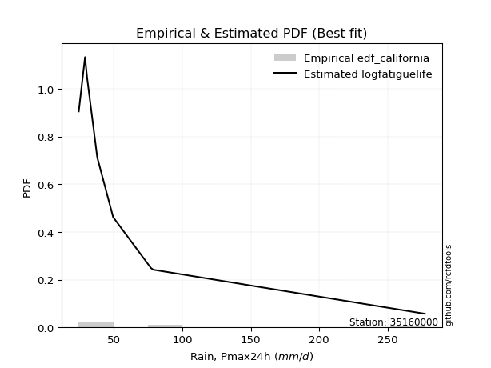</img>

</div>


### 2. EDF Hazen (1930)

Hazen method for plotting positions is a formula used to estimate the empirical cumulative probability distribution of flood events or other hydrological data. This formula often results in biased estimations, particularly when extrapolating to extreme events (high return periods).

<div align="center">


$P=(m-0.5)/n$


</div>


**2.1. Empirical values**

<div align="center">

|                | 0                  | 1                  | 2                  | 3                  | 4                  | 5         | 6                 | 7         |
|:---------------|:-------------------|:-------------------|:-------------------|:-------------------|:-------------------|:----------|:------------------|:----------|
| date           | 2021               | 2023               | 2018               | 2017               | 2020               | 2024      | 2019              | 2022      |
| x              | 24.52              | 29.1               | 30.6               | 38.01              | 49.59              | 77.2      | 78.93             | 277.01    |
| m              | 1                  | 2                  | 3                  | 4                  | 5                  | 6         | 7                 | 8         |
| empirical_dist | edf_hazen          | edf_hazen          | edf_hazen          | edf_hazen          | edf_hazen          | edf_hazen | edf_hazen         | edf_hazen |
| empirical      | 0.0625             | 0.1875             | 0.3125             | 0.4375             | 0.5625             | 0.6875    | 0.8125            | 0.9375    |
| empirical_tr   | 1.0666666666666667 | 1.2307692307692308 | 1.4545454545454546 | 1.7777777777777777 | 2.2857142857142856 | 3.2       | 5.333333333333333 | 16.0      |

</div>


**2.2. Kolmogorov-Smirnov fit test (sorted by Δ)**


<div align="center">

|                | 0                   | 1                   | 2                   | 3                   | 4                   | 5                  | 6                   | 7                   | 8                   | 9                   | 10                  | 11                  | 12                  | 13                  | 14                  | 15                  | 16                  | 17                  | 18                  | 19                  | 20                  | 21                  | 22                  | 23                  | 24                  | 25                 | 26                  | 27                  | 28                  | 29                  | 30                  | 31                    | 32                  | 33                  | 34                  | 35                  | 36                  | 37                  | 38                 | 39                  | 40                  | 41                 | 42                  | 43                 | 44                  | 45                  | 46                  | 47                 | 48                  | 49                  | 50                  | 51                 | 52                  | 53                  | 54                  | 55                  | 56                  | 57                 | 58                  | 59                  | 60                 | 61                  | 62                  | 63                  | 64                  | 65                  | 66                  | 67                  | 68                  | 69                  | 70                 | 71                 | 72                 | 73                  | 74                  | 75                  | 76                  | 77                 | 78                 | 79                  | 80                 | 81                  | 82                  | 83                  | 84                 | 85                 | 86                  | 87                 |
|:---------------|:--------------------|:--------------------|:--------------------|:--------------------|:--------------------|:-------------------|:--------------------|:--------------------|:--------------------|:--------------------|:--------------------|:--------------------|:--------------------|:--------------------|:--------------------|:--------------------|:--------------------|:--------------------|:--------------------|:--------------------|:--------------------|:--------------------|:--------------------|:--------------------|:--------------------|:-------------------|:--------------------|:--------------------|:--------------------|:--------------------|:--------------------|:----------------------|:--------------------|:--------------------|:--------------------|:--------------------|:--------------------|:--------------------|:-------------------|:--------------------|:--------------------|:-------------------|:--------------------|:-------------------|:--------------------|:--------------------|:--------------------|:-------------------|:--------------------|:--------------------|:--------------------|:-------------------|:--------------------|:--------------------|:--------------------|:--------------------|:--------------------|:-------------------|:--------------------|:--------------------|:-------------------|:--------------------|:--------------------|:--------------------|:--------------------|:--------------------|:--------------------|:--------------------|:--------------------|:--------------------|:-------------------|:-------------------|:-------------------|:--------------------|:--------------------|:--------------------|:--------------------|:-------------------|:-------------------|:--------------------|:-------------------|:--------------------|:--------------------|:--------------------|:-------------------|:-------------------|:--------------------|:-------------------|
| station        | 35160000            | 35160000            | 35160000            | 35160000            | 35160000            | 35160000           | 35160000            | 35160000            | 35160000            | 35160000            | 35160000            | 35160000            | 35160000            | 35160000            | 35160000            | 35160000            | 35160000            | 35160000            | 35160000            | 35160000            | 35160000            | 35160000            | 35160000            | 35160000            | 35160000            | 35160000           | 35160000            | 35160000            | 35160000            | 35160000            | 35160000            | 35160000              | 35160000            | 35160000            | 35160000            | 35160000            | 35160000            | 35160000            | 35160000           | 35160000            | 35160000            | 35160000           | 35160000            | 35160000           | 35160000            | 35160000            | 35160000            | 35160000           | 35160000            | 35160000            | 35160000            | 35160000           | 35160000            | 35160000            | 35160000            | 35160000            | 35160000            | 35160000           | 35160000            | 35160000            | 35160000           | 35160000            | 35160000            | 35160000            | 35160000            | 35160000            | 35160000            | 35160000            | 35160000            | 35160000            | 35160000           | 35160000           | 35160000           | 35160000            | 35160000            | 35160000            | 35160000            | 35160000           | 35160000           | 35160000            | 35160000           | 35160000            | 35160000            | 35160000            | 35160000           | 35160000           | 35160000            | 35160000           |
| empirical_dist | edf_hazen           | edf_hazen           | edf_hazen           | edf_hazen           | edf_hazen           | edf_hazen          | edf_hazen           | edf_hazen           | edf_hazen           | edf_hazen           | edf_hazen           | edf_hazen           | edf_hazen           | edf_hazen           | edf_hazen           | edf_hazen           | edf_hazen           | edf_hazen           | edf_hazen           | edf_hazen           | edf_hazen           | edf_hazen           | edf_hazen           | edf_hazen           | edf_hazen           | edf_hazen          | edf_hazen           | edf_hazen           | edf_hazen           | edf_hazen           | edf_hazen           | edf_hazen             | edf_hazen           | edf_hazen           | edf_hazen           | edf_hazen           | edf_hazen           | edf_hazen           | edf_hazen          | edf_hazen           | edf_hazen           | edf_hazen          | edf_hazen           | edf_hazen          | edf_hazen           | edf_hazen           | edf_hazen           | edf_hazen          | edf_hazen           | edf_hazen           | edf_hazen           | edf_hazen          | edf_hazen           | edf_hazen           | edf_hazen           | edf_hazen           | edf_hazen           | edf_hazen          | edf_hazen           | edf_hazen           | edf_hazen          | edf_hazen           | edf_hazen           | edf_hazen           | edf_hazen           | edf_hazen           | edf_hazen           | edf_hazen           | edf_hazen           | edf_hazen           | edf_hazen          | edf_hazen          | edf_hazen          | edf_hazen           | edf_hazen           | edf_hazen           | edf_hazen           | edf_hazen          | edf_hazen          | edf_hazen           | edf_hazen          | edf_hazen           | edf_hazen           | edf_hazen           | edf_hazen          | edf_hazen          | edf_hazen           | edf_hazen          |
| p_dist         | loghalflogistic     | logpearson3         | logfisk             | loggenexpon         | invweibull          | loghalfnorm        | loggompertz         | logexpon            | weibull_min         | invgauss            | logexponnorm        | loggumbel_r         | invgamma            | betaprime           | f                   | logfatiguelife      | logjohnsonsu        | fatiguelife         | lograyleigh         | logmoyal            | loginvgauss         | logt                | logmaxwell          | loginvgamma         | logf                | logmielke          | loginvweibull       | logncf              | logbetaprime        | lognct              | logalpha            | loglaplace_asymmetric | alpha               | nct                 | ncf                 | logtruncnorm        | loggenlogistic      | chi2                | logchi2            | lognorm             | lognorm             | logcrystalball     | logkstwobign        | logloggamma        | gibrat              | loglogistic         | logrice             | loghypsecant       | gamma               | erlang              | lognakagami         | wald               | genlogistic         | logweibull_min      | loggumbel_l         | loglaplace          | fisk                | exponnorm          | genexpon            | laplace_asymmetric  | expon              | logwald             | gompertz            | moyal               | t                   | gumbel_r            | pearson3            | halflogistic        | logerlang           | rayleigh            | halfnorm           | kstwobign          | maxwell            | laplace             | nakagami            | hypsecant           | truncnorm           | logistic           | crystalball        | norm                | rice               | loggibrat           | loggamma            | loggamma            | johnsonsu          | gumbel_l           | loglognorm          | mielke             |
| delta          | 0.06816080805645619 | 0.07352270776314176 | 0.07457338656179369 | 0.07712892936166948 | 0.07871398727849921 | 0.0793500766376547 | 0.08033166382424081 | 0.08072103154292676 | 0.08262478174409554 | 0.08276807204422099 | 0.08379492663007027 | 0.08619056970365027 | 0.08780164115190436 | 0.08780425244686485 | 0.08783876289919479 | 0.09191051216691815 | 0.09210663749352577 | 0.09313853008000905 | 0.09370759574408183 | 0.09409018744284403 | 0.09660376913385404 | 0.09797445740745084 | 0.09843948575921979 | 0.09957625836054995 | 0.09957641755396973 | 0.0998046661983435 | 0.10003088645589264 | 0.10068625196355707 | 0.10156921380894646 | 0.10172773482060893 | 0.10257750020051082 | 0.10262319554635702   | 0.10502582967048713 | 0.10508725143859118 | 0.10648419832741413 | 0.10654379916760826 | 0.10885793594637275 | 0.10892235238691195 | 0.115301741857195  | 0.11708179326199125 | 0.11708179326199125 | 0.1170821359558476 | 0.11885023979270609 | 0.1202684161384141 | 0.12530083091615118 | 0.13726755477590985 | 0.13798366213880942 | 0.1523151973575263 | 0.15249378284990645 | 0.15377988039357948 | 0.15485422984105424 | 0.1567111743277949 | 0.16750121040040544 | 0.16904556094799794 | 0.17587527172278677 | 0.17901555748798859 | 0.20326277676056448 | 0.2048133516805617 | 0.20547902475907637 | 0.20547908601045128 | 0.2054795512147918 | 0.20884812834980537 | 0.21234896387708344 | 0.21299959070569063 | 0.22095852403205624 | 0.22504241253668544 | 0.23294455867733727 | 0.24075561416404717 | 0.24622962694510625 | 0.25278124987568906 | 0.2528655525528699 | 0.25927049402903   | 0.2634088581530951 | 0.28360359752331576 | 0.28472504974351576 | 0.29146825931478415 | 0.29270932585091636 | 0.2934216946533046 | 0.2957118259837799 | 0.29571183353188024 | 0.3107367365616772 | 0.31249896368254354 | 0.33117876510083466 | 0.33117876510083466 | 0.3388186361405233 | 0.3653853547039271 | 0.41691595403813086 | nan                |
| deltao         | 0.4472608134160001  | 0.4472608134160001  | 0.4472608134160001  | 0.4472608134160001  | 0.4472608134160001  | 0.4472608134160001 | 0.4472608134160001  | 0.4472608134160001  | 0.4472608134160001  | 0.4472608134160001  | 0.4472608134160001  | 0.4472608134160001  | 0.4472608134160001  | 0.4472608134160001  | 0.4472608134160001  | 0.4472608134160001  | 0.4472608134160001  | 0.4472608134160001  | 0.4472608134160001  | 0.4472608134160001  | 0.4472608134160001  | 0.4472608134160001  | 0.4472608134160001  | 0.4472608134160001  | 0.4472608134160001  | 0.4472608134160001 | 0.4472608134160001  | 0.4472608134160001  | 0.4472608134160001  | 0.4472608134160001  | 0.4472608134160001  | 0.4472608134160001    | 0.4472608134160001  | 0.4472608134160001  | 0.4472608134160001  | 0.4472608134160001  | 0.4472608134160001  | 0.4472608134160001  | 0.4472608134160001 | 0.4472608134160001  | 0.4472608134160001  | 0.4472608134160001 | 0.4472608134160001  | 0.4472608134160001 | 0.4472608134160001  | 0.4472608134160001  | 0.4472608134160001  | 0.4472608134160001 | 0.4472608134160001  | 0.4472608134160001  | 0.4472608134160001  | 0.4472608134160001 | 0.4472608134160001  | 0.4472608134160001  | 0.4472608134160001  | 0.4472608134160001  | 0.4472608134160001  | 0.4472608134160001 | 0.4472608134160001  | 0.4472608134160001  | 0.4472608134160001 | 0.4472608134160001  | 0.4472608134160001  | 0.4472608134160001  | 0.4472608134160001  | 0.4472608134160001  | 0.4472608134160001  | 0.4472608134160001  | 0.4472608134160001  | 0.4472608134160001  | 0.4472608134160001 | 0.4472608134160001 | 0.4472608134160001 | 0.4472608134160001  | 0.4472608134160001  | 0.4472608134160001  | 0.4472608134160001  | 0.4472608134160001 | 0.4472608134160001 | 0.4472608134160001  | 0.4472608134160001 | 0.4472608134160001  | 0.4472608134160001  | 0.4472608134160001  | 0.4472608134160001 | 0.4472608134160001 | 0.4472608134160001  | 0.4472608134160001 |
| eval           | Δo > Δ              | Δo > Δ              | Δo > Δ              | Δo > Δ              | Δo > Δ              | Δo > Δ             | Δo > Δ              | Δo > Δ              | Δo > Δ              | Δo > Δ              | Δo > Δ              | Δo > Δ              | Δo > Δ              | Δo > Δ              | Δo > Δ              | Δo > Δ              | Δo > Δ              | Δo > Δ              | Δo > Δ              | Δo > Δ              | Δo > Δ              | Δo > Δ              | Δo > Δ              | Δo > Δ              | Δo > Δ              | Δo > Δ             | Δo > Δ              | Δo > Δ              | Δo > Δ              | Δo > Δ              | Δo > Δ              | Δo > Δ                | Δo > Δ              | Δo > Δ              | Δo > Δ              | Δo > Δ              | Δo > Δ              | Δo > Δ              | Δo > Δ             | Δo > Δ              | Δo > Δ              | Δo > Δ             | Δo > Δ              | Δo > Δ             | Δo > Δ              | Δo > Δ              | Δo > Δ              | Δo > Δ             | Δo > Δ              | Δo > Δ              | Δo > Δ              | Δo > Δ             | Δo > Δ              | Δo > Δ              | Δo > Δ              | Δo > Δ              | Δo > Δ              | Δo > Δ             | Δo > Δ              | Δo > Δ              | Δo > Δ             | Δo > Δ              | Δo > Δ              | Δo > Δ              | Δo > Δ              | Δo > Δ              | Δo > Δ              | Δo > Δ              | Δo > Δ              | Δo > Δ              | Δo > Δ             | Δo > Δ             | Δo > Δ             | Δo > Δ              | Δo > Δ              | Δo > Δ              | Δo > Δ              | Δo > Δ             | Δo > Δ             | Δo > Δ              | Δo > Δ             | Δo > Δ              | Δo > Δ              | Δo > Δ              | Δo > Δ             | Δo > Δ             | Δo > Δ              | Δo <= Δ            |
| fit            | 1                   | 1                   | 1                   | 1                   | 1                   | 1                  | 1                   | 1                   | 1                   | 1                   | 1                   | 1                   | 1                   | 1                   | 1                   | 1                   | 1                   | 1                   | 1                   | 1                   | 1                   | 1                   | 1                   | 1                   | 1                   | 1                  | 1                   | 1                   | 1                   | 1                   | 1                   | 1                     | 1                   | 1                   | 1                   | 1                   | 1                   | 1                   | 1                  | 1                   | 1                   | 1                  | 1                   | 1                  | 1                   | 1                   | 1                   | 1                  | 1                   | 1                   | 1                   | 1                  | 1                   | 1                   | 1                   | 1                   | 1                   | 1                  | 1                   | 1                   | 1                  | 1                   | 1                   | 1                   | 1                   | 1                   | 1                   | 1                   | 1                   | 1                   | 1                  | 1                  | 1                  | 1                   | 1                   | 1                   | 1                   | 1                  | 1                  | 1                   | 1                  | 1                   | 1                   | 1                   | 1                  | 1                  | 1                   | 0                  |
| n              | 8                   | 8                   | 8                   | 8                   | 8                   | 8                  | 8                   | 8                   | 8                   | 8                   | 8                   | 8                   | 8                   | 8                   | 8                   | 8                   | 8                   | 8                   | 8                   | 8                   | 8                   | 8                   | 8                   | 8                   | 8                   | 8                  | 8                   | 8                   | 8                   | 8                   | 8                   | 8                     | 8                   | 8                   | 8                   | 8                   | 8                   | 8                   | 8                  | 8                   | 8                   | 8                  | 8                   | 8                  | 8                   | 8                   | 8                   | 8                  | 8                   | 8                   | 8                   | 8                  | 8                   | 8                   | 8                   | 8                   | 8                   | 8                  | 8                   | 8                   | 8                  | 8                   | 8                   | 8                   | 8                   | 8                   | 8                   | 8                   | 8                   | 8                   | 8                  | 8                  | 8                  | 8                   | 8                   | 8                   | 8                   | 8                  | 8                  | 8                   | 8                  | 8                   | 8                   | 8                   | 8                  | 8                  | 8                   | 8                  |
| best_fit       | 1                   | 0                   | 0                   | 0                   | 0                   | 0                  | 0                   | 0                   | 0                   | 0                   | 0                   | 0                   | 0                   | 0                   | 0                   | 0                   | 0                   | 0                   | 0                   | 0                   | 0                   | 0                   | 0                   | 0                   | 0                   | 0                  | 0                   | 0                   | 0                   | 0                   | 0                   | 0                     | 0                   | 0                   | 0                   | 0                   | 0                   | 0                   | 0                  | 0                   | 0                   | 0                  | 0                   | 0                  | 0                   | 0                   | 0                   | 0                  | 0                   | 0                   | 0                   | 0                  | 0                   | 0                   | 0                   | 0                   | 0                   | 0                  | 0                   | 0                   | 0                  | 0                   | 0                   | 0                   | 0                   | 0                   | 0                   | 0                   | 0                   | 0                   | 0                  | 0                  | 0                  | 0                   | 0                   | 0                   | 0                   | 0                  | 0                  | 0                   | 0                  | 0                   | 0                   | 0                   | 0                  | 0                  | 0                   | 0                  |
| best_fit_sort  | 1                   | 2                   | 3                   | 4                   | 5                   | 6                  | 7                   | 8                   | 9                   | 10                  | 11                  | 12                  | 13                  | 14                  | 15                  | 16                  | 17                  | 18                  | 19                  | 20                  | 21                  | 22                  | 23                  | 24                  | 25                  | 26                 | 27                  | 28                  | 29                  | 30                  | 31                  | 32                    | 33                  | 34                  | 35                  | 36                  | 37                  | 38                  | 39                 | 40                  | 41                  | 42                 | 43                  | 44                 | 45                  | 46                  | 47                  | 48                 | 49                  | 50                  | 51                  | 52                 | 53                  | 54                  | 55                  | 56                  | 57                  | 58                 | 59                  | 60                  | 61                 | 62                  | 63                  | 64                  | 65                  | 66                  | 67                  | 68                  | 69                  | 70                  | 71                 | 72                 | 73                 | 74                  | 75                  | 76                  | 77                  | 78                 | 79                 | 80                  | 81                 | 82                  | 83                  | 84                  | 85                 | 86                 | 87                  | 88                 |

</div>


**2.3. Best fit**

<div align="center">

|   id |   station | empirical_dist   | p_dist          |     delta |   deltao | eval   |   fit |   n |   best_fit |   best_fit_sort |
|-----:|----------:|:-----------------|:----------------|----------:|---------:|:-------|------:|----:|-----------:|----------------:|
|    0 |  35160000 | edf_hazen        | loghalflogistic | 0.0681608 | 0.447261 | Δo > Δ |     1 |   8 |          1 |               1 |

</div>


<div align="center">

</img>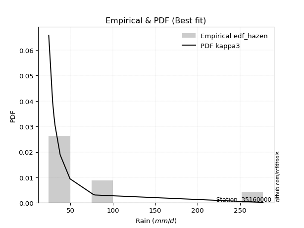</img>

</div>


### 3. EDF Weibull (1939)

Weibull plotting position formula is an empirical method used to estimate the non-exceedance probability or plotting position for a set of observed data, is often recommended or widely used in practice, particularly in flood frequency analysis.

<div align="center">


$P=m/(n+1)$


</div>


**3.1. Empirical values**

<div align="center">

|                | 0                  | 1                  | 2                  | 3                  | 4                  | 5                  | 6                  | 7                  |
|:---------------|:-------------------|:-------------------|:-------------------|:-------------------|:-------------------|:-------------------|:-------------------|:-------------------|
| date           | 2021               | 2023               | 2018               | 2017               | 2020               | 2024               | 2019               | 2022               |
| x              | 24.52              | 29.1               | 30.6               | 38.01              | 49.59              | 77.2               | 78.93              | 277.01             |
| m              | 1                  | 2                  | 3                  | 4                  | 5                  | 6                  | 7                  | 8                  |
| empirical_dist | edf_weibull        | edf_weibull        | edf_weibull        | edf_weibull        | edf_weibull        | edf_weibull        | edf_weibull        | edf_weibull        |
| empirical      | 0.1111111111111111 | 0.2222222222222222 | 0.3333333333333333 | 0.4444444444444444 | 0.5555555555555556 | 0.6666666666666666 | 0.7777777777777778 | 0.8888888888888888 |
| empirical_tr   | 1.125              | 1.2857142857142856 | 1.4999999999999998 | 1.7999999999999998 | 2.25               | 2.9999999999999996 | 4.5                | 8.999999999999996  |

</div>


**3.2. Kolmogorov-Smirnov fit test (sorted by Δ)**


<div align="center">

|                | 0                   | 1                   | 2                   | 3                  | 4                   | 5                   | 6                   | 7                   | 8                   | 9                   | 10                 | 11                  | 12                  | 13                  | 14                  | 15                 | 16                  | 17                 | 18                  | 19                  | 20                 | 21                  | 22                  | 23                  | 24                  | 25                  | 26                  | 27                  | 28                  | 29                 | 30                  | 31                 | 32                  | 33                  | 34                  | 35                 | 36                  | 37                    | 38                  | 39                  | 40                  | 41                 | 42                 | 43                  | 44                  | 45                 | 46                  | 47                 | 48                  | 49                  | 50                  | 51                  | 52                  | 53                  | 54                  | 55                  | 56                  | 57                 | 58                 | 59                  | 60                  | 61                 | 62                  | 63                  | 64                  | 65                 | 66                  | 67                  | 68                  | 69                 | 70                  | 71                 | 72                 | 73                  | 74                  | 75                  | 76                 | 77                  | 78                  | 79                 | 80                  | 81                  | 82                  | 83                 | 84                  | 85                  | 86                  | 87                 |
|:---------------|:--------------------|:--------------------|:--------------------|:-------------------|:--------------------|:--------------------|:--------------------|:--------------------|:--------------------|:--------------------|:-------------------|:--------------------|:--------------------|:--------------------|:--------------------|:-------------------|:--------------------|:-------------------|:--------------------|:--------------------|:-------------------|:--------------------|:--------------------|:--------------------|:--------------------|:--------------------|:--------------------|:--------------------|:--------------------|:-------------------|:--------------------|:-------------------|:--------------------|:--------------------|:--------------------|:-------------------|:--------------------|:----------------------|:--------------------|:--------------------|:--------------------|:-------------------|:-------------------|:--------------------|:--------------------|:-------------------|:--------------------|:-------------------|:--------------------|:--------------------|:--------------------|:--------------------|:--------------------|:--------------------|:--------------------|:--------------------|:--------------------|:-------------------|:-------------------|:--------------------|:--------------------|:-------------------|:--------------------|:--------------------|:--------------------|:-------------------|:--------------------|:--------------------|:--------------------|:-------------------|:--------------------|:-------------------|:-------------------|:--------------------|:--------------------|:--------------------|:-------------------|:--------------------|:--------------------|:-------------------|:--------------------|:--------------------|:--------------------|:-------------------|:--------------------|:--------------------|:--------------------|:-------------------|
| station        | 35160000            | 35160000            | 35160000            | 35160000           | 35160000            | 35160000            | 35160000            | 35160000            | 35160000            | 35160000            | 35160000           | 35160000            | 35160000            | 35160000            | 35160000            | 35160000           | 35160000            | 35160000           | 35160000            | 35160000            | 35160000           | 35160000            | 35160000            | 35160000            | 35160000            | 35160000            | 35160000            | 35160000            | 35160000            | 35160000           | 35160000            | 35160000           | 35160000            | 35160000            | 35160000            | 35160000           | 35160000            | 35160000              | 35160000            | 35160000            | 35160000            | 35160000           | 35160000           | 35160000            | 35160000            | 35160000           | 35160000            | 35160000           | 35160000            | 35160000            | 35160000            | 35160000            | 35160000            | 35160000            | 35160000            | 35160000            | 35160000            | 35160000           | 35160000           | 35160000            | 35160000            | 35160000           | 35160000            | 35160000            | 35160000            | 35160000           | 35160000            | 35160000            | 35160000            | 35160000           | 35160000            | 35160000           | 35160000           | 35160000            | 35160000            | 35160000            | 35160000           | 35160000            | 35160000            | 35160000           | 35160000            | 35160000            | 35160000            | 35160000           | 35160000            | 35160000            | 35160000            | 35160000           |
| empirical_dist | edf_weibull         | edf_weibull         | edf_weibull         | edf_weibull        | edf_weibull         | edf_weibull         | edf_weibull         | edf_weibull         | edf_weibull         | edf_weibull         | edf_weibull        | edf_weibull         | edf_weibull         | edf_weibull         | edf_weibull         | edf_weibull        | edf_weibull         | edf_weibull        | edf_weibull         | edf_weibull         | edf_weibull        | edf_weibull         | edf_weibull         | edf_weibull         | edf_weibull         | edf_weibull         | edf_weibull         | edf_weibull         | edf_weibull         | edf_weibull        | edf_weibull         | edf_weibull        | edf_weibull         | edf_weibull         | edf_weibull         | edf_weibull        | edf_weibull         | edf_weibull           | edf_weibull         | edf_weibull         | edf_weibull         | edf_weibull        | edf_weibull        | edf_weibull         | edf_weibull         | edf_weibull        | edf_weibull         | edf_weibull        | edf_weibull         | edf_weibull         | edf_weibull         | edf_weibull         | edf_weibull         | edf_weibull         | edf_weibull         | edf_weibull         | edf_weibull         | edf_weibull        | edf_weibull        | edf_weibull         | edf_weibull         | edf_weibull        | edf_weibull         | edf_weibull         | edf_weibull         | edf_weibull        | edf_weibull         | edf_weibull         | edf_weibull         | edf_weibull        | edf_weibull         | edf_weibull        | edf_weibull        | edf_weibull         | edf_weibull         | edf_weibull         | edf_weibull        | edf_weibull         | edf_weibull         | edf_weibull        | edf_weibull         | edf_weibull         | edf_weibull         | edf_weibull        | edf_weibull         | edf_weibull         | edf_weibull         | edf_weibull        |
| p_dist         | loghalfnorm         | fatiguelife         | lograyleigh         | loghalflogistic    | logmaxwell          | logpearson3         | logfisk             | invweibull          | invgauss            | loggumbel_r         | wald               | invgamma            | betaprime           | f                   | logexponnorm        | chi2               | logchi2             | loggenexpon        | weibull_min         | loggompertz         | logexpon           | logfatiguelife      | logjohnsonsu        | logmoyal            | loginvgauss         | ncf                 | logt                | logloggamma         | lognakagami         | logncf             | loginvgamma         | logf               | logmielke           | loginvweibull       | logbetaprime        | lognct             | logalpha            | loglaplace_asymmetric | lognorm             | lognorm             | logcrystalball      | alpha              | nct                | logtruncnorm        | loggenlogistic      | logkstwobign       | loglogistic         | gibrat             | logrice             | loghypsecant        | genlogistic         | moyal               | fisk                | gamma               | erlang              | loggumbel_l         | pearson3            | loglaplace         | logweibull_min     | gumbel_r            | halflogistic        | halfnorm           | logerlang           | rayleigh            | exponnorm           | genexpon           | laplace_asymmetric  | expon               | t                   | kstwobign          | gompertz            | maxwell            | logwald            | laplace             | nakagami            | hypsecant           | logistic           | crystalball         | norm                | rice               | truncnorm           | loggamma            | loggamma            | johnsonsu          | gumbel_l            | loggibrat           | loglognorm          | mielke             |
| delta          | 0.07797332356671494 | 0.07860853811675331 | 0.08509583326112813 | 0.0889941413897895 | 0.09424286571102763 | 0.09435604109647508 | 0.09540671989512706 | 0.09954732061183258 | 0.10360140537755436 | 0.10702390303698359 | 0.1081000632166838 | 0.10863497448523773 | 0.10863758578019822 | 0.10867209623252816 | 0.11024630215992931 | 0.1111110999072803 | 0.11111110584724165 | 0.1111111108884163 | 0.11111111111074601 | 0.11111111111101109 | 0.1111111111111111 | 0.11274384550025152 | 0.11293997082685914 | 0.11492352077617735 | 0.11743710246718742 | 0.11805571405520857 | 0.11840750850212689 | 0.11889271010550378 | 0.12013200761883203 | 0.1201359847238975 | 0.12040959169388332 | 0.1204097508873031 | 0.12063799953167686 | 0.12086421978922601 | 0.12240254714227983 | 0.1225610681539423 | 0.12341083353384419 | 0.12345652887969033   | 0.12402623770643567 | 0.12402623770643567 | 0.12402658040029202 | 0.1258591630038205 | 0.1259205847719245 | 0.12737713250094163 | 0.12969126927970606 | 0.1396835731260394 | 0.14421199922035427 | 0.1461341642494845 | 0.15685222219444425 | 0.15925964180197072 | 0.16072982235191274 | 0.16466628372769698 | 0.16854055453834227 | 0.17332711618323982 | 0.17461321372691285 | 0.17888582400187386 | 0.18433344756622616 | 0.185960001932433  | 0.1898788942813313 | 0.19032019031446323 | 0.19214450305293607 | 0.2042544414417588 | 0.21150740472288404 | 0.21805902765346685 | 0.22030529596142573 | 0.221156496465833  | 0.22115652837833094 | 0.22115677076959195 | 0.22254182791765997 | 0.2245482718068078 | 0.22472723649279575 | 0.2286866359308729 | 0.2296814616831387 | 0.24888137530109355 | 0.25000282752129355 | 0.25674603709256194 | 0.2586994724310824 | 0.26098960376155766 | 0.26098961130965803 | 0.276014514339455  | 0.28047601035486247 | 0.29645654287861245 | 0.29645654287861245 | 0.3040964139183011 | 0.33066313248170487 | 0.33333229701587686 | 0.38219373181590865 | nan                |
| deltao         | 0.4472608134160001  | 0.4472608134160001  | 0.4472608134160001  | 0.4472608134160001 | 0.4472608134160001  | 0.4472608134160001  | 0.4472608134160001  | 0.4472608134160001  | 0.4472608134160001  | 0.4472608134160001  | 0.4472608134160001 | 0.4472608134160001  | 0.4472608134160001  | 0.4472608134160001  | 0.4472608134160001  | 0.4472608134160001 | 0.4472608134160001  | 0.4472608134160001 | 0.4472608134160001  | 0.4472608134160001  | 0.4472608134160001 | 0.4472608134160001  | 0.4472608134160001  | 0.4472608134160001  | 0.4472608134160001  | 0.4472608134160001  | 0.4472608134160001  | 0.4472608134160001  | 0.4472608134160001  | 0.4472608134160001 | 0.4472608134160001  | 0.4472608134160001 | 0.4472608134160001  | 0.4472608134160001  | 0.4472608134160001  | 0.4472608134160001 | 0.4472608134160001  | 0.4472608134160001    | 0.4472608134160001  | 0.4472608134160001  | 0.4472608134160001  | 0.4472608134160001 | 0.4472608134160001 | 0.4472608134160001  | 0.4472608134160001  | 0.4472608134160001 | 0.4472608134160001  | 0.4472608134160001 | 0.4472608134160001  | 0.4472608134160001  | 0.4472608134160001  | 0.4472608134160001  | 0.4472608134160001  | 0.4472608134160001  | 0.4472608134160001  | 0.4472608134160001  | 0.4472608134160001  | 0.4472608134160001 | 0.4472608134160001 | 0.4472608134160001  | 0.4472608134160001  | 0.4472608134160001 | 0.4472608134160001  | 0.4472608134160001  | 0.4472608134160001  | 0.4472608134160001 | 0.4472608134160001  | 0.4472608134160001  | 0.4472608134160001  | 0.4472608134160001 | 0.4472608134160001  | 0.4472608134160001 | 0.4472608134160001 | 0.4472608134160001  | 0.4472608134160001  | 0.4472608134160001  | 0.4472608134160001 | 0.4472608134160001  | 0.4472608134160001  | 0.4472608134160001 | 0.4472608134160001  | 0.4472608134160001  | 0.4472608134160001  | 0.4472608134160001 | 0.4472608134160001  | 0.4472608134160001  | 0.4472608134160001  | 0.4472608134160001 |
| eval           | Δo > Δ              | Δo > Δ              | Δo > Δ              | Δo > Δ             | Δo > Δ              | Δo > Δ              | Δo > Δ              | Δo > Δ              | Δo > Δ              | Δo > Δ              | Δo > Δ             | Δo > Δ              | Δo > Δ              | Δo > Δ              | Δo > Δ              | Δo > Δ             | Δo > Δ              | Δo > Δ             | Δo > Δ              | Δo > Δ              | Δo > Δ             | Δo > Δ              | Δo > Δ              | Δo > Δ              | Δo > Δ              | Δo > Δ              | Δo > Δ              | Δo > Δ              | Δo > Δ              | Δo > Δ             | Δo > Δ              | Δo > Δ             | Δo > Δ              | Δo > Δ              | Δo > Δ              | Δo > Δ             | Δo > Δ              | Δo > Δ                | Δo > Δ              | Δo > Δ              | Δo > Δ              | Δo > Δ             | Δo > Δ             | Δo > Δ              | Δo > Δ              | Δo > Δ             | Δo > Δ              | Δo > Δ             | Δo > Δ              | Δo > Δ              | Δo > Δ              | Δo > Δ              | Δo > Δ              | Δo > Δ              | Δo > Δ              | Δo > Δ              | Δo > Δ              | Δo > Δ             | Δo > Δ             | Δo > Δ              | Δo > Δ              | Δo > Δ             | Δo > Δ              | Δo > Δ              | Δo > Δ              | Δo > Δ             | Δo > Δ              | Δo > Δ              | Δo > Δ              | Δo > Δ             | Δo > Δ              | Δo > Δ             | Δo > Δ             | Δo > Δ              | Δo > Δ              | Δo > Δ              | Δo > Δ             | Δo > Δ              | Δo > Δ              | Δo > Δ             | Δo > Δ              | Δo > Δ              | Δo > Δ              | Δo > Δ             | Δo > Δ              | Δo > Δ              | Δo > Δ              | Δo <= Δ            |
| fit            | 1                   | 1                   | 1                   | 1                  | 1                   | 1                   | 1                   | 1                   | 1                   | 1                   | 1                  | 1                   | 1                   | 1                   | 1                   | 1                  | 1                   | 1                  | 1                   | 1                   | 1                  | 1                   | 1                   | 1                   | 1                   | 1                   | 1                   | 1                   | 1                   | 1                  | 1                   | 1                  | 1                   | 1                   | 1                   | 1                  | 1                   | 1                     | 1                   | 1                   | 1                   | 1                  | 1                  | 1                   | 1                   | 1                  | 1                   | 1                  | 1                   | 1                   | 1                   | 1                   | 1                   | 1                   | 1                   | 1                   | 1                   | 1                  | 1                  | 1                   | 1                   | 1                  | 1                   | 1                   | 1                   | 1                  | 1                   | 1                   | 1                   | 1                  | 1                   | 1                  | 1                  | 1                   | 1                   | 1                   | 1                  | 1                   | 1                   | 1                  | 1                   | 1                   | 1                   | 1                  | 1                   | 1                   | 1                   | 0                  |
| n              | 8                   | 8                   | 8                   | 8                  | 8                   | 8                   | 8                   | 8                   | 8                   | 8                   | 8                  | 8                   | 8                   | 8                   | 8                   | 8                  | 8                   | 8                  | 8                   | 8                   | 8                  | 8                   | 8                   | 8                   | 8                   | 8                   | 8                   | 8                   | 8                   | 8                  | 8                   | 8                  | 8                   | 8                   | 8                   | 8                  | 8                   | 8                     | 8                   | 8                   | 8                   | 8                  | 8                  | 8                   | 8                   | 8                  | 8                   | 8                  | 8                   | 8                   | 8                   | 8                   | 8                   | 8                   | 8                   | 8                   | 8                   | 8                  | 8                  | 8                   | 8                   | 8                  | 8                   | 8                   | 8                   | 8                  | 8                   | 8                   | 8                   | 8                  | 8                   | 8                  | 8                  | 8                   | 8                   | 8                   | 8                  | 8                   | 8                   | 8                  | 8                   | 8                   | 8                   | 8                  | 8                   | 8                   | 8                   | 8                  |
| best_fit       | 1                   | 0                   | 0                   | 0                  | 0                   | 0                   | 0                   | 0                   | 0                   | 0                   | 0                  | 0                   | 0                   | 0                   | 0                   | 0                  | 0                   | 0                  | 0                   | 0                   | 0                  | 0                   | 0                   | 0                   | 0                   | 0                   | 0                   | 0                   | 0                   | 0                  | 0                   | 0                  | 0                   | 0                   | 0                   | 0                  | 0                   | 0                     | 0                   | 0                   | 0                   | 0                  | 0                  | 0                   | 0                   | 0                  | 0                   | 0                  | 0                   | 0                   | 0                   | 0                   | 0                   | 0                   | 0                   | 0                   | 0                   | 0                  | 0                  | 0                   | 0                   | 0                  | 0                   | 0                   | 0                   | 0                  | 0                   | 0                   | 0                   | 0                  | 0                   | 0                  | 0                  | 0                   | 0                   | 0                   | 0                  | 0                   | 0                   | 0                  | 0                   | 0                   | 0                   | 0                  | 0                   | 0                   | 0                   | 0                  |
| best_fit_sort  | 1                   | 2                   | 3                   | 4                  | 5                   | 6                   | 7                   | 8                   | 9                   | 10                  | 11                 | 12                  | 13                  | 14                  | 15                  | 16                 | 17                  | 18                 | 19                  | 20                  | 21                 | 22                  | 23                  | 24                  | 25                  | 26                  | 27                  | 28                  | 29                  | 30                 | 31                  | 32                 | 33                  | 34                  | 35                  | 36                 | 37                  | 38                    | 39                  | 40                  | 41                  | 42                 | 43                 | 44                  | 45                  | 46                 | 47                  | 48                 | 49                  | 50                  | 51                  | 52                  | 53                  | 54                  | 55                  | 56                  | 57                  | 58                 | 59                 | 60                  | 61                  | 62                 | 63                  | 64                  | 65                  | 66                 | 67                  | 68                  | 69                  | 70                 | 71                  | 72                 | 73                 | 74                  | 75                  | 76                  | 77                 | 78                  | 79                  | 80                 | 81                  | 82                  | 83                  | 84                 | 85                  | 86                  | 87                  | 88                 |

</div>


**3.3. Best fit**

<div align="center">

|   id |   station | empirical_dist   | p_dist      |     delta |   deltao | eval   |   fit |   n |   best_fit |   best_fit_sort |
|-----:|----------:|:-----------------|:------------|----------:|---------:|:-------|------:|----:|-----------:|----------------:|
|    0 |  35160000 | edf_weibull      | loghalfnorm | 0.0779733 | 0.447261 | Δo > Δ |     1 |   8 |          1 |               1 |

</div>


<div align="center">

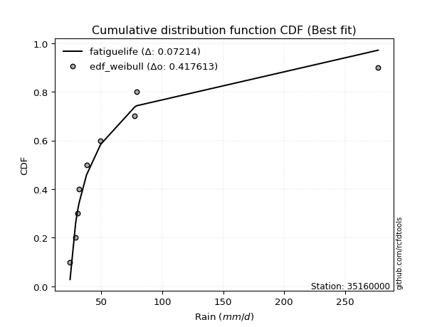</img></img>

</div>


### 4. EDF Beard (1943)

The Beard formula (or Beard´s plotting position formula) in hydrology is used to estimate the empirical non-exceedance probability _(P)_ of a flood event (or other extreme hydrological data point) within a given dataset.

<div align="center">


$P=(m-0.31)/(n+0.38)$


</div>


**4.1. Empirical values**

<div align="center">

|                | 0                   | 1                   | 2                  | 3                   | 4                  | 5                  | 6                  | 7                  |
|:---------------|:--------------------|:--------------------|:-------------------|:--------------------|:-------------------|:-------------------|:-------------------|:-------------------|
| date           | 2021                | 2023                | 2018               | 2017                | 2020               | 2024               | 2019               | 2022               |
| x              | 24.52               | 29.1                | 30.6               | 38.01               | 49.59              | 77.2               | 78.93              | 277.01             |
| m              | 1                   | 2                   | 3                  | 4                   | 5                  | 6                  | 7                  | 8                  |
| empirical_dist | edf_beard           | edf_beard           | edf_beard          | edf_beard           | edf_beard          | edf_beard          | edf_beard          | edf_beard          |
| empirical      | 0.08233890214797135 | 0.20167064439140808 | 0.3210023866348448 | 0.44033412887828155 | 0.5596658711217184 | 0.6789976133651551 | 0.7983293556085919 | 0.9176610978520287 |
| empirical_tr   | 1.0897269180754225  | 1.2526158445440956  | 1.4727592267135323 | 1.7867803837953091  | 2.2710027100271004 | 3.115241635687732  | 4.958579881656804  | 12.144927536231886 |

</div>


**4.2. Kolmogorov-Smirnov fit test (sorted by Δ)**


<div align="center">

|                | 0                   | 1                  | 2                   | 3                   | 4                   | 5                   | 6                   | 7                   | 8                   | 9                   | 10                  | 11                  | 12                  | 13                  | 14                  | 15                  | 16                  | 17                  | 18                  | 19                  | 20                 | 21                  | 22                  | 23                  | 24                  | 25                 | 26                  | 27                  | 28                  | 29                  | 30                  | 31                  | 32                  | 33                  | 34                    | 35                  | 36                 | 37                  | 38                  | 39                  | 40                 | 41                 | 42                  | 43                 | 44                 | 45                  | 46                 | 47                 | 48                  | 49                  | 50                  | 51                 | 52                  | 53                 | 54                  | 55                  | 56                  | 57                  | 58                  | 59                 | 60                  | 61                  | 62                  | 63                 | 64                  | 65                  | 66                 | 67                  | 68                  | 69                  | 70                  | 71                  | 72                  | 73                 | 74                 | 75                 | 76                 | 77                  | 78                  | 79                 | 80                 | 81                 | 82                 | 83                  | 84                  | 85                  | 86                 | 87                 |
|:---------------|:--------------------|:-------------------|:--------------------|:--------------------|:--------------------|:--------------------|:--------------------|:--------------------|:--------------------|:--------------------|:--------------------|:--------------------|:--------------------|:--------------------|:--------------------|:--------------------|:--------------------|:--------------------|:--------------------|:--------------------|:-------------------|:--------------------|:--------------------|:--------------------|:--------------------|:-------------------|:--------------------|:--------------------|:--------------------|:--------------------|:--------------------|:--------------------|:--------------------|:--------------------|:----------------------|:--------------------|:-------------------|:--------------------|:--------------------|:--------------------|:-------------------|:-------------------|:--------------------|:-------------------|:-------------------|:--------------------|:-------------------|:-------------------|:--------------------|:--------------------|:--------------------|:-------------------|:--------------------|:-------------------|:--------------------|:--------------------|:--------------------|:--------------------|:--------------------|:-------------------|:--------------------|:--------------------|:--------------------|:-------------------|:--------------------|:--------------------|:-------------------|:--------------------|:--------------------|:--------------------|:--------------------|:--------------------|:--------------------|:-------------------|:-------------------|:-------------------|:-------------------|:--------------------|:--------------------|:-------------------|:-------------------|:-------------------|:-------------------|:--------------------|:--------------------|:--------------------|:-------------------|:-------------------|
| station        | 35160000            | 35160000           | 35160000            | 35160000            | 35160000            | 35160000            | 35160000            | 35160000            | 35160000            | 35160000            | 35160000            | 35160000            | 35160000            | 35160000            | 35160000            | 35160000            | 35160000            | 35160000            | 35160000            | 35160000            | 35160000           | 35160000            | 35160000            | 35160000            | 35160000            | 35160000           | 35160000            | 35160000            | 35160000            | 35160000            | 35160000            | 35160000            | 35160000            | 35160000            | 35160000              | 35160000            | 35160000           | 35160000            | 35160000            | 35160000            | 35160000           | 35160000           | 35160000            | 35160000           | 35160000           | 35160000            | 35160000           | 35160000           | 35160000            | 35160000            | 35160000            | 35160000           | 35160000            | 35160000           | 35160000            | 35160000            | 35160000            | 35160000            | 35160000            | 35160000           | 35160000            | 35160000            | 35160000            | 35160000           | 35160000            | 35160000            | 35160000           | 35160000            | 35160000            | 35160000            | 35160000            | 35160000            | 35160000            | 35160000           | 35160000           | 35160000           | 35160000           | 35160000            | 35160000            | 35160000           | 35160000           | 35160000           | 35160000           | 35160000            | 35160000            | 35160000            | 35160000           | 35160000           |
| empirical_dist | edf_beard           | edf_beard          | edf_beard           | edf_beard           | edf_beard           | edf_beard           | edf_beard           | edf_beard           | edf_beard           | edf_beard           | edf_beard           | edf_beard           | edf_beard           | edf_beard           | edf_beard           | edf_beard           | edf_beard           | edf_beard           | edf_beard           | edf_beard           | edf_beard          | edf_beard           | edf_beard           | edf_beard           | edf_beard           | edf_beard          | edf_beard           | edf_beard           | edf_beard           | edf_beard           | edf_beard           | edf_beard           | edf_beard           | edf_beard           | edf_beard             | edf_beard           | edf_beard          | edf_beard           | edf_beard           | edf_beard           | edf_beard          | edf_beard          | edf_beard           | edf_beard          | edf_beard          | edf_beard           | edf_beard          | edf_beard          | edf_beard           | edf_beard           | edf_beard           | edf_beard          | edf_beard           | edf_beard          | edf_beard           | edf_beard           | edf_beard           | edf_beard           | edf_beard           | edf_beard          | edf_beard           | edf_beard           | edf_beard           | edf_beard          | edf_beard           | edf_beard           | edf_beard          | edf_beard           | edf_beard           | edf_beard           | edf_beard           | edf_beard           | edf_beard           | edf_beard          | edf_beard          | edf_beard          | edf_beard          | edf_beard           | edf_beard           | edf_beard          | edf_beard          | edf_beard          | edf_beard          | edf_beard           | edf_beard           | edf_beard           | edf_beard          | edf_beard          |
| p_dist         | loghalfnorm         | loghalflogistic    | fatiguelife         | lograyleigh         | logpearson3         | logfisk             | loggenexpon         | invweibull          | loggompertz         | logexpon            | logmaxwell          | weibull_min         | invgauss            | logexponnorm        | loggumbel_r         | chi2                | invgamma            | betaprime           | f                   | logfatiguelife      | logjohnsonsu       | logchi2             | logmoyal            | loginvgauss         | logt                | logncf             | loginvgamma         | logf                | logmielke           | loginvweibull       | ncf                 | logbetaprime        | lognct              | logalpha            | loglaplace_asymmetric | alpha               | nct                | logloggamma         | logtruncnorm        | loggenlogistic      | lognorm            | lognorm            | logcrystalball      | logkstwobign       | gibrat             | wald                | loglogistic        | lognakagami        | logrice             | loghypsecant        | gamma               | erlang             | genlogistic         | loggumbel_l        | logweibull_min      | loglaplace          | fisk                | moyal               | exponnorm           | genexpon           | laplace_asymmetric  | expon               | t                   | gumbel_r           | pearson3            | gompertz            | logwald            | halflogistic        | logerlang           | halfnorm            | rayleigh            | kstwobign           | maxwell             | laplace            | nakagami           | hypsecant          | truncnorm          | logistic            | crystalball         | norm               | rice               | loggamma           | loggamma           | loggibrat           | johnsonsu           | gumbel_l            | loglognorm         | mielke             |
| delta          | 0.06517943224624656 | 0.076663194691301  | 0.07896788568860097 | 0.07953695135267369 | 0.08202509439798658 | 0.08307577319663861 | 0.08563131599651441 | 0.08721637391334414 | 0.08883405045908563 | 0.08922341817777169 | 0.09013255014486476 | 0.09112716837894036 | 0.09127045867906591 | 0.09229731326491519 | 0.09469295633849509 | 0.09475170799550381 | 0.09630402778674929 | 0.09630663908170978 | 0.09634114953403972 | 0.10041289880176307 | 0.1006090241283707 | 0.10113109746578691 | 0.10259257407768885 | 0.10510615576869897 | 0.10607656180363845 | 0.107805038025409  | 0.10807864499539488 | 0.10807880418881466 | 0.10830705283318842 | 0.10853327309073757 | 0.10931832720569568 | 0.11007160044379138 | 0.11023012145545386 | 0.11107988683535575 | 0.11112558218120183   | 0.11352821630533205 | 0.113589638073436  | 0.11478239453934092 | 0.11504618580245318 | 0.11736032258121756 | 0.1199159221402728 | 0.1199159221402728 | 0.11991626483412915 | 0.1273526264275509 | 0.133803217550996  | 0.13687227217982356 | 0.1401016836541914 | 0.1406835854496461 | 0.14452127549595575 | 0.15514932623580785 | 0.16099616948475137 | 0.1622822670284244 | 0.16466708152212384 | 0.174775508435711  | 0.17754794758284287 | 0.18184968636627014 | 0.18909213236915634 | 0.19316068855771928 | 0.20797434926293723 | 0.2088255497673445 | 0.20882558167984244 | 0.20882582407110345 | 0.21021088121917153 | 0.2108717681452773 | 0.21310565652936592 | 0.21518309275536499 | 0.2173505149846502 | 0.22091671201607582 | 0.23205898255369817 | 0.23302665040489856 | 0.23861060548428092 | 0.24509984963762188 | 0.24923821376168698 | 0.2694329531319076 | 0.2705544053521076 | 0.277297614923376  | 0.2785386814595082 | 0.27925105026189645 | 0.28154118159237174 | 0.2815411891404721 | 0.2965660921702691 | 0.3170081207094266 | 0.3170081207094266 | 0.32100135031738836 | 0.32464799174911524 | 0.35121471031251894 | 0.4027453096467228 | nan                |
| deltao         | 0.4472608134160001  | 0.4472608134160001 | 0.4472608134160001  | 0.4472608134160001  | 0.4472608134160001  | 0.4472608134160001  | 0.4472608134160001  | 0.4472608134160001  | 0.4472608134160001  | 0.4472608134160001  | 0.4472608134160001  | 0.4472608134160001  | 0.4472608134160001  | 0.4472608134160001  | 0.4472608134160001  | 0.4472608134160001  | 0.4472608134160001  | 0.4472608134160001  | 0.4472608134160001  | 0.4472608134160001  | 0.4472608134160001 | 0.4472608134160001  | 0.4472608134160001  | 0.4472608134160001  | 0.4472608134160001  | 0.4472608134160001 | 0.4472608134160001  | 0.4472608134160001  | 0.4472608134160001  | 0.4472608134160001  | 0.4472608134160001  | 0.4472608134160001  | 0.4472608134160001  | 0.4472608134160001  | 0.4472608134160001    | 0.4472608134160001  | 0.4472608134160001 | 0.4472608134160001  | 0.4472608134160001  | 0.4472608134160001  | 0.4472608134160001 | 0.4472608134160001 | 0.4472608134160001  | 0.4472608134160001 | 0.4472608134160001 | 0.4472608134160001  | 0.4472608134160001 | 0.4472608134160001 | 0.4472608134160001  | 0.4472608134160001  | 0.4472608134160001  | 0.4472608134160001 | 0.4472608134160001  | 0.4472608134160001 | 0.4472608134160001  | 0.4472608134160001  | 0.4472608134160001  | 0.4472608134160001  | 0.4472608134160001  | 0.4472608134160001 | 0.4472608134160001  | 0.4472608134160001  | 0.4472608134160001  | 0.4472608134160001 | 0.4472608134160001  | 0.4472608134160001  | 0.4472608134160001 | 0.4472608134160001  | 0.4472608134160001  | 0.4472608134160001  | 0.4472608134160001  | 0.4472608134160001  | 0.4472608134160001  | 0.4472608134160001 | 0.4472608134160001 | 0.4472608134160001 | 0.4472608134160001 | 0.4472608134160001  | 0.4472608134160001  | 0.4472608134160001 | 0.4472608134160001 | 0.4472608134160001 | 0.4472608134160001 | 0.4472608134160001  | 0.4472608134160001  | 0.4472608134160001  | 0.4472608134160001 | 0.4472608134160001 |
| eval           | Δo > Δ              | Δo > Δ             | Δo > Δ              | Δo > Δ              | Δo > Δ              | Δo > Δ              | Δo > Δ              | Δo > Δ              | Δo > Δ              | Δo > Δ              | Δo > Δ              | Δo > Δ              | Δo > Δ              | Δo > Δ              | Δo > Δ              | Δo > Δ              | Δo > Δ              | Δo > Δ              | Δo > Δ              | Δo > Δ              | Δo > Δ             | Δo > Δ              | Δo > Δ              | Δo > Δ              | Δo > Δ              | Δo > Δ             | Δo > Δ              | Δo > Δ              | Δo > Δ              | Δo > Δ              | Δo > Δ              | Δo > Δ              | Δo > Δ              | Δo > Δ              | Δo > Δ                | Δo > Δ              | Δo > Δ             | Δo > Δ              | Δo > Δ              | Δo > Δ              | Δo > Δ             | Δo > Δ             | Δo > Δ              | Δo > Δ             | Δo > Δ             | Δo > Δ              | Δo > Δ             | Δo > Δ             | Δo > Δ              | Δo > Δ              | Δo > Δ              | Δo > Δ             | Δo > Δ              | Δo > Δ             | Δo > Δ              | Δo > Δ              | Δo > Δ              | Δo > Δ              | Δo > Δ              | Δo > Δ             | Δo > Δ              | Δo > Δ              | Δo > Δ              | Δo > Δ             | Δo > Δ              | Δo > Δ              | Δo > Δ             | Δo > Δ              | Δo > Δ              | Δo > Δ              | Δo > Δ              | Δo > Δ              | Δo > Δ              | Δo > Δ             | Δo > Δ             | Δo > Δ             | Δo > Δ             | Δo > Δ              | Δo > Δ              | Δo > Δ             | Δo > Δ             | Δo > Δ             | Δo > Δ             | Δo > Δ              | Δo > Δ              | Δo > Δ              | Δo > Δ             | Δo <= Δ            |
| fit            | 1                   | 1                  | 1                   | 1                   | 1                   | 1                   | 1                   | 1                   | 1                   | 1                   | 1                   | 1                   | 1                   | 1                   | 1                   | 1                   | 1                   | 1                   | 1                   | 1                   | 1                  | 1                   | 1                   | 1                   | 1                   | 1                  | 1                   | 1                   | 1                   | 1                   | 1                   | 1                   | 1                   | 1                   | 1                     | 1                   | 1                  | 1                   | 1                   | 1                   | 1                  | 1                  | 1                   | 1                  | 1                  | 1                   | 1                  | 1                  | 1                   | 1                   | 1                   | 1                  | 1                   | 1                  | 1                   | 1                   | 1                   | 1                   | 1                   | 1                  | 1                   | 1                   | 1                   | 1                  | 1                   | 1                   | 1                  | 1                   | 1                   | 1                   | 1                   | 1                   | 1                   | 1                  | 1                  | 1                  | 1                  | 1                   | 1                   | 1                  | 1                  | 1                  | 1                  | 1                   | 1                   | 1                   | 1                  | 0                  |
| n              | 8                   | 8                  | 8                   | 8                   | 8                   | 8                   | 8                   | 8                   | 8                   | 8                   | 8                   | 8                   | 8                   | 8                   | 8                   | 8                   | 8                   | 8                   | 8                   | 8                   | 8                  | 8                   | 8                   | 8                   | 8                   | 8                  | 8                   | 8                   | 8                   | 8                   | 8                   | 8                   | 8                   | 8                   | 8                     | 8                   | 8                  | 8                   | 8                   | 8                   | 8                  | 8                  | 8                   | 8                  | 8                  | 8                   | 8                  | 8                  | 8                   | 8                   | 8                   | 8                  | 8                   | 8                  | 8                   | 8                   | 8                   | 8                   | 8                   | 8                  | 8                   | 8                   | 8                   | 8                  | 8                   | 8                   | 8                  | 8                   | 8                   | 8                   | 8                   | 8                   | 8                   | 8                  | 8                  | 8                  | 8                  | 8                   | 8                   | 8                  | 8                  | 8                  | 8                  | 8                   | 8                   | 8                   | 8                  | 8                  |
| best_fit       | 1                   | 0                  | 0                   | 0                   | 0                   | 0                   | 0                   | 0                   | 0                   | 0                   | 0                   | 0                   | 0                   | 0                   | 0                   | 0                   | 0                   | 0                   | 0                   | 0                   | 0                  | 0                   | 0                   | 0                   | 0                   | 0                  | 0                   | 0                   | 0                   | 0                   | 0                   | 0                   | 0                   | 0                   | 0                     | 0                   | 0                  | 0                   | 0                   | 0                   | 0                  | 0                  | 0                   | 0                  | 0                  | 0                   | 0                  | 0                  | 0                   | 0                   | 0                   | 0                  | 0                   | 0                  | 0                   | 0                   | 0                   | 0                   | 0                   | 0                  | 0                   | 0                   | 0                   | 0                  | 0                   | 0                   | 0                  | 0                   | 0                   | 0                   | 0                   | 0                   | 0                   | 0                  | 0                  | 0                  | 0                  | 0                   | 0                   | 0                  | 0                  | 0                  | 0                  | 0                   | 0                   | 0                   | 0                  | 0                  |
| best_fit_sort  | 1                   | 2                  | 3                   | 4                   | 5                   | 6                   | 7                   | 8                   | 9                   | 10                  | 11                  | 12                  | 13                  | 14                  | 15                  | 16                  | 17                  | 18                  | 19                  | 20                  | 21                 | 22                  | 23                  | 24                  | 25                  | 26                 | 27                  | 28                  | 29                  | 30                  | 31                  | 32                  | 33                  | 34                  | 35                    | 36                  | 37                 | 38                  | 39                  | 40                  | 41                 | 42                 | 43                  | 44                 | 45                 | 46                  | 47                 | 48                 | 49                  | 50                  | 51                  | 52                 | 53                  | 54                 | 55                  | 56                  | 57                  | 58                  | 59                  | 60                 | 61                  | 62                  | 63                  | 64                 | 65                  | 66                  | 67                 | 68                  | 69                  | 70                  | 71                  | 72                  | 73                  | 74                 | 75                 | 76                 | 77                 | 78                  | 79                  | 80                 | 81                 | 82                 | 83                 | 84                  | 85                  | 86                  | 87                 | 88                 |

</div>


**4.3. Best fit**

<div align="center">

|   id |   station | empirical_dist   | p_dist      |     delta |   deltao | eval   |   fit |   n |   best_fit |   best_fit_sort |
|-----:|----------:|:-----------------|:------------|----------:|---------:|:-------|------:|----:|-----------:|----------------:|
|    0 |  35160000 | edf_beard        | loghalfnorm | 0.0651794 | 0.447261 | Δo > Δ |     1 |   8 |          1 |               1 |

</div>


<div align="center">

</img>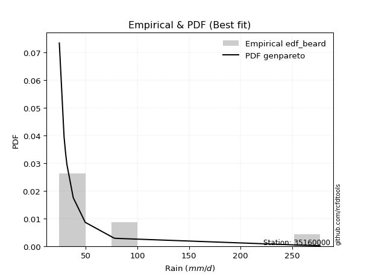</img>

</div>


### 5. EDF Chegodayev (1955)

The Chegodayev formula is an empirical plotting position formula used in hydrological frequency analysis to estimate the exceedance probability or return period of a specific event from a set of observed data. It is primarily used for plotting observed data points on probability paper to fit a theoretical distribution, particularly for analyzing extreme events like maximum flood flows or rainfall intensities. The constant _b_ value in the generalized plotting position formula is 0.3.

<div align="center">


$P=(m-b)/(n+1-2b)$


</div>


**5.1. Empirical values**

<div align="center">

|                | 0                   | 1                   | 2                   | 3                   | 4                  | 5                  | 6                  | 7                  |
|:---------------|:--------------------|:--------------------|:--------------------|:--------------------|:-------------------|:-------------------|:-------------------|:-------------------|
| date           | 2021                | 2023                | 2018                | 2017                | 2020               | 2024               | 2019               | 2022               |
| x              | 24.52               | 29.1                | 30.6                | 38.01               | 49.59              | 77.2               | 78.93              | 277.01             |
| m              | 1                   | 2                   | 3                   | 4                   | 5                  | 6                  | 7                  | 8                  |
| empirical_dist | edf_chegodayev      | edf_chegodayev      | edf_chegodayev      | edf_chegodayev      | edf_chegodayev     | edf_chegodayev     | edf_chegodayev     | edf_chegodayev     |
| empirical      | 0.08333333333333333 | 0.20238095238095236 | 0.32142857142857145 | 0.44047619047619047 | 0.5595238095238095 | 0.6785714285714286 | 0.7976190476190476 | 0.9166666666666666 |
| empirical_tr   | 1.090909090909091   | 1.253731343283582   | 1.4736842105263157  | 1.7872340425531914  | 2.27027027027027   | 3.1111111111111116 | 4.941176470588234  | 11.999999999999995 |

</div>


**5.2. Kolmogorov-Smirnov fit test (sorted by Δ)**


<div align="center">

|                | 0                   | 1                   | 2                  | 3                   | 4                   | 5                   | 6                   | 7                  | 8                   | 9                   | 10                  | 11                 | 12                  | 13                  | 14                  | 15                  | 16                  | 17                  | 18                  | 19                  | 20                  | 21                  | 22                  | 23                  | 24                  | 25                  | 26                  | 27                  | 28                  | 29                  | 30                  | 31                  | 32                  | 33                  | 34                    | 35                  | 36                  | 37                  | 38                  | 39                 | 40                  | 41                  | 42                  | 43                  | 44                  | 45                 | 46                 | 47                  | 48                 | 49                  | 50                  | 51                  | 52                  | 53                 | 54                  | 55                  | 56                  | 57                  | 58                  | 59                  | 60                  | 61                  | 62                 | 63                 | 64                  | 65                 | 66                  | 67                  | 68                 | 69                 | 70                  | 71                  | 72                  | 73                 | 74                 | 75                 | 76                 | 77                  | 78                  | 79                 | 80                 | 81                  | 82                  | 83                 | 84                 | 85                  | 86                  | 87                 |
|:---------------|:--------------------|:--------------------|:-------------------|:--------------------|:--------------------|:--------------------|:--------------------|:-------------------|:--------------------|:--------------------|:--------------------|:-------------------|:--------------------|:--------------------|:--------------------|:--------------------|:--------------------|:--------------------|:--------------------|:--------------------|:--------------------|:--------------------|:--------------------|:--------------------|:--------------------|:--------------------|:--------------------|:--------------------|:--------------------|:--------------------|:--------------------|:--------------------|:--------------------|:--------------------|:----------------------|:--------------------|:--------------------|:--------------------|:--------------------|:-------------------|:--------------------|:--------------------|:--------------------|:--------------------|:--------------------|:-------------------|:-------------------|:--------------------|:-------------------|:--------------------|:--------------------|:--------------------|:--------------------|:-------------------|:--------------------|:--------------------|:--------------------|:--------------------|:--------------------|:--------------------|:--------------------|:--------------------|:-------------------|:-------------------|:--------------------|:-------------------|:--------------------|:--------------------|:-------------------|:-------------------|:--------------------|:--------------------|:--------------------|:-------------------|:-------------------|:-------------------|:-------------------|:--------------------|:--------------------|:-------------------|:-------------------|:--------------------|:--------------------|:-------------------|:-------------------|:--------------------|:--------------------|:-------------------|
| station        | 35160000            | 35160000            | 35160000           | 35160000            | 35160000            | 35160000            | 35160000            | 35160000           | 35160000            | 35160000            | 35160000            | 35160000           | 35160000            | 35160000            | 35160000            | 35160000            | 35160000            | 35160000            | 35160000            | 35160000            | 35160000            | 35160000            | 35160000            | 35160000            | 35160000            | 35160000            | 35160000            | 35160000            | 35160000            | 35160000            | 35160000            | 35160000            | 35160000            | 35160000            | 35160000              | 35160000            | 35160000            | 35160000            | 35160000            | 35160000           | 35160000            | 35160000            | 35160000            | 35160000            | 35160000            | 35160000           | 35160000           | 35160000            | 35160000           | 35160000            | 35160000            | 35160000            | 35160000            | 35160000           | 35160000            | 35160000            | 35160000            | 35160000            | 35160000            | 35160000            | 35160000            | 35160000            | 35160000           | 35160000           | 35160000            | 35160000           | 35160000            | 35160000            | 35160000           | 35160000           | 35160000            | 35160000            | 35160000            | 35160000           | 35160000           | 35160000           | 35160000           | 35160000            | 35160000            | 35160000           | 35160000           | 35160000            | 35160000            | 35160000           | 35160000           | 35160000            | 35160000            | 35160000           |
| empirical_dist | edf_chegodayev      | edf_chegodayev      | edf_chegodayev     | edf_chegodayev      | edf_chegodayev      | edf_chegodayev      | edf_chegodayev      | edf_chegodayev     | edf_chegodayev      | edf_chegodayev      | edf_chegodayev      | edf_chegodayev     | edf_chegodayev      | edf_chegodayev      | edf_chegodayev      | edf_chegodayev      | edf_chegodayev      | edf_chegodayev      | edf_chegodayev      | edf_chegodayev      | edf_chegodayev      | edf_chegodayev      | edf_chegodayev      | edf_chegodayev      | edf_chegodayev      | edf_chegodayev      | edf_chegodayev      | edf_chegodayev      | edf_chegodayev      | edf_chegodayev      | edf_chegodayev      | edf_chegodayev      | edf_chegodayev      | edf_chegodayev      | edf_chegodayev        | edf_chegodayev      | edf_chegodayev      | edf_chegodayev      | edf_chegodayev      | edf_chegodayev     | edf_chegodayev      | edf_chegodayev      | edf_chegodayev      | edf_chegodayev      | edf_chegodayev      | edf_chegodayev     | edf_chegodayev     | edf_chegodayev      | edf_chegodayev     | edf_chegodayev      | edf_chegodayev      | edf_chegodayev      | edf_chegodayev      | edf_chegodayev     | edf_chegodayev      | edf_chegodayev      | edf_chegodayev      | edf_chegodayev      | edf_chegodayev      | edf_chegodayev      | edf_chegodayev      | edf_chegodayev      | edf_chegodayev     | edf_chegodayev     | edf_chegodayev      | edf_chegodayev     | edf_chegodayev      | edf_chegodayev      | edf_chegodayev     | edf_chegodayev     | edf_chegodayev      | edf_chegodayev      | edf_chegodayev      | edf_chegodayev     | edf_chegodayev     | edf_chegodayev     | edf_chegodayev     | edf_chegodayev      | edf_chegodayev      | edf_chegodayev     | edf_chegodayev     | edf_chegodayev      | edf_chegodayev      | edf_chegodayev     | edf_chegodayev     | edf_chegodayev      | edf_chegodayev      | edf_chegodayev     |
| p_dist         | loghalfnorm         | loghalflogistic     | fatiguelife        | lograyleigh         | logpearson3         | logfisk             | loggenexpon         | invweibull         | loggompertz         | logexpon            | logmaxwell          | weibull_min        | invgauss            | logexponnorm        | chi2                | loggumbel_r         | invgamma            | betaprime           | f                   | logchi2             | logfatiguelife      | logjohnsonsu        | logmoyal            | loginvgauss         | logt                | logncf              | loginvgamma         | logf                | logmielke           | loginvweibull       | ncf                 | logbetaprime        | lognct              | logalpha            | loglaplace_asymmetric | alpha               | nct                 | logloggamma         | logtruncnorm        | loggenlogistic     | lognorm             | lognorm             | logcrystalball      | logkstwobign        | gibrat              | wald               | lognakagami        | loglogistic         | logrice            | loghypsecant        | gamma               | erlang              | genlogistic         | loggumbel_l        | logweibull_min      | loglaplace          | fisk                | moyal               | exponnorm           | genexpon            | laplace_asymmetric  | expon               | gumbel_r           | t                  | pearson3            | gompertz           | logwald             | halflogistic        | logerlang          | halfnorm           | rayleigh            | kstwobign           | maxwell             | laplace            | nakagami           | hypsecant          | truncnorm          | logistic            | crystalball         | norm               | rice               | loggamma            | loggamma            | loggibrat          | johnsonsu          | gumbel_l            | loglognorm          | mielke             |
| delta          | 0.06446912425670226 | 0.07708937948502764 | 0.0782575776990567 | 0.07882664336312939 | 0.08245127919171322 | 0.08350195799036508 | 0.08605750079024088 | 0.0876425587070706 | 0.08926023525281226 | 0.08964960297149815 | 0.09027461174277368 | 0.091553353172667  | 0.09169664347279238 | 0.09272349805864166 | 0.09404140000595951 | 0.09511914113222172 | 0.09673021258047576 | 0.09673282387543625 | 0.09676733432776619 | 0.10042078947624264 | 0.10083908359548954 | 0.10103520892209716 | 0.10301875887141548 | 0.10553234056242544 | 0.10650274659736492 | 0.10823122281913564 | 0.10850482978912135 | 0.10850498898254113 | 0.10873323762691489 | 0.10895945788446404 | 0.10946038880360459 | 0.11049778523751785 | 0.11065630624918033 | 0.11150607162908222 | 0.11155176697492847   | 0.11395440109905852 | 0.11401582286716264 | 0.11492445613724983 | 0.11547237059617965 | 0.1177865073749442 | 0.12005798373818172 | 0.12005798373818172 | 0.12005832643203806 | 0.12777881122127754 | 0.13422940234472264 | 0.1358778409944616 | 0.1399732774601018 | 0.14024374525210032 | 0.1449474602896824 | 0.15529138783371677 | 0.16142235427847784 | 0.16270845182215088 | 0.16452501992421498 | 0.1749175700336199 | 0.17797413237656934 | 0.18199174796417905 | 0.18838182437961204 | 0.19216625737235732 | 0.20840053405666387 | 0.20925173456107113 | 0.20925176647356908 | 0.20925200886483009 | 0.210161460155733  | 0.210637066012898  | 0.21211122534400395 | 0.2153251543532739 | 0.21777669977837683 | 0.21992228083071386 | 0.2313486745641539 | 0.2320322192195366 | 0.23790029749473662 | 0.24438954164807758 | 0.24852790577214268 | 0.2687226451423633 | 0.2698440973625633 | 0.2765873069338317 | 0.2778283734699639 | 0.27854074227235215 | 0.28083087360282744 | 0.2808308811509278 | 0.2958557841807248 | 0.31629781271988233 | 0.31629781271988233 | 0.321427535111115  | 0.323937683759571  | 0.35050440232297464 | 0.40203500165717854 | nan                |
| deltao         | 0.4472608134160001  | 0.4472608134160001  | 0.4472608134160001 | 0.4472608134160001  | 0.4472608134160001  | 0.4472608134160001  | 0.4472608134160001  | 0.4472608134160001 | 0.4472608134160001  | 0.4472608134160001  | 0.4472608134160001  | 0.4472608134160001 | 0.4472608134160001  | 0.4472608134160001  | 0.4472608134160001  | 0.4472608134160001  | 0.4472608134160001  | 0.4472608134160001  | 0.4472608134160001  | 0.4472608134160001  | 0.4472608134160001  | 0.4472608134160001  | 0.4472608134160001  | 0.4472608134160001  | 0.4472608134160001  | 0.4472608134160001  | 0.4472608134160001  | 0.4472608134160001  | 0.4472608134160001  | 0.4472608134160001  | 0.4472608134160001  | 0.4472608134160001  | 0.4472608134160001  | 0.4472608134160001  | 0.4472608134160001    | 0.4472608134160001  | 0.4472608134160001  | 0.4472608134160001  | 0.4472608134160001  | 0.4472608134160001 | 0.4472608134160001  | 0.4472608134160001  | 0.4472608134160001  | 0.4472608134160001  | 0.4472608134160001  | 0.4472608134160001 | 0.4472608134160001 | 0.4472608134160001  | 0.4472608134160001 | 0.4472608134160001  | 0.4472608134160001  | 0.4472608134160001  | 0.4472608134160001  | 0.4472608134160001 | 0.4472608134160001  | 0.4472608134160001  | 0.4472608134160001  | 0.4472608134160001  | 0.4472608134160001  | 0.4472608134160001  | 0.4472608134160001  | 0.4472608134160001  | 0.4472608134160001 | 0.4472608134160001 | 0.4472608134160001  | 0.4472608134160001 | 0.4472608134160001  | 0.4472608134160001  | 0.4472608134160001 | 0.4472608134160001 | 0.4472608134160001  | 0.4472608134160001  | 0.4472608134160001  | 0.4472608134160001 | 0.4472608134160001 | 0.4472608134160001 | 0.4472608134160001 | 0.4472608134160001  | 0.4472608134160001  | 0.4472608134160001 | 0.4472608134160001 | 0.4472608134160001  | 0.4472608134160001  | 0.4472608134160001 | 0.4472608134160001 | 0.4472608134160001  | 0.4472608134160001  | 0.4472608134160001 |
| eval           | Δo > Δ              | Δo > Δ              | Δo > Δ             | Δo > Δ              | Δo > Δ              | Δo > Δ              | Δo > Δ              | Δo > Δ             | Δo > Δ              | Δo > Δ              | Δo > Δ              | Δo > Δ             | Δo > Δ              | Δo > Δ              | Δo > Δ              | Δo > Δ              | Δo > Δ              | Δo > Δ              | Δo > Δ              | Δo > Δ              | Δo > Δ              | Δo > Δ              | Δo > Δ              | Δo > Δ              | Δo > Δ              | Δo > Δ              | Δo > Δ              | Δo > Δ              | Δo > Δ              | Δo > Δ              | Δo > Δ              | Δo > Δ              | Δo > Δ              | Δo > Δ              | Δo > Δ                | Δo > Δ              | Δo > Δ              | Δo > Δ              | Δo > Δ              | Δo > Δ             | Δo > Δ              | Δo > Δ              | Δo > Δ              | Δo > Δ              | Δo > Δ              | Δo > Δ             | Δo > Δ             | Δo > Δ              | Δo > Δ             | Δo > Δ              | Δo > Δ              | Δo > Δ              | Δo > Δ              | Δo > Δ             | Δo > Δ              | Δo > Δ              | Δo > Δ              | Δo > Δ              | Δo > Δ              | Δo > Δ              | Δo > Δ              | Δo > Δ              | Δo > Δ             | Δo > Δ             | Δo > Δ              | Δo > Δ             | Δo > Δ              | Δo > Δ              | Δo > Δ             | Δo > Δ             | Δo > Δ              | Δo > Δ              | Δo > Δ              | Δo > Δ             | Δo > Δ             | Δo > Δ             | Δo > Δ             | Δo > Δ              | Δo > Δ              | Δo > Δ             | Δo > Δ             | Δo > Δ              | Δo > Δ              | Δo > Δ             | Δo > Δ             | Δo > Δ              | Δo > Δ              | Δo <= Δ            |
| fit            | 1                   | 1                   | 1                  | 1                   | 1                   | 1                   | 1                   | 1                  | 1                   | 1                   | 1                   | 1                  | 1                   | 1                   | 1                   | 1                   | 1                   | 1                   | 1                   | 1                   | 1                   | 1                   | 1                   | 1                   | 1                   | 1                   | 1                   | 1                   | 1                   | 1                   | 1                   | 1                   | 1                   | 1                   | 1                     | 1                   | 1                   | 1                   | 1                   | 1                  | 1                   | 1                   | 1                   | 1                   | 1                   | 1                  | 1                  | 1                   | 1                  | 1                   | 1                   | 1                   | 1                   | 1                  | 1                   | 1                   | 1                   | 1                   | 1                   | 1                   | 1                   | 1                   | 1                  | 1                  | 1                   | 1                  | 1                   | 1                   | 1                  | 1                  | 1                   | 1                   | 1                   | 1                  | 1                  | 1                  | 1                  | 1                   | 1                   | 1                  | 1                  | 1                   | 1                   | 1                  | 1                  | 1                   | 1                   | 0                  |
| n              | 8                   | 8                   | 8                  | 8                   | 8                   | 8                   | 8                   | 8                  | 8                   | 8                   | 8                   | 8                  | 8                   | 8                   | 8                   | 8                   | 8                   | 8                   | 8                   | 8                   | 8                   | 8                   | 8                   | 8                   | 8                   | 8                   | 8                   | 8                   | 8                   | 8                   | 8                   | 8                   | 8                   | 8                   | 8                     | 8                   | 8                   | 8                   | 8                   | 8                  | 8                   | 8                   | 8                   | 8                   | 8                   | 8                  | 8                  | 8                   | 8                  | 8                   | 8                   | 8                   | 8                   | 8                  | 8                   | 8                   | 8                   | 8                   | 8                   | 8                   | 8                   | 8                   | 8                  | 8                  | 8                   | 8                  | 8                   | 8                   | 8                  | 8                  | 8                   | 8                   | 8                   | 8                  | 8                  | 8                  | 8                  | 8                   | 8                   | 8                  | 8                  | 8                   | 8                   | 8                  | 8                  | 8                   | 8                   | 8                  |
| best_fit       | 1                   | 0                   | 0                  | 0                   | 0                   | 0                   | 0                   | 0                  | 0                   | 0                   | 0                   | 0                  | 0                   | 0                   | 0                   | 0                   | 0                   | 0                   | 0                   | 0                   | 0                   | 0                   | 0                   | 0                   | 0                   | 0                   | 0                   | 0                   | 0                   | 0                   | 0                   | 0                   | 0                   | 0                   | 0                     | 0                   | 0                   | 0                   | 0                   | 0                  | 0                   | 0                   | 0                   | 0                   | 0                   | 0                  | 0                  | 0                   | 0                  | 0                   | 0                   | 0                   | 0                   | 0                  | 0                   | 0                   | 0                   | 0                   | 0                   | 0                   | 0                   | 0                   | 0                  | 0                  | 0                   | 0                  | 0                   | 0                   | 0                  | 0                  | 0                   | 0                   | 0                   | 0                  | 0                  | 0                  | 0                  | 0                   | 0                   | 0                  | 0                  | 0                   | 0                   | 0                  | 0                  | 0                   | 0                   | 0                  |
| best_fit_sort  | 1                   | 2                   | 3                  | 4                   | 5                   | 6                   | 7                   | 8                  | 9                   | 10                  | 11                  | 12                 | 13                  | 14                  | 15                  | 16                  | 17                  | 18                  | 19                  | 20                  | 21                  | 22                  | 23                  | 24                  | 25                  | 26                  | 27                  | 28                  | 29                  | 30                  | 31                  | 32                  | 33                  | 34                  | 35                    | 36                  | 37                  | 38                  | 39                  | 40                 | 41                  | 42                  | 43                  | 44                  | 45                  | 46                 | 47                 | 48                  | 49                 | 50                  | 51                  | 52                  | 53                  | 54                 | 55                  | 56                  | 57                  | 58                  | 59                  | 60                  | 61                  | 62                  | 63                 | 64                 | 65                  | 66                 | 67                  | 68                  | 69                 | 70                 | 71                  | 72                  | 73                  | 74                 | 75                 | 76                 | 77                 | 78                  | 79                  | 80                 | 81                 | 82                  | 83                  | 84                 | 85                 | 86                  | 87                  | 88                 |

</div>


**5.3. Best fit**

<div align="center">

|   id |   station | empirical_dist   | p_dist      |     delta |   deltao | eval   |   fit |   n |   best_fit |   best_fit_sort |
|-----:|----------:|:-----------------|:------------|----------:|---------:|:-------|------:|----:|-----------:|----------------:|
|    0 |  35160000 | edf_chegodayev   | loghalfnorm | 0.0644691 | 0.447261 | Δo > Δ |     1 |   8 |          1 |               1 |

</div>


<div align="center">

</img>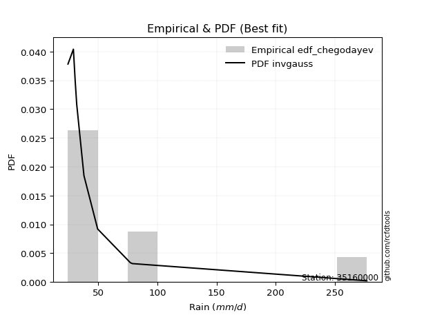</img>

</div>


### 6. EDF Blom (1958)

The Blom formula is a specific "plotting position" formula used in hydrology and statistical analysis to estimate the empirical cumulative probability (or non-exceedance probability) of a data series. It is particularly recommended for data that are approximately normally distributed. The constant _a_ is set to 0.375 (or 3/8).

<div align="center">


$P=(m-a)/(n+1-2a)$


</div>


**6.1. Empirical values**

<div align="center">

|                | 0                   | 1                   | 2                  | 3                  | 4                  | 5                  | 6                 | 7                  |
|:---------------|:--------------------|:--------------------|:-------------------|:-------------------|:-------------------|:-------------------|:------------------|:-------------------|
| date           | 2021                | 2023                | 2018               | 2017               | 2020               | 2024               | 2019              | 2022               |
| x              | 24.52               | 29.1                | 30.6               | 38.01              | 49.59              | 77.2               | 78.93             | 277.01             |
| m              | 1                   | 2                   | 3                  | 4                  | 5                  | 6                  | 7                 | 8                  |
| empirical_dist | edf_blom            | edf_blom            | edf_blom           | edf_blom           | edf_blom           | edf_blom           | edf_blom          | edf_blom           |
| empirical      | 0.07575757575757576 | 0.19696969696969696 | 0.3181818181818182 | 0.4393939393939394 | 0.5606060606060606 | 0.6818181818181818 | 0.803030303030303 | 0.9242424242424242 |
| empirical_tr   | 1.0819672131147542  | 1.2452830188679247  | 1.4666666666666666 | 1.783783783783784  | 2.275862068965517  | 3.1428571428571423 | 5.076923076923076 | 13.199999999999992 |

</div>


**6.2. Kolmogorov-Smirnov fit test (sorted by Δ)**


<div align="center">

|                | 0                   | 1                   | 2                   | 3                   | 4                   | 5                   | 6                   | 7                   | 8                   | 9                   | 10                  | 11                  | 12                  | 13                 | 14                  | 15                 | 16                  | 17                  | 18                  | 19                 | 20                  | 21                  | 22                  | 23                  | 24                  | 25                  | 26                  | 27                  | 28                  | 29                  | 30                  | 31                  | 32                  | 33                    | 34                  | 35                  | 36                  | 37                  | 38                  | 39                  | 40                  | 41                  | 42                  | 43                  | 44                  | 45                  | 46                 | 47                  | 48                  | 49                 | 50                  | 51                  | 52                 | 53                  | 54                  | 55                  | 56                  | 57                 | 58                 | 59                  | 60                  | 61                 | 62                 | 63                  | 64                  | 65                  | 66                  | 67                  | 68                 | 69                  | 70                  | 71                 | 72                 | 73                  | 74                  | 75                  | 76                  | 77                  | 78                  | 79                 | 80                 | 81                 | 82                 | 83                 | 84                  | 85                  | 86                 | 87                 |
|:---------------|:--------------------|:--------------------|:--------------------|:--------------------|:--------------------|:--------------------|:--------------------|:--------------------|:--------------------|:--------------------|:--------------------|:--------------------|:--------------------|:-------------------|:--------------------|:-------------------|:--------------------|:--------------------|:--------------------|:-------------------|:--------------------|:--------------------|:--------------------|:--------------------|:--------------------|:--------------------|:--------------------|:--------------------|:--------------------|:--------------------|:--------------------|:--------------------|:--------------------|:----------------------|:--------------------|:--------------------|:--------------------|:--------------------|:--------------------|:--------------------|:--------------------|:--------------------|:--------------------|:--------------------|:--------------------|:--------------------|:-------------------|:--------------------|:--------------------|:-------------------|:--------------------|:--------------------|:-------------------|:--------------------|:--------------------|:--------------------|:--------------------|:-------------------|:-------------------|:--------------------|:--------------------|:-------------------|:-------------------|:--------------------|:--------------------|:--------------------|:--------------------|:--------------------|:-------------------|:--------------------|:--------------------|:-------------------|:-------------------|:--------------------|:--------------------|:--------------------|:--------------------|:--------------------|:--------------------|:-------------------|:-------------------|:-------------------|:-------------------|:-------------------|:--------------------|:--------------------|:-------------------|:-------------------|
| station        | 35160000            | 35160000            | 35160000            | 35160000            | 35160000            | 35160000            | 35160000            | 35160000            | 35160000            | 35160000            | 35160000            | 35160000            | 35160000            | 35160000           | 35160000            | 35160000           | 35160000            | 35160000            | 35160000            | 35160000           | 35160000            | 35160000            | 35160000            | 35160000            | 35160000            | 35160000            | 35160000            | 35160000            | 35160000            | 35160000            | 35160000            | 35160000            | 35160000            | 35160000              | 35160000            | 35160000            | 35160000            | 35160000            | 35160000            | 35160000            | 35160000            | 35160000            | 35160000            | 35160000            | 35160000            | 35160000            | 35160000           | 35160000            | 35160000            | 35160000           | 35160000            | 35160000            | 35160000           | 35160000            | 35160000            | 35160000            | 35160000            | 35160000           | 35160000           | 35160000            | 35160000            | 35160000           | 35160000           | 35160000            | 35160000            | 35160000            | 35160000            | 35160000            | 35160000           | 35160000            | 35160000            | 35160000           | 35160000           | 35160000            | 35160000            | 35160000            | 35160000            | 35160000            | 35160000            | 35160000           | 35160000           | 35160000           | 35160000           | 35160000           | 35160000            | 35160000            | 35160000           | 35160000           |
| empirical_dist | edf_blom            | edf_blom            | edf_blom            | edf_blom            | edf_blom            | edf_blom            | edf_blom            | edf_blom            | edf_blom            | edf_blom            | edf_blom            | edf_blom            | edf_blom            | edf_blom           | edf_blom            | edf_blom           | edf_blom            | edf_blom            | edf_blom            | edf_blom           | edf_blom            | edf_blom            | edf_blom            | edf_blom            | edf_blom            | edf_blom            | edf_blom            | edf_blom            | edf_blom            | edf_blom            | edf_blom            | edf_blom            | edf_blom            | edf_blom              | edf_blom            | edf_blom            | edf_blom            | edf_blom            | edf_blom            | edf_blom            | edf_blom            | edf_blom            | edf_blom            | edf_blom            | edf_blom            | edf_blom            | edf_blom           | edf_blom            | edf_blom            | edf_blom           | edf_blom            | edf_blom            | edf_blom           | edf_blom            | edf_blom            | edf_blom            | edf_blom            | edf_blom           | edf_blom           | edf_blom            | edf_blom            | edf_blom           | edf_blom           | edf_blom            | edf_blom            | edf_blom            | edf_blom            | edf_blom            | edf_blom           | edf_blom            | edf_blom            | edf_blom           | edf_blom           | edf_blom            | edf_blom            | edf_blom            | edf_blom            | edf_blom            | edf_blom            | edf_blom           | edf_blom           | edf_blom           | edf_blom           | edf_blom           | edf_blom            | edf_blom            | edf_blom           | edf_blom           |
| p_dist         | loghalfnorm         | loghalflogistic     | logpearson3         | logfisk             | loggenexpon         | fatiguelife         | lograyleigh         | invweibull          | loggompertz         | logexpon            | weibull_min         | invgauss            | logmaxwell          | logexponnorm       | loggumbel_r         | invgamma           | betaprime           | f                   | logfatiguelife      | logjohnsonsu       | chi2                | logmoyal            | loginvgauss         | logt                | logncf              | loginvgamma         | logf                | logmielke           | loginvweibull       | logchi2             | logbetaprime        | lognct              | logalpha            | loglaplace_asymmetric | ncf                 | alpha               | nct                 | logtruncnorm        | logloggamma         | loggenlogistic      | lognorm             | lognorm             | logcrystalball      | logkstwobign        | gibrat              | loglogistic         | logrice            | wald                | lognakagami         | loghypsecant       | gamma               | erlang              | genlogistic        | loggumbel_l         | logweibull_min      | loglaplace          | fisk                | moyal              | exponnorm          | genexpon            | laplace_asymmetric  | expon              | t                  | gompertz            | logwald             | gumbel_r            | pearson3            | halflogistic        | logerlang          | halfnorm            | rayleigh            | kstwobign          | maxwell            | laplace             | nakagami            | hypsecant           | truncnorm           | logistic            | crystalball         | norm               | rice               | loggibrat          | loggamma           | loggamma           | johnsonsu           | gumbel_l            | loglognorm         | mielke             |
| delta          | 0.06988037966795768 | 0.07384262623827437 | 0.07920452594495994 | 0.08025520474361192 | 0.08281074754348772 | 0.08366883311031209 | 0.08423789877438481 | 0.08439580546031744 | 0.08601348200605899 | 0.08640284972474499 | 0.08830659992591372 | 0.08844989022603922 | 0.08919236066052261 | 0.0894767448118885 | 0.09187238788546845 | 0.0934834593337226 | 0.09348607062868308 | 0.09352058108101302 | 0.09759233034873638 | 0.097788455675344  | 0.09945265541721493 | 0.09977200562466221 | 0.10228558731567228 | 0.10325599335061175 | 0.10498446957238236 | 0.10525807654236818 | 0.10525823573578796 | 0.10548648438016173 | 0.10571270463771087 | 0.10583204488749803 | 0.10725103199076469 | 0.10740955300242716 | 0.10825931838232905 | 0.10830501372817519   | 0.10837813772135352 | 0.11070764785230536 | 0.11076906962040936 | 0.11222561734942649 | 0.11384220505499876 | 0.11453975412819092 | 0.11897573265593064 | 0.11897573265593064 | 0.11897607534978699 | 0.12453205797452427 | 0.13098264909796936 | 0.13916149416984924 | 0.1417007070429291 | 0.14345359857021917 | 0.14538453287135722 | 0.1542091367514657 | 0.15817560103172468 | 0.15946169857539771 | 0.165607271006466  | 0.17398133232884733 | 0.17472737912981617 | 0.18090949688192798 | 0.19379307979086746 | 0.1997420149481149 | 0.2067072910745011 | 0.20737296415301576 | 0.20737302540439068 | 0.2073734906087312 | 0.2077009482744805 | 0.21424290327102283 | 0.21452994653162355 | 0.21557271556698843 | 0.21968698291976152 | 0.22749803840647143 | 0.2367599299754093 | 0.23960797679529416 | 0.24331155290599205 | 0.249800797059333  | 0.2539391611833981 | 0.27413390055361875 | 0.27525535277381874 | 0.28199856234508713 | 0.28323962888121934 | 0.28395199768360757 | 0.28624212901408286 | 0.2862421365621832 | 0.3012670395919802 | 0.3181807818643617 | 0.3217090681311377 | 0.3217090681311377 | 0.32934893917082636 | 0.35591565773423006 | 0.4074462570684339 | nan                |
| deltao         | 0.4472608134160001  | 0.4472608134160001  | 0.4472608134160001  | 0.4472608134160001  | 0.4472608134160001  | 0.4472608134160001  | 0.4472608134160001  | 0.4472608134160001  | 0.4472608134160001  | 0.4472608134160001  | 0.4472608134160001  | 0.4472608134160001  | 0.4472608134160001  | 0.4472608134160001 | 0.4472608134160001  | 0.4472608134160001 | 0.4472608134160001  | 0.4472608134160001  | 0.4472608134160001  | 0.4472608134160001 | 0.4472608134160001  | 0.4472608134160001  | 0.4472608134160001  | 0.4472608134160001  | 0.4472608134160001  | 0.4472608134160001  | 0.4472608134160001  | 0.4472608134160001  | 0.4472608134160001  | 0.4472608134160001  | 0.4472608134160001  | 0.4472608134160001  | 0.4472608134160001  | 0.4472608134160001    | 0.4472608134160001  | 0.4472608134160001  | 0.4472608134160001  | 0.4472608134160001  | 0.4472608134160001  | 0.4472608134160001  | 0.4472608134160001  | 0.4472608134160001  | 0.4472608134160001  | 0.4472608134160001  | 0.4472608134160001  | 0.4472608134160001  | 0.4472608134160001 | 0.4472608134160001  | 0.4472608134160001  | 0.4472608134160001 | 0.4472608134160001  | 0.4472608134160001  | 0.4472608134160001 | 0.4472608134160001  | 0.4472608134160001  | 0.4472608134160001  | 0.4472608134160001  | 0.4472608134160001 | 0.4472608134160001 | 0.4472608134160001  | 0.4472608134160001  | 0.4472608134160001 | 0.4472608134160001 | 0.4472608134160001  | 0.4472608134160001  | 0.4472608134160001  | 0.4472608134160001  | 0.4472608134160001  | 0.4472608134160001 | 0.4472608134160001  | 0.4472608134160001  | 0.4472608134160001 | 0.4472608134160001 | 0.4472608134160001  | 0.4472608134160001  | 0.4472608134160001  | 0.4472608134160001  | 0.4472608134160001  | 0.4472608134160001  | 0.4472608134160001 | 0.4472608134160001 | 0.4472608134160001 | 0.4472608134160001 | 0.4472608134160001 | 0.4472608134160001  | 0.4472608134160001  | 0.4472608134160001 | 0.4472608134160001 |
| eval           | Δo > Δ              | Δo > Δ              | Δo > Δ              | Δo > Δ              | Δo > Δ              | Δo > Δ              | Δo > Δ              | Δo > Δ              | Δo > Δ              | Δo > Δ              | Δo > Δ              | Δo > Δ              | Δo > Δ              | Δo > Δ             | Δo > Δ              | Δo > Δ             | Δo > Δ              | Δo > Δ              | Δo > Δ              | Δo > Δ             | Δo > Δ              | Δo > Δ              | Δo > Δ              | Δo > Δ              | Δo > Δ              | Δo > Δ              | Δo > Δ              | Δo > Δ              | Δo > Δ              | Δo > Δ              | Δo > Δ              | Δo > Δ              | Δo > Δ              | Δo > Δ                | Δo > Δ              | Δo > Δ              | Δo > Δ              | Δo > Δ              | Δo > Δ              | Δo > Δ              | Δo > Δ              | Δo > Δ              | Δo > Δ              | Δo > Δ              | Δo > Δ              | Δo > Δ              | Δo > Δ             | Δo > Δ              | Δo > Δ              | Δo > Δ             | Δo > Δ              | Δo > Δ              | Δo > Δ             | Δo > Δ              | Δo > Δ              | Δo > Δ              | Δo > Δ              | Δo > Δ             | Δo > Δ             | Δo > Δ              | Δo > Δ              | Δo > Δ             | Δo > Δ             | Δo > Δ              | Δo > Δ              | Δo > Δ              | Δo > Δ              | Δo > Δ              | Δo > Δ             | Δo > Δ              | Δo > Δ              | Δo > Δ             | Δo > Δ             | Δo > Δ              | Δo > Δ              | Δo > Δ              | Δo > Δ              | Δo > Δ              | Δo > Δ              | Δo > Δ             | Δo > Δ             | Δo > Δ             | Δo > Δ             | Δo > Δ             | Δo > Δ              | Δo > Δ              | Δo > Δ             | Δo <= Δ            |
| fit            | 1                   | 1                   | 1                   | 1                   | 1                   | 1                   | 1                   | 1                   | 1                   | 1                   | 1                   | 1                   | 1                   | 1                  | 1                   | 1                  | 1                   | 1                   | 1                   | 1                  | 1                   | 1                   | 1                   | 1                   | 1                   | 1                   | 1                   | 1                   | 1                   | 1                   | 1                   | 1                   | 1                   | 1                     | 1                   | 1                   | 1                   | 1                   | 1                   | 1                   | 1                   | 1                   | 1                   | 1                   | 1                   | 1                   | 1                  | 1                   | 1                   | 1                  | 1                   | 1                   | 1                  | 1                   | 1                   | 1                   | 1                   | 1                  | 1                  | 1                   | 1                   | 1                  | 1                  | 1                   | 1                   | 1                   | 1                   | 1                   | 1                  | 1                   | 1                   | 1                  | 1                  | 1                   | 1                   | 1                   | 1                   | 1                   | 1                   | 1                  | 1                  | 1                  | 1                  | 1                  | 1                   | 1                   | 1                  | 0                  |
| n              | 8                   | 8                   | 8                   | 8                   | 8                   | 8                   | 8                   | 8                   | 8                   | 8                   | 8                   | 8                   | 8                   | 8                  | 8                   | 8                  | 8                   | 8                   | 8                   | 8                  | 8                   | 8                   | 8                   | 8                   | 8                   | 8                   | 8                   | 8                   | 8                   | 8                   | 8                   | 8                   | 8                   | 8                     | 8                   | 8                   | 8                   | 8                   | 8                   | 8                   | 8                   | 8                   | 8                   | 8                   | 8                   | 8                   | 8                  | 8                   | 8                   | 8                  | 8                   | 8                   | 8                  | 8                   | 8                   | 8                   | 8                   | 8                  | 8                  | 8                   | 8                   | 8                  | 8                  | 8                   | 8                   | 8                   | 8                   | 8                   | 8                  | 8                   | 8                   | 8                  | 8                  | 8                   | 8                   | 8                   | 8                   | 8                   | 8                   | 8                  | 8                  | 8                  | 8                  | 8                  | 8                   | 8                   | 8                  | 8                  |
| best_fit       | 1                   | 0                   | 0                   | 0                   | 0                   | 0                   | 0                   | 0                   | 0                   | 0                   | 0                   | 0                   | 0                   | 0                  | 0                   | 0                  | 0                   | 0                   | 0                   | 0                  | 0                   | 0                   | 0                   | 0                   | 0                   | 0                   | 0                   | 0                   | 0                   | 0                   | 0                   | 0                   | 0                   | 0                     | 0                   | 0                   | 0                   | 0                   | 0                   | 0                   | 0                   | 0                   | 0                   | 0                   | 0                   | 0                   | 0                  | 0                   | 0                   | 0                  | 0                   | 0                   | 0                  | 0                   | 0                   | 0                   | 0                   | 0                  | 0                  | 0                   | 0                   | 0                  | 0                  | 0                   | 0                   | 0                   | 0                   | 0                   | 0                  | 0                   | 0                   | 0                  | 0                  | 0                   | 0                   | 0                   | 0                   | 0                   | 0                   | 0                  | 0                  | 0                  | 0                  | 0                  | 0                   | 0                   | 0                  | 0                  |
| best_fit_sort  | 1                   | 2                   | 3                   | 4                   | 5                   | 6                   | 7                   | 8                   | 9                   | 10                  | 11                  | 12                  | 13                  | 14                 | 15                  | 16                 | 17                  | 18                  | 19                  | 20                 | 21                  | 22                  | 23                  | 24                  | 25                  | 26                  | 27                  | 28                  | 29                  | 30                  | 31                  | 32                  | 33                  | 34                    | 35                  | 36                  | 37                  | 38                  | 39                  | 40                  | 41                  | 42                  | 43                  | 44                  | 45                  | 46                  | 47                 | 48                  | 49                  | 50                 | 51                  | 52                  | 53                 | 54                  | 55                  | 56                  | 57                  | 58                 | 59                 | 60                  | 61                  | 62                 | 63                 | 64                  | 65                  | 66                  | 67                  | 68                  | 69                 | 70                  | 71                  | 72                 | 73                 | 74                  | 75                  | 76                  | 77                  | 78                  | 79                  | 80                 | 81                 | 82                 | 83                 | 84                 | 85                  | 86                  | 87                 | 88                 |

</div>


**6.3. Best fit**

<div align="center">

|   id |   station | empirical_dist   | p_dist      |     delta |   deltao | eval   |   fit |   n |   best_fit |   best_fit_sort |
|-----:|----------:|:-----------------|:------------|----------:|---------:|:-------|------:|----:|-----------:|----------------:|
|    0 |  35160000 | edf_blom         | loghalfnorm | 0.0698804 | 0.447261 | Δo > Δ |     1 |   8 |          1 |               1 |

</div>


<div align="center">

</img></img>

</div>


### 7. EDF Tukey (1962)

In hydrology, the Tukey formula is used as a plotting position formula to estimate the empirical probability or frequency of a flood event (or other hydrological data). The formula parameter is given as _c=0.333_ (or 1/3).

<div align="center">


$P=(m-c)/(n+1-2c)$


</div>


**7.1. Empirical values**

<div align="center">

|                | 0                  | 1         | 2                  | 3                  | 4                 | 5                  | 6                 | 7                  |
|:---------------|:-------------------|:----------|:-------------------|:-------------------|:------------------|:-------------------|:------------------|:-------------------|
| date           | 2021               | 2023      | 2018               | 2017               | 2020              | 2024               | 2019              | 2022               |
| x              | 24.52              | 29.1      | 30.6               | 38.01              | 49.59             | 77.2               | 78.93             | 277.01             |
| m              | 1                  | 2         | 3                  | 4                  | 5                 | 6                  | 7                 | 8                  |
| empirical_dist | edf_tukey          | edf_tukey | edf_tukey          | edf_tukey          | edf_tukey         | edf_tukey          | edf_tukey         | edf_tukey          |
| empirical      | 0.08               | 0.2       | 0.32               | 0.44               | 0.56              | 0.68               | 0.8               | 0.92               |
| empirical_tr   | 1.0869565217391304 | 1.25      | 1.4705882352941178 | 1.7857142857142856 | 2.272727272727273 | 3.1250000000000004 | 5.000000000000001 | 12.500000000000007 |

</div>


**7.2. Kolmogorov-Smirnov fit test (sorted by Δ)**


<div align="center">

|                | 0                   | 1                  | 2                   | 3                   | 4                   | 5                   | 6                   | 7                   | 8                   | 9                   | 10                  | 11                  | 12                  | 13                  | 14                  | 15                  | 16                 | 17                  | 18                  | 19                 | 20                  | 21                  | 22                  | 23                 | 24                  | 25                  | 26                 | 27                  | 28                  | 29                 | 30                  | 31                  | 32                  | 33                  | 34                    | 35                  | 36                  | 37                 | 38                  | 39                  | 40                  | 41                  | 42                 | 43                 | 44                 | 45                 | 46                  | 47                  | 48                  | 49                 | 50                 | 51                  | 52                 | 53                  | 54                 | 55                 | 56                  | 57                  | 58                 | 59                  | 60                 | 61                 | 62                  | 63                 | 64                  | 65                  | 66                  | 67                  | 68                  | 69                 | 70                 | 71                  | 72                  | 73                 | 74                 | 75                 | 76                 | 77                  | 78                 | 79                 | 80                  | 81                  | 82                  | 83                  | 84                 | 85                 | 86                  | 87                 |
|:---------------|:--------------------|:-------------------|:--------------------|:--------------------|:--------------------|:--------------------|:--------------------|:--------------------|:--------------------|:--------------------|:--------------------|:--------------------|:--------------------|:--------------------|:--------------------|:--------------------|:-------------------|:--------------------|:--------------------|:-------------------|:--------------------|:--------------------|:--------------------|:-------------------|:--------------------|:--------------------|:-------------------|:--------------------|:--------------------|:-------------------|:--------------------|:--------------------|:--------------------|:--------------------|:----------------------|:--------------------|:--------------------|:-------------------|:--------------------|:--------------------|:--------------------|:--------------------|:-------------------|:-------------------|:-------------------|:-------------------|:--------------------|:--------------------|:--------------------|:-------------------|:-------------------|:--------------------|:-------------------|:--------------------|:-------------------|:-------------------|:--------------------|:--------------------|:-------------------|:--------------------|:-------------------|:-------------------|:--------------------|:-------------------|:--------------------|:--------------------|:--------------------|:--------------------|:--------------------|:-------------------|:-------------------|:--------------------|:--------------------|:-------------------|:-------------------|:-------------------|:-------------------|:--------------------|:-------------------|:-------------------|:--------------------|:--------------------|:--------------------|:--------------------|:-------------------|:-------------------|:--------------------|:-------------------|
| station        | 35160000            | 35160000           | 35160000            | 35160000            | 35160000            | 35160000            | 35160000            | 35160000            | 35160000            | 35160000            | 35160000            | 35160000            | 35160000            | 35160000            | 35160000            | 35160000            | 35160000           | 35160000            | 35160000            | 35160000           | 35160000            | 35160000            | 35160000            | 35160000           | 35160000            | 35160000            | 35160000           | 35160000            | 35160000            | 35160000           | 35160000            | 35160000            | 35160000            | 35160000            | 35160000              | 35160000            | 35160000            | 35160000           | 35160000            | 35160000            | 35160000            | 35160000            | 35160000           | 35160000           | 35160000           | 35160000           | 35160000            | 35160000            | 35160000            | 35160000           | 35160000           | 35160000            | 35160000           | 35160000            | 35160000           | 35160000           | 35160000            | 35160000            | 35160000           | 35160000            | 35160000           | 35160000           | 35160000            | 35160000           | 35160000            | 35160000            | 35160000            | 35160000            | 35160000            | 35160000           | 35160000           | 35160000            | 35160000            | 35160000           | 35160000           | 35160000           | 35160000           | 35160000            | 35160000           | 35160000           | 35160000            | 35160000            | 35160000            | 35160000            | 35160000           | 35160000           | 35160000            | 35160000           |
| empirical_dist | edf_tukey           | edf_tukey          | edf_tukey           | edf_tukey           | edf_tukey           | edf_tukey           | edf_tukey           | edf_tukey           | edf_tukey           | edf_tukey           | edf_tukey           | edf_tukey           | edf_tukey           | edf_tukey           | edf_tukey           | edf_tukey           | edf_tukey          | edf_tukey           | edf_tukey           | edf_tukey          | edf_tukey           | edf_tukey           | edf_tukey           | edf_tukey          | edf_tukey           | edf_tukey           | edf_tukey          | edf_tukey           | edf_tukey           | edf_tukey          | edf_tukey           | edf_tukey           | edf_tukey           | edf_tukey           | edf_tukey             | edf_tukey           | edf_tukey           | edf_tukey          | edf_tukey           | edf_tukey           | edf_tukey           | edf_tukey           | edf_tukey          | edf_tukey          | edf_tukey          | edf_tukey          | edf_tukey           | edf_tukey           | edf_tukey           | edf_tukey          | edf_tukey          | edf_tukey           | edf_tukey          | edf_tukey           | edf_tukey          | edf_tukey          | edf_tukey           | edf_tukey           | edf_tukey          | edf_tukey           | edf_tukey          | edf_tukey          | edf_tukey           | edf_tukey          | edf_tukey           | edf_tukey           | edf_tukey           | edf_tukey           | edf_tukey           | edf_tukey          | edf_tukey          | edf_tukey           | edf_tukey           | edf_tukey          | edf_tukey          | edf_tukey          | edf_tukey          | edf_tukey           | edf_tukey          | edf_tukey          | edf_tukey           | edf_tukey           | edf_tukey           | edf_tukey           | edf_tukey          | edf_tukey          | edf_tukey           | edf_tukey          |
| p_dist         | loghalfnorm         | loghalflogistic    | fatiguelife         | logpearson3         | lograyleigh         | logfisk             | loggenexpon         | invweibull          | loggompertz         | logexpon            | logmaxwell          | weibull_min         | invgauss            | logexponnorm        | loggumbel_r         | invgamma            | betaprime          | f                   | chi2                | logfatiguelife     | logjohnsonsu        | logmoyal            | logchi2             | loginvgauss        | logt                | logncf              | loginvgamma        | logf                | logmielke           | loginvweibull      | ncf                 | logbetaprime        | lognct              | logalpha            | loglaplace_asymmetric | alpha               | nct                 | logtruncnorm       | logloggamma         | loggenlogistic      | lognorm             | lognorm             | logcrystalball     | logkstwobign       | gibrat             | wald               | loglogistic         | lognakagami         | logrice             | loghypsecant       | gamma              | erlang              | genlogistic        | loggumbel_l         | logweibull_min     | loglaplace         | fisk                | moyal               | exponnorm          | genexpon            | laplace_asymmetric | expon              | t                   | gumbel_r           | gompertz            | pearson3            | logwald             | halflogistic        | logerlang           | halfnorm           | rayleigh           | kstwobign           | maxwell             | laplace            | nakagami           | hypsecant          | truncnorm          | logistic            | crystalball        | norm               | rice                | loggamma            | loggamma            | loggibrat           | johnsonsu          | gumbel_l           | loglognorm          | mielke             |
| delta          | 0.06685007663765474 | 0.0756608080564562 | 0.08063853008000904 | 0.08102270776314177 | 0.08120759574408187 | 0.08207338656179364 | 0.08462892936166944 | 0.08621398727849916 | 0.08783166382424082 | 0.08822103154292671 | 0.08979842126658322 | 0.09012478174409555 | 0.09026807204422094 | 0.09129492663007022 | 0.09369056970365028 | 0.09530164115190431 | 0.0953042524468648 | 0.09533876289919474 | 0.09642235238691199 | 0.0994105121669181 | 0.09960663749352572 | 0.10159018744284404 | 0.10280174185719498 | 0.104103769133854  | 0.10507417516879347 | 0.10680265139056419 | 0.1070762583605499 | 0.10707641755396968 | 0.10730466619834345 | 0.1075308864558926 | 0.10898419832741413 | 0.10906921380894641 | 0.10922773482060888 | 0.11007750020051077 | 0.11012319554635702   | 0.11252582967048708 | 0.11258725143859119 | 0.1140437991676082 | 0.11444826566105937 | 0.11635793594637275 | 0.11958179326199125 | 0.11958179326199125 | 0.1195821359558476 | 0.1263502397927061 | 0.1328008309161512 | 0.1392111743277949 | 0.13976755477590985 | 0.14235422984105428 | 0.14351888886111094 | 0.1548151973575263 | 0.1599937828499064 | 0.16127988039357943 | 0.1650012104004055 | 0.17444137955742944 | 0.1765455609479979 | 0.1815155574879886 | 0.19076277676056452 | 0.19549959070569062 | 0.2073133516805617 | 0.20797902475907637 | 0.2079790860104513 | 0.2079795512147918 | 0.20920849458432655 | 0.2125424125366855 | 0.21484896387708344 | 0.21544455867733725 | 0.21634812834980538 | 0.22325561416404716 | 0.23372962694510624 | 0.2353655525528699 | 0.2402812498756891 | 0.24677049402903006 | 0.25090885815309516 | 0.2711035975233158 | 0.2722250497435158 | 0.2789682593147842 | 0.2802093258509164 | 0.28092169465330463 | 0.2832118259837799 | 0.2832118335318803 | 0.29823673656167726 | 0.31867876510083465 | 0.31867876510083465 | 0.31999896368254355 | 0.3263186361405233 | 0.3528853547039271 | 0.40441595403813085 | nan                |
| deltao         | 0.4472608134160001  | 0.4472608134160001 | 0.4472608134160001  | 0.4472608134160001  | 0.4472608134160001  | 0.4472608134160001  | 0.4472608134160001  | 0.4472608134160001  | 0.4472608134160001  | 0.4472608134160001  | 0.4472608134160001  | 0.4472608134160001  | 0.4472608134160001  | 0.4472608134160001  | 0.4472608134160001  | 0.4472608134160001  | 0.4472608134160001 | 0.4472608134160001  | 0.4472608134160001  | 0.4472608134160001 | 0.4472608134160001  | 0.4472608134160001  | 0.4472608134160001  | 0.4472608134160001 | 0.4472608134160001  | 0.4472608134160001  | 0.4472608134160001 | 0.4472608134160001  | 0.4472608134160001  | 0.4472608134160001 | 0.4472608134160001  | 0.4472608134160001  | 0.4472608134160001  | 0.4472608134160001  | 0.4472608134160001    | 0.4472608134160001  | 0.4472608134160001  | 0.4472608134160001 | 0.4472608134160001  | 0.4472608134160001  | 0.4472608134160001  | 0.4472608134160001  | 0.4472608134160001 | 0.4472608134160001 | 0.4472608134160001 | 0.4472608134160001 | 0.4472608134160001  | 0.4472608134160001  | 0.4472608134160001  | 0.4472608134160001 | 0.4472608134160001 | 0.4472608134160001  | 0.4472608134160001 | 0.4472608134160001  | 0.4472608134160001 | 0.4472608134160001 | 0.4472608134160001  | 0.4472608134160001  | 0.4472608134160001 | 0.4472608134160001  | 0.4472608134160001 | 0.4472608134160001 | 0.4472608134160001  | 0.4472608134160001 | 0.4472608134160001  | 0.4472608134160001  | 0.4472608134160001  | 0.4472608134160001  | 0.4472608134160001  | 0.4472608134160001 | 0.4472608134160001 | 0.4472608134160001  | 0.4472608134160001  | 0.4472608134160001 | 0.4472608134160001 | 0.4472608134160001 | 0.4472608134160001 | 0.4472608134160001  | 0.4472608134160001 | 0.4472608134160001 | 0.4472608134160001  | 0.4472608134160001  | 0.4472608134160001  | 0.4472608134160001  | 0.4472608134160001 | 0.4472608134160001 | 0.4472608134160001  | 0.4472608134160001 |
| eval           | Δo > Δ              | Δo > Δ             | Δo > Δ              | Δo > Δ              | Δo > Δ              | Δo > Δ              | Δo > Δ              | Δo > Δ              | Δo > Δ              | Δo > Δ              | Δo > Δ              | Δo > Δ              | Δo > Δ              | Δo > Δ              | Δo > Δ              | Δo > Δ              | Δo > Δ             | Δo > Δ              | Δo > Δ              | Δo > Δ             | Δo > Δ              | Δo > Δ              | Δo > Δ              | Δo > Δ             | Δo > Δ              | Δo > Δ              | Δo > Δ             | Δo > Δ              | Δo > Δ              | Δo > Δ             | Δo > Δ              | Δo > Δ              | Δo > Δ              | Δo > Δ              | Δo > Δ                | Δo > Δ              | Δo > Δ              | Δo > Δ             | Δo > Δ              | Δo > Δ              | Δo > Δ              | Δo > Δ              | Δo > Δ             | Δo > Δ             | Δo > Δ             | Δo > Δ             | Δo > Δ              | Δo > Δ              | Δo > Δ              | Δo > Δ             | Δo > Δ             | Δo > Δ              | Δo > Δ             | Δo > Δ              | Δo > Δ             | Δo > Δ             | Δo > Δ              | Δo > Δ              | Δo > Δ             | Δo > Δ              | Δo > Δ             | Δo > Δ             | Δo > Δ              | Δo > Δ             | Δo > Δ              | Δo > Δ              | Δo > Δ              | Δo > Δ              | Δo > Δ              | Δo > Δ             | Δo > Δ             | Δo > Δ              | Δo > Δ              | Δo > Δ             | Δo > Δ             | Δo > Δ             | Δo > Δ             | Δo > Δ              | Δo > Δ             | Δo > Δ             | Δo > Δ              | Δo > Δ              | Δo > Δ              | Δo > Δ              | Δo > Δ             | Δo > Δ             | Δo > Δ              | Δo <= Δ            |
| fit            | 1                   | 1                  | 1                   | 1                   | 1                   | 1                   | 1                   | 1                   | 1                   | 1                   | 1                   | 1                   | 1                   | 1                   | 1                   | 1                   | 1                  | 1                   | 1                   | 1                  | 1                   | 1                   | 1                   | 1                  | 1                   | 1                   | 1                  | 1                   | 1                   | 1                  | 1                   | 1                   | 1                   | 1                   | 1                     | 1                   | 1                   | 1                  | 1                   | 1                   | 1                   | 1                   | 1                  | 1                  | 1                  | 1                  | 1                   | 1                   | 1                   | 1                  | 1                  | 1                   | 1                  | 1                   | 1                  | 1                  | 1                   | 1                   | 1                  | 1                   | 1                  | 1                  | 1                   | 1                  | 1                   | 1                   | 1                   | 1                   | 1                   | 1                  | 1                  | 1                   | 1                   | 1                  | 1                  | 1                  | 1                  | 1                   | 1                  | 1                  | 1                   | 1                   | 1                   | 1                   | 1                  | 1                  | 1                   | 0                  |
| n              | 8                   | 8                  | 8                   | 8                   | 8                   | 8                   | 8                   | 8                   | 8                   | 8                   | 8                   | 8                   | 8                   | 8                   | 8                   | 8                   | 8                  | 8                   | 8                   | 8                  | 8                   | 8                   | 8                   | 8                  | 8                   | 8                   | 8                  | 8                   | 8                   | 8                  | 8                   | 8                   | 8                   | 8                   | 8                     | 8                   | 8                   | 8                  | 8                   | 8                   | 8                   | 8                   | 8                  | 8                  | 8                  | 8                  | 8                   | 8                   | 8                   | 8                  | 8                  | 8                   | 8                  | 8                   | 8                  | 8                  | 8                   | 8                   | 8                  | 8                   | 8                  | 8                  | 8                   | 8                  | 8                   | 8                   | 8                   | 8                   | 8                   | 8                  | 8                  | 8                   | 8                   | 8                  | 8                  | 8                  | 8                  | 8                   | 8                  | 8                  | 8                   | 8                   | 8                   | 8                   | 8                  | 8                  | 8                   | 8                  |
| best_fit       | 1                   | 0                  | 0                   | 0                   | 0                   | 0                   | 0                   | 0                   | 0                   | 0                   | 0                   | 0                   | 0                   | 0                   | 0                   | 0                   | 0                  | 0                   | 0                   | 0                  | 0                   | 0                   | 0                   | 0                  | 0                   | 0                   | 0                  | 0                   | 0                   | 0                  | 0                   | 0                   | 0                   | 0                   | 0                     | 0                   | 0                   | 0                  | 0                   | 0                   | 0                   | 0                   | 0                  | 0                  | 0                  | 0                  | 0                   | 0                   | 0                   | 0                  | 0                  | 0                   | 0                  | 0                   | 0                  | 0                  | 0                   | 0                   | 0                  | 0                   | 0                  | 0                  | 0                   | 0                  | 0                   | 0                   | 0                   | 0                   | 0                   | 0                  | 0                  | 0                   | 0                   | 0                  | 0                  | 0                  | 0                  | 0                   | 0                  | 0                  | 0                   | 0                   | 0                   | 0                   | 0                  | 0                  | 0                   | 0                  |
| best_fit_sort  | 1                   | 2                  | 3                   | 4                   | 5                   | 6                   | 7                   | 8                   | 9                   | 10                  | 11                  | 12                  | 13                  | 14                  | 15                  | 16                  | 17                 | 18                  | 19                  | 20                 | 21                  | 22                  | 23                  | 24                 | 25                  | 26                  | 27                 | 28                  | 29                  | 30                 | 31                  | 32                  | 33                  | 34                  | 35                    | 36                  | 37                  | 38                 | 39                  | 40                  | 41                  | 42                  | 43                 | 44                 | 45                 | 46                 | 47                  | 48                  | 49                  | 50                 | 51                 | 52                  | 53                 | 54                  | 55                 | 56                 | 57                  | 58                  | 59                 | 60                  | 61                 | 62                 | 63                  | 64                 | 65                  | 66                  | 67                  | 68                  | 69                  | 70                 | 71                 | 72                  | 73                  | 74                 | 75                 | 76                 | 77                 | 78                  | 79                 | 80                 | 81                  | 82                  | 83                  | 84                  | 85                 | 86                 | 87                  | 88                 |

</div>


**7.3. Best fit**

<div align="center">

|   id |   station | empirical_dist   | p_dist      |     delta |   deltao | eval   |   fit |   n |   best_fit |   best_fit_sort |
|-----:|----------:|:-----------------|:------------|----------:|---------:|:-------|------:|----:|-----------:|----------------:|
|    0 |  35160000 | edf_tukey        | loghalfnorm | 0.0668501 | 0.447261 | Δo > Δ |     1 |   8 |          1 |               1 |

</div>


<div align="center">

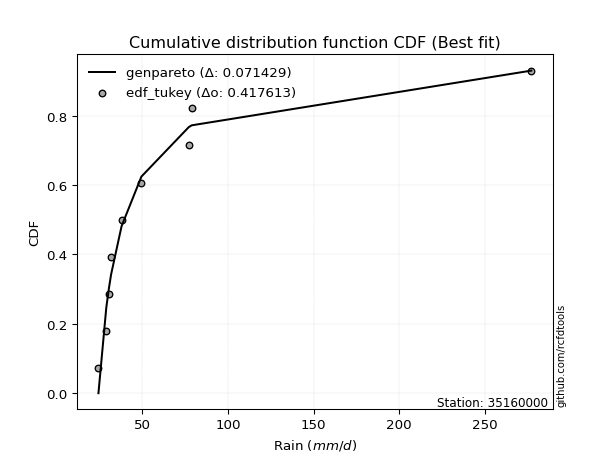</img></img>

</div>


### 8. EDF Gringorten (1963)

Gringorten plotting position formula is essential for estimating the probability and return periods of extreme events like floods and heavy rainfall. The constant _a=0.44_.

<div align="center">


$P=(m-a)/(n+1-2a)$


</div>


**8.1. Empirical values**

<div align="center">

|                | 0                   | 1                   | 2                  | 3                  | 4                  | 5                  | 6                  | 7                  |
|:---------------|:--------------------|:--------------------|:-------------------|:-------------------|:-------------------|:-------------------|:-------------------|:-------------------|
| date           | 2021                | 2023                | 2018               | 2017               | 2020               | 2024               | 2019               | 2022               |
| x              | 24.52               | 29.1                | 30.6               | 38.01              | 49.59              | 77.2               | 78.93              | 277.01             |
| m              | 1                   | 2                   | 3                  | 4                  | 5                  | 6                  | 7                  | 8                  |
| empirical_dist | edf_gringorten      | edf_gringorten      | edf_gringorten     | edf_gringorten     | edf_gringorten     | edf_gringorten     | edf_gringorten     | edf_gringorten     |
| empirical      | 0.06896551724137932 | 0.19211822660098524 | 0.3152709359605912 | 0.4384236453201971 | 0.5615763546798029 | 0.6847290640394089 | 0.8078817733990148 | 0.9310344827586208 |
| empirical_tr   | 1.0740740740740742  | 1.2378048780487805  | 1.460431654676259  | 1.780701754385965  | 2.2808988764044944 | 3.1718750000000004 | 5.205128205128205  | 14.500000000000018 |

</div>


**8.2. Kolmogorov-Smirnov fit test (sorted by Δ)**


<div align="center">

|                | 0                   | 1                   | 2                   | 3                   | 4                   | 5                   | 6                  | 7                   | 8                   | 9                   | 10                  | 11                  | 12                  | 13                  | 14                  | 15                  | 16                  | 17                  | 18                  | 19                  | 20                  | 21                  | 22                 | 23                  | 24                  | 25                  | 26                  | 27                  | 28                  | 29                  | 30                  | 31                 | 32                    | 33                  | 34                 | 35                  | 36                  | 37                  | 38                  | 39                 | 40                  | 41                  | 42                  | 43                  | 44                  | 45                  | 46                  | 47                  | 48                  | 49                  | 50                  | 51                  | 52                  | 53                  | 54                 | 55                 | 56                  | 57                  | 58                 | 59                 | 60                  | 61                 | 62                  | 63                  | 64                 | 65                  | 66                  | 67                  | 68                 | 69                  | 70                  | 71                 | 72                 | 73                  | 74                  | 75                  | 76                  | 77                 | 78                  | 79                  | 80                 | 81                  | 82                  | 83                  | 84                 | 85                  | 86                  | 87                 |
|:---------------|:--------------------|:--------------------|:--------------------|:--------------------|:--------------------|:--------------------|:-------------------|:--------------------|:--------------------|:--------------------|:--------------------|:--------------------|:--------------------|:--------------------|:--------------------|:--------------------|:--------------------|:--------------------|:--------------------|:--------------------|:--------------------|:--------------------|:-------------------|:--------------------|:--------------------|:--------------------|:--------------------|:--------------------|:--------------------|:--------------------|:--------------------|:-------------------|:----------------------|:--------------------|:-------------------|:--------------------|:--------------------|:--------------------|:--------------------|:-------------------|:--------------------|:--------------------|:--------------------|:--------------------|:--------------------|:--------------------|:--------------------|:--------------------|:--------------------|:--------------------|:--------------------|:--------------------|:--------------------|:--------------------|:-------------------|:-------------------|:--------------------|:--------------------|:-------------------|:-------------------|:--------------------|:-------------------|:--------------------|:--------------------|:-------------------|:--------------------|:--------------------|:--------------------|:-------------------|:--------------------|:--------------------|:-------------------|:-------------------|:--------------------|:--------------------|:--------------------|:--------------------|:-------------------|:--------------------|:--------------------|:-------------------|:--------------------|:--------------------|:--------------------|:-------------------|:--------------------|:--------------------|:-------------------|
| station        | 35160000            | 35160000            | 35160000            | 35160000            | 35160000            | 35160000            | 35160000           | 35160000            | 35160000            | 35160000            | 35160000            | 35160000            | 35160000            | 35160000            | 35160000            | 35160000            | 35160000            | 35160000            | 35160000            | 35160000            | 35160000            | 35160000            | 35160000           | 35160000            | 35160000            | 35160000            | 35160000            | 35160000            | 35160000            | 35160000            | 35160000            | 35160000           | 35160000              | 35160000            | 35160000           | 35160000            | 35160000            | 35160000            | 35160000            | 35160000           | 35160000            | 35160000            | 35160000            | 35160000            | 35160000            | 35160000            | 35160000            | 35160000            | 35160000            | 35160000            | 35160000            | 35160000            | 35160000            | 35160000            | 35160000           | 35160000           | 35160000            | 35160000            | 35160000           | 35160000           | 35160000            | 35160000           | 35160000            | 35160000            | 35160000           | 35160000            | 35160000            | 35160000            | 35160000           | 35160000            | 35160000            | 35160000           | 35160000           | 35160000            | 35160000            | 35160000            | 35160000            | 35160000           | 35160000            | 35160000            | 35160000           | 35160000            | 35160000            | 35160000            | 35160000           | 35160000            | 35160000            | 35160000           |
| empirical_dist | edf_gringorten      | edf_gringorten      | edf_gringorten      | edf_gringorten      | edf_gringorten      | edf_gringorten      | edf_gringorten     | edf_gringorten      | edf_gringorten      | edf_gringorten      | edf_gringorten      | edf_gringorten      | edf_gringorten      | edf_gringorten      | edf_gringorten      | edf_gringorten      | edf_gringorten      | edf_gringorten      | edf_gringorten      | edf_gringorten      | edf_gringorten      | edf_gringorten      | edf_gringorten     | edf_gringorten      | edf_gringorten      | edf_gringorten      | edf_gringorten      | edf_gringorten      | edf_gringorten      | edf_gringorten      | edf_gringorten      | edf_gringorten     | edf_gringorten        | edf_gringorten      | edf_gringorten     | edf_gringorten      | edf_gringorten      | edf_gringorten      | edf_gringorten      | edf_gringorten     | edf_gringorten      | edf_gringorten      | edf_gringorten      | edf_gringorten      | edf_gringorten      | edf_gringorten      | edf_gringorten      | edf_gringorten      | edf_gringorten      | edf_gringorten      | edf_gringorten      | edf_gringorten      | edf_gringorten      | edf_gringorten      | edf_gringorten     | edf_gringorten     | edf_gringorten      | edf_gringorten      | edf_gringorten     | edf_gringorten     | edf_gringorten      | edf_gringorten     | edf_gringorten      | edf_gringorten      | edf_gringorten     | edf_gringorten      | edf_gringorten      | edf_gringorten      | edf_gringorten     | edf_gringorten      | edf_gringorten      | edf_gringorten     | edf_gringorten     | edf_gringorten      | edf_gringorten      | edf_gringorten      | edf_gringorten      | edf_gringorten     | edf_gringorten      | edf_gringorten      | edf_gringorten     | edf_gringorten      | edf_gringorten      | edf_gringorten      | edf_gringorten     | edf_gringorten      | edf_gringorten      | edf_gringorten     |
| p_dist         | loghalflogistic     | loghalfnorm         | logpearson3         | logfisk             | loggenexpon         | invweibull          | loggompertz        | logexpon            | weibull_min         | invgauss            | logexponnorm        | fatiguelife         | loggumbel_r         | lograyleigh         | invgamma            | betaprime           | f                   | logmaxwell          | logfatiguelife      | logjohnsonsu        | logmoyal            | loginvgauss         | logt               | logncf              | loginvgamma         | logf                | logmielke           | loginvweibull       | chi2                | logbetaprime        | lognct              | logalpha           | loglaplace_asymmetric | ncf                 | alpha              | nct                 | logtruncnorm        | logchi2             | loggenlogistic      | logloggamma        | lognorm             | lognorm             | logcrystalball      | logkstwobign        | gibrat              | loglogistic         | logrice             | lognakagami         | wald                | loghypsecant        | gamma               | erlang              | genlogistic         | logweibull_min      | loggumbel_l        | loglaplace         | fisk                | exponnorm           | genexpon           | laplace_asymmetric | expon               | moyal              | logwald             | gompertz            | t                  | gumbel_r            | pearson3            | halflogistic        | logerlang          | halfnorm            | rayleigh            | kstwobign          | maxwell            | laplace             | nakagami            | hypsecant           | truncnorm           | logistic           | crystalball         | norm                | rice               | loggibrat           | loggamma            | loggamma            | johnsonsu          | gumbel_l            | loglognorm          | mielke             |
| delta          | 0.07093174401704738 | 0.07473185003666949 | 0.07629364372373296 | 0.07734432252238477 | 0.07989986532226057 | 0.08148492323909029 | 0.083102599784832  | 0.08349196750351784 | 0.08539571770468674 | 0.08553900800481207 | 0.08656586259066135 | 0.08852030347902382 | 0.08896150566424146 | 0.08908936914309662 | 0.09057257711249544 | 0.09057518840745593 | 0.09060969885978587 | 0.09382125915823458 | 0.09468144812750923 | 0.09487757345411685 | 0.09686112340343522 | 0.09937470509444513 | 0.1003451111293846 | 0.10207358735115538 | 0.10234719432114103 | 0.10234735351456081 | 0.10257560215893458 | 0.10280182241648372 | 0.10430412578592674 | 0.10434014976953754 | 0.10449867078120001 | 0.1053484361611019 | 0.10539413150694821   | 0.10740784364761125 | 0.1077967656310782 | 0.10785818739918238 | 0.10931473512819934 | 0.11068351525620976 | 0.11162887190696394 | 0.1156501895374289 | 0.11800543858218837 | 0.11800543858218837 | 0.11800578127604472 | 0.12162117575329728 | 0.12807176687674238 | 0.13819120009610697 | 0.13890730745900653 | 0.15023600324006903 | 0.15024565708641557 | 0.15323884267772342 | 0.15526471881049753 | 0.15655081635417056 | 0.16657756508020838 | 0.17181649690858902 | 0.1749516264025897 | 0.1799392028081857 | 0.19864455015957927 | 0.20573699700075881 | 0.2064026700792735 | 0.2064027313306484 | 0.20640319653498893 | 0.2065340734643113 | 0.21161906431039657 | 0.21327260919728055 | 0.2144930067906769 | 0.22042418593570023 | 0.22647904143595793 | 0.23429009692266783 | 0.241611400344121  | 0.24640003531149057 | 0.24816302327470385 | 0.2546522674280448 | 0.2587906315521099 | 0.27898537092233056 | 0.28010682314253055 | 0.28685003271379894 | 0.28809109924993115 | 0.2888034680523194 | 0.29109359938279467 | 0.29109360693089503 | 0.306118509960692  | 0.31526989964313473 | 0.32656053849984945 | 0.32656053849984945 | 0.3342004095395381 | 0.36076712810294187 | 0.41229772743714566 | nan                |
| deltao         | 0.4472608134160001  | 0.4472608134160001  | 0.4472608134160001  | 0.4472608134160001  | 0.4472608134160001  | 0.4472608134160001  | 0.4472608134160001 | 0.4472608134160001  | 0.4472608134160001  | 0.4472608134160001  | 0.4472608134160001  | 0.4472608134160001  | 0.4472608134160001  | 0.4472608134160001  | 0.4472608134160001  | 0.4472608134160001  | 0.4472608134160001  | 0.4472608134160001  | 0.4472608134160001  | 0.4472608134160001  | 0.4472608134160001  | 0.4472608134160001  | 0.4472608134160001 | 0.4472608134160001  | 0.4472608134160001  | 0.4472608134160001  | 0.4472608134160001  | 0.4472608134160001  | 0.4472608134160001  | 0.4472608134160001  | 0.4472608134160001  | 0.4472608134160001 | 0.4472608134160001    | 0.4472608134160001  | 0.4472608134160001 | 0.4472608134160001  | 0.4472608134160001  | 0.4472608134160001  | 0.4472608134160001  | 0.4472608134160001 | 0.4472608134160001  | 0.4472608134160001  | 0.4472608134160001  | 0.4472608134160001  | 0.4472608134160001  | 0.4472608134160001  | 0.4472608134160001  | 0.4472608134160001  | 0.4472608134160001  | 0.4472608134160001  | 0.4472608134160001  | 0.4472608134160001  | 0.4472608134160001  | 0.4472608134160001  | 0.4472608134160001 | 0.4472608134160001 | 0.4472608134160001  | 0.4472608134160001  | 0.4472608134160001 | 0.4472608134160001 | 0.4472608134160001  | 0.4472608134160001 | 0.4472608134160001  | 0.4472608134160001  | 0.4472608134160001 | 0.4472608134160001  | 0.4472608134160001  | 0.4472608134160001  | 0.4472608134160001 | 0.4472608134160001  | 0.4472608134160001  | 0.4472608134160001 | 0.4472608134160001 | 0.4472608134160001  | 0.4472608134160001  | 0.4472608134160001  | 0.4472608134160001  | 0.4472608134160001 | 0.4472608134160001  | 0.4472608134160001  | 0.4472608134160001 | 0.4472608134160001  | 0.4472608134160001  | 0.4472608134160001  | 0.4472608134160001 | 0.4472608134160001  | 0.4472608134160001  | 0.4472608134160001 |
| eval           | Δo > Δ              | Δo > Δ              | Δo > Δ              | Δo > Δ              | Δo > Δ              | Δo > Δ              | Δo > Δ             | Δo > Δ              | Δo > Δ              | Δo > Δ              | Δo > Δ              | Δo > Δ              | Δo > Δ              | Δo > Δ              | Δo > Δ              | Δo > Δ              | Δo > Δ              | Δo > Δ              | Δo > Δ              | Δo > Δ              | Δo > Δ              | Δo > Δ              | Δo > Δ             | Δo > Δ              | Δo > Δ              | Δo > Δ              | Δo > Δ              | Δo > Δ              | Δo > Δ              | Δo > Δ              | Δo > Δ              | Δo > Δ             | Δo > Δ                | Δo > Δ              | Δo > Δ             | Δo > Δ              | Δo > Δ              | Δo > Δ              | Δo > Δ              | Δo > Δ             | Δo > Δ              | Δo > Δ              | Δo > Δ              | Δo > Δ              | Δo > Δ              | Δo > Δ              | Δo > Δ              | Δo > Δ              | Δo > Δ              | Δo > Δ              | Δo > Δ              | Δo > Δ              | Δo > Δ              | Δo > Δ              | Δo > Δ             | Δo > Δ             | Δo > Δ              | Δo > Δ              | Δo > Δ             | Δo > Δ             | Δo > Δ              | Δo > Δ             | Δo > Δ              | Δo > Δ              | Δo > Δ             | Δo > Δ              | Δo > Δ              | Δo > Δ              | Δo > Δ             | Δo > Δ              | Δo > Δ              | Δo > Δ             | Δo > Δ             | Δo > Δ              | Δo > Δ              | Δo > Δ              | Δo > Δ              | Δo > Δ             | Δo > Δ              | Δo > Δ              | Δo > Δ             | Δo > Δ              | Δo > Δ              | Δo > Δ              | Δo > Δ             | Δo > Δ              | Δo > Δ              | Δo <= Δ            |
| fit            | 1                   | 1                   | 1                   | 1                   | 1                   | 1                   | 1                  | 1                   | 1                   | 1                   | 1                   | 1                   | 1                   | 1                   | 1                   | 1                   | 1                   | 1                   | 1                   | 1                   | 1                   | 1                   | 1                  | 1                   | 1                   | 1                   | 1                   | 1                   | 1                   | 1                   | 1                   | 1                  | 1                     | 1                   | 1                  | 1                   | 1                   | 1                   | 1                   | 1                  | 1                   | 1                   | 1                   | 1                   | 1                   | 1                   | 1                   | 1                   | 1                   | 1                   | 1                   | 1                   | 1                   | 1                   | 1                  | 1                  | 1                   | 1                   | 1                  | 1                  | 1                   | 1                  | 1                   | 1                   | 1                  | 1                   | 1                   | 1                   | 1                  | 1                   | 1                   | 1                  | 1                  | 1                   | 1                   | 1                   | 1                   | 1                  | 1                   | 1                   | 1                  | 1                   | 1                   | 1                   | 1                  | 1                   | 1                   | 0                  |
| n              | 8                   | 8                   | 8                   | 8                   | 8                   | 8                   | 8                  | 8                   | 8                   | 8                   | 8                   | 8                   | 8                   | 8                   | 8                   | 8                   | 8                   | 8                   | 8                   | 8                   | 8                   | 8                   | 8                  | 8                   | 8                   | 8                   | 8                   | 8                   | 8                   | 8                   | 8                   | 8                  | 8                     | 8                   | 8                  | 8                   | 8                   | 8                   | 8                   | 8                  | 8                   | 8                   | 8                   | 8                   | 8                   | 8                   | 8                   | 8                   | 8                   | 8                   | 8                   | 8                   | 8                   | 8                   | 8                  | 8                  | 8                   | 8                   | 8                  | 8                  | 8                   | 8                  | 8                   | 8                   | 8                  | 8                   | 8                   | 8                   | 8                  | 8                   | 8                   | 8                  | 8                  | 8                   | 8                   | 8                   | 8                   | 8                  | 8                   | 8                   | 8                  | 8                   | 8                   | 8                   | 8                  | 8                   | 8                   | 8                  |
| best_fit       | 1                   | 0                   | 0                   | 0                   | 0                   | 0                   | 0                  | 0                   | 0                   | 0                   | 0                   | 0                   | 0                   | 0                   | 0                   | 0                   | 0                   | 0                   | 0                   | 0                   | 0                   | 0                   | 0                  | 0                   | 0                   | 0                   | 0                   | 0                   | 0                   | 0                   | 0                   | 0                  | 0                     | 0                   | 0                  | 0                   | 0                   | 0                   | 0                   | 0                  | 0                   | 0                   | 0                   | 0                   | 0                   | 0                   | 0                   | 0                   | 0                   | 0                   | 0                   | 0                   | 0                   | 0                   | 0                  | 0                  | 0                   | 0                   | 0                  | 0                  | 0                   | 0                  | 0                   | 0                   | 0                  | 0                   | 0                   | 0                   | 0                  | 0                   | 0                   | 0                  | 0                  | 0                   | 0                   | 0                   | 0                   | 0                  | 0                   | 0                   | 0                  | 0                   | 0                   | 0                   | 0                  | 0                   | 0                   | 0                  |
| best_fit_sort  | 1                   | 2                   | 3                   | 4                   | 5                   | 6                   | 7                  | 8                   | 9                   | 10                  | 11                  | 12                  | 13                  | 14                  | 15                  | 16                  | 17                  | 18                  | 19                  | 20                  | 21                  | 22                  | 23                 | 24                  | 25                  | 26                  | 27                  | 28                  | 29                  | 30                  | 31                  | 32                 | 33                    | 34                  | 35                 | 36                  | 37                  | 38                  | 39                  | 40                 | 41                  | 42                  | 43                  | 44                  | 45                  | 46                  | 47                  | 48                  | 49                  | 50                  | 51                  | 52                  | 53                  | 54                  | 55                 | 56                 | 57                  | 58                  | 59                 | 60                 | 61                  | 62                 | 63                  | 64                  | 65                 | 66                  | 67                  | 68                  | 69                 | 70                  | 71                  | 72                 | 73                 | 74                  | 75                  | 76                  | 77                  | 78                 | 79                  | 80                  | 81                 | 82                  | 83                  | 84                  | 85                 | 86                  | 87                  | 88                 |

</div>


**8.3. Best fit**

<div align="center">

|   id |   station | empirical_dist   | p_dist          |     delta |   deltao | eval   |   fit |   n |   best_fit |   best_fit_sort |
|-----:|----------:|:-----------------|:----------------|----------:|---------:|:-------|------:|----:|-----------:|----------------:|
|    0 |  35160000 | edf_gringorten   | loghalflogistic | 0.0709317 | 0.447261 | Δo > Δ |     1 |   8 |          1 |               1 |

</div>


<div align="center">

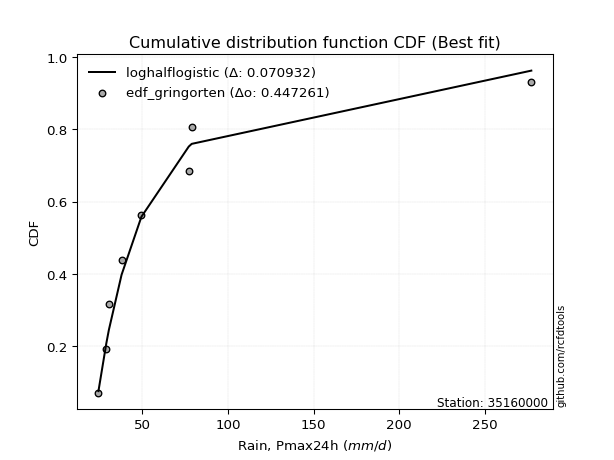</img>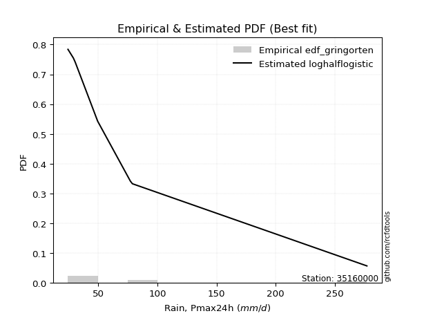</img>

</div>


### 9. EDF Filliben (1975)

The specific values of the constants (0.3175) (often denoted as $alpha$) and (0.365) are derived from a method proposed by James J. Filliben in a 1975 paper. This particular formula is the mean value of the $i$-th order statistic of the normal distribution and is considered a robust and effective plotting position formula for the normal probability plot correlation coefficient test for normality.

<div align="center">


$P=(m-0.3175)/(n+0.365)$


</div>


**9.1. Empirical values**

<div align="center">

|                | 0                  | 1                   | 2                  | 3                   | 4                  | 5                  | 6                  | 7                  |
|:---------------|:-------------------|:--------------------|:-------------------|:--------------------|:-------------------|:-------------------|:-------------------|:-------------------|
| date           | 2021               | 2023                | 2018               | 2017                | 2020               | 2024               | 2019               | 2022               |
| x              | 24.52              | 29.1                | 30.6               | 38.01               | 49.59              | 77.2               | 78.93              | 277.01             |
| m              | 1                  | 2                   | 3                  | 4                   | 5                  | 6                  | 7                  | 8                  |
| empirical_dist | edf_filliben       | edf_filliben        | edf_filliben       | edf_filliben        | edf_filliben       | edf_filliben       | edf_filliben       | edf_filliben       |
| empirical      | 0.0815899581589958 | 0.20113568439928273 | 0.3206814106395696 | 0.44022713687985654 | 0.5597728631201434 | 0.6793185893604303 | 0.7988643156007172 | 0.9184100418410042 |
| empirical_tr   | 1.0888382687927107 | 1.2517770295548074  | 1.4720633523977125 | 1.7864388681260008  | 2.271554650373387  | 3.118359739049394  | 4.971768202080237  | 12.256410256410254 |

</div>


**9.2. Kolmogorov-Smirnov fit test (sorted by Δ)**


<div align="center">

|                | 0                   | 1                   | 2                   | 3                   | 4                   | 5                   | 6                   | 7                   | 8                   | 9                   | 10                  | 11                  | 12                  | 13                  | 14                  | 15                  | 16                  | 17                  | 18                  | 19                  | 20                  | 21                  | 22                  | 23                  | 24                 | 25                 | 26                  | 27                 | 28                  | 29                  | 30                  | 31                  | 32                 | 33                 | 34                    | 35                 | 36                 | 37                 | 38                  | 39                  | 40                  | 41                  | 42                  | 43                 | 44                 | 45                 | 46                 | 47                  | 48                  | 49                  | 50                  | 51                  | 52                  | 53                  | 54                  | 55                  | 56                  | 57                  | 58                  | 59                 | 60                  | 61                  | 62                  | 63                 | 64                  | 65                  | 66                 | 67                  | 68                  | 69                 | 70                 | 71                  | 72                  | 73                 | 74                 | 75                 | 76                 | 77                  | 78                 | 79                 | 80                  | 81                 | 82                 | 83                  | 84                  | 85                 | 86                 | 87                 |
|:---------------|:--------------------|:--------------------|:--------------------|:--------------------|:--------------------|:--------------------|:--------------------|:--------------------|:--------------------|:--------------------|:--------------------|:--------------------|:--------------------|:--------------------|:--------------------|:--------------------|:--------------------|:--------------------|:--------------------|:--------------------|:--------------------|:--------------------|:--------------------|:--------------------|:-------------------|:-------------------|:--------------------|:-------------------|:--------------------|:--------------------|:--------------------|:--------------------|:-------------------|:-------------------|:----------------------|:-------------------|:-------------------|:-------------------|:--------------------|:--------------------|:--------------------|:--------------------|:--------------------|:-------------------|:-------------------|:-------------------|:-------------------|:--------------------|:--------------------|:--------------------|:--------------------|:--------------------|:--------------------|:--------------------|:--------------------|:--------------------|:--------------------|:--------------------|:--------------------|:-------------------|:--------------------|:--------------------|:--------------------|:-------------------|:--------------------|:--------------------|:-------------------|:--------------------|:--------------------|:-------------------|:-------------------|:--------------------|:--------------------|:-------------------|:-------------------|:-------------------|:-------------------|:--------------------|:-------------------|:-------------------|:--------------------|:-------------------|:-------------------|:--------------------|:--------------------|:-------------------|:-------------------|:-------------------|
| station        | 35160000            | 35160000            | 35160000            | 35160000            | 35160000            | 35160000            | 35160000            | 35160000            | 35160000            | 35160000            | 35160000            | 35160000            | 35160000            | 35160000            | 35160000            | 35160000            | 35160000            | 35160000            | 35160000            | 35160000            | 35160000            | 35160000            | 35160000            | 35160000            | 35160000           | 35160000           | 35160000            | 35160000           | 35160000            | 35160000            | 35160000            | 35160000            | 35160000           | 35160000           | 35160000              | 35160000           | 35160000           | 35160000           | 35160000            | 35160000            | 35160000            | 35160000            | 35160000            | 35160000           | 35160000           | 35160000           | 35160000           | 35160000            | 35160000            | 35160000            | 35160000            | 35160000            | 35160000            | 35160000            | 35160000            | 35160000            | 35160000            | 35160000            | 35160000            | 35160000           | 35160000            | 35160000            | 35160000            | 35160000           | 35160000            | 35160000            | 35160000           | 35160000            | 35160000            | 35160000           | 35160000           | 35160000            | 35160000            | 35160000           | 35160000           | 35160000           | 35160000           | 35160000            | 35160000           | 35160000           | 35160000            | 35160000           | 35160000           | 35160000            | 35160000            | 35160000           | 35160000           | 35160000           |
| empirical_dist | edf_filliben        | edf_filliben        | edf_filliben        | edf_filliben        | edf_filliben        | edf_filliben        | edf_filliben        | edf_filliben        | edf_filliben        | edf_filliben        | edf_filliben        | edf_filliben        | edf_filliben        | edf_filliben        | edf_filliben        | edf_filliben        | edf_filliben        | edf_filliben        | edf_filliben        | edf_filliben        | edf_filliben        | edf_filliben        | edf_filliben        | edf_filliben        | edf_filliben       | edf_filliben       | edf_filliben        | edf_filliben       | edf_filliben        | edf_filliben        | edf_filliben        | edf_filliben        | edf_filliben       | edf_filliben       | edf_filliben          | edf_filliben       | edf_filliben       | edf_filliben       | edf_filliben        | edf_filliben        | edf_filliben        | edf_filliben        | edf_filliben        | edf_filliben       | edf_filliben       | edf_filliben       | edf_filliben       | edf_filliben        | edf_filliben        | edf_filliben        | edf_filliben        | edf_filliben        | edf_filliben        | edf_filliben        | edf_filliben        | edf_filliben        | edf_filliben        | edf_filliben        | edf_filliben        | edf_filliben       | edf_filliben        | edf_filliben        | edf_filliben        | edf_filliben       | edf_filliben        | edf_filliben        | edf_filliben       | edf_filliben        | edf_filliben        | edf_filliben       | edf_filliben       | edf_filliben        | edf_filliben        | edf_filliben       | edf_filliben       | edf_filliben       | edf_filliben       | edf_filliben        | edf_filliben       | edf_filliben       | edf_filliben        | edf_filliben       | edf_filliben       | edf_filliben        | edf_filliben        | edf_filliben       | edf_filliben       | edf_filliben       |
| p_dist         | loghalfnorm         | loghalflogistic     | fatiguelife         | lograyleigh         | logpearson3         | logfisk             | loggenexpon         | invweibull          | loggompertz         | logexpon            | logmaxwell          | weibull_min         | invgauss            | logexponnorm        | loggumbel_r         | chi2                | invgamma            | betaprime           | f                   | logfatiguelife      | logjohnsonsu        | logchi2             | logmoyal            | loginvgauss         | logt               | logncf             | loginvgamma         | logf               | logmielke           | loginvweibull       | ncf                 | logbetaprime        | lognct             | logalpha           | loglaplace_asymmetric | alpha              | nct                | logloggamma        | logtruncnorm        | loggenlogistic      | lognorm             | lognorm             | logcrystalball      | logkstwobign       | gibrat             | wald               | loglogistic        | lognakagami         | logrice             | loghypsecant        | gamma               | erlang              | genlogistic         | loggumbel_l         | logweibull_min      | loglaplace          | fisk                | moyal               | exponnorm           | genexpon           | laplace_asymmetric  | expon               | t                   | gumbel_r           | pearson3            | gompertz            | logwald            | halflogistic        | logerlang           | halfnorm           | rayleigh           | kstwobign           | maxwell             | laplace            | nakagami           | hypsecant          | truncnorm          | logistic            | crystalball        | norm               | rice                | loggamma           | loggamma           | loggibrat           | johnsonsu           | gumbel_l           | loglognorm         | mielke             |
| delta          | 0.06571439223837194 | 0.07634221869602581 | 0.07950284568072633 | 0.08007191134479907 | 0.08170411840271138 | 0.08275479720136336 | 0.08531034000123916 | 0.08689539791806888 | 0.08851307446381043 | 0.08890244218249643 | 0.09002555814643975 | 0.09080619238366516 | 0.09094948268379066 | 0.09197633726963994 | 0.09437198034321989 | 0.09528666798762919 | 0.09598305179147404 | 0.09598566308643453 | 0.09602017353876446 | 0.10009192280648782 | 0.10028804813309544 | 0.10166605745791227 | 0.10227159808241365 | 0.10478517977342372 | 0.1057555858083632 | 0.1074840620301338 | 0.10775766900011963 | 0.1077578281935394 | 0.10798607683791317 | 0.10821229709546232 | 0.10921133520727067 | 0.10975062444851613 | 0.1099091454601786 | 0.1107589108400805 | 0.11080460618592664   | 0.1132072403100568 | 0.1132686620781608 | 0.1146754025409159 | 0.11472520980717793 | 0.11703934658594237 | 0.11980893014184779 | 0.11980893014184779 | 0.11980927283570414 | 0.1270316504322757 | 0.1334822415557208 | 0.1376212161687991 | 0.1399946916557664 | 0.14121854544177148 | 0.14420029950068056 | 0.15504233423738284 | 0.16067519348947612 | 0.16196129103314916 | 0.16477407352054885 | 0.17466851643728598 | 0.17722697158756762 | 0.18174269436784513 | 0.18962709236128172 | 0.19390963254669483 | 0.20765337326766203 | 0.2085045737720693 | 0.20850460568456725 | 0.20850484807582825 | 0.20988990522389628 | 0.2114067281374027 | 0.21385460051834146 | 0.21507610075693998 | 0.217029538989375  | 0.22166565600505136 | 0.23259394254582352 | 0.2337755943938741 | 0.2391455654764063 | 0.24563480962974726 | 0.24977317375381236 | 0.269967913124033  | 0.271089365344233  | 0.2778325749155014 | 0.2790736414516336 | 0.27978601025402183 | 0.2820761415844971 | 0.2820761491325975 | 0.29710105216239446 | 0.3175430807015519 | 0.3175430807015519 | 0.32068037432211316 | 0.32518295174124057 | 0.3517496703046443 | 0.4032802696388481 | nan                |
| deltao         | 0.4472608134160001  | 0.4472608134160001  | 0.4472608134160001  | 0.4472608134160001  | 0.4472608134160001  | 0.4472608134160001  | 0.4472608134160001  | 0.4472608134160001  | 0.4472608134160001  | 0.4472608134160001  | 0.4472608134160001  | 0.4472608134160001  | 0.4472608134160001  | 0.4472608134160001  | 0.4472608134160001  | 0.4472608134160001  | 0.4472608134160001  | 0.4472608134160001  | 0.4472608134160001  | 0.4472608134160001  | 0.4472608134160001  | 0.4472608134160001  | 0.4472608134160001  | 0.4472608134160001  | 0.4472608134160001 | 0.4472608134160001 | 0.4472608134160001  | 0.4472608134160001 | 0.4472608134160001  | 0.4472608134160001  | 0.4472608134160001  | 0.4472608134160001  | 0.4472608134160001 | 0.4472608134160001 | 0.4472608134160001    | 0.4472608134160001 | 0.4472608134160001 | 0.4472608134160001 | 0.4472608134160001  | 0.4472608134160001  | 0.4472608134160001  | 0.4472608134160001  | 0.4472608134160001  | 0.4472608134160001 | 0.4472608134160001 | 0.4472608134160001 | 0.4472608134160001 | 0.4472608134160001  | 0.4472608134160001  | 0.4472608134160001  | 0.4472608134160001  | 0.4472608134160001  | 0.4472608134160001  | 0.4472608134160001  | 0.4472608134160001  | 0.4472608134160001  | 0.4472608134160001  | 0.4472608134160001  | 0.4472608134160001  | 0.4472608134160001 | 0.4472608134160001  | 0.4472608134160001  | 0.4472608134160001  | 0.4472608134160001 | 0.4472608134160001  | 0.4472608134160001  | 0.4472608134160001 | 0.4472608134160001  | 0.4472608134160001  | 0.4472608134160001 | 0.4472608134160001 | 0.4472608134160001  | 0.4472608134160001  | 0.4472608134160001 | 0.4472608134160001 | 0.4472608134160001 | 0.4472608134160001 | 0.4472608134160001  | 0.4472608134160001 | 0.4472608134160001 | 0.4472608134160001  | 0.4472608134160001 | 0.4472608134160001 | 0.4472608134160001  | 0.4472608134160001  | 0.4472608134160001 | 0.4472608134160001 | 0.4472608134160001 |
| eval           | Δo > Δ              | Δo > Δ              | Δo > Δ              | Δo > Δ              | Δo > Δ              | Δo > Δ              | Δo > Δ              | Δo > Δ              | Δo > Δ              | Δo > Δ              | Δo > Δ              | Δo > Δ              | Δo > Δ              | Δo > Δ              | Δo > Δ              | Δo > Δ              | Δo > Δ              | Δo > Δ              | Δo > Δ              | Δo > Δ              | Δo > Δ              | Δo > Δ              | Δo > Δ              | Δo > Δ              | Δo > Δ             | Δo > Δ             | Δo > Δ              | Δo > Δ             | Δo > Δ              | Δo > Δ              | Δo > Δ              | Δo > Δ              | Δo > Δ             | Δo > Δ             | Δo > Δ                | Δo > Δ             | Δo > Δ             | Δo > Δ             | Δo > Δ              | Δo > Δ              | Δo > Δ              | Δo > Δ              | Δo > Δ              | Δo > Δ             | Δo > Δ             | Δo > Δ             | Δo > Δ             | Δo > Δ              | Δo > Δ              | Δo > Δ              | Δo > Δ              | Δo > Δ              | Δo > Δ              | Δo > Δ              | Δo > Δ              | Δo > Δ              | Δo > Δ              | Δo > Δ              | Δo > Δ              | Δo > Δ             | Δo > Δ              | Δo > Δ              | Δo > Δ              | Δo > Δ             | Δo > Δ              | Δo > Δ              | Δo > Δ             | Δo > Δ              | Δo > Δ              | Δo > Δ             | Δo > Δ             | Δo > Δ              | Δo > Δ              | Δo > Δ             | Δo > Δ             | Δo > Δ             | Δo > Δ             | Δo > Δ              | Δo > Δ             | Δo > Δ             | Δo > Δ              | Δo > Δ             | Δo > Δ             | Δo > Δ              | Δo > Δ              | Δo > Δ             | Δo > Δ             | Δo <= Δ            |
| fit            | 1                   | 1                   | 1                   | 1                   | 1                   | 1                   | 1                   | 1                   | 1                   | 1                   | 1                   | 1                   | 1                   | 1                   | 1                   | 1                   | 1                   | 1                   | 1                   | 1                   | 1                   | 1                   | 1                   | 1                   | 1                  | 1                  | 1                   | 1                  | 1                   | 1                   | 1                   | 1                   | 1                  | 1                  | 1                     | 1                  | 1                  | 1                  | 1                   | 1                   | 1                   | 1                   | 1                   | 1                  | 1                  | 1                  | 1                  | 1                   | 1                   | 1                   | 1                   | 1                   | 1                   | 1                   | 1                   | 1                   | 1                   | 1                   | 1                   | 1                  | 1                   | 1                   | 1                   | 1                  | 1                   | 1                   | 1                  | 1                   | 1                   | 1                  | 1                  | 1                   | 1                   | 1                  | 1                  | 1                  | 1                  | 1                   | 1                  | 1                  | 1                   | 1                  | 1                  | 1                   | 1                   | 1                  | 1                  | 0                  |
| n              | 8                   | 8                   | 8                   | 8                   | 8                   | 8                   | 8                   | 8                   | 8                   | 8                   | 8                   | 8                   | 8                   | 8                   | 8                   | 8                   | 8                   | 8                   | 8                   | 8                   | 8                   | 8                   | 8                   | 8                   | 8                  | 8                  | 8                   | 8                  | 8                   | 8                   | 8                   | 8                   | 8                  | 8                  | 8                     | 8                  | 8                  | 8                  | 8                   | 8                   | 8                   | 8                   | 8                   | 8                  | 8                  | 8                  | 8                  | 8                   | 8                   | 8                   | 8                   | 8                   | 8                   | 8                   | 8                   | 8                   | 8                   | 8                   | 8                   | 8                  | 8                   | 8                   | 8                   | 8                  | 8                   | 8                   | 8                  | 8                   | 8                   | 8                  | 8                  | 8                   | 8                   | 8                  | 8                  | 8                  | 8                  | 8                   | 8                  | 8                  | 8                   | 8                  | 8                  | 8                   | 8                   | 8                  | 8                  | 8                  |
| best_fit       | 1                   | 0                   | 0                   | 0                   | 0                   | 0                   | 0                   | 0                   | 0                   | 0                   | 0                   | 0                   | 0                   | 0                   | 0                   | 0                   | 0                   | 0                   | 0                   | 0                   | 0                   | 0                   | 0                   | 0                   | 0                  | 0                  | 0                   | 0                  | 0                   | 0                   | 0                   | 0                   | 0                  | 0                  | 0                     | 0                  | 0                  | 0                  | 0                   | 0                   | 0                   | 0                   | 0                   | 0                  | 0                  | 0                  | 0                  | 0                   | 0                   | 0                   | 0                   | 0                   | 0                   | 0                   | 0                   | 0                   | 0                   | 0                   | 0                   | 0                  | 0                   | 0                   | 0                   | 0                  | 0                   | 0                   | 0                  | 0                   | 0                   | 0                  | 0                  | 0                   | 0                   | 0                  | 0                  | 0                  | 0                  | 0                   | 0                  | 0                  | 0                   | 0                  | 0                  | 0                   | 0                   | 0                  | 0                  | 0                  |
| best_fit_sort  | 1                   | 2                   | 3                   | 4                   | 5                   | 6                   | 7                   | 8                   | 9                   | 10                  | 11                  | 12                  | 13                  | 14                  | 15                  | 16                  | 17                  | 18                  | 19                  | 20                  | 21                  | 22                  | 23                  | 24                  | 25                 | 26                 | 27                  | 28                 | 29                  | 30                  | 31                  | 32                  | 33                 | 34                 | 35                    | 36                 | 37                 | 38                 | 39                  | 40                  | 41                  | 42                  | 43                  | 44                 | 45                 | 46                 | 47                 | 48                  | 49                  | 50                  | 51                  | 52                  | 53                  | 54                  | 55                  | 56                  | 57                  | 58                  | 59                  | 60                 | 61                  | 62                  | 63                  | 64                 | 65                  | 66                  | 67                 | 68                  | 69                  | 70                 | 71                 | 72                  | 73                  | 74                 | 75                 | 76                 | 77                 | 78                  | 79                 | 80                 | 81                  | 82                 | 83                 | 84                  | 85                  | 86                 | 87                 | 88                 |

</div>


**9.3. Best fit**

<div align="center">

|   id |   station | empirical_dist   | p_dist      |     delta |   deltao | eval   |   fit |   n |   best_fit |   best_fit_sort |
|-----:|----------:|:-----------------|:------------|----------:|---------:|:-------|------:|----:|-----------:|----------------:|
|    0 |  35160000 | edf_filliben     | loghalfnorm | 0.0657144 | 0.447261 | Δo > Δ |     1 |   8 |          1 |               1 |

</div>


<div align="center">

</img>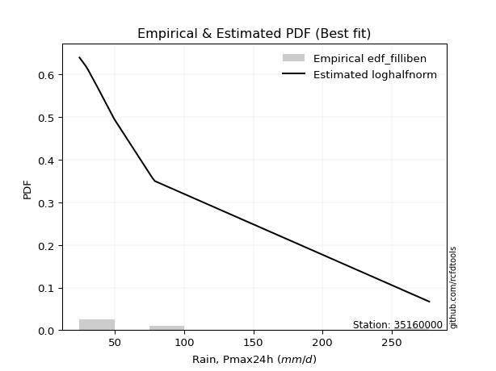</img>

</div>


### 10. EDF Jenkinson (1977)

The Jenkinson formula in hydrology is an empirical plotting position formula used to estimate the non-exceedance probability _(P)_ or return period _(T)_ of a given ordered observation within a sample. It is a widely used method in the frequency analysis of extreme events such as floods and rainfall, as it provides a distribution-free way to plot data. _a≈0.31_ and _b≈0.38_ are constants derived to approximate the median of the probability distribution for the given rank.

<div align="center">


$P=(m-a)/(n+b)$


</div>


**10.1. Empirical values**

<div align="center">

|                | 0                   | 1                   | 2                  | 3                   | 4                  | 5                  | 6                  | 7                  |
|:---------------|:--------------------|:--------------------|:-------------------|:--------------------|:-------------------|:-------------------|:-------------------|:-------------------|
| date           | 2021                | 2023                | 2018               | 2017                | 2020               | 2024               | 2019               | 2022               |
| x              | 24.52               | 29.1                | 30.6               | 38.01               | 49.59              | 77.2               | 78.93              | 277.01             |
| m              | 1                   | 2                   | 3                  | 4                   | 5                  | 6                  | 7                  | 8                  |
| empirical_dist | edf_jenkinson       | edf_jenkinson       | edf_jenkinson      | edf_jenkinson       | edf_jenkinson      | edf_jenkinson      | edf_jenkinson      | edf_jenkinson      |
| empirical      | 0.08233890214797135 | 0.20167064439140808 | 0.3210023866348448 | 0.44033412887828155 | 0.5596658711217184 | 0.6789976133651551 | 0.7983293556085919 | 0.9176610978520287 |
| empirical_tr   | 1.0897269180754225  | 1.2526158445440956  | 1.4727592267135323 | 1.7867803837953091  | 2.2710027100271004 | 3.115241635687732  | 4.958579881656804  | 12.144927536231886 |

</div>


**10.2. Kolmogorov-Smirnov fit test (sorted by Δ)**


<div align="center">

|                | 0                   | 1                  | 2                   | 3                   | 4                   | 5                   | 6                   | 7                   | 8                   | 9                   | 10                  | 11                  | 12                  | 13                  | 14                  | 15                  | 16                  | 17                  | 18                  | 19                  | 20                 | 21                  | 22                  | 23                  | 24                  | 25                 | 26                  | 27                  | 28                  | 29                  | 30                  | 31                  | 32                  | 33                  | 34                    | 35                  | 36                 | 37                  | 38                  | 39                  | 40                 | 41                 | 42                  | 43                 | 44                 | 45                  | 46                 | 47                 | 48                  | 49                  | 50                  | 51                 | 52                  | 53                 | 54                  | 55                  | 56                  | 57                  | 58                  | 59                 | 60                  | 61                  | 62                  | 63                 | 64                  | 65                  | 66                 | 67                  | 68                  | 69                  | 70                  | 71                  | 72                  | 73                 | 74                 | 75                 | 76                 | 77                  | 78                  | 79                 | 80                 | 81                 | 82                 | 83                  | 84                  | 85                  | 86                 | 87                 |
|:---------------|:--------------------|:-------------------|:--------------------|:--------------------|:--------------------|:--------------------|:--------------------|:--------------------|:--------------------|:--------------------|:--------------------|:--------------------|:--------------------|:--------------------|:--------------------|:--------------------|:--------------------|:--------------------|:--------------------|:--------------------|:-------------------|:--------------------|:--------------------|:--------------------|:--------------------|:-------------------|:--------------------|:--------------------|:--------------------|:--------------------|:--------------------|:--------------------|:--------------------|:--------------------|:----------------------|:--------------------|:-------------------|:--------------------|:--------------------|:--------------------|:-------------------|:-------------------|:--------------------|:-------------------|:-------------------|:--------------------|:-------------------|:-------------------|:--------------------|:--------------------|:--------------------|:-------------------|:--------------------|:-------------------|:--------------------|:--------------------|:--------------------|:--------------------|:--------------------|:-------------------|:--------------------|:--------------------|:--------------------|:-------------------|:--------------------|:--------------------|:-------------------|:--------------------|:--------------------|:--------------------|:--------------------|:--------------------|:--------------------|:-------------------|:-------------------|:-------------------|:-------------------|:--------------------|:--------------------|:-------------------|:-------------------|:-------------------|:-------------------|:--------------------|:--------------------|:--------------------|:-------------------|:-------------------|
| station        | 35160000            | 35160000           | 35160000            | 35160000            | 35160000            | 35160000            | 35160000            | 35160000            | 35160000            | 35160000            | 35160000            | 35160000            | 35160000            | 35160000            | 35160000            | 35160000            | 35160000            | 35160000            | 35160000            | 35160000            | 35160000           | 35160000            | 35160000            | 35160000            | 35160000            | 35160000           | 35160000            | 35160000            | 35160000            | 35160000            | 35160000            | 35160000            | 35160000            | 35160000            | 35160000              | 35160000            | 35160000           | 35160000            | 35160000            | 35160000            | 35160000           | 35160000           | 35160000            | 35160000           | 35160000           | 35160000            | 35160000           | 35160000           | 35160000            | 35160000            | 35160000            | 35160000           | 35160000            | 35160000           | 35160000            | 35160000            | 35160000            | 35160000            | 35160000            | 35160000           | 35160000            | 35160000            | 35160000            | 35160000           | 35160000            | 35160000            | 35160000           | 35160000            | 35160000            | 35160000            | 35160000            | 35160000            | 35160000            | 35160000           | 35160000           | 35160000           | 35160000           | 35160000            | 35160000            | 35160000           | 35160000           | 35160000           | 35160000           | 35160000            | 35160000            | 35160000            | 35160000           | 35160000           |
| empirical_dist | edf_jenkinson       | edf_jenkinson      | edf_jenkinson       | edf_jenkinson       | edf_jenkinson       | edf_jenkinson       | edf_jenkinson       | edf_jenkinson       | edf_jenkinson       | edf_jenkinson       | edf_jenkinson       | edf_jenkinson       | edf_jenkinson       | edf_jenkinson       | edf_jenkinson       | edf_jenkinson       | edf_jenkinson       | edf_jenkinson       | edf_jenkinson       | edf_jenkinson       | edf_jenkinson      | edf_jenkinson       | edf_jenkinson       | edf_jenkinson       | edf_jenkinson       | edf_jenkinson      | edf_jenkinson       | edf_jenkinson       | edf_jenkinson       | edf_jenkinson       | edf_jenkinson       | edf_jenkinson       | edf_jenkinson       | edf_jenkinson       | edf_jenkinson         | edf_jenkinson       | edf_jenkinson      | edf_jenkinson       | edf_jenkinson       | edf_jenkinson       | edf_jenkinson      | edf_jenkinson      | edf_jenkinson       | edf_jenkinson      | edf_jenkinson      | edf_jenkinson       | edf_jenkinson      | edf_jenkinson      | edf_jenkinson       | edf_jenkinson       | edf_jenkinson       | edf_jenkinson      | edf_jenkinson       | edf_jenkinson      | edf_jenkinson       | edf_jenkinson       | edf_jenkinson       | edf_jenkinson       | edf_jenkinson       | edf_jenkinson      | edf_jenkinson       | edf_jenkinson       | edf_jenkinson       | edf_jenkinson      | edf_jenkinson       | edf_jenkinson       | edf_jenkinson      | edf_jenkinson       | edf_jenkinson       | edf_jenkinson       | edf_jenkinson       | edf_jenkinson       | edf_jenkinson       | edf_jenkinson      | edf_jenkinson      | edf_jenkinson      | edf_jenkinson      | edf_jenkinson       | edf_jenkinson       | edf_jenkinson      | edf_jenkinson      | edf_jenkinson      | edf_jenkinson      | edf_jenkinson       | edf_jenkinson       | edf_jenkinson       | edf_jenkinson      | edf_jenkinson      |
| p_dist         | loghalfnorm         | loghalflogistic    | fatiguelife         | lograyleigh         | logpearson3         | logfisk             | loggenexpon         | invweibull          | loggompertz         | logexpon            | logmaxwell          | weibull_min         | invgauss            | logexponnorm        | loggumbel_r         | chi2                | invgamma            | betaprime           | f                   | logfatiguelife      | logjohnsonsu       | logchi2             | logmoyal            | loginvgauss         | logt                | logncf             | loginvgamma         | logf                | logmielke           | loginvweibull       | ncf                 | logbetaprime        | lognct              | logalpha            | loglaplace_asymmetric | alpha               | nct                | logloggamma         | logtruncnorm        | loggenlogistic      | lognorm            | lognorm            | logcrystalball      | logkstwobign       | gibrat             | wald                | loglogistic        | lognakagami        | logrice             | loghypsecant        | gamma               | erlang             | genlogistic         | loggumbel_l        | logweibull_min      | loglaplace          | fisk                | moyal               | exponnorm           | genexpon           | laplace_asymmetric  | expon               | t                   | gumbel_r           | pearson3            | gompertz            | logwald            | halflogistic        | logerlang           | halfnorm            | rayleigh            | kstwobign           | maxwell             | laplace            | nakagami           | hypsecant          | truncnorm          | logistic            | crystalball         | norm               | rice               | loggamma           | loggamma           | loggibrat           | johnsonsu           | gumbel_l            | loglognorm         | mielke             |
| delta          | 0.06517943224624656 | 0.076663194691301  | 0.07896788568860097 | 0.07953695135267369 | 0.08202509439798658 | 0.08307577319663861 | 0.08563131599651441 | 0.08721637391334414 | 0.08883405045908563 | 0.08922341817777169 | 0.09013255014486476 | 0.09112716837894036 | 0.09127045867906591 | 0.09229731326491519 | 0.09469295633849509 | 0.09475170799550381 | 0.09630402778674929 | 0.09630663908170978 | 0.09634114953403972 | 0.10041289880176307 | 0.1006090241283707 | 0.10113109746578691 | 0.10259257407768885 | 0.10510615576869897 | 0.10607656180363845 | 0.107805038025409  | 0.10807864499539488 | 0.10807880418881466 | 0.10830705283318842 | 0.10853327309073757 | 0.10931832720569568 | 0.11007160044379138 | 0.11023012145545386 | 0.11107988683535575 | 0.11112558218120183   | 0.11352821630533205 | 0.113589638073436  | 0.11478239453934092 | 0.11504618580245318 | 0.11736032258121756 | 0.1199159221402728 | 0.1199159221402728 | 0.11991626483412915 | 0.1273526264275509 | 0.133803217550996  | 0.13687227217982356 | 0.1401016836541914 | 0.1406835854496461 | 0.14452127549595575 | 0.15514932623580785 | 0.16099616948475137 | 0.1622822670284244 | 0.16466708152212384 | 0.174775508435711  | 0.17754794758284287 | 0.18184968636627014 | 0.18909213236915634 | 0.19316068855771928 | 0.20797434926293723 | 0.2088255497673445 | 0.20882558167984244 | 0.20882582407110345 | 0.21021088121917153 | 0.2108717681452773 | 0.21310565652936592 | 0.21518309275536499 | 0.2173505149846502 | 0.22091671201607582 | 0.23205898255369817 | 0.23302665040489856 | 0.23861060548428092 | 0.24509984963762188 | 0.24923821376168698 | 0.2694329531319076 | 0.2705544053521076 | 0.277297614923376  | 0.2785386814595082 | 0.27925105026189645 | 0.28154118159237174 | 0.2815411891404721 | 0.2965660921702691 | 0.3170081207094266 | 0.3170081207094266 | 0.32100135031738836 | 0.32464799174911524 | 0.35121471031251894 | 0.4027453096467228 | nan                |
| deltao         | 0.4472608134160001  | 0.4472608134160001 | 0.4472608134160001  | 0.4472608134160001  | 0.4472608134160001  | 0.4472608134160001  | 0.4472608134160001  | 0.4472608134160001  | 0.4472608134160001  | 0.4472608134160001  | 0.4472608134160001  | 0.4472608134160001  | 0.4472608134160001  | 0.4472608134160001  | 0.4472608134160001  | 0.4472608134160001  | 0.4472608134160001  | 0.4472608134160001  | 0.4472608134160001  | 0.4472608134160001  | 0.4472608134160001 | 0.4472608134160001  | 0.4472608134160001  | 0.4472608134160001  | 0.4472608134160001  | 0.4472608134160001 | 0.4472608134160001  | 0.4472608134160001  | 0.4472608134160001  | 0.4472608134160001  | 0.4472608134160001  | 0.4472608134160001  | 0.4472608134160001  | 0.4472608134160001  | 0.4472608134160001    | 0.4472608134160001  | 0.4472608134160001 | 0.4472608134160001  | 0.4472608134160001  | 0.4472608134160001  | 0.4472608134160001 | 0.4472608134160001 | 0.4472608134160001  | 0.4472608134160001 | 0.4472608134160001 | 0.4472608134160001  | 0.4472608134160001 | 0.4472608134160001 | 0.4472608134160001  | 0.4472608134160001  | 0.4472608134160001  | 0.4472608134160001 | 0.4472608134160001  | 0.4472608134160001 | 0.4472608134160001  | 0.4472608134160001  | 0.4472608134160001  | 0.4472608134160001  | 0.4472608134160001  | 0.4472608134160001 | 0.4472608134160001  | 0.4472608134160001  | 0.4472608134160001  | 0.4472608134160001 | 0.4472608134160001  | 0.4472608134160001  | 0.4472608134160001 | 0.4472608134160001  | 0.4472608134160001  | 0.4472608134160001  | 0.4472608134160001  | 0.4472608134160001  | 0.4472608134160001  | 0.4472608134160001 | 0.4472608134160001 | 0.4472608134160001 | 0.4472608134160001 | 0.4472608134160001  | 0.4472608134160001  | 0.4472608134160001 | 0.4472608134160001 | 0.4472608134160001 | 0.4472608134160001 | 0.4472608134160001  | 0.4472608134160001  | 0.4472608134160001  | 0.4472608134160001 | 0.4472608134160001 |
| eval           | Δo > Δ              | Δo > Δ             | Δo > Δ              | Δo > Δ              | Δo > Δ              | Δo > Δ              | Δo > Δ              | Δo > Δ              | Δo > Δ              | Δo > Δ              | Δo > Δ              | Δo > Δ              | Δo > Δ              | Δo > Δ              | Δo > Δ              | Δo > Δ              | Δo > Δ              | Δo > Δ              | Δo > Δ              | Δo > Δ              | Δo > Δ             | Δo > Δ              | Δo > Δ              | Δo > Δ              | Δo > Δ              | Δo > Δ             | Δo > Δ              | Δo > Δ              | Δo > Δ              | Δo > Δ              | Δo > Δ              | Δo > Δ              | Δo > Δ              | Δo > Δ              | Δo > Δ                | Δo > Δ              | Δo > Δ             | Δo > Δ              | Δo > Δ              | Δo > Δ              | Δo > Δ             | Δo > Δ             | Δo > Δ              | Δo > Δ             | Δo > Δ             | Δo > Δ              | Δo > Δ             | Δo > Δ             | Δo > Δ              | Δo > Δ              | Δo > Δ              | Δo > Δ             | Δo > Δ              | Δo > Δ             | Δo > Δ              | Δo > Δ              | Δo > Δ              | Δo > Δ              | Δo > Δ              | Δo > Δ             | Δo > Δ              | Δo > Δ              | Δo > Δ              | Δo > Δ             | Δo > Δ              | Δo > Δ              | Δo > Δ             | Δo > Δ              | Δo > Δ              | Δo > Δ              | Δo > Δ              | Δo > Δ              | Δo > Δ              | Δo > Δ             | Δo > Δ             | Δo > Δ             | Δo > Δ             | Δo > Δ              | Δo > Δ              | Δo > Δ             | Δo > Δ             | Δo > Δ             | Δo > Δ             | Δo > Δ              | Δo > Δ              | Δo > Δ              | Δo > Δ             | Δo <= Δ            |
| fit            | 1                   | 1                  | 1                   | 1                   | 1                   | 1                   | 1                   | 1                   | 1                   | 1                   | 1                   | 1                   | 1                   | 1                   | 1                   | 1                   | 1                   | 1                   | 1                   | 1                   | 1                  | 1                   | 1                   | 1                   | 1                   | 1                  | 1                   | 1                   | 1                   | 1                   | 1                   | 1                   | 1                   | 1                   | 1                     | 1                   | 1                  | 1                   | 1                   | 1                   | 1                  | 1                  | 1                   | 1                  | 1                  | 1                   | 1                  | 1                  | 1                   | 1                   | 1                   | 1                  | 1                   | 1                  | 1                   | 1                   | 1                   | 1                   | 1                   | 1                  | 1                   | 1                   | 1                   | 1                  | 1                   | 1                   | 1                  | 1                   | 1                   | 1                   | 1                   | 1                   | 1                   | 1                  | 1                  | 1                  | 1                  | 1                   | 1                   | 1                  | 1                  | 1                  | 1                  | 1                   | 1                   | 1                   | 1                  | 0                  |
| n              | 8                   | 8                  | 8                   | 8                   | 8                   | 8                   | 8                   | 8                   | 8                   | 8                   | 8                   | 8                   | 8                   | 8                   | 8                   | 8                   | 8                   | 8                   | 8                   | 8                   | 8                  | 8                   | 8                   | 8                   | 8                   | 8                  | 8                   | 8                   | 8                   | 8                   | 8                   | 8                   | 8                   | 8                   | 8                     | 8                   | 8                  | 8                   | 8                   | 8                   | 8                  | 8                  | 8                   | 8                  | 8                  | 8                   | 8                  | 8                  | 8                   | 8                   | 8                   | 8                  | 8                   | 8                  | 8                   | 8                   | 8                   | 8                   | 8                   | 8                  | 8                   | 8                   | 8                   | 8                  | 8                   | 8                   | 8                  | 8                   | 8                   | 8                   | 8                   | 8                   | 8                   | 8                  | 8                  | 8                  | 8                  | 8                   | 8                   | 8                  | 8                  | 8                  | 8                  | 8                   | 8                   | 8                   | 8                  | 8                  |
| best_fit       | 1                   | 0                  | 0                   | 0                   | 0                   | 0                   | 0                   | 0                   | 0                   | 0                   | 0                   | 0                   | 0                   | 0                   | 0                   | 0                   | 0                   | 0                   | 0                   | 0                   | 0                  | 0                   | 0                   | 0                   | 0                   | 0                  | 0                   | 0                   | 0                   | 0                   | 0                   | 0                   | 0                   | 0                   | 0                     | 0                   | 0                  | 0                   | 0                   | 0                   | 0                  | 0                  | 0                   | 0                  | 0                  | 0                   | 0                  | 0                  | 0                   | 0                   | 0                   | 0                  | 0                   | 0                  | 0                   | 0                   | 0                   | 0                   | 0                   | 0                  | 0                   | 0                   | 0                   | 0                  | 0                   | 0                   | 0                  | 0                   | 0                   | 0                   | 0                   | 0                   | 0                   | 0                  | 0                  | 0                  | 0                  | 0                   | 0                   | 0                  | 0                  | 0                  | 0                  | 0                   | 0                   | 0                   | 0                  | 0                  |
| best_fit_sort  | 1                   | 2                  | 3                   | 4                   | 5                   | 6                   | 7                   | 8                   | 9                   | 10                  | 11                  | 12                  | 13                  | 14                  | 15                  | 16                  | 17                  | 18                  | 19                  | 20                  | 21                 | 22                  | 23                  | 24                  | 25                  | 26                 | 27                  | 28                  | 29                  | 30                  | 31                  | 32                  | 33                  | 34                  | 35                    | 36                  | 37                 | 38                  | 39                  | 40                  | 41                 | 42                 | 43                  | 44                 | 45                 | 46                  | 47                 | 48                 | 49                  | 50                  | 51                  | 52                 | 53                  | 54                 | 55                  | 56                  | 57                  | 58                  | 59                  | 60                 | 61                  | 62                  | 63                  | 64                 | 65                  | 66                  | 67                 | 68                  | 69                  | 70                  | 71                  | 72                  | 73                  | 74                 | 75                 | 76                 | 77                 | 78                  | 79                  | 80                 | 81                 | 82                 | 83                 | 84                  | 85                  | 86                  | 87                 | 88                 |

</div>


**10.3. Best fit**

<div align="center">

|   id |   station | empirical_dist   | p_dist      |     delta |   deltao | eval   |   fit |   n |   best_fit |   best_fit_sort |
|-----:|----------:|:-----------------|:------------|----------:|---------:|:-------|------:|----:|-----------:|----------------:|
|    0 |  35160000 | edf_jenkinson    | loghalfnorm | 0.0651794 | 0.447261 | Δo > Δ |     1 |   8 |          1 |               1 |

</div>


<div align="center">

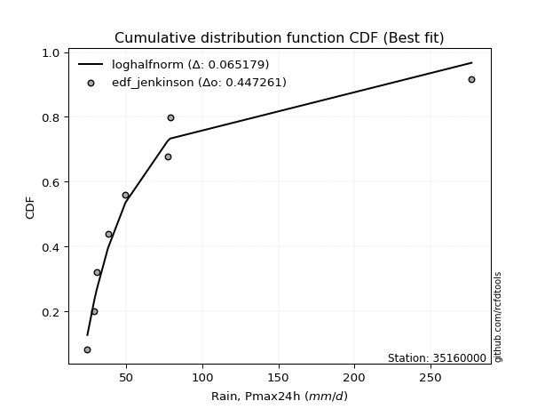</img>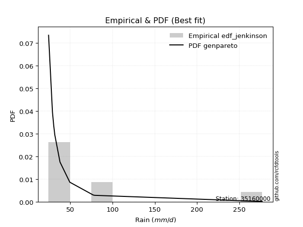</img>

</div>


### 11. EDF Cunnane (1978)

Cunnane´s work in statistical hydrology has focused on the performance and evaluation of different probability distributions (such as GEV, Gumbel, Lognormal) for flood frequency estimation. _b_ is a constant, typically set to 0.4.

<div align="center">


$P=(m-b)/(n+1-2b)$


</div>


**11.1. Empirical values**

<div align="center">

|                | 0                   | 1                   | 2                  | 3                  | 4                  | 5                  | 6                  | 7                  |
|:---------------|:--------------------|:--------------------|:-------------------|:-------------------|:-------------------|:-------------------|:-------------------|:-------------------|
| date           | 2021                | 2023                | 2018               | 2017               | 2020               | 2024               | 2019               | 2022               |
| x              | 24.52               | 29.1                | 30.6               | 38.01              | 49.59              | 77.2               | 78.93              | 277.01             |
| m              | 1                   | 2                   | 3                  | 4                  | 5                  | 6                  | 7                  | 8                  |
| empirical_dist | edf_cunnane         | edf_cunnane         | edf_cunnane        | edf_cunnane        | edf_cunnane        | edf_cunnane        | edf_cunnane        | edf_cunnane        |
| empirical      | 0.07317073170731708 | 0.19512195121951223 | 0.3170731707317074 | 0.4390243902439025 | 0.5609756097560976 | 0.6829268292682927 | 0.8048780487804879 | 0.926829268292683  |
| empirical_tr   | 1.0789473684210527  | 1.2424242424242424  | 1.4642857142857144 | 1.782608695652174  | 2.277777777777778  | 3.153846153846154  | 5.125000000000001  | 13.666666666666675 |

</div>


**11.2. Kolmogorov-Smirnov fit test (sorted by Δ)**


<div align="center">

|                | 0                   | 1                   | 2                   | 3                   | 4                   | 5                   | 6                   | 7                   | 8                   | 9                   | 10                  | 11                  | 12                  | 13                  | 14                  | 15                  | 16                  | 17                  | 18                  | 19                  | 20                  | 21                  | 22                 | 23                  | 24                  | 25                  | 26                 | 27                  | 28                  | 29                  | 30                 | 31                  | 32                    | 33                  | 34                  | 35                  | 36                  | 37                  | 38                  | 39                  | 40                  | 41                  | 42                 | 43                  | 44                  | 45                  | 46                 | 47                  | 48                 | 49                 | 50                 | 51                  | 52                  | 53                 | 54                 | 55                  | 56                  | 57                  | 58                 | 59                  | 60                  | 61                 | 62                  | 63                  | 64                  | 65                 | 66                  | 67                 | 68                  | 69                  | 70                  | 71                  | 72                  | 73                 | 74                 | 75                 | 76                 | 77                  | 78                  | 79                 | 80                  | 81                 | 82                 | 83                 | 84                  | 85                  | 86                 | 87                 |
|:---------------|:--------------------|:--------------------|:--------------------|:--------------------|:--------------------|:--------------------|:--------------------|:--------------------|:--------------------|:--------------------|:--------------------|:--------------------|:--------------------|:--------------------|:--------------------|:--------------------|:--------------------|:--------------------|:--------------------|:--------------------|:--------------------|:--------------------|:-------------------|:--------------------|:--------------------|:--------------------|:-------------------|:--------------------|:--------------------|:--------------------|:-------------------|:--------------------|:----------------------|:--------------------|:--------------------|:--------------------|:--------------------|:--------------------|:--------------------|:--------------------|:--------------------|:--------------------|:-------------------|:--------------------|:--------------------|:--------------------|:-------------------|:--------------------|:-------------------|:-------------------|:-------------------|:--------------------|:--------------------|:-------------------|:-------------------|:--------------------|:--------------------|:--------------------|:-------------------|:--------------------|:--------------------|:-------------------|:--------------------|:--------------------|:--------------------|:-------------------|:--------------------|:-------------------|:--------------------|:--------------------|:--------------------|:--------------------|:--------------------|:-------------------|:-------------------|:-------------------|:-------------------|:--------------------|:--------------------|:-------------------|:--------------------|:-------------------|:-------------------|:-------------------|:--------------------|:--------------------|:-------------------|:-------------------|
| station        | 35160000            | 35160000            | 35160000            | 35160000            | 35160000            | 35160000            | 35160000            | 35160000            | 35160000            | 35160000            | 35160000            | 35160000            | 35160000            | 35160000            | 35160000            | 35160000            | 35160000            | 35160000            | 35160000            | 35160000            | 35160000            | 35160000            | 35160000           | 35160000            | 35160000            | 35160000            | 35160000           | 35160000            | 35160000            | 35160000            | 35160000           | 35160000            | 35160000              | 35160000            | 35160000            | 35160000            | 35160000            | 35160000            | 35160000            | 35160000            | 35160000            | 35160000            | 35160000           | 35160000            | 35160000            | 35160000            | 35160000           | 35160000            | 35160000           | 35160000           | 35160000           | 35160000            | 35160000            | 35160000           | 35160000           | 35160000            | 35160000            | 35160000            | 35160000           | 35160000            | 35160000            | 35160000           | 35160000            | 35160000            | 35160000            | 35160000           | 35160000            | 35160000           | 35160000            | 35160000            | 35160000            | 35160000            | 35160000            | 35160000           | 35160000           | 35160000           | 35160000           | 35160000            | 35160000            | 35160000           | 35160000            | 35160000           | 35160000           | 35160000           | 35160000            | 35160000            | 35160000           | 35160000           |
| empirical_dist | edf_cunnane         | edf_cunnane         | edf_cunnane         | edf_cunnane         | edf_cunnane         | edf_cunnane         | edf_cunnane         | edf_cunnane         | edf_cunnane         | edf_cunnane         | edf_cunnane         | edf_cunnane         | edf_cunnane         | edf_cunnane         | edf_cunnane         | edf_cunnane         | edf_cunnane         | edf_cunnane         | edf_cunnane         | edf_cunnane         | edf_cunnane         | edf_cunnane         | edf_cunnane        | edf_cunnane         | edf_cunnane         | edf_cunnane         | edf_cunnane        | edf_cunnane         | edf_cunnane         | edf_cunnane         | edf_cunnane        | edf_cunnane         | edf_cunnane           | edf_cunnane         | edf_cunnane         | edf_cunnane         | edf_cunnane         | edf_cunnane         | edf_cunnane         | edf_cunnane         | edf_cunnane         | edf_cunnane         | edf_cunnane        | edf_cunnane         | edf_cunnane         | edf_cunnane         | edf_cunnane        | edf_cunnane         | edf_cunnane        | edf_cunnane        | edf_cunnane        | edf_cunnane         | edf_cunnane         | edf_cunnane        | edf_cunnane        | edf_cunnane         | edf_cunnane         | edf_cunnane         | edf_cunnane        | edf_cunnane         | edf_cunnane         | edf_cunnane        | edf_cunnane         | edf_cunnane         | edf_cunnane         | edf_cunnane        | edf_cunnane         | edf_cunnane        | edf_cunnane         | edf_cunnane         | edf_cunnane         | edf_cunnane         | edf_cunnane         | edf_cunnane        | edf_cunnane        | edf_cunnane        | edf_cunnane        | edf_cunnane         | edf_cunnane         | edf_cunnane        | edf_cunnane         | edf_cunnane        | edf_cunnane        | edf_cunnane        | edf_cunnane         | edf_cunnane         | edf_cunnane        | edf_cunnane        |
| p_dist         | loghalfnorm         | loghalflogistic     | logpearson3         | logfisk             | loggenexpon         | invweibull          | loggompertz         | logexpon            | fatiguelife         | lograyleigh         | weibull_min         | invgauss            | logexponnorm        | loggumbel_r         | logmaxwell          | invgamma            | betaprime           | f                   | logfatiguelife      | logjohnsonsu        | logmoyal            | loginvgauss         | chi2               | logt                | logncf              | loginvgamma         | logf               | logmielke           | loginvweibull       | logbetaprime        | lognct             | logalpha            | loglaplace_asymmetric | logchi2             | ncf                 | alpha               | nct                 | logtruncnorm        | loggenlogistic      | logloggamma         | lognorm             | lognorm             | logcrystalball     | logkstwobign        | gibrat              | loglogistic         | logrice            | wald                | lognakagami        | loghypsecant       | gamma              | erlang              | genlogistic         | logweibull_min     | loggumbel_l        | loglaplace          | fisk                | moyal               | exponnorm          | genexpon            | laplace_asymmetric  | expon              | t                   | logwald             | gompertz            | gumbel_r           | pearson3            | halflogistic       | logerlang           | halfnorm            | rayleigh            | kstwobign           | maxwell             | laplace            | nakagami           | hypsecant          | truncnorm          | logistic            | crystalball         | norm               | rice                | loggibrat          | loggamma           | loggamma           | johnsonsu           | gumbel_l            | loglognorm         | mielke             |
| delta          | 0.07172812541814255 | 0.07273397878816357 | 0.07809587849484914 | 0.07914655729350095 | 0.08170210009337675 | 0.08328715801020647 | 0.08490483455594819 | 0.08529420227463402 | 0.08551657886049682 | 0.08608564452456968 | 0.08719795247580292 | 0.08734124277592825 | 0.08836809736177753 | 0.09076374043535765 | 0.09081753453970765 | 0.09237481188361163 | 0.09237742317857212 | 0.09241193363090205 | 0.09648368289862541 | 0.09667980822523303 | 0.09866335817455141 | 0.10117693986556131 | 0.1013004011673998 | 0.10214734590050079 | 0.10387582212227156 | 0.10414942909225722 | 0.104149588285677  | 0.10437783693005076 | 0.10460405718759991 | 0.10614238454065372 | 0.1063009055523162 | 0.10715067093221808 | 0.10719636627806439   | 0.10767979063768277 | 0.10800858857131662 | 0.10959900040219439 | 0.10966042217029856 | 0.11111696989931552 | 0.11343110667808012 | 0.11347265590496186 | 0.11860618350589375 | 0.11860618350589375 | 0.1186065261997501 | 0.12342341052441347 | 0.12987400164785856 | 0.13879194501981235 | 0.1405920595928183 | 0.14604044262047783 | 0.1472322786215421 | 0.1538395876014288 | 0.1570669535816137 | 0.15835305112528675 | 0.16597682015650306 | 0.1736187316797052 | 0.1743508814788844 | 0.18053994773189108 | 0.19564082554105233 | 0.20232885899837355 | 0.2063377419244642 | 0.20700341500297886 | 0.20700347625435378 | 0.2070039414586943 | 0.21028779232473915 | 0.21342129908151275 | 0.21387335412098593 | 0.2174204613171733 | 0.22227382697002018 | 0.2300848824567301 | 0.23860767572559402 | 0.24219482084555283 | 0.24515929865617692 | 0.25164854280951787 | 0.25578690693358297 | 0.2759816463038036 | 0.2771030985240036 | 0.283846308095272  | 0.2850873746314042 | 0.28579974343379244 | 0.28808987476426773 | 0.2880898823123681 | 0.30311478534216507 | 0.3170721344142509 | 0.3235568138813224 | 0.3235568138813224 | 0.33119668492101106 | 0.35776340348441493 | 0.4092940028186186 | nan                |
| deltao         | 0.4472608134160001  | 0.4472608134160001  | 0.4472608134160001  | 0.4472608134160001  | 0.4472608134160001  | 0.4472608134160001  | 0.4472608134160001  | 0.4472608134160001  | 0.4472608134160001  | 0.4472608134160001  | 0.4472608134160001  | 0.4472608134160001  | 0.4472608134160001  | 0.4472608134160001  | 0.4472608134160001  | 0.4472608134160001  | 0.4472608134160001  | 0.4472608134160001  | 0.4472608134160001  | 0.4472608134160001  | 0.4472608134160001  | 0.4472608134160001  | 0.4472608134160001 | 0.4472608134160001  | 0.4472608134160001  | 0.4472608134160001  | 0.4472608134160001 | 0.4472608134160001  | 0.4472608134160001  | 0.4472608134160001  | 0.4472608134160001 | 0.4472608134160001  | 0.4472608134160001    | 0.4472608134160001  | 0.4472608134160001  | 0.4472608134160001  | 0.4472608134160001  | 0.4472608134160001  | 0.4472608134160001  | 0.4472608134160001  | 0.4472608134160001  | 0.4472608134160001  | 0.4472608134160001 | 0.4472608134160001  | 0.4472608134160001  | 0.4472608134160001  | 0.4472608134160001 | 0.4472608134160001  | 0.4472608134160001 | 0.4472608134160001 | 0.4472608134160001 | 0.4472608134160001  | 0.4472608134160001  | 0.4472608134160001 | 0.4472608134160001 | 0.4472608134160001  | 0.4472608134160001  | 0.4472608134160001  | 0.4472608134160001 | 0.4472608134160001  | 0.4472608134160001  | 0.4472608134160001 | 0.4472608134160001  | 0.4472608134160001  | 0.4472608134160001  | 0.4472608134160001 | 0.4472608134160001  | 0.4472608134160001 | 0.4472608134160001  | 0.4472608134160001  | 0.4472608134160001  | 0.4472608134160001  | 0.4472608134160001  | 0.4472608134160001 | 0.4472608134160001 | 0.4472608134160001 | 0.4472608134160001 | 0.4472608134160001  | 0.4472608134160001  | 0.4472608134160001 | 0.4472608134160001  | 0.4472608134160001 | 0.4472608134160001 | 0.4472608134160001 | 0.4472608134160001  | 0.4472608134160001  | 0.4472608134160001 | 0.4472608134160001 |
| eval           | Δo > Δ              | Δo > Δ              | Δo > Δ              | Δo > Δ              | Δo > Δ              | Δo > Δ              | Δo > Δ              | Δo > Δ              | Δo > Δ              | Δo > Δ              | Δo > Δ              | Δo > Δ              | Δo > Δ              | Δo > Δ              | Δo > Δ              | Δo > Δ              | Δo > Δ              | Δo > Δ              | Δo > Δ              | Δo > Δ              | Δo > Δ              | Δo > Δ              | Δo > Δ             | Δo > Δ              | Δo > Δ              | Δo > Δ              | Δo > Δ             | Δo > Δ              | Δo > Δ              | Δo > Δ              | Δo > Δ             | Δo > Δ              | Δo > Δ                | Δo > Δ              | Δo > Δ              | Δo > Δ              | Δo > Δ              | Δo > Δ              | Δo > Δ              | Δo > Δ              | Δo > Δ              | Δo > Δ              | Δo > Δ             | Δo > Δ              | Δo > Δ              | Δo > Δ              | Δo > Δ             | Δo > Δ              | Δo > Δ             | Δo > Δ             | Δo > Δ             | Δo > Δ              | Δo > Δ              | Δo > Δ             | Δo > Δ             | Δo > Δ              | Δo > Δ              | Δo > Δ              | Δo > Δ             | Δo > Δ              | Δo > Δ              | Δo > Δ             | Δo > Δ              | Δo > Δ              | Δo > Δ              | Δo > Δ             | Δo > Δ              | Δo > Δ             | Δo > Δ              | Δo > Δ              | Δo > Δ              | Δo > Δ              | Δo > Δ              | Δo > Δ             | Δo > Δ             | Δo > Δ             | Δo > Δ             | Δo > Δ              | Δo > Δ              | Δo > Δ             | Δo > Δ              | Δo > Δ             | Δo > Δ             | Δo > Δ             | Δo > Δ              | Δo > Δ              | Δo > Δ             | Δo <= Δ            |
| fit            | 1                   | 1                   | 1                   | 1                   | 1                   | 1                   | 1                   | 1                   | 1                   | 1                   | 1                   | 1                   | 1                   | 1                   | 1                   | 1                   | 1                   | 1                   | 1                   | 1                   | 1                   | 1                   | 1                  | 1                   | 1                   | 1                   | 1                  | 1                   | 1                   | 1                   | 1                  | 1                   | 1                     | 1                   | 1                   | 1                   | 1                   | 1                   | 1                   | 1                   | 1                   | 1                   | 1                  | 1                   | 1                   | 1                   | 1                  | 1                   | 1                  | 1                  | 1                  | 1                   | 1                   | 1                  | 1                  | 1                   | 1                   | 1                   | 1                  | 1                   | 1                   | 1                  | 1                   | 1                   | 1                   | 1                  | 1                   | 1                  | 1                   | 1                   | 1                   | 1                   | 1                   | 1                  | 1                  | 1                  | 1                  | 1                   | 1                   | 1                  | 1                   | 1                  | 1                  | 1                  | 1                   | 1                   | 1                  | 0                  |
| n              | 8                   | 8                   | 8                   | 8                   | 8                   | 8                   | 8                   | 8                   | 8                   | 8                   | 8                   | 8                   | 8                   | 8                   | 8                   | 8                   | 8                   | 8                   | 8                   | 8                   | 8                   | 8                   | 8                  | 8                   | 8                   | 8                   | 8                  | 8                   | 8                   | 8                   | 8                  | 8                   | 8                     | 8                   | 8                   | 8                   | 8                   | 8                   | 8                   | 8                   | 8                   | 8                   | 8                  | 8                   | 8                   | 8                   | 8                  | 8                   | 8                  | 8                  | 8                  | 8                   | 8                   | 8                  | 8                  | 8                   | 8                   | 8                   | 8                  | 8                   | 8                   | 8                  | 8                   | 8                   | 8                   | 8                  | 8                   | 8                  | 8                   | 8                   | 8                   | 8                   | 8                   | 8                  | 8                  | 8                  | 8                  | 8                   | 8                   | 8                  | 8                   | 8                  | 8                  | 8                  | 8                   | 8                   | 8                  | 8                  |
| best_fit       | 1                   | 0                   | 0                   | 0                   | 0                   | 0                   | 0                   | 0                   | 0                   | 0                   | 0                   | 0                   | 0                   | 0                   | 0                   | 0                   | 0                   | 0                   | 0                   | 0                   | 0                   | 0                   | 0                  | 0                   | 0                   | 0                   | 0                  | 0                   | 0                   | 0                   | 0                  | 0                   | 0                     | 0                   | 0                   | 0                   | 0                   | 0                   | 0                   | 0                   | 0                   | 0                   | 0                  | 0                   | 0                   | 0                   | 0                  | 0                   | 0                  | 0                  | 0                  | 0                   | 0                   | 0                  | 0                  | 0                   | 0                   | 0                   | 0                  | 0                   | 0                   | 0                  | 0                   | 0                   | 0                   | 0                  | 0                   | 0                  | 0                   | 0                   | 0                   | 0                   | 0                   | 0                  | 0                  | 0                  | 0                  | 0                   | 0                   | 0                  | 0                   | 0                  | 0                  | 0                  | 0                   | 0                   | 0                  | 0                  |
| best_fit_sort  | 1                   | 2                   | 3                   | 4                   | 5                   | 6                   | 7                   | 8                   | 9                   | 10                  | 11                  | 12                  | 13                  | 14                  | 15                  | 16                  | 17                  | 18                  | 19                  | 20                  | 21                  | 22                  | 23                 | 24                  | 25                  | 26                  | 27                 | 28                  | 29                  | 30                  | 31                 | 32                  | 33                    | 34                  | 35                  | 36                  | 37                  | 38                  | 39                  | 40                  | 41                  | 42                  | 43                 | 44                  | 45                  | 46                  | 47                 | 48                  | 49                 | 50                 | 51                 | 52                  | 53                  | 54                 | 55                 | 56                  | 57                  | 58                  | 59                 | 60                  | 61                  | 62                 | 63                  | 64                  | 65                  | 66                 | 67                  | 68                 | 69                  | 70                  | 71                  | 72                  | 73                  | 74                 | 75                 | 76                 | 77                 | 78                  | 79                  | 80                 | 81                  | 82                 | 83                 | 84                 | 85                  | 86                  | 87                 | 88                 |

</div>


**11.3. Best fit**

<div align="center">

|   id |   station | empirical_dist   | p_dist      |     delta |   deltao | eval   |   fit |   n |   best_fit |   best_fit_sort |
|-----:|----------:|:-----------------|:------------|----------:|---------:|:-------|------:|----:|-----------:|----------------:|
|    0 |  35160000 | edf_cunnane      | loghalfnorm | 0.0717281 | 0.447261 | Δo > Δ |     1 |   8 |          1 |               1 |

</div>


<div align="center">

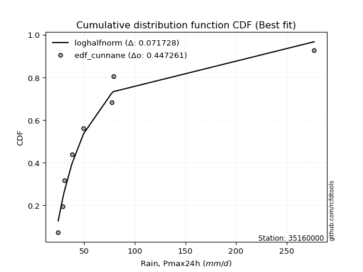</img></img>

</div>


### 12. EDF Adamowski (1981)

The Adamowski formula in hydrology refers to a specific plotting position formula used for estimating the non-parametric empirical distribution of hydrological events (like flood peaks) to calculate their return periods. This formula provides an alternative to traditional parametric methods (like the Gumbel or Log Pearson Type III distributions). 

<div align="center">


$P=(m-0.25)/(n+0.5)$


</div>


**12.1. Empirical values**

<div align="center">

|                | 0                   | 1                   | 2                  | 3                  | 4                  | 5                  | 6                  | 7                  |
|:---------------|:--------------------|:--------------------|:-------------------|:-------------------|:-------------------|:-------------------|:-------------------|:-------------------|
| date           | 2021                | 2023                | 2018               | 2017               | 2020               | 2024               | 2019               | 2022               |
| x              | 24.52               | 29.1                | 30.6               | 38.01              | 49.59              | 77.2               | 78.93              | 277.01             |
| m              | 1                   | 2                   | 3                  | 4                  | 5                  | 6                  | 7                  | 8                  |
| empirical_dist | edf_adamowski       | edf_adamowski       | edf_adamowski      | edf_adamowski      | edf_adamowski      | edf_adamowski      | edf_adamowski      | edf_adamowski      |
| empirical      | 0.08823529411764706 | 0.20588235294117646 | 0.3235294117647059 | 0.4411764705882353 | 0.5588235294117647 | 0.6764705882352942 | 0.7941176470588235 | 0.9117647058823529 |
| empirical_tr   | 1.096774193548387   | 1.259259259259259   | 1.4782608695652173 | 1.7894736842105263 | 2.2666666666666666 | 3.0909090909090913 | 4.857142857142856  | 11.33333333333333  |

</div>


**12.2. Kolmogorov-Smirnov fit test (sorted by Δ)**


<div align="center">

|                | 0                   | 1                   | 2                   | 3                   | 4                   | 5                   | 6                   | 7                   | 8                   | 9                  | 10                  | 11                 | 12                  | 13                  | 14                  | 15                  | 16                  | 17                  | 18                 | 19                  | 20                  | 21                  | 22                  | 23                  | 24                  | 25                 | 26                  | 27                 | 28                  | 29                  | 30                  | 31                 | 32                  | 33                  | 34                    | 35                  | 36                  | 37                  | 38                 | 39                  | 40                  | 41                  | 42                  | 43                 | 44                  | 45                  | 46                  | 47                  | 48                  | 49                  | 50                 | 51                  | 52                  | 53                  | 54                  | 55                  | 56                  | 57                  | 58                  | 59                 | 60                 | 61                  | 62                  | 63                  | 64                  | 65                 | 66                  | 67                  | 68                  | 69                 | 70                  | 71                 | 72                 | 73                  | 74                  | 75                  | 76                  | 77                  | 78                  | 79                 | 80                 | 81                 | 82                 | 83                  | 84                  | 85                  | 86                 | 87                 |
|:---------------|:--------------------|:--------------------|:--------------------|:--------------------|:--------------------|:--------------------|:--------------------|:--------------------|:--------------------|:-------------------|:--------------------|:-------------------|:--------------------|:--------------------|:--------------------|:--------------------|:--------------------|:--------------------|:-------------------|:--------------------|:--------------------|:--------------------|:--------------------|:--------------------|:--------------------|:-------------------|:--------------------|:-------------------|:--------------------|:--------------------|:--------------------|:-------------------|:--------------------|:--------------------|:----------------------|:--------------------|:--------------------|:--------------------|:-------------------|:--------------------|:--------------------|:--------------------|:--------------------|:-------------------|:--------------------|:--------------------|:--------------------|:--------------------|:--------------------|:--------------------|:-------------------|:--------------------|:--------------------|:--------------------|:--------------------|:--------------------|:--------------------|:--------------------|:--------------------|:-------------------|:-------------------|:--------------------|:--------------------|:--------------------|:--------------------|:-------------------|:--------------------|:--------------------|:--------------------|:-------------------|:--------------------|:-------------------|:-------------------|:--------------------|:--------------------|:--------------------|:--------------------|:--------------------|:--------------------|:-------------------|:-------------------|:-------------------|:-------------------|:--------------------|:--------------------|:--------------------|:-------------------|:-------------------|
| station        | 35160000            | 35160000            | 35160000            | 35160000            | 35160000            | 35160000            | 35160000            | 35160000            | 35160000            | 35160000           | 35160000            | 35160000           | 35160000            | 35160000            | 35160000            | 35160000            | 35160000            | 35160000            | 35160000           | 35160000            | 35160000            | 35160000            | 35160000            | 35160000            | 35160000            | 35160000           | 35160000            | 35160000           | 35160000            | 35160000            | 35160000            | 35160000           | 35160000            | 35160000            | 35160000              | 35160000            | 35160000            | 35160000            | 35160000           | 35160000            | 35160000            | 35160000            | 35160000            | 35160000           | 35160000            | 35160000            | 35160000            | 35160000            | 35160000            | 35160000            | 35160000           | 35160000            | 35160000            | 35160000            | 35160000            | 35160000            | 35160000            | 35160000            | 35160000            | 35160000           | 35160000           | 35160000            | 35160000            | 35160000            | 35160000            | 35160000           | 35160000            | 35160000            | 35160000            | 35160000           | 35160000            | 35160000           | 35160000           | 35160000            | 35160000            | 35160000            | 35160000            | 35160000            | 35160000            | 35160000           | 35160000           | 35160000           | 35160000           | 35160000            | 35160000            | 35160000            | 35160000           | 35160000           |
| empirical_dist | edf_adamowski       | edf_adamowski       | edf_adamowski       | edf_adamowski       | edf_adamowski       | edf_adamowski       | edf_adamowski       | edf_adamowski       | edf_adamowski       | edf_adamowski      | edf_adamowski       | edf_adamowski      | edf_adamowski       | edf_adamowski       | edf_adamowski       | edf_adamowski       | edf_adamowski       | edf_adamowski       | edf_adamowski      | edf_adamowski       | edf_adamowski       | edf_adamowski       | edf_adamowski       | edf_adamowski       | edf_adamowski       | edf_adamowski      | edf_adamowski       | edf_adamowski      | edf_adamowski       | edf_adamowski       | edf_adamowski       | edf_adamowski      | edf_adamowski       | edf_adamowski       | edf_adamowski         | edf_adamowski       | edf_adamowski       | edf_adamowski       | edf_adamowski      | edf_adamowski       | edf_adamowski       | edf_adamowski       | edf_adamowski       | edf_adamowski      | edf_adamowski       | edf_adamowski       | edf_adamowski       | edf_adamowski       | edf_adamowski       | edf_adamowski       | edf_adamowski      | edf_adamowski       | edf_adamowski       | edf_adamowski       | edf_adamowski       | edf_adamowski       | edf_adamowski       | edf_adamowski       | edf_adamowski       | edf_adamowski      | edf_adamowski      | edf_adamowski       | edf_adamowski       | edf_adamowski       | edf_adamowski       | edf_adamowski      | edf_adamowski       | edf_adamowski       | edf_adamowski       | edf_adamowski      | edf_adamowski       | edf_adamowski      | edf_adamowski      | edf_adamowski       | edf_adamowski       | edf_adamowski       | edf_adamowski       | edf_adamowski       | edf_adamowski       | edf_adamowski      | edf_adamowski      | edf_adamowski      | edf_adamowski      | edf_adamowski       | edf_adamowski       | edf_adamowski       | edf_adamowski      | edf_adamowski      |
| p_dist         | loghalfnorm         | fatiguelife         | loghalflogistic     | lograyleigh         | logpearson3         | logfisk             | loggenexpon         | invweibull          | chi2                | logmaxwell         | loggompertz         | logexpon           | weibull_min         | invgauss            | logexponnorm        | logchi2             | loggumbel_r         | invgamma            | betaprime          | f                   | logfatiguelife      | logjohnsonsu        | logmoyal            | loginvgauss         | logt                | ncf                | logncf              | loginvgamma        | logf                | logmielke           | loginvweibull       | logbetaprime       | lognct              | logalpha            | loglaplace_asymmetric | logloggamma         | alpha               | nct                 | logtruncnorm       | loggenlogistic      | lognorm             | lognorm             | logcrystalball      | logkstwobign       | wald                | gibrat              | lognakagami         | loglogistic         | logrice             | loghypsecant        | gamma              | genlogistic         | erlang              | loggumbel_l         | logweibull_min      | loglaplace          | fisk                | moyal               | gumbel_r            | pearson3           | exponnorm          | genexpon            | laplace_asymmetric  | expon               | t                   | halflogistic       | gompertz            | logwald             | halfnorm            | logerlang          | rayleigh            | kstwobign          | maxwell            | laplace             | nakagami            | hypsecant           | logistic            | truncnorm           | crystalball         | norm               | rice               | loggamma           | loggamma           | johnsonsu           | loggibrat           | gumbel_l            | loglognorm         | mielke             |
| delta          | 0.06096772369647818 | 0.07475617713883259 | 0.07919021982116209 | 0.07941537657614417 | 0.08455211952784766 | 0.08560279832649953 | 0.08823529389495226 | 0.08974339904320505 | 0.09053999944573543 | 0.0909748918548185 | 0.09136107558894671 | 0.0917504433076326 | 0.09365419350880144 | 0.09379748380892683 | 0.09482433839477611 | 0.09691938891601853 | 0.09721998146835617 | 0.09883105291661021 | 0.0988336642115707 | 0.09886817466390063 | 0.10293992393162399 | 0.10313604925823161 | 0.10511959920754993 | 0.10763318089855989 | 0.10860358693349936 | 0.1101606689156494 | 0.11033206315527008 | 0.1106056701252558 | 0.11060582931867557 | 0.11083407796304934 | 0.11106029822059849 | 0.1125986255736523 | 0.11275714658531477 | 0.11360691196521666 | 0.11365260731106291   | 0.11562473624929465 | 0.11605524143519297 | 0.11611666320329708 | 0.1175732109323141 | 0.11988734771107865 | 0.12075826385022653 | 0.12075826385022653 | 0.12075860654408288 | 0.129879651557412  | 0.13097588021014783 | 0.13633024268085708 | 0.13647187689987772 | 0.14094402536414513 | 0.14704830062581684 | 0.15599166794576158 | 0.1635231946146123 | 0.16382473981217016 | 0.16480929215828533 | 0.17561785014566472 | 0.18007497271270378 | 0.18269202807622387 | 0.18488042381938796 | 0.18726429658804356 | 0.20666005959550893 | 0.2072092645596902 | 0.2105013743927983 | 0.21135257489720558 | 0.21135260680970352 | 0.21135284920096453 | 0.21273790634903245 | 0.2150203200464001 | 0.21602543446531872 | 0.21987754011451127 | 0.22713025843522283 | 0.2278472740039298 | 0.23439889693451255 | 0.2408881410878535 | 0.2450265052119186 | 0.26522124458213925 | 0.26634269680233924 | 0.27308590637360763 | 0.27503934171212807 | 0.27720803649865333 | 0.27732947304260336 | 0.2773294805907037 | 0.2923543836205007 | 0.3127964121596582 | 0.3127964121596582 | 0.32043628319934686 | 0.32352837544724944 | 0.34700300176275056 | 0.3985336010969544 | nan                |
| deltao         | 0.4472608134160001  | 0.4472608134160001  | 0.4472608134160001  | 0.4472608134160001  | 0.4472608134160001  | 0.4472608134160001  | 0.4472608134160001  | 0.4472608134160001  | 0.4472608134160001  | 0.4472608134160001 | 0.4472608134160001  | 0.4472608134160001 | 0.4472608134160001  | 0.4472608134160001  | 0.4472608134160001  | 0.4472608134160001  | 0.4472608134160001  | 0.4472608134160001  | 0.4472608134160001 | 0.4472608134160001  | 0.4472608134160001  | 0.4472608134160001  | 0.4472608134160001  | 0.4472608134160001  | 0.4472608134160001  | 0.4472608134160001 | 0.4472608134160001  | 0.4472608134160001 | 0.4472608134160001  | 0.4472608134160001  | 0.4472608134160001  | 0.4472608134160001 | 0.4472608134160001  | 0.4472608134160001  | 0.4472608134160001    | 0.4472608134160001  | 0.4472608134160001  | 0.4472608134160001  | 0.4472608134160001 | 0.4472608134160001  | 0.4472608134160001  | 0.4472608134160001  | 0.4472608134160001  | 0.4472608134160001 | 0.4472608134160001  | 0.4472608134160001  | 0.4472608134160001  | 0.4472608134160001  | 0.4472608134160001  | 0.4472608134160001  | 0.4472608134160001 | 0.4472608134160001  | 0.4472608134160001  | 0.4472608134160001  | 0.4472608134160001  | 0.4472608134160001  | 0.4472608134160001  | 0.4472608134160001  | 0.4472608134160001  | 0.4472608134160001 | 0.4472608134160001 | 0.4472608134160001  | 0.4472608134160001  | 0.4472608134160001  | 0.4472608134160001  | 0.4472608134160001 | 0.4472608134160001  | 0.4472608134160001  | 0.4472608134160001  | 0.4472608134160001 | 0.4472608134160001  | 0.4472608134160001 | 0.4472608134160001 | 0.4472608134160001  | 0.4472608134160001  | 0.4472608134160001  | 0.4472608134160001  | 0.4472608134160001  | 0.4472608134160001  | 0.4472608134160001 | 0.4472608134160001 | 0.4472608134160001 | 0.4472608134160001 | 0.4472608134160001  | 0.4472608134160001  | 0.4472608134160001  | 0.4472608134160001 | 0.4472608134160001 |
| eval           | Δo > Δ              | Δo > Δ              | Δo > Δ              | Δo > Δ              | Δo > Δ              | Δo > Δ              | Δo > Δ              | Δo > Δ              | Δo > Δ              | Δo > Δ             | Δo > Δ              | Δo > Δ             | Δo > Δ              | Δo > Δ              | Δo > Δ              | Δo > Δ              | Δo > Δ              | Δo > Δ              | Δo > Δ             | Δo > Δ              | Δo > Δ              | Δo > Δ              | Δo > Δ              | Δo > Δ              | Δo > Δ              | Δo > Δ             | Δo > Δ              | Δo > Δ             | Δo > Δ              | Δo > Δ              | Δo > Δ              | Δo > Δ             | Δo > Δ              | Δo > Δ              | Δo > Δ                | Δo > Δ              | Δo > Δ              | Δo > Δ              | Δo > Δ             | Δo > Δ              | Δo > Δ              | Δo > Δ              | Δo > Δ              | Δo > Δ             | Δo > Δ              | Δo > Δ              | Δo > Δ              | Δo > Δ              | Δo > Δ              | Δo > Δ              | Δo > Δ             | Δo > Δ              | Δo > Δ              | Δo > Δ              | Δo > Δ              | Δo > Δ              | Δo > Δ              | Δo > Δ              | Δo > Δ              | Δo > Δ             | Δo > Δ             | Δo > Δ              | Δo > Δ              | Δo > Δ              | Δo > Δ              | Δo > Δ             | Δo > Δ              | Δo > Δ              | Δo > Δ              | Δo > Δ             | Δo > Δ              | Δo > Δ             | Δo > Δ             | Δo > Δ              | Δo > Δ              | Δo > Δ              | Δo > Δ              | Δo > Δ              | Δo > Δ              | Δo > Δ             | Δo > Δ             | Δo > Δ             | Δo > Δ             | Δo > Δ              | Δo > Δ              | Δo > Δ              | Δo > Δ             | Δo <= Δ            |
| fit            | 1                   | 1                   | 1                   | 1                   | 1                   | 1                   | 1                   | 1                   | 1                   | 1                  | 1                   | 1                  | 1                   | 1                   | 1                   | 1                   | 1                   | 1                   | 1                  | 1                   | 1                   | 1                   | 1                   | 1                   | 1                   | 1                  | 1                   | 1                  | 1                   | 1                   | 1                   | 1                  | 1                   | 1                   | 1                     | 1                   | 1                   | 1                   | 1                  | 1                   | 1                   | 1                   | 1                   | 1                  | 1                   | 1                   | 1                   | 1                   | 1                   | 1                   | 1                  | 1                   | 1                   | 1                   | 1                   | 1                   | 1                   | 1                   | 1                   | 1                  | 1                  | 1                   | 1                   | 1                   | 1                   | 1                  | 1                   | 1                   | 1                   | 1                  | 1                   | 1                  | 1                  | 1                   | 1                   | 1                   | 1                   | 1                   | 1                   | 1                  | 1                  | 1                  | 1                  | 1                   | 1                   | 1                   | 1                  | 0                  |
| n              | 8                   | 8                   | 8                   | 8                   | 8                   | 8                   | 8                   | 8                   | 8                   | 8                  | 8                   | 8                  | 8                   | 8                   | 8                   | 8                   | 8                   | 8                   | 8                  | 8                   | 8                   | 8                   | 8                   | 8                   | 8                   | 8                  | 8                   | 8                  | 8                   | 8                   | 8                   | 8                  | 8                   | 8                   | 8                     | 8                   | 8                   | 8                   | 8                  | 8                   | 8                   | 8                   | 8                   | 8                  | 8                   | 8                   | 8                   | 8                   | 8                   | 8                   | 8                  | 8                   | 8                   | 8                   | 8                   | 8                   | 8                   | 8                   | 8                   | 8                  | 8                  | 8                   | 8                   | 8                   | 8                   | 8                  | 8                   | 8                   | 8                   | 8                  | 8                   | 8                  | 8                  | 8                   | 8                   | 8                   | 8                   | 8                   | 8                   | 8                  | 8                  | 8                  | 8                  | 8                   | 8                   | 8                   | 8                  | 8                  |
| best_fit       | 1                   | 0                   | 0                   | 0                   | 0                   | 0                   | 0                   | 0                   | 0                   | 0                  | 0                   | 0                  | 0                   | 0                   | 0                   | 0                   | 0                   | 0                   | 0                  | 0                   | 0                   | 0                   | 0                   | 0                   | 0                   | 0                  | 0                   | 0                  | 0                   | 0                   | 0                   | 0                  | 0                   | 0                   | 0                     | 0                   | 0                   | 0                   | 0                  | 0                   | 0                   | 0                   | 0                   | 0                  | 0                   | 0                   | 0                   | 0                   | 0                   | 0                   | 0                  | 0                   | 0                   | 0                   | 0                   | 0                   | 0                   | 0                   | 0                   | 0                  | 0                  | 0                   | 0                   | 0                   | 0                   | 0                  | 0                   | 0                   | 0                   | 0                  | 0                   | 0                  | 0                  | 0                   | 0                   | 0                   | 0                   | 0                   | 0                   | 0                  | 0                  | 0                  | 0                  | 0                   | 0                   | 0                   | 0                  | 0                  |
| best_fit_sort  | 1                   | 2                   | 3                   | 4                   | 5                   | 6                   | 7                   | 8                   | 9                   | 10                 | 11                  | 12                 | 13                  | 14                  | 15                  | 16                  | 17                  | 18                  | 19                 | 20                  | 21                  | 22                  | 23                  | 24                  | 25                  | 26                 | 27                  | 28                 | 29                  | 30                  | 31                  | 32                 | 33                  | 34                  | 35                    | 36                  | 37                  | 38                  | 39                 | 40                  | 41                  | 42                  | 43                  | 44                 | 45                  | 46                  | 47                  | 48                  | 49                  | 50                  | 51                 | 52                  | 53                  | 54                  | 55                  | 56                  | 57                  | 58                  | 59                  | 60                 | 61                 | 62                  | 63                  | 64                  | 65                  | 66                 | 67                  | 68                  | 69                  | 70                 | 71                  | 72                 | 73                 | 74                  | 75                  | 76                  | 77                  | 78                  | 79                  | 80                 | 81                 | 82                 | 83                 | 84                  | 85                  | 86                  | 87                 | 88                 |

</div>


**12.3. Best fit**

<div align="center">

|   id |   station | empirical_dist   | p_dist      |     delta |   deltao | eval   |   fit |   n |   best_fit |   best_fit_sort |
|-----:|----------:|:-----------------|:------------|----------:|---------:|:-------|------:|----:|-----------:|----------------:|
|    0 |  35160000 | edf_adamowski    | loghalfnorm | 0.0609677 | 0.447261 | Δo > Δ |     1 |   8 |          1 |               1 |

</div>


<div align="center">

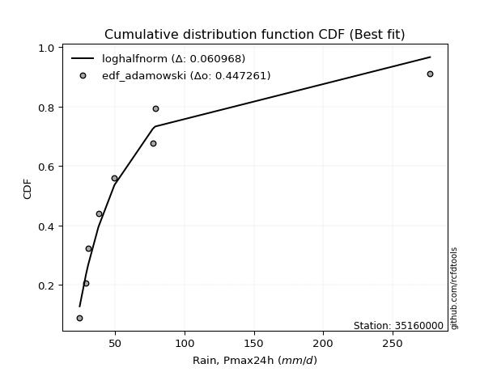</img>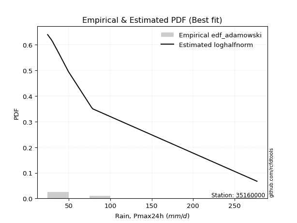</img>

</div>


## C. Best fit & Estimate extreme values for specific return periods - Tr

Best fit in probability distribution analysis means finding the theoretical distribution (like Normal, Poisson, Exponential) that most accurately mirrors your real-world data´s patterns (shape, center, spread) for better predictions, using methods like visual checks (Q-Q plots), goodness-of-fit tests (Kolmogorov-Smirnov, Chi-Squared), and information criteria (AIC) to score and select the simplest, most representative model.


### 1. Best fit (ordered by delta Δ)

<div align="center">

|   id |   station | empirical_dist   | p_dist          |     delta |   deltao | eval   |   fit |   n |   best_fit |   best_fit_sort |
|-----:|----------:|:-----------------|:----------------|----------:|---------:|:-------|------:|----:|-----------:|----------------:|
|    0 |  35160000 | edf_adamowski    | loghalfnorm     | 0.0609677 | 0.447261 | Δo > Δ |     1 |   8 |          1 |               1 |
|    1 |  35160000 | edf_chegodayev   | loghalfnorm     | 0.0644691 | 0.447261 | Δo > Δ |     1 |   8 |          1 |               2 |
|    2 |  35160000 | edf_jenkinson    | loghalfnorm     | 0.0651794 | 0.447261 | Δo > Δ |     1 |   8 |          1 |               3 |
|    3 |  35160000 | edf_beard        | loghalfnorm     | 0.0651794 | 0.447261 | Δo > Δ |     1 |   8 |          1 |               4 |
|    4 |  35160000 | edf_filliben     | loghalfnorm     | 0.0657144 | 0.447261 | Δo > Δ |     1 |   8 |          1 |               5 |
|    5 |  35160000 | edf_tukey        | loghalfnorm     | 0.0668501 | 0.447261 | Δo > Δ |     1 |   8 |          1 |               6 |
|    6 |  35160000 | edf_hazen        | loghalflogistic | 0.0681608 | 0.447261 | Δo > Δ |     1 |   8 |          1 |               7 |
|    7 |  35160000 | edf_blom         | loghalfnorm     | 0.0698804 | 0.447261 | Δo > Δ |     1 |   8 |          1 |               8 |
|    8 |  35160000 | edf_gringorten   | loghalflogistic | 0.0709317 | 0.447261 | Δo > Δ |     1 |   8 |          1 |               9 |
|    9 |  35160000 | edf_cunnane      | loghalfnorm     | 0.0717281 | 0.447261 | Δo > Δ |     1 |   8 |          1 |              10 |
|   10 |  35160000 | edf_weibull      | loghalfnorm     | 0.0779733 | 0.447261 | Δo > Δ |     1 |   8 |          1 |              11 |
|   11 |  35160000 | edf_california   | logfatiguelife  | 0.0912476 | 0.447261 | Δo > Δ |     1 |   8 |          1 |              12 |

</div>

:file_folder:Tables: [bestfit_35160000.csv](table/bestfit_35160000.csv) | [extreme_35160000.csv](table/extreme_35160000.csv)


### 2. Extreme values

In hydrology, a return period (or recurrence interval $Tr$) is the statistical average time between extreme events like floods or droughts of a specific magnitude, indicating how rare an event is, with a 100-year flood, for example, having a 1% chance of occurring in any given year, not that it happens exactly every century. It is a key tool for infrastructure design (like bridges or dams) and risk assessment, calculated from historical data to determine the probability of future events, although it is important to remember it is statistical average, and events can cluster or be missed.

> risk_rate: assuming the return period as the project useful life.

|   id |      tr |   prob_l |     prob_g |      alpha |   betaprime |     chi2 |   crystalball |   erlang |    expon |   exponnorm |          f |   fatiguelife |             fisk |    gamma |   genexpon |   genlogistic |   gibrat |   gompertz |   gumbel_l |   gumbel_r |   halflogistic |   halfnorm |   hypsecant |   invgamma |   invgauss |   invweibull |   johnsonsu |   kstwobign |   laplace |   laplace_asymmetric |   loggamma |   logistic |   lognorm |   maxwell |    mielke |    moyal |   nakagami |      ncf |       nct |     norm |   pearson3 |   rayleigh |     rice |         t |   truncnorm |     wald |   weibull_min |        logalpha |    logbetaprime |     logchi2 |   logcrystalball |   logerlang |   logexpon |   logexponnorm |             logf |   logfatiguelife |          logfisk |   loggenexpon |   loggenlogistic |   loggibrat |   loggompertz |   loggumbel_l |   loggumbel_r |   loghalflogistic |   loghalfnorm |   loghypsecant |      loginvgamma |   loginvgauss |    loginvweibull |     logjohnsonsu |   logkstwobign |   loglaplace |   loglaplace_asymmetric |   logloggamma |   loglogistic |    loglognorm |   logmaxwell |        logmielke |   logmoyal |   lognakagami |    logncf |           lognct |   logpearson3 |   lograyleigh |   logrice |      logt |   logtruncnorm |    logwald |   logweibull_min |   station |   n |   risk_rate |
|-----:|--------:|---------:|-----------:|-----------:|------------:|---------:|--------------:|---------:|---------:|------------:|-----------:|--------------:|-----------------:|---------:|-----------:|--------------:|---------:|-----------:|-----------:|-----------:|---------------:|-----------:|------------:|-----------:|-----------:|-------------:|------------:|------------:|----------:|---------------------:|-----------:|-----------:|----------:|----------:|----------:|---------:|-----------:|---------:|----------:|---------:|-----------:|-----------:|---------:|----------:|------------:|---------:|--------------:|----------------:|----------------:|------------:|-----------------:|------------:|-----------:|---------------:|-----------------:|-----------------:|-----------------:|--------------:|-----------------:|------------:|--------------:|--------------:|--------------:|------------------:|--------------:|---------------:|-----------------:|--------------:|-----------------:|-----------------:|---------------:|-------------:|------------------------:|--------------:|--------------:|--------------:|-------------:|-----------------:|-----------:|--------------:|----------:|-----------------:|--------------:|--------------:|----------:|----------:|---------------:|-----------:|-----------------:|----------:|----:|------------:|
|    0 |    2    | 0.5      | 0.5        |    40.2799 |     40.2014 |  46.8362 |       75.62   |  38.007  |  59.9398 |     59.9093 |    40.0582 |       40.5212 |     48.1499      |  37.9009 |    59.9397 |       60.7135 |  52.0168 |    61.1763 |    88.5382 |    62.7018 |        56.2795 |    59.5238 |     75.62   |    40.202  |    40.1184 |      40.0931 |     28.0934 |     71.235  |   75.62   |              59.9397 |    28.6753 |    75.62   |   53.7307 |   68.8948 |   42.2797 |  58.5314 |    71.4393 |  50.6432 |   47.4747 |  75.62   |    51.5095 |    66.5095 |  78.6459 |   35.6407 |     76.0018 |  50.1303 |       45.8286 |    41.9789      |    40.9289      |     39.8939 |          53.7308 |     31.0639 |    42.2355 |        42.0131 |     40.9654      |          39.4103 |     40.2297      |       42.9553 |          46.8296 |     43.0042 |       43.3951 |       60.6957 |       47.565  |           44.7683 |       46.1599 |        53.7307 |     40.9652      |       40.2071 |     40.8708      |     40.1716      |        48.7725 |      53.7307 |                 43.1516 |       53.7703 |       53.7307 |  24.7171      |      50.4272 |     40.9401      |    45.7296 |       49.0406 |   49.6337 |     41.104       |       47.0446 |       49.3049 |   52.7615 |   46.7511 |        41.9386 |    42.2444 |          34.4782 |  35160000 |   8 |    0.75     |
|    1 |    2.33 | 0.570815 | 0.429185   |    44.7616 |     45.0995 |  55.3848 |       89.6522 |  42.5505 |  67.7439 |     67.7183 |    44.9542 |       47.784  |     64.8897      |  42.4686 |    67.7392 |       68.7719 |  59.125  |    69.2528 |   100.746  |    75.7042 |        69.648  |    74.6682 |     86.8499 |    45.1001 |    45.3786 |      45.2171 |     31.5089 |     81.5762 |   84.1116 |              67.7438 |    30.4897 |    87.9833 |   61.3371 |   83.4732 |   46.6699 |  70.8398 |    92.0657 |  57.2902 |   53.2381 |  89.6522 |    63.5234 |    81.3037 |  90.3322 |   38.6851 |     87.0232 |  59.3314 |       52.042  |    46.4715      |    45.419       |     47.4013 |          61.3371 |     33.925  |    47.6113 |        47.3126 |     45.5036      |          44.2743 |     45.1539      |       48.4645 |          52.1997 |     45.9871 |       48.9979 |       68.1058 |       53.7734 |           50.7868 |       53.2503 |        59.7365 |     45.5033      |       44.9053 |     45.3476      |     44.9063      |        54.7992 |      58.2129 |                 48.3971 |       61.6381 |       60.3788 |  26.1166      |      57.8633 |     45.4287      |    51.3611 |       59.5382 |   56.0172 |     45.584       |       53.5144 |       56.6908 |   59.5572 |   52.1474 |        46.8938 |    46.0758 |          37.729  |  35160000 |   8 |    0.729209 |
|    2 |    5    | 0.8      | 0.2        |    79.5136 |     85.7216 | 107.049  |      141.799  |  68.6041 | 106.762  |    106.761  |    85.7767 |      102.052  |    343.772       |  68.7957 |   106.764  |      103.78   | 100.048  |   109.633  |   140.186  |   132.192  |       130.138  |   138.712  |    131.896  |    85.7224 |    86.8775 |      89.7095 |    109.052  |    125.503  |  126.568  |             106.762  |    44.3409 |   135.72   |  100.325  |  140.853  |   73.5529 | 127.853  |   206.61   |  94.0104 |   87.933  | 141.799  |   123.568  |   140.531  | 137.118  |   55.1121 |    139.441  | 110.839  |       87.424  |    80.1925      |    80.68        |    129.958  |         100.325  |     57.4121 |    86.6682 |        85.6888 |     81.3584      |          84.2553 |     93.7872      |       87.379  |          83.6528 |     67.6582 |       87.9998 |       98.809  |       91.6309 |           89.8716 |       97.4443 |        91.3748 |     81.3586      |       82.3895 |     81.2945      |     84.2818      |        89.8896 |      86.8947 |                 85.8851 |      102.228  |       94.7319 |   1.34945e+60 |      99.433  |     81.3531      |    87.9553 |      147.803  |   92.008  |     80.6135      |       93.4419 |       99.1314 |   96.7344 |   80.0342 |        78.6386 |    74.9104 |          61.4911 |  35160000 |   8 |    0.67232  |
|    3 |   10    | 0.9      | 0.1        |   143.362  |    166.11   | 161.447  |      176.393  |  94.996  | 142.182  |    142.204  |   167.14   |      167.225  |   1488.5         |  95.5677 |   142.18   |      132.291  | 146.697  |   146.29   |   162.144  |   178.201  |       180.372  |   186.102  |    167.866  |   166.11   |   151.814  |     182.652  |    466.288  |    158.948  |  165.108  |             142.182  |    65.9628 |   170.876  |  139.048  |  181.234  |  109.125  | 177.493  |   306.103  | 135.571  |  132.853  | 176.393  |   178.059  |   182.761  | 170.477  |   82.6287 |    181.345  | 165.501  |      124.187  |   150.751       |   154.473       |    366.537  |         139.048  |     99.4248 |   149.285  |       146.92   |    157.208       |         161.19   |    260.624       |      146.524  |         122.825  |    105.066  |      145.506  |      121.556  |      141.441  |          144.368  |      152.388  |       128.299  |    157.212       |      154.839  |    161.434       |    170.083       |       131.025  |     125.004  |                144.558  |      142.803  |      131.995  | inf           |     145.546  |    161.008       |   140.498  |      302.528  |  133.863  |    154.682       |      145.309  |      147.659  |  136.702  |  111.566  |       117.045  |   125.469  |          99.6263 |  35160000 |   8 |    0.651322 |
|    4 |   15    | 0.933333 | 0.0666667  |   206.982  |    250.11   | 195.194  |      193.655  | 111.131  | 162.901  |    162.936  |   252.591  |      209.207  |   3381.1         | 111.959  |   162.9    |      148.377  | 178.872  |   167.732  |   172.088  |   204.159  |       208.8    |   210.764  |    188.394  |   250.108  |   203.2    |     283.229  |   1032.79   |    176.703  |  187.653  |             162.901  |    84.449  |   190.031  |  163.645  |  201.953  |  137.269  | 206.301  |   359.784  | 164.872  |  167.873  | 193.655  |   209.93   |   204.52   | 187.665  |  111.27   |    202.365  | 200.602  |      147.284  |   242.308       |   244.102       |    693.395  |         163.645  |    139.626  |   205.191  |       201.397  |    250.255       |         240.156  |    607.291       |      196.845  |         152.543  |    142.332  |      193.033  |      133.513  |      180.693  |          188.782  |      192.314  |       155.719  |    250.268       |      231.212  |    266.147       |    274.316       |       160.041  |     154.634  |                196.027  |      168.656  |      158.142  | inf           |     176.971  |    264.55        |   184.383  |      441.587  |  163.925  |    246.447       |      185.221  |      181.311  |  163.367  |  135.091  |       142.196  |   174.733  |         133.831  |  35160000 |   8 |    0.644736 |
|    5 |   20    | 0.95     | 0.05       |   270.546  |    336.583  | 219.76   |      204.96   | 122.804  | 177.602  |    177.646  |   340.846  |      240.174  |   5980.71        | 123.825  |   177.603  |      159.64   | 204.112  |   182.946  |   178.278  |   222.334  |       228.718  |   227.207  |    202.876  |   336.578  |   245.651  |     389.043  |   1755.42   |    188.663  |  203.649  |             177.602  |   101.109  |   203.27   |  182.065  |  215.703  |  161.565  | 226.704  |   395.916  | 188.372  |  197.826  | 204.96   |   232.542  |   218.983  | 199.089  |  141.104  |    215.443  | 226.759  |      164.29   |   363.424       |   352.258       |   1100.94   |         182.065  |    178.719  |   257.142  |       251.906  |    363.43        |         320.77   |   1289.25        |      241.998  |         177.535  |    180.601  |      234.762  |      141.543  |      214.496  |          227.813  |      224.588  |       178.519  |    363.458       |      311.255  |    401.045       |    398.008       |       183.127  |     179.826  |                243.314  |      188.047  |      179.184  | inf           |     201.487  |    397.363       |   223.524  |      568.792  |  188.316  |    359.453       |      218.925  |      207.82   |  183.908  |  155.06   |       160.252  |   223.647  |         165.82   |  35160000 |   8 |    0.641514 |
|    6 |   25    | 0.96     | 0.04       |   334.088  |    424.949  | 239.111  |      213.282  | 131.965  | 189.005  |    189.056  |   431.252  |      264.737  |   9261           | 133.141  |   189.004  |      168.316  | 225.153  |   194.747  |   182.683  |   236.333  |       244.063  |   239.441  |    214.083  |   424.941  |   281.904  |     498.901  |   2601.08   |    197.622  |  216.056  |             189.004  |   116.527  |   213.398  |  196.937  |  225.911  |  183.374  | 242.518  |   422.904  | 208.349  |  224.533  | 213.282  |   250.08   |   229.728  | 207.577  |  171.941  |    224.48   | 247.711  |      177.808  |   523.543       |   481.086       |   1583.3    |         196.937  |    217.044  |   306.336  |       299.654  |    499.155       |         402.787  |   2574.33        |      283.581  |         199.544  |    220.26   |      272.526  |      147.55   |      244.785  |          263.306  |      252.068  |       198.431  |    499.205       |      394.641  |    571.683       |    541.949       |       202.577  |     202.159  |                287.715  |      203.716  |      197.152  | inf           |     221.86   |    564.713       |   259.494  |      686.882  |  209.229  |    496.752       |      248.643  |      229.995  |  200.825  |  172.93   |       173.933  |   272.532  |         196.312  |  35160000 |   8 |    0.639603 |
|    7 |   50    | 0.98     | 0.02       |   651.697  |    885.984  | 300.551  |      237.113  | 160.903  | 224.424  |    224.498  |   905.198  |      343.403  |  35315.2         | 162.584  |   224.432  |      195.041  | 299.323  |   231.403  |   194.64   |   279.459  |       291.345  |   275      |    248.832  |   885.952  |   411.873  |    1089.92   |   8074.22   |    223.93   |  254.596  |             224.424  |   182.935  |   244.341  |  246.593  |  255.517  |  272.185  | 291.611  |   501.576  | 281.819  |  331.899  | 237.113  |   304.556  |   260.92   | 232.217  |  336.991  |    246.435  | 316.117  |      221.465  |  2441.13        |  1512.56        |   5000.69   |         246.593  |    401.929  |   527.662  |       513.779  |   1605.19        |         829.022  |  48890.9         |      460.184  |         286.012  |    443.452  |      427.139  |      165.171  |      367.709  |          411.348  |      352.557  |       275.422  |   1605.52        |      853.542  |   2196.99        |   1593.89        |       272.466  |     290.819  |                484.269  |      256.104  |      263.998  | inf           |     293.357  |   2141.26        |   412.382  |     1189.34   |  287.396  |   1664.68        |      365.258  |      308.699  |  259.271  |  246.937  |       211.747  |   519.68   |         335.943  |  35160000 |   8 |    0.63583  |
|    8 |   75    | 0.986667 | 0.0133333  |   969.262  |   1368.19   | 337.244  |      249.9    | 178.104  | 245.144  |    245.23   |  1403.41   |      390.717  |  76564.8         | 180.093  |   245.14   |      210.574  | 349.417  |   252.846  |   200.686  |   304.526  |       318.83   |   294.357  |    269.138  |  1368.13   |   499.015  |    1727.92   |  14857.9    |    238.404  |  277.141  |             245.143  |   239.537  |   262.213  |  278.213  |  271.614  |  343.337  | 320.32   |   544.423  | 334.281  |  416.688  | 249.9    |   336.421  |   277.89   | 245.621  |  514.543  |    255.366  | 358.212  |      248.074  |  9218.2         |  3425.14        |   9918.8    |         278.213  |    580.496  |   725.268  |       704.287  |   3699.35        |        1275.22   | 583606           |      607.458  |         352.581  |    711.393  |      550.453  |      174.868  |      465.821  |          533.133  |      423.204  |       333.588  |   3700.43        |     1369.23   |   5957.55        |   3280.46        |       320.726  |     359.753  |                656.691  |      289.504  |      312.489  | inf           |     341.471  |   5740.21        |   540.682  |     1603.66   |  344.28   |   4015.49        |      454.583  |      362.304  |  297.926  |  309.056  |       229.179  |   773.091  |         463.765  |  35160000 |   8 |    0.634587 |
|    9 |  100    | 0.99     | 0.01       |  1286.82   |   1864.7    | 363.551  |      258.548  | 190.407  | 259.844  |    259.94   |  1918.06   |      424.745  | 132238           | 192.62   |   259.847  |      221.568  | 388.224  |   268.059  |   204.641  |   322.267  |       338.283  |   307.543  |    283.542  |  1864.6    |   565.296  |    2398.35   |  22452.4    |    248.321  |  293.137  |             259.844  |   290.632  |   274.831  |  301.868  |  282.577  |  405.04   | 340.688  |   573.588  | 376.549  |  489.541  | 258.548  |   359.029  |   289.451  | 254.754  |  700.804  |    260.245  | 388.903  |      267.394  | 31734.9         |  6615.1         |  16195.6    |         301.868  |    755.443  |   908.892  |       880.914  |   7251.95        |        1736.25   |      5.38054e+06 |      738.016  |         408.861  |   1025.93   |      656.419  |      181.517  |      550.703  |          640.545  |      479.275  |       382.152  |   7254.65        |     1931.05   |  13569           |   5720.39        |       358.64   |     418.361  |                815.101  |      314.505  |      351.998  | inf           |     378.687  |  12940.5         |   655.245  |     1965.65   |  390.688  |   8238.34        |      529.71   |      404.061  |  327.511  |  365.605  |       239.246  |  1032.75   |         584.919  |  35160000 |   8 |    0.633968 |
|   10 |  200    | 0.995    | 0.005      |  2557      |   3942.41   | 427.709  |      278.166  | 220.331  | 295.264  |    295.382  |  4082.67   |      507.997  | 490618           | 223.098  |   295.263  |      247.998  | 493.801  |   304.716  |   213.237  |   364.918  |       385.051  |   337.703  |    318.244  |  3942.14   |   738.469  |    5293.68   |  57311.7    |    271.162  |  331.677  |             295.263  |   465.835  |   305.1    |  363.249  |  307.661  |  604.09   | 389.761  |   640.163  | 498.892  |  721.329  | 278.166  |   413.499  |   315.904  | 275.65   | 1503.34   |    268.182  | 465.35   |      315.343  |     3.0844e+06  | 44396.7         |  53441      |         363.249  |   1435.64   |  1565.56   |      1510.4    |  50974.7         |        3684.26   |      9.96255e+09 |     1171      |         583.714  |   2777.93   |      990.739  |      196.853  |      823.553  |          995.848  |      637.045  |       530.194  |  51006.9         |     4537      | 160012           |  25673           |       463.898  |     601.839  |               1371.94   |      379.419  |      468.351  | inf           |     479.807  | 147473           |  1041.1    |     3129.6    |  527.603  |  68670.8         |      760.749  |      518.614  |  406.732  |  567.96   |       256.492  |  2124.53   |        1033.92   |  35160000 |   8 |    0.633042 |
|   11 |  250    | 0.996    | 0.004      |  3192.09   |   5019.6    | 448.563  |      284.161  | 230.037  | 306.667  |    306.792  |  5209.45   |      535.121  | 747399           | 232.986  |   306.664  |      256.495  | 531.682  |   316.516  |   215.766  |   378.63   |       400.087  |   346.981  |    329.415  |  5019.23   |   797.855  |    6832.64   |  76323.2    |    278.231  |  344.085  |             306.666  |   543.069  |   314.817  |  384.389  |  315.382  |  687.324  | 405.558  |   660.601  | 545.44   |  817.104  | 284.161  |   431.034  |   324.047  | 282.082  | 1929.2    |    269.87   | 490.641  |      331.176  |     2.75827e+07 | 91566.7         |  78739      |         384.389  |   1768.65   |  1865.07   |      1796.69   | 107112           |        4704.67   |      2.6477e+11  |     1355.76   |         654.5    |   3971.37   |     1127.07   |      201.607  |      937.3    |         1147.64   |      695.329  |       589.128  | 107191           |     6015.24   | 421381           |  43844.7         |       502.355  |     676.585  |               1622.3    |      401.784  |      513.324  | inf           |     516.068  | 382734           |  1208.44   |     3610.46   |  580.619  | 156047           |      853.305  |      560.03   |  434.779  |  662.523  |       260.305  |  2697.13   |        1245.67   |  35160000 |   8 |    0.632858 |
|   12 |  500    | 0.998    | 0.002      |  6367.52   |  10640      | 513.859  |      301.939  | 260.377  | 342.086  |    342.234  | 11116.8    |      620.187  |      2.75749e+06 | 263.898  |   342.087  |      282.868  | 662.599  |   353.173  |   223.017  |   421.188  |       446.753  |   374.644  |    364.114  | 10639.1    |   992.089  |   15103.3    | 178511      |    299.415  |  382.625  |             342.086  |   878.044  |   344.954  |  454.592  |  338.423  | 1027.37   | 454.63   |   721.395  | 717.217  | 1203.3    | 301.939  |   485.501  |   348.342  | 301.274  | 4213.51   |    273.36   | 571.058  |      381.505  |     1.16643e+12 |     1.32183e+06 | 264637      |         454.592  |   3397.82   |  3212.56   |      3080.56   |      1.6631e+06  |       10113.9    |      3.2914e+17  |     2124.01   |         933.679  |  13657.6    |     1664.69   |      215.882  |     1400.46   |         1782.51   |      902.709  |       817.331  |      1.66507e+06 |    14726      |      1.69274e+07 | 275495           |       637.771  |     973.31   |               2730.59   |      476.075  |      682.157  | inf           |     641.39   |      1.44735e+07 |  1920.03   |     5526.26   |  780.179  |      3.41536e+06 |     1213.49   |      704.318  |  530.491  | 1117.43   |       268.349  |  5760.18   |        2240.73   |  35160000 |   8 |    0.632489 |
|   13 |  750    | 0.998667 | 0.00133333 |  9542.95   |  16518.7    | 552.37   |      311.815  | 278.239  | 362.806  |    362.967  | 17326.7    |      670.438  |      5.91231e+06 | 282.102  |   362.804  |      298.286  | 749.18   |   374.615  |   226.892  |   446.068  |       474.035  |   390.099  |    384.412  | 16517.1    |  1111.79   |   24025      | 286203      |    311.316  |  405.17   |             362.805  |  1165.79   |   362.561  |  498.99   |  351.31   | 1300.43   | 483.335  |   755.262  | 840.193  | 1508.91   | 311.815  |   517.362  |   361.928  | 312.006  | 6672.93   |    274.559  | 619.274  |      411.708  |     4.13633e+16 |     8.92483e+06 | 540535      |         498.99   |   4993.18   |  4415.65   |      4222.82   |      1.18697e+07 |       15882.8    |      4.66035e+22 |     2750.67   |        1149.2    |  30912.7    |     2076.72   |      223.922  |     1771.02   |         2305.81   |     1044.42   |       989.856  |      1.1888e+07  |    25167.6    |      2.63523e+08 | 920974           |       729.281  |    1204.02   |               3702.8    |      523.063  |      805.441  | inf           |     724.318  |      2.14563e+08 |  2517.29   |     7007.57   |  926.483  |      3.26245e+07 |     1486.92   |      800.646  |  592.922  | 1571.3    |       271.164  |  9078.56   |        3176.53   |  35160000 |   8 |    0.632366 |
|   14 | 1000    | 0.999    | 0.001      | 12718.4    |  22571.7    | 579.816  |      318.615  | 290.958  | 377.506  |    377.677  | 23741.7    |      706.28   |      1.01546e+07 | 295.064  |   377.515  |      309.222  | 815.436  |   389.829  |   229.5    |   463.716  |       493.386  |   400.772  |    398.813  | 22569.3    |  1199.13   |   33397.5    | 396122      |    319.56   |  421.166  |             377.505  |  1426.82   |   375.047  |  532.053  |  360.217  | 1537.45   | 503.701  |   778.611  | 939.379  | 1771.7    | 318.615  |   539.967  |   371.317  | 319.422  | 9253.44   |    275.165  | 653.957  |      433.462  |     1.3858e+21  |     4.16161e+07 | 898996      |         532.053  |   6568.99   |  5533.61   |      5281.86   |      5.79804e+07 |       21908.3    |      1.9464e+27  |     3298.8    |        1331.6    |  57759      |     2422.34   |      229.5    |     2091.89   |         2767.72   |     1155.08   |      1133.93   |      5.80869e+07 |    36993.6    |      2.54549e+09 |      2.30997e+06 |       800.269  |    1400.17   |               4596.01   |      558.056  |      906.148  | inf           |     787.821  |      1.98628e+09 |  3050.63   |     8255.3    | 1046.39   |      2.06507e+08 |     1715.63   |      874.807  |  640.308  | 2036.99   |       272.598  | 12593.4    |        4078.5    |  35160000 |   8 |    0.632305 |

<div align="center">

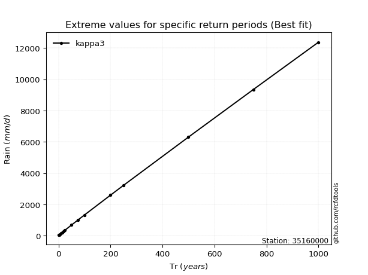</img>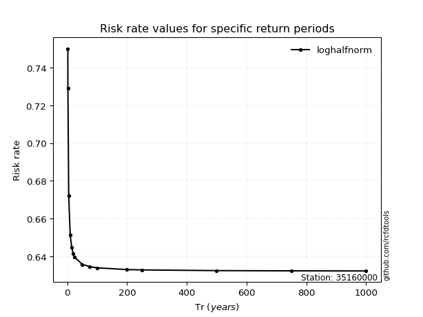</img>

</div>


<sub>**APP DISCLAIMER**: NO WARRANTY - This software is provided by [github.com/rcfdtools](https://github.com/rcfdtools) "as is", without any express or implied warranty, including warranties of merchantability, fitness for a particular purpose, or non-infringement. There is no guarantee that the software will be error-free or operate without interruption. LIMITATION OF LIABILITY - Neither the authors nor copyright holders will be liable for claims or damages arising from the software or its use. You are responsible for determining if the software is appropriate for your use and assume all associated risks, including errors, legal compliance, and data loss. NO PROFESSIONAL ADVICE - The software provides general information and does not offer professional advice. It should not replace consultation with professional advisors.</sub>