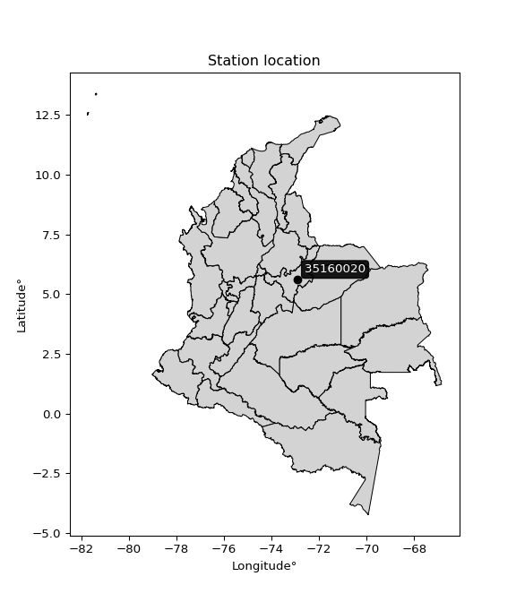

<div align="center">


</div>

# PMP Station (Rain, Pmax24h): 35160020

Probable Maximum Precipitation (PMP) is the greatest amount of rainfall for a specific duration that is meteorologically possible for a given location, acting as a "worst-case" scenario for extreme storms, crucial for designing safety-critical infrastructure like bridges, river deviations, dams, spillways, and nuclear plants to prevent catastrophic failure. PMP is calculated by hydrologists using meteorological data to determine the upper limit of extreme rainfall, often leading to the Probable Maximum Flood (PMF) for flood control design, and is increasingly being studied for climate change impacts. Probable Maximum Precipitation (PMP) is the theoretical upper limit of rainfall, a deterministic estimate for extreme events, while probability distributions (like GEV, Gumbel) describe the likelihood and frequency of various precipitation amounts, including rare ones, showing how often events occur, with PMP representing the extreme end of these distributions, used for critical infrastructure design to ensure safety against the worst conceivable weather, unlike standard statistical forecasts which cover typical probabilities.

The most common probability distributions in hydrology, used for analyzing floods, rainfall, and streamflow, include the Normal, Log-Normal, Gumbel, Gamma (including Log-Pearson Type III), and Generalized Extreme Value (GEV) distributions, often chosen based on the data´s skewness and whether modeling extremes or general conditions, with Gumbel and GEV popular for extreme events like floods, while the Normal distribution serves as a baseline, though often requiring transformations for skewed hydrological data. These distributions help in designing water infrastructure, managing water resources, and forecasting hydrologic events.

> Hydrological data often isn´t perfectly normal (it´s skewed), so different distributions are needed for different applications, such as: **Flood Frequency Analysis**: Using Gumbel, GEV, or Log-Pearson Type III for predicting extreme flood magnitudes and their return periods, **Rainfall Analysis**: Normal for annual totals, but Log-Normal, Weibull, or GEV for intensity or extreme daily rainfall, **Streamflow Modeling**: Gamma and Log-Normal for maximum flows, GEV for minimum flows, and Kappa for daily flows.

<div align="center">

</img>

</div>


## A. General information


### 1. General running parameters

• app_version: _v20260113_. • runtime: _2026-01-17 18:24:04.630693_. • Python version: _3.14.0_. • SciPy version: _1.16.3_. • Pandas version: _2.3.3_. • NumPy version: _2.3.5_. • Stations dataset (station_dataset_file): _dataset/pmax24h_in/automatic_colombia_2003_2025.csv_. • Stations catalog (station_catalog_file): _dataset/CNE.xls_. • Minimum year to eval til year_max (date_min): _1900_. • Maximum year to eval since year_min (date_max): _2025_. • Creates, save and include plots into reports (create_plot): _False_. • Plot only fit distributions with Δo > Δ (plot_only_fit): _True_. • Plot only simple graphs avoiding multiple CDFs and multiple Extreme values plots (plot_only_simple): _True_. • Eval low extreme values, if False, evaluates high extreme values (low_extreme): _False_. • Eval every SciPy distribution as logarithmic (pdist_logarithmic_on): _True_. • Standard deviation normalized (ddof): _1.0_. • Return periods to eval in years (Tr): _[2, 2.33, 5, 10, 15, 20, 25, 50, 75, 100, 200, 250, 500, 750, 1000]_. • Minimum data sample per station, 0 means any (minimum_sample): _5_. • Z-Score maximum threshold to adjust a value, 0 means disable (zscore_max): _3.5_. • Z-Score minimum threshold to adjust a value, 0 means disable (zscore_min): _-2.5_. • Avoid zeros, e.g. rain = 0 (avoid_zeros): _True_. • Avoid null values (avoid_nans): _True_. 

:file_folder:Table: [dataset.csv](../../dataset/pmax24h_in/automatic_colombia_2003_2025.csv)

> Delta Degrees of Freedom (DDOF): is a parameter used in the formulas for calculating variance and standard deviation. When ddof=0, the divisor is $N$ (the total number of observations) and this is used when your data set is the entire population. When ddof=1, the divisor is $N-1$ and this is used when your data set is a sample drawn from a larger population. Using $N-1$ provides an unbiased estimate of the population variance (known as Bessel´s correction).


### 2. Station info and location

|   id |   CODIGO | NOMBRE                   | CATEGORIA     | TECNOLOGIA                | ESTADO   | FECHA_INSTALACION   |   FECHA_SUSPENSION |   ALTITUD |   LATITUD |   LONGITUD | DEPARTAMENTO   | MUNICIPIO   | AREA_OPERATIVA                              | ENTIDAD                                                     | AREA_HIDROGRAFICA   | ZONA_HIDROGRAFICA   | SUBZONA_HIDROGRAFICA   |   CORRIENTE | Catalogo   |   Version |
|-----:|---------:|:-------------------------|:--------------|:--------------------------|:---------|:--------------------|-------------------:|----------:|----------:|-----------:|:---------------|:------------|:--------------------------------------------|:------------------------------------------------------------|:--------------------|:--------------------|:-----------------------|------------:|:-----------|----------:|
|    0 | 35160020 | LLANO ALARCON [35160020] | Pluviométrica | Automática con Telemetría | Activa   | 31/12/2016          |                nan |       339 |   5.59972 |   -72.9135 | Boyacá         | Cuítiva     | Area Operativa 06 - Boyacá-Casanare-Vichada | INSTITUTO DE HIDROLOGIA METEOROLOGIA Y ESTUDIOS AMBIENTALES | Orinoco             | Meta                | Lago de Tota           |         nan | CNE_IDEAM  |  20251226 |

<div align="center">

Dynamic map: [:earth_americas:Google](http://maps.google.com/maps?q=5.599722222,-72.91347222) [:earth_americas:OSM](https://www.openstreetmap.org/#map=18/5.599722222/-72.91347222&layers=P) [:earth_americas:Bing](https://www.bing.com/maps?cp=5.599722222~-72.91347222&lvl=18) [:earth_americas:Apple](https://maps.apple.com/frame?center=5.599722222%2C-72.91347222&span=0.003%2C0.006)

</div>


<div align="center">

```geojson
{
  "type": "Feature",
  "geometry": {
    "type": "Point", 
    "coordinates": [-72.91347222, 5.599722222]
  }, 
  "properties": {
    "Name": "35160020"
  }
}
```

</div>


### 3. Discrete values table and plot

<div align="center">

|               |         0 |          1 |          2 |           3 |            4 |           5 |           6 |          7 |           8 |
|:--------------|----------:|-----------:|-----------:|------------:|-------------:|------------:|------------:|-----------:|------------:|
| Date          | 2017      | 2018       | 2019       | 2020        | 2021         | 2022        | 2023        | 2024       | 2025        |
| Value         |   24      |   24.3     |   38.64    |  293.2      |  221.8       |  275.7      |  296.3      |  466.4     |  271.8      |
| Value_initial |   24      |   24.3     |   38.64    |  293.2      |  221.8       |  275.7      |  296.3      |  466.4     |  271.8      |
| count         |    9      |    9       |    9       |    9        |    9         |    9        |    9        |    9       |    9        |
| mean          |  212.46   |  212.46    |  212.46    |  212.46     |  212.46      |  212.46     |  212.46     |  212.46    |  212.46     |
| std           |  152.797  |  152.797   |  152.797   |  152.797    |  152.797     |  152.797    |  152.797    |  152.797   |  152.797    |
| zscore        |   -1.2334 |   -1.23144 |   -1.13759 |    0.528412 |    0.0611267 |    0.413882 |    0.548701 |    1.66194 |    0.388358 |


</div>


> The initial value (value_initial) correspond to the initial obtained or null completed value, and value (value) is adjusted only when the initial value is outside the valid range (outlier) definite through the Z-Score value. If Z-Score is active, values out of range or outliers are replaced with the station mean value. A Z-Score (or standard score) measures how many standard deviations a data point is from the mean of a dataset, indicating its relative position; positive scores mean above the mean, negative mean below, and a score of zero is exactly at the mean, allowing for comparison of values from different distributions. It´s calculated using the formula $z=(x–μ)/σ$, where $x$ is the data point, $μ$ is the mean, and $σ$ is the standard deviation, helping identify outliers and understand probability.
>
> <sub>**Note**: In this study, "completing" (filling gaps in) and "extending" (forecasting or lengthening the historical record) rainfall data series are avoided for certain critical analyses because they introduce artificial bias and uncertainty, which can distort the statistics of rare events (extremes), alter day-to-day variability, and compromise the integrity and homogeneity of the original data. Some reasons against Completing/Extending rainfall data are: **Distortion of Extremes and Variability**: The primary issue is that most gap-filling or extension methods rely on averaging or regression with nearby stations, which inherently smooths the data. Rainfall is highly variable in space and time, with a large percentage of zero values and occasional large storms. Infilling methods often underestimate the highest values and overestimate the lowest (zero) values, which severely distorts analyses focused on flood frequency, drought severity, and intensity-duration-frequency (IDF) curves, **Loss of Data Homogeneity**: Infilled or extended data are synthetic estimates, not actual measurements. Combining these estimates with observed data can violate the assumption of data homogeneity, which requires that the data properties do not change over time. Inhomogeneity can lead to incorrect conclusions about long-term trends or changes in climate patterns, **Propagation of Errors**: Errors and biases from the original data (e.g., wind-induced undercatch, instrument errors, site changes) or the data used for imputation can propagate through the analysis, leading to unreliable hydrological models and inaccurate predictions, **Compromised Statistical Integrity**: For statistical analyses, especially those involving the frequency of events, using artificial data can introduce time bias or autocorrelation that doesn´t exist in reality, making it difficult to assess the true probability of events, **Difficulty in Validation**: It is difficult to accurately validate the quality of filled or extended data, especially for past periods where ground-truth measurements are unavailable. The reliability of imputation techniques heavily depends on the density of the surrounding station network and the complexity of the local topography.</sub>


### 4. Active continuous probability distributions from SciPy (80 of 104 available)

A Probability Density Function (PDF) describes the relative likelihood of a continuous random variable falling within a specific range, where the total area under its curve equals 1, and the area over any interval gives the actual probability for that range. Unlike discrete probabilities (like rolling a die), a PDF shows density, not direct probability for a single point (which is zero), with higher points indicating higher likelihood, often visualized as a bell curve for normal distributions.

A log of a probability density function (log-PDF) is simply the logarithm of the PDF´s value, denoted as $log(f(x))$, useful for converting multiplication of probabilities into addition, improving numerical stability with tiny numbers, and connecting to information theory concepts like entropy. Instead of dealing with very small probabilities (e.g., 0.000001), log-PDFs use negative numbers (e.g., $log(0.00001) ≈ -11.51$ that are easier for computers to handle, preventing underflow errors and simplifying complex calculations. In this study, each active probability distribution from SciPy is also evaluated in the $log$ form.

[scipy.stats](https://docs.scipy.org/doc/scipy/reference/stats.html) is a Python´s powerful submodule within the SciPy library for comprehensive statistical analysis, offering over 130 probability distributions (like Normal, Poisson), functions for descriptive stats (mean, variance), hypothesis testing (t-tests, chi-square), random variable generation, and statistical tests, making it essential for data science, modeling, and research. It provides tools to explore, model, and draw conclusions from data efficiently, working seamlessly with NumPy.

<div align="center">

|   id | p_dist           |   n_parameter | fit_method   | label                                                                       | active   | ref                                                                                                      |
|-----:|:-----------------|--------------:|:-------------|:----------------------------------------------------------------------------|:---------|:---------------------------------------------------------------------------------------------------------|
|    0 | alpha            |             3 | MLE          | Alpha                                                                       | True     | [:mortar_board:](https://docs.scipy.org/doc/scipy/reference/generated/scipy.stats.alpha.html)            |
|    1 | anglit           |             2 | MM           | Anglit                                                                      | True     | [:mortar_board:](https://docs.scipy.org/doc/scipy/reference/generated/scipy.stats.anglit.html)           |
|    2 | arcsine          |             2 | MM           | Arcsine                                                                     | True     | [:mortar_board:](https://docs.scipy.org/doc/scipy/reference/generated/scipy.stats.arcsine.html)          |
|    3 | argus            |             3 | MLE          | Argus                                                                       | True     | [:mortar_board:](https://docs.scipy.org/doc/scipy/reference/generated/scipy.stats.argus.html)            |
|    4 | beta             |             4 | MLE          | Beta                                                                        | True     | [:mortar_board:](https://docs.scipy.org/doc/scipy/reference/generated/scipy.stats.beta.html)             |
|    5 | betaprime        |             4 | MLE          | Beta prime                                                                  | True     | [:mortar_board:](https://docs.scipy.org/doc/scipy/reference/generated/scipy.stats.betaprime.html)        |
|    6 | bradford         |             3 | MLE          | Bradford                                                                    | True     | [:mortar_board:](https://docs.scipy.org/doc/scipy/reference/generated/scipy.stats.bradford.html)         |
|    7 | burr             |             4 | MLE          | Burr (Type III)                                                             | True     | [:mortar_board:](https://docs.scipy.org/doc/scipy/reference/generated/scipy.stats.burr.html)             |
|    8 | burr12           |             4 | MLE          | Burr (Type III) 12                                                          | True     | [:mortar_board:](https://docs.scipy.org/doc/scipy/reference/generated/scipy.stats.burr12.html)           |
|    9 | cosine           |             2 | MLE          | Cosine                                                                      | True     | [:mortar_board:](https://docs.scipy.org/doc/scipy/reference/generated/scipy.stats.cosine.html)           |
|   10 | crystalball      |             4 | MLE          | Crystalball                                                                 | True     | [:mortar_board:](https://docs.scipy.org/doc/scipy/reference/generated/scipy.stats.crystalball.html)      |
|   11 | dgamma           |             3 | MLE          | Double gamma                                                                | True     | [:mortar_board:](https://docs.scipy.org/doc/scipy/reference/generated/scipy.stats.dgamma.html)           |
|   12 | dweibull         |             3 | MLE          | Double Weibull                                                              | True     | [:mortar_board:](https://docs.scipy.org/doc/scipy/reference/generated/scipy.stats.dweibull.html)         |
|   13 | erlang           |             3 | MLE          | Erlang                                                                      | True     | [:mortar_board:](https://docs.scipy.org/doc/scipy/reference/generated/scipy.stats.erlang.html)           |
|   14 | exponnorm        |             3 | MLE          | Exponentially modified Normal                                               | True     | [:mortar_board:](https://docs.scipy.org/doc/scipy/reference/generated/scipy.stats.exponnorm.html)        |
|   15 | exponpow         |             3 | MLE          | Exponential power                                                           | True     | [:mortar_board:](https://docs.scipy.org/doc/scipy/reference/generated/scipy.stats.exponpow.html)         |
|   16 | exponweib        |             4 | MLE          | Exponentiated Weibull                                                       | True     | [:mortar_board:](https://docs.scipy.org/doc/scipy/reference/generated/scipy.stats.exponweib.html)        |
|   17 | f                |             4 | MLE          | F                                                                           | True     | [:mortar_board:](https://docs.scipy.org/doc/scipy/reference/generated/scipy.stats.f.html)                |
|   18 | fatiguelife      |             3 | MLE          | Fatigue-life (Birnbaum-Saunders)                                            | True     | [:mortar_board:](https://docs.scipy.org/doc/scipy/reference/generated/scipy.stats.fatiguelife.html)      |
|   19 | foldnorm         |             3 | MM           | Fold Normal                                                                 | True     | [:mortar_board:](https://docs.scipy.org/doc/scipy/reference/generated/scipy.stats.foldnorm.html)         |
|   20 | gamma            |             3 | MLE          | Gamma                                                                       | True     | [:mortar_board:](https://docs.scipy.org/doc/scipy/reference/generated/scipy.stats.gamma.html)            |
|   21 | gausshyper       |             6 | MLE          | Gauss hypergeometric                                                        | True     | [:mortar_board:](https://docs.scipy.org/doc/scipy/reference/generated/scipy.stats.gausshyper.html)       |
|   22 | genexpon         |             5 | MLE          | Generalized exponential                                                     | True     | [:mortar_board:](https://docs.scipy.org/doc/scipy/reference/generated/scipy.stats.genexpon.html)         |
|   23 | genextreme       |             3 | MLE          | Generalized exponential                                                     | True     | [:mortar_board:](https://docs.scipy.org/doc/scipy/reference/generated/scipy.stats.genextreme.html)       |
|   24 | gengamma         |             4 | MLE          | Generalized gamma                                                           | True     | [:mortar_board:](https://docs.scipy.org/doc/scipy/reference/generated/scipy.stats.gengamma.html)         |
|   25 | genhalflogistic  |             3 | MLE          | Generalized half-logistic                                                   | True     | [:mortar_board:](https://docs.scipy.org/doc/scipy/reference/generated/scipy.stats.genhalflogistic.html)  |
|   26 | genlogistic      |             3 | MLE          | Generalized logistic                                                        | True     | [:mortar_board:](https://docs.scipy.org/doc/scipy/reference/generated/scipy.stats.genlogistic.html)      |
|   27 | gennorm          |             3 | MLE          | Generalized Normal                                                          | True     | [:mortar_board:](https://docs.scipy.org/doc/scipy/reference/generated/scipy.stats.gennorm.html)          |
|   28 | genpareto        |             3 | MLE          | Generalized Pareto                                                          | True     | [:mortar_board:](https://docs.scipy.org/doc/scipy/reference/generated/scipy.stats.genpareto.html)        |
|   29 | gompertz         |             3 | MLE          | Gompertz (or truncated Gumbel)                                              | True     | [:mortar_board:](https://docs.scipy.org/doc/scipy/reference/generated/scipy.stats.gompertz.html)         |
|   30 | gumbel_l         |             2 | MM           | Gumbel Left Skew                                                            | True     | [:mortar_board:](https://docs.scipy.org/doc/scipy/reference/generated/scipy.stats.gumbel_l.html)         |
|   31 | gumbel_r         |             2 | MM           | Gumbel Right Skew                                                           | True     | [:mortar_board:](https://docs.scipy.org/doc/scipy/reference/generated/scipy.stats.gumbel_r.html)         |
|   32 | halfgennorm      |             3 | MLE          | Upper half of a generalized normal                                          | True     | [:mortar_board:](https://docs.scipy.org/doc/scipy/reference/generated/scipy.stats.halfgennorm.html)      |
|   33 | halflogistic     |             2 | MM           | Half-logistic                                                               | True     | [:mortar_board:](https://docs.scipy.org/doc/scipy/reference/generated/scipy.stats.halflogistic.html)     |
|   34 | halfnorm         |             2 | MM           | Half Normal                                                                 | True     | [:mortar_board:](https://docs.scipy.org/doc/scipy/reference/generated/scipy.stats.halfnorm.html)         |
|   35 | hypsecant        |             2 | MM           | hyperbolic secant                                                           | True     | [:mortar_board:](https://docs.scipy.org/doc/scipy/reference/generated/scipy.stats.hypsecant.html)        |
|   36 | invgamma         |             3 | MLE          | Inverted gamma                                                              | True     | [:mortar_board:](https://docs.scipy.org/doc/scipy/reference/generated/scipy.stats.invgamma.html)         |
|   37 | invgauss         |             3 | MLE          | Inverse Gaussian                                                            | True     | [:mortar_board:](https://docs.scipy.org/doc/scipy/reference/generated/scipy.stats.invgauss.html)         |
|   38 | invweibull       |             3 | MLE          | Inverted Weibull                                                            | True     | [:mortar_board:](https://docs.scipy.org/doc/scipy/reference/generated/scipy.stats.invweibull.html)       |
|   39 | johnsonsb        |             4 | MLE          | Johnson SB                                                                  | True     | [:mortar_board:](https://docs.scipy.org/doc/scipy/reference/generated/scipy.stats.johnsonsb.html)        |
|   40 | johnsonsu        |             4 | MLE          | Johnson Su                                                                  | True     | [:mortar_board:](https://docs.scipy.org/doc/scipy/reference/generated/scipy.stats.johnsonsu.html)        |
|   41 | kappa3           |             3 | MLE          | Kappa 3                                                                     | True     | [:mortar_board:](https://docs.scipy.org/doc/scipy/reference/generated/scipy.stats.kappa3.html)           |
|   42 | kappa4           |             4 | MLE          | Kappa 4                                                                     | True     | [:mortar_board:](https://docs.scipy.org/doc/scipy/reference/generated/scipy.stats.kappa4.html)           |
|   43 | ksone            |             3 | MLE          | Kolmogorov-Smirnov one-sided test statistic distribution                    | True     | [:mortar_board:](https://docs.scipy.org/doc/scipy/reference/generated/scipy.stats.ksone.html)            |
|   44 | kstwobign        |             2 | MLE          | Limiting distribution of scaled Kolmogorov-Smirnov two-sided test statistic | True     | [:mortar_board:](https://docs.scipy.org/doc/scipy/reference/generated/scipy.stats.kstwobign.html)        |
|   45 | laplace          |             2 | MM           | Laplace                                                                     | True     | [:mortar_board:](https://docs.scipy.org/doc/scipy/reference/generated/scipy.stats.laplace.html)          |
|   46 | levy_l           |             2 | MLE          | Left-skewed Levy                                                            | True     | [:mortar_board:](https://docs.scipy.org/doc/scipy/reference/generated/scipy.stats.levy_l.html)           |
|   47 | loggamma         |             3 | MLE          | Log gamma                                                                   | True     | [:mortar_board:](https://docs.scipy.org/doc/scipy/reference/generated/scipy.stats.loggamma.html)         |
|   48 | logistic         |             2 | MM           | Logistic (or Sech-squared)                                                  | True     | [:mortar_board:](https://docs.scipy.org/doc/scipy/reference/generated/scipy.stats.logistic.html)         |
|   49 | loglaplace       |             3 | MLE          | Log-Laplace                                                                 | True     | [:mortar_board:](https://docs.scipy.org/doc/scipy/reference/generated/scipy.stats.loglaplace.html)       |
|   50 | lomax            |             3 | MLE          | Lomax (Pareto of the second kind)                                           | True     | [:mortar_board:](https://docs.scipy.org/doc/scipy/reference/generated/scipy.stats.lomax.html)            |
|   51 | maxwell          |             2 | MM           | Maxwell                                                                     | True     | [:mortar_board:](https://docs.scipy.org/doc/scipy/reference/generated/scipy.stats.maxwell.html)          |
|   52 | mielke           |             4 | MLE          | Mielke Beta-Kappa / Dagum                                                   | True     | [:mortar_board:](https://docs.scipy.org/doc/scipy/reference/generated/scipy.stats.mielke.html)           |
|   53 | moyal            |             2 | MM           | Moyal                                                                       | True     | [:mortar_board:](https://docs.scipy.org/doc/scipy/reference/generated/scipy.stats.moyal.html)            |
|   54 | nakagami         |             3 | MLE          | Nakagami                                                                    | True     | [:mortar_board:](https://docs.scipy.org/doc/scipy/reference/generated/scipy.stats.nakagami.html)         |
|   55 | ncf              |             5 | MLE          | Non-central F distribution                                                  | True     | [:mortar_board:](https://docs.scipy.org/doc/scipy/reference/generated/scipy.stats.ncf.html)              |
|   56 | nct              |             4 | MLE          | Non-central Student’s t                                                     | True     | [:mortar_board:](https://docs.scipy.org/doc/scipy/reference/generated/scipy.stats.nct.html)              |
|   57 | norm             |             2 | MM           | Normal                                                                      | True     | [:mortar_board:](https://docs.scipy.org/doc/scipy/reference/generated/scipy.stats.norm.html)             |
|   58 | pearson3         |             3 | MM           | Pearson type III                                                            | True     | [:mortar_board:](https://docs.scipy.org/doc/scipy/reference/generated/scipy.stats.pearson3.html)         |
|   59 | powerlaw         |             3 | MLE          | Power-function                                                              | True     | [:mortar_board:](https://docs.scipy.org/doc/scipy/reference/generated/scipy.stats.powerlaw.html)         |
|   60 | rayleigh         |             2 | MM           | Rayleigh                                                                    | True     | [:mortar_board:](https://docs.scipy.org/doc/scipy/reference/generated/scipy.stats.rayleigh.html)         |
|   61 | rdist            |             3 | MLE          | R-distributed (symmetric beta)                                              | True     | [:mortar_board:](https://docs.scipy.org/doc/scipy/reference/generated/scipy.stats.rdist.html)            |
|   62 | rice             |             3 | MLE          | Rice                                                                        | True     | [:mortar_board:](https://docs.scipy.org/doc/scipy/reference/generated/scipy.stats.rice.html)             |
|   63 | semicircular     |             2 | MM           | Semicircular                                                                | True     | [:mortar_board:](https://docs.scipy.org/doc/scipy/reference/generated/scipy.stats.semicircular.html)     |
|   64 | skewnorm         |             3 | MLE          | Skew normal                                                                 | True     | [:mortar_board:](https://docs.scipy.org/doc/scipy/reference/generated/scipy.stats.skewnorm.html)         |
|   65 | t                |             3 | MLE          | Student’s t                                                                 | True     | [:mortar_board:](https://docs.scipy.org/doc/scipy/reference/generated/scipy.stats.t.html)                |
|   66 | trapezoid        |             4 | MLE          | Trapezoid                                                                   | True     | [:mortar_board:](https://docs.scipy.org/doc/scipy/reference/generated/scipy.stats.trapezoid.html)        |
|   67 | triang           |             3 | MLE          | Triangular                                                                  | True     | [:mortar_board:](https://docs.scipy.org/doc/scipy/reference/generated/scipy.stats.triang.html)           |
|   68 | truncexpon       |             3 | MLE          | Truncated exponential                                                       | True     | [:mortar_board:](https://docs.scipy.org/doc/scipy/reference/generated/scipy.stats.truncexpon.html)       |
|   69 | truncnorm        |             4 | MLE          | Truncated normal                                                            | True     | [:mortar_board:](https://docs.scipy.org/doc/scipy/reference/generated/scipy.stats.truncnorm.html)        |
|   70 | truncpareto      |             4 | MLE          | Upper truncated Pareto                                                      | True     | [:mortar_board:](https://docs.scipy.org/doc/scipy/reference/generated/scipy.stats.truncpareto.html)      |
|   71 | truncweibull_min |             5 | MLE          | Doubly truncated Weibull minimum                                            | True     | [:mortar_board:](https://docs.scipy.org/doc/scipy/reference/generated/scipy.stats.truncweibull_min.html) |
|   72 | tukeylambda      |             3 | MLE          | Tukey-Lamdba                                                                | True     | [:mortar_board:](https://docs.scipy.org/doc/scipy/reference/generated/scipy.stats.tukeylambda.html)      |
|   73 | uniform          |             2 | MLE          | Uniform                                                                     | True     | [:mortar_board:](https://docs.scipy.org/doc/scipy/reference/generated/scipy.stats.uniform.html)          |
|   74 | vonmises         |             3 | MLE          | Von Mises                                                                   | True     | [:mortar_board:](https://docs.scipy.org/doc/scipy/reference/generated/scipy.stats.vonmises.html)         |
|   75 | vonmises_line    |             3 | MLE          | Von Mises line                                                              | True     | [:mortar_board:](https://docs.scipy.org/doc/scipy/reference/generated/scipy.stats.vonmises_line.html)    |
|   76 | wald             |             2 | MM           | Wald                                                                        | True     | [:mortar_board:](https://docs.scipy.org/doc/scipy/reference/generated/scipy.stats.wald.html)             |
|   77 | weibull_max      |             3 | MLE          | Weibull maximum                                                             | True     | [:mortar_board:](https://docs.scipy.org/doc/scipy/reference/generated/scipy.stats.weibull_max.html)      |
|   78 | weibull_min      |             3 | MLE          | Weibull minimum                                                             | True     | [:mortar_board:](https://docs.scipy.org/doc/scipy/reference/generated/scipy.stats.weibull_min.html)      |
|   79 | wrapcauchy       |             3 | MLE          | Wrapped  Cauchy                                                             | True     | [:mortar_board:](https://docs.scipy.org/doc/scipy/reference/generated/scipy.stats.wrapcauchy.html)       |

</div>

> **n_parameter:** # arguments & localization & scale.
>
> **Fit methods:** (MLE) maximum likelihood, (MM) L-moments.
>
>**Inactive** (With the only purpose of prevent loops, zero divisions, infinite values, over high estimated values or horizontal trending for recurrence intervals estimations, the follow distributions were disabled.)**:** lognorm, norminvgauss, powernorm, powerlognorm, cauchy, halfcauchy, foldcauchy, skewcauchy, chi2, expon, fisk, genhyperbolic, geninvgauss, gibrat, kstwo, laplace_asymmetric, levy, levy_stable, ncx2, pareto, rel_breitwigner, recipinvgauss, studentized_range, loguniform, 


## B. Probability (PDF) vs. Empirical (EDF) distributions functions

A continuous probability distribution (CPD) describes probabilities for variables that can take any value within a range (like rain any time), unlike discrete variables with specific outcomes (like temperature). It uses a Probability Density Function (PDF), a curve where the total area under it equals 1, and the probability of the variable falling within an interval (a to b) is found by calculating the area under the curve between those points. A key feature is that the probability of hitting any single exact value is zero, so probabilities are always expressed for ranges, e.g., $P(a ≤ X ≤ b)$.

<div align="center">

Distributions parameters from station values
|     |   station | p_dist              |   n |              loc |           scale | shape                  | shape1                | shape2                | shape3             |
|----:|----------:|:--------------------|----:|-----------------:|----------------:|:-----------------------|:----------------------|:----------------------|:-------------------|
|   0 |  35160020 | alpha               |   9 |     -0.115042    |    46.6644      | 3.4377016106199184e-11 |                       |                       |                    |
|   1 |  35160020 | anglit              |   9 |    212.46        |   421.429       |                        |                       |                       |                    |
|   2 |  35160020 | arcsine             |   9 |      8.73025     |   407.459       |                        |                       |                       |                    |
|   3 |  35160020 | argus               |   9 |   -120.284       |   607.089       | 3.9255449895136794e-07 |                       |                       |                    |
|   4 |  35160020 | beta                |   9 |     24           |   573.2         | 0.4309049604543621     | 2.25712759472575      |                       |                    |
|   5 |  35160020 | betaprime           |   9 |     24           |  1945.62        | 0.5713341951591613     | 7.450636181070917     |                       |                    |
|   6 |  35160020 | bradford            |   9 |     23.9694      |   446.706       | 487.4885236133142      |                       |                       |                    |
|   7 |  35160020 | burr                |   9 |     23.9701      |   390.574       | 3.566914880814224      | 0.17548268431401604   |                       |                    |
|   8 |  35160020 | burr12              |   9 |      0.12687     |    23.4884      | 237.52350082940666     | 0.002407109215506428  |                       |                    |
|   9 |  35160020 | cosine              |   9 |    215.179       |   119.568       |                        |                       |                       |                    |
|  10 |  35160020 | crystalball         |   9 |     -0.16075     |   256.768       | 4.458571295741999      | 2.196305699593482     |                       |                    |
|  11 |  35160020 | dgamma              |   9 |    239.317       |    80.7887      | 1.4514438968203427     |                       |                       |                    |
|  12 |  35160020 | dweibull            |   9 |    271.8         |   131.591       | 0.9063455060259991     |                       |                       |                    |
|  13 |  35160020 | erlang              |   9 | -12309.5         |     1.65737     | 7555.30652508654       |                       |                       |                    |
|  14 |  35160020 | exponnorm           |   9 |    212.285       |   144.059       | 0.0012147494228430704  |                       |                       |                    |
|  15 |  35160020 | exponpow            |   9 |     24           |   303.832       | 0.5498189336798693     |                       |                       |                    |
|  16 |  35160020 | exponweib           |   9 |     24           |     0.568931    | 4.0917772012457405     | 0.22700529788978924   |                       |                    |
|  17 |  35160020 | f                   |   9 |     23.97        |   114.515       | 1.0381498647056846     | 1172.9479010483892    |                       |                    |
|  18 |  35160020 | fatiguelife         |   9 |     24           |     4.85294e-05 | 1683.6788811530214     |                       |                       |                    |
|  19 |  35160020 | foldnorm            |   9 |   -878.28        |   143.641       | 7.594165012740637      |                       |                       |                    |
|  20 |  35160020 | gamma               |   9 | -12272.5         |     1.66297     | 7507.630759668364      |                       |                       |                    |
|  21 |  35160020 | gausshyper          |   9 |     -9.17656     |   475.577       | 0.835406691366211      | 0.6794759586730151    | 1.1681799338170697    | 1.2215371363325287 |
|  22 |  35160020 | genexpon            |   9 |    -22.7042      |     2.26872     | 1.4186845295562383e-10 | 0.010793123329686355  | 0.08622309216721849   |                    |
|  23 |  35160020 | genextreme          |   9 |    165.579       |   146.043       | 0.34072619550802774    |                       |                       |                    |
|  24 |  35160020 | gengamma            |   9 |     24           |     2.54578     | 0.8075946030745718     | -0.05915697882952939  |                       |                    |
|  25 |  35160020 | genhalflogistic     |   9 |    -20.9159      |   506.543       | 1.039455275231322      |                       |                       |                    |
|  26 |  35160020 | genlogistic         |   9 |    297.049       |    60.8024      | 0.4987225344382248     |                       |                       |                    |
|  27 |  35160020 | gennorm             |   9 |    275.7         |     9.82098     | 0.43835223065281664    |                       |                       |                    |
|  28 |  35160020 | genpareto           |   9 |     -1.34799     |   609.88        | -1.3038646547413983    |                       |                       |                    |
|  29 |  35160020 | gompertz            |   9 |     24           |   290.877       | 0.8657181457212086     |                       |                       |                    |
|  30 |  35160020 | gumbel_l            |   9 |    277.294       |   112.322       |                        |                       |                       |                    |
|  31 |  35160020 | gumbel_r            |   9 |    147.626       |   112.322       |                        |                       |                       |                    |
|  32 |  35160020 | halfgennorm         |   9 |     24           |     6.69144     | 0.35788447501087306    |                       |                       |                    |
|  33 |  35160020 | halflogistic        |   9 |     41.717       |   123.165       |                        |                       |                       |                    |
|  34 |  35160020 | halfnorm            |   9 |     21.7828      |   238.978       |                        |                       |                       |                    |
|  35 |  35160020 | hypsecant           |   9 |    212.46        |    91.7106      |                        |                       |                       |                    |
|  36 |  35160020 | invgamma            |   9 |   -867.731       | 57096.4         | 53.957050193858294     |                       |                       |                    |
|  37 |  35160020 | invgauss            |   9 |   -230.175       |  3349.59        | 0.13262008253457486    |                       |                       |                    |
|  38 |  35160020 | invweibull          |   9 |     24           |    15.2077      | 0.059047760341296815   |                       |                       |                    |
|  39 |  35160020 | johnsonsb           |   9 |     24           |   442.422       | 0.5112149148182674     | 0.17530771012112506   |                       |                    |
|  40 |  35160020 | johnsonsu           |   9 |    289.128       |    15.4036      | 0.5541462077762891     | 0.4684303975770424    |                       |                    |
|  41 |  35160020 | kappa3              |   9 |     24           |   281.662       | 7.239278688998294      |                       |                       |                    |
|  42 |  35160020 | kappa4              |   9 |    -20.5699      |   502.186       | 1.0975061502668013     | 1.0225282822029207    |                       |                    |
|  43 |  35160020 | ksone               |   9 |    -20.24        |   530.88        | 1.0                    |                       |                       |                    |
|  44 |  35160020 | kstwobign           |   9 |   -305.121       |   589.783       |                        |                       |                       |                    |
|  45 |  35160020 | laplace             |   9 |    212.46        |   101.865       |                        |                       |                       |                    |
|  46 |  35160020 | levy_l              |   9 |    494.079       |   137.687       |                        |                       |                       |                    |
|  47 |  35160020 | loggamma            |   9 | -17750.5         |  2968.56        | 425.0627270793675      |                       |                       |                    |
|  48 |  35160020 | logistic            |   9 |    212.46        |    79.4237      |                        |                       |                       |                    |
|  49 |  35160020 | loglaplace          |   9 |     -0.703321    |   272.503       | 1.178277621210607      |                       |                       |                    |
|  50 |  35160020 | lomax               |   9 |     24           |   942.882       | 4.51237737456916       |                       |                       |                    |
|  51 |  35160020 | maxwell             |   9 |   -128.899       |   213.915       |                        |                       |                       |                    |
|  52 |  35160020 | mielke              |   9 |     -1.96414     |   423.207       | 0.8841105543769876     | 8.54890583479758      |                       |                    |
|  53 |  35160020 | moyal               |   9 |    130.078       |    64.8492      |                        |                       |                       |                    |
|  54 |  35160020 | nakagami            |   9 |     24           |   390.194       | 0.2342289470801609     |                       |                       |                    |
|  55 |  35160020 | ncf                 |   9 |     -0.0478797   |     3.4467e-08  | 1.6319430047814352e-09 | 5.925341379166095     | 8.018693207399796     |                    |
|  56 |  35160020 | nct                 |   9 |     -0.310557    |     0.858716    | 0.6422383696742907     | 54.736199299033615    |                       |                    |
|  57 |  35160020 | norm                |   9 |    212.46        |   144.059       |                        |                       |                       |                    |
|  58 |  35160020 | pearson3            |   9 |    212.46        |   144.059       | -0.02427193116321197   |                       |                       |                    |
|  59 |  35160020 | powerlaw            |   9 |     24           |   442.4         | 0.16981606190266535    |                       |                       |                    |
|  60 |  35160020 | rayleigh            |   9 |    -63.1327      |   219.891       |                        |                       |                       |                    |
|  61 |  35160020 | rdist               |   9 |    -20.1812      |   241.981       | 1.088492263976424      |                       |                       |                    |
|  62 |  35160020 | rice                |   9 |    -66.0319      |   172.574       | 1.1406212519444328     |                       |                       |                    |
|  63 |  35160020 | semicircular        |   9 |    212.46        |   288.117       |                        |                       |                       |                    |
|  64 |  35160020 | skewnorm            |   9 |    228.305       |   144.927       | -0.13833096463225614   |                       |                       |                    |
|  65 |  35160020 | t                   |   9 |    212.466       |   144.067       | 2113382.9475135026     |                       |                       |                    |
|  66 |  35160020 | trapezoid           |   9 |    -21.252       |   530.88        | 1.0                    | 1.0                   |                       |                    |
|  67 |  35160020 | triang              |   9 |   -162.386       |   628.786       | 0.9999999989046748     |                       |                       |                    |
|  68 |  35160020 | truncexpon          |   9 |     -1.45399     |   498.811       | 0.9379381927869348     |                       |                       |                    |
|  69 |  35160020 | truncnorm           |   9 |    243.497       |   168.822       | -2855.1816529275065    | 1.3203424714834007    |                       |                    |
|  70 |  35160020 | truncpareto         |   9 |     19.7932      |     3.45365     | 2.5185048906528166e-06 | 129.31426909989165    |                       |                    |
|  71 |  35160020 | truncweibull_min    |   9 |     -1.27535     |   518.597       | 0.9752869111593427     | 0.0005194324907256693 | 0.9018088389858189    |                    |
|  72 |  35160020 | tukeylambda         |   9 |    256.418       |   330.357       | 1.4213961395767978     |                       |                       |                    |
|  73 |  35160020 | uniform             |   9 |     24           |   442.4         |                        |                       |                       |                    |
|  74 |  35160020 | vonmises            |   9 |      0.562639    |     1           | 0.6062370148841764     |                       |                       |                    |
|  75 |  35160020 | vonmises_line       |   9 |    245.2         |    70.4102      | 0.4465263398865913     |                       |                       |                    |
|  76 |  35160020 | wald                |   9 |     68.4013      |   144.059       |                        |                       |                       |                    |
|  77 |  35160020 | weibull_max         |   9 |    466.4         |     1.70404     | 0.12955629168535748    |                       |                       |                    |
|  78 |  35160020 | weibull_min         |   9 |     24           |   174.989       | 0.3864235487038217     |                       |                       |                    |
|  79 |  35160020 | wrapcauchy          |   9 |     15.55        |    71.755       | 5.769796964385052e-06  |                       |                       |                    |
|  80 |  35160020 | logalpha            |   9 |    -20.5474      |   552.153       | 21.734980517420098     |                       |                       |                    |
|  81 |  35160020 | loganglit           |   9 |      4.90736     |     3.30559     |                        |                       |                       |                    |
|  82 |  35160020 | logarcsine          |   9 |      3.30937     |     3.19599     |                        |                       |                       |                    |
|  83 |  35160020 | logargus            |   9 |      1.88809     |     4.3422      | 2.061924035474945      |                       |                       |                    |
|  84 |  35160020 | logbeta             |   9 |      3.17805     |     2.99694     | 0.1863616644148338     | 0.0987021843652893    |                       |                    |
|  85 |  35160020 | logbetaprime        |   9 |    -14.7529      |   176.866       | 325.8584238344612      | 2935.778134772938     |                       |                    |
|  86 |  35160020 | logbradford         |   9 |      3.17804     |     2.96701     | 1.246725370224028      |                       |                       |                    |
|  87 |  35160020 | logburr             |   9 |     -1.40177     |     7.56504     | 1414.2537540956796     | 0.0035470542288287416 |                       |                    |
|  88 |  35160020 | logburr12           |   9 |  -2916.74        |  2932.56        | 3867.1106097318234     | 909639.05338915       |                       |                    |
|  89 |  35160020 | logcosine           |   9 |      4.80844     |     0.900207    |                        |                       |                       |                    |
|  90 |  35160020 | logcrystalball      |   9 |      4.90736     |     1.12996     | 16.918362455159134     | 596.5538289477647     |                       |                    |
|  91 |  35160020 | logdgamma           |   9 |      5.68085     |     0.988019    | 0.7499117124469715     |                       |                       |                    |
|  92 |  35160020 | logdweibull         |   9 |      5.68085     |     0.868126    | 0.8445544630793        |                       |                       |                    |
|  93 |  35160020 | logerlang           |   9 |    -13.7311      |     0.0720498   | 258.7645884058686      |                       |                       |                    |
|  94 |  35160020 | logexponnorm        |   9 |      4.90645     |     1.12996     | 0.0007993004344722023  |                       |                       |                    |
|  95 |  35160020 | logexponpow         |   9 |      3.17805     |     1.45321     | 0.4572364339831126     |                       |                       |                    |
|  96 |  35160020 | logexponweib        |   9 |      3.17805     |     1.99402     | 1.4609583499002166     | 0.1647335972002994    |                       |                    |
|  97 |  35160020 | logf                |   9 |   -249.932       |   254.836       | 260363.1013264176      | 164575.48777333173    |                       |                    |
|  98 |  35160020 | logfatiguelife      |   9 |   -273.901       |   278.801       | 0.00405936429845675    |                       |                       |                    |
|  99 |  35160020 | logfoldnorm         |   9 |     -0.334632    |     1.08946     | 4.816870140620597      |                       |                       |                    |
| 100 |  35160020 | loggamma            |   9 |    -11.8108      |     0.078987    | 211.5362774642615      |                       |                       |                    |
| 101 |  35160020 | loggausshyper       |   9 |      3.17225     |     2.97279     | 1.0267699415621299     | 0.827110054213356     | 1.4366101120802206    | 0.9020451604900102 |
| 102 |  35160020 | loggenexpon         |   9 |      3.17727     |     0.0187103   | 0.006200859860279558   | 1.7414745173686805    | 3.995209901579181e-05 |                    |
| 103 |  35160020 | loggenextreme       |   9 |      5.02827     |     1.36911     | 1.2259530041987357     |                       |                       |                    |
| 104 |  35160020 | loggengamma         |   9 |      3.17805     |     2.35876     | 0.9211635706600073     | 0.23703279633016905   |                       |                    |
| 105 |  35160020 | loggenhalflogistic  |   9 |      2.59338     |     3.74345     | 1.0539997872757105     |                       |                       |                    |
| 106 |  35160020 | loggenlogistic      |   9 |      6.05671     |     0.114075    | 0.09786729059819252    |                       |                       |                    |
| 107 |  35160020 | loggennorm          |   9 |      5.61931     |     0.0366945   | 0.3975628428833412     |                       |                       |                    |
| 108 |  35160020 | loggenpareto        |   9 |     -0.0264089   |    12.5804      | -2.0384849297673115    |                       |                       |                    |
| 109 |  35160020 | loggompertz         |   9 |      3.17805     |     1.51973     | 0.3486184577288626     |                       |                       |                    |
| 110 |  35160020 | loggumbel_l         |   9 |      5.4159      |     0.881028    |                        |                       |                       |                    |
| 111 |  35160020 | loggumbel_r         |   9 |      4.39882     |     0.881028    |                        |                       |                       |                    |
| 112 |  35160020 | loghalfgennorm      |   9 |      3.17622     |     2.97933     | 2657.364916307873      |                       |                       |                    |
| 113 |  35160020 | loghalflogistic     |   9 |      3.56811     |     0.966072    |                        |                       |                       |                    |
| 114 |  35160020 | loghalfnorm         |   9 |      3.41171     |     1.87451     |                        |                       |                       |                    |
| 115 |  35160020 | loghypsecant        |   9 |      4.90736     |     0.719356    |                        |                       |                       |                    |
| 116 |  35160020 | loginvgamma         |   9 |    -12.4656      |  3814.94        | 220.5245672364017      |                       |                       |                    |
| 117 |  35160020 | loginvgauss         |   9 |     -4.08153     |   488.264       | 0.018341184456659262   |                       |                       |                    |
| 118 |  35160020 | loginvweibull       |   9 |     -6.35377e+07 |     6.35377e+07 | 55974250.882859744     |                       |                       |                    |
| 119 |  35160020 | logjohnsonsb        |   9 |      3.17805     |     3.01756     | -0.2675650387014685    | 0.168540900542611     |                       |                    |
| 120 |  35160020 | logjohnsonsu        |   9 |      5.6869      |     0.0121617   | 0.7645598992664726     | 0.3055749741988808    |                       |                    |
| 121 |  35160020 | logkappa3           |   9 |      3.17805     |     2.95967     | 894.1476346698728      |                       |                       |                    |
| 122 |  35160020 | logkappa4           |   9 |      2.92409     |     3.4612      | 1.0794209457538955     | 1.073428048959378     |                       |                    |
| 123 |  35160020 | logksone            |   9 |      2.95021     |     3.9143      | 1.0                    |                       |                       |                    |
| 124 |  35160020 | logkstwobign        |   9 |      0.464211    |     5.04673     |                        |                       |                       |                    |
| 125 |  35160020 | loglaplace          |   9 |      4.90736     |     0.799004    |                        |                       |                       |                    |
| 126 |  35160020 | loglevy_l           |   9 |      6.23604     |     0.44831     |                        |                       |                       |                    |
| 127 |  35160020 | logloggamma         |   9 |      6.14573     |     8.53418e-05 | 6.909544334312358e-05  |                       |                       |                    |
| 128 |  35160020 | loglogistic         |   9 |      4.90736     |     0.622981    |                        |                       |                       |                    |
| 129 |  35160020 | logloglaplace       |   9 |     -0.00987091  |     5.61494     | 5.24915069297878       |                       |                       |                    |
| 130 |  35160020 | loglomax            |   9 |      3.17805     |    64.0752      | 37.32330635100646      |                       |                       |                    |
| 131 |  35160020 | logmaxwell          |   9 |      2.22982     |     1.6779      |                        |                       |                       |                    |
| 132 |  35160020 | logmielke           |   9 |      2.92444     |     3.25083     | 1.1625044757007732     | 454.9485458035904     |                       |                    |
| 133 |  35160020 | logmoyal            |   9 |      4.26118     |     0.508662    |                        |                       |                       |                    |
| 134 |  35160020 | lognakagami         |   9 |      3.17805     |     2.3533      | 0.08921100540100707    |                       |                       |                    |
| 135 |  35160020 | logncf              |   9 |   -135.851       |   140.096       | 39612.95313677815      | 133681.17573540498    | 186.3846202883656     |                    |
| 136 |  35160020 | lognct              |   9 |    -58.279       |     1.0845      | 18378.697068520298     | 58.26057084805396     |                       |                    |
| 137 |  35160020 | lognorm             |   9 |      4.90736     |     1.12996     |                        |                       |                       |                    |
| 138 |  35160020 | logpearson3         |   9 |      4.90736     |     1.12996     | -0.6574897056224471    |                       |                       |                    |
| 139 |  35160020 | logpowerlaw         |   9 |      3.17805     |     2.96699     | 0.2010561837448775     |                       |                       |                    |
| 140 |  35160020 | lograyleigh         |   9 |      2.74568     |     1.72477     |                        |                       |                       |                    |
| 141 |  35160020 | logrdist            |   9 |      3.89991     |     1.79146     | 1.0185260899504849     |                       |                       |                    |
| 142 |  35160020 | logrice             |   9 |      2.45681     |     1.28157     | 1.5600329372232045     |                       |                       |                    |
| 143 |  35160020 | logsemicircular     |   9 |      4.90736     |     2.25992     |                        |                       |                       |                    |
| 144 |  35160020 | logskewnorm         |   9 |      6.14504     |     1.67593     | -9850160.225403193     |                       |                       |                    |
| 145 |  35160020 | logt                |   9 |      4.90736     |     1.12996     | 16809314782.523468     |                       |                       |                    |
| 146 |  35160020 | logtrapezoid        |   9 |      1.71135     |     4.79402     | 0.9999999999999999     | 1.0                   |                       |                    |
| 147 |  35160020 | logtriang           |   9 |      2.25743     |     3.88762     | 0.9999999890043894     |                       |                       |                    |
| 148 |  35160020 | logtruncexpon       |   9 |      3.17805     |     3.54927     | 0.8359459295642955     |                       |                       |                    |
| 149 |  35160020 | logtruncnorm        |   9 |     -0.508761    |     3.29623     | 1.118494205161161      | 8.722659033022175     |                       |                    |
| 150 |  35160020 | logtruncpareto      |   9 |      3.17791     |     0.000146511 | 5.449189075328591e-09  | 21715.280346458458    |                       |                    |
| 151 |  35160020 | logtruncweibull_min |   9 |      3.17453     |     4.10816     | 0.6478702260258771     | 0.0008588654710128222 | 0.7230806812026221    |                    |
| 152 |  35160020 | logtukeylambda      |   9 |      4.66569     |     1.7534      | 1.1786513743608171     |                       |                       |                    |
| 153 |  35160020 | loguniform          |   9 |      3.17805     |     2.96699     |                        |                       |                       |                    |
| 154 |  35160020 | logvonmises         |   9 |     -1.09667     |     1           | 1.1015114439427394     |                       |                       |                    |
| 155 |  35160020 | logvonmises_line    |   9 |      4.59524     |     0.49332     | 8.664388220457707e-06  |                       |                       |                    |
| 156 |  35160020 | logwald             |   9 |      3.77742     |     1.12994     |                        |                       |                       |                    |
| 157 |  35160020 | logweibull_max      |   9 |      6.14504     |     1.59708     | 0.5131901813844435     |                       |                       |                    |
| 158 |  35160020 | logweibull_min      |   9 |     -6.24516e+07 |     6.24516e+07 | 78279450.38292673      |                       |                       |                    |
| 159 |  35160020 | logwrapcauchy       |   9 |      3.17805     |     0.472211    | 0.5                    |                       |                       |                    |

</div>

> **loc** (Location parameter): This shifts the distribution along the x-axis. For many common distributions, like the normal (Gaussian) distribution, loc represents the mean $μ$. For others, like the uniform distribution, it might represent the minimum value, or for the beta distribution, the left end of the support interval.
>
> **scale** (Scale parameter): This determines the width or spread of the distribution. For the normal distribution, scale represents the standard deviation $σ$. For a uniform distribution, it defines the length of the interval (from $loc$ to $loc + scale$).
>
> **shape** (Shape parameters): Refers to parameters that define the specific form of a probability distribution, distinct from its location (loc) and scale (scale). These parameters are required arguments for most distribution functions. For example, a normal (Gaussian) distribution is fully defined by its location (mean) and scale (standard deviation), so it has no specific shape parameters beyond loc and scale. However, other distributions have intrinsic properties that need specification, as Gamma distribution that takes a shape parameter, often named $a$ or $alpha$.


### 0. Cumulative distribution values - CDF (160 evaluated)

Cumulative Distribution Function (CDF), denoted as $F$<sub>$X$</sub>$(x)$, is a function that gives the probability that a random variable $X$ will take a value less than or equal to a specific value, $x$ (i.e., $(P(X≥x)$. It essentially "accumulates" probabilities from a given point up to the far right (positive infinity), providing a complete picture of the distribution´s probabilities for both discrete (like rain) and continuous (like temperature) variables, helping to find probabilities over ranges or above certain values. Each station is evaluated separately ordering the $x$ values ascending, calculating the CDF and PDF values for the activated distributions and their logarithmic forms.

<div align="center">

CDF ordered by x ascending and calculating $log(f(x))$ separately
|   id |   Station |   date |      x |   count |   mean |     std |     zscore |   Value_initial |   station |   m |     alpha |   alpha_pdf |   anglit |   anglit_pdf |   arcsine |   arcsine_pdf |     argus |   argus_pdf |       beta |    beta_pdf |   betaprime |   betaprime_pdf |   bradford |   bradford_pdf |       burr |    burr_pdf |    burr12 |   burr12_pdf |    cosine |   cosine_pdf |   crystalball |   crystalball_pdf |    dgamma |   dgamma_pdf |   dweibull |   dweibull_pdf |    erlang |   erlang_pdf |   exponnorm |   exponnorm_pdf |    exponpow |    exponpow_pdf |   exponweib |   exponweib_pdf |         f |       f_pdf |   fatiguelife |   fatiguelife_pdf |   foldnorm |   foldnorm_pdf |     gamma |   gamma_pdf |   gausshyper |   gausshyper_pdf |   genexpon |   genexpon_pdf |   genextreme |   genextreme_pdf |    gengamma |   gengamma_pdf |   genhalflogistic |   genhalflogistic_pdf |   genlogistic |   genlogistic_pdf |   gennorm |   gennorm_pdf |   genpareto |   genpareto_pdf |    gompertz |   gompertz_pdf |   gumbel_l |   gumbel_l_pdf |   gumbel_r |   gumbel_r_pdf |   halfgennorm |   halfgennorm_pdf |   halflogistic |   halflogistic_pdf |   halfnorm |   halfnorm_pdf |   hypsecant |   hypsecant_pdf |   invgamma |   invgamma_pdf |   invgauss |   invgauss_pdf |   invweibull |   invweibull_pdf |   johnsonsb |   johnsonsb_pdf |   johnsonsu |   johnsonsu_pdf |      kappa3 |   kappa3_pdf |      kappa4 |   kappa4_pdf |     ksone |   ksone_pdf |   kstwobign |   kstwobign_pdf |   laplace |   laplace_pdf |   levy_l |   levy_l_pdf |   loggamma |   loggamma_pdf |   logistic |   logistic_pdf |   loglaplace |   loglaplace_pdf |       lomax |   lomax_pdf |   maxwell |   maxwell_pdf |    mielke |   mielke_pdf |     moyal |   moyal_pdf |    nakagami |     nakagami_pdf |       ncf |     ncf_pdf |       nct |     nct_pdf |      norm |    norm_pdf |   pearson3 |   pearson3_pdf |   powerlaw |   powerlaw_pdf |   rayleigh |   rayleigh_pdf |    rdist |      rdist_pdf |      rice |   rice_pdf |   semicircular |   semicircular_pdf |   skewnorm |   skewnorm_pdf |         t |       t_pdf |   trapezoid |   trapezoid_pdf |    triang |   triang_pdf |   truncexpon |   truncexpon_pdf |   truncnorm |   truncnorm_pdf |   truncpareto |   truncpareto_pdf |   truncweibull_min |   truncweibull_min_pdf |   tukeylambda |   tukeylambda_pdf |     uniform |   uniform_pdf |   vonmises |   vonmises_pdf |   vonmises_line |   vonmises_line_pdf |     wald |   wald_pdf |   weibull_max |   weibull_max_pdf |   weibull_min |   weibull_min_pdf |   wrapcauchy |   wrapcauchy_pdf |   logalpha |   logalpha_pdf |   loganglit |   loganglit_pdf |   logarcsine |   logarcsine_pdf |   logargus |   logargus_pdf |     logbeta |   logbeta_pdf |   logbetaprime |   logbetaprime_pdf |   logbradford |   logbradford_pdf |   logburr |   logburr_pdf |   logburr12 |   logburr12_pdf |   logcosine |   logcosine_pdf |   logcrystalball |   logcrystalball_pdf |   logdgamma |   logdgamma_pdf |   logdweibull |   logdweibull_pdf |   logerlang |   logerlang_pdf |   logexponnorm |   logexponnorm_pdf |   logexponpow |   logexponpow_pdf |   logexponweib |   logexponweib_pdf |      logf |   logf_pdf |   logfatiguelife |   logfatiguelife_pdf |   logfoldnorm |   logfoldnorm_pdf |   loggausshyper |   loggausshyper_pdf |   loggenexpon |   loggenexpon_pdf |   loggenextreme |   loggenextreme_pdf |   loggengamma |   loggengamma_pdf |   loggenhalflogistic |   loggenhalflogistic_pdf |   loggenlogistic |   loggenlogistic_pdf |   loggennorm |   loggennorm_pdf |   loggenpareto |   loggenpareto_pdf |   loggompertz |   loggompertz_pdf |   loggumbel_l |   loggumbel_l_pdf |   loggumbel_r |   loggumbel_r_pdf |   loghalfgennorm |   loghalfgennorm_pdf |   loghalflogistic |   loghalflogistic_pdf |   loghalfnorm |   loghalfnorm_pdf |   loghypsecant |   loghypsecant_pdf |   loginvgamma |   loginvgamma_pdf |   loginvgauss |   loginvgauss_pdf |   loginvweibull |   loginvweibull_pdf |   logjohnsonsb |   logjohnsonsb_pdf |   logjohnsonsu |   logjohnsonsu_pdf |   logkappa3 |   logkappa3_pdf |   logkappa4 |   logkappa4_pdf |   logksone |   logksone_pdf |   logkstwobign |   logkstwobign_pdf |   loglevy_l |   loglevy_l_pdf |   logloggamma |   logloggamma_pdf |   loglogistic |   loglogistic_pdf |   logloglaplace |   logloglaplace_pdf |    loglomax |   loglomax_pdf |   logmaxwell |   logmaxwell_pdf |   logmielke |   logmielke_pdf |   logmoyal |   logmoyal_pdf |   lognakagami |   lognakagami_pdf |    logncf |   logncf_pdf |    lognct |   lognct_pdf |   lognorm |   lognorm_pdf |   logpearson3 |   logpearson3_pdf |   logpowerlaw |   logpowerlaw_pdf |   lograyleigh |   lograyleigh_pdf |   logrdist |   logrdist_pdf |   logrice |   logrice_pdf |   logsemicircular |   logsemicircular_pdf |   logskewnorm |   logskewnorm_pdf |      logt |   logt_pdf |   logtrapezoid |   logtrapezoid_pdf |   logtriang |   logtriang_pdf |   logtruncexpon |   logtruncexpon_pdf |   logtruncnorm |   logtruncnorm_pdf |   logtruncpareto |   logtruncpareto_pdf |   logtruncweibull_min |   logtruncweibull_min_pdf |   logtukeylambda |   logtukeylambda_pdf |   loguniform |   loguniform_pdf |   logvonmises |   logvonmises_pdf |   logvonmises_line |   logvonmises_line_pdf |   logwald |   logwald_pdf |   logweibull_max |   logweibull_max_pdf |   logweibull_min |   logweibull_min_pdf |   logwrapcauchy |   logwrapcauchy_pdf |
|-----:|----------:|-------:|-------:|--------:|-------:|--------:|-----------:|----------------:|----------:|----:|----------:|------------:|---------:|-------------:|----------:|--------------:|----------:|------------:|-----------:|------------:|------------:|----------------:|-----------:|---------------:|-----------:|------------:|----------:|-------------:|----------:|-------------:|--------------:|------------------:|----------:|-------------:|-----------:|---------------:|----------:|-------------:|------------:|----------------:|------------:|----------------:|------------:|----------------:|----------:|------------:|--------------:|------------------:|-----------:|---------------:|----------:|------------:|-------------:|-----------------:|-----------:|---------------:|-------------:|-----------------:|------------:|---------------:|------------------:|----------------------:|--------------:|------------------:|----------:|--------------:|------------:|----------------:|------------:|---------------:|-----------:|---------------:|-----------:|---------------:|--------------:|------------------:|---------------:|-------------------:|-----------:|---------------:|------------:|----------------:|-----------:|---------------:|-----------:|---------------:|-------------:|-----------------:|------------:|----------------:|------------:|----------------:|------------:|-------------:|------------:|-------------:|----------:|------------:|------------:|----------------:|----------:|--------------:|---------:|-------------:|-----------:|---------------:|-----------:|---------------:|-------------:|-----------------:|------------:|------------:|----------:|--------------:|----------:|-------------:|----------:|------------:|------------:|-----------------:|----------:|------------:|----------:|------------:|----------:|------------:|-----------:|---------------:|-----------:|---------------:|-----------:|---------------:|---------:|---------------:|----------:|-----------:|---------------:|-------------------:|-----------:|---------------:|----------:|------------:|------------:|----------------:|----------:|-------------:|-------------:|-----------------:|------------:|----------------:|--------------:|------------------:|-------------------:|-----------------------:|--------------:|------------------:|------------:|--------------:|-----------:|---------------:|----------------:|--------------------:|---------:|-----------:|--------------:|------------------:|--------------:|------------------:|-------------:|-----------------:|-----------:|---------------:|------------:|----------------:|-------------:|-----------------:|-----------:|---------------:|------------:|--------------:|---------------:|-------------------:|--------------:|------------------:|----------:|--------------:|------------:|----------------:|------------:|----------------:|-----------------:|---------------------:|------------:|----------------:|--------------:|------------------:|------------:|----------------:|---------------:|-------------------:|--------------:|------------------:|---------------:|-------------------:|----------:|-----------:|-----------------:|---------------------:|--------------:|------------------:|----------------:|--------------------:|--------------:|------------------:|----------------:|--------------------:|--------------:|------------------:|---------------------:|-------------------------:|-----------------:|---------------------:|-------------:|-----------------:|---------------:|-------------------:|--------------:|------------------:|--------------:|------------------:|--------------:|------------------:|-----------------:|---------------------:|------------------:|----------------------:|--------------:|------------------:|---------------:|-------------------:|--------------:|------------------:|--------------:|------------------:|----------------:|--------------------:|---------------:|-------------------:|---------------:|-------------------:|------------:|----------------:|------------:|----------------:|-----------:|---------------:|---------------:|-------------------:|------------:|----------------:|--------------:|------------------:|--------------:|------------------:|----------------:|--------------------:|------------:|---------------:|-------------:|-----------------:|------------:|----------------:|-----------:|---------------:|--------------:|------------------:|----------:|-------------:|----------:|-------------:|----------:|--------------:|--------------:|------------------:|--------------:|------------------:|--------------:|------------------:|-----------:|---------------:|----------:|--------------:|------------------:|----------------------:|--------------:|------------------:|----------:|-----------:|---------------:|-------------------:|------------:|----------------:|----------------:|--------------------:|---------------:|-------------------:|-----------------:|---------------------:|----------------------:|--------------------------:|-----------------:|---------------------:|-------------:|-----------------:|--------------:|------------------:|-------------------:|-----------------------:|----------:|--------------:|-----------------:|---------------------:|-----------------:|---------------------:|----------------:|--------------------:|
|    0 |  35160020 |   2017 |  24    |       9 | 212.46 | 152.797 | -1.2334    |           24    |  35160020 |   1 | 0.0529814 | 0.00984556  | 0.110088 |  0.00148542  |  0.124024 |    0.00411326 | 0.0835187 |  0.0011408  | 5.8393e-08 | 7.08243e+06 |   5.473e-08 |   731.262       | 0.00530628 |    0.170566    | 0.00265416 | 0.055505    | 0.0092948 |  0.0232365   | 0.0864329 |  0.00129366  |      0.537485 |       0.00154684  | 0.0700669 |  0.00075696  |  0.0847652 |    0.000550225 | 0.094945  |  0.00118466  |   0.0954003 |      0.0011769  | 4.90259e-10 | 75872.7         |  6.3907e-14 |    16.7035      | 0.0110914 | 0.191867    |     0.0124565 |       1.06292e+10 |  0.0946448 |    0.00117343  | 0.0949949 | 0.00118491  |     0.125293 |       0.00303462 |   0.111506 |    0.0035105   |    0.0991671 |      0.00117957  | 0.000297126 |    3.82787e+10 |         0.0464804 |            0.00108495 |      0.105906 |       0.000859047 | 0.0563549 |   0.000306468 |   0.0418307 |      0.0016611  | 7.17954e-15 |    0.00297623  |  0.0995551 |    0.000840675 |  0.0494852 |     0.00132437 |   1.30517e-13 |       0.0320567   |       0        |        0           | 0.00740265 |    0.00333859  |   0.0811094 |     0.000874866 |  0.0903225 |     0.00142039 |  0.0805392 |    0.00170585  |  0.000322463 |      2.15439e+10 | 5.98332e-09 | 33960.2         |    0.134816 |     0.000382604 | 4.84362e-08 |  0.00270095  | 2.90315e-15 |   0.0521802  | 0.0833333 |  0.00188366 |   0.0854823 |     0.00179821  | 0.0786109 |   0.000771717 | 0.411633 |  0.000396733 |  0.0631836 |       0.116096 |  0.0852671 |    0.000982032 |    0.0574135 |        0.0718564 | 4.14479e-08 | 0.00478573  | 0.083507  |   0.001476    | 0.0847812 |  0.0028869   | 0.02347   | 0.00107031  | 1.12608e-08 | 742417           | 0.0734209 | 0.00278411  | 0.0690455 | 0.00942919  | 0.0953999 | 0.0011769   |  0.0958788 |    0.0011689   | 0.00125012 |    5.97544e+10 |  0.0755058 |    0.00166598  | 0.561924 |     0.00141613 | 0.0693009 | 0.00150126 |       0.115554 |         0.00167133 |  0.0954108 |    0.0011767   | 0.0954059 | 0.00117688  |  0.00726579 |     0.000321126 | 0.0878661 |  0.000942839 |    0.0817482 |       0.00313036 |    0.106736 |      0.00111936 |     0.0405728 |       0.0488891   |          0.0850082 |             0.00323436 |   7.10543e-15 |        0.00302702 | 0           |     0.0022604 |    4.14069 |       0.134922 |     9.27496e-08 |          0.00137682 | 0        | 0          |      0.128105 |       7.70904e-05 |   4.63414e-07 |       2.52024e+07 |    0.0187427 |       0.00221806 |  0.0620744 |       0.119995 |   0.0672138 |        0.151496 |     0        |         0        |  0.0517763 |      0.0860546 | 0.000398414 |   1.67194e+11 |      0.064611  |           0.117642 |   6.77078e-06 |          0.519095 | 0.0806499 |   nan         |   0.0489383 |       0.063201  |   0.0571701 |        0.134717 |        0.0629575 |             0.109459 |   0.0238628 |       0.0259893 |     0.0433426 |         0.0357667 |   0.0636264 |        0.114855 |      0.0629589 |           0.109461 |   8.05456e-08 |       8.29301e+07 |    0.000170667 |        9.23691e+10 | 0.0634366 |   0.110429 |        0.063498  |             0.1107   |     0.0556226 |          0.103019 |      0.00229259 |            0.405375 |   0.000258254 |          0.331483 |        0.108727 |           0.0663267 |   0.000380202 |       1.86916e+11 |            0.0851197 |                 0.158729 |        0.0846135 |            0.0725917 |    0.0303556 |        0.0200029 |       0.301821 |         0.115437   |   3.47944e-08 |          0.229395 |     0.0758334 |         0.0827244 |     0.0183656 |         0.0833258 |         0        |             0.335719 |         0         |              0        |      0        |          0        |      0.0573685 |          0.0793188 |     0.0615742 |          0.119347 |     0.068229  |          0.134958 |       0.0661818 |            0.158315 |    1.47637e-09 |      200865        |       0.14102  |          0.0272432 | 1.47408e-08 |        0.335317 | 1.65694e-15 |        4.33617  |  0.0582083 |       0.255473 |      0.0654101 |           0.181558 |    0.298197 |       0.0464207 |     0.0904745 |         0.073251  |     0.0586427 |         0.0886123 |       0.0256174 |           0.0421809 | 1.14077e-13 |       0.582492 |    0.043655  |         0.129455 |   0.0515398 |        0.236251 | 0.00373275 |      0.033945  |    0.00131965 |       5.30196e+11 | 0.064016  |     0.111154 | 0.0633528 |     0.110145 | 0.0629575 |      0.109459 |     0.0755265 |         0.0961327 |   0.000658138 |       2.97964e+11 |     0.0309332 |          0.140848 |   0.366372 |    0.196299    | 0.0475752 |      0.133451 |         0.0658287 |              0.181354 |     0.0766676 |         0.0993366 | 0.0629567 |   0.109459 |      0.0936025 |           0.127636 |   0.0560789 |        0.121828 |     1.58129e-06 |            0.497318 |    8.73079e-13 |           0.491724 |      2.04031e-09 |          683.515     |           6.61321e-08 |                  3.43976  |      7.10543e-15 |             0.568634 |   0          |         0.337042 |       1.05742 |         0.0751899 |          0.0427881 |               0.322618 |  0        |     0         |         0.253048 |          0.0601461   |        0.0582556 |            0.0708505 |       0         |            1.01113  |
|    1 |  35160020 |   2018 |  24.3  |       9 | 212.46 | 152.797 | -1.23144   |           24.3  |  35160020 |   2 | 0.0559667 | 0.0100545   | 0.110534 |  0.00148805  |  0.125252 |    0.004075   | 0.0838613 |  0.00114303 | 0.0585193  | 0.0840155   |   0.0230904 |     0.0439399   | 0.0497573  |    0.12953     | 0.0119217  | 0.0226173   | 0.0162964 |  0.0232414   | 0.0868215 |  0.001297    |      0.537949 |       0.00154666  | 0.0702943 |  0.000759298 |  0.0849304 |    0.000551361 | 0.0953009 |  0.00118791  |   0.0957539 |      0.00118011 | 0.0222575   |     0.0407852   |  0.106781   |     0.208011    | 0.0384874 | 0.0604786   |     0.51862   |       0.0310209   |  0.0949973 |    0.00117665  | 0.0953509 | 0.00118816  |     0.126203 |       0.00302827 |   0.11256  |    0.00351445  |    0.0995215 |      0.00118258  | 0.245025    |    0.0607448   |         0.046806  |            0.00108565 |      0.106164 |       0.000861092 | 0.056447  |   0.000307133 |   0.0423291 |      0.00166136 | 0.000892931 |    0.00297664  |  0.0998076 |    0.000842687 |  0.0498835 |     0.00133148 |   0.00756392  |       0.0230663   |       0        |        0           | 0.00840422 |    0.00333854  |   0.0813723 |     0.00087764  |  0.0907492 |     0.00142473 |  0.0810519 |    0.00171175  |  0.283405    |      0.0703336   | 0.221317    |     0.173735    |    0.134931 |     0.00038326  | 0.000810335 |  0.00270095  | 0.00125984  |   0.00382639 | 0.0838984 |  0.00188366 |   0.0860226 |     0.00180417  | 0.0788427 |   0.000773993 | 0.411752 |  0.000397076 |  0.0646383 |       0.118103 |  0.0855622 |    0.000985113 |    0.0583131 |        0.0729823 | 0.0014345   | 0.00477734  | 0.0839504 |   0.00148031  | 0.0856467 |  0.00288306  | 0.0237926 | 0.00108056  | 0.0271991   |      0.0424722   | 0.0742576 | 0.00279382  | 0.0718871 | 0.00951369  | 0.0957534 | 0.0011801   |  0.09623   |    0.00117207  | 0.289671   |    0.163969    |  0.0760063 |    0.00167081  | 0.562349 |     0.00141644 | 0.069752  | 0.00150575 |       0.116056 |         0.00167332 |  0.0957643 |    0.00117991  | 0.0957594 | 0.00118009  |  0.00736245 |     0.000323255 | 0.0881491 |  0.000944357 |    0.0826871 |       0.00312848 |    0.107072 |      0.00112195 |     0.0547402 |       0.0456347   |          0.085978  |             0.00323146 |   0.000876519 |        0.00287982 | 0.000678119 |     0.0022604 |    4.18507 |       0.161713 |     0.000413139 |          0.00137682 | 0        | 0          |      0.128128 |       7.71499e-05 |   0.0818076   |       0.100942    |    0.0194081 |       0.00221806 |  0.0635783 |       0.122126 |   0.069108  |        0.15346  |     0        |         0        |  0.0528519 |      0.0871177 | 0.127805    |   1.92337     |      0.0660849 |           0.119657 |   0.00643847  |          0.5164   | 0.0817533 |     0.0893049 |   0.0497296 |       0.0641957 |   0.0588583 |        0.13709  |        0.0643288 |             0.11131  |   0.0241879 |       0.0263509 |     0.0437893 |         0.0361633 |   0.0650654 |        0.116811 |      0.0643302 |           0.111312 |   0.11309     |       4.14395     |    0.217134    |        3.3611      | 0.06482   |   0.112291 |        0.0648847 |             0.11257  |     0.0569141 |          0.1049   |      0.00740893 |            0.416042 |   0.0043829   |          0.332573 |        0.109554 |           0.0668831 |   0.286805    |       4.32314     |            0.0870953 |                 0.159341 |        0.0855201 |            0.0733695 |    0.0306054 |        0.0202191 |       0.303257 |         0.115684   |   0.00285728  |          0.230617 |     0.0768677 |         0.0838051 |     0.0194228 |         0.0868884 |         0        |             0.335719 |         0         |              0        |      0        |          0        |      0.0583623 |          0.0806775 |     0.06307   |          0.121473 |     0.0699199 |          0.137281 |       0.0681669 |            0.161289 |    0.11651     |           2.66897  |       0.14136  |          0.0274235 | 0.00416549  |        0.335317 | 0.00586064  |        0.437126 |  0.0613819 |       0.255473 |      0.0676875 |           0.185097 |    0.298775 |       0.046691  |     0.091389  |         0.0739915 |     0.0597533 |         0.0901839 |       0.0261458 |           0.0428838 | 0.00720921  |       0.578181 |    0.0452809 |         0.132311 |   0.0544862 |        0.238094 | 0.00417391 |      0.0371133 |    0.330866   |       4.75215     | 0.0654084 |     0.113018 | 0.0647326 |     0.112002 | 0.0643287 |      0.11131  |     0.0767288 |         0.0974465 |   0.332558    |       5.38238     |     0.0327064 |          0.14463  |   0.368807 |    0.195665    | 0.0492478 |      0.135832 |         0.068093  |              0.183179 |     0.0779097 |         0.100646  | 0.0643279 |   0.111309 |      0.0951948 |           0.128717 |   0.0576025 |        0.123472 |     0.00616872  |            0.49558  |    0.00609559  |           0.489653 |      0.445823    |            7.9674    |           0.0307885   |                  1.98784  |      0.00531727  |             0.409886 |   0.00418691 |         0.337042 |       1.05836 |         0.0761303 |          0.0467958 |               0.322618 |  0        |     0         |         0.253797 |          0.0604475   |        0.0591422 |            0.0718946 |       0.0125549 |            1.00973  |
|    2 |  35160020 |   2019 |  38.64 |       9 | 212.46 | 152.797 | -1.13759   |           38.64 |  35160020 |   3 | 0.228557  | 0.0120073   | 0.132758 |  0.00161029  |  0.174665 |    0.00299541 | 0.101011  |  0.0012485  | 0.309544   | 0.0089053   |   0.208372  |     0.00782549  | 0.457706   |    0.0103623   | 0.128196   | 0.00546978  | 0.246271  |  0.0111894   | 0.106564  |  0.00145645  |      0.560058 |       0.00153606  | 0.0820218 |  0.000878957 |  0.0932407 |    0.000608703 | 0.113468  |  0.00134706  |   0.113795  |      0.00133732 | 0.18756     |     0.00695459  |  0.582671   |     0.010904    | 0.269861  | 0.0091375   |     0.62787   |       0.00421445  |  0.112993  |    0.00133446  | 0.113521  | 0.00134727  |     0.167713 |       0.00277574 |   0.163745 |    0.00359183  |    0.117525  |      0.00132932  | 0.317905    |    0.00130523  |         0.0626192 |            0.0011201  |      0.119239 |       0.000964286 | 0.0610901 |   0.000341237 |   0.0662442 |      0.00167417 | 0.0437034   |    0.00299307  |  0.112605  |    0.000943829 |  0.0714519 |     0.00167859 |   0.183952    |       0.00853484  |       0        |        0           | 0.0562351  |    0.00333043  |   0.0949555 |     0.00102009  |  0.11267   |     0.00163266 |  0.107571  |    0.0019831   |  0.367053    |      0.00148377  | 0.46795     |     0.0049247   |    0.140662 |     0.000416783 | 0.039542    |  0.00270095  | 0.0435383   |   0.00271071 | 0.11091   |  0.00188366 |   0.113868  |     0.00207455  | 0.090761  |   0.000890994 | 0.417567 |  0.000414061 |  0.138409  |       0.202424 |  0.100787  |    0.00114108  |    0.1042    |        0.130413  | 0.0671629   | 0.00439605  | 0.106643  |   0.00168364  | 0.12589   |  0.00274111  | 0.0429849 | 0.00160602  | 0.168067    |      0.00537644  | 0.117169  | 0.00315967  | 0.211874  | 0.00904502  | 0.113795  | 0.00133732  |  0.114142  |    0.0013273   | 0.560565   |    0.00650225  |  0.10157   |    0.00189104  | 0.582777 |     0.00143367 | 0.0928518 | 0.00171384 |       0.140703 |         0.00176218 |  0.113802  |    0.00133707  | 0.1138    | 0.00133728  |  0.0127276  |     0.000425017 | 0.102211  |  0.0010169   |    0.126911  |       0.00303982 |    0.124061 |      0.00124826 |     0.348999  |       0.0109125   |          0.131386  |             0.00310512 |   0.0379054   |        0.00244973 | 0.0330922   |     0.0022604 |    6.59946 |       0.255548 |     0.0202216   |          0.00139012 | 0        | 0          |      0.129255 |       8.00948e-05 |   0.318453    |       0.00689698  |    0.051215  |       0.00221806 |  0.140151  |       0.209974 |   0.156209  |        0.21966  |     0.213096 |         0.320988 |  0.10337   |      0.132829  | 0.258199    |   0.115263    |      0.140626  |           0.204146 |   0.225355    |          0.43254  | 0.132473  |     0.131435  |   0.0899672 |       0.113605  |   0.14338   |        0.227134 |        0.133726  |             0.190899 |   0.0402123 |       0.0443663 |     0.064613  |         0.0550977 |   0.137747  |        0.198997 |      0.133728  |           0.190902 |   0.560848    |       0.461494    |    0.413196    |        0.137091    | 0.134735  |   0.192061 |        0.135011  |             0.192715 |     0.123945  |          0.187833 |      0.197108   |            0.387533 |   0.165308    |          0.35572  |        0.146051 |           0.092015  |   0.534529    |       0.168257    |            0.166753  |                 0.185162 |        0.127315  |            0.109226  |    0.0422558 |        0.0310145 |       0.359246 |         0.126198   |   0.120411    |          0.276031 |     0.126636  |         0.134225  |     0.097477  |         0.257585  |         0        |             0.335719 |         0.0445734 |              0.516532 |      0.102964 |          0.422099 |      0.110403  |          0.150417  |     0.139308  |          0.209223 |     0.15459   |          0.228198 |       0.167809  |            0.263872 |    0.291231    |           0.144129 |       0.155907 |          0.0359607 | 0.159689    |        0.335317 | 0.17271     |        0.338045 |  0.179873  |       0.255473 |      0.180863  |           0.293416 |    0.323108 |       0.0590365 |     0.133039  |         0.107713  |     0.11801   |         0.167073  |       0.0532025 |           0.0762161 | 0.241473    |       0.438576 |    0.131682  |         0.239025 |   0.17612   |        0.280526 | 0.0693935  |      0.273879  |    0.633978   |       0.236725    | 0.135659  |     0.192709 | 0.134484  |     0.191672 | 0.133726  |      0.190899 |     0.13479   |         0.155967  |   0.692248    |       0.292253    |     0.129562  |          0.265859 |   0.455662 |    0.181637    | 0.132864  |      0.224122 |         0.16604   |              0.23443  |     0.137227  |         0.157781  | 0.133725  |   0.190899 |      0.164255  |           0.169079 |   0.129104  |        0.184849 |     0.221639    |            0.434872 |    0.215514    |           0.414007 |      0.809839    |            0.210215  |           0.385184    |                  0.48053  |      0.169542    |             0.336343 |   0.160511   |         0.337042 |       1.10393 |         0.125128  |          0.19643   |               0.322619 |  0        |     0         |         0.284743 |          0.0736967   |        0.103297  |            0.122547  |       0.327037  |            0.35261  |
|    3 |  35160020 |   2021 | 221.8  |       9 | 212.46 | 152.797 |  0.0611267 |          221.8  |  35160020 |   4 | 0.833449  | 0.00073952  | 0.522155 |  0.00237055  |  0.514598 |    0.00156406 | 0.436177  |  0.00230036 | 0.837857   | 0.00122809  |   0.72567   |     0.00125206  | 0.868862   |    0.000812674 | 0.643635   | 0.00187111  | 0.722905  |  0.000714692 | 0.517622  |  0.00266013  |      0.806327 |       0.00106931  | 0.462736  |  0.00282153  |  0.329838  |    0.00248728  | 0.527397  |  0.00276135  |   0.525847  |      0.00276348 | 0.699686    |     0.00145238  |  0.909377   |     0.000378588 | 0.810915  | 0.00113989  |     0.884753  |       0.000589234 |  0.525658  |    0.00277161  | 0.527409  | 0.00276077  |     0.549001 |       0.00170241 |   0.645848 |    0.00168467  |    0.515877  |      0.00269099  | 0.367844    |    9.70241e-05 |         0.319924  |            0.00176528 |      0.475093 |       0.00302065  | 0.228701  |   0.00234676  |   0.39178   |      0.00190709 | 0.569636    |    0.0025283   |  0.456727  |    0.00295111  |  0.596509  |     0.00274383 |   0.697005    |       0.00111351  |       0.623716 |        0.00248032  | 0.597389   |    0.00235216  |   0.532361  |     0.00345289  |  0.566673  |     0.00262502 |  0.589304  |    0.00240018  |  0.423403    |      0.000108628 | 0.682239    |     0.000571537 |    0.320079 |     0.00242565  | 0.533465    |  0.00266846  | 0.469098    |   0.0021762  | 0.455922  |  0.00188366 |   0.598113  |     0.00237391  | 0.543806  |   0.00447842  | 0.522987 |  0.000809149 |  0.676229  |       0.306638 |  0.529365  |    0.00313682  |    0.730702  |        0.337042  | 0.576558    | 0.00167508  | 0.557684  |   0.00261488  | 0.569008  |  0.00223856  | 0.621995  | 0.00268591  | 0.562704    |      0.00126909  | 0.626575  | 0.00178477  | 0.71469   | 0.000816036 | 0.525847  | 0.00276349  |  0.524243  |    0.00276563  | 0.872236   |    0.000748836 |  0.568089  |    0.0025452   | 1        | 13847.4        | 0.548864  | 0.00267452 |       0.520634 |         0.00220842 |  0.52581   |    0.00276355  | 0.525829  | 0.00276334  |  0.209607   |     0.00172479  | 0.373317  |  0.00194342  |    0.592905  |       0.00210561 |    0.49509  |      0.002585   |     0.83683   |       0.00101811  |          0.596882  |             0.00208198 |   0.429776    |        0.00203185 | 0.447107    |     0.0022604 |   35.8035  |       0.168515 |     0.421945    |          0.00328181 | 0.692758 | 0.0025153  |      0.149113 |       0.000150303 |   0.649533    |       0.000717874 |    0.45747   |       0.00221801 |  0.676077  |       0.294726 |   0.647349  |        0.289083 |     0.600127 |         0.209472 |  0.594162  |      0.480947  | 0.40084     |   0.0954375   |      0.679998  |           0.305971 |   0.815097    |          0.26835  | 0.587302  |     0.433034  |   0.614375  |       0.486288  |   0.70237   |        0.316564 |        0.669144  |             0.320829 |   0.312559  |       0.427086  |     0.340739  |         0.395438  |   0.669633  |        0.307228 |      0.669148  |           0.320827 |   0.906458    |       0.0787206   |    0.519487    |        0.0323767   | 0.669273  |   0.318706 |        0.671158  |             0.318963 |     0.673106  |          0.331145 |      0.764567   |            0.288203 |   0.707176    |          0.226198 |        0.488012 |           0.384222  |   0.661339    |       0.0373075   |            0.630346  |                 0.384644 |        0.569956  |            0.487412  |    0.272643  |        0.529951  |       0.645957 |         0.23367    |   0.685692    |          0.311468 |     0.626222  |         0.417504  |     0.725908  |         0.263932  |         0        |             0.335719 |         0.739345  |              0.234646 |      0.711602 |          0.242275 |      0.703342  |          0.355234  |     0.675336  |          0.295776 |     0.688445  |          0.276018 |       0.68191   |            0.229996 |    0.462571    |           0.11443  |       0.340402 |          0.392509  | 0.745651    |        0.335317 | 0.741132    |        0.327011 |  0.62631   |       0.255473 |      0.706087  |           0.225716 |    0.536476 |       0.267951  |     0.547556  |         0.443319  |     0.68861   |         0.344194  |       0.412005  |           0.399634  | 0.720102    |       0.15757  |    0.688676  |         0.284623 |   0.729142  |        0.342155 | 0.744503   |      0.24238   |    0.829526   |       0.0618568   | 0.669292  |     0.317386 | 0.669227  |     0.31938  | 0.669144  |      0.320829 |     0.63656   |         0.367568  |   0.943671    |       0.0853213   |     0.694484  |          0.272781 |   0.819427 |    0.326416    | 0.677722  |      0.300264 |         0.638158  |              0.274876 |     0.657406  |         0.431494  | 0.669144  |   0.32083  |      0.592589  |           0.321149 |   0.654176  |        0.416096 |     0.821762    |            0.265788 |    0.722984    |           0.184158 |      0.964138    |            0.0450308 |           0.87935     |                  0.18318  |      0.738997    |             0.328895 |   0.749488   |         0.337042 |       1.57702 |         0.351761  |          0.760208  |               0.32262  |  0.797777 |     0.191645  |         0.50898  |          0.237334    |        0.622649  |            0.460964  |       0.602109  |            0.201706 |
|    4 |  35160020 |   2025 | 271.8  |       9 | 212.46 | 152.797 |  0.388358  |          271.8  |  35160020 |   5 | 0.863741  | 0.000496208 | 0.638953 |  0.00227941  |  0.594077 |    0.00163323 | 0.554982  |  0.00243662 | 0.890693   | 0.000902595 |   0.780113  |     0.000944783 | 0.905107   |    0.000649321 | 0.728816   | 0.00153727  | 0.753325  |  0.000519135 | 0.647949  |  0.00251569  |      0.855239 |       0.000886673 | 0.582161  |  0.00309817  |  0.5       |    0.0946227   | 0.660991  |  0.00253259  |   0.659799  |      0.00254405 | 0.764211    |     0.00114344  |  0.925188   |     0.000264315 | 0.859251  | 0.000815551 |     0.91022   |       0.000438963 |  0.659994  |    0.00255089  | 0.660976  | 0.00253209  |     0.631841 |       0.00162016 |   0.720817 |    0.00132816  |    0.648218  |      0.0025582   | 0.372168    |    7.7406e-05  |         0.414938  |            0.00204626 |      0.631339 |       0.00311924  | 0.452016  |   0.00992665  |   0.489622  |      0.00201149 | 0.687646    |    0.00217917  |  0.614133  |    0.00327137  |  0.718177  |     0.00211663 |   0.745349    |       0.000839698 |       0.732474 |        0.00188155  | 0.704527   |    0.00193157  |   0.692929  |     0.00285256  |  0.688548  |     0.0022224  |  0.697962  |    0.00194041  |  0.42824     |      8.6541e-05  | 0.710061    |     0.000550445 |    0.540294 |     0.00801926  | 0.664395    |  0.00254224  | 0.577032    |   0.00214327 | 0.550105  |  0.00188366 |   0.705886  |     0.00193237  | 0.72076   |   0.00274128  | 0.568742 |  0.00103634  |  0.735643  |       0.276978 |  0.678553  |    0.00274627  |    0.791198  |        0.261328  | 0.651083    | 0.00132231  | 0.680373  |   0.00226431  | 0.678696  |  0.00214016  | 0.737392  | 0.00195001  | 0.621417    |      0.00108788  | 0.704352  | 0.00134711  | 0.749278  | 0.000587474 | 0.659799  | 0.00254405  |  0.658568  |    0.00255608  | 0.906264   |    0.000621058 |  0.686524  |    0.00217144  | 1        |     0          | 0.675169  | 0.00234599 |       0.630184 |         0.00216221 |  0.659771  |    0.00254435  | 0.659776  | 0.00254397  |  0.304717   |     0.00207961  | 0.476811  |  0.00219634  |    0.693081  |       0.00190478 |    0.624912 |      0.00257006 |     0.882314  |       0.00081611  |          0.695896  |             0.00188241 |   0.531184    |        0.00202789 | 0.560127    |     0.0022604 |   43.7551  |       0.195623 |     0.588521    |          0.00325874 | 0.792131 | 0.0015544  |      0.157632 |       0.000193884 |   0.681423    |       0.000568279 |    0.56837   |       0.00221801 |  0.733081  |       0.265393 |   0.704855  |        0.275961 |     0.643822 |         0.221412 |  0.696965  |      0.52834   | 0.422199    |   0.117008    |      0.739234  |           0.275907 |   0.86848     |          0.257001 | 0.680777  |     0.487392  |   0.712644  |       0.474191  |   0.764009  |        0.288771 |        0.731534  |             0.291781 |   0.423229  |       0.726867  |     0.440131  |         0.625518  |   0.729294  |        0.278778 |      0.731538  |           0.291779 |   0.921179    |       0.0664708   |    0.525796    |        0.0297671   | 0.731243  |   0.289806 |        0.733144  |             0.289705 |     0.737319  |          0.299303 |      0.823228   |            0.289842 |   0.750752    |          0.202557 |        0.57533  |           0.480446  |   0.668591    |       0.0341293   |            0.713152  |                 0.431719 |        0.677514  |            0.570371  |    0.46447   |        2.02902   |       0.697322 |         0.274978   |   0.746636    |          0.28701  |     0.710471  |         0.407332  |     0.775439  |         0.223846  |         0.815411 |             0.335719 |         0.783452  |              0.199883 |      0.758036 |          0.21466  |      0.769303  |          0.293352  |     0.73256   |          0.266496 |     0.741669  |          0.247172 |       0.726091  |            0.204742 |    0.48829     |           0.141499 |       0.487444 |          1.47273   | 0.813818    |        0.335317 | 0.808066    |        0.33191  |  0.678245  |       0.255473 |      0.749458  |           0.201079 |    0.600723 |       0.373592  |     0.645519  |         0.522633  |     0.753979  |         0.297753  |       0.5       |           0.467427  | 0.750326    |       0.140126 |    0.743513  |         0.25443  |   0.799153  |        0.346568 | 0.789572   |      0.201981  |    0.841564   |       0.056697    | 0.731009  |     0.288646 | 0.731332  |     0.290445 | 0.731534  |      0.291781 |     0.709939  |         0.351917  |   0.960415    |       0.0795618   |     0.74696   |          0.243219 |   0.90347  |    0.574132    | 0.735948  |      0.271773 |         0.693375  |              0.267939 |     0.747304  |         0.452004  | 0.731534  |   0.291782 |      0.659674  |           0.33884  |   0.741499  |        0.442998 |     0.874276    |            0.250992 |    0.758404    |           0.164565 |      0.972897    |            0.0412591 |           0.915305    |                  0.17081  |      0.806327    |             0.333893 |   0.818005   |         0.337042 |       1.64634 |         0.328091  |          0.825793  |               0.322619 |  0.832578 |     0.152551  |         0.563714 |          0.307096    |        0.715614  |            0.448222  |       0.652145  |            0.302517 |
|    5 |  35160020 |   2022 | 275.7  |       9 | 212.46 | 152.797 |  0.413882  |          275.7  |  35160020 |   6 | 0.865649  | 0.000482474 | 0.647818 |  0.00226681  |  0.600467 |    0.0016436  | 0.564498  |  0.00244319 | 0.894171   | 0.000881151 |   0.78376   |     0.000925201 | 0.90762    |    0.000639297 | 0.734761   | 0.00151153  | 0.755327  |  0.000507635 | 0.657721  |  0.00249526  |      0.858669 |       0.000872422 | 0.594268  |  0.00310721  |  0.520184  |    0.00459473  | 0.670811  |  0.00250295  |   0.669664  |      0.00251492 | 0.76863     |     0.00112277  |  0.926206   |     0.000257699 | 0.862392  | 0.000795281 |     0.911913  |       0.000429419 |  0.669886  |    0.00252155  | 0.670793  | 0.00250246  |     0.638151 |       0.00161603 |   0.725949 |    0.00130374  |    0.658154  |      0.00253696  | 0.372468    |    7.62034e-05 |         0.422967  |            0.00207114 |      0.643463 |       0.00309755  | 0.5       |   0.0193426   |   0.497485  |      0.002021   | 0.696086    |    0.00214891  |  0.6269    |    0.00327489  |  0.726336  |     0.00206763 |   0.748591    |       0.000822732 |       0.739727 |        0.0018382   | 0.711996   |    0.00189862  |   0.703918  |     0.00278262  |  0.697143  |     0.00218522 |  0.705458  |    0.00190391  |  0.428575    |      8.51881e-05 | 0.712209    |     0.000551066 |    0.573449 |     0.00898964  | 0.674276    |  0.00252441  | 0.585387    |   0.0021412  | 0.557452  |  0.00188366 |   0.713354  |     0.00189743  | 0.731249  |   0.00263831  | 0.572827 |  0.00105835  |  0.739573  |       0.274712 |  0.689169  |    0.00269712  |    0.794888  |        0.25671   | 0.656193    | 0.00129868  | 0.689138  |   0.00223072  | 0.687023  |  0.00212953  | 0.744897  | 0.00189846  | 0.625636    |      0.00107566  | 0.709549  | 0.00131805  | 0.751543  | 0.000574059 | 0.669665  | 0.00251492  |  0.668481  |    0.00252749  | 0.908671   |    0.000613059 |  0.694927  |    0.00213783  | 1        |     0          | 0.684255  | 0.00231317 |       0.638604 |         0.0021557  |  0.669638  |    0.00251522  | 0.669641  | 0.00251485  |  0.312881   |     0.00210729  | 0.485415  |  0.00221607  |    0.700481  |       0.00188995 |    0.634915 |      0.00255944 |     0.885472  |       0.000803673 |          0.703209  |             0.00186779 |   0.539094    |        0.00202844 | 0.568942    |     0.0022604 |   44.1971  |       0.168821 |     0.601169    |          0.00322711 | 0.798087 | 0.00150039 |      0.158396 |       0.000198288 |   0.683621    |       0.000558976 |    0.57702   |       0.00221801 |  0.736846  |       0.263198 |   0.708779  |        0.274883 |     0.646984 |         0.222496 |  0.704511  |      0.531066  | 0.423881    |   0.119139    |      0.743149  |           0.273615 |   0.872136    |          0.256242 | 0.68775   |     0.491384  |   0.719383  |       0.47188   |   0.768108  |        0.286592 |        0.735675  |             0.289495 |   0.433927  |       0.776844  |     0.449277  |         0.659523  |   0.73325   |        0.276588 |      0.735678  |           0.289493 |   0.92212     |       0.0656908   |    0.526219    |        0.0295999   | 0.735355  |   0.287538 |        0.737255  |             0.287413 |     0.741566  |          0.296803 |      0.82736    |            0.290193 |   0.753626    |          0.200915 |        0.582233 |           0.488613  |   0.669076    |       0.0339261   |            0.719329  |                 0.435434 |        0.685678  |            0.575811  |    0.5       |        4.02882   |       0.701266 |         0.27875    |   0.750711    |          0.285053 |     0.716262  |         0.405692  |     0.778609  |         0.221155  |         0.820194 |             0.335719 |         0.786284  |              0.197583 |      0.76108  |          0.212754 |      0.773452  |          0.289009  |     0.736342  |          0.264301 |     0.745175  |          0.245065 |       0.728995  |            0.202997 |    0.490325    |           0.144171 |       0.51045  |          1.77452   | 0.818595    |        0.335317 | 0.812798    |        0.33236  |  0.681885  |       0.255473 |      0.752311  |           0.199381 |    0.606116 |       0.383452  |     0.653008  |         0.528696  |     0.758196  |         0.294286  |       0.506607  |           0.460084  | 0.752314    |       0.13898  |    0.747122  |         0.252228 |   0.804092  |        0.346867 | 0.792431   |      0.199368  |    0.842369   |       0.0563621   | 0.735105  |     0.286394 | 0.735454  |     0.288173 | 0.735675  |      0.289496 |     0.714941  |         0.350274  |   0.961546    |       0.0791906   |     0.75041   |          0.241099 |   0.912003 |    0.62603     | 0.739805  |      0.26961  |         0.697188  |              0.267356 |     0.753752  |         0.453228  | 0.735675  |   0.289496 |      0.66451   |           0.34008  |   0.747824  |        0.444883 |     0.877845    |            0.249987 |    0.760739    |           0.163249 |      0.973483    |            0.0410184 |           0.917733    |                  0.169999 |      0.811087    |             0.334343 |   0.822807   |         0.337042 |       1.651   |         0.325972  |          0.83039   |               0.322619 |  0.834735 |     0.150196  |         0.568135 |          0.313559    |        0.721984  |            0.446077  |       0.656527  |            0.31272  |
|    6 |  35160020 |   2020 | 293.2  |       9 | 212.46 | 152.797 |  0.528412  |          293.2  |  35160020 |   7 | 0.873596  | 0.000427327 | 0.686932 |  0.0022008   |  0.629709 |    0.00170176 | 0.607459  |  0.00246435 | 0.908785   | 0.00079046  |   0.799221  |     0.000843501 | 0.918437   |    0.000597884 | 0.760207   | 0.00139688  | 0.76379   |  0.000460812 | 0.70049   |  0.0023887   |      0.87338  |       0.000808943 | 0.647899  |  0.00298739  |  0.587668  |    0.00336658  | 0.71334   |  0.00235306  |   0.712419  |      0.00236679 | 0.787499    |     0.00103501  |  0.930475   |     0.000230906 | 0.875558  | 0.000711331 |     0.919073  |       0.000389639 |  0.712748  |    0.00237239  | 0.713314  | 0.00235264  |     0.666296 |       0.00160171 |   0.747841 |    0.00119961  |    0.701606  |      0.00242433  | 0.373757    |    7.12363e-05 |         0.460228  |            0.00218901 |      0.696475 |       0.00294674  | 0.644378  |   0.00533416  |   0.533246  |      0.00206685 | 0.732477    |    0.0020089   |  0.684036  |    0.00324095  |  0.760627  |     0.00185286 |   0.762361    |       0.000752539 |       0.77024  |        0.00165116  | 0.743934   |    0.00175179  |   0.749776  |     0.00245596  |  0.73389   |     0.00201314 |  0.737355  |    0.00174207  |  0.430016    |      7.96014e-05 | 0.721903    |     0.000558038 |    0.750666 |     0.00932951  | 0.717628    |  0.00242443  | 0.622782    |   0.00213273 | 0.590416  |  0.00188366 |   0.745196  |     0.00174217  | 0.773671  |   0.00222185  | 0.592275 |  0.00116713  |  0.756174  |       0.26471  |  0.734305  |    0.00245646  |    0.810093  |        0.23768   | 0.678031    | 0.00119864  | 0.72681   |   0.00207286  | 0.723817  |  0.00207284  | 0.776176  | 0.00167973  | 0.643997    |      0.00102345  | 0.731525  | 0.00119574  | 0.761099  | 0.000519493 | 0.712419  | 0.00236679  |  0.711473  |    0.00238127  | 0.919102   |    0.000579786 |  0.730989  |    0.00198249  | 1        |     0          | 0.723387  | 0.00215675 |       0.676039 |         0.00212105 |  0.712398  |    0.00236714  | 0.712394  | 0.00236675  |  0.350846   |     0.00223147  | 0.524971  |  0.00230459  |    0.732981  |       0.00182479 |    0.679186 |      0.00249589 |     0.899076  |       0.000752232 |          0.735331  |             0.0018037  |   0.574623    |        0.00203249 | 0.608499    |     0.0022604 |   47.0381  |       0.084717 |     0.656129    |          0.00304355 | 0.822396 | 0.00128463 |      0.162055 |       0.000220598 |   0.693058    |       0.000520391 |    0.615836  |       0.00221801 |  0.752749  |       0.253562 |   0.725547  |        0.26999  |     0.660831 |         0.227638 |  0.737525  |      0.541403  | 0.431527    |   0.129778    |      0.759678  |           0.263504 |   0.887806    |          0.253012 | 0.718527  |     0.508914  |   0.748065  |       0.459585  |   0.785448  |        0.276869 |        0.75318   |             0.279315 |   0.5       |    2392.07      |     0.5       |       104.029     |   0.749976  |        0.266897 |      0.753183  |           0.279313 |   0.926062    |       0.0624286   |    0.528019    |        0.0288989   | 0.752743  |   0.277447 |        0.754631  |             0.277216 |     0.759492  |          0.285676 |      0.845276   |            0.292195 |   0.765773    |          0.193859 |        0.613451 |           0.526761  |   0.671137    |       0.0330743   |            0.746637  |                 0.452252 |        0.721792  |            0.597103  |    0.606809  |        1.18037   |       0.718965 |         0.297002   |   0.767986    |          0.276264 |     0.740979  |         0.397147  |     0.791866  |         0.209746  |         0.840855 |             0.335719 |         0.798142  |              0.187858 |      0.773922 |          0.204574 |      0.790665  |          0.270475  |     0.752312  |          0.254661 |     0.759975  |          0.235885 |       0.741257  |            0.195519 |    0.499591    |           0.157484 |       0.731798 |          7.41394   | 0.839231    |        0.335317 | 0.833316    |        0.334519 |  0.697607  |       0.255473 |      0.764357  |           0.192104 |    0.631138 |       0.431217  |     0.686369  |         0.555706  |     0.775843  |         0.279159  |       0.533979  |           0.42986   | 0.760717    |       0.134141 |    0.76235   |         0.242635 |   0.825478  |        0.348142 | 0.80436    |      0.188407  |    0.845794   |       0.0549509   | 0.752424  |     0.276373 | 0.75288   |     0.278056 | 0.75318   |      0.279315 |     0.736261  |         0.342366  |   0.966371    |       0.077631    |     0.764965  |          0.231901 |   0.96707  |    1.59602     | 0.756105  |      0.26007  |         0.713561  |              0.264686 |     0.7818    |         0.45817   | 0.75318   |   0.279316 |      0.685604  |           0.345435 |   0.775453  |        0.453027 |     0.893097    |            0.24569  |    0.770613    |           0.157652 |      0.975977    |            0.0400098 |           0.928089    |                  0.166574 |      0.831727    |             0.336484 |   0.843549   |         0.337042 |       1.67077 |         0.316241  |          0.850244  |               0.322619 |  0.843676 |     0.140517  |         0.588368 |          0.345015    |        0.749107  |            0.43484   |       0.677275  |            0.363463 |
|    7 |  35160020 |   2023 | 296.3  |       9 | 212.46 | 152.797 |  0.548701  |          296.3  |  35160020 |   8 | 0.874907  | 0.000418546 | 0.693734 |  0.00218752  |  0.635004 |    0.0017143  | 0.615102  |  0.00246661 | 0.911212   | 0.000775272 |   0.801815  |     0.000830006 | 0.92028    |    0.000591101 | 0.764506   | 0.00137676  | 0.765207  |  0.000453254 | 0.707862  |  0.00236739  |      0.87587  |       0.000797803 | 0.6571    |  0.00294846  |  0.597908  |    0.00324164  | 0.720589  |  0.00232392  |   0.719711  |      0.00233787 | 0.790685    |     0.00102026  |  0.931184   |     0.000226603 | 0.877742  | 0.000697566 |     0.920271  |       0.000383074 |  0.720057  |    0.00234327  | 0.720562  | 0.00232352  |     0.671258 |       0.00159993 |   0.751532 |    0.00118204  |    0.709086  |      0.00240158  | 0.373976    |    7.0423e-05  |         0.467047  |            0.00221102 |      0.705556 |       0.00291143  | 0.660137  |   0.00484849  |   0.539666  |      0.00207556 | 0.738665    |    0.00198345  |  0.69406   |    0.00322595  |  0.766313  |     0.0018159  |   0.764676    |       0.000741035 |       0.77531  |        0.00161935  | 0.749325   |    0.00172603  |   0.757298  |     0.00239732  |  0.740082  |     0.00198203 |  0.742712  |    0.00171386  |  0.430261    |      7.86869e-05 | 0.723636    |     0.000560023 |    0.777882 |     0.00820772  | 0.725111    |  0.00240302  | 0.629391    |   0.00213136 | 0.596255  |  0.00188366 |   0.750554  |     0.00171504  | 0.780455  |   0.00215526  | 0.595925 |  0.00118827  |  0.758949  |       0.262969 |  0.74185   |    0.00241123  |    0.812576  |        0.234572  | 0.681721    | 0.00118188  | 0.733191  |   0.00204391  | 0.730224  |  0.00206099  | 0.781326  | 0.00164316  | 0.647156    |      0.00101462  | 0.735201  | 0.0011754   | 0.762696  | 0.000510694 | 0.719712  | 0.00233788  |  0.718811  |    0.00235259  | 0.920891   |    0.000574301 |  0.737091  |    0.00195437  | 1        |     0          | 0.730028  | 0.00212771 |       0.682603 |         0.00211397 |  0.719691  |    0.00233823  | 0.719686  | 0.00233784  |  0.357797   |     0.00225347  | 0.532139  |  0.00232028  |    0.738621  |       0.00181349 |    0.686902 |      0.00248201 |     0.901395  |       0.000743798 |          0.740905  |             0.00179261 |   0.580925    |        0.00203348 | 0.615506    |     0.0022604 |   47.612   |       0.252564 |     0.665505    |          0.00300508 | 0.826326 | 0.00125048 |      0.162746 |       0.000225048 |   0.694662    |       0.000514049 |    0.622711  |       0.00221801 |  0.755407  |       0.251893 |   0.728382  |        0.269116 |     0.66323  |         0.228597 |  0.743227  |      0.542899  | 0.432903    |   0.131869    |      0.76244   |           0.261745 |   0.890464    |          0.252468 | 0.723896  |     0.511956  |   0.752885  |       0.457107  |   0.788351  |        0.275159 |        0.756108  |             0.277529 |   0.517955  |       1.27246   |     0.511886  |         0.942984  |   0.752774  |        0.265207 |      0.756112  |           0.277527 |   0.926716    |       0.0618881   |    0.528322    |        0.0287825   | 0.755652  |   0.275678 |        0.757537  |             0.275429 |     0.762486  |          0.283726 |      0.848352   |            0.292626 |   0.767806    |          0.19266  |        0.619028 |           0.5338    |   0.671484    |       0.0329328   |            0.75141   |                 0.455261 |        0.728089  |            0.600239  |    0.618736  |        1.09016   |       0.722107 |         0.30049    |   0.770884    |          0.274708 |     0.745147  |         0.395449  |     0.794062  |         0.207832  |         0.844386 |             0.335719 |         0.800109  |              0.186231 |      0.776066 |          0.203186 |      0.793494  |          0.267353  |     0.754981  |          0.252991 |     0.762448  |          0.234305 |       0.743307  |            0.194251 |    0.501261    |           0.160096 |       0.809073 |          6.41893   | 0.842758    |        0.335317 | 0.836836    |        0.334928 |  0.700294  |       0.255473 |      0.766371  |           0.19087  |    0.635721 |       0.440321  |     0.692239  |         0.560458  |     0.778765  |         0.276557  |       0.538474  |           0.424928  | 0.762124    |       0.133331 |    0.764894  |         0.240984 |   0.829141  |        0.348358 | 0.806332   |      0.186586  |    0.846371   |       0.0547154   | 0.755321  |     0.274617 | 0.755795  |     0.276282 | 0.756108  |      0.277529 |     0.739854  |         0.340885  |   0.967186    |       0.0773713   |     0.767396  |          0.230325 |   1        |    6.15478e+06 | 0.758832  |      0.25841  |         0.716342  |              0.264205 |     0.786622  |         0.458958  | 0.756109  |   0.27753  |      0.689242  |           0.34635  |   0.780225  |        0.454419 |     0.895677    |            0.244963 |    0.772266    |           0.15671  |      0.976396    |            0.0398424 |           0.929838    |                  0.166001 |      0.835268    |             0.336886 |   0.847094   |         0.337042 |       1.67408 |         0.31449   |          0.853637  |               0.322619 |  0.845146 |     0.138939  |         0.592029 |          0.351057    |        0.753669  |            0.432599  |       0.68115   |            0.373338 |
|    8 |  35160020 |   2024 | 466.4  |       9 | 212.46 | 152.797 |  1.66194   |          466.4  |  35160020 |   9 | 0.920322  | 0.000170224 | 0.966944 |  0.000848458 |  1        |    0          | 0.983008  |  0.00122773 | 0.988599   | 0.000206376 |   0.897804  |     0.000372641 | 0.99845    |    0.000364312 | 0.916749   | 0.000506637 | 0.818867  |  0.000222105 | 0.971694  |  0.000657859 |      0.965395 |       0.000298139 | 0.93832   |  0.000670281 |  0.87982   |    0.00079797  | 0.960358  |  0.000585928 |   0.961029  |      0.00058564 | 0.911029    |     0.000464868 |  0.95667    |     9.90654e-05 | 0.951948  | 0.000255861 |     0.963535  |       0.000161959 |  0.961404  |    0.000582736 | 0.960328  | 0.000586148 |     1        |     107.664      |   0.889382 |    0.000526252 |    0.971726  |      0.000640025 | 0.383275    |    4.32713e-05 |         1         |            0.0159225  |      0.970576 |       0.000462737 | 0.919865  |   0.000492707 |   1         |      7.29131    | 0.954778    |    0.000615948 |  0.995415  |    0.000219821 |  0.94314   |     0.00049155 |   0.853098    |       0.000362662 |       0.938348 |        0.000485136 | 0.937184   |    0.000591483 |   0.960118  |     0.000433736 |  0.944382  |     0.00057255 |  0.925229  |    0.000578076 |  0.440635    |      4.81988e-05 | 0.987805    |     0.256181    |    0.978522 |     0.000135395 | 0.966942    |  0.000472132 | 0.990605    |   0.00221415 | 0.916667  |  0.00188366 |   0.934739  |     0.000578934 | 0.958665  |   0.000405778 | 0.974276 |  0.00267266  |  0.860491  |       0.184228 |  0.960732  |    0.000474999 |    0.893773  |        0.132949  | 0.823775    | 0.000574031 | 0.9484    |   0.000601189 | 0.964362  |  0.000538719 | 0.940384  | 0.000458794 | 0.786035    |      0.000650196 | 0.866824  | 0.000488358 | 0.822426  | 0.000243757 | 0.961029  | 0.000585637 |  0.961755  |    0.000585106 | 1          |    0.000383852 |  0.944955  |    0.000602825 | 1        |     0          | 0.953148  | 0.00059948 |       0.975919 |         0.00104384 |  0.961046  |    0.000585621 | 0.961017  | 0.000585751 |  0.843776   |     0.00346057  | 1         |  0.00318073  |    1         |       0.00128948 |    1        |      0.00109017 |     1         |       0.000460506 |          1         |             0.00128418 |   0.943304    |        0.00237587 | 1           |     0.0022604 |   74.7185  |       0.213902 |     1           |          0.00137682 | 0.942692 | 0.00034366 |      0.982213 |       4.01772e+10 |   0.760941    |       0.000298818 |    1         |       0.00221806 |  0.852971  |       0.178289 |   0.840396  |        0.221587 |     0.78201  |         0.314907 |  0.977746  |      0.375017  | 0.574201    |   1.41383     |      0.863286  |           0.182464 |   0.999999    |          0.231047 | 0.987855  |     0.635685  |   0.92175   |       0.263775  |   0.894876  |        0.191988 |        0.863314  |             0.193786 |   0.754906  |       0.311808  |     0.722657  |         0.29739   |   0.855702  |        0.187826 |      0.863317  |           0.193784 |   0.950138    |       0.0425823   |    0.540361    |        0.0245197   | 0.862235  |   0.192967 |        0.863854  |             0.192099 |     0.870918  |          0.193224 |      1          |          109.296    |   0.843851    |          0.143559 |        1        |         636.974     |   0.68519     |       0.0277721   |            1         |                 3.50883  |        0.963575  |            0.260851  |    0.833222  |        0.225908  |       1        |         1.0671e+07 |   0.878444    |          0.196443 |     0.898513  |         0.263538  |     0.871283  |         0.136265  |         0.996692 |             0.335691 |         0.870155  |              0.125679 |      0.855202 |          0.147011 |      0.887258  |          0.153469  |     0.852999  |          0.179137 |     0.853256  |          0.16662  |       0.81962   |            0.143627 |    0.662285    |           1.23866  |       0.98148  |          0.0302412 | 0.99487     |        0.331938 | 0.998275    |        0.461029 |  0.816195  |       0.255473 |      0.841422  |           0.141268 |    0.973554 |       0.828615  |     0.999482  |         0.80896   |     0.879395  |         0.170245  |       0.69122   |           0.26334   | 0.815375    |       0.102783 |    0.858022  |         0.170151 |   0.989161  |        0.35203  | 0.875279   |      0.121593  |    0.869097   |       0.0458676   | 0.86157   |     0.192578 | 0.862585  |     0.193248 | 0.863314  |      0.193787 |     0.875027  |         0.245966  |   1           |       0.0677644   |     0.856617  |          0.163845 |   1        |    0           | 0.859132  |      0.183224 |         0.830343  |              0.235697 |     1         |         0.476085  | 0.863315  |   0.193787 |      0.855327  |           0.38583  |   1         |        0.514454 |     1           |            0.21557  |    0.834719    |           0.119826 |      0.993014    |            0.0337506 |           0.999999    |                  0.144188 |      0.996399    |             0.417714 |   1          |         0.337042 |       1.79726 |         0.225863  |          1         |               0.322618 |  0.895411 |     0.0874244 |         1        |          8.57335e+06 |        0.915765  |            0.26123   |       1         |            1.01113  |


</div>

An Empirical Distribution Function (EDF) is a step-function estimate of a true cumulative distribution function (CDF) based on observed sample data, representing the proportion of data points less than or equal to a given value. It is calculated by ordering your data and jumping up by $1/n$ (where $n$ is sample size) at each unique data point, allowing analysis without assuming an underlying population distribution, and it gets closer to the true CDF as the sample size grows. For the empirical probability calculations, the parameter $m$ correspond to the order number which means the position of the $x$ values in an ascending order list.

The Kolmogorov-Smirnov (K-S) test is a non-parametric statistical test used to determine if a sample data set comes from a specific theoretical distribution (one-sample) or if two different samples come from the same underlying distribution (two-sample), by comparing their cumulative distribution functions (CDFs). It calculates the maximum vertical difference (D statistic) between these functions, with a small p-value indicating a significant difference and rejection of the null hypothesis (that the data/samples match).


### 1. EDF California (1923)

California´s estimates the true probability distribution of water-related data (like rainfall, streamflow) using observed samples, crucial for risk assessment.

<div align="center">


$P=m/n$


</div>


**1.1. Empirical values**

<div align="center">

|                | 0                  | 1                  | 2                  | 3                  | 4                  | 5                  | 6                  | 7                  | 8              |
|:---------------|:-------------------|:-------------------|:-------------------|:-------------------|:-------------------|:-------------------|:-------------------|:-------------------|:---------------|
| date           | 2017               | 2018               | 2019               | 2021               | 2025               | 2022               | 2020               | 2023               | 2024           |
| x              | 24.0               | 24.3               | 38.64              | 221.8              | 271.8              | 275.7              | 293.2              | 296.3              | 466.4          |
| m              | 1                  | 2                  | 3                  | 4                  | 5                  | 6                  | 7                  | 8                  | 9              |
| empirical_dist | edf_california     | edf_california     | edf_california     | edf_california     | edf_california     | edf_california     | edf_california     | edf_california     | edf_california |
| empirical      | 0.1111111111111111 | 0.2222222222222222 | 0.3333333333333333 | 0.4444444444444444 | 0.5555555555555556 | 0.6666666666666666 | 0.7777777777777778 | 0.8888888888888888 | 1.0            |
| empirical_tr   | 1.125              | 1.2857142857142856 | 1.4999999999999998 | 1.7999999999999998 | 2.25               | 2.9999999999999996 | 4.5                | 8.999999999999996  | inf            |

</div>


**1.2. Kolmogorov-Smirnov fit test (sorted by Δ)**


<div align="center">

|                | 0                   | 1                   | 2                   | 3                   | 4                   | 5                   | 6                   | 7                   | 8                   | 9                   | 10                  | 11                  | 12                  | 13                  | 14                  | 15                  | 16                  | 17                  | 18                  | 19                  | 20                  | 21                  | 22                  | 23                  | 24                  | 25                  | 26                  | 27                  | 28                  | 29                  | 30                  | 31                  | 32                  | 33                  | 34                  | 35                  | 36                  | 37                  | 38                  | 39                  | 40                  | 41                  | 42                  | 43                  | 44                  | 45                  | 46                  | 47                  | 48                  | 49                  | 50                  | 51                  | 52                  | 53                  | 54                  | 55                  | 56                  | 57                  | 58                  | 59                  | 60                  | 61                  | 62                  | 63                  | 64                  | 65                  | 66                  | 67                  | 68                  | 69                  | 70                  | 71                  | 72                  | 73                  | 74                  | 75                  | 76                  | 77                  | 78                  | 79                  | 80                  | 81                  | 82                  | 83                  | 84                  | 85                  | 86                  | 87                  | 88                  | 89                  | 90                  | 91                  | 92                  | 93                  | 94                  | 95                  | 96                  | 97                  | 98                  | 99                  | 100                 | 101                 | 102                 | 103                 | 104                 | 105                 | 106                 | 107                 | 108                 | 109                 | 110                 | 111                 | 112                 | 113                 | 114                 | 115                 | 116                 | 117                 | 118                 | 119                 | 120                 | 121                 | 122                 | 123                 | 124                 | 125                 | 126                 | 127                 | 128                 | 129                 | 130                 | 131                 | 132                 | 133                 | 134                 | 135                 | 136                 | 137                 | 138                 | 139                 | 140                 | 141                 | 142                 | 143                 | 144                 | 145                 | 146                 | 147                 | 148                 | 149                 | 150                 | 151                 | 152                 | 153                 | 154                 | 155                 | 156                 | 157                 | 158                 | 159                 |
|:---------------|:--------------------|:--------------------|:--------------------|:--------------------|:--------------------|:--------------------|:--------------------|:--------------------|:--------------------|:--------------------|:--------------------|:--------------------|:--------------------|:--------------------|:--------------------|:--------------------|:--------------------|:--------------------|:--------------------|:--------------------|:--------------------|:--------------------|:--------------------|:--------------------|:--------------------|:--------------------|:--------------------|:--------------------|:--------------------|:--------------------|:--------------------|:--------------------|:--------------------|:--------------------|:--------------------|:--------------------|:--------------------|:--------------------|:--------------------|:--------------------|:--------------------|:--------------------|:--------------------|:--------------------|:--------------------|:--------------------|:--------------------|:--------------------|:--------------------|:--------------------|:--------------------|:--------------------|:--------------------|:--------------------|:--------------------|:--------------------|:--------------------|:--------------------|:--------------------|:--------------------|:--------------------|:--------------------|:--------------------|:--------------------|:--------------------|:--------------------|:--------------------|:--------------------|:--------------------|:--------------------|:--------------------|:--------------------|:--------------------|:--------------------|:--------------------|:--------------------|:--------------------|:--------------------|:--------------------|:--------------------|:--------------------|:--------------------|:--------------------|:--------------------|:--------------------|:--------------------|:--------------------|:--------------------|:--------------------|:--------------------|:--------------------|:--------------------|:--------------------|:--------------------|:--------------------|:--------------------|:--------------------|:--------------------|:--------------------|:--------------------|:--------------------|:--------------------|:--------------------|:--------------------|:--------------------|:--------------------|:--------------------|:--------------------|:--------------------|:--------------------|:--------------------|:--------------------|:--------------------|:--------------------|:--------------------|:--------------------|:--------------------|:--------------------|:--------------------|:--------------------|:--------------------|:--------------------|:--------------------|:--------------------|:--------------------|:--------------------|:--------------------|:--------------------|:--------------------|:--------------------|:--------------------|:--------------------|:--------------------|:--------------------|:--------------------|:--------------------|:--------------------|:--------------------|:--------------------|:--------------------|:--------------------|:--------------------|:--------------------|:--------------------|:--------------------|:--------------------|:--------------------|:--------------------|:--------------------|:--------------------|:--------------------|:--------------------|:--------------------|:--------------------|:--------------------|:--------------------|:--------------------|:--------------------|:--------------------|:--------------------|
| station        | 35160020            | 35160020            | 35160020            | 35160020            | 35160020            | 35160020            | 35160020            | 35160020            | 35160020            | 35160020            | 35160020            | 35160020            | 35160020            | 35160020            | 35160020            | 35160020            | 35160020            | 35160020            | 35160020            | 35160020            | 35160020            | 35160020            | 35160020            | 35160020            | 35160020            | 35160020            | 35160020            | 35160020            | 35160020            | 35160020            | 35160020            | 35160020            | 35160020            | 35160020            | 35160020            | 35160020            | 35160020            | 35160020            | 35160020            | 35160020            | 35160020            | 35160020            | 35160020            | 35160020            | 35160020            | 35160020            | 35160020            | 35160020            | 35160020            | 35160020            | 35160020            | 35160020            | 35160020            | 35160020            | 35160020            | 35160020            | 35160020            | 35160020            | 35160020            | 35160020            | 35160020            | 35160020            | 35160020            | 35160020            | 35160020            | 35160020            | 35160020            | 35160020            | 35160020            | 35160020            | 35160020            | 35160020            | 35160020            | 35160020            | 35160020            | 35160020            | 35160020            | 35160020            | 35160020            | 35160020            | 35160020            | 35160020            | 35160020            | 35160020            | 35160020            | 35160020            | 35160020            | 35160020            | 35160020            | 35160020            | 35160020            | 35160020            | 35160020            | 35160020            | 35160020            | 35160020            | 35160020            | 35160020            | 35160020            | 35160020            | 35160020            | 35160020            | 35160020            | 35160020            | 35160020            | 35160020            | 35160020            | 35160020            | 35160020            | 35160020            | 35160020            | 35160020            | 35160020            | 35160020            | 35160020            | 35160020            | 35160020            | 35160020            | 35160020            | 35160020            | 35160020            | 35160020            | 35160020            | 35160020            | 35160020            | 35160020            | 35160020            | 35160020            | 35160020            | 35160020            | 35160020            | 35160020            | 35160020            | 35160020            | 35160020            | 35160020            | 35160020            | 35160020            | 35160020            | 35160020            | 35160020            | 35160020            | 35160020            | 35160020            | 35160020            | 35160020            | 35160020            | 35160020            | 35160020            | 35160020            | 35160020            | 35160020            | 35160020            | 35160020            | 35160020            | 35160020            | 35160020            | 35160020            | 35160020            | 35160020            |
| empirical_dist | edf_california      | edf_california      | edf_california      | edf_california      | edf_california      | edf_california      | edf_california      | edf_california      | edf_california      | edf_california      | edf_california      | edf_california      | edf_california      | edf_california      | edf_california      | edf_california      | edf_california      | edf_california      | edf_california      | edf_california      | edf_california      | edf_california      | edf_california      | edf_california      | edf_california      | edf_california      | edf_california      | edf_california      | edf_california      | edf_california      | edf_california      | edf_california      | edf_california      | edf_california      | edf_california      | edf_california      | edf_california      | edf_california      | edf_california      | edf_california      | edf_california      | edf_california      | edf_california      | edf_california      | edf_california      | edf_california      | edf_california      | edf_california      | edf_california      | edf_california      | edf_california      | edf_california      | edf_california      | edf_california      | edf_california      | edf_california      | edf_california      | edf_california      | edf_california      | edf_california      | edf_california      | edf_california      | edf_california      | edf_california      | edf_california      | edf_california      | edf_california      | edf_california      | edf_california      | edf_california      | edf_california      | edf_california      | edf_california      | edf_california      | edf_california      | edf_california      | edf_california      | edf_california      | edf_california      | edf_california      | edf_california      | edf_california      | edf_california      | edf_california      | edf_california      | edf_california      | edf_california      | edf_california      | edf_california      | edf_california      | edf_california      | edf_california      | edf_california      | edf_california      | edf_california      | edf_california      | edf_california      | edf_california      | edf_california      | edf_california      | edf_california      | edf_california      | edf_california      | edf_california      | edf_california      | edf_california      | edf_california      | edf_california      | edf_california      | edf_california      | edf_california      | edf_california      | edf_california      | edf_california      | edf_california      | edf_california      | edf_california      | edf_california      | edf_california      | edf_california      | edf_california      | edf_california      | edf_california      | edf_california      | edf_california      | edf_california      | edf_california      | edf_california      | edf_california      | edf_california      | edf_california      | edf_california      | edf_california      | edf_california      | edf_california      | edf_california      | edf_california      | edf_california      | edf_california      | edf_california      | edf_california      | edf_california      | edf_california      | edf_california      | edf_california      | edf_california      | edf_california      | edf_california      | edf_california      | edf_california      | edf_california      | edf_california      | edf_california      | edf_california      | edf_california      | edf_california      | edf_california      | edf_california      | edf_california      | edf_california      |
| p_dist         | logjohnsonsu        | loggenhalflogistic  | logksone            | johnsonsu           | logsemicircular     | logpearson3         | logtrapezoid        | logloggamma         | anglit              | logburr             | genexpon            | loggenpareto        | truncweibull_min    | loganglit           | loggenlogistic      | semicircular        | truncexpon          | loggumbel_l         | mielke              | truncnorm           | logwrapcauchy       | logtriang           | burr                | logskewnorm         | genlogistic         | genextreme          | ncf                 | gausshyper          | pearson3            | kstwobign           | skewnorm            | t                   | exponnorm           | norm                | gamma               | erlang              | foldnorm            | invgamma            | gumbel_l            | logt                | lognorm             | logcrystalball      | logexponnorm        | lognct              | logf                | logncf              | logerlang           | logarcsine          | invgauss            | maxwell             | logfatiguelife      | cosine              | logfoldnorm         | logargus            | logweibull_min      | loginvgamma         | logalpha            | rayleigh            | loggamma            | loggamma            | logistic            | logrice             | logbetaprime        | loginvweibull       | johnsonsb           | hypsecant           | weibull_min         | rice                | loggompertz         | nakagami            | laplace             | logburr12           | loginvgauss         | loglogistic         | logmaxwell          | lograyleigh         | dgamma              | halfgennorm         | loglevy_l           | arcsine             | exponpow            | logcosine           | loghypsecant        | logkstwobign        | gumbel_r            | loggenexpon         | lomax               | loghalfnorm         | loggenextreme       | nct                 | gennorm             | argus               | loglomax            | halfnorm            | burr12              | logtruncnorm        | betaprime           | loggumbel_r         | wrapcauchy          | logmielke           | loglaplace          | loglaplace          | gompertz            | kappa4              | moyal               | dweibull            | loggennorm          | ksone               | kappa3              | logtukeylambda      | loghalflogistic     | logkappa4           | logweibull_max      | logmoyal            | uniform             | levy_l              | logkappa3           | loguniform          | tukeylambda         | vonmises_line       | loggengamma         | logvonmises_line    | loggausshyper       | wald                | halflogistic        | genpareto           | logloglaplace       | logwald             | triang              | f                   | logbradford         | logdgamma           | logrdist            | logdweibull         | logtruncexpon       | lognakagami         | logjohnsonsb        | alpha               | truncpareto         | beta                | genhalflogistic     | bradford            | crystalball         | powerlaw            | logtruncweibull_min | fatiguelife         | loghalfgennorm      | logbeta             | logexponweib        | logexponpow         | exponweib           | logpowerlaw         | logtruncpareto      | trapezoid           | rdist               | invweibull          | gengamma            | weibull_max         | logvonmises         | vonmises            |
| delta          | 0.1774267463639217  | 0.1859015316315814  | 0.18859478988712874 | 0.19267116596338096 | 0.19371307416481454 | 0.19854291935199855 | 0.19964669769457777 | 0.20029435540740662 | 0.2005757886930132  | 0.20086065354780147 | 0.20140371756141362 | 0.20151243082221748 | 0.20194773290641102 | 0.20290434510143074 | 0.20601816840092    | 0.20628596122033027 | 0.20642260148570654 | 0.20669730380995222 | 0.20744352812677355 | 0.20927248917418312 | 0.2096672817207568  | 0.20973149254499202 | 0.21030056711353323 | 0.21296200395471665 | 0.21409413706817182 | 0.2158078696286187  | 0.21616384945695205 | 0.21763039387739336 | 0.2191916369417056  | 0.2194649591670442  | 0.21953089782927163 | 0.21953293572807334 | 0.2195381630069504  | 0.21953860726696373 | 0.21981184451349778 | 0.21986517175458892 | 0.22034023193569185 | 0.22066301403932004 | 0.22072815732366843 | 0.2246993186723628  | 0.22469948550885532 | 0.2246995010748607  | 0.22470333846996404 | 0.2247829434346872  | 0.22482814701505605 | 0.22484805468475644 | 0.22518890888269727 | 0.22565873160945327 | 0.22576212468924017 | 0.22668992392616005 | 0.22671317131151048 | 0.2267688675719408  | 0.22866121330943623 | 0.2299638251969504  | 0.23003593599655303 | 0.23089160869066105 | 0.2316324927982334  | 0.23176308329316742 | 0.23178486655036135 | 0.23178486655036135 | 0.23254674771400446 | 0.23327709492842263 | 0.23555307557154292 | 0.23746559987743387 | 0.2377947866054293  | 0.23837783679275099 | 0.2390593180628009  | 0.24048155046399955 | 0.24124715582205014 | 0.24173277478405686 | 0.24257231749176755 | 0.2433661117671222  | 0.24400007946972502 | 0.24416554336635943 | 0.24423168745165846 | 0.25003948113013685 | 0.2513115247484785  | 0.2525607578485658  | 0.2531678419159671  | 0.2538849650368419  | 0.255241877446569   | 0.25792584310677613 | 0.2588974444874176  | 0.2616429828420086  | 0.2618814684806203  | 0.2627318838238861  | 0.26617039044051943 | 0.267157258722057   | 0.2698605011642927  | 0.27024570670873505 | 0.2722431870990135  | 0.27378683545886007 | 0.27565772847961256 | 0.27709820924802836 | 0.27846014342761627 | 0.27853993082098205 | 0.2812260203704874  | 0.2814632488344888  | 0.2821182865118771  | 0.28469780240563547 | 0.28625765419021887 | 0.28625765419021887 | 0.28962995224760685 | 0.28979506699932317 | 0.29034842866415583 | 0.29098074320223666 | 0.2910775222274145  | 0.29263361462728543 | 0.29379130897744343 | 0.29455298777518224 | 0.29490039038712756 | 0.2966875477101294  | 0.29686019338987546 | 0.3000588196905999  | 0.3002411091018686  | 0.3005220192527634  | 0.3012067736973729  | 0.30504321508659626 | 0.30796347338049257 | 0.31311171535855736 | 0.31480950515623773 | 0.3157633560405607  | 0.320122705002304   | 0.3333333333333333  | 0.3333333333333333  | 0.3492225000486544  | 0.35041487549048156 | 0.35333286140301334 | 0.3567496392755317  | 0.36647061232832123 | 0.37065303037070285 | 0.37093371104876016 | 0.3749828927226422  | 0.3770032308324569  | 0.37731758683335825 | 0.38508137575856993 | 0.3876276745697702  | 0.3890044926371514  | 0.39238544338494197 | 0.3934126935587947  | 0.42184143186399026 | 0.4244174817531262  | 0.4263739876536871  | 0.4277919451517662  | 0.4349054541562787  | 0.4403087279510213  | 0.4444444444444444  | 0.4559859170790057  | 0.4596389210732358  | 0.46201343235802395 | 0.4649325446653899  | 0.4992265917489408  | 0.5196931742505202  | 0.5310916572472069  | 0.5555555541884734  | 0.5593645615610514  | 0.616724829630689   | 0.7261432002601507  | 1.1325720219517923  | 73.71853269939129   |
| deltao         | 0.41761268023100007 | 0.41761268023100007 | 0.41761268023100007 | 0.41761268023100007 | 0.41761268023100007 | 0.41761268023100007 | 0.41761268023100007 | 0.41761268023100007 | 0.41761268023100007 | 0.41761268023100007 | 0.41761268023100007 | 0.41761268023100007 | 0.41761268023100007 | 0.41761268023100007 | 0.41761268023100007 | 0.41761268023100007 | 0.41761268023100007 | 0.41761268023100007 | 0.41761268023100007 | 0.41761268023100007 | 0.41761268023100007 | 0.41761268023100007 | 0.41761268023100007 | 0.41761268023100007 | 0.41761268023100007 | 0.41761268023100007 | 0.41761268023100007 | 0.41761268023100007 | 0.41761268023100007 | 0.41761268023100007 | 0.41761268023100007 | 0.41761268023100007 | 0.41761268023100007 | 0.41761268023100007 | 0.41761268023100007 | 0.41761268023100007 | 0.41761268023100007 | 0.41761268023100007 | 0.41761268023100007 | 0.41761268023100007 | 0.41761268023100007 | 0.41761268023100007 | 0.41761268023100007 | 0.41761268023100007 | 0.41761268023100007 | 0.41761268023100007 | 0.41761268023100007 | 0.41761268023100007 | 0.41761268023100007 | 0.41761268023100007 | 0.41761268023100007 | 0.41761268023100007 | 0.41761268023100007 | 0.41761268023100007 | 0.41761268023100007 | 0.41761268023100007 | 0.41761268023100007 | 0.41761268023100007 | 0.41761268023100007 | 0.41761268023100007 | 0.41761268023100007 | 0.41761268023100007 | 0.41761268023100007 | 0.41761268023100007 | 0.41761268023100007 | 0.41761268023100007 | 0.41761268023100007 | 0.41761268023100007 | 0.41761268023100007 | 0.41761268023100007 | 0.41761268023100007 | 0.41761268023100007 | 0.41761268023100007 | 0.41761268023100007 | 0.41761268023100007 | 0.41761268023100007 | 0.41761268023100007 | 0.41761268023100007 | 0.41761268023100007 | 0.41761268023100007 | 0.41761268023100007 | 0.41761268023100007 | 0.41761268023100007 | 0.41761268023100007 | 0.41761268023100007 | 0.41761268023100007 | 0.41761268023100007 | 0.41761268023100007 | 0.41761268023100007 | 0.41761268023100007 | 0.41761268023100007 | 0.41761268023100007 | 0.41761268023100007 | 0.41761268023100007 | 0.41761268023100007 | 0.41761268023100007 | 0.41761268023100007 | 0.41761268023100007 | 0.41761268023100007 | 0.41761268023100007 | 0.41761268023100007 | 0.41761268023100007 | 0.41761268023100007 | 0.41761268023100007 | 0.41761268023100007 | 0.41761268023100007 | 0.41761268023100007 | 0.41761268023100007 | 0.41761268023100007 | 0.41761268023100007 | 0.41761268023100007 | 0.41761268023100007 | 0.41761268023100007 | 0.41761268023100007 | 0.41761268023100007 | 0.41761268023100007 | 0.41761268023100007 | 0.41761268023100007 | 0.41761268023100007 | 0.41761268023100007 | 0.41761268023100007 | 0.41761268023100007 | 0.41761268023100007 | 0.41761268023100007 | 0.41761268023100007 | 0.41761268023100007 | 0.41761268023100007 | 0.41761268023100007 | 0.41761268023100007 | 0.41761268023100007 | 0.41761268023100007 | 0.41761268023100007 | 0.41761268023100007 | 0.41761268023100007 | 0.41761268023100007 | 0.41761268023100007 | 0.41761268023100007 | 0.41761268023100007 | 0.41761268023100007 | 0.41761268023100007 | 0.41761268023100007 | 0.41761268023100007 | 0.41761268023100007 | 0.41761268023100007 | 0.41761268023100007 | 0.41761268023100007 | 0.41761268023100007 | 0.41761268023100007 | 0.41761268023100007 | 0.41761268023100007 | 0.41761268023100007 | 0.41761268023100007 | 0.41761268023100007 | 0.41761268023100007 | 0.41761268023100007 | 0.41761268023100007 | 0.41761268023100007 | 0.41761268023100007 | 0.41761268023100007 | 0.41761268023100007 |
| eval           | Δo > Δ              | Δo > Δ              | Δo > Δ              | Δo > Δ              | Δo > Δ              | Δo > Δ              | Δo > Δ              | Δo > Δ              | Δo > Δ              | Δo > Δ              | Δo > Δ              | Δo > Δ              | Δo > Δ              | Δo > Δ              | Δo > Δ              | Δo > Δ              | Δo > Δ              | Δo > Δ              | Δo > Δ              | Δo > Δ              | Δo > Δ              | Δo > Δ              | Δo > Δ              | Δo > Δ              | Δo > Δ              | Δo > Δ              | Δo > Δ              | Δo > Δ              | Δo > Δ              | Δo > Δ              | Δo > Δ              | Δo > Δ              | Δo > Δ              | Δo > Δ              | Δo > Δ              | Δo > Δ              | Δo > Δ              | Δo > Δ              | Δo > Δ              | Δo > Δ              | Δo > Δ              | Δo > Δ              | Δo > Δ              | Δo > Δ              | Δo > Δ              | Δo > Δ              | Δo > Δ              | Δo > Δ              | Δo > Δ              | Δo > Δ              | Δo > Δ              | Δo > Δ              | Δo > Δ              | Δo > Δ              | Δo > Δ              | Δo > Δ              | Δo > Δ              | Δo > Δ              | Δo > Δ              | Δo > Δ              | Δo > Δ              | Δo > Δ              | Δo > Δ              | Δo > Δ              | Δo > Δ              | Δo > Δ              | Δo > Δ              | Δo > Δ              | Δo > Δ              | Δo > Δ              | Δo > Δ              | Δo > Δ              | Δo > Δ              | Δo > Δ              | Δo > Δ              | Δo > Δ              | Δo > Δ              | Δo > Δ              | Δo > Δ              | Δo > Δ              | Δo > Δ              | Δo > Δ              | Δo > Δ              | Δo > Δ              | Δo > Δ              | Δo > Δ              | Δo > Δ              | Δo > Δ              | Δo > Δ              | Δo > Δ              | Δo > Δ              | Δo > Δ              | Δo > Δ              | Δo > Δ              | Δo > Δ              | Δo > Δ              | Δo > Δ              | Δo > Δ              | Δo > Δ              | Δo > Δ              | Δo > Δ              | Δo > Δ              | Δo > Δ              | Δo > Δ              | Δo > Δ              | Δo > Δ              | Δo > Δ              | Δo > Δ              | Δo > Δ              | Δo > Δ              | Δo > Δ              | Δo > Δ              | Δo > Δ              | Δo > Δ              | Δo > Δ              | Δo > Δ              | Δo > Δ              | Δo > Δ              | Δo > Δ              | Δo > Δ              | Δo > Δ              | Δo > Δ              | Δo > Δ              | Δo > Δ              | Δo > Δ              | Δo > Δ              | Δo > Δ              | Δo > Δ              | Δo > Δ              | Δo > Δ              | Δo > Δ              | Δo > Δ              | Δo > Δ              | Δo > Δ              | Δo > Δ              | Δo > Δ              | Δo > Δ              | Δo > Δ              | Δo > Δ              | Δo > Δ              | Δo <= Δ             | Δo <= Δ             | Δo <= Δ             | Δo <= Δ             | Δo <= Δ             | Δo <= Δ             | Δo <= Δ             | Δo <= Δ             | Δo <= Δ             | Δo <= Δ             | Δo <= Δ             | Δo <= Δ             | Δo <= Δ             | Δo <= Δ             | Δo <= Δ             | Δo <= Δ             | Δo <= Δ             | Δo <= Δ             | Δo <= Δ             | Δo <= Δ             |
| fit            | 1                   | 1                   | 1                   | 1                   | 1                   | 1                   | 1                   | 1                   | 1                   | 1                   | 1                   | 1                   | 1                   | 1                   | 1                   | 1                   | 1                   | 1                   | 1                   | 1                   | 1                   | 1                   | 1                   | 1                   | 1                   | 1                   | 1                   | 1                   | 1                   | 1                   | 1                   | 1                   | 1                   | 1                   | 1                   | 1                   | 1                   | 1                   | 1                   | 1                   | 1                   | 1                   | 1                   | 1                   | 1                   | 1                   | 1                   | 1                   | 1                   | 1                   | 1                   | 1                   | 1                   | 1                   | 1                   | 1                   | 1                   | 1                   | 1                   | 1                   | 1                   | 1                   | 1                   | 1                   | 1                   | 1                   | 1                   | 1                   | 1                   | 1                   | 1                   | 1                   | 1                   | 1                   | 1                   | 1                   | 1                   | 1                   | 1                   | 1                   | 1                   | 1                   | 1                   | 1                   | 1                   | 1                   | 1                   | 1                   | 1                   | 1                   | 1                   | 1                   | 1                   | 1                   | 1                   | 1                   | 1                   | 1                   | 1                   | 1                   | 1                   | 1                   | 1                   | 1                   | 1                   | 1                   | 1                   | 1                   | 1                   | 1                   | 1                   | 1                   | 1                   | 1                   | 1                   | 1                   | 1                   | 1                   | 1                   | 1                   | 1                   | 1                   | 1                   | 1                   | 1                   | 1                   | 1                   | 1                   | 1                   | 1                   | 1                   | 1                   | 1                   | 1                   | 1                   | 1                   | 1                   | 1                   | 1                   | 1                   | 0                   | 0                   | 0                   | 0                   | 0                   | 0                   | 0                   | 0                   | 0                   | 0                   | 0                   | 0                   | 0                   | 0                   | 0                   | 0                   | 0                   | 0                   | 0                   | 0                   |
| n              | 9                   | 9                   | 9                   | 9                   | 9                   | 9                   | 9                   | 9                   | 9                   | 9                   | 9                   | 9                   | 9                   | 9                   | 9                   | 9                   | 9                   | 9                   | 9                   | 9                   | 9                   | 9                   | 9                   | 9                   | 9                   | 9                   | 9                   | 9                   | 9                   | 9                   | 9                   | 9                   | 9                   | 9                   | 9                   | 9                   | 9                   | 9                   | 9                   | 9                   | 9                   | 9                   | 9                   | 9                   | 9                   | 9                   | 9                   | 9                   | 9                   | 9                   | 9                   | 9                   | 9                   | 9                   | 9                   | 9                   | 9                   | 9                   | 9                   | 9                   | 9                   | 9                   | 9                   | 9                   | 9                   | 9                   | 9                   | 9                   | 9                   | 9                   | 9                   | 9                   | 9                   | 9                   | 9                   | 9                   | 9                   | 9                   | 9                   | 9                   | 9                   | 9                   | 9                   | 9                   | 9                   | 9                   | 9                   | 9                   | 9                   | 9                   | 9                   | 9                   | 9                   | 9                   | 9                   | 9                   | 9                   | 9                   | 9                   | 9                   | 9                   | 9                   | 9                   | 9                   | 9                   | 9                   | 9                   | 9                   | 9                   | 9                   | 9                   | 9                   | 9                   | 9                   | 9                   | 9                   | 9                   | 9                   | 9                   | 9                   | 9                   | 9                   | 9                   | 9                   | 9                   | 9                   | 9                   | 9                   | 9                   | 9                   | 9                   | 9                   | 9                   | 9                   | 9                   | 9                   | 9                   | 9                   | 9                   | 9                   | 9                   | 9                   | 9                   | 9                   | 9                   | 9                   | 9                   | 9                   | 9                   | 9                   | 9                   | 9                   | 9                   | 9                   | 9                   | 9                   | 9                   | 9                   | 9                   | 9                   |
| best_fit       | 1                   | 0                   | 0                   | 0                   | 0                   | 0                   | 0                   | 0                   | 0                   | 0                   | 0                   | 0                   | 0                   | 0                   | 0                   | 0                   | 0                   | 0                   | 0                   | 0                   | 0                   | 0                   | 0                   | 0                   | 0                   | 0                   | 0                   | 0                   | 0                   | 0                   | 0                   | 0                   | 0                   | 0                   | 0                   | 0                   | 0                   | 0                   | 0                   | 0                   | 0                   | 0                   | 0                   | 0                   | 0                   | 0                   | 0                   | 0                   | 0                   | 0                   | 0                   | 0                   | 0                   | 0                   | 0                   | 0                   | 0                   | 0                   | 0                   | 0                   | 0                   | 0                   | 0                   | 0                   | 0                   | 0                   | 0                   | 0                   | 0                   | 0                   | 0                   | 0                   | 0                   | 0                   | 0                   | 0                   | 0                   | 0                   | 0                   | 0                   | 0                   | 0                   | 0                   | 0                   | 0                   | 0                   | 0                   | 0                   | 0                   | 0                   | 0                   | 0                   | 0                   | 0                   | 0                   | 0                   | 0                   | 0                   | 0                   | 0                   | 0                   | 0                   | 0                   | 0                   | 0                   | 0                   | 0                   | 0                   | 0                   | 0                   | 0                   | 0                   | 0                   | 0                   | 0                   | 0                   | 0                   | 0                   | 0                   | 0                   | 0                   | 0                   | 0                   | 0                   | 0                   | 0                   | 0                   | 0                   | 0                   | 0                   | 0                   | 0                   | 0                   | 0                   | 0                   | 0                   | 0                   | 0                   | 0                   | 0                   | 0                   | 0                   | 0                   | 0                   | 0                   | 0                   | 0                   | 0                   | 0                   | 0                   | 0                   | 0                   | 0                   | 0                   | 0                   | 0                   | 0                   | 0                   | 0                   | 0                   |
| best_fit_sort  | 1                   | 2                   | 3                   | 4                   | 5                   | 6                   | 7                   | 8                   | 9                   | 10                  | 11                  | 12                  | 13                  | 14                  | 15                  | 16                  | 17                  | 18                  | 19                  | 20                  | 21                  | 22                  | 23                  | 24                  | 25                  | 26                  | 27                  | 28                  | 29                  | 30                  | 31                  | 32                  | 33                  | 34                  | 35                  | 36                  | 37                  | 38                  | 39                  | 40                  | 41                  | 42                  | 43                  | 44                  | 45                  | 46                  | 47                  | 48                  | 49                  | 50                  | 51                  | 52                  | 53                  | 54                  | 55                  | 56                  | 57                  | 58                  | 59                  | 60                  | 61                  | 62                  | 63                  | 64                  | 65                  | 66                  | 67                  | 68                  | 69                  | 70                  | 71                  | 72                  | 73                  | 74                  | 75                  | 76                  | 77                  | 78                  | 79                  | 80                  | 81                  | 82                  | 83                  | 84                  | 85                  | 86                  | 87                  | 88                  | 89                  | 90                  | 91                  | 92                  | 93                  | 94                  | 95                  | 96                  | 97                  | 98                  | 99                  | 100                 | 101                 | 102                 | 103                 | 104                 | 105                 | 106                 | 107                 | 108                 | 109                 | 110                 | 111                 | 112                 | 113                 | 114                 | 115                 | 116                 | 117                 | 118                 | 119                 | 120                 | 121                 | 122                 | 123                 | 124                 | 125                 | 126                 | 127                 | 128                 | 129                 | 130                 | 131                 | 132                 | 133                 | 134                 | 135                 | 136                 | 137                 | 138                 | 139                 | 140                 | 141                 | 142                 | 143                 | 144                 | 145                 | 146                 | 147                 | 148                 | 149                 | 150                 | 151                 | 152                 | 153                 | 154                 | 155                 | 156                 | 157                 | 158                 | 159                 | 160                 |

</div>


**1.3. Best fit**

<div align="center">

|   id |   station | empirical_dist   | p_dist       |    delta |   deltao | eval   |   fit |   n |   best_fit |   best_fit_sort |
|-----:|----------:|:-----------------|:-------------|---------:|---------:|:-------|------:|----:|-----------:|----------------:|
|    0 |  35160020 | edf_california   | logjohnsonsu | 0.177427 | 0.417613 | Δo > Δ |     1 |   9 |          1 |               1 |

</div>


### 2. EDF Hazen (1930)

Hazen method for plotting positions is a formula used to estimate the empirical cumulative probability distribution of flood events or other hydrological data. This formula often results in biased estimations, particularly when extrapolating to extreme events (high return periods).

<div align="center">


$P=(m-0.5)/n$


</div>


**2.1. Empirical values**

<div align="center">

|                | 0                   | 1                   | 2                  | 3                  | 4         | 5                  | 6                  | 7                  | 8                  |
|:---------------|:--------------------|:--------------------|:-------------------|:-------------------|:----------|:-------------------|:-------------------|:-------------------|:-------------------|
| date           | 2017                | 2018                | 2019               | 2021               | 2025      | 2022               | 2020               | 2023               | 2024               |
| x              | 24.0                | 24.3                | 38.64              | 221.8              | 271.8     | 275.7              | 293.2              | 296.3              | 466.4              |
| m              | 1                   | 2                   | 3                  | 4                  | 5         | 6                  | 7                  | 8                  | 9                  |
| empirical_dist | edf_hazen           | edf_hazen           | edf_hazen          | edf_hazen          | edf_hazen | edf_hazen          | edf_hazen          | edf_hazen          | edf_hazen          |
| empirical      | 0.05555555555555555 | 0.16666666666666666 | 0.2777777777777778 | 0.3888888888888889 | 0.5       | 0.6111111111111112 | 0.7222222222222222 | 0.8333333333333334 | 0.9444444444444444 |
| empirical_tr   | 1.0588235294117647  | 1.2                 | 1.3846153846153846 | 1.6363636363636362 | 2.0       | 2.5714285714285716 | 3.5999999999999996 | 6.000000000000002  | 17.999999999999993 |

</div>


**2.2. Kolmogorov-Smirnov fit test (sorted by Δ)**


<div align="center">

|                | 0                   | 1                   | 2                   | 3                   | 4                   | 5                   | 6                   | 7                   | 8                   | 9                   | 10                  | 11                  | 12                  | 13                  | 14                  | 15                  | 16                  | 17                  | 18                  | 19                  | 20                  | 21                  | 22                  | 23                  | 24                  | 25                  | 26                  | 27                  | 28                  | 29                  | 30                  | 31                  | 32                  | 33                  | 34                  | 35                  | 36                  | 37                  | 38                  | 39                  | 40                  | 41                  | 42                  | 43                  | 44                  | 45                  | 46                  | 47                  | 48                  | 49                  | 50                  | 51                  | 52                  | 53                  | 54                  | 55                  | 56                  | 57                  | 58                  | 59                  | 60                  | 61                  | 62                  | 63                  | 64                  | 65                  | 66                  | 67                  | 68                  | 69                  | 70                  | 71                  | 72                  | 73                  | 74                  | 75                  | 76                  | 77                  | 78                  | 79                  | 80                  | 81                  | 82                  | 83                  | 84                  | 85                  | 86                  | 87                  | 88                  | 89                  | 90                  | 91                  | 92                  | 93                  | 94                  | 95                  | 96                  | 97                  | 98                  | 99                  | 100                 | 101                 | 102                 | 103                 | 104                 | 105                 | 106                 | 107                 | 108                 | 109                 | 110                 | 111                 | 112                 | 113                 | 114                 | 115                 | 116                 | 117                 | 118                 | 119                 | 120                 | 121                 | 122                 | 123                 | 124                 | 125                 | 126                 | 127                 | 128                 | 129                 | 130                 | 131                 | 132                 | 133                 | 134                 | 135                 | 136                 | 137                 | 138                 | 139                 | 140                 | 141                 | 142                 | 143                 | 144                 | 145                 | 146                 | 147                 | 148                 | 149                 | 150                 | 151                 | 152                 | 153                 | 154                 | 155                 | 156                 | 157                 | 158                 | 159                 |
|:---------------|:--------------------|:--------------------|:--------------------|:--------------------|:--------------------|:--------------------|:--------------------|:--------------------|:--------------------|:--------------------|:--------------------|:--------------------|:--------------------|:--------------------|:--------------------|:--------------------|:--------------------|:--------------------|:--------------------|:--------------------|:--------------------|:--------------------|:--------------------|:--------------------|:--------------------|:--------------------|:--------------------|:--------------------|:--------------------|:--------------------|:--------------------|:--------------------|:--------------------|:--------------------|:--------------------|:--------------------|:--------------------|:--------------------|:--------------------|:--------------------|:--------------------|:--------------------|:--------------------|:--------------------|:--------------------|:--------------------|:--------------------|:--------------------|:--------------------|:--------------------|:--------------------|:--------------------|:--------------------|:--------------------|:--------------------|:--------------------|:--------------------|:--------------------|:--------------------|:--------------------|:--------------------|:--------------------|:--------------------|:--------------------|:--------------------|:--------------------|:--------------------|:--------------------|:--------------------|:--------------------|:--------------------|:--------------------|:--------------------|:--------------------|:--------------------|:--------------------|:--------------------|:--------------------|:--------------------|:--------------------|:--------------------|:--------------------|:--------------------|:--------------------|:--------------------|:--------------------|:--------------------|:--------------------|:--------------------|:--------------------|:--------------------|:--------------------|:--------------------|:--------------------|:--------------------|:--------------------|:--------------------|:--------------------|:--------------------|:--------------------|:--------------------|:--------------------|:--------------------|:--------------------|:--------------------|:--------------------|:--------------------|:--------------------|:--------------------|:--------------------|:--------------------|:--------------------|:--------------------|:--------------------|:--------------------|:--------------------|:--------------------|:--------------------|:--------------------|:--------------------|:--------------------|:--------------------|:--------------------|:--------------------|:--------------------|:--------------------|:--------------------|:--------------------|:--------------------|:--------------------|:--------------------|:--------------------|:--------------------|:--------------------|:--------------------|:--------------------|:--------------------|:--------------------|:--------------------|:--------------------|:--------------------|:--------------------|:--------------------|:--------------------|:--------------------|:--------------------|:--------------------|:--------------------|:--------------------|:--------------------|:--------------------|:--------------------|:--------------------|:--------------------|:--------------------|:--------------------|:--------------------|:--------------------|:--------------------|:--------------------|
| station        | 35160020            | 35160020            | 35160020            | 35160020            | 35160020            | 35160020            | 35160020            | 35160020            | 35160020            | 35160020            | 35160020            | 35160020            | 35160020            | 35160020            | 35160020            | 35160020            | 35160020            | 35160020            | 35160020            | 35160020            | 35160020            | 35160020            | 35160020            | 35160020            | 35160020            | 35160020            | 35160020            | 35160020            | 35160020            | 35160020            | 35160020            | 35160020            | 35160020            | 35160020            | 35160020            | 35160020            | 35160020            | 35160020            | 35160020            | 35160020            | 35160020            | 35160020            | 35160020            | 35160020            | 35160020            | 35160020            | 35160020            | 35160020            | 35160020            | 35160020            | 35160020            | 35160020            | 35160020            | 35160020            | 35160020            | 35160020            | 35160020            | 35160020            | 35160020            | 35160020            | 35160020            | 35160020            | 35160020            | 35160020            | 35160020            | 35160020            | 35160020            | 35160020            | 35160020            | 35160020            | 35160020            | 35160020            | 35160020            | 35160020            | 35160020            | 35160020            | 35160020            | 35160020            | 35160020            | 35160020            | 35160020            | 35160020            | 35160020            | 35160020            | 35160020            | 35160020            | 35160020            | 35160020            | 35160020            | 35160020            | 35160020            | 35160020            | 35160020            | 35160020            | 35160020            | 35160020            | 35160020            | 35160020            | 35160020            | 35160020            | 35160020            | 35160020            | 35160020            | 35160020            | 35160020            | 35160020            | 35160020            | 35160020            | 35160020            | 35160020            | 35160020            | 35160020            | 35160020            | 35160020            | 35160020            | 35160020            | 35160020            | 35160020            | 35160020            | 35160020            | 35160020            | 35160020            | 35160020            | 35160020            | 35160020            | 35160020            | 35160020            | 35160020            | 35160020            | 35160020            | 35160020            | 35160020            | 35160020            | 35160020            | 35160020            | 35160020            | 35160020            | 35160020            | 35160020            | 35160020            | 35160020            | 35160020            | 35160020            | 35160020            | 35160020            | 35160020            | 35160020            | 35160020            | 35160020            | 35160020            | 35160020            | 35160020            | 35160020            | 35160020            | 35160020            | 35160020            | 35160020            | 35160020            | 35160020            | 35160020            |
| empirical_dist | edf_hazen           | edf_hazen           | edf_hazen           | edf_hazen           | edf_hazen           | edf_hazen           | edf_hazen           | edf_hazen           | edf_hazen           | edf_hazen           | edf_hazen           | edf_hazen           | edf_hazen           | edf_hazen           | edf_hazen           | edf_hazen           | edf_hazen           | edf_hazen           | edf_hazen           | edf_hazen           | edf_hazen           | edf_hazen           | edf_hazen           | edf_hazen           | edf_hazen           | edf_hazen           | edf_hazen           | edf_hazen           | edf_hazen           | edf_hazen           | edf_hazen           | edf_hazen           | edf_hazen           | edf_hazen           | edf_hazen           | edf_hazen           | edf_hazen           | edf_hazen           | edf_hazen           | edf_hazen           | edf_hazen           | edf_hazen           | edf_hazen           | edf_hazen           | edf_hazen           | edf_hazen           | edf_hazen           | edf_hazen           | edf_hazen           | edf_hazen           | edf_hazen           | edf_hazen           | edf_hazen           | edf_hazen           | edf_hazen           | edf_hazen           | edf_hazen           | edf_hazen           | edf_hazen           | edf_hazen           | edf_hazen           | edf_hazen           | edf_hazen           | edf_hazen           | edf_hazen           | edf_hazen           | edf_hazen           | edf_hazen           | edf_hazen           | edf_hazen           | edf_hazen           | edf_hazen           | edf_hazen           | edf_hazen           | edf_hazen           | edf_hazen           | edf_hazen           | edf_hazen           | edf_hazen           | edf_hazen           | edf_hazen           | edf_hazen           | edf_hazen           | edf_hazen           | edf_hazen           | edf_hazen           | edf_hazen           | edf_hazen           | edf_hazen           | edf_hazen           | edf_hazen           | edf_hazen           | edf_hazen           | edf_hazen           | edf_hazen           | edf_hazen           | edf_hazen           | edf_hazen           | edf_hazen           | edf_hazen           | edf_hazen           | edf_hazen           | edf_hazen           | edf_hazen           | edf_hazen           | edf_hazen           | edf_hazen           | edf_hazen           | edf_hazen           | edf_hazen           | edf_hazen           | edf_hazen           | edf_hazen           | edf_hazen           | edf_hazen           | edf_hazen           | edf_hazen           | edf_hazen           | edf_hazen           | edf_hazen           | edf_hazen           | edf_hazen           | edf_hazen           | edf_hazen           | edf_hazen           | edf_hazen           | edf_hazen           | edf_hazen           | edf_hazen           | edf_hazen           | edf_hazen           | edf_hazen           | edf_hazen           | edf_hazen           | edf_hazen           | edf_hazen           | edf_hazen           | edf_hazen           | edf_hazen           | edf_hazen           | edf_hazen           | edf_hazen           | edf_hazen           | edf_hazen           | edf_hazen           | edf_hazen           | edf_hazen           | edf_hazen           | edf_hazen           | edf_hazen           | edf_hazen           | edf_hazen           | edf_hazen           | edf_hazen           | edf_hazen           | edf_hazen           | edf_hazen           | edf_hazen           | edf_hazen           | edf_hazen           |
| p_dist         | logjohnsonsu        | johnsonsu           | anglit              | semicircular        | truncnorm           | genlogistic         | logloggamma         | genextreme          | gausshyper          | pearson3            | skewnorm            | t                   | exponnorm           | norm                | gamma               | erlang              | foldnorm            | gumbel_l            | cosine              | logistic            | mielke              | maxwell             | loggenlogistic      | rice                | nakagami            | rayleigh            | invgamma            | hypsecant           | dgamma              | arcsine             | logburr             | invgauss            | logtrapezoid        | truncexpon          | logargus            | truncweibull_min    | kstwobign           | lomax               | logarcsine          | logwrapcauchy       | loggenextreme       | gennorm             | gumbel_r            | argus               | laplace             | halfnorm            | logburr12           | wrapcauchy          | logweibull_min      | gompertz            | kappa4              | dweibull            | loggennorm          | ksone               | loggumbel_l         | moyal               | logksone            | ncf                 | kappa3              | logweibull_max      | loggenhalflogistic  | loglevy_l           | uniform             | logpearson3         | logsemicircular     | tukeylambda         | burr                | genexpon            | loggenpareto        | vonmises_line       | loganglit           | weibull_min         | logtriang           | logskewnorm         | loggengamma         | halflogistic        | logt                | lognorm             | logcrystalball      | logexponnorm        | lognct              | logf                | logncf              | logerlang           | logfatiguelife      | logfoldnorm         | loginvgamma         | logalpha            | loggamma            | loggamma            | logrice             | logbetaprime        | loginvweibull       | johnsonsb           | genpareto           | logloglaplace       | loggompertz         | loginvgauss         | loglogistic         | logmaxwell          | triang              | wald                | lograyleigh         | halfgennorm         | exponpow            | logcosine           | loghypsecant        | logdgamma           | logkstwobign        | loggenexpon         | logdweibull         | loghalfnorm         | nct                 | loglomax            | logjohnsonsb        | burr12              | logtruncnorm        | betaprime           | loggumbel_r         | logmielke           | loglaplace          | loglaplace          | logtukeylambda      | loghalflogistic     | logkappa4           | logmoyal            | levy_l              | logkappa3           | loguniform          | genhalflogistic     | logvonmises_line    | loggausshyper       | loghalfgennorm      | logbeta             | logexponweib        | logwald             | f                   | logbradford         | logrdist            | logtruncexpon       | lognakagami         | alpha               | truncpareto         | beta                | trapezoid           | bradford            | crystalball         | powerlaw            | logtruncweibull_min | fatiguelife         | invweibull          | logexponpow         | exponweib           | logpowerlaw         | gengamma            | logtruncpareto      | rdist               | weibull_max         | logvonmises         | vonmises            |
| delta          | 0.12187119080836617 | 0.13711561040782544 | 0.14502023313745768 | 0.1507304056647748  | 0.1537169336186276  | 0.1585385815126163  | 0.15866685606739145 | 0.16025231407306317 | 0.1620748383218379  | 0.16363608138615007 | 0.1639753422737161  | 0.1639773801725178  | 0.16398260745139487 | 0.1639830517114082  | 0.16425628895794225 | 0.1643096161990334  | 0.16478467638013633 | 0.1651726017681129  | 0.1712133120163853  | 0.17855345991023885 | 0.18011890899642485 | 0.18037267110869282 | 0.1810666217991614  | 0.18492599490844402 | 0.1861772192285014  | 0.18652352446728915 | 0.18854825178634327 | 0.1929292832345162  | 0.19575596919292296 | 0.1983294094812864  | 0.19841334399739824 | 0.200414624629013   | 0.20370055728820907 | 0.20401636757490643 | 0.20527293740676683 | 0.20799342244531754 | 0.20922414097930492 | 0.2106148348849639  | 0.211238046632456   | 0.21322048433043456 | 0.21430494560873725 | 0.21668763154345802 | 0.2181768498516412  | 0.2182312799033046  | 0.22075999304459182 | 0.22154265369247284 | 0.22548647792185633 | 0.22656273095632157 | 0.23375995274908895 | 0.23407439669205135 | 0.23423951144376762 | 0.2354251876466812  | 0.23552196667185898 | 0.23707805907172996 | 0.23733286123011593 | 0.23739243364411378 | 0.23742106880392672 | 0.23768604670661303 | 0.2382357534218879  | 0.24130463783432    | 0.24145708718713693 | 0.24264137870561012 | 0.24468555354631305 | 0.24767128039985736 | 0.24926862972037006 | 0.2524079178249371  | 0.25474580966895094 | 0.25695927311696914 | 0.257067986377773   | 0.25755615980300184 | 0.25845990065698626 | 0.26064388482165296 | 0.26528704810054754 | 0.2685175595102722  | 0.2724499877487741  | 0.2777777777777778  | 0.28025487422791834 | 0.28025504106441085 | 0.2802550566304162  | 0.28025889402551957 | 0.2803384989902427  | 0.28038370257061157 | 0.28040361024031196 | 0.2807444644382528  | 0.282268726867066   | 0.28421676886499175 | 0.2864471642462166  | 0.2871880483537889  | 0.28734042210591687 | 0.28734042210591687 | 0.28883265048397816 | 0.29110863112709845 | 0.2930211554329894  | 0.2933503421609848  | 0.29366694449309894 | 0.2948593199349261  | 0.29680271137760567 | 0.29955563502528054 | 0.29972109892191495 | 0.299787243007214   | 0.30119408371997625 | 0.303868924081017   | 0.3055950366856924  | 0.3081163134041213  | 0.31079743300212453 | 0.31348139866233166 | 0.3144530000429731  | 0.3153781554932047  | 0.3171985383975641  | 0.31828743937944165 | 0.32144767527690143 | 0.3227128142776125  | 0.32580126226429057 | 0.3312132840351681  | 0.33207211901421474 | 0.3340156989831718  | 0.3340954863765376  | 0.3367815759260429  | 0.33701880439004434 | 0.340253357961191   | 0.3418132097457744  | 0.3418132097457744  | 0.35010854333073776 | 0.3504559459426831  | 0.3522431032656849  | 0.3556143752461554  | 0.3560775748083189  | 0.35676232925292845 | 0.3605987706421518  | 0.3662858763084348  | 0.37131891159611624 | 0.3756782605578595  | 0.3888888888888889  | 0.40043036152345024 | 0.4040833655176802  | 0.40888841695856887 | 0.42202616788387676 | 0.4262085859262584  | 0.4305384482781977  | 0.4328731423889138  | 0.44063693131412546 | 0.44456004819270695 | 0.4479409989404975  | 0.44896824911435024 | 0.4755361016916514  | 0.47997303730868174 | 0.48192954320924264 | 0.48334750070732174 | 0.4904610097118342  | 0.4958642835065768  | 0.5038090060054958  | 0.5175689879135794  | 0.5204881002209454  | 0.5547821473044963  | 0.5611692740751334  | 0.5752487298060758  | 0.6111111097440289  | 0.6705876447045951  | 1.1881275775073479  | 73.77408825494685   |
| deltao         | 0.41761268023100007 | 0.41761268023100007 | 0.41761268023100007 | 0.41761268023100007 | 0.41761268023100007 | 0.41761268023100007 | 0.41761268023100007 | 0.41761268023100007 | 0.41761268023100007 | 0.41761268023100007 | 0.41761268023100007 | 0.41761268023100007 | 0.41761268023100007 | 0.41761268023100007 | 0.41761268023100007 | 0.41761268023100007 | 0.41761268023100007 | 0.41761268023100007 | 0.41761268023100007 | 0.41761268023100007 | 0.41761268023100007 | 0.41761268023100007 | 0.41761268023100007 | 0.41761268023100007 | 0.41761268023100007 | 0.41761268023100007 | 0.41761268023100007 | 0.41761268023100007 | 0.41761268023100007 | 0.41761268023100007 | 0.41761268023100007 | 0.41761268023100007 | 0.41761268023100007 | 0.41761268023100007 | 0.41761268023100007 | 0.41761268023100007 | 0.41761268023100007 | 0.41761268023100007 | 0.41761268023100007 | 0.41761268023100007 | 0.41761268023100007 | 0.41761268023100007 | 0.41761268023100007 | 0.41761268023100007 | 0.41761268023100007 | 0.41761268023100007 | 0.41761268023100007 | 0.41761268023100007 | 0.41761268023100007 | 0.41761268023100007 | 0.41761268023100007 | 0.41761268023100007 | 0.41761268023100007 | 0.41761268023100007 | 0.41761268023100007 | 0.41761268023100007 | 0.41761268023100007 | 0.41761268023100007 | 0.41761268023100007 | 0.41761268023100007 | 0.41761268023100007 | 0.41761268023100007 | 0.41761268023100007 | 0.41761268023100007 | 0.41761268023100007 | 0.41761268023100007 | 0.41761268023100007 | 0.41761268023100007 | 0.41761268023100007 | 0.41761268023100007 | 0.41761268023100007 | 0.41761268023100007 | 0.41761268023100007 | 0.41761268023100007 | 0.41761268023100007 | 0.41761268023100007 | 0.41761268023100007 | 0.41761268023100007 | 0.41761268023100007 | 0.41761268023100007 | 0.41761268023100007 | 0.41761268023100007 | 0.41761268023100007 | 0.41761268023100007 | 0.41761268023100007 | 0.41761268023100007 | 0.41761268023100007 | 0.41761268023100007 | 0.41761268023100007 | 0.41761268023100007 | 0.41761268023100007 | 0.41761268023100007 | 0.41761268023100007 | 0.41761268023100007 | 0.41761268023100007 | 0.41761268023100007 | 0.41761268023100007 | 0.41761268023100007 | 0.41761268023100007 | 0.41761268023100007 | 0.41761268023100007 | 0.41761268023100007 | 0.41761268023100007 | 0.41761268023100007 | 0.41761268023100007 | 0.41761268023100007 | 0.41761268023100007 | 0.41761268023100007 | 0.41761268023100007 | 0.41761268023100007 | 0.41761268023100007 | 0.41761268023100007 | 0.41761268023100007 | 0.41761268023100007 | 0.41761268023100007 | 0.41761268023100007 | 0.41761268023100007 | 0.41761268023100007 | 0.41761268023100007 | 0.41761268023100007 | 0.41761268023100007 | 0.41761268023100007 | 0.41761268023100007 | 0.41761268023100007 | 0.41761268023100007 | 0.41761268023100007 | 0.41761268023100007 | 0.41761268023100007 | 0.41761268023100007 | 0.41761268023100007 | 0.41761268023100007 | 0.41761268023100007 | 0.41761268023100007 | 0.41761268023100007 | 0.41761268023100007 | 0.41761268023100007 | 0.41761268023100007 | 0.41761268023100007 | 0.41761268023100007 | 0.41761268023100007 | 0.41761268023100007 | 0.41761268023100007 | 0.41761268023100007 | 0.41761268023100007 | 0.41761268023100007 | 0.41761268023100007 | 0.41761268023100007 | 0.41761268023100007 | 0.41761268023100007 | 0.41761268023100007 | 0.41761268023100007 | 0.41761268023100007 | 0.41761268023100007 | 0.41761268023100007 | 0.41761268023100007 | 0.41761268023100007 | 0.41761268023100007 | 0.41761268023100007 | 0.41761268023100007 | 0.41761268023100007 |
| eval           | Δo > Δ              | Δo > Δ              | Δo > Δ              | Δo > Δ              | Δo > Δ              | Δo > Δ              | Δo > Δ              | Δo > Δ              | Δo > Δ              | Δo > Δ              | Δo > Δ              | Δo > Δ              | Δo > Δ              | Δo > Δ              | Δo > Δ              | Δo > Δ              | Δo > Δ              | Δo > Δ              | Δo > Δ              | Δo > Δ              | Δo > Δ              | Δo > Δ              | Δo > Δ              | Δo > Δ              | Δo > Δ              | Δo > Δ              | Δo > Δ              | Δo > Δ              | Δo > Δ              | Δo > Δ              | Δo > Δ              | Δo > Δ              | Δo > Δ              | Δo > Δ              | Δo > Δ              | Δo > Δ              | Δo > Δ              | Δo > Δ              | Δo > Δ              | Δo > Δ              | Δo > Δ              | Δo > Δ              | Δo > Δ              | Δo > Δ              | Δo > Δ              | Δo > Δ              | Δo > Δ              | Δo > Δ              | Δo > Δ              | Δo > Δ              | Δo > Δ              | Δo > Δ              | Δo > Δ              | Δo > Δ              | Δo > Δ              | Δo > Δ              | Δo > Δ              | Δo > Δ              | Δo > Δ              | Δo > Δ              | Δo > Δ              | Δo > Δ              | Δo > Δ              | Δo > Δ              | Δo > Δ              | Δo > Δ              | Δo > Δ              | Δo > Δ              | Δo > Δ              | Δo > Δ              | Δo > Δ              | Δo > Δ              | Δo > Δ              | Δo > Δ              | Δo > Δ              | Δo > Δ              | Δo > Δ              | Δo > Δ              | Δo > Δ              | Δo > Δ              | Δo > Δ              | Δo > Δ              | Δo > Δ              | Δo > Δ              | Δo > Δ              | Δo > Δ              | Δo > Δ              | Δo > Δ              | Δo > Δ              | Δo > Δ              | Δo > Δ              | Δo > Δ              | Δo > Δ              | Δo > Δ              | Δo > Δ              | Δo > Δ              | Δo > Δ              | Δo > Δ              | Δo > Δ              | Δo > Δ              | Δo > Δ              | Δo > Δ              | Δo > Δ              | Δo > Δ              | Δo > Δ              | Δo > Δ              | Δo > Δ              | Δo > Δ              | Δo > Δ              | Δo > Δ              | Δo > Δ              | Δo > Δ              | Δo > Δ              | Δo > Δ              | Δo > Δ              | Δo > Δ              | Δo > Δ              | Δo > Δ              | Δo > Δ              | Δo > Δ              | Δo > Δ              | Δo > Δ              | Δo > Δ              | Δo > Δ              | Δo > Δ              | Δo > Δ              | Δo > Δ              | Δo > Δ              | Δo > Δ              | Δo > Δ              | Δo > Δ              | Δo > Δ              | Δo > Δ              | Δo > Δ              | Δo > Δ              | Δo > Δ              | Δo <= Δ             | Δo <= Δ             | Δo <= Δ             | Δo <= Δ             | Δo <= Δ             | Δo <= Δ             | Δo <= Δ             | Δo <= Δ             | Δo <= Δ             | Δo <= Δ             | Δo <= Δ             | Δo <= Δ             | Δo <= Δ             | Δo <= Δ             | Δo <= Δ             | Δo <= Δ             | Δo <= Δ             | Δo <= Δ             | Δo <= Δ             | Δo <= Δ             | Δo <= Δ             | Δo <= Δ             | Δo <= Δ             | Δo <= Δ             |
| fit            | 1                   | 1                   | 1                   | 1                   | 1                   | 1                   | 1                   | 1                   | 1                   | 1                   | 1                   | 1                   | 1                   | 1                   | 1                   | 1                   | 1                   | 1                   | 1                   | 1                   | 1                   | 1                   | 1                   | 1                   | 1                   | 1                   | 1                   | 1                   | 1                   | 1                   | 1                   | 1                   | 1                   | 1                   | 1                   | 1                   | 1                   | 1                   | 1                   | 1                   | 1                   | 1                   | 1                   | 1                   | 1                   | 1                   | 1                   | 1                   | 1                   | 1                   | 1                   | 1                   | 1                   | 1                   | 1                   | 1                   | 1                   | 1                   | 1                   | 1                   | 1                   | 1                   | 1                   | 1                   | 1                   | 1                   | 1                   | 1                   | 1                   | 1                   | 1                   | 1                   | 1                   | 1                   | 1                   | 1                   | 1                   | 1                   | 1                   | 1                   | 1                   | 1                   | 1                   | 1                   | 1                   | 1                   | 1                   | 1                   | 1                   | 1                   | 1                   | 1                   | 1                   | 1                   | 1                   | 1                   | 1                   | 1                   | 1                   | 1                   | 1                   | 1                   | 1                   | 1                   | 1                   | 1                   | 1                   | 1                   | 1                   | 1                   | 1                   | 1                   | 1                   | 1                   | 1                   | 1                   | 1                   | 1                   | 1                   | 1                   | 1                   | 1                   | 1                   | 1                   | 1                   | 1                   | 1                   | 1                   | 1                   | 1                   | 1                   | 1                   | 1                   | 1                   | 1                   | 1                   | 0                   | 0                   | 0                   | 0                   | 0                   | 0                   | 0                   | 0                   | 0                   | 0                   | 0                   | 0                   | 0                   | 0                   | 0                   | 0                   | 0                   | 0                   | 0                   | 0                   | 0                   | 0                   | 0                   | 0                   |
| n              | 9                   | 9                   | 9                   | 9                   | 9                   | 9                   | 9                   | 9                   | 9                   | 9                   | 9                   | 9                   | 9                   | 9                   | 9                   | 9                   | 9                   | 9                   | 9                   | 9                   | 9                   | 9                   | 9                   | 9                   | 9                   | 9                   | 9                   | 9                   | 9                   | 9                   | 9                   | 9                   | 9                   | 9                   | 9                   | 9                   | 9                   | 9                   | 9                   | 9                   | 9                   | 9                   | 9                   | 9                   | 9                   | 9                   | 9                   | 9                   | 9                   | 9                   | 9                   | 9                   | 9                   | 9                   | 9                   | 9                   | 9                   | 9                   | 9                   | 9                   | 9                   | 9                   | 9                   | 9                   | 9                   | 9                   | 9                   | 9                   | 9                   | 9                   | 9                   | 9                   | 9                   | 9                   | 9                   | 9                   | 9                   | 9                   | 9                   | 9                   | 9                   | 9                   | 9                   | 9                   | 9                   | 9                   | 9                   | 9                   | 9                   | 9                   | 9                   | 9                   | 9                   | 9                   | 9                   | 9                   | 9                   | 9                   | 9                   | 9                   | 9                   | 9                   | 9                   | 9                   | 9                   | 9                   | 9                   | 9                   | 9                   | 9                   | 9                   | 9                   | 9                   | 9                   | 9                   | 9                   | 9                   | 9                   | 9                   | 9                   | 9                   | 9                   | 9                   | 9                   | 9                   | 9                   | 9                   | 9                   | 9                   | 9                   | 9                   | 9                   | 9                   | 9                   | 9                   | 9                   | 9                   | 9                   | 9                   | 9                   | 9                   | 9                   | 9                   | 9                   | 9                   | 9                   | 9                   | 9                   | 9                   | 9                   | 9                   | 9                   | 9                   | 9                   | 9                   | 9                   | 9                   | 9                   | 9                   | 9                   |
| best_fit       | 1                   | 0                   | 0                   | 0                   | 0                   | 0                   | 0                   | 0                   | 0                   | 0                   | 0                   | 0                   | 0                   | 0                   | 0                   | 0                   | 0                   | 0                   | 0                   | 0                   | 0                   | 0                   | 0                   | 0                   | 0                   | 0                   | 0                   | 0                   | 0                   | 0                   | 0                   | 0                   | 0                   | 0                   | 0                   | 0                   | 0                   | 0                   | 0                   | 0                   | 0                   | 0                   | 0                   | 0                   | 0                   | 0                   | 0                   | 0                   | 0                   | 0                   | 0                   | 0                   | 0                   | 0                   | 0                   | 0                   | 0                   | 0                   | 0                   | 0                   | 0                   | 0                   | 0                   | 0                   | 0                   | 0                   | 0                   | 0                   | 0                   | 0                   | 0                   | 0                   | 0                   | 0                   | 0                   | 0                   | 0                   | 0                   | 0                   | 0                   | 0                   | 0                   | 0                   | 0                   | 0                   | 0                   | 0                   | 0                   | 0                   | 0                   | 0                   | 0                   | 0                   | 0                   | 0                   | 0                   | 0                   | 0                   | 0                   | 0                   | 0                   | 0                   | 0                   | 0                   | 0                   | 0                   | 0                   | 0                   | 0                   | 0                   | 0                   | 0                   | 0                   | 0                   | 0                   | 0                   | 0                   | 0                   | 0                   | 0                   | 0                   | 0                   | 0                   | 0                   | 0                   | 0                   | 0                   | 0                   | 0                   | 0                   | 0                   | 0                   | 0                   | 0                   | 0                   | 0                   | 0                   | 0                   | 0                   | 0                   | 0                   | 0                   | 0                   | 0                   | 0                   | 0                   | 0                   | 0                   | 0                   | 0                   | 0                   | 0                   | 0                   | 0                   | 0                   | 0                   | 0                   | 0                   | 0                   | 0                   |
| best_fit_sort  | 1                   | 2                   | 3                   | 4                   | 5                   | 6                   | 7                   | 8                   | 9                   | 10                  | 11                  | 12                  | 13                  | 14                  | 15                  | 16                  | 17                  | 18                  | 19                  | 20                  | 21                  | 22                  | 23                  | 24                  | 25                  | 26                  | 27                  | 28                  | 29                  | 30                  | 31                  | 32                  | 33                  | 34                  | 35                  | 36                  | 37                  | 38                  | 39                  | 40                  | 41                  | 42                  | 43                  | 44                  | 45                  | 46                  | 47                  | 48                  | 49                  | 50                  | 51                  | 52                  | 53                  | 54                  | 55                  | 56                  | 57                  | 58                  | 59                  | 60                  | 61                  | 62                  | 63                  | 64                  | 65                  | 66                  | 67                  | 68                  | 69                  | 70                  | 71                  | 72                  | 73                  | 74                  | 75                  | 76                  | 77                  | 78                  | 79                  | 80                  | 81                  | 82                  | 83                  | 84                  | 85                  | 86                  | 87                  | 88                  | 89                  | 90                  | 91                  | 92                  | 93                  | 94                  | 95                  | 96                  | 97                  | 98                  | 99                  | 100                 | 101                 | 102                 | 103                 | 104                 | 105                 | 106                 | 107                 | 108                 | 109                 | 110                 | 111                 | 112                 | 113                 | 114                 | 115                 | 116                 | 117                 | 118                 | 119                 | 120                 | 121                 | 122                 | 123                 | 124                 | 125                 | 126                 | 127                 | 128                 | 129                 | 130                 | 131                 | 132                 | 133                 | 134                 | 135                 | 136                 | 137                 | 138                 | 139                 | 140                 | 141                 | 142                 | 143                 | 144                 | 145                 | 146                 | 147                 | 148                 | 149                 | 150                 | 151                 | 152                 | 153                 | 154                 | 155                 | 156                 | 157                 | 158                 | 159                 | 160                 |

</div>


**2.3. Best fit**

<div align="center">

|   id |   station | empirical_dist   | p_dist       |    delta |   deltao | eval   |   fit |   n |   best_fit |   best_fit_sort |
|-----:|----------:|:-----------------|:-------------|---------:|---------:|:-------|------:|----:|-----------:|----------------:|
|    0 |  35160020 | edf_hazen        | logjohnsonsu | 0.121871 | 0.417613 | Δo > Δ |     1 |   9 |          1 |               1 |

</div>


### 3. EDF Weibull (1939)

Weibull plotting position formula is an empirical method used to estimate the non-exceedance probability or plotting position for a set of observed data, is often recommended or widely used in practice, particularly in flood frequency analysis.

<div align="center">


$P=m/(n+1)$


</div>


**3.1. Empirical values**

<div align="center">

|                | 0                  | 1           | 2                  | 3                  | 4           | 5           | 6                 | 7                 | 8                  |
|:---------------|:-------------------|:------------|:-------------------|:-------------------|:------------|:------------|:------------------|:------------------|:-------------------|
| date           | 2017               | 2018        | 2019               | 2021               | 2025        | 2022        | 2020              | 2023              | 2024               |
| x              | 24.0               | 24.3        | 38.64              | 221.8              | 271.8       | 275.7       | 293.2             | 296.3             | 466.4              |
| m              | 1                  | 2           | 3                  | 4                  | 5           | 6           | 7                 | 8                 | 9                  |
| empirical_dist | edf_weibull        | edf_weibull | edf_weibull        | edf_weibull        | edf_weibull | edf_weibull | edf_weibull       | edf_weibull       | edf_weibull        |
| empirical      | 0.1                | 0.2         | 0.3                | 0.4                | 0.5         | 0.6         | 0.7               | 0.8               | 0.9                |
| empirical_tr   | 1.1111111111111112 | 1.25        | 1.4285714285714286 | 1.6666666666666667 | 2.0         | 2.5         | 3.333333333333333 | 5.000000000000001 | 10.000000000000002 |

</div>


**3.2. Kolmogorov-Smirnov fit test (sorted by Δ)**


<div align="center">

|                | 0                   | 1                   | 2                   | 3                   | 4                   | 5                   | 6                   | 7                   | 8                   | 9                   | 10                  | 11                  | 12                  | 13                  | 14                  | 15                  | 16                  | 17                  | 18                  | 19                  | 20                  | 21                  | 22                  | 23                  | 24                  | 25                  | 26                  | 27                  | 28                  | 29                  | 30                  | 31                  | 32                  | 33                  | 34                  | 35                  | 36                  | 37                  | 38                  | 39                  | 40                  | 41                  | 42                  | 43                  | 44                  | 45                  | 46                  | 47                  | 48                  | 49                  | 50                  | 51                  | 52                  | 53                  | 54                  | 55                  | 56                  | 57                  | 58                  | 59                  | 60                  | 61                  | 62                  | 63                  | 64                  | 65                  | 66                  | 67                  | 68                  | 69                  | 70                  | 71                  | 72                  | 73                  | 74                  | 75                  | 76                  | 77                  | 78                  | 79                  | 80                  | 81                  | 82                  | 83                  | 84                  | 85                  | 86                  | 87                  | 88                  | 89                  | 90                  | 91                  | 92                  | 93                  | 94                  | 95                  | 96                  | 97                  | 98                  | 99                  | 100                 | 101                 | 102                 | 103                 | 104                 | 105                 | 106                 | 107                 | 108                 | 109                 | 110                 | 111                 | 112                 | 113                 | 114                 | 115                 | 116                 | 117                 | 118                 | 119                 | 120                 | 121                 | 122                 | 123                 | 124                 | 125                 | 126                 | 127                 | 128                 | 129                 | 130                 | 131                 | 132                 | 133                 | 134                 | 135                 | 136                 | 137                 | 138                 | 139                 | 140                 | 141                 | 142                 | 143                 | 144                 | 145                 | 146                 | 147                 | 148                 | 149                 | 150                 | 151                 | 152                 | 153                 | 154                 | 155                 | 156                 | 157                 | 158                 | 159                 |
|:---------------|:--------------------|:--------------------|:--------------------|:--------------------|:--------------------|:--------------------|:--------------------|:--------------------|:--------------------|:--------------------|:--------------------|:--------------------|:--------------------|:--------------------|:--------------------|:--------------------|:--------------------|:--------------------|:--------------------|:--------------------|:--------------------|:--------------------|:--------------------|:--------------------|:--------------------|:--------------------|:--------------------|:--------------------|:--------------------|:--------------------|:--------------------|:--------------------|:--------------------|:--------------------|:--------------------|:--------------------|:--------------------|:--------------------|:--------------------|:--------------------|:--------------------|:--------------------|:--------------------|:--------------------|:--------------------|:--------------------|:--------------------|:--------------------|:--------------------|:--------------------|:--------------------|:--------------------|:--------------------|:--------------------|:--------------------|:--------------------|:--------------------|:--------------------|:--------------------|:--------------------|:--------------------|:--------------------|:--------------------|:--------------------|:--------------------|:--------------------|:--------------------|:--------------------|:--------------------|:--------------------|:--------------------|:--------------------|:--------------------|:--------------------|:--------------------|:--------------------|:--------------------|:--------------------|:--------------------|:--------------------|:--------------------|:--------------------|:--------------------|:--------------------|:--------------------|:--------------------|:--------------------|:--------------------|:--------------------|:--------------------|:--------------------|:--------------------|:--------------------|:--------------------|:--------------------|:--------------------|:--------------------|:--------------------|:--------------------|:--------------------|:--------------------|:--------------------|:--------------------|:--------------------|:--------------------|:--------------------|:--------------------|:--------------------|:--------------------|:--------------------|:--------------------|:--------------------|:--------------------|:--------------------|:--------------------|:--------------------|:--------------------|:--------------------|:--------------------|:--------------------|:--------------------|:--------------------|:--------------------|:--------------------|:--------------------|:--------------------|:--------------------|:--------------------|:--------------------|:--------------------|:--------------------|:--------------------|:--------------------|:--------------------|:--------------------|:--------------------|:--------------------|:--------------------|:--------------------|:--------------------|:--------------------|:--------------------|:--------------------|:--------------------|:--------------------|:--------------------|:--------------------|:--------------------|:--------------------|:--------------------|:--------------------|:--------------------|:--------------------|:--------------------|:--------------------|:--------------------|:--------------------|:--------------------|:--------------------|:--------------------|
| station        | 35160020            | 35160020            | 35160020            | 35160020            | 35160020            | 35160020            | 35160020            | 35160020            | 35160020            | 35160020            | 35160020            | 35160020            | 35160020            | 35160020            | 35160020            | 35160020            | 35160020            | 35160020            | 35160020            | 35160020            | 35160020            | 35160020            | 35160020            | 35160020            | 35160020            | 35160020            | 35160020            | 35160020            | 35160020            | 35160020            | 35160020            | 35160020            | 35160020            | 35160020            | 35160020            | 35160020            | 35160020            | 35160020            | 35160020            | 35160020            | 35160020            | 35160020            | 35160020            | 35160020            | 35160020            | 35160020            | 35160020            | 35160020            | 35160020            | 35160020            | 35160020            | 35160020            | 35160020            | 35160020            | 35160020            | 35160020            | 35160020            | 35160020            | 35160020            | 35160020            | 35160020            | 35160020            | 35160020            | 35160020            | 35160020            | 35160020            | 35160020            | 35160020            | 35160020            | 35160020            | 35160020            | 35160020            | 35160020            | 35160020            | 35160020            | 35160020            | 35160020            | 35160020            | 35160020            | 35160020            | 35160020            | 35160020            | 35160020            | 35160020            | 35160020            | 35160020            | 35160020            | 35160020            | 35160020            | 35160020            | 35160020            | 35160020            | 35160020            | 35160020            | 35160020            | 35160020            | 35160020            | 35160020            | 35160020            | 35160020            | 35160020            | 35160020            | 35160020            | 35160020            | 35160020            | 35160020            | 35160020            | 35160020            | 35160020            | 35160020            | 35160020            | 35160020            | 35160020            | 35160020            | 35160020            | 35160020            | 35160020            | 35160020            | 35160020            | 35160020            | 35160020            | 35160020            | 35160020            | 35160020            | 35160020            | 35160020            | 35160020            | 35160020            | 35160020            | 35160020            | 35160020            | 35160020            | 35160020            | 35160020            | 35160020            | 35160020            | 35160020            | 35160020            | 35160020            | 35160020            | 35160020            | 35160020            | 35160020            | 35160020            | 35160020            | 35160020            | 35160020            | 35160020            | 35160020            | 35160020            | 35160020            | 35160020            | 35160020            | 35160020            | 35160020            | 35160020            | 35160020            | 35160020            | 35160020            | 35160020            |
| empirical_dist | edf_weibull         | edf_weibull         | edf_weibull         | edf_weibull         | edf_weibull         | edf_weibull         | edf_weibull         | edf_weibull         | edf_weibull         | edf_weibull         | edf_weibull         | edf_weibull         | edf_weibull         | edf_weibull         | edf_weibull         | edf_weibull         | edf_weibull         | edf_weibull         | edf_weibull         | edf_weibull         | edf_weibull         | edf_weibull         | edf_weibull         | edf_weibull         | edf_weibull         | edf_weibull         | edf_weibull         | edf_weibull         | edf_weibull         | edf_weibull         | edf_weibull         | edf_weibull         | edf_weibull         | edf_weibull         | edf_weibull         | edf_weibull         | edf_weibull         | edf_weibull         | edf_weibull         | edf_weibull         | edf_weibull         | edf_weibull         | edf_weibull         | edf_weibull         | edf_weibull         | edf_weibull         | edf_weibull         | edf_weibull         | edf_weibull         | edf_weibull         | edf_weibull         | edf_weibull         | edf_weibull         | edf_weibull         | edf_weibull         | edf_weibull         | edf_weibull         | edf_weibull         | edf_weibull         | edf_weibull         | edf_weibull         | edf_weibull         | edf_weibull         | edf_weibull         | edf_weibull         | edf_weibull         | edf_weibull         | edf_weibull         | edf_weibull         | edf_weibull         | edf_weibull         | edf_weibull         | edf_weibull         | edf_weibull         | edf_weibull         | edf_weibull         | edf_weibull         | edf_weibull         | edf_weibull         | edf_weibull         | edf_weibull         | edf_weibull         | edf_weibull         | edf_weibull         | edf_weibull         | edf_weibull         | edf_weibull         | edf_weibull         | edf_weibull         | edf_weibull         | edf_weibull         | edf_weibull         | edf_weibull         | edf_weibull         | edf_weibull         | edf_weibull         | edf_weibull         | edf_weibull         | edf_weibull         | edf_weibull         | edf_weibull         | edf_weibull         | edf_weibull         | edf_weibull         | edf_weibull         | edf_weibull         | edf_weibull         | edf_weibull         | edf_weibull         | edf_weibull         | edf_weibull         | edf_weibull         | edf_weibull         | edf_weibull         | edf_weibull         | edf_weibull         | edf_weibull         | edf_weibull         | edf_weibull         | edf_weibull         | edf_weibull         | edf_weibull         | edf_weibull         | edf_weibull         | edf_weibull         | edf_weibull         | edf_weibull         | edf_weibull         | edf_weibull         | edf_weibull         | edf_weibull         | edf_weibull         | edf_weibull         | edf_weibull         | edf_weibull         | edf_weibull         | edf_weibull         | edf_weibull         | edf_weibull         | edf_weibull         | edf_weibull         | edf_weibull         | edf_weibull         | edf_weibull         | edf_weibull         | edf_weibull         | edf_weibull         | edf_weibull         | edf_weibull         | edf_weibull         | edf_weibull         | edf_weibull         | edf_weibull         | edf_weibull         | edf_weibull         | edf_weibull         | edf_weibull         | edf_weibull         | edf_weibull         | edf_weibull         |
| p_dist         | logjohnsonsu        | gausshyper          | semicircular        | johnsonsu           | arcsine             | logloggamma         | anglit              | nakagami            | truncnorm           | loggenlogistic      | mielke              | genlogistic         | loggenextreme       | genextreme          | pearson3            | skewnorm            | t                   | exponnorm           | norm                | gamma               | erlang              | foldnorm            | logburr             | gumbel_l            | invgamma            | logtrapezoid        | truncexpon          | maxwell             | cosine              | truncweibull_min    | logargus            | invgauss            | loglevy_l           | rayleigh            | argus               | logistic            | logarcsine          | logwrapcauchy       | ksone               | hypsecant           | kstwobign           | dweibull            | rice                | logweibull_max      | logburr12           | dgamma              | laplace             | logweibull_min      | loggumbel_l         | logksone            | ncf                 | gumbel_r            | loggenhalflogistic  | lomax               | logpearson3         | logsemicircular     | gennorm             | burr                | halfnorm            | genexpon            | loggenpareto        | loganglit           | wrapcauchy          | weibull_min         | logtriang           | gompertz            | kappa4              | moyal               | logskewnorm         | loggennorm          | genpareto           | kappa3              | loggengamma         | logloglaplace       | tukeylambda         | uniform             | triang              | logt                | lognorm             | logcrystalball      | logexponnorm        | lognct              | logf                | logncf              | logerlang           | logfatiguelife      | logfoldnorm         | loginvgamma         | logalpha            | loggamma            | loggamma            | logrice             | vonmises_line       | logbetaprime        | loginvweibull       | logdgamma           | johnsonsb           | loggompertz         | logdweibull         | loginvgauss         | loglogistic         | logmaxwell          | lograyleigh         | halfgennorm         | logjohnsonsb        | exponpow            | wald                | halflogistic        | logcosine           | loghypsecant        | logkstwobign        | loggenexpon         | loghalfnorm         | levy_l              | nct                 | loglomax            | burr12              | logtruncnorm        | betaprime           | loggumbel_r         | logmielke           | loglaplace          | loglaplace          | genhalflogistic     | logtukeylambda      | loghalflogistic     | logkappa4           | logmoyal            | logkappa3           | loguniform          | logexponweib        | logvonmises_line    | loggausshyper       | logbeta             | logwald             | loghalfgennorm      | f                   | logbradford         | logrdist            | logtruncexpon       | lognakagami         | alpha               | truncpareto         | crystalball         | beta                | trapezoid           | invweibull          | bradford            | powerlaw            | logtruncweibull_min | fatiguelife         | logexponpow         | exponweib           | gengamma            | logpowerlaw         | logtruncpareto      | rdist               | weibull_max         | logvonmises         | vonmises            |
| delta          | 0.14409341303058837 | 0.14900123088150363 | 0.1592974539639464  | 0.15933783263004764 | 0.16499607614795309 | 0.1669610220740733  | 0.16724245535967988 | 0.17280086475036777 | 0.1759391558408498  | 0.17751354894991533 | 0.17869643535690272 | 0.1807608037348385  | 0.18097161227540393 | 0.18247453629528537 | 0.18585830360837227 | 0.1861975644959383  | 0.18619960239474    | 0.18620482967361707 | 0.1862052739336304  | 0.18647851118016445 | 0.1865318384212556  | 0.18700689860235853 | 0.1873022328862871  | 0.1873948239903351  | 0.18854825178634327 | 0.19258944617709794 | 0.1930811972553541  | 0.19335659059282673 | 0.1934355342386075  | 0.19688231133420642 | 0.1969646151067499  | 0.19796186326038834 | 0.19819693426116566 | 0.1984297499598341  | 0.19898884289009283 | 0.19921341438067114 | 0.20012693552134486 | 0.20210937321932343 | 0.20374472573839664 | 0.20504450345941766 | 0.20588570385883043 | 0.20675929692278333 | 0.20714821713066622 | 0.20797130450098666 | 0.2143753668107452  | 0.21797819141514516 | 0.22075999304459182 | 0.22264884163797782 | 0.2262217501190048  | 0.2263099576928156  | 0.2265749355955019  | 0.228548135147287   | 0.2303459760760258  | 0.2328370571071861  | 0.23656016928874624 | 0.23815751860925893 | 0.23890985376568022 | 0.2436346985578398  | 0.24376487591469503 | 0.24584816200585802 | 0.24595687526666188 | 0.24734878954587514 | 0.24878495317854377 | 0.24953277371054183 | 0.2541759369894364  | 0.2562966189142735  | 0.25646173366598984 | 0.2570150953308225  | 0.25740644839916105 | 0.2577441888940812  | 0.2603336111597656  | 0.2604579756441101  | 0.261338876637663   | 0.26152598660159276 | 0.26209455548227395 | 0.26690777576853525 | 0.2678607503866429  | 0.2691437631168072  | 0.2691439299532997  | 0.2691439455193051  | 0.26914778291440844 | 0.2692273878791316  | 0.26927259145950044 | 0.26929249912920084 | 0.26963335332714167 | 0.2711576157559549  | 0.2731056577538806  | 0.27533605313510545 | 0.2760769372426778  | 0.27622931099480574 | 0.27622931099480574 | 0.27772153937286703 | 0.27977838202522404 | 0.2799975200159873  | 0.2819100443218783  | 0.28204482215987137 | 0.2822392310498737  | 0.28569160026649454 | 0.2881143419435681  | 0.2884445239141694  | 0.2886099878108038  | 0.28867613189610286 | 0.29448392557458125 | 0.2970052022930102  | 0.2987387856808814  | 0.2996863218910134  | 0.3                 | 0.3                 | 0.30237028755122053 | 0.303341888931862   | 0.306087427286453   | 0.3071763282683305  | 0.3116017031665014  | 0.3116331303638745  | 0.31469015115317944 | 0.32010217292405696 | 0.32290458787206067 | 0.32298437526542645 | 0.3256704648149318  | 0.3259076932789332  | 0.32914224685007987 | 0.33070209863466327 | 0.33070209863466327 | 0.33295254297510146 | 0.33899743221962664 | 0.33934483483157196 | 0.3411319921545738  | 0.3445032641350443  | 0.3456512181418173  | 0.34948765953104066 | 0.3596389210732358  | 0.3602078004850051  | 0.3645671494467484  | 0.3670970281901169  | 0.39777730584745774 | 0.4                 | 0.41091505677276563 | 0.41509747481514725 | 0.4194273371670866  | 0.42176203127780265 | 0.42952582020301433 | 0.4334489370815958  | 0.43682988782938637 | 0.43748509876479824 | 0.4378571380032391  | 0.44220276835831807 | 0.4593645615610515  | 0.4688619261975706  | 0.4722363895962106  | 0.4793498986007231  | 0.48475317239546567 | 0.5064578768024683  | 0.5093769891098343  | 0.516724829630689   | 0.5436710361933852  | 0.5641376186949646  | 0.5999999986329178  | 0.6372543113712619  | 1.1770164663962368  | 73.81853269939128   |
| deltao         | 0.41761268023100007 | 0.41761268023100007 | 0.41761268023100007 | 0.41761268023100007 | 0.41761268023100007 | 0.41761268023100007 | 0.41761268023100007 | 0.41761268023100007 | 0.41761268023100007 | 0.41761268023100007 | 0.41761268023100007 | 0.41761268023100007 | 0.41761268023100007 | 0.41761268023100007 | 0.41761268023100007 | 0.41761268023100007 | 0.41761268023100007 | 0.41761268023100007 | 0.41761268023100007 | 0.41761268023100007 | 0.41761268023100007 | 0.41761268023100007 | 0.41761268023100007 | 0.41761268023100007 | 0.41761268023100007 | 0.41761268023100007 | 0.41761268023100007 | 0.41761268023100007 | 0.41761268023100007 | 0.41761268023100007 | 0.41761268023100007 | 0.41761268023100007 | 0.41761268023100007 | 0.41761268023100007 | 0.41761268023100007 | 0.41761268023100007 | 0.41761268023100007 | 0.41761268023100007 | 0.41761268023100007 | 0.41761268023100007 | 0.41761268023100007 | 0.41761268023100007 | 0.41761268023100007 | 0.41761268023100007 | 0.41761268023100007 | 0.41761268023100007 | 0.41761268023100007 | 0.41761268023100007 | 0.41761268023100007 | 0.41761268023100007 | 0.41761268023100007 | 0.41761268023100007 | 0.41761268023100007 | 0.41761268023100007 | 0.41761268023100007 | 0.41761268023100007 | 0.41761268023100007 | 0.41761268023100007 | 0.41761268023100007 | 0.41761268023100007 | 0.41761268023100007 | 0.41761268023100007 | 0.41761268023100007 | 0.41761268023100007 | 0.41761268023100007 | 0.41761268023100007 | 0.41761268023100007 | 0.41761268023100007 | 0.41761268023100007 | 0.41761268023100007 | 0.41761268023100007 | 0.41761268023100007 | 0.41761268023100007 | 0.41761268023100007 | 0.41761268023100007 | 0.41761268023100007 | 0.41761268023100007 | 0.41761268023100007 | 0.41761268023100007 | 0.41761268023100007 | 0.41761268023100007 | 0.41761268023100007 | 0.41761268023100007 | 0.41761268023100007 | 0.41761268023100007 | 0.41761268023100007 | 0.41761268023100007 | 0.41761268023100007 | 0.41761268023100007 | 0.41761268023100007 | 0.41761268023100007 | 0.41761268023100007 | 0.41761268023100007 | 0.41761268023100007 | 0.41761268023100007 | 0.41761268023100007 | 0.41761268023100007 | 0.41761268023100007 | 0.41761268023100007 | 0.41761268023100007 | 0.41761268023100007 | 0.41761268023100007 | 0.41761268023100007 | 0.41761268023100007 | 0.41761268023100007 | 0.41761268023100007 | 0.41761268023100007 | 0.41761268023100007 | 0.41761268023100007 | 0.41761268023100007 | 0.41761268023100007 | 0.41761268023100007 | 0.41761268023100007 | 0.41761268023100007 | 0.41761268023100007 | 0.41761268023100007 | 0.41761268023100007 | 0.41761268023100007 | 0.41761268023100007 | 0.41761268023100007 | 0.41761268023100007 | 0.41761268023100007 | 0.41761268023100007 | 0.41761268023100007 | 0.41761268023100007 | 0.41761268023100007 | 0.41761268023100007 | 0.41761268023100007 | 0.41761268023100007 | 0.41761268023100007 | 0.41761268023100007 | 0.41761268023100007 | 0.41761268023100007 | 0.41761268023100007 | 0.41761268023100007 | 0.41761268023100007 | 0.41761268023100007 | 0.41761268023100007 | 0.41761268023100007 | 0.41761268023100007 | 0.41761268023100007 | 0.41761268023100007 | 0.41761268023100007 | 0.41761268023100007 | 0.41761268023100007 | 0.41761268023100007 | 0.41761268023100007 | 0.41761268023100007 | 0.41761268023100007 | 0.41761268023100007 | 0.41761268023100007 | 0.41761268023100007 | 0.41761268023100007 | 0.41761268023100007 | 0.41761268023100007 | 0.41761268023100007 | 0.41761268023100007 | 0.41761268023100007 | 0.41761268023100007 | 0.41761268023100007 |
| eval           | Δo > Δ              | Δo > Δ              | Δo > Δ              | Δo > Δ              | Δo > Δ              | Δo > Δ              | Δo > Δ              | Δo > Δ              | Δo > Δ              | Δo > Δ              | Δo > Δ              | Δo > Δ              | Δo > Δ              | Δo > Δ              | Δo > Δ              | Δo > Δ              | Δo > Δ              | Δo > Δ              | Δo > Δ              | Δo > Δ              | Δo > Δ              | Δo > Δ              | Δo > Δ              | Δo > Δ              | Δo > Δ              | Δo > Δ              | Δo > Δ              | Δo > Δ              | Δo > Δ              | Δo > Δ              | Δo > Δ              | Δo > Δ              | Δo > Δ              | Δo > Δ              | Δo > Δ              | Δo > Δ              | Δo > Δ              | Δo > Δ              | Δo > Δ              | Δo > Δ              | Δo > Δ              | Δo > Δ              | Δo > Δ              | Δo > Δ              | Δo > Δ              | Δo > Δ              | Δo > Δ              | Δo > Δ              | Δo > Δ              | Δo > Δ              | Δo > Δ              | Δo > Δ              | Δo > Δ              | Δo > Δ              | Δo > Δ              | Δo > Δ              | Δo > Δ              | Δo > Δ              | Δo > Δ              | Δo > Δ              | Δo > Δ              | Δo > Δ              | Δo > Δ              | Δo > Δ              | Δo > Δ              | Δo > Δ              | Δo > Δ              | Δo > Δ              | Δo > Δ              | Δo > Δ              | Δo > Δ              | Δo > Δ              | Δo > Δ              | Δo > Δ              | Δo > Δ              | Δo > Δ              | Δo > Δ              | Δo > Δ              | Δo > Δ              | Δo > Δ              | Δo > Δ              | Δo > Δ              | Δo > Δ              | Δo > Δ              | Δo > Δ              | Δo > Δ              | Δo > Δ              | Δo > Δ              | Δo > Δ              | Δo > Δ              | Δo > Δ              | Δo > Δ              | Δo > Δ              | Δo > Δ              | Δo > Δ              | Δo > Δ              | Δo > Δ              | Δo > Δ              | Δo > Δ              | Δo > Δ              | Δo > Δ              | Δo > Δ              | Δo > Δ              | Δo > Δ              | Δo > Δ              | Δo > Δ              | Δo > Δ              | Δo > Δ              | Δo > Δ              | Δo > Δ              | Δo > Δ              | Δo > Δ              | Δo > Δ              | Δo > Δ              | Δo > Δ              | Δo > Δ              | Δo > Δ              | Δo > Δ              | Δo > Δ              | Δo > Δ              | Δo > Δ              | Δo > Δ              | Δo > Δ              | Δo > Δ              | Δo > Δ              | Δo > Δ              | Δo > Δ              | Δo > Δ              | Δo > Δ              | Δo > Δ              | Δo > Δ              | Δo > Δ              | Δo > Δ              | Δo > Δ              | Δo > Δ              | Δo > Δ              | Δo > Δ              | Δo > Δ              | Δo <= Δ             | Δo <= Δ             | Δo <= Δ             | Δo <= Δ             | Δo <= Δ             | Δo <= Δ             | Δo <= Δ             | Δo <= Δ             | Δo <= Δ             | Δo <= Δ             | Δo <= Δ             | Δo <= Δ             | Δo <= Δ             | Δo <= Δ             | Δo <= Δ             | Δo <= Δ             | Δo <= Δ             | Δo <= Δ             | Δo <= Δ             | Δo <= Δ             | Δo <= Δ             | Δo <= Δ             |
| fit            | 1                   | 1                   | 1                   | 1                   | 1                   | 1                   | 1                   | 1                   | 1                   | 1                   | 1                   | 1                   | 1                   | 1                   | 1                   | 1                   | 1                   | 1                   | 1                   | 1                   | 1                   | 1                   | 1                   | 1                   | 1                   | 1                   | 1                   | 1                   | 1                   | 1                   | 1                   | 1                   | 1                   | 1                   | 1                   | 1                   | 1                   | 1                   | 1                   | 1                   | 1                   | 1                   | 1                   | 1                   | 1                   | 1                   | 1                   | 1                   | 1                   | 1                   | 1                   | 1                   | 1                   | 1                   | 1                   | 1                   | 1                   | 1                   | 1                   | 1                   | 1                   | 1                   | 1                   | 1                   | 1                   | 1                   | 1                   | 1                   | 1                   | 1                   | 1                   | 1                   | 1                   | 1                   | 1                   | 1                   | 1                   | 1                   | 1                   | 1                   | 1                   | 1                   | 1                   | 1                   | 1                   | 1                   | 1                   | 1                   | 1                   | 1                   | 1                   | 1                   | 1                   | 1                   | 1                   | 1                   | 1                   | 1                   | 1                   | 1                   | 1                   | 1                   | 1                   | 1                   | 1                   | 1                   | 1                   | 1                   | 1                   | 1                   | 1                   | 1                   | 1                   | 1                   | 1                   | 1                   | 1                   | 1                   | 1                   | 1                   | 1                   | 1                   | 1                   | 1                   | 1                   | 1                   | 1                   | 1                   | 1                   | 1                   | 1                   | 1                   | 1                   | 1                   | 1                   | 1                   | 1                   | 1                   | 0                   | 0                   | 0                   | 0                   | 0                   | 0                   | 0                   | 0                   | 0                   | 0                   | 0                   | 0                   | 0                   | 0                   | 0                   | 0                   | 0                   | 0                   | 0                   | 0                   | 0                   | 0                   |
| n              | 9                   | 9                   | 9                   | 9                   | 9                   | 9                   | 9                   | 9                   | 9                   | 9                   | 9                   | 9                   | 9                   | 9                   | 9                   | 9                   | 9                   | 9                   | 9                   | 9                   | 9                   | 9                   | 9                   | 9                   | 9                   | 9                   | 9                   | 9                   | 9                   | 9                   | 9                   | 9                   | 9                   | 9                   | 9                   | 9                   | 9                   | 9                   | 9                   | 9                   | 9                   | 9                   | 9                   | 9                   | 9                   | 9                   | 9                   | 9                   | 9                   | 9                   | 9                   | 9                   | 9                   | 9                   | 9                   | 9                   | 9                   | 9                   | 9                   | 9                   | 9                   | 9                   | 9                   | 9                   | 9                   | 9                   | 9                   | 9                   | 9                   | 9                   | 9                   | 9                   | 9                   | 9                   | 9                   | 9                   | 9                   | 9                   | 9                   | 9                   | 9                   | 9                   | 9                   | 9                   | 9                   | 9                   | 9                   | 9                   | 9                   | 9                   | 9                   | 9                   | 9                   | 9                   | 9                   | 9                   | 9                   | 9                   | 9                   | 9                   | 9                   | 9                   | 9                   | 9                   | 9                   | 9                   | 9                   | 9                   | 9                   | 9                   | 9                   | 9                   | 9                   | 9                   | 9                   | 9                   | 9                   | 9                   | 9                   | 9                   | 9                   | 9                   | 9                   | 9                   | 9                   | 9                   | 9                   | 9                   | 9                   | 9                   | 9                   | 9                   | 9                   | 9                   | 9                   | 9                   | 9                   | 9                   | 9                   | 9                   | 9                   | 9                   | 9                   | 9                   | 9                   | 9                   | 9                   | 9                   | 9                   | 9                   | 9                   | 9                   | 9                   | 9                   | 9                   | 9                   | 9                   | 9                   | 9                   | 9                   |
| best_fit       | 1                   | 0                   | 0                   | 0                   | 0                   | 0                   | 0                   | 0                   | 0                   | 0                   | 0                   | 0                   | 0                   | 0                   | 0                   | 0                   | 0                   | 0                   | 0                   | 0                   | 0                   | 0                   | 0                   | 0                   | 0                   | 0                   | 0                   | 0                   | 0                   | 0                   | 0                   | 0                   | 0                   | 0                   | 0                   | 0                   | 0                   | 0                   | 0                   | 0                   | 0                   | 0                   | 0                   | 0                   | 0                   | 0                   | 0                   | 0                   | 0                   | 0                   | 0                   | 0                   | 0                   | 0                   | 0                   | 0                   | 0                   | 0                   | 0                   | 0                   | 0                   | 0                   | 0                   | 0                   | 0                   | 0                   | 0                   | 0                   | 0                   | 0                   | 0                   | 0                   | 0                   | 0                   | 0                   | 0                   | 0                   | 0                   | 0                   | 0                   | 0                   | 0                   | 0                   | 0                   | 0                   | 0                   | 0                   | 0                   | 0                   | 0                   | 0                   | 0                   | 0                   | 0                   | 0                   | 0                   | 0                   | 0                   | 0                   | 0                   | 0                   | 0                   | 0                   | 0                   | 0                   | 0                   | 0                   | 0                   | 0                   | 0                   | 0                   | 0                   | 0                   | 0                   | 0                   | 0                   | 0                   | 0                   | 0                   | 0                   | 0                   | 0                   | 0                   | 0                   | 0                   | 0                   | 0                   | 0                   | 0                   | 0                   | 0                   | 0                   | 0                   | 0                   | 0                   | 0                   | 0                   | 0                   | 0                   | 0                   | 0                   | 0                   | 0                   | 0                   | 0                   | 0                   | 0                   | 0                   | 0                   | 0                   | 0                   | 0                   | 0                   | 0                   | 0                   | 0                   | 0                   | 0                   | 0                   | 0                   |
| best_fit_sort  | 1                   | 2                   | 3                   | 4                   | 5                   | 6                   | 7                   | 8                   | 9                   | 10                  | 11                  | 12                  | 13                  | 14                  | 15                  | 16                  | 17                  | 18                  | 19                  | 20                  | 21                  | 22                  | 23                  | 24                  | 25                  | 26                  | 27                  | 28                  | 29                  | 30                  | 31                  | 32                  | 33                  | 34                  | 35                  | 36                  | 37                  | 38                  | 39                  | 40                  | 41                  | 42                  | 43                  | 44                  | 45                  | 46                  | 47                  | 48                  | 49                  | 50                  | 51                  | 52                  | 53                  | 54                  | 55                  | 56                  | 57                  | 58                  | 59                  | 60                  | 61                  | 62                  | 63                  | 64                  | 65                  | 66                  | 67                  | 68                  | 69                  | 70                  | 71                  | 72                  | 73                  | 74                  | 75                  | 76                  | 77                  | 78                  | 79                  | 80                  | 81                  | 82                  | 83                  | 84                  | 85                  | 86                  | 87                  | 88                  | 89                  | 90                  | 91                  | 92                  | 93                  | 94                  | 95                  | 96                  | 97                  | 98                  | 99                  | 100                 | 101                 | 102                 | 103                 | 104                 | 105                 | 106                 | 107                 | 108                 | 109                 | 110                 | 111                 | 112                 | 113                 | 114                 | 115                 | 116                 | 117                 | 118                 | 119                 | 120                 | 121                 | 122                 | 123                 | 124                 | 125                 | 126                 | 127                 | 128                 | 129                 | 130                 | 131                 | 132                 | 133                 | 134                 | 135                 | 136                 | 137                 | 138                 | 139                 | 140                 | 141                 | 142                 | 143                 | 144                 | 145                 | 146                 | 147                 | 148                 | 149                 | 150                 | 151                 | 152                 | 153                 | 154                 | 155                 | 156                 | 157                 | 158                 | 159                 | 160                 |

</div>


**3.3. Best fit**

<div align="center">

|   id |   station | empirical_dist   | p_dist       |    delta |   deltao | eval   |   fit |   n |   best_fit |   best_fit_sort |
|-----:|----------:|:-----------------|:-------------|---------:|---------:|:-------|------:|----:|-----------:|----------------:|
|    0 |  35160020 | edf_weibull      | logjohnsonsu | 0.144093 | 0.417613 | Δo > Δ |     1 |   9 |          1 |               1 |

</div>


### 4. EDF Beard (1943)

The Beard formula (or Beard´s plotting position formula) in hydrology is used to estimate the empirical non-exceedance probability _(P)_ of a flood event (or other extreme hydrological data point) within a given dataset.

<div align="center">


$P=(m-0.31)/(n+0.38)$


</div>


**4.1. Empirical values**

<div align="center">

|                | 0                   | 1                   | 2                  | 3                   | 4         | 5                  | 6                  | 7                  | 8                  |
|:---------------|:--------------------|:--------------------|:-------------------|:--------------------|:----------|:-------------------|:-------------------|:-------------------|:-------------------|
| date           | 2017                | 2018                | 2019               | 2021                | 2025      | 2022               | 2020               | 2023               | 2024               |
| x              | 24.0                | 24.3                | 38.64              | 221.8               | 271.8     | 275.7              | 293.2              | 296.3              | 466.4              |
| m              | 1                   | 2                   | 3                  | 4                   | 5         | 6                  | 7                  | 8                  | 9                  |
| empirical_dist | edf_beard           | edf_beard           | edf_beard          | edf_beard           | edf_beard | edf_beard          | edf_beard          | edf_beard          | edf_beard          |
| empirical      | 0.07356076759061833 | 0.18017057569296374 | 0.2867803837953091 | 0.39339019189765456 | 0.5       | 0.6066098081023454 | 0.7132196162046908 | 0.8198294243070362 | 0.9264392324093815 |
| empirical_tr   | 1.0794016110471807  | 1.2197659297789336  | 1.4020926756352765 | 1.6485061511423549  | 2.0       | 2.542005420054201  | 3.486988847583642  | 5.550295857988164  | 13.5942028985507   |

</div>


**4.2. Kolmogorov-Smirnov fit test (sorted by Δ)**


<div align="center">

|                | 0                   | 1                   | 2                   | 3                   | 4                   | 5                   | 6                   | 7                   | 8                   | 9                   | 10                  | 11                  | 12                  | 13                  | 14                  | 15                  | 16                  | 17                  | 18                  | 19                  | 20                  | 21                  | 22                  | 23                  | 24                  | 25                  | 26                  | 27                  | 28                  | 29                  | 30                  | 31                  | 32                  | 33                  | 34                  | 35                  | 36                  | 37                  | 38                  | 39                  | 40                  | 41                  | 42                  | 43                  | 44                  | 45                  | 46                  | 47                  | 48                  | 49                  | 50                  | 51                  | 52                  | 53                  | 54                  | 55                  | 56                  | 57                  | 58                  | 59                  | 60                  | 61                  | 62                  | 63                  | 64                  | 65                  | 66                  | 67                  | 68                  | 69                  | 70                  | 71                  | 72                  | 73                  | 74                  | 75                  | 76                  | 77                  | 78                  | 79                  | 80                  | 81                  | 82                  | 83                  | 84                  | 85                  | 86                  | 87                  | 88                  | 89                  | 90                  | 91                  | 92                  | 93                  | 94                  | 95                  | 96                  | 97                  | 98                  | 99                  | 100                 | 101                 | 102                 | 103                 | 104                 | 105                 | 106                 | 107                 | 108                 | 109                 | 110                 | 111                 | 112                 | 113                 | 114                 | 115                 | 116                 | 117                 | 118                 | 119                 | 120                 | 121                 | 122                 | 123                 | 124                 | 125                 | 126                 | 127                 | 128                 | 129                 | 130                 | 131                 | 132                 | 133                 | 134                 | 135                 | 136                 | 137                 | 138                 | 139                 | 140                 | 141                 | 142                 | 143                 | 144                 | 145                 | 146                 | 147                 | 148                 | 149                 | 150                 | 151                 | 152                 | 153                 | 154                 | 155                 | 156                 | 157                 | 158                 | 159                 |
|:---------------|:--------------------|:--------------------|:--------------------|:--------------------|:--------------------|:--------------------|:--------------------|:--------------------|:--------------------|:--------------------|:--------------------|:--------------------|:--------------------|:--------------------|:--------------------|:--------------------|:--------------------|:--------------------|:--------------------|:--------------------|:--------------------|:--------------------|:--------------------|:--------------------|:--------------------|:--------------------|:--------------------|:--------------------|:--------------------|:--------------------|:--------------------|:--------------------|:--------------------|:--------------------|:--------------------|:--------------------|:--------------------|:--------------------|:--------------------|:--------------------|:--------------------|:--------------------|:--------------------|:--------------------|:--------------------|:--------------------|:--------------------|:--------------------|:--------------------|:--------------------|:--------------------|:--------------------|:--------------------|:--------------------|:--------------------|:--------------------|:--------------------|:--------------------|:--------------------|:--------------------|:--------------------|:--------------------|:--------------------|:--------------------|:--------------------|:--------------------|:--------------------|:--------------------|:--------------------|:--------------------|:--------------------|:--------------------|:--------------------|:--------------------|:--------------------|:--------------------|:--------------------|:--------------------|:--------------------|:--------------------|:--------------------|:--------------------|:--------------------|:--------------------|:--------------------|:--------------------|:--------------------|:--------------------|:--------------------|:--------------------|:--------------------|:--------------------|:--------------------|:--------------------|:--------------------|:--------------------|:--------------------|:--------------------|:--------------------|:--------------------|:--------------------|:--------------------|:--------------------|:--------------------|:--------------------|:--------------------|:--------------------|:--------------------|:--------------------|:--------------------|:--------------------|:--------------------|:--------------------|:--------------------|:--------------------|:--------------------|:--------------------|:--------------------|:--------------------|:--------------------|:--------------------|:--------------------|:--------------------|:--------------------|:--------------------|:--------------------|:--------------------|:--------------------|:--------------------|:--------------------|:--------------------|:--------------------|:--------------------|:--------------------|:--------------------|:--------------------|:--------------------|:--------------------|:--------------------|:--------------------|:--------------------|:--------------------|:--------------------|:--------------------|:--------------------|:--------------------|:--------------------|:--------------------|:--------------------|:--------------------|:--------------------|:--------------------|:--------------------|:--------------------|:--------------------|:--------------------|:--------------------|:--------------------|:--------------------|:--------------------|
| station        | 35160020            | 35160020            | 35160020            | 35160020            | 35160020            | 35160020            | 35160020            | 35160020            | 35160020            | 35160020            | 35160020            | 35160020            | 35160020            | 35160020            | 35160020            | 35160020            | 35160020            | 35160020            | 35160020            | 35160020            | 35160020            | 35160020            | 35160020            | 35160020            | 35160020            | 35160020            | 35160020            | 35160020            | 35160020            | 35160020            | 35160020            | 35160020            | 35160020            | 35160020            | 35160020            | 35160020            | 35160020            | 35160020            | 35160020            | 35160020            | 35160020            | 35160020            | 35160020            | 35160020            | 35160020            | 35160020            | 35160020            | 35160020            | 35160020            | 35160020            | 35160020            | 35160020            | 35160020            | 35160020            | 35160020            | 35160020            | 35160020            | 35160020            | 35160020            | 35160020            | 35160020            | 35160020            | 35160020            | 35160020            | 35160020            | 35160020            | 35160020            | 35160020            | 35160020            | 35160020            | 35160020            | 35160020            | 35160020            | 35160020            | 35160020            | 35160020            | 35160020            | 35160020            | 35160020            | 35160020            | 35160020            | 35160020            | 35160020            | 35160020            | 35160020            | 35160020            | 35160020            | 35160020            | 35160020            | 35160020            | 35160020            | 35160020            | 35160020            | 35160020            | 35160020            | 35160020            | 35160020            | 35160020            | 35160020            | 35160020            | 35160020            | 35160020            | 35160020            | 35160020            | 35160020            | 35160020            | 35160020            | 35160020            | 35160020            | 35160020            | 35160020            | 35160020            | 35160020            | 35160020            | 35160020            | 35160020            | 35160020            | 35160020            | 35160020            | 35160020            | 35160020            | 35160020            | 35160020            | 35160020            | 35160020            | 35160020            | 35160020            | 35160020            | 35160020            | 35160020            | 35160020            | 35160020            | 35160020            | 35160020            | 35160020            | 35160020            | 35160020            | 35160020            | 35160020            | 35160020            | 35160020            | 35160020            | 35160020            | 35160020            | 35160020            | 35160020            | 35160020            | 35160020            | 35160020            | 35160020            | 35160020            | 35160020            | 35160020            | 35160020            | 35160020            | 35160020            | 35160020            | 35160020            | 35160020            | 35160020            |
| empirical_dist | edf_beard           | edf_beard           | edf_beard           | edf_beard           | edf_beard           | edf_beard           | edf_beard           | edf_beard           | edf_beard           | edf_beard           | edf_beard           | edf_beard           | edf_beard           | edf_beard           | edf_beard           | edf_beard           | edf_beard           | edf_beard           | edf_beard           | edf_beard           | edf_beard           | edf_beard           | edf_beard           | edf_beard           | edf_beard           | edf_beard           | edf_beard           | edf_beard           | edf_beard           | edf_beard           | edf_beard           | edf_beard           | edf_beard           | edf_beard           | edf_beard           | edf_beard           | edf_beard           | edf_beard           | edf_beard           | edf_beard           | edf_beard           | edf_beard           | edf_beard           | edf_beard           | edf_beard           | edf_beard           | edf_beard           | edf_beard           | edf_beard           | edf_beard           | edf_beard           | edf_beard           | edf_beard           | edf_beard           | edf_beard           | edf_beard           | edf_beard           | edf_beard           | edf_beard           | edf_beard           | edf_beard           | edf_beard           | edf_beard           | edf_beard           | edf_beard           | edf_beard           | edf_beard           | edf_beard           | edf_beard           | edf_beard           | edf_beard           | edf_beard           | edf_beard           | edf_beard           | edf_beard           | edf_beard           | edf_beard           | edf_beard           | edf_beard           | edf_beard           | edf_beard           | edf_beard           | edf_beard           | edf_beard           | edf_beard           | edf_beard           | edf_beard           | edf_beard           | edf_beard           | edf_beard           | edf_beard           | edf_beard           | edf_beard           | edf_beard           | edf_beard           | edf_beard           | edf_beard           | edf_beard           | edf_beard           | edf_beard           | edf_beard           | edf_beard           | edf_beard           | edf_beard           | edf_beard           | edf_beard           | edf_beard           | edf_beard           | edf_beard           | edf_beard           | edf_beard           | edf_beard           | edf_beard           | edf_beard           | edf_beard           | edf_beard           | edf_beard           | edf_beard           | edf_beard           | edf_beard           | edf_beard           | edf_beard           | edf_beard           | edf_beard           | edf_beard           | edf_beard           | edf_beard           | edf_beard           | edf_beard           | edf_beard           | edf_beard           | edf_beard           | edf_beard           | edf_beard           | edf_beard           | edf_beard           | edf_beard           | edf_beard           | edf_beard           | edf_beard           | edf_beard           | edf_beard           | edf_beard           | edf_beard           | edf_beard           | edf_beard           | edf_beard           | edf_beard           | edf_beard           | edf_beard           | edf_beard           | edf_beard           | edf_beard           | edf_beard           | edf_beard           | edf_beard           | edf_beard           | edf_beard           | edf_beard           | edf_beard           |
| p_dist         | logjohnsonsu        | semicircular        | johnsonsu           | anglit              | logloggamma         | gausshyper          | truncnorm           | genlogistic         | genextreme          | pearson3            | nakagami            | skewnorm            | t                   | exponnorm           | norm                | gamma               | erlang              | foldnorm            | gumbel_l            | loggenlogistic      | mielke              | cosine              | maxwell             | arcsine             | logistic            | rayleigh            | invgamma            | hypsecant           | logburr             | rice                | invgauss            | logtrapezoid        | truncexpon          | logargus            | loggenextreme       | truncweibull_min    | argus               | dgamma              | kstwobign           | logarcsine          | logwrapcauchy       | gumbel_r            | lomax               | laplace             | logburr12           | dweibull            | ksone               | loglevy_l           | gennorm             | logweibull_max      | logweibull_min      | halfnorm            | loggumbel_l         | logksone            | ncf                 | wrapcauchy          | loggenhalflogistic  | gompertz            | logpearson3         | kappa4              | moyal               | loggennorm          | logsemicircular     | kappa3              | tukeylambda         | burr                | genexpon            | loggenpareto        | uniform             | loganglit           | weibull_min         | logtriang           | logskewnorm         | vonmises_line       | loggengamma         | logt                | lognorm             | logcrystalball      | logexponnorm        | lognct              | logf                | logncf              | logerlang           | logfatiguelife      | logfoldnorm         | genpareto           | logloglaplace       | loginvgamma         | logalpha            | loggamma            | loggamma            | logrice             | logbetaprime        | halflogistic        | triang              | loginvweibull       | johnsonsb           | loggompertz         | loginvgauss         | loglogistic         | logmaxwell          | wald                | lograyleigh         | logdgamma           | halfgennorm         | exponpow            | logdweibull         | logcosine           | loghypsecant        | logkstwobign        | loggenexpon         | loghalfnorm         | logjohnsonsb        | nct                 | loglomax            | burr12              | logtruncnorm        | betaprime           | loggumbel_r         | logmielke           | loglaplace          | loglaplace          | levy_l              | logtukeylambda      | loghalflogistic     | logkappa4           | logmoyal            | logkappa3           | genhalflogistic     | loguniform          | logvonmises_line    | loggausshyper       | logexponweib        | logbeta             | loghalfgennorm      | logwald             | f                   | logbradford         | logrdist            | logtruncexpon       | lognakagami         | alpha               | truncpareto         | beta                | trapezoid           | crystalball         | bradford            | powerlaw            | invweibull          | logtruncweibull_min | fatiguelife         | logexponpow         | exponweib           | gengamma            | logpowerlaw         | logtruncpareto      | rdist               | weibull_max         | logvonmises         | vonmises            |
| delta          | 0.1308737968258975  | 0.14607783775925554 | 0.14611821642535677 | 0.15402283915498902 | 0.15416555305862578 | 0.1556110389838491  | 0.16271953963615893 | 0.16754118753014763 | 0.1692549200905945  | 0.1726386874036814  | 0.17267331020220422 | 0.17297794829124744 | 0.17297998619004915 | 0.1729852134689262  | 0.17298565772893953 | 0.1732588949754736  | 0.17331222221656473 | 0.17378728239766766 | 0.17417520778564424 | 0.17751354894991533 | 0.17869643535690272 | 0.18021591803391662 | 0.18037267110869282 | 0.18482550045498924 | 0.18599379817598027 | 0.18652352446728915 | 0.18854825178634327 | 0.1929292832345162  | 0.19391204098863257 | 0.19392860092597536 | 0.19796186326038834 | 0.1991992542794434  | 0.19951506456614077 | 0.20077163439800116 | 0.20080103658244008 | 0.20349211943655188 | 0.20472737087700743 | 0.2047585752104543  | 0.20588570385883043 | 0.20673674362369032 | 0.2087191813216689  | 0.2181768498516412  | 0.21961744090249524 | 0.22075999304459182 | 0.22098517491309067 | 0.22192127862038402 | 0.2235741500454328  | 0.22463616667054734 | 0.22569023756098935 | 0.22780072880802282 | 0.22925864974032328 | 0.23054525971000417 | 0.23283155822135027 | 0.23291976579516105 | 0.23318474369784736 | 0.2355653369738529  | 0.23695578417837126 | 0.24307700270958268 | 0.2431699773910917  | 0.24324211746129895 | 0.24379547912613164 | 0.24452457268939032 | 0.2447673267116044  | 0.24723835943941924 | 0.24887493927758308 | 0.2502445066601853  | 0.2524579701082035  | 0.25256668336900734 | 0.2536881595638444  | 0.2539585976482206  | 0.2561425818128873  | 0.2607857450917819  | 0.2640162565015065  | 0.2665587658205332  | 0.26794868474000844 | 0.27575357121915267 | 0.2757537380556452  | 0.27575375362165055 | 0.2757575910167539  | 0.27583719598147705 | 0.2758823995618459  | 0.2759023072315463  | 0.2762431614294871  | 0.27776742385830033 | 0.2797154658562261  | 0.28016303546680177 | 0.2813554109086289  | 0.2819458612374509  | 0.28268674534502325 | 0.2828391190971512  | 0.2828391190971512  | 0.2843313474752125  | 0.2866073281183328  | 0.2867803837953091  | 0.2876901746936791  | 0.28851985242422373 | 0.28884903915221916 | 0.29230140836884    | 0.2950543320165149  | 0.2952197959131493  | 0.2952859399984483  | 0.29936762107225134 | 0.3010937336769267  | 0.3018742464669075  | 0.30361501039535566 | 0.30629612999335887 | 0.30794376625060427 | 0.308980095653566   | 0.30995169703420744 | 0.31269723538879846 | 0.313786136370676   | 0.31821151126884684 | 0.31856820998791757 | 0.3212999592555249  | 0.3267119810264024  | 0.3295143959744061  | 0.3295941833677719  | 0.33228027291727724 | 0.33251750138127867 | 0.3357520549524253  | 0.3373119067370087  | 0.3373119067370087  | 0.33807236277325614 | 0.3456072403219721  | 0.3459546429339174  | 0.34774180025691925 | 0.35111307223738975 | 0.3522610262441628  | 0.3527819672821376  | 0.3560974676333861  | 0.3668176085873506  | 0.37117695754909386 | 0.3860781534826173  | 0.3869264524971531  | 0.39339019189765456 | 0.4043871139498032  | 0.4175248648751111  | 0.4217072829174927  | 0.42603714526943204 | 0.4283718393801481  | 0.4361356283053598  | 0.4400587451839413  | 0.4434396959317318  | 0.44446694610558457 | 0.4620321926653542  | 0.46392433117417986 | 0.47547173429991607 | 0.4788461976985561  | 0.485803793970433   | 0.48595970670306854 | 0.49136298049781113 | 0.5130676849048138  | 0.5159867972121798  | 0.5431640620400705  | 0.5502808442957307  | 0.57074742679731    | 0.6066098067352632  | 0.6570837356782979  | 1.1836262744985822  | 73.79209346698191   |
| deltao         | 0.41761268023100007 | 0.41761268023100007 | 0.41761268023100007 | 0.41761268023100007 | 0.41761268023100007 | 0.41761268023100007 | 0.41761268023100007 | 0.41761268023100007 | 0.41761268023100007 | 0.41761268023100007 | 0.41761268023100007 | 0.41761268023100007 | 0.41761268023100007 | 0.41761268023100007 | 0.41761268023100007 | 0.41761268023100007 | 0.41761268023100007 | 0.41761268023100007 | 0.41761268023100007 | 0.41761268023100007 | 0.41761268023100007 | 0.41761268023100007 | 0.41761268023100007 | 0.41761268023100007 | 0.41761268023100007 | 0.41761268023100007 | 0.41761268023100007 | 0.41761268023100007 | 0.41761268023100007 | 0.41761268023100007 | 0.41761268023100007 | 0.41761268023100007 | 0.41761268023100007 | 0.41761268023100007 | 0.41761268023100007 | 0.41761268023100007 | 0.41761268023100007 | 0.41761268023100007 | 0.41761268023100007 | 0.41761268023100007 | 0.41761268023100007 | 0.41761268023100007 | 0.41761268023100007 | 0.41761268023100007 | 0.41761268023100007 | 0.41761268023100007 | 0.41761268023100007 | 0.41761268023100007 | 0.41761268023100007 | 0.41761268023100007 | 0.41761268023100007 | 0.41761268023100007 | 0.41761268023100007 | 0.41761268023100007 | 0.41761268023100007 | 0.41761268023100007 | 0.41761268023100007 | 0.41761268023100007 | 0.41761268023100007 | 0.41761268023100007 | 0.41761268023100007 | 0.41761268023100007 | 0.41761268023100007 | 0.41761268023100007 | 0.41761268023100007 | 0.41761268023100007 | 0.41761268023100007 | 0.41761268023100007 | 0.41761268023100007 | 0.41761268023100007 | 0.41761268023100007 | 0.41761268023100007 | 0.41761268023100007 | 0.41761268023100007 | 0.41761268023100007 | 0.41761268023100007 | 0.41761268023100007 | 0.41761268023100007 | 0.41761268023100007 | 0.41761268023100007 | 0.41761268023100007 | 0.41761268023100007 | 0.41761268023100007 | 0.41761268023100007 | 0.41761268023100007 | 0.41761268023100007 | 0.41761268023100007 | 0.41761268023100007 | 0.41761268023100007 | 0.41761268023100007 | 0.41761268023100007 | 0.41761268023100007 | 0.41761268023100007 | 0.41761268023100007 | 0.41761268023100007 | 0.41761268023100007 | 0.41761268023100007 | 0.41761268023100007 | 0.41761268023100007 | 0.41761268023100007 | 0.41761268023100007 | 0.41761268023100007 | 0.41761268023100007 | 0.41761268023100007 | 0.41761268023100007 | 0.41761268023100007 | 0.41761268023100007 | 0.41761268023100007 | 0.41761268023100007 | 0.41761268023100007 | 0.41761268023100007 | 0.41761268023100007 | 0.41761268023100007 | 0.41761268023100007 | 0.41761268023100007 | 0.41761268023100007 | 0.41761268023100007 | 0.41761268023100007 | 0.41761268023100007 | 0.41761268023100007 | 0.41761268023100007 | 0.41761268023100007 | 0.41761268023100007 | 0.41761268023100007 | 0.41761268023100007 | 0.41761268023100007 | 0.41761268023100007 | 0.41761268023100007 | 0.41761268023100007 | 0.41761268023100007 | 0.41761268023100007 | 0.41761268023100007 | 0.41761268023100007 | 0.41761268023100007 | 0.41761268023100007 | 0.41761268023100007 | 0.41761268023100007 | 0.41761268023100007 | 0.41761268023100007 | 0.41761268023100007 | 0.41761268023100007 | 0.41761268023100007 | 0.41761268023100007 | 0.41761268023100007 | 0.41761268023100007 | 0.41761268023100007 | 0.41761268023100007 | 0.41761268023100007 | 0.41761268023100007 | 0.41761268023100007 | 0.41761268023100007 | 0.41761268023100007 | 0.41761268023100007 | 0.41761268023100007 | 0.41761268023100007 | 0.41761268023100007 | 0.41761268023100007 | 0.41761268023100007 | 0.41761268023100007 | 0.41761268023100007 |
| eval           | Δo > Δ              | Δo > Δ              | Δo > Δ              | Δo > Δ              | Δo > Δ              | Δo > Δ              | Δo > Δ              | Δo > Δ              | Δo > Δ              | Δo > Δ              | Δo > Δ              | Δo > Δ              | Δo > Δ              | Δo > Δ              | Δo > Δ              | Δo > Δ              | Δo > Δ              | Δo > Δ              | Δo > Δ              | Δo > Δ              | Δo > Δ              | Δo > Δ              | Δo > Δ              | Δo > Δ              | Δo > Δ              | Δo > Δ              | Δo > Δ              | Δo > Δ              | Δo > Δ              | Δo > Δ              | Δo > Δ              | Δo > Δ              | Δo > Δ              | Δo > Δ              | Δo > Δ              | Δo > Δ              | Δo > Δ              | Δo > Δ              | Δo > Δ              | Δo > Δ              | Δo > Δ              | Δo > Δ              | Δo > Δ              | Δo > Δ              | Δo > Δ              | Δo > Δ              | Δo > Δ              | Δo > Δ              | Δo > Δ              | Δo > Δ              | Δo > Δ              | Δo > Δ              | Δo > Δ              | Δo > Δ              | Δo > Δ              | Δo > Δ              | Δo > Δ              | Δo > Δ              | Δo > Δ              | Δo > Δ              | Δo > Δ              | Δo > Δ              | Δo > Δ              | Δo > Δ              | Δo > Δ              | Δo > Δ              | Δo > Δ              | Δo > Δ              | Δo > Δ              | Δo > Δ              | Δo > Δ              | Δo > Δ              | Δo > Δ              | Δo > Δ              | Δo > Δ              | Δo > Δ              | Δo > Δ              | Δo > Δ              | Δo > Δ              | Δo > Δ              | Δo > Δ              | Δo > Δ              | Δo > Δ              | Δo > Δ              | Δo > Δ              | Δo > Δ              | Δo > Δ              | Δo > Δ              | Δo > Δ              | Δo > Δ              | Δo > Δ              | Δo > Δ              | Δo > Δ              | Δo > Δ              | Δo > Δ              | Δo > Δ              | Δo > Δ              | Δo > Δ              | Δo > Δ              | Δo > Δ              | Δo > Δ              | Δo > Δ              | Δo > Δ              | Δo > Δ              | Δo > Δ              | Δo > Δ              | Δo > Δ              | Δo > Δ              | Δo > Δ              | Δo > Δ              | Δo > Δ              | Δo > Δ              | Δo > Δ              | Δo > Δ              | Δo > Δ              | Δo > Δ              | Δo > Δ              | Δo > Δ              | Δo > Δ              | Δo > Δ              | Δo > Δ              | Δo > Δ              | Δo > Δ              | Δo > Δ              | Δo > Δ              | Δo > Δ              | Δo > Δ              | Δo > Δ              | Δo > Δ              | Δo > Δ              | Δo > Δ              | Δo > Δ              | Δo > Δ              | Δo > Δ              | Δo > Δ              | Δo > Δ              | Δo > Δ              | Δo <= Δ             | Δo <= Δ             | Δo <= Δ             | Δo <= Δ             | Δo <= Δ             | Δo <= Δ             | Δo <= Δ             | Δo <= Δ             | Δo <= Δ             | Δo <= Δ             | Δo <= Δ             | Δo <= Δ             | Δo <= Δ             | Δo <= Δ             | Δo <= Δ             | Δo <= Δ             | Δo <= Δ             | Δo <= Δ             | Δo <= Δ             | Δo <= Δ             | Δo <= Δ             | Δo <= Δ             | Δo <= Δ             |
| fit            | 1                   | 1                   | 1                   | 1                   | 1                   | 1                   | 1                   | 1                   | 1                   | 1                   | 1                   | 1                   | 1                   | 1                   | 1                   | 1                   | 1                   | 1                   | 1                   | 1                   | 1                   | 1                   | 1                   | 1                   | 1                   | 1                   | 1                   | 1                   | 1                   | 1                   | 1                   | 1                   | 1                   | 1                   | 1                   | 1                   | 1                   | 1                   | 1                   | 1                   | 1                   | 1                   | 1                   | 1                   | 1                   | 1                   | 1                   | 1                   | 1                   | 1                   | 1                   | 1                   | 1                   | 1                   | 1                   | 1                   | 1                   | 1                   | 1                   | 1                   | 1                   | 1                   | 1                   | 1                   | 1                   | 1                   | 1                   | 1                   | 1                   | 1                   | 1                   | 1                   | 1                   | 1                   | 1                   | 1                   | 1                   | 1                   | 1                   | 1                   | 1                   | 1                   | 1                   | 1                   | 1                   | 1                   | 1                   | 1                   | 1                   | 1                   | 1                   | 1                   | 1                   | 1                   | 1                   | 1                   | 1                   | 1                   | 1                   | 1                   | 1                   | 1                   | 1                   | 1                   | 1                   | 1                   | 1                   | 1                   | 1                   | 1                   | 1                   | 1                   | 1                   | 1                   | 1                   | 1                   | 1                   | 1                   | 1                   | 1                   | 1                   | 1                   | 1                   | 1                   | 1                   | 1                   | 1                   | 1                   | 1                   | 1                   | 1                   | 1                   | 1                   | 1                   | 1                   | 1                   | 1                   | 0                   | 0                   | 0                   | 0                   | 0                   | 0                   | 0                   | 0                   | 0                   | 0                   | 0                   | 0                   | 0                   | 0                   | 0                   | 0                   | 0                   | 0                   | 0                   | 0                   | 0                   | 0                   | 0                   |
| n              | 9                   | 9                   | 9                   | 9                   | 9                   | 9                   | 9                   | 9                   | 9                   | 9                   | 9                   | 9                   | 9                   | 9                   | 9                   | 9                   | 9                   | 9                   | 9                   | 9                   | 9                   | 9                   | 9                   | 9                   | 9                   | 9                   | 9                   | 9                   | 9                   | 9                   | 9                   | 9                   | 9                   | 9                   | 9                   | 9                   | 9                   | 9                   | 9                   | 9                   | 9                   | 9                   | 9                   | 9                   | 9                   | 9                   | 9                   | 9                   | 9                   | 9                   | 9                   | 9                   | 9                   | 9                   | 9                   | 9                   | 9                   | 9                   | 9                   | 9                   | 9                   | 9                   | 9                   | 9                   | 9                   | 9                   | 9                   | 9                   | 9                   | 9                   | 9                   | 9                   | 9                   | 9                   | 9                   | 9                   | 9                   | 9                   | 9                   | 9                   | 9                   | 9                   | 9                   | 9                   | 9                   | 9                   | 9                   | 9                   | 9                   | 9                   | 9                   | 9                   | 9                   | 9                   | 9                   | 9                   | 9                   | 9                   | 9                   | 9                   | 9                   | 9                   | 9                   | 9                   | 9                   | 9                   | 9                   | 9                   | 9                   | 9                   | 9                   | 9                   | 9                   | 9                   | 9                   | 9                   | 9                   | 9                   | 9                   | 9                   | 9                   | 9                   | 9                   | 9                   | 9                   | 9                   | 9                   | 9                   | 9                   | 9                   | 9                   | 9                   | 9                   | 9                   | 9                   | 9                   | 9                   | 9                   | 9                   | 9                   | 9                   | 9                   | 9                   | 9                   | 9                   | 9                   | 9                   | 9                   | 9                   | 9                   | 9                   | 9                   | 9                   | 9                   | 9                   | 9                   | 9                   | 9                   | 9                   | 9                   |
| best_fit       | 1                   | 0                   | 0                   | 0                   | 0                   | 0                   | 0                   | 0                   | 0                   | 0                   | 0                   | 0                   | 0                   | 0                   | 0                   | 0                   | 0                   | 0                   | 0                   | 0                   | 0                   | 0                   | 0                   | 0                   | 0                   | 0                   | 0                   | 0                   | 0                   | 0                   | 0                   | 0                   | 0                   | 0                   | 0                   | 0                   | 0                   | 0                   | 0                   | 0                   | 0                   | 0                   | 0                   | 0                   | 0                   | 0                   | 0                   | 0                   | 0                   | 0                   | 0                   | 0                   | 0                   | 0                   | 0                   | 0                   | 0                   | 0                   | 0                   | 0                   | 0                   | 0                   | 0                   | 0                   | 0                   | 0                   | 0                   | 0                   | 0                   | 0                   | 0                   | 0                   | 0                   | 0                   | 0                   | 0                   | 0                   | 0                   | 0                   | 0                   | 0                   | 0                   | 0                   | 0                   | 0                   | 0                   | 0                   | 0                   | 0                   | 0                   | 0                   | 0                   | 0                   | 0                   | 0                   | 0                   | 0                   | 0                   | 0                   | 0                   | 0                   | 0                   | 0                   | 0                   | 0                   | 0                   | 0                   | 0                   | 0                   | 0                   | 0                   | 0                   | 0                   | 0                   | 0                   | 0                   | 0                   | 0                   | 0                   | 0                   | 0                   | 0                   | 0                   | 0                   | 0                   | 0                   | 0                   | 0                   | 0                   | 0                   | 0                   | 0                   | 0                   | 0                   | 0                   | 0                   | 0                   | 0                   | 0                   | 0                   | 0                   | 0                   | 0                   | 0                   | 0                   | 0                   | 0                   | 0                   | 0                   | 0                   | 0                   | 0                   | 0                   | 0                   | 0                   | 0                   | 0                   | 0                   | 0                   | 0                   |
| best_fit_sort  | 1                   | 2                   | 3                   | 4                   | 5                   | 6                   | 7                   | 8                   | 9                   | 10                  | 11                  | 12                  | 13                  | 14                  | 15                  | 16                  | 17                  | 18                  | 19                  | 20                  | 21                  | 22                  | 23                  | 24                  | 25                  | 26                  | 27                  | 28                  | 29                  | 30                  | 31                  | 32                  | 33                  | 34                  | 35                  | 36                  | 37                  | 38                  | 39                  | 40                  | 41                  | 42                  | 43                  | 44                  | 45                  | 46                  | 47                  | 48                  | 49                  | 50                  | 51                  | 52                  | 53                  | 54                  | 55                  | 56                  | 57                  | 58                  | 59                  | 60                  | 61                  | 62                  | 63                  | 64                  | 65                  | 66                  | 67                  | 68                  | 69                  | 70                  | 71                  | 72                  | 73                  | 74                  | 75                  | 76                  | 77                  | 78                  | 79                  | 80                  | 81                  | 82                  | 83                  | 84                  | 85                  | 86                  | 87                  | 88                  | 89                  | 90                  | 91                  | 92                  | 93                  | 94                  | 95                  | 96                  | 97                  | 98                  | 99                  | 100                 | 101                 | 102                 | 103                 | 104                 | 105                 | 106                 | 107                 | 108                 | 109                 | 110                 | 111                 | 112                 | 113                 | 114                 | 115                 | 116                 | 117                 | 118                 | 119                 | 120                 | 121                 | 122                 | 123                 | 124                 | 125                 | 126                 | 127                 | 128                 | 129                 | 130                 | 131                 | 132                 | 133                 | 134                 | 135                 | 136                 | 137                 | 138                 | 139                 | 140                 | 141                 | 142                 | 143                 | 144                 | 145                 | 146                 | 147                 | 148                 | 149                 | 150                 | 151                 | 152                 | 153                 | 154                 | 155                 | 156                 | 157                 | 158                 | 159                 | 160                 |

</div>


**4.3. Best fit**

<div align="center">

|   id |   station | empirical_dist   | p_dist       |    delta |   deltao | eval   |   fit |   n |   best_fit |   best_fit_sort |
|-----:|----------:|:-----------------|:-------------|---------:|---------:|:-------|------:|----:|-----------:|----------------:|
|    0 |  35160020 | edf_beard        | logjohnsonsu | 0.130874 | 0.417613 | Δo > Δ |     1 |   9 |          1 |               1 |

</div>


### 5. EDF Chegodayev (1955)

The Chegodayev formula is an empirical plotting position formula used in hydrological frequency analysis to estimate the exceedance probability or return period of a specific event from a set of observed data. It is primarily used for plotting observed data points on probability paper to fit a theoretical distribution, particularly for analyzing extreme events like maximum flood flows or rainfall intensities. The constant _b_ value in the generalized plotting position formula is 0.3.

<div align="center">


$P=(m-b)/(n+1-2b)$


</div>


**5.1. Empirical values**

<div align="center">

|                | 0                   | 1                   | 2                  | 3                   | 4              | 5                  | 6                  | 7                  | 8                  |
|:---------------|:--------------------|:--------------------|:-------------------|:--------------------|:---------------|:-------------------|:-------------------|:-------------------|:-------------------|
| date           | 2017                | 2018                | 2019               | 2021                | 2025           | 2022               | 2020               | 2023               | 2024               |
| x              | 24.0                | 24.3                | 38.64              | 221.8               | 271.8          | 275.7              | 293.2              | 296.3              | 466.4              |
| m              | 1                   | 2                   | 3                  | 4                   | 5              | 6                  | 7                  | 8                  | 9                  |
| empirical_dist | edf_chegodayev      | edf_chegodayev      | edf_chegodayev     | edf_chegodayev      | edf_chegodayev | edf_chegodayev     | edf_chegodayev     | edf_chegodayev     | edf_chegodayev     |
| empirical      | 0.07446808510638298 | 0.18085106382978722 | 0.2872340425531915 | 0.39361702127659576 | 0.5            | 0.6063829787234043 | 0.7127659574468085 | 0.8191489361702128 | 0.9255319148936169 |
| empirical_tr   | 1.0804597701149425  | 1.2207792207792207  | 1.4029850746268657 | 1.6491228070175437  | 2.0            | 2.540540540540541  | 3.481481481481481  | 5.529411764705883  | 13.428571428571399 |

</div>


**5.2. Kolmogorov-Smirnov fit test (sorted by Δ)**


<div align="center">

|                | 0                   | 1                   | 2                   | 3                   | 4                   | 5                   | 6                   | 7                   | 8                   | 9                   | 10                  | 11                  | 12                  | 13                  | 14                  | 15                  | 16                  | 17                  | 18                  | 19                  | 20                  | 21                  | 22                  | 23                  | 24                  | 25                  | 26                  | 27                  | 28                  | 29                  | 30                  | 31                  | 32                  | 33                  | 34                  | 35                  | 36                  | 37                  | 38                  | 39                  | 40                  | 41                  | 42                  | 43                  | 44                  | 45                  | 46                  | 47                  | 48                  | 49                  | 50                  | 51                  | 52                  | 53                  | 54                  | 55                  | 56                  | 57                  | 58                  | 59                  | 60                  | 61                  | 62                  | 63                  | 64                  | 65                  | 66                  | 67                  | 68                  | 69                  | 70                  | 71                  | 72                  | 73                  | 74                  | 75                  | 76                  | 77                  | 78                  | 79                  | 80                  | 81                  | 82                  | 83                  | 84                  | 85                  | 86                  | 87                  | 88                  | 89                  | 90                  | 91                  | 92                  | 93                  | 94                  | 95                  | 96                  | 97                  | 98                  | 99                  | 100                 | 101                 | 102                 | 103                 | 104                 | 105                 | 106                 | 107                 | 108                 | 109                 | 110                 | 111                 | 112                 | 113                 | 114                 | 115                 | 116                 | 117                 | 118                 | 119                 | 120                 | 121                 | 122                 | 123                 | 124                 | 125                 | 126                 | 127                 | 128                 | 129                 | 130                 | 131                 | 132                 | 133                 | 134                 | 135                 | 136                 | 137                 | 138                 | 139                 | 140                 | 141                 | 142                 | 143                 | 144                 | 145                 | 146                 | 147                 | 148                 | 149                 | 150                 | 151                 | 152                 | 153                 | 154                 | 155                 | 156                 | 157                 | 158                 | 159                 |
|:---------------|:--------------------|:--------------------|:--------------------|:--------------------|:--------------------|:--------------------|:--------------------|:--------------------|:--------------------|:--------------------|:--------------------|:--------------------|:--------------------|:--------------------|:--------------------|:--------------------|:--------------------|:--------------------|:--------------------|:--------------------|:--------------------|:--------------------|:--------------------|:--------------------|:--------------------|:--------------------|:--------------------|:--------------------|:--------------------|:--------------------|:--------------------|:--------------------|:--------------------|:--------------------|:--------------------|:--------------------|:--------------------|:--------------------|:--------------------|:--------------------|:--------------------|:--------------------|:--------------------|:--------------------|:--------------------|:--------------------|:--------------------|:--------------------|:--------------------|:--------------------|:--------------------|:--------------------|:--------------------|:--------------------|:--------------------|:--------------------|:--------------------|:--------------------|:--------------------|:--------------------|:--------------------|:--------------------|:--------------------|:--------------------|:--------------------|:--------------------|:--------------------|:--------------------|:--------------------|:--------------------|:--------------------|:--------------------|:--------------------|:--------------------|:--------------------|:--------------------|:--------------------|:--------------------|:--------------------|:--------------------|:--------------------|:--------------------|:--------------------|:--------------------|:--------------------|:--------------------|:--------------------|:--------------------|:--------------------|:--------------------|:--------------------|:--------------------|:--------------------|:--------------------|:--------------------|:--------------------|:--------------------|:--------------------|:--------------------|:--------------------|:--------------------|:--------------------|:--------------------|:--------------------|:--------------------|:--------------------|:--------------------|:--------------------|:--------------------|:--------------------|:--------------------|:--------------------|:--------------------|:--------------------|:--------------------|:--------------------|:--------------------|:--------------------|:--------------------|:--------------------|:--------------------|:--------------------|:--------------------|:--------------------|:--------------------|:--------------------|:--------------------|:--------------------|:--------------------|:--------------------|:--------------------|:--------------------|:--------------------|:--------------------|:--------------------|:--------------------|:--------------------|:--------------------|:--------------------|:--------------------|:--------------------|:--------------------|:--------------------|:--------------------|:--------------------|:--------------------|:--------------------|:--------------------|:--------------------|:--------------------|:--------------------|:--------------------|:--------------------|:--------------------|:--------------------|:--------------------|:--------------------|:--------------------|:--------------------|:--------------------|
| station        | 35160020            | 35160020            | 35160020            | 35160020            | 35160020            | 35160020            | 35160020            | 35160020            | 35160020            | 35160020            | 35160020            | 35160020            | 35160020            | 35160020            | 35160020            | 35160020            | 35160020            | 35160020            | 35160020            | 35160020            | 35160020            | 35160020            | 35160020            | 35160020            | 35160020            | 35160020            | 35160020            | 35160020            | 35160020            | 35160020            | 35160020            | 35160020            | 35160020            | 35160020            | 35160020            | 35160020            | 35160020            | 35160020            | 35160020            | 35160020            | 35160020            | 35160020            | 35160020            | 35160020            | 35160020            | 35160020            | 35160020            | 35160020            | 35160020            | 35160020            | 35160020            | 35160020            | 35160020            | 35160020            | 35160020            | 35160020            | 35160020            | 35160020            | 35160020            | 35160020            | 35160020            | 35160020            | 35160020            | 35160020            | 35160020            | 35160020            | 35160020            | 35160020            | 35160020            | 35160020            | 35160020            | 35160020            | 35160020            | 35160020            | 35160020            | 35160020            | 35160020            | 35160020            | 35160020            | 35160020            | 35160020            | 35160020            | 35160020            | 35160020            | 35160020            | 35160020            | 35160020            | 35160020            | 35160020            | 35160020            | 35160020            | 35160020            | 35160020            | 35160020            | 35160020            | 35160020            | 35160020            | 35160020            | 35160020            | 35160020            | 35160020            | 35160020            | 35160020            | 35160020            | 35160020            | 35160020            | 35160020            | 35160020            | 35160020            | 35160020            | 35160020            | 35160020            | 35160020            | 35160020            | 35160020            | 35160020            | 35160020            | 35160020            | 35160020            | 35160020            | 35160020            | 35160020            | 35160020            | 35160020            | 35160020            | 35160020            | 35160020            | 35160020            | 35160020            | 35160020            | 35160020            | 35160020            | 35160020            | 35160020            | 35160020            | 35160020            | 35160020            | 35160020            | 35160020            | 35160020            | 35160020            | 35160020            | 35160020            | 35160020            | 35160020            | 35160020            | 35160020            | 35160020            | 35160020            | 35160020            | 35160020            | 35160020            | 35160020            | 35160020            | 35160020            | 35160020            | 35160020            | 35160020            | 35160020            | 35160020            |
| empirical_dist | edf_chegodayev      | edf_chegodayev      | edf_chegodayev      | edf_chegodayev      | edf_chegodayev      | edf_chegodayev      | edf_chegodayev      | edf_chegodayev      | edf_chegodayev      | edf_chegodayev      | edf_chegodayev      | edf_chegodayev      | edf_chegodayev      | edf_chegodayev      | edf_chegodayev      | edf_chegodayev      | edf_chegodayev      | edf_chegodayev      | edf_chegodayev      | edf_chegodayev      | edf_chegodayev      | edf_chegodayev      | edf_chegodayev      | edf_chegodayev      | edf_chegodayev      | edf_chegodayev      | edf_chegodayev      | edf_chegodayev      | edf_chegodayev      | edf_chegodayev      | edf_chegodayev      | edf_chegodayev      | edf_chegodayev      | edf_chegodayev      | edf_chegodayev      | edf_chegodayev      | edf_chegodayev      | edf_chegodayev      | edf_chegodayev      | edf_chegodayev      | edf_chegodayev      | edf_chegodayev      | edf_chegodayev      | edf_chegodayev      | edf_chegodayev      | edf_chegodayev      | edf_chegodayev      | edf_chegodayev      | edf_chegodayev      | edf_chegodayev      | edf_chegodayev      | edf_chegodayev      | edf_chegodayev      | edf_chegodayev      | edf_chegodayev      | edf_chegodayev      | edf_chegodayev      | edf_chegodayev      | edf_chegodayev      | edf_chegodayev      | edf_chegodayev      | edf_chegodayev      | edf_chegodayev      | edf_chegodayev      | edf_chegodayev      | edf_chegodayev      | edf_chegodayev      | edf_chegodayev      | edf_chegodayev      | edf_chegodayev      | edf_chegodayev      | edf_chegodayev      | edf_chegodayev      | edf_chegodayev      | edf_chegodayev      | edf_chegodayev      | edf_chegodayev      | edf_chegodayev      | edf_chegodayev      | edf_chegodayev      | edf_chegodayev      | edf_chegodayev      | edf_chegodayev      | edf_chegodayev      | edf_chegodayev      | edf_chegodayev      | edf_chegodayev      | edf_chegodayev      | edf_chegodayev      | edf_chegodayev      | edf_chegodayev      | edf_chegodayev      | edf_chegodayev      | edf_chegodayev      | edf_chegodayev      | edf_chegodayev      | edf_chegodayev      | edf_chegodayev      | edf_chegodayev      | edf_chegodayev      | edf_chegodayev      | edf_chegodayev      | edf_chegodayev      | edf_chegodayev      | edf_chegodayev      | edf_chegodayev      | edf_chegodayev      | edf_chegodayev      | edf_chegodayev      | edf_chegodayev      | edf_chegodayev      | edf_chegodayev      | edf_chegodayev      | edf_chegodayev      | edf_chegodayev      | edf_chegodayev      | edf_chegodayev      | edf_chegodayev      | edf_chegodayev      | edf_chegodayev      | edf_chegodayev      | edf_chegodayev      | edf_chegodayev      | edf_chegodayev      | edf_chegodayev      | edf_chegodayev      | edf_chegodayev      | edf_chegodayev      | edf_chegodayev      | edf_chegodayev      | edf_chegodayev      | edf_chegodayev      | edf_chegodayev      | edf_chegodayev      | edf_chegodayev      | edf_chegodayev      | edf_chegodayev      | edf_chegodayev      | edf_chegodayev      | edf_chegodayev      | edf_chegodayev      | edf_chegodayev      | edf_chegodayev      | edf_chegodayev      | edf_chegodayev      | edf_chegodayev      | edf_chegodayev      | edf_chegodayev      | edf_chegodayev      | edf_chegodayev      | edf_chegodayev      | edf_chegodayev      | edf_chegodayev      | edf_chegodayev      | edf_chegodayev      | edf_chegodayev      | edf_chegodayev      | edf_chegodayev      | edf_chegodayev      | edf_chegodayev      |
| p_dist         | logjohnsonsu        | semicircular        | johnsonsu           | logloggamma         | anglit              | gausshyper          | truncnorm           | genlogistic         | genextreme          | nakagami            | pearson3            | skewnorm            | t                   | exponnorm           | norm                | gamma               | erlang              | foldnorm            | gumbel_l            | loggenlogistic      | mielke              | maxwell             | cosine              | arcsine             | logistic            | rayleigh            | invgamma            | hypsecant           | logburr             | rice                | invgauss            | logtrapezoid        | truncexpon          | loggenextreme       | logargus            | truncweibull_min    | argus               | dgamma              | kstwobign           | logarcsine          | logwrapcauchy       | gumbel_r            | lomax               | logburr12           | laplace             | dweibull            | ksone               | loglevy_l           | gennorm             | logweibull_max      | logweibull_min      | halfnorm            | loggumbel_l         | logksone            | ncf                 | wrapcauchy          | loggenhalflogistic  | logpearson3         | gompertz            | kappa4              | moyal               | logsemicircular     | loggennorm          | kappa3              | tukeylambda         | burr                | genexpon            | loggenpareto        | loganglit           | uniform             | weibull_min         | logtriang           | logskewnorm         | vonmises_line       | loggengamma         | logt                | lognorm             | logcrystalball      | logexponnorm        | lognct              | logf                | logncf              | logerlang           | logfatiguelife      | genpareto           | logfoldnorm         | logloglaplace       | loginvgamma         | logalpha            | loggamma            | loggamma            | logrice             | logbetaprime        | triang              | halflogistic        | loginvweibull       | johnsonsb           | loggompertz         | loginvgauss         | loglogistic         | logmaxwell          | wald                | lograyleigh         | logdgamma           | halfgennorm         | exponpow            | logdweibull         | logcosine           | loghypsecant        | logkstwobign        | loggenexpon         | logjohnsonsb        | loghalfnorm         | nct                 | loglomax            | burr12              | logtruncnorm        | betaprime           | loggumbel_r         | logmielke           | loglaplace          | loglaplace          | levy_l              | logtukeylambda      | loghalflogistic     | logkappa4           | logmoyal            | logkappa3           | genhalflogistic     | loguniform          | logvonmises_line    | loggausshyper       | logexponweib        | logbeta             | loghalfgennorm      | logwald             | f                   | logbradford         | logrdist            | logtruncexpon       | lognakagami         | alpha               | truncpareto         | beta                | trapezoid           | crystalball         | bradford            | powerlaw            | invweibull          | logtruncweibull_min | fatiguelife         | logexponpow         | exponweib           | gengamma            | logpowerlaw         | logtruncpareto      | rdist               | weibull_max         | logvonmises         | vonmises            |
| delta          | 0.1313274555837799  | 0.14653149651713793 | 0.14657187518323916 | 0.15419506462726482 | 0.1544764979128714  | 0.1553842096049079  | 0.16317319839404132 | 0.16799484628803002 | 0.1697085788484769  | 0.1719928220653808  | 0.1730923461615638  | 0.17343160704912983 | 0.17343364494793154 | 0.1734388722268086  | 0.17343931648682193 | 0.17371255373335598 | 0.17376588097444712 | 0.17424094115555006 | 0.17462886654352663 | 0.17751354894991533 | 0.17869643535690272 | 0.18059063314601825 | 0.180669576791799   | 0.18414501231816582 | 0.18644745693386267 | 0.18652352446728915 | 0.18854825178634327 | 0.1929292832345162  | 0.19368521160969138 | 0.19438225968385775 | 0.19796186326038834 | 0.1989724249005022  | 0.19928823518719957 | 0.20012054844561666 | 0.20054480501905997 | 0.20326529005761068 | 0.204046882740184   | 0.20521223396833668 | 0.20588570385883043 | 0.20650991424474913 | 0.2084923519427277  | 0.2181768498516412  | 0.22007109966037763 | 0.22075834553414947 | 0.22075999304459182 | 0.2212407904835606  | 0.22289366190860938 | 0.2237288491547827  | 0.22614389631887175 | 0.2271202406711994  | 0.2290318203613821  | 0.23099891846788656 | 0.23260472884240907 | 0.23269293641621985 | 0.23295791431890617 | 0.2360189957317353  | 0.23672895479943007 | 0.2429431480121505  | 0.24353066146746508 | 0.24369577621918134 | 0.24424913788401403 | 0.2445404973326632  | 0.2449782314472727  | 0.24769201819730163 | 0.24932859803546548 | 0.2500176772812441  | 0.2522311407292623  | 0.25233985399006614 | 0.2537317682692794  | 0.2541418183217268  | 0.2559157524339461  | 0.2605589157128407  | 0.2637894271225653  | 0.26701242457841556 | 0.26772185536106724 | 0.2755267418402115  | 0.275526908676704   | 0.27552692424270936 | 0.2755307616378127  | 0.27561036660253585 | 0.2756555701829047  | 0.2756754778526051  | 0.27601633205054593 | 0.27754059447935914 | 0.27948254732997835 | 0.2794886364772849  | 0.2806749227718055  | 0.2817190318585097  | 0.28245991596608205 | 0.28261228971821    | 0.28261228971821    | 0.2841045180962713  | 0.2863804987393916  | 0.28700968655685566 | 0.2872340425531915  | 0.28829302304528254 | 0.28862220977327796 | 0.2920745789898988  | 0.2948275026375737  | 0.2949929665342081  | 0.2950591106195071  | 0.29914079169331015 | 0.3008669042979855  | 0.3011937583300841  | 0.30338818101641446 | 0.30606930061441767 | 0.30726327811378085 | 0.3087532662746248  | 0.30972486765526624 | 0.31247040600985726 | 0.3135593069917348  | 0.31788772185109415 | 0.31798468188990564 | 0.3210731298765837  | 0.3264851516474612  | 0.32928756659546493 | 0.3293673539888307  | 0.33205344353833605 | 0.3322906720023375  | 0.33552522557348413 | 0.33708507735806753 | 0.33708507735806753 | 0.3371650452574915  | 0.3453804109430309  | 0.3457278135549762  | 0.34751497087797806 | 0.35088624285844855 | 0.3520341968652216  | 0.3521014791453142  | 0.3558706382544449  | 0.3665907792084094  | 0.37095012817015266 | 0.38517083596685264 | 0.38624596436032965 | 0.39361702127659576 | 0.404160284570862   | 0.4172980354961699  | 0.4214804535385515  | 0.42581031589049084 | 0.4281450100012069  | 0.4359087989264186  | 0.4398319158050001  | 0.44321286655279063 | 0.4442401167266434  | 0.4613517045285308  | 0.46301701365841524 | 0.4752449049209749  | 0.4786193683196149  | 0.4848964764546683  | 0.48573287732412734 | 0.49113615111886993 | 0.5128408555258726  | 0.5157599678332385  | 0.5422567445243058  | 0.5500540149167894  | 0.5705205974183689  | 0.6063829773563221  | 0.6564032475414745  | 1.183399445119641   | 73.79300078449768   |
| deltao         | 0.41761268023100007 | 0.41761268023100007 | 0.41761268023100007 | 0.41761268023100007 | 0.41761268023100007 | 0.41761268023100007 | 0.41761268023100007 | 0.41761268023100007 | 0.41761268023100007 | 0.41761268023100007 | 0.41761268023100007 | 0.41761268023100007 | 0.41761268023100007 | 0.41761268023100007 | 0.41761268023100007 | 0.41761268023100007 | 0.41761268023100007 | 0.41761268023100007 | 0.41761268023100007 | 0.41761268023100007 | 0.41761268023100007 | 0.41761268023100007 | 0.41761268023100007 | 0.41761268023100007 | 0.41761268023100007 | 0.41761268023100007 | 0.41761268023100007 | 0.41761268023100007 | 0.41761268023100007 | 0.41761268023100007 | 0.41761268023100007 | 0.41761268023100007 | 0.41761268023100007 | 0.41761268023100007 | 0.41761268023100007 | 0.41761268023100007 | 0.41761268023100007 | 0.41761268023100007 | 0.41761268023100007 | 0.41761268023100007 | 0.41761268023100007 | 0.41761268023100007 | 0.41761268023100007 | 0.41761268023100007 | 0.41761268023100007 | 0.41761268023100007 | 0.41761268023100007 | 0.41761268023100007 | 0.41761268023100007 | 0.41761268023100007 | 0.41761268023100007 | 0.41761268023100007 | 0.41761268023100007 | 0.41761268023100007 | 0.41761268023100007 | 0.41761268023100007 | 0.41761268023100007 | 0.41761268023100007 | 0.41761268023100007 | 0.41761268023100007 | 0.41761268023100007 | 0.41761268023100007 | 0.41761268023100007 | 0.41761268023100007 | 0.41761268023100007 | 0.41761268023100007 | 0.41761268023100007 | 0.41761268023100007 | 0.41761268023100007 | 0.41761268023100007 | 0.41761268023100007 | 0.41761268023100007 | 0.41761268023100007 | 0.41761268023100007 | 0.41761268023100007 | 0.41761268023100007 | 0.41761268023100007 | 0.41761268023100007 | 0.41761268023100007 | 0.41761268023100007 | 0.41761268023100007 | 0.41761268023100007 | 0.41761268023100007 | 0.41761268023100007 | 0.41761268023100007 | 0.41761268023100007 | 0.41761268023100007 | 0.41761268023100007 | 0.41761268023100007 | 0.41761268023100007 | 0.41761268023100007 | 0.41761268023100007 | 0.41761268023100007 | 0.41761268023100007 | 0.41761268023100007 | 0.41761268023100007 | 0.41761268023100007 | 0.41761268023100007 | 0.41761268023100007 | 0.41761268023100007 | 0.41761268023100007 | 0.41761268023100007 | 0.41761268023100007 | 0.41761268023100007 | 0.41761268023100007 | 0.41761268023100007 | 0.41761268023100007 | 0.41761268023100007 | 0.41761268023100007 | 0.41761268023100007 | 0.41761268023100007 | 0.41761268023100007 | 0.41761268023100007 | 0.41761268023100007 | 0.41761268023100007 | 0.41761268023100007 | 0.41761268023100007 | 0.41761268023100007 | 0.41761268023100007 | 0.41761268023100007 | 0.41761268023100007 | 0.41761268023100007 | 0.41761268023100007 | 0.41761268023100007 | 0.41761268023100007 | 0.41761268023100007 | 0.41761268023100007 | 0.41761268023100007 | 0.41761268023100007 | 0.41761268023100007 | 0.41761268023100007 | 0.41761268023100007 | 0.41761268023100007 | 0.41761268023100007 | 0.41761268023100007 | 0.41761268023100007 | 0.41761268023100007 | 0.41761268023100007 | 0.41761268023100007 | 0.41761268023100007 | 0.41761268023100007 | 0.41761268023100007 | 0.41761268023100007 | 0.41761268023100007 | 0.41761268023100007 | 0.41761268023100007 | 0.41761268023100007 | 0.41761268023100007 | 0.41761268023100007 | 0.41761268023100007 | 0.41761268023100007 | 0.41761268023100007 | 0.41761268023100007 | 0.41761268023100007 | 0.41761268023100007 | 0.41761268023100007 | 0.41761268023100007 | 0.41761268023100007 | 0.41761268023100007 | 0.41761268023100007 |
| eval           | Δo > Δ              | Δo > Δ              | Δo > Δ              | Δo > Δ              | Δo > Δ              | Δo > Δ              | Δo > Δ              | Δo > Δ              | Δo > Δ              | Δo > Δ              | Δo > Δ              | Δo > Δ              | Δo > Δ              | Δo > Δ              | Δo > Δ              | Δo > Δ              | Δo > Δ              | Δo > Δ              | Δo > Δ              | Δo > Δ              | Δo > Δ              | Δo > Δ              | Δo > Δ              | Δo > Δ              | Δo > Δ              | Δo > Δ              | Δo > Δ              | Δo > Δ              | Δo > Δ              | Δo > Δ              | Δo > Δ              | Δo > Δ              | Δo > Δ              | Δo > Δ              | Δo > Δ              | Δo > Δ              | Δo > Δ              | Δo > Δ              | Δo > Δ              | Δo > Δ              | Δo > Δ              | Δo > Δ              | Δo > Δ              | Δo > Δ              | Δo > Δ              | Δo > Δ              | Δo > Δ              | Δo > Δ              | Δo > Δ              | Δo > Δ              | Δo > Δ              | Δo > Δ              | Δo > Δ              | Δo > Δ              | Δo > Δ              | Δo > Δ              | Δo > Δ              | Δo > Δ              | Δo > Δ              | Δo > Δ              | Δo > Δ              | Δo > Δ              | Δo > Δ              | Δo > Δ              | Δo > Δ              | Δo > Δ              | Δo > Δ              | Δo > Δ              | Δo > Δ              | Δo > Δ              | Δo > Δ              | Δo > Δ              | Δo > Δ              | Δo > Δ              | Δo > Δ              | Δo > Δ              | Δo > Δ              | Δo > Δ              | Δo > Δ              | Δo > Δ              | Δo > Δ              | Δo > Δ              | Δo > Δ              | Δo > Δ              | Δo > Δ              | Δo > Δ              | Δo > Δ              | Δo > Δ              | Δo > Δ              | Δo > Δ              | Δo > Δ              | Δo > Δ              | Δo > Δ              | Δo > Δ              | Δo > Δ              | Δo > Δ              | Δo > Δ              | Δo > Δ              | Δo > Δ              | Δo > Δ              | Δo > Δ              | Δo > Δ              | Δo > Δ              | Δo > Δ              | Δo > Δ              | Δo > Δ              | Δo > Δ              | Δo > Δ              | Δo > Δ              | Δo > Δ              | Δo > Δ              | Δo > Δ              | Δo > Δ              | Δo > Δ              | Δo > Δ              | Δo > Δ              | Δo > Δ              | Δo > Δ              | Δo > Δ              | Δo > Δ              | Δo > Δ              | Δo > Δ              | Δo > Δ              | Δo > Δ              | Δo > Δ              | Δo > Δ              | Δo > Δ              | Δo > Δ              | Δo > Δ              | Δo > Δ              | Δo > Δ              | Δo > Δ              | Δo > Δ              | Δo > Δ              | Δo > Δ              | Δo > Δ              | Δo > Δ              | Δo <= Δ             | Δo <= Δ             | Δo <= Δ             | Δo <= Δ             | Δo <= Δ             | Δo <= Δ             | Δo <= Δ             | Δo <= Δ             | Δo <= Δ             | Δo <= Δ             | Δo <= Δ             | Δo <= Δ             | Δo <= Δ             | Δo <= Δ             | Δo <= Δ             | Δo <= Δ             | Δo <= Δ             | Δo <= Δ             | Δo <= Δ             | Δo <= Δ             | Δo <= Δ             | Δo <= Δ             | Δo <= Δ             |
| fit            | 1                   | 1                   | 1                   | 1                   | 1                   | 1                   | 1                   | 1                   | 1                   | 1                   | 1                   | 1                   | 1                   | 1                   | 1                   | 1                   | 1                   | 1                   | 1                   | 1                   | 1                   | 1                   | 1                   | 1                   | 1                   | 1                   | 1                   | 1                   | 1                   | 1                   | 1                   | 1                   | 1                   | 1                   | 1                   | 1                   | 1                   | 1                   | 1                   | 1                   | 1                   | 1                   | 1                   | 1                   | 1                   | 1                   | 1                   | 1                   | 1                   | 1                   | 1                   | 1                   | 1                   | 1                   | 1                   | 1                   | 1                   | 1                   | 1                   | 1                   | 1                   | 1                   | 1                   | 1                   | 1                   | 1                   | 1                   | 1                   | 1                   | 1                   | 1                   | 1                   | 1                   | 1                   | 1                   | 1                   | 1                   | 1                   | 1                   | 1                   | 1                   | 1                   | 1                   | 1                   | 1                   | 1                   | 1                   | 1                   | 1                   | 1                   | 1                   | 1                   | 1                   | 1                   | 1                   | 1                   | 1                   | 1                   | 1                   | 1                   | 1                   | 1                   | 1                   | 1                   | 1                   | 1                   | 1                   | 1                   | 1                   | 1                   | 1                   | 1                   | 1                   | 1                   | 1                   | 1                   | 1                   | 1                   | 1                   | 1                   | 1                   | 1                   | 1                   | 1                   | 1                   | 1                   | 1                   | 1                   | 1                   | 1                   | 1                   | 1                   | 1                   | 1                   | 1                   | 1                   | 1                   | 0                   | 0                   | 0                   | 0                   | 0                   | 0                   | 0                   | 0                   | 0                   | 0                   | 0                   | 0                   | 0                   | 0                   | 0                   | 0                   | 0                   | 0                   | 0                   | 0                   | 0                   | 0                   | 0                   |
| n              | 9                   | 9                   | 9                   | 9                   | 9                   | 9                   | 9                   | 9                   | 9                   | 9                   | 9                   | 9                   | 9                   | 9                   | 9                   | 9                   | 9                   | 9                   | 9                   | 9                   | 9                   | 9                   | 9                   | 9                   | 9                   | 9                   | 9                   | 9                   | 9                   | 9                   | 9                   | 9                   | 9                   | 9                   | 9                   | 9                   | 9                   | 9                   | 9                   | 9                   | 9                   | 9                   | 9                   | 9                   | 9                   | 9                   | 9                   | 9                   | 9                   | 9                   | 9                   | 9                   | 9                   | 9                   | 9                   | 9                   | 9                   | 9                   | 9                   | 9                   | 9                   | 9                   | 9                   | 9                   | 9                   | 9                   | 9                   | 9                   | 9                   | 9                   | 9                   | 9                   | 9                   | 9                   | 9                   | 9                   | 9                   | 9                   | 9                   | 9                   | 9                   | 9                   | 9                   | 9                   | 9                   | 9                   | 9                   | 9                   | 9                   | 9                   | 9                   | 9                   | 9                   | 9                   | 9                   | 9                   | 9                   | 9                   | 9                   | 9                   | 9                   | 9                   | 9                   | 9                   | 9                   | 9                   | 9                   | 9                   | 9                   | 9                   | 9                   | 9                   | 9                   | 9                   | 9                   | 9                   | 9                   | 9                   | 9                   | 9                   | 9                   | 9                   | 9                   | 9                   | 9                   | 9                   | 9                   | 9                   | 9                   | 9                   | 9                   | 9                   | 9                   | 9                   | 9                   | 9                   | 9                   | 9                   | 9                   | 9                   | 9                   | 9                   | 9                   | 9                   | 9                   | 9                   | 9                   | 9                   | 9                   | 9                   | 9                   | 9                   | 9                   | 9                   | 9                   | 9                   | 9                   | 9                   | 9                   | 9                   |
| best_fit       | 1                   | 0                   | 0                   | 0                   | 0                   | 0                   | 0                   | 0                   | 0                   | 0                   | 0                   | 0                   | 0                   | 0                   | 0                   | 0                   | 0                   | 0                   | 0                   | 0                   | 0                   | 0                   | 0                   | 0                   | 0                   | 0                   | 0                   | 0                   | 0                   | 0                   | 0                   | 0                   | 0                   | 0                   | 0                   | 0                   | 0                   | 0                   | 0                   | 0                   | 0                   | 0                   | 0                   | 0                   | 0                   | 0                   | 0                   | 0                   | 0                   | 0                   | 0                   | 0                   | 0                   | 0                   | 0                   | 0                   | 0                   | 0                   | 0                   | 0                   | 0                   | 0                   | 0                   | 0                   | 0                   | 0                   | 0                   | 0                   | 0                   | 0                   | 0                   | 0                   | 0                   | 0                   | 0                   | 0                   | 0                   | 0                   | 0                   | 0                   | 0                   | 0                   | 0                   | 0                   | 0                   | 0                   | 0                   | 0                   | 0                   | 0                   | 0                   | 0                   | 0                   | 0                   | 0                   | 0                   | 0                   | 0                   | 0                   | 0                   | 0                   | 0                   | 0                   | 0                   | 0                   | 0                   | 0                   | 0                   | 0                   | 0                   | 0                   | 0                   | 0                   | 0                   | 0                   | 0                   | 0                   | 0                   | 0                   | 0                   | 0                   | 0                   | 0                   | 0                   | 0                   | 0                   | 0                   | 0                   | 0                   | 0                   | 0                   | 0                   | 0                   | 0                   | 0                   | 0                   | 0                   | 0                   | 0                   | 0                   | 0                   | 0                   | 0                   | 0                   | 0                   | 0                   | 0                   | 0                   | 0                   | 0                   | 0                   | 0                   | 0                   | 0                   | 0                   | 0                   | 0                   | 0                   | 0                   | 0                   |
| best_fit_sort  | 1                   | 2                   | 3                   | 4                   | 5                   | 6                   | 7                   | 8                   | 9                   | 10                  | 11                  | 12                  | 13                  | 14                  | 15                  | 16                  | 17                  | 18                  | 19                  | 20                  | 21                  | 22                  | 23                  | 24                  | 25                  | 26                  | 27                  | 28                  | 29                  | 30                  | 31                  | 32                  | 33                  | 34                  | 35                  | 36                  | 37                  | 38                  | 39                  | 40                  | 41                  | 42                  | 43                  | 44                  | 45                  | 46                  | 47                  | 48                  | 49                  | 50                  | 51                  | 52                  | 53                  | 54                  | 55                  | 56                  | 57                  | 58                  | 59                  | 60                  | 61                  | 62                  | 63                  | 64                  | 65                  | 66                  | 67                  | 68                  | 69                  | 70                  | 71                  | 72                  | 73                  | 74                  | 75                  | 76                  | 77                  | 78                  | 79                  | 80                  | 81                  | 82                  | 83                  | 84                  | 85                  | 86                  | 87                  | 88                  | 89                  | 90                  | 91                  | 92                  | 93                  | 94                  | 95                  | 96                  | 97                  | 98                  | 99                  | 100                 | 101                 | 102                 | 103                 | 104                 | 105                 | 106                 | 107                 | 108                 | 109                 | 110                 | 111                 | 112                 | 113                 | 114                 | 115                 | 116                 | 117                 | 118                 | 119                 | 120                 | 121                 | 122                 | 123                 | 124                 | 125                 | 126                 | 127                 | 128                 | 129                 | 130                 | 131                 | 132                 | 133                 | 134                 | 135                 | 136                 | 137                 | 138                 | 139                 | 140                 | 141                 | 142                 | 143                 | 144                 | 145                 | 146                 | 147                 | 148                 | 149                 | 150                 | 151                 | 152                 | 153                 | 154                 | 155                 | 156                 | 157                 | 158                 | 159                 | 160                 |

</div>


**5.3. Best fit**

<div align="center">

|   id |   station | empirical_dist   | p_dist       |    delta |   deltao | eval   |   fit |   n |   best_fit |   best_fit_sort |
|-----:|----------:|:-----------------|:-------------|---------:|---------:|:-------|------:|----:|-----------:|----------------:|
|    0 |  35160020 | edf_chegodayev   | logjohnsonsu | 0.131327 | 0.417613 | Δo > Δ |     1 |   9 |          1 |               1 |

</div>


### 6. EDF Blom (1958)

The Blom formula is a specific "plotting position" formula used in hydrology and statistical analysis to estimate the empirical cumulative probability (or non-exceedance probability) of a data series. It is particularly recommended for data that are approximately normally distributed. The constant _a_ is set to 0.375 (or 3/8).

<div align="center">


$P=(m-a)/(n+1-2a)$


</div>


**6.1. Empirical values**

<div align="center">

|                | 0                   | 1                   | 2                   | 3                  | 4        | 5                  | 6                  | 7                  | 8                  |
|:---------------|:--------------------|:--------------------|:--------------------|:-------------------|:---------|:-------------------|:-------------------|:-------------------|:-------------------|
| date           | 2017                | 2018                | 2019                | 2021               | 2025     | 2022               | 2020               | 2023               | 2024               |
| x              | 24.0                | 24.3                | 38.64               | 221.8              | 271.8    | 275.7              | 293.2              | 296.3              | 466.4              |
| m              | 1                   | 2                   | 3                   | 4                  | 5        | 6                  | 7                  | 8                  | 9                  |
| empirical_dist | edf_blom            | edf_blom            | edf_blom            | edf_blom           | edf_blom | edf_blom           | edf_blom           | edf_blom           | edf_blom           |
| empirical      | 0.06756756756756757 | 0.17567567567567569 | 0.28378378378378377 | 0.3918918918918919 | 0.5      | 0.6081081081081081 | 0.7162162162162162 | 0.8243243243243243 | 0.9324324324324325 |
| empirical_tr   | 1.072463768115942   | 1.2131147540983607  | 1.3962264150943395  | 1.6444444444444444 | 2.0      | 2.5517241379310347 | 3.523809523809524  | 5.6923076923076925 | 14.800000000000006 |

</div>


**6.2. Kolmogorov-Smirnov fit test (sorted by Δ)**


<div align="center">

|                | 0                   | 1                   | 2                   | 3                   | 4                   | 5                   | 6                   | 7                   | 8                   | 9                   | 10                  | 11                  | 12                  | 13                  | 14                  | 15                  | 16                  | 17                  | 18                  | 19                  | 20                  | 21                  | 22                  | 23                  | 24                  | 25                  | 26                  | 27                  | 28                  | 29                  | 30                  | 31                  | 32                  | 33                  | 34                  | 35                  | 36                  | 37                  | 38                  | 39                  | 40                  | 41                  | 42                  | 43                  | 44                  | 45                  | 46                  | 47                  | 48                  | 49                  | 50                  | 51                  | 52                  | 53                  | 54                  | 55                  | 56                  | 57                  | 58                  | 59                  | 60                  | 61                  | 62                  | 63                  | 64                  | 65                  | 66                  | 67                  | 68                  | 69                  | 70                  | 71                  | 72                  | 73                  | 74                  | 75                  | 76                  | 77                  | 78                  | 79                  | 80                  | 81                  | 82                  | 83                  | 84                  | 85                  | 86                  | 87                  | 88                  | 89                  | 90                  | 91                  | 92                  | 93                  | 94                  | 95                  | 96                  | 97                  | 98                  | 99                  | 100                 | 101                 | 102                 | 103                 | 104                 | 105                 | 106                 | 107                 | 108                 | 109                 | 110                 | 111                 | 112                 | 113                 | 114                 | 115                 | 116                 | 117                 | 118                 | 119                 | 120                 | 121                 | 122                 | 123                 | 124                 | 125                 | 126                 | 127                 | 128                 | 129                 | 130                 | 131                 | 132                 | 133                 | 134                 | 135                 | 136                 | 137                 | 138                 | 139                 | 140                 | 141                 | 142                 | 143                 | 144                 | 145                 | 146                 | 147                 | 148                 | 149                 | 150                 | 151                 | 152                 | 153                 | 154                 | 155                 | 156                 | 157                 | 158                 | 159                 |
|:---------------|:--------------------|:--------------------|:--------------------|:--------------------|:--------------------|:--------------------|:--------------------|:--------------------|:--------------------|:--------------------|:--------------------|:--------------------|:--------------------|:--------------------|:--------------------|:--------------------|:--------------------|:--------------------|:--------------------|:--------------------|:--------------------|:--------------------|:--------------------|:--------------------|:--------------------|:--------------------|:--------------------|:--------------------|:--------------------|:--------------------|:--------------------|:--------------------|:--------------------|:--------------------|:--------------------|:--------------------|:--------------------|:--------------------|:--------------------|:--------------------|:--------------------|:--------------------|:--------------------|:--------------------|:--------------------|:--------------------|:--------------------|:--------------------|:--------------------|:--------------------|:--------------------|:--------------------|:--------------------|:--------------------|:--------------------|:--------------------|:--------------------|:--------------------|:--------------------|:--------------------|:--------------------|:--------------------|:--------------------|:--------------------|:--------------------|:--------------------|:--------------------|:--------------------|:--------------------|:--------------------|:--------------------|:--------------------|:--------------------|:--------------------|:--------------------|:--------------------|:--------------------|:--------------------|:--------------------|:--------------------|:--------------------|:--------------------|:--------------------|:--------------------|:--------------------|:--------------------|:--------------------|:--------------------|:--------------------|:--------------------|:--------------------|:--------------------|:--------------------|:--------------------|:--------------------|:--------------------|:--------------------|:--------------------|:--------------------|:--------------------|:--------------------|:--------------------|:--------------------|:--------------------|:--------------------|:--------------------|:--------------------|:--------------------|:--------------------|:--------------------|:--------------------|:--------------------|:--------------------|:--------------------|:--------------------|:--------------------|:--------------------|:--------------------|:--------------------|:--------------------|:--------------------|:--------------------|:--------------------|:--------------------|:--------------------|:--------------------|:--------------------|:--------------------|:--------------------|:--------------------|:--------------------|:--------------------|:--------------------|:--------------------|:--------------------|:--------------------|:--------------------|:--------------------|:--------------------|:--------------------|:--------------------|:--------------------|:--------------------|:--------------------|:--------------------|:--------------------|:--------------------|:--------------------|:--------------------|:--------------------|:--------------------|:--------------------|:--------------------|:--------------------|:--------------------|:--------------------|:--------------------|:--------------------|:--------------------|:--------------------|
| station        | 35160020            | 35160020            | 35160020            | 35160020            | 35160020            | 35160020            | 35160020            | 35160020            | 35160020            | 35160020            | 35160020            | 35160020            | 35160020            | 35160020            | 35160020            | 35160020            | 35160020            | 35160020            | 35160020            | 35160020            | 35160020            | 35160020            | 35160020            | 35160020            | 35160020            | 35160020            | 35160020            | 35160020            | 35160020            | 35160020            | 35160020            | 35160020            | 35160020            | 35160020            | 35160020            | 35160020            | 35160020            | 35160020            | 35160020            | 35160020            | 35160020            | 35160020            | 35160020            | 35160020            | 35160020            | 35160020            | 35160020            | 35160020            | 35160020            | 35160020            | 35160020            | 35160020            | 35160020            | 35160020            | 35160020            | 35160020            | 35160020            | 35160020            | 35160020            | 35160020            | 35160020            | 35160020            | 35160020            | 35160020            | 35160020            | 35160020            | 35160020            | 35160020            | 35160020            | 35160020            | 35160020            | 35160020            | 35160020            | 35160020            | 35160020            | 35160020            | 35160020            | 35160020            | 35160020            | 35160020            | 35160020            | 35160020            | 35160020            | 35160020            | 35160020            | 35160020            | 35160020            | 35160020            | 35160020            | 35160020            | 35160020            | 35160020            | 35160020            | 35160020            | 35160020            | 35160020            | 35160020            | 35160020            | 35160020            | 35160020            | 35160020            | 35160020            | 35160020            | 35160020            | 35160020            | 35160020            | 35160020            | 35160020            | 35160020            | 35160020            | 35160020            | 35160020            | 35160020            | 35160020            | 35160020            | 35160020            | 35160020            | 35160020            | 35160020            | 35160020            | 35160020            | 35160020            | 35160020            | 35160020            | 35160020            | 35160020            | 35160020            | 35160020            | 35160020            | 35160020            | 35160020            | 35160020            | 35160020            | 35160020            | 35160020            | 35160020            | 35160020            | 35160020            | 35160020            | 35160020            | 35160020            | 35160020            | 35160020            | 35160020            | 35160020            | 35160020            | 35160020            | 35160020            | 35160020            | 35160020            | 35160020            | 35160020            | 35160020            | 35160020            | 35160020            | 35160020            | 35160020            | 35160020            | 35160020            | 35160020            |
| empirical_dist | edf_blom            | edf_blom            | edf_blom            | edf_blom            | edf_blom            | edf_blom            | edf_blom            | edf_blom            | edf_blom            | edf_blom            | edf_blom            | edf_blom            | edf_blom            | edf_blom            | edf_blom            | edf_blom            | edf_blom            | edf_blom            | edf_blom            | edf_blom            | edf_blom            | edf_blom            | edf_blom            | edf_blom            | edf_blom            | edf_blom            | edf_blom            | edf_blom            | edf_blom            | edf_blom            | edf_blom            | edf_blom            | edf_blom            | edf_blom            | edf_blom            | edf_blom            | edf_blom            | edf_blom            | edf_blom            | edf_blom            | edf_blom            | edf_blom            | edf_blom            | edf_blom            | edf_blom            | edf_blom            | edf_blom            | edf_blom            | edf_blom            | edf_blom            | edf_blom            | edf_blom            | edf_blom            | edf_blom            | edf_blom            | edf_blom            | edf_blom            | edf_blom            | edf_blom            | edf_blom            | edf_blom            | edf_blom            | edf_blom            | edf_blom            | edf_blom            | edf_blom            | edf_blom            | edf_blom            | edf_blom            | edf_blom            | edf_blom            | edf_blom            | edf_blom            | edf_blom            | edf_blom            | edf_blom            | edf_blom            | edf_blom            | edf_blom            | edf_blom            | edf_blom            | edf_blom            | edf_blom            | edf_blom            | edf_blom            | edf_blom            | edf_blom            | edf_blom            | edf_blom            | edf_blom            | edf_blom            | edf_blom            | edf_blom            | edf_blom            | edf_blom            | edf_blom            | edf_blom            | edf_blom            | edf_blom            | edf_blom            | edf_blom            | edf_blom            | edf_blom            | edf_blom            | edf_blom            | edf_blom            | edf_blom            | edf_blom            | edf_blom            | edf_blom            | edf_blom            | edf_blom            | edf_blom            | edf_blom            | edf_blom            | edf_blom            | edf_blom            | edf_blom            | edf_blom            | edf_blom            | edf_blom            | edf_blom            | edf_blom            | edf_blom            | edf_blom            | edf_blom            | edf_blom            | edf_blom            | edf_blom            | edf_blom            | edf_blom            | edf_blom            | edf_blom            | edf_blom            | edf_blom            | edf_blom            | edf_blom            | edf_blom            | edf_blom            | edf_blom            | edf_blom            | edf_blom            | edf_blom            | edf_blom            | edf_blom            | edf_blom            | edf_blom            | edf_blom            | edf_blom            | edf_blom            | edf_blom            | edf_blom            | edf_blom            | edf_blom            | edf_blom            | edf_blom            | edf_blom            | edf_blom            | edf_blom            | edf_blom            |
| p_dist         | logjohnsonsu        | semicircular        | johnsonsu           | anglit              | logloggamma         | gausshyper          | truncnorm           | genlogistic         | genextreme          | pearson3            | skewnorm            | t                   | exponnorm           | norm                | gamma               | erlang              | foldnorm            | gumbel_l            | nakagami            | cosine              | loggenlogistic      | mielke              | maxwell             | logistic            | rayleigh            | invgamma            | arcsine             | rice                | hypsecant           | logburr             | invgauss            | logtrapezoid        | truncexpon          | dgamma              | logargus            | truncweibull_min    | loggenextreme       | kstwobign           | logarcsine          | argus               | logwrapcauchy       | lomax               | gumbel_r            | laplace             | logburr12           | gennorm             | dweibull            | halfnorm            | ksone               | loglevy_l           | logweibull_min      | logweibull_max      | wrapcauchy          | loggumbel_l         | logksone            | ncf                 | loggenhalflogistic  | gompertz            | kappa4              | moyal               | loggennorm          | kappa3              | logpearson3         | tukeylambda         | logsemicircular     | uniform             | burr                | genexpon            | loggenpareto        | loganglit           | weibull_min         | logtriang           | vonmises_line       | logskewnorm         | loggengamma         | logt                | lognorm             | logcrystalball      | logexponnorm        | lognct              | logf                | logncf              | logerlang           | logfatiguelife      | logfoldnorm         | loginvgamma         | halflogistic        | logalpha            | loggamma            | loggamma            | genpareto           | logrice             | logloglaplace       | logbetaprime        | loginvweibull       | johnsonsb           | triang              | loggompertz         | loginvgauss         | loglogistic         | logmaxwell          | wald                | lograyleigh         | halfgennorm         | logdgamma           | exponpow            | logcosine           | loghypsecant        | logdweibull         | logkstwobign        | loggenexpon         | loghalfnorm         | nct                 | logjohnsonsb        | loglomax            | burr12              | logtruncnorm        | betaprime           | loggumbel_r         | logmielke           | loglaplace          | loglaplace          | levy_l              | logtukeylambda      | loghalflogistic     | logkappa4           | logmoyal            | logkappa3           | genhalflogistic     | loguniform          | logvonmises_line    | loggausshyper       | logbeta             | loghalfgennorm      | logexponweib        | logwald             | f                   | logbradford         | logrdist            | logtruncexpon       | lognakagami         | alpha               | truncpareto         | beta                | trapezoid           | crystalball         | bradford            | powerlaw            | logtruncweibull_min | invweibull          | fatiguelife         | logexponpow         | exponweib           | gengamma            | logpowerlaw         | logtruncpareto      | rdist               | weibull_max         | logvonmises         | vonmises            |
| delta          | 0.12787719681437215 | 0.14308123774773018 | 0.14312161641383142 | 0.15102623914346366 | 0.15566385306438846 | 0.15710933898961177 | 0.15972293962463358 | 0.16454458751862228 | 0.16625832007906916 | 0.16964208739215605 | 0.16998134827972208 | 0.1699833861785238  | 0.16998861345740085 | 0.16998905771741418 | 0.17026229496394824 | 0.17031562220503937 | 0.1707906823861423  | 0.1711786077741189  | 0.17716821021949236 | 0.17721931802239127 | 0.1780636187961584  | 0.17869643535690272 | 0.18037267110869282 | 0.18299719816445492 | 0.18652352446728915 | 0.18854825178634327 | 0.18932040047227738 | 0.19093200091445    | 0.1929292832345162  | 0.19541034099439525 | 0.19796186326038834 | 0.20069755428520608 | 0.20101336457190344 | 0.20176197519892894 | 0.20226993440376384 | 0.20499041944231455 | 0.20529593659972822 | 0.20622113797630193 | 0.208235043629453   | 0.20922227089429557 | 0.21021748132743157 | 0.2166208408909699  | 0.2181768498516412  | 0.22075999304459182 | 0.22248347491885334 | 0.222693637549464   | 0.22641617863767216 | 0.22754865969847882 | 0.22806905006272093 | 0.2306293666935981  | 0.23075694974608596 | 0.23229562882531096 | 0.23256873696232755 | 0.23432985822711294 | 0.23441806580092373 | 0.23468304370361004 | 0.23845408418413394 | 0.24008040269805733 | 0.2402455174497736  | 0.2407988791146063  | 0.24152797267786497 | 0.2442417594278939  | 0.24466827739685437 | 0.24587833926605773 | 0.24626562671736707 | 0.25069155955231903 | 0.25174280666594795 | 0.25395627011396615 | 0.25406498337477    | 0.2554568976539833  | 0.25764088181864997 | 0.26228404509754455 | 0.2635621658090078  | 0.2655145565072692  | 0.2694469847457711  | 0.27725187122491535 | 0.27725203806140786 | 0.27725205362741323 | 0.2772558910225166  | 0.2773354959872397  | 0.2773806995676086  | 0.27740060723730897 | 0.2777414614352498  | 0.279265723864063   | 0.28121376586198876 | 0.2834441612432136  | 0.28378378378378377 | 0.2841850453507859  | 0.2843374191029139  | 0.2843374191029139  | 0.2846579354840899  | 0.28582964748097517 | 0.28585031092591706 | 0.28810562812409546 | 0.2900181524299864  | 0.29034733915798183 | 0.2921850747109672  | 0.2937997083746027  | 0.29655263202227755 | 0.29671809591891196 | 0.296784240004211   | 0.300865921078014   | 0.3025920336826894  | 0.30511331040111833 | 0.30636914648419566 | 0.30779442999912154 | 0.31047839565932867 | 0.3114499970399701  | 0.3124386662678924  | 0.31419553539456113 | 0.31528443637643866 | 0.3197098112746095  | 0.3227982592612876  | 0.3230631100052057  | 0.3282102810321651  | 0.3310126959801688  | 0.3310924833735346  | 0.3337785729230399  | 0.33401580138704134 | 0.337250354958188   | 0.3388102067427714  | 0.3388102067427714  | 0.34406556279630696 | 0.3471055403277348  | 0.3474529429396801  | 0.34924010026268193 | 0.3526113722431524  | 0.35375932624992545 | 0.35727686729942576 | 0.3575957676391488  | 0.36831590859311325 | 0.37267525755485653 | 0.3914213525144412  | 0.3918918918918919  | 0.39207135350566824 | 0.4058854139555659  | 0.41902316488087377 | 0.4232055829232554  | 0.4275354452751947  | 0.4298701393859108  | 0.43763392831112247 | 0.44155704518970396 | 0.4449379959374945  | 0.44596524611134725 | 0.46652709268264236 | 0.4699175311972307  | 0.47697003430567875 | 0.48034449770431875 | 0.4874580067088312  | 0.4917969939934839  | 0.4928612805035738  | 0.5145659849105765  | 0.5174850972179424  | 0.5491572620631214  | 0.5517791443014933  | 0.5722457268030727  | 0.6081081067410259  | 0.6615786356955862  | 1.1851245745043448  | 73.78610026695885   |
| deltao         | 0.41761268023100007 | 0.41761268023100007 | 0.41761268023100007 | 0.41761268023100007 | 0.41761268023100007 | 0.41761268023100007 | 0.41761268023100007 | 0.41761268023100007 | 0.41761268023100007 | 0.41761268023100007 | 0.41761268023100007 | 0.41761268023100007 | 0.41761268023100007 | 0.41761268023100007 | 0.41761268023100007 | 0.41761268023100007 | 0.41761268023100007 | 0.41761268023100007 | 0.41761268023100007 | 0.41761268023100007 | 0.41761268023100007 | 0.41761268023100007 | 0.41761268023100007 | 0.41761268023100007 | 0.41761268023100007 | 0.41761268023100007 | 0.41761268023100007 | 0.41761268023100007 | 0.41761268023100007 | 0.41761268023100007 | 0.41761268023100007 | 0.41761268023100007 | 0.41761268023100007 | 0.41761268023100007 | 0.41761268023100007 | 0.41761268023100007 | 0.41761268023100007 | 0.41761268023100007 | 0.41761268023100007 | 0.41761268023100007 | 0.41761268023100007 | 0.41761268023100007 | 0.41761268023100007 | 0.41761268023100007 | 0.41761268023100007 | 0.41761268023100007 | 0.41761268023100007 | 0.41761268023100007 | 0.41761268023100007 | 0.41761268023100007 | 0.41761268023100007 | 0.41761268023100007 | 0.41761268023100007 | 0.41761268023100007 | 0.41761268023100007 | 0.41761268023100007 | 0.41761268023100007 | 0.41761268023100007 | 0.41761268023100007 | 0.41761268023100007 | 0.41761268023100007 | 0.41761268023100007 | 0.41761268023100007 | 0.41761268023100007 | 0.41761268023100007 | 0.41761268023100007 | 0.41761268023100007 | 0.41761268023100007 | 0.41761268023100007 | 0.41761268023100007 | 0.41761268023100007 | 0.41761268023100007 | 0.41761268023100007 | 0.41761268023100007 | 0.41761268023100007 | 0.41761268023100007 | 0.41761268023100007 | 0.41761268023100007 | 0.41761268023100007 | 0.41761268023100007 | 0.41761268023100007 | 0.41761268023100007 | 0.41761268023100007 | 0.41761268023100007 | 0.41761268023100007 | 0.41761268023100007 | 0.41761268023100007 | 0.41761268023100007 | 0.41761268023100007 | 0.41761268023100007 | 0.41761268023100007 | 0.41761268023100007 | 0.41761268023100007 | 0.41761268023100007 | 0.41761268023100007 | 0.41761268023100007 | 0.41761268023100007 | 0.41761268023100007 | 0.41761268023100007 | 0.41761268023100007 | 0.41761268023100007 | 0.41761268023100007 | 0.41761268023100007 | 0.41761268023100007 | 0.41761268023100007 | 0.41761268023100007 | 0.41761268023100007 | 0.41761268023100007 | 0.41761268023100007 | 0.41761268023100007 | 0.41761268023100007 | 0.41761268023100007 | 0.41761268023100007 | 0.41761268023100007 | 0.41761268023100007 | 0.41761268023100007 | 0.41761268023100007 | 0.41761268023100007 | 0.41761268023100007 | 0.41761268023100007 | 0.41761268023100007 | 0.41761268023100007 | 0.41761268023100007 | 0.41761268023100007 | 0.41761268023100007 | 0.41761268023100007 | 0.41761268023100007 | 0.41761268023100007 | 0.41761268023100007 | 0.41761268023100007 | 0.41761268023100007 | 0.41761268023100007 | 0.41761268023100007 | 0.41761268023100007 | 0.41761268023100007 | 0.41761268023100007 | 0.41761268023100007 | 0.41761268023100007 | 0.41761268023100007 | 0.41761268023100007 | 0.41761268023100007 | 0.41761268023100007 | 0.41761268023100007 | 0.41761268023100007 | 0.41761268023100007 | 0.41761268023100007 | 0.41761268023100007 | 0.41761268023100007 | 0.41761268023100007 | 0.41761268023100007 | 0.41761268023100007 | 0.41761268023100007 | 0.41761268023100007 | 0.41761268023100007 | 0.41761268023100007 | 0.41761268023100007 | 0.41761268023100007 | 0.41761268023100007 | 0.41761268023100007 | 0.41761268023100007 |
| eval           | Δo > Δ              | Δo > Δ              | Δo > Δ              | Δo > Δ              | Δo > Δ              | Δo > Δ              | Δo > Δ              | Δo > Δ              | Δo > Δ              | Δo > Δ              | Δo > Δ              | Δo > Δ              | Δo > Δ              | Δo > Δ              | Δo > Δ              | Δo > Δ              | Δo > Δ              | Δo > Δ              | Δo > Δ              | Δo > Δ              | Δo > Δ              | Δo > Δ              | Δo > Δ              | Δo > Δ              | Δo > Δ              | Δo > Δ              | Δo > Δ              | Δo > Δ              | Δo > Δ              | Δo > Δ              | Δo > Δ              | Δo > Δ              | Δo > Δ              | Δo > Δ              | Δo > Δ              | Δo > Δ              | Δo > Δ              | Δo > Δ              | Δo > Δ              | Δo > Δ              | Δo > Δ              | Δo > Δ              | Δo > Δ              | Δo > Δ              | Δo > Δ              | Δo > Δ              | Δo > Δ              | Δo > Δ              | Δo > Δ              | Δo > Δ              | Δo > Δ              | Δo > Δ              | Δo > Δ              | Δo > Δ              | Δo > Δ              | Δo > Δ              | Δo > Δ              | Δo > Δ              | Δo > Δ              | Δo > Δ              | Δo > Δ              | Δo > Δ              | Δo > Δ              | Δo > Δ              | Δo > Δ              | Δo > Δ              | Δo > Δ              | Δo > Δ              | Δo > Δ              | Δo > Δ              | Δo > Δ              | Δo > Δ              | Δo > Δ              | Δo > Δ              | Δo > Δ              | Δo > Δ              | Δo > Δ              | Δo > Δ              | Δo > Δ              | Δo > Δ              | Δo > Δ              | Δo > Δ              | Δo > Δ              | Δo > Δ              | Δo > Δ              | Δo > Δ              | Δo > Δ              | Δo > Δ              | Δo > Δ              | Δo > Δ              | Δo > Δ              | Δo > Δ              | Δo > Δ              | Δo > Δ              | Δo > Δ              | Δo > Δ              | Δo > Δ              | Δo > Δ              | Δo > Δ              | Δo > Δ              | Δo > Δ              | Δo > Δ              | Δo > Δ              | Δo > Δ              | Δo > Δ              | Δo > Δ              | Δo > Δ              | Δo > Δ              | Δo > Δ              | Δo > Δ              | Δo > Δ              | Δo > Δ              | Δo > Δ              | Δo > Δ              | Δo > Δ              | Δo > Δ              | Δo > Δ              | Δo > Δ              | Δo > Δ              | Δo > Δ              | Δo > Δ              | Δo > Δ              | Δo > Δ              | Δo > Δ              | Δo > Δ              | Δo > Δ              | Δo > Δ              | Δo > Δ              | Δo > Δ              | Δo > Δ              | Δo > Δ              | Δo > Δ              | Δo > Δ              | Δo > Δ              | Δo > Δ              | Δo > Δ              | Δo <= Δ             | Δo <= Δ             | Δo <= Δ             | Δo <= Δ             | Δo <= Δ             | Δo <= Δ             | Δo <= Δ             | Δo <= Δ             | Δo <= Δ             | Δo <= Δ             | Δo <= Δ             | Δo <= Δ             | Δo <= Δ             | Δo <= Δ             | Δo <= Δ             | Δo <= Δ             | Δo <= Δ             | Δo <= Δ             | Δo <= Δ             | Δo <= Δ             | Δo <= Δ             | Δo <= Δ             | Δo <= Δ             | Δo <= Δ             |
| fit            | 1                   | 1                   | 1                   | 1                   | 1                   | 1                   | 1                   | 1                   | 1                   | 1                   | 1                   | 1                   | 1                   | 1                   | 1                   | 1                   | 1                   | 1                   | 1                   | 1                   | 1                   | 1                   | 1                   | 1                   | 1                   | 1                   | 1                   | 1                   | 1                   | 1                   | 1                   | 1                   | 1                   | 1                   | 1                   | 1                   | 1                   | 1                   | 1                   | 1                   | 1                   | 1                   | 1                   | 1                   | 1                   | 1                   | 1                   | 1                   | 1                   | 1                   | 1                   | 1                   | 1                   | 1                   | 1                   | 1                   | 1                   | 1                   | 1                   | 1                   | 1                   | 1                   | 1                   | 1                   | 1                   | 1                   | 1                   | 1                   | 1                   | 1                   | 1                   | 1                   | 1                   | 1                   | 1                   | 1                   | 1                   | 1                   | 1                   | 1                   | 1                   | 1                   | 1                   | 1                   | 1                   | 1                   | 1                   | 1                   | 1                   | 1                   | 1                   | 1                   | 1                   | 1                   | 1                   | 1                   | 1                   | 1                   | 1                   | 1                   | 1                   | 1                   | 1                   | 1                   | 1                   | 1                   | 1                   | 1                   | 1                   | 1                   | 1                   | 1                   | 1                   | 1                   | 1                   | 1                   | 1                   | 1                   | 1                   | 1                   | 1                   | 1                   | 1                   | 1                   | 1                   | 1                   | 1                   | 1                   | 1                   | 1                   | 1                   | 1                   | 1                   | 1                   | 1                   | 1                   | 0                   | 0                   | 0                   | 0                   | 0                   | 0                   | 0                   | 0                   | 0                   | 0                   | 0                   | 0                   | 0                   | 0                   | 0                   | 0                   | 0                   | 0                   | 0                   | 0                   | 0                   | 0                   | 0                   | 0                   |
| n              | 9                   | 9                   | 9                   | 9                   | 9                   | 9                   | 9                   | 9                   | 9                   | 9                   | 9                   | 9                   | 9                   | 9                   | 9                   | 9                   | 9                   | 9                   | 9                   | 9                   | 9                   | 9                   | 9                   | 9                   | 9                   | 9                   | 9                   | 9                   | 9                   | 9                   | 9                   | 9                   | 9                   | 9                   | 9                   | 9                   | 9                   | 9                   | 9                   | 9                   | 9                   | 9                   | 9                   | 9                   | 9                   | 9                   | 9                   | 9                   | 9                   | 9                   | 9                   | 9                   | 9                   | 9                   | 9                   | 9                   | 9                   | 9                   | 9                   | 9                   | 9                   | 9                   | 9                   | 9                   | 9                   | 9                   | 9                   | 9                   | 9                   | 9                   | 9                   | 9                   | 9                   | 9                   | 9                   | 9                   | 9                   | 9                   | 9                   | 9                   | 9                   | 9                   | 9                   | 9                   | 9                   | 9                   | 9                   | 9                   | 9                   | 9                   | 9                   | 9                   | 9                   | 9                   | 9                   | 9                   | 9                   | 9                   | 9                   | 9                   | 9                   | 9                   | 9                   | 9                   | 9                   | 9                   | 9                   | 9                   | 9                   | 9                   | 9                   | 9                   | 9                   | 9                   | 9                   | 9                   | 9                   | 9                   | 9                   | 9                   | 9                   | 9                   | 9                   | 9                   | 9                   | 9                   | 9                   | 9                   | 9                   | 9                   | 9                   | 9                   | 9                   | 9                   | 9                   | 9                   | 9                   | 9                   | 9                   | 9                   | 9                   | 9                   | 9                   | 9                   | 9                   | 9                   | 9                   | 9                   | 9                   | 9                   | 9                   | 9                   | 9                   | 9                   | 9                   | 9                   | 9                   | 9                   | 9                   | 9                   |
| best_fit       | 1                   | 0                   | 0                   | 0                   | 0                   | 0                   | 0                   | 0                   | 0                   | 0                   | 0                   | 0                   | 0                   | 0                   | 0                   | 0                   | 0                   | 0                   | 0                   | 0                   | 0                   | 0                   | 0                   | 0                   | 0                   | 0                   | 0                   | 0                   | 0                   | 0                   | 0                   | 0                   | 0                   | 0                   | 0                   | 0                   | 0                   | 0                   | 0                   | 0                   | 0                   | 0                   | 0                   | 0                   | 0                   | 0                   | 0                   | 0                   | 0                   | 0                   | 0                   | 0                   | 0                   | 0                   | 0                   | 0                   | 0                   | 0                   | 0                   | 0                   | 0                   | 0                   | 0                   | 0                   | 0                   | 0                   | 0                   | 0                   | 0                   | 0                   | 0                   | 0                   | 0                   | 0                   | 0                   | 0                   | 0                   | 0                   | 0                   | 0                   | 0                   | 0                   | 0                   | 0                   | 0                   | 0                   | 0                   | 0                   | 0                   | 0                   | 0                   | 0                   | 0                   | 0                   | 0                   | 0                   | 0                   | 0                   | 0                   | 0                   | 0                   | 0                   | 0                   | 0                   | 0                   | 0                   | 0                   | 0                   | 0                   | 0                   | 0                   | 0                   | 0                   | 0                   | 0                   | 0                   | 0                   | 0                   | 0                   | 0                   | 0                   | 0                   | 0                   | 0                   | 0                   | 0                   | 0                   | 0                   | 0                   | 0                   | 0                   | 0                   | 0                   | 0                   | 0                   | 0                   | 0                   | 0                   | 0                   | 0                   | 0                   | 0                   | 0                   | 0                   | 0                   | 0                   | 0                   | 0                   | 0                   | 0                   | 0                   | 0                   | 0                   | 0                   | 0                   | 0                   | 0                   | 0                   | 0                   | 0                   |
| best_fit_sort  | 1                   | 2                   | 3                   | 4                   | 5                   | 6                   | 7                   | 8                   | 9                   | 10                  | 11                  | 12                  | 13                  | 14                  | 15                  | 16                  | 17                  | 18                  | 19                  | 20                  | 21                  | 22                  | 23                  | 24                  | 25                  | 26                  | 27                  | 28                  | 29                  | 30                  | 31                  | 32                  | 33                  | 34                  | 35                  | 36                  | 37                  | 38                  | 39                  | 40                  | 41                  | 42                  | 43                  | 44                  | 45                  | 46                  | 47                  | 48                  | 49                  | 50                  | 51                  | 52                  | 53                  | 54                  | 55                  | 56                  | 57                  | 58                  | 59                  | 60                  | 61                  | 62                  | 63                  | 64                  | 65                  | 66                  | 67                  | 68                  | 69                  | 70                  | 71                  | 72                  | 73                  | 74                  | 75                  | 76                  | 77                  | 78                  | 79                  | 80                  | 81                  | 82                  | 83                  | 84                  | 85                  | 86                  | 87                  | 88                  | 89                  | 90                  | 91                  | 92                  | 93                  | 94                  | 95                  | 96                  | 97                  | 98                  | 99                  | 100                 | 101                 | 102                 | 103                 | 104                 | 105                 | 106                 | 107                 | 108                 | 109                 | 110                 | 111                 | 112                 | 113                 | 114                 | 115                 | 116                 | 117                 | 118                 | 119                 | 120                 | 121                 | 122                 | 123                 | 124                 | 125                 | 126                 | 127                 | 128                 | 129                 | 130                 | 131                 | 132                 | 133                 | 134                 | 135                 | 136                 | 137                 | 138                 | 139                 | 140                 | 141                 | 142                 | 143                 | 144                 | 145                 | 146                 | 147                 | 148                 | 149                 | 150                 | 151                 | 152                 | 153                 | 154                 | 155                 | 156                 | 157                 | 158                 | 159                 | 160                 |

</div>


**6.3. Best fit**

<div align="center">

|   id |   station | empirical_dist   | p_dist       |    delta |   deltao | eval   |   fit |   n |   best_fit |   best_fit_sort |
|-----:|----------:|:-----------------|:-------------|---------:|---------:|:-------|------:|----:|-----------:|----------------:|
|    0 |  35160020 | edf_blom         | logjohnsonsu | 0.127877 | 0.417613 | Δo > Δ |     1 |   9 |          1 |               1 |

</div>


### 7. EDF Tukey (1962)

In hydrology, the Tukey formula is used as a plotting position formula to estimate the empirical probability or frequency of a flood event (or other hydrological data). The formula parameter is given as _c=0.333_ (or 1/3).

<div align="center">


$P=(m-c)/(n+1-2c)$


</div>


**7.1. Empirical values**

<div align="center">

|                | 0                   | 1                   | 2                  | 3                   | 4         | 5                  | 6                  | 7                  | 8                  |
|:---------------|:--------------------|:--------------------|:-------------------|:--------------------|:----------|:-------------------|:-------------------|:-------------------|:-------------------|
| date           | 2017                | 2018                | 2019               | 2021                | 2025      | 2022               | 2020               | 2023               | 2024               |
| x              | 24.0                | 24.3                | 38.64              | 221.8               | 271.8     | 275.7              | 293.2              | 296.3              | 466.4              |
| m              | 1                   | 2                   | 3                  | 4                   | 5         | 6                  | 7                  | 8                  | 9                  |
| empirical_dist | edf_tukey           | edf_tukey           | edf_tukey          | edf_tukey           | edf_tukey | edf_tukey          | edf_tukey          | edf_tukey          | edf_tukey          |
| empirical      | 0.07142857142857142 | 0.17857142857142858 | 0.2857142857142857 | 0.39285714285714285 | 0.5       | 0.6071428571428571 | 0.7142857142857143 | 0.8214285714285714 | 0.9285714285714286 |
| empirical_tr   | 1.0769230769230769  | 1.2173913043478262  | 1.4                | 1.6470588235294117  | 2.0       | 2.545454545454545  | 3.5                | 5.599999999999999  | 14.000000000000007 |

</div>


**7.2. Kolmogorov-Smirnov fit test (sorted by Δ)**


<div align="center">

|                | 0                   | 1                   | 2                   | 3                   | 4                   | 5                   | 6                   | 7                   | 8                   | 9                   | 10                  | 11                  | 12                  | 13                  | 14                  | 15                  | 16                  | 17                  | 18                  | 19                  | 20                  | 21                  | 22                  | 23                  | 24                  | 25                  | 26                  | 27                  | 28                  | 29                  | 30                  | 31                  | 32                  | 33                  | 34                  | 35                  | 36                  | 37                  | 38                  | 39                  | 40                  | 41                  | 42                  | 43                  | 44                  | 45                  | 46                  | 47                  | 48                  | 49                  | 50                  | 51                  | 52                  | 53                  | 54                  | 55                  | 56                  | 57                  | 58                  | 59                  | 60                  | 61                  | 62                  | 63                  | 64                  | 65                  | 66                  | 67                  | 68                  | 69                  | 70                  | 71                  | 72                  | 73                  | 74                  | 75                  | 76                  | 77                  | 78                  | 79                  | 80                  | 81                  | 82                  | 83                  | 84                  | 85                  | 86                  | 87                  | 88                  | 89                  | 90                  | 91                  | 92                  | 93                  | 94                  | 95                  | 96                  | 97                  | 98                  | 99                  | 100                 | 101                 | 102                 | 103                 | 104                 | 105                 | 106                 | 107                 | 108                 | 109                 | 110                 | 111                 | 112                 | 113                 | 114                 | 115                 | 116                 | 117                 | 118                 | 119                 | 120                 | 121                 | 122                 | 123                 | 124                 | 125                 | 126                 | 127                 | 128                 | 129                 | 130                 | 131                 | 132                 | 133                 | 134                 | 135                 | 136                 | 137                 | 138                 | 139                 | 140                 | 141                 | 142                 | 143                 | 144                 | 145                 | 146                 | 147                 | 148                 | 149                 | 150                 | 151                 | 152                 | 153                 | 154                 | 155                 | 156                 | 157                 | 158                 | 159                 |
|:---------------|:--------------------|:--------------------|:--------------------|:--------------------|:--------------------|:--------------------|:--------------------|:--------------------|:--------------------|:--------------------|:--------------------|:--------------------|:--------------------|:--------------------|:--------------------|:--------------------|:--------------------|:--------------------|:--------------------|:--------------------|:--------------------|:--------------------|:--------------------|:--------------------|:--------------------|:--------------------|:--------------------|:--------------------|:--------------------|:--------------------|:--------------------|:--------------------|:--------------------|:--------------------|:--------------------|:--------------------|:--------------------|:--------------------|:--------------------|:--------------------|:--------------------|:--------------------|:--------------------|:--------------------|:--------------------|:--------------------|:--------------------|:--------------------|:--------------------|:--------------------|:--------------------|:--------------------|:--------------------|:--------------------|:--------------------|:--------------------|:--------------------|:--------------------|:--------------------|:--------------------|:--------------------|:--------------------|:--------------------|:--------------------|:--------------------|:--------------------|:--------------------|:--------------------|:--------------------|:--------------------|:--------------------|:--------------------|:--------------------|:--------------------|:--------------------|:--------------------|:--------------------|:--------------------|:--------------------|:--------------------|:--------------------|:--------------------|:--------------------|:--------------------|:--------------------|:--------------------|:--------------------|:--------------------|:--------------------|:--------------------|:--------------------|:--------------------|:--------------------|:--------------------|:--------------------|:--------------------|:--------------------|:--------------------|:--------------------|:--------------------|:--------------------|:--------------------|:--------------------|:--------------------|:--------------------|:--------------------|:--------------------|:--------------------|:--------------------|:--------------------|:--------------------|:--------------------|:--------------------|:--------------------|:--------------------|:--------------------|:--------------------|:--------------------|:--------------------|:--------------------|:--------------------|:--------------------|:--------------------|:--------------------|:--------------------|:--------------------|:--------------------|:--------------------|:--------------------|:--------------------|:--------------------|:--------------------|:--------------------|:--------------------|:--------------------|:--------------------|:--------------------|:--------------------|:--------------------|:--------------------|:--------------------|:--------------------|:--------------------|:--------------------|:--------------------|:--------------------|:--------------------|:--------------------|:--------------------|:--------------------|:--------------------|:--------------------|:--------------------|:--------------------|:--------------------|:--------------------|:--------------------|:--------------------|:--------------------|:--------------------|
| station        | 35160020            | 35160020            | 35160020            | 35160020            | 35160020            | 35160020            | 35160020            | 35160020            | 35160020            | 35160020            | 35160020            | 35160020            | 35160020            | 35160020            | 35160020            | 35160020            | 35160020            | 35160020            | 35160020            | 35160020            | 35160020            | 35160020            | 35160020            | 35160020            | 35160020            | 35160020            | 35160020            | 35160020            | 35160020            | 35160020            | 35160020            | 35160020            | 35160020            | 35160020            | 35160020            | 35160020            | 35160020            | 35160020            | 35160020            | 35160020            | 35160020            | 35160020            | 35160020            | 35160020            | 35160020            | 35160020            | 35160020            | 35160020            | 35160020            | 35160020            | 35160020            | 35160020            | 35160020            | 35160020            | 35160020            | 35160020            | 35160020            | 35160020            | 35160020            | 35160020            | 35160020            | 35160020            | 35160020            | 35160020            | 35160020            | 35160020            | 35160020            | 35160020            | 35160020            | 35160020            | 35160020            | 35160020            | 35160020            | 35160020            | 35160020            | 35160020            | 35160020            | 35160020            | 35160020            | 35160020            | 35160020            | 35160020            | 35160020            | 35160020            | 35160020            | 35160020            | 35160020            | 35160020            | 35160020            | 35160020            | 35160020            | 35160020            | 35160020            | 35160020            | 35160020            | 35160020            | 35160020            | 35160020            | 35160020            | 35160020            | 35160020            | 35160020            | 35160020            | 35160020            | 35160020            | 35160020            | 35160020            | 35160020            | 35160020            | 35160020            | 35160020            | 35160020            | 35160020            | 35160020            | 35160020            | 35160020            | 35160020            | 35160020            | 35160020            | 35160020            | 35160020            | 35160020            | 35160020            | 35160020            | 35160020            | 35160020            | 35160020            | 35160020            | 35160020            | 35160020            | 35160020            | 35160020            | 35160020            | 35160020            | 35160020            | 35160020            | 35160020            | 35160020            | 35160020            | 35160020            | 35160020            | 35160020            | 35160020            | 35160020            | 35160020            | 35160020            | 35160020            | 35160020            | 35160020            | 35160020            | 35160020            | 35160020            | 35160020            | 35160020            | 35160020            | 35160020            | 35160020            | 35160020            | 35160020            | 35160020            |
| empirical_dist | edf_tukey           | edf_tukey           | edf_tukey           | edf_tukey           | edf_tukey           | edf_tukey           | edf_tukey           | edf_tukey           | edf_tukey           | edf_tukey           | edf_tukey           | edf_tukey           | edf_tukey           | edf_tukey           | edf_tukey           | edf_tukey           | edf_tukey           | edf_tukey           | edf_tukey           | edf_tukey           | edf_tukey           | edf_tukey           | edf_tukey           | edf_tukey           | edf_tukey           | edf_tukey           | edf_tukey           | edf_tukey           | edf_tukey           | edf_tukey           | edf_tukey           | edf_tukey           | edf_tukey           | edf_tukey           | edf_tukey           | edf_tukey           | edf_tukey           | edf_tukey           | edf_tukey           | edf_tukey           | edf_tukey           | edf_tukey           | edf_tukey           | edf_tukey           | edf_tukey           | edf_tukey           | edf_tukey           | edf_tukey           | edf_tukey           | edf_tukey           | edf_tukey           | edf_tukey           | edf_tukey           | edf_tukey           | edf_tukey           | edf_tukey           | edf_tukey           | edf_tukey           | edf_tukey           | edf_tukey           | edf_tukey           | edf_tukey           | edf_tukey           | edf_tukey           | edf_tukey           | edf_tukey           | edf_tukey           | edf_tukey           | edf_tukey           | edf_tukey           | edf_tukey           | edf_tukey           | edf_tukey           | edf_tukey           | edf_tukey           | edf_tukey           | edf_tukey           | edf_tukey           | edf_tukey           | edf_tukey           | edf_tukey           | edf_tukey           | edf_tukey           | edf_tukey           | edf_tukey           | edf_tukey           | edf_tukey           | edf_tukey           | edf_tukey           | edf_tukey           | edf_tukey           | edf_tukey           | edf_tukey           | edf_tukey           | edf_tukey           | edf_tukey           | edf_tukey           | edf_tukey           | edf_tukey           | edf_tukey           | edf_tukey           | edf_tukey           | edf_tukey           | edf_tukey           | edf_tukey           | edf_tukey           | edf_tukey           | edf_tukey           | edf_tukey           | edf_tukey           | edf_tukey           | edf_tukey           | edf_tukey           | edf_tukey           | edf_tukey           | edf_tukey           | edf_tukey           | edf_tukey           | edf_tukey           | edf_tukey           | edf_tukey           | edf_tukey           | edf_tukey           | edf_tukey           | edf_tukey           | edf_tukey           | edf_tukey           | edf_tukey           | edf_tukey           | edf_tukey           | edf_tukey           | edf_tukey           | edf_tukey           | edf_tukey           | edf_tukey           | edf_tukey           | edf_tukey           | edf_tukey           | edf_tukey           | edf_tukey           | edf_tukey           | edf_tukey           | edf_tukey           | edf_tukey           | edf_tukey           | edf_tukey           | edf_tukey           | edf_tukey           | edf_tukey           | edf_tukey           | edf_tukey           | edf_tukey           | edf_tukey           | edf_tukey           | edf_tukey           | edf_tukey           | edf_tukey           | edf_tukey           | edf_tukey           | edf_tukey           |
| p_dist         | logjohnsonsu        | semicircular        | johnsonsu           | anglit              | logloggamma         | gausshyper          | truncnorm           | genlogistic         | genextreme          | pearson3            | skewnorm            | t                   | exponnorm           | norm                | gamma               | erlang              | foldnorm            | gumbel_l            | nakagami            | loggenlogistic      | mielke              | cosine              | maxwell             | logistic            | arcsine             | rayleigh            | invgamma            | rice                | hypsecant           | logburr             | invgauss            | logtrapezoid        | truncexpon          | logargus            | loggenextreme       | dgamma              | truncweibull_min    | kstwobign           | argus               | logarcsine          | logwrapcauchy       | gumbel_r            | lomax               | laplace             | logburr12           | dweibull            | gennorm             | ksone               | loglevy_l           | logweibull_max      | halfnorm            | logweibull_min      | loggumbel_l         | logksone            | ncf                 | wrapcauchy          | loggenhalflogistic  | gompertz            | kappa4              | moyal               | loggennorm          | logpearson3         | logsemicircular     | kappa3              | tukeylambda         | burr                | uniform             | genexpon            | loggenpareto        | loganglit           | weibull_min         | logtriang           | logskewnorm         | vonmises_line       | loggengamma         | logt                | lognorm             | logcrystalball      | logexponnorm        | lognct              | logf                | logncf              | logerlang           | logfatiguelife      | logfoldnorm         | genpareto           | loginvgamma         | logloglaplace       | logalpha            | loggamma            | loggamma            | logrice             | halflogistic        | logbetaprime        | loginvweibull       | triang              | johnsonsb           | loggompertz         | loginvgauss         | loglogistic         | logmaxwell          | wald                | lograyleigh         | logdgamma           | halfgennorm         | exponpow            | logcosine           | logdweibull         | loghypsecant        | logkstwobign        | loggenexpon         | loghalfnorm         | logjohnsonsb        | nct                 | loglomax            | burr12              | logtruncnorm        | betaprime           | loggumbel_r         | logmielke           | loglaplace          | loglaplace          | levy_l              | logtukeylambda      | loghalflogistic     | logkappa4           | logmoyal            | logkappa3           | genhalflogistic     | loguniform          | logvonmises_line    | loggausshyper       | logexponweib        | logbeta             | loghalfgennorm      | logwald             | f                   | logbradford         | logrdist            | logtruncexpon       | lognakagami         | alpha               | truncpareto         | beta                | trapezoid           | crystalball         | bradford            | powerlaw            | logtruncweibull_min | invweibull          | fatiguelife         | logexponpow         | exponweib           | gengamma            | logpowerlaw         | logtruncpareto      | rdist               | weibull_max         | logvonmises         | vonmises            |
| delta          | 0.12980769874487408 | 0.1450117396782321  | 0.14505211834433335 | 0.1529567410739656  | 0.1546986020991375  | 0.1561440880243608  | 0.1616534415551355  | 0.1664750894491242  | 0.16818882200957108 | 0.17157258932265798 | 0.171911850210224   | 0.17191388810902572 | 0.17191911538790278 | 0.1719195596479161  | 0.17219279689445016 | 0.1722461241355413  | 0.17272118431664424 | 0.17310910970462082 | 0.17427245732373942 | 0.17751354894991533 | 0.17869643535690272 | 0.1791498199528932  | 0.18037267110869282 | 0.18492770009495685 | 0.18642464757652444 | 0.18652352446728915 | 0.18854825178634327 | 0.19286250284495193 | 0.1929292832345162  | 0.19444509002914429 | 0.19796186326038834 | 0.19973230331995512 | 0.20004811360665248 | 0.20130468343851288 | 0.20240018370397528 | 0.20369247712943087 | 0.2040251684770636  | 0.20588570385883043 | 0.20632651799854262 | 0.20726979266420203 | 0.2092522303621806  | 0.2181768498516412  | 0.21855134282147182 | 0.22075999304459182 | 0.22151822395360238 | 0.22352042574191922 | 0.22462413947996593 | 0.225173297166968   | 0.22676836283259424 | 0.22939987592955802 | 0.22947916162898074 | 0.229791698780835   | 0.23336460726186198 | 0.23345281483567276 | 0.23371779273835908 | 0.23449923889282948 | 0.23748883321888298 | 0.24201090462855926 | 0.24217601938027553 | 0.24272938104510822 | 0.2434584746083669  | 0.2437030264316034  | 0.2453003757521161  | 0.24617226135839582 | 0.24780884119655966 | 0.250777555700697   | 0.25262206148282096 | 0.2529910191487152  | 0.25309973240951905 | 0.2544916466887323  | 0.256675630853399   | 0.2613187941322936  | 0.2645493055420182  | 0.26549266773950975 | 0.26848173378052015 | 0.2762866202596644  | 0.2762867870961569  | 0.27628680266216227 | 0.2762906400572656  | 0.27637024502198876 | 0.2764154486023576  | 0.276435356272058   | 0.27677621046999884 | 0.27830047289881205 | 0.2802485148967378  | 0.28176218258833696 | 0.2824789102779626  | 0.2829545580301641  | 0.28321979438553496 | 0.2833721681376629  | 0.2833721681376629  | 0.2848643965157242  | 0.2857142857142857  | 0.2871403771588445  | 0.28905290146473545 | 0.2892893218152143  | 0.28938208819273087 | 0.2928344574093517  | 0.2955873810570266  | 0.295752844953661   | 0.29581898903896003 | 0.29990067011276306 | 0.3016267827174384  | 0.3034733935884427  | 0.30414805943586737 | 0.3068291790338706  | 0.3095131446940777  | 0.30954291337213946 | 0.31048474607471915 | 0.31323028442931017 | 0.3143191854111877  | 0.31874456030935855 | 0.32016735710945277 | 0.3218330082960366  | 0.32724503006691413 | 0.33004744501491784 | 0.3301272324082836  | 0.33281332195778895 | 0.3330505504217904  | 0.33628510399293704 | 0.33784495577752044 | 0.33784495577752044 | 0.3402045589353031  | 0.3461402893624838  | 0.34648769197442914 | 0.34827484929743097 | 0.35164612127790146 | 0.3527940752846745  | 0.3543811144036728  | 0.35663051667389783 | 0.3673506576278623  | 0.37171000658960557 | 0.3882103496446644  | 0.38852559961868827 | 0.39285714285714285 | 0.4049201629903149  | 0.4180579139156228  | 0.4222403319580044  | 0.42657019430994375 | 0.4289048884206598  | 0.4366686773458715  | 0.440591794224453   | 0.44397274497224354 | 0.4449999951460963  | 0.4636313397868894  | 0.4660565273362268  | 0.4760047833404278  | 0.4793792467390678  | 0.48649275574358025 | 0.48793599013248007 | 0.49189602953832284 | 0.5136007339453255  | 0.5165198462526914  | 0.5452962582021176  | 0.5508138933362423  | 0.5712804758378218  | 0.607142855775775   | 0.6586828827998332  | 1.184159323539094   | 73.78996127081986   |
| deltao         | 0.41761268023100007 | 0.41761268023100007 | 0.41761268023100007 | 0.41761268023100007 | 0.41761268023100007 | 0.41761268023100007 | 0.41761268023100007 | 0.41761268023100007 | 0.41761268023100007 | 0.41761268023100007 | 0.41761268023100007 | 0.41761268023100007 | 0.41761268023100007 | 0.41761268023100007 | 0.41761268023100007 | 0.41761268023100007 | 0.41761268023100007 | 0.41761268023100007 | 0.41761268023100007 | 0.41761268023100007 | 0.41761268023100007 | 0.41761268023100007 | 0.41761268023100007 | 0.41761268023100007 | 0.41761268023100007 | 0.41761268023100007 | 0.41761268023100007 | 0.41761268023100007 | 0.41761268023100007 | 0.41761268023100007 | 0.41761268023100007 | 0.41761268023100007 | 0.41761268023100007 | 0.41761268023100007 | 0.41761268023100007 | 0.41761268023100007 | 0.41761268023100007 | 0.41761268023100007 | 0.41761268023100007 | 0.41761268023100007 | 0.41761268023100007 | 0.41761268023100007 | 0.41761268023100007 | 0.41761268023100007 | 0.41761268023100007 | 0.41761268023100007 | 0.41761268023100007 | 0.41761268023100007 | 0.41761268023100007 | 0.41761268023100007 | 0.41761268023100007 | 0.41761268023100007 | 0.41761268023100007 | 0.41761268023100007 | 0.41761268023100007 | 0.41761268023100007 | 0.41761268023100007 | 0.41761268023100007 | 0.41761268023100007 | 0.41761268023100007 | 0.41761268023100007 | 0.41761268023100007 | 0.41761268023100007 | 0.41761268023100007 | 0.41761268023100007 | 0.41761268023100007 | 0.41761268023100007 | 0.41761268023100007 | 0.41761268023100007 | 0.41761268023100007 | 0.41761268023100007 | 0.41761268023100007 | 0.41761268023100007 | 0.41761268023100007 | 0.41761268023100007 | 0.41761268023100007 | 0.41761268023100007 | 0.41761268023100007 | 0.41761268023100007 | 0.41761268023100007 | 0.41761268023100007 | 0.41761268023100007 | 0.41761268023100007 | 0.41761268023100007 | 0.41761268023100007 | 0.41761268023100007 | 0.41761268023100007 | 0.41761268023100007 | 0.41761268023100007 | 0.41761268023100007 | 0.41761268023100007 | 0.41761268023100007 | 0.41761268023100007 | 0.41761268023100007 | 0.41761268023100007 | 0.41761268023100007 | 0.41761268023100007 | 0.41761268023100007 | 0.41761268023100007 | 0.41761268023100007 | 0.41761268023100007 | 0.41761268023100007 | 0.41761268023100007 | 0.41761268023100007 | 0.41761268023100007 | 0.41761268023100007 | 0.41761268023100007 | 0.41761268023100007 | 0.41761268023100007 | 0.41761268023100007 | 0.41761268023100007 | 0.41761268023100007 | 0.41761268023100007 | 0.41761268023100007 | 0.41761268023100007 | 0.41761268023100007 | 0.41761268023100007 | 0.41761268023100007 | 0.41761268023100007 | 0.41761268023100007 | 0.41761268023100007 | 0.41761268023100007 | 0.41761268023100007 | 0.41761268023100007 | 0.41761268023100007 | 0.41761268023100007 | 0.41761268023100007 | 0.41761268023100007 | 0.41761268023100007 | 0.41761268023100007 | 0.41761268023100007 | 0.41761268023100007 | 0.41761268023100007 | 0.41761268023100007 | 0.41761268023100007 | 0.41761268023100007 | 0.41761268023100007 | 0.41761268023100007 | 0.41761268023100007 | 0.41761268023100007 | 0.41761268023100007 | 0.41761268023100007 | 0.41761268023100007 | 0.41761268023100007 | 0.41761268023100007 | 0.41761268023100007 | 0.41761268023100007 | 0.41761268023100007 | 0.41761268023100007 | 0.41761268023100007 | 0.41761268023100007 | 0.41761268023100007 | 0.41761268023100007 | 0.41761268023100007 | 0.41761268023100007 | 0.41761268023100007 | 0.41761268023100007 | 0.41761268023100007 | 0.41761268023100007 | 0.41761268023100007 |
| eval           | Δo > Δ              | Δo > Δ              | Δo > Δ              | Δo > Δ              | Δo > Δ              | Δo > Δ              | Δo > Δ              | Δo > Δ              | Δo > Δ              | Δo > Δ              | Δo > Δ              | Δo > Δ              | Δo > Δ              | Δo > Δ              | Δo > Δ              | Δo > Δ              | Δo > Δ              | Δo > Δ              | Δo > Δ              | Δo > Δ              | Δo > Δ              | Δo > Δ              | Δo > Δ              | Δo > Δ              | Δo > Δ              | Δo > Δ              | Δo > Δ              | Δo > Δ              | Δo > Δ              | Δo > Δ              | Δo > Δ              | Δo > Δ              | Δo > Δ              | Δo > Δ              | Δo > Δ              | Δo > Δ              | Δo > Δ              | Δo > Δ              | Δo > Δ              | Δo > Δ              | Δo > Δ              | Δo > Δ              | Δo > Δ              | Δo > Δ              | Δo > Δ              | Δo > Δ              | Δo > Δ              | Δo > Δ              | Δo > Δ              | Δo > Δ              | Δo > Δ              | Δo > Δ              | Δo > Δ              | Δo > Δ              | Δo > Δ              | Δo > Δ              | Δo > Δ              | Δo > Δ              | Δo > Δ              | Δo > Δ              | Δo > Δ              | Δo > Δ              | Δo > Δ              | Δo > Δ              | Δo > Δ              | Δo > Δ              | Δo > Δ              | Δo > Δ              | Δo > Δ              | Δo > Δ              | Δo > Δ              | Δo > Δ              | Δo > Δ              | Δo > Δ              | Δo > Δ              | Δo > Δ              | Δo > Δ              | Δo > Δ              | Δo > Δ              | Δo > Δ              | Δo > Δ              | Δo > Δ              | Δo > Δ              | Δo > Δ              | Δo > Δ              | Δo > Δ              | Δo > Δ              | Δo > Δ              | Δo > Δ              | Δo > Δ              | Δo > Δ              | Δo > Δ              | Δo > Δ              | Δo > Δ              | Δo > Δ              | Δo > Δ              | Δo > Δ              | Δo > Δ              | Δo > Δ              | Δo > Δ              | Δo > Δ              | Δo > Δ              | Δo > Δ              | Δo > Δ              | Δo > Δ              | Δo > Δ              | Δo > Δ              | Δo > Δ              | Δo > Δ              | Δo > Δ              | Δo > Δ              | Δo > Δ              | Δo > Δ              | Δo > Δ              | Δo > Δ              | Δo > Δ              | Δo > Δ              | Δo > Δ              | Δo > Δ              | Δo > Δ              | Δo > Δ              | Δo > Δ              | Δo > Δ              | Δo > Δ              | Δo > Δ              | Δo > Δ              | Δo > Δ              | Δo > Δ              | Δo > Δ              | Δo > Δ              | Δo > Δ              | Δo > Δ              | Δo > Δ              | Δo > Δ              | Δo > Δ              | Δo > Δ              | Δo <= Δ             | Δo <= Δ             | Δo <= Δ             | Δo <= Δ             | Δo <= Δ             | Δo <= Δ             | Δo <= Δ             | Δo <= Δ             | Δo <= Δ             | Δo <= Δ             | Δo <= Δ             | Δo <= Δ             | Δo <= Δ             | Δo <= Δ             | Δo <= Δ             | Δo <= Δ             | Δo <= Δ             | Δo <= Δ             | Δo <= Δ             | Δo <= Δ             | Δo <= Δ             | Δo <= Δ             | Δo <= Δ             | Δo <= Δ             |
| fit            | 1                   | 1                   | 1                   | 1                   | 1                   | 1                   | 1                   | 1                   | 1                   | 1                   | 1                   | 1                   | 1                   | 1                   | 1                   | 1                   | 1                   | 1                   | 1                   | 1                   | 1                   | 1                   | 1                   | 1                   | 1                   | 1                   | 1                   | 1                   | 1                   | 1                   | 1                   | 1                   | 1                   | 1                   | 1                   | 1                   | 1                   | 1                   | 1                   | 1                   | 1                   | 1                   | 1                   | 1                   | 1                   | 1                   | 1                   | 1                   | 1                   | 1                   | 1                   | 1                   | 1                   | 1                   | 1                   | 1                   | 1                   | 1                   | 1                   | 1                   | 1                   | 1                   | 1                   | 1                   | 1                   | 1                   | 1                   | 1                   | 1                   | 1                   | 1                   | 1                   | 1                   | 1                   | 1                   | 1                   | 1                   | 1                   | 1                   | 1                   | 1                   | 1                   | 1                   | 1                   | 1                   | 1                   | 1                   | 1                   | 1                   | 1                   | 1                   | 1                   | 1                   | 1                   | 1                   | 1                   | 1                   | 1                   | 1                   | 1                   | 1                   | 1                   | 1                   | 1                   | 1                   | 1                   | 1                   | 1                   | 1                   | 1                   | 1                   | 1                   | 1                   | 1                   | 1                   | 1                   | 1                   | 1                   | 1                   | 1                   | 1                   | 1                   | 1                   | 1                   | 1                   | 1                   | 1                   | 1                   | 1                   | 1                   | 1                   | 1                   | 1                   | 1                   | 1                   | 1                   | 0                   | 0                   | 0                   | 0                   | 0                   | 0                   | 0                   | 0                   | 0                   | 0                   | 0                   | 0                   | 0                   | 0                   | 0                   | 0                   | 0                   | 0                   | 0                   | 0                   | 0                   | 0                   | 0                   | 0                   |
| n              | 9                   | 9                   | 9                   | 9                   | 9                   | 9                   | 9                   | 9                   | 9                   | 9                   | 9                   | 9                   | 9                   | 9                   | 9                   | 9                   | 9                   | 9                   | 9                   | 9                   | 9                   | 9                   | 9                   | 9                   | 9                   | 9                   | 9                   | 9                   | 9                   | 9                   | 9                   | 9                   | 9                   | 9                   | 9                   | 9                   | 9                   | 9                   | 9                   | 9                   | 9                   | 9                   | 9                   | 9                   | 9                   | 9                   | 9                   | 9                   | 9                   | 9                   | 9                   | 9                   | 9                   | 9                   | 9                   | 9                   | 9                   | 9                   | 9                   | 9                   | 9                   | 9                   | 9                   | 9                   | 9                   | 9                   | 9                   | 9                   | 9                   | 9                   | 9                   | 9                   | 9                   | 9                   | 9                   | 9                   | 9                   | 9                   | 9                   | 9                   | 9                   | 9                   | 9                   | 9                   | 9                   | 9                   | 9                   | 9                   | 9                   | 9                   | 9                   | 9                   | 9                   | 9                   | 9                   | 9                   | 9                   | 9                   | 9                   | 9                   | 9                   | 9                   | 9                   | 9                   | 9                   | 9                   | 9                   | 9                   | 9                   | 9                   | 9                   | 9                   | 9                   | 9                   | 9                   | 9                   | 9                   | 9                   | 9                   | 9                   | 9                   | 9                   | 9                   | 9                   | 9                   | 9                   | 9                   | 9                   | 9                   | 9                   | 9                   | 9                   | 9                   | 9                   | 9                   | 9                   | 9                   | 9                   | 9                   | 9                   | 9                   | 9                   | 9                   | 9                   | 9                   | 9                   | 9                   | 9                   | 9                   | 9                   | 9                   | 9                   | 9                   | 9                   | 9                   | 9                   | 9                   | 9                   | 9                   | 9                   |
| best_fit       | 1                   | 0                   | 0                   | 0                   | 0                   | 0                   | 0                   | 0                   | 0                   | 0                   | 0                   | 0                   | 0                   | 0                   | 0                   | 0                   | 0                   | 0                   | 0                   | 0                   | 0                   | 0                   | 0                   | 0                   | 0                   | 0                   | 0                   | 0                   | 0                   | 0                   | 0                   | 0                   | 0                   | 0                   | 0                   | 0                   | 0                   | 0                   | 0                   | 0                   | 0                   | 0                   | 0                   | 0                   | 0                   | 0                   | 0                   | 0                   | 0                   | 0                   | 0                   | 0                   | 0                   | 0                   | 0                   | 0                   | 0                   | 0                   | 0                   | 0                   | 0                   | 0                   | 0                   | 0                   | 0                   | 0                   | 0                   | 0                   | 0                   | 0                   | 0                   | 0                   | 0                   | 0                   | 0                   | 0                   | 0                   | 0                   | 0                   | 0                   | 0                   | 0                   | 0                   | 0                   | 0                   | 0                   | 0                   | 0                   | 0                   | 0                   | 0                   | 0                   | 0                   | 0                   | 0                   | 0                   | 0                   | 0                   | 0                   | 0                   | 0                   | 0                   | 0                   | 0                   | 0                   | 0                   | 0                   | 0                   | 0                   | 0                   | 0                   | 0                   | 0                   | 0                   | 0                   | 0                   | 0                   | 0                   | 0                   | 0                   | 0                   | 0                   | 0                   | 0                   | 0                   | 0                   | 0                   | 0                   | 0                   | 0                   | 0                   | 0                   | 0                   | 0                   | 0                   | 0                   | 0                   | 0                   | 0                   | 0                   | 0                   | 0                   | 0                   | 0                   | 0                   | 0                   | 0                   | 0                   | 0                   | 0                   | 0                   | 0                   | 0                   | 0                   | 0                   | 0                   | 0                   | 0                   | 0                   | 0                   |
| best_fit_sort  | 1                   | 2                   | 3                   | 4                   | 5                   | 6                   | 7                   | 8                   | 9                   | 10                  | 11                  | 12                  | 13                  | 14                  | 15                  | 16                  | 17                  | 18                  | 19                  | 20                  | 21                  | 22                  | 23                  | 24                  | 25                  | 26                  | 27                  | 28                  | 29                  | 30                  | 31                  | 32                  | 33                  | 34                  | 35                  | 36                  | 37                  | 38                  | 39                  | 40                  | 41                  | 42                  | 43                  | 44                  | 45                  | 46                  | 47                  | 48                  | 49                  | 50                  | 51                  | 52                  | 53                  | 54                  | 55                  | 56                  | 57                  | 58                  | 59                  | 60                  | 61                  | 62                  | 63                  | 64                  | 65                  | 66                  | 67                  | 68                  | 69                  | 70                  | 71                  | 72                  | 73                  | 74                  | 75                  | 76                  | 77                  | 78                  | 79                  | 80                  | 81                  | 82                  | 83                  | 84                  | 85                  | 86                  | 87                  | 88                  | 89                  | 90                  | 91                  | 92                  | 93                  | 94                  | 95                  | 96                  | 97                  | 98                  | 99                  | 100                 | 101                 | 102                 | 103                 | 104                 | 105                 | 106                 | 107                 | 108                 | 109                 | 110                 | 111                 | 112                 | 113                 | 114                 | 115                 | 116                 | 117                 | 118                 | 119                 | 120                 | 121                 | 122                 | 123                 | 124                 | 125                 | 126                 | 127                 | 128                 | 129                 | 130                 | 131                 | 132                 | 133                 | 134                 | 135                 | 136                 | 137                 | 138                 | 139                 | 140                 | 141                 | 142                 | 143                 | 144                 | 145                 | 146                 | 147                 | 148                 | 149                 | 150                 | 151                 | 152                 | 153                 | 154                 | 155                 | 156                 | 157                 | 158                 | 159                 | 160                 |

</div>


**7.3. Best fit**

<div align="center">

|   id |   station | empirical_dist   | p_dist       |    delta |   deltao | eval   |   fit |   n |   best_fit |   best_fit_sort |
|-----:|----------:|:-----------------|:-------------|---------:|---------:|:-------|------:|----:|-----------:|----------------:|
|    0 |  35160020 | edf_tukey        | logjohnsonsu | 0.129808 | 0.417613 | Δo > Δ |     1 |   9 |          1 |               1 |

</div>


### 8. EDF Gringorten (1963)

Gringorten plotting position formula is essential for estimating the probability and return periods of extreme events like floods and heavy rainfall. The constant _a=0.44_.

<div align="center">


$P=(m-a)/(n+1-2a)$


</div>


**8.1. Empirical values**

<div align="center">

|                | 0                    | 1                  | 2                   | 3                  | 4              | 5                  | 6                  | 7                  | 8                  |
|:---------------|:---------------------|:-------------------|:--------------------|:-------------------|:---------------|:-------------------|:-------------------|:-------------------|:-------------------|
| date           | 2017                 | 2018               | 2019                | 2021               | 2025           | 2022               | 2020               | 2023               | 2024               |
| x              | 24.0                 | 24.3               | 38.64               | 221.8              | 271.8          | 275.7              | 293.2              | 296.3              | 466.4              |
| m              | 1                    | 2                  | 3                   | 4                  | 5              | 6                  | 7                  | 8                  | 9                  |
| empirical_dist | edf_gringorten       | edf_gringorten     | edf_gringorten      | edf_gringorten     | edf_gringorten | edf_gringorten     | edf_gringorten     | edf_gringorten     | edf_gringorten     |
| empirical      | 0.061403508771929835 | 0.1710526315789474 | 0.28070175438596495 | 0.3903508771929825 | 0.5            | 0.6096491228070176 | 0.7192982456140351 | 0.8289473684210527 | 0.9385964912280703 |
| empirical_tr   | 1.0654205607476634   | 1.2063492063492063 | 1.3902439024390243  | 1.6402877697841727 | 2.0            | 2.561797752808989  | 3.5625             | 5.846153846153847  | 16.285714285714324 |

</div>


**8.2. Kolmogorov-Smirnov fit test (sorted by Δ)**


<div align="center">

|                | 0                   | 1                   | 2                   | 3                   | 4                   | 5                   | 6                   | 7                   | 8                   | 9                   | 10                  | 11                  | 12                  | 13                  | 14                  | 15                  | 16                  | 17                  | 18                  | 19                  | 20                  | 21                  | 22                  | 23                  | 24                  | 25                  | 26                  | 27                  | 28                  | 29                  | 30                  | 31                  | 32                  | 33                  | 34                  | 35                  | 36                  | 37                  | 38                  | 39                  | 40                  | 41                  | 42                  | 43                  | 44                  | 45                  | 46                  | 47                  | 48                  | 49                  | 50                  | 51                  | 52                  | 53                  | 54                  | 55                  | 56                  | 57                  | 58                  | 59                  | 60                  | 61                  | 62                  | 63                  | 64                  | 65                  | 66                  | 67                  | 68                  | 69                  | 70                  | 71                  | 72                  | 73                  | 74                  | 75                  | 76                  | 77                  | 78                  | 79                  | 80                  | 81                  | 82                  | 83                  | 84                  | 85                  | 86                  | 87                  | 88                  | 89                  | 90                  | 91                  | 92                  | 93                  | 94                  | 95                  | 96                  | 97                  | 98                  | 99                  | 100                 | 101                 | 102                 | 103                 | 104                 | 105                 | 106                 | 107                 | 108                 | 109                 | 110                 | 111                 | 112                 | 113                 | 114                 | 115                 | 116                 | 117                 | 118                 | 119                 | 120                 | 121                 | 122                 | 123                 | 124                 | 125                 | 126                 | 127                 | 128                 | 129                 | 130                 | 131                 | 132                 | 133                 | 134                 | 135                 | 136                 | 137                 | 138                 | 139                 | 140                 | 141                 | 142                 | 143                 | 144                 | 145                 | 146                 | 147                 | 148                 | 149                 | 150                 | 151                 | 152                 | 153                 | 154                 | 155                 | 156                 | 157                 | 158                 | 159                 |
|:---------------|:--------------------|:--------------------|:--------------------|:--------------------|:--------------------|:--------------------|:--------------------|:--------------------|:--------------------|:--------------------|:--------------------|:--------------------|:--------------------|:--------------------|:--------------------|:--------------------|:--------------------|:--------------------|:--------------------|:--------------------|:--------------------|:--------------------|:--------------------|:--------------------|:--------------------|:--------------------|:--------------------|:--------------------|:--------------------|:--------------------|:--------------------|:--------------------|:--------------------|:--------------------|:--------------------|:--------------------|:--------------------|:--------------------|:--------------------|:--------------------|:--------------------|:--------------------|:--------------------|:--------------------|:--------------------|:--------------------|:--------------------|:--------------------|:--------------------|:--------------------|:--------------------|:--------------------|:--------------------|:--------------------|:--------------------|:--------------------|:--------------------|:--------------------|:--------------------|:--------------------|:--------------------|:--------------------|:--------------------|:--------------------|:--------------------|:--------------------|:--------------------|:--------------------|:--------------------|:--------------------|:--------------------|:--------------------|:--------------------|:--------------------|:--------------------|:--------------------|:--------------------|:--------------------|:--------------------|:--------------------|:--------------------|:--------------------|:--------------------|:--------------------|:--------------------|:--------------------|:--------------------|:--------------------|:--------------------|:--------------------|:--------------------|:--------------------|:--------------------|:--------------------|:--------------------|:--------------------|:--------------------|:--------------------|:--------------------|:--------------------|:--------------------|:--------------------|:--------------------|:--------------------|:--------------------|:--------------------|:--------------------|:--------------------|:--------------------|:--------------------|:--------------------|:--------------------|:--------------------|:--------------------|:--------------------|:--------------------|:--------------------|:--------------------|:--------------------|:--------------------|:--------------------|:--------------------|:--------------------|:--------------------|:--------------------|:--------------------|:--------------------|:--------------------|:--------------------|:--------------------|:--------------------|:--------------------|:--------------------|:--------------------|:--------------------|:--------------------|:--------------------|:--------------------|:--------------------|:--------------------|:--------------------|:--------------------|:--------------------|:--------------------|:--------------------|:--------------------|:--------------------|:--------------------|:--------------------|:--------------------|:--------------------|:--------------------|:--------------------|:--------------------|:--------------------|:--------------------|:--------------------|:--------------------|:--------------------|:--------------------|
| station        | 35160020            | 35160020            | 35160020            | 35160020            | 35160020            | 35160020            | 35160020            | 35160020            | 35160020            | 35160020            | 35160020            | 35160020            | 35160020            | 35160020            | 35160020            | 35160020            | 35160020            | 35160020            | 35160020            | 35160020            | 35160020            | 35160020            | 35160020            | 35160020            | 35160020            | 35160020            | 35160020            | 35160020            | 35160020            | 35160020            | 35160020            | 35160020            | 35160020            | 35160020            | 35160020            | 35160020            | 35160020            | 35160020            | 35160020            | 35160020            | 35160020            | 35160020            | 35160020            | 35160020            | 35160020            | 35160020            | 35160020            | 35160020            | 35160020            | 35160020            | 35160020            | 35160020            | 35160020            | 35160020            | 35160020            | 35160020            | 35160020            | 35160020            | 35160020            | 35160020            | 35160020            | 35160020            | 35160020            | 35160020            | 35160020            | 35160020            | 35160020            | 35160020            | 35160020            | 35160020            | 35160020            | 35160020            | 35160020            | 35160020            | 35160020            | 35160020            | 35160020            | 35160020            | 35160020            | 35160020            | 35160020            | 35160020            | 35160020            | 35160020            | 35160020            | 35160020            | 35160020            | 35160020            | 35160020            | 35160020            | 35160020            | 35160020            | 35160020            | 35160020            | 35160020            | 35160020            | 35160020            | 35160020            | 35160020            | 35160020            | 35160020            | 35160020            | 35160020            | 35160020            | 35160020            | 35160020            | 35160020            | 35160020            | 35160020            | 35160020            | 35160020            | 35160020            | 35160020            | 35160020            | 35160020            | 35160020            | 35160020            | 35160020            | 35160020            | 35160020            | 35160020            | 35160020            | 35160020            | 35160020            | 35160020            | 35160020            | 35160020            | 35160020            | 35160020            | 35160020            | 35160020            | 35160020            | 35160020            | 35160020            | 35160020            | 35160020            | 35160020            | 35160020            | 35160020            | 35160020            | 35160020            | 35160020            | 35160020            | 35160020            | 35160020            | 35160020            | 35160020            | 35160020            | 35160020            | 35160020            | 35160020            | 35160020            | 35160020            | 35160020            | 35160020            | 35160020            | 35160020            | 35160020            | 35160020            | 35160020            |
| empirical_dist | edf_gringorten      | edf_gringorten      | edf_gringorten      | edf_gringorten      | edf_gringorten      | edf_gringorten      | edf_gringorten      | edf_gringorten      | edf_gringorten      | edf_gringorten      | edf_gringorten      | edf_gringorten      | edf_gringorten      | edf_gringorten      | edf_gringorten      | edf_gringorten      | edf_gringorten      | edf_gringorten      | edf_gringorten      | edf_gringorten      | edf_gringorten      | edf_gringorten      | edf_gringorten      | edf_gringorten      | edf_gringorten      | edf_gringorten      | edf_gringorten      | edf_gringorten      | edf_gringorten      | edf_gringorten      | edf_gringorten      | edf_gringorten      | edf_gringorten      | edf_gringorten      | edf_gringorten      | edf_gringorten      | edf_gringorten      | edf_gringorten      | edf_gringorten      | edf_gringorten      | edf_gringorten      | edf_gringorten      | edf_gringorten      | edf_gringorten      | edf_gringorten      | edf_gringorten      | edf_gringorten      | edf_gringorten      | edf_gringorten      | edf_gringorten      | edf_gringorten      | edf_gringorten      | edf_gringorten      | edf_gringorten      | edf_gringorten      | edf_gringorten      | edf_gringorten      | edf_gringorten      | edf_gringorten      | edf_gringorten      | edf_gringorten      | edf_gringorten      | edf_gringorten      | edf_gringorten      | edf_gringorten      | edf_gringorten      | edf_gringorten      | edf_gringorten      | edf_gringorten      | edf_gringorten      | edf_gringorten      | edf_gringorten      | edf_gringorten      | edf_gringorten      | edf_gringorten      | edf_gringorten      | edf_gringorten      | edf_gringorten      | edf_gringorten      | edf_gringorten      | edf_gringorten      | edf_gringorten      | edf_gringorten      | edf_gringorten      | edf_gringorten      | edf_gringorten      | edf_gringorten      | edf_gringorten      | edf_gringorten      | edf_gringorten      | edf_gringorten      | edf_gringorten      | edf_gringorten      | edf_gringorten      | edf_gringorten      | edf_gringorten      | edf_gringorten      | edf_gringorten      | edf_gringorten      | edf_gringorten      | edf_gringorten      | edf_gringorten      | edf_gringorten      | edf_gringorten      | edf_gringorten      | edf_gringorten      | edf_gringorten      | edf_gringorten      | edf_gringorten      | edf_gringorten      | edf_gringorten      | edf_gringorten      | edf_gringorten      | edf_gringorten      | edf_gringorten      | edf_gringorten      | edf_gringorten      | edf_gringorten      | edf_gringorten      | edf_gringorten      | edf_gringorten      | edf_gringorten      | edf_gringorten      | edf_gringorten      | edf_gringorten      | edf_gringorten      | edf_gringorten      | edf_gringorten      | edf_gringorten      | edf_gringorten      | edf_gringorten      | edf_gringorten      | edf_gringorten      | edf_gringorten      | edf_gringorten      | edf_gringorten      | edf_gringorten      | edf_gringorten      | edf_gringorten      | edf_gringorten      | edf_gringorten      | edf_gringorten      | edf_gringorten      | edf_gringorten      | edf_gringorten      | edf_gringorten      | edf_gringorten      | edf_gringorten      | edf_gringorten      | edf_gringorten      | edf_gringorten      | edf_gringorten      | edf_gringorten      | edf_gringorten      | edf_gringorten      | edf_gringorten      | edf_gringorten      | edf_gringorten      | edf_gringorten      | edf_gringorten      |
| p_dist         | logjohnsonsu        | johnsonsu           | semicircular        | anglit              | truncnorm           | logloggamma         | gausshyper          | genlogistic         | genextreme          | pearson3            | skewnorm            | t                   | exponnorm           | norm                | gamma               | erlang              | foldnorm            | gumbel_l            | cosine              | mielke              | loggenlogistic      | logistic            | maxwell             | nakagami            | rayleigh            | rice                | invgamma            | hypsecant           | arcsine             | logburr             | dgamma              | invgauss            | logtrapezoid        | truncexpon          | logargus            | truncweibull_min    | kstwobign           | logarcsine          | loggenextreme       | logwrapcauchy       | lomax               | argus               | gumbel_r            | gennorm             | laplace             | logburr12           | halfnorm            | wrapcauchy          | dweibull            | logweibull_min      | ksone               | loggumbel_l         | logksone            | ncf                 | loglevy_l           | logweibull_max      | gompertz            | kappa4              | moyal               | loggennorm          | loggenhalflogistic  | kappa3              | logpearson3         | uniform             | logsemicircular     | tukeylambda         | burr                | genexpon            | loggenpareto        | loganglit           | weibull_min         | vonmises_line       | logtriang           | logskewnorm         | loggengamma         | logt                | lognorm             | logcrystalball      | logexponnorm        | lognct              | logf                | logncf              | logerlang           | halflogistic        | logfatiguelife      | logfoldnorm         | loginvgamma         | logalpha            | loggamma            | loggamma            | logrice             | genpareto           | logbetaprime        | logloglaplace       | loginvweibull       | johnsonsb           | loggompertz         | triang              | loginvgauss         | loglogistic         | logmaxwell          | wald                | lograyleigh         | halfgennorm         | exponpow            | logdgamma           | logcosine           | loghypsecant        | logkstwobign        | loggenexpon         | logdweibull         | loghalfnorm         | nct                 | logjohnsonsb        | loglomax            | burr12              | logtruncnorm        | betaprime           | loggumbel_r         | logmielke           | loglaplace          | loglaplace          | logtukeylambda      | loghalflogistic     | levy_l              | logkappa4           | logmoyal            | logkappa3           | loguniform          | genhalflogistic     | logvonmises_line    | loggausshyper       | loghalfgennorm      | logbeta             | logexponweib        | logwald             | f                   | logbradford         | logrdist            | logtruncexpon       | lognakagami         | alpha               | truncpareto         | beta                | trapezoid           | crystalball         | bradford            | powerlaw            | logtruncweibull_min | fatiguelife         | invweibull          | logexponpow         | exponweib           | logpowerlaw         | gengamma            | logtruncpareto      | rdist               | weibull_max         | logvonmises         | vonmises            |
| delta          | 0.12479516741655333 | 0.1400395870160126  | 0.1463444407524941  | 0.14794420974564484 | 0.15664091022681476 | 0.15720486776329784 | 0.15865035368852115 | 0.16146255812080346 | 0.16317629068125034 | 0.16656005799433724 | 0.16689931888190326 | 0.16690135678070497 | 0.16690658405958203 | 0.16690702831959536 | 0.16718026556612942 | 0.16723359280722055 | 0.1677086529883235  | 0.16809657837630007 | 0.17413728862457245 | 0.17869643535690272 | 0.17960463349506778 | 0.1799151687666361  | 0.18037267110869282 | 0.18179125431622067 | 0.18652352446728915 | 0.1878499715166312  | 0.18854825178634327 | 0.1929292832345162  | 0.1939434445690057  | 0.19695135569330463 | 0.19867994580111012 | 0.19895263632491939 | 0.20223856898411546 | 0.20255437927081282 | 0.20381094910267322 | 0.20653143414122394 | 0.2077621526752113  | 0.20977605832836238 | 0.20991898069645654 | 0.21175849602634095 | 0.21353881149315107 | 0.21384531499102388 | 0.2181768498516412  | 0.21961160815164518 | 0.22075999304459182 | 0.22402448961776272 | 0.22446663030066    | 0.22948670756450873 | 0.23103922273440047 | 0.23229796444499534 | 0.23269209415944925 | 0.23587087292602232 | 0.2359590804998331  | 0.23622405840251942 | 0.23679342548923582 | 0.23691867292203928 | 0.2369983733002385  | 0.23716348805195478 | 0.23771684971678747 | 0.23844594328004615 | 0.23999509888304332 | 0.24115973003007507 | 0.24620929209576375 | 0.2476095301545002  | 0.24780664141627645 | 0.24802195291265638 | 0.25328382136485733 | 0.25549728481287554 | 0.2556059980736794  | 0.25699791235289265 | 0.25918189651755935 | 0.260480136411189   | 0.26382505979645393 | 0.26705557120617857 | 0.2709879994446805  | 0.27879288592382473 | 0.27879305276031724 | 0.2787930683263226  | 0.27879690572142596 | 0.2788765106861491  | 0.27892171426651796 | 0.27894162193621835 | 0.2792824761341592  | 0.28070175438596495 | 0.2808067385629724  | 0.28275478056089814 | 0.28498517594212297 | 0.2857260600496953  | 0.28587843380182326 | 0.28587843380182326 | 0.28737066217988455 | 0.2892809795808182  | 0.28964664282300484 | 0.2904733550226454  | 0.2915591671288958  | 0.2918883538568912  | 0.29534072307351206 | 0.29680811880769553 | 0.29809364672118693 | 0.29825911061782134 | 0.2983252547031204  | 0.3024069357769234  | 0.30413304838159877 | 0.3066543251000277  | 0.3093354446980309  | 0.310992190580924   | 0.31201941035823805 | 0.3129910117388795  | 0.3157365500934705  | 0.31682545107534804 | 0.3170617103646207  | 0.3212508259735189  | 0.32433927396019696 | 0.327686154101934   | 0.3297512957310745  | 0.3325537106790782  | 0.33263349807244397 | 0.3353195876219493  | 0.3355568160859507  | 0.3387913696570974  | 0.3403512214416808  | 0.3403512214416808  | 0.34864655502664416 | 0.3489939576385895  | 0.35022962159194465 | 0.3507811149615913  | 0.3541523869420618  | 0.35530034094883484 | 0.3591367823380582  | 0.3618999113961541  | 0.36985692329202263 | 0.3742162722537659  | 0.3903508771929825  | 0.3960443966111695  | 0.3982354123013061  | 0.40742642865447526 | 0.42056417957978315 | 0.42474659762216477 | 0.4290764599741041  | 0.43141115408482017 | 0.43917494301003185 | 0.44309805988861334 | 0.4464790106364039  | 0.44750626081025663 | 0.4711501367793707  | 0.47608158999286837 | 0.47851104900458813 | 0.48188551240322813 | 0.4889990214077406  | 0.4944022952024832  | 0.4979610527891218  | 0.5161069996094858  | 0.5190261119168518  | 0.5533201590004027  | 0.5553213208587593  | 0.5737867415019822  | 0.6096491214399353  | 0.6662016797923145  | 1.1866655892032543  | 73.77993620816322   |
| deltao         | 0.41761268023100007 | 0.41761268023100007 | 0.41761268023100007 | 0.41761268023100007 | 0.41761268023100007 | 0.41761268023100007 | 0.41761268023100007 | 0.41761268023100007 | 0.41761268023100007 | 0.41761268023100007 | 0.41761268023100007 | 0.41761268023100007 | 0.41761268023100007 | 0.41761268023100007 | 0.41761268023100007 | 0.41761268023100007 | 0.41761268023100007 | 0.41761268023100007 | 0.41761268023100007 | 0.41761268023100007 | 0.41761268023100007 | 0.41761268023100007 | 0.41761268023100007 | 0.41761268023100007 | 0.41761268023100007 | 0.41761268023100007 | 0.41761268023100007 | 0.41761268023100007 | 0.41761268023100007 | 0.41761268023100007 | 0.41761268023100007 | 0.41761268023100007 | 0.41761268023100007 | 0.41761268023100007 | 0.41761268023100007 | 0.41761268023100007 | 0.41761268023100007 | 0.41761268023100007 | 0.41761268023100007 | 0.41761268023100007 | 0.41761268023100007 | 0.41761268023100007 | 0.41761268023100007 | 0.41761268023100007 | 0.41761268023100007 | 0.41761268023100007 | 0.41761268023100007 | 0.41761268023100007 | 0.41761268023100007 | 0.41761268023100007 | 0.41761268023100007 | 0.41761268023100007 | 0.41761268023100007 | 0.41761268023100007 | 0.41761268023100007 | 0.41761268023100007 | 0.41761268023100007 | 0.41761268023100007 | 0.41761268023100007 | 0.41761268023100007 | 0.41761268023100007 | 0.41761268023100007 | 0.41761268023100007 | 0.41761268023100007 | 0.41761268023100007 | 0.41761268023100007 | 0.41761268023100007 | 0.41761268023100007 | 0.41761268023100007 | 0.41761268023100007 | 0.41761268023100007 | 0.41761268023100007 | 0.41761268023100007 | 0.41761268023100007 | 0.41761268023100007 | 0.41761268023100007 | 0.41761268023100007 | 0.41761268023100007 | 0.41761268023100007 | 0.41761268023100007 | 0.41761268023100007 | 0.41761268023100007 | 0.41761268023100007 | 0.41761268023100007 | 0.41761268023100007 | 0.41761268023100007 | 0.41761268023100007 | 0.41761268023100007 | 0.41761268023100007 | 0.41761268023100007 | 0.41761268023100007 | 0.41761268023100007 | 0.41761268023100007 | 0.41761268023100007 | 0.41761268023100007 | 0.41761268023100007 | 0.41761268023100007 | 0.41761268023100007 | 0.41761268023100007 | 0.41761268023100007 | 0.41761268023100007 | 0.41761268023100007 | 0.41761268023100007 | 0.41761268023100007 | 0.41761268023100007 | 0.41761268023100007 | 0.41761268023100007 | 0.41761268023100007 | 0.41761268023100007 | 0.41761268023100007 | 0.41761268023100007 | 0.41761268023100007 | 0.41761268023100007 | 0.41761268023100007 | 0.41761268023100007 | 0.41761268023100007 | 0.41761268023100007 | 0.41761268023100007 | 0.41761268023100007 | 0.41761268023100007 | 0.41761268023100007 | 0.41761268023100007 | 0.41761268023100007 | 0.41761268023100007 | 0.41761268023100007 | 0.41761268023100007 | 0.41761268023100007 | 0.41761268023100007 | 0.41761268023100007 | 0.41761268023100007 | 0.41761268023100007 | 0.41761268023100007 | 0.41761268023100007 | 0.41761268023100007 | 0.41761268023100007 | 0.41761268023100007 | 0.41761268023100007 | 0.41761268023100007 | 0.41761268023100007 | 0.41761268023100007 | 0.41761268023100007 | 0.41761268023100007 | 0.41761268023100007 | 0.41761268023100007 | 0.41761268023100007 | 0.41761268023100007 | 0.41761268023100007 | 0.41761268023100007 | 0.41761268023100007 | 0.41761268023100007 | 0.41761268023100007 | 0.41761268023100007 | 0.41761268023100007 | 0.41761268023100007 | 0.41761268023100007 | 0.41761268023100007 | 0.41761268023100007 | 0.41761268023100007 | 0.41761268023100007 | 0.41761268023100007 |
| eval           | Δo > Δ              | Δo > Δ              | Δo > Δ              | Δo > Δ              | Δo > Δ              | Δo > Δ              | Δo > Δ              | Δo > Δ              | Δo > Δ              | Δo > Δ              | Δo > Δ              | Δo > Δ              | Δo > Δ              | Δo > Δ              | Δo > Δ              | Δo > Δ              | Δo > Δ              | Δo > Δ              | Δo > Δ              | Δo > Δ              | Δo > Δ              | Δo > Δ              | Δo > Δ              | Δo > Δ              | Δo > Δ              | Δo > Δ              | Δo > Δ              | Δo > Δ              | Δo > Δ              | Δo > Δ              | Δo > Δ              | Δo > Δ              | Δo > Δ              | Δo > Δ              | Δo > Δ              | Δo > Δ              | Δo > Δ              | Δo > Δ              | Δo > Δ              | Δo > Δ              | Δo > Δ              | Δo > Δ              | Δo > Δ              | Δo > Δ              | Δo > Δ              | Δo > Δ              | Δo > Δ              | Δo > Δ              | Δo > Δ              | Δo > Δ              | Δo > Δ              | Δo > Δ              | Δo > Δ              | Δo > Δ              | Δo > Δ              | Δo > Δ              | Δo > Δ              | Δo > Δ              | Δo > Δ              | Δo > Δ              | Δo > Δ              | Δo > Δ              | Δo > Δ              | Δo > Δ              | Δo > Δ              | Δo > Δ              | Δo > Δ              | Δo > Δ              | Δo > Δ              | Δo > Δ              | Δo > Δ              | Δo > Δ              | Δo > Δ              | Δo > Δ              | Δo > Δ              | Δo > Δ              | Δo > Δ              | Δo > Δ              | Δo > Δ              | Δo > Δ              | Δo > Δ              | Δo > Δ              | Δo > Δ              | Δo > Δ              | Δo > Δ              | Δo > Δ              | Δo > Δ              | Δo > Δ              | Δo > Δ              | Δo > Δ              | Δo > Δ              | Δo > Δ              | Δo > Δ              | Δo > Δ              | Δo > Δ              | Δo > Δ              | Δo > Δ              | Δo > Δ              | Δo > Δ              | Δo > Δ              | Δo > Δ              | Δo > Δ              | Δo > Δ              | Δo > Δ              | Δo > Δ              | Δo > Δ              | Δo > Δ              | Δo > Δ              | Δo > Δ              | Δo > Δ              | Δo > Δ              | Δo > Δ              | Δo > Δ              | Δo > Δ              | Δo > Δ              | Δo > Δ              | Δo > Δ              | Δo > Δ              | Δo > Δ              | Δo > Δ              | Δo > Δ              | Δo > Δ              | Δo > Δ              | Δo > Δ              | Δo > Δ              | Δo > Δ              | Δo > Δ              | Δo > Δ              | Δo > Δ              | Δo > Δ              | Δo > Δ              | Δo > Δ              | Δo > Δ              | Δo > Δ              | Δo > Δ              | Δo > Δ              | Δo <= Δ             | Δo <= Δ             | Δo <= Δ             | Δo <= Δ             | Δo <= Δ             | Δo <= Δ             | Δo <= Δ             | Δo <= Δ             | Δo <= Δ             | Δo <= Δ             | Δo <= Δ             | Δo <= Δ             | Δo <= Δ             | Δo <= Δ             | Δo <= Δ             | Δo <= Δ             | Δo <= Δ             | Δo <= Δ             | Δo <= Δ             | Δo <= Δ             | Δo <= Δ             | Δo <= Δ             | Δo <= Δ             | Δo <= Δ             |
| fit            | 1                   | 1                   | 1                   | 1                   | 1                   | 1                   | 1                   | 1                   | 1                   | 1                   | 1                   | 1                   | 1                   | 1                   | 1                   | 1                   | 1                   | 1                   | 1                   | 1                   | 1                   | 1                   | 1                   | 1                   | 1                   | 1                   | 1                   | 1                   | 1                   | 1                   | 1                   | 1                   | 1                   | 1                   | 1                   | 1                   | 1                   | 1                   | 1                   | 1                   | 1                   | 1                   | 1                   | 1                   | 1                   | 1                   | 1                   | 1                   | 1                   | 1                   | 1                   | 1                   | 1                   | 1                   | 1                   | 1                   | 1                   | 1                   | 1                   | 1                   | 1                   | 1                   | 1                   | 1                   | 1                   | 1                   | 1                   | 1                   | 1                   | 1                   | 1                   | 1                   | 1                   | 1                   | 1                   | 1                   | 1                   | 1                   | 1                   | 1                   | 1                   | 1                   | 1                   | 1                   | 1                   | 1                   | 1                   | 1                   | 1                   | 1                   | 1                   | 1                   | 1                   | 1                   | 1                   | 1                   | 1                   | 1                   | 1                   | 1                   | 1                   | 1                   | 1                   | 1                   | 1                   | 1                   | 1                   | 1                   | 1                   | 1                   | 1                   | 1                   | 1                   | 1                   | 1                   | 1                   | 1                   | 1                   | 1                   | 1                   | 1                   | 1                   | 1                   | 1                   | 1                   | 1                   | 1                   | 1                   | 1                   | 1                   | 1                   | 1                   | 1                   | 1                   | 1                   | 1                   | 0                   | 0                   | 0                   | 0                   | 0                   | 0                   | 0                   | 0                   | 0                   | 0                   | 0                   | 0                   | 0                   | 0                   | 0                   | 0                   | 0                   | 0                   | 0                   | 0                   | 0                   | 0                   | 0                   | 0                   |
| n              | 9                   | 9                   | 9                   | 9                   | 9                   | 9                   | 9                   | 9                   | 9                   | 9                   | 9                   | 9                   | 9                   | 9                   | 9                   | 9                   | 9                   | 9                   | 9                   | 9                   | 9                   | 9                   | 9                   | 9                   | 9                   | 9                   | 9                   | 9                   | 9                   | 9                   | 9                   | 9                   | 9                   | 9                   | 9                   | 9                   | 9                   | 9                   | 9                   | 9                   | 9                   | 9                   | 9                   | 9                   | 9                   | 9                   | 9                   | 9                   | 9                   | 9                   | 9                   | 9                   | 9                   | 9                   | 9                   | 9                   | 9                   | 9                   | 9                   | 9                   | 9                   | 9                   | 9                   | 9                   | 9                   | 9                   | 9                   | 9                   | 9                   | 9                   | 9                   | 9                   | 9                   | 9                   | 9                   | 9                   | 9                   | 9                   | 9                   | 9                   | 9                   | 9                   | 9                   | 9                   | 9                   | 9                   | 9                   | 9                   | 9                   | 9                   | 9                   | 9                   | 9                   | 9                   | 9                   | 9                   | 9                   | 9                   | 9                   | 9                   | 9                   | 9                   | 9                   | 9                   | 9                   | 9                   | 9                   | 9                   | 9                   | 9                   | 9                   | 9                   | 9                   | 9                   | 9                   | 9                   | 9                   | 9                   | 9                   | 9                   | 9                   | 9                   | 9                   | 9                   | 9                   | 9                   | 9                   | 9                   | 9                   | 9                   | 9                   | 9                   | 9                   | 9                   | 9                   | 9                   | 9                   | 9                   | 9                   | 9                   | 9                   | 9                   | 9                   | 9                   | 9                   | 9                   | 9                   | 9                   | 9                   | 9                   | 9                   | 9                   | 9                   | 9                   | 9                   | 9                   | 9                   | 9                   | 9                   | 9                   |
| best_fit       | 1                   | 0                   | 0                   | 0                   | 0                   | 0                   | 0                   | 0                   | 0                   | 0                   | 0                   | 0                   | 0                   | 0                   | 0                   | 0                   | 0                   | 0                   | 0                   | 0                   | 0                   | 0                   | 0                   | 0                   | 0                   | 0                   | 0                   | 0                   | 0                   | 0                   | 0                   | 0                   | 0                   | 0                   | 0                   | 0                   | 0                   | 0                   | 0                   | 0                   | 0                   | 0                   | 0                   | 0                   | 0                   | 0                   | 0                   | 0                   | 0                   | 0                   | 0                   | 0                   | 0                   | 0                   | 0                   | 0                   | 0                   | 0                   | 0                   | 0                   | 0                   | 0                   | 0                   | 0                   | 0                   | 0                   | 0                   | 0                   | 0                   | 0                   | 0                   | 0                   | 0                   | 0                   | 0                   | 0                   | 0                   | 0                   | 0                   | 0                   | 0                   | 0                   | 0                   | 0                   | 0                   | 0                   | 0                   | 0                   | 0                   | 0                   | 0                   | 0                   | 0                   | 0                   | 0                   | 0                   | 0                   | 0                   | 0                   | 0                   | 0                   | 0                   | 0                   | 0                   | 0                   | 0                   | 0                   | 0                   | 0                   | 0                   | 0                   | 0                   | 0                   | 0                   | 0                   | 0                   | 0                   | 0                   | 0                   | 0                   | 0                   | 0                   | 0                   | 0                   | 0                   | 0                   | 0                   | 0                   | 0                   | 0                   | 0                   | 0                   | 0                   | 0                   | 0                   | 0                   | 0                   | 0                   | 0                   | 0                   | 0                   | 0                   | 0                   | 0                   | 0                   | 0                   | 0                   | 0                   | 0                   | 0                   | 0                   | 0                   | 0                   | 0                   | 0                   | 0                   | 0                   | 0                   | 0                   | 0                   |
| best_fit_sort  | 1                   | 2                   | 3                   | 4                   | 5                   | 6                   | 7                   | 8                   | 9                   | 10                  | 11                  | 12                  | 13                  | 14                  | 15                  | 16                  | 17                  | 18                  | 19                  | 20                  | 21                  | 22                  | 23                  | 24                  | 25                  | 26                  | 27                  | 28                  | 29                  | 30                  | 31                  | 32                  | 33                  | 34                  | 35                  | 36                  | 37                  | 38                  | 39                  | 40                  | 41                  | 42                  | 43                  | 44                  | 45                  | 46                  | 47                  | 48                  | 49                  | 50                  | 51                  | 52                  | 53                  | 54                  | 55                  | 56                  | 57                  | 58                  | 59                  | 60                  | 61                  | 62                  | 63                  | 64                  | 65                  | 66                  | 67                  | 68                  | 69                  | 70                  | 71                  | 72                  | 73                  | 74                  | 75                  | 76                  | 77                  | 78                  | 79                  | 80                  | 81                  | 82                  | 83                  | 84                  | 85                  | 86                  | 87                  | 88                  | 89                  | 90                  | 91                  | 92                  | 93                  | 94                  | 95                  | 96                  | 97                  | 98                  | 99                  | 100                 | 101                 | 102                 | 103                 | 104                 | 105                 | 106                 | 107                 | 108                 | 109                 | 110                 | 111                 | 112                 | 113                 | 114                 | 115                 | 116                 | 117                 | 118                 | 119                 | 120                 | 121                 | 122                 | 123                 | 124                 | 125                 | 126                 | 127                 | 128                 | 129                 | 130                 | 131                 | 132                 | 133                 | 134                 | 135                 | 136                 | 137                 | 138                 | 139                 | 140                 | 141                 | 142                 | 143                 | 144                 | 145                 | 146                 | 147                 | 148                 | 149                 | 150                 | 151                 | 152                 | 153                 | 154                 | 155                 | 156                 | 157                 | 158                 | 159                 | 160                 |

</div>


**8.3. Best fit**

<div align="center">

|   id |   station | empirical_dist   | p_dist       |    delta |   deltao | eval   |   fit |   n |   best_fit |   best_fit_sort |
|-----:|----------:|:-----------------|:-------------|---------:|---------:|:-------|------:|----:|-----------:|----------------:|
|    0 |  35160020 | edf_gringorten   | logjohnsonsu | 0.124795 | 0.417613 | Δo > Δ |     1 |   9 |          1 |               1 |

</div>


### 9. EDF Filliben (1975)

The specific values of the constants (0.3175) (often denoted as $alpha$) and (0.365) are derived from a method proposed by James J. Filliben in a 1975 paper. This particular formula is the mean value of the $i$-th order statistic of the normal distribution and is considered a robust and effective plotting position formula for the normal probability plot correlation coefficient test for normality.

<div align="center">


$P=(m-0.3175)/(n+0.365)$


</div>


**9.1. Empirical values**

<div align="center">

|                | 0                   | 1                  | 2                   | 3                   | 4            | 5                  | 6                  | 7                  | 8                  |
|:---------------|:--------------------|:-------------------|:--------------------|:--------------------|:-------------|:-------------------|:-------------------|:-------------------|:-------------------|
| date           | 2017                | 2018               | 2019                | 2021                | 2025         | 2022               | 2020               | 2023               | 2024               |
| x              | 24.0                | 24.3               | 38.64               | 221.8               | 271.8        | 275.7              | 293.2              | 296.3              | 466.4              |
| m              | 1                   | 2                  | 3                   | 4                   | 5            | 6                  | 7                  | 8                  | 9                  |
| empirical_dist | edf_filliben        | edf_filliben       | edf_filliben        | edf_filliben        | edf_filliben | edf_filliben       | edf_filliben       | edf_filliben       | edf_filliben       |
| empirical      | 0.07287773625200214 | 0.1796583021890016 | 0.28643886812600106 | 0.39321943406300053 | 0.5          | 0.6067805659369995 | 0.7135611318739989 | 0.8203416978109984 | 0.9271222637479978 |
| empirical_tr   | 1.0786063921681543  | 1.219004230393752  | 1.401421623643846   | 1.6480422349318082  | 2.0          | 2.5431093007467753 | 3.491146318732526  | 5.566121842496286  | 13.721611721611705 |

</div>


**9.2. Kolmogorov-Smirnov fit test (sorted by Δ)**


<div align="center">

|                | 0                   | 1                   | 2                   | 3                   | 4                   | 5                   | 6                   | 7                   | 8                   | 9                   | 10                  | 11                  | 12                  | 13                  | 14                  | 15                  | 16                  | 17                  | 18                  | 19                  | 20                  | 21                  | 22                  | 23                  | 24                  | 25                  | 26                  | 27                  | 28                  | 29                  | 30                  | 31                  | 32                  | 33                  | 34                  | 35                  | 36                  | 37                  | 38                  | 39                  | 40                  | 41                  | 42                  | 43                  | 44                  | 45                  | 46                  | 47                  | 48                  | 49                  | 50                  | 51                  | 52                  | 53                  | 54                  | 55                  | 56                  | 57                  | 58                  | 59                  | 60                  | 61                  | 62                  | 63                  | 64                  | 65                  | 66                  | 67                  | 68                  | 69                  | 70                  | 71                  | 72                  | 73                  | 74                  | 75                  | 76                  | 77                  | 78                  | 79                  | 80                  | 81                  | 82                  | 83                  | 84                  | 85                  | 86                  | 87                  | 88                  | 89                  | 90                  | 91                  | 92                  | 93                  | 94                  | 95                  | 96                  | 97                  | 98                  | 99                  | 100                 | 101                 | 102                 | 103                 | 104                 | 105                 | 106                 | 107                 | 108                 | 109                 | 110                 | 111                 | 112                 | 113                 | 114                 | 115                 | 116                 | 117                 | 118                 | 119                 | 120                 | 121                 | 122                 | 123                 | 124                 | 125                 | 126                 | 127                 | 128                 | 129                 | 130                 | 131                 | 132                 | 133                 | 134                 | 135                 | 136                 | 137                 | 138                 | 139                 | 140                 | 141                 | 142                 | 143                 | 144                 | 145                 | 146                 | 147                 | 148                 | 149                 | 150                 | 151                 | 152                 | 153                 | 154                 | 155                 | 156                 | 157                 | 158                 | 159                 |
|:---------------|:--------------------|:--------------------|:--------------------|:--------------------|:--------------------|:--------------------|:--------------------|:--------------------|:--------------------|:--------------------|:--------------------|:--------------------|:--------------------|:--------------------|:--------------------|:--------------------|:--------------------|:--------------------|:--------------------|:--------------------|:--------------------|:--------------------|:--------------------|:--------------------|:--------------------|:--------------------|:--------------------|:--------------------|:--------------------|:--------------------|:--------------------|:--------------------|:--------------------|:--------------------|:--------------------|:--------------------|:--------------------|:--------------------|:--------------------|:--------------------|:--------------------|:--------------------|:--------------------|:--------------------|:--------------------|:--------------------|:--------------------|:--------------------|:--------------------|:--------------------|:--------------------|:--------------------|:--------------------|:--------------------|:--------------------|:--------------------|:--------------------|:--------------------|:--------------------|:--------------------|:--------------------|:--------------------|:--------------------|:--------------------|:--------------------|:--------------------|:--------------------|:--------------------|:--------------------|:--------------------|:--------------------|:--------------------|:--------------------|:--------------------|:--------------------|:--------------------|:--------------------|:--------------------|:--------------------|:--------------------|:--------------------|:--------------------|:--------------------|:--------------------|:--------------------|:--------------------|:--------------------|:--------------------|:--------------------|:--------------------|:--------------------|:--------------------|:--------------------|:--------------------|:--------------------|:--------------------|:--------------------|:--------------------|:--------------------|:--------------------|:--------------------|:--------------------|:--------------------|:--------------------|:--------------------|:--------------------|:--------------------|:--------------------|:--------------------|:--------------------|:--------------------|:--------------------|:--------------------|:--------------------|:--------------------|:--------------------|:--------------------|:--------------------|:--------------------|:--------------------|:--------------------|:--------------------|:--------------------|:--------------------|:--------------------|:--------------------|:--------------------|:--------------------|:--------------------|:--------------------|:--------------------|:--------------------|:--------------------|:--------------------|:--------------------|:--------------------|:--------------------|:--------------------|:--------------------|:--------------------|:--------------------|:--------------------|:--------------------|:--------------------|:--------------------|:--------------------|:--------------------|:--------------------|:--------------------|:--------------------|:--------------------|:--------------------|:--------------------|:--------------------|:--------------------|:--------------------|:--------------------|:--------------------|:--------------------|:--------------------|
| station        | 35160020            | 35160020            | 35160020            | 35160020            | 35160020            | 35160020            | 35160020            | 35160020            | 35160020            | 35160020            | 35160020            | 35160020            | 35160020            | 35160020            | 35160020            | 35160020            | 35160020            | 35160020            | 35160020            | 35160020            | 35160020            | 35160020            | 35160020            | 35160020            | 35160020            | 35160020            | 35160020            | 35160020            | 35160020            | 35160020            | 35160020            | 35160020            | 35160020            | 35160020            | 35160020            | 35160020            | 35160020            | 35160020            | 35160020            | 35160020            | 35160020            | 35160020            | 35160020            | 35160020            | 35160020            | 35160020            | 35160020            | 35160020            | 35160020            | 35160020            | 35160020            | 35160020            | 35160020            | 35160020            | 35160020            | 35160020            | 35160020            | 35160020            | 35160020            | 35160020            | 35160020            | 35160020            | 35160020            | 35160020            | 35160020            | 35160020            | 35160020            | 35160020            | 35160020            | 35160020            | 35160020            | 35160020            | 35160020            | 35160020            | 35160020            | 35160020            | 35160020            | 35160020            | 35160020            | 35160020            | 35160020            | 35160020            | 35160020            | 35160020            | 35160020            | 35160020            | 35160020            | 35160020            | 35160020            | 35160020            | 35160020            | 35160020            | 35160020            | 35160020            | 35160020            | 35160020            | 35160020            | 35160020            | 35160020            | 35160020            | 35160020            | 35160020            | 35160020            | 35160020            | 35160020            | 35160020            | 35160020            | 35160020            | 35160020            | 35160020            | 35160020            | 35160020            | 35160020            | 35160020            | 35160020            | 35160020            | 35160020            | 35160020            | 35160020            | 35160020            | 35160020            | 35160020            | 35160020            | 35160020            | 35160020            | 35160020            | 35160020            | 35160020            | 35160020            | 35160020            | 35160020            | 35160020            | 35160020            | 35160020            | 35160020            | 35160020            | 35160020            | 35160020            | 35160020            | 35160020            | 35160020            | 35160020            | 35160020            | 35160020            | 35160020            | 35160020            | 35160020            | 35160020            | 35160020            | 35160020            | 35160020            | 35160020            | 35160020            | 35160020            | 35160020            | 35160020            | 35160020            | 35160020            | 35160020            | 35160020            |
| empirical_dist | edf_filliben        | edf_filliben        | edf_filliben        | edf_filliben        | edf_filliben        | edf_filliben        | edf_filliben        | edf_filliben        | edf_filliben        | edf_filliben        | edf_filliben        | edf_filliben        | edf_filliben        | edf_filliben        | edf_filliben        | edf_filliben        | edf_filliben        | edf_filliben        | edf_filliben        | edf_filliben        | edf_filliben        | edf_filliben        | edf_filliben        | edf_filliben        | edf_filliben        | edf_filliben        | edf_filliben        | edf_filliben        | edf_filliben        | edf_filliben        | edf_filliben        | edf_filliben        | edf_filliben        | edf_filliben        | edf_filliben        | edf_filliben        | edf_filliben        | edf_filliben        | edf_filliben        | edf_filliben        | edf_filliben        | edf_filliben        | edf_filliben        | edf_filliben        | edf_filliben        | edf_filliben        | edf_filliben        | edf_filliben        | edf_filliben        | edf_filliben        | edf_filliben        | edf_filliben        | edf_filliben        | edf_filliben        | edf_filliben        | edf_filliben        | edf_filliben        | edf_filliben        | edf_filliben        | edf_filliben        | edf_filliben        | edf_filliben        | edf_filliben        | edf_filliben        | edf_filliben        | edf_filliben        | edf_filliben        | edf_filliben        | edf_filliben        | edf_filliben        | edf_filliben        | edf_filliben        | edf_filliben        | edf_filliben        | edf_filliben        | edf_filliben        | edf_filliben        | edf_filliben        | edf_filliben        | edf_filliben        | edf_filliben        | edf_filliben        | edf_filliben        | edf_filliben        | edf_filliben        | edf_filliben        | edf_filliben        | edf_filliben        | edf_filliben        | edf_filliben        | edf_filliben        | edf_filliben        | edf_filliben        | edf_filliben        | edf_filliben        | edf_filliben        | edf_filliben        | edf_filliben        | edf_filliben        | edf_filliben        | edf_filliben        | edf_filliben        | edf_filliben        | edf_filliben        | edf_filliben        | edf_filliben        | edf_filliben        | edf_filliben        | edf_filliben        | edf_filliben        | edf_filliben        | edf_filliben        | edf_filliben        | edf_filliben        | edf_filliben        | edf_filliben        | edf_filliben        | edf_filliben        | edf_filliben        | edf_filliben        | edf_filliben        | edf_filliben        | edf_filliben        | edf_filliben        | edf_filliben        | edf_filliben        | edf_filliben        | edf_filliben        | edf_filliben        | edf_filliben        | edf_filliben        | edf_filliben        | edf_filliben        | edf_filliben        | edf_filliben        | edf_filliben        | edf_filliben        | edf_filliben        | edf_filliben        | edf_filliben        | edf_filliben        | edf_filliben        | edf_filliben        | edf_filliben        | edf_filliben        | edf_filliben        | edf_filliben        | edf_filliben        | edf_filliben        | edf_filliben        | edf_filliben        | edf_filliben        | edf_filliben        | edf_filliben        | edf_filliben        | edf_filliben        | edf_filliben        | edf_filliben        | edf_filliben        | edf_filliben        |
| p_dist         | logjohnsonsu        | semicircular        | johnsonsu           | anglit              | logloggamma         | gausshyper          | truncnorm           | genlogistic         | genextreme          | pearson3            | skewnorm            | t                   | exponnorm           | norm                | gamma               | erlang              | nakagami            | foldnorm            | gumbel_l            | loggenlogistic      | mielke              | cosine              | maxwell             | arcsine             | logistic            | rayleigh            | invgamma            | hypsecant           | rice                | logburr             | invgauss            | logtrapezoid        | truncexpon          | logargus            | loggenextreme       | truncweibull_min    | dgamma              | argus               | kstwobign           | logarcsine          | logwrapcauchy       | gumbel_r            | lomax               | laplace             | logburr12           | dweibull            | ksone               | loglevy_l           | gennorm             | logweibull_max      | logweibull_min      | halfnorm            | loggumbel_l         | logksone            | ncf                 | wrapcauchy          | loggenhalflogistic  | gompertz            | kappa4              | logpearson3         | moyal               | loggennorm          | logsemicircular     | kappa3              | tukeylambda         | burr                | genexpon            | loggenpareto        | uniform             | loganglit           | weibull_min         | logtriang           | logskewnorm         | vonmises_line       | loggengamma         | logt                | lognorm             | logcrystalball      | logexponnorm        | lognct              | logf                | logncf              | logerlang           | logfatiguelife      | logfoldnorm         | genpareto           | logloglaplace       | loginvgamma         | logalpha            | loggamma            | loggamma            | logrice             | halflogistic        | logbetaprime        | triang              | loginvweibull       | johnsonsb           | loggompertz         | loginvgauss         | loglogistic         | logmaxwell          | wald                | lograyleigh         | logdgamma           | halfgennorm         | exponpow            | logdweibull         | logcosine           | loghypsecant        | logkstwobign        | loggenexpon         | loghalfnorm         | logjohnsonsb        | nct                 | loglomax            | burr12              | logtruncnorm        | betaprime           | loggumbel_r         | logmielke           | loglaplace          | loglaplace          | levy_l              | logtukeylambda      | loghalflogistic     | logkappa4           | logmoyal            | logkappa3           | genhalflogistic     | loguniform          | logvonmises_line    | loggausshyper       | logexponweib        | logbeta             | loghalfgennorm      | logwald             | f                   | logbradford         | logrdist            | logtruncexpon       | lognakagami         | alpha               | truncpareto         | beta                | trapezoid           | crystalball         | bradford            | powerlaw            | logtruncweibull_min | invweibull          | fatiguelife         | logexponpow         | exponweib           | gengamma            | logpowerlaw         | logtruncpareto      | rdist               | weibull_max         | logvonmises         | vonmises            |
| delta          | 0.13053228115658944 | 0.14573632208994747 | 0.1457767007560487  | 0.15368132348568095 | 0.15433631089327982 | 0.15578179681850313 | 0.16237802396685086 | 0.16719967186083956 | 0.16891340442128644 | 0.17229717173437334 | 0.17263643262193937 | 0.17263847052074108 | 0.17264369779961813 | 0.17264414205963147 | 0.17291737930616552 | 0.17297070654725666 | 0.17318558370616643 | 0.1734457667283596  | 0.17383369211633617 | 0.17751354894991533 | 0.17869643535690272 | 0.17987440236460855 | 0.18037267110869282 | 0.18533777395895146 | 0.1856522825066722  | 0.18652352446728915 | 0.18854825178634327 | 0.1929292832345162  | 0.1935870852566673  | 0.1940827988232866  | 0.19796186326038834 | 0.19937001211409744 | 0.1996858224007948  | 0.2009423922326552  | 0.2013133100864023  | 0.2036628772712059  | 0.20441705954114622 | 0.20523964438096964 | 0.20588570385883043 | 0.20690750145834436 | 0.20888993915632292 | 0.2181768498516412  | 0.21927592523318717 | 0.22075999304459182 | 0.2211559327477447  | 0.22243355212434623 | 0.224086423549395   | 0.22531919800916353 | 0.2253487218916813  | 0.22831300231198504 | 0.22942940757497732 | 0.2302037440406961  | 0.2330023160560043  | 0.23309052362981508 | 0.2333555015325014  | 0.23522382130454483 | 0.2371265420130253  | 0.24273548704027462 | 0.24290060179199088 | 0.24334073522574573 | 0.24345396345682357 | 0.24418305702008225 | 0.24493808454625843 | 0.24689684377011117 | 0.24853342360827502 | 0.2504152644948393  | 0.2526287279428575  | 0.2527374412036614  | 0.2533466438945363  | 0.25412935548287463 | 0.2563133396475413  | 0.2609565029264359  | 0.26418701433616054 | 0.2662172501512251  | 0.26811944257466247 | 0.2759243290538067  | 0.2759244958902992  | 0.2759245114563046  | 0.27592834885140793 | 0.2760079538161311  | 0.27605315739649994 | 0.27607306506620033 | 0.27641391926414116 | 0.27793818169295437 | 0.2798862236908801  | 0.280675308970764   | 0.28186768441259114 | 0.28211661907210495 | 0.2828575031796773  | 0.28300987693180524 | 0.28300987693180524 | 0.2845021053098665  | 0.28643886812600106 | 0.2867780859529868  | 0.2882024481976413  | 0.28869061025887777 | 0.2890197969868732  | 0.29247216620349403 | 0.2952250898511689  | 0.2953905537478033  | 0.29545669783310236 | 0.2995383789069054  | 0.30126449151158075 | 0.30238651997086974 | 0.3037857682300097  | 0.3064668878280129  | 0.3084560397545665  | 0.30915085348822    | 0.3101224548688615  | 0.3128679932234525  | 0.31395689420533    | 0.31838226910350087 | 0.3190804834918798  | 0.32147071709017894 | 0.32688273886105645 | 0.32968515380906016 | 0.32976494120242594 | 0.3324510307519313  | 0.3326882592159327  | 0.33592281278707936 | 0.33748266457166276 | 0.33748266457166276 | 0.3387553941118724  | 0.34577799815662613 | 0.34612540076857146 | 0.3479125580915733  | 0.3512838300720438  | 0.3524317840788168  | 0.35329424078609983 | 0.35626822546804016 | 0.3669883664220046  | 0.3713477153837479  | 0.38676118482123356 | 0.3874387260011153  | 0.39321943406300053 | 0.40455787178445723 | 0.4176956227097651  | 0.42187804075214674 | 0.42620790310408607 | 0.42854259721480215 | 0.4363063861400138  | 0.4402295030185953  | 0.44361045376638586 | 0.4446377039402386  | 0.46254446616931644 | 0.4646073625127961  | 0.4756424921345701  | 0.4790169555332101  | 0.4861304645377226  | 0.48648682530904924 | 0.49153373833246516 | 0.5132384427394678  | 0.5161575550468338  | 0.5438470933786868  | 0.5504516021303847  | 0.5709181846319641  | 0.6067805645699172  | 0.6575960091822601  | 1.1837970323332363  | 73.79141043564329   |
| deltao         | 0.41761268023100007 | 0.41761268023100007 | 0.41761268023100007 | 0.41761268023100007 | 0.41761268023100007 | 0.41761268023100007 | 0.41761268023100007 | 0.41761268023100007 | 0.41761268023100007 | 0.41761268023100007 | 0.41761268023100007 | 0.41761268023100007 | 0.41761268023100007 | 0.41761268023100007 | 0.41761268023100007 | 0.41761268023100007 | 0.41761268023100007 | 0.41761268023100007 | 0.41761268023100007 | 0.41761268023100007 | 0.41761268023100007 | 0.41761268023100007 | 0.41761268023100007 | 0.41761268023100007 | 0.41761268023100007 | 0.41761268023100007 | 0.41761268023100007 | 0.41761268023100007 | 0.41761268023100007 | 0.41761268023100007 | 0.41761268023100007 | 0.41761268023100007 | 0.41761268023100007 | 0.41761268023100007 | 0.41761268023100007 | 0.41761268023100007 | 0.41761268023100007 | 0.41761268023100007 | 0.41761268023100007 | 0.41761268023100007 | 0.41761268023100007 | 0.41761268023100007 | 0.41761268023100007 | 0.41761268023100007 | 0.41761268023100007 | 0.41761268023100007 | 0.41761268023100007 | 0.41761268023100007 | 0.41761268023100007 | 0.41761268023100007 | 0.41761268023100007 | 0.41761268023100007 | 0.41761268023100007 | 0.41761268023100007 | 0.41761268023100007 | 0.41761268023100007 | 0.41761268023100007 | 0.41761268023100007 | 0.41761268023100007 | 0.41761268023100007 | 0.41761268023100007 | 0.41761268023100007 | 0.41761268023100007 | 0.41761268023100007 | 0.41761268023100007 | 0.41761268023100007 | 0.41761268023100007 | 0.41761268023100007 | 0.41761268023100007 | 0.41761268023100007 | 0.41761268023100007 | 0.41761268023100007 | 0.41761268023100007 | 0.41761268023100007 | 0.41761268023100007 | 0.41761268023100007 | 0.41761268023100007 | 0.41761268023100007 | 0.41761268023100007 | 0.41761268023100007 | 0.41761268023100007 | 0.41761268023100007 | 0.41761268023100007 | 0.41761268023100007 | 0.41761268023100007 | 0.41761268023100007 | 0.41761268023100007 | 0.41761268023100007 | 0.41761268023100007 | 0.41761268023100007 | 0.41761268023100007 | 0.41761268023100007 | 0.41761268023100007 | 0.41761268023100007 | 0.41761268023100007 | 0.41761268023100007 | 0.41761268023100007 | 0.41761268023100007 | 0.41761268023100007 | 0.41761268023100007 | 0.41761268023100007 | 0.41761268023100007 | 0.41761268023100007 | 0.41761268023100007 | 0.41761268023100007 | 0.41761268023100007 | 0.41761268023100007 | 0.41761268023100007 | 0.41761268023100007 | 0.41761268023100007 | 0.41761268023100007 | 0.41761268023100007 | 0.41761268023100007 | 0.41761268023100007 | 0.41761268023100007 | 0.41761268023100007 | 0.41761268023100007 | 0.41761268023100007 | 0.41761268023100007 | 0.41761268023100007 | 0.41761268023100007 | 0.41761268023100007 | 0.41761268023100007 | 0.41761268023100007 | 0.41761268023100007 | 0.41761268023100007 | 0.41761268023100007 | 0.41761268023100007 | 0.41761268023100007 | 0.41761268023100007 | 0.41761268023100007 | 0.41761268023100007 | 0.41761268023100007 | 0.41761268023100007 | 0.41761268023100007 | 0.41761268023100007 | 0.41761268023100007 | 0.41761268023100007 | 0.41761268023100007 | 0.41761268023100007 | 0.41761268023100007 | 0.41761268023100007 | 0.41761268023100007 | 0.41761268023100007 | 0.41761268023100007 | 0.41761268023100007 | 0.41761268023100007 | 0.41761268023100007 | 0.41761268023100007 | 0.41761268023100007 | 0.41761268023100007 | 0.41761268023100007 | 0.41761268023100007 | 0.41761268023100007 | 0.41761268023100007 | 0.41761268023100007 | 0.41761268023100007 | 0.41761268023100007 | 0.41761268023100007 | 0.41761268023100007 |
| eval           | Δo > Δ              | Δo > Δ              | Δo > Δ              | Δo > Δ              | Δo > Δ              | Δo > Δ              | Δo > Δ              | Δo > Δ              | Δo > Δ              | Δo > Δ              | Δo > Δ              | Δo > Δ              | Δo > Δ              | Δo > Δ              | Δo > Δ              | Δo > Δ              | Δo > Δ              | Δo > Δ              | Δo > Δ              | Δo > Δ              | Δo > Δ              | Δo > Δ              | Δo > Δ              | Δo > Δ              | Δo > Δ              | Δo > Δ              | Δo > Δ              | Δo > Δ              | Δo > Δ              | Δo > Δ              | Δo > Δ              | Δo > Δ              | Δo > Δ              | Δo > Δ              | Δo > Δ              | Δo > Δ              | Δo > Δ              | Δo > Δ              | Δo > Δ              | Δo > Δ              | Δo > Δ              | Δo > Δ              | Δo > Δ              | Δo > Δ              | Δo > Δ              | Δo > Δ              | Δo > Δ              | Δo > Δ              | Δo > Δ              | Δo > Δ              | Δo > Δ              | Δo > Δ              | Δo > Δ              | Δo > Δ              | Δo > Δ              | Δo > Δ              | Δo > Δ              | Δo > Δ              | Δo > Δ              | Δo > Δ              | Δo > Δ              | Δo > Δ              | Δo > Δ              | Δo > Δ              | Δo > Δ              | Δo > Δ              | Δo > Δ              | Δo > Δ              | Δo > Δ              | Δo > Δ              | Δo > Δ              | Δo > Δ              | Δo > Δ              | Δo > Δ              | Δo > Δ              | Δo > Δ              | Δo > Δ              | Δo > Δ              | Δo > Δ              | Δo > Δ              | Δo > Δ              | Δo > Δ              | Δo > Δ              | Δo > Δ              | Δo > Δ              | Δo > Δ              | Δo > Δ              | Δo > Δ              | Δo > Δ              | Δo > Δ              | Δo > Δ              | Δo > Δ              | Δo > Δ              | Δo > Δ              | Δo > Δ              | Δo > Δ              | Δo > Δ              | Δo > Δ              | Δo > Δ              | Δo > Δ              | Δo > Δ              | Δo > Δ              | Δo > Δ              | Δo > Δ              | Δo > Δ              | Δo > Δ              | Δo > Δ              | Δo > Δ              | Δo > Δ              | Δo > Δ              | Δo > Δ              | Δo > Δ              | Δo > Δ              | Δo > Δ              | Δo > Δ              | Δo > Δ              | Δo > Δ              | Δo > Δ              | Δo > Δ              | Δo > Δ              | Δo > Δ              | Δo > Δ              | Δo > Δ              | Δo > Δ              | Δo > Δ              | Δo > Δ              | Δo > Δ              | Δo > Δ              | Δo > Δ              | Δo > Δ              | Δo > Δ              | Δo > Δ              | Δo > Δ              | Δo > Δ              | Δo > Δ              | Δo > Δ              | Δo <= Δ             | Δo <= Δ             | Δo <= Δ             | Δo <= Δ             | Δo <= Δ             | Δo <= Δ             | Δo <= Δ             | Δo <= Δ             | Δo <= Δ             | Δo <= Δ             | Δo <= Δ             | Δo <= Δ             | Δo <= Δ             | Δo <= Δ             | Δo <= Δ             | Δo <= Δ             | Δo <= Δ             | Δo <= Δ             | Δo <= Δ             | Δo <= Δ             | Δo <= Δ             | Δo <= Δ             | Δo <= Δ             | Δo <= Δ             |
| fit            | 1                   | 1                   | 1                   | 1                   | 1                   | 1                   | 1                   | 1                   | 1                   | 1                   | 1                   | 1                   | 1                   | 1                   | 1                   | 1                   | 1                   | 1                   | 1                   | 1                   | 1                   | 1                   | 1                   | 1                   | 1                   | 1                   | 1                   | 1                   | 1                   | 1                   | 1                   | 1                   | 1                   | 1                   | 1                   | 1                   | 1                   | 1                   | 1                   | 1                   | 1                   | 1                   | 1                   | 1                   | 1                   | 1                   | 1                   | 1                   | 1                   | 1                   | 1                   | 1                   | 1                   | 1                   | 1                   | 1                   | 1                   | 1                   | 1                   | 1                   | 1                   | 1                   | 1                   | 1                   | 1                   | 1                   | 1                   | 1                   | 1                   | 1                   | 1                   | 1                   | 1                   | 1                   | 1                   | 1                   | 1                   | 1                   | 1                   | 1                   | 1                   | 1                   | 1                   | 1                   | 1                   | 1                   | 1                   | 1                   | 1                   | 1                   | 1                   | 1                   | 1                   | 1                   | 1                   | 1                   | 1                   | 1                   | 1                   | 1                   | 1                   | 1                   | 1                   | 1                   | 1                   | 1                   | 1                   | 1                   | 1                   | 1                   | 1                   | 1                   | 1                   | 1                   | 1                   | 1                   | 1                   | 1                   | 1                   | 1                   | 1                   | 1                   | 1                   | 1                   | 1                   | 1                   | 1                   | 1                   | 1                   | 1                   | 1                   | 1                   | 1                   | 1                   | 1                   | 1                   | 0                   | 0                   | 0                   | 0                   | 0                   | 0                   | 0                   | 0                   | 0                   | 0                   | 0                   | 0                   | 0                   | 0                   | 0                   | 0                   | 0                   | 0                   | 0                   | 0                   | 0                   | 0                   | 0                   | 0                   |
| n              | 9                   | 9                   | 9                   | 9                   | 9                   | 9                   | 9                   | 9                   | 9                   | 9                   | 9                   | 9                   | 9                   | 9                   | 9                   | 9                   | 9                   | 9                   | 9                   | 9                   | 9                   | 9                   | 9                   | 9                   | 9                   | 9                   | 9                   | 9                   | 9                   | 9                   | 9                   | 9                   | 9                   | 9                   | 9                   | 9                   | 9                   | 9                   | 9                   | 9                   | 9                   | 9                   | 9                   | 9                   | 9                   | 9                   | 9                   | 9                   | 9                   | 9                   | 9                   | 9                   | 9                   | 9                   | 9                   | 9                   | 9                   | 9                   | 9                   | 9                   | 9                   | 9                   | 9                   | 9                   | 9                   | 9                   | 9                   | 9                   | 9                   | 9                   | 9                   | 9                   | 9                   | 9                   | 9                   | 9                   | 9                   | 9                   | 9                   | 9                   | 9                   | 9                   | 9                   | 9                   | 9                   | 9                   | 9                   | 9                   | 9                   | 9                   | 9                   | 9                   | 9                   | 9                   | 9                   | 9                   | 9                   | 9                   | 9                   | 9                   | 9                   | 9                   | 9                   | 9                   | 9                   | 9                   | 9                   | 9                   | 9                   | 9                   | 9                   | 9                   | 9                   | 9                   | 9                   | 9                   | 9                   | 9                   | 9                   | 9                   | 9                   | 9                   | 9                   | 9                   | 9                   | 9                   | 9                   | 9                   | 9                   | 9                   | 9                   | 9                   | 9                   | 9                   | 9                   | 9                   | 9                   | 9                   | 9                   | 9                   | 9                   | 9                   | 9                   | 9                   | 9                   | 9                   | 9                   | 9                   | 9                   | 9                   | 9                   | 9                   | 9                   | 9                   | 9                   | 9                   | 9                   | 9                   | 9                   | 9                   |
| best_fit       | 1                   | 0                   | 0                   | 0                   | 0                   | 0                   | 0                   | 0                   | 0                   | 0                   | 0                   | 0                   | 0                   | 0                   | 0                   | 0                   | 0                   | 0                   | 0                   | 0                   | 0                   | 0                   | 0                   | 0                   | 0                   | 0                   | 0                   | 0                   | 0                   | 0                   | 0                   | 0                   | 0                   | 0                   | 0                   | 0                   | 0                   | 0                   | 0                   | 0                   | 0                   | 0                   | 0                   | 0                   | 0                   | 0                   | 0                   | 0                   | 0                   | 0                   | 0                   | 0                   | 0                   | 0                   | 0                   | 0                   | 0                   | 0                   | 0                   | 0                   | 0                   | 0                   | 0                   | 0                   | 0                   | 0                   | 0                   | 0                   | 0                   | 0                   | 0                   | 0                   | 0                   | 0                   | 0                   | 0                   | 0                   | 0                   | 0                   | 0                   | 0                   | 0                   | 0                   | 0                   | 0                   | 0                   | 0                   | 0                   | 0                   | 0                   | 0                   | 0                   | 0                   | 0                   | 0                   | 0                   | 0                   | 0                   | 0                   | 0                   | 0                   | 0                   | 0                   | 0                   | 0                   | 0                   | 0                   | 0                   | 0                   | 0                   | 0                   | 0                   | 0                   | 0                   | 0                   | 0                   | 0                   | 0                   | 0                   | 0                   | 0                   | 0                   | 0                   | 0                   | 0                   | 0                   | 0                   | 0                   | 0                   | 0                   | 0                   | 0                   | 0                   | 0                   | 0                   | 0                   | 0                   | 0                   | 0                   | 0                   | 0                   | 0                   | 0                   | 0                   | 0                   | 0                   | 0                   | 0                   | 0                   | 0                   | 0                   | 0                   | 0                   | 0                   | 0                   | 0                   | 0                   | 0                   | 0                   | 0                   |
| best_fit_sort  | 1                   | 2                   | 3                   | 4                   | 5                   | 6                   | 7                   | 8                   | 9                   | 10                  | 11                  | 12                  | 13                  | 14                  | 15                  | 16                  | 17                  | 18                  | 19                  | 20                  | 21                  | 22                  | 23                  | 24                  | 25                  | 26                  | 27                  | 28                  | 29                  | 30                  | 31                  | 32                  | 33                  | 34                  | 35                  | 36                  | 37                  | 38                  | 39                  | 40                  | 41                  | 42                  | 43                  | 44                  | 45                  | 46                  | 47                  | 48                  | 49                  | 50                  | 51                  | 52                  | 53                  | 54                  | 55                  | 56                  | 57                  | 58                  | 59                  | 60                  | 61                  | 62                  | 63                  | 64                  | 65                  | 66                  | 67                  | 68                  | 69                  | 70                  | 71                  | 72                  | 73                  | 74                  | 75                  | 76                  | 77                  | 78                  | 79                  | 80                  | 81                  | 82                  | 83                  | 84                  | 85                  | 86                  | 87                  | 88                  | 89                  | 90                  | 91                  | 92                  | 93                  | 94                  | 95                  | 96                  | 97                  | 98                  | 99                  | 100                 | 101                 | 102                 | 103                 | 104                 | 105                 | 106                 | 107                 | 108                 | 109                 | 110                 | 111                 | 112                 | 113                 | 114                 | 115                 | 116                 | 117                 | 118                 | 119                 | 120                 | 121                 | 122                 | 123                 | 124                 | 125                 | 126                 | 127                 | 128                 | 129                 | 130                 | 131                 | 132                 | 133                 | 134                 | 135                 | 136                 | 137                 | 138                 | 139                 | 140                 | 141                 | 142                 | 143                 | 144                 | 145                 | 146                 | 147                 | 148                 | 149                 | 150                 | 151                 | 152                 | 153                 | 154                 | 155                 | 156                 | 157                 | 158                 | 159                 | 160                 |

</div>


**9.3. Best fit**

<div align="center">

|   id |   station | empirical_dist   | p_dist       |    delta |   deltao | eval   |   fit |   n |   best_fit |   best_fit_sort |
|-----:|----------:|:-----------------|:-------------|---------:|---------:|:-------|------:|----:|-----------:|----------------:|
|    0 |  35160020 | edf_filliben     | logjohnsonsu | 0.130532 | 0.417613 | Δo > Δ |     1 |   9 |          1 |               1 |

</div>


### 10. EDF Jenkinson (1977)

The Jenkinson formula in hydrology is an empirical plotting position formula used to estimate the non-exceedance probability _(P)_ or return period _(T)_ of a given ordered observation within a sample. It is a widely used method in the frequency analysis of extreme events such as floods and rainfall, as it provides a distribution-free way to plot data. _a≈0.31_ and _b≈0.38_ are constants derived to approximate the median of the probability distribution for the given rank.

<div align="center">


$P=(m-a)/(n+b)$


</div>


**10.1. Empirical values**

<div align="center">

|                | 0                   | 1                   | 2                  | 3                   | 4             | 5                  | 6                  | 7                  | 8                  |
|:---------------|:--------------------|:--------------------|:-------------------|:--------------------|:--------------|:-------------------|:-------------------|:-------------------|:-------------------|
| date           | 2017                | 2018                | 2019               | 2021                | 2025          | 2022               | 2020               | 2023               | 2024               |
| x              | 24.0                | 24.3                | 38.64              | 221.8               | 271.8         | 275.7              | 293.2              | 296.3              | 466.4              |
| m              | 1                   | 2                   | 3                  | 4                   | 5             | 6                  | 7                  | 8                  | 9                  |
| empirical_dist | edf_jenkinson       | edf_jenkinson       | edf_jenkinson      | edf_jenkinson       | edf_jenkinson | edf_jenkinson      | edf_jenkinson      | edf_jenkinson      | edf_jenkinson      |
| empirical      | 0.07356076759061833 | 0.18017057569296374 | 0.2867803837953091 | 0.39339019189765456 | 0.5           | 0.6066098081023454 | 0.7132196162046908 | 0.8198294243070362 | 0.9264392324093815 |
| empirical_tr   | 1.0794016110471807  | 1.2197659297789336  | 1.4020926756352765 | 1.6485061511423549  | 2.0           | 2.542005420054201  | 3.486988847583642  | 5.550295857988164  | 13.5942028985507   |

</div>


**10.2. Kolmogorov-Smirnov fit test (sorted by Δ)**


<div align="center">

|                | 0                   | 1                   | 2                   | 3                   | 4                   | 5                   | 6                   | 7                   | 8                   | 9                   | 10                  | 11                  | 12                  | 13                  | 14                  | 15                  | 16                  | 17                  | 18                  | 19                  | 20                  | 21                  | 22                  | 23                  | 24                  | 25                  | 26                  | 27                  | 28                  | 29                  | 30                  | 31                  | 32                  | 33                  | 34                  | 35                  | 36                  | 37                  | 38                  | 39                  | 40                  | 41                  | 42                  | 43                  | 44                  | 45                  | 46                  | 47                  | 48                  | 49                  | 50                  | 51                  | 52                  | 53                  | 54                  | 55                  | 56                  | 57                  | 58                  | 59                  | 60                  | 61                  | 62                  | 63                  | 64                  | 65                  | 66                  | 67                  | 68                  | 69                  | 70                  | 71                  | 72                  | 73                  | 74                  | 75                  | 76                  | 77                  | 78                  | 79                  | 80                  | 81                  | 82                  | 83                  | 84                  | 85                  | 86                  | 87                  | 88                  | 89                  | 90                  | 91                  | 92                  | 93                  | 94                  | 95                  | 96                  | 97                  | 98                  | 99                  | 100                 | 101                 | 102                 | 103                 | 104                 | 105                 | 106                 | 107                 | 108                 | 109                 | 110                 | 111                 | 112                 | 113                 | 114                 | 115                 | 116                 | 117                 | 118                 | 119                 | 120                 | 121                 | 122                 | 123                 | 124                 | 125                 | 126                 | 127                 | 128                 | 129                 | 130                 | 131                 | 132                 | 133                 | 134                 | 135                 | 136                 | 137                 | 138                 | 139                 | 140                 | 141                 | 142                 | 143                 | 144                 | 145                 | 146                 | 147                 | 148                 | 149                 | 150                 | 151                 | 152                 | 153                 | 154                 | 155                 | 156                 | 157                 | 158                 | 159                 |
|:---------------|:--------------------|:--------------------|:--------------------|:--------------------|:--------------------|:--------------------|:--------------------|:--------------------|:--------------------|:--------------------|:--------------------|:--------------------|:--------------------|:--------------------|:--------------------|:--------------------|:--------------------|:--------------------|:--------------------|:--------------------|:--------------------|:--------------------|:--------------------|:--------------------|:--------------------|:--------------------|:--------------------|:--------------------|:--------------------|:--------------------|:--------------------|:--------------------|:--------------------|:--------------------|:--------------------|:--------------------|:--------------------|:--------------------|:--------------------|:--------------------|:--------------------|:--------------------|:--------------------|:--------------------|:--------------------|:--------------------|:--------------------|:--------------------|:--------------------|:--------------------|:--------------------|:--------------------|:--------------------|:--------------------|:--------------------|:--------------------|:--------------------|:--------------------|:--------------------|:--------------------|:--------------------|:--------------------|:--------------------|:--------------------|:--------------------|:--------------------|:--------------------|:--------------------|:--------------------|:--------------------|:--------------------|:--------------------|:--------------------|:--------------------|:--------------------|:--------------------|:--------------------|:--------------------|:--------------------|:--------------------|:--------------------|:--------------------|:--------------------|:--------------------|:--------------------|:--------------------|:--------------------|:--------------------|:--------------------|:--------------------|:--------------------|:--------------------|:--------------------|:--------------------|:--------------------|:--------------------|:--------------------|:--------------------|:--------------------|:--------------------|:--------------------|:--------------------|:--------------------|:--------------------|:--------------------|:--------------------|:--------------------|:--------------------|:--------------------|:--------------------|:--------------------|:--------------------|:--------------------|:--------------------|:--------------------|:--------------------|:--------------------|:--------------------|:--------------------|:--------------------|:--------------------|:--------------------|:--------------------|:--------------------|:--------------------|:--------------------|:--------------------|:--------------------|:--------------------|:--------------------|:--------------------|:--------------------|:--------------------|:--------------------|:--------------------|:--------------------|:--------------------|:--------------------|:--------------------|:--------------------|:--------------------|:--------------------|:--------------------|:--------------------|:--------------------|:--------------------|:--------------------|:--------------------|:--------------------|:--------------------|:--------------------|:--------------------|:--------------------|:--------------------|:--------------------|:--------------------|:--------------------|:--------------------|:--------------------|:--------------------|
| station        | 35160020            | 35160020            | 35160020            | 35160020            | 35160020            | 35160020            | 35160020            | 35160020            | 35160020            | 35160020            | 35160020            | 35160020            | 35160020            | 35160020            | 35160020            | 35160020            | 35160020            | 35160020            | 35160020            | 35160020            | 35160020            | 35160020            | 35160020            | 35160020            | 35160020            | 35160020            | 35160020            | 35160020            | 35160020            | 35160020            | 35160020            | 35160020            | 35160020            | 35160020            | 35160020            | 35160020            | 35160020            | 35160020            | 35160020            | 35160020            | 35160020            | 35160020            | 35160020            | 35160020            | 35160020            | 35160020            | 35160020            | 35160020            | 35160020            | 35160020            | 35160020            | 35160020            | 35160020            | 35160020            | 35160020            | 35160020            | 35160020            | 35160020            | 35160020            | 35160020            | 35160020            | 35160020            | 35160020            | 35160020            | 35160020            | 35160020            | 35160020            | 35160020            | 35160020            | 35160020            | 35160020            | 35160020            | 35160020            | 35160020            | 35160020            | 35160020            | 35160020            | 35160020            | 35160020            | 35160020            | 35160020            | 35160020            | 35160020            | 35160020            | 35160020            | 35160020            | 35160020            | 35160020            | 35160020            | 35160020            | 35160020            | 35160020            | 35160020            | 35160020            | 35160020            | 35160020            | 35160020            | 35160020            | 35160020            | 35160020            | 35160020            | 35160020            | 35160020            | 35160020            | 35160020            | 35160020            | 35160020            | 35160020            | 35160020            | 35160020            | 35160020            | 35160020            | 35160020            | 35160020            | 35160020            | 35160020            | 35160020            | 35160020            | 35160020            | 35160020            | 35160020            | 35160020            | 35160020            | 35160020            | 35160020            | 35160020            | 35160020            | 35160020            | 35160020            | 35160020            | 35160020            | 35160020            | 35160020            | 35160020            | 35160020            | 35160020            | 35160020            | 35160020            | 35160020            | 35160020            | 35160020            | 35160020            | 35160020            | 35160020            | 35160020            | 35160020            | 35160020            | 35160020            | 35160020            | 35160020            | 35160020            | 35160020            | 35160020            | 35160020            | 35160020            | 35160020            | 35160020            | 35160020            | 35160020            | 35160020            |
| empirical_dist | edf_jenkinson       | edf_jenkinson       | edf_jenkinson       | edf_jenkinson       | edf_jenkinson       | edf_jenkinson       | edf_jenkinson       | edf_jenkinson       | edf_jenkinson       | edf_jenkinson       | edf_jenkinson       | edf_jenkinson       | edf_jenkinson       | edf_jenkinson       | edf_jenkinson       | edf_jenkinson       | edf_jenkinson       | edf_jenkinson       | edf_jenkinson       | edf_jenkinson       | edf_jenkinson       | edf_jenkinson       | edf_jenkinson       | edf_jenkinson       | edf_jenkinson       | edf_jenkinson       | edf_jenkinson       | edf_jenkinson       | edf_jenkinson       | edf_jenkinson       | edf_jenkinson       | edf_jenkinson       | edf_jenkinson       | edf_jenkinson       | edf_jenkinson       | edf_jenkinson       | edf_jenkinson       | edf_jenkinson       | edf_jenkinson       | edf_jenkinson       | edf_jenkinson       | edf_jenkinson       | edf_jenkinson       | edf_jenkinson       | edf_jenkinson       | edf_jenkinson       | edf_jenkinson       | edf_jenkinson       | edf_jenkinson       | edf_jenkinson       | edf_jenkinson       | edf_jenkinson       | edf_jenkinson       | edf_jenkinson       | edf_jenkinson       | edf_jenkinson       | edf_jenkinson       | edf_jenkinson       | edf_jenkinson       | edf_jenkinson       | edf_jenkinson       | edf_jenkinson       | edf_jenkinson       | edf_jenkinson       | edf_jenkinson       | edf_jenkinson       | edf_jenkinson       | edf_jenkinson       | edf_jenkinson       | edf_jenkinson       | edf_jenkinson       | edf_jenkinson       | edf_jenkinson       | edf_jenkinson       | edf_jenkinson       | edf_jenkinson       | edf_jenkinson       | edf_jenkinson       | edf_jenkinson       | edf_jenkinson       | edf_jenkinson       | edf_jenkinson       | edf_jenkinson       | edf_jenkinson       | edf_jenkinson       | edf_jenkinson       | edf_jenkinson       | edf_jenkinson       | edf_jenkinson       | edf_jenkinson       | edf_jenkinson       | edf_jenkinson       | edf_jenkinson       | edf_jenkinson       | edf_jenkinson       | edf_jenkinson       | edf_jenkinson       | edf_jenkinson       | edf_jenkinson       | edf_jenkinson       | edf_jenkinson       | edf_jenkinson       | edf_jenkinson       | edf_jenkinson       | edf_jenkinson       | edf_jenkinson       | edf_jenkinson       | edf_jenkinson       | edf_jenkinson       | edf_jenkinson       | edf_jenkinson       | edf_jenkinson       | edf_jenkinson       | edf_jenkinson       | edf_jenkinson       | edf_jenkinson       | edf_jenkinson       | edf_jenkinson       | edf_jenkinson       | edf_jenkinson       | edf_jenkinson       | edf_jenkinson       | edf_jenkinson       | edf_jenkinson       | edf_jenkinson       | edf_jenkinson       | edf_jenkinson       | edf_jenkinson       | edf_jenkinson       | edf_jenkinson       | edf_jenkinson       | edf_jenkinson       | edf_jenkinson       | edf_jenkinson       | edf_jenkinson       | edf_jenkinson       | edf_jenkinson       | edf_jenkinson       | edf_jenkinson       | edf_jenkinson       | edf_jenkinson       | edf_jenkinson       | edf_jenkinson       | edf_jenkinson       | edf_jenkinson       | edf_jenkinson       | edf_jenkinson       | edf_jenkinson       | edf_jenkinson       | edf_jenkinson       | edf_jenkinson       | edf_jenkinson       | edf_jenkinson       | edf_jenkinson       | edf_jenkinson       | edf_jenkinson       | edf_jenkinson       | edf_jenkinson       | edf_jenkinson       | edf_jenkinson       |
| p_dist         | logjohnsonsu        | semicircular        | johnsonsu           | anglit              | logloggamma         | gausshyper          | truncnorm           | genlogistic         | genextreme          | pearson3            | nakagami            | skewnorm            | t                   | exponnorm           | norm                | gamma               | erlang              | foldnorm            | gumbel_l            | loggenlogistic      | mielke              | cosine              | maxwell             | arcsine             | logistic            | rayleigh            | invgamma            | hypsecant           | logburr             | rice                | invgauss            | logtrapezoid        | truncexpon          | logargus            | loggenextreme       | truncweibull_min    | argus               | dgamma              | kstwobign           | logarcsine          | logwrapcauchy       | gumbel_r            | lomax               | laplace             | logburr12           | dweibull            | ksone               | loglevy_l           | gennorm             | logweibull_max      | logweibull_min      | halfnorm            | loggumbel_l         | logksone            | ncf                 | wrapcauchy          | loggenhalflogistic  | gompertz            | logpearson3         | kappa4              | moyal               | loggennorm          | logsemicircular     | kappa3              | tukeylambda         | burr                | genexpon            | loggenpareto        | uniform             | loganglit           | weibull_min         | logtriang           | logskewnorm         | vonmises_line       | loggengamma         | logt                | lognorm             | logcrystalball      | logexponnorm        | lognct              | logf                | logncf              | logerlang           | logfatiguelife      | logfoldnorm         | genpareto           | logloglaplace       | loginvgamma         | logalpha            | loggamma            | loggamma            | logrice             | logbetaprime        | halflogistic        | triang              | loginvweibull       | johnsonsb           | loggompertz         | loginvgauss         | loglogistic         | logmaxwell          | wald                | lograyleigh         | logdgamma           | halfgennorm         | exponpow            | logdweibull         | logcosine           | loghypsecant        | logkstwobign        | loggenexpon         | loghalfnorm         | logjohnsonsb        | nct                 | loglomax            | burr12              | logtruncnorm        | betaprime           | loggumbel_r         | logmielke           | loglaplace          | loglaplace          | levy_l              | logtukeylambda      | loghalflogistic     | logkappa4           | logmoyal            | logkappa3           | genhalflogistic     | loguniform          | logvonmises_line    | loggausshyper       | logexponweib        | logbeta             | loghalfgennorm      | logwald             | f                   | logbradford         | logrdist            | logtruncexpon       | lognakagami         | alpha               | truncpareto         | beta                | trapezoid           | crystalball         | bradford            | powerlaw            | invweibull          | logtruncweibull_min | fatiguelife         | logexponpow         | exponweib           | gengamma            | logpowerlaw         | logtruncpareto      | rdist               | weibull_max         | logvonmises         | vonmises            |
| delta          | 0.1308737968258975  | 0.14607783775925554 | 0.14611821642535677 | 0.15402283915498902 | 0.15416555305862578 | 0.1556110389838491  | 0.16271953963615893 | 0.16754118753014763 | 0.1692549200905945  | 0.1726386874036814  | 0.17267331020220422 | 0.17297794829124744 | 0.17297998619004915 | 0.1729852134689262  | 0.17298565772893953 | 0.1732588949754736  | 0.17331222221656473 | 0.17378728239766766 | 0.17417520778564424 | 0.17751354894991533 | 0.17869643535690272 | 0.18021591803391662 | 0.18037267110869282 | 0.18482550045498924 | 0.18599379817598027 | 0.18652352446728915 | 0.18854825178634327 | 0.1929292832345162  | 0.19391204098863257 | 0.19392860092597536 | 0.19796186326038834 | 0.1991992542794434  | 0.19951506456614077 | 0.20077163439800116 | 0.20080103658244008 | 0.20349211943655188 | 0.20472737087700743 | 0.2047585752104543  | 0.20588570385883043 | 0.20673674362369032 | 0.2087191813216689  | 0.2181768498516412  | 0.21961744090249524 | 0.22075999304459182 | 0.22098517491309067 | 0.22192127862038402 | 0.2235741500454328  | 0.22463616667054734 | 0.22569023756098935 | 0.22780072880802282 | 0.22925864974032328 | 0.23054525971000417 | 0.23283155822135027 | 0.23291976579516105 | 0.23318474369784736 | 0.2355653369738529  | 0.23695578417837126 | 0.24307700270958268 | 0.2431699773910917  | 0.24324211746129895 | 0.24379547912613164 | 0.24452457268939032 | 0.2447673267116044  | 0.24723835943941924 | 0.24887493927758308 | 0.2502445066601853  | 0.2524579701082035  | 0.25256668336900734 | 0.2536881595638444  | 0.2539585976482206  | 0.2561425818128873  | 0.2607857450917819  | 0.2640162565015065  | 0.2665587658205332  | 0.26794868474000844 | 0.27575357121915267 | 0.2757537380556452  | 0.27575375362165055 | 0.2757575910167539  | 0.27583719598147705 | 0.2758823995618459  | 0.2759023072315463  | 0.2762431614294871  | 0.27776742385830033 | 0.2797154658562261  | 0.28016303546680177 | 0.2813554109086289  | 0.2819458612374509  | 0.28268674534502325 | 0.2828391190971512  | 0.2828391190971512  | 0.2843313474752125  | 0.2866073281183328  | 0.2867803837953091  | 0.2876901746936791  | 0.28851985242422373 | 0.28884903915221916 | 0.29230140836884    | 0.2950543320165149  | 0.2952197959131493  | 0.2952859399984483  | 0.29936762107225134 | 0.3010937336769267  | 0.3018742464669075  | 0.30361501039535566 | 0.30629612999335887 | 0.30794376625060427 | 0.308980095653566   | 0.30995169703420744 | 0.31269723538879846 | 0.313786136370676   | 0.31821151126884684 | 0.31856820998791757 | 0.3212999592555249  | 0.3267119810264024  | 0.3295143959744061  | 0.3295941833677719  | 0.33228027291727724 | 0.33251750138127867 | 0.3357520549524253  | 0.3373119067370087  | 0.3373119067370087  | 0.33807236277325614 | 0.3456072403219721  | 0.3459546429339174  | 0.34774180025691925 | 0.35111307223738975 | 0.3522610262441628  | 0.3527819672821376  | 0.3560974676333861  | 0.3668176085873506  | 0.37117695754909386 | 0.3860781534826173  | 0.3869264524971531  | 0.39339019189765456 | 0.4043871139498032  | 0.4175248648751111  | 0.4217072829174927  | 0.42603714526943204 | 0.4283718393801481  | 0.4361356283053598  | 0.4400587451839413  | 0.4434396959317318  | 0.44446694610558457 | 0.4620321926653542  | 0.46392433117417986 | 0.47547173429991607 | 0.4788461976985561  | 0.485803793970433   | 0.48595970670306854 | 0.49136298049781113 | 0.5130676849048138  | 0.5159867972121798  | 0.5431640620400705  | 0.5502808442957307  | 0.57074742679731    | 0.6066098067352632  | 0.6570837356782979  | 1.1836262744985822  | 73.79209346698191   |
| deltao         | 0.41761268023100007 | 0.41761268023100007 | 0.41761268023100007 | 0.41761268023100007 | 0.41761268023100007 | 0.41761268023100007 | 0.41761268023100007 | 0.41761268023100007 | 0.41761268023100007 | 0.41761268023100007 | 0.41761268023100007 | 0.41761268023100007 | 0.41761268023100007 | 0.41761268023100007 | 0.41761268023100007 | 0.41761268023100007 | 0.41761268023100007 | 0.41761268023100007 | 0.41761268023100007 | 0.41761268023100007 | 0.41761268023100007 | 0.41761268023100007 | 0.41761268023100007 | 0.41761268023100007 | 0.41761268023100007 | 0.41761268023100007 | 0.41761268023100007 | 0.41761268023100007 | 0.41761268023100007 | 0.41761268023100007 | 0.41761268023100007 | 0.41761268023100007 | 0.41761268023100007 | 0.41761268023100007 | 0.41761268023100007 | 0.41761268023100007 | 0.41761268023100007 | 0.41761268023100007 | 0.41761268023100007 | 0.41761268023100007 | 0.41761268023100007 | 0.41761268023100007 | 0.41761268023100007 | 0.41761268023100007 | 0.41761268023100007 | 0.41761268023100007 | 0.41761268023100007 | 0.41761268023100007 | 0.41761268023100007 | 0.41761268023100007 | 0.41761268023100007 | 0.41761268023100007 | 0.41761268023100007 | 0.41761268023100007 | 0.41761268023100007 | 0.41761268023100007 | 0.41761268023100007 | 0.41761268023100007 | 0.41761268023100007 | 0.41761268023100007 | 0.41761268023100007 | 0.41761268023100007 | 0.41761268023100007 | 0.41761268023100007 | 0.41761268023100007 | 0.41761268023100007 | 0.41761268023100007 | 0.41761268023100007 | 0.41761268023100007 | 0.41761268023100007 | 0.41761268023100007 | 0.41761268023100007 | 0.41761268023100007 | 0.41761268023100007 | 0.41761268023100007 | 0.41761268023100007 | 0.41761268023100007 | 0.41761268023100007 | 0.41761268023100007 | 0.41761268023100007 | 0.41761268023100007 | 0.41761268023100007 | 0.41761268023100007 | 0.41761268023100007 | 0.41761268023100007 | 0.41761268023100007 | 0.41761268023100007 | 0.41761268023100007 | 0.41761268023100007 | 0.41761268023100007 | 0.41761268023100007 | 0.41761268023100007 | 0.41761268023100007 | 0.41761268023100007 | 0.41761268023100007 | 0.41761268023100007 | 0.41761268023100007 | 0.41761268023100007 | 0.41761268023100007 | 0.41761268023100007 | 0.41761268023100007 | 0.41761268023100007 | 0.41761268023100007 | 0.41761268023100007 | 0.41761268023100007 | 0.41761268023100007 | 0.41761268023100007 | 0.41761268023100007 | 0.41761268023100007 | 0.41761268023100007 | 0.41761268023100007 | 0.41761268023100007 | 0.41761268023100007 | 0.41761268023100007 | 0.41761268023100007 | 0.41761268023100007 | 0.41761268023100007 | 0.41761268023100007 | 0.41761268023100007 | 0.41761268023100007 | 0.41761268023100007 | 0.41761268023100007 | 0.41761268023100007 | 0.41761268023100007 | 0.41761268023100007 | 0.41761268023100007 | 0.41761268023100007 | 0.41761268023100007 | 0.41761268023100007 | 0.41761268023100007 | 0.41761268023100007 | 0.41761268023100007 | 0.41761268023100007 | 0.41761268023100007 | 0.41761268023100007 | 0.41761268023100007 | 0.41761268023100007 | 0.41761268023100007 | 0.41761268023100007 | 0.41761268023100007 | 0.41761268023100007 | 0.41761268023100007 | 0.41761268023100007 | 0.41761268023100007 | 0.41761268023100007 | 0.41761268023100007 | 0.41761268023100007 | 0.41761268023100007 | 0.41761268023100007 | 0.41761268023100007 | 0.41761268023100007 | 0.41761268023100007 | 0.41761268023100007 | 0.41761268023100007 | 0.41761268023100007 | 0.41761268023100007 | 0.41761268023100007 | 0.41761268023100007 | 0.41761268023100007 | 0.41761268023100007 |
| eval           | Δo > Δ              | Δo > Δ              | Δo > Δ              | Δo > Δ              | Δo > Δ              | Δo > Δ              | Δo > Δ              | Δo > Δ              | Δo > Δ              | Δo > Δ              | Δo > Δ              | Δo > Δ              | Δo > Δ              | Δo > Δ              | Δo > Δ              | Δo > Δ              | Δo > Δ              | Δo > Δ              | Δo > Δ              | Δo > Δ              | Δo > Δ              | Δo > Δ              | Δo > Δ              | Δo > Δ              | Δo > Δ              | Δo > Δ              | Δo > Δ              | Δo > Δ              | Δo > Δ              | Δo > Δ              | Δo > Δ              | Δo > Δ              | Δo > Δ              | Δo > Δ              | Δo > Δ              | Δo > Δ              | Δo > Δ              | Δo > Δ              | Δo > Δ              | Δo > Δ              | Δo > Δ              | Δo > Δ              | Δo > Δ              | Δo > Δ              | Δo > Δ              | Δo > Δ              | Δo > Δ              | Δo > Δ              | Δo > Δ              | Δo > Δ              | Δo > Δ              | Δo > Δ              | Δo > Δ              | Δo > Δ              | Δo > Δ              | Δo > Δ              | Δo > Δ              | Δo > Δ              | Δo > Δ              | Δo > Δ              | Δo > Δ              | Δo > Δ              | Δo > Δ              | Δo > Δ              | Δo > Δ              | Δo > Δ              | Δo > Δ              | Δo > Δ              | Δo > Δ              | Δo > Δ              | Δo > Δ              | Δo > Δ              | Δo > Δ              | Δo > Δ              | Δo > Δ              | Δo > Δ              | Δo > Δ              | Δo > Δ              | Δo > Δ              | Δo > Δ              | Δo > Δ              | Δo > Δ              | Δo > Δ              | Δo > Δ              | Δo > Δ              | Δo > Δ              | Δo > Δ              | Δo > Δ              | Δo > Δ              | Δo > Δ              | Δo > Δ              | Δo > Δ              | Δo > Δ              | Δo > Δ              | Δo > Δ              | Δo > Δ              | Δo > Δ              | Δo > Δ              | Δo > Δ              | Δo > Δ              | Δo > Δ              | Δo > Δ              | Δo > Δ              | Δo > Δ              | Δo > Δ              | Δo > Δ              | Δo > Δ              | Δo > Δ              | Δo > Δ              | Δo > Δ              | Δo > Δ              | Δo > Δ              | Δo > Δ              | Δo > Δ              | Δo > Δ              | Δo > Δ              | Δo > Δ              | Δo > Δ              | Δo > Δ              | Δo > Δ              | Δo > Δ              | Δo > Δ              | Δo > Δ              | Δo > Δ              | Δo > Δ              | Δo > Δ              | Δo > Δ              | Δo > Δ              | Δo > Δ              | Δo > Δ              | Δo > Δ              | Δo > Δ              | Δo > Δ              | Δo > Δ              | Δo > Δ              | Δo > Δ              | Δo > Δ              | Δo <= Δ             | Δo <= Δ             | Δo <= Δ             | Δo <= Δ             | Δo <= Δ             | Δo <= Δ             | Δo <= Δ             | Δo <= Δ             | Δo <= Δ             | Δo <= Δ             | Δo <= Δ             | Δo <= Δ             | Δo <= Δ             | Δo <= Δ             | Δo <= Δ             | Δo <= Δ             | Δo <= Δ             | Δo <= Δ             | Δo <= Δ             | Δo <= Δ             | Δo <= Δ             | Δo <= Δ             | Δo <= Δ             |
| fit            | 1                   | 1                   | 1                   | 1                   | 1                   | 1                   | 1                   | 1                   | 1                   | 1                   | 1                   | 1                   | 1                   | 1                   | 1                   | 1                   | 1                   | 1                   | 1                   | 1                   | 1                   | 1                   | 1                   | 1                   | 1                   | 1                   | 1                   | 1                   | 1                   | 1                   | 1                   | 1                   | 1                   | 1                   | 1                   | 1                   | 1                   | 1                   | 1                   | 1                   | 1                   | 1                   | 1                   | 1                   | 1                   | 1                   | 1                   | 1                   | 1                   | 1                   | 1                   | 1                   | 1                   | 1                   | 1                   | 1                   | 1                   | 1                   | 1                   | 1                   | 1                   | 1                   | 1                   | 1                   | 1                   | 1                   | 1                   | 1                   | 1                   | 1                   | 1                   | 1                   | 1                   | 1                   | 1                   | 1                   | 1                   | 1                   | 1                   | 1                   | 1                   | 1                   | 1                   | 1                   | 1                   | 1                   | 1                   | 1                   | 1                   | 1                   | 1                   | 1                   | 1                   | 1                   | 1                   | 1                   | 1                   | 1                   | 1                   | 1                   | 1                   | 1                   | 1                   | 1                   | 1                   | 1                   | 1                   | 1                   | 1                   | 1                   | 1                   | 1                   | 1                   | 1                   | 1                   | 1                   | 1                   | 1                   | 1                   | 1                   | 1                   | 1                   | 1                   | 1                   | 1                   | 1                   | 1                   | 1                   | 1                   | 1                   | 1                   | 1                   | 1                   | 1                   | 1                   | 1                   | 1                   | 0                   | 0                   | 0                   | 0                   | 0                   | 0                   | 0                   | 0                   | 0                   | 0                   | 0                   | 0                   | 0                   | 0                   | 0                   | 0                   | 0                   | 0                   | 0                   | 0                   | 0                   | 0                   | 0                   |
| n              | 9                   | 9                   | 9                   | 9                   | 9                   | 9                   | 9                   | 9                   | 9                   | 9                   | 9                   | 9                   | 9                   | 9                   | 9                   | 9                   | 9                   | 9                   | 9                   | 9                   | 9                   | 9                   | 9                   | 9                   | 9                   | 9                   | 9                   | 9                   | 9                   | 9                   | 9                   | 9                   | 9                   | 9                   | 9                   | 9                   | 9                   | 9                   | 9                   | 9                   | 9                   | 9                   | 9                   | 9                   | 9                   | 9                   | 9                   | 9                   | 9                   | 9                   | 9                   | 9                   | 9                   | 9                   | 9                   | 9                   | 9                   | 9                   | 9                   | 9                   | 9                   | 9                   | 9                   | 9                   | 9                   | 9                   | 9                   | 9                   | 9                   | 9                   | 9                   | 9                   | 9                   | 9                   | 9                   | 9                   | 9                   | 9                   | 9                   | 9                   | 9                   | 9                   | 9                   | 9                   | 9                   | 9                   | 9                   | 9                   | 9                   | 9                   | 9                   | 9                   | 9                   | 9                   | 9                   | 9                   | 9                   | 9                   | 9                   | 9                   | 9                   | 9                   | 9                   | 9                   | 9                   | 9                   | 9                   | 9                   | 9                   | 9                   | 9                   | 9                   | 9                   | 9                   | 9                   | 9                   | 9                   | 9                   | 9                   | 9                   | 9                   | 9                   | 9                   | 9                   | 9                   | 9                   | 9                   | 9                   | 9                   | 9                   | 9                   | 9                   | 9                   | 9                   | 9                   | 9                   | 9                   | 9                   | 9                   | 9                   | 9                   | 9                   | 9                   | 9                   | 9                   | 9                   | 9                   | 9                   | 9                   | 9                   | 9                   | 9                   | 9                   | 9                   | 9                   | 9                   | 9                   | 9                   | 9                   | 9                   |
| best_fit       | 1                   | 0                   | 0                   | 0                   | 0                   | 0                   | 0                   | 0                   | 0                   | 0                   | 0                   | 0                   | 0                   | 0                   | 0                   | 0                   | 0                   | 0                   | 0                   | 0                   | 0                   | 0                   | 0                   | 0                   | 0                   | 0                   | 0                   | 0                   | 0                   | 0                   | 0                   | 0                   | 0                   | 0                   | 0                   | 0                   | 0                   | 0                   | 0                   | 0                   | 0                   | 0                   | 0                   | 0                   | 0                   | 0                   | 0                   | 0                   | 0                   | 0                   | 0                   | 0                   | 0                   | 0                   | 0                   | 0                   | 0                   | 0                   | 0                   | 0                   | 0                   | 0                   | 0                   | 0                   | 0                   | 0                   | 0                   | 0                   | 0                   | 0                   | 0                   | 0                   | 0                   | 0                   | 0                   | 0                   | 0                   | 0                   | 0                   | 0                   | 0                   | 0                   | 0                   | 0                   | 0                   | 0                   | 0                   | 0                   | 0                   | 0                   | 0                   | 0                   | 0                   | 0                   | 0                   | 0                   | 0                   | 0                   | 0                   | 0                   | 0                   | 0                   | 0                   | 0                   | 0                   | 0                   | 0                   | 0                   | 0                   | 0                   | 0                   | 0                   | 0                   | 0                   | 0                   | 0                   | 0                   | 0                   | 0                   | 0                   | 0                   | 0                   | 0                   | 0                   | 0                   | 0                   | 0                   | 0                   | 0                   | 0                   | 0                   | 0                   | 0                   | 0                   | 0                   | 0                   | 0                   | 0                   | 0                   | 0                   | 0                   | 0                   | 0                   | 0                   | 0                   | 0                   | 0                   | 0                   | 0                   | 0                   | 0                   | 0                   | 0                   | 0                   | 0                   | 0                   | 0                   | 0                   | 0                   | 0                   |
| best_fit_sort  | 1                   | 2                   | 3                   | 4                   | 5                   | 6                   | 7                   | 8                   | 9                   | 10                  | 11                  | 12                  | 13                  | 14                  | 15                  | 16                  | 17                  | 18                  | 19                  | 20                  | 21                  | 22                  | 23                  | 24                  | 25                  | 26                  | 27                  | 28                  | 29                  | 30                  | 31                  | 32                  | 33                  | 34                  | 35                  | 36                  | 37                  | 38                  | 39                  | 40                  | 41                  | 42                  | 43                  | 44                  | 45                  | 46                  | 47                  | 48                  | 49                  | 50                  | 51                  | 52                  | 53                  | 54                  | 55                  | 56                  | 57                  | 58                  | 59                  | 60                  | 61                  | 62                  | 63                  | 64                  | 65                  | 66                  | 67                  | 68                  | 69                  | 70                  | 71                  | 72                  | 73                  | 74                  | 75                  | 76                  | 77                  | 78                  | 79                  | 80                  | 81                  | 82                  | 83                  | 84                  | 85                  | 86                  | 87                  | 88                  | 89                  | 90                  | 91                  | 92                  | 93                  | 94                  | 95                  | 96                  | 97                  | 98                  | 99                  | 100                 | 101                 | 102                 | 103                 | 104                 | 105                 | 106                 | 107                 | 108                 | 109                 | 110                 | 111                 | 112                 | 113                 | 114                 | 115                 | 116                 | 117                 | 118                 | 119                 | 120                 | 121                 | 122                 | 123                 | 124                 | 125                 | 126                 | 127                 | 128                 | 129                 | 130                 | 131                 | 132                 | 133                 | 134                 | 135                 | 136                 | 137                 | 138                 | 139                 | 140                 | 141                 | 142                 | 143                 | 144                 | 145                 | 146                 | 147                 | 148                 | 149                 | 150                 | 151                 | 152                 | 153                 | 154                 | 155                 | 156                 | 157                 | 158                 | 159                 | 160                 |

</div>


**10.3. Best fit**

<div align="center">

|   id |   station | empirical_dist   | p_dist       |    delta |   deltao | eval   |   fit |   n |   best_fit |   best_fit_sort |
|-----:|----------:|:-----------------|:-------------|---------:|---------:|:-------|------:|----:|-----------:|----------------:|
|    0 |  35160020 | edf_jenkinson    | logjohnsonsu | 0.130874 | 0.417613 | Δo > Δ |     1 |   9 |          1 |               1 |

</div>


### 11. EDF Cunnane (1978)

Cunnane´s work in statistical hydrology has focused on the performance and evaluation of different probability distributions (such as GEV, Gumbel, Lognormal) for flood frequency estimation. _b_ is a constant, typically set to 0.4.

<div align="center">


$P=(m-b)/(n+1-2b)$


</div>


**11.1. Empirical values**

<div align="center">

|                | 0                   | 1                  | 2                   | 3                  | 4           | 5                  | 6                 | 7                  | 8                  |
|:---------------|:--------------------|:-------------------|:--------------------|:-------------------|:------------|:-------------------|:------------------|:-------------------|:-------------------|
| date           | 2017                | 2018               | 2019                | 2021               | 2025        | 2022               | 2020              | 2023               | 2024               |
| x              | 24.0                | 24.3               | 38.64               | 221.8              | 271.8       | 275.7              | 293.2             | 296.3              | 466.4              |
| m              | 1                   | 2                  | 3                   | 4                  | 5           | 6                  | 7                 | 8                  | 9                  |
| empirical_dist | edf_cunnane         | edf_cunnane        | edf_cunnane         | edf_cunnane        | edf_cunnane | edf_cunnane        | edf_cunnane       | edf_cunnane        | edf_cunnane        |
| empirical      | 0.06521739130434782 | 0.1739130434782609 | 0.28260869565217395 | 0.391304347826087  | 0.5         | 0.6086956521739131 | 0.717391304347826 | 0.8260869565217391 | 0.9347826086956522 |
| empirical_tr   | 1.069767441860465   | 1.2105263157894737 | 1.393939393939394   | 1.6428571428571428 | 2.0         | 2.555555555555556  | 3.538461538461538 | 5.75               | 15.333333333333343 |

</div>


**11.2. Kolmogorov-Smirnov fit test (sorted by Δ)**


<div align="center">

|                | 0                   | 1                   | 2                   | 3                   | 4                   | 5                   | 6                   | 7                   | 8                   | 9                   | 10                  | 11                  | 12                  | 13                  | 14                  | 15                  | 16                  | 17                  | 18                  | 19                  | 20                  | 21                  | 22                  | 23                  | 24                  | 25                  | 26                  | 27                  | 28                  | 29                  | 30                  | 31                  | 32                  | 33                  | 34                  | 35                  | 36                  | 37                  | 38                  | 39                  | 40                  | 41                  | 42                  | 43                  | 44                  | 45                  | 46                  | 47                  | 48                  | 49                  | 50                  | 51                  | 52                  | 53                  | 54                  | 55                  | 56                  | 57                  | 58                  | 59                  | 60                  | 61                  | 62                  | 63                  | 64                  | 65                  | 66                  | 67                  | 68                  | 69                  | 70                  | 71                  | 72                  | 73                  | 74                  | 75                  | 76                  | 77                  | 78                  | 79                  | 80                  | 81                  | 82                  | 83                  | 84                  | 85                  | 86                  | 87                  | 88                  | 89                  | 90                  | 91                  | 92                  | 93                  | 94                  | 95                  | 96                  | 97                  | 98                  | 99                  | 100                 | 101                 | 102                 | 103                 | 104                 | 105                 | 106                 | 107                 | 108                 | 109                 | 110                 | 111                 | 112                 | 113                 | 114                 | 115                 | 116                 | 117                 | 118                 | 119                 | 120                 | 121                 | 122                 | 123                 | 124                 | 125                 | 126                 | 127                 | 128                 | 129                 | 130                 | 131                 | 132                 | 133                 | 134                 | 135                 | 136                 | 137                 | 138                 | 139                 | 140                 | 141                 | 142                 | 143                 | 144                 | 145                 | 146                 | 147                 | 148                 | 149                 | 150                 | 151                 | 152                 | 153                 | 154                 | 155                 | 156                 | 157                 | 158                 | 159                 |
|:---------------|:--------------------|:--------------------|:--------------------|:--------------------|:--------------------|:--------------------|:--------------------|:--------------------|:--------------------|:--------------------|:--------------------|:--------------------|:--------------------|:--------------------|:--------------------|:--------------------|:--------------------|:--------------------|:--------------------|:--------------------|:--------------------|:--------------------|:--------------------|:--------------------|:--------------------|:--------------------|:--------------------|:--------------------|:--------------------|:--------------------|:--------------------|:--------------------|:--------------------|:--------------------|:--------------------|:--------------------|:--------------------|:--------------------|:--------------------|:--------------------|:--------------------|:--------------------|:--------------------|:--------------------|:--------------------|:--------------------|:--------------------|:--------------------|:--------------------|:--------------------|:--------------------|:--------------------|:--------------------|:--------------------|:--------------------|:--------------------|:--------------------|:--------------------|:--------------------|:--------------------|:--------------------|:--------------------|:--------------------|:--------------------|:--------------------|:--------------------|:--------------------|:--------------------|:--------------------|:--------------------|:--------------------|:--------------------|:--------------------|:--------------------|:--------------------|:--------------------|:--------------------|:--------------------|:--------------------|:--------------------|:--------------------|:--------------------|:--------------------|:--------------------|:--------------------|:--------------------|:--------------------|:--------------------|:--------------------|:--------------------|:--------------------|:--------------------|:--------------------|:--------------------|:--------------------|:--------------------|:--------------------|:--------------------|:--------------------|:--------------------|:--------------------|:--------------------|:--------------------|:--------------------|:--------------------|:--------------------|:--------------------|:--------------------|:--------------------|:--------------------|:--------------------|:--------------------|:--------------------|:--------------------|:--------------------|:--------------------|:--------------------|:--------------------|:--------------------|:--------------------|:--------------------|:--------------------|:--------------------|:--------------------|:--------------------|:--------------------|:--------------------|:--------------------|:--------------------|:--------------------|:--------------------|:--------------------|:--------------------|:--------------------|:--------------------|:--------------------|:--------------------|:--------------------|:--------------------|:--------------------|:--------------------|:--------------------|:--------------------|:--------------------|:--------------------|:--------------------|:--------------------|:--------------------|:--------------------|:--------------------|:--------------------|:--------------------|:--------------------|:--------------------|:--------------------|:--------------------|:--------------------|:--------------------|:--------------------|:--------------------|
| station        | 35160020            | 35160020            | 35160020            | 35160020            | 35160020            | 35160020            | 35160020            | 35160020            | 35160020            | 35160020            | 35160020            | 35160020            | 35160020            | 35160020            | 35160020            | 35160020            | 35160020            | 35160020            | 35160020            | 35160020            | 35160020            | 35160020            | 35160020            | 35160020            | 35160020            | 35160020            | 35160020            | 35160020            | 35160020            | 35160020            | 35160020            | 35160020            | 35160020            | 35160020            | 35160020            | 35160020            | 35160020            | 35160020            | 35160020            | 35160020            | 35160020            | 35160020            | 35160020            | 35160020            | 35160020            | 35160020            | 35160020            | 35160020            | 35160020            | 35160020            | 35160020            | 35160020            | 35160020            | 35160020            | 35160020            | 35160020            | 35160020            | 35160020            | 35160020            | 35160020            | 35160020            | 35160020            | 35160020            | 35160020            | 35160020            | 35160020            | 35160020            | 35160020            | 35160020            | 35160020            | 35160020            | 35160020            | 35160020            | 35160020            | 35160020            | 35160020            | 35160020            | 35160020            | 35160020            | 35160020            | 35160020            | 35160020            | 35160020            | 35160020            | 35160020            | 35160020            | 35160020            | 35160020            | 35160020            | 35160020            | 35160020            | 35160020            | 35160020            | 35160020            | 35160020            | 35160020            | 35160020            | 35160020            | 35160020            | 35160020            | 35160020            | 35160020            | 35160020            | 35160020            | 35160020            | 35160020            | 35160020            | 35160020            | 35160020            | 35160020            | 35160020            | 35160020            | 35160020            | 35160020            | 35160020            | 35160020            | 35160020            | 35160020            | 35160020            | 35160020            | 35160020            | 35160020            | 35160020            | 35160020            | 35160020            | 35160020            | 35160020            | 35160020            | 35160020            | 35160020            | 35160020            | 35160020            | 35160020            | 35160020            | 35160020            | 35160020            | 35160020            | 35160020            | 35160020            | 35160020            | 35160020            | 35160020            | 35160020            | 35160020            | 35160020            | 35160020            | 35160020            | 35160020            | 35160020            | 35160020            | 35160020            | 35160020            | 35160020            | 35160020            | 35160020            | 35160020            | 35160020            | 35160020            | 35160020            | 35160020            |
| empirical_dist | edf_cunnane         | edf_cunnane         | edf_cunnane         | edf_cunnane         | edf_cunnane         | edf_cunnane         | edf_cunnane         | edf_cunnane         | edf_cunnane         | edf_cunnane         | edf_cunnane         | edf_cunnane         | edf_cunnane         | edf_cunnane         | edf_cunnane         | edf_cunnane         | edf_cunnane         | edf_cunnane         | edf_cunnane         | edf_cunnane         | edf_cunnane         | edf_cunnane         | edf_cunnane         | edf_cunnane         | edf_cunnane         | edf_cunnane         | edf_cunnane         | edf_cunnane         | edf_cunnane         | edf_cunnane         | edf_cunnane         | edf_cunnane         | edf_cunnane         | edf_cunnane         | edf_cunnane         | edf_cunnane         | edf_cunnane         | edf_cunnane         | edf_cunnane         | edf_cunnane         | edf_cunnane         | edf_cunnane         | edf_cunnane         | edf_cunnane         | edf_cunnane         | edf_cunnane         | edf_cunnane         | edf_cunnane         | edf_cunnane         | edf_cunnane         | edf_cunnane         | edf_cunnane         | edf_cunnane         | edf_cunnane         | edf_cunnane         | edf_cunnane         | edf_cunnane         | edf_cunnane         | edf_cunnane         | edf_cunnane         | edf_cunnane         | edf_cunnane         | edf_cunnane         | edf_cunnane         | edf_cunnane         | edf_cunnane         | edf_cunnane         | edf_cunnane         | edf_cunnane         | edf_cunnane         | edf_cunnane         | edf_cunnane         | edf_cunnane         | edf_cunnane         | edf_cunnane         | edf_cunnane         | edf_cunnane         | edf_cunnane         | edf_cunnane         | edf_cunnane         | edf_cunnane         | edf_cunnane         | edf_cunnane         | edf_cunnane         | edf_cunnane         | edf_cunnane         | edf_cunnane         | edf_cunnane         | edf_cunnane         | edf_cunnane         | edf_cunnane         | edf_cunnane         | edf_cunnane         | edf_cunnane         | edf_cunnane         | edf_cunnane         | edf_cunnane         | edf_cunnane         | edf_cunnane         | edf_cunnane         | edf_cunnane         | edf_cunnane         | edf_cunnane         | edf_cunnane         | edf_cunnane         | edf_cunnane         | edf_cunnane         | edf_cunnane         | edf_cunnane         | edf_cunnane         | edf_cunnane         | edf_cunnane         | edf_cunnane         | edf_cunnane         | edf_cunnane         | edf_cunnane         | edf_cunnane         | edf_cunnane         | edf_cunnane         | edf_cunnane         | edf_cunnane         | edf_cunnane         | edf_cunnane         | edf_cunnane         | edf_cunnane         | edf_cunnane         | edf_cunnane         | edf_cunnane         | edf_cunnane         | edf_cunnane         | edf_cunnane         | edf_cunnane         | edf_cunnane         | edf_cunnane         | edf_cunnane         | edf_cunnane         | edf_cunnane         | edf_cunnane         | edf_cunnane         | edf_cunnane         | edf_cunnane         | edf_cunnane         | edf_cunnane         | edf_cunnane         | edf_cunnane         | edf_cunnane         | edf_cunnane         | edf_cunnane         | edf_cunnane         | edf_cunnane         | edf_cunnane         | edf_cunnane         | edf_cunnane         | edf_cunnane         | edf_cunnane         | edf_cunnane         | edf_cunnane         | edf_cunnane         | edf_cunnane         | edf_cunnane         |
| p_dist         | logjohnsonsu        | johnsonsu           | semicircular        | anglit              | logloggamma         | gausshyper          | truncnorm           | genlogistic         | genextreme          | pearson3            | skewnorm            | t                   | exponnorm           | norm                | gamma               | erlang              | foldnorm            | gumbel_l            | cosine              | loggenlogistic      | mielke              | nakagami            | maxwell             | logistic            | rayleigh            | invgamma            | rice                | arcsine             | hypsecant           | logburr             | invgauss            | dgamma              | logtrapezoid        | truncexpon          | logargus            | truncweibull_min    | kstwobign           | loggenextreme       | logarcsine          | logwrapcauchy       | argus               | lomax               | gumbel_r            | laplace             | gennorm             | logburr12           | halfnorm            | dweibull            | ksone               | logweibull_min      | wrapcauchy          | loglevy_l           | logweibull_max      | loggumbel_l         | logksone            | ncf                 | gompertz            | loggenhalflogistic  | kappa4              | moyal               | loggennorm          | kappa3              | tukeylambda         | logpearson3         | logsemicircular     | uniform             | burr                | genexpon            | loggenpareto        | loganglit           | weibull_min         | vonmises_line       | logtriang           | logskewnorm         | loggengamma         | logt                | lognorm             | logcrystalball      | logexponnorm        | lognct              | logf                | logncf              | logerlang           | logfatiguelife      | logfoldnorm         | halflogistic        | loginvgamma         | logalpha            | loggamma            | loggamma            | logrice             | genpareto           | logloglaplace       | logbetaprime        | loginvweibull       | johnsonsb           | triang              | loggompertz         | loginvgauss         | loglogistic         | logmaxwell          | wald                | lograyleigh         | halfgennorm         | logdgamma           | exponpow            | logcosine           | loghypsecant        | logdweibull         | logkstwobign        | loggenexpon         | loghalfnorm         | nct                 | logjohnsonsb        | loglomax            | burr12              | logtruncnorm        | betaprime           | loggumbel_r         | logmielke           | loglaplace          | loglaplace          | levy_l              | logtukeylambda      | loghalflogistic     | logkappa4           | logmoyal            | logkappa3           | loguniform          | genhalflogistic     | logvonmises_line    | loggausshyper       | loghalfgennorm      | logbeta             | logexponweib        | logwald             | f                   | logbradford         | logrdist            | logtruncexpon       | lognakagami         | alpha               | truncpareto         | beta                | trapezoid           | crystalball         | bradford            | powerlaw            | logtruncweibull_min | fatiguelife         | invweibull          | logexponpow         | exponweib           | gengamma            | logpowerlaw         | logtruncpareto      | rdist               | weibull_max         | logvonmises         | vonmises            |
| delta          | 0.12670210868276233 | 0.1419465282822216  | 0.14348402885318057 | 0.14985115101185384 | 0.15625139713019337 | 0.15769688305541668 | 0.15854785149302375 | 0.16336949938701245 | 0.16508323194745933 | 0.16846699926054623 | 0.16880626014811226 | 0.16880829804691397 | 0.16881352532579103 | 0.16881396958580436 | 0.1690872068323384  | 0.16914053407342955 | 0.1696155942545325  | 0.17000351964250907 | 0.17604422989078145 | 0.1786511628619633  | 0.17869643535690272 | 0.17893084241690715 | 0.18037267110869282 | 0.1818221100328451  | 0.18652352446728915 | 0.18854825178634327 | 0.18975691278284018 | 0.19108303266969218 | 0.1929292832345162  | 0.19599788506020016 | 0.19799916569181492 | 0.20058688706731911 | 0.201285098351011   | 0.20160090863770835 | 0.20285747846956875 | 0.20557796350811947 | 0.20680868204210684 | 0.20705856879714302 | 0.2088225876952579  | 0.21080502539323648 | 0.21098490309171036 | 0.21544575275936007 | 0.2181768498516412  | 0.22075999304459182 | 0.22151854941785418 | 0.22307101898465825 | 0.226373571566869   | 0.22817881083508695 | 0.22983168226013573 | 0.23134449381189087 | 0.23139364883071772 | 0.23297954295681783 | 0.23405826102272576 | 0.23491740229291785 | 0.23500560986672864 | 0.23527058776941495 | 0.2389053145664475  | 0.23904162824993885 | 0.23907042931816377 | 0.23962379098299647 | 0.24035288454625514 | 0.24306667129628406 | 0.24516154101334287 | 0.24525582146265928 | 0.24685317078317198 | 0.2495164714207092  | 0.25233035073175286 | 0.25454381417977107 | 0.2546525274405749  | 0.2560444417197882  | 0.2582284258844549  | 0.262387077677398   | 0.26287158916334946 | 0.2661021005730741  | 0.270034528811576   | 0.27783941529072026 | 0.27783958212721277 | 0.27783959769321814 | 0.2778434350883215  | 0.27792304005304463 | 0.2779682436334135  | 0.2779881513031139  | 0.2783290055010547  | 0.2798532679298679  | 0.2818013099277937  | 0.28260869565217395 | 0.2840317053090185  | 0.28477258941659084 | 0.2849249631687188  | 0.2849249631687188  | 0.2864171915467801  | 0.2864205676815047  | 0.28761294312333185 | 0.28869317218990037 | 0.2906056964957913  | 0.29093488322378674 | 0.293947706908382   | 0.2943872524404076  | 0.29714017608808246 | 0.2973056399847169  | 0.2973717840700159  | 0.30145346514381893 | 0.3031795777484943  | 0.30570085446692324 | 0.30813177868161046 | 0.30838197406492646 | 0.3110659397251336  | 0.31203754110577503 | 0.3142012984653072  | 0.31478307946036604 | 0.31587198044224357 | 0.3202973553404144  | 0.3233858033270925  | 0.3248257422026205  | 0.32879782509797    | 0.3316002400459737  | 0.3316800274393395  | 0.33436611698884483 | 0.33460334545284626 | 0.3378378990239929  | 0.3393977508085763  | 0.3393977508085763  | 0.34641573905952666 | 0.3476930843935397  | 0.348040487005485   | 0.34982764432848684 | 0.35319891630895733 | 0.35434687031573037 | 0.3581833117049537  | 0.35903949949684055 | 0.36890345265891816 | 0.37326280162066144 | 0.391304347826087   | 0.393183984711856   | 0.394421529768888   | 0.4064729580213708  | 0.4196107089466787  | 0.4237931269890603  | 0.4281229893409996  | 0.4304576834517157  | 0.4382214723769274  | 0.44214458925550887 | 0.4455255400032994  | 0.44655279017715216 | 0.46828972488005716 | 0.4722677074604504  | 0.47755757837148366 | 0.48093204177012366 | 0.4880455507746361  | 0.4934488245693787  | 0.4941471702567037  | 0.5151535289763813  | 0.5180726412837473  | 0.5515074383263412  | 0.5523666883672982  | 0.5728332708688777  | 0.6086956508068309  | 0.6633412678930009  | 1.1857121185701498  | 73.78375009069563   |
| deltao         | 0.41761268023100007 | 0.41761268023100007 | 0.41761268023100007 | 0.41761268023100007 | 0.41761268023100007 | 0.41761268023100007 | 0.41761268023100007 | 0.41761268023100007 | 0.41761268023100007 | 0.41761268023100007 | 0.41761268023100007 | 0.41761268023100007 | 0.41761268023100007 | 0.41761268023100007 | 0.41761268023100007 | 0.41761268023100007 | 0.41761268023100007 | 0.41761268023100007 | 0.41761268023100007 | 0.41761268023100007 | 0.41761268023100007 | 0.41761268023100007 | 0.41761268023100007 | 0.41761268023100007 | 0.41761268023100007 | 0.41761268023100007 | 0.41761268023100007 | 0.41761268023100007 | 0.41761268023100007 | 0.41761268023100007 | 0.41761268023100007 | 0.41761268023100007 | 0.41761268023100007 | 0.41761268023100007 | 0.41761268023100007 | 0.41761268023100007 | 0.41761268023100007 | 0.41761268023100007 | 0.41761268023100007 | 0.41761268023100007 | 0.41761268023100007 | 0.41761268023100007 | 0.41761268023100007 | 0.41761268023100007 | 0.41761268023100007 | 0.41761268023100007 | 0.41761268023100007 | 0.41761268023100007 | 0.41761268023100007 | 0.41761268023100007 | 0.41761268023100007 | 0.41761268023100007 | 0.41761268023100007 | 0.41761268023100007 | 0.41761268023100007 | 0.41761268023100007 | 0.41761268023100007 | 0.41761268023100007 | 0.41761268023100007 | 0.41761268023100007 | 0.41761268023100007 | 0.41761268023100007 | 0.41761268023100007 | 0.41761268023100007 | 0.41761268023100007 | 0.41761268023100007 | 0.41761268023100007 | 0.41761268023100007 | 0.41761268023100007 | 0.41761268023100007 | 0.41761268023100007 | 0.41761268023100007 | 0.41761268023100007 | 0.41761268023100007 | 0.41761268023100007 | 0.41761268023100007 | 0.41761268023100007 | 0.41761268023100007 | 0.41761268023100007 | 0.41761268023100007 | 0.41761268023100007 | 0.41761268023100007 | 0.41761268023100007 | 0.41761268023100007 | 0.41761268023100007 | 0.41761268023100007 | 0.41761268023100007 | 0.41761268023100007 | 0.41761268023100007 | 0.41761268023100007 | 0.41761268023100007 | 0.41761268023100007 | 0.41761268023100007 | 0.41761268023100007 | 0.41761268023100007 | 0.41761268023100007 | 0.41761268023100007 | 0.41761268023100007 | 0.41761268023100007 | 0.41761268023100007 | 0.41761268023100007 | 0.41761268023100007 | 0.41761268023100007 | 0.41761268023100007 | 0.41761268023100007 | 0.41761268023100007 | 0.41761268023100007 | 0.41761268023100007 | 0.41761268023100007 | 0.41761268023100007 | 0.41761268023100007 | 0.41761268023100007 | 0.41761268023100007 | 0.41761268023100007 | 0.41761268023100007 | 0.41761268023100007 | 0.41761268023100007 | 0.41761268023100007 | 0.41761268023100007 | 0.41761268023100007 | 0.41761268023100007 | 0.41761268023100007 | 0.41761268023100007 | 0.41761268023100007 | 0.41761268023100007 | 0.41761268023100007 | 0.41761268023100007 | 0.41761268023100007 | 0.41761268023100007 | 0.41761268023100007 | 0.41761268023100007 | 0.41761268023100007 | 0.41761268023100007 | 0.41761268023100007 | 0.41761268023100007 | 0.41761268023100007 | 0.41761268023100007 | 0.41761268023100007 | 0.41761268023100007 | 0.41761268023100007 | 0.41761268023100007 | 0.41761268023100007 | 0.41761268023100007 | 0.41761268023100007 | 0.41761268023100007 | 0.41761268023100007 | 0.41761268023100007 | 0.41761268023100007 | 0.41761268023100007 | 0.41761268023100007 | 0.41761268023100007 | 0.41761268023100007 | 0.41761268023100007 | 0.41761268023100007 | 0.41761268023100007 | 0.41761268023100007 | 0.41761268023100007 | 0.41761268023100007 | 0.41761268023100007 | 0.41761268023100007 |
| eval           | Δo > Δ              | Δo > Δ              | Δo > Δ              | Δo > Δ              | Δo > Δ              | Δo > Δ              | Δo > Δ              | Δo > Δ              | Δo > Δ              | Δo > Δ              | Δo > Δ              | Δo > Δ              | Δo > Δ              | Δo > Δ              | Δo > Δ              | Δo > Δ              | Δo > Δ              | Δo > Δ              | Δo > Δ              | Δo > Δ              | Δo > Δ              | Δo > Δ              | Δo > Δ              | Δo > Δ              | Δo > Δ              | Δo > Δ              | Δo > Δ              | Δo > Δ              | Δo > Δ              | Δo > Δ              | Δo > Δ              | Δo > Δ              | Δo > Δ              | Δo > Δ              | Δo > Δ              | Δo > Δ              | Δo > Δ              | Δo > Δ              | Δo > Δ              | Δo > Δ              | Δo > Δ              | Δo > Δ              | Δo > Δ              | Δo > Δ              | Δo > Δ              | Δo > Δ              | Δo > Δ              | Δo > Δ              | Δo > Δ              | Δo > Δ              | Δo > Δ              | Δo > Δ              | Δo > Δ              | Δo > Δ              | Δo > Δ              | Δo > Δ              | Δo > Δ              | Δo > Δ              | Δo > Δ              | Δo > Δ              | Δo > Δ              | Δo > Δ              | Δo > Δ              | Δo > Δ              | Δo > Δ              | Δo > Δ              | Δo > Δ              | Δo > Δ              | Δo > Δ              | Δo > Δ              | Δo > Δ              | Δo > Δ              | Δo > Δ              | Δo > Δ              | Δo > Δ              | Δo > Δ              | Δo > Δ              | Δo > Δ              | Δo > Δ              | Δo > Δ              | Δo > Δ              | Δo > Δ              | Δo > Δ              | Δo > Δ              | Δo > Δ              | Δo > Δ              | Δo > Δ              | Δo > Δ              | Δo > Δ              | Δo > Δ              | Δo > Δ              | Δo > Δ              | Δo > Δ              | Δo > Δ              | Δo > Δ              | Δo > Δ              | Δo > Δ              | Δo > Δ              | Δo > Δ              | Δo > Δ              | Δo > Δ              | Δo > Δ              | Δo > Δ              | Δo > Δ              | Δo > Δ              | Δo > Δ              | Δo > Δ              | Δo > Δ              | Δo > Δ              | Δo > Δ              | Δo > Δ              | Δo > Δ              | Δo > Δ              | Δo > Δ              | Δo > Δ              | Δo > Δ              | Δo > Δ              | Δo > Δ              | Δo > Δ              | Δo > Δ              | Δo > Δ              | Δo > Δ              | Δo > Δ              | Δo > Δ              | Δo > Δ              | Δo > Δ              | Δo > Δ              | Δo > Δ              | Δo > Δ              | Δo > Δ              | Δo > Δ              | Δo > Δ              | Δo > Δ              | Δo > Δ              | Δo > Δ              | Δo > Δ              | Δo <= Δ             | Δo <= Δ             | Δo <= Δ             | Δo <= Δ             | Δo <= Δ             | Δo <= Δ             | Δo <= Δ             | Δo <= Δ             | Δo <= Δ             | Δo <= Δ             | Δo <= Δ             | Δo <= Δ             | Δo <= Δ             | Δo <= Δ             | Δo <= Δ             | Δo <= Δ             | Δo <= Δ             | Δo <= Δ             | Δo <= Δ             | Δo <= Δ             | Δo <= Δ             | Δo <= Δ             | Δo <= Δ             | Δo <= Δ             |
| fit            | 1                   | 1                   | 1                   | 1                   | 1                   | 1                   | 1                   | 1                   | 1                   | 1                   | 1                   | 1                   | 1                   | 1                   | 1                   | 1                   | 1                   | 1                   | 1                   | 1                   | 1                   | 1                   | 1                   | 1                   | 1                   | 1                   | 1                   | 1                   | 1                   | 1                   | 1                   | 1                   | 1                   | 1                   | 1                   | 1                   | 1                   | 1                   | 1                   | 1                   | 1                   | 1                   | 1                   | 1                   | 1                   | 1                   | 1                   | 1                   | 1                   | 1                   | 1                   | 1                   | 1                   | 1                   | 1                   | 1                   | 1                   | 1                   | 1                   | 1                   | 1                   | 1                   | 1                   | 1                   | 1                   | 1                   | 1                   | 1                   | 1                   | 1                   | 1                   | 1                   | 1                   | 1                   | 1                   | 1                   | 1                   | 1                   | 1                   | 1                   | 1                   | 1                   | 1                   | 1                   | 1                   | 1                   | 1                   | 1                   | 1                   | 1                   | 1                   | 1                   | 1                   | 1                   | 1                   | 1                   | 1                   | 1                   | 1                   | 1                   | 1                   | 1                   | 1                   | 1                   | 1                   | 1                   | 1                   | 1                   | 1                   | 1                   | 1                   | 1                   | 1                   | 1                   | 1                   | 1                   | 1                   | 1                   | 1                   | 1                   | 1                   | 1                   | 1                   | 1                   | 1                   | 1                   | 1                   | 1                   | 1                   | 1                   | 1                   | 1                   | 1                   | 1                   | 1                   | 1                   | 0                   | 0                   | 0                   | 0                   | 0                   | 0                   | 0                   | 0                   | 0                   | 0                   | 0                   | 0                   | 0                   | 0                   | 0                   | 0                   | 0                   | 0                   | 0                   | 0                   | 0                   | 0                   | 0                   | 0                   |
| n              | 9                   | 9                   | 9                   | 9                   | 9                   | 9                   | 9                   | 9                   | 9                   | 9                   | 9                   | 9                   | 9                   | 9                   | 9                   | 9                   | 9                   | 9                   | 9                   | 9                   | 9                   | 9                   | 9                   | 9                   | 9                   | 9                   | 9                   | 9                   | 9                   | 9                   | 9                   | 9                   | 9                   | 9                   | 9                   | 9                   | 9                   | 9                   | 9                   | 9                   | 9                   | 9                   | 9                   | 9                   | 9                   | 9                   | 9                   | 9                   | 9                   | 9                   | 9                   | 9                   | 9                   | 9                   | 9                   | 9                   | 9                   | 9                   | 9                   | 9                   | 9                   | 9                   | 9                   | 9                   | 9                   | 9                   | 9                   | 9                   | 9                   | 9                   | 9                   | 9                   | 9                   | 9                   | 9                   | 9                   | 9                   | 9                   | 9                   | 9                   | 9                   | 9                   | 9                   | 9                   | 9                   | 9                   | 9                   | 9                   | 9                   | 9                   | 9                   | 9                   | 9                   | 9                   | 9                   | 9                   | 9                   | 9                   | 9                   | 9                   | 9                   | 9                   | 9                   | 9                   | 9                   | 9                   | 9                   | 9                   | 9                   | 9                   | 9                   | 9                   | 9                   | 9                   | 9                   | 9                   | 9                   | 9                   | 9                   | 9                   | 9                   | 9                   | 9                   | 9                   | 9                   | 9                   | 9                   | 9                   | 9                   | 9                   | 9                   | 9                   | 9                   | 9                   | 9                   | 9                   | 9                   | 9                   | 9                   | 9                   | 9                   | 9                   | 9                   | 9                   | 9                   | 9                   | 9                   | 9                   | 9                   | 9                   | 9                   | 9                   | 9                   | 9                   | 9                   | 9                   | 9                   | 9                   | 9                   | 9                   |
| best_fit       | 1                   | 0                   | 0                   | 0                   | 0                   | 0                   | 0                   | 0                   | 0                   | 0                   | 0                   | 0                   | 0                   | 0                   | 0                   | 0                   | 0                   | 0                   | 0                   | 0                   | 0                   | 0                   | 0                   | 0                   | 0                   | 0                   | 0                   | 0                   | 0                   | 0                   | 0                   | 0                   | 0                   | 0                   | 0                   | 0                   | 0                   | 0                   | 0                   | 0                   | 0                   | 0                   | 0                   | 0                   | 0                   | 0                   | 0                   | 0                   | 0                   | 0                   | 0                   | 0                   | 0                   | 0                   | 0                   | 0                   | 0                   | 0                   | 0                   | 0                   | 0                   | 0                   | 0                   | 0                   | 0                   | 0                   | 0                   | 0                   | 0                   | 0                   | 0                   | 0                   | 0                   | 0                   | 0                   | 0                   | 0                   | 0                   | 0                   | 0                   | 0                   | 0                   | 0                   | 0                   | 0                   | 0                   | 0                   | 0                   | 0                   | 0                   | 0                   | 0                   | 0                   | 0                   | 0                   | 0                   | 0                   | 0                   | 0                   | 0                   | 0                   | 0                   | 0                   | 0                   | 0                   | 0                   | 0                   | 0                   | 0                   | 0                   | 0                   | 0                   | 0                   | 0                   | 0                   | 0                   | 0                   | 0                   | 0                   | 0                   | 0                   | 0                   | 0                   | 0                   | 0                   | 0                   | 0                   | 0                   | 0                   | 0                   | 0                   | 0                   | 0                   | 0                   | 0                   | 0                   | 0                   | 0                   | 0                   | 0                   | 0                   | 0                   | 0                   | 0                   | 0                   | 0                   | 0                   | 0                   | 0                   | 0                   | 0                   | 0                   | 0                   | 0                   | 0                   | 0                   | 0                   | 0                   | 0                   | 0                   |
| best_fit_sort  | 1                   | 2                   | 3                   | 4                   | 5                   | 6                   | 7                   | 8                   | 9                   | 10                  | 11                  | 12                  | 13                  | 14                  | 15                  | 16                  | 17                  | 18                  | 19                  | 20                  | 21                  | 22                  | 23                  | 24                  | 25                  | 26                  | 27                  | 28                  | 29                  | 30                  | 31                  | 32                  | 33                  | 34                  | 35                  | 36                  | 37                  | 38                  | 39                  | 40                  | 41                  | 42                  | 43                  | 44                  | 45                  | 46                  | 47                  | 48                  | 49                  | 50                  | 51                  | 52                  | 53                  | 54                  | 55                  | 56                  | 57                  | 58                  | 59                  | 60                  | 61                  | 62                  | 63                  | 64                  | 65                  | 66                  | 67                  | 68                  | 69                  | 70                  | 71                  | 72                  | 73                  | 74                  | 75                  | 76                  | 77                  | 78                  | 79                  | 80                  | 81                  | 82                  | 83                  | 84                  | 85                  | 86                  | 87                  | 88                  | 89                  | 90                  | 91                  | 92                  | 93                  | 94                  | 95                  | 96                  | 97                  | 98                  | 99                  | 100                 | 101                 | 102                 | 103                 | 104                 | 105                 | 106                 | 107                 | 108                 | 109                 | 110                 | 111                 | 112                 | 113                 | 114                 | 115                 | 116                 | 117                 | 118                 | 119                 | 120                 | 121                 | 122                 | 123                 | 124                 | 125                 | 126                 | 127                 | 128                 | 129                 | 130                 | 131                 | 132                 | 133                 | 134                 | 135                 | 136                 | 137                 | 138                 | 139                 | 140                 | 141                 | 142                 | 143                 | 144                 | 145                 | 146                 | 147                 | 148                 | 149                 | 150                 | 151                 | 152                 | 153                 | 154                 | 155                 | 156                 | 157                 | 158                 | 159                 | 160                 |

</div>


**11.3. Best fit**

<div align="center">

|   id |   station | empirical_dist   | p_dist       |    delta |   deltao | eval   |   fit |   n |   best_fit |   best_fit_sort |
|-----:|----------:|:-----------------|:-------------|---------:|---------:|:-------|------:|----:|-----------:|----------------:|
|    0 |  35160020 | edf_cunnane      | logjohnsonsu | 0.126702 | 0.417613 | Δo > Δ |     1 |   9 |          1 |               1 |

</div>


### 12. EDF Adamowski (1981)

The Adamowski formula in hydrology refers to a specific plotting position formula used for estimating the non-parametric empirical distribution of hydrological events (like flood peaks) to calculate their return periods. This formula provides an alternative to traditional parametric methods (like the Gumbel or Log Pearson Type III distributions). 

<div align="center">


$P=(m-0.25)/(n+0.5)$


</div>


**12.1. Empirical values**

<div align="center">

|                | 0                   | 1                   | 2                  | 3                   | 4             | 5                  | 6                  | 7                  | 8                  |
|:---------------|:--------------------|:--------------------|:-------------------|:--------------------|:--------------|:-------------------|:-------------------|:-------------------|:-------------------|
| date           | 2017                | 2018                | 2019               | 2021                | 2025          | 2022               | 2020               | 2023               | 2024               |
| x              | 24.0                | 24.3                | 38.64              | 221.8               | 271.8         | 275.7              | 293.2              | 296.3              | 466.4              |
| m              | 1                   | 2                   | 3                  | 4                   | 5             | 6                  | 7                  | 8                  | 9                  |
| empirical_dist | edf_adamowski       | edf_adamowski       | edf_adamowski      | edf_adamowski       | edf_adamowski | edf_adamowski      | edf_adamowski      | edf_adamowski      | edf_adamowski      |
| empirical      | 0.07894736842105263 | 0.18421052631578946 | 0.2894736842105263 | 0.39473684210526316 | 0.5           | 0.6052631578947368 | 0.7105263157894737 | 0.8157894736842105 | 0.9210526315789473 |
| empirical_tr   | 1.0857142857142856  | 1.2258064516129032  | 1.4074074074074074 | 1.6521739130434783  | 2.0           | 2.533333333333333  | 3.4545454545454546 | 5.428571428571428  | 12.666666666666663 |

</div>


**12.2. Kolmogorov-Smirnov fit test (sorted by Δ)**


<div align="center">

|                | 0                   | 1                   | 2                   | 3                   | 4                   | 5                   | 6                   | 7                   | 8                   | 9                   | 10                  | 11                  | 12                  | 13                  | 14                  | 15                  | 16                  | 17                  | 18                  | 19                  | 20                  | 21                  | 22                  | 23                  | 24                  | 25                  | 26                  | 27                  | 28                  | 29                  | 30                  | 31                  | 32                  | 33                  | 34                  | 35                  | 36                  | 37                  | 38                  | 39                  | 40                  | 41                  | 42                  | 43                  | 44                  | 45                  | 46                  | 47                  | 48                  | 49                  | 50                  | 51                  | 52                  | 53                  | 54                  | 55                  | 56                  | 57                  | 58                  | 59                  | 60                  | 61                  | 62                  | 63                  | 64                  | 65                  | 66                  | 67                  | 68                  | 69                  | 70                  | 71                  | 72                  | 73                  | 74                  | 75                  | 76                  | 77                  | 78                  | 79                  | 80                  | 81                  | 82                  | 83                  | 84                  | 85                  | 86                  | 87                  | 88                  | 89                  | 90                  | 91                  | 92                  | 93                  | 94                  | 95                  | 96                  | 97                  | 98                  | 99                  | 100                 | 101                 | 102                 | 103                 | 104                 | 105                 | 106                 | 107                 | 108                 | 109                 | 110                 | 111                 | 112                 | 113                 | 114                 | 115                 | 116                 | 117                 | 118                 | 119                 | 120                 | 121                 | 122                 | 123                 | 124                 | 125                 | 126                 | 127                 | 128                 | 129                 | 130                 | 131                 | 132                 | 133                 | 134                 | 135                 | 136                 | 137                 | 138                 | 139                 | 140                 | 141                 | 142                 | 143                 | 144                 | 145                 | 146                 | 147                 | 148                 | 149                 | 150                 | 151                 | 152                 | 153                 | 154                 | 155                 | 156                 | 157                 | 158                 | 159                 |
|:---------------|:--------------------|:--------------------|:--------------------|:--------------------|:--------------------|:--------------------|:--------------------|:--------------------|:--------------------|:--------------------|:--------------------|:--------------------|:--------------------|:--------------------|:--------------------|:--------------------|:--------------------|:--------------------|:--------------------|:--------------------|:--------------------|:--------------------|:--------------------|:--------------------|:--------------------|:--------------------|:--------------------|:--------------------|:--------------------|:--------------------|:--------------------|:--------------------|:--------------------|:--------------------|:--------------------|:--------------------|:--------------------|:--------------------|:--------------------|:--------------------|:--------------------|:--------------------|:--------------------|:--------------------|:--------------------|:--------------------|:--------------------|:--------------------|:--------------------|:--------------------|:--------------------|:--------------------|:--------------------|:--------------------|:--------------------|:--------------------|:--------------------|:--------------------|:--------------------|:--------------------|:--------------------|:--------------------|:--------------------|:--------------------|:--------------------|:--------------------|:--------------------|:--------------------|:--------------------|:--------------------|:--------------------|:--------------------|:--------------------|:--------------------|:--------------------|:--------------------|:--------------------|:--------------------|:--------------------|:--------------------|:--------------------|:--------------------|:--------------------|:--------------------|:--------------------|:--------------------|:--------------------|:--------------------|:--------------------|:--------------------|:--------------------|:--------------------|:--------------------|:--------------------|:--------------------|:--------------------|:--------------------|:--------------------|:--------------------|:--------------------|:--------------------|:--------------------|:--------------------|:--------------------|:--------------------|:--------------------|:--------------------|:--------------------|:--------------------|:--------------------|:--------------------|:--------------------|:--------------------|:--------------------|:--------------------|:--------------------|:--------------------|:--------------------|:--------------------|:--------------------|:--------------------|:--------------------|:--------------------|:--------------------|:--------------------|:--------------------|:--------------------|:--------------------|:--------------------|:--------------------|:--------------------|:--------------------|:--------------------|:--------------------|:--------------------|:--------------------|:--------------------|:--------------------|:--------------------|:--------------------|:--------------------|:--------------------|:--------------------|:--------------------|:--------------------|:--------------------|:--------------------|:--------------------|:--------------------|:--------------------|:--------------------|:--------------------|:--------------------|:--------------------|:--------------------|:--------------------|:--------------------|:--------------------|:--------------------|:--------------------|
| station        | 35160020            | 35160020            | 35160020            | 35160020            | 35160020            | 35160020            | 35160020            | 35160020            | 35160020            | 35160020            | 35160020            | 35160020            | 35160020            | 35160020            | 35160020            | 35160020            | 35160020            | 35160020            | 35160020            | 35160020            | 35160020            | 35160020            | 35160020            | 35160020            | 35160020            | 35160020            | 35160020            | 35160020            | 35160020            | 35160020            | 35160020            | 35160020            | 35160020            | 35160020            | 35160020            | 35160020            | 35160020            | 35160020            | 35160020            | 35160020            | 35160020            | 35160020            | 35160020            | 35160020            | 35160020            | 35160020            | 35160020            | 35160020            | 35160020            | 35160020            | 35160020            | 35160020            | 35160020            | 35160020            | 35160020            | 35160020            | 35160020            | 35160020            | 35160020            | 35160020            | 35160020            | 35160020            | 35160020            | 35160020            | 35160020            | 35160020            | 35160020            | 35160020            | 35160020            | 35160020            | 35160020            | 35160020            | 35160020            | 35160020            | 35160020            | 35160020            | 35160020            | 35160020            | 35160020            | 35160020            | 35160020            | 35160020            | 35160020            | 35160020            | 35160020            | 35160020            | 35160020            | 35160020            | 35160020            | 35160020            | 35160020            | 35160020            | 35160020            | 35160020            | 35160020            | 35160020            | 35160020            | 35160020            | 35160020            | 35160020            | 35160020            | 35160020            | 35160020            | 35160020            | 35160020            | 35160020            | 35160020            | 35160020            | 35160020            | 35160020            | 35160020            | 35160020            | 35160020            | 35160020            | 35160020            | 35160020            | 35160020            | 35160020            | 35160020            | 35160020            | 35160020            | 35160020            | 35160020            | 35160020            | 35160020            | 35160020            | 35160020            | 35160020            | 35160020            | 35160020            | 35160020            | 35160020            | 35160020            | 35160020            | 35160020            | 35160020            | 35160020            | 35160020            | 35160020            | 35160020            | 35160020            | 35160020            | 35160020            | 35160020            | 35160020            | 35160020            | 35160020            | 35160020            | 35160020            | 35160020            | 35160020            | 35160020            | 35160020            | 35160020            | 35160020            | 35160020            | 35160020            | 35160020            | 35160020            | 35160020            |
| empirical_dist | edf_adamowski       | edf_adamowski       | edf_adamowski       | edf_adamowski       | edf_adamowski       | edf_adamowski       | edf_adamowski       | edf_adamowski       | edf_adamowski       | edf_adamowski       | edf_adamowski       | edf_adamowski       | edf_adamowski       | edf_adamowski       | edf_adamowski       | edf_adamowski       | edf_adamowski       | edf_adamowski       | edf_adamowski       | edf_adamowski       | edf_adamowski       | edf_adamowski       | edf_adamowski       | edf_adamowski       | edf_adamowski       | edf_adamowski       | edf_adamowski       | edf_adamowski       | edf_adamowski       | edf_adamowski       | edf_adamowski       | edf_adamowski       | edf_adamowski       | edf_adamowski       | edf_adamowski       | edf_adamowski       | edf_adamowski       | edf_adamowski       | edf_adamowski       | edf_adamowski       | edf_adamowski       | edf_adamowski       | edf_adamowski       | edf_adamowski       | edf_adamowski       | edf_adamowski       | edf_adamowski       | edf_adamowski       | edf_adamowski       | edf_adamowski       | edf_adamowski       | edf_adamowski       | edf_adamowski       | edf_adamowski       | edf_adamowski       | edf_adamowski       | edf_adamowski       | edf_adamowski       | edf_adamowski       | edf_adamowski       | edf_adamowski       | edf_adamowski       | edf_adamowski       | edf_adamowski       | edf_adamowski       | edf_adamowski       | edf_adamowski       | edf_adamowski       | edf_adamowski       | edf_adamowski       | edf_adamowski       | edf_adamowski       | edf_adamowski       | edf_adamowski       | edf_adamowski       | edf_adamowski       | edf_adamowski       | edf_adamowski       | edf_adamowski       | edf_adamowski       | edf_adamowski       | edf_adamowski       | edf_adamowski       | edf_adamowski       | edf_adamowski       | edf_adamowski       | edf_adamowski       | edf_adamowski       | edf_adamowski       | edf_adamowski       | edf_adamowski       | edf_adamowski       | edf_adamowski       | edf_adamowski       | edf_adamowski       | edf_adamowski       | edf_adamowski       | edf_adamowski       | edf_adamowski       | edf_adamowski       | edf_adamowski       | edf_adamowski       | edf_adamowski       | edf_adamowski       | edf_adamowski       | edf_adamowski       | edf_adamowski       | edf_adamowski       | edf_adamowski       | edf_adamowski       | edf_adamowski       | edf_adamowski       | edf_adamowski       | edf_adamowski       | edf_adamowski       | edf_adamowski       | edf_adamowski       | edf_adamowski       | edf_adamowski       | edf_adamowski       | edf_adamowski       | edf_adamowski       | edf_adamowski       | edf_adamowski       | edf_adamowski       | edf_adamowski       | edf_adamowski       | edf_adamowski       | edf_adamowski       | edf_adamowski       | edf_adamowski       | edf_adamowski       | edf_adamowski       | edf_adamowski       | edf_adamowski       | edf_adamowski       | edf_adamowski       | edf_adamowski       | edf_adamowski       | edf_adamowski       | edf_adamowski       | edf_adamowski       | edf_adamowski       | edf_adamowski       | edf_adamowski       | edf_adamowski       | edf_adamowski       | edf_adamowski       | edf_adamowski       | edf_adamowski       | edf_adamowski       | edf_adamowski       | edf_adamowski       | edf_adamowski       | edf_adamowski       | edf_adamowski       | edf_adamowski       | edf_adamowski       | edf_adamowski       | edf_adamowski       |
| p_dist         | logjohnsonsu        | semicircular        | johnsonsu           | gausshyper          | logloggamma         | anglit              | truncnorm           | nakagami            | genlogistic         | genextreme          | pearson3            | skewnorm            | t                   | exponnorm           | norm                | gamma               | erlang              | foldnorm            | gumbel_l            | loggenlogistic      | mielke              | arcsine             | maxwell             | cosine              | rayleigh            | invgamma            | logistic            | logburr             | hypsecant           | rice                | loggenextreme       | logtrapezoid        | invgauss            | truncexpon          | logargus            | argus               | truncweibull_min    | logarcsine          | kstwobign           | logwrapcauchy       | dgamma              | dweibull            | gumbel_r            | loglevy_l           | ksone               | logburr12           | laplace             | lomax               | logweibull_max      | logweibull_min      | gennorm             | loggumbel_l         | logksone            | ncf                 | halfnorm            | loggenhalflogistic  | wrapcauchy          | logpearson3         | logsemicircular     | gompertz            | kappa4              | moyal               | loggennorm          | burr                | kappa3              | genexpon            | loggenpareto        | tukeylambda         | loganglit           | weibull_min         | uniform             | logtriang           | logskewnorm         | loggengamma         | vonmises_line       | logt                | lognorm             | logcrystalball      | logexponnorm        | lognct              | logf                | logncf              | logerlang           | genpareto           | logfatiguelife      | logloglaplace       | logfoldnorm         | loginvgamma         | logalpha            | loggamma            | loggamma            | logrice             | triang              | logbetaprime        | loginvweibull       | johnsonsb           | halflogistic        | loggompertz         | loginvgauss         | loglogistic         | logmaxwell          | logdgamma           | wald                | lograyleigh         | halfgennorm         | logdweibull         | exponpow            | logcosine           | loghypsecant        | logkstwobign        | loggenexpon         | logjohnsonsb        | loghalfnorm         | nct                 | loglomax            | burr12              | logtruncnorm        | betaprime           | loggumbel_r         | levy_l              | logmielke           | loglaplace          | loglaplace          | logtukeylambda      | loghalflogistic     | logkappa4           | genhalflogistic     | logmoyal            | logkappa3           | loguniform          | logvonmises_line    | loggausshyper       | logexponweib        | logbeta             | loghalfgennorm      | logwald             | f                   | logbradford         | logrdist            | logtruncexpon       | lognakagami         | alpha               | truncpareto         | beta                | trapezoid           | crystalball         | bradford            | powerlaw            | invweibull          | logtruncweibull_min | fatiguelife         | logexponpow         | exponweib           | gengamma            | logpowerlaw         | logtruncpareto      | rdist               | weibull_max         | logvonmises         | vonmises            |
| delta          | 0.1335670972411147  | 0.14877113817447274 | 0.14881151684057398 | 0.1542643887762405  | 0.15643470628459963 | 0.15671613957020622 | 0.16541284005137613 | 0.16863335957937853 | 0.17023448794536483 | 0.1719482205058117  | 0.1753319878188986  | 0.17567124870646464 | 0.17567328660526635 | 0.1756785138841434  | 0.17567895814415674 | 0.1759521953906908  | 0.17600552263178193 | 0.17648058281288487 | 0.17686850820086145 | 0.17751354894991533 | 0.17869643535690272 | 0.18078554983216355 | 0.18283027480335307 | 0.18290921844913383 | 0.18790343417036043 | 0.18854825178634327 | 0.18868709859119748 | 0.19256539078102397 | 0.194518187669944   | 0.19662190134119256 | 0.1967610859596144  | 0.1978526040718348  | 0.19796186326038834 | 0.19816841435853216 | 0.19942498419039256 | 0.20068742025418174 | 0.20214546922894328 | 0.20539009341608172 | 0.20588570385883043 | 0.2073725311140603  | 0.2074518756256715  | 0.21788132799755833 | 0.2181768498516412  | 0.21924956584011304 | 0.2195341994226071  | 0.21963852470548206 | 0.22075999304459182 | 0.22231074131771245 | 0.22376077818519713 | 0.22791199953271468 | 0.22838353797620656 | 0.23148490801374166 | 0.23157311558755245 | 0.23183809349023876 | 0.23323856012522137 | 0.23560913397076266 | 0.2382586373890701  | 0.2418233271834831  | 0.2434206765039958  | 0.2457703031247999  | 0.24593541787651615 | 0.24648877954134885 | 0.24721787310460752 | 0.24889785645257667 | 0.24993165985463645 | 0.2511113199005949  | 0.25122003316139874 | 0.2515682396928003  | 0.252611947440612   | 0.2547959316052787  | 0.2563814599790616  | 0.25943909488417327 | 0.2626696062938979  | 0.26660203453239983 | 0.2692520662357504  | 0.27440692101154407 | 0.2744070878480366  | 0.27440710341404195 | 0.2744109408091453  | 0.27449054577386844 | 0.2745357493542373  | 0.2745556570239377  | 0.2748965112218785  | 0.2761230848439761  | 0.27642077365069173 | 0.27731546028580323 | 0.2783688156486175  | 0.2805992110298423  | 0.28134009513741465 | 0.2814924688895426  | 0.2814924688895426  | 0.2829846972676039  | 0.2836502240708534  | 0.2852606779107242  | 0.28717320221661513 | 0.28750238894461055 | 0.2894736842105263  | 0.2909547581612314  | 0.2937076818089063  | 0.2938731457055407  | 0.2939392897908397  | 0.29783429584408183 | 0.29802097086464274 | 0.2997470834693181  | 0.30226836018774705 | 0.3039038156277786  | 0.30494947978575027 | 0.3076334454459574  | 0.30860504682659884 | 0.31135058518118985 | 0.3124394861630674  | 0.3145282593650919  | 0.31686486106123823 | 0.3199533090479163  | 0.3253653308187938  | 0.3281677457667975  | 0.3282475331601633  | 0.33093362270966864 | 0.33117085117367007 | 0.33268576194282184 | 0.3344054047448167  | 0.3359652565294001  | 0.3359652565294001  | 0.3442605901143635  | 0.3446079927263088  | 0.34639515004931065 | 0.3487420166593119  | 0.34976642202978114 | 0.3509143760365542  | 0.3547508174257775  | 0.365470958379742   | 0.36983030734148525 | 0.38069155265218313 | 0.3828865018743274  | 0.39473684210526316 | 0.4030404637421946  | 0.4161782146675025  | 0.4203606327098841  | 0.42469049506182344 | 0.4270251891725395  | 0.4347889780977512  | 0.4387120949763327  | 0.4420930457241232  | 0.44312029589797597 | 0.45799224204252853 | 0.45853773034374556 | 0.47412508409230747 | 0.4774995474909475  | 0.4804171931399988  | 0.48461305649545994 | 0.49001633029020253 | 0.5117210346972052  | 0.5146401470045712  | 0.5377774612096363  | 0.548934194088122   | 0.5694007765897015  | 0.6052631565276546  | 0.6530437850554722  | 1.1822796242909734  | 73.79748006781234   |
| deltao         | 0.41761268023100007 | 0.41761268023100007 | 0.41761268023100007 | 0.41761268023100007 | 0.41761268023100007 | 0.41761268023100007 | 0.41761268023100007 | 0.41761268023100007 | 0.41761268023100007 | 0.41761268023100007 | 0.41761268023100007 | 0.41761268023100007 | 0.41761268023100007 | 0.41761268023100007 | 0.41761268023100007 | 0.41761268023100007 | 0.41761268023100007 | 0.41761268023100007 | 0.41761268023100007 | 0.41761268023100007 | 0.41761268023100007 | 0.41761268023100007 | 0.41761268023100007 | 0.41761268023100007 | 0.41761268023100007 | 0.41761268023100007 | 0.41761268023100007 | 0.41761268023100007 | 0.41761268023100007 | 0.41761268023100007 | 0.41761268023100007 | 0.41761268023100007 | 0.41761268023100007 | 0.41761268023100007 | 0.41761268023100007 | 0.41761268023100007 | 0.41761268023100007 | 0.41761268023100007 | 0.41761268023100007 | 0.41761268023100007 | 0.41761268023100007 | 0.41761268023100007 | 0.41761268023100007 | 0.41761268023100007 | 0.41761268023100007 | 0.41761268023100007 | 0.41761268023100007 | 0.41761268023100007 | 0.41761268023100007 | 0.41761268023100007 | 0.41761268023100007 | 0.41761268023100007 | 0.41761268023100007 | 0.41761268023100007 | 0.41761268023100007 | 0.41761268023100007 | 0.41761268023100007 | 0.41761268023100007 | 0.41761268023100007 | 0.41761268023100007 | 0.41761268023100007 | 0.41761268023100007 | 0.41761268023100007 | 0.41761268023100007 | 0.41761268023100007 | 0.41761268023100007 | 0.41761268023100007 | 0.41761268023100007 | 0.41761268023100007 | 0.41761268023100007 | 0.41761268023100007 | 0.41761268023100007 | 0.41761268023100007 | 0.41761268023100007 | 0.41761268023100007 | 0.41761268023100007 | 0.41761268023100007 | 0.41761268023100007 | 0.41761268023100007 | 0.41761268023100007 | 0.41761268023100007 | 0.41761268023100007 | 0.41761268023100007 | 0.41761268023100007 | 0.41761268023100007 | 0.41761268023100007 | 0.41761268023100007 | 0.41761268023100007 | 0.41761268023100007 | 0.41761268023100007 | 0.41761268023100007 | 0.41761268023100007 | 0.41761268023100007 | 0.41761268023100007 | 0.41761268023100007 | 0.41761268023100007 | 0.41761268023100007 | 0.41761268023100007 | 0.41761268023100007 | 0.41761268023100007 | 0.41761268023100007 | 0.41761268023100007 | 0.41761268023100007 | 0.41761268023100007 | 0.41761268023100007 | 0.41761268023100007 | 0.41761268023100007 | 0.41761268023100007 | 0.41761268023100007 | 0.41761268023100007 | 0.41761268023100007 | 0.41761268023100007 | 0.41761268023100007 | 0.41761268023100007 | 0.41761268023100007 | 0.41761268023100007 | 0.41761268023100007 | 0.41761268023100007 | 0.41761268023100007 | 0.41761268023100007 | 0.41761268023100007 | 0.41761268023100007 | 0.41761268023100007 | 0.41761268023100007 | 0.41761268023100007 | 0.41761268023100007 | 0.41761268023100007 | 0.41761268023100007 | 0.41761268023100007 | 0.41761268023100007 | 0.41761268023100007 | 0.41761268023100007 | 0.41761268023100007 | 0.41761268023100007 | 0.41761268023100007 | 0.41761268023100007 | 0.41761268023100007 | 0.41761268023100007 | 0.41761268023100007 | 0.41761268023100007 | 0.41761268023100007 | 0.41761268023100007 | 0.41761268023100007 | 0.41761268023100007 | 0.41761268023100007 | 0.41761268023100007 | 0.41761268023100007 | 0.41761268023100007 | 0.41761268023100007 | 0.41761268023100007 | 0.41761268023100007 | 0.41761268023100007 | 0.41761268023100007 | 0.41761268023100007 | 0.41761268023100007 | 0.41761268023100007 | 0.41761268023100007 | 0.41761268023100007 | 0.41761268023100007 | 0.41761268023100007 |
| eval           | Δo > Δ              | Δo > Δ              | Δo > Δ              | Δo > Δ              | Δo > Δ              | Δo > Δ              | Δo > Δ              | Δo > Δ              | Δo > Δ              | Δo > Δ              | Δo > Δ              | Δo > Δ              | Δo > Δ              | Δo > Δ              | Δo > Δ              | Δo > Δ              | Δo > Δ              | Δo > Δ              | Δo > Δ              | Δo > Δ              | Δo > Δ              | Δo > Δ              | Δo > Δ              | Δo > Δ              | Δo > Δ              | Δo > Δ              | Δo > Δ              | Δo > Δ              | Δo > Δ              | Δo > Δ              | Δo > Δ              | Δo > Δ              | Δo > Δ              | Δo > Δ              | Δo > Δ              | Δo > Δ              | Δo > Δ              | Δo > Δ              | Δo > Δ              | Δo > Δ              | Δo > Δ              | Δo > Δ              | Δo > Δ              | Δo > Δ              | Δo > Δ              | Δo > Δ              | Δo > Δ              | Δo > Δ              | Δo > Δ              | Δo > Δ              | Δo > Δ              | Δo > Δ              | Δo > Δ              | Δo > Δ              | Δo > Δ              | Δo > Δ              | Δo > Δ              | Δo > Δ              | Δo > Δ              | Δo > Δ              | Δo > Δ              | Δo > Δ              | Δo > Δ              | Δo > Δ              | Δo > Δ              | Δo > Δ              | Δo > Δ              | Δo > Δ              | Δo > Δ              | Δo > Δ              | Δo > Δ              | Δo > Δ              | Δo > Δ              | Δo > Δ              | Δo > Δ              | Δo > Δ              | Δo > Δ              | Δo > Δ              | Δo > Δ              | Δo > Δ              | Δo > Δ              | Δo > Δ              | Δo > Δ              | Δo > Δ              | Δo > Δ              | Δo > Δ              | Δo > Δ              | Δo > Δ              | Δo > Δ              | Δo > Δ              | Δo > Δ              | Δo > Δ              | Δo > Δ              | Δo > Δ              | Δo > Δ              | Δo > Δ              | Δo > Δ              | Δo > Δ              | Δo > Δ              | Δo > Δ              | Δo > Δ              | Δo > Δ              | Δo > Δ              | Δo > Δ              | Δo > Δ              | Δo > Δ              | Δo > Δ              | Δo > Δ              | Δo > Δ              | Δo > Δ              | Δo > Δ              | Δo > Δ              | Δo > Δ              | Δo > Δ              | Δo > Δ              | Δo > Δ              | Δo > Δ              | Δo > Δ              | Δo > Δ              | Δo > Δ              | Δo > Δ              | Δo > Δ              | Δo > Δ              | Δo > Δ              | Δo > Δ              | Δo > Δ              | Δo > Δ              | Δo > Δ              | Δo > Δ              | Δo > Δ              | Δo > Δ              | Δo > Δ              | Δo > Δ              | Δo > Δ              | Δo > Δ              | Δo > Δ              | Δo > Δ              | Δo <= Δ             | Δo <= Δ             | Δo <= Δ             | Δo <= Δ             | Δo <= Δ             | Δo <= Δ             | Δo <= Δ             | Δo <= Δ             | Δo <= Δ             | Δo <= Δ             | Δo <= Δ             | Δo <= Δ             | Δo <= Δ             | Δo <= Δ             | Δo <= Δ             | Δo <= Δ             | Δo <= Δ             | Δo <= Δ             | Δo <= Δ             | Δo <= Δ             | Δo <= Δ             | Δo <= Δ             | Δo <= Δ             |
| fit            | 1                   | 1                   | 1                   | 1                   | 1                   | 1                   | 1                   | 1                   | 1                   | 1                   | 1                   | 1                   | 1                   | 1                   | 1                   | 1                   | 1                   | 1                   | 1                   | 1                   | 1                   | 1                   | 1                   | 1                   | 1                   | 1                   | 1                   | 1                   | 1                   | 1                   | 1                   | 1                   | 1                   | 1                   | 1                   | 1                   | 1                   | 1                   | 1                   | 1                   | 1                   | 1                   | 1                   | 1                   | 1                   | 1                   | 1                   | 1                   | 1                   | 1                   | 1                   | 1                   | 1                   | 1                   | 1                   | 1                   | 1                   | 1                   | 1                   | 1                   | 1                   | 1                   | 1                   | 1                   | 1                   | 1                   | 1                   | 1                   | 1                   | 1                   | 1                   | 1                   | 1                   | 1                   | 1                   | 1                   | 1                   | 1                   | 1                   | 1                   | 1                   | 1                   | 1                   | 1                   | 1                   | 1                   | 1                   | 1                   | 1                   | 1                   | 1                   | 1                   | 1                   | 1                   | 1                   | 1                   | 1                   | 1                   | 1                   | 1                   | 1                   | 1                   | 1                   | 1                   | 1                   | 1                   | 1                   | 1                   | 1                   | 1                   | 1                   | 1                   | 1                   | 1                   | 1                   | 1                   | 1                   | 1                   | 1                   | 1                   | 1                   | 1                   | 1                   | 1                   | 1                   | 1                   | 1                   | 1                   | 1                   | 1                   | 1                   | 1                   | 1                   | 1                   | 1                   | 1                   | 1                   | 0                   | 0                   | 0                   | 0                   | 0                   | 0                   | 0                   | 0                   | 0                   | 0                   | 0                   | 0                   | 0                   | 0                   | 0                   | 0                   | 0                   | 0                   | 0                   | 0                   | 0                   | 0                   | 0                   |
| n              | 9                   | 9                   | 9                   | 9                   | 9                   | 9                   | 9                   | 9                   | 9                   | 9                   | 9                   | 9                   | 9                   | 9                   | 9                   | 9                   | 9                   | 9                   | 9                   | 9                   | 9                   | 9                   | 9                   | 9                   | 9                   | 9                   | 9                   | 9                   | 9                   | 9                   | 9                   | 9                   | 9                   | 9                   | 9                   | 9                   | 9                   | 9                   | 9                   | 9                   | 9                   | 9                   | 9                   | 9                   | 9                   | 9                   | 9                   | 9                   | 9                   | 9                   | 9                   | 9                   | 9                   | 9                   | 9                   | 9                   | 9                   | 9                   | 9                   | 9                   | 9                   | 9                   | 9                   | 9                   | 9                   | 9                   | 9                   | 9                   | 9                   | 9                   | 9                   | 9                   | 9                   | 9                   | 9                   | 9                   | 9                   | 9                   | 9                   | 9                   | 9                   | 9                   | 9                   | 9                   | 9                   | 9                   | 9                   | 9                   | 9                   | 9                   | 9                   | 9                   | 9                   | 9                   | 9                   | 9                   | 9                   | 9                   | 9                   | 9                   | 9                   | 9                   | 9                   | 9                   | 9                   | 9                   | 9                   | 9                   | 9                   | 9                   | 9                   | 9                   | 9                   | 9                   | 9                   | 9                   | 9                   | 9                   | 9                   | 9                   | 9                   | 9                   | 9                   | 9                   | 9                   | 9                   | 9                   | 9                   | 9                   | 9                   | 9                   | 9                   | 9                   | 9                   | 9                   | 9                   | 9                   | 9                   | 9                   | 9                   | 9                   | 9                   | 9                   | 9                   | 9                   | 9                   | 9                   | 9                   | 9                   | 9                   | 9                   | 9                   | 9                   | 9                   | 9                   | 9                   | 9                   | 9                   | 9                   | 9                   |
| best_fit       | 1                   | 0                   | 0                   | 0                   | 0                   | 0                   | 0                   | 0                   | 0                   | 0                   | 0                   | 0                   | 0                   | 0                   | 0                   | 0                   | 0                   | 0                   | 0                   | 0                   | 0                   | 0                   | 0                   | 0                   | 0                   | 0                   | 0                   | 0                   | 0                   | 0                   | 0                   | 0                   | 0                   | 0                   | 0                   | 0                   | 0                   | 0                   | 0                   | 0                   | 0                   | 0                   | 0                   | 0                   | 0                   | 0                   | 0                   | 0                   | 0                   | 0                   | 0                   | 0                   | 0                   | 0                   | 0                   | 0                   | 0                   | 0                   | 0                   | 0                   | 0                   | 0                   | 0                   | 0                   | 0                   | 0                   | 0                   | 0                   | 0                   | 0                   | 0                   | 0                   | 0                   | 0                   | 0                   | 0                   | 0                   | 0                   | 0                   | 0                   | 0                   | 0                   | 0                   | 0                   | 0                   | 0                   | 0                   | 0                   | 0                   | 0                   | 0                   | 0                   | 0                   | 0                   | 0                   | 0                   | 0                   | 0                   | 0                   | 0                   | 0                   | 0                   | 0                   | 0                   | 0                   | 0                   | 0                   | 0                   | 0                   | 0                   | 0                   | 0                   | 0                   | 0                   | 0                   | 0                   | 0                   | 0                   | 0                   | 0                   | 0                   | 0                   | 0                   | 0                   | 0                   | 0                   | 0                   | 0                   | 0                   | 0                   | 0                   | 0                   | 0                   | 0                   | 0                   | 0                   | 0                   | 0                   | 0                   | 0                   | 0                   | 0                   | 0                   | 0                   | 0                   | 0                   | 0                   | 0                   | 0                   | 0                   | 0                   | 0                   | 0                   | 0                   | 0                   | 0                   | 0                   | 0                   | 0                   | 0                   |
| best_fit_sort  | 1                   | 2                   | 3                   | 4                   | 5                   | 6                   | 7                   | 8                   | 9                   | 10                  | 11                  | 12                  | 13                  | 14                  | 15                  | 16                  | 17                  | 18                  | 19                  | 20                  | 21                  | 22                  | 23                  | 24                  | 25                  | 26                  | 27                  | 28                  | 29                  | 30                  | 31                  | 32                  | 33                  | 34                  | 35                  | 36                  | 37                  | 38                  | 39                  | 40                  | 41                  | 42                  | 43                  | 44                  | 45                  | 46                  | 47                  | 48                  | 49                  | 50                  | 51                  | 52                  | 53                  | 54                  | 55                  | 56                  | 57                  | 58                  | 59                  | 60                  | 61                  | 62                  | 63                  | 64                  | 65                  | 66                  | 67                  | 68                  | 69                  | 70                  | 71                  | 72                  | 73                  | 74                  | 75                  | 76                  | 77                  | 78                  | 79                  | 80                  | 81                  | 82                  | 83                  | 84                  | 85                  | 86                  | 87                  | 88                  | 89                  | 90                  | 91                  | 92                  | 93                  | 94                  | 95                  | 96                  | 97                  | 98                  | 99                  | 100                 | 101                 | 102                 | 103                 | 104                 | 105                 | 106                 | 107                 | 108                 | 109                 | 110                 | 111                 | 112                 | 113                 | 114                 | 115                 | 116                 | 117                 | 118                 | 119                 | 120                 | 121                 | 122                 | 123                 | 124                 | 125                 | 126                 | 127                 | 128                 | 129                 | 130                 | 131                 | 132                 | 133                 | 134                 | 135                 | 136                 | 137                 | 138                 | 139                 | 140                 | 141                 | 142                 | 143                 | 144                 | 145                 | 146                 | 147                 | 148                 | 149                 | 150                 | 151                 | 152                 | 153                 | 154                 | 155                 | 156                 | 157                 | 158                 | 159                 | 160                 |

</div>


**12.3. Best fit**

<div align="center">

|   id |   station | empirical_dist   | p_dist       |    delta |   deltao | eval   |   fit |   n |   best_fit |   best_fit_sort |
|-----:|----------:|:-----------------|:-------------|---------:|---------:|:-------|------:|----:|-----------:|----------------:|
|    0 |  35160020 | edf_adamowski    | logjohnsonsu | 0.133567 | 0.417613 | Δo > Δ |     1 |   9 |          1 |               1 |

</div>


## C. Best fit & Estimate extreme values for specific return periods - Tr

Best fit in probability distribution analysis means finding the theoretical distribution (like Normal, Poisson, Exponential) that most accurately mirrors your real-world data´s patterns (shape, center, spread) for better predictions, using methods like visual checks (Q-Q plots), goodness-of-fit tests (Kolmogorov-Smirnov, Chi-Squared), and information criteria (AIC) to score and select the simplest, most representative model.


### 1. Best fit (ordered by delta Δ)

:file_folder:Table: [bestfit_35160020.csv](table/bestfit_35160020.csv)

<div align="center">

|   id |   station | empirical_dist   | p_dist       |    delta |   deltao | eval   |   fit |   n |   best_fit |   best_fit_sort |
|-----:|----------:|:-----------------|:-------------|---------:|---------:|:-------|------:|----:|-----------:|----------------:|
|    0 |  35160020 | edf_hazen        | logjohnsonsu | 0.121871 | 0.417613 | Δo > Δ |     1 |   9 |          1 |               1 |
|    1 |  35160020 | edf_gringorten   | logjohnsonsu | 0.124795 | 0.417613 | Δo > Δ |     1 |   9 |          1 |               2 |
|    2 |  35160020 | edf_cunnane      | logjohnsonsu | 0.126702 | 0.417613 | Δo > Δ |     1 |   9 |          1 |               3 |
|    3 |  35160020 | edf_blom         | logjohnsonsu | 0.127877 | 0.417613 | Δo > Δ |     1 |   9 |          1 |               4 |
|    4 |  35160020 | edf_tukey        | logjohnsonsu | 0.129808 | 0.417613 | Δo > Δ |     1 |   9 |          1 |               5 |
|    5 |  35160020 | edf_filliben     | logjohnsonsu | 0.130532 | 0.417613 | Δo > Δ |     1 |   9 |          1 |               6 |
|    6 |  35160020 | edf_beard        | logjohnsonsu | 0.130874 | 0.417613 | Δo > Δ |     1 |   9 |          1 |               7 |
|    7 |  35160020 | edf_jenkinson    | logjohnsonsu | 0.130874 | 0.417613 | Δo > Δ |     1 |   9 |          1 |               8 |
|    8 |  35160020 | edf_chegodayev   | logjohnsonsu | 0.131327 | 0.417613 | Δo > Δ |     1 |   9 |          1 |               9 |
|    9 |  35160020 | edf_adamowski    | logjohnsonsu | 0.133567 | 0.417613 | Δo > Δ |     1 |   9 |          1 |              10 |
|   10 |  35160020 | edf_weibull      | logjohnsonsu | 0.144093 | 0.417613 | Δo > Δ |     1 |   9 |          1 |              11 |
|   11 |  35160020 | edf_california   | logjohnsonsu | 0.177427 | 0.417613 | Δo > Δ |     1 |   9 |          1 |              12 |

</div>


### 2. Extreme values and % difference analysis

In hydrology, a return period (or recurrence interval $Tr$) is the statistical average time between extreme events like floods or droughts of a specific magnitude, indicating how rare an event is, with a 100-year flood, for example, having a 1% chance of occurring in any given year, not that it happens exactly every century. It is a key tool for infrastructure design (like bridges or dams) and risk assessment, calculated from historical data to determine the probability of future events, although it is important to remember it is statistical average, and events can cluster or be missed.

The extreme value porcentage difference is evaluated as $pdiff = 1 - (ETrBf / ETr) * 100$, where _ETrBf_ correspond to the bestfit extreme value for a specific recurrence interval and _ETr_ correspond to the extreme value for one of the most used PDFsused in hydrology.

> risk_rate: assuming the return period as the project useful life.

:file_folder:Table: [extreme_35160020.csv](table/extreme_35160020.csv), all PDFs.  
:file_folder:Table: [extremepdiff_35160020.csv](table/extremepdiff_35160020.csv), % difference between bestfit and most used PDFs in Hydrology.

<div align="center">

Extreme values table for only best fit PDFs
|   id |      tr |   prob_l |     prob_g |      alpha |   anglit |   arcsine |   argus |     beta |   betaprime |   bradford |     burr |   burr12 |   cosine |   crystalball |   dgamma |   dweibull |   erlang |   exponnorm |   exponpow |   exponweib |         f |   fatiguelife |   foldnorm |   gamma |   gausshyper |   genexpon |   genextreme |         gengamma |   genhalflogistic |   genlogistic |   gennorm |   genpareto |   gompertz |   gumbel_l |   gumbel_r |   halfgennorm |   halflogistic |   halfnorm |   hypsecant |   invgamma |   invgauss |       invweibull |   johnsonsb |   johnsonsu |   kappa3 |   kappa4 |   ksone |   kstwobign |   laplace |   levy_l |   loggamma |   logistic |   loglaplace |    lomax |   maxwell |   mielke |   moyal |   nakagami |      ncf |             nct |    norm |   pearson3 |   powerlaw |   rayleigh |    rdist |    rice |   semicircular |   skewnorm |       t |   trapezoid |   triang |   truncexpon |   truncnorm |   truncpareto |   truncweibull_min |   tukeylambda |   uniform |   vonmises |   vonmises_line |     wald |   weibull_max |   weibull_min |   wrapcauchy |   logalpha |   loganglit |   logarcsine |   logargus |   logbeta |   logbetaprime |   logbradford |   logburr |   logburr12 |   logcosine |   logcrystalball |   logdgamma |   logdweibull |   logerlang |   logexponnorm |   logexponpow |   logexponweib |     logf |   logfatiguelife |   logfoldnorm |   loggausshyper |   loggenexpon |   loggenextreme |    loggengamma |   loggenhalflogistic |   loggenlogistic |       loggennorm |   loggenpareto |   loggompertz |   loggumbel_l |   loggumbel_r |   loghalfgennorm |   loghalflogistic |   loghalfnorm |   loghypsecant |   loginvgamma |   loginvgauss |   loginvweibull |   logjohnsonsb |     logjohnsonsu |   logkappa3 |   logkappa4 |   logksone |   logkstwobign |   loglevy_l |   logloggamma |   loglogistic |    logloglaplace |         loglomax |   logmaxwell |   logmielke |   logmoyal |      lognakagami |   logncf |   lognct |   lognorm |   logpearson3 |   logpowerlaw |   lograyleigh |   logrdist |   logrice |   logsemicircular |   logskewnorm |     logt |   logtrapezoid |   logtriang |   logtruncexpon |   logtruncnorm |   logtruncpareto |   logtruncweibull_min |   logtukeylambda |   loguniform |   logvonmises |   logvonmises_line |     logwald |   logweibull_max |   logweibull_min |   logwrapcauchy |   station |   n |   risk_rate |
|-----:|--------:|---------:|-----------:|-----------:|---------:|----------:|--------:|---------:|------------:|-----------:|---------:|---------:|---------:|--------------:|---------:|-----------:|---------:|------------:|-----------:|------------:|----------:|--------------:|-----------:|--------:|-------------:|-----------:|-------------:|-----------------:|------------------:|--------------:|----------:|------------:|-----------:|-----------:|-----------:|--------------:|---------------:|-----------:|------------:|-----------:|-----------:|-----------------:|------------:|------------:|---------:|---------:|--------:|------------:|----------:|---------:|-----------:|-----------:|-------------:|---------:|----------:|---------:|--------:|-----------:|---------:|----------------:|--------:|-----------:|-----------:|-----------:|---------:|--------:|---------------:|-----------:|--------:|------------:|---------:|-------------:|------------:|--------------:|-------------------:|--------------:|----------:|-----------:|----------------:|---------:|--------------:|--------------:|-------------:|-----------:|------------:|-------------:|-----------:|----------:|---------------:|--------------:|----------:|------------:|------------:|-----------------:|------------:|--------------:|------------:|---------------:|--------------:|---------------:|---------:|-----------------:|--------------:|----------------:|--------------:|----------------:|---------------:|---------------------:|-----------------:|-----------------:|---------------:|--------------:|--------------:|--------------:|-----------------:|------------------:|--------------:|---------------:|--------------:|--------------:|----------------:|---------------:|-----------------:|------------:|------------:|-----------:|---------------:|------------:|--------------:|--------------:|-----------------:|-----------------:|-------------:|------------:|-----------:|-----------------:|---------:|---------:|----------:|--------------:|--------------:|--------------:|-----------:|----------:|------------------:|--------------:|---------:|---------------:|------------:|----------------:|---------------:|-----------------:|----------------------:|-----------------:|-------------:|--------------:|-------------------:|------------:|-----------------:|-----------------:|----------------:|----------:|----:|------------:|
|    0 |    2    | 0.5      | 0.5        |    69.0696 |  212.46  |   212.46  | 249.014 |  70.8284 |     103.497 |    43.3058 |  153.73  |  79.0792 |  215.179 |     -0.161972 |  239.317 |    271.8   |  211.897 |     212.46  |    118.635 |     32.7354 |   77.8201 |        24     |    212.555 | 211.89  |      193.579 |    149.27  |      215.898 | 234440           |           310.852 |       229.963 |   275.7   |     276.943 |    195.081 |    236.127 |    188.793 |       107.606 |        177.028 |    182.971 |     212.46  |    197.021 |    186.672 |   7570.67        |     46.7243 |     266.348 |  209.29  |  236.035 | 245.2   |     182.968 |   212.46  |  191.428 |    130.52  |    212.46  |      135.282 |  180.553 |   200.139 |  191.289 | 181.153 |    176.213 |  161.965 |     89.934      | 212.46  |    213.043 |    31.4668 |    195.769 | -20.1812 | 203.769 |        212.46  |    212.474 | 212.466 |     354.137 |  282.233 |      179.521 |     223.698 |       59.0666 |            177.347 |       256.418 |   245.2   |   0.562639 |         245.2   |  165.762 |       466.299 |       91.7788 |      240.975 |    128.568 |     135.282 |      135.282 |    180.211 |   414.477 |        129.097 |       78.6779 |   178.927 |     174.391 |     122.54  |          135.282 |     293.2   |       293.2   |     132.799 |        135.28  |       34.3111 |  130.549       |  134.864 |          134.267 |       136.067 |         91.7571 |       102.878 |         228.716 |  32.6475       |              152.833 |          190.351 |    275.7         |        103.834 |       126.684 |       162.877 |       112.362 |           23.956 |           102.457 |       107.346 |        135.282 |       129.014 |       120.608 |         113.068 |        293.96  |    274.011       |     106.61  |     105.181 |    135.282 |        103.622 |     190.682 |       198.256 |       135.282 |    271.8         |     79.7695      |      122.82  |     111.635 |    105.826 |     27.2142      |  134.605 |  134.994 |   135.282 |       152.988 |       26.3766 |       118.681 |    49.398  |   128.71  |           135.282 |       150.603 |  135.282 |        164.224 |     149.364 |         78.2684 |        86.5191 |          24.5202 |               50.6573 |          106.238 |      105.8   |      0.333981 |            99.0114 |     93.7925 |          213.391 |          169.003 |         105.8   |  35160020 |   9 |    0.75     |
|    1 |    2.33 | 0.570815 | 0.429185   |    82.207  |  242.404 |   257.411 | 278.284 |  89.58   |     130.802 |    54.4507 |  185.32  | 103.254  |  241.89  |     45.6587   |  268.124 |    288.35  |  237.621 |     238.167 |    148.74  |     37.5935 |   97.3286 |        28.381 |    238.188 | 237.62  |      234.716 |    181.399 |      242.27  |      1.47035e+07 |           339.898 |       252.58  |   282.1   |     311.151 |    222.267 |    258.492 |    212.614 |       137.767 |        201.519 |    210.716 |     233.034 |    223.381 |    214.2   | 273906           |     81.6544 |     275.406 |  235.847 |  268.9   | 282.795 |     210.523 |   228.017 |  273.79  |    160.322 |    235.11  |      152.839 |  218.4   |   226.847 |  222.608 | 203.702 |    228.259 |  193.005 |    115.624      | 238.167 |    238.731 |    40.2887 |    222.873 |  30.2642 | 230.069 |        244.576 |    238.181 | 238.175 |     379.84  |  312.676 |      211.418 |     250.915 |       75.2093 |            209.437 |       291.326 |   276.529 |   0.83004  |         266.399 |  182.619 |       466.38  |      137.47   |      272.902 |    158.659 |     171.098 |      192.472 |    211.152 |   465.244 |        158.506 |       97.1074 |   213.421 |     202.705 |     149.836 |          165.505 |     313.75  |       322.038 |     163.411 |        165.503 |       39.4987 | 2158.21        |  165.154 |          164.328 |       165.267 |        115.078  |       130.416 |         269.244 |  50.5658       |              188.728 |          222.191 |    285.387       |        155.194 |       155.959 |       194.11  |       135.446 |           23.956 |           124.158 |       133.444 |        158.973 |       159.164 |       149.774 |         143.843 |        401.742 |    283.27        |     131.68  |     131.075 |    178.494 |        131.175 |     249.33  |       233.495 |       161.583 |    320.804       |    104.25        |      151.443 |     138.568 |    126.301 |     31.256       |  164.954 |  165.266 |   165.505 |       185.643 |       28.8043 |       146.795 |    72.9907 |   158.582 |           174.037 |       180.376 |  165.505 |        207.129 |     180.298 |         96.0236 |       111.594  |          25.0706 |               61.9553 |          132.289 |      130.537 |      0.406976 |           123.314  |    107.051  |          278.052 |          198.1   |         185.799 |  35160020 |   9 |    0.729209 |
|    2 |    5    | 0.8      | 0.2        |   184.076  |  348.055 |   377.281 | 372.172 | 193.626  |     294.125 |   152.813  |  323.845 | 392.207  |  338.149 |    215.94     |  353.987 |    391.292 |  333.53  |     333.703 |    305.628 |     89.4111 |  212.532  |       121.445 |    333.447 | 333.549 |      376.247 |    341.913 |      337.091 |      1.32671e+15 |           416.75  |       331.84  |   343.253 |     409.035 |    329.567 |    330.746 |    316.102 |       350.366 |        312.338 |    328.046 |     315.559 |    329.31  |    333.233 |      1.63711e+12 |    408.09   |     299.186 |  329.401 |  376.832 | 404.464 |     327.568 |   305.798 |  410.245 |    349.408 |    322.565 |      281.317 |  428.088 |   331.969 |  331.601 | 308.153 |    488.493 |  361.862 |    387.291      | 333.703 |    333.87  |   142.888  |    331.379 | 169.485  | 332.127 |        354.174 |    333.706 | 333.716 |     453.582 |  400.017 |      331.349 |     344.57  |      188.679  |            330.394 |       402.073 |   377.92  |   1.86815  |         347.136 |  276.982 |       466.4   |      623.584  |      376.231 |    357.728 |     391.872 |      492.831 |    328.62  |   480.572 |        344.572 |      209.738  |   341.77  |     329.595 |     309.284 |          350.15  |     548.967 |       641.375 |     358.034 |        350.146 |       90.4255 |    9.48708e+51 |  351.205 |          348.615 |       340.379 |        250.816  |       353.385 |         390.52  |   8.31976e+06  |              328.51  |          333.26  |    410.905       |        369.818 |       330.531 |       342.123 |       304.998 |          259.605 |           296.126 |       334.956 |        303.701 |       358.088 |       351.044 |         409.35  |        488.55  |    295.894       |     260.827 |     265.267 |    437.752 |        357.126 |     388.804 |       354.275 |       320.857 |    793.107       |    404.04        |      345.419 |     272.465 |    286.562 |    144.107       |  351.911 |  350.866 |   350.15  |       356.366 |       63.8152 |       343.825 |   208.421  |   350.557 |           411.139 |       305.043 |  350.149 |        403.126 |     309.395 |        204.553  |       357.108  |          36.9552 |              148.399  |          266.694 |      257.661 |      0.881659 |           250.916  |    224.405  |          428.01  |          330.955 |         372.651 |  35160020 |   9 |    0.67232  |
|    3 |   10    | 0.9      | 0.1        |   371.235  |  407.855 |   406.218 | 417.447 | 282.454  |     472.369 |   264.058  |  436.487 | inf      |  396.305 |    328.901    |  421.394 |    494.263 |  397.421 |     397.079 |    443.907 |    199.251  |  331.869  |       249.942 |    396.639 | 397.456 |      431.855 |    487.613 |      395.1   |      5.53089e+21 |           443.565 |       385.04  |   431.869 |     443.165 |    401.382 |    370.974 |    400.392 |       636.399 |        404.369 |    414.867 |     381.458 |    407.215 |    428.38  |      5.41312e+17 |    461.025  |     323.888 |  387.417 |  424.162 | 457.552 |     416.684 |   376.405 |  443.188 |    593.469 |    386.972 |      489.462 |  651.734 |   405.948 |  393.905 | 399.094 |    701.352 |  548.03  |   1142.02       | 397.079 |    396.7   |   261.882  |    408.746 | 206.806  | 402.345 |        410.411 |    397.069 | 397.095 |     482.385 |  434.133 |      394.318 |     395.46  |      294.431  |            393.888 |       447.702 |   422.16  |   2.59003  |         398.524 |  377.124 |       466.4   |     1538.84   |      421.315 |    631.559 |     626.4   |      618.406 |    394.872 |   480.579 |        583.818 |      307.75   |   405.874 |     432.051 |     479.194 |          575.63  |     987.866 |      1347.42  |     609.562 |        575.623 |      204.882  |  inf           |  580.103 |          574.793 |       549.685 |        352.381  |       740.159 |         434.536 |   9.88902e+27  |              397.658 |          396.008 |    721.557       |        440.787 |       523.884 |       469.05  |       590.786 |          349.684 |           609.505 |       661.834 |        509.25  |       630.413 |       644.511 |         959.486 |        490.444 |    304.539       |     351.456 |     356.895 |    647.476 |        765.588 |     432.828 |       409.751 |       531.758 |   2038.08        |   1415.91        |      617.101 |     362.71  |    584.801 |   1008.89        |  582.812 |  578.631 |   575.63  |       519.485 |      139.057  |       630.796 |   270.135  |   599.378 |           639.086 |       377.83  |  575.629 |        522.881 |     382.047 |        301.589  |       909.518  |          77.4779 |              248.835  |          358.166 |      346.66  |      1.59605  |           342.092  |    492.22   |          457.209 |          440.413 |         421.219 |  35160020 |   9 |    0.651322 |
|    4 |   15    | 0.933333 | 0.0666667  |   557.726  |  433.39  |   411.738 | 434.659 | 327.778  |     588.199 |   319.301  |  503.316 | inf      |  422.796 |    385.27     |  459.234 |    556.85  |  429.385 |     428.705 |    520.854 |    306.066  |  405.479  |       333.981 |    428.173 | 429.427 |      447.074 |    572.842 |      421.847 |      3.28959e+25 |           451.687 |       413.065 |   497.351 |     452.705 |    436.411 |    389.193 |    447.947 |       847.179 |        456.45  |    460.049 |     419.066 |    448.609 |    481.181 |      7.03768e+20 |    464.865  |     346.254 |  417.121 |  439.852 | 475.248 |     463.993 |   417.708 |  453.14  |    776.059 |    422.064 |      676.732 |  799.399 |   443.905 |  423.862 | 451.872 |    814.683 |  676.732 |   2147.72       | 428.704 |    427.97  |   318.693  |    448.609 | 214.647  | 437.878 |        432.341 |    428.687 | 428.723 |     491.627 |  445.079 |      417.207 |     415.739 |      342.753  |            416.94  |       462.175 |   436.907 |   2.9149   |         419.535 |  441.431 |       466.4   |     2328.92   |      436.344 |    846.483 |     765.314 |      645.765 |    421.64  |   480.579 |        762.337 |      352.184  |   428.351 |     488.401 |     584.964 |          737.695 |    1412.38  |      2144.76  |     797.768 |        737.687 |      331.399  |  inf           |  745.48  |          737.949 |       698.21  |        391.919  |      1089.54  |         447.167 |   2.57029e+55  |              421.127 |          425.826 |   1108.98        |        455.015 |       650.374 |       541.103 |       857.883 |          386.186 |           917.046 |       943.327 |        683.98  |       843.28  |       884.392 |        1551.52  |        490.554 |    315.475       |     388.189 |     392.62  |    737.716 |       1147.65  |     447.083 |       428.576 |       700.254 |   3761.09        |   2980.8         |      831.111 |     398.6   |    884.701 |   3185.11        |  750.067 |  742.897 |   737.695 |       617.121 |      197.004  |       862.349 |   284.143  |   784.923 |           759.041 |       405.39  |  737.693 |        568.392 |     408.798 |        346.722  |      1509.03   |         123.089  |              302.628  |          393.861 |      382.697 |      2.21655  |           379.328  |    815.109  |          462.35  |          501.255 |         436.261 |  35160020 |   9 |    0.644736 |
|    5 |   20    | 0.95     | 0.05       |   744.053  |  448.412 |   413.681 | 444.107 | 356.676  |     675.428 |   351.503  |  552.699 | inf      |  439.087 |    422.185    |  485.635 |    602.072 |  450.346 |     449.416 |    573.577 |    407.04   |  458.945  |       396.202 |    448.824 | 450.394 |      453.659 |    633.313 |      438.405 |      1.48723e+28 |           455.586 |       432.19  |   549.832 |     456.989 |    458.931 |    400.533 |    481.244 |      1017.04  |        492.94  |    490.172 |     445.597 |    476.683 |    517.782 |      1.06601e+23 |    465.735  |     367.412 |  437.459 |  447.656 | 484.096 |     495.863 |   447.013 |  458.236 |    926.397 |    446.318 |      851.615 |  912.513 |   469.097 |  443.752 | 489.25  |    890.704 |  778.68  |   3361.64       | 449.415 |    448.417 |   351.066  |    475.105 | 217.576  | 461.287 |        444.505 |    449.392 | 449.435 |     496.186 |  450.479 |      429.058 |     426.874 |      370.014  |            428.866 |       469.205 |   444.28  |   3.09702  |         430.766 |  489.352 |       466.4   |     3017.11   |      443.858 |   1029.03  |     861.013 |      655.686 |    436.697 |   480.579 |        909.09  |      377.27   |   439.798 |     527.13  |     661.298 |          867.819 |    1827.36  |      3015.28  |     952.711 |        867.809 |      464.893  |  inf           |  878.686 |          869.245 |       816.599 |        412.157  |      1411.15  |         452.942 |   1.83682e+85  |              432.82  |          445.507 |   1574.42        |        460.032 |       745.64  |       591.438 |      1113.92  |          405.842 |          1220.93  |      1194.75  |        842.21  |      1023.56  |      1093.34  |        2172.19  |        490.577 |    328.643       |     407.971 |     411.341 |    787.448 |       1507.44  |     454.564 |       438.048 |       846.99  |   5983.71        |   5079.89        |     1012.68  |     417.782 |   1186.11  |   7034.21        |  884.998 |  875.065 |   867.819 |       686.989 |      239.116  |      1061.55  |   289.316  |   937.107 |           835.029 |       419.873 |  867.816 |        592.281 |     422.676 |        372.548  |      2128.66   |         165.501  |              335.387  |          412.604 |      402.097 |      2.76115  |           399.44   |   1187.02   |          464.123 |          543.299 |         443.736 |  35160020 |   9 |    0.641514 |
|    6 |   25    | 0.96     | 0.04       |   930.314  |  458.592 |   414.583 | 450.199 | 377.257  |     745.979 |   372.481  |  592.595 | inf      |  450.512 |    449.36     |  505.912 |    637.558 |  465.791 |     464.662 |    613.417 |    502.432  |  501.007  |       445.639 |    464.026 | 465.842 |      457.192 |    680.218 |      450.067 |      1.67227e+30 |           457.87  |       446.722 |   593.969 |     459.365 |    475.272 |    408.602 |    506.892 |      1160.74  |        521.053 |    512.585 |     466.129 |    497.857 |    545.778 |      5.0955e+24  |    466.046  |     387.598 |  453.072 |  452.318 | 489.405 |     519.734 |   469.743 |  461.435 |   1056.13  |    464.873 |     1017.83  | 1005.36  |   487.798 |  458.738 | 518.222 |    947.407 |  864.561 |   4758.42       | 464.662 |    463.454 |   371.869  |    494.791 | 218.994  | 478.582 |        452.396 |    464.633 | 464.682 |     498.902 |  453.696 |      436.306 |     433.956 |      387.464  |            436.157 |       473.339 |   448.704 |   3.21225  |         437.703 |  527.735 |       466.4   |     3628.67   |      448.366 |   1190.25  |     932.583 |      660.34  |    446.542 |   480.579 |       1035.59  |      393.348  |   446.734 |     556.547 |     720.697 |          978.059 |    2235.5   |      3948.94  |    1086.4   |        978.048 |      603.064  |  inf           |  991.8   |          980.663 |       916.396 |        424.242  |      1711.39  |         456.192 |   1.12945e+116 |              439.791 |          460.283 |   2121.31        |        462.349 |       822.545 |       630.084 |      1362.14  |          418.112 |          1522.16  |      1424.38  |        989.384 |      1182.43  |      1281.29  |        2814.91  |        490.585 |    343.759       |     420.321 |     422.791 |    818.882 |       1849.07  |     459.323 |       443.751 |       979.681 |   8733.31        |   7703.18        |     1172.68  |     429.707 |   1488.74  |  12786.6         |  999.705 |  987.208 |   978.058 |       741.391 |      270.386  |      1238.8   |   291.771  |  1067.97  |           888.348 |       428.8   |  978.055 |        606.988 |     431.168 |        389.233  |      2758.04   |         202.708  |              357.313  |          424.093 |      414.206 |      3.23369  |           412.015  |   1604.01   |          464.939 |          575.349 |         448.226 |  35160020 |   9 |    0.639603 |
|    7 |   50    | 0.98     | 0.02       |  1861.33   |  483.65  |   415.788 | 464.012 | 431.655  |     981.539 |   418.542  |  728.388 | inf      |  480.428 |    527.177    |  568.036 |    749.762 |  510.088 |     508.321 |    731.566 |    916.182  |  634.349  |       604.255 |    507.558 | 510.151 |      463.06  |    825.917 |      480.784 |      3.67013e+36 |           462.294 |       490.76  |   750.168 |     463.55  |    520.866 |    430.508 |    585.9   |      1676.04  |        607.675 |    577.73  |     529.789 |    560.973 |    631.046 |      7.59809e+29 |    466.355  |     478.012 |  501.937 |  461.567 | 500.022 |     589.832 |   540.35  |  468.637 |   1542.33  |    521.563 |     1770.92  | 1324.85  |   542.037 |  504.405 | 608.163 |   1112.53  | 1175.18  |  14002.5        | 508.32  |    506.442 |   416.779  |    551.936 | 221.014  | 528.363 |        470.423 |    508.277 | 508.344 |     504.292 |  460.08  |      451.126 |     449.228 |      425.014  |            451.056 |       481.362 |   457.552 |   3.45376  |         451.919 |  653.059 |       466.4   |     5995.01   |      457.383 |   1821.42  |    1135.14  |      666.608 |    469.253 |   480.579 |       1508.68  |      428.025  |   460.765 |     644.947 |     902.753 |         1377.49  |    4213.67  |      9377.74  |    1587.16  |       1377.48  |     1331.58   |  inf           | 1403.36  |         1385.59  |      1274.9   |        447.553  |      3005.08  |         462.063 |   7.98627e+268 |              453.526 |          505.083 |   6217.71        |        465.411 |      1077.33  |       748.203 |      2531.42  |          443.778 |          3002.87  |      2374.37  |       1630.13  |      1801.64  |      2042.24  |        6254.99  |        490.593 |    445.883       |     446.154 |     445.94  |    885.565 |       3368.62  |     470.221 |       455.197 |      1528.27  |  31487.6         |  28528.5         |     1794.51  |     454.534 |   3014.41  |  74054.8         | 1417.9   | 1394.65  |  1377.49  |       910.696 |      351.216  |      1939.39  |   295.131  |  1554.58  |          1023.28  |       447.211 | 1377.48  |        637.265 |     448.528 |        425.582  |      5934.08   |         324.883  |              407.132  |          447.43  |      439.529 |      4.77841  |           438.365  |   4286.61   |          466.029 |          672.208 |         457.255 |  35160020 |   9 |    0.63583  |
|    8 |   75    | 0.986667 | 0.0133333  |  2792.21   |  494.678 |   416.011 | 469.491 | 457.475  |    1131.2   |   435.208  |  818.298 | inf      |  494.714 |    568.931    |  603.905 |    816.607 |  533.898 |     531.747 |    796.998 |   1259.94   |  713.883  |       699.78  |    530.917 | 533.967 |      464.558 |    911.146 |      495.532 |      1.82891e+40 |           463.715 |       516.034 |   854.963 |     464.72  |    544.56  |    441.585 |    631.822 |      2027.65  |        658.028 |    613.192 |     566.991 |    596.428 |    680.009 |      7.72236e+32 |    466.395  |     556.625 |  531.458 |  464.614 | 503.562 |     628.399 |   581.653 |  471.597 |   1893.72  |    554.305 |     2448.48  | 1535.8   |   571.526 |  531.306 | 660.758 |   1202.43  | 1392.8   |  26326.6        | 531.746 |    529.464 |   432.777  |    583.025 | 221.427  | 555.208 |        477.625 |    531.694 | 531.771 |     506.077 |  462.194 |      456.166 |     454.71  |      438.365  |            456.12  |       483.94  |   460.501 |   3.53666  |         456.729 |  730.177 |       466.4   |     7730.98   |      460.389 |   2301.01  |    1237.71  |      667.777 |    478.41  |   480.579 |       1849.83  |      440.385  |   465.533 |     694.865 |    1005.27  |         1655.35  |    6130.59  |     15815.2   |    1948.81  |       1655.33  |     2089.73   |  inf           | 1691.01  |         1668.23  |      1522     |        454.742  |      4088.63  |         463.768 | inf            |              457.992 |          531.353 |  12977.6         |        465.967 |      1236.94  |       816.119 |      3629.09  |          452.678 |          4457.22  |      3135.83  |       2182.48  |      2269.65  |      2642.13  |        9948.98  |        490.594 |    596.119       |     455.113 |     453.609 |    908.979 |       4685.73  |     474.774 |       459.025 |      1975.76  |  72395.1         |  62061.5         |     2261.52  |     463.124 |   4553.75  | 193379           | 1710.84  | 1678.96  |  1655.35  |      1009.39  |      385.071  |      2474.97  |   295.772  |  1902.67  |          1082.74  |       453.519 | 1655.34  |        647.618 |     454.428 |        438.66   |      9072.28   |         388.707  |              425.74   |          455.226 |      448.309 |      5.56761  |           447.518  |   7848.97   |          466.233 |          727.232 |         460.287 |  35160020 |   9 |    0.634587 |
|    9 |  100    | 0.99     | 0.01       |  3723.06   |  501.236 |   416.089 | 472.549 | 473.455  |    1242.93  |   443.802  |  887.773 | inf      |  503.669 |    597.172    |  629.189 |    864.511 |  550.019 |     547.591 |    841.899 |   1559.53   |  770.877  |       768.515 |    546.715 | 550.092 |      465.193 |    971.617 |      504.797 |      7.63298e+42 |           464.413 |       533.835 |   935.349 |     465.246 |    560.272 |    448.83  |    664.324 |      2300.45  |        693.667 |    637.351 |     593.38  |    621.067 |    714.433 |      1.03758e+35 |    466.408  |     627.523 |  553.057 |  466.127 | 505.331 |     654.824 |   610.958 |  473.327 |   2177.51  |    577.421 |     3081.22  | 1697.39  |   591.612 |  550.738 | 698.073 |   1263.64  | 1566.03  |  41203.4        | 547.591 |    545.017 |   440.977  |    604.205 | 221.58   | 573.412 |        481.658 |    547.532 | 547.616 |     506.967 |  463.248 |      458.705 |     457.537 |      445.204  |            458.671 |       485.205 |   461.976 |   3.5784   |         459.143 |  786.403 |       466.4   |     9131.12   |      461.892 |   2701.08  |    1303.04  |      668.186 |    483.558 |   480.579 |       2124.97  |      446.724  |   467.995 |     729.588 |    1075.38  |         1874.4   |    8010.79  |     23068.2   |    2240.73  |       1874.38  |     2860.04   |  inf           | 1918.44  |         1891.54  |      1715.75  |        458.129  |      5045.71  |         464.552 | inf            |              460.187 |          550.287 |  22968.5         |        466.159 |      1354.67  |       863.843 |      4682.92  |          457.195 |          5894.77  |      3790.08  |       2684.39  |      2658.67  |      3154.26  |       13817.5   |        490.594 |    808.572       |     459.66  |     457.395 |    920.916 |       5874.59  |     477.456 |       460.941 |      2368.55  | 136058           | 108280           |     2647.42  |     467.516 |   6102.13  | 371617           | 1942.78  | 1903.54  |  1874.4   |      1079.03  |      403.581  |      2922.27  |   296      |  2181.76  |          1117.54  |       456.706 | 1874.39  |        652.844 |     457.399 |        445.393  |     12147.1    |         427.128  |              435.46   |          459.098 |      452.765 |      6.03068  |           452.166  |  12199.6    |          466.305 |          765.638 |         461.809 |  35160020 |   9 |    0.633968 |
|   10 |  200    | 0.995    | 0.005      |  7446.39   |  513.625 |   416.165 | 477.864 | 505.131  |    1531.9   |   457.031  | 1078.06  | inf      |  521.875 |    661.231    |  689.649 |    981.39  |  586.637 |     583.531 |    945.297 |   2510.64   |  909.817  |       936.763 |    582.551 | 586.72  |      465.965 |   1117.32  |      523.664 |      1.55201e+49 |           465.436 |       576.441 |  1149.72  |     465.933 |    594.971 |    464.579 |    742.463 |      3040.12  |        779.348 |    692.603 |     656.955 |    679.008 |    796.525 |      1.35707e+40 |    466.418  |     865.725 |  607.902 |  468.373 | 507.986 |     715.687 |   681.565 |  476.604 |   2996.31  |    632.874 |     5361.02  | 2131.78  |   637.566 |  599.326 | 787.976 |   1403.45  | 2058.76  | 121243          | 583.531 |    580.246 |   453.532  |    652.667 | 221.738  | 614.827 |        488.688 |    583.456 | 583.558 |     508.299 |  464.826 |      462.537 |     461.893 |      455.673  |            462.521 |       487.061 |   464.188 |   3.64124  |         462.769 |  926.457 |       466.4   |    13114.6    |      464.146 |   3912.2   |    1436.02  |      668.582 |    492.568 |   480.579 |       2917.26  |      456.437  |   472.109 |     811.166 |    1233.36  |         2484.81  |   15322.9   |     58472.2   |    3082.21  |       2484.78  |     5968.87   |  inf           | 2554.88  |         2515.72  |      2251.63  |        462.8    |      8176.61  |         465.612 | inf            |              463.405 |          597.51  | 107728           |        466.341 |      1652.99  |       977.423 |      8643.61  |          464.055 |         11543.5   |      5846.15  |       4419.91  |      3829.78  |      4757.17  |       30435.2   |        490.595 |   2887.99        |     466.583 |     462.944 |    939.118 |       9889.1   |     482.579 |       463.818 |      3659.16  | 722817           | 421379           |     3796.33  |     474.551 |  12351.9   |      1.64657e+06 | 2593.1   | 2531.07  |  2484.81  |      1244.88  |      433.542  |      4273.73  |   296.223  |  2977.75  |          1180.9   |       461.528 | 2484.79  |        660.745 |     461.883 |        455.741  |     23854.1    |         494.965  |              450.588  |          464.828 |      459.532 |      6.81986  |           459.228  |  36595.7    |          466.375 |          856.255 |         464.099 |  35160020 |   9 |    0.633042 |
|   11 |  250    | 0.996    | 0.004      |  9308.04   |  516.778 |   416.174 | 479.108 | 513.552  |    1631.14  |   459.726  | 1147.17  | inf      |  526.867 |    680.807    |  708.995 |   1019.42  |  597.841 |     594.514 |    977.243 |   2897.08   |  954.971  |       991.595 |    593.502 | 597.927 |      466.086 |   1164.22  |      528.84  |      1.66204e+51 |           465.636 |       590.1   |  1224.99  |     466.051 |    605.315 |    469.212 |    767.583 |      3303.78  |        806.893 |    709.601 |     677.42  |    697.304 |    822.742 |      5.9911e+41  |    466.419  |     967.673 |  626.526 |  468.817 | 508.516 |     734.522 |   704.296 |  477.457 |   3305.57  |    650.677 |     6407.35  | 2286.44  |   651.712 |  615.617 | 816.917 |   1446.4   | 2243.35  | 171613          | 594.514 |    590.998 |   456.081  |    667.585 | 221.759  | 627.514 |        490.338 |    594.434 | 594.542 |     508.565 |  465.141 |      463.308 |     462.782 |      457.798  |            463.295 |       487.424 |   464.63  |   3.65383  |         463.495 |  972.791 |       466.4   |    14589.5    |      464.597 |   4389.61  |    1471.98  |      668.629 |    494.688 |   480.579 |       3215.99  |      458.41   |   473.106 |     836.862 |    1280.59  |         2708.36  |   18900.1   |     79337.3   |    3399.76  |       2708.33  |     7518.49   |  inf           | 2788.83  |         2744.96  |      2446.63  |        463.648  |      9490.12  |         465.801 | inf            |              464.033 |          613.312 | 186640           |        466.363 |      1753.27  |      1013.6   |     10526.1   |          465.44  |         14327.4   |      6679.97  |       5189.54  |      4289.07  |      5407.3   |       39230.9   |        490.595 |   5512.83        |     468.002 |     464.022 |    942.801 |      11618.6   |     483.921 |       464.394 |      4207.51  |      1.29913e+06 | 656137           |     4241.82  |     476.159 |  15499.8   |      2.59777e+06 | 2832.57  | 2761.46  |  2708.36  |      1297.54  |      439.872  |      4804.24  |   296.25   |  3275.16  |          1196.27  |       462.498 | 2708.34  |        662.334 |     462.784 |        457.848  |     29413.6    |         510.23   |              453.695  |          465.954 |      460.898 |      6.9919   |           460.654  |  52633.6    |          466.384 |          884.905 |         464.558 |  35160020 |   9 |    0.632858 |
|   12 |  500    | 0.998    | 0.002      | 18616.2    |  524.597 |   416.186 | 481.968 | 535.215  |    1960     |   465.167  | 1390.66  | inf      |  540.149 |    738.86     |  768.789 |   1138.68  |  631.104 |     627.085 |   1072.69  |   4398.65   | 1096.34   |      1163.6   |    625.978 | 631.199 |      466.287 |   1309.92  |      542.607 |      3.34166e+57 |           466.029 |       632.429 |  1478.38  |     466.258 |    635.283 |    482.496 |    845.551 |      4205.11  |        892.388 |    760.282 |     740.99  |    753.255 |    903.671 |      7.6376e+46  |    466.421  |    1388.71  |  687.829 |  469.698 | 509.578 |     790.968 |   774.903 |  479.66  |   4431.68  |    705.888 |    11148.2   | 2818.64  |   693.923 |  668.619 | 906.818 |   1574.23  | 2913.54  | 504975          | 627.084 |    622.842 |   461.215  |    712.096 | 221.789  | 665.216 |        494.135 |    626.988 | 627.115 |     509.097 |  465.771 |      464.851 |     464.578 |      462.078  |            464.845 |       488.141 |   465.515 |   3.67903  |         464.947 | 1120.12  |       466.4   |    19804.4    |      465.498 |   6210     |    1565.07  |      668.692 |    499.578 |   480.579 |       4301.9   |      462.385  |   475.684 |     915.128 |    1415.27  |         3496.7   |   36362.2   |    208060     |    4554.89  |       3496.66  |    15122.3    |  inf           | 3617     |         3555.62  |      3129.99  |        465.207  |     14815.4   |         466.144 | inf            |              465.259 |          664.632 |      1.21408e+06 |        466.391 |      2077.37  |      1124.91  |     19402.9   |          468.222 |         28015.9   |      9940.76  |       8544.36  |      6030.36  |      7962.01  |       86263.8   |        490.595 | 136353           |     471.045 |     466.121 |    950.211 |      18833     |     487.405 |       465.546 |      6487.9   |      9.49055e+06 |      2.64111e+06 |     5906.71  |     480.122 |  31374.1   |      1.00504e+07 | 3681.76  | 3575.94  |  3496.7   |      1458.33  |      452.889  |      6811.61  |   296.287  |  4345.04  |          1232.44  |       464.445 | 3496.67  |        665.522 |     464.589 |        462.099  |     55192.3    |         542.684  |              459.993  |          468.17  |      463.641 |      7.35049  |           463.518  | 167156      |          466.396 |          972.46  |         465.478 |  35160020 |   9 |    0.632489 |
|   13 |  750    | 0.998667 | 0.00133333 | 27924.4    |  528.058 |   416.188 | 483.117 | 545.235  |    2167.58  |   466.995  | 1556.16  | inf      |  546.585 |    771.109    |  803.584 |   1209.18  |  649.607 |     645.178 |   1126.06  |   5521.33   | 1179.73   |      1265.23  |    644.019 | 649.707 |      466.338 |   1395.15  |      549.269 |      1.62364e+61 |           466.156 |       657.143 |  1640.43  |     466.317 |    651.481 |    489.595 |    891.131 |      4791.86  |        942.368 |    788.595 |     778.176 |    785.472 |    950.716 |      7.37217e+49 |    466.421  |    1726.88  |  726.338 |  469.988 | 509.932 |     822.678 |   816.206 |  480.706 |   5221.88  |    738.145 |    15413.5   | 3170.03  |   717.532 |  701.484 | 959.406 |   1645.5   | 3384.47  | 949411          | 645.178 |    640.506 |   462.938  |    736.985 | 221.795  | 686.205 |        495.664 |    645.072 | 645.209 |     509.274 |  465.981 |      465.367 |     465.183 |      463.514  |            465.363 |       488.376 |   465.81  |   3.68743  |         465.432 | 1208.45  |       466.4   |    23319.3    |      465.799 |   7557.19  |    1608.14  |      668.704 |    501.55  |   480.579 |       5062.41  |      463.719  |   476.978 |     959.917 |    1485.54  |         4029.89  |   53403.6   |    369597     |    5364.45  |       4029.85  |    22480.7    |  inf           | 4179.59  |         4105.71  |      3588.97  |        465.669  |     19016.2   |         466.244 | inf            |              465.656 |          696.394 |      4.08595e+06 |        466.396 |      2275.51  |      1189.32  |     27741.9   |          469.16  |         41463.1   |     12412.8   |      11438.1   |      7310.25  |      9916.86  |      136735     |        490.595 |      3.08579e+06 |     472.263 |     466.793 |    952.693 |      24703.7   |     489.066 |       465.93  |      8355.77  |      3.45105e+07 |      6.03685e+06 |     7108.38  |     482.015 |  47392.9   |      2.13063e+07 | 4259.79  | 4128.42  |  4029.89  |      1550.21  |      457.337  |      8280.13  |   296.294  |  5084.92  |          1247.31  |       465.096 | 4029.86  |        666.587 |     465.192 |        463.527  |     78669.9    |         554.107  |              462.117  |          468.892 |      464.559 |      7.47435  |           464.477  | 334214      |          466.398 |         1022.75  |         465.785 |  35160020 |   9 |    0.632366 |
|   14 | 1000    | 0.999    | 0.001      | 37232.6    |  530.121 |   416.189 | 483.762 | 551.361  |    2322.08  |   467.912  | 1685.37  | inf      |  550.645 |    793.313    |  828.202 |   1259.5   |  662.357 |     657.636 |   1162.91  |   6443.98   | 1239.17   |      1337.73  |    656.44  | 662.46  |      466.359 |   1455.62  |      553.467 |      6.69813e+63 |           466.219 |       674.665 |  1761.65  |     466.343 |    662.451 |    494.373 |    923.463 |      5235.61  |        977.821 |    808.148 |     804.559 |    808.141 |    983.988 |      9.65418e+51 |    466.421  |    2018.38  |  754.949 |  470.131 | 510.109 |     844.646 |   845.51  |  481.362 |   5849.35  |    761.02  |    19396.7   | 3439.2   |   733.85  |  725.711 | 996.718 |   1694.66  | 3759.83  |      1.4859e+06 | 657.635 |    652.657 |   463.801  |    754.186 | 221.797  | 700.673 |        496.522 |    657.523 | 657.667 |     509.362 |  466.086 |      465.625 |     465.486 |      464.234  |            465.622 |       488.492 |   465.958 |   3.69163  |         465.674 | 1271.99  |       466.4   |    26030.1    |      465.949 |   8664.34  |    1634.37  |      668.708 |    502.659 |   480.579 |       5665.57  |      464.388  |   477.84  |     991.29  |    1531.66  |         4443.54  |   70188.4   |    558097     |    6006.76  |       4443.49  |    29627.3    |  inf           | 4617.24  |         4533.35  |      3943.52  |        465.884  |     22601.2   |         466.291 | inf            |              465.851 |          719.781 |      1.02012e+07 |        466.398 |      2419.79  |      1234.74  |     35749.9   |          469.639 |         54756     |     14470.3   |      14067.9   |      8357.35  |     11557.5   |      189575     |        490.595 |      6.36969e+07 |     472.992 |     467.121 |    953.937 |      29812.6   |     490.113 |       466.122 |      9997.95  |      9.18002e+07 |      1.09123e+07 |     8078.98  |     483.251 |  63506.2   |      3.57314e+07 | 4710.03  | 4557.8   |  4443.54  |      1614.33  |      459.581  |      9476.09  |   296.297  |  5666.8   |          1255.74  |       465.422 | 4443.5   |        667.12  |     465.494 |        464.243  |    100598      |         559.937  |              463.184  |          469.248 |      465.018 |      7.53709  |           464.957  | 550140      |          466.399 |         1058.06  |         465.939 |  35160020 |   9 |    0.632305 |


</div>


<sub>**APP DISCLAIMER**: NO WARRANTY - This software is provided by [github.com/rcfdtools](https://github.com/rcfdtools) "as is", without any express or implied warranty, including warranties of merchantability, fitness for a particular purpose, or non-infringement. There is no guarantee that the software will be error-free or operate without interruption. LIMITATION OF LIABILITY - Neither the authors nor copyright holders will be liable for claims or damages arising from the software or its use. You are responsible for determining if the software is appropriate for your use and assume all associated risks, including errors, legal compliance, and data loss. NO PROFESSIONAL ADVICE - The software provides general information and does not offer professional advice. It should not replace consultation with professional advisors.</sub>