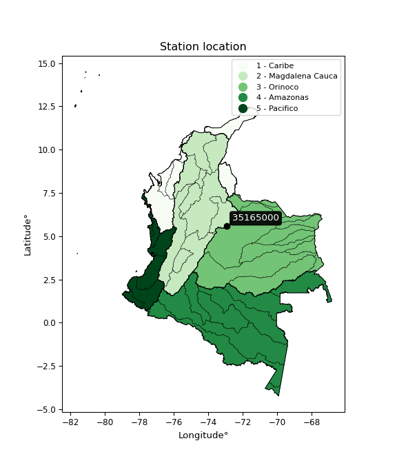

<div align="center">


</div>

# PMP Station (Rain, Pmax24h): 35165000

Probable Maximum Precipitation (PMP) is the greatest amount of rainfall for a specific duration that is meteorologically possible for a given location, acting as a "worst-case" scenario for extreme storms, crucial for designing safety-critical infrastructure like bridges, river deviations, dams, spillways, and nuclear plants to prevent catastrophic failure. PMP is calculated by hydrologists using meteorological data to determine the upper limit of extreme rainfall, often leading to the Probable Maximum Flood (PMF) for flood control design, and is increasingly being studied for climate change impacts. Probable Maximum Precipitation (PMP) is the theoretical upper limit of rainfall, a deterministic estimate for extreme events, while probability distributions (like GEV, Gumbel) describe the likelihood and frequency of various precipitation amounts, including rare ones, showing how often events occur, with PMP representing the extreme end of these distributions, used for critical infrastructure design to ensure safety against the worst conceivable weather, unlike standard statistical forecasts which cover typical probabilities.

The most common probability distributions in hydrology, used for analyzing floods, rainfall, and streamflow, include the Normal, Log-Normal, Gumbel, Gamma (including Log-Pearson Type III), and Generalized Extreme Value (GEV) distributions, often chosen based on the data´s skewness and whether modeling extremes or general conditions, with Gumbel and GEV popular for extreme events like floods, while the Normal distribution serves as a baseline, though often requiring transformations for skewed hydrological data. These distributions help in designing water infrastructure, managing water resources, and forecasting hydrologic events.

> Hydrological data often isn´t perfectly normal (it´s skewed), so different distributions are needed for different applications, such as: **Flood Frequency Analysis**: Using Gumbel, GEV, or Log-Pearson Type III for predicting extreme flood magnitudes and their return periods, **Rainfall Analysis**: Normal for annual totals, but Log-Normal, Weibull, or GEV for intensity or extreme daily rainfall, **Streamflow Modeling**: Gamma and Log-Normal for maximum flows, GEV for minimum flows, and Kappa for daily flows.

<div align="center">

</img>

</div>


## A. General information


### 1. General running parameters

• app_version: _v20260113_. • runtime: _2026-01-17 18:24:04.630693_. • Python version: _3.14.0_. • SciPy version: _1.16.3_. • Pandas version: _2.3.3_. • NumPy version: _2.3.5_. • Stations dataset (station_dataset_file): _dataset/pmax24h_in/automatic_colombia_2003_2025.csv_. • Stations catalog (station_catalog_file): _dataset/CNE.xls_. • Minimum year to eval til year_max (date_min): _1900_. • Maximum year to eval since year_min (date_max): _2025_. • Creates, save and include plots into reports (create_plot): _False_. • Plot only fit distributions with Δo > Δ (plot_only_fit): _True_. • Plot only simple graphs avoiding multiple CDFs and multiple Extreme values plots (plot_only_simple): _True_. • Eval low extreme values, if False, evaluates high extreme values (low_extreme): _False_. • Eval every SciPy distribution as logarithmic (pdist_logarithmic_on): _True_. • Standard deviation normalized (ddof): _1.0_. • Return periods to eval in years (Tr): _[2, 2.33, 5, 10, 15, 20, 25, 50, 75, 100, 200, 250, 500, 750, 1000]_. • Minimum data sample per station, 0 means any (minimum_sample): _5_. • Z-Score maximum threshold to adjust a value, 0 means disable (zscore_max): _3.5_. • Z-Score minimum threshold to adjust a value, 0 means disable (zscore_min): _-2.5_. • Avoid zeros, e.g. rain = 0 (avoid_zeros): _True_. • Avoid null values (avoid_nans): _True_. 

:file_folder:Table: [dataset.csv](../../dataset/pmax24h_in/automatic_colombia_2003_2025.csv)

> Delta Degrees of Freedom (DDOF): is a parameter used in the formulas for calculating variance and standard deviation. When ddof=0, the divisor is $N$ (the total number of observations) and this is used when your data set is the entire population. When ddof=1, the divisor is $N-1$ and this is used when your data set is a sample drawn from a larger population. Using $N-1$ provides an unbiased estimate of the population variance (known as Bessel´s correction).


### 2. Station info and location

|   id |   CODIGO | NOMBRE              | CATEGORIA               | TECNOLOGIA                | ESTADO   | FECHA_INSTALACION   |   FECHA_SUSPENSION |   ALTITUD |   LATITUD |   LONGITUD | DEPARTAMENTO   | MUNICIPIO   | AREA_OPERATIVA                              | ENTIDAD                                                     | AREA_HIDROGRAFICA   | ZONA_HIDROGRAFICA   | SUBZONA_HIDROGRAFICA   |   CORRIENTE | Catalogo   |   Version |
|-----:|---------:|:--------------------|:------------------------|:--------------------------|:---------|:--------------------|-------------------:|----------:|----------:|-----------:|:---------------|:------------|:--------------------------------------------|:------------------------------------------------------------|:--------------------|:--------------------|:-----------------------|------------:|:-----------|----------:|
|    0 | 35165000 | EL TUNEL [35165000] | Climatológica Ordinaria | Automática con Telemetría | Activa   | 31/12/2016          |                nan |        30 |   5.57497 |    -72.941 | Boyacá         | Cuítiva     | Area Operativa 06 - Boyacá-Casanare-Vichada | INSTITUTO DE HIDROLOGIA METEOROLOGIA Y ESTUDIOS AMBIENTALES | Orinoco             | Meta                | Lago de Tota           |         nan | CNE_IDEAM  |  20251226 |

<div align="center">

Dynamic map: [:earth_americas:Google](http://maps.google.com/maps?q=5.574972222,-72.941) [:earth_americas:OSM](https://www.openstreetmap.org/#map=18/5.574972222/-72.941&layers=P) [:earth_americas:Bing](https://www.bing.com/maps?cp=5.574972222~-72.941&lvl=18) [:earth_americas:Apple](https://maps.apple.com/frame?center=5.574972222%2C-72.941&span=0.003%2C0.006)

</div>


<div align="center">

```geojson
{
  "type": "Feature",
  "geometry": {
    "type": "Point", 
    "coordinates": [-72.941, 5.574972222]
  }, 
  "properties": {
    "Name": "35165000"
  }
}
```

</div>


### 3. Discrete values table and plot

<div align="center">

|               |           0 |          1 |          2 |          3 |           4 |          5 |           6 |             7 |          8 |
|:--------------|------------:|-----------:|-----------:|-----------:|------------:|-----------:|------------:|--------------:|-----------:|
| Date          | 2017        | 2018       | 2019       | 2020       | 2021        | 2022       | 2023        | 2024          | 2025       |
| Value         |   26.7      |   19.2     |   64.8     |   31.6     |   27.7      |   29.8     |   40.3      |   36.4        |   51.6     |
| Value_initial |   26.7      |   19.2     |   64.8     |   31.6     |   27.7      |   29.8     |   40.3      |   36.4        |   51.6     |
| count         |    9        |    9       |    9       |    9       |    9        |    9       |    9        |    9          |    9       |
| mean          |   36.4556   |   36.4556  |   36.4556  |   36.4556  |   36.4556   |   36.4556  |   36.4556   |   36.4556     |   36.4556  |
| std           |   14.0757   |   14.0757  |   14.0757  |   14.0757  |   14.0757   |   14.0757  |   14.0757   |   14.0757     |   14.0757  |
| zscore        |   -0.693078 |   -1.22591 |    2.01371 |   -0.34496 |   -0.622033 |   -0.47284 |    0.273126 |   -0.00394691 |    1.07593 |


</div>


> The initial value (value_initial) correspond to the initial obtained or null completed value, and value (value) is adjusted only when the initial value is outside the valid range (outlier) definite through the Z-Score value. If Z-Score is active, values out of range or outliers are replaced with the station mean value. A Z-Score (or standard score) measures how many standard deviations a data point is from the mean of a dataset, indicating its relative position; positive scores mean above the mean, negative mean below, and a score of zero is exactly at the mean, allowing for comparison of values from different distributions. It´s calculated using the formula $z=(x–μ)/σ$, where $x$ is the data point, $μ$ is the mean, and $σ$ is the standard deviation, helping identify outliers and understand probability.
>
> <sub>**Note**: In this study, "completing" (filling gaps in) and "extending" (forecasting or lengthening the historical record) rainfall data series are avoided for certain critical analyses because they introduce artificial bias and uncertainty, which can distort the statistics of rare events (extremes), alter day-to-day variability, and compromise the integrity and homogeneity of the original data. Some reasons against Completing/Extending rainfall data are: **Distortion of Extremes and Variability**: The primary issue is that most gap-filling or extension methods rely on averaging or regression with nearby stations, which inherently smooths the data. Rainfall is highly variable in space and time, with a large percentage of zero values and occasional large storms. Infilling methods often underestimate the highest values and overestimate the lowest (zero) values, which severely distorts analyses focused on flood frequency, drought severity, and intensity-duration-frequency (IDF) curves, **Loss of Data Homogeneity**: Infilled or extended data are synthetic estimates, not actual measurements. Combining these estimates with observed data can violate the assumption of data homogeneity, which requires that the data properties do not change over time. Inhomogeneity can lead to incorrect conclusions about long-term trends or changes in climate patterns, **Propagation of Errors**: Errors and biases from the original data (e.g., wind-induced undercatch, instrument errors, site changes) or the data used for imputation can propagate through the analysis, leading to unreliable hydrological models and inaccurate predictions, **Compromised Statistical Integrity**: For statistical analyses, especially those involving the frequency of events, using artificial data can introduce time bias or autocorrelation that doesn´t exist in reality, making it difficult to assess the true probability of events, **Difficulty in Validation**: It is difficult to accurately validate the quality of filled or extended data, especially for past periods where ground-truth measurements are unavailable. The reliability of imputation techniques heavily depends on the density of the surrounding station network and the complexity of the local topography.</sub>


### 4. Active continuous probability distributions from SciPy (80 of 104 available)

A Probability Density Function (PDF) describes the relative likelihood of a continuous random variable falling within a specific range, where the total area under its curve equals 1, and the area over any interval gives the actual probability for that range. Unlike discrete probabilities (like rolling a die), a PDF shows density, not direct probability for a single point (which is zero), with higher points indicating higher likelihood, often visualized as a bell curve for normal distributions.

A log of a probability density function (log-PDF) is simply the logarithm of the PDF´s value, denoted as $log(f(x))$, useful for converting multiplication of probabilities into addition, improving numerical stability with tiny numbers, and connecting to information theory concepts like entropy. Instead of dealing with very small probabilities (e.g., 0.000001), log-PDFs use negative numbers (e.g., $log(0.00001) ≈ -11.51$ that are easier for computers to handle, preventing underflow errors and simplifying complex calculations. In this study, each active probability distribution from SciPy is also evaluated in the $log$ form.

[scipy.stats](https://docs.scipy.org/doc/scipy/reference/stats.html) is a Python´s powerful submodule within the SciPy library for comprehensive statistical analysis, offering over 130 probability distributions (like Normal, Poisson), functions for descriptive stats (mean, variance), hypothesis testing (t-tests, chi-square), random variable generation, and statistical tests, making it essential for data science, modeling, and research. It provides tools to explore, model, and draw conclusions from data efficiently, working seamlessly with NumPy.

<div align="center">

|   id | p_dist           |   n_parameter | fit_method   | label                                                                       | active   | ref                                                                                                      |
|-----:|:-----------------|--------------:|:-------------|:----------------------------------------------------------------------------|:---------|:---------------------------------------------------------------------------------------------------------|
|    0 | alpha            |             3 | MLE          | Alpha                                                                       | True     | [:mortar_board:](https://docs.scipy.org/doc/scipy/reference/generated/scipy.stats.alpha.html)            |
|    1 | anglit           |             2 | MM           | Anglit                                                                      | True     | [:mortar_board:](https://docs.scipy.org/doc/scipy/reference/generated/scipy.stats.anglit.html)           |
|    2 | arcsine          |             2 | MM           | Arcsine                                                                     | True     | [:mortar_board:](https://docs.scipy.org/doc/scipy/reference/generated/scipy.stats.arcsine.html)          |
|    3 | argus            |             3 | MLE          | Argus                                                                       | True     | [:mortar_board:](https://docs.scipy.org/doc/scipy/reference/generated/scipy.stats.argus.html)            |
|    4 | beta             |             4 | MLE          | Beta                                                                        | True     | [:mortar_board:](https://docs.scipy.org/doc/scipy/reference/generated/scipy.stats.beta.html)             |
|    5 | betaprime        |             4 | MLE          | Beta prime                                                                  | True     | [:mortar_board:](https://docs.scipy.org/doc/scipy/reference/generated/scipy.stats.betaprime.html)        |
|    6 | bradford         |             3 | MLE          | Bradford                                                                    | True     | [:mortar_board:](https://docs.scipy.org/doc/scipy/reference/generated/scipy.stats.bradford.html)         |
|    7 | burr             |             4 | MLE          | Burr (Type III)                                                             | True     | [:mortar_board:](https://docs.scipy.org/doc/scipy/reference/generated/scipy.stats.burr.html)             |
|    8 | burr12           |             4 | MLE          | Burr (Type III) 12                                                          | True     | [:mortar_board:](https://docs.scipy.org/doc/scipy/reference/generated/scipy.stats.burr12.html)           |
|    9 | cosine           |             2 | MLE          | Cosine                                                                      | True     | [:mortar_board:](https://docs.scipy.org/doc/scipy/reference/generated/scipy.stats.cosine.html)           |
|   10 | crystalball      |             4 | MLE          | Crystalball                                                                 | True     | [:mortar_board:](https://docs.scipy.org/doc/scipy/reference/generated/scipy.stats.crystalball.html)      |
|   11 | dgamma           |             3 | MLE          | Double gamma                                                                | True     | [:mortar_board:](https://docs.scipy.org/doc/scipy/reference/generated/scipy.stats.dgamma.html)           |
|   12 | dweibull         |             3 | MLE          | Double Weibull                                                              | True     | [:mortar_board:](https://docs.scipy.org/doc/scipy/reference/generated/scipy.stats.dweibull.html)         |
|   13 | erlang           |             3 | MLE          | Erlang                                                                      | True     | [:mortar_board:](https://docs.scipy.org/doc/scipy/reference/generated/scipy.stats.erlang.html)           |
|   14 | exponnorm        |             3 | MLE          | Exponentially modified Normal                                               | True     | [:mortar_board:](https://docs.scipy.org/doc/scipy/reference/generated/scipy.stats.exponnorm.html)        |
|   15 | exponpow         |             3 | MLE          | Exponential power                                                           | True     | [:mortar_board:](https://docs.scipy.org/doc/scipy/reference/generated/scipy.stats.exponpow.html)         |
|   16 | exponweib        |             4 | MLE          | Exponentiated Weibull                                                       | True     | [:mortar_board:](https://docs.scipy.org/doc/scipy/reference/generated/scipy.stats.exponweib.html)        |
|   17 | f                |             4 | MLE          | F                                                                           | True     | [:mortar_board:](https://docs.scipy.org/doc/scipy/reference/generated/scipy.stats.f.html)                |
|   18 | fatiguelife      |             3 | MLE          | Fatigue-life (Birnbaum-Saunders)                                            | True     | [:mortar_board:](https://docs.scipy.org/doc/scipy/reference/generated/scipy.stats.fatiguelife.html)      |
|   19 | foldnorm         |             3 | MM           | Fold Normal                                                                 | True     | [:mortar_board:](https://docs.scipy.org/doc/scipy/reference/generated/scipy.stats.foldnorm.html)         |
|   20 | gamma            |             3 | MLE          | Gamma                                                                       | True     | [:mortar_board:](https://docs.scipy.org/doc/scipy/reference/generated/scipy.stats.gamma.html)            |
|   21 | gausshyper       |             6 | MLE          | Gauss hypergeometric                                                        | True     | [:mortar_board:](https://docs.scipy.org/doc/scipy/reference/generated/scipy.stats.gausshyper.html)       |
|   22 | genexpon         |             5 | MLE          | Generalized exponential                                                     | True     | [:mortar_board:](https://docs.scipy.org/doc/scipy/reference/generated/scipy.stats.genexpon.html)         |
|   23 | genextreme       |             3 | MLE          | Generalized exponential                                                     | True     | [:mortar_board:](https://docs.scipy.org/doc/scipy/reference/generated/scipy.stats.genextreme.html)       |
|   24 | gengamma         |             4 | MLE          | Generalized gamma                                                           | True     | [:mortar_board:](https://docs.scipy.org/doc/scipy/reference/generated/scipy.stats.gengamma.html)         |
|   25 | genhalflogistic  |             3 | MLE          | Generalized half-logistic                                                   | True     | [:mortar_board:](https://docs.scipy.org/doc/scipy/reference/generated/scipy.stats.genhalflogistic.html)  |
|   26 | genlogistic      |             3 | MLE          | Generalized logistic                                                        | True     | [:mortar_board:](https://docs.scipy.org/doc/scipy/reference/generated/scipy.stats.genlogistic.html)      |
|   27 | gennorm          |             3 | MLE          | Generalized Normal                                                          | True     | [:mortar_board:](https://docs.scipy.org/doc/scipy/reference/generated/scipy.stats.gennorm.html)          |
|   28 | genpareto        |             3 | MLE          | Generalized Pareto                                                          | True     | [:mortar_board:](https://docs.scipy.org/doc/scipy/reference/generated/scipy.stats.genpareto.html)        |
|   29 | gompertz         |             3 | MLE          | Gompertz (or truncated Gumbel)                                              | True     | [:mortar_board:](https://docs.scipy.org/doc/scipy/reference/generated/scipy.stats.gompertz.html)         |
|   30 | gumbel_l         |             2 | MM           | Gumbel Left Skew                                                            | True     | [:mortar_board:](https://docs.scipy.org/doc/scipy/reference/generated/scipy.stats.gumbel_l.html)         |
|   31 | gumbel_r         |             2 | MM           | Gumbel Right Skew                                                           | True     | [:mortar_board:](https://docs.scipy.org/doc/scipy/reference/generated/scipy.stats.gumbel_r.html)         |
|   32 | halfgennorm      |             3 | MLE          | Upper half of a generalized normal                                          | True     | [:mortar_board:](https://docs.scipy.org/doc/scipy/reference/generated/scipy.stats.halfgennorm.html)      |
|   33 | halflogistic     |             2 | MM           | Half-logistic                                                               | True     | [:mortar_board:](https://docs.scipy.org/doc/scipy/reference/generated/scipy.stats.halflogistic.html)     |
|   34 | halfnorm         |             2 | MM           | Half Normal                                                                 | True     | [:mortar_board:](https://docs.scipy.org/doc/scipy/reference/generated/scipy.stats.halfnorm.html)         |
|   35 | hypsecant        |             2 | MM           | hyperbolic secant                                                           | True     | [:mortar_board:](https://docs.scipy.org/doc/scipy/reference/generated/scipy.stats.hypsecant.html)        |
|   36 | invgamma         |             3 | MLE          | Inverted gamma                                                              | True     | [:mortar_board:](https://docs.scipy.org/doc/scipy/reference/generated/scipy.stats.invgamma.html)         |
|   37 | invgauss         |             3 | MLE          | Inverse Gaussian                                                            | True     | [:mortar_board:](https://docs.scipy.org/doc/scipy/reference/generated/scipy.stats.invgauss.html)         |
|   38 | invweibull       |             3 | MLE          | Inverted Weibull                                                            | True     | [:mortar_board:](https://docs.scipy.org/doc/scipy/reference/generated/scipy.stats.invweibull.html)       |
|   39 | johnsonsb        |             4 | MLE          | Johnson SB                                                                  | True     | [:mortar_board:](https://docs.scipy.org/doc/scipy/reference/generated/scipy.stats.johnsonsb.html)        |
|   40 | johnsonsu        |             4 | MLE          | Johnson Su                                                                  | True     | [:mortar_board:](https://docs.scipy.org/doc/scipy/reference/generated/scipy.stats.johnsonsu.html)        |
|   41 | kappa3           |             3 | MLE          | Kappa 3                                                                     | True     | [:mortar_board:](https://docs.scipy.org/doc/scipy/reference/generated/scipy.stats.kappa3.html)           |
|   42 | kappa4           |             4 | MLE          | Kappa 4                                                                     | True     | [:mortar_board:](https://docs.scipy.org/doc/scipy/reference/generated/scipy.stats.kappa4.html)           |
|   43 | ksone            |             3 | MLE          | Kolmogorov-Smirnov one-sided test statistic distribution                    | True     | [:mortar_board:](https://docs.scipy.org/doc/scipy/reference/generated/scipy.stats.ksone.html)            |
|   44 | kstwobign        |             2 | MLE          | Limiting distribution of scaled Kolmogorov-Smirnov two-sided test statistic | True     | [:mortar_board:](https://docs.scipy.org/doc/scipy/reference/generated/scipy.stats.kstwobign.html)        |
|   45 | laplace          |             2 | MM           | Laplace                                                                     | True     | [:mortar_board:](https://docs.scipy.org/doc/scipy/reference/generated/scipy.stats.laplace.html)          |
|   46 | levy_l           |             2 | MLE          | Left-skewed Levy                                                            | True     | [:mortar_board:](https://docs.scipy.org/doc/scipy/reference/generated/scipy.stats.levy_l.html)           |
|   47 | loggamma         |             3 | MLE          | Log gamma                                                                   | True     | [:mortar_board:](https://docs.scipy.org/doc/scipy/reference/generated/scipy.stats.loggamma.html)         |
|   48 | logistic         |             2 | MM           | Logistic (or Sech-squared)                                                  | True     | [:mortar_board:](https://docs.scipy.org/doc/scipy/reference/generated/scipy.stats.logistic.html)         |
|   49 | loglaplace       |             3 | MLE          | Log-Laplace                                                                 | True     | [:mortar_board:](https://docs.scipy.org/doc/scipy/reference/generated/scipy.stats.loglaplace.html)       |
|   50 | lomax            |             3 | MLE          | Lomax (Pareto of the second kind)                                           | True     | [:mortar_board:](https://docs.scipy.org/doc/scipy/reference/generated/scipy.stats.lomax.html)            |
|   51 | maxwell          |             2 | MM           | Maxwell                                                                     | True     | [:mortar_board:](https://docs.scipy.org/doc/scipy/reference/generated/scipy.stats.maxwell.html)          |
|   52 | mielke           |             4 | MLE          | Mielke Beta-Kappa / Dagum                                                   | True     | [:mortar_board:](https://docs.scipy.org/doc/scipy/reference/generated/scipy.stats.mielke.html)           |
|   53 | moyal            |             2 | MM           | Moyal                                                                       | True     | [:mortar_board:](https://docs.scipy.org/doc/scipy/reference/generated/scipy.stats.moyal.html)            |
|   54 | nakagami         |             3 | MLE          | Nakagami                                                                    | True     | [:mortar_board:](https://docs.scipy.org/doc/scipy/reference/generated/scipy.stats.nakagami.html)         |
|   55 | ncf              |             5 | MLE          | Non-central F distribution                                                  | True     | [:mortar_board:](https://docs.scipy.org/doc/scipy/reference/generated/scipy.stats.ncf.html)              |
|   56 | nct              |             4 | MLE          | Non-central Student’s t                                                     | True     | [:mortar_board:](https://docs.scipy.org/doc/scipy/reference/generated/scipy.stats.nct.html)              |
|   57 | norm             |             2 | MM           | Normal                                                                      | True     | [:mortar_board:](https://docs.scipy.org/doc/scipy/reference/generated/scipy.stats.norm.html)             |
|   58 | pearson3         |             3 | MM           | Pearson type III                                                            | True     | [:mortar_board:](https://docs.scipy.org/doc/scipy/reference/generated/scipy.stats.pearson3.html)         |
|   59 | powerlaw         |             3 | MLE          | Power-function                                                              | True     | [:mortar_board:](https://docs.scipy.org/doc/scipy/reference/generated/scipy.stats.powerlaw.html)         |
|   60 | rayleigh         |             2 | MM           | Rayleigh                                                                    | True     | [:mortar_board:](https://docs.scipy.org/doc/scipy/reference/generated/scipy.stats.rayleigh.html)         |
|   61 | rdist            |             3 | MLE          | R-distributed (symmetric beta)                                              | True     | [:mortar_board:](https://docs.scipy.org/doc/scipy/reference/generated/scipy.stats.rdist.html)            |
|   62 | rice             |             3 | MLE          | Rice                                                                        | True     | [:mortar_board:](https://docs.scipy.org/doc/scipy/reference/generated/scipy.stats.rice.html)             |
|   63 | semicircular     |             2 | MM           | Semicircular                                                                | True     | [:mortar_board:](https://docs.scipy.org/doc/scipy/reference/generated/scipy.stats.semicircular.html)     |
|   64 | skewnorm         |             3 | MLE          | Skew normal                                                                 | True     | [:mortar_board:](https://docs.scipy.org/doc/scipy/reference/generated/scipy.stats.skewnorm.html)         |
|   65 | t                |             3 | MLE          | Student’s t                                                                 | True     | [:mortar_board:](https://docs.scipy.org/doc/scipy/reference/generated/scipy.stats.t.html)                |
|   66 | trapezoid        |             4 | MLE          | Trapezoid                                                                   | True     | [:mortar_board:](https://docs.scipy.org/doc/scipy/reference/generated/scipy.stats.trapezoid.html)        |
|   67 | triang           |             3 | MLE          | Triangular                                                                  | True     | [:mortar_board:](https://docs.scipy.org/doc/scipy/reference/generated/scipy.stats.triang.html)           |
|   68 | truncexpon       |             3 | MLE          | Truncated exponential                                                       | True     | [:mortar_board:](https://docs.scipy.org/doc/scipy/reference/generated/scipy.stats.truncexpon.html)       |
|   69 | truncnorm        |             4 | MLE          | Truncated normal                                                            | True     | [:mortar_board:](https://docs.scipy.org/doc/scipy/reference/generated/scipy.stats.truncnorm.html)        |
|   70 | truncpareto      |             4 | MLE          | Upper truncated Pareto                                                      | True     | [:mortar_board:](https://docs.scipy.org/doc/scipy/reference/generated/scipy.stats.truncpareto.html)      |
|   71 | truncweibull_min |             5 | MLE          | Doubly truncated Weibull minimum                                            | True     | [:mortar_board:](https://docs.scipy.org/doc/scipy/reference/generated/scipy.stats.truncweibull_min.html) |
|   72 | tukeylambda      |             3 | MLE          | Tukey-Lamdba                                                                | True     | [:mortar_board:](https://docs.scipy.org/doc/scipy/reference/generated/scipy.stats.tukeylambda.html)      |
|   73 | uniform          |             2 | MLE          | Uniform                                                                     | True     | [:mortar_board:](https://docs.scipy.org/doc/scipy/reference/generated/scipy.stats.uniform.html)          |
|   74 | vonmises         |             3 | MLE          | Von Mises                                                                   | True     | [:mortar_board:](https://docs.scipy.org/doc/scipy/reference/generated/scipy.stats.vonmises.html)         |
|   75 | vonmises_line    |             3 | MLE          | Von Mises line                                                              | True     | [:mortar_board:](https://docs.scipy.org/doc/scipy/reference/generated/scipy.stats.vonmises_line.html)    |
|   76 | wald             |             2 | MM           | Wald                                                                        | True     | [:mortar_board:](https://docs.scipy.org/doc/scipy/reference/generated/scipy.stats.wald.html)             |
|   77 | weibull_max      |             3 | MLE          | Weibull maximum                                                             | True     | [:mortar_board:](https://docs.scipy.org/doc/scipy/reference/generated/scipy.stats.weibull_max.html)      |
|   78 | weibull_min      |             3 | MLE          | Weibull minimum                                                             | True     | [:mortar_board:](https://docs.scipy.org/doc/scipy/reference/generated/scipy.stats.weibull_min.html)      |
|   79 | wrapcauchy       |             3 | MLE          | Wrapped  Cauchy                                                             | True     | [:mortar_board:](https://docs.scipy.org/doc/scipy/reference/generated/scipy.stats.wrapcauchy.html)       |

</div>

> **n_parameter:** # arguments & localization & scale.
>
> **Fit methods:** (MLE) maximum likelihood, (MM) L-moments.
>
>**Inactive** (With the only purpose of prevent loops, zero divisions, infinite values, over high estimated values or horizontal trending for recurrence intervals estimations, the follow distributions were disabled.)**:** lognorm, norminvgauss, powernorm, powerlognorm, cauchy, halfcauchy, foldcauchy, skewcauchy, chi2, expon, fisk, genhyperbolic, geninvgauss, gibrat, kstwo, laplace_asymmetric, levy, levy_stable, ncx2, pareto, rel_breitwigner, recipinvgauss, studentized_range, loguniform, 


## B. Probability (PDF) vs. Empirical (EDF) distributions functions

A continuous probability distribution (CPD) describes probabilities for variables that can take any value within a range (like rain any time), unlike discrete variables with specific outcomes (like temperature). It uses a Probability Density Function (PDF), a curve where the total area under it equals 1, and the probability of the variable falling within an interval (a to b) is found by calculating the area under the curve between those points. A key feature is that the probability of hitting any single exact value is zero, so probabilities are always expressed for ranges, e.g., $P(a ≤ X ≤ b)$.

<div align="center">

Distributions parameters from station values
|     |   station | p_dist              |   n |             loc |          scale | shape                  | shape1                | shape2                | shape3             |
|----:|----------:|:--------------------|----:|----------------:|---------------:|:-----------------------|:----------------------|:----------------------|:-------------------|
|   0 |  35165000 | alpha               |   9 |   -14.3464      |  205.586       | 4.298441054642128      |                       |                       |                    |
|   1 |  35165000 | anglit              |   9 |    36.4556      |   38.8221      |                        |                       |                       |                    |
|   2 |  35165000 | arcsine             |   9 |    17.6879      |   37.5352      |                        |                       |                       |                    |
|   3 |  35165000 | argus               |   9 |     5.213       |   61.5294      | 2.1164945241892695e-06 |                       |                       |                    |
|   4 |  35165000 | beta                |   9 |    19.2         |   48.1677      | 0.7043932299877973     | 1.0263848142674115    |                       |                    |
|   5 |  35165000 | betaprime           |   9 |    -0.357937    |    3.36081     | 96.88961453138893      | 9.860425039890142     |                       |                    |
|   6 |  35165000 | bradford            |   9 |    19.014       |   45.786       | 2.1631503331601056     |                       |                       |                    |
|   7 |  35165000 | burr                |   9 |    -0.107774    |   24.5642      | 4.0290510907660115     | 2.6815121202616323    |                       |                    |
|   8 |  35165000 | burr12              |   9 |    -1.35051     |   20.4287      | 604.0742962698303      | 0.002962631847454717  |                       |                    |
|   9 |  35165000 | cosine              |   9 |    38.364       |   11.5895      |                        |                       |                       |                    |
|  10 |  35165000 | crystalball         |   9 |    36.4556      |   13.2707      | 3972.5037772849823     | 134.11899511473536    |                       |                    |
|  11 |  35165000 | dgamma              |   9 |    34.2077      |    6.30995     | 1.6254280284364562     |                       |                       |                    |
|  12 |  35165000 | dweibull            |   9 |    31.6         |   11.3949      | 0.9408292823862058     |                       |                       |                    |
|  13 |  35165000 | erlang              |   9 |    17.7456      |   11.2323      | 1.6657201268002462     |                       |                       |                    |
|  14 |  35165000 | exponnorm           |   9 |    23.1545      |    4.50413     | 2.9530993746538208     |                       |                       |                    |
|  15 |  35165000 | exponpow            |   9 |    19.2         |   42.9723      | 0.23362007709536836    |                       |                       |                    |
|  16 |  35165000 | exponweib           |   9 |    19.2         |    1.04603     | 1.224764464234158      | 0.2884426667049875    |                       |                    |
|  17 |  35165000 | f                   |   9 |    13.7006      |   21.0978      | 7.8801082436565935     | 19.514495813906088    |                       |                    |
|  18 |  35165000 | fatiguelife         |   9 |    19.2         |    0.000522745 | 167.80691179622465     |                       |                       |                    |
|  19 |  35165000 | foldnorm            |   9 |    18.5013      |   19.0413      | 0.6122205216233918     |                       |                       |                    |
|  20 |  35165000 | gamma               |   9 |    17.7456      |   11.2323      | 1.6657316198959515     |                       |                       |                    |
|  21 |  35165000 | gausshyper          |   9 |    19.2         |   45.6059      | 0.9922947118382546     | 1.000770068978818     | 1.0190424610962237    | 0.9691067956223449 |
|  22 |  35165000 | genexpon            |   9 |    19.2         |    2.54295     | 0.07291320563840714    | 0.12273637338844293   | 0.2513813471695491    |                    |
|  23 |  35165000 | genextreme          |   9 |    29.9128      |    9.3337      | -0.11479377203007465   |                       |                       |                    |
|  24 |  35165000 | gengamma            |   9 |    19.2         |    0.961133    | 1.3342831468469902     | 0.2897154109910507    |                       |                    |
|  25 |  35165000 | genhalflogistic     |   9 |    14.9008      |   51.9169      | 1.0404365948708243     |                       |                       |                    |
|  26 |  35165000 | genlogistic         |   9 |   -36.0969      |    9.79541     | 895.9255707980913      |                       |                       |                    |
|  27 |  35165000 | gennorm             |   9 |    31.6         |    6.50216     | 0.7813467681423573     |                       |                       |                    |
|  28 |  35165000 | genpareto           |   9 |    -0.315654    |   97.6977      | -1.5003716907414448    |                       |                       |                    |
|  29 |  35165000 | gompertz            |   9 |    19.2         |   41.0619      | 1.6343778592123583     |                       |                       |                    |
|  30 |  35165000 | gumbel_l            |   9 |    42.4281      |   10.3471      |                        |                       |                       |                    |
|  31 |  35165000 | gumbel_r            |   9 |    30.483       |   10.3471      |                        |                       |                       |                    |
|  32 |  35165000 | halfgennorm         |   9 |    19.2         |    1.15594     | 0.3941008287186121     |                       |                       |                    |
|  33 |  35165000 | halflogistic        |   9 |    20.7266      |   11.346       |                        |                       |                       |                    |
|  34 |  35165000 | halfnorm            |   9 |    18.8904      |   22.0147      |                        |                       |                       |                    |
|  35 |  35165000 | hypsecant           |   9 |    36.4556      |    8.44839     |                        |                       |                       |                    |
|  36 |  35165000 | invgamma            |   9 |     2.71494     |  220.386       | 7.5120733110383835     |                       |                       |                    |
|  37 |  35165000 | invgauss            |   9 |     9.36779     |  103.853       | 0.26082669962837246    |                       |                       |                    |
|  38 |  35165000 | invweibull          |   9 |   -51.3954      |   81.3082      | 8.711236667777495      |                       |                       |                    |
|  39 |  35165000 | johnsonsb           |   9 |    19.2         |   45.6043      | 0.01936884878709315    | 0.08031764106773698   |                       |                    |
|  40 |  35165000 | johnsonsu           |   9 |    10.3043      |    0.993697    | -7.59625240186433      | 1.978803664800557     |                       |                    |
|  41 |  35165000 | kappa3              |   9 |    19.1998      |   45.5991      | 116775.15503986247     |                       |                       |                    |
|  42 |  35165000 | kappa4              |   9 |    13.4793      |   52.1546      | 1.1233277877343855     | 1.0160848029737415    |                       |                    |
|  43 |  35165000 | ksone               |   9 |    14.64        |   54.72        | 1.0                    |                       |                       |                    |
|  44 |  35165000 | kstwobign           |   9 |    -4.80287     |   47.5575      |                        |                       |                       |                    |
|  45 |  35165000 | laplace             |   9 |    36.4556      |    9.3838      |                        |                       |                       |                    |
|  46 |  35165000 | levy_l              |   9 |    68.0264      |   16.0258      |                        |                       |                       |                    |
|  47 |  35165000 | loggamma            |   9 | -4893.94        |  640.354       | 2207.5426345671603     |                       |                       |                    |
|  48 |  35165000 | logistic            |   9 |    36.4556      |    7.31652     |                        |                       |                       |                    |
|  49 |  35165000 | loglaplace          |   9 |    -0.0830293   |   31.683       | 3.682759805973207      |                       |                       |                    |
|  50 |  35165000 | lomax               |   9 |    19.2         | 3237.3         | 187.8985051620533      |                       |                       |                    |
|  51 |  35165000 | maxwell             |   9 |     5.00958     |   19.7058      |                        |                       |                       |                    |
|  52 |  35165000 | mielke              |   9 |    -0.0885393   |   24.556       | 10.785848704177376     | 4.027472526303756     |                       |                    |
|  53 |  35165000 | moyal               |   9 |    28.8665      |    5.97391     |                        |                       |                       |                    |
|  54 |  35165000 | nakagami            |   9 |    26.7         |   19.656       | 0.1150417635810373     |                       |                       |                    |
|  55 |  35165000 | ncf                 |   9 |    -0.418347    |   33.0173      | 386.5764151732734      | 19.009763431837026    | 0.008235950135405574  |                    |
|  56 |  35165000 | nct                 |   9 |    -3.40936     |    2.29942     | 6.119904579847322      | 15.143607275891114    |                       |                    |
|  57 |  35165000 | norm                |   9 |    36.4556      |   13.2707      |                        |                       |                       |                    |
|  58 |  35165000 | pearson3            |   9 |    36.4556      |   13.2707      | 0.9106569262664772     |                       |                       |                    |
|  59 |  35165000 | powerlaw            |   9 |    19.2         |   45.6         | 0.19813111332927177    |                       |                       |                    |
|  60 |  35165000 | rayleigh            |   9 |    11.0679      |   20.2564      |                        |                       |                       |                    |
|  61 |  35165000 | rdist               |   9 |    17.3382      |   22.9618      | 1.087589759809227      |                       |                       |                    |
|  62 |  35165000 | rice                |   9 |    14.0209      |   18.4313      | 0.0003565885562273577  |                       |                       |                    |
|  63 |  35165000 | semicircular        |   9 |    36.4556      |   26.5413      |                        |                       |                       |                    |
|  64 |  35165000 | skewnorm            |   9 |    20.6211      |   20.6601      | 5.440289305225191      |                       |                       |                    |
|  65 |  35165000 | t                   |   9 |    36.455       |   13.2707      | 6944362.982167211      |                       |                       |                    |
|  66 |  35165000 | trapezoid           |   9 |    14.64        |   54.72        | 1.0                    | 1.0                   |                       |                    |
|  67 |  35165000 | triang              |   9 |    15.0914      |   57.2339      | 0.20282670884778614    |                       |                       |                    |
|  68 |  35165000 | truncexpon          |   9 |    19.1993      |   42.4689      | 1.0737427773266772     |                       |                       |                    |
|  69 |  35165000 | truncnorm           |   9 |    36.4556      |   13.2707      | -207.56173241855134    | 414.4792004927565     |                       |                    |
|  70 |  35165000 | truncpareto         |   9 |    19.198       |    0.00200972  | 0.12516512448629172    | 22690.70646556821     |                       |                    |
|  71 |  35165000 | truncweibull_min    |   9 |    19.154       |   43.3026      | 0.8659518114713229     | 0.0010627555214948916 | 1.0541312933586133    |                    |
|  72 |  35165000 | tukeylambda         |   9 |    29.7876      |   11.5272      | 1.0887464195070158     |                       |                       |                    |
|  73 |  35165000 | uniform             |   9 |    19.2         |   45.6         |                        |                       |                       |                    |
|  74 |  35165000 | vonmises            |   9 |     1.45241     |    1           | 0.5870518609224519     |                       |                       |                    |
|  75 |  35165000 | vonmises_line       |   9 |    34.0213      |    9.79717     | 1.067371104792132      |                       |                       |                    |
|  76 |  35165000 | wald                |   9 |    23.1849      |   13.2707      |                        |                       |                       |                    |
|  77 |  35165000 | weibull_max         |   9 |    64.8         |    1.52531     | 0.3115557539089405     |                       |                       |                    |
|  78 |  35165000 | weibull_min         |   9 |    18.5175      |   19.2136      | 1.2698990816544442     |                       |                       |                    |
|  79 |  35165000 | wrapcauchy          |   9 |    19.2         |    7.25747     | 0.09348818694563599    |                       |                       |                    |
|  80 |  35165000 | logalpha            |   9 |    -1.56693     |   75.7981      | 14.924387321358438     |                       |                       |                    |
|  81 |  35165000 | loganglit           |   9 |     3.53494     |    1.0099      |                        |                       |                       |                    |
|  82 |  35165000 | logarcsine          |   9 |     3.04673     |    0.976417    |                        |                       |                       |                    |
|  83 |  35165000 | logargus            |   9 |     2.71014     |    1.51318     | 0.00012166907580997758 |                       |                       |                    |
|  84 |  35165000 | logbeta             |   9 |     2.95484     |    1.21646     | 0.4991303320739225     | 0.3669753959104024    |                       |                    |
|  85 |  35165000 | logbetaprime        |   9 |     1.15667     |  227.38        | 48.79926694817233      | 4667.015401190403     |                       |                    |
|  86 |  35165000 | logbradford         |   9 |     2.95491     |    1.21641     | 1.0267450376362333     |                       |                       |                    |
|  87 |  35165000 | logburr             |   9 |    -0.202147    |    3.57082     | 16.568104941098643     | 1.5875423005747247    |                       |                    |
|  88 |  35165000 | logburr12           |   9 |    -0.0484388   |    3.46924     | 20.651642059048704     | 0.728100369604547     |                       |                    |
|  89 |  35165000 | logcosine           |   9 |     3.54839     |    0.295412    |                        |                       |                       |                    |
|  90 |  35165000 | logcrystalball      |   9 |     3.53494     |    0.345218    | 158.85101724273153     | 67.39935013815746     |                       |                    |
|  91 |  35165000 | logdgamma           |   9 |     3.52657     |    0.145401    | 1.9285119995844695     |                       |                       |                    |
|  92 |  35165000 | logdweibull         |   9 |     3.53049     |    0.311487    | 1.4525683632081439     |                       |                       |                    |
|  93 |  35165000 | logerlang           |   9 |     2.02607     |    0.0799651   | 18.86907624880577      |                       |                       |                    |
|  94 |  35165000 | logexponnorm        |   9 |     3.3591      |    0.299704    | 0.5867158299517559     |                       |                       |                    |
|  95 |  35165000 | logexponpow         |   9 |     2.92891     |    0.935023    | 1.2257783214268638     |                       |                       |                    |
|  96 |  35165000 | logexponweib        |   9 |     2.95491     |    0.902222    | 0.3151172632213632     | 2.683596073123172     |                       |                    |
|  97 |  35165000 | logf                |   9 |     1.60747     |    1.91513     | 78.96981526252236      | 294.44102913835707    |                       |                    |
|  98 |  35165000 | logfatiguelife      |   9 |     1.2044      |    2.30512     | 0.14851620207153768    |                       |                       |                    |
|  99 |  35165000 | logfoldnorm         |   9 |     2.88562     |    0.367608    | 1.732556226504962      |                       |                       |                    |
| 100 |  35165000 | loggamma            |   9 |     2.02607     |    0.0799651   | 18.869061991954794     |                       |                       |                    |
| 101 |  35165000 | loggausshyper       |   9 |     2.94934     |    1.22197     | 1.0858411052760277     | 0.7872112462901832    | 1.1363772168960313    | 0.9808251123849956 |
| 102 |  35165000 | loggenexpon         |   9 |     2.95255     |    0.00665441  | 0.00404687750434189    | 4.018850105770982     | 3.095822206794702e-05 |                    |
| 103 |  35165000 | loggenextreme       |   9 |     3.40262     |    0.323977    | 0.21071981011931984    |                       |                       |                    |
| 104 |  35165000 | loggengamma         |   9 |     2.95491     |    1.07933     | 0.2796984252094631     | 2.940657731259685     |                       |                    |
| 105 |  35165000 | loggenhalflogistic  |   9 |     2.95127     |    1.33295     | 1.0925480954457978     |                       |                       |                    |
| 106 |  35165000 | loggenlogistic      |   9 |     3.1996      |    0.248717    | 2.660855276990784      |                       |                       |                    |
| 107 |  35165000 | loggennorm          |   9 |     3.45317     |    0.263475    | 0.9899201737133856     |                       |                       |                    |
| 108 |  35165000 | loggenpareto        |   9 |    -0.00465834  |   11.6934      | -2.8001666018814966    |                       |                       |                    |
| 109 |  35165000 | loggompertz         |   9 |     2.95443     |    0.534795    | 0.374023281513273      |                       |                       |                    |
| 110 |  35165000 | loggumbel_l         |   9 |     3.6903      |    0.269165    |                        |                       |                       |                    |
| 111 |  35165000 | loggumbel_r         |   9 |     3.37957     |    0.269165    |                        |                       |                       |                    |
| 112 |  35165000 | loghalfgennorm      |   9 |     2.95489     |    1.21829     | 3919.425237239886      |                       |                       |                    |
| 113 |  35165000 | loghalflogistic     |   9 |     3.12573     |    0.295175    |                        |                       |                       |                    |
| 114 |  35165000 | loghalfnorm         |   9 |     3.07796     |    0.572725    |                        |                       |                       |                    |
| 115 |  35165000 | loghypsecant        |   9 |     3.53494     |    0.219772    |                        |                       |                       |                    |
| 116 |  35165000 | loginvgamma         |   9 |     0.256949    |  296.197       | 91.35793725876644      |                       |                       |                    |
| 117 |  35165000 | loginvgauss         |   9 |     1.3913      |   81.0766      | 0.026428885295290673   |                       |                       |                    |
| 118 |  35165000 | loginvweibull       |   9 |    -5.71869e+07 |    5.71869e+07 | 183066350.7389241      |                       |                       |                    |
| 119 |  35165000 | logjohnsonsb        |   9 |     2.95491     |    1.2164      | 0.06611965476974832    | 0.18344511979085393   |                       |                    |
| 120 |  35165000 | logjohnsonsu        |   9 |     1.29114     |    0.679646    | -12.930622217977856    | 6.808494569571426     |                       |                    |
| 121 |  35165000 | logkappa3           |   9 |     2.95473     |    1.21475     | 909.2896568231739      |                       |                       |                    |
| 122 |  35165000 | logkappa4           |   9 |     2.82334     |    1.456       | 1.0997451472619977     | 1.0788175782987146    |                       |                    |
| 123 |  35165000 | logksone            |   9 |     2.83327     |    1.45967     | 1.0                    |                       |                       |                    |
| 124 |  35165000 | logkstwobign        |   9 |     2.25918     |    1.4643      |                        |                       |                       |                    |
| 125 |  35165000 | loglaplace          |   9 |     3.53494     |    0.244106    |                        |                       |                       |                    |
| 126 |  35165000 | loglevy_l           |   9 |     4.23889     |    0.333924    |                        |                       |                       |                    |
| 127 |  35165000 | logloggamma         |   9 |   -87.427       |   12.6515      | 1326.1577603563492     |                       |                       |                    |
| 128 |  35165000 | loglogistic         |   9 |     3.53494     |    0.190328    |                        |                       |                       |                    |
| 129 |  35165000 | logloglaplace       |   9 |    -0.0934775   |    3.54663     | 13.353205876474648     |                       |                       |                    |
| 130 |  35165000 | loglomax            |   9 |     2.95491     |    2.06483e+12 | 1143057761110.099      |                       |                       |                    |
| 131 |  35165000 | logmaxwell          |   9 |     2.71691     |    0.512619    |                        |                       |                       |                    |
| 132 |  35165000 | logmielke           |   9 | -9668.98        | 9672.28        | 82350.12609287136      | 41322.82265320445     |                       |                    |
| 133 |  35165000 | logmoyal            |   9 |     3.33752     |    0.155403    |                        |                       |                       |                    |
| 134 |  35165000 | lognakagami         |   9 |     3.28466     |    0.336983    | 0.2520771964875341     |                       |                       |                    |
| 135 |  35165000 | logncf              |   9 |    -3.47984     |    7.00782     | 479.9876211800422      | 598.3125459749497     | 4.126874917040652e-06 |                    |
| 136 |  35165000 | lognct              |   9 |    -0.312752    |    0.0993572   | 69.45161187915124      | 38.303066458965034    |                       |                    |
| 137 |  35165000 | lognorm             |   9 |     3.53494     |    0.345218    |                        |                       |                       |                    |
| 138 |  35165000 | logpearson3         |   9 |     3.53494     |    0.345217    | 0.2875971976378042     |                       |                       |                    |
| 139 |  35165000 | logpowerlaw         |   9 |     2.95491     |    1.2164      | 0.2178821391475269     |                       |                       |                    |
| 140 |  35165000 | lograyleigh         |   9 |     2.87451     |    0.52694     |                        |                       |                       |                    |
| 141 |  35165000 | logrdist            |   9 |     3.63092     |    0.676013    | 1.094130407125389      |                       |                       |                    |
| 142 |  35165000 | logrice             |   9 |     2.81193     |    0.409838    | 1.3497085489112959     |                       |                       |                    |
| 143 |  35165000 | logsemicircular     |   9 |     3.53494     |    0.690435    |                        |                       |                       |                    |
| 144 |  35165000 | logskewnorm         |   9 |     3.17558     |    0.498304    | 2.067045395413121      |                       |                       |                    |
| 145 |  35165000 | logt                |   9 |     3.53494     |    0.345219    | 847475936.9266863      |                       |                       |                    |
| 146 |  35165000 | logtrapezoid        |   9 |     2.83327     |    1.45967     | 1.0                    | 1.0                   |                       |                    |
| 147 |  35165000 | logtriang           |   9 |     2.60581     |    1.5655      | 0.999999929150919      |                       |                       |                    |
| 148 |  35165000 | logtruncexpon       |   9 |     2.95491     |    1.26303     | 0.9630788015883225     |                       |                       |                    |
| 149 |  35165000 | logtruncnorm        |   9 |    -0.116274    |    1.5149      | 2.027323698657984      | 4.904019321882094     |                       |                    |
| 150 |  35165000 | logtruncpareto      |   9 |     2.95484     |    7.38877e-05 | 0.12515365522887598    | 16463.758953467077    |                       |                    |
| 151 |  35165000 | logtruncweibull_min |   9 |     2.94769     |    1.40137     | 1.0775922461578507     | 0.0001546326583762797 | 0.8731588348455817    |                    |
| 152 |  35165000 | logtukeylambda      |   9 |     3.56089     |    0.68427     | 1.1209955158818574     |                       |                       |                    |
| 153 |  35165000 | loguniform          |   9 |     2.95491     |    1.2164      |                        |                       |                       |                    |
| 154 |  35165000 | logvonmises         |   9 |    -2.7503      |    1           | 8.873385166174474      |                       |                       |                    |
| 155 |  35165000 | logvonmises_line    |   9 |     3.57142     |    0.196243    | 0.3669195715451221     |                       |                       |                    |
| 156 |  35165000 | logwald             |   9 |     3.18969     |    0.345244    |                        |                       |                       |                    |
| 157 |  35165000 | logweibull_max      |   9 |     4.94022     |    1.5376      | 4.745759526884706      |                       |                       |                    |
| 158 |  35165000 | logweibull_min      |   9 |     2.77848     |    0.853311    | 2.3292660315770233     |                       |                       |                    |
| 159 |  35165000 | logwrapcauchy       |   9 |     2.95491     |    0.193595    | 0.5                    |                       |                       |                    |

</div>

> **loc** (Location parameter): This shifts the distribution along the x-axis. For many common distributions, like the normal (Gaussian) distribution, loc represents the mean $μ$. For others, like the uniform distribution, it might represent the minimum value, or for the beta distribution, the left end of the support interval.
>
> **scale** (Scale parameter): This determines the width or spread of the distribution. For the normal distribution, scale represents the standard deviation $σ$. For a uniform distribution, it defines the length of the interval (from $loc$ to $loc + scale$).
>
> **shape** (Shape parameters): Refers to parameters that define the specific form of a probability distribution, distinct from its location (loc) and scale (scale). These parameters are required arguments for most distribution functions. For example, a normal (Gaussian) distribution is fully defined by its location (mean) and scale (standard deviation), so it has no specific shape parameters beyond loc and scale. However, other distributions have intrinsic properties that need specification, as Gamma distribution that takes a shape parameter, often named $a$ or $alpha$.


### 0. Cumulative distribution values - CDF (160 evaluated)

Cumulative Distribution Function (CDF), denoted as $F$<sub>$X$</sub>$(x)$, is a function that gives the probability that a random variable $X$ will take a value less than or equal to a specific value, $x$ (i.e., $(P(X≥x)$. It essentially "accumulates" probabilities from a given point up to the far right (positive infinity), providing a complete picture of the distribution´s probabilities for both discrete (like rain) and continuous (like temperature) variables, helping to find probabilities over ranges or above certain values. Each station is evaluated separately ordering the $x$ values ascending, calculating the CDF and PDF values for the activated distributions and their logarithmic forms.

<div align="center">

CDF ordered by x ascending and calculating $log(f(x))$ separately
|   id |   Station |   date |    x |   count |    mean |     std |      zscore |   Value_initial |   station |   m |     alpha |   alpha_pdf |   anglit |   anglit_pdf |   arcsine |   arcsine_pdf |    argus |   argus_pdf |        beta |    beta_pdf |   betaprime |   betaprime_pdf |   bradford |   bradford_pdf |      burr |   burr_pdf |    burr12 |   burr12_pdf |    cosine |   cosine_pdf |   crystalball |   crystalball_pdf |   dgamma |   dgamma_pdf |   dweibull |   dweibull_pdf |    erlang |   erlang_pdf |   exponnorm |   exponnorm_pdf |    exponpow |   exponpow_pdf |   exponweib |   exponweib_pdf |         f |      f_pdf |   fatiguelife |   fatiguelife_pdf |   foldnorm |   foldnorm_pdf |     gamma |   gamma_pdf |   gausshyper |   gausshyper_pdf |    genexpon |   genexpon_pdf |   genextreme |   genextreme_pdf |    gengamma |   gengamma_pdf |   genhalflogistic |   genhalflogistic_pdf |   genlogistic |   genlogistic_pdf |   gennorm |   gennorm_pdf |   genpareto |   genpareto_pdf |    gompertz |   gompertz_pdf |   gumbel_l |   gumbel_l_pdf |   gumbel_r |   gumbel_r_pdf |   halfgennorm |   halfgennorm_pdf |   halflogistic |   halflogistic_pdf |   halfnorm |   halfnorm_pdf |   hypsecant |   hypsecant_pdf |   invgamma |   invgamma_pdf |   invgauss |   invgauss_pdf |   invweibull |   invweibull_pdf |   johnsonsb |   johnsonsb_pdf |   johnsonsu |   johnsonsu_pdf |      kappa3 |   kappa3_pdf |      kappa4 |   kappa4_pdf |     ksone |   ksone_pdf |   kstwobign |   kstwobign_pdf |   laplace |   laplace_pdf |   levy_l |   levy_l_pdf |   loggamma |   loggamma_pdf |   logistic |   logistic_pdf |   loglaplace |   loglaplace_pdf |       lomax |   lomax_pdf |   maxwell |   maxwell_pdf |    mielke |   mielke_pdf |     moyal |   moyal_pdf |    nakagami |   nakagami_pdf |       ncf |    ncf_pdf |      nct |    nct_pdf |      norm |   norm_pdf |   pearson3 |   pearson3_pdf |    powerlaw |   powerlaw_pdf |   rayleigh |   rayleigh_pdf |    rdist |      rdist_pdf |      rice |   rice_pdf |   semicircular |   semicircular_pdf |   skewnorm |   skewnorm_pdf |         t |      t_pdf |   trapezoid |   trapezoid_pdf |    triang |   triang_pdf |   truncexpon |   truncexpon_pdf |   truncnorm |   truncnorm_pdf |   truncpareto |   truncpareto_pdf |   truncweibull_min |   truncweibull_min_pdf |   tukeylambda |   tukeylambda_pdf |   uniform |   uniform_pdf |   vonmises |   vonmises_pdf |   vonmises_line |   vonmises_line_pdf |     wald |   wald_pdf |   weibull_max |   weibull_max_pdf |   weibull_min |   weibull_min_pdf |   wrapcauchy |   wrapcauchy_pdf |   logalpha |   logalpha_pdf |   loganglit |   loganglit_pdf |   logarcsine |   logarcsine_pdf |   logargus |   logargus_pdf |    logbeta |   logbeta_pdf |   logbetaprime |   logbetaprime_pdf |   logbradford |   logbradford_pdf |   logburr |   logburr_pdf |   logburr12 |   logburr12_pdf |   logcosine |   logcosine_pdf |   logcrystalball |   logcrystalball_pdf |   logdgamma |   logdgamma_pdf |   logdweibull |   logdweibull_pdf |   logerlang |   logerlang_pdf |   logexponnorm |   logexponnorm_pdf |   logexponpow |   logexponpow_pdf |   logexponweib |   logexponweib_pdf |      logf |   logf_pdf |   logfatiguelife |   logfatiguelife_pdf |   logfoldnorm |   logfoldnorm_pdf |   loggausshyper |   loggausshyper_pdf |   loggenexpon |   loggenexpon_pdf |   loggenextreme |   loggenextreme_pdf |   loggengamma |   loggengamma_pdf |   loggenhalflogistic |   loggenhalflogistic_pdf |   loggenlogistic |   loggenlogistic_pdf |   loggennorm |   loggennorm_pdf |   loggenpareto |   loggenpareto_pdf |   loggompertz |   loggompertz_pdf |   loggumbel_l |   loggumbel_l_pdf |   loggumbel_r |   loggumbel_r_pdf |   loghalfgennorm |   loghalfgennorm_pdf |   loghalflogistic |   loghalflogistic_pdf |   loghalfnorm |   loghalfnorm_pdf |   loghypsecant |   loghypsecant_pdf |   loginvgamma |   loginvgamma_pdf |   loginvgauss |   loginvgauss_pdf |   loginvweibull |   loginvweibull_pdf |   logjohnsonsb |   logjohnsonsb_pdf |   logjohnsonsu |   logjohnsonsu_pdf |   logkappa3 |   logkappa3_pdf |   logkappa4 |   logkappa4_pdf |   logksone |   logksone_pdf |   logkstwobign |   logkstwobign_pdf |   loglevy_l |   loglevy_l_pdf |   logloggamma |   logloggamma_pdf |   loglogistic |   loglogistic_pdf |   logloglaplace |   logloglaplace_pdf |    loglomax |   loglomax_pdf |   logmaxwell |   logmaxwell_pdf |   logmielke |   logmielke_pdf |    logmoyal |   logmoyal_pdf |   lognakagami |   lognakagami_pdf |   logncf |   logncf_pdf |    lognct |   lognct_pdf |   lognorm |   lognorm_pdf |   logpearson3 |   logpearson3_pdf |   logpowerlaw |   logpowerlaw_pdf |   lograyleigh |   lograyleigh_pdf |    logrdist |   logrdist_pdf |   logrice |   logrice_pdf |   logsemicircular |   logsemicircular_pdf |   logskewnorm |   logskewnorm_pdf |      logt |   logt_pdf |   logtrapezoid |   logtrapezoid_pdf |   logtriang |   logtriang_pdf |   logtruncexpon |   logtruncexpon_pdf |   logtruncnorm |   logtruncnorm_pdf |   logtruncpareto |   logtruncpareto_pdf |   logtruncweibull_min |   logtruncweibull_min_pdf |   logtukeylambda |   logtukeylambda_pdf |   loguniform |   loguniform_pdf |   logvonmises |   logvonmises_pdf |   logvonmises_line |   logvonmises_line_pdf |   logwald |   logwald_pdf |   logweibull_max |   logweibull_max_pdf |   logweibull_min |   logweibull_min_pdf |   logwrapcauchy |   logwrapcauchy_pdf |
|-----:|----------:|-------:|-----:|--------:|--------:|--------:|------------:|----------------:|----------:|----:|----------:|------------:|---------:|-------------:|----------:|--------------:|---------:|------------:|------------:|------------:|------------:|----------------:|-----------:|---------------:|----------:|-----------:|----------:|-------------:|----------:|-------------:|--------------:|------------------:|---------:|-------------:|-----------:|---------------:|----------:|-------------:|------------:|----------------:|------------:|---------------:|------------:|----------------:|----------:|-----------:|--------------:|------------------:|-----------:|---------------:|----------:|------------:|-------------:|-----------------:|------------:|---------------:|-------------:|-----------------:|------------:|---------------:|------------------:|----------------------:|--------------:|------------------:|----------:|--------------:|------------:|----------------:|------------:|---------------:|-----------:|---------------:|-----------:|---------------:|--------------:|------------------:|---------------:|-------------------:|-----------:|---------------:|------------:|----------------:|-----------:|---------------:|-----------:|---------------:|-------------:|-----------------:|------------:|----------------:|------------:|----------------:|------------:|-------------:|------------:|-------------:|----------:|------------:|------------:|----------------:|----------:|--------------:|---------:|-------------:|-----------:|---------------:|-----------:|---------------:|-------------:|-----------------:|------------:|------------:|----------:|--------------:|----------:|-------------:|----------:|------------:|------------:|---------------:|----------:|-----------:|---------:|-----------:|----------:|-----------:|-----------:|---------------:|------------:|---------------:|-----------:|---------------:|---------:|---------------:|----------:|-----------:|---------------:|-------------------:|-----------:|---------------:|----------:|-----------:|------------:|----------------:|----------:|-------------:|-------------:|-----------------:|------------:|----------------:|--------------:|------------------:|-------------------:|-----------------------:|--------------:|------------------:|----------:|--------------:|-----------:|---------------:|----------------:|--------------------:|---------:|-----------:|--------------:|------------------:|--------------:|------------------:|-------------:|-----------------:|-----------:|---------------:|------------:|----------------:|-------------:|-----------------:|-----------:|---------------:|-----------:|--------------:|---------------:|-------------------:|--------------:|------------------:|----------:|--------------:|------------:|----------------:|------------:|----------------:|-----------------:|---------------------:|------------:|----------------:|--------------:|------------------:|------------:|----------------:|---------------:|-------------------:|--------------:|------------------:|---------------:|-------------------:|----------:|-----------:|-----------------:|---------------------:|--------------:|------------------:|----------------:|--------------------:|--------------:|------------------:|----------------:|--------------------:|--------------:|------------------:|---------------------:|-------------------------:|-----------------:|---------------------:|-------------:|-----------------:|---------------:|-------------------:|--------------:|------------------:|--------------:|------------------:|--------------:|------------------:|-----------------:|---------------------:|------------------:|----------------------:|--------------:|------------------:|---------------:|-------------------:|--------------:|------------------:|--------------:|------------------:|----------------:|--------------------:|---------------:|-------------------:|---------------:|-------------------:|------------:|----------------:|------------:|----------------:|-----------:|---------------:|---------------:|-------------------:|------------:|----------------:|--------------:|------------------:|--------------:|------------------:|----------------:|--------------------:|------------:|---------------:|-------------:|-----------------:|------------:|----------------:|------------:|---------------:|--------------:|------------------:|---------:|-------------:|----------:|-------------:|----------:|--------------:|--------------:|------------------:|--------------:|------------------:|--------------:|------------------:|------------:|---------------:|----------:|--------------:|------------------:|----------------------:|--------------:|------------------:|----------:|-----------:|---------------:|-------------------:|------------:|----------------:|----------------:|--------------------:|---------------:|-------------------:|-----------------:|---------------------:|----------------------:|--------------------------:|-----------------:|---------------------:|-------------:|-----------------:|--------------:|------------------:|-------------------:|-----------------------:|----------:|--------------:|-----------------:|---------------------:|-----------------:|---------------------:|----------------:|--------------------:|
|    0 |  35165000 |   2018 | 19.2 |       9 | 36.4556 | 14.0757 | -1.22591    |            19.2 |  35165000 |   1 | 0.0336275 |  0.0136595  | 0.111793 |   0.0162336  |  0.128648 |     0.0431296 | 0.076503 |   0.0107934 | 4.42087e-12 | 876.521     |   0.0386305 |      0.014676   | 0.00759769 |      0.0406691 | 0.0313292 | 0.0127123  | 0.0106638 |   0.0838464  | 0.0782163 |   0.0125973  |     0.0967533 |        0.0129087  | 0.109726 |   0.0140845  |   0.169326 |     0.0139109  | 0.0203788 |   0.0222219  |    0.030478 |      0.0119915  | 0.000174894 |    1.15007e+10 | 7.73503e-06 |     7.69129e+08 | 0.0294466 | 0.0157093  |     0.0325522 |       1.23051e+07 |  0.0242713 |     0.0347273  | 0.0203788 |  0.0222218  |  1.49116e-16 |        0.041649  | 2.34631e-09 |     0.0286727  |    0.0325888 |       0.0137683  | 2.21306e-06 |    2.40791e+08 |         0.0432704 |             0.010519  |     0.0423807 |        0.0136525  |  0.137686 |    0.0127339  |    0.211361 |       0.011527  | 4.43508e-11 |     0.0398028  |   0.100521 |    0.00920939  |  0.0510159 |     0.0146711  |   9.15567e-13 |        0.249716   |       0        |         0          |  0.0112221 |     0.0362397  |   0.0821164 |      0.00961232 |  0.0312327 |     0.0142513  |  0.0293015 |     0.0154663  |    0.0325888 |       0.0137682  |   0.0015397 |     1.12977e+11 |   0.0299729 |      0.0150308  | 4.60724e-06 |    0.0219281 | 6.26659e-15 |    1.08428   | 0.0833333 |   0.0182749 |   0.0391492 |      0.0141673  | 0.0794988 |    0.00847192 | 0.43329  |   0.00397251 |   0.030713 |       0.27745  |  0.0863974 |     0.0107883  |    0.0464551 |         0.190307 | 2.73615e-12 |  0.0580418  |  0.085205 |    0.016201   | 0.0313297 |   0.0127118  | 0.0247169 |  0.0120453  | 0           |    0           | 0.0365217 | 0.0143444  | 0.032223 | 0.0139751  | 0.0967533 | 0.0129087  |  0.0602671 |     0.0166698  | 0.000643315 |     3.5877e+10 |  0.0774223 |      0.0182844 | 0.527371 |      0.0147309 | 0.0387097 | 0.0146553  |       0.11747  |          0.0182249 |   0.034489 |     0.0136438  | 0.0967603 | 0.0129094  |  0.00694444 |      0.00304581 | 0.0254068 |   0.0123677  |  2.35694e-05 |        0.0357698 |   0.0967534 |      0.0129087  |      0        |       87.101      |         2.8782e-10 |              0.0772723 |   7.10543e-15 |         0.0821888 |  0        |     0.0219298 |    3.23953 |      0.190712  |        0.109955 |          0.0132349  | 0        | 0          |     0.0560079 |       0.00110295  |     0.0143272 |        0.0264652  |  4.29073e-07 |        0.026453  |  0.0330104 |       0.272983 |   0.0438882 |        0.405677 |     0        |         0        |  0.0389919 |       0.316479 | 0.00382967 |  28.4505      |      0.0353137 |           0.274965 |    2.0368e-06 |          1.19485  | 0.0322809 |      0.238009 |   0.0354936 |        0.233827 |   0.0361412 |        0.310159 |        0.0464619 |             0.281718 |    0.044342 |        0.2474   |     0.0435902 |          0.268392 |    0.030713 |        0.277451 |      0.0405119 |           0.274214 |     0.0123843 |          0.583822 |    1.13491e-13 |         216.113    | 0.0316473 |   0.273869 |        0.0315138 |             0.275193 |     0.0339231 |          0.500929 |      0.00355197 |            0.690988 |    0.00144064 |          0.613888 |       0.0346305 |            0.278408 |   2.45868e-13 |        455.371    |           0.00136722 |                 0.37623  |        0.0313377 |             0.244023 |    0.0776096 |         0.288608 |       0.356281 |        0.18899     |   0.000334417 |          0.699769 |     0.0630086 |         0.226554  |    0.00787746 |          0.141759 |         0        |             0.820947 |          0        |              0        |      0        |          0        |      0.0453889 |           0.205828 |     0.0324432 |          0.273597 |     0.0305999 |          0.276449 |        0.023152 |            0.27909  |    2.38721e-08 |      244663        |       0.032291 |           0.273945 | 0.000150162 |        0.817072 |    0        |       19.3708   |  0.0833333 |       0.685084 |      0.0223292 |           0.318698 |    0.389927 |        0.139131 |     0.0488863 |          0.287146 |     0.0453257 |          0.227351 |       0.0662288 |            0.29011  | 2.64107e-12 |       0.553584 |    0.0249593 |         0.301224 |   0.0352451 |        0.244088 | 0.000615424 |      0.0249583 |   0           |       0           | 0.163746 |     0.441187 | 0.0327658 |     0.27388  | 0.0464619 |      0.281718 |     0.0367677 |          0.280675 |   0.000432934 |       2.12409e+11 |     0.0115716 |          0.286193 | 8.45509e-10 |      6.163e+06 | 0.0244038 |      0.340254 |         0.0374482 |              0.500172 |     0.0299266 |          0.261295 | 0.0464622 |   0.281719 |     0.00694444 |           0.114181 |   0.0497281 |        0.284891 |      4.9124e-06 |            1.28055  |    3.02354e-08 |           1.58261  |         0        |         2408.34      |            0.00577237 |                  0.880262 |       0.00442604 |             0.96242  |     0        |         0.822101 |       1.04732 |          0.277004 |        1.08124e-10 |               0.543475 |  0        |      0        |        0.0346368 |             0.278433 |        0.0251216 |             0.327451 |        0        |            2.4663   |
|    1 |  35165000 |   2017 | 26.7 |       9 | 36.4556 | 14.0757 | -0.693078   |            26.7 |  35165000 |   2 | 0.238796  |  0.03783    | 0.259157 |   0.0225733  |  0.326003 |     0.0198536 | 0.177231 |   0.0159548 | 0.27492     |   0.0257512 |   0.241688  |      0.0362544  | 0.269006   |      0.0300974 | 0.239812  | 0.0399025  | 0.433024  |   0.0361736  | 0.205348  |   0.0210781  |     0.231133  |        0.022944   | 0.271533 |   0.0299783  |   0.318165 |     0.0276148  | 0.282911  |   0.0382201  |    0.238364 |      0.0410524  | 0.611197    |    0.0156644   | 0.794583    |     0.0136434   | 0.247916  | 0.0369999  |     0.762309  |       0.0147164   |  0.279409  |     0.0327728  | 0.28291   |  0.0382201  |  0.222294    |        0.027291  | 0.274874    |     0.039115   |    0.241526  |       0.0382777  | 0.744823    |    0.0156124   |         0.128931  |             0.0124036 |     0.229613  |        0.0344617  |  0.286455 |    0.0299218  |    0.300376 |       0.0122389 | 0.279293    |     0.0344348  |   0.196439 |    0.0169845   |  0.236597  |     0.032959   |   0.465856    |        0.0309005  |       0.25732  |         0.0411504  |  0.277221  |     0.034033   |   0.194355  |      0.021602   |  0.24473   |     0.0382972  |  0.25281   |     0.0382011  |    0.241525  |       0.0382776  |   0.455736  |     0.00508168  |   0.249655  |      0.0382544  | 0.164465    |    0.0219281 | 0.197904    |    0.0235246 | 0.220395  |   0.0182749 |   0.227464  |      0.0333809  | 0.176795  |    0.0188405  | 0.466534 |   0.0049519  |   0.246117 |       1.02329  |  0.208604  |     0.0225638  |    0.179352  |         0.734729 | 0.352612    |  0.0374887  |  0.249768 |    0.0267672  | 0.239808  |   0.0399027  | 0.230601  |  0.0390238  | 0.000196846 |    1.27483e+10 | 0.239197  | 0.0364286  | 0.242829 | 0.0382639  | 0.231133  | 0.022944   |  0.247901  |     0.0312581  | 0.699333    |     0.0184746  |  0.257527  |      0.0282861 | 0.641249 |      0.0159567 | 0.210701  | 0.029459   |       0.271385 |          0.0223069 |   0.2346   |     0.0349598  | 0.231145  | 0.0229447  |  0.0485738  |      0.00805536 | 0.202827  |   0.0349443  |  0.245944    |        0.0299792 |   0.231133  |      0.022944   |      0.898991 |        0.00833464 |         0.30178    |              0.031379  |   0.357416    |         0.0462858 |  0.164474 |     0.0219298 |    4.53018 |      0.262091  |        0.258678 |          0.0272202  | 0.128258 | 0.0795105  |     0.0655243 |       0.00146027  |     0.286973  |        0.037429   |  0.191259    |        0.0238088 |  0.24229   |       1.00627  |   0.262204  |        0.871043 |     0.328671 |         0.759363 |  0.208245  |       0.696379 | 0.284008   |   0.492402    |      0.239036  |           0.976689 |    0.347608   |          0.934688 | 0.235938  |      1.06316  |   0.232191  |        1.05414  |   0.233967  |        0.876707 |        0.234236  |             0.888564 |    0.241082 |        1.07532  |     0.246063  |          1.03089  |    0.246117 |        1.02329  |      0.236013  |           0.943567 |     0.300816  |          1.00064  |    0.422453    |           1.04742  | 0.243506  |   1.01396  |        0.244666  |             1.01811  |     0.256387  |          0.900733 |      0.272558   |            0.805419 |    0.300119   |          1.07821  |       0.241667  |            0.983892 |   0.415852    |          1.01271  |           0.145047   |                 0.505297 |        0.239778  |             1.06538  |    0.265484  |         0.993891 |       0.425018 |        0.231591    |   0.2735      |          0.94215  |     0.198739  |         0.659573  |    0.24105    |          1.27414  |         0        |             0.820947 |          0.262892 |              1.57684  |      0.28183  |          1.3053   |      0.197284  |           0.841298 |     0.24312   |          1.01092  |     0.247195  |          1.03166  |        0.269716 |            1.1314   |    0.454094    |           0.302458 |       0.243509 |           1.01288  | 0.269582    |        0.817072 |    0.287312 |        0.801928 |  0.309242  |       0.685084 |      0.289304  |           1.13716  |    0.445854 |        0.207619 |     0.236699  |          0.882155 |     0.21166   |          0.876696 |       0.261036  |            1.03183  | 0.166854    |       0.461243 |    0.253382  |         1.03396  |   0.23564   |        1.03488  | 0.235871    |      1.50727   |   2.45548e-08 |       2.78759e+07 | 0.343052 |     0.626042 | 0.243174  |     1.01007  | 0.234236  |      0.888565 |     0.240894  |          0.970834 |   0.752464    |       0.497185    |     0.261344  |          1.09109  | 0.318757    |      0.57492   | 0.253353  |      0.991773 |         0.274394  |              0.859347 |     0.245386  |          1.05451  | 0.234236  |   0.888563 |     0.0956307  |           0.423714 |   0.18804   |        0.553991 |      0.371647   |            0.986301 |    0.418994    |           0.994107 |         0.925151 |            0.188464  |            0.334704   |                  0.95964  |       0.279698   |             0.803759 |     0.271091 |         0.822101 |       1.23378 |          0.891922 |        0.209875    |               0.81649  |  0.139086 |      3.08152  |        0.241673  |             0.983852 |        0.256436  |             1.01381  |        0.409612 |            0.446106 |
|    2 |  35165000 |   2021 | 27.7 |       9 | 36.4556 | 14.0757 | -0.622033   |            27.7 |  35165000 |   3 | 0.277241  |  0.0389572  | 0.28204  |   0.0231823  |  0.345506 |     0.0191752 | 0.193503 |   0.0165865 | 0.300182    |   0.0247995 |   0.278482  |      0.0372483  | 0.298594   |      0.0290892 | 0.280398  | 0.0411373  | 0.467477  |   0.032806   | 0.226917  |   0.0220507  |     0.254702  |        0.0241821  | 0.302604 |   0.0321224  |   0.34721  |     0.0305455  | 0.320802  |   0.0375177  |    0.280151 |      0.0423577  | 0.625979    |    0.0139634   | 0.807228    |     0.0117306   | 0.285133  | 0.037355   |     0.776328  |       0.0133619   |  0.311939  |     0.0322775  | 0.320802  |  0.0375177  |  0.24932     |        0.0267642 | 0.313708    |     0.0385056  |    0.28035   |       0.0392664  | 0.759346    |    0.0135221   |         0.141479  |             0.012694  |     0.264829  |        0.0358954  |  0.318407 |    0.0341083  |    0.312669 |       0.0123479 | 0.313321    |     0.0336177  |   0.214075 |    0.0182973   |  0.270195  |     0.0341718  |   0.495161    |        0.0278022  |       0.297983 |         0.0401554  |  0.310969  |     0.0334544  |   0.217021  |      0.0237434  |  0.283465  |     0.0390735  |  0.291218  |     0.0385279  |    0.28035   |       0.0392662  |   0.460572  |     0.00461058  |   0.288209  |      0.0387615  | 0.186393    |    0.0219281 | 0.221269    |    0.0232128 | 0.23867   |   0.0182749 |   0.261409  |      0.0344421  | 0.196676  |    0.0209591  | 0.471566 |   0.00511259 |   0.284839 |       1.08087  |  0.232066  |     0.0243574  |    0.208507  |         0.854168 | 0.389031    |  0.0353689  |  0.276996 |    0.0276653  | 0.280393  |   0.0411378  | 0.270218  |  0.0400941  | 0.415615    |    0.0956007   | 0.276176  | 0.0374414  | 0.2816   | 0.0391756  | 0.254702  | 0.0241821  |  0.279607  |     0.0321063  | 0.716893    |     0.0167104  |  0.286151  |      0.0289353 | 0.65737  |      0.0162943 | 0.240736  | 0.030573   |       0.293863 |          0.0226433 |   0.269763 |     0.0352832  | 0.254715  | 0.0241827  |  0.0569632  |      0.0087233  | 0.237388  |   0.0341784  |  0.275573    |        0.0292815 |   0.254702  |      0.0241821  |      0.906754 |        0.00724004 |         0.332507   |              0.0300961 |   0.403655    |         0.0461982 |  0.186404 |     0.0219298 |    4.76292 |      0.189425  |        0.286891 |          0.0291893  | 0.20873  | 0.079898   |     0.0670147 |       0.00152108  |     0.324006  |        0.0366067  |  0.214777    |        0.0232245 |  0.280471  |       1.06864  |   0.294833  |        0.902996 |     0.355928 |         0.724998 |  0.234522  |       0.732657 | 0.301869   |   0.479704    |      0.276153  |           1.04062  |    0.381565   |          0.912533 | 0.276597  |      1.1458   |   0.272751  |        1.14971  |   0.267129  |        0.926182 |        0.268136  |             0.954464 |    0.282748 |        1.18817  |     0.285507  |          1.11158  |    0.284839 |        1.08087  |      0.271995  |           1.01229  |     0.337754  |          1.00779  |    0.46038     |           1.01555  | 0.281931  |   1.07416  |        0.283231  |             1.07755  |     0.290422  |          0.949796 |      0.302052   |            0.798859 |    0.339914   |          1.08498  |       0.278984  |            1.04417  |   0.452538    |          0.98286  |           0.163967   |                 0.52401  |        0.280364  |             1.13956  |    0.304688  |         1.14203  |       0.43365  |        0.237984    |   0.30849     |          0.960599 |     0.224308  |         0.731989  |    0.289069   |          1.33286  |         0        |             0.820947 |          0.319864 |              1.5206   |      0.32924  |          1.27278  |      0.230366  |           0.959066 |     0.281455  |          1.07229  |     0.286228  |          1.08932  |        0.31196  |            1.1633   |    0.464874    |           0.284675 |       0.281912 |           1.07399  | 0.299625    |        0.817072 |    0.316698 |        0.796633 |  0.334432  |       0.685084 |      0.331416  |           1.15082  |    0.453688 |        0.218685 |     0.270343  |          0.946919 |     0.245685  |          0.973705 |       0.301634  |            1.17947  | 0.183641    |       0.451972 |    0.292281  |         1.07992  |   0.27524   |        1.11682  | 0.292287    |      1.55275   |   0.255094    |       3.48933     | 0.366288 |     0.637468 | 0.281483  |     1.07175  | 0.268136  |      0.954465 |     0.277767  |          1.0332   |   0.769997    |       0.457731    |     0.302093  |          1.12332  | 0.339559    |      0.557209  | 0.290645  |      1.03527  |         0.306322  |              0.876863 |     0.285334  |          1.1159   | 0.268137  |   0.954463 |     0.111845   |           0.458228 |   0.208961  |        0.583997 |      0.407389   |            0.958002 |    0.454565    |           0.941111 |         0.931678 |            0.167333  |            0.369687   |                  0.943104 |       0.309204   |             0.801285 |     0.301318 |         0.822101 |       1.26786 |          0.960741 |        0.240935    |               0.873273 |  0.251923 |      2.97003  |        0.278988  |             1.04412  |        0.294517  |             1.05586  |        0.425    |            0.393505 |
|    3 |  35165000 |   2022 | 29.8 |       9 | 36.4556 | 14.0757 | -0.47284    |            29.8 |  35165000 |   4 | 0.359997  |  0.039465   | 0.331902 |   0.0242592  |  0.384607 |     0.0181395 | 0.229685 |   0.0178601 | 0.350502    |   0.0231993 |   0.35761   |      0.0377826  | 0.357628   |      0.0271774 | 0.36754   | 0.0413607  | 0.530006  |   0.0270019  | 0.275201  |   0.0238837  |     0.308002  |        0.0265093  | 0.373718 |   0.0351165  |   0.419229 |     0.0386078  | 0.397446  |   0.0353494  |    0.369511 |      0.0421347  | 0.652386    |    0.0113619   | 0.828697    |     0.00893149  | 0.36322   | 0.0367424  |     0.801934  |       0.0111414   |  0.378498  |     0.0310774  | 0.397445  |  0.0353495  |  0.304419    |        0.0257262 | 0.39257     |     0.036453   |    0.363429  |       0.039466   | 0.784253    |    0.0104298   |         0.168805  |             0.0133392 |     0.342173  |        0.03744    |  0.401767 |    0.0462325  |    0.338851 |       0.0125902 | 0.382065    |     0.0318397  |   0.255542 |    0.0212319   |  0.343613  |     0.0354747  |   0.547971    |        0.0227723  |       0.379819 |         0.0377109  |  0.379796  |     0.0320553  |   0.27176   |      0.0283992  |  0.36577   |     0.038954   |  0.37162   |     0.0377586  |    0.363428  |       0.0394659  |   0.469479  |     0.00392668  |   0.369406  |      0.0382534  | 0.232442    |    0.0219281 | 0.269429    |    0.0226767 | 0.277047  |   0.0182749 |   0.335068  |      0.0354477  | 0.246004  |    0.0262158  | 0.48268  |   0.00547948 |   0.36689  |       1.15554  |  0.287069  |     0.0279724  |    0.281276  |         1.15227  | 0.458947    |  0.0313012  |  0.336664 |    0.0290443  | 0.367538  |   0.0413618  | 0.355047  |  0.0402704  | 0.539052    |    0.0399062   | 0.355718  | 0.037976   | 0.364361 | 0.0392662  | 0.308002  | 0.0265093  |  0.348167  |     0.0329935  | 0.748949    |     0.0139991  |  0.347915  |      0.0297691 | 0.692503 |      0.0172207 | 0.306814  | 0.0321974  |       0.342049 |          0.0232196 |   0.343495 |     0.0347164  | 0.308016  | 0.0265098  |  0.0767549  |      0.010126   | 0.307474  |   0.03257    |  0.335568    |        0.0278688 |   0.308002  |      0.0265093  |      0.920156 |        0.00564774 |         0.39318    |              0.0277582 |   0.500571    |         0.0461276 |  0.232456 |     0.0219298 |    5.00596 |      0.0814534 |        0.352147 |          0.0328129  | 0.363635 | 0.0663713  |     0.0703538 |       0.00166223  |     0.398676  |        0.0344244  |  0.262254    |        0.0219983 |  0.362022  |       1.15421  |   0.362735  |        0.952153 |     0.407131 |         0.680765 |  0.290555  |       0.799718 | 0.33627    |   0.463608    |      0.355905  |           1.13393  |    0.446726   |          0.87148  | 0.364794  |      1.25432  |   0.362192  |        1.28355  |   0.337889  |        1.00606  |        0.342085  |             1.06386  |    0.375146 |        1.30481  |     0.370406  |          1.18705  |    0.36689  |        1.15554  |      0.350159  |           1.11959  |     0.411535  |          1.00856  |    0.532259    |           0.951352 | 0.363703  |   1.15467  |        0.365184  |             1.15617  |     0.362919  |          1.02983  |      0.359968   |            0.786433 |    0.418991   |          1.07407  |       0.358695  |            1.1292   |   0.522214    |          0.923976 |           0.203716   |                 0.564695 |        0.367516  |             1.23273  |    0.400852  |         1.50723  |       0.451545 |        0.252144    |   0.379762    |          0.987746 |     0.283393  |         0.887163  |    0.388287   |          1.36468  |         0        |             0.820947 |          0.426229 |              1.38617  |      0.41953  |          1.19581  |      0.309187  |           1.19583  |     0.363185  |          1.15538  |     0.368862  |          1.16276  |        0.39776  |            1.17387  |    0.484717    |           0.260501 |       0.363742 |           1.15641  | 0.359333    |        0.817072 |    0.3746   |        0.788554 |  0.384495  |       0.685084 |      0.415265  |           1.13551  |    0.470559 |        0.243809 |     0.343684  |          1.055    |     0.323482  |          1.14981  |       0.400193  |            1.53208  | 0.216007    |       0.433985 |    0.373515  |         1.13525  |   0.361457  |        1.23061  | 0.405147    |      1.51125   |   0.440814    |       1.98033     | 0.413501 |     0.653105 | 0.363198  |     1.15552  | 0.342085  |      1.06386  |     0.356885  |          1.12422  |   0.80111     |       0.397062    |     0.385475  |          1.15084  | 0.379268    |      0.531388  | 0.368692  |      1.09448  |         0.371417  |              0.902783 |     0.369975  |          1.18943  | 0.342085  |   1.06386  |     0.147836   |           0.526823 |   0.253816  |        0.643631 |      0.475409   |            0.904148 |    0.519682    |           0.842549 |         0.942702 |            0.136383  |            0.437356   |                  0.908645 |       0.367618   |             0.797704 |     0.361394 |         0.822101 |       1.34247 |          1.07548  |        0.308881    |               0.984907 |  0.441294 |      2.19969  |        0.358695  |             1.12914  |        0.37385   |             1.10839  |        0.451028 |            0.325516 |
|    4 |  35165000 |   2020 | 31.6 |       9 | 36.4556 | 14.0757 | -0.34496    |            31.6 |  35165000 |   5 | 0.430136  |  0.0382539  | 0.376228 |   0.0249568  |  0.416699 |     0.0175584 | 0.262769 |   0.0188892 | 0.391257    |   0.0221196 |   0.424943  |      0.0368485  | 0.405219   |      0.025728  | 0.440574  | 0.0395377  | 0.57496   |   0.0230853  | 0.319409  |   0.0251922  |     0.357225  |        0.0281155  | 0.436479 |   0.0336379  |   0.5      |     0.341415   | 0.459038  |   0.0330387  |    0.443288 |      0.0395695  | 0.67135     |    0.00978525  | 0.843244    |     0.00732224  | 0.428036  | 0.0351444  |     0.820632  |       0.00969005  |  0.433389  |     0.0298898  | 0.459038  |  0.0330388  |  0.349976    |        0.0249017 | 0.456158    |     0.0341375  |    0.433362  |       0.0380346  | 0.801319    |    0.00863019  |         0.193345  |             0.0139338 |     0.409629  |        0.0373045  |  0.5      |    0.0667043  |    0.361712 |       0.0128139 | 0.437959    |     0.0302574  |   0.296137 |    0.0238884   |  0.407517  |     0.0353545  |   0.585939    |        0.0195475  |       0.44558  |         0.035319   |  0.43628   |     0.0306797  |   0.326369  |      0.0322093  |  0.434654  |     0.0374029  |  0.438105  |     0.0359794  |    0.433361  |       0.0380345  |   0.47618   |     0.00354271  |   0.43688   |      0.0365652  | 0.271913    |    0.0219281 | 0.309904    |    0.0223073 | 0.309942  |   0.0182749 |   0.398769  |      0.0351766  | 0.298022  |    0.0317592  | 0.492853 |   0.0058299  |   0.435401 |       1.1747   |  0.339922  |     0.0306669  |    0.357665  |         1.4652   | 0.512441    |  0.0281908  |  0.389579 |    0.0296637  | 0.440574  |   0.0395388  | 0.426323  |  0.0387147  | 0.59867     |    0.0279314   | 0.423377  | 0.0370143  | 0.433896 | 0.0377999  | 0.357225  | 0.0281155  |  0.407563  |     0.0328779  | 0.772589    |     0.0123447  |  0.401723  |      0.0299372 | 0.724454 |      0.0183438 | 0.365446  | 0.0328363  |       0.384188 |          0.0235812 |   0.404932 |     0.0334697  | 0.35724   | 0.0281159  |  0.0960637  |      0.0113283  | 0.364859  |   0.0311914  |  0.384684    |        0.0267123 |   0.357225  |      0.0281155  |      0.929454 |        0.0047342  |         0.441565   |              0.0260394 |   0.583633    |         0.0461805 |  0.27193  |     0.0219298 |    5.20917 |      0.17423   |        0.413349 |          0.0350209  | 0.471318 | 0.0535702  |     0.0734673 |       0.00180005  |     0.458713  |        0.0322505  |  0.300952    |        0.0210148 |  0.430706  |       1.18176  |   0.419377  |        0.97724  |     0.446429 |         0.66134  |  0.338901  |       0.848063 | 0.363258   |   0.457609    |      0.42367   |           1.17106  |    0.496937   |          0.84111  | 0.439343  |      1.27827  |   0.43887   |        1.31991  |   0.398269  |        1.04976  |        0.406371  |             1.12365  |    0.448408 |        1.13225  |     0.438102  |          1.08751  |    0.435401 |        1.1747   |      0.417468  |           1.16989  |     0.470388  |          0.996535 |    0.586493    |           0.897698 | 0.432297  |   1.17828  |        0.433817  |             1.17813  |     0.424642  |          1.07115  |      0.405824   |            0.777506 |    0.481197   |          1.04438  |       0.425996  |            1.16017  |   0.574989    |          0.875442 |           0.237887   |                 0.601195 |        0.440563  |             1.24963  |    0.499977  |         1.8894   |       0.466708 |        0.265196    |   0.438063    |          0.998624 |     0.339232  |         1.01719   |    0.467296   |          1.32081  |         0        |             0.820947 |          0.503979 |              1.26367  |      0.487597 |          1.1241   |      0.384198  |           1.35357  |     0.431876  |          1.18084  |     0.437737  |          1.17977  |        0.465754 |            1.13925  |    0.499623    |           0.248789 |       0.432476 |           1.18129  | 0.407254    |        0.817072 |    0.420705 |        0.78395  |  0.424674  |       0.685084 |      0.480684  |           1.09148  |    0.485539 |        0.267631 |     0.407445  |          1.11477  |     0.394205  |          1.25471  |       0.5       |            1.88252  | 0.241052    |       0.420113 |    0.440521  |         1.14465  |   0.434888  |        1.26453  | 0.490628    |      1.39537   |   0.543014    |       1.54479     | 0.451998 |     0.65864  | 0.431913  |     1.18148  | 0.406371  |      1.12365  |     0.424051  |          1.16052  |   0.82327     |       0.360014    |     0.452796  |          1.14035  | 0.409998    |      0.517423  | 0.433573  |      1.11377  |         0.424772  |              0.915565 |     0.440249  |          1.20001  | 0.406371  |   1.12365  |     0.180348   |           0.581876 |   0.292968  |        0.691493 |      0.527224   |            0.863124 |    0.566933    |           0.769669 |         0.950152 |            0.118461  |            0.489813   |                  0.880113 |       0.414345   |             0.79589  |     0.409609 |         0.822101 |       1.40753 |          1.13815  |        0.368974    |               1.06123  |  0.554077 |      1.67077  |        0.425993  |             1.1601   |        0.439329  |             1.12001  |        0.46913  |            0.294588 |
|    5 |  35165000 |   2024 | 36.4 |       9 | 36.4556 | 14.0757 | -0.00394691 |            36.4 |  35165000 |   6 | 0.597627  |  0.0308907  | 0.498569 |   0.0257584  |  0.499058 |     0.0169607 | 0.359437 |   0.0213035 | 0.492008    |   0.020004  |   0.588378  |      0.0306262  | 0.520685   |      0.0225247 | 0.609732  | 0.0304006  | 0.666779  |   0.0157971  | 0.446188  |   0.0272687  |     0.49833   |        0.0300616  | 0.549823 |   0.0322324  |   0.67906  |     0.0278897  | 0.601453  |   0.0262688  |    0.608954 |      0.0292764  | 0.711226    |    0.0071006   | 0.871542    |     0.00476915  | 0.581683  | 0.0285407  |     0.860135  |       0.00698971  |  0.568154  |     0.0261366  | 0.601453  |  0.0262688  |  0.464682    |        0.0229469 | 0.603173    |     0.0270332  |    0.599069  |       0.0304563  | 0.834992    |    0.00573128  |         0.26442   |             0.0157383 |     0.578762  |        0.0323016  |  0.710534 |    0.0303076  |    0.424805 |       0.0134989 | 0.572712    |     0.0258554  |   0.427907 |    0.0308769   |  0.568655  |     0.0310227  |   0.664626    |        0.0137661  |       0.598431 |         0.0282866  |  0.573596  |     0.0264156  |   0.497907  |      0.0376762  |  0.597506  |     0.0299761  |  0.594626  |     0.0289264  |    0.599068  |       0.0304563  |   0.491654  |     0.00299033  |   0.595989  |      0.0293501  | 0.377167    |    0.0219281 | 0.415096    |    0.0215709 | 0.397661  |   0.0182749 |   0.559218  |      0.031043   | 0.497049  |    0.0529688  | 0.523438 |   0.00696966 |   0.597178 |       1.08429  |  0.498102  |     0.0341688  |    0.608371  |         1.60434  | 0.630527    |  0.0213316  |  0.531446 |    0.0288895  | 0.609736  |   0.030401   | 0.594512  |  0.0308522  | 0.699032    |    0.0161693   | 0.587357  | 0.030689   | 0.59858  | 0.0302888  | 0.49833   | 0.0300616  |  0.558944  |     0.0296038  | 0.824336    |     0.00949573 |  0.542494  |      0.0282451 | 0.82518  |      0.025028  | 0.521514  | 0.031521   |       0.498667 |          0.0239859 |   0.554977 |     0.0288496  | 0.498345  | 0.0300616  |  0.158134   |      0.0145344  | 0.505755  |   0.0275151  |  0.505923    |        0.0238576 |   0.49833   |      0.0300616  |      0.948275 |        0.00327624 |         0.557188   |              0.0223095 |   0.806769    |         0.0470099 |  0.377193 |     0.0219298 |    6.0322  |      0.0849919 |        0.585159 |          0.0350603  | 0.666426 | 0.0302515  |     0.0831651 |       0.00226893  |     0.598625  |        0.0260192  |  0.396616    |        0.0190225 |  0.594485  |       1.10307  |   0.558912  |        0.9833   |     0.538979 |         0.656915 |  0.465789  |       0.940244 | 0.42808    |   0.463919    |      0.58779   |           1.11803  |    0.611146   |          0.775914 | 0.612384  |      1.12741  |   0.617544  |        1.15692  |   0.549657  |        1.07094  |        0.568572  |             1.13851  |    0.545569 |        1.09456  |     0.547841  |          1.03085  |    0.597178 |        1.08429  |      0.583349  |           1.14094  |     0.606833  |          0.922991 |    0.70372     |           0.757716 | 0.595114  |   1.09416  |        0.59638   |             1.09107  |     0.577566  |          1.06593  |      0.51455    |            0.761789 |    0.620508   |          0.91432  |       0.587976  |            1.10132  |   0.690016    |          0.748937 |           0.330055   |                 0.707067 |        0.609752  |             1.10674  |    0.706148  |         1.10105  |       0.506878 |        0.305346    |   0.578539    |          0.975683 |     0.503765  |         1.29183   |    0.637702   |          1.06586  |         0        |             0.820947 |          0.660762 |              0.954339 |      0.632949 |          0.927508 |      0.58533   |           1.39663  |     0.595247  |          1.09877  |     0.599746  |          1.0824   |        0.615141 |            0.956835 |    0.533915    |           0.240432 |       0.59583  |           1.0982   | 0.522797    |        0.817072 |    0.53108  |        0.77828  |  0.521553  |       0.685084 |      0.623576  |           0.918484 |    0.528413 |        0.343986 |     0.568581  |          1.13299  |     0.577695  |          1.2818   |       0.703357  |            1.07405  | 0.298199    |       0.388522 |    0.597659  |         1.05362  |   0.60814   |        1.14353  | 0.661866    |      1.02032   |   0.717345    |       0.982716    | 0.544698 |     0.64658  | 0.595423  |     1.0999   | 0.568573  |      1.13851  |     0.586749  |          1.10927  |   0.869327    |       0.296113    |     0.606879  |          1.01946  | 0.481782    |      0.501556  | 0.588696  |      1.05665  |         0.554917  |              0.91861  |     0.603399  |          1.07819  | 0.568572  |   1.13851  |     0.272018   |           0.714616 |   0.398913  |        0.806894 |      0.642695   |            0.7717   |    0.664501    |           0.615021 |         0.96467  |            0.0894351 |            0.609351   |                  0.810552 |       0.526761   |             0.794753 |     0.525864 |         0.822101 |       1.5718  |          1.1511   |        0.526179    |               1.12921  |  0.728951 |      0.898376 |        0.587964  |             1.10126  |        0.593973  |             1.04453  |        0.508638 |            0.275648 |
|    6 |  35165000 |   2023 | 40.3 |       9 | 36.4556 | 14.0757 |  0.273126   |            40.3 |  35165000 |   7 | 0.704139  |  0.0237861  | 0.598381 |   0.025255   |  0.565669 |     0.017328  | 0.445656 |   0.02284   | 0.567506    |   0.0187646 |   0.695381  |      0.0242388  | 0.604367   |      0.0204554 | 0.712737  | 0.0226086  | 0.720541  |   0.0120079  | 0.55305   |   0.0272743  |     0.613975  |        0.0288266  | 0.683887 |   0.0329216  |   0.76983  |     0.0193101  | 0.693562  |   0.0210638  |    0.708207 |      0.0219321  | 0.73616     |    0.00577042  | 0.887713    |     0.00361091  | 0.681502  | 0.0227062  |     0.88439   |       0.00552774  |  0.663386  |     0.0226566  | 0.693563  |  0.0210638  |  0.551441    |        0.0215732 | 0.697534    |     0.0214579  |    0.704068  |       0.0234697  | 0.854543    |    0.00439248  |         0.329121  |             0.0174903 |     0.692608  |        0.0259648  |  0.804516 |    0.0190066  |    0.478737 |       0.0141805 | 0.666416    |     0.0221965  |   0.556963 |    0.0348578   |  0.678942  |     0.025408   |   0.712168    |        0.0107956  |       0.697578 |         0.0226241  |  0.669206  |     0.0225867  |   0.640092  |      0.0340865  |  0.701166  |     0.0232607  |  0.695437  |     0.0228465  |    0.704067  |       0.0234697  |   0.502934  |     0.00282612  |   0.697917  |      0.0229962  | 0.462687    |    0.0219281 | 0.498344    |    0.0211394 | 0.468933  |   0.0182749 |   0.670529  |      0.0259223  | 0.668072  |    0.0353725  | 0.552901 |   0.00819349 |   0.7003   |       0.933862 |  0.628421  |     0.0319152  |    0.741898  |         1.05734  | 0.704979    |  0.0170127  |  0.639229 |    0.0261239  | 0.712742  |   0.0226085  | 0.700932  |  0.0238244  | 0.753485    |    0.0121323   | 0.694486  | 0.0242469  | 0.703107 | 0.023392   | 0.613975  | 0.0288266  |  0.665946  |     0.0251159  | 0.858399    |     0.00806045 |  0.646995  |      0.0251487 | 1        | 108018         | 0.638117  | 0.0279942  |       0.591889 |          0.023733  |   0.65916  |     0.0245356  | 0.61399   | 0.0288262  |  0.219898   |      0.0171394  | 0.607239  |   0.0245281  |  0.594823    |        0.0217643 |   0.613975  |      0.0288266  |      0.959646 |        0.00260329 |         0.639351   |              0.0198993 |   0.995829    |         0.0537316 |  0.462719 |     0.0219298 |    6.76924 |      0.18607   |        0.711865 |          0.0292706  | 0.762416 | 0.0198681  |     0.0930081 |       0.0028091   |     0.690487  |        0.0211615  |  0.46905     |        0.018258  |  0.699542  |       0.952007 |   0.657125  |        0.940034 |     0.607262 |         0.690849 |  0.56373   |       0.980005 | 0.476334   |   0.487198    |      0.695048  |           0.978788 |    0.687996   |          0.734913 | 0.716668  |      0.915276 |   0.723566  |        0.920133 |   0.656139  |        1.01134  |        0.679956  |             1.03596  |    0.67368  |        1.27114  |     0.664957  |          1.17471  |    0.7003   |        0.933862 |      0.693182  |           1.00424  |     0.696494  |          0.834259 |    0.775341    |           0.648748 | 0.699265  |   0.943658 |        0.700174  |             0.939934 |     0.681806  |          0.970909 |      0.591807   |            0.757472 |    0.707315   |          0.788606 |       0.693764  |            0.967851 |   0.761222    |          0.649168 |           0.406783   |                 0.804115 |        0.712766  |             0.911154 |    0.799205  |         0.7502   |       0.539913 |        0.345943    |   0.674883    |          0.91043  |     0.640388  |         1.36639   |    0.734746   |          0.841384 |         0        |             0.820947 |          0.747195 |              0.748199 |      0.719737 |          0.777752 |      0.715224  |           1.12971  |     0.699838  |          0.947442 |     0.702454  |          0.927953 |        0.704133 |            0.790701 |    0.558758    |           0.250045 |       0.700349 |           0.946636 | 0.605961    |        0.817072 |    0.610276 |        0.778496 |  0.591283  |       0.685084 |      0.70961   |           0.771321 |    0.567269 |        0.424068 |     0.679594  |          1.0342   |     0.700167  |          1.10301  |       0.793768  |            0.726643 | 0.336648    |       0.367236 |    0.698251  |         0.915782 |   0.71479   |        0.943597 | 0.752605    |      0.769966  |   0.803644    |       0.725213    | 0.609164 |     0.617577 | 0.700117  |     0.948258 | 0.679957  |      1.03596  |     0.693286  |          0.973554 |   0.897751    |       0.263816    |     0.703658  |          0.877116 | 0.532819    |      0.503039  | 0.690686  |      0.938666 |         0.647467  |              0.896503 |     0.705048  |          0.913156 | 0.679956  |   1.03596  |     0.349616   |           0.810157 |   0.485268  |        0.889955 |      0.718159   |            0.711952 |    0.722178    |           0.520515 |         0.97304  |            0.0757463 |            0.689331   |                  0.761214 |       0.607729   |             0.796641 |     0.60954  |         0.822101 |       1.68407 |          1.04009  |        0.638067    |               1.05358  |  0.804148 |      0.603321 |        0.693747  |             0.96782  |        0.694307  |             0.919397 |        0.537847 |            0.30488  |
|    7 |  35165000 |   2025 | 51.6 |       9 | 36.4556 | 14.0757 |  1.07593    |            51.6 |  35165000 |   8 | 0.8812    |  0.00939017 | 0.85171  |   0.0183085  |  0.798881 |     0.0287163 | 0.716421 |   0.0241496 | 0.764505    |   0.0162962 |   0.880825  |      0.0100944  | 0.809309   |      0.0161552 | 0.877719  | 0.00870676 | 0.818136  |   0.00614675 | 0.826518  |   0.0194415  |     0.873105  |        0.0156755  | 0.919522 |   0.0105844  |   0.908449 |     0.00731152 | 0.863618  |   0.0100936  |    0.875225 |      0.00938079 | 0.787786    |    0.00365305  | 0.917668    |     0.00195742  | 0.86044   | 0.010268   |     0.93104   |       0.00303891  |  0.860551  |     0.0124371  | 0.863618  |  0.0100936  |  0.776234    |        0.0183817 | 0.867925    |     0.00990246 |    0.880296  |       0.00949273 | 0.891435    |    0.00244254  |         0.564254  |             0.0248154 |     0.890568  |        0.0105362  |  0.929962 |    0.00601575 |    0.654824 |       0.0174288 | 0.859619    |     0.0122999  |   0.911649 |    0.0207187   |  0.878168  |     0.0110262  |   0.80365     |        0.00605381 |       0.876518 |         0.0102114  |  0.86267   |     0.0120184  |   0.894948  |      0.01221    |  0.877645  |     0.00962773 |  0.873781  |     0.0100865  |    0.880295  |       0.00949277 |   0.536438  |     0.00340134  |   0.875092  |      0.00985615 | 0.710474    |    0.0219281 | 0.732268    |    0.0203578 | 0.675439  |   0.0182749 |   0.879996  |      0.0119629  | 0.900444  |    0.0106093  | 0.676715 |   0.0147284  |   0.876871 |       0.499881 |  0.887943  |     0.0135994  |    0.906234  |         0.384119 | 0.846062    |  0.0088463  |  0.86664  |    0.0138331  | 0.877719  |   0.00870634 | 0.881427  |  0.00985088 | 0.855045    |    0.00669047  | 0.879844  | 0.0100924  | 0.879187 | 0.00950809 | 0.873106  | 0.0156755  |  0.871753  |     0.0119367  | 0.93453     |     0.0057148  |  0.864922  |      0.0133432 | 1        |      0         | 0.874883  | 0.0138405  |       0.842446 |          0.019698  |   0.866244 |     0.0125482  | 0.873113  | 0.0156748  |  0.456217   |      0.0246871  | 0.835508  |   0.0158735  |  0.810759    |        0.0166797 |   0.873105  |      0.0156755  |      0.982583 |        0.0016068  |         0.833122   |              0.0147616 |   1           |         0         |  0.710526 |     0.0219298 |    8.46902 |      0.262037  |        0.92158  |          0.00982039 | 0.899828 | 0.00707878 |     0.141025  |       0.00652006  |     0.863823  |        0.0104221  |  0.682399    |        0.0206119 |  0.878809  |       0.502832 |   0.861855  |        0.68334  |     0.815641 |         1.19121  |  0.805564  |       0.936188 | 0.613897   |   0.671651    |      0.880918  |           0.522538 |    0.8589     |          0.651333 | 0.879395  |      0.433886 |   0.883441  |        0.416107 |   0.867725  |        0.663276 |        0.881706  |             0.573633 |    0.897535 |        0.53484  |     0.88917   |          0.587234 |    0.876871 |        0.499881 |      0.882502  |           0.522693 |     0.86737   |          0.534906 |    0.902228    |           0.380866 | 0.877414  |   0.5024   |        0.877581  |             0.500543 |     0.873944  |          0.563299 |      0.781655   |            0.794745 |    0.861948   |          0.467452 |       0.880062  |            0.535427 |   0.890373    |          0.39688  |           0.645787   |                 1.17124  |        0.877729  |             0.449149 |    0.920075  |         0.297254 |       0.646107 |        0.554836    |   0.865131    |          0.599572 |     0.922844  |         0.734373  |    0.884222   |          0.404215 |         0        |             0.820947 |          0.882123 |              0.375808 |      0.869287 |          0.444658 |      0.901601  |           0.440635 |     0.878362  |          0.501746 |     0.877235  |          0.493285 |        0.852991 |            0.434181 |    0.631338    |           0.373693 |       0.878698 |           0.501213 | 0.807917    |        0.817072 |    0.804466 |        0.798884 |  0.760615  |       0.685084 |      0.858217  |           0.44503  |    0.712337 |        0.816006 |     0.881661  |          0.576296 |     0.895364  |          0.49224  |       0.911293  |            0.293416 | 0.421479    |       0.320281 |    0.87425   |         0.508939 |   0.883977  |        0.451598 | 0.88684     |      0.361637  |   0.927567    |       0.319232    | 0.748019 |     0.496767 | 0.878671  |     0.501248 | 0.881707  |      0.573632 |     0.878938  |          0.525122 |   0.955828    |       0.210657    |     0.872269  |          0.491762 | 0.662175    |      0.558565  | 0.874009  |      0.535487 |         0.853419  |              0.743268 |     0.876729  |          0.487979 | 0.881706  |   0.573634 |     0.578536   |           1.04217  |   0.730166  |        1.09166  |      0.877984   |            0.585412 |    0.827272    |           0.340656 |         0.988911 |            0.0548008 |            0.863264   |                  0.648004 |       0.806339   |             0.814546 |     0.812739 |         0.822101 |       1.88418 |          0.559863 |        0.854555    |               0.697592 |  0.90371  |      0.259877 |        0.880045  |             0.535447 |        0.87323   |             0.523472 |        0.647502 |            0.712037 |
|    8 |  35165000 |   2019 | 64.8 |       9 | 36.4556 | 14.0757 |  2.01371    |            64.8 |  35165000 |   9 | 0.955527  |  0.00308195 | 0.996946 |   0.00284241 |  1        |     0         | 0.98451  |   0.0117705 | 0.965154    |   0.0140416 |   0.960617  |      0.00323945 | 1          |      0.0129701 | 0.948429  | 0.00308661 | 0.877889  |   0.00330362 | 0.983711  |   0.00477873 |     0.983655  |        0.00307189 | 0.986843 |   0.00186011 |   0.967551 |     0.00251489 | 0.949923  |   0.00388027 |    0.953747 |      0.00347734 | 0.827352    |    0.00247222  | 0.937585    |     0.00116592  | 0.946417  | 0.00380332 |     0.960799  |       0.00163599  |  0.964396  |     0.00420811 | 0.949924  |  0.00388026 |  0.999908    |        0.0155829 | 0.951467    |     0.00370823 |    0.956385  |       0.00319747 | 0.916533    |    0.0014844   |         1         |             0.160619  |     0.97033   |        0.00298357 |  0.976294 |    0.00186905 |    1        |    2142.63      | 0.964117    |     0.00433608 |   0.999832 |    0.000141348 |  0.964373  |     0.00338109 |   0.864932    |        0.00354099 |       0.959711 |         0.00347938 |  0.962968  |     0.00411974 |   0.977785  |      0.00262733 |  0.955308  |     0.00328209 |  0.956566  |     0.00353202 |    0.956385  |       0.00319749 |   0.777455  |     5.55295     |   0.95539   |      0.00341724 | 0.999924    |    0.0219249 | 0.999815    |    0.0220178 | 0.916667  |   0.0182749 |   0.972424  |      0.00339447 | 0.975613  |    0.0025988  | 0.974166 |   0.0229961  |   0.955262 |       0.215222 |  0.979648  |     0.00272499 |    0.96312   |         0.151081 | 0.927794    |  0.00413273 |  0.973327 |    0.00373552 | 0.948425  |   0.00308649 | 0.96059   |  0.00329584 | 0.922005    |    0.00376439  | 0.959807  | 0.00326199 | 0.955471 | 0.00321    | 0.983655  | 0.00307189 |  0.965982  |     0.00364167 | 1           |     0.00434498 |  0.970345  |      0.0038833 | 1        |      0         | 0.97752   | 0.00336018 |       1        |          0         |   0.967513 |     0.00392533 | 0.983656  | 0.00307166 |  0.840278   |      0.0335039  | 0.978313  |   0.00576365 |  1           |        0.0122237 |   0.983655  |      0.00307189 |      1        |        0.00109389 |         0.999993   |              0.0107879 |   1           |         0         |  1        |     0.0219298 |   10.6323  |      0.243764  |        1        |          0.00427863 | 0.958216 | 0.00261567 |     0.999957  |       9.32266e+08 |     0.952826  |        0.00395285 |  0.999999    |        0.026453  |  0.956835  |       0.210995 |   0.976086  |        0.30257  |     1        |         0        |  0.982437  |       0.497626 | 0.999999   |   1.70043e+09 |      0.960988  |           0.210487 |    0.999992   |          0.589544 | 0.9472    |      0.191359 |   0.948044  |        0.181951 |   0.972285  |        0.262761 |        0.967364  |             0.211317 |    0.97064  |        0.167349 |     0.971122  |          0.186657 |    0.955262 |        0.215223 |      0.961116  |           0.202003 |     0.956014  |          0.253559 |    0.964772    |           0.180256 | 0.955839  |   0.213899 |        0.955802  |             0.213711 |     0.961208  |          0.228641 |      1          |         1085.9      |    0.940629   |          0.238837 |       0.963399  |            0.221745 |   0.957178    |          0.199939 |           1          |                33.7059   |        0.948418  |             0.199954 |    0.965698  |         0.127211 |       0.999998 |        1.54497e+09 |   0.961838    |          0.25974  |     0.99745   |         0.0565751 |    0.94858    |          0.186037 |         0.998613 |             0.818946 |          0.94373  |              0.185268 |      0.94374  |          0.225234 |      0.964852  |           0.159604 |     0.956426  |          0.211941 |     0.954664  |          0.2134   |        0.926178 |            0.227374 |    0.999155    |        8232.72     |       0.956663 |           0.211558 | 0.994028    |        0.813546 |    0.99799  |        1.12068  |  0.916667  |       0.685084 |      0.933945  |           0.235599 |    0.973769 |        1.10939  |     0.967702  |          0.211698 |     0.965893  |          0.173091 |       0.957378  |            0.133453 | 0.490017    |       0.282324 |    0.955002  |         0.223858 |   0.953603  |        0.191243 | 0.945483    |      0.175133  |   0.975665    |       0.126119    | 0.845587 |     0.359308 | 0.956578  |     0.211244 | 0.967364  |      0.211317 |     0.959838  |          0.214313 |   1           |       0.179121    |     0.951598  |          0.226051 | 0.809044    |      0.794627  | 0.958195  |      0.22765  |         0.987003  |              0.357682 |     0.954308  |          0.217463 | 0.967363  |   0.211318 |     0.840278   |           1.25599  |   1         |        1.27755  |      0.999999   |            0.488807 |    0.890923    |           0.225115 |         1        |            0.0433985 |            1          |                  0.554401 |       1          |             1.43358  |     1        |         0.822101 |       1.96713 |          0.203905 |        0.990956    |               0.544191 |  0.946525 |      0.13261  |        0.963389  |             0.221779 |        0.956314  |             0.228722 |        1        |            2.4663   |


</div>

An Empirical Distribution Function (EDF) is a step-function estimate of a true cumulative distribution function (CDF) based on observed sample data, representing the proportion of data points less than or equal to a given value. It is calculated by ordering your data and jumping up by $1/n$ (where $n$ is sample size) at each unique data point, allowing analysis without assuming an underlying population distribution, and it gets closer to the true CDF as the sample size grows. For the empirical probability calculations, the parameter $m$ correspond to the order number which means the position of the $x$ values in an ascending order list.

The Kolmogorov-Smirnov (K-S) test is a non-parametric statistical test used to determine if a sample data set comes from a specific theoretical distribution (one-sample) or if two different samples come from the same underlying distribution (two-sample), by comparing their cumulative distribution functions (CDFs). It calculates the maximum vertical difference (D statistic) between these functions, with a small p-value indicating a significant difference and rejection of the null hypothesis (that the data/samples match).


### 1. EDF California (1923)

California´s estimates the true probability distribution of water-related data (like rainfall, streamflow) using observed samples, crucial for risk assessment.

<div align="center">


$P=m/n$


</div>


**1.1. Empirical values**

<div align="center">

|                | 0                  | 1                  | 2                  | 3                  | 4                  | 5                  | 6                  | 7                  | 8              |
|:---------------|:-------------------|:-------------------|:-------------------|:-------------------|:-------------------|:-------------------|:-------------------|:-------------------|:---------------|
| date           | 2018               | 2017               | 2021               | 2022               | 2020               | 2024               | 2023               | 2025               | 2019           |
| x              | 19.2               | 26.7               | 27.7               | 29.8               | 31.6               | 36.4               | 40.3               | 51.6               | 64.8           |
| m              | 1                  | 2                  | 3                  | 4                  | 5                  | 6                  | 7                  | 8                  | 9              |
| empirical_dist | edf_california     | edf_california     | edf_california     | edf_california     | edf_california     | edf_california     | edf_california     | edf_california     | edf_california |
| empirical      | 0.1111111111111111 | 0.2222222222222222 | 0.3333333333333333 | 0.4444444444444444 | 0.5555555555555556 | 0.6666666666666666 | 0.7777777777777778 | 0.8888888888888888 | 1.0            |
| empirical_tr   | 1.125              | 1.2857142857142856 | 1.4999999999999998 | 1.7999999999999998 | 2.25               | 2.9999999999999996 | 4.5                | 8.999999999999996  | inf            |

</div>


**1.2. Kolmogorov-Smirnov fit test (sorted by Δ)**


<div align="center">

|                | 0                   | 1                   | 2                   | 3                   | 4                   | 5                   | 6                   | 7                   | 8                   | 9                   | 10                  | 11                  | 12                  | 13                  | 14                  | 15                  | 16                  | 17                  | 18                  | 19                  | 20                  | 21                  | 22                  | 23                  | 24                  | 25                  | 26                  | 27                  | 28                  | 29                  | 30                  | 31                  | 32                  | 33                  | 34                  | 35                  | 36                  | 37                  | 38                  | 39                  | 40                  | 41                  | 42                  | 43                  | 44                  | 45                  | 46                  | 47                  | 48                  | 49                  | 50                  | 51                  | 52                  | 53                  | 54                  | 55                  | 56                  | 57                  | 58                  | 59                  | 60                  | 61                  | 62                  | 63                  | 64                  | 65                  | 66                  | 67                  | 68                  | 69                  | 70                  | 71                  | 72                  | 73                  | 74                  | 75                  | 76                  | 77                  | 78                  | 79                  | 80                  | 81                  | 82                  | 83                  | 84                  | 85                  | 86                  | 87                  | 88                  | 89                  | 90                  | 91                  | 92                  | 93                  | 94                  | 95                  | 96                  | 97                  | 98                  | 99                  | 100                 | 101                 | 102                 | 103                 | 104                 | 105                 | 106                 | 107                 | 108                 | 109                 | 110                 | 111                 | 112                 | 113                 | 114                 | 115                 | 116                 | 117                 | 118                 | 119                 | 120                 | 121                 | 122                 | 123                 | 124                 | 125                 | 126                 | 127                 | 128                 | 129                 | 130                 | 131                 | 132                 | 133                 | 134                 | 135                 | 136                 | 137                 | 138                 | 139                 | 140                 | 141                 | 142                 | 143                 | 144                 | 145                 | 146                 | 147                 | 148                 | 149                 | 150                 | 151                 | 152                 | 153                 | 154                 | 155                 | 156                 | 157                 | 158                 | 159                 |
|:---------------|:--------------------|:--------------------|:--------------------|:--------------------|:--------------------|:--------------------|:--------------------|:--------------------|:--------------------|:--------------------|:--------------------|:--------------------|:--------------------|:--------------------|:--------------------|:--------------------|:--------------------|:--------------------|:--------------------|:--------------------|:--------------------|:--------------------|:--------------------|:--------------------|:--------------------|:--------------------|:--------------------|:--------------------|:--------------------|:--------------------|:--------------------|:--------------------|:--------------------|:--------------------|:--------------------|:--------------------|:--------------------|:--------------------|:--------------------|:--------------------|:--------------------|:--------------------|:--------------------|:--------------------|:--------------------|:--------------------|:--------------------|:--------------------|:--------------------|:--------------------|:--------------------|:--------------------|:--------------------|:--------------------|:--------------------|:--------------------|:--------------------|:--------------------|:--------------------|:--------------------|:--------------------|:--------------------|:--------------------|:--------------------|:--------------------|:--------------------|:--------------------|:--------------------|:--------------------|:--------------------|:--------------------|:--------------------|:--------------------|:--------------------|:--------------------|:--------------------|:--------------------|:--------------------|:--------------------|:--------------------|:--------------------|:--------------------|:--------------------|:--------------------|:--------------------|:--------------------|:--------------------|:--------------------|:--------------------|:--------------------|:--------------------|:--------------------|:--------------------|:--------------------|:--------------------|:--------------------|:--------------------|:--------------------|:--------------------|:--------------------|:--------------------|:--------------------|:--------------------|:--------------------|:--------------------|:--------------------|:--------------------|:--------------------|:--------------------|:--------------------|:--------------------|:--------------------|:--------------------|:--------------------|:--------------------|:--------------------|:--------------------|:--------------------|:--------------------|:--------------------|:--------------------|:--------------------|:--------------------|:--------------------|:--------------------|:--------------------|:--------------------|:--------------------|:--------------------|:--------------------|:--------------------|:--------------------|:--------------------|:--------------------|:--------------------|:--------------------|:--------------------|:--------------------|:--------------------|:--------------------|:--------------------|:--------------------|:--------------------|:--------------------|:--------------------|:--------------------|:--------------------|:--------------------|:--------------------|:--------------------|:--------------------|:--------------------|:--------------------|:--------------------|:--------------------|:--------------------|:--------------------|:--------------------|:--------------------|:--------------------|
| station        | 35165000            | 35165000            | 35165000            | 35165000            | 35165000            | 35165000            | 35165000            | 35165000            | 35165000            | 35165000            | 35165000            | 35165000            | 35165000            | 35165000            | 35165000            | 35165000            | 35165000            | 35165000            | 35165000            | 35165000            | 35165000            | 35165000            | 35165000            | 35165000            | 35165000            | 35165000            | 35165000            | 35165000            | 35165000            | 35165000            | 35165000            | 35165000            | 35165000            | 35165000            | 35165000            | 35165000            | 35165000            | 35165000            | 35165000            | 35165000            | 35165000            | 35165000            | 35165000            | 35165000            | 35165000            | 35165000            | 35165000            | 35165000            | 35165000            | 35165000            | 35165000            | 35165000            | 35165000            | 35165000            | 35165000            | 35165000            | 35165000            | 35165000            | 35165000            | 35165000            | 35165000            | 35165000            | 35165000            | 35165000            | 35165000            | 35165000            | 35165000            | 35165000            | 35165000            | 35165000            | 35165000            | 35165000            | 35165000            | 35165000            | 35165000            | 35165000            | 35165000            | 35165000            | 35165000            | 35165000            | 35165000            | 35165000            | 35165000            | 35165000            | 35165000            | 35165000            | 35165000            | 35165000            | 35165000            | 35165000            | 35165000            | 35165000            | 35165000            | 35165000            | 35165000            | 35165000            | 35165000            | 35165000            | 35165000            | 35165000            | 35165000            | 35165000            | 35165000            | 35165000            | 35165000            | 35165000            | 35165000            | 35165000            | 35165000            | 35165000            | 35165000            | 35165000            | 35165000            | 35165000            | 35165000            | 35165000            | 35165000            | 35165000            | 35165000            | 35165000            | 35165000            | 35165000            | 35165000            | 35165000            | 35165000            | 35165000            | 35165000            | 35165000            | 35165000            | 35165000            | 35165000            | 35165000            | 35165000            | 35165000            | 35165000            | 35165000            | 35165000            | 35165000            | 35165000            | 35165000            | 35165000            | 35165000            | 35165000            | 35165000            | 35165000            | 35165000            | 35165000            | 35165000            | 35165000            | 35165000            | 35165000            | 35165000            | 35165000            | 35165000            | 35165000            | 35165000            | 35165000            | 35165000            | 35165000            | 35165000            |
| empirical_dist | edf_california      | edf_california      | edf_california      | edf_california      | edf_california      | edf_california      | edf_california      | edf_california      | edf_california      | edf_california      | edf_california      | edf_california      | edf_california      | edf_california      | edf_california      | edf_california      | edf_california      | edf_california      | edf_california      | edf_california      | edf_california      | edf_california      | edf_california      | edf_california      | edf_california      | edf_california      | edf_california      | edf_california      | edf_california      | edf_california      | edf_california      | edf_california      | edf_california      | edf_california      | edf_california      | edf_california      | edf_california      | edf_california      | edf_california      | edf_california      | edf_california      | edf_california      | edf_california      | edf_california      | edf_california      | edf_california      | edf_california      | edf_california      | edf_california      | edf_california      | edf_california      | edf_california      | edf_california      | edf_california      | edf_california      | edf_california      | edf_california      | edf_california      | edf_california      | edf_california      | edf_california      | edf_california      | edf_california      | edf_california      | edf_california      | edf_california      | edf_california      | edf_california      | edf_california      | edf_california      | edf_california      | edf_california      | edf_california      | edf_california      | edf_california      | edf_california      | edf_california      | edf_california      | edf_california      | edf_california      | edf_california      | edf_california      | edf_california      | edf_california      | edf_california      | edf_california      | edf_california      | edf_california      | edf_california      | edf_california      | edf_california      | edf_california      | edf_california      | edf_california      | edf_california      | edf_california      | edf_california      | edf_california      | edf_california      | edf_california      | edf_california      | edf_california      | edf_california      | edf_california      | edf_california      | edf_california      | edf_california      | edf_california      | edf_california      | edf_california      | edf_california      | edf_california      | edf_california      | edf_california      | edf_california      | edf_california      | edf_california      | edf_california      | edf_california      | edf_california      | edf_california      | edf_california      | edf_california      | edf_california      | edf_california      | edf_california      | edf_california      | edf_california      | edf_california      | edf_california      | edf_california      | edf_california      | edf_california      | edf_california      | edf_california      | edf_california      | edf_california      | edf_california      | edf_california      | edf_california      | edf_california      | edf_california      | edf_california      | edf_california      | edf_california      | edf_california      | edf_california      | edf_california      | edf_california      | edf_california      | edf_california      | edf_california      | edf_california      | edf_california      | edf_california      | edf_california      | edf_california      | edf_california      | edf_california      | edf_california      |
| p_dist         | logloglaplace       | loggennorm          | gennorm             | logkstwobign        | loginvweibull       | dweibull            | erlang              | gamma               | weibull_min         | logexponpow         | lograyleigh         | loggumbel_r         | loggenexpon         | logmoyal            | genexpon            | loghalfnorm         | logwald             | halflogistic        | loghalflogistic     | exponnorm           | logtruncweibull_min | burr                | mielke              | loggenlogistic      | logmaxwell          | logskewnorm         | logburr             | logweibull_min      | logburr12           | invgauss            | loggompertz         | gompertz            | loginvgauss         | johnsonsu           | logdweibull         | dgamma              | halfnorm            | loggamma            | loggamma            | logerlang           | logmielke           | invgamma            | logdgamma           | nct                 | logfatiguelife      | logrice             | foldnorm            | genextreme          | invweibull          | logjohnsonsu        | logf                | lognct              | loginvgamma         | wald                | logalpha            | logbradford         | alpha               | f                   | moyal               | loggenextreme       | logweibull_max      | lomax               | betaprime           | logsemicircular     | logfoldnorm         | logpearson3         | logbetaprime        | ncf                 | loganglit           | logexponnorm        | truncweibull_min    | vonmises_line       | genlogistic         | pearson3            | gumbel_r            | logloggamma         | lognorm             | logt                | logcrystalball      | logtruncexpon       | skewnorm            | rayleigh            | kstwobign           | logcosine           | loglogistic         | maxwell             | logkappa4           | loguniform          | logncf              | logtukeylambda      | logarcsine          | loghypsecant        | logkappa3           | bradford            | anglit              | truncexpon          | semicircular        | loggausshyper       | logksone            | logvonmises_line    | rice                | triang              | loggengamma         | logtruncnorm        | loglaplace          | loglaplace          | t                   | truncnorm           | norm                | crystalball         | logexponweib        | beta                | burr12              | arcsine             | logistic            | loggumbel_l         | logargus            | tukeylambda         | nakagami            | lognakagami         | gausshyper          | hypsecant           | cosine              | logwrapcauchy       | halfgennorm         | logrdist            | loggenpareto        | laplace             | logjohnsonsb        | gumbel_l            | loglevy_l           | kappa4              | logtriang           | genpareto           | logbeta             | wrapcauchy          | ksone               | uniform             | kappa3              | levy_l              | argus               | johnsonsb           | loggenhalflogistic  | exponpow            | rdist               | logtrapezoid        | genhalflogistic     | powerlaw            | loglomax            | gengamma            | logpowerlaw         | fatiguelife         | trapezoid           | exponweib           | truncpareto         | logtruncpareto      | weibull_max         | loghalfgennorm      | logvonmises         | vonmises            |
| delta          | 0.05555555582709021 | 0.05557836778230085 | 0.06423286199309419 | 0.0887818619498715  | 0.08980183409907277 | 0.09594303578148267 | 0.09651775999619322 | 0.09651792358386302 | 0.09684255512503226 | 0.09872684052823644 | 0.10275984444663488 | 0.10323365064856485 | 0.10967047199486749 | 0.11049568689175149 | 0.11111110876480428 | 0.1111111111111111  | 0.1111111111111111  | 0.1111111111111111  | 0.1111111111111111  | 0.11226739141711795 | 0.11248156935445963 | 0.11498120303191117 | 0.1149816205730193  | 0.11499299299941479 | 0.11503457998848216 | 0.1153064034442946  | 0.11621235818333198 | 0.11622665711762159 | 0.11668539827101443 | 0.11745103877963275 | 0.11749213642679168 | 0.11759611950214144 | 0.11781825594565765 | 0.1186755422251985  | 0.11882613186088953 | 0.11907657748727002 | 0.11927548488252371 | 0.1201549738240259  | 0.1201549738240259  | 0.12015501258588118 | 0.12066740517949359 | 0.12090170467072608 | 0.12109799544072097 | 0.12165992126123903 | 0.12173881793481034 | 0.1219826493660231  | 0.1221660738039782  | 0.12219308479287311 | 0.12219424811046203 | 0.12307946204526443 | 0.12325893097904955 | 0.1236427948620838  | 0.12367953774353391 | 0.124603461002192   | 0.12484915286002507 | 0.12538619231067055 | 0.12541923055492693 | 0.12751955765320183 | 0.1292326885267311  | 0.12955970264145805 | 0.12956293321049983 | 0.13039015210878185 | 0.13061216070785625 | 0.13078306498592407 | 0.13091327801269864 | 0.13150451638901112 | 0.1318854138430503  | 0.1321782634721939  | 0.13617875983048838 | 0.1380879628204904  | 0.13842686185910802 | 0.1422064458664658  | 0.1459268884372399  | 0.1479924860991907  | 0.1480387760724271  | 0.14811084030522476 | 0.1491842021966367  | 0.14918437724027844 | 0.14918444423142374 | 0.14942429082762015 | 0.150623893233924   | 0.15383231939669095 | 0.15678676587688722 | 0.15728616217801583 | 0.16135031963066698 | 0.16597637760856943 | 0.16750178017533657 | 0.16823811982928172 | 0.16861394627250104 | 0.170048348555624   | 0.17051624349272287 | 0.17135780627956199 | 0.17181682308802304 | 0.1734110994674637  | 0.17939664677056288 | 0.1829550732450811  | 0.18588867225686334 | 0.18597049270881316 | 0.18649472948736445 | 0.18658129716276484 | 0.19010999962891534 | 0.1906963591667718  | 0.19362982367163    | 0.19677169440623749 | 0.19789080293847422 | 0.19789080293847422 | 0.19831563370229777 | 0.19833030115156297 | 0.1983303116326962  | 0.19833031323740635 | 0.20023121582407172 | 0.21027179030159715 | 0.2108017378930751  | 0.21210883961955873 | 0.21563380839178425 | 0.2163234682190217  | 0.21665459066065507 | 0.21805130940984518 | 0.22202537611024176 | 0.22222219766743573 | 0.2263366371517902  | 0.22918621245877813 | 0.2361468849510574  | 0.2413870506009188  | 0.24363416592227316 | 0.24495836042856622 | 0.24516980660246168 | 0.2575334070609559  | 0.25755080114464957 | 0.25941896456945734 | 0.27881620603332863 | 0.2794338196639373  | 0.2925102221035655  | 0.2990411762354525  | 0.30144344936665124 | 0.30872807423058135 | 0.3088450292397661  | 0.31505847953216376 | 0.3150910832902635  | 0.3221792781915203  | 0.33212173106899845 | 0.3524511735284299  | 0.37099458467619645 | 0.3889749615746495  | 0.41902721146958877 | 0.4281621345821745  | 0.4486564240564359  | 0.4771112430860265  | 0.5099832634306722  | 0.5226007322265767  | 0.5302418190752028  | 0.5400865575004195  | 0.5578798551263637  | 0.5723603439761087  | 0.676768994785862   | 0.7029290300622602  | 0.7478642606677702  | 0.8888888888888888  | 1.0115577477689195  | 9.632288913426175   |
| deltao         | 0.41761268023100007 | 0.41761268023100007 | 0.41761268023100007 | 0.41761268023100007 | 0.41761268023100007 | 0.41761268023100007 | 0.41761268023100007 | 0.41761268023100007 | 0.41761268023100007 | 0.41761268023100007 | 0.41761268023100007 | 0.41761268023100007 | 0.41761268023100007 | 0.41761268023100007 | 0.41761268023100007 | 0.41761268023100007 | 0.41761268023100007 | 0.41761268023100007 | 0.41761268023100007 | 0.41761268023100007 | 0.41761268023100007 | 0.41761268023100007 | 0.41761268023100007 | 0.41761268023100007 | 0.41761268023100007 | 0.41761268023100007 | 0.41761268023100007 | 0.41761268023100007 | 0.41761268023100007 | 0.41761268023100007 | 0.41761268023100007 | 0.41761268023100007 | 0.41761268023100007 | 0.41761268023100007 | 0.41761268023100007 | 0.41761268023100007 | 0.41761268023100007 | 0.41761268023100007 | 0.41761268023100007 | 0.41761268023100007 | 0.41761268023100007 | 0.41761268023100007 | 0.41761268023100007 | 0.41761268023100007 | 0.41761268023100007 | 0.41761268023100007 | 0.41761268023100007 | 0.41761268023100007 | 0.41761268023100007 | 0.41761268023100007 | 0.41761268023100007 | 0.41761268023100007 | 0.41761268023100007 | 0.41761268023100007 | 0.41761268023100007 | 0.41761268023100007 | 0.41761268023100007 | 0.41761268023100007 | 0.41761268023100007 | 0.41761268023100007 | 0.41761268023100007 | 0.41761268023100007 | 0.41761268023100007 | 0.41761268023100007 | 0.41761268023100007 | 0.41761268023100007 | 0.41761268023100007 | 0.41761268023100007 | 0.41761268023100007 | 0.41761268023100007 | 0.41761268023100007 | 0.41761268023100007 | 0.41761268023100007 | 0.41761268023100007 | 0.41761268023100007 | 0.41761268023100007 | 0.41761268023100007 | 0.41761268023100007 | 0.41761268023100007 | 0.41761268023100007 | 0.41761268023100007 | 0.41761268023100007 | 0.41761268023100007 | 0.41761268023100007 | 0.41761268023100007 | 0.41761268023100007 | 0.41761268023100007 | 0.41761268023100007 | 0.41761268023100007 | 0.41761268023100007 | 0.41761268023100007 | 0.41761268023100007 | 0.41761268023100007 | 0.41761268023100007 | 0.41761268023100007 | 0.41761268023100007 | 0.41761268023100007 | 0.41761268023100007 | 0.41761268023100007 | 0.41761268023100007 | 0.41761268023100007 | 0.41761268023100007 | 0.41761268023100007 | 0.41761268023100007 | 0.41761268023100007 | 0.41761268023100007 | 0.41761268023100007 | 0.41761268023100007 | 0.41761268023100007 | 0.41761268023100007 | 0.41761268023100007 | 0.41761268023100007 | 0.41761268023100007 | 0.41761268023100007 | 0.41761268023100007 | 0.41761268023100007 | 0.41761268023100007 | 0.41761268023100007 | 0.41761268023100007 | 0.41761268023100007 | 0.41761268023100007 | 0.41761268023100007 | 0.41761268023100007 | 0.41761268023100007 | 0.41761268023100007 | 0.41761268023100007 | 0.41761268023100007 | 0.41761268023100007 | 0.41761268023100007 | 0.41761268023100007 | 0.41761268023100007 | 0.41761268023100007 | 0.41761268023100007 | 0.41761268023100007 | 0.41761268023100007 | 0.41761268023100007 | 0.41761268023100007 | 0.41761268023100007 | 0.41761268023100007 | 0.41761268023100007 | 0.41761268023100007 | 0.41761268023100007 | 0.41761268023100007 | 0.41761268023100007 | 0.41761268023100007 | 0.41761268023100007 | 0.41761268023100007 | 0.41761268023100007 | 0.41761268023100007 | 0.41761268023100007 | 0.41761268023100007 | 0.41761268023100007 | 0.41761268023100007 | 0.41761268023100007 | 0.41761268023100007 | 0.41761268023100007 | 0.41761268023100007 | 0.41761268023100007 | 0.41761268023100007 | 0.41761268023100007 |
| eval           | Δo > Δ              | Δo > Δ              | Δo > Δ              | Δo > Δ              | Δo > Δ              | Δo > Δ              | Δo > Δ              | Δo > Δ              | Δo > Δ              | Δo > Δ              | Δo > Δ              | Δo > Δ              | Δo > Δ              | Δo > Δ              | Δo > Δ              | Δo > Δ              | Δo > Δ              | Δo > Δ              | Δo > Δ              | Δo > Δ              | Δo > Δ              | Δo > Δ              | Δo > Δ              | Δo > Δ              | Δo > Δ              | Δo > Δ              | Δo > Δ              | Δo > Δ              | Δo > Δ              | Δo > Δ              | Δo > Δ              | Δo > Δ              | Δo > Δ              | Δo > Δ              | Δo > Δ              | Δo > Δ              | Δo > Δ              | Δo > Δ              | Δo > Δ              | Δo > Δ              | Δo > Δ              | Δo > Δ              | Δo > Δ              | Δo > Δ              | Δo > Δ              | Δo > Δ              | Δo > Δ              | Δo > Δ              | Δo > Δ              | Δo > Δ              | Δo > Δ              | Δo > Δ              | Δo > Δ              | Δo > Δ              | Δo > Δ              | Δo > Δ              | Δo > Δ              | Δo > Δ              | Δo > Δ              | Δo > Δ              | Δo > Δ              | Δo > Δ              | Δo > Δ              | Δo > Δ              | Δo > Δ              | Δo > Δ              | Δo > Δ              | Δo > Δ              | Δo > Δ              | Δo > Δ              | Δo > Δ              | Δo > Δ              | Δo > Δ              | Δo > Δ              | Δo > Δ              | Δo > Δ              | Δo > Δ              | Δo > Δ              | Δo > Δ              | Δo > Δ              | Δo > Δ              | Δo > Δ              | Δo > Δ              | Δo > Δ              | Δo > Δ              | Δo > Δ              | Δo > Δ              | Δo > Δ              | Δo > Δ              | Δo > Δ              | Δo > Δ              | Δo > Δ              | Δo > Δ              | Δo > Δ              | Δo > Δ              | Δo > Δ              | Δo > Δ              | Δo > Δ              | Δo > Δ              | Δo > Δ              | Δo > Δ              | Δo > Δ              | Δo > Δ              | Δo > Δ              | Δo > Δ              | Δo > Δ              | Δo > Δ              | Δo > Δ              | Δo > Δ              | Δo > Δ              | Δo > Δ              | Δo > Δ              | Δo > Δ              | Δo > Δ              | Δo > Δ              | Δo > Δ              | Δo > Δ              | Δo > Δ              | Δo > Δ              | Δo > Δ              | Δo > Δ              | Δo > Δ              | Δo > Δ              | Δo > Δ              | Δo > Δ              | Δo > Δ              | Δo > Δ              | Δo > Δ              | Δo > Δ              | Δo > Δ              | Δo > Δ              | Δo > Δ              | Δo > Δ              | Δo > Δ              | Δo > Δ              | Δo > Δ              | Δo > Δ              | Δo > Δ              | Δo > Δ              | Δo > Δ              | Δo > Δ              | Δo > Δ              | Δo > Δ              | Δo > Δ              | Δo <= Δ             | Δo <= Δ             | Δo <= Δ             | Δo <= Δ             | Δo <= Δ             | Δo <= Δ             | Δo <= Δ             | Δo <= Δ             | Δo <= Δ             | Δo <= Δ             | Δo <= Δ             | Δo <= Δ             | Δo <= Δ             | Δo <= Δ             | Δo <= Δ             | Δo <= Δ             |
| fit            | 1                   | 1                   | 1                   | 1                   | 1                   | 1                   | 1                   | 1                   | 1                   | 1                   | 1                   | 1                   | 1                   | 1                   | 1                   | 1                   | 1                   | 1                   | 1                   | 1                   | 1                   | 1                   | 1                   | 1                   | 1                   | 1                   | 1                   | 1                   | 1                   | 1                   | 1                   | 1                   | 1                   | 1                   | 1                   | 1                   | 1                   | 1                   | 1                   | 1                   | 1                   | 1                   | 1                   | 1                   | 1                   | 1                   | 1                   | 1                   | 1                   | 1                   | 1                   | 1                   | 1                   | 1                   | 1                   | 1                   | 1                   | 1                   | 1                   | 1                   | 1                   | 1                   | 1                   | 1                   | 1                   | 1                   | 1                   | 1                   | 1                   | 1                   | 1                   | 1                   | 1                   | 1                   | 1                   | 1                   | 1                   | 1                   | 1                   | 1                   | 1                   | 1                   | 1                   | 1                   | 1                   | 1                   | 1                   | 1                   | 1                   | 1                   | 1                   | 1                   | 1                   | 1                   | 1                   | 1                   | 1                   | 1                   | 1                   | 1                   | 1                   | 1                   | 1                   | 1                   | 1                   | 1                   | 1                   | 1                   | 1                   | 1                   | 1                   | 1                   | 1                   | 1                   | 1                   | 1                   | 1                   | 1                   | 1                   | 1                   | 1                   | 1                   | 1                   | 1                   | 1                   | 1                   | 1                   | 1                   | 1                   | 1                   | 1                   | 1                   | 1                   | 1                   | 1                   | 1                   | 1                   | 1                   | 1                   | 1                   | 1                   | 1                   | 1                   | 1                   | 0                   | 0                   | 0                   | 0                   | 0                   | 0                   | 0                   | 0                   | 0                   | 0                   | 0                   | 0                   | 0                   | 0                   | 0                   | 0                   |
| n              | 9                   | 9                   | 9                   | 9                   | 9                   | 9                   | 9                   | 9                   | 9                   | 9                   | 9                   | 9                   | 9                   | 9                   | 9                   | 9                   | 9                   | 9                   | 9                   | 9                   | 9                   | 9                   | 9                   | 9                   | 9                   | 9                   | 9                   | 9                   | 9                   | 9                   | 9                   | 9                   | 9                   | 9                   | 9                   | 9                   | 9                   | 9                   | 9                   | 9                   | 9                   | 9                   | 9                   | 9                   | 9                   | 9                   | 9                   | 9                   | 9                   | 9                   | 9                   | 9                   | 9                   | 9                   | 9                   | 9                   | 9                   | 9                   | 9                   | 9                   | 9                   | 9                   | 9                   | 9                   | 9                   | 9                   | 9                   | 9                   | 9                   | 9                   | 9                   | 9                   | 9                   | 9                   | 9                   | 9                   | 9                   | 9                   | 9                   | 9                   | 9                   | 9                   | 9                   | 9                   | 9                   | 9                   | 9                   | 9                   | 9                   | 9                   | 9                   | 9                   | 9                   | 9                   | 9                   | 9                   | 9                   | 9                   | 9                   | 9                   | 9                   | 9                   | 9                   | 9                   | 9                   | 9                   | 9                   | 9                   | 9                   | 9                   | 9                   | 9                   | 9                   | 9                   | 9                   | 9                   | 9                   | 9                   | 9                   | 9                   | 9                   | 9                   | 9                   | 9                   | 9                   | 9                   | 9                   | 9                   | 9                   | 9                   | 9                   | 9                   | 9                   | 9                   | 9                   | 9                   | 9                   | 9                   | 9                   | 9                   | 9                   | 9                   | 9                   | 9                   | 9                   | 9                   | 9                   | 9                   | 9                   | 9                   | 9                   | 9                   | 9                   | 9                   | 9                   | 9                   | 9                   | 9                   | 9                   | 9                   |
| best_fit       | 1                   | 0                   | 0                   | 0                   | 0                   | 0                   | 0                   | 0                   | 0                   | 0                   | 0                   | 0                   | 0                   | 0                   | 0                   | 0                   | 0                   | 0                   | 0                   | 0                   | 0                   | 0                   | 0                   | 0                   | 0                   | 0                   | 0                   | 0                   | 0                   | 0                   | 0                   | 0                   | 0                   | 0                   | 0                   | 0                   | 0                   | 0                   | 0                   | 0                   | 0                   | 0                   | 0                   | 0                   | 0                   | 0                   | 0                   | 0                   | 0                   | 0                   | 0                   | 0                   | 0                   | 0                   | 0                   | 0                   | 0                   | 0                   | 0                   | 0                   | 0                   | 0                   | 0                   | 0                   | 0                   | 0                   | 0                   | 0                   | 0                   | 0                   | 0                   | 0                   | 0                   | 0                   | 0                   | 0                   | 0                   | 0                   | 0                   | 0                   | 0                   | 0                   | 0                   | 0                   | 0                   | 0                   | 0                   | 0                   | 0                   | 0                   | 0                   | 0                   | 0                   | 0                   | 0                   | 0                   | 0                   | 0                   | 0                   | 0                   | 0                   | 0                   | 0                   | 0                   | 0                   | 0                   | 0                   | 0                   | 0                   | 0                   | 0                   | 0                   | 0                   | 0                   | 0                   | 0                   | 0                   | 0                   | 0                   | 0                   | 0                   | 0                   | 0                   | 0                   | 0                   | 0                   | 0                   | 0                   | 0                   | 0                   | 0                   | 0                   | 0                   | 0                   | 0                   | 0                   | 0                   | 0                   | 0                   | 0                   | 0                   | 0                   | 0                   | 0                   | 0                   | 0                   | 0                   | 0                   | 0                   | 0                   | 0                   | 0                   | 0                   | 0                   | 0                   | 0                   | 0                   | 0                   | 0                   | 0                   |
| best_fit_sort  | 1                   | 2                   | 3                   | 4                   | 5                   | 6                   | 7                   | 8                   | 9                   | 10                  | 11                  | 12                  | 13                  | 14                  | 15                  | 16                  | 17                  | 18                  | 19                  | 20                  | 21                  | 22                  | 23                  | 24                  | 25                  | 26                  | 27                  | 28                  | 29                  | 30                  | 31                  | 32                  | 33                  | 34                  | 35                  | 36                  | 37                  | 38                  | 39                  | 40                  | 41                  | 42                  | 43                  | 44                  | 45                  | 46                  | 47                  | 48                  | 49                  | 50                  | 51                  | 52                  | 53                  | 54                  | 55                  | 56                  | 57                  | 58                  | 59                  | 60                  | 61                  | 62                  | 63                  | 64                  | 65                  | 66                  | 67                  | 68                  | 69                  | 70                  | 71                  | 72                  | 73                  | 74                  | 75                  | 76                  | 77                  | 78                  | 79                  | 80                  | 81                  | 82                  | 83                  | 84                  | 85                  | 86                  | 87                  | 88                  | 89                  | 90                  | 91                  | 92                  | 93                  | 94                  | 95                  | 96                  | 97                  | 98                  | 99                  | 100                 | 101                 | 102                 | 103                 | 104                 | 105                 | 106                 | 107                 | 108                 | 109                 | 110                 | 111                 | 112                 | 113                 | 114                 | 115                 | 116                 | 117                 | 118                 | 119                 | 120                 | 121                 | 122                 | 123                 | 124                 | 125                 | 126                 | 127                 | 128                 | 129                 | 130                 | 131                 | 132                 | 133                 | 134                 | 135                 | 136                 | 137                 | 138                 | 139                 | 140                 | 141                 | 142                 | 143                 | 144                 | 145                 | 146                 | 147                 | 148                 | 149                 | 150                 | 151                 | 152                 | 153                 | 154                 | 155                 | 156                 | 157                 | 158                 | 159                 | 160                 |

</div>


**1.3. Best fit**

<div align="center">

|   id |   station | empirical_dist   | p_dist        |     delta |   deltao | eval   |   fit |   n |   best_fit |   best_fit_sort |
|-----:|----------:|:-----------------|:--------------|----------:|---------:|:-------|------:|----:|-----------:|----------------:|
|    0 |  35165000 | edf_california   | logloglaplace | 0.0555556 | 0.417613 | Δo > Δ |     1 |   9 |          1 |               1 |

</div>


### 2. EDF Hazen (1930)

Hazen method for plotting positions is a formula used to estimate the empirical cumulative probability distribution of flood events or other hydrological data. This formula often results in biased estimations, particularly when extrapolating to extreme events (high return periods).

<div align="center">


$P=(m-0.5)/n$


</div>


**2.1. Empirical values**

<div align="center">

|                | 0                   | 1                   | 2                  | 3                  | 4         | 5                  | 6                  | 7                  | 8                  |
|:---------------|:--------------------|:--------------------|:-------------------|:-------------------|:----------|:-------------------|:-------------------|:-------------------|:-------------------|
| date           | 2018                | 2017                | 2021               | 2022               | 2020      | 2024               | 2023               | 2025               | 2019               |
| x              | 19.2                | 26.7                | 27.7               | 29.8               | 31.6      | 36.4               | 40.3               | 51.6               | 64.8               |
| m              | 1                   | 2                   | 3                  | 4                  | 5         | 6                  | 7                  | 8                  | 9                  |
| empirical_dist | edf_hazen           | edf_hazen           | edf_hazen          | edf_hazen          | edf_hazen | edf_hazen          | edf_hazen          | edf_hazen          | edf_hazen          |
| empirical      | 0.05555555555555555 | 0.16666666666666666 | 0.2777777777777778 | 0.3888888888888889 | 0.5       | 0.6111111111111112 | 0.7222222222222222 | 0.8333333333333334 | 0.9444444444444444 |
| empirical_tr   | 1.0588235294117647  | 1.2                 | 1.3846153846153846 | 1.6363636363636362 | 2.0       | 2.5714285714285716 | 3.5999999999999996 | 6.000000000000002  | 17.999999999999993 |

</div>


**2.2. Kolmogorov-Smirnov fit test (sorted by Δ)**


<div align="center">

|                | 0                   | 1                   | 2                   | 3                   | 4                   | 5                   | 6                   | 7                   | 8                   | 9                   | 10                  | 11                  | 12                  | 13                  | 14                  | 15                  | 16                  | 17                  | 18                  | 19                  | 20                  | 21                  | 22                  | 23                  | 24                  | 25                  | 26                  | 27                  | 28                  | 29                  | 30                  | 31                  | 32                  | 33                  | 34                  | 35                  | 36                  | 37                  | 38                  | 39                  | 40                  | 41                  | 42                  | 43                  | 44                  | 45                  | 46                  | 47                  | 48                  | 49                  | 50                  | 51                  | 52                  | 53                  | 54                  | 55                  | 56                  | 57                  | 58                  | 59                  | 60                  | 61                  | 62                  | 63                  | 64                  | 65                  | 66                  | 67                  | 68                  | 69                  | 70                  | 71                  | 72                  | 73                  | 74                  | 75                  | 76                  | 77                  | 78                  | 79                  | 80                  | 81                  | 82                  | 83                  | 84                  | 85                  | 86                  | 87                  | 88                  | 89                  | 90                  | 91                  | 92                  | 93                  | 94                  | 95                  | 96                  | 97                  | 98                  | 99                  | 100                 | 101                 | 102                 | 103                 | 104                 | 105                 | 106                 | 107                 | 108                 | 109                 | 110                 | 111                 | 112                 | 113                 | 114                 | 115                 | 116                 | 117                 | 118                 | 119                 | 120                 | 121                 | 122                 | 123                 | 124                 | 125                 | 126                 | 127                 | 128                 | 129                 | 130                 | 131                 | 132                 | 133                 | 134                 | 135                 | 136                 | 137                 | 138                 | 139                 | 140                 | 141                 | 142                 | 143                 | 144                 | 145                 | 146                 | 147                 | 148                 | 149                 | 150                 | 151                 | 152                 | 153                 | 154                 | 155                 | 156                 | 157                 | 158                 | 159                 |
|:---------------|:--------------------|:--------------------|:--------------------|:--------------------|:--------------------|:--------------------|:--------------------|:--------------------|:--------------------|:--------------------|:--------------------|:--------------------|:--------------------|:--------------------|:--------------------|:--------------------|:--------------------|:--------------------|:--------------------|:--------------------|:--------------------|:--------------------|:--------------------|:--------------------|:--------------------|:--------------------|:--------------------|:--------------------|:--------------------|:--------------------|:--------------------|:--------------------|:--------------------|:--------------------|:--------------------|:--------------------|:--------------------|:--------------------|:--------------------|:--------------------|:--------------------|:--------------------|:--------------------|:--------------------|:--------------------|:--------------------|:--------------------|:--------------------|:--------------------|:--------------------|:--------------------|:--------------------|:--------------------|:--------------------|:--------------------|:--------------------|:--------------------|:--------------------|:--------------------|:--------------------|:--------------------|:--------------------|:--------------------|:--------------------|:--------------------|:--------------------|:--------------------|:--------------------|:--------------------|:--------------------|:--------------------|:--------------------|:--------------------|:--------------------|:--------------------|:--------------------|:--------------------|:--------------------|:--------------------|:--------------------|:--------------------|:--------------------|:--------------------|:--------------------|:--------------------|:--------------------|:--------------------|:--------------------|:--------------------|:--------------------|:--------------------|:--------------------|:--------------------|:--------------------|:--------------------|:--------------------|:--------------------|:--------------------|:--------------------|:--------------------|:--------------------|:--------------------|:--------------------|:--------------------|:--------------------|:--------------------|:--------------------|:--------------------|:--------------------|:--------------------|:--------------------|:--------------------|:--------------------|:--------------------|:--------------------|:--------------------|:--------------------|:--------------------|:--------------------|:--------------------|:--------------------|:--------------------|:--------------------|:--------------------|:--------------------|:--------------------|:--------------------|:--------------------|:--------------------|:--------------------|:--------------------|:--------------------|:--------------------|:--------------------|:--------------------|:--------------------|:--------------------|:--------------------|:--------------------|:--------------------|:--------------------|:--------------------|:--------------------|:--------------------|:--------------------|:--------------------|:--------------------|:--------------------|:--------------------|:--------------------|:--------------------|:--------------------|:--------------------|:--------------------|:--------------------|:--------------------|:--------------------|:--------------------|:--------------------|:--------------------|
| station        | 35165000            | 35165000            | 35165000            | 35165000            | 35165000            | 35165000            | 35165000            | 35165000            | 35165000            | 35165000            | 35165000            | 35165000            | 35165000            | 35165000            | 35165000            | 35165000            | 35165000            | 35165000            | 35165000            | 35165000            | 35165000            | 35165000            | 35165000            | 35165000            | 35165000            | 35165000            | 35165000            | 35165000            | 35165000            | 35165000            | 35165000            | 35165000            | 35165000            | 35165000            | 35165000            | 35165000            | 35165000            | 35165000            | 35165000            | 35165000            | 35165000            | 35165000            | 35165000            | 35165000            | 35165000            | 35165000            | 35165000            | 35165000            | 35165000            | 35165000            | 35165000            | 35165000            | 35165000            | 35165000            | 35165000            | 35165000            | 35165000            | 35165000            | 35165000            | 35165000            | 35165000            | 35165000            | 35165000            | 35165000            | 35165000            | 35165000            | 35165000            | 35165000            | 35165000            | 35165000            | 35165000            | 35165000            | 35165000            | 35165000            | 35165000            | 35165000            | 35165000            | 35165000            | 35165000            | 35165000            | 35165000            | 35165000            | 35165000            | 35165000            | 35165000            | 35165000            | 35165000            | 35165000            | 35165000            | 35165000            | 35165000            | 35165000            | 35165000            | 35165000            | 35165000            | 35165000            | 35165000            | 35165000            | 35165000            | 35165000            | 35165000            | 35165000            | 35165000            | 35165000            | 35165000            | 35165000            | 35165000            | 35165000            | 35165000            | 35165000            | 35165000            | 35165000            | 35165000            | 35165000            | 35165000            | 35165000            | 35165000            | 35165000            | 35165000            | 35165000            | 35165000            | 35165000            | 35165000            | 35165000            | 35165000            | 35165000            | 35165000            | 35165000            | 35165000            | 35165000            | 35165000            | 35165000            | 35165000            | 35165000            | 35165000            | 35165000            | 35165000            | 35165000            | 35165000            | 35165000            | 35165000            | 35165000            | 35165000            | 35165000            | 35165000            | 35165000            | 35165000            | 35165000            | 35165000            | 35165000            | 35165000            | 35165000            | 35165000            | 35165000            | 35165000            | 35165000            | 35165000            | 35165000            | 35165000            | 35165000            |
| empirical_dist | edf_hazen           | edf_hazen           | edf_hazen           | edf_hazen           | edf_hazen           | edf_hazen           | edf_hazen           | edf_hazen           | edf_hazen           | edf_hazen           | edf_hazen           | edf_hazen           | edf_hazen           | edf_hazen           | edf_hazen           | edf_hazen           | edf_hazen           | edf_hazen           | edf_hazen           | edf_hazen           | edf_hazen           | edf_hazen           | edf_hazen           | edf_hazen           | edf_hazen           | edf_hazen           | edf_hazen           | edf_hazen           | edf_hazen           | edf_hazen           | edf_hazen           | edf_hazen           | edf_hazen           | edf_hazen           | edf_hazen           | edf_hazen           | edf_hazen           | edf_hazen           | edf_hazen           | edf_hazen           | edf_hazen           | edf_hazen           | edf_hazen           | edf_hazen           | edf_hazen           | edf_hazen           | edf_hazen           | edf_hazen           | edf_hazen           | edf_hazen           | edf_hazen           | edf_hazen           | edf_hazen           | edf_hazen           | edf_hazen           | edf_hazen           | edf_hazen           | edf_hazen           | edf_hazen           | edf_hazen           | edf_hazen           | edf_hazen           | edf_hazen           | edf_hazen           | edf_hazen           | edf_hazen           | edf_hazen           | edf_hazen           | edf_hazen           | edf_hazen           | edf_hazen           | edf_hazen           | edf_hazen           | edf_hazen           | edf_hazen           | edf_hazen           | edf_hazen           | edf_hazen           | edf_hazen           | edf_hazen           | edf_hazen           | edf_hazen           | edf_hazen           | edf_hazen           | edf_hazen           | edf_hazen           | edf_hazen           | edf_hazen           | edf_hazen           | edf_hazen           | edf_hazen           | edf_hazen           | edf_hazen           | edf_hazen           | edf_hazen           | edf_hazen           | edf_hazen           | edf_hazen           | edf_hazen           | edf_hazen           | edf_hazen           | edf_hazen           | edf_hazen           | edf_hazen           | edf_hazen           | edf_hazen           | edf_hazen           | edf_hazen           | edf_hazen           | edf_hazen           | edf_hazen           | edf_hazen           | edf_hazen           | edf_hazen           | edf_hazen           | edf_hazen           | edf_hazen           | edf_hazen           | edf_hazen           | edf_hazen           | edf_hazen           | edf_hazen           | edf_hazen           | edf_hazen           | edf_hazen           | edf_hazen           | edf_hazen           | edf_hazen           | edf_hazen           | edf_hazen           | edf_hazen           | edf_hazen           | edf_hazen           | edf_hazen           | edf_hazen           | edf_hazen           | edf_hazen           | edf_hazen           | edf_hazen           | edf_hazen           | edf_hazen           | edf_hazen           | edf_hazen           | edf_hazen           | edf_hazen           | edf_hazen           | edf_hazen           | edf_hazen           | edf_hazen           | edf_hazen           | edf_hazen           | edf_hazen           | edf_hazen           | edf_hazen           | edf_hazen           | edf_hazen           | edf_hazen           | edf_hazen           | edf_hazen           | edf_hazen           |
| p_dist         | logburr12           | logmielke           | wald                | logmoyal            | logburr             | exponnorm           | alpha               | loggenlogistic      | mielke              | burr                | moyal               | loggumbel_r         | logdgamma           | invweibull          | genextreme          | loggenextreme       | logweibull_max      | betaprime           | logalpha            | logpearson3         | nct                 | logbetaprime        | loginvgamma         | lognct              | ncf                 | logf                | logjohnsonsu        | logfatiguelife      | invgamma            | logskewnorm         | logdweibull         | loggamma            | loggamma            | logerlang           | loginvgauss         | f                   | logexponnorm        | johnsonsu           | invgauss            | logrice             | logmaxwell          | logfoldnorm         | logweibull_min      | genlogistic         | halflogistic        | vonmises_line       | pearson3            | gumbel_r            | logloggamma         | lognorm             | logt                | logcrystalball      | logloglaplace       | lograyleigh         | skewnorm            | loganglit           | loghalflogistic     | rayleigh            | loggennorm          | kstwobign           | logcosine           | loginvweibull       | dgamma              | loglogistic         | loggompertz         | logsemicircular     | genexpon            | maxwell             | halfnorm            | gompertz            | loguniform          | foldnorm            | logtukeylambda      | loghalfnorm         | loghypsecant        | gamma               | erlang              | logkappa3           | logwald             | bradford            | gennorm             | weibull_min         | logkappa4           | logkstwobign        | anglit              | truncexpon          | semicircular        | loggausshyper       | logvonmises_line    | loggenexpon         | logexponpow         | rice                | truncweibull_min    | triang              | loglaplace          | loglaplace          | logksone            | t                   | truncnorm           | norm                | crystalball         | dweibull            | beta                | arcsine             | logistic            | loggumbel_l         | logargus            | logarcsine          | nakagami            | lognakagami         | logtruncweibull_min | gausshyper          | hypsecant           | logncf              | cosine              | logbradford         | lomax               | logrdist            | laplace             | gumbel_l            | logtruncexpon       | kappa4              | logtriang           | logwrapcauchy       | genpareto           | logbeta             | loggengamma         | logtruncnorm        | wrapcauchy          | ksone               | logexponweib        | uniform             | kappa3              | burr12              | tukeylambda         | argus               | logjohnsonsb        | johnsonsb           | halfgennorm         | loggenpareto        | loggenhalflogistic  | loglevy_l           | logtrapezoid        | levy_l              | genhalflogistic     | exponpow            | loglomax            | rdist               | trapezoid           | powerlaw            | gengamma            | logpowerlaw         | fatiguelife         | exponweib           | weibull_max         | truncpareto         | logtruncpareto      | loghalfgennorm      | logvonmises         | vonmises            |
| delta          | 0.06552434505226173 | 0.06897355064530622 | 0.06904790544663647 | 0.0692040146846706  | 0.069271701529354   | 0.07169720596296367 | 0.07212956550907404 | 0.07311153864414752 | 0.0731412032629234  | 0.07314575114448574 | 0.07367713297117551 | 0.0743832576344787  | 0.07441559843083487 | 0.07485864163090936 | 0.07485932418140318 | 0.07500003160903179 | 0.07500616311240088 | 0.07505660515230067 | 0.0756230419974209  | 0.07594896083345554 | 0.07616280961970398 | 0.07632985828749472 | 0.0764534109602086  | 0.07650734136262602 | 0.07662270791663833 | 0.07683902138020965 | 0.07684244620672445 | 0.07799945835497638 | 0.07806323549655558 | 0.07871943342722107 | 0.07939600607886002 | 0.0794507814932714  | 0.0794507814932714  | 0.07945080521689371 | 0.08052832081292269 | 0.08124940128294761 | 0.08253240726493483 | 0.08298808088041873 | 0.0861431901135731  | 0.08668589840724503 | 0.08671574148564645 | 0.0897201820527764  | 0.08976902902226055 | 0.09037133288168431 | 0.09065361703788596 | 0.09201085642853105 | 0.09243693054363511 | 0.09248322051687152 | 0.09255528474966918 | 0.09362864664108111 | 0.09362882168472286 | 0.09362888867586816 | 0.09436969976814594 | 0.09467727537956402 | 0.09506833767836842 | 0.09553716548802935 | 0.09622538814402712 | 0.09827676384113537 | 0.09881775398785678 | 0.10123121032133164 | 0.10173060662246025 | 0.10304919806656207 | 0.1048661365912241  | 0.1057947640751114  | 0.10683373507415797 | 0.10772685906852683 | 0.10820722804369123 | 0.11042082205301385 | 0.11055388523485835 | 0.11262598579925778 | 0.11268256427372614 | 0.11274269602762796 | 0.11449279300006843 | 0.115162918818534   | 0.1158022507240064  | 0.11624381550886068 | 0.1162443161008064  | 0.11626126753246746 | 0.11783947471977418 | 0.11785554391190811 | 0.11978841754864974 | 0.12030645308714763 | 0.12064582471638272 | 0.1226373326207186  | 0.1238410912150073  | 0.1273995176895255  | 0.13033311670130776 | 0.13041493715325758 | 0.13102574160720926 | 0.13345206879537405 | 0.1341493675072544  | 0.13455444407335976 | 0.13511322533022704 | 0.13514080361121622 | 0.14233524738291864 | 0.14233524738291864 | 0.1425754644195624  | 0.1427600781467422  | 0.1427747455960074  | 0.14277475607714063 | 0.14277475768185077 | 0.15149859133703822 | 0.15471623474604157 | 0.15933678266516446 | 0.16007825283622867 | 0.16076791266346613 | 0.1610990351050995  | 0.16200395452627417 | 0.1664698205546862  | 0.16666664211188018 | 0.16803712491001518 | 0.17078108159623462 | 0.17363065690322255 | 0.1763852525968481  | 0.18059132939550182 | 0.1809417478662261  | 0.1859457076643374  | 0.18940280487301064 | 0.20197785150540032 | 0.20386340901390176 | 0.2049798463831757  | 0.22387826410838174 | 0.2369546665480099  | 0.24294529026496894 | 0.24348562067989693 | 0.24588789381109566 | 0.24918537922718556 | 0.252327249961793   | 0.25317251867502577 | 0.2532894736842105  | 0.25578677137962724 | 0.2595029239766082  | 0.2595355277347079  | 0.2663572934486307  | 0.27360686496540076 | 0.27656617551344287 | 0.28742697663610606 | 0.29689561797287445 | 0.29918972147782874 | 0.30072536215801726 | 0.31543902912064087 | 0.33437176158888415 | 0.3726065790266189  | 0.37773483374707584 | 0.39310086850088033 | 0.4445305171302051  | 0.45442770787511666 | 0.47458276702514435 | 0.5023242995708082  | 0.5326667986415821  | 0.5781562877821322  | 0.5857973746307584  | 0.595642113055975   | 0.6279158995316643  | 0.6923087051122148  | 0.7323245503414176  | 0.7584845856178157  | 0.8333333333333334  | 1.0671133033244748  | 9.68784446898173    |
| deltao         | 0.41761268023100007 | 0.41761268023100007 | 0.41761268023100007 | 0.41761268023100007 | 0.41761268023100007 | 0.41761268023100007 | 0.41761268023100007 | 0.41761268023100007 | 0.41761268023100007 | 0.41761268023100007 | 0.41761268023100007 | 0.41761268023100007 | 0.41761268023100007 | 0.41761268023100007 | 0.41761268023100007 | 0.41761268023100007 | 0.41761268023100007 | 0.41761268023100007 | 0.41761268023100007 | 0.41761268023100007 | 0.41761268023100007 | 0.41761268023100007 | 0.41761268023100007 | 0.41761268023100007 | 0.41761268023100007 | 0.41761268023100007 | 0.41761268023100007 | 0.41761268023100007 | 0.41761268023100007 | 0.41761268023100007 | 0.41761268023100007 | 0.41761268023100007 | 0.41761268023100007 | 0.41761268023100007 | 0.41761268023100007 | 0.41761268023100007 | 0.41761268023100007 | 0.41761268023100007 | 0.41761268023100007 | 0.41761268023100007 | 0.41761268023100007 | 0.41761268023100007 | 0.41761268023100007 | 0.41761268023100007 | 0.41761268023100007 | 0.41761268023100007 | 0.41761268023100007 | 0.41761268023100007 | 0.41761268023100007 | 0.41761268023100007 | 0.41761268023100007 | 0.41761268023100007 | 0.41761268023100007 | 0.41761268023100007 | 0.41761268023100007 | 0.41761268023100007 | 0.41761268023100007 | 0.41761268023100007 | 0.41761268023100007 | 0.41761268023100007 | 0.41761268023100007 | 0.41761268023100007 | 0.41761268023100007 | 0.41761268023100007 | 0.41761268023100007 | 0.41761268023100007 | 0.41761268023100007 | 0.41761268023100007 | 0.41761268023100007 | 0.41761268023100007 | 0.41761268023100007 | 0.41761268023100007 | 0.41761268023100007 | 0.41761268023100007 | 0.41761268023100007 | 0.41761268023100007 | 0.41761268023100007 | 0.41761268023100007 | 0.41761268023100007 | 0.41761268023100007 | 0.41761268023100007 | 0.41761268023100007 | 0.41761268023100007 | 0.41761268023100007 | 0.41761268023100007 | 0.41761268023100007 | 0.41761268023100007 | 0.41761268023100007 | 0.41761268023100007 | 0.41761268023100007 | 0.41761268023100007 | 0.41761268023100007 | 0.41761268023100007 | 0.41761268023100007 | 0.41761268023100007 | 0.41761268023100007 | 0.41761268023100007 | 0.41761268023100007 | 0.41761268023100007 | 0.41761268023100007 | 0.41761268023100007 | 0.41761268023100007 | 0.41761268023100007 | 0.41761268023100007 | 0.41761268023100007 | 0.41761268023100007 | 0.41761268023100007 | 0.41761268023100007 | 0.41761268023100007 | 0.41761268023100007 | 0.41761268023100007 | 0.41761268023100007 | 0.41761268023100007 | 0.41761268023100007 | 0.41761268023100007 | 0.41761268023100007 | 0.41761268023100007 | 0.41761268023100007 | 0.41761268023100007 | 0.41761268023100007 | 0.41761268023100007 | 0.41761268023100007 | 0.41761268023100007 | 0.41761268023100007 | 0.41761268023100007 | 0.41761268023100007 | 0.41761268023100007 | 0.41761268023100007 | 0.41761268023100007 | 0.41761268023100007 | 0.41761268023100007 | 0.41761268023100007 | 0.41761268023100007 | 0.41761268023100007 | 0.41761268023100007 | 0.41761268023100007 | 0.41761268023100007 | 0.41761268023100007 | 0.41761268023100007 | 0.41761268023100007 | 0.41761268023100007 | 0.41761268023100007 | 0.41761268023100007 | 0.41761268023100007 | 0.41761268023100007 | 0.41761268023100007 | 0.41761268023100007 | 0.41761268023100007 | 0.41761268023100007 | 0.41761268023100007 | 0.41761268023100007 | 0.41761268023100007 | 0.41761268023100007 | 0.41761268023100007 | 0.41761268023100007 | 0.41761268023100007 | 0.41761268023100007 | 0.41761268023100007 | 0.41761268023100007 | 0.41761268023100007 |
| eval           | Δo > Δ              | Δo > Δ              | Δo > Δ              | Δo > Δ              | Δo > Δ              | Δo > Δ              | Δo > Δ              | Δo > Δ              | Δo > Δ              | Δo > Δ              | Δo > Δ              | Δo > Δ              | Δo > Δ              | Δo > Δ              | Δo > Δ              | Δo > Δ              | Δo > Δ              | Δo > Δ              | Δo > Δ              | Δo > Δ              | Δo > Δ              | Δo > Δ              | Δo > Δ              | Δo > Δ              | Δo > Δ              | Δo > Δ              | Δo > Δ              | Δo > Δ              | Δo > Δ              | Δo > Δ              | Δo > Δ              | Δo > Δ              | Δo > Δ              | Δo > Δ              | Δo > Δ              | Δo > Δ              | Δo > Δ              | Δo > Δ              | Δo > Δ              | Δo > Δ              | Δo > Δ              | Δo > Δ              | Δo > Δ              | Δo > Δ              | Δo > Δ              | Δo > Δ              | Δo > Δ              | Δo > Δ              | Δo > Δ              | Δo > Δ              | Δo > Δ              | Δo > Δ              | Δo > Δ              | Δo > Δ              | Δo > Δ              | Δo > Δ              | Δo > Δ              | Δo > Δ              | Δo > Δ              | Δo > Δ              | Δo > Δ              | Δo > Δ              | Δo > Δ              | Δo > Δ              | Δo > Δ              | Δo > Δ              | Δo > Δ              | Δo > Δ              | Δo > Δ              | Δo > Δ              | Δo > Δ              | Δo > Δ              | Δo > Δ              | Δo > Δ              | Δo > Δ              | Δo > Δ              | Δo > Δ              | Δo > Δ              | Δo > Δ              | Δo > Δ              | Δo > Δ              | Δo > Δ              | Δo > Δ              | Δo > Δ              | Δo > Δ              | Δo > Δ              | Δo > Δ              | Δo > Δ              | Δo > Δ              | Δo > Δ              | Δo > Δ              | Δo > Δ              | Δo > Δ              | Δo > Δ              | Δo > Δ              | Δo > Δ              | Δo > Δ              | Δo > Δ              | Δo > Δ              | Δo > Δ              | Δo > Δ              | Δo > Δ              | Δo > Δ              | Δo > Δ              | Δo > Δ              | Δo > Δ              | Δo > Δ              | Δo > Δ              | Δo > Δ              | Δo > Δ              | Δo > Δ              | Δo > Δ              | Δo > Δ              | Δo > Δ              | Δo > Δ              | Δo > Δ              | Δo > Δ              | Δo > Δ              | Δo > Δ              | Δo > Δ              | Δo > Δ              | Δo > Δ              | Δo > Δ              | Δo > Δ              | Δo > Δ              | Δo > Δ              | Δo > Δ              | Δo > Δ              | Δo > Δ              | Δo > Δ              | Δo > Δ              | Δo > Δ              | Δo > Δ              | Δo > Δ              | Δo > Δ              | Δo > Δ              | Δo > Δ              | Δo > Δ              | Δo > Δ              | Δo > Δ              | Δo > Δ              | Δo > Δ              | Δo > Δ              | Δo > Δ              | Δo > Δ              | Δo <= Δ             | Δo <= Δ             | Δo <= Δ             | Δo <= Δ             | Δo <= Δ             | Δo <= Δ             | Δo <= Δ             | Δo <= Δ             | Δo <= Δ             | Δo <= Δ             | Δo <= Δ             | Δo <= Δ             | Δo <= Δ             | Δo <= Δ             | Δo <= Δ             |
| fit            | 1                   | 1                   | 1                   | 1                   | 1                   | 1                   | 1                   | 1                   | 1                   | 1                   | 1                   | 1                   | 1                   | 1                   | 1                   | 1                   | 1                   | 1                   | 1                   | 1                   | 1                   | 1                   | 1                   | 1                   | 1                   | 1                   | 1                   | 1                   | 1                   | 1                   | 1                   | 1                   | 1                   | 1                   | 1                   | 1                   | 1                   | 1                   | 1                   | 1                   | 1                   | 1                   | 1                   | 1                   | 1                   | 1                   | 1                   | 1                   | 1                   | 1                   | 1                   | 1                   | 1                   | 1                   | 1                   | 1                   | 1                   | 1                   | 1                   | 1                   | 1                   | 1                   | 1                   | 1                   | 1                   | 1                   | 1                   | 1                   | 1                   | 1                   | 1                   | 1                   | 1                   | 1                   | 1                   | 1                   | 1                   | 1                   | 1                   | 1                   | 1                   | 1                   | 1                   | 1                   | 1                   | 1                   | 1                   | 1                   | 1                   | 1                   | 1                   | 1                   | 1                   | 1                   | 1                   | 1                   | 1                   | 1                   | 1                   | 1                   | 1                   | 1                   | 1                   | 1                   | 1                   | 1                   | 1                   | 1                   | 1                   | 1                   | 1                   | 1                   | 1                   | 1                   | 1                   | 1                   | 1                   | 1                   | 1                   | 1                   | 1                   | 1                   | 1                   | 1                   | 1                   | 1                   | 1                   | 1                   | 1                   | 1                   | 1                   | 1                   | 1                   | 1                   | 1                   | 1                   | 1                   | 1                   | 1                   | 1                   | 1                   | 1                   | 1                   | 1                   | 1                   | 0                   | 0                   | 0                   | 0                   | 0                   | 0                   | 0                   | 0                   | 0                   | 0                   | 0                   | 0                   | 0                   | 0                   | 0                   |
| n              | 9                   | 9                   | 9                   | 9                   | 9                   | 9                   | 9                   | 9                   | 9                   | 9                   | 9                   | 9                   | 9                   | 9                   | 9                   | 9                   | 9                   | 9                   | 9                   | 9                   | 9                   | 9                   | 9                   | 9                   | 9                   | 9                   | 9                   | 9                   | 9                   | 9                   | 9                   | 9                   | 9                   | 9                   | 9                   | 9                   | 9                   | 9                   | 9                   | 9                   | 9                   | 9                   | 9                   | 9                   | 9                   | 9                   | 9                   | 9                   | 9                   | 9                   | 9                   | 9                   | 9                   | 9                   | 9                   | 9                   | 9                   | 9                   | 9                   | 9                   | 9                   | 9                   | 9                   | 9                   | 9                   | 9                   | 9                   | 9                   | 9                   | 9                   | 9                   | 9                   | 9                   | 9                   | 9                   | 9                   | 9                   | 9                   | 9                   | 9                   | 9                   | 9                   | 9                   | 9                   | 9                   | 9                   | 9                   | 9                   | 9                   | 9                   | 9                   | 9                   | 9                   | 9                   | 9                   | 9                   | 9                   | 9                   | 9                   | 9                   | 9                   | 9                   | 9                   | 9                   | 9                   | 9                   | 9                   | 9                   | 9                   | 9                   | 9                   | 9                   | 9                   | 9                   | 9                   | 9                   | 9                   | 9                   | 9                   | 9                   | 9                   | 9                   | 9                   | 9                   | 9                   | 9                   | 9                   | 9                   | 9                   | 9                   | 9                   | 9                   | 9                   | 9                   | 9                   | 9                   | 9                   | 9                   | 9                   | 9                   | 9                   | 9                   | 9                   | 9                   | 9                   | 9                   | 9                   | 9                   | 9                   | 9                   | 9                   | 9                   | 9                   | 9                   | 9                   | 9                   | 9                   | 9                   | 9                   | 9                   |
| best_fit       | 1                   | 0                   | 0                   | 0                   | 0                   | 0                   | 0                   | 0                   | 0                   | 0                   | 0                   | 0                   | 0                   | 0                   | 0                   | 0                   | 0                   | 0                   | 0                   | 0                   | 0                   | 0                   | 0                   | 0                   | 0                   | 0                   | 0                   | 0                   | 0                   | 0                   | 0                   | 0                   | 0                   | 0                   | 0                   | 0                   | 0                   | 0                   | 0                   | 0                   | 0                   | 0                   | 0                   | 0                   | 0                   | 0                   | 0                   | 0                   | 0                   | 0                   | 0                   | 0                   | 0                   | 0                   | 0                   | 0                   | 0                   | 0                   | 0                   | 0                   | 0                   | 0                   | 0                   | 0                   | 0                   | 0                   | 0                   | 0                   | 0                   | 0                   | 0                   | 0                   | 0                   | 0                   | 0                   | 0                   | 0                   | 0                   | 0                   | 0                   | 0                   | 0                   | 0                   | 0                   | 0                   | 0                   | 0                   | 0                   | 0                   | 0                   | 0                   | 0                   | 0                   | 0                   | 0                   | 0                   | 0                   | 0                   | 0                   | 0                   | 0                   | 0                   | 0                   | 0                   | 0                   | 0                   | 0                   | 0                   | 0                   | 0                   | 0                   | 0                   | 0                   | 0                   | 0                   | 0                   | 0                   | 0                   | 0                   | 0                   | 0                   | 0                   | 0                   | 0                   | 0                   | 0                   | 0                   | 0                   | 0                   | 0                   | 0                   | 0                   | 0                   | 0                   | 0                   | 0                   | 0                   | 0                   | 0                   | 0                   | 0                   | 0                   | 0                   | 0                   | 0                   | 0                   | 0                   | 0                   | 0                   | 0                   | 0                   | 0                   | 0                   | 0                   | 0                   | 0                   | 0                   | 0                   | 0                   | 0                   |
| best_fit_sort  | 1                   | 2                   | 3                   | 4                   | 5                   | 6                   | 7                   | 8                   | 9                   | 10                  | 11                  | 12                  | 13                  | 14                  | 15                  | 16                  | 17                  | 18                  | 19                  | 20                  | 21                  | 22                  | 23                  | 24                  | 25                  | 26                  | 27                  | 28                  | 29                  | 30                  | 31                  | 32                  | 33                  | 34                  | 35                  | 36                  | 37                  | 38                  | 39                  | 40                  | 41                  | 42                  | 43                  | 44                  | 45                  | 46                  | 47                  | 48                  | 49                  | 50                  | 51                  | 52                  | 53                  | 54                  | 55                  | 56                  | 57                  | 58                  | 59                  | 60                  | 61                  | 62                  | 63                  | 64                  | 65                  | 66                  | 67                  | 68                  | 69                  | 70                  | 71                  | 72                  | 73                  | 74                  | 75                  | 76                  | 77                  | 78                  | 79                  | 80                  | 81                  | 82                  | 83                  | 84                  | 85                  | 86                  | 87                  | 88                  | 89                  | 90                  | 91                  | 92                  | 93                  | 94                  | 95                  | 96                  | 97                  | 98                  | 99                  | 100                 | 101                 | 102                 | 103                 | 104                 | 105                 | 106                 | 107                 | 108                 | 109                 | 110                 | 111                 | 112                 | 113                 | 114                 | 115                 | 116                 | 117                 | 118                 | 119                 | 120                 | 121                 | 122                 | 123                 | 124                 | 125                 | 126                 | 127                 | 128                 | 129                 | 130                 | 131                 | 132                 | 133                 | 134                 | 135                 | 136                 | 137                 | 138                 | 139                 | 140                 | 141                 | 142                 | 143                 | 144                 | 145                 | 146                 | 147                 | 148                 | 149                 | 150                 | 151                 | 152                 | 153                 | 154                 | 155                 | 156                 | 157                 | 158                 | 159                 | 160                 |

</div>


**2.3. Best fit**

<div align="center">

|   id |   station | empirical_dist   | p_dist    |     delta |   deltao | eval   |   fit |   n |   best_fit |   best_fit_sort |
|-----:|----------:|:-----------------|:----------|----------:|---------:|:-------|------:|----:|-----------:|----------------:|
|    0 |  35165000 | edf_hazen        | logburr12 | 0.0655243 | 0.417613 | Δo > Δ |     1 |   9 |          1 |               1 |

</div>


### 3. EDF Weibull (1939)

Weibull plotting position formula is an empirical method used to estimate the non-exceedance probability or plotting position for a set of observed data, is often recommended or widely used in practice, particularly in flood frequency analysis.

<div align="center">


$P=m/(n+1)$


</div>


**3.1. Empirical values**

<div align="center">

|                | 0                  | 1           | 2                  | 3                  | 4           | 5           | 6                 | 7                 | 8                  |
|:---------------|:-------------------|:------------|:-------------------|:-------------------|:------------|:------------|:------------------|:------------------|:-------------------|
| date           | 2018               | 2017        | 2021               | 2022               | 2020        | 2024        | 2023              | 2025              | 2019               |
| x              | 19.2               | 26.7        | 27.7               | 29.8               | 31.6        | 36.4        | 40.3              | 51.6              | 64.8               |
| m              | 1                  | 2           | 3                  | 4                  | 5           | 6           | 7                 | 8                 | 9                  |
| empirical_dist | edf_weibull        | edf_weibull | edf_weibull        | edf_weibull        | edf_weibull | edf_weibull | edf_weibull       | edf_weibull       | edf_weibull        |
| empirical      | 0.1                | 0.2         | 0.3                | 0.4                | 0.5         | 0.6         | 0.7               | 0.8               | 0.9                |
| empirical_tr   | 1.1111111111111112 | 1.25        | 1.4285714285714286 | 1.6666666666666667 | 2.0         | 2.5         | 3.333333333333333 | 5.000000000000001 | 10.000000000000002 |

</div>


**3.2. Kolmogorov-Smirnov fit test (sorted by Δ)**


<div align="center">

|                | 0                   | 1                   | 2                   | 3                   | 4                   | 5                   | 6                   | 7                   | 8                   | 9                   | 10                  | 11                  | 12                  | 13                  | 14                  | 15                  | 16                  | 17                  | 18                  | 19                  | 20                  | 21                  | 22                  | 23                  | 24                  | 25                  | 26                  | 27                  | 28                  | 29                  | 30                  | 31                  | 32                  | 33                  | 34                  | 35                  | 36                  | 37                  | 38                  | 39                  | 40                  | 41                  | 42                  | 43                  | 44                  | 45                  | 46                  | 47                  | 48                  | 49                  | 50                  | 51                  | 52                  | 53                  | 54                  | 55                  | 56                  | 57                  | 58                  | 59                  | 60                  | 61                  | 62                  | 63                  | 64                  | 65                  | 66                  | 67                  | 68                  | 69                  | 70                  | 71                  | 72                  | 73                  | 74                  | 75                  | 76                  | 77                  | 78                  | 79                  | 80                  | 81                  | 82                  | 83                  | 84                  | 85                  | 86                  | 87                  | 88                  | 89                  | 90                  | 91                  | 92                  | 93                  | 94                  | 95                  | 96                  | 97                  | 98                  | 99                  | 100                 | 101                 | 102                 | 103                 | 104                 | 105                 | 106                 | 107                 | 108                 | 109                 | 110                 | 111                 | 112                 | 113                 | 114                 | 115                 | 116                 | 117                 | 118                 | 119                 | 120                 | 121                 | 122                 | 123                 | 124                 | 125                 | 126                 | 127                 | 128                 | 129                 | 130                 | 131                 | 132                 | 133                 | 134                 | 135                 | 136                 | 137                 | 138                 | 139                 | 140                 | 141                 | 142                 | 143                 | 144                 | 145                 | 146                 | 147                 | 148                 | 149                 | 150                 | 151                 | 152                 | 153                 | 154                 | 155                 | 156                 | 157                 | 158                 | 159                 |
|:---------------|:--------------------|:--------------------|:--------------------|:--------------------|:--------------------|:--------------------|:--------------------|:--------------------|:--------------------|:--------------------|:--------------------|:--------------------|:--------------------|:--------------------|:--------------------|:--------------------|:--------------------|:--------------------|:--------------------|:--------------------|:--------------------|:--------------------|:--------------------|:--------------------|:--------------------|:--------------------|:--------------------|:--------------------|:--------------------|:--------------------|:--------------------|:--------------------|:--------------------|:--------------------|:--------------------|:--------------------|:--------------------|:--------------------|:--------------------|:--------------------|:--------------------|:--------------------|:--------------------|:--------------------|:--------------------|:--------------------|:--------------------|:--------------------|:--------------------|:--------------------|:--------------------|:--------------------|:--------------------|:--------------------|:--------------------|:--------------------|:--------------------|:--------------------|:--------------------|:--------------------|:--------------------|:--------------------|:--------------------|:--------------------|:--------------------|:--------------------|:--------------------|:--------------------|:--------------------|:--------------------|:--------------------|:--------------------|:--------------------|:--------------------|:--------------------|:--------------------|:--------------------|:--------------------|:--------------------|:--------------------|:--------------------|:--------------------|:--------------------|:--------------------|:--------------------|:--------------------|:--------------------|:--------------------|:--------------------|:--------------------|:--------------------|:--------------------|:--------------------|:--------------------|:--------------------|:--------------------|:--------------------|:--------------------|:--------------------|:--------------------|:--------------------|:--------------------|:--------------------|:--------------------|:--------------------|:--------------------|:--------------------|:--------------------|:--------------------|:--------------------|:--------------------|:--------------------|:--------------------|:--------------------|:--------------------|:--------------------|:--------------------|:--------------------|:--------------------|:--------------------|:--------------------|:--------------------|:--------------------|:--------------------|:--------------------|:--------------------|:--------------------|:--------------------|:--------------------|:--------------------|:--------------------|:--------------------|:--------------------|:--------------------|:--------------------|:--------------------|:--------------------|:--------------------|:--------------------|:--------------------|:--------------------|:--------------------|:--------------------|:--------------------|:--------------------|:--------------------|:--------------------|:--------------------|:--------------------|:--------------------|:--------------------|:--------------------|:--------------------|:--------------------|:--------------------|:--------------------|:--------------------|:--------------------|:--------------------|:--------------------|
| station        | 35165000            | 35165000            | 35165000            | 35165000            | 35165000            | 35165000            | 35165000            | 35165000            | 35165000            | 35165000            | 35165000            | 35165000            | 35165000            | 35165000            | 35165000            | 35165000            | 35165000            | 35165000            | 35165000            | 35165000            | 35165000            | 35165000            | 35165000            | 35165000            | 35165000            | 35165000            | 35165000            | 35165000            | 35165000            | 35165000            | 35165000            | 35165000            | 35165000            | 35165000            | 35165000            | 35165000            | 35165000            | 35165000            | 35165000            | 35165000            | 35165000            | 35165000            | 35165000            | 35165000            | 35165000            | 35165000            | 35165000            | 35165000            | 35165000            | 35165000            | 35165000            | 35165000            | 35165000            | 35165000            | 35165000            | 35165000            | 35165000            | 35165000            | 35165000            | 35165000            | 35165000            | 35165000            | 35165000            | 35165000            | 35165000            | 35165000            | 35165000            | 35165000            | 35165000            | 35165000            | 35165000            | 35165000            | 35165000            | 35165000            | 35165000            | 35165000            | 35165000            | 35165000            | 35165000            | 35165000            | 35165000            | 35165000            | 35165000            | 35165000            | 35165000            | 35165000            | 35165000            | 35165000            | 35165000            | 35165000            | 35165000            | 35165000            | 35165000            | 35165000            | 35165000            | 35165000            | 35165000            | 35165000            | 35165000            | 35165000            | 35165000            | 35165000            | 35165000            | 35165000            | 35165000            | 35165000            | 35165000            | 35165000            | 35165000            | 35165000            | 35165000            | 35165000            | 35165000            | 35165000            | 35165000            | 35165000            | 35165000            | 35165000            | 35165000            | 35165000            | 35165000            | 35165000            | 35165000            | 35165000            | 35165000            | 35165000            | 35165000            | 35165000            | 35165000            | 35165000            | 35165000            | 35165000            | 35165000            | 35165000            | 35165000            | 35165000            | 35165000            | 35165000            | 35165000            | 35165000            | 35165000            | 35165000            | 35165000            | 35165000            | 35165000            | 35165000            | 35165000            | 35165000            | 35165000            | 35165000            | 35165000            | 35165000            | 35165000            | 35165000            | 35165000            | 35165000            | 35165000            | 35165000            | 35165000            | 35165000            |
| empirical_dist | edf_weibull         | edf_weibull         | edf_weibull         | edf_weibull         | edf_weibull         | edf_weibull         | edf_weibull         | edf_weibull         | edf_weibull         | edf_weibull         | edf_weibull         | edf_weibull         | edf_weibull         | edf_weibull         | edf_weibull         | edf_weibull         | edf_weibull         | edf_weibull         | edf_weibull         | edf_weibull         | edf_weibull         | edf_weibull         | edf_weibull         | edf_weibull         | edf_weibull         | edf_weibull         | edf_weibull         | edf_weibull         | edf_weibull         | edf_weibull         | edf_weibull         | edf_weibull         | edf_weibull         | edf_weibull         | edf_weibull         | edf_weibull         | edf_weibull         | edf_weibull         | edf_weibull         | edf_weibull         | edf_weibull         | edf_weibull         | edf_weibull         | edf_weibull         | edf_weibull         | edf_weibull         | edf_weibull         | edf_weibull         | edf_weibull         | edf_weibull         | edf_weibull         | edf_weibull         | edf_weibull         | edf_weibull         | edf_weibull         | edf_weibull         | edf_weibull         | edf_weibull         | edf_weibull         | edf_weibull         | edf_weibull         | edf_weibull         | edf_weibull         | edf_weibull         | edf_weibull         | edf_weibull         | edf_weibull         | edf_weibull         | edf_weibull         | edf_weibull         | edf_weibull         | edf_weibull         | edf_weibull         | edf_weibull         | edf_weibull         | edf_weibull         | edf_weibull         | edf_weibull         | edf_weibull         | edf_weibull         | edf_weibull         | edf_weibull         | edf_weibull         | edf_weibull         | edf_weibull         | edf_weibull         | edf_weibull         | edf_weibull         | edf_weibull         | edf_weibull         | edf_weibull         | edf_weibull         | edf_weibull         | edf_weibull         | edf_weibull         | edf_weibull         | edf_weibull         | edf_weibull         | edf_weibull         | edf_weibull         | edf_weibull         | edf_weibull         | edf_weibull         | edf_weibull         | edf_weibull         | edf_weibull         | edf_weibull         | edf_weibull         | edf_weibull         | edf_weibull         | edf_weibull         | edf_weibull         | edf_weibull         | edf_weibull         | edf_weibull         | edf_weibull         | edf_weibull         | edf_weibull         | edf_weibull         | edf_weibull         | edf_weibull         | edf_weibull         | edf_weibull         | edf_weibull         | edf_weibull         | edf_weibull         | edf_weibull         | edf_weibull         | edf_weibull         | edf_weibull         | edf_weibull         | edf_weibull         | edf_weibull         | edf_weibull         | edf_weibull         | edf_weibull         | edf_weibull         | edf_weibull         | edf_weibull         | edf_weibull         | edf_weibull         | edf_weibull         | edf_weibull         | edf_weibull         | edf_weibull         | edf_weibull         | edf_weibull         | edf_weibull         | edf_weibull         | edf_weibull         | edf_weibull         | edf_weibull         | edf_weibull         | edf_weibull         | edf_weibull         | edf_weibull         | edf_weibull         | edf_weibull         | edf_weibull         | edf_weibull         |
| p_dist         | f                   | invgauss            | logweibull_min      | logmaxwell          | johnsonsu           | exponnorm           | logfoldnorm         | logrice             | logskewnorm         | loginvweibull       | logerlang           | loggamma            | loggamma            | loginvgauss         | logf                | logfatiguelife      | invgamma            | mielke              | burr                | loggenlogistic      | loginvgamma         | lognct              | logjohnsonsu        | logalpha            | logpearson3         | nct                 | logburr             | foldnorm            | ncf                 | logweibull_max      | loggenextreme       | invweibull          | genextreme          | loganglit           | betaprime           | logbetaprime        | alpha               | moyal               | logexponnorm        | gamma               | erlang              | logburr12           | logmielke           | weibull_min         | logsemicircular     | lograyleigh         | halfnorm            | logdweibull         | logkstwobign        | genlogistic         | loggumbel_r         | pearson3            | gumbel_r            | logloggamma         | lognorm             | logt                | logcrystalball      | skewnorm            | logdgamma           | rayleigh            | logmoyal            | loggompertz         | logkappa3           | genexpon            | gompertz            | bradford            | logtukeylambda      | loguniform          | halflogistic        | loghalflogistic     | logkappa4           | wald                | loghalfnorm         | loggenexpon         | logexponpow         | kstwobign           | logcosine           | truncweibull_min    | loglogistic         | loggausshyper       | logksone            | maxwell             | logloglaplace       | truncexpon          | loghypsecant        | semicircular        | dweibull            | dgamma              | loggennorm          | vonmises_line       | anglit              | logarcsine          | logwald             | gennorm             | logvonmises_line    | beta                | arcsine             | rice                | logtruncweibull_min | triang              | loglaplace          | loglaplace          | t                   | truncnorm           | norm                | crystalball         | logncf              | logbradford         | gausshyper          | lomax               | logistic            | loggumbel_l         | logargus            | logrdist            | logtruncexpon       | hypsecant           | cosine              | nakagami            | lognakagami         | kappa4              | laplace             | gumbel_l            | logwrapcauchy       | logtriang           | loggengamma         | logtruncnorm        | genpareto           | logexponweib        | logbeta             | wrapcauchy          | ksone               | burr12              | uniform             | kappa3              | logjohnsonsb        | argus               | loggenpareto        | johnsonsb           | halfgennorm         | loglevy_l           | loggenhalflogistic  | tukeylambda         | levy_l              | logtrapezoid        | genhalflogistic     | loglomax            | exponpow            | rdist               | trapezoid           | powerlaw            | gengamma            | logpowerlaw         | fatiguelife         | exponweib           | weibull_max         | truncpareto         | logtruncpareto      | loghalfgennorm      | logvonmises         | vonmises            |
| delta          | 0.07196400209764625 | 0.07378099816055284 | 0.07487842544447079 | 0.07504066681058091 | 0.07509206142392899 | 0.07522488739365196 | 0.07535772245714306 | 0.07559621148920896 | 0.07672941992967319 | 0.07684797744840165 | 0.0768707285846032  | 0.07687081333220436 | 0.07687081333220436 | 0.07723464575821215 | 0.0774137773721083  | 0.07758129514706402 | 0.0776445511839654  | 0.0777187250101421  | 0.07771904737517421 | 0.07772904968481065 | 0.07836219501706088 | 0.07867078756795087 | 0.0786982610043443  | 0.07880876817440663 | 0.0789383360366327  | 0.07918677403470376 | 0.079395087842276   | 0.0794093626942946  | 0.07984362464009931 | 0.08004520875979537 | 0.0800623692728818  | 0.08029534604347943 | 0.08029624601201701 | 0.0806232042749328  | 0.08082530852422987 | 0.08091752566814603 | 0.08119984550694037 | 0.08142668466619718 | 0.08253240726493483 | 0.08291048217552732 | 0.08291098276747305 | 0.08344144788318153 | 0.08397739769947166 | 0.08697311975381428 | 0.08700344688480299 | 0.08842835245363626 | 0.0887778532104408  | 0.08917045710113936 | 0.08930399928738525 | 0.09056786496768088 | 0.09212253953745375 | 0.09243693054363511 | 0.09248322051687152 | 0.09255528474966918 | 0.09362864664108111 | 0.09362882168472286 | 0.09362888867586816 | 0.09506833767836842 | 0.09753518586046939 | 0.09827676384113537 | 0.09938457578064039 | 0.09966558336952079 | 0.09984983765167695 | 0.09999999765369318 | 0.09999999995564923 | 0.09999999999658837 | 0.09999999999999287 | 0.1                 | 0.1                 | 0.1                 | 0.1                 | 0.1                 | 0.1                 | 0.1001187354620407  | 0.10081603417392104 | 0.10123121032133164 | 0.10173060662246025 | 0.10177989199689369 | 0.1057947640751114  | 0.10819271493103533 | 0.10924213108622904 | 0.11042082205301385 | 0.1112933505140059  | 0.11531611866352282 | 0.1158022507240064  | 0.11581235707941506 | 0.11816525800370486 | 0.11952237580510483 | 0.1200745236154872  | 0.12158034016071506 | 0.12377174546519654 | 0.12867062119294082 | 0.12895058583088537 | 0.12996227162815222 | 0.13102574160720926 | 0.13249401252381932 | 0.1343310618417809  | 0.13455444407335976 | 0.13470379157668183 | 0.13514080361121622 | 0.14233524738291864 | 0.14233524738291864 | 0.1427600781467422  | 0.1427747455960074  | 0.14277475607714063 | 0.14277475768185077 | 0.14305191926351474 | 0.14760841453289275 | 0.1500239221886417  | 0.15261237433100405 | 0.16007825283622867 | 0.16076791266346613 | 0.1610990351050995  | 0.1671805826507884  | 0.17164651304984235 | 0.17363065690322255 | 0.18059132939550182 | 0.19980315388801956 | 0.19999997544521353 | 0.2016560418861595  | 0.20197785150540032 | 0.20386340901390176 | 0.2096119569316356  | 0.21473244432578764 | 0.2158520458938522  | 0.21899391662845968 | 0.22126339845767468 | 0.22245343804629392 | 0.2236656715888734  | 0.23095029645280352 | 0.23106725146198825 | 0.2330239601152973  | 0.23728070175438593 | 0.23731330551248564 | 0.2540936433027727  | 0.2543439532912206  | 0.25628091771357275 | 0.2635622846395411  | 0.26585638814449536 | 0.28992731714443976 | 0.2932168068984186  | 0.295829087187623   | 0.33329038930263144 | 0.35038435680439667 | 0.3708786462786581  | 0.40998326343067226 | 0.4111971837968717  | 0.44124943369181097 | 0.48010207734858584 | 0.4993334653082487  | 0.5448229544487988  | 0.5524640412974251  | 0.5623087797226416  | 0.5945825661983308  | 0.6589753717788814  | 0.6989912170080843  | 0.7251512522844823  | 0.8                 | 1.0841770822340513  | 9.732288913426174   |
| deltao         | 0.41761268023100007 | 0.41761268023100007 | 0.41761268023100007 | 0.41761268023100007 | 0.41761268023100007 | 0.41761268023100007 | 0.41761268023100007 | 0.41761268023100007 | 0.41761268023100007 | 0.41761268023100007 | 0.41761268023100007 | 0.41761268023100007 | 0.41761268023100007 | 0.41761268023100007 | 0.41761268023100007 | 0.41761268023100007 | 0.41761268023100007 | 0.41761268023100007 | 0.41761268023100007 | 0.41761268023100007 | 0.41761268023100007 | 0.41761268023100007 | 0.41761268023100007 | 0.41761268023100007 | 0.41761268023100007 | 0.41761268023100007 | 0.41761268023100007 | 0.41761268023100007 | 0.41761268023100007 | 0.41761268023100007 | 0.41761268023100007 | 0.41761268023100007 | 0.41761268023100007 | 0.41761268023100007 | 0.41761268023100007 | 0.41761268023100007 | 0.41761268023100007 | 0.41761268023100007 | 0.41761268023100007 | 0.41761268023100007 | 0.41761268023100007 | 0.41761268023100007 | 0.41761268023100007 | 0.41761268023100007 | 0.41761268023100007 | 0.41761268023100007 | 0.41761268023100007 | 0.41761268023100007 | 0.41761268023100007 | 0.41761268023100007 | 0.41761268023100007 | 0.41761268023100007 | 0.41761268023100007 | 0.41761268023100007 | 0.41761268023100007 | 0.41761268023100007 | 0.41761268023100007 | 0.41761268023100007 | 0.41761268023100007 | 0.41761268023100007 | 0.41761268023100007 | 0.41761268023100007 | 0.41761268023100007 | 0.41761268023100007 | 0.41761268023100007 | 0.41761268023100007 | 0.41761268023100007 | 0.41761268023100007 | 0.41761268023100007 | 0.41761268023100007 | 0.41761268023100007 | 0.41761268023100007 | 0.41761268023100007 | 0.41761268023100007 | 0.41761268023100007 | 0.41761268023100007 | 0.41761268023100007 | 0.41761268023100007 | 0.41761268023100007 | 0.41761268023100007 | 0.41761268023100007 | 0.41761268023100007 | 0.41761268023100007 | 0.41761268023100007 | 0.41761268023100007 | 0.41761268023100007 | 0.41761268023100007 | 0.41761268023100007 | 0.41761268023100007 | 0.41761268023100007 | 0.41761268023100007 | 0.41761268023100007 | 0.41761268023100007 | 0.41761268023100007 | 0.41761268023100007 | 0.41761268023100007 | 0.41761268023100007 | 0.41761268023100007 | 0.41761268023100007 | 0.41761268023100007 | 0.41761268023100007 | 0.41761268023100007 | 0.41761268023100007 | 0.41761268023100007 | 0.41761268023100007 | 0.41761268023100007 | 0.41761268023100007 | 0.41761268023100007 | 0.41761268023100007 | 0.41761268023100007 | 0.41761268023100007 | 0.41761268023100007 | 0.41761268023100007 | 0.41761268023100007 | 0.41761268023100007 | 0.41761268023100007 | 0.41761268023100007 | 0.41761268023100007 | 0.41761268023100007 | 0.41761268023100007 | 0.41761268023100007 | 0.41761268023100007 | 0.41761268023100007 | 0.41761268023100007 | 0.41761268023100007 | 0.41761268023100007 | 0.41761268023100007 | 0.41761268023100007 | 0.41761268023100007 | 0.41761268023100007 | 0.41761268023100007 | 0.41761268023100007 | 0.41761268023100007 | 0.41761268023100007 | 0.41761268023100007 | 0.41761268023100007 | 0.41761268023100007 | 0.41761268023100007 | 0.41761268023100007 | 0.41761268023100007 | 0.41761268023100007 | 0.41761268023100007 | 0.41761268023100007 | 0.41761268023100007 | 0.41761268023100007 | 0.41761268023100007 | 0.41761268023100007 | 0.41761268023100007 | 0.41761268023100007 | 0.41761268023100007 | 0.41761268023100007 | 0.41761268023100007 | 0.41761268023100007 | 0.41761268023100007 | 0.41761268023100007 | 0.41761268023100007 | 0.41761268023100007 | 0.41761268023100007 | 0.41761268023100007 | 0.41761268023100007 |
| eval           | Δo > Δ              | Δo > Δ              | Δo > Δ              | Δo > Δ              | Δo > Δ              | Δo > Δ              | Δo > Δ              | Δo > Δ              | Δo > Δ              | Δo > Δ              | Δo > Δ              | Δo > Δ              | Δo > Δ              | Δo > Δ              | Δo > Δ              | Δo > Δ              | Δo > Δ              | Δo > Δ              | Δo > Δ              | Δo > Δ              | Δo > Δ              | Δo > Δ              | Δo > Δ              | Δo > Δ              | Δo > Δ              | Δo > Δ              | Δo > Δ              | Δo > Δ              | Δo > Δ              | Δo > Δ              | Δo > Δ              | Δo > Δ              | Δo > Δ              | Δo > Δ              | Δo > Δ              | Δo > Δ              | Δo > Δ              | Δo > Δ              | Δo > Δ              | Δo > Δ              | Δo > Δ              | Δo > Δ              | Δo > Δ              | Δo > Δ              | Δo > Δ              | Δo > Δ              | Δo > Δ              | Δo > Δ              | Δo > Δ              | Δo > Δ              | Δo > Δ              | Δo > Δ              | Δo > Δ              | Δo > Δ              | Δo > Δ              | Δo > Δ              | Δo > Δ              | Δo > Δ              | Δo > Δ              | Δo > Δ              | Δo > Δ              | Δo > Δ              | Δo > Δ              | Δo > Δ              | Δo > Δ              | Δo > Δ              | Δo > Δ              | Δo > Δ              | Δo > Δ              | Δo > Δ              | Δo > Δ              | Δo > Δ              | Δo > Δ              | Δo > Δ              | Δo > Δ              | Δo > Δ              | Δo > Δ              | Δo > Δ              | Δo > Δ              | Δo > Δ              | Δo > Δ              | Δo > Δ              | Δo > Δ              | Δo > Δ              | Δo > Δ              | Δo > Δ              | Δo > Δ              | Δo > Δ              | Δo > Δ              | Δo > Δ              | Δo > Δ              | Δo > Δ              | Δo > Δ              | Δo > Δ              | Δo > Δ              | Δo > Δ              | Δo > Δ              | Δo > Δ              | Δo > Δ              | Δo > Δ              | Δo > Δ              | Δo > Δ              | Δo > Δ              | Δo > Δ              | Δo > Δ              | Δo > Δ              | Δo > Δ              | Δo > Δ              | Δo > Δ              | Δo > Δ              | Δo > Δ              | Δo > Δ              | Δo > Δ              | Δo > Δ              | Δo > Δ              | Δo > Δ              | Δo > Δ              | Δo > Δ              | Δo > Δ              | Δo > Δ              | Δo > Δ              | Δo > Δ              | Δo > Δ              | Δo > Δ              | Δo > Δ              | Δo > Δ              | Δo > Δ              | Δo > Δ              | Δo > Δ              | Δo > Δ              | Δo > Δ              | Δo > Δ              | Δo > Δ              | Δo > Δ              | Δo > Δ              | Δo > Δ              | Δo > Δ              | Δo > Δ              | Δo > Δ              | Δo > Δ              | Δo > Δ              | Δo > Δ              | Δo > Δ              | Δo > Δ              | Δo > Δ              | Δo > Δ              | Δo > Δ              | Δo <= Δ             | Δo <= Δ             | Δo <= Δ             | Δo <= Δ             | Δo <= Δ             | Δo <= Δ             | Δo <= Δ             | Δo <= Δ             | Δo <= Δ             | Δo <= Δ             | Δo <= Δ             | Δo <= Δ             | Δo <= Δ             |
| fit            | 1                   | 1                   | 1                   | 1                   | 1                   | 1                   | 1                   | 1                   | 1                   | 1                   | 1                   | 1                   | 1                   | 1                   | 1                   | 1                   | 1                   | 1                   | 1                   | 1                   | 1                   | 1                   | 1                   | 1                   | 1                   | 1                   | 1                   | 1                   | 1                   | 1                   | 1                   | 1                   | 1                   | 1                   | 1                   | 1                   | 1                   | 1                   | 1                   | 1                   | 1                   | 1                   | 1                   | 1                   | 1                   | 1                   | 1                   | 1                   | 1                   | 1                   | 1                   | 1                   | 1                   | 1                   | 1                   | 1                   | 1                   | 1                   | 1                   | 1                   | 1                   | 1                   | 1                   | 1                   | 1                   | 1                   | 1                   | 1                   | 1                   | 1                   | 1                   | 1                   | 1                   | 1                   | 1                   | 1                   | 1                   | 1                   | 1                   | 1                   | 1                   | 1                   | 1                   | 1                   | 1                   | 1                   | 1                   | 1                   | 1                   | 1                   | 1                   | 1                   | 1                   | 1                   | 1                   | 1                   | 1                   | 1                   | 1                   | 1                   | 1                   | 1                   | 1                   | 1                   | 1                   | 1                   | 1                   | 1                   | 1                   | 1                   | 1                   | 1                   | 1                   | 1                   | 1                   | 1                   | 1                   | 1                   | 1                   | 1                   | 1                   | 1                   | 1                   | 1                   | 1                   | 1                   | 1                   | 1                   | 1                   | 1                   | 1                   | 1                   | 1                   | 1                   | 1                   | 1                   | 1                   | 1                   | 1                   | 1                   | 1                   | 1                   | 1                   | 1                   | 1                   | 1                   | 1                   | 0                   | 0                   | 0                   | 0                   | 0                   | 0                   | 0                   | 0                   | 0                   | 0                   | 0                   | 0                   | 0                   |
| n              | 9                   | 9                   | 9                   | 9                   | 9                   | 9                   | 9                   | 9                   | 9                   | 9                   | 9                   | 9                   | 9                   | 9                   | 9                   | 9                   | 9                   | 9                   | 9                   | 9                   | 9                   | 9                   | 9                   | 9                   | 9                   | 9                   | 9                   | 9                   | 9                   | 9                   | 9                   | 9                   | 9                   | 9                   | 9                   | 9                   | 9                   | 9                   | 9                   | 9                   | 9                   | 9                   | 9                   | 9                   | 9                   | 9                   | 9                   | 9                   | 9                   | 9                   | 9                   | 9                   | 9                   | 9                   | 9                   | 9                   | 9                   | 9                   | 9                   | 9                   | 9                   | 9                   | 9                   | 9                   | 9                   | 9                   | 9                   | 9                   | 9                   | 9                   | 9                   | 9                   | 9                   | 9                   | 9                   | 9                   | 9                   | 9                   | 9                   | 9                   | 9                   | 9                   | 9                   | 9                   | 9                   | 9                   | 9                   | 9                   | 9                   | 9                   | 9                   | 9                   | 9                   | 9                   | 9                   | 9                   | 9                   | 9                   | 9                   | 9                   | 9                   | 9                   | 9                   | 9                   | 9                   | 9                   | 9                   | 9                   | 9                   | 9                   | 9                   | 9                   | 9                   | 9                   | 9                   | 9                   | 9                   | 9                   | 9                   | 9                   | 9                   | 9                   | 9                   | 9                   | 9                   | 9                   | 9                   | 9                   | 9                   | 9                   | 9                   | 9                   | 9                   | 9                   | 9                   | 9                   | 9                   | 9                   | 9                   | 9                   | 9                   | 9                   | 9                   | 9                   | 9                   | 9                   | 9                   | 9                   | 9                   | 9                   | 9                   | 9                   | 9                   | 9                   | 9                   | 9                   | 9                   | 9                   | 9                   | 9                   |
| best_fit       | 1                   | 0                   | 0                   | 0                   | 0                   | 0                   | 0                   | 0                   | 0                   | 0                   | 0                   | 0                   | 0                   | 0                   | 0                   | 0                   | 0                   | 0                   | 0                   | 0                   | 0                   | 0                   | 0                   | 0                   | 0                   | 0                   | 0                   | 0                   | 0                   | 0                   | 0                   | 0                   | 0                   | 0                   | 0                   | 0                   | 0                   | 0                   | 0                   | 0                   | 0                   | 0                   | 0                   | 0                   | 0                   | 0                   | 0                   | 0                   | 0                   | 0                   | 0                   | 0                   | 0                   | 0                   | 0                   | 0                   | 0                   | 0                   | 0                   | 0                   | 0                   | 0                   | 0                   | 0                   | 0                   | 0                   | 0                   | 0                   | 0                   | 0                   | 0                   | 0                   | 0                   | 0                   | 0                   | 0                   | 0                   | 0                   | 0                   | 0                   | 0                   | 0                   | 0                   | 0                   | 0                   | 0                   | 0                   | 0                   | 0                   | 0                   | 0                   | 0                   | 0                   | 0                   | 0                   | 0                   | 0                   | 0                   | 0                   | 0                   | 0                   | 0                   | 0                   | 0                   | 0                   | 0                   | 0                   | 0                   | 0                   | 0                   | 0                   | 0                   | 0                   | 0                   | 0                   | 0                   | 0                   | 0                   | 0                   | 0                   | 0                   | 0                   | 0                   | 0                   | 0                   | 0                   | 0                   | 0                   | 0                   | 0                   | 0                   | 0                   | 0                   | 0                   | 0                   | 0                   | 0                   | 0                   | 0                   | 0                   | 0                   | 0                   | 0                   | 0                   | 0                   | 0                   | 0                   | 0                   | 0                   | 0                   | 0                   | 0                   | 0                   | 0                   | 0                   | 0                   | 0                   | 0                   | 0                   | 0                   |
| best_fit_sort  | 1                   | 2                   | 3                   | 4                   | 5                   | 6                   | 7                   | 8                   | 9                   | 10                  | 11                  | 12                  | 13                  | 14                  | 15                  | 16                  | 17                  | 18                  | 19                  | 20                  | 21                  | 22                  | 23                  | 24                  | 25                  | 26                  | 27                  | 28                  | 29                  | 30                  | 31                  | 32                  | 33                  | 34                  | 35                  | 36                  | 37                  | 38                  | 39                  | 40                  | 41                  | 42                  | 43                  | 44                  | 45                  | 46                  | 47                  | 48                  | 49                  | 50                  | 51                  | 52                  | 53                  | 54                  | 55                  | 56                  | 57                  | 58                  | 59                  | 60                  | 61                  | 62                  | 63                  | 64                  | 65                  | 66                  | 67                  | 68                  | 69                  | 70                  | 71                  | 72                  | 73                  | 74                  | 75                  | 76                  | 77                  | 78                  | 79                  | 80                  | 81                  | 82                  | 83                  | 84                  | 85                  | 86                  | 87                  | 88                  | 89                  | 90                  | 91                  | 92                  | 93                  | 94                  | 95                  | 96                  | 97                  | 98                  | 99                  | 100                 | 101                 | 102                 | 103                 | 104                 | 105                 | 106                 | 107                 | 108                 | 109                 | 110                 | 111                 | 112                 | 113                 | 114                 | 115                 | 116                 | 117                 | 118                 | 119                 | 120                 | 121                 | 122                 | 123                 | 124                 | 125                 | 126                 | 127                 | 128                 | 129                 | 130                 | 131                 | 132                 | 133                 | 134                 | 135                 | 136                 | 137                 | 138                 | 139                 | 140                 | 141                 | 142                 | 143                 | 144                 | 145                 | 146                 | 147                 | 148                 | 149                 | 150                 | 151                 | 152                 | 153                 | 154                 | 155                 | 156                 | 157                 | 158                 | 159                 | 160                 |

</div>


**3.3. Best fit**

<div align="center">

|   id |   station | empirical_dist   | p_dist   |    delta |   deltao | eval   |   fit |   n |   best_fit |   best_fit_sort |
|-----:|----------:|:-----------------|:---------|---------:|---------:|:-------|------:|----:|-----------:|----------------:|
|    0 |  35165000 | edf_weibull      | f        | 0.071964 | 0.417613 | Δo > Δ |     1 |   9 |          1 |               1 |

</div>


### 4. EDF Beard (1943)

The Beard formula (or Beard´s plotting position formula) in hydrology is used to estimate the empirical non-exceedance probability _(P)_ of a flood event (or other extreme hydrological data point) within a given dataset.

<div align="center">


$P=(m-0.31)/(n+0.38)$


</div>


**4.1. Empirical values**

<div align="center">

|                | 0                   | 1                   | 2                  | 3                   | 4         | 5                  | 6                  | 7                  | 8                  |
|:---------------|:--------------------|:--------------------|:-------------------|:--------------------|:----------|:-------------------|:-------------------|:-------------------|:-------------------|
| date           | 2018                | 2017                | 2021               | 2022                | 2020      | 2024               | 2023               | 2025               | 2019               |
| x              | 19.2                | 26.7                | 27.7               | 29.8                | 31.6      | 36.4               | 40.3               | 51.6               | 64.8               |
| m              | 1                   | 2                   | 3                  | 4                   | 5         | 6                  | 7                  | 8                  | 9                  |
| empirical_dist | edf_beard           | edf_beard           | edf_beard          | edf_beard           | edf_beard | edf_beard          | edf_beard          | edf_beard          | edf_beard          |
| empirical      | 0.07356076759061833 | 0.18017057569296374 | 0.2867803837953091 | 0.39339019189765456 | 0.5       | 0.6066098081023454 | 0.7132196162046908 | 0.8198294243070362 | 0.9264392324093815 |
| empirical_tr   | 1.0794016110471807  | 1.2197659297789336  | 1.4020926756352765 | 1.6485061511423549  | 2.0       | 2.542005420054201  | 3.486988847583642  | 5.550295857988164  | 13.5942028985507   |

</div>


**4.2. Kolmogorov-Smirnov fit test (sorted by Δ)**


<div align="center">

|                | 0                   | 1                   | 2                   | 3                    | 4                    | 5                   | 6                   | 7                   | 8                   | 9                   | 10                  | 11                  | 12                  | 13                  | 14                  | 15                  | 16                  | 17                  | 18                  | 19                  | 20                  | 21                  | 22                  | 23                  | 24                  | 25                  | 26                  | 27                  | 28                  | 29                  | 30                  | 31                  | 32                  | 33                  | 34                  | 35                  | 36                  | 37                  | 38                  | 39                  | 40                  | 41                  | 42                  | 43                  | 44                  | 45                  | 46                  | 47                  | 48                  | 49                  | 50                  | 51                  | 52                  | 53                  | 54                  | 55                  | 56                  | 57                  | 58                  | 59                  | 60                  | 61                  | 62                  | 63                  | 64                  | 65                  | 66                  | 67                  | 68                  | 69                  | 70                  | 71                  | 72                  | 73                  | 74                  | 75                  | 76                  | 77                  | 78                  | 79                  | 80                  | 81                  | 82                  | 83                  | 84                  | 85                  | 86                  | 87                  | 88                  | 89                  | 90                  | 91                  | 92                  | 93                  | 94                  | 95                  | 96                  | 97                  | 98                  | 99                  | 100                 | 101                 | 102                 | 103                 | 104                 | 105                 | 106                 | 107                 | 108                 | 109                 | 110                 | 111                 | 112                 | 113                 | 114                 | 115                 | 116                 | 117                 | 118                 | 119                 | 120                 | 121                 | 122                 | 123                 | 124                 | 125                 | 126                 | 127                 | 128                 | 129                 | 130                 | 131                 | 132                 | 133                 | 134                 | 135                 | 136                 | 137                 | 138                 | 139                 | 140                 | 141                 | 142                 | 143                 | 144                 | 145                 | 146                 | 147                 | 148                 | 149                 | 150                 | 151                 | 152                 | 153                 | 154                 | 155                 | 156                 | 157                 | 158                 | 159                 |
|:---------------|:--------------------|:--------------------|:--------------------|:---------------------|:---------------------|:--------------------|:--------------------|:--------------------|:--------------------|:--------------------|:--------------------|:--------------------|:--------------------|:--------------------|:--------------------|:--------------------|:--------------------|:--------------------|:--------------------|:--------------------|:--------------------|:--------------------|:--------------------|:--------------------|:--------------------|:--------------------|:--------------------|:--------------------|:--------------------|:--------------------|:--------------------|:--------------------|:--------------------|:--------------------|:--------------------|:--------------------|:--------------------|:--------------------|:--------------------|:--------------------|:--------------------|:--------------------|:--------------------|:--------------------|:--------------------|:--------------------|:--------------------|:--------------------|:--------------------|:--------------------|:--------------------|:--------------------|:--------------------|:--------------------|:--------------------|:--------------------|:--------------------|:--------------------|:--------------------|:--------------------|:--------------------|:--------------------|:--------------------|:--------------------|:--------------------|:--------------------|:--------------------|:--------------------|:--------------------|:--------------------|:--------------------|:--------------------|:--------------------|:--------------------|:--------------------|:--------------------|:--------------------|:--------------------|:--------------------|:--------------------|:--------------------|:--------------------|:--------------------|:--------------------|:--------------------|:--------------------|:--------------------|:--------------------|:--------------------|:--------------------|:--------------------|:--------------------|:--------------------|:--------------------|:--------------------|:--------------------|:--------------------|:--------------------|:--------------------|:--------------------|:--------------------|:--------------------|:--------------------|:--------------------|:--------------------|:--------------------|:--------------------|:--------------------|:--------------------|:--------------------|:--------------------|:--------------------|:--------------------|:--------------------|:--------------------|:--------------------|:--------------------|:--------------------|:--------------------|:--------------------|:--------------------|:--------------------|:--------------------|:--------------------|:--------------------|:--------------------|:--------------------|:--------------------|:--------------------|:--------------------|:--------------------|:--------------------|:--------------------|:--------------------|:--------------------|:--------------------|:--------------------|:--------------------|:--------------------|:--------------------|:--------------------|:--------------------|:--------------------|:--------------------|:--------------------|:--------------------|:--------------------|:--------------------|:--------------------|:--------------------|:--------------------|:--------------------|:--------------------|:--------------------|:--------------------|:--------------------|:--------------------|:--------------------|:--------------------|:--------------------|
| station        | 35165000            | 35165000            | 35165000            | 35165000             | 35165000             | 35165000            | 35165000            | 35165000            | 35165000            | 35165000            | 35165000            | 35165000            | 35165000            | 35165000            | 35165000            | 35165000            | 35165000            | 35165000            | 35165000            | 35165000            | 35165000            | 35165000            | 35165000            | 35165000            | 35165000            | 35165000            | 35165000            | 35165000            | 35165000            | 35165000            | 35165000            | 35165000            | 35165000            | 35165000            | 35165000            | 35165000            | 35165000            | 35165000            | 35165000            | 35165000            | 35165000            | 35165000            | 35165000            | 35165000            | 35165000            | 35165000            | 35165000            | 35165000            | 35165000            | 35165000            | 35165000            | 35165000            | 35165000            | 35165000            | 35165000            | 35165000            | 35165000            | 35165000            | 35165000            | 35165000            | 35165000            | 35165000            | 35165000            | 35165000            | 35165000            | 35165000            | 35165000            | 35165000            | 35165000            | 35165000            | 35165000            | 35165000            | 35165000            | 35165000            | 35165000            | 35165000            | 35165000            | 35165000            | 35165000            | 35165000            | 35165000            | 35165000            | 35165000            | 35165000            | 35165000            | 35165000            | 35165000            | 35165000            | 35165000            | 35165000            | 35165000            | 35165000            | 35165000            | 35165000            | 35165000            | 35165000            | 35165000            | 35165000            | 35165000            | 35165000            | 35165000            | 35165000            | 35165000            | 35165000            | 35165000            | 35165000            | 35165000            | 35165000            | 35165000            | 35165000            | 35165000            | 35165000            | 35165000            | 35165000            | 35165000            | 35165000            | 35165000            | 35165000            | 35165000            | 35165000            | 35165000            | 35165000            | 35165000            | 35165000            | 35165000            | 35165000            | 35165000            | 35165000            | 35165000            | 35165000            | 35165000            | 35165000            | 35165000            | 35165000            | 35165000            | 35165000            | 35165000            | 35165000            | 35165000            | 35165000            | 35165000            | 35165000            | 35165000            | 35165000            | 35165000            | 35165000            | 35165000            | 35165000            | 35165000            | 35165000            | 35165000            | 35165000            | 35165000            | 35165000            | 35165000            | 35165000            | 35165000            | 35165000            | 35165000            | 35165000            |
| empirical_dist | edf_beard           | edf_beard           | edf_beard           | edf_beard            | edf_beard            | edf_beard           | edf_beard           | edf_beard           | edf_beard           | edf_beard           | edf_beard           | edf_beard           | edf_beard           | edf_beard           | edf_beard           | edf_beard           | edf_beard           | edf_beard           | edf_beard           | edf_beard           | edf_beard           | edf_beard           | edf_beard           | edf_beard           | edf_beard           | edf_beard           | edf_beard           | edf_beard           | edf_beard           | edf_beard           | edf_beard           | edf_beard           | edf_beard           | edf_beard           | edf_beard           | edf_beard           | edf_beard           | edf_beard           | edf_beard           | edf_beard           | edf_beard           | edf_beard           | edf_beard           | edf_beard           | edf_beard           | edf_beard           | edf_beard           | edf_beard           | edf_beard           | edf_beard           | edf_beard           | edf_beard           | edf_beard           | edf_beard           | edf_beard           | edf_beard           | edf_beard           | edf_beard           | edf_beard           | edf_beard           | edf_beard           | edf_beard           | edf_beard           | edf_beard           | edf_beard           | edf_beard           | edf_beard           | edf_beard           | edf_beard           | edf_beard           | edf_beard           | edf_beard           | edf_beard           | edf_beard           | edf_beard           | edf_beard           | edf_beard           | edf_beard           | edf_beard           | edf_beard           | edf_beard           | edf_beard           | edf_beard           | edf_beard           | edf_beard           | edf_beard           | edf_beard           | edf_beard           | edf_beard           | edf_beard           | edf_beard           | edf_beard           | edf_beard           | edf_beard           | edf_beard           | edf_beard           | edf_beard           | edf_beard           | edf_beard           | edf_beard           | edf_beard           | edf_beard           | edf_beard           | edf_beard           | edf_beard           | edf_beard           | edf_beard           | edf_beard           | edf_beard           | edf_beard           | edf_beard           | edf_beard           | edf_beard           | edf_beard           | edf_beard           | edf_beard           | edf_beard           | edf_beard           | edf_beard           | edf_beard           | edf_beard           | edf_beard           | edf_beard           | edf_beard           | edf_beard           | edf_beard           | edf_beard           | edf_beard           | edf_beard           | edf_beard           | edf_beard           | edf_beard           | edf_beard           | edf_beard           | edf_beard           | edf_beard           | edf_beard           | edf_beard           | edf_beard           | edf_beard           | edf_beard           | edf_beard           | edf_beard           | edf_beard           | edf_beard           | edf_beard           | edf_beard           | edf_beard           | edf_beard           | edf_beard           | edf_beard           | edf_beard           | edf_beard           | edf_beard           | edf_beard           | edf_beard           | edf_beard           | edf_beard           | edf_beard           | edf_beard           |
| p_dist         | exponnorm           | loggenlogistic      | mielke              | burr                 | logburr              | logburr12           | logmielke           | logskewnorm         | invgamma            | loggumbel_r         | loggamma            | loggamma            | logerlang           | nct                 | logfatiguelife      | genextreme          | invweibull          | loginvgauss         | logjohnsonsu        | logf                | lognct              | loginvgamma         | logalpha            | logdweibull         | johnsonsu           | alpha               | f                   | invgauss            | logmoyal            | logrice             | logmaxwell          | moyal               | loggenextreme       | logweibull_max      | betaprime           | logpearson3         | logfoldnorm         | logweibull_min      | logbetaprime        | ncf                 | halflogistic        | logdgamma           | wald                | lograyleigh         | loganglit           | logexponnorm        | loghalflogistic     | loginvweibull       | genlogistic         | pearson3            | gumbel_r            | logloggamma         | loggompertz         | lognorm             | logt                | logcrystalball      | logsemicircular     | genexpon            | skewnorm            | logloglaplace       | halfnorm            | rayleigh            | gompertz            | foldnorm            | dgamma              | loggennorm          | kstwobign           | loghalfnorm         | logcosine           | vonmises_line       | gamma               | erlang              | loguniform          | logtukeylambda      | loglogistic         | weibull_min         | logkappa4           | logkappa3           | bradford            | logkstwobign        | gennorm             | maxwell             | loghypsecant        | truncexpon          | loggenexpon         | logexponpow         | semicircular        | loggausshyper       | truncweibull_min    | logwald             | anglit              | logksone            | logvonmises_line    | rice                | triang              | dweibull            | loglaplace          | loglaplace          | t                   | truncnorm           | norm                | crystalball         | beta                | arcsine             | logarcsine          | logtruncweibull_min | logistic            | loggumbel_l         | logargus            | gausshyper          | logncf              | logbradford         | lomax               | hypsecant           | nakagami            | lognakagami         | logrdist            | cosine              | logtruncexpon       | laplace             | gumbel_l            | kappa4              | logtriang           | logwrapcauchy       | genpareto           | loggengamma         | logbeta             | logtruncnorm        | logexponweib        | wrapcauchy          | ksone               | uniform             | kappa3              | burr12              | argus               | logjohnsonsb        | tukeylambda         | loggenpareto        | johnsonsb           | halfgennorm         | loggenhalflogistic  | loglevy_l           | levy_l              | logtrapezoid        | genhalflogistic     | exponpow            | loglomax            | rdist               | trapezoid           | powerlaw            | gengamma            | logpowerlaw         | fatiguelife         | exponweib           | weibull_max         | truncpareto         | logtruncpareto      | loghalfgennorm      | logvonmises         | vonmises            |
| delta          | 0.05819329693666658 | 0.05960762961785043 | 0.05963729423662631 | 0.059641842118188654 | 0.060656802627776396 | 0.06361202357614537 | 0.06511184962393801 | 0.06521552440092399 | 0.0653461491151705  | 0.06568330712807208 | 0.06594687246697431 | 0.06594687246697431 | 0.06594689619059663 | 0.06610436570568345 | 0.06618326237925476 | 0.06663752923731753 | 0.06663869255490645 | 0.0670244117866256  | 0.06752390648970885 | 0.06770337542349397 | 0.06808723930652821 | 0.06812398218797833 | 0.06929359730446949 | 0.0693410327941032  | 0.06948417185412165 | 0.06986367499937135 | 0.07196400209764625 | 0.07263928108727602 | 0.07294534337125871 | 0.07318198938094794 | 0.07321183245934937 | 0.07367713297117551 | 0.07400414708590247 | 0.07400737765494425 | 0.07505660515230067 | 0.07594896083345554 | 0.07621627302647932 | 0.07626511999596347 | 0.07632985828749472 | 0.07662270791663833 | 0.07714970801158888 | 0.07770576155343323 | 0.07999812289144315 | 0.08117336635326694 | 0.08203325646173226 | 0.08253240726493483 | 0.08272147911773003 | 0.08954528904026499 | 0.09037133288168431 | 0.09243693054363511 | 0.09248322051687152 | 0.09255528474966918 | 0.09332982604786089 | 0.09362864664108111 | 0.09362882168472286 | 0.09362888867586816 | 0.09422295004222975 | 0.09470331901739415 | 0.09506833767836842 | 0.09674744308438465 | 0.09704997620856126 | 0.09827676384113537 | 0.0991220767729607  | 0.09923878700133087 | 0.09969295149806867 | 0.10024509930845105 | 0.10123121032133164 | 0.10165900979223691 | 0.10173060662246025 | 0.1017509158536789  | 0.10273990648256359 | 0.10274040707450932 | 0.1036799582561947  | 0.10549018698253698 | 0.1057947640751114  | 0.10680254406085055 | 0.10714191569008563 | 0.10725866151493602 | 0.10885293789437667 | 0.10913342359442152 | 0.11013284732111606 | 0.11042082205301385 | 0.1158022507240064  | 0.11839691167199407 | 0.11994815976907697 | 0.12064545848095731 | 0.12133051068377632 | 0.12141233113572614 | 0.12160931630392996 | 0.1223407777285399  | 0.12377174546519654 | 0.1290715553932653  | 0.13102574160720926 | 0.13455444407335976 | 0.13514080361121622 | 0.13799468231074113 | 0.14233524738291864 | 0.14233524738291864 | 0.1427600781467422  | 0.1427747455960074  | 0.14277475607714063 | 0.14277475768185077 | 0.14571362872851013 | 0.1475506780464717  | 0.14850004549997708 | 0.1545332158837181  | 0.16007825283622867 | 0.16076791266346613 | 0.1610990351050995  | 0.16177847557870317 | 0.162881343570551   | 0.16743783883992902 | 0.17244179863804032 | 0.17363065690322255 | 0.1799737295809833  | 0.18017055113817726 | 0.1804001988554792  | 0.18059132939550182 | 0.19147593735687862 | 0.20197785150540032 | 0.20386340901390176 | 0.2148756580908503  | 0.22795206053047845 | 0.22944138123867186 | 0.23448301466236549 | 0.23568147020088848 | 0.23688528779356421 | 0.23882334093549595 | 0.2422828623533302  | 0.24416991265749433 | 0.24428686766667906 | 0.25050031795907673 | 0.25053292171717645 | 0.25285338442233357 | 0.2675635694959114  | 0.27392306760980895 | 0.2826094709829322  | 0.2827201501229545  | 0.2833917089465773  | 0.28568581245153163 | 0.3064364231031094  | 0.3163665495538214  | 0.35972962171201306 | 0.3636039730090875  | 0.3840982624833489  | 0.43102660810390797 | 0.43642249584005377 | 0.46107885799884724 | 0.49332169355327665 | 0.5191628896152849  | 0.5646523787558351  | 0.5722934656044614  | 0.5821382040296779  | 0.6144119905053671  | 0.6788047960859176  | 0.7188206413151206  | 0.7449806765915186  | 0.8198294243070362  | 1.0643476579270152  | 9.705849681016794   |
| deltao         | 0.41761268023100007 | 0.41761268023100007 | 0.41761268023100007 | 0.41761268023100007  | 0.41761268023100007  | 0.41761268023100007 | 0.41761268023100007 | 0.41761268023100007 | 0.41761268023100007 | 0.41761268023100007 | 0.41761268023100007 | 0.41761268023100007 | 0.41761268023100007 | 0.41761268023100007 | 0.41761268023100007 | 0.41761268023100007 | 0.41761268023100007 | 0.41761268023100007 | 0.41761268023100007 | 0.41761268023100007 | 0.41761268023100007 | 0.41761268023100007 | 0.41761268023100007 | 0.41761268023100007 | 0.41761268023100007 | 0.41761268023100007 | 0.41761268023100007 | 0.41761268023100007 | 0.41761268023100007 | 0.41761268023100007 | 0.41761268023100007 | 0.41761268023100007 | 0.41761268023100007 | 0.41761268023100007 | 0.41761268023100007 | 0.41761268023100007 | 0.41761268023100007 | 0.41761268023100007 | 0.41761268023100007 | 0.41761268023100007 | 0.41761268023100007 | 0.41761268023100007 | 0.41761268023100007 | 0.41761268023100007 | 0.41761268023100007 | 0.41761268023100007 | 0.41761268023100007 | 0.41761268023100007 | 0.41761268023100007 | 0.41761268023100007 | 0.41761268023100007 | 0.41761268023100007 | 0.41761268023100007 | 0.41761268023100007 | 0.41761268023100007 | 0.41761268023100007 | 0.41761268023100007 | 0.41761268023100007 | 0.41761268023100007 | 0.41761268023100007 | 0.41761268023100007 | 0.41761268023100007 | 0.41761268023100007 | 0.41761268023100007 | 0.41761268023100007 | 0.41761268023100007 | 0.41761268023100007 | 0.41761268023100007 | 0.41761268023100007 | 0.41761268023100007 | 0.41761268023100007 | 0.41761268023100007 | 0.41761268023100007 | 0.41761268023100007 | 0.41761268023100007 | 0.41761268023100007 | 0.41761268023100007 | 0.41761268023100007 | 0.41761268023100007 | 0.41761268023100007 | 0.41761268023100007 | 0.41761268023100007 | 0.41761268023100007 | 0.41761268023100007 | 0.41761268023100007 | 0.41761268023100007 | 0.41761268023100007 | 0.41761268023100007 | 0.41761268023100007 | 0.41761268023100007 | 0.41761268023100007 | 0.41761268023100007 | 0.41761268023100007 | 0.41761268023100007 | 0.41761268023100007 | 0.41761268023100007 | 0.41761268023100007 | 0.41761268023100007 | 0.41761268023100007 | 0.41761268023100007 | 0.41761268023100007 | 0.41761268023100007 | 0.41761268023100007 | 0.41761268023100007 | 0.41761268023100007 | 0.41761268023100007 | 0.41761268023100007 | 0.41761268023100007 | 0.41761268023100007 | 0.41761268023100007 | 0.41761268023100007 | 0.41761268023100007 | 0.41761268023100007 | 0.41761268023100007 | 0.41761268023100007 | 0.41761268023100007 | 0.41761268023100007 | 0.41761268023100007 | 0.41761268023100007 | 0.41761268023100007 | 0.41761268023100007 | 0.41761268023100007 | 0.41761268023100007 | 0.41761268023100007 | 0.41761268023100007 | 0.41761268023100007 | 0.41761268023100007 | 0.41761268023100007 | 0.41761268023100007 | 0.41761268023100007 | 0.41761268023100007 | 0.41761268023100007 | 0.41761268023100007 | 0.41761268023100007 | 0.41761268023100007 | 0.41761268023100007 | 0.41761268023100007 | 0.41761268023100007 | 0.41761268023100007 | 0.41761268023100007 | 0.41761268023100007 | 0.41761268023100007 | 0.41761268023100007 | 0.41761268023100007 | 0.41761268023100007 | 0.41761268023100007 | 0.41761268023100007 | 0.41761268023100007 | 0.41761268023100007 | 0.41761268023100007 | 0.41761268023100007 | 0.41761268023100007 | 0.41761268023100007 | 0.41761268023100007 | 0.41761268023100007 | 0.41761268023100007 | 0.41761268023100007 | 0.41761268023100007 | 0.41761268023100007 | 0.41761268023100007 |
| eval           | Δo > Δ              | Δo > Δ              | Δo > Δ              | Δo > Δ               | Δo > Δ               | Δo > Δ              | Δo > Δ              | Δo > Δ              | Δo > Δ              | Δo > Δ              | Δo > Δ              | Δo > Δ              | Δo > Δ              | Δo > Δ              | Δo > Δ              | Δo > Δ              | Δo > Δ              | Δo > Δ              | Δo > Δ              | Δo > Δ              | Δo > Δ              | Δo > Δ              | Δo > Δ              | Δo > Δ              | Δo > Δ              | Δo > Δ              | Δo > Δ              | Δo > Δ              | Δo > Δ              | Δo > Δ              | Δo > Δ              | Δo > Δ              | Δo > Δ              | Δo > Δ              | Δo > Δ              | Δo > Δ              | Δo > Δ              | Δo > Δ              | Δo > Δ              | Δo > Δ              | Δo > Δ              | Δo > Δ              | Δo > Δ              | Δo > Δ              | Δo > Δ              | Δo > Δ              | Δo > Δ              | Δo > Δ              | Δo > Δ              | Δo > Δ              | Δo > Δ              | Δo > Δ              | Δo > Δ              | Δo > Δ              | Δo > Δ              | Δo > Δ              | Δo > Δ              | Δo > Δ              | Δo > Δ              | Δo > Δ              | Δo > Δ              | Δo > Δ              | Δo > Δ              | Δo > Δ              | Δo > Δ              | Δo > Δ              | Δo > Δ              | Δo > Δ              | Δo > Δ              | Δo > Δ              | Δo > Δ              | Δo > Δ              | Δo > Δ              | Δo > Δ              | Δo > Δ              | Δo > Δ              | Δo > Δ              | Δo > Δ              | Δo > Δ              | Δo > Δ              | Δo > Δ              | Δo > Δ              | Δo > Δ              | Δo > Δ              | Δo > Δ              | Δo > Δ              | Δo > Δ              | Δo > Δ              | Δo > Δ              | Δo > Δ              | Δo > Δ              | Δo > Δ              | Δo > Δ              | Δo > Δ              | Δo > Δ              | Δo > Δ              | Δo > Δ              | Δo > Δ              | Δo > Δ              | Δo > Δ              | Δo > Δ              | Δo > Δ              | Δo > Δ              | Δo > Δ              | Δo > Δ              | Δo > Δ              | Δo > Δ              | Δo > Δ              | Δo > Δ              | Δo > Δ              | Δo > Δ              | Δo > Δ              | Δo > Δ              | Δo > Δ              | Δo > Δ              | Δo > Δ              | Δo > Δ              | Δo > Δ              | Δo > Δ              | Δo > Δ              | Δo > Δ              | Δo > Δ              | Δo > Δ              | Δo > Δ              | Δo > Δ              | Δo > Δ              | Δo > Δ              | Δo > Δ              | Δo > Δ              | Δo > Δ              | Δo > Δ              | Δo > Δ              | Δo > Δ              | Δo > Δ              | Δo > Δ              | Δo > Δ              | Δo > Δ              | Δo > Δ              | Δo > Δ              | Δo > Δ              | Δo > Δ              | Δo > Δ              | Δo > Δ              | Δo > Δ              | Δo > Δ              | Δo <= Δ             | Δo <= Δ             | Δo <= Δ             | Δo <= Δ             | Δo <= Δ             | Δo <= Δ             | Δo <= Δ             | Δo <= Δ             | Δo <= Δ             | Δo <= Δ             | Δo <= Δ             | Δo <= Δ             | Δo <= Δ             | Δo <= Δ             | Δo <= Δ             |
| fit            | 1                   | 1                   | 1                   | 1                    | 1                    | 1                   | 1                   | 1                   | 1                   | 1                   | 1                   | 1                   | 1                   | 1                   | 1                   | 1                   | 1                   | 1                   | 1                   | 1                   | 1                   | 1                   | 1                   | 1                   | 1                   | 1                   | 1                   | 1                   | 1                   | 1                   | 1                   | 1                   | 1                   | 1                   | 1                   | 1                   | 1                   | 1                   | 1                   | 1                   | 1                   | 1                   | 1                   | 1                   | 1                   | 1                   | 1                   | 1                   | 1                   | 1                   | 1                   | 1                   | 1                   | 1                   | 1                   | 1                   | 1                   | 1                   | 1                   | 1                   | 1                   | 1                   | 1                   | 1                   | 1                   | 1                   | 1                   | 1                   | 1                   | 1                   | 1                   | 1                   | 1                   | 1                   | 1                   | 1                   | 1                   | 1                   | 1                   | 1                   | 1                   | 1                   | 1                   | 1                   | 1                   | 1                   | 1                   | 1                   | 1                   | 1                   | 1                   | 1                   | 1                   | 1                   | 1                   | 1                   | 1                   | 1                   | 1                   | 1                   | 1                   | 1                   | 1                   | 1                   | 1                   | 1                   | 1                   | 1                   | 1                   | 1                   | 1                   | 1                   | 1                   | 1                   | 1                   | 1                   | 1                   | 1                   | 1                   | 1                   | 1                   | 1                   | 1                   | 1                   | 1                   | 1                   | 1                   | 1                   | 1                   | 1                   | 1                   | 1                   | 1                   | 1                   | 1                   | 1                   | 1                   | 1                   | 1                   | 1                   | 1                   | 1                   | 1                   | 1                   | 1                   | 0                   | 0                   | 0                   | 0                   | 0                   | 0                   | 0                   | 0                   | 0                   | 0                   | 0                   | 0                   | 0                   | 0                   | 0                   |
| n              | 9                   | 9                   | 9                   | 9                    | 9                    | 9                   | 9                   | 9                   | 9                   | 9                   | 9                   | 9                   | 9                   | 9                   | 9                   | 9                   | 9                   | 9                   | 9                   | 9                   | 9                   | 9                   | 9                   | 9                   | 9                   | 9                   | 9                   | 9                   | 9                   | 9                   | 9                   | 9                   | 9                   | 9                   | 9                   | 9                   | 9                   | 9                   | 9                   | 9                   | 9                   | 9                   | 9                   | 9                   | 9                   | 9                   | 9                   | 9                   | 9                   | 9                   | 9                   | 9                   | 9                   | 9                   | 9                   | 9                   | 9                   | 9                   | 9                   | 9                   | 9                   | 9                   | 9                   | 9                   | 9                   | 9                   | 9                   | 9                   | 9                   | 9                   | 9                   | 9                   | 9                   | 9                   | 9                   | 9                   | 9                   | 9                   | 9                   | 9                   | 9                   | 9                   | 9                   | 9                   | 9                   | 9                   | 9                   | 9                   | 9                   | 9                   | 9                   | 9                   | 9                   | 9                   | 9                   | 9                   | 9                   | 9                   | 9                   | 9                   | 9                   | 9                   | 9                   | 9                   | 9                   | 9                   | 9                   | 9                   | 9                   | 9                   | 9                   | 9                   | 9                   | 9                   | 9                   | 9                   | 9                   | 9                   | 9                   | 9                   | 9                   | 9                   | 9                   | 9                   | 9                   | 9                   | 9                   | 9                   | 9                   | 9                   | 9                   | 9                   | 9                   | 9                   | 9                   | 9                   | 9                   | 9                   | 9                   | 9                   | 9                   | 9                   | 9                   | 9                   | 9                   | 9                   | 9                   | 9                   | 9                   | 9                   | 9                   | 9                   | 9                   | 9                   | 9                   | 9                   | 9                   | 9                   | 9                   | 9                   |
| best_fit       | 1                   | 0                   | 0                   | 0                    | 0                    | 0                   | 0                   | 0                   | 0                   | 0                   | 0                   | 0                   | 0                   | 0                   | 0                   | 0                   | 0                   | 0                   | 0                   | 0                   | 0                   | 0                   | 0                   | 0                   | 0                   | 0                   | 0                   | 0                   | 0                   | 0                   | 0                   | 0                   | 0                   | 0                   | 0                   | 0                   | 0                   | 0                   | 0                   | 0                   | 0                   | 0                   | 0                   | 0                   | 0                   | 0                   | 0                   | 0                   | 0                   | 0                   | 0                   | 0                   | 0                   | 0                   | 0                   | 0                   | 0                   | 0                   | 0                   | 0                   | 0                   | 0                   | 0                   | 0                   | 0                   | 0                   | 0                   | 0                   | 0                   | 0                   | 0                   | 0                   | 0                   | 0                   | 0                   | 0                   | 0                   | 0                   | 0                   | 0                   | 0                   | 0                   | 0                   | 0                   | 0                   | 0                   | 0                   | 0                   | 0                   | 0                   | 0                   | 0                   | 0                   | 0                   | 0                   | 0                   | 0                   | 0                   | 0                   | 0                   | 0                   | 0                   | 0                   | 0                   | 0                   | 0                   | 0                   | 0                   | 0                   | 0                   | 0                   | 0                   | 0                   | 0                   | 0                   | 0                   | 0                   | 0                   | 0                   | 0                   | 0                   | 0                   | 0                   | 0                   | 0                   | 0                   | 0                   | 0                   | 0                   | 0                   | 0                   | 0                   | 0                   | 0                   | 0                   | 0                   | 0                   | 0                   | 0                   | 0                   | 0                   | 0                   | 0                   | 0                   | 0                   | 0                   | 0                   | 0                   | 0                   | 0                   | 0                   | 0                   | 0                   | 0                   | 0                   | 0                   | 0                   | 0                   | 0                   | 0                   |
| best_fit_sort  | 1                   | 2                   | 3                   | 4                    | 5                    | 6                   | 7                   | 8                   | 9                   | 10                  | 11                  | 12                  | 13                  | 14                  | 15                  | 16                  | 17                  | 18                  | 19                  | 20                  | 21                  | 22                  | 23                  | 24                  | 25                  | 26                  | 27                  | 28                  | 29                  | 30                  | 31                  | 32                  | 33                  | 34                  | 35                  | 36                  | 37                  | 38                  | 39                  | 40                  | 41                  | 42                  | 43                  | 44                  | 45                  | 46                  | 47                  | 48                  | 49                  | 50                  | 51                  | 52                  | 53                  | 54                  | 55                  | 56                  | 57                  | 58                  | 59                  | 60                  | 61                  | 62                  | 63                  | 64                  | 65                  | 66                  | 67                  | 68                  | 69                  | 70                  | 71                  | 72                  | 73                  | 74                  | 75                  | 76                  | 77                  | 78                  | 79                  | 80                  | 81                  | 82                  | 83                  | 84                  | 85                  | 86                  | 87                  | 88                  | 89                  | 90                  | 91                  | 92                  | 93                  | 94                  | 95                  | 96                  | 97                  | 98                  | 99                  | 100                 | 101                 | 102                 | 103                 | 104                 | 105                 | 106                 | 107                 | 108                 | 109                 | 110                 | 111                 | 112                 | 113                 | 114                 | 115                 | 116                 | 117                 | 118                 | 119                 | 120                 | 121                 | 122                 | 123                 | 124                 | 125                 | 126                 | 127                 | 128                 | 129                 | 130                 | 131                 | 132                 | 133                 | 134                 | 135                 | 136                 | 137                 | 138                 | 139                 | 140                 | 141                 | 142                 | 143                 | 144                 | 145                 | 146                 | 147                 | 148                 | 149                 | 150                 | 151                 | 152                 | 153                 | 154                 | 155                 | 156                 | 157                 | 158                 | 159                 | 160                 |

</div>


**4.3. Best fit**

<div align="center">

|   id |   station | empirical_dist   | p_dist    |     delta |   deltao | eval   |   fit |   n |   best_fit |   best_fit_sort |
|-----:|----------:|:-----------------|:----------|----------:|---------:|:-------|------:|----:|-----------:|----------------:|
|    0 |  35165000 | edf_beard        | exponnorm | 0.0581933 | 0.417613 | Δo > Δ |     1 |   9 |          1 |               1 |

</div>


### 5. EDF Chegodayev (1955)

The Chegodayev formula is an empirical plotting position formula used in hydrological frequency analysis to estimate the exceedance probability or return period of a specific event from a set of observed data. It is primarily used for plotting observed data points on probability paper to fit a theoretical distribution, particularly for analyzing extreme events like maximum flood flows or rainfall intensities. The constant _b_ value in the generalized plotting position formula is 0.3.

<div align="center">


$P=(m-b)/(n+1-2b)$


</div>


**5.1. Empirical values**

<div align="center">

|                | 0                   | 1                   | 2                  | 3                   | 4              | 5                  | 6                  | 7                  | 8                  |
|:---------------|:--------------------|:--------------------|:-------------------|:--------------------|:---------------|:-------------------|:-------------------|:-------------------|:-------------------|
| date           | 2018                | 2017                | 2021               | 2022                | 2020           | 2024               | 2023               | 2025               | 2019               |
| x              | 19.2                | 26.7                | 27.7               | 29.8                | 31.6           | 36.4               | 40.3               | 51.6               | 64.8               |
| m              | 1                   | 2                   | 3                  | 4                   | 5              | 6                  | 7                  | 8                  | 9                  |
| empirical_dist | edf_chegodayev      | edf_chegodayev      | edf_chegodayev     | edf_chegodayev      | edf_chegodayev | edf_chegodayev     | edf_chegodayev     | edf_chegodayev     | edf_chegodayev     |
| empirical      | 0.07446808510638298 | 0.18085106382978722 | 0.2872340425531915 | 0.39361702127659576 | 0.5            | 0.6063829787234043 | 0.7127659574468085 | 0.8191489361702128 | 0.9255319148936169 |
| empirical_tr   | 1.0804597701149425  | 1.2207792207792207  | 1.4029850746268657 | 1.6491228070175437  | 2.0            | 2.540540540540541  | 3.481481481481481  | 5.529411764705883  | 13.428571428571399 |

</div>


**5.2. Kolmogorov-Smirnov fit test (sorted by Δ)**


<div align="center">

|                | 0                   | 1                   | 2                    | 3                   | 4                    | 5                   | 6                   | 7                   | 8                   | 9                   | 10                  | 11                  | 12                  | 13                  | 14                  | 15                  | 16                  | 17                  | 18                  | 19                  | 20                  | 21                  | 22                  | 23                  | 24                  | 25                  | 26                  | 27                  | 28                  | 29                  | 30                  | 31                  | 32                  | 33                  | 34                  | 35                  | 36                  | 37                  | 38                  | 39                  | 40                  | 41                  | 42                  | 43                  | 44                  | 45                  | 46                  | 47                  | 48                  | 49                  | 50                  | 51                  | 52                  | 53                  | 54                  | 55                  | 56                  | 57                  | 58                  | 59                  | 60                  | 61                  | 62                  | 63                  | 64                  | 65                  | 66                  | 67                  | 68                  | 69                  | 70                  | 71                  | 72                  | 73                  | 74                  | 75                  | 76                  | 77                  | 78                  | 79                  | 80                  | 81                  | 82                  | 83                  | 84                  | 85                  | 86                  | 87                  | 88                  | 89                  | 90                  | 91                  | 92                  | 93                  | 94                  | 95                  | 96                  | 97                  | 98                  | 99                  | 100                 | 101                 | 102                 | 103                 | 104                 | 105                 | 106                 | 107                 | 108                 | 109                 | 110                 | 111                 | 112                 | 113                 | 114                 | 115                 | 116                 | 117                 | 118                 | 119                 | 120                 | 121                 | 122                 | 123                 | 124                 | 125                 | 126                 | 127                 | 128                 | 129                 | 130                 | 131                 | 132                 | 133                 | 134                 | 135                 | 136                 | 137                 | 138                 | 139                 | 140                 | 141                 | 142                 | 143                 | 144                 | 145                 | 146                 | 147                 | 148                 | 149                 | 150                 | 151                 | 152                 | 153                 | 154                 | 155                 | 156                 | 157                 | 158                 | 159                 |
|:---------------|:--------------------|:--------------------|:---------------------|:--------------------|:---------------------|:--------------------|:--------------------|:--------------------|:--------------------|:--------------------|:--------------------|:--------------------|:--------------------|:--------------------|:--------------------|:--------------------|:--------------------|:--------------------|:--------------------|:--------------------|:--------------------|:--------------------|:--------------------|:--------------------|:--------------------|:--------------------|:--------------------|:--------------------|:--------------------|:--------------------|:--------------------|:--------------------|:--------------------|:--------------------|:--------------------|:--------------------|:--------------------|:--------------------|:--------------------|:--------------------|:--------------------|:--------------------|:--------------------|:--------------------|:--------------------|:--------------------|:--------------------|:--------------------|:--------------------|:--------------------|:--------------------|:--------------------|:--------------------|:--------------------|:--------------------|:--------------------|:--------------------|:--------------------|:--------------------|:--------------------|:--------------------|:--------------------|:--------------------|:--------------------|:--------------------|:--------------------|:--------------------|:--------------------|:--------------------|:--------------------|:--------------------|:--------------------|:--------------------|:--------------------|:--------------------|:--------------------|:--------------------|:--------------------|:--------------------|:--------------------|:--------------------|:--------------------|:--------------------|:--------------------|:--------------------|:--------------------|:--------------------|:--------------------|:--------------------|:--------------------|:--------------------|:--------------------|:--------------------|:--------------------|:--------------------|:--------------------|:--------------------|:--------------------|:--------------------|:--------------------|:--------------------|:--------------------|:--------------------|:--------------------|:--------------------|:--------------------|:--------------------|:--------------------|:--------------------|:--------------------|:--------------------|:--------------------|:--------------------|:--------------------|:--------------------|:--------------------|:--------------------|:--------------------|:--------------------|:--------------------|:--------------------|:--------------------|:--------------------|:--------------------|:--------------------|:--------------------|:--------------------|:--------------------|:--------------------|:--------------------|:--------------------|:--------------------|:--------------------|:--------------------|:--------------------|:--------------------|:--------------------|:--------------------|:--------------------|:--------------------|:--------------------|:--------------------|:--------------------|:--------------------|:--------------------|:--------------------|:--------------------|:--------------------|:--------------------|:--------------------|:--------------------|:--------------------|:--------------------|:--------------------|:--------------------|:--------------------|:--------------------|:--------------------|:--------------------|:--------------------|
| station        | 35165000            | 35165000            | 35165000             | 35165000            | 35165000             | 35165000            | 35165000            | 35165000            | 35165000            | 35165000            | 35165000            | 35165000            | 35165000            | 35165000            | 35165000            | 35165000            | 35165000            | 35165000            | 35165000            | 35165000            | 35165000            | 35165000            | 35165000            | 35165000            | 35165000            | 35165000            | 35165000            | 35165000            | 35165000            | 35165000            | 35165000            | 35165000            | 35165000            | 35165000            | 35165000            | 35165000            | 35165000            | 35165000            | 35165000            | 35165000            | 35165000            | 35165000            | 35165000            | 35165000            | 35165000            | 35165000            | 35165000            | 35165000            | 35165000            | 35165000            | 35165000            | 35165000            | 35165000            | 35165000            | 35165000            | 35165000            | 35165000            | 35165000            | 35165000            | 35165000            | 35165000            | 35165000            | 35165000            | 35165000            | 35165000            | 35165000            | 35165000            | 35165000            | 35165000            | 35165000            | 35165000            | 35165000            | 35165000            | 35165000            | 35165000            | 35165000            | 35165000            | 35165000            | 35165000            | 35165000            | 35165000            | 35165000            | 35165000            | 35165000            | 35165000            | 35165000            | 35165000            | 35165000            | 35165000            | 35165000            | 35165000            | 35165000            | 35165000            | 35165000            | 35165000            | 35165000            | 35165000            | 35165000            | 35165000            | 35165000            | 35165000            | 35165000            | 35165000            | 35165000            | 35165000            | 35165000            | 35165000            | 35165000            | 35165000            | 35165000            | 35165000            | 35165000            | 35165000            | 35165000            | 35165000            | 35165000            | 35165000            | 35165000            | 35165000            | 35165000            | 35165000            | 35165000            | 35165000            | 35165000            | 35165000            | 35165000            | 35165000            | 35165000            | 35165000            | 35165000            | 35165000            | 35165000            | 35165000            | 35165000            | 35165000            | 35165000            | 35165000            | 35165000            | 35165000            | 35165000            | 35165000            | 35165000            | 35165000            | 35165000            | 35165000            | 35165000            | 35165000            | 35165000            | 35165000            | 35165000            | 35165000            | 35165000            | 35165000            | 35165000            | 35165000            | 35165000            | 35165000            | 35165000            | 35165000            | 35165000            |
| empirical_dist | edf_chegodayev      | edf_chegodayev      | edf_chegodayev       | edf_chegodayev      | edf_chegodayev       | edf_chegodayev      | edf_chegodayev      | edf_chegodayev      | edf_chegodayev      | edf_chegodayev      | edf_chegodayev      | edf_chegodayev      | edf_chegodayev      | edf_chegodayev      | edf_chegodayev      | edf_chegodayev      | edf_chegodayev      | edf_chegodayev      | edf_chegodayev      | edf_chegodayev      | edf_chegodayev      | edf_chegodayev      | edf_chegodayev      | edf_chegodayev      | edf_chegodayev      | edf_chegodayev      | edf_chegodayev      | edf_chegodayev      | edf_chegodayev      | edf_chegodayev      | edf_chegodayev      | edf_chegodayev      | edf_chegodayev      | edf_chegodayev      | edf_chegodayev      | edf_chegodayev      | edf_chegodayev      | edf_chegodayev      | edf_chegodayev      | edf_chegodayev      | edf_chegodayev      | edf_chegodayev      | edf_chegodayev      | edf_chegodayev      | edf_chegodayev      | edf_chegodayev      | edf_chegodayev      | edf_chegodayev      | edf_chegodayev      | edf_chegodayev      | edf_chegodayev      | edf_chegodayev      | edf_chegodayev      | edf_chegodayev      | edf_chegodayev      | edf_chegodayev      | edf_chegodayev      | edf_chegodayev      | edf_chegodayev      | edf_chegodayev      | edf_chegodayev      | edf_chegodayev      | edf_chegodayev      | edf_chegodayev      | edf_chegodayev      | edf_chegodayev      | edf_chegodayev      | edf_chegodayev      | edf_chegodayev      | edf_chegodayev      | edf_chegodayev      | edf_chegodayev      | edf_chegodayev      | edf_chegodayev      | edf_chegodayev      | edf_chegodayev      | edf_chegodayev      | edf_chegodayev      | edf_chegodayev      | edf_chegodayev      | edf_chegodayev      | edf_chegodayev      | edf_chegodayev      | edf_chegodayev      | edf_chegodayev      | edf_chegodayev      | edf_chegodayev      | edf_chegodayev      | edf_chegodayev      | edf_chegodayev      | edf_chegodayev      | edf_chegodayev      | edf_chegodayev      | edf_chegodayev      | edf_chegodayev      | edf_chegodayev      | edf_chegodayev      | edf_chegodayev      | edf_chegodayev      | edf_chegodayev      | edf_chegodayev      | edf_chegodayev      | edf_chegodayev      | edf_chegodayev      | edf_chegodayev      | edf_chegodayev      | edf_chegodayev      | edf_chegodayev      | edf_chegodayev      | edf_chegodayev      | edf_chegodayev      | edf_chegodayev      | edf_chegodayev      | edf_chegodayev      | edf_chegodayev      | edf_chegodayev      | edf_chegodayev      | edf_chegodayev      | edf_chegodayev      | edf_chegodayev      | edf_chegodayev      | edf_chegodayev      | edf_chegodayev      | edf_chegodayev      | edf_chegodayev      | edf_chegodayev      | edf_chegodayev      | edf_chegodayev      | edf_chegodayev      | edf_chegodayev      | edf_chegodayev      | edf_chegodayev      | edf_chegodayev      | edf_chegodayev      | edf_chegodayev      | edf_chegodayev      | edf_chegodayev      | edf_chegodayev      | edf_chegodayev      | edf_chegodayev      | edf_chegodayev      | edf_chegodayev      | edf_chegodayev      | edf_chegodayev      | edf_chegodayev      | edf_chegodayev      | edf_chegodayev      | edf_chegodayev      | edf_chegodayev      | edf_chegodayev      | edf_chegodayev      | edf_chegodayev      | edf_chegodayev      | edf_chegodayev      | edf_chegodayev      | edf_chegodayev      | edf_chegodayev      | edf_chegodayev      | edf_chegodayev      | edf_chegodayev      |
| p_dist         | exponnorm           | burr                | mielke               | loggenlogistic      | logburr              | logburr12           | logskewnorm         | logmielke           | loggamma            | loggamma            | logerlang           | invgamma            | nct                 | logfatiguelife      | loginvgauss         | loggumbel_r         | genextreme          | invweibull          | logjohnsonsu        | logf                | lognct              | loginvgamma         | johnsonsu           | logalpha            | alpha               | logdweibull         | invgauss            | f                   | logrice             | logmaxwell          | moyal               | logmoyal            | loggenextreme       | logweibull_max      | betaprime           | logfoldnorm         | logweibull_min      | logpearson3         | logbetaprime        | halflogistic        | ncf                 | logdgamma           | lograyleigh         | wald                | loganglit           | loghalflogistic     | logexponnorm        | loginvweibull       | genlogistic         | pearson3            | gumbel_r            | logloggamma         | loggompertz         | logsemicircular     | lognorm             | logt                | logcrystalball      | genexpon            | skewnorm            | halfnorm            | logloglaplace       | rayleigh            | gompertz            | foldnorm            | dgamma              | loggennorm          | loghalfnorm         | kstwobign           | logcosine           | gamma               | erlang              | vonmises_line       | loguniform          | logtukeylambda      | loglogistic         | weibull_min         | logkappa4           | logkappa3           | bradford            | logkstwobign        | maxwell             | gennorm             | loghypsecant        | truncexpon          | loggenexpon         | logexponpow         | semicircular        | truncweibull_min    | loggausshyper       | logwald             | anglit              | logksone            | logvonmises_line    | rice                | triang              | dweibull            | loglaplace          | loglaplace          | t                   | truncnorm           | norm                | crystalball         | beta                | arcsine             | logarcsine          | logtruncweibull_min | logistic            | loggumbel_l         | logargus            | gausshyper          | logncf              | logbradford         | lomax               | hypsecant           | logrdist            | cosine              | nakagami            | lognakagami         | logtruncexpon       | laplace             | gumbel_l            | kappa4              | logtriang           | logwrapcauchy       | genpareto           | loggengamma         | logbeta             | logtruncnorm        | logexponweib        | wrapcauchy          | ksone               | uniform             | kappa3              | burr12              | argus               | logjohnsonsb        | loggenpareto        | johnsonsb           | tukeylambda         | halfgennorm         | loggenhalflogistic  | loglevy_l           | levy_l              | logtrapezoid        | genhalflogistic     | exponpow            | loglomax            | rdist               | trapezoid           | powerlaw            | gengamma            | logpowerlaw         | fatiguelife         | exponweib           | weibull_max         | truncpareto         | logtruncpareto      | loghalfgennorm      | logvonmises         | vonmises            |
| delta          | 0.05751280879984311 | 0.05942564747635559 | 0.059426065017463725 | 0.05943743744385921 | 0.060656802627776396 | 0.06429251171296879 | 0.06453503626410051 | 0.06511184962393801 | 0.06526638433015083 | 0.06526638433015083 | 0.06526640805377315 | 0.0653461491151705  | 0.06610436570568345 | 0.06618326237925476 | 0.06634392364980213 | 0.06659062464383672 | 0.06663752923731753 | 0.06663869255490645 | 0.06752390648970885 | 0.06770337542349397 | 0.06808723930652821 | 0.06812398218797833 | 0.06880368371729817 | 0.06929359730446949 | 0.06986367499937135 | 0.07002152093092662 | 0.07195879295045254 | 0.07196400209764625 | 0.07250150124412447 | 0.07253134432252589 | 0.07367713297117551 | 0.07385266088702336 | 0.07400414708590247 | 0.07400737765494425 | 0.07505660515230067 | 0.07553578488965584 | 0.07558463185914    | 0.07594896083345554 | 0.07632985828749472 | 0.0764692198747654  | 0.07662270791663833 | 0.07838624969025665 | 0.08049287821644346 | 0.08067861102826657 | 0.08135276832490879 | 0.08204099098090656 | 0.08253240726493483 | 0.08886480090344151 | 0.09037133288168431 | 0.09243693054363511 | 0.09248322051687152 | 0.09255528474966918 | 0.09264933791103741 | 0.09354246190540627 | 0.09362864664108111 | 0.09362882168472286 | 0.09362888867586816 | 0.09402283088057067 | 0.09506833767836842 | 0.09636948807173779 | 0.0969742724633258  | 0.09827676384113537 | 0.09844158863613722 | 0.0985582988645074  | 0.10037343963489209 | 0.10092558744527447 | 0.10097852165541343 | 0.10123121032133164 | 0.10173060662246025 | 0.10205941834574012 | 0.10205991893768585 | 0.10243140399050232 | 0.10322629949831241 | 0.1050365282246547  | 0.1057947640751114  | 0.10612205592402707 | 0.10646142755326216 | 0.10680500275705374 | 0.10839927913649439 | 0.10845293545759804 | 0.11042082205301385 | 0.11081333545793948 | 0.1158022507240064  | 0.11794325291411178 | 0.11926767163225349 | 0.11996497034413384 | 0.12087685192589404 | 0.12092882816710648 | 0.12095867237784386 | 0.12256760710748105 | 0.12377174546519654 | 0.12839106725644184 | 0.13102574160720926 | 0.13455444407335976 | 0.13514080361121622 | 0.13731419417391766 | 0.14233524738291864 | 0.14233524738291864 | 0.1427600781467422  | 0.1427747455960074  | 0.14277475607714063 | 0.14277475768185077 | 0.14525996997062784 | 0.14709701928858943 | 0.1478195573631536  | 0.15385272774689462 | 0.16007825283622867 | 0.16076791266346613 | 0.1610990351050995  | 0.1613248168208209  | 0.16220085543372753 | 0.16675735070310554 | 0.17176131050121685 | 0.17363065690322255 | 0.17994654009759692 | 0.18059132939550182 | 0.18065421771780676 | 0.18085103927500074 | 0.19079544922005515 | 0.20197785150540032 | 0.20386340901390176 | 0.21442199933296802 | 0.22749840177259617 | 0.22876089310184838 | 0.2340293559044832  | 0.235000982064065   | 0.23643162903568193 | 0.23814285279867248 | 0.2416023742165067  | 0.24371625389961205 | 0.24383320890879678 | 0.25004665920119445 | 0.25007926295929417 | 0.2521728962855101  | 0.26710991073802914 | 0.27324257947298547 | 0.2818128326071898  | 0.28271122080975386 | 0.2830631297408145  | 0.28500532431470815 | 0.30598276434522714 | 0.31545923203805676 | 0.35882230419624844 | 0.3631503142512052  | 0.3836446037254666  | 0.4303461199670845  | 0.4355151783242891  | 0.46039836986202376 | 0.49286803479539437 | 0.5184824014784615  | 0.5639718906190117  | 0.5716129774676378  | 0.5814577158928544  | 0.6137315023685437  | 0.6781243079490942  | 0.718140153178297   | 0.7443001884546951  | 0.8191489361702128  | 1.0650281460638387  | 9.706756998532558   |
| deltao         | 0.41761268023100007 | 0.41761268023100007 | 0.41761268023100007  | 0.41761268023100007 | 0.41761268023100007  | 0.41761268023100007 | 0.41761268023100007 | 0.41761268023100007 | 0.41761268023100007 | 0.41761268023100007 | 0.41761268023100007 | 0.41761268023100007 | 0.41761268023100007 | 0.41761268023100007 | 0.41761268023100007 | 0.41761268023100007 | 0.41761268023100007 | 0.41761268023100007 | 0.41761268023100007 | 0.41761268023100007 | 0.41761268023100007 | 0.41761268023100007 | 0.41761268023100007 | 0.41761268023100007 | 0.41761268023100007 | 0.41761268023100007 | 0.41761268023100007 | 0.41761268023100007 | 0.41761268023100007 | 0.41761268023100007 | 0.41761268023100007 | 0.41761268023100007 | 0.41761268023100007 | 0.41761268023100007 | 0.41761268023100007 | 0.41761268023100007 | 0.41761268023100007 | 0.41761268023100007 | 0.41761268023100007 | 0.41761268023100007 | 0.41761268023100007 | 0.41761268023100007 | 0.41761268023100007 | 0.41761268023100007 | 0.41761268023100007 | 0.41761268023100007 | 0.41761268023100007 | 0.41761268023100007 | 0.41761268023100007 | 0.41761268023100007 | 0.41761268023100007 | 0.41761268023100007 | 0.41761268023100007 | 0.41761268023100007 | 0.41761268023100007 | 0.41761268023100007 | 0.41761268023100007 | 0.41761268023100007 | 0.41761268023100007 | 0.41761268023100007 | 0.41761268023100007 | 0.41761268023100007 | 0.41761268023100007 | 0.41761268023100007 | 0.41761268023100007 | 0.41761268023100007 | 0.41761268023100007 | 0.41761268023100007 | 0.41761268023100007 | 0.41761268023100007 | 0.41761268023100007 | 0.41761268023100007 | 0.41761268023100007 | 0.41761268023100007 | 0.41761268023100007 | 0.41761268023100007 | 0.41761268023100007 | 0.41761268023100007 | 0.41761268023100007 | 0.41761268023100007 | 0.41761268023100007 | 0.41761268023100007 | 0.41761268023100007 | 0.41761268023100007 | 0.41761268023100007 | 0.41761268023100007 | 0.41761268023100007 | 0.41761268023100007 | 0.41761268023100007 | 0.41761268023100007 | 0.41761268023100007 | 0.41761268023100007 | 0.41761268023100007 | 0.41761268023100007 | 0.41761268023100007 | 0.41761268023100007 | 0.41761268023100007 | 0.41761268023100007 | 0.41761268023100007 | 0.41761268023100007 | 0.41761268023100007 | 0.41761268023100007 | 0.41761268023100007 | 0.41761268023100007 | 0.41761268023100007 | 0.41761268023100007 | 0.41761268023100007 | 0.41761268023100007 | 0.41761268023100007 | 0.41761268023100007 | 0.41761268023100007 | 0.41761268023100007 | 0.41761268023100007 | 0.41761268023100007 | 0.41761268023100007 | 0.41761268023100007 | 0.41761268023100007 | 0.41761268023100007 | 0.41761268023100007 | 0.41761268023100007 | 0.41761268023100007 | 0.41761268023100007 | 0.41761268023100007 | 0.41761268023100007 | 0.41761268023100007 | 0.41761268023100007 | 0.41761268023100007 | 0.41761268023100007 | 0.41761268023100007 | 0.41761268023100007 | 0.41761268023100007 | 0.41761268023100007 | 0.41761268023100007 | 0.41761268023100007 | 0.41761268023100007 | 0.41761268023100007 | 0.41761268023100007 | 0.41761268023100007 | 0.41761268023100007 | 0.41761268023100007 | 0.41761268023100007 | 0.41761268023100007 | 0.41761268023100007 | 0.41761268023100007 | 0.41761268023100007 | 0.41761268023100007 | 0.41761268023100007 | 0.41761268023100007 | 0.41761268023100007 | 0.41761268023100007 | 0.41761268023100007 | 0.41761268023100007 | 0.41761268023100007 | 0.41761268023100007 | 0.41761268023100007 | 0.41761268023100007 | 0.41761268023100007 | 0.41761268023100007 | 0.41761268023100007 | 0.41761268023100007 |
| eval           | Δo > Δ              | Δo > Δ              | Δo > Δ               | Δo > Δ              | Δo > Δ               | Δo > Δ              | Δo > Δ              | Δo > Δ              | Δo > Δ              | Δo > Δ              | Δo > Δ              | Δo > Δ              | Δo > Δ              | Δo > Δ              | Δo > Δ              | Δo > Δ              | Δo > Δ              | Δo > Δ              | Δo > Δ              | Δo > Δ              | Δo > Δ              | Δo > Δ              | Δo > Δ              | Δo > Δ              | Δo > Δ              | Δo > Δ              | Δo > Δ              | Δo > Δ              | Δo > Δ              | Δo > Δ              | Δo > Δ              | Δo > Δ              | Δo > Δ              | Δo > Δ              | Δo > Δ              | Δo > Δ              | Δo > Δ              | Δo > Δ              | Δo > Δ              | Δo > Δ              | Δo > Δ              | Δo > Δ              | Δo > Δ              | Δo > Δ              | Δo > Δ              | Δo > Δ              | Δo > Δ              | Δo > Δ              | Δo > Δ              | Δo > Δ              | Δo > Δ              | Δo > Δ              | Δo > Δ              | Δo > Δ              | Δo > Δ              | Δo > Δ              | Δo > Δ              | Δo > Δ              | Δo > Δ              | Δo > Δ              | Δo > Δ              | Δo > Δ              | Δo > Δ              | Δo > Δ              | Δo > Δ              | Δo > Δ              | Δo > Δ              | Δo > Δ              | Δo > Δ              | Δo > Δ              | Δo > Δ              | Δo > Δ              | Δo > Δ              | Δo > Δ              | Δo > Δ              | Δo > Δ              | Δo > Δ              | Δo > Δ              | Δo > Δ              | Δo > Δ              | Δo > Δ              | Δo > Δ              | Δo > Δ              | Δo > Δ              | Δo > Δ              | Δo > Δ              | Δo > Δ              | Δo > Δ              | Δo > Δ              | Δo > Δ              | Δo > Δ              | Δo > Δ              | Δo > Δ              | Δo > Δ              | Δo > Δ              | Δo > Δ              | Δo > Δ              | Δo > Δ              | Δo > Δ              | Δo > Δ              | Δo > Δ              | Δo > Δ              | Δo > Δ              | Δo > Δ              | Δo > Δ              | Δo > Δ              | Δo > Δ              | Δo > Δ              | Δo > Δ              | Δo > Δ              | Δo > Δ              | Δo > Δ              | Δo > Δ              | Δo > Δ              | Δo > Δ              | Δo > Δ              | Δo > Δ              | Δo > Δ              | Δo > Δ              | Δo > Δ              | Δo > Δ              | Δo > Δ              | Δo > Δ              | Δo > Δ              | Δo > Δ              | Δo > Δ              | Δo > Δ              | Δo > Δ              | Δo > Δ              | Δo > Δ              | Δo > Δ              | Δo > Δ              | Δo > Δ              | Δo > Δ              | Δo > Δ              | Δo > Δ              | Δo > Δ              | Δo > Δ              | Δo > Δ              | Δo > Δ              | Δo > Δ              | Δo > Δ              | Δo > Δ              | Δo > Δ              | Δo > Δ              | Δo <= Δ             | Δo <= Δ             | Δo <= Δ             | Δo <= Δ             | Δo <= Δ             | Δo <= Δ             | Δo <= Δ             | Δo <= Δ             | Δo <= Δ             | Δo <= Δ             | Δo <= Δ             | Δo <= Δ             | Δo <= Δ             | Δo <= Δ             | Δo <= Δ             |
| fit            | 1                   | 1                   | 1                    | 1                   | 1                    | 1                   | 1                   | 1                   | 1                   | 1                   | 1                   | 1                   | 1                   | 1                   | 1                   | 1                   | 1                   | 1                   | 1                   | 1                   | 1                   | 1                   | 1                   | 1                   | 1                   | 1                   | 1                   | 1                   | 1                   | 1                   | 1                   | 1                   | 1                   | 1                   | 1                   | 1                   | 1                   | 1                   | 1                   | 1                   | 1                   | 1                   | 1                   | 1                   | 1                   | 1                   | 1                   | 1                   | 1                   | 1                   | 1                   | 1                   | 1                   | 1                   | 1                   | 1                   | 1                   | 1                   | 1                   | 1                   | 1                   | 1                   | 1                   | 1                   | 1                   | 1                   | 1                   | 1                   | 1                   | 1                   | 1                   | 1                   | 1                   | 1                   | 1                   | 1                   | 1                   | 1                   | 1                   | 1                   | 1                   | 1                   | 1                   | 1                   | 1                   | 1                   | 1                   | 1                   | 1                   | 1                   | 1                   | 1                   | 1                   | 1                   | 1                   | 1                   | 1                   | 1                   | 1                   | 1                   | 1                   | 1                   | 1                   | 1                   | 1                   | 1                   | 1                   | 1                   | 1                   | 1                   | 1                   | 1                   | 1                   | 1                   | 1                   | 1                   | 1                   | 1                   | 1                   | 1                   | 1                   | 1                   | 1                   | 1                   | 1                   | 1                   | 1                   | 1                   | 1                   | 1                   | 1                   | 1                   | 1                   | 1                   | 1                   | 1                   | 1                   | 1                   | 1                   | 1                   | 1                   | 1                   | 1                   | 1                   | 1                   | 0                   | 0                   | 0                   | 0                   | 0                   | 0                   | 0                   | 0                   | 0                   | 0                   | 0                   | 0                   | 0                   | 0                   | 0                   |
| n              | 9                   | 9                   | 9                    | 9                   | 9                    | 9                   | 9                   | 9                   | 9                   | 9                   | 9                   | 9                   | 9                   | 9                   | 9                   | 9                   | 9                   | 9                   | 9                   | 9                   | 9                   | 9                   | 9                   | 9                   | 9                   | 9                   | 9                   | 9                   | 9                   | 9                   | 9                   | 9                   | 9                   | 9                   | 9                   | 9                   | 9                   | 9                   | 9                   | 9                   | 9                   | 9                   | 9                   | 9                   | 9                   | 9                   | 9                   | 9                   | 9                   | 9                   | 9                   | 9                   | 9                   | 9                   | 9                   | 9                   | 9                   | 9                   | 9                   | 9                   | 9                   | 9                   | 9                   | 9                   | 9                   | 9                   | 9                   | 9                   | 9                   | 9                   | 9                   | 9                   | 9                   | 9                   | 9                   | 9                   | 9                   | 9                   | 9                   | 9                   | 9                   | 9                   | 9                   | 9                   | 9                   | 9                   | 9                   | 9                   | 9                   | 9                   | 9                   | 9                   | 9                   | 9                   | 9                   | 9                   | 9                   | 9                   | 9                   | 9                   | 9                   | 9                   | 9                   | 9                   | 9                   | 9                   | 9                   | 9                   | 9                   | 9                   | 9                   | 9                   | 9                   | 9                   | 9                   | 9                   | 9                   | 9                   | 9                   | 9                   | 9                   | 9                   | 9                   | 9                   | 9                   | 9                   | 9                   | 9                   | 9                   | 9                   | 9                   | 9                   | 9                   | 9                   | 9                   | 9                   | 9                   | 9                   | 9                   | 9                   | 9                   | 9                   | 9                   | 9                   | 9                   | 9                   | 9                   | 9                   | 9                   | 9                   | 9                   | 9                   | 9                   | 9                   | 9                   | 9                   | 9                   | 9                   | 9                   | 9                   |
| best_fit       | 1                   | 0                   | 0                    | 0                   | 0                    | 0                   | 0                   | 0                   | 0                   | 0                   | 0                   | 0                   | 0                   | 0                   | 0                   | 0                   | 0                   | 0                   | 0                   | 0                   | 0                   | 0                   | 0                   | 0                   | 0                   | 0                   | 0                   | 0                   | 0                   | 0                   | 0                   | 0                   | 0                   | 0                   | 0                   | 0                   | 0                   | 0                   | 0                   | 0                   | 0                   | 0                   | 0                   | 0                   | 0                   | 0                   | 0                   | 0                   | 0                   | 0                   | 0                   | 0                   | 0                   | 0                   | 0                   | 0                   | 0                   | 0                   | 0                   | 0                   | 0                   | 0                   | 0                   | 0                   | 0                   | 0                   | 0                   | 0                   | 0                   | 0                   | 0                   | 0                   | 0                   | 0                   | 0                   | 0                   | 0                   | 0                   | 0                   | 0                   | 0                   | 0                   | 0                   | 0                   | 0                   | 0                   | 0                   | 0                   | 0                   | 0                   | 0                   | 0                   | 0                   | 0                   | 0                   | 0                   | 0                   | 0                   | 0                   | 0                   | 0                   | 0                   | 0                   | 0                   | 0                   | 0                   | 0                   | 0                   | 0                   | 0                   | 0                   | 0                   | 0                   | 0                   | 0                   | 0                   | 0                   | 0                   | 0                   | 0                   | 0                   | 0                   | 0                   | 0                   | 0                   | 0                   | 0                   | 0                   | 0                   | 0                   | 0                   | 0                   | 0                   | 0                   | 0                   | 0                   | 0                   | 0                   | 0                   | 0                   | 0                   | 0                   | 0                   | 0                   | 0                   | 0                   | 0                   | 0                   | 0                   | 0                   | 0                   | 0                   | 0                   | 0                   | 0                   | 0                   | 0                   | 0                   | 0                   | 0                   |
| best_fit_sort  | 1                   | 2                   | 3                    | 4                   | 5                    | 6                   | 7                   | 8                   | 9                   | 10                  | 11                  | 12                  | 13                  | 14                  | 15                  | 16                  | 17                  | 18                  | 19                  | 20                  | 21                  | 22                  | 23                  | 24                  | 25                  | 26                  | 27                  | 28                  | 29                  | 30                  | 31                  | 32                  | 33                  | 34                  | 35                  | 36                  | 37                  | 38                  | 39                  | 40                  | 41                  | 42                  | 43                  | 44                  | 45                  | 46                  | 47                  | 48                  | 49                  | 50                  | 51                  | 52                  | 53                  | 54                  | 55                  | 56                  | 57                  | 58                  | 59                  | 60                  | 61                  | 62                  | 63                  | 64                  | 65                  | 66                  | 67                  | 68                  | 69                  | 70                  | 71                  | 72                  | 73                  | 74                  | 75                  | 76                  | 77                  | 78                  | 79                  | 80                  | 81                  | 82                  | 83                  | 84                  | 85                  | 86                  | 87                  | 88                  | 89                  | 90                  | 91                  | 92                  | 93                  | 94                  | 95                  | 96                  | 97                  | 98                  | 99                  | 100                 | 101                 | 102                 | 103                 | 104                 | 105                 | 106                 | 107                 | 108                 | 109                 | 110                 | 111                 | 112                 | 113                 | 114                 | 115                 | 116                 | 117                 | 118                 | 119                 | 120                 | 121                 | 122                 | 123                 | 124                 | 125                 | 126                 | 127                 | 128                 | 129                 | 130                 | 131                 | 132                 | 133                 | 134                 | 135                 | 136                 | 137                 | 138                 | 139                 | 140                 | 141                 | 142                 | 143                 | 144                 | 145                 | 146                 | 147                 | 148                 | 149                 | 150                 | 151                 | 152                 | 153                 | 154                 | 155                 | 156                 | 157                 | 158                 | 159                 | 160                 |

</div>


**5.3. Best fit**

<div align="center">

|   id |   station | empirical_dist   | p_dist    |     delta |   deltao | eval   |   fit |   n |   best_fit |   best_fit_sort |
|-----:|----------:|:-----------------|:----------|----------:|---------:|:-------|------:|----:|-----------:|----------------:|
|    0 |  35165000 | edf_chegodayev   | exponnorm | 0.0575128 | 0.417613 | Δo > Δ |     1 |   9 |          1 |               1 |

</div>


### 6. EDF Blom (1958)

The Blom formula is a specific "plotting position" formula used in hydrology and statistical analysis to estimate the empirical cumulative probability (or non-exceedance probability) of a data series. It is particularly recommended for data that are approximately normally distributed. The constant _a_ is set to 0.375 (or 3/8).

<div align="center">


$P=(m-a)/(n+1-2a)$


</div>


**6.1. Empirical values**

<div align="center">

|                | 0                   | 1                   | 2                   | 3                  | 4        | 5                  | 6                  | 7                  | 8                  |
|:---------------|:--------------------|:--------------------|:--------------------|:-------------------|:---------|:-------------------|:-------------------|:-------------------|:-------------------|
| date           | 2018                | 2017                | 2021                | 2022               | 2020     | 2024               | 2023               | 2025               | 2019               |
| x              | 19.2                | 26.7                | 27.7                | 29.8               | 31.6     | 36.4               | 40.3               | 51.6               | 64.8               |
| m              | 1                   | 2                   | 3                   | 4                  | 5        | 6                  | 7                  | 8                  | 9                  |
| empirical_dist | edf_blom            | edf_blom            | edf_blom            | edf_blom           | edf_blom | edf_blom           | edf_blom           | edf_blom           | edf_blom           |
| empirical      | 0.06756756756756757 | 0.17567567567567569 | 0.28378378378378377 | 0.3918918918918919 | 0.5      | 0.6081081081081081 | 0.7162162162162162 | 0.8243243243243243 | 0.9324324324324325 |
| empirical_tr   | 1.072463768115942   | 1.2131147540983607  | 1.3962264150943395  | 1.6444444444444444 | 2.0      | 2.5517241379310347 | 3.523809523809524  | 5.6923076923076925 | 14.800000000000006 |

</div>


**6.2. Kolmogorov-Smirnov fit test (sorted by Δ)**


<div align="center">

|                | 0                    | 1                   | 2                   | 3                   | 4                   | 5                   | 6                   | 7                   | 8                   | 9                   | 10                  | 11                  | 12                  | 13                  | 14                  | 15                  | 16                  | 17                  | 18                  | 19                  | 20                  | 21                  | 22                  | 23                  | 24                  | 25                  | 26                  | 27                  | 28                  | 29                  | 30                  | 31                  | 32                  | 33                  | 34                  | 35                  | 36                  | 37                  | 38                  | 39                  | 40                  | 41                  | 42                  | 43                  | 44                  | 45                  | 46                  | 47                  | 48                  | 49                  | 50                  | 51                  | 52                  | 53                  | 54                  | 55                  | 56                  | 57                  | 58                  | 59                  | 60                  | 61                  | 62                  | 63                  | 64                  | 65                  | 66                  | 67                  | 68                  | 69                  | 70                  | 71                  | 72                  | 73                  | 74                  | 75                  | 76                  | 77                  | 78                  | 79                  | 80                  | 81                  | 82                  | 83                  | 84                  | 85                  | 86                  | 87                  | 88                  | 89                  | 90                  | 91                  | 92                  | 93                  | 94                  | 95                  | 96                  | 97                  | 98                  | 99                  | 100                 | 101                 | 102                 | 103                 | 104                 | 105                 | 106                 | 107                 | 108                 | 109                 | 110                 | 111                 | 112                 | 113                 | 114                 | 115                 | 116                 | 117                 | 118                 | 119                 | 120                 | 121                 | 122                 | 123                 | 124                 | 125                 | 126                 | 127                 | 128                 | 129                 | 130                 | 131                 | 132                 | 133                 | 134                 | 135                 | 136                 | 137                 | 138                 | 139                 | 140                 | 141                 | 142                 | 143                 | 144                 | 145                 | 146                 | 147                 | 148                 | 149                 | 150                 | 151                 | 152                 | 153                 | 154                 | 155                 | 156                 | 157                 | 158                 | 159                 |
|:---------------|:---------------------|:--------------------|:--------------------|:--------------------|:--------------------|:--------------------|:--------------------|:--------------------|:--------------------|:--------------------|:--------------------|:--------------------|:--------------------|:--------------------|:--------------------|:--------------------|:--------------------|:--------------------|:--------------------|:--------------------|:--------------------|:--------------------|:--------------------|:--------------------|:--------------------|:--------------------|:--------------------|:--------------------|:--------------------|:--------------------|:--------------------|:--------------------|:--------------------|:--------------------|:--------------------|:--------------------|:--------------------|:--------------------|:--------------------|:--------------------|:--------------------|:--------------------|:--------------------|:--------------------|:--------------------|:--------------------|:--------------------|:--------------------|:--------------------|:--------------------|:--------------------|:--------------------|:--------------------|:--------------------|:--------------------|:--------------------|:--------------------|:--------------------|:--------------------|:--------------------|:--------------------|:--------------------|:--------------------|:--------------------|:--------------------|:--------------------|:--------------------|:--------------------|:--------------------|:--------------------|:--------------------|:--------------------|:--------------------|:--------------------|:--------------------|:--------------------|:--------------------|:--------------------|:--------------------|:--------------------|:--------------------|:--------------------|:--------------------|:--------------------|:--------------------|:--------------------|:--------------------|:--------------------|:--------------------|:--------------------|:--------------------|:--------------------|:--------------------|:--------------------|:--------------------|:--------------------|:--------------------|:--------------------|:--------------------|:--------------------|:--------------------|:--------------------|:--------------------|:--------------------|:--------------------|:--------------------|:--------------------|:--------------------|:--------------------|:--------------------|:--------------------|:--------------------|:--------------------|:--------------------|:--------------------|:--------------------|:--------------------|:--------------------|:--------------------|:--------------------|:--------------------|:--------------------|:--------------------|:--------------------|:--------------------|:--------------------|:--------------------|:--------------------|:--------------------|:--------------------|:--------------------|:--------------------|:--------------------|:--------------------|:--------------------|:--------------------|:--------------------|:--------------------|:--------------------|:--------------------|:--------------------|:--------------------|:--------------------|:--------------------|:--------------------|:--------------------|:--------------------|:--------------------|:--------------------|:--------------------|:--------------------|:--------------------|:--------------------|:--------------------|:--------------------|:--------------------|:--------------------|:--------------------|:--------------------|:--------------------|
| station        | 35165000             | 35165000            | 35165000            | 35165000            | 35165000            | 35165000            | 35165000            | 35165000            | 35165000            | 35165000            | 35165000            | 35165000            | 35165000            | 35165000            | 35165000            | 35165000            | 35165000            | 35165000            | 35165000            | 35165000            | 35165000            | 35165000            | 35165000            | 35165000            | 35165000            | 35165000            | 35165000            | 35165000            | 35165000            | 35165000            | 35165000            | 35165000            | 35165000            | 35165000            | 35165000            | 35165000            | 35165000            | 35165000            | 35165000            | 35165000            | 35165000            | 35165000            | 35165000            | 35165000            | 35165000            | 35165000            | 35165000            | 35165000            | 35165000            | 35165000            | 35165000            | 35165000            | 35165000            | 35165000            | 35165000            | 35165000            | 35165000            | 35165000            | 35165000            | 35165000            | 35165000            | 35165000            | 35165000            | 35165000            | 35165000            | 35165000            | 35165000            | 35165000            | 35165000            | 35165000            | 35165000            | 35165000            | 35165000            | 35165000            | 35165000            | 35165000            | 35165000            | 35165000            | 35165000            | 35165000            | 35165000            | 35165000            | 35165000            | 35165000            | 35165000            | 35165000            | 35165000            | 35165000            | 35165000            | 35165000            | 35165000            | 35165000            | 35165000            | 35165000            | 35165000            | 35165000            | 35165000            | 35165000            | 35165000            | 35165000            | 35165000            | 35165000            | 35165000            | 35165000            | 35165000            | 35165000            | 35165000            | 35165000            | 35165000            | 35165000            | 35165000            | 35165000            | 35165000            | 35165000            | 35165000            | 35165000            | 35165000            | 35165000            | 35165000            | 35165000            | 35165000            | 35165000            | 35165000            | 35165000            | 35165000            | 35165000            | 35165000            | 35165000            | 35165000            | 35165000            | 35165000            | 35165000            | 35165000            | 35165000            | 35165000            | 35165000            | 35165000            | 35165000            | 35165000            | 35165000            | 35165000            | 35165000            | 35165000            | 35165000            | 35165000            | 35165000            | 35165000            | 35165000            | 35165000            | 35165000            | 35165000            | 35165000            | 35165000            | 35165000            | 35165000            | 35165000            | 35165000            | 35165000            | 35165000            | 35165000            |
| empirical_dist | edf_blom             | edf_blom            | edf_blom            | edf_blom            | edf_blom            | edf_blom            | edf_blom            | edf_blom            | edf_blom            | edf_blom            | edf_blom            | edf_blom            | edf_blom            | edf_blom            | edf_blom            | edf_blom            | edf_blom            | edf_blom            | edf_blom            | edf_blom            | edf_blom            | edf_blom            | edf_blom            | edf_blom            | edf_blom            | edf_blom            | edf_blom            | edf_blom            | edf_blom            | edf_blom            | edf_blom            | edf_blom            | edf_blom            | edf_blom            | edf_blom            | edf_blom            | edf_blom            | edf_blom            | edf_blom            | edf_blom            | edf_blom            | edf_blom            | edf_blom            | edf_blom            | edf_blom            | edf_blom            | edf_blom            | edf_blom            | edf_blom            | edf_blom            | edf_blom            | edf_blom            | edf_blom            | edf_blom            | edf_blom            | edf_blom            | edf_blom            | edf_blom            | edf_blom            | edf_blom            | edf_blom            | edf_blom            | edf_blom            | edf_blom            | edf_blom            | edf_blom            | edf_blom            | edf_blom            | edf_blom            | edf_blom            | edf_blom            | edf_blom            | edf_blom            | edf_blom            | edf_blom            | edf_blom            | edf_blom            | edf_blom            | edf_blom            | edf_blom            | edf_blom            | edf_blom            | edf_blom            | edf_blom            | edf_blom            | edf_blom            | edf_blom            | edf_blom            | edf_blom            | edf_blom            | edf_blom            | edf_blom            | edf_blom            | edf_blom            | edf_blom            | edf_blom            | edf_blom            | edf_blom            | edf_blom            | edf_blom            | edf_blom            | edf_blom            | edf_blom            | edf_blom            | edf_blom            | edf_blom            | edf_blom            | edf_blom            | edf_blom            | edf_blom            | edf_blom            | edf_blom            | edf_blom            | edf_blom            | edf_blom            | edf_blom            | edf_blom            | edf_blom            | edf_blom            | edf_blom            | edf_blom            | edf_blom            | edf_blom            | edf_blom            | edf_blom            | edf_blom            | edf_blom            | edf_blom            | edf_blom            | edf_blom            | edf_blom            | edf_blom            | edf_blom            | edf_blom            | edf_blom            | edf_blom            | edf_blom            | edf_blom            | edf_blom            | edf_blom            | edf_blom            | edf_blom            | edf_blom            | edf_blom            | edf_blom            | edf_blom            | edf_blom            | edf_blom            | edf_blom            | edf_blom            | edf_blom            | edf_blom            | edf_blom            | edf_blom            | edf_blom            | edf_blom            | edf_blom            | edf_blom            | edf_blom            | edf_blom            |
| p_dist         | logburr              | logburr12           | exponnorm           | loggenlogistic      | mielke              | burr                | logmielke           | loggumbel_r         | genextreme          | invweibull          | logmoyal            | nct                 | logf                | logjohnsonsu        | lognct              | loginvgamma         | logfatiguelife      | invgamma            | logalpha            | logskewnorm         | alpha               | logdweibull         | loggamma            | loggamma            | logerlang           | loginvgauss         | f                   | logdgamma           | moyal               | johnsonsu           | loggenextreme       | logweibull_max      | betaprime           | wald                | logpearson3         | logbetaprime        | ncf                 | invgauss            | logrice             | logmaxwell          | logfoldnorm         | logweibull_min      | halflogistic        | logexponnorm        | lograyleigh         | loganglit           | loghalflogistic     | genlogistic         | pearson3            | gumbel_r            | logloggamma         | lognorm             | logt                | logcrystalball      | loginvweibull       | skewnorm            | logloglaplace       | dgamma              | vonmises_line       | loggompertz         | loggennorm          | rayleigh            | logsemicircular     | genexpon            | kstwobign           | halfnorm            | logcosine           | gompertz            | foldnorm            | loglogistic         | loghalfnorm         | loguniform          | gamma               | erlang              | logtukeylambda      | logkappa3           | maxwell             | gennorm             | weibull_min         | logkappa4           | bradford            | logkstwobign        | loghypsecant        | logwald             | truncexpon          | anglit              | semicircular        | loggausshyper       | loggenexpon         | logexponpow         | truncweibull_min    | logvonmises_line    | logksone            | rice                | triang              | loglaplace          | loglaplace          | dweibull            | t                   | truncnorm           | norm                | crystalball         | beta                | arcsine             | logarcsine          | logtruncweibull_min | logistic            | loggumbel_l         | logargus            | gausshyper          | logncf              | logbradford         | hypsecant           | nakagami            | lognakagami         | lomax               | cosine              | logrdist            | logtruncexpon       | laplace             | gumbel_l            | kappa4              | logtriang           | logwrapcauchy       | genpareto           | logbeta             | loggengamma         | logtruncnorm        | logexponweib        | wrapcauchy          | ksone               | uniform             | kappa3              | burr12              | argus               | logjohnsonsb        | tukeylambda         | johnsonsb           | loggenpareto        | halfgennorm         | loggenhalflogistic  | loglevy_l           | levy_l              | logtrapezoid        | genhalflogistic     | exponpow            | loglomax            | rdist               | trapezoid           | powerlaw            | gengamma            | logpowerlaw         | fatiguelife         | exponweib           | weibull_max         | truncpareto         | logtruncpareto      | loghalfgennorm      | logvonmises         | vonmises            |
| delta          | 0.060656802627776396 | 0.06112984271545885 | 0.06268819695395464 | 0.06410252963513849 | 0.06413219425391437 | 0.06413674213547671 | 0.06511184962393801 | 0.06537424862546967 | 0.06663752923731753 | 0.06663869255490645 | 0.06695214334820795 | 0.06715380061069495 | 0.06783001237120062 | 0.06783343719771542 | 0.06808723930652821 | 0.06812398218797833 | 0.06899044934596735 | 0.06905422648754656 | 0.06929359730446949 | 0.06971042441821204 | 0.06986367499937135 | 0.07038699706985099 | 0.07044177248426237 | 0.07044177248426237 | 0.07044179620788468 | 0.07151931180391366 | 0.07224039227393858 | 0.07321086153614509 | 0.07367713297117551 | 0.0739790718714097  | 0.07400414708590247 | 0.07400737765494425 | 0.07505660515230067 | 0.07550322287415501 | 0.07594896083345554 | 0.07632985828749472 | 0.07662270791663833 | 0.07713418110456408 | 0.077676889398236   | 0.07770673247663742 | 0.08071117304376738 | 0.08076002001325153 | 0.08164460802887694 | 0.08253240726493483 | 0.085668266370555   | 0.08652815647902032 | 0.08721637913501809 | 0.09037133288168431 | 0.09243693054363511 | 0.09248322051687152 | 0.09255528474966918 | 0.09362864664108111 | 0.09362882168472286 | 0.09362888867586816 | 0.09404018905755304 | 0.09506833767836842 | 0.09524914307862198 | 0.09585712758221507 | 0.09725601583639076 | 0.09782472606514894 | 0.09803993934236499 | 0.09827676384113537 | 0.0987178500595178  | 0.0991982190346822  | 0.10123121032133164 | 0.10154487622584932 | 0.10173060662246025 | 0.10361697679024875 | 0.10373368701861893 | 0.1057947640751114  | 0.10615390980952497 | 0.10667655826772016 | 0.10723480649985165 | 0.10723530709179738 | 0.10848678699406245 | 0.11025526152646148 | 0.11042082205301385 | 0.11077940853964072 | 0.1112974440781386  | 0.11163681570737369 | 0.11184953790590213 | 0.11362832361170958 | 0.1158022507240064  | 0.12084247772277723 | 0.12139351168351953 | 0.12377174546519654 | 0.12432711069530178 | 0.1244089311472516  | 0.12444305978636502 | 0.12514035849824537 | 0.12610421632121802 | 0.13102574160720926 | 0.13356645541055337 | 0.13455444407335976 | 0.13514080361121622 | 0.14233524738291864 | 0.14233524738291864 | 0.1424895823280292  | 0.1427600781467422  | 0.1427747455960074  | 0.14277475607714063 | 0.14277475768185077 | 0.1487102287400356  | 0.15054727805799717 | 0.15299494551726514 | 0.15902811590100616 | 0.16007825283622867 | 0.16076791266346613 | 0.1610990351050995  | 0.16477507559022864 | 0.16737624358783906 | 0.17193273885721708 | 0.17363065690322255 | 0.17547882956369523 | 0.1756756511208892  | 0.17693669865532838 | 0.18059132939550182 | 0.18339679886700466 | 0.19597083737416668 | 0.20197785150540032 | 0.20386340901390176 | 0.21787225810237576 | 0.23094866054200391 | 0.23393628125595992 | 0.23747961467389095 | 0.23988188780508968 | 0.24017637021817653 | 0.243318240952784   | 0.24677776237061824 | 0.2471665126690198  | 0.24728346767820453 | 0.2534969179706022  | 0.2535295217287019  | 0.25734828443962166 | 0.2705601695074369  | 0.27841796762709703 | 0.27961287097140675 | 0.2878866089638654  | 0.2887133501460052  | 0.2901807124688197  | 0.3094330231146349  | 0.3223597495768722  | 0.3657228217350639  | 0.36660057302061294 | 0.38709486249487435 | 0.43552150812119605 | 0.4424156958631047  | 0.4655737580161353  | 0.4963182935648021  | 0.523657789632573   | 0.5691472787731232  | 0.5767883656217494  | 0.586633104046966   | 0.6189068905226552  | 0.6832996961032057  | 0.7233155413324086  | 0.7494755766088067  | 0.8243243243243243  | 1.059852757909727   | 9.699856480993741   |
| deltao         | 0.41761268023100007  | 0.41761268023100007 | 0.41761268023100007 | 0.41761268023100007 | 0.41761268023100007 | 0.41761268023100007 | 0.41761268023100007 | 0.41761268023100007 | 0.41761268023100007 | 0.41761268023100007 | 0.41761268023100007 | 0.41761268023100007 | 0.41761268023100007 | 0.41761268023100007 | 0.41761268023100007 | 0.41761268023100007 | 0.41761268023100007 | 0.41761268023100007 | 0.41761268023100007 | 0.41761268023100007 | 0.41761268023100007 | 0.41761268023100007 | 0.41761268023100007 | 0.41761268023100007 | 0.41761268023100007 | 0.41761268023100007 | 0.41761268023100007 | 0.41761268023100007 | 0.41761268023100007 | 0.41761268023100007 | 0.41761268023100007 | 0.41761268023100007 | 0.41761268023100007 | 0.41761268023100007 | 0.41761268023100007 | 0.41761268023100007 | 0.41761268023100007 | 0.41761268023100007 | 0.41761268023100007 | 0.41761268023100007 | 0.41761268023100007 | 0.41761268023100007 | 0.41761268023100007 | 0.41761268023100007 | 0.41761268023100007 | 0.41761268023100007 | 0.41761268023100007 | 0.41761268023100007 | 0.41761268023100007 | 0.41761268023100007 | 0.41761268023100007 | 0.41761268023100007 | 0.41761268023100007 | 0.41761268023100007 | 0.41761268023100007 | 0.41761268023100007 | 0.41761268023100007 | 0.41761268023100007 | 0.41761268023100007 | 0.41761268023100007 | 0.41761268023100007 | 0.41761268023100007 | 0.41761268023100007 | 0.41761268023100007 | 0.41761268023100007 | 0.41761268023100007 | 0.41761268023100007 | 0.41761268023100007 | 0.41761268023100007 | 0.41761268023100007 | 0.41761268023100007 | 0.41761268023100007 | 0.41761268023100007 | 0.41761268023100007 | 0.41761268023100007 | 0.41761268023100007 | 0.41761268023100007 | 0.41761268023100007 | 0.41761268023100007 | 0.41761268023100007 | 0.41761268023100007 | 0.41761268023100007 | 0.41761268023100007 | 0.41761268023100007 | 0.41761268023100007 | 0.41761268023100007 | 0.41761268023100007 | 0.41761268023100007 | 0.41761268023100007 | 0.41761268023100007 | 0.41761268023100007 | 0.41761268023100007 | 0.41761268023100007 | 0.41761268023100007 | 0.41761268023100007 | 0.41761268023100007 | 0.41761268023100007 | 0.41761268023100007 | 0.41761268023100007 | 0.41761268023100007 | 0.41761268023100007 | 0.41761268023100007 | 0.41761268023100007 | 0.41761268023100007 | 0.41761268023100007 | 0.41761268023100007 | 0.41761268023100007 | 0.41761268023100007 | 0.41761268023100007 | 0.41761268023100007 | 0.41761268023100007 | 0.41761268023100007 | 0.41761268023100007 | 0.41761268023100007 | 0.41761268023100007 | 0.41761268023100007 | 0.41761268023100007 | 0.41761268023100007 | 0.41761268023100007 | 0.41761268023100007 | 0.41761268023100007 | 0.41761268023100007 | 0.41761268023100007 | 0.41761268023100007 | 0.41761268023100007 | 0.41761268023100007 | 0.41761268023100007 | 0.41761268023100007 | 0.41761268023100007 | 0.41761268023100007 | 0.41761268023100007 | 0.41761268023100007 | 0.41761268023100007 | 0.41761268023100007 | 0.41761268023100007 | 0.41761268023100007 | 0.41761268023100007 | 0.41761268023100007 | 0.41761268023100007 | 0.41761268023100007 | 0.41761268023100007 | 0.41761268023100007 | 0.41761268023100007 | 0.41761268023100007 | 0.41761268023100007 | 0.41761268023100007 | 0.41761268023100007 | 0.41761268023100007 | 0.41761268023100007 | 0.41761268023100007 | 0.41761268023100007 | 0.41761268023100007 | 0.41761268023100007 | 0.41761268023100007 | 0.41761268023100007 | 0.41761268023100007 | 0.41761268023100007 | 0.41761268023100007 | 0.41761268023100007 | 0.41761268023100007 |
| eval           | Δo > Δ               | Δo > Δ              | Δo > Δ              | Δo > Δ              | Δo > Δ              | Δo > Δ              | Δo > Δ              | Δo > Δ              | Δo > Δ              | Δo > Δ              | Δo > Δ              | Δo > Δ              | Δo > Δ              | Δo > Δ              | Δo > Δ              | Δo > Δ              | Δo > Δ              | Δo > Δ              | Δo > Δ              | Δo > Δ              | Δo > Δ              | Δo > Δ              | Δo > Δ              | Δo > Δ              | Δo > Δ              | Δo > Δ              | Δo > Δ              | Δo > Δ              | Δo > Δ              | Δo > Δ              | Δo > Δ              | Δo > Δ              | Δo > Δ              | Δo > Δ              | Δo > Δ              | Δo > Δ              | Δo > Δ              | Δo > Δ              | Δo > Δ              | Δo > Δ              | Δo > Δ              | Δo > Δ              | Δo > Δ              | Δo > Δ              | Δo > Δ              | Δo > Δ              | Δo > Δ              | Δo > Δ              | Δo > Δ              | Δo > Δ              | Δo > Δ              | Δo > Δ              | Δo > Δ              | Δo > Δ              | Δo > Δ              | Δo > Δ              | Δo > Δ              | Δo > Δ              | Δo > Δ              | Δo > Δ              | Δo > Δ              | Δo > Δ              | Δo > Δ              | Δo > Δ              | Δo > Δ              | Δo > Δ              | Δo > Δ              | Δo > Δ              | Δo > Δ              | Δo > Δ              | Δo > Δ              | Δo > Δ              | Δo > Δ              | Δo > Δ              | Δo > Δ              | Δo > Δ              | Δo > Δ              | Δo > Δ              | Δo > Δ              | Δo > Δ              | Δo > Δ              | Δo > Δ              | Δo > Δ              | Δo > Δ              | Δo > Δ              | Δo > Δ              | Δo > Δ              | Δo > Δ              | Δo > Δ              | Δo > Δ              | Δo > Δ              | Δo > Δ              | Δo > Δ              | Δo > Δ              | Δo > Δ              | Δo > Δ              | Δo > Δ              | Δo > Δ              | Δo > Δ              | Δo > Δ              | Δo > Δ              | Δo > Δ              | Δo > Δ              | Δo > Δ              | Δo > Δ              | Δo > Δ              | Δo > Δ              | Δo > Δ              | Δo > Δ              | Δo > Δ              | Δo > Δ              | Δo > Δ              | Δo > Δ              | Δo > Δ              | Δo > Δ              | Δo > Δ              | Δo > Δ              | Δo > Δ              | Δo > Δ              | Δo > Δ              | Δo > Δ              | Δo > Δ              | Δo > Δ              | Δo > Δ              | Δo > Δ              | Δo > Δ              | Δo > Δ              | Δo > Δ              | Δo > Δ              | Δo > Δ              | Δo > Δ              | Δo > Δ              | Δo > Δ              | Δo > Δ              | Δo > Δ              | Δo > Δ              | Δo > Δ              | Δo > Δ              | Δo > Δ              | Δo > Δ              | Δo > Δ              | Δo > Δ              | Δo > Δ              | Δo > Δ              | Δo > Δ              | Δo <= Δ             | Δo <= Δ             | Δo <= Δ             | Δo <= Δ             | Δo <= Δ             | Δo <= Δ             | Δo <= Δ             | Δo <= Δ             | Δo <= Δ             | Δo <= Δ             | Δo <= Δ             | Δo <= Δ             | Δo <= Δ             | Δo <= Δ             | Δo <= Δ             |
| fit            | 1                    | 1                   | 1                   | 1                   | 1                   | 1                   | 1                   | 1                   | 1                   | 1                   | 1                   | 1                   | 1                   | 1                   | 1                   | 1                   | 1                   | 1                   | 1                   | 1                   | 1                   | 1                   | 1                   | 1                   | 1                   | 1                   | 1                   | 1                   | 1                   | 1                   | 1                   | 1                   | 1                   | 1                   | 1                   | 1                   | 1                   | 1                   | 1                   | 1                   | 1                   | 1                   | 1                   | 1                   | 1                   | 1                   | 1                   | 1                   | 1                   | 1                   | 1                   | 1                   | 1                   | 1                   | 1                   | 1                   | 1                   | 1                   | 1                   | 1                   | 1                   | 1                   | 1                   | 1                   | 1                   | 1                   | 1                   | 1                   | 1                   | 1                   | 1                   | 1                   | 1                   | 1                   | 1                   | 1                   | 1                   | 1                   | 1                   | 1                   | 1                   | 1                   | 1                   | 1                   | 1                   | 1                   | 1                   | 1                   | 1                   | 1                   | 1                   | 1                   | 1                   | 1                   | 1                   | 1                   | 1                   | 1                   | 1                   | 1                   | 1                   | 1                   | 1                   | 1                   | 1                   | 1                   | 1                   | 1                   | 1                   | 1                   | 1                   | 1                   | 1                   | 1                   | 1                   | 1                   | 1                   | 1                   | 1                   | 1                   | 1                   | 1                   | 1                   | 1                   | 1                   | 1                   | 1                   | 1                   | 1                   | 1                   | 1                   | 1                   | 1                   | 1                   | 1                   | 1                   | 1                   | 1                   | 1                   | 1                   | 1                   | 1                   | 1                   | 1                   | 1                   | 0                   | 0                   | 0                   | 0                   | 0                   | 0                   | 0                   | 0                   | 0                   | 0                   | 0                   | 0                   | 0                   | 0                   | 0                   |
| n              | 9                    | 9                   | 9                   | 9                   | 9                   | 9                   | 9                   | 9                   | 9                   | 9                   | 9                   | 9                   | 9                   | 9                   | 9                   | 9                   | 9                   | 9                   | 9                   | 9                   | 9                   | 9                   | 9                   | 9                   | 9                   | 9                   | 9                   | 9                   | 9                   | 9                   | 9                   | 9                   | 9                   | 9                   | 9                   | 9                   | 9                   | 9                   | 9                   | 9                   | 9                   | 9                   | 9                   | 9                   | 9                   | 9                   | 9                   | 9                   | 9                   | 9                   | 9                   | 9                   | 9                   | 9                   | 9                   | 9                   | 9                   | 9                   | 9                   | 9                   | 9                   | 9                   | 9                   | 9                   | 9                   | 9                   | 9                   | 9                   | 9                   | 9                   | 9                   | 9                   | 9                   | 9                   | 9                   | 9                   | 9                   | 9                   | 9                   | 9                   | 9                   | 9                   | 9                   | 9                   | 9                   | 9                   | 9                   | 9                   | 9                   | 9                   | 9                   | 9                   | 9                   | 9                   | 9                   | 9                   | 9                   | 9                   | 9                   | 9                   | 9                   | 9                   | 9                   | 9                   | 9                   | 9                   | 9                   | 9                   | 9                   | 9                   | 9                   | 9                   | 9                   | 9                   | 9                   | 9                   | 9                   | 9                   | 9                   | 9                   | 9                   | 9                   | 9                   | 9                   | 9                   | 9                   | 9                   | 9                   | 9                   | 9                   | 9                   | 9                   | 9                   | 9                   | 9                   | 9                   | 9                   | 9                   | 9                   | 9                   | 9                   | 9                   | 9                   | 9                   | 9                   | 9                   | 9                   | 9                   | 9                   | 9                   | 9                   | 9                   | 9                   | 9                   | 9                   | 9                   | 9                   | 9                   | 9                   | 9                   |
| best_fit       | 1                    | 0                   | 0                   | 0                   | 0                   | 0                   | 0                   | 0                   | 0                   | 0                   | 0                   | 0                   | 0                   | 0                   | 0                   | 0                   | 0                   | 0                   | 0                   | 0                   | 0                   | 0                   | 0                   | 0                   | 0                   | 0                   | 0                   | 0                   | 0                   | 0                   | 0                   | 0                   | 0                   | 0                   | 0                   | 0                   | 0                   | 0                   | 0                   | 0                   | 0                   | 0                   | 0                   | 0                   | 0                   | 0                   | 0                   | 0                   | 0                   | 0                   | 0                   | 0                   | 0                   | 0                   | 0                   | 0                   | 0                   | 0                   | 0                   | 0                   | 0                   | 0                   | 0                   | 0                   | 0                   | 0                   | 0                   | 0                   | 0                   | 0                   | 0                   | 0                   | 0                   | 0                   | 0                   | 0                   | 0                   | 0                   | 0                   | 0                   | 0                   | 0                   | 0                   | 0                   | 0                   | 0                   | 0                   | 0                   | 0                   | 0                   | 0                   | 0                   | 0                   | 0                   | 0                   | 0                   | 0                   | 0                   | 0                   | 0                   | 0                   | 0                   | 0                   | 0                   | 0                   | 0                   | 0                   | 0                   | 0                   | 0                   | 0                   | 0                   | 0                   | 0                   | 0                   | 0                   | 0                   | 0                   | 0                   | 0                   | 0                   | 0                   | 0                   | 0                   | 0                   | 0                   | 0                   | 0                   | 0                   | 0                   | 0                   | 0                   | 0                   | 0                   | 0                   | 0                   | 0                   | 0                   | 0                   | 0                   | 0                   | 0                   | 0                   | 0                   | 0                   | 0                   | 0                   | 0                   | 0                   | 0                   | 0                   | 0                   | 0                   | 0                   | 0                   | 0                   | 0                   | 0                   | 0                   | 0                   |
| best_fit_sort  | 1                    | 2                   | 3                   | 4                   | 5                   | 6                   | 7                   | 8                   | 9                   | 10                  | 11                  | 12                  | 13                  | 14                  | 15                  | 16                  | 17                  | 18                  | 19                  | 20                  | 21                  | 22                  | 23                  | 24                  | 25                  | 26                  | 27                  | 28                  | 29                  | 30                  | 31                  | 32                  | 33                  | 34                  | 35                  | 36                  | 37                  | 38                  | 39                  | 40                  | 41                  | 42                  | 43                  | 44                  | 45                  | 46                  | 47                  | 48                  | 49                  | 50                  | 51                  | 52                  | 53                  | 54                  | 55                  | 56                  | 57                  | 58                  | 59                  | 60                  | 61                  | 62                  | 63                  | 64                  | 65                  | 66                  | 67                  | 68                  | 69                  | 70                  | 71                  | 72                  | 73                  | 74                  | 75                  | 76                  | 77                  | 78                  | 79                  | 80                  | 81                  | 82                  | 83                  | 84                  | 85                  | 86                  | 87                  | 88                  | 89                  | 90                  | 91                  | 92                  | 93                  | 94                  | 95                  | 96                  | 97                  | 98                  | 99                  | 100                 | 101                 | 102                 | 103                 | 104                 | 105                 | 106                 | 107                 | 108                 | 109                 | 110                 | 111                 | 112                 | 113                 | 114                 | 115                 | 116                 | 117                 | 118                 | 119                 | 120                 | 121                 | 122                 | 123                 | 124                 | 125                 | 126                 | 127                 | 128                 | 129                 | 130                 | 131                 | 132                 | 133                 | 134                 | 135                 | 136                 | 137                 | 138                 | 139                 | 140                 | 141                 | 142                 | 143                 | 144                 | 145                 | 146                 | 147                 | 148                 | 149                 | 150                 | 151                 | 152                 | 153                 | 154                 | 155                 | 156                 | 157                 | 158                 | 159                 | 160                 |

</div>


**6.3. Best fit**

<div align="center">

|   id |   station | empirical_dist   | p_dist   |     delta |   deltao | eval   |   fit |   n |   best_fit |   best_fit_sort |
|-----:|----------:|:-----------------|:---------|----------:|---------:|:-------|------:|----:|-----------:|----------------:|
|    0 |  35165000 | edf_blom         | logburr  | 0.0606568 | 0.417613 | Δo > Δ |     1 |   9 |          1 |               1 |

</div>


### 7. EDF Tukey (1962)

In hydrology, the Tukey formula is used as a plotting position formula to estimate the empirical probability or frequency of a flood event (or other hydrological data). The formula parameter is given as _c=0.333_ (or 1/3).

<div align="center">


$P=(m-c)/(n+1-2c)$


</div>


**7.1. Empirical values**

<div align="center">

|                | 0                   | 1                   | 2                  | 3                   | 4         | 5                  | 6                  | 7                  | 8                  |
|:---------------|:--------------------|:--------------------|:-------------------|:--------------------|:----------|:-------------------|:-------------------|:-------------------|:-------------------|
| date           | 2018                | 2017                | 2021               | 2022                | 2020      | 2024               | 2023               | 2025               | 2019               |
| x              | 19.2                | 26.7                | 27.7               | 29.8                | 31.6      | 36.4               | 40.3               | 51.6               | 64.8               |
| m              | 1                   | 2                   | 3                  | 4                   | 5         | 6                  | 7                  | 8                  | 9                  |
| empirical_dist | edf_tukey           | edf_tukey           | edf_tukey          | edf_tukey           | edf_tukey | edf_tukey          | edf_tukey          | edf_tukey          | edf_tukey          |
| empirical      | 0.07142857142857142 | 0.17857142857142858 | 0.2857142857142857 | 0.39285714285714285 | 0.5       | 0.6071428571428571 | 0.7142857142857143 | 0.8214285714285714 | 0.9285714285714286 |
| empirical_tr   | 1.0769230769230769  | 1.2173913043478262  | 1.4                | 1.6470588235294117  | 2.0       | 2.545454545454545  | 3.5                | 5.599999999999999  | 14.000000000000007 |

</div>


**7.2. Kolmogorov-Smirnov fit test (sorted by Δ)**


<div align="center">

|                | 0                   | 1                    | 2                   | 3                    | 4                   | 5                   | 6                   | 7                   | 8                   | 9                   | 10                  | 11                  | 12                  | 13                  | 14                  | 15                  | 16                  | 17                  | 18                  | 19                  | 20                  | 21                  | 22                  | 23                  | 24                  | 25                  | 26                  | 27                  | 28                  | 29                  | 30                  | 31                  | 32                  | 33                  | 34                  | 35                  | 36                  | 37                  | 38                  | 39                  | 40                  | 41                  | 42                  | 43                  | 44                  | 45                  | 46                  | 47                  | 48                  | 49                  | 50                  | 51                  | 52                  | 53                  | 54                  | 55                  | 56                  | 57                  | 58                  | 59                  | 60                  | 61                  | 62                  | 63                  | 64                  | 65                  | 66                  | 67                  | 68                  | 69                  | 70                  | 71                  | 72                  | 73                  | 74                  | 75                  | 76                  | 77                  | 78                  | 79                  | 80                  | 81                  | 82                  | 83                  | 84                  | 85                  | 86                  | 87                  | 88                  | 89                  | 90                  | 91                  | 92                  | 93                  | 94                  | 95                  | 96                  | 97                  | 98                  | 99                  | 100                 | 101                 | 102                 | 103                 | 104                 | 105                 | 106                 | 107                 | 108                 | 109                 | 110                 | 111                 | 112                 | 113                 | 114                 | 115                 | 116                 | 117                 | 118                 | 119                 | 120                 | 121                 | 122                 | 123                 | 124                 | 125                 | 126                 | 127                 | 128                 | 129                 | 130                 | 131                 | 132                 | 133                 | 134                 | 135                 | 136                 | 137                 | 138                 | 139                 | 140                 | 141                 | 142                 | 143                 | 144                 | 145                 | 146                 | 147                 | 148                 | 149                 | 150                 | 151                 | 152                 | 153                 | 154                 | 155                 | 156                 | 157                 | 158                 | 159                 |
|:---------------|:--------------------|:---------------------|:--------------------|:---------------------|:--------------------|:--------------------|:--------------------|:--------------------|:--------------------|:--------------------|:--------------------|:--------------------|:--------------------|:--------------------|:--------------------|:--------------------|:--------------------|:--------------------|:--------------------|:--------------------|:--------------------|:--------------------|:--------------------|:--------------------|:--------------------|:--------------------|:--------------------|:--------------------|:--------------------|:--------------------|:--------------------|:--------------------|:--------------------|:--------------------|:--------------------|:--------------------|:--------------------|:--------------------|:--------------------|:--------------------|:--------------------|:--------------------|:--------------------|:--------------------|:--------------------|:--------------------|:--------------------|:--------------------|:--------------------|:--------------------|:--------------------|:--------------------|:--------------------|:--------------------|:--------------------|:--------------------|:--------------------|:--------------------|:--------------------|:--------------------|:--------------------|:--------------------|:--------------------|:--------------------|:--------------------|:--------------------|:--------------------|:--------------------|:--------------------|:--------------------|:--------------------|:--------------------|:--------------------|:--------------------|:--------------------|:--------------------|:--------------------|:--------------------|:--------------------|:--------------------|:--------------------|:--------------------|:--------------------|:--------------------|:--------------------|:--------------------|:--------------------|:--------------------|:--------------------|:--------------------|:--------------------|:--------------------|:--------------------|:--------------------|:--------------------|:--------------------|:--------------------|:--------------------|:--------------------|:--------------------|:--------------------|:--------------------|:--------------------|:--------------------|:--------------------|:--------------------|:--------------------|:--------------------|:--------------------|:--------------------|:--------------------|:--------------------|:--------------------|:--------------------|:--------------------|:--------------------|:--------------------|:--------------------|:--------------------|:--------------------|:--------------------|:--------------------|:--------------------|:--------------------|:--------------------|:--------------------|:--------------------|:--------------------|:--------------------|:--------------------|:--------------------|:--------------------|:--------------------|:--------------------|:--------------------|:--------------------|:--------------------|:--------------------|:--------------------|:--------------------|:--------------------|:--------------------|:--------------------|:--------------------|:--------------------|:--------------------|:--------------------|:--------------------|:--------------------|:--------------------|:--------------------|:--------------------|:--------------------|:--------------------|:--------------------|:--------------------|:--------------------|:--------------------|:--------------------|:--------------------|
| station        | 35165000            | 35165000             | 35165000            | 35165000             | 35165000            | 35165000            | 35165000            | 35165000            | 35165000            | 35165000            | 35165000            | 35165000            | 35165000            | 35165000            | 35165000            | 35165000            | 35165000            | 35165000            | 35165000            | 35165000            | 35165000            | 35165000            | 35165000            | 35165000            | 35165000            | 35165000            | 35165000            | 35165000            | 35165000            | 35165000            | 35165000            | 35165000            | 35165000            | 35165000            | 35165000            | 35165000            | 35165000            | 35165000            | 35165000            | 35165000            | 35165000            | 35165000            | 35165000            | 35165000            | 35165000            | 35165000            | 35165000            | 35165000            | 35165000            | 35165000            | 35165000            | 35165000            | 35165000            | 35165000            | 35165000            | 35165000            | 35165000            | 35165000            | 35165000            | 35165000            | 35165000            | 35165000            | 35165000            | 35165000            | 35165000            | 35165000            | 35165000            | 35165000            | 35165000            | 35165000            | 35165000            | 35165000            | 35165000            | 35165000            | 35165000            | 35165000            | 35165000            | 35165000            | 35165000            | 35165000            | 35165000            | 35165000            | 35165000            | 35165000            | 35165000            | 35165000            | 35165000            | 35165000            | 35165000            | 35165000            | 35165000            | 35165000            | 35165000            | 35165000            | 35165000            | 35165000            | 35165000            | 35165000            | 35165000            | 35165000            | 35165000            | 35165000            | 35165000            | 35165000            | 35165000            | 35165000            | 35165000            | 35165000            | 35165000            | 35165000            | 35165000            | 35165000            | 35165000            | 35165000            | 35165000            | 35165000            | 35165000            | 35165000            | 35165000            | 35165000            | 35165000            | 35165000            | 35165000            | 35165000            | 35165000            | 35165000            | 35165000            | 35165000            | 35165000            | 35165000            | 35165000            | 35165000            | 35165000            | 35165000            | 35165000            | 35165000            | 35165000            | 35165000            | 35165000            | 35165000            | 35165000            | 35165000            | 35165000            | 35165000            | 35165000            | 35165000            | 35165000            | 35165000            | 35165000            | 35165000            | 35165000            | 35165000            | 35165000            | 35165000            | 35165000            | 35165000            | 35165000            | 35165000            | 35165000            | 35165000            |
| empirical_dist | edf_tukey           | edf_tukey            | edf_tukey           | edf_tukey            | edf_tukey           | edf_tukey           | edf_tukey           | edf_tukey           | edf_tukey           | edf_tukey           | edf_tukey           | edf_tukey           | edf_tukey           | edf_tukey           | edf_tukey           | edf_tukey           | edf_tukey           | edf_tukey           | edf_tukey           | edf_tukey           | edf_tukey           | edf_tukey           | edf_tukey           | edf_tukey           | edf_tukey           | edf_tukey           | edf_tukey           | edf_tukey           | edf_tukey           | edf_tukey           | edf_tukey           | edf_tukey           | edf_tukey           | edf_tukey           | edf_tukey           | edf_tukey           | edf_tukey           | edf_tukey           | edf_tukey           | edf_tukey           | edf_tukey           | edf_tukey           | edf_tukey           | edf_tukey           | edf_tukey           | edf_tukey           | edf_tukey           | edf_tukey           | edf_tukey           | edf_tukey           | edf_tukey           | edf_tukey           | edf_tukey           | edf_tukey           | edf_tukey           | edf_tukey           | edf_tukey           | edf_tukey           | edf_tukey           | edf_tukey           | edf_tukey           | edf_tukey           | edf_tukey           | edf_tukey           | edf_tukey           | edf_tukey           | edf_tukey           | edf_tukey           | edf_tukey           | edf_tukey           | edf_tukey           | edf_tukey           | edf_tukey           | edf_tukey           | edf_tukey           | edf_tukey           | edf_tukey           | edf_tukey           | edf_tukey           | edf_tukey           | edf_tukey           | edf_tukey           | edf_tukey           | edf_tukey           | edf_tukey           | edf_tukey           | edf_tukey           | edf_tukey           | edf_tukey           | edf_tukey           | edf_tukey           | edf_tukey           | edf_tukey           | edf_tukey           | edf_tukey           | edf_tukey           | edf_tukey           | edf_tukey           | edf_tukey           | edf_tukey           | edf_tukey           | edf_tukey           | edf_tukey           | edf_tukey           | edf_tukey           | edf_tukey           | edf_tukey           | edf_tukey           | edf_tukey           | edf_tukey           | edf_tukey           | edf_tukey           | edf_tukey           | edf_tukey           | edf_tukey           | edf_tukey           | edf_tukey           | edf_tukey           | edf_tukey           | edf_tukey           | edf_tukey           | edf_tukey           | edf_tukey           | edf_tukey           | edf_tukey           | edf_tukey           | edf_tukey           | edf_tukey           | edf_tukey           | edf_tukey           | edf_tukey           | edf_tukey           | edf_tukey           | edf_tukey           | edf_tukey           | edf_tukey           | edf_tukey           | edf_tukey           | edf_tukey           | edf_tukey           | edf_tukey           | edf_tukey           | edf_tukey           | edf_tukey           | edf_tukey           | edf_tukey           | edf_tukey           | edf_tukey           | edf_tukey           | edf_tukey           | edf_tukey           | edf_tukey           | edf_tukey           | edf_tukey           | edf_tukey           | edf_tukey           | edf_tukey           | edf_tukey           | edf_tukey           | edf_tukey           |
| p_dist         | exponnorm           | logburr              | loggenlogistic      | mielke               | burr                | logburr12           | loggumbel_r         | logmielke           | nct                 | invgamma            | logfatiguelife      | genextreme          | invweibull          | logskewnorm         | logjohnsonsu        | loggamma            | loggamma            | logerlang           | logf                | logdweibull         | lognct              | loginvgamma         | loginvgauss         | logalpha            | alpha               | logmoyal            | johnsonsu           | f                   | moyal               | loggenextreme       | logweibull_max      | invgauss            | logrice             | logmaxwell          | betaprime           | logpearson3         | logdgamma           | logbetaprime        | ncf                 | logfoldnorm         | logweibull_min      | wald                | halflogistic        | logexponnorm        | lograyleigh         | loganglit           | loghalflogistic     | genlogistic         | loginvweibull       | pearson3            | gumbel_r            | logloggamma         | lognorm             | logt                | logcrystalball      | loggompertz         | skewnorm            | logsemicircular     | logloglaplace       | genexpon            | dgamma              | rayleigh            | halfnorm            | loggennorm          | vonmises_line       | gompertz            | foldnorm            | kstwobign           | logcosine           | loghalfnorm         | gamma               | erlang              | loguniform          | loglogistic         | logtukeylambda      | logkappa3           | weibull_min         | gennorm             | logkappa4           | bradford            | maxwell             | logkstwobign        | loghypsecant        | truncexpon          | loggenexpon         | logwald             | logexponpow         | semicircular        | loggausshyper       | truncweibull_min    | anglit              | logksone            | logvonmises_line    | rice                | triang              | dweibull            | loglaplace          | loglaplace          | t                   | truncnorm           | norm                | crystalball         | beta                | arcsine             | logarcsine          | logtruncweibull_min | logistic            | loggumbel_l         | logargus            | gausshyper          | logncf              | logbradford         | hypsecant           | lomax               | nakagami            | lognakagami         | cosine              | logrdist            | logtruncexpon       | laplace             | gumbel_l            | kappa4              | logtriang           | logwrapcauchy       | genpareto           | loggengamma         | logbeta             | logtruncnorm        | logexponweib        | wrapcauchy          | ksone               | uniform             | kappa3              | burr12              | argus               | logjohnsonsb        | tukeylambda         | loggenpareto        | johnsonsb           | halfgennorm         | loggenhalflogistic  | loglevy_l           | levy_l              | logtrapezoid        | genhalflogistic     | exponpow            | loglomax            | rdist               | trapezoid           | powerlaw            | gengamma            | logpowerlaw         | fatiguelife         | exponweib           | weibull_max         | truncpareto         | logtruncpareto      | loghalfgennorm      | logvonmises         | vonmises            |
| delta          | 0.05979244405820175 | 0.060656802627776396 | 0.0612067767393856  | 0.061236441358161475 | 0.06124098923972382 | 0.06201287645461018 | 0.06355111096602517 | 0.06511184962393801 | 0.06610436570568345 | 0.06615847359179367 | 0.06618326237925476 | 0.06663752923731753 | 0.06663869255490645 | 0.06681467152245915 | 0.06752390648970885 | 0.06754601958850948 | 0.06754601958850948 | 0.06754604331213179 | 0.06770337542349397 | 0.067741885672568   | 0.06808723930652821 | 0.06812398218797833 | 0.06862355890816077 | 0.06929359730446949 | 0.06986367499937135 | 0.07081314720921181 | 0.07108331897565681 | 0.07196400209764625 | 0.07367713297117551 | 0.07400414708590247 | 0.07400737765494425 | 0.07423842820881119 | 0.07478113650248311 | 0.07481097958088453 | 0.07505660515230067 | 0.07594896083345554 | 0.07610661443189803 | 0.07632985828749472 | 0.07662270791663833 | 0.07781542014801449 | 0.07786426711749864 | 0.07839897576990795 | 0.07874885513312405 | 0.08253240726493483 | 0.0827725134748021  | 0.08363240358326743 | 0.0843206262392652  | 0.09037133288168431 | 0.09114443616180015 | 0.09243693054363511 | 0.09248322051687152 | 0.09255528474966918 | 0.09362864664108111 | 0.09362882168472286 | 0.09362888867586816 | 0.09492897316939605 | 0.09506833767836842 | 0.09582209716376491 | 0.096214394043873   | 0.09630246613892932 | 0.09809380437653348 | 0.09827676384113537 | 0.09864912333009643 | 0.09900519030761601 | 0.10015176873214371 | 0.10072122389449586 | 0.10083793412286604 | 0.10123121032133164 | 0.10173060662246025 | 0.10325815691377208 | 0.10433905360409876 | 0.10433955419604449 | 0.10474605633721823 | 0.1057947640751114  | 0.10655628506356052 | 0.10832475959595955 | 0.10840169118238571 | 0.10853370019958086 | 0.1087410628116208  | 0.1099190359754002  | 0.11042082205301385 | 0.11073257071595669 | 0.1158022507240064  | 0.1194630097530176  | 0.12154730689061213 | 0.12180772868802825 | 0.12224460560249248 | 0.12239660876479985 | 0.12247842921674967 | 0.12320846342546513 | 0.12377174546519654 | 0.13067070251480048 | 0.13102574160720926 | 0.13455444407335976 | 0.13514080361121622 | 0.1395938294322763  | 0.14233524738291864 | 0.14233524738291864 | 0.1427600781467422  | 0.1427747455960074  | 0.14277475607714063 | 0.14277475768185077 | 0.14677972680953366 | 0.14861677612749524 | 0.15009919262151225 | 0.15613236300525327 | 0.16007825283622867 | 0.16076791266346613 | 0.1610990351050995  | 0.1628445736597267  | 0.16448049069208617 | 0.1690369859614642  | 0.17363065690322255 | 0.1740409457595755  | 0.17837458245944812 | 0.1785714040166421  | 0.18059132939550182 | 0.18146629693650274 | 0.1930750844784138  | 0.20197785150540032 | 0.20386340901390176 | 0.21594175617187383 | 0.229018158611502   | 0.23104052836020703 | 0.23554911274338902 | 0.23728061732242364 | 0.23795138587458775 | 0.24042248805703112 | 0.24388200947486535 | 0.24523601073851786 | 0.2453529657477026  | 0.25156641604010027 | 0.2515990197982     | 0.2544525315438687  | 0.26862966757693496 | 0.2755222147313441  | 0.2815433729019087  | 0.28485234628500133 | 0.2849908560681125  | 0.28728495957306677 | 0.30750252118413296 | 0.31849874571586834 | 0.36186181787406    | 0.364670071090111   | 0.3851643605643724  | 0.4326257552254431  | 0.43855469200210084 | 0.4626780051203824  | 0.4943877916343002  | 0.5207620367368201  | 0.5662515258773703  | 0.5738926127259965  | 0.5837373511512131  | 0.6160111376269023  | 0.6804039432074528  | 0.7204197884366557  | 0.7465798237130538  | 0.8214285714285714  | 1.06274851080548    | 9.703717484854746   |
| deltao         | 0.41761268023100007 | 0.41761268023100007  | 0.41761268023100007 | 0.41761268023100007  | 0.41761268023100007 | 0.41761268023100007 | 0.41761268023100007 | 0.41761268023100007 | 0.41761268023100007 | 0.41761268023100007 | 0.41761268023100007 | 0.41761268023100007 | 0.41761268023100007 | 0.41761268023100007 | 0.41761268023100007 | 0.41761268023100007 | 0.41761268023100007 | 0.41761268023100007 | 0.41761268023100007 | 0.41761268023100007 | 0.41761268023100007 | 0.41761268023100007 | 0.41761268023100007 | 0.41761268023100007 | 0.41761268023100007 | 0.41761268023100007 | 0.41761268023100007 | 0.41761268023100007 | 0.41761268023100007 | 0.41761268023100007 | 0.41761268023100007 | 0.41761268023100007 | 0.41761268023100007 | 0.41761268023100007 | 0.41761268023100007 | 0.41761268023100007 | 0.41761268023100007 | 0.41761268023100007 | 0.41761268023100007 | 0.41761268023100007 | 0.41761268023100007 | 0.41761268023100007 | 0.41761268023100007 | 0.41761268023100007 | 0.41761268023100007 | 0.41761268023100007 | 0.41761268023100007 | 0.41761268023100007 | 0.41761268023100007 | 0.41761268023100007 | 0.41761268023100007 | 0.41761268023100007 | 0.41761268023100007 | 0.41761268023100007 | 0.41761268023100007 | 0.41761268023100007 | 0.41761268023100007 | 0.41761268023100007 | 0.41761268023100007 | 0.41761268023100007 | 0.41761268023100007 | 0.41761268023100007 | 0.41761268023100007 | 0.41761268023100007 | 0.41761268023100007 | 0.41761268023100007 | 0.41761268023100007 | 0.41761268023100007 | 0.41761268023100007 | 0.41761268023100007 | 0.41761268023100007 | 0.41761268023100007 | 0.41761268023100007 | 0.41761268023100007 | 0.41761268023100007 | 0.41761268023100007 | 0.41761268023100007 | 0.41761268023100007 | 0.41761268023100007 | 0.41761268023100007 | 0.41761268023100007 | 0.41761268023100007 | 0.41761268023100007 | 0.41761268023100007 | 0.41761268023100007 | 0.41761268023100007 | 0.41761268023100007 | 0.41761268023100007 | 0.41761268023100007 | 0.41761268023100007 | 0.41761268023100007 | 0.41761268023100007 | 0.41761268023100007 | 0.41761268023100007 | 0.41761268023100007 | 0.41761268023100007 | 0.41761268023100007 | 0.41761268023100007 | 0.41761268023100007 | 0.41761268023100007 | 0.41761268023100007 | 0.41761268023100007 | 0.41761268023100007 | 0.41761268023100007 | 0.41761268023100007 | 0.41761268023100007 | 0.41761268023100007 | 0.41761268023100007 | 0.41761268023100007 | 0.41761268023100007 | 0.41761268023100007 | 0.41761268023100007 | 0.41761268023100007 | 0.41761268023100007 | 0.41761268023100007 | 0.41761268023100007 | 0.41761268023100007 | 0.41761268023100007 | 0.41761268023100007 | 0.41761268023100007 | 0.41761268023100007 | 0.41761268023100007 | 0.41761268023100007 | 0.41761268023100007 | 0.41761268023100007 | 0.41761268023100007 | 0.41761268023100007 | 0.41761268023100007 | 0.41761268023100007 | 0.41761268023100007 | 0.41761268023100007 | 0.41761268023100007 | 0.41761268023100007 | 0.41761268023100007 | 0.41761268023100007 | 0.41761268023100007 | 0.41761268023100007 | 0.41761268023100007 | 0.41761268023100007 | 0.41761268023100007 | 0.41761268023100007 | 0.41761268023100007 | 0.41761268023100007 | 0.41761268023100007 | 0.41761268023100007 | 0.41761268023100007 | 0.41761268023100007 | 0.41761268023100007 | 0.41761268023100007 | 0.41761268023100007 | 0.41761268023100007 | 0.41761268023100007 | 0.41761268023100007 | 0.41761268023100007 | 0.41761268023100007 | 0.41761268023100007 | 0.41761268023100007 | 0.41761268023100007 | 0.41761268023100007 | 0.41761268023100007 |
| eval           | Δo > Δ              | Δo > Δ               | Δo > Δ              | Δo > Δ               | Δo > Δ              | Δo > Δ              | Δo > Δ              | Δo > Δ              | Δo > Δ              | Δo > Δ              | Δo > Δ              | Δo > Δ              | Δo > Δ              | Δo > Δ              | Δo > Δ              | Δo > Δ              | Δo > Δ              | Δo > Δ              | Δo > Δ              | Δo > Δ              | Δo > Δ              | Δo > Δ              | Δo > Δ              | Δo > Δ              | Δo > Δ              | Δo > Δ              | Δo > Δ              | Δo > Δ              | Δo > Δ              | Δo > Δ              | Δo > Δ              | Δo > Δ              | Δo > Δ              | Δo > Δ              | Δo > Δ              | Δo > Δ              | Δo > Δ              | Δo > Δ              | Δo > Δ              | Δo > Δ              | Δo > Δ              | Δo > Δ              | Δo > Δ              | Δo > Δ              | Δo > Δ              | Δo > Δ              | Δo > Δ              | Δo > Δ              | Δo > Δ              | Δo > Δ              | Δo > Δ              | Δo > Δ              | Δo > Δ              | Δo > Δ              | Δo > Δ              | Δo > Δ              | Δo > Δ              | Δo > Δ              | Δo > Δ              | Δo > Δ              | Δo > Δ              | Δo > Δ              | Δo > Δ              | Δo > Δ              | Δo > Δ              | Δo > Δ              | Δo > Δ              | Δo > Δ              | Δo > Δ              | Δo > Δ              | Δo > Δ              | Δo > Δ              | Δo > Δ              | Δo > Δ              | Δo > Δ              | Δo > Δ              | Δo > Δ              | Δo > Δ              | Δo > Δ              | Δo > Δ              | Δo > Δ              | Δo > Δ              | Δo > Δ              | Δo > Δ              | Δo > Δ              | Δo > Δ              | Δo > Δ              | Δo > Δ              | Δo > Δ              | Δo > Δ              | Δo > Δ              | Δo > Δ              | Δo > Δ              | Δo > Δ              | Δo > Δ              | Δo > Δ              | Δo > Δ              | Δo > Δ              | Δo > Δ              | Δo > Δ              | Δo > Δ              | Δo > Δ              | Δo > Δ              | Δo > Δ              | Δo > Δ              | Δo > Δ              | Δo > Δ              | Δo > Δ              | Δo > Δ              | Δo > Δ              | Δo > Δ              | Δo > Δ              | Δo > Δ              | Δo > Δ              | Δo > Δ              | Δo > Δ              | Δo > Δ              | Δo > Δ              | Δo > Δ              | Δo > Δ              | Δo > Δ              | Δo > Δ              | Δo > Δ              | Δo > Δ              | Δo > Δ              | Δo > Δ              | Δo > Δ              | Δo > Δ              | Δo > Δ              | Δo > Δ              | Δo > Δ              | Δo > Δ              | Δo > Δ              | Δo > Δ              | Δo > Δ              | Δo > Δ              | Δo > Δ              | Δo > Δ              | Δo > Δ              | Δo > Δ              | Δo > Δ              | Δo > Δ              | Δo > Δ              | Δo > Δ              | Δo > Δ              | Δo <= Δ             | Δo <= Δ             | Δo <= Δ             | Δo <= Δ             | Δo <= Δ             | Δo <= Δ             | Δo <= Δ             | Δo <= Δ             | Δo <= Δ             | Δo <= Δ             | Δo <= Δ             | Δo <= Δ             | Δo <= Δ             | Δo <= Δ             | Δo <= Δ             |
| fit            | 1                   | 1                    | 1                   | 1                    | 1                   | 1                   | 1                   | 1                   | 1                   | 1                   | 1                   | 1                   | 1                   | 1                   | 1                   | 1                   | 1                   | 1                   | 1                   | 1                   | 1                   | 1                   | 1                   | 1                   | 1                   | 1                   | 1                   | 1                   | 1                   | 1                   | 1                   | 1                   | 1                   | 1                   | 1                   | 1                   | 1                   | 1                   | 1                   | 1                   | 1                   | 1                   | 1                   | 1                   | 1                   | 1                   | 1                   | 1                   | 1                   | 1                   | 1                   | 1                   | 1                   | 1                   | 1                   | 1                   | 1                   | 1                   | 1                   | 1                   | 1                   | 1                   | 1                   | 1                   | 1                   | 1                   | 1                   | 1                   | 1                   | 1                   | 1                   | 1                   | 1                   | 1                   | 1                   | 1                   | 1                   | 1                   | 1                   | 1                   | 1                   | 1                   | 1                   | 1                   | 1                   | 1                   | 1                   | 1                   | 1                   | 1                   | 1                   | 1                   | 1                   | 1                   | 1                   | 1                   | 1                   | 1                   | 1                   | 1                   | 1                   | 1                   | 1                   | 1                   | 1                   | 1                   | 1                   | 1                   | 1                   | 1                   | 1                   | 1                   | 1                   | 1                   | 1                   | 1                   | 1                   | 1                   | 1                   | 1                   | 1                   | 1                   | 1                   | 1                   | 1                   | 1                   | 1                   | 1                   | 1                   | 1                   | 1                   | 1                   | 1                   | 1                   | 1                   | 1                   | 1                   | 1                   | 1                   | 1                   | 1                   | 1                   | 1                   | 1                   | 1                   | 0                   | 0                   | 0                   | 0                   | 0                   | 0                   | 0                   | 0                   | 0                   | 0                   | 0                   | 0                   | 0                   | 0                   | 0                   |
| n              | 9                   | 9                    | 9                   | 9                    | 9                   | 9                   | 9                   | 9                   | 9                   | 9                   | 9                   | 9                   | 9                   | 9                   | 9                   | 9                   | 9                   | 9                   | 9                   | 9                   | 9                   | 9                   | 9                   | 9                   | 9                   | 9                   | 9                   | 9                   | 9                   | 9                   | 9                   | 9                   | 9                   | 9                   | 9                   | 9                   | 9                   | 9                   | 9                   | 9                   | 9                   | 9                   | 9                   | 9                   | 9                   | 9                   | 9                   | 9                   | 9                   | 9                   | 9                   | 9                   | 9                   | 9                   | 9                   | 9                   | 9                   | 9                   | 9                   | 9                   | 9                   | 9                   | 9                   | 9                   | 9                   | 9                   | 9                   | 9                   | 9                   | 9                   | 9                   | 9                   | 9                   | 9                   | 9                   | 9                   | 9                   | 9                   | 9                   | 9                   | 9                   | 9                   | 9                   | 9                   | 9                   | 9                   | 9                   | 9                   | 9                   | 9                   | 9                   | 9                   | 9                   | 9                   | 9                   | 9                   | 9                   | 9                   | 9                   | 9                   | 9                   | 9                   | 9                   | 9                   | 9                   | 9                   | 9                   | 9                   | 9                   | 9                   | 9                   | 9                   | 9                   | 9                   | 9                   | 9                   | 9                   | 9                   | 9                   | 9                   | 9                   | 9                   | 9                   | 9                   | 9                   | 9                   | 9                   | 9                   | 9                   | 9                   | 9                   | 9                   | 9                   | 9                   | 9                   | 9                   | 9                   | 9                   | 9                   | 9                   | 9                   | 9                   | 9                   | 9                   | 9                   | 9                   | 9                   | 9                   | 9                   | 9                   | 9                   | 9                   | 9                   | 9                   | 9                   | 9                   | 9                   | 9                   | 9                   | 9                   |
| best_fit       | 1                   | 0                    | 0                   | 0                    | 0                   | 0                   | 0                   | 0                   | 0                   | 0                   | 0                   | 0                   | 0                   | 0                   | 0                   | 0                   | 0                   | 0                   | 0                   | 0                   | 0                   | 0                   | 0                   | 0                   | 0                   | 0                   | 0                   | 0                   | 0                   | 0                   | 0                   | 0                   | 0                   | 0                   | 0                   | 0                   | 0                   | 0                   | 0                   | 0                   | 0                   | 0                   | 0                   | 0                   | 0                   | 0                   | 0                   | 0                   | 0                   | 0                   | 0                   | 0                   | 0                   | 0                   | 0                   | 0                   | 0                   | 0                   | 0                   | 0                   | 0                   | 0                   | 0                   | 0                   | 0                   | 0                   | 0                   | 0                   | 0                   | 0                   | 0                   | 0                   | 0                   | 0                   | 0                   | 0                   | 0                   | 0                   | 0                   | 0                   | 0                   | 0                   | 0                   | 0                   | 0                   | 0                   | 0                   | 0                   | 0                   | 0                   | 0                   | 0                   | 0                   | 0                   | 0                   | 0                   | 0                   | 0                   | 0                   | 0                   | 0                   | 0                   | 0                   | 0                   | 0                   | 0                   | 0                   | 0                   | 0                   | 0                   | 0                   | 0                   | 0                   | 0                   | 0                   | 0                   | 0                   | 0                   | 0                   | 0                   | 0                   | 0                   | 0                   | 0                   | 0                   | 0                   | 0                   | 0                   | 0                   | 0                   | 0                   | 0                   | 0                   | 0                   | 0                   | 0                   | 0                   | 0                   | 0                   | 0                   | 0                   | 0                   | 0                   | 0                   | 0                   | 0                   | 0                   | 0                   | 0                   | 0                   | 0                   | 0                   | 0                   | 0                   | 0                   | 0                   | 0                   | 0                   | 0                   | 0                   |
| best_fit_sort  | 1                   | 2                    | 3                   | 4                    | 5                   | 6                   | 7                   | 8                   | 9                   | 10                  | 11                  | 12                  | 13                  | 14                  | 15                  | 16                  | 17                  | 18                  | 19                  | 20                  | 21                  | 22                  | 23                  | 24                  | 25                  | 26                  | 27                  | 28                  | 29                  | 30                  | 31                  | 32                  | 33                  | 34                  | 35                  | 36                  | 37                  | 38                  | 39                  | 40                  | 41                  | 42                  | 43                  | 44                  | 45                  | 46                  | 47                  | 48                  | 49                  | 50                  | 51                  | 52                  | 53                  | 54                  | 55                  | 56                  | 57                  | 58                  | 59                  | 60                  | 61                  | 62                  | 63                  | 64                  | 65                  | 66                  | 67                  | 68                  | 69                  | 70                  | 71                  | 72                  | 73                  | 74                  | 75                  | 76                  | 77                  | 78                  | 79                  | 80                  | 81                  | 82                  | 83                  | 84                  | 85                  | 86                  | 87                  | 88                  | 89                  | 90                  | 91                  | 92                  | 93                  | 94                  | 95                  | 96                  | 97                  | 98                  | 99                  | 100                 | 101                 | 102                 | 103                 | 104                 | 105                 | 106                 | 107                 | 108                 | 109                 | 110                 | 111                 | 112                 | 113                 | 114                 | 115                 | 116                 | 117                 | 118                 | 119                 | 120                 | 121                 | 122                 | 123                 | 124                 | 125                 | 126                 | 127                 | 128                 | 129                 | 130                 | 131                 | 132                 | 133                 | 134                 | 135                 | 136                 | 137                 | 138                 | 139                 | 140                 | 141                 | 142                 | 143                 | 144                 | 145                 | 146                 | 147                 | 148                 | 149                 | 150                 | 151                 | 152                 | 153                 | 154                 | 155                 | 156                 | 157                 | 158                 | 159                 | 160                 |

</div>


**7.3. Best fit**

<div align="center">

|   id |   station | empirical_dist   | p_dist    |     delta |   deltao | eval   |   fit |   n |   best_fit |   best_fit_sort |
|-----:|----------:|:-----------------|:----------|----------:|---------:|:-------|------:|----:|-----------:|----------------:|
|    0 |  35165000 | edf_tukey        | exponnorm | 0.0597924 | 0.417613 | Δo > Δ |     1 |   9 |          1 |               1 |

</div>


### 8. EDF Gringorten (1963)

Gringorten plotting position formula is essential for estimating the probability and return periods of extreme events like floods and heavy rainfall. The constant _a=0.44_.

<div align="center">


$P=(m-a)/(n+1-2a)$


</div>


**8.1. Empirical values**

<div align="center">

|                | 0                    | 1                  | 2                   | 3                  | 4              | 5                  | 6                  | 7                  | 8                  |
|:---------------|:---------------------|:-------------------|:--------------------|:-------------------|:---------------|:-------------------|:-------------------|:-------------------|:-------------------|
| date           | 2018                 | 2017               | 2021                | 2022               | 2020           | 2024               | 2023               | 2025               | 2019               |
| x              | 19.2                 | 26.7               | 27.7                | 29.8               | 31.6           | 36.4               | 40.3               | 51.6               | 64.8               |
| m              | 1                    | 2                  | 3                   | 4                  | 5              | 6                  | 7                  | 8                  | 9                  |
| empirical_dist | edf_gringorten       | edf_gringorten     | edf_gringorten      | edf_gringorten     | edf_gringorten | edf_gringorten     | edf_gringorten     | edf_gringorten     | edf_gringorten     |
| empirical      | 0.061403508771929835 | 0.1710526315789474 | 0.28070175438596495 | 0.3903508771929825 | 0.5            | 0.6096491228070176 | 0.7192982456140351 | 0.8289473684210527 | 0.9385964912280703 |
| empirical_tr   | 1.0654205607476634   | 1.2063492063492063 | 1.3902439024390243  | 1.6402877697841727 | 2.0            | 2.561797752808989  | 3.5625             | 5.846153846153847  | 16.285714285714324 |

</div>


**8.2. Kolmogorov-Smirnov fit test (sorted by Δ)**


<div align="center">

|                | 0                   | 1                   | 2                   | 3                   | 4                   | 5                   | 6                   | 7                   | 8                   | 9                   | 10                  | 11                  | 12                  | 13                  | 14                  | 15                  | 16                  | 17                  | 18                  | 19                  | 20                  | 21                  | 22                  | 23                  | 24                  | 25                  | 26                  | 27                  | 28                  | 29                  | 30                  | 31                  | 32                  | 33                  | 34                  | 35                  | 36                  | 37                  | 38                  | 39                  | 40                  | 41                  | 42                  | 43                  | 44                  | 45                  | 46                  | 47                  | 48                  | 49                  | 50                  | 51                  | 52                  | 53                  | 54                  | 55                  | 56                  | 57                  | 58                  | 59                  | 60                  | 61                  | 62                  | 63                  | 64                  | 65                  | 66                  | 67                  | 68                  | 69                  | 70                  | 71                  | 72                  | 73                  | 74                  | 75                  | 76                  | 77                  | 78                  | 79                  | 80                  | 81                  | 82                  | 83                  | 84                  | 85                  | 86                  | 87                  | 88                  | 89                  | 90                  | 91                  | 92                  | 93                  | 94                  | 95                  | 96                  | 97                  | 98                  | 99                  | 100                 | 101                 | 102                 | 103                 | 104                 | 105                 | 106                 | 107                 | 108                 | 109                 | 110                 | 111                 | 112                 | 113                 | 114                 | 115                 | 116                 | 117                 | 118                 | 119                 | 120                 | 121                 | 122                 | 123                 | 124                 | 125                 | 126                 | 127                 | 128                 | 129                 | 130                 | 131                 | 132                 | 133                 | 134                 | 135                 | 136                 | 137                 | 138                 | 139                 | 140                 | 141                 | 142                 | 143                 | 144                 | 145                 | 146                 | 147                 | 148                 | 149                 | 150                 | 151                 | 152                 | 153                 | 154                 | 155                 | 156                 | 157                 | 158                 | 159                 |
|:---------------|:--------------------|:--------------------|:--------------------|:--------------------|:--------------------|:--------------------|:--------------------|:--------------------|:--------------------|:--------------------|:--------------------|:--------------------|:--------------------|:--------------------|:--------------------|:--------------------|:--------------------|:--------------------|:--------------------|:--------------------|:--------------------|:--------------------|:--------------------|:--------------------|:--------------------|:--------------------|:--------------------|:--------------------|:--------------------|:--------------------|:--------------------|:--------------------|:--------------------|:--------------------|:--------------------|:--------------------|:--------------------|:--------------------|:--------------------|:--------------------|:--------------------|:--------------------|:--------------------|:--------------------|:--------------------|:--------------------|:--------------------|:--------------------|:--------------------|:--------------------|:--------------------|:--------------------|:--------------------|:--------------------|:--------------------|:--------------------|:--------------------|:--------------------|:--------------------|:--------------------|:--------------------|:--------------------|:--------------------|:--------------------|:--------------------|:--------------------|:--------------------|:--------------------|:--------------------|:--------------------|:--------------------|:--------------------|:--------------------|:--------------------|:--------------------|:--------------------|:--------------------|:--------------------|:--------------------|:--------------------|:--------------------|:--------------------|:--------------------|:--------------------|:--------------------|:--------------------|:--------------------|:--------------------|:--------------------|:--------------------|:--------------------|:--------------------|:--------------------|:--------------------|:--------------------|:--------------------|:--------------------|:--------------------|:--------------------|:--------------------|:--------------------|:--------------------|:--------------------|:--------------------|:--------------------|:--------------------|:--------------------|:--------------------|:--------------------|:--------------------|:--------------------|:--------------------|:--------------------|:--------------------|:--------------------|:--------------------|:--------------------|:--------------------|:--------------------|:--------------------|:--------------------|:--------------------|:--------------------|:--------------------|:--------------------|:--------------------|:--------------------|:--------------------|:--------------------|:--------------------|:--------------------|:--------------------|:--------------------|:--------------------|:--------------------|:--------------------|:--------------------|:--------------------|:--------------------|:--------------------|:--------------------|:--------------------|:--------------------|:--------------------|:--------------------|:--------------------|:--------------------|:--------------------|:--------------------|:--------------------|:--------------------|:--------------------|:--------------------|:--------------------|:--------------------|:--------------------|:--------------------|:--------------------|:--------------------|:--------------------|
| station        | 35165000            | 35165000            | 35165000            | 35165000            | 35165000            | 35165000            | 35165000            | 35165000            | 35165000            | 35165000            | 35165000            | 35165000            | 35165000            | 35165000            | 35165000            | 35165000            | 35165000            | 35165000            | 35165000            | 35165000            | 35165000            | 35165000            | 35165000            | 35165000            | 35165000            | 35165000            | 35165000            | 35165000            | 35165000            | 35165000            | 35165000            | 35165000            | 35165000            | 35165000            | 35165000            | 35165000            | 35165000            | 35165000            | 35165000            | 35165000            | 35165000            | 35165000            | 35165000            | 35165000            | 35165000            | 35165000            | 35165000            | 35165000            | 35165000            | 35165000            | 35165000            | 35165000            | 35165000            | 35165000            | 35165000            | 35165000            | 35165000            | 35165000            | 35165000            | 35165000            | 35165000            | 35165000            | 35165000            | 35165000            | 35165000            | 35165000            | 35165000            | 35165000            | 35165000            | 35165000            | 35165000            | 35165000            | 35165000            | 35165000            | 35165000            | 35165000            | 35165000            | 35165000            | 35165000            | 35165000            | 35165000            | 35165000            | 35165000            | 35165000            | 35165000            | 35165000            | 35165000            | 35165000            | 35165000            | 35165000            | 35165000            | 35165000            | 35165000            | 35165000            | 35165000            | 35165000            | 35165000            | 35165000            | 35165000            | 35165000            | 35165000            | 35165000            | 35165000            | 35165000            | 35165000            | 35165000            | 35165000            | 35165000            | 35165000            | 35165000            | 35165000            | 35165000            | 35165000            | 35165000            | 35165000            | 35165000            | 35165000            | 35165000            | 35165000            | 35165000            | 35165000            | 35165000            | 35165000            | 35165000            | 35165000            | 35165000            | 35165000            | 35165000            | 35165000            | 35165000            | 35165000            | 35165000            | 35165000            | 35165000            | 35165000            | 35165000            | 35165000            | 35165000            | 35165000            | 35165000            | 35165000            | 35165000            | 35165000            | 35165000            | 35165000            | 35165000            | 35165000            | 35165000            | 35165000            | 35165000            | 35165000            | 35165000            | 35165000            | 35165000            | 35165000            | 35165000            | 35165000            | 35165000            | 35165000            | 35165000            |
| empirical_dist | edf_gringorten      | edf_gringorten      | edf_gringorten      | edf_gringorten      | edf_gringorten      | edf_gringorten      | edf_gringorten      | edf_gringorten      | edf_gringorten      | edf_gringorten      | edf_gringorten      | edf_gringorten      | edf_gringorten      | edf_gringorten      | edf_gringorten      | edf_gringorten      | edf_gringorten      | edf_gringorten      | edf_gringorten      | edf_gringorten      | edf_gringorten      | edf_gringorten      | edf_gringorten      | edf_gringorten      | edf_gringorten      | edf_gringorten      | edf_gringorten      | edf_gringorten      | edf_gringorten      | edf_gringorten      | edf_gringorten      | edf_gringorten      | edf_gringorten      | edf_gringorten      | edf_gringorten      | edf_gringorten      | edf_gringorten      | edf_gringorten      | edf_gringorten      | edf_gringorten      | edf_gringorten      | edf_gringorten      | edf_gringorten      | edf_gringorten      | edf_gringorten      | edf_gringorten      | edf_gringorten      | edf_gringorten      | edf_gringorten      | edf_gringorten      | edf_gringorten      | edf_gringorten      | edf_gringorten      | edf_gringorten      | edf_gringorten      | edf_gringorten      | edf_gringorten      | edf_gringorten      | edf_gringorten      | edf_gringorten      | edf_gringorten      | edf_gringorten      | edf_gringorten      | edf_gringorten      | edf_gringorten      | edf_gringorten      | edf_gringorten      | edf_gringorten      | edf_gringorten      | edf_gringorten      | edf_gringorten      | edf_gringorten      | edf_gringorten      | edf_gringorten      | edf_gringorten      | edf_gringorten      | edf_gringorten      | edf_gringorten      | edf_gringorten      | edf_gringorten      | edf_gringorten      | edf_gringorten      | edf_gringorten      | edf_gringorten      | edf_gringorten      | edf_gringorten      | edf_gringorten      | edf_gringorten      | edf_gringorten      | edf_gringorten      | edf_gringorten      | edf_gringorten      | edf_gringorten      | edf_gringorten      | edf_gringorten      | edf_gringorten      | edf_gringorten      | edf_gringorten      | edf_gringorten      | edf_gringorten      | edf_gringorten      | edf_gringorten      | edf_gringorten      | edf_gringorten      | edf_gringorten      | edf_gringorten      | edf_gringorten      | edf_gringorten      | edf_gringorten      | edf_gringorten      | edf_gringorten      | edf_gringorten      | edf_gringorten      | edf_gringorten      | edf_gringorten      | edf_gringorten      | edf_gringorten      | edf_gringorten      | edf_gringorten      | edf_gringorten      | edf_gringorten      | edf_gringorten      | edf_gringorten      | edf_gringorten      | edf_gringorten      | edf_gringorten      | edf_gringorten      | edf_gringorten      | edf_gringorten      | edf_gringorten      | edf_gringorten      | edf_gringorten      | edf_gringorten      | edf_gringorten      | edf_gringorten      | edf_gringorten      | edf_gringorten      | edf_gringorten      | edf_gringorten      | edf_gringorten      | edf_gringorten      | edf_gringorten      | edf_gringorten      | edf_gringorten      | edf_gringorten      | edf_gringorten      | edf_gringorten      | edf_gringorten      | edf_gringorten      | edf_gringorten      | edf_gringorten      | edf_gringorten      | edf_gringorten      | edf_gringorten      | edf_gringorten      | edf_gringorten      | edf_gringorten      | edf_gringorten      | edf_gringorten      | edf_gringorten      |
| p_dist         | logburr12           | logmoyal            | logburr             | logmielke           | exponnorm           | loggenlogistic      | mielke              | burr                | alpha               | loggumbel_r         | logdgamma           | invweibull          | genextreme          | logalpha            | nct                 | wald                | loginvgamma         | lognct              | logf                | logjohnsonsu        | logfatiguelife      | moyal               | invgamma            | loggenextreme       | logweibull_max      | logskewnorm         | logdweibull         | betaprime           | loggamma            | loggamma            | logerlang           | logpearson3         | loginvgauss         | logbetaprime        | ncf                 | f                   | johnsonsu           | invgauss            | logrice             | logmaxwell          | logexponnorm        | logfoldnorm         | logweibull_min      | halflogistic        | lograyleigh         | genlogistic         | loganglit           | loghalflogistic     | pearson3            | gumbel_r            | logloggamma         | vonmises_line       | lognorm             | logt                | logcrystalball      | logloglaplace       | skewnorm            | loggennorm          | rayleigh            | loginvweibull       | dgamma              | kstwobign           | logcosine           | loggompertz         | logsemicircular     | genexpon            | loglogistic         | halfnorm            | gompertz            | foldnorm            | loguniform          | maxwell             | loghalfnorm         | logtukeylambda      | gamma               | erlang              | logkappa3           | bradford            | gennorm             | loghypsecant        | weibull_min         | logkappa4           | logkstwobign        | logwald             | anglit              | truncexpon          | semicircular        | loggausshyper       | loggenexpon         | logexponpow         | truncweibull_min    | logvonmises_line    | rice                | triang              | logksone            | loglaplace          | loglaplace          | t                   | truncnorm           | norm                | crystalball         | dweibull            | beta                | arcsine             | logarcsine          | logistic            | loggumbel_l         | logargus            | logtruncweibull_min | gausshyper          | nakagami            | lognakagami         | logncf              | hypsecant           | logbradford         | cosine              | lomax               | logrdist            | logtruncexpon       | laplace             | gumbel_l            | kappa4              | logtriang           | logwrapcauchy       | genpareto           | logbeta             | loggengamma         | logtruncnorm        | wrapcauchy          | ksone               | logexponweib        | uniform             | kappa3              | burr12              | argus               | tukeylambda         | logjohnsonsb        | johnsonsb           | halfgennorm         | loggenpareto        | loggenhalflogistic  | loglevy_l           | logtrapezoid        | levy_l              | genhalflogistic     | exponpow            | loglomax            | rdist               | trapezoid           | powerlaw            | gengamma            | logpowerlaw         | fatiguelife         | exponweib           | weibull_max         | truncpareto         | logtruncpareto      | loghalfgennorm      | logvonmises         | vonmises            |
| delta          | 0.06113838013998099 | 0.06481804977238986 | 0.06488573661707325 | 0.06511184962393801 | 0.06731124105068292 | 0.06872557373186677 | 0.06875523835064265 | 0.068759786232205   | 0.06986367499937135 | 0.06999729272219796 | 0.07002963351855412 | 0.07047267671862861 | 0.07047335926912243 | 0.07123707708514015 | 0.07177684470742324 | 0.07197188205482363 | 0.07206744604792786 | 0.07212137645034528 | 0.0724530564679289  | 0.07245648129444371 | 0.07361349344269563 | 0.07367713297117551 | 0.07367727058427484 | 0.07400414708590247 | 0.07400737765494425 | 0.07433346851494033 | 0.07501004116657928 | 0.07505660515230067 | 0.07506481658099065 | 0.07506481658099065 | 0.07506484030461297 | 0.07594896083345554 | 0.07614235590064194 | 0.07632985828749472 | 0.07662270791663833 | 0.07686343637066687 | 0.07860211596813799 | 0.08175722520129236 | 0.08229993349496428 | 0.08232977657336571 | 0.08253240726493483 | 0.08533421714049566 | 0.08538306410997981 | 0.08626765212560522 | 0.09029131046728328 | 0.09037133288168431 | 0.0911512005757486  | 0.09183942323174638 | 0.09243693054363511 | 0.09248322051687152 | 0.09255528474966918 | 0.09263297173966245 | 0.09362864664108111 | 0.09362882168472286 | 0.09362888867586816 | 0.09370812837971254 | 0.09506833767836842 | 0.09649892464345555 | 0.09827676384113537 | 0.09866323315428133 | 0.10048017167894335 | 0.10123121032133164 | 0.10173060662246025 | 0.10244777016187723 | 0.10334089415624609 | 0.10382126313141049 | 0.1057947640751114  | 0.1061679203225776  | 0.10824002088697704 | 0.10835673111534722 | 0.10975858766553903 | 0.11042082205301385 | 0.11077695390625325 | 0.11156881639188132 | 0.11185785059657993 | 0.11185835118852566 | 0.11333729092428035 | 0.114931567303721   | 0.115402452636369   | 0.1158022507240064  | 0.11592048817486689 | 0.11625985980410197 | 0.11825136770843786 | 0.1193014630238678  | 0.12377174546519654 | 0.1244755410813384  | 0.12740914009312065 | 0.12749096054507048 | 0.1290661038830933  | 0.12976340259497365 | 0.1307272604179463  | 0.13102574160720926 | 0.13455444407335976 | 0.13514080361121622 | 0.13818949950728165 | 0.14233524738291864 | 0.14233524738291864 | 0.1427600781467422  | 0.1427747455960074  | 0.14277475607714063 | 0.14277475768185077 | 0.14711262642475748 | 0.15179225813785446 | 0.15495081775288372 | 0.15761798961399343 | 0.16007825283622867 | 0.16076791266346613 | 0.1610990351050995  | 0.16365115999773444 | 0.1678571049880475  | 0.17085578546696695 | 0.17105260702416092 | 0.17199928768456735 | 0.17363065690322255 | 0.17655578295394536 | 0.18059132939550182 | 0.18155974275205666 | 0.18647882826482354 | 0.20059388147089496 | 0.20197785150540032 | 0.20386340901390176 | 0.22095428750019463 | 0.2340306899398228  | 0.2385593253526882  | 0.24056164407170982 | 0.24296391720290855 | 0.24479941431490482 | 0.2479412850495123  | 0.25024854206683866 | 0.2503654970760234  | 0.2514008064673465  | 0.2565789473684211  | 0.2566115511265208  | 0.2619713285363499  | 0.27364219890525576 | 0.27653084157358787 | 0.2830410117238253  | 0.29250965306059373 | 0.29480375656554797 | 0.29487740894164294 | 0.31251505251245376 | 0.3285238083725099  | 0.3696826024184318  | 0.37188688053070157 | 0.3901768918926932  | 0.4401445522179243  | 0.44857975465874256 | 0.4701968021128636  | 0.499400322962621   | 0.5282808337293012  | 0.5737703228698514  | 0.5814114097184777  | 0.5912561481436942  | 0.6235299346193834  | 0.687922740199934   | 0.7279385854291369  | 0.7540986207055349  | 0.8289473684210527  | 1.0627273384121942  | 9.693692422198104   |
| deltao         | 0.41761268023100007 | 0.41761268023100007 | 0.41761268023100007 | 0.41761268023100007 | 0.41761268023100007 | 0.41761268023100007 | 0.41761268023100007 | 0.41761268023100007 | 0.41761268023100007 | 0.41761268023100007 | 0.41761268023100007 | 0.41761268023100007 | 0.41761268023100007 | 0.41761268023100007 | 0.41761268023100007 | 0.41761268023100007 | 0.41761268023100007 | 0.41761268023100007 | 0.41761268023100007 | 0.41761268023100007 | 0.41761268023100007 | 0.41761268023100007 | 0.41761268023100007 | 0.41761268023100007 | 0.41761268023100007 | 0.41761268023100007 | 0.41761268023100007 | 0.41761268023100007 | 0.41761268023100007 | 0.41761268023100007 | 0.41761268023100007 | 0.41761268023100007 | 0.41761268023100007 | 0.41761268023100007 | 0.41761268023100007 | 0.41761268023100007 | 0.41761268023100007 | 0.41761268023100007 | 0.41761268023100007 | 0.41761268023100007 | 0.41761268023100007 | 0.41761268023100007 | 0.41761268023100007 | 0.41761268023100007 | 0.41761268023100007 | 0.41761268023100007 | 0.41761268023100007 | 0.41761268023100007 | 0.41761268023100007 | 0.41761268023100007 | 0.41761268023100007 | 0.41761268023100007 | 0.41761268023100007 | 0.41761268023100007 | 0.41761268023100007 | 0.41761268023100007 | 0.41761268023100007 | 0.41761268023100007 | 0.41761268023100007 | 0.41761268023100007 | 0.41761268023100007 | 0.41761268023100007 | 0.41761268023100007 | 0.41761268023100007 | 0.41761268023100007 | 0.41761268023100007 | 0.41761268023100007 | 0.41761268023100007 | 0.41761268023100007 | 0.41761268023100007 | 0.41761268023100007 | 0.41761268023100007 | 0.41761268023100007 | 0.41761268023100007 | 0.41761268023100007 | 0.41761268023100007 | 0.41761268023100007 | 0.41761268023100007 | 0.41761268023100007 | 0.41761268023100007 | 0.41761268023100007 | 0.41761268023100007 | 0.41761268023100007 | 0.41761268023100007 | 0.41761268023100007 | 0.41761268023100007 | 0.41761268023100007 | 0.41761268023100007 | 0.41761268023100007 | 0.41761268023100007 | 0.41761268023100007 | 0.41761268023100007 | 0.41761268023100007 | 0.41761268023100007 | 0.41761268023100007 | 0.41761268023100007 | 0.41761268023100007 | 0.41761268023100007 | 0.41761268023100007 | 0.41761268023100007 | 0.41761268023100007 | 0.41761268023100007 | 0.41761268023100007 | 0.41761268023100007 | 0.41761268023100007 | 0.41761268023100007 | 0.41761268023100007 | 0.41761268023100007 | 0.41761268023100007 | 0.41761268023100007 | 0.41761268023100007 | 0.41761268023100007 | 0.41761268023100007 | 0.41761268023100007 | 0.41761268023100007 | 0.41761268023100007 | 0.41761268023100007 | 0.41761268023100007 | 0.41761268023100007 | 0.41761268023100007 | 0.41761268023100007 | 0.41761268023100007 | 0.41761268023100007 | 0.41761268023100007 | 0.41761268023100007 | 0.41761268023100007 | 0.41761268023100007 | 0.41761268023100007 | 0.41761268023100007 | 0.41761268023100007 | 0.41761268023100007 | 0.41761268023100007 | 0.41761268023100007 | 0.41761268023100007 | 0.41761268023100007 | 0.41761268023100007 | 0.41761268023100007 | 0.41761268023100007 | 0.41761268023100007 | 0.41761268023100007 | 0.41761268023100007 | 0.41761268023100007 | 0.41761268023100007 | 0.41761268023100007 | 0.41761268023100007 | 0.41761268023100007 | 0.41761268023100007 | 0.41761268023100007 | 0.41761268023100007 | 0.41761268023100007 | 0.41761268023100007 | 0.41761268023100007 | 0.41761268023100007 | 0.41761268023100007 | 0.41761268023100007 | 0.41761268023100007 | 0.41761268023100007 | 0.41761268023100007 | 0.41761268023100007 | 0.41761268023100007 |
| eval           | Δo > Δ              | Δo > Δ              | Δo > Δ              | Δo > Δ              | Δo > Δ              | Δo > Δ              | Δo > Δ              | Δo > Δ              | Δo > Δ              | Δo > Δ              | Δo > Δ              | Δo > Δ              | Δo > Δ              | Δo > Δ              | Δo > Δ              | Δo > Δ              | Δo > Δ              | Δo > Δ              | Δo > Δ              | Δo > Δ              | Δo > Δ              | Δo > Δ              | Δo > Δ              | Δo > Δ              | Δo > Δ              | Δo > Δ              | Δo > Δ              | Δo > Δ              | Δo > Δ              | Δo > Δ              | Δo > Δ              | Δo > Δ              | Δo > Δ              | Δo > Δ              | Δo > Δ              | Δo > Δ              | Δo > Δ              | Δo > Δ              | Δo > Δ              | Δo > Δ              | Δo > Δ              | Δo > Δ              | Δo > Δ              | Δo > Δ              | Δo > Δ              | Δo > Δ              | Δo > Δ              | Δo > Δ              | Δo > Δ              | Δo > Δ              | Δo > Δ              | Δo > Δ              | Δo > Δ              | Δo > Δ              | Δo > Δ              | Δo > Δ              | Δo > Δ              | Δo > Δ              | Δo > Δ              | Δo > Δ              | Δo > Δ              | Δo > Δ              | Δo > Δ              | Δo > Δ              | Δo > Δ              | Δo > Δ              | Δo > Δ              | Δo > Δ              | Δo > Δ              | Δo > Δ              | Δo > Δ              | Δo > Δ              | Δo > Δ              | Δo > Δ              | Δo > Δ              | Δo > Δ              | Δo > Δ              | Δo > Δ              | Δo > Δ              | Δo > Δ              | Δo > Δ              | Δo > Δ              | Δo > Δ              | Δo > Δ              | Δo > Δ              | Δo > Δ              | Δo > Δ              | Δo > Δ              | Δo > Δ              | Δo > Δ              | Δo > Δ              | Δo > Δ              | Δo > Δ              | Δo > Δ              | Δo > Δ              | Δo > Δ              | Δo > Δ              | Δo > Δ              | Δo > Δ              | Δo > Δ              | Δo > Δ              | Δo > Δ              | Δo > Δ              | Δo > Δ              | Δo > Δ              | Δo > Δ              | Δo > Δ              | Δo > Δ              | Δo > Δ              | Δo > Δ              | Δo > Δ              | Δo > Δ              | Δo > Δ              | Δo > Δ              | Δo > Δ              | Δo > Δ              | Δo > Δ              | Δo > Δ              | Δo > Δ              | Δo > Δ              | Δo > Δ              | Δo > Δ              | Δo > Δ              | Δo > Δ              | Δo > Δ              | Δo > Δ              | Δo > Δ              | Δo > Δ              | Δo > Δ              | Δo > Δ              | Δo > Δ              | Δo > Δ              | Δo > Δ              | Δo > Δ              | Δo > Δ              | Δo > Δ              | Δo > Δ              | Δo > Δ              | Δo > Δ              | Δo > Δ              | Δo > Δ              | Δo > Δ              | Δo > Δ              | Δo > Δ              | Δo > Δ              | Δo <= Δ             | Δo <= Δ             | Δo <= Δ             | Δo <= Δ             | Δo <= Δ             | Δo <= Δ             | Δo <= Δ             | Δo <= Δ             | Δo <= Δ             | Δo <= Δ             | Δo <= Δ             | Δo <= Δ             | Δo <= Δ             | Δo <= Δ             | Δo <= Δ             |
| fit            | 1                   | 1                   | 1                   | 1                   | 1                   | 1                   | 1                   | 1                   | 1                   | 1                   | 1                   | 1                   | 1                   | 1                   | 1                   | 1                   | 1                   | 1                   | 1                   | 1                   | 1                   | 1                   | 1                   | 1                   | 1                   | 1                   | 1                   | 1                   | 1                   | 1                   | 1                   | 1                   | 1                   | 1                   | 1                   | 1                   | 1                   | 1                   | 1                   | 1                   | 1                   | 1                   | 1                   | 1                   | 1                   | 1                   | 1                   | 1                   | 1                   | 1                   | 1                   | 1                   | 1                   | 1                   | 1                   | 1                   | 1                   | 1                   | 1                   | 1                   | 1                   | 1                   | 1                   | 1                   | 1                   | 1                   | 1                   | 1                   | 1                   | 1                   | 1                   | 1                   | 1                   | 1                   | 1                   | 1                   | 1                   | 1                   | 1                   | 1                   | 1                   | 1                   | 1                   | 1                   | 1                   | 1                   | 1                   | 1                   | 1                   | 1                   | 1                   | 1                   | 1                   | 1                   | 1                   | 1                   | 1                   | 1                   | 1                   | 1                   | 1                   | 1                   | 1                   | 1                   | 1                   | 1                   | 1                   | 1                   | 1                   | 1                   | 1                   | 1                   | 1                   | 1                   | 1                   | 1                   | 1                   | 1                   | 1                   | 1                   | 1                   | 1                   | 1                   | 1                   | 1                   | 1                   | 1                   | 1                   | 1                   | 1                   | 1                   | 1                   | 1                   | 1                   | 1                   | 1                   | 1                   | 1                   | 1                   | 1                   | 1                   | 1                   | 1                   | 1                   | 1                   | 0                   | 0                   | 0                   | 0                   | 0                   | 0                   | 0                   | 0                   | 0                   | 0                   | 0                   | 0                   | 0                   | 0                   | 0                   |
| n              | 9                   | 9                   | 9                   | 9                   | 9                   | 9                   | 9                   | 9                   | 9                   | 9                   | 9                   | 9                   | 9                   | 9                   | 9                   | 9                   | 9                   | 9                   | 9                   | 9                   | 9                   | 9                   | 9                   | 9                   | 9                   | 9                   | 9                   | 9                   | 9                   | 9                   | 9                   | 9                   | 9                   | 9                   | 9                   | 9                   | 9                   | 9                   | 9                   | 9                   | 9                   | 9                   | 9                   | 9                   | 9                   | 9                   | 9                   | 9                   | 9                   | 9                   | 9                   | 9                   | 9                   | 9                   | 9                   | 9                   | 9                   | 9                   | 9                   | 9                   | 9                   | 9                   | 9                   | 9                   | 9                   | 9                   | 9                   | 9                   | 9                   | 9                   | 9                   | 9                   | 9                   | 9                   | 9                   | 9                   | 9                   | 9                   | 9                   | 9                   | 9                   | 9                   | 9                   | 9                   | 9                   | 9                   | 9                   | 9                   | 9                   | 9                   | 9                   | 9                   | 9                   | 9                   | 9                   | 9                   | 9                   | 9                   | 9                   | 9                   | 9                   | 9                   | 9                   | 9                   | 9                   | 9                   | 9                   | 9                   | 9                   | 9                   | 9                   | 9                   | 9                   | 9                   | 9                   | 9                   | 9                   | 9                   | 9                   | 9                   | 9                   | 9                   | 9                   | 9                   | 9                   | 9                   | 9                   | 9                   | 9                   | 9                   | 9                   | 9                   | 9                   | 9                   | 9                   | 9                   | 9                   | 9                   | 9                   | 9                   | 9                   | 9                   | 9                   | 9                   | 9                   | 9                   | 9                   | 9                   | 9                   | 9                   | 9                   | 9                   | 9                   | 9                   | 9                   | 9                   | 9                   | 9                   | 9                   | 9                   |
| best_fit       | 1                   | 0                   | 0                   | 0                   | 0                   | 0                   | 0                   | 0                   | 0                   | 0                   | 0                   | 0                   | 0                   | 0                   | 0                   | 0                   | 0                   | 0                   | 0                   | 0                   | 0                   | 0                   | 0                   | 0                   | 0                   | 0                   | 0                   | 0                   | 0                   | 0                   | 0                   | 0                   | 0                   | 0                   | 0                   | 0                   | 0                   | 0                   | 0                   | 0                   | 0                   | 0                   | 0                   | 0                   | 0                   | 0                   | 0                   | 0                   | 0                   | 0                   | 0                   | 0                   | 0                   | 0                   | 0                   | 0                   | 0                   | 0                   | 0                   | 0                   | 0                   | 0                   | 0                   | 0                   | 0                   | 0                   | 0                   | 0                   | 0                   | 0                   | 0                   | 0                   | 0                   | 0                   | 0                   | 0                   | 0                   | 0                   | 0                   | 0                   | 0                   | 0                   | 0                   | 0                   | 0                   | 0                   | 0                   | 0                   | 0                   | 0                   | 0                   | 0                   | 0                   | 0                   | 0                   | 0                   | 0                   | 0                   | 0                   | 0                   | 0                   | 0                   | 0                   | 0                   | 0                   | 0                   | 0                   | 0                   | 0                   | 0                   | 0                   | 0                   | 0                   | 0                   | 0                   | 0                   | 0                   | 0                   | 0                   | 0                   | 0                   | 0                   | 0                   | 0                   | 0                   | 0                   | 0                   | 0                   | 0                   | 0                   | 0                   | 0                   | 0                   | 0                   | 0                   | 0                   | 0                   | 0                   | 0                   | 0                   | 0                   | 0                   | 0                   | 0                   | 0                   | 0                   | 0                   | 0                   | 0                   | 0                   | 0                   | 0                   | 0                   | 0                   | 0                   | 0                   | 0                   | 0                   | 0                   | 0                   |
| best_fit_sort  | 1                   | 2                   | 3                   | 4                   | 5                   | 6                   | 7                   | 8                   | 9                   | 10                  | 11                  | 12                  | 13                  | 14                  | 15                  | 16                  | 17                  | 18                  | 19                  | 20                  | 21                  | 22                  | 23                  | 24                  | 25                  | 26                  | 27                  | 28                  | 29                  | 30                  | 31                  | 32                  | 33                  | 34                  | 35                  | 36                  | 37                  | 38                  | 39                  | 40                  | 41                  | 42                  | 43                  | 44                  | 45                  | 46                  | 47                  | 48                  | 49                  | 50                  | 51                  | 52                  | 53                  | 54                  | 55                  | 56                  | 57                  | 58                  | 59                  | 60                  | 61                  | 62                  | 63                  | 64                  | 65                  | 66                  | 67                  | 68                  | 69                  | 70                  | 71                  | 72                  | 73                  | 74                  | 75                  | 76                  | 77                  | 78                  | 79                  | 80                  | 81                  | 82                  | 83                  | 84                  | 85                  | 86                  | 87                  | 88                  | 89                  | 90                  | 91                  | 92                  | 93                  | 94                  | 95                  | 96                  | 97                  | 98                  | 99                  | 100                 | 101                 | 102                 | 103                 | 104                 | 105                 | 106                 | 107                 | 108                 | 109                 | 110                 | 111                 | 112                 | 113                 | 114                 | 115                 | 116                 | 117                 | 118                 | 119                 | 120                 | 121                 | 122                 | 123                 | 124                 | 125                 | 126                 | 127                 | 128                 | 129                 | 130                 | 131                 | 132                 | 133                 | 134                 | 135                 | 136                 | 137                 | 138                 | 139                 | 140                 | 141                 | 142                 | 143                 | 144                 | 145                 | 146                 | 147                 | 148                 | 149                 | 150                 | 151                 | 152                 | 153                 | 154                 | 155                 | 156                 | 157                 | 158                 | 159                 | 160                 |

</div>


**8.3. Best fit**

<div align="center">

|   id |   station | empirical_dist   | p_dist    |     delta |   deltao | eval   |   fit |   n |   best_fit |   best_fit_sort |
|-----:|----------:|:-----------------|:----------|----------:|---------:|:-------|------:|----:|-----------:|----------------:|
|    0 |  35165000 | edf_gringorten   | logburr12 | 0.0611384 | 0.417613 | Δo > Δ |     1 |   9 |          1 |               1 |

</div>


### 9. EDF Filliben (1975)

The specific values of the constants (0.3175) (often denoted as $alpha$) and (0.365) are derived from a method proposed by James J. Filliben in a 1975 paper. This particular formula is the mean value of the $i$-th order statistic of the normal distribution and is considered a robust and effective plotting position formula for the normal probability plot correlation coefficient test for normality.

<div align="center">


$P=(m-0.3175)/(n+0.365)$


</div>


**9.1. Empirical values**

<div align="center">

|                | 0                   | 1                  | 2                   | 3                   | 4            | 5                  | 6                  | 7                  | 8                  |
|:---------------|:--------------------|:-------------------|:--------------------|:--------------------|:-------------|:-------------------|:-------------------|:-------------------|:-------------------|
| date           | 2018                | 2017               | 2021                | 2022                | 2020         | 2024               | 2023               | 2025               | 2019               |
| x              | 19.2                | 26.7               | 27.7                | 29.8                | 31.6         | 36.4               | 40.3               | 51.6               | 64.8               |
| m              | 1                   | 2                  | 3                   | 4                   | 5            | 6                  | 7                  | 8                  | 9                  |
| empirical_dist | edf_filliben        | edf_filliben       | edf_filliben        | edf_filliben        | edf_filliben | edf_filliben       | edf_filliben       | edf_filliben       | edf_filliben       |
| empirical      | 0.07287773625200214 | 0.1796583021890016 | 0.28643886812600106 | 0.39321943406300053 | 0.5          | 0.6067805659369995 | 0.7135611318739989 | 0.8203416978109984 | 0.9271222637479978 |
| empirical_tr   | 1.0786063921681543  | 1.219004230393752  | 1.401421623643846   | 1.6480422349318082  | 2.0          | 2.5431093007467753 | 3.491146318732526  | 5.566121842496286  | 13.721611721611705 |

</div>


**9.2. Kolmogorov-Smirnov fit test (sorted by Δ)**


<div align="center">

|                | 0                   | 1                   | 2                   | 3                   | 4                    | 5                   | 6                   | 7                   | 8                   | 9                   | 10                  | 11                  | 12                  | 13                  | 14                  | 15                  | 16                  | 17                  | 18                  | 19                  | 20                  | 21                  | 22                  | 23                  | 24                  | 25                  | 26                  | 27                  | 28                  | 29                  | 30                  | 31                  | 32                  | 33                  | 34                  | 35                  | 36                  | 37                  | 38                  | 39                  | 40                  | 41                  | 42                  | 43                  | 44                  | 45                  | 46                  | 47                  | 48                  | 49                  | 50                  | 51                  | 52                  | 53                  | 54                  | 55                  | 56                  | 57                  | 58                  | 59                  | 60                  | 61                  | 62                  | 63                  | 64                  | 65                  | 66                  | 67                  | 68                  | 69                  | 70                  | 71                  | 72                  | 73                  | 74                  | 75                  | 76                  | 77                  | 78                  | 79                  | 80                  | 81                  | 82                  | 83                  | 84                  | 85                  | 86                  | 87                  | 88                  | 89                  | 90                  | 91                  | 92                  | 93                  | 94                  | 95                  | 96                  | 97                  | 98                  | 99                  | 100                 | 101                 | 102                 | 103                 | 104                 | 105                 | 106                 | 107                 | 108                 | 109                 | 110                 | 111                 | 112                 | 113                 | 114                 | 115                 | 116                 | 117                 | 118                 | 119                 | 120                 | 121                 | 122                 | 123                 | 124                 | 125                 | 126                 | 127                 | 128                 | 129                 | 130                 | 131                 | 132                 | 133                 | 134                 | 135                 | 136                 | 137                 | 138                 | 139                 | 140                 | 141                 | 142                 | 143                 | 144                 | 145                 | 146                 | 147                 | 148                 | 149                 | 150                 | 151                 | 152                 | 153                 | 154                 | 155                 | 156                 | 157                 | 158                 | 159                 |
|:---------------|:--------------------|:--------------------|:--------------------|:--------------------|:---------------------|:--------------------|:--------------------|:--------------------|:--------------------|:--------------------|:--------------------|:--------------------|:--------------------|:--------------------|:--------------------|:--------------------|:--------------------|:--------------------|:--------------------|:--------------------|:--------------------|:--------------------|:--------------------|:--------------------|:--------------------|:--------------------|:--------------------|:--------------------|:--------------------|:--------------------|:--------------------|:--------------------|:--------------------|:--------------------|:--------------------|:--------------------|:--------------------|:--------------------|:--------------------|:--------------------|:--------------------|:--------------------|:--------------------|:--------------------|:--------------------|:--------------------|:--------------------|:--------------------|:--------------------|:--------------------|:--------------------|:--------------------|:--------------------|:--------------------|:--------------------|:--------------------|:--------------------|:--------------------|:--------------------|:--------------------|:--------------------|:--------------------|:--------------------|:--------------------|:--------------------|:--------------------|:--------------------|:--------------------|:--------------------|:--------------------|:--------------------|:--------------------|:--------------------|:--------------------|:--------------------|:--------------------|:--------------------|:--------------------|:--------------------|:--------------------|:--------------------|:--------------------|:--------------------|:--------------------|:--------------------|:--------------------|:--------------------|:--------------------|:--------------------|:--------------------|:--------------------|:--------------------|:--------------------|:--------------------|:--------------------|:--------------------|:--------------------|:--------------------|:--------------------|:--------------------|:--------------------|:--------------------|:--------------------|:--------------------|:--------------------|:--------------------|:--------------------|:--------------------|:--------------------|:--------------------|:--------------------|:--------------------|:--------------------|:--------------------|:--------------------|:--------------------|:--------------------|:--------------------|:--------------------|:--------------------|:--------------------|:--------------------|:--------------------|:--------------------|:--------------------|:--------------------|:--------------------|:--------------------|:--------------------|:--------------------|:--------------------|:--------------------|:--------------------|:--------------------|:--------------------|:--------------------|:--------------------|:--------------------|:--------------------|:--------------------|:--------------------|:--------------------|:--------------------|:--------------------|:--------------------|:--------------------|:--------------------|:--------------------|:--------------------|:--------------------|:--------------------|:--------------------|:--------------------|:--------------------|:--------------------|:--------------------|:--------------------|:--------------------|:--------------------|:--------------------|
| station        | 35165000            | 35165000            | 35165000            | 35165000            | 35165000             | 35165000            | 35165000            | 35165000            | 35165000            | 35165000            | 35165000            | 35165000            | 35165000            | 35165000            | 35165000            | 35165000            | 35165000            | 35165000            | 35165000            | 35165000            | 35165000            | 35165000            | 35165000            | 35165000            | 35165000            | 35165000            | 35165000            | 35165000            | 35165000            | 35165000            | 35165000            | 35165000            | 35165000            | 35165000            | 35165000            | 35165000            | 35165000            | 35165000            | 35165000            | 35165000            | 35165000            | 35165000            | 35165000            | 35165000            | 35165000            | 35165000            | 35165000            | 35165000            | 35165000            | 35165000            | 35165000            | 35165000            | 35165000            | 35165000            | 35165000            | 35165000            | 35165000            | 35165000            | 35165000            | 35165000            | 35165000            | 35165000            | 35165000            | 35165000            | 35165000            | 35165000            | 35165000            | 35165000            | 35165000            | 35165000            | 35165000            | 35165000            | 35165000            | 35165000            | 35165000            | 35165000            | 35165000            | 35165000            | 35165000            | 35165000            | 35165000            | 35165000            | 35165000            | 35165000            | 35165000            | 35165000            | 35165000            | 35165000            | 35165000            | 35165000            | 35165000            | 35165000            | 35165000            | 35165000            | 35165000            | 35165000            | 35165000            | 35165000            | 35165000            | 35165000            | 35165000            | 35165000            | 35165000            | 35165000            | 35165000            | 35165000            | 35165000            | 35165000            | 35165000            | 35165000            | 35165000            | 35165000            | 35165000            | 35165000            | 35165000            | 35165000            | 35165000            | 35165000            | 35165000            | 35165000            | 35165000            | 35165000            | 35165000            | 35165000            | 35165000            | 35165000            | 35165000            | 35165000            | 35165000            | 35165000            | 35165000            | 35165000            | 35165000            | 35165000            | 35165000            | 35165000            | 35165000            | 35165000            | 35165000            | 35165000            | 35165000            | 35165000            | 35165000            | 35165000            | 35165000            | 35165000            | 35165000            | 35165000            | 35165000            | 35165000            | 35165000            | 35165000            | 35165000            | 35165000            | 35165000            | 35165000            | 35165000            | 35165000            | 35165000            | 35165000            |
| empirical_dist | edf_filliben        | edf_filliben        | edf_filliben        | edf_filliben        | edf_filliben         | edf_filliben        | edf_filliben        | edf_filliben        | edf_filliben        | edf_filliben        | edf_filliben        | edf_filliben        | edf_filliben        | edf_filliben        | edf_filliben        | edf_filliben        | edf_filliben        | edf_filliben        | edf_filliben        | edf_filliben        | edf_filliben        | edf_filliben        | edf_filliben        | edf_filliben        | edf_filliben        | edf_filliben        | edf_filliben        | edf_filliben        | edf_filliben        | edf_filliben        | edf_filliben        | edf_filliben        | edf_filliben        | edf_filliben        | edf_filliben        | edf_filliben        | edf_filliben        | edf_filliben        | edf_filliben        | edf_filliben        | edf_filliben        | edf_filliben        | edf_filliben        | edf_filliben        | edf_filliben        | edf_filliben        | edf_filliben        | edf_filliben        | edf_filliben        | edf_filliben        | edf_filliben        | edf_filliben        | edf_filliben        | edf_filliben        | edf_filliben        | edf_filliben        | edf_filliben        | edf_filliben        | edf_filliben        | edf_filliben        | edf_filliben        | edf_filliben        | edf_filliben        | edf_filliben        | edf_filliben        | edf_filliben        | edf_filliben        | edf_filliben        | edf_filliben        | edf_filliben        | edf_filliben        | edf_filliben        | edf_filliben        | edf_filliben        | edf_filliben        | edf_filliben        | edf_filliben        | edf_filliben        | edf_filliben        | edf_filliben        | edf_filliben        | edf_filliben        | edf_filliben        | edf_filliben        | edf_filliben        | edf_filliben        | edf_filliben        | edf_filliben        | edf_filliben        | edf_filliben        | edf_filliben        | edf_filliben        | edf_filliben        | edf_filliben        | edf_filliben        | edf_filliben        | edf_filliben        | edf_filliben        | edf_filliben        | edf_filliben        | edf_filliben        | edf_filliben        | edf_filliben        | edf_filliben        | edf_filliben        | edf_filliben        | edf_filliben        | edf_filliben        | edf_filliben        | edf_filliben        | edf_filliben        | edf_filliben        | edf_filliben        | edf_filliben        | edf_filliben        | edf_filliben        | edf_filliben        | edf_filliben        | edf_filliben        | edf_filliben        | edf_filliben        | edf_filliben        | edf_filliben        | edf_filliben        | edf_filliben        | edf_filliben        | edf_filliben        | edf_filliben        | edf_filliben        | edf_filliben        | edf_filliben        | edf_filliben        | edf_filliben        | edf_filliben        | edf_filliben        | edf_filliben        | edf_filliben        | edf_filliben        | edf_filliben        | edf_filliben        | edf_filliben        | edf_filliben        | edf_filliben        | edf_filliben        | edf_filliben        | edf_filliben        | edf_filliben        | edf_filliben        | edf_filliben        | edf_filliben        | edf_filliben        | edf_filliben        | edf_filliben        | edf_filliben        | edf_filliben        | edf_filliben        | edf_filliben        | edf_filliben        | edf_filliben        | edf_filliben        |
| p_dist         | exponnorm           | loggenlogistic      | mielke              | burr                | logburr              | logburr12           | loggumbel_r         | logmielke           | invgamma            | logskewnorm         | nct                 | logfatiguelife      | loggamma            | loggamma            | logerlang           | genextreme          | invweibull          | logjohnsonsu        | loginvgauss         | logf                | lognct              | loginvgamma         | logdweibull         | logalpha            | alpha               | johnsonsu           | f                   | logmoyal            | invgauss            | moyal               | logrice             | logmaxwell          | loggenextreme       | logweibull_max      | betaprime           | logpearson3         | logbetaprime        | ncf                 | logfoldnorm         | logweibull_min      | logdgamma           | halflogistic        | wald                | lograyleigh         | logexponnorm        | loganglit           | loghalflogistic     | loginvweibull       | genlogistic         | pearson3            | gumbel_r            | logloggamma         | lognorm             | logt                | logcrystalball      | loggompertz         | logsemicircular     | skewnorm            | genexpon            | logloglaplace       | halfnorm            | rayleigh            | dgamma              | gompertz            | loggennorm          | foldnorm            | kstwobign           | vonmises_line       | logcosine           | loghalfnorm         | gamma               | erlang              | loguniform          | loglogistic         | logtukeylambda      | weibull_min         | logkappa3           | logkappa4           | bradford            | gennorm             | logkstwobign        | maxwell             | loghypsecant        | truncexpon          | loggenexpon         | logexponpow         | semicircular        | loggausshyper       | truncweibull_min    | logwald             | anglit              | logksone            | logvonmises_line    | rice                | triang              | dweibull            | loglaplace          | loglaplace          | t                   | truncnorm           | norm                | crystalball         | beta                | arcsine             | logarcsine          | logtruncweibull_min | logistic            | loggumbel_l         | logargus            | gausshyper          | logncf              | logbradford         | lomax               | hypsecant           | nakagami            | lognakagami         | cosine              | logrdist            | logtruncexpon       | laplace             | gumbel_l            | kappa4              | logtriang           | logwrapcauchy       | genpareto           | loggengamma         | logbeta             | logtruncnorm        | logexponweib        | wrapcauchy          | ksone               | uniform             | kappa3              | burr12              | argus               | logjohnsonsb        | tukeylambda         | loggenpareto        | johnsonsb           | halfgennorm         | loggenhalflogistic  | loglevy_l           | levy_l              | logtrapezoid        | genhalflogistic     | exponpow            | loglomax            | rdist               | trapezoid           | powerlaw            | gengamma            | logpowerlaw         | fatiguelife         | exponweib           | weibull_max         | truncpareto         | logtruncpareto      | loghalfgennorm      | logvonmises         | vonmises            |
| delta          | 0.05870557044062871 | 0.06011990312181256 | 0.06014956774058844 | 0.06015411562215078 | 0.060656802627776396 | 0.06309975007218316 | 0.06500027578945589 | 0.06511184962393801 | 0.0653461491151705  | 0.06572779790488611 | 0.06610436570568345 | 0.06618326237925476 | 0.06645914597093644 | 0.06645914597093644 | 0.06645916969455876 | 0.06663752923731753 | 0.06663869255490645 | 0.06752390648970885 | 0.06753668529058773 | 0.06770337542349397 | 0.06808723930652821 | 0.06812398218797833 | 0.06882875929014098 | 0.06929359730446949 | 0.06986367499937135 | 0.06999644535808378 | 0.07196400209764625 | 0.07226231203264252 | 0.07315155459123815 | 0.07367713297117551 | 0.07369426288491007 | 0.0737241059633115  | 0.07400414708590247 | 0.07400737765494425 | 0.07505660515230067 | 0.07594896083345554 | 0.07632985828749472 | 0.07662270791663833 | 0.07672854653044145 | 0.0767773934999256  | 0.07719348804947102 | 0.07766198151555101 | 0.07948584938748093 | 0.08168563985722907 | 0.08253240726493483 | 0.08254552996569439 | 0.08323375262169216 | 0.09005756254422712 | 0.09037133288168431 | 0.09243693054363511 | 0.09248322051687152 | 0.09255528474966918 | 0.09362864664108111 | 0.09362882168472286 | 0.09362888867586816 | 0.09384209955182302 | 0.09473522354619188 | 0.09506833767836842 | 0.09521559252135628 | 0.09657668524973062 | 0.09756224971252339 | 0.09827676384113537 | 0.09918067799410646 | 0.09963435027692283 | 0.09973282580448883 | 0.099751060505293   | 0.10123121032133164 | 0.10123864234971669 | 0.10173060662246025 | 0.10217128329619904 | 0.10325217998652572 | 0.10325268057847145 | 0.10402147392550287 | 0.1057947640751114  | 0.10583170265184516 | 0.10731481756481268 | 0.1076001771842442  | 0.10765418919404776 | 0.10919445356368485 | 0.10962057381715384 | 0.10964569709838365 | 0.11042082205301385 | 0.1158022507240064  | 0.11873842734130224 | 0.1204604332730391  | 0.12115773198491944 | 0.1216720263530845  | 0.12175384680503432 | 0.12212158980789209 | 0.12217001989388587 | 0.12377174546519654 | 0.12958382889722744 | 0.13102574160720926 | 0.13455444407335976 | 0.13514080361121622 | 0.13850695581470326 | 0.14233524738291864 | 0.14233524738291864 | 0.1427600781467422  | 0.1427747455960074  | 0.14277475607714063 | 0.14277475768185077 | 0.1460551443978183  | 0.14789219371577988 | 0.14901231900393921 | 0.15504548938768023 | 0.16007825283622867 | 0.16076791266346613 | 0.1610990351050995  | 0.16211999124801135 | 0.16339361707451314 | 0.16795011234389115 | 0.17295407214200245 | 0.17363065690322255 | 0.17946145607702116 | 0.17965827763421513 | 0.18059132939550182 | 0.18074171452478738 | 0.19198821086084075 | 0.20197785150540032 | 0.20386340901390176 | 0.21521717376015848 | 0.22829357619978663 | 0.229953654742634   | 0.23482453033167366 | 0.2361937437048506  | 0.2372268034628724  | 0.23933561443945808 | 0.24279513585729232 | 0.2445114283268025  | 0.24462838333598724 | 0.2508418336283849  | 0.25087443738648463 | 0.25336565792629573 | 0.2679050851652196  | 0.2744353411137711  | 0.28226795531362403 | 0.2834031814615706  | 0.2839039824505395  | 0.2861980859554938  | 0.3067779387724176  | 0.3170495808924376  | 0.3604126530506293  | 0.36394548867839566 | 0.38443977815265706 | 0.43153888160787013 | 0.43710552717867    | 0.4615911315028094  | 0.49366320922258483 | 0.5196751631192471  | 0.5651646522597973  | 0.5728057391084235  | 0.5826504775336401  | 0.6149242640093293  | 0.6793170695898798  | 0.7193329148190827  | 0.7454929500954808  | 0.8203416978109984  | 1.063835384423053   | 9.705166649678176   |
| deltao         | 0.41761268023100007 | 0.41761268023100007 | 0.41761268023100007 | 0.41761268023100007 | 0.41761268023100007  | 0.41761268023100007 | 0.41761268023100007 | 0.41761268023100007 | 0.41761268023100007 | 0.41761268023100007 | 0.41761268023100007 | 0.41761268023100007 | 0.41761268023100007 | 0.41761268023100007 | 0.41761268023100007 | 0.41761268023100007 | 0.41761268023100007 | 0.41761268023100007 | 0.41761268023100007 | 0.41761268023100007 | 0.41761268023100007 | 0.41761268023100007 | 0.41761268023100007 | 0.41761268023100007 | 0.41761268023100007 | 0.41761268023100007 | 0.41761268023100007 | 0.41761268023100007 | 0.41761268023100007 | 0.41761268023100007 | 0.41761268023100007 | 0.41761268023100007 | 0.41761268023100007 | 0.41761268023100007 | 0.41761268023100007 | 0.41761268023100007 | 0.41761268023100007 | 0.41761268023100007 | 0.41761268023100007 | 0.41761268023100007 | 0.41761268023100007 | 0.41761268023100007 | 0.41761268023100007 | 0.41761268023100007 | 0.41761268023100007 | 0.41761268023100007 | 0.41761268023100007 | 0.41761268023100007 | 0.41761268023100007 | 0.41761268023100007 | 0.41761268023100007 | 0.41761268023100007 | 0.41761268023100007 | 0.41761268023100007 | 0.41761268023100007 | 0.41761268023100007 | 0.41761268023100007 | 0.41761268023100007 | 0.41761268023100007 | 0.41761268023100007 | 0.41761268023100007 | 0.41761268023100007 | 0.41761268023100007 | 0.41761268023100007 | 0.41761268023100007 | 0.41761268023100007 | 0.41761268023100007 | 0.41761268023100007 | 0.41761268023100007 | 0.41761268023100007 | 0.41761268023100007 | 0.41761268023100007 | 0.41761268023100007 | 0.41761268023100007 | 0.41761268023100007 | 0.41761268023100007 | 0.41761268023100007 | 0.41761268023100007 | 0.41761268023100007 | 0.41761268023100007 | 0.41761268023100007 | 0.41761268023100007 | 0.41761268023100007 | 0.41761268023100007 | 0.41761268023100007 | 0.41761268023100007 | 0.41761268023100007 | 0.41761268023100007 | 0.41761268023100007 | 0.41761268023100007 | 0.41761268023100007 | 0.41761268023100007 | 0.41761268023100007 | 0.41761268023100007 | 0.41761268023100007 | 0.41761268023100007 | 0.41761268023100007 | 0.41761268023100007 | 0.41761268023100007 | 0.41761268023100007 | 0.41761268023100007 | 0.41761268023100007 | 0.41761268023100007 | 0.41761268023100007 | 0.41761268023100007 | 0.41761268023100007 | 0.41761268023100007 | 0.41761268023100007 | 0.41761268023100007 | 0.41761268023100007 | 0.41761268023100007 | 0.41761268023100007 | 0.41761268023100007 | 0.41761268023100007 | 0.41761268023100007 | 0.41761268023100007 | 0.41761268023100007 | 0.41761268023100007 | 0.41761268023100007 | 0.41761268023100007 | 0.41761268023100007 | 0.41761268023100007 | 0.41761268023100007 | 0.41761268023100007 | 0.41761268023100007 | 0.41761268023100007 | 0.41761268023100007 | 0.41761268023100007 | 0.41761268023100007 | 0.41761268023100007 | 0.41761268023100007 | 0.41761268023100007 | 0.41761268023100007 | 0.41761268023100007 | 0.41761268023100007 | 0.41761268023100007 | 0.41761268023100007 | 0.41761268023100007 | 0.41761268023100007 | 0.41761268023100007 | 0.41761268023100007 | 0.41761268023100007 | 0.41761268023100007 | 0.41761268023100007 | 0.41761268023100007 | 0.41761268023100007 | 0.41761268023100007 | 0.41761268023100007 | 0.41761268023100007 | 0.41761268023100007 | 0.41761268023100007 | 0.41761268023100007 | 0.41761268023100007 | 0.41761268023100007 | 0.41761268023100007 | 0.41761268023100007 | 0.41761268023100007 | 0.41761268023100007 | 0.41761268023100007 | 0.41761268023100007 |
| eval           | Δo > Δ              | Δo > Δ              | Δo > Δ              | Δo > Δ              | Δo > Δ               | Δo > Δ              | Δo > Δ              | Δo > Δ              | Δo > Δ              | Δo > Δ              | Δo > Δ              | Δo > Δ              | Δo > Δ              | Δo > Δ              | Δo > Δ              | Δo > Δ              | Δo > Δ              | Δo > Δ              | Δo > Δ              | Δo > Δ              | Δo > Δ              | Δo > Δ              | Δo > Δ              | Δo > Δ              | Δo > Δ              | Δo > Δ              | Δo > Δ              | Δo > Δ              | Δo > Δ              | Δo > Δ              | Δo > Δ              | Δo > Δ              | Δo > Δ              | Δo > Δ              | Δo > Δ              | Δo > Δ              | Δo > Δ              | Δo > Δ              | Δo > Δ              | Δo > Δ              | Δo > Δ              | Δo > Δ              | Δo > Δ              | Δo > Δ              | Δo > Δ              | Δo > Δ              | Δo > Δ              | Δo > Δ              | Δo > Δ              | Δo > Δ              | Δo > Δ              | Δo > Δ              | Δo > Δ              | Δo > Δ              | Δo > Δ              | Δo > Δ              | Δo > Δ              | Δo > Δ              | Δo > Δ              | Δo > Δ              | Δo > Δ              | Δo > Δ              | Δo > Δ              | Δo > Δ              | Δo > Δ              | Δo > Δ              | Δo > Δ              | Δo > Δ              | Δo > Δ              | Δo > Δ              | Δo > Δ              | Δo > Δ              | Δo > Δ              | Δo > Δ              | Δo > Δ              | Δo > Δ              | Δo > Δ              | Δo > Δ              | Δo > Δ              | Δo > Δ              | Δo > Δ              | Δo > Δ              | Δo > Δ              | Δo > Δ              | Δo > Δ              | Δo > Δ              | Δo > Δ              | Δo > Δ              | Δo > Δ              | Δo > Δ              | Δo > Δ              | Δo > Δ              | Δo > Δ              | Δo > Δ              | Δo > Δ              | Δo > Δ              | Δo > Δ              | Δo > Δ              | Δo > Δ              | Δo > Δ              | Δo > Δ              | Δo > Δ              | Δo > Δ              | Δo > Δ              | Δo > Δ              | Δo > Δ              | Δo > Δ              | Δo > Δ              | Δo > Δ              | Δo > Δ              | Δo > Δ              | Δo > Δ              | Δo > Δ              | Δo > Δ              | Δo > Δ              | Δo > Δ              | Δo > Δ              | Δo > Δ              | Δo > Δ              | Δo > Δ              | Δo > Δ              | Δo > Δ              | Δo > Δ              | Δo > Δ              | Δo > Δ              | Δo > Δ              | Δo > Δ              | Δo > Δ              | Δo > Δ              | Δo > Δ              | Δo > Δ              | Δo > Δ              | Δo > Δ              | Δo > Δ              | Δo > Δ              | Δo > Δ              | Δo > Δ              | Δo > Δ              | Δo > Δ              | Δo > Δ              | Δo > Δ              | Δo > Δ              | Δo > Δ              | Δo > Δ              | Δo > Δ              | Δo <= Δ             | Δo <= Δ             | Δo <= Δ             | Δo <= Δ             | Δo <= Δ             | Δo <= Δ             | Δo <= Δ             | Δo <= Δ             | Δo <= Δ             | Δo <= Δ             | Δo <= Δ             | Δo <= Δ             | Δo <= Δ             | Δo <= Δ             | Δo <= Δ             |
| fit            | 1                   | 1                   | 1                   | 1                   | 1                    | 1                   | 1                   | 1                   | 1                   | 1                   | 1                   | 1                   | 1                   | 1                   | 1                   | 1                   | 1                   | 1                   | 1                   | 1                   | 1                   | 1                   | 1                   | 1                   | 1                   | 1                   | 1                   | 1                   | 1                   | 1                   | 1                   | 1                   | 1                   | 1                   | 1                   | 1                   | 1                   | 1                   | 1                   | 1                   | 1                   | 1                   | 1                   | 1                   | 1                   | 1                   | 1                   | 1                   | 1                   | 1                   | 1                   | 1                   | 1                   | 1                   | 1                   | 1                   | 1                   | 1                   | 1                   | 1                   | 1                   | 1                   | 1                   | 1                   | 1                   | 1                   | 1                   | 1                   | 1                   | 1                   | 1                   | 1                   | 1                   | 1                   | 1                   | 1                   | 1                   | 1                   | 1                   | 1                   | 1                   | 1                   | 1                   | 1                   | 1                   | 1                   | 1                   | 1                   | 1                   | 1                   | 1                   | 1                   | 1                   | 1                   | 1                   | 1                   | 1                   | 1                   | 1                   | 1                   | 1                   | 1                   | 1                   | 1                   | 1                   | 1                   | 1                   | 1                   | 1                   | 1                   | 1                   | 1                   | 1                   | 1                   | 1                   | 1                   | 1                   | 1                   | 1                   | 1                   | 1                   | 1                   | 1                   | 1                   | 1                   | 1                   | 1                   | 1                   | 1                   | 1                   | 1                   | 1                   | 1                   | 1                   | 1                   | 1                   | 1                   | 1                   | 1                   | 1                   | 1                   | 1                   | 1                   | 1                   | 1                   | 0                   | 0                   | 0                   | 0                   | 0                   | 0                   | 0                   | 0                   | 0                   | 0                   | 0                   | 0                   | 0                   | 0                   | 0                   |
| n              | 9                   | 9                   | 9                   | 9                   | 9                    | 9                   | 9                   | 9                   | 9                   | 9                   | 9                   | 9                   | 9                   | 9                   | 9                   | 9                   | 9                   | 9                   | 9                   | 9                   | 9                   | 9                   | 9                   | 9                   | 9                   | 9                   | 9                   | 9                   | 9                   | 9                   | 9                   | 9                   | 9                   | 9                   | 9                   | 9                   | 9                   | 9                   | 9                   | 9                   | 9                   | 9                   | 9                   | 9                   | 9                   | 9                   | 9                   | 9                   | 9                   | 9                   | 9                   | 9                   | 9                   | 9                   | 9                   | 9                   | 9                   | 9                   | 9                   | 9                   | 9                   | 9                   | 9                   | 9                   | 9                   | 9                   | 9                   | 9                   | 9                   | 9                   | 9                   | 9                   | 9                   | 9                   | 9                   | 9                   | 9                   | 9                   | 9                   | 9                   | 9                   | 9                   | 9                   | 9                   | 9                   | 9                   | 9                   | 9                   | 9                   | 9                   | 9                   | 9                   | 9                   | 9                   | 9                   | 9                   | 9                   | 9                   | 9                   | 9                   | 9                   | 9                   | 9                   | 9                   | 9                   | 9                   | 9                   | 9                   | 9                   | 9                   | 9                   | 9                   | 9                   | 9                   | 9                   | 9                   | 9                   | 9                   | 9                   | 9                   | 9                   | 9                   | 9                   | 9                   | 9                   | 9                   | 9                   | 9                   | 9                   | 9                   | 9                   | 9                   | 9                   | 9                   | 9                   | 9                   | 9                   | 9                   | 9                   | 9                   | 9                   | 9                   | 9                   | 9                   | 9                   | 9                   | 9                   | 9                   | 9                   | 9                   | 9                   | 9                   | 9                   | 9                   | 9                   | 9                   | 9                   | 9                   | 9                   | 9                   |
| best_fit       | 1                   | 0                   | 0                   | 0                   | 0                    | 0                   | 0                   | 0                   | 0                   | 0                   | 0                   | 0                   | 0                   | 0                   | 0                   | 0                   | 0                   | 0                   | 0                   | 0                   | 0                   | 0                   | 0                   | 0                   | 0                   | 0                   | 0                   | 0                   | 0                   | 0                   | 0                   | 0                   | 0                   | 0                   | 0                   | 0                   | 0                   | 0                   | 0                   | 0                   | 0                   | 0                   | 0                   | 0                   | 0                   | 0                   | 0                   | 0                   | 0                   | 0                   | 0                   | 0                   | 0                   | 0                   | 0                   | 0                   | 0                   | 0                   | 0                   | 0                   | 0                   | 0                   | 0                   | 0                   | 0                   | 0                   | 0                   | 0                   | 0                   | 0                   | 0                   | 0                   | 0                   | 0                   | 0                   | 0                   | 0                   | 0                   | 0                   | 0                   | 0                   | 0                   | 0                   | 0                   | 0                   | 0                   | 0                   | 0                   | 0                   | 0                   | 0                   | 0                   | 0                   | 0                   | 0                   | 0                   | 0                   | 0                   | 0                   | 0                   | 0                   | 0                   | 0                   | 0                   | 0                   | 0                   | 0                   | 0                   | 0                   | 0                   | 0                   | 0                   | 0                   | 0                   | 0                   | 0                   | 0                   | 0                   | 0                   | 0                   | 0                   | 0                   | 0                   | 0                   | 0                   | 0                   | 0                   | 0                   | 0                   | 0                   | 0                   | 0                   | 0                   | 0                   | 0                   | 0                   | 0                   | 0                   | 0                   | 0                   | 0                   | 0                   | 0                   | 0                   | 0                   | 0                   | 0                   | 0                   | 0                   | 0                   | 0                   | 0                   | 0                   | 0                   | 0                   | 0                   | 0                   | 0                   | 0                   | 0                   |
| best_fit_sort  | 1                   | 2                   | 3                   | 4                   | 5                    | 6                   | 7                   | 8                   | 9                   | 10                  | 11                  | 12                  | 13                  | 14                  | 15                  | 16                  | 17                  | 18                  | 19                  | 20                  | 21                  | 22                  | 23                  | 24                  | 25                  | 26                  | 27                  | 28                  | 29                  | 30                  | 31                  | 32                  | 33                  | 34                  | 35                  | 36                  | 37                  | 38                  | 39                  | 40                  | 41                  | 42                  | 43                  | 44                  | 45                  | 46                  | 47                  | 48                  | 49                  | 50                  | 51                  | 52                  | 53                  | 54                  | 55                  | 56                  | 57                  | 58                  | 59                  | 60                  | 61                  | 62                  | 63                  | 64                  | 65                  | 66                  | 67                  | 68                  | 69                  | 70                  | 71                  | 72                  | 73                  | 74                  | 75                  | 76                  | 77                  | 78                  | 79                  | 80                  | 81                  | 82                  | 83                  | 84                  | 85                  | 86                  | 87                  | 88                  | 89                  | 90                  | 91                  | 92                  | 93                  | 94                  | 95                  | 96                  | 97                  | 98                  | 99                  | 100                 | 101                 | 102                 | 103                 | 104                 | 105                 | 106                 | 107                 | 108                 | 109                 | 110                 | 111                 | 112                 | 113                 | 114                 | 115                 | 116                 | 117                 | 118                 | 119                 | 120                 | 121                 | 122                 | 123                 | 124                 | 125                 | 126                 | 127                 | 128                 | 129                 | 130                 | 131                 | 132                 | 133                 | 134                 | 135                 | 136                 | 137                 | 138                 | 139                 | 140                 | 141                 | 142                 | 143                 | 144                 | 145                 | 146                 | 147                 | 148                 | 149                 | 150                 | 151                 | 152                 | 153                 | 154                 | 155                 | 156                 | 157                 | 158                 | 159                 | 160                 |

</div>


**9.3. Best fit**

<div align="center">

|   id |   station | empirical_dist   | p_dist    |     delta |   deltao | eval   |   fit |   n |   best_fit |   best_fit_sort |
|-----:|----------:|:-----------------|:----------|----------:|---------:|:-------|------:|----:|-----------:|----------------:|
|    0 |  35165000 | edf_filliben     | exponnorm | 0.0587056 | 0.417613 | Δo > Δ |     1 |   9 |          1 |               1 |

</div>


### 10. EDF Jenkinson (1977)

The Jenkinson formula in hydrology is an empirical plotting position formula used to estimate the non-exceedance probability _(P)_ or return period _(T)_ of a given ordered observation within a sample. It is a widely used method in the frequency analysis of extreme events such as floods and rainfall, as it provides a distribution-free way to plot data. _a≈0.31_ and _b≈0.38_ are constants derived to approximate the median of the probability distribution for the given rank.

<div align="center">


$P=(m-a)/(n+b)$


</div>


**10.1. Empirical values**

<div align="center">

|                | 0                   | 1                   | 2                  | 3                   | 4             | 5                  | 6                  | 7                  | 8                  |
|:---------------|:--------------------|:--------------------|:-------------------|:--------------------|:--------------|:-------------------|:-------------------|:-------------------|:-------------------|
| date           | 2018                | 2017                | 2021               | 2022                | 2020          | 2024               | 2023               | 2025               | 2019               |
| x              | 19.2                | 26.7                | 27.7               | 29.8                | 31.6          | 36.4               | 40.3               | 51.6               | 64.8               |
| m              | 1                   | 2                   | 3                  | 4                   | 5             | 6                  | 7                  | 8                  | 9                  |
| empirical_dist | edf_jenkinson       | edf_jenkinson       | edf_jenkinson      | edf_jenkinson       | edf_jenkinson | edf_jenkinson      | edf_jenkinson      | edf_jenkinson      | edf_jenkinson      |
| empirical      | 0.07356076759061833 | 0.18017057569296374 | 0.2867803837953091 | 0.39339019189765456 | 0.5           | 0.6066098081023454 | 0.7132196162046908 | 0.8198294243070362 | 0.9264392324093815 |
| empirical_tr   | 1.0794016110471807  | 1.2197659297789336  | 1.4020926756352765 | 1.6485061511423549  | 2.0           | 2.542005420054201  | 3.486988847583642  | 5.550295857988164  | 13.5942028985507   |

</div>


**10.2. Kolmogorov-Smirnov fit test (sorted by Δ)**


<div align="center">

|                | 0                   | 1                   | 2                   | 3                    | 4                    | 5                   | 6                   | 7                   | 8                   | 9                   | 10                  | 11                  | 12                  | 13                  | 14                  | 15                  | 16                  | 17                  | 18                  | 19                  | 20                  | 21                  | 22                  | 23                  | 24                  | 25                  | 26                  | 27                  | 28                  | 29                  | 30                  | 31                  | 32                  | 33                  | 34                  | 35                  | 36                  | 37                  | 38                  | 39                  | 40                  | 41                  | 42                  | 43                  | 44                  | 45                  | 46                  | 47                  | 48                  | 49                  | 50                  | 51                  | 52                  | 53                  | 54                  | 55                  | 56                  | 57                  | 58                  | 59                  | 60                  | 61                  | 62                  | 63                  | 64                  | 65                  | 66                  | 67                  | 68                  | 69                  | 70                  | 71                  | 72                  | 73                  | 74                  | 75                  | 76                  | 77                  | 78                  | 79                  | 80                  | 81                  | 82                  | 83                  | 84                  | 85                  | 86                  | 87                  | 88                  | 89                  | 90                  | 91                  | 92                  | 93                  | 94                  | 95                  | 96                  | 97                  | 98                  | 99                  | 100                 | 101                 | 102                 | 103                 | 104                 | 105                 | 106                 | 107                 | 108                 | 109                 | 110                 | 111                 | 112                 | 113                 | 114                 | 115                 | 116                 | 117                 | 118                 | 119                 | 120                 | 121                 | 122                 | 123                 | 124                 | 125                 | 126                 | 127                 | 128                 | 129                 | 130                 | 131                 | 132                 | 133                 | 134                 | 135                 | 136                 | 137                 | 138                 | 139                 | 140                 | 141                 | 142                 | 143                 | 144                 | 145                 | 146                 | 147                 | 148                 | 149                 | 150                 | 151                 | 152                 | 153                 | 154                 | 155                 | 156                 | 157                 | 158                 | 159                 |
|:---------------|:--------------------|:--------------------|:--------------------|:---------------------|:---------------------|:--------------------|:--------------------|:--------------------|:--------------------|:--------------------|:--------------------|:--------------------|:--------------------|:--------------------|:--------------------|:--------------------|:--------------------|:--------------------|:--------------------|:--------------------|:--------------------|:--------------------|:--------------------|:--------------------|:--------------------|:--------------------|:--------------------|:--------------------|:--------------------|:--------------------|:--------------------|:--------------------|:--------------------|:--------------------|:--------------------|:--------------------|:--------------------|:--------------------|:--------------------|:--------------------|:--------------------|:--------------------|:--------------------|:--------------------|:--------------------|:--------------------|:--------------------|:--------------------|:--------------------|:--------------------|:--------------------|:--------------------|:--------------------|:--------------------|:--------------------|:--------------------|:--------------------|:--------------------|:--------------------|:--------------------|:--------------------|:--------------------|:--------------------|:--------------------|:--------------------|:--------------------|:--------------------|:--------------------|:--------------------|:--------------------|:--------------------|:--------------------|:--------------------|:--------------------|:--------------------|:--------------------|:--------------------|:--------------------|:--------------------|:--------------------|:--------------------|:--------------------|:--------------------|:--------------------|:--------------------|:--------------------|:--------------------|:--------------------|:--------------------|:--------------------|:--------------------|:--------------------|:--------------------|:--------------------|:--------------------|:--------------------|:--------------------|:--------------------|:--------------------|:--------------------|:--------------------|:--------------------|:--------------------|:--------------------|:--------------------|:--------------------|:--------------------|:--------------------|:--------------------|:--------------------|:--------------------|:--------------------|:--------------------|:--------------------|:--------------------|:--------------------|:--------------------|:--------------------|:--------------------|:--------------------|:--------------------|:--------------------|:--------------------|:--------------------|:--------------------|:--------------------|:--------------------|:--------------------|:--------------------|:--------------------|:--------------------|:--------------------|:--------------------|:--------------------|:--------------------|:--------------------|:--------------------|:--------------------|:--------------------|:--------------------|:--------------------|:--------------------|:--------------------|:--------------------|:--------------------|:--------------------|:--------------------|:--------------------|:--------------------|:--------------------|:--------------------|:--------------------|:--------------------|:--------------------|:--------------------|:--------------------|:--------------------|:--------------------|:--------------------|:--------------------|
| station        | 35165000            | 35165000            | 35165000            | 35165000             | 35165000             | 35165000            | 35165000            | 35165000            | 35165000            | 35165000            | 35165000            | 35165000            | 35165000            | 35165000            | 35165000            | 35165000            | 35165000            | 35165000            | 35165000            | 35165000            | 35165000            | 35165000            | 35165000            | 35165000            | 35165000            | 35165000            | 35165000            | 35165000            | 35165000            | 35165000            | 35165000            | 35165000            | 35165000            | 35165000            | 35165000            | 35165000            | 35165000            | 35165000            | 35165000            | 35165000            | 35165000            | 35165000            | 35165000            | 35165000            | 35165000            | 35165000            | 35165000            | 35165000            | 35165000            | 35165000            | 35165000            | 35165000            | 35165000            | 35165000            | 35165000            | 35165000            | 35165000            | 35165000            | 35165000            | 35165000            | 35165000            | 35165000            | 35165000            | 35165000            | 35165000            | 35165000            | 35165000            | 35165000            | 35165000            | 35165000            | 35165000            | 35165000            | 35165000            | 35165000            | 35165000            | 35165000            | 35165000            | 35165000            | 35165000            | 35165000            | 35165000            | 35165000            | 35165000            | 35165000            | 35165000            | 35165000            | 35165000            | 35165000            | 35165000            | 35165000            | 35165000            | 35165000            | 35165000            | 35165000            | 35165000            | 35165000            | 35165000            | 35165000            | 35165000            | 35165000            | 35165000            | 35165000            | 35165000            | 35165000            | 35165000            | 35165000            | 35165000            | 35165000            | 35165000            | 35165000            | 35165000            | 35165000            | 35165000            | 35165000            | 35165000            | 35165000            | 35165000            | 35165000            | 35165000            | 35165000            | 35165000            | 35165000            | 35165000            | 35165000            | 35165000            | 35165000            | 35165000            | 35165000            | 35165000            | 35165000            | 35165000            | 35165000            | 35165000            | 35165000            | 35165000            | 35165000            | 35165000            | 35165000            | 35165000            | 35165000            | 35165000            | 35165000            | 35165000            | 35165000            | 35165000            | 35165000            | 35165000            | 35165000            | 35165000            | 35165000            | 35165000            | 35165000            | 35165000            | 35165000            | 35165000            | 35165000            | 35165000            | 35165000            | 35165000            | 35165000            |
| empirical_dist | edf_jenkinson       | edf_jenkinson       | edf_jenkinson       | edf_jenkinson        | edf_jenkinson        | edf_jenkinson       | edf_jenkinson       | edf_jenkinson       | edf_jenkinson       | edf_jenkinson       | edf_jenkinson       | edf_jenkinson       | edf_jenkinson       | edf_jenkinson       | edf_jenkinson       | edf_jenkinson       | edf_jenkinson       | edf_jenkinson       | edf_jenkinson       | edf_jenkinson       | edf_jenkinson       | edf_jenkinson       | edf_jenkinson       | edf_jenkinson       | edf_jenkinson       | edf_jenkinson       | edf_jenkinson       | edf_jenkinson       | edf_jenkinson       | edf_jenkinson       | edf_jenkinson       | edf_jenkinson       | edf_jenkinson       | edf_jenkinson       | edf_jenkinson       | edf_jenkinson       | edf_jenkinson       | edf_jenkinson       | edf_jenkinson       | edf_jenkinson       | edf_jenkinson       | edf_jenkinson       | edf_jenkinson       | edf_jenkinson       | edf_jenkinson       | edf_jenkinson       | edf_jenkinson       | edf_jenkinson       | edf_jenkinson       | edf_jenkinson       | edf_jenkinson       | edf_jenkinson       | edf_jenkinson       | edf_jenkinson       | edf_jenkinson       | edf_jenkinson       | edf_jenkinson       | edf_jenkinson       | edf_jenkinson       | edf_jenkinson       | edf_jenkinson       | edf_jenkinson       | edf_jenkinson       | edf_jenkinson       | edf_jenkinson       | edf_jenkinson       | edf_jenkinson       | edf_jenkinson       | edf_jenkinson       | edf_jenkinson       | edf_jenkinson       | edf_jenkinson       | edf_jenkinson       | edf_jenkinson       | edf_jenkinson       | edf_jenkinson       | edf_jenkinson       | edf_jenkinson       | edf_jenkinson       | edf_jenkinson       | edf_jenkinson       | edf_jenkinson       | edf_jenkinson       | edf_jenkinson       | edf_jenkinson       | edf_jenkinson       | edf_jenkinson       | edf_jenkinson       | edf_jenkinson       | edf_jenkinson       | edf_jenkinson       | edf_jenkinson       | edf_jenkinson       | edf_jenkinson       | edf_jenkinson       | edf_jenkinson       | edf_jenkinson       | edf_jenkinson       | edf_jenkinson       | edf_jenkinson       | edf_jenkinson       | edf_jenkinson       | edf_jenkinson       | edf_jenkinson       | edf_jenkinson       | edf_jenkinson       | edf_jenkinson       | edf_jenkinson       | edf_jenkinson       | edf_jenkinson       | edf_jenkinson       | edf_jenkinson       | edf_jenkinson       | edf_jenkinson       | edf_jenkinson       | edf_jenkinson       | edf_jenkinson       | edf_jenkinson       | edf_jenkinson       | edf_jenkinson       | edf_jenkinson       | edf_jenkinson       | edf_jenkinson       | edf_jenkinson       | edf_jenkinson       | edf_jenkinson       | edf_jenkinson       | edf_jenkinson       | edf_jenkinson       | edf_jenkinson       | edf_jenkinson       | edf_jenkinson       | edf_jenkinson       | edf_jenkinson       | edf_jenkinson       | edf_jenkinson       | edf_jenkinson       | edf_jenkinson       | edf_jenkinson       | edf_jenkinson       | edf_jenkinson       | edf_jenkinson       | edf_jenkinson       | edf_jenkinson       | edf_jenkinson       | edf_jenkinson       | edf_jenkinson       | edf_jenkinson       | edf_jenkinson       | edf_jenkinson       | edf_jenkinson       | edf_jenkinson       | edf_jenkinson       | edf_jenkinson       | edf_jenkinson       | edf_jenkinson       | edf_jenkinson       | edf_jenkinson       | edf_jenkinson       | edf_jenkinson       |
| p_dist         | exponnorm           | loggenlogistic      | mielke              | burr                 | logburr              | logburr12           | logmielke           | logskewnorm         | invgamma            | loggumbel_r         | loggamma            | loggamma            | logerlang           | nct                 | logfatiguelife      | genextreme          | invweibull          | loginvgauss         | logjohnsonsu        | logf                | lognct              | loginvgamma         | logalpha            | logdweibull         | johnsonsu           | alpha               | f                   | invgauss            | logmoyal            | logrice             | logmaxwell          | moyal               | loggenextreme       | logweibull_max      | betaprime           | logpearson3         | logfoldnorm         | logweibull_min      | logbetaprime        | ncf                 | halflogistic        | logdgamma           | wald                | lograyleigh         | loganglit           | logexponnorm        | loghalflogistic     | loginvweibull       | genlogistic         | pearson3            | gumbel_r            | logloggamma         | loggompertz         | lognorm             | logt                | logcrystalball      | logsemicircular     | genexpon            | skewnorm            | logloglaplace       | halfnorm            | rayleigh            | gompertz            | foldnorm            | dgamma              | loggennorm          | kstwobign           | loghalfnorm         | logcosine           | vonmises_line       | gamma               | erlang              | loguniform          | logtukeylambda      | loglogistic         | weibull_min         | logkappa4           | logkappa3           | bradford            | logkstwobign        | gennorm             | maxwell             | loghypsecant        | truncexpon          | loggenexpon         | logexponpow         | semicircular        | loggausshyper       | truncweibull_min    | logwald             | anglit              | logksone            | logvonmises_line    | rice                | triang              | dweibull            | loglaplace          | loglaplace          | t                   | truncnorm           | norm                | crystalball         | beta                | arcsine             | logarcsine          | logtruncweibull_min | logistic            | loggumbel_l         | logargus            | gausshyper          | logncf              | logbradford         | lomax               | hypsecant           | nakagami            | lognakagami         | logrdist            | cosine              | logtruncexpon       | laplace             | gumbel_l            | kappa4              | logtriang           | logwrapcauchy       | genpareto           | loggengamma         | logbeta             | logtruncnorm        | logexponweib        | wrapcauchy          | ksone               | uniform             | kappa3              | burr12              | argus               | logjohnsonsb        | tukeylambda         | loggenpareto        | johnsonsb           | halfgennorm         | loggenhalflogistic  | loglevy_l           | levy_l              | logtrapezoid        | genhalflogistic     | exponpow            | loglomax            | rdist               | trapezoid           | powerlaw            | gengamma            | logpowerlaw         | fatiguelife         | exponweib           | weibull_max         | truncpareto         | logtruncpareto      | loghalfgennorm      | logvonmises         | vonmises            |
| delta          | 0.05819329693666658 | 0.05960762961785043 | 0.05963729423662631 | 0.059641842118188654 | 0.060656802627776396 | 0.06361202357614537 | 0.06511184962393801 | 0.06521552440092399 | 0.0653461491151705  | 0.06568330712807208 | 0.06594687246697431 | 0.06594687246697431 | 0.06594689619059663 | 0.06610436570568345 | 0.06618326237925476 | 0.06663752923731753 | 0.06663869255490645 | 0.0670244117866256  | 0.06752390648970885 | 0.06770337542349397 | 0.06808723930652821 | 0.06812398218797833 | 0.06929359730446949 | 0.0693410327941032  | 0.06948417185412165 | 0.06986367499937135 | 0.07196400209764625 | 0.07263928108727602 | 0.07294534337125871 | 0.07318198938094794 | 0.07321183245934937 | 0.07367713297117551 | 0.07400414708590247 | 0.07400737765494425 | 0.07505660515230067 | 0.07594896083345554 | 0.07621627302647932 | 0.07626511999596347 | 0.07632985828749472 | 0.07662270791663833 | 0.07714970801158888 | 0.07770576155343323 | 0.07999812289144315 | 0.08117336635326694 | 0.08203325646173226 | 0.08253240726493483 | 0.08272147911773003 | 0.08954528904026499 | 0.09037133288168431 | 0.09243693054363511 | 0.09248322051687152 | 0.09255528474966918 | 0.09332982604786089 | 0.09362864664108111 | 0.09362882168472286 | 0.09362888867586816 | 0.09422295004222975 | 0.09470331901739415 | 0.09506833767836842 | 0.09674744308438465 | 0.09704997620856126 | 0.09827676384113537 | 0.0991220767729607  | 0.09923878700133087 | 0.09969295149806867 | 0.10024509930845105 | 0.10123121032133164 | 0.10165900979223691 | 0.10173060662246025 | 0.1017509158536789  | 0.10273990648256359 | 0.10274040707450932 | 0.1036799582561947  | 0.10549018698253698 | 0.1057947640751114  | 0.10680254406085055 | 0.10714191569008563 | 0.10725866151493602 | 0.10885293789437667 | 0.10913342359442152 | 0.11013284732111606 | 0.11042082205301385 | 0.1158022507240064  | 0.11839691167199407 | 0.11994815976907697 | 0.12064545848095731 | 0.12133051068377632 | 0.12141233113572614 | 0.12160931630392996 | 0.1223407777285399  | 0.12377174546519654 | 0.1290715553932653  | 0.13102574160720926 | 0.13455444407335976 | 0.13514080361121622 | 0.13799468231074113 | 0.14233524738291864 | 0.14233524738291864 | 0.1427600781467422  | 0.1427747455960074  | 0.14277475607714063 | 0.14277475768185077 | 0.14571362872851013 | 0.1475506780464717  | 0.14850004549997708 | 0.1545332158837181  | 0.16007825283622867 | 0.16076791266346613 | 0.1610990351050995  | 0.16177847557870317 | 0.162881343570551   | 0.16743783883992902 | 0.17244179863804032 | 0.17363065690322255 | 0.1799737295809833  | 0.18017055113817726 | 0.1804001988554792  | 0.18059132939550182 | 0.19147593735687862 | 0.20197785150540032 | 0.20386340901390176 | 0.2148756580908503  | 0.22795206053047845 | 0.22944138123867186 | 0.23448301466236549 | 0.23568147020088848 | 0.23688528779356421 | 0.23882334093549595 | 0.2422828623533302  | 0.24416991265749433 | 0.24428686766667906 | 0.25050031795907673 | 0.25053292171717645 | 0.25285338442233357 | 0.2675635694959114  | 0.27392306760980895 | 0.2826094709829322  | 0.2827201501229545  | 0.2833917089465773  | 0.28568581245153163 | 0.3064364231031094  | 0.3163665495538214  | 0.35972962171201306 | 0.3636039730090875  | 0.3840982624833489  | 0.43102660810390797 | 0.43642249584005377 | 0.46107885799884724 | 0.49332169355327665 | 0.5191628896152849  | 0.5646523787558351  | 0.5722934656044614  | 0.5821382040296779  | 0.6144119905053671  | 0.6788047960859176  | 0.7188206413151206  | 0.7449806765915186  | 0.8198294243070362  | 1.0643476579270152  | 9.705849681016794   |
| deltao         | 0.41761268023100007 | 0.41761268023100007 | 0.41761268023100007 | 0.41761268023100007  | 0.41761268023100007  | 0.41761268023100007 | 0.41761268023100007 | 0.41761268023100007 | 0.41761268023100007 | 0.41761268023100007 | 0.41761268023100007 | 0.41761268023100007 | 0.41761268023100007 | 0.41761268023100007 | 0.41761268023100007 | 0.41761268023100007 | 0.41761268023100007 | 0.41761268023100007 | 0.41761268023100007 | 0.41761268023100007 | 0.41761268023100007 | 0.41761268023100007 | 0.41761268023100007 | 0.41761268023100007 | 0.41761268023100007 | 0.41761268023100007 | 0.41761268023100007 | 0.41761268023100007 | 0.41761268023100007 | 0.41761268023100007 | 0.41761268023100007 | 0.41761268023100007 | 0.41761268023100007 | 0.41761268023100007 | 0.41761268023100007 | 0.41761268023100007 | 0.41761268023100007 | 0.41761268023100007 | 0.41761268023100007 | 0.41761268023100007 | 0.41761268023100007 | 0.41761268023100007 | 0.41761268023100007 | 0.41761268023100007 | 0.41761268023100007 | 0.41761268023100007 | 0.41761268023100007 | 0.41761268023100007 | 0.41761268023100007 | 0.41761268023100007 | 0.41761268023100007 | 0.41761268023100007 | 0.41761268023100007 | 0.41761268023100007 | 0.41761268023100007 | 0.41761268023100007 | 0.41761268023100007 | 0.41761268023100007 | 0.41761268023100007 | 0.41761268023100007 | 0.41761268023100007 | 0.41761268023100007 | 0.41761268023100007 | 0.41761268023100007 | 0.41761268023100007 | 0.41761268023100007 | 0.41761268023100007 | 0.41761268023100007 | 0.41761268023100007 | 0.41761268023100007 | 0.41761268023100007 | 0.41761268023100007 | 0.41761268023100007 | 0.41761268023100007 | 0.41761268023100007 | 0.41761268023100007 | 0.41761268023100007 | 0.41761268023100007 | 0.41761268023100007 | 0.41761268023100007 | 0.41761268023100007 | 0.41761268023100007 | 0.41761268023100007 | 0.41761268023100007 | 0.41761268023100007 | 0.41761268023100007 | 0.41761268023100007 | 0.41761268023100007 | 0.41761268023100007 | 0.41761268023100007 | 0.41761268023100007 | 0.41761268023100007 | 0.41761268023100007 | 0.41761268023100007 | 0.41761268023100007 | 0.41761268023100007 | 0.41761268023100007 | 0.41761268023100007 | 0.41761268023100007 | 0.41761268023100007 | 0.41761268023100007 | 0.41761268023100007 | 0.41761268023100007 | 0.41761268023100007 | 0.41761268023100007 | 0.41761268023100007 | 0.41761268023100007 | 0.41761268023100007 | 0.41761268023100007 | 0.41761268023100007 | 0.41761268023100007 | 0.41761268023100007 | 0.41761268023100007 | 0.41761268023100007 | 0.41761268023100007 | 0.41761268023100007 | 0.41761268023100007 | 0.41761268023100007 | 0.41761268023100007 | 0.41761268023100007 | 0.41761268023100007 | 0.41761268023100007 | 0.41761268023100007 | 0.41761268023100007 | 0.41761268023100007 | 0.41761268023100007 | 0.41761268023100007 | 0.41761268023100007 | 0.41761268023100007 | 0.41761268023100007 | 0.41761268023100007 | 0.41761268023100007 | 0.41761268023100007 | 0.41761268023100007 | 0.41761268023100007 | 0.41761268023100007 | 0.41761268023100007 | 0.41761268023100007 | 0.41761268023100007 | 0.41761268023100007 | 0.41761268023100007 | 0.41761268023100007 | 0.41761268023100007 | 0.41761268023100007 | 0.41761268023100007 | 0.41761268023100007 | 0.41761268023100007 | 0.41761268023100007 | 0.41761268023100007 | 0.41761268023100007 | 0.41761268023100007 | 0.41761268023100007 | 0.41761268023100007 | 0.41761268023100007 | 0.41761268023100007 | 0.41761268023100007 | 0.41761268023100007 | 0.41761268023100007 | 0.41761268023100007 | 0.41761268023100007 |
| eval           | Δo > Δ              | Δo > Δ              | Δo > Δ              | Δo > Δ               | Δo > Δ               | Δo > Δ              | Δo > Δ              | Δo > Δ              | Δo > Δ              | Δo > Δ              | Δo > Δ              | Δo > Δ              | Δo > Δ              | Δo > Δ              | Δo > Δ              | Δo > Δ              | Δo > Δ              | Δo > Δ              | Δo > Δ              | Δo > Δ              | Δo > Δ              | Δo > Δ              | Δo > Δ              | Δo > Δ              | Δo > Δ              | Δo > Δ              | Δo > Δ              | Δo > Δ              | Δo > Δ              | Δo > Δ              | Δo > Δ              | Δo > Δ              | Δo > Δ              | Δo > Δ              | Δo > Δ              | Δo > Δ              | Δo > Δ              | Δo > Δ              | Δo > Δ              | Δo > Δ              | Δo > Δ              | Δo > Δ              | Δo > Δ              | Δo > Δ              | Δo > Δ              | Δo > Δ              | Δo > Δ              | Δo > Δ              | Δo > Δ              | Δo > Δ              | Δo > Δ              | Δo > Δ              | Δo > Δ              | Δo > Δ              | Δo > Δ              | Δo > Δ              | Δo > Δ              | Δo > Δ              | Δo > Δ              | Δo > Δ              | Δo > Δ              | Δo > Δ              | Δo > Δ              | Δo > Δ              | Δo > Δ              | Δo > Δ              | Δo > Δ              | Δo > Δ              | Δo > Δ              | Δo > Δ              | Δo > Δ              | Δo > Δ              | Δo > Δ              | Δo > Δ              | Δo > Δ              | Δo > Δ              | Δo > Δ              | Δo > Δ              | Δo > Δ              | Δo > Δ              | Δo > Δ              | Δo > Δ              | Δo > Δ              | Δo > Δ              | Δo > Δ              | Δo > Δ              | Δo > Δ              | Δo > Δ              | Δo > Δ              | Δo > Δ              | Δo > Δ              | Δo > Δ              | Δo > Δ              | Δo > Δ              | Δo > Δ              | Δo > Δ              | Δo > Δ              | Δo > Δ              | Δo > Δ              | Δo > Δ              | Δo > Δ              | Δo > Δ              | Δo > Δ              | Δo > Δ              | Δo > Δ              | Δo > Δ              | Δo > Δ              | Δo > Δ              | Δo > Δ              | Δo > Δ              | Δo > Δ              | Δo > Δ              | Δo > Δ              | Δo > Δ              | Δo > Δ              | Δo > Δ              | Δo > Δ              | Δo > Δ              | Δo > Δ              | Δo > Δ              | Δo > Δ              | Δo > Δ              | Δo > Δ              | Δo > Δ              | Δo > Δ              | Δo > Δ              | Δo > Δ              | Δo > Δ              | Δo > Δ              | Δo > Δ              | Δo > Δ              | Δo > Δ              | Δo > Δ              | Δo > Δ              | Δo > Δ              | Δo > Δ              | Δo > Δ              | Δo > Δ              | Δo > Δ              | Δo > Δ              | Δo > Δ              | Δo > Δ              | Δo > Δ              | Δo > Δ              | Δo > Δ              | Δo <= Δ             | Δo <= Δ             | Δo <= Δ             | Δo <= Δ             | Δo <= Δ             | Δo <= Δ             | Δo <= Δ             | Δo <= Δ             | Δo <= Δ             | Δo <= Δ             | Δo <= Δ             | Δo <= Δ             | Δo <= Δ             | Δo <= Δ             | Δo <= Δ             |
| fit            | 1                   | 1                   | 1                   | 1                    | 1                    | 1                   | 1                   | 1                   | 1                   | 1                   | 1                   | 1                   | 1                   | 1                   | 1                   | 1                   | 1                   | 1                   | 1                   | 1                   | 1                   | 1                   | 1                   | 1                   | 1                   | 1                   | 1                   | 1                   | 1                   | 1                   | 1                   | 1                   | 1                   | 1                   | 1                   | 1                   | 1                   | 1                   | 1                   | 1                   | 1                   | 1                   | 1                   | 1                   | 1                   | 1                   | 1                   | 1                   | 1                   | 1                   | 1                   | 1                   | 1                   | 1                   | 1                   | 1                   | 1                   | 1                   | 1                   | 1                   | 1                   | 1                   | 1                   | 1                   | 1                   | 1                   | 1                   | 1                   | 1                   | 1                   | 1                   | 1                   | 1                   | 1                   | 1                   | 1                   | 1                   | 1                   | 1                   | 1                   | 1                   | 1                   | 1                   | 1                   | 1                   | 1                   | 1                   | 1                   | 1                   | 1                   | 1                   | 1                   | 1                   | 1                   | 1                   | 1                   | 1                   | 1                   | 1                   | 1                   | 1                   | 1                   | 1                   | 1                   | 1                   | 1                   | 1                   | 1                   | 1                   | 1                   | 1                   | 1                   | 1                   | 1                   | 1                   | 1                   | 1                   | 1                   | 1                   | 1                   | 1                   | 1                   | 1                   | 1                   | 1                   | 1                   | 1                   | 1                   | 1                   | 1                   | 1                   | 1                   | 1                   | 1                   | 1                   | 1                   | 1                   | 1                   | 1                   | 1                   | 1                   | 1                   | 1                   | 1                   | 1                   | 0                   | 0                   | 0                   | 0                   | 0                   | 0                   | 0                   | 0                   | 0                   | 0                   | 0                   | 0                   | 0                   | 0                   | 0                   |
| n              | 9                   | 9                   | 9                   | 9                    | 9                    | 9                   | 9                   | 9                   | 9                   | 9                   | 9                   | 9                   | 9                   | 9                   | 9                   | 9                   | 9                   | 9                   | 9                   | 9                   | 9                   | 9                   | 9                   | 9                   | 9                   | 9                   | 9                   | 9                   | 9                   | 9                   | 9                   | 9                   | 9                   | 9                   | 9                   | 9                   | 9                   | 9                   | 9                   | 9                   | 9                   | 9                   | 9                   | 9                   | 9                   | 9                   | 9                   | 9                   | 9                   | 9                   | 9                   | 9                   | 9                   | 9                   | 9                   | 9                   | 9                   | 9                   | 9                   | 9                   | 9                   | 9                   | 9                   | 9                   | 9                   | 9                   | 9                   | 9                   | 9                   | 9                   | 9                   | 9                   | 9                   | 9                   | 9                   | 9                   | 9                   | 9                   | 9                   | 9                   | 9                   | 9                   | 9                   | 9                   | 9                   | 9                   | 9                   | 9                   | 9                   | 9                   | 9                   | 9                   | 9                   | 9                   | 9                   | 9                   | 9                   | 9                   | 9                   | 9                   | 9                   | 9                   | 9                   | 9                   | 9                   | 9                   | 9                   | 9                   | 9                   | 9                   | 9                   | 9                   | 9                   | 9                   | 9                   | 9                   | 9                   | 9                   | 9                   | 9                   | 9                   | 9                   | 9                   | 9                   | 9                   | 9                   | 9                   | 9                   | 9                   | 9                   | 9                   | 9                   | 9                   | 9                   | 9                   | 9                   | 9                   | 9                   | 9                   | 9                   | 9                   | 9                   | 9                   | 9                   | 9                   | 9                   | 9                   | 9                   | 9                   | 9                   | 9                   | 9                   | 9                   | 9                   | 9                   | 9                   | 9                   | 9                   | 9                   | 9                   |
| best_fit       | 1                   | 0                   | 0                   | 0                    | 0                    | 0                   | 0                   | 0                   | 0                   | 0                   | 0                   | 0                   | 0                   | 0                   | 0                   | 0                   | 0                   | 0                   | 0                   | 0                   | 0                   | 0                   | 0                   | 0                   | 0                   | 0                   | 0                   | 0                   | 0                   | 0                   | 0                   | 0                   | 0                   | 0                   | 0                   | 0                   | 0                   | 0                   | 0                   | 0                   | 0                   | 0                   | 0                   | 0                   | 0                   | 0                   | 0                   | 0                   | 0                   | 0                   | 0                   | 0                   | 0                   | 0                   | 0                   | 0                   | 0                   | 0                   | 0                   | 0                   | 0                   | 0                   | 0                   | 0                   | 0                   | 0                   | 0                   | 0                   | 0                   | 0                   | 0                   | 0                   | 0                   | 0                   | 0                   | 0                   | 0                   | 0                   | 0                   | 0                   | 0                   | 0                   | 0                   | 0                   | 0                   | 0                   | 0                   | 0                   | 0                   | 0                   | 0                   | 0                   | 0                   | 0                   | 0                   | 0                   | 0                   | 0                   | 0                   | 0                   | 0                   | 0                   | 0                   | 0                   | 0                   | 0                   | 0                   | 0                   | 0                   | 0                   | 0                   | 0                   | 0                   | 0                   | 0                   | 0                   | 0                   | 0                   | 0                   | 0                   | 0                   | 0                   | 0                   | 0                   | 0                   | 0                   | 0                   | 0                   | 0                   | 0                   | 0                   | 0                   | 0                   | 0                   | 0                   | 0                   | 0                   | 0                   | 0                   | 0                   | 0                   | 0                   | 0                   | 0                   | 0                   | 0                   | 0                   | 0                   | 0                   | 0                   | 0                   | 0                   | 0                   | 0                   | 0                   | 0                   | 0                   | 0                   | 0                   | 0                   |
| best_fit_sort  | 1                   | 2                   | 3                   | 4                    | 5                    | 6                   | 7                   | 8                   | 9                   | 10                  | 11                  | 12                  | 13                  | 14                  | 15                  | 16                  | 17                  | 18                  | 19                  | 20                  | 21                  | 22                  | 23                  | 24                  | 25                  | 26                  | 27                  | 28                  | 29                  | 30                  | 31                  | 32                  | 33                  | 34                  | 35                  | 36                  | 37                  | 38                  | 39                  | 40                  | 41                  | 42                  | 43                  | 44                  | 45                  | 46                  | 47                  | 48                  | 49                  | 50                  | 51                  | 52                  | 53                  | 54                  | 55                  | 56                  | 57                  | 58                  | 59                  | 60                  | 61                  | 62                  | 63                  | 64                  | 65                  | 66                  | 67                  | 68                  | 69                  | 70                  | 71                  | 72                  | 73                  | 74                  | 75                  | 76                  | 77                  | 78                  | 79                  | 80                  | 81                  | 82                  | 83                  | 84                  | 85                  | 86                  | 87                  | 88                  | 89                  | 90                  | 91                  | 92                  | 93                  | 94                  | 95                  | 96                  | 97                  | 98                  | 99                  | 100                 | 101                 | 102                 | 103                 | 104                 | 105                 | 106                 | 107                 | 108                 | 109                 | 110                 | 111                 | 112                 | 113                 | 114                 | 115                 | 116                 | 117                 | 118                 | 119                 | 120                 | 121                 | 122                 | 123                 | 124                 | 125                 | 126                 | 127                 | 128                 | 129                 | 130                 | 131                 | 132                 | 133                 | 134                 | 135                 | 136                 | 137                 | 138                 | 139                 | 140                 | 141                 | 142                 | 143                 | 144                 | 145                 | 146                 | 147                 | 148                 | 149                 | 150                 | 151                 | 152                 | 153                 | 154                 | 155                 | 156                 | 157                 | 158                 | 159                 | 160                 |

</div>


**10.3. Best fit**

<div align="center">

|   id |   station | empirical_dist   | p_dist    |     delta |   deltao | eval   |   fit |   n |   best_fit |   best_fit_sort |
|-----:|----------:|:-----------------|:----------|----------:|---------:|:-------|------:|----:|-----------:|----------------:|
|    0 |  35165000 | edf_jenkinson    | exponnorm | 0.0581933 | 0.417613 | Δo > Δ |     1 |   9 |          1 |               1 |

</div>


### 11. EDF Cunnane (1978)

Cunnane´s work in statistical hydrology has focused on the performance and evaluation of different probability distributions (such as GEV, Gumbel, Lognormal) for flood frequency estimation. _b_ is a constant, typically set to 0.4.

<div align="center">


$P=(m-b)/(n+1-2b)$


</div>


**11.1. Empirical values**

<div align="center">

|                | 0                   | 1                  | 2                   | 3                  | 4           | 5                  | 6                 | 7                  | 8                  |
|:---------------|:--------------------|:-------------------|:--------------------|:-------------------|:------------|:-------------------|:------------------|:-------------------|:-------------------|
| date           | 2018                | 2017               | 2021                | 2022               | 2020        | 2024               | 2023              | 2025               | 2019               |
| x              | 19.2                | 26.7               | 27.7                | 29.8               | 31.6        | 36.4               | 40.3              | 51.6               | 64.8               |
| m              | 1                   | 2                  | 3                   | 4                  | 5           | 6                  | 7                 | 8                  | 9                  |
| empirical_dist | edf_cunnane         | edf_cunnane        | edf_cunnane         | edf_cunnane        | edf_cunnane | edf_cunnane        | edf_cunnane       | edf_cunnane        | edf_cunnane        |
| empirical      | 0.06521739130434782 | 0.1739130434782609 | 0.28260869565217395 | 0.391304347826087  | 0.5         | 0.6086956521739131 | 0.717391304347826 | 0.8260869565217391 | 0.9347826086956522 |
| empirical_tr   | 1.069767441860465   | 1.2105263157894737 | 1.393939393939394   | 1.6428571428571428 | 2.0         | 2.555555555555556  | 3.538461538461538 | 5.75               | 15.333333333333343 |

</div>


**11.2. Kolmogorov-Smirnov fit test (sorted by Δ)**


<div align="center">

|                | 0                   | 1                   | 2                   | 3                   | 4                   | 5                   | 6                   | 7                   | 8                   | 9                   | 10                  | 11                  | 12                  | 13                  | 14                  | 15                  | 16                  | 17                  | 18                  | 19                  | 20                  | 21                  | 22                  | 23                  | 24                  | 25                  | 26                  | 27                  | 28                  | 29                  | 30                  | 31                  | 32                  | 33                  | 34                  | 35                  | 36                  | 37                  | 38                  | 39                  | 40                  | 41                  | 42                  | 43                  | 44                  | 45                  | 46                  | 47                  | 48                  | 49                  | 50                  | 51                  | 52                  | 53                  | 54                  | 55                  | 56                  | 57                  | 58                  | 59                  | 60                  | 61                  | 62                  | 63                  | 64                  | 65                  | 66                  | 67                  | 68                  | 69                  | 70                  | 71                  | 72                  | 73                  | 74                  | 75                  | 76                  | 77                  | 78                  | 79                  | 80                  | 81                  | 82                  | 83                  | 84                  | 85                  | 86                  | 87                  | 88                  | 89                  | 90                  | 91                  | 92                  | 93                  | 94                  | 95                  | 96                  | 97                  | 98                  | 99                  | 100                 | 101                 | 102                 | 103                 | 104                 | 105                 | 106                 | 107                 | 108                 | 109                 | 110                 | 111                 | 112                 | 113                 | 114                 | 115                 | 116                 | 117                 | 118                 | 119                 | 120                 | 121                 | 122                 | 123                 | 124                 | 125                 | 126                 | 127                 | 128                 | 129                 | 130                 | 131                 | 132                 | 133                 | 134                 | 135                 | 136                 | 137                 | 138                 | 139                 | 140                 | 141                 | 142                 | 143                 | 144                 | 145                 | 146                 | 147                 | 148                 | 149                 | 150                 | 151                 | 152                 | 153                 | 154                 | 155                 | 156                 | 157                 | 158                 | 159                 |
|:---------------|:--------------------|:--------------------|:--------------------|:--------------------|:--------------------|:--------------------|:--------------------|:--------------------|:--------------------|:--------------------|:--------------------|:--------------------|:--------------------|:--------------------|:--------------------|:--------------------|:--------------------|:--------------------|:--------------------|:--------------------|:--------------------|:--------------------|:--------------------|:--------------------|:--------------------|:--------------------|:--------------------|:--------------------|:--------------------|:--------------------|:--------------------|:--------------------|:--------------------|:--------------------|:--------------------|:--------------------|:--------------------|:--------------------|:--------------------|:--------------------|:--------------------|:--------------------|:--------------------|:--------------------|:--------------------|:--------------------|:--------------------|:--------------------|:--------------------|:--------------------|:--------------------|:--------------------|:--------------------|:--------------------|:--------------------|:--------------------|:--------------------|:--------------------|:--------------------|:--------------------|:--------------------|:--------------------|:--------------------|:--------------------|:--------------------|:--------------------|:--------------------|:--------------------|:--------------------|:--------------------|:--------------------|:--------------------|:--------------------|:--------------------|:--------------------|:--------------------|:--------------------|:--------------------|:--------------------|:--------------------|:--------------------|:--------------------|:--------------------|:--------------------|:--------------------|:--------------------|:--------------------|:--------------------|:--------------------|:--------------------|:--------------------|:--------------------|:--------------------|:--------------------|:--------------------|:--------------------|:--------------------|:--------------------|:--------------------|:--------------------|:--------------------|:--------------------|:--------------------|:--------------------|:--------------------|:--------------------|:--------------------|:--------------------|:--------------------|:--------------------|:--------------------|:--------------------|:--------------------|:--------------------|:--------------------|:--------------------|:--------------------|:--------------------|:--------------------|:--------------------|:--------------------|:--------------------|:--------------------|:--------------------|:--------------------|:--------------------|:--------------------|:--------------------|:--------------------|:--------------------|:--------------------|:--------------------|:--------------------|:--------------------|:--------------------|:--------------------|:--------------------|:--------------------|:--------------------|:--------------------|:--------------------|:--------------------|:--------------------|:--------------------|:--------------------|:--------------------|:--------------------|:--------------------|:--------------------|:--------------------|:--------------------|:--------------------|:--------------------|:--------------------|:--------------------|:--------------------|:--------------------|:--------------------|:--------------------|:--------------------|
| station        | 35165000            | 35165000            | 35165000            | 35165000            | 35165000            | 35165000            | 35165000            | 35165000            | 35165000            | 35165000            | 35165000            | 35165000            | 35165000            | 35165000            | 35165000            | 35165000            | 35165000            | 35165000            | 35165000            | 35165000            | 35165000            | 35165000            | 35165000            | 35165000            | 35165000            | 35165000            | 35165000            | 35165000            | 35165000            | 35165000            | 35165000            | 35165000            | 35165000            | 35165000            | 35165000            | 35165000            | 35165000            | 35165000            | 35165000            | 35165000            | 35165000            | 35165000            | 35165000            | 35165000            | 35165000            | 35165000            | 35165000            | 35165000            | 35165000            | 35165000            | 35165000            | 35165000            | 35165000            | 35165000            | 35165000            | 35165000            | 35165000            | 35165000            | 35165000            | 35165000            | 35165000            | 35165000            | 35165000            | 35165000            | 35165000            | 35165000            | 35165000            | 35165000            | 35165000            | 35165000            | 35165000            | 35165000            | 35165000            | 35165000            | 35165000            | 35165000            | 35165000            | 35165000            | 35165000            | 35165000            | 35165000            | 35165000            | 35165000            | 35165000            | 35165000            | 35165000            | 35165000            | 35165000            | 35165000            | 35165000            | 35165000            | 35165000            | 35165000            | 35165000            | 35165000            | 35165000            | 35165000            | 35165000            | 35165000            | 35165000            | 35165000            | 35165000            | 35165000            | 35165000            | 35165000            | 35165000            | 35165000            | 35165000            | 35165000            | 35165000            | 35165000            | 35165000            | 35165000            | 35165000            | 35165000            | 35165000            | 35165000            | 35165000            | 35165000            | 35165000            | 35165000            | 35165000            | 35165000            | 35165000            | 35165000            | 35165000            | 35165000            | 35165000            | 35165000            | 35165000            | 35165000            | 35165000            | 35165000            | 35165000            | 35165000            | 35165000            | 35165000            | 35165000            | 35165000            | 35165000            | 35165000            | 35165000            | 35165000            | 35165000            | 35165000            | 35165000            | 35165000            | 35165000            | 35165000            | 35165000            | 35165000            | 35165000            | 35165000            | 35165000            | 35165000            | 35165000            | 35165000            | 35165000            | 35165000            | 35165000            |
| empirical_dist | edf_cunnane         | edf_cunnane         | edf_cunnane         | edf_cunnane         | edf_cunnane         | edf_cunnane         | edf_cunnane         | edf_cunnane         | edf_cunnane         | edf_cunnane         | edf_cunnane         | edf_cunnane         | edf_cunnane         | edf_cunnane         | edf_cunnane         | edf_cunnane         | edf_cunnane         | edf_cunnane         | edf_cunnane         | edf_cunnane         | edf_cunnane         | edf_cunnane         | edf_cunnane         | edf_cunnane         | edf_cunnane         | edf_cunnane         | edf_cunnane         | edf_cunnane         | edf_cunnane         | edf_cunnane         | edf_cunnane         | edf_cunnane         | edf_cunnane         | edf_cunnane         | edf_cunnane         | edf_cunnane         | edf_cunnane         | edf_cunnane         | edf_cunnane         | edf_cunnane         | edf_cunnane         | edf_cunnane         | edf_cunnane         | edf_cunnane         | edf_cunnane         | edf_cunnane         | edf_cunnane         | edf_cunnane         | edf_cunnane         | edf_cunnane         | edf_cunnane         | edf_cunnane         | edf_cunnane         | edf_cunnane         | edf_cunnane         | edf_cunnane         | edf_cunnane         | edf_cunnane         | edf_cunnane         | edf_cunnane         | edf_cunnane         | edf_cunnane         | edf_cunnane         | edf_cunnane         | edf_cunnane         | edf_cunnane         | edf_cunnane         | edf_cunnane         | edf_cunnane         | edf_cunnane         | edf_cunnane         | edf_cunnane         | edf_cunnane         | edf_cunnane         | edf_cunnane         | edf_cunnane         | edf_cunnane         | edf_cunnane         | edf_cunnane         | edf_cunnane         | edf_cunnane         | edf_cunnane         | edf_cunnane         | edf_cunnane         | edf_cunnane         | edf_cunnane         | edf_cunnane         | edf_cunnane         | edf_cunnane         | edf_cunnane         | edf_cunnane         | edf_cunnane         | edf_cunnane         | edf_cunnane         | edf_cunnane         | edf_cunnane         | edf_cunnane         | edf_cunnane         | edf_cunnane         | edf_cunnane         | edf_cunnane         | edf_cunnane         | edf_cunnane         | edf_cunnane         | edf_cunnane         | edf_cunnane         | edf_cunnane         | edf_cunnane         | edf_cunnane         | edf_cunnane         | edf_cunnane         | edf_cunnane         | edf_cunnane         | edf_cunnane         | edf_cunnane         | edf_cunnane         | edf_cunnane         | edf_cunnane         | edf_cunnane         | edf_cunnane         | edf_cunnane         | edf_cunnane         | edf_cunnane         | edf_cunnane         | edf_cunnane         | edf_cunnane         | edf_cunnane         | edf_cunnane         | edf_cunnane         | edf_cunnane         | edf_cunnane         | edf_cunnane         | edf_cunnane         | edf_cunnane         | edf_cunnane         | edf_cunnane         | edf_cunnane         | edf_cunnane         | edf_cunnane         | edf_cunnane         | edf_cunnane         | edf_cunnane         | edf_cunnane         | edf_cunnane         | edf_cunnane         | edf_cunnane         | edf_cunnane         | edf_cunnane         | edf_cunnane         | edf_cunnane         | edf_cunnane         | edf_cunnane         | edf_cunnane         | edf_cunnane         | edf_cunnane         | edf_cunnane         | edf_cunnane         | edf_cunnane         | edf_cunnane         | edf_cunnane         |
| p_dist         | logburr12           | logburr             | exponnorm           | logmoyal            | logmielke           | loggenlogistic      | mielke              | burr                | loggumbel_r         | invweibull          | genextreme          | nct                 | loginvgamma         | lognct              | logalpha            | logf                | logjohnsonsu        | alpha               | logfatiguelife      | invgamma            | logdgamma           | logskewnorm         | logdweibull         | loggamma            | loggamma            | logerlang           | loginvgauss         | moyal               | wald                | f                   | loggenextreme       | logweibull_max      | betaprime           | johnsonsu           | logpearson3         | logbetaprime        | ncf                 | invgauss            | logrice             | logmaxwell          | logfoldnorm         | logweibull_min      | logexponnorm        | halflogistic        | lograyleigh         | loganglit           | loghalflogistic     | genlogistic         | pearson3            | gumbel_r            | logloggamma         | lognorm             | logt                | logcrystalball      | logloglaplace       | skewnorm            | vonmises_line       | loginvweibull       | loggennorm          | dgamma              | rayleigh            | loggompertz         | logsemicircular     | genexpon            | kstwobign           | logcosine           | halfnorm            | gompertz            | foldnorm            | loglogistic         | loguniform          | loghalfnorm         | gamma               | erlang              | logtukeylambda      | maxwell             | logkappa3           | gennorm             | bradford            | weibull_min         | logkappa4           | logkstwobign        | loghypsecant        | logwald             | truncexpon          | anglit              | semicircular        | loggausshyper       | loggenexpon         | logexponpow         | truncweibull_min    | logvonmises_line    | rice                | triang              | logksone            | loglaplace          | loglaplace          | t                   | truncnorm           | norm                | crystalball         | dweibull            | beta                | arcsine             | logarcsine          | logistic            | loggumbel_l         | logtruncweibull_min | logargus            | gausshyper          | logncf              | hypsecant           | logbradford         | nakagami            | lognakagami         | lomax               | cosine              | logrdist            | logtruncexpon       | laplace             | gumbel_l            | kappa4              | logtriang           | logwrapcauchy       | genpareto           | logbeta             | loggengamma         | logtruncnorm        | wrapcauchy          | ksone               | logexponweib        | uniform             | kappa3              | burr12              | argus               | tukeylambda         | logjohnsonsb        | johnsonsb           | loggenpareto        | halfgennorm         | loggenhalflogistic  | loglevy_l           | logtrapezoid        | levy_l              | genhalflogistic     | exponpow            | loglomax            | rdist               | trapezoid           | powerlaw            | gengamma            | logpowerlaw         | fatiguelife         | exponweib           | weibull_max         | truncpareto         | logtruncpareto      | loghalfgennorm      | logvonmises         | vonmises            |
| delta          | 0.06112984271545885 | 0.06202532471775976 | 0.06445082915136943 | 0.06460196708498821 | 0.06511184962393801 | 0.06586516183255328 | 0.06589482645132916 | 0.0658993743328915  | 0.06713688082288446 | 0.06761226481931512 | 0.06761294736980894 | 0.06891643280810975 | 0.06920703414861437 | 0.06926096455103178 | 0.06929359730446949 | 0.06959264456861541 | 0.06959606939513022 | 0.06986367499937135 | 0.07075308154338214 | 0.07081685868496135 | 0.0714482293387303  | 0.07147305661562683 | 0.07214962926726579 | 0.07220440468167716 | 0.07220440468167716 | 0.07220442840529948 | 0.07328194400132845 | 0.07367713297117551 | 0.07387882332103263 | 0.07400302447135337 | 0.07400414708590247 | 0.07400737765494425 | 0.07505660515230067 | 0.0757417040688245  | 0.07594896083345554 | 0.07632985828749472 | 0.07662270791663833 | 0.07889681330197887 | 0.07943952159565079 | 0.07946936467405222 | 0.08247380524118217 | 0.08252265221066632 | 0.08253240726493483 | 0.08340724022629173 | 0.08743089856796979 | 0.08829078867643511 | 0.08897901133243288 | 0.09037133288168431 | 0.09243693054363511 | 0.09248322051687152 | 0.09255528474966918 | 0.09362864664108111 | 0.09362882168472286 | 0.09362888867586816 | 0.09466159901281701 | 0.09506833767836842 | 0.09549338363897597 | 0.09580282125496783 | 0.09745239527656002 | 0.09761975977962986 | 0.09827676384113537 | 0.09958735826256374 | 0.1004804822569326  | 0.100960851232097   | 0.10123121032133164 | 0.10173060662246025 | 0.10330750842326411 | 0.10537960898766355 | 0.10549631921603372 | 0.1057947640751114  | 0.10785164639932998 | 0.10791654200693976 | 0.10899743869726644 | 0.10899793928921217 | 0.10966187512567227 | 0.11042082205301385 | 0.1114303496580713  | 0.11254204073705551 | 0.11302462603751195 | 0.1130600762755534  | 0.11339944790478848 | 0.11539095580912437 | 0.1158022507240064  | 0.12025493365697226 | 0.12256859981512935 | 0.12377174546519654 | 0.1255021988269116  | 0.12558401927886143 | 0.12620569198377982 | 0.12690299069566016 | 0.1278668485186328  | 0.13102574160720926 | 0.13455444407335976 | 0.13514080361121622 | 0.13532908760796816 | 0.14233524738291864 | 0.14233524738291864 | 0.1427600781467422  | 0.1427747455960074  | 0.14277475607714063 | 0.14277475768185077 | 0.14425221452544398 | 0.1498853168716454  | 0.15209040585357023 | 0.15475757771467993 | 0.16007825283622867 | 0.16076791266346613 | 0.16079074809842095 | 0.1610990351050995  | 0.16595016372183846 | 0.16913887578525386 | 0.17363065690322255 | 0.17369537105463187 | 0.17371619736628044 | 0.1739130189234744  | 0.17869933085274317 | 0.18059132939550182 | 0.1845718869986145  | 0.19773346957158147 | 0.20197785150540032 | 0.20386340901390176 | 0.21904734623398558 | 0.23212374867361374 | 0.2356989134533747  | 0.23865470280550077 | 0.2410569759366995  | 0.24193900241559133 | 0.2450808731501988  | 0.2483416008006296  | 0.24845855580981435 | 0.24854039456803304 | 0.254672006102212   | 0.25470460986031174 | 0.25911091663703645 | 0.2717352576390467  | 0.2784377828397969  | 0.2801805998245118  | 0.2896492411612802  | 0.29106352640922495 | 0.2919433446662345  | 0.3106081112462447  | 0.3247099258400919  | 0.36777566115222277 | 0.3680729979982836  | 0.3882699506264842  | 0.43728414031861085 | 0.44476587212632446 | 0.4673363902135501  | 0.49749338169641194 | 0.5254204218299878  | 0.570909910970538   | 0.5785509978191642  | 0.5883957362443808  | 0.62066952272007    | 0.6850623283006205  | 0.7250781735298234  | 0.7512382088062215  | 0.8260869565217391  | 1.0598669265128806  | 9.697506304730522   |
| deltao         | 0.41761268023100007 | 0.41761268023100007 | 0.41761268023100007 | 0.41761268023100007 | 0.41761268023100007 | 0.41761268023100007 | 0.41761268023100007 | 0.41761268023100007 | 0.41761268023100007 | 0.41761268023100007 | 0.41761268023100007 | 0.41761268023100007 | 0.41761268023100007 | 0.41761268023100007 | 0.41761268023100007 | 0.41761268023100007 | 0.41761268023100007 | 0.41761268023100007 | 0.41761268023100007 | 0.41761268023100007 | 0.41761268023100007 | 0.41761268023100007 | 0.41761268023100007 | 0.41761268023100007 | 0.41761268023100007 | 0.41761268023100007 | 0.41761268023100007 | 0.41761268023100007 | 0.41761268023100007 | 0.41761268023100007 | 0.41761268023100007 | 0.41761268023100007 | 0.41761268023100007 | 0.41761268023100007 | 0.41761268023100007 | 0.41761268023100007 | 0.41761268023100007 | 0.41761268023100007 | 0.41761268023100007 | 0.41761268023100007 | 0.41761268023100007 | 0.41761268023100007 | 0.41761268023100007 | 0.41761268023100007 | 0.41761268023100007 | 0.41761268023100007 | 0.41761268023100007 | 0.41761268023100007 | 0.41761268023100007 | 0.41761268023100007 | 0.41761268023100007 | 0.41761268023100007 | 0.41761268023100007 | 0.41761268023100007 | 0.41761268023100007 | 0.41761268023100007 | 0.41761268023100007 | 0.41761268023100007 | 0.41761268023100007 | 0.41761268023100007 | 0.41761268023100007 | 0.41761268023100007 | 0.41761268023100007 | 0.41761268023100007 | 0.41761268023100007 | 0.41761268023100007 | 0.41761268023100007 | 0.41761268023100007 | 0.41761268023100007 | 0.41761268023100007 | 0.41761268023100007 | 0.41761268023100007 | 0.41761268023100007 | 0.41761268023100007 | 0.41761268023100007 | 0.41761268023100007 | 0.41761268023100007 | 0.41761268023100007 | 0.41761268023100007 | 0.41761268023100007 | 0.41761268023100007 | 0.41761268023100007 | 0.41761268023100007 | 0.41761268023100007 | 0.41761268023100007 | 0.41761268023100007 | 0.41761268023100007 | 0.41761268023100007 | 0.41761268023100007 | 0.41761268023100007 | 0.41761268023100007 | 0.41761268023100007 | 0.41761268023100007 | 0.41761268023100007 | 0.41761268023100007 | 0.41761268023100007 | 0.41761268023100007 | 0.41761268023100007 | 0.41761268023100007 | 0.41761268023100007 | 0.41761268023100007 | 0.41761268023100007 | 0.41761268023100007 | 0.41761268023100007 | 0.41761268023100007 | 0.41761268023100007 | 0.41761268023100007 | 0.41761268023100007 | 0.41761268023100007 | 0.41761268023100007 | 0.41761268023100007 | 0.41761268023100007 | 0.41761268023100007 | 0.41761268023100007 | 0.41761268023100007 | 0.41761268023100007 | 0.41761268023100007 | 0.41761268023100007 | 0.41761268023100007 | 0.41761268023100007 | 0.41761268023100007 | 0.41761268023100007 | 0.41761268023100007 | 0.41761268023100007 | 0.41761268023100007 | 0.41761268023100007 | 0.41761268023100007 | 0.41761268023100007 | 0.41761268023100007 | 0.41761268023100007 | 0.41761268023100007 | 0.41761268023100007 | 0.41761268023100007 | 0.41761268023100007 | 0.41761268023100007 | 0.41761268023100007 | 0.41761268023100007 | 0.41761268023100007 | 0.41761268023100007 | 0.41761268023100007 | 0.41761268023100007 | 0.41761268023100007 | 0.41761268023100007 | 0.41761268023100007 | 0.41761268023100007 | 0.41761268023100007 | 0.41761268023100007 | 0.41761268023100007 | 0.41761268023100007 | 0.41761268023100007 | 0.41761268023100007 | 0.41761268023100007 | 0.41761268023100007 | 0.41761268023100007 | 0.41761268023100007 | 0.41761268023100007 | 0.41761268023100007 | 0.41761268023100007 | 0.41761268023100007 | 0.41761268023100007 |
| eval           | Δo > Δ              | Δo > Δ              | Δo > Δ              | Δo > Δ              | Δo > Δ              | Δo > Δ              | Δo > Δ              | Δo > Δ              | Δo > Δ              | Δo > Δ              | Δo > Δ              | Δo > Δ              | Δo > Δ              | Δo > Δ              | Δo > Δ              | Δo > Δ              | Δo > Δ              | Δo > Δ              | Δo > Δ              | Δo > Δ              | Δo > Δ              | Δo > Δ              | Δo > Δ              | Δo > Δ              | Δo > Δ              | Δo > Δ              | Δo > Δ              | Δo > Δ              | Δo > Δ              | Δo > Δ              | Δo > Δ              | Δo > Δ              | Δo > Δ              | Δo > Δ              | Δo > Δ              | Δo > Δ              | Δo > Δ              | Δo > Δ              | Δo > Δ              | Δo > Δ              | Δo > Δ              | Δo > Δ              | Δo > Δ              | Δo > Δ              | Δo > Δ              | Δo > Δ              | Δo > Δ              | Δo > Δ              | Δo > Δ              | Δo > Δ              | Δo > Δ              | Δo > Δ              | Δo > Δ              | Δo > Δ              | Δo > Δ              | Δo > Δ              | Δo > Δ              | Δo > Δ              | Δo > Δ              | Δo > Δ              | Δo > Δ              | Δo > Δ              | Δo > Δ              | Δo > Δ              | Δo > Δ              | Δo > Δ              | Δo > Δ              | Δo > Δ              | Δo > Δ              | Δo > Δ              | Δo > Δ              | Δo > Δ              | Δo > Δ              | Δo > Δ              | Δo > Δ              | Δo > Δ              | Δo > Δ              | Δo > Δ              | Δo > Δ              | Δo > Δ              | Δo > Δ              | Δo > Δ              | Δo > Δ              | Δo > Δ              | Δo > Δ              | Δo > Δ              | Δo > Δ              | Δo > Δ              | Δo > Δ              | Δo > Δ              | Δo > Δ              | Δo > Δ              | Δo > Δ              | Δo > Δ              | Δo > Δ              | Δo > Δ              | Δo > Δ              | Δo > Δ              | Δo > Δ              | Δo > Δ              | Δo > Δ              | Δo > Δ              | Δo > Δ              | Δo > Δ              | Δo > Δ              | Δo > Δ              | Δo > Δ              | Δo > Δ              | Δo > Δ              | Δo > Δ              | Δo > Δ              | Δo > Δ              | Δo > Δ              | Δo > Δ              | Δo > Δ              | Δo > Δ              | Δo > Δ              | Δo > Δ              | Δo > Δ              | Δo > Δ              | Δo > Δ              | Δo > Δ              | Δo > Δ              | Δo > Δ              | Δo > Δ              | Δo > Δ              | Δo > Δ              | Δo > Δ              | Δo > Δ              | Δo > Δ              | Δo > Δ              | Δo > Δ              | Δo > Δ              | Δo > Δ              | Δo > Δ              | Δo > Δ              | Δo > Δ              | Δo > Δ              | Δo > Δ              | Δo > Δ              | Δo > Δ              | Δo > Δ              | Δo > Δ              | Δo > Δ              | Δo > Δ              | Δo <= Δ             | Δo <= Δ             | Δo <= Δ             | Δo <= Δ             | Δo <= Δ             | Δo <= Δ             | Δo <= Δ             | Δo <= Δ             | Δo <= Δ             | Δo <= Δ             | Δo <= Δ             | Δo <= Δ             | Δo <= Δ             | Δo <= Δ             | Δo <= Δ             |
| fit            | 1                   | 1                   | 1                   | 1                   | 1                   | 1                   | 1                   | 1                   | 1                   | 1                   | 1                   | 1                   | 1                   | 1                   | 1                   | 1                   | 1                   | 1                   | 1                   | 1                   | 1                   | 1                   | 1                   | 1                   | 1                   | 1                   | 1                   | 1                   | 1                   | 1                   | 1                   | 1                   | 1                   | 1                   | 1                   | 1                   | 1                   | 1                   | 1                   | 1                   | 1                   | 1                   | 1                   | 1                   | 1                   | 1                   | 1                   | 1                   | 1                   | 1                   | 1                   | 1                   | 1                   | 1                   | 1                   | 1                   | 1                   | 1                   | 1                   | 1                   | 1                   | 1                   | 1                   | 1                   | 1                   | 1                   | 1                   | 1                   | 1                   | 1                   | 1                   | 1                   | 1                   | 1                   | 1                   | 1                   | 1                   | 1                   | 1                   | 1                   | 1                   | 1                   | 1                   | 1                   | 1                   | 1                   | 1                   | 1                   | 1                   | 1                   | 1                   | 1                   | 1                   | 1                   | 1                   | 1                   | 1                   | 1                   | 1                   | 1                   | 1                   | 1                   | 1                   | 1                   | 1                   | 1                   | 1                   | 1                   | 1                   | 1                   | 1                   | 1                   | 1                   | 1                   | 1                   | 1                   | 1                   | 1                   | 1                   | 1                   | 1                   | 1                   | 1                   | 1                   | 1                   | 1                   | 1                   | 1                   | 1                   | 1                   | 1                   | 1                   | 1                   | 1                   | 1                   | 1                   | 1                   | 1                   | 1                   | 1                   | 1                   | 1                   | 1                   | 1                   | 1                   | 0                   | 0                   | 0                   | 0                   | 0                   | 0                   | 0                   | 0                   | 0                   | 0                   | 0                   | 0                   | 0                   | 0                   | 0                   |
| n              | 9                   | 9                   | 9                   | 9                   | 9                   | 9                   | 9                   | 9                   | 9                   | 9                   | 9                   | 9                   | 9                   | 9                   | 9                   | 9                   | 9                   | 9                   | 9                   | 9                   | 9                   | 9                   | 9                   | 9                   | 9                   | 9                   | 9                   | 9                   | 9                   | 9                   | 9                   | 9                   | 9                   | 9                   | 9                   | 9                   | 9                   | 9                   | 9                   | 9                   | 9                   | 9                   | 9                   | 9                   | 9                   | 9                   | 9                   | 9                   | 9                   | 9                   | 9                   | 9                   | 9                   | 9                   | 9                   | 9                   | 9                   | 9                   | 9                   | 9                   | 9                   | 9                   | 9                   | 9                   | 9                   | 9                   | 9                   | 9                   | 9                   | 9                   | 9                   | 9                   | 9                   | 9                   | 9                   | 9                   | 9                   | 9                   | 9                   | 9                   | 9                   | 9                   | 9                   | 9                   | 9                   | 9                   | 9                   | 9                   | 9                   | 9                   | 9                   | 9                   | 9                   | 9                   | 9                   | 9                   | 9                   | 9                   | 9                   | 9                   | 9                   | 9                   | 9                   | 9                   | 9                   | 9                   | 9                   | 9                   | 9                   | 9                   | 9                   | 9                   | 9                   | 9                   | 9                   | 9                   | 9                   | 9                   | 9                   | 9                   | 9                   | 9                   | 9                   | 9                   | 9                   | 9                   | 9                   | 9                   | 9                   | 9                   | 9                   | 9                   | 9                   | 9                   | 9                   | 9                   | 9                   | 9                   | 9                   | 9                   | 9                   | 9                   | 9                   | 9                   | 9                   | 9                   | 9                   | 9                   | 9                   | 9                   | 9                   | 9                   | 9                   | 9                   | 9                   | 9                   | 9                   | 9                   | 9                   | 9                   |
| best_fit       | 1                   | 0                   | 0                   | 0                   | 0                   | 0                   | 0                   | 0                   | 0                   | 0                   | 0                   | 0                   | 0                   | 0                   | 0                   | 0                   | 0                   | 0                   | 0                   | 0                   | 0                   | 0                   | 0                   | 0                   | 0                   | 0                   | 0                   | 0                   | 0                   | 0                   | 0                   | 0                   | 0                   | 0                   | 0                   | 0                   | 0                   | 0                   | 0                   | 0                   | 0                   | 0                   | 0                   | 0                   | 0                   | 0                   | 0                   | 0                   | 0                   | 0                   | 0                   | 0                   | 0                   | 0                   | 0                   | 0                   | 0                   | 0                   | 0                   | 0                   | 0                   | 0                   | 0                   | 0                   | 0                   | 0                   | 0                   | 0                   | 0                   | 0                   | 0                   | 0                   | 0                   | 0                   | 0                   | 0                   | 0                   | 0                   | 0                   | 0                   | 0                   | 0                   | 0                   | 0                   | 0                   | 0                   | 0                   | 0                   | 0                   | 0                   | 0                   | 0                   | 0                   | 0                   | 0                   | 0                   | 0                   | 0                   | 0                   | 0                   | 0                   | 0                   | 0                   | 0                   | 0                   | 0                   | 0                   | 0                   | 0                   | 0                   | 0                   | 0                   | 0                   | 0                   | 0                   | 0                   | 0                   | 0                   | 0                   | 0                   | 0                   | 0                   | 0                   | 0                   | 0                   | 0                   | 0                   | 0                   | 0                   | 0                   | 0                   | 0                   | 0                   | 0                   | 0                   | 0                   | 0                   | 0                   | 0                   | 0                   | 0                   | 0                   | 0                   | 0                   | 0                   | 0                   | 0                   | 0                   | 0                   | 0                   | 0                   | 0                   | 0                   | 0                   | 0                   | 0                   | 0                   | 0                   | 0                   | 0                   |
| best_fit_sort  | 1                   | 2                   | 3                   | 4                   | 5                   | 6                   | 7                   | 8                   | 9                   | 10                  | 11                  | 12                  | 13                  | 14                  | 15                  | 16                  | 17                  | 18                  | 19                  | 20                  | 21                  | 22                  | 23                  | 24                  | 25                  | 26                  | 27                  | 28                  | 29                  | 30                  | 31                  | 32                  | 33                  | 34                  | 35                  | 36                  | 37                  | 38                  | 39                  | 40                  | 41                  | 42                  | 43                  | 44                  | 45                  | 46                  | 47                  | 48                  | 49                  | 50                  | 51                  | 52                  | 53                  | 54                  | 55                  | 56                  | 57                  | 58                  | 59                  | 60                  | 61                  | 62                  | 63                  | 64                  | 65                  | 66                  | 67                  | 68                  | 69                  | 70                  | 71                  | 72                  | 73                  | 74                  | 75                  | 76                  | 77                  | 78                  | 79                  | 80                  | 81                  | 82                  | 83                  | 84                  | 85                  | 86                  | 87                  | 88                  | 89                  | 90                  | 91                  | 92                  | 93                  | 94                  | 95                  | 96                  | 97                  | 98                  | 99                  | 100                 | 101                 | 102                 | 103                 | 104                 | 105                 | 106                 | 107                 | 108                 | 109                 | 110                 | 111                 | 112                 | 113                 | 114                 | 115                 | 116                 | 117                 | 118                 | 119                 | 120                 | 121                 | 122                 | 123                 | 124                 | 125                 | 126                 | 127                 | 128                 | 129                 | 130                 | 131                 | 132                 | 133                 | 134                 | 135                 | 136                 | 137                 | 138                 | 139                 | 140                 | 141                 | 142                 | 143                 | 144                 | 145                 | 146                 | 147                 | 148                 | 149                 | 150                 | 151                 | 152                 | 153                 | 154                 | 155                 | 156                 | 157                 | 158                 | 159                 | 160                 |

</div>


**11.3. Best fit**

<div align="center">

|   id |   station | empirical_dist   | p_dist    |     delta |   deltao | eval   |   fit |   n |   best_fit |   best_fit_sort |
|-----:|----------:|:-----------------|:----------|----------:|---------:|:-------|------:|----:|-----------:|----------------:|
|    0 |  35165000 | edf_cunnane      | logburr12 | 0.0611298 | 0.417613 | Δo > Δ |     1 |   9 |          1 |               1 |

</div>


### 12. EDF Adamowski (1981)

The Adamowski formula in hydrology refers to a specific plotting position formula used for estimating the non-parametric empirical distribution of hydrological events (like flood peaks) to calculate their return periods. This formula provides an alternative to traditional parametric methods (like the Gumbel or Log Pearson Type III distributions). 

<div align="center">


$P=(m-0.25)/(n+0.5)$


</div>


**12.1. Empirical values**

<div align="center">

|                | 0                   | 1                   | 2                  | 3                   | 4             | 5                  | 6                  | 7                  | 8                  |
|:---------------|:--------------------|:--------------------|:-------------------|:--------------------|:--------------|:-------------------|:-------------------|:-------------------|:-------------------|
| date           | 2018                | 2017                | 2021               | 2022                | 2020          | 2024               | 2023               | 2025               | 2019               |
| x              | 19.2                | 26.7                | 27.7               | 29.8                | 31.6          | 36.4               | 40.3               | 51.6               | 64.8               |
| m              | 1                   | 2                   | 3                  | 4                   | 5             | 6                  | 7                  | 8                  | 9                  |
| empirical_dist | edf_adamowski       | edf_adamowski       | edf_adamowski      | edf_adamowski       | edf_adamowski | edf_adamowski      | edf_adamowski      | edf_adamowski      | edf_adamowski      |
| empirical      | 0.07894736842105263 | 0.18421052631578946 | 0.2894736842105263 | 0.39473684210526316 | 0.5           | 0.6052631578947368 | 0.7105263157894737 | 0.8157894736842105 | 0.9210526315789473 |
| empirical_tr   | 1.0857142857142856  | 1.2258064516129032  | 1.4074074074074074 | 1.6521739130434783  | 2.0           | 2.533333333333333  | 3.4545454545454546 | 5.428571428571428  | 12.666666666666663 |

</div>


**12.2. Kolmogorov-Smirnov fit test (sorted by Δ)**


<div align="center">

|                | 0                   | 1                   | 2                    | 3                    | 4                   | 5                   | 6                   | 7                   | 8                   | 9                   | 10                  | 11                  | 12                  | 13                  | 14                  | 15                  | 16                  | 17                  | 18                  | 19                  | 20                  | 21                  | 22                  | 23                  | 24                  | 25                  | 26                  | 27                  | 28                  | 29                  | 30                  | 31                  | 32                  | 33                  | 34                  | 35                  | 36                  | 37                  | 38                  | 39                  | 40                  | 41                  | 42                  | 43                  | 44                  | 45                  | 46                  | 47                  | 48                  | 49                  | 50                  | 51                  | 52                  | 53                  | 54                  | 55                  | 56                  | 57                  | 58                  | 59                  | 60                  | 61                  | 62                  | 63                  | 64                  | 65                  | 66                  | 67                  | 68                  | 69                  | 70                  | 71                  | 72                  | 73                  | 74                  | 75                  | 76                  | 77                  | 78                  | 79                  | 80                  | 81                  | 82                  | 83                  | 84                  | 85                  | 86                  | 87                  | 88                  | 89                  | 90                  | 91                  | 92                  | 93                  | 94                  | 95                  | 96                  | 97                  | 98                  | 99                  | 100                 | 101                 | 102                 | 103                 | 104                 | 105                 | 106                 | 107                 | 108                 | 109                 | 110                 | 111                 | 112                 | 113                 | 114                 | 115                 | 116                 | 117                 | 118                 | 119                 | 120                 | 121                 | 122                 | 123                 | 124                 | 125                 | 126                 | 127                 | 128                 | 129                 | 130                 | 131                 | 132                 | 133                 | 134                 | 135                 | 136                 | 137                 | 138                 | 139                 | 140                 | 141                 | 142                 | 143                 | 144                 | 145                 | 146                 | 147                 | 148                 | 149                 | 150                 | 151                 | 152                 | 153                 | 154                 | 155                 | 156                 | 157                 | 158                 | 159                 |
|:---------------|:--------------------|:--------------------|:---------------------|:---------------------|:--------------------|:--------------------|:--------------------|:--------------------|:--------------------|:--------------------|:--------------------|:--------------------|:--------------------|:--------------------|:--------------------|:--------------------|:--------------------|:--------------------|:--------------------|:--------------------|:--------------------|:--------------------|:--------------------|:--------------------|:--------------------|:--------------------|:--------------------|:--------------------|:--------------------|:--------------------|:--------------------|:--------------------|:--------------------|:--------------------|:--------------------|:--------------------|:--------------------|:--------------------|:--------------------|:--------------------|:--------------------|:--------------------|:--------------------|:--------------------|:--------------------|:--------------------|:--------------------|:--------------------|:--------------------|:--------------------|:--------------------|:--------------------|:--------------------|:--------------------|:--------------------|:--------------------|:--------------------|:--------------------|:--------------------|:--------------------|:--------------------|:--------------------|:--------------------|:--------------------|:--------------------|:--------------------|:--------------------|:--------------------|:--------------------|:--------------------|:--------------------|:--------------------|:--------------------|:--------------------|:--------------------|:--------------------|:--------------------|:--------------------|:--------------------|:--------------------|:--------------------|:--------------------|:--------------------|:--------------------|:--------------------|:--------------------|:--------------------|:--------------------|:--------------------|:--------------------|:--------------------|:--------------------|:--------------------|:--------------------|:--------------------|:--------------------|:--------------------|:--------------------|:--------------------|:--------------------|:--------------------|:--------------------|:--------------------|:--------------------|:--------------------|:--------------------|:--------------------|:--------------------|:--------------------|:--------------------|:--------------------|:--------------------|:--------------------|:--------------------|:--------------------|:--------------------|:--------------------|:--------------------|:--------------------|:--------------------|:--------------------|:--------------------|:--------------------|:--------------------|:--------------------|:--------------------|:--------------------|:--------------------|:--------------------|:--------------------|:--------------------|:--------------------|:--------------------|:--------------------|:--------------------|:--------------------|:--------------------|:--------------------|:--------------------|:--------------------|:--------------------|:--------------------|:--------------------|:--------------------|:--------------------|:--------------------|:--------------------|:--------------------|:--------------------|:--------------------|:--------------------|:--------------------|:--------------------|:--------------------|:--------------------|:--------------------|:--------------------|:--------------------|:--------------------|:--------------------|
| station        | 35165000            | 35165000            | 35165000             | 35165000             | 35165000            | 35165000            | 35165000            | 35165000            | 35165000            | 35165000            | 35165000            | 35165000            | 35165000            | 35165000            | 35165000            | 35165000            | 35165000            | 35165000            | 35165000            | 35165000            | 35165000            | 35165000            | 35165000            | 35165000            | 35165000            | 35165000            | 35165000            | 35165000            | 35165000            | 35165000            | 35165000            | 35165000            | 35165000            | 35165000            | 35165000            | 35165000            | 35165000            | 35165000            | 35165000            | 35165000            | 35165000            | 35165000            | 35165000            | 35165000            | 35165000            | 35165000            | 35165000            | 35165000            | 35165000            | 35165000            | 35165000            | 35165000            | 35165000            | 35165000            | 35165000            | 35165000            | 35165000            | 35165000            | 35165000            | 35165000            | 35165000            | 35165000            | 35165000            | 35165000            | 35165000            | 35165000            | 35165000            | 35165000            | 35165000            | 35165000            | 35165000            | 35165000            | 35165000            | 35165000            | 35165000            | 35165000            | 35165000            | 35165000            | 35165000            | 35165000            | 35165000            | 35165000            | 35165000            | 35165000            | 35165000            | 35165000            | 35165000            | 35165000            | 35165000            | 35165000            | 35165000            | 35165000            | 35165000            | 35165000            | 35165000            | 35165000            | 35165000            | 35165000            | 35165000            | 35165000            | 35165000            | 35165000            | 35165000            | 35165000            | 35165000            | 35165000            | 35165000            | 35165000            | 35165000            | 35165000            | 35165000            | 35165000            | 35165000            | 35165000            | 35165000            | 35165000            | 35165000            | 35165000            | 35165000            | 35165000            | 35165000            | 35165000            | 35165000            | 35165000            | 35165000            | 35165000            | 35165000            | 35165000            | 35165000            | 35165000            | 35165000            | 35165000            | 35165000            | 35165000            | 35165000            | 35165000            | 35165000            | 35165000            | 35165000            | 35165000            | 35165000            | 35165000            | 35165000            | 35165000            | 35165000            | 35165000            | 35165000            | 35165000            | 35165000            | 35165000            | 35165000            | 35165000            | 35165000            | 35165000            | 35165000            | 35165000            | 35165000            | 35165000            | 35165000            | 35165000            |
| empirical_dist | edf_adamowski       | edf_adamowski       | edf_adamowski        | edf_adamowski        | edf_adamowski       | edf_adamowski       | edf_adamowski       | edf_adamowski       | edf_adamowski       | edf_adamowski       | edf_adamowski       | edf_adamowski       | edf_adamowski       | edf_adamowski       | edf_adamowski       | edf_adamowski       | edf_adamowski       | edf_adamowski       | edf_adamowski       | edf_adamowski       | edf_adamowski       | edf_adamowski       | edf_adamowski       | edf_adamowski       | edf_adamowski       | edf_adamowski       | edf_adamowski       | edf_adamowski       | edf_adamowski       | edf_adamowski       | edf_adamowski       | edf_adamowski       | edf_adamowski       | edf_adamowski       | edf_adamowski       | edf_adamowski       | edf_adamowski       | edf_adamowski       | edf_adamowski       | edf_adamowski       | edf_adamowski       | edf_adamowski       | edf_adamowski       | edf_adamowski       | edf_adamowski       | edf_adamowski       | edf_adamowski       | edf_adamowski       | edf_adamowski       | edf_adamowski       | edf_adamowski       | edf_adamowski       | edf_adamowski       | edf_adamowski       | edf_adamowski       | edf_adamowski       | edf_adamowski       | edf_adamowski       | edf_adamowski       | edf_adamowski       | edf_adamowski       | edf_adamowski       | edf_adamowski       | edf_adamowski       | edf_adamowski       | edf_adamowski       | edf_adamowski       | edf_adamowski       | edf_adamowski       | edf_adamowski       | edf_adamowski       | edf_adamowski       | edf_adamowski       | edf_adamowski       | edf_adamowski       | edf_adamowski       | edf_adamowski       | edf_adamowski       | edf_adamowski       | edf_adamowski       | edf_adamowski       | edf_adamowski       | edf_adamowski       | edf_adamowski       | edf_adamowski       | edf_adamowski       | edf_adamowski       | edf_adamowski       | edf_adamowski       | edf_adamowski       | edf_adamowski       | edf_adamowski       | edf_adamowski       | edf_adamowski       | edf_adamowski       | edf_adamowski       | edf_adamowski       | edf_adamowski       | edf_adamowski       | edf_adamowski       | edf_adamowski       | edf_adamowski       | edf_adamowski       | edf_adamowski       | edf_adamowski       | edf_adamowski       | edf_adamowski       | edf_adamowski       | edf_adamowski       | edf_adamowski       | edf_adamowski       | edf_adamowski       | edf_adamowski       | edf_adamowski       | edf_adamowski       | edf_adamowski       | edf_adamowski       | edf_adamowski       | edf_adamowski       | edf_adamowski       | edf_adamowski       | edf_adamowski       | edf_adamowski       | edf_adamowski       | edf_adamowski       | edf_adamowski       | edf_adamowski       | edf_adamowski       | edf_adamowski       | edf_adamowski       | edf_adamowski       | edf_adamowski       | edf_adamowski       | edf_adamowski       | edf_adamowski       | edf_adamowski       | edf_adamowski       | edf_adamowski       | edf_adamowski       | edf_adamowski       | edf_adamowski       | edf_adamowski       | edf_adamowski       | edf_adamowski       | edf_adamowski       | edf_adamowski       | edf_adamowski       | edf_adamowski       | edf_adamowski       | edf_adamowski       | edf_adamowski       | edf_adamowski       | edf_adamowski       | edf_adamowski       | edf_adamowski       | edf_adamowski       | edf_adamowski       | edf_adamowski       | edf_adamowski       | edf_adamowski       |
| p_dist         | exponnorm           | logskewnorm         | mielke               | burr                 | loggenlogistic      | loginvgauss         | logburr             | loggamma            | loggamma            | logerlang           | invgamma            | johnsonsu           | nct                 | logfatiguelife      | genextreme          | invweibull          | logjohnsonsu        | logburr12           | logf                | lognct              | loginvgamma         | logmielke           | invgauss            | logrice             | logmaxwell          | logalpha            | alpha               | loggumbel_r         | f                   | logweibull_min      | logdweibull         | moyal               | loggenextreme       | logweibull_max      | betaprime           | logfoldnorm         | logpearson3         | logbetaprime        | ncf                 | lograyleigh         | logmoyal            | halflogistic        | loghalflogistic     | loganglit           | logdgamma           | logexponnorm        | wald                | loginvweibull       | loggompertz         | logsemicircular     | genlogistic         | genexpon            | pearson3            | gumbel_r            | logloggamma         | halfnorm            | lognorm             | logt                | logcrystalball      | skewnorm            | gompertz            | foldnorm            | loghalfnorm         | logloglaplace       | rayleigh            | gamma               | erlang              | loguniform          | kstwobign           | logcosine           | weibull_min         | logtukeylambda      | logkappa4           | dgamma              | loggennorm          | logkappa3           | logkstwobign        | vonmises_line       | loglogistic         | bradford            | maxwell             | gennorm             | truncexpon          | loghypsecant        | loggenexpon         | logexponpow         | truncweibull_min    | semicircular        | loggausshyper       | logwald             | anglit              | logksone            | logvonmises_line    | dweibull            | rice                | triang              | loglaplace          | loglaplace          | t                   | truncnorm           | norm                | crystalball         | beta                | logarcsine          | arcsine             | logtruncweibull_min | logncf              | gausshyper          | logistic            | loggumbel_l         | logargus            | logbradford         | lomax               | hypsecant           | logrdist            | cosine              | nakagami            | lognakagami         | logtruncexpon       | laplace             | gumbel_l            | kappa4              | logtriang           | logwrapcauchy       | loggengamma         | genpareto           | logbeta             | logtruncnorm        | logexponweib        | wrapcauchy          | ksone               | uniform             | kappa3              | burr12              | argus               | logjohnsonsb        | loggenpareto        | johnsonsb           | halfgennorm         | tukeylambda         | loggenhalflogistic  | loglevy_l           | levy_l              | logtrapezoid        | genhalflogistic     | exponpow            | loglomax            | rdist               | trapezoid           | powerlaw            | gengamma            | logpowerlaw         | fatiguelife         | exponweib           | weibull_max         | truncpareto         | logtruncpareto      | loghalfgennorm      | logvonmises         | vonmises            |
| delta          | 0.0594354137094415  | 0.06117557377809826 | 0.061929251325931634 | 0.061929573690963746 | 0.06193957600060018 | 0.06298446116379988 | 0.06360561415806554 | 0.06459941826847032 | 0.06459941826847032 | 0.0645994570303256  | 0.0653461491151705  | 0.06544422123129592 | 0.06610436570568345 | 0.06618326237925476 | 0.06663752923731753 | 0.06663869255490645 | 0.06752390648970885 | 0.06765197419897107 | 0.06770337542349397 | 0.06808723930652821 | 0.06812398218797833 | 0.06818792401526119 | 0.0685993304644503  | 0.06914203875812222 | 0.06917188183652365 | 0.06929359730446949 | 0.06986367499937135 | 0.07106990795850637 | 0.07196400209764625 | 0.07222516937313775 | 0.07338098341692889 | 0.07367713297117551 | 0.07400414708590247 | 0.07400737765494425 | 0.07505660515230067 | 0.07535772245714306 | 0.07594896083345554 | 0.07632985828749472 | 0.07662270791663833 | 0.07713341573044122 | 0.07833194420169301 | 0.07894736842105263 | 0.07894736842105263 | 0.0806232042749328  | 0.08174571217625892 | 0.08253240726493483 | 0.08403807351426884 | 0.08550533841743926 | 0.08928987542503516 | 0.09018299941940403 | 0.09037133288168431 | 0.09066336839456843 | 0.09243693054363511 | 0.09248322051687152 | 0.09255528474966918 | 0.09301002558573554 | 0.09362864664108111 | 0.09362882168472286 | 0.09362888867586816 | 0.09506833767836842 | 0.09508212615013498 | 0.09519883637850515 | 0.09761905916941119 | 0.09809409329199326 | 0.09827676384113537 | 0.09869995585973787 | 0.0987004564516836  | 0.1009866578409776  | 0.10123121032133164 | 0.10173060662246025 | 0.10276259343802482 | 0.10279688656731989 | 0.10310196506725991 | 0.10373290212089437 | 0.10428504993127674 | 0.10456536109971892 | 0.1050934729715958  | 0.1057908664765046  | 0.1057947640751114  | 0.10615963747915957 | 0.11042082205301385 | 0.11417279794394175 | 0.11570361125677697 | 0.1158022507240064  | 0.11590820914625125 | 0.11660550785813159 | 0.11756936568110424 | 0.11863721026855922 | 0.11871903072050904 | 0.12368742793614851 | 0.12377174546519654 | 0.1250316047704396  | 0.13102574160720926 | 0.1339547316879154  | 0.13455444407335976 | 0.13514080361121622 | 0.14233524738291864 | 0.14233524738291864 | 0.1427600781467422  | 0.1427747455960074  | 0.14277475607714063 | 0.14277475768185077 | 0.14302032831329303 | 0.14446009487715136 | 0.1448573776312546  | 0.15049326526089238 | 0.15884139294772529 | 0.15908517516348608 | 0.16007825283622867 | 0.16076791266346613 | 0.1610990351050995  | 0.1633978882171033  | 0.1684018480152146  | 0.17363065690322255 | 0.1777068984402621  | 0.18059132939550182 | 0.184013680203809   | 0.18421050176100298 | 0.1874359867340529  | 0.20197785150540032 | 0.20386340901390176 | 0.2121823576756332  | 0.22525876011526136 | 0.22540143061584614 | 0.23164151957806275 | 0.2317897142471484  | 0.23419198737834712 | 0.23478339031267023 | 0.23824291173050446 | 0.24147661224227723 | 0.24159356725146197 | 0.24780701754385964 | 0.24783962130195936 | 0.24881343379950785 | 0.26487026908069433 | 0.2698831169869832  | 0.2773335492925202  | 0.2793517583237516  | 0.2816458618287059  | 0.2853027713981493  | 0.30374312268789233 | 0.3109799487233871  | 0.35434302088157876 | 0.3609106725938704  | 0.3814049620681318  | 0.4269866574810822  | 0.4310358950096196  | 0.4570389073760215  | 0.49062839313805956 | 0.5151229389924592  | 0.5606124281330094  | 0.5682535149816356  | 0.5780982534068522  | 0.6103720398825414  | 0.6747648454630919  | 0.7147806906922948  | 0.7409407259686929  | 0.8157894736842105  | 1.0683876085498407  | 9.711236281847228   |
| deltao         | 0.41761268023100007 | 0.41761268023100007 | 0.41761268023100007  | 0.41761268023100007  | 0.41761268023100007 | 0.41761268023100007 | 0.41761268023100007 | 0.41761268023100007 | 0.41761268023100007 | 0.41761268023100007 | 0.41761268023100007 | 0.41761268023100007 | 0.41761268023100007 | 0.41761268023100007 | 0.41761268023100007 | 0.41761268023100007 | 0.41761268023100007 | 0.41761268023100007 | 0.41761268023100007 | 0.41761268023100007 | 0.41761268023100007 | 0.41761268023100007 | 0.41761268023100007 | 0.41761268023100007 | 0.41761268023100007 | 0.41761268023100007 | 0.41761268023100007 | 0.41761268023100007 | 0.41761268023100007 | 0.41761268023100007 | 0.41761268023100007 | 0.41761268023100007 | 0.41761268023100007 | 0.41761268023100007 | 0.41761268023100007 | 0.41761268023100007 | 0.41761268023100007 | 0.41761268023100007 | 0.41761268023100007 | 0.41761268023100007 | 0.41761268023100007 | 0.41761268023100007 | 0.41761268023100007 | 0.41761268023100007 | 0.41761268023100007 | 0.41761268023100007 | 0.41761268023100007 | 0.41761268023100007 | 0.41761268023100007 | 0.41761268023100007 | 0.41761268023100007 | 0.41761268023100007 | 0.41761268023100007 | 0.41761268023100007 | 0.41761268023100007 | 0.41761268023100007 | 0.41761268023100007 | 0.41761268023100007 | 0.41761268023100007 | 0.41761268023100007 | 0.41761268023100007 | 0.41761268023100007 | 0.41761268023100007 | 0.41761268023100007 | 0.41761268023100007 | 0.41761268023100007 | 0.41761268023100007 | 0.41761268023100007 | 0.41761268023100007 | 0.41761268023100007 | 0.41761268023100007 | 0.41761268023100007 | 0.41761268023100007 | 0.41761268023100007 | 0.41761268023100007 | 0.41761268023100007 | 0.41761268023100007 | 0.41761268023100007 | 0.41761268023100007 | 0.41761268023100007 | 0.41761268023100007 | 0.41761268023100007 | 0.41761268023100007 | 0.41761268023100007 | 0.41761268023100007 | 0.41761268023100007 | 0.41761268023100007 | 0.41761268023100007 | 0.41761268023100007 | 0.41761268023100007 | 0.41761268023100007 | 0.41761268023100007 | 0.41761268023100007 | 0.41761268023100007 | 0.41761268023100007 | 0.41761268023100007 | 0.41761268023100007 | 0.41761268023100007 | 0.41761268023100007 | 0.41761268023100007 | 0.41761268023100007 | 0.41761268023100007 | 0.41761268023100007 | 0.41761268023100007 | 0.41761268023100007 | 0.41761268023100007 | 0.41761268023100007 | 0.41761268023100007 | 0.41761268023100007 | 0.41761268023100007 | 0.41761268023100007 | 0.41761268023100007 | 0.41761268023100007 | 0.41761268023100007 | 0.41761268023100007 | 0.41761268023100007 | 0.41761268023100007 | 0.41761268023100007 | 0.41761268023100007 | 0.41761268023100007 | 0.41761268023100007 | 0.41761268023100007 | 0.41761268023100007 | 0.41761268023100007 | 0.41761268023100007 | 0.41761268023100007 | 0.41761268023100007 | 0.41761268023100007 | 0.41761268023100007 | 0.41761268023100007 | 0.41761268023100007 | 0.41761268023100007 | 0.41761268023100007 | 0.41761268023100007 | 0.41761268023100007 | 0.41761268023100007 | 0.41761268023100007 | 0.41761268023100007 | 0.41761268023100007 | 0.41761268023100007 | 0.41761268023100007 | 0.41761268023100007 | 0.41761268023100007 | 0.41761268023100007 | 0.41761268023100007 | 0.41761268023100007 | 0.41761268023100007 | 0.41761268023100007 | 0.41761268023100007 | 0.41761268023100007 | 0.41761268023100007 | 0.41761268023100007 | 0.41761268023100007 | 0.41761268023100007 | 0.41761268023100007 | 0.41761268023100007 | 0.41761268023100007 | 0.41761268023100007 | 0.41761268023100007 | 0.41761268023100007 |
| eval           | Δo > Δ              | Δo > Δ              | Δo > Δ               | Δo > Δ               | Δo > Δ              | Δo > Δ              | Δo > Δ              | Δo > Δ              | Δo > Δ              | Δo > Δ              | Δo > Δ              | Δo > Δ              | Δo > Δ              | Δo > Δ              | Δo > Δ              | Δo > Δ              | Δo > Δ              | Δo > Δ              | Δo > Δ              | Δo > Δ              | Δo > Δ              | Δo > Δ              | Δo > Δ              | Δo > Δ              | Δo > Δ              | Δo > Δ              | Δo > Δ              | Δo > Δ              | Δo > Δ              | Δo > Δ              | Δo > Δ              | Δo > Δ              | Δo > Δ              | Δo > Δ              | Δo > Δ              | Δo > Δ              | Δo > Δ              | Δo > Δ              | Δo > Δ              | Δo > Δ              | Δo > Δ              | Δo > Δ              | Δo > Δ              | Δo > Δ              | Δo > Δ              | Δo > Δ              | Δo > Δ              | Δo > Δ              | Δo > Δ              | Δo > Δ              | Δo > Δ              | Δo > Δ              | Δo > Δ              | Δo > Δ              | Δo > Δ              | Δo > Δ              | Δo > Δ              | Δo > Δ              | Δo > Δ              | Δo > Δ              | Δo > Δ              | Δo > Δ              | Δo > Δ              | Δo > Δ              | Δo > Δ              | Δo > Δ              | Δo > Δ              | Δo > Δ              | Δo > Δ              | Δo > Δ              | Δo > Δ              | Δo > Δ              | Δo > Δ              | Δo > Δ              | Δo > Δ              | Δo > Δ              | Δo > Δ              | Δo > Δ              | Δo > Δ              | Δo > Δ              | Δo > Δ              | Δo > Δ              | Δo > Δ              | Δo > Δ              | Δo > Δ              | Δo > Δ              | Δo > Δ              | Δo > Δ              | Δo > Δ              | Δo > Δ              | Δo > Δ              | Δo > Δ              | Δo > Δ              | Δo > Δ              | Δo > Δ              | Δo > Δ              | Δo > Δ              | Δo > Δ              | Δo > Δ              | Δo > Δ              | Δo > Δ              | Δo > Δ              | Δo > Δ              | Δo > Δ              | Δo > Δ              | Δo > Δ              | Δo > Δ              | Δo > Δ              | Δo > Δ              | Δo > Δ              | Δo > Δ              | Δo > Δ              | Δo > Δ              | Δo > Δ              | Δo > Δ              | Δo > Δ              | Δo > Δ              | Δo > Δ              | Δo > Δ              | Δo > Δ              | Δo > Δ              | Δo > Δ              | Δo > Δ              | Δo > Δ              | Δo > Δ              | Δo > Δ              | Δo > Δ              | Δo > Δ              | Δo > Δ              | Δo > Δ              | Δo > Δ              | Δo > Δ              | Δo > Δ              | Δo > Δ              | Δo > Δ              | Δo > Δ              | Δo > Δ              | Δo > Δ              | Δo > Δ              | Δo > Δ              | Δo > Δ              | Δo > Δ              | Δo > Δ              | Δo > Δ              | Δo > Δ              | Δo <= Δ             | Δo <= Δ             | Δo <= Δ             | Δo <= Δ             | Δo <= Δ             | Δo <= Δ             | Δo <= Δ             | Δo <= Δ             | Δo <= Δ             | Δo <= Δ             | Δo <= Δ             | Δo <= Δ             | Δo <= Δ             | Δo <= Δ             | Δo <= Δ             |
| fit            | 1                   | 1                   | 1                    | 1                    | 1                   | 1                   | 1                   | 1                   | 1                   | 1                   | 1                   | 1                   | 1                   | 1                   | 1                   | 1                   | 1                   | 1                   | 1                   | 1                   | 1                   | 1                   | 1                   | 1                   | 1                   | 1                   | 1                   | 1                   | 1                   | 1                   | 1                   | 1                   | 1                   | 1                   | 1                   | 1                   | 1                   | 1                   | 1                   | 1                   | 1                   | 1                   | 1                   | 1                   | 1                   | 1                   | 1                   | 1                   | 1                   | 1                   | 1                   | 1                   | 1                   | 1                   | 1                   | 1                   | 1                   | 1                   | 1                   | 1                   | 1                   | 1                   | 1                   | 1                   | 1                   | 1                   | 1                   | 1                   | 1                   | 1                   | 1                   | 1                   | 1                   | 1                   | 1                   | 1                   | 1                   | 1                   | 1                   | 1                   | 1                   | 1                   | 1                   | 1                   | 1                   | 1                   | 1                   | 1                   | 1                   | 1                   | 1                   | 1                   | 1                   | 1                   | 1                   | 1                   | 1                   | 1                   | 1                   | 1                   | 1                   | 1                   | 1                   | 1                   | 1                   | 1                   | 1                   | 1                   | 1                   | 1                   | 1                   | 1                   | 1                   | 1                   | 1                   | 1                   | 1                   | 1                   | 1                   | 1                   | 1                   | 1                   | 1                   | 1                   | 1                   | 1                   | 1                   | 1                   | 1                   | 1                   | 1                   | 1                   | 1                   | 1                   | 1                   | 1                   | 1                   | 1                   | 1                   | 1                   | 1                   | 1                   | 1                   | 1                   | 1                   | 0                   | 0                   | 0                   | 0                   | 0                   | 0                   | 0                   | 0                   | 0                   | 0                   | 0                   | 0                   | 0                   | 0                   | 0                   |
| n              | 9                   | 9                   | 9                    | 9                    | 9                   | 9                   | 9                   | 9                   | 9                   | 9                   | 9                   | 9                   | 9                   | 9                   | 9                   | 9                   | 9                   | 9                   | 9                   | 9                   | 9                   | 9                   | 9                   | 9                   | 9                   | 9                   | 9                   | 9                   | 9                   | 9                   | 9                   | 9                   | 9                   | 9                   | 9                   | 9                   | 9                   | 9                   | 9                   | 9                   | 9                   | 9                   | 9                   | 9                   | 9                   | 9                   | 9                   | 9                   | 9                   | 9                   | 9                   | 9                   | 9                   | 9                   | 9                   | 9                   | 9                   | 9                   | 9                   | 9                   | 9                   | 9                   | 9                   | 9                   | 9                   | 9                   | 9                   | 9                   | 9                   | 9                   | 9                   | 9                   | 9                   | 9                   | 9                   | 9                   | 9                   | 9                   | 9                   | 9                   | 9                   | 9                   | 9                   | 9                   | 9                   | 9                   | 9                   | 9                   | 9                   | 9                   | 9                   | 9                   | 9                   | 9                   | 9                   | 9                   | 9                   | 9                   | 9                   | 9                   | 9                   | 9                   | 9                   | 9                   | 9                   | 9                   | 9                   | 9                   | 9                   | 9                   | 9                   | 9                   | 9                   | 9                   | 9                   | 9                   | 9                   | 9                   | 9                   | 9                   | 9                   | 9                   | 9                   | 9                   | 9                   | 9                   | 9                   | 9                   | 9                   | 9                   | 9                   | 9                   | 9                   | 9                   | 9                   | 9                   | 9                   | 9                   | 9                   | 9                   | 9                   | 9                   | 9                   | 9                   | 9                   | 9                   | 9                   | 9                   | 9                   | 9                   | 9                   | 9                   | 9                   | 9                   | 9                   | 9                   | 9                   | 9                   | 9                   | 9                   |
| best_fit       | 1                   | 0                   | 0                    | 0                    | 0                   | 0                   | 0                   | 0                   | 0                   | 0                   | 0                   | 0                   | 0                   | 0                   | 0                   | 0                   | 0                   | 0                   | 0                   | 0                   | 0                   | 0                   | 0                   | 0                   | 0                   | 0                   | 0                   | 0                   | 0                   | 0                   | 0                   | 0                   | 0                   | 0                   | 0                   | 0                   | 0                   | 0                   | 0                   | 0                   | 0                   | 0                   | 0                   | 0                   | 0                   | 0                   | 0                   | 0                   | 0                   | 0                   | 0                   | 0                   | 0                   | 0                   | 0                   | 0                   | 0                   | 0                   | 0                   | 0                   | 0                   | 0                   | 0                   | 0                   | 0                   | 0                   | 0                   | 0                   | 0                   | 0                   | 0                   | 0                   | 0                   | 0                   | 0                   | 0                   | 0                   | 0                   | 0                   | 0                   | 0                   | 0                   | 0                   | 0                   | 0                   | 0                   | 0                   | 0                   | 0                   | 0                   | 0                   | 0                   | 0                   | 0                   | 0                   | 0                   | 0                   | 0                   | 0                   | 0                   | 0                   | 0                   | 0                   | 0                   | 0                   | 0                   | 0                   | 0                   | 0                   | 0                   | 0                   | 0                   | 0                   | 0                   | 0                   | 0                   | 0                   | 0                   | 0                   | 0                   | 0                   | 0                   | 0                   | 0                   | 0                   | 0                   | 0                   | 0                   | 0                   | 0                   | 0                   | 0                   | 0                   | 0                   | 0                   | 0                   | 0                   | 0                   | 0                   | 0                   | 0                   | 0                   | 0                   | 0                   | 0                   | 0                   | 0                   | 0                   | 0                   | 0                   | 0                   | 0                   | 0                   | 0                   | 0                   | 0                   | 0                   | 0                   | 0                   | 0                   |
| best_fit_sort  | 1                   | 2                   | 3                    | 4                    | 5                   | 6                   | 7                   | 8                   | 9                   | 10                  | 11                  | 12                  | 13                  | 14                  | 15                  | 16                  | 17                  | 18                  | 19                  | 20                  | 21                  | 22                  | 23                  | 24                  | 25                  | 26                  | 27                  | 28                  | 29                  | 30                  | 31                  | 32                  | 33                  | 34                  | 35                  | 36                  | 37                  | 38                  | 39                  | 40                  | 41                  | 42                  | 43                  | 44                  | 45                  | 46                  | 47                  | 48                  | 49                  | 50                  | 51                  | 52                  | 53                  | 54                  | 55                  | 56                  | 57                  | 58                  | 59                  | 60                  | 61                  | 62                  | 63                  | 64                  | 65                  | 66                  | 67                  | 68                  | 69                  | 70                  | 71                  | 72                  | 73                  | 74                  | 75                  | 76                  | 77                  | 78                  | 79                  | 80                  | 81                  | 82                  | 83                  | 84                  | 85                  | 86                  | 87                  | 88                  | 89                  | 90                  | 91                  | 92                  | 93                  | 94                  | 95                  | 96                  | 97                  | 98                  | 99                  | 100                 | 101                 | 102                 | 103                 | 104                 | 105                 | 106                 | 107                 | 108                 | 109                 | 110                 | 111                 | 112                 | 113                 | 114                 | 115                 | 116                 | 117                 | 118                 | 119                 | 120                 | 121                 | 122                 | 123                 | 124                 | 125                 | 126                 | 127                 | 128                 | 129                 | 130                 | 131                 | 132                 | 133                 | 134                 | 135                 | 136                 | 137                 | 138                 | 139                 | 140                 | 141                 | 142                 | 143                 | 144                 | 145                 | 146                 | 147                 | 148                 | 149                 | 150                 | 151                 | 152                 | 153                 | 154                 | 155                 | 156                 | 157                 | 158                 | 159                 | 160                 |

</div>


**12.3. Best fit**

<div align="center">

|   id |   station | empirical_dist   | p_dist    |     delta |   deltao | eval   |   fit |   n |   best_fit |   best_fit_sort |
|-----:|----------:|:-----------------|:----------|----------:|---------:|:-------|------:|----:|-----------:|----------------:|
|    0 |  35165000 | edf_adamowski    | exponnorm | 0.0594354 | 0.417613 | Δo > Δ |     1 |   9 |          1 |               1 |

</div>


## C. Best fit & Estimate extreme values for specific return periods - Tr

Best fit in probability distribution analysis means finding the theoretical distribution (like Normal, Poisson, Exponential) that most accurately mirrors your real-world data´s patterns (shape, center, spread) for better predictions, using methods like visual checks (Q-Q plots), goodness-of-fit tests (Kolmogorov-Smirnov, Chi-Squared), and information criteria (AIC) to score and select the simplest, most representative model.


### 1. Best fit (ordered by delta Δ)

:file_folder:Table: [bestfit_35165000.csv](table/bestfit_35165000.csv)

<div align="center">

|   id |   station | empirical_dist   | p_dist        |     delta |   deltao | eval   |   fit |   n |   best_fit |   best_fit_sort |
|-----:|----------:|:-----------------|:--------------|----------:|---------:|:-------|------:|----:|-----------:|----------------:|
|    0 |  35165000 | edf_california   | logloglaplace | 0.0555556 | 0.417613 | Δo > Δ |     1 |   9 |          1 |               1 |
|    1 |  35165000 | edf_chegodayev   | exponnorm     | 0.0575128 | 0.417613 | Δo > Δ |     1 |   9 |          1 |               2 |
|    2 |  35165000 | edf_beard        | exponnorm     | 0.0581933 | 0.417613 | Δo > Δ |     1 |   9 |          1 |               3 |
|    3 |  35165000 | edf_jenkinson    | exponnorm     | 0.0581933 | 0.417613 | Δo > Δ |     1 |   9 |          1 |               4 |
|    4 |  35165000 | edf_filliben     | exponnorm     | 0.0587056 | 0.417613 | Δo > Δ |     1 |   9 |          1 |               5 |
|    5 |  35165000 | edf_adamowski    | exponnorm     | 0.0594354 | 0.417613 | Δo > Δ |     1 |   9 |          1 |               6 |
|    6 |  35165000 | edf_tukey        | exponnorm     | 0.0597924 | 0.417613 | Δo > Δ |     1 |   9 |          1 |               7 |
|    7 |  35165000 | edf_blom         | logburr       | 0.0606568 | 0.417613 | Δo > Δ |     1 |   9 |          1 |               8 |
|    8 |  35165000 | edf_cunnane      | logburr12     | 0.0611298 | 0.417613 | Δo > Δ |     1 |   9 |          1 |               9 |
|    9 |  35165000 | edf_gringorten   | logburr12     | 0.0611384 | 0.417613 | Δo > Δ |     1 |   9 |          1 |              10 |
|   10 |  35165000 | edf_hazen        | logburr12     | 0.0655243 | 0.417613 | Δo > Δ |     1 |   9 |          1 |              11 |
|   11 |  35165000 | edf_weibull      | f             | 0.071964  | 0.417613 | Δo > Δ |     1 |   9 |          1 |              12 |

</div>


### 2. Extreme values and % difference analysis

In hydrology, a return period (or recurrence interval $Tr$) is the statistical average time between extreme events like floods or droughts of a specific magnitude, indicating how rare an event is, with a 100-year flood, for example, having a 1% chance of occurring in any given year, not that it happens exactly every century. It is a key tool for infrastructure design (like bridges or dams) and risk assessment, calculated from historical data to determine the probability of future events, although it is important to remember it is statistical average, and events can cluster or be missed.

The extreme value porcentage difference is evaluated as $pdiff = 1 - (ETrBf / ETr) * 100$, where _ETrBf_ correspond to the bestfit extreme value for a specific recurrence interval and _ETr_ correspond to the extreme value for one of the most used PDFsused in hydrology.

> risk_rate: assuming the return period as the project useful life.

:file_folder:Table: [extreme_35165000.csv](table/extreme_35165000.csv), all PDFs.  
:file_folder:Table: [extremepdiff_35165000.csv](table/extremepdiff_35165000.csv), % difference between bestfit and most used PDFs in Hydrology.

<div align="center">

Extreme values table for only best fit PDFs
|   id |      tr |   prob_l |     prob_g |    alpha |   anglit |   arcsine |   argus |    beta |   betaprime |   bradford |     burr |   burr12 |   cosine |   crystalball |   dgamma |   dweibull |   erlang |   exponnorm |   exponpow |   exponweib |        f |   fatiguelife |   foldnorm |    gamma |   gausshyper |   genexpon |   genextreme |   gengamma |   genhalflogistic |   genlogistic |   gennorm |   genpareto |   gompertz |   gumbel_l |   gumbel_r |   halfgennorm |   halflogistic |   halfnorm |   hypsecant |   invgamma |   invgauss |   invweibull |   johnsonsb |   johnsonsu |   kappa3 |   kappa4 |   ksone |   kstwobign |   laplace |   levy_l |   loggamma |   logistic |   loglaplace |    lomax |   maxwell |   mielke |    moyal |   nakagami |      ncf |      nct |    norm |   pearson3 |   powerlaw |   rayleigh |   rdist |    rice |   semicircular |   skewnorm |       t |   trapezoid |   triang |   truncexpon |   truncnorm |   truncpareto |   truncweibull_min |   tukeylambda |   uniform |   vonmises |   vonmises_line |     wald |   weibull_max |   weibull_min |   wrapcauchy |   logalpha |   loganglit |   logarcsine |   logargus |   logbeta |   logbetaprime |   logbradford |   logburr |   logburr12 |   logcosine |   logcrystalball |   logdgamma |   logdweibull |   logerlang |   logexponnorm |   logexponpow |   logexponweib |     logf |   logfatiguelife |   logfoldnorm |   loggausshyper |   loggenexpon |   loggenextreme |   loggengamma |   loggenhalflogistic |   loggenlogistic |   loggennorm |   loggenpareto |   loggompertz |   loggumbel_l |   loggumbel_r |   loghalfgennorm |   loghalflogistic |   loghalfnorm |   loghypsecant |   loginvgamma |   loginvgauss |   loginvweibull |   logjohnsonsb |   logjohnsonsu |   logkappa3 |   logkappa4 |   logksone |   logkstwobign |   loglevy_l |   logloggamma |   loglogistic |   logloglaplace |         loglomax |   logmaxwell |   logmielke |   logmoyal |   lognakagami |   logncf |   lognct |   lognorm |   logpearson3 |   logpowerlaw |   lograyleigh |   logrdist |   logrice |   logsemicircular |   logskewnorm |    logt |   logtrapezoid |   logtriang |   logtruncexpon |   logtruncnorm |   logtruncpareto |   logtruncweibull_min |   logtukeylambda |   loguniform |   logvonmises |   logvonmises_line |   logwald |   logweibull_max |   logweibull_min |   logwrapcauchy |   station |   n |   risk_rate |
|-----:|--------:|---------:|-----------:|---------:|---------:|----------:|--------:|--------:|------------:|-----------:|---------:|---------:|---------:|--------------:|---------:|-----------:|---------:|------------:|-----------:|------------:|---------:|--------------:|-----------:|---------:|-------------:|-----------:|-------------:|-----------:|------------------:|--------------:|----------:|------------:|-----------:|-----------:|-----------:|--------------:|---------------:|-----------:|------------:|-----------:|-----------:|-------------:|------------:|------------:|---------:|---------:|--------:|------------:|----------:|---------:|-----------:|-----------:|-------------:|---------:|----------:|---------:|---------:|-----------:|---------:|---------:|--------:|-----------:|-----------:|-----------:|--------:|--------:|---------------:|-----------:|--------:|------------:|---------:|-------------:|------------:|--------------:|-------------------:|--------------:|----------:|-----------:|----------------:|---------:|--------------:|--------------:|-------------:|-----------:|------------:|-------------:|-----------:|----------:|---------------:|--------------:|----------:|------------:|------------:|-----------------:|------------:|--------------:|------------:|---------------:|--------------:|---------------:|---------:|-----------------:|--------------:|----------------:|--------------:|----------------:|--------------:|---------------------:|-----------------:|-------------:|---------------:|--------------:|--------------:|--------------:|-----------------:|------------------:|--------------:|---------------:|--------------:|--------------:|----------------:|---------------:|---------------:|------------:|------------:|-----------:|---------------:|------------:|--------------:|--------------:|----------------:|-----------------:|-------------:|------------:|-----------:|--------------:|---------:|---------:|----------:|--------------:|--------------:|--------------:|-----------:|----------:|------------------:|--------------:|--------:|---------------:|------------:|----------------:|---------------:|-----------------:|----------------------:|-----------------:|-------------:|--------------:|-------------------:|----------:|-----------------:|-----------------:|----------------:|----------:|----:|------------:|
|    0 |    2    | 0.5      | 0.5        |  33.4815 |  36.4556 |   36.4556 | 42.6419 | 36.801  |     33.696  |    35.4925 |  33.1506 |  28.7412 |  38.364  |       36.4556 |  34.2077 |    31.6    |  32.8736 |     33.0883 |    21.9603 |     19.769  |  33.7252 |       19.2005 |    33.8924 |  32.8736 |      37.9586 |    32.9204 |      33.4067 |    20.2281 |           48.8897 |       34.0773 |   31.6    |     41.7841 |    33.7172 |    38.6357 |    34.2754 |       27.8756 |        33.1915 |    33.7391 |     36.4556 |    33.4029 |    33.377  |      33.4068 |     39.266  |     33.3823 |  19.1998 |  40.3784 | 42      |     34.5545 |   36.4556 |  32.8    |    33.3937 |    36.4556 |      34.2928 |  31.1643 |   35.3206 |  33.1506 |  33.5716 |    28.9343 |  33.7324 |  33.4036 | 36.4556 |    34.468  |    20.5792 |    34.918  | 17.3382 | 35.7221 |        36.4556 |    34.556  | 36.455  |     53.3329 |  36.1915 |      36.1525 |     36.4556 |       19.2669 |            33.9332 |       29.7876 |   42      |    1.45241 |         34.0213 |  32.1538 |       64.3296 |       32.9143 |      42      |    33.5112 |     34.2928 |      34.2928 |    37.7362 |   42.2709 |        33.7219 |       31.7154 |   33.1455 |     33.105  |     34.7573 |          34.2928 |     34.007  |       34.1407 |     33.3937 |        33.8885 |       32.5579 |        28.8215 |  33.4742 |          33.432  |       33.878  |         35.712  |       32.1775 |         33.6796 |       29.0993 |              44.8778 |          33.1506 |      31.6004 |        35.5791 |       33.6205 |       36.2939 |       32.402  |          19.1996 |           31.5009 |       31.9528 |        34.2928 |       33.4808 |       33.3207 |         32.5768 |        31.6479 |        33.4633 |     35.3984 |     34.9757 |    35.2727 |        32.1687 |     33.2778 |       34.281  |       34.2928 |         31.6    |     67.156       |      33.2951 |     33.2747 |    31.8142 |       30.7748 |  33.9895 |  33.4784 |   34.2928 |       33.7307 |       20.1949 |       32.9483 |    37.7477 |   33.5442 |           34.2928 |       33.2257 | 34.2928 |        47.7231 |     40.9676 |         30.6307 |        29.1238 |          19.2439 |               31.9691 |          35.1946 |      35.2727 |     0.0639089 |            35.5672 |   30.6618 |          33.6798 |          33.3664 |         35.2727 |  35165000 |   9 |    0.75     |
|    1 |    2.33 | 0.570815 | 0.429185   |  35.5531 |  39.214  |   40.5965 | 45.6084 | 40.4766 |     35.8348 |    38.6911 |  35.1721 |  31.4218 |  40.9531 |       38.8237 |  37.0304 |    33.1463 |  35.2681 |     35.1543 |    24.4877 |     20.2515 |  36.023  |       19.6698 |    36.502  |  35.2681 |      41.2043 |    35.2404 |      35.4966 |    21.0307 |           51.8632 |       36.1554 |   32.8339 |     46.4973 |    36.3267 |    40.6961 |    36.4698 |       30.8499 |        35.4477 |    36.2949 |     38.3508 |    35.5316 |    35.5947 |      35.4966 |     59.2748 |     35.5621 |  19.1998 |  43.7537 | 45.875  |     36.7763 |   37.8887 |  42.3864 |    35.5365 |    38.5421 |      35.5954 |  33.8063 |   37.7809 |  35.172  |  35.6488 |    30.6791 |  35.8684 |  35.5069 | 38.8237 |    36.8038 |    21.8913 |    37.4148 | 22.1276 | 37.9939 |        39.4141 |    36.9547 | 38.8232 |     55.9822 |  38.8479 |      39.211  |     38.8237 |       19.3307 |            37.0166 |       31.3224 |   45.2292 |    1.72349 |         35.9929 |  33.7066 |       64.5619 |       35.3583 |      45.8667 |    35.6355 |     36.844  |      38.1931 |    40.5921 |   48.1743 |        35.8551 |       34.5817 |   35.1172 |     35.004  |     37.1285 |          36.4718 |     37.199  |       37.1855 |     35.5366 |        36.004  |       35.0265 |        31.0577 |  35.6095 |          35.5671 |       36.1706 |         39.1988 |       34.5318 |         35.841  |       31.45   |              48.2155 |          35.1717 |      32.9067 |        43.8325 |       36.1135 |       38.2922 |       34.3055 |          19.1996 |           33.4052 |       34.1497 |        36.0259 |       35.6085 |       35.4536 |         34.8081 |        42.2545 |        35.5896 |     38.6033 |     38.3073 |    39.1138 |        34.4465 |     40.6354 |       36.4719 |       36.2056 |         32.9158 |     88.4905      |      35.4957 |     35.2556 |    33.5806 |       32.1936 |  37.9115 |  35.6037 |   36.4718 |       35.884  |       21.0667 |       35.1593 |    43.4394 |   35.7933 |           37.0362 |       35.3359 | 36.4718 |        51.2179 |     44.1935 |         33.2714 |        31.7604 |          19.2845 |               34.733  |          38.4738 |      38.4457 |     0.0679166 |            37.878  |   31.9259 |          35.8413 |          35.6096 |         44.4326 |  35165000 |   9 |    0.729209 |
|    2 |    5    | 0.8      | 0.2        |  45.1258 |  48.9466 |   51.6389 | 55.1241 | 53.8039 |     45.4516 |    51.0269 |  44.9521 |  48.861  |  50.2832 |       47.6245 |  44.3761 |    41.9838 |  46.3574 |     45.3245 |    55.1439 |     27.11   |  46.7097 |       29.6277 |    47.3502 |  46.3574 |      52.9039 |    46.0167 |      45.1904 |    31.4483 |           59.727  |       45.1822 |   40.0655 |     58.9794 |    47.3474 |    47.3521 |    46.0031 |       51.0052 |        45.6564 |    47.1033 |     45.953  |    45.3951 |    45.7817 |      45.1904 |     64.8027 |     45.6247 |  19.1998 |  54.9383 | 58.416  |     46.2144 |   45.0538 |  58.2687 |    45.4604 |    46.5984 |      42.8887 |  47.048  |   47.4647 |  44.9519 |  45.2708 |    44.6614 |  45.5074 |  45.2622 | 47.6245 |    46.6452 |    33.9858 |    47.4104 | 35.3415 | 47.0889 |        49.5102 |    47.0981 | 47.624  |     63.5831 |  49.4723 |      50.9598 |     47.6245 |       20.9676 |            49.417  |       36.2559 |   55.68   |    2.77419 |         43.7087 |  42.3993 |       64.7876 |       46.466  |      56.9312 |    45.395  |     47.4592 |      50.9021 |    51.295  |   62.2376 |        45.459  |       47.2261 |   44.7192 |     44.3045 |     47.0969 |          45.8547 |     45.1166 |       45.7771 |     45.4604 |        45.4201 |       46.1844 |        41.916  |  45.4621 |          45.4316 |       46.151  |         52.7973 |       45.9977 |         45.5705 |       42.9132 |              58.0143 |          44.9504 |      40.3428 |        61.8817 |       46.8345 |       45.531  |       43.9609 |          19.1996 |           43.567  |       45.2382 |        43.9037 |       45.4059 |       45.3776 |         46.4169 |        63.6764 |        45.38   |     51.1025 |     51.3122 |    54.6533 |        46.0628 |     56.5754 |       45.8735 |       44.647  |         40.6529 |    351.502       |      45.6646 |     44.646  |    43.1314 |       40.0995 |  57.7251 |  45.385  |   45.8547 |       45.5865 |       29.717  |       45.6001 |    64.0545 |   45.9094 |           48.1603 |       45.3282 | 45.8548 |        62.7302 |     54.9285 |         45.462  |        47.8762 |          20.2792 |               46.9431 |          51.1997 |      50.8066 |     0.0852258 |            47.9625 |   40.0273 |          45.5716 |          45.8425 |         59.1045 |  35165000 |   9 |    0.67232  |
|    3 |   10    | 0.9      | 0.1        |  53.7977 |  54.4553 |   54.3046 | 59.7128 | 60.3006 |     53.6708 |    57.5173 |  54.4768 | inf      |  55.9201 |       53.4626 |  49.9355 |    50.4965 |  55.7549 |     54.5441 |   111.224  |     44.1252 |  56.1446 |       43.3769 |    55.178  |  55.7548 |      58.64   |    55.2948 |      53.8796 |    55.396  |           62.4685 |       52.5336 |   47.5259 |     62.7426 |    55.2994 |    51.0579 |    53.7679 |       76.964  |        54.1343 |    55.1013 |     52.0237 |    54.176  |    54.5034 |      53.8797 |     64.8043 |     54.4217 |  19.1998 |  59.8939 | 63.888  |     53.4003 |   51.5582 |  62.1031 |    54.2544 |    52.5316 |      50.7955 |  59.1152 |   54.2797 |  54.477  |  53.6483 |    59.5834 |  53.787  |  54.0168 | 53.4626 |    54.2263 |    45.9929 |    54.5375 | 38.8803 | 53.5738 |        54.6908 |    54.6039 | 53.4621 |     66.552  |  56.1658 |      57.3186 |     53.4626 |       26.8221 |            56.4034 |       38.3647 |   60.24   |    3.49832 |         49.6273 |  51.6244 |       64.7989 |       55.572  |      60.9809 |    53.9988 |     54.7717 |      54.5571 |    57.4228 |   64.4016 |        53.6524 |       55.0118 |   54.3482 |     53.8628 |     54.3743 |          53.3754 |     51.8409 |       52.6006 |     54.2544 |        53.4739 |       55.1456 |        51.3014 |  54.1735 |          54.1622 |       54.2515 |         59.387  |       56.5586 |         53.6883 |       52.9077 |              61.7078 |          54.4763 |      48.5843 |        64.3727 |       54.9763 |       50.1388 |       53.8009 |          57.4655 |           54.3182 |       55.7018 |        51.4143 |       54.0593 |       54.247  |         58.6792 |        64.6957 |        54.0199 |     57.7556 |     58.034  |    63.2426 |        57.4698 |     61.281  |       53.3709 |       52.0982 |         49.7721 |   1229.45        |      54.522  |     53.594  |    53.6338 |       47.8617 |  77.3093 |  54.0237 |   53.3754 |       53.8721 |       40.6466 |       54.8888 |    71.1273 |   54.3913 |           55.1082 |       54.3367 | 53.3755 |        67.9002 |     59.7978 |         53.6081 |        67.5747 |          23.9771 |               54.6704 |          57.8068 |      57.3783 |     0.0992763 |            55.2864 |   50.8845 |          53.6902 |          54.5539 |         62.1489 |  35165000 |   9 |    0.651322 |
|    4 |   15    | 0.933333 | 0.0666667  |  59.145  |  56.8077 |   54.813  | 61.4572 | 62.5709 |     58.4737 |    59.8523 |  60.6276 | inf      |  58.4878 |       56.376  |  53.0228 |    55.5937 |  61.0883 |     59.9373 |   155.935  |     61.3677 |  61.7403 |       52.3692 |    59.1893 |  61.0882 |      60.6455 |    60.6383 |      59.1225 |    78.6866 |           63.2984 |       56.681  |   52.1756 |     63.6803 |    59.3245 |    52.7362 |    58.1487 |       95.6049 |        58.932  |    59.2635 |     55.4881 |    59.4451 |    59.5232 |      59.1227 |     64.8043 |     59.5993 |  19.1998 |  61.5461 | 65.712  |     57.2151 |   55.363  |  63.2614 |    59.5036 |    55.7643 |      56.0803 |  66.1947 |   57.7763 |  60.6284 |  58.5102 |    68.0226 |  58.641  |  59.3187 | 56.376  |    58.3355 |    51.3911 |    58.2096 | 39.6232 | 56.9151 |        56.711  |    58.51   | 56.3755 |     67.5045 |  59.1311 |      59.6689 |     56.376  |       32.4507 |            59.0231 |       39.054  |   61.76   |    3.8205  |         52.879  |  57.5483 |       64.7997 |       60.6203 |      62.2683 |    59.1352 |     58.228  |      55.2835 |    59.9399 |   64.6676 |        58.4244 |       58.0241 |   60.768  |     60.3691 |     58.0521 |          57.5778 |     55.9342 |       56.5449 |     59.5036 |        58.2416 |       60.0229 |        56.6226 |  59.3744 |          59.3748 |       58.8112 |         61.4844 |       62.9413 |         58.2572 |       58.6273 |              62.8342 |          60.6293 |      54.1799 |        64.6624 |       59.2838 |       52.3762 |       60.295  |          59.8468 |           61.5393 |       62.0719 |        56.2631 |       59.2272 |       59.5773 |         66.9766 |        64.7684 |        59.1744 |     60.1605 |     60.3736 |    66.3958 |        64.6326 |     62.778  |       57.5458 |       56.6688 |         56.3062 |   2557.43        |      59.7138 |     59.3052 |    60.8648 |       52.5736 |  89.81   |  59.1849 |   57.5778 |       58.7002 |       46.5793 |       60.3908 |    72.7188 |   59.2442 |           58.0818 |       59.7054 | 57.5779 |        69.6477 |     61.4499 |         56.9284 |        81.8215 |          27.9797 |               57.7317 |          60.1325 |      59.7526 |     0.107236  |            58.4408 |   59.363  |          58.2596 |          59.5742 |         63.0494 |  35165000 |   9 |    0.644736 |
|    5 |   20    | 0.95     | 0.05       |  63.1261 |  58.1914 |   54.9921 | 62.4148 | 63.7298 |     61.9143 |    61.0539 |  65.3186 | inf      |  60.0669 |       58.2839 |  55.1671 |    59.2506 |  64.8197 |     63.7638 |   192.565  |     77.8042 |  65.777  |       59.0268 |    61.842  |  64.8196 |      61.6664 |    64.4103 |      62.9482 |   100.398  |           63.6967 |       59.5849 |   55.584  |     64.0728 |    61.9585 |    53.7808 |    61.216  |      110.411  |        62.2934 |    62.0384 |     57.9321 |    63.2792 |    63.0681 |      62.9483 |     64.8043 |     63.3148 |  19.1998 |  62.3703 | 66.624  |     59.7849 |   58.0626 |  63.8546 |    63.3083 |    57.9986 |      60.1601 |  71.227  |   60.0969 |  65.3199 |  61.9535 |    73.7725 |  62.125  |  63.2024 | 58.2839 |    61.1466 |    54.3992 |    60.6504 | 39.9005 | 59.136  |        57.8315 |    61.1142 | 58.2834 |     67.9745 |  60.8988 |      60.8948 |     58.2839 |       36.9356 |            60.3964 |       39.3944 |   62.52   |    3.99996 |         55.0328 |  61.9628 |       64.7999 |       64.1042 |      62.905  |    62.8631 |     60.3622 |      55.5416 |    61.3682 |   64.7395 |        61.8336 |       59.6198 |   65.782  |     65.5147 |     60.4364 |          60.5076 |     58.946  |       59.3581 |     63.3083 |        61.7025 |       63.35   |        60.3368 |  63.1466 |          63.1548 |       62.003  |         62.4729 |       67.5856 |         61.4281 |       62.6458 |              63.3718 |          65.3226 |      58.5426 |        64.7385 |       62.1816 |       53.819  |       65.3033 |          61.0742 |           67.1632 |       66.7187 |        59.9563 |       62.9775 |       63.4576 |         73.4751 |        64.7856 |        62.9121 |     61.4003 |     61.5484 |    68.0309 |        69.9543 |     63.5588 |       60.4503 |       60.0601 |         61.5976 |   4300.26        |      63.4296 |     63.6331 |    66.5681 |       55.9886 |  99.2229 |  62.9319 |   60.5075 |       62.1505 |       50.207  |       64.3496 |    73.3245 |   62.6702 |           59.7997 |       63.576  | 60.5077 |        70.5263 |     62.2816 |         58.7299 |        93.3354 |          31.5595 |               59.3724 |          61.3108 |      60.9763 |     0.112842  |            60.1673 |   66.5875 |          61.4308 |          63.13   |         63.49   |  35165000 |   9 |    0.641514 |
|    6 |   25    | 0.96     | 0.04       |  66.3436 |  59.1292 |   55.0752 | 63.0323 | 64.434  |     64.611  |    61.7859 |  69.1673 | inf      |  61.1743 |       59.6884 |  56.8095 |    62.1072 |  67.689  |     66.7318 |   223.607  |     93.3362 |  68.9547 |       64.3166 |    63.8052 |  67.6888 |      62.285  |    67.3288 |      65.985  |   120.612  |           63.9299 |       61.8217 |   58.2853 |     64.2797 |    63.8912 |    54.5242 |    63.5787 |      122.813  |        64.8833 |    64.103  |     59.8236 |    66.3178 |    65.8126 |      65.9851 |     64.8043 |     66.2276 |  19.1998 |  62.8636 | 67.1712 |     61.7098 |   60.1565 |  64.2269 |    66.3143 |    59.7078 |      63.528  |  75.1356 |   61.8198 |  69.1691 |  64.6224 |    78.0888 |  64.8594 |  66.2967 | 59.6884 |    63.2773 |    56.3095 |    62.4639 | 40.0347 | 60.7861 |        58.5585 |    63.0518 | 59.6879 |     68.2544 |  62.1052 |      61.6476 |     59.6884 |       40.4366 |            61.242  |       39.5967 |   62.976  |    4.11312 |         56.5669 |  65.4987 |       64.7999 |       66.7576 |      63.2854 |    65.8128 |     61.8528 |      55.6618 |    62.3072 |   64.767  |        64.4998 |       60.6076 |   69.9748 |     69.856  |     62.1666 |          62.7591 |     61.3527 |       61.5564 |     66.3143 |        64.4476 |       65.8627 |        63.1875 |  66.1292 |          66.1427 |       64.4627 |         63.036  |       71.2606 |         63.8473 |       65.7454 |              63.6843 |          69.1737 |      62.1702 |        64.7671 |       64.3508 |       54.8699 |       69.4428 |          61.8227 |           71.8444 |       70.4003 |        62.9802 |       65.9443 |       66.5334 |         78.9075 |        64.7919 |        65.867  |     62.1564 |     62.2508 |    69.0312 |        74.2257 |     64.0538 |       62.6791 |       62.7909 |         66.1309 |   6435.07        |      66.337  |     67.1684 |    71.354  |       58.6784 | 106.86   |  65.8971 |   62.7591 |       64.8492 |       52.6402 |       67.458  |    73.6203 |   65.3253 |           60.9413 |       66.6177 | 62.7592 |        71.055  |     62.7825 |         59.8606 |       103.147  |          34.6281 |               60.395  |          62.0203 |      61.7226 |     0.117185  |            61.2496 |   73.0034 |          63.8502 |          65.8914 |         63.7526 |  35165000 |   9 |    0.639603 |
|    7 |   50    | 0.98     | 0.02       |  77.2342 |  61.4376 |   55.1861 | 64.4323 | 65.8678 |     73.1939 |    63.2756 |  82.4604 | inf      |  64.074  |       63.7102 |  61.8224 |    71.0769 |  76.488  |     75.9515 |   333.417  |    160.044  |  79.1349 |       81.2886 |    69.4648 |  76.4878 |      63.5358 |    76.3701 |      75.8562 |   205.304  |           64.3814 |       68.7119 |   66.9683 |     64.6161 |    69.373  |    56.5421 |    70.8569 |      166.547  |        72.8629 |    70.1042 |     65.6879 |    76.1772 |    74.3294 |      75.8564 |     64.8043 |     75.4846 |  19.1998 |  63.8455 | 68.2656 |     67.3622 |   66.6608 |  65.0652 |    76.0093 |    64.9301 |      75.2399 |  87.3066 |   66.8163 |  82.4646 |  72.9077 |    90.723  |  73.5828 |  76.4396 | 63.7102 |    69.6701 |    60.3795 |    67.7281 | 40.2258 | 65.576  |        60.2191 |    68.6837 | 63.7098 |     68.81   |  65.0986 |      63.1946 |     63.7102 |       50.0362 |            62.9849 |       39.9952 |   63.888  |    4.34951 |         60.2986 |  77.0435 |       64.8    |       74.7651 |      64.0437 |    75.3615 |     65.6808 |      55.8226 |    64.4898 |   64.795  |        72.9477 |       62.6544 |   85.027  |     85.6849 |     66.9355 |          69.6809 |     69.2763 |       68.5152 |     76.0094 |        73.4178 |       73.3368 |        71.9061 |  75.7655 |          75.7899 |       72.0597 |         64.0602 |       83.1187 |         71.1253 |       75.307  |              64.2802 |          82.4783 |      74.9543 |        64.7953 |       70.7173 |       57.8271 |       83.9176 |          63.3473 |           88.42   |       82.296  |        73.3595 |       75.5415 |       76.5135 |         98.2984 |        64.7985 |        75.4133 |     63.6966 |     63.6347 |    71.0761 |        88.3359 |     65.1824 |       69.5132 |       71.9276 |         83.0917 |  22508           |      75.5447 |     79.2872 |    88.5161 |       67.2678 | 132.633  |  75.4964 |   69.6809 |       73.4026 |       58.1827 |       77.358  |    74.0452 |   73.6012 |           63.6316 |       76.3103 | 69.681  |        72.1159 |     63.7884 |         62.2427 |       139.164  |          44.4775 |               62.5319 |          63.436  |      63.2426 |     0.130749  |            63.5113 |   98.5781 |          71.1291 |          74.5228 |         64.276  |  35165000 |   9 |    0.63583  |
|    8 |   75    | 0.986667 | 0.0133333  |  84.3827 |  62.4535 |   55.2067 | 64.9875 | 66.3558 |     78.3909 |    63.7798 |  91.3075 | inf      |  65.4587 |       65.8682 |  64.7061 |    76.3826 |  81.5703 |     81.3446 |   406.128  |    214.412  |  85.3387 |       91.5099 |    72.5191 |  81.5701 |      63.9569 |    81.6492 |      81.9709 |   272.691  |           64.5265 |       72.7167 |   72.2348 |     64.6999 |    72.2701 |    57.5625 |    75.0872 |      195.865  |        77.5014 |    73.371  |     69.115  |    82.2807 |    79.3156 |      81.9711 |     64.8043 |     81.0678 |  19.1998 |  64.1703 | 68.6304 |     70.4721 |   70.4656 |  65.4097 |    81.9652 |    67.9463 |      83.0679 |  94.447  |   69.5328 |  91.3138 |  77.7528 |    97.6144 |  78.8793 |  82.7992 | 65.8682 |    73.2806 |    61.813  |    70.592  | 40.2648 | 68.1818 |        60.8825 |    71.7495 | 65.8678 |     68.994  |  66.4247 |      63.723  |     65.8682 |       54.2572 |            63.5818 |       40.1254 |   64.192  |    4.43048 |         61.7375 |  84.1476 |       64.8    |       79.3074 |      64.2959 |    81.2602 |     67.4398 |      55.8525 |    65.3764 |   64.7983 |        78.0331 |       63.3585 |   95.5486 |     96.9401 |     69.3403 |          73.7045 |     74.2623 |       72.6996 |     81.9653 |        79.0509 |       77.5056 |        76.9318 |  81.7007 |          81.7255 |       76.4986 |         64.3565 |       90.3898 |         75.2048 |       80.8726 |              64.4669 |          91.3354 |      83.6318 |        64.7985 |       74.2198 |       59.3827 |       93.6797 |          63.8638 |           99.7607 |       89.5959 |        80.1999 |       81.463  |       82.6888 |        111.69   |        64.7994 |        81.2934 |     64.2184 |     64.0826 |    71.7712 |        97.2127 |     65.652  |       73.4737 |       77.7985 |         95.497  |  46819.8         |      81.0763 |     87.2855 |   100.406  |       72.4619 | 149.281  |  81.4254 |   73.7044 |       78.5531 |       60.2576 |       83.3414 |    74.1329 |   78.4851 |           64.7393 |       82.1669 | 73.7046 |        72.4706 |     64.125  |         63.0748 |       164.645  |          49.5758 |               63.2728 |          63.9027 |      63.7575 |     0.138797  |            64.2916 |  118.589  |          75.2092 |          79.6298 |         64.4504 |  35165000 |   9 |    0.634587 |
|    9 |  100    | 0.99     | 0.01       |  89.8844 |  63.0576 |   55.2139 | 65.2974 | 66.6025 |     82.1698 |    64.0334 |  98.1297 | inf      |  66.3266 |       67.3278 |  66.735  |    80.1699 |  85.1524 |     85.1711 |   461.117  |    261.039  |  89.8648 |       98.8645 |    74.5901 |  85.1522 |      64.1682 |    85.3925 |      86.4753 |   329.699  |           64.5976 |       75.5512 |   76.0485 |     64.735  |    74.2084 |    58.23   |    78.0813 |      218.375  |        80.7845 |    75.5965 |     71.546  |    86.7792 |    82.8583 |      86.4756 |     64.8043 |     85.1127 |  19.1998 |  64.3319 | 68.8128 |     72.6029 |   73.1652 |  65.611  |    86.3325 |    70.0758 |      89.111  |  99.5226 |   71.3831 |  98.1379 |  81.1903 |   102.304  |  82.7369 |  87.5263 | 67.3278 |    75.7946 |    62.5446 |    72.5431 | 40.2792 | 69.9572 |        61.254  |    73.838  | 67.3273 |     69.0857 |  67.2153 |      63.9897 |     67.3278 |       56.6088 |            63.8833 |       40.1896 |   64.344  |    4.47122 |         62.4859 |  89.3272 |       64.8    |       82.475  |      64.422  |    85.6037 |     68.5079 |      55.863  |    65.8767 |   64.7992 |        81.7162 |       63.7148 |  103.943  |    106.015  |     70.8914 |          76.5567 |     77.9735 |       75.7278 |     86.3326 |        83.254  |       80.3835 |        80.4731 |  86.0613 |          86.0827 |       79.6549 |         64.4918 |       95.7084 |         78.0136 |       84.8163 |              64.557  |          98.1667 |      90.3969 |        64.7993 |       76.62   |       60.4227 |      101.268  |          64.1237 |          108.656  |       94.9363 |        85.4355 |       85.8191 |       87.2381 |        122.256  |        64.7997 |        85.614  |     64.481  |     64.3017 |    72.1212 |       103.804  |     65.928  |       76.2761 |       82.2298 |        105.68   |  78726.4         |      85.0742 |     93.4215 |   109.798  |       76.2261 | 161.862  |  85.7903 |   76.5567 |       82.2838 |       61.3424 |       87.6806 |    74.1655 |   81.9777 |           65.3679 |       86.412  | 76.5569 |        72.6482 |     64.2935 |         63.4984 |       184.972  |          52.6475 |               63.6488 |          64.1337 |      64.0166 |     0.144583  |            64.6863 |  135.696  |          78.0184 |          83.2866 |         64.5377 |  35165000 |   9 |    0.633968 |
|   10 |  200    | 0.995    | 0.005      | 104.958  |  64.1989 |   55.2208 | 65.8361 | 66.9778 |     91.6239 |    64.4156 | 116.671  | inf      |  68.0914 |       70.6386 |  71.5758 |    89.3653 |  93.7151 |     94.3907 |   604.009  |    405.093  | 101.234  |      116.867  |    79.2997 |  93.7148 |      64.4863 |    94.407  |      97.937  |   502.694  |           64.7018 |       82.3656 |   85.4816 |     64.777  |    78.5339 |    59.6807 |    85.2794 |      278.565  |        88.6774 |    80.6864 |     77.4025 |    98.2479 |    91.4172 |      97.9373 |     64.8043 |     95.1655 |  64.5754 |  64.5726 | 69.0864 |     77.5105 |   79.6695 |  65.9925 |    97.3809 |    75.1841 |     105.539  | 111.784  |   75.6164 | 116.685  |  89.4721 |   112.996  |  92.4103 |  99.7295 | 70.6386 |    81.7151 |    63.6608 |    77.0075 | 40.2942 | 74.0193 |        61.9017 |    78.6147 | 70.6381 |     69.223  |  68.712  |      64.3929 |     70.6386 |       60.4765 |            64.3396 |       40.2845 |   64.572  |    4.53254 |         63.6343 | 102.229  |       64.8    |       89.9412 |      64.611  |    96.6682 |     70.5723 |      55.8731 |    66.7552 |   64.7999 |        90.8747 |       64.2546 |  128.013  |    132.442  |     74.1531 |          83.4425 |     87.5616 |       83.2483 |     97.3809 |        94.194  |       87.0751 |        88.9468 |  97.1274 |          97.1251 |       87.3057 |         64.672  |      109.097  |         84.4708 |       94.3197 |              64.6863 |         116.737  |     109.051  |        64.7999 |       82.1511 |       62.7466 |      122.122  |          64.5154 |          133.423  |      108.378  |        99.4952 |       96.897  |       98.8239 |        151.932  |        64.7999 |        96.5816 |     64.8777 |     64.6201 |    72.6495 |       120.737  |     66.4542 |       83.0239 |       93.9161 |        136.143  | 275362           |      94.9781 |    109.977  |   136.194  |       85.575  | 195.023  |  96.9035 |   83.4425 |       91.5624 |       63.0319 |       98.4781 |    74.1995 |   90.5078 |           66.4786 |       96.9637 | 83.4427 |        72.9148 |     64.5466 |         64.1434 |       242.635  |          58.0903 |               64.22   |          64.475  |      64.4071 |     0.158853  |            65.2836 |  189.817  |          84.4765 |          92.229  |         64.6688 |  35165000 |   9 |    0.633042 |
|   11 |  250    | 0.996    | 0.004      | 110.471  |  64.4894 |   55.2217 | 65.9622 | 67.0539 |     94.7814 |    64.4923 | 123.342  | inf      |  68.5752 |       71.6504 |  73.122  |    92.3449 |  96.4539 |     97.3588 |   652.859  |    462.161  | 105.044  |      122.734  |    80.7417 |  96.4536 |      64.5501 |    97.3082 |     101.82   |   570.256  |           64.7222 |       84.5563 |   88.5877 |     64.7836 |    79.8347 |    60.1076 |    87.5935 |      299.766  |        91.2149 |    82.2523 |     79.2877 |   102.144  |    94.1804 |     101.821  |     64.8043 |     98.4991 |  64.621  |  64.6204 | 69.1411 |     79.0294 |   81.7635 |  66.0918 |   101.107  |    76.8241 |     111.448  | 115.741  |   76.9195 | 123.359  |  92.1382 |   116.273  |  95.6477 | 103.924  | 71.6504 |    83.5852 |    63.8868 |    78.3817 | 40.2961 | 75.2697 |        62.0536 |    80.0842 | 71.6499 |     69.2505 |  69.0935 |      64.474  |     71.6504 |       61.3029 |            64.4314 |       40.3032 |   64.6176 |    4.54483 |         63.8666 | 106.497  |       64.8    |       92.2995 |      64.6488 |   100.426  |     71.1076 |      55.8743 |    66.9625 |   64.7999 |        93.9155 |       64.3633 |  137.128  |    142.589  |     75.0732 |          85.6678 |     90.8571 |       85.7419 |    101.107  |        97.9883 |       89.163  |        91.6627 | 100.871  |         100.855  |       89.7872 |         64.7035 |      113.587  |         86.4522 |       97.3836 |              64.7109 |         123.42   |     115.847  |        64.7999 |       83.8639 |       63.4472 |      129.699  |          64.5941 |          142.528  |      112.884  |       104.496  |      100.652  |      102.755  |        162.926  |        64.7999 |       100.293  |     64.9585 |     64.6815 |    72.7556 |       126.517  |     66.5918 |       85.1995 |       98.0094 |        148.128  | 412062           |      98.2529 |    115.895  |   145.975  |       88.6713 | 206.617  | 100.675  |   85.6678 |       94.6435 |       63.3791 |      102.062  |    74.2039 |   93.293  |           66.7419 |      100.462  | 85.668  |        72.9681 |     64.5972 |         64.2738 |       264.097  |          59.3199 |               64.3353 |          64.5421 |      64.4855 |     0.163563  |            65.4038 |  212.11   |          86.4583 |          95.1515 |         64.695  |  35165000 |   9 |    0.632858 |
|   12 |  500    | 0.998    | 0.002      | 130.267  |  65.2096 |   55.2228 | 66.2521 | 67.2079 |    104.978  |    64.646  | 146.567  | inf      |  69.8626 |       74.6508 |  77.8939 |   101.654  | 104.915  |    106.578  |   812.418  |    677.642  | 117.381  |      141.139  |    85.0234 | 104.914  |      64.6779 |   106.319  |     114.529  |   821.935  |           64.7622 |       91.3558 |   98.4366 |     64.7942 |    83.6311 |    61.3313 |    94.776  |      371.418  |        99.0907 |    86.9209 |     85.1438 |   114.94   |   102.79   |     114.529  |     64.8043 |    109.175  |  64.7122 |  64.7154 | 69.2506 |     83.5809 |   88.2678 |  66.3482 |   113.248  |    81.9102 |     131.994  | 128.062  |   80.808  | 146.593  | 100.42   |   126.008  | 106.124  | 117.873  | 74.6508 |    89.2997 |    64.3416 |    82.482  | 40.2989 | 79.0006 |        62.4035 |    84.4656 | 74.6503 |     69.3053 |  70.0401 |      64.6367 |     74.6508 |       63.0122 |            64.6156 |       40.34   |   64.7088 |    4.56941 |         64.3327 | 120.069  |       64.8    |       99.5006 |      64.7244 |   112.769  |     72.4524 |      55.8759 |    67.4415 |   64.8    |       103.674  |       64.5816 |  170.771  |    180.607  |     77.5776 |          92.6221 |    101.805  |       93.7313 |    113.248  |       110.734  |       95.4648 |       100.082  | 113.114  |         113.034  |       97.5685 |         64.76   |      128.122  |         92.2939 |      106.929  |              64.7583 |         146.692  |     139.797  |        64.8    |       89.0005 |       65.4994 |      156.343  |          64.7516 |          174.939  |      127.462  |       121.691  |      112.962  |      115.648  |        202.378  |        64.8    |       112.436  |     65.1309 |     64.8006 |    72.9684 |       145.55   |     66.9485 |       91.9827 |      111.874  |        194.291  |      1.44127e+06 |     108.712  |    136.361  |   181.068  |       98.5691 | 245.762  | 113.055  |   92.6221 |      104.532  |       64.0831 |      113.55   |    74.2103 |  102.081  |           67.352  |      111.66   | 92.6224 |        73.0749 |     64.6986 |         64.536  |       341.021  |          61.9413 |               64.5669 |          64.6742 |      64.6425 |     0.178621  |            65.6449 |  301.925  |          92.3009 |         104.378  |         64.7475 |  35165000 |   9 |    0.632489 |
|   13 |  750    | 0.998667 | 0.00133333 | 144.207  |  65.5284 |   55.223  | 66.3686 | 67.2601 |    111.234  |    64.6973 | 162.114  | inf      |  70.4864 |       76.3175 |  80.6664 |   107.134  | 109.835  |    111.972  |   910.719  |    833.492  | 124.972  |      152.014  |    87.405  | 109.835  |      64.7205 |   111.59   |     122.441  |  1001.42   |           64.7752 |       95.3307 |  104.331  |     64.7968 |    85.6993 |    61.9852 |    98.9748 |      417.475  |       103.695  |    89.5291 |     88.5693 |   122.948  |   107.846  |     122.441  |     64.8043 |    115.654  |  64.7427 |  64.7467 | 69.287  |     86.1379 |   92.0726 |  66.4699 |   120.773  |    84.8817 |     145.727  | 135.29   |   82.9829 | 162.147  | 105.264  |   131.42   | 112.568  | 126.733  | 76.3175 |    92.584  |    64.494  |    84.7749 | 40.2995 | 81.0868 |        62.5443 |    86.9133 | 76.3171 |     69.3235 |  70.4594 |      64.6911 |     76.3175 |       63.5992 |            64.6772 |       40.352  |   64.7392 |    4.5776  |         64.4884 | 128.206  |       64.8    |      103.633  |      64.7496 |   120.498  |     73.0558 |      55.8762 |    67.635  |   64.8    |       109.615  |       64.6546 |  194.973  |    208.449  |     78.8211 |          96.7264 |    108.745  |       98.5855 |    120.773  |       118.927  |       99.0332 |       105.004  | 120.737  |         120.601  |      102.179  |         64.7761 |      137.052  |         95.4879 |      112.538  |              64.7732 |         162.276  |     156.057  |        64.8    |       91.8889 |       66.6232 |      174.388  |          64.8043 |          197.2    |      136.411  |       133.033  |      120.65   |      123.701  |        229.729  |        64.8    |       120      |     65.1995 |     64.8386 |    73.0394 |       157.473  |     67.1184 |       95.9749 |      120.864  |        229.223  |      2.99805e+06 |     115.039  |    149.956  |   205.386  |      104.561  | 271.024  | 120.799  |   96.7264 |      110.553  |       64.3206 |      120.529  |    74.2116 |  107.325  |           67.5992 |      118.45   | 96.7267 |        73.1105 |     64.7324 |         64.6239 |       393.941  |          62.8666 |               64.6445 |          64.7173 |      64.695  |     0.187768  |            65.7254 |  373.111  |          95.4954 |         109.886  |         64.765  |  35165000 |   9 |    0.632366 |
|   14 | 1000    | 0.999    | 0.001      | 155.454  |  65.7185 |   55.2231 | 66.434  | 67.2864 |    115.812  |    64.7229 | 174.131  | inf      |  70.88   |       77.4651 |  82.6263 |   111.037  | 113.315  |    115.798  |   982.469  |    958.861  | 130.537  |      159.771  |    89.0456 | 113.315  |      64.7418 |   115.329  |     128.281  |  1144.62   |           64.7816 |       98.1503 |  108.571  |     64.7979 |    87.106  |    62.4254 |   101.953  |      452.043  |       106.961  |    91.3304 |     90.9998 |   128.881  |   111.442  |     128.282  |     64.8043 |    120.36   |  64.7579 |  64.7623 | 69.3053 |     87.9093 |   94.7722 |  66.5463 |   126.314  |    86.989  |     156.328  | 140.428  |   84.486  | 174.17   | 108.701  |   135.147  | 117.29   | 133.36   | 77.4651 |    94.8911 |    64.5703 |    86.3594 | 40.2997 | 82.5286 |        62.6234 |    88.6037 | 77.4646 |     69.3326 |  70.7094 |      64.7183 |     77.4651 |       63.8961 |            64.7081 |       40.358  |   64.7544 |    4.5817  |         64.5663 | 134.06   |       64.8    |      106.533  |      64.7622 |   126.229  |     73.4179 |      55.8763 |    67.7439 |   64.8    |       113.94   |       64.6911 |  214.615  |    231.316  |     79.6158 |          99.6574 |    113.927  |      102.115  |    126.314  |       125.102  |      101.517  |       108.499  | 126.367  |         126.18   |      105.479  |         64.7834 |      143.586  |         97.6538 |      116.533  |              64.7804 |         174.322  |     168.734  |        64.8    |       93.8913 |       67.3904 |      188.437  |          64.8308 |          214.687  |      142.955  |       141.716  |      126.338  |      129.659  |        251.343  |        64.8    |       125.589  |     65.2403 |     64.857  |    73.0749 |       166.3    |     67.2254 |       98.8211 |      127.675  |        258.549  |      5.04115e+06 |     119.627  |    160.413  |   224.597  |      108.906  | 290.088  | 126.535  |   99.6574 |      114.938  |       64.4399 |      125.601  |    74.2121 |  111.095  |           67.7384 |      123.379  | 99.6577 |        73.1283 |     64.7493 |         64.6679 |       435.356  |          63.3394 |               64.6833 |          64.7385 |      64.7212 |     0.194428  |            65.7658 |  434.482  |          97.6616 |         113.846  |         64.7737 |  35165000 |   9 |    0.632305 |


</div>


<sub>**APP DISCLAIMER**: NO WARRANTY - This software is provided by [github.com/rcfdtools](https://github.com/rcfdtools) "as is", without any express or implied warranty, including warranties of merchantability, fitness for a particular purpose, or non-infringement. There is no guarantee that the software will be error-free or operate without interruption. LIMITATION OF LIABILITY - Neither the authors nor copyright holders will be liable for claims or damages arising from the software or its use. You are responsible for determining if the software is appropriate for your use and assume all associated risks, including errors, legal compliance, and data loss. NO PROFESSIONAL ADVICE - The software provides general information and does not offer professional advice. It should not replace consultation with professional advisors.</sub>